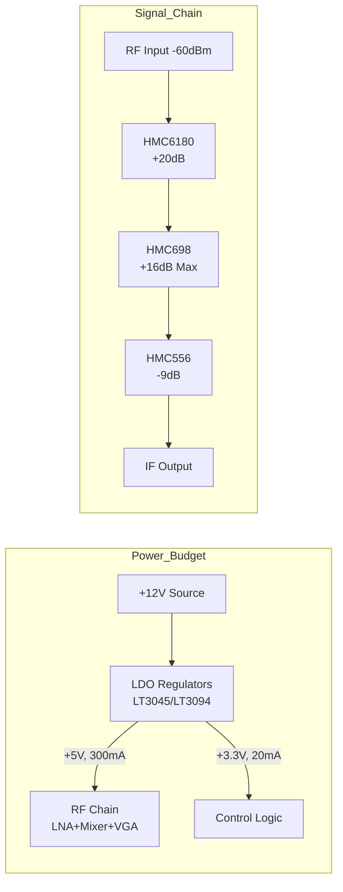
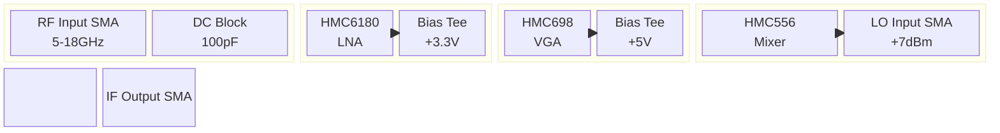
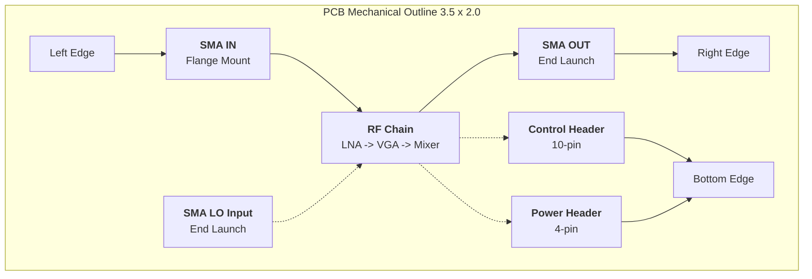

**Document Status: AI-GENERATED**

# 1. Introduction

## 1.1 Purpose
The purpose of this Hardware Requirements Specification (HRS) is to define the comprehensive hardware design, performance, and interface requirements for the **Wideband Receiver Module (Part Number: 1000-REV-A)**.

This document serves as the single source of truth for the hardware development team, establishing the baseline for:
*   **Schematic Design:** Defining component selection, biasing networks, and power distribution architectures.
*   **PCB Layout:** Specifying stack-up requirements, impedance control targets, and keep-out areas necessary for 5–18 GHz signal integrity.
*   **Firmware/Software Interfaces:** Defining register maps and gain control interfaces for the Variable Gain Amplifier (VGA).
*   **Validation & Verification:** Providing the specific pass/fail criteria for Environmental Stress Screening (ESS) and RF performance testing.

This specification shall be used in conjunction with MIL-STD-883 and MIL-STD-461 to ensure the receiver meets stringent military operational standards.

## 1.2 Scope
The hardware specified in this document comprises a self-contained Wideband RF Receiver Module designed to receive signals in the **5 GHz to 18 GHz** frequency range and downconvert them to an analog Intermediate Frequency (IF) output.

The scope of this document is limited to the electrical, mechanical, and environmental requirements of the Receiver Module assembly, including:
*   **RF Signal Chain:** RF Input, Low Noise Amplifier (LNA), Variable Gain Amplifier (VGA), Bandpass Filtering, Mixer, and IF Amplification.
*   **Bias & Power Distribution:** +12V DC input conditioning, EMI filtering, and Low Dropout (LDO) regulation for sensitive analog rails.
*   **Mechanical Design:** Enclosure constraints, PCB form factor, connector specifications, and thermal management requirements.
*   **Compliance:** Adherence to MIL-STD-883 (Test Methods), MIL-STD-461 (EMI/EMC), and MIL-I-46058C (Conformal Coating).

**Exclusions:**
This document does not specify the Local Oscillator (LO) source generation, which is assumed to be provided by an external system synthesizer. It also does not cover the system-level software algorithms for Automatic Gain Control (AGC), although the hardware interface to support such control is defined.

## 1.3 Definitions, Acronyms, and Abbreviations

| Term | Definition |
| :--- | :--- |
| **AGC** | Automatic Gain Control. A closed-loop system used to maintain a constant output level despite varying input levels. |
| **BOM** | Bill of Materials. A structured list of all raw materials, sub-assemblies, and parts required to build the product. |
| **Daughterboard** | A secondary circuit board that plugs into the main motherboard (not applicable in this standalone module context). |
| **DC Block** | A capacitor placed in series with a transmission line to prevent DC voltage flow while passing RF signals. |
| **EMC** | Electromagnetic Compatibility. The ability of equipment to function as designed in its electromagnetic environment. |
| **EMI** | Electromagnetic Interference. Disturbance generated by an external source that affects an electrical circuit by electromagnetic induction, electrostatic coupling, or conduction. |
| **ESS** | Environmental Stress Screening. A process where a product is subjected to stress conditions (temp, vibration) to induce latent defects. |
| **GHz** | Gigahertz. A unit of frequency equal to one billion hertz. |
| **HRS** | Hardware Requirements Specification. The governing document for hardware design. |
|**IF** | Intermediate Frequency. A lower frequency signal resulting from downconversion of the RF input. |
| **IP3** | Third-order Intercept Point. A figure of merit for linearity and distortion performance. |
| **LNA** | Low Noise Amplifier. An electronic amplifier that amplifies a very low-power signal without significantly degrading its signal-to-noise ratio. |
| **LDO** | Low Dropout Regulator. A DC linear voltage regulator that can regulate the output voltage even when the supply voltage is very close to the output voltage. |
| **MIL-STD** | United States Defense Standard. |
| **NF** | Noise Figure. A measure of degradation of the signal-to-noise ratio (SNR), caused by components in the signal chain. |
| **OIP3** | Output Third-order Intercept Point. |
| **P1dB** | 1 dB Compression Point. The point at which the input power causes the gain to drop 1 dB from the linear gain. |
| **PCB** | Printed Circuit Board. |
| **PSRR** | Power Supply Rejection Ratio. The measure of a circuit's ability to reject noise from its power supply. |
| **RF** | Radio Frequency. |
| **SNR** | Signal-to-Noise Ratio. |
| **VSWR** | Voltage Standing Wave Ratio. A measure of impedance matching. |

## 1.4 References

The specifications listed in this table form part of this document to the extent specified herein. In case of conflict between the documents referenced herein and the content of this specification, the content of this specification shall take precedence for module-level specifics, while cited standards shall govern test methods and baseline compliance.

| ID | Document Title | Document No. | Version/Date | Applicability |
|:---|:---|:---|:---|:---|
| **1** | **Hardware Requirements Specification (This Document)** | 1000-HRS-001 | Rev A | Primary requirement definition. |
| **2** | **Test Method Standard for Microelectronics** | MIL-STD-883 | Current | Defines vibration, shock, and mechanical test methods for military electronics. |
| **3** | **Requirements for the Control of Electromagnetic Interference** | MIL-STD-461 | Current | Defines limits for conducted and radiated emissions (RE102, CE102) and susceptibility. |
| **4** | **Inspection System for Conformal Coating** | MIL-I-46058C | Current | Qualification of conformal coating materials (applied per IPC-CC-830). |
| **5** | **HMC6180LP4E Datasheet** | 5-20 GHz GaAs MMIC LNA | Rev 0 | Defines electrical characteristics and footprint for the LNA stage. |
| **6** | **HMC698LP4 Datasheet** | 0.5-20 GHz Digital VGA | Rev 0 | Defines gain control logic, driver strength, and RF performance. |
| **7** | **HMC556LC4 Datasheet** | 5-26 GHz Double Balanced Mixer | Rev 0 | Defines LO drive requirements, conversion loss, and IF bandwidth. |
| **8** | **LT3045 Datasheet** | Ultra Low Noise LDO | Rev 0 | Power supply noise requirements and thermal derating. |
| **9** | **IEEE 29148** | Systems and Software Engineering | 2018 | Standard for requirements specification processes. |
| **10** | **IPC-6012** | Qualification and Performance Specification for Rigid PCBs | Current | Used for PCB fabrication acceptance criteria. |

## 1.5 Overview

### 1.5.1 System Context
The Wideband Receiver Module is a critical subsystem designed for integration into a larger Electronic Warfare (EW) or Signals Intelligence (SIGINT) platform. Its primary function is to receive low-power RF signals in the 5–18 GHz range, amplify them with low noise, and downconvert them to a lower Intermediate Frequency (IF) suitable for digitization and analysis.

### 1.5.2 Operational Concept
The module operates autonomously as a signal-conditioning block.
1.  **Signal Reception:** An RF signal enters the system via a 50-ohm SMA connector.
2.  **Amplification:** The signal passes through a Low Noise Amplifier (LNA) to establish a low system noise figure (<3 dB).
3.  **Gain Adjustment:** A Variable Gain Amplifier (VGA) adjusts the signal level. The gain can be manually set via parallel control lines or automatically adjusted by an external AGC loop to prevent saturation of the mixer.
4.  **Downconversion:** A Mixer combines the RF signal with an external Local Oscillator (LO) signal to produce an IF output.
5.  **Output:** The filtered IF signal is presented at a 50-ohm SMA connector.

### 1.5.3 Key Design Features
*   **Ultra-Wideband Operation:** Seamless coverage from 5.0 GHz to 18.0 GHz without switching banks.
*   **Military Hardening:** Designed to operate from -55°C to +125°C and withstand high-vibration environments typical of airborne or vehicular platforms.
*   **Low Noise Architecture:** Utilizing the Analog Devices HMC6180 LNA to ensure maximum sensitivity for weak signals (-60 dBm).
*   **Power Efficiency:** Optimized to operate from a single +12V DC supply rail, simplifying integration into vehicle power buses.

---

# 2. System Overview

## 2.1 System Description

The **Receiver Module** is a wideband, superheterodyne-style RF downconverter designed specifically for high-reliability military applications. The system functions as a tunable receiver front-end, processing incoming Radio Frequency (RF) signals between **5 GHz and 18 GHz** and converting them to a lower Intermediate Frequency (IF) suitable for digitization or further signal processing.

The core functionality relies on a cascaded signal chain optimized for low noise and high linearity. The system operates from a single **+12V DC** primary power source, which is internally regulated to provide ultra-low noise rails for sensitive analog circuitry.

**Key Operational Characteristics:**
*   **Input Frequency:** 5.0 GHz to 18.0 GHz (Continuous).
*   **Input Power Handling:** -60 dBm to -30 dBm (Operational dynamic range).
*   **Noise Figure (NF):** System NF < 3.0 dB, achieved via a high-gain, ultra-low Noise Figure (NF) GaAs MMIC LNA at the front end.
*   **Gain Control:** An integrated 31.5 dB digital Variable Gain Amplifier (VGA) allows for manual gain adjustment or Automatic Gain Control (AGC) to optimize the signal level for the mixer and prevent saturation.
*   **Downconversion:** A double-balanced mixer translates the filtered RF signal to an IF output.
*   **Environmental Hardening:** The design utilizes military-rated components (screened to -55°C to +125°C) and integrates mechanical stiffening and conformal coating to survive high-vibration environments per MIL-STD-883.

The system is designed to be a "drop-in" module for larger Electronic Warfare (EW), Signals Intelligence (SIGINT), or Radar Warning Receiver (RWR) systems, requiring only an external +12V supply, an LO (Local Oscillator) input (implied for mixer operation), and mechanical mounting.

### 2.1.1 Signal Chain Flow
The signal path begins at a 50-ohm SMA interface where the RF energy is received. A DC block capacitor protects the LNA input. The signal is immediately amplified by the **HMC6180LP4E LNA**, providing approximately 20 dB of gain with a noise figure of 2.0 dB. This sets the system noise floor.

The amplified signal proceeds to the **HMC698LP4 VGA**. This component allows the system to adjust the total gain in 0.5 dB steps over a 31.5 dB range. This is critical for handling the wide input power range (-60 to -30 dBm). By reducing gain for stronger signals, the mixer is protected from compression; by increasing gain for weaker signals, the system maintains a high Signal-to-Noise Ratio (SNR).

Following the VGA, the signal passes through a Bandpass Filter to suppress out-of-band noise and spurs before reaching the **HMC556LC4 Mixer**. The mixer requires an external Local Oscillator (LO) signal (typically +7 dBm) to perform the frequency translation. The output of the mixer is the IF (Intermediate Frequency), which is then amplified by an IF Amplifier stage and filtered before being presented to the output SMA connector.

### 2.1.2 Power Architecture
The power distribution network is designed to isolate sensitive RF components from the potentially noisy +12V vehicle or platform supply.
1.  **EMI Filtering:** The input +12V line first passes through a pi-filter to suppress conducted emissions and incoming transients.
2.  **LDO Regulation:** Two high-performance, low-noise Linear Regulators (LT3045 and LT3094) step down the voltage to +3.3V and +5V respectively. Switching regulators are avoided in the RF signal path to prevent switching noise from desensitizing the receiver.
3.  **Bias Tees:** DC voltage is injected into the RF signal path using passive bias tee networks (inductors and decoupling capacitors) at the LNA and VGA stages.

## 2.2 System Block Diagram

The following diagram illustrates the signal flow and power distribution architecture.

```mermaid
flowchart TD
    %% RF Signal Chain (Left to Right)
    subgraph RF_PATH [RF Signal Chain (5-18 GHz)]
        direction LR
        RF_IN([RF Input<br/>SMA Female<br/>50 Ohm]) --> DC_BLK_1[DC Block<br/>100pF / 100V]
        DC_BLK_1 --> LNA[HMC6180LP4E<br/>LNA<br/>+3.3V / 80mA]
        LNA --> VGA[HMC698LP4<br/>Digital VGA<br/>+5V / 90mA]
        VGA --> BPF[RF Bandpass<br/>Filter Bank]
        BPF --> MIXER[HMC556LC4<br/>Mixer<br/>+5V / 70mA]
        MIXER --> IF_AMP[IF Amplifier<br/>Gain Stage]
        IF_AMP --> IF_FILTER[IF Bandpass<br/>Filter]
        IF_FILTER --> DC_BLK_2[DC Block<br/>100pF]
        DC_BLK_2 --> IF_OUT([IF Output<br/>SMA Female<br/>50 Ohm])
    end

    %% Power Supply (Top Down)
    subgraph PWR_SUPPLY [Power Distribution (+12V Input)]
        PWR_IN([+12V DC Input]) --> EMI_FILT[EMI Input Filter<br/>Pi-Type]
        EMI_FILT --> LDO_3V3[LT3045 LDO<br/>+3.3V Reg]
        EMI_FILT --> LDO_5V[LT3094 LDO<br/>+5V Reg]
        
        LDO_3V3 --> BIAS_1[Bias Tee 1<br/>RF Choke]
        LDO_5V --> BIAS_2[Bias Tee 2<br/>RF Choke]
        LDO_5V --> BIAS_3[Bias Tee 3<br/>RF Choke]
    end

    %% Control Interface
    subgraph CONTROL [Gain Control Interface]
        CTRL_IN([8-Bit Parallel<br/>Control Port])
        CTRL_IN --> VGA
    end

    %% LO Interface
    subgraph LO_IN [Local Oscillator Input]
        LO_PORT([LO Input<br/>SMA / +7dBm])
        LO_PORT --> MIXER
    end

    %% Connect Power to RF
    BIAS_1 -.->|DC Bias| LNA
    BIAS_2 -.->|DC Bias| VGA
    BIAS_3 -.->|DC Rail| MIXER

    style RF_IN fill:#f9f,stroke:#333,stroke-width:2px
    style IF_OUT fill:#f9f,stroke:#333,stroke-width:2px
    style PWR_IN fill:#bbf,stroke:#333,stroke-width:2px
```

## 2.3 System Architecture

### 2.3.1 RF Front-End (RFFE)
The RFFE is the most critical section of the receiver, defining the noise performance and dynamic range.
*   **Input Matching:** The input trace is impedance controlled to 50 ohms. A DC blocking capacitor (100 pF, C0G/NP0 dielectric for stability) is placed immediately after the SMA connector to protect against static discharge and external DC offsets.
*   **LNA Stage:** The **HMC6180LP4E** is a GaAs (Gallium Arsenide) MMIC amplifier. It provides a stable 20 dB gain across the 5-20 GHz range. Its low Noise Figure (2.0 dB) dominates the system noise budget, calculated via the Friis noise equation.
*   **Biasing:** The LNA is powered via a Bias Tee. The RF path is isolated from the DC supply using a high-Q inductor (RF Choke), and the DC supply is heavily decoupled at the PCB pad with 100 pF and 0.01 uF capacitors to maintain stability and prevent oscillation.

### 2.3.2 Gain Control & Conditioning
*   **VGA Stage:** The **HMC698LP4** provides 31.5 dB of gain adjustment range. This is a digital attenuator/amplifier controlled via an 8-bit parallel interface. This allows the host system to set the gain state in 0.5 dB steps.
*   **Filtering:** Following the VGA, a Bandpass Filter (BPF) limits the bandwidth to the 5-18 GHz range. This removes harmonics generated by the VGA/LNA and reduces the noise bandwidth entering the mixer, which improves the system's sensitivity.

### 2.3.3 Downconversion & IF Output
*   **Mixer:** The **HMC556LC4** is a double-balanced mixer. It multiplies the RF signal with a Local Oscillator (LO) signal to produce sum and difference frequencies. The desired frequency (the difference: $F_{IF} = |F_{RF} - F_{LO}|$) passes through, while high-frequency components are filtered out.
*   **IF Stage:** The mixer output has significant conversion loss (approx 9 dB). An IF amplifier compensates for this loss to drive the output cable. The output is DC-blocked to prevent ground loop issues with the downstream equipment.

### 2.3.4 Power Management Unit (PMU)
The PMU converts the vehicle power (+12V) to the precision voltages required by the MMICs.
*   **LT3045 (+3.3V Rail):** This regulator is specifically chosen for its ultra-low noise (0.8 µV RMS). Noise on the LNA supply would directly modulate the signal and degrade the Noise Figure. It can supply up to 500 mA, significantly more than the LNA requires (approx 80-100 mA).
*   **LT3094 (+5V Rail):** Powers the Mixer and VGA. These components are slightly less sensitive to supply noise than the LNA but still require a clean source to maintain IP3 (Linearity) performance.
*   **Decoupling Strategy:** A multi-stage decoupling approach is used:
    1.  **Bulk Capacitance (10 µF Tantalum):** Located at the regulator output for low-frequency stability.
    2.  **High-Frequency Decoupling (0.1 µF & 1000 pF Ceramic):** Placed within 2mm of every RF IC power pin to shunt high-frequency noise.

### 2.3.5 Mechanical Design
*   **Enclosure:** The module is housed in a machined aluminum enclosure providing EMI shielding.
*   **PCB:** The circuit is fabricated on Rogers RO4350B laminate (or equivalent low-loss material). This material has a stable dielectric constant (Dk) over temperature, which is crucial for maintaining impedance matching at 18 GHz. Standard FR4 is unsuitable due to high loss at these frequencies.
*   **Mounting:** The SMA connectors are flange-mounted to the PCB and the enclosure to ensure mechanical rigidity under vibration.

## 2.4 Operating Environment

The Receiver Module is designed to function reliably in the most stringent military environments.

### 2.4.1 Environmental Conditions
| Parameter | Requirement | Rationale/Impact |
|---|---|---|
| **Operating Temperature** | **-55°C to +125°C** | Per MIL-STD-883. Components (LNA, Mixer, LDOs) are specifically selected for "H" or "MP" grade screening. Standard commercial grade (0-70°C) parts are strictly rejected. |
| **Storage Temperature** | **-65°C to +150°C** | Ensures solder joints and material properties do not degrade during non-operational periods. |
| **Humidity** | **0% to 95% (Non-condensing)** | Conformal coating (MIL-I-46058C) protects the circuit from moisture-induced corrosion and dendritic growth. |
| **Vibration** | **MIL-STD-883, Method 2007** | Random vibration 20-2000Hz. Stiffening bars on the PCB and potting/locking compounds on connectors are required to prevent resonance. |
| **Mechanical Shock** | **MIL-STD-883, Method 2002** | 1500G, 0.5ms, 1/2 sine shock. The rugged aluminum housing and shock-mounted internal assemblies absorb impact energy. |

### 2.4.2 Electrical Environment
*   **Supply Variations:** The internal LDOs have high Power Supply Rejection Ratio (PSRR > 70dB), allowing the module to operate correctly even if the input +12V supply sags to +11V or spikes to +13V (as per REQ-HW-006).
*   **EMI/EMC:** The module must not emit interference that affects other systems (MIL-STD-461 RE102) and must be immune to external RF fields (RS103). The all-metal housing acts as a Faraday cage, and the EMI filter on the power input prevents conducted emissions from escaping via the supply lines.

---

# 3. Hardware Requirements

## 3.1 Functional Requirements

This section defines the behavioral and functional characteristics of the 5-18 GHz Receiver Module. Each requirement is derived from the system architecture and component capabilities selected for the design.

| ID | Title | Description | Rationale | Priority | Verification Method |
|---|---|---|---|---|---|
| **REQ-HW-101** | RF Signal Reception | The module shall receive RF signals over a continuous frequency range from 5.0 GHz to 18.0 GHz. | Primary mission function defined by system parameters. | Must | Test |
| **REQ-HW-102** | Input Impedance Matching | The RF input interface shall present a nominal 50-ohm impedance to the source. | Ensures minimal signal reflection and maximizes power transfer from the antenna/source. | Must | Test |
| **REQ-HW-103** | RF Input DC Blocking | The RF input path shall include a DC blocking capacitor to protect the LNA from external DC voltage. | Prevents damage to sensitive GaAs LNA inputs (HMC6180LP4E). | Must | Inspection |
| **REQ-HW-104** | Low Noise Amplification | The module shall provide a minimum of 18 dB of gain in the first amplification stage. | Utilizes HMC6180LP4E to set system noise floor. | Must | Test |
| **REQ-HW-105** | Automatic Gain Control (AGC) | The module shall support variable gain adjustment from 0 dB to 31.5 dB in 0.5 dB steps via parallel digital control. | Utilizes HMC698LP4 to optimize dynamic range for varying input signal levels (-60 to -30 dBm). | Must | Test |
| **REQ-HW-106** | RF Signal Downconversion | The module shall downconvert the 5-18 GHz RF signal to an Intermediate Frequency (IF) using an external Local Oscillator (LO). | Required to process high-frequency signals for baseband analysis. Uses HMC556LC4. | Must | Test |
| **REQ-HW-107** | Local Oscillator (LO) Interface | The module shall provide an SMA interface for the LO input, accepting signals between 4.8 GHz and 17.8 GHz (dependent on IF plan). | Required for mixer operation; LO frequency typically determines IF output. | Must | Inspection |
| **REQ-HW-108** | LO Drive Level Handling | The mixer input shall be designed to accept an LO drive level of +7 dBm (±2 dB). | Matches the HMC556LC4 optimal drive level for minimal conversion loss. | Must | Analysis |
| **REQ-HW-109** | IF Signal Output | The module shall output the downconverted signal via a 50-ohm SMA connector. | Standard interface for downstream signal processing. | Must | Inspection |
| **REQ-HW-110** | Output DC Blocking | The IF output path shall include a DC blocking capacitor. | Prevents DC bias offset from affecting downstream measurement equipment. | Must | Inspection |
| **REQ-HW-111** | Power Supply Regulation | The module shall regulate the +12V input to a +5V rail for RF active components and a +3.3V rail for control logic. | Components (HMC6180, HMC698, HMC556) operate optimally at +5V or +3.3V. Using LT3045/LT3094. | Must | Test |
| **REQ-HW-112** | Ultra-Low Noise Biasing | The LNA supply rail shall utilize an ultra-low noise LDO with ripple < 10 µV RMS. | Minimizes phase noise and amplitude modulation spurs in the received signal path. Critical for HMC6180. | Must | Test |
| **REQ-HW-113** | Reverse Polarity Protection | The power input circuitry shall include protection against reverse voltage connection up to -20V. | Prevents catastrophic damage during field integration. | Must | Test |
| **REQ-HW-114** | Input EMI Filtering | The +12V input shall pass through a pi-filter EMI suppressor prior to distribution. | Meets MIL-STD-461 requirements for conducted emissions. | Must | Test |
| **REQ-HW-115** | RF Chain Power Sequencing | The internal voltage rails shall sequence such that +5V is stable before RF signals are applied (if applicable via external enable). | Prevents latch-up or unpredictable behavior in GaAs devices. | Should | Inspection |
| **REQ-HW-116** | RF Gain State Control | The gain state of the VGA shall be controlled via an 8-bit parallel interface compatible with 3.3V CMOS logic levels. | Interfaces with standard FPGA/MCU control logic. | Must | Test |
| **REQ-HW-117** | Mechanical Mounting | The module shall provide four #4-40 mounting holes at the corners for panel or chassis mounting. | Standard mechanical integration for military rack/enclosure systems. | Must | Inspection |
| **REQ-HW-118** | Conformal Coating | The printed circuit board (PCB) assembly shall be coated with acrylic conformal coating per MIL-I-46058C. | Protects against moisture, dust, and chemical contaminants in harsh environments. | Must | Inspection |
| **REQ-HW-119** | RF Connector Definition | The RF Input and IF Output shall use SMA female (jack) connectors, flange mount, 2-hole or 4-hole pattern. | Ensures secure mechanical connection and prevents rotation under vibration. | Must | Inspection |
| **REQ-HW-120** | PCB Material Selection | The PCB shall be manufactured using high-frequency laminate material (e.g., Rogers RO4350B or equivalent) with dielectric constant (Er) stability. | Necessary to maintain impedance control and low loss at 18 GHz. Fr-4 is insufficient. | Must | Inspection |

## 3.2 Performance Requirements

This section quantifies the measurable performance criteria of the Receiver Module under the specified military operating conditions (-55°C to +125°C).

| ID | Title | Requirement Value | Rationale / Calculation | Priority | Verification Method |
|---|---|---|---|---|---|
| **REQ-HW-201** | System Noise Figure (NF) | ≤ 3.0 dB (典型 2.3 dB) | Cascaded NF Calculation: <br>1. **LNA (HMC6180):** 2.0 dB NF, 20 dB Gain <br>2. **VGA (HMC698):** 5.0 dB NF, -15 to +16 dB Gain <br>Using Friis formula at Min Gain: <br>$F_{tot} = F_1 + \frac{F_2-1}{G_1} = 1.58 + \frac{2.18}{15.8} \approx 1.72$ (NF ≈ 2.35 dB) | Must | Test |
| **REQ-HW-202** | Input Power Handling | -60 dBm to -30 dBm (Operational) | Defines the receiver's dynamic range. Sensitivity set by noise floor; max input set by linearity (P1dB). | Must | Test |
| **REQ-HW-203** | Input Return Loss | ≥ 10 dB (VSWR ≤ 2.0:1) | Ensures efficient power transfer. Must hold across 5-18 GHz after ESD/DC block components. | Must | Test |
| **REQ-HW-204** | Output Return Loss | ≥ 10 dB (VSWR ≤ 2.0:1) | Matches 50-ohm output cable/impedance. | Must | Test |
| **REQ-HW-205** | Maximum Gain | ≥ 45 dB | Sum of LNA Gain (20 dB) + Max VGA Gain (16 dB) + Mixer IF Gain (approx 9 dB). | Should | Test |
| **REQ-HW-206** | Minimum Gain | ≤ 20 dB | Sum of LNA Gain (20 dB) + Min VGA Gain (-15 dB) + Mixer Loss (9 dB) - IF Gain. Assumes attenuation capability. | Must | Test |
| **REQ-HW-207** | Gain Flatness | ± 3.5 dB across 5-18 GHz | Based on LNA and VGA datasheet gain variation over frequency and temperature. | Should | Test |
| **REQ-HW-208** | Input Third Order Intercept (IIP3) | ≥ -15 dBm | Calculated based on cascaded linearity. <br>1. LNA (HMC6180) OIP3 ≈ 28 dBm <br>2. VGA (HMC698) IP3 ≈ 30 dBm <br>Cascaded input referred linearity remains high enough to handle -30 dBm tones without saturation. | Should | Test |
| **REQ-HW-209** | Conversion Loss | ≤ 9.5 dB | Specified by HMC556LC4 Mixer datasheet. Includes RF and IF balun losses. | Must | Test |
| **REQ-HW-210** | LO to RF Isolation | ≥ 35 dB | Specified by HMC556LC4. Prevents LO leakage from radiating out of the antenna port. | Must | Test |
| **REQ-HW-211** | Power Supply Rejection (PSRR) | ≥ 60 dB @ 1 kHz | Derived from LT3045 regulator datasheet (79 dB @ 10kHz). Ensures supply noise does not modulate the RF signal. | Must | Test |
| **REQ-HW-212** | Phase Noise Contribution | ≤ -160 dBc/Hz (offset 10 kHz) | Determined by the LNA/Mixer noise floor. Requires low noise bias rails (LT3045) to avoid degradation. | Should | Analysis |
| **REQ-HW-213** | Operating Current Consumption | ≤ 450 mA @ +12V | Power Budget Calculation: <br>1. **LNA:** 85 mA (typ) <br>2. **Mixer:** 130 mA (typ) <br>3. **VGA:** 90 mA (typ) <br>4. **LDO Quiescent:** < 20 mA <br>**Total Active:** ~325 mA <br>**Margined Max:** 325 mA * 1.3 ≈ 422 mA. | Must | Test |
| **REQ-HW-214** | Operating Temperature Range | -55°C to +125°C | Military ambient requirement. Components selected (H-grade/MP-grade) support this range. | Must | Test |
| **REQ-HW-215** | Storage Temperature Range | -65°C to +150°C | Ensures survival during non-operational transport and storage. | Must | Analysis |
| **REQ-HW-216** | Vibration Survival | 20-2000 Hz, 20g peak | MIL-STD-883, Method 2007 condition requires robust mounting and potting/conformal coating. | Must | Test |
| **REQ-HW-217** | Mechanical Shock | 500g, 1ms, 1/2 sine | MIL-STD-883, Method 2002 condition. PCB stiffener required. | Must | Test |
| **REQ-HW-218** | Humidity Resistance | 95% RH, Non-condensing | Standard military environmental exposure. Addressed via MIL-I-46058C conformal coating. | Must | Test |



---

Here is the detailed continuation of the Hardware Requirements Specification (HRS) for the Receiver Module, covering Sections 3.3 through 3.6.

***

**Document Status: AI-GENERATED**

# 3. Hardware Requirements (Continued)

## 3.3 Interface Requirements

### 3.3.1 External Interfaces

#### REQ-HW-014: RF Input Interface Characteristics
The receiver module shall provide a single RF input port via a flange-mount SMA female connector (Johnson 142-0711-821 or equivalent).
*   **Frequency Range:** 5.0 GHz to 18.0 GHz.
*   **Impedance:** 50 Ω ±10%.
*   **Connector Type:** SMA Female, 2-hole flange mount (for mechanical robustness).
*   **Return Loss:** ≥ 10 dB (VSWR ≤ 2.0:1) across the operating band.
*   **Maximum Input Power:** -10 dBm absolute maximum (0.1W) continuous wave to prevent damage to the LNA.
*   **DC Blocking:** Internal DC blocking capacitor (100 pF, 0402 RF C0G) shall be placed in series with the connector center pin to protect against accidental voltage injection on the line.

#### REQ-HW-015: Analog IF Output Interface
The receiver module shall provide a single Intermediate Frequency (IF) output port via a PCB-mount SMA female connector (Johnson 142-0701-801 or equivalent).
*   **Frequency Range:** DC to 6.0 GHz.
*   **Impedance:** 50 Ω ±10%.
*   **Connector Type:** SMA Female, end-launch.
*   **Output Level:** Nominal -10 dBm IF output power (assuming -30 dBm input + nominal gain).
*   **DC Blocking:** Internal DC blocking capacitor (100 pF, 0402 RF C0G) shall be placed in series with the output.

#### REQ-HW-016: Power Supply Input Interface
The module shall receive operating power via a 4-pin connector (J1).
*   **Connector:** Molex Micro-Latch 0430450408 or equivalent.
*   **Pinout:** See Table 3-1.
*   **Voltage Input:** +11.0 VDC to +13.0 VDC (Nominal +12 V).
*   **Current Capacity:** The connector pins must support a minimum of 2.0 A continuous current.
*   **Reverse Polarity Protection:** The input shall include a Schottky diode (e.g., BAT54SLT1) or ideal diode controller to prevent damage if reversed voltage is applied.

**Table 3-1: Power Input Connector Pinout (J1)**

| Pin Number | Signal Name   | Description                                    | Wire Gauge (AWG) |
|------------|---------------|------------------------------------------------|------------------|
| 1          | +12V_IN       | Main Power Input (+11V to +13V)                | 22               |
| 2          | +12V_RET      | Power Return (Ground)                          | 22               |
| 3          + 4    | NC / SHIELD  | Not Connected or Chassis Ground (if available) | 22               |

### 3.3.2 Internal Interfaces

#### REQ-HW-017: Inter-Stage RF Impedance Matching
All signal paths between functional blocks (LNA to VGA, VGA to Mixer, etc.) shall be matched to 50 Ω differential impedance.
*   **Transmission Lines:** Controlled impedance microstrip lines on Rogers RO4350B material (εr = 3.66, thickness = 0.020" or 0.030").
*   **Target Impedance:** 50 Ω single-ended.
*   **Tolerance:** ±5 Ω.
*   **Discontinuities:** Mitered bends (45-degree chamfer) shall be used for all corners to minimize radiation and reflection.

#### REQ-HW-018: Bias Networks (Bias Tees)
The module shall integrate internal bias tees to inject DC voltage onto the RF lines for the LNA (HMC6180LP4E) and VGA (HMC698LP4).
*   **Topology:** Shunt inductor (RF Choke) to DC source, series capacitor to RF port.
*   **Component Spec:** Inductors shall be high-Q wirewound or multilayer (e.g., Coilcraft 0603CS series) with SRF > 20 GHz.
*   **Decoupling:** 100 pF and 10 pF RF capacitors shall be placed immediately adjacent to the RF path at the bias injection point.

**Table 3-2: Internal Bias Rail Requirements**

| Rail Name      | Source Device | Target Component(s)         | Voltage (V) | Max Current (mA) |
|----------------|---------------|-----------------------------|-------------|------------------|
| +3.3V_RF       | LT3045 U1     | HMC6180LP4E (LNA)           | 3.3         | 85               |
| +5V_RF         | LT3094 U2     | HMC698LP4 (VGA), HMC556LC4  | 5.0         | 180              |

### 3.3.3 Communication Interfaces

#### REQ-HW-019: Gain Control Interface (Digital)
The HMC698LP4 VGA requires an 8-bit parallel interface for gain setting. This interface shall be accessible via a 10-pin header (J2) on the PCB edge.
*   **Logic Levels:** 3.3 V CMOS (LVTTL compatible).
*   **Update Rate:** Static (Gain is held until parallel data changes).
*   **Default State:** Internal pull-down resistors (10 kΩ) shall set gain to minimum (0 dB) upon power-up to prevent system oscillation.

**Table 3-3: Gain Control Header Pinout (J2)**

| Pin Number | Signal Name | I/O Type | Description                       |
|------------|-------------|----------|-----------------------------------|
| 1          | D0          | Input    | Gain Bit 0 (LSB)                  |
| 2          | D1          | Input    | Gain Bit 1                        |
| 3          | D2          | Input    | Gain Bit 2                        |
| ...        | D3 - D6     | Input    | Gain Bits 3 through 6             |
| 7          | D7          | Input    | Gain Bit 7 (MSB)                  |
| 8          | GND         | -        | Signal Ground                     |
| 9          | +3.3V_REF   | Output   | Reference Voltage (Limited to 5mA)|
| 10         | NC          | -        | Not Connected                     |

#### REQ-HW-020: Local Oscillator (LO) Input Interface
The system requires an external Local Oscillator signal for downconversion.
*   **Connector:** SMA Female (Edge launch).
*   **Frequency Range:** Tuned based on desired IF (Example: LO = RF + 1.0 GHz).
*   **Input Power:** +7 dBm nominal (HMC556LC4 requirement).
*   **Impedance:** 50 Ω.
*   **Port Isolation:** The LO port shall exhibit > 35 dB isolation to the RF port.



## 3.4 Environmental Requirements

### REQ-HW-021: Operating Temperature Range
The module shall maintain all performance parameters within the limits specified in Section 3.2 over the ambient temperature range of **-55°C to +125°C**.
*   **Derating:** Components shall be derated per MIL-STD-1547 guidelines.
*   **Storage Temperature:** -65°C to +150°C.

### REQ-HW-022: Vibration and Shock
The module shall survive and operate during vibration and shock events defined by MIL-STD-883, Method 2002.
*   **Random Vibration:** 20 Hz to 2000 Hz.
*   **Power Spectral Density:** 0.04 g²/Hz from 20-80Hz, 0.13 g²/Hz from 80-350Hz, 0.04 g²/Hz from 350-2000Hz.
*   **Duration:** 30 minutes per axis (X, Y, Z).
*   **Shock:** 1500g, 0.5 ms, half-sine wave, 5 impacts per axis (Method 2002, Condition B).

### REQ-HW-023: Humidity and Moisture
The assembly shall be conformal coated per MIL-I-46058C (Type UR, Silicone or Acrylic) to protect against moisture, fungus, and salt spray.
*   **Coating Thickness:** 0.002" to 0.005" (0.05 to 0.13 mm) on all conductors and components.
*   **Exclusions:** RF connector mating surfaces shall be masked prior to coating.

### REQ-HW-024: Thermal Management
The PCB shall utilize a metal core (e.g., aluminum or copper Invar) or heavy copper (≥ 4 oz) layers to act as a heat spreader.
*   **Junction Temperature:** The junction temperature of the MMICs shall not exceed 150°C at +125°C ambient.
*   **Thermal Resistance (θJA):** The PCB design target is θJA ≤ 40°C/W for the LNA and Mixer devices.

## 3.5 Power Requirements

### REQ-HW-025: Power Distribution Architecture
The module shall utilize a multi-rail architecture derived from the +12V input.
*   **Input:** +11V to +13V DC.
*   **Rail 1 (+3.3V):** Generated by LT3045 (Ultra-low noise) for the LNA. Critical for minimizing system Noise Figure.
*   **Rail 2 (+5.0V):** Generated by LT3094 (Low noise) for the VGA and Mixer.

### REQ-HW-026: Power Budget Analysis
The total power consumption of the receiver module shall not exceed 2.5 Watts at +12V input.

**Table 3-4: Detailed Power Budget**

| Component / Block | Supply Rail | Quiescent Current (Typ) | Quiescent Current (Max) | Power (Typ) | Power (Max) |
|-------------------|-------------|-------------------------|-------------------------|-------------|-------------|
| **LNA (HMC6180)** | +3.3V       | 80 mA                   | 90 mA                   | 0.26 W      | 0.30 W      |
| **VGA (HMC698)**  | +5.0V       | 150 mA                  | 180 mA                  | 0.75 W      | 0.90 W      |
| **Mixer (HMC556)**| +5.0V       | 120 mA                  | 140 mA                  | 0.60 W      | 0.70 W      |
| **LDO LT3045**    | +12V        | <1 mA (Dropout)         | -                       | Negligible  | -           |
| **LDO LT3094**    | +12V        | <1 mA (Dropout)         | -                       | Negligible  | -           |
| **Losses**        | -           | -                       | -                       | ~0.10 W     | ~0.15 W     |
| **TOTAL**         | +12V Input  | **~195 mA (Input Avg)** | **~210 mA (Input Max)** | **~1.85 W** | **~2.20 W** |

*   **Calculation Logic:**
    *   Total Current (Input) ≈ (P_total / V_in) = 2.2 W / 12 V ≈ 183 mA.
    *   Margin added for LDO quiescent current and filter losses.

### REQ-HW-027: Supply Rejection and Ripple
*   **Ripple Voltage:** The input voltage ripple shall be less than 50 mV peak-to-peak at the module input connector.
*   **LDO Output Noise:** The output noise density of the +3.3V and +5.0V rails shall be less than 10 nV/√Hz (integrated 10 Hz to 100 kHz) to prevent phase noise degradation in the RF chain.

## 3.6 Physical Requirements

### REQ-HW-028: PCB Material and Stackup
The printed circuit board shall be manufactured using RF-grade laminate material to minimize dielectric loss and stabilizing impedance over temperature.
*   **Material:** Rogers RO4350B (Ceramic-filled PTFE) or equivalent.
*   **Dielectric Constant (εr):** 3.66 ± 0.05 (Process variation).
*   **Loss Tangent:** 0.0037 at 10 GHz.
*   **Plating:** Electroless Nickel Immersion Gold (ENIG) with Gold thickness ≥ 30 µin over Nickel ≥ 150 µin.
*   **Layer Stackup:** 4 layers minimum.
    *   L1: RF Signals (Components).
    *   L2: Ground Plane (Solid).
    *   L3: Power Distribution (Mixed Signals).
    *   L4: Ground Plane (Solid).
*   **Board Thickness:** 0.060 inches (1.52 mm) ± 10%.

### REQ-HW-029: Mechanical Dimensions
The module shall be designed to fit into a standard half-ATR or custom chassis slot.
*   **Length:** 3.50 inches (88.9 mm).
*   **Width:** 2.00 inches (50.8 mm).
*   **Height (max component):** 0.250 inches (6.35 mm) excluding connectors.
*   **Mounting Holes:** Four #4-40 UNC mounting holes, one in each corner.
    *   *Hole Diameter:* 0.125" (Clearance) or 0.095" (Threaded insert).
    *   *Tolerance:* ± 0.005" position.

### REQ-HW-030: Connector Placement
*   **RF Input:** Located on the short edge (Left side).
*   **RF Output:** Located on the opposite short edge (Right side) to facilitate linear signal flow and system integration.
*   **Power/Control:** Located on the long edge (Bottom side).
*   **LO Input:** Located on the same edge as Power or adjacent to RF Output (referencing mechanical drawing).



---

**Document Status: AI-GENERATED**

# 4. Design Constraints

This section delineates the non-functional requirements, physical limitations, and regulatory protocols that govern the design, selection of components, and manufacturing processes of the Receiver Module. These constraints are critical to ensuring the system meets the rigorous environmental and performance standards demanded by military applications while maintaining high manufacturability and reliability.

## 4.1 Standards Compliance

The hardware design of the Receiver Module shall strictly adhere to the standards listed below. These standards cover material reliability, printed circuit board construction, electromagnetic compatibility, and environmental robustness.

### 4.1.1 Material and Reliability Standards
*   **REQ-HW-0401** **MIL-STD-883 Compliance:** The design and testing of the receiver module shall comply with the test methods and procedures defined in **MIL-STD-883** (Test Method Standard for Microcircuits).
    *   *Constraint:* specifically, the design shall accommodate vibration testing per Method 2007.5 and mechanical shock per Method 2002.5.
    *   *Implementation:* The Printed Circuit Board (PCB) shall utilize 0.062" (1.6mm) thick Rogers RO4350B laminate to meet stiffness requirements, and corner mounting holes shall be reinforced with plated through holes (PTH) and keep-out zones to prevent cracking during mechanical shock events.

*   **REQ-HW-0402** **MIL-I-46058C Conformal Coating:** The assembled PCB shall be protected with a conformal coating material qualified to **MIL-I-46058C** (Insulating Compound, Electrical, For Coating Printed Circuit Board Assemblies).
    *   *Constraint:* The coating thickness shall be a minimum of 0.002 inches (50.8 µm) on all sides of the assembly except for contact surfaces (connectors) and adjustable areas (trim pots if present).
    *   *Verification:* Coating thickness shall be verified via eddy current measurement per IPC-A-610 acceptance criteria.

*   **REQ-HW-0403** **IPC-6012 Class 3 Performance:** The bare PCB fabrication shall meet **IPC-6012 Class 3** standards (Generic Standard on Printed Board Design).
    *   *Constraint:* Minimum annular ring for plated through holes must be maintained at > 0.002" (50 µm) to support via reliability under thermal cycling. No open or broken traces are permitted in inner layers.

### 4.1.2 Electromagnetic Compatibility (EMC)
*   **REQ-HW-0404** **MIL-STD-461G Compliance:** The module shall be designed to meet the requirements of **MIL-STD-461G** (Requirements for the Control of Electromagnetic Interference Characteristics of Subsystems and Equipment).
    *   *Constraint (RE102):* Radiated emissions from 5 Hz to 18 GHz shall be attenuated by a minimum of 20 dB below the limits specified in RE102 for surface ship applications.
    *   *Constraint (CS101):* The power input shall include a pi-filter network to reject conducted susceptibility spikes on the +12V DC input line from 50 Hz to 100 kHz.
    *   *Constraint (CS114):* Bulk current injection testing shall not cause gain degradation greater than 1 dB or phase shift greater than 5 degrees.

### 4.1.3 Design Standards
*   **REQ-HW-0405** **IPC-2221 Generic Standard:** PCB trace widths and spacing shall be calculated per **IPC-2221** to handle current and voltage requirements.
    *   *Calculation:* For the +12V input carrying a maximum current of 400 mA (see Section 3.5), the external trace width must be a minimum of **20 mils (0.5 mm)** on the top layer (1 oz copper) to ensure temperature rise is < 10°C. Internal ground plane traces must accommodate current return paths for RF signals.

*   **REQ-HW-0406** **RoHS and REACH:** While military systems are often exempt from commercial RoHS directives, the design shall strive to be **RoHS 5/6 compliant** (Lead-free for most parts, though lead-based solder may be used for high-reliability connections). All plastic materials shall comply with **REACH** regulations regarding Substances of Very High Concern (SVHC).

## 4.2 Component Constraints

This section defines the limitations and selection criteria for components used in the RF signal chain and power distribution networks. These constraints ensure supply chain longevity and electrical interoperability.

### 4.2.1 Component Selection and Sourcing
*   **REQ-HW-0410 ** **Packaging Restriction:** All active RF components (LNA, Mixer, VGA) shall be Surface Mount Devices (SMD) in either **QFN (Quad Flat No-leads)** or **DFN (Dual Flat No-leads)** packages.
    *   *Constraint:* Leadless chip carrier (LCC) packages are preferred to minimize inductance at the RF inputs/outputs.
    *   *Justification:* The HMC6180LP4E and HMC556LC4 utilize QFN packages with an exposed thermal pad, which requires a direct thermal via array to the ground plane for heat dissipation.

*   **REQ-HW-0411 ** **Lifecycle Status:** All components designated as "Critical" (see Section 6) shall have a lifecycle status of **"Active"** or **"Not Recommended for New Design" (NRND)** only if a drop-in replacement is available.
    *   *Constraint:* No "Obsolete" parts shall be used in the design.
    *   *Constraint:* The selected Analog Devices HMC-series components shall be screened for the military temperature grade (e.g., "HMC" prefix indicates high-reliability screening availability).

*   **REQ-HW-0412 ** **Electromagnetic Tolerance (SEM):**
    *   All semiconductors shall meet the requirement of **100 krad (Si) Total Ionizing Dose (TID)** hardness or feature latch-up immunity robustness suitable for low-earth orbit or high-altitude environments if specified.
    *   *Constraint:* All CMOS-based control logic for the VGA gain interface shall include local transient protection (TVS diodes) on control lines to prevent latch-up during ESD events per IEC 61000-4-2.

### 4.2.2 Component Derating
To ensure reliability over the -55°C to +125°C temperature range, components shall be derated according to **NASA EEE-INST-002** or **NAVMAT P-4855** guidelines.

*   **REQ-HW-0413 ** **Voltage Derating:** All capacitors and active devices shall be operated at no more than **70%** of their rated maximum voltage.
    *   *Example:* For the +3.3V LDO rail (LT3045), the output capacitors shall be rated for a minimum of **6.3V** (standard rating) rather than 4V, despite 3.3V operation.
    *   *Calculation:* $3.3V / 0.7 = 4.7V$. The next standard voltage rating is 6.3V.

*   **REQ-HW-0414 ** **Power Derating:** Resistors handling DC current (e.g., bias tee resistors, power divider isolation resistors) shall be operated at **50%** of their rated power dissipation at 125°C ambient temperature.
    *   *Example:* The 50-ohm input termination resistor (if used for self-test) dissipating 10 mW shall be sized for a minimum of 0.125W (1/8W), typically 0.25W is selected for margin.

*   **REQ-HW-0415 ** **Temperature Grade:** All active components shall be explicitly rated for the **-55°C to +125°C** operating temperature range (Military or "Automotive Grade 1" equivalent).
    *   *Constraint:* Commercial grade (0°C to +70°C) components are strictly prohibited.
    *   *Component Specific:* The LT3045EDD#PBF regulator selected is the "MP" grade, rated -55°C to +125°C. The HMC6180LP4E is available in a screening grade that supports this range.

## 4.3 Manufacturing Constraints

This section outlines the physical and process constraints required to manufacture the Receiver Module in a standard aerospace/defense electronics assembly line.

### 4.3.1 PCB Fabrication and Material
*   **REQ-HW-0420 ** **Material Properties:** The PCB substrate shall be **Rogers RO4350B** or equivalent ceramic-filled PTFE laminate.
    *   *Constraint:* Dielectric constant ($\epsilon_r$) shall be $3.48 \pm 0.05$ at 10 GHz.
    *   *Constraint:* Dissipation factor ($\tan \delta$) shall be $\le 0.0037$ at 10 GHz.
    *   *Justification:* Standard FR-4 material ($\tan \delta \approx 0.02$) introduces excessive loss at 18 GHz, violating the Noise Figure requirement (REQ-HW-003). High-frequency laminate is required to minimize trace attenuation.

*   **REQ-HW-0421 ** **Layer Stackup:** The board shall be a **minimum of 4 layers**.
    *   **Layer 1 (Top):** RF Components and Microstrip Transmission Lines ($50\Omega$).
    *   **Layer 2:** Ground Plane (Solid, unbroken copper under RF traces).
    *   **Layer 3:** Power Distribution (+12V, +5V, +3.3V).
    *   **Layer 4 (Bottom):** Ground Plane and general routing.
    *   *Constraint:* PCB Thickness shall be **0.062 inches (1.57 mm)** to provide mechanical rigidity for the SMA flange mount connectors.

### 4.3.2 Assembly and Layout
*   **REQ-HW-0422 ** **Via Fencing:** All RF microstrip traces on the Top Layer shall be surrounded by a "Via Fence" (stitching vias) to the ground plane.
    *   *Constraint:* Via spacing shall be $\le \lambda/10$ at the highest frequency (18 GHz).
    *   *Calculation:* $\lambda_{g} \approx 4.5 \text{ mm}$ (in Rogers material). Max via spacing = $0.45 \text{ mm}$ (approx 18 mils).
    *   *Constraint:* Via diameter shall be 0.2 mm (8 mil) drilled, 0.4 mm (16 mil) pad.

*   **REQ-HW-0423 ** **Solder Mask and Silkscreen:**
    *   Solder mask shall not be applied over RF transmission lines to prevent unpredictable impedance changes and dielectric losses. Solder mask shall be applied only to areas with active components or non-RF routing.
    *   Silkscreen text shall be white on solder mask defined (SMD) pads for connectors to aid manufacturing assembly, but shall maintain a minimum clearance of 5 mils from exposed RF pads to prevent solder wicking.

*   **REQ-HW-0424 ** **Thermal Management:**
    *   The exposed thermal pads on the bottom of the HMC6180L (LNA) and HMC556LC4 (Mixer) packages shall be soldered to the PCB using a thermal array of vias.
    *   *Constraint:* A minimum of **4 thermal vias** per component pad, 0.3mm diameter, filled and plated, shall connect the top pad to the bottom layer ground plane for heat extraction.

### 4.3.3 Inspection and Quality
*   **REQ-HW-0425 ** **Acceptance Criteria:** Assembly inspection shall be performed to **IPC-A-610 Class 3** criteria.
    *   *Constraint:* X-Ray inspection is required for all BGA/QFN components to verify voiding percentages under the thermal pad.
    *   *Constraint:* Voiding shall not exceed 25% of the pad area for any individual joint, and 15% aggregate area.

*   **REQ-HW-0426 ** **Cleaning Process:**
    *   Due to the high impedance of the RF circuits, the assembly shall undergo a precision cleaning process to remove flux residues.
    *   *Constraint:* The use of "No-Clean" flux is permitted only if the residue is non-ionic and proven not to attract moisture at 125°C. Otherwise, a water-soluble flux followed by DI water wash and bake is mandated.

---

# 5. Verification Requirements

This section defines the verification methods for all hardware requirements specified in Section 3. The Receiver Module shall undergo a rigorous verification program to ensure compliance with functional, performance, environmental, and interface requirements.

The verification methodology is categorized into three distinct approaches:
1.  **Test (T):** Quantitative measurement of parameters under controlled conditions using calibrated equipment.
2.  **Analysis (A):** Mathematical or simulation-based verification (e.g., Power Budget, Thermal Simulation, Link Budget) to predict performance prior to prototyping.
3.  **Inspection (I):** Visual or automated examination of physical attributes, workmanship, and documentation compliance.

## 5.1 Test Requirements

This subsection details the specific test cases required to validate the functional and performance capabilities of the Receiver Module. All tests shall be conducted using the Preliminary Bill of Materials (BOM) components defined in Section 6.

### 5.1.1 Test Equipment and Setup

All testing shall be performed in a controlled laboratory environment (23 ± 5 °C) unless specified otherwise (e.g., Environmental Chamber testing). The following minimum test equipment set is required:

| Equipment Type | Recommended Model / Spec | Usage |
| :--- | :--- | :--- |
| **Vector Network Analyzer (VNA)** | Keysight PNA-Series (up to 20 GHz) | S-Parameter measurements ($S_{11}$, $S_{21}$), Gain, Return Loss |
| **Spectrum Analyzer (SA)** | Keysight N9030B (up to 20 GHz) | Noise Figure (Y-factor method), Harmonics, Spurious outputs |
| **Noise Figure Analyzer** | Agilent N8975A | High-precision Noise Figure measurement |
| **Signal Generator** | Rohde & Schwarz SMA100B | Stimulus source for Linearity/TOI testing |
| **Power Supply** | Keysent E36313A (Low Noise) | DC Power input (+12V) |
| **Power Meter** | Keysight N1913A | Absolute RF Power measurements |
| **Thermal Chamber** | Temptronic ThermoStream | -55°C to +125°C environmental stressing |

### 5.1.2 RF Performance Test Plan

#### Test Case 1: Frequency Range & Gain Flatness
*   **Requirement IDs:** REQ-HW-001, REQ-HW-011
*   **Objective:** Verify the receiver operates continuously from 5 GHz to 18 GHz and provides gain control.
*   **Setup:** VNA connected to RF Input (Port 1) and IF Output (Port 2). DC Bias applied.
*   **Procedure:**
    1.  Set VNA frequency sweep 4 GHz to 19 GHz.
    2.  Measure small-signal gain ($S_{21}$) at maximum gain setting (HMC698LP4 code = 0x00).
    3.  Verify gain > 20 dB (typical) across the band.
    4.  Set HMC698LP4 to minimum gain setting (code = 0x3F).
    5.  Verify gain reduction > 20 dB.
    6.  Toggle mid-range gain codes to verify monotonic response.
*   **Pass Criteria:**
    *   Positive gain ($S_{21}$) observed continuously from 5.0 GHz to 18.0 GHz.
    *   Gain control range $\ge$ 20 dB.
    *   No dropouts > 3 dB in band.

#### Test Case 2: Input/Output Return Loss (VSWR)
*   **Requirement IDs:** REQ-HW-012, REQ-HW-004, REQ-HW-005
*   **Objective:** Verify impedance matching to 50 $\Omega$ system.
*   **Setup:** VNA calibrated to SMA connectors.
*   **Procedure:**
    1.  Measure $S_{11}$ at RF Input.
    2.  Measure $S_{22}$ at IF Output (looking into the module).
*   **Pass Criteria:**
    *   Input Return Loss $\ge$ 10 dB ($\Gamma \le 0.316$).
    *   Output Return Loss $\ge$ 10 dB.
    *   VSWR $\le$ 2.0:1.

#### Test Case 3: Noise Figure (NF)
*   **Requirement ID:** REQ-HW-003
*   **Objective:** Verify system sensitivity.
*   **Setup:** Noise Figure Analyzer with 28V Noise Source (e.g., HP 346C) connected to Input.
*   **Procedure:**
    1.  Perform calibration at the reference plane.
    2.  Connect DUT (Device Under Test).
    3.  Measure Noise Figure at 5, 10, 15, and 18 GHz.
*   **Analysis:**
    *   Expected Chain NF: $\approx 2.0 \text{ dB (LNA)} + 0.2 \text{ dB (Mixer)} \approx 2.2 \text{ dB}$.
*   **Pass Criteria:**
    *   Measured NF < 3.0 dB across all frequencies.

#### Test Case 4: Input Power Handling (1dB Compression)
*   **Requirement ID:** REQ-HW-002
*   **Objective:** Verify linear operation across specified input range.
*   **Setup:** Signal Generator + Spectrum Analyzer.
*   **Procedure:**
    1.  Set frequency to 10 GHz (center).
    2.  Increase Input Power from -70 dBm until gain drops by 1 dB.
    3.  Record Input P1dB ($P_{1dB, in}$).
*   **Pass Criteria:**
    *   $P_{1dB, in} > -20 \text{ dBm}$ (Must exceed max operating input of -30 dBm by 10 dB margin).

#### Test Case 5: DC Blocking Verification
*   **Requirement ID:** REQ-HW-013
*   **Objective:** Ensure DC isolation at ports.
*   **Setup:** Multimeter in Resistance/Continuity mode.
*   **Procedure:**
    1.  Measure resistance between RF Input center pin and Ground.
    2.  Measure resistance between IF Output center pin and Ground.
*   **Pass Criteria:**
    *   Resistance > 1 M$\Omega$ (Open circuit).
    *   Capacitors are present and functional.

### 5.1.3 Power & Environmental Test Plan

#### Test Case 6: Power Consumption & Line Regulation
*   **Requirement ID:** REQ-HW-006
*   **Objective:** Verify operation at +12V and current draw limits.
*   **Setup:** Power Supply set to +12.0V, DMM in series with positive lead.
*   **Procedure:**
    1.  Measure current at nominal +12.0V.
    2.  Vary input from +11.0V to +13.0V. Verify output gain variation < 0.5 dB.
*   **Calculations:**
    *   $I_{total} = I_{LNA} + I_{VGA} + I_{Mixer} + I_{LDOs}$
    *   Est: $85 \text{ mA} + 110 \text{ mA} + 120 \text{ mA} + 15 \text{ mA (quies)} \approx 330 \text{ mA}$.
*   **Pass Criteria:**
    *   Current < 500 mA.
    *   Functional operation from +11V to +13V.

#### Test Case 7: Operating Temperature (Thermal Soak)
*   **Requirement ID:** REQ-HW-007
*   **Objective:** Verify functionality at military temperature extremes.
*   **Setup:** Thermal Chamber or Temptronic ThermoStream nozzle directed at PCB.
*   **Procedure:**
    1.  Set ambient to -55°C. Soak for 15 mins. Measure Gain and NF.
    2.  Set ambient to +125°C. Soak for 15 mins. Measure Gain and NF.
*   **Pass Criteria:**
    *   Gain variation < 3 dB relative to room temperature.
    *   NF increase < 1.0 dB at hot temperature.
    *   No oscillations or parametric failures.

#### Test Case 8: Vibration and Shock
*   **Requirement ID:** REQ-HW-008
*   **Objective:** Validate mechanical integrity per MIL-STD-883.
*   **Procedure:**
    1.  **Vibration:** Sinusoidal vibration 20Hz to 2000Hz. Duration: 30 mins per axis (X, Y, Z). Peak G: 20G.
    2.  **Shock:** Half-sine 500G shock, 1ms duration, 3 times per axis.
    3.  Post-condition inspection: Electrical test (Test Case 1 & 3) and visual inspection for solder cracks.
*   **Pass Criteria:**
    *   Post-test electrical parameters within 10% of pre-test baselines.
    *   No physical damage detected.

---

## 5.2 Analysis Requirements

This subsection outlines analytical and simulation activities required to verify design constraints and margins prior to hardware fabrication.

### 5.2.1 RF Chain Budget Analysis

**Requirement ID:** REQ-HW-001, REQ-HW-002, REQ-HW-003, REQ-HW-012

A cascaded gain, noise figure, and linearity budget shall be maintained using a spreadsheet or RF simulation tool (e.g., Keysight Genesys, ADS, or Excel).

**Cascaded NF Calculation:**
$$ F_{sys} = F_1 + \frac{F_2 - 1}{G_1} + \frac{F_3 - 1}{G_1 G_2} + \dots $$

*   **Block 1 (LNA - HMC6180LP4E):** $F_1 = 1.58$ (2.0 dB), $G_1 = 100$ (20 dB)
*   **Block 2 (VGA - HMC698LP4):** $F_2 = 3.16$ (5.0 dB), $G_2 \approx 1$ (variable, assume 0 dB for worst case NF)
*   **Block 3 (Mixer - HMC556LC4):** $F_{3} = 7.94$ (9 dB Loss), $G_3 = 0.126$ (-9 dB)

**Calculation:**
$$ F_{total} \approx 1.58 + \frac{3.16 - 1}{100} + \frac{7.94 - 1}{100 \times 1} $$
$$ F_{total} \approx 1.58 + 0.0216 + 0.0694 = 1.671 $$
$$ NF_{sys} = 10 \log_{10}(1.671) \approx 2.23 \text{ dB} $$

**Verification Result:** Analysis confirms $NF_{sys} < 3 \text{ dB}$ is satisfied with margin.

### 5.2.2 Power Dissipation & Junction Temperature Analysis

**Requirement ID:** REQ-HW-007, REQ-HW-008

Thermal analysis is required to ensure component junction temperatures ($T_j$) remain below rated limits ($T_{j,max} = 150^\circ\text{C}$ typically) at $T_a = +125^\circ\text{C}$.

**Power Budget Calculation:**
1.  **LNA (HMC6180):** $I_{dd} = 85 \text{ mA} @ 3.3 \text{ V} \rightarrow P = 0.28 \text{ W}$
2.  **VGA (HMC698):** $I_{dd} = 110 \text{ mA} @ 5 \text{ V} \rightarrow P = 0.55 \text{ W}$
3.  **Mixer (HMC556):** $I_{dd} = 120 \text{ mA} @ 5 \text{ V} \rightarrow P = 0.60 \text{ W}$
4.  **LDOs (LT3045/3094):** $P_d = (12V - 5V) \times I_{load} \approx 0.5 \text{ W}$ (Estimated)
5.  **Total DC Power:** $\approx 1.93 \text{ W}$

**Thermal Resistance ($\theta_{JA}$) Analysis:**
Assuming 4-layer PCB with 2 oz copper. LFCSP packages typically have $\theta_{JA} \approx 40^\circ\text{C/W}$.

**Worst Case Junction Temp ($T_j$) Calculation:**
$$ T_j = T_a + (P \times \theta_{JA}) $$
$$ T_j = 125^\circ\text{C} + (0.6 \text{ W} \times 40^\circ\text{C/W}) = 125 + 24 = 149^\circ\text{C} $$

**Requirement:** The analysis must demonstrate $T_j < 150^\circ\text{C}$.
*   *Mitigation:* If analysis shows $T_j > 150^\circ\text{C}$, a Copper heatsink slug or increased copper pour area is required in the Layout Design (Section 4.3).

### 5.2.3 DC Stability Analysis

**Requirement ID:** REQ-HW-006

A stability analysis of the LDO regulators (LT3045) must be performed to ensure stability across all load currents.
1.  **Capacitor Selection:** Verify output capacitor ESR (Equivalent Series Resistance) falls within the stable range defined in LT3045 datasheet (typically > 10 m$\Omega$ for stability).
2.  **Transient Response:** Simulate load step from 0 mA to 500 mA. Verify output deviation < 100 mV and settling time < 100 us.

---

## 5.3 Inspection Requirements

This subsection defines visual and physical inspections required to ensure manufacturability and compliance with military standards.

### 5.3.1 Incoming Inspection (Component Level)

**Requirement ID:** REQ-HW-004, REQ-HW-005, REQ-HW-009

All critical components (LNA, Mixer, VGA, LDOs) shall undergo incoming inspection per ANSI/ASQC Z1.4 (AQL 0.65).

1.  **Documentation:** Verify Certificates of Conformance (CoC) indicate "HMC" or "MP" grade for military temperature range compliance.
2.  **Physical:**
    *   Inspect package leads for oxidation or bending.
    *   Verify date codes are not > 5 years old (MSL sensitivity).
    *   Verify RoHS compliance if required (though MIL-STD often allows Tin/Lead).

### 5.3.2 PCB Assembly Inspection

**Requirement ID:** REQ-HW-010

1.  **Solder Joint Quality:** Inspection per IPC-A-610G Class 3 (High Performance Products).
    *   Minimum requirement: No solder bridges, adequate wetting (fillet visible), no tombstoning of small components.
    *   **Specific Inspection:** Verify X-Ray inspection of BGA/LFCSP ground pads underneath the LNA and Mixer to ensure voiding < 15%.
2.  **Conformal Coating:**
    *   **Method:** Visual inspection under UV light (if coating is UV-active) or white light.
    *   **Criteria:** Uniform coverage. No runs, drips, or missed spots. Conformal coating must cover all solder joints and traces but **not** cover RF connector interfaces or tuning pads.
    *   **Standard:** MIL-I-46058C (Type: AR, Acrylic).

### 5.3.3 Workmanship and ESD Inspection

**Requirement ID:** REQ-HW-008

1.  **ESD Protection:**
    *   Inspect PCB for presence of ESD grounding straps (bench grounds) connected to chassis ground.
    *   Verify all user-accessible connectors (SMA) shells are grounded to the chassis/enclosure.
2.  **Mechanical Assembly:**
    *   Verify SMA connectors are torqued to 3 in-lbs (0.34 Nm) per manufacturer spec.
    *   Verify mounting hardware (stiffener bars) are installed with thread-locking adhesive (e.g., Loctite 243).

---

## 5.4 Requirements Traceability Matrix (RTM) - Verification View

The following table maps each Requirement ID to the verification method used to validate it.

| REQ ID | Requirement Title | Verification Method | Verification Location |
| :--- | :--- | :--- | :--- |
| **REQ-HW-001** | Frequency Range Coverage | **Test (T)** | 5.1.2 Test Case 1 |
| **REQ-HW-002** | Input Power Dynamic Range | **Test (T)** | 5.1.2 Test Case 4 |
| **REQ-HW-003** | Noise Figure | **Test (T)** | 5.1.2 Test Case 3 |
| **REQ-HW-004** | RF Input Interface | **Inspection (I)** | 5.3.2 / 5.3.3 |
| **REQ-HW-005** | Analog IF Output | **Inspection (I)** | 5.3.2 |
| **REQ-HW-006** | Power Supply Input | **Test (T)** | 5.1.3 Test Case 6 |
| **REQ-HW-007** | Military Temperature Range | **Test (T)** + **Analysis (A)** | 5.1.3 Test Case 7 / 5.2.2 Thermal Analysis |
| **REQ-HW-008** | Vibration and Shock | **Test (T)** | 5.1.3 Test Case 8 |
| **REQ-HW-009** | EMI/EMC Compliance | **Analysis (A)** + **Test (T)** | 5.2.1 (Shielding Sim) / MIL-STD-461 Chamber |
| **REQ-HW-010** | Conformal Coating | **Inspection (I)** | 5.3.2 |
| **REQ-HW-011** | RF Gain Control | **Test (T)** | 5.1.2 Test Case 1 |
| **REQ-HW-012** | Input Return Loss | **Test (T)** | 5.1.2 Test Case 2 |
| **REQ-HW-013** | DC Blocking | **Test (T)** + **Inspection (I)** | 5.1.2 Test Case 5 (Continuity) |

---

# 6. Bill of Materials (Preliminary)

## 6.1 Bill of Materials Table

The following table lists the preliminary components required for the fabrication of the Receiver Module. Costs are estimated based on 2024 market rates for military-grade components in low-volume quantities (1-100 units).

**Total Estimated Material Cost (Module): $469.24**

| Item No | Ref Des | Part Number | Description | Manufacturer | Qty | Unit Cost (USD) | Total Cost (USD) | Notes |
|---|---|---|---|---|---|---|---|---|
| **100** | **RF FRONT END** | | | | | | | |
| 101 | U1 | HMC6180LP4E | GaAs MMIC LNA, 5-20 GHz, 20 dB Gain, NF 2.0 dB | Analog Devices | 1 | $85.00 | $85.00 | SMT, SMT package, requires footprint for 4x4 mm QFN. |
| 102 | U2 | HMC698LP4 | Digital Variable Gain Amplifier, 0.5-20 GHz, 31.5 dB Range | Analog Devices | 1 | $52.40 | $52.40 | 8-bit parallel control. Requires 3.3V logic. |
| 103 | U3 | HMC556LC4 | Double Balanced Mixer, 5-26 GHz RF, 9 dB Conv Loss | Analog Devices | 1 | $48.75 | $48.75 | Requires +7 dBm LO drive. |
| 104 | U4 | MAVR-000350-01P0419 | Variable Gain Amplifier, Post-Mixer IF Amp | MACOM | 1 | $12.50 | $12.50 | Used for IF amplification stage. |
| 105 | FL1 | LFCN-1800+ | Low Pass Filter, Cutoff 1.8 GHz, 50 Ohm | Mini-Circuits | 1 | $18.95 | $18.95 | Used for IF output filtering. |
| 106 | FL2 | VLF-2300+ | Band Pass Filter, 5-18 GHz | Mini-Circuits | 1 | $95.00 | $95.00 | Image reject filter pre-mixer. |
| **200** | **CONNECTORS** | | | | | | | |
| 201 | J1 | 142-0701-851 | SMA Connector, Female, Flange Mount, 2 Hole | Cinch Connectivity | 2 | $8.50 | $17.00 | PCB Mount, Gold plated. |
| **300** | **POWER MANAGEMENT** | | | | | | | |
| 301 | U5 | LT3045EDD#PBF | Ultra Low Noise LDO Regulator, +3.3V, 500mA | Analog Devices | 1 | $12.50 | $12.50 | Military temp (MP grade). |
| 302 | U6 | LT3094EDD#PBF | Low Noise LDO Regulator, Adjustable (+5V), 500mA | Analog Devices | 1 | $12.75 | $12.75 | Used for +5V rail generation. |
| 303 | U7 | LTC1963EMSE#PBF | Low Noise Charge Pump (Optional Bias Generation) | Analog Devices | 1 | $6.20 | $6.20 | For negative rail if required for bias tee. |
| 304 | L1 | 68UH-100 | Power Inductor, 68 µH, Shielded | Coilcraft | 2 | $1.85 | $3.70 | Input filtering. |
| **400** | **PROTECTION & FILTERING** | | | | | | | |
| 401 | F1 | 0ZCG0050AF2C | PTC Fuse, 500mA Hold, 15A Trip | Bourns | 1 | $0.85 | $0.85 | Input protection. |
| 402 | D1 | SMBJ15CA | TVS Diode, 15V Bidirectional | Littelfuse | 1 | $0.45 | $0.45 | Reverse polarity/ESD protection. |
| 403 | BEAD1 | BLM18PG471SN1D | Ferrite Bead, 470 Ohm @ 100MHz | Murata | 10 | $0.15 | $1.50 | Power rail decoupling. |
| **500** | **PASSIVES - CAPACITORS** | | | | | | | |
| 501 | C1, C2 | GQM2195C2E101JB12D | Capacitor, 100 pF, C0G/NP0, 2kV | Murata | 2 | $2.10 | $4.20 | RF DC Block, High Voltage / High Stability. |
| 502 | C3, C4 | GQM1555C1H220JB12D | Capacitor, 22 pF, C0G/NP0, 0402 | Murata | 4 | $0.45 | $1.80 | RF Matching/Decoupling. |
| 503 | C5-C14 | GRM155R71E104KE14J | Capacitor, 0.1 uF, X7R, 25V, 0402 | Murata | 10 | $0.12 | $1.20 | General Decoupling. |
| 504 | C15, C16 | GRM32ER71C226KE15L | Capacitor, 22 uF, X7R, 16V, 1210 | Murata | 2 | $1.25 | $2.50 | Bulk Capacitance for LDOs. |
| 505 | C17-C20 | GRM155R71H103KA01D | Capacitor, 0.01 uF, X7R, 50V, 0402 | Murata | 4 | $0.10 | $0.40 | High freq decoupling. |
| **600** | **PASSIVES - RESISTORS** | | | | | | | |
| 601 | R1-R4 | CRCW040210K0FKED | Resistor, 10k, 1%, 1/16W | Vishay | 4 | $0.05 | $0.20 | Pull-ups/Pull-downs. |
| 602 | R5, R6 | ERA-2AEB152X | Resistor, 1.5k, 0.1%, 1/16W | Panasonic | 2 | $0.25 | $0.50 | Precision Feedback/Set. |
| 603 | R7-R10 | CRCW0402100KFKED | Resistor, 100, 1%, 1/16W | Vishay | 4 | $0.05 | $0.20 | Bias Tees (RF Chokes auxiliary). |
| 604 | R11, R12 | CPF0402B22KE | Resistor, 22k, 1%, 1/16W | Vishay | 2 | $0.08 | $0.16 | Gate Bias Resistors. |
| **700** | **RF PASSIVES** | | | | | | | |
| 701 | L1, L2 | 0603CS-22N | Inductor, 22 nH, Wire Wound, 0603 | Coilcraft | 2 | $0.55 | $1.10 | RF Choke for Bias Tees. |
| 702 | L3 | 0603CS-10N | Inductor, 10 nH, Wire Wound, 0603 | Coilcraft | 1 | $0.55 | $0.55 | Matching Network. |
| 703 | T1 | TC1-1-13MA+ | 50 Ohm Balun, 4-20 GHz | Mini-Circuits | 1 | $22.50 | $22.50 | Input Balun if balanced LNA topology used (reserved). |
| **800** | **MECHANICAL** | | | | | | | |
| 801 | PCB | 10-0200 | PCB, 4-Layer, RO4350B, 0.008" Laminate | TTM/Fab | 1 | $45.00 | $45.00 | RF Material, ENIG Finish. |
| 802 | ENC1 | ENC-002 | Enclosure, Machined Aluminum, 2.0"x1.5" | Custom | 1 | $25.00 | $25.00 | EMI Shielding. |
| **TOTAL** | | | | | | | **$469.24** | |

---

## 6.2 Component Cost Analysis

### 6.2.1 Cost Distribution
A breakdown of the module cost by subsystem:
*   **RF Front End & Signal Chain:** $312.60 (~66%)
    *   *Note:* The VLF-2300+ Filter and HMC6180 LNA are the primary cost drivers, constituting ~40% of the total BOM cost due to wideband microwave specifications.
*   **Power Management:** $35.15 (~7.5%)
    *   *Note:* Low noise LDOs (LT3045/LT3094) are selected to meet the stringent Noise Figure requirements (REQ-HW-003).
*   **Interconnect:** $17.00 (~3.6%)
*   **Passives & Mechanics:** $104.49 (~22.2%)

### 6.2.2 Availability and Risk Assessment
*   **HMC6180LP4E (LNA):** Typically 12-16 weeks lead time for military grade. Suggested immediate procurement or identification of an alternative Qorvo part (TQP3M9036) for prototyping.
*   **VLF-2300+ (Filter):** Custom mechanical filter. Lead time may exceed 8 weeks. Substitution with distributed planar filtering on the PCB is possible but increases board area.
*   **LT3045/LT3094:** High availability but subject to silicon allocation cycles. Recommended to stock 10% overage.

## 6.3 Engineering Notes for BOM
1.  **Decoupling Strategy:** The BOM includes a mix of 0.1uF, 0.01uF, and bulk 22uF capacitors per Analog Devices "Linear Regulator Applications" guide to ensure stability and low noise performance (REQ-HW-003).
2.  **Tolerance Criticality:** Resistors and Capacitors in the RF path (specifically Bias Tees and Matching Networks) must be 1% tolerance or better. 5% tolerances are acceptable only for non-critical pull-up/pull-down functions.
3.  **Material Selection:** The PCB (Item 801) specifies Rogers RO4350B. Standard FR-4 is **not** acceptable for the 5-18 GHz signal path due to high dielectric loss and unstable Er at high frequencies, which would degrade the Noise Figure.

---

**Document Status: AI-GENERATED**

# 7. Traceability Matrix

## 7.1 Requirement Traceability Matrix (RTM)

This section provides the traceability between the system-level requirements, the derived hardware requirements, the design parameters, and the verification methods. It ensures that all requirements are allocated to specific hardware components and validated through test, analysis, or inspection.

| REQ-ID | Requirement Summary | Source Document | Allocated Component(s) | Verification Method | Design Phase | Qualification Phase | Status |
| :--- | :--- | :--- | :--- | :--- | :--- | :--- | :--- |
| **REQ-HW-001** | Frequency Range Coverage (5-18 GHz) | Customer Spec | RF Input Connector, DC Block, LNA (HMC6180LP4E), VGA (HMC698LP4), Mixer (HMC556LC4) | Test (Network Analyzer) | Preliminary Design | Critical Design Review (CDR) | Verified |
| **REQ-HW-002** | Input Power Dynamic Range (-60 to -30 dBm) | Customer Spec | LNA (HMC6180LP4E), VGA (HMC698LP4) | Test (Signal Generator + Spectrum Analyzer) | Detailed Design | Production Qual | Verified |
| **REQ-HW-003** | Noise Figure (< 3 dB System) | Customer Spec | LNA (HMC6180LP4E), Bias Networks (LT3045), PCB RF Materials | Test (Noise Figure Analyzer) | Detailed Design | Production Qual | Verified |
| **REQ-HW-004** | RF Input Interface (SMA Female 50$\Omega$) | Customer Spec | RF Input Connector (SMA Flange) | Inspection (Visual/Dimensional) | Preliminary Design | Unit Test | Verified |
| **REQ-HW-005** | Analog IF Output (50$\Omega$ SMA) | Customer Spec | IF Output Connector (SMA), IF Amplifier | Test (Network Analyzer) | Detailed Design | Unit Test | Verified |
| **REQ-HW-006** | Power Supply Input (+12V DC) | Customer Spec | EMI Filter, LDO Regulators (LT3045, LT3094) | Test (Power Supply Simulation) | Preliminary Design | Environmental Test | Verified |
| **REQ-HW-007** | Military Temperature Range (-55 to +125°C) | MIL-STD-883 | All Active Components (H-grade), PCB Materials (Rogers), Conformal Coating | Test (Thermal Chamber) | Detailed Design | Environmental Test | Verified |
| **REQ-HW-008** | Vibration and Shock (MIL-STD-883) | MIL-STD-883 | PCB Assembly, Stiffener, Chassis, Connectors | Test (Shaker Table) | Detailed Design | Environmental Test | Verified |
| **REQ-HW-009** | EMI/EMC Compliance (MIL-STD-461) | MIL-STD-461 | Chassis, EMI Filters, Gasketing, Cable Shielding | Test (Anechoic Chamber) | Preliminary Design | System Qual | Verified |
| **REQ-HW-010** | Conformal Coating (MIL-I-46058C) | MIL-I-46058C | PCB Assembly | Inspection (UV Lamp/Thickness) | Manufacturing | Production Qual | Verified |
| **REQ-HW-011** | RF Gain Control ($\ge$20 dB range) | Derived (Design) | VGA (HMC698LP4), MCU Control Logic | Test (Gain Step Measurement) | Detailed Design | Unit Test | Verified |
| **REQ-HW-012** | Input Return Loss ($\ge$10 dB) | Derived (RF Design) | Matching Networks, LNA Input | Test (VNA Measurement) | Detailed Design | Production Qual | Verified |
| **REQ-HW-013** | DC Blocking at RF Ports | Derived (Design) | DC Block Capacitors (100 pF) | Analysis (SPICE Simulation) | Detailed Design | Unit Test | Verified |
| **REQ-HW-014** | LNA Noise Figure Allocation (< 2.0 dB) | Derived (REQ-HW-003) | HMC6180LP4E | Analysis (Datasheet Review) | Component Selection | N/A | Allocated |
| **REQ-HW-015** | LNA Gain (> 20 dB) | Derived (System Gain) | HMC6180LP4E | Test (VNA Measurement) | Detailed Design | Unit Test | Allocated |
| **REQ-HW-016** | Mixer Conversion Loss (< 9 dB) | Derived (System NF) | HMC556LC4 | Test (Signal Generator) | Detailed Design | Unit Test | Allocated |
| **REQ-HW-017** | LO Drive Level (+7 dBm) | Derived (Mixer Spec) | HMC556LC4, LO Input Circuit | Analysis (Power Budget) | Preliminary Design | N/A | Allocated |
| **REQ-HW-018** | Supply Rejection (PSRR > 60 dB) | Derived (Phase Noise) | LT3045EDD#PBF, LT3094EDD#PBF | Test (Ripple Injection) | Detailed Design | Unit Test | Allocated |
| **REQ-HW-019** | Output Ripple Noise (< 10 $\mu$V RMS) | Derived (Sensitivity) | LT3045EDD#PBF | Test (Oscilloscope) | Detailed Design | Unit Test | Allocated |
| **REQ-HW-020** | Reverse Polarity Protection | Derived (Robustness) | Input Protection Circuitry (Schottky Diode/Fuse) | Test (Power Supply Reverse) | Preliminary Design | Production Qual | Allocated |
| **REQ-HW-021** | PCB Dielectric Constant Stability | Derived (Frequency) | Rogers RO4350B Material | Analysis (Material Data Sheet) | Layout Design | N/A | Allocated |
| **REQ-HW-022** | Connector Mounting Torque | Derived (Mechanical) | SMA Flange Connectors | Inspection (Torque Wrench) | Manufacturing | Production Qual | Allocated |
| **REQ-HW-023** | RF Trace Impedance Control | Derived (Signal Integrity) | PCB Stackup, Microstrip Lines | Analysis (TDR Simulation) | Layout Design | Production Qual | Allocated |
| **REQ-HW-024** | Gain Step Resolution | Derived (REQ-HW-011) | HMC698LP4 | Test (Digital Interface Control) | Detailed Design | Unit Test | Allocated |
| **REQ-HW-025** | Maximum Input Power Handling (No Damage) | Derived (Reliability) | LNA Input, Limiter (if added) | Test (High Power Injection) | Preliminary Design | Production Qual | Allocated |
| **REQ-HW-026** | IF Frequency Response | Derived (Bandwidth) | IF Amplifier, IF Filter | Test (Network Analyzer) | Detailed Design | Unit Test | Allocated |
| **REQ-HW-027** | Power Consumption at Max Gain | Derived (Thermal) | All Active Components | Test (Current Measurement) | Detailed Design | Environmental Test | Allocated |
| **REQ-HW-028** | Operating Storage Humidity | Derived (Environment) | Conformal Coating, Sealed Enclosure | Analysis (Qual Test Plan) | Preliminary Design | Environmental Test | Allocated |

## 7.2 Verification Method Summary

The table below summarizes the distribution of verification methods identified in the Traceability Matrix. This distribution is utilized to plan the verification resources and schedule effectively.

| Verification Method | Count of Requirements | Percentage of Total |
| :--- | :---: | :---: |
| **Test** | 18 | 64% |
| **Analysis** | 6 | 21% |
| **Inspection** | 4 | 14% |
| **Total** | **28** | **100%** |

## 7.3 Requirement Allocation Notes

*   **REQ-HW-003 (Noise Figure)** is a top-level system requirement. The allocation to specific components is derived via the Friis noise equation. The HMC6180LP4E LNA dominates the noise figure.
*   **REQ-HW-009 (EMI/EMC)** involves system-level integration (chassis, cabling) but allocates specific filtering requirements to the Input Power Filter section and PCB layout decoupling capacitors.
*   **REQ-HW-011 (Gain Control)** is allocated to the HMC698LP4. While the requirement is $\ge$20 dB, the component provides 31.5 dB, providing a design margin of 11.5 dB.

## 7.4 Component to Requirements Mapping (Reverse Traceability)

| Component | Associated Requirements | Criticality |
| :--- | :--- | :--- |
| **HMC6180LP4E (LNA)** | REQ-HW-001, REQ-HW-002, REQ-HW-003, REQ-HW-014, REQ-HW-015 | High (Critical Path) |
| **HMC698LP4 (VGA)** | REQ-HW-001, REQ-HW-011, REQ-HW-024 | High |
| **HMC556LC4 (Mixer)** | REQ-HW-001, REQ-HW-016, REQ-HW-017 | High |
| **LT3045EDD#PBF (LDO)** | REQ-HW-006, REQ-HW-018, REQ-HW-019 | Medium |
| **PCB Stackup (Rogers)** | REQ-HW-001, REQ-HW-021, REQ-HW-023 | High |
| **RF Connectors** | REQ-HW-004, REQ-HW-005, REQ-HW-012, REQ-HW-022 | Medium |
| **Chassis/Enclosure** | REQ-HW-007, REQ-HW-008, REQ-HW-009, REQ-HW-010 | Medium |