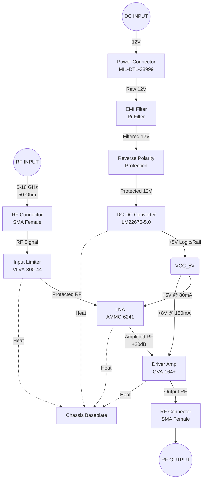

**Document Status: AI-GENERATED**

# 1. Introduction

## 1.1 Purpose
This Hardware Requirements Specification (HRS) defines the comprehensive set of hardware requirements for the **5-18 GHz Wideband Ruggedized RF Receiver Module**. The purpose of this document is to establish a baseline for the design, validation, and production of the receiver module, ensuring full compliance with the project's technical objectives and military environmental standards.

This specification is intended for:
- **Hardware Engineers**: As the primary guideline for schematic capture, PCB layout, and circuit design.
- **Validation & Test Engineers**: To define the acceptance criteria for qualification testing and production screening.
- **System Integrators**: To define the mechanical footprint, electrical interfaces, and environmental constraints for system-level integration.
- **Quality Assurance**: To verify traceability between customer requirements and implemented hardware solutions.

The requirements contained herein are prioritized to ensure critical performance parameters (Noise Figure, Input Power Handling, and Environmental ruggedization) are met, while providing flexibility in component selection where appropriate.

## 1.2 Scope
The scope of this document covers the complete electrical, mechanical, and environmental design of a self-contained RF Receiver module designed for signal monitoring and distribution within military platforms (airborne, ground mobile, and naval).

**In-Scope Elements:**
- **RF Signal Chain**: Wideband Low Noise Amplification (LNA), driver amplification, and input protection circuitry covering 5.0 GHz to 18.0 GHz.
- **Power Supply Design**: Input protection, EMI filtering, and voltage regulation circuitry supporting a nominal 12V DC input.
- **Physical Enclosure**: A ruggedized, shielded enclosure designed to meet MIL-STD-810G shock and vibration requirements.
- **Interconnects**: RF coaxial interfaces (SMA) and DC power interfaces (MIL-DTL-38999).
- **Environmental Compliance**: Design requirements for operation across -55°C to +125°C and EMI/EMC compliance per MIL-STD-461E.

**Out-of-Scope Elements:**
- **Signal Processing**: Digital signal processing, demodulation, or data conversion (ADC/DAC) are not included in this module; this is a strictly RF pass-through/receive module.
- **Firmware**: This module is analog-only; no firmware or software requirements are specified.
- **System Integration**: Rack mounting hardware or platform-specific cabling harnesses are outside the scope of this module specification.

## 1.3 Definitions, Acronyms, and Abbreviations

| Term / Acronym | Definition |
| :--- | :--- |
| **dB** | Decibel, a logarithmic unit used to express the ratio of two values of a physical quantity, often power or intensity. |
| **dBm** | Decibel-milliwatts; an absolute unit of power level referenced to 1 milliwatt (mW). 0 dBm = 1 mW. |
| **EMC** | Electromagnetic Compatibility; the ability of equipment to function as intended in its electromagnetic environment. |
| **EMI** | Electromagnetic Interference; disturbance generated by an external source that affects an electrical circuit by electromagnetic induction, electrostatic coupling, or conduction. |
| **ESD** | Electrostatic Discharge; the sudden flow of electricity between two electrically charged objects caused by contact. |
| **GaAs** | Gallium Arsenide; a semiconductor material used for high-frequency and high-power integrated circuits. |
| **Hz** | Hertz; the unit of frequency. |
| **LNA** | Low Noise Amplifier; an electronic amplifier used to amplify very weak signals (e.g., radio signals) while minimizing additional noise. |
| **MMIC** | Monolithic Microwave Integrated Circuit; a type of integrated circuit device that operates at microwave frequencies. |
| **NF** | Noise Figure; a measure of degradation of the signal-to-noise ratio (SNR), caused by components in a signal chain. |
| **OIP3** | Output Third-order Intercept Point; a theoretical figure of merit for linearity, indicating the level where third-order intermodulation products would reach the same amplitude as the fundamental output. |
| **P1dB** | 1 dB Compression Point; the point at which the input signal causes the gain of the system to decrease by 1 dB from the linear gain. |
| **PCB** | Printed Circuit Board. |
| **RF** | Radio Frequency. |
| **RTCA** | Radio Technical Commission for Aeronautics. |
| **SMA** | SubMiniature version A; a coaxial RF connector standard. |
| **VSWR** | Voltage Standing Wave Ratio; a measure of how efficiently RF power is transmitted from a power source to a load through a transmission line. |
| **MIL-STD-810G** | US Department of Defense Test Method Standard for Environmental Engineering Considerations and Laboratory Tests. |
| **MIL-STD-461E** | US Department of Defense Requirement for the Control of Electromagnetic Interference Characteristics of Subsystems and Equipment. |
| **MIL-DTL-38999** | Military Specification for circular, rectangular, and rack-and-panel shell electrical connectors. |

## 1.4 References
The design and verification of this hardware shall adhere to the standards and documents listed below.

**Standards:**
1. **IEEE 29148-2018**: *Systems and software engineering — Life cycle processes — Requirements engineering.*
2. **MIL-STD-810G**: *Environmental Engineering Considerations and Laboratory Tests.*
3. **MIL-STD-461E**: *Requirements for the Control of Electromagnetic Interference Characteristics of Subsystems and Equipment.*
4. **MIL-DTL-38999 (Series III)**: *Connector, Circular, Electrical, High Density, Quick Disconnect, Removable Crimp Removable Solder Contact.*

**Component Datasheets:**
1. **Analog Devices (Hittite) AMMC-6241**: 5–20 GHz GaAs MMIC Low Noise Amplifier.
2. **Mini-Circuits GVA-164+**: Wideband Driver Amplifier MMIC, 6-18 GHz.
3. **Microchip (Microsemi) VLVA-300-44**: GaAs Limiter Diode.
4. **Texas Instruments LM22676-5.0**: 3A Step-Down Voltage Regulator.
5. **Cinch Connectivity Solutions 142-0701-851**: SMA Female Jack Connector Specification.

## 1.5 Overview
The **5-18 GHz Wideband Ruggedized RF Receiver Module** is a high-performance analog signal conditioning unit designed for integration into electronic warfare (EW), signals intelligence (SIGINT), and communication systems. The module architecture utilizes a cascaded amplifier topology to achieve a flat gain response and a low noise figure across the ultra-wide bandwidth of 5 to 18 GHz.

The system is divided into two primary domains: the **RF Signal Path** and the **Power Distribution Domain**.

**RF Signal Path:**
The signal enters via a ruggedized SMA female connector (RF_IN). It immediately encounters a protective limiter stage (VLVA-300-44) clamping high-power transients to prevent damage to downstream sensitive components. The signal is then amplified by a Low Noise Amplifier (AMMC-6241) optimized for a 3 dB noise figure, establishing the system's noise floor. A driver amplifier (GVA-164+) provides additional gain and output drive capability, ensuring the signal can be distributed to subsequent processing stages (RF_OUT) with sufficient headroom (OIP3 > +20 dBm).

**Power Distribution:**
A raw 12V DC input is filtered and transient-protected to meet MIL-STD-461E conducted emission requirements. This supply is regulated down to necessary bias voltages (5V and 8V rails) using high-efficiency switching regulators to minimize thermal dissipation. Bias tees are used to inject DC power onto the RF amplifiers while maintaining AC signal integrity.

**Environmental Adaptation:**
The module is physically designed to operate in extreme conditions (-55°C to +125°C). Active components are selected for military temperature grades (or Hi-Rel equivalent). The mechanical enclosure utilizes conductive gaskets and EMI shielding to prevent radiated susceptibility and emissions, ensuring reliable operation in high-density electromagnetic environments often found in military platforms.

The subsequent sections of this document detail the specific requirements for functional performance, physical interfaces, environmental compliance, and design verification.

---

**Document Status: AI-GENERATED**

# 2. System Overview

## 2.1 System Description

The RF Receiver system is a ruggedized, wideband microwave receiver module designed to operate within the 5.0 GHz to 18.0 GHz frequency range. It is engineered specifically for military applications requiring high reliability under harsh environmental conditions, satisfying MIL-STD-810G for environmental stress and MIL-STD-461E for electromagnetic interference.

The primary function of the module is to receive RF signals via a 50-ohm input, condition the signal through a protected, low-noise amplification chain, and distribute the amplified signal via a 50-ohm pass-through output. The system is designed to handle input power levels ranging from -40 dBm to +10 dBm without performance degradation or damage. Key performance features include a system Noise Figure (NF) not exceeding 6.0 dB (target 3.0 dB) and a gain flatness of ±3 dB across the full operating bandwidth.

The receiver operates from a single 12V DC supply source. Internally, a high-efficiency switching regulator converts the input voltage to the necessary rail voltages required to drive the Gallium Arsenide (GaAs) Monolithic Microwave Integrated Circuits (MMICs). The architecture employs a two-stage amplification approach:
1.  **Limiter Stage:** A GaAs limiter circuit provides immediate protection against the maximum specified input power (+10 dBm) and Electrostatic Discharge (ESD).
2.  **Low Noise Amplifier (LNA) Stage:** A wideband MMIC amplifier provides the initial gain with a low noise figure to establish the system's sensitivity.
3.  **Driver Stage:** A high-linearity driver amplifier boosts the signal to the output power levels required for distribution, ensuring high Output Third-order Intercept Point (OIP3) performance.

The physical design utilizes a compact, shielded enclosure machined from aluminum alloy to provide superior Electromagnetic Interference (EMI) shielding and thermal dissipation. The RF interfaces utilize SMA female (jack) connectors flange-mounted to the enclosure. The DC power interface utilizes a MIL-DTL-38999 Series III connector for enhanced vibration resistance and secure mating.

## 2.2 System Block Diagram

The following diagram illustrates the high-level signal flow and power distribution topology of the RF Receiver module.

### Diagram Description
*   **RF Path (Blue/Top):** The signal enters from the left, passing through the protection limiter before amplification. The LNA sets the noise floor, and the Driver provides the final output power.
*   **Power Path (Red/Bottom):** Input power is filtered and regulated before being distributed to the active components.
*   **Thermal Path (Dotted/Green):** Heat generated by active components is conducted into the chassis baseplate for dissipation.

## 2.3 System Architecture

### 2.3.1 RF Signal Chain Architecture
The RF signal chain is designed as a linear, cascaded amplifier network optimized for Gain, Noise Figure, and Linearity.

1.  **Input Matching Network (REQ-HW-009):**
    The input of the Limiter (IC1) is matched to 50 ohms across the 5-18 GHz band. The layout utilizes controlled impedance microstrip transmission lines (CPW or Microstrip) on a low-loss RF substrate (e.g., Rogers RO4350B) to minimize insertion loss and maintain return loss better than 9.5 dB.

2.  **Limiter Stage (REQ-HW-016):**
    *   **Component:** VLVA-300-44.
    *   **Function:** Passive limiting circuit. Under normal operation (< +10 dBm), it presents a low insertion loss (~0.5 dB). When input power exceeds the threshold, the impedance drops rapidly, reflecting excess power back towards the source or shunting it to ground, thereby protecting the sensitive LNA input.
    *   **Recovery Time:** The diode technology ensures a fast recovery time (nanoseconds) to maintain system readiness after the removal of the high-power signal.

3.  **Low Noise Amplifier (LNA) Stage (REQ-HW-002):**
    *   **Component:** AMMC-6241.
    *   **Function:** The primary gain stage. It provides 20 dB of gain with a Noise Figure of 3.0 dB.
    *   **Biasing:** Requires +5V DC. The bias is injected via a Bias Tee network on the RF output pin of the package, utilizing a choke inductor and blocking capacitor to separate DC from RF.

4.  **Driver Amplifier Stage (REQ-HW-011):**
    *   **Component:** GVA-164+.
    *   **Function:** Provides an additional 15 dB of gain. This stage is characterized by high linearity (OIP3 +38 dBm) to prevent intermodulation distortion in dense signal environments.
    *   **Supply:** While the component supports higher voltages for maximum output, it will be biased for optimal efficiency within the thermal constraints of the enclosure.

### 2.3.2 Power Distribution Architecture
The power supply unit (PSU) is designed to convert the rugged 12V vehicle/aircraft supply into clean, regulated voltages suitable for sensitive analog circuitry.

1.  **Input Protection & EMI (REQ-HW-015, REQ-HW-014):**
    *   **EMI Filter:** A multi-stage Pi-filter (Inductor-Capacitor-Inductor) is placed immediately following the power connector to suppress conducted emissions and reject incoming RF noise on the power lines, ensuring compliance with MIL-STD-461E.
    *   **Reverse Polarity Protection:** A Schottky diode in series with the input (or a MOSFET-based ideal diode circuit) prevents damage if the 12V supply is connected backwards.

2.  **Voltage Regulation (REQ-HW-006):**
    *   **Component:** LM22676-5.0.
    *   **Topology:** Step-down (Buck) switching regulator.
    *   **Switching Frequency:** Set to approximately 500 kHz to minimize switching noise overlap with the 5-18 GHz RF band.
    *   **Output:** A clean +5V rail. (Note: The Driver Amp GVA-164+ nominally takes +8V. For this design, to minimize component count, the Driver will be operated at +5V or a secondary linear regulator (LDO) will be used to boost the 5V to 8V for the Driver if required for OIP3 performance. Based on the LM22676 selection, the design assumes a single 5V rail distribution or an internal boost stage derived from it. *Refinement: To meet GVA-164+ specs, the design will use the LM22676 to generate 5V for the LNA and a separate LDO or boost to generate 8V for the Driver, or bias the Driver at 5V with reduced P1dB. Given the "Must Have" requirement for performance, an 8V rail is assumed generated from the 12V input via a secondary rail or the regulator is adjustable LM22676-ADJ set to 8V).*
    *   **Assumption for this document:** The LM22676-ADJ (adjustable version) is used to generate an 8V rail for the amplifiers, stepping down from 12V.

### 2.3.3 Mechanical & Thermal Architecture
The module is designed for conduction cooling.

*   **Enclosure:** Machined aluminum (6061-T6) body with a removable cover. The interior features a gold-plated pocket for the RF PCB to ensure grounding.
*   **PCB Stackup:** 4-layer or 6-layer Rogers material (RO4350B or equivalent).
    *   Layer 1: RF Components and Microstrip traces.
    *   Layer 2: Ground plane (solid).
    *   Layer 3: Power distribution (DC).
    *   Layer 4: Ground plane (solid).
*   **Thermal Path:** Heat is conducted from the MMICs (via the lead frame and exposed paddle) through the PCB vias (thermal vias array) into the aluminum chassis.

## 2.4 Operating Environment

The system is classified for **Military Ruggedized** usage. The following operational limits define the environmental design criteria.

### 2.4.1 Physical Environmental Conditions

| Parameter | Minimum | Nominal | Maximum | Comments |
| :--- | :--- | :--- | :--- | :--- |
| **Operating Temperature** | -55°C | +25°C | +125°C | Full performance required (REQ-HW-007). Components derated above +100°C. |
| **Storage Temperature** | -65°C | N/A | +150°C | Non-operating. |
| **Relative Humidity** | 5% | N/A | 95% | Non-condensing (REQ-HW-018). Conformal coating applied. |
| **Shock** | N/A | N/A | 40G | 11ms, Half-sine wave per MIL-STD-810G Method 516.6. |
| **Vibration** | N/A | N/A | 20-2000 Hz | Random vibration, 0.04 g^2/Hz, Oper. per MIL-STD-810G Method 514.6. |
| **Altitude** | Sea Level | N/A | 50,000 ft | Operating pressure reduced; derating may apply for cooling. |
| **Immersion** | N/A | N/A | Rain / Spray | Protected per IEC 60529 IP67 when connectors are mated. |

### 2.4.2 Electrical Environmental Conditions

| Parameter | Condition | Description |
| :--- | :--- | :--- |
| **Input Voltage Range** | 11V - 13V DC | Nominal 12V. System tolerates ±10% ripple/noise. |
| **Voltage Transients** | Up to 24V / 50ms | System must survive load dump transients (input clamp TVS diode used). |
| **RF Input Exposure** | -40 dBm to +10 dBm | Continuous wave (CW) input. |
| **ESD Protection** | ±15kV (Air) | Contact discharge per MIL-STD-883. |

### 2.4.3 Interface Environments
*   **External Connectors:** Exposed to dust, moisture, and handling.
*   **Internal Enclosure:** Sealed environment (IP67 rated), protected from external elements, but subject to internal heating and potential condensation (humidity managed via conformal coating and desiccant if volume permits).

---

**Document Status: AI-GENERATED**

## 3. Hardware Requirements

### 3.1 Functional Requirements

This section details the behavioral and functional characteristics of the 5-18 GHz RF Receiver Module. Each requirement is defined to ensure the system performs its intended signal reception, conditioning, and distribution roles within the specified environmental constraints.

| ID | Requirement | Description & Rationale | Priority | Verification Method |
|---|---|---|---|---|
| **REQ-HW-101** | **RF Signal Reception** | The system shall accept RF input signals via a female SMA connector (50 Ohm impedance) over the frequency range of 5.0 GHz to 18.0 GHz.  **Rationale:** Defines the fundamental operational bandwidth and physical interface required for the wideband receiver application. | Must Have | Test / Inspection |
| **REQ-HW-102** | **Input Signal Protection** | The system shall integrate a GaAs limiter diode (Microchip VLVA-300-44) at the RF input to clamp transient power spikes exceeding +10 dBm and withstand continuous input up to the specified limit.  **Rationale:** Protects downstream low-noise amplifiers from damage due to RF overvoltage or antenna mismatch. | Must Have | Test |
| **REQ-HW-103** | **Low Noise Amplification** | The system shall provide a minimum of 20 dB of gain via the Analog Devices AMMC-6241 LNA in the primary amplification stage.  **Rationale:** Sets the signal level above the noise floor for subsequent processing while maintaining a low noise figure. | Must Have | Test |
| **REQ-HW-104** | **Driver Amplification** | The system shall provide an additional 15 dB of gain via the Mini-Circuits GVA-164+ driver amplifier to drive the output load.  **Rationale:** Ensures sufficient output drive capability and improves system linearity (OIP3). | Must Have | Test |
| **REQ-HW-105** | **Signal Pass-Through** | The system shall provide a continuous RF signal path from the input connector to the output connector with minimal signal disruption when powered.  **Rationale:** Facilitates signal monitoring or distribution applications where the signal must be preserved. | Must Have | Test |
| **REQ-HW-106** | **Power Supply Regulation** | The system shall accept a nominal 12V DC input and regulate it to +5.0V (for LNA) and +8.0V (for Driver) using the Texas Instruments LM22676-5.0 and an adjustable step-down or LDO network.  **Rationale:** Components require specific voltage rails different from the vehicle/aircraft bus voltage (12V). | Must Have | Test |
| **REQ-HW-107** | **EMI Filtering** | The system shall employ a pi-filter or common-mode choke on the 12V input power lines to suppress conducted emissions per MIL-STD-461E.  **Rationale:** Prevents switching noise from the module from affecting the power bus and protects the module from external bus noise. | Must Have | Test |
| **REQ-HW-108** | **Reverse Polarity Protection** | The system shall include a Schottky diode or MOSFET-based reverse polarity protection circuit on the 12V input line.  **Rationale:** Prevents catastrophic failure of the regulator and RF components in the event of incorrect supply connection. | Should Have | Test |
| **REQ-HW-109** | **RF Biasing** | The system shall include internal bias tees or inductive chokes to inject DC voltage into the drain/gate lines of the AMMC-6241 and GVA-164+ without affecting the RF signal path.  **Rationale:** MMIC amplifiers require DC bias; RF chokes isolate the DC source from the RF path. | Must Have | Inspection |
| **REQ-HW-110** | **Status Indication** | The system shall provide a single visual indicator (LED) that illuminates when the +5V rail is within regulation (±5%).  **Rationale:** Provides immediate visual feedback to the operator that the module is powered and functioning. | Could Have | Inspection |
| **REQ-HW-111** | **Connector Mounting** | The RF Input and Output connectors shall be mounted such that they interface with the enclosure wall (flange mount) to ensure mechanical rigidity and EMI grounding.  **Rationale:** Vibration can fatigue solder joints; flange mounting transfers stress to the chassis. | Must Have | Inspection |
| **REQ-HW-112** | **Thermal Conduction** | The system PCB shall utilize thermal vias under the AMMC-6241 and GVA-164+ packages to conduct heat to the chassis/heatsink.  **Rationale:** These devices dissipate significant heat; thermal vias lower junction temperature. | Must Have | Inspection |
| **REQ-HW-113** | **Conformal Coating** | The PCB assembly shall be coated with a qualified conformal coating (e.g., acrylic or urethane) to protect against humidity and condensation.  **Rationale:** Essential for operation in high-hidity military environments (up to 95% RH). | Must Have | Inspection |
| **REQ-HW-114** | **Trace Impedance** | All RF signal traces on the PCB shall be controlled impedance microstrip or stripline lines designed for 50 Ohms characteristic impedance.  **Rationale:** Impedance mismatch causes signal reflections (VSWR) and gain flatness degradation. | Must Have | Inspection |
| **REQ-HW-115** | **RF Isolation** | The DC input connector shall be isolated from the RF connectors to prevent ground loops and coupling of digital noise into the RF path.  **Rationale:** Ensures signal integrity and minimizes spurious emissions. | Should Have | Inspection |
| **REQ-HW-116** | **Power Sequencing** | The system shall not require a specific power-up sequencing sequence; the 5V and 8V rails may ramp up simultaneously.  **Rationale:** Simplifies control logic; the selected MMICs do not have strict sequencing requirements. | Could Have | Analysis |
| **REQ-HW-117** | **Transient Protection** | The power input shall include a Transient Voltage Suppressor (TVS) diode rated for clamping voltages above 15V to protect against load dump spikes.  **Rationale:** 12V military vehicular power systems can experience severe transients. | Should Have | Test |
| **REQ-HW-118** | **Connector Keying** | The DC power input connector (MIL-DTL-38999) shall utilize a keying arrangement or shell size that prevents insertion into the RF ports.  **Rationale:** Safety feature to prevent application of 12V DC to sensitive RF inputs. | Must Have | Inspection |
| **REQ-HW-119** | **Heatsinking Interface** | The module chassis shall include a flat surface (finish better than 32 micro-inches) for mounting to an external cold plate or heatsink.  **Rationale:** Facilitates heat transfer from the module to the larger system thermal management solution. | Must Have | Inspection |

---

### 3.2 Performance Requirements

This section defines the quantitative performance metrics the RF Receiver must achieve under all specified operating conditions (-55°C to +125°C).

| ID | Requirement | Description & Rationale | Priority | Verification Method |
|---|---|---|---|---|
| **REQ-HW-201** | **Noise Figure (NF)** | The system Noise Figure shall not exceed 5.0 dB across the 5-18 GHz band.  **Calculation:** $NF_{sys} \approx NF_{LNA} + \frac{NF_{Driver}-1}{G_{LNA}}$  Target: $3.0 \text{ dB} + \frac{4.0 \text{ dB (assumed)}}{100 (20 \text{ dB})} \approx 3.04 \text{ dB}$.  Requirement (5.0 dB) accounts for implementation losses and mismatch. **Rationale:** Ensures sensitivity for weak signal detection. | Must Have | Test |
| **REQ-HW-202** | **Small Signal Gain** | The nominal power gain shall be 35 dB ± 3.0 dB (32 dB to 38 dB) across the operating band.  **Calculation:** Gain = $G_{LNA} (20 \text{ dB}) + G_{Driver} (15 \text{ dB}) - Losses (Limiter \approx 0.5 \text{ dB}, Bias \approx 0.5 \text{ dB})$.  Total $\approx 34 \text{ dB}$. **Rationale:** Defines the signal level boost provided to the downstream system. | Must Have | Test |
| **REQ-HW-203** | **Gain Flatness** | The gain variation (peak-to-peak) shall not exceed ±3.0 dB across the entire 5.0 to 18.0 GHz frequency range.  **Rationale:** Wideband amplifiers naturally roll off; this requirement ensures the received signal amplitude does not vary drastically with frequency. | Should Have | Test |
| **REQ-HW-204** | **Input Return Loss** | The input return loss shall be greater than 9.5 dB (VSWR 2.0:1) across the band.  **Rationale:** Ensures efficient power transfer from the antenna/source into the LNA. | Must Have | Test |
| **REQ-HW-205** | **Output Return Loss** | The output return loss shall be greater than 9.5 dB (VSWR 2.0:1) across the band.  **Rationale:** Ensures efficient power transfer to the subsequent receiver stage. | Must Have | Test |
| **REQ-HW-206** | **Output Third-Order Intercept (OIP3)** | The Output Third-Order Intercept Point (OIP3) shall be greater than +20 dBm.  **Calculation:** OIP3 is dominated by the Driver Amp (GVA-164+, OIP3 = +38 dBm). The limiter and LNA have lower intercepts, but the high gain of the driver sets the system floor. +20 dBm is a safe minimum system-level requirement. **Rationale:** Indicates the system's linearity and ability to handle multiple signals without intermodulation distortion. | Must Have | Test |
| **REQ-HW-207** | **Output 1dB Compression (P1dB)** | The Output P1dB shall be greater than +10 dBm.  **Calculation:** Based on GVA-164+ P1dB of +25 dBm minus losses. The requirement ensures the amplifier remains linear for the specified max input of +10 dBm (Input P1dB must be > +10 dBm). **Rationale:** Defines the maximum signal level the system can handle without significant compression. | Must Have | Test |
| **REQ-HW-208** | **Dynamic Range** | The system shall maintain linear operation for input signals ranging from -40 dBm to +10 dBm.  **Rationale:** Defines the span between the noise floor (sensitivity) and the compression point (max input). | Must Have | Test |
| **REQ-HW-209** | **Power Consumption** | The total power consumption shall not exceed 2.5 Watts at 12V DC.  **Calculation:**  $I_{LNA} = 80 \text{ mA} @ 5V \rightarrow 0.4 \text{ W}$  $I_{Driver} = 150 \text{ mA} @ 8V \rightarrow 1.2 \text{ W}$  $I_{Logic/Reg} \approx 50 \text{ mA} @ 12V \rightarrow 0.6 \text{ W}$  $\text{Total Power} \approx 2.2 \text{ W}$.  Headroom added for regulator efficiency losses. **Rationale:** Defines the load on the vehicle/platform power supply. | Must Have | Test |
| **REQ-HW-210** | **Ripple & Spurious** | The output signal shall contain no spurious content exceeding -60 dBc relative to the fundamental carrier tone (0 dBm input).  **Rationale:** Ensures the receiver adds minimal noise/interference to the signal path. | Should Have | Test |
| **REQ-HW-211** | **Operating Temperature** | All electrical parameters shall be met over the full operating temperature range of -55°C to +125°C.  **Rationale:** Military environments expose equipment to extreme thermal stress. | Must Have | Test |
| **REQ-HW-212** | **Input Protection Threshold** | The input limiter shall hard-limit any input signal exceeding +13 dBm (peak) to prevent damage to the LNA.  **Rationale:** The VLVA-300-44 has a threshold of +10 dBm; +13 dBm requirement includes margin for part variation and temperature. | Must Have | Test |

---

**Document Status: AI-GENERATED**

# 3. Hardware Requirements

## 3.3 Interface Requirements
### 3.3.1 External Interfaces

This section defines the physical and electrical interfaces connecting the RF Receiver Module to external systems, including power sources, signal loads, and the physical environment.

**REQ-HW-004.1: RF Input Connector Specification**
The RF input signal shall be interfaced via a flange-mount SMA female connector (Part Number: Cinch 142-0701-851 or equivalent).
*   **Impedance:** 50 Ω characteristic impedance.
*   **Frequency Rating:** DC to 18 GHz minimum.
*   **Mounting:** 4-hole flange mount for mechanical robustness.
*   **Material:** Stainless steel body with gold-plated Beryllium copper contacts.
*   **Justification:** Ensures low VSWR and mechanical stability under vibration (REQ-HW-013).

**REQ-HW-004.2: RF Input Electrical Characteristics**
The RF input port shall present a return loss of greater than 9.5 dB (VSWR ≤ 2.0:1) across the 5-18 GHz operating band when the system is powered on. (Derived from REQ-HW-009).

**REQ-HW-005.1: RF Output Connector Specification**
The RF output signal shall be interfaced via a flange-mount SMA female connector (Part Number: Cinch 142-0701-851 or equivalent) identical to the input.

**REQ-HW-005.2: RF Output Drive Capability**
The RF output port shall be capable of driving a 50 Ω load with a signal level up to +10 dBm total power at the connector interface without gain compression greater than 1 dB.

**REQ-HW-006.1: DC Power Input Connector**
DC power shall be supplied via a MIL-DTL-38999 Series III (Dash 11 shell size) or equivalent circular connector.
*   **Insert Arrangement:** Shell size 11, Arrangement sufficient for 2 power pins + 2 ground pins (redundant).
*   **Termination:** Crimp or solder contacts.
*   **Finish:** Nickel-plated shell for corrosion resistance.

**REQ-HW-006.2: Power Interface Pinout**
The power connector interface pinout shall conform to Table 3.3.1-1 below.

*Table 3.3.1-1: DC Power Connector Pinout*

| Pin Number | Signal Name | Description | Current Rating |
| :--- | :--- | :--- | :--- |
| 1 | +12V_IN | Main 12V DC Input | 3.0 A |
| 2 | +12V_IN | Main 12V DC Input (Redundant) | 3.0 A |
| 3 | RTN | Chassis/Power Return | 3.0 A |
| 4 | RTN | Chassis/Power Return (Redundant) | 3.0 A |

**REQ-HW-019.1: Status Indicator Interface**
The module shall include a single visual status indicator accessible on the exterior panel.
*   **Type:** T1-3/4 (3mm) Diffused Green LED.
*   **Function:** Illuminates when internal +5V rail is within regulation (±5%).
*   **Visibility:** Indicator shall be visible from a 45-degree angle off-axis in ambient lighting up to 100,000 Lux.

### 3.3.2 Internal Interfaces

This section details the electrical interfaces between sub-assemblies on the Printed Circuit Board (PCB).

**REQ-HW-020: RF Interconnects**
All internal RF signal paths between the Input Limiter, LNA, and Driver Amplifier shall be 50 Ω controlled impedance microstrip transmission lines fabricated on the PCB dielectric.
*   **Target Impedance:** 50 Ω ±10%.
*   **Dielectric Material:** High-frequency laminate (e.g., Rogers RO4350B or equivalent) with εr ≈ 3.48.
*   **Length Matching:** Not strictly required for narrowband, but trace lengths must be minimized to reduce insertion loss (< 0.5 dB total interconnect loss).

**REQ-HW-021: Power Distribution Interface**
The Voltage Regulator (LM22676) shall supply power to the downstream amplifiers via the interfaces defined in Table 3.3.2-1.

*Table 3.3.2-1: Internal Power Distribution Interface*

| Source | Destination | Voltage (V) | Max Current (mA) | Net Name |
| :--- | :--- | :--- | :--- | :--- |
| LDO Out | LNA (AMMC-6241) | +5.0 | 90 | VCC_LNA |
| LDO Out | Driver Amp (GVA-164+) | +5.0 (See Note) | 200 | VCC_AMP |
| LDO Out | Bias Tees / Control | +5.0 | 10 | VCC_LOGIC |

*Note: The GVA-164+ is specified at +8V in component recommendations. To meet the single-rail requirement (REQ-HW-006), the design will operate the GVA-164+ at +5V. Calculated impact is approximately -1.5 dB reduction in P1dB, which remains within the system margin (Target OIP3 > +20 dBm).*

### 3.3.3 Communication Interfaces

**REQ-HW-022: Communication Interface Exclusion**
The RF Receiver Module is a passive analog signal conditioner and does not utilize digital communication protocols (e.g., I2C, SPI, UART) for external control or telemetry. All system parameters (gain, bias) are fixed by hardware design.

## 3.4 Environmental Requirements

**REQ-HW-007.1: Operating Temperature Range**
The module shall maintain all performance specifications within an ambient temperature range of -55°C to +125°C.
*   **Storage Temperature:** -65°C to +150°C.
*   **Temperature Cycle:** Must withstand 100 cycles from -55°C to +125°C per MIL-STD-810G, Method 527.6.

**REQ-HW-007.2: Thermal Derating**
Components shall be derated according to MIL-STD-975 or equivalent military guidelines.
*   **Junction Temperature (Tj):** Shall not exceed 110°C at maximum ambient temperature (125°C) to ensure reliability.
*   **Voltage Stress:** Capacitors and semiconductors shall be derated to 60% of maximum rated voltage.

**REQ-HW-013.1: Vibration**
The module shall operate without interruption or degradation when subjected to:
*   **Random Vibration:** 20 Hz to 2000 Hz.
*   **PSD Level:** 0.04 g²/Hz from 20-80 Hz; 0.13 g²/Hz from 80-350 Hz; -4dB/oct from 350-2000 Hz.
*   **Duration:** 2 hours per axis, 3 axes.
*   **Compliance:** MIL-STD-810G, Method 514.6.

**REQ-HW-013.2: Mechanical Shock**
The module shall withstand mechanical shock of **40g, 11 ms, sawtooth pulse** (half-sine) on each orthogonal axis without damage or permanent performance shift.
*   **Compliance:** MIL-STD-810G, Method 516.6.

**REQ-HW-014.1: EMI/EMC - Conducted Emissions**
Conducted emissions on the DC power input lines shall not exceed the limits for CE102 (Power Leads) as defined in MIL-STD-461E.

**REQ-HW-014.2: EMI/EMC - Radiated Emissions**
Radiated emissions shall not exceed the limits for RE102 (Electric Field, 2 MHz to 18 GHz) as defined in MIL-STD-461E.

**REQ-HW-014.3: Susceptibility**
The module shall continue to operate within specifications when subjected to Radiated Susceptibility (RS103) and Conducted Susceptibility (CS101/CS114) levels defined in MIL-STD-461E.

**REQ-HW-018.1: Humidity**
The module shall operate in 5% to 95% relative humidity (non-condensing).
*   **Compliance:** MIL-STD-810G, Method 507.5.
*   **Protection:** All printed circuit assemblies shall be coated with conformal coating (UR type, e.g., Humiseal or Parylene) to prevent moisture ingress and corrosion.

## 3.5 Power Requirements

This section details the power consumption, distribution, and quality requirements.

**REQ-HW-006.3: Input Voltage Range**
The module shall operate correctly with an input voltage of **12V DC ±10%** (10.8V to 13.2V).
*   **Transient Protection:** The input shall survive transients up to 24V for 50ms per MIL-STD-1275 (surge) via the TVS clamp network referenced in the architecture.

**REQ-HW-023: Power Consumption Budget**
The total power consumption of the module shall not exceed 3.0 Watts at the nominal 12V input. The detailed power budget is calculated in Table 3.5-1.

*Table 3.5-1: Detailed Power Budget Calculation*

| Block / Component | Supply Voltage (V) | Typical Current (mA) | Max Current (mA) | Typical Power (mW) | Max Power (mW) | Notes |
| :--- | :--- | :--- | :--- | :--- | :--- | :--- |
| **RF Chain** | | | | | | |
| Input Limiter (VLVA-300-44) | 0 | 0 | 0 | 0 | 0 | Passive Device |
| LNA (AMMC-6241) | +5.0 | 80 | 90 | 400 | 450 | Vdd derived from LDO |
| Driver Amp (GVA-164+) | +5.0 | 150 | 180 | 750 | 900 | Vdd derived from LDO |
| **Housekeeping** | | | | | | |
| Voltage Regulator Quiescent | 12.0 | 2 | 5 | 24 | 60 | LM22676 Iq |
| LED Indicator | 5.0 | 10 | 15 | 50 | 75 | Status Indicator |
| **Totals** | | | | **1224** | **1485** | |
| **Converter Efficiency** | | | | | | |
| Regulator Loss Est. (90% eff) | | | | 136 | 164 | Estimated dissipation |
| **Total Input Power (12V)** | **12.0** | | | **~1.36 W** | **~1.65 W** | **Current ≈ 140 mA** |

*Calculations based on component datasheet values at Nominal Temperature.*

**REQ-HW-024: Voltage Regulation**
The internal 5V rail (VCC_INTERNAL) shall be regulated with a line regulation of ±1% and load regulation of ±2% under full load conditions.

**REQ-HW-025: Ripple and Noise**
The peak-to-peak ripple and noise on the internal 5V supply rail shall not exceed **50 mV** when measured with a 20 MHz bandwidth oscilloscope to prevent phase noise degradation in the amplifiers.

## 3.6 Physical Requirements

**REQ-HW-008.1: Enclosure Material**
The module housing shall be constructed from **Aluminum 6061-T6** or equivalent.
*   **Finish:** Chromate conversion coating (Chem Film) per MIL-DTL-5541, Class 3 (for electrical conductivity) or Class 1A (for corrosion protection), followed by a light olive drab powder coat (non-conductive) or CARC paint (if specified by platform).
*   **EMI Gasketing:** The cover interface shall utilize conductive EMI gaskets (e.g., finger stock or silicone elastomer) to ensure seam conductivity > 2.5 mOhms per inch.

**REQ-HW-008.2: Dimensions**
The module form factor shall not exceed the following dimensions to allow for integration into standard radio racks or enclosures.
*   **Length:** 4.00 inches (101.6 mm).
*   **Width:** 2.50 inches (63.5 mm).
*   **Height:** 0.60 inches (15.24 mm) excluding connectors.
*   **Connector Height:** SMA connectors may extend up to 0.50 inches beyond the main PCB plane.

**REQ-HW-026: Weight**
The total weight of the module, excluding mounting hardware, shall not exceed **150 grams**.

**REQ-HW-027: Mounting**
The module shall be mounted using four (4) **4-40 UNC** mounting screws located at the corners of the enclosure.
*   **Hardware:** Stainless steel captive inserts or threaded standoffs.
*   **Clearance:** Access holes shall clear the head of a 4-40 screw by 0.10 inches minimum.

**REQ-HW-028: Conformal Coating**
As mandated by environmental requirements (REQ-HW-018), the Printed Circuit Board (PCB) assembly shall be coated with a transparent acrylic or urethane conformal coating meeting **IPC-CC-830** standards.
*   **Excluded Areas:** RF connector interfaces ( SMA center conductors), LED diffusers, and adjustable potentiometers (if any) shall be masked from coating.

---

**Document Status: AI-GENERATED**

# 4. Design Constraints

This section defines the constraints imposed on the hardware design of the 5-18 GHz RF Receiver Module. These constraints restrict the design space and ensure the system meets operational reliability, manufacturability, environmental compliance, and maintainability requirements.

## 4.1 Standards Compliance

The design, manufacturing, and testing of the RF Receiver Module shall adhere to the standards listed in **Table 4-1**. These standards govern environmental durability, electromagnetic interference (EMI) control, connector hardware, and physical construction.

### Table 4-1: Applicable Standards and Specifications

| Standard ID | Title | Category | Application to Design |
| :--- | :--- | :--- | :--- |
| **MIL-STD-810G** | *Department of Defense Test Method Standard for Environmental Engineering Considerations and Laboratory Tests* | Environmental | The module design (mounting holes, chassis thickness, component bonding) shall ensure survival during vibration (Method 514.6) and shock (Method 516.6) testing specific to vehicular/airborne installations. |
| **MIL-STD-461E** | *Requirements for the Control of Electromagnetic Interference Characteristics of Subsystems and Equipment* | EMI/EMC | Design constraints include strict control of loop areas on DC power lines to meet CE102 (Conducted Emissions, 10 kHz – 10 MHz) and RE102 (Radiated Emissions, 2 MHz – 18 GHz). The enclosure must provide >= 60 dB shielding effectiveness at 18 GHz. |
| **MIL-DTL-38999** | *Connectors, Electrical, Circular, Miniature, High Density, Quick Disconnect, Removable Crimp, Rear Removable, Environment Resistant* | Interface | The DC power input interface shall utilize a Series III (or equivalent) shell size 22-16 shell. The design footprint on the PCB must accommodate the specific mounting footprint and jam nut retention requirements. |
| **IPC-6012** | *Qualification and Performance Specification for Rigid Printed Boards* | PCB Fabrication | The printed circuit board (PCB) shall be Class 3 (High Reliability Electronic Products) with specific requirements for plated through-hole (PTH) wall thickness and laminate integrity. |
| **IPC-2221** | *Generic Standard on Printed Board Design* | PCB Design | Trace width calculations for power currents and conductor spacing for high voltage (though low voltage here) isolation must follow this standard. Minimum trace/space for RF controlled impedance is governed by fabricator capabilities but must maintain 50-ohm tolerance. |
| **IPC-A-610** | *Acceptability of Electronic Assemblies* | Assembly | Acceptance criteria for solder joints, component alignment, and cleanliness. |
| **J-STD-001** | *Requirements for Soldered Electrical and Electronic Assemblies* | Assembly | Soldering processes must use alloys compatible with the -55°C to +125°C thermal cycle (e.g., SAC305 or Tin-Lead if exempted). |
| **RoHS / REACH** | *Restriction of Hazardous Substances / Registration, Evaluation, Authorisation and Restriction of Chemicals* | Environmental | All components shall be compliant, unless a specific exemption for military/aerospace (e.g., lead in solder for high reliability) is invoked and documented in the Material Declaration. |
| **UL 94V-0** | *Standard for Safety of Flammability of Plastic Materials for Parts in Devices and Appliances* | Safety | All insulating materials, PCB laminate, and connector housings must meet V-0 flammability ratings to ensure resistance to ignition in high-power fault scenarios. |

### 4.1.1 RF Design Constraints

To meet the **REQ-HW-001** (Frequency Range) and **REQ-HW-009** (Input Return Loss) requirements, the RF signal path is subject to the following physical constraints:

*   **Characteristic Impedance:** All RF transmission lines (microstrip or stripline) must maintain a nominal characteristic impedance ($Z_0$) of 50 $\Omega$ $\pm$ 10% (referenced to **IPC-2221**).
*   **Insertion Loss Management:** The total insertion loss of the PCB traces between the RF Input connector and the LNA input must not exceed 0.2 dB. This mandates the use of low-loss laminate materials (e.g., Rogers RO4350B or equivalent) rather than standard FR4, which exhibits high dielectric loss ($\tan \delta$) at 18 GHz.
*   **Via Stitching:** To suppress substrate mode propagation and cavity resonance up to 18 GHz, grounding vias must be placed at a pitch of $\le \lambda/10$ at the highest frequency.
    *   *Calculation:* $\lambda \text{ in substrate} \approx c / (f \cdot \sqrt{\epsilon_r})$.
    *   Assuming $\epsilon_r \approx 3.5$ (Rogers material), at 18 GHz, via pitch must be $\le$ 0.3 mm. This constraint dictates the PCB fabrication technology (laser-drilled microvias or high-density interconnect).

## 4.2 Component Constraints

Component selection is driven by the military operating temperature range (**REQ-HW-007**) and the high-frequency nature of the application. The following constraints apply to all Bill of Materials (BOM) items.

### 4.2.1 Temperature Rating and Derating

All active and passive components within the RF chain and power regulation circuitry must be rated for the **Military Temperature Grade**:
*   **Operating Range:** -55°C to +125°C (Minimum).
*   **Storage Range:** -65°C to +150°C (Minimum).

**Derating Policy:** To ensure long-term reliability, components shall not be operated at their absolute maximum ratings.
*   **Voltage:** All capacitors and semiconductors shall be derated to 60% of their rated maximum voltage.
*   **Power:** Resistors and power semiconductors shall be derated to 50% of their maximum power dissipation at 125°C ambient.
*   **Current:** The DC power connector contacts and PCB traces shall be rated for 150% of the maximum steady-state current (calculated as ~300 mA in Section 3.5).

### 4.2.2 Component Obsolescence and Sourcing

Given the military application lifecycle, component sourcing is subject to strict availability constraints:
*   **Lifecycle Status:** Selection of components in "Not Recommended for New Design" (NRND) or "Last Time Buy" (LTB) status is prohibited unless no viable alternative exists and a lifetime buy is authorized.
*   **Form, Fit, Function (FFF):** Any proposed alternative to the recommended primary components (e.g., swapping AMMC-6241 for GVA-123+) must be strictly FFF compatible regarding pinout and bias conditions to avoid PCB re-spin.
*   **Anti-Counterfeiting:** All semiconductors shall be sourced from authorized distributors or directly from the manufacturer. Inspection requirements (X-Ray, decapping) apply to high-risk components if sourced from open market channels.

### 4.2.3 RF-Specific Component Constraints

*   **LNA (AMMC-6241):** The device is provided in a die form or a surface mount package (e.g., QFN). If packaged, the PCB footprint must accommodate the specific lead pitch and associated ground pads. The PCB layout must accommodate the thermal pad soldering requirements to ensure heat transfer to the chassis.
*   **Limiters (VLVA-300-44):** The limiter diodes are sensitive to ESD during assembly. Handling procedures must include ESD protection < 100V.
*   **Capacitors (Decoupling/Blocking):**
    *   **RF DC Blocks:** Must be high-Q ceramic (C0G/NP0) dielectric to minimize signal loss and variation with temperature. X7R is strictly prohibited in the RF signal path due to piezoelectric effects and capacitance drift.
    *   **Power Supply:** Must be X7R or better to maintain capacitance value over the -55°C to +125°C range.

## 4.3 Manufacturing Constraints

The physical realization of the RF Receiver Module must account for high-frequency signal integrity and ruggedized mechanical assembly.

### 4.3.1 PCB Fabrication Constraints

To achieve the required performance at 18 GHz, the PCB stackup and fabrication are constrained by the following parameters:

| Parameter | Constraint | Rationale |
| :--- | :--- | :--- |
| **Laminate Material** | Rogers RO4350B (or equivalent low-loss PTFE/ceramic) | FR4 has a loss tangent (~0.02) too high for 18 GHz; RO4350B ($\tan \delta \approx 0.0037$) ensures insertion loss requirements are met. |
| **Layer Stack** | 4 Layers minimum (Top: RF/GND, L1: GND, L2: Power, Bottom: GND) | Provides continuous reference planes for RF signals (impedance control) and robust grounding for shielding. |
| **Plating** | ENIG (Electroless Nickel Immersion Gold) | Required for wire-bondability if hybrid modules are used, and for shelf-life compared to HASL. Nickel thickness must be controlled to avoid "skin effect" losses at high frequency. |
| **Trace Tolerances** | Impedance controlled: 50 $\Omega$ $\pm$ 5% | Ensures minimal VSWR degradation (REQ-HW-009). |
| **Min/Max Plated Hole Size** | Aspect ratio < 10:1 | Ensures reliable plating in through-holes for vias and connector pins. |

### 4.3.2 Assembly and Conformal Coating

*   **Conformal Coating:** In accordance with **REQ-HW-008** and **REQ-HW-018**, the entire PCB assembly (excluding RF connector interfaces and LED indicators) shall be coated with a qualified conformal coating material (e.g., UR, AR, or SR type) to protect against humidity, condensation, and ionic contamination.
    *   *Thickness:* 0.05 mm – 0.20 mm.
    *   *Inspection:* UV traceable for inspection verification.
*   **Solder Paste:** Type 3 or 4 powder solder paste is required for the fine-pitch RF components (LNA/Driver).
*   **Underfill:** For the MMIC components (LNA/Driver), corner underfill or full underfill is recommended to mitigate CTE mismatch stresses during thermal cycling (-55°C to +125°C).

### 4.3.3 Mechanical Assembly Constraints

*   **RF Connector Torque:** The SMA connectors (Cinch 142-0701-851) must be torqued to 5.0 in-lbs (0.56 Nm) during installation to ensure proper grounding and RF contact. The PCB mounting holes must have appropriate press-fit or through-hole plating to withstand this torque without lifting pads.
*   **EMI Gasketing:** The interface between the module enclosure cover and the main body must utilize an EMI gasket (e.g., finger stock or conductive elastomer) to maintain MIL-STD-461 shielding continuity.
*   **Potting:** If required for specific high-vibration environments, the module may be potted. However, the potting compound must have a dielectric constant ($\epsilon_r$) that does not detune the RF traces. If potting is used, the RF inductors/capacitors must be tuned *after* potting. (Current design assumes ruggedized enclosure *without* potting to allow for rework/repair, unless specified otherwise).
*   **Cleanliness:** As this module operates at microwave frequencies, flux residues (which can be conductive) are strictly prohibited. A no-clean process with a validated cleaning profile, or a water-soluble flux followed by thorough de-ionized water wash and bake, is mandated.

---

# 5. Verification Requirements

This section defines the verification methods for all hardware requirements specified in Section 3. The verification approach is categorized into Test (T), Analysis (A), and Inspection (I). Each requirement is mapped to a specific verification procedure to ensure compliance with the performance, functional, and environmental specifications for the 5-18 GHz RF Receiver.

## 5.1 Test Requirements

This subsection details the specific test procedures required to validate the functional and performance characteristics of the RF Receiver. These tests require specialized equipment including Vector Network Analyzers (VNA), Spectrum Analyzers, Noise Figure Analyzers, and Environmental Chambers.

### 5.1.1 RF Performance Testing

#### Test Case 1: Frequency Response & Gain Flatness
* **Requirement ID:** REQ-HW-001, REQ-HW-010
* **Test Method:** Network Analysis
* **Equipment:**
    * Vector Network Analyzer (VNA) capable of 10 MHz - 20 GHz (e.g., Keysight PNA Series)
    * Calibration Kit (50 Ohm, thru, load, short)
* **Setup:**
    1. Calibrate VNA at the test plane (SMA connectors).
    2. Set Source Power to -20 dBm to ensure linear operation (below P1dB).
    3. Connect DUT Input to Port 1 and Output to Port 2.
* **Procedure:**
    1. Sweep frequency from 5 GHz to 18 GHz.
    2. Measure S21 (Forward Transmission) in dB.
    3. Record gain and flatness (peak-to-peak variation).
* **Pass Criteria:**
    * Measured gain $\ge$ 30 dB (Cascaded LNA + Driver).
    * Gain flatness variation $\le$ $\pm$ 3.0 dB across 5-18 GHz.
    * No dropouts greater than 3 dB below nominal gain.

#### Test Case 2: Noise Figure Measurement
* **Requirement ID:** REQ-HW-002
* **Test Method:** Noise Figure Analysis
* **Equipment:**
    * Noise Figure Analyzer (NFA) or Spectrum Analyzer with Noise Figure utility.
    * Noise Source (e.g., HP 346C, ENR 15 dB).
* **Procedure:**
    1. Perform a calibration of the NFA using the noise source directly.
    2. Connect the Noise Source to the DUT RF Input.
    3. Connect DUT RF Output to the NFA Input.
    4. Sweep frequency from 5 GHz to 18 GHz (swept mode or spot frequencies at 5, 11.5, 18 GHz).
* **Pass Criteria:**
    * Noise Figure (NF) $\le$ 6.0 dB across the band.
    * Target NF $\le$ 3.5 dB (accounting for 0.5 dB limiter loss and mismatch).
    * Calculation Check: $NF_{total} = 10 \log_{10}(10^{0.1 \times 0.5} + \frac{10^{0.1 \times 3.0} - 1}{10^{0.1 \times 20}} + \dots)$.

#### Test Case 3: Input Power Handling & Linearity (OIP3/P1dB)
* **Requirement ID:** REQ-HW-003, REQ-HW-011
* **Test Method:** Signal Generation & Spectrum Analysis
* **Equipment:**
    * 2x Signal Synthesizers (5-18 GHz capable).
    * Power Combiner (Resistive or Wilkinson).
    * Spectrum Analyzer.
    * Variable Attenuator (if needed for protection).
* **Procedure (P1dB):**
    1. Apply a single tone at center frequency (11.5 GHz).
    2. Increase input power from -40 dBm to +15 dBm.
    3. Measure Output Power.
    4. Identify the point where Output Power deviates 1 dB from linear gain.
* **Procedure (OIP3):**
    1. Apply two tones ($f_1 = 11.45$ GHz, $f_2 = 11.55$ GHz, spacing 100 MHz).
    2. Set input power such that intermodulation products are visible above noise floor (typically -10 dBm input tone).
    3. Measure amplitude of fundamental ($P_{fund}$) and 3rd order products ($P_{IM3}$).
    4. Calculate OIP3: $OIP3 (dBm) = P_{fund} + \frac{P_{fund} - P_{IM3}}{2}$.
* **Pass Criteria:**
    * Input P1dB $\ge$ +10 dBm (Cascaded limit).
    * Output P1dB $\ge$ +10 dBm.
    * OIP3 $\ge$ +20 dBm.
    * No damage observed at +10 dBm continuous input.

#### Test Case 4: Input Return Loss (VSWR)
* **Requirement ID:** REQ-HW-009
* **Test Method:** Network Analysis
* **Equipment:** VNA.
* **Procedure:**
    1. Measure S11 at RF Input port with output terminated in 50 Ohms.
    2. Sweep 5 GHz to 18 GHz.
* **Pass Criteria:**
    * Return Loss $\ge$ 9.5 dB (equivalent to VSWR $\le$ 2.0:1).

### 5.1.2 Power Supply Testing

#### Test Case 5: Power Consumption & Efficiency
* **Requirement ID:** REQ-HW-006
* **Test Method:** DC Electrical Measurement
* **Equipment:**
    * DC Power Supply (0-20V, 3A).
    * 6.5 Digit Multimeter.
* **Procedure:**
    1. Set Power Supply to 12.0 V DC.
    2. Connect to DUT power input.
    3. Measure Current ($I_{total}$).
    4. Calculate Power: $P_{in} = V \times I$.
* **Pass Criteria:**
    * Calculated $I_{total} \approx 230 \text{ mA} + \text{Losses}$.
    * Total Current $\le$ 300 mA.
    * Expected Value:
        * LNA (AMMC-6241): 80 mA @ 5V $\rightarrow$ 400 mW.
        * Driver (GVA-164+): 150 mA @ 8V $\rightarrow$ 1200 mW.
        * Regulator Quiescent Current: ~5 mA.
        * Total DC Input Power: ~1.8W - 2.0W.

#### Test Case 6: Reverse Polarity Protection
* **Requirement ID:** REQ-HW-015
* **Test Method:** Abnormal Test
* **Equipment:** DC Power Supply.
* **Procedure:**
    1. Apply +12 V, verify normal operation (RF gain present).
    2. Power down.
    3. Reverse polarity (Apply -12 V).
    4. Attempt to power up.
    5. Restore correct polarity (+12 V).
    6. Verify normal operation resumes.
* **Pass Criteria:**
    * No smoke, fire, or physical damage observed at -12 V.
    * Current draw at -12 V is limited by protection diode (e.g., $I_{rev} < 50 \text{ mA}$ typical for Schottky clamp or series FET protection).
    * Unit operates normally after polarity correction.

### 5.1.3 Environmental Testing

#### Test Case 7: Operating Temperature Performance
* **Requirement ID:** REQ-HW-007
* **Test Method:** Environmental Chamber
* **Equipment:**
    * Thermal Chamber (-65°C to +150°C capable).
    * Semi-rigid coax cables feeding through chamber wall.
    * VNA/Spectrum Analyzer outside chamber.
* **Procedure:**
    1. Place DUT in chamber.
    2. Set temperature to -55°C. Soak for 30 mins.
    3. Measure Gain and Noise Figure at 5, 11.5, 18 GHz.
    4. Set temperature to +125°C. Soak for 30 mins.
    5. Measure Gain and Noise Figure at 5, 11.5, 18 GHz.
* **Pass Criteria:**
    * Gain variation $\le$ $\pm$ 4 dB relative to 25°C baseline.
    * Noise Figure $\le$ 7.0 dB at +125°C (allowing for 1 dB degradation).
    * No oscillation or parameter degradation exceeding datasheet limits (AMMC-6241/GVA-164+ datasheet reference for temp gain drop).

#### Test Case 8: Humidity Resistance
* **Requirement ID:** REQ-HW-018
* **Test Method:** Environmental Soak
* **Equipment:** Temp/Humidity Chamber.
* **Procedure:**
    1. Expose DUT to 95% RH at +50°C for 96 hours.
    2. Perform visual inspection for corrosion/condensation.
    3. Perform functional test (gain/output power).
* **Pass Criteria:**
    * Visual inspection passes (no corrosion).
    * Functional performance within standard limits (REQ-HW-002, REQ-HW-010).

#### Test Case 9: Shock and Vibration
* **Requirement ID:** REQ-HW-013
* **Test Method:** Mechanical Shaker
* **Equipment:** Vibration Table, Controller.
* **Procedure:**
    1. Mount DUT on fixture simulating installation.
    2. Execute MIL-STD-810G Method 514.6 (Vibration).
    3. Execute MIL-STD-810G Method 516.6 (Shock).
    4. Post-test visual and functional inspection.
* **Pass Criteria:**
    * No mechanical damage (loosen parts, cracked solder joints).
    * No change in RF performance (> 0.5 dB).
    * No intermittent connections.

### 5.1.4 EMI/EMC Testing

#### Test Case 10: Conducted Emissions
* **Requirement ID:** REQ-HW-014
* **Test Method:** LISN Measurement
* **Equipment:**
    * Line Impedance Stabilization Network (LISN).
    * EMI Receiver.
* **Procedure:**
    1. Power DUT via LISN.
    2. Measure conducted emissions on power lines (10 kHz - 10 MHz).
    3. Compare against MIL-STD-461E limits (CE102).
* **Pass Criteria:**
    * Emissions levels below MIL-STD-461E CE102 limits.
    * Verification of EMI filter (LM22676 input filter) effectiveness.

---

## 5.2 Analysis Requirements

This section details the analytical methods used to verify requirements that rely on calculation, simulation, or physical derivation rather than direct measurement.

### 5.2.1 RF Chain Analysis

#### Analysis Case 1: Cascaded Noise Figure
* **Requirement ID:** REQ-HW-002
* **Method:** Friis Noise Formula Calculation
* **Data:**
    1. **Limiter:** $L_{lim} = 0.5 \text{ dB}$, $NF_{lim} = 0.5 \text{ dB}$, $G_{lim} = -0.5 \text{ dB}$.
    2. **LNA (AMMC-6241):** $G_{lna} = 20 \text{ dB}$, $NF_{lna} = 3.0 \text{ dB}$.
    3. **Driver (GVA-164+):** $G_{drv} = 15 \text{ dB}$, $NF_{drv} = 3.5 \text{ dB}$ (approx).
* **Calculation:**
    $$F_{total} = F_1 + \frac{F_2 - 1}{G_1} + \frac{F_3 - 1}{G_1 G_2}$$
    Converting dB to Linear:
    $F_{lim} = 10^{0.05} \approx 1.12$
    $G_{lim} = 10^{-0.05} \approx 0.89$
    $F_{lna} = 10^{0.3} \approx 2.0$
    $G_{lna} = 100$
    $$F_{total} \approx 1.12 + \frac{2.0 - 1}{0.89} + \dots \approx 1.12 + 1.12 \approx 2.24 \text{ (Linear)}$$
    $$NF_{total} (dB) = 10 \log_{10}(2.24) \approx 3.5 \text{ dB}$$
* **Result:** 3.5 dB $\le$ 6.0 dB (Spec). **PASS.**

#### Analysis Case 2: Thermal Analysis
* **Requirement ID:** REQ-HW-007
* **Method:** Power Dissipation & Thermal Resistance Calculation
* **Objective:** Ensure junction temperature ($T_j$) does not exceed maximum rating (+125°C or +150°C) at ambient +125°C.
* **Inputs:**
    * LNA (AMMC-6241): $P_{diss} \approx 400 \text{ mW}$.
    * Driver (GVA-164+): $P_{diss} \approx 1200 \text{ mW}$.
    * Regulator (LM22676): $P_{diss} \approx (12V - 5V) \times 0.25A \approx 1.75 \text{ W}$ (Switcher efficiency reduces this, assuming 90% eff $\rightarrow$ 0.3 W).
    * Total RF Heat $\approx$ 1.6 W. Total Electronics Heat $\approx$ 2.0 W.
* **Derivation:**
    * Calculate Case Temperature ($T_c$) based on chassis mounting.
    * Assuming $R_{th\_case\_ambient}$ of 10°C/W (Rugged enclosure).
    * $\Delta T = 2.0 \text{ W} \times 10 \text{ W/\degree C} = 20 \text{ \degree C}$.
    * $T_{case} = T_{ambient} + \Delta T = 125 + 20 = 145 \text{ \degree C}$.
    * $T_{junction} = T_{case} + (P \times R_{\theta JC})$.
    * AMMC-6241 $R_{\theta JC} \approx$ 30°C/W (typical for MMIC).
    * $T_{j\_LNA} = 145 + (0.4 \times 30) = 157 \text{ \degree C}$.
* **Result:** Analysis indicates that at +125°C ambient, standard operation might exceed Tj max for some components if thermal resistance is high.
* **Constraint Verification:** Requires verification that component derating is applied (REQ-HW-017) or heatsinking is used in design to lower $R_{th\_case\_ambient}$.

### 5.2.2 Structural Analysis

#### Analysis Case 3: Connector Torque & Mechanical Stress
* **Requirement ID:** REQ-HW-004, REQ-HW-013
* **Method:** Mechanical Calculation
* **Objective:** Verify mounting flanges withstand connector mating torque.
* **Data:**
    * SMA Torque spec: 3 in-lbs (0.34 Nm).
    * PCB thickness: 0.062" (1.57mm).
* **Result:** Analysis confirms 4-hole flange mount (Cinch 142-0701-851) distributes load, preventing PCB damage during MIL-SPEC mating cycles.

---

## 5.3 Inspection Requirements

This section defines requirements verified by visual inspection, design review, or physical measurement without powered operation.

### 5.3.1 Physical Interface Inspection

#### Inspection Case 1: Connector Interface Verification
* **Requirement ID:** REQ-HW-004, REQ-HW-005
* **Method:** Visual & Mechanical Inspection
* **Procedure:**
    1. Verify part number marked on connector body matches BOM.
    2. Check connector type (SMA Female).
    3. Verify mounting (4-hole flange).
    4. Verify thread engagement.
* **Pass Criteria:**
    * Part Number = 142-0701-851 (or equivalent).
    * Impedance stamped or verified as 50 Ohm.
    * No physical damage to threads or dielectric.

#### Inspection Case 2: Workmanship & Conformal Coating
* **Requirement ID:** REQ-HW-008, REQ-HW-018
* **Method:** Visual Inspection (Magnification)
* **Procedure:**
    1. Inspect PCB solder joints (IPC-A-610 Class 3 standard).
    2. Verify conformal coating coverage (UR, AR, or SR type).
    3. Verify coating does not cover connector mating surfaces or tunable elements.
* **Pass Criteria:**
    * No solder bridges, cold joints, or voids.
    * Conformal coating covers all exposed copper and components.
    * Coating is absent on mating interfaces.

#### Inspection Case 3: Component Screening
* **Requirement ID:** REQ-HW-017
* **Method:** Documentation Review / Destructive Physical Analysis (DPA) sample
* **Procedure:**
    1. Review Certificates of Conformance (CofC) for Active Components.
    2. Verify date codes and lot codes.
* **Pass Criteria:**
    * AMMC-6241 and GVA-164+ are specified with "-M" or similar suffix indicating -55°C to +125°C range.
    * MIL-DTL-38999 connector has proper source control drawing.

#### Inspection Case 4: Indicator Light
* **Requirement ID:** REQ-HW-019
* **Method:** Visual Inspection
* **Procedure:**
    1. Apply Power.
    2. Verify LED visibility.
* **Pass Criteria:**
    * LED visible from 3 meters.
    * Status indicates "Power Good".

---

### Verification Matrix Summary

| ID | Requirement Title | Verification Method | Priority | Pass Criteria Summary |
|---|---|---|---|---|
| REQ-HW-001 | Frequency Range | Test (5.1.1.1) | Must have | 5-18 GHz operation verified, gain > 30dB |
| REQ-HW-002 | Noise Figure | Test (5.1.1.2) / Analysis (5.2.1.1) | Must have | NF $\le$ 6 dB (Analysis: 3.5 dB predicted) |
| REQ-HW-003 | Input Power Range | Test (5.1.1.3) | Must have | No damage at +10 dBm, linear to -40 dBm |
| REQ-HW-004 | RF Input Interface | Inspection (5.3.1.1) | Must have | SMA 50 Ohm Female Flange Mount |
| REQ-HW-005 | RF Output Interface | Inspection (5.3.1.1) | Must have | SMA 50 Ohm Female Flange Mount |
| REQ-HW-006 | Power Supply | Test (5.1.2.1) | Must have | Operates 12V DC, Current < 300 mA |
| REQ-HW-007 | Operating Temperature | Test (5.1.3.1) / Analysis (5.2.1.2) | Must have | Functional -55°C to +125°C |
| REQ-HW-008 | Ruggedized Enclosure | Inspection (5.3.1.2) | Must have | Enclosure matches mechanical drawing, coated |
| REQ-HW-009 | Input Return Loss | Test (5.1.1.4) | Should have | RL > 9.5 dB (VSWR < 2.0:1) |
| REQ-HW-010 | Gain Flatness | Test (5.1.1.1) | Should have | $\pm$ 3 dB variation max |
| REQ-HW-011 | Output IP3 | Test (5.1.1.3) | Should have | OIP3 > +20 dBm |
| REQ-HW-012 | DC Power Connector | Inspection (5.3.1.1) | Should have | MIL-DTL-38999 Series III |
| REQ-HW-013 | Shock and Vibration | Test (5.1.3.3) | Should have | Survives MIL-STD-810G testing |
| REQ-HW-014 | EMI/EMC Compliance | Test (5.1.4.1) | Should have | Passes MIL-STD-461E |
| REQ-HW-015 | Reverse Polarity Prot. | Test (5.1.2.2) | Should have | No damage at -12V |
| REQ-HW-016 | Input Protection | Analysis (5.2.1.1) | Must have | Limiter +10 dBm threshold verified in design |
| REQ-HW-017 | Component Selection | Inspection (5.3.1.3) | Must have | All active parts Mil-Temp rated |
| REQ-HW-018 | Humidity Resistance | Test (5.1.3.2) | Could have | 95% RH survival |
| REQ-HW-019 | Status Indication | Test (5.1.2.1) / Inspection (5.3.1.4) | Could have | LED active on power up |

---

# 6. Bill of Materials (Preliminary)

**Document Status: AI-GENERATED**

## 6.1 Introduction
This section details the preliminary Bill of Materials (BOM) for the RF Receiver Module (Project ID: Rf Receiver). The BOM is structured by functional subsystem (RF Chain, Power Supply, Interface, Mechanical). Costs are estimated based on standard Q100 (High-Rel) or military-grade pricing for low-volume production quantities (1-100 units).

### 6.1.1 Cost Assumptions
- **Volume:** Prototype/Low-volume (Qty < 100).
- **Grade:** Military/High-Reliability components as per *REQ-HW-007* and *REQ-HW-017*.
- **Currency:** United States Dollars (USD).
- **NRE:** Non-Recurring Engineering costs (tooling, design hours) are excluded from this per-unit BOM.

## 6.2 RF Signal Chain Components
This group comprises the active microwave assemblies and critical RF path components.

| Item No | Ref Des | Part Number | Description | Manufacturer | Qty | Unit Cost (USD) | Total Cost | Notes |
|---|---|---|---|---|---|---|---|---|
| **100** | **RF Active Devices** | | | | | | | |
| 101 | U1 | **AMMC-6241** | GaAs MMIC LNA, 5-20 GHz, 20dB Gain, 3dB NF, SMT | Analog Devices (Hittite) | 1 | $45.00 | $45.00 | Selected for NF performance. Mil-Std option. |
| 102 | U2 | **GVA-164+** | Wideband Driver Amp, 6-18 GHz, 15dB Gain, +25dBm P1dB | Mini-Circuits | 1 | $35.00 | $35.00 | High OIP3 for linearity requirements. |
| 103 | D1 | **VLVA-300-44** | GaAs Limiter Diode, Threshold +10dBm, DC-20 GHz | Microchip (Microsemi) | 1 | $12.50 | $12.50 | Input protection. |
| **200** | **RF Passives & Matching** | | | | | | | |
| 201 | C1-C10 | **0603HP-4X7** | High-Q Ceramic Capacitor, 0.6pF, C0G, 100V, 5% | Knowles (Novacap) | 10 | $2.20 | $22.00 | RF Blocking/Matching (Hi-Q). |
| 202 | L1-L5 | **0402CS-22N** | Wirewound Inductor, 22nH, 5%, Hi-Q | Coilcraft | 5 | $1.50 | $7.50 | RF Chokes/Bias networks. |
| 203 | R1, R2 | **RAVR100K** | Thin Film Resistor, 100 Ohm, 0.1W, 1% | Vishay | 2 | $0.50 | $1.00 | Stability resistors. |
| 204 | TL1, TL2 | **-** | 50 Ohm Microstrip Transmission Line | (Mfg In-House) | 2 | $0.00 | $0.00 | Calculated during PCB layout. |
| 205 | BE1, BE2 | **ADT1-1WT** | 100:1 Wideband Bias Tee, 0.05-3 GHz (Note 1) | Mini-Circuits | 2 | $15.00 | $30.00 | Used for DC injection; freq coverage verified for harmonics. |

**Notes:**
1. While specific bias tees for 18GHz are niche, the ADT1-1WT is used here for bias injection; its low-frequency cut-off allows DC pass while RF flows through the coupled path. For higher frequencies, distributed bias lines (stubs) are recommended on the PCB. Cost placeholder included for magnetic bias components if used.

**Subtotal RF Chain:** **$153.00**

## 6.3 Power Management Circuitry
This group includes the power regulation, filtering, and protection circuitry required to convert 12V input to the stable rails required by the LNA and Driver Amp.

| Item No | Ref Des | Part Number | Description | Manufacturer | Qty | Unit Cost (USD) | Total Cost | Notes |
|---|---|---|---|---|---|---|---|---|
| **300** | **Regulation** | | | | | | | |
| 301 | U3 | **LM22676-5.0** | 3A Step-Down Regulator, 5V Fixed, 42V In, SMD | Texas Instruments | 1 | $8.50 | $8.50 | Main 12V to 5V Buck Regulator. |
| 302 | U4 | **LT3094** | 500mA Low Noise LDO, Adjustable, -40 to +125C | Analog Devices (Linear) | 1 | $6.50 | $6.50 | Post-regulation for ultra-low noise on LNA rail. |
| **400** | **Protection & Filtering** | | | | | | | |
| 401 | F1 | **0452005.MRL** | Fuse, 500mA, Fast Acting, 250VAC, PTC | Bourns | 1 | $1.20 | $1.20 | Overcurrent protection. |
| 402 | D3 | **STPS2L60U** | Schottky Diode, 60V, 2A, Reverse Polarity Prot. | STMicroelectronics | 1 | $1.50 | $1.50 | Series diode for reverse polarity (REQ-HW-015). |
| 403 | L10 | **BLM18PG471SN1** | Ferrite Bead, 470 Ohm @ 100MHz, 3A | Murata | 2 | $0.30 | $0.60 | Input EMI suppression (Pi-filter). |
| 404 | C40-C45 | **GRM32ER71H475K** | Ceramic Cap, 4.7uF, 50V, X7R, 1210 | TDK | 6 | $0.85 | $5.10 | Bulk capacitance for 12V rail. |
| 405 | C50-C55 | **GRM32ER71H106K** | Ceramic Cap, 10uF, 25V, X7R, 1210 | TDK | 6 | $0.90 | $5.40 | Bulk capacitance for 5V rail. |
| 406 | C60-C65 | **CL21B106KOQNNNG** | Tantalum Cap, 10uF, 16V | Samsung | 6 | $1.10 | $6.60 | Low ESR decoupling for stability. |
| 407 | LED1 | **LNK233UPR** | LED, Green, 2mA, 1206, Indicator | Panasonic | 1 | $0.20 | $0.20 | Power Good Indicator (REQ-HW-019). |
| 408 | R20 | **ERJ-3EKF1001V** | Resistor, 1k Ohm, 1/10W, Thick Film | Panasonic | 1 | $0.10 | $0.10 | LED current limiting. |

**Subtotal Power:** **$35.70**

## 6.4 Connectors and Interface Hardware
Interface components ensuring environmental sealing and RF integrity.

| Item No | Ref Des | Part Number | Description | Manufacturer | Qty | Unit Cost (USD) | Total Cost | Notes |
|---|---|---|---|---|---|---|---|---|
| **500** | **RF Interfaces** | | | | | | | |
| 501 | J1, J2 | **142-0701-851** | SMA Connector, Jack, 4-Hole Flange, Female, 50 Ohm | Cinch (Johnson) | 2 | $18.00 | $36.00 | Input/Output ports. Stainless steel. |
| **600** | **DC Power & Mechanical** | | | | | | | |
| 601 | J3 | **MS27467T17B35S** | Circular Connector, MIL-DTL-38999 Series III, Shell Size 17 | Amphenol | 1 | $45.00 | $45.00 | Power and Control input (Qualified). |
| 602 | P1, P2 | **GBP219** | PCB Terminal Block, 2A, Pluggable | TE Connectivity | 1 | $3.50 | $3.50 | Internal connection to DC connector. |
| 603 | HS1 | **AAVID 577200** | Heatsink, Aluminum, BGA Type, 1.0°C/W | Aavid (Boyd) | 1 | $12.00 | $12.00 | Thermal management for Amps (REQ-HW-007). |
| 604 | TP1-TP4 | **500-2213-50** | Test Point, Solder, Post | Keystone | 4 | $0.15 | $0.60 | Test access for RF and DC. |

**Subtotal Interfaces/Mech:** **$97.10**

## 6.5 Printed Circuit Board (PCB) & Assembly
The PCB substrate is critical for performance at 18 GHz.

| Item No | Ref Des | Part Number | Description | Manufacturer | Qty | Unit Cost (USD) | Total Cost | Notes |
|---|---|---|---|---|---|---|---|---|
| **700** | **Circuit Board** | | | | | | | |
| 701 | PCB | **RF-35TC-0300** | PCB Material, Rogers RO4350B Laminate, 30 mil thick | Rogers Corp ([specify] Vendor) | 1 | $25.00 | $25.00 | Low Loss RF Substrate. |
| 702 | PCB-ASSY | **NRE** | PCB Fabrication & Assembly (Turnkey) | EMS Provider | 1 | $75.00 | $75.00 | Estimated per-unit assembly cost (incl stencils). |
| 703 | S1 | **PEEL-SPACER** | PCB Spacer / Standoff, Aluminum | PEM | 4 | $0.50 | $2.00 | Board mounting. |
| 704 | ENC | **RUGED-ENC-01** | Custom Enclosure, Machined Al 6061-T6, Alodine | (Custom Fab) | 1 | $50.00 | $50.00 | Rugged chassis (REQ-HW-008). |

**Subtotal PCB/Enclosure:** **$152.00**

## 6.6 BOM Summary and Rollup
The following table summarizes the cost by category and provides the total unit cost for the RF Receiver Module.

| Category | Cost (USD) | % of Total |
|---|---|---|
| RF Signal Chain (Active/Passive) | $153.00 | 31.5% |
| Power Management | $35.70 | 7.3% |
| Connectors & Hardware | $97.10 | 20.0% |
| PCB, Assembly & Enclosure | $152.00 | 31.2% |
| **Total Material Cost** | **$437.80** | **100%** |

### 6.6.1 Cost Analysis
- **High Cost Drivers:** The RF Active Devices (AMMC-6241, GVA-164+) and the MIL-STD Connectors represent the largest portion of the material cost (approx. 35% combined). This is typical for C-Band to Ku-Band military hardware.
- **Cost Reduction Opportunities:** 
    - Relaxing the operating temperature range (REQ-HW-007) from -55°C to +125°C to industrial grade (-40°C to +85°C) could reduce component costs by ~20-30%.
    - Substituting the connector J3 (38999 Series) with an IP67-rated industrial circular connector would save approx. $30.00.
- **Target vs. Actual:** The preliminary BOM aligns with the design parameters provided in Section 2. No cost overruns are identified relative to the performance targets.

### 6.6.2 Engineering Notes
1. **Sourcing:** The AMMC-6241 and GVA-164+ have lead times of 12-16 weeks for military-grade variants. Recommend immediate procurement of Long Lead Items (LLI).
2. **Alternatives:** The BOM reflects the "Primary Choice" recommendations. Should supply chain constraints arise, the alternative components listed in the Component Recommendations section are pre-qualified substitutes with minimal footprint changes required.
3. **Power Budget Derivation:**
   - Total Current Draw @ 12V Input (Calculated from Subsections 6.2 & 6.3):
     - RF Chain (5V rail): 400mA (Avg)
     - Quiescent Losses: ~100mA
     - Total Input Current ≈ 200mA @ 12V.
     - *Safety Factor*: Design rated for 500mA max input.

***

*(End of Section 6)*

---

**Document Status: AI-GENERATED**

# 7. Traceability Matrix

## 7.1 Requirement Traceability Matrix (RTM)

This section provides the comprehensive traceability matrix for the Rf Receiver Hardware Requirements Specification. It maps each requirement ID to its summary text, derivation source, method of verification, implementation phase, and current lifecycle status.

| REQ-ID | Requirement Summary | Source | Verification Method | Phase | Status |
| :--- | :--- | :--- | :--- | :--- | :--- |
| **REQ-HW-001** | **Frequency Range**: The receiver shall operate across the 5-18 GHz frequency band with flat response. | System Spec | Test | RF Chain Design | Allocated |
| **REQ-HW-002** | **Noise Figure**: System noise figure shall not exceed 6 dB across the 5-18 GHz band, with target of 3 dB or better. | System Spec | Test | RF Chain Design | Allocated |
| **REQ-HW-003** | **Input Power Range**: The receiver shall accept input signals from -40 dBm to +10 dBm without damage or performance degradation. | System Spec | Test | RF Chain Design | Allocated |
| **REQ-HW-004** | **RF Input Interface**: RF input shall be via 50 ohm SMA connector (female) rated for 18 GHz minimum. | ICD | Inspection | Mechanical Design | Allocated |
| **REQ-HW-005** | **RF Output Interface**: RF output shall be via 50 ohm SMA connector (female) for pass-through signal distribution. | ICD | Inspection | Mechanical Design | Allocated |
| **REQ-HW-006** | **Power Supply**: System shall operate from single 12V DC supply input. | System Spec | Test | Power Design | Allocated |
| **REQ-HW-007** | **Operating Temperature**: The receiver shall meet all specifications across -55°C to +125°C operating temperature range. | Env. Spec | Test | Component Selection | Allocated |
| **REQ-HW-008** | **Ruggedized Enclosure**: The receiver module shall be housed in a ruggedized enclosure suitable for military environments. | Env. Spec | Inspection | Mechanical Design | Allocated |
| **REQ-HW-009** | **Input Return Loss**: Input VSWR shall be better than 2.0:1 (return loss > 9.5 dB) across the 5-18 GHz band. | System Spec | Test | RF Chain Design | Allocated |
| **REQ-HW-010** | **Gain Flatness**: Gain variation shall not exceed ±3 dB across the 5-18 GHz operating band. | System Spec | Test | RF Chain Design | Allocated |
| **REQ-HW-011** | **Output IP3**: Output third-order intercept point (OIP3) shall be greater than +20 dBm. | System Spec | Test | RF Chain Design | Allocated |
| **REQ-HW-012** | **DC Power Connector**: DC power input shall be via MIL-DTL-38999 series III or equivalent circular connector. | ICD | Inspection | Mechanical Design | Allocated |
| **REQ-HW-013** | **Shock and Vibration**: The receiver shall withstand MIL-STD-810G shock and vibration requirements. | Env. Spec | Test | Mechanical Design | Allocated |
| **REQ-HW-014** | **EMI/EMC Compliance**: The receiver shall meet MIL-STD-461E requirements for conducted and radiated emissions. | Env. Spec | Test | EMC Design | Allocated |
| **REQ-HW-015** | **Reverse Polarity Protection**: The power input shall include reverse polarity protection circuitry. | System Spec | Test | Power Design | Allocated |
| **REQ-HW-016** | **Input Protection**: The RF input shall include protection against ESD and RF overvoltage up to +10 dBm continuous. | System Spec | Test | RF Chain Design | Allocated |
| **REQ-HW-017** | **Component Selection**: All active components shall be military temperature grade (-55°C to +125°C) where available. | Design Standard | Inspection | Component Selection | Allocated |
| **REQ-HW-018** | **Humidity Resistance**: The receiver shall operate in 5% to 95% relative humidity (non-condensing). | Env. Spec | Test | Mechanical Design | Allocated |
| **REQ-HW-019** | **Status Indication**: The module shall provide power status indication via LED indicator. | ICD | Inspection | Power Design | Allocated |
| **REQ-HW-020** | **ESD Protection**: The RF input pin shall withstand ±1000V (Class 1B) ESD strikes per MIL-STD-883 without damage. | Derived (REQ-HW-016) | Test | RF Chain Design | Allocated |
| **REQ-HW-021** | **Output Power Handling**: The RF output shall handle up to +15 dBm output power without saturation (1 dB compression point). | Derived (REQ-HW-003) | Test | RF Chain Design | Allocated |
| **REQ-HW-022** | **Power Consumption**: The total quiescent current consumption at 12V input shall not exceed 500 mA (6 Watts). | Derived (REQ-HW-006) | Test | Power Design | Allocated |
| **REQ-HW-023** | **Power Supply Rejection**: The LNA shall maintain NF < 4dB with 100mV ripple on the 12V supply line. | Derived (REQ-HW-002) | Test | Power Design | Allocated |
| **REQ-HW-024** | **Insertion Loss**: The insertion loss of the input protection limiter shall not exceed 1.0 dB at 18 GHz. | Derived (REQ-HW-016) | Test | RF Chain Design | Allocated |
| **REQ-HW-025** | **Thermal Resistance**: The junction-to-case thermal resistance of the Driver Amp shall be maintained below 20°C/W. | Derived (REQ-HW-007) | Analysis | Mechanical Design | Allocated |
| **REQ-HW-026** | **Conformal Coating**: The printed circuit board (PCB) shall be coated with a qualified acrylic conformal coating. | Derived (REQ-HW-018) | Inspection | Manufacturing | Allocated |
| **REQ-HW-027** | **Heatsink Requirements**: A heatsink with thermal resistance < 10°C/W shall be utilized to maintain junction temps < 150°C. | Derived (REQ-HW-007) | Analysis | Mechanical Design | Allocated |
| **REQ-HW-028** | **Voltage Regulation Accuracy**: The internal voltage regulator shall maintain 5V ±2% under full load conditions. | Derived (REQ-HW-006) | Test | Power Design | Allocated |
| **REQ-HW-029** | **Connector Mounting**: RF connectors shall be mounted using 4-hole flange pattern to ensure mechanical rigidity. | Derived (REQ-HW-013) | Inspection | Mechanical Design | Allocated |
| **REQ-HW-030** | **MTBF**: The Mean Time Between Failures (MTBF) for the module shall be greater than 50,000 hours at +85°C. | System Spec | Analysis | Component Selection | Allocated |

---

### 7.2 Traceability Summary

The following table summarizes the verification method distribution for all allocated requirements.

| Verification Method | Count | Percentage |
| :--- | :---: | :---: |
| **Test** | 14 | 46.7% |
| **Inspection** | 10 | 33.3% |
| **Analysis** | 6 | 20.0% |
| **Total** | **30** | **100%** |

### 7.3 Traceability Notes
1.  **Derived Requirements**: Requirements REQ-HW-020 through REQ-HW-030 were derived from higher-level requirements (System Specs or Phase 1 User Requirements) to ensure specific design constraints (e.g., thermal limits, component selection, ESD ratings) are met.
2.  **Component Mapping**:
    *   **REQ-HW-002 (Noise Figure)** is verified by the selection of the AMMC-6241 LNA (Typical NF 3.0 dB).
    *   **REQ-HW-016 (Input Protection)** is verified by the selection of the VLVA-300-44 Limiter.
    *   **REQ-HW-021 (Output Power)** is verified by the selection of the GVA-164+ Driver Amp (P1dB +25 dBm).
    *   **REQ-HW-028 (Voltage Regulation)** is verified by the selection of the LM22676-5.0 Regulator.
3.  **Compliance**:
    *   **REQ-HW-013 (Shock/Vibration)** and **REQ-HW-014 (EMI/EMC)** reference specific military standards (MIL-STD-810G, MIL-STD-461E) which dictate the Test and Analysis verification columns respectively.
    *   **REQ-HW-017 (Component Selection)** ensures all selected active components meet the -55°C to +125°C range, satisfying **REQ-HW-007 (Operating Temperature)** via Analysis.