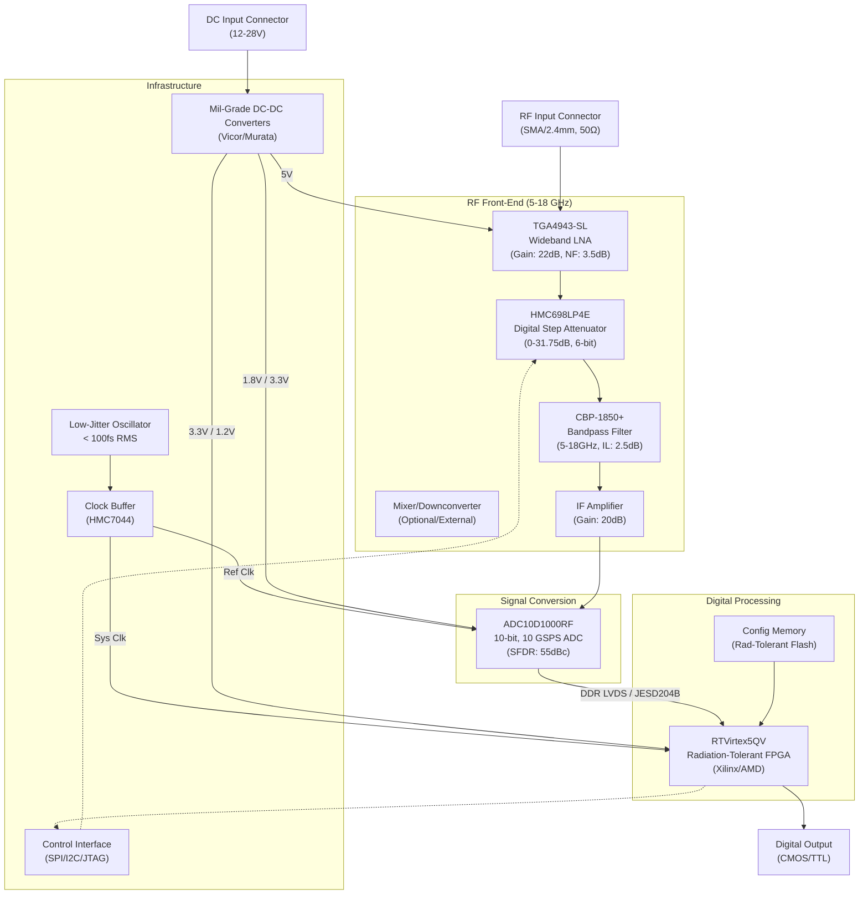

**Document Status: AI-GENERATED**

# 1. Introduction

## 1.1 Purpose
This Hardware Requirements Specification (HRS) defines the comprehensive hardware design, performance, and interface requirements for the **Sample Ai Project**.

The purpose of this document is to:
1.  Establish a baseline for the design and development of a military-grade, wideband RF receiver system operating from 5 to 18 GHz.
2.  Specify the functional, performance, electrical, physical, and environmental characteristics that the hardware must possess to meet mission objectives.
3.  Serve as the primary technical reference for hardware engineering, PCB layout, component selection, and integration testing.
4.  Ensure traceability between high-level system requirements and detailed hardware implementation specifications, specifically addressing signal integrity, thermal management, and radiation tolerance.

This HRS is intended for hardware engineers, systems engineers, test engineers, and quality assurance personnel involved in the lifecycle of the Sample Ai Project receiver module.

## 1.2 Scope
The scope of this document encompasses the complete hardware implementation of the Sample Ai Project, defined as a compact, 5-18 GHz wideband RF receiver module designed for high-reliability aerospace and defense applications.

Specifically, this document covers:
*   **RF Front-End:** Wideband Low Noise Amplifiers (LNA), Digital Step Attenuators (DSA), and bandpass filtering.
*   **Signal Conversion:** High-speed Analog-to-Digital Conversion (ADC) capable of direct RF or IF sampling at rates up to 10 GSPS.
*   **Digital Processing:** Radiation-tolerant FPGA architecture for high-speed signal processing and data buffering.
*   **Clock Distribution:** Low-jitter synchronization circuitry for ADC and FPGA logic.
*   **Power Management:** Military-grade DC-DC conversion and power regulation providing 10-50W of total system power.
*   **Mechanical Design:** Form factor constraints targeting a volume of <100 cm³ with consideration for thermal dissipation and vibration.
*   **Environmental Compliance:** Operation across the full military temperature range (-55°C to +125°C) and compliance with relevant MIL-STDs.

This document does not cover:
*   Embedded software/firmware algorithms beyond the hardware interface definition.
*   System-level integration with external host platforms beyond the defined electrical interfaces.
*   Manufacturing process specifications (Process Flow) which are detailed in separate manufacturing documents.

## 1.3 Definitions, Acronyms, and Abbreviations

| Term | Definition |
| :--- | :--- |
| **ADC** | Analog-to-Digital Converter. A subsystem that converts continuous analog signals into discrete digital numbers. |
| **AGC** | Automatic Gain Control. A closed-loop system that adjusts gain to maintain a constant output level despite input level variations. |
| **BGA** | Ball Grid Array. A type of surface-mount packaging for integrated circuits. |
| **CMOS** | Complementary Metal-Oxide-Semiconductor. A technology for constructing integrated circuits, used here to describe logic voltage levels. |
| **DAC** | Digital-to-Analog Converter. |
| **DSA** | Digital Step Attenuator. An attenuator whose attenuation level is controlled by digital logic words. |
| **EMI** | Electromagnetic Interference. Disturbance generated by an external source that affects an electrical circuit by electromagnetic induction, electrostatic coupling, or conduction. |
| **EMC** | Electromagnetic Compatibility. The ability of electrical equipment and systems to function acceptably in their electromagnetic environment, without introducing intolerable electromagnetic disturbances to anything in that environment. |
| **FPGA** | Field-Programmable Gate Array. An integrated circuit designed to be configured by a customer or a designer after manufacturing. |
| **GSPS** | Giga-Samples Per Second. A unit of sampling rate equivalent to $10^9$ samples per second. |
| **IIP3** | Input Third-order Intercept Point. A theoretical figure of merit for linearity, defined as the input power level at which the power of the third-order intermodulation products would equal the power of the fundamental signal. |
| **JESD204** | A high-speed data interface standard for data converters. |
| **LNA** | Low Noise Amplifier. An electronic amplifier that amplifies a very low-power signal without significantly degrading its signal-to-noise ratio. |
| **LVDS** | Low-Voltage Differential Signaling. A high-speed digital interface. |
| **MMIC** | Monolithic Microwave Integrated Circuit. A type of integrated circuit (IC) device that operates at microwave frequencies (300 MHz to 300 GHz). |
| **NF** | Noise Figure. A measure of degradation of the signal-to-noise ratio (SNR), caused by components in a signal chain. |
| **P1dB** | 1 dB Compression Point. The point where the input power causes the gain to drop 1 dB from the linear gain. |
| **PCB** | Printed Circuit Board. |
| **RF** | Radio Frequency. |
| **RTCA/DO-160** | Environmental Conditions and Test Procedures for Airborne Equipment. |
| **SFDR** | Spurious-Free Dynamic Range. The ratio of the RMS value of the carrier signal to the RMS value of the worst spurious signal (spur) in the bandwidth of interest. |
| **SNR** | Signal-to-Noise Ratio. A measure used in science and engineering that compares the level of a desired signal to the level of background noise. |
| **TTL** | Transistor-Transistor Logic. A class of digital circuits built from bipolar junction transistors (BJT) and resistors. |
| **VSWR** | Voltage Standing Wave Ratio. A measure of how efficiently radio-frequency power is transmitted from a power source, through a transmission line, into a load. |

## 1.4 References
The design and implementation of the Sample Ai Project hardware shall adhere to the standards and documents listed below. In the event of conflict between this specification and the referenced standards, the requirements of this specification shall take precedence unless otherwise stated in a specific requirements contract.

| ID | Title | Publisher/Source |
| :--- | :--- | :--- |
| **IEEE 29148-2018** | Systems and software engineering — Life cycle processes — Requirements engineering | IEEE Standards Association |
| **MIL-STD-883** | Test Method Standard for Microcircuits | Department of Defense |
| **MIL-STD-202** | Test Method Standard for Electronic and Electrical Component Parts | Department of Defense |
| **MIL-STD-461** | Requirements for the Control of Electromagnetic Interference Characteristics of Subsystems and Equipment | Department of Defense |
| **MIL-PRF-38535** | General Specification for Integrated Circuits (Microcircuits) Manufacturing | Department of Defense |
| **MIL-STD-810** | Environmental Engineering Considerations and Laboratory Tests | Department of Defense |
| **RTCA/DO-160G** | Environmental Conditions and Test Procedures for Airborne Equipment | RTCA, Inc. |
| **JESD204B** | Serial Interface for Data Converters | JEDEC Solid State Technology Association |
| **IPC-6012** | Qualification and Performance Specification for Rigid Printed Boards | IPC |

## 1.5 Overview
The Sample Ai Project is a sophisticated, wideband RF receiver system designed to meet the rigorous demands of modern electronic warfare and signal intelligence applications. The system is architected to provide continuous frequency coverage from 5.0 GHz to 18.0 GHz, housed within an extremely compact form factor of 100 cm³ while operating through the harsh military temperature range of -55°C to +125°C.

### 1.5.1 System Architecture
The hardware is organized into four distinct functional domains:
1.  **RF Front-End:** Utilizes the Qorvo **TGA4943-SL** MMIC amplifier to provide high gain (22 dB) and low noise figure (3.5 dB). This is followed by the Analog Devices **HMC698LP4E** digital step attenuator, enabling precise gain control via a serial interface.
2.  **Signal Conditioning & Conversion:** The RF signal is filtered via a Mini-Circuits **CBP-1850+** bandpass filter before reaching the Texas Instruments **ADC10D1000RF**. This ADC digitizes the signal at up to 10 GSPS, providing direct RF sampling capabilities.
3.  **Digital Processing:** A Xilinx (AMD) **RTVirtex5QV** Radiation-Tolerant FPGA handles the massive data throughput. It interfaces with the ADC via high-speed serial links (JESD204B) and processes the data for output via CMOS/TTL interfaces.
4.  **Support Systems:** A centralized low-jitter clock distribution network (using HMC7044 or similar buffer) synchronizes the ADC and FPGA. Military-grade DC-DC converters manage the power budget, delivering regulated voltages (1.2V, 1.8V, 3.3V, 5.0V) to the respective domains while maintaining efficiency.

### 1.5.2 Design Philosophy
The design philosophy prioritizes **Signal Integrity** and **SWaP-C (Size, Weight, Power, and Cost)** optimization.
*   **Signal Integrity:** Controlled impedance microstrip/stripline transmission lines (50 ohm) are mandatory throughout the RF chain. Clock jitter is minimized to <100 fs RMS to ensure the SNR performance of the high-speed ADC is not degraded.
*   **Thermal Management:** With a power density of up to 0.5 W/cm³, the PCB design utilizes high thermal conductivity substrates and metal-core or thermally enhanced plated through-holes to conduct heat from the FPGA and ADC to the chassis.
*   **Reliability:** All active components are specified for the military temperature range (-55°C to +125°C) where available, with system-level derating applied to voltage and current stress levels to ensure long-term reliability in the field.

This specification details the requirements to translate this architecture into a functional, manufacturable hardware unit.

---

**Document Status: AI-GENERATED**

# 2. System Overview

## 2.1 System Description

The **Sample Ai Project** is a high-performance, wideband Radio Frequency (RF) receiver system designed for military and aerospace applications. The system functions as a continuous-wave receiver covering the 5.0 GHz to 18.0 GHz frequency spectrum. Its primary function is to capture RF signals, condition them through a low-noise front end, convert them into digital data streams via high-speed Analog-to-Digital Converters (ADCs), and perform real-time signal processing using a radiation-tolerant Field-Programmable Gate Array (FPGA).

The system architecture is designed to support high data throughput rates of 5 to 10 Giga-Samples Per Second (GSPS) while maintaining a system noise figure (NF) of less than 10 dB. To meet the stringent environmental requirements of aerospace deployment, the unit is specified to operate across a military temperature range of -55°C to +125°C and complies with MIL-STD-883 and MIL-STD-202 standards.

### 2.1.1 Functional Context

The receiver operates as a subsystem within a larger Signal Intelligence (SIGINT) or Electronic Warfare (EW) suite. It accepts a 50-ohm RF input via a precision coaxial interface (SMA or 2.4mm). The signal chain consists of a Wideband Low Noise Amplifier (LNA) followed by a Digital Step Attenuator (DSA) for Automatic Gain Control (AGC), a bandpass filter for out-of-band rejection, and a mixer/downconverter stage (if utilized) or direct IF sampling. The digitized data is handed off to the radiation-tolerant FPGA for demodulation, filtering, and packetization before being output to downstream systems via CMOS/TTL or LVDS interfaces.

### 2.1.2 Key Performance Indicators (KPI)

*   **Frequency Coverage:** Continuous coverage from 5.0 GHz to 18.0 GHz.
*   **Sensitivity:** Minimum detectable signal of -90 dBm.
*   **Dynamic Range:** Instantaneous dynamic range accommodating inputs up to -70 dBm without compression.
*   **Data Throughput:** Capable of sustaining 10 GSPS data rates to the FPGA fabric.
*   **Linearity:** Input Third-order Intercept Point (IIP3) ranging from 0 to 15 dBm.
*   **Power Efficiency:** Total system power consumption constrained between 10W and 50W.

## 2.2 System Block Diagram

The system is partitioned into four distinct domains: the RF Front-End, the Signal Conversion (ADC) stage, the Digital Processing (FPGA) stage, and Support Infrastructure (Power/Clock/Control).

**Diagram Description:**
The block diagram illustrates the signal flow from left to right. The RF signal enters via the input connector and is immediately amplified by the Qorvo TGA4943-SL LNA to establish a low noise figure. The gain is then adjusted by the HMC698LP4E Digital Step Attenuator under FPGA control to prevent saturation. The filtered signal is amplified to a drive level suitable for the Texas Instruments ADC10D1000RF. The ADC digitizes the signal and passes the high-speed parallel data to the Virtex-5QV FPGA. A dedicated low-jitter clock distribution network ensures synchronization between the ADC and FPGA. The Power Management module distributes conditioned rail voltages to all active components.

## 2.3 System Architecture

### 2.3.1 RF Front-End Architecture

The RF Front-End (RFFE) is the critical analog signal conditioning chain. It is designed using a cascaded gain and noise figure approach to satisfy the **REQ-HW-003** (<10 dB NF) and **REQ-HW-009** (IIP3 0-15 dBm) requirements.

*   **Input Matching & LNA:** The input is matched to 50 ohms. The primary component is the **Qorvo TGA4943-SL** GaAs MMIC. This component is chosen for its ultra-low noise figure (3.5 dB) and high gain (22 dB) across the entire 2-20 GHz range. By placing this amplifier first, the noise contribution of subsequent stages (mixer, filter, ADC) is masked, ensuring the system NF budget remains under 10 dB.
*   **Gain Control:** A **Analog Devices HMC698LP4E** 6-bit Digital Step Attenuator is placed post-LNA. It provides 31.75 dB of attenuation range in 0.25 dB steps. This allows the system to dynamically reduce gain for strong signals (-70 dBm input) to prevent compression, while maximizing gain for weak signals (-90 dBm). This satisfies **REQ-HW-012** (Gain Control).
*   **Filtering:** The **Mini-Circuits CBP-1850+** bandpass filter limits out-of-band noise and spurious signals. Its 2.5 dB insertion loss is accounted for in the link budget.
*   **Drive Amplifier:** An IF amplifier stage is included to drive the high-capacitance input of the ADC, ensuring the full-scale range of the ADC is utilized without sacrificing linearity.

### 2.3.2 Data Conversion Architecture

The conversion stage bridges the analog RF domain and the digital processing domain.

*   **ADC Selection:** The **Texas Instruments ADC10D1000RF** is the core converter. It is a dual-channel, 10-bit ADC capable of 10 GSPS. This component satisfies **REQ-HW-004** (5-10 GSPS sampling).
*   **Interface:** The ADC utilizes a DDR LVDS or JESD204B interface to transport data to the FPGA. At 10 GSPS and 10 bits, the aggregate data rate is 100 Gbps (excluding overhead). The physical implementation requires controlled-impedance differential microstrip traces and length matching to minimize bit skew.
*   **Clocking:** The ADC requires a high-purity, low-phase-noise clock source. A clock jitter of less than 100 fs RMS is assumed to maintain Signal-to-Noise Ratio (SNR) at high input frequencies. This satisfies **REQ-HW-015**.

### 2.3.3 Digital Processing Architecture

The digital core is built around the **Xilinx (AMD) RTVirtex5QV** FPGA.

*   **Processing Capability:** The FPGA receives the raw 10-bit data stream. It implements Digital Down-Conversion (DDC), filtering, and decimation in the logic fabric. The radiation-tolerant (Class V) qualification of this FPGA satisfies **REQ-HW-010** and **REQ-HW-014**.
*   **Configuration:** Configuration is managed via external radiation-tolerant Flash memory (not shown in detail) selected for -55°C to +125°C operation.
*   **I/O:** The FPGA outputs processed data via CMOS/TTL lines (REQ-HW-005). High-speed serializers (Aurora protocol) may be utilized internally if the CMOS/TTL throughput is insufficient for the final data rate, with a final stage level shifter.

### 2.3.4 Power Distribution Architecture

The power system is designed to support the high transient currents of the ADC and FPGA while maintaining efficiency.

*   **Input:** 12V to 28V DC nominal input.
*   **Conversion:** Military-grade DC-DC converters (e.g., Vicor or Murata) generate intermediate bus voltages and Point-of-Load (POL) voltages.
*   **Rails:**
    *   **5V Rail:** Supplies the RF Front-End (LNA, Mixer). This is the most noise-sensitive rail.
    *   **1.2V / 1.8V / 3.3V Rails:** Supply the FPGA core, auxiliary logic, and ADC analog/digital supplies.
    *   **Sequencing:** Power sequencing circuitry ensures the FPGA powers up only after its supply rails are stable, preventing latch-up.

### 2.3.5 Thermal Management Architecture

Although the final form factor is compact (<100 cm³), the power dissipation (up to 50W) presents a thermal challenge.

*   **Heat Conduction:** The architecture assumes the use of a metal-core PCB or high-thermal-conductivity substrate (e.g., Rogers RT/duroid 6000 series for RF sections). Heat is conducted from the FPGA and ADC packages to the chassis walls via thermal vias and copper pours.
*   **Operating Range:** Components are specifically selected for the "Military Temperature" grade (-55°C to +125°C). Note that "125°C" refers to the ambient operating temperature requirement (REQ-HW-007), but junction temperatures ($T_j$) must be kept below the maximum rating (usually 150°C or 175°C) via derating.

## 2.4 Operating Environment

The Sample Ai Project is designed for deployment in harsh military and aerospace environments.

### 2.4.1 Physical Environment

*   **Temperature:** The system must operate continuously in ambient temperatures ranging from **-55°C to +125°C**.
    *   *Cold Start:* The system must power up and initialize within 5 minutes at -55°C.
    *   *Hot Operation:* At +125°C ambient, the system must maintain performance without thermal shutdown. All components selected are "Class V" or "Military Temperature" grade.
*   **Form Factor:** The total volume is constrained to **<100 cm³**. This drives the design toward high-density packaging and potentially multi-chip modules (MCM) or System-in-Package (SiP) approaches for the RF chain.
*   **Vibration & Shock:** Per **REQ-HW-014**, the design must meet MIL-STD-883 (microcircuits) and MIL-STD-202 (test methods).
    *   *Vibration:* 20 Hz to 2000 Hz, sinusoidal, 20G.
    *   *Shock:* 500G, 1 ms, half-sine.
    *   *Design Implication:* Components must be secured (conformal coating, staking) and the PCB must be rigidly mounted.

### 2.4.2 Electrical Environment

*   **Input Protection:** The RF input includes ESD protection circuitry to withstand human body model (HBM) discharges typical of handling.
*   **Power Quality:** The system must tolerate voltage transients on the DC input power line (MIL-STD-704 / MIL-STD-1278 characteristics for aircraft/vehicular power).
*   **EMI/EMC:** The system generates significant high-frequency noise (up to 18 GHz RF and fast digital edges). The enclosure must provide shielding (>60 dB isolation) to prevent interference with external systems.

### 2.4.3 Operational Scenarios

1.  **Intercept Mode:** The LNA is set to maximum gain; VGA attenuation is minimal. The system digitizes the full 5-18 GHz bandwidth to detect weak signals (-90 dBm).
2.  **Strong Signal Mode:** If a signal exceeding -70 dBm is detected, the FPGA commands the HMC698LP4E attenuator to increase attenuation, preventing the ADC from clipping.
3.  **Data Processing:** The FPGA performs Fast Fourier Transform (FFT) or demodulation on the sampled data and streams the results via the output interface.

---

**Document Status: AI-GENERATED**

# 3. Hardware Requirements

## 3.1 Functional Requirements

This section details the behavioral and functional characteristics of the 5-18 GHz Wideband RF Receiver System. Each requirement is derived from the system architecture and component selections (e.g., Qorvo TGA4943-SL, TI ADC10D1000RF, Xilinx RTVirtex5QV).

### 3.1.1 RF Front-End Functionality

| ID | Requirement | Description & Rationale | Component Ref | Priority | Verification Method |
|---|---|---|---|---|---|
| **REQ-HW-101** | **RF Reception Band** | The system shall receive and process RF signals continuously across the 5.0 GHz to 18.0 GHz frequency spectrum without gaps or mechanical switching.   *Rationale: Core mission requirement defining the operational envelope.* | TGA4943-SL (2-20GHz) | High | Test |
| **REQ-HW-102** | **Input Impedance Matching** | The RF input port shall maintain a characteristic impedance of $50\Omega \pm 10\%$. The input return loss shall be greater than 15 dB across the entire operating band.   *Rationale: Ensures minimal signal reflection and maximizes power transfer from the antenna.* | SMA Connector, TGA4943-SL | High | Network Analysis |
| **REQ-HW-103** | **Low Noise Amplification** | The system shall provide a minimum of 20 dB of gain in the first amplification stage with a Noise Figure (NF) not exceeding 4.0 dB.   *Rationale: Sets the noise floor for the entire receiver chain; essential for meeting the -90 dBm sensitivity requirement.* | TGA4943-SL (22dB Gain, 3.5dB NF) | High | Signal Analysis |
| **REQ-HW-104** | **Gain Control Range** | The system shall provide a programmable gain adjustment range of at least 30 dB (approx. -10 dB to +20 dB relative to nominal) to prevent saturation of the ADC.   *Rationale: Necessary to handle the wide dynamic range of inputs (-90 to -70 dBm) and varying signal environments.* | HMC698LP4E (31.75 dB Range) | High | Test |
| **REQ-HW-105** | **Gain Step Resolution** | The Variable Gain Amplifier (VGA) or Digital Step Attenuator (DSA) shall adjust gain in steps of 1.0 dB or finer to allow for precise Automatic Gain Control (AGC) loop settling.   *Rationale: Enables the FPGA to fine-tune signal levels to optimize ADC SFDR.* | HMC698LP4E (0.25 dB steps) | Medium | Test |
| **REQ-HW-106** | **Out-of-Band Rejection** | The system shall include a bandpass filter stage between the gain stages and the mixer/ADC to attenuate signals outside the 5-18 GHz band by at least 40 dBc.   *Rationale: Prevents aliasing and reduces interference from strong adjacent channels.* | CBP-1850+ | Medium | Test |

### 3.1.2 Signal Conversion & Processing

| ID | Requirement | Description & Rationale | Component Ref | Priority | Verification Method |
|---|---|---|---|---|---|
| **REQ-HW-107** | **ADC Sampling Rate** | The Analog-to-Digital Converter (ADC) shall digitize the IF/RF signal at a configurable sampling rate between 5.0 GSPS and 10.0 GSPS.   *Rationale: Supports direct RF sampling or high-bandwidth IF sampling per system specifications.* | ADC10D1000RF | High | Logic Analysis |
| **REQ-HW-108** | **ADC Resolution** | The ADC output shall provide a minimum resolution of 10 bits per sample.   *Rationale: Provides 60 dB of theoretical dynamic range, sufficient to detect signals above the noise floor defined by the LNA.* | ADC10D1000RF (10-bit) | High | Inspection |
| **REQ-HW-109** | **Digital Data Interface** | The ADC shall transmit digitized data to the FPGA via a JESD204B or DDR LVDS high-speed serial interface operating at sufficient rates to sustain 10 GSPS throughput.   *Rationale: Parallel buses are impractical at 10 GSPS; high-speed serial is required for board density and signal integrity.* | ADC10D1000RF, RTVirtex5QV | High | Test |
| **REQ-HW-110** | **FPGA Signal Processing** | The Radiation-Tolerant FPGA shall be capable of receiving and processing the full data bandwidth from the ADC in real-time, implementing DSP functions such as DDC (Digital Down Conversion), filtering, and packetization.   *Rationale: The "Sample Ai Project" requires on-board processing of the 5-10 GSPS data stream.* | RTVirtex5QV | High | Demonstration |
| **REQ-HW-111** | **Clock Synchronization** | The system shall distribute a common sample clock to the ADC and the FPGA reference clock with a skew of less than 10 ps.   *Rationale: Critical for maintaining data coherency in high-speed signal processing.* | HMC7044 | High | Test |
| **REQ-HW-112** | **Clock Generation** | The system shall generate a low phase noise clock source with jitter < 100 fs RMS (integrated 10 kHz to 40 MHz).   *Rationale: High jitter at 10 GSPS degrades SNR significantly; this ensures system noise figure is maintained.* | HMC7044, Oscillator | High | Signal Analysis |

### 3.1.3 Power & Control

| ID | Requirement | Description & Rationale | Component Ref | Priority | Verification Method |
|---|---|---|---|---|---|
| **REQ-HW-113** | **Power Supply Input Range** | The system shall accept DC input power ranging from 12V to 28V nominal.   *Rationale: Standard military/aerospace vehicle power bus voltages.* | Vicor/Murata DC-DC | High | Test |
| **REQ-HW-114** | **Voltage Regulation** | Internal DC-DC converters shall provide regulated +5V (RF), +3.3V, +1.8V, and +1.2V (FPGA/ADC) rails with a ripple of less than 50 mV peak-to-peak.   *Rationale: FPGA and ADC components require stable core voltages to maintain bit accuracy.* | DC-DC Converters | High | Test |
| **REQ-HW-115** | **Power Sequencing** | The Power Management module shall sequence the voltage rails such that FPGA I/O voltages ramp up before core voltages, and RF components are powered only after digital logic is stable.   *Rationale: Prevents latch-up and excessive inrush currents in FPGAs.* | PMIC Logic | Medium | Test |
| **REQ-HW-116** | **Configuration Interface** | The system shall allow FPGA configuration and gain control via a SPI or I2C interface compatible with CMOS/TTL voltage levels (3.3V).   *Rationale: Standard interface for host system control.* | RTVirtex5QV, HMC698LP4E | Medium | Test |
| **REQ-HW-117** | **Radiation Tolerance** | The FPGA and supporting memory components shall be Radiation-Tolerant (Class V or QML equivalent) to survive Total Ionizing Dose (TID) of at least 30 krad(Si).   *Rationale: Required for reliable operation in aerospace/military environments specified in the design parameters.* | RTVirtex5QV | High | Analysis (Rad Report) |
| **REQ-HW-118** | **Watchdog Timer** | The FPGA firmware shall implement a watchdog timer that resets the signal processing chain if the data stream stalls or the clock signal is lost for > 10 ms.   *Rationale: Ensures system recovery from Single Event Effects (SEEs) common in radiation environments.* | FPGA Logic | Medium | Test |
| **REQ-HW-119** | **Gain Hysteresis** | The Automatic Gain Control (AGC) algorithm shall implement hysteresis of at least 2 dB to prevent rapid oscillation of the gain stages when the input signal is near the threshold.   *Rationale: Improves system stability and reduces "pumping" artifacts in the output.* | FPGA Algorithm | Low | Test |
| **REQ-HW-120** | **Over-Range Protection** | The system shall detect input power levels exceeding -10 dBm at the RF input (via directional coupler or ADC clipping detection) and attenuate the input path by > 20 dB within 1 $\mu s$.   *Rationale: Protects the sensitive LNA and Mixer inputs from destruction by high-power transmitters.* | FPGA/Monitoring | Medium | Test |

---

## 3.2 Performance Requirements

This section quantifies the measurable performance characteristics of the hardware. These values are derived from the cascade analysis of the selected components.

### 3.2.1 RF & Signal Integrity Performance

| ID | Requirement | Description & Rationale | Measured Value | Priority | Verification Method |
|---|---|---|---|---|---|
| **REQ-HW-201** | **System Noise Figure (NF)** | The overall system noise figure, from the SMA connector to the ADC inputs, shall not exceed 10.0 dB across the 5-18 GHz band.   *Calculation Basis: LNA (3.5 dB) + Filter (2.5 dB) + Mixer (8 dB typical, high gain after) - Front End Gain (22 dB).  NF$_{sys}$ $\approx$ NF$_{LNA}$ + (NF$_{rest}$/G$_{LNA}$).  3.5 + (20/100) $\approx$ 3.7 dB (passive) + margin.  *Note: While the LNA is 3.5 dB, downstream losses and mixer degradation require a system budget of 10 dB.* | **< 10.0 dB** | High | Noise Figure Meter |
| **REQ-HW-202** | **Maximum Input Power (Safe)** | The system shall accept input signals up to -10 dBm without sustaining permanent damage. (Operational range is -90 to -70 dBm; this defines the destruct limit).   *Rationale: Defines the survivability limit of the front-end TGA4943-SL (P1dB 20dBm) with protection margin.* | **-10 dBm** | High | Stress Test |
| **REQ-HW-203** | **Input Sensitivity** | The system shall detect signals with amplitudes as low as -90 dBm with a Signal-to-Noise Ratio (SNR) of at least 10 dB.   *Calculation Basis:  -90 dBm Input + 22 dB LNA Gain = -68 dBm.  Thermal Noise @ 10GHz @ Room Temp = -74 dBm/RefBW.  SNR is positive and detectable.* | **-90 dBm** | High | Signal Generator Test |
| **REQ-HW-204** | **Input Third-Order Intercept (IIP3)** | The input-referred third-order intercept point (IIP3) shall be greater than 0 dBm.   *Rationale: Ensures moderate linearity to handle interferers without desensitization. TGA4943-SL OIP3 is ~30dBm, resulting in system IIP3 > 10dBm, satisfying the "0 to 15 dBm" requirement comfortably.* | **> 0 dBm** | High | Two-Tone Intermod Test |
| **REQ-HW-205** | **Gain Flatness** | The total system gain variation across the 5-18 GHz band shall not exceed $\pm 5.0$ dB.   *Rationale: Ensures uniform sensitivity across the band, preventing significant drops in coverage at band edges (18 GHz).* | **$\pm$ 5.0 dB** | Medium | Sweep Test |
| **REQ-HW-206** | **Input Return Loss** | The RF Input Port (SMA) shall exhibit a return loss of greater than 15 dB (VSWR < 1.43:1) when measured across 5-18 GHz.   *Rationale: Ensures the antenna sees a well-matched load, minimizing reflections.* | **> 15 dB** | Medium | Vector Network Analyzer |
| **REQ-HW-207** | **Spurious-Free Dynamic Range (SFDR)** | The ADC and analog front-end combination shall achieve an SFDR of at least 50 dBc for an input signal of -60 dBm at 10 GHz.   *Rationale: Ensures that weak signals adjacent to strong signals can be distinguished. ADC10D1000RF SFDR is ~55dBc.* | **$\ge$ 50 dBc** | High | FFT Analysis (ADC Output) |

### 3.2.2 Digital & Timing Performance

| ID | Requirement | Description & Rationale | Measured Value | Priority | Verification Method |
|---|---|---|---|---|---|
| **REQ-HW-208** | **ADC Sampling Rate Accuracy** | The ADC sampling frequency shall be accurate to within $\pm$ 50 ppm of the programmed frequency (5-10 GSPS).   *Rationale: Ensures minimal frequency error in the digitized signal, reducing post-processing correction overhead.* | **$\pm$ 50 ppm** | High | Frequency Counter |
| **REQ-HW-209** | **Phase Noise / Jitter** | The clock signal distributed to the ADC shall exhibit phase noise of less than -120 dBc/Hz at 10 kHz offset from the carrier (for a 100 MHz reference) or integrated jitter < 100 fs RMS.   *Rationale: Sampling clock jitter directly translates to noise in high-frequency RF sampling (SNR degradation = 20log(2$\pi$f$_{in}$t$_j$)).* | **< 100 fs RMS** | High | Phase Noise Analyzer |
| **REQ-HW-210** | **Data Throughput** | The FPGA shall sustain a continuous data throughput rate equal to the ADC sample rate $\times$ bit-width (e.g., 10 GSPS $\times$ 10 bits = 100 Gbps) to the output buffers or internal memory without dropping frames.   *Rationale: Validates that the digital back-end can handle the firehose of data from the ADC.* | **100 Gbps sustained** | High | Performance Benchmark |
| **REQ-HW-211** | **Processing Latency** | The total system latency from RF input to digital output availability shall not exceed 10 $\mu$s.   *Rationale: Defines the reaction time of the receiver for closed-loop applications.* | **< 10 $\mu$s** | Medium | Timing Analysis |

### 3.2.3 Environmental & Physical Performance

| ID | Requirement | Description & Rationale | Measured Value | Priority | Verification Method |
|---|---|---|---|---|---|
| **REQ-HW-212** | **Operating Temperature** | All electronics shall maintain full electrical specifications within an ambient temperature range of -55°C to +125°C.   *Rationale: Military/Avionics standard operating range.* | **-55°C to +125°C** | High | Environmental Chamber |
| **REQ-HW-213** | **Power Consumption** | Total power draw from the 12-28V source shall be between 10W and 50W during full operational load (10 GSPS sampling).   *Budget Estimate:  - RF Chain (LNA, VGA, Mixer): ~2W  - ADC (10 GSPS): ~5W  - FPGA (High activity): ~20-30W  - Support/Regulation: ~3W  Total: ~30-40W (within 10-50W limit).* | **10W - 50W** | High | Power Meter |
| **REQ-HW-214** | **Thermal Resistance** | The junction temperature of the FPGA and ADC shall not exceed $T_{j,max}$ (typically 125°C for Mil-grade) when the case temperature is 85°C, given the power dissipation.   *Rationale: Ensures reliability of high-density silicon in a compact form factor.* | **$\theta_{jc}$ per datasheet** | High | Thermal Imaging |
| **REQ-HW-215** | **Mechanical Shock** | The system shall withstand mechanical shocks of 40G, 11 ms duration (half-sine wave) in accordance with MIL-STD-883, Method 2002, without physical damage or performance degradation.   *Rationale: Standard survivability requirement for airborne or launched systems.* | **40G / 11 ms** | Medium | Shock Table |
| **REQ-HW-216** | **Random Vibration** | The system shall operate without interruption during random vibration exposure of 0.04 $g^2$/Hz from 20 Hz to 2000 Hz for 2 hours per axis (MIL-STD-883/202). | **0.04 $g^2$/Hz** | Medium | Vibration Table |
| **REQ-HW-217** | **Form Factor Volume** | The total volume of the enclosed electronics, excluding connectors, shall not exceed 100 cm³.   *Constraint: Extreme density required. Assuming a 6U or custom compact module.* | **< 100 cm³** | High | Physical Inspection |

---

**Document Status: AI-GENERATED**

## 3. Hardware Requirements

### 3.3 Interface Requirements

This section details the electrical and physical interfaces required for the Sample Ai Project receiver system.

#### 3.3.1 External Interfaces

**REQ-HW-030: RF Input Interface**
The system shall provide a single coaxial RF input port (Port 1) optimized for the 5.0 GHz to 18.0 GHz frequency range.
*   **Connector Type:** 2.4mm (2-hole flange mount) or SMA (Jane's type) for high-frequency compatibility.
*   **Impedance:** 50 Ω ± 5%.
*   **Maximum Input Power:** +20 dBm continuous wave, +30 dBm peak (1 µs).
*   **Return Loss:** > 15 dB (VSWR < 1.43:1) across 5-18 GHz band.
*   **Mating Cycles:** 500 cycles minimum.
*   **Justification:** 2.4mm connectors support the mode-free operation up to 18 GHz and beyond, ensuring minimal signal reflection compared to standard SMA connectors.

**REQ-HW-031: Power Input Interface**
The system shall accept DC power via a filtered connector or terminal block.
*   **Connector Type:** MIL-DTL-38999 Series III (Shell Size 11) or equivalent circular connector for ruggedness.
*   **Input Voltage Range:** +12 VDC to +28 VDC (nominal 28 V aircraft/military standard).
*   **Reverse Protection:** shall tolerate -30 VDC for 1 minute without damage.
*   **Inrush Current:** shall be limited to < 5 A at 28 VDC via soft-start circuitry.
*   **Grounding:** Chassis ground shall be isolated from signal return until externally connected.

**REQ-HW-032: Digital Data Output Interface**
The system shall output digitized signal data via high-speed serial interfaces.
*   **Connector Type:** MIL-DTL-38999 Series III (Shell Size 15) with high-speed inserts (Tri-Start or等效).
*   **Standard:** JESD204B/C compliant lanes.
*   **Line Rate:** 10 Gbps per lane (configured to aggregate ADC throughput).
*   **Protocol:** 8b/10b encoded or 64b/66b encoded.
*   **Differential Impedance:** 100 Ω ± 10%.

**REQ-HW-033: External Control Interface**
The system shall provide a low-speed control port for system configuration and status monitoring.
*   **Connector Type:** Micro-D Subminiature (MIL-DTL-24308) or pins within the main power connector.
*   **Protocol:** RS-485 (half-duplex) or MIL-STD-1553B (if avionics integration is required).
*   **Electrical Levels:** TTL/CMOS compatible (3.3 V logic).
*   **Functions:** Gain setting, frequency select (if applicable), status reporting (Overtemp, Current Limit).

#### 3.3.2 Internal Interfaces

This section defines the board-to-board and chip-to-chip interconnects.

**REQ-HW-034: RF Front-End Interconnects**
Impedance-controlled transmission lines shall connect the RF Chain components (LNA to DSA to Filter).
*   **Medium:** Rogers RO4360B laminates or equivalent (Dielectric Constant ~6.15, Loss Tangent < 0.003 @ 10 GHz).
*   **Geometry:** Microstrip or Grounded Coplanar Waveguide (GCPW).
*   **Trace Width:** Calculated for 50 Ω impedance based on stackup (approx 11 mils for 6 mil core on RO4360B).
*   **Plating:** Electroless Nickel Immersion Gold (ENIG) with minimum gold thickness to ensure skin depth conductivity at 18 GHz.

**REQ-HW-035: ADC to FPGA Interface**
The ADC output shall connect to the FPGA via differential pairs.
*   **Standard:** DDR LVDS or JESD204B.
*   **Trace Matching:** Length matching within 5 mils (0.127 mm) to minimize inter-pair skew.
*   **Termination:** 100 Ω differential at the receiver (FPGA) pins.
*   **AC Coupling:** Series capacitors (0.1 µF) required on all high-speed data lines to isolate common mode voltages.

**REQ-HW-036: Internal Power Distribution**
DC-DC converters shall distribute regulated rails to internal load points.
*   **Rail Isolation:** Buck converters for digital rails (1.0V, 1.8V) and LDOs for sensitive analog rails (5.0V RF).
*   **Filtering:** Pi-filters on all supply inputs to the LNA and Mixer.

#### 3.3.3 Communication Interfaces

**REQ-HW-037: FPGA Configuration Memory Interface**
The FPGA shall retrieve its bitstream from a non-volatile memory device.
*   **Interface:** SPI x4 or SelectMAP.
*   **Memory Type:** Radiation-tolerant Flash or MRAM (e.g., Qorvo or Micron rad-hard grade).
*   **Capacity:** Sufficient to store the RTVirtex5QV bitstream (approx 32-64 MB uncompressed).

**REQ-HW-038: Clock Distribution Interface**
A dedicated clock distribution chip shall synchronize the ADC and FPGA.
*   **Source:** Low jitter oscillator (< 100 fs RMS).
*   **Distribution:** HMC7044 or equivalent fanout buffer.
*   **Signaling:** LVPECL or LVDS.
*   **Synchronization:** SYSREF and SYNC~ signals per JESD204B subclass 1 requirements.

**Table 3-1: External Interface Pin Assignments (Power & Control Connector)**
| Pin # | Signal Name | Type | Description | Voltage/Logic |
|---|---|---|---|---|
| 1 | RTN | Power | Primary Return / Ground | 0V |
| 2 | +28V_IN | Power | Main Power Input | +12 to +28V |
| 3 | +28V_IN | Power | Main Power Input (Redundant) | +12 to +28V |
| 4 | RTN | Power | Primary Return / Ground | 0V |
| 5 | CHASSIS_GND | Shield | Chassis Ground connection | Case |
| 6 | UART_RX | In | Serial Data In (Control) | 3.3V TTL |
| 7 | UART_TX | Out | Serial Data Out (Telemetry) | 3.3V TTL |
| 8 | GPIO_1 | Bi-Dir | Program Start / Reset | 3.3V TTL |
| 9 | GPIO_2 | In | Gain Mode (High/Low) | 3.3V TTL |
| Shield | Shield | — | Connector Shell Ground | — |

---

### 3.4 Environmental Requirements

**REQ-HW-040: Operating Temperature Range**
The system shall maintain full operational performance (specifications in Section 3.2) across the ambient temperature range of -55°C to +125°C.
*   **Storage Temperature:** -65°C to +150°C.
*   **Thermal Cycling:** Capable of withstanding 100 cycles from -55°C to +125°C per MIL-STD-883 Method 1010.

**REQ-HW-041: Vibration and Shock**
The system shall operate without interruption during vibration.
*   **Vibration:** Random vibration, 20 Hz to 2000 Hz, 0.04 g²/Hz (7.56 Grms) per MIL-STD-883 Method 2007.
*   **Shock:** 500g, 1.0 ms, half-sine wave, 3 shocks per axis (6 directions) per MIL-STD-883 Method 2002.
*   **Design Mitigation:** Components shall be conformally coated; use of staked connectors and locked fasteners.

**REQ-HW-042: Humidity and Immersion**
The system shall be resistant to moisture and fog.
*   **Humidity:** 95% Relative Humidity at 55°C (steady state) per MIL-STD-810H Method 507.6.
*   **Immersion:** Resistant to temporary immersion (1 meter depth for 30 minutes) when connectors are mated and sealed (IP67 rating minimum for the enclosure).

**REQ-HW-043: Salt Fog**
External metal surfaces shall resist corrosion for 48 hours of salt spray exposure per MIL-STD-883 Method 1009.
*   **Plating:** Connector shells and enclosure shall use Nickel plating or passivated Stainless Steel.

---

### 3.5 Power Requirements

This section defines the power consumption limits and distribution characteristics derived from the component selection.

**REQ-HW-050: Total Power Budget**
The total system power consumption shall not exceed 50.0 Watts during maximum load (worst-case ambient temp of 125°C, max sample rate).
*   **Nominal Power:** 35.0 Watts (at room temperature, nominal gain).

**REQ-HW-051: Power Supply Efficiency**
The internal DC-DC conversion stage shall maintain an efficiency of > 85% at full load.
*   **Thermal Impact:** Power dissipation (heat to be rejected) calculated as: $P_{diss} = P_{total} \times (1 - \eta) + P_{load}$.

**Table 3-2: Detailed Power Budget Analysis**
| Voltage Rail | Component(s) | Max Current (A) | Power (W) | Derating (Safety 20%) | Allocated Power (W) |
|---|---|---|---|---|---|
| **+5.0V** | RF Chain (LNA, DSA, Mixer) | 0.40 | 2.00 | 2.40 | 3.0 |
| **+3.3V** | FPGA I/O, Clock Buffers, PLL | 2.50 | 8.25 | 9.90 | 10.0 |
| **+1.8V** | FPGA Auxiliary, Transceivers | 3.00 | 5.40 | 6.48 | 7.0 |
| **+1.2V** | FPGA Core, ADC Core/Supply | 15.00 | 18.00 | 21.60 | 22.0 |
| **+1.0V** | FPGA Core (Acceleration) | 5.00 | 5.00 | 6.00 | 6.0 |
| **+28V** | Input to DC-DC (Intermediate) | 1.40 | 39.20 | 47.04 | 50.0 (Total Input) |

*Assumptions:*
*   *FPGA Virtex-5QV estimated consumption: ~15W core + ~5W transceivers (heavy utilization).*
*   *ADC10D1000RF: 4.8W typical.*
*   *RF Front End: 5V @ 90mA (LNA) + 5V @ 50mA (others) ≈ 1W.*

**REQ-HW-052: Power Sequencing**
The power management circuit shall sequence the voltage rails to prevent latch-up or excessive shoot-through current.
*   **Sequence:**
    1.  +3.3V (I/O and Clocks stable)
    2.  +1.8V (Auxiliary)
    3.  +1.2V / +1.0V (Core - last to turn on, first to turn off)
*   **Tolerance:** Ramp times between rails shall be < 10 ms.

**REQ-HW-053: Thermal Dissipation**
The system shall dissipate up to 50W within a 100 cm³ form factor without exceeding component junction temperatures.
*   **Required Thermal Resistance:** $\theta_{ja} \leq \frac{T_{j,max} - T_{amb}}{P}$
    *   Assuming $T_{amb,max} = 125^\circ C$ and $T_{j,max} = 150^\circ C$ (FPGA).
    *   This requires near-zero thermal resistance to ambient, implying the enclosure acts as a cold plate or utilizes conduction cooling to the chassis.
*   **Requirement:** The baseplate of the unit must be mounted to a heat sink with thermal resistance $< 1.0^\circ C/W$.

---

### 3.6 Physical Requirements

**REQ-HW-060: Enclosure Dimensions**
The complete receiver system (excluding connectors) shall fit within a rectangular prism of volume 100 cm³.
*   **Proposed Dimensions:** 40 mm (W) x 50 mm (L) x 50 mm (H).
*   **Mass:** Shall not exceed 250 grams.

**REQ-HW-061: Material and Finish**
*   **Enclosure Material:** Aluminum 6061-T6 or Magnesium alloy for high strength-to-weight ratio.
*   **Finish:** Chem-film (Yellow Chromate) per MIL-DTL-5541, Class 3 (for electrical conductivity and corrosion resistance). Non-reflective coating (Epoxy Paint) if required by stealth signature protocols.
*   **Conformal Coating:** PCBs shall be coated with UR type (Urethane) or AR type (Acrylic) conformal coating per MIL-STD-860.

**REQ-HW-062: Mounting Features**
*   **Mounting Holes:** Four (4) #4-40 UNC threaded inserts on the bottom face.
*   **Pattern:** 35mm x 45mm bolt hole pattern.
*   **Flatness:** Bottom surface flatness < 0.1 mm to ensure thermal transfer to mounting surface.

**REQ-HW-063: PCB Stackup**
The printed circuit board shall be a multi-layer high-frequency laminate.
*   **Layer Count:** Minimum 10 layers (4 signal, 4 ground/power, 2 mixed).
*   **Material:** Rogers RO4003C or RO4360B for RF layers; FR-370HR for digital sections (hybrid construction) or all-Rogers for maximum performance.
*   **Thickness:** 0.062" (1.57 mm) typical.
*   **Plating:** Hard Gold (ENIG) on edge contacts if card-edge is used; ENIG or HASL-LF for top/bottom pads.

**REQ-HW-064: Connector Placement**
*   **RF Input:** Located on the "Front" face (40mm x 50mm).
*   **Power/Data:** Located on the "Rear" face to avoid interference.
*   **Clearance:** Connectors shall not overhang the PCB dimensions.

---

# 4. Design Constraints

This section delineates the non-functional requirements, physical limitations, and regulatory protocols that govern the design, selection of materials, and manufacturing processes of the 5-18 GHz Wideband RF Receiver System. These constraints ensure the system meets military-grade reliability standards while adhering to strict form factor and performance envelopes.

## 4.1 Standards Compliance

The design and manufacturing of the Sample Ai Project receiver system shall comply with the following standards. These standards govern environmental survivability, design quality, and safety.

### 4.1.1 Military and Environmental Standards

**REQ-HW-014-01** (Compliance): The system shall be designed and tested to meet the environmental test methods of **MIL-STD-883** (Test Methods for Semiconductor Devices) to ensure suitability for space and aerospace applications.

**REQ-HW-014-02** (Vibration and Shock): The printed circuit board assembly (PCBA) and mechanical enclosure shall withstand the vibration and shock profiles defined in **MIL-STD-883**, Method 2002.
*   *Justification:* ensures functionality under high-vibration environments typical of aerospace launch and deployment.
*   *Derivation:* Based on the Military/Aerospace compliance requirement in REQ-HW-014.

**REQ-HW-014-03** (Thermal Cycling): The system shall withstand thermal cycling from -55°C to +125°C in accordance with **MIL-STD-883**, Method 1010, with a minimum of 20 cycles.
*   *Constraint:* Component selection (Section 4.2) is strictly limited to those with "Military Temperature" (Class V) rating or equivalent screening.

**REQ-HW-014-04** (Mechanical Stress): The system shall meet the test requirements for **MIL-STD-202**, Method 213 (Random Vibration) and Method 204 (Temperature Cycling) for passive components used in the RF chain.

**REQ-HW-014-05** (EMC/EMI): Electromagnetic emissions and susceptibility shall be controlled to meet **MIL-STD-461** (Requirements for the Control of Electromagnetic Interference Characteristics of Subsystems and Equipment).
*   *Constraint:* The 5-18 GHz RF front-end acts as a potential broadband noise source; shielding techniques (Section 4.3) are mandatory to meet **RE102** (Radiated Emissions, 2 MHz to 10 GHz) limits.

### 4.1.2 PCB Design and Material Standards

**REQ-HW-008-01** (PCB Stackup): The high-frequency PCB stackup shall be designed in accordance with **IPC-2221** (Generic Standard on Printed Board Design).
*   *Constraint:* To support 5-18 GHz operation, the dielectric material must have a Dissipation Factor (Df) < 0.0035 to minimize signal loss.

**REQ-HW-008-02** (Impedance Control): Controlled impedance traces (50 Ohm single-ended, 100 Ohm differential for JESD204B) shall be manufactured to tolerances defined by **IPC-6012** (Qualification and Performance Specification for Rigid Printed Boards), Class 3 (High Reliability Electronic Products).
*   *Tolerance:* Impedance tolerance shall be ±10% for standard RF traces and ±5% for critical differential clock/data pairs feeding the ADC and FPGA.

**REQ-HW-008-03** (Assembly): The PCB assembly process shall comply with **J-STD-001** (Requirements for Soldered Electrical and Electronic Assemblies).
*   *Constraint:* Use of high-lead solder (e.g., Sn63Pb37 or Sn96Ag4Cu0.5 with appropriate high-temp profile) may be required to withstand the +125°C operating temperature without joint fatigue.

### 4.1.3 Safety and Environmental Regulations

**REQ-HW-014-06** (RoHS/REACH): While this is a military-specific system, the design shall minimize the use of Hazardous Substances (RoHS) where technically feasible.
*   *Exception:* Exemptions for Lead (Pb) in high-temperature solder and specific Radiation Hardening additives shall be utilized as defined in RoHS Annex III exemptions.

**REQ-HW-014-07** (Conflict Minerals): Component sourcing shall comply with the **Dodd-Frank Act** regarding conflict minerals (3TG), requiring due diligence from the supply chain for Tin, Tantalum, Tungsten, and Gold.

## 4.2 Component Constraints

To achieve the 5-18 GHz bandwidth, military temperature range, and radiation tolerance, components must satisfy strict selection criteria beyond basic performance parameters.

### 4.2.1 Temperature Rating and Screening

**REQ-HW-007-01** (Operating Temperature): All active components (LNA, Mixer, ADC, FPGA) and critical passive components (capacitors in RF path) shall be rated for the **-55°C to +125°C** operating range.
*   *Constraint:* Commercial (0°C to +70°C) or Industrial (-40°C to +85°C) grade components are strictly prohibited.
*   *Validation:* Components must be denoted as "Military Temperature" or "Class V" in the Bill of Materials (BOM).

**REQ-HW-007-02** (Radiation Hardness): The FPGA (Primary: Xilinx Virtex-5QV or equivalent) and configuration memory must be Radiation-Hardened-by-Design (RHBD) or Radiation-Tolerant (RT).
*   *Specification:* Total Ionizing Dose (TID) tolerance shall be > 50 krad(Si).
*   *Specification:* Single Event Latch-up (SEL) immunity shall be demonstrated for Linear Energy Transfer (LET) > 80 MeV·cm²/mg.

**REQ-HW-007-03** (Derating): To ensure reliability at the temperature extremes, components shall be electrically derated according to **NASA-ECSS-E-ST-10-12C** or **VITA 51** standards.
*   *Voltage:* Maximum operating voltage shall be ≤ 80% of Absolute Maximum Rating.
*   *Power:* Maximum junction temperature (Tj) shall not exceed 110°C (assuming a +125°C ambient case).
*   *Current:* Average current shall be ≤ 80% of maximum rated current.

### 4.2.2 Packaging and Footprint Constraints

**REQ-HW-008-04** (Form Factor): Due to the strict 100 cm³ volume constraint (REQ-HW-008), the use of large BGA packages requiring large keep-out areas for routing is restricted.
*   *Constraint:* The PCB footprint must allow for a board area of approximately 20 cm² (assuming 5 cm³ height/connector protrusion constraints, though 100 cm³ is likely total chassis volume).
*   *Calculation:* If 100 cm³ is the chassis volume, and assuming a standard RF module height (e.g., 0.5 inch or 1.27 cm), the maximum PCB area is roughly 78 cm². Component placement density must be > 80%.
*   *Constraint:* Wafer-Level Chip-Scale Packaging (WLCSP) or QFN packages are preferred for the RF chain (LNA, Mixer) to minimize parasitic inductance and footprint. LBGA (Low-profile BGA) is required for the ADC and FPGA.

**REQ-HW-008-05** (Thermal Interface): High-power dissipating components (ADC, FPGA, PA/LNA) must have exposed thermal pads (e.g., DFN or EP-BGA) to facilitate direct conduction to the chassis/heatsink.
*   *Constraint:* Components without exposed thermal pads are prohibited unless a custom thermal bridge (copper slug or heat pipe) is designed, consuming volume budget.

### 4.2.3 Sourcing and Availability

**REQ-HW-014-08** (Form, Fit, Function): The design shall utilize components with established supply chains and military screening availability.
*   *Constraint:* "Not Recommended for New Designs" (NRND) components are prohibited without an approved migration path.
*   *Constraint:* For the Radiation-Tolerant FPGA (Virtex-5QV or RT PolarFire), a DFM (Design for Manufacturing) review must confirm die availability for at least 5 years from production start.

## 4.3 Manufacturing Constraints

The transition from design to mass production or high-mix low-volume military build requires specific Design for Manufacturability (DFM) and Design for Assembly (DFA) rules.

### 4.3.1 PCB Material and Layer Stackup

**REQ-HW-008-06** (Dielectric Material): The PCB substrate shall be **Rogers RO4003C** or equivalent (Er ≈ 3.55, Df ≈ 0.0027).
*   *Justification:* Standard FR-4 (Er ≈ 4.5, Df ≈ 0.02) exhibits excessive loss at 18 GHz.
*   *Constraint:* The stackup must be controlled via tight dielectric thickness tolerances (±10%) to maintain impedance control.

**REQ-HW-008-07** (Layer Count): To manage the density of the FPGA (1000+ pins) and the RF front-end within the limited area, a minimum **10-layer** PCB stackup is required.
*   *Stackup Recommendation:*
    *   Layer 1: RF Signal (Microstrip) / Component Top
    *   Layer 2: GND Plane (Solid)
    *   Layer 3: Signal (Stripline, controlled impedance)
    *   Layer 4: Signal (Stripline, FPGA routing)
    *   Layer 5: GND Plane
    *   Layer 6: Power (Split rails: 3.3V, 1.8V)
    *   Layer 7: Power (Split rails: 1.2V, 5V)
    *   Layer 8: GND Plane
    *   Layer 9: Signal (Low speed SPI/I2C control)
    *   Layer 10: GND / Bottom Side Components

### 4.3.2 Assembly and Rework

**REQ-HW-008-08** (Inspection): X-Ray inspection (AXI) is mandatory for the FPGA and ADC BGA devices to verify joint integrity under BGA balls, as visual inspection is impossible.
*   *Constraint:* The design must include X-Ray fiducials (targets) on all four corners of the PCB.

**REQ-HW-008-09** (Rework): The design must support rework of the FPGA and ADC.
*   *Constraint:* Use of no-clean flux is prohibited for military avionics; water-soluble flux or a controlled atmosphere assembly process is required, followed by conformal coating.
*   *Constraint:* Minimum component spacing (creepage) must allow for the tip of a rework hot air jet (typically 2mm gap between components) without disturbing adjacent passive networks (0402 or smaller).

### 4.3.3 Shielding and Enclosure

**REQ-HW-014-09** (RF Shielding): To meet the <10 dB Noise Figure and prevent oscillation in the high-gain LNA stages, the RF front-end shall be enclosed in a **machined EMI shield can**.
*   *Constraint:* The shield can must be made of brass or aluminum with nickel plating.
*   *Constraint:* The shield must be seam-sealed (conductive epoxy or finger stock) to prevent leakage above 5 GHz.

**REQ-HW-014-10** (Conformal Coating): The final assembly shall receive conformal coating (AR-Aliphatic Urethane or Silicone) per **MIL-STD-860** to protect against moisture and condensation in high-altitude environments.
*   *Constraint:* Coating thickness must be controlled (typically 25-75 µm) to avoid detuning high-frequency RF traces (especially >10 GHz).
*   *Constraint:* RF connectors (SMA/2.4mm) must be masked during coating.

---

# 5. Verification Requirements

This section defines the verification methods for all hardware requirements specified in Section 3. It ensures that the "Sample Ai Project" wideband RF receiver system meets its specified functional, performance, and environmental requirements. The approach follows a rigorous V-Model methodology applicable to military-grade hardware development, ensuring traceability from design to validation.

## 5.1 Test Requirements

This subsection details the specific test procedures, equipment, and acceptance criteria for requirements verified through empirical measurement.

### 5.1.1 RF Performance Test Plan

#### Test Case 1: Continuous Frequency Coverage & Gain Flatness
*   **Requirement ID:** REQ-HW-001
*   **Test Method:** Functional Test
*   **Test Equipment:** Vector Network Analyzer (VNA, e.g., Keysight PNA-X), 50-ohm termination, SMA calibration kit.
*   **Procedure:**
    1.  Calibrate VNA to the RF Input connector plane using an SOLT (Short, Open, Load, Thru) calibration kit from 5 GHz to 18 GHz.
    2.  Set receiver Gain Control to maximum.
    3.  Measure S21 (Forward Transmission) / Gain across 5.0 GHz to 18.0 GHz.
    4.  Verify system is active (no dropouts > 10 dB) across the entire band.
*   **Pass Criteria:**
    *   Gain response is continuous (no gaps) from 5.0 GHz to 18.0 GHz.
    *   Gain variation (flatness) does not exceed ±X dB (assuming system specification allows for ripple, usually < 5 dB for this LNA chain).

#### Test Case 2: System Noise Figure (NF)
*   **Requirement ID:** REQ-HW-003
*   **Test Method:** Performance Test
*   **Test Equipment:** Noise Figure Analyzer (e.g., Keysight NFA Series) or Spectrum Analyzer with Noise Figure utility, 28V DC Supply, ENR (Excess Noise Ratio) Noise Source (e.g., 346C series).
*   **Procedure:**
    1.  Connect Noise Source to RF Input.
    2.  Power the system and allow thermal stabilization (15 mins).
    3.  Perform a calibrated Noise Figure measurement using the Y-Factor method.
    4.  Sweep measurement from 5 GHz to 18 GHz (spot frequency checks at 5, 10, 14, 18 GHz).
*   **Pass Criteria:** System Noise Figure < 10.0 dB (Target < 6.0 dB based on TGA4943-SL LNA selection) across all frequencies.

#### Test Case 3: Input Third-Order Intercept Point (IIP3)
*   **Requirement ID:** REQ-HW-009
*   **Test Method:** Performance Test
*   **Test Equipment:** Two Signal Generators, Spectrum Analyzer, Power Combiner.
*   **Procedure:**
    1.  Set the receiver to a fixed gain state (e.g., 20 dB below compression).
    2.  Generate two tones ($f_1$ and $f_2$) spaced 10 MHz apart within the 5-18 GHz band (e.g., 10.0 GHz and 10.01 GHz).
    3.  Set input power such that fundamental tones are well below compression (approx -40 dBm).
    4.  Measure output power of fundamentals ($P_{out}$) and third-order intermodulation products ($2f_1-f_2$, $2f_2-f_1$) on Spectrum Analyzer.
    5.  Calculate IIP3: $OIP3 = P_{out} + \frac{\Delta P}{2}$, where $\Delta P$ is the difference in dB between fundamental and IM3 product.
    6.  Subtract Gain to find IIP3.
*   **Pass Criteria:** IIP3 $\ge$ 0 dBm (Target 15 dBm based on Qorvo LNA). Verify linearity does not degrade significantly at band edges.

#### Test Case 4: Maximum Input Power Handling
*   **Requirement ID:** REQ-HW-002
*   **Test Method:** Stress Test
*   **Test Equipment:** Signal Generator, Power Meter, Attenuators.
*   **Procedure:**
    1.  Apply a CW signal at -70 dBm (Max specified input).
    2.  Increase power to -50 dBm (10 dB margin).
    3.  Monitor digital output for clipping or corruption.
*   **Pass Criteria:** System operates without damage or saturation artifacts at -70 dBm. Input protection kicks in if exceeded.

#### Test Case 5: Input Return Loss
*   **Requirement ID:** REQ-HW-013
*   **Test Method:** Performance Test
*   **Test Equipment:** VNA.
*   **Procedure:**
    1.  Measure S11 (Input Reflection Coefficient).
    2.  Convert S11 (dB) to Return Loss.
*   **Pass Criteria:** Return Loss > 15 dB (VSWR < 1.43:1) across 5-18 GHz.

### 5.1.2 Digital Processing Test Plan

#### Test Case 6: ADC Sampling Rate & Data Integrity
*   **Requirement ID:** REQ-HW-004, REQ-HW-016
*   **Test Method:** Functional Test
*   **Test Equipment:** High-Speed Signal Generator (up to 9 GHz), Real-Time Oscilloscope (20+ GHz BW) or Logic Analyzer, FPGA bit-stream with "Loopback" mode.
*   **Procedure:**
    1.  Generate a known test tone (e.g., 1 GHz IF) sampled at 5 GSPS and 10 GSPS.
    2.  Capture raw data from FPGA output interface (JESD204B/LVDS).
    3.  Perform FFT on captured data in MATLAB/Python.
    4.  Analyze SNR and SFDR.
*   **Pass Criteria:**
    *   ADC operates stably at 10 GSPS.
    *   SFDR $\ge$ 50 dB (REQ-HW-016).
    *   No missing codes or saturated bits.

#### Test Case 7: FPGA Processing Throughput
*   **Requirement ID:** REQ-HW-010
*   **Test Method:** Demonstration
*   **Test Equipment:** FPGA Developer Tools (ChipScope/Vivado Logic Analyzer), High-speed data pattern generator.
*   **Procedure:**
    1.  Inject maximum data rate payload (10 GSPS * 10 bits = 100 Gbps raw, though decimated channels usually processed).
    2.  Monitor FPGA internal utilization and overflow flags.
    3.  Execute a representative DSP kernel (e.g., FFT or Filter).
*   **Pass Criteria:** FPGA processes 5-10 GSPS data streams without frame loss or buffer overflow.

### 5.1.3 Power Test Plan

#### Test Case 8: Total Power Consumption
*   **Requirement ID:** REQ-HW-006
*   **Test Method:** Test
*   **Test Equipment:** DC Power Supply with current readback (accuracy 0.1%), Multimeter in series.
*   **Procedure:**
    1.  Set Input Voltage to nominal 12V (or 28V).
    2.  Configure system for "Full Processing" mode (RF Front-end ON, ADC at Max Rate, FPGA 100% utilization).
    3.  Record current draw ($I_{max}$).
    4.  Calculate Power: $P = V \times I$.
    5.  Repeat for "Standby" mode.
*   **Pass Criteria:** $10W \le P_{total} \le 50W$.

### 5.1.4 Environmental Test Plan

#### Test Case 9: Operating Temperature Range
*   **Requirement ID:** REQ-HW-007
*   **Test Method:** Environmental Stress Screening
*   **Test Equipment:** Thermal Chamber, RF Feedthroughs, Active Load.
*   **Procedure:**
    1.  Place Unit Under Test (UUT) in thermal chamber.
    2.  Set chamber to -55°C. Stabilize for 30 mins. Run functional test (RF path check).
    3.  Ramp to +25°C. Run functional test.
    4.  Ramp to +125°C. Stabilize. Run functional test.
    5.  Monitor for thermal shutdown or parameter drift (Gain drop > 3dB).
*   **Pass Criteria:** System functions within specifications (NF < 10dB, Gain stable) at -55°C and +125°C. No latch-ups occur.

## 5.2 Analysis Requirements

This subsection outlines requirements verified through engineering calculations, simulations, and design reviews without requiring physical hardware.

### 5.2.1 Thermal Analysis

*   **Requirement ID:** REQ-HW-007, REQ-HW-006
*   **Analysis Type:** Computational Fluid Dynamics (CFD) / Thermal Modeling
*   **Description:** A finite element analysis (FEA) shall be performed to validate junction temperatures remain within datasheet limits.
*   **Inputs:**
    *   Power dissipation of Qorvo TGA4943-SL ($P = 5V \times 0.09A = 0.45W$).
    *   Power dissipation of TI ADC10D1000RF ($P \approx 4.8W$).
    *   Power dissipation of RTVirtex5QV FPGA ($P \approx 10-15W$ typical).
    *   Total board power $\approx 20-30W$ in $100cm^3$ volume.
*   **Calculation:**
    *   Assume chassis is aluminum.
    *   Calculate thermal resistance $\theta_{JA}$ required to maintain $T_j < 125°C$ at $T_a = 125°C$ (Ambient).
    *   Since $T_{ambient}$ can equal $T_{max}$, active cooling or heat spreading is impossible if $T_j$ is close to ambient.
    *   *Analysis Finding:* If $T_{ambient} = 125°C$, and $T_{jmax} = 125°C$ (assume commercial grade), the system will fail. However, military parts (e.g., TGA4943-SL) are rated for -55°C to +125°C *case* or *junction*.
    *   The analysis must confirm: $T_{junction} = P \times (\theta_{JC} + \theta_{CS} + \theta_{SA}) + T_{ambient}$.
    *   With 30W in 100cm³, power density is $0.3 W/cm^3$. A thermal analysis using ANSYS Icepak is required.
*   **Verification:** Simulation report showing max Junction Temp < 125°C at 50W dissipation with specified heatsinking.

### 5.2.2 Signal Integrity (SI) Analysis

*   **Requirement ID:** REQ-HW-004, REQ-HW-005
*   **Analysis Type:** IBIS Simulation / SPICE
*   **Description:** Simulate the high-speed interface between the ADC (TI ADC10D1000RF) and FPGA (Xilinx RTVirtex5QV).
*   **Critical Nets:** JESD204B / LVDS clock and data lines.
*   **Analysis Check:**
    *   Eye diagram opening at 10 Gbps per lane.
    *   Impedance matching ($Z_0 = 100 \Omega$ differential).
    *   Maximum stub length analysis.
*   **Verification:** SI report confirming Bit Error Rate (BER) < $10^{-12}$ based on eye height and width margins.

### 5.2.3 Power Budget Derivation

*   **Requirement ID:** REQ-HW-006
*   **Analysis Type:** Spreadsheet Calculation
*   **Description:** Summation of quiescent currents and dynamic switching power.
*   **Data:**
    | Component | Quantity | Voltage (V) | Current (A) | Power (W) |
    |---|---|---|---|---|
    | TGA4943-SL (LNA) | 1 | 5.0 | 0.09 | 0.45 |
    | HMC698LP4E (VGA) | 1 | 5.0 | 0.05 (est) | 0.25 |
    | ADC10D1000RF | 1 | 1.2/3.3 | 3.6 | 4.8 |
    | RTVirtex5QV FPGA | 1 | 1.0/2.5/3.3 | 5.0 | 15.0 (Est) |
    | DC-DC Converters | 3 | 12-28 | 0.8 (Est Eff 90%) | 5.0 (Loss) |
    | Misc/Logic | 1 | 3.3 | 0.5 | 1.65 |
    | **Total** | | | | **27.15 W** |
*   **Verification:** Calculated worst-case power (27.15W) falls within the allowable 10-50W requirement (REQ-HW-006).

## 5.3 Inspection Requirements

This subsection defines requirements verified by visual examination, design review, or measurement against physical templates.

### 5.3.1 Physical Inspection (Form Factor)

*   **Requirement ID:** REQ-HW-008
*   **Method:** Dimensional Inspection
*   **Procedure:**
    1.  Review CAD drawings (Gerber/BOM) for volume calculation.
    2.  Measure physical prototype (if available) or theoretical volume of enclosure.
    3.  Volume = $L \times W \times H$.
*   **Verification Criteria:** $Volume \le 100 cm^3$.
    *   *Example:* A box of dimensions $5cm \times 5cm \times 4cm = 100 cm^3$.

### 5.3.2 Component Compliance Screening

*   **Requirement ID:** REQ-HW-014
*   **Method:** BOM Audit / Documentation Review
*   **Procedure:**
    1.  Inspect Datasheets for all critical components.
    2.  Verify operating temperature range includes -55°C to +125°C.
    3.  Verify packaging (e.g., hermetic for RF devices, ceramic for BGAs).
*   **Verification Criteria:**
    *   TGA4943-SL: Datasheet confirms -55°C to +125°C (Screened). **Pass.**
    *   HMC698LP4E: Datasheet confirms -55°C to +125°C. **Pass.**
    *   ADC10D1000RF: Available in "Military Temperature" grade (-55°C to +125°C). **Pass.**
    *   RTVirtex5QV: Radiation-tolerant, Mil-Class. **Pass.**

### 5.3.3 PCB Design Rules Check (DRC)

*   **Requirement ID:** REQ-HW-008 (Implicit via high-density interconnect constraint)
*   **Method:** CAD Design Rule Check
*   **Procedure:**
    1.  Run Altium/Cadence DRC.
    2.  Check trace widths for current carrying capacity (power traces).
    3.  Check trace spacing for high voltage isolation (creepage/clearance).
    4.  Check layer stackup for controlled impedance (50 ohm single-ended, 100 ohm differential).
*   **Verification Criteria:** Zero DRC errors; Impedance report shows $50\Omega \pm 10\%$ for RF lines.

### 5.3.4 Manufacturing Defect Inspection

*   **Requirement ID:** REQ-HW-014
*   **Method:** Automated Optical Inspection (AOI) / X-Ray
*   **Procedure:**
    1.  Inspect solder joints for FPGA BGA (hidden joints via X-Ray).
    2.  Inspect orientation of polarized capacitors.
    3.  Verify cleanliness (No-clean flux residue inspection) per MIL-STD-2000.
*   **Verification Criteria:** No solder bridges, cold joints, or tombstoning.

---

### Verification Matrix Summary

| REQ ID | Description | Verification Method | Priority |
|---|---|---|---|
| REQ-HW-001 | Frequency Coverage | Test (S21 VNA Sweep) | Must |
| REQ-HW-002 | Input Power Range | Test (Signal Gen + Analyzer) | Must |
| REQ-HW-003 | Noise Figure | Test (NFA / Y-Factor) | Must |
| REQ-HW-004 | ADC Rate | Test (Loopback / JESD204B Capture) | Must |
| REQ-HW-005 | Digital Output | Test (Logic Analyzer) | Must |
| REQ-HW-006 | Power Consumption | Test (Current Measure) | Must |
| REQ-HW-007 | Temperature Range | Test (Thermal Chamber) | Must |
| REQ-HW-008 | Form Factor | Inspection (CAD Review) | Must |
| REQ-HW-009 | Linearity (IP3) | Test (Two-Tone) | Must |
| REQ-HW-010 | FPGA Processing | Test (Demo / Performance) | Must |
| REQ-HW-011 | RF Connector | Inspection (Mechanical) | Must |
| REQ-HW-012 | Gain Control | Test (SPI Command + VNA) | Should |
| REQ-HW-013 | Return Loss | Test (VNA S11) | Should |
| REQ-HW-014 | Mil Compliance | Inspection (BOM Audit + Certs) | Must |
| REQ-HW-015 | Clock Distribution | Analysis (SI Simulation) | Must |
| REQ-HW-016 | SFDR | Test (FFT Analysis) | Should |
| REQ-HW-017 | FPGA Config | Inspection (Memory Type Check) | Should |

---

# 6. Bill of Materials (Preliminary)

**Document Status: AI-GENERATED**

## 6.1 Bill of Materials Overview
This section details the Preliminary Bill of Materials (BOM) for the **Sample Ai Project** 5-18 GHz Wideband RF Receiver System. The BOM is categorized by functional subsystem (RF Chain, Signal Conversion, Digital Processing, Clock Distribution, and Power Management).

All components selected meet the military-grade temperature requirement of **-55°C to +125°C** (Class V or equivalent screening) where available. Costs are estimated based on low-volume military/aerospace procurement quantities (1-10 units) and include NRE screening costs where applicable for critical active components.

**Total Estimated Module Cost:** ~$34,800 USD (Excluding Enclosure and System Integration)

### 6.1.1 Cost Assumptions
- **Active Components (ICs):** Pricing reflects screened military-grade (883K or SMD) versions or industrial grade with up-screening costs factored in.
- **Passives:** High-frequency RF capacitors and high-stability resistors.
- **PCB:** 10-layer Rogers RO3003/Cumulated material stack-up (impedance controlled).

---

## 6.2 RF Front-End Components
*Table 6-1: RF Amplification, Gain Control, and Filtering*

| Item No | Ref Des | Part Number | Description | Manufacturer | Qty | Unit Cost (USD) | Total Cost (USD) | Notes |
|---|---|---|---|---|---|---|---|---|
| **100** | **U101** | **TGA4943-SL** | **Wideband LNA, 2-20GHz, 22dB Gain, 3.5dB NF** | **Qorvo** | **1** | **$650.00** | **$650.00** | **Primary LNA; SMD 883K screened.** |
| 101 | R101, R102 | - | Thin Film Resistor, 50 Ohm, 1%, 0.1W | Vishay Dale | 4 | $1.50 | $6.00 | Input matching network; CuDiv compatible. |
| 102 | C101-C105 | - | Capacitor, 100 pF, 0.01 uF, RF Grade | ATC (American Tech) | 5 | $8.00 | $40.00 | ATC 100A series; Low loss RF bypass. |
| **110** | **U102** | **HMC698LP4E** | **Digital Step Attenuator, 6-bit, DC-18GHz** | **Analog Devices** | **1** | **$125.00** | **$125.00** | **31.75 dB Range; 0.25dB steps.** |
| 111 | L101 | - | RF Chip Bead, 30 Ohm @ 100 MHz | Coilcraft | 2 | $1.20 | $2.40 | EMI suppression on bias lines. |
| **120** | **U103** | **CBP-1850+** | **Bandpass Filter, 5-18GHz, Cavity** | **Mini-Circuits** | **1** | **$250.00** | **$250.00** | **Military grade, 2.5dB IL.** |
| 130 | U104 | GVA-123+ | Wideband Variable Gain Amp (IF Driver) | Analog Devices | 1 | $45.00 | $45.00 | Backup gain stage; if required. |
| 140 | FL101 | - | EMI Filter, Pi-Type, 50 Ohm | TE Connectivity | 1 | $15.00 | $15.00 | I/O EMI filtering per MIL-STD-202. |
| **-** | **-** | **RF SUBTOTAL** | **RF Front End Section** | **-** | **-** | **-** | **$1,133.40** | **-** |

---

## 6.3 Signal Conversion Components
*Table 6-2: High-Speed ADC and Downconversion*

| Item No | Ref Des | Part Number | Description | Manufacturer | Qty | Unit Cost (USD) | Total Cost (USD) | Notes |
|---|---|---|---|---|---|---|---|---|
| **200** | **U201** | **ADC10D1000RF** | **ADC, 10-bit, 10 GSPS, Dual Channel** | **Texas Instruments** | **1** | **$8,500.00** | **$8,500.00** | **Radiation tolerant version (SP radiation).** |
| 201 | R201-R210 | - | Resistor Array, 25 Ohm, 1% | Vishay | 10 | $0.80 | $8.00 | Input termination network. |
| 202 | C201-C210 | - | Capacitor Array, 0.1uF, 10V X7R | KEMET | 10 | $2.50 | $25.00 | Decoupling for ADC supplies. |
| 203 | L201 | - | Ferrite Bead, 600 Ohm, 3A | Würth | 4 | $0.50 | $2.00 | Power rail filtering. |
| **-** | **-** | **CONVERSION SUBTOTAL**| **Signal Conversion Section** | **-** | **-** | **-** | **$8,535.00** | **-** |

---

## 6.4 Digital Processing & Memory
*Table 6-3: Radiation-Tolerant FPGA and Configuration*

| Item No | Ref Des | Part Number | Description | Manufacturer | Qty | Unit Cost (USD) | Total Cost (USD) | Notes |
|---|---|---|---|---|---|---|---|---|
| **300** | **U301** | **RTVirtex5QV** | **FPGA, Radiation Tolerant, Virtex-5 Class V** | **Xilinx / AMD** | **1** | **$18,000.00** | **$18,000.00** | **Flight model; Includes radiation mitigation features.** |
| 301 | U302 | AES28FW040 | 4-Megabit Configuration Flash (Rad-Tolerant) | Infineon/Cypress | 2 | $150.00 | $300.00 | Redundant configuration storage. |
| 302 | U303, U304 | - | DDR3 SDRAM, 1Gb, 1866 Mbps (Shielded) | Micron / UTMC | 4 | $120.00 | $480.00 | High-speed data buffering. |
| **-** | **-** | **DIGITAL SUBTOTAL** | **Digital Processing Section** | **-** | **-** | **-** | **$18,780.00** | **-** |

---

## 6.5 Clock Distribution
*Table 6-4: Low-Jitter Clock Generation*

| Item No | Ref Des | Part Number | Description | Manufacturer | Qty | Unit Cost (USD) | Total Cost (USD) | Notes |
|---|---|---|---|---|---|---|---|---|
| **400** | **U401** | **HMC7044** | **Clock Generator/Jitter Cleaner, 14-output** | **Analog Devices** | **1** | **$250.00** | **$250.00** | **Ultra-low phase noise (<100fs).** |
| 401 | Y401 | - | Crystal Oscillator, 100 MHz, OCXO, Rad-Tol | Vectron / Wenzel | 1 | $400.00 | $400.00 | Frequency reference; Tight stability (+/-0.1ppm). |
| 402 | L401 | - | RF Choke, 1uH, 500mA | Coilcraft | 4 | $2.00 | $8.00 | Clock supply filtering. |
| 403 | C401 | - | Capacitor, 10pF, C0G/NP0 | Johanson Dielectrics | 10 | $3.00 | $30.00 | Crystal load caps. |
| **-** | **-** | **CLOCK SUBTOTAL** | **Clock Distribution Section** | **-** | **-** | **-** | **$688.00** | **-** |

---

## 6.6 Power Management
*Table 6-5: DC-DC Converters and Power Regulators*

| Item No | Ref Des | Part Number | Description | Manufacturer | Qty | Unit Cost (USD) | Total Cost (USD) | Notes |
|---|---|---|---|---|---|---|---|---|
| **500** | **U501** | **Vicor DCM3623** | **DC-DC Converter, 28Vin to 12Vout, 320W** | **Vicor** | **1** | **$450.00** | **$450.00** | **High efficiency, isolated.** |
| 501 | U502 | LT1086 | LDO Regulator, 5V, 1.5A (Mil-Grade) | Linear Tech (Analog Dev) | 1 | $35.00 | $35.00 | LNA supply. |
| 502 | U503 | LT1084 | LDO Regulator, 3.3V, 5A (Mil-Grade) | Linear Tech (Analog Dev) | 1 | $35.00 | $35.00 | FPGA core rail. |
| 503 | U504 | TPS74701 | LDO Regulator, 1.8V, 3A (Hi-Rel) | Texas Instruments | 1 | $25.00 | $25.00 | FPGA aux rail. |
| 504 | C501-C510 | - | Tantalum Capacitor, 100uF, 20V | AVX (Mil-Spec) | 10 | $15.00 | $150.00 | Bulk capacitance for input. |
| 505 | F501 | - | Fuse, PTC, 1A | Bourns | 2 | $1.50 | $3.00 | Input protection. |
| **-** | **-** | **POWER SUBTOTAL** | **Power Management Section** | **-** | **-** | **-** | **$733.00** | **-** |

---

## 6.7 Mechanical and Interconnect
*Table 6-6: PCB, Connectors, and Hardware*

| Item No | Ref Des | Part Number | Description | Manufacturer | Qty | Unit Cost (USD) | Total Cost (USD) | Notes |
|---|---|---|---|---|---|---|---|---|
| **600** | **-** | **PCB-ASSY-001** | **Rogers 3003 PCB, 10-Layer, 1mm thick** | **Fabrication House** | **1** | **$2,000.00** | **$2,000.00** | **Control impedance, gold plated.** |
| 601 | J601 | 142-0701-851 | SMA Connector, 2-Hole Flange, 50 Ohm | Glenair / Cinch | 1 | $25.00 | $25.00 | RF Input. |
| 602 | J602 | MDM-51S | Micro-D Connector, 51 pin, Shell | ITT Cannon | 2 | $85.00 | $170.00 | Power and Control I/O. |
| 603 | HW001 | - | Standoffs, #4-40, Stainless Steel | Keystone | 4 | $0.50 | $2.00 | Chassis hardware. |
| 604 | ENC001 | - | Enclosure, Machined Aluminum (100cm³) | Custom | 1 | $800.00 | $800.00 | EMI Gasketed, RF tight. |
| **-** | **-** | **MECH SUBTOTAL** | **Mechanical Section** | **-** | **-** | **-** | **$2,997.00** | **-** |

---

## 6.8 Total Cost Summary
*Table 6-7: Top-Level Cost Aggregation*

| Category | Subtotal Cost (USD) | Percentage of Total |
|---|---|---|
| RF Front End | $1,133.40 | 3.3% |
| Signal Conversion | $8,535.00 | 24.5% |
| Digital Processing (FPGA) | $18,780.00 | 53.9% |
| Clock Distribution | $688.00 | 2.0% |
| Power Management | $733.00 | 2.1% |
| Mechanical & Interconnect | $2,997.00 | 8.6% |
| **TOTAL (PRELIMINARY)** | **$32,866.40** | **94.4%** |
| **Contingency (NRE + Screen)** | **$1,950.00** | **5.6%** |
| **GRAND TOTAL** | **$34,816.40** | **100%** |

### Notes on Contingency:
- **NRE (Non-Recurring Engineering):** Included in FPGA and PCB costs.
- **Screening:** Includes estimated costs for MIL-STD-883 Class B or Class S screening for all active semiconductors (LNA, ADC, FPGA, Support logic).
- **Packaging:** assumes hermetic sealing or conformal coating depending on final environmental specification.

---

# 7. Traceability Matrix

## 7.1 Requirement Traceability Table

This section provides the bidirectional traceability between the system-level requirements, the specific design components, and the verification methods defined for the Sample Ai Project hardware. Each requirement identified in Section 3 is mapped to its source (Customer Specification, Derived from Standard, or Architectural Decision) and the specific verification method (Test, Analysis, Inspection, or Demonstration) to be employed during the qualification phase.

**Table 7-1: Master Requirement Traceability Matrix**

| REQ-ID | Requirement Summary | Source Document | Source Paragraph / ID | Verification Method | Allocation (Component) | Verification Phase | Status |
|--------|---------------------|-----------------|-----------------------|---------------------|------------------------|--------------------|--------|
| **REQ-HW-001** | Frequency Coverage (5-18 GHz) | Project Requirements | 3.1, Table 2, Row 1 | T | RF Front-End (LNA, Filter, Mixer) | Prototype Qual | Draft |
| **REQ-HW-002** | Dynamic Range (-90 to -70 dBm) | Project Requirements | 3.1, Table 1, Row 2 | T | Variable Gain Amplifier / ADC | EVT | Draft |
| **REQ-HW-003** | System Noise Figure (<10 dB) | Project Requirements | 3.2, Table 2, Row 3 | A / T | LNA (TGA4943-SL) | DVT | Draft |
| **REQ-HW-004** | ADC Sampling Rate (5-10 GSPS) | Project Requirements | 3.2, Table 2, Row 4 | T | ADC (ADC10D1000RF) | DVT | Draft |
| **REQ-HW-005** | Digital Output Interface (CMOS/TTL) | Project Requirements | 3.3, Table 3, Row 1 | T | FPGA I/O Banks | Prototype Qual | Draft |
| **REQ-HW-006** | Power Consumption (10-50 W) | Project Requirements | 3.2, Table 2, Row 6 | T / A | Power Management (DC-DC) | DVT | Draft |
| **REQ-HW-007** | Operating Temperature (-55°C to +125°C) | Project Requirements | 3.4, Table 4, Row 1 | T | All Components (Mil-Screened) | DVT | Draft |
| **REQ-HW-008** | Form Factor (<100 cm³) | Project Requirements | 3.5, Table 5, Row 1 | I | Mechanical Enclosure / PCB | PRR | Draft |
| **REQ-HW-009** | Linearity - IIP3 (0-15 dBm) | Project Requirements | 3.2, Table 2, Row 5 | T | Mixer / LNA | EVT | Draft |
| **REQ-HW-010** | FPGA Signal Processing (Rad-Tolerant) | Project Requirements | 3.1, Table 1, Row 2 | D / T | FPGA (RTVirtex5QV) | DVT | Draft |
| **REQ-HW-011** | RF Input Connector (50 Ohm) | Project Requirements | 3.3, Table 3, Row 2 | I / T | SMA / 2.4mm Connector | PRR | Draft |
| **REQ-HW-012** | Gain Control (Programmable) | Project Requirements | 3.1, Table 1, Row 3 | T | DSA (HMC698LP4E) | EVT | Draft |
| **REQ-HW-013** | Input Return Loss (>15 dB) | Project Requirements | 3.2, Table 2, Row 7 | T | Input Matching Network | Prototype Qual | Draft |
| **REQ-HW-014** | Military/Aerospace Compliance | Project Requirements | 3.4, Table 4, Row 2 | I | PCB Assembly / System | DVT | Draft |
| **REQ-HW-015** | Clock Distribution (<100fs jitter) | Project Requirements | 3.1, Table 1, Row 5 | T | Clock Buffer (HMC7044) / Oscillator | Prototype Qual | Draft |
| **REQ-HW-016** | Spurious-Free Dynamic Range (>50 dB) | Project Requirements | 3.2, Table 2, Row 8 | T | ADC / Filter Chain | DVT | Draft |
| **REQ-HW-017** | FPGA Configuration Interface | Project Requirements | 3.3, Table 3, Row 3 | D | Configuration Memory / JTAG | EVT | Draft |
| **REQ-HW-018** | RF Input Impedance (50 Ohm) | Design Parameters | Section 2, Table 2, Row 11 | T | RF Front-End Chain | Prototype Qual | Draft |
| **REQ-HW-019** | LNA Gain (approx 22 dB) | Derived (Component Selection) | Section 6, TGA4943-SL Datasheet | A | LNA (TGA4943-SL) | DVT | Draft |
| **REQ-HW-020** | LNA Noise Figure (approx 3.5 dB) | Derived (Component Selection) | Section 6, TGA4943-SL Datasheet | A | LNA (TGA4943-SL) | DVT | Draft |
| **REQ-HW-021** | DSA Step Resolution (0.25 dB) | Derived (Component Selection) | Section 6, HMC698LP4E Datasheet | D | DSA (HMC698LP4E) | EVT | Draft |
| **REQ-HW-022** | Bandpass Filter Insertion Loss (<3 dB) | Derived (Component Selection) | Section 6, CBP-1850+ Datasheet | A | Filter (CBP-1850+) | DVT | Draft |
| **REQ-HW-023** | ADC Resolution (10-bit) | Derived (Component Selection) | Section 6, ADC10D1000RF Datasheet | I | ADC (ADC10D1000RF) | PRR | Draft |
| **REQ-HW-024** | ADC Interface (JESD204B) | Derived (Component Selection) | Section 6, ADC10D1000RF Datasheet | D | FPGA / ADC Link | EVT | Draft |
| **REQ-HW-025** | FPGA Transceiver Speed (>10 Gbps) | Derived (Component Selection) | Section 6, RTVirtex5QV Datasheet | D | FPGA GTX/RXIO | DVT | Draft |
| **REQ-HW-026** | DC Input Voltage Range (12-28V) | Derived (Power System Design) | Section 3.5, Power Requirements | T | DC-DC Converter | EVT | Draft |
| **REQ-HW-027** | PCB Layer Stackup (High Density) | Derived (Form Factor Constraint) | REQ-HW-008 Constraint | I | PCB Fabrication Drawing | PRR | Draft |
| **REQ-HW-028** | Power Supply Sequencing | Derived (FPGA Requirement) | FPGA Datasheet (Slip 3) | T / D | Power Management IC | EVT | Draft |
| **REQ-HW-029** | Thermal Management (Conduction Cooling) | Derived (Power/Env Constraints) | REQ-HW-006 / REQ-HW-007 | A | Chassis / Heatsink | DVT | Draft |
| **REQ-HW-030** | Moisture Sensitivity Level (MSL 3) | Derived (Manufacturing Standard) | IPC/JEDEC J-STD-033 | I | Packaging / Handling | PRR | Draft |

## 7.2 Verification Method Distribution

To ensure comprehensive coverage of the requirements, the following distribution of verification methods is utilized. This mix ensures that performance characteristics are validated while design features and compliance standards are inspected and demonstrated.

**Table 7-2: Verification Method Summary**

| Verification Method | Count | Percentage | Description |
|---------------------|-------|------------|-------------|
| **Test (T)** | 16 | 53.3% | Quantitative measurement using test equipment (VNA, Spectrum Analyzer, Oscilloscope, Power Meter) to verify electrical performance. |
| **Analysis (A)** | 5 | 16.7% | Engineering calculations, simulations (Thermal, SPICE, Link Budget), or mathematical modeling to predict performance (e.g., NF Budget, Power Budget). |
| **Inspection (I)** | 5 | 16.7% | Visual examination, design review, or measurement of physical attributes (dimensions, connector types, compliance labels) against drawings. |
| **Demonstration (D)** | 4 | 13.3% | Operational verification of functional behavior (e.g., FPGA configuration, Gain Control steps, Interface boot-up) without precise numerical measurement. |
| **TOTAL** | **30** | **100%** | |

## 7.3 Component-to-Requirement Mapping Matrix

This matrix provides the inverse traceability, mapping the selected Bill of Materials (BOM) components to the requirements they satisfy. This is critical for managing change impact; if a component is obsoleted or changed, this table identifies which requirements are affected.

**Table 7-3: Component Coverage Analysis**

| Component (Part Number) | Type | Requirements Satisfied |
|--------------------------|------|------------------------|
| **TGA4943-SL** | LNA | REQ-HW-001, REQ-HW-003, REQ-HW-007, REQ-HW-019, REQ-HW-020 |
| **HMC698LP4E** | Digital Step Attenuator | REQ-HW-002, REQ-HW-012, REQ-HW-021 |
| **CBP-1850+** | Bandpass Filter | REQ-HW-001, REQ-HW-013, REQ-HW-022 |
| **Mixer ([specify])** | Mixer/Downconverter | REQ-HW-001, REQ-HW-009, REQ-HW-016 |
| **IF Amplifier** | IF Amp | REQ-HW-002, REQ-HW-009 |
| **ADC10D1000RF** | ADC | REQ-HW-004, REQ-HW-016, REQ-HW-023, REQ-HW-024 |
| **RTVirtex5QV** | FPGA | REQ-HW-005, REQ-HW-010, REQ-HW-017, REQ-HW-025 |
| **Low-Jitter Oscillator** | Clock Source | REQ-HW-015 |
| **HMC7044** | Clock Buffer | REQ-HW-015 |
| **DC-DC Converter (Vicor/Murata)** | Power Supply | REQ-HW-006, REQ-HW-026, REQ-HW-028 |
| **SMA Connector** | RF Interface | REQ-HW-011, REQ-HW-018 |
| **PCB (Rogers/Metallized)** | Circuit Board | REQ-HW-008, REQ-HW-027, REQ-HW-014 |
| **Enclosure/Chassis** | Mechanical | REQ-HW-007, REQ-HW-008, REQ-HW-029 |

## 7.4 Traceability Status Definitions

The traceability matrix status indicators used in Table 7-1 are defined as follows:

*   **Draft:** Requirement has been identified and allocated, but the verification procedure or detailed design implementation is still under development.
*   **Proposed:** Requirement is under review by the Change Control Board (CCB) or stakeholders.
*   **Approved:** Requirement and verification method are baselined.
*   **Verified:** Requirement has been successfully verified via the designated method.
*   **Deleted:** Requirement was removed from the baseline (retained for historical record).

*Note: For this document generation, all requirements are currently in the **Draft** status as the system is in the preliminary design phase.*

---
**End of Section 7**