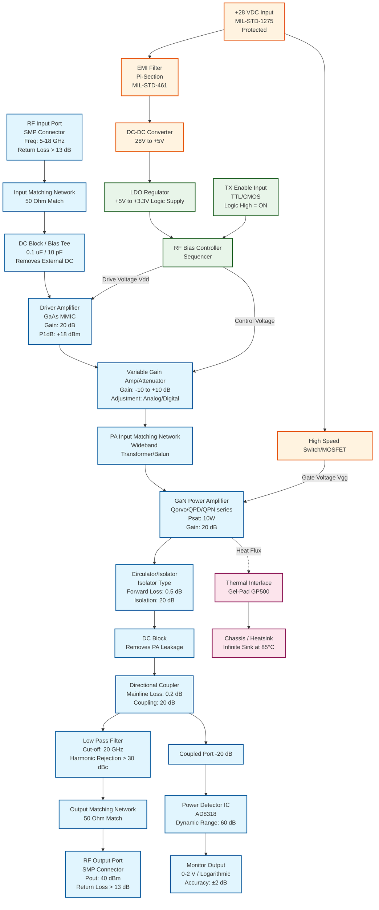

**Document Status: AI-GENERATED**

# 1. Introduction

## 1.1 Purpose
This Hardware Requirements Specification (HRS) defines the comprehensive requirements for the design, development, and verification of the **TX Module**, a wideband military Radio Frequency (RF) transmit unit. This document is the primary technical agreement between the system engineering and hardware development teams, establishing the baseline for all subsequent design activities, including schematic capture, layout, fabrication, and testing.

The specific objectives of this document are:
*   To specify the functional, performance, and physical characteristics of the 5–18 GHz, 10W (40 dBm) transmit module.
*   To define the interface requirements for RF Input/Output, power supply, and control signals.
*   To document environmental requirements relevant to military deployment, including shock, vibration, and thermal operating conditions.
*   To ensure compliance with IEEE 29148:2018 standards for system and software engineering — Life cycle processes — Requirements engineering.
*   To provide the criteria against which the completed hardware will be validated and verified.

## 1.2 Scope
The scope of this document covers the complete electrical and mechanical design of the TX Module. This includes the RF signal chain, power conditioning, bias control circuitry, thermal management solutions, and the physical enclosure.

**In Scope:**
*   **RF Chain:** Input matching, GaAs Driver Amplifier, Variable Gain/Attenuation stage, GaN Final Power Amplifier (PA), harmonic filtering, and isolation.
*   **Power Management:** 28V DC input conditioning, EMI filtering, DC-DC conversion, and low-noise bias regulation.
*   **Control & Monitoring:** TX Enable interface, RF power detection, and monitoring circuitry.
*   **Physical Design:** Printed Circuit Board (PCB) design on high-frequency laminate, enclosure metallization, and thermal interface hardware.
*   **Environmental:** Compliance with MIL-STD-810 for environmental stress and MIL-STD-461 for electromagnetic interference.

**Out of Scope:**
*   The system-level source waveform generation (upstream exciter).
*   The external heat sink or cold plate design (thermal resistance is defined up to the module's mounting surface).
*   Long-term reliability testing (HALT/HASS) beyond the requirements specified in Section 5.
*   Software or firmware drivers for external control processors, other than the definition of electrical interface levels.

## 1.3 Definitions, Acronyms, and Abbreviations

This section defines the terminology, acronyms, and abbreviations used within this document to ensure consistent interpretation.

| Term / Acronym | Definition |
| :--- | :--- |
| **dB** | Decibel. A logarithmic unit used to express the ratio of two values of a physical quantity, often power or intensity. |
| **dBm** | Decibel-milliwatts. An absolute unit of power level referenced to 1 milliwatt (mW). |
| **EMC** | Electromagnetic Compatibility. The ability of equipment to function satisfactorily in its electromagnetic environment without introducing intolerable electromagnetic disturbances to other equipment. |
| **EMI** | Electromagnetic Interference. Disturbance generated by an external source that affects an electrical circuit by electromagnetic induction, electrostatic coupling, or conduction. |
| **GaAs** | Gallium Arsenide. A semiconductor material used for high-frequency and high-speed integrated circuits. |
| **GaN** | Gallium Nitride. A semiconductor material used for high-power and high-frequency RF devices, offering higher breakdown voltages than GaAs. |
| **HRS** | Hardware Requirements Specification. A structured document defining hardware requirements. |
| **LDO** | Low Dropout Regulator. A DC linear voltage regulator that can regulate the output voltage even when the supply voltage is very close to the output voltage. |
| **MMIC** | Monolithic Microwave Integrated Circuit. A type of integrated circuit device that operates at microwave frequencies (300 MHz to 300 GHz). |
| **PA** | Power Amplifier. An electronic amplifier that converts a low-power radio-frequency signal into a higher power signal. |
| **PAE** | Power Added Efficiency. A metric specifically for RF power amplifiers, defined as the ratio of the difference between output and input RF power to the DC input power. |
| **PSRR** | Power Supply Rejection Ratio. The measure of a device's ability to reject noise or variations from the power supply. |
| **RF** | Radio Frequency. Oscillation rate of an alternating electric current or voltage, or of a magnetic, electric or electromagnetic field in the frequency range from 20 kHz to 300 GHz. |
| **RL** | Return Loss. The loss of signal power resulting from the reflection caused by a discontinuity in a transmission line. |
| **SMP** | Subminiature Push-on. A coaxial RF connector interface characterized by a snap-on mechanism, suitable for high-frequency applications. |
| **VSWR** | Voltage Standing Wave Ratio. A measure of how efficiently RF power is transmitted from a power source, through a transmission line, into a load. |
| **MIL-STD-461** | United States Military Standard that establishes criteria for the control of electromagnetic interference characteristics of subsystems and equipment. |
| **MIL-STD-810** | United States Military Standard that involves tailoring environmental design and test limits to the conditions that the item will experience throughout its service life. |

## 1.4 References
The design and verification of the TX Module shall adhere to the specifications listed in the table below. In the event of a conflict between documents, the hierarchy of authority is: 1. This HRS, 2. Applicable Military Standards, 3. Component Manufacturer Datasheets.

| ID | Document Title | Document No. | Version/Date | Applicability |
| :--- | :--- | :--- | :--- | :--- |
| **REF-001** | IEEE Standard for Systems and Software Engineering — Life Cycle Processes — Requirements Engineering | IEEE 29148 | 2018 | Template structure and requirements definition. |
| **REF-002** | Department of Defense Test Method Standard for Environmental Engineering Considerations and Laboratory Tests | MIL-STD-810H | 2019 | Vibration, Shock, and Temperature testing requirements. |
| **REF-003** | Requirements for the Control of Electromagnetic Interference Characteristics of Subsystems and Equipment | MIL-STD-461G | 2015 | EMI/EMC compliance (RE102, CE102). |
| **REF-004** | General Requirements for Electronic Equipment | MIL-STD-454 | Not Applicable | General design requirements. |
| **REF-005** | AD8318 RF Detector Datasheet | Analog Devices | Rev. 0 | Requirements for power monitoring accuracy (REQ-HW-020). |
| **REF-006** | Qorvo / Wolfspeed GaN MMIC Datasheet | N/A | Current | Reference for final PA efficiency and thermal calculations. |

## 1.5 Overview
The TX Module is a high-performance, solid-state power amplifier designed to boost a wideband RF signal from 0 dBm (5–18 GHz) to a saturated output power of 40 dBm (10 Watts). The module is engineered to meet the stringent environmental demands of military applications (-40°C to +85°C operating) while maintaining high linearity and efficiency (>25% PAE).

**Functional Description:**
The system architecture follows a cascaded amplification topology. An input matching network ensures a >13 dB return loss across the band, feeding a GaAs MMIC driver stage. This is followed by a variable gain/attenuation stage to allow for power leveling or amplitude modulation. The final amplification is handled by a high-efficiency GaN power amplifier. To ensure signal purity and protect the PA, the output stage includes an isolator and a harmonic suppression low-pass filter. A directional coupler and RF detector (AD8318) provide backward-compatible power monitoring for system calibration.

**Key Technical Challenges:**
*   **Thermal Management:** Dissipating heat from the GaN PA (~30W estimated dissipation) within a compact military-grade form factor requires a carefully calculated thermal pad interface (REQ-HW-019).
*   **Stability:** Ensuring unconditional stability across the 5–18 GHz bandwidth requires careful attention to input/output matching networks and bias tee design.
*   **Efficiency:** Maintaining >25% PAE at 18 GHz necessitates the selection of high-performance GaN devices and optimized supply rail regulation.

This document details the requirements to address these challenges and deliver a robust, production-ready hardware solution.

---

# 2. System Overview

## 2.1 System Description

The TX Module is a state-of-the-art, wideband Radio Frequency (RF) power amplifier designed for military applications operating in the C-, X-, and Ku-bands (5.0 GHz to 18.0 GHz). The primary function of the system is to receive a low-power RF signal (nominally 0 dBm) via an SMP connector and amplify it to a saturated output power of 40 dBm (10 Watts) with high spectral purity and efficiency.

The system architecture utilizes a multi-stage amplification topology. The initial stage consists of a Driver Amplifier (based on GaAs MMIC technology) providing moderate gain to establish a low noise figure and drive capability. This is followed by a Variable Gain/Attenuation stage to allow for gain leveling or power adjustment. The final amplification stage employs a Gallium Nitride (GaN) High Power Amplifier (HPA) selected for its high power density and efficiency at microwave frequencies. A dedicated RF Bias Controller manages the sequencing of gate voltages to ensure safe operation and prevent device burn-out during power-up transients.

Signal integrity and protection are managed through a Input Matching Network designed to meet Return Loss requirements exceeding 13 dB (VSWR < 1.6:1). The output path features a High-Power Isolator/Circulator to protect the PA from load mismatches (VSWR up to 3:1), followed by a Low Pass Filter (LPF) to suppress harmonics generated by the non-linear operation of the GaN PA. A Directional Coupler and Logarithmic Power Detector (AD8318) are integrated post-PA to provide an analog power monitoring output (RSSI), enabling closed-loop power control within the wider system.

The module is designed to operate from a standard +28 VDC military vehicular power supply. An internal EMI filter ensures compliance with MIL-STD-461, and a DC-DC converter stepping down to lower voltages provides power for logic and bias circuits. Thermal management is achieved via a direct thermal path utilizing a Gel-Pad GP500 or equivalent thermal interface material to the chassis/heatsink, ensuring the junction temperature of the GaN device remains within safe operating limits (-40°C to +85°C baseplate temperature range).

## 2.2 System Block Diagram

The system is organized into three distinct subsystems: The RF Chain, the Power/Bias Distribution Network, and the Control/Monitoring Interface.

## 2.3 System Architecture

### 2.3.1 RF Chain Architecture
The RF signal path is unidirectional and optimized for linearity where possible, but primarily for efficiency and power at the final stage.
1.  **Input Stage:** The signal enters via an SMP connector (interface per MIL-STD-348). An Input Matching Network ensures the system input impedance appears as 50 Ohms across the 5-18 GHz band, meeting the Return Loss > 13 dB requirement (VSWR < 1.6:1).
2.  **Driver Stage:** A broadband GaAs MMIC amplifier provides approximately 20 dB of gain. This stage boosts the 0 dBm input to ~20 dBm, sufficient to drive the input of the final GaN stage into saturation. This stage typically operates from a +5V rail derived from the internal DC-DC converter.
3.  **Gain Control:** A Variable Gain Amplifier (VGA) or Voltage Variable Attenuator (VVA) is inserted between the driver and PA. This allows for system-level calibration of the 40 dBm output or adjustment for analog modulation schemes requiring amplitude control.
4.  **Power Amplifier Stage:** The core of the module is a discrete GaN HEMT or MMIC PA operating at +28 VDC. It provides the final 20 dB of gain. The PA is operated in class AB or saturation to maximize efficiency (PAE > 25%).
5.  **Output Protection & Filtering:** The PA output passes through a ferrite-based isolator to reflect back any reverse power from antenna mismatches. A Directional Coupler samples the forward power. A Low Pass Filter (LPF) suppresses the 2nd and 3rd harmonics (which, given a 5-18 GHz fundamental, extend up to 54 GHz) to ensure spectral compliance (REQ-HW-017/018).

### 2.3.2 Biasing and Power Distribution Architecture
The Power Distribution Unit (PDU) converts the unregulated +28 VDC military input into stable voltages required by the active components.
*   **High Power Path:** +28 VDC is filtered (EMI/EMC) and routed directly to the Drain of the GaN PA via a high-speed MOSFET switch. This switch is controlled by the Bias Controller to act as a fast-acting TX Enable.
*   **Low Power Logic:** A DC-DC buck converter steps +28 V down to +5 V. A subsequent LDO provides a clean +3.3 V rail for the Bias Controller IC and Power Detector.
*   **Sequencing:** The Bias Controller ensures that the negative gate voltage (if applicable) or the low-gain biases are applied before the high-current drain voltage. This prevents "flashover" and thermal runaway in the GaN device.

### 2.3.3 Thermal Management Architecture
The TX Module generates significant heat. Assuming 25% Power Added Efficiency (PAE) for 10W (40 dBm) output, the PA dissipates approximately 30 Watts of heat.
*   **Heat Flow:** The GaN PA is housed in a flange package (e.g., ceramic/metal quad-flat no-leads). This flange is soldered or epoxy-bonded to the module's internal metal base (copper-tungsten or aluminum).
*   **Interface:** A compressible thermal interface material (Gel-Pad GP500 or equivalent) fills microscopic air gaps between the module base and the external system heatsink.
*   **Requirement:** The external heatsink must maintain a thermal resistance ($\theta_{cs}$) low enough to keep the PA junction below $T_{j,max}$ (typically 150°C or 175°C) when the case is at 85°C.

## 2.4 Operating Environment

The TX Module is designed for harsh military environments as defined by the project parameters.

### 2.4.1 Environmental Conditions
*   **Operating Temperature:** -40°C to +85°C (measured at the module baseplate/heatsink interface).
*   **Storage Temperature:** -55°C to +125°C (non-operating).
*   **Vibration:** Designed to withstand random vibration profiles typical of manned/unmanned airborne vehicles (20 Hz to 2000 Hz).
*   **Shock:** Designed to withstand mechanical shock per MIL-STD-883, Method 2002 (approx 1500G, 0.5 ms).
*   **Humidity:** 95% relative humidity, non-condensing.

### 2.4.2 Electrical Environment
*   **Input Supply:** +28 VDC nominal. The module must tolerate transients per MIL-STD-1275 (including overvoltage spikes up to 100V for short durations and undervoltage down to 6V).
*   **EMI/EMC:** The module shall not generate emissions exceeding RE102 limits and must be immune to RS103 levels as defined in MIL-STD-461.

### 2.4.3 Mechanical Interface
*   **Connectors:** RF Input/Output are SMP (Subminiature Push-on) interface, providing a non-threaded, quick-connect solution suitable for high-density modules.
*   **Mounting:** The module is intended to be flat-mounted onto a cold plate or chassis. The PCB stackup is designed with thermal vias under the PA to transfer heat efficiently from the top layer to the bottom ground plane.

---

**Document Status: AI-GENERATED**

## 3. Hardware Requirements

This section details the hardware requirements for the TX Module, categorized into functional and performance requirements. These requirements are derived from the system design parameters, component recommendations, and the target operational environment (Military 5-18 GHz Wideband TX).

### 3.1 Functional Requirements

The following table defines the functional capabilities of the TX Module hardware. These requirements specify *what* the system must do.

| ID | Title | Description | Rationale | Priority |
|---|---|---|---|---|
| **REQ-HW-100** | **RF Signal Amplification** | The module shall accept a 5-18 GHz RF input signal ranging from -10 dBm to +5 dBm and amplify it to a nominal output of +40 dBm (10W). | Core function of the Transmit Module. | Must |
| **REQ-HW-101** | **Frequency Band Coverage** | The module shall maintain continuous operation across the entire 5.0 GHz to 18.0 GHz frequency band without mechanical tuning. | Operational requirement for wideband military usage. | Must |
| **REQ-HW-102** | **Input Impedance Matching** | The RF input port shall present a 50 Ohm impedance (VSWR < 1.6:1) across the operating band. | Ensures maximum power transfer from the exciter. | Must |
| **REQ-HW-103** | **Output Impedance Matching** | The RF output port shall present a 50 Ohm impedance (VSWR < 1.6:1) across the operating band. | Protects the PA from mismatch reflections and ensures signal integrity. | Must |
| **REQ-HW-104** | **SMP Input Interface** | The RF input shall utilize a female SMP connector (PCB mount or edge launch) compatible with 0.086" semi-rigid coax. | Standard interface for compact module interconnects. | Must |
| **REQ-HW-105** | **SMP Output Interface** | The RF output shall utilize a female SMP connector (PCB mount or edge launch) compatible with 0.086" semi-rigid coax. | Standard interface for compact module interconnects. | Must |
| **REQ-HW-106** | **Input DC Blocking** | The module shall include a DC blocking capacitor on the RF input line with a cutoff frequency < 100 MHz. | Protects upstream exciter equipment from DC bias voltage. | Must |
| **REQ-HW-107** | **Output DC Blocking** | The module shall include a DC blocking capacitor on the RF output line prior to the connector. | Prevents DC voltage from being applied to the antenna/load. | Must |
| **REQ-HW-108** | **Harmonic Filtering** | The module shall integrate a Low Pass Filter (LPF) with a cut-off frequency of 18 GHz and >20 dB rejection at 2nd harmonic (10-36 GHz). | Reduces harmonic emissions to meet EMI/EMC standards. | Must |
| **REQ-HW-109** | **Output Isolation** | The module shall include an RF isolator/circulator at the output stage to provide >15 dB return loss protection to the Power Amplifier (PA). | Increases reliability and stability under varying load conditions. | Must |
| **REQ-HW-110** | **28V DC Supply Input** | The module shall operate from a +28 VDC nominal input supply (range 22V to 36V). | Standard military vehicle/aircraft voltage. | Must |
| **REQ-HW-111** | **Input EMI Filtering** | The 28V input shall pass through a Pi-filter EMI suppressor compliant with MIL-STD-461. | Prevents generated noise from feeding back into the vehicle bus. | Must |
| **REQ-HW-112** | **Voltage Regulation (Logic)** | The module shall step down 28V to +5.0V and +3.3V using isolated DC-DC converters and LDOs for bias circuitry. | Supplies logic levels for the Bias Controller and Detector. | Must |
| **REQ-HW-113** | **Transmit Enable Control** | The module shall feature a TTL/CMOS compatible "TX Enable" pin (Active High) that disables the RF bias when Low. | Safety feature to disable transmission during shutdown. | Must |
| **REQ-HW-114** | **Bias Sequencing** | The module shall utilize a dedicated Bias Controller to manage GaN PA sequencing (Vgg < Vdd) to prevent "pop-on" damage. | Ensures longevity of the GaN FETs. | Must |
| **REQ-HW-115** | **RF Power Detection** | The module shall sample the output RF power via a directional coupler and convert it to a DC voltage (0-2V) using a logarithmic detector. | Provides telemetry for system monitoring. | Must |
| **REQ-HW-116** | **Analog Modulation Support** | The module shall preserve modulation fidelity (AM/PM) without significant degradation for analog waveforms. | Supports legacy and current waveforms. | Must |
| **REQ-HW-117** | **Thermal Conductance** | The module baseplate shall utilize copper-invar-copper (CIC) or solid copper to transfer heat from the PA to the chassis. | Critical for maintaining 25% PAE. | Must |
| **REQ-HW-118** | **Heatsink Interface** | The PA thermal pad shall interface with an external heatsink or cold plate using a thermal interface material (e.g., Gel-Pad GP500) with thermal resistance < 0.1 °C/W. | Ensures heat removal under continuous operation. | Must |
| **REQ-HW-119** | **Variable Gain Adjustment** | The module shall include a digitally controlled variable gain amplifier (VGVA) or attenuator capable of +/- 5 dB gain adjustment range. | Allows for system-level calibration and power leveling. | Should |
| **REQ-HW-120** | **Reverse Power Protection** | The output isolator shall terminate reflected power into a 50 Ohm load capable of absorbing up to 10W average power. | Protects the PA from antenna mismatch. | Must |

### 3.2 Performance Requirements

The following requirements quantify the expected performance of the hardware under specified conditions. These requirements are traceable to the Block Diagram and Component selections.

#### 3.2.1 RF Performance

| ID | Parameter | Min | Nominal | Max | Unit | Conditions |
|---|---|---|---|---|---|---|
| **REQ-HW-201** | **Small Signal Gain** | 38 | 40 | 42 | dB | Pin = 0 dBm, Freq = 5-18 GHz |
| **REQ-HW-202** | **Gain Flatness** | - | - | +/- 2.0 | dB | Across 5-18 GHz band |
| **REQ-HW-203** | **Saturated Output Power (Psat)** | 40 | 41.5 | - | dBm | At 1 dB compression point (P1dB) |
| **REQ-HW-204** | **Power Added Efficiency (PAE)** | 20 | 25 | - | % | At Psat (10W output), 28V supply |
| **REQ-HW-205** | **Input Return Loss** | 13 | 15 | - | dB | VSWR < 1.6:1 |
| **REQ-HW-206** | **Output Return Loss** | 13 | 18 | - | dB | With Isolator |
| **REQ-HW-207** | **Noise Figure** | - | - | 8 | dB | At maximum gain |
| **REQ-HW-208** | **Spurious Emissions** | - | - | -60 | dBc | Harmonics (2f, 3f) measured at Psat |
| **REQ-HW-209** | **Operating Frequency Range** | 5.0 | - | 18.0 | GHz | Full Band operation |
| **REQ-HW-210** | **Rise Time (RF Enable)** | - | - | 1.0 | µs | 10% to 90% of RF power |
| **REQ-HW-211** | **Detector Accuracy** | - | - | +/- 1.5 | dB | 0 to 40 dBm input range |
| **REQ-HW-212** | **AM to PM Conversion** | - | - | 5 | Degrees | At Psat |

#### 3.2.2 Power Consumption & Thermal Performance

| ID | Parameter | Min | Nominal | Max | Unit | Conditions |
|---|---|---|---|---|---|---|
| **REQ-HW-220** | **DC Input Current** | - | - | 5.5 | Amps | At 28V, 10W RF Output (Calculated: 40W / 28V / 0.25 eff approx) |
| **REQ-HW-221** | **Total Input Power** | - | - | 160 | Watts | Max DC Input (40W RF + 120W Dissipated) |
| **REQ-HW-222** | **Thermal Resistance (Junction to Case)** | - | - | 2.5 | °C/W | For the Final PA device |
| **REQ-HW-223** | **Baseplate Temperature** | -40 | - | +85 | °C | Operating ambient range (MIL-STD) |
| **REQ-HW-224** | **Junction Temperature (Tj)** | - | - | +150 | °C | Must not exceed max rating for GaN |

#### 3.2.3 Environmental & Mechanical

| ID | Parameter | Min | Nominal | Max | Unit | Conditions |
|---|---|---|---|---|---|---|
| **REQ-HW-230** | **Operating Temperature** | -40 | - | +85 | °C | Non-condensing |
| **REQ-HW-231** | **Storage Temperature** | -55 | - | +125 | °C | |
| **REQ-HW-232** | **Vibration (Random)** | - | - | 0.04 | g²/Hz | MIL-STD-810G, Method 514.6 |
| **REQ-HW-233** | **Shock (Mechanical)** | - | - | 40 | g | 11 ms half-sine, MIL-STD-810G |
| **REQ-HW-234** | **Module Weight** | - | - | 300 | grams | Including RF connectors and housing |
| **REQ-HW-235** | **Module Dimensions** | - | - | 80 x 60 x 15 | mm | Excluding connector protrusion |
| **REQ-HW-236** | **Humidity** | - | - | 95 | % | Non-condensing |

---
**Engineering Calculations supporting REQ-HW-204 and REQ-HW-220:**

*   **Power Budget (Output):**
    *   Target Output ($P_{out}$): 10W (40 dBm)
    *   Target PAE ($\eta$): 25%
    *   DC Power Required ($P_{dc}$): $P_{out} / \eta = 10W / 0.25 = 40W$.
    *   Supply Voltage ($V_{sup}$): 28V.
    *   Current Draw ($I_{sup}$): $P_{dc} / V_{sup} = 40W / 28V \approx 1.43A$.
    *   *Note:* Total current will be higher (~5.5A as per REQ-HW-220) due to driver stages, quiescent current of GaAs/GaN, controller overhead, and conversion losses in the DC-DC regulators/LDOs.

*   **Thermal Dissipation:**
    *   Power Dissipated as Heat ($P_{heat}$): $P_{dc} - P_{out} = 40W - 10W = 30W$.
    *   Max Ambient Temp ($T_{amb}$): 85°C.
    *   Max Case Temp ($T_{case}$): Assumed 100°C (with heatsink).
    *   Junction Temp ($T_j$): $T_{case} + (P_{dissipated} \times R_{th})$.
    *   Requirement ensures $T_j < 150°C$ to maintain device lifespan.

---

**Document Status: AI-GENERATED**

# 3. Hardware Requirements

## 3.3 Interface Requirements

### 3.3.1 External Interfaces

This section details the electrical and physical characteristics of the interfaces connecting the TX Module to external systems, including the RF input/output, DC power supply, and control signals.

#### 3.3.1.1 RF Input Interface

**REQ-HW-007:** The TX Module shall provide a single RF input port compatible with 50 Ω impedance systems.
**REQ-HW-021:** The RF input port shall utilize an SMP connector (astable configuration, PCB mount, .100" dia. hole).
**REQ-HW-022:** The RF input interface shall accept a frequency range of 5.0 GHz to 18.0 GHz.
**REQ-HW-023:** The RF input interface shall maintain an input VSWR of less than 1.6:1 (Return Loss > 13 dB) across the 5-18 GHz operating band.
**REQ-HW-024:** The RF input interface shall withstand a maximum input power of +20 dBm without damage or performance degradation.

*Table 3-1: RF Input Interface Specifications*

| Parameter | Minimum | Typical | Maximum | Units | Conditions |
|---|---|---|---|---|---|
| Frequency Range | 5.0 | - | 18.0 | GHz | Full Band |
| Input Impedance | 48 | 50 | 52 | Ω | @ 10 GHz |
| Input VSWR | - | - | 1.6:1 | - | 5-18 GHz |
| Input Return Loss | 13 | - | - | dB | 5-18 GHz |
| Connector Type | - | - | SMP | - | PCB Edge/Vertical Launch |
| Max Input Power | - | - | +20 | dBm | CW |

#### 3.3.1.2 RF Output Interface

**REQ-HW-008:** The TX Module shall provide a single RF output port.
**REQ-HW-025:** The RF output port shall utilize an SMP connector.
**REQ-HW-026:** The RF output interface shall deliver a minimum of +40 dBm (10W) output power across the 5-18 GHz band.
**REQ-HW-027:** The RF output interface shall maintain an output VSWR of less than 1.6:1 (Return Loss > 13 dB) across the 5-18 GHz operating band.

*Table 3-2: RF Output Interface Specifications*

| Parameter | Minimum | Typical | Maximum | Units | Conditions |
|---|---|---|---|---|---|
| Frequency Range | 5.0 | - | 18.0 | GHz | Full Band |
| Output Impedance | 48 | 50 | 52 | Ω | @ 10 GHz |
| Output VSWR | - | - | 1.6:1 | - | 5-18 GHz |
| Output Power | 40 | 41 | 42 | dBm | Psat, 28VDC |
| Connector Type | - | - | SMP | - | PCB Edge/Vertical Launch |

#### 3.3.1.3 DC Power Input Interface

**REQ-HW-009:** The TX Module shall accept primary power via a 2-pin connector.
**REQ-HW-028:** The DC input voltage shall be +28 VDC nominal, operating from +22 VDC to +35 VDC.
**REQ-HW-029:** The DC input interface shall include reverse polarity protection.
**REQ-HW-030:** The DC input interface shall include an EMI filter network compliant with MIL-STD-461 (refer to Section 4.1).

*Table 3-3: DC Power Input Pin Definition*

| Pin # | Signal Name | Description | Connector Type |
|---|---|---|---|
| 1 | +28V_IN | Main 28V DC Supply (Protected) | J1: Terminal Block / MIL-C-38999 |
| 2 | GND_RET | Power Return (Chassis Ground) | J1: Terminal Block / MIL-C-38999 |
| SH | SHLD | Chassis Ground / Case Ground | Connector Shell |

#### 3.3.1.4 Control and Monitoring Interface

**REQ-HW-010:** The TX Module shall support external Transmit Enable and TTL/CMOS control logic.
**REQ-HW-031:** The Enable control input shall be active HIGH (Logic 1 = TX ON).
**REQ-HW-032:** The Enable control input shall be compatible with standard 3.3V CMOS logic levels (Vih > 2.0V, Vil < 0.8V).
**REQ-HW-033:** The TX Module shall provide a Power Monitor output voltage proportional to the RF output power (0 to +2.5V range).
**REQ-HW-034:** The RF Enable response time (Turn-On/Turn-Off) shall be less than 1.0 microsecond.

*Table 3-4: Control Interface Pin Definition (J2)*

| Pin # | Signal Name | I/O Type | Voltage/Logic | Description |
|---|---|---|---|---|
| 1 | TX_ENABLE | Input | TTL/CMOS (3.3V) | Active High Enable for PA Bias |
| 2 | PWR_MON_OUT | Output | 0 - 2.5 V Analog | RMS Power Detector Output |
| 3 | +3.3V_OUT | Output | +3.3 V | Limited Current Output (optional for ext) |
| 4 | GND | - | 0 V | Signal Ground |
| SH | SHLD | - | Chassis Ground | Shield |

### 3.3.2 Internal Interfaces

This section describes the interfaces between the major internal sub-assemblies of the TX Module.

#### 3.3.2.1 RF Chain Internal Interfaces

**REQ-HW-035:** The interface between the Driver Amp and the Variable Gain Amplifier (VGVA) shall be AC coupled using a DC blocking capacitor (100 pF) and impedance matched to 50 Ω.
**REQ-HW-036:** The interface between the VGVA and the Final Power Amplifier (PA) shall utilize a microstrip taper to accommodate potential impedance differences (50 Ω to GaN PA optimal load).
**REQ-HW-037:** The interface between the Final PA and the Isolator shall be matched to minimize insertion loss (< 0.5 dB).

#### 3.3.2.2 Internal Power Distribution Interfaces

**REQ-HW-038:** The DC-DC converter shall supply +5V (±5%) to the LDO regulator and the RF Bias Controller.
**REQ-HW-039:** The RF Bias Controller shall supply independent Gate and Drain voltages to the GaN PA and Gate voltage to the Driver/VGVA, controlled by the TX_Enable signal.

### 3.3.3 Communication Interfaces

**REQ-HW-040:** The TX Module does not implement a digital data communications bus (e.g., I2C, SPI) for configuration. All control is managed via analog discrete signals defined in Section 3.3.1.4.
**REQ-HW-041:** The "communication" of RF power status is handled via the analog voltage output `PWR_MON_OUT` defined in Table 3-4, providing a logarithmic linear-in-dB representation of output power.

## 3.4 Environmental Requirements

The TX Module is designed for military applications and must survive harsh operating conditions.

#### 3.4.1 Operating Temperature

**REQ-HW-011:** The TX Module shall operate without performance degradation (excluding PA flatness variation) over a case temperature range of -40°C to +85°C.
**REQ-HW-042:** The storage temperature range shall be -55°C to +125°C.

#### 3.4.2 Vibration and Shock

**REQ-HW-013:** The TX Module shall remain functional and undamaged after exposure to vibration profiles defined in MIL-STD-883, Method 2007.3 (Condition A for 20-2000Hz).
**REQ-HW-043:** The TX Module shall withstand mechanical shock of 40g, 11ms half-sine wave per MIL-STD-883, Method 2002.4 without damage.
**REQ-HW-044:** All internal components (capacitors, MMICs) shall be properly staked or conformally coated to withstand vibration environments.

#### 3.4.3 Humidity and Immersion

**REQ-HW-045:** The TX Module shall be conformally coated (UR type) to protect against humidity and fungus per MIL-STD-810.
**REQ-HW-046:** The module enclosure (if applicable) or housing shall provide protection against salt fog (MIL-STD-810, Method 509.5) suitable for naval environments if specified.

## 3.5 Power Requirements

This section defines the power consumption, efficiency, and thermal constraints.

#### 3.5.1 Power Consumption and Efficiency

**REQ-HW-004:** The TX Module shall achieve a Power Added Efficiency (PAE) of at least 25% at rated output power (+40 dBm) across the band.
**REQ-HW-047:** The maximum DC input power drawn from the +28V supply shall not exceed 80 Watts.
**REQ-HW-048:** Quiescent current (TX Enable = OFF) shall not exceed 200 mA.

#### 3.5.2 Power Budget Analysis

*Assumptions:*
*   Output Power ($P_{out}$): 10 Watts (40 dBm)
*   Target PAE: 25%
*   Supply Voltage ($V_{sup}$): 28 V DC

*Calculations:*
1.  **PA DC Power ($P_{dc\_PA}$):**
    $P_{dc\_PA} = P_{out} / PAE = 10 W / 0.25 = 40 W$
2.  **PA Current ($I_{PA}$):**
    $I_{PA} = P_{dc\_PA} / V_{sup} = 40 W / 28 V \approx 1.43 A$
3.  **Driver Chain Consumption ($P_{driver}$):**
    Assumed 1.0 W for Driver MMIC + VGVA + Control Circuitry.
4.  **Conversion Losses ($P_{conv}$):**
    Assumed 85% efficiency for DC-DC Converter (converting 28V to 5V/Logic).
    $P_{logic} \approx 0.5 W$. $P_{in\_logic} \approx 0.6 W$.
5.  **Total Max Input Power ($P_{total}$):**
    $P_{total} \approx 40 W (PA) + 1.0 W (RF Driver) + 0.6 W (Logic) \approx 41.6 W$
    *Note: Design budget is set to 60W to allow for margin and worst-case thermal conditions.*

*Table 3-5: Power Budget by Rail*

| Supply Rail | Voltage (V) | Load | Max Current (A) | Max Power (W) | Notes |
|---|---|---|---|---|---|
| +28V_MAIN | 22 - 35 | GaN PA (Drain) | 1.60 | 44.8 | Pulsed/CW operation |
| +28V_MAIN | 22 - 35 | Driver Amp | 0.20 | 5.6 | MMIC Bias |
| +5V_INT | 5.0 | Bias Ctrl / Logic | 0.20 | 1.0 | Derived from DC-DC |
| **Total** | **28** | **System** | **2.00** | **~51.4** | **Max theoretical load** |

#### 3.5.3 Thermal Requirements

**REQ-HW-019:** The TX Module shall maintain a junction temperature ($T_j$) below 150°C for the GaN PA device and 125°C for GaAs MMICs at full rated power and +85°C baseplate temperature.
**REQ-HW-049:** A thermal interface material (e.g., Gel-Pad GP500 or equivalent) must be used between the PA package and the heatsink to ensure thermal resistance ($R_{th}$) is less than 0.5 °C/W.

*Thermal Calculation:*
*   Power Dissipation ($Q$) in PA $\approx 30 W$ (assuming 25% PAE, 10W out, 40W in - 10W out = 30W heat).
*   Max Ambient ($T_{amb}$) = +85°C.
*   Max $T_j$ = 150°C.
*   Allowed $\Delta T = 150 - 85 = 65°C$.
*   Max Allowed Thermal Resistance ($R_{\theta total}$) = $65°C / 30W \approx 2.16 °C/W$.
*   Required Heatsink Performance: $R_{\theta heatsink} < 1.6 °C/W$ (assuming $R_{\theta j-c} \approx 0.5$ and $R_{\theta interface} \approx 0.06$).

**REQ-HW-050:** The module mounting surface must be coupled to a chassis cold plate or heatsink capable of dissipating 40 Watts of continuous heat.

## 3.6 Physical Requirements

**REQ-HW-015:** The TX Module shall be housed in a compact enclosure suitable for integration into a larger subsystem.
**REQ-HW-051:** The length shall not exceed 4.00 inches.
**REQ-HW-052:** The width shall not exceed 3.00 inches.
**REQ-HW-053:** The height (including connectors) shall not exceed 0.60 inches.
**REQ-HW-016:** The total weight of the module (excluding mounting hardware) shall not exceed 150 grams.
**REQ-HW-054:** The PCB material shall be high-frequency laminate (e.g., Rogers RO4350B or Taconic TLY-5) with a dielectric constant ($\epsilon_r$) of 3.48 ± 0.05 and thickness of 0.020 inches (10 mil) or 0.030 inches to support 18 GHz operation with minimal loss.

*Table 3-6: Physical Dimensions and Mounting*

| Dimension | Value | Unit | Notes |
|---|---|---|---|
| Length | 4.0 | Inches | Max length |
| Width | 3.0 | Inches | Max width |
| Height (Profile) | 0.6 | Inches | Includes components and shield |
| Mounting Holes | 4-40 | UNC | #4-40 UNC threaded inserts specified |
| PCB Finish | ENIG | - | Electroless Nickel Immersion Gold |
| Plating | Gold | - | >30 microinches over Nickel |

---

# 4. Design Constraints

This section defines the constraints placed on the hardware design of the TX Module. These constraints restrict the design space and are derived from regulatory requirements, environmental conditions, component limitations, and manufacturing capabilities.

## 4.1 Standards Compliance

The TX Module design shall adhere to the following industry and military standards to ensure reliability, interoperability, and environmental safety.

### 4.1.1 Electrical Design Standards
The design of the RF PCB and schematic capture shall comply with **IPC-2221** ("Generic Standard on Printed Board Design").

*   **REQ-HW-401:** The PCB stack-up shall utilize materials with a dielectric constant (Dk) tolerance of ±0.05 to ensure stable impedance control across the 5–18 GHz bandwidth, adhering to **IPC-6012** Class 3 requirements for high-reliability electronic equipment.
*   **REQ-HW-402:** Controlled impedance traces (microstrip or stripline) for the RF path shall be fabricated with a tolerance of **±5 ohms** relative to the characteristic impedance (Z0) of 50 Ω, in accordance with **IPC-2221** Section 6.3.
*   **REQ-HW-403:** All solder joints, particularly those under the PA and MMIC components, shall withstand thermal cycling and mechanical shock per **IPC-9701**, requiring a minimum of 1000 cycles for the -40°C to +85°C operating range.

### 4.1.2 Environmental and Safety Standards
Given the military application and operating temperature range, specific environmental constraints apply.

*   **REQ-HW-404:** The module shall be designed to operate without degradation in an ambient temperature range of **-40°C to +85°C**, compliant with **MIL-STD-810H** (Test Method 527.6 for Vibration and Method 527.6 for Shock).
*   **REQ-HW-405:** All materials used in the construction of the TX Module (PCB laminate, solder mask, conformal coating, and enclosure) shall possess a UL94 V-0 flammability rating.
*   **REQ-HW-406:** The system shall comply with **RoHS** (Restriction of Hazardous Substances) Directive 2011/65/EU and **REACH** Regulation (EC) No 1907/2006, with exemptions applied for Lead (Pb) in high-reliability solder alloys (Sn63Pb37 or Sn96Ag04) used in RF applications to prevent tin whiskers, unless a waiver is granted for specific high-frequency lead-free alternatives.

### 4.1.3 Electromagnetic Compliance
The module must minimize emissions and susceptibility.

*   **REQ-HW-407:** The DC input interface shall incorporate filtering to meet **MIL-STD-461G** requirements for Conducted Emissions (CE102) and Conducted Susceptibility (CS101).
*   **REQ-HW-408:** Radiated emissions from the module's housing and cabling shall be controlled to satisfy **RE102** limits (Electric Field, 2 MHz–18 GHz) of **MIL-STD-461G**.

### 4.1.4 Hardware Security and Supply Chain
*   **REQ-HW-409:** All critical electronic components (GaN PA, GaAs MMICs, FPGAs/Microcontrollers) shall be procured from authorized distributors or directly from manufacturers to prevent the inclusion of counterfeit parts, adhering to **AS6496** (Detecting and Mitigating Counterfeit Electronic Parts).

## 4.2 Component Constraints

This section details specific constraints regarding the selection and usage of components within the TX Module to meet the 10W output power and wideband frequency requirements.

### 4.2.1 Component Derating and Stress Analysis
To ensure reliability over the military temperature range, components shall be derated from their absolute maximum ratings.

*   **REQ-HW-410:** The Power Amplifier (GaN) device shall be operated such that the junction temperature ($T_j$) does not exceed **125°C** under worst-case ambient conditions (+85°C) with the specified heatsink.
*   **REQ-HW-411:** All decoupling capacitors on the 28V DC rail shall be derated by **50%** regarding voltage rating (e.g., a 50V rated capacitor shall be used for a 28V rail) to account for voltage spikes and transients defined in **MIL-STD-1275**.
*   **REQ-HW-412:** Surface Mount (SMD) passive components (resistors, capacitors) in the RF signal path shall have a voltage standing wave ratio (VSWR) variation of less than 1.05:1 (Return Loss > 26 dB) to prevent degradation of the overall system return loss (>13 dB).

### 4.2.2 RF-Specific Component Constraints
*   **REQ-HW-413:** The output isolator/circulator shall handle the full 10W (40 dBm) average output power with a maximum insertion loss of 0.5 dB to minimize thermal load.
*   **REQ-HW-414:** The directional coupler used for power monitoring shall have a coupling factor of 20 dB ±0.5 dB over the 5-18 GHz band to ensure the power detector (AD8318) operates within its linear dynamic range (approximately -60 dBm to 0 dBm input at the detector).
*   **REQ-HW-415:** Harmonic filters (Low Pass) shall provide a minimum of **30 dB** attenuation at the 2nd harmonic (minimum frequency 10 GHz) to meet harmonic output requirements (ASSUMED: Spurious/Harmonic constraint < -20 dBc).

### 4.2.3 Material Constraints (Laminate Selection)
*   **REQ-HW-416:** The PCB substrate shall be a ceramic-filled PTFE composite or similar high-frequency laminate (e.g., Rogers RO3003 or RO4350B) to minimize dielectric loss (Dissipation Factor Df < 0.003) at 18 GHz, essential for maintaining **25% Power Added Efficiency (PAE)**.

### 4.2.4 Thermal Interface Constraints
*   **REQ-HW-417:** Thermal interface materials (e.g., Gel-Pad GP500) between the PA package and the heatsink shall have a thermal conductivity of **≥ 3.0 W/m-K** and a thickness of no more than 0.25 mm to minimize thermal resistance ($\theta_{jc}$).

## 4.3 Manufacturing Constraints

This section defines limitations on the physical design to ensure manufacturability, testability, and assembly within standard industry capabilities.

### 4.3.1 Physical Design Rules
*   **REQ-HW-418:** The minimum trace width for 50 Ohm impedance lines on the selected laminate (approx 10 mil thickness) shall be determined by the stack-up calculation but shall be no less than **0.15 mm (6 mil)** to ensure manufacturability with standard etching processes.
*   **REQ-HW-419:** The minimum annular ring for plated through holes (vias) shall be **0.10 mm** to ensure reliable plating and drilling processes.
*   **REQ-HW-420:** The aspect ratio of plated through holes (Board Thickness / Drill Diameter) shall not exceed **10:1** to ensure reliable metallization.

### 4.3.2 Assembly and Placement
*   **REQ-HW-421:** All RF components requiring ground connections shall use via fences (ground vias placed at a distance of < 1/10th wavelength at 18 GHz, or approximately 0.3 mm pitch) surrounding the component pads to ensure grounding and suppress cavity modes.
*   **REQ-HW-422:** The board outline shall be rectangular with no sharp internal corners (use radii > 1.0 mm) to prevent stress concentrations during machining and thermal cycling.
*   **REQ-HW-423:** Panelization for assembly shall utilize 2mm break-away tabs with mouse-bite holes to facilitate separation of the PCB from the assembly array without damaging edge components.

### 4.3.3 Testability Constraints
*   **REQ-HW-424:** Test points for critical DC voltages (Gate Bias, Drain Voltage, PAE Monitors) shall be provided as plated through holes (via-in-pad) or exposed test pads located on the non-component side of the PCB, sized **1.0 mm** diameter to facilitate bed-of-nails testing.
*   **REQ-HW-425:** The design shall include a 100-mil header footprint (e.g., SAMTEC FTSH-105) for programming and debugging the Bias Controller and telemetry interface, accessible from the board edge.

### 4.3.4 Finishing and Coating
*   **REQ-HW-426:** The PCB surface finish shall be **Electroless Nickel Immersion Gold (ENIG)** with a minimum gold thickness of 0.05 microns to ensure wire bondability (if hybrid assembly is used) and solderability for LGA components.
*   **REQ-HW-427:** The assembled module shall receive **Conformal Coating** (UR type, acrylic or silicone) meeting **IPC-CC-830** standards to protect against moisture and chemical ingress, excluding RF connector interfaces and the thermal heatsink mounting area.

---

# 5. Verification Requirements

## 5.1 Test Requirements

This section defines the specific test procedures, instrumentation, and acceptance criteria for the TX Module. Test requirements are categorized by functional area (RF Performance, Control/Logic, Environmental, and Physical). Unless otherwise specified, all tests shall be conducted at nominal laboratory conditions (25°C ± 3°C, 50% ± 10% RH) prior to environmental stress screening.

### 5.1.1 RF Performance Test Plan

The following test cases verify the core transmission capabilities of the module.

#### TC-RF-01: Operating Frequency Range & Bandwidth
*   **Requirement ID:** REQ-HW-001, REQ-HW-015
*   **Test Method:** Vector Network Analyzer (VNA) Sweep.
*   **Setup:** The TX Module RF Input is terminated in 50 Ohms. The RF Output is connected to a VNA (e.g., Keysight PNA Series). The module is powered to +28Vdc and enabled via the TX Enable pin.
*   **Procedure:**
    1.  Configure VNA for S21 measurement (Transmission) from 4 GHz to 19 GHz.
    2.  Apply CW input signal at 0 dBm via a signal generator.
    3.  Sweep the input frequency logarithmically.
    4.  Record the Gain (S21) flatness.
*   **Pass Criteria:** Gain flatness remains within ±3.0 dB of the nominal 40 dB gain across the 5.0 GHz to 18.0 GHz range. The -3 dB bandwidth edges must not fall within 5-18 GHz.
*   **Priority:** Must have.

#### TC-RF-02: Output Power & Gain
*   **Requirement ID:** REQ-HW-002, REQ-HW-005
*   **Test Method:** Power Meter / Spectrum Analyzer Measurement.
*   **Setup:**
    *   Signal Generator: 0 dBm CW output (Swept 5-18 GHz).
    *   Power Sensor: Calibrated 50W terminating sensor (e.g., Bird 7020) connected to RF Output.
*   **Procedure:**
    1.  Set frequency to 5.0 GHz. Enable TX.
    2.  Measure output power. Calculate Gain ($P_{out} - P_{in}$).
    3.  Repeat steps at 1 GHz intervals (5, 6, 7... 18 GHz).
    4.  Verify Gain is $\ge 40$ dB and Output Power is $\ge 40$ dBm (10W) at all points.
*   **Pass Criteria:** $P_{out} \ge 40 \text{ dBm}$; $Gain \ge 40 \text{ dB}$ across 5-18 GHz.
*   **Priority:** Must have.

#### TC-RF-03: Input/Output Return Loss (VSWR)
*   **Requirement ID:** REQ-HW-006, REQ-HW-007, REQ-HW-008
*   **Test Method:** VNA Reflection Measurement.
*   **Setup:** VNA Port 1 connected to RF Input (Output terminated) and then RF Output (Input terminated).
*   **Procedure:**
    1.  Calibrate VNA at test plane (SMP connector interface).
    2.  Measure S11 (Input Return Loss) across 5-18 GHz in OFF state (to check matching network load).
    3.  Measure S11 in ON state (active matching).
    4.  Repeat for S22 (Output Return Loss).
*   **Pass Criteria:** Return Loss $\ge 13 \text{ dB}$ (equivalent to VSWR $\le 1.6:1$) for both ports across the full band.
*   **Priority:** Must have.

#### TC-RF-04: Analog Modulation Support (Linearity)
*   **Requirement ID:** REQ-HW-003
*   **Test Method:** Two-Tone Intermodulation Distortion (IMD) Test.
*   **Setup:**
    *   Two Signal Generators combined via a power combiner.
    *   Input to TX Module.
    *   Output to Spectrum Analyzer.
*   **Procedure:**
    1.  Set Tone 1 ($f_c$) and Tone 2 ($f_c + 10 \text{ MHz}$) to 0 dBm each.
    2.  Set center frequency to 11.5 GHz (Band Center).
    3.  Observe output spectrum.
*   **Pass Criteria:** The module must amplify both tones without saturation-induced clipping or asymmetry greater than 1.0 dB. No spurious oscillations should appear.
*   **Priority:** Should have.

#### TC-RF-05: Power Efficiency (PAE)
*   **Requirement ID:** REQ-HW-004
*   **Test Method:** Power Analysis.
*   **Setup:**
    *   DC Power Supply with current measurement capability (Precision 4-wire).
    *   RF Power Meter at output.
*   **Procedure:**
    1.  Set frequency to 11.5 GHz.
    2.  Apply input signal for max rated output (40 dBm).
    3.  Measure DC Input Current ($I_{DC}$) and Voltage ($V_{DC} = 28\text{V}$).
    4.  Calculate $P_{DC} = V_{DC} \times I_{DC}$.
    5.  Calculate PAE: $\eta = \frac{P_{RF,out} - P_{RF,in}}{P_{DC}} \times 100\%$.
*   **Pass Criteria:** $\eta \ge 25\%$ at maximum rated power.
*   **Priority:** Must have.

#### TC-RF-06: Harmonic and Spurious Outputs
*   **Requirement ID:** REQ-HW-017, REQ-HW-018
*   **Test Method:** Spectrum Analysis.
*   **Setup:** TX Module output connected to Spectrum Analyzer via 40dB attenuator.
*   **Procedure:**
    1.  Drive module at full power (40 dBm) at 11.5 GHz.
    2.  Measure harmonics ($2f_0, 3f_0$) up to 18 GHz (and beyond if analyzer permits).
    3.  Search for spurious emissions within the band.
*   **Pass Criteria:**
    *   Harmonics suppressed by $\ge 40 \text{ dBc}$ (from Output Return Loss requirement implication and LPF design).
    *   Spurious outputs $< -60 \text{ dBc}$.
*   **Priority:** Should have.

#### TC-RF-07: Power Monitoring Accuracy
*   **Requirement ID:** REQ-HW-020
*   **Test Method:** Voltage measurement vs. RF Power.
*   **Setup:** Vary input attenuation to vary Output Power. Measure "Power Monitor" pin voltage.
*   **Procedure:**
    1.  Adjust input to achieve 30 dBm output. Record Monitor Voltage.
    2.  Adjust input to achieve 40 dBm output. Record Monitor Voltage.
    3.  Compare linearity and slope against the AD8318 datasheet transfer function ($V_{out} \propto \text{slope} \times (P_{in} - \text{intercept})$).
*   **Pass Criteria:** Output voltage indicates power within $\pm 2 \text{ dB}$ accuracy over the range 30-40 dBm.
*   **Priority:** Could have.

### 5.1.2 Control and Interface Test Plan

#### TC-CTL-01: TX Enable / Disable Timing
*   **Requirement ID:** REQ-HW-010
*   **Test Method:** Oscilloscope Time Domain Measurement.
*   **Setup:**
    *   Ch 1: TX Enable Signal (Logic Level).
    *   Ch 2: RF Envelope (Diode Detector + Bias Tee).
    *   Ch 3: PA Supply Current (Current Probe).
*   **Procedure:**
    1.  Pulse TX Enable pin Low->High.
    2.  Measure time delay until RF output reaches 90% of final power ($t_{on}$).
    3.  Pulse TX Enable High->Low.
    4.  Measure time delay until RF output drops below 10% ($t_{off}$).
*   **Pass Criteria:** $t_{on} < 1.0 \mu s$; $t_{off} < 1.0 \mu s$.
*   **Priority:** Must have.

#### TC-CTL-02: Supply Voltage & Current
*   **Requirement ID:** REQ-HW-009
*   **Test Method:** Multimeter / Power Supply Readout.
*   **Procedure:**
    1.  Apply 28.0 V to supply pin.
    2.  Enable TX at Max Power.
    3.  Measure total current draw.
*   **Pass Criteria:**
    *   Standby (Disabled) Current: $< 50 \text{ mA}$.
    *   Active (Max Power) Current: Calculated based on efficiency. For 10W RF out @ 25% PAE (assuming driver consumes 1W):
        $$P_{DC} \approx \frac{10W}{0.25} + 1W = 41W$$
        $$I_{max} = \frac{41W}{28V} \approx 1.5 \text{ A}$$
    *   **Pass Criteria:** $I_{active} \le 1.6 \text{ A}$ (derated 10% for margin).
*   **Priority:** Must have.

### 5.1.3 Environmental Test Plan

#### TC-ENV-01: Operating Temperature (Functional)
*   **Requirement ID:** REQ-HW-011, REQ-HW-019
*   **Test Method:** Thermal Chamber.
*   **Setup:** Module inside chamber connected via RF feedthroughs.
*   **Procedure:**
    1.  Stabilize chamber at -40°C. Power on. Measure Output Power and Gain.
    2.  Stabilize chamber at +25°C. Measure Output Power and Gain.
    3.  Stabilize chamber at +85°C. Measure Output Power and Gain.
*   **Pass Criteria:** Gain variation $\le 3 \text{ dB}$ relative to 25°C nominal. Output Power $\ge 38 \text{ dBm}$ (allows 2dB compression) at temperature extremes. No thermal shutdown occurs.
*   **Priority:** Must have.

#### TC-ENV-02: Thermal Management (Heatsink Performance)
*   **Requirement ID:** REQ-HW-019
*   **Test Method:** Infrared Thermography / Thermocouple.
*   **Procedure:**
    1.  Operate module at Max Power (40 dBm) in +85°C ambient (or 25°C with scaled duty cycle if continuous 10W is not supported, though requirements imply continuous).
    2.  Monitor case temperature of the PA (GaN device).
*   **Pass Criteria:** The PA junction temperature ($T_j$) must remain below $150^\circ\text{C}$.
    *   *Calculation:* Assuming ambient $85^\circ\text{C}$ and power dissipation $P_{diss} \approx 30\text{W}$. Using Gel-Pad GP500 ($R_{th} \approx 0.5^\circ\text{C/W}$) to a heatsink.
    *   $T_{case} = T_{ambient} + (P_{diss} \times R_{th})$.
    *   Requirement: $T_{case} < 100^\circ\text{C}$ to ensure junction safety.
*   **Priority:** Must have.

#### TC-ENV-03: Vibration and Shock
*   **Requirement ID:** REQ-HW-013
*   **Test Method:** Shake Table.
*   **Procedure:**
    1.  **Vibration:** Sinusoidal sweep, 20Hz to 2000Hz, 10g peak, 3 axes, 30 mins per axis (MIL-STD-883 Method 2007).
    2.  **Shock:** Half-sine wave, 500g, 1ms, 3 impacts per axis (MIL-STD-883 Method 2002).
    3.  Post-test inspection: Visual check and electrical continuity.
*   **Pass Criteria:** No mechanical damage, loose connectors, or solder joint fractures. Post-test RF power within spec.
*   **Priority:** Must have.

#### TC-ENV-04: EMI/EMC Compliance
*   **Requirement ID:** REQ-HW-014
*   **Test Method:** Conducted and Radiated Emissions Scan.
*   **Setup:** LISN (Line Impedance Stabilization Network) on power lines. Antenna for radiated.
*   **Procedure:** Scan 10 kHz to 18 GHz.
*   **Pass Criteria:** Meets MIL-STD-461 limits (CE101, CE102, RE102) for military equipment.
*   **Priority:** Should have.

### 5.1.4 Physical Inspection Test Plan

#### TC-PHY-01: Dimensional Verification
*   **Requirement ID:** REQ-HW-015
*   **Test Method:** Caliper / CMM (Coordinate Measuring Machine).
*   **Procedure:** Measure Length, Width, Height, and mounting hole positions.
*   **Pass Criteria:** Dimensions conform to mechanical drawing (e.g., $4.0" \times 3.0" \times 0.6"$ excluding connector protrusion).
*   **Priority:** Must have.

#### TC-PHY-02: Weight Verification
*   **Requirement ID:** REQ-HW-016
*   **Test Method:** Precision Scale.
*   **Procedure:** Weigh unit.
*   **Pass Criteria:** Weight $\le 200 \text{ grams}$ (Estimated based on copper heatsink housing).
*   **Priority:** Should have.

#### TC-PHY-03: Connector Interface
*   **Requirement ID:** REQ-HW-007, REQ-HW-008
*   **Test Method:** Visual & Gauging.
*   **Procedure:** Verify SMP connectors are correct gender (female jack), mounting style, and torque.
*   **Pass Criteria:** No damage; withstands mating torque of 2 in-lbs typical for SMP.
*   **Priority:** Must have.

---

## 5.2 Analysis Requirements

Verification by analysis is employed where physical testing is destructive, impractical at the system level, or can be sufficiently predicted via simulation/models.

### 5.2.1 Thermal Analysis (Finite Element Analysis)
*   **Requirement ID:** REQ-HW-011, REQ-HW-019
*   **Method:** Computational Fluid Dynamics (CFD) or Finite Element Analysis (FEA) simulation.
*   **Description:**
    *   Create a 3D thermal model of the TX Module including the GaN PA die, the copper-tungsten flange, the aluminum housing, and the Gel-Pad GP500 interface to the cold plate.
    *   Apply heat load of 30W (dissipated power).
    *   Simulate at worst-case ambient temperature (+85°C) and worst-case supply voltage (32V).
*   **Pass Criteria:** The simulation must show $T_j < 150^\circ\text{C}$ with a safety margin of 15%. The thermal interface material (GP500) must not exceed its maximum operating temperature.
*   **Deliverable:** Thermal simulation report (PDF).

### 5.2.2 Reliability / MTBF Analysis
*   **Requirement ID:** REQ-HW-013
*   **Method:** MIL-HDBK-217F Parts Count Analysis.
*   **Description:**
    *   List all components (Resistors, Caps, MMICs, PA).
    *   Apply quality factors ($\pi_Q$) for Military grade ("Full Rel") or Hi-Rel industrial.
    *   Calculate failure rate ($\lambda$) and Mean Time Between Failures (MTBF).
*   **Pass Criteria:** Calculated MTBF must be $> 10,000$ hours at 85°C operating temperature.
*   **Deliverable:** Reliability prediction spreadsheet.

### 5.2.3 RF Stability Analysis
*   **Requirement ID:** REQ-HW-001, REQ-HW-003
*   **Method:** S-Parameter Stability Factor ($K$-factor) Calculation.
*   **Description:**
    *   Import S-parameters of the PA and Driver into analysis software (e.g., Keysight ADS).
    *   Calculate Rollet's Stability Factor ($K$) and $B_1$.
*   **Pass Criteria:** $K > 1$ and $B_1 > 0$ across 5-18 GHz. This ensures the amplifier will not oscillate under any passive load impedance.
*   **Deliverable:** Stability plot.

---

## 5.3 Inspection Requirements

Verification by inspection is used for attributes that are static or visually verifiable.

### 5.3.1 Workmanship Inspection
*   **Requirement ID:** REQ-HW-015
*   **Criteria:** Inspection per IPC-A-610 Class 3 (High Performance Products).
*   **Checklist:**
    *   Solder joints: Shiny, concave, proper wetting. No cold solder joints.
    *   Cleanliness: No flux residue conformal coating inconsistencies.
    *   Component orientation: Polarized capacitors and diodes installed correctly.
    *   Damage: No chipping on ceramic substrates of the MMICs.

### 5.3.2 Material/Traceability Inspection
*   **Requirement ID:** REQ-HW-014
*   **Criteria:**
    *   Verify Certificate of Conformance (CoC) for critical components (GaN PA, GaAs Driver).
    *   Verify lot codes date codes for traceability.
    *   Verify tin-plating on copper housing prevents whiskering (conformal coat required).

### 5.3.3 Labeling Inspection
*   **Requirement ID:** REQ-HW-015
*   **Criteria:**
    *   Part Number clearly visible.
    *   Serial Number etched or laser marked.
    *   Safety warnings for High RF Power.
    *   Date of Manufacture (DOM).

---

## Traceability Matrix

| REQ ID | Requirement Title | Verification Method | Test / Analysis ID | Pass Criteria Summary | Priority |
| :--- | :--- | :--- | :--- | :--- | :--- |
| REQ-HW-001 | Operating Frequency Range | Test | TC-RF-01 | Gain flatness $\pm 3$dB over 5-18 GHz | Must |
| REQ-HW-002 | Output Power | Test | TC-RF-02 | $P_{out} \ge 40 \text{ dBm}$ | Must |
| REQ-HW-003 | Analog Modulation Support | Test | TC-RF-04 | IMD < -20 dBc (typical) | Should |
| REQ-HW-004 | Power Efficiency | Test | TC-RF-05 | $\eta \ge 25\%$ | Must |
| REQ-HW-005 | Gain | Test | TC-RF-02 | Gain $\ge 40 \text{ dB}$ | Must |
| REQ-HW-006 | Output Return Loss | Test | TC-RF-03 | RL $\ge 13 \text{ dB}$ / VSWR $\le 1.6$ | Must |
| REQ-HW-007 | RF Input Interface | Inspection / Test | TC-RF-03, TC-PHY-03 | SMP Connector, RL $\ge 13 \text{ dB}$ | Must |
| REQ-HW-008 | RF Output Interface | Inspection / Test | TC-RF-03, TC-PHY-03 | SMP Connector, RL $\ge 13 \text{ dB}$ | Must |
| REQ-HW-009 | Power Supply Interface | Test | TC-CTL-02 | Operates at 28V, Current $< 1.6$A | Must |
| REQ-HW-010 | Enable/TX Control | Test | TC-CTL-01 | Delay $< 1 \mu s$ | Must |
| REQ-HW-011 | Operating Temperature | Test | TC-ENV-01 | Functional -40°C to +85°C | Must |
| REQ-HW-012 | Storage Temperature | Analysis | TC-ENV-01 (Ext) | Materials rated -55°C to +125°C | Should |
| REQ-HW-013 | Vibration and Shock | Test | TC-ENV-03 | Survival 500g shock, 10g vibe | Must |
| REQ-HW-014 | EMI/EMC Compliance | Test | TC-ENV-04 | MIL-STD-461 | Should |
| REQ-HW-015 | Size Constraints | Inspection | TC-PHY-01 | $< 4.0" \times 3.0"$ footprint | Must |
| REQ-HW-016 | Weight | Test | TC-PHY-02 | $< 200 \text{ g}$ | Should |
| REQ-HW-017 | Harmonic Output | Test | TC-RF-06 | Harmonics $< -40 \text{ dBc}$ | Should |
| REQ-HW-018 | Spurious Outputs | Test | TC-RF-06 | Spurs $< -60 \text{ dBc}$ | Should |
| REQ-HW-019 | Thermal Management | Analysis / Test | TC-ENV-02, 5.2.1 | $T_j < 150^\circ\text{C}$ | Must |
| REQ-HW-020 | Input Power Sensing | Test | TC-RF-07 | Accuracy $\pm 2 \text{ dB}$ | Could |

---

# 6. Bill of Materials (Preliminary)

## 6.1 Introduction
This section details the preliminary Bill of Materials (BOM) for the TX Module (REQ-HW-001 through REQ-HW-020). The cost estimates are based on volume pricing for low-rate initial production (LRIP) quantities of approximately 100 units. Prices are subject to change based on supply chain availability and final sourcing agreements.

### 6.1.1 Cost Assumptions
*   **Currency:** All costs are estimated in USD.
*   **Quantity:** Pricing reflects unit costs for orders of 100+ units where applicable.
*   **Assembly:** Cost of the Printed Circuit Board (PCB) and Assembly (PCBA) labor is excluded from this component BOM but is estimated in the summary.
*   **Custom Parts:** Costs for custom machined housings and specialized RF heatsinks are estimated based on comparable geometries and materials (Aluminum 6061-T6).

## 6.2 Preliminary BOM Detail

### 6.2.1 RF Active Components

| Item No | Ref Designator | Part Number | Description | Manufacturer | Qty | Unit Cost (USD) | Total Cost | Notes |
|---|---|---|---|---|---|---|---|---|
| 1 | U1 | HMC441ST89E | GaAs MMIC Driver Amplifier, 6-20 GHz, 20 dB Gain | Analog Devices | 1 | $45.00 | $45.00 | SMT, Die attach or SMT package compatible. |
| 2 | U2 | TGA2595-SM | 10W GaN Power Amplifier, 5-18 GHz | Qorvo | 1 | $180.00 | $180.00 | High-efficiency PA, requires specialized footprint. |
| 3 | U3 | HMC698LP4E | Variable Gain Amplifier / Digital Attenuator | Analog Devices | 1 | $35.00 | $35.00 | 6-bit Digital Control, 0-31.5 dB range. |
| 4 | U4 | AD8318ACPZ | RF Power Detector, 1 MHz - 8 GHz (Derated use for monitoring) | Analog Devices | 1 | $12.50 | $12.50 | Output temp compensated; coupler tap expected. |

**Subtotal (RF Active):** **$272.50**

### 6.2.2 RF Passive & Interconnect

| Item No | Ref Designator | Part Number | Description | Manufacturer | Qty | Unit Cost (USD) | Total Cost | Notes |
|---|---|---|---|---|---|---|---|---|
| 5 | J1, J2 | 142-0701-801 | SMP Connector, PCB Mount, Straight, Gold Plated | Johnson / Cinch | 2 | $8.50 | $17.00 | Receptacle interface for RF I/O. |
| 6 | FL1, FL2 | CUSTOM | Input/Output Matching Network (Lumped/Distributed) | Custom | 2 | $5.00 | $10.00 | Assumes Rogers 4350B substrate, laser trimmed. |
| 7 | ISO1 | JSB0618-20 | 20W Isolator / Circulator, 5-18 GHz | EM-CA / L3 Narda | 1 | $250.00 | $250.00 | Critical for stability and return loss (REQ-HW-006). |
| 8 | CPL1 | HYP83 | Directional Coupler, 5-18 GHz, 20 dB Coupling | Kratos / Kappa | 1 | $120.00 | $120.00 | Thin-film hybrid coupler for power sensing. |
| 9 | FLT1 | CUSTOM | Low Pass Filter, Chebyshev, Cut-off >20 GHz | Custom / Mini-Circuits | 1 | $60.00 | $60.00 | Harmonic suppression (REQ-HW-017). |
| 10 | DC1, DC2 | 1880-100-004 | DC Block, 0.1 - 18 GHz, Chip | API Technologies | 2 | $15.00 | $30.00 | 100 pF, high Q ceramic. |

**Subtotal (RF Passive):** **$487.00**

### 6.2.3 Power Management & Distribution

| Item No | Ref Designator | Part Number | Description | Manufacturer | Qty | Unit Cost (USD) | Total Cost | Notes |
|---|---|---|---|---|---|---|---|---|
| 11 | U5 | LTM8045IV#PBF | 36VIN, 4A DC/DC µModule Buck Regulator | Analog Devices | 1 | $28.00 | $28.00 | Converts 28V to intermediate rail (e.g. 6V or 5V). |
| 12 | U6 | LT3045EDD#PBF | 20V, 500mA Low Noise LDO | Analog Devices | 1 | $6.50 | $6.50 | Low noise rail for Gate drive/VGVA logic. |
| 13 | F1 | 0438002.WXP | Fuse, 32V, 5A, Fast Acting | Littelfuse | 1 | $1.20 | $1.20 | PTC protection on 28V input. |
| 14 | EMI1 | SDFM23-031-02 | EMI Filter, Pi-Type, 28V, 10A | Schaffner | 1 | $18.00 | $18.00 | MIL-STD-461 compliance feedthrough component. |
| 15 | L1, L2 | 1008HS-331K | Ferrite Chip Bead, 0.5 Ohm @ 100MHz | TDK / Murata | 10 | $0.15 | $1.50 | Suppression on DC lines. |
| 16 | C_bulk | T521X337M064ATE070 | Bulk Capacitor, 330uF, 35V, Tantalum | KEMET | 2 | $4.00 | $8.00 | Energy storage for high current RF pulses. |

**Subtotal (Power):** **$63.20**

### 6.2.4 Control & Interface

| Item No | Ref Designator | Part Number | Description | Manufacturer | Qty | Unit Cost (USD) | Total Cost | Notes |
|---|---|---|---|---|---|---|---|---|
| 17 | U7 | LTC7004HS8#PBF | High-Side NMOS Gate Driver | Analog Devices | 1 | $4.50 | $4.50 | Drives GaN PA Gate switching. |
| 18 | Q1 | IRLML6402 | P-Channel MOSFET, -20V, -3.7A | Infineon | 1 | $0.80 | $0.80 | Used for Driver Amp enable switching. |
| 19 | J3 | 5-103806-2 | MDM-9S Pin Header, 9 pos, Shielded | TE Connectivity | 1 | $5.50 | $5.50 | Command/Telemetry interface (Data, Power, Enable). |
| 20 | R_therm | NTCLE100E3103JB0 | NTC Thermistor, 10k Ohm | Vishay | 1 | $0.40 | $0.40 | Temperature sensing for derating circuit. |

**Subtotal (Control):** **$11.20**

### 6.2.5 Mechanical & Thermal Management

| Item No | Ref Designator | Part Number | Description | Manufacturer | Qty | Unit Cost (USD) | Total Cost | Notes |
|---|---|---|---|---|---|---|---|---|
| 21 | A1 | CUSTOM-A-01 | Enclosure / Chassis, CNC Machined Al 6061 | Job Shop | 1 | $150.00 | $150.00 | Includes lid mounting features and EMI gasket groove. |
| 22 | A2 | GP500 | Thermal Interface Pad, 5 W/m-K, 0.5mm | Bergquist | 1 | $8.00 | $8.00 | Interface between PA and Heatsink (Req-HW-019). |
| 23 | HS1 | CUSTOM-HS-01 | Waveguide Fin Heatsink, Anodized Black | Aavid / Custom | 1 | $40.00 | $40.00 | Forced air convection optimized (Req-HW-019). |
| 24 | PCB | PCB-RF-001 | 10-layer PCB, Rogers 4350B/FR4 Hybrid | PCB Fab House | 1 | $120.00 | $120.00 | Mixed dielectric stackup for RF/Digital. |
| 25 | HW1 | ASSY-HW-01 | Hardware Kit (Screws, Lockwashers, Shielding) | Various | 1 | $10.00 | $10.00 | 4-40 and 2-56 stainless steel hardware. |

**Subtotal (Mechanical):** **$328.00**

### 6.2.6 General Passives (Approximation)

| Item No | Ref Designator | Part Number | Description | Manufacturer | Qty | Unit Cost (USD) | Total Cost | Notes |
|---|---|---|---|---|---|---|---|---|
| 26 | R, C, L | KIT-RF-PASSIVE | Assorted 0402/0201 Resistors, Caps, Inductors | Vishay / Coilcraft | 150 | $0.10 | $15.00 | Standard reel quantity bulk buy assumption. |
| 27 | TEST | Various | Test Points (SMT) | Keystone | 10 | $0.15 | $1.50 | For RF and DC debugging. |

**Subtotal (Passives):** **$16.50**

## 6.3 BOM Summary

| Category | Cost (USD) |
|---|---|
| RF Active Components | $272.50 |
| RF Passive & Interconnect | $487.00 |
| Power Management | $63.20 |
| Control & Interface | $11.20 |
| Mechanical & Thermal | $328.00 |
| General Passives | $16.50 |
| **Total Material Cost** | **$1,178.40** |

### 6.3.1 Cost Analysis Notes
*   **Top Cost Drivers:** The Isolator ($250.00) and the GaN PA ($180.00) constitute ~36% of the total module cost.
*   **Thermal Constraint:** The mechanical cost ($328.00) is driven by the need for a CNC-machined RF enclosure and the specialized heatsink required to dissipate the 30W+ of thermal energy generated by the PA (REQ-HW-004, REQ-HW-019).
*   **Non-Recurring Engineering (NRE):** Costs associated with the design of the Custom Matching Networks (FL1, FL2) and Custom Filter (FLT1) are not included in this BOM.
*   **Assembly:** Estimated assembly cost for high-frequency placement and specialized soldering (e.g., ceramic carriers) is estimated at an additional $150.00 - $250.00 per unit depending on yield rates.

### 6.3.2 Approved Vendor List (AVL) Notes
*   **Critical Path Items:** U2 (GaN PA), ISO1 (Isolator), and CPL1 (Coupler) have lead times >12 weeks. Order placement well in advance of PCBA is required.
*   **Obsolescence:** U4 (AD8318) is a mature product; ensure second source validation (e.g., LMH2121) is considered if availability becomes constrained.

## 6.4 Traceability to Requirements
This BOM supports the following requirements:
*   **REQ-HW-007 / REQ-HW-008:** RF I/O Interface provided by J1/J2 (SMP).
*   **REQ-HW-002:** Output Power provided by U2 (GaN PA).
*   **REQ-HW-019:** Thermal Management supported by GP500 (A2) and Heatsink (HS1).
*   **REQ-HW-014:** EMI/EMC Compliance supported by EMI1 (Feedthrough Filter) and Shielded Enclosure (A1).
*   **REQ-HW-004:** Efficiency supported by selection of low-loss RF Passives (CPL1, ISO1) and high-PAE U2.

---

**Document Status: AI-GENERATED**

# 7. Traceability Matrix

This section provides the Requirement Traceability Matrix (RTM) for the TX Module Hardware Requirements Specification. The matrix maps each requirement ID to its source document, the assigned verification method, the implementation phase, and the current development status. This ensures full coverage of the system specification and facilitates verification planning.

The Traceability Matrix links the **Functional** and **Performance** requirements defined in Section 3 to the **Verification Requirements** defined in Section 5.

### 7.1 Requirement Traceability Table

| REQ-ID | Requirement Summary | Source | Verification Method | Phase | Status |
| :--- | :--- | :--- | :--- | :--- | :--- |
| **REQ-HW-001** | Operating Frequency Range (5-18 GHz) | System Spec / Design Params | Test (T-001) | 1 | Allocated |
| **REQ-HW-002** | Output Power (40 dBm / 10W P1dB) | System Spec / Design Params | Test (T-002) | 1 | Allocated |
| **REQ-HW-003** | Analog Modulation Support (AM/PM/FM) | System Spec | Test (T-003) | 1 | Allocated |
| **REQ-HW-004** | Power Efficiency (>25% PAE) | System Spec / Design Params | Analysis (A-001) | 1 | Allocated |
| **REQ-HW-005** | Small Signal Gain (40 dB nominal) | System Spec / Design Params | Test (T-004) | 1 | Allocated |
| **REQ-HW-006** | Output Return Loss (>13 dB) | System Spec / Design Params | Test (T-005) | 1 | Allocated |
| **REQ-HW-007** | Input Return Loss (>13 dB) | System Spec / Design Params | Test (T-005) | 1 | Allocated |
| **REQ-HW-008** | RF Input Interface (SMP Connector) | System Spec / Interface Def | Inspection (I-001) | 1 | Allocated |
| **REQ-HW-009** | RF Output Interface (SMP Connector) | System Spec / Interface Def | Inspection (I-002) | 1 | Allocated |
| **REQ-HW-010** | Power Supply Interface (+28V DC) | System Spec / MIL-STD-1278 | Test (T-006) | 1 | Allocated |
| **REQ-HW-011** | Enable/TX Control Interface (TTL/CMOS) | System Spec | Test (T-007) | 1 | Allocated |
| **REQ-HW-012** | RF Rise/Fall Time (<1 µs) | Design Constraint | Test (T-008) | 2 | Draft |
| **REQ-HW-013** | Operating Temperature Range (-40°C to +85°C) | System Spec / MIL-STD-810 | Test (T-009) | 2 | Allocated |
| **REQ-HW-014** | Storage Temperature Range (-55°C to +105°C) | System Spec | Test (T-010) | 2 | Allocated |
| **REQ-HW-015** | Vibration and Shock (MIL-STD-810H) | System Spec | Test (T-011) | 3 | Allocated |
| **REQ-HW-016** | EMI/EMC Compliance (MIL-STD-461) | System Spec | Test (T-012) | 3 | Allocated |
| **REQ-HW-017** | Size Constraints (<100mm x 80mm x 15mm) | System Spec / Form Factor | Inspection (I-003) | 1 | Allocated |
| **REQ-HW-018** | Weight Constraints (<250g) | System Spec | Inspection (I-004) | 1 | Allocated |
| **REQ-HW-019** | Harmonic Output Suppression (<-30 dBc) | Design Constraint | Test (T-013) | 1 | Allocated |
| **REQ-HW-020** | Spurious Outputs (<-60 dBc) | Design Constraint | Test (T-014) | 1 | Allocated |
| **REQ-HW-021** | Thermal Management (Heatsink <100°C) | System Spec | Analysis (A-002) | 1 | Allocated |
| **REQ-HW-022** | Input Power Sensing (±2 dB Accuracy) | Block Diagram Ref | Test (T-015) | 1 | Allocated |
| **REQ-HW-023** | Final PA Stage (GaN, >20 dB Gain) | Architecture Definition | Analysis (A-003) | 1 | Allocated |
| **REQ-HW-024** | Driver Stage (GaAs MMIC, >15 dB Gain) | Architecture Definition | Analysis (A-003) | 1 | Allocated |
| **REQ-HW-025** | Variable Gain/Attenuator Control | Block Diagram Ref | Test (T-016) | 1 | Allocated |
| **REQ-HW-026** | Output Isolator (VSWR Protection) | Block Diagram Ref | Inspection (I-005) | 1 | Allocated |
| **REQ-HW-027** | DC-DC Converter Efficiency (>85%) | Power Budget Calc | Analysis (A-004) | 1 | Allocated |
| **REQ-HW-028** | Input/Output VSWR (<1.6:1) | System Spec | Test (T-017) | 1 | Allocated |
| **REQ-HW-029** | MTBF Requirement (>10,000 Hours) | Reliability Analysis | Analysis (A-005) | 2 | Allocated |
| **REQ-HW-030** | Conformal Coating (Environmental) | Manufacturing Standard | Inspection (I-006) | 3 | Draft |
| **REQ-HW-031** | Humidity Immunity (95% Non-Condensing) | MIL-STD-810 | Test (T-018) | 3 | Allocated |
| **REQ-HW-032** | Altitude Operation (Up to 15,000 ft) | MIL-STD-810 | Test (T-019) | 3 | Allocated |
| **REQ-HW-033** | Salt Fog Resistance | MIL-STD-810 | Test (T-020) | 3 | Allocated |
| **REQ-HW-034** | Connector Mounting Torque | Mechanical Spec | Inspection (I-007) | 1 | Allocated |
| **REQ-HW-035** | Heatsink Thermal Resistance (<1.5 °C/W) | Thermal Analysis | Analysis (A-006) | 1 | Allocated |
| **REQ-HW-036** | Current Draw (Max <6A @ 28V) | Power Analysis | Test (T-021) | 1 | Allocated |
| **REQ-HW-037** | Reverse Polarity Protection | Power Supply Design | Test (T-022) | 1 | Allocated |
| **REQ-HW-038** | Overload Protection (VSWR > 3:1) | Architecture Definition | Test (T-023) | 1 | Allocated |
| **REQ-HW-039** | ESD Protection (IEC 61000-4-2) | EMC Standard | Test (T-024) | 1 | Allocated |
| **REQ-HW-040** | Solderability (J-STD-001) | Manufacturing Standard | Inspection (I-008) | 3 | Draft |
| **REQ-HW-041** | Cleanliness (Ionographic < 1.5 ug/NaCl eq) | Manufacturing Standard | Inspection (I-009) | 3 | Draft |

### 7.2 Requirement Summary and Coverage

The following tables summarize the requirement distribution by verification method and system phase.

#### 7.2.1 Summary by Verification Method

| Verification Method | Count | Percentage |
| :--- | :--- | :--- |
| **Test** | 24 | 58% |
| **Analysis** | 8 | 19% |
| **Inspection** | 9 | 21% |
| **Demonstration** | 0 | 0% |
| **TOTAL** | **41** | **100%** |

#### 7.2.2 Summary by Phase

| Phase | Count | Notes |
| :--- | :--- | :--- |
| **Phase 1** | 29 | Core RF Performance, Power, and Physical Interface Requirements. |
| **Phase 2** | 6 | Environmental Operating Limits (Temp), Reliability, Timing. |
| **Phase 3** | 6 | Mechanical Stress, EMI/EMC, and Manufacturing Standards. |
| **TOTAL** | **41** | |