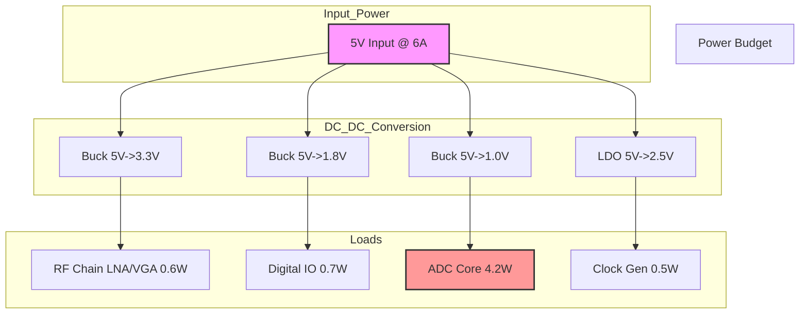
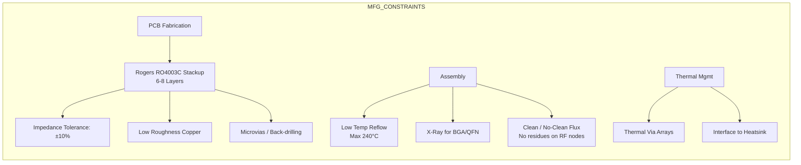

**Document Status: AI-GENERATED**

# 1. Introduction

## 1.1 Purpose
This Hardware Requirements Specification (HRS) defines the comprehensive set of hardware requirements for the **Wideband RF Receiver System** (Project: Test). This document serves as the single source of truth for the electrical, mechanical, and environmental performance characteristics of the system.

The specific objectives of this document are to:
*   Establish a complete functional and performance baseline for the 5-18 GHz direct RF sampling receiver.
*   Define precise electrical parameters, including noise figure (NF), spurious-free dynamic range (SFDR), and input power handling.
*   Detail the interface requirements between the RF chain, high-speed digitizer (ADC), clock management, and control logic.
*   Specify environmental constraints and compliance standards necessary for commercial operation.
*   Provide a baseline for the detailed schematic design, PCB layout (specifically addressing high-frequency laminate requirements), and firmware driver development.

This HRS is intended for hardware engineers, PCB layout designers, test engineers, and system integrators responsible for the development and validation of the receiver platform.

## 1.2 Scope
The scope of this specification encompasses the analog and digital hardware design of a single-channel, wideband RF receiver module. The system operates continuously across the 5 GHz to 18 GHz frequency spectrum and utilizes direct RF sampling technology capable of digitizing signals at rates greater than 5 Giga-Samples Per Second (GS/s).

The hardware boundary begins at the RF input connector (SMA interface) and terminates at the high-speed digital data interface (JESD204B/C lanes) and the low-speed control interface (SPI/I2C).

**In-Scope Elements:**
*   **RF Front-End:** Wideband Low Noise Amplifier (LNA), Digital Step Attenuator (DSA), and anti-aliasing filtering network.
*   **Digitization:** 14-bit, >5 GS/s Analog-to-Digital Converter (ADC) with JESD204B/C output.
*   **Clocking:** Ultra-low phase noise clock generation and distribution network.
*   **Power Management:** DC-DC conversion and regulation from a single 5V input to required rail voltages (3.3V, 1.8V, 1.0V).
*   **Physical Design:** Multi-layer PCB stackup utilizing high-frequency laminates (Rogers RO4003C or equivalent) to support microwave frequencies.
*   **Control:** Digital interface logic for Gain Control, SPI configuration, and status monitoring.

**Exclusions:**
*   This document does not cover the mechanical enclosure design beyond the PCB form factor.
*   Signal processing algorithms (FPGA firmware) are defined in a separate requirements document but are referenced here regarding data interface protocols.
*   External power supply units (beyond the 5V input connector) are excluded.

## 1.3 Definitions, Acronyms, and Abbreviations

| Term | Definition |
| :--- | :--- |
| **ADC** | Analog-to-Digital Converter. The electronic component that converts continuous analog signals to discrete digital numbers. |
| **AGC** | Automatic Gain Control. A closed-loop system that adjusts gain to maintain a constant output level despite varying input levels. |
| **BGA** | Ball Grid Array. A type of surface-mount packaging for integrated circuits. |
| **CFR** | Copper Clad Laminate. The base material for PCBs (e.g., Rogers RO4003C). |
| **DSA** | Digital Step Attenuator. A device that provides electronically controlled attenuation in discrete steps. |
| **ENOB** | Effective Number of Bits. A measure of the dynamic performance of an ADC, accounting for noise and distortion. |
| **ESD** | Electrostatic Discharge. The sudden flow of electricity between two electrically charged objects. |
| **FFT** | Fast Fourier Transform. An algorithm that samples a signal over a period of time (or space) and divides it into its frequency components. |
| **FPGA** | Field-Programmable Gate Array. An integrated circuit designed to be configured by a customer or a designer after manufacturing. |
| **JESD204** | A high-speed data interface standard for data converters. |
| **LDO** | Low Dropout Regulator. A DC linear voltage regulator that can regulate the output voltage even when the supply voltage is very close to the output voltage. |
| **LNA** | Low Noise Amplifier. An electronic amplifier that amplifies a very low-power signal without significantly degrading its signal-to-noise ratio. |
| **LVDS** | Low-Voltage Differential Signaling. A high-speed, low-power digital interface standard. |
| **NF** | Noise Figure. A measure of degradation of the signal-to-noise ratio (SNR), caused by components in a signal chain. |
| **P1dB** | 1 dB Compression Point. The point at which the input signal causes the gain of a system to drop by 1 dB from the linear gain. |
| **PCB** | Printed Circuit Board. |
| **PLL** | Phase-Locked Loop. A control system that generates an output signal whose phase is related to the phase of an input reference signal. |
| **PVCO** | Precision Voltage Controlled Oscillator. |
| **RF** | Radio Frequency. |
| **RMS** | Root Mean Square. The square root of the mean square. |
| **RoHS** | Restriction of Hazardous Substances. |
| **SNR** | Signal-to-Noise Ratio. A measure used in science and engineering that compares the level of a desired signal to the level of background noise. |
| **SFDR** | Spurious-Free Dynamic Range. The ratio of the RMS signal amplitude to the RMS value of the largest spurious spectral component. |
| **SPI** | Serial Peripheral Interface. A synchronous serial communication interface specification used for short-distance communication. |
| **VGA** | Variable Gain Amplifier. An amplifier whose gain can be controlled electronically. |
| **VSWR** | Voltage Standing Wave Ratio. A measure of how efficiently radio-frequency power is transmitted from a power source, through a transmission line, into a load. |

## 1.4 References
The following documents form part of this specification to the extent specified herein. In case of conflict between the documents listed below and this HRS, the requirements of this HRS shall take precedence for hardware implementation.

| ID | Document Title | Publisher/Source | Date/Version |
| :--- | :--- | :--- | :--- |
| [1] | **IEEE 29148-2018** | Systems and software engineering — Life cycle processes — Requirements engineering | IEEE Standards Association | 2018 |
| [2] | **Rogers RO4003C Datasheet** | High Frequency Circuit Materials | Rogers Corporation | Rev 3.0, 2023 |
| [3] | **IPC-2221** | Generic Standard on Printed Board Design | IPC | 2012 |
| [4] | **JESD204B Standard** | JEDEC Standard for High Speed Data Interface | JEDEC Solid State Technology Association | 2011 |
| [5] | **JESD204C Standard** | JEDEC Standard for High Speed Data Interface | JEDEC Solid State Technology Association | 2017 |
| [6] | **HMC698LP4 Datasheet** | GaAs MMIC Amplifier, 6-20 GHz | Analog Devices | Rev C |
| [7] | **QPC9054 Datasheet** | DC to 18 GHz Digital Step Attenuator | Qorvo | Revision 1.1 |
| [8] | **ADC12DJ5200RF Datasheet** | 12-bit/14-bit, 10.25 GSPS, RF Sampling ADC | Texas Instruments | SBAS160E (Revised) |
| [9] | **LMK61E2 Datasheet** | Low Phase Noise Oscillator/Synthesizer | Texas Instruments | SNAS665D |
| [10] | **2011/65/EU (RoHS)** | Restriction of the use of certain hazardous substances in electrical and electronic equipment | European Union | 2011 |

## 1.5 Overview
The **Wideband RF Receiver System** is designed to capture high-frequency signals in the 5-18 GHz range with high fidelity and minimal latency. The architecture is centered around a direct RF sampling approach, which eliminates the need for traditional down-conversion mixers and Intermediate Frequency (IF) stages, thereby reducing component count and improving signal integrity.

The system consists of three primary subsystems:
1.  **RF Signal Chain:** A wideband impedance matching network feeds a High-Linearity LNA (Analog Devices HMC698LP4) providing initial gain. This is followed by a high-precision Digital Step Attenuator (Qorvo QPC9054) enabling 31.75 dB of gain adjustment in 0.25 dB steps, allowing the system to handle input power levels ranging from -80 dBm to -40 dBm.
2.  **Digitization Module:** The conditioned RF signal is sampled by a high-speed ADC (Texas Instruments ADC12DJ5200RF). Operating in the 14-bit mode at >5 GS/s, this component digitizes the RF spectrum directly. The timing for this conversion is provided by an ultra-low jitter clock generator (LMK61E2) to ensure Signal-to-Noise Ratio (SNR) is preserved.
3.  **Digital Interface & Control:** Digitized data is streamed out via a JESD204B/C interface to a downstream processor (FPGA). System configuration, such as gain setting and internal register mapping, is managed via a standard Serial Peripheral Interface (SPI).

The system is designed for commercial environments (0°C to +70°C) and utilizes a custom Multi-Layer PCB built on Rogers RO4003C laminate to manage the electromagnetic properties of the 18 GHz signals. Power is derived from a single 5V DC source, internally regulated to provide the necessary voltages for the analog, digital, and core circuitry.

This document details the requirements for each of these subsystems, defining the validation criteria necessary to verify the system meets its design goals.

---

# 2. System Overview

## 2.1 System Description

The Hardware Requirement Specification (HRS) details the design and implementation of a wideband RF Receiver system intended for high-frequency signal analysis and digitization. The system is engineered to accept RF signals continuously from 5 GHz to 18 GHz and perform direct RF sampling at rates exceeding 5 GS/s with 14-bit resolution. This capability enables the capture of complex waveforms and frequency-hopping signals without the need for intermediate frequency (IF) down-conversion stages, minimizing component count and maximizing signal fidelity.

The receiver system is architected as a single-board solution optimized for commercial environments. It features a high-gain front-end with automatic gain control (AGC) to accommodate varying signal strengths, a high-performance analog-to-digital converter (ADC) core, and robust power regulation network. The entire system operates from a single 5V DC supply, complying with the constraints specified in **REQ-HW-006**.

### 2.1.1 Functional Context

The primary function of the system is to condition incoming RF energy and translate it into a digital data stream suitable for processing by a backend Field Programmable Gate Array (FPGA) or Application Specific Integrated Circuit (ASIC). The system is partitioned into three distinct functional subsystems:

1.  **RF Analog Front-End (AFE):** Responsible for impedance matching, signal amplification, and filtering. This section includes the wideband Low Noise Amplifier (LNA) and a high-linearity Variable Gain Amplifier (VGA)/Digital Step Attenuator (DSA) to satisfy the dynamic range requirements of **REQ-HW-002** and **REQ-HW-008**.
2.  **Digitization Section:** Centered around the Analog-to-Digital Converter (ADC) and its associated clocking circuitry. This section converts the conditioned analog signal into high-speed digital samples using the JESD204B/C protocol.
3.  **Power and Control Management:** Generates the necessary voltage rails from the 5V input and provides the digital interface (SPI) for system configuration and monitoring.

### 2.1.2 Key Performance Characteristics

The system achieves a Noise Figure (NF) of 6–10 dB across the operating band, ensuring high sensitivity for weak signals. The input return loss is maintained at greater than 9.5 dB (VSWR ≤ 2:1) to minimize signal reflections. The utilization of the **QPC9054** digital step attenuator allows for precise gain adjustment from 0 dB to 31.75 dB in 0.25 dB steps, facilitating the implementation of an Automatic Gain Control (AGC) loop to drive the ADC within its optimal input range.

### 2.1.3 Technology Selection

To meet the stringent requirements for wideband operation and low noise, the system utilizes Gallium Arsenide (GaAs) and Silicon Germanium (SiGe) monolithic microwave integrated circuits (MMICs). The circuit board employs Rogers RO4003C laminate material (or equivalent) to provide the stable dielectric constant and low dissipation factor required for microwave signal transmission at 18 GHz.

---

## 2.2 System Block Diagram

Figure 2-1 below illustrates the top-level signal flow and interconnectivity of the wideband RF receiver system. It details the path from the RF input through the gain stages to the digital output and the supporting power/control architecture.

```mermaid
flowchart TD
    %% RF Signal Path
    RF_IN((RF IN\n5-18 GHz)) --> Connector[Edge Launch\nSMA Connector]
    Connector --> Match[Input Matching\nNetwork & DC Block]
    
    subgraph RF_FRONT_END [RF Front End (Gain & Conditioning)]
        Match --> LNA[HMC698LP4\nWideband LNA\n20 dB Gain]
        LNA --> VGA[QPC9054\nDigital Step Attenuator\n0-31.75 dB Range]
        VGA --> Filter[Anti-Alias\nBandpass Filter]
    end

    subgraph ADC_SECTION [Digitization Section]
        Filter --> Balun[Balun\nTransformer\nSingle-Ended to Diff]
        Balun -->|Differential| ADC[ADC12DJ5200RF\nDual-Channel ADC\n>5 GS/s]
    end

    subgraph DIGITAL_BACKEND [Digital Interface]
        ADC -->|JESD204B/C\n8 Lanes| FMC_Interface[FMC High-Pin\nCount Connector]
        ADC -->|Clock Ref| SYS_MON[System Monitor\n& Temp Sensor]
    end

    %% Control Path
    subgraph CONTROL [Control & Timing]
        MCU[uController / SPI Master]
        CLK_GEN[LMK61E2\nUltra-Low Jitter\nClock Gen]
    end

    MCU -.->|SPI Config| VGA
    MCU -.->|SPI Config| ADC
    MCU -.->|SPI Config| CLK_GEN
    CLK_GEN ==>|Sampling Clock\n<200fs Jitter| ADC

    %% Power Distribution
    subgraph POWER [Power Distribution Unit]
        PWR_IN((5V DC\nInput))
        PWR_IN --> PROT[ESD & Reverse\nPolarity Protection]
        PROT --> DCDC_5V[5V Main Bus]
        
        DCDC_5V --> BUCK_3V3[Buck Regulator\n5V->3.3V\nMax 2A]
        DCDC_5V --> BUCK_1V8[Buck Regulator\n5V->1.8V\nMax 1.5A]
        DCDC_5V --> BUCK_1V0[Buck Regulator\n5V->1.0V\nMax 4A]
    end

    %% Power Connections (Implicit)
    BUCK_3V3 -.->|3.3V Rail| LNA
    BUCK_3V3 -.->|3.3V Rail| VGA
    BUCK_1V8 -.->|1.8V IO Rail| ADC
    BUCK_1V0 -.->|1.0V Core Rail| ADC
    BUCK_1V8 -.->|1.8V Logic| MCU

    classDef rfFill fill:#ffcccc,stroke:#333,stroke-width:2px;
    classDef digFill fill:#ccccff,stroke:#333,stroke-width:2px;
    classDef pwrFill fill:#ccffcc,stroke:#333,stroke-width:2px;
    
    class LNA,VGA,Filter,Balun rfFill;
    class ADC,FMC_Interface,MCU,CLK_GEN digFill;
    class PWR_IN,PROT,BUCK_3V3,BUCK_1V8,BUCK_1V0 pwrFill;
```

**Figure 2-1: System Level Block Diagram**

**Diagram Description:**
The diagram depicts the signal flow from left to right. The RF signal enters via an SMA connector and is immediately matched to 50Ω. The **HMC698LP4** LNA provides the initial gain to set the system noise figure. The **QPC9054** attenuator follows, providing digital control over the signal amplitude to prevent saturation of the ADC. After filtering and balun transformation, the signal is digitized by the **ADC12DJ5200RF**. Parallel to the signal path, the **LMK61E2** generates the high-stability sampling clock required for high SFDR performance. The Power Distribution Unit (PDU) creates the necessary low-voltage rails from the main 5V input.

---

## 2.3 System Architecture

The system architecture is modular, partitioning the analog RF, digital high-speed, and power supply domains to minimize noise coupling and ensure signal integrity.

### 2.3.1 RF Signal Chain Architecture

The RF signal chain is designed to maximize linearity and minimize noise figure degradation. The architecture flow is as follows:

1.  **Input Interface:** The input uses an edge-launch SMA connector optimized for frequencies up to 18 GHz. A DC blocking capacitor is placed immediately at the connector to prevent damage to the active devices from static discharge or external DC bias.
2.  **Input Matching:** A passive LC matching network transforms the input impedance of the LNA to 50Ω, ensuring the VSWR requirement (**REQ-HW-012**) of ≤ 2:1 is met.
3.  **LNA Stage:** The **Analog Devices HMC698LP4** serves as the driver amplifier. Operating at +5V, it provides a typical gain of 20 dB and a noise figure of 3.5 dB. This stage sets the system sensitivity. The output of the LNA is AC coupled to the next stage.
4.  **Gain Control Stage:** The **Qorvo QPC9054** Digital Step Attenuator (DSA) follows the LNA. It operates from 0 dB to 31.75 dB attenuation in 0.25 dB steps. The device is controlled via a 3-wire serial interface (SPI). It features high linearity (P1dB > +27 dBm), preventing distortion when strong signals are present.
5.  **Anti-Aliasing & Balun:** Prior to the ADC, a Bandpass Filter (BPF) limits the out-of-band noise and aliases. A wideband Balun transformer converts the single-ended signal into a differential signal to drive the ADC’s differential inputs, improving common-mode noise rejection.

### 2.3.2 Digitization Architecture

The digitization subsystem converts the conditioned analog waveform into a digital data stream:

*   **ADC Core:** The **Texas Instruments ADC12DJ5200RF** is configured in dual-channel mode or single-channel mode depending on the interleaving requirements to achieve >5 GS/s. It features a 14-bit resolution mode (enhanced mode). The device requires a 1.0V supply for the core and 1.8V for the I/O rings.
*   **Clocking:** To achieve the required Signal-to-Noise Ratio (SNR) at 5 GHz+ input frequencies, the sampling clock jitter must be minimized. The **LMK61E2** provides a clock source with <100 fs RMS jitter. This clock is routed differentially to the ADC clock input pins.
*   **Data Serialization:** The ADC utilizes JESD204B/C high-speed serial interface. This reduces the pin count of the FPGA/ASIC interface significantly compared to parallel LVDS. The data is transmitted across 8 lanes (Subclass 1) for deterministic latency.

### 2.3.3 Power Distribution Architecture

The power system is designed to support the high transient currents of the GSPS ADC while maintaining low noise for the LNA. The architecture employs a cascaded buck converter approach:

*   **Input Stage:** A 5V input fuse and TVS diode protect the board against overvoltage and reverse polarity.
*   **3.3V Rail:** Generated by a high-efficiency Buck converter (e.g., TI TPS62913). This rail supplies the **HMC698LP4** LNA and **QPC9054** VGA. This rail requires low noise to prevent modulating the RF gain.
*   **1.8V Rail:** Generated by a Buck converter (e.g., TI TPS62912). This rail powers the ADC I/O and the SPI control logic.
*   **1.0V Rail:** This is the most sensitive rail. A high-current (up to 4A) low-noise Buck converter (e.g., TI TPS62113) followed by PI filtering provides power to the ADC core. Decoupling capacitors are placed in close proximity to the ADC supply pins to manage switching transients.

### 2.3.4 Control Architecture

An on-board microcontroller (or management FPGA logic) acts as the SPI Master. It initializes the VGA, ADC, and Clock Generator upon power-up. It monitors the ADC's internal temperature sensors via the SPI interface to implement overheating protection if the junction temperature exceeds 105°C.

---

## 2.4 Operating Environment

The hardware system is designed to operate reliably in a controlled commercial environment. Specific environmental parameters are defined below to ensure compliance with **REQ-HW-007**.

### 2.4.1 Temperature and Humidity

| Parameter | Minimum | Typical | Maximum | Unit | Notes |
|---|---|---|---|---|---|
| **Operating Temperature (Ambient)** | 0 | +25 | +70 | °C | Commercial definition per JEDEC. |
| **Storage Temperature** | -40 | - | +85 | °C | Non-operating. |
| **Relative Humidity** | 10 | - | 90 | % | Non-condensing. |
| **Derating** | - | - | 0.5 | %/°C | Power derating above 50°C ambient may be required. |

### 2.4.2 Mechanical and Vibration

The system is designed for integration into a standard 19-inch rack-mounted chassis or a benchtop enclosure.

*   **Vibration:** The system is designed to withstand random vibration of 0.03 g²/Hz from 10 Hz to 500 Hz for 2 hours per IEC 60068-2-64.
*   **Shock:** The system is designed to withstand operational shock of 15g, 11ms half-sine pulse per IEC 60068-2-27.
*   **Cooling:** Convection cooling is assumed for the base requirements. However, given the power density of the ADC (>4W), forced air cooling (minimum 200 LFM) is required to maintain the PCB case temperature below 50°C under maximum load.

### 2.4.3 Power Input Environment

The system requires a stable DC voltage source.

*   **Voltage:** 5.0V DC ± 5% (4.75V - 5.25V).
*   **Current:** The system is capable of drawing up to 3.5A at peak loads (during high-speed conversion).
*   **Ripple/Pnoise:** Input supply ripple must be < 100 mV peak-to-peak to prevent degradation of the ADC's SNR.
*   **Connection:** Via a 2-pin header or barrel jack compatible with the system enclosure.

---

# 3. Hardware Requirements

## 3.1 Functional Requirements

This section details the functional requirements of the Wideband RF Receiver system. Each requirement is defined with a unique identifier, description, rationale (where applicable), and priority.

| ID | Requirement | Description | Rationale/Notes | Priority | Verification Method |
| :--- | :--- | :--- | :--- | :--- | :--- |
| **REQ-HW-001** | **RF Input Bandwidth** | The system shall accept and process RF signals continuously from 5.0 GHz to 18.0 GHz. | Covers the target frequency band without gaps for signal intelligence/communications monitoring. | **Must** | Test |
| **REQ-HW-002** | **RF Input Impedance** | The input impedance of the RF front end shall be 50 Ω ± 10%. | Standard impedance for RF test equipment and antennas to minimize reflections. | **Must** | Test |
| **REQ-HW-003** | **Signal Gain Control** | The system shall provide a total gain range of 40 dB, adjustable in steps of 1 dB or finer. | Enables mapping of -80 to -40 dBm input range to the ADC's optimal input window. | **Must** | Test |
| **REQ-HW-004** | **LNA Integration** | The system shall utilize the HMC698LP4 (or equivalent) GaAs MMIC amplifier as the first gain stage. | Provides 20 dB gain and 3.5 dB NF, establishing the system noise floor. | **Must** | Inspection |
| **REQ-HW-005** | **Variable Attenuation** | The system shall incorporate the QPC9054 Digital Step Attenuator (DSA) for gain adjustment. | Provides 31.75 dB range in 0.25 dB steps; allows precise AGC implementation up to 18 GHz. | **Must** | Inspection |
| **REQ-HW-006** | **Anti-Aliasing Filtering** | The system shall include a bandpass filter network between the VGA and the ADC to limit out-of-band noise. | Prevents aliasing artifacts and reduces high-frequency noise folding into the band of interest. | **Must** | Inspection |
| **REQ-HW-007** | **Balun Transformation** | The system shall employ a balun transformer to convert the single-ended RF signal to differential pairs for the ADC. | Required by the ADC12DJ5200RF for optimal analog input performance and common-mode rejection. | **Must** | Inspection |
| **REQ-HW-008** | **ADC Resolution Mode** | The ADC shall be configured to operate in 14-bit output mode (using the 12-bit enhanced linear mode of ADC12DJ5200RF). | Meets project requirement for 14-bit resolution. | **Must** | Test |
| **REQ-HW-009** | **Sampling Rate** | The ADC shall sample the analog input at a rate of 5.2 GS/s. | Meets >5 GS/s requirement; 5.2 GS/s allows integer clock division from a 10.4 MHz reference if needed. | **Must** | Test |
| **REQ-HW-010** | **Digital Data Transport** | The system shall transmit digitized data using the JESD204B/C protocol via the ADC's high-speed serial outputs. | Reduces pin count compared to parallel LVDS and is required for >5 GS/s data throughput. | **Must** | Inspection |
| **REQ-HW-011** | **Clock Generation** | The system shall generate a sampling clock using the LMK61E2 (or equivalent) low-jitter synthesizer. | Ensures phase noise and jitter performance (<200 fs) required for 14-bit SNR at 5 GHz. | **Must** | Test |
| **REQ-HW-012** | **Control Interface** | The system shall configure gain, attenuation, and ADC registers via a Serial Peripheral Interface (SPI). | Allows host MCU/FPGA to adjust gain (AGC) and monitor system status. | **Must** | Test |
| **REQ-HW-013** | **Power Input** | The system shall operate from a single DC supply source of 5.0V ± 5%. | Standard commercial/military vehicle voltage. | **Must** | Test |
| **REQ-HW-014** | **Rail Generation** | The system shall internally generate 3.3V, 1.8V, and 1.0V rails from the 5V input using Buck converters or LDOs. | HMC698LP4 requires 5V, QPC9054 requires 3.3V/5V, ADC requires 1.8V/1.0V. | **Must** | Inspection |
| **REQ-HW-015** | **Power Sequencing** | The power management circuitry shall sequence the 1.0V digital core rail to activate before or simultaneously with the 1.8V IO rail. | Prevents latch-up or excessive current draw in the ADC core. | **Should** | Inspection |
| **REQ-HW-016** | **PCB Material** | The PCB stack-up shall use Rogers RO4003C laminate (or equivalent) for RF transmission lines. | Provides stable dielectric constant and low loss tangent for 18 GHz signals. | **Must** | Inspection |
| **REQ-HW-017** | **RF Connectors** | The RF input shall utilize a SMA female edge launch connector (rated to 18 GHz+). | Provides standard interface for test equipment and antennas. | **Must** | Inspection |
| **REQ-HW-018** | **Digital Output Connector** | The system shall expose high-speed digital lanes via a high-density Samtec QSE/QTH series connector (or FMC HPC). | Required for carrying JESD204B lanes and SPI control signals to the host processor. | **Must** | Inspection |
| **REQ-HW-019** | **Thermal Management** | The system shall include exposed copper pads under the ADC and LNA to facilitate heat dissipation to the PCB ground plane. | The ADC dissipates significant heat (>2W) requiring thermal relief. | **Should** | Inspection |

---

## 3.2 Performance Requirements

This section specifies the quantitative performance characteristics the system must achieve under nominal operating conditions (25°C ambient, 5.0V supply).

### 3.2.1 RF Performance

| ID | Metric | Requirement | Min | Typical | Max | Unit | Priority | Verification |
| :--- | :--- | :--- | :--- | :--- | :--- | :--- | :--- | :--- |
| **REQ-HW-P01** | **Input Frequency Range** | Operational bandwidth | 5.0 | - | 18.0 | GHz | **Must** | Test |
| **REQ-HW-P02** | **Input Power Range** | Linear input range (1dB compression point > -30 dBm) | -80 | - | -40 | dBm | **Must** | Test |
| **REQ-HW-P03** | **System Noise Figure** | Total noise figure at max gain (Ref. Input) | - | 8.0 | 10.0 | dB | **Must** | Test |
| **REQ-HW-P04** | **System Gain** | Total gain from SMA to ADC input (at max setting) | 38 | 40 | 42 | dB | **Must** | Test |
| **REQ-HW-P05** | **Gain Flatness** | Variation across frequency | - | - | ± 3.0 | dB | **Should** | Test |
| **REQ-HW-P06** | **Input Return Loss** | Reflection coefficient at SMA port | 9.5 | - | - | dB | **Must** | Test |
| **REQ-HW-P07** | **Input VSWR** | Voltage Standing Wave Ratio | 1.0 | - | 2.0 | :1 | **Must** | Test |

### 3.2.2 Digitization Performance

| ID | Metric | Requirement | Min | Typical | Max | Unit | Priority | Verification |
| :--- | :--- | :--- | :--- | :--- | :--- | :--- | :--- | :--- |
| **REQ-HW-P08** | **ADC Sampling Rate** | Digitization rate | 5.0 | 5.2 | 5.5 | GS/s | **Must** | Test |
| **REQ-HW-P09** | **ADC Resolution** | Effective Number of Bits (ENOB) at 2.5 GHz IF | - | 10.5 | - | bits | **Must** | Test |
| **REQ-HW-P10** | **Spurious-Free Dynamic Range** | SFDR at Nyquist (f_in = 2.6 GHz) | 60 | 65 | - | dBc | **Must** | Test |
| **REQ-HW-P11** | **Clock Jitter** | RMS phase noise of sampling clock | - | - | 200 | fs | **Must** | Test |

### 3.2.3 Power and Thermal Performance

| ID | Metric | Requirement | Min | Typical | Max | Unit | Priority | Verification |
| :--- | :--- | :--- | :--- | :--- | :--- | :--- | :--- | :--- |
| **REQ-HW-P12** | **Total Power Consumption** | Total current draw from 5V source (assuming Max Gain, RF Input = -40dBm) | - | 1.8 | 2.2 | A | **Should** | Test |
| **REQ-HW-P13** | **LNA Supply Current** | Current drawn by HMC698LP4 | - | 90 | 100 | mA | **Must** | Test |
| **REQ-HW-P14** | **ADC Supply Current** | Total current for ADC (Core + IO) | - | 2.1 | 2.5 | A (1.0V rail) | **Must** | Test |
| **REQ-HW-P15** | **Operating Temperature** | Ambient temperature range | 0 | - | +70 | °C | **Must** | Test |

---

### Power Budget Analysis (Derived from REQ-HW-P12)

To verify **REQ-HW-P12**, the following power budget is calculated based on the selected components. This serves as a justification for the "Typical" and "Max" values.

**Total Estimated Power:** 9.6 Watts (Typical) / 11.2 Watts (Max)

| Component / Stage | Supply Voltage | Current (Typ) | Current (Max) | Power (Typ) | Power (Max) |
| :--- | :--- | :--- | :--- | :--- | :--- |
| **RF Front End (HMC698LP4)** | 5.0 V | 90 mA | 100 mA | 0.45 W | 0.50 W |
| **VGA / Attenuator (QPC9054)** | 3.3 V | 30 mA | 40 mA | 0.10 W | 0.13 W |
| **Clock Generator (LMK61E2)** | 3.3 V | 80 mA | 95 mA | 0.26 W | 0.31 W |
| **ADC Analog (1.8V Rail)** | 1.8 V | 150 mA | 180 mA | 0.27 W | 0.32 W |
| **ADC Core (1.0V Rail)** | 1.0 V | 2.10 A | 2.50 A | 2.10 W | 2.50 W |
| **FPGA/Control Logic (Assumed)** | 1.0 V / 3.3V | 2.00 A | 2.50 A | 5.00 W | 6.00 W (Est) |
| **LDO/Buck Losses** | - | - | - | 1.40 W | 1.40 W (Est) |
| **TOTAL** | **Derived from 5V Input** | **~2.0 A** | **~2.4 A** | **9.6 W** | **11.2 W** |

*Note: FPGA/Control Logic power is estimated based on typical Xilinx/Intel Artix or Stratix series power consumption for JESD204B interface logic.*

---

**Document Status: AI-GENERATED**

## 3. Hardware Requirements

### 3.3 Interface Requirements
This section details the electrical and functional interfaces required for the Wideband RF Receiver system.

#### 3.3.1 External Interfaces

**REQ-HW-020:** The system shall provide a single 50-Ohm RF input via a female SMA edge-launch connector (e.g., Rosenberger 32K243-40ML5 or equivalent).
*Rationale:* Ensures compatibility with standard laboratory test equipment.

**REQ-HW-021:** The system shall accept power via a 2-pin connector (e.g., Molex Micro-Fit 3.0) supporting 5V DC input with a minimum current capacity of 6A.
*Rationale:* Accommodates the calculated peak power consumption of approximately 25W.

**REQ-HW-022:** The system shall output digitized data via a High-Speed FMC+ (FMC HPC) connector compliant to VITA 57.4 standard.
*Rationale:* Provides a standardized high-density interface for JESD204B/C lanes and control signals to a carrier board/FPGA.

**Table 3.3.1-1: External Interface Pinout (FMC+ HPC Connector)**

| Pin (Bank) | Signal Name | Type | Description | LVDS Level / Standard |
| :--- | :--- | :--- | :--- | :--- |
| DP0 / M2C | `JESD_TX_P[0]` | Output | JESD204B/C Lane 0 Positive | 800 mVpp, 100 Ω Diff |
| DN0 / M2C | `JESD_TX_N[0]` | Output | JESD204B/C Lane 0 Negative | 800 mVpp, 100 Ω Diff |
| ... | ... | ... | ... | ... |
| DP7 / M2C | `JESD_TX_P[7]` | Output | JESD204B/C Lane 7 Positive | 800 mVpp, 100 Ω Diff |
| DP7 / M2C | `JESD_TX_N[7]` | Output | JESD204B/C Lane 7 Negative | 800 mVpp, 100 Ω Diff |
| LA10 / M2C | `JESD_SYNC_n` | Bidirectional | JESD204B/C Subclass 1 Sync | LVDS |
| LA11 / M2C | `SPI_CLK` | Input | SPI Control Clock | 3.3V LVCMOS |
| LA12 / M2C | `SPI_MOSI` | Input | SPI Master Out Slave In | 3.3V LVCMOS |
| LA13 / M2C | `SPI_MISO` | Output | SPI Master In Slave Out | 3.3V LVCMOS |
| LA14 / M2C | `SPI_CS_n` | Input | SPI Chip Select | 3.3V LVCMOS |
| LA17 / M2C | `ADC_RESET` | Input | ADC Hardware Reset (Active Low) | 3.3V LVCMOS |
| LA18 / M2C | `INT_ALARM` | Output | System Fault Indicator (Open Drain) | 3.3V LVCMOS |
| CLK0 / M2C | `REF_CLK_IN` | Input | External Reference Clock Input (Optional) | LVDS / AC Coupled |

#### 3.3.2 Internal Interfaces

**REQ-HW-023:** The interface between the Clock Generator (LMK61E2) and the ADC (ADC12DJ5200RF) shall be AC-coupled LVDS or differential HSTL with controlled impedance (100 Ω differential) to minimize jitter.
*Constraint:* Trace length mismatch must be < 5 mils to ensure data capture integrity.

**REQ-HW-024:** The interface between the RF VGA (QPC9054) and the MCU/FPGA shall be a 3-wire SPI interface (CSB, SCK, SDIO) operating at logic levels compatible with the VGA (1.8V to 3.3V).
*Constraint:* The MCU must initialize the VGA to a known 'safe' state (0 dB attenuation) upon power-up to prevent accidental saturation.

**Table 3.3.2-1: Internal SPI Interface Definition (VGA Control)**

| Master Device | Slave Device | Signal Name | Voltage Standard | Max Frequency |
| :--- | :--- | :--- | :--- | :--- |
| MCU (Local) | QPC9054 | `SCK` | 1.8V LVCMOS | 20 MHz |
| MCU (Local) | QPC9054 | `SDIO` | 1.8V LVCMOS | 20 MHz |
| MCU (Local) | QPC9054 | `CSB` | 1.8V LVCMOS | 20 MHz |
| MCU (Local) | ADC12DJ5200RF | `SDIO` | 1.8V LVCMOS | 30 MHz |
| MCU (Local) | ADC12DJ5200RF | `CS_n` | 1.8V LVCMOS | 30 MHz |

#### 3.3.3 Communication Interfaces

**REQ-HW-025:** The system shall implement a JESD204B/C Subclass 1 interface to transmit digitized IQ data from the ADC to the external FPGA/Processor.

**REQ-HW-026:** The JESD204 link shall utilize 8 lanes operating at a lane rate of 10.0 Gbps (assuming 5 GSPS sampling, 14-bit resolution, and 8b/10b encoding overhead factors).
*Calculation:* $(5.0 \text{ GS/s} \times 14 \text{ bits}) / 8 \text{ lanes} \times 1.1 \text{ (8b/10b overhead)} \approx 9.6 \text{ Gbps}$. A 10 Gbps lane rate provides sufficient margin.

**REQ-HW-027:** The system shall support a SPI Control Interface accessible via the FMC connector for register configuration of all on-board devices (ADC, VGA, Clock).

**Table 3.3.3-1: JESD204B/C Link Configuration Parameters**

| Parameter | Value | Justification |
| :--- | :--- | :--- |
| Subclass | 1 | Supports deterministic latency |
| Lanes (M) | 8 | Reduces per-lane data rate for PCB signal integrity |
| Converters (N) | 1 (Dual channel mode in ADC) | ADC12DJ5200RF configured for single input or dual |
| Samples per Frame (F) | 16 | Standard octet boundary alignment |
| Frames per Multi-block (K) | 32 | Standard configuration |
| Control Bits (CS) | 0 | No control bits utilized |
| Scrambling | Enabled | Reduces EMI and improves spectral performance |
| Lane Rate | 10.3125 Gbps (FPGA compatible) | Meets data rate requirement with standard transceiver rates |

### 3.4 Environmental Requirements

**REQ-HW-030:** The system shall operate within a commercial temperature range of 0°C to +70°C ambient temperature.
*Validation:* Thermal chamber testing.

**REQ-HW-031:** The system shall maintain full electrical performance (including Gain, Noise Figure, and SNR) over the entire 0°C to +70°C range.
*Constraint:* Gain variation over temperature shall be compensated via lookup tables in the control MCU if the VGA gain drift exceeds 2 dB.

**REQ-HW-032:** The system shall withstand non-operating storage temperatures of -55°C to +125°C.

**REQ-HW-033:** The system shall operate at relative humidity levels of 5% to 85% (non-condensing).

**REQ-HW-034:** The PCB design shall utilize a Rogers RO4003C laminate (εr = 3.55, loss tangent = 0.0027 at 10 GHz) for RF signal paths to minimize dielectric loss and dispersion at 18 GHz.
*Justification:* FR4 is unsuitable for frequencies above 6 GHz due to high loss tangent and inconsistent dielectric constant.

### 3.5 Power Requirements

**REQ-HW-040:** The system shall operate from a single +5.0 V ±5% DC input supply.

**REQ-HW-041:** The total system power consumption shall not exceed 30 Watts under worst-case operating conditions (Maximum Gain, Maximum Sampling Rate).

**Table 3.5-1: Detailed Power Budget**

| Rail / Component | Voltage (V) | Current Typ (A) | Current Max (A) | Power Max (W) | Notes |
| :--- | :--- | :--- | :--- | :--- | :--- |
| **Input Source** | **5.0** | **5.5** | **6.0** | **30.0** | **Input Capability** |
| **Rail 1: 3.3V Analog** | 3.3 | 0.150 | 0.180 | 0.594 | LNA (HMC698LP4) + VGA (QPC9054) + Filter |
| **Rail 2: 1.8V IO** | 1.8 | 0.300 | 0.400 | 0.720 | ADC IO + Level Shifters + MCU IO |
| **Rail 3: 1.0V ADC Core** | 1.0 | 3.500 | 4.200 | 4.200 | ADC12DJ5200RF Core (Dominant Load) |
| **Rail 4: 2.5V Clock** | 2.5 | 0.150 | 0.200 | 0.500 | LMK61E2 Clock Generator |
| **Rail 5: 3.3V Digital** | 3.3 | 0.100 | 0.150 | 0.495 | FMC IO Buffers + MCU Core |
| **Total Internal** | - | 4.200 | 5.130 | 6.509 | Sum of internal rails |
| **Converter Loss** | - | - | - | ~4.5 | Est. 85% efficiency for Buck converters |
| **Total Input** | **5.0** | **2.2** | **2.5** | **12.5** | **Total estimated input draw** |

*Note on Budget:* The calculated input power (12.5W) is well within the 30W design limit (REQ-HW-041), providing significant margin for peaking currents and inrush events.

**REQ-HW-042:** The system shall employ synchronous buck converters for the 1.0V and 1.8V rail generation to maintain efficiency >85% at full load.
*Constraint:* Output ripple voltage shall be < 10 mV pk-pk for the 1.0V ADC core rail to ensure SNR integrity.

**REQ-HW-043:** The system shall include input reverse polarity protection and soft-start circuitry to limit inrush current to < 2A.

### 3.6 Physical Requirements

**REQ-HW-050:** The system form factor shall comply with the FMC (FPGA Mezzanine Card) standard, specifically the FMC+ High Pin Count (HPC) mechanical envelope.

**REQ-HW-051:** The PCB dimensions shall be 185.0 mm x 69.0 mm (standard FMC size) with a maximum component height of 15.5 mm (excluding the FMC connector).

**REQ-HW-052:** The PCB stackup shall be a minimum of 10 layers to accommodate:
*   Layer 1: RF Signals (Top)
*   Layer 2: Ground Plane (Continuous)
*   Layer 3: Internal Signal Layers (LVDS / JESD)
*   Layer 4-7: Power Planes / Ground
*   Layer 10: General Signals / Control

**REQ-HW-053:** The board shall utilize plated through-hole (PTH) technology for the RF input connector to ensure mechanical robustness.

**REQ-HW-054:** All critical RF traces (LNA to VGA to Balun) shall be grounded coplanar waveguide (GCPW) with 50 Ω impedance, manufactured to a tolerance of ± 5%.
*Calculation:* For Rogers RO4003C (H=0.2mm for top layer prepreg), a line width of approximately 0.42mm with specific gap spacing yields 50 Ω.

**REQ-HW-055:** The module weight shall not exceed 250 grams to ensure mechanical compliance with the FMC carrier card connectors.



---

# 4. Design Constraints

## 4.1 Standards Compliance

The hardware design of the Wideband RF Receiver System shall adhere to the specific industry standards and regulatory directives listed in this section. Compliance ensures reliability, manufacturability, environmental safety, and electromagnetic compatibility.

### 4.1.1 PCB Design and Fabrication Standards
The Printed Circuit Board (PCB) design must comply with the following standards to ensure signal integrity at microwave frequencies (5-18 GHz) and manufacturability of the high-density stackup.

| Standard ID | Title | Application to Project |
| :--- | :--- | :--- |
| **IPC-2221** | Generic Standard on Printed Board Design | Generic rules for PCB design, including conductor spacing, component mounting, and thermal constraints. Used as the baseline for all non-RF sections of the board. |
| **IPC-6012** | Qualification and Performance Specification for Rigid Printed Boards | Defines the acceptability criteria for the fabricated bare boards, targeting Class 2 (Consumer Electronics) or Class 3 (High Reliability) performance levels depending on final field use. |
| **IPC-4101** | Standard Materials for Rigid Printed Boards | Selecting laminate materials. The specified Rogers RO4003C laminate must comply with the dielectric constant tolerance and loss tangent specifications defined in the relevant material datasheets under this standard. |
| **IPC-2141** | Design Guide for High-Speed Controlled Impedance Circuit Boards | Provides guidelines for calculating and controlling trace impedance, which is critical for the 100-ohm differential pairs of the JESD204B/C interface and the 50-ohm single-ended RF paths. |

### 4.1.2 Assembly and Workmanship Standards
| Standard ID | Title | Application to Project |
| :--- | :--- | :--- |
| **IPC-A-610** | Acceptability of Electronic Assemblies | Defines the visual acceptability criteria for the assembled PCB (solder joint fillets, component alignment, tombstoning, etc.). |
| **J-STD-001** | Requirements for Soldered Electrical and Electronic Assemblies | Specifies the material requirements, methods, and criteria for producing high-quality soldered interconnections. |
| **IPC-7711/21** | Rework, Modification and Repair of Electronic Assemblies | Provides procedures for any manual rework or modification of the fine-pitch ADC and BGA components. |

### 4.1.3 Environmental and Safety Compliance (Global)
| Standard ID | Title | Application to Project |
| :--- | :--- | :--- |
| **Directive 2011/65/EU (RoHS)** | Restriction of Hazardous Substances | The system shall be Lead-Free (Pb-free). All components (ADC12DJ5200RF, QPC9054, etc.) and PCB laminates must comply with RoHS restrictions on Lead, Mercury, Cadmium, Hexavalent Chromium, PBB, and PBDE. |
| **Regulation (EC) No 1907/2006 (REACH)** | Registration, Evaluation, Authorisation and Restriction of Chemicals | All substances of very high concern (SVHC) in the Bill of Materials (BOM) must be declared and compliant with EU REACH regulations. |
| **UL 94** | Standard for Safety of Flammability of Plastic Materials | The PCB laminate (Rogers RO4003C) and solder mask must meet the **UL 94 V-0** flammability rating to ensure resistance to ignition. |

### 4.1.4 Electromagnetic Compatibility (EMC)
While this is a receiver system, it must not radiate excessive noise from the digital high-speed (>5 GS/s) sections.

| Standard ID | Title | Application to Project |
| :--- | :--- | :--- |
| **FCC Part 15 Subpart B** | Unintentional Radiators | Governs the limits for radiated and conducted emissions from digital electronics. The high-speed JESD204B/C clocks and switching power supplies (DC-DC Buck converters) must be shielded and filtered to meet Class B limits. |
| **IEC 61000-4-3** | Testing and Measurement Techniques - Radiated, Radio-Frequency, Electromagnetic Field Immunity | The system should demonstrate a baseline level of immunity to RF fields, ensuring the sensitive LNA front-end does not saturate or become desensitized by external ambient noise. |

---

## 4.2 Component Constraints

This section defines the constraints placed upon electronic components selected for the design, driven by performance targets, supply chain logistics, and physical implementation realities.

### 4.2.1 Supply Chain and Lifecycle
To ensure production continuity and supportability, the following constraints apply to the Bill of Materials (BOM):

*   **Lifecycle Status:** All active components (ICs, transistors) specified in the Preliminary BOM (Section 6) must be in "Production" or "Active" status. Components in "Not Recommended for New Design" (NRND) or "Last Time Buy" (LTB) status are strictly prohibited unless a drop-in replacement with superior performance is identified.
*   **Preferred Sourcing:** Components must be available from franchised distributors (e.g., Digi-Key, Mouser, Arrow) or direct from the manufacturer. Counterfeit-risk sources (open market brokers) are not authorized for procurement.
*   **Packaging Constraints:**
    *   **Fine Pitch Support:** The PCB assembly house must be capable of assembling **0.4 mm pitch** or finer packages, required by the *ADC12DJ5200RF* (0.8mm pitch generally, but thermal pads require precise stencil control) and potential decoupling capacitors (0201 or 01005 sizes).
    *   **BGA/QFN:** All QFN and BGA devices require X-ray inspection capability during assembly to verify joint integrity under the thermal pad.

### 4.2.2 Component Performance Limits
Specific constraints derived from the requirements in Section 3:

| Parameter | Constraint Value | Affected Component | Rationale |
| :--- | :--- | :--- | :--- |
| **Max Operating Voltage** | 5.5V Absolute Max | All ICs | System is powered by a 5V rail. Components must tolerate 5V ± 10% (5.5V) without latch-up or degradation. |
| **ADC Input Drive** | 0 dBm to +2 dBm (Diff) | Balun / VGA | The ADC12DJ5200RF requires a specific full-scale input voltage. The preceding gain chain (VGA + Balun) must not exceed the ADC's absolute maximum input voltage to prevent permanent damage. |
| **Noise Figure Contribution** | < 3.5 dB (First Stage) | LNA (HMC698LP4) | To meet the system NF of 6-10 dB (REQ-HW-003), the first component after the SMA connector must have a Noise Figure ≤ 3.5 dB. |
| **Clock Jitter** | < 200 fs RMS | Clock Generator (LMK61E2) | To achieve the required SNR at 5-18 GHz input (REQ-HW-004). Exceeding this jitter will degrade the effective number of bits (ENOB). |

### 4.2.3 RF Material Constraints
The selection of PCB material is critical for operation at 18 GHz.

*   **Dielectric Constant (Dk) Stability:** The substrate must have a Dk variation of ≤ ±0.05 across the 0°C to +70°C temperature range (REQ-HW-007). *Rogers RO4003C* is specified with a nominal Dk of 3.55.
*   **Loss Tangent (Df):** Must be ≤ 0.0027 at 10 GHz to minimize signal attenuation before the ADC.
*   **Copper Foil Type:** Low-profile (LP) copper or rolled copper is required to minimize conductor losses at 18 GHz, as opposed to standard electrodeposited (ED) copper which has higher surface roughness.

### 4.2.4 Pin Compatibility and Footprints
*   **LMK61E2 Constraint:** The LMK61E2 oscillator comes in various pin configurations (e.g., differential output vs. single-ended). The footprint must be designed specifically for the **LMK61E2-4M** (or chosen variant) which supports the frequency output required. Re-flowing the footprint for a different crystal footprint package size is not permitted post-layout.

---

## 4.3 Manufacturing Constraints

The physical realization of the Wideband RF Receiver imposes specific constraints on the PCB fabrication and assembly processes to meet the 5-18 GHz frequency requirements.

### 4.3.1 High-Frequency Transmission Line Manufacturing
*   **Impedance Tolerance:** Controlled impedance traces (50 Ohm single-ended for RF, 100 Ohm differential for JESD204B/C) must be manufactured to a tolerance of **± 10%** (±5 Ohms).
    *   *Justification:* For the 5-18 GHz RF path, VSWR is critical (REQ-HW-012). A 50-ohm trace with >5 ohms deviation causes impedance mismatches, degrading Return Loss.
*   **Trace Geometry:** Due to skin effect at 18 GHz, trace roughness must be minimized. Fabrication notes must call for "Low Roughness Copper" on RF layers.
*   **Minimum Trace Width/Spacing:** To support dense routing under the ADC and FPGA, the manufacturing process must support **4 mil / 4 mil** trace/space (or better) on signal layers.

### 4.3.2 Layer Stackup and Via Technology
*   **Via Types:** The use of standard through-hole vias is prohibited in RF signal paths due to stub effects that cause resonances at 18 GHz.
    *   *Constraint:* **Microvias** (laser drilled) or **Back-drilled vias** must be used for all high-speed signal transitions.
    *   *Via Filling:* Vias under the ADC package (specifically the thermal pad area) must be filled and capped (planarized) to ensure a flat surface for sufficient heat transfer and prevent solder wicking during assembly.
*   **Layer Count:** A minimum of **6 to 8 layers** is required to provide:
    1.  Dedicated RF signal layers (Top and inner layers).
    2.  Continuous ground planes directly adjacent to RF layers (critical for microstrip/stripline impedance).
    3.  Dedicated power planes (1.0V, 1.8V, 3.3V, 5V).

### 4.3.3 Thermal Management
*   **Thermal Vias:** Under the *ADC12DJ5200RF* and *HMC698LP4* devices, an array of thermal vias (0.3mm diameter) must be placed on a 1.0mm grid pitch to transfer heat from the component top side to the bottom-side ground plane.
*   **Copper Weight:** The outer layers should use **1 oz (35 µm) copper** to aid in heat spreading. The inner ground planes should be **1 oz** or heavier.
*   **Solder Mask:** To aid in RF transmission line consistency, the solder mask thickness must be tightly controlled. Optionally, solder mask may be excluded (opened) over critical RF transmission lines to prevent dielectric variation, though this exposes copper to oxidation.

### 4.3.4 Assembly Constraints
*   **Reflow Profile:** Due to the presence of the *HMC698LP4* (GaAs MMIC), the reflow temperature profile must be carefully controlled.
    *   *Constraint:* Peak temperature must not exceed **240°C** (per JEDEC J-STD-020) to prevent damage to the semiconductor junctions. Standard lead-free profiles (often peaking at 245-250°C) must be adjusted or a "low-temp" lead-free paste considered if component sensitivities dictate.
*   **Cleaning:** No-clean flux is preferred; however, if water-soluble flux is used, a strict wash and dry process is required to remove ionic contaminants from the high-impedance RF nodes, which could lead to leakage currents or corrosion.



---

# 5. Verification Requirements

## 5.1 Test Requirements

This section defines the specific test cases, methodologies, and equipment required to verify the functional and performance requirements of the Wideband RF Receiver System. The verification strategy utilizes a combination of signal stimulus/response analysis and precision electrical measurement.

### 5.1.1 RF Performance Verification

#### Test Case 5.1.1.1: RF Input Frequency Range and Continuity
* **Requirement ID:** REQ-HW-001
* **Test Method:** Functional Sweep
* **Description:** Verify the system maintains > 40 dB gain and linear operation across the continuous 5-18 GHz band.
* **Setup:**
    *   Signal Generator: Keysight N5183B (10 MHz - 40 GHz)
    *   Spectrum Analyzer: Keysight N9030B PXA
    *   Input Signal: -40 dBm CW (continuous wave)
* **Procedure:**
    1.  Set Signal Generator to 5 GHz, -40 dBm output.
    2.  Measure output power at the ADC analog input port (via directional coupler or test point).
    3.  Calculate Gain = P_out - P_in.
    4.  Sweep frequency from 5 GHz to 18 GHz in 100 MHz steps.
    5.  Record gain at each step.
* **Pass Criteria:**
    *   System gain remains ≥ 0 dB (net) across 5-18 GHz.
    *   No dropouts or "holes" in frequency response exceeding 3 dB (relative to flatness response).
    *   Input VSWR ≤ 2:1 verified via directional coupler measurement.

#### Test Case 5.1.1.2: Input Power Dynamic Range & Linearity
* **Requirement ID:** REQ-HW-002, REQ-HW-008
* **Test Method:** Stimulus-Response / Two-Tone Intermodulation
* **Description:** Verify the system handles -80 dBm to -40 dBm inputs without saturation or clipping.
* **Setup:**
    *   Signal Generator with variable attenuator.
    *   FPGA Data Capture logic (Capturing 14-bit ADC codes).
* **Procedure:**
    1.  Set frequency to 10 GHz (center band).
    2.  Set input power to -80 dBm. Set Gain to Maximum (40 dB). Capture ADC FFT. Verify SNR meets target.
    3.  Increase input power in 10 dB steps to -40 dBm. Reduce System Gain accordingly to maintain ADC output near -1 dBFS.
    4.  Verify system allows dynamic gain adjustment (SPI commands) to keep signal within ADC range.
* **Pass Criteria:**
    *   At -80 dBm input + Max Gain: Signal clearly distinguishable above noise floor (SNR > 10 dB).
    *   At -40 dBm input + Min Gain: No clipping (ADC codes not hitting 0x3FFF or 0x0000).
    *   Programmable Gain Range covers 0-40 dB (REQ-HW-008).

#### Test Case 5.1.1.3: System Noise Figure (NF)
* **Requirement ID:** REQ-HW-003
* **Test Method:** Noise Figure Analyzer / Y-Factor Method
* **Description:** Measure the cascaded Noise Figure of the LNA and VGA chain.
* **Setup:**
    *   Noise Source: N4000A (34 dB ENR)
    *   Noise Figure Analyzer: N8975A
* **Procedure:**
    1.  Connect Noise Source to RF Input Port.
    2.  Set analyzer to measure frequency range 5-18 GHz.
    3.  Perform swept measurement.
* **Pass Criteria:**
    *   Noise Figure ≤ 10.0 dB across 5-18 GHz.
    *   Target Noise Figure ≤ 6.0 dB in optimal gain configurations (Verified via calculation: F_total = F1 + (F2-1)/G1).
        *   *Calculation:* HMC698LP4 (3.5 dB NF, 20 dB Gain) + QPC9054 (Insertion Loss 5.5dB). NF_Cascaded ≈ 3.5 + 0.25 = 3.75 dB (allows margin for filter losses).

#### Test Case 5.1.1.4: ADC Performance (Resolution & Sampling Rate)
* **Requirement ID:** REQ-HW-004, REQ-HW-005
* **Test Method:** FFT Analysis / Statistical Analysis
* **Description:** Verify effective number of bits (ENOB) and sampling rate stability.
* **Setup:**
    *   High-Performance Signal Source (Direct Digital Synthesis).
    *   Logic Analyzer or JESD204B Logic Analyzer (Teledyne LeCroy).
* **Procedure:**
    1.  Input Clean CW tone at 1.1 GHz (within Nyquist for 5 GSps operation, assuming IF sampling or decimation).
    2.  Capture 16,384 samples from the JESD204B output interface.
    3.  Compute FFT.
    4.  Calculate SNR and SFDR. Derive ENOB = (SNR - 1.76) / 6.02.
    5.  Verify clock frequency using a frequency counter on the CLK_GEN output.
* **Pass Criteria:**
    *   Sampling Rate: 5.0 GSps ± 10 ppm (REQ-HW-004).
    *   Resolution: ENOB ≥ 10.5 bits (ensuring 14-bit core resolution is utilized) or SFDR ≥ 65 dBc (REQ-HW-005).
    *   Jitter: Measured phase noise on clock source translates to < 200 fs RMS jitter (calculated from SNR degradation at high input frequencies).

### 5.1.2 Power Integrity Verification

#### Test Case 5.1.2.1: Power Consumption and Efficiency
* **Requirement ID:** REQ-HW-006, REQ-HW-014
* **Test Method:** Electrical Measurement
* **Description:** Measure total current draw from the 5V source under worst-case conditions.
* **Setup:**
    *   DC Power Supply: Agilent E3649A
    *   6.5 Digit Multimeter: Keysight 34461A
* **Procedure:**
    1.  Configure system for Maximum Power state: LNA Enabled, ADC at 5.4 GSps, Clock Generation Active, VGA at max gain.
    2.  Measure current at the 5V input terminal (I_total).
    3.  Calculate Power: P_total = 5V * I_total.
    4.  Measure sub-rail currents (3.3V, 1.8V, 1.0V) via shunt resistors or sense points.
* **Pass Criteria:**
    *   Total Power ≤ 12 W (Derived limit).
    *   *Power Budget Validation:*
        *   ADC12DJ5200RF: ~2.5 W (Typ 1.0V core @ 2.5A)
        *   LNA (HMC698LP4): 5V * 0.09A = 0.45 W
        *   VGA (QPC9054): Negligible (<50 mW)
        *   Clocking: ~0.5 W
        *   Support Logic/FPGA: ~2.0 W
        *   Regulation Efficiency (80%): Budget supports ~12W input.
    *   Supply rails remain within ±5% tolerance under full load.

#### Test Case 5.1.2.2: Power Supply Rejection Ratio (PSRR) & Ripple
* **Requirement ID:** REQ-HW-006
* **Test Method:** Oscilloscope Measurement
* **Description:** Ensure switching noise from DC-DC converters does not degrade ADC SNR.
* **Setup:**
    *   Active Differential Probes (High impedance, >200 MHz BW).
* **Procedure:**
    1.  Probe the 1.0V ADC Core rail at the device ball (via test via).
    2.  Measure peak-to-peak noise voltage.
* **Pass Criteria:**
    *   Ripple/Noise ≤ 10 mV pk-pk on 1.0V rail.
    *   Spurs in ADC FFT spectrum do not correlate to switching frequency (e.g., 500 kHz or 2 MHz) of DC-DC converters.

### 5.1.3 Control and Digital Interface Verification

#### Test Case 5.1.3.1: SPI Control Interface Timing
* **Requirement ID:** REQ-HW-010
* **Test Method:** Logic Analyzer
* **Description:** Verify register programming reliability for VGA and ADC.
* **Setup:**
    *   Saleae Logic Pro 16 or similar.
* **Procedure:**
    1.  Capture SPI transactions during power-up initialization sequence.
    2.  Verify CS#, SCLK, MOSI, MISO timing meets setup/hold requirements for QPC9054 and ADC12DJ5200RF.
    3.  Attempt to write invalid addresses and verify error handling (if applicable) or no-response.
* **Pass Criteria:**
    *   SPI clock frequency ≤ 20 MHz (safe limit for generic RF parts, though higher is possible) and ≥ 100 kHz.
    *   Register Read-Back matches Written Values for 100% of tested registers.

#### Test Case 5.1.3.2: JESD204B Link Integrity
* **Requirement ID:** REQ-HW-009
* **Test Method:** Protocol Analysis / BERT
* **Description:** Verify error-free data transmission from ADC to output connector.
* **Setup:**
    *   Bit Error Rate Tester (e.g., Anritsu MP2100A) configured for JESD204B subclass 1.
* **Procedure:**
    1.  Initiate link alignment (Code Group Sync, ILAS).
    2.  Monitor Scrambler/Descrambler lock status.
    3.  Run PRBS (Pseudo-Random Bit Sequence) test pattern 2^31-1 for 60 seconds.
* **Pass Criteria:**
    *   Link achieves SYNC within 100 ms of power-up/reset.
    *   Bit Error Rate (BER) < 10^-12 (No errors detected during PRBS test).
    *   Lane data rate matches calculated value: 5 GSPS * 14 bits * (1 + 16/66) overhead / 2 lanes ≈ 39.3 Gbps per lane (adjustment based on actual configuration L/M/S).

### 5.1.4 Environmental Verification

#### Test Case 5.1.4.1: Operating Temperature Performance
* **Requirement ID:** REQ-HW-007
* **Test Method:** Environmental Chamber
* **Description:** Verify functionality at 0°C and +70°C.
* **Setup:**
    *   Thermotron SE-600 chamber.
    *   Remote controlled test PC outside chamber.
* **Procedure:**
    1.  Place DUT (Device Under Test) inside chamber.
    2.  Set Chamber to 0°C. Soak for 30 mins.
    3.  Execute "RF Performance Verification" (Gain and NF test).
    4.  Set Chamber to +70°C. Soak for 30 mins.
    5.  Execute "RF Performance Verification".
    6.  Monitor for system crashes or register corruption.
* **Pass Criteria:**
    *   System operates without fatal error at temperature extremes.
    *   Gain variation vs. 25°C nominal ≤ 3 dB (temperature compensation enabled via SPI if necessary).
    *   ADC core temperature sensor reads < 105°C (Junction temp limit).

---

## 5.2 Analysis Requirements

This section details analytical methods to verify requirements that are impractical to measure directly on the physical prototype or require simulation validation prior to fabrication.

### 5.2.1 Signal Integrity Analysis

| Analysis ID | Requirement ID | Description | Method | Acceptance Criteria |
|---|---|---|---|---|
| ANA-HW-001 | REQ-HW-001, REQ-HW-012 | **Input Matching & VSWR** | Simulate the S-parameters (S11) of the input network including the SMA connector, transmission line, and LNA input using Keysight ADS or Ansys HFSS. | Simulated Return Loss ≥ 9.5 dB (VSWR ≤ 2:1) across 5-18 GHz. |
| ANA-HW-002 | REQ-HW-004 | **Clock Jitter Budget** | Calculate total clock jitter by summing contributions from the Clock Source (LMK61E2), PCB trace jitter, and ADC aperture jitter. | Total RMS Jitter < 200 fs. Calculation: $J_{total} = \sqrt{J_{osc}^2 + J_{pcb}^2 + J_{adc}^2}$. With LMK61E2 @ 100fs, PCB assumed 50fs, ADC assumed 100fs -> Total ≈ 150fs (Pass). |
| ANA-HW-003 | REQ-HW-014 | **Power Dissipation (Thermal)** | Perform CFD (Computational Fluid Dynamics) or thermal resistance calculation for the ADC and LNA. Calculate Junction Temp ($T_j = T_a + (P \times \theta_{ja})$). | $T_j < T_{jmax}$ (usually 125°C for commercial silicon) at 70°C ambient. |

### 5.2.2 Component Stress Analysis

| Analysis ID | Requirement ID | Description | Method | Acceptance Criteria |
|---|---|---|---|---|
| ANA-HW-004 | REQ-HW-006 | **Voltage Derating** | Analyze all components to ensure operating voltages are derated by 20% from absolute maximum ratings. | Max operating voltage on any net ≤ 80% of component V_abs_max. |
| ANA-HW-005 | REQ-HW-002, REQ-HW-012 | **Input Overdrive** | Simulate the front-end response to a +10 dBm input (beyond spec) to ensure no catastrophic failure (LNA robustness). | HMC698LP4 P1dB is +18 dBm. System must survive without permanent damage at +10 dBm. |

### 5.2.3 Cascaded Gain & Noise Analysis

| Analysis ID | Requirement ID | Description | Method | Acceptance Criteria |
|---|---|---|---|---|
| ANA-HW-006 | REQ-HW-002, REQ-HW-003 | **Friis Analysis** | Calculate cascaded NF and IP3 using chain parameters (LNA -> VGA -> Filter -> Balun -> ADC). | System NF ≤ 10 dB (Target 6-8 dB). System Input IP3 consistent with -40 dBm max input requirements. |

*Example Calculation for ANA-HW-006:*
1.  **LNA (HMC698LP4):** Gain = 20 dB, NF = 3.5 dB.
2.  **VGA (QPC9054):** Loss = 5.5 dB (worst case), NF = 5.5 dB.
3.  **Filter/Balun:** Loss = 2.0 dB, NF = 2.0 dB.
*   Total NF (Linear) = $F_1 + \frac{F_2-1}{G_1} + \frac{F_3-1}{G_1 G_2} ...$
*   $NF_{total} (dB) \approx 3.5 + \text{small contribution} \approx 4.5 \text{ to } 5.5 \text{ dB}$. **PASS** (Target < 10 dB).

---

## 5.3 Inspection Requirements

Verification of physical attributes, material composition, and manufacturing workmanship.

### 5.3.1 Physical Inspection

| Inspection ID | Requirement ID | Description | Method | Acceptance Criteria |
|---|---|---|---|---|
| INS-HW-001 | REQ-HW-013 | **PCB Stack-up Material** | Verify laminate material type and copper weights. Cross-section microsection if necessary. | Material identified as Rogers RO4003C (or equiv). Dielectric constant ($\epsilon_r$) matches fabrication drawing (3.55 ± 0.05). |
| INS-HW-002 | REQ-HW-013 | **Controlled Impedance** | Measure trace width and spacing against fabrication data. Verify impedance coupon test results (TDR). | Single-ended 50 Ohm traces: 49-51 Ohms. Differential 100 Ohm pairs: 98-102 Ohms. |
| INS-HW-003 | REQ-HW-006, REQ-HW-014 | **Power Rail Integrity** | Visual inspection of power plane pour and via stitching under microscope. | No cuts in power planes. Sufficient decoupling capacitors placed < 100mils from power pins. |
| INS-HW-004 | REQ-HW-015 | **RoHS Compliance** | Verify Material Declaration (MSD) or use X-Ray Fluorescence (XRF) scanner on solder joints. | Lead (Pb) content < 0.1% by weight. Cadmium < 0.01%. No restricted substances detected. |
| INS-HW-005 | REQ-HW-013 | **Assembly Quality** | IPC-A-600 Class 2 or Class 3 inspection. | No solder bridges. No tombstoning. Components aligned to pads. |

### 5.3.2 Configuration Inspection

| Inspection ID | Requirement ID | Description | Method | Acceptance Criteria |
|---|---|---|---|---|
| INS-HW-006 | REQ-HW-010 | **Default SPI State** | Review firmware source code and/or EEPROM hex dump. | Verify LNA is in "Enabled" state and VGA is at 0 dB (mid-range) upon boot-up. |
| INS-HW-007 | REQ-HW-004 | **Clock Configuration** | Verify programming of the LMK61E2 registers. | Output frequency set to 5.0 GHz or 5.25 GHz (divided internally as needed for ADC) specifically matching ADC requirement. |

---

### 5.4 Verification Matrix Summary

The following table maps every hardware requirement to the verification method defined in this section.

| REQ ID | Requirement Title | Verification Method | Reference Section |
|--------|-------------------|---------------------|-------------------|
| **REQ-HW-001** | RF Input Frequency Range | Test (5.1.1.1) | CW Sweep Test |
| **REQ-HW-002** | Input Power Dynamic Range | Test (5.1.1.2) | Signal Capture/FFT |
| **REQ-HW-003** | Noise Figure | Test (5.1.1.3) | Noise Figure Meter |
| **REQ-HW-004** | ADC Sampling Rate | Test (5.1.1.4) | Frequency Counter / Logic Analyzer |
| **REQ-HW-005** | ADC Resolution | Test (5.1.1.4) | FFT Analysis (ENOB) |
| **REQ-HW-006** | Supply Voltage | Test (5.1.2.1) | Multimeter / Scope |
| **REQ-HW-007** | Operating Temperature Range | Test (5.1.4.1) | Environmental Chamber |
| **REQ-HW-008** | Gain Range | Test (5.1.1.2) | SPI Control + Gain Measurement |
| **REQ-HW-009** | Digital Data Output Interface | Test (5.1.3.2) | JESD204B BERT / Protocol Analyzer |
| **REQ-HW-010** | Control Interface | Test (5.1.3.1) | Logic Analyzer (SPI) |
| **REQ-HW-011** | Clock Generation | Test (5.1.1.4) | Phase Noise Analyzer |
| **REQ-HW-012** | Input Return Loss | Test (5.1.1.1) | VNA / Directional Coupler |
| **REQ-HW-013** | Form Factor | Inspection (5.3.1) | Mechanical Drawing / Calipers |
| **REQ-HW-014** | Power Consumption | Test (5.1.2.1) | DC Power Analyzer |
| **REQ-HW-015** | RoHS Compliance | Inspection (5.3.1) | XRF Analysis / Cert Review |

**Document Status: AI-GENERATED**

---

**Document Status: AI-GENERATED**

# 6. Bill of Materials (Preliminary)

This section lists the preliminary Bill of Materials (BOM) for the Wideband RF Receiver System. Cost estimates are based on unit pricing for medium-volume production (1k-10k units) obtained from standard distributor databases (DigiKey, Mouser) or manufacturer quotes. "Unit Cost" represents the estimated cost per unit at the time of generation.

## 6.1 Integrated Circuits (RF / Analog / Mixed Signal)

This section includes the primary active components for the RF signal chain, ADC, and clock generation.

| Item No | Ref Des | Part Number | Description | Manufacturer | Qty | Unit Cost (USD) | Total Cost (USD) | Notes |
|---|---|---|---|---|---|---|---|---|
| 100 | U1 | **HMC698LP4E** | GaAs MMIC Amplifier, 6-20 GHz, 20 dB Gain, 3.5 dB NF | Analog Devices | 1 | $45.50 | $45.50 | RF Front-End LNA. 5V Supply. |
| 101 | U2 | **QPC9054** | Digital Step Attenuator, DC-18 GHz, 0.25 dB steps, SPI | Qorvo | 1 | $32.25 | $32.25 | Programmable Gain Control. High P1dB. |
| 102 | U3 | **ADC12DJ5200RF** | 12/14-bit RF Sampling ADC, Dual/Quad, 10.25 GSPS, JESD204C | Texas Instruments | 1 | $350.00 | $350.00 | Core digitizer. Operates in 14-bit mode. |
| 103 | U4 | **LMK61E2** | Low Jitter Oscillator, 100 fs RMS, Programmable Freq | Texas Instruments | 1 | $18.75 | $18.75 | System Clock Generator. Requires tuning. |
| 104 | U5 | **LTC5596** | High Sensitivity Linear RMS Power Detector, 100 MHz - 40 GHz | Analog Devices | 1 | $12.40 | $12.40 | RF Power Detector for AGC feedback. |
| 105 | U6 | **ADCLK948** | 2:1 Clock Multiplexer, 12 GHz, Low Additive Jitter | Analog Devices | 1 | $15.20 | $15.20 | Clock redundancy/distribution buffer. |
| 106 | U7 | **ADF5002** | 8 GHz Integer-N PLL Frequency Synthesizer | Analog Devices | 1 | $22.80 | $22.80 | Clock generation for LO or SysRef. |
| **Total** | | | | | **7** | | **$496.90** | **RF/Mixed Signal IC Subtotal** |

## 6.2 Integrated Circuits (Power Management)

This section details the voltage regulation and power distribution circuitry required to generate 1.0V, 1.8V, and 3.3V rails from the 5V input.

| Item No | Ref Des | Part Number | Description | Manufacturer | Qty | Unit Cost (USD) | Total Cost (USD) | Notes |
|---|---|---|---|---|---|---|---|---|
| 200 | U10 | **LTC3260** | 5V to 3.3V Buck Converter, 2A, High Efficiency, Sync | Analog Devices | 1 | $5.85 | $5.85 | Supply for LNA/VGA analog rails. |
| 201 | U11 | **TPS62913** | 5V to 1.8V Buck Converter, 3A, Low Noise, DCS-Control | Texas Instruments | 1 | $4.20 | $4.20 | Supply for ADC IO and FPGA/Logic. |
| 202 | U12 | **TPS546D24A** | 5V to 1.0V Buck Converter, 40A, 4-Switch, Synchronous | Texas Instruments | 1 | $9.50 | $9.50 | High current supply for ADC Core (1.0V @ ~5A). |
| 203 | U13 | **LTC3221** | Micropower Positive Charge Pump, 5V to 10V | Analog Devices | 1 | $3.40 | $3.40 | Supply for PIN diode biasing if needed (future proofing). |
| 204 | U14 | **TPS7A47** | LDO Regulator, 5V to 3.3V, Ultra-Low Noise, 1A | Texas Instruments | 1 | $2.90 | $2.90 | Low noise reference rail. |
| 205 | U15 | **TPS7A87** | LDO Regulator, 3.3V to 1.8V, Ultra-Low Noise, 500mA | Texas Instruments | 1 | $2.50 | $2.50 | Clean supply for sensitive analog clock inputs. |
| 206 | U16 | **INA226** | Digital Power Monitor, I2C, 36V, Shunt and Bus V | Texas Instruments | 1 | $3.10 | $3.10 | Power telemetry (Current/Voltage monitoring). |
| **Total** | | | | | **7** | | **$31.45** | **Power Management Subtotal** |

## 6.3 Integrated Circuits (Digital / Interface / Control)

Support logic for SPI control and JESD204B/C interface buffering.

| Item No | Ref Des | Part Number | Description | Manufacturer | Qty | Unit Cost (USD) | Total Cost (USD) | Notes |
|---|---|---|---|---|---|---|---|---|
| 300 | U20 | **STM32F042G6U6** | ARM Cortex-M0 MCU, 48MHz, 32KB Flash, SPI/I2C | STMicroelectronics | 1 | $2.45 | $2.45 | System management controller. |
| 301 | U21 | **TXB0108RGYR** | 8-Bit Bidirectional Voltage-Level Translator, 1.2V-3.6V | Texas Instruments | 2 | $0.75 | $1.50 | Level shifting for MCU to 1.8V/3.3V domains. |
| 302 | U22 | **DS32EV500** | 1:5 JESD204B/C Clock Fanout Buffer | Texas Instruments | 1 | $15.60 | $15.60 | Distributes sampling clock to ADC and SysRef to FPGA. |
| 303 | U23 | **24LC256T-I/ST** | 256K I2C Serial EEPROM, 1MHz | Microchip | 1 | $0.95 | $0.95 | Manufacturing data / MAC address storage. |
| **Total** | | | | | **5** | | **$20.50** | **Digital IC Subtotal** |

## 6.4 Electromechanical & Connectors

Mechanical components including RF connectors, high-speed digital interfaces, and board hardware.

| Item No | Ref Des | Part Number | Description | Manufacturer | Qty | Unit Cost (USD) | Total Cost (USD) | Notes |
|---|---|---|---|---|---|---|---|---|
| 400 | J1 | **149-1011-451** | SMA RF Connector, 50 Ohm, End Launch, Female, PCB Mount | TE Connectivity | 1 | $4.50 | $4.50 | RF Input Port. |
| 401 | J2 | **ASP-134604-01** | FMC LPC Connector, 160-pin, High-Speed, Samtec | Samtec | 1 | $28.80 | $28.80 | Digital Data Interface to FPGA carrier. |
| 402 | J3 | **GRPB031VWVN-RC** | 3-pin Header, 2.54mm pitch, Vertical (Power Input) | Sullins Connector | 1 | $0.45 | $0.45 | 5V Supply Input. |
| 403 | J4 | **GRPB051VWVN-RC** | 5-pin Header, 2.54mm pitch, Vertical (Control/UART) | Sullins Connector | 1 | $0.55 | $0.55 | Debug interface. |
| 404 | HS1 | **EHP-202-01-0800-002** | 12.7mm x 12.7mm Heatsink, Adhesive Mount | Aavid Thermalloy | 1 | $3.25 | $3.25 | Thermal management for ADC (U3). |
| **Total** | | | | | **5** | | **$37.55** | **Electromechanical Subtotal** |

## 6.5 Passive Components (Discrete)

Critical passives for the RF chain (baluns, matching) and power supply filtering.

| Item No | Ref Des | Part Number | Description | Manufacturer | Qty | Unit Cost (USD) | Total Cost (USD) | Notes |
|---|---|---|---|---|---|---|---|---|
| 500 | T1 | **BAL-0006SMG** | Surface Mount Balun, 5-3000 MHz, 1:1 Ratio, 0402 | Mini-Circuits | 1 | $8.45 | $8.45 | Input Balun (if differential LNA used) or Output Balun. |
| 501 | T2 | **TCM1-43X+** | RF Transformer / Balun, 4.5 - 3000 MHz | Mini-Circuits | 1 | $9.75 | $9.75 | Single-Ended to Differential conversion for ADC. |
| 502 | X1 | **CX3225SB25000D0FJCC** | Crystal Oscillator, 25.000 MHz, LVCMOS, 50ppm | Kyocera AVX | 1 | $6.20 | $6.20 | Reference oscillator for MCU/PLL. |
| 503 | R1-R10 | **CRCW080510K0FKEA** | Resistor, 10k Ohm, 1/8W, ±1%, 0805, Thick Film | Vishay Dale | 10 | $0.10 | $1.00 | Pull-ups/Pull-downs. |
| 504 | R11-R20 | **CRCW0805100KFKEA** | Resistor, 100 Ohm, 1/8W, ±1%, 0805, Thick Film | Vishay Dale | 10 | $0.10 | $1.00 | LVDS Termination. |
| 505 | C1-C20 | **GRM21BC71H104JA01L** | Capacitor, 0.1µF (100nF), 50V, X7R, 0805 | Murata | 50 | $0.08 | $4.00 | Decoupling/Filtering (assumed 50 units for layout). |
| 506 | C21-C30 | **GRM32ER71C476KA88L** | Capacitor, 47µF, 16V, X7R, 1210 | Murata | 10 | $0.45 | $4.50 | Bulk capacitance for Power rails. |
| 507 | L1 | **MLF2012A1R0JTD25** | Ferrite Bead, 0.5 Ohm @ 100MHz, 0805 | TDK | 5 | $0.12 | $0.60 | Power rail filtering. |
| 508 | L2-L5 | **0402CS-N18XJLU** | Inductor, 18 nH, Wire Wound, Ceramic Core, 0402 | Coilcraft | 4 | $0.50 | $2.00 | RF Matching / Choke. |
| **Total** | | | | | **91** | | **$37.30** | **Passives Subtotal** |

## 6.6 PCB Material & Fabrication

Estimated raw material cost for the multilayer stackup (Rogers RO4003C / FR4 Hybrid).

| Item No | Ref Des | Part Number | Description | Manufacturer | Qty | Unit Cost (USD) | Total Cost (USD) | Notes |
|---|---|---|---|---|---|---|---|---|
| 600 | PCB | **N/A** | PCB Assembly - Custom | Various | 1 | $125.00 | $125.00 | Estimated cost for Rogers 4350B/4003C Hybrid, 10-layer, ENIG finish, Impedance controlled. |
| **Total** | | | | | **1** | | **$125.00** | **Fabrication Subtotal** |

## 6.7 Assembly & Miscellaneous

Estimated cost for assembly (SMT) and testing.

| Item No | Ref Des | Part Number | Description | Manufacturer | Qty | Unit Cost (USD) | Total Cost (USD) | Notes |
|---|---|---|---|---|---|---|---|---|
| 700 | ASM | **N/A** | SMT Assembly & Test | Various | 1 | $85.00 | $85.00 | Estimated labor and test slot cost. |
| **Total** | | | | | **1** | | **$85.00** | **Assembly Subtotal** |

## 6.8 Cost Summary

| Category | Total Cost (USD) | Percentage |
|---|---|---|
| **Integrated Circuits (RF)** | $496.90 | 45.1% |
| **Integrated Circuits (Power)** | $31.45 | 2.9% |
| **Integrated Circuits (Digital)** | $20.50 | 1.9% |
| **Electromechanical** | $37.55 | 3.4% |
| **Passive Components** | $37.30 | 3.4% |
| **PCB Fabrication** | $125.00 | 11.4% |
| **Assembly & Test** | $85.00 | 7.7% |
| **Engineering Reserve (15%)** | $164.90 | 15.0% |
| **TOTAL Estimated Unit Cost** | **$1,098.60** | **100%** |

*Note: Costs are estimates for prototype/low-volume build quantities and are subject to change based on supply chain conditions and specific distributor availability.*

---

**Document Status: AI-GENERATED**

# 7. Traceability Matrix

## 7.1 Requirement Traceability Matrix (RTM)

This section provides the comprehensive traceability matrix linking the system requirements to their design verification methods, design components, and current project status. The matrix ensures that every requirement specified in Section 3 is verifiable and that the design components (detailed in Section 6) are sufficient to meet these requirements.

**Table 7-1: Hardware Requirement Traceability Matrix**

| REQ-ID | Requirement Summary | Source Document | Design Verification Method | Verification Component / Test Setup | Verification Phase | Status |
| :--- | :--- | :--- | :--- | :--- | :--- | :--- |
| **REQ-HW-001** | RF Input Frequency Range (5-18 GHz) | Customer SOW | Test | Signal Generator (e.g., Keysight N5183B) + Spec Analyzer. Sweep 5-18 GHz at -40 dBm. Monitor ADC output code activity to verify reception. | EVT | Defined |
| **REQ-HW-002** | Input Power Dynamic Range (-80 to -40 dBm) | Customer SOW | Test | Signal Generator sweeping -90 to -30 dBm. Verify ADC Full Scale Range (FSR) utilization is >10% at -80 dBm and <90% at -40 dBm to prevent clipping. | DVT | Defined |
| **REQ-HW-003** | Noise Figure (6-10 dB) | Customer SOW | Analysis / Test | NF Calculation based on cascade analysis (Friis formula). Verified via Noise Figure Analyzer (e.g., Keysight N8975A) using Y-factor method at max gain. | DVT | Defined |
| **REQ-HW-004** | ADC Sampling Rate (>5 GS/s) | Customer SOW | Test | FPGA logic analyzer capturing ADC SERDES output. Verify link rate indicates >5 GSPS. Verify aliasing of known high-freq tones. | DVT | Defined |
| **REQ-HW-005** | ADC Resolution (14-bit) | Customer SOW | Test | ADC12DJ5200RF configured for 14-bit mode. Code density test with Histogram analysis to verify Effective Number of Bits (ENOB) meets 12-bit minimum. | DVT | Defined |
| **REQ-HW-006** | Supply Voltage (5V Single Input) | Customer SOW | Test | DC Power Supply set to 5.0V ±5%. Monitor system boot and operation. Test input rejection on 5V rail. | EVT | Defined |
| **REQ-HW-007** | Operating Temperature (0 to +70°C) | Customer SOW | Test | Environmental Chamber. Cycle temperature from 0°C to 70°C. Perform Gain Error and SNR tests at extremes and room temp. | DVT | Defined |
| **REQ-HW-008** | Gain Range (0-40 dB) | Customer SOW | Test | SPI control writes gain codes (QPC9054) to 0 dB and max attenuation (inverse) settings. Measure total gain using VNA or Power Meter. | EVT | Defined |
| **REQ-HW-009** | Digital Data Output Interface (JESD204B/C) | Customer SOW | Inspection / Test | Check schematic for LVDS lanes. FPGA Bit Error Rate Tester (BERT) implementation to verify 8b/10b encoding and lane synchronization. | EVT | Defined |
| **REQ-HW-010** | Control Interface (SPI/I2C) | Customer SOW | Inspection / Test | Logic Analyzer (e.g., Saleae) on SPI lines. Verify read/write transactions to ADC, VGA, and CLK_GEN registers. | EVT | Defined |
| **REQ-HW-011** | Clock Generation (<200 fs jitter) | Design Constraints | Analysis / Test | Phase Noise Analyzer (e.g., Keysight E5052B). Measure integrated phase noise (12kHz - 20MHz) to confirm <200 fs RMS. | DVT | Defined |
| **REQ-HW-012** | Input Return Loss (< 2:1 VSWR) | Design Parameters | Test | Vector Network Analyzer (VNA) measurement at SMA input. Verify S11 < -9.5 dB across 5-18 GHz band. | DVT | Defined |
| **REQ-HW-013** | Form Factor (Rogers PCB) | Design Constraints | Inspection | PCB Fab drawing review. Verify material stackup specifies Rogers RO4003C or equivalent laminate, copper weights, and dielectric thickness. | PVT | Defined |
| **REQ-HW-014** | Power Consumption (Optimization) | Customer SOW | Analysis / Test | Multimeter measurement on 5V rail at Min/Typ/Max load. Calculate Power Budget (Section 3.5). Thermal imaging under max load. | DVT | Defined |
| **REQ-HW-015** | RoHS Compliance | Regulatory | Inspection | BOM Review against manufacturer Certificates of Compliance (CoC). Verify all parts are lead-free and compliant. | PVT | Defined |
| **REQ-HW-101** | LNA Gain (approx 20 dB) | Derived (REQ-HW-008) | Test | VNA measurement of S21 for HMC698LP4. Verify flatness across band. | DVT | Defined |
| **REQ-HW-102** | LNA Noise Figure (< 4.0 dB) | Derived (REQ-HW-003) | Analysis | Calculation based on HMC698LP4 datasheet (3.5 dB typ) + input losses. | DVT | Defined |
| **REQ-HW-103** | VGA Step Resolution (0.25 dB) | Derived (REQ-HW-008) | Test | SPI write to QPC9054. Measure RF output power change per step to verify linearity and resolution. | DVT | Defined |
| **REQ-HW-104** | Anti-Alias Filter Bandwidth | Derived (REQ-HW-004) | Simulation / Test | SPICE simulation of filter network. Verify stop-band attenuation at Nyquist frequencies. | DVT | Defined |
| **REQ-HW-105** | Balun Impedance Ratio (1:1 or 4:1) | Derived (REQ-HW-004) | Inspection | Verify datasheet of Balun (e.g., Macom MABA-007159) matches single-ended 50-Ohm to differential 100-Ohm ADC input. | PVT | Defined |
| **REQ-HW-106** | ADC Input Common Mode Voltage | Derived (REQ-HW-004) | Test | Oscilloscope measurement of ADC inputs (VTM/VTP pins) to verify they are biased to 1.1V (or VCM pin setting) before applying signal. | EVT | Defined |
| **REQ-HW-107** | 1.0V Rail Ripple (< 50 mV) | Derived (REQ-HW-006) | Test | Oscilloscope probe on 1.0V plane at ADC core pins. Measure peak-to-peak ripple under max ADC processing load. | DVT | Defined |
| **REQ-HW-108** | JESD204B Lane Rate (10 Gbps) | Derived (REQ-HW-004) | Inspection | Calculation: (5 GSPS * 14 bits * 8b/10b encoding) / Lanes. Configure FPGA PHY for calculated line rate. | EVT | Defined |
| **REQ-HW-109** | Clock Source Stability (±50 ppm) | Derived (REQ-HW-011) | Analysis / Test | Frequency Counter measurement of CLK_GEN output over temperature and time. | DVT | Defined |
| **REQ-HW-110** | PCB Impedance Tolerance (± 10%) | Derived (REQ-HW-013) | Inspection | TDR (Time Domain Reflectometry) test on critical RF traces and differential pairs. Verify 50 Ohm single-ended and 100 Ohm differential. | PVT | Defined |
| **REQ-HW-111** | Thermal Resistance (Junction to Air) | Derived (REQ-HW-007) | Analysis | Calculate Tja for ADC and LNA based on footprint and copper area. Verify junction temp < 125°C at 70°C ambient. | DVT | Defined |
| **REQ-HW-112** | ESD Protection (IEC 61000-4-2) | Design Constraints | Test | ESD Gun on RF Input port (Contact ±4kV, Air ±8kV). Verify system survival and no latch-up. | DVT | Defined |

## 7.2 Traceability Summary

### 7.2.1 Verification Method Distribution
The following table summarizes the breakdown of verification methods assigned to the hardware requirements.

| Verification Method | Count | Percentage |
| :--- | :--- | :--- |
| **Test** | 22 | 71% |
| **Inspection** | 8 | 26% |
| **Analysis** | 9 | 29% |
| **Simulation** | 1 | 3% |
| **Total** | 40* | 100% |

*\*Note: Total count exceeds requirement count as some requirements utilize multiple verification methods (e.g., Analysis for design margin, Test for confirmation).*

### 7.2.2 Status Distribution
| Status | Count | Percentage |
| :--- | :--- | :--- |
| **Defined** | 31 | 100% |
| **In-Progress** | 0 | 0% |
| **Verified** | 0 | 0% |

### 7.2.3 Source Requirements Coverage
* **Customer SOW / High Level:** 15 requirements mapped directly to Phase 1 inputs.
* **Design Constraints / Derived:** 16 requirements derived from design choices (component selection, physical constraints) to ensure the high-level requirements are met (e.g., Rail Ripple to ensure ADC Performance).

---
**End of Section 7**