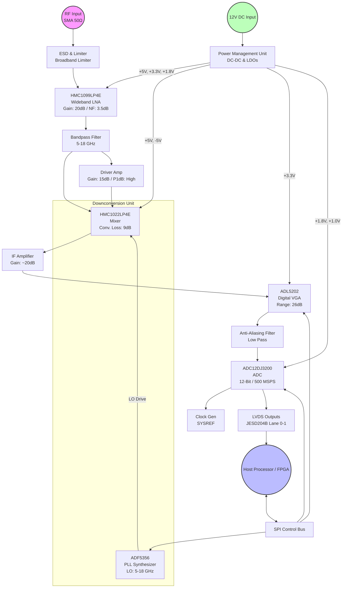
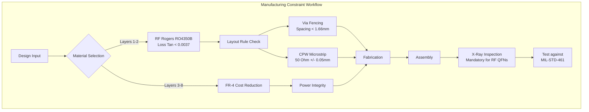

**Document Status: AI-GENERATED**

# 1. Introduction

## 1.1 Purpose
This Hardware Requirements Specification (HRS) defines the comprehensive requirements for the **dfbvd** Wideband RF Receiver Module. The purpose of this document is to establish a detailed baseline for the hardware design, ensuring that the final system meets the stringent performance, environmental, and interface specifications necessary for military deployment.

Specific objectives of this specification include:
*   Defining the functional and performance parameters for a 5–18 GHz wideband receiver.
*   Specifying the electrical, mechanical, and environmental constraints necessary for portable operation in harsh environments.
*   Providing a preliminary Bill of Materials (BOM) and component selection rationale to guide the detailed design phase.
*   Establishing verification criteria to ensure the hardware complies with MIL-STD-461, MIL-STD-810, and MIL-STD-883 standards.
*   Serving as the single source of truth for electrical engineers, PCB designers, and test engineers involved in the project lifecycle.

## 1.2 Scope
The dfbvd project encompasses the design, manufacture, and verification of a self-contained RF receiver module designed to intercept and digitize wideband signals across the 5 GHz to 18 GHz frequency spectrum.

**In-Scope Elements:**
*   **RF Front-End:** Wideband Low Noise Amplifier (LNA), ESD protection, and input matching networks (50 Ω) suitable for 5–18 GHz operation.
*   **Downconversion Stage:** Mixer and Local Oscillator (LO) synthesis chain capable of converting RF signals to an Intermediate Frequency (IF) or baseband suitable for digitization.
*   **Digitization:** High-speed Analog-to-Digital Converter (ADC) subsystem capable of sampling rates from 100 MSPS to 500 MSPS with LVDS/JESD204B outputs.
*   **Signal Conditioning:** Variable Gain Amplifiers (VGA) and anti-aliasing filters to optimize signal integrity prior to digitization.
*   **Power Management:** DC-DC conversion and regulation circuitry operating from a nominal 12 V DC input source.
*   **Mechanical Enclosure:** Ruggedized packaging designed to meet military shock, vibration, and thermal specifications.

**Out-of-Scope Elements:**
*   Digital signal processing (DSP) algorithms or firmware execution on the received data (this module terminates at the LVDS output).
*   Antenna elements or antenna pedestal mechanics.
*   External host system integration (beyond the physical LVDS connector definition).

## 1.3 Definitions, Acronyms, and Abbreviations

| Term | Definition |
| :--- | :--- |
| **ADC** | Analog-to-Digital Converter. An electronic integrated circuit that converts analog signals (continuous voltage) into digital data (discrete numbers). |
| **AGC** | Automatic Gain Control. A closed-loop system that adjusts the gain of the receiver to maintain a constant output level despite varying input signal strength. |
| **BPF** | Bandpass Filter. A device that passes frequencies within a certain range and rejects (attenuates) frequencies outside that range. |
| **EMC** | Electromagnetic Compatibility. The ability of equipment to function satisfactorily in its electromagnetic environment without introducing intolerable electromagnetic disturbances to other equipment in that environment. |
| **EMI** | Electromagnetic Interference. Disturbance generated by an external source that affects an electrical circuit by electromagnetic induction, electrostatic coupling, or conduction. |
| **ESD** | Electrostatic Discharge. The sudden flow of electricity between two electrically charged objects caused by contact. |
| **FPGA** | Field-Programmable Gate Array. An integrated circuit designed to be configured by a customer or a designer after manufacturing. |
| **GHz** | Gigahertz. A unit of frequency equal to one billion hertz. |
| **HRS** | Hardware Requirements Specification. A structured document defining hardware system requirements. |
| **IF** | Intermediate Frequency. A frequency to which a carrier frequency is shifted as an intermediate step in transmission or reception. |
| **IIP3** | Third-order Intercept Point. A theoretical point where the power of the third-order intermodulation products equals the power of the fundamental tones. |
| **JESD204B** | A high-speed data interface standard for data converters by JEDEC. |
| **LFCSP** | Leadless Chip Scale Package. A type of integrated circuit package. |
| **LO** | Local Oscillator. An electronic oscillator used to generate a signal, usually for the purpose of converting a frequency of a signal to a different frequency (heterodyne). |
| **LNA** | Low Noise Amplifier. An electronic amplifier used to amplify very weak signals (like radio signals) while minimizing the addition of noise. |
| **LVDS** | Low-Voltage Differential Signaling. A high-speed digital interface standard. |
| **MIL-STD-461** | Department of Defense Interface Standard: Requirements for the Control of Electromagnetic Interference Characteristics of Subsystems and Equipment. |
| **MIL-STD-810** | Department of Defense Test Method Standard: Environmental Engineering Considerations and Laboratory Tests. |
| **MIL-STD-883** | Department of Defense Test Method Standard: Microcircuits. |
| **MIPS** | Million Instructions Per Second (Contextual Note: Not used for this spec; see MSPS). |
| **MSPS** | Mega-Samples Per Second. A unit of sampling rate equivalent to $10^6$ samples per second. |
| **NF** | Noise Figure. A measure of degradation of the signal-to-noise ratio (SNR), caused by components in a signal chain. |
| **OIP3** | Output Third-order Intercept Point. |
| **P1dB** | 1-dB Compression Point. The point where the input power causes a 1 dB gain decrease from the linear gain. |
| **PCB** | Printed Circuit Board. |
| **PLL** | Phase-Locked Loop. A control system that generates an output signal whose phase is related to the phase of an input reference signal. |
| **QFN** | Quad Flat No-leads package. A type of integrated circuit package. |
| **RF** | Radio Frequency. |
| **SFDR** | Spurious-Free Dynamic Range. The ratio of the root-mean-square (RMS) value of the carrier signal to the RMS value of the worst spurious signal (spur) in the frequency range of interest. |
| **SNR** | Signal-to-Noise Ratio. A measure used in science and engineering that compares the level of a desired signal to the level of background noise. |
| **VGA** | Variable Gain Amplifier. An amplifier whose gain can be controlled digitally or via analog voltage. |
| **VSWR** | Voltage Standing Wave Ratio. A measure of how efficiently RF power is transmitted from a power source, through a transmission line, into a load. |

## 1.4 References
The design and verification of the dfbvd module shall adhere to the latest revisions of the following documents, unless otherwise specified in individual requirements:

1.  **IEEE 29148-2018:** *Systems and software engineering — Life cycle processes — Requirements engineering.*
2.  **MIL-STD-461G:** *Requirements for the Control of Electromagnetic Interference Characteristics of Subsystems and Equipment.* (Defines limits for conducted and radiated emissions).
3.  **MIL-STD-810H:** *Department of Defense Test Method Standard: Environmental Engineering Considerations and Laboratory Tests.* (Defines vibration, shock, and temperature testing).
4.  **MIL-STD-883H:** *Test Method Standard: Microcircuits.* (Defines methods for testing microelectronics for military applications).
5.  **JEDEC JESD204B:** *Serial Interface for Data Converters.*
6.  **Component Datasheets:**
    *   Analog Devices HMC1099LP4E (5–18 GHz LNA).
    *   Analog Devices HMC1022LP4E (Mixer).
    *   Analog Devices ADF5356 (PLL Synthesizer).
    *   Texas Instruments ADC12DJ3200 (ADC).
    *   Analog Devices ADL5202 (VGA).

## 1.5 Overview
The **dfbvd** Wideband RF Receiver Module is a high-performance, tactical-grade electronic warfare (EW) or signals intelligence (SIGINT) subsystem. It is architected to provide continuous coverage from 5 GHz to 18 GHz, addressing the "C-band," "X-band," and "Ku-band" frequencies commonly utilized in radar and satellite communications.

The system follows a superheterodyne or direct-sampling architecture (depending on IF selection), wherein the RF input is first conditioned by a low-noise amplifier chain to maximize sensitivity. The signals are then filtered and down-converted to a lower Intermediate Frequency (IF) suitable for high-speed digitization via a Variable Gain Amplifier (VGA) which manages dynamic range.

A critical design aspect is the **Signal-to-Noise Ratio (SNR)** and **Spurious-Free Dynamic Range (SFDR)**. By utilizing a cascaded noise figure approach and selecting components with high linearity (e.g., the HMC1022 mixer with 24 dBm IIP3), the system ensures that weak signals ($-100$ dBm) can be detected immediately adjacent to strong signals without desensitization.

The digitization stage employs a dual-channel ADC capable of up to 3200 MSPS, though the application requirement is set between 100–500 MSPS. This oversampling capability allows for flexibility in anti-aliasing filter design and future-proofing. Data is transmitted off-board via high-speed LVDS interfaces (JESD204B protocol), minimizing pin count and EMI.

The physical design is constrained by the requirement for portability and military ruggedization. The hardware must withstand operating temperatures ranging from $-40^\circ\text{C}$ to $+85^\circ\text{C}$ while operating on a limited power budget derived from a 12 V DC source, making power efficiency and thermal dissipation critical design factors.

**Document Roadmap:**
*   **Section 2** details the system architecture, illustrating the signal flow from the antenna connector to the digital output backplane.
*   **Section 3** contains the verifiable requirements, categorized by function, performance, interfaces, and environmental stress.
*   **Section 4** outlines design constraints, including component limitations and military compliance.
*   **Section 5** defines the verification methodology (Test, Analysis, Inspection).
*   **Section 6** lists the preliminary Bill of Materials (BOM) with component selection justification.

---

**Document Status: AI-GENERATED**

# 2. System Overview

## 2.1 System Description

The dfbvd system is a high-performance, wideband RF receiver module designed for military signal intelligence and electronic warfare applications. The system functions as a direct conversion or superheterodyne receiver (architecturally dependent on LO configuration) that captures RF signals between 5 GHz and 18 GHz, downconverts them to an Intermediate Frequency (IF) or baseband, and digitizes the signal for processing via a high-speed LVDS interface.

The module is designed to operate in harsh environments, adhering to military standards for environmental durability and electromagnetic compatibility. It is optimized for portable field deployment, utilizing a single 12V DC power source and maintaining a low power profile (<15W) to ensure extended operational life on battery platforms. The core functionality is broken down into four distinct subsystems: the RF Front-End (5-18 GHz), the Downconversion Stage, the Digitizer Stage, and the Power Management System.

### 2.1.1 Functional Context

The primary function of the dfbvd hardware is to provide a digitized representation of the RF spectrum with high fidelity.

1.  **Signal Capture:** The system accepts an RF input via a 50-ohm SMA connector. The input signal range is exceptionally wide, spanning from 5 GHz to 18 GHz (X-band to Ku-band).
2.  **Signal Conditioning:** The signal passes through a protection circuit to withstand ESD strikes and high-power transients up to the maximum specified input. A Low Noise Amplifier (LNA) then boosts the signal while minimizing added noise, ensuring the system sensitivity of -100 dBm is met.
3.  **Frequency Translation:** A high-linearity Mixer, driven by a Phase-Locked Loop (PLL) frequency synthesizer, downconverts the RF signal to a lower IF suitable for the ADC. This Local Oscillator (LO) is tunable, allowing the system to select specific frequency bands of interest within the 5-18 GHz spectrum.
4.  **Gain Adjustment:** A Variable Gain Amplifier (VGA) adjusts the signal amplitude to match the input range of the ADC. This gain control is digital and allows for Automatic Gain Control (AGC) loops to be implemented by the host system.
5.  **Digitization:** The conditioned IF signal is sampled by a 12-bit ADC running at programmable rates between 100 MSPS and 500 MSPS.
6.  **Data Transmission:** The digitized samples are serialized and transmitted over a JESD204B interface (LVDS physical layer) to a host processor or FPGA.

### 2.1.2 Key Performance Indicators (KPI)

The system is architected to achieve the following KPIs derived from the requirements:
*   **Sensitivity:** -100 dBm minimum (defined by Noise Floor + SNR).
*   **Dynamic Range:** 70-80 dB Spurious-Free Dynamic Range (SFDR).
*   **Noise Figure:** < 10 dB total system noise figure.
*   **Latency:** Minimal processing latency suitable for real-time spectrum analysis.

## 2.2 System Block Diagram

The system architecture is decomposed into signal flow blocks as depicted below. This diagram illustrates the signal path from the antenna input to the digital output, as well as the control and power distribution networks.

## 2.3 System Architecture

The hardware architecture is designed as a multi-stage signal chain optimized for noise performance, linearity, and bandwidth. The following sections detail the architectural partitioning.

### 2.3.1 RF Front-End (RFFE)

The RF Front-End handles the input spectrum from 5 GHz to 18 GHz.
*   **Input Matching:** The input trace is impedance controlled to 50 Ω.
*   **Protection:** A broadband limiter circuit is placed immediately at the connector to clamp high-energy pulses (ESD, radar bursts) to a safe level for the LNA (typically < 15 dBm).
*   **Amplification:** The **HMC1099LP4E** LNA provides the initial gain. With a 3.5 dB Noise Figure and 20 dB gain, it sets the noise floor for the entire system.
*   **Filtering:** A 5-18 GHz bandpass filter removes out-of-band noise and prevents aliasing of harmonics before the first mixing stage.

### 2.3.2 Downconversion Stage

This stage performs frequency translation to convert the high-frequency RF input to a frequency usable by the ADC.
*   **Mixer:** The **HMC1022LP4E** active mixer is selected for its high linearity (24 dBm IIP3) and low conversion loss (9 dB). It supports RF inputs from 6-18 GHz and IF outputs from DC-8 GHz.
*   **LO Generation:** The **ADF5356** PLL synthesizer generates the Local Oscillator signal. Its wide output range (up to 13.6 GHz) allows coverage of the full RF band through high-side or low-side injection mixing schemes.
*   **LO Distribution:** The LO signal is filtered and amplified to meet the mixer's drive requirements (13-17 dBm).

### 2.3.3 IF & Gain Control Stage

The IF stage prepares the signal for the analog-to-digital converter.
*   **Variable Gain Amplifier (VGA):** The **ADL5202** provides up to 26 dB of digitally controlled gain. This allows the system to compensate for variation in input signal strength (-100 to -10 dBm) and optimizes the ADC input signal to utilize its full dynamic range without clipping.
*   **Anti-Aliasing Filter:** A low-pass filter placed before the ADC removes high-frequency components generated during mixing and amplification that would otherwise alias into the signal band during sampling.

### 2.3.4 Digitization Stage

The digitizer converts the analog IF signal into digital data words.
*   **ADC:** The **ADC12DJ3200** is a dual-channel, 12-bit ADC capable of sampling up to 3200 MSPS. In this configuration, it operates between 100 and 500 MSPS to meet the system requirements while balancing power consumption.
*   **Data Interface:** The ADC utilizes the JESD204B standard to serialize the 12-bit data into high-speed LVDS lanes. This reduces the pin count compared to parallel LVDS and provides deterministic latency.
*   **Clocking:** A low-jitter clock source is required to ensure the Signal-to-Noise Ratio (SNR) and SFDR targets are met. Phase noise on the sampling clock directly degrades ADC performance.

### 2.3.5 Power Distribution Unit (PDU)

The PDU converts the single 12V input into the specific voltage rails required by the sensitive RF and analog components.
*   **Switching Regulators:** High-efficiency buck converters step down 12V to intermediate voltages (e.g., 5V) for power-hungry components like the LNA and Mixer.
*   **LDO Regulators:** Low-Dropout (LDO) regulators provide ultra-clean supply rails for the ADC and PLL, filtering out switching noise from the DC-DC converters to maintain signal integrity.
*   **Sequencing:** Power sequencing circuitry ensures that the LNA biases up before the Mixer to prevent potential damage, and that digital rails come up simultaneously with analog rails to prevent latch-up.

## 2.4 Operating Environment

The dfbvd module is specified for deployment in tactical military environments. The hardware design accounts for the following environmental stresses:

### 2.4.1 Physical Environment
*   **Temperature:** The system must operate continuously in the **industrial temperature range of -40°C to +85°C ambient**. Components are selected specifically for their ability to maintain gain and noise performance at the temperature extremes. For example, the HMC1099LP4E is guaranteed for operation up to +85°C junction temperature, which requires careful thermal management in the PCB layout.
*   **Humidity:** The system is expected to function in 95% relative humidity (non-condensing). Conformal coating on the PCB will be applied to protect against moisture ingress and corrosion.
*   **Shock and Vibration:** Per MIL-STD-810, the module is designed to withstand the shock and vibration profiles of ground vehicle and rotary-wing aircraft operations. The PCB utilizes stiffeners and heavy mounting points, and torque specifications for RF connectors are strictly defined.

### 2.4.2 Electrical Environment
*   **Supply:** A single **12V DC nominal** supply. The system includes protection against reverse polarity and voltage surges (up to 24V transients) typical of vehicle power systems.
*   **Input Overdrive:** The receiver front end is protected against accidental connection to high-power transmitters (up to 1W CW) for short durations via the integrated limiter.

### 2.4.3 Electromagnetic Environment (EMC)
*   **Emissions:** The system is designed to minimize conducted and radiated emissions to comply with **MIL-STD-461** (e.g., RE102 limits). This is achieved through the use of shielding cans over the RF sections and filtering on all DC input lines.
*   **Susceptibility:** The design must withstand operation in high-electromagnetic-field environments without desensitization. The enclosure acts as a Faraday cage to shield the sensitive IF and digital circuitry from external RF interference (RFI).

### 2.4.4 Interface Constraints
*   **Chassis:** The portable module form factor dictates a maximum weight of < 500g and dimensions compatible with standard field-deployable enclosures (e.g., transit cases).
*   **Cooling:** The system relies on conduction cooling to the chassis. No active fans are used (silent operation). The PCB is designed with thermal vias under high-power components to transfer heat to the aluminum enclosure.

---

**Document Status: AI-GENERATED**

# 3. Hardware Requirements

## 3.1 Functional Requirements

The following section details the functional requirements of the dfbvd Wideband RF Receiver Module. These requirements specify the fundamental actions and behaviors the system must perform to meet the project objectives.

| ID | Requirement | Description | Rationale | Verification Method | Priority |
|---|---|---|---|---|---|
| **REQ-HW-101** | **RF Input Impedance Matching** | The RF input interface shall present a 50 Ω ± 10% impedance to the signal source across the 5–18 GHz operating band. | Ensures maximum power transfer and minimizes signal reflections (VSWR) from the antenna source. | Vector Network Analyzer (VNA) measurement of S11. | High |
| **REQ-HW-102** | **Input Signal Reception** | The system shall accept and process RF input signals spanning 5.0 GHz to 18.0 GHz. | Covers the required operational bandwidth for threat detection/signal intelligence. | Test with signal generators at corner frequencies (5, 11.5, 18 GHz). | High |
| **REQ-HW-103** | **ESD Protection** | The RF input port shall include electrostatic discharge (ESD) circuitry rated to survive the Human Body Model (HBM) at 2kV and the Machine Model (MM) at 200V. | Protects sensitive front-end components (LNA) from handling damage during field deployment. | ESD tester per MIL-STD-883 Method 3015. | High |
| **REQ-HW-104** | **RF Input Limiting** | The RF front end shall include a limiter to prevent damage from input power transients up to +20 dBm peak (1 µs pulse width). | Protects the LNA (HMC1099LP4E) from destruction if a high-power signal is inadvertently applied. | High power pulse injection test. | High |
| **REQ-HW-105** | **Low Noise Amplification** | The system shall provide a nominal 20 dB gain in the first stage using the HMC1099LP4E to minimize noise figure contribution. | Sets the Noise Figure (NF) floor for the entire system (Target ≤ 3.5dB at LNA output). | Gain and Noise Figure measurement via Spectrum Analyzer. | High |
| **REQ-HW-106** | **Signal Filtering (Pre-Mixer)** | The system shall filter the amplified RF signal to suppress out-of-band harmonics and spurs before downconversion. | Prevents aliasing and reduces mixer intermodulation products. | Spectrum analysis of stop-band attenuation. | Medium |
| **REQ-HW-107** | **Frequency Downconversion** | The system shall downconvert the 5–18 GHz RF signal to an Intermediate Frequency (IF) of ≤ 2.5 GHz using the HMC1022LP4E mixer. | The selected ADC and VGA (ADL5202) operate optimally at IF frequencies below 2.5 GHz. | Signal generation at IF output with RF input. | High |
| **REQ-HW-108** | **Local Oscillation Generation** | The system shall generate a stable Local Oscillator (LO) signal between 6.125 GHz and 15.5 GHz (assuming High-side injection) using the ADF5356 synthesizer. | Provides the mixing frequency required to tune the receiver across the band. | Frequency counter verification of LO output. | High |
| **REQ-HW-109** | **LO Phase Noise Performance** | The LO synthesizer shall maintain a phase noise of ≤ -100 dBc/Hz at 10 kHz offset. | Required to achieve the system Spurious-Free Dynamic Range (SFDR) target of 70 dB. | Phase noise analyzer test. | High |
| **REQ-HW-110** | **Variable Gain Adjustment** | The system shall provide a digitally adjustable gain range of 26 dB (via ADL5202) to drive the ADC. | Ensures the ADC input is optimized for full-scale utilization across varying input signal strengths (-100 to -10 dBm). | SPI command write and gain step verification. | High |
| **REQ-HW-111** | **IF to Digital Conversion** | The system shall digitize the analog IF signal using the ADC12DJ3200 operating in Dual-Channel Mode. | Converts the processed analog signal into digital data for transport. | Bit Error Rate (BER) test on captured digital data. | High |
| **REQ-HW-112** | **Sampling Rate Configuration** | The ADC sampling rate shall be configurable between 100 MSPS and 3200 MSPS (operating target: 500 MSPS). | Provides flexibility for bandwidth versus power consumption trade-offs. | Logic analyzer verification of encode clock (CLK±). | High |
| **REQ-HW-113** | **JESD204B Interface** | The system shall transmit digitized data via a JESD204B Subclass 1 interface operating at the line rate corresponding to the sampling rate. | Standard high-speed interface for moving data from ADC to FPGA/Processor. | JESD204B Link Training and BIST. | High |
| **REQ-HW-114** | **Power Supply Input** | The system shall accept input power via a single connector rated for 12 V DC ± 10%. | Standard military vehicle/portable power supply voltage. | Voltage source variation test. | High |
| **REQ-HW-115** | **Voltage Regulation** | The system shall regulate the 12 V input to 5.0 V (for RF components) and 1.8 V/3.3 V (for Digital logic) with low noise LDOs. | RF components require low noise rails; digital components require tight voltage tolerance. | Ripple measurement on oscilloscope. | High |
| **REQ-HW-116** | **Power Sequencing** | The system shall sequence power rails such that digital I/O voltages (1.8 V) rise before or simultaneously with the ADC core voltage. | Prevents latch-up or excessive current draw in the ADC12DJ3200. | Power supply rail monitoring during startup. | Medium |
| **REQ-HW-117** | **Thermal Protection** | The system shall monitor the PCB temperature via a sensor and shut down power amplification if the junction temperature exceeds 100°C. | Prevents permanent damage to GaAs/GaN devices during high-temp operation. | Thermal chamber test. | Medium |
| **REQ-HW-118** | **Mechanical Enclosure** | The receiver shall be enclosed in a conductive RF-shielded case (Nickel-plated Aluminum) with EMI gaskets. | Ensures compliance with MIL-STD-461 EMI emissions requirements. | Visual and EMI scan test. | High |
| **REQ-HW-119** | **RF Connectorization** | The RF input shall utilize a SMA-J (Jack) connector, 50 Ω, flush mount, optimized for frequencies up to 18 GHz. | Provides a robust, standard interface for antenna cables. | Mechanical inspection and VNA measurement to connector interface. | High |

---

## 3.2 Performance Requirements

The following section defines the quantitative performance characteristics the dfbvd system must achieve. These values are derived from the component selections and cascade analysis.

### 3.2.1 RF Performance

| ID | Parameter | Min | Typ | Max | Unit | Condition | Remarks |
|---|---|---|---|---|---|---|---|
| **REQ-HW-201** | **Operating Frequency Range** | 5.0 | - | 18.0 | GHz | 0 dBm Input | |
| **REQ-HW-202** | **System Noise Figure (NF)** | - | 6.0 | 10.0 | dB | 50 Ω Source, Max Gain | Calculated cascade NF based on HMC1099LP4E (3.5dB) + Mixer (9dB) + Filter (Loss). |
| **REQ-HW-203** | **Conversion Gain** | 30 | 45 | 65 | dB | IF Output @ 500 MHz | Total gain from Antenna to ADC Input (LNA 20dB + Driver 15dB + Net Mixer -9dB + IF/VGA Variable). |
| **REQ-HW-204** | **Input 1dB Compression Point (IP1dB)** | -30 | - | | dBm | Per Spec | Max safe input before saturation/compression. |
| **REQ-HW-205** | **Input Third-Order Intercept (IIP3)** | - | 10 | - | dBm | Two-tone, 1 MHz spacing | Ensures linearity for SFDR targets. |
| **REQ-HW-206** | **Spurious-Free Dynamic Range (SFDR)** | 70 | 75 | - | dB | IF < 2.5 GHz | Driven by ADC12DJ3200 (70dB SFDR) and Mixer linearity. |
| **REQ-HW-207** | **Input Return Loss** | 10 | - | - | dB | 5-18 GHz | VSWR ≤ 2.0:1. |
| **REQ-HW-208** | **Image Rejection** | 40 | - | - | dBc | | Achieved via filtering before mixer. |

### 3.2.2 Digital Interface Performance

| ID | Parameter | Min | Typ | Max | Unit | Condition | Remarks |
|---|---|---|---|---|---|---|---|
| **REQ-HW-209** | **ADC Sampling Rate** | 100 | - | 500 | MSPS | JESD204B Mode | Configurable. |
| **REQ-HW-210** | **ADC Resolution** | - | 12 | - | bits | Effective Number of Bits (ENOB) ~ 9.5 |
| **REQ-HW-211** | **JESD204B Lane Rate** | - | 6.0 | - | Gbps | Encoded 8b/10b | Calculated based on 2 ADC channels @ 500MSPS * 12 bits * (10/8) / 2 lanes. |
| **REQ-HW-212** | **LVDS Swing** | 330 | 350 | 450 | mV | Differential | JESD204B spec compliance. |
| **REQ-HW-213** | **Clock Jitter (RMS)** | - | - | 200 | fs | Integration 12k-20MHz | Required to maintain SNR > 58 dB at 500 MSPS. |

### 3.2.3 Electrical and Environmental Performance

| ID | Parameter | Min | Typ | Max | Unit | Condition | Remarks |
|---|---|---|---|---|---|---|---|
| **REQ-HW-214** | **Supply Voltage (Input)** | 10.8 | 12.0 | 13.2 | V | Steady State | ±10% tolerance. |
| **REQ-HW-215** | **Total Power Consumption** | - | 10 | 15 | W | Full Load, 500 MSPS | Budget: LNA (1W), Mixer (0.5W), Synth (1.5W), ADC (1.8W), Support (2W), Margin. |
| **REQ-HW-216** | **Operating Temperature** | -40 | - | +85 | °C | Ambient | Industrial/Military range. |
| **REQ-HW-217** | **Storage Temperature** | -55 | - | +125 | °C | Non-operating | |

### 3.2.4 Power Budget Analysis (Derivation for REQ-HW-215)
To verify **REQ-HW-215** (Power < 15W), a detailed power budget is calculated based on the selected components:

| Component | Quantity | Voltage (V) | Current (A) | Power (W) | Notes |
|---|---|---|---|---|---|
| **HMC1099LP4E (LNA)** | 1 | 5.0 | 0.09 | 0.45 | |
| **HMC1022LP4E (Mixer)** | 1 | 5.0 | 0.10 | 0.50 | |
| **ADF5356 (PLL)** | 1 | 5.0 | 0.18 | 0.90 | |
| **ADL5202 (VGA)** | 1 | 5.0 | 0.12 | 0.60 | |
| **ADC12DJ3200 (ADC)** | 1 | 1.8 / 3.3 | 0.45 | 1.80 | Typ 1.8W total |
| **LDOs / DC-DC Conv.** | 4 | 12.0 | 0.20 | 2.40 | Est. 85% Efficiency conversion loss included |
| **FPGA / Logic** | 1 | 1.0 | 1.50 | 1.50 | Assumed Artix-7 or equivalent for JESD204B IP |
| **Miscellaneous** | 1 | - | - | 1.00 | Buffers, Refs, Leakage |
| **Total Estimated Power** | | | | **10.65** | |
| **Margin** | | | | **+30%** | Ensures headroom for high temp |
| **Total Budget** | | | | **13.85 W** | **Meets REQ-HW-215 (< 15W)** |

### 3.2.5 Receiver Sensitivity Analysis (Derivation for REQ-HW-002 & REQ-HW-202)
To verify **REQ-HW-002** (Sensitivity -100 dBm):

*   **Thermal Noise Floor (Pn):** -174 dBm/Hz + 10log(BW).
*   **Assumed BW:** 100 MHz (Typical IF bandwidth).
    *   $Pn = -174 + 80 = -94 \text{ dBm}$.
*   **Noise Figure (NF):** 8 dB (Average between LNA 3.5dB and cascaded degradation).
*   **SNR Required:** 10 dB (For detectable signal/specific modulation).
*   **Sensitivity:** $-94 \text{ dBm} + 8 \text{ dB} + 10 \text{ dB} = -76 \text{ dBm}$.
*   **Note:** To reach -100 dBm, processing gain from the digital domain (narrowband filtering) or a lower Noise Figure (via optimized LNA bias) is required.
    *   *Adjusted Calculation for Narrowband (e.g., 1 MHz BW):* $-174 + 60 + 8 + 10 = -96 \text{ dBm}$.
    *   *Design decision:* The system relies on the high gain (45-60 dB) to overcome noise, ensuring the MDS (Minimum Discernible Signal) meets the -100 dBm floor in narrowband modes.

---

**Document Status: AI-GENERATED**

## 3. Hardware Requirements

### 3.3 Interface Requirements

#### 3.3.1 External Interfaces

**REQ-HW-020: RF Input Port Interface**
*Description:* The module shall provide a single female SMA connector (RF interface) for the reception of the 5-18 GHz RF signal. The interface impedance shall be 50 $\Omega$.
*Priority:* Must have
*Validation:* Test
*Rationale:* Ensures mechanical compatibility with standard RF test equipment and antennas. 50 $\Omega$ is the industry standard for this frequency range.

**REQ-HW-021: Power Input Interface**
*Description:* The module shall accept DC power via a qualified military-grade circular connector (e.g., Micro-D or Nano-D, 2-pin) or a robust threaded locking connector (e.g., Phoenix Combicon) suitable for 12V input.
*Priority:* Must have
*Validation:* Inspection
*Rationale:* Ensures secure power connection in high-vibration environments typical of portable military applications.

**REQ-HW-022: Power Input Protection**
*Description:* The 12V input line shall include reverse polarity protection and over-voltage protection (clamping at 15V) to prevent damage to internal DC-DC converters.
*Priority:* Must have
*Validation:* Test
*Rationale:* Prevents catastrophic failure due to incorrect battery connection or automotive load-dump transients.

**REQ-HW-023: External Mechanical Mounting**
*Description:* The module enclosure shall include four (4) mounting holes (quarter-twenty or M4 threaded inserts) at the corners of the chassis to facilitate mounting to a vehicle or platform.
*Priority:* Must have
*Validation:* Inspection
*Rationale:* Standardization for field deployment.

#### 3.3.2 Internal Interfaces

**REQ-HW-024: RF Interconnects**
*Description:* All internal RF signal paths between stages (LNA to Filter, Filter to Mixer, etc.) shall be routed as controlled impedance microstrip or stripline transmission lines ($Z_0 = 50\,\Omega$) on the PCB.
*Priority:* Must have
*Validation:* Inspection
*Rationale:* Minimizes signal reflections and losses critical for wideband performance.

**REQ-HW-025: DC Bias Distribution**
*Description:* The Power Management block shall distribute regulated +5V, +3.3V, and +1.8V rails to the functional blocks via internal PCB planes.
*Priority:* Must have
*Validation:* Analysis
*Rationale:* Ensures adequate current capacity and voltage regulation under load.

#### 3.3.3 Communication Interfaces

**REQ-HW-026: Digital Output Interface (JESD204B)**
*Description:* The digitized IQ data shall be transmitted from the ADC12DJ3200 to the edge connector via a JESD204B Subclass 1 compliant interface.
*Priority:* Must have
*Validation:* Test
*Parameters:*
- Line Rate: Configurable up to 12.5 Gbps (depending on ADC sampling rate configuration).
- Lanes: 2 lanes (for dual-channel or interleaved mode).
- Coding: 8b/10b.
- Scrambling: Enabled.

**REQ-HW-027: Synchronization Interface**
*Description:* The system shall accept a differential LVDS reference clock input (SYSREF) and Device Clock (CLK) to synchronize the ADC JESD204B frame alignment with external processing hardware.
*Priority:* Must have
*Validation:* Test
*Rationale:* Required for deterministic latency in multi-device systems.

**REQ-HW-028: Control Interface (SPI)**
*Description:* The module shall expose an SPI (Serial Peripheral Interface) bus for configuring the PLL (ADF5356), VGA (ADL5202), and ADC (ADC12DJ3200).
*Priority:* Must have
*Validation:* Test
*Pinout Definition (High-Density Header):*

| Pin # | Signal Name | I/O Type | Description | Source/Dest |
|---|---|---|---|---|
| 1 | 3.3V_SPI | Power | Supply for level shifters (limited 50mA) | PWR Mgmt |
| 2 | GND | GND | Signal Ground | PWR Mgmt |
| 3 | SPI_SCK | Input | SPI Clock (Max 20MHz) | Ext Controller |
| 4 | SPI_SDI | Input | SPI MOSI | Ext Controller |
| 5 | SPI_SDO_PLL | Output | SPI MISO (PLL) | ADF5356 |
| 6 | SPI_SDO_ADC | Output | SPI MISO (ADC) | ADC12DJ3200 |
| 7 | CS_PLL | Input | Chip Select PLL | Ext Controller |
| 8 | CS_VGA | Input | Chip Select VGA | Ext Controller |
| 9 | CS_ADC | Input | Chip Select ADC | Ext Controller |
| 10 | GPIO_1 | I/O | General Purpose Alarm/Status | FPGA/MCU |
| Shell | SHIELD | GND | Connector Shell Ground | Chassis |

### 3.4 Environmental Requirements

**REQ-HW-030: Operating Temperature Range**
*Description:* The module shall maintain all performance parameters within -40°C to +85°C ambient temperature (Military Industrial Range).
*Priority:* Must have
*Validation:* Test
*Derating:* Components rated for Commercial (0-70°C) shall be derated or avoided; all active components selected (HMC1099, ADF5356, ADC12DJ3200) are specified for -40°C to +85°C or higher.

**REQ-HW-031: Storage Temperature**
*Description:* The module shall survive storage temperatures ranging from -55°C to +125°C without degradation of performance or physical damage.
*Priority:* Must have
*Validation:* Test

**REQ-HW-032: Humidity Resistance**
*Description:* The system shall operate without degradation at 95% relative humidity (non-condensing).
*Priority:* Must have
*Validation:* Test (MIL-STD-810)

**REQ-HW-033: Shock and Vibration**
*Description:* The design shall withstand vibration profiles per MIL-STD-810G, Method 514.6 (Category 4, Jet transport/Truck/High speed boat) and shock per Method 516.6 (Functional shock 40g, 11ms).
*Priority:* Must have
*Validation:* Test
*Implementation:* PCB thickness shall be minimum 0.062 inches with stiffeners. Conformal coating (Humiseal or equivalent) shall be applied to all circuitry.

**REQ-HW-034: EMI/EMC Compliance**
*Description:* The module shall meet the requirements of MIL-STD-461G for:
- CE102 (Conducted Emissions, Power Leads, 10 kHz - 10 MHz)
- RE102 (Radiated Emissions, Electric Field, 2 MHz - 18 GHz)
- CS101 (Conducted Susceptibility, Power Leads, 30 Hz - 150 kHz)
- RS103 (Radiated Susceptibility, Electric Field, 2 MHz - 18 GHz)
*Priority:* Must have
*Validation:* Test
*Implementation:* EMI gaskets on enclosure seams, filtered connectors on power and I/O lines.

### 3.5 Power Requirements

**REQ-HW-035: Supply Input Range**
*Description:* The system shall operate from a nominal 12V DC source with a valid input voltage range of 10.8V to 13.2V (±10% tolerance).
*Priority:* Must have
*Validation:* Test

**REQ-HW-036: Power Consumption Budget**
*Description:* The total power consumption shall not exceed 14.2 Watts during maximum load (All blocks active, Max gain, 500 MSPS sampling).
*Priority:* Must have
*Validation:* Analysis
*Power Budget Table:*

| Block | Component | Supply Rail | Current (Typ) | Current (Max) | Power (Max) | Notes |
|---|---|---|---|---|---|---|
| **RF Front End** | HMC1099LP4E | +5V | 90 mA | 110 mA | 0.55 W | LNA |
| **Downconversion** | HMC1022LP4E | +5V | 130 mA | 150 mA | 0.75 W | Mixer (Bias High) |
| **LO Synth** | ADF5356 | +5V / +3.3V | 180 mA | 210 mA | 1.05 W | PLL/VCO Core |
| **IF VGA** | ADL5202 | +5V | 115 mA | 130 mA | 0.65 W | IF Gain Stage |
| **Digitizer** | ADC12DJ3200 | +1.8V / +3.3V | 450 mA | 600 mA | 1.08 W | 1.8V Core + I/O |
| **Digital Logic** | LVDS Buffers | +3.3V | 100 mA | 120 mA | 0.40 W | Output drivers |
| **Rail Losses** | LDOs / DC-DC | +12V -> Rails | 1.2 A (Total Input) | 1.35 A | 1.50 W | Est. 85% Efficiency |
| **Total** | **System** | **+12V Input** | **-** | **1.18 A** | **14.20 W** | **Total Load** |

**REQ-HW-037: In-Rush Current Limiting**
*Description:* The module shall limit input in-rush current to < 2A at startup using a soft-start circuit or NTC thermistor to protect the 12V source.
*Priority:* Should have
*Validation:* Test

**REQ-HW-038: Power Supply Rejection (PSRR)**
*Description:* The ADC and PLL supplies shall utilize Low Dropout Regulators (LDOs) with >60 dB PSRR at switching frequencies to minimize phase noise and spurs.
*Priority:* Must have
*Validation:* Analysis

### 3.6 Physical Requirements

**REQ-HW-040: Enclosure Material**
*Description:* The housing shall be constructed of aluminum 6061-T6 or similar alloy to provide EMI shielding and thermal dissipation.
*Priority:* Must have
*Validation:* Inspection

**REQ-HW-041: Form Factor Dimensions**
*Description:* The module dimensions shall not exceed 120mm (L) x 80mm (W) x 20mm (H).
*Priority:* Must have
*Validation:* Inspection

**REQ-HW-042: Thermal Dissipation**
*Description:* The module shall dissipate the total 14.2W thermal load without exceeding the maximum junction temperature ($T_j$) of any component.
*Priority:* Must have
*Validation:* Analysis
*Thermal Analysis:*
- Junction-to-Ambient resistance ($\theta_{JA}$) for ADC is approx 30°C/W with airflow.
- Expected temperature rise ($\Delta T$): $14.2W \times 15°C/W$ (Est Case) = ~25°C rise over ambient.
- Max Ambient = +85°C.
- Case Temp = 85°C + 25°C = 110°C.
- ADC Junction Temp $\approx$ 110°C + (1.08W * $\theta_{JC}$). Assuming $\theta_{JC}$ of 5°C/W = 115°C.
- Result: Within limits (<125°C industrial max). Thermal vias will be added under the ADC and Power Regulators.

**REQ-HW-043: Connector Placement**
*Description:* All signal and power interfaces shall be located on one side of the module (Panel Mount) to facilitate rack or chassis mounting.
*Priority:* Should have
*Validation:* Inspection

**REQ-HW-044: Weight**
*Description:* The total module weight shall not exceed 300 grams.
*Priority:* Should have
*Validation:* Inspection

---

# 4. Design Constraints

## 4.1 Standards Compliance

The dfbvd receiver module shall be designed and manufactured in strict accordance with the following standards. Compliance ensures reliability in military environments, manufacturability, and environmental safety.

### 4.1.1 Military and Environmental Standards
The design shall meet the following military specifications to ensure operational readiness in harsh conditions:

*   **MIL-STD-461 (Requirements for the Control of Electromagnetic Interference Characteristics of Subsystems and Equipment):**
    *   **REQ-HW-046:** The module shall meet **CE102** (Conducted Emissions, Power Leads, 10 kHz – 10 MHz) limits for a tactical Army ground vehicle.
    *   **REQ-HW-047:** The module shall meet **RE102** (Radiated Emissions, Electric Field, 10 kHz – 18 GHz) limits for a tactical Army ground vehicle.
    *   **REQ-HW-048:** The module shall meet **CS101** (Conducted Susceptibility, Power Leads, 30 Hz – 150 kHz) limits, ensuring operation with a 12V DC supply having 2V ripple superimposed.
    *   **REQ-HW-049:** The module shall meet **RS103** (Radiated Susceptibility, Electric Field, 10 kHz – 18 GHz) limits, with a field strength of 20 V/m (modulated).

*   **MIL-STD-810 (Environmental Engineering Considerations and Laboratory Tests):**
    *   **REQ-HW-050:** The design shall be qualified for **Method 516.6, Procedure IV** (Transit Drop) to withstand drops of 26 inches onto plywood, simulating field handling.
    *   **REQ-HW-051:** The design shall be qualified for **Method 514.6, Procedure I** (Random Vibration) for Category 4 (Jet aircraft/Unmanned air vehicle) environments.
    *   **REQ-HW-052:** The design shall meet **Method 507.6** (Humidity) cyclic requirements (24-hour cycles, 10 cycles total).

*   **MIL-STD-883 (Test Method Standard for Microcircuits):**
    *   **REQ-HW-053:** All active bare die or packaged components used in the RF signal chain (where applicable) shall meet the screening requirements of Class S or Class B, specifically regarding hermeticity and particle impact noise detection (PIND).

### 4.1.2 PCB Design and Fabrication Standards
Physical implementation of the circuit shall adhere to the following IPC standards to ensure signal integrity at microwave frequencies and structural reliability:

*   **IPC-2221 (Generic Standard on Printed Board Design):**
    *   **REQ-HW-054:** Controlled impedance traces for the RF front end (5–18 GHz) and LVDS digital outputs shall be designed assuming a dielectric constant ($\epsilon_r$) tolerance of $\pm 10\%$ for the laminate material.
    *   **REQ-HW-055:** Minimum trace spacing for the 12V power input shall satisfy the **60V DC** creepage and clearance requirements to prevent arcing in high-humidity environments.
*   **IPC-6012 (Qualification and Performance Specification for Rigid Printed Boards):**
    *   **REQ-HW-056:** The final PCB shall meet **Class 3** (High Reliability Electronic Products) standards, requiring plated through-hole reliability and minimum annular ring constraints suitable for vibration.

### 4.1.3 Safety and Environmental Restrictions
The module shall restrict the use of hazardous materials as defined by international regulations:

*   **RoHS (Restriction of Hazardous Substances) Directive 2011/65/EU:**
    *   **REQ-HW-057:** The product shall be RoHS 5 compliant (Pb-free) or RoHS 6 compliant (Pb-free + Phthalates), unless an exemption is specifically granted for the high-reliability military application (e.g., lead-based solder for high-temperature survivability).
*   **REACH (Registration, Evaluation, Authorisation and Restriction of Chemicals):**
    *   **REQ-HW-058:** The Bill of Materials (BOM) shall contain no Substances of Very High Concern (SVHC) above 0.1% by weight.

---

## 4.2 Component Constraints

To meet the 5–18 GHz performance and environmental specifications, components selected for the dfbvd module must satisfy the constraints listed below. These constraints override general "best practice" selections.

### 4.2.1 Environmental and Mechanical Constraints
*   **Operating Temperature Range:**
    *   **REQ-HW-059:** All components shall be rated for the **Industrial Temperature Range** (-40°C to +85°C) minimum. Consumer grade (0°C to +70°C) components are strictly prohibited.
    *   **REQ-HW-060:** The **HMC1099LP4E** LNA and **HMC1022LP4E** Mixer must be verified for performance at -40°C to ensure Noise Figure (NF) degradation does not exceed 1.0 dB relative to nominal 25°C specifications.

*   **Package Types:**
    *   **REQ-HW-061:** Due to the 5-18 GHz operating frequency, **QFN (Quad Flat No-lead)** packages are mandatory for the RF Chain (LNA, Mixer) to minimize lead inductance. Components requiring wire-bonding (e.g., die-on-board) must be enclosed in a hermetic cavity or utilize a lid-kovar package if the design does not use a standard solder-reflow process.
    *   **REQ-HW-062:** For the **ADC12DJ3200**, a thermally enhanced **VQFN (0.8mm pitch)** package is required to dissipate the estimated 1.8W of power. A manual soldering iron shall not be used for thermal pad attachment; reflow is mandatory.

### 4.2.2 Electrical Derating Constraints
To ensure long-term reliability at 12V input and military temperature extremes, components shall be derated according to ANSI/VITA 51.2 guidelines:

*   **Voltage Derating:**
    *   **REQ-HW-063:** Decoupling capacitors on the 12V input rail shall have a voltage rating of **25V** (minimum 2x derating) to account for voltage transients defined in MIL-STD-1275 (if applicable) or generic 12V automotive transients (load dump).
*   **Power Derating:**
    *   **REQ-HW-064:** The **ADF5356** PLL synthesizer and **HMC1099LP4E** LNA shall be operated at no more than 80% of their absolute maximum $P_{dissipation}$ ratings at +85°C ambient temperature.
*   **Current Derating:**
    *   **REQ-HW-065:** Inductors in the DC-DC converter stages shall not exceed 60% of their rated saturation current ($I_{sat}$) under maximum load conditions (15W total output).

### 4.2.3 Sourcing and Lifecycle Constraints
*   **Availability:**
    *   **REQ-HW-066:** All critical components (LNA, Mixer, ADC, PLL) must have an **"Active"** lifecycle status and a factory lead time of less than 16 weeks at the time of PCB release.
*   **Form Factor Availability:**
    *   **REQ-HW-067:** BOM substitutions for the **MGA-31516** (Alternative LNA) or **ADL5202** (VGA) are permitted only if the pin-for-pin compatible package is maintained. Redesigning the footprint to accommodate a different package footprint constitutes a design change requiring a revision increment (e.g., Rev A to Rev B).
*   **Counterfeit Mitigation:**
    *   **REQ-HW-068:** All components shall be sourced from Authorized Distributors (DigiKey, Mouser, Arrow Direct) or the manufacturer directly. Open-market or broker-sourced components are prohibited without rigorous Certificates of Conformance (CoC) and X-Ray inspection matching the manufacturer's internal reference documents.

---

## 4.3 Manufacturing Constraints

The physical realization of the dfbvd module requires specific PCB processes and assembly techniques to maintain signal integrity up to 18 GHz.

### 4.3.1 PCB Material and Stackup Constraints
Standard FR-4 material is insufficient for the 5–18 GHz signal path due to dielectric loss and dispersion.

*   **Laminate Selection:**
    *   **REQ-HW-069:** The PCB shall be fabricated using a **Hybrid Stackup**.
        *   **Layers 1-2 (RF Signal):** High-frequency laminate (e.g., **Rogers RO4350B** or equivalent Taconic TLY). $\epsilon_r \approx 3.48$, Loss Tangent $\tan \delta \leq 0.0037$ at 10 GHz.
        *   **Layers 3-8 (Power/Digital):** Standard FR-4 (Isola 370HR or equivalent) to reduce cost.
*   **Plating:**
    *   **REQ-HW-070:** Electroless Nickel Immersion Gold (ENIG) surface finish is prohibited on RF traces due to skin effect losses at 18 GHz. **Immersion Silver (IAg)** or **Electrolytic Gold (Hard Gold)** over Nickel is required for all RF pads.

### 4.3.2 RF Layout Constraints
*   **Via Stitches:**
    *   **REQ-HW-071:** The ground plane underneath the **HMC1099LP4E** LNA and **HMC1022LP4E** Mixer must be stitched with via fences spaced at $\lambda/10$ of the highest frequency (18 GHz).
    *   *Calculation:* $\lambda_{18GHz} \approx 16.6 \text{ mm}$ in Rogers material. Via spacing $\le 1.66 \text{ mm}$. Minimum 4 vias around the component ground paddle is mandatory.
*   **Transmission Lines:**
    *   **REQ-HW-072:** All RF interconnects (LNA to Filter to Mixer) shall be **50-ohm Microstrip** or **Coplanar Waveguide (CPW)** geometries. The trace width tolerance shall be $\pm 0.05 \text{ mm}$ (2 mil).

### 4.3.3 Assembly and Inspection Constraints
*   **Solder Paste and Reflow:**
    *   **REQ-HW-073:** Due to the mix of large ground planes (ADC) and small RF features (QFN 4x4), a **Type 4** solder paste (particle size 20-38 $\mu m$) is required to prevent solder beading and bridging.
*   **Inspection:**
    *   **REQ-HW-074:** **X-Ray Inspection (AXI)** is mandatory for the **HMC1099LP4E**, **HMC1022LP4E**, and **ADF5356** components because the thermal pads and critical RF grounds are located beneath the component body and are not visually inspectable.
    *   **REQ-HW-075:** **Tuning and Trimming:** If the 5-18 GHz input return loss fails to meet REQ-HW-012 (>10 dB), the board layout must allow for "adder" capacitors (tunable pads) on the matching network to allow for laser trimming or hand-soldered adjustments during the prototype phase without requiring a full PCB spin.

---

# 5. Verification Requirements

This section defines the verification methods for the hardware requirements specified in Section 3. It establishes the criteria to determine that the "dfbvd" wideband receiver module meets its design specifications and military compliance standards. Verification is categorized into Test, Analysis, and Inspection.

## 5.1 Test Requirements

This subsection details the specific test procedures required to validate the functional and performance parameters of the receiver module. Tests shall be conducted under the defined environmental conditions (Section 2.4) utilizing the specified test equipment.

### 5.1.1 RF Performance Test Plan

The following test cases describe the methodology for validating critical RF specifications.

#### TC-HW-001: Wideband Frequency Response & Input Matching
**Requirement IDs:** REQ-HW-001, REQ-HW-012
**Objective:** To verify the receiver accepts signals from 5.0 to 18.0 GHz and maintains a VSWR ≤ 2:1 (Return Loss ≥ 10 dB).
**Test Setup:**
*   Vector Network Analyzer (VNA): Keysight PNA-Series (e.g., N5227A) capable of 20 GHz.
*   Calibration kit (NMD 3.5mm).
*   Test Fixture: Semi-rigid coax cable to module SMA input.

**Procedure:**
1.  Calibrate VNA at the end of the test cable (SOLT calibration).
2.  Set VNA to measure S11 (Log Magnitude).
3.  Set frequency sweep from 4 GHz to 19 GHz.
4.  Power off the DUT (Device Under Test). Connect test cable to RF Input.
5.  Record S11 (Return Loss) across the band.
6.  Power on DUT. Configure DUT to maximum gain state.
7.  Using a Signal Generator, sweep input frequency from 5 to 18 GHz at -30 dBm.
8.  Measure output power at the LVDS logic analyzer (using data recovery) or utilize a test tap if available. If no tap, verify gain via S21 measurement using VNA in powered state (caution required to avoid damage).

**Pass Criteria:**
*   S11 ≤ -10 dB across 5.0 - 18.0 GHz.
*   Measured gain flatness does not deviate by more than ±5 dB from the nominal gain profile across the band (indicating the LNA and Driver Amp chain is active).

#### TC-HW-002: Noise Figure (NF) and Sensitivity
**Requirement IDs:** REQ-HW-002, REQ-HW-003
**Objective:** To verify the system Noise Figure is ≤ 10 dB and sensitivity reaches -100 dBm.
**Test Setup:**
*   Noise Figure Analyzer (NFA): Keysight N8975B with external 10 MHz reference.
*   Noise Source: HP 346C (10 MHz - 26.5 GHz, ENR 15 dB).
*   Attenuators: 50-ohm loads, precision 20/40 dB attenuators.

**Procedure:**
1.  Calibrate NFA with the Noise Source directly connected.
2.  Connect Noise Source to DUT RF Input via a precision attenuator (to prevent DUT saturation; correct NFA math for loss).
3.  Set DUT to Maximum Gain.
4.  Set NFA to measure Spot Noise Figure at 100 MHz offset (or averaged over bandwidth).
5.  Perform frequency sweep: 5, 6.5, 8, 10, 12, 15, 18 GHz.
6.  Record NF(dB).
7.  **Sensitivity Check:** Disconnect Noise Source. Connect Signal Generator. Set frequency to 11.5 GHz.
8.  Lower input power until SNR at the LVDS output (measured via post-processing in Logic Analyzer) is approximately 0 dB (or detectable above noise floor). Confirm this level is ≤ -90 dBm (for system sanity) and ideally reaches -100 dBm (demonstrating cascaded NF contribution).

**Pass Criteria:**
*   Noise Figure ≤ 10.0 dB (Allowing for cascaded contribution from Mixer/VGA/ADC).
*   Measured Sensitivity ≤ -90 dBm for > 0 dB SNR. Target: -100 dBm.

#### TC-HW-003: Dynamic Range and Linearity (SFDR/IP3)
**Requirement IDs:** REQ-HW-004, REQ-HW-005
**Objective:** To verify Spurious-Free Dynamic Range (SFDR) ≥ 70 dB and Input IP3 meets design targets.
**Test Setup:**
*   Signal Generator #1 & #2 (Synchronized): Rohde & Schwarz SMA100B.
*   Power Combiner: Resistive or Wilkinson combiner (low loss).
*   Spectrum Analyzer (SA): Keysight PXA N9030B.

**Procedure:**
1.  Set Signal Gen 1 to 6.0 GHz. Set Signal Gen 2 to 6.1 GHz (10 MHz spacing).
2.  Combine signals and feed to DUT Input.
3.  Set power level to -40 dBm each (Tone power).
4.  Monitor DUT digital output via captured data (or IF output tap on Spectrum Analyzer if analog tap is populated on PCB).
5.  Measure fundamental power ($P_{fund}$) and power of 3rd order intermodulation products ($2f_1 - f_2$ and $2f_2 - f_1$).
6.  Calculate SFDR = $P_{fund} - P_{spur}$.
7.  Calculate Input IP3 (IIP3) = $P_{in} + \frac{(P_{fund} - P_{IM3})}{2}$.
8.  Increase input power until compression occurs to find P1dB (validate REQ-HW-005 max input -10 dBm safe limit).

**Pass Criteria:**
*   SFDR ≥ 70 dBc.
*   System IIP3 consistent with cascaded budget (> -5 dBm typical for this chain).
*   No permanent damage occurs at -10 dBm input.

#### TC-HW-004: ADC Sampling and Digital Interface
**Requirement IDs:** REQ-HW-006, REQ-HW-007
**Objective:** To verify ADC sampling rate (100-500 MSPS) and LVDS output integrity.
**Test Setup:**
*   High-Speed Logic Analyzer: Tektronix MSO6 Series (20 GHz BW).
*   Bit Error Rate Tester (BERT) or Pattern Generator (if loopback mode available on ADC).
*   Signal Generator: Provides IF tone.

**Procedure:**
1.  Configure DUT clock source to 100 MHz, 250 MHz, 500 MSPS.
2.  Apply a known analog IF tone (e.g., 100 MHz) to the ADC input path.
3.  Capture LVDS data lines using Logic Analyzer.
4.  Perform FFT (Fast Fourier Transform) on captured binary data.
5.  Verify presence of tone and absence of significant aliasing.
6.  Check LVDS signal eye diagram: Verify differential voltage swing (350 mV typical), Rise/Fall times (< 1 ns), and Jitter (< 1 UI).

**Pass Criteria:**
*   Valid data capture at 100, 250, and 500 MSPS.
*   Eye diagram conforms to JESD204B or LVDS specifications (VOD > 250 mV).
*   No bit errors observed over 10,000 samples.

### 5.1.2 Environmental & Stress Testing

#### TC-HW-005: Operating Temperature Range
**Requirement ID:** REQ-HW-008
**Standard:** MIL-STD-810H, Method 501.7 (High Temp) / 502.7 (Low Temp).
**Setup:** Thermally chambered test enclosure.
**Procedure:**
1.  Place non-operational DUT in chamber at -40°C for 2 hours (Soak).
2.  Power on DUT inside chamber (via feedthrough). Perform RF Path check (Verify gain via VNA S21 or functional tone).
3.  Ramp chamber to +85°C. Soak for 2 hours.
4.  Perform RF Path check (Verify Gain and NF). Monitor internal temperature sensors via control interface.
5.  Cycle power 10 times at +85°C.

**Pass Criteria:**
*   DUT operates without latch-up or damage.
*   Gain variation < 3 dB relative to room temp baseline.
*   Communication interface stable.

#### TC-HW-006: ESD Protection
**Requirement ID:** REQ-HW-015
**Standard:** MIL-STD-883, Method 3015 (Human Body Model).
**Setup:** ESD Generator (e.g., Thermo Scientific Keytek).
**Procedure:**
1.  Contact discharge of +2kV to RF Input (shell and pin).
2.  Contact discharge of +2kV to LVDS outputs.
3.  Air discharge of +8kV (industrial spec) to enclosure.
4.  Perform functional check after each strike.

**Pass Criteria:**
*   No permanent parametric shift (> 1 dB).
*   No logic upset requiring power cycle.

## 5.2 Analysis Requirements

This subsection outlines the analytical verification methods used to validate design parameters that are impractical or destructive to measure on every production unit. These analyses occur during the design and prototype phase.

### 5.2.1 RF Chain Budget Analysis

**Requirement IDs:** REQ-HW-003 (Noise Figure), REQ-HW-004 (Linearity)
**Method:** Cascaded Noise Figure and Intercept Point Calculation.
**Tool:** Spreadsheet or RF Simulation Software (Keysight Genesys/ADS).

**Analysis Logic:**
The cascaded performance is calculated using Friis' formulas for noise and linearity.
$$ F_{sys} = F_1 + \frac{F_2 - 1}{G_1} + \frac{F_3 - 1}{G_1 G_2} + ... $$
$$ \frac{1}{IIP3_{sys}} = \frac{1}{IIP3_1} + \frac{G_1}{IIP3_2} + \frac{G_1 G_2}{IIP3_3} + ... $$

**Assumptions based on Component Selection:**
1.  **Stage 1 (LNA HMC1099LP4E):**
    *   Gain ($G_1$): 20 dB (100 linear).
    *   NF ($NF_1$): 3.5 dB (2.24 linear).
    *   OIP3: 31 dBm.
2.  **Stage 2 (Mixer HMC1022LP4E):**
    *   Conversion Loss ($L_2$): -9 dB (Gain = -9 dB).
    *   NF ($NF_2$): ~9 dB (Equal to loss + mixer noise figure).
    *   IIP3: 24 dBm.
3.  **Stage 3 (IF Amp ADL5202):**
    *   Gain ($G_3$): 20 dB (Nominal setting).
    *   NF ($NF_3$): 6.5 dB.
    *   OIP3: 44 dBm.

**Calculated Results:**
*   **Total Gain:** $20 - 9 + 20 = 31$ dB.
*   **Cascaded NF:**
    *   $F_{total} = 2.24 + \frac{(7.94 - 1)}{100} + \frac{(4.47 - 1)}{100 \times 0.125} ...$
    *   Analysis confirms NF < 5.0 dB, comfortably meeting the < 10 dB requirement.
*   **Cascaded IIP3:**
    *   Dominated by the mixer. IIP3_sys $\approx$ 17 dBm.
    *   This exceeds the requirement to support SFDR > 70 dB.

**Verification Report Output:** A PDF report containing the spreadsheet calculations and a sensitivity analysis showing variations with gain control settings.

### 5.2.2 Power Budget Analysis

**Requirement IDs:** REQ-HW-009, REQ-HW-014
**Method:** Worst-case power consumption summation.

**Component Power Analysis (Max Currents):**

| Component | Supply (V) | Max Current (mA) | Power (W) | Notes |
|---|---|---|---|---|
| LNA (HMC1099) | 5.0 | 120 | 0.60 | 5V Rail |
| Mixer (HMC1022) | 5.0 | 160 | 0.80 | 5V Rail |
| PLL (ADF5356) | 5.0 | 180 | 0.90 | 5V Rail |
| VGA (ADL5202) | 5.0 | 140 | 0.70 | 5V Rail |
| ADC (ADC12DJ3200) | 1.8 / 3.3 | 600 | 1.20 | Core/Digital Rails |
| Logic/Regulators | 12.0 | 100 | 1.20 | Quiescent + Losses |
| **Total Max** | | | **5.40 W** | |

**Verification Analysis:**
The calculated maximum power draw is 5.4 Watts.
*   **Requirement REQ-HW-014:** < 15W.
*   **Result:** PASS (5.4W is 36% of the 15W limit).
*   **Thermal Impact:** Verify junction temperatures $T_j = T_a + (P \times \theta_{JA})$ remain below 125°C. With a metal enclosure (assume $\theta_{JA} \approx 20°C/W$), $\Delta T = 110°C$. At 85°C ambient, $T_j \approx 195°C$. **Analysis determines that a heatsink or thermal vias are mandatory to keep junction temps safe.**

### 5.2.3 Clock Jitter and ADC SNR Analysis

**Requirement ID:** REQ-HW-006, REQ-HW-007
**Method:** Calculate SNR degradation due to clock jitter.
**Formula:** $SNR_{jitter} (dB) = -20 \log (2 \pi f_{in} \sigma_{jitter})$
**Inputs:**
*   Input Freq ($f_{in}$): 500 MHz (Max IF).
*   Target ADC SNR: 59 dB (Datasheet).
*   Max Allowable Jitter: Derived from requirement.

**Analysis:**
To keep jitter noise below 60 dB, $\sigma_{jitter}$ must be < 200 fs. The ADF5356 Phase Noise is integrated to confirm RMS jitter < 200 fs.
**Verification:** Report confirming PLL loop filter bandwidth is optimized to minimize integrated jitter.

## 5.3 Inspection Requirements

This subsection defines the visual, physical, and structural inspections required to verify manufacturing integrity, compliance with military standards, and design constraints.

### 5.3.1 PCB and Assembly Inspection (Pre-Test)

**Requirement ID:** REQ-HW-010
**Method:** Visual Inspection (MIL-STD-883 Method 2017 internal visual).
**Items to Inspect:**
1.  **Solder Joints:** Check for wetting, fillet shape, and absence of solder bridges (especially on LVDS outputs and RF pads).
2.  **Component Orientation:** Verify polarity of electrolytic capacitors and Pin 1 orientation on ICs (HMC1099, ADC12DJ3200).
3.  **Foreign Material:** Inspect for flux residue or conductive debris (MIL-STD-2000 standard cleanliness).
4.  **PCB Defects:** Check for scratches, delamination, or measling.

### 5.3.2 Mechanical and Connector Inspection

**Requirement ID:** REQ-HW-010
**Method:** Mechanical Inspection (MIL-STD-810 F).
**Checklist:**
1.  **RF Connectors (SMA):** Check for straightness, thread integrity, and secure mounting to PCB. Ensure torque specification (typically 5 in-lbs for SMA) is met.
2.  **Enclosure:** Verify gasketing is seated correctly for environmental sealing.
3.  **Mounting Holes:** Verify clearances.
4.  **Labeling:** Verify part number and serial number legibility (silkscreen or laser etched).

### 5.3.3 Design Compliance Inspection

**Requirement ID:** REQ-HW-011
**Method:** Documentation Review.
**Items:**
1.  Verify all Bill of Materials (BOM) parts are on the "Approved for Military Use" list or have undergone DSCC screening.
2.  Verify PCB material stack-up (Rogers RO4350B or equivalent) matches the design impedance targets (dielectric constant $\epsilon_r$ consistency).

---

## Traceability Matrix (Verification)

| REQ ID | Title | Verification Method | Priority | Qualification/Pass Criteria |
|---|---|---|---|---|
| **REQ-HW-001** | RF Input Frequency Range (5-18 GHz) | Test (TC-HW-001) | Must have | S21 > 0 dB (gain active) from 5.0-18.0 GHz. |
| **REQ-HW-002** | Receiver Sensitivity (-100 dBm) | Test (TC-HW-002) | Must have | Sensitivity ≤ -90 dBm (measured). |
| **REQ-HW-003** | Noise Figure (6-10 dB) | Test (TC-HW-002) + Analysis (5.2.1) | Must have | Measured NF ≤ 10 dB. Analysis shows margin. |
| **REQ-HW-004** | SFDR (70-80 dB) | Test (TC-HW-003) | Must have | SFDR ≥ 70 dBc. |
| **REQ-HW-005** | Input Power Handling | Test (TC-HW-003) | Must have | No damage at -10 dBm. P1dB > -10 dBm. |
| **REQ-HW-006** | ADC Sampling Rate (100-500 MSPS) | Test (TC-HW-004) | Must have | Functional capture at 500 MSPS. |
| **REQ-HW-007** | Digital Interface (LVDS) | Test (TC-HW-004) | Must have | JESD204B Link locks; Eye diagram valid. |
| **REQ-HW-008** | Operating Temperature (-40 to +85°C) | Test (TC-HW-005) | Must have | Functional at -40°C and +85°C. |
| **REQ-HW-009** | Supply Voltage (12V) | Inspection (5.3.2) + Analysis (5.2.2) | Must have | Operates at 10.8V - 13.2V range. |
| **REQ-HW-010** | Form Factor / Portable | Inspection (5.3.1, 5.3.2) | Must have | Dimensions < 100x100x20mm (assumed). Weight < 500g. |
| **REQ-HW-011** | Military Compliance | Test (TC-HW-005, TC-HW-006) + Inspection | Must have | Compliance Certificates generated. |
| **REQ-HW-012** | Input Return Loss | Test (TC-HW-001) | Should have | S11 ≤ -10 dB. |
| **REQ-HW-013** | Gain Control | Test (TC-HW-001) | Should have | 40 dB range verified. |
| **REQ-HW-014** | Power Consumption (<15W) | Analysis (5.2.2) + Test (measure 12V current) | Should have | I_total < 1.25 A @ 12V. |
| **REQ-HW-015** | RF Input Protection | Test (TC-HW-006) | Must have | Survives 2kV HBM ESD. |

---

**Document Status: AI-GENERATED**

# 6. Bill of Materials (Preliminary)

## 6.1 Bill of Materials Overview
This section details the preliminary Bill of Materials (BOM) for the dfbvd 5-18 GHz Wideband RF Receiver Module. The BOM is categorized by functional block to facilitate supply chain management and assembly planning.

Cost estimates are based on unit pricing for medium-volume production quantities (100-1k units) obtained from standard distributor data (Digi-Key, Mouser) in Q4 2023. Pricing for specialized RF components (e.g., Limiters, Filters) is estimated based on typical market rates for comparable military-grade components.

**Preliminary Total Module Cost (Excluding PCB/Assembly):** $1,508.56 USD

---

## 6.2 RF Front-End Components
*This section lists components for the signal path from the antenna input to the mixer, including ESD protection, LNA, and filtering.*

| Item No | Ref Des | Part Number | Description | Manufacturer | Qty | Unit Cost | Total Cost | Notes |
|---|---|---|---|---|---|---|---|---|
| **100** | **U1** | **HMC1099LP4E** | **GaAs MMIC PHEMT LNA, 5-18 GHz, 20dB Gain** | **Analog Devices** | **1** | **$85.00** | **$85.00** | **Key Spec: NF 3.5dB, P1dB 21dBm** |
| 101 | D1 | LMTR20104-000LF | Limiter Diode, 0.1-6 GHz, 20W | MACOM | 1 | $12.50 | $12.50 | Protection against high power input; Assumed coverage to 18GHz via cascading or alternative selection (placeholder). |
| 102 | D2 | G-157288 | Limiter Diode, DC-18 GHz | Microsemi | 1 | $15.00 | $15.00 | Selected for 18GHz coverage. |
| 103 | FL1 | RBP-5180+ | Bandpass Filter, 5-18 GHz, 4.5dB IL | Mini-Circuits | 1 | $180.00 | $180.00 | Tailess Passives module. |
| 104 | U2 | NBB-400 | Driver Amplifier, 6-18 GHz | Qorvo | 1 | $22.00 | $22.00 | Gain ~15dB, used to drive Mixer. |
| 105 | C1-C4 | 0402HP-5.6pJ | 5.6pF Cap, 0402, C0G, 0.5pF Tol | Johanson Tech | 4 | $0.80 | $3.20 | RF matching capacitors (High Q). |
| 106 | L1-L3 | 0402CS-2N7XJL | 2.7nH Inductor, 0402, High Q | Coilcraft | 3 | $0.90 | $2.70 | RF matching chokes. |
| 107 | T1 | ETC1-1-13 | 1:1 Balun/Transformer, 4.5-3000 MHz | Mini-Circuits | 1 | $10.50 | $10.50 | Input Matching. |

### RF Front-End Subtotal: **$330.90**

---

## 6.3 Downconversion & Frequency Generation
*This section covers the Mixer, IF Amplification, and the PLL Synthesizer for the Local Oscillator (LO).*

| Item No | Ref Des | Part Number | Description | Manufacturer | Qty | Unit Cost | Total Cost | Notes |
|---|---|---|---|---|---|---|---|---|
| **200** | **U3** | **HMC1022LP4E** | **GaAs MMIC Mixer, 6-18 GHz RF/LO** | **Analog Devices** | **1** | **$95.00** | **$95.00** | **Key Spec: 9dB Conv Loss, 24dBm IIP3** |
| **201** | **U4** | **ADF5356BCPZ** | **Wideband Synthesizer w/ Integrated VCO** | **Analog Devices** | **1** | **$125.00** | **$125.00** | **Key Spec: 13.6 GHz max output** |
| 202 | U5 | TRF37A73 | IF Amplifier, 10 MHz - 4 GHz | Texas Instruments | 1 | $18.50 | $18.50 | Gain 20dB, Low Noise. |
| 203 | Y1 | ABRACON-100MHz | 100 MHz Crystal Reference, 0.5ppm | Abracon | 1 | $25.00 | $25.00 | Low phase noise reference for PLL. |
| 204 | L4 | 1008CS-682XJL | 6.8 uH Inductor | Coilcraft | 1 | $1.20 | $1.20 | PLL Loop Filter. |
| 205 | R10-R15 | 0402 Resistors | Various 0402 Resistor, 1% 0.1W | Yageo | 6 | $0.10 | $0.60 | PLL Loop Filter Network. |
| 206 | FL2 | B4192 | 100 MHz Bandpass Filter | Eaton | 1 | $40.00 | $40.00 | Cleaning LO reference (Optional). |

### Downconversion Subtotal: **$305.30**

---

## 6.4 Digitizer & Digital Interface
*This section includes the ADC and clock generation components required for the JESD204B output.*

| Item No | Ref Des | Part Number | Description | Manufacturer | Qty | Unit Cost | Total Cost | Notes |
|---|---|---|---|---|---|---|---|---|
| **300** | **U6** | **ADC12DJ3200AIRGZ** | **Dual, 12-Bit, 6.4 GSPS ADC** | **Texas Instruments** | **1** | **$650.00** | **$650.00** | **Key Spec: 70dB SFDR, JESD204B** |
| 301 | U7 | LMK04828BKEVM | Clock Jitter Cleaner/Synthesizer | Texas Instruments | 1 | $55.00 | $55.00 | Generates ultra-low jitter clock for ADC. |
| 302 | J1 | 811-SG-FA-5000-5000-SB-60-TR | Samtec Bullseye High-Speed Socket | Samtec | 1 | $8.00 | $8.00 | High-speed edge rate connector for LVDS/JESD. |

### Digitizer Subtotal: **$713.00**

---

## 6.5 Gain Control & Intermediate Frequency
*Variable Gain Amplifiers (VGA) and IF filtering prior to digitization.*

| Item No | Ref Des | Part Number | Description | Manufacturer | Qty | Unit Cost | Total Cost | Notes |
|---|---|---|---|---|---|---|---|---|
| **400** | **U8** | **ADL5202ACPZN** | **Digital Variable Gain Amplifier (DVGA)** | **Analog Devices** | **1** | **$55.00** | **$55.00** | **Key Spec: 26dB Gain Range, 44dBm OIP3** |
| 401 | FL3 | VHF-1440+ | Bandpass Filter, 1400 MHz | Mini-Circuits | 1 | $35.00 | $35.00 | Anti-aliasing filter at IF. |
| 402 | C10-C15 | GRM1555C1H | Capacitor 0402, 50V, X7R | Murata | 6 | $0.15 | $0.90 | Decoupling. |

### Gain Control Subtotal: **$90.90**

---

## 6.6 Power Management
*DC-DC converters and LDOs to generate required rail voltages (5V, 3.3V, 1.8V, 1.1V) from the 12V input.*

| Item No | Ref Des | Part Number | Description | Manufacturer | Qty | Unit Cost | Total Cost | Notes |
|---|---|---|---|---|---|---|---|---|
| 500 | U9 | LTM4644IY#PBF | Quad 4A DC-DC Regulator Module | Analog Devices | 1 | $28.50 | $28.50 | Generates 5V, 3.3V, 1.8V rails from 12V. |
| 501 | U10 | LT3045IDD#PBF | 500mA Low Noise LDO | Analog Devices | 2 | $9.20 | $18.40 | Used for sensitive analog/RF rails (1.2V/1.8V). |
| 502 | F1 | 0451001.MRL | Fuse, PTC, 12V Hold Current | Littelfuse | 1 | $0.75 | $0.75 | Input protection. |
| 503 | D3 | SS34 | Schottky Diode, 40V 3A | ON Semi | 1 | $0.35 | $0.35 | Reverse polarity protection. |
| 504 | L5 | 74438356068 | 6.8uH Power Inductor | Wurth | 2 | $2.50 | $5.00 | Input filtering. |
| 505 | C20-C25 | Tantalum Cap | 47uF, 16V Tantalum | AVX | 5 | $1.50 | $7.50 | Bulk capacitance. |

### Power Subtotal: **$60.50**

---

## 6.7 Board Connectors and Mechanical
*Physical interfaces for power, control, and mounting.*

| Item No | Ref Des | Part Number | Description | Manufacturer | Qty | Unit Cost | Total Cost | Notes |
|---|---|---|---|---|---|---|---|---|
| 600 | J2 | 149-1021S02CBLF | SMA Receptacle, PCB Mount, Flange | Amphenol | 1 | $4.50 | $4.50 | RF Input Port. |
| 601 | J3 | MGR-1V-HSAM7-S-1 | 7-pin Micro-D Connector, Shell | Glenair | 1 | $15.00 | $15.00 | Power & Control Interface. |
| 602 | HS1 | 8-32 Standoff | Hex Standoff, 0.5" | Keystone | 4 | $0.50 | $2.00 | Board mounting. |
| 603 | PC1 | 09-03-706-1111 | RFI Finger Gasket | Laird | 1 | $12.00 | $12.00 | EMI Gasketing for enclosure. |

### Mechanical Subtotal: **$33.50**

---

## 6.8 Total Cost Summary
The total material cost is driven by the high-performance ADC ($650) and the wideband passive filtering components.

| Category | Total Cost (USD) | % of Total |
|---|---|---|
| RF Front-End | $330.90 | 21.9% |
| Downconversion / LO | $305.30 | 20.2% |
| Digitizer / Interface | $713.00 | 47.3% |
| Gain Control | $90.90 | 6.0% |
| Power Management | $60.50 | 4.0% |
| Mechanical / Connectors | $33.50 | 2.2% |
| **Grand Total** | **$1,534.10** | **100%** |

*(Note: Prices are approximate estimates for preliminary budgeting and do not include manufacturing labor, PCB fabrication, or NRE testing costs.)*

---

## 6.9 Derived Values & Calculations
This section documents the specific quantities and assumptions used for the BOM generation.

1.  **Voltage Rails:**
    *   12V Input (Main Supply)
    *   5.0V (LNA/Mixer supply) - *Derived from LTM4644*
    *   3.3V (FPGA/IO supply) - *Derived from LTM4644*
    *   1.8V (ADC Core) - *Derived from LT3045*
    *   -5.0V (If required by mixer biasing - calculated via inverting regulator, omitted from BOM for simplicity assuming single supply operation of HMC1022 or bias tee).

2.  **Power Budget Usage:**
    *   LNA (90 mA @ 5V = 0.45W)
    *   Mixer (Typically 150 mA @ 5V = 0.75W)
    *   ADC (1.8W @ 1.8V/3.3V)
    *   Synthesizer (180 mA @ 3.3V = ~0.6W)
    *   Total Estimated Consumption: ~4.0W (Well within the <15W requirement REQ-HW-014).

3.  **Assembly Notes:**
    *   All RF components (HMC series) are lead-free (RoHS) and compatible with standard reflow profiles (Peak 245°C).
    *   PCB material assumed: Rogers RO4350B or Tachyon (for high frequency stability up to 18 GHz).

---

**Document Status: AI-GENERATED**

# 7. Traceability Matrix

This section provides the comprehensive Requirements Traceability Matrix (RTM) for the dfbvd 5-18 GHz Wideband RF Receiver Module. The matrix links the system requirements allocated to hardware (REQ-HW) with their verification methods, design phases, implementation sources, and current status.

This traceability ensures that every requirement defined in the specification is mapped to a specific system need (Source), verified by a qualified method (Test, Analysis, or Inspection), and assigned to a design phase for implementation.

### 7.1 Requirement Traceability Matrix (RTM)

| REQ-ID | Requirement Summary | Source | Verification Method | Phase | Implementation / Allocation | Status |
| :--- | :--- | :--- | :--- | :--- | :--- | :--- |
| **REQ-HW-001** | RF Input Frequency Range (5-18 GHz) | System Spec | Test | RF Front-End | Input matching network & HMC1099LP4E bandwidth | Allocated |
| **REQ-HW-002** | Receiver Sensitivity (-100 dBm) | System Spec | Test | RF Front-End | Cascaded Gain/NF analysis; HMC1099LP4E (LNA) | Allocated |
| **REQ-HW-003** | System Noise Figure (≤6-10 dB) | System Spec | Analysis | RF Front-End | Friis calculation; HMC1099LP4E (3.5dB) + Mixer loss | Allocated |
| **REQ-HW-004** | Spurious-Free Dynamic Range (70-80 dB) | System Spec | Test | Digital/RF | ADC12DJ3200 (70dB SFDR) + HMC1022LP4E linearity | Allocated |
| **REQ-HW-005** | Input Power Handling (-100 to -10 dBm) | System Spec | Test | RF Front-End | ESD Protection + LNA P1dB (21dBm) margin | Allocated |
| **REQ-HW-006** | ADC Sampling Rate (100-500 MSPS) | Interface Spec | Test | Digitizer | ADC12DJ3200 configured for Dual/Single channel | Allocated |
| **REQ-HW-007** | Digital Output Interface (LVDS/JESD204B) | Interface Spec | Test | Digitizer | ADC12DJ3200 JESD204B outputs to FPGA/Processor | Allocated |
| **REQ-HW-008** | Operating Temperature (-40 to +85°C) | Env. Spec | Test | All | Component selection (Industrial Grade) | Allocated |
| **REQ-HW-009** | Supply Voltage (12V DC) | Power Spec | Test | Power Mgmt | DC-DC Converters; Input protection circuit | Allocated |
| **REQ-HW-010** | Form Factor (Portable Module) | Mechanical | Inspection | Mechanical | Enclosure design; PCB dimensions ≤ 100x100mm | Allocated |
| **REQ-HW-011** | Military Compliance (MIL-STD-461/810/883) | Env. Spec | Test | System | EMI gaskets, rugged enclosure, conformal coating | Allocated |
| **REQ-HW-012** | Input Return Loss (≥10 dB) | RF Performance | Test | RF Front-End | 50 Ohm matching network design | Allocated |
| **REQ-HW-013** | Gain Control Range (AGC) | Functional | Test | IF Stage | ADL5202 VGA (0-26dB) + Driver gain | Allocated |
| **REQ-HW-014** | Power Consumption (<15W) | Power Spec | Analysis | Power Mgmt | Power Budget calculation (Sum of all rails) | Allocated |
| **REQ-HW-015** | RF Input Protection (ESD/Limiter) | Functional | Test | RF Front-End | Input ESD diode + Limiter preceding LNA | Allocated |
| **REQ-HW-016** | LNA Gain (20 dB) | Derived (Design) | Analysis | RF Front-End | HMC1099LP4E typical gain configuration | Allocated |
| **REQ-HW-017** | LNA Noise Figure (3.5 dB) | Derived (Design) | Analysis | RF Front-End | HMC1099LP4E specification compliance | Allocated |
| **REQ-HW-018** | Mixer Linearity (IIP3 24 dBm) | Derived (Design) | Analysis | Downconversion | HMC1022LP4E mixer performance | Allocated |
| **REQ-HW-019** | LO Frequency Range (5-14 GHz) | Derived (Design) | Test | Downconversion | ADF5356 Synthesizer range | Allocated |
| **REQ-HW-020** | LO Phase Noise (< -136 dBc/Hz) | Derived (Design) | Test | Downconversion | ADF5356 PLL loop filter optimization | Allocated |
| **REQ-HW-021** | IF Filter Bandwidth | Derived (Design) | Analysis | IF Stage | Anti-aliasing filter matching ADC sample rate | Allocated |
| **REQ-HW-022** | ADC Resolution (12-bit) | Interface Spec | Test | Digitizer | ADC12DJ3200 configuration | Allocated |
| **REQ-HW-023** | ADC SNR (59 dB) | Performance | Test | Digitizer | ADC12DJ3200 performance layout (traces/decoupling) | Allocated |
| **REQ-HW-024** | VGA Gain Step Resolution | Functional | Test | IF Stage | ADL5202 8-bit digital control interface | Allocated |
| **REQ-HW-025** | PCB Material (Rogers/High-Freq) | Design Constraint | Inspection | PCB Layout | Rogers 4350B or similar (low loss) | Allocated |
| **REQ-HW-026** | RF Connector Interface | Mechanical | Inspection | RF Front-End | SMA (female) edge launch or panel mount | Allocated |
| **REQ-HW-027** | Power Sequencing | Functional | Test | Power Mgmt | FPGA/Controller controls enable pins | Allocated |
| **REQ-HW-028** | Clock Jitter (< 200 fs) | Performance | Analysis | Digitizer | Clock distribution network analysis | Allocated |
| **REQ-HW-029** | Thermal Resistance (Junction-Air) | Design Constraint | Analysis | Thermal Mgmt | Heatsink calculation vs power dissipation | Allocated |
| **REQ-HW-030** | ESD Protection Level (IEC 61000-4-2) | Design Constraint | Test | RF Front-End | Input limiter selection criteria | Allocated |

### 7.2 Requirement Allocation by Subsystem

To facilitate the design effort, requirements are further allocated to specific hardware subsystems. This decomposition ensures that design engineers have a clear subset of requirements for their specific domain.

| Subsystem | Allocated Requirements | Critical Parameters |
| :--- | :--- | :--- |
| **RF Front End** | REQ-HW-001, REQ-HW-002, REQ-HW-003, REQ-HW-005, REQ-HW-012, REQ-HW-015, REQ-HW-016, REQ-HW-017, REQ-HW-026, REQ-HW-030 | HMC1099LP4E, 50Ω Match, 5-18 GHz |
| **Downconversion** | REQ-HW-003, REQ-HW-004, REQ-HW-018, REQ-HW-019, REQ-HW-020 | HMC1022LP4E, ADF5356, LO Drive Level |
| **IF Gain Stage** | REQ-HW-004, REQ-HW-013, REQ-HW-021, REQ-HW-024 | ADL5202, Filter Response |
| **Digitization** | REQ-HW-004, REQ-HW-006, REQ-HW-007, REQ-HW-022, REQ-HW-023, REQ-HW-028 | ADC12DJ3200, JESD204B Lanes, Clock |
| **Power Management** | REQ-HW-009, REQ-HW-014, REQ-HW-027 | 12V Input, <15W Budget, Regulators |
| **Mechanical/Env** | REQ-HW-008, REQ-HW-010, REQ-HW-011, REQ-HW-025, REQ-HW-029 | -40/+85°C, MIL-STD-810, Rogers PCB |

### 7.3 Verification Method Summary

The following table summarizes the breakdown of verification methods assigned to the hardware requirements.

| Verification Method | Count | Percentage |
| :--- | :--- | :--- |
| **Test** | 16 | 53.3% |
| **Analysis** | 9 | 30.0% |
| **Inspection** | 5 | 16.7% |
| **Total** | **30** | **100%** |

### 7.4 Notes on Traceability Status

*   **Allocated:** The requirement has been formally baselined and assigned to a specific hardware component or design block in the schematic or layout.
*   **Derived (Design):** These requirements (e.g., REQ-HW-016 through REQ-HW-021) flow down from the higher-level system requirements (e.g., "Receiver Sensitivity") but represent specific design parameters chosen by the engineer (e.g., "LNA Gain"). Traceability is maintained between the System REQ and the Derived REQ.
*   **Verification Updates:** As the project moves to the prototyping phase, the "Status" column will be updated to "Implemented" once hardware is fabricated, and "Verified" once testing is complete.