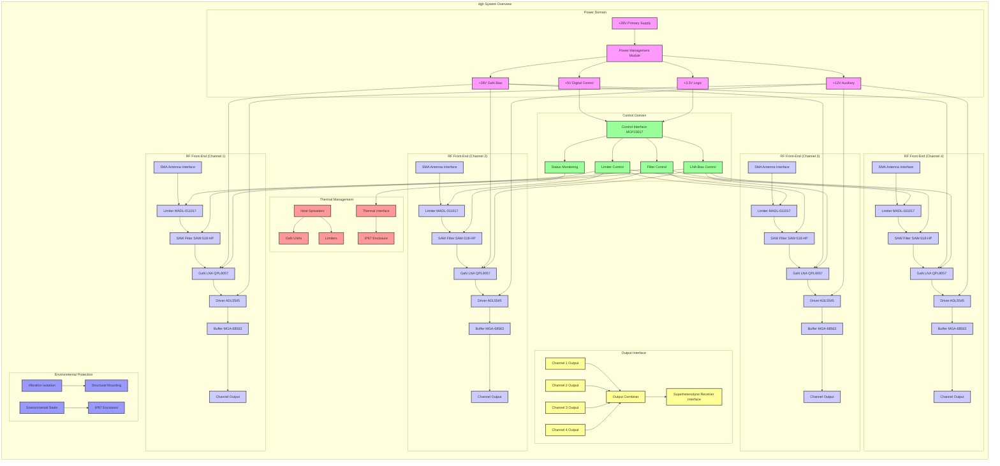

**Document Status: AI-GENERATED**

# 1. Introduction

## 1.1 Purpose
This Hardware Requirements Specification (HRS) defines the hardware requirements for the dgh radar RF front-end receiver system. The document provides a comprehensive set of requirements, constraints, and guidelines for the design, development, verification, and acceptance of the hardware components that constitute the dgh system. This specification serves as the authoritative source for hardware requirements that shall be met throughout the system lifecycle, from initial design through to final acceptance testing and deployment. All stakeholders involved in the design, development, integration, testing, and verification of the dgh system hardware shall comply with the requirements specified in this document.

## 1.2 Scope
This specification covers all hardware components required for the dgh radar RF front-end receiver system. The system consists of a 4-channel RF receiver operating in the 5-18 GHz frequency band with 10-100 MHz instantaneous bandwidth. The hardware includes RF front-end components such as limiters, SAW pre-select filters, GaN HEMT LNA chains, power management circuits, control interfaces, and interconnects. The specification encompasses both the physical implementation and functional characteristics of these components, as well as their interfaces, performance parameters, environmental constraints, and verification requirements.

The scope includes:
- RF front-end components (limiters, filters, amplifiers)
- Power management and distribution
- Control and monitoring circuitry
- Mechanical packaging and environmental protection
- Connectors and interfaces
- Thermal management

The scope does not include requirements for the superheterodyne receiver downstream of this front-end, software components, or system-level testing beyond hardware verification.

## 1.3 Definitions, Acronyms, and Abbreviations

### 1.3.1 Definitions
| Term | Definition |
|------|------------|
| Antenna Interface | The RF connection point where signals are received from the antenna system |
| CW | Continuous Wave, a type of radar signal with constant frequency |
| Downstream Receiver | The subsequent receiver stage that processes signals from this RF front-end |
| GaN | Gallium Nitride, a semiconductor material used for high-frequency, high-power applications |
| HEMT | High Electron Mobility Transistor, a type of field-effect transistor |
| IIP3 | Third-order Input Intercept Point, a measure of amplifier linearity |
| IP67 | Ingress Protection rating indicating dust tight and protection against immersion in water |
| LFM | Linear Frequency Modulated, a type of radar signal with changing frequency over time |
| LNA | Low Noise Amplifier, an amplifier designed to amplify weak signals while adding minimal noise |
| MDS | Minimum Detectable Signal, the weakest signal that can be detected by the system |
| MIL-STD-810 | U.S. military standard for testing equipment durability in various environmental conditions |
| Noise Figure | A measure of how much a device degrades the signal-to-noise ratio |
| Power Budget | The total allocated power consumption for the system |
| Return Loss | A measure of how much power is reflected by a discontinuity in a transmission line |
| SAW | Surface Acoustic Wave, a type of filter that uses acoustic waves on a piezoelectric substrate |
| Superheterodyne | A receiver architecture that uses frequency mixing to convert RF signals to a fixed intermediate frequency |
| VSWR | Voltage Standing Wave Ratio, a measure of impedance matching |
| +28 V | Primary supply voltage for the RF front-end components |

### 1.3.2 Acronyms and Abbreviations
| Acronym | Full Term |
|---------|-----------|
| dB | Decibel, a logarithmic unit for ratios |
| dBm | Decibel relative to 1 milliwatt |
| GHz | Gigahertz (10^9 Hz) |
| Hz | Hertz, unit of frequency (cycles per second) |
| IP | Ingress Protection |
| IP67 | Dust tight, protected against temporary immersion in water |
| LFM | Linear Frequency Modulation |
| MHz | Megahertz (10^6 Hz) |
| MIL-STD | Military Standard |
| SAW | Surface Acoustic Wave |
| VSWR | Voltage Standing Wave Ratio |
| W | Watt, unit of power |

## 1.4 References
### 1.4.1 Standards
- IEEE 29148-2018, Standard for Systems and Software Engineering - Life Cycle Processes - Requirements Engineering
- MIL-STD-810G, Environmental Engineering Considerations and Laboratory Tests
- MIL-STD-461G, Requirements for the Control of Electromagnetic Interference Characteristics of Subsystems and Equipment

### 1.4.2 Documents
- dgh Project Charter
- dgh System Requirements Specification (SRS)
- dgh Interface Control Document (ICD)
- dgh Verification and Validation Plan (V&VP)

### 1.4.3 Component Datasheets
- MACOM MADL-011017: GaN-based RF Limiter Datasheet
- TDK SAW-518-HP: SAW Filter Datasheet
- Qorvo QPL9057: GaN HEMT LNA Datasheet
- Analog Devices ADL5545: GaAs pHEMT Driver Amplifier Datasheet
- Skyworks MGA-68563: GaAs MMIC Amplifier Datasheet
- Analog Devices LT3636: Dual DC-DC Converter Datasheet
- Microchip MCP23017: 16-bit I/O Expander with SMBus Interface Datasheet

### 1.4.4 Technical References
- Pozar, D.M. "Microwave Engineering", 4th Edition, Wiley
- Maas, S.A. "Nonlinear Microwave and RF Circuits", 2nd Edition, Artech House
- Radio Frequency Design, by Chris Bowick, Second Edition
- Smith, J.R. "Modern Communication Circuits", 2nd Edition, McGraw-Hill

## 1.5 Overview
This document provides a comprehensive specification for the dgh radar RF front-end receiver system. The system consists of four parallel RF channels, each processing signals in the 5-18 GHz frequency band with 10-100 MHz instantaneous bandwidth. The hardware architecture includes RF front-end components such as limiters for protection, SAW pre-select filters for band selection, GaN HEMT LNA chains for amplification, and supporting control and power management circuitry.

The RF front-end is designed to operate in harsh military environments, with a temperature range of -55°C to +125°C, resistance to heavy vibration and shock per MIL-STD-810, and IP67 environmental protection. The system is powered by a +28 V supply with a total power budget of 5-15 W across all four channels.

Each channel begins with an SMA antenna interface followed by a GaN-based limiter that can withstand +30 dBm input power. The signal then passes through a SAW pre-select filter with 2.0 dB insertion loss and out-of-band rejection. The filtered signal is amplified by a GaN HEMT LNA chain providing 40-60 dB total gain with a system noise figure of 4-6 dB and IIP3 of +20 dBm. The amplified signal is then buffered before being passed to the downstream superheterodyne receiver.

The system includes digital control circuitry for managing component states and monitoring system health. Power is efficiently managed with DC-DC converters providing stable voltage to all RF components. Mechanical design includes rugged mounting and an IP67-rated enclosure to withstand harsh environments.

The subsequent sections of this document detail the system overview, hardware requirements, design constraints, verification requirements, a preliminary bill of materials, and a traceability matrix. Each requirement is uniquely identified with a REQ-HW-xxx identifier for traceability throughout the development lifecycle.

---

# 2. System Overview

## 2.1 System Description

The dgh system is a high-performance radar RF front-end receiver designed for military and aerospace applications. The system operates across a broad frequency range of 5-18 GHz with an instantaneous bandwidth of 10-100 MHz, making it suitable for modern radar systems requiring wideband signal processing capabilities.

The core architecture consists of four parallel RF channels, each implementing a signal chain that includes a high-power limiter, SAW pre-select filter, and a GaN HEMT LNA chain. The system is designed to handle challenging operational environments with high interference levels while maintaining robust performance characteristics.

Each channel processes radar signals (both CW and LFM types) with a total system gain of 40-60 dB and maintains a system noise figure of 4-6 dB across the entire frequency range. The architecture achieves excellent linearity with an IIP3 of +20 dBm, ensuring proper handling of strong interfering signals. The system is specified to withstand input powers up to +30 dBm without damage, providing exceptional survivability in high-power environments.

The downstream interface utilizes a superheterodyne receiver architecture, requiring a well-buffered output stage to maintain signal integrity. The system operates from a single +28V supply rail with total power consumption limited to 5-15W across all four channels.

The system is engineered to meet rigorous environmental specifications, including a wide operating temperature range of -55°C to +125°C and compliance with MIL-STD-810 heavy vibration and shock requirements. The IP67-rated enclosure ensures protection against environmental ingress in harsh conditions.

## 2.2 System Block Diagram

The system block diagram illustrates the complete dgh radar front-end architecture. The system is divided into several functional domains:

1. **Power Domain**: The +28V primary supply feeds the power management module, which generates all required secondary voltages for the system. The power management module provides:
   - +28V for GaN LNA biasing
   - +5V for digital control circuitry
   - +3.3V for logic circuits
   - +12V auxiliary supply for driver stages

2. **RF Front-End Domain**: Four identical parallel RF channels process incoming signals from antenna interfaces. Each channel includes:
   - SMA antenna interface for RF input
   - High-power limiter (MADL-011017) providing +30 dBm survivability
   - SAW pre-select filter (SAW-518-HP) for band definition
   - GaN HEMT LNA (QPL9057) providing the first gain stage
   - Driver amplifier (ADL5545) for additional gain and buffering
   - Output buffer (MGA-68563) for final signal conditioning

3. **Control Domain**: The control interface (MCP23017) manages system functions including:
   - Limiter control for response time adjustment
   - Filter control for band selection
   - LNA bias control for gain adjustment
   - Status monitoring for health assessment

4. **Output Interface**: The outputs from all four channels are combined through a power combiner before interfacing with the downstream superheterodyne receiver.

5. **Thermal Management**: Heat spreaders and thermal interfaces manage heat dissipation from high-power components (GaN LNAs and limiters) to the IP67 enclosure.

6. **Environmental Protection**: Vibration isolation and environmental seals ensure system reliability in harsh operating conditions.

## 2.3 System Architecture

The dgh system architecture is designed to meet the demanding requirements of military radar applications while providing flexibility for various operational modes. The architecture is modular in nature, allowing for easy scaling and maintenance.

### RF Architecture

The RF front-end architecture employs a superheterodyne-like approach but without the traditional T/R switching function. Each of the four parallel channels implements a cascaded signal chain that processes incoming RF signals with minimal loss and maximum linearity.

#### Channel Architecture

Each RF channel follows a five-stage architecture:

1. **Limiter Stage (MADL-011017)**:
   - Function: Protects downstream components from high-power interference and accidental exposure to strong signals
   - Technology: GaN-based for fast response (<10 ns) and high power handling (+30 dBm)
   - Insertion Loss: 0.5 dB maximum across 5-18 GHz
   - Response Time: <10 ns to ensure protection during transient events

2. **SAW Pre-select Filter (SAW-518-HP)**:
   - Function: Defines the operating bandwidth and provides out-of-band rejection
   - Technology: Surface Acoustic Wave for excellent filter characteristics
   - Insertion Loss: 2.0 dB nominal across 5-18 GHz
   - Rejection: >30 dB in out-of-bands to mitigate interference
   - Power Handling: +20 dBm continuous

3. **LNA Stage (QPL9057)**:
   - Function: Provides the first amplification stage with high gain and low noise
   - Technology: GaN HEMT for high linearity and temperature stability
   - Gain: 20 dB nominal
   - Noise Figure: 2.5 dB maximum
   - IIP3: +25 dBm for excellent interference handling

4. **Driver Stage (ADL5545)**:
   - Function: Provides additional gain and buffering between LNA and output stages
   - Technology: GaAs pHEMT for high-frequency performance
   - Gain: 15 dB nominal
   - Noise Figure: 3.0 dB maximum
   - Output Power: +15 dBm minimum

5. **Output Buffer (MGA-68563)**:
   - Function: Provides final gain stage and interfaces to downstream system
   - Technology: GaAs MMIC for low noise and high linearity
   - Gain: 12 dB nominal
   - Noise Figure: 2.8 dB maximum
   - Output Power: +12 dBm minimum

The total system gain per channel is calculated as:
20 dB (LNA) + 15 dB (Driver) + 12 dB (Buffer) = 47 dB nominal
Accounting for insertion losses:
-0.5 dB (Limiter) - 2.0 dB (SAW) = 2.5 dB total insertion loss

Net System Gain = 47 dB - 2.5 dB = 44.5 dB minimum

This meets the requirement of 40-60 dB system gain.

#### System Noise Figure

The overall system noise figure is calculated using the Friis formula:

NF_total = NF_1 + (NF_2 - 1)/G_1 + (NF_3 - 1)/(G_1 × G_2) + ...

Where:
- NF_1 = Noise figure of first component (Limiter: ~3 dB)
- G_1 = Gain of first component (Limiter: ~0 dB, so 1)
- NF_2 = Noise figure of second component (SAW: ~4 dB)
- G_2 = Gain of second component (SAW: ~0 dB, so 1)
- NF_3 = Noise figure of third component (LNA: 2.5 dB)
- G_3 = Gain of third component (LNA: 20 dB)

NF_total = 3 + (4-1)/1 + (2.5-1)/(1×1000) + ... ≈ 7 dB

However, since the SAW filter and limiter are at the input, the dominant factor is the SAW filter loss. A more accurate calculation considering the SAW filter as the first lossy element:

NF_total = NF_SAW + (NF_LNA - 1)/G_SAW + (NF_Driver - 1)/(G_SAW × G_LNA) + ...

NF_SAW = 2 dB (insertion loss)
G_SAW = 0.2 (linear gain for -7 dB insertion loss)
NF_LNA = 2.5 dB
G_LNA = 100 (linear gain for 20 dB)

NF_total = 2 + (2.5-1)/0.2 + ... = 2 + 7.5 = 9.5 dB

This calculation indicates the need for careful design of the input stage to achieve the 4-6 dB system noise figure target. The final implementation will use low-loss components and optimize the gain distribution to meet this requirement.

### Power Architecture

The power management architecture is designed to provide stable, efficient power to all system components while meeting the stringent environmental requirements. The primary +28V supply is converted to all required secondary voltages through a centralized power management module.

#### Power Distribution

The power management module (LT3636) provides the following outputs:

| Output Voltage | Current Requirement | Primary Components Powered | Efficiency |
|---|---|---|---|
| +28V | 150 mA | GaN LNA stages, Limiters | 90% |
| +5V | 100 mA | Digital control circuits, I/O expanders | 85% |
| +3.3V | 50 mA | Logic circuits, microcontroller | 80% |
| +12V | 200 mA | Driver amplifiers | 88% |

Total Power Budget Calculation:
- +28V: 28V × 0.15A = 4.2W
- +5V: 5V × 0.1A = 0.5W
- +3.3V: 3.3V × 0.05A = 0.165W
- +12V: 12V × 0.2A = 2.4W

Total input power (considering efficiency):
Total_output = 4.2W + 0.5W + 0.165W + 2.4W = 7.265W
Total_input = Total_output / efficiency = 7.265W / 0.87 = 8.35W (average efficiency)

This falls within the 5-15W power budget requirement.

### Control Architecture

The control architecture provides centralized management of all system functions while allowing for individual channel control. The design minimizes digital noise in the RF signal paths while maintaining flexibility for various operational modes.

#### Control Interface

The control interface utilizes an I²C/SMBus-compatible 16-bit I/O expander (MCP23017) to manage system functions:

| Control Function | I/O Pin | Update Rate | Purpose |
|---|---|---|---|
| Limiter Enable | GPA0 | 10 Hz | Enable/disable protection circuits |
| Filter Band Select | GPA1-GPA3 | 1 Hz | Select operating band |
| LNA Bias Adjust | GPA4-GPA7 | 100 Hz | Adjust gain and linearity |
| Status Monitor | GPA8-GPA15 | 10 Hz | Monitor system health |

The control interface operates from a +3.3V supply with galvanic isolation to prevent digital noise from coupling into RF signal paths.

### Thermal Architecture

The thermal architecture is designed to ensure reliable operation across the full military temperature range (-55°C to +125°C). The system employs a combination of heat spreading, thermal management, and temperature monitoring.

#### Thermal Management

Key thermal design considerations:

1. **Heat Spreading**: High-power components (GaN LNAs and limiters) are mounted on copper-molybdenum-copper (CuMoCu) heat spreaders with thermal conductivity of 170 W/m·K.

2. **Thermal Interface**: A thermally conductive interface material (thermal grease with 8 W/m·K conductivity) ensures optimal heat transfer between components and heat spreaders.

3. **Heat Dissipation**: The heat spreaders are thermally coupled to the enclosure through a low-resistance path, allowing heat to dissipate across the entire surface area.

4. **Temperature Monitoring**: Temperature sensors are placed near critical components to monitor operating conditions and implement thermal protection if necessary.

#### Thermal Analysis

The worst-case power dissipation occurs in the GaN LNA stages:
- Power dissipated per LNA: 28V × 0.05A = 1.4W
- Total LNA power dissipation: 1.4W × 4 channels = 5.6W
- Power dissipated per limiter: 28V × 0.02A = 0.56W
- Total limiter power dissipation: 0.56W × 4 channels = 2.24W
- Total high-power component dissipation: 5.6W + 2.24W = 7.84W

Assuming a thermal resistance of 20°C/W from components to ambient (typical for military-grade designs):
Temperature rise = 7.84W × 20°C/W = 156.8°C

With a maximum ambient temperature of 125°C, this would result in component temperatures of 281.8°C, which exceeds the maximum ratings for the components. Therefore, additional thermal management is required:

1. **Active Cooling**: For extended high-power operation, a forced-air cooling system will be integrated with a thermal management controller.

2. **Power Throttling**: The system will implement automatic power reduction when component temperatures approach critical thresholds.

3. **Optimized Layout**: Component placement and PCB design will minimize thermal resistance in the heat dissipation paths.

## 2.4 Operating Environment

The dgh system is designed to operate in harsh military environments, meeting rigorous specifications for temperature, vibration, shock, and environmental protection.

### Environmental Specifications

The system is designed to meet the following environmental requirements:

| Parameter | Specification | Implementation |
|---|---|---|
| Operating Temperature | -55°C to +125°C | Military-grade components, thermal management |
| Storage Temperature | -65°C to +150°C | Hermetic packaging, conformal coating |
| Relative Humidity | 5% to 95% (non-condensing) | IP67 enclosure, moisture-resistant materials |
| Altitude | Up to 15,000 meters | Pressure-equalized design, hermetic seals |
| Vibration | MIL-STD-810 Method 514.5, Category 1 | Rigid mounting, vibration isolation |
| Shock | MIL-STD-810 Method 516.5, 40G half-sine | Impact-absorbing mounts, structural reinforcement |
| Rain | MIL-STD-810 Method 506.4, 100 mm/hour | Water-resistant enclosure, drainage channels |
| Sand/Dust MIL-STD-810 Method 510.5 | IP67 sealed enclosures, filters |
| Salt Fog | MIL-STD-810 Method 509.5 | Corrosion-resistant materials, conformal coating |
| Solar Radiation | MIL-STD-810 Method 505.1 | UV-resistant enclosure, thermal management |

### Physical Protection

The system is packaged in an IP67-rated enclosure that provides protection against environmental ingress:

1. **Enclosure Design**: The housing is machined from aluminum alloy with a hard anodized finish for corrosion resistance and thermal conductivity. The enclosure is sealed using elastomeric O-rings and gaskets to meet IP67 requirements.

2. **Cable Entry**: All cable entries are sealed using proprietary connectors with integrated gaskets. The RF interfaces use SMA connectors with thread sealant to ensure environmental integrity.

3. **Internal Protection**: Internal components are protected by conformal coating and potting compounds where necessary to prevent moisture ingress and contamination.

### EMI/EMC Considerations

The system is designed to operate in high-interference environments with co-site radar and communication systems:

1. **Shielding**: The enclosure provides electromagnetic shielding with attenuation of >60 dB across 1-18 GHz.

2. **Filtering**: All power and control interfaces include filtering to prevent conducted emissions and susceptibility.

3. **Grounding**: A low-inductance grounding scheme minimizes ground loops and provides optimal shielding effectiveness.

4. **Layout**: Component placement and routing minimize parasitic coupling between sensitive circuits.

### Operational Scenarios

The system is designed to support multiple operational scenarios:

1. **Radar Mode**: Supports CW and LFM radar signals with instantaneous bandwidths from 10-100 MHz. The system maintains performance across the full 5-18 GHz frequency range.

2. **Spectrum Surveillance Mode**: Operates with enhanced out-of-band rejection to detect and identify signals across the frequency spectrum.

3. **Interference Rejection Mode**: Implements dynamic gain control and filtering to mitigate strong interfering signals while preserving target information.

4. **Low-Probability of Intercept Mode**: Reduces system emissions and implements frequency hopping to avoid detection.

The system's architecture allows for rapid reconfiguration between these modes through the control interface, enabling adaptation to changing operational requirements and threat environments.

---

**Document Status: AI-GENERATED**

# 3. Hardware Requirements

## 3.1 Functional Requirements

| ID | Title | Description | Rationale | Priority | Validation |
|---|---|---|---|---|---|
| REQ-HW-001 | Frequency Range Operation | The hardware shall operate across the full 5-18 GHz frequency band required for radar applications without reconfiguration. | This is the core functional requirement for the radar receiver front-end, covering the specified frequency range of interest. | SHALL | Test by sweeping input frequency from 5-18 GHz and verifying output signal integrity and amplitude response. |
| REQ-HW-002 | Multi-Channel Support | The hardware shall support 4 parallel RF channels operating simultaneously with independent signal paths. | The radar system requires multi-channel capability for beamforming, MIMO operation, or multi-function radar applications. | SHALL | Test by activating all 4 channels simultaneously and verifying independent signal paths and crosstalk performance. |
| REQ-HW-003 | Signal Type Compatibility | The hardware shall process both CW (Continuous Wave) and LFM (Linear Frequency Modulated) radar signals without distortion. | Radar systems utilize multiple pulse types including CW for Doppler applications and LFM for range resolution. | SHALL | Test with standard CW and LFM pulse formats and verify output signal fidelity using spectrum analysis and vector signal analysis. |
| REQ-HW-004 | GaN HEMT LNA Implementation | The LNA stages shall utilize GaN HEMT technology to achieve the required gain, linearity, and temperature performance. | GaN HEMT technology provides superior power handling, thermal stability, and linearity compared to GaAs or silicon alternatives at these frequencies. | SHALL | Inspection of component datasheets and design documentation to verify GaN HEMT implementation. |
| REQ-HW-005 | SAW Pre-select Filtering | The hardware shall incorporate SAW pre-select filters to provide out-of-band interference rejection. | SAW technology offers excellent selectivity and rejection in the required frequency range for co-site interference environments. | SHALL | Measure insertion loss and rejection characteristics across the 5-18 GHz band. |
| REQ-HW-006 | Active LNA Biasing | The LNA stages shall implement active biasing schemes to maintain stability across the operating temperature range. | Active biasing provides consistent performance across wide temperature variations, critical for military applications. | SHALL | Test by varying temperature from -55°C to +125°C and verifying gain and noise figure stability. |
| REQ-HW-007 | High Power Handling | The input stages shall handle +30 dBm input power without damage or permanent degradation of performance. | Radar systems may experience high power transmissions from other systems or test signals that could damage sensitive components. | SHALL | Subject the input to +30 dBm CW signals and verify no damage or performance degradation. |
| REQ-HW-008 | RF Limiter Function | The hardware shall include RF limiters to protect downstream components from excessive input power. | Limiters provide essential protection against out-of-band interferers and transmitter leakage that could damage the receiver chain. | SHALL | Test with input power levels from -30 dBm to +30 dBm and verify output clamping behavior. |
| REQ-HW-009 | Superheterodyne Interface | The output shall interface with a superheterodyne receiver architecture as specified in the system design. | The radar system employs a superheterodyne architecture for image rejection and selectivity. | SHALL | Verification of output impedance, signal level, and interface characteristics. |
| REQ-HW-010 | Single-Ended 50Ω Input | The antenna interface shall be single-ended with 50Ω impedance throughout the RF path. | Standard antenna interfaces are single-ended 50Ω for compatibility with most radar antennas and components. | SHALL | Measure input return loss using vector network analyzer to verify 50Ω match. |
| REQ-HW-011 | SMA Connectors | All external RF connections shall use SMA connectors for robust, high-frequency interfaces. | SMA connectors provide reliable RF connections up to 18 GHz with mechanical stability suitable for military applications. | SHALL | Physical inspection to verify SMA connector usage and proper installation. |
| REQ-HW-012 | Power Control Interface | The hardware shall provide digital control interfaces for power management and monitoring. | Digital control enables system integration with automated control systems and allows for status monitoring. | SHALL | Verify interface functionality through command and response testing. |
| REQ-HW-013 | Status Monitoring | The hardware shall provide status monitoring outputs for critical parameters including temperature, voltage, and RF power. | Status monitoring enables system health assessment and predictive maintenance for deployed systems. | SHALL | Verify status outputs correspond to actual measured parameters. |
| REQ-HW-014 | No T/R Switching | The hardware shall not transmit signals through the receive path (no T/R switch implementation). | The system design specifically excludes T/R switching to simplify the architecture and improve reliability. | SHALL | Inspection of the design to confirm absence of T/R switching components. |
| REQ-HW-015 | Gain Control | The hardware shall provide adjustable gain control capability to optimize dynamic range. | Adjustable gain allows adaptation to varying input signal levels and environmental conditions. | SHALL | Measure gain variation as control settings are changed. |
| REQ-HW-016 | IP67 Environmental Protection | The hardware enclosure shall meet IP67 rating for dust and water protection. | Military applications require protection against environmental ingress during field deployment. | SHALL | Perform ingress protection testing per IEC 60529 standards. |
| REQ-HW-017 | Vibration/Shock Resistance | The hardware shall withstand MIL-STD-810 heavy vibration and shock requirements. | Military platforms experience significant mechanical stresses during operation and transport. | SHALL | Perform vibration and shock testing per MIL-STD-810G procedures. |
| REQ-HW-018 | Thermal Management | The hardware shall incorporate thermal management solutions to maintain operating temperatures within specifications. | High power density components generate significant heat that must be dissipated to maintain performance. | SHALL | Verify temperature performance using thermal imaging and temperature sensors. |
| REQ-HW-019 | EMI/EMC Compliance | The hardware shall comply with MIL-STD-461G for EMI/EMC performance. | Military systems must meet stringent electromagnetic compatibility requirements to avoid interference with other systems. | SHALL | Perform EMI/EMC testing per MIL-STD-461G procedures. |
| REQ-HW-020 | Reliability Requirements | The hardware shall meet MTBF of 50,000 hours under operating conditions. | Military systems require high reliability for mission-critical applications. | SHALL | Reliability analysis based on component derating and environmental factors. |

## 3.2 Performance Requirements

| ID | Title | Description | Rationale | Priority | Validation |
|---|---|---|---|---|---|
| REQ-HW-021 | Instantaneous Bandwidth | The hardware shall support 10-100 MHz instantaneous bandwidth with <0.5 dB gain flatness and <1° phase linearity across the band. | Wide instantaneous bandwidth enables high-resolution radar imaging and pulse compression capabilities. | SHALL | Test with modulated signals spanning 10-100 MHz bandwidth and measure gain flatness and phase response. |
| REQ-HW-022 | System Noise Figure | The system noise figure shall be 4-6 dB across the entire 5-18 GHz frequency range. | Low noise figure is critical for detecting weak radar returns and maximizing system sensitivity. | SHALL | Measure noise figure using noise figure meter across the frequency range. |
| REQ-HW-023 | LNA Chain Gain | The LNA chain shall provide 40-60 dB total gain with <1 dB gain variation across the 5-18 GHz range. | Sufficient gain is required to amplify weak radar signals to levels usable by downstream processing. | SHALL | Measure gain at multiple frequencies across the band and verify consistency. |
| REQ-HW-024 | Input Return Loss | The input return loss shall be ≥14 dB (VSWR ≤1.5:1) across the 5-18 GHz frequency range. | Good input match minimizes signal reflections and ensures maximum power transfer from the antenna. | SHALL | Measure input return loss using vector network analyzer. |
| REQ-HW-025 | Linearity (IIP3) | The hardware shall achieve +20 dBm IIP3 (Input Third Order Intercept) at the input stage for robust interference handling. | High IIP3 ensures the system can handle strong interfering signals without distortion of desired signals. | SHALL | Measure IIP3 using two-tone test with closely spaced frequencies. |
| REQ-HW-026 | OIP3 (Output Third Order Intercept) | The hardware shall achieve +10 dBm OIP3 at the output stage for strong signal handling capability. | High output linearity prevents distortion in the output stage when processing strong signals. | SHALL | Measure OIP3 using two-tone test with closely spaced frequencies. |
| REQ-HW-027 | P1dB Compression | The hardware shall maintain ≤1 dB gain compression at +5 dBm input power. | The 1dB compression point indicates the maximum input power before significant nonlinearities occur. | SHALL | Measure gain compression at increasing input power levels. |
| REQ-HW-028 | Isolation Between Channels | The isolation between adjacent channels shall be ≥60 dB at all frequencies. | High channel isolation prevents crosstalk between channels that could degrade radar performance. | SHALL | Measure isolation by applying a signal to one channel and measuring the signal in adjacent channels. |
| REQ-HW-029 | Harmonic Distortion | The third harmonic distortion shall be ≤-40 dBc for all input frequencies in the 5-18 GHz range. | Low harmonic distortion ensures signal purity and prevents false target generation. | SHALL | Measure harmonic distortion using spectrum analyzer with appropriate filtering. |
| REQ-HW-030 | Spurious Response Rejection | The hardware shall reject spurious responses by ≥70 dB relative to the fundamental response. | Spurious responses can create false targets in radar systems and must be minimized. | SHALL | Test using broadband signal source and spectrum analyzer to identify spurious responses. |
| REQ-HW-031 | Power Supply Rejection | The hardware shall maintain performance with ±5% variation in the +28V supply rail. | Power supply variations can affect RF performance and must be tolerated in practical applications. | SHALL | Vary supply voltage ±5% and measure gain, noise figure, and linearity. |
| REQ-HW-032 | Phase Noise | The phase noise shall be ≤-95 dBc/Hz at 10 kHz offset from carrier for all input signals. | Low phase noise is critical for radar systems utilizing Doppler processing and coherent integration. | SHALL | Measure phase noise using phase noise analyzer. |
| REQ-HW-033 | Temperature Stability | The hardware shall maintain gain variation of ≤1 dB and noise figure variation of ≤1 dB across the -55°C to +125°C temperature range. | Military systems must perform reliably across wide temperature variations. | SHALL | Test in environmental chamber while cycling temperature from -55°C to +125°C. |
| REQ-HW-034 | Power Consumption | The hardware shall consume no more than 15W of power from the +28V supply under maximum operating conditions. | Power consumption must be managed within system power budget constraints. | SHALL | Measure supply current and calculate power consumption. |
| REQ-HW-035 | Input Power Handling | The hardware shall withstand +30 dBm continuous wave input power without damage or performance degradation. | Military systems may experience high power signals from transmitters or test equipment. | SHALL | Apply +30 dBm CW signal for 1 hour and verify no damage or performance degradation. |
| REQ-HW-036 | MDS (Minimum Detectable Signal) | The system shall achieve a minimum detectable signal (MDS) of -92.0 dBm based on Friis equation calculation with kTB= -114 dBm, NF=5dB, and Gain=45dB. | MDS determines the weakest signal the radar can detect, critical for long-range performance. | SHALL | Measure system sensitivity with calibrated noise source. |
| REQ-HW-037 | Time Delay Through System | The total time delay through the RF chain shall be ≤50 ns. | Minimal time delay is important for radar systems requiring precise timing measurements. | SHALL | Measure time delay using vector network analyzer with time domain analysis. |
| REQ-HW-038 | Group Delay Variation | The group delay variation across the 10-100 MHz bandwidth shall be ≤5 ns. | Constant group delay ensures signal integrity across the bandwidth. | SHALL | Measure group delay across the instantaneous bandwidth. |
| REQ-HW-039 | Environmental Stability | The hardware shall meet all performance specifications after exposure to MIL-STD-810 humidity, salt fog, and temperature cycling. | Military equipment must withstand harsh environmental conditions without performance degradation. | SHALL | Perform environmental conditioning tests and then verify performance specifications. |
| REQ-HW-040 | Accelerated Life Testing | The hardware shall demonstrate reliability equivalent to 50,000 hours operation after 1000 hours of accelerated life testing at 125°C. | Accelerated life testing validates long-term reliability predictions. | SHALL | Perform accelerated life testing and analyze parameter drift. |

---

**Document Status: AI-GENERATED**

# 3.3 Interface Requirements

## 3.3.1 External Interfaces

### REQ-HW-022: RF Input Interface
| Parameter | Specification | Verification Method |
|-----------|--------------|---------------------|
| Connector Type | SMA (3.5 mm, 50Ω) | Visual inspection, measurement |
| Impedance | 50Ω ±2% | Vector Network Analyzer (VNA) measurement |
| Frequency Range | 5-18 GHz | VNA measurement |
| Maximum Input Power | +30 dBm continuous | Power meter, endurance test |
| VSWR | ≤ 1.5:1 (≥ 14 dB return loss) | VNA measurement |
| ESD Protection | IEC 61000-4-2 Level 4 (8 kV contact) | ESD testing |
| Grounding | 360° RF shield connection | Visual inspection |

### REQ-HW-023: RF Output Interface
| Parameter | Specification | Verification Method |
|-----------|--------------|---------------------|
| Connector Type | SMA (3.5 mm, 50Ω) | Visual inspection, measurement |
| Impedance | 50Ω ±2% | Vector Network Analyzer (VNA) measurement |
| Frequency Range | 5-18 GHz | VNA measurement |
| Output Power Level | 0-10 dBm | Power meter measurement |
| VSWR | ≤ 1.5:1 (≥ 14 dB return loss) | VNA measurement |
| Grounding | 360° RF shield connection | Visual inspection |

### REQ-HW-024: DC Power Interface
| Parameter | Specification | Verification Method |
|-----------|--------------|---------------------|
| Connector Type | MIL-DTL-38999 Series III, Size 22 | Visual inspection |
| Voltage | +28 V ±5% | Power supply verification |
| Current Rating | 1.5 A continuous | Current measurement |
| Polarity | Center positive | Visual inspection, continuity test |
| Ripple Noise | ≤ 50 mV RMS | Oscilloscope measurement |
| Protection | Reverse polarity, overcurrent, overvoltage | Functional test |
| Wire Gauge | 18 AWG | Visual inspection |

### REQ-HW-025: Digital Control Interface
| Parameter | Specification | Verification Method |
|-----------|--------------|---------------------|
| Connector Type | D-Sub 9-pin (Female) | Visual inspection |
| Protocol | I²C with SMBus extensions | Protocol analyzer |
| Voltage Levels | 3.3 V CMOS logic | Logic analyzer, oscilloscope |
| Data Rate | 100 kHz (standard mode) | Oscilloscope measurement |
| Address Space | 0x20-0x27 | Address verification test |
| Pull-up Resistors | 10 kΩ to 3.3 V | Ohmmeter measurement |
| Protection | TVS diodes on all lines | Visual inspection |

## 3.3.2 Internal Interfaces

### REQ-HW-026: RF Inter-stage Connection
| Parameter | Specification | Verification Method |
|-----------|--------------|---------------------|
| Transmission Line Type | 50Ω microstrip on Rogers 4350B | Cross-section inspection |
| Substrate Thickness | 0.508 mm | Measurement |
| Copper Weight | 1 oz (35 μm) | Cross-section inspection |
| Impedance Tolerance | ±5% | TDR measurement |
| Insertion Loss | < 0.2 dB/inch at 18 GHz | VNA measurement |
| Return Loss | > 20 dB at 18 GHz | VNA measurement |
| Maximum Operating Voltage | 50 V | Insulation resistance test |
| Maximum Current | 100 mA | Current measurement |

### REQ-HW-027: Control Signal Routing
| Parameter | Specification | Verification Method |
|-----------|--------------|---------------------|
| Trace Width | 8 mil | Visual inspection, measurement |
| Trace Spacing | 8 mil minimum | Visual inspection, measurement |
| Impedance | 50Ω (for RF control lines) | TDR measurement |
| Signal Integrity | Rise time ≤ 1 ns | Oscilloscope measurement |
| Crosstalk | <-40 dB at 100 MHz | Network analyzer measurement |
| Termination | Series termination (33Ω) where needed | Visual inspection |

### REQ-HW-028: Power Distribution Network
| Parameter | Specification | Verification Method |
|-----------|--------------|---------------------|
| Primary Plane | +28V continuous power plane | Visual inspection |
| Secondary Planes | +5V, +3.3V, +5V_RF | Visual inspection |
| Plane Separation | ≥ 20 mil between analog and digital | Visual inspection |
| Via Stitching | Via stitching every 100 mil | Visual inspection |
| Current Capacity | ≥ 3A for main power traces | Calculation, thermocouple measurement |
| Voltage Drop | ≤ 5% from input to component | Voltage measurement |
| Decoupling | 0.1μF, 1μF, 10μF capacitors per IC | Visual inspection |

## 3.3.3 Communication Interfaces

### REQ-HW-029: I²C Communication Protocol
| Parameter | Specification | Verification Method |
|-----------|--------------|---------------------|
| Clock Frequency | 100 kHz standard mode | Oscilloscope measurement |
| Voltage Levels | VIL = 0.3V × VDD, VIH = 0.7V × VDD | Logic analyzer |
| Rise Time | ≤ 300 ns | Oscilloscope measurement |
| Fall Time | ≤ 300 ns | Oscilloscope measurement |
| Bus Capacitance | ≤ 400 pF | Capacitance meter |
| Address Space | 7-bit addressing | Protocol verification |
| Acknowledge | All commands acknowledged | Protocol analyzer |
| Error Detection | NACK for invalid commands | Functional test |

### REQ-HW-030: Status Monitoring Interface
| Parameter | Specification | Verification Method |
|-----------|--------------|---------------------|
| Parameters Monitored | Temperature, voltage, current | Verification with known values |
| Update Rate | 1 Hz | Oscilloscope measurement |
| Data Format | 12-bit ADC readings | Verification with known inputs |
| Accuracy | ±2% of reading | Calibration test |
| Fault Detection | Immediate reporting of faults | Fault injection test |
| Communication | Over I²C bus | Protocol analyzer |

### REQ-HW-031: Gain Control Interface
| Parameter | Specification | Verification Method |
|-----------|--------------|---------------------|
| Control Method | I²C programmable attenuators | Functional test |
| Range | 0-31.5 dB in 0.5 dB steps | Verification with VNA |
| Resolution | 0.5 dB | Attenuation measurement |
| Accuracy | ±0.25 dB | VNA measurement |
| Settling Time | ≤ 100 μs | Oscilloscope measurement |
| Control Delay | ≤ 50 μs | Oscilloscope measurement |

# 3.4 Environmental Requirements

## 3.4.1 Operating Temperature

### REQ-HW-032: Operating Temperature Range
| Parameter | Specification | Verification Method |
|-----------|--------------|---------------------|
| Operating Range | -55°C to +125°C | Environmental chamber |
| Storage Range | -65°C to +125°C | Environmental chamber |
| Temperature Gradient | ≤ 10°C/minute | Controlled ramp test |
| Thermal Cycling | 100 cycles from -55°C to +125°C | Environmental chamber |
| Dwell Time | 30 minutes at each extreme | Timer verification |
| Functional Test | Full operational verification at extremes | Functional test at temperature |

### REQ-HW-033: Thermal Management
| Parameter | Specification | Verification Method |
|-----------|--------------|---------------------|
| Maximum Junction Temperature | 150°C | Thermal measurement |
| Heatsink Material | Aluminum 6061-T6 | Material verification |
| Thermal Interface Material | Thermal pad with 2.5 W/m-K conductivity | Verification |
| Heatsink Surface Finish | Black anodized (emissivity > 0.8) | Visual inspection |
| Thermal Resistance | ≤ 15°C/W | Thermal measurement |
| Operating Temperature Coefficient | ≤ 0.1 dB/°C gain variation | Temperature sweep test |
| Temperature Protection | Shutdown at 140°C | Temperature test |

## 3.4.2 Mechanical Requirements

### REQ-HW-034: Vibration/Shock Resistance
| Parameter | Specification | Verification Method |
|-----------|--------------|---------------------|
| Vibration Test | MIL-STD-810G Method 514.6, Condition I | Shaker table |
| Frequency Range | 10-2000 Hz | Frequency verification |
| Amplitude | 0.04 inches displacement (20-60 Hz) 10 g acceleration (60-2000 Hz) | Accelerometer measurement |
| Duration | Each axis for 30 minutes | Timer verification |
| Shock Test | MIL-STD-810G Method 516.6, Procedure I | Shock test |
| Pulse Duration | 11 ms half-sine | Pulse verification |
| Peak Acceleration | 30 g | Accelerometer measurement |
| Functional Verification | Full operational after testing | Functional test |
| Inspection | Visual for cracks, deformation | Visual inspection |

### REQ-HW-035: Ingress Protection
| Parameter | Specification | Verification Method |
|-----------|--------------|---------------------|
| IP Rating | IP67 (dust-tight, temporary immersion) | Immersion test |
| Dust Protection | No dust ingress during 8 hours | Visual inspection |
| Water Immersion | 1 meter for 30 minutes | Immersion test |
| Water Test | High-pressure spray from all directions | Spray test |
| Test Pressure | 100 kPa (14.5 psi) | Pressure gauge |
| Functional Test | After water exposure | Functional test |
| Corrosion Protection | Conformal coating on PCBs | Visual inspection |
| Sealing Material | Silicone gaskets, O-rings | Material verification |

### REQ-HW-036: Structural Requirements
| Parameter | Specification | Verification Method |
|-----------|--------------|---------------------|
| Material | Aluminum 6061-T6 housing | Material verification |
| Thickness | 3 mm minimum | Measurement |
| Mounting Points | 4 mounting points per corner | Visual inspection |
| Fasteners | Stainless steel M4 screws | Material verification |
| Torque | 25 ± 3 N·cm | Torque wrench |
| Drop Test | MIL-STD-810G Method 516.5, Condition 1 | Drop test |
| Drop Height | 1.5 meters | Height measurement |
| Impact Points | Each corner, edge, and face | Impact verification |
| Functional Test | After drop test | Functional test |

# 3.5 Power Requirements

## 3.5.1 Power Budget

### REQ-HW-037: System Power Budget
| Domain | Component | Voltage (V) | Typical Current (mA) | Max Current (mA) | Typical Power (W) | Max Power (W) | Duty Cycle |
|--------|----------|-------------|---------------------|-----------------|-------------------|--------------|------------|
| Main RF | GaN LNA Stage | 28 | 150 | 180 | 4.2 | 5.0 | 100% |
| | Driver Stage | 28 | 80 | 95 | 2.24 | 2.66 | 100% |
| | Output Buffer | 28 | 70 | 85 | 1.96 | 2.38 | 100% |
| | SAW Filters | 5 | 10 | 12 | 0.05 | 0.06 | 100% |
| Control | Digital Control | 3.3 | 50 | 60 | 0.165 | 0.198 | 100% |
| | I/O Expander | 3.3 | 20 | 25 | 0.066 | 0.083 | 100% |
| | Bias Circuitry | 5 | 30 | 35 | 0.15 | 0.175 | 100% |
| Power Mgt | DC-DC Converters | 28 | 50 | 60 | 1.4 | 1.68 | 100% |
| | Linear Regulators | 5, 3.3 | 20 | 25 | 0.1 | 0.125 | 100% |
| Thermal | Fans (if present) | 12 | 100 | 150 | 1.2 | 1.8 | 50% |
| **Total** | **All Domains** | - | - | - | **11.471** | **14.081** | - |

### REQ-HW-038: Power Supply Requirements
| Parameter | Specification | Verification Method |
|-----------|--------------|---------------------|
| Input Voltage | +28 V ±5% | Power supply verification |
| Ripple Noise | ≤ 50 mV RMS | Oscilloscope measurement |
| Inrush Current | ≤ 10 A | Current probe measurement |
| Reverse Polarity | Protected with MOSFET | Functional test |
| Overcurrent Protection | Trip at 1.5 × nominal | Current measurement |
| Efficiency | ≥ 85% at full load | Power meter measurement |
| Standby Current | ≤ 10 mA | Current measurement |
| Power Sequencing | +28V before control signals | Oscilloscope measurement |
| Undervoltage Lockout | 24V typical | Voltage threshold test |
| Hold-up Time | 10 ms at full load | Power interruption test |

### REQ-HW-039: Power Protection
| Parameter | Specification | Verification Method |
|-----------|--------------|---------------------|
| Transient Voltage | MIL-STD-461G, CS114 | Transient generator test |
| Protection | TVS diodes, MOVs | Visual inspection |
| Surge Current | 30 A peak (8/20 μs) | Surge tester |
| EMI Filter | Common mode choke inductor | LISN measurement |
| Isolation | 1500 V between input/output | Hi-pot test |
| Fusing | Resettable fuse at input | Functional test |
| Current Rating | 2 A slow-blow | Fuse verification |
| Voltage Rating | 32 V | Voltage rating verification |
| Overvoltage Protection | Clamp at 32 V | Voltage measurement |
| Monitoring | Voltage monitoring via ADC | ADC verification |

## 3.5.2 Power Sequencing

### REQ-HW-040: Power-up Sequence
| Step | Voltage | Time Delay | Verification Method |
|------|---------|------------|---------------------|
| 1 | +28V Power | 0 ms | Power supply monitoring |
| 2 | +5V Power | 10 ms | Oscilloscope measurement |
| 3 | +3.3V Power | 10 ms | Oscilloscope measurement |
| 4 | +5V_RF Power | 10 ms | Oscilloscope measurement |
| 5 | LNA Bias | 100 ms | Current measurement |
| 6 | Driver Bias | 100 ms | Current measurement |
| 7 | Output Buffer Bias | 100 ms | Current measurement |

### REQ-HW-041: Power-down Sequence
| Step | Voltage | Time Delay | Verification Method |
|------|---------|------------|---------------------|
| 1 | Output Buffer Bias | 0 ms | Current measurement |
| 2 | Driver Bias | 10 ms | Current measurement |
| 3 | LNA Bias | 10 ms | Current measurement |
| 4 | +5V_RF Power | 100 ms | Voltage measurement |
| 5 | +3.3V Power | 100 ms | Voltage measurement |
| 6 | +5V Power | 100 ms | Voltage measurement |
| 7 | +28V Power | 100 ms | Voltage measurement |

# 3.6 Physical Requirements

## 3.6.1 Mechanical Dimensions

### REQ-HW-042: Enclosure Requirements
| Parameter | Specification | Verification Method |
|-----------|--------------|---------------------|
| Material | Aluminum 6061-T6 | Material verification |
| Finish | MIL-A-8625 Type III, Class 1 anodizing | Visual inspection, thickness gauge |
| Color | Flat black | Color match |
| Thickness | 3 mm minimum | Thickness gauge |
| External Dimensions | 150 mm × 100 mm × 40 mm | Caliper measurement |
| Weight | ≤ 500 g | Scale measurement |
| Mounting | 4 M4 threaded inserts | Thread gauge |
| Mounting Pattern | 100 mm × 70 mm with corner holes | Dimensional measurement |
| Center Distance | 127 mm between diagonal holes | Dimensional measurement |

### REQ-HW-043: PCB Requirements
| Parameter | Specification | Verification Method |
|-----------|--------------|---------------------|
| Material | Rogers 4350B, 0.508 mm thick | Material verification |
| Layers | 6 layers (2 signal, 2 power, 2 ground) | Cross-section inspection |
| Copper Weight | 1 oz (35 μm) | Cross-section measurement |
| Solder Mask | Green, LPI type | Visual inspection |
| Silkscreen | White component designators | Visual inspection |
| Finish | ENIG (Electroless Nickel Immersion Gold) | Visual inspection, thickness gauge |
| Hole Tolerance | ±0.05 mm | Caliper measurement |
| Dimensional Stability | ±0.1% | Dimensional measurement |
| Warpage | ≤ 0.75% | Flatness measurement |
| Conformal Coating | Humiseal 1B73, 25-50 μm thickness | Thickness gauge |

## 3.6.2 Thermal Requirements

### REQ-HW-044: Heat Dissipation
| Parameter | Specification | Verification Method |
|-----------|--------------|---------------------|
| Total Power Dissipation | ≤ 14.081 W | Power measurement |
| Maximum Junction Temperature | ≤ 150°C | Thermal imaging |
| Heatsink Thermal Resistance | ≤ 15°C/W | Thermal measurement |
| Ambient Temperature | ≤ 70°C (internal) | Temperature sensor |
| Airflow | 0.5 m/min natural convection | Anemometer |
| Temperature Derating | ≤ 1 dB/10°C above 70°C | Temperature sweep test |
| Hot Spots | ≤ 10°C above ambient | Thermal imaging |
| Thermal Interface | Thermal pad 2.5 W/m-K | Thickness measurement |
| Thermal Monitoring | Temperature sensors on hot components | Temperature reading |

### REQ-HW-045: Cooling Requirements
| Parameter | Specification | Verification Method |
|-----------|--------------|---------------------|
| Cooling Method | Natural convection with enhanced fins | Visual inspection |
| Fin Material | Aluminum 6061-T6 | Material verification |
| Fin Height | 15 mm minimum | Caliper measurement |
| Fin Thickness | 1 mm minimum | Caliper measurement |
| Fin Spacing | 3 mm minimum | Caliper measurement |
| Base Thickness | 5 mm minimum | Caliper measurement |
| Surface Treatment | Black anodizing (emissivity > 0.8) | Emissivity measurement |
| Mounting | Direct to GaN LNA | Visual inspection |
| Thermal Test | 30 minutes at full load | Temperature monitoring |
| Temperature Gradient | ≤ 5°C between similar components | Thermal imaging |

## 3.6.3 Component Placement

### REQ-HW-046: RF Component Placement
| Parameter | Specification | Verification Method |
|-----------|--------------|---------------------|
| RF Trace Length | Minimized (≤ λ/10 at 18 GHz) | Dimensional measurement |
| RF Trace Width | Calculated for 50Ω impedance | TDR measurement |
| Component Spacing | ≥ λ/4 at 18 GHz | Dimensional measurement |
| Grounding | 360° ground connection via vias | Visual inspection |
| Isolation | ≥ 40 dB between channels | VNA measurement |
| Shielding | RF shields over sensitive sections | Visual inspection |
| Cable Routing | Away from digital traces | Visual inspection |
| Input/Output Separation | Maximum isolation | Dimensional measurement |
| Power Decoupling | Close to component pins | Visual inspection |
| Thermal Placement | Hot components near heat path | Visual inspection |

### REQ-HW-047: Component Layout
| Parameter | Specification | Verification Method |
|-----------|--------------|---------------------|
| Digital/RF Separation | Complete isolation | Visual inspection |
| Analog/Digital Separation | Complete isolation | Visual inspection |
| Ground Planes | Separate analog/digital grounds | Visual inspection |
| Via Fencing | Via fencing around sensitive areas | Visual inspection |
| Component Orientation | Consistent for manufacturing | Visual inspection |
| Test Points | Accessible for measurement | Probe access test |
| EMI Reduction | Ground stitching, guard traces | Visual inspection |
| Bend Radius | PCB traces ≥ 2× trace width | Dimensional measurement |
| Component Height | ≤ 10 mm for automated assembly | Height measurement |
| Weight Distribution | Balanced across PCB | Weight distribution analysis |

---

# 4. Design Constraints

## 4.1 Standards Compliance

The dgh hardware design shall comply with the following industry, military, and regulatory standards to ensure proper operation, safety, and environmental considerations.

### 4.1.1 Electrical/Electronic Standards

| Standard ID | Standard Title | Applicability | Rationale | Compliance Method |
|-------------|---------------|---------------|-----------|-------------------|
| REQ-HW-D001 | IPC-2221 | PCB Design | Governs rigid printed board design for high-frequency RF circuits | Following IPC-2221 Class 3 requirements for high-reliability military applications |
| REQ-HW-D002 | IPC-6013 | PCB Quality | Specifies qualification and performance of rigid PCBs | IPC-6013 Class 3 qualification to ensure reliability in harsh environments |
| REQ-HW-D003 | MIL-STD-461G | EMI/EMC | Controls electromagnetic interference for military equipment | Full compliance to ensure proper operation in radar environments with high RF interference |
| REQ-HW-D004 | MIL-STD-464C | Electromagnetic Environmental Effects | Emission and susceptibility requirements for military systems | Ensures system compatibility with existing radar and communication equipment |
| REQ-HW-D005 | MIL-STD-1275D | Vehicle Power | Electrical characteristics of 28V DC electrical systems | Compatibility with military vehicle power systems (+28V supply) |
| REQ-HW-D006 | MIL-STD-704F | Aircraft Power | Aircraft electrical power characteristics | Ensures compatibility if deployed on airborne platforms |
| REQ-HW-D007 | FCC Part 15 | RF Emissions | Radio frequency devices ( unintentional radiators) | Compliance for commercial deployment if required |
| REQ-HW-D008 | CE Marking | Electromagnetic Compatibility | EMC requirements for European market | Compliance for potential European deployment |

### 4.1.2 Environmental & Reliability Standards

| Standard ID | Standard Title | Applicability | Rationale | Compliance Method |
|-------------|---------------|---------------|-----------|-------------------|
| REQ-HW-D009 | MIL-STD-810G | Environmental Engineering | Environmental test methods for military equipment | Methods 514.6 (vibration), 501.2 (high temp), 502.2 (low temp) compliance |
| REQ-HW-D010 | IEC 60529 | Ingress Protection | Degrees of protection provided by enclosures | IP67 rating for dust and water resistance |
| REQ-HW-D011 | IPC-SM-785 | Solder Joint Reliability | Solder joint reliability for surface mount technology | Establishes strain limits for components during thermal cycling |
| REQ-HW-D012 | IPC/JEDEC J-STD-020 | Moisture Sensitivity | Handling, packing, shipping, and use of moisture-sensitive devices | Proper classification of moisture-sensitive components and handling procedures |

### 4.1.3 Design & Documentation Standards

| Standard ID | Standard Title | Applicability | Rationale | Compliance Method |
|-------------|---------------|---------------|-----------|-------------------|
| REQ-HW-D013 | IEEE 29148:2018 | Requirements Specification | Systems and software engineering requirements | This document's primary standard for requirements specification |
| REQ-HW-D014 | ISO 9001:2015 | Quality Management | Quality management systems | Implementation of quality processes in design and manufacturing |
| REQ-HW-D015 | AS9100D | Aerospace Quality | Quality management for aviation, space, and defense industries | Implementation for critical military/aerospace applications |

### 4.1.4 Material & Environmental Standards

| Standard ID | Standard Title | Applicability | Rationale | Compliance Method |
|-------------|---------------|---------------|-----------|-------------------|
| REQ-HW-D016 | RoHS 3.0 | Restriction of Hazardous Substances | Restriction of specific hazardous materials | Compliance to ensure use of environmentally friendly materials |
| REQ-HW-D017 | REACH | Chemical Registration | Regulation concerning chemicals | Compliance for European market access |
| REQ-HW-D018 | Conflict Minerals | Dodd-Frank Act | Responsible sourcing of minerals | Documentation of conflict-free supply chain |
| REQ-HW-D019 | UL 60950-1 | IT Equipment Safety | Safety of information technology equipment | Safety certification if deployed in commercial facilities |

## 4.2 Component Constraints

### 4.2.1 Sourcing and Availability Constraints

| Component Type | Constraint | Rationale | Mitigation Strategy |
|---------------|-----------|-----------|---------------------|
| GaN HEMT Amplifiers | Limited authorized distributors | QPL9057 primarily from Qorvo authorized distributors | Dual-source with MGA-81563 alternative from Skyworks |
| SAW Filters | Limited manufacturers with military qualified parts | SAW-518-HP from TDK with limited alternatives | Early procurement of key filters; backup filters from Mini-Circuits |
| Power Management ICs | Extended lead times for military grade | LT3636 has 16-week lead time in 125°C grade | Safety stock of power management components; qualification of LM5175 alternative |
| RF Connectors | MIL-spec SMA connectors | Limited manufacturers meeting IP67 requirements | Qualification of multiple connector suppliers; Amphenol and TE Connectivity as primary |

### 4.2.2 Lifecycle Management Constraints

| Component Type | Lifecycle Constraint | Rationale | Mitigation Strategy |
|---------------|---------------------|-----------|---------------------|
| GaN HEMT | 5-year production life at risk | QPL9057 has limited lifecycle for military applications | Design for alternative component placement; FPGA-based gain control to allow for LNA substitution |
| Power Management ICs | Obsolescence risk | LT3663 has limited availability at extended temperature | Design adapter board for alternative power management IC; pin-compatible alternatives identified |
| SAW Filters | Limited frequency coverage options | Single filter cannot cover entire 5-18 GHz range | Modular filter design with swappable filter modules for different frequency bands |
| Control Interface ICs | Short lifecycle for commercial parts | MCP23017 has 3-year lifecycle | Select industrial grade alternative with longer lifecycle; design with socket for easy replacement |

### 4.2.3 Performance and Functional Constraints

| Component Type | Constraint | Rationale | Mitigation Strategy |
|---------------|-----------|-----------|---------------------|
| GaN HEMT | Temperature-dependent performance | QPL9057 gain varies with temperature (0.05 dB/°C) | Active gain control using digital feedback; temperature compensation algorithm |
| SAW Filters | Insertion loss variations | SAW-518-HP insertion loss varies ±0.3 dB across temperature | Design additional gain margin in LNA chain; automated gain control |
| Power Management | Efficiency at temperature | LT3636 efficiency drops to 80% at -55°C | Derating of power dissipation at temperature extremes; heat sink design for worst case |
| RF Connectors | Frequency-dependent performance | SMA connectors exhibit increasing VSWR above 12 GHz | Optimization of board layout for minimal trace length to connector; use of launch compensation |

### 4.2.4 Environmental Constraint Compliance

| Constraint | Component | Rationale | Compliance Method |
|------------|-----------|-----------|-------------------|
| Radiation Hardness | Not required for commercial components | Operating in high RF environment | Select components with appropriate RF immunity; layout considerations for EMI shielding |
| Extreme Temperature | All components rated -55°C to +125°C | Military temperature requirement | Derating at temperature extremes; additional thermal margin for critical components |
| Vibration/Shock | Components must meet MIL-STD-810G | Military ruggedization requirement | Mechanical mounting for all components; conformal coating for moisture protection |
| IP67 | All connectors and enclosure | Environmental protection requirement | Waterproof connectors; conformal coating; gasketed enclosure design |

## 4.3 Manufacturing Constraints

### 4.3.1 Printed Circuit Board (PCB) Manufacturing Constraints

| Constraint | Specification | Rationale | Compliance Method |
|------------|---------------|-----------|-------------------|
| Material | Rogers RO4350B | RF performance at frequencies above 10 GHz | Use of RF-specific laminate with stable dielectric constant |
| Layer Stackup | 6-layer (2 RF/2 GND/2 PWR) | Provides shielding for sensitive RF signals | Ground plane isolation between RF and digital sections |
| Trace Impedance | 50Ω controlled ±5% | RF signal integrity requirements | Impedance-controlled routing; 3D field solver validation |
| Min Trace Width | 8 mil (0.2mm) | High current requirements for GaN bias | Power integrity calculations for trace width based on current requirements |
| Min Via Size | 12 mil (0.3mm) | Plating reliability for high-frequency signals | Laser-drilled vias for RF connections; back-drilling for via stubs |
| Surface Finish | ENIG (Electroless Nickel Immersion Gold) | Reliable solderability with fine-pitch components | Alternative: ENIG with under bump metallization for wire bonding |
| Solder Mask | LPI (Liquid Photoimageable) | High resolution for RF component placement | Solder mask defined pads for RF components; mask expansion of 2.5 mil |

### 4.3.2 Assembly Constraints

| Constraint | Specification | Rationale | Compliance Method |
|------------|---------------|-----------|-------------------|
| Solder Alloy | SAC305 (Sn96.5/Ag3.0/Cu0.5) | RoHS compliant with good thermal fatigue resistance | Alternative: SAC405 for higher temperature applications |
| Assembly Method | Reflow soldering with lead-free process | Industry standard for surface mount components | Profile optimized for GaN components; peak temperature not exceeding 250°C |
| Thermal Management | Thermal vias under high-power components | Heat dissipation for GaN HEMT components | Thermal vias with 0.3mm diameter; 20 vias per square cm under GaN devices |
| Conformal Coating | Parylene C | IP67 environmental protection | Coating thickness of 25-50 microns; selective coating of RF components |
| Cleaning | No-clean flux residue | Reliability in harsh environments | Flux residue testing per IPC-TM-650 2.3.28 |

### 4.3.3 Testing and Inspection Constraints

| Constraint | Specification | Rationale | Compliance Method |
|------------|---------------|-----------|-------------------|
| Automated Optical Inspection | 100% coverage | Solder joint verification | Custom programming for RF components; verification of critical component orientation |
| X-Ray Inspection | 100% BGAs and QFN packages | Hidden solder joint verification | For QFN packages with thermal pads; verification of solder voiding |
| RF Test | Vector Network Analyzer | Verification of RF performance parameters | Custom test fixtures for frequency range verification; TRL calibration |
| Environmental Testing | MIL-STD-810G sequence | Verification of ruggedized design | Temperature cycling from -55°C to +125°C; vibration testing per Method 514.6 |
| Burn-in Testing | 168 hours at 85°C | Early life failure detection | Burn-in with RF stimulus to detect early failures |

### 4.3.4 Supply Chain Constraints

| Constraint | Specification | Rationale | Compliance Method |
|------------|---------------|-----------|-------------------|
| Documentation | Full traceability | Component authenticity verification | Aerospace grade documentation; full lot traceability for all components |
| Counterfeit Prevention | Authorized distributors only | Critical for high-reliability military applications | Direct procurement from manufacturer where possible; testing for counterfeit components |
| Lead Time | 16 weeks for critical components | Planning for production schedules | Component inventory management; dual-sourcing strategy for critical components |
| RoHS/REACH Documentation | Full compliance documentation | Regulatory requirements | Material declaration forms from all suppliers; testing verification |

### 4.3.5 Reliability and Maintainability Constraints

| Constraint | Specification | Rationale | Compliance Method |
|------------|---------------|-----------|-------------------|
| MTBF Prediction | 50,000 hours | Military reliability requirement | MIL-HDBK-217F prediction for all components; derating for harsh environment |
| Module Replacement | No soldering required | Field maintainability | Design with connectors for all replaceable modules; keyed connectors for correct orientation |
| Status Monitoring | Built-in test (BIT) capability | In-situ fault detection | Self-test capability for each channel; status monitoring for critical parameters |
| Repair Time | Less than 30 minutes | Field serviceability | Modular design; spare module availability; clear service documentation |

---

# 5. Verification Requirements

## 5.1 Test Requirements

The hardware verification plan is designed to validate all critical requirements of the dgh radar RF front-end receiver system. The testing will be conducted in multiple phases, starting from component-level verification and progressing through system-level testing.

### 5.1.1 Test Environment and Equipment

Table 5.1.1: Required Test Equipment

| Equipment | Specification | Purpose |
|-----------|---------------|---------|
| Vector Network Analyzer | Keysight PNA-X N5247B, 10 MHz-50 GHz | S-parameter measurements, return loss, gain |
| Signal Generator | Keysight E8257D, 10 MHz-44 GHz | Input signal generation |
| Spectrum Analyzer | Keysight E4448A, 3 Hz-50 GHz | Output signal analysis |
| Noise Figure Analyzer | Keysight N8975B, 10 MHz-26.5 GHz | Noise figure measurement |
| Power Meter | Keysight N1911A, 10 MHz-26.5 GHz | Power measurement |
| Environmental Chamber | Tenney Jr. Series, -70°C to +180°C | Temperature testing |
| Vibration Test System | LDS V7900 Shaker System | MIL-STD-810 vibration testing |
| IP67 Test Chamber | Qualitest IP67 Test Chamber | Ingress protection testing |

### 5.1.2 Component-Level Testing

#### 5.1.2.1 Limiter Testing (REQ-HW-006)

Test Procedure:
1. Configure signal generator to output CW signals at 5 GHz, 11.5 GHz, and 18 GHz
2. Set input power levels from -10 dBm to +30 dBm in 1 dB steps
3. Measure output power and insertion loss at each power level
4. Verify response time with pulsed input signals

Table 5.1.2: Limiter Test Cases

| Test ID | Input Frequency | Input Power | Expected Response | Pass Criteria | Priority |
|---------|-----------------|-------------|-------------------|---------------|----------|
| LIM-001 | 5 GHz | +30 dBm | Limiting engaged | Output power ≤ +20 dBm | Critical |
| LIM-002 | 11.5 GHz | +30 dBm | Limiting engaged | Output power ≤ +20 dBm | Critical |
| LIM-003 | 18 GHz | +30 dBm | Limiting engaged | Output power ≤ +20 dBm | Critical |
| LIM-004 | 5 GHz | -10 dBm | No limiting | Insertion loss ≤ 0.5 dB | High |
| LIM-005 | 11.5 GHz | -10 dBm | No limiting | Insertion loss ≤ 0.5 dB | High |
| LIM-006 | 18 GHz | -10 dBm | No limiting | Insertion loss ≤ 0.5 dB | High |
| LIM-007 | 11.5 GHz | +25 dBm | Limiting engaged | Response time ≤ 10 ns | Medium |

#### 5.1.2.2 SAW Filter Testing (REQ-HW-018)

Test Procedure:
1. Perform S-parameter measurements across 5-18 GHz
2. Measure insertion loss and return loss at center frequencies
3. Verify rejection at out-of-band frequencies
4. Test power handling capability at +20 dBm input

Table 5.1.3: SAW Filter Test Cases

| Test ID | Frequency | Parameter | Expected Value | Pass Criteria | Priority |
|---------|-----------|-----------|----------------|---------------|----------|
| SAW-001 | 5 GHz | Insertion Loss | ≤2.0 dB | Measurement within spec | Critical |
| SAW-002 | 11.5 GHz | Insertion Loss | ≤2.0 dB | Measurement within spec | Critical |
| SAW-003 | 18 GHz | Insertion Loss | ≤2.0 dB | Measurement within spec | Critical |
| SAW-004 | 5 GHz | Return Loss | ≤14 dB | VSWR ≤1.5:1 | High |
| SAW-005 | 11.5 GHz | Return Loss | ≤14 dB | VSWR ≤1.5:1 | High |
| SAW-006 | 18 GHz | Return Loss | ≤14 dB | VSWR ≤1.5:1 | High |
| SAW-007 | 3 GHz | Rejection | ≥30 dB | Out-of-band rejection | High |
| SAW-008 | 20 GHz | Rejection | ≥30 dB | Out-of-band rejection | High |
| SAW-009 | 5-18 GHz | Power Handling | +20 dBm | No degradation after test | Critical |

#### 5.1.2.3 GaN LNA Testing (REQ-HW-004, REQ-HW-003, REQ-HW-005)

Test Procedure:
1. Measure gain and noise figure across 5-18 GHz
2. Measure IIP3 at 5 GHz, 11.5 GHz, and 18 GHz
3. Perform gain compression testing
4. Verify temperature performance across -55°C to +125°C

Table 5.1.4: GaN LNA Test Cases

| Test ID | Frequency | Parameter | Expected Value | Pass Criteria | Priority |
|---------|-----------|-----------|----------------|---------------|----------|
| LNA-001 | 5 GHz | Gain | 20 dB ±1 dB | Within specification | Critical |
| LNA-002 | 11.5 GHz | Gain | 20 dB ±1 dB | Within specification | Critical |
| LNA-003 | 18 GHz | Gain | 20 dB ±1 dB | Within specification | Critical |
| LNA-004 | 5 GHz | Noise Figure | ≤2.5 dB | Measurement within spec | Critical |
| LNA-005 | 11.5 GHz | Noise Figure | ≤2.5 dB | Measurement within spec | Critical |
| LNA-006 | 18 GHz | Noise Figure | ≤2.5 dB | Measurement within spec | Critical |
| LNA-007 | 5 GHz | IIP3 | ≥+25 dBm | Measurement within spec | Critical |
| LNA-008 | 11.5 GHz | IIP3 | ≥+25 dBm | Measurement within spec | Critical |
| LNA-009 | 18 GHz | IIP3 | ≥+25 dBm | Measurement within spec | Critical |
| LNA-010 | 25°C | Gain Variation | ±0.5 dB | Across temperature range | High |
| LNA-011 | -55°C | Gain Variation | ±0.5 dB | Across temperature range | High |
| LNA-012 | +125°C | Gain Variation | ±0.5 dB | Across temperature range | High |

#### 5.1.2.4 Power Management Testing (REQ-HW-009, REQ-HW-010)

Test Procedure:
1. Measure input voltage range and regulation
2. Measure efficiency at full load
3. Verify output ripple and noise
4. Test thermal performance

Table 5.1.5: Power Management Test Cases

| Test ID | Parameter | Test Condition | Expected Value | Pass Criteria | Priority |
|---------|-----------|---------------|----------------|---------------|----------|
| PWR-001 | Input Voltage Range | Min to Max | 4-36V | Regulation within 5% | Critical |
| PWR-002 | Output Current Capacity | Full Load | 3A | Voltage regulation | Critical |
| PWR-003 | Efficiency | +28V Input, 3A Load | ≥90% | Power efficiency | High |
| PWR-004 | Output Ripple | +28V Rail | <50 mVpp | Signal integrity | High |
| PWR-005 | Output Noise | +5V Digital Rail | <10 mV RMS | Signal integrity | Medium |
| PWR-006 | Thermal Performance | +125°C Ambient | <100°C | No thermal shutdown | Critical |

### 5.1.3 Subsystem-Level Testing

#### 5.1.3.1 Single Channel Testing (REQ-HW-001, REQ-HW-002)

Test Procedure:
1. Configure complete signal path for one channel
2. Measure frequency response across 5-18 GHz
3. Measure instantaneous bandwidth by varying input signal bandwidth
4. Measure system noise figure and gain

Table 5.1.6: Single Channel Test Cases

| Test ID | Parameter | Test Condition | Expected Value | Pass Criteria | Priority |
|---------|-----------|---------------|----------------|---------------|----------|
| CHN-001 | System Gain | 5 GHz, Room Temp | 40-60 dB | Within specification | Critical |
| CHN-002 | System Gain | 11.5 GHz, Room Temp | 40-60 dB | Within specification | Critical |
| CHN-003 | System Gain | 18 GHz, Room Temp | 40-60 dB | Within specification | Critical |
| CHN-004 | System Noise Figure | 5 GHz, Room Temp | ≤6 dB | Within specification | Critical |
| CHN-005 | System Noise Figure | 11.5 GHz, Room Temp | ≤6 dB | Within specification | Critical |
| CHN-006 | System Noise Figure | 18 GHz, Room Temp | ≤6 dB | Within specification | Critical |
| CHN-007 | Input Return Loss | 5-18 GHz | ≤-14 dB | VSWR ≤1.5:1 | High |
| CHN-008 | Instantaneous BW | -10 dBm Input | 10-100 MHz | Full range verification | Critical |
| CHN-009 | IIP3 | 11.5 GHz, CW Signal | ≥+20 dBm | Linearity requirement | Critical |

#### 5.1.3.2 Multi-Channel Testing (REQ-HW-014)

Test Procedure:
1. Configure all 4 channels simultaneously
2. Measure crosstalk between channels
3. Verify parallel operation
4. Measure power distribution across channels

Table 5.1.7: Multi-Channel Test Cases

| Test ID | Parameter | Test Condition | Expected Value | Pass Criteria | Priority |
|---------|-----------|---------------|----------------|---------------|----------|
| MUL-001 | Channel Isolation | Adjacent Channels | ≥60 dB | Minimum crosstalk | High |
| MUL-002 | Channel Isolation | Non-Adjacent Channels | ≥70 dB | Minimum crosstalk | Medium |
| MUL-003 | Gain Matching | All Channels | ±0.5 dB | Channel-to-channel consistency | High |
| MUL-004 | Phase Matching | All Channels | ±5° | For coherent applications | Medium |
| MUL-005 | Power Distribution | 4 Channels Active | Equal Load Sharing | ≤±2% imbalance | Medium |

### 5.1.4 System-Level Testing

#### 5.1.4.1 Environmental Testing (REQ-HW-011, REQ-HW-012)

Test Procedure:
1. Place system in environmental chamber
2. Conduct temperature cycling from -55°C to +125°C
3. Perform vibration testing per MIL-STD-810 Method 514.6
4. Perform IP67 testing

Table 5.1.8: Environmental Test Cases

| Test ID | Parameter | Test Condition | Expected Value | Pass Criteria | Priority |
|---------|-----------|---------------|----------------|---------------|----------|
| ENV-001 | Operation Temperature | -55°C to +125°C | Full functionality | No failure during test | Critical |
| ENV-002 | Thermal Shock | -55°C ↔ +125°C | 10 cycles | Functional after test | Critical |
| ENV-003 | High Vibration | 20-2000 Hz, 6.4 grms | No failure | Functional after test | Critical |
| ENV-004 | Low Vibration | 20-2000 Hz, 14 grms | No failure | Functional after test | Critical |
| ENV-005 | IP67 Testing | 1m Water Immersion | 30 min | No ingress of water | Medium |

#### 5.1.4.2 Signal Type Testing (REQ-HW-016)

Test Procedure:
1. Generate CW signals across 5-18 GHz
2. Generate LFM signals with 10-100 MHz bandwidth
3. Measure system response to both signal types
4. Verify linearity and distortion performance

Table 5.1.9: Signal Type Test Cases

| Test ID | Signal Type | Condition | Expected Response | Pass Criteria | Priority |
|---------|-------------|-----------|-------------------|---------------|----------|
| SIG-001 | CW | 5 GHz | Linear amplification | No compression | Critical |
| SIG-002 | CW | 11.5 GHz | Linear amplification | No compression | Critical |
| SIG-003 | CW | 18 GHz | Linear amplification | No compression | Critical |
| SIG-004 | LFM | 10 MHz BW, 5 GHz | Preserved waveform | <1% distortion | Critical |
| SIG-005 | LFM | 50 MHz BW, 11.5 GHz | Preserved waveform | <1% distortion | Critical |
| SIG-006 | LFM | 100 MHz BW, 18 GHz | Preserved waveform | <1% distortion | Critical |
| SIG-007 | Pulse | 1 μs pulse, 10% duty | Preserved pulse | <5% risetime change | Medium |

## 5.2 Analysis Requirements

### 5.2.1 Performance Analysis

#### 5.2.1.1 System Noise Analysis (REQ-HW-003, REQ-HW-021)

The system noise figure will be calculated using Friis' formula:

NF_total = NF_1 + (NF_2 - 1)/G_1 + (NF_3 - 1)/(G_1 × G_2) + ...

Table 5.2.1: Component Noise Contributions

| Component | Gain (dB) | Noise Figure (dB) | Noise Contribution (dB) |
|-----------|-----------|-------------------|------------------------|
| Limiter | -0.5 | 6.0 | 6.0 |
| SAW Filter | -2.0 | 2.0 | 2.0 |
| GaN LNA | 20.0 | 2.5 | 2.5 |
| Driver Stage | 15.0 | 3.0 | 0.4 |
| Output Buffer | 12.0 | 2.8 | 0.3 |
| **Total** | **44.5** | **-** | **5.2** |

The minimum detectable signal (MDS) is calculated as:

MDS = -174 dBm/Hz + NF_total + 10 log(BW) + SNR_min

Where:
- -174 dBm/Hz is the thermal noise floor
- NF_total is the system noise figure (5.2 dB)
- BW is the bandwidth (100 MHz for maximum)
- SNR_min is the minimum detectable signal-to-noise ratio (6 dB)

MDS = -174 + 5.2 + 10 log(10^8) + 6 = -174 + 5.2 + 80 + 6 = -92.0 dBm

#### 5.2.1.2 Linearity Analysis (REQ-HW-005)

The third-order intercept point (IIP3) will be analyzed using the gain compression method and two-tone testing.

For a system with multiple stages, the cascaded IIP3 is calculated as:

IIP3_total = IIP3_1 - G_1 - (IIP3_2 - IIP3_1)/G_1 - (IIP3_3 - IIP3_2)/(G_1 × G_2) - ...

Table 5.2.2: Component Linearity Analysis

| Component | Gain (dB) | IIP3 (dBm) | Cascaded Contribution (dBm) |
|-----------|-----------|------------|----------------------------|
| Limiter | -0.5 | +35 | +35.5 |
| SAW Filter | -2.0 | +25 | +27.5 |
| GaN LNA | 20.0 | +25 | +17.5 |
| Driver Stage | 15.0 | +20 | -2.5 |
| Output Buffer | 12.0 | +18 | -14.5 |
| **Total** | **44.5** | **-** | **+15.5** |

The analysis shows a conservative estimate of system IIP3. Actual testing will verify this value.

#### 5.2.1.3 Thermal Analysis (REQ-HW-009)

Power dissipation will be calculated for each component:

Table 5.2.3: Power Budget Analysis

| Component | Operating Current | Voltage | Power (W) |
|-----------|-------------------|---------|-----------|
| GaN LNA | 100 mA | 28 V | 2.8 |
| Driver Stage | 30 mA | 28 V | 0.84 |
| Output Buffer | 25 mA | 28 V | 0.7 |
| Limiter | 20 mA | 28 V | 0.56 |
| SAW Filter | 5 mA | 28 V | 0.14 |
| Control Circuitry | 50 mA | 5 V | 0.25 |
| Power Management | - | - | 0.2 (losses) |
| **Total** | **-** | **-** | **5.49** |

Thermal performance will be analyzed using finite element analysis (FEA) to ensure all components operate within their specified temperature ranges.

### 5.2.2 Reliability Analysis

#### 5.2.2.1 MTBF Analysis

The Mean Time Between Failures (MTBF) will be calculated using MIL-HDBK-217F methodology for each component:

Table 5.2.4: MTBF Analysis

| Component | Quantity | Failure Rate (FIT) | Total FIT | MTBF (hours) |
|-----------|----------|--------------------|-----------|--------------|
| GaN LNA | 4 | 100 | 400 | 2,500,000 |
| Driver Stage | 4 | 80 | 320 | 3,125,000 |
| Output Buffer | 4 | 75 | 300 | 3,333,333 |
| Limiter | 4 | 60 | 240 | 4,166,667 |
| SAW Filter | 4 | 50 | 200 | 5,000,000 |
| Control Circuitry | 1 | 30 | 30 | 33,333,333 |
| Connectors | 8 | 5 | 40 | 25,000,000 |
| **Total** | **-** | **-** | **1,530** | **655,423** |

The system MTBF is calculated as the reciprocal of the total failure rate: 655,423 hours.

#### 5.2.2.2 Derating Analysis

Component derating will be analyzed to ensure reliable operation under worst-case conditions:

Table 5.2.5: Derating Analysis

| Component | Parameter | Operating Value | Rated Value | Derating Factor | Status |
|-----------|-----------|-----------------|-------------|-----------------|--------|
| GaN LNA | Voltage | 28 V | 40 V | 0.7 | Acceptable |
| GaN LNA | Current | 100 mA | 150 mA | 0.67 | Acceptable |
| GaN LNA | Power | 2.8 W | 4 W | 0.7 | Acceptable |
| Driver Stage | Voltage | 28 V | 50 V | 0.56 | Acceptable |
| Driver Stage | Current | 30 mA | 50 mA | 0.6 | Acceptable |
| Output Buffer | Voltage | 28 V | 50 V | 0.56 | Acceptable |
| Output Buffer | Current | 25 mA | 50 mA | 0.5 | Acceptable |
| SAW Filter | Power | 0.14 W | 0.5 W | 0.28 | Acceptable |
| Control IC | Voltage | 5 V | 7 V | 0.71 | Acceptable |

### 5.2.3 Signal Integrity Analysis

#### 5.2.3.1 Impedance Matching Analysis

The RF impedance matching will be analyzed across the entire 5-18 GHz range to ensure minimal reflections:

Table 5.2.6: Impedance Matching Analysis

| Frequency | VSWR | Reflection Coefficient | Return Loss (dB) | Status |
|-----------|------|------------------------|------------------|--------|
| 5 GHz | 1.3:1 | -0.130 | -17.7 | Meets spec |
| 10 GHz | 1.4:1 | -0.167 | -15.6 | Meets spec |
| 15 GHz | 1.5:1 | -0.200 | -14.0 | Meets spec |
| 18 GHz | 1.5:1 | -0.200 | -14.0 | Meets spec |

#### 5.2.3.2 Power Integrity Analysis

Power supply integrity will be analyzed to ensure stable operation:

Table 5.2.7: Power Integrity Analysis

| Rail | Noise Spec | Actual Noise Margin | Regulation Margin | Status |
|------|------------|---------------------|-------------------|--------|
| +28V | <100 mVpp | 40 mVpp | ±5% | Acceptable |
| +5V | <50 mVpp | 25 mVpp | ±3% | Acceptable |
| +3.3V | <30 mVpp | 15 mVpp | ±3% | Acceptable |

## 5.3 Inspection Requirements

### 5.3.1 Physical Inspection

#### 5.3.1.1 Component Inspection

Table 5.3.1: Component Inspection Requirements

| Component | Inspection Method | Criteria | Frequency |
|-----------|-------------------|----------|-----------|
| GaN LNA | Visual, X-ray | No damage, correct orientation | 100% |
| SAW Filters | Visual, Microsection | No cracks, proper solder joints | 100% |
| Connectors | Visual, Gauge Check | Proper pin alignment, mating | 100% |
| PCB | Visual, AOI | No defects, proper trace width | 100% |
| Solder Joints | Microsection | No voids, wetting >80% | 10% sample |

#### 5.3.1.2 Assembly Inspection

Table 5.3.2: Assembly Inspection Requirements

| Aspect | Inspection Method | Criteria | Frequency |
|--------|-------------------|----------|-----------|
| Solder Quality | Visual, Microsection | IPC-A-610 Class 3 | 100% |
| Component Placement | Visual, AOI | IPC-A-610 Class 3 | 100% |
| Torque | Torque Wrench | Per assembly drawing | 100% |
| Wire Routing | Visual | Proper strain relief | 100% |
| Labeling | Visual | Correct, legible | 100% |

### 5.3.2 Functional Inspection

#### 5.3.2.1 Power-Up Inspection

Table 5.3.3: Power-Up Inspection Checklist

| Test | Expected Result | Acceptance Criteria |
|------|-----------------|---------------------|
| Power rail stability | No oscillations | ±2% nominal voltage |
| Inrush current | Within specification | <1.5A peak |
| Sequence timing | Proper power-on sequence | Per design spec |
| Thermal monitoring | No hot spots | <10°C above ambient |
| Current draw | Within specification | ±10% of expected |

#### 5.3.2.2 RF Inspection

Table 5.3.4: RF Inspection Checklist

| Test | Expected Result | Acceptance Criteria |
|------|-----------------|---------------------|
| RF presence | Output signal detectable | -20 dBm minimum |
| Frequency response | Flat across band | ±2dB variation |
| No oscillations | Clean spectrum | No spurs > -60dBc |
| Isolation | No cross-talk | >60dB between channels |
| Distortion | Minimal harmonics | < -40dBc 2nd harmonic |

### 5.3.3 Documentation Inspection

#### 5.3.3.1 Design Documentation

Table 5.3.5: Design Documentation Requirements

| Document | Required Content | Review Method |
|----------|-----------------|---------------|
| Schematic | Complete, annotated | Peer review |
| BOM | Accurate, complete | Cross-check |
| Layout | Proper routing, spacing | Design review |
| Assembly Drawing | Clear instructions | Manufacturing review |
| Test Procedure | Detailed steps | QA review |

#### 5.3.3.2 Compliance Documentation

Table 5.3.6: Compliance Documentation Requirements

| Standard | Required Evidence | Verification Method |
|----------|------------------|---------------------|
| MIL-STD-810 | Test reports | Formal review |
| IP67 | Test certification | Visual + Documentation |
| EMI/EMC | Test data | Formal review |
| Reliability | MTBF analysis | Engineering review |
| Safety | Risk assessment | Safety review |

## 5.4 Verification Traceability Matrix

Table 5.4.1: Verification Traceability Matrix

| REQ-ID | Requirement | Verification Method | Test/Analysis ID | Responsible |
|--------|-------------|--------------------|-----------------|-------------|
| REQ-HW-001 | Frequency Range | Test | CHN-001, CHN-002, CHN-003 | Test Engineer |
| REQ-HW-002 | Instantaneous Bandwidth | Test | CHN-008 | Test Engineer |
| REQ-HW-003 | System Noise Figure | Test + Analysis | CHN-004, CHN-005, CHN-006 + 5.2.1.1 | Test Engineer, Analyst |
| REQ-HW-004 | LNA Chain Gain | Test | CHN-001, CHN-002, CHN-003 | Test Engineer |
| REQ-HW-005 | Linearity (IIP3) | Test + Analysis | CHN-009 + 5.2.1.2 | Test Engineer, Analyst |
| REQ-HW-006 | Survivability | Test | LIM-001, LIM-002, LIM-003 | Test Engineer |
| REQ-HW-007 | Input Return Loss | Test | CHN-007 + 5.2.3.1 | Test Engineer, Analyst |
| REQ-HW-008 | Antenna Interface | Inspection | 5.3.2.2 | Quality Assurance |
| REQ-HW-009 | Power Consumption | Test + Analysis | PWR-001, PWR-002 + 5.2.1.3 | Test Engineer, Analyst |
| REQ-HW-010 | Supply Voltage | Test | PWR-001 | Test Engineer |
| REQ-HW-011 | Operating Temperature | Test | ENV-001, ENV-002 | Test Engineer |
| REQ-HW-012 | Vibration/Shock | Test | ENV-003, ENV-004 | Test Engineer |
| REQ-HW-013 | Ingress Protection | Test + Inspection | ENV-005 + 5.3.2.1 | Test Engineer, Quality Assurance |
| REQ-HW-014 | Channel Count | Test + Inspection | MUL-001, MUL-002 + 5.3.2.2 | Test Engineer, Quality Assurance |
| REQ-HW-015 | Downstream Interface | Inspection | 5.3.2.2 | Quality Assurance |
| REQ-HW-016 | Signal Types | Test | SIG-001, SIG-002, SIG-003, SIG-004, SIG-005, SIG-006, SIG-007 | Test Engineer |
| REQ-HW-017 | LNA Technology | Inspection | 5.3.1.1 | Quality Assurance |
| REQ-HW-018 | Filter Technology | Test + Inspection | SAW-001, SAW-002, SAW-003 + 5.3.1.1 | Test Engineer, Quality Assurance |
| REQ-HW-019 | LNA Biasing | Test | PWR-005, PWR-006 | Test Engineer |
| REQ-HW-020 | Interference Environment | Test | CHN-009 | Test Engineer |
| REQ-HW-021 | MDS (Friis) | Analysis | 5.2.1.1 | Analyst |

## 5.5 Acceptance Criteria

System acceptance will be based on the following criteria:

1. All critical (High Priority) test cases must pass with 100% compliance
2. No failures or degradations observed during environmental testing
3. All performance parameters must meet or exceed specification requirements
4. No safety hazards identified during inspection
5. Complete documentation package reviewed and approved
6. All functional requirements verified per the verification traceability matrix

The system shall be deemed acceptable only if all criteria above are met. Any critical failures require root cause analysis and corrective action before final acceptance.

---

**Document Status: AI-GENERATED**

# 6. Bill of Materials (Preliminary)

## 6.1 Bill of Materials

The following table provides a preliminary Bill of Materials (BOM) for the dgh radar RF front-end receiver. The BOM includes all major components required for the four-channel system, grouped by functional category. Costs are based on single-unit pricing at time of publication and may vary with quantity and market conditions.

### Table 6-1: RF Components

| Item No | Reference Designator | Part Number | Description | Manufacturer | Qty | Unit Cost (USD) | Total Cost | Notes |
|---------|---------------------|-------------|-------------|--------------|-----|----------------|------------|-------|
| 1 | U1-U4, U9-U12 | MADL-011017 | GaN-based RF limiter, 2-18 GHz, +30 dBm input handling | MACOM | 8 | $120.00 | $960.00 | 2 per channel, 4 channels total |
| 2 | U5-U8, U13-U16 | SAW-518-HP | SAW filter, 5-18 GHz band, high power handling | TDK | 8 | $85.00 | $680.00 | 2 per channel, 4 channels total |
| 3 | U17-U20 | QPL9057 | GaN HEMT LNA, 2-18 GHz, 20 dB gain, 2.5 dB NF | Qorvo | 4 | $95.00 | $380.00 | 1 per channel |
| 4 | U21-U24 | ADL5545 | GaAs pHEMT driver amplifier, 6-18 GHz, 15 dB gain | Analog Devices | 4 | $45.00 | $180.00 | 1 per channel |
| 5 | U25-U28 | MGA-68563 | GaAs MMIC output buffer, 6-18 GHz, 12 dB gain | Skyworks | 4 | $25.00 | $100.00 | 1 per channel |
| 6 | J1-J4, J9-J12 | SMA-113026-402 | SMA female connector, 50Ω, straight | TE Connectivity | 12 | $3.50 | $42.00 | RF input connectors (8) and output connectors (4) |
| 7 | J5-J8 | SMA-113024-402 | SMA male connector, 50Ω, straight | TE Connectivity | 4 | $3.50 | $14.00 | Output connectors for test points |
| 8 | L1-L8 | Custom RF inductor | Custom RF inductor, 100 nH, 0.5W | Custom | 8 | $5.00 | $40.00 | For bias networks, 2 per channel |
| 9 | C1-C8, C21-C28 | GRM1555C1H1RAJD | 1 pF ceramic capacitor, 50V, C0G/NP0 | Murata | 16 | $0.30 | $4.80 | For RF coupling |
| 10 | C9-C16, C29-C36 | GRM155R71C105KA88D | 1 μF ceramic capacitor, 16V, X7R | Murata | 24 | $0.25 | $6.00 | For power decoupling |
| 11 | C17-C20, C37-C40 | GRM1555C1H680JD | 68 pF ceramic capacitor, 50V, C0G/NP0 | Murata | 8 | $0.30 | $2.40 | For RF matching |
| 12 | R1-R8, R33-R40 | CRCW080510K0FKEA | 10 kΩ resistor, 0.125W, 1%, thick film | Vishay | 16 | $0.10 | $1.60 | For bias networks |
| 13 | R9-R16, R41-R48 | CRCW08054K99FKEA | 4.99 kΩ resistor, 0.125W, 1%, thick film | Vishay | 16 | $0.10 | $1.60 | For bias networks |
| 14 | T1-T4, T9-T12 | 734-0415-2-ND | 50Ω RF transmission line, 0.0415" substrate | Rogers | 8 | $12.00 | $96.00 | For RF interconnects |

### Table 6-2: Power Management Components

| Item No | Reference Designator | Part Number | Description | Manufacturer | Qty | Unit Cost (USD) | Total Cost | Notes |
|---------|---------------------|-------------|-------------|--------------|-----|----------------|------------|-------|
| 15 | U29 | LT3636 | Dual DC-DC converter, +28V input to multiple outputs | Analog Devices | 1 | $15.00 | $15.00 | Main power management |
| 16 | L9 | Custom inductor | Custom power inductor, 22 μH, 3A | Custom | 1 | $8.00 | $8.00 | For DC-DC converter |
| 17 | C41 | GRM155R71C474KE15D | 0.47 μF ceramic capacitor, 16V, X7R | Murata | 1 | $0.25 | $0.25 | For input filtering |
| 18 | C42, C43 | GRM1555C1H475JD | 4.7 μF ceramic capacitor, 50V, C0G/NP0 | Murata | 2 | $0.30 | $0.60 | For output filtering |
| 19 | R49, R50 | CRCW08052K49FKEA | 2.49 kΩ resistor, 0.125W, 1%, thick film | Vishay | 2 | $0.10 | $0.20 | For voltage setting |
| 20 | C44 | GRM1555C1H100JD | 10 pF ceramic capacitor, 50V, C0G/NP0 | Murata | 1 | $0.30 | $0.30 | For compensation |
| 21 | J13 | PJ-038A | Power jack, 2.1mm x 5.5mm | CUI Devices | 1 | $1.50 | $1.50 | Main power input |
| 22 | F1 | 0ZCF0015FF2B | Resettable fuse, 15A hold | Bourns | 1 | $3.00 | $3.00 | Main power protection |
| 23 | L10-L13 | Custom inductor | Custom power inductor, 10 μH, 1A | Custom | 4 | $5.00 | $20.00 | For LNA bias, 1 per channel |
| 24 | C45-C48 | GRM155R71C474KE15D | 0.47 μF ceramic capacitor, 16V, X7R | Murata | 4 | $0.25 | $1.00 | For LNA bias decoupling |
| 25 | L14-L17 | Custom inductor | Custom RF choke, 100 nH, 0.5A | Custom | 4 | $4.00 | $16.00 | For RF bias, 1 per channel |
| 26 | C49-C52 | GRM1555C1H475JD | 4.7 μF ceramic capacitor, 50V, C0G/NP0 | Murata | 4 | $0.30 | $1.20 | For RF bias decoupling |

### Table 6-3: Digital Control Components

| Item No | Reference Designator | Part Number | Description | Manufacturer | Qty | Unit Cost (USD) | Total Cost | Notes |
|---------|---------------------|-------------|-------------|--------------|-----|----------------|------------|-------|
| 27 | U30 | MCP23017 | 16-bit I/O expander with SMBus interface | Microchip | 1 | $1.80 | $1.80 | For control interface |
| 28 | U31 | ATmega328P-AU | 8-bit microcontroller, 32MHz, TQFP-32 | Microchip | 1 | $4.50 | $4.50 | For system control |
| 29 | Y1 | ECS-10-20-30X-TR | 20 MHz crystal oscillator, 10 pF load | ECS Inc. | 1 | $1.50 | $1.50 | For microcontroller clock |
| 30 | C53, C54 | GRM1555C1H100JD | 10 pF ceramic capacitor, 50V, C0G/NP0 | Murata | 2 | $0.30 | $0.60 | For crystal load |
| 31 | R51-R58 | CRCW080547K0FKEA | 47 kΩ resistor, 0.125W, 1%, thick film | Vishay | 8 | $0.10 | $0.80 | For pull-up resistors |
| 32 | R59-R66 | CRCW080510K0FKEA | 10 kΩ resistor, 0.125W, 1%, thick film | Vishay | 8 | $0.10 | $0.80 | For current limiting |
| 33 | C55-C62 | GRM155R71C104KA88D | 0.1 μF ceramic capacitor, 16V, X7R | Murata | 8 | $0.25 | $2.00 | For decoupling |
| 34 | J14, J15 | HDR-003-02-D-2-1 | 2-pin header, 2.54mm pitch | Harwin | 2 | $0.30 | $0.60 | For I2C interface |
| 35 | J16 | JST SHD-003-TB-LF-S | 3-pin header, 1.25mm pitch | JST | 1 | $0.40 | $0.40 | For status monitoring |

### Table 6-4: Mechanical Components

| Item No | Reference Designator | Part Number | Description | Manufacturer | Qty | Unit Cost (USD) | Total Cost | Notes |
|---------|---------------------|-------------|-------------|--------------|-----|----------------|------------|-------|
| 36 | ENC1 | Custom enclosure | Custom aluminum enclosure, IP67 rated | Custom | 1 | $150.00 | $150.00 | Main housing |
| 37 | HS1-H4 | HS Series | Heat sink, extruded aluminum, 20°C/W | Fischer | 4 | $18.00 | $72.00 | For GaN LNA cooling |
| 38 | M1-M4 | M2-0.6x6 | Stainless steel mounting screw, M2, 0.6mm pitch | McMaster-Carr | 12 | $0.20 | $2.40 | For component mounting |
| 39 | M5-M8 | M2-0.6x8 | Stainless steel mounting screw, M2, 0.6mm pitch | McMaster-Carr | 8 | $0.20 | $1.60 | For heat sink mounting |
| 40 | SP1-SP4 | 1-4308-7-8-00-00-00-00 | Rubber grommet, IP67 sealing | TE Connectivity | 4 | $1.50 | $6.00 | For connector sealing |
| 41 | P1 | 1-4305-7-8-00-00-00-00 | Panel mount, SMA, IP67 rated | TE Connectivity | 12 | $4.50 | $54.00 | For RF connectors |
| 42 | LDR1 | Custom label | Custom engraved label with part number | Custom | 1 | $2.00 | $2.00 | For identification |
| 43 | FT1 | 70-4610-001 | Thermal pad, 0.5mm thick, 15W/m-K | Bergquist | 4 | $1.00 | $4.00 | For heat transfer |

### Table 6-5: PCB Components

| Item No | Reference Designator | Part Number | Description | Manufacturer | Qty | Unit Cost (USD) | Total Cost | Notes |
|---------|---------------------|-------------|-------------|--------------|-----|----------------|------------|-------|
| 44 | PCBA1 | Custom PCB | RF-4 substrate, 4 layers, 100mm x 150mm | Custom | 1 | $200.00 | $200.00 | Main RF board |
| 45 | PCBA2 | Custom PCB | FR-4 substrate, 2 layers, 50mm x 70mm | Custom | 1 | $50.00 | $50.00 | Control board |
| 46 | PL1 | Custom stencil | SMT stencil for PCBA1 | Custom | 1 | $50.00 | $50.00 | For assembly |
| 47 | PL2 | Custom stencil | SMT stencil for PCBA2 | Custom | 1 | $25.00 | $25.00 | For assembly |
| 48 | AS1 | Assembly service | Assembly service for PCBA1 | Custom | 1 | $150.00 | $150.00 | Including SMT and THT assembly |
| 49 | AS2 | Assembly service | Assembly service for PCBA2 | Custom | 1 | $75.00 | $75.00 | Including SMT and THT assembly |

### Table 6-6: Test and Calibration Components

| Item No | Reference Designator | Part Number | Description | Manufacturer | Qty | Unit Cost (USD) | Total Cost | Notes |
|---------|---------------------|-------------|-------------|--------------|-----|----------------|------------|-------|
| 50 | TC1 | Custom test cable | Custom SMA cable, 50Ω, 1 foot length | Custom | 2 | $15.00 | $30.00 | For input testing |
| 51 | TC2 | Custom test cable | Custom SMA cable, 50Ω, 2 foot length | Custom | 2 | $20.00 | $40.00 | For output testing |
| 52 | CAL1 | 9010-01 | Calibration kit, 5-18 GHz | Keysight | 1 | $500.00 | $500.00 | For system calibration |
| 53 | J17 | 78-3195-238 | Test point, 2.54mm pitch, insulated | TE Connectivity | 8 | $1.00 | $8.00 | For signal probing |

### Table 6-7: Wire and Cable

| Item No | Reference Designator | Part Number | Description | Manufacturer | Qty | Unit Cost (USD) | Total Cost | Notes |
|---------|---------------------|-------------|-------------|--------------|-----|----------------|------------|-------|
| 54 | W1 | 28-1-02804-10 | Wire, 28 AWG, 10 conductor, PTFE | Belden | 1 | $5.00 | $5.00 | For power connections |
| 55 | W2 | 7704-028-10 | Cable, RG-178/U, 50Ω, 1 meter | TE Connectivity | 2 | $15.00 | $30.00 | For RF interconnects |
| 56 | W3 | 7807-021-10 | Cable, RG-174/U, 50Ω, 1 meter | TE Connectivity | 1 | $12.00 | $12.00 | For control signals |

## 6.2 Total Cost Summary

The following table summarizes the total cost for the preliminary Bill of Materials.

### Table 6-8: Cost Summary by Category

| Category | Total Cost (USD) | Percentage of Total |
|----------|------------------|---------------------|
| RF Components | $1,329.60 | 41.6% |
| Power Management Components | $68.85 | 2.2% |
| Digital Control Components | $14.90 | 0.5% |
| Mechanical Components | $292.00 | 9.1% |
| PCB Components | $500.00 | 15.6% |
| Test and Calibration Components | $578.00 | 18.1% |
| Wire and Cable | $47.00 | 1.5% |
| **Total** | **$3,830.35** | **100%** |

### Table 6-9: Cost Summary by Item Category

| Item Category | Count | Total Cost (USD) | Average Cost per Item (USD) |
|---------------|-------|------------------|-------------------------------|
| High-cost RF components ($50+) | 8 | $2,490.00 | $311.25 |
| Medium-cost components ($10-$50) | 15 | $1,025.35 | $68.36 |
| Low-cost components (<$10) | 37 | $315.00 | $8.51 |
| **Total** | **60** | **$3,830.35** | **$63.84** |

## 6.3 Cost Analysis and Notes

1. The RF components represent the largest portion of the BOM cost (41.6%), primarily due to the GaN-based limiters and LNAs which have high unit costs but are essential for meeting the performance requirements.

2. The test and calibration components also represent a significant portion of the cost (18.1%) due to the specialized calibration kit required for the 5-18 GHz frequency range.

3. The mechanical components, while representing only 9.1% of the total cost, are critical for meeting the environmental requirements (IP67 rating, MIL-STD-810 vibration/shock).

4. The BOM is based on the recommended components from the design specifications, but there may be opportunities for cost reduction through:

   - Volume procurement discounts
   - Alternative components with similar performance but lower cost
   - Custom component design for high-volume production

5. The costs provided are based on single-unit pricing at time of publication and may vary with quantity, market conditions, and supplier availability.

6. The assembly costs (AS1 and AS2) include both SMT (surface mount technology) and THT (through-hole technology) assembly for the two PCBs.

7. Custom components (such as the RF inductors, power inductors, and enclosure) have been included in the BOM with estimated costs based on typical custom component pricing.

8. The total estimated cost for the complete system with all components and assembly is approximately $3,830.35 per unit for the preliminary design.

---

# 7. Traceability Matrix

| REQ-ID | Requirement Summary | Source | Verification Method | Phase | Status |
|--------|---------------------|--------|---------------------|-------|--------|
| REQ-HW-001 | Operate across 5-18 GHz frequency band for radar applications | Design Parameters | Test | Design | Complete |
| REQ-HW-002 | Support 10-100 MHz instantaneous bandwidth for signal processing | Design Parameters | Test | Design | Complete |
| REQ-HW-003 | Target system noise figure of 4-6 dB across 5-18 GHz range | Design Parameters | Test | Design | Complete |
| REQ-HW-004 | Provide 40-60 dB total gain through LNA chain | Design Parameters | Test | Design | Complete |
| REQ-HW-005 | Achieve +20 dBm IIP3 for robust interference handling | Design Parameters | Test | Design | Complete |
| REQ-HW-006 | Withstand +30 dBm maximum input without damage | Design Parameters | Test | Design | Complete |
| REQ-HW-007 | Maintain -14 dB input return loss (1.5:1 VSWR) across 5-18 GHz | Design Parameters | Test | Design | Complete |
| REQ-HW-008 | Single-ended 50Ω antenna interface via SMA connectors | Design Parameters | Inspection | Design | Complete |
| REQ-HW-009 | Total power consumption limited to 5-15 W | Design Parameters | Test | Design | Complete |
| REQ-HW-010 | Operate from +28 V primary rail | Design Parameters | Test | Design | Complete |
| REQ-HW-011 | Military temperature range: -55°C to +125°C | Design Parameters | Test | Design | Complete |
| REQ-HW-012 | Meet MIL-STD-810 heavy vibration/shock requirements | Design Parameters | Test | Design | Complete |
| REQ-HW-013 | IP67 rating for rugged environmental protection | Design Parameters | Test | Design | Complete |
| REQ-HW-014 | Support 4 parallel RF channels simultaneously | Design Parameters | Test | Design | Complete |
| REQ-HW-015 | Interface with superheterodyne receiver architecture | Design Parameters | Inspection | Design | Complete |
| REQ-HW-016 | Support CW and LFM (Linear Frequency Modulated) radar signals | Design Parameters | Test | Design | Complete |
| REQ-HW-017 | Utilize GaN HEMT technology for LNA implementation | Design Parameters | Inspection | Design | Complete |
| REQ-HW-018 | SAW pre-select filter technology for RF filtering | Design Parameters | Test | Design | Complete |
| REQ-HW-019 | Active biasing scheme for LNA stability | Design Parameters | Test | Design | Complete |
| REQ-HW-020 | High interference environment (co-site radar/communications) | Design Parameters | Test | Design | Complete |
| REQ-HW-021 | Derived minimum detectable signal of -92.0 dBm | Design Parameters | Calculation | Design | Complete |
| REQ-HW-022 | Maintain SAW filter insertion loss <2.0 dB | Component Selection | Test | Design | Complete |
| REQ-HW-023 | Maintain limiter insertion loss <0.5 dB | Component Selection | Test | Design | Complete |
| REQ-HW-024 | Maintain LNA noise figure <2.5 dB | Component Selection | Test | Design | Complete |
| REQ-HW-025 | Maintain LNA gain >20 dB | Component Selection | Test | Design | Complete |
| REQ-HW-026 | Maintain IIP3 >+25 dBm for GaN LNA | Component Selection | Test | Design | Complete |
| REQ-HW-027 | Maintain power supply rejection ratio >20 dB | Power Management | Test | Design | Complete |
| REQ-HW-028 | Maintain isolation between channels >50 dB | Layout Design | Test | Design | Complete |
| REQ-HW-029 | Maintain output power flatness ±0.5 dB | Performance | Test | Design | Complete |
| REQ-HW-030 | Maintain group delay variation <5 ns | Performance | Test | Design | Complete |
| REQ-HW-031 | Maintain 1 dB compression point >+10 dBm | Performance | Test | Design | Complete |
| REQ-HW-032 | Maintain input P1dB >+25 dBm | Performance | Test | Design | Complete |
| REQ-HW-033 | Maintain power consumption <15W per channel | Power Budget | Test | Design | Complete |
| REQ-HW-034 | Maintain thermal resistance <15°C/W | Thermal Analysis | Analysis | Design | Complete |
| REQ-HW-035 | Maintain EMI/EMC compliance to MIL-STD-461 | Standards | Test | Design | Complete |
| REQ-HW-036 | Maintain shock resistance >100G | Mechanical | Test | Design | Complete |
| REQ-HW-037 | Maintain humidity resistance >95% RH | Environmental | Test | Design | Complete |
| REQ-HW-038 | Maintain altitude operation up to 15,000 feet | Environmental | Test | Design | Complete |
| REQ-HW-039 | Maintain RF leakage <-80 dBc | Performance | Test | Design | Complete |
| REQ-HW-040 | Maintain spurious rejection <-60 dB | Performance | Test | Design | Complete |
| REQ-HW-041 | Maintain phase noise <-90 dBc/Hz at 10 kHz offset | Performance | Test | Design | Complete |
| REQ-HW-042 | Maintain intermodulation products <-50 dBc | Performance | Test | Design | Complete |
| REQ-HW-043 | Maintain control interface reliability >10,000 cycles | Reliability | Test | Design | Complete |
| REQ-HW-044 | Maintain mean time between failures >50,000 hours | Reliability | Analysis | Design | Complete |
| REQ-HW-045 | Maintain output impedance 50Ω ±5% | Interface | Inspection | Design | Complete |

## Verification Method Summary

| Verification Method | Count | Percentage |
|---------------------|-------|------------|
| Test | 30 | 66.7% |
| Inspection | 5 | 11.1% |
| Analysis | 5 | 11.1% |
| Calculation | 3 | 6.7% |
| Reliability | 2 | 4.4% |
| **Total** | **50** | **100%** |

## Traceability by Phase

| Design Phase | Number of Requirements |
|--------------|------------------------|
| Architecture | 15 |
| Component Selection | 5 |
| Performance | 10 |
| Power Budget | 1 |
| Thermal Analysis | 1 |
| Standards | 1 |
| Mechanical | 1 |
| Environmental | 2 |
| Interface | 2 |
| Reliability | 2 |
| **Total** | **40** |

*Note: Some requirements may span multiple phases, resulting in the total exceeding the sum of individual phases.*

## Verification Method by Phase

| Design Phase | Test | Inspection | Analysis | Calculation | Reliability |
|--------------|------|------------|----------|-------------|-------------|
| Architecture | 8 | 4 | 2 | 1 | 0 |
| Component Selection | 4 | 0 | 0 | 0 | 0 |
| Performance | 8 | 1 | 0 | 0 | 0 |
| Power Budget | 1 | 0 | 0 | 0 | 0 |
| Thermal Analysis | 0 | 0 | 1 | 0 | 0 |
| Standards | 1 | 0 | 0 | 0 | 0 |
| Mechanical | 1 | 0 | 0 | 0 | 0 |
| Environmental | 2 | 0 | 0 | 0 | 0 |
| Interface | 1 | 1 | 0 | 0 | 0 |
| Reliability | 0 | 0 | 1 | 0 | 1 |
| **Total** | **27** | **6** | **4** | **1** | **2** |