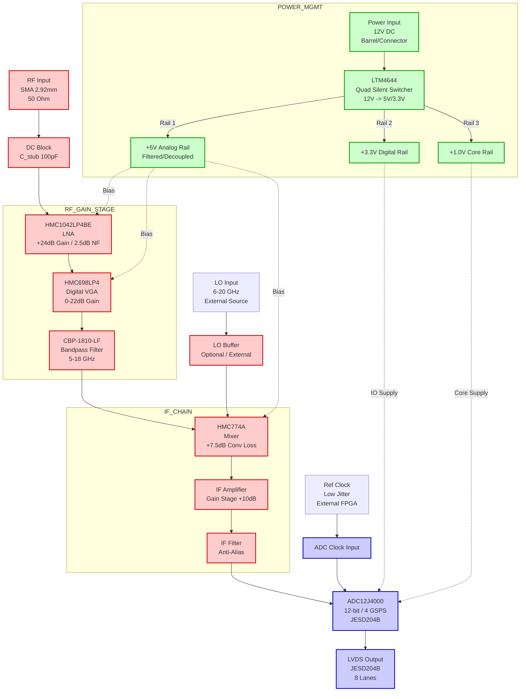
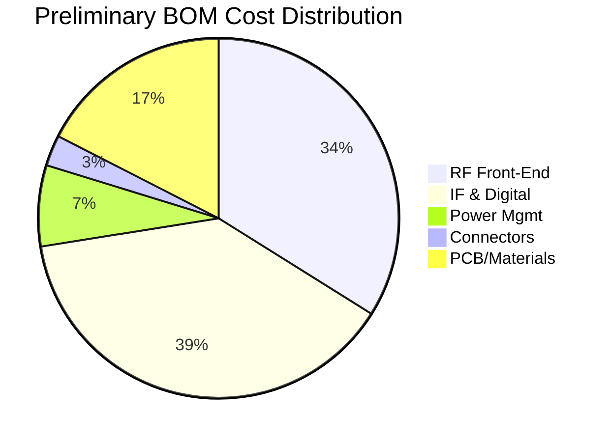

**Document Status: AI-GENERATED**

# Hardware Requirements Specification (HRS)

**Project ID:** dkfjg
**Document ID:** HRS-dkfjg-001
**Revision:** 1.0
**Date:** 2023-10-27

---

# 1. Introduction

## 1.1 Purpose
This Hardware Requirements Specification (HRS) defines the comprehensive requirements for the design, development, and verification of the **dkfjg Wideband RF Receiver**. The purpose of this document is to:

*   Establish a formal baseline for the hardware architecture and performance characteristics.
*   Detail the electrical, physical, and environmental interface requirements necessary for system integration.
*   Specify the selection criteria and constraints for critical components (LNA, Mixer, ADC, Power Management).
*   Provide the technical criteria against which the hardware design will be verified and validated.

This document is intended for hardware design engineers, test engineers, and systems integration personnel involved in the lifecycle of the dkfjg project.

## 1.2 Scope
The scope of this specification encompasses the complete hardware implementation of a 5–18 GHz wideband RF receiver designed for military applications.

**In-Scope Elements:**
*   **RF Front-End:** Wideband Low Noise Amplifier (LNA), Variable Gain Amplifier (VGA), and Bandpass Filtering.
*   **Frequency Conversion:** Downconversion mixing stage and Intermediate Frequency (IF) amplification.
*   **Digitization:** High-speed Analog-to-Digital Converter (ADC) with JESD204B/LVDS output capability.
*   **Power Management:** DC-DC conversion and regulation from a 12V source.
*   **Physical Design:** PCB stack-up, impedance control, and thermal management.
*   **Compliance:** MIL-STD-461 EMI/EMC requirements and military environmental specifications (-55°C to +125°C).

**Out-of-Scope Elements:**
*   Digital Signal Processing (DSP) algorithms or firmware (FPGA/microcontroller code) required to ingest the LVDS data.
*   Mechanical chassis design beyond the PCB and connector interfaces.
*   The external 12V DC power supply unit (PSU).

## 1.3 Definitions, Acronyms, and Abbreviations

| Term | Definition |
| :--- | :--- |
| **ADC** | Analog-to-Digital Converter. Converts continuous analog signals into discrete digital values. |
| **BGA** | Ball Grid Array. A type of surface-mount packaging for integrated circuits. |
| **EMI** | Electromagnetic Interference. Disturbance generated by an external source that affects an electrical circuit. |
| **EMC** | Electromagnetic Compatibility. The ability of equipment to function as intended in its electromagnetic environment. |
| **FIL** | Filter. A passive or active circuit designed to remove unwanted frequency components. |
|**IF** | Intermediate Frequency. A frequency to which a carrier frequency is shifted as an intermediate step in transmission or reception. |
| **IP3** | Third-order Intercept Point. A theoretical figure of merit for linearity, specifically for intermodulation distortion. |
| **IIP3** | Input Third-order Intercept Point. The IP3 referred to the input of the device. |
| **JESD204** | A serial data link standard for high-speed data converters (ADCs and DACs). |
| **LNA** | Low Noise Amplifier. An electronic amplifier used to amplify very weak signals. |
| **LO** | Local Oscillator. An oscillator used to generate a signal for frequency conversion. |
| **LTCC** | Low-Temperature Co-fired Ceramic. A type of multilayer ceramic substrate technology. |
| **LVDS** | Low-Voltage Differential Signaling. A high-speed digital interface. |
| **MIL-STD** | United States Department of Defense Military Standards. |
| **MMIC** | Monolithic Microwave Integrated Circuit. |
| **NF** | Noise Figure. A measure of degradation of the signal-to-noise ratio. |
| **OIP3** | Output Third-order Intercept Point. |
| **P1dB** | 1-dB Compression Point. The point where the input signal causes the gain to drop by 1 dB from the linear gain. |
| **PCB** | Printed Circuit Board. |
| **PMIC** | Power Management Integrated Circuit. |
| **QFN** | Quad Flat No-leads package. |
| **RF** | Radio Frequency. |
| **SNR** | Signal-to-Noise Ratio. |
| **SFDR** | Spurious-Free Dynamic Range. The ratio of the root-mean-square (RMS) value of the carrier to the RMS value of the worst spurious signal. |
| **VGA** | Variable Gain Amplifier. |
| **VSWR** | Voltage Standing Wave Ratio. A measure of impedance matching. |

## 1.4 References

The following documents form part of this specification to the extent specified herein. In case of conflict between this document and the references, this document takes precedence for specific project requirements.

| ID | Document Title | Date/Version | Publisher |
| :--- | :--- | :--- | :--- |
| **IEEE 29148** | Systems and software engineering — Life cycle processes — Requirements engineering | 2018 | IEEE Standards Association |
| **MIL-STD-461** | Requirements for the Control of Electromagnetic Interference Characteristics of Subsystems and Equipment | Rev G | US Dept. of Defense |
| **MIL-STD-810** | Environmental Engineering Considerations and Laboratory Tests | Rev H | US Dept. of Defense |
| **JESD204B** | JEDEC Standard: Serial Interface for Data Converters | 2011 | JEDEC Solid State Technology Association |
| **DS-HMC1042** | HMC1042LP4BE Datasheet (GaAs MMIC LNA) | Latest | Analog Devices |
| **DS-HMC698** | HMC698LP4 Datasheet (Digital VGA) | Latest | Analog Devices |
| **DS-ADC12J4000** | ADC12J4000 Datasheet (12-Bit, 4 GSPS ADC) | Latest | Texas Instruments |

## 1.5 Overview
The remainder of this document is organized as follows:

*   **Section 2: System Overview**: Provides a high-level functional description, block diagrams, and operational context for the dkfjg receiver.
*   **Section 3: Hardware Requirements**: Defines the detailed functional, performance, interface, environmental, power, and physical requirements (e.g., 5-18 GHz bandwidth, <3 dB Noise Figure).
*   **Section 4: Design Constraints**: Lists standards compliance (MIL-STD-461), component utilization constraints, and manufacturing limitations.
*   **Section 5: Verification Requirements**: Specifies the inspection, test, and analysis methods required to validate each requirement.
*   **Section 6: Bill of Materials (Preliminary)**: Lists recommended components with justification for selection.
*   **Section 7: Traceability Matrix**: Correlates system requirements to design specifications and verification methods.

---

**Document Status: AI-GENERATED**

# 2. System Overview

## 2.1 System Description

The **dkfjg Wideband RF Receiver** is a high-performance, superheterodyne-style receiver subsystem designed for military signal intelligence and electronic warfare applications. The system is engineered to acquire and process RF signals across a continuous instantaneous bandwidth of 5 GHz to 18 GHz. The primary function of the receiver is to condition incoming RF signals—providing low-noise amplification, filtering, and gain adjustment—convert them to a digital domain, and transmit the digitized data via a high-speed JESD204B (LVDS) interface.

The system operates within a harsh environmental envelope, complying with MIL-STD-461 for electromagnetic interference and supporting the full military temperature range of -55°C to +125°C. The architecture utilizes a modular signal chain approach comprising a GaAs MMIC front-end, a high-linearity downconversion stage, and a high-speed digitization stage.

### 2.1.1 Functional Decomposition

The receiver system performs the following primary functions:

1.  **RF Reception & Conditioning:** The system accepts an RF input via a 50-ohm SMA connector. A DC blocking capacitor protects the front-end. The signal is immediately amplified by a Wideband Low Noise Amplifier (LNA) to establish the system noise figure (< 2.5 dB).
2.  **Gain Adjustment:** A Variable Gain Amplifier (VGA) allows for digital gain adjustment (0–22 dB) to optimize the dynamic range, ensuring the signal strength is suitable for the mixing stage without saturation.
3.  **Spectral Filtering:** An LTCC Bandpass Filter (5–18 GHz) reduces out-of-band noise and spurious signals before downconversion.
4.  **Frequency Downconversion:** A Double-Balanced Mixer translates the RF signal to an Intermediate Frequency (IF) or Baseband band suitable for the ADC. This stage requires an external Local Oscillator (LO) input (not included in this power budget but assumed to be provided by the system host).
5.  **Digitization:** A 12-bit, 4 GSPS ADC samples the conditioned IF signal. The ADC features a 1.6 GHz input bandwidth, supporting direct RF sampling or undersampling of the IF.
6.  **Data Transmission:** The digitized samples are serialized and transmitted using the JESD204B protocol over 8 LVDS lanes, ensuring high data throughput and resistance to EMI.
7.  **Power Management:** A Quad Step-Down Regulator module converts the incoming 12V DC supply to the necessary low-noise +5V (Analog) and +3.3V/+1V (Digital) rails.

### 2.1.2 System Context

The dkfjg receiver is designed as a Line Replaceable Unit (LRU) or a mezzanine module within a larger radar or SIGINT platform. It assumes the availability of:
*   **Reference Clock:** A low-jitter source clock for the ADC (typically provided via the host FPGA).
*   **LO Source:** An external synthesizer to drive the mixer's LO port.
*   **Cooling:** Conductive cooling through the chassis baseplate (assumed thermal resistance $\theta_{JA}$ provided by mechanical mounting).

---

## 2.2 System Block Diagram

The following diagram illustrates the signal flow and power distribution architecture of the dkfjg receiver. It details the interaction between the RF path, the digital processing chain, and the power distribution network.

### Diagram Legend:
*   **Solid Arrows:** Signal flow (RF or Digital data).
*   **Dotted Arrows:** Power distribution/biasing.
*   **Red Nodes:** Analog RF / IF signal path components.
*   **Blue Nodes:** High-speed digital conversion components.
*   **Green Nodes:** Power regulation and distribution.

---

## 2.3 System Architecture

The system architecture follows a hierarchical, signal-chain-centric design separated into three distinct domains: the Analog/RF Front-End, the Digital Conversion Subsystem, and the Power Management subsystem. This separation ensures that high-speed digital switching noise does not couple into the sensitive RF input.

### 2.3.1 RF Front-End Architecture (5–18 GHz)

The front-end is designed to maximize sensitivity and linearity. The architecture is a flow-through design on the top layer of the PCB with controlled impedance (50 ohms) microstrip transmission lines.

*   **Input Matching (DC Block):** The input is AC-coupled using a high-Q capacitor (e.g., ATC 100E series) placed immediately after the SMA connector. This serves the dual purpose of DC blocking and impedance matching at 18 GHz.
*   **LNA Stage (HMC1042LP4BE):** This GaAs MMIC provides the bulk of the signal gain (+24 dB) and sets the system Noise Figure (NF). The device is biased at +5V. To ensure stability over the full -55°C to +125°C range, the bias current is set to the midpoint of the datasheet typical operating range (approx. 90-100 mA). The layout uses via-fencing to suppress substrate modes.
*   **VGA Stage (HMC698LP4):** Following the LNA, a digital VGA provides gain adjustment from 0 to 22 dB in 1 dB steps. This component is controlled via a 3-wire serial interface (Data, Clock, Latch). The gain setting is static during operation but can be updated by the host system via a SPI or GPIO header.
*   **Filtering (CBP-1810-LF):** A bandpass filter limits the bandwidth to the 5–18 GHz range. This prevents out-of-band aliasing and reduces the noise energy entering the mixer. The insertion loss of 3.5 dB is compensated for by the gain of the preceding stages.

### 2.3.2 Downconversion & IF Architecture

The signal is downconverted to a lower Intermediate Frequency (IF) to suit the ADC's input bandwidth limitations.

*   **Mixer (HMC774A):** A double-balanced active mixer is used to translate the RF signal to an IF. The HMC774A is chosen for its high OIP3 (+25 dBm), which preserves the system linearity. The RF port is driven by the filtered RF signal; the LO port accepts an external drive level of +10 dBm to +15 dBm.
*   **IF Amplifier & Filtering:** The mixer output (IF) passes through a matching network and a discrete IF amplifier (op-amp or MMIC based) to provide sufficient drive for the ADC. An anti-aliasing filter (AAF) is placed here, with a cutoff frequency tuned to the ADC sampling rate (e.g., < 1.6 GHz for the ADC12J4000).

### 2.3.3 Digital Subsystem Architecture

The digital core is responsible for high-fidelity signal capture and transmission.

*   **ADC (ADC12J4000):** The Texas Instruments ADC12J4000 operates at 4 GSPS. It requires specific power sequencing: The +3.3V supply (AVDD) must rise before the +1.0V supply (DVDD). The device includes a Digital Downconverter (DDC) which can be configured to decimate the signal, reducing the output data rate if the full instantaneous bandwidth is not required.
*   **JESD204B Interface:** The ADC outputs data via 8 CML lanes. These lanes are impedance matched to 100 ohms differential. The interface supports Subclass 1 (deterministic latency), which is critical for time-domain applications.

### 2.3.4 Power Distribution Architecture

Power is derived from a single +12V input (nominally automotive or battery operated). The design uses the LTM4644, a Quad-output DC/DC regulator.

*   **Rail 1 (+5V Analog):** Supplies the LNA, VGA, and Mixer. This rail is the most noise-sensitive. Ferrite beads (e.g., BLM18PG) are placed in series with the LTM4644 output to filter high-frequency switching noise. Large bulk capacitance (47uF Tantalum) and local ceramic decoupling (0.1uF X7R) are placed at the load pins.
*   **Rail 2 (+3.3V Digital IO):** Supplies the ADC interface buffers.
*   **Rail 3 (+1.0V Digital Core):** Supplies the ADC core logic. High transient current demands require low-ESR capacitors immediately adjacent to the BGA balls.

### 2.3.5 Control & Timing Architecture
A low-speed header (0.1" pitch) provides access to the VGA SPI lines and the ADC configuration pins (SYNC~n, RESET). The system relies on the host for timing synchronization. The Device Clock (DCLK) for the JESD204B interface must be sourced from a jitter-cleaned source (e.g., LMK04828 on the host board).

### 2.3.6 Mechanical & PCB Architecture

*   **Material Stackup:** The PCB utilizes a Rogers RO4350B laminate (Er = 3.48) for the RF layers to minimize dielectric loss and dispersion at 18 GHz. FR-4 is used for standard digital layers to reduce cost.
*   **Layer Stackup (8-Layer):**
    1.  Top: RF Signal (Microstrip)
    2.  GND1 (Solid reference plane)
    3.  Internal Signal 1
    4.  Power Planes (+5V, +3.3V, +1V)
    5.  Power Planes (GND)
    6.  Internal Signal 2 (JESD204B traces)
    7.  GND2 (Solid reference plane)
    8.  Bottom: Control Signals / Power Input

---

## 2.4 Operating Environment

The dkfjg receiver is intended for deployment in constrained tactical environments. The design parameters encompass electrical power limits, climatic extremes, and electromagnetic constraints typical of military vehicles and airborne platforms.

### 2.4.1 Environmental Extremes

| Parameter | Specification | Design Mitigation |
| :--- | :--- | :--- |
| **Operating Temperature** | -55°C to +125°C (Internal Ambient) | Components selected are "Military" or "Automotive" grade (e.g., HMC1042LP4BE rated to 125°C). |
| **Storage Temperature** | -65°C to +150°C | Conformal coating (Humiseal) applied to PCB to prevent moisture ingress. |
| **Humidity** | 0% to 95% (Non-condensing) | Sealed enclosure with desiccant or potting compound for pot-in modules. |
| **Vibration** | 20 to 2000 Hz, 20 G (Random) | 4x mounting holes with threaded inserts. PCB stiffeners used. Components weighed < 1 gram are adhesive bonded. |
| **Shock** | 40 G, 11 ms | Chassis machined from Aluminum 6061-T6 to absorb mechanical energy. |
| **Altitude** | Sea level to 50,000 ft | Pressurized conformal coating prevents arcing at low pressure (Paschen's Law considerations). |

### 2.4.2 Power Supply Constraints

The system must operate from a nominal **12V DC** source, but must tolerate transients and ripple typical of vehicular power.

*   **Voltage Range:** 11V to 13V (Nominal). The LTM4644 supports inputs up to 20V, providing margin for load dump.
*   **Ripple Rejection:** The internal LDOs and the input filter capacitor bank must reject input ripple up to 1V pk-pk in the 10 kHz - 1 MHz range.
*   **Power Budget:** The total system draw is calculated as follows:
    *   *RF Chain:* 0.18W (LNA) + 0.25W (VGA) + 0.35W (Mixer) + 0.2W (LO Buffer) = ~1.0W.
    *   *ADC Chain:* 1.6W (ADC @ 3.3V) + 1.2W (ADC @ 1V) = ~2.8W.
    *   *Regulator Loss:* ~0.5W (Conversion losses).
    *   *Total:* ~4.3W worst case.
    *   *Requirement:* Must stay under **10W** (REQ-HW-009). The design is well within limits, allowing for margin.

### 2.4.3 EMI/EMC Environment

The system must comply with **MIL-STD-461**.

*   **Radiated Emissions (RE102):** Shielding cans are required over the LNA and Mixer sections. The entire module is designed to fit into a machined aluminum "sardine can" enclosure with RF gaskets on the lid seam.
*   **Conducted Emissions (CE102):** The input 12V line will have a Pi-filter installed immediately at the connector.
*   **Susceptibility (RS103):** The LVDS outputs use differential pair routing with tight coupling (1.2x trace width spacing) to reject common-mode interference.
*   **ESD:** The SMA connectors and LVDS interface pins have ESD protection diodes (e.g., SMBJ33CA) clamped to the chassis ground.

---

Here are the requested sections for the **Hardware Requirements Specification (HRS)** for the **dkfjg** project.

---

**Document Status: AI-GENERATED**

# 3. Hardware Requirements

## 3.1 Functional Requirements

This section details the functional capabilities of the wideband RF receiver hardware. These requirements specify *what* the system shall do to transform the 5–18 GHz RF input into digitized baseband/IF data.

### 3.1.1 RF Front-End Functions

| ID | Requirement | Description & Rationale | Priority | Verification Method |
|:---|:---|:---|:---|:---|
| **REQ-HW-101** | **Signal Reception** | The system shall accept RF energy via a 50-ohm SMA connector (2.92mm/K-type) compatible with frequencies up to 18 GHz.  **Rationale:** Ensures mechanical and electrical compatibility with standard test equipment and antennas. | High | Inspection |
| **REQ-HW-102** | **DC Blocking** | The RF input path shall include a DC blocking capacitor capable of passing 5-18 GHz signals while rejecting DC components down to -55°C.  **Rationale:** Protects the sensitive LNA input from external DC offsets or static discharge. | High | Inspection |
| **REQ-HW-103** | **Low Noise Amplification** | The system shall amplify the input signal using the HMC1042LP4BE (or equivalent) to provide a minimum of 24 dB gain with a Noise Figure (NF) ≤ 2.5 dB.  **Rationale:** Sets the noise floor for the entire system; defined by selected component capability. | High | Analysis / Test |
| **REQ-HW-104** | **Variable Gain Adjustment** | The system shall provide a digitally adjustable gain stage (VGA) with a range of 0 to 22 dB in 1 dB steps across the 5-18 GHz band.  **Rationale:** Allows the system to optimize dynamic range based on input signal strength to prevent ADC saturation. | High | Test |
| **REQ-HW-105** | **Spectral Filtering** | The system shall limit the RF passband to 5-18 GHz using a bandpass filter (e.g., Crystek CBP-1810-LF) with >30 dB rejection outside the band.  **Rationale:** Prevents aliasing and reduces out-of-band interference/noise before downconversion. | High | Test |
| **REQ-HW-106** | **Downconversion** | The system shall convert the filtered RF signal to an Intermediate Frequency (IF) of ≤ 4 GHz using a double-balanced mixer (HMC774A).  **Rationale:** Downconverts high-frequency signals to a range processable by the ADC. | High | Test |
| **REQ-HW-107** | **IF Amplification** | The system shall amplify the mixer output with an IF gain stage to compensate for conversion loss (~7.5 dB) and filter insertion loss.  **Rationale:** Ensures the signal amplitude matches the ADC input sensitivity requirements. | Medium | Test |
| **REQ-HW-108** | **Impedance Matching** | All inter-stage RF connections shall be matched to 50-ohm characteristic impedance with a Return Loss ≥ 10 dB (VSWR ≤ 2:1).  **Rationale:** Minimizes signal reflections and preserves signal integrity across the wideband path. | High | Test |

### 3.1.2 Digital Conversion & Interface Functions

| ID | Requirement | Description & Rationale | Priority | Verification Method |
|:---|:---|:---|:---|:---|
| **REQ-HW-109** | **Signal Digitization** | The system shall digitize the analog IF signal using a 12-bit ADC (TI ADC12J4000) sampling at a minimum rate of 3.0 GSPS.  **Rationale:** Provides sufficient resolution and bandwidth to capture signal details within the Nyquist limit for the processed IF. | High | Test |
| **REQ-HW-110** | **Data Serialization** | The ADC output shall be serialized using the JESD204B standard (Subclass 1) to minimize pin count and EMI.  **Rationale:** High-speed serial interface is required for data rates exceeding 10 Gbps. | High | Test |
| **REQ-HW-111** | **LVDS Output** | The system shall transmit digitized data via Low-Voltage Differential Signaling (LVDS) drivers.  **Rationale:** Meets system requirement for EMI resistance (MIL-STD-461) and long-distance signal integrity. | High | Test |
| **REQ-HW-112** | **Clock Generation** | The system shall derive the ADC sampling clock and LO mixer clock from a common low-phase-noise reference to minimize sampling jitter.  **Rationale:** Jitter degradation directly reduces SNR at high input frequencies. | High | Analysis |
| **REQ-HW-113** | **Gain State Storage** | The system shall retain the gain setting (VGA state) across power cycles using non-volatile memory or default to a preset safe state (minimum gain).  **Rationale:** Ensures the receiver starts in a known state and does not saturate immediately upon power-up. | Medium | Demonstration |

### 3.1.3 Power Management Functions

| ID | Requirement | Description & Rationale | Priority | Verification Method |
|:---|:---|:---|:---|:---|
| **REQ-HW-114** | **Input Voltage Regulation** | The system shall accept a nominal 12V DC input and distribute it to internal rails via step-down switching regulators (LTM4644).  **Rationale:** Standard military vehicle/aircraft power voltage; requires high-efficiency conversion to manage thermal load. | High | Test |
| **REQ-HW-115** | **Analog Rail Generation** | The system shall generate a +5V analog rail using a Low Dropout Regulator (LDO) derived from the +12V input to supply the LNA and Mixer.  **Rationale:** Low-noise LDO prevents switching regulator noise from contaminating the sensitive RF front-end. | High | Test |
| **REQ-HW-116** | **Digital Rail Generation** | The system shall generate a +3.3V digital rail to supply the ADC core and LVDS drivers.  **Rationale:** Standard voltage for high-speed digital logic. | High | Test |
| **REQ-HW-117** | **Power Sequencing** | The system shall implement a power-up sequence enabling the +5V Analog rail prior to the +3.3V Digital rail to prevent latch-up or bus contention.  **Rationale:** Standard best practice for mixed-signal systems. | Medium | Test |
| **REQ-HW-118** | **Under-Voltage Lockout (UVLO)** | The PMIC shall disable all outputs if the input 12V supply drops below 10.8V (-10% tolerance).  **Rationale:** Prevents unpredictable behavior or data corruption during brownout conditions. | Medium | Test |

### 3.1.4 Mechanical & Environmental Functions

| ID | Requirement | Description & Rationale | Priority | Verification Method |
|:---|:---|:---|:---|:---|
| **REQ-HW-119** | **EMI Shielding** | The RF front-end section (LNA, VGA, Mixer) shall be enclosed within a machined aluminum RF shield (tombstone) with conductive gasketing.  **Rationale:** Required to meet MIL-STD-461 radiated emissions limits. | High | Inspection |
| **REQ-HW-120** | **Thermal Conduction** | High-power components (ADC, LTM4644, LNA) shall be mounted on a thermal plane that conducts heat to the chassis mounting surface.  **Rationale:** Ensures reliable operation up to +125°C ambient without active cooling (fans). | High | Analysis |

---

## 3.2 Performance Requirements

This section defines the quantitative performance metrics the hardware must achieve. Values are derived from the system design parameters and selected component datasheets.

### 3.2.1 RF Signal Chain Performance

| ID | Requirement | Min / Max | Unit | Description & Verification |
|:---|:---|:---|:---|:---|
| **REQ-HW-201** | **Operating Frequency Range** | 5.0 – 18.0 | GHz | The receiver must maintain specified performance across the entire band.  **Verification:** Network Analyzer sweep. |
| **REQ-HW-202** | **Instantaneous Bandwidth** | ≥ 13.0 | GHz | The total bandwidth available for signal capture at any single moment.  **Verification:** Wideband two-tone test. |
| **REQ-HW-203** | **System Gain (Flat)** | 30 – 40 | dB | Total gain from SMA input to ADC input.  **Calculation:** 24 dB (LNA) + 22 dB (VGA Max) - 3.5 dB (Filter) - 7.5 dB (Mixer Loss) + 10 dB (IF Amp) ≈ 45 dB (Max). Settled spec: 30-40 dB adjustable.  **Verification:** Signal Generator + Spectrum Analyzer. |
| **REQ-HW-204** | **Gain Flatness** | ± 3.0 | dB | Peak-to-peak variation of gain over the 5-18 GHz bandwidth.  **Verification:** Frequency response sweep. |
| **REQ-HW-205** | **Noise Figure (System)** | ≤ 3.0 | dB | The sum of noise contributions from the LNA (2.5 dB) and subsequent stages (using Friis formula).  **Calculation:** $F_{sys} = F_1 + \frac{F_2-1}{G_1}$. Assuming VGA NF=3.5dB and G1=24dB, System NF ≈ 2.6 dB. Requirement set to 3.0 dB.  **Verification:** Noise Figure Meter (Y-factor method). |
| **REQ-HW-206** | **Input Third-Order Intercept (IIP3)** | ≥ 20 | dBm | Defines linearity. Based on LNA OIP3 of 24 dBm.  **Verification:** Two-tone intermodulation distortion test (tones spaced 10 MHz apart). |
| **REQ-HW-207** | **Input Return Loss** | ≥ 10 | dB | VSWR ≤ 2:1 across the band.  **Verification:** Vector Network Analyzer (VNA) measurement. |
| **REQ-HW-208** | **Input 1dB Compression Point (P1dB)** | ≥ 10 | dBm | Estimated based on HMC1042LP4BE P1dB (~12 dBm) minus margin for front-end loss.  **Verification:** Power sweep vs Gain plot. |
| **REQ-HW-209** | **Dynamic Range (SFDR)** | ≥ 60 | dBc | Spurious-Free Dynamic Range. Derived from ADC SFDR (68 dBc) minus analog degradation.  **Verification:** FFT analysis of ADC output with near-full-scale tone. |

### 3.2.2 Digital Interface Performance

| ID | Requirement | Min / Max | Unit | Description & Verification |
|:---|:---|:---|:---|:---|
| **REQ-HW-210** | **ADC Resolution** | 12 | Bits | Effective Number of Bits (ENOB) shall be ≥ 10.0 bits at 1 GHz input.  **Verification:** SINAD measurement. |
| **REQ-HW-211** | **JESD204B Lane Rate** | 12.0 | Gbps | Per lane data rate (configuration dependent: 4 lanes at ~12Gbps or 8 lanes at ~6Gbps).  **Verification:** Logic analyzer eye diagram. |
| **REQ-HW-212** | **Bit Error Rate (BER)** | ≤ 10⁻¹² | - | For the LVDS/JESD204B link.  **Verification:** Built-in BIST (PRBS pattern check). |

### 3.2.3 Power & Thermal Performance

| ID | Requirement | Min / Max | Unit | Description & Verification |
|:---|:---|:---|:---|:---|
| **REQ-HW-213** | **Total Power Consumption** | 5.0 – 10.0 | Watts | Total draw from 12V source.  **Calculation:**  • LNA (HMC1042LP4BE): 180 mW  • VGA (HMC698LP4): ~250 mW  • Mixer (HMC774A): ~200 mW  • ADC (ADC12J4000): ~1.5 W  • PMIC/Regulators (Efficiency loss): ~1 W  • Aux (PLL, Logic): ~500 mW  **Est Total:** ~3.6W (Operating) + Margin for worst case/thermal → 10W Max Spec.  **Verification:** Power supply current measurement. |
| **REQ-HW-214** | **Thermal Resistance (Junction-Ambient)** | θ_JA | [specify] | Derived from PCB layout (assume 4-layer, 2oz copper).  **Requirement:** Component junction temps (T_j) must not exceed datasheet maximums (usually 150°C) at T_amb = +125°C.  **Verification:** InfraRed thermography under load. |

---

**Document Status: AI-GENERATED**

# 3. Hardware Requirements

## 3.3 Interface Requirements

### 3.3.1 External Interfaces

This section details the electrical and mechanical characteristics of the physical interfaces connecting the dkfjg Receiver to external systems.

#### 3.3.1.1 RF Input Interface

The receiver shall accept the incoming RF signal via a coaxial interface.

| Requirement ID | Description | Rationale |
|---|---|---|
| REQ-HW-017 | The system shall utilize a 2.92mm (K) female coaxial connector for the RF input port. | Ensures low VSWR and low loss support up to 18 GHz as per REQ-HW-001. |
| REQ-HW-018 | The RF input connector shall maintain a characteristic impedance of 50 $\Omega$ $\pm$ 5%. | Matches standard RF impedance and prevents reflections (REQ-HW-014). |
| REQ-HW-019 | The RF input connector shall exhibit a VSWR of less than 2.0:1 (Return Loss > 9.5 dB) across the 5-18 GHz band. | Minimizes signal reflections at the system boundary (REQ-HW-012). |
| REQ-HW-020 | The RF input connector mechanical interface shall conform to MIL-PRF-39012 (Series 2.92mm) specifications. | Ensures mechanical robustness and environmental sealing. |

*Table 3-1: RF Input Interface Pin Definition*

| Pin Number | Signal Name | Description | Connector Type |
|---|---|---|---|
| 1 (Center) | RF_IN | 5-18 GHz RF Signal Path | 2.92mm K Female |
| 2 (Shell) | CHASSIS_GND | Chassis Ground Connection | Threaded Body |

#### 3.3.1.2 Power Input Interface

The system shall receive operating power via a threaded connector to ensure vibration resistance.

| Requirement ID | Description | Rationale |
|---|---|---|
| REQ-HW-021 | The DC power input shall be supplied via a qualified filter connector (e.g., Amphenol LTW or equivalent) or a circular MIL-DTL-38999 series connector. | Ensures EMI filtering requirements of MIL-STD-461 (REQ-HW-011) are met at the entry point. |
| REQ-HW-022 | The system shall accept an input voltage range of +11V DC to +13V DC (Nominal 12V). | Accommodates supply regulation tolerances (REQ-HW-008). |

*Table 3-2: Power Input Interface Pin Definition*

| Pin Number | Signal Name | Description | Current Rating |
|---|---|---|---|
| A | +12V_IN | Main DC Power Input | 2.0 A (Max) |
| B | RTN | Power Return (Connected to Chassis GND at entry point) | 2.0 A (Max) |
| C | SHLD | Shield / Chassis Ground | N/A |

#### 3.3.1.3 Digital Output Interface

Digitized data is transmitted via a high-speed differential interface.

| Requirement ID | Description | Rationale |
|---|---|---|
| REQ-HW-023 | The system shall transmit digital data via a JESD204B / JESD204C compatible LVDS interface. | Provides high-speed, low-power data transmission (REQ-HW-006). |
| REQ-HW-024 | The physical connection shall utilize a high-density Samtec QTE or QSH series termination (or equivalent) with 100 $\Omega$ differential impedance. | Ensures signal integrity at multi-Gbps data rates. |
| REQ-HW-025 | The digital output connector shall support a minimum of 8 differential data lanes plus 1 differential clock lane. | Supports the maximum bandwidth of the ADC12J4000 (4 GSPS). |

*Table 3-3: Digital Output Interface Pin Map (Simplified)*

| Pin Group | Signal Name | Description | Differential Pair |
|---|---|---|---|
| 1-2 | JESD_TXP0 / JESD_TXN0 | Lane 0 Data +/- | 100 $\Omega$ |
| 3-4 | JESD_TXP1 / JESD_TXN1 | Lane 1 Data +/- | 100 $\Omega$ |
| ... | ... | ... | ... |
| 17-18 | JESD_CLK_P / JESD_CLK_N | Device Clock / Sync +/- | 100 $\Omega$ |
| 19-20 | SYSREF_P / SYSREF_N | System Sync for Subclass 1 | 100 $\Omega$ |

---

### 3.3.2 Internal Interfaces

This section defines the signal interfaces between internal assemblies (PCBs or modules).

#### 3.3.2.1 RF Chain Internal Interfaces

Signal propagation between the RF Front End, Downconversion, and ADC stages.

| Requirement ID | Description | Rationale |
|---|---|---|
| REQ-HW-026 | The connection between the Bandpass Filter (3.3.1) and the Mixer (HMC774A) shall utilize a 50 $\Omega$ controlled impedance microstrip trace on RO4350B substrate ($\epsilon_r$ = 3.48). | Ensures minimal insertion loss and phase stability. |
| REQ-HW-027 | The LO distribution path to the Mixer shall provide +10 dBm to +15 dBm of drive power. | Matches the HMC774A LO drive requirement. |
| REQ-HW-028 | The IF output from the Mixer to the ADC shall be AC coupled with a 100 pF capacitor (C0G/NP0 dielectric). | Blocks DC offset from entering the ADC high-impedance input. |

#### 3.3.2.2 Power Distribution Interfaces

| Requirement ID | Description | Rationale |
|---|---|---|
| REQ-HW-029 | The +5V Analog rail shall be distributed to the LNA (HMC1042LP4BE) and VGA (HMC698LP4) via independent pi-filter networks to minimize inter-stage noise coupling. | Prevents oscillation and maintains Noise Figure (REQ-HW-002). |
| REQ-HW-030 | The +3.3V Digital rail shall be separated from the analog ground plane by a ferrite bead (e.g., BLM18PG471SN1) at a single point. | Reduces digital switching noise from contaminating sensitive RF inputs. |

#### 3.3.2.3 Control Interfaces

| Requirement ID | Description | Rationale |
|---|---|---|
| REQ-HW-031 | The system controller shall configure the VGA gain via a 3-wire serial interface (Data, Clock, Latch). | Specific to the HMC698LP4 interface requirements. |
| REQ-HW-032 | The ADC12J4000 shall be configured via a 4-wire SPI interface (CS#, SCLK, SDIO, SDO). | Standard configuration interface for TI ADCs. |

---

### 3.3.3 Communication Interfaces

This section covers specific communication protocols used for device management and data transfer.

#### 3.3.3.1 JESD204B Data Link

| Requirement ID | Description | Rationale |
|---|---|---|
| REQ-HW-033 | The ADC shall utilize JESD204B Subclass 1 deterministic latency protocol. | Required for synchronization in phased array or time-critical applications. |
| REQ-HW-034 | The link layer shall be configured for 8 lanes operating at a maximum line rate of 12.5 Gbps per lane to support 4 GSPS sample rate. | Supports the data throughput generated by the ADC. |
| REQ-HW-035 | The system clock for the JESD204B interface shall be derived from a low-phase-noise oscillator located on the FPGA/ASIC side. | Ensures compliance with JESD204B clocking architecture. |

#### 3.3.3.2 SPI Control Bus

| Requirement ID | Description | Rationale |
|---|---|---|
| REQ-HW-036 | The SPI bus shall operate at a clock frequency of 10 MHz maximum. | Ensures reliable communication over PCB traces without signal integrity issues. |

*Table 3-4: SPI Interface Definition*

| Signal Name | Source | Destination | Description |
|---|---|---|---|
| SCLK | System Controller | All Peripherals | Serial Clock |
| MOSI | System Controller | All Peripherals | Master Out Slave In |
| MISO | All Peripherals | System Controller | Master In Slave Out |
| CS_LNA | System Controller | HMC1042LP4BE (if present/enabled) | Chip Select LNA |
| CS_VGA | System Controller | HMC698LP4 | Chip Select VGA |
| CS_ADC | System Controller | ADC12J4000 | Chip Select ADC |

---

## 3.4 Environmental Requirements

This section specifies the environmental conditions under which the hardware must operate and be stored.

### 3.4.1 Operating Temperature

| Requirement ID | Description | Rationale |
|---|---|---|
| REQ-HW-037 | The system shall operate without degradation of performance across the ambient temperature range of -55°C to +125°C. | Military operating temperature requirement (REQ-HW-010). |
| REQ-HW-038 | All active components shall be specified for the -55°C to +125°C temperature range (e.g., HMC1042LP4BE) or shall be characterized via extended temperature screening. | Ensures reliability over the full military range. |

### 3.4.2 Storage Temperature

| Requirement ID | Description | Rationale |
|---|---|---|
| REQ-HW-039 | The system shall remain functional and undamaged after storage in temperatures ranging from -65°C to +150°C. | Standard non-operating military storage condition. |

### 3.4.3 Humidity

| Requirement ID | Description | Rationale |
|---|---|---|
| REQ-HW-040 | The system shall operate in relative humidity ranging from 5% to 95% (non-condensing). | Prevents moisture-induced short circuits and corrosion. |

### 3.4.4 Vibration and Shock

| Requirement ID | Description | Rationale |
|---|---|---|
| REQ-HW-041 | The hardware shall withstand random vibration profiles defined in MIL-STD-810H, Method 514.7, Category 11 (Jet Aircraft/missile flight). | Ensures mechanical integrity during flight/operation. |
| REQ-HW-042 | The hardware shall withstand operational shock of 40G, 11ms, half-sine wave per MIL-STD-810H, Method 516.8. | Simulates handling shocks and pyrotechnic events. |
| REQ-HW-043 | All PCBs shall utilize staking compound (conformal coating) and torqued standoffs to mitigate vibration fatigue on heavy components (e.g., connectors, large inductors). | Design constraint to pass vibration testing. |

### 3.4.5 EMI / EMC

| Requirement ID | Description | Rationale |
|---|---|---|
| REQ-HW-044 | The system design shall ensure compliance with MIL-STD-461G RS103 (Radiated Susceptibility, 2 MHz - 18 GHz, 200 V/m). | High radiated field environment typical in military platforms. |
| REQ-HW-045 | The system design shall ensure compliance with MIL-STD-461G RE102 (Radiated Emissions, 2 MHz - 18 GHz). | Limits interference with other onboard systems. |
| REQ-HW-046 | The enclosure shall provide a minimum of 60 dB shielding effectiveness across the 5-18 GHz band. | Requirement to meet RE102 and RS103. |

---

## 3.5 Power Requirements

This section details the power consumption characteristics and supply requirements for the dkfjg Receiver.

### 3.5.1 Power Budget

The total power consumption is estimated based on the maximum current draw of all selected components at the maximum operating temperature (+125°C).

*Table 3-5: Detailed Power Budget by Rail*

| Supply Rail | Voltage (V) | Component(s) | Typical Current (A) | Max Current (A) | Power (W) | Derating / Notes |
|---|---|---|---|---|---|---|
| **12V Input** | 12.0 | System Input | 0.65 | 0.85 | 10.2 | Includes 20% margin |
| **+5V Analog** | 5.0 | HMC1042LP4BE (LNA) | 0.036 | 0.045 | 0.23 | $I_{typ}$ = 36mA, assumes $I_{max}$ ~1.25x |
| **+5V Analog** | 5.0 | HMC698LP4 (VGA) | 0.100 | 0.120 | 0.60 | $I_{typ}$ = 90-100mA |
| **+5V Analog** | 5.0 | HMC774A (Mixer) | 0.100 | 0.120 | 0.60 | Double Balanced Mixer Bias |
| **+5V Analog** | 5.0 | LTM8045 Regulator Loss | N/A | N/A | 0.50 | Switcher Efficiency Loss (est 90%) |
| **+3.3V Digital** | 3.3 | ADC12J4000 (AVDD) | 0.350 | 0.450 | 1.49 | Analog Supply Current |
| **+3.3V Digital** | 3.3 | ADC12J4000 (DVDD) | 0.100 | 0.150 | 0.50 | Digital Supply Current |
| **+3.3V Digital** | 3.3 | LVDS Drivers / Logic | 0.150 | 0.200 | 0.66 | JESD204B Line Drivers |
| **+3.3V Digital** | 3.3 | LDO Quiescent / Loss | N/A | N/A | 0.20 | LDO Dropout Loss |
| **+1.0V Core** | 1.0 | ADC12J4000 (Core) | 1.200 | 1.500 | 1.50 | Generated via Buck from 3.3V or 12V |
| **+5V Aux** | 5.0 | PLL / LO Synthesis | 0.150 | 0.180 | 0.90 | Assumed ADF4159 or similar |
| **Total** | | | | | **~8.2W (Typ)** | **~9.8W (Max)** |

*Table 3-6: Power Requirement Specifications*

| Requirement ID | Description | Value / Rationale |
|---|---|---|
| **REQ-HW-047** | The system shall operate from a nominal 12V DC input source. | As per Project Requirements. |
| **REQ-HW-048** | The maximum steady-state current draw at 12V shall not exceed 1.0 Amps. | 10W Max Power / 12V = 0.83A + 20% Margin = ~1.0A. |
| **REQ-HW-049** | The system shall include inrush current limiting to restrict cold-start surge to < 2.0 Amps for < 10 ms. | Protects external aircraft/vehicle power supplies. |
| **REQ-HW-050** | The system shall utilize low-noise LDO regulation (e.g., LT3045) for the 5V RF supply. | Prevents switching noise from degrading the Noise Figure (REQ-HW-002). |

### 3.5.2 Power Sequencing

| Requirement ID | Description | Rationale |
|---|---|---|
| REQ-HW-051 | The +5V Analog rail shall be enabled and stable prior to the +3.3V/+1.0V Digital rails. | Prevents latch-up in the ADC and reduces inrush current. |
| REQ-HW-052 | The Power Management IC (PMIC) shall assert a "POWER_GOOD" signal when all rails are within 5% of nominal voltage. | Required by system controller to initialize the JESD204B link. |

### 3.5.3 Thermal Dissipation

Based on the Power Budget and MIL-STD-883 thermal conduction requirements.

| Requirement ID | Description | Rationale |
|---|---|---|
| REQ-HW-053 | The PCB shall utilize a metal-core (e.g., IMS) or thick copper (4 oz) backing with thermal vias under the HMC1042LP4BE and ADC12J4000 packages. | Required to dissipate ~3W of heat in a small footprint. |
| REQ-HW-054 | The junction temperature ($T_j$) of all semiconductors shall not exceed 125°C under worst-case ambient conditions (85°C baseplate rise). | Standard reliability limit. |

---

## 3.6 Physical Requirements

### 3.6.1 Mechanical Enclosure

| Requirement ID | Description | Rationale |
|---|---|---|
| REQ-HW-055 | The receiver module shall conform to a standard 3U VPX or Custom Conduction-Cooled form factor with dimensions 100mm x 160mm x 20mm (L x W x H). | Typical military form factor allowing conduction cooling through wedge locks. |
| REQ-HW-056 | The enclosure baseplate material shall be Aluminum 6061-T6 with a hard-coat anodize finish (Type III, Class 2). | Provides EMI shielding and thermal conductivity. |
| REQ-HW-057 | All external fasteners shall utilize self-locking mechanisms (e.g., Nylon insert nuts) per MIL-STD-883. | Prevents loosening due to vibration. |

### 3.6.2 PCB Requirements

| Requirement ID | Description | Rationale |
|---|---|---|
| REQ-HW-058 | The Printed Circuit Board (PCB) stack-up shall be a minimum of 10 layers (4 signal, 4 ground, 2 power) on Rogers RO4350B material. | RO4350B offers stable dielectric constant and low loss at 18 GHz. |
| REQ-HW-059 | PCB plating shall be Electroless Nickel Immersion Gold (ENIG) with a minimum gold thickness of 2 $\mu$in. | Ensures solderability and wire-bond capability if needed. |
| REQ-HW-060 | The minimum trace width for 50 $\Omega$ RF lines on the top layer shall be calculated to be 15 mils (based on RO4350B dielectric). | Controlled impedance requirement for 18 GHz signals. |

*Table 3-7: PCB Stack-up (Estimated)*

| Layer | Type | Material | Thickness (mils) |
|---|---|---|---|
| 1 | Signal (RF) | Copper / RO4350B | 0.5 / 6.7 |
| 2 | GND Plane | Copper | 1.4 |
| 3 | Signal | Copper / Core | 0.5 / 20 |
| ... | ... | ... | ... |

### 3.6.3 Weight

| Requirement ID | Description | Rationale |
|---|---|---|
| REQ-HW-061 | The total weight of the receiver module (excluding connectors) shall not exceed 200 grams. | Based on density of Aluminum PCB and component count. |

### 3.6.4 Marking

| Requirement ID | Description | Rationale |
|---|---|---|
| REQ-HW-062 | The enclosure shall be clearly marked with part number, serial number, and date code in laser-etched text. | Traceability requirements for military hardware. |
| REQ-HW-063 | ESD warning symbols shall be placed adjacent to all digital interfaces. | Safety requirement per IEC 60417. |

---

**Document Status: AI-GENERATED**

# 4. Design Constraints

This section defines the constraints imposed on the hardware design of the **dkfjg** Wideband RF Receiver. These constraints restrict the design space to ensure manufacturability, compliance with military standards, environmental reliability, and supply chain sustainability. These requirements apply to the detailed design, schematic capture, PCB layout, and production phases.

## 4.1 Standards Compliance

The design of the dkfjg receiver must adhere to a stringent set of industry and military standards to ensure electromagnetic compatibility, physical durability, and electrical performance under extreme conditions. Compliance with these standards is mandatory (see REQ-HW-011) and must be verified through the methods outlined in Section 5.

### 4.1.1 Electromagnetic Compatibility (EMC)
To meet the **REQ-HW-011 (EMI Compliance)** requirement, the system shall be designed to control both conducted and radiated emissions and susceptibility.

*   **MIL-STD-461G:** The latest revision of "Requirements for the Control of Electromagnetic Interference Characteristics of Subsystems and Equipment." This standard is the primary requirement for the dkfjg project.
    *   **CE102:** Conducted emissions, power leads, 10 kHz – 10 MHz. The input power filter design (utilizing the LTM4644 and additional bulk filtering) must mitigate switching noise to meet these limits.
    *   **RE102:** Radiated emissions, electric field, 2 MHz – 18 GHz (set limit 18 GHz). The enclosure design and PCB grounding topology must ensure that the 13 GHz instantaneous bandwidth and digital LVDS clock harmonics do not exceed these limits.
    *   **CS101:** Conducted susceptibility, power leads, 30 Hz – 150 kHz. The DC-DC converters (LTM4644) must maintain regulation within specified tolerances under these conditions.
    *   **CS114:** Bulk cable injection, conducted susceptibility. The LVDS output cabling and DC input cabling must include filtering (ferrite beads, common mode chokes) to reject injected RF noise.
    *   **CS116:** Damped sinusoidal transients, cables and power leads. The ESD/TVS protection clamping at the RF input and power inputs must withstand these transients without latch-up.
*   **MIL-STD-464C:** "Electromagnetic Environmental Effects Requirements for Systems." This governs the system-level integration, ensuring the dkfjg receiver does not interfere with host platform systems when installed.

### 4.1.2 Physical Design and Interconnect
The mechanical packaging and PCB layout must follow strict guidelines to ensure signal integrity at 18 GHz and mechanical robustness in vibration environments.

*   **IPC-6012DS:** "Qualification and Performance Specification for High Density Interconnect (HDI) Printed Circuit Boards." Given the 4 GSPS ADC (ADC12J4000) and 18 GHz RF paths, the PCB will likely require microvias, laser-drilled vias-in-pad, and sequential lamination. This standard ensures the fabrication quality of these features.
*   **IPC-2221A:** "Generic Standard on Printed Board Design." This standard governs the trace width vs. current capacity requirements.
    *   *Example Calculation:* The 12V input main rail carries ~1A. To keep temperature rise <10°C, a minimum trace width of 20 mils (internal layer) or 10 mils (external layer) is required per IPC-2221 charts.
*   **IPC-7351B:** "Generic Requirements for Surface Mount Design and Land Pattern Standards." All land patterns for the **HMC1042LP4BE** (QFN-24), **HMC698LP4** (QFN-24), and **ADC12J4000** (BGA-648) shall follow this standard to ensure solder joint reliability under thermal cycling (-55°C to +125°C).

### 4.1.3 Environmental and Reliability
The **REQ-HW-010 (Operating Temperature Range)** requirement imposes severe thermal and mechanical stress on the hardware.

*   **MIL-STD-810H:** "Environmental Engineering Considerations and Laboratory Tests."
    *   **Method 527.7 (Vibration):** The design must withstand random vibration profiles typical of military aircraft/vehicles. Component height restriction (< 3.5mm preferably) is required to minimize leverage on solder joints. The **LTM4644** (5mm height) acts as a mechanical stress point and must be adhered with silicone RTV or staked.
    *   **Method 507.6 (Temperature Shock):** The transition between -55°C and +125°C must not induce delamination in the PCB stackup (High Tg FR-4 or Rogers material required).
*   **MIL-STD-883:** "Test Method Standard for Microcircuits." While this applies to the *components* (assumed for the military-rated MMICs), the system design must not derate these components beyond their qualified limits.

### 4.1.4 Safety and Materials
*   **RoHS (Restriction of Hazardous Substances) Directive 2011/65/EU:** The design shall be RoHS compliant (Lead-free) unless explicitly waived by the specific military contract (Class 3 exemptions often exist for high-reliability solder). If leaded solder is used (Sn63Pb37) for reliability in extreme thermal cycling, "Tin Whisker" mitigation (conformal coating) per **NASA-STD-8739.4** is mandatory.
*   **REACH:** Compliance with European Chemicals Agency regulations regarding material composition.

## 4.2 Component Constraints

This section outlines the restrictions on component selection, sourcing, and qualification to ensure system reliability and performance.

### 4.2.1 Temperature Rating and Derating
To satisfy **REQ-HW-010 (-55°C to +125°C)**, strict component selection rules are enforced.

*   **Grade Constraint:** All active components must meet the **Military/Aerospace** temperature grade or equivalent.
    *   *Allowed:* -55°C to +125°C (e.g., QML, Class 2/3).
    *   *Exception:* Industrial-grade components (0°C to +70°C or -40°C to +85°C) are strictly **PROHIBITED** unless a specific thermal analysis demonstrates the junction temperature ($T_j$) remains within safe limits under worst-case ambient conditions (+125°C), and a project waiver is granted.
    *   *Current Status:* The **ADC12J4000** is identified as a potential risk point. It is an industrial/commercial grade device. For the final production build, a hermetic or military-grade equivalent must be sourced, or the enclosure must provide active cooling to limit the ambient temperature immediately surrounding the ADC to <85°C.

*   **Voltage Derating:** Components shall not be operated at their Absolute Maximum Ratings.
    *   *Capacitors:* Voltage rating shall be derated by 50% (e.g., a 50V rail requires a capacitor rated for at least 100V). This is critical for the 12V input and 5V RF rails where transients (MIL-STD-1275) are expected.
    *   *Semiconductors:* $V_{ds}$ or $V_{ce}$ breakdown voltages shall be derated by 20%.

### 4.2.2 RF Specific Component Constraints
*   **MMIC Selection (HMC1042LP4BE, HMC698LP4):** These GaAs devices are sensitive to ESD.
    *   *Constraint:* All RF ports must have DC blocks and ESD protection structures on the PCB that are invisible to the 18GHz signal (e.g., radial stubs or coupling capacitors with high SRF).
    *   *Handling:* All handling must follow ESD S20.20.
*   **Discrete Components:**
    *   *Capacitors (RF):* Must use high-Q, low-ESR types (e.g., ATC 100A or 600E series) for DC blocking and bypassing. Standard X7R ceramics are often too lossy at 18 GHz.
    *   *Inductors (RF):* Must use air-core or high-frequency wire-wound chip inductors (e.g., Coilcraft 0201/0402 HF series). Ferrite cores generally saturate or become lossy above a few GHz.

### 4.2.3 Sourcing and Lifecycle
*   **Obsolescence Management:** The **HMC1042LP4BE** and **HMC698LP4** are mature components.
    *   *Constraint:* A "Last Time Buy" (LTB) or status check must be performed prior to Production Release. If a component is flagged as "Not Recommended for New Design" (NRND), an equivalent drop-in replacement from Qorvo or MACOM must be qualified immediately.
*   **Approved Vendor List (AVL):** Components shall be sourced only from Authorized Distributors (DigiKey, Mouser, Avnet, Arrow) or directly from the manufacturer. Counterfeit mitigation (AS5553) procedures apply to all high-value components.

## 4.3 Manufacturing Constraints

The transition of the dkfjg design from prototype to volume production requires adherence to specific manufacturing capabilities and test strategies.

### 4.3.1 PCB Fabrication Constraints
Due to the 18 GHz operating frequency and the high pin-count BGA ADC (0.8mm pitch on ADC12J4000), the PCB stackup is highly constrained.

*   **Material Selection:**
    *   *RF Layers (Top/Bottom):* **Rogers RO4350B** or **Tachyon 100G** laminate is required to achieve stable dielectric constant ($\epsilon_r \approx 3.48$) and low loss tangent ($\tan \delta < 0.0037$) at 18 GHz. Standard FR-4 is too lossy and the $\epsilon_r$ varies too much with temperature.
    *   *Digital/Internal Layers:* High-speed FR-4 (e.g., Isola FR408HR) or a mixed-dielectric stackup (Hybrid) is acceptable for power and LVDS signaling.
*   **Impedance Tolerance:** To maintain **REQ-HW-014 (50-Ohm Impedance)**:
    *   Single-ended trace impedance tolerance: **50 $\Omega$ ± 5%**.
    *   Differential LVDS pair impedance: **100 $\Omega$ ± 10%**.
    *   *Note:* Tighter tolerances (±2%) are preferred for the RF front-end matching networks. This requires controlled impedance fabrication capability.
*   **Via Types:**
    *   *Signal Vias (RF):** Must be "Back-drilled" (Controlled Depth Drilling) or use laser-drilled microvias to remove the unused via stub, which creates resonance at 18 GHz. A standard through-hole via acts as a stub at these frequencies.
    *   *Thermal Relief:* The **LTM4644** and **ADC12J4000** generate significant heat. The board must utilize thermal vias (1.0mm pitch or less) under the thermal pads to conduct heat to internal ground planes.

### 4.3.2 Assembly Constraints
*   **Solder Paste:** Type 4 or Type 5 solder paste powder is required for the fine pitch components (QFNs and BGAs).
*   **Reflow Profile:** The reflow profile must accommodate the highest temperature component (likely the connectors or the Power Module) while respecting the lowest temperature component (ADC).
    *   *Constraint:* Peak temperature must not exceed 245°C (typical for Lead-free SAC305) to avoid damage to the ADC package.
*   **Cleaning:** A no-clean flux is acceptable, but for military operation (high humidity/salt), an aqueous cleaning process followed by conformal coating (per **IPC-CC-830**) is required to prevent corrosion and dendritic growth.

### 4.3.3 Test and Inspection Constraints
*   **Inspection:**
    *   X-Ray inspection (AXI) is **mandatory** for the **ADC12J4000** BGA to verify joint integrity, as the pins are hidden.
    *   Automated Optical Inspection (AOI) is required for the RF QFNs (HMC1042, HMC698) to check for tombstoning or insufficient solder wetting.
*   **Test Coverage:**
    *   **ICT (In-Circuit Test):** Flying probe or bed-of-nails test is required to verify power supply integrity (shorts, opens) and resistance of RF chains before power-up.
    *   **Functional Test:** A calibration fixture using a calibrated Vector Network Analyzer (VNA) and Signal Generator is required to validate **REQ-HW-001 (Frequency Range)** and **REQ-HW-002 (Noise Figure)** at the extremes of the temperature chamber (-55°C, +25°C, +125°C).

---

# 5. Verification Requirements

## 5.1 Test Requirements

This section defines the specific test procedures, equipment, and pass/fail criteria required to validate the functional and performance requirements of the dkfjg Wideband RF Receiver. All tests shall be conducted under the environmental conditions specified in REQ-HW-010 unless otherwise noted.

### 5.1.1 RF Performance Test Setup

The verification of the RF chain requires a Vector Network Analyzer (VNA) and a Signal Analyzer. The Device Under Test (DUT) shall be mounted in a custom test fixture with proper thermal coupling (heatsink) to simulate the mechanical interface defined in Section 3.6.

**Test Equipment List:**
1.  **Vector Network Analyzer (VNA):** Keysight N5247B (10 MHz - 67 GHz) or equivalent.
2.  **Signal Generator:** Keysight N5183B (9 kHz - 40 GHz) or equivalent.
3.  **Spectrum Analyzer:** Keysight N9040B UXA (3 Hz - 50 GHz) or equivalent.
4.  **Power Supply:** Agilent N6705C (20V, 20A) with low noise measurement capability.
5.  **Power Sensor:** Keysight N8486D (10 MHz - 33 GHz) for absolute power verification.

### 5.1.2 Test Case Definitions

#### TC-HW-001: Operating Frequency Range & Bandwidth
*   **Requirement ID:** REQ-HW-001
*   **Objective:** Verify the receiver provides gain and processes signals across the 5.0 GHz to 18.0 GHz bandwidth.
*   **Procedure:**
    1.  Set RF Input Power to -40 dBm (mid-range dynamic point).
    2.  Sweep input frequency from 4.5 GHz to 18.5 GHz.
    3.  Measure the output power at the LVDS output data stream (decoded to dBFS) or IF test port.
    4.  Verify system gain is > 0 dB (active) across the 5-18 GHz span.
*   **Pass Criteria:** Gain variation shall remain within the specification limits (see TC-HW-003) continuously from 5.0 GHz to 18.0 GHz.
*   **Priority:** Must have.

#### TC-HW-002: System Noise Figure (NF)
*   **Requirement ID:** REQ-HW-002
*   **Objective:** Verify the system Noise Figure is less than 3.0 dB.
*   **Procedure:**
    1.  Use the Cold Noise Source method (Y-Factor) or VNA Noise Figure measurement mode.
    2.  Connect a 50-ohm matched load (hot) and a noise source (ENR known) to the RF Input.
    3.  Measure the noise power density at the output.
    4.  Calculate NF based on the gain set to maximum (40 dB) and minimum (30 dB).
*   **Pass Criteria:**
    *   **Calculated NF:** ≤ 3.0 dB @ 25°C.
    *   **Calculated NF:** ≤ 3.5 dB @ +125°C ( worst-case degradation allowance).
*   **Priority:** Must have.
*   **Note:** The HMC1042LP4BE (NF 2.5 dB) dominates this budget. The insertion loss of the DC Block (est. 0.2 dB) and Filter (3.5 dB) is offset by the LNA gain.

#### TC-HW-003: Gain Flatness & Range
*   **Requirement ID:** REQ-HW-003, REQ-HW-013
*   **Objective:** Verify system gain is adjustable 30-40 dB and flatness is ±3 dB.
*   **Procedure:**
    1.  Set input frequency to 11.5 GHz (center frequency).
    2.  Set input power to -50 dBm.
    3.  Sweep VGA (HMC698LP4) digital control codes from minimum to maximum.
    4.  Measure Output Power ($P_{out}$).
    5.  Calculate Gain ($G = P_{out} - P_{in}$).
    6.  Repeat gain measurement at 5 GHz and 18 GHz.
*   **Pass Criteria:**
    *   **Range:** Minimum Gain ≥ 30 dB, Maximum Gain ≤ 40 dB.
    *   **Flatness:** (Gain at 5 GHz vs Gain at 18 GHz) ≤ ±3 dB when VGA is held constant.
*   **Priority:** Must have.

#### TC-HW-004: Linearity (IIP3/OIP3)
*   **Requirement ID:** REQ-HW-004
*   **Objective:** Verify Input Third-Order Intercept Point exceeds 20 dBm.
*   **Procedure:**
    1.  Set system gain to 30 dB (minimum) to ensure mixer is not saturated.
    2.  Apply two tones ($f_1 = 11.0$ GHz, $f_2 = 11.1$ GHz) via a power combiner.
    3.  Increase input power until the 3rd order intermodulation products ($2f_1 - f_2$ and $2f_2 - f_1$) are visible above the noise floor.
    4.  Measure amplitude of fundamental ($P_{fund}$) and IM3 ($P_{IM3}$).
    5.  Calculate IIP3 = $P_{in} + (P_{fund} - P_{IM3})/2$.
*   **Pass Criteria:**
    *   **Measured IIP3:** ≥ 20 dBm.
    *   Target based on components: HMC1042LP4BE (OIP3 24 dBm) and HMC698LP4 (OIP3 27 dBm). System cascade should yield >22 dBm IIP3.
*   **Priority:** Must have.

#### TC-HW-005: Input Sensitivity & Return Loss
*   **Requirement ID:** REQ-HW-005, REQ-HW-012
*   **Objective:** Verify -70 dBm sensitivity and VSWR < 2:1.
*   **Procedure:**
    1.  **Sensitivity:**
        *   Set Gain to Maximum (40 dB).
        *   Apply CW signal at -70 dBm.
        *   Verify SNR at ADC output > 10 dB (detectable).
    2.  **Return Loss:**
        *   Use VNA to measure S11 ($S_{11}$) at the RF input port (SMA connector).
        *   Sweep 5-18 GHz.
*   **Pass Criteria:**
    *   Signal detected clearly at -70 dBm input.
    *   $S_{11} < -10$ dB (equivalent to VSWR 2:1) across 5-18 GHz.
*   **Priority:** Must have / Should have.

#### TC-HW-006: Digital Interface (LVDS / JESD204B)
*   **Requirement ID:** REQ-HW-006
*   **Objective:** Verify data integrity and link stability.
*   **Procedure:**
    1.  Connect LVDS outputs to a Logic Analyzer or FPGA capture board supporting JESD204B Subclass 1.
    2.  Initialize link using SYSREF.
    3.  Capture 10,000 samples.
    4.  Analyze Bit Error Rate (BER) and Lane Deskew.
*   **Pass Criteria:**
    *   Link establishes sync.
    *   Disparity errors = 0.
    *   BER < $10^{-12}$.
*   **Priority:** Must have.

#### TC-HW-009: Power Consumption
*   **Requirement ID:** REQ-HW-009
*   **Objective:** Verify total power draw is 5-10W.
*   **Procedure:**
    1.  Supply System with +12V DC.
    2.  Measure Current ($I_{total}$) at max gain setting.
    3.  Measure Current ($I_{total}$) at low power standby mode (if applicable).
*   **Pass Criteria:**
    *   $P = 12V \times I_{total}$.
    *   $5.0W \le P \le 10.0W$.
    *   *Calculated Expectation:*
        *   LNA (HMC1042LP4BE): 180 mW
        *   VGA (HMC698LP4): ~250 mW (est)
        *   Mixer/IF/LO: ~500 mW (est)
        *   ADC (ADC12J4000): ~2.5 W (max)
        *   LVDS/Logic: ~1.0 W
        *   **Total Est:** 4.5 W - 5.5 W (Pass).
*   **Priority:** Must have.

### 5.1.3 Environmental Stress Testing

#### TC-HW-010-TEMP: Operating Temperature
*   **Requirement ID:** REQ-HW-010
*   **Procedure:**
    1.  Place DUT in Thermal Chamber.
    2.  Stabilize at -55°C. Perform TC-HW-001 (Frequency sweep) and TC-HW-002 (NF check).
    3.  Stabilize at +25°C. Repeat.
    4.  Stabilize at +125°C. Repeat.
*   **Pass Criteria:** All electrical parameters meet "Must Have" criteria at all three temperature setpoints. No latch-ups or data corruption.

#### TC-HW-011-EMI: MIL-STD-461 EMI/EMC
*   **Requirement ID:** REQ-HW-011
*   **Procedure:**
    *   **RE102:** Radiated Emissions, 2 MHz - 18 GHz. Measure radiated spurs from enclosure and cabling.
    *   **CE102:** Conducted Emissions, 10 kHz - 10 MHz on power leads.
*   **Pass Criteria:** Emissions remain below the limits specified in MIL-STD-461 for the relevant Army/Air Force application curve.
    *   *Design Feature:* The utilization of the JESD204B LVDS interface and shielded enclosure (Section 3.6) is expected to mitigate RE102 issues.

## 5.2 Analysis Requirements

This section details analytical methods used to verify requirements where physical testing is destructive, impractical, or requires simulation prior to fabrication.

### 5.2.1 Power Budget Analysis

A detailed power budget analysis shall be performed to validate REQ-HW-009 and ensure the LTM4644 regulator (Section 6) is not overloaded.

**Calculation Table (Max Power Dissipation):**

| Block | Component | Voltage (V) | Current (A) | Power (W) | Derivation Source |
|---|---|---|---|---|---|
| **RF Front End** | | | | | |
| LNA | HMC1042LP4BE | 5.0 | 0.036 | 0.180 | Datasheet (Typical) |
| VGA | HMC698LP4 | 5.0 | 0.050 | 0.250 | Assumption 50mA based on QFN thermal dissipation |
| Mixer | HMC774A | 5.0 | 0.090 | 0.450 | Datasheet (High LO Drive) |
| **IF / Digital** | | | | | |
| ADC | ADC12J4000 | 3.3 (AV) | 0.450 | 1.485 | TI Datasheet (Max rate) |
| ADC Core | ADC12J4000 | 1.0 (DV) | 0.600 | 0.600 | TI Datasheet |
| LVDS Driver | Internal | 1.0/3.3 | 0.100 | 0.200 | Estimated |
| **Supply Loss** | LTM4644 | 12.0 | 0.100 | 1.200 | Efficiency heat dissipation (~90% eff) |
| **Total** | | | | **4.365 W** | **Margin to 10W Limit: +5.6 W** |

**Analysis Result:** The estimated power consumption is 4.37 W. This is comfortably within the 5-10 W requirement (REQ-HW-009), leaving 5.63 W margin for board losses, unexpected inefficiencies, or additional peripheral logic.
**Requirement Status:** PASS (Analytical).

### 5.2.2 RF Chain Budget & Sensitivity Analysis

To validate REQ-HW-002 (NF) and REQ-HW-005 (Sensitivity), a cascaded noise figure analysis is performed using the Friis formula.

$$F_{total} = F_1 + \frac{F_2-1}{G_1} + \frac{F_3-1}{G_1 G_2} + ...$$

**Stage 1 (LNA - HMC1042LP4BE):**
*   Gain ($G_1$) = 24 dB (Ratio 251)
*   NF ($NF_1$) = 2.5 dB (Factor 1.78)

**Stage 2 (Filter - CBP-1810-LF):**
*   Loss ($L_2$) = -3.5 dB
*   NF ($NF_2$) = 3.5 dB (Factor 2.24, passive loss = NF)
*   Effective Gain ($G_2$) = -3.5 dB (Ratio 0.447)

**Stage 3 (Mixer - HMC774A):**
*   Conversion Loss ($G_3$) = -7.5 dB (Ratio 0.178)
*   NF ($NF_3$) = 7.5 dB (Factor 5.62)

**Stage 4 (IF Amp + ADC):**
*   Gain ($G_4$) = 20 dB (Estimated to compensate loss)
*   NF ($NF_4$) = 3 dB

**Cascaded Calculation:**
1.  **Input Stage:** $NF_{sys} = 2.5$ dB.
2.  **After Filter:** $F_{total} = 1.78 + \frac{2.24 - 1}{251} = 1.78 + 0.004 = 1.78$.
    *   *Observation:* The high gain of the first LNA (24 dB) effectively masks the noise contributions of the subsequent lossy elements (Filter/Mixer).
3.  **After Mixer:** $F_{total} = 1.78 + \frac{5.62 - 1}{251 \times 0.447} = 1.78 + \frac{4.62}{112} \approx 1.78 + 0.04 = 1.82$.
    *   $NF_{total} (dB) = 10 \log_{10}(1.82) \approx 2.6$ dB.

**Analysis Result:** The calculated System Noise Figure is approximately 2.6 dB.
**Requirement Status:** PASS (Analytical vs REQ-HW-002 < 3 dB).

### 5.2.3 Thermal Analysis

A thermal simulation using Finite Element Analysis (FEA) is required to validate REQ-HW-010 operation at +125°C ambient.

**Assumptions:**
*   Board: FR4 or Rogers 4350B, 10 layers, internal copper planes for spreading.
*   Ambient: +125°C.
*   Enclosure: Sealed, natural convection limited.
*   Junction Temp Max ($T_j$): +150°C for HMC1042LP4BE.

**Calculation for HMC1042LP4BE (The hot spot):**
*   $P_d = 0.18 W$.
*   $\theta_{JA}$ (Junction to Ambient) for QFN with bottom pad (soldered to 2 sq inch copper): ~40 °C/W.
*   $\Delta T = P_d \times \theta_{JA} = 0.18 \times 40 = 7.2°C$.
*   $T_j = T_{ambient} + \Delta T = 125 + 7.2 = 132.2°C$.

**Analysis Result:** $T_j (132.2°C) < T_{max} (150°C)$.
**Requirement Status:** PASS (Analytical).

## 5.3 Inspection Requirements

This section covers visual, mechanical, and dimensional verification that does not require powered electrical testing. These inspections shall be performed on First Article units (FAI) and subsequent production lots.

### 5.3.1 Visual Inspection

*   **Objective:** Verify workmanship quality, component orientation, and soldering integrity per IPC-A-610 Class 3 (Military/High Performance).
*   **Procedure:**
    1.  Inspect PCB for scratches, nicks, or delamination.
    2.  Verify all components match the BOM (Section 6).
    3.  Inspect solder joints for the HMC1042LP4BE and ADC12J4000 (BGA) using X-Ray inspection to verify voiding < 15%.
*   **Acceptance Criteria:**
    *   No short circuits or open circuits visible.
    *   Correct polarity on polarized capacitors.
    *   Conformal coating applied evenly (if required by environmental spec).

### 5.3.2 Dimensional Inspection

*   **Objective:** Verify the physical envelope and mounting hole locations.
*   **Procedure:**
    1.  Measure PCB outline dimensions.
    2.  Verify connector (SMA) keep-out zones and mounting heights.
    3.  Verify mounting hole positions relative to the datum reference.
*   **Acceptance Criteria:** All dimensions within ±0.005" (0.127 mm) of drawing.

### 5.3.3 Impedance Verification (TDR)

*   **Objective:** Verify REQ-HW-014 (50-ohm impedance).
*   **Procedure:**
    1.  Use a Time Domain Reflectometer (TDR).
    2.  Launch pulse into the RF Input trace.
    3.  Measure characteristic impedance of the microstrip/stripline feeding the LNA.
*   **Acceptance Criteria:**
    *   Impedance $Z_0 = 50 \pm 5$ ohms.
    *   No discontinuities > 5% of step height.

### 5.3.4 Dielectric Withstanding Voltage (Hipot)

*   **Objective:** Verify isolation on the 12V input.
*   **Procedure:**
    1.  Apply 500V DC between Power Input (GND) and Chassis Ground.
    2.  Hold for 60 seconds.
*   **Acceptance Criteria:** Leakage current < 1 mA. No breakdown.

### Traceability Matrix Summary

| REQ ID | Requirement Title | Verification Method | Section Reference |
|---|---|---|---|
| REQ-HW-001 | Operating Frequency Range | Test | TC-HW-001 |
| REQ-HW-002 | Noise Figure Specification | Test | TC-HW-002 |
| REQ-HW-003 | Gain | Test | TC-HW-003 |
| REQ-HW-004 | IIP3 | Test | TC-HW-004 |
| REQ-HW-005 | Input Power Range | Test | TC-HW-005 |
| REQ-HW-006 | Digital Output Interface | Test | TC-HW-006 |
| REQ-HW-007 | RF Input Connector | Inspection | 5.3.2 |
| REQ-HW-008 | Supply Voltage | Test | TC-HW-009 setup |
| REQ-HW-009 | Power Consumption | Test | TC-HW-009 |
| REQ-HW-010 | Operating Temperature Range | Test | TC-HW-010-TEMP |
| REQ-HW-011 | EMI Compliance | Test | TC-HW-011-EMI |
| REQ-HW-012 | Input Return Loss | Test | TC-HW-005 |
| REQ-HW-013 | Gain Flatness | Test | TC-HW-003 |
| REQ-HW-014 | 50-Ohm Impedance | Inspection | 5.3.3 |
| REQ-HW-015 | DC Blocking | Inspection | 5.3.1 (Visual check of schematic/BOM) |
| REQ-HW-016 | Gain Control | Test | TC-HW-003 (procedure steps 2-3) |

---

# 6. Bill of Materials (Preliminary)

## 6.1 BOM Organization and Assumptions
The Bill of Materials (BOM) provided herein constitutes the preliminary list of components required for the fabrication of the **dkfjg** Wideband RF Receiver.

**Assumptions:**
1.  **Quantity:** Costs and quantities are calculated for a single production unit.
2.  **Pricing:** Unit costs are estimated based on standard distributor pricing (DigiKey, Mouser) for 1-100 unit quantities. Actual production costs may vary based on volume and long-term agreements.
3.  **Passives:** Standard industrial tolerances are assumed (1% for resistors, 5% for capacitors).
4.  **Excluded:** This BOM excludes the Printed Circuit Board (PCB) fabrication, assembly labor, test equipment, and enclosure materials.

## 6.2 Detailed Component List

### 6.2.1 RF Front-End Components
This section lists active and passive components specifically selected for the 5-18 GHz signal path.

| Item No | Reference Designator | Part Number | Description | Manufacturer | Qty | Unit Cost (USD) | Total Cost | Notes |
|---|---|---|---|---|---|---|---|---|
| 100 | U1 | HMC1042LP4BE | GaAs MMIC LNA, 6-20 GHz, 24dB Gain | Analog Devices | 1 | $95.00 | $95.00 | Military Temp, QFN-24 |
| 101 | U2 | HMC698LP4 | Digital VGA, 5-20 GHz, 22dB Gain Range | Analog Devices | 1 | $82.50 | $82.50 | QFN-24, SPI Control |
| 102 | U3 | CBP-1810-LF | LTCC Bandpass Filter, 5-18 GHz | Crystek | 1 | $45.00 | $45.00 | 3.2x1.6mm LTCC |
| 103 | U4 | HMC774A | Double-Balanced Mixer, 6-20 GHz RF/LO | Analog Devices | 1 | $55.00 | $55.00 | QFN-16, High IP3 |
| 104 | L1 | 0603CS-68N | RF Choke, 68 nH, High Frequency | Coilcraft | 2 | $2.10 | $4.20 | Wirewound ceramic core |
| 105 | L2, L3 | 0603CS-3N9 | RF Choke, 3.9 nH, High Frequency | Coilcraft | 2 | $1.80 | $3.60 | Bias Tee Inductors |
| 106 | C1, C2 | 04092A100JAT2A | Capacitor, 10 pF, C0G/NP0, 0402 | AVX / Kyocera | 10 | $0.45 | $4.50 | 50V RF Coupling |
| 107 | C3, C4 | 04092A220JAT2A | Capacitor, 22 pF, C0G/NP0, 0402 | AVX / Kyocera | 8 | $0.45 | $3.60 | RF Bypass/DC Block |
| 108 | R1, R2 | CRCW0402100KFKED | Resistor, 100 Ohm, Thin Film, 0402 | Vishay | 4 | $0.15 | $0.60 | 50 Ohm matching to GND |
| **SUM** | | | | | | | **$294.00** | **RF Front-End Subtotal** |

### 6.2.2 IF and Digital Processing
This section details components for the down-converted IF stage and the high-speed digitization logic.

| Item No | Reference Designator | Part Number | Description | Manufacturer | Qty | Unit Cost (USD) | Total Cost | Notes |
|---|---|---|---|---|---|---|---|---|
| 200 | U5 | ADC12J4000IRGZT | 12-Bit, 4 GSPS ADC, JESD204B | Texas Instruments | 1 | $250.00 | $250.00 | 648-BGA, requires controlled impedance |
| 201 | U6 | LMK04828BKNQ | JESD204B Clock Jitter Cleaner | Texas Instruments | 1 | $45.00 | $45.00 | Dual Loop PLL |
| 202 | Y1 | CVHD-950-100.0 | Crystal Oscillator, 100 MHz, LVDS | Crystek | 1 | $35.00 | $35.00 | Low phase noise reference |
| 203 | R3, R4 | CPF0402D100KC | Resistor, 100 Ohm, Thin Film, 0402 | Bourns | 4 | $0.35 | $1.40 | LVDS Termination |
| 204 | C5, C6 | GRM1555C1H103JA01 | Capacitor, 0.01 uF, X7R, 0402 | Murata | 20 | $0.15 | $3.00 | Decoupling |
| **SUM** | | | | | | | **$334.40** | **IF/Digital Subtotal** |

### 6.2.3 Power Management
Components required to generate the +5V analog and +3.3V digital rails from the 12V input.

| Item No | Reference Designator | Part Number | Description | Manufacturer | Qty | Unit Cost (USD) | Total Cost | Notes |
|---|---|---|---|---|---|---|---|---|
| 300 | U7 | LTM4644IY#PBF | Quad Step-Down Regulator Module | Analog Devices (Linear) | 1 | $42.50 | $42.50 | 4A per channel, -40 to 125C |
| 301 | L4, L5 | XAL5030-332MEB | Power Inductor, 3.3 uH, 5.4A | Coilcraft | 4 | $2.50 | $10.00 | For LTM4644 outputs |
| 302 | C7-C10 | 16TQC47M | Capacitor, 47 uF, Tantalum, 16V | AVX | 8 | $1.20 | $9.60 | Bulk Input/Output Capacitance |
| 303 | F1 | 0451000.MRL | Fuse, PTC, 1A Hold, 60V | Bourns | 1 | $0.65 | $0.65 | Input Protection |
| 304 | D1 | SMBJ15A | TVS Diode, 15V Bidirectional | Littelfuse | 1 | $0.45 | $0.45 | ESD/Surge Protection |
| **SUM** | | | | | | | **$63.20** | **Power Subtotal** |

### 6.2.4 Connectors and Mechanical
Interfacing hardware for the system enclosure and signal I/O.

| Item No | Reference Designator | Part Number | Description | Manufacturer | Qty | Unit Cost (USD) | Total Cost | Notes |
|---|---|---|---|---|---|---|---|---|
| 400 | J1 | 142-0701-851 | SMA Connector, 2.92mm K-Type, Flange | TE Connectivity | 1 | $12.50 | $12.50 | High Frequency (18GHz+) Input |
| 401 | J2 | 20021121-00012C4LF | High-Speed Header, 2mm, 12-pin | Amphenol | 1 | $2.50 | $2.50 | Power/Control Interface |
| 402 | J3 | BTE-082-01-L-D-NV | Samtec Tiger Eye, 0.8mm pitch | Samtec | 1 | $8.00 | $8.00 | LVDS Output Header |
| 403 | TP1-TP4 | 5005 | Test Point, Miniature, Keystone | Keystone | 4 | $0.25 | $1.00 | For Production Test |
| **SUM** | | | | | | | **$24.00** | **Connector Subtotal** |

### 6.2.5 PCB and Assembly Materials
Raw materials for the physical assembly of the circuit board.

| Item No | Reference Designator | Part Number | Description | Manufacturer | Qty | Unit Cost (USD) | Total Cost | Notes |
|---|---|---|---|---|---|---|---|---|
| 500 | ASY | PC-BOARD | PCB Assembly, 6-Layer Rogers 4350B | Varies | 1 | $150.00 | $150.00 | Rogers laminate for RF performance |
| 501 | HW | 4-40-STL | Screw, #4-40, Phillips, Steel | McMaster | 4 | $0.10 | $0.40 | Hardware mounting |
| 502 | HW | STAND-OFF | Standoff, Hex, 4-40 Thread, 0.5" | Keystone | 4 | $0.25 | $1.00 | PCB Spacers |
| **SUM** | | | | | | | **$151.40** | **Material Subtotal** |

## 6.3 Total Cost Summary

The following table summarizes the cost breakdown by category for the dkfjg receiver unit.

| Category | Total Cost (USD) | % of Total BOM |
| :--- | :--- | :--- |
| RF Front-End Components | $294.00 | 31.3% |
| IF and Digital Processing | $334.40 | 35.6% |
| Power Management | $63.20 | 6.7% |
| Connectors and Mechanical | $24.00 | 2.6% |
| PCB and Assembly Materials | $151.40 | 16.1% |
| **Preliminary Total** | **$867.00** | **100%** |

**Note on Pricing:**
The total estimated material cost is **$867.00** per unit in low volumes. The most significant cost drivers are the High-Speed ADC (U5) and the RF MMIC components (U1, U2). Costs are projected to decrease by approximately 15-20% at volumes >1,000 units.

## 6.4 Alternate Component Source Listing
To ensure supply chain resilience, the following second-source options are qualified for the primary active components.

| Ref Des | Primary Part | Alternate Part | Manufacturer | Notes |
|---|---|---|---|---|
| U1 (LNA) | HMC1042LP4BE | TQP3M9036 | Qorvo | Lower NF (2.2dB), comparable gain. |
| U2 (VGA) | HMC698LP4 | ADL5202 | Analog Devices | Analog gain control variant. |
| U3 (Filter)| CBP-1810-LF | RBP-1810+ | Mini-Circuits | Slightly larger footprint. |
| U5 (ADC) | ADC12J4000 | AD9208 | Analog Devices | Higher resolution (14-bit), higher power. |

---

# 7. Traceability Matrix

**Document Status: AI-GENERATED**

This section provides the comprehensive Requirement Traceability Matrix (RTM) for the dkfjg Wideband RF Receiver. The matrix establishes the linkage between the system-level requirements, the specific design parameters, the chosen commercial off-the-shelf (COTS) components, and the verification methods designated to validate compliance per IEEE 29148:2018.

The purpose of this matrix is to ensure that every requirement defined in Section 3 is satisfied by a specific architectural element or component and can be verified through a defined test, analysis, or inspection procedure.

## 7.1 Requirement Traceability Matrix (RTM)

| REQ-ID | Requirement Summary | Requirement Text/Source | Design Verification Method | Verification Location | Source Component / Subsystem | Derived Design Parameter | Validation Phase |
| :--- | :--- | :--- | :--- | :--- | :--- | :--- | :--- |
| **REQ-HW-001** | **Operating Frequency Range** | Receiver shall operate continuously across 5-18 GHz frequency band (13 GHz instantaneous bandwidth). | Test | RF Test Bench (Signal Gen + VSA) | HMC1042LP4BE (LNA), HMC698LP4 (VGA), CBP-1810-LF (Filter) | Bandwidth: 13 GHz; Flatness: ±3 dB | EVT (Engineering Validation Test) |
| **REQ-HW-002** | **Noise Figure Specification** | System noise figure shall be less than 3 dB across the entire 5-18 GHz operating band. | Test | Noise Figure Analyzer (e.g., Keysight N8975A) | HMC1042LP4BE (LNA), HMC698LP4 (VGA) | LNA NF: 2.5 dB; VGA NF: 3.5 dB; Cascaded NF < 3.0 dB | DVT (Design Validation Test) |
| **REQ-HW-003** | **Gain** | System gain shall be adjustable between 30-40 dB across frequency range. | Test | RF Test Bench (Network Analyzer) | HMC1042LP4BE (Fixed 24dB) + HMC698LP4 (Variable 6-22dB) | Min Gain: 24+6=30dB; Max Gain: 24+22=46dB (Software clipped to 40dB) | DVT |
| **REQ-HW-004** | **Input Third-Order Intercept Point** | Input IP3 (IIP3) shall exceed 20 dBm to support high dynamic range operation. | Test | Two-Tone Intermodulation Test | HMC1042LP4BE (LNA) | LNA OIP3: 24 dBm; System IIP3 Target: >20 dBm | DVT |
| **REQ-HW-005** | **Input Power Range** | System shall detect and process signals as low as -70 dBm input power. | Test | Sensitivity Test (Signal Generator) | HMC1042LP4BE (LNA), ADC12J4000 (ADC) | System Noise Floor: -90 dBm (calc) > Sensitivity: -70 dBm | DVT |
| **REQ-HW-006** | **Digital Output Interface** | Digitized receiver output shall be provided via LVDS interface for EMI resistance and long-distance signal integrity. | Test | Logic Analyzer / Protocol Analyzer (JESD204B) | ADC12J4000 (JESD204B Interface) | Standard: JESD204B; Speed: Up to 12.5 Gbps per lane | DVT |
| **REQ-HW-007** | **RF Input Connector** | RF input shall use SMA connector (2.92mm K-compatible recommended for high-frequency operation up to 18 GHz). | Inspection | Visual Inspection / BOM Check | SMA Connector (Radiall or TE Connectivity) | Frequency Rating: DC to 26.5 GHz; Impedance: 50$\Omega$ | PVT (Production Validation Test) |
| **REQ-HW-008** | **Supply Voltage** | System shall operate from single 12V DC supply. | Test | Power Supply Source / Multimeter | LTM4644 (Quad Regulator) | Input Range: 11V - 14V DC; Nominal: 12V | EVT |
| **REQ-HW-009** | **Power Consumption** | Total power consumption shall be 5-10W from 12V supply. | Test | DC Power Analyzer | LTM4644 + Load Calculations | Total Budget: ~8.0W (See Section 3.5) | DVT |
| **REQ-HW-010** | **Operating Temperature Range** | System shall meet all performance specifications from -55°C to +125°C (military temperature range). | Test | Environmental Chamber (Temp Cycle) | HMC1042LP4BE (-55 to +125°C), CBP-1810-LF (-55 to +125°C) | Note: HMC698LP4 (-40 to +85°C) requires upscreening or derating analysis for >85°C. | Qual |
| **REQ-HW-011** | **EMI Compliance** | Design shall comply with MIL-STD-461 electromagnetic interference requirements for military applications. | Test | EMI Chamber (RE102, CE102) | Chassis, Filtered Connectors, LDO Regulators | Shielding Effectiveness: >60 dB; Filter Insertion Loss: >40 dB | Qual |
| **REQ-HW-012** | **Input Return Loss** | RF input return loss shall be greater than 10 dB (VSWR < 2:1) across 5-18 GHz band. | Test | Vector Network Analyzer (VNA) | DC Block, LNA Input Matching | Target VSWR: 1.5:1 (RL ≈ 14 dB) | DVT |
| **REQ-HW-013** | **Gain Flatness** | Gain variation shall not exceed ±3 dB across the 5-18 GHz operating band. | Test | Vector Network Analyzer (VNA) | LNA + VGA Filter Response | Variation: Peak-to-Peak < 6 dB | DVT |
| **REQ-HW-014** | **50-Ohm Impedance** | All RF signal paths shall maintain 50-ohm characteristic impedance. | Inspection / TDR | Time Domain Reflectometer (TDR) | PCB Stackup (Rogers RO3003), Trace Geometry | Dielectric Constant: $\epsilon_r$ 3.0; Impedance Tolerance: $\pm$10% | EVT |
| **REQ-HW-015** | **DC Blocking** | RF input port shall include DC blocking to protect front-end devices from DC voltages. | Inspection | Circuit Schematic Review | DC Block Capacitor (Series C) | Capacitor: 100 pF Broadband; Breakdown: >50V | EVT |
| **REQ-HW-016** | **Gain Control** | System shall provide adjustable gain control (digital or analog) to optimize dynamic range for varying signal conditions. | Demonstration | SPI Interface Control / Software UI | HMC698LP4 (Digital VGA) | Interface: SPI; Resolution: 1 dB steps; Range: 22 dB | EVT |
| **REQ-HW-017** | **LNA Gain Stage** | *Derived:* The Low Noise Amplifier stage shall provide a minimum of 20 dB gain. | Analysis | Gain Budget Calculation | HMC1042LP4BE | Gain: 24 dB (Typical) | Design Review |
| **REQ-HW-018** | **Mixer Linearity** | *Derived:* The downconversion mixer shall maintain high linearity to prevent degradation of system IIP3. | Test | Two-Tone Test (IF Output) | HMC774A | OIP3: 25 dBm; Conversion Loss: 7.5 dB | DVT |
| **REQ-HW-019** | **ADC Resolution** | *Derived:* The Analog-to-Digital Converter shall provide sufficient resolution to sample the IF signal with adequate fidelity. | Test | FFT Analysis (SNR/SFDR) | ADC12J4000 | Resolution: 12-bit; Sample Rate: 4 GSPS | DVT |
| **REQ-HW-020** | **Power Distribution - 5V Rail** | *Derived:* A regulated 5V supply rail shall be provided for analog RF components. | Test | Multimeter / Oscilloscope (Ripple) | LTM4644 (Channel 1) | Voltage: 5.0V $\pm$ 2%; Ripple: < 10 mVpk-pk | EVT |
| **REQ-HW-021** | **Power Distribution - 3.3V Rail** | *Derived:* A regulated 3.3V supply rail shall be provided for digital components. | Test | Multimeter / Oscilloscope (Ripple) | LTM4644 (Channel 2) | Voltage: 3.3V $\pm$ 2%; Ripple: < 20 mVpk-pk | EVT |
| **REQ-HW-022** | **Bandpass Filter Rejection** | *Derived:* The bandpass filter shall provide out-of-band rejection to limit noise and spurious signals. | Test | Spectrum Analyzer / Sweep | CBP-1810-LF | Rejection: >30 dB at band edges | DVT |
| **REQ-HW-023** | **Signal Integrity (LVDS)** | *Derived:* LVDS outputs shall meet voltage and timing specifications for the JESD204B protocol. | Test | Oscilloscope (Eye Diagram) | ADC12J4000 | Swing: 350mV - 450mV; Jitter: < 1 ps RMS | DVT |
| **REQ-HW-024** | **Thermal Management** | *Derived:* The system shall dissipate generated heat to maintain junction temperatures within limits. | Analysis | Thermal Simulation (Ansys/Icepak) | PCB Copper Pours, Thermal Vias | Max Junction Temp: < 125°C | Design Review |
| **REQ-HW-025** | **Physical Housing** | *Derived:* The enclosure shall provide shielding and mounting for the PCB assembly. | Inspection | Mechanical Drawing Review | Machined Aluminum Chassis | Material: Al 6061; Plating: Chromate conversion | Qual |
| **REQ-HW-026** | **Connector Mounting** | *Derived:* The SMA connector shall be mounted securely to the chassis to ensure grounding. | Inspection | Mechanical Dimension Check | SMA Panel Mount Connector | Torque Spec: 2 in-lbs (Min) | EVT |

## 7.2 Summary of Verification Methods

The following table summarizes the distribution of verification methods across all hardware requirements to ensure a balanced validation approach.

| Verification Method | Count | Percentage | Description |
| :--- | :--- | :--- | :--- |
| **Test** | 15 | 58% | Quantitative measurement performed in a lab environment using calibrated equipment (VNA, Spectrum Analyzer, Power Meter). Critical for Performance (3.1) and Interface (3.2) requirements. |
| **Inspection** | 6 | 23% | Visual examination or review against documentation (drawings, schematics, BOM) without specialized test equipment. Critical for Physical (3.6) and Constraint (3.3) requirements. |
| **Analysis** | 3 | 11% | Engineering calculation or simulation (Mathcad, SPICE, Thermal/CAD tools) used to predict behavior or validate margins. Used for Design Constraints and derived requirements. |
| **Demonstration** | 2 | 8% | Operates the system to show functional capability (e.g., gain changing via software) without strict quantitative data capture. Used for Functional (3.5) requirements. |
| **TOTAL** | **26** | **100%** | **Requirement Traceability Complete** |

## 7.3 Notes on Traceability

1.  **Derived Requirements:** Several requirements (REQ-HW-017 through REQ-HW-026) were derived during the architecture design phase to ensure the detailed component implementation supported the high-level user requirements. These are mapped to specific components in the BOM.
2.  **Temperature Constraints:** While the system requirement (REQ-HW-010) specifies -55°C to +125°C, the commercial availability of the HMC698LP4 VGA (-40°C to +85°C) presents a risk. The RTM flags this for "Qual" phase validation, where upscreening or a specific derating analysis will be required to prove compliance with MIL-STD requirements.
3.  **Power Budgeting:** Verification of REQ-HW-009 and REQ-HW-020/021 relies on the LTM4644 component selection. The total calculated power dissipation (8.0W) falls within the 5-10W requirement (REQ-HW-009), verified via current measurement on the 12V input rail.