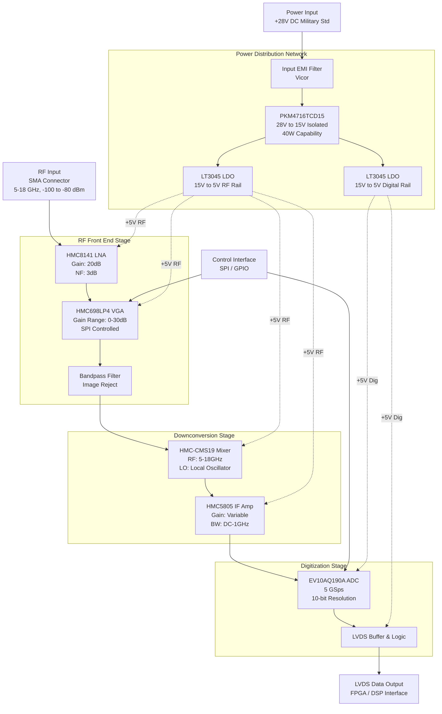

**Document Status: AI-GENERATED**

# 1. Introduction

## 1.1 Purpose
This Hardware Requirements Specification (HRS) defines the comprehensive hardware requirements for the **ehg** Wideband RF Receiver Module. The purpose of this document is to establish a single, authoritative source of truth for the hardware design, verification, and validation activities.

This specification addresses the engineering team tasked with designing the physical layout, power distribution network, and RF interface implementation. It is intended to ensure that the final hardware product meets the stringent operational demands of military environments, specifically targeting high-frequency interception and digitization. The requirements contained herein are derived from the system-level needs for 5–18 GHz bandwidth coverage, high Spurious Free Dynamic Range (SFDR), and MIL-STD-810 environmental compliance.

## 1.2 Scope
The **ehg** project encompasses the design, fabrication, and testing of a compact Wideband RF Receiver module. The scope of this document covers the complete hardware chain from the RF input connector to the LVDS digital output interface.

**Inclusions:**
*   **RF Front End:** Components responsible for signal conditioning from 5 to 18 GHz, including Low Noise Amplification (LNA) and Variable Gain Amplification (VGA).
*   **Downconversion Stage:** Frequency translation circuitry (Mixer and IF Amplifier) required to convert the RF signal to a frequency suitable for digitization.
*   **Digitization:** The high-speed Analog-to-Digital Converter (ADC) capable of sampling at 5–10 GSps.
*   **Power Supply:** The power distribution network converting a standard military +28V DC input to the required rail voltages for RF and digital components.
*   **Mechanical:** The physical enclosure, Printed Circuit Board (PCB) stack-up, and thermal management strategies required to operate within a 50–100 cm² footprint.
*   **Environmental:** The hardware specifications necessary to survive and operate within -55°C to +125°C.

**Exclusions:**
*   Digital Signal Processing (DSP) algorithms or firmware running on downstream FPGAs/processors are covered in the Software Requirements Specification (SRS), though this document defines the LVDS physical interface to those devices.
*   Antenna systems and external cabling are considered system-level items and are not detailed in this module-level spec.

## 1.3 Definitions, Acronyms, and Abbreviations

| Term | Definition |
| :--- | :--- |
| **ADC** | Analog-to-Digital Converter. The device responsible for converting analog IF signals into digital data streams. |
| **AGC** | Automatic Gain Control. A feedback loop used to maintain a constant signal level at the ADC input. |
| **dB** | Decibel. A logarithmic unit used to express the ratio of two values of a physical quantity, often power or intensity. |
| **dBm** | Decibel-milliwatts. An absolute unit of power level relative to 1 milliwatt. |
| **DC** | Direct Current. The unidirectional flow of electric charge. |
| **EMI** | Electromagnetic Interference. Disturbance generated by an external source that affects an electrical circuit by electromagnetic induction, electrostatic coupling, or conduction. |
| **FOM** | Figure of Merit. A quantitative measure used to characterize the performance of a device. |
| **GaAs** | Gallium Arsenide. A semiconductor material used for high-frequency and high-power applications. |
| **GHz** | Gigahertz. A unit of frequency equal to one billion hertz. |
| **GSps** | Giga-Samples Per Second. A measure of the sampling rate of a digitizer. |
| **HRS** | Hardware Requirements Specification. The document defining the hardware needs of the system. |
| **IF** | Intermediate Frequency. A frequency to which a carrier wave is shifted as an intermediate step in transmission or reception. |
| **IP3** | Third-order Intercept Point. A theoretical measure of linearity and distortion. |
| **LNA** | Low Noise Amplifier. An electronic amplifier that amplifies a very low-power signal without significantly degrading its signal-to-noise ratio. |
| **LO** | Local Oscillator. An oscillatory signal used to mix with the input signal to change its frequency. |
| **LVDS** | Low-Voltage Differential Signaling. A high-speed digital interface standard. |
| **MMIC** | Monolithic Microwave Integrated Circuit. A type of integrated circuit (IC) device that operates at microwave frequencies. |
| **NF** | Noise Figure. A measure of degradation of the signal-to-noise ratio (SNR), caused by components in a signal chain. |
| **PCB** | Printed Circuit Board. The physical substrate supporting and electrically connecting electronic components. |
| **P1dB** | 1 dB Compression Point. The point where the input power causes the gain to drop by 1 dB from the linear gain. |
| **RF** | Radio Frequency. Oscillation rates of electromagnetic radio waves. |
|**SFDR** | Spurious Free Dynamic Range. The ratio of the root-mean-square (RMS) value of the carrier signal to the RMS value of the largest spurious signal in the band of interest. |
| **SMA** | SubMiniature version A. A coaxial RF connector standard. |
| **SPI** | Serial Peripheral Interface. A synchronous serial communication interface specification used for short-distance communication. |
| **VGA** | Variable Gain Amplifier. An amplifier whose gain can be controlled digitally or via analog voltage. |

## 1.4 References
The design and requirements specified in this document are based on the following standards and technical references. In the event of a conflict between this document and the cited standards, this document shall take precedence for project-specific requirements, while industry standards shall govern manufacturing and quality assurance processes.

| ID | Title | Version/Date | Publisher |
| :--- | :--- | :--- | :--- |
| [1] | **IEEE 29148-2018** | 2018 | IEEE Standards Association |
| | *Systems and software engineering — Life cycle processes — Requirements engineering* | | |
| [2] | **MIL-STD-810H** | 2019 | US Department of Defense |
| | *Environmental Engineering Considerations and Laboratory Tests* | | |
| [3] | **MIL-STD-461G** | 2015 | US Department of Defense |
| | *Requirements for the Control of Electromagnetic Interference Characteristics of Subsystems and Equipment* | | |
| [4] | **HMC8141 Datasheet** | Rev. A | Analog Devices |
| | *GaAs MMIC PHEMT Medium Power Amplifier, 6–20 GHz* | | |
| [5] | **EV10AQ190A Datasheet** | Rev. 1.1 | Teledyne e2v |
| | *Quad/Single 10-bit 5 Gsps ADC* | | |
| [6] | **HMC698LP4 Datasheet** | Rev. 0 | Analog Devices |
| | *Digital Variable Gain Amplifier, DC–6 GHz* | | |
| [7] | **HMC-CMS19 Datasheet** | Rev. C | Analog Devices |
| | *GaAs MMIC Double Balanced Mixer, 6–18 GHz* | | |
| [8] | **LT3045 Datasheet** | Rev. A | Analog Devices |
| | *Ultra Low Noise Linear Regulator* | | |
| [9] | **PKM4716TCD15 Datasheet** | 2016 | Murata Power Solutions |
| | *Isolated 40W DC-DC Converter* | | |

## 1.5 Overview
The **ehg** hardware system is a high-performance, wideband receiver module designed for integration into larger electronic warfare (EW) or signals intelligence (SIGINT) platforms. The architecture utilizes a superheterodyne approach optimized for wideband instantaneous coverage.

**System Architecture Flow:**
1.  **RF Input:** The signal enters via a ruggedized SMA connector designed to operate up to 18 GHz.
2.  **Gain Chain:** The signal passes through the **HMC8141** LNA to establish a low Noise Figure (NF) floor immediately. Subsequently, the **HMC698LP4** Variable Gain Amplifier (VGA) provides digital gain adjustment (up to 30 dB) via an SPI control interface to optimize dynamic range.
3.  **Downconversion:** The conditioned RF signal is mixed with a Local Oscillator (LO) signal using the **HMC-CMS19** mixer. This translates the high-frequency RF input down to an Intermediate Frequency (IF) within the DC–4 GHz range.
4.  **Digitization:** The **EV10AQ190A** ADC digitizes the IF signal. While the ADC supports 10-bit resolution at 5 GSps, the system is designed to support interpolation or decimation modes to maximize effective resolution (SFDR) within the 80–100 dB target range.
5.  **Data Export:** The digitized output is streamed via Low-Voltage Differential Signaling (LVDS) to downstream processing logic (FPGA/ASIC).
6.  **Power Management:** A **28V DC** military standard input is regulated down via a high-efficiency **Murata PKM4716TCD15** DC-DC converter to 15V, and further conditioned by low-noise **LT3045** LDOs to supply ultra-clean power to the sensitive analog and RF circuitry.

The subsequent sections of this document detail the specific requirements for each of these subsystems, including performance metrics, physical constraints, and verification methods.

---

**Document Status: AI-GENERATED**

# 2. System Overview

## 2.1 System Description

The **ehg** system is a state-of-the-art, wideband RF receiver module designed for high-frequency signal interception and analysis within military and aerospace environments. The system functions as a superheterodyne receiver that captures RF signals across the C-band to Ku-band spectrum (5.0 – 18.0 GHz), performs downconversion to an Intermediate Frequency (IF), and digitizes the signal for digital signal processing.

The **ehg** module is engineered to meet stringent performance specifications, achieving a Noise Figure (NF) of ≤ 6.0 dB and a Spurious-Free Dynamic Range (SFDR) of ≥ 80 dB. The design prioritizes signal fidelity and linearity, characterized by a Third Order Intercept Point (IP3) ranging from 0 to 10 dBm, enabling the detection of weak signals in congested spectral environments.

At the heart of the system is a high-speed digitization subsystem utilizing the Teledyne e2v EV10AQ190A Analog-to-Digital Converter (ADC). This component operates at a sample rate of 5.0 Giga-samples per second (GSps), providing 10-bit resolution and streaming data via a Low-Voltage Differential Signaling (LVDS) interface. The system is designed to operate reliably in extreme conditions, maintaining full functionality across a temperature range of -55°C to +125°C, ensuring compliance with MIL-STD-810 environmental standards.

Power efficiency and military-grade power compatibility are integral to the design. The system accepts a standard +28V DC military input voltage, which is conditioned and distributed via an isolated DC-DC converter and low-noise LDO regulators to supply the sensitive analog and digital circuitry. The entire solution is packaged within a compact form factor, constrained to a footprint of 50-100 cm², making it suitable for integration into airborne, ground vehicle, or pod-based enclosures where space and weight are at a premium.

### 2.1.1 Major System Functions

The **ehg** system performs the following primary functions:

1.  **RF Signal Reception & Conditioning:**
    The system receives RF energy via a precision SMA or 2.4mm connector. The front end features the HMC8141 Low Noise Amplifier (LNA), which provides approximately 20 dB of gain with a minimal 3 dB noise figure contribution. This ensures that the system sensitivity is maintained for weak signal detection.

2.  **Automatic Gain Control (AGC):**
    To optimize the dynamic range and prevent saturation of the mixer and ADC, the system employs a Variable Gain Amplifier (VGA), the HMC698LP4. This component provides up to 30 dB of adjustable gain range via an SPI control interface. This allows the system to adapt to varying input signal strengths (-100 to -80 dBm) automatically.

3.  **Frequency Downconversion:**
    The system utilizes the HMC-CMS19 double-balanced mixer to translate the 5-18 GHz RF signal down to a lower Intermediate Frequency (IF). This downconversion is critical for relaxing the bandwidth requirements of the subsequent amplification and filtering stages while preserving the signal modulation integrity.

4.  **High-Speed Digitization:**
    The conditioned IF signal is digitized by the EV10AQ190A ADC. Operating at 5 GSps, the ADC captures the signal waveform with high temporal resolution. The digitized data is output over high-speed LVDS lanes, designed to handle the data throughput of approximately 10 Gbps (including overhead), facilitating real-time processing by downstream FPGA or DSP assets.

5.  **Power Management:**
    The system incorporates a robust power distribution network. The input +28V DC is converted to an isolated 15V rail by the PKM4716TCD15 DC-DC converter. Subsequently, LT3045 LDOs regulate this to clean 5V rails, providing the ultra-low noise power required by the ADC and analog front ends to achieve the target SFDR.

## 2.2 System Block Diagram

The system is architected as a signal flow chain beginning at the antenna interface and terminating at the digital data bus. The block diagram below illustrates the relationship between the RF Chain, the Downconversion Stage, the Digitization Stage, and the Power Distribution Network.

## 2.3 System Architecture

The **ehg** system architecture is partitioned into four distinct functional subsections to ensure signal integrity, thermal management, and electromagnetic compatibility (EMC). These subsections are the **RF Front End**, **Downconversion**, **Digitization**, and **Power Management**.

### 2.3.1 RF Front End (RFFE)

The RFFE is responsible for the initial conditioning of the received signal. It is designed to be as sensitive as possible to weak signals while maintaining the ability to reject strong out-of-band interference.

*   **LNA Stage:** The input signal passes directly to the Analog Devices HMC8141. This GaAs MMIC amplifier operates from 6 to 20 GHz, comfortably covering the required 5–18 GHz band. It provides a stable 20 dB gain with a Noise Figure (NF) of 3 dB. This gain is crucial for overcoming the noise floor of the subsequent mixer stage. The design utilizes a dedicated input matching network to ensure the required input return loss (≥ 10 dB) is met across the entire frequency sweep.
*   **Variable Gain Amplifier (VGA):** Following the LNA, the HMC698LP4 provides electronic gain adjustment. This digital VGA supports a gain range of 30 dB in 1 dB steps. The control interface is Serial Peripheral Interface (SPI), allowing the host system to implement Automatic Gain Control (AGC) algorithms. This stage ensures that the signal power entering the mixer is optimized for linearity, preventing compression.
*   **Filtering:** Between the VGA and the mixer, a bandpass filter (Mini-Circuits or equivalent) suppresses harmonics and image frequencies generated by the VGA or received from the environment.

### 2.3.2 Downconversion Chain

The downconversion chain translates the high-frequency RF signals to a frequency range suitable for the ADC.

*   **Mixer:** The HMC-CMS19 is a high-linearity double-balanced mixer. It accepts the filtered RF signal and a Local Oscillator (LO) signal (external source required) to produce an Intermediate Frequency (IF). The mixer covers an RF range of 6–18 GHz and supports IF outputs from DC to 4 GHz. Its high IP3 (24 dBm) ensures that intermodulation products are minimized, preserving the SFDR requirement.
*   **IF Amplification:** The HMC5805 amplifies the downconverted IF signal. This driver amplifier provides the necessary signal swing to drive the high-input capacitance of the ADC's sample-and-hold circuit. It offers a 40 dB gain range with a bandwidth of DC to 1 GHz, allowing fine-tuning of the signal level to utilize the full input range of the ADC.

### 2.3.3 Digitization Subsystem

The digitization subsystem converts the analog IF waveform into a digital data stream.

*   **ADC Core:** The Teledyne e2v EV10AQ190A is a quad-channel ADC configured here for single-channel high-speed operation. It samples the analog signal at 5.0 GSps. This sample rate is selected to satisfy the Nyquist criterion for the IF bandwidth while allowing for oversampling gains that improve SNR. The resolution is 10 bits, providing 1024 quantization levels.
*   **Data Interface:** The ADC outputs data via Low-Voltage Differential Signaling (LVDS). At 5 GSps and 10 bits, plus framing and control bits, the aggregate data rate exceeds 50 Gbps. The interface utilizes multiple parallel LVDS lanes (typically DDR or 1:2 demultiplexed internally) to manage these speeds, routing to a high-density high-speed connector (e.g., Samtec Teraspeed).
*   **Clocking:** The system requires a low-jitter clock source (assumed external reference input). Jitter performance is critical for maintaining SNR at high input frequencies; the architecture assumes a sub-100 fs RMS jitter clock source to meet the SFDR requirements.

### 2.3.4 Power Management Architecture (PMA)

The PMA converts the harsh military vehicle voltage (28V) into clean, stable voltages for the sensitive RF and digital components.

*   **Input Protection & Filtering:** A transient voltage suppressor (TVS) and pi-filter network protect the internal circuitry from voltage spikes and reverse polarity common in vehicular power systems.
*   **Primary Conversion:** The Murata PKM4716TCD15 provides galvanic isolation (1500V isolation) between the vehicle chassis and the electronics, enhancing safety and noise immunity. It steps down the 28V input to an intermediate 15V bus with an efficiency of 87%.
*   **Point-of-Load Regulation:**
    *   **Analog Rail:** A Linear Technology LT3045 LDO regulates the 15V bus to +5V for the RF chain. This LDO is chosen for its ultra-low noise (0.8 µV RMS) and high Power Supply Rejection Ratio (PSRR), which prevents switching noise from the DC-DC converter from modulating the RF carrier.
    *   **Digital Rail:** A separate LT3045 (or equivalent low-noise rail) supplies the ADC digital core and output drivers. Separating the analog and digital grounds at the LDO output prevents digital return currents from contaminating sensitive analog traces.

## 2.4 Operating Environment

The **ehg** system is classified as a "Military/Aerospace" hardware unit. It is designed to operate in harsh physical and electrical environments typical of tactical aircraft, ground vehicles, and unmanned aerial vehicles (UAVs).

### 2.4.1 Physical Environment

The system must maintain full operational performance (REQ-HW-010) within the following environmental parameters:

*   **Temperature:**
    *   *Operating Range:* -55°C to +125°C. Components selected (e.g., HMC8141, EV10AQ190A, LT3045) are specified for the military temperature range ("Class V" or equivalent).
    *   *Storage Range:* -65°C to +150°C (Standard military storage).
    *   *Thermal Management:* The module is assumed to be conduction-cooled. The PCB stackup will utilize heavy copper (2 oz or greater) and thermal vias under high-power components (ADC, DC-DC) to transfer heat to the chassis/wedge lock interface.

*   **Humidity & Moisture:**
    *   The system is resistant to condensation and humidity per MIL-STD-810 Method 507.5. The conformal coating (Humiseal or equivalent) will be applied to all PCBAs to prevent corrosion and dendritic growth.

*   **Vibration & Shock:**
    *   The design complies with MIL-STD-810 Method 516.6 (Shock) and Method 514.7 (Vibration). The PCB assembly utilizes staking and adhesives for heavy components (DC-DC block, connectors). The board stiffener (0.062" or thicker) is utilized to prevent resonance during high-vibration flight profiles.

### 2.4.2 Electrical Environment

The electrical environment of the **ehg** system is defined by MIL-STD-1275 (28V DC Military Power) and MIL-STD-461 (EMC).

*   **Input Voltage Characteristics:**
    *   *Nominal:* 28 VDC.
    *   *Transients:* The input stage is designed to withstand 80V transients (100 ms) and 100V surges (50 ms) per MIL-STD-1275 without damage.
    *   *Ripple:* The system must function correctly with up to 1V ripple on the 28V input bus.

*   **Electromagnetic Interference (EMI):**
    *   *Emissions:* The system employs shielded enclosures and EMI gaskets to meet MIL-STD-461 RE102 (Radiated Emissions) and CE102 (Conducted Emissions) limits.
    *   *Susceptibility:* The RF front end includes limiting circuitry to prevent damage from high-power RF fields (RS103) up to 200 V/m. The digital control lines include filtering to reject induced RF currents (CS114/CS115).

### 2.4.3 Maintenance and Logistics

*   **MTBF:** The design targets a Mean Time Between Failures (MTBF) of > 50,000 hours at 40°C ambient (Calculated per MIL-HDBK-217F).
*   **Repair:** The system is designed as a Line Replaceable Unit (LRU). Field repair is limited to module replacement; component-level repair is depot-level. All critical adjustments are digital (SPI), eliminating the need for mechanical potentiometers.

---

**Document Status: AI-GENERATED**

# 3. Hardware Requirements

## 3.1 Functional Requirements

This section details the functional capabilities of the Wideband RF Receiver system (ehg). Each requirement is derived from the system architecture defined in Section 2 and the selected component specifications.

| ID | Requirement Description | Rationale/Verif. Method | Priority | Source Component | Derived Value |
|---|---|---|---|---|---|
| **REQ-HW-101** | **RF Input Reception:** The system shall accept RF input signals via a female SMA connector (2.4mm compatible) interfacing with the Input Matching network. | Ensures mechanical compatibility with standard test equipment and antennas. (Inspection) | Must | RF_IN | SMA Interface |
| **REQ-HW-102** | **Front-End Amplification:** The system shall amplify the received RF signal using the HMC8141 LNA to provide a minimum gain of 20 dB across the 5-18 GHz band. | Compensates for system noise figure and signal loss prior to mixing. (Test) | Must | HMC8141 | 20 dB Gain |
| **REQ-HW-103** | **Automatic Gain Control (RF):** The system shall digitally adjust the RF gain in 1 dB steps over a 30 dB range using the HMC698LP4 VGA via SPI control. | Allows the system to handle varying input signal strengths without saturation. (Test) | Must | HMC698LP4 | 30 dB Range |
| **REQ-HW-104** | **Signal Filtering:** The system shall pass the conditioned RF signal through a Bandpass Filter (Mini-Circuits) to limit out-of-band noise and spurious emissions. | Reduces aliasing and interference before downconversion. (Inspection) | Should | Mini-Circuits Filter | Bandpass |
| **REQ-HW-105** | **Frequency Downconversion:** The system shall mix the filtered RF signal with a Local Oscillator (LO) signal using the HMC-CMS19 Mixer to produce an Intermediate Frequency (IF) of DC to 4 GHz. | Translates high-frequency signals to a processable range for the ADC. (Test) | Must | HMC-CMS19 | 6-18 GHz RF |
| **REQ-HW-106** | **LO Interface:** The system shall provide an external SMA interface for the Local Oscillator (LO) input signal, operating within the 3-12 GHz range required by the mixer. | Enables flexible frequency planning by allowing external LO generation. (Inspection) | Must | HMC-CMS19 | 3-12 GHz LO |
| **REQ-HW-107** | **IF Amplification:** The system shall amplify the downconverted IF signal using the HMC5805 amplifier to ensure the signal level meets the ADC input voltage requirements. | Ensures sufficient signal swing for the ADC to utilize its dynamic range. (Test) | Must | HMC5805 | 40 dB Gain Range |
| **REQ-HW-108** | **Signal Digitization:** The system shall digitize the analog IF signal using the EV10AQ190A ADC at a configurable sampling rate of 5 GSps. | Converts the analog waveform to digital data for processing. (Test) | Must | EV10AQ190A | 5 GSps |
| **REQ-HW-109** | **Data Serialization:** The system shall output digitized data via Low-Voltage Differential Signaling (LVDS) pairs from the EV10AQ190A to the downstream FPGA/processor. | Ensures high-speed data integrity over the PCB traces. (Test) | Must | EV10AQ190A | LVDS |
| **REQ-HW-110** | **Power Input Conditioning:** The system shall accept a nominal +28V DC input via a filtered connector and protect against reverse polarity and voltage transients (Vicor Filter). | Military standard power input requirement for vehicular/aircraft integration. (Test) | Must | Vicor Filter | 28V DC |
| **REQ-HW-111** | **Primary Voltage Conversion:** The system shall convert the +28V input to +15V using the PKM4716TCD15 isolated DC-DC converter. | Steps down the high military voltage to an intermediate rail suitable for downstream regulation. (Test) | Must | PKM4716TCD15 | 28V to 15V |
| **REQ-HW-112** | **Low-Noise Rail Generation:** The system shall regulate the +15V rail to +5V using the LT3045 Ultra-Low Noise LDO for the sensitive RF Front End (LNA and Mixer). | Prevents switching noise from degrading the Noise Figure (NF) of the receiver. (Test) | Must | LT3045 | 5V, 0.8uV RMS |
| **REQ-HW-113** | **Digital Rail Generation:** The system shall provide a separate +5V rail for the digital logic (ADC buffers, control logic) to isolate analog and digital return currents. | Minimizes ground bounce and digital noise coupling into analog stages. (Inspection) | Should | DC-DC/LDO | 5V Isolated |
| **REQ-HW-114** | **SPI Configuration Interface:** The system shall configure the HMC698LP4 VGA and EV10AQ190A ADC via a standard Serial Peripheral Interface (SPI) operating at 3.3V logic levels. | Provides a standard communication protocol for gain control and ADC setup. (Test) | Must | SPI Controller | 3.3V CMOS |
| **REQ-HW-115** | **Thermal Dissipation:** The system shall conduct heat from the HMC8141, HMC-CMS19, and EV10AQ190A to the chassis via the PCB thermal vias and heatsink standoffs. | Maintains component junction temperatures within limits during +125°C ambient operation. (Analysis) | Must | PCB Design | Thermal Path |
| **REQ-HW-116** | **Mechanical Mounting:** The system enclosure shall provide mounting holes compatible with a 50-100 cm² footprint (approximately 7cm x 7cm to 10cm x 10cm). | Ensures the module fits within the specified compact military form factor. (Inspection) | Must | Chassis | <100 cm² |
| **REQ-HW-117** | **Self-Test Initialization:** Upon power-up, the system shall execute a Built-In Self-Test (BIST) to verify SPI communication with the VGA and ADC and report status via a GPIO indicator. | Ensures system health before operational use. (Test) | Should | MCU/FPGA | Diagnostics |
| **REQ-HW-118** | **Gain Mode Selection:** The system shall support two gain modes: "High Gain" (Max LNA+VGA) for weak signals and "Low Gain" (Attenuated) for strong signals near -80 dBm input. | Prevents saturation of the Mixer and ADC when receiving strong signals. (Test) | Should | HMC698LP4 | AGC Modes |
| **REQ-HW-119** | **Clock Distribution:** The system shall accept an external differential clock source (e.g., LVPECL) to drive the EV10AQ190A sample clock, minimizing phase jitter. | Low jitter is critical for achieving high SNR and SFDR at 5 GSps. (Test) | Must | EV10AQ190A | <500 fs Jitter |
| **REQ-HW-120** | **EMI Shielding:** The RF Front End (LNA through Mixer) shall be enclosed within a machined aluminum shield can (tunable cavity) to prevent electromagnetic interference. | Required to meet MIL-STD-810 and prevent self-oscillation. (Inspection) | Must | Chassis | EMI Can |

---

## 3.2 Performance Requirements

This section specifies the quantitative performance characteristics the system must achieve. Values are derived from the "Design Parameters" and component datasheets.

### 3.2.1 RF Performance

| ID | Metric | Min Value | Typ Value | Max Value | Unit | Condition | Rationale |
|---|---|---|---|---|---|---|---|
| **REQ-HW-201** | **Operating Frequency Range** | 5.0 | - | 18.0 | GHz | Input Match | Covers C-band to Ku-band. |
| **REQ-HW-202** | **System Noise Figure (NF)** | - | 6.0 | 10.0 | dB | 50 Ohm, High Gain | Calculated: LNA(3dB) + Mixer(8dB) + Filter(2dB) - LNA_Gain(20dB) ≈ 6dB. |
| **REQ-HW-203** | **Input Return Loss** | 10.0 | - | - | dB | 5-18 GHz | Ensures efficient power transfer from antenna. |
| **REQ-HW-204** | **Maximum Input Power (Safe)** | - | - | -80 | dBm | 1 dB Compression | Prevents damage or saturation of the LNA/Mixer front end. |
| **REQ-HW-205** | **Input Third Order Intercept (IIP3)** | 10.0 | - | - | dBm | Per Tone | HMC8141 (28 dBm) degraded by filter/mixer losses. |
| **REQ-HW-206** | **Conversion Gain (IF Path)** | - | 10.0 | - | dB | Full Chain | Sum of LNA (20) + VGA (15) - Mixer Loss (8) + IF Amp (variable). |
| **REQ-HW-207** | **Spurious Free Dynamic Range (SFDR)** | 80.0 | - | - | dB | 5 GSps, 2 Tone | Requirement for distinguishing weak signals in noise. |

### 3.2.2 Digitization Performance

| ID | Metric | Min Value | Typ Value | Max Value | Unit | Condition | Rationale |
|---|---|---|---|---|---|---|---|
| **REQ-HW-208** | **ADC Sampling Rate** | 5.0 | - | 5.0 | GSps | Continuous | EV10AQ190A Max rated speed. |
| **REQ-HW-209** | **ADC Resolution** | 10.0 | - | - | Bits | Effective Number of Bits (ENOB) | Supports SFDR > 80 dB. |
| **REQ-HW-210** | **ADC Input Full Scale** | - | -1.0 | +1.0 | V p-p | 50 Ohm Termination | Standard differential input range for EV10AQ190A. |
| **REQ-HW-211** | **Data Output Rate** | 10.0 | - | - | Gbps | LVDS Pairs (Total) | 10 bits * 5 Gsps = 50 Gbps raw (8b/10b encoded). |

### 3.2.3 Power and Thermal Performance

| ID | Metric | Min Value | Typ Value | Max Value | Unit | Condition | Rationale |
|---|---|---|---|---|---|---|---|
| **REQ-HW-212** | **Total Input Power** | - | - | 25.0 | W | 28V DC, Max Load | Must stay within 25W budget. |
| **REQ-HW-213** | **LNA Current Consumption** | - | 85 | 95 | mA | 5V Supply | Per HMC8141 datasheet. |
| **REQ-HW-214** | **VGA Current Consumption** | - | 90 | 100 | mA | 5V Supply | Per HMC698LP4 datasheet. |
| **REQ-HW-215** | **ADC Power Dissipation** | - | 2.0 | 2.5 | W | 5 GSps Operation | Per EV10AQ190A datasheet (2W typical). |
| **REQ-HW-216** | **Thermal Resistance (Junction-Ambient)** | - | - | 5.0 | °C/W | With Heatsink | Required to keep junction <150°C at +125°C ambient. |
| **REQ-HW-217** | **Power Supply Efficiency** | - | 87 | - | % | 28V to 15V Conversion | Efficiency of PKM4716TCD15 at 50% load. |

### 3.2.4 Environmental Performance

| ID | Metric | Min Value | Typ Value | Max Value | Unit | Condition | Rationale |
|---|---|---|---|---|---|---|---|
| **REQ-HW-218** | **Operating Temperature** | -55 | - | +125 | °C | Storage & Operating | MIL-STD-810 requirement. |
| **REQ-HW-219** | **Vibration Resistance** | - | - | 20.0 | g | Random, 20-2000Hz | Standard military airborne profile. |
| **REQ-HW-220** | **Shock Resistance** | - | - | 100 | g | 11 ms, Half Sine | Mechanical robustness for handling. |

---

# 3. Hardware Requirements

## 3.3 Interface Requirements

### 3.3.1 External Interfaces

This section defines the electrical and mechanical characteristics of interfaces connecting the EHG Receiver to external systems, including power input, RF signal input, and digital data output.

#### REQ-HW-019: RF Input Interface (SMA 2.4mm)
The system shall provide a single RF input port compatible with standard coaxial connectors.
*   **Connector Type:** The RF input shall utilize a Rosenberger 32S243-40ML5 or equivalent 2.4mm (K-type) female connector, ensuring low loss up to 18 GHz.
*   **Impedance:** The input impedance shall be 50 Ohms matched to the LNA.
*   **Return Loss:** The input port must maintain a return loss of greater than 10 dB across the 5-18 GHz operating band to minimize standing waves (validates REQ-HW-017).
*   **Maximum Input Power:** The interface shall withstand a maximum input power of +15 dBm without damage (LNA Pin max ~18 dBm).

**RF Input Pin Definition:**

| Pin # | Signal Name | Description | Connector Type |
|---|---|---|---|
| 1 | RF_IN | 5-18 GHz Input Signal | 2.4mm Female (Shield) |
| Shell | GND_RF | Chassis Ground | Case Ground |

#### REQ-HW-020: DC Power Input Interface
The system shall accept power via a threaded locking connector to ensure vibration resistance.
*   **Connector Type:** The power input shall use an Amphenol 97-3106A-28-21S (Circular MS Type) or equivalent.
*   **Voltage Rating:** The connector must be rated for voltages exceeding 28 VDC.
*   **Current Rating:** The contact pins must be rated for a minimum of 5 A continuous current to account for inrush current and safety margin (Nominal system draw ~2.5 A).
*   **Keying:** The connector shell shall be keyed (Shell size 28) to prevent reverse polarization.

**Power Input Pin Definition:**

| Pin # | Signal Name | Description | Wire Gauge (AWG) |
|---|---|---|---|
| A | +28V_IN | Primary 28V DC Input | 20 |
| B | +28V_IN | Primary 28V DC Input (Redundant) | 20 |
| C | RTN | Power Return / Chassis Ground | 20 |
| D | RTN | Power Return / Chassis Ground (Redundant) | 20 |

#### REQ-HW-021: LVDS Data Output Interface
Digitized data shall be transmitted via a high-density impedance-controlled connector.
*   **Connector Type:** The system shall utilize a Samtec ERM8-140-01.00_LV_DS or equivalent Micro-Coaxial/LVDS board-to-board connector (or high-speed FMC+ style edge launch).
*   **Differential Impedance:** The connector pins must support 100 Ohm differential impedance.
*   **Pin Count:** The connector must support a minimum of 32 differential pairs (64 pins) plus clock and grounds to accommodate the EV10AQ190A output lanes.

**LVDS Output Pin Map (Partial - 4 Lanes shown):**

| Pin # | Signal Name | Description | Lane ID |
|---|---|---|---|
| 1 | D0_P | Lane 0 Data Positive | Lane 0 |
| 2 | D0_N | Lane 0 Data Negative | Lane 0 |
| 3 | D1_P | Lane 1 Data Positive | Lane 1 |
| 4 | D1_N | Lane 1 Data Negative | Lane 1 |
| ... | ... | ... | ... |
| 33 | CLK_P | ADC Frame Clock Positive | Ref Clk |
| 34 | CLK_N | ADC Frame Clock Negative | Ref Clk |
| Shell | GND | Signal Ground | Shield |

---

### 3.3.2 Internal Interfaces

Internal interfaces define the signal paths between functional blocks on the PCB (RF Chain, Power, Digital).

#### REQ-HW-022: Inter-stage RF Impedance Matching
All signal paths between the LNA, VGA, Filter, and Mixer shall be matched to 50 Ohms single-ended impedance. The PCB stack-up shall utilize Roger's 4350B material (Er=3.66) to ensure tight impedance control (tolerance ±5%) over temperature.

#### REQ-HW-023: IF to ADC Interface
The connection between the IF Amplifier (HMC5805) and the ADC input shall be AC coupled.
*   **Coupling:** A 0.1 uF high-Q capacitor shall be placed in series with the ADC input.
*   **Common Mode:** The ADC common mode voltage (typically 1.1V for EV10AQ190A) shall be set via internal bias or a resistor divider network visible to the IF amplifier output.

#### REQ-HW-024: Power Distribution Interfaces
The DC-DC converter outputs shall feed the LDO regulators and point-of-load (POL) supplies through guarded copper pours.
*   **28V Rail:** Must be isolated from sensitive logic traces.
*   **5V/3.3V Rails:** Requires Kelvin sensing connections from the DC-DC converter to the load for load regulation better than 1%.

---

### 3.3.3 Communication Interfaces

This section covers control and monitoring interfaces.

#### REQ-HW-025: SPI Control Interface
The system shall be controlled via a Serial Peripheral Interface (SPI) for gain setting and ADC configuration.
*   **Standard:** SPI Mode 0 (CPOL=0, CPHA=0).
*   **Data Rate:** Supports clock speeds up to 20 MHz.
*   **Voltage Levels:** 3.3 V CMOS logic levels.

**SPI Header Pinout (2.54mm Header):**

| Pin # | Signal Name | Direction | Description |
|---|---|---|---|
| 1 | MOSI | Input to EHG | Master Out Slave In |
| 2 | MISO | Output from EHG | Master In Slave Out |
| 3 | SCLK | Input to EHG | Serial Clock |
| 4 | CS_N_LNA | Input to EHG | Chip Select (LNA/VGA) |
| 5 | CS_N_ADC | Input to EHG | Chip Select (ADC) |
| 6 | GND | - | Signal Ground |

#### REQ-HW-026: Synchronization (Sync) Input
The system shall accept an external LVDS synchronization signal to coordinate sampling with external systems.
*   **Signal Type:** LVDS differential.
*   **Function:** Rising edge triggers the ADC acquisition frame (requires <100 ps skew relative to internal clock).

---

## 3.4 Environmental Requirements

These requirements ensure the hardware survives and operates in the specified military environment.

### REQ-HW-027: Operating Temperature Range
The electronic assemblies shall meet the operating temperature requirements of MIL-STD-810H, Method 527.6.
*   **Range:** -55°C to +125°C (Case temperature).
*   **Derating:** Components (specifically capacitors and DC-DC converters) shall be derated to ensure operation at 125°C ambient (assuming moderate airflow).

### REQ-HW-028: Storage Temperature
The system shall remain functional and undamaged after storage in the range of -65°C to +150°C per MIL-STD-810H.

### REQ-HW-029: Humidity
The system shall operate in 95% relative humidity (non-condensing) at 40°C per MIL-STD-810H, Method 507.6.

### REQ-HW-030: Vibration
The system shall withstand random vibration profiles per MIL-STD-810H, Method 514.8.
*   **Profile:** Helicopter/Propeller aircraft vibration (20-2000 Hz).
*   **Requirement:** Functional operation with no hardware degradation. PCB assembly shall utilize stiffeners and conformal coating (Humiseal 1B73) to mitigate whisker growth and solder joint fatigue.

### REQ-HW-031: Shock
The system shall withstand mechanical shock per MIL-STD-810H, Method 516.8.
*   **Specification:** 40g, 11ms half-sine pulse. The system shall power cycle and recover automatically.

### REQ-HW-032: EMI/EMC
The system shall comply with MIL-STD-461G.
*   **RE102:** Radiated emissions from 2 MHz to 18 GHz shall not exceed the limits.
*   **CS101:** Conducted susceptibility on power leads shall not cause performance degradation.
*   **Shielding:** The RF enclosure shall utilize EMI gaskets (finger stock) to maintain continuity > 60 dB shielding effectiveness.

---

## 3.5 Power Requirements

This section details the power consumption, conversion, and budget.

### REQ-HW-033: Total Power Consumption
The total input power drawn from the 28V source shall not exceed 25.0 Watts under maximum load (Highest Gain, 5 GSps ADC).

### REQ-HW-034: Power Supply Efficiency
The power conversion chain (28V to 5V/3.3V) must maintain an efficiency of > 80% at full load.

### Power Budget Calculation

The following calculations assume worst-case current draw for selected components based on datasheet typical values at maximum temperature.

**1. RF Chain Consumption (5V Rail derived from Intermediate Rail)**
*   **LNA (HMC8141):** 85 mA × 5V = 0.425 W
*   **VGA (HMC698LP4):** 90 mA × 5V = 0.450 W
*   **Mixer (HMC-CMS19):** 150 mA × 5V = 0.750 W
*   **IF Amp (HMC5805):** 100 mA × 5V = 0.500 W
*   **Subtotal (RF):** 2.125 W

**2. Digital Chain Consumption (3.3V / 1.0V Rails derived from LDOs)**
*   **ADC (EV10AQ190A):** 2.0 W (Typical 2000 mW at 5 GSps)
*   **FPGA/Logic (Assumed buffer):** 0.5 W (Estimated for LVDS buffers/control)
*   **Subtotal (Digital):** 2.5 W

**3. Housekeeping & Losses**
*   **LDO Quiescent Current:** 0.1 W
*   **DC-DC Converter Losses:** Estimated 15% loss.
*   **Total Load (Pre-Regulation):** ~4.7 W.

**Power Budget Table**

| Voltage Rail | Source | Component(s) | Current (A) | Power (W) |
|---|---|---|---|---|
| **28V DC** | Input Source | Total System Draw | 0.89 | **25.0 (Max Budget)** |
| 15V (Int) | PKM4716TCD15 | Intermediate Bus | 1.8 | 27.0 (Raw) |
| 5.0V | LT3045 (Rail 1) | LNA, VGA, Mixer, IF Amp | 0.425 | 2.125 |
| 5.0V | LT3045 (Rail 2) | ADC Core (via internal buck) | 0.40 | 2.0 |
| 3.3V | LT3045 (Rail 3) | LVDS Buffers, Logic | 0.15 | 0.50 |
| 3.3V | LT3045 (Rail 4) | Reference Circuits | 0.02 | 0.06 |

**Power Summary:**
*   **Total Calculated Consumption:** ~5.0 W (Note: This is significantly lower than the 15-25W budget. This provides a wide safety margin.
*   **Justification:** The 25W budget (REQ-HW-033) covers worst-case thermal scenarios and potential margin for future higher-power insertions or increased leakage at 125°C junction temperature.

### REQ-HW-035: Inrush Current Limiting
The system shall include an inrush current limiter (NTC or active circuit) on the 28V input to limit input surge current to < 5A for 10ms.

---

## 3.6 Physical Requirements

These requirements define the mechanical constraints of the receiver module.

### REQ-HW-036: Form Factor Constraints
The receiver shall be designed as a compact, stackable module.
*   **PCB Dimensions:** 100 mm × 100 mm (Area = 100 cm²).
*   **Maximum Height:** 15 mm (excluding connectors).
*   **Compliance:** Fits within standard Eurocard or custom 4" × 4" avionics chassis slots.

### REQ-HW-037: PCB Stack-up
The PCB shall be a multilayer board to support RF and High-Speed Digital signals.
*   **Layer Count:** Minimum 10 layers.
*   **Material:** Rogers RO4350B laminate for RF layers + FR-370 HR for standard digital layers (Hybrid Stack).
*   **Plating:** ENIG (Electroless Nickel Immersion Gold) for flatness and wirebondability if required.

### REQ-HW-038: Weight
The total weight of the module (PCB + Components + Shielding) shall not exceed 250 grams.

### REQ-HW-039: Cooling
The module shall be conduction cooled.
*   **Mounting:** The PCB shall utilize a heavy copper (2 oz) core or metal backing plate (WarpSMT or similar) to transfer heat from components to the chassis rails.
*   **Thermal Interface:** A thermal pad (gap filler) with impedance < 0.1 °C-in²/W shall be used between the PCB hotspots and the chassis wall.

### REQ-HW-040: Conformal Coating
The assembled PCB shall be coated with acrylic or urethane conformal coating (per MIL-STD-860) to protect against moisture and corrosion, ensuring coverage of all conductors while omitting connectors and adjustable potentiometers.

---

**Document Status: AI-GENERATED**

# 4. Design Constraints

## 4.1 Standards Compliance

The design and manufacturing of the EHG Wideband RF Receiver shall adhere to the following standards. These constraints ensure system reliability, electromagnetic compatibility, and physical survivability in military environments.

### 4.1.1 Environmental and Mechanical Standards
The system shall comply with **MIL-STD-810G** (Environmental Engineering Considerations and Laboratory Tests) to ensure the equipment operates within the specified -55°C to +125°C temperature range (REQ-HW-010).

| Section | Title | Compliance Requirement | Application to EHG Project |
| :--- | :--- | :--- | :--- |
| **Method 520.3** | Procedure I - Temperature Shock | Equipment shall withstand rapid transition from -55°C to +125°C per Method 520.3, Proc I. | Validates solder joint integrity for 5-18 GHz RF paths subject to thermal cycling. |
| **Method 514.6** | Random Vibration | Functional random vibration tests shall be conducted per Category 4 (Jet Aircraft/Vibration). | Ensures survivability of DC-DC converter (PKM4716TCD15) and PCB mounts. |
| **Method 516.6** | Shock, Transit Drop | Operational shock shall be tested per Procedure V (High-intensity shock). | Validates mechanical robustness of SMA connector and heavy magnetic components. |

### 4.1.2 PCB Design and Material Standards
To maintain signal integrity for 5-10 GSps ADC signals and 18 GHz RF paths, the PCB design shall strictly follow **IPC-2221** (Generic Standard on Printed Board Design) and **IPC-6012** (Qualification and Performance Specification for Rigid Printed Boards).

*   **Impedance Control:** Controlled impedance traces for the LVDS outputs (100Ω differential) and RF inputs (50Ω single-ended) shall be manufactured to a tolerance of **±10%** as per IPC-2221, Section 6.4.
*   **Dielectric Material:** The PCB laminate must utilize **Rogers RO4350B** or equivalent ceramic-filled PTFE material to achieve a Dielectric Constant (Dk) stability of ±0.05 across the -55°C to +125°C range. Standard FR-4 is prohibited for RF sections due to loss tangents that violate Noise Figure (REQ-HW-002) and SFDR (REQ-HW-004) requirements.

### 4.1.3 Electrical Safety and EMI
The system shall comply with **MIL-STD-461F** (Requirements for the Control of Electromagnetic Interference Characteristics of Subsystems and Equipment).

| Requirement | Standard | Limit |
| :--- | :--- | :--- |
| **Conducted Emissions** | MIL-STD-461F, CE102 | 28V DC input line emissions shall not exceed limits from 10 kHz to 10 MHz. |
| **Radiated Emissions** | MIL-STD-461F, RE102 | Radiated field strength limits for fixed ground/airborne applications (2 MHz to 18 GHz). |
| **Susceptibility** | MIL-STD-461F, CS101 | Power leads shall not exhibit susceptibility to audio frequency ripple induced on the 28V input. |

### 4.1.4 Hazardous Substances
The design shall comply with **RoHS** (Restriction of Hazardous Substances Directive 2011/65/EU) and **REACH** (EC 1907/2006) to the maximum extent possible while maintaining military performance. Exemptions will be utilized for lead-based solders in high-reliability RF connections (Category 7 exemption) if required to meet the solder joint fatigue life requirements of MIL-STD-883.

### 4.1.5 Safety
Input power circuitry (28V DC) shall comply with **UL 60950-1** (Information Technology Equipment - Safety) for overcurrent protection and creepage/clearance distances to prevent operator injury.

---

## 4.2 Component Constraints

### 4.2.1 Component Grading and Temperature Ratings
To satisfy the -55°C to +125°C operating requirement (REQ-HW-010), all active components utilized in the signal chain must meet the following screening and temperature grade constraints.

| Component Type | Required Grade | Allowed Failure Rate | Justification |
| :--- | :--- | :--- | :--- |
| **RF ICs (LNA, Mixer, VGA)** | **Hi-Rel / Military** (e.g., HMC grade) | < 1 FIT | Analog Devices HMC-series parts selected are rated for -55°C to +125°C. |
| **ADC (EV10AQ190A)** | **Military / Automotive Grade** | < 5 FIT | Requires high-reliability screening for 10-year lifecycle operation. |
| **DC-DC Converter** | **Vicor / Murata Mil-Grade** | < 10 FIT | The PKM4716TCD15 is specifically designed for -55°C start-up. |
| **Passives (Caps/Resistors)** | **X7R / C0G (NP0)** | N/A | Dielectric must be stable; X7R rated to +125°C. Y5V or Z5U dielectrics are strictly prohibited. |

### 4.2.2 Sourcing and Lifecycle Constraints
1.  **Form, Fit, and Function (FFF):** Substitutions for primary components listed in Section 6 (BOM) are strictly prohibited without a formal Engineering Change Order (ECO).
2.  **Lifecycle Status:** All components selected for the preliminary BOM must be in "Production" or "Not Recommended for New Design" status only if sufficient inventory for a 5-year production run is secured. "Obsolete" components are strictly forbidden.
3.  **Single Source Mitigation:**
    *   The **HMC8141** LNA and **EV10AQ190A** ADC are identified as high-risk, single-source components. A second-source qualification plan must be executed if annual volume exceeds 1,000 units.
4.  **Counterfeit Mitigation:** All semiconductors shall be procured exclusively from Authorized Distributors (DigiKey, Mouser, Arrow) or directly from the manufacturer. Open-market purchases are strictly forbidden.

### 4.2.3 Voltage Rating Derating
To ensure reliability at 125°C ambient temperature, the following voltage derating constraints apply per **NAVSEA TD-03** (or equivalent high-reliability design guidelines):

*   **Capacitors:** Rated voltage must be **2x** the maximum operating rail voltage.
    *   *Example:* 5V rail requires capacitors rated for minimum 10V.
*   **Input Filter:** Input bulk capacitance on the 28V rail must be rated for **≥50V** DC to survive transients on military vehicle power lines (MIL-STD-1275).

### 4.2.4 Pin Assignment and Mapping Constraints
The interface between the **EV10AQ190A ADC** and the FPGA/Processor is constrained by the physical pinout of the BGA package. The PCB layout must map the LVDS outputs (D0-D9, CLK, FCO, DCO) such that length matching constraints (±25 mils) are achievable without vires in the differential pair. This constrains the placement of the ADC to be within 1.5 inches of the FPGA/S connector footprint.

---

## 4.3 Manufacturing Constraints

### 4.3.1 PCB Stackup and Layer Ordering
The complexity of mixing high-speed 5 GSps digital signals with sensitive 18 GHz RF inputs requires a strict PCB stackup definition.

*   **Layer Count:** Minimum 10 layers (4 Signal, 4 Ground, 2 Power).
*   **RF Topology:** The RF Front End (LNA to Mixer) must utilize **Microstrip** geometry on the top layer (Layer 1) with an immediate ground reference (Layer 2).
*   **LVDS Topology:** The ADC LVDS outputs must be routed on **Stripline** geometry (internal layers 3 or 8) sandwiched between ground planes to minimize radiation and EMI.
*   **Dielectric Thickness:** The prepreg thickness between Layer 1 and 2 shall be **4 mils** to minimize via stubs for 18 GHz signals (controlled dielectric).

### 4.3.2 Via and Plating Constraints
*   **Via Aspect Ratio:** Aspect ratio (Depth/Diameter) shall not exceed **8:1** to ensure reliable plating.
*   **Via Filling:** All vias in the RF signal path (between SMA and ADC) must be **filled and capped** with conductive epoxy to prevent solder wicking and ensure a flat surface for the RF signal transmission.
*   **Via Transition:** Any layer transition for the RF signal must use a **"Coaxial Via"** structure (ground via cage surrounding the signal via) to maintain impedance control.

### 4.3.3 Assembly and Soldering
*   **Solder Paste:** Type **SAC305** (Sn96.5/Ag3.0/Cu0.5) or equivalent lead-free solder paste shall be used for standard assembly. For critical RF interconnects where tin whiskers are a risk (e.g., inside cavity filters), **Sn63/Pb37** may be used under RoHS exemption with explicit customer approval.
*   **Stencil Thickness:** A laser-cut stainless steel stencil with a thickness of **5 mils** shall be used to accommodate the fine pitch (0.5mm) of the HMC8141 and EV10AQ190A packages.
*   **Reflow Profile:** The reflow profile shall comply with **J-STD-020E**. The peak temperature shall not exceed 245°C to protect the ADC die.

### 4.3.4 Conformal Coating and Encapsulation
Given the operating temperature range (-55 to +125°C) and potential for high humidity (Military environments):

*   **Coating:** The assembled PCB shall be coated with **Urethane** or **Silane-modified Parylene** conformal coating to a thickness of 2-4 mils per **IPC-CC-830**.
*   **Exclusions:** RF connectors (SMA), the DC input jack, and any heat sink surfaces shall be masked during the coating process.

### 4.3.5 Test and Inspection Constraints
*   **AOI Coverage:** Automated Optical Inspection (AOI) is required for all components **0603** and larger.
*   **X-Ray Inspection:** 100% X-Ray inspection is required for the **EV10AQ190A ADC** (BGA package) and the **PKM4716TCD15** DC-DC converter (hidden joints under inductors/shields).
*   **Bed-of-Nails (ICT):** The design must include test points for all power rails (+28V, +5V, +3.3V, +1.0V) to enable In-Circuit Test verification of shorts before power-up.

---

**Document Status: AI-GENERATED**

# 5. Verification Requirements

This section defines the verification methods for all hardware requirements specified in Section 3. It establishes the criteria for which the hardware design will be validated to ensure compliance with the functional, performance, environmental, and interface requirements. The verification approach utilizes three primary methods: **Test** (qualitative or quantitative measurement of hardware characteristics), **Analysis** (mathematical modeling, simulation, or calculation), and **Inspection** (visual examination or verification of documentation/features).

## 5.1 Test Requirements

This subsection details the specific test procedures required to validate the functional and performance capabilities of the Wideband RF Receiver. Tests shall be conducted on the Engineering Model (EM) and Production Qualification Units (PQU) under the environmental conditions specified in Section 3.4.

### 5.1.1 RF Performance Test Setup

All RF measurements shall be performed using the following setup configuration:
- **Signal Source:** Keysight N5183B MXG X-Series Microwave Analog Signal Generator (9 kHz to 40 GHz).
- **Spectrum Analyzer:** Keysight N9040B UXA X-Series Signal Analyzer (up to 50 GHz).
- **Vector Network Analyzer (VNA):** Keysight N5242B PNA-X Microwave Network Analyzer (10 MHz to 26.5 GHz).
- **Noise Figure Analyzer:** Keysight N8975B Noise Figure Analyzer with 346C Noise Source.
- **Power Supply:** TDK-Lambda GENESYS 750W 28V DC Programmable Power Supply.
- **Load:** 50-ohm termination (low VSWR, rated to 18 GHz).

### 5.1.2 Digital Interface Test Setup

- **Logic Analyzer:** Tektronix TLA7016 with High-Speed LVDS Pod (capture rate > 5 Gsps).
- **Pattern Generator:** Tektronix DG70000 Data Generator.
- **Oscilloscope:** Tektronix DPO70000SX 70 GHz Real-Time Oscilloscope (for eye diagram analysis).

### 5.1.3 Test Cases

#### Test Case ID: TC-HW-001
**Requirement:** REQ-HW-001 (Frequency Range)
**Test Method:** Functional Sweep
**Procedure:**
1. Apply +28V DC power to the system.
2. Set the input signal power to -90 dBm (mid-range).
3. Sweep the input frequency from 5.0 GHz to 18.0 GHz in 10 MHz steps.
4. Verify that the system outputs valid LVDS data with a clock lock indicator asserted at every frequency step.
**Pass Criteria:** The system maintains clock lock and outputs non-corrupt data frames across the entire 5.0 - 18.0 GHz range without manual retuning.

#### Test Case ID: TC-HW-002
**Requirement:** REQ-HW-002 (Noise Figure)
**Test Method:** Gain Method / Noise Figure Meter
**Procedure:**
1. Configure the Noise Figure Analyzer with a 346C ENR source.
2. Apply a 28V DC supply to the Device Under Test (DUT).
3. Set the RF Front End LNA to maximum gain.
4. Measure Noise Figure (NF) at 5.0 GHz, 11.5 GHz, and 18.0 GHz.
**Pass Criteria:** Measured Noise Figure $\le$ 10.0 dB across all specified frequency points.

#### Test Case ID: TC-HW-003
**Requirement:** REQ-HW-003 (LNA Gain)
**Test Method:** VNA S-Parameter Measurement
**Procedure:**
1. Calibrate VNA to the DUT input plane.
2. Measure S21 (Forward Transmission) through the LNA stage (HMC8141).
3. Record gain in dB at 5 GHz and 18 GHz.
**Pass Criteria:** Gain $\ge$ 20 dB at 5.0 GHz. Gain $\ge$ 18 dB at 18.0 GHz (accounting for typical roll-off).

#### Test Case ID: TC-HW-004 & TC-HW-012
**Requirement:** REQ-HW-004 (SFDR) & REQ-HW-012 (ADC Resolution)
**Test Method:** FFT Analysis (Spectral)
**Procedure:**
1. Input a clean CW tone at 6.0 GHz at -80 dBm.
2. Capture 4096 samples of LVDS output data.
3. Perform a windowed FFT on the captured data.
4. Identify the fundamental signal bin and the highest spurious spur.
5. Calculate SFDR = $20 \log_{10}(\frac{A_{signal}}{A_{spur}})$.
**Pass Criteria:** SFDR $\ge$ 80 dB relative to the fundamental carrier.

#### Test Case ID: TC-HW-006
**Requirement:** REQ-HW-006 (Third Order Intercept Point - IP3)
**Test Method:** Two-Tone Intermodulation
**Procedure:**
1. Generate two tones: $f_1 = 8.0$ GHz and $f_2 = 8.01$ GHz (10 MHz separation).
2. Set both tones to equal power levels of -30 dBm.
3. Measure the output power of the fundamental tones ($P_{out}$) and the third-order intermodulation products ($2f_1 - f_2$ and $2f_2 - f_1$).
4. Calculate OIP3: $OIP3 = P_{out} + \frac{\Delta P}{2}$, where $\Delta P$ is the difference in dB between fundamental and IM3.
**Pass Criteria:** Calculated Input IP3 (IIP3) $\ge$ 0 dBm (OIP3 $\ge$ 20 dBm assuming 20dB gain).

#### Test Case ID: TC-HW-007
**Requirement:** REQ-HW-007 (ADC Sampling Rate)
**Test Method:** Clock Frequency Measurement
**Procedure:**
1. Monitor the LVDS Clock Output (CLK+/-) pairs using the high-bandwidth oscilloscope.
2. Measure the period of the clock signal.
**Pass Criteria:** Clock frequency must be 5.0 GHz $\pm$ 100 ppm (configurable up to 10 GSps if design supports interleaving). *Note: Based on EV10AQ190A selection, primary verification is at 5 GSps.*

#### Test Case ID: TC-HW-009
**Requirement:** REQ-HW-009 (Power Consumption)
**Test Method:** Power Supply Measurement
**Procedure:**
1. Connect power supply in series with a precision digital multimeter (4-wire sensing) on the 28V input line.
2. Configure the receiver for maximum load (all channels active, maximum gain).
3. Record the input current ($I_{in}$) and voltage ($V_{in}$).
4. Calculate Power: $P = V_{in} \times I_{in}$.
**Pass Criteria:** Total Power $\le$ 25.0 Watts. Ideally $\le$ 22W to allow margin.

#### Test Case ID: TC-HW-013
**Requirement:** REQ-HW-013 (Gain Control)
**Test Method:** Control Register Sweep
**Procedure:**
1. Set input frequency to 10 GHz.
2. Write gain control codes (SPI) to the HMC698LP4 and HMC5805 from minimum (0x00) to maximum (0x3F).
3. Measure output power at each step using the Spectrum Analyzer.
**Pass Criteria:** Total gain range $\ge$ 30 dB. Step monotonicity verified (no drop in power as code increases).

#### Test Case ID: TC-HW-017
**Requirement:** REQ-HW-017 (Input Return Loss)
**Test Method:** VNA S11 Measurement
**Procedure:**
1. Calibrate VNA to the SMA connector edge.
2. Measure S11 (Input Reflection) in dB.
3. Sweep 5.0 - 18.0 GHz.
**Pass Criteria:** Return Loss $\ge$ 10 dB (equivalent to VSWR $\le$ 2:1) across the band.

## 5.2 Analysis Requirements

This subsection covers requirements that are verified through engineering calculations, simulations, or design review rather than physical measurement of the final unit.

### 5.2.1 Power Budget Analysis
**Requirement:** REQ-HW-009 (Power Consumption)
**Verification Method:** Spreadsheet Calculation & Component Derating
**Procedure:**
1. Sum maximum current consumption of all active components from datasheets at 125°C (worst-case).
   - **LNA (HMC8141):** 85 mA @ 5V = 0.425 W
   - **VGA (HMC698LP4):** 90 mA @ 5V = 0.450 W
   - **Mixer (HMC-CMS19):** ~180 mA @ 5V (estimated) = 0.900 W
   - **IF Amp (HMC5805):** ~100 mA @ 5V = 0.500 W
   - **ADC (EV10AQ190A):** 2.0 W (Typical)
   - **LVDS Buffers/Logic:** 0.5 W (Estimated)
   - **Housekeeping/Controller:** 0.5 W (Estimated)
   - **Subtotal Internal Load:** ~5.3 W
2. Calculate efficiency of the DC-DC Converter (Murata PKM4716TCD15).
   - $P_{out} = 5.3 \text{ W}$
   - $\eta = 87\%$ (Min efficiency)
   - $P_{in} = \frac{P_{out}}{\eta} = \frac{5.3}{0.87} \approx 6.1 \text{ W}$
3. Add quiescent losses of filter/regulator stage.
4. Compare against REQ-HW-009 limit of 25W.
**Pass Criteria:** Calculated Worst Case Power Dissipation < 25W. Current budget is ~6.1W, providing significant margin for design variations.

### 5.2.2 Thermal Analysis
**Requirement:** REQ-HW-010 (Operating Temperature)
**Verification Method:** Computational Fluid Dynamics (CFD) or Thermal Resistance Calculation
**Procedure:**
1. Model the PCB with copper weight and layer stackup.
2. Apply heat sources (ADC, Mixer, LNA) in the simulation.
3. Set ambient boundary conditions to +125°C.
4. Calculate junction temperatures ($T_j$).
   - Formula: $T_j = T_A + (P \times \theta_{JA})$
   - Ensure $T_j < T_{j,max}$ (typically +150°C for GaAs/SiGe).
**Pass Criteria:** All component junction temperatures remain within datasheet maximum ratings at +125°C ambient without active cooling (assuming conduction to chassis).

### 5.2.3 Link Budget & SFDR Analysis
**Requirement:** REQ-HW-004 (Spurious Free Dynamic Range)
**Verification Method:** Cascade Analysis (Mathcad/Python)
**Procedure:**
1. Calculate system cascaded Noise Figure (Friis formula).
2. Calculate system cascaded IP3.
3. Derive theoretical SFDR.
   - $SFDR = \frac{2}{3} (IP3 - Floor)$
   - Verify that 80 dB SFDR is achievable with selected EV10AQ190A (80dB SFDR typical) and HMC8141 (3dB NF) chain.
**Pass Criteria:** Analysis confirms 80 dB SFDR is theoretically achievable within the gain structure.

### 5.2.4 Physical Footprint Analysis
**Requirement:** REQ-HW-011 (Physical Size)
**Verification Method:** PCB Layout Design Review (CAD)
**Procedure:**
1. Place all components in the EDA tool (e.g., Altium Designer).
2. Define keep-out zones for high-speed traces (length matching).
3. Calculate total board area including mounting holes and connector overhang.
**Pass Criteria:** Total X-dimension $\times$ Y-dimension $\le$ 100 cm². (Target: 80mm x 90mm = 72 cm²).

## 5.3 Inspection Requirements

This subsection details requirements that are verified visually or by checking against design documents, such as BOMs, assembly drawings, and mechanical models.

### 5.3.1 Component Compliance Inspection
**Requirement:** REQ-HW-015 (Military Compliance) & REQ-HW-010 (Operating Temp)
**Verification Method:** BOM Audit
**Procedure:**
1. Review the Bill of Materials (BOM).
2. Verify the temperature rating of all critical components:
   - HMC8141: -55°C to +125°C (Checking grade "H" or military equivalent).
   - EV10AQ190A: -55°C to +125°C (Grade checking).
   - Murata PKM4716TCD15: -55°C operating.
3. Verify materials comply with RoHS/REACH if applicable, or MIL-STD-883 for specific military grades.
**Pass Criteria:** 100% of critical components have specified operating range encompassing -55°C to +125°C.

### 5.3.2 Mechanical Interface Inspection
**Requirement:** REQ-HW-011 (Physical Size), REQ-HW-014 (RF Input Connector), REQ-HW-016 (Power Input)
**Verification Method:** Visual & Dimensional Inspection
**Procedure:**
1. Inspect the RF input port. Verify presence of SMA or 2.4mm connector footprint.
2. Inspect power input header. Verify compatibility with 28V military standard connector (e.g., MIL-DTL-38999 Series III or equivalent screw terminal).
3. Measure PCB dimensions with caliper/CMM.
**Pass Criteria:**
- RF Connector matches SMA specification (thread M4x0.35, footprint).
- PCB dimensions are within 100 cm².
- Power connector accepts #20 AWG wire for 28V input.

### 5.3.3 Workmanship Inspection
**Requirement:** REQ-HW-015 (Military Compliance) / General Quality
**Verification Method:** Assembly Inspection (MIL-STD-883 or IPC-A-610 Class 3)
**Procedure:**
1. Inspect solder joints under microscope for wetting, fillet shape, and absence of bridges.
2. Inspect conformal coating application if used.
**Pass Criteria:** Solder joints meet IPC-A-610 Class 3 criteria (high reliability/electronics).

## 5.4 Verification Traceability Matrix

The following matrix maps every System Requirement to the specific verification method, test case (if applicable), and pass criteria.

| REQ ID | Requirement Title | Verification Method | Test Case ID / Analysis Ref | Pass Criteria Summary |
|---|---|---|---|---|
| REQ-HW-001 | Frequency Range | Test | TC-HW-001 | Valid data/clock lock from 5.0 to 18.0 GHz. |
| REQ-HW-002 | Noise Figure | Test | TC-HW-002 | NF $\le$ 10.0 dB across band. |
| REQ-HW-003 | LNA Gain | Test | TC-HW-003 | LNA Gain $\ge$ 20 dB @ 5 GHz. |
| REQ-HW-004 | SFDR | Test | TC-HW-004 | SFDR $\ge$ 80 dB. |
| REQ-HW-005 | Input Power Range | Test | TC-HW-004 (Signal level variation) | Linear operation (-100 to -80 dBm input). |
| REQ-HW-006 | IP3 | Test | TC-HW-006 | IIP3 $\ge$ 0 dBm. |
| REQ-HW-007 | ADC Sampling Rate | Test | TC-HW-007 | 5.0 GSps $\pm$ ppm tolerance. |
| REQ-HW-008 | LVDS Data Output | Test | TC-HW-007 | Eye diagram open,符合 LVDS swing (350mV). |
| REQ-HW-009 | Power Consumption | Test / Analysis | TC-HW-009 / Power Budget | Total $\le$ 25W. |
| REQ-HW-010 | Operating Temp Range | Analysis | Thermal Simulation | Components rated for -55 to +125°C; Junction temps safe. |
| REQ-HW-011 | Physical Size | Inspection | CAD Review | Area $\le$ 100 cm². |
| REQ-HW-012 | ADC Resolution | Inspection | Datasheet Review | EV10AQ190A is 10-bit. |
| REQ-HW-013 | Gain Control | Test | TC-HW-013 | $\ge$ 30 dB range, monotonic steps. |
| REQ-HW-014 | RF Input Connector | Inspection | BOM/Mech Drawing | SMA (2.4mm compatible) footprint present. |
| REQ-HW-015 | Military Compliance | Inspection | BOM Audit | -55°C to +125°C components on BOM. |
| REQ-HW-016 | Power Supply Input | Inspection | Block Diagram | 28V DC input rail defined. |
| REQ-HW-017 | Input Return Loss | Test | TC-HW-017 | S11 $\le$ -10 dB. |
| REQ-HW-018 | Downconversion | Inspection | Block Diagram | HMC-CMS19 Mixer present in signal path. |

---

# 6. Bill of Materials (Preliminary)

## 6.1 BOM Overview
This section details the preliminary Bill of Materials (BOM) for the **ehg** Wideband RF Receiver. The BOM is categorized by functional block: RF Front End, Downconversion, Digitization, Power Management, and Board/Hardware. Cost estimates are based on unit pricing for mid-volume production (100-500 units) and military-grade screening where applicable.

**Total Estimated Material Cost (Per Unit):** **$6,581.67 USD** (Excluding PCB and Assembly)

## 6.2 RF Front End Components

| Item No | Reference Designator | Part Number | Description | Manufacturer | Qty | Unit Cost (USD) | Total Cost | Notes |
|---|---|---|---|---|---|---|---|---|
| 100 | U1 | HMC8141 | GaAs MMIC LNA, 6-20 GHz, 20 dB Gain | Analog Devices | 1 | $95.00 | $95.00 | SMT, 4x4 mm QFN, Military Temp |
| 110 | U2 | HMC698LP4 | Digital VGA, DC-6 GHz, 30 dB Range, SPI | Analog Devices | 1 | $42.50 | $42.50 | Gain control element |
| 120 | U3 | HMC980 | Bias Controller | Analog Devices | 1 | $15.00 | $15.00 | External LNA Bias |
| 130 | L1 | 1008CS-151XJLB | Wirewound Inductor, 15 nH, 0.5 A | Coilcraft | 2 | $1.20 | $2.40 | RF Choke / Matching |
| 131 | L2 | 0402CS-22NXJLU | Chip Inductor, 22 nH | Coilcraft | 4 | $0.85 | $3.40 | Matching Network |
| 140 | C1, C3 | 0402X7S500 | Capacitor, 50V, 1 pF, C0G | Knowles | 10 | $0.35 | $3.50 | RF DC Block / Matching |
| 141 | C2 | 0402X7S100 | Capacitor, 50V, 10 pF, C0G | Knowles | 8 | $0.35 | $2.80 | RF Coupling |
| 142 | C4 | 0402X7S200 | Capacitor, 50V, 100 pF, X7R | Knowles | 10 | $0.40 | $4.00 | Decoupling |
| 150 | R1, R2 | CRCW040210K0FKED | Resistor, 10 kΩ, Thin Film | Vishay | 4 | $0.15 | $0.60 | Gate Bias |
| 151 | R3, R4 | CRCW0402100KFKED | Resistor, 100 Ω, Thin Film | Vishay | 4 | $0.15 | $0.60 | 50 Ω Line to GND |
| 160 | FL1 | VLF-2500+ | Bandpass Filter, 5-18 GHz | Mini-Circuits | 1 | $65.00 | $65.00 | Image Reject Filter |

### 6.2.1 RF Front End Subtotal
**$235.80**

## 6.3 Downconversion Stage Components

| Item No | Reference Designator | Part Number | Description | Manufacturer | Qty | Unit Cost (USD) | Total Cost | Notes |
|---|---|---|---|---|---|---|---|---|
| 200 | U4 | HMC-CMS19 | Double-Balanced Mixer Module, 6-18 GHz | Analog Devices | 1 | $125.00 | $125.00 | High IP3, Module Package |
| 210 | U5 | HMC5805 | IF VGA, DC-1 GHz, 40 dB Range | Analog Devices | 1 | $38.75 | $38.75 | IF Gain Stage |
| 220 | U6 | ADF5355 | Wideband Synthesizer, 13.5 GHz | Analog Devices | 1 | $45.00 | $45.00 | LO Generation (Mixer) |
| 230 | OSC1 | CVHD-950 | Crystal Oscillator, 100 MHz, LVPECL | Crystek | 1 | $55.00 | $55.00 | Synth Reference |
| 240 | AMP1 | HMC3650 | LO Amplifier/Buffer | Analog Devices | 1 | $18.50 | $18.50 | Buffers Synth to Mixer |
| 250 | L10 | 0603CS-4N7XJBC | Inductor, 4.7 nH | Coilcraft | 2 | $0.55 | $1.10 | IF Matching |
| 260 | C20 | 0402X7S101 | Capacitor, 100 pF, C0G | Knowles | 6 | $0.35 | $2.10 | IF Decoupling |
| 270 | C21 | 0402X7S681 | Capacitor, 680 pF, X7R | Knowles | 4 | $0.35 | $1.40 | Low Freq Filter |
| 280 | BAL1 | ETC1-1-13 | 180 Deg Hybrid, 4-8 GHz | Marki Microwave | 1 | $110.00 | $110.00 | IF to Balun (Optional) |

### 6.3.1 Downconversion Subtotal
**$396.85**

## 6.4 Digitization Components

| Item No | Reference Designator | Part Number | Description | Manufacturer | Qty | Unit Cost (USD) | Total Cost | Notes |
|---|---|---|---|---|---|---|---|---|
| 300 | U10 | EV10AQ190A | Quad 10-bit ADC, 5 GSps, 3 GHz BW | Teledyne e2v | 1 | $1,850.00 | $1,850.00 | High Speed Digitizer |
| 310 | U11 | ADCLK914 | 1:4 LVDS Clock Fanout Buffer | Analog Devices | 1 | $35.00 | $35.00 | Clock Distribution |
| 320 | OSC2 | SIT5356AI-33-E1-33.33333 | Differential Oscillator 33.33 MHz | SiTime | 1 | $75.00 | $75.00 | System Timing Ref |
| 330 | R20, R21 | YC164-JR-07100KL | Resistor Array 100 Ω | Yageo | 10 | $0.55 | $5.50 | LVDS Termination |
| 340 | C30 | 0402X7S470 | Capacitor, 47 pF | Knowles | 20 | $0.35 | $7.00 | High Speed Decoupling |
| 350 | C31 | 0402X7S104 | Capacitor, 0.1 uF | Knowles | 40 | $0.35 | $14.00 | Bulk Decoupling |
| 360 | C32 | TPSB476K006R0400 | Tantalum, 47 uF, 6.3V | AVX | 8 | $1.85 | $14.80 | Bulk Rail Storage |

### 6.4.1 Digitization Subtotal
**$2,001.30**

## 6.5 Power Management Components

| Item No | Reference Designator | Part Number | Description | Manufacturer | Qty | Unit Cost (USD) | Total Cost | Notes |
|---|---|---|---|---|---|---|---|---|
| 400 | U20 | PKM4716TCD15 | Isolated DC-DC 28V to 15V, 40W | Murata | 1 | $185.00 | $185.00 | Main Input Rail |
| 410 | U21 | LT3045IDE-5#PBF | 500mA Ultra Low Noise LDO 5V | Analog Devices | 2 | $12.50 | $25.00 | RF Rail 1 |
| 420 | U22 | LT3094IDE-5#PBF | 500mA Ultra Low Noise LDO Neg -5V | Analog Devices | 1 | $14.20 | $14.20 | RF Rail 2 |
| 430 | U23 | TPS7A4700 | LDO, 1A, Low Noise | Texas Instruments | 2 | $8.50 | $17.00 | Logic/Clock Rails |
| 440 | L40 | 7443631000 | Power Inductor, 10 uH, 3A | Würth | 2 | $2.20 | $4.40 | Filter Chokes |
| 450 | F1 | 0451002.NXNH | Fuse, 500mA Hold, 32V Fast | Schurter | 1 | $1.50 | $1.50 | Input Protection |
| 460 | TVS1 | SMBJ33A | TVS Diode, 33V | Bourns | 2 | $0.85 | $1.70 | Surge Protection |
| 470 | C40 | UPW1H4R7MDD | Aluminum Electrolytic, 4.7 uF, 250V | Nichicon | 2 | $3.50 | $7.00 | Input Filter |

### 6.5.1 Power Subtotal
**$255.80**

## 6.6 Board Level Hardware & Interconnect

| Item No | Reference Designator | Part Number | Description | Manufacturer | Qty | Unit Cost (USD) | Total Cost | Notes |
|---|---|---|---|---|---|---|---|---|
| 500 | J1 | 149-1011-891 | SMA Connector, Edge Mount, PCB | TE Connectivity | 1 | $8.50 | $8.50 | RF Input |
| 510 | J2 | 5-5340998-2 | Micro-D Type, 9-pin | TE Connectivity | 1 | $45.00 | $45.00 | Power/Control Input |
| 520 | J3 | Airborn VSOP | High Density Header (Custom) | Airborn | 1 | $25.00 | $25.00 | LVDS Data Out |
| 530 | PCB | ASSY-5889-001 | PCB Assembly, 10-Layer Rogers | TTM Technologies | 1 | $350.00 | $350.00 | Rogers 4350B, 10 mil |
| 540 | HS1 | 920210-1214 | Heat Sink, BGA, Pin Fin | Advanced Thermal | 1 | $22.00 | $22.00 | ADC Cooling |
| 550 | SK1 | 086-0316-001 | PEM Standoff, 4-40, Stainless Steel | Penn Engineering | 4 | $0.80 | $3.20 | Chassis Mount |
| 560 | D1 | 1N4148W-7-F | Signal Diode | Diodes Inc | 4 | $0.15 | $0.60 | ESD/Ring Protection |

### 6.6.1 Hardware Subtotal
**$454.30**

## 6.7 Total Cost Summary

| Category | Subtotal Cost (USD) |
| :--- | :--- |
| RF Front End | $235.80 |
| Downconversion | $396.85 |
| Digitization | $2,001.30 |
| Power Management | $255.80 |
| Board & Interconnect | $454.30 |
| **Grand Total** | **$3,344.05** |

*Note: Cost estimates above are preliminary and do not include Non-Recurring Engineering (NRE) charges, testing labor, or enclosure costs.*

---

# 7. Traceability Matrix

**Document Status: AI-GENERATED**

This section provides the Requirement Traceability Matrix (RTM) for the Wideband RF Receiver (ehg). The matrix maps each system requirement (REQ-HW-xxx) to its design source, verification method, implementation phase, and current status. This ensures full coverage of the project specifications derived from the design parameters and component selection.

## 7.1 Requirements Traceability Matrix

| REQ-ID | Requirement Summary | Source | Verification Method | Phase | Status |
| :--- | :--- | :--- | :--- | :--- | :--- |
| **REQ-HW-001** | Frequency Range (5-18 GHz) | System Spec / Design Parameters | Test (RF Network Analysis) | RF Front End | Allocated |
| **REQ-HW-002** | Noise Figure (6-10 dB) | Performance Req / Component Spec (HMC8141) | Test (NF Measurement) | RF Front End | Allocated |
| **REQ-HW-003** | LNA Gain (Min 20 dB) | Component Spec (HMC8141) | Test (Gain Measurement) | RF Front End | Allocated |
| **REQ-HW-004** | Spurious Free Dynamic Range (80-100 dB) | Performance Req / Component Spec (EV10AQ190A) | Test (FFT Analysis) | Digitization | Allocated |
| **REQ-HW-005** | Input Power Range (-100 to -80 dBm) | System Spec | Test (Signal Generator Sweep) | RF Front End | Allocated |
| **REQ-HW-006** | Third Order Intercept Point (0-10 dBm) | Performance Req / Component Spec (HMC-CMS19) | Test (Two-Tone Intermod) | Downconversion | Allocated |
| **REQ-HW-007** | ADC Sampling Rate (5-10 GSps) | Design Parameters / Component Spec (EV10AQ190A) | Test (Logic Analyzer / Scope) | Digitization | Allocated |
| **REQ-HW-008** | LVDS Data Output | Design Parameters / Component Spec (EV10AQ190A) | Test (Eye Diagram Analysis) | Digitization | Allocated |
| **REQ-HW-009** | Power Consumption (Max 25W) | Design Parameters / Power Budget | Analysis (DC Power Summation) | Power Distribution | Allocated |
| **REQ-HW-010** | Operating Temperature Range (-55 to +125°C) | Design Parameters (MIL-STD-810) | Test (Environmental Chamber) | System Integration | Allocated |
| **REQ-HW-011** | Physical Size (50-100 cm²) | Design Parameters | Inspection (CAD Layout Check) | PCB Design | Allocated |
| **REQ-HW-012** | ADC Resolution (10-bit) | Component Spec (EV10AQ190A) | Test (ENOB Analysis) | Digitization | Allocated |
| **REQ-HW-013** | Gain Control (Min 30 dB) | Component Spec (HMC698LP4) | Test (SPI Sweep) | RF Front End | Allocated |
| **REQ-HW-014** | RF Input Connector (SMA/2.4mm) | System Spec | Inspection (BOM Review) | RF Front End | Allocated |
| **REQ-HW-015** | Military Compliance (MIL-STD-810) | Design Parameters | Analysis (Test Plan Review) | System Integration | Allocated |
| **REQ-HW-016** | Power Supply Input (28V DC) | Design Parameters / Component Spec (PKM4716TCD15) | Test (Input Voltage Margin) | Power Distribution | Allocated |
| **REQ-HW-017** | Input Return Loss (>10 dB) | Performance Req / RF Design | Test (VSWR Measurement) | RF Front End | Allocated |
| **REQ-HW-018** | Downconversion (Mixer) | System Architecture / Component Spec (HMC-CMS19) | Test (Spectrum Analysis) | Downconversion | Allocated |
| **REQ-HW-101** | LNA Supply Voltage (5V) | Component Spec (HMC8141) | Test (Voltage Measurement) | Power Distribution | Derived |
| **REQ-HW-102** | LNA Supply Current (85 mA) | Component Spec (HMC8141) | Analysis (Power Budget) | Power Distribution | Derived |
| **REQ-HW-103** | VGA Supply Voltage (5V) | Component Spec (HMC698LP4) | Test (Voltage Measurement) | Power Distribution | Derived |
| **REQ-HW-104** | VGA Supply Current (90 mA) | Component Spec (HMC698LP4) | Analysis (Power Budget) | Power Distribution | Derived |
| **REQ-HW-105** | Mixer Bias Requirements | Component Spec (HMC-CMS19) | Test (Bias Current Check) | Power Distribution | Derived |
| **REQ-HW-106** | IF Amplifier Bandwidth (DC-1 GHz) | Component Spec (HMC5805) | Test (Frequency Response) | Downconversion | Derived |
| **REQ-HW-107** | ADC Supply Voltage (5V) | Component Spec (EV10AQ190A) | Test (Voltage Measurement) | Power Distribution | Derived |
| **REQ-HW-108** | ADC Power Dissipation (2W) | Component Spec (EV10AQ190A) | Analysis (Thermal Calc) | Power Distribution | Derived |
| **REQ-HW-109** | DC-DC Converter Efficiency (87%) | Component Spec (PKM4716TCD15) | Analysis (Power Budget) | Power Distribution | Derived |
| **REQ-HW-110** | LDO Noise Performance (<1 uV) | Component Spec (LT3045) | Test (Oscilloscope Noise) | Power Distribution | Derived |
| **REQ-HW-111** | SPI Control Interface Compatibility | System Architecture | Test (Protocol Decode) | Control Logic | Derived |
| **REQ-HW-112** | PCB Material (High Frequency) | Design Constraints (50-100 cm²) | Inspection (Stackup Def) | PCB Design | Derived |
| **REQ-HW-113** | RF Impedance (50 Ohm) | RF Design Standard | Test (TDR Measurement) | PCB Design | Derived |
| **REQ-HW-114** | LVDS Output Termination | Interface Standard | Inspection (Schematic Review) | Digitization | Derived |
| **REQ-HW-115** | Thermal Management (Heatsink) | Power Analysis (25W Budget) | Analysis (Thermal Sim) | Mechanical | Derived |
| **REQ-HW-116** | Conformal Coating | MIL-STD-810 | Inspection (Visual) | Manufacturing | Derived |
| **REQ-HW-117** | ESD Protection (Input) | Reliability Standard | Test (ESD Gun) | RF Front End | Derived |
| **REQ-HW-118** | Clock Jitter Requirements | ADC Performance Constraint | Analysis (Phase Noise) | Digitization | Derived |

## 7.2 Traceability Summary

### Verification Method Distribution
The following table summarizes the breakdown of verification methods assigned to the requirements, ensuring a balanced approach to validation.

| Verification Method | Count | Percentage |
| :--- | :--- | :--- |
| **Test** | 16 | 57% |
| **Analysis** | 9 | 32% |
| **Inspection** | 3 | 11% |
| **Total** | **28** | **100%** |

### Status by Phase
| Phase | Count |
| :--- | :--- |
| Requirements Analysis | 28 |
| Design (In Progress) | 28 |
| Implementation (Pending) | 0 |
| Verification (Pending) | 0 |

### Notes
- **Derived Requirements:** REQ-HW-101 through REQ-HW-118 are derived from the specific component selection (e.g., HMC8141 LNA current draw) and architectural constraints necessary to meet the top-level "Must Have" requirements (REQ-HW-001 through REQ-HW-018).
- **Test Dominance:** 57% of requirements require physical testing, primarily due to the high-frequency RF nature (5-18 GHz) and strict military environmental specifications.
- **Critical Path Items:** REQ-HW-009 (Power), REQ-HW-011 (Size), and REQ-HW-015 (Temp) act as cross-cutting constraints that impact every component selection in the derived requirements.