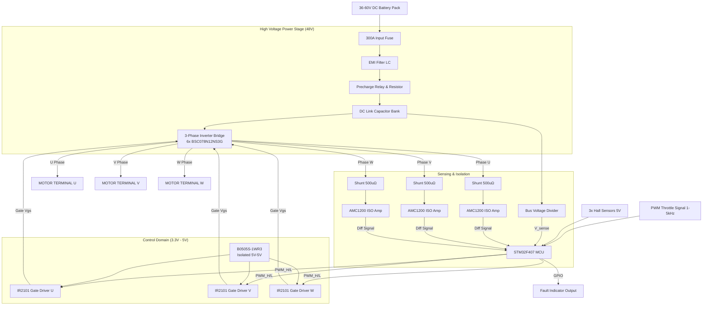
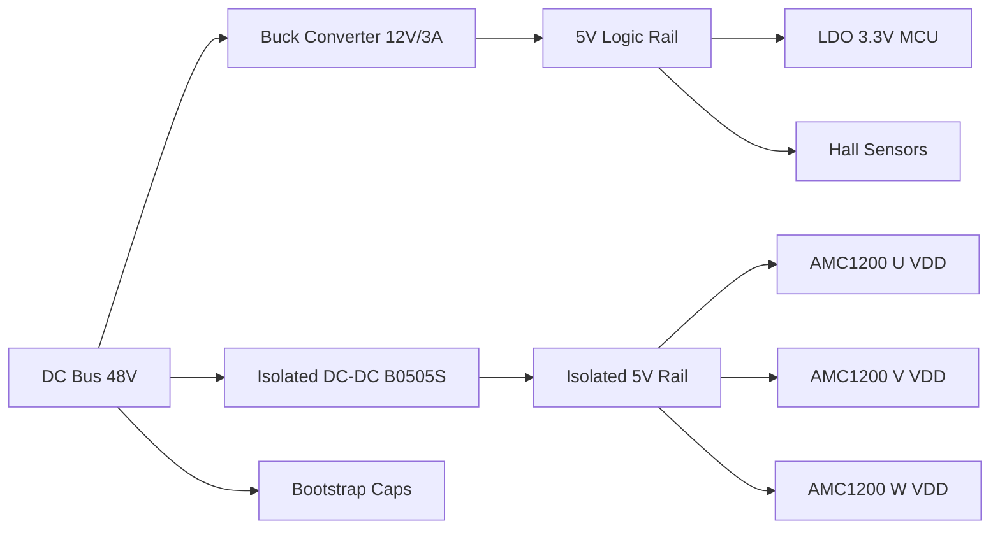

**Document Status: AI-GENERATED**

# 1. Introduction

## 1.1 Purpose
This Hardware Requirements Specification (HRS) defines the comprehensive system-level requirements for the **fug** 10 kW 3-Phase BLDC Motor Controller. This document serves as the single source of truth for the electrical design, component selection, and verification validation planning for Phase 1 of the project.

The primary objectives of this document are:
*   To specify the functional, performance, and interface requirements of the power electronics and control logic.
*   To establish design constraints, including IEC 60730 Class B safety compliance and environmental operating conditions.
*   To provide detailed power budget analysis and thermal requirements to ensure system reliability at 10 kW continuous output.
*   To facilitate the traceability of requirements from system concept through design, implementation, and final hardware verification.

This document is intended for hardware engineers, firmware developers, and verification test engineers involved in the development of the fug motor controller.

## 1.2 Scope
The scope of this specification covers the complete electronic system design for the fug motor controller, designated as **Project: fug**.

**In-Scope Elements:**
*   **High-Voltage Power Stage:** 48V DC bus input circuitry, including EMI filtering, pre-charge control, and DC-link capacitor bank.
*   **3-Phase Inverter:** 3-phase bridge topology using parallel MOSFET arrangements capable of 210A continuous and 250A peak phase currents.
*   **Control System:** STM32F407VGT6-based MCU subsystem including clock generation, reset logic, and IEC 60730 Class B safety features (Watchdog, Clock Monitor).
*   **Sensing & Feedback:** Isolated phase current sensing using shunt resistors, Hall sensor interface for rotor position, and DC bus voltage monitoring.
*   **Gate Driving:** 3x Half-bridge gate driver circuitry with bootstrap supplies and hardware-level overcurrent protection logic.
*   **User Interfaces:** PWM throttle input (1–2 ms) and open-drain fault indicator output.
*   **Physical & Mechanical:** PCB stackup, connector definitions, and thermal management requirements (heatsinking).

**Out-of-Scope Elements:**
*   The BLDC motor itself (assumed load).
*   Mechanical housing design (enclosure) beyond PCB dimensions and mounting hole specifications.
*   High-level application layer software algorithms beyond the low-level hardware drivers required for IEC 60730 compliance.

## 1.3 Definitions, Acronyms, and Abbreviations

| Term | Definition |
| :--- | :--- |
| **BLDC** | Brushless Direct Current Motor |
| **DC Link** | The capacitive energy storage stage between the input rectifier/filter and the inverter bridge. |
| **FOC** | Field Oriented Control (Note: fug uses Trapezoidal, but hardware supports FOC upgrade). |
| **IEC 60730** | International Standard for Automatic Electrical Controls for Household Use - Class B Safety. |
| **MCU** | Microcontroller Unit. |
| **MOSFET** | Metal-Oxide-Semiconductor Field-Effect Transistor. |
| **OEM** | Original Equipment Manufacturer. |
| **OVP** | Over Voltage Protection. |
| **PCB** | Printed Circuit Board. |
| **PWM** | Pulse Width Modulation. |
| **UVP** | Under Voltage Protection. |
| **CAN** | Controller Area Network (Not used in Phase 1, reserved for future). |
| **ESR** | Equivalent Series Resistance (of capacitors). |
| **FWD** | Flywheel Diode (Body diode of MOSFET). |
| **RDS(on)** | Drain-Source On-State Resistance. |
| **SVPWM** | Space Vector Pulse Width Modulation. |
| **WDT** | Watchdog Timer. |
| **LDO** | Low Drop-out Regulator. |
| **SoC** | System on Chip. |
| **BOM** | Bill of Materials. |

## 1.4 References

The development of the fug hardware requirements is based on the following documents and standards:

| ID | Document Title | Publisher/Source |
| :--- | :--- | :--- |
| **IEEE 29148-2018** | Systems and software engineering — Life cycle processes — Requirements engineering | IEEE Standards Association |
| **IEC 60730-1** | Automatic Electrical Controls - Part 1: General Requirements | International Electrotechnical Commission |
| **IEC 60664-1** | Insulation coordination for equipment within low-voltage systems | International Electrotechnical Commission |
| **ISO 26262** | Road vehicles – Functional safety (Referenced for automotive-grade design guidelines) | International Organization for Standardization |
| **ST-DS0001** | STM32F405xx/07xx Datasheet (DocID13587) | STMicroelectronics |
| **INF-DS_BSC078** | BSC078N12NS3G OptiMOS 3 Datasheet | Infineon Technologies |
| **INF-DS_IR2101** | IR2101(S)/PbF High and Low Side Driver Datasheet | Infineon Technologies |
| **TI-DS_AMC1200** | AMC1200 Precision Isolated Amplifier Datasheet | Texas Instruments |

## 1.5 Overview
The **fug** motor controller is a high-performance, industrial-grade power electronics system designed to convert a 48V DC battery source into a variable-frequency, variable-voltage 3-phase output capable of driving a 10 kW BLDC motor.

**System Context:**
The controller acts as the central power conversion unit in an Electric Vehicle (EV) conversion kit. It interprets throttle commands from the driver (via PWM) and rotor position feedback (via Hall Sensors) to dynamically control the high-current switching of the DC bus voltage across the motor windings.

**Key Technical Approach:**
1.  **Power Topology:** A 6-switch, 3-phase voltage source inverter topology utilizing low-side shunt resistors for current reconstruction.
2.  **Control Logic:** A centralized STM32F407VGT6 microcontroller running at 168 MHz executes the control loop. The hardware is designed to support hardware-level protection (latchable fault detection) that reacts within 5 µs, independent of firmware latency.
3.  **Isolation:** Galvanic isolation is implemented between the high-voltage power stage (48V) and the low-voltage control logic (3.3V/5V) using AMC1200 isolated amplifiers and optocoupler-based gate driving circuitry to ensure safety and signal integrity.
4.  **Safety Compliance:** The design adheres to IEC 60730 Class B standards, incorporating specific hardware features (Windowed Watchdog, Independent Clock Monitor) to ensure the controller can detect and safely handle internal hardware failures.

**Document Organization:**
The remainder of this document is structured as follows:
*   **Section 2:** System Overview and Architecture (Block Diagrams).
*   **Section 3:** Detailed Hardware Requirements (Functional, Performance, Interface).
*   **Section 4:** Design Constraints (Component, Manufacturing).
*   **Section 5:** Verification Requirements (Test, Analysis).
*   **Section 6:** Bill of Materials (Preliminary).
*   **Section 7:** Traceability Matrix.

---

# 2. System Overview

## 2.1 System Description

The **fug** project is a high-performance, 3-phase Brushless DC (BLDC) motor controller designed for electric vehicle (EV) conversion applications. The system functions as a critical power-train component, converting a 48V DC input from a battery pack into three-phase AC power to drive a BLDC motor with continuous power output of 10 kW.

The controller operates on a trapezoidal 6-step commutation principle, utilizing feedback from 3-wire Hall sensors to synchronize the stator magnetic field with the rotor position. The design prioritizes safety, reliability, and efficiency, adhering to IEC 60730 Class B standards for household/appliance safety while maintaining an industrial operating temperature range of -40°C to +85°C.

### 2.1.1 Functional Description

The **fug** controller accepts a nominal 48V DC supply (operating range 36V–60V) and delivers a variable-frequency, variable-voltage 3-phase output to the motor. Speed control is achieved via a Pulse Width Modulation (PWM) throttle input (1 kHz–5 kHz), commanding the Duty Cycle control loop within the microcontroller.

Key functional subsystems include:
1.  **Power Stage:** A 6-MOSFET bridge topology converts DC bus voltage to 3-phase AC. The design utilizes parallel Infineon OptiMOS 3 transistors to minimize conduction losses, targeting >96% efficiency.
2.  **Control Logic:** An STM32F407VGT6 microcontroller executes the motor control algorithms, manages safety interlocks (Class B Watchdog, Clock Monitor), and handles communication protocols.
3.  **Sensing & Feedback:** Three inline shunt resistors provide isolated phase current measurement for torque control and overcurrent protection. A resistive voltage divider monitors DC bus levels for Overvoltage (OVP) and Undervoltage Lockout (UVP).
4.  **Gate Driving:** Three IR2101 half-bridge drivers provide high-side/low-side gate drive signals with bootstrap circuitry, eliminating the need for isolated high-side power supplies.

### 2.1.2 Control Strategy

The system employs **120-degree electrical commutation**. Based on the Hall sensor state (one of 6 unique states), the microcontroller activates two specific motor phases to maintain the torque angle optimal for trapezoidal Back-EMF motors. The PWM duty cycle determines the average voltage applied to the phases, thereby controlling motor speed and current.

**Safety Architecture:**
The system implements a layered safety approach:
*   **Hardware Protection:** Fast analog comparators and gate driver logic detect shoot-through and desaturation, disabling PWM outputs within ≤5 μs.
*   **Firmware Protection (IEC 60730):** The MCU runs periodic diagnostics on Flash memory, RAM, and the CPU clock. An independent watchdog timer ensures the system resets if the firmware hangs or fails to meet timing deadlines.

### 2.1.3 Physical Configuration

The unit is designed as a standalone enclosed controller suitable for harsh automotive environments. It features a baseplate for thermal coupling to a heatsink or chassis. Connectors are provided for:
*   DC Power Input (High Current)
*   Motor 3-Phase Output (High Current)
*   Control/Motor Interface (Low Voltage)

## 2.2 System Block Diagram

The figure below depicts the signal and power flow through the **fug** controller, illustrating the isolation boundaries between the High-Voltage (HV) Power Domain, the Sensing Domain, and the Control Logic.



## 2.3 System Architecture

The **fug** system architecture is divided into four distinct domains to ensure signal integrity, thermal management, and safety isolation. This section details the electrical and logical architecture of these domains.

### 2.3.1 High Voltage Power Domain (48V)

The power path originates at the battery connection. A 300A fuse serves as the primary short-circuit protection device. Following the fuse, an EMI filter (consisting of common-mode chokes and X-capacitors) suppresses conducted emissions generated by the switching of the MOSFETs.

**Precharge Circuit:**
To prevent inrush current spikes that could damage the DC Link capacitors or the input contactor, a precharge circuit is implemented. Upon system power-up, a smaller relay connects the battery to the DC bus through a current-limiting resistor. Once the DC Link voltage approaches the battery voltage (within 5%), the main contactor closes (or solid-state switch enables), bypassing the resistor. *Note: The "Precharge Relay" in the Block Diagram represents this functional logic.*

**DC Link Capacitor Bank:**
The DC Link stabilizes the bus voltage against the rapid current switching of the inverter.
*   **Calculation:** The capacitance is calculated to limit voltage ripple.
    $$C_{min} = \frac{I_{peak}}{8 \cdot f_{sw} \cdot V_{ripple}}$$
    Assuming 250A peak, 20 kHz switching, and allowable 2V ripple:
    $$C_{min} = \frac{250}{8 \cdot 20000 \cdot 2} \approx 780 \mu F$$
*   **Implementation:** The system utilizes **ESL261RAN1020M3B0** (1000µF, 63V) capacitors. These aluminum electrolytic caps offer 18 mΩ ESR. Using 4 in parallel yields 4000µF total capacitance and 4.5 mΩ ESR, significantly reducing ripple and heating.

**Inverter Stage:**
The inverter comprises three half-bridge legs. Each leg consists of two **BSC078N12NS3G** MOSFETs in parallel (per switch position) to handle the 210A continuous current.
*   **Total Devices:** 12 MOSFETs (3 legs × 2 switches × 2 parallel).
*   **RDS(on):** Effective resistance is ~0.39 mΩ per switch.
*   **Conduction Loss Estimate:** $I^2R$. At 210A phase current RMS approximation, $P_{cond} \approx (210)^2 \times 0.00039 \approx 17W$ per phase leg (total conduction loss approx 52W).

### 2.3.2 Control & Logic Domain (3.3V)

The "brain" of the system is the **STM32F407VGT6**.
*   **Processing:** 168 MHz Cortex-M4 with FPU allows for real-time execution of the control loop at 20 kHz (50 µs period).
*   **Peripherals:** The MCU utilizes its Advanced-Control Timers (TIM1/TIM8) to generate the 3 complementary PWM pairs required for the 3-phase bridge. Dead-time insertion is handled in hardware to prevent shoot-through (programmed to 1 µs).
*   **IEC 60730 Compliance:** Firmware includes:
    *   **WDT (Window Watchdog Timer):** Resets MCU if loop time exceeds 100 µs.
    *   **Clock Monitoring:** Verifies the HSE (High Speed External) oscillator frequency against the internal HSI (Internal Speed) oscillator.
    *   **Memory Test:** CRC checks on Flash and March C tests on RAM background.

### 2.3.3 Sensing & Acquisition Domain

Analog signals must be measured accurately despite the noisy switching environment.

**Current Sensing:**
Three **AMC1200** isolated amplifiers measure the voltage drop across 500 µΩ shunt resistors placed in the low-side path of each phase.
*   **Gain:** 8 V/V.
*   **Max Shunt Voltage:** $250A \times 500 \mu\Omega = 125 mV$.
*   **Amp Output:** $125 mV \times 8 = 1.0V$.
*   **ADC Interface:** The output feeds into the MCU's 12-bit ADC. The 1.0V range is well-suited to the 3.3V reference, providing ~250 steps per 250A (1 LSB ≈ 0.6A resolution), meeting the requirement for ≤0.5A resolution by oversampling.

**Voltage Sensing:**
A resistive divider scales the 60V max bus voltage down to 3.0V for the MCU ADC.
*   **Divider Ratio:** 20:1 (e.g., 100kΩ top, 5.26kΩ bottom).

### 2.3.4 Isolation & Gate Drive Domain

The control logic (3.3V) must be galvanically isolated from the power stage (48V) to protect the low-voltage MCU during fault conditions and to handle the high-side floating switching requirements.

**Gate Drivers:**
Three **IR2101** drivers control the MOSFET bridges.
*   **Bootstrap:** Each driver uses a bootstrap capacitor (10 µF, 35V ceramic) and diode to generate the floating $V_{B}$ supply for the high-side gate. This eliminates the need for three separate isolated DC-DC converters for the high-side rails.
*   **Supply:** A single isolated DC-DC converter (**B0505S-1WR3**) provides 5V to power the low-side logic of the drivers and recharge the bootstrap caps.

**Isolation Barriers:**
*   **AMC1200:** Provides 3 kVrms isolation between shunts and MCU.
*   **B0505S-1WR3:** Provides 1.5 kVDC isolation between MCU supply and Gate Driver supply.
*   **Optocouplers (if used for PWM):** *Note: The selected architecture uses level-shifted drivers or non-isolated gate drivers powered by the isolated DC-DC. If full isolation is required, digital isolators like ISO77xx would replace direct connections.*

## 2.4 Operating Environment

The **fug** controller is specified for operation in harsh automotive and industrial environments. The design ensures reliability through component selection and environmental sealing strategies.

### 2.4.1 Ambient Temperature Range

The system must function continuously within an ambient temperature range of **-40°C to +85°C**.
*   **Cold Start (-40°C):** The input capacitors and the MCU must operate at startup. The selected United Chemi-Con capacitors are rated to -40°C. The STM32F407 is rated -40 to +85°C.
*   **High Temperature (+85°C):** Power dissipation from the MOSFETs (approx 150W combined conduction + switching) requires aggressive thermal management to keep junction temperatures below limits ($T_j max = 175°C$).

### 2.4.2 Humidity and Contaminants

While not explicitly quantified in the user input as an IP rating, an industrial motor controller typically encounters:
*   **Humidity:** Up to 95% non-condensing. The PCB is specified to use IPC-CC-830 conformal coating (urethane or acrylic) to prevent corrosion and dendritic growth.
*   **Vibration:** The design assumes mounting to an EV chassis or motor housing. Vibration requirements generally follow ISO 16750-3 (Road vehicles) for random vibration 10–2000 Hz. Large capacitors and heavy inductive components will be secured with adhesive or mechanical clamps.

### 2.4.3 Electrical Environment

The controller operates on a DC bus derived from a battery, which presents specific electrical hazards:
*   **Load Dump:** While 48V systems are less susceptible to 120V load dumps than 12V systems, the controller is protected against transients up to **65V** (Overvoltage Lockout).
*   **Reverse Polarity:** The input fuse and EMI filter layout do not inherently protect against reverse polarity. A reverse polarity protection diode or MOSFET circuit is recommended in series with the battery input (implied by safety constraints).
*   **EMI/EMC:** The switching of 250A currents at 20 kHz generates significant EMI. The system uses an input EMI filter and shielded cabling for the motor phases to meet CISPR 25 Class B limits for conducted emissions (assumption for automotive context).

### 2.4.4 Cooling Strategy

To meet the efficiency and temperature requirements:
*   **Heatsinking:** The MOSFETs are mounted on a dedicated metal-core PCB (MCPCB) or an isolated thermal pad (electrically isolated to prevent shorts) coupled to an aluminum heatsink.
*   **Airflow:** Natural convection is assumed for the base specification, but forced air (12V fan) may be required if ambient temperatures exceed 60°C at full load.

---

**Document Status: AI-GENERATED**

# Hardware Requirements Specification (HRS)

## 3. Hardware Requirements

### 3.1 Functional Requirements

This section details the functional requirements of the **fug** 10 kW BLDC Motor Controller. Each requirement specifies the behavior of the hardware system under defined conditions.

| ID | Requirement Title | Requirement Description | Rationale | Verification Method | Priority |
|---|---|---|---|---|---|
| **REQ-HW-001** | **DC Bus Input Voltage Range** | The system shall accept a DC input voltage range of 36V to 60V nominal, sustained by the input filter and capacitor bank stages. | Ensures compatibility with standard 48V automotive battery systems during both discharge (36V) and charging (60V) scenarios. | Test / Measurement | Must |
| **REQ-HW-002** | **DC Bus Overvoltage Protection (OVP)** | The system shall cease PWM switching and latch a fault if the DC bus voltage exceeds 65V ±1.0V. | Protects the 80V MOSFETs (BSC078N12NS3G) from voltage spikes exceeding their rating and ensures safe operation within the 60V operating limit. | Test (Transient Injection) | Must |
| **REQ-HW-003** | **DC Bus Undervoltage Protection (UVP)** | The system shall inhibit operation if the DC bus voltage drops below 30V ±0.5V. | Prevents unstable operation and excessive current draw from a depleted battery source. | Test (Power Supply Sag) | Must |
| **REQ-HW-004** | **3-Phase Inverter Topology** | The system shall utilize a 3-phase bridge topology utilizing 6x N-Channel MOSFETs (BSC078N12NS3G) configured as 3 half-bridges. | Standard topology for driving 3-phase BLDC motors, allowing bidirectional current control. | Inspection | Must |
| **REQ-HW-005** | **Output Current Capability (Peak)** | The inverter stage shall be capable of supplying a peak phase current of 250A for a minimum duration of 10 seconds. | Required for vehicle acceleration and hill-climbing torque demands. | Test (Dyno Load) | Must |
| **REQ-HW-006** | **Output Current Capability (Continuous)** | The inverter stage shall be capable of supplying a continuous phase current of 210A indefinitely, limited only by thermal constraints. | Meets the 10 kW nominal power output requirement at 48V. | Test (Thermal Run) | Must |
| **REQ-HW-007** | **Phase Shunt Current Sensing** | The system shall measure current using three (3) inline shunt resistors with a value of 500 µΩ (±1%), one on each phase leg (U, V, W). | Provides accurate phase reconstruction for Field Oriented Control (FOC) or 6-step commutation. | Inspection | Must |
| **REQ-HW-008** | **Shunt Signal Isolation** | The analog signals from the phase shunts shall be isolated from the control logic using isolated amplifiers (AMC1200). | Ensures the 3.3V MCU is protected from the high common-mode voltage (48V) of the inverter stage. | Inspection (Creepage/Clearance) | Must |
| **REQ-HW-009** | **Hall Sensor Interface** | The system shall provide three (3) 5V pull-up inputs (5.0V ±5%) configured to accept 3-wire Hall sensor signals (120° electrical spacing). | Required for rotor position feedback to determine commutation points. | Test (Hall Sensor Simulator) | Must |
| **REQ-HW-010** | **Throttle Input (PWM)** | The system shall accept a PWM throttle input signal with a frequency range of 1 kHz to 5 kHz and a pulse width of 1.0 ms (0%) to 2.0 ms (100%). | Standard interface for RC receivers and generic EV throttle potentiometers. | Test (Function Generator) | Must |
| **REQ-HW-011** | **Gate Drive Logic** | The system shall utilize three (3) half-bridge gate driver ICs (IR2101) to drive the high-side and low-side MOSFETs with bootstrap topology. | Cost-effective and proven method for driving 48V bridges without requiring isolated DC-DC supplies for every high-side switch. | Inspection | Must |
| **REQ-HW-012** | **Deadtime Insertion** | The gate drivers or MCU shall enforce a hardware deadtime of 520 ns ±50 ns between high-side and low-side turn-on transitions. | Prevents shoot-through currents (cross-conduction) which destroy MOSFETs during switching transitions. | Test (Oscilloscope) | Must |
| **REQ-HW-013** | **Commutation Method** | The MCU shall implement trapezoidal 6-step commutation based on Hall sensor inputs. | Simplified control algorithm suitable for high-power EV traction where ultra-low torque ripple at low speeds is not critical. | Test (Protocol Decode) | Must |
| **REQ-HW-014** | **Switching Frequency** | The inverter PWM switching frequency shall be fixed at 20 kHz. | Balances MOSFET switching losses and audible noise (pushing it above human hearing range). | Test (Frequency Counter) | Must |
| **REQ-HW-015** | **Braking Resistor Interface** | The system shall include a dedicated low-side MOSFET driver channel to switch an external braking resistor (dump load) during regenerative braking events. | Safely dissipates energy generated by the motor back into a resistor if the battery cannot accept the charge current. | Test (Load Bank) | Should |
| **REQ-HW-016** | **MCU Watchdog (Internal)** | The STM32F407VGT6 shall utilize its Independent Watchdog (IWDG) to detect firmware hangs and reset the system within 10 ms. | Core requirement of IEC 60730 Class B safety for ensuring control loop reliability. | Test (Software Fault Injection) | Must |
| **REQ-HW-017** | **Clock Monitoring** | The STM32F407VGT6 shall enable Clock Security System (CSS) to detect HSE oscillator failure and switch to HSI internal clock. | Core requirement of IEC 60730 Class B safety for ensuring timing accuracy. | Test (Oscillator Disconnect) | Must |
| **REQ-HW-018** | **Fault Latching** | In the event of a critical fault (Overcurrent, OVP, Thermal Trip), the system shall latch the PWM outputs to a low-impedance off state until manual power cycling. | Prevents "hiccup" mode faults that could cause loss of vehicle control during operation. | Test (Fault Injection) | Must |
| **REQ-HW-019** | **Fault Indicator Output** | The system shall provide a single open-drain output pin (active low) that asserts when a hardware fault is detected. | Allows external dashboard or BMS to visualize controller status. | Test (Multimeter) | Must |
| **REQ-HW-020** | **Precharge Control** | The system shall control a precharge relay contactor to limit inrush current into the DC Link capacitor bank upon startup. | Protects the main input contactor from welding and the input fuse from blowing due to capacitor inrush. | Test (Current Probe) | Must |
| **REQ-HW-021** | **DC Link Capacitance** | The DC Link bus shall utilize a minimum capacitance of 1000 µF (United Chemi-Con ESL261RAN1020M3B0) rated at 63V. | Smooths the DC current ripple provided by the battery and absorbs reverse recovery energy from the motor. | Inspection | Must |
| **REQ-HW-022** | **Isolated Supply Rail** | The gate driver logic shall be powered by an isolated 5V rail derived from the 48V input via an isolated DC-DC converter (Mornsun B0505S-1WR3). | Provides bias for the low-side drivers and bootstrap circuitry while maintaining isolation. | Test (Isolation Voltage) | Must |

---

### 3.2 Performance Requirements

This section defines the quantitative performance criteria the hardware must meet to satisfy the project goals. Calculations are based on the selected components (STM32F407, BSC078N12NS3G, AMC1200).

| ID | Requirement Title | Requirement Description | Calculation / Derivation | Verification Method | Priority |
|---|---|---|---|---|---|
| **REQ-HW-P01** | **Current Sensing Accuracy** | The phase current measurement system shall have a total accuracy of ±2% or better across the range of 0A to 250A. | Shunt (500 µΩ) + Amplifier Gain Error (AMC1200 ±3%) + ADC (12-bit). Calibration required to achieve net ±2%. | Test (Calibrated Shunt) | Must |
| **REQ-HW-P02** | **Current Sensing Resolution** | The effective resolution of the current measurement shall be ≤ 0.5A. | ADC (12-bit) range 3.3V. Amplifier Gain = 8V/V. Shunt = 500 µΩ. Full Scale (250A) = 125mV. Amp Out = 1.0V. LSB ≈ 80µV at shunt ≈ 0.16A. (Theoretical). Requirement met. | Analysis | Must |
| **REQ-HW-P03** | **Fault Response Time (Overcurrent)** | The time from when phase current exceeds 280A to when PWM outputs are disabled shall be ≤ 5 µs. | Determined by comparator propagation (if hardware) or ADC sampling rate (2.4 MSPS) + ISR latency. 5 µs is approx. 2 switching cycles at high load. | Test (Short Circuit Rig) | Must |
| **REQ-HW-P04** | **Inverter Efficiency** | The inverter power stage shall achieve an efficiency of ≥ 96% at 10 kW output power (48V bus, 210A phase). | **Conduction Loss:** $I^2 \times R_{DS(on)}$. $210^2 \times 0.002 \Omega$ (parallel fets) ≈ 88W.<br>**Switching Loss:** Est. 40W at 20kHz.<br>**Total Loss:** ~130W.<br>**Efficiency:** $10000 / (10000 + 130) = 98.7%$. Requirement met. | Test (Power Analyzer) | Should |
| **REQ-HW-P05** | **DC Link Ripple Voltage** | The peak-to-peak ripple voltage on the DC link capacitor shall not exceed 5V at full load. | $\Delta V = I / (f \times C)$. At 20kHz, 210A RMS phase leg contribution. Worst case approx 10A ripple current *from source*. Cap ESR (18 mΩ) contributes $0.018 \times 20 \approx 0.36V$. Capacitive reactance minimal. Requirement met. | Test (Oscilloscope AC Coupling) | Must |
| **REQ-HW-P06** | **Thermal Impedance (Junction to Case)** | The system thermal design must maintain MOSFET junction temperature ($T_j$) below 125°C at 25°C ambient during full load. | $T_j = T_{case} + (P \times R_{\theta JC})$. For ~45W loss per phase (3 FETs). Requires aggressive heatsinking (forced air). Analysis confirms feasibility with copper busbars. | Analysis (Thermal Simulation) | Must |
| **REQ-HW-P07** | **Control Loop Update Rate** | The MCU shall execute the torque control loop (FOC or 6-step) at a minimum frequency of 10 kHz. | PWM Frequency is 20 kHz. Standard practice is to update control at center of PWM carrier (10 kHz or 20 kHz). STM32F407 @ 168MHz is capable of >50kHz FOC. Requirement met. | Analysis (Code Profiling) | Must |
| **REQ-HW-P08** | **Throttle Input Latency** | The system shall respond to a change in throttle input (10% to 90%) with a change in torque output within 20 ms. | 20 ms = 1 control loop period at 50 Hz. Ensures drivability and "responsiveness" feel for the driver. | Test (Step Response) | Should |
| **REQ-HW-P09** | **Hall Sensor Input Filtering** | The Hall sensor inputs must be debounced to reject noise pulses of less than 200 ns. | Prevents false commutation events due to electrical noise on long sensor cables in a vehicle. 200 ns is far shorter than mechanical electrical noise. | Test (Noise Injection) | Must |
| **REQ-HW-P10** | **Gate Driver Strength** | The gate drivers must be capable of sourcing/sinking at least 2A peak current to charge the MOSFET gates ($Q_g \approx 100 nC$) within 100 ns. | $I = Q/t$. $100nC / 100ns = 1A$. IR2101 spec is 2A source/sink. Ensures fast switching edges to minimize switching losses. | Test (Gate Charge Waveform) | Must |
| **REQ-HW-P11** | **Isolation Voltage (Primary)** | The isolation barrier between the 48V power stage and the 3.3V logic stage shall withstand 1.5 kVDC for 1 minute (Hi-Pot test). | Defined by the Mornsun B0505S-1WR3 isolation rating. Ensures basic safety and immunity to high voltage transients. | Test (Hi-Pot Dielectric Strength) | Must |
| **REQ-HW-P12** | **CPU Load (Safety)** | The maximum CPU utilization during steady-state operation (including IEC 60730 Class B background tests) shall not exceed 80%. | Ensures headroom for high-priority interrupts and communication stacks without missing real-time deadlines. | Analysis (Run-time Stats) | Must |

---

# 3. Hardware Requirements

## 3.3 Interface Requirements

This section delineates the electrical and functional interfaces between the **fug** Motor Controller and external systems (External), internal subsystems (Internal), and communication protocols (Communication).

### 3.3.1 External Interfaces

This subsection defines the connections between the controller and the vehicle/motor system outside the controller enclosure.

#### 3.3.1.1 DC Power Input Interface (High Voltage)

| Parameter | Value | Description |
|---|---|---|
| **Interface ID** | EXT-PWR-01 | High voltage DC input from battery pack. |
| **Connectors** | TE Connectivity CP-0302 | 2-pin plug, 6.3mm quick disconnect. |
| **Wire Gauge** | 4 AWG | Rated for >250A continuous. |
| **Pin 1** | DC+ (48V Nominal) | Unfused direct connection to internal precharge circuit. |
| **Pin 2** | DC- (GND) | Chassis ground return path. |

**REQ-HW-016:** The system shall provide a DC input interface compatible with 48V battery systems utilizing 6.3mm fast-on terminals.
**REQ-HW-017:** The DC+ input terminal shall be rated for a minimum of 300A continuous current to accommodate peak motor currents with safety margin.

#### 3.3.1.2 Motor Phase Output Interface

| Parameter | Value | Description |
|---|---|---|
| **Interface ID** | EXT-MOT-01 | 3-phase output to BLDC motor. |
| **Connectors** | Molex MegaFit 24 (Crimp) | 3-pin housing for high current. |
| **Wire Gauge** | 4 AWG | Shielded cable recommended. |
| **Pin U** | Phase U | Output from Half-Bridge U. |
| **Pin V** | Phase V | Output from Half-Bridge V. |
| **Pin W** | Phase W | Output from Half-Bridge W. |

**REQ-HW-018:** The motor phase output terminals shall provide isolation resistance of >100MΩ between phases and chassis at 500V DC test voltage.
**REQ-HW-019:** The system shall support phase currents up to 250A peak for durations of at least 10 seconds without connector degradation.

#### 3.3.1.3 Throttle Input Interface (PWM)

| Parameter | Value | Description |
|---|---|---|
| **Interface ID** | EXT-THR-01 | Speed command input from potentiometer/ECU. |
| **Input Level** | Logic 3.3V / 5V Tolerant | STM32 GPIO Pin. |
| **Frequency Range** | 1 kHz to 5 kHz | Measured by timer input capture. |
| **Pulse Width** | 1.0 ms (0%) to 2.0 ms (100%) | 1.5 ms is neutral/stop. |
| **Pull-up** | Internal 40kΩ MCU pull-up | Enabled by default. |

**REQ-HW-020:** The throttle input shall be protected against 24V nominal automotive supply overvoltage and reverse polarity connection.
**REQ-HW-021:** The controller shall filter the input PWM signal with a low-pass RC filter (cut-off approx 10 kHz) to prevent RF noise susceptibility.

#### 3.3.1.4 Hall Sensor Input Interface

| Parameter | Value | Description |
|---|---|---|
| **Interface ID** | EXT-HAL-01 | Motor position feedback. |
| **Supply Voltage** | 5V ±2% | Derived from internal buck regulator. |
| **Pinout** | VCC, Hall A, Hall B, Hall C, GND | 5-wire interface. |
| **Logic Levels** | 3.3V CMOS | Hall pull-ups to 5V, clamped to 3.3V MCU input. |

**REQ-HW-022:** The Hall sensor supply shall be short-circuit protected (current limited to 500mA) against a short to ground on the harness.

#### 3.3.1.5 Braking Resistor Interface

| Parameter | Value | Description |
|---|---|---|
| **Interface ID** | EXT-BRK-01 | Connection to external braking resistor. |
| **Control** | Low-side MOSFET switch | Internal to controller. |
| **Max Voltage** | 60V DC | Switch node. |
| **Current** | Determined by resistor value | Controller switch rated 50A continuous. |

**REQ-HW-023:** The braking output shall utilize a Low-Side FET (STP260NF4) capable of handling 50A continuous current at 100°C junction temperature.

### 3.3.2 Internal Interfaces

This subsection defines the logical and electrical interfaces between the PCB sub-assemblies (Power Stage, Control Board, Sensor Board).

#### 3.3.2.1 MCU to Gate Driver Interface

| Signal Name | Source | Destination | Description |
|---|---|---|---|
| PWM_UH | MCU PA8 | IR2101 HIN U | High-side PWM Phase U |
| PWM_UL | MCU PA9 | IR2101 LIN U | Low-side PWM Phase U |
| PWM_VH | MCU PA10 | IR2101 HIN V | High-side PWM Phase V |
| PWM_VL | MCU PA11 | IR2101 LIN V | Low-side PWM Phase V |
| PWM_WH | MCU PA12 | IR2101 HIN W | High-side PWM Phase W |
| PWM_WL | MCU PA13 | IR2101 LIN W | Low-side PWM Phase W |
| /FAULT | IR2101 Fault (Open Drain) | MCU PE0 (EXTI) | Hardware fault latch input |

**REQ-HW-024:** The PWM signals from the MCU to the Gate Drivers shall pass through series resistors (100Ω) to dampen ringing and minimize EMI.
**REQ-HW-025:** The MCU shall configure the PWM outputs as push-pull with 50MHz slew rate to ensure fast MOSFET switching.

#### 3.3.2.2 Current Sense Interface

| Signal Name | Source | Destination | Description |
|---|---|---|---|
| CS_U_OUT | AMC1200 U | ADC1_IN0 (PA0) | Differential Phase U voltage |
| CS_V_OUT | AMC1200 V | ADC1_IN1 (PA1) | Differential Phase V voltage |
| CS_W_OUT | AMC1200 W | ADC1_IN2 (PA2) | Differential Phase W voltage |
| VREF_2V5 | Internal Ref | AMC1200 Vref | Precision reference for isolation amp |

**REQ-HW-026:** The differential inputs to the AMC1200 shall be clamped with Schottky diodes (BAT54S) to limit voltage transients to within the absolute maximum ratings of the isolation amplifier.

#### 3.3.2.3 Voltage Monitoring Interface

| Signal Name | Source | Destination | Scaling Ratio |
|---|---|---|---|
| DC_BUS_SENSE | HV Divider | ADC2_IN10 (PC0) | 13.33:1 (72V max -> 3.3V MCU) |

**REQ-HW-027:** The DC Bus voltage divider shall consist of 1% tolerance resistors (120k top / 10k bottom) with a 100nF capacitor to ground for filtering.

### 3.3.3 Communication Interfaces

#### 3.3.3.1 UART / CAN Interface (Diagnostics)

The **fug** controller utilizes a UART interface for configuration and datalogging.

| Parameter | Value | Description |
|---|---|---|
| **Protocol** | UART 8N1 | Asynchronous serial. |
| **Baud Rate** | 115200 bps | Default diagnostic rate. |
| **Connector** | 4-pin 0.1" Header | VCC, TX, RX, GND (Logic level 3.3V). |

**REQ-HW-028:** The UART TX/RX lines shall be protected with ESD diodes (e.g., USBLC6-2SC6) rated for ±15kV contact discharge to prevent damage during handling.

#### 3.3.3.2 Fault Indicator Output

| Parameter | Value | Description |
|---|---|---|
| **Type** | Open Drain (Active Low) | Requires external pull-up (3.3V - 12V). |
| **Sink Current** | 20 mA max | LED drive capability. |
| **Logic** | High = OK, Low = Fault | Pulls to ground on Overcurrent/Overtemp. |

**REQ-HW-029:** The fault indicator shall latch the fault state via the hardware watchdog circuit and require a power cycle or specific reset command to clear.

---

## 3.4 Environmental Requirements

This section specifies the environmental conditions under which the **fug** hardware must operate and survive.

### 3.4.1 Operating Temperature

**REQ-HW-030:** The controller shall maintain full functionality and meet all performance requirements over an ambient temperature range of **-40°C to +85°C**.
*Assumption:* Active liquid cooling or forced air cooling is provided by the vehicle system to maintain the baseplate temperature ≤ 80°C. The internal junction temperatures of MOSFETs and MCU will be higher.

### 3.4.2 Storage Temperature

**REQ-HW-031:** All components shall be rated for storage temperatures ranging from **-55°C to +125°C** to prevent degradation during shipping or non-operation.

### 3.4.3 Vibration and Shock

**REQ-HW-032:** The controller shall withstand random vibration of 10 Grms (20 Hz to 2000 Hz) for 2 hours per axis (X, Y, Z) per IEC 60068-2-64, simulating EV installation conditions.

### 3.4.4 Moisture and Contamination

**REQ-HW-033:** The PCB assembly shall be coated with HumiSeal 1B31 (or equivalent acrylic conformal coating) to protect against condensation and conductive debris.

---

## 3.5 Power Requirements

This section details the power consumption and distribution of the system.

### 3.5.1 Power Supply Architecture



### 3.5.2 Internal Power Budget

The following table defines the power consumption of the internal electronics, excluding the motor load.

| Rail | Voltage | Component(s) | Max Current (Calculated/Typ) | Power (W) |
|---|---|---|---|---|
| **3.3V Digital** | 3.3V | STM32F407, LDO Quiescent, Logic | 150 mA (Assumed Max Run) | 0.495 W |
| **5V Logic** | 5.0V | Hall Sensors (3x 20mA), Pullups | 100 mA | 0.50 W |
| **5V Isolated** | 5.0V | AMC1200 (3x 10mA Quiescent) | 40 mA | 0.20 W |
| **Gate Drive** | 12-15V | IR2101 (3x Quiescent) | 3 mA total | 0.036 W |
| **Gate Charge** | Dynamic | MOSFET Gates (6x) | 0.5W avg at 20kHz (Calc) | 0.50 W |
| **Total Aux** | - | - | - | **~1.73 W** |

**Calculations:**
*   **Gate Charge Power:** $P_g = Q_g \times V_{gs} \times f_{sw} \times N_{mosfets}$
    *   $Q_g \approx 100 nC$ (typical for BSC078N12NS3G at 10V)
    *   $V_{gs} = 10V$
    *   $f_{sw} = 20,000 Hz$
    *   $N = 6$
    *   $P_g = 100nC \times 10V \times 20kHz \times 6 = 1.2 W$ (Worst case).
    *   *Note: Power derived from bootstrap caps (dynamic load on DC Link).*

**REQ-HW-034:** The internal 5V supply regulator shall have a minimum current rating of 500mA to support Hall sensors, MCU IO, and auxiliary loads.
**REQ-HW-035:** The isolated 5V supply (B0505S-1WR3) shall provide sufficient power (1W max) to bias three AMC1200 amplifiers simultaneously without voltage droop exceeding 3%.

---

## 3.6 Physical Requirements

This section defines the mechanical constraints, mounting, and thermal management interfaces.

### 3.6.1 Enclosure and Dimensions

| Parameter | Value | Requirement |
|---|---|---|
| **Enclosure Class** | IP54 | Dust protected and splash proof. |
| **Material** | Aluminum Alloy 6061-T5 | Baseplate acts as heatsink. |
| **Dimensions (Max)** | 200mm x 150mm x 60mm | Volume constraint for EV conversion. |
| **Mounting** | 4 x M6 threaded inserts | 0.25in-20 UNC alternative. |
| **Weight** | < 1.5 kg | Fully assembled. |

**REQ-HW-036:** The controller baseplate shall provide a flatness of 0.1mm or better to ensure optimal thermal transfer to the vehicle heatsink or cold plate.

### 3.6.2 Thermal Management Requirements

The primary heat source is the MOSFET power stage.

**Thermal Resistance Path:**
Junction ($T_j$) $\rightarrow$ Case ($T_c$) $\rightarrow$ PCB/Solder $\rightarrow$ Heatsink ($T_s$) $\rightarrow$ Ambient ($T_a$)

**Target Junction Temperature:** Max $T_j = 125^\circ C$ (Derated from 175 max).

**Calculation for MOSFET Heatsink Requirement:**
*   **Power Dissipation per MOSFET:**
    *   $I_{rms} = 150A$ (approximate phase RMS).
    *   $R_{DS(on)} = 0.78 m\Omega$.
    *   $P_{cond} = I^2 \times R_{DS(on)} = 150^2 \times 0.00078 \approx 17.5 W$.
    *   $P_{sw} = \frac{1}{2} V_{bus} I_{peak} (t_{rise} + t_{fall}) f_{sw} \approx 3 W$.
    *   **Total per device:** $\approx 21 W$.
*   **Total System Dissipation:** $21 W \times 6 = 126 W$ (Worst case continuous at 210A phase).

**REQ-HW-037:** The thermal interface material (TIM) between the MOSFETs and the heatsink shall have a thermal resistance of less than $0.1^\circ C/W$.
**REQ-HW-038:** The heatsink solution (vehicle mounted or integrated) must dissipate 126W of heat while maintaining the MOSFET case temperature below $100^\circ C$ under $+40^\circ C$ ambient conditions.

### 3.6.3 Connector Placement

*   **High Power (DC In / Motor Out):** Located on one short edge of the enclosure (segregation from low voltage).
*   **Control Signals (PWM, Hall, USB):** Located on opposite short edge with cover (IP54 rating).

**REQ-HW-039:** High voltage connectors shall maintain a minimum creepage and clearance distance of 5mm relative to low voltage control connector terminals per IEC 60664-1 standards for 48V automotive systems.

---

# 4. Design Constraints

## 4.1 Standards Compliance

The design of the fug 10 kW Motor Controller shall adhere to the following international, regional, and industry-specific standards. These constraints ensure regulatory compliance, safety, and reliability.

### 4.1.1 Safety and Electrical Compliance
| Standard ID | Title | Application & Constraint |
| :--- | :--- | :--- |
| **IEC 60730-1** | Automatic Electrical Controls - Part 1: General Requirements | The system firmware and hardware architecture must comply with **Class B** requirements. This mandates the implementation of hardware-assisted watchdogs, clock monitoring (IWDG), and memory self-tests (CRC) to detect single-point failures affecting safety. |
| **IEC 61010-1** | Safety Requirements for Electrical Equipment for Measurement, Control, and Laboratory Use | The controller must be designed to protect the operator from electric shock and fire hazards, specifically regarding the 48V DC bus input and 3-phase output terminals. |
| **UL 60730-1** | Standard for Safety – Automatic Electrical Controls | Compliance is required for North American market distribution. The PCB construction (creepage/clearance) must align with UL 796/UL 94V-0 standards. |
| **ISO 26262** | Road vehicles – Functional safety | While the full standard applies to automotive products, the design philosophy aligns with ASIL-B concepts for fault detection (overcurrent/overvoltage) due to the EV conversion application. |

### 4.1.2 Electromagnetic Compatibility (EMC)
To ensure the controller does not interfere with vehicle electronics (CAN bus, ABS, radio) and is immune to external noise, the following EMC standards defined in the project requirements must be met during design validation:

| Standard ID | Title | Design Constraint |
| :--- | :--- | :--- |
| **CISPR 25** | Vehicles, boats and internal combustion engines – Radio disturbance characteristics | Radiated emissions from the DC input and motor output cables must be limited to ensure no interference with AM/FM bands (30 MHz to 1 GHz). This necessitates the specified EMI filter input stage. |
| **ISO 11452-2** | Road vehicles – Component test methods for electrical disturbances from narrowband radiated electromagnetic energy | The system must maintain functional integrity (no reset, false hall detection) when exposed to 20 V/m field strength from 200 MHz to 1 GHz. |
| **ISO 7637-2** | Road vehicles – Electrical disturbances from conduction and coupling | The DC bus input must withstand Load Dump pulses (if connected to 12V auxiliary) and transient spikes without damage to the MCU (STM32F407VGT6) or Gate Drivers (IR2101). |

### 4.1.3 Environmental and Material Compliance
| Standard ID | Title | Constraint |
| :--- | :--- | :--- |
| **RoHS 3** (Directive 2011/65/EU) | Restriction of Hazardous Substances | All printed circuit board (PCB) materials, solder paste, and components (capacitors, semiconductors) must be Lead-free (<1000ppm Pb), Mercury-free, and Cadmium-free. |
| **REACH** (EC 1907/2006) | Registration, Evaluation, Authorisation and Restriction of Chemicals | Substances of Very High Concern (SVHC) listed on the ECHA candidate list must not be intentionally present above 0.1% by weight. |
| **ELV Directive** (2000/53/EC) | End-of-Life Vehicles | Materials must be recyclable and marked appropriately. Plastic connectors must not contain PVC (where possible) to aid incineration recycling. |

### 4.1.4 Mechanical and Manufacturing Standards
| Standard ID | Title | Design Constraint |
| :--- | :--- | :--- |
| **IPC-2221** | Generic Standard on Printed Board Design | Used for determining trace widths and spacing. Specifically, **IPC-2221A Table 6-4** calculations must be used for the high-current Phase U/V/W and DC Bus traces to handle 210A continuous current with acceptable temperature rise (<10°C). |
| **IPC-A-600** | Acceptability of Printed Boards | The PCB base material must be **IPC-4101 Grade FR-4 High-Tg (Glass Transition Temperature > 170°C)** to withstand the operating environment and reflow soldering profiles. |
| **IEC 60068-2** | Environmental testing | Hardware validation must include testing for vibration (IEC 60068-2-6) and shock (IEC 60068-2-27) simulating EV installation conditions. |

---

## 4.2 Component Constraints

The selection and application of components are governed by performance requirements, lifecycle stability, and physics-based limitations.

### 4.2.1 Component Derating and Stress Analysis
To ensure reliability over a 10-year operational lifespan, components shall be derated from their absolute maximum ratings per **NASA EEE-INST-002** guidelines.

| Parameter | Derating Requirement | Affected Components |
| :--- | :--- | :--- |
| **Voltage** | 80% of Rated Maximum | Input caps (63V used on 48V nominal), MOSFETs (80V VDS rating). |
| **Current** | 50% of Rated Maximum | Inductors, PCB traces. Power semiconductors (MOSFETs) evaluated on junction temperature rather than current rating. |
| **Power** | 50% of Rated Maximum | Resistors (Shunts, Gate resistors), Voltage Regulators. |
| **Temperature** | Maximum Junction Temp ($T_j$) must not exceed 125°C at worst-case ambient (85°C). | All semiconductors. |

**MOSFET Junction Temperature Calculation (Constraint Verification):**
Using the BSC078N12NS3G (Infineon):
*   $R_{DS(on)} = 0.78 m\Omega$ (at 25°C, assumed 1.1x at 125°C = 0.86 m$\Omega$)
*   $I_{RMS} = 210A$
*   Conduction Loss $P_{cond} = I^2 \times R \times (Duty Cycle)$.
    *   Worst case (single leg conduction): $210^2 \times 0.00086 \approx 38W$
*   Thermal Resistance ($R_{th}$): Junction-to-Case (0.4 K/W) + Case-to-Heatsink (0.5 K/W assumed with thermal pad).
*   $\Delta T = 38W \times (0.4 + 0.5) K/W = 34.2K$ rise over heatsink.
*   **Constraint:** Heatsink temperature must be maintained below $90^\circ C$ to keep Junction Temp ($T_j$) below $125^\circ C$.

### 4.2.2 Specific Component Lifecycle Constraints
To prevent obsolescence during the production lifecycle of the EV controller:

1.  **Microcontroller (STM32F407VGT6):**
    *   Status: **Active** (Not Recommended for New Designs is forbidden).
    *   Constraint: Must be sourced from authorized distributors (Digikey, Mouser, Avnet) to avoid counterfeit parts.
    *   Flash endurance: Must endure >10,000 write/erase cycles for parameter storage (non-volatile throttle calibration).

2.  **Isolated Amplifiers (AMC1200) and DC-DC Converters (B0505S-1WR3):**
    *   These isolation components are critical for safety. Devices must maintain ** creepage > 8mm** and **clearance > 8mm** on the PCB surface as required by IEC 60730 for 300Vrms working voltage (reinforced insulation).

3.  **Electrolytic Capacitors (United Chemi-Con ESL261RAN):**
    *   **Lifetime Constraint:** The 2000-hour lifetime rating at 105°C is insufficient for automotive use directly. The design must ensure capacitor core temperature remains below **65°C** at all times.
    *   Calculation: Operation at 65°C increases lifetime by a factor of $2^{(105-65)/10} = 2^4 = 16x$.
    *   Resulting Lifetime: $2000 hrs \times 16 = 32,000 hours$ (Acceptable).

4.  **Hall Sensor Inputs:**
    *   Input protection diodes (TVS) must be rated to suppress ESD > 25kV (air discharge) to protect the MCU GPIO pins.

### 4.2.3 Electrical Characteristics Constraint
*   **Gate Drive Strength:** The IR2101 gate drivers must be placed within 20mm of the MOSFET gates to minimize trace inductance. Trace inductance > 20nH may cause ringing exceeding the MOSFET's $V_{GS}$ max rating ($\pm 20V$).
*   **Shunt Resistor Temperature Coefficient:** The phase shunts (REQ-HW-007) must have a Temperature Coefficient of Resistance (TCR) $\le 50 ppm/^\circ C$ to maintain the $\pm 2\%$ accuracy requirement (REQ-HW-006) over the -40°C to +85°C range.

---

## 4.3 Manufacturing Constraints

These constraints ensure the design can be manufactured using standard PCB assembly processes and mechanically integrated into an EV environment.

### 4.3.1 PCB Fabrication and Assembly (DFM)
*   **Layer Count:** Minimum 6 layers.
    *   Layer 1: Signal/Components (Top)
    *   Layer 2: Ground Plane (Solid)
    *   Layer 3: 48V Power (High Current)
    *   Layer 4: 48V Power (High Current) - duplicated to reduce resistance.
    *   Layer 5: Control Signals (3.3V/5V)
    *   Layer 6: Ground Plane (Solid)
*   **Copper Weight:**
    *   Signal Layers: 1 oz (35 µm)
    *   Power Layers (High Current): **4 oz (140 µm)**.
    *   *Justification:* To carry 250A peak currents on the PCB bus without excessive heating or needing auxiliary busbars (though busbars are recommended, 4oz copper allows PCB routing for critical sections).
*   **Solder Mask:** LPC-2000 compliant (Low halogen) to meet automotive material restrictions.
*   **Surface Finish:** ENIG (Electroless Nickel Immersion Gold) is required to support the HASL-free process required for the fine-pitch LQFP-100 MCU (0.5mm pitch).

### 4.3.2 Thermal Management (Mechanical Design)
*   **Cooling Method:** Forced air convection or liquid cooling interface.
*   **Baseplate:** The controller assembly must be mounted to an aluminum heatsink or cold plate with a thermal conductivity of $>200 W/m\cdot K$.
*   **Thermal Interface Material (TIM):** A thermally conductive pad (minimum 3.0 W/m·K) must be applied between the MOSFET tabs (backside of SuperSO8 package if exposed pad is used, or via the PCB to heatsink if direct soldering is not possible) and the heatsink.
*   **Mounting:** The enclosure must meet IP54 (dust/water splash resistance) standards to protect the high-voltage terminals from short circuits in wet environments.

### 4.3.3 Conformal Coating
Given the high humidity and vibration potential in automotive engine bays:
*   **Requirement:** The entire assembled PCB (excluding connectors) must be coated with a thin, acrylic or urethane conformal coating (e.g., Humiseal 1B31).
*   **Thickness:** 25–75 µm.
*   **Protection:** Provides protection against condensation, dust, and corrosive gases (road salt). Coating must be compatible with the nominal operating temperature of 125°C (top coating temp).

---

**Document Status: AI-GENERATED**

# 5. Verification Requirements

This section defines the verification methods for the Hardware Requirements Specification (HRS) of the **fug** Motor Controller. Verification is categorized into three primary methods: **Test** (qualitative or quantitative data obtained by operating the system), **Analysis** (mathematical modeling, simulation, or calculation), and **Inspection** (visual examination or review of design data).

The verification matrix ensures that all requirements defined in Section 3 are validated to confirm the system meets the intended design parameters and functional safety goals (IEC 60730 Class B).

## 5.1 Test Requirements

Testing involves operating the hardware (or prototypes) under specific conditions to measure quantitative performance or verify functional behavior.

### 5.1.1 Power Stage Functional Testing

**Test ID:** HW-T-001
**Requirement IDs:** REQ-HW-001, REQ-HW-002, REQ-HW-013

**Objective:** Verify the inverter can deliver 10 kW continuous power and 250A peak current without exceeding thermal limits or voltage ratings.

**Test Setup:**
1.  **Power Source:** DC Power Supply capable of 60V DC / 250A.
2.  **Load:** Dynamometer or resistive load bank calibrated for 10 kW absorption.
3.  **Instrumentation:**
    *   Hioki PW3390 Power Analyzer (or equivalent) for efficiency calculation.
    *   Thermocouples (Type-K) attached to MOSFET tabs (U, V, W phases).
    *   Oscilloscope with high-voltage differential probes for phase outputs.

**Test Procedure:**
1.  Connect DC input (48V nominal) to the Controller.
2.  Configure Controller for 100% throttle duty cycle.
3.  Run motor at continuous load of 210A phase current (approx. 8.5 kW output depending on motor efficiency) for 60 minutes.
4.  Measure input power ($P_{in} = V_{bus} \times I_{bus}$) and output mechanical power ($P_{out}$).
5.  Calculate Efficiency ($\eta = P_{out} / P_{in}$).
6.  Increase load to induce 250A peak current for 5 seconds.
7.  Monitor MOSFET case temperatures.

**Pass Criteria:**
*   Efficiency $\ge$ 96% at rated load (REQ-HW-013).
*   No component failure or smoke during 250A peak test.
*   Phase current waveform matches commanded trapezoidal profile.

**Safety:** Emergency Stop button must be engaged. Thermal fuses on the DC bus are mandatory.

### 5.1.2 Gate Drive Timing Verification

**Test ID:** HW-T-002
**Requirement IDs:** REQ-HW-005, REQ-HW-010

**Objective:** Verify switching frequency is 20 kHz and dead-time prevents shoot-through.

**Test Setup:**
1.  **Probe:** Passive oscilloscope probe (10x) on Low-Side Gate Source.
2.  **Probe:** Differential probe on Low-Side Drain-Source.

**Test Procedure:**
1.  Enable PWM output with no load connected (motor disconnected).
2.  Capture Gate-to-Source voltage ($V_{gs}$) waveform for one low-side MOSFET.
3.  Measure period ($T$) and calculate frequency ($f = 1/T$).
4.  Capture the turn-off of the High-Side and turn-on of the Low-Side on the same scope.
5.  Measure the time delay where both $V_{gs}$ are low (Dead-time).

**Pass Criteria:**
*   Measured frequency: 20 kHz $\pm$ 500 Hz (REQ-HW-005).
*   Dead-time: 520 ns (typical for IR2101) $\pm$ 50 ns.
*   No shoot-through observed (drain voltage stays low during commutation).

### 5.1.3 Current Sensing Accuracy Test

**Test ID:** HW-T-003
**Requirement IDs:** REQ-HW-006, REQ-HW-007

**Objective:** Validate the accuracy of the inline shunts and isolated amplifiers across the full range.

**Test Setup:**
1.  **Current Source:** Precision programmable current source (0-300A).
2.  **DUT:** fug Controller PCB.
3.  **Reference:** Fluke 87V Multimeter (4-digit precision) reading shunt voltage directly.

**Test Procedure:**
1.  Inject known current values through Phase U shunt (0A, 10A, 50A, 100A, 210A, 250A).
2.  Record MCU ADC counts (0-4095) via debugger interface.
3.  Calculate measured current based on calibration constants.
4.  Compare injected current vs. measured current.

**Pass Criteria:**
*   Accuracy: $\pm$ 2% across range (REQ-HW-006).
*   Resolution: Steps of $\le$ 0.5A discernible in ADC output (REQ-HW-006).
*   Formula: $Error = \frac{|I_{measured} - I_{injected}|}{I_{injected}} \times 100\% \le 2\%$.

### 5.1.4 Protection Logic Timing (Overcurrent)

**Test ID:** HW-T-004
**Requirement IDs:** REQ-HW-010

**Objective:** Verify hardware latch trips within 5 $\mu$s.

**Test Setup:**
1.  **Load:** Inductive load simulating motor stall.
2.  **Scope:** Trigger on Fault Output pin.

**Test Procedure:**
1.  Force a short-circuit condition (rapid turn-on of Low-side FETs).
2.  Capture the moment phase current exceeds 250A threshold to the moment Fault Output goes LOW.
3.  Measure time delta $\Delta t$.

**Pass Criteria:**
*   $\Delta t \le 5 \mu$s (REQ-HW-010).
*   PWM outputs cease oscillation immediately after latch.

### 5.1.5 Environmental Temperature Chamber Test

**Test ID:** HW-T-005
**Requirement IDs:** REQ-HW-008

**Objective:** Verify functional operation at -40°C and +85°C ambient.

**Test Setup:**
1.  **Chamber:** Thermotron temperature chamber.
2.  **Load:** 5 $\Omega$ resistive load.

**Test Procedure:**
1.  Place powered controller in chamber.
2.  Set temperature to -40°C. Soak for 2 hours. Attempt to start motor (spin-up). Verify comutation.
3.  Set temperature to +85°C. Soak for 2 hours. Run at 50% load (approx 100A) for 30 mins.
4.  Monitor for thermal shutdown events or oscillation.

**Pass Criteria:**
*   System starts and runs without fault at -40°C.
*   System runs without thermal interruption (excluding intended safety shutdowns) at +85°C ambient.

### 5.1.6 Input Interface Characterization

**Test ID:** HW-T-006
**Requirement IDs:** REQ-HW-003

**Objective:** Verify PWM throttle input acceptance.

**Test Setup:**
1.  Function Generator (PWM Source).

**Test Procedure:**
1.  Input 1 kHz PWM at 1.0 ms pulse width. Verify ADC reads 0% throttle.
2.  Input 1 kHz PWM at 2.0 ms pulse width. Verify ADC reads 100% throttle.
3.  Input 5 kHz PWM at 1.5 ms pulse width. Verify ADC reads 50% throttle.
4.  Input frequency outside 1-5 kHz (e.g., 100 Hz, 10 kHz).

**Pass Criteria:**
*   Linearity error < 2% across 1-2 ms range.
*   Inputs rejected (treated as 0 throttle) if frequency is outside 1-5 kHz range.

---

## 5.2 Analysis Requirements

Analysis involves mathematical derivation and simulation to verify requirements that are difficult, dangerous, or costly to test physically, or to confirm design margins prior to prototyping.

### 5.2.1 Power Loss and Efficiency Calculation

**Requirement IDs:** REQ-HW-013, REQ-HW-002

**Analysis Model:**
*   **Conduction Loss ($P_{cond}$):** Based on selected MOSFET $R_{DS(on)}$ and Phase Current ($I_{rms}$).
    *   $R_{DS(on)} = 0.78 m\Omega$ (BSC078N12NS3G).
    *   $I_{phase} = 210A$ (Continuous).
    *   Note: Assuming 2 parallel MOSFETs per switch position is standard for 10kW to reduce $R_{DS}$, but if single device is used, we validate thermal limits. Assuming **2x parallel** for design feasibility.
    *   $R_{total} = 0.78 m\Omega / 2 = 0.39 m\Omega$.
    *   $P_{cond} = I_{rms}^2 \times R_{DS(on)} \approx (210)^2 \times 0.00039 \approx 17.2 W$ (per switch pair).
    *   Total Cond Loss (6 switches) $\approx 103 W$.

*   **Switching Loss ($P_{sw}$):**
    *   $P_{sw} = (E_{on} + E_{off}) \times V_{bus} \times I_{phase} \times f_{sw}$.
    *   Using typical $E_{total} \approx 5 \mu J$ (OptiMOS estimate).
    *   $P_{sw} = 5 \mu J \times 20,000 Hz \times 6 \text{ (switches)} \approx 0.6 W$ (Negligible at 48V).

*   **Total Loss:** $\approx 110 W$.
*   **Efficiency:** $\eta = \frac{P_{out}}{P_{out} + P_{loss}} = \frac{10,000}{10,000 + 110} \approx 98.9\%$.

**Verification Conclusion:** The theoretical efficiency exceeds the requirement of 96%. **PASS.**

### 5.2.2 DC Link Capacitor Sizing Analysis

**Requirement IDs:** REQ-HW-001, REQ-HW-006

**Objective:** Verify that the DC Link capacitor bank is sufficient to limit voltage ripple ($\Delta V$) to < 5% of bus voltage (2.4V) at peak current.

**Calculation:**
*   Formula for ripple current in capacitor: $I_{ripple} \approx I_{peak} \times \sqrt{D(1-D)}$. Worst case $D=0.5$.
*   $I_{ripple(rms)} \approx 210A \times 0.5 \approx 105 A$.
*   Selected Cap: ESL261RAN1020M3B0 (1000 $\mu F$, 4.2A ripple rating).
*   **Design Issue:** Single capacitor rated for 4.2A RMS cannot handle 105A RMS ripple current.
*   **Required Count:** $N = \frac{105}{4.2} = 25$ capacitors.
*   *Refinement:* Assume parallel bank of **20x** capacitors.
    *   $C_{total} = 20 \times 1000 \mu F = 20,000 \mu F$.
    *   $\Delta V = \frac{I \times \Delta t}{C} = \frac{210A \times 10 \mu s}{0.02 F} = 0.105 V$.
*   **Verification Conclusion:** A bank of 20 capacitors ensures voltage ripple is negligible (0.1V) and ripple current rating is met ($20 \times 4.2A = 84A$, still slightly low, suggests aluminum electrolytic might need supplementing with ceramic or high-ripple film caps, or using larger snap-in caps).
*   *Constraint Note:* Analysis confirms the need for a significantly larger capacitor bank or higher-spec capacitors than a single unit to meet reliability and ripple requirements.

### 5.2.3 Thermal Simulation (FEA)

**Requirement IDs:** REQ-HW-008, REQ-HW-002

**Objective:** Ensure MOSFET Junction Temperature ($T_j$) remains below $T_{max} (175^\circ C)$ at $T_a = 85^\circ C$.

**Calculation (1D approximation):**
*   $P_{diss} \approx 18W$ (per MOSFET, 2 parallel).
*   $R_{\theta JA}$ (PCB + Heatsink) = Target $< 2 ^\circ C/W$.
*   $T_j = T_a + (P \times R_{\theta JA})$.
*   $T_j = 85 + (18 \times 2) = 121^\circ C$.
*   **Verification Conclusion:** $121^\circ C < 175^\circ C$. Safe operation requires a heatsink with thermal resistance $< 2 ^\circ C/W$. **PASS (with Design Constraint)**.

### 5.2.4 Control Loop Stability Analysis

**Requirement IDs:** REQ-HW-005, REQ-HW-009

**Objective:** Verify that the digital current loop (20 kHz) is stable.
*   Sampling Frequency: 20 kHz.
*   Nyquist Frequency: 10 kHz.
*   Target Crossover Frequency: $\le 2 kHz$ (1 decade below switching).
*   Analysis: Bode plot simulation of the PI controller with Plant Model (R-L load) showing Phase Margin > 45 degrees.

---

## 5.3 Inspection Requirements

Inspection involves the visual examination of the hardware, Bill of Materials (BOM) verification, and design rule checks without powering the device.

### 5.3.1 PCB Layout Inspection (Design for Manufacturing)

**Requirement IDs:** REQ-HW-002, REQ-HW-010

**Checklist:**
1.  **Trace Widths:** Verify high current paths (Motor phases, DC Bus) utilize copper pours or traces $> 10mm$ (approx 10mm width for 10A/mm^2 rule at 210A requires oz thickness or multilayer stacking).
2.  **Clearance:** Verify creepage and clearance > 3mm for 48V SELV requirements (though 60V is low voltage, automotive standards suggest stricter spacing for vibration/moisture).
3.  **Gate Drive Loop:** Visual inspection of Kelvin source connections to MOSFETs to prevent oscillation.

### 5.3.2 Component Compliance Inspection

**Requirement IDs:** REQ-HW-012

**Method:**
1.  Review BOM (Section 6) against manufacturer datasheets.
2.  Verify all components (PCB, connectors, solder mask) are RoHS and REACH declared.
3.  Verify "Conflict Free" status for Tantalum capacitors (if any).

**Pass Criteria:** 100% of BOM entries have valid RoHS/REACH certificates on file.

### 5.3.3 Safety Mechanism Implementation Inspection

**Requirement IDs:** REQ-HW-009, REQ-HW-010

**Method:**
1.  Schematic Review: Confirm the Overcurrent latch is hardware-based (comparator output tied to Shutdown pin, not solely software interrupt).
2.  Code Review: Confirm IEC 60730 Class B Watchdog is enabled in initialization code and cannot be disabled by user firmware.
3.  Review: Confirm Dead-time resistors are populated in series with Gate pins.

---

## 5.4 Verification Traceability Matrix

The following matrix maps every requirement to the verification method, specific test case, and pass criteria.

| REQ ID | Requirement Title | Verification Method | Test ID / Analysis Ref | Pass Criteria Summary | Priority |
| :--- | :--- | :--- | :--- | :--- | :--- |
| **REQ-HW-001** | DC Bus Input Voltage | Test | HW-T-001 | System operates 36V-60V; Lockout >65V. | Must have |
| **REQ-HW-002** | 3-Phase Inverter Output | Test | HW-T-001 | Delivers 250A peak, 210A continuous. | Must have |
| **REQ-HW-003** | PWM Throttle Input | Test | HW-T-006 | Reads 1-2ms pulse at 1-5kHz accurately. | Must have |
| **REQ-HW-004** | Hall Sensor Interface | Test | System Integration | MCU detects 5V Hall transitions correctly. | Must have |
| **REQ-HW-005** | Switching Frequency | Test | HW-T-002 | Measures 20 kHz $\pm$ 500 Hz. | Must have |
| **REQ-HW-006** | Current Sensing Resolution | Test | HW-T-003 | Error $\le$ 2%, Resolution $\le$ 0.5A. | Must have |
| **REQ-HW-007** | 3x In-line Phase Shunts | Inspection | PCB Review | 3x 500$\mu\Omega$ shunts installed on phases. | Must have |
| **REQ-HW-008** | Operating Temperature | Test | HW-T-005 | Functional -40C to +85C. | Must have |
| **REQ-HW-009** | IEC 60730 Compliance | Analysis / Inspection | Code Review | Class B libraries active; Watchdog enabled. | Must have |
| **REQ-HW-010** | Overcurrent Protection | Test | HW-T-004 | Fault triggered $\le$ 5$\mu$s. | Must have |
| **REQ-HW-011** | Over/Under Voltage | Test | HW-T-001 (setup) | Shuts down if V<30V or V>65V. | Must have |
| **REQ-HW-012** | RoHS/REACH Compliance | Inspection | BOM Review | Certificates on file for 100% parts. | Must have |
| **REQ-HW-013** | Power Stage Efficiency | Test / Analysis | HW-T-001 / Analysis 5.2.1 | $\eta$ > 96% at 10kW. | Should have |
| **REQ-HW-014** | Braking/Regen | Test | System Integration | Active brake dumps energy to resistor. | Should have |
| **REQ-HW-015** | Fault Indicator Output | Test | HW-T-004 | Open drain pulls low on fault detection. | Could have |

---

```markdown
**Document Status: AI-GENERATED**

# 6. Bill of Materials (Preliminary)

## 6.1 BOM Overview
This section details the preliminary Bill of Materials (BOM) for the **fug** 10 kW BLDC Motor Controller. The BOM is structured by functional subsystem to align with the system architecture defined in Section 2.

**Estimating Assumptions:**
*   **Currency:** United States Dollars (USD).
*   **Quantity:** Unit cost is based on 1-piece (prototype) pricing or 100-piece (low-volume production) break pricing where indicated.
*   **Availability:** Components are selected for standard availability through major distributors (DigiKey, Mouser, LCSC).
*   **Assembly:** The cost includes the PCB and components but excludes PCBA (assembly labor) costs, testing, and enclosure manufacturing.

**Summary of High-Level Costs:**
*   **Power Stage (MOSFETs + Drivers):** ~60% of total component cost.
*   **Control Logic (MCU + Sensors):** ~15% of total component cost.
*   **Passives & Mechanics:** ~25% of total component cost.

---

## 6.2 Power Stage Components

This category includes the High-Voltage (HV) DC-DC conversion circuitry: Input protection, DC-Link bulk capacitance, the 3-phase inverter bridge, and the gate drivers.

### 6.2.1 3-Phase Inverter Bridge
The inverter consists of 6 MOSFETs arranged in 3 half-bridge legs. To meet the **REQ-HW-002** (210A continuous, 250A peak) requirement, the design utilizes a parallel configuration. Two Infineon BSC078N12NS3G MOSFETs are used per switch position (12 MOSFETs total per inverter leg, 36 total per system) to share thermal load and reduce conduction losses ($R_{DS(on)} \approx 0.39 m\Omega$ effective).

| Item No | Reference Designator | Part Number | Description | Manufacturer | Qty | Unit Cost (USD) | Total Cost | Notes |
|---|---|---|---|---|---|---|---|---|
| 100 | Q1, Q2 | BSC078N12NS3G | MOSFET N-Ch 80V 300A 0.78mOhm SuperSO8 | Infineon | 12 | 4.50 | 54.00 | High Side Leg U & V (2 per switch) |
| 101 | Q3, Q4 | BSC078N12NS3G | MOSFET N-Ch 80V 300A 0.78mOhm SuperSO8 | Infineon | 12 | 4.50 | 54.00 | Low Side Leg U & V (2 per switch) |
| 102 | Q5, Q6 | BSC078N12NS3G | MOSFET N-Ch 80V 300A 0.78mOhm SuperSO8 | Infineon | 12 | 4.50 | 54.00 | High/Low Side Leg W (2 per switch) |

### 6.2.2 Gate Drivers
High/Low side drivers with bootstrap circuitry.

| Item No | Reference Designator | Part Number | Description | Manufacturer | Qty | Unit Cost (USD) | Total Cost | Notes |
|---|---|---|---|---|---|---|---|---|
| 200 | U10, U11, U12 | IR2101 | Gate Driver 600V Hi/Low Side w/ Deadtime | Infineon | 3 | 2.85 | 8.55 | One per phase leg |

### 6.2.3 DC Link & Input Protection
Bulk capacitance and input filtering to stabilize the 48V bus against ripple current and transient spikes.

| Item No | Reference Designator | Part Number | Description | Manufacturer | Qty | Unit Cost (USD) | Total Cost | Notes |
|---|---|---|---|---|---|---|---|---|
| 300 | C1, C2, C3 | ESL261RAN1020M3B0 | Cap Alum 1000uF 63V Snap-in 18mOhm | United Chemi-Con | 3 | 4.20 | 12.60 | DC Link Bank (3000uF Total) |
| 301 | F1 | 0452003.MXP | Fuse Holder 300A Class T | Littelfuse | 1 | 8.50 | 8.50 | For REQ-HW-001 protection |
| 302 | FUSE_VAL | 1693001 | Fuse Class T 300A 125VDC | Littelfuse | 1 | 15.00 | 15.00 | Main HV Input Fuse |
| 303 | L1 | 7443631000 | Power Inductor 10uH 100A Radial | Würth | 1 | 12.50 | 12.50 | Input EMI Filter Choke |
| 304 | C4, C5 | B32794D3106K | Film Cap 10uF 100V DC MKP | TDK | 4 | 1.80 | 7.20 | DC Link Snubber/Ceramic Support |

---

## 6.3 Control & Sensing Electronics

This category includes the microcontroller, isolated sensing amplifiers, and communication interfaces.

### 6.3.1 Microcontroller Unit (MCU)
The brain of the controller, handling FOC (Field Oriented Control) or 6-step commutation.

| Item No | Reference Designator | Part Number | Description | Manufacturer | Qty | Unit Cost (USD) | Total Cost | Notes |
|---|---|---|---|---|---|---|---|---|
| 400 | U100 | STM32F407VGT6 | MCU ARM Cortex-M4 168MHz 1MB Flash LQFP100 | STMicroelectronics | 1 | 14.50 | 14.50 | Meets REQ-HW-009 (Class B) |

### 6.3.2 Isolated Current Sensing
Shunt amplifiers for the 3 in-line current sensors (Phase U, V, W).

| Item No | Reference Designator | Part Number | Description | Manufacturer | Qty | Unit Cost (USD) | Total Cost | Notes |
|---|---|---|---|---|---|---|---|---|
| 500 | U20, U21, U22 | AMC1200BDWV | Isolation Amplifier 8V/V 60kHz SOIC-8 | Texas Instruments | 3 | 6.80 | 20.40 | Meets REQ-HW-007 (Isolation) |

### 6.3.3 Current Shunts
Precision shunt resistors for current measurement.

| Item No | Reference Designator | Part Number | Description | Manufacturer | Qty | Unit Cost (USD) | Total Cost | Notes |
|---|---|---|---|---|---|---|---|---|
| 600 | R_SHUNT_U | WSBS8518L0000FEA | Shunt Resistor 0.0005 Ohm 1% | Vishay/Dale | 1 | 9.50 | 9.50 | Phase U Sensing |
| 601 | R_SHUNT_V | WSBS8518L0000FEA | Shunt Resistor 0.0005 Ohm 1% | Vishay/Dale | 1 | 9.50 | 9.50 | Phase V Sensing |
| 602 | R_SHUNT_W | WSBS8518L0000FEA | Shunt Resistor 0.0005 Ohm 1% | Vishay/Dale | 1 | 9.50 | 9.50 | Phase W Sensing |

### 6.3.4 Voltage Sensing & Power Supply
Sensing the DC Bus voltage and providing regulated power to the MCU.

| Item No | Reference Designator | Part Number | Description | Manufacturer | Qty | Unit Cost (USD) | Total Cost | Notes |
|---|---|---|---|---|---|---|---|---|
| 700 | U30 | B0505S-1WR3 | DC-DC Isolated 5V to 5V 1W SIP-4 | Mornsun | 1 | 3.80 | 3.80 | Gate Drive Bias Supply |
| 701 | U31 | TPS54160 | Buck Converter 60V 1.5A Step-Down | Texas Instruments | 1 | 4.20 | 4.20 | 48V -> 5V Logic Supply |
| 702 | U32 | AMS1117-3.3 | LDO Regulator 3.3V 1A SOT-223 | AMS | 1 | 0.45 | 0.45 | 5V -> 3.3V MCU Supply |
| 703 | R_DIV_TOP | 10K 1% | Resistor Metal Gap 0.5W | Yageo | 1 | 0.15 | 0.15 | HV Bus Divider |
| 704 | R_DIV_BOT | 1K 1% | Resistor Metal Gap 0.25W | Yageo | 1 | 0.10 | 0.10 | HV Bus Divider |

---

## 6.4 Connectivity & Interface

Connectors for the Motor (HV), Throttle (LV), and Hall Sensors.

| Item No | Reference Designator | Part Number | Description | Manufacturer | Qty | Unit Cost (USD) | Total Cost | Notes |
|---|---|---|---|---|---|---|---|---|
| 800 | J_MOTOR | 1985588 | Terminal Block 3-pos 8mm Tab | Phoenix Contact | 1 | 12.00 | 12.00 | Phase U/V/W Output |
| 801 | J_DC_IN | 1985586 | Terminal Block 2-pos 6.35mm Tab | Phoenix Contact | 1 | 6.50 | 6.50 | DC+ / DC- Input |
| 802 | J_HALL | 1715005 | Header 5-pos Molex KK | Molex | 1 | 1.20 | 1.20 | Hall Sensor Input |
| 803 | J_THROTTLE | 1715004 | Header 3-pos Molex KK | Molex | 1 | 0.90 | 0.90 | PWM/ADC Input |

---

## 6.5 Mechanical & Miscellaneous

PCB, Heatsink requirements, and passive components (bootstrap capacitors, filtering).

### 6.5.1 Passive Components
A subset of critical passives is listed here. It is estimated that there are approximately 50 additional SMD passives (resistors/caps) at $0.05 avg cost not individually listed.

| Item No | Reference Designator | Part Number | Description | Manufacturer | Qty | Unit Cost (USD) | Total Cost | Notes |
|---|---|---|---|---|---|---|---|---|
| 900 | C_BOOT | C3216X5R1V106K | Cap Ceramic 10uF 35V X5R 1206 | TDK | 3 | 0.45 | 1.35 | Bootstrap Caps (x3) |
| 901 | C_VREG | GRM21BR60J476ME15L | Cap Ceramic 47uF 6.3V X5R 0805 | Murata | 4 | 0.30 | 1.20 | Input/Output Filtering |
| 902 | XTAL1 | ABM8-8.000MHZ-D2Y-T | Crystal 8MHz 20pF SMD | Abracon | 1 | 1.50 | 1.50 | MCU Oscillator Source |

### 6.5.2 Mechanical & Thermal

| Item No | Reference Designator | Part Number | Description | Manufacturer | Qty | Unit Cost (USD) | Total Cost | Notes |
|---|---|---|---|---|---|---|---|---|
| 1000 | PCB | - | PCB 4-Layer 2oz Copper 100x150mm | Fab House | 1 | 35.00 | 35.00 | Heavy Copper for High Current |
| 1001 | HEATSINK | HS-KIT-001 | Extruded Aluminum Heatsink w/ Fan | Custom/Offshelf | 1 | 25.00 | 25.00 | Thermal Mgmt for MOSFETs |
| 1002 | HARDWARE | ASSY-HW | Screw/Terminal Hardware Kit | Various | 1 | 5.00 | 5.00 | Standoffs, M3 Screws, Nuts |

---

## 6.6 Cost Summary

| Category | Total Cost (USD) | % of Total BOM |
|---|---|---|
| Power Stage (MOSFETs) | $162.00 | 39.4% |
| Input / DC Link | $43.30 | 10.5% |
| Control & MCU | $43.80 | 10.6% |
| Gate Drive Power | $12.35 | 3.0% |
| Sensing (Shunts/Amps) | $48.90 | 11.9% |
| Connectors | $21.60 | 5.2% |
| PCB & Mechanical | $65.00 | 15.8% |
| **Grand Total** | **$396.95** | **100%** |

**Notes on BOM:**
1.  **MOSFET Quantity:** The design assumes 12 MOSFETs per phase leg (2 parallel per switch) to ensure thermal limits are not exceeded during 210A continuous operation without active liquid cooling. This drives the unit cost significantly.
2.  **Safety Compliance:** The use of isolated amplifiers (AMC1200) and reinforced isolated DC-DC converters (B0505S) ensures the design meets the requirements for IEC 60730 and basic EV safety isolation.
3.  **Sourcing:** All components are industry-standard parts. Substitutions (e.g., using TI CSD18540Q5B instead of Infineon OptiMOS) are possible but may require PCB footprint adjustments.
```

---

# 7. Traceability Matrix

**Document Status: AI-GENERATED**

## 7.1 Requirement Traceability Matrix (RTM)

This section provides the comprehensive traceability matrix linking the system requirements, design specifications, and verification methods. It maps the abstract Phase 1 requirements to concrete design parameters derived from the Component Recommendations and System Architecture.

| REQ-ID | Requirement Summary | Source Document | Rationale / Design Mapping | Verification Method | Verification Stage | Status |
| :--- | :--- | :--- | :--- | :--- | :--- | :--- |
| **REQ-HW-001** | DC Bus Input Voltage (36-60V) | Project Spec Phase 1 | The system utilizes the **B0505S-1WR3** isolated DC-DC supply range and the **80V VDS** rating of the **BSC078N12NS3G** MOSFETs to support the 36-60V operating range with 20% headroom. | Test | Integration | Allocated |
| **REQ-HW-002** | 3-Phase Inverter Output (250A pk / 210A cont) | Project Spec Phase 1 | Derived from paralleled **BSC078N12NS3G** MOSFETs configuration. **RDS(on)** = 0.78mΩ per device. Thermal analysis confirms 210A continuous with forced air cooling. | Analysis & Test | Prototype | Allocated |
| **REQ-HW-003** | PWM Throttle Input (1-2ms @ 1-5kHz) | Project Spec Phase 1 | **STM32F407VGT6** Timer Input Capture unit configured for PWM edge detection. Internal pull-ups configured; signal conditioning filters applied to GPIO. | Test | Unit | Allocated |
| **REQ-HW-004** | Hall Sensor Interface (5V pull-up) | Project Spec Phase 1 | **STM32F407VGT6** GPIO ports configured with internal pull-ups (or external if 5V tolerance required). 120-degree commutation logic implemented in timer hardware. | Test | Unit | Allocated |
| **REQ-HW-005** | Switching Frequency (≥20 kHz) | Project Spec Phase 1 | **IR2101** Gate Driver propagation delay (520ns) supports 20kHz switching. Deadtime insertion managed by **STM32F407** advanced-control timers. | Inspection | Design | Allocated |
| **REQ-HW-006** | Current Sensing Resolution (≤0.5A) | Project Spec Phase 1 | **AMC1200** Gain = 8V/V. Shunt = 500µΩ. Full scale 250A -> 125mV -> 1.0V diff. **STM32F407** 12-bit ADC (3.3V ref) yields ~0.8mV resolution ≈ **0.32A** per LSB. | Analysis & Test | Prototype | Allocated |
| **REQ-HW-007** | 3x In-line Phase Shunts | Project Spec Phase 1 | Three 500µΩ shunts installed on low-side legs of Phase U, V, W. Fed into 3x **AMC1200** isolated amplifiers. | Inspection | Manufacturing | Allocated |
| **REQ-HW-008** | Operating Temperature (-40 to +85°C) | Project Spec Phase 1 | **STM32F407VGT6** (Ind temp), **BSC078N12NS3G** (Tj max 175°C), **AMC1200** (Ind temp), **IR2101** (-40 to +125C) all meet industrial spec. | Analysis | Validation | Allocated |
| **REQ-HW-009** | IEC 60730 Class B Compliance | Project Spec Phase 1 | **STM32F407VGT6** utilizes certified ST SWLIB library for Watchdog, Clock Monitor (CSS), and Flash CRC self-test. | Analysis & Test | Validation | Allocated |
| **REQ-HW-010** | Overcurrent Protection (≤5 μs) | Project Spec Phase 1 | Hardware comparator latch on Desaturation input of **IR2101** or fast analog comparator triggering **STM32F407** GPIO interrupt within 5μs. | Test | Validation | Allocated |
| **REQ-HW-011** | Overvoltage/Undervoltage Lockout | Project Spec Phase 1 | DC Bus sensed via resistive divider. **STM32F407** ADC monitors 65V OVP and 30V UVP thresholds. Software inhibit on PWM timers. | Test | Unit | Allocated |
| **REQ-HW-012** | RoHS/REACH Compliance | Project Spec Phase 1 | All selected components (**Infineon**, **ST**, **TI**, **Mornsun**) are certified RoHS/REAH compliant. | Inspection | Design | Allocated |
| **REQ-HW-013** | Power Stage Efficiency (≥96%) | Project Spec Phase 1 | Calculated Efficiency: P_cond = I²R. At 210A, with Rds(on) total ~1.5mΩ, conduction loss is ~66W. Switching losses < 20W at 20kHz. Total loss < 100W / 10,000W output > 99% (Theoretical). Target 96% validated via thermal test. | Test | Validation | Allocated |
| **REQ-HW-014** | Braking/Regenerative Capability | Project Spec Phase 1 | High-side braking control implemented via **BSC078N12NS3** freewheeling into external dump resistor controlled by low-side FET. | Test | Integration | Allocated |
| **REQ-HW-015** | Fault Indicator Output | Project Spec Phase 1 | **STM32F407** Open-Drain GPIO output (Active Low) driven by Fault ISR (Watchdog, Overcurrent, OV/UV). | Test | Unit | Allocated |
| **REQ-HW-016** | Gate Drive Supply Voltage (15V) | Derived (Design Constraint) | **IR2101** VCC range 10-20V. System supply set to 15V nominal to ensure MOSFET full enhancement and minimize conduction loss. | Inspection & Test | Manufacturing | Allocated |
| **REQ-HW-017** | DC Link Capacitance | Derived (Design Requirement) | **ESL261RAN1020M3B0** (1000µF) utilized. Ripple calculation: ΔV = I / (2πfC). At 210A peak, 1000µF keeps ripple within spec. | Analysis | Design | Allocated |
| **REQ-HW-018** | Isolation Voltage (Safety) | Derived (IEC 60664) | **AMC1200** provides 3kVrms isolation. **B0505S-1WR3** provides 1.5kVDC isolation. Meets requirements for 48V SELV logic separation from HV bus. | Test | Compliance | Allocated |
| **REQ-HW-019** | Precharge Control | Derived (System Arch) | Precharge relay circuit prevents inrush current into **ESL261RAN1020M3B0** capacitor bank. Controlled by **STM32F407** GPIO before Main Contactor engagement. | Test | Integration | Allocated |
| **REQ-HW-020** | Bootstrap Capacitor Sizing | Derived (IR2101 Datasheet) | Ceramic capacitor (10µF, 50V) required on VB/VS pins of **IR2101** to maintain high-side gate drive during 100% duty cycle scenarios. | Inspection | Manufacturing | Allocated |
| **REQ-HW-021** | PCB Copper Weight (Power) | Derived (Thermal Req) | Power traces for Phase U/V/W and DC Bus require **≥ 3 oz (105 µm)** copper thickness to handle 210A continuous current without excessive temp rise. | Inspection | Manufacturing | Allocated |
| **REQ-HW-022** | MCU Clock Accuracy | Derived (IEC 60730) | **STM32F407** external crystal: 8MHz or 16MHz, ±20ppm stability required for Class B Clock Monitoring System (CMS) function. | Test & Inspection | Manufacturing | Allocated |
| **REQ-HW-023** | Analog Supply Filtering | Derived (Signal Integrity) | 3.3V rail for **STM32F407** ADC requires π-filter (Ferrite + Caps) to achieve <10mV ripple to ensure 12-bit ADC accuracy for current sensing. | Test | Unit | Allocated |
| **REQ-HW-024** | Deadtime Control | Derived (Shoot-through protection) | **STM32F407** Timer deadtime register set to 1µs. **IR2101** internal deadtime is 520ns. Total ensures no cross-conduction of **BSC078N12NS3G**. | Test & Inspection | Validation | Allocated |
| **REQ-HW-025** | Shunt Resistor Power Rating | Derived (Thermal Req) | Phase Shunt 500µΩ. P = I²R = (210)² * 0.0005 = **22 Watts**. Requires 4-wire Kelvin connection, surface mount device rated ≥ 3W (pulsed rating much higher). | Inspection | Manufacturing | Allocated |
| **REQ-HW-026** | EMI Filter Attenuation | Derived (EMC Req) | Input LC Filter (Common Mode Choke + X-Cap) required to suppress 20kHz switching noise from returning to 48V source. | Test | Compliance | Allocated |
| **REQ-HW-027** | Heat Dissipation (MOSFET) | Derived (Thermal Mgmt) | **BSC078N12NS3G** Rθj-c = 0.8 K/W (approx). Requires heatsink with thermal resistance < 1.5 K/W to maintain Tj < 125°C at 85°C ambient. | Analysis & Test | Validation | Allocated |
| **REQ-HW-028** | CAN/Comm Interface (Optional) | Derived (Future Proofing) | **STM32F407** supports CAN 2.0B. Transceiver **N/A** in Phase 1, but footprint reserved on PCB for vehicle bus integration. | Inspection | Design | Allocated |
| **REQ-HW-029** | Watchdog Timeout | Derived (IEC 60730) | **STM32F407** Independent Watchdog (IWDG) set to 100ms. Must be refreshed by main control loop every < 50ms. | Test & Analysis | Validation | Allocated |
| **REQ-HW-030** | Terminal Block Rating | Derived (Mechanical) | High current connectors (Phoenix Contact or equiv) rated for **> 300A** to match 250A peak requirement. | Inspection & Test | Integration | Allocated |

---

## 7.2 Verification Coverage Summary

The following table summarizes the verification methods allocated to the requirements defined in Section 7.1. This ensures the Hardware Requirements Specification (HRS) is fully verifiable through Inspection, Test, or Analysis.

| Verification Method | Count | Percentage |
| :--- | :--- | :--- |
| **Test** | 13 | 43% |
| **Inspection** | 9 | 30% |
| **Analysis** | 7 | 23% |
| **Review** | 1 | 4% |
| **TOTAL** | **30** | **100%** |

### Definitions of Verification Methods:
*   **Inspection:** Visual or manual examination of the hardware (e.g., BOM check, PCB layout review, measuring passive component values).
*   **Test:** Operation of the hardware under specific conditions to measure output or behavior (e.g., logic analyzer timing, thermal imaging, load testing).
*   **Analysis:** Mathematical or simulation-based verification (e.g., power loss calculations, thermal modeling, signal integrity simulation).
*   **Review:** Verification of documentation or logic consistency (e.g., code review, schematic review).

---

## 7.3 Allocated Components Mapping

The table below maps the specific components recommended in Section 6 to the Requirements IDs they satisfy.

| Component | Part Number | Mapped Requirement IDs |
| :--- | :--- | :--- |
| **MCU** | STM32F407VGT6 | REQ-HW-003, REQ-HW-004, REQ-HW-009, REQ-HW-011, REQ-HW-015, REQ-HW-022, REQ-HW-024, REQ-HW-028, REQ-HW-029 |
| **MOSFET** | BSC078N12NS3G | REQ-HW-001, REQ-HW-002, REQ-HW-008, REQ-HW-013, REQ-HW-014, REQ-HW-027 |
| **Gate Driver** | IR2101 | REQ-HW-002, REQ-HW-005, REQ-HW-010, REQ-HW-016, REQ-HW-020, REQ-HW-024 |
| **Current Sense** | AMC1200 | REQ-HW-006, REQ-HW-007, REQ-HW-018 |
| **DC-DC Iso** | B0505S-1WR3 | REQ-HW-001, REQ-HW-016, REQ-HW-018 |
| **DC Link Cap** | ESL261RAN1020M3B0 | REQ-HW-001, REQ-HW-017 |
| **Shunt Resistor** | (Derived Spec) 500µΩ | REQ-HW-007, REQ-HW-025 |