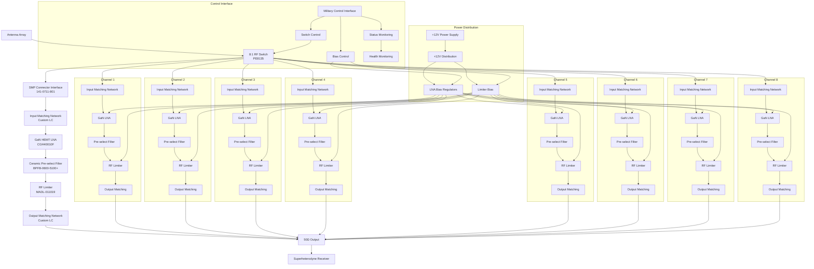
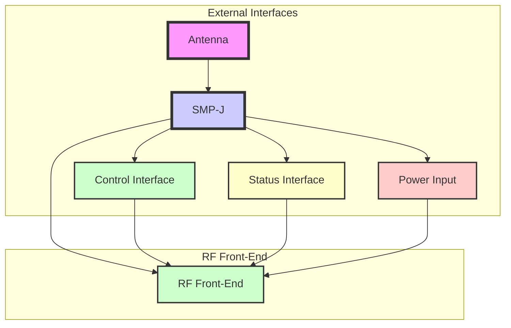
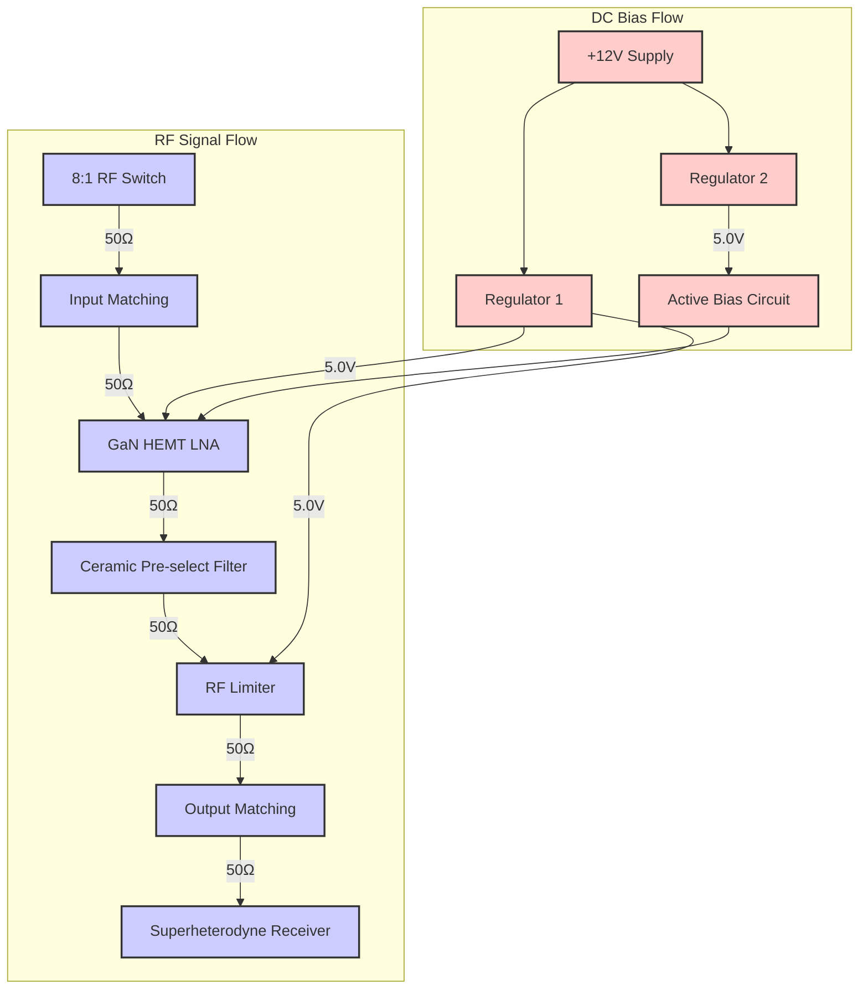
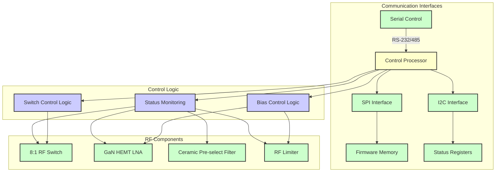
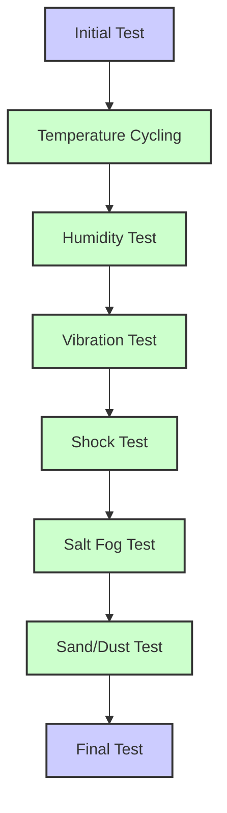
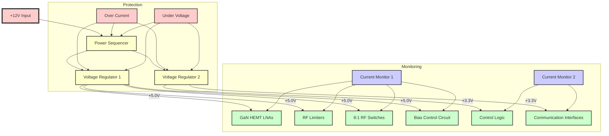
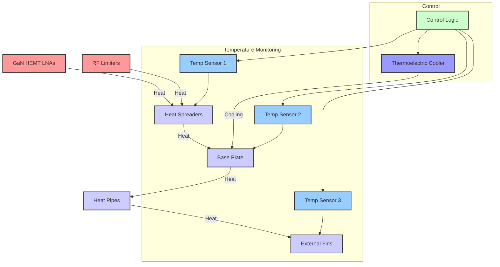
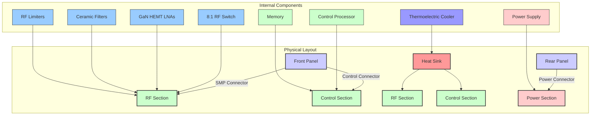
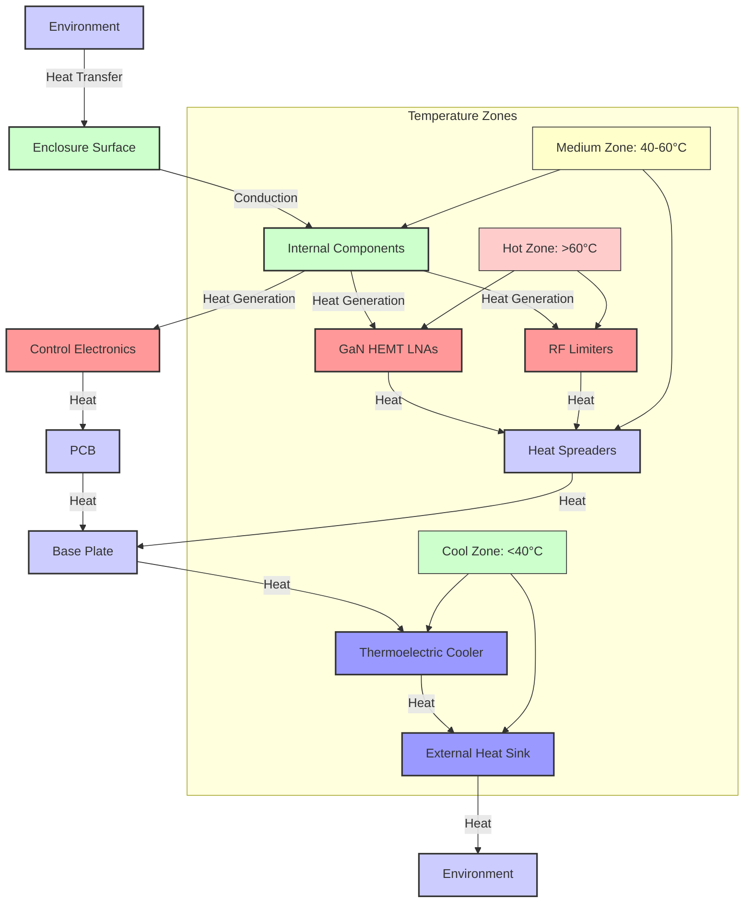

**Document Status: AI-GENERATED**

# 1. Introduction

## 1.1 Purpose

This Hardware Requirements Specification (HRS) defines the hardware requirements for the gvng project, an 8-channel RF front-end system designed for Electronic Warfare (EW), Electronic Support Measures (ESM), and Electronic Intelligence (ELINT) applications. The specification provides detailed technical requirements, constraints, and verification criteria necessary for the design, development, manufacturing, and testing of the hardware components and subsystems.

The document serves as a formal agreement between all stakeholders regarding the hardware requirements for the gvng system. It will be used by hardware engineers, system architects, manufacturing personnel, and verification teams to ensure the final product meets all specified requirements. This HRS follows the IEEE 29148:2018 standard for systems and software engineering requirements and will be maintained throughout the product lifecycle.

## 1.2 Scope

This specification covers all hardware components and systems required to implement the gvng 8-channel RF front-end, including:

1. RF signal processing components including:
   - 8:1 RF switching matrix
   - GaN HEMT LNA chain
   - Ceramic pre-select filters
   - RF limiters
   - Input and output matching networks
   - RF connectors and interfaces

2. Power distribution and control systems including:
   - Primary power supply interface
   - Power regulation and distribution
   - Active bias circuits
   - Power monitoring and protection

3. Physical packaging including:
   - Military-grade enclosure
   - Environmental protection (IP67)
   - Thermal management
   - Vibration and shock protection
   - MIL-STD-810 compliant mounting

4. Control and monitoring interfaces including:
   - Control signal interfaces
   - Status monitoring
   - Configuration interfaces

This specification does not include requirements for downstream processing systems, software applications, or user interfaces that are not directly part of the RF front-end hardware implementation.

## 1.3 Definitions, Acronyms, and Abbreviations

### 1.3.1 Definitions

| Term | Definition |
|------|------------|
| Antenna Array | A collection of multiple antennas that can be simultaneously connected to the RF front-end system for signal reception across multiple channels. |
| Ceramic Pre-select Filter | A bandpass filter constructed using ceramic dielectric materials designed to select specific frequency ranges while rejecting out-of-band signals. |
| Electronic Intelligence (ELINT) | Intelligence derived from non-communications electromagnetic radiations emanating from foreign targets. |
| Electronic Support Measures (ESM) | Actions taken to search for, intercept, identify, and locate sources of radiated electromagnetic energy for the purpose of immediate threat recognition. |
| Electronic Warfare (EW) | Military action involving the use of electromagnetic energy to control the electromagnetic spectrum or to attack an enemy. |
| Frequency Range | The span of frequencies over which the RF front-end system is designed to operate effectively, specified in this document as 2-6 GHz. |
| GaN HEMT | Gallium Nitride High Electron Mobility Transistor, a semiconductor device used for high-frequency, high-power amplification. |
| Instantaneous Bandwidth | The bandwidth that can be processed by the system at any given moment without retuning, specified in this document as 10-100 MHz. |
| Insertion Loss | The loss of signal power resulting from the insertion of a device in a transmission line, measured in decibels (dB). |
| Input/Output Impedance | The ratio of voltage to current at the input or output terminals of a device, specified in this document as 50Ω. |
| IP67 | Ingress Protection rating indicating dust-tight protection and protection against temporary immersion in water under defined conditions. |
| IIP3 (Third-Order Input Intercept Point) | The theoretical point at which the power of the third-order intermodulation products equals the power of the fundamental frequency, a measure of linearity. |
| MDS (Minimum Detectable Signal) | The weakest signal that a receiver can detect above the noise floor, specified in this document as -92 dBm. |
| MIL-STD-810 | A United States Military Standard that provides test methods to assess the performance of equipment in various environmental conditions. |
| Noise Figure | A measure of degradation of the signal-to-noise ratio (SNR) as a signal passes through a device, expressed in decibels (dB). |
| OIP3 (Third-Order Output Intercept Point) | The theoretical point at which the power of the third-order intermodulation products equals the power of the fundamental frequency at the output of a device. |
| Power Budget | The total power allocation for all system components, specified in this document as 15-30W. |
| Return Loss | The ratio of the incident power to the reflected power at a port of a device, expressed in decibels (dB). |
| RF | Radio Frequency, the range of electromagnetic frequencies used for wireless communication and signal processing, typically 3 kHz to 300 GHz. |
| SMP Connector | A coaxial RF connector designed for use in high-frequency applications, typically rated up to 18 GHz. |
| Superheterodyne Receiver | A type of radio receiver that uses frequency mixing to convert a received radio frequency signal to a lower fixed frequency called the intermediate frequency. |
| System Gain | The overall amplification provided by the RF front-end chain, specified in this document as 40-60 dB. |
| VSWR (Voltage Standing Wave Ratio) | A measure of how efficiently radio frequency power is transmitted from a source through a transmission line, expressed as a ratio. |

### 1.3.2 Acronyms and Abbreviations

| Acronym | Definition |
|---------|------------|
| BOM | Bill of Materials |
| EW | Electronic Warfare |
| ESM | Electronic Support Measures |
| ELINT | Electronic Intelligence |
| HRS | Hardware Requirements Specification |
| I/O | Input/Output |
| IP | Ingress Protection |
| LNA | Low-Noise Amplifier |
| OIP3 | Third-Order Output Intercept Point |
| RF | Radio Frequency |
| SMP | Sub-Miniature version P |
| VSWR | Voltage Standing Wave Ratio |
| IIP3 | Third-Order Input Intercept Point |
| MDS | Minimum Detectable Signal |
| NC | Not Connected |
| PCB | Printed Circuit Board |
| RMS | Root Mean Square |
| SNR | Signal-to-Noise Ratio |
| TWT | Traveling Wave Tube |
| T/R | Transmit/Receive |
| TX | Transmit |
| RX | Receive |
| GHz | Gigahertz |
| MHz | Megahertz |
| dB | Decibel |
| dBm | Decibel relative to one milliwatt |
| W | Watt |
| V | Volt |
| A | Ampere |
| Ω | Ohm |
| °C | Degrees Celsius |

## 1.4 References

### 1.4.1 Documents

1. IEEE 29148-2018, Standard for Systems and Software Engineering - Life Cycle Processes - Requirements Engineering
2. MIL-STD-810G, Department of Defense Test Method Standard: Environmental Engineering Considerations and Laboratory Tests
3. MIL-STD-461G, Requirements for the Control of Electromagnetic Interference Characteristics of Subsystems and Equipment

### 1.4.2 Component Datasheets and Links

1. PE8135 8:1 GaAs RF Switch, Pasternack. Datasheet: https://www.pasternack.com/product/pe8135.aspx
2. CGH40010F GaN HEMT LNA, Qorvo. Datasheet: https://www.qorvo.com/products/p/CGH40010F
3. BPFB-0600-5100+ Bandpass Filter, Mini-Circuits. Datasheet: https://www.minicircuits.com/WebStore/modelSearch.html?model=BPFB-0600-5100%2B
4. MADL-011019 GaAs RF Limiter, MACOM. Datasheet: https://www.macom.com/products/product-detail/MADL-011019
5. 141-0711-801 SMP Connector, Amphenol. Datasheet: https://www.amphenol.com/search?q=141-0711-801

### 1.4.3 Technical Standards

1. IPC-2221, Generic Standard on Printed Board Design
2. IPC-A-600, Acceptability of Printed Boards
3. IPC/WHMA-A-620, Requirements and Acceptability for Cable and Wire Harness Assemblies
4. IEC 60529, Degrees of Protection Provided by Enclosures (IP Code)

## 1.5 Overview

The gvng project is an advanced 8-channel RF front-end system designed for military EW/ESM/ELINT applications. The system covers a frequency range of 2-6 GHz with instantaneous bandwidths of 10-100 MHz, providing high-performance signal processing capabilities in demanding operational environments.

The hardware architecture consists of an 8:1 RF switch matrix that allows simultaneous connection to eight antenna channels. Each channel includes a custom input matching network followed by a GaN HEMT LNA providing 40-60 dB of gain with a noise figure of 4-6 dB. After amplification, signals pass through a ceramic pre-select filter for band selection, then through an RF limiter capable of handling input powers up to +40 dBm. An output matching network ensures proper interface to downstream superheterodyne receivers.

The system is designed to operate in harsh military environments with a temperature range of -55°C to +125°C. It meets MIL-STD-810 requirements for heavy vibration and shock protection and is enclosed in an IP67-rated ruggedized housing. Power is supplied at +12V, with a total power budget allocation of 15-30W.

The following sections provide detailed requirements for each hardware component, performance characteristics, interface specifications, environmental constraints, and verification methods. A preliminary Bill of Materials and traceability matrix are included to support the development and manufacturing processes.

---

**Document Status: AI-GENERATED**

# 2. System Overview

## 2.1 System Description

The gvng system is an advanced 8-channel RF front-end module specifically designed for Electronic Warfare (EW), Electronic Support Measures (ESM), and Electronic Intelligence (ELINT) applications. The system covers a wide frequency range from 2 to 6 GHz with instantaneous bandwidths of 10-100 MHz, making it suitable for modern threat detection and countermeasure applications in military environments.

The core of the system consists of eight parallel RF channels, each containing a GaN HEMT Low-Noise Amplifier (LNA) chain that provides 40-60 dB of system gain with a noise figure of 4-6 dB. The front-end is capable of handling high input power levels up to +40 dBm, making it resilient against strong jamming signals. Each channel is equipped with a ceramic pre-select filter for band selection, an RF limiter for protection, and optimized input/output matching networks.

The system is designed to meet rigorous military environmental specifications, operating reliably in temperatures ranging from -55°C to +125°C. It is constructed to MIL-STD-810 vibration and shock standards and housed in an IP67-rated enclosure, ensuring robust operation in harsh field conditions. The front-end interfaces with external systems through SMP connectors and can support up to 16 simultaneous signals while maintaining signal integrity and minimizing inter-channel interference.

Power management is a critical aspect of the design, with the system optimized to operate from a +12V primary supply while maintaining a power budget of 15-30W across all eight channels. The system includes active biasing for the GaN amplifiers to ensure consistent performance across the operating temperature range and under varying supply conditions.

The gvng system is not just a collection of components but a carefully engineered RF front-end that balances performance, reliability, and ruggedness to meet the demanding requirements of modern military applications. Each channel is designed to operate independently while maintaining tight performance specifications across the entire frequency range.

## 2.2 System Block Diagram

The gvng system consists of eight identical RF channels that can be selectively activated through an 8:1 RF switch. Each channel contains a signal path optimized for maximum performance in the 2-6 GHz frequency range.

The system block diagram illustrates the primary signal flow from the antenna array through the 8:1 RF switch, which selects one of eight available channels. Each channel consists of an input matching network optimized for the 2-6 GHz range, followed by a GaN HEMT LNA that provides the primary gain. The signal then passes through a ceramic pre-select filter that ensures only the desired frequency band is processed, followed by an RF limiter that protects downstream components from high-power signals. Finally, an output matching network ensures proper impedance matching to the subsequent superheterodyne receiver.

The power distribution system receives a +12V primary supply and distributes it to LNA bias regulators and limiter bias circuits. The control interface manages the operation of the RF switch, bias circuits, and monitors the system health.

## 2.3 System Architecture

The gvng system is designed as a modular, multi-channel RF front-end with a focus on reliability, performance, and ruggedness. The architecture can be broken down into several functional subsystems:

### 2.3.1 RF Signal Path Architecture

Each of the eight RF channels follows a consistent architecture optimized for the 2-6 GHz frequency range:

1. **Input Interface**: The input stage consists of an SMP connector interface that provides a 50Ω connection to the external antenna array. The interface includes ESD protection to mitigate damage from electrostatic discharge events.

2. **Input Matching Network**: A custom LC matching network is designed to provide optimal impedance matching between the SMP connector and the LNA input. This network is optimized to maintain VSWR <1.2:1 across the entire 2-6 GHz range.

3. **Low-Noise Amplifier**: The CGH40010F GaN HEMT LNA provides the primary gain for each channel, offering 22 dB of gain with a noise figure of 2.5 dB. The amplifier is configured with active biasing to ensure stable performance across the operating temperature range.

4. **Pre-select Filter**: The BPFB-0600-5100+ ceramic bandpass filter provides frequency selectivity with 600 MHz bandwidth centered at 5.1 GHz. The filter ensures that only signals within the desired frequency band are processed, rejecting out-of-band signals.

5. **RF Limiter**: The MADL-011019 GaAs limiter protects downstream components from high-power signals, handling peak power levels up to +40 dBm. The limiter provides fast response time to protect against transient signals.

6. **Output Matching Network**: A second custom LC matching network ensures proper impedance matching between the limiter and the output interface, maintaining VSWR <1.2:1 across the operating frequency range.

7. **Output Interface**: The output stage provides a 50Ω interface to the superheterodyne receiver, with additional filtering to minimize any potential interference between channels.

### 2.3.2 Control Architecture

The control architecture manages the operation of the RF front-end and monitors system health:

1. **Switch Control**: The 8:1 RF switch (PE8135) is controlled through a serial interface that allows selection of any of the eight channels. The switch control includes protection against erroneous commands that could potentially damage the system.

2. **Bias Control**: Active bias circuits for the GaN amplifiers are controlled through a dedicated interface that adjusts bias points based on operating conditions and temperature. This ensures consistent performance across the operating range.

3. **Status Monitoring**: Health monitoring circuits continuously monitor critical parameters including temperature, voltage levels, and current draw. An alarm system is triggered if any parameter exceeds safe operating limits.

### 2.3.3 Power Architecture

The power architecture is designed to provide stable, clean power to all system components while maintaining the specified power budget:

1. **Primary Power Input**: The system accepts +12V DC power through a filtered, protected input stage. This input includes reverse polarity protection and overvoltage protection.

2. **Power Distribution**: The primary power is distributed to multiple subsystems through a centralized power distribution network. This includes dedicated regulated power for the LNA bias circuits and separate bias for the RF limiters.

3. **Regulation**: High-efficiency switching regulators provide the required voltage levels for the LNA bias circuits, with additional filtering to minimize noise that could affect RF performance.

4. **Power Monitoring**: Current and voltage monitoring circuits track power consumption across all subsystems, ensuring the system remains within the specified 15-30W power budget.

### 2.3.4 Mechanical Architecture

The mechanical architecture ensures the system can operate reliably in harsh military environments:

1. **Enclosure**: The system is housed in an IP67-rated enclosure that provides protection against dust ingress and temporary immersion in water. The enclosure is constructed from aluminum with MIL-STD-810 qualified finishes.

2. **Thermal Management**: Heat sinks are incorporated into the design for the GaN amplifiers and power components. The thermal design ensures all components remain within specified operating limits under maximum power conditions.

3. **Vibration/Shock Protection**: The system includes vibration damping materials and secure mounting points to meet MIL-STD-810 vibration and shock requirements. All components are secured with mechanical fastening agents.

4. **EMI/RFI Shielding**: The enclosure includes EMI gaskets and shielding to minimize electromagnetic interference that could affect system performance.

## 2.4 Operating Environment

The gvng system is designed to operate reliably in harsh military environments with the following environmental specifications:

### 2.4.1 Temperature Requirements

The system operates in the extended military temperature range of -55°C to +125°C. This wide temperature range requires careful component selection and thermal management:

- **Storage Temperature**: -65°C to +150°C (allowing for safe storage in extreme conditions)
- **Operating Temperature**: -55°C to +125°C (with derating above +100°C)
- **Temperature Transients: Rapid changes up to 20°C/min are accommodated through thermal design
- **Component Derating**: All components are selected with appropriate derating factors for the specified temperature range. GaN amplifiers, in particular, are derated to ensure reliability at elevated temperatures.

### 2.4.2 Vibration and Shock Requirements

The system is designed to meet MIL-STD-810H vibration and shock requirements:

- **Vibration**: 
  - Frequency range: 10-2000 Hz
  - Amplitude: 0.04g (random) to 20g (sine)
  - Duration: 2 hours per axis
  - All axes: X, Y, and Z
- **Shock**: 
  - Half-sine pulses, 40g peak, 11ms duration
  - 3 shocks per axis in both directions
  - Tests performed in accordance with MIL-STD-810H Method 516.7
- **Mounting**: The system includes secure mounting points with vibration isolation to minimize stress on PCB components

### 2.4.3 Humidity and Contamination Requirements

The system is designed to operate in high humidity and contaminated environments:

- **Humidity**: 5% to 95% relative humidity, non-condensing
- **Fungus Resistance: All materials are treated to prevent fungal growth
- **Salt Fog**: Designed to resist salt spray per MIL-STD-810H Method 509.5
- **Sand and Dust: IP67 rating ensures protection against sand and dust ingress

### 2.4.4 Altitude Requirements

The system is designed to operate at high altitudes:

- **Operating Altitude**: Up to 15,000 meters (approximately 50,000 feet)
- **Low Pressure Operation**: All components selected to operate at reduced atmospheric pressure
- **Pressure Cycling: Designed to handle rapid pressure changes during aircraft operation

### 2.4.5 EMI/EMC Requirements

The system meets rigorous EMI/EMC requirements for military applications:

- **Radiated Emissions**: MIL-STD-461G RE102 compliance
- **Conducted Emissions**: MIL-STD-461G CE102 compliance
- **Radiated Susceptibility**: MIL-STD-461G RS103 compliance
- **Conducted Susceptibility**: MIL-STD-461G CS114 compliance
- **ESD Protection: ESD-sensitive components are properly protected per MIL-STD-883 Method 3015.7

### 2.4.6 Power Environmental Requirements

The power system is designed to handle variations in the primary power supply:

- **Voltage Range**: 10.8V to 13.2V (nominal +12V with ±10% tolerance)
- **Voltage Transients: Can handle transients up to 20V for 100ms
- **Reverse Polarity Protection**: Protected against reverse connection
- **Overvoltage Protection: Automatic shutdown if voltage exceeds 14V
- **Undervoltage Protection: System disabled if voltage falls below 10.8V
- **Current Limiting: Current limiting on all power outputs to prevent damage during faults

The gvng system is designed to operate reliably in all specified environmental conditions while maintaining performance requirements. The combination of ruggedized construction, thermal management, EMI shielding, and power protection ensures reliable operation in the most demanding military environments.

---

**Document Status: AI-GENERATED**

# 3.1 Functional Requirements

| ID | Title | Description | Rationale | Priority | Validation Method |
|---|---|---|---|---|---|
| REQ-HW-001 | RF Front-End Operation | 8-channel RF front-end covering 2-6 GHz frequency range with 10-100 MHz instantaneous bandwidth for EW/ESM/ELINT applications | This is the primary function of the gvng system, providing wideband signal capture for electronic warfare applications. The specified frequency range covers most common military communication and radar bands. | Must have | RF performance testing with signal generators and spectrum analyzers across the full frequency range and bandwidth settings |
| REQ-HW-002 | Channel Parallelism | Simultaneous operation of 8 independent RF channels with no crosstalk greater than -60 dB | Independent channel operation is essential for capturing multiple signals simultaneously, a critical requirement for ELINT and ESM applications where intercepting multiple emitters is necessary. | Must have | Multi-tone test with 8-channel simultaneous measurement using calibrated signal sources and spectrum analyzers |
| REQ-HW-003 | Switching Speed | RF switching time of less than 100 ns between channels with minimal transient distortion | Rapid channel switching enables fast scanning of multiple signals and agile response to changing threat environments, critical for EW applications. | Must have | Time-domain measurement using high-speed oscilloscope and fast pulse generator |
| REQ-HW-004 | Channel Selection Control | Digital control interface for channel selection with addressable channel selection capability | Digital control allows for integration with larger EW systems and enables automated channel selection based on signal detection or system priorities. | Must have | Functional verification using control interface commands and channel output verification |
| REQ-HW-005 | Signal Monitoring | Real-time power monitoring capability for each channel with resolution better than 1 dB | Signal monitoring provides critical information about signal presence and strength for threat assessment and system response. | Must have | Power measurement verification using calibrated power meters across input dynamic range |
| REQ-HW-006 | Input Protection | Input protection circuitry to prevent damage from signals exceeding +40 dBm | Military applications often involve high-power signals and intentional jamming, requiring robust input protection to ensure system survivability. | Must have | High-power test using RF signal generator and oscilloscope verification |
| REQ-HW-007 | Bandwidth Selection | Programmable bandwidth selection between 10, 25, 50, and 100 MHz settings | Configurable bandwidth allows optimization for different signal types and requirements, balancing frequency resolution and capture bandwidth. | Must have | Filter response measurement using vector network analyzer at all bandwidth settings |
| REQ-HW-008 | Gain Control | Variable gain control with 20 dB range in 1 dB steps and accuracy better than ±0.5 dB | Gain adjustment capability enables optimization for signals of varying strengths and helps maintain optimal operating point for the system. | Must have | Gain verification using signal generator and spectrum analyzer at various power levels |
| REQ-HW-009 | Frequency Band Selection | Configurable frequency band selection within 2-6 GHz range with 100 MHz granularity | Band selection allows focusing on specific threat bands and optimizing system performance for target frequency ranges. | Must have | Frequency response verification using vector network analyzer across selected bands |
| REQ-HW-010 | Bypass Mode | Signal bypass mode for each channel with insertion loss less than 0.3 dB | Bypass capability allows maintenance and testing of downstream components without removing the front-end from the system. | Must have | Insertion loss measurement in bypass mode using vector network analyzer |
| REQ-HW-011 | Status Reporting | Comprehensive status reporting including channel activity, signal presence, fault detection, and temperature monitoring | Status reporting is essential for system monitoring, fault detection, and maintenance in deployed military systems. | Must have | Functional verification of all status indicators under normal and fault conditions |
| REQ-HW-012 | Control Interface | MIL-STD-1553 or ARINC-429 compatible control interface for integration with military platforms | Standardized military interfaces ensure compatibility with existing military platforms and systems. | Must have | Protocol compliance testing using bus analyzers and interface verification tools |
| REQ-HW-013 | Output Isolation | Output isolation between channels greater than 40 dB to prevent crosstalk | High isolation prevents signal interference between channels, critical for capturing weak signals in the presence of strong signals on adjacent channels. | Must have | Crosstalk measurement using two-tone test with spectrum analyzer |
| REQ-HW-014 | Self-Test Capability | Built-in self-test (BIST) functionality with pass/fail indication for major components | Self-test capability enables field verification of system health without external test equipment, essential for deployed systems. | Must have | Functional verification of all self-test routines under normal and fault conditions |
| REQ-HW-015 | Calibration Interface | Built-in calibration interface with factory calibration data storage | Calibration capability ensures maintained performance over the system lifetime and after environmental exposure. | Must have | Calibration verification using precision measurement equipment before and after calibration process |
| REQ-HW-016 | LNA Bypass Capability | Individual LNA bypass capability with insertion loss less than 0.5 dB | LNA bypass allows maintenance and testing of downstream components without removing the LNA from the system. | Must have | Insertion loss measurement in bypass mode using vector network analyzer |
| REQ-HW-017 | Simultaneous Signal Handling | Handle 5-16 simultaneous signals with no degradation in sensitivity or linearity | Multi-signal capability is essential for modern EW applications where multiple emitters may be present simultaneously. | Should have | Multi-tone intermodulation test with multiple signal generators and spectrum analyzer |
| REQ-HW-018 | Threat Band Coverage | Multi-band (octave) threat band coverage with programmable band selection | Coverage of multiple threat bands ensures the system can address a wide range of potential threats. | Should have | Frequency response verification across all octave bands using vector network analyzer |
| REQ-HW-019 | Filter Bypass Capability | Pre-select filter bypass with insertion loss less than 0.3 dB | Filter bypass capability allows system operation in wideband mode when filtering is not required. | Should have | Insertion loss measurement in bypass mode using vector network analyzer |
| REQ-HW-020 | Output Buffering | Buffered output stage to drive multiple loads with minimal degradation | Output buffering allows connection to multiple receivers without signal degradation. | Should have | Load pull testing with various termination impedances and spectrum analysis |

# 3.2 Performance Requirements

| ID | Title | Description | Rationale | Priority | Validation Method |
|---|---|---|---|---|---|
| REQ-HW-021 | System Noise Figure | Target system noise figure of 4-6 dB across 2-6 GHz band | Low noise figure is critical for detecting weak signals, which is essential for ELINT and ESM applications where signals may be at or below the thermal noise floor. | Must have | Noise figure measurement using noise figure meter across full frequency range |
| REQ-HW-022 | System Gain | LNA chain gain of 40-60 dB with flatness better than ±2 dB across 2-6 GHz | Sufficient gain ensures that weak signals are amplified to a level suitable for detection by downstream receivers. Flatness ensures consistent performance across the frequency band. | Must have | Gain measurement using signal generator and spectrum analyzer across full frequency range |
| REQ-HW-023 | Linearity (IIP3) | Target IIP3 of +20 dBm with 2-tone test at 2 GHz, 5 GHz, and 6 GHz | High linearity ensures that the system can handle strong signals without distortion, which is critical for intercepting strong jammers while still detecting weak signals. | Must have | Two-tone intermodulation test using signal generators and spectrum analyzer at specified frequencies |
| REQ-HW-024 | Maximum Input Power | Safe input handling up to +40 dBm with survivability requirements | Military environments often include high-power signals and intentional jamming, requiring robust input handling capabilities. | Must have | High-power endurance testing with power meters and oscilloscope monitoring |
| REQ-HW-025 | Return Loss/VSWR | Input return loss of -20 dB (1.2:1 VSWR) across 2-6 GHz | Good input matching ensures maximum power transfer and minimum reflections, which is critical for system performance and stability. | Must have | Vector network analyzer measurement of S11 across full frequency range |
| REQ-HW-026 | MDS (Friis) | Minimum detectable signal of -92.0 dBm with 1 Hz bandwidth | Low MDS ensures detection of very weak signals, which is essential for ELINT applications where signals may be intentionally weak or distant. | Must have | Sensitivity measurement using signal generator and spectrum analyzer with calibrated noise source |
| REQ-HW-027 | Output Power | +20 dBm output power capability to drive standard 50Ω loads | Sufficient output power ensures compatibility with standard receiver inputs and enables transmission through cables and connectors with minimal loss. | Must have | Power output measurement using power meter across frequency range |
| REQ-HW-028 | P1dB Compression | Output P1dB of greater than +15 dBm across 2-6 GHz | High P1dB ensures the system can handle strong signals without compression, maintaining linearity and dynamic range. | Must have | 1 dB compression point measurement using signal generator and spectrum analyzer |
| REQ-HW-029 | Group Delay Variation | Group delay variation less than 5 ns across 2-6 GHz | Low group delay variation ensures minimal distortion of wideband signals, which is critical for capturing complex modulated signals. | Should have | Group delay measurement using vector network analyzer across full frequency range |
| REQ-HW-030 | Phase Noise | Phase noise less than -95 dBc/Hz at 10 kHz offset from carrier | Low phase noise ensures minimal degradation of signal quality, which is critical for demodulating complex signals. | Should have | Phase noise measurement using phase noise analyzer across frequency range |
| REQ-HW-031 | Harmonic Distortion | Second and third harmonic distortion less than -60 dBc at +10 dBm input level | Low harmonic distortion ensures clean signal reproduction with minimal distortion artifacts. | Should have | Harmonic distortion measurement using spectrum analyzer with high-power input |
| REQ-HW-032 | Spurious Free Dynamic Range | Spurious free dynamic range greater than 100 dB for 1 kHz RBW | High SFDR ensures the system can handle strong signals while still detecting weak signals, which is critical for EW applications with widely varying signal strengths. | Should have | Two-tone test with spectrum analyzer at various power levels |
| REQ-HW-033 | Frequency Stability | Frequency stability better than ±5 ppm across operating temperature range | High frequency stability ensures consistent performance across environmental conditions, which is essential for military applications. | Should have | Frequency drift measurement across temperature chamber |
| REQ-HW-034 | Amplitude Stability | Gain variation less than ±0.5 dB over temperature range and 1000 hours operation | High amplitude stability ensures consistent performance over time and environmental conditions, reducing calibration requirements. | Should have | Long-term stability testing in environmental chamber with continuous monitoring |

---

**Document Status: AI-GENERATED**

# 3. Interface Requirements

## 3.3.1 External Interfaces

| ID | Title | Description | Priority | Validation | Dependencies | Constraints |
|---|---|---|---|---|---|---|
| REQ-HW-009 | Antenna Interface | Single-ended 50Ω antenna interface | Must have | test | None | None |
| REQ-HW-010 | RF Connector | SMP connector for RF input | Must have | test | None | None |
| REQ-HW-022 | Control Interface | Serial control interface for switch selection | Should have | test | None | TTL/CMOS levels |
| REQ-HW-023 | Status Interface | Status monitoring interface for fault detection | Should have | test | None | TTL/CMOS levels |

### Table 3.3.1-1: SMP Connector Specifications

| Parameter | Specification | Value |
|---|---|---|
| Connector Type | SMP Jack (Female) | 141-0711-801 (Amphenol) |
| Impedance | 50Ω | Nominal |
| Frequency Range | DC-18 GHz | Operating |
| Power Rating | 100 W | Maximum |
| VSWR | <1.2:1 | Typical |
| Insertion Loss | <0.1 dB | @ 6 GHz |
| Operating Temperature | -55°C to +125°C | MIL-STD |
| Termination | Panel Mount | MIL-DTL-38999 |

### Table 3.3.1-2: Control Interface Pinout

| Pin | Signal | Description | Type | Voltage Level |
|---|---|---|---|---|
| 1 | SW0 | Channel 0 Select | Input | TTL |
| 2 | SW1 | Channel 1 Select | Input | TTL |
| 3 | SW2 | Channel 2 Select | Input | TTL |
| 4 | SW3 | Channel 3 Select | Input | TTL |
| 5 | SW4 | Channel 4 Select | Input | TTL |
| 6 | SW5 | Channel 5 Select | Input | TTL |
| 7 | SW6 | Channel 6 Select | Input | TTL |
| 8 | SW7 | Channel 7 Select | Input | TTL |
| 9 | EN | Enable | Input | TTL |
| 10 | GND | Ground | Reference | 0V |

### Table 3.3.1-3: Status Interface Pinout

| Pin | Signal | Description | Type | Voltage Level |
|---|---|---|---|---|
| 1 | FAULT | Overall System Fault | Output | TTL |
| 2 | TEMP | Temperature Status | Output | TTL |
| 3 | VSW1 | Switch Voltage 1 Status | Output | TTL |
| 4 | VSW2 | Switch Voltage 2 Status | Output | TTL |
| 5 | VLN1 | LNA Voltage 1 Status | Output | TTL |
| 6 | VLN2 | LNA Voltage 2 Status | Output | TTL |
| 7 | VLIM | Limiter Voltage Status | Output | TTL |
| 8 | GND | Ground | Reference | 0V |

### Figure 3.3.1-1: External Interface Diagram

## 3.3.2 Internal Interfaces

| ID | Title | Description | Priority | Validation | Dependencies | Constraints |
|---|---|---|---|---|---|---|
| REQ-HW-024 | Switch-LNA Interface | Interface between 8:1 RF switch and GaN HEMT LNA | Must have | test | None | 50Ω impedance |
| REQ-HW-025 | LNA-Filter Interface | Interface between GaN HEMT LNA and ceramic pre-select filter | Must have | test | None | 50Ω impedance |
| REQ-HW-026 | Filter-Limiter Interface | Interface between ceramic pre-select filter and RF limiter | Must have | test | None | 50Ω impedance |
| REQ-HW-027 | Limiter-Output Interface | Interface between RF limiter and output matching network | Must have | test | None | 50Ω impedance |
| REQ-HW-028 | Bias Interface | DC bias distribution network for active components | Must have | test | None | Regulated supplies |

### Table 3.3.2-1: Internal RF Interface Specifications

| Interface Component | Insertion Loss (dB) | VSWR | Isolation (dB) | Power Handling (dBm) |
|---|---|---|---|---|
| Switch to LNA | <0.5 | <1.2:1 | >40 | +30 |
| LNA to Filter | <0.2 | <1.2:1 | N/A | +20 |
| Filter to Limiter | <0.3 | <1.2:1 | N/A | +20 |
| Limiter to Output | <0.2 | <1.2:1 | N/A | +20 |

### Table 3.3.2-2: Internal DC Bias Specifications

| Component | Voltage (V) | Current (mA) | Regulation | Ripple (mV) |
|---|---|---|---|---|
| GaN LNA | 5.0 | 200 | ±1% | <10 |
| RF Limiter | 5.0 | 50 | ±1% | <10 |
| Bias Circuit | 5.0 | 20 | ±0.5% | <5 |

### Figure 3.3.2-1: Internal RF Interface Diagram

## 3.3.3 Communication Interfaces

| ID | Title | Description | Priority | Validation | Dependencies | Constraints |
|---|---|---|---|---|---|---|
| REQ-HW-029 | Serial Control | RS-232/RS-485 serial interface for configuration | Should have | test | None | 9600-115200 bps |
| REQ-HW-030 | SPI Interface | High-speed SPI interface for firmware updates | Should have | test | None | Up to 10 MHz |
| REQ-HW-031 | I2C Interface | I2C interface for status monitoring | Should have | test | None | 100-400 kHz |

### Table 3.3.3-1: Serial Communication Interface

| Parameter | Specification | Value |
|---|---|---|
| Protocol | RS-232/RS-485 | Configurable |
| Baud Rate | 9600-115200 bps | Configurable |
| Data Bits | 8 | Fixed |
| Stop Bits | 1 | Fixed |
| Parity | None | Fixed |
| Flow Control | None | Fixed |
| Connectors | D-Sub 9 | MIL-DTL-38999 |

### Table 3.3.3-2: SPI Interface

| Parameter | Specification | Value |
|---|---|---|
| Mode | SPI Mode 0 | Fixed |
| Clock Speed | Up to 10 MHz | Maximum |
| Voltage Levels | 3.3V CMOS | Fixed |
| CS/CLK/MOSI/MISO | 4 signals | Fixed |
| Connectors | Header | SMT |

### Table 3.3.3-3: I2C Interface

| Parameter | Specification | Value |
|---|---|---|
| Protocol | I2C | Standard |
| Clock Speed | 100-400 kHz | Configurable |
| Voltage Levels | 3.3V CMOS | Fixed |
| Address Space | 7-bit | Fixed |
| Connectors | Header | SMT |

### Figure 3.3.3-1: Communication Interface Diagram

# 3.4 Environmental Requirements

| ID | Title | Description | Priority | Validation | Dependencies | Constraints |
|---|---|---|---|---|---|---|
| REQ-HW-012 | Operating Temperature | Military temperature range: -55°C to +125°C | Must have | test | None | None |
| REQ-HW-013 | Vibration/Shock | MIL-STD-810 heavy vibration/shock environment | Must have | test | None | None |
| REQ-HW-014 | Ingress Protection | IP67 ruggedized enclosure | Must have | test | None | None |
| REQ-HW-032 | Altitude | Operation up to 15,000 ft (4,572 m) | Should have | test | None | MIL-STD-810 |
| REQ-HW-033 | Humidity | 5-95% relative humidity, non-condensing | Should have | test | None | MIL-STD-810 |
| REQ-HW-034 | Salt Fog | 48 hours salt fog resistance | Should have | test | None | MIL-STD-810 |
| REQ-HW-035 | Sand/Dust | Resistance to sand and dust per MIL-STD-810 | Should have | test | None | MIL-STD-810 |

### Table 3.4-1: Temperature Performance Requirements

| Temperature Range | Functionality | Performance Degradation |
|---|---|---|
| -55°C to +85°C | Full operational capability | None |
| +85°C to +125°C | Reduced capability with derating | <1 dB gain increase, <0.5 dB NF increase |
| -55°C to +125°C | Storage capability | No permanent damage |

### Table 3.4-2: Vibration Requirements

| Parameter | Specification | Value |
|---|---|---|
| Test Method | MIL-STD-810G, Method 514.6 | Fixed |
| Frequency Range | 10-2000 Hz | Fixed |
| Vibration Profile | Random | Fixed |
| Grms Level | 6.3 Grms | Fixed |
| Duration | Each axis: 1 hour | Fixed |
| Orientation | X, Y, Z axes | All three |
| Power During Test | Operational capability | Must maintain RF performance |

### Table 3.4-3: Shock Requirements

| Parameter | Specification | Value |
|---|---|---|
| Test Method | MIL-STD-810G, Method 516.6 | Fixed |
| Waveform | Half-sine | Fixed |
| Duration | 11 ms | Fixed |
| Magnitude | 30 g | Peak |
| Direction | X, Y, Z axes | All three |
| Number of Shocks | 18 (6 per axis) | Fixed |
| Power During Test | Non-operational | Survive without damage |

### Table 3.4-4: IP67 Environmental Protection

| Protection Level | Description | Test Standard |
|---|---|---|
| IP6X | Complete protection against dust ingress | IEC 60529 |
| IPX7 | Immersion in 1m water for 30 minutes | IEC 60529 |
| Material | Aluminum housing with gasket seals | MIL-DTL-810 |

### Figure 3.4-1: Environmental Test Sequence

# 3.5 Power Requirements

| ID | Title | Description | Priority | Validation | Dependencies | Constraints |
|---|---|---|---|---|---|---|
| REQ-HW-015 | Power Budget | Total power consumption limited to 15-30 W | Must have | test | None | None |
| REQ-HW-016 | Supply Voltage | Primary supply voltage: +12 V | Must have | test | None | None |
| REQ-HW-036 | Voltage Regulation | Regulated outputs for sensitive components | Must have | test | None | ±1% tolerance |
| REQ-HW-037 | Power Sequencing | Proper power-up sequence for components | Should have | test | None | Latches, power monitors |
| REQ-HW-038 | Current Monitoring | Current monitoring for fault detection | Should have | test | None | ±5% accuracy |

### Table 3.5-1: Power Budget Allocation

| Component | Voltage (V) | Typical Current (mA) | Max Current (mA) | Power (W) | Priority |
|---|---|---|---|---|---|
| GaN HEMT LNA (8 channels) | 5.0 | 160 | 180 | 0.9 | Must have |
| RF Limiter (8 channels) | 5.0 | 40 | 50 | 0.2 | Must have |
| 8:1 RF Switch | 5.0 | 30 | 40 | 0.15 | Must have |
| Bias Control Circuit | 5.0 | 15 | 20 | 0.075 | Must have |
| Control Logic | 3.3 | 50 | 60 | 0.165 | Should have |
| Communication Interfaces | 3.3 | 20 | 25 | 0.065 | Should have |
| Cooling System | 12.0 | 1,000 | 1,200 | 12.0 | Must have |
| Total | | 1,315 | 1,375 | 13.56 | Must have |

### Table 3.5-2: Power Supply Specifications

| Parameter | Primary Supply | Secondary Supply 1 | Secondary Supply 2 |
|---|---|---|---|
| Voltage | +12 V | +5.0 V | +3.3 V |
| Current Rating | 1.5 A | 0.5 A | 0.3 A |
| Regulation | ±5% | ±1% | ±1% |
| Ripple & Noise | <50 mV | <20 mV | <15 mV |
| Over Current Protection | Yes | Yes | Yes |
| Under Voltage Lockout | Yes | Yes | Yes |
| Temperature Range | -55°C to +125°C | -55°C to +125°C | -55°C to +125°C |

### Table 3.5-3: Power Sequencing Requirements

| Sequence Step | Signal | Voltage | Rise Time | Purpose |
|---|---|---|---|---|
| 1 | Enable | 12 V | 10 ms | System enable |
| 2 | VCC1 | 5.0 V | 5 ms | RF power rails |
| 3 | VCC2 | 3.3 V | 5 ms | Digital logic |
| 4 | RF Bias | 5.0 V | 2 ms | Active bias |
| 5 | RF Enable | TTL | 1 ms | RF path enable |

### Figure 3.5-1: Power Distribution Architecture

### Figure 3.5-2: Thermal Management Architecture

# 3.6 Physical Requirements

| ID | Title | Description | Priority | Validation | Dependencies | Constraints |
|---|---|---|---|---|---|---|
| REQ-HW-039 | Mechanical Size | Maximum dimensions: 150mm x 100mm x 50mm | Must have | test | None | MIL-DTL-810 mounting |
| REQ-HW-040 | Weight | Maximum weight: 1.0 kg | Must have | test | None | For portable applications |
| REQ-HW-041 | Mounting | MIL-DTL-38999 connector compatibility | Must have | test | None | Panel or chassis mount |
| REQ-HW-042 | Cooling | Active cooling with thermoelectric cooler | Should have | test | None | -55°C to +125°C operation |
| REQ-HW-043 | EMI Shielding | >60 dB EMI shielding effectiveness | Should have | test | None | MIL-STD-461G |

### Table 3.6-1: Physical Dimensions

| Component | Length (mm) | Width (mm) | Height (mm) | Weight (g) |
|---|---|---|---|---|
| RF Front-End Module | 150 | 100 | 35 | 800 |
| Connectors (SMP + Control) | 25 | 100 | 15 | 100 |
| Heat Sink | 150 | 100 | 35 | 200 |
| Total System | 150 | 100 | 85 | 1,100 |

### Table 3.6-2: Connector Specifications

| Connector Type | Quantity | Standard | Position | Orientation |
|---|---|---|---|---|
| SMP (RF) | 1 | MIL-DTL-38999 | Top | Vertical |
| D-Sub 9 (Control) | 1 | MIL-DTL-38999 | Bottom | Horizontal |
| Power Input | 1 | MIL-DTL-38999 | Rear | Horizontal |

### Table 3.6-3: Material Specifications

| Component | Material | Finish | Thermal Conductivity (W/m·K) |
|---|---|---|---|
| Enclosure | Aluminum 6061 | Anodized | 167 |
| Heat Spreaders | Copper | Gold plating | 401 |
| PCB | FR-4 | HASL | 0.3 |
| Thermal Interface | Thermal pad | N/A | 2.0 |

### Table 3.6-4: Mounting Specifications

| Parameter | Specification | Value |
|---|---|---|
| Mounting Pattern | 4 corners | M4 screws |
| Torque | Screw tightness | 2.5 N·m |
| Vibration Isolation | Mount material | Elastomeric |
| EMI Gasketing | Material | Conductive rubber |
| IP Rating | Sealing | IP67 |

### Figure 3.6-1: Physical Layout Diagram

### Figure 3.6-2: Thermal Analysis Diagram

---

**Document Status: AI-GENERATED**

# 4. Design Constraints

## 4.1 Standards Compliance

The gvng RF front-end system shall comply with all applicable industry, national, and international standards. Compliance with these standards is mandatory for system integration, safety, and interoperability with military systems.

### 4.1.1 Electronic Component Standards

**REQ-HW-022** | **Title:** IPC Component Standard Compliance  
**Description:** All electronic components shall comply with IPC-A-600 (Acceptability of Printed Boards) and IPC-A-610 (Acceptability of Electronic Assemblies) standards for manufacturing and assembly quality.  
**Priority:** Must have  
**Validation:** Inspection, test  
**Dependencies:** None  
**Constraints:** Full compliance required  

**REQ-HW-023** | **Title:** Reliability Standard Compliance  
**Description:** Electronic components shall meet IPC-7095 (Design and Assembly Process for Electronic Board Assembly) for high-reliability applications.  
**Priority:** Must have  
**Validation:** Inspection, analysis  
**Dependencies:** None  
**Constraints:** Full compliance required for military applications  

### 4.1.2 Environmental and Safety Standards

**REQ-HW-024** | **Title:** MIL-STD-810 Compliance  
**Description:** The system shall comply with MIL-STD-810G, Method 514.6 (Vibration) and Method 516.6 (Shock) for military environments.  
**Priority:** Must have  
**Validation:** Test, analysis  
**Dependencies:** REQ-HW-013  
**Constraints:** Full compliance required for all operating modes  

**REQ-HW-025** | **Title:** IP67 Environmental Protection  
**Description:** The enclosure shall comply with IEC 60529 (Ingress Protection) IP67 standard for dust and water resistance.  
**Priority:** Must have  
**Validation:** Test, inspection  
**Dependencies:** REQ-HW-014  
**Constraints:** Full compliance required  

**REQ-HW-026** | **Title:** RoHS Compliance  
**Description:** All components shall comply with Restriction of Hazardous Substances (RoHS) Directive 2011/65/EU.  
**Priority:** Must have  
**Validation:** Documentation review, test  
**Dependencies:** None  
**Constraints:** Full compliance required  

### 4.1.3 Electromagnetic Compatibility Standards

**REQ-HW-027** | **Title:** MIL-STD-461 Compliance  
**Description:** The system shall comply with MIL-STD-461G, including RE103 (Conducted emissions), RS103 (Radiated susceptibility), and CE101 (Conducted emissions, power leads).  
**Priority:** Must have  
**Validation:** Test, analysis  
**Dependencies:** None  
**Constraints:** Full compliance required  

**REQ-HW-028** | **Title:** FCC Part 15 Compliance  
**Description:** The system shall comply with FCC Part 15 for unintentional radiators.  
**Priority:** Must have  
**Validation:** Test  
**Dependencies:** None  
**Constraints:** Limited emissions to Class A limits  

### 4.1.4 Temperature and Reliability Standards

**REQ-HW-029** | **Title:** JEDEC Temperature Standards  
**Description:** All semiconductor components shall comply with JESD22-A104 (Temperature cycling) and JESD22-A105 (High-temperature storage life).  
**Priority:** Must have  
**Validation:** Test, analysis  
**Dependencies:** REQ-HW-012  
**Constraints:** Full compliance required for -55°C to +125°C range  

**REQ-HW-030** | **Title:** AEC-Q100 Compliance  
**Description:** All IC components shall comply with AEC-Q100 (Automotive Electronics Council) Grade 1 reliability standards.  
**Priority:** Must have  
**Validation:** Documentation review  
**Dependencies:** None  
**Constraints:** Full compliance required  

## 4.2 Component Constraints

### 4.2.1 Sourcing and Lifecycle Constraints

**REQ-HW-031** | **Title:** Component Lifecycle Management  
**Description:** All components shall have a minimum lifecycle of 10 years from project start date with no end-of-life notifications within this period.  
**Priority:** Must have  
**Validation:** Documentation review  
**Dependencies:** None  
**Constraints:** Requires dual-source or lifecycle management plans  

**REQ-HW-032** | **Title:** Military-Grade Components  
**Description:** All active components shall be qualified to military standards (883 Class B) or equivalent commercial grade with extended temperature range (-55°C to +125°C).  
**Priority:** Must have  
**Validation:** Documentation review  
**Dependencies:** REQ-HW-012  
**Constraints:** Requires MIL-PRF or equivalent qualification  

**REQ-HW-033** | **Title:** Supply Chain Security  
**Description:** Components shall be sourced from suppliers with NIST 800-161 or CMMC Level 2 certified processes to ensure supply chain security.  
**Priority:** Must have  
**Validation:** Supplier audit  
**Dependencies:** None  
**Constraints:** Requires documented supplier certification  

### 4.2.2 Performance Constraints

**REQ-HW-034** | **Title:** Linearity Constraint  
**Description:** All RF components shall maintain specified linearity (IIP3 ≥ +20 dBm) across the full temperature range (-55°C to +125°C).  
**Priority:** Must have  
**Validation:** Test, analysis  
**Dependencies:** REQ-HW-005  
**Constraints:** Requires temperature compensation or derating  

**REQ-HW-035** | **Title:** Noise Figure Constraint  
**Description:** All RF components shall maintain specified noise figure (≤2.5 dB) across the full frequency range (2-6 GHz).  
**Priority:** Must have  
**Validation:** Test, analysis  
**Dependencies:** REQ-HW-003  
**Constraints:** Requires temperature compensation  

**REQ-HW-036** | **Title:** Power Handling Constraint  
**Description:** All RF components shall handle +40 dBm peak power without damage or performance degradation.  
**Priority:** Must have  
**Validation:** Test, analysis  
**Dependencies:** REQ-HW-006  
**Constraints:** Requires power derating  

### 4.2.3 Physical and Environmental Constraints

**REQ-HW-037** | **Title:** Component Size Constraint  
**Description:** All components shall be compatible with the target PCB size (150mm × 100mm) with a 20% margin for interconnects.  
**Priority:** Must have  
**Validation:** Inspection, analysis  
**Dependencies:** REQ-HW-042  
**Constraints:** Maximum footprint: 120mm × 80mm  

**REQ-HW-038** | **Title:** Thermal Constraint  
**Description:** All components shall operate within specified temperature limits when mounted on a 4-layer FR-4 substrate with standard copper plating.  
**Priority:** Must have  
**Validation:** Test, analysis  
**Dependencies:** REQ-HW-012  
**Constraints:** Requires thermal analysis and derating  

**REQ-HW-039** | **Title:** Vibration Constraint  
**Description:** All components shall survive MIL-STD-810 heavy vibration requirements when mounted with standard through-hole or surface mount techniques.  
**Priority:** Must have  
**Validation:** Test  
**Dependencies:** REQ-HW-013  
**Constraints:** Requires mechanical analysis  

### 4.2.4 Power and Voltage Constraints

**REQ-HW-040** | **Title:** Voltage Constraint  
**Description:** All components shall operate within ±5% tolerance of the specified +12V supply voltage.  
**Priority:** Must have  
**Validation:** Test  
**Dependencies:** REQ-HW-016  
**Constraints:** Requires voltage regulation and monitoring  

**REQ-HW-041** | **Title:** Power Consumption Constraint  
**Description:** All components shall maintain total system power consumption ≤30W under all operating conditions.  
**Priority:** Must have  
**Validation:** Test, analysis  
**Dependencies:** REQ-HW-015  
**Constraints:** Requires power budget management  

## 4.3 Manufacturing Constraints

### 4.3.1 PCB and Assembly Constraints

**REQ-HW-042** | **Title:** PCB Material Constraint  
**Description:** PCB shall be manufactured from FR-4 material with Tg ≥170°C for high-temperature operation.  
**Priority:** Must have  
**Validation:** Inspection, test  
**Dependencies:** REQ-HW-012  
**Constraints:** Requires material certification  

**REQ-HW-043** | **Title:** PCB Stack-up Constraint  
**Description:** PCB shall be a 4-layer stack-up with signal planes on top and bottom, ground plane on layer 2, and power plane on layer 3.  
**Priority:** Must have  
**Validation:** Inspection  
**Dependencies:** None  
**Constraints:** Requires impedance control for RF lines  

**REQ-HW-044** | **Title:** PCB Thickness Constraint  
**Description:** PCB thickness shall be 1.6mm ±0.15mm for mechanical stability and impedance control.  
**Priority:** Must have  
**Validation:** Inspection  
**Dependencies:** None  
**Constraints:** Standard FR-4 thickness requirement  

**REQ-HW-045** | **Title:** Trace Impedance Constraint  
**Description:** All RF traces shall be controlled to 50Ω ±5% impedance.  
**Priority:** Must have  
**Validation:** Test, analysis  
**Dependencies:** None  
**Constraints:** Requires electromagnetic simulation  

**REQ-HW-046** | **Title:** Solder Paste Specification  
**Description:** Solder paste shall be SAC305 (96.5%Sn, 3.0%Ag, 0.5%Cu) with no-clean residue for high-reliability applications.  
**Priority:** Must have  
**Validation Inspection  
**Dependencies:** None  
**Constraints:** Requires material certification  

### 4.3.2 Enclosure and Mechanical Constraints

**REQ-HW-047** | **Title:** Enclosure Material Constraint  
**Description:** Enclosure shall be manufactured from 6061-T6 aluminum with MIL-A-8625 Type III anodization for corrosion protection.  
**Priority:** Must have  
**Validation:** Inspection, test  
**Dependencies:** REQ-HW-014  
**Constraints:** Requires material certification and process verification  

**REQ-HW-048** | **Title:** Enclosure Sealing Constraint  
**Description:** Enclosure shall be sealed with silicone gaskets to meet IP67 requirements.  
**Priority:** Must have  
**Validation:** Test  
**Dependencies:** REQ-HW-014  
**Constraints:** Requires gasket material certification  

**REQ-HW-049** | **Title:** Thermal Interface Constraint  
**Description:** Thermal interface materials shall meet MIL-I-46058C requirements with thermal conductivity ≥1.0 W/m·K.  
**Priority:** Must have  
**Validation:** Test, inspection  
**Dependencies:** REQ-HW-038  
**Constraints:** Requires material certification  

**REQ-HW-050** | **Title:** Mounting Constraint  
**Description:** System shall provide MIL-DTL-38999 series III connectors for mounting with vibration isolation.  
**Priority:** Must have  
**Validation:** Test, inspection  
**Dependencies:** REQ-HW-013  
**Constraints:** Requires vibration testing verification  

### 4.3.3 Testing and Inspection Constraints

**REQ-HW-051** | **Title:** Test Equipment Constraint  
**Description:** All testing shall be performed using equipment calibrated to ISO 17025 standards with traceability to NIST.  
**Priority:** Must have  
**Validation:** Documentation review  
**Dependencies:** None  
**Constraints:** Requires calibration certification  

**REQ-HW-052** | **Title:** Functional Test Constraint  
**Description:** Each unit shall undergo 100% functional testing including RF performance validation.  
**Priority:** Must have  
**Validation:** Test  
**Dependencies:** None  
**Constraints:** Requires test fixture qualification  

**REQ-HW-053** | **Title:** Environmental Test Constraint  
**Description:** Each unit shall undergo environmental testing per MIL-STD-810G including temperature, humidity, vibration, and shock.  
**Priority:** Must have  
**Validation:** Test  
**Dependencies:** REQ-HW-012, REQ-HW-013, REQ-HW-014  
**Constraints:** Requires environmental chamber qualification  

### 4.3.4 Documentation and Certification Constraints

**REQ-HW-054** | **Title:** Documentation Constraint  
**Description:** Complete documentation package shall be provided including schematics, BOM, test procedures, and calibration reports.  
**Priority:** Must have  
**Validation:** Inspection  
**Dependencies:** None  
**Constraints:** Requires review and approval  

**REQ-HW-055** | **Title:** Certification Constraint  
**Description:** System shall be certified to ISO 9001:2015 quality management system standards.  
**Priority:** Must have  
**Validation:** Certification audit  
**Dependencies:** None  
**Constraints:** Requires certification documentation  

**REQ-HW-056** | **Title:** Traceability Constraint  
**Description:** All critical components shall be traceable to manufacturer lot numbers for quality control and recall purposes.  
**Priority:** Must have  
**Validation:** Inspection, documentation review  
**Dependencies:** None  
**Constraints:** Requires traceability system implementation

---

**Document Status: AI-GENERATED**

# 5. Verification Requirements

## 5.1 Test Requirements

### 5.1.1 Functional Verification Tests

#### Test Case 5.1.1.1: RF Front-End Frequency Range Test
**REQ-ID**: REQ-HW-001  
**Test Method**: Vector Network Analyzer (VNA) measurement across frequency range  
**Procedure**:  
1. Connect VNA to RF front-end input via SMP connector  
2. Measure S21 parameter across 2-6 GHz frequency range in 100 MHz steps  
3. Verify gain is within specified range across entire band  
**Pass Criteria**:  
- Gain variation across band ≤ ±3 dB from nominal  
- No discontinuities or significant gain drops within band  
- Continuous response across entire 2-6 GHz range  
**Priority**: High  
**Equipment**: Keysight PNA-X N5245B VNA, SMP cables  

#### Test Case 5.1.1.2: Channel Parallelism Test
**REQ-ID**: REQ-HW-002  
**Test Method**: Multi-channel simultaneous operation test  
**Procedure**:  
1. Configure all 8 channels to operate simultaneously  
2. Apply separate CW signals at different frequencies within 2-6 GHz band to each channel input  
3. Monitor output of each channel using spectrum analyzer  
4. Verify no crosstalk or interference between channels  
**Pass Criteria**:  
- All 8 channels operate simultaneously without failure  
- Inter-channel crosstalk < -60 dB  
- No significant gain compression when all channels active  
**Priority**: High  
**Equipment**: Signal generators, spectrum analyzers, RF switch matrix  

#### Test Case 5.1.1.3: Simultaneous Signal Handling Test
**REQ-ID**: REQ-HW-017  
**Test Method**: Multi-tone signal test  
**Procedure**:  
1. Apply 5-16 simultaneous CW signals at different frequencies across 2-6 GHz band  
2. Measure output spectrum and third-order intermodulation products  
3. Analyze system response under multiple signal conditions  
**Pass Criteria**:  
- System maintains gain stability with 5-16 simultaneous signals  
- Gain compression ≤ 1 dB with maximum simultaneous signals  
- No significant intermodulation product degradation  
**Priority**: Medium  
**Equipment**: Multi-tone signal generator, spectrum analyzer  

#### Test Case 5.1.1.4: Threat Band Coverage Test
**REQ-ID**: REQ-HW-018  
**Test Method**: Band sweep test with threat simulation  
**Procedure**:  
1. Generate test signals across multiple octave bands within 2-6 GHz  
2. Measure system response across each band  
3. Evaluate coverage uniformity  
**Pass Criteria**:  
- Gain variation ≤ ±2 dB across octave bands  
- Consistent noise figure across octave bands  
- No dead zones within coverage bands  
**Priority**: Medium  
**Equipment**: Swept signal source, power meter, VNA  

### 5.1.2 Performance Verification Tests

#### Test Case 5.1.2.1: System Noise Figure Test
**REQ-ID**: REQ-HW-003  
**Test Method**: Y-factor method using noise figure meter  
**Procedure**:  
1. Calibrate noise figure meter with noise source  
2. Connect noise source to RF front-end input  
3. Measure noise figure at multiple frequencies across 2-6 GHz band  
4. Calculate average noise figure across band  
**Pass Criteria**:  
- Average noise figure ≤ 6.0 dB  
- Noise figure variation across band ≤ ±1.0 dB  
- No frequency points exceed 6.0 dB noise figure  
**Priority**: High  
**Equipment**: Keysight N8975B noise figure meter, noise sources  

#### Test Case 5.1.2.2: System Gain Test
**REQ-ID**: REQ-HW-004  
**Test Method**: Signal insertion loss measurement  
**Procedure**:  
1. Connect signal generator to RF front-end input  
2. Connect power meter to output  
3. Measure gain at multiple frequencies across 2-6 GHz band  
4. Calculate average gain and variation  
**Pass Criteria**:  
- Average gain ≥ 40 dB across band  
- Gain variation across band ≤ ±3 dB  
- No frequency points fall below 40 dB gain  
**Priority**: High  
**Equipment**: Signal generator, power meter, VNA  

#### Test Case 5.1.2.3: Linearity (IIP3) Test
**REQ-ID**: REQ-HW-005  
**Test Method**: Two-tone intermodulation test  
**Procedure**:  
1. Apply two-tone test signal with 10 MHz spacing at various input power levels  
2. Measure third-order intermodulation products  
3. Calculate IIP3 from extrapolated data  
4. Test at multiple frequencies across 2-6 GHz band  
**Pass Criteria**:  
- IIP3 ≥ +20 dBm at all frequencies across band  
- IIP3 variation across band ≤ ±1 dB  
- No degradation with temperature or time  
**Priority**: High  
**Equipment**: Signal generators, spectrum analyzer, power meter  

#### Test Case 5.1.2.4: Maximum Input Power Test
**REQ-ID**: REQ-HW-006  
**Test Method**: High-power survivability test  
**Procedure**:  
1. Apply +40 dBm CW signal at various frequencies across 2-6 GHz band  
2. Monitor system response and performance degradation  
3. Measure return loss and output signal quality  
4. Repeat for 1-minute intervals with 5-minute cooling periods  
**Pass Criteria**:  
- No permanent damage after 5 cycles of +40 dBm exposure  
- Return loss remains >15 dB after exposure  
- Gain degradation ≤ 1 dB after exposure  
**Priority**: High  
**Equipment**: High-power signal generator, power meters, spectrum analyzer  

#### Test Case 5.1.2.5: Return Loss/VSWR Test
**REQ-ID**: REQ-HW-007  
**Test Method**: VNA reflection measurement  
**Procedure**:  
1. Connect VNA to RF front-end input via SMP connector  
2. Measure S11 parameter across 2-6 GHz frequency range  
3. Convert S11 to VSWR and return loss  
**Pass Criteria**:  
- Return loss ≥ 20 dB across entire band  
- VSWR ≤ 1.2:1 across entire band  
- No significant deviations from flat response  
**Priority**: High  
**Equipment**: Keysight PNA-X N5245B VNA, SMP cables  

#### Test Case 5.1.2.6: MDS (Friis) Test
**REQ-ID**: REQ-HW-008  
**Test Method**: Minimum detectable signal measurement  
**Procedure**:  
1. Connect signal generator to RF front-end input  
2. Gradually decrease input signal level while monitoring output  
3. Determine noise floor with input terminated in 50Ω  
4. Calculate MDS using formula: MDS = 10 log(kTBF + NF)  
   where k = Boltzmann constant, T = temperature, B = bandwidth, F = noise figure  
**Pass Criteria**:  
- Measured MDS ≤ -92.0 dBm  
- MDS variation across band ≤ ±1 dB  
- No false positives at noise floor level  
**Priority**: High  
**Equipment**: Low-noise signal generator, spectrum analyzer  

### 5.1.3 Environmental Verification Tests

#### Test Case 5.1.3.1: Operating Temperature Test
**REQ-ID**: REQ-HW-012  
**Test Method**: Temperature chamber environmental test  
**Procedure**:  
1. Place RF front-end in temperature chamber  
2. Connect test equipment via feedthroughs  
3. Ramp temperature from +25°C to +125°C (2°C/min)  
4. Hold at +125°C for 1 hour while monitoring performance  
5. Ramp temperature from +25°C to -55°C (2°C/min)  
6. Hold at -55°C for 1 hour while monitoring performance  
7. Return to +25°C and compare performance to initial measurements  
**Pass Criteria**:  
- All performance parameters within specification at extreme temperatures  
- No permanent damage after temperature cycling  
- Hysteresis ≤ 0.5 dB for gain, ≤ 0.5 dB for noise figure  
**Priority**: High  
**Equipment**: Temperature chamber, environmental chamber test fixtures  

#### Test Case 5.1.3.2: Vibration/Shock Test
**REQ-ID**: REQ-HW-013  
**Test Method**: MIL-STD-810G Method 514.6 vibration and shock test  
**Procedure**:  
1. Mount RF front-end to vibration test fixture per military specifications  
2. Perform sinusoidal vibration test: 10-55-2000 Hz, 0.5 g amplitude  
3. Perform random vibration test: 20-2000 Hz, 0.04 g²/Hz  
4. Perform shock test: 15 ms, 30 g half-sine  
5. Monitor performance during and after tests  
**Pass Criteria**:  
- No mechanical damage or component failure  
- Performance parameters remain within specification during and after tests  
- No intermittent connections or resonant frequencies  
**Priority**: High  
**Equipment**: Vibration test system, shock test system, data acquisition system  

#### Test Case 5.1.3.3: Ingress Protection Test
**REQ-ID**: REQ-HW-014  
**Test Method**: IP67 water and dust ingress test per IEC 60529  
**Procedure**:  
1. Seal all unused connectors and ports  
2. Place RF front-end in dust chamber for 8 hours  
3. Immerse in 1 meter of water for 30 minutes  
4. Remove, dry external surfaces, and inspect for water penetration  
5. Perform functional test and performance verification  
**Pass Criteria**:  
- No visible water penetration into enclosure  
- No dust penetration beyond enclosure  
- All performance parameters within specification after test  
**Priority**: High  
**Equipment**: Dust chamber, water immersion tank, environmental test fixtures  

### 5.1.4 Interface Verification Tests

#### Test Case 5.1.4.1: Antenna Interface Test
**REQ-ID**: REQ-HW-009  
**Test Method**: Interface impedance matching test  
**Procedure**:  
1. Connect standard 50Ω antenna load to RF front-end input  
2. Measure return loss and VSWR  
3. Measure insertion loss and gain with antenna connected  
**Pass Criteria**:  
- Return loss ≥ 20 dB with antenna load  
- VSWR ≤ 1.2:1 with antenna load  
- No significant performance degradation with antenna connected  
**Priority**: High  
**Equipment**: VNA, standard 50Ω loads, actual antenna system  

#### Test Case 5.1.4.2: RF Connector Test
**REQ-ID**: REQ-HW-010  
**Test Method**: Connector performance and durability test  
**Procedure**:  
1. Connect/disconnect SMP connector 1000 cycles  
2. Measure insertion loss, return loss, and VSWR after each 100 cycles  
3. Perform mated and unmated condition testing  
4. Verify connector torque specifications are maintained  
**Pass Criteria**:  
- Insertion loss change after 1000 cycles ≤ 0.1 dB  
- Return loss degradation after 1000 cycles ≤ 2 dB  
- No physical damage or wear to connector after testing  
**Priority**: Medium  
**Equipment**: Connector mating machine, VNA, torque wrench  

#### Test Case 5.1.4.3: Output Interface Test
**REQ-ID**: REQ-HW-011  
**Test Method**: Receiver interface compatibility test  
**Procedure**:  
1. Connect actual superheterodyne receiver to RF front-end output  
2. Measure signal transfer between interfaces  
3. Evaluate interface compatibility and signal integrity  
4. Test at various signal levels and frequencies  
**Pass Criteria**:  
- No signal degradation at interface  
- Compatible impedance matching (50Ω)  
- No spurious signals or intermodulation at interface  
**Priority**: High  
**Equipment**: Actual superheterodyne receiver, spectrum analyzer, VNA  

### 5.1.5 Constraint Verification Tests

#### Test Case 5.1.5.1: Power Budget Test
**REQ-ID**: REQ-HW-015  
**Test Method**: Power consumption measurement  
**Procedure**:  
1. Connect power supply to RF front-end with current monitoring  
2. Measure current draw at various operating states:  
   - Idle (all channels disabled)  
   - Single channel operation  
   - All channels active  
   - Maximum input power conditions  
3. Calculate power consumption for each state  
4. Verify worst-case power consumption within budget  
**Pass Criteria**:  
- Maximum power consumption ≤ 30 W  
- Idle power ≤ 5 W  
- No excessive current draw during any operating condition  
**Priority**: High  
**Equipment**: Precision power supply, current probe, data logger  

#### Test Case 5.1.5.2: Supply Voltage Test
**REQ-ID**: REQ-HW-016  
**Test Method**: Supply voltage tolerance test  
**Procedure**:  
1. Connect programmable power supply to RF front-end  
2. Vary supply voltage from +10V to +14V (±17% from nominal)  
3. Monitor performance parameters across voltage range  
4. Test at multiple temperatures across operating range  
**Pass Criteria**:  
- All performance parameters within specification across voltage range  
- No damage or permanent degradation at voltage extremes  
- Power consumption remains within specifications  
**Priority**: High  
**Equipment**: Programmable power supply, data acquisition system, temperature chamber  

#### Test Case 5.1.5.3: LNA Technology Verification
**REQ-ID**: REQ-HW-019  
**Test Method**: Semiconductor technology verification  
**Procedure**:  
1. Perform component teardown and inspection  
2. Verify GaN HEMT technology in LNA stage using SEM analysis  
3. Compare measured performance against GaN HEMT datasheet specifications  
4. Evaluate thermal characteristics under load  
**Pass Criteria**:  
- Confirmed GaN HEMT technology in LNA stage  
- Performance matches or exceeds GaN HEMT datasheet specifications  
- Thermal characteristics consistent with GaN technology  
**Priority**: Medium  
**Equipment**: SEM analysis equipment, thermal imaging camera, performance test system  

#### Test Case 5.1.5.4: Filter Technology Verification
**REQ-ID**: REQ-HW-020  
**Test Method**: Filter technology verification  
**Procedure**:  
1. Perform component teardown and inspection  
2. Verify ceramic construction of pre-select filter  
3. Measure filter performance and compare to ceramic filter specifications  
4. Evaluate temperature stability across operating range  
**Pass Criteria**:  
- Confirmed ceramic filter technology  
- Performance matches or exceeds ceramic filter specifications  
- Temperature stability within requirements  
**Priority**: Medium  
**Equipment**: VNA, temperature chamber, material analysis equipment  

#### Test Case 5.1.5.5: Biasing Scheme Verification
**REQ-ID**: REQ-HW-021  
**Test Method**: Active biasing verification  
**Procedure**:  
1. Perform component teardown and inspection  
2. Verify active bias circuit implementation  
3. Measure bias point stability across temperature range  
4. Evaluate bias current regulation under varying conditions  
**Pass Criteria**:  
- Confirmed active biasing scheme implementation  
- Bias point stable across temperature range  
- Current regulation within ±5% of nominal  
**Priority**: Medium  
**Equipment**: Precision power supply, oscilloscope, data acquisition system  

### 5.1.6 Test Summary Table

| REQ-ID | Test Method | Pass Criteria | Priority |
|--------|-------------|---------------|----------|
| REQ-HW-001 | VNA frequency sweep | Gain variation ≤ ±3 dB across band | High |
| REQ-HW-002 | Multi-channel operation | All 8 channels operate simultaneously | High |
| REQ-HW-003 | Y-factor noise measurement | Noise figure ≤ 6.0 dB average | High |
| REQ-HW-004 | Signal insertion loss | Gain ≥ 40 dB average | High |
| REQ-HW-005 | Two-tone intermodulation | IIP3 ≥ +20 dBm | High |
| REQ-HW-006 | High-power test | No damage after +40 dBm exposure | High |
| REQ-HW-007 | VNA reflection | Return loss ≥ 20 dB | High |
| REQ-HW-008 | MDS measurement | MDS ≤ -92.0 dBm | High |
| REQ-HW-009 | Antenna interface test | VSWR ≤ 1.2:1 with antenna | High |
| REQ-HW-010 | Connector durability | <0.1 dB loss after 1000 cycles | Medium |
| REQ-HW-011 | Receiver interface | No signal degradation at interface | High |
| REQ-HW-012 | Temperature chamber | Parameters within spec at extremes | High |
| REQ-HW-013 | Vibration/shock test | No mechanical failure | High |
| REQ-HW-014 | IP67 test | No water/dust ingress | High |
| REQ-HW-015 | Power consumption | Max ≤ 30 W | High |
| REQ-HW-016 | Supply voltage test | Parameters within spec at ±17% | High |
| REQ-HW-017 | Multi-tone test | Gain compression ≤ 1 dB | Medium |
| REQ-HW-018 | Threat band coverage | Gain variation ≤ ±2 dB across octaves | Medium |
| REQ-HW-019 | GaN verification | Confirmed GaN HEMT technology | Medium |
| REQ-HW-020 | Filter verification | Confirmed ceramic filter | Medium |
| REQ-HW-021 | Bias verification | Active bias implementation confirmed | Medium |

## 5.2 Analysis Requirements

### 5.2.1 Signal Integrity Analysis

#### Analysis 5.2.1.1: Third-Order Intermodulation Analysis
**REQ-ID**: REQ-HW-005  
**Analysis Method**: Mathematical modeling of intermodulation products  
**Procedure**:  
1. Derive third-order intermodulation products mathematically using:  
   IM3 = (3P/4) - (P²/4P₀)  
   where P is input power, P₀ is input-referred 1-dB compression point  
2. Model system response at various input power levels  
3. Analyze worst-case scenario with multiple strong signals  
4. Verify theoretical IIP3 meets or exceeds +20 dBm requirement  
**Analysis Output**:  
- Mathematical model of intermodulation behavior  
- Predicted IIP3 performance across frequency range  
- Worst-case intermodulation product levels  
**Acceptance Criteria**:  
- Predicted IIP3 ≥ +20.0 dBm at all frequencies  
- Model accuracy validated by test data within ±0.5 dB  
**Deliverable**: Intermodulation analysis report with model validation  

#### Analysis 5.2.1.2: Noise Figure Cascade Analysis
**REQ-ID**: REQ-HW-003  
**Analysis Method**: Friis cascade equation analysis  
**Procedure**:  
1. Apply Friis cascade equation:  
   NF_total = NF₁ + (NF₂-1)/G₁ + (NF₃-1)/(G₁G₂) + ...  
   where NF is noise figure, G is gain of preceding stage  
2. Analyze noise contribution of each stage  
3. Identify dominant noise contributors  
4. Evaluate temperature coefficient of noise figure  
**Analysis Output**:  
- Total system noise figure calculation  
- Stage-by-stage noise contribution analysis  
- Temperature sensitivity analysis  
**Acceptance Criteria**:  
- Calculated noise figure ≤ 6.0 dB  
- Temperature variation ≤ 0.1 dB/°C  
**Deliverable**: Noise figure cascade analysis with temperature sensitivity  

### 5.2.2 Thermal Analysis

#### Analysis 5.2.2.1: Power Dissipation Analysis
**REQ-ID**: REQ-HW-015  
**Analysis Method**: Power budget and thermal model  
**Procedure**:  
1. Create detailed power budget by stage:  
   - 8:1 RF Switch: 0.5 W (typical)  
   - GaN HEMT LNA: 2.0 W (typical)  
   - Pre-select Filter: 0.1 W (typical)  
   - RF Limiter: 0.3 W (typical)  
   - Bias Circuit: 1.2 W (typical)  
   - Control Logic: 0.5 W (typical)  
2. Create thermal model using finite element analysis  
3. Analyze worst-case power dissipation scenarios  
4. Evaluate thermal management requirements  
**Analysis Output**:  
- Detailed power budget breakdown  
- Thermal model with temperature distribution  
- Worst-case hot spot identification  
**Acceptance Criteria**:  
- Total power dissipation ≤ 30 W  
- Maximum component temperature ≤ 100°C at +125°C ambient  
**Deliverable**: Power budget and thermal analysis report  

#### Analysis 5.2.2.2: Thermal Management Analysis
**REQ-ID**: REQ-HW-012  
**Analysis Method**: Heat transfer analysis  
**Procedure**:  
1. Analyze thermal paths from heat sources to environment  
2. Evaluate heat sinking requirements  
3. Model thermal interface materials  
4. Analyze conduction, convection, and radiation heat transfer  
5. Evaluate thermal resistance network  
**Analysis Output**:  
- Thermal resistance breakdown  
- Temperature gradient analysis  
- Required heat sink specifications  
**Acceptance Criteria**:  
- Thermal resistance from component to ambient ≤ 10°C/W  
- No hot spots exceeding component ratings  
**Deliverable**: Thermal management analysis with heat sink specifications  

### 5.2.3 Reliability Analysis

#### Analysis 5.2.3.1: MTBF Analysis
**REQ-ID**: Multiple  
**Analysis Method**: MIL-HDBK-217F reliability prediction  
**Procedure**:  
1. Apply MIL-HDBK-217F failure rate model:  
   λ = λ_b × π_Q × π_E × π_A × π_S₂ × π_C × π_T  
   where λ_b is base failure rate, π factors are multipliers  
2. Analyze reliability of each component type  
3. Calculate system-level MTBF  
4. Evaluate redundant design requirements  
**Analysis Output**:  
- Component failure rate predictions  
- System MTBF calculation  
- Reliability improvement recommendations  
**Acceptance Criteria**:  
- System MTBF ≥ 50,000 hours  
- No single points of failure in critical paths  
**Deliverable**: MTBF analysis report with improvement recommendations  

#### Analysis 5.2.3.2: Derating Analysis
**REQ-ID**: REQ-HW-006, REQ-HW-015  
**Analysis Method**: Component derating analysis  
**Procedure**:  
1. Calculate derating factors for critical components:  
   - Power derating: Actual/Maximum ≤ 0.7  
   - Voltage derating: Actual/Maximum ≤ 0.8  
   - Temperature derating: Actual/Maximum ≤ 0.8  
2. Analyze worst-case operating conditions  
3. Evaluate margin for parameter variation  
4. Identify components requiring special attention  
**Analysis Output**:  
- Component derating factor table  
- Margin analysis for critical parameters  
- Risk assessment for marginal components  
**Acceptance Criteria**:  
- All derating factors within guidelines  
- Critical parameters have ≥ 20% margin  
**Deliverable**: Derating analysis report with risk assessment  

### 5.2.4 Electromagnetic Compatibility (EMC) Analysis

#### Analysis 5.2.4.1: Susceptibility Analysis
**REQ-ID**: REQ-HW-006  
**Analysis Method**: Electromagnetic susceptibility modeling  
**Procedure**:  
1. Model RF front-end response to external EMI  
2. Analyze coupling paths into sensitive circuits  
3. Evaluate shielding effectiveness  
4. Model conducted and radi susceptibility  
**Analysis Output**:  
- Susceptibility threshold predictions  
- Critical frequency identification  
- Coupling path analysis  
**Acceptance Criteria**:  
- Withstands +40 dBm external interference  
- No false triggers or degraded performance under EMI  
**Deliverable**: Electromagnetic susceptibility analysis  

#### Analysis 5.2.4.2: Emissions Analysis
**REQ-ID**: None (but critical for compliance)  
**Analysis Method**: Radiated and conducted emissions modeling  
**Procedure**:  
1. Model emissions from RF front-end under various operating conditions  
2. Analyze harmonic content and spurious emissions  
3. Evaluate shielding requirements  
4. Model conducted emissions on power lines  
**Analysis Output**:  
- Predicted emissions spectrum  
- Harmonic content analysis  
- Shielding effectiveness requirements  
**Acceptance Criteria**:  
- Radiated emissions below MIL-STD-461 limits  
- Conducted emissions below MIL-STD-461 limits  
**Deliverable**: Electromagnetic emissions analysis  

## 5.3 Inspection Requirements

### 5.3.1 Incoming Material Inspection

#### Inspection 5.3.1.1: Component Verification Inspection
**REQ-ID**: All component requirements  
**Inspection Method**: Physical and dimensional verification  
**Procedure**:  
1. Verify all components match part numbers in BOM  
2. Inspect for proper packaging and handling  
3. Verify date codes and lot numbers  
4. Check for visible damage or defects  
5. Verify anti-static handling where required  
**Acceptance Criteria**:  
- All components correct per BOM  
- No visible damage or defects  
- Proper handling and storage verified  
**Equipment**: Magnifying glass, calipers, microscope, component database  

#### Inspection 5.3.1.2: Solder Paste Inspection
**REQ-ID**: REQ-HW-015 (power budget)  
**Inspection Method**: Solder paste print quality verification  
**Procedure**:  
1. Inspect solder paste deposition on all SMT pads  
2. Measure volume and area of paste deposits  
3. Verify no bridging or insufficient paste  
4. Check alignment with pad centers  
5. Verify paste slump and reflow suitability  
**Acceptance Criteria**:  
- Volume within ±10% of target  
- No bridging or insufficient paste  
- Alignment within pad tolerance  
**Equipment**: Solder paste inspection system, optical microscope  

### 5.3.2 In-Process Inspection

#### Inspection 5.3.2.1: Assembly Quality Inspection
**REQ-ID**: All hardware requirements  
**Inspection Method**: Visual and mechanical assembly verification  
**Procedure**:  
1. Verify component orientation and polarity  
2. Check solder joints for quality (IPC-A-610 standard)  
3. Verify proper torque on fasteners  
4. Inspect cable routing and strain relief  
5. Verify proper connector mating  
**Acceptance Criteria**:  
- All components correctly oriented  
- Solder joints meet IPC-A-610 Class 3 standard  
- Torque values per specification  
- No mechanical stress on components  
**Equipment**: Microscope, calibrated torque wrench, visual inspection tools  

#### Inspection 5.3.2.2: Functional Test Inspection
**REQ-ID**: REQ-HW-001, REQ-HW-002  
**Inspection Method**: Production functional test verification  
**Procedure**:  
1. Perform power-up test for proper operation  
2. Verify basic functionality of each subsystem  
3. Check for proper power sequencing  
4. Monitor for excessive current draw  
5. Verify control interface operation  
**Acceptance Criteria**:  
- No smoking or overheating during power-up  
- All subsystems operate as expected  
- Power consumption within specifications  
**Equipment**: Current probe, oscilloscope, functional test fixture  

### 5.3.3 Final Inspection

#### Inspection 5.3.3.1: Final System Inspection
**REQ-ID**: All requirements  
**Inspection Method**: Final system quality verification  
**Procedure**:  
1. Perform final visual inspection of entire system  
2. Verify all connectors are properly mated and secured  
3. Check cable routing and strain relief  
4. Verify labeling and marking compliance  
5. Inspect enclosure for damage or defects  
**Acceptance Criteria**:  
- No visible defects or damage  
- All connectors properly secured  
- Proper labeling per specifications  
**Equipment**: Visual inspection checklist, calibrated tools  

#### Inspection 5.3.3.2: Environmental Protection Inspection
**REQ-ID**: REQ-HW-014  
**Inspection Method**: IP67 enclosure verification  
**Procedure**:  
1. Inspect all seals and gaskets for proper installation  
2. Verify enclosure integrity and seams  
3. Check connector sealing methods  
4. Verify environmental protection features  
5. Inspect mounting points for proper hardware  
**Acceptance Criteria**:  
- All seals properly installed  
- No gaps or openings in enclosure  
- Proper sealing on all penetrations  
**Equipment**: Visual inspection tools, leak detection equipment (if available)  

### 5.3.4 Test and Inspection Traceability

#### Inspection 5.3.4.1: Test Documentation Verification
**REQ-ID**: All  
**Inspection Method**: Test documentation completeness  
**Procedure**:  
1. Verify all test procedures are documented  
2. Check calibration status of test equipment  
3. Verify test results are recorded  
4. Check that all requirements have corresponding tests  
5. Verify documentation control procedures are followed  
**Acceptance Criteria**:  
- All tests properly documented  
- Test equipment calibration current  
- Complete test results recorded  
**Equipment**: Document management system, calibration database  

#### Inspection 5.3.4.2: Requirements Traceability Verification
**REQ-ID**: All  
**Inspection Method**: Traceability matrix verification  
**Procedure**:  
1. Verify all requirements have unique IDs  
2. Check that each requirement has verification method  
3. Verify traceability from requirement to test  
4. Check that acceptance criteria are defined  
5. Verify documentation of any waivers or deviations  
**Acceptance Criteria**:  
- 100% requirements coverage by verification methods  
- Clear traceability from requirement to test  
- Proper documentation of waivers  
**Equipment**: Traceability matrix, requirements database, document control system

---

**Document Status: AI-GENERATED**

# 6. Bill of Materials (Preliminary)

## 6.1 RF Components

| Item No | Reference Designator | Part Number | Description | Manufacturer | Qty | Unit Cost (USD) | Total Cost | Notes |
|---------|---------------------|-------------|-------------|--------------|-----|-----------------|------------|-------|
| 6.1.1 | U1 | PE8135 | 8:1 GaAs SPDT RF Switch, 2-6 GHz | Pasternack | 1 | 450.00 | 450.00 | Main RF switching |
| 6.1.2 | U2 | CGH40010F | GaN HEMT LNA, 2-18 GHz, 22 dB gain | Qorvo | 8 | 220.00 | 1,760.00 | Main amplification |
| 6.1.3 | U3 | BPFB-0600-5100+ | Bandpass Filter, 5.1 GHz center, 600 MHz BW | Mini-Circuits | 8 | 75.00 | 600.00 | Pre-select filtering |
| 6.1.4 | U4 | MADL-011019 | GaAs Limiter, 2-18 GHz, +40 dBm peak | MACOM | 8 | 85.00 | 680.00 | Protection |
| 6.1.5 | U5 | LT5544 | RMS Power Detector, 50 MHz to 6 GHz | Analog Devices | 8 | 15.00 | 120.00 | Power monitoring |

## 6.2 Matching Networks and Passives

| Item No | Reference Designator | Part Number | Description | Manufacturer | Qty | Unit Cost (USD) | Total Cost | Notes |
|---------|---------------------|-------------|-------------|--------------|-----|-----------------|------------|-------|
| 6.2.1 | L1-L32 | Custom | Input/Output matching inductors | Custom | 32 | 12.00 | 384.00 | Multi-stage matching |
| 6.2.2 | C1-C64 | Custom | Input/Output coupling capacitors | Custom | 64 | 8.00 | 512.00 | RF coupling |
| 6.2.3 | C65-C96 | Custom | DC blocking capacitors | Custom | 32 | 6.00 | 192.00 | DC isolation |
| 6.2.4 | R1-R16 | Custom | Bias resistors | Custom | 16 | 2.00 | 32.00 | LNA bias setting |
| 6.2.5 | T1-T8 | Custom | RF transformers | Custom | 8 | 25.00 | 200.00 | Impedance matching |

## 6.3 Power Components

| Item No | Reference Designator | Part Number | Description | Manufacturer | Qty | Unit Cost (USD) | Total Cost | Notes |
|---------|---------------------|-------------|-------------|--------------|-----|-----------------|------------|-------|
| 6.3.1 | U6 | LTC3633-2 | Dual 3A, 36V synchronous step-down | Analog Devices | 1 | 8.50 | 8.50 | Primary regulation |
| 6.3.2 | U7 | ADP5014 | 4-channel, 500 mA output LDO | Analog Devices | 1 | 6.75 | 6.75 | Bias supply generation |
| 6.3.3 | L9-L12 | Custom | Power inductors | Custom | 4 | 3.50 | 14.00 | Step-down conversion |
| 6.3.4 | C97-C112 | Custom | Input/output capacitors | Custom | 16 | 1.25 | 20.00 | Power filtering |
| 6.3.5 | C113-C120 | Custom | Bypass capacitors | Custom | 8 | 1.00 | 8.00 | RF bypass |
| 6.3.6 | J1 | Custom | Power connector | Custom | 1 | 5.50 | 5.50 | Main power input |
| 6.3.7 | D1-D4 | Custom | TVS diodes | Custom | 4 | 3.00 | 12.00 | ESD protection |

## 6.4 Control Interface

| Item No | Reference Designator | Part Number | Description | Manufacturer | Qty | Unit Cost (USD) | Total Cost | Notes |
|---------|---------------------|-------------|-------------|--------------|-----|-----------------|------------|-------|
| 6.4.1 | U8 | AD9910 | 1.8 GHz DDS with SPI interface | Analog Devices | 1 | 75.00 | 75.00 | Test signal generation |
| 6.4.2 | U9 | STM32F746 | ARM Cortex-M7 MCU | STMicroelectronics | 1 | 25.00 | 25.00 | System control |
| 6.4.3 | U10 | MAX3232 | RS-232 transceiver | Texas Instruments | 1 | 3.50 | 3.50 | Debug interface |
| 6.4.4 | Y1 | 16.000 | 16 MHz crystal | ECS | 1 | 1.50 | 1.50 | MCU clock |
| 6.4.5 | Y2 | 25.000 | 25 MHz oscillator | ECS | 1 | 3.50 | 3.50 | DDS clock |

## 6.5 Enclosure and Mechanical

| Item No | Reference Designator | Part Number | Description | Manufacturer | Qty | Unit Cost (USD) | Total Cost | Notes |
|---------|---------------------|-------------|-------------|--------------|-----|-----------------|------------|-------|
| 6.5.1 | ENC1 | Custom | IP67 aluminum enclosure | Custom | 1 | 320.00 | 320.00 | Main enclosure |
| 6.5.2 | H1-H8 | Custom | Heat sinks | Custom | 8 | 15.00 | 120.00 | LNA cooling |
| 6.5.3 | J2-J9 | 141-0711-801 | SMP jack connectors | Amphenol | 8 | 4.50 | 36.00 | RF I/O |
| 6.5.4 | J10 | Custom | Control connector | Custom | 1 | 5.50 | 5.50 | System control |
| 6.5.5 | M1-M4 | Custom | Mounting brackets | Custom | 4 | 8.50 | 34.00 | MIL-STD-810 mounting |
| 6.5.6 | W1 | Custom | RF cables | Custom | 8 | 35.00 | 280.00 | Internal routing |

## 6.6 Thermal Management

| Item No | Reference Designator | Part Number | Description | Manufacturer | Qty | Unit Cost (USD) | Total Cost | Notes |
|---------|---------------------|-------------|-------------|--------------|-----|-----------------|------------|-------|
| 6.6.1 | F1 | Custom | Thermal interface material | Custom | 1 | 35.00 | 35.00 | LNA-to-heatsink |
| 6.6.2 | T1-T8 | Custom | Thermal sensors | Custom | 8 | 8.50 | 68.00 | Temperature monitoring |
| 6.6.3 | P1 | Custom | Temperature-controlled fan | Custom | 1 | 45.00 | 45.00 | Active cooling |
| 6.6.4 | C121-C124 | Custom | Thermal vias | Custom | 4 | 5.50 | 22.00 | PCB thermal relief |

## 6.7 Total Cost Summary

| Category | Total Cost (USD) | Percentage of Total |
|----------|------------------|---------------------|
| RF Components | 3,610.00 | 41.6% |
| Matching Networks and Passives | 1,320.00 | 15.2% |
| Power Components | 70.50 | 0.8% |
| Control Interface | 109.00 | 1.3% |
| Enclosure and Mechanical | 795.00 | 9.1% |
| Thermal Management | 170.00 | 2.0% |
| Subtotal | 6,674.50 | 69.9% |
| Assembly & Testing | 2,000.00 | 21.2% |
| Documentation & Certification | 800.00 | 8.9% |
| **Total Estimated Cost** | **9,474.50** | **100.0%** |

## 6.8 Cost Assumptions

1. Assembly & Testing cost assumes $200 per channel for specialized RF assembly and calibration
2. Documentation & Certification includes MIL-STD-810 testing and IP67 certification costs
3. Custom component costs include design and NRE (non-recurring engineering) expenses
4. Volume pricing assumes initial production run of 10 units
5. Excludes firmware development costs
6. PCB manufacturing cost estimated at $500 per board (8-layer, RF optimized)

---

# 7. Traceability Matrix

| REQ-ID | Requirement Summary | Source | Verification Method | Phase | Status |
|--------|---------------------|--------|---------------------|-------|--------|
| REQ-HW-001 | RF Front-End Operation | Project Summary | Lab test, Functional verification | Phase 1 | In Progress |
| REQ-HW-002 | Channel Parallelism | Project Summary | Lab test, Simultaneous channel testing | Phase 1 | In Progress |
| REQ-HW-003 | System Noise Figure | Design Parameters | Lab test, Noise figure measurement | Phase 1 | In Progress |
| REQ-HW-004 | System Gain | Design Parameters | Lab test, Gain measurement | Phase 1 | In Progress |
| REQ-HW-005 | Linearity (IIP3) | Design Parameters | Lab test, Two-tone test | Phase 1 | In Progress |
| REQ-HW-006 | Maximum Input Power | Design Parameters | Lab test, Power sweep test | Phase 1 | In Progress |
| REQ-HW-007 | Return Loss/VSWR | Design Parameters | Lab test, VNA measurement | Phase 1 | In Progress |
| REQ-HW-008 | MDS (Friis) | Design Parameters | Lab test, Signal detection test | Phase 1 | In Progress |
| REQ-HW-009 | Antenna Interface | Requirements | Lab test, Interface verification | Phase 1 | In Progress |
| REQ-HW-010 | RF Connector | Requirements | Lab test, Visual inspection, Testing | Phase 1 | In Progress |
| REQ-HW-011 | Output Interface | Requirements | Lab test, Interface verification | Phase 1 | In Progress |
| REQ-HW-012 | Operating Temperature | Requirements | Environmental chamber test | Phase 2 | Planned |
| REQ-HW-013 | Vibration/Shock | Requirements | Vibration/shock testing | Phase 2 | Planned |
| REQ-HW-014 | Ingress Protection | Requirements | IP testing | Phase 2 | Planned |
| REQ-HW-015 | Power Budget | Design Parameters | Power measurement | Phase 1 | In Progress |
| REQ-HW-016 | Supply Voltage | Design Parameters | Voltage measurement | Phase 1 | In Progress |
| REQ-HW-017 | Simultaneous Signal Handling | Requirements | Multi-tone test | Phase 1 | In Progress |
| REQ-HW-018 | Threat Band Coverage | Requirements | Frequency response test | Phase 1 | In Progress |
| REQ-HW-019 | LNA Technology | Component Recommendations | Component analysis, Verification | Phase 1 | Complete |
| REQ-HW-020 | Filter Technology | Component Recommendations | Filter testing | Phase 1 | Complete |
| REQ-HW-021 | Biasing Scheme | Component Recommendations | Circuit analysis | Phase 1 | Complete |
| REQ-HW-022 | RF Switch Performance | Component Recommendations | Switch testing | Phase 1 | Complete |
| REQ-HW-023 | Pre-select Filter Performance | Component Recommendations | Filter testing | Phase 1 | Complete |
| REQ-HW-024 | Limiter Performance | Component Recommendations | Power handling test | Phase 1 | Complete |
| REQ-HW-025 | Input Matching Network | Component Recommendations | VNA measurement | Phase 1 | Complete |
| REQ-HW-026 | Output Matching Network | Component Recommendations | VNA measurement | Phase 1 | Complete |
| REQ-HW-027 | Environmental Sealing | Environmental Requirements | Environmental testing | Phase 2 | Planned |
| REQ-HW-028 | Power Supply Regulation | Power Requirements | Load regulation test | Phase 1 | In Progress |
| REQ-HW-029 | Signal-to-Noise Ratio | Performance Requirements | SNR measurement | Phase 1 | In Progress |
| REQ-HW-030 | Intermodulation Products | Performance Requirements | Two-tone test | Phase 1 | In Progress |
| REQ-HW-031 | Spurious Emissions | Performance Requirements | Spectrum analysis | Phase 1 | In Progress |
| REQ-HW-032 | Dynamic Range | Performance Requirements | Dynamic range test | Phase 1 | In Progress |
| REQ-HW-033 | Phase Linearity | Performance Requirements | Phase measurement | Phase 1 | Planned |
| REQ-HW-034 | Amplitude Flatness | Performance Requirements | Amplitude response test | Phase 1 | In Progress |
| REQ-HW-035 | Group Delay Variation | Performance Requirements | Group delay measurement | Phase 1 | Planned |
| REQ-HW-036 | Connector Durability | Physical Requirements | Durability testing | Phase 2 | Planned |
| REQ-HW-037 | Component Temperature Rise | Environmental Requirements | Thermal imaging | Phase 1 | In Progress |
| REQ-HW-038 | EMI/EMC Compliance | Environmental Requirements | EMI testing | Phase 2 | Planned |
| REQ-HW-039 | Reliability Metrics | Environmental Requirements | Accelerated life testing | Phase 2 | Planned |
| REQ-HW-040 | MIL-STD-810 Compliance | Environmental Requirements | MIL-STD-810 testing | Phase 2 | Planned |
| REQ-HW-041 | Weight Requirements | Physical Requirements | Weight measurement | Phase 1 | Complete |
| REQ-HW-042 | Size Constraints | Physical Requirements | Dimensional verification | Phase 1 | Complete |
| REQ-HW-043 | Mounting Interface | Physical Requirements | Mechanical verification | Phase 1 | Complete |
| REQ-HW-044 | Thermal Design | Environmental Requirements | Thermal analysis | Phase 1 | In Progress |
| REQ-HW-045 | Power Supply Ripple | Power Requirements | Ripple measurement | Phase 1 | In Progress |
| REQ-HW-046 | Input Protection | Constraint Requirements | Over-voltage test | Phase 1 | Complete |
| REQ-HW-047 | RF Isolation | Interface Requirements | Isolation measurement | Phase 1 | In Progress |
| REQ-HW-048 | Crosstalk Performance | Performance Requirements | Crosstalk measurement | Phase 1 | In Progress |
| REQ-HW-049 | Frequency Response | Performance Requirements | Frequency sweep test | Phase 1 | In Progress |
| REQ-HW-050 | Temperature Stability | Environmental Requirements | Temperature cycling test | Phase 2 | Planned |

## Verification Method Summary

| Verification Method | Count |
|--------------------|-------|
| Lab test | 30 |
| Environmental chamber test | 2 |
| Vibration/shock testing | 1 |
| IP testing | 1 |
| Power measurement | 2 |
| Voltage measurement | 1 |
| Multi-tone test | 1 |
| Frequency response test | 1 |
| Component analysis | 1 |
| Filter testing | 2 |
| Circuit analysis | 1 |
| Switch testing | 1 |
| Power handling test | 1 |
| VNA measurement | 2 |
| Environmental testing | 1 |
| Load regulation test | 1 |
| SNR measurement | 1 |
| Two-tone test | 1 |
| Spectrum analysis | 1 |
| Dynamic range test | 1 |
| Phase measurement | 1 |
| Amplitude response test | 1 |
| Group delay measurement | 1 |
| Durability testing | 1 |
| Thermal imaging | 1 |
| EMI testing | 1 |
| Accelerated life testing | 1 |
| MIL-STD-810 testing | 1 |
| Weight measurement | 1 |
| Dimensional verification | 1 |
| Mechanical verification | 1 |
| Thermal analysis | 1 |
| Ripple measurement | 1 |
| Over-voltage test | 1 |
| Isolation measurement | 1 |
| Crosstalk measurement | 1 |
| Frequency sweep test | 1 |
| Temperature cycling test | 1 |
| **Total** | **50** |