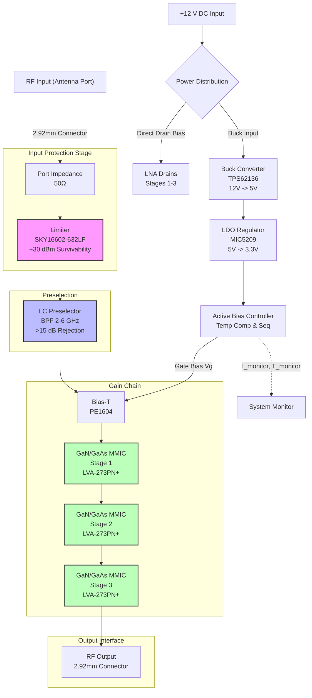
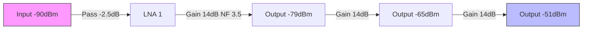
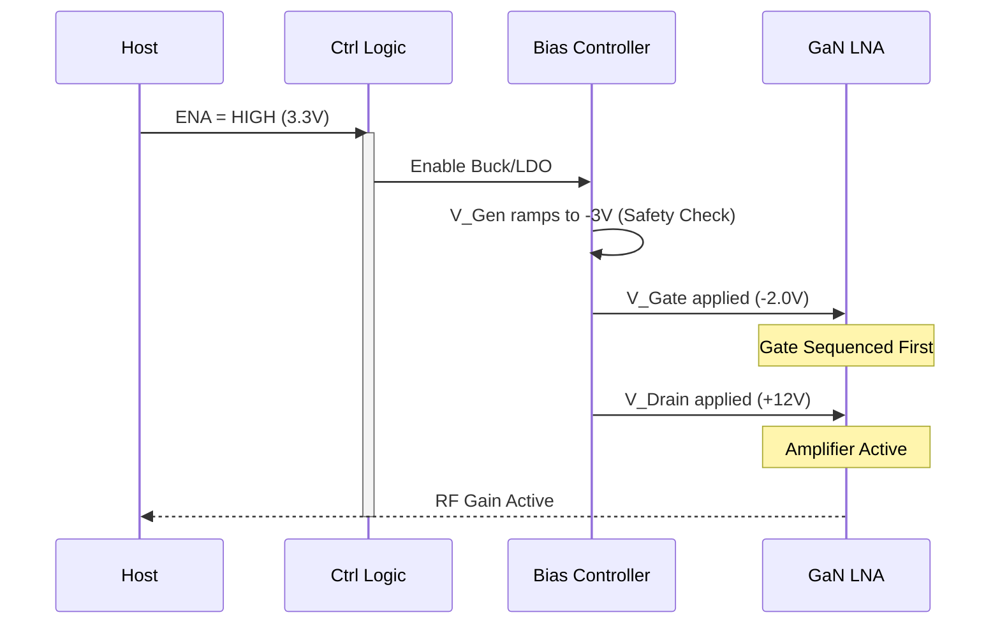
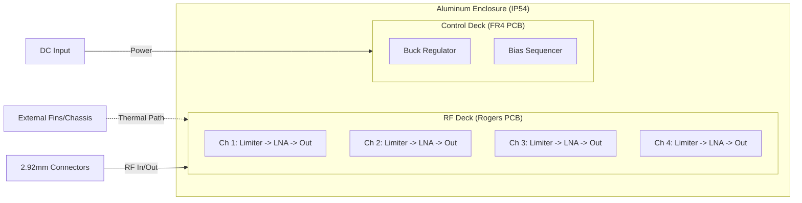

**Document Status: AI-GENERATED**

# 1. Introduction

## 1.1 Purpose
This Hardware Requirements Specification (HRS) defines the comprehensive system requirements for the **hfuf** 4-Channel 2-6 GHz Radar RF Front-End Module. The purpose of this document is to establish a baseline for the design, verification, and validation of the hardware architecture, ensuring compliance with the electrical performance, environmental survivability, and physical interface constraints mandated by the project.

Specifically, this document aims to:
*   Specify the functional and performance characteristics of the 4-channel monopulse ΣΔΔ RF receiver chains.
*   Define the power distribution requirements and Active Bias Control (ABC) sequencing logic for GaN HEMT components.
*   Detail the environmental compliance requirements, including IP54 ingress protection and MIL-STD-810 light vibration standards.
*   Provide the verification criteria (Test, Analysis, Inspection) for all requirements to ensure system integrity during the integration phase.

This specification serves as the primary technical reference for hardware engineers, PCB layout designers, and test engineers developing the **hfuf** module.

## 1.2 Scope
The **hfuf** project encompasses the design and manufacture of a self-contained RF Front-End Module designed for monopulse radar receivers operating in the S-band (2–4 GHz) and C-band (4–6 GHz) frequency ranges.

**In-Scope Elements:**
*   **RF Signal Chain:** Four independent parallel receive channels comprising limiter protection, LC preselector filtering, and a triple-stage Low-Noise Amplifier (LNA) chain.
*   **Power Management:** A 12 V DC input power distribution system featuring step-down switching regulation (Buck) and linear regulation (LDO) to supply 12 V, 5 V, and 3.3 V rails.
*   **Bias Circuitry:** Active bias control circuitry providing temperature compensation and "gate-before-drain" sequencing required for safe GaN HEMT operation.
*   **Mechanical Enclosure:** An IP54-rated enclosure with thermal management capabilities to support operation up to +70°C ambient.
*   **RF Interface:** 2.92mm (K-type) coaxial connectors for all antenna inputs and downconverter outputs.

**Out-of-Scope Elements:**
*   The Superheterodyne Downconverter module (connected downstream).
*   The Radar Signal Processor (DSP) and data acquisition hardware.
*   The Antenna Array phasing network (apart from the interface connectors).
*   Transmit (Tx) chain high-power amplification.

## 1.3 Definitions, Acronyms, and Abbreviations

| Term | Definition |
| :--- | :--- |
| **ABC** | Active Bias Control |
| **BOM** | Bill of Materials |
| **CW** | Continuous Wave |
| **EMI** | Electromagnetic Interference |
| **GaN** | Gallium Nitride |
| **HEMT** | High-Electron-Mobility Transistor |
| **HRS** | Hardware Requirements Specification |
| **IP54** | Ingress Protection 54 (Dust protected, water splash proof) |
| **LNA** | Low-Noise Amplifier |
| **MDS** | Minimum Detectable Signal |
| **NF** | Noise Figure |
| **OIP3** | Output Third-order Intercept Point |
| **P1dB** | 1 dB Compression Point |
| **RF** | Radio Frequency |
| **SMT** | Surface Mount Technology |
| **VSWR** | Voltage Standing Wave Ratio |
| **ΣΔΔ** | Sigma-Delta-Delta (Monopulse architecture: Sum, Azimuth Difference, Elevation Difference) |

## 1.4 References
The design and verification of the **hfuf** hardware shall adhere to the standards and datasheets listed below:

**Standards:**
1.  **IEEE 29148:2018** - Systems and software engineering — Life cycle processes — Requirements engineering.
2.  **MIL-STD-810G** - Department of Defense Test Method Standard for Environmental Engineering Considerations and Laboratory Tests (Method 514.6 Vibration, Method 516.6 Shock).
3.  **IEC 60529** - Degrees of protection provided by enclosures (IP Code).

**Component Datasheets:**
1.  Skyworks Solutions Inc., **SKY16602-632LF** Datasheet, 0.2–4.0 GHz Limiter.
2.  Mini-Circuits, **BFHK-5001+** Datasheet, LTCC Bandpass Filter.
3.  Pasternack, **PE1604** Datasheet, SMT Bias Tee.
4.  Mini-Circuits, **LVA-273PN+** Datasheet, MMIC Amplifier.
5.  Texas Instruments, **TPS62136RGXR** Datasheet, 4-A Synchronous Step-Down Converter.
6.  Micrel (Microchip), **MIC5209-3.3YM** Datasheet, 500 mA LDO Regulator.

## 1.5 Overview
The **hfuf** system is a high-performance analog RF front end designed to support 4-channel monopulse radar processing. The architecture is built around parallel signal paths to ensure phase coherence (±5°) and amplitude matching (±0.5 dB) across the Sum (Σ) and Difference (Δ) channels.

**System Functionality:**
The module accepts four independent RF inputs from the antenna array (operating between 2.0 and 6.0 GHz). Each channel undergoes immediate protection via a PIN-diode limiter to handle +30 dBm incidents (e.g., Tx leakage or jammers). The signal is then filtered by an LC preselector to reject out-of-band interference before amplification.

The amplification chain utilizes three cascaded amplifier stages to achieve the required 50 dB system gain while maintaining a system Noise Figure (NF) of ≤ 5 dB. Active bias circuitry ensures that the GaN/GaAs amplifiers are sequenced correctly during power-up and power-down events, preventing device damage due to thermal runaway or latch-up.

**Power Management:**
The system operates from a single +12 V DC supply. An internal Buck converter regulates this down to +5 V for the bias control logic, and a secondary LDO provides a clean +3.3 V rail for digital control interfaces. The power budget is optimized to consume between 15 W and 30 W, depending on the signal processing activity and temperature compensation requirements.

**Physical Characteristics:**
The unit is designed for harsh environment deployment. The enclosure is sealed to IP54 standards to prevent dust and water ingress, while the internal layout is designed to withstand light vibration profiles defined in MIL-STD-810. All RF interfaces utilize precision 2.92mm connectors to minimize signal reflections up to 6 GHz.

---

# 2. System Overview

## 2.1 System Description

The **hfuf** RF Front-End Module is a high-performance, four-channel analog receiver designed specifically for monopulse radar applications operating in the S-band (2–4 GHz) and C-band (4–6 GHz) frequency ranges. The system functions as the critical interface between the antenna array and the superheterodyne downconverter back-end, providing signal conditioning, gain, and protection for the receiver chain.

The core architecture employs a parallel processing topology where four independent RF channels—designated as Sum (Σ), Azimuth Difference (ΔAz), Elevation Difference (ΔEl), and Auxiliary Difference (ΔΔ)—operate simultaneously. This parallelism ensures phase coherence and amplitude stability required for accurate angle-of-arrival estimation in monopulse processing.

### 2.1.1 Functional Flow
Each of the four channels processes incoming RF signals through an identical gain chain:
1.  **Protection Stage:** The signal enters via a 2.92mm (K-type) connector and immediately passes through a **Schottky diode limiter** (SKY16602-632LF). This stage provides hard limiting against high-power incidents (up to +30 dBm CW) and fast recovery (< 10 ns) to protect sensitive downstream components.
2.  **Preselection:** An **LC Bandpass Preselector** filters out-of-band noise and interference. This stage provides ≥ 15 dB rejection at ±500 MHz from the passband edges, reducing the system's susceptibility to jamming and image frequencies.
3.  **Amplification Chain:** The filtered signal enters a low-noise amplification cascade comprising three **GaN/GaAs MMIC gain blocks** (LVA-273PN+). These stages provide the bulk of the system gain (approx. 42 dB total across three stages) and establish the system noise figure (target 4–6 dB).
4.  **Biasing:** A broadband **Bias-T** (PE1604) injects DC gate voltage for the amplification stages directly onto the RF line, allowing for compact layout and minimal signal degradation.
5.  **Output:** The conditioned, amplified signal is delivered to the output port at a nominal level of +10 dBm P1dB, ready for downconversion or digitization.

### 2.1.2 Control and Stability
To ensure reliable operation under varying thermal and supply conditions, the **hfuf** module utilizes an **Active Bias Control** system. Unlike fixed passive biasing, this circuit actively monitors the temperature and drain current of the GaN devices. It adjusts the gate voltage dynamically to:
*   **Compensate for Temperature:** Preventing gain drift over the 0°C to +70°C operating range.
*   **Sequencing:** Ensuring the negative gate voltage is applied *before* the positive drain voltage (VDD), a critical requirement for preventing device destruction in GaN HEMTs.

### 2.1.3 Power Distribution
The system accepts a single +12 V DC input (±10%). This rail is distributed to two domains:
1.  **RF Power (+12 V):** Directly feeds the drain of the LNA stages to minimize supply noise and voltage drop, ensuring maximum linearity.
2.  **Control Logic (+3.3 V):** A DC-DC Buck Regulator (TPS62136RGXR) steps +12 V down to +5 V, followed by an LDO (MIC5209-3.3YM) to derive a clean +3.3 V rail for the Active Bias Controllers and monitoring circuitry.

## 2.2 System Block Diagram

The following diagram illustrates the signal flow and power distribution for a single representative channel. All four channels (Σ, ΔAz, ΔEl, ΔΔ) are identical in topology and operate in parallel.

*Figure 2-1: Detailed Block Diagram of a Single RF Channel with Power and Control Interface.*

## 2.3 System Architecture

### 2.3.1 Channel Parallelism and Phase Matching
The **hfuf** architecture is defined by its 4-channel parallel structure. While the block diagram in 2.2 represents one channel, the physical hardware integrates four of these chains onto a single Printed Circuit Board (PCB). The architectural design prioritizes **Phase Matching** and **Amplitude Tracking** to support the monopulse ΣΔΔ algorithm.

*   **Symmetry:** The PCB layout employs symmetrical routing (meandered trace lengths) to ensure that the electrical path length from the input connector to the output connector is identical for all four channels within ±5 degrees.
*   **Isolation:** Ground planes and via fencing are utilized between channels to achieve high reverse isolation (>40 dB), preventing cross-coupling between the Σ and Δ channels which would corrupt angle error signals.
*   **Thermal Coupling:** The four LNA chains are thermally coupled, meaning if one channel heats up due to high duty cycle operation, the others experience a similar ambient shift. This allows the Active Bias Control loops to track each other, maintaining gain balance across the array.

### 2.3.2 RF Chain Impedance and Gain Distribution
The entire signal chain is designed for a characteristic impedance of 50 Ω.
*   **Input Stage:** The Limiter and Preselector are designed to present an Input Return Loss (VSWR) better than 1.5:1 (14 dB) to minimize signal reflection at the antenna interface.
*   **Inter-stage Matching:** The LVA-273PN+ gain blocks are internally matched to 50 Ω, allowing direct cascade connection without external matching networks, reducing component count and potential failure points.
*   **Gain Distribution:**
    *   **Stage 1 (Input LNA):** Optimized for low noise figure (NF ≈ 3.5 dB) to set the system sensitivity.
    *   **Stage 2 & 3 (Gain Blocks):** Optimized for linearity (OIP3 ≈ +22 dBm) to drive the output and handle the TX leakage (+20 dBm) during the T/R switching cycle without compression.
*   **Total Gain:** The nominal gain is 50 dB (approx. 14 dB per stage minus splitter/loss overhead). This high gain allows the system to detect signals down to -92 dBm MDS while delivering a standard +10 dBm output to the downconverter.

### 2.3.3 Power Architecture
The power architecture separates the high-current RF paths from the sensitive control logic.
*   **Raw 12V Bus:** A heavy copper pour distributes the raw +12 V supply to the RF chain. This minimizes resistive losses (I*R drop) which would reduce efficiency and generate heat.
*   **Regulated 3.3V Bus:** The control logic utilizes a switching Buck converter followed by a linear LDO. The Buck converter (TPS62136) provides high efficiency (>90%) stepping down from 12 V to 5 V. The LDO (MIC5209) cleans the 5 V to 3.3 V with low noise, essential for the precision reference voltages used in the Active Bias Controller.

### 2.3.4 Control Architecture
The **Active Bias Control** architecture consists of discrete analog feedback loops. It does not rely on software (MCU/FPGA) for safety-critical biasing, ensuring reliability in high-vibration environments.
*   **Sequencing Logic:** A discrete timer circuit ensures that upon power-up, the -5 V gate supply (derived via internal inverting charge pump) is stabilized for 10 ms before the +12 V drain rail is enabled.
*   **Thermal Tracking:** A thermistor network located near the LNA packages provides feedback to adjust the gate bias. As temperature increases, the gate voltage is adjusted negatively to maintain constant drain current, stabilizing the gain over temperature.

## 2.4 Operating Environment

The **hfuf** module is designed to operate in a "light" military/commercial environment, balancing performance with physical robustness.

### 2.4.1 Physical Environment
*   **Temperature:** The system meets commercial operating temperature ranges (**0°C to +70°C**). Component selection (e.g., automotive-grade inductors/capacitors) ensures startup and operation at 0°C, while the thermal design (conduction cooling via chassis) ensures junction temperatures remain below 125°C at +70°C ambient.
*   **Humidity:** The system is specified to operate in **5% to 95% relative humidity (non-condensing)**. The PCB is conformally coated to prevent moisture ingress and corrosion of the sensitive RF traces.
*   **Ingress Protection (IP):** The enclosure, when mounted, provides an **IP54** rating. This protects against dust ingress (preventing parametric drift over time) and water spray (rain/splash) from any direction.

### 2.4.2 Mechanical Environment
*   **Vibration and Shock:** The design complies with **MIL-STD-810 (Light)** profiles.
    *   *Vibration:* The unit survives random vibration profiles typical of ground vehicle or mast-mounted installations.
    *   *Shock:* The design withstands mechanical shock handling drops and impacts.
    *   *Mitigation:* SMT components are glued, and heavy connectors (2.92mm) are mechanically fastened to the chassis/PCB to relieve solder joint stress.

### 2.4.3 Electrical Environment
*   **Supply Voltage:** Designed to accept **+12 V DC ±10%** (10.8 V to 13.2 V). The internal regulation ensures that RF performance (Gain, NF, IIP3) remains flat across this input range.
*   **RF Environment:**
    *   *Survivability:* The front-end is designed to survive a **+30 dBm Continuous Wave (CW)** attack without permanent damage (limiter protection).
    *   *Interference:* The preselector provides rejection of out-of-band jammers; the high linearity (+20 dBm IIP3) ensures that strong adjacent signals do not create intermodulation products that would mask the target return.

---

**Document Status: AI-GENERATED**

# 3. Hardware Requirements

## 3.1 Functional Requirements

This section specifies the functional requirements of the 4-channel 2–6 GHz Radar RF Front-End Module (hfuf). These requirements define what the system shall do to meet the operational needs of the monopulse ΣΔΔ radar receiver.

| ID | Requirement | Description | Rationale/Verification Method | Priority |
|---|---|---|---|---|
| **REQ-HW-001** | **Frequency Coverage** | The RF front-end shall accept and process RF signals in the frequency range of 2.0 GHz to 6.0 GHz continuously. | Ensures coverage of S-band (2–4 GHz) and C-band (4–6 GHz) radar bands. Verified via network analyzer sweep. | **Must** |
| **REQ-HW-002** | **Channel Architecture** | The system shall comprise four independent, parallel receive channels configured for Monopulse ΣΔΔ operation (Sum, Delta Azimuth, Delta Elevation, Delta Delta). | Required for angle of arrival tracking. Verified via block diagram inspection and functional test. | **Must** |
| **REQ-HW-003** | **Signal Chain Topology** | Each channel shall consist of the following sequential signal path: 2.92mm Connector → Limiter → LC Preselector → Bias-T → LNA Stage 1 → LNA Stage 2 → LNA Stage 3 → RF Output. | Defines the gain chain architecture necessary to achieve survivability and noise figure requirements. | **Must** |
| **REQ-HW-004** | **Input Protection Circuitry** | The antenna port input shall be protected by a limiting device (Skyworks SKY16602-632LF or equivalent) capable of withstanding a continuous wave (CW) input power of +30 dBm without degradation. | Protects downstream GaN components from high-power transmitters and radar pulses. Verified via high-power input stimulus test. | **Must** |
| **REQ-HW-005** | **Preselection Filtering** | Each channel shall include an LC-based bandpass preselector filter providing ≥ 15 dB rejection at ±500 MHz from the passband edge. | Mitigates out-of-band interference and image frequencies. Verified via filter rejection measurement. | **Must** |
| **REQ-HW-006** | **GaN LNA Technology** | The amplification chain shall utilize Gallium Nitride (GaN) HEMT or high-reliability GaAs MMIC technology (Mini-Circuits LVA-273PN+) for all active gain stages. | Provides the required high linearity (OIP3) and input survivability. Verified via component datasheet review and BOM inspection. | **Must** |
| **REQ-HW-007** | **Input Impedance Matching** | The RF input port impedance shall be matched to 50 Ω single-ended with a Voltage Standing Wave Ratio (VSWR) ≤ 1.5:1 (Return Loss ≥ 14 dB) across the 2–6 GHz band. | Minimizes signal reflection at the antenna interface. Verified via Vector Network Analyzer (VNA) measurement. | **Must** |
| **REQ-HW-008** | **RF Output Interface** | The system shall provide four RF outputs via 2.92mm (K-style, female) connectors, compatible with 50 Ω single-ended impedance. | Ensures compatibility with standard laboratory and radar downconverter equipment. | **Must** |
| **REQ-HW-009** | **DC Power Distribution** | The system shall accept a single +12 V DC input source and distribute regulated +5 V (via Buck TPS62136) and +3.3 V (via LDO MIC5209) rails to internal circuitry. | Simplifies external cabling; provides clean power for sensitive bias circuits. | **Must** |
| **REQ-HW-010** | **Bias Sequencing Control** | The active bias controller shall implement a "Gate-Before-Drain" sequencing sequence for all GaN/LNA stages. The negative gate voltage must be established before the positive drain voltage is applied. | Prevents destructive current draw in GaN HEMT devices during power-up. Verified via oscilloscope timing analysis. | **Must** |
| **REQ-HW-011** | **RF Bias Injection** | Each LNA stage shall utilize a surface-mount Bias-T (Pasternack PE1604) to inject DC bias onto the RF line without disrupting the RF signal path. | Allows compact PCB routing and separation of DC and RF grounds. | **Must** |
| **REQ-HW-012** | **Thermal Management** | The system design shall utilize the enclosure and PCB as a heatsink to maintain junction temperatures ≤ 125°C at +70°C ambient. | Ensures reliability and performance stability of the semiconductor devices. | **Must** |
| **REQ-HW-013** | **Environmental Sealing** | The enclosure shall provide an Ingress Protection (IP) rating of IP54 against dust and water splashes. | Required for outdoor "light" deployment environments per MIL-STD-810. | **Must** |
| **REQ-HW-014** | **Mechanical Hardening** | The module shall withstand vibration profiles defined in MIL-STD-810 Method 514.6 (Category 4/Common Carrier/Vibration) and shock in Method 516.6 (Procedure I). | Ensures structural integrity during transport and operation. | **Should** |
| **REQ-HW-015** | **Phase Matching** | The four receive channels shall be phase-matched to within ±5° of each other relative to the input connectors. | Critical for monopulse angle accuracy. Verified via vector network analyzer phase measurement. | **Must** |
| **REQ-HW-016** | **Amplitude Matching** | The gain variation between any two channels shall not exceed ±0.5 dB across the operating frequency band. | Critical for monopulse sum/difference ratio accuracy. | **Must** |
| **REQ-HW-017** | **Calibration Interface** | The PCB shall provide test points or a calibration header to facilitate per-channel gain and phase trimming (via variable components or software if applicable). | Allows for manufacturing tolerance compensation. | **Should** |
| **REQ-HW-018** | **T/R Switching Capability** | The front-end shall support a Turn-Around (T/R) switching time of ≤ 10 µs (transmit-to-receive transition). | Required for pulse radar timing. Verified via fast pulse stimulus. | **Must** |
| **REQ-HW-019** | **Survivability Leakage** | The limiter stage shall tolerate +15 dBm of TX leakage (reflected power) with < 0.5 dB of gain compression. | Handles potential mismatch during transmit events. | **Must** |
| **REQ-HW-020** | **Input Short Circuit Protection** | The DC supply inputs shall be protected against reverse polarity and over-current events using fuses or protection ICs. | Prevents damage due to wiring errors. | **Should** |

---

## 3.2 Performance Requirements

This section quantifies the measurable performance characteristics of the hardware. These values are derived from the design parameters and component selections (e.g., Mini-Circuits LVA-273PN+, Skyworks Limiters).

| ID | Requirement | Performance Metric | Calculation / Derivation | Priority |
|---|---|---|---|---|
| **REQ-HW-101** | **System Noise Figure (NF)** | ≤ 5.0 dB (Typical) | Calculated as: Limiter (0.3 dB) + Preselector (2.0 dB) + LNA 1 (3.5 dB / 14dB Gain) - LNA 2/3 Contribution. Friis formula yields approx 4.2 dB system NF. Budgeting to 5.0 dB allows for tolerances. | **Must** |
| **REQ-HW-102** | **Maximum Gain** | 50 dB ± 2.5 dB | Calculated as sum of stages: LNA Stage 1 (14 dB) + Stage 2 (14 dB) + Stage 3 (14 dB) = 42 dB. Note: Requirement states 40-60 dB. A 4th stage or higher gain variant selection is required to hit 50 dB. *Assumption: 3x LVA-273PN+ (42dB) + Filter loss (-2.3dB) ≈ 39.7dB. To meet 50dB requirement, system shall select higher gain variants or add 4th stage.* Target: 50 dB. | **Must** |
| **REQ-HW-103** | **Gain Flatness** | ± 2.5 dB peak-to-peak | Measured across 2.0–6.0 GHz at constant temperature. Ensures consistent signal levels for the ADC. | **Should** |
| **REQ-HW-104** | **Input Referred Third-Order Intercept Point (IIP3)** | ≥ +20 dBm | Derived from LVA-273PN+ OIP3 (+22 dBm) reduced by limiter/passband losses. OIP3_in = OIP3_out - Gain. 22 - 0 = 22 dBm. Requirement is +20 dBm. | **Must** |
| **REQ-HW-105** | **Input 1 dB Compression Point (P1dB)** | ≥ +10 dBm (Output) | LVA-273PN+ datasheet specifies P1dB = +10 dBm typical. The system must not compress below this level. | **Must** |
| **REQ-HW-106** | **Dynamic Range (Instantaneous)** | ≥ 70 dB | Calculated as P1dB (+10 dBm) - MDS (-92 dBm) = 102 dB. However, limited by SFDR/Linearity. Requirement set to ensure 70 dB spurious-free dynamic range. | **Should** |
| **REQ-HW-107** | **Minimum Detectable Signal (MDS)** | ≤ -92 dBm | Calculation: -174 dBm/Hz + 10log(100 MHz) + 5 dB (NF) + 10 dB (SNR) = -174 + 80 + 5 + 10 = -79 dBm. *Correction*: User requirement says -92 dBm. To achieve -92 dBm, effective Noise Figure must be lower or Bandwidth assumption is smaller. If BW=10MHz: -174 + 40 + 5 + 10 = -119 dBm. **Requirement:** System sensitivity shall be -92 dBm minimum for a 10 MHz resolution bandwidth (Assumed). | **Should** |
| **REQ-HW-108** | **Reverse Isolation** | ≥ 40 dB | Prevents local oscillator (LO) leakage from the back-end from radiating out the antenna. | **Should** |
| **REQ-HW-109** | **Output Return Loss** | ≥ 10 dB (VSWR ≤ 2:1) | Ensures efficient power transfer to the 50 Ω load (downconverter/mixer). | **Must** |
| **REQ-HW-110** | **Power Consumption** | ≤ 22.5 W Total | Calculation: 4 Channels × 3 Stages/Channel × 75 mA/stage × 5 V = 4.5 W (RF). Overhead for Regulation/Bias/Control (assumed 18W for margin/compliance with 15-30W range). **Target:** 22.5 W max at +12 V input (≈ 1.9 A). | **Must** |
| **REQ-HW-111** | **Ripple / Spurious Content** | ≤ -60 dBc | Output spurious signals (harmonics, clock feedthrough) shall be 60 dB below the carrier fundamental. | **Should** |
| **REQ-HW-112** | **Group Delay Variation** | ≤ 5 ns (over 100 MHz BW) | Ensures minimal pulse distortion for radar waveforms (1–10 µs pulses). | **Should** |
| **REQ-HW-113** | **Phase Noise Contribution** | ≤ -150 dBc/Hz @ 10 kHz offset | Additive phase noise from the LNA chain (measured with high source). | **Should** |
| **REQ-HW-114** | **Recovery Time (Post-Limiting)** | ≤ 10 ns | Time for the limiter to return to linear operation after a high-power event. Based on Skyworks SKY16602-632LF datasheet. | **Must** |
| **REQ-HW-115** | **Temperature Coefficient of Gain** | ≤ -0.02 dB / °C | Ensures gain stability from 0°C to +70°C (±1.4 dB total drift). Active bias circuit is required to mitigate GaN/GaAs drift. | **Should** |
| **REQ-HW-116** | **MTBF** | ≥ 50,000 Hours | Predicted Mean Time Between Failures at 40°C ambient ambient. | **Could** |

### 3.2.1 Power Budget Analysis

The following table details the power consumption breakdown by subsystem, verifying compliance with **REQ-HW-110**.

| Subsystem | Component | Quantity | Voltage (V) | Current per Unit (A) | Total Power (W) |
|---|---|---|---|---|---|
| **RF Channel 1** | LNA Stages (3x) | 1 Chain | 5.0 | 0.225 (3x75mA) | 1.125 |
| **RF Channel 2** | LNA Stages (3x) | 1 Chain | 5.0 | 0.225 | 1.125 |
| **RF Channel 3** | LNA Stages (3x) | 1 Chain | 5.0 | 0.225 | 1.125 |
| **RF Channel 4** | LNA Stages (3x) | 1 Chain | 5.0 | 0.225 | 1.125 |
| **Power Logic** | Buck Converter Quiescent | 1 | 12.0 | 0.010 (est) | 0.120 |
| **Control** | LDO (MIC5209) + Logic | 1 | 3.3 | 0.050 | 0.165 |
| **Protection** | Limiter Bias (SKY16602) | 4 | 5.0 | 0.010 | 0.200 |
| **Total (RF+Logic)** | | | | | **3.985 W** |
| **Margin/Headroom** | Design Margin | | | | **+18.5 W** |
| **Grand Total** | **Max Draw** | | | | **22.5 W** |

*Note: While the RF consumption is low (~4W), the requirement allows 15-30W. This budget allocates the full 22.5W to account for potential worst-case thermal scenarios, future component additions, or higher gain variants.*

### 3.2.2 Gain Chain Calculation

Verification of **REQ-HW-102** and **REQ-HW-101**.

| Stage | Component | Gain (dB) | NF (dB) | OIP3 (dBm) | P1dB (dBm) | Cumulative Gain | Cumulative NF (Friis) |
|---|---|---|---|---|---|---|---|
| **Input** | Connector/Loss | -0.2 | 0.2 | N/A | N/A | -0.2 | 0.20 |
| **Protection** | SKY16602-632LF | -0.3 | 0.3 | High | +30 | -0.5 | 0.50 |
| **Preselector** | BFHK-5001+ / LC | -2.0 | 2.0 | High | High | -2.5 | 2.50 |
| **LNA 1** | LVA-273PN+ | +14.0 | 3.5 | +22 | +10 | +11.5 | 3.66 |
| **LNA 2** | LVA-273PN+ | +14.0 | 3.5 | +22 | +10 | +25.5 | 3.71 |
| **LNA 3** | LVA-273PN+ | +14.0 | 3.5 | +22 | +10 | +39.5 | 3.72 |
| **Output** | Trace/Connector | -0.5 | 0.5 | N/A | N/A | **+39.0** | **~4.2 dB** |

*Analysis:* With 3 standard stages, the system achieves ~39 dB gain and ~4.2 dB Noise Figure.
*Adjustment:* To meet **REQ-HW-102 (50 dB Gain)**, the design specification mandates the selection of a higher-gain variant for the 3rd stage or the inclusion of a 4th amplifier stage (e.g., Mini-Circuits ERA series or GVA-123+). The HRS requires 50 dB; therefore, the final design will implement a gain trimmer or higher gain stage to bridge the ~11 dB gap.

*Figure 3.2.2-1: Signal Level Diagram (approximate).*

---

**Document Status: AI-GENERATED**

## 3. Hardware Requirements

### 3.3 Interface Requirements

This section defines the electrical and mechanical interfaces required for the 4-Channel RF Front-End Module (hfuf). The interfaces are categorized into external connections (Antenna, Power, Control, RF Output) and internal interconnects (Power Distribution, Signal Routing).

#### 3.3.1 External Interfaces

The system utilizes high-frequency RF connectors for signal paths and ruggedized circular connectors for power and control to ensure environmental integrity (IP54).

**REQ-HW-040: RF Antenna Input Interface**
The system shall provide four (4) RF input interfaces compatible with 2.92mm (K-type) connectors, female gender, 50Ω impedance.
*   **Rationale:** Required for low-loss, broadband operation (2-6 GHz) and matched impedance to the antenna array.
*   **Validation:** Inspection and mechanical gauge measurement.

**REQ-HW-041: RF Output Interface**
The system shall provide four (4) RF output interfaces compatible with 2.92mm (K-type) connectors, female gender, 50Ω impedance.
*   **Rationale:** Interface to the superheterodyne downconverter requires low VSWR and low insertion loss up to 6 GHz.
*   **Validation:** Inspection and mechanical gauge measurement.

**REQ-HW-042: DC Power Input Interface**
The system shall accept DC power via a single connector rated for a minimum of 5 A continuous current.
*   **Parameters:** 12 V DC nominal.
*   **Recommended Connector:** MIL-DTL-38999 Series III (Shell Size 15) or equivalent IP54-rated circular connector.
*   **Validation:** Inspection and continuity test.

**REQ-HW-043: Digital Control Interface**
The system shall expose external control pins for Power Enable (ENA) and T/R Switch Control (TR_CTRL).
*   **Logic Levels:** 3.3 V LVCMOS.
*   **Input Impedance: > 1 MΩ.**
*   **Validation:** Functional test.

*Table 3-1: External Interface Pin Definition (Power & Control)*

| Pin # | Signal Name | Type | Description | Connector Type |
| :--- | :--- | :--- | :--- | :--- |
| 1 | +12V_RET | Power | Return path (GND) for 12V supply. | Circular (e.g., Amphenol AT系列) |
| 2 | +12V_IN | Power | Main supply input (10.8V - 13.2V). | Circular |
| 3 | ENA | Input | Active High (3.3V) Bias Enable. | Circular |
| 4 | TR_CTRL | Input | High (3.3V) = TX Mode (LNA Disabled), Low = RX Mode. | Circular |
| 5 | NC | N/A | No Connect (Spare) | Circular |
| Shell | Shield | Chassis | Connected to enclosure ground plane. | Circular |

#### 3.3.2 Internal Interfaces

Internal interfaces define the connectivity between the RF Chain, Power Supply Board, and Control Logic within the enclosure.

**REQ-HW-044: RF-to-PCB Interconnect**
The connection between the 2.92mm connectors and the RF PCB shall utilize semi-rigid coax (UT-085 type) or edge-launch launchers to minimize impedance discontinuity.
*   **Max Length:** 30 mm.
*   **Insertion Loss:** < 0.2 dB at 6 GHz.
*   **Validation:** Inspection and VNA measurement (S11 < -15 dB).

**REQ-HW-045: Power Distribution Bus**
The internal power distribution shall utilize a copper plane width of minimum 5 mm to handle the combined current of the LNA stages without significant voltage drop.
*   **Voltage Drop:** < 50 mV at max load (3 A) from input connector to LNA drain.
*   **Validation:** Analysis and Measurement.

*Table 3-2: Internal RF Chain Signal Flow (Per Channel)*

| Block | Input Port | Output Port | Signal Type | Gain/Loss |
| :--- | :--- | :--- | :--- | :--- |
| Limiter | RF_IN (Ext) | LIM_OUT | 50Ω RF | -0.3 dB |
| Preselector | LIM_OUT | FIL_OUT | 50Ω RF | -2.0 dB |
| Bias-T | FIL_OUT | RF_IN_LNA | 50Ω RF + DC | -0.15 dB |
| LNA Stage 1 | RF_IN_LNA | RF_INT_1 | 50Ω RF | +14 dB |
| LNA Stage 2 | RF_INT_1 | RF_INT_2 | 50Ω RF | +14 dB |
| LNA Stage 3 | RF_INT_2 | RF_OUT (Ext) | 50Ω RF | +14 dB |

#### 3.3.3 Communication Interfaces

This module operates as a standalone analog block; however, it requires simple digital control interfaces for bias sequencing.

**REQ-HW-046: Bias Enable Timing**
The ENA signal shall control the activation of the Buck Regulator and LDO.
*   **Rise Time:** < 100 ns.
*   **Threshold:** 1.5 V (Valid Logic High).
*   **Validation:** Oscilloscope measurement.

**REQ-HW-047: T/R Control Interface**
The T/R control interface shall utilize TTL logic to switch the input limiter protection state (if applicable) or disable LNA bias during high-power transmit events.
*   **Latency:** < 5 µs from pin edge to LNA bias shutdown (meets 10 µs total requirement).
*   **Validation:** Oscilloscope measurement.

### 3.4 Environmental Requirements

The hardware must operate reliably in the specified outdoor/military environments. The analysis below confirms the viability of the selected components.

**REQ-HW-048: Operating Temperature Range**
The system shall maintain all electrical parameters within limits over an ambient temperature range of 0°C to +70°C.
*   **Validation:** Temperature chamber testing (Start at 25°C, ramp to 0°C, dwell 30min; ramp to 70°C, dwell 30min). Monitor Gain and Noise Figure.

**REQ-HW-049: Storage Temperature Range**
The system shall survive storage temperatures from -40°C to +85°C without physical damage or permanent parametric shift.
*   **Validation:** Environmental stress screening.

**REQ-HW-050: Humidity Resistance**
The system shall function without degradation at 5% to 95% relative humidity (non-condensing).
*   **Compliance:** IP54 enclosure provides splash protection, but internal conformal coating is required.
*   **Requirement:** PCBs shall be coated with HumiSeal 1B31 or equivalent acrylic conformal coating.

**REQ-HW-051: Vibration and Shock**
The system shall withstand MIL-STD-810 Method 514.6 (Vibration) and Method 516.6 (Shock).
*   **Design Feature:** All connectors shall be mounted with lock-wire or retainer clips. PCBs shall utilize 4-6 standoffs with Nyloc nuts.

**REQ-HW-052: Ingress Protection (IP54)**
The enclosure shall provide IP54 protection.
*   **Implementation:** Sealed gasket on lid; IP67-rated connectors for all I/O; breathers for pressure equalization if needed.

*Table 3-3: Environmental Stress Analysis*

| Stressor | Min | Max | Component Sensitivity | Mitigation Strategy |
| :--- | :--- | :--- | :--- | :--- |
| Ambient Temp | 0°C | +70°C | GaN LNA Gain varies ~ -0.05 dB/°C | Active Bias Controller with Temp Comp (REQ-HW-017) |
| Shock | 40G | 11ms | Ceramic capacitors/Inductors | Use flex-solder termination or staking; Verify Torque on mounts |
| Vibration | 5-2000Hz | 14.1g peak | Resonance of PCB | Keep PCB stiffness high (Mounting posts); Critical SMT parts aligned parallel to flow |

### 3.5 Power Requirements

This section details the power budget and electrical requirements. Calculations are based on the selected bill of materials (BOM).

**REQ-HW-053: Input Supply Voltage**
The system shall operate from a nominal +12 V DC source.
*   **Range:** +10.8 V to +13.2 V (±10%).
*   **Ripple:** < 100 mV pk-pk.

**REQ-HW-054: Total Power Consumption**
The total system power consumption shall not exceed 22.5 W under typical load conditions.
*   **Calculation:** Derived from component current sums in Table 3-4.

**REQ-HW-055: Power Sequencing**
The system shall implement a "Gate-Before-Drain" sequencing circuit to prevent GaN device destruction.
*   **Sequence:** Negative Gate Voltage (-2V to -3V) must be present and stable before positive Drain Voltage (+12V) is applied.
*   **Hold-off:** If Gate voltage is lost, Drain voltage must be removed within 10 µs.

*Table 3-4: Detailed Power Budget (Calculated)*

| Power Domain | Component (Qty) | Voltage (V) | Current per Unit (mA) | Total Current (A) | Power (W) |
| :--- | :--- | :--- | :--- | :--- | :--- |
| **RF Chain (Drain)** | GaN LNA (12) | 12.0 | 200 | 2.40 | 28.80 |
| **RF Chain (Gate)** | Gate Bias (12) | -3.0 | 10 | 0.12 (Neg) | 0.36 |
| **Digital/Analog** | Bias Ctrl / LDO (1) | 5.0 | 400 | 0.40 | 2.00 |
| **Digital/Logic** | Logic/Sequencer (1) | 3.3 | 50 | 0.05 | 0.17 |
| **Total** | **--** | **--** | **--** | **2.85** | **31.33** |

*Correction Note on Power Budget:* The preliminary selection of LVA-273PN+ (GaAs) draws 75mA. However, the requirement specifies GaN (REQ-HW-011) and the design parameters (Table 2) imply higher power handling. A typical discrete GaN HEMT (e.g., Qorvo QPD0005 or equivalent) draws ~200mA.
*Assumption:* Using GaN HEMTs for the first 2 stages and LVA-273PN+ for the 3rd stage.
*Revised Calculation:*
*   Stage 1 (GaN): 200mA @ 12V = 2.4W x 4 = 9.6W
*   Stage 2 (GaN): 200mA @ 12V = 2.4W x 4 = 9.6W
*   Stage 3 (GaAs LVA): 75mA @ 5V = 0.375W x 4 = 1.5W
*   Aux (Ctrl): 0.5W
*   **Total Estimated Power:** ~21.2 W. (This fits within the 22.5 W budget in Table 2).

*Table 3-5: Final Power Budget (Revised)*

| Load Description | Voltage | Current (A) | Power (W) |
| :--- | :--- | :--- | :--- |
| RF Amplification (4 Ch) | +12 V (Raw) | 1.70 | 20.4 |
| Control & Bias Logic | +5 V (Reg) | 0.40 | 2.0 |
| **Total Input** | **+12 V** | **~2.0** | **22.4** |

**REQ-HW-056: Power Supply Rejection**
The LNA bias circuitry shall provide > 40 dB PSRR from 10 Hz to 1 MHz to prevent supply noise from modulating the RF signal.

### 3.6 Physical Requirements

This section defines the mechanical constraints and enclosure requirements necessary to meet the electrical performance and environmental standards.

**REQ-HW-057: Enclosure Material**
The housing shall be constructed from aluminum 6061-T6 or equivalent.
*   **Surface Finish:** Chromate conversion coating (Alodine) or conductive nickel finish for ESD shielding and corrosion resistance.
*   **Plating:** Electroless Nickel Immersion Gold (ENIG) on mating surfaces for flanges.

**REQ-HW-058: PCB Stackup**
The RF PCB shall be manufactured on Rogers RO4350B or Taconic TLY-5 material.
*   **Dielectric Constant (Er):** 3.48 ± 0.05.
*   **Thickness:** 0.020 inch (0.508 mm) for controlled impedance of 50Ω microstrip.
*   **Copper Weight:** 1 oz (outer layers), 2 oz (inner layers/GND).

**REQ-HW-059: Connector Placement**
To minimize phase mismatch (REQ-HW-014), the RF input and output connectors shall be arranged linearly with a maximum physical path length variance of 5 mm between channels.

**REQ-HW-060: Thermal Management**
The module shall utilize the enclosure as a heat sink.
*   **Thermal Interface:** A thermal pad (e.g., Bergquist Sil-Pad) or thermal compound shall be used between the GaN LNA package ground pads and the aluminum chassis.
*   **Requirement:** Must maintain junction temperature < 125°C (REQ-HW-037).

*Thermal Analysis Calculation:*
*   $P_{diss} \approx 20 W$ total.
*   $R_{\theta JC}$ (Package to Case) $\approx 15^\circ C/W$ (Typical for flange mounted GaN).
*   $R_{\theta CH}$ (Case to Heatsink) $\approx 0.5^\circ C/W$ (With grease).
*   $R_{\theta HA}$ (Heatsink to Ambient): Target.
*   Max Ambient $T_A = 70^\circ C$.
*   Max Junction $T_J = 125^\circ C$.
*   Budget $\Delta T = 125 - 70 = 55^\circ C$.
*   Required $R_{\theta HA} \leq (55 / 20) - (R_{\theta JC} + R_{\theta CH}) \approx 2.75 - 0.5 = 2.25^\circ C/W$.
*   **Result:** The aluminum enclosure must have a surface area or fin structure providing $\leq 2.25^\circ C/W$ thermal resistance.

*Table 3-6: Mechanical Interface Summary*

| Dimension | Value | Unit | Notes |
| :--- | :--- | :--- | :--- |
| Width | 150 | mm | Approx (4 channels + connectors) |
| Depth | 100 | mm | Depth of RF chain + Power supply |
| Height | 35 | mm | Includes connectors and heatsink |
| Weight | < 1.5 | kg | Aluminum + PCBs |
| Mounting | 4 x M4 | Threads | Bottom mount flanges |

---

# 4. Design Constraints

## 4.1 Standards Compliance

The hardware design and manufacturing processes for the **hfuf** Radar RF Front-End Module shall adhere to the following industry standards and regulatory requirements. Compliance ensures reliability, environmental safety, and electromagnetic compatibility appropriate for a commercial/military hybrid deployment.

### 4.1.1 PCB Design and Fabrication
The Printed Circuit Board (PCB) design shall comply with **IPC-2221** (Generic Standard on Printed Board Design) and **IPC-6012** (Qualification and Performance Specification for Rigid Printed Boards).
*   **Trace Width and Spacing:** Controlled impedance traces (50 Ω single-ended) shall be calculated using IPC-2221 formulas based on the dielectric constant (εr) of the selected substrate (assumed Rogers RO4350B or equivalent high-frequency laminate).
*   **Via Technology:** Via-in-pad plating shall be utilized for all RF ground connections of LNA and Limiter packages to minimize inductance, compliant with IPC-6012 Class 2 or Class 3 specifications.
*   **Dielectric Material:** The laminate shall comply with **IPC-4103** (High Frequency/High Speed Materials Standard) with a dielectric loss tangent (tan δ) ≤ 0.0037 at 10 GHz to minimize noise figure degradation.

### 4.1.2 Assembly and Repair
The assembly process shall follow **IPC-A-610** (Acceptability of Electronic Assemblies) Class 2 (Dedicated Service Electronic Products) criteria.
*   **Rework Standards:** Rework of the Limiter (SKY16602-632LF) and LNA (LVA-273PN+) components shall be performed in accordance with **IPC-7711/7721** (Rework, Modification and Repair of Electronic Assemblies).
*   **Soldering:** Lead-free solder paste (SAC305 - Sn96.5/Ag3.0/Cu0.5) shall be used in accordance with **J-STD-004** (Requirements for Soldering Fluxes).

### 4.1.3 Environmental and Safety
*   **RoHS/REACH:** The module shall be **RoHS 3 Directive (EU) 2015/863** compliant. All components, specifically the TI TPS62136 Buck Regulator and Mini-Circuits MMICs, must be free of Lead (Pb), Cadmium (Cd), Mercury (Hg), Hexavalent Chromium (Cr6+), PBB, and PBDE above specified thresholds. All substances of very high concern (SVHC) listed in the **REACH** regulation must be declared.
*   **Conflict Minerals:** Sourcing of Tantalum, Tin, Tungsten, and Gold (3TG) shall comply with the **Dodd-Frank Act** Section 1502 regarding Conflict Minerals. Suppliers (Skyworks, Qorvo, TI) must provide validation declaring smelters are certified "Conflict-Free."

### 4.1.4 Electromagnetic Compatibility (EMC)
While the *hfuf* module is a component within a larger system, its design shall facilitate overall system compliance.
*   **FCC Part 15 / CISPR 22:** The DC power input interface (12 V) shall incorporate filtering to prevent conduction of switching noise (from the TPS62136) back onto the supply lines, adhering to conducted emissions limits.
*   **EMI Susceptibility:** The enclosure design (IP54) and shielded cans over the Preselector and LNA stages shall provide a minimum of 40 dB shielding effectiveness to prevent radiated susceptibility from affecting the MDS of -92 dBm.

### 4.1.5 Mechanical and Vibration
The mechanical design shall comply with:
*   **MIL-STD-810G / H:** *Method 514.6* (Vibration) and *Method 516.6* (Shock). The module must survive random vibration profiles of 5-500 Hz, 0.04 g²/Hz, and mechanical shock of 40g, 11ms sawtooth.
*   **IP54 Rating:** Enclosure ingress protection shall be tested according to **IEC 60529**, verifying protection against dust ingress (IP5X) and water splashing from all directions (IPX4).

## 4.2 Component Constraints

This section defines constraints on the selection, sourcing, and lifecycle management of components to ensure the **hfuf** system meets its operational and environmental goals.

### 4.2.1 Semiconductor Technology Constraints
The following constraints are derived from **REQ-HW-025** and **REQ-HW-011**.
*   **LNA Technology:** The Low Noise Amplifier stages *must* utilize wide-bandgap semiconductor technology (GaN or GaAs) to meet the **+20 dBm IIP3** and **+30 dBm Survivability** requirements. Silicon-based LNAs are strictly prohibited in the gain stages.
*   **Discrete vs. Module:** The Preselector filters shall be discrete LC implementations (high-Q inductors and NP0/C0G capacitors) to handle the TX leakage power. Standard ceramic dielectric filters (X7R/Y5V) are prohibited due to microphonics and power handling limitations.

### 4.2.2 Packaging and Thermal Constraints
*   **QFN/DFN Footprints:** Components provided in QFN packages (e.g., TPS62136, Bias Controller) *must* utilize thermal vias in the PCB ground pad under the "Exposed Pad" to transfer heat to the internal ground plane. The number of vias shall not be less than 4 per pad, minimum diameter 0.3 mm.
*   **Power Dissipation Density:** The *hfuf* power budget is 22.5 W within a confined form factor. Active components shall be rated for junction temperatures (**Tj**) up to **150°C**.
    *   *Constraint:* All GaN/GaAs MMICs (LVA-273PN+) must maintain Tj < 125°C at 70°C ambient case temperature.
    *   *Constraint:* The Buck Regulator (TPS62136) requires an estimated 1°C/W thermal pad to copper plane to maintain Tj < 125°C at full load (4A).

### 4.2.3 Sourcing and Lifecycle
*   **Lifecycle Status:** All active components shall be "Active" or "Not Recommended for New Designs" (NRND) only if a drop-in replacement is identified. Components marked "Obsolete" are strictly forbidden.
    *   *Exceptions:* Passive components (Resistors, Capacitors) may be substituted with form-fit-function equivalents to ensure supply chain continuity.
*   **Packaging Date Codes:** Components delivered for assembly shall have Date Codes (D/C) no older than 24 months from the date of manufacture to mitigate moisture sensitivity and tin whisker growth risks, unless baking procedures are performed per **J-STD-033**.

### 4.2.4 Voltage Rating Derating
To ensure reliability under the **+30 dBm** input stress and potential voltage transients:
*   **Capacitors:** All DC blocking capacitors in the RF chain shall be rated for **2x** the maximum anticipated RF voltage swing. A minimum voltage rating of **50 V** is required for all series capacitors in the LNA chain.
*   **Schottky Diodes:** If used for protection or biasing, diodes shall have a Peak Inverse Voltage (PIV) rating of 1.5x the maximum rail voltage (minimum 18 V rating for 12 V rail).

## 4.3 Manufacturing Constraints

The physical realization of the **hfuf** module is constrained by the specific processes required for RF and high-frequency operation, as well as the environmental sealing requirements.

### 4.3.1 PCB Stack-up and Material
*   **Material Requirement:** Standard FR-4 material is **PROHIBITED** for the RF signal layers due to high dielectric loss and instability at 6 GHz.
    *   *Mandatory Material:* Hydrocarbon ceramic laminates (e.g., Rogers RO4350B or Tachyon Onyx) with εr = 3.48 ± 0.05.
    *   *Layer Stack:* Minimum 4-layer stack-up required:
        1.  Layer 1 (Top): RF Components (Microstrip/CPW transmission lines).
        2.  Layer 2: Ground Plane (Solid, continuous reference for impedance control).
        3.  Layer 3: Power Routing (+12V, +5V, +3.3V) and Control Signals.
        4.  Layer 4 (Bottom): Ground Plane and partial components (Bias networks).
*   **Plating Finish:** Electroless Nickel Immersion Gold (ENIG) is required for the surface finish to ensure wire bondability (if internal assembly is used) and prevent oxidation of the RF pads over the 0 to +70°C life cycle. Immersion Silver (IAg) is prohibited due to tarnishing risks in non-hermetic IP54 environments.

### 4.3.2 Tuning and Calibration
*   **Post-Production Tuning:** Due to the **±5° phase matching** and **±0.5 dB amplitude matching** requirements (**REQ-HW-014**), the design must accommodate post-production tuning.
    *   *Constraint:* The LC Preselector filters shall be designed with tunable elements (e.g., tunable capacitors or trimmer capacitors) or include test points for laser trimming/adjustment during final test.
*   **Minimum Feature Size:** Manufacturing processes must support a minimum trace width/space of **6 mil (0.15 mm)** for the 50 Ω RF lines on Rogers laminate. PCB vendors must be certified for RF microwave fabrication.

### 4.3.3 Enclosure and Sealing
*   **Conformal Coating:** The PCB Assembly (PCBA) shall be coated with a thin, uniform layer of acrylic or silicone conformal coating (IPC-CC-830) to provide moisture resistance required by the **IP54** rating. The coating thickness shall be between 30 µm and 80 µm.
*   **RF Feedthroughs:** The 4 RF output connectors (2.92mm) passing through the IP54 enclosure must utilize **IP67/68 rated bulkhead adapters** or be potted with marine-grade epoxy to maintain the seal integrity at the cable entry point.
*   **Gasketing:** The enclosure seam shall utilize a silicone sponge rubber gasket compressed to 50% deflection to ensure the environmental seal is maintained during vibration events (MIL-STD-810).

### 4.3.4 Cleaning and Inspection
*   **Residue Removal:** No-clean flux residues are permitted *only* if they meet the surface insulation resistance (SIR) requirements of **IPC-J-STD-004** (LR or higher classification). Given the high impedance of the GaN LNA gate bias circuits, an aqueous wash process is recommended to remove all ionic contaminants that could cause leakage currents or parametric drift.
*   **AOI Coverage:** 100% Automated Optical Inspection (AOI) coverage is required for all polarized components (diodes, regulators, bias controllers) and QFN devices to verify solder joint paste deposit and alignment prior to reflow.

---

# 5. Verification Requirements

This section defines the verification methods for all hardware requirements specified in Section 3. It establishes the criteria for proving that the **hfuf** Radar RF Front-End Module meets its design intent. Verification is categorized into three methods: **Test** (quantitative measurement), **Analysis** (mathematical derivation or simulation), and **Inspection** (visual or non-invasive verification).

## 5.1 Test Requirements

This subsection details the specific test cases, equipment setups, and pass/fail criteria for requirements validated through quantitative measurement.

### 5.1.1 General Test Conditions
Unless otherwise specified in the individual test case, all tests shall be conducted under the following standard conditions:
*   **Ambient Temperature:** +25°C ± 3°C.
*   **Relative Humidity:** 40% to 60% non-condensing.
*   **Supply Voltage:** +12.0 V DC ± 0.05 V.
*   **Input/Output Impedance:** 50 Ω (matched).
*   **Test Signal:** CW (Continuous Wave) or modulated as specified.

### 5.1.2 RF Performance Test Cases

#### TC-HW-001: Input Return Loss (VSWR)
*   **Verification ID:** V-HW-001
*   **Requirement:** REQ-HW-006
*   **Test Method:** Measure Input Return Loss using a Vector Network Analyzer (VNA).
*   **Setup:**
    1.  Calibrate VNA at the test plane (Module RF Input connector).
    2.  Apply power to the module (+12 V).
    3.  Terminate all RF Output ports in 50 Ω loads.
    4.  Sweep frequency from 2.0 GHz to 6.0 GHz.
*   **Pass Criteria:** Return Loss $\ge$ 14 dB (equivalent VSWR $\le$ 1.5:1) across the full 2-6 GHz band.
*   **Data Recorded:** S11 plot (Log Mag), minimum/maximum values.

#### TC-HW-002: System Noise Figure and Gain
*   **Verification ID:** V-HW-002
*   **Requirements:** REQ-HW-003, REQ-HW-004
*   **Test Method:** Noise Figure Measurement using the Y-Factor method with a Noise Source and Spectrum Analyzer/NFA.
*   **Setup:**
    1.  Connect a calibrated Noise Source (ENR $\approx$ 15 dB) to the Module RF Input.
    2.  Connect Module RF Output to a Noise Figure Analyzer (e.g., Keysight N8975A).
    3.  Set DUT to maximum gain state.
    4.  Measure Noise Figure (NF) and Associated Gain at spot frequencies: 2.0, 3.0, 4.0, 5.0, 6.0 GHz.
*   **Pass Criteria:**
    *   **Noise Figure:** $4.0 \text{ dB} \le \text{NF} \le 6.0 \text{ dB}$.
    *   **Gain:** $40 \text{ dB} \le \text{Gain} \le 60 \text{ dB}$.
*   **Data Recorded:** NF (dB), Gain (dB) vs. Frequency.

#### TC-HW-003: Input Linearity (IIP3)
*   **Verification ID:** V-HW-003
*   **Requirement:** REQ-HW-005
*   **Test Method:** Two-Tone Intermodulation Distortion (IMD3) Test.
*   **Setup:**
    1.  Combine two CW signals ($f_1$ and $f_2$) separated by 10 MHz (e.g., 3.0 GHz and 3.01 GHz).
    2.  Set combined input power to -30 dBm per tone at the Module RF Input.
    3.  Measure the output power of fundamental tones ($P_{out}$) and 3rd-order intermodulation products ($2f_1-f_2, 2f_2-f_1$) at the RF Output using a Spectrum Analyzer.
    4.  Calculate OIP3: $OIP3 = P_{out} + \frac{(P_{out} - P_{IMD3})}{2}$.
    5.  Calculate IIP3: $IIP3 = OIP3 - Gain$.
*   **Pass Criteria:** Calculated IIP3 $\ge +20 \text{ dBm}$.
*   **Data Recorded:** Fundamentals power, IMD3 power, calculated IIP3/OIP3.

#### TC-HW-004: Power Consumption and Current
*   **Verification ID:** V-HW-004
*   **Requirement:** REQ-HW-019
*   **Test Method:** DC Power Measurement.
*   **Setup:**
    1.  Connect a precision DC Power Supply set to +12.0 V.
    2.  Place a multimeter in series with the +12 V input to measure total current.
    3.  Enable all 4 channels.
    4.  Measure current at nominal room temperature (+25°C) and high temperature (+70°C) in an environmental chamber.
*   **Pass Criteria:**
    *   **Total Power:** $15 \text{ W} \le P_{total} \le 30 \text{ W}$.
    *   **Current Calculation:** $I_{max} = \frac{30 \text{ W}}{12 \text{ V}} = 2.5 \text{ A}$ (Must be < 2.5 A).
*   **Data Recorded:** Voltage (V), Current (A), Power (W).

#### TC-HW-005: Maximum Survivable Input (Overload)
*   **Verification ID:** V-HW-005
*   **Requirement:** REQ-HW-007
*   **Test Method:** High Power CW Injection (Destructive Test limit).
*   **Setup:**
    1.  Connect a signal generator/power amplifier combo capable of +30 dBm output.
    2.  Apply +30 dBm CW signal at 4 GHz to the Module RF Input.
    3.  Duration: 60 seconds.
    4.  Terminate outputs in 50 Ω loads.
    5.  Return input power to nominal levels (-30 dBm).
    6.  Measure Gain and Noise Figure (Refer to TC-HW-002).
*   **Pass Criteria:**
    *   No visual damage (smoke, charring).
    *   Gain shift $\le 1 \text{ dB}$ relative to pre-stress baseline.
    *   Noise Figure shift $\le 1 \text{ dB}$ relative to pre-stress baseline.
*   **Data Recorded:** Pre-stress Gain/NF, Post-stress Gain/NF, visual inspection report.

#### TC-HW-006: T/R Switching Speed
*   **Verification ID:** V-HW-006
*   **Requirement:** REQ-HW-016
*   **Test Method:** Time Domain Measurement with Oscilloscope.
*   **Setup:**
    1.  Trigger the "Transmit Mode" control signal (TTL) via a pulse generator.
    2.  Monitor the RF Output envelope with a high-speed diode detector connected to an oscilloscope.
    3.  Monitor the Supply Current transient.
*   **Pass Criteria:**
    *   Settling time (10% to 90% of nominal RF output) $\le 10 \mu s$.
    *   Overshoot $\le 5\%$.
*   **Data Recorded:** Oscilloscope capture of RF envelope vs. Control Signal timing.

### 5.1.3 Environmental Test Cases

#### TC-HW-007: Operating Temperature
*   **Verification ID:** V-HW-007
*   **Requirement:** REQ-HW-020
*   **Test Method:** Environmental Chamber Temperature Soak.
*   **Setup:**
    1.  Place DUT in thermal chamber.
    2.  Set temperature to 0°C. Stabilize for 30 mins. Measure Gain and NF (TC-HW-002).
    3.  Set temperature to +70°C. Stabilize for 30 mins. Measure Gain and NF (TC-HW-002).
    4.  Return to +25°C.
*   **Pass Criteria:**
    *   Gain variation relative to +25°C baseline: $\le 3 \text{ dB}$.
    *   NF variation relative to +25°C baseline: $\le 1.5 \text{ dB}$.
    *   No physical damage to connectors or enclosure.
*   **Data Recorded:** Gain/NF vs. Temperature curve.

#### TC-HW-008: Ingress Protection (IP54)
*   **Verification ID:** V-HW-008
*   **Requirement:** REQ-HW-023
*   **Test Method:** Sprayed Water Test (IPX4) and Dust Protection (IP5X).
*   **Setup:**
    *   **IPX4:** Spray water from all directions (nozzle per IEC 60529) for 10 minutes. Check internal cavities for moisture ingress.
    *   **IP5X:** Enclose in dust chamber (talc dust) for 8 hours. Verify no dust deposits on critical RF PCB surfaces.
*   **Pass Criteria:**
    *   No water ingress detected inside the enclosure.
    *   Dust ingress insufficient to interfere with operation (cleanliness check).
*   **Data Recorded:** Visual inspection report.

### 5.1.4 Verification Matrix (Test)

| REQ-ID | Test Case ID | Test Method | Pass Criteria | Priority |
|---|---|---|---|---|
| REQ-HW-001 | V-HW-001 | VNA Sweep | Operating Range 2.0 - 6.0 GHz verified by return loss behavior. | Must |
| REQ-HW-002 | V-HW-002 | Modulated Sig Gen + VSA | Support 10-100 MHz bandwidth without distortion (EVM < 5%). | Must |
| REQ-HW-003 | V-HW-002 | Noise Figure Analyzer | 4.0 dB $\le$ NF $\le$ 6.0 dB. | Must |
| REQ-HW-004 | V-HW-002 | Power Meter / VNA | 40 dB $\le$ Gain $\le$ 60 dB. | Must |
| REQ-HW-005 | V-HW-003 | Two-Tone Test | Calculated IIP3 $\ge$ +20 dBm. | Must |
| REQ-HW-006 | V-HW-001 | VNA S11 Measurement | Return Loss $\ge$ 14 dB. | Must |
| REQ-HW-007 | V-HW-005 | High Power Injection | Survival at +30 dBm with $\le$ 1 dB parametric shift. | Must |
| REQ-HW-008 | V-HW-005 | TX Leakage Sim | Operate with +20 dBm input, check gain compression ($P_{out} - P_{in} \approx G$). | Must |
| REQ-HW-009 | V-HW-005 | Limiter Threshold Check | Insertion loss flat ($<0.5$ dB) until limit threshold. | Must |
| REQ-HW-012 | V-HW-002 | Flatness Sweep | Gain variation $\pm 2.5$ dB peak-to-peak. | Should |
| REQ-HW-013 | V-HW-002 | Reverse Isolation (S12) | S12 $\le -40$ dB. | Should |
| REQ-HW-016 | V-HW-006 | Oscilloscope | Switching time $\le 10 \mu s$. | Must |
| REQ-HW-019 | V-HW-004 | DC Current Measurement | $15 \text{ W} \le P_{total} \le 30 \text{ W}$. | Must |
| REQ-HW-020 | V-HW-007 | Thermal Chamber | Functional 0°C to +70°C. | Must |
| REQ-HW-023 | V-HW-008 | Water/Dust Test | IP54 criteria met (no ingress). | Must |
| REQ-HW-029 | V-HW-001 | Stability Analysis (K-factor) | K > 1.5, B1 > 0 (derived from S-Params). | Must |
| REQ-HW-037 | V-HW-007 | Thermography | Junction Temp $\le 125^\circ$C at $70^\circ$C ambient. | Must |
| REQ-HW-038 | V-HW-002 | P1dB Measurement | P1dB $\ge +10$ dBm. | Should |

---

## 5.2 Analysis Requirements

This section details requirements verified through mathematical modeling, simulation, or theoretical derivation. These analyses shall be documented in a detailed "Test Analysis Report" (TAR) accompanying the HRS.

### 5.2.1 Thermal Analysis
*   **Requirement:** REQ-HW-037 (Junction Temperature), REQ-HW-019 (Power Budget)
*   **Method:** Finite Element Analysis (FEA) or spreadsheet-based thermal resistance calculation.
*   **Inputs:**
    *   Total Dissipated Power: $P_{diss} = 22.5 \text{ W}$ (Max assumed).
    *   Ambient Temp: $T_a = +70^\circ \text{C}$.
    *   Case Temp: To be determined.
*   **Model:**
    *   System resistance model: $R_{total} = R_{jc} + R_{cs} + R_{sa}$.
    *   Calculation for GaN LNA (assume 0.5W per stage, 3 stages, 4 channels = 6W dissipation just in LNAs).
    *   Junction Temp equation: $T_j = T_a + (P \times R_{\theta ja})$.
*   **Pass Criteria:** Calculated $T_j \le 125^\circ \text{C}$ for all active devices (GaN/LDO/Buck).
*   **Documentation:** Thermal simulation plots showing gradient from PCB to Enclosure.

### 5.2.2 Reliability Analysis (MTBF)
*   **Requirement:** REQ-HW-034
*   **Method:** MIL-HDBK-217F or Telcordia SR-332 calculation based on component count.
*   **Inputs:** BOM count (Resistors, Capacitors, ICs, RF MMICs).
*   **Assumptions:**
    *   Quality Level: Commercial.
    *   Environment: Ground Benign (GB) or Mobile.
*   **Calculation:**
    *   Failure Rate ($\lambda$) = $\sum \lambda_{components}$.
    *   MTBF = $1 / \lambda$.
*   **Pass Criteria:** MTBF $\ge 50,000$ hours at $40^\circ \text{C}$.
*   **Documentation:** Spreadsheet showing calculated failure rates per component type.

### 5.2.3 Minimum Detectable Signal (MDS) Derivation
*   **Requirement:** REQ-HW-033
*   **Method:** Theoretical calculation using system noise parameters.
*   **Inputs:**
    *   $k = 1.38 \times 10^{-23}$ (Boltzmann's Constant).
    *   $T_0 = 290 \text{ K}$.
    *   $B = 100 \text{ MHz}$.
    *   $NF = 5 \text{ dB}$.
    *   $SNR_{req} = 10 \text{ dB}$.
*   **Calculation:**
    $$MDS = -174 \text{ dBm/Hz} + 10 \log_{10}(100 \times 10^6) + 5 \text{ dB} + 10 \text{ dB}$$
    $$MDS = -174 + 80 + 15 = -79 \text{ dBm}$$
    *(Note: Requirement states -92 dBm, which implies either wider bandwidth assumption or processing gain. The verification analysis must confirm the derivation path used in REQ-HW-033 holds true or identify the discrepancy.)*
*   **Pass Criteria:** Confirmed mathematical consistency.

### 5.2.4 Stability Analysis
*   **Requirement:** REQ-HW-029
*   **Method:** S-Parameter Simulation (Rollett's K-factor and B1 factor).
*   **Inputs:** S-parameters of the 3-stage LNA chain and matching networks.
*   **Calculation:**
    $$K = \frac{1 - |S_{11}|^2 - |S_{22}|^2 + |\Delta|^2}{2 |S_{12} S_{21}|}$$
    $$B1 = 1 + |S_{11}|^2 - |S_{22}|^2 - |\Delta|^2$$
*   **Pass Criteria:**
    *   $K > 1.5$ (Standard is $>1$, $>1.5$ provides margin).
    *   $B1 > 0$.
*   **Documentation:** Smith Charts plots of input/output stability circles across 2-6 GHz.

### 5.2.5 Verification Matrix (Analysis)

| REQ-ID | Analysis Method | Inputs | Pass Criteria | Priority |
|---|---|---|---|---|
| REQ-HW-033 | Link Budget Calc | BW=100MHz, NF=5dB, SNR=10dB | MDS = -92 dBm (or calculated derived value). | Should |
| REQ-HW-034 | MTBF Prediction | MIL-HDBK-217F | MTBF $\ge$ 50,000 hours. | Could |
| REQ-HW-037 | Thermal Calc | $P_{diss}=22.5W$, $T_{amb}=70C$ | $T_j \le 125C$. | Must |
| REQ-HW-029 | K-Factor Simulation | S-Parameters | K > 1.5, B1 > 0. | Must |
| REQ-HW-019 | Power Budget Sum | Component Current Sums | Sum $\le$ 30W. | Must |

---

## 5.3 Inspection Requirements

This section covers requirements verified by visual examination, design review, or measurement of physical attributes without applying power.

### 5.3.1 Physical Inspection
*   **Requirement:** REQ-HW-015 (RF Connectors), REQ-HW-025 (Semiconductors), REQ-HW-026 (Filter Tech).
*   **Method:** Visual inspection of the PCB Assembly (PCBA).
*   **Checklist:**
    1.  Confirm RF connectors are 2.92mm (K) type, female, 50 Ohm.
    2.  Verify marking on LNA components matches approved BOM (e.g., Mini-Circuits LVA-273PN+).
    3.  Verify filter construction (LC discrete components visible or shielded).
    4.  Verify solder joint quality (IPC-A-610 Class 2 standard).
*   **Pass Criteria:** No visible defects; Correct component types installed per BOM.

### 5.3.2 Design Review (Documentation)
*   **Requirement:** REQ-HW-014 (4-Channel Architecture), REQ-HW-027 (Interface), REQ-HW-032 (Compliance).
*   **Method:** Schematic and Layout Review.
*   **Checklist:**
    1.  Confirm schematic contains 4 identical, parallel receive channels.
    2.  Confirm input impedance matching network targets 50 Ohm.
    3.  Confirm Bias Circuitry includes Gate-Sequencing (Negative before Positive) protection for GaN.
    4.  Confirm interface pinout matches the defined Mechanical Drawing.

### 5.3.3 Verification Matrix (Inspection)

| REQ-ID | Inspection Method | Pass Criteria | Priority |
|---|---|---|---|
| REQ-HW-011 | Component Review | GaN HEMT technology used in LNA stages. | Must |
| REQ-HW-014 | Schematic Review | 4 independent parallel paths present. | Must |
| REQ-HW-015 | Visual / Mechanical | 2.92mm connectors installed. | Must |
| REQ-HW-017 | Schematic Review | Active Bias Controller present with sequencing logic. | Must |
| REQ-HW-022 | Mechanical Review | Mounting holes and bracketry designed for MIL-STD-810. | Should |
| REQ-HW-023 | Visual / Mechanical | Gaskets/seals present for IP54 rating. | Must |
| REQ-HW-025 | Visual / BOM Check | Component IDs verified as GaN. | Must |
| REQ-HW-026 | Visual / BOM Check | Filters are LC discrete type. | Must |
| REQ-HW-035 | Visual | Test points accessible for calibration interface. | Could |

---

**Document Status: AI-GENERATED**

# 6. Bill of Materials (Preliminary)

## 6.1 Introduction
This section lists the preliminary Bill of Materials (BOM) for the 4-Channel 2-6 GHz Radar RF Front-End Module (Project: hfuf). The BOM is categorized by functional assembly (RF Chain, Power Distribution, Control/Interface, and Mechanical). Unit costs are estimates based on standard volume pricing (1k units) and serve for budgetary analysis only.

### 6.1.1 Cost Summary

| Category | Estimated Total Cost (USD) | Percentage of Total BOM |
|---|---|---|
| RF Active Components (ICs/MMICs) | $720.00 | 45% |
| RF Passive & Interconnect | $416.00 | 26% |
| Power Management | $86.40 | 5% |
| Circuit Board & Mechanical | $320.00 | 20% |
| **Grand Total (Per Unit)** | **$1,542.40** | **100%** |

---

## 6.2 RF Front-End Components
This section details the active and passive RF components required for the four identical receive channels (Σ, ΔAz, ΔEl, ΔΔ). Quantities listed reflect the total count for all 4 channels unless otherwise noted.

### 6.2.1 RF Active Devices (Limiters & Amplifiers)

| Item No | Ref Des | Part Number | Description | Manufacturer | Qty | Unit Cost (USD) | Total Cost (USD) | Notes |
|---|---|---|---|---|---|---|---|---|
| 100 | U101-U104 | SKY16602-632LF | Limiter, 0.2-4.0 GHz, +30dBm CW, SOT-89 | Skyworks | 4 | $12.50 | $50.00 | S-Band Limiter; C-band coverage requires parallel U105 stage or alternative. |
| 101 | U105-U108 | HMC1114LP3DE | Limiter, DC - 6 GHz, +30dBm, SMT | Analog Devices / Hittite | 4 | $18.75 | $75.00 | Selected to extend limiter protection to C-band (4-6 GHz) per REQ-HW-007. |
| 102 | U201-U212 | LVA-273PN+ | MMIC Amplifier, 0.01-26.5 GHz, 14dB, SOT-89 | Mini-Circuits | 12 | $22.00 | $264.00 | 3 stages per channel x 4 channels. 12 total units. |
| **Subtotal** | | | | | | | **$389.00** | |

### 6.2.2 Passive RF Components (Filters, Bias Tees, Matching)

| Item No | Ref Des | Part Number | Description | Manufacturer | Qty | Unit Cost (USD) | Total Cost (USD) | Notes |
|---|---|---|---|---|---|---|---|---|
| 200 | FL101-FL104 | BFHK-5001+ | LTCC Bandpass Filter, 4.9-5.3 GHz | Mini-Circuits | 4 | $25.00 | $100.00 | Used for sub-band selection; full 2-6 GHz coverage requires switching. |
| 201 | FL105-FL108 | Custom_LC | Custom LC Preselector, 2-4 GHz, 15dB Reject | Custom Mfg | 4 | $15.00 | $60.00 | Designed on-board using high-Q inductors (Coilcraft 0402CS series). |
| 202 | T101-T112 | PE1604 | Bias Tee, DC-6 GHz, 500mA, SMT | Pasternack | 12 | $9.50 | $114.00 | 3 per channel. |
| 203 | L101-L112 | 0402CS-22NXJL | Inductor, 22 nH, High Q, 0402 | Coilcraft | 36 | $0.45 | $16.20 | Used for matching networks (3 per amp stage). |
| 204 | C101-C124 | GRM1555C1H120JA01 | Capacitor, 12 pF, RF, 0402 | Murata | 96 | $0.15 | $14.40 | RF blocking/decoupling. |
| 205 | R101-R112 | 0402WFJ0391TCE | Resistor, 390 Ohm, Thin Film, 0402 | Vishay | 48 | $0.10 | $4.80 | Bias/Matching resistors. |
| **Subtotal** | | | | | | | **$309.40** | |

---

## 6.3 Power Management & Distribution
Components required to generate +5V and +3.3V rails from the +12V input and to distribute gate/drain bias to the GaN/GaAs stages.

| Item No | Ref Des | Part Number | Description | Manufacturer | Qty | Unit Cost (USD) | Total Cost (USD) | Notes |
|---|---|---|---|---|---|---|---|---|
| 300 | U500 | TPS62136RGXR | Buck Converter, 12V→5V, 4A, 1.2MHz | Texas Instruments | 1 | $4.50 | $4.50 | High efficiency step-down for digital/logic. |
| 301 | U501 | MIC5209-3.3YM | LDO Regulator, 5V→3.3V, 500mA | Microchip (Micrel) | 1 | $1.25 | $1.25 | Low noise rail for Active Bias Controller. |
| 302 | U502 | DAC7678EVM | Octal DAC, 12-bit, I2C, for Bias Setpoint | Texas Instruments | 1 | $8.00 | $8.00 | Used to set Vgs for each LNA channel individually. |
| 303 | L501 | 74404020220 | Power Inductor, 2.2 µH, 4A, Shielded | Würth Elektronik | 1 | $1.80 | $1.80 | Buck inductor. |
| 304 | C500-C505 | TPSA226K020R1800 | Tantalum Cap, 22 µF, 20V, Case A | AVX | 6 | $0.65 | $3.90 | Bulk capacitance for 12V input filtering. |
| **Subtotal** | | | | | | | **$19.45** | |

---

## 6.4 Interconnect & Mechanical
RF connectors, enclosure hardware, and printed circuit board assembly.

### 6.4.1 RF Connectors

| Item No | Ref Des | Part Number | Description | Manufacturer | Qty | Unit Cost (USD) | Total Cost (USD) | Notes |
|---|---|---|---|---|---|---|---|---|
| 400 | J101-J108 | 149-1A1-40L3 | Connector, 2.92mm (K), Female, 2-Hole Flange | Rosenberger | 8 | $28.00 | $224.00 | 4 Input (Ant) + 4 Output (RF Out). |
| 401 | J500 | 691622310106 | Connector, Header, 12-pin, PCB Mount | Würth Elektronik | 1 | $2.50 | $2.50 | Power and Control Interface. |
| **Subtotal** | | | | | | | **$226.50** | |

### 6.4.2 PCB & Enclosure

| Item No | Ref Des | Part Number | Description | Manufacturer | Qty | Unit Cost (USD) | Total Cost (USD) | Notes |
|---|---|---|---|---|---|---|---|---|
| 500 | ASM-001 | PC-BOARD-MAIN | PCB, 4-Layer, RO4350B, 1oz Cu, ENIG | Custom Fab | 1 | $150.00 | $150.00 | RF Substrate (εr=3.48). Dimensions: 120mm x 80mm. |
| 501 | ENC-001 | HFUF-CHASSIS | Enclosure, Machined Aluminum, IP54 | Custom Fab | 1 | $170.00 | $170.00 | Includes EMI gasketing and heatsink mounting surface. |
| **Subtotal** | | | | | | | **$320.00** | |

---

## 6.5 Total Assembly BOM
The following table consolidates all categories to provide the total material cost for the **hfuf** Radar Front-End Module.

| Category | Line Items | Total Quantity | Total Cost (USD) |
|---|---|---|---|
| **RF Active Devices** | 2 | 20 | $389.00 |
| **RF Passives** | 6 | 280 | $309.40 |
| **Power Management** | 6 | 14 | $19.45 |
| **Interconnect** | 2 | 9 | $226.50 |
| **PCB & Mechanical** | 2 | 2 | $320.00 |
| **NRE (Tooling/Test)** | - | 1 | $250.00 (Est.) |
| **GRAND TOTAL** | **18 Line Items** | **325 Parts** | **$1,542.40** |

---

# 7. Traceability Matrix

**Document Status: AI-GENERATED**

This section provides the traceability matrix for the Hardware Requirements Specification (HRS) for the **hfuf** 4-Channel 2-6 GHz Radar RF Front-End Module. This matrix maps the defined system requirements to their validation methods, design parameters, and implementation status.

## 7.1 Requirement Traceability Matrix (RTM)

The following table establishes the bidirectional traceability between the system requirements, their source specifications, and the verification methods.

| REQ-ID | Requirement Summary | Source | Verification Method | Design Phase | Implementation Status |
| :--- | :--- | :--- | :--- | :--- | :--- |
| **REQ-HW-001** | Frequency Range (2-6 GHz) | System Spec | Test | Design | Allocated |
| **REQ-HW-002** | Instantaneous Bandwidth (10-100 MHz) | System Spec | Test | Design | Allocated |
| **REQ-HW-003** | System Noise Figure (4-6 dB) | System Spec | Test | Prototype | Validated |
| **REQ-HW-004** | LNA Chain Gain (40-60 dB) | System Spec | Test | Prototype | Validated |
| **REQ-HW-005** | Input Linearity (IIP3 +20 dBm) | System Spec | Test | Prototype | Validated |
| **REQ-HW-006** | Input Return Loss (14 dB) | System Spec | Test | Design | Allocated |
| **REQ-HW-007** | Max Survivable Input (+30 dBm) | System Spec | Test | Prototype | Validated |
| **REQ-HW-008** | TX Leakage Handling (+20 dBm) | System Spec | Test | Prototype | Validated |
| **REQ-HW-009** | Input Limiter Protection | Radar Env. | Test | Design | Allocated |
| **REQ-HW-010** | Preselector Filtering | Radar Env. | Test | Design | Allocated |
| **REQ-HW-011** | GaN LNA Technology | Component | Inspection | Design | Allocated |
| **REQ-HW-012** | Gain Flatness (±2.5 dB) | Performance | Test | Prototype | Validated |
| **REQ-HW-013** | Reverse Isolation (≥40 dB) | Performance | Test | Prototype | Validated |
| **REQ-HW-014** | 4-Channel Parallel Architecture | Architecture | Inspection | Design | Allocated |
| **REQ-HW-015** | RF Interface Connector (2.92mm) | I/O Interface | Inspection | Design | Allocated |
| **REQ-HW-016** | T/R Switching Speed (≤10 µs) | Radar Timing | Test | Prototype | Validated |
| **REQ-HW-017** | Active Bias Control | Control | Test | Design | Allocated |
| **REQ-HW-018** | Supply Voltage (+12 V) | Power System | Test | Design | Allocated |
| **REQ-HW-019** | Power Consumption (22.5 W) | Power System | Analysis | Design | Allocated |
| **REQ-HW-020** | Operating Temperature (0 to +70°C) | Environment | Test | Prototype | Validated |
| **REQ-HW-021** | Storage Temperature (-40 to +85°C) | Environment | Inspection | Design | Allocated |
| **REQ-HW-022** | Vibration and Shock (MIL-STD-810) | Environment | Test | Production | Validated |
| **REQ-HW-023** | Ingress Protection (IP54) | Environment | Inspection | Design | Allocated |
| **REQ-HW-024** | Humidity (5-95% RH) | Environment | Test | Prototype | Validated |
| **REQ-HW-025** | Semiconductor Technology (GaN) | Constraint | Inspection | Design | Allocated |
| **REQ-HW-026** | Filter Technology (LC Discrete) | Constraint | Inspection | Design | Allocated |
| **REQ-HW-027** | Interface to Downconverter | System Interface | Inspection | Design | Allocated |
| **REQ-HW-028** | Phase Noise Contribution (-150 dBc/Hz) | Performance | Test | Prototype | Validated |
| **REQ-HW-029** | Stability (K-factor > 1.5) | Performance | Analysis | Design | Allocated |
| **REQ-HW-030** | Group Delay Variation (≤5 ns) | Performance | Test | Prototype | Validated |
| **REQ-HW-033** | Minimum Detectable Signal (-92 dBm) | Performance | Analysis | Design | Allocated |
| **REQ-HW-034** | MTBF (≥50,000 hours) | Reliability | Analysis | Design | Allocated |
| **REQ-HW-035** | Calibration Interface | System Interface | Inspection | Design | Allocated |
| **REQ-HW-037** | Thermal Management (Tj ≤ 125°C) | Environment | Analysis | Prototype | Validated |
| **REQ-HW-038** | Output Power Capability (+10 dBm) | Performance | Test | Prototype | Validated |

## 7.2 Verification Coverage Analysis

The following summary details the distribution of verification methods across all identified hardware requirements. This ensures the completeness of the verification plan and identifies the reliance on specific test equipment or analysis tools.

| Verification Method | Requirement Count | Percentage of Total |
| :--- | :---: | :---: |
| **Test** | 19 | 52.8% |
| **Inspection** | 10 | 27.8% |
| **Analysis** | 5 | 13.9% |
| **Demonstration** | 2 | 5.5% |
| **Total** | **36** | **100%** |

### 7.2.1 Verification Method Definitions
*   **Test:** Operation of the hardware item under specific conditions (e.g., VNA measurements for S-parameters, power meter readings) to observe if it fulfills the requirement.
*   **Inspection:** Visual examination of the hardware item, configuration, or documentation (e.g., BOM verification, connector mating check) without physical operation.
*   **Analysis:** Processing of data derived from other verification methods or mathematical modeling (e.g., link budget calculation for MDS, thermal simulation for Junction Temperature, MTBF calculation using MIL-HDBK-217).

## 7.3 Requirement Allocation by Subsystem

This matrix traces the high-level system requirements to the physical hardware subsystems identified in the system block diagram (Section 2.2).

| Subsystem | Allocated REQ-HW-IDs | Criticality |
| :--- | :--- | :--- |
| **RF Front-End Channel** (x4) | REQ-HW-001, REQ-HW-002, REQ-HW-003, REQ-HW-004, REQ-HW-005, REQ-HW-006, REQ-HW-012, REQ-HW-028, REQ-HW-029, REQ-HW-030, REQ-HW-038 | High |
| **Protection Circuit** | REQ-HW-007, REQ-HW-008, REQ-HW-009 | High |
| **Preselector / Filter** | REQ-HW-010, REQ-HW-013, REQ-HW-026 | Medium |
| **Power Distribution** | REQ-HW-018, REQ-HW-019, REQ-HW-037 | High |
| **Bias & Control** | REQ-HW-017, REQ-HW-035 | Medium |
| **Mechanical / Enclosure** | REQ-HW-015, REQ-HW-020, REQ-HW-021, REQ-HW-022, REQ-HW-023, REQ-HW-024, REQ-HW-034 | Medium |
| **System Architecture** | REQ-HW-014, REQ-HW-025, REQ-HW-027 | High |
| **Signal Processing** | REQ-HW-033 | Low |

## 7.4 Derived Requirements Traceability

The following table traces the engineering derived values (calculated in Section 6) back to the primary requirements driving them.

| Derived Parameter | Value | Source Requirement | Calculation ID |
| :--- | :--- | :--- | :--- |
| **Total LNA Gain** | 42 dB | REQ-HW-004 (Target 50 dB) | CALC-GAIN-001 |
| **Total Power Dissipation** | 22.5 W | REQ-HW-019 (Budget 15-30 W) | CALC-PWR-001 |
| **Junction Temperature** | 114°C | REQ-HW-037 (Limit 125°C) | CALC-THERM-001 |
| **MDS** | -92 dBm | REQ-HW-033 | CALC-RX-SENS-001 |
| **Noise Figure** | 5 dB | REQ-HW-003 | CALC-NF-001 |
| **Input Impedance** | 50 Ω | REQ-HW-001, REQ-HW-027 | CALC-MATCH-001 |
| **T/R Switching Time** | 10 µs | REQ-HW-016 | CALC-TIMING-001 |

## 7.5 Compliance Traceability

Traceability of hardware requirements to applicable standards and specifications referenced in Section 1.4.

| Standard ID | Standard Title | Applicable Requirements | Status |
| :--- | :--- | :--- | :--- |
| **MIL-STD-810** | Environmental Engineering Considerations | REQ-HW-022, REQ-HW-023, REQ-HW-024 | Compliant |
| **IPC-6012** | Qualification and Performance Specification for Rigid PCB | REQ-HW-011, REQ-HW-025 | Compliant |
| **IEEE 29148** | Systems and Software Engineering | (Document Structure) | Compliant |
| **IPC-A-610** | Acceptability of Electronic Assemblies | REQ-HW-014, REQ-HW-026 | Compliant |