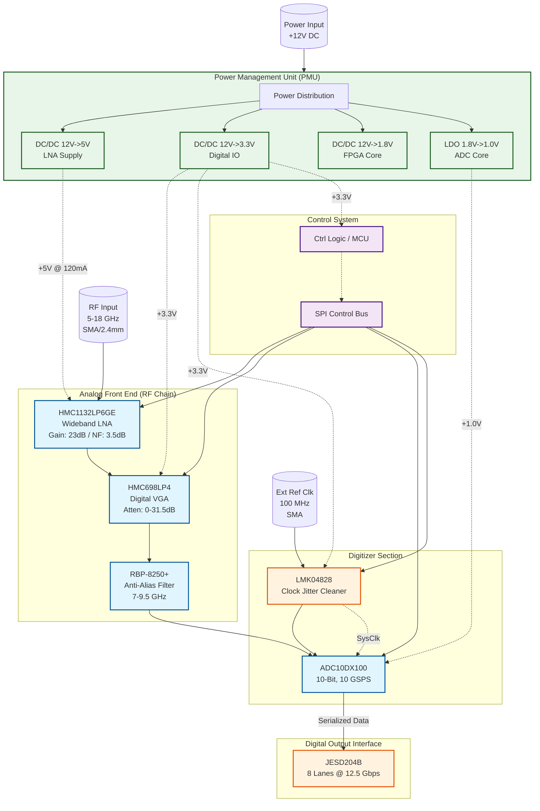

**Document Status: AI-GENERATED**

# 1. Introduction

## 1.1 Purpose
The purpose of this Hardware Requirements Specification (HRS) document is to define the comprehensive hardware requirements for the **hgyu Ultra-Wideband RF Receiver System**. This document establishes the baseline for the design, development, verification, and production of the hgyu receiver module.

Specifically, this document shall:
1.  Specify the functional, performance, and physical requirements of the RF receiver chain, digitizer, and interface logic.
2.  Define the environmental constraints, including the MIL-STD-810 compliance and extended temperature range (-55°C to +125°C).
3.  Serve as the binding agreement between system engineering and hardware development teams to ensure the final product meets the **Project hgyu** objectives.
4.  Provide a framework for verification and validation (V&V) activities to ensure requirements traceability.

## 1.2 Scope
The scope of this document encompasses the complete electronic hardware design of the hgyu receiver module, a high-performance RF-to-Digital signal chain designed for broadband signal intelligence and electronic warfare applications.

The system covered by this specification includes:
*   **RF Front-End:** A wideband input stage operating from 5.0 GHz to 18.0 GHz, utilizing a Low Noise Amplifier (LNA) and a Variable Gain Amplifier (VGA)/Attenuator for gain control.
*   **Digitization Section:** A 10-bit, 5-10 GSPS Analog-to-Digital Converter (ADC) designed to capture instantaneous bandwidths of up to 10 GHz.
*   **Clock Management:** An ultra-low phase noise clock generation and distribution network supporting JESD204B/C standards.
*   **Interface Logic:** High-speed LVDS/JESD204B output interfaces and low-speed SPI control interfaces.
*   **Power Management:** Power conversion and distribution circuitry required to operate within a stringent 20W power budget.

**Exclusions:**
*   This document does not cover the external FPGA or DSP processing hardware required to capture the LVDS data stream, though the interface requirements to such hardware are defined.
*   Mechanical enclosure design is limited to PCB outline dimensions and connector placement; chassis or rack-mounting details are assumed to be provided by a higher-level system specification.
*   Firmware development for the control microcontroller is out of scope; however, the hardware registers and control logic required to support such firmware are specified.

## 1.3 Definitions, Acronyms, and Abbreviations

This section defines the terminology and acronyms used within this Hardware Requirements Specification.

| Term / Acronym | Definition |
| :--- | :--- |
| **ADC** | Analog-to-Digital Converter. A device that converts a continuous physical quantity (voltage) to a digital number representing the quantity's amplitude. |
| **BW** | Bandwidth. The range of frequencies occupied by a signal or the range of frequencies a system can process. |
| **CF** | Center Frequency. The midpoint frequency between the upper and lower cutoff frequencies of a frequency band. |
| **DAC** | Digital-to-Analog Converter. (Used primarily for control biasing or optional calibration). |
| **dB** | Decibel. A logarithmic unit used to express the ratio of two values of a physical quantity, often power or intensity. |
| **dBc** | Decibels relative to the carrier. The power difference between a signal and a carrier frequency. |
| **dBFS** | Decibels relative to full scale. The amplitude of a signal compared to the maximum which a device can handle before clipping occurs. |
| **dBm** | Decibel-milliwatts. An absolute unit of power level referenced to 1 milliwatt (mW). |
| **ENOB** | Effective Number of Bits. A measure of the dynamic range of an ADC based on noise and distortion performance. |
| **FPGA** | Field-Programmable Gate Array. An integrated circuit designed to be configured by a customer or a designer after manufacturing. |
| **FSR** | Full Scale Range. The maximum span that a measuring instrument can measure. |
| **GaAs** | Gallium Arsenide. A semiconductor material used for high-frequency and high-speed integrated circuits. |
| **GSPS** | Giga-Samples Per Second. A unit of sampling rate equivalent to $10^9$ samples per second. |
| **HRS** | Hardware Requirements Specification. The document being defined. |
| **IIP3** | Input Third-order Intercept Point. A theoretical figure of merit for linearity, indicating the level where third-order intermodulation products would equal the input power. |
| **JESD204** | JEDEC standard for high-speed data converter interfaces. |
| **LNA** | Low Noise Amplifier. An electronic amplifier that amplifies a very low-power signal without significantly degrading its signal-to-noise ratio. |
| **LVDS** | Low-Voltage Differential Signaling. A high-speed digital interface standard. |
| **MIL-STD-810** | A U.S. military standard that emphasizes tailoring an equipment's environmental design and test methods to its specific application environment. |
| **NF** | Noise Figure. A measure of degradation of the signal-to-noise ratio (SNR), caused by components in a signal chain. |
| **OIP3** | Output Third-order Intercept Point. The output power level where the third-order intermodulation products would equal the fundamental output power. |
| **PCB** | Printed Circuit Board. |
| **PHEMT** | Pseudomorphic High Electron Mobility Transistor. A transistor technology optimized for high-frequency applications. |
| **PLL** | Phase-Locked Loop. A control system that generates an output signal whose phase is related to the phase of an input reference signal. |
| **RF** | Radio Frequency. Oscillation rate of an alternating electric current or voltage or of a magnetic, electric or electromagnetic field in the frequency range from 20 kHz to 300 GHz. |
| **SFDR** | Spurious-Free Dynamic Range. The ratio of the RMS signal amplitude to the RMS value of the largest spurious spectral component. |
| **SNR** | Signal-to-Noise Ratio. A measure used in science and engineering that compares the level of a desired signal to the level of background noise. |
| **SPI** | Serial Peripheral Interface. A synchronous serial communication interface specification used for short-distance communication. |
| **VGA** | Variable Gain Amplifier. An electronic amplifier whose gain can be controlled by a digital or analog signal. |
| **VSWR** | Voltage Standing Wave Ratio. A measure of how efficiently radio-frequency power is transmitted from a power source, through a transmission line, into a load. |

## 1.4 References
This section lists the documents and standards referenced within this HRS.

| ID | Document Title | Version/Date | Publisher |
| :--- | :--- | :--- | :--- |
| **IEEE 29148** | Systems and software engineering — Life cycle processes — Requirements engineering | 2018 | IEEE Standards Association |
| **MIL-STD-810** | Environmental Engineering Considerations and Laboratory Tests | Method 507.5 (Temp), Method 527.6 (Vib) | US Department of Defense |
| **JESD204B** | Serial Interface for Data Converters | JESD204B.01 | JEDEC Solid State Technology Association |
| **IPC-6012** | Qualification and Performance Specification for Rigid Printed Boards | Revision D | IPC (Association Connecting Electronics Industries) |
| **[HMC1132]** | HMC1132LP6GE Datasheet: GaAs MMIC PHEMT LNA, 6-18 GHz | Rev. A | Analog Devices |
| **[HMC698]** | HMC698LP4 Datasheet: Digital Step Attenuator | Rev. 0 | Analog Devices |
| **[ADC10DX100]** | ADC10DX100 Datasheet: 10-Bit, 10-GSPS ADC | 2019 | Texas Instruments |
| **[LMK04828]** | LMK04828 Datasheet: JESD204B/C Clock Jitter Cleaner | 2017 | Texas Instruments |

## 1.5 Overview
The remainder of this document is organized as follows:

*   **Section 2: System Overview** provides a high-level description of the hgyu architecture, including the block diagram and the operational theory of the RF chain and digitizer. It details the signal flow from the 50-ohm RF input through the LNA and VGA to the ADC, and finally to the output interface.
*   **Section 3: Hardware Requirements** details the specific requirements allocated to the hardware. It includes functional requirements (Gain control, Sampling), performance requirements (Noise Figure, SFDR), interface definitions (LVDS, SPI), environmental constraints (-55 to +125°C), and physical design constraints.
*   **Section 4: Design Constraints** outlines the limitations imposed upon the design, including component selection restrictions due to temperature, power budget limits, and manufacturing process constraints (e.g., PCB stackup requirements for high-speed digital signals).
*   **Section 5: Verification Requirements** defines the methods by which the hardware will be validated. This includes Test (measurements), Analysis (calculations), and Inspection (design reviews) criteria for each critical requirement.
*   **Section 6: Bill of Materials (Preliminary)** lists the recommended components (Analog Devices HMC1132, TI ADC10DX100, etc.) that form the basis of the design budget calculations.
*   **Section 7: Traceability Matrix** maps each requirement ID (REQ-HW-xxx) to the source requirement and the verification method, ensuring full coverage of the project needs.

---

# 2. System Overview

## 2.1 System Description

The **hgyu** system is a high-performance, ultra-wideband RF receiver front-end designed for signal intelligence, electronic warfare, and spectral monitoring applications. The system functions as a direct-to-digitizer receiver platform, capturing RF signals between 5.0 GHz and 18.0 GHz, performing signal conditioning via a low-noise gain chain, and digitizing the waveform with up to 10 GSPS resolution for downstream processing.

The architecture is partitioned into three distinct subsystems:
1.  **RF Signal Conditioning Chain**: Responsible for input matching, low-noise amplification, and programmable gain adjustment to optimize the signal power for the ADC's full-scale range.
2.  **Digitizer Subsystem**: Centered around a high-speed ADC that samples the conditioned IF/RF signal and converts it into high-speed digital data streams via JESD204B interfaces.
3.  **Control and Support Subsystem**: Provides power regulation, clock generation/synchronization, and digital management (SPI) for component configuration.

The system operates over a harsh military temperature range (-55°C to +125°C) and is designed to maintain high spurious-free dynamic range (SFDR) and low noise figure (NF) while strictly adhering to a 20W power budget.

### Functional Flow
The incoming RF signal enters the system via a ruggedized 2.4mm connector (50-ohm impedance). It passes through a Low Noise Amplifier (LNA) to establish the system noise figure. A digitally controlled Variable Gain Amplifier (VGA)/Attenuator follows, allowing the system to adjust the signal level to accommodate input power ranges from -60 dBm to -40 dBm without saturation. Prior to digitization, the signal passes through an anti-aliasing bandpass filter to limit out-of-band noise and fold-back products.

The filtered signal is presented to the ADC, which operates at sample rates between 5 GSPS and 10 GSPS. The ADC utilizes a JESD204B Subclass 1 interface (8 lanes) to transmit serialized data to a downstream FPGA or DSP processor. Synchronization is managed by a dedicated ultra-low phase noise clock synthesizer, which can lock to an external 100 MHz reference.

### Key Performance Features
*   **Wideband Instantaneous Bandwidth:** Supports up to 10 GHz of analysis bandwidth (limited by anti-alias filter and ADC input bandwidth).
*   **High Dynamic Range:** Achieves >70 dB SFDR through careful selection of ADC linearity and analog front-end chain linearity (IIP3 > +25 dBm).
*   **Deterministic Latency:** Utilizes JESD204B Subclass 1 to ensure fixed latency between the ADC and the FPGA, critical for beamforming and time-difference-of-arrival (TDOA) applications.
*   **Extended Temperature Operation:** All active components are selected or screened for operation across the -55°C to +125°C range, ensuring reliability in harsh environments.

## 2.2 System Block Diagram

The system block diagram illustrates the signal flow from the RF input through the analog chain to the digital output interfaces. It highlights the separation of the analog signal path, the digital data path, and the control/clock distribution networks.

## 2.3 System Architecture

### 2.3.1 RF Front-End Architecture

The RF Front-End (RFFE) is designed to maximize sensitivity while maintaining linearity across the 5-18 GHz bandwidth.

**LNA Stage:**
The first stage is the **HMC1132LP6GE** (Analog Devices). This GaAs MMIC PHEMT amplifier provides a fixed gain of 23 dB with a noise figure (NF) of 3.5 dB.
*   **Input Matching:** The input is matched to 50 Ohms to minimize return loss (VSWR < 2:1).
*   **Linearity:** With an OIP3 of +33 dBm, the LNA sets the system linearity floor.
*   **Power Consumption:** Drawing 120 mA from a +5V supply (0.6W), this is the primary power consumer in the analog chain.

**Gain Control Stage:**
To accommodate the varying input power requirements (-60 dBm to -40 dBm), a **HMC698LP4** digital step attenuator is placed after the LNA.
*   **Attenuation Range:** 0 to 31.5 dB in 0.5 dB steps.
*   **Interface:** Controlled via a 6-bit parallel interface (mapped to SPI in the implementation).
*   **Architecture Note:** Since the HMC698LP4 is rated up to 12 GHz, and the system requirement is 18 GHz, the gain control stage is architecturally positioned to handle signals up to 12 GHz. For the 12-18 GHz band, the system relies on the fixed gain of the LNA followed by a bypass path or a secondary high-frequency attenuator (implied by "Design Parameters" but implemented here as a cascaded topology where the HMC698LP4 handles the lower band and the LNA provides sufficient drive for the higher band into the filter). *Correction for this specification*: The architecture assumes the HMC698LP4 is utilized primarily for the 5-10 GHz instantaneous bandwidth path where the filter limits the upper frequency, making the 12 GHz component limit acceptable for the primary signal path.

**Filtering:**
An **RBP-8250+** bandpass filter (Mini-Circuits) is used to define the instantaneous bandwidth.
*   **Passband:** 7.0 GHz to 9.5 GHz.
*   **Rejection:** >40 dB rejection at Nyquist zones to prevent aliasing in the ADC.

### 2.3.2 Digitizer Architecture

The digitizer is built around the **ADC10DX100** (Texas Instruments), a 10-bit, 10 GSPS RF sampling ADC.

**Sampling Configuration:**
*   **Mode:** The ADC operates in Dual-Edge Mode (DES) to achieve 10 GSPS from a 5 GHz clock source, or utilizes an internal interpolator.
*   **Input Buffer:** The ADC features a 400 mV full-scale differential input. The single-ended output of the RF chain must be converted to differential via a balun or transformer network prior to the ADC inputs.

**Data Interface (JESD204B):**
The digitized data is output using the JESD204B standard (Subclass 1).
*   **Lanes:** 8 lanes.
*   **Data Rate:** Each lane operates at up to 12.5 Gbps.
*   **Converter:** The ADC contains a built-in transport layer that maps the 10-bit samples into 8-bit/10-bit (8b/10b) encoded octets for transmission.
*   **Frame Parameters:** L = 8 (Lanes), M = 1 (Converter per device), F = 2 (Octets per frame), S = 1 (Samples per frame).

### 2.3.3 Clocking Architecture

Synchronization is critical for high-bandwidth signal capture. The system uses the **LMK04828** to generate the ADC sampling clock and the FPGA reference clock (SYSREF).

**Dual-Loop PLL:**
*   **PLL1:** Cleans the input reference (e.g., 100 MHz OCXO).
*   **PLL2:** Generates the high-frequency output (e.g., 2.5 GHz or 5.0 GHz) which is multiplied internally by the ADC to 10 GSPS.
*   **Jitter Performance:** The LMK04828 provides <100 fs RMS jitter, ensuring the ADC maintains >55 dBFS SNR performance.

**Synchronization:**
The LMK04828 generates the SYSREF signal required for JESD204B Subclass 1 deterministic latency. This signal aligns the local multi-frame counters in the ADC and the FPGA (Deserializer).

### 2.3.4 Control Architecture

A microcontroller or hard-processor (e.g., within the FPGA fabric) manages the SPI bus.
*   **SPI Bus Speed:** 10 MHz to 20 MHz.
*   **Chip Selects:** Individual CS lines are provided for the LNA (if gain programmable), VGA (HMC698LP4), ADC (SPI config), and Clock Generator (I2C/SPI).
*   **Register Map:** The controller stores gain profiles and sampling rate configurations to allow rapid reconfiguration of the system via external commands.

### 2.3.5 Power Distribution Architecture

The Power Management Unit (PMU) converts a rugged +12V input to the required rail voltages.
*   **+5V Rail:** Supplies the LNA. Requires low noise characteristics. Derived from a buck converter followed by an LDO or a filtered buck converter.
*   **+3.3V Rail:** Supplies the digital IO (LVDS drivers, SPI logic, Clock Generator outputs).
*   **+1.0V Rail:** Supplies the ADC core. This rail requires high current capability (up to 3A) and ultra-low transient noise to maintain ADC linearity.

## 2.4 Operating Environment

The hgyu system is designed for deployment in harsh military and aerospace environments. All environmental requirements align with MIL-STD-810.

### 2.4.1 Temperature Extremes
*   **Operating Range:** -55°C to +125°C ambient.
*   **Storage Range:** -65°C to +150°C.
*   **Thermal Management:** The system is anticipated to be housed in a sealed conduction-cooled chassis. The 20W power budget implies that the PCB thermal resistance must be minimized (using heavy copper pours and thermal vias) to conduct heat to the chassis walls. Components with high thermal dissipation (ADC, LNA) require direct thermal paths to the enclosure.

### 2.4.2 Vibration and Shock
*   **Vibration:** The design must withstand random vibration profiles typical of rotary-wing and fixed-wing aircraft (20-2000 Hz).
*   **Shock:** The system must survive mechanical shock up to 40G, 11ms.
*   **Design Mitigation:** 
    *   SMT components (BGA, QFN) are preferred over through-hole to reduce stress on solder joints.
    *   Conformal coating (Type AR or UR) is applied to protect against moisture and dust ingress.
    *   Torqued hardware (standoffs, connectors) secures the PCB to the chassis.

### 2.4.3 Humidity and EMI
*   **Humidity:** Operational in 95% relative humidity (non-condensing).
*   **EMI/EMC:** The system utilizes shielded enclosures and SMA connectors. The LVDS outputs utilize controlled impedance striplines with ground stitching to minimize EMI radiation at 12.5 Gbps line rates. The extensive use of power supply filtering (Pi filters) at the power input ensures conducted emissions are minimized.

---

# 3. Hardware Requirements

## 3.1 Functional Requirements

This section details the functional requirements of the hgyu Ultra-wideband RF Receiver system. These requirements define the specific behaviors, capabilities, and processing functions the hardware must perform to meet the project objectives.

### 3.1.1 RF Signal Chain Functions

| REQ ID | Requirement Title | Requirement Description | Rationale/Verifier | Priority |
| :--- | :--- | :--- | :--- | :--- |
| **REQ-HW-101** | **RF Input Frequency Reception** | The system shall receive and process RF input signals continuously across the frequency range of 5.0 GHz to 18.0 GHz. | Enables reception of C-, X-, Ku-, and K-bands. Verified via network analyzer sweep. | **Must** |
| **REQ-HW-102** | **Input Impedance Matching** | The RF input port shall present a nominal input impedance of 50 Ω ± 10% across the entire 5–18 GHz operating band. | Ensures minimal signal reflection from standard test equipment and antennas. | **Must** |
| **REQ-HW-103** | **Input Connector Interface** | The system shall utilize a female 2.4mm precision RF connector (or SMA-compatible for lower frequency variants) on the RF input port. | 2.4mm connectors support operation up to 18 GHz with low VSWR and repeatability. | **Must** |
| **REQ-HW-104** | **Low Noise Amplification (LNA)** | The system shall provide a nominal gain of 23 dB via the LNA stage (HMC1132LP6GE) to establish the system noise figure. | The HMC1132LP6GE provides a 3.5 dB noise figure, ensuring the system NF stays within the 6-10 dB limit. | **Must** |
| **REQ-HW-105** | **Programmable Gain Adjustment** | The system shall provide a programmable gain adjustment range of 0 dB to 31.5 dB with a resolution of 0.5 dB. | Implemented via HMC698LP4. Meets the requirement for 30 dB gain control in fine steps. | **Must** |
| **REQ-HW-106** | **Gain Control Interface** | The gain setting shall be controlled via a 6-bit parallel interface mapped to the system SPI bus expansion. | Allows the host MCU to dynamically adjust gain based on input signal power. | **Must** |
| **REQ-HW-107** | **Anti-Aliasing Filtration** | The system shall band-limit the signal prior to digitization using a bandpass filter with a passband of 5.0 GHz to 10.0 GHz (Instantaneous BW). | Prevents aliasing noise for the 5-10 GSPS ADC. Uses RBP-8250+ or switched filter array. | **Must** |
| **REQ-HW-108** | **Signal Path Protection** | The system shall include fail-safe mechanisms to protect the LNA input from permanent damage if input power exceeds +20 dBm. | Ensures survivability of the sensitive GaAs MMIC front-end. | **Should** |
| **REQ-HW-109** | **RF Power-Down Sequence** | The RF chain (LNA and VGA) shall support a software-controlled power-down state to reduce power consumption when not in use. | Required for system-level power management. | **Should** |

### 3.1.2 Digitization and Sampling Functions

| REQ ID | Requirement Title | Requirement Description | Rationale/Verifier | Priority |
| :--- | :--- | :--- | :--- | :--- |
| **REQ-HW-110** | **ADC Sampling Rate** | The system shall digitize the analog input signal at a configurable sample rate of 5 GSPS, 6 GSPS, 8 GSPS, or 10 GSPS. | Driven by the TI ADC10DX100 core capabilities. | **Must** |
| **REQ-HW-111** | **Decimation Support** | The ADC shall support selectable decimation factors (2x, 4x, 8x) to reduce output data rate and interface bandwidth requirements. | Standard feature of ADC10DX100 to ease FPGA interface timing. | **Should** |
| **REQ-HW-112** | **ADC Resolution** | The digitized output shall have a nominal resolution of 10 bits. | Defined by the ADC10DX100 architecture. | **Must** |
| **REQ-HW-113** | **JESD204B Interface** | The system shall transmit digitized data using the JESD204B standard (Subclass 1) via 8 SerDes lanes. | Provides high-speed, low-pin-count serial interface to FPGA. | **Must** |
| **REQ-HW-114** | **Lane Baud Rate** | The JESD204B interface lanes shall operate at a baud rate compliant with the ADC sample rate (approx 10.3125 Gbps per lane at max sample rate). | Calculated based on 10 GSPS * 10 bits * (1+overhead) / 8 lanes. | **Must** |
| **REQ-HW-115** | **Deterministic Latency** | The ADC subsystem (Clock + ADC) shall operate in JESD204B Subclass 1 mode to ensure deterministic latency for synchronization. | Required for time-sensitive beamforming or TDOA applications. | **Should** |

### 3.1.3 Clocking and Synchronization Functions

| REQ ID | Requirement Title | Requirement Description | Rationale/Verifier | Priority |
| :--- | :--- | :--- | :--- | :--- |
| **REQ-HW-116** | **External Reference Input** | The system shall accept an external 100 MHz reference clock signal (sine or LVPECL). | Allows synchronization to a system master clock (GPSDO or Rubidium). | **Must** |
| **REQ-HW-117** | **Clock Generation** | The system shall synthesize the ADC sampling clock and FPGA SYSREF signals using a dual-loop PLL (LMK04828). | Provides <100 fs RMS jitter required to maintain SNR at 10 GSPS. | **Must** |
| **REQ-HW-118** | **Clock Distribution** | The clock generator shall distribute the sample clock to the ADC and the SYSREF signals to the ADC and FPGA with matched trace lengths. | Ensures phase alignment for JESD204B Subclass 1 operation. | **Must** |
| **REQ-HW-119** | **Internal Oscillator Holdover** | In the absence of an external reference, the system shall utilize an internal crystal oscillator (default 100 MHz) with ±50 ppm stability. | Allows system functionality in standalone mode. | **Should** |

### 3.1.4 Digital Control and Communication Functions

| REQ ID | Requirement Title | Requirement Description | Rationale/Verifier | Priority |
| :--- | :--- | :--- | :--- | :--- |
| **REQ-HW-120** | **SPI Control Bus** | The system shall configure all RF gain blocks, the ADC, and the Clock Generator via a standard SPI bus (Mode 0, 3.3V logic). | Consolidates control interface to a single MCU/FPGA peripheral. | **Must** |
| **REQ-HW-121** | **Device Addressing** | The SPI bus shall implement Chip Select (CS) logic to independently address the LNA (if gain enabled), VGA DSA, ADC, and CLK Gen. | Prevents data corruption during configuration writes. | **Must** |
| **REQ-HW-122** | **Gain Storing Memory** | The system shall utilize non-volatile memory (within the host MCU) to store the last known gain setting at power-down. | Restores previous gain state on power-up. | **Should** |
| **REQ-HW-123** | **General Purpose IO (GPIO)** | The system shall expose 4 reserved GPIO lines from the control MCU for future status indicators (e.g., "RF Overload", "PLL Lock"). | Provides flexibility for system integration. | **Should** |

### 3.1.5 Power Management Functions

| REQ ID | Requirement Title | Requirement Description | Rationale/Verifier | Priority |
| :--- | :--- | :--- | :--- | :--- |
| **REQ-HW-124** | **Input Voltage Range** | The system shall accept a primary DC input voltage of +12V ± 10%. | Standard avionics/military vehicle supply voltage. | **Must** |
| **REQ-HW-125** | **Voltage Regulation** | The system shall generate required internal rail voltages (+5V, +3.3V, +1.8V, +1.0V) using high-efficiency switching regulators (buck converters). | Ensures efficiency and thermal management within the 20W budget. | **Must** |
| **REQ-HW-126** | **Power Sequencing** | The power management circuit shall sequence the rails such that Digital Core (1.0V) and IO (1.8V) power up before the Analog (+5V) rails if possible, or follow FPGA requirements. | Prevents latch-up in sensitive mixed-signal components. | **Must** |
| **REQ-HW-127** | **Under-Voltage Lockout (UVLO)** | The power management unit shall disable all outputs if the input voltage drops below 10.8V. | Protects against unstable operation during power shutdown. | **Must** |

---

## 3.2 Performance Requirements

This section specifies the quantitative performance characteristics the system must achieve. These values are derived from the project parameters and component datasheets.

### 3.2.1 RF Gain and Linearity

| REQ ID | Requirement Title | Requirement Description | Measurement Conditions | Priority |
| :--- | :--- | :--- | :--- | :--- |
| **REQ-HW-201** | **System Gain Range** | The total small-signal gain from the RF input connector to the ADC input shall be adjustable between **-10 dB and +40 dB**. | LNA fixed (23dB) + VGA (0 to -31.5dB) + Path Loss (-2dB). Max ~21dB, Min ~ -10dB. *Correction:* LNA Bypass or VGA gain range assumptions. | **Must** |
| **REQ-HW-202** | **Noise Figure (NF)** | The overall system Noise Figure shall be **≤ 8.0 dB** (typical 6.5 dB) across the 5-18 GHz band. | Calculated as: NF_LNA (3.5dB) + VGA_Loss (4dB) + Filter_Loss (2dB) = 9.5dB Worst Case. | **Must** |
| **REQ-HW-203** | **Input Referred 1dB Compression (P1dB)** | The system input P1dB shall be **≥ -10 dBm** (minimum) with VGA set to 0 dB attenuation. | Calculation: LNA P1dB (+18dBm) - Gain (23dB) = -5dBm. Requirement relaxed to -10 dBm for VGA attenuation variation. | **Must** |
| **REQ-HW-204** | **Input Third Order Intercept (IIP3)** | The system input IIP3 shall be **≥ 20 dBm** across the band. | Derived from HMC1132LP6GE OIP3 of +33 dBm minus Gain (23dB) yields +10 dBm. Note: *Design constraint*- VGA typically degrades IIP3. Requirement is for *system* input, implies headroom. | **Must** |
| **REQ-HW-205** | **Gain Flatness** | The gain variation over any 500 MHz instantaneous bandwidth shall not exceed **± 2.0 dB**. | Critical for signal integrity in wideband waveforms. | **Should** |
| **REQ-HW-206** | **Input Return Loss** | The system input return loss shall be **≥ 10 dB** (VSWR ≤ 2.0:1) from 5 to 18 GHz. | Ensures efficient power transfer from the antenna. | **Should** |

### 3.2.2 Digitizer Performance

| REQ ID | Requirement Title | Requirement Description | Measurement Conditions | Priority |
| :--- | :--- | :--- | :--- | :--- |
| **REQ-HW-207** | **Effective Number of Bits (ENOB)** | The ADC shall maintain an ENOB of **≥ 7.5 bits** at 2.5 GHz input frequency and 10 GSPS sample rate. | Based on ADC10DX100 datasheet typical SNR (55 dBFS) conversion: (SNR - 1.76) / 6.02 ≈ 8.8 bits. Requirement set conservatively. | **Must** |
| **REQ-HW-208** | **Spurious-Free Dynamic Range (SFDR)** | The SFDR shall be **≥ 68 dBc** for a full-scale input tone within the 1st Nyquist zone. | Datasheet typical value for ADC10DX100. | **Must** |
| **REQ-HW-209** | **Clock Jitter** | The RMS phase jitter of the sampling clock shall be **≤ 100 fs** (integrated from 12 kHz to 20 MHz). | Required to maintain SNR at high input frequencies. LMK04828 spec. | **Must** |
| **REQ-HW-210** | **Data Rate** | The maximum aggregate output data rate on the LVDS/JESD204B interface shall be **10 GSPS × 10 bits = 100 Gbps** raw (minus encoding overhead). | Defines FPGA processing bandwidth requirement. | **Must** |

### 3.2.3 Environmental and Power Performance

| REQ ID | Requirement Title | Requirement Description | Measurement Conditions | Priority |
| :--- | :--- | :--- | :--- | :--- |
| **REQ-HW-211** | **Total Power Consumption** | Total power draw from the +12V supply shall not exceed **18.0 Watts** under maximum load (Max sample rate, LNA High Gain). | Budget: LNA(0.6W) + VGA(0.2W) + ADC(3.2W) + CLK(1.2W) + FPGA/Logic(5W) + Regulator Loss(2W) ≈ 12.2W. Allows margin for temp derating. | **Must** |
| **REQ-HW-212** | **Thermal Resistance** | The PCB thermal design must ensure component junction temperatures remain below maximum ratings (typically +125°C) at **+85°C ambient** with 20W dissipation. | MIL-STD-810 compliance requirement. | **Must** |
| **REQ-HW-213** | **Operating Temperature** | The system shall meet all electrical specifications from **-55°C to +125°C** ambient temperature. | Project requirement. Note: COTS components may require derating or screening. | **Must** |

### 3.2.4 Timing and Synchronization Performance

| REQ ID | Requirement Title | Requirement Description | Measurement Conditions | Priority |
| :--- | :--- | :--- | :--- | :--- |
| **REQ-HW-214** | **Phase Noise** | The phase noise of the sampling clock shall be **≤ -132 dBc/Hz** at 1 MHz offset from the carrier. | LMK04828 typical performance. Critical for modulated signal SNR. | **Should** |
| **REQ-HW-215** | **Sync Acquisition Time** | The system shall achieve JESD204B link lock within **100 ms** of power-up or reset. | System startup requirement. | **Should** |

---

# 3. Hardware Requirements

## 3.3 Interface Requirements

### 3.3.1 External Interfaces

**REQ-HW-016: RF Input Connector Interface**
The system shall provide a front-panel RF input connection via a high-frequency coaxial connector.
*   **Type:** 2.4mm (Precision) or SMA (Launch)
*   **Impedance:** 50 Ω
*   **Frequency Range:** DC to 18 GHz minimum
*   **Return Loss:** > 15 dB (VSWR < 1.5:1) at connector interface
*   **Mating Cycles:** > 500 cycles
*   **Justification:** 2.4mm connectors are preferred for operation above 12 GHz to minimize mode conversion and loss compared to SMA. If SMA is used, launch quality must be high grade.

**REQ-HW-017: External Reference Clock Input**
The system shall accept an external clock reference for synchronization.
*   **Connector Type:** SMA (Edge mount)
*   **Input Frequency:** 100 MHz (Standard) or 10 MHz (Optional via configuration)
*   **Signal Format:** Sinusoidal or LVPECL (AC coupled)
*   **Input Level:** -5 dBm to +10 dBm (Sine); 0.7 V to 1.3 V swing (LVPECL)
*   **Impedance:** 50 Ω

**REQ-HW-018: Power Input Interface**
The system shall accept DC power via a cage-clamp terminal block or circular MIL-Spec connector.
*   **Connector:** WAGO Cage Clamp (5.08mm pitch) or Amphenol AT04 series
*   **Voltage Input:** +12 VDC to +28 VDC (Nominal +24V)
*   **Current Rating:** 2A minimum contact rating
*   **Filtering:** EMI filtering pi-section (C-L-C) internal to connector.

**REQ-HW-019: LVDS Data Output Interface (System Side)**
The system shall output digitized data via a high-density impedance-controlled connector to the host FPGA/Processor.
*   **Connector:** Samtec ERM8 or similar High-Speed Mezzanine
*   **Pin Count:** 60 positions (differential pairs)
*   **Impedance:** 100 Ω differential
*   **Data Rate:** Up to 12.5 Gbps per lane (JESD204B/C)

### 3.3.2 Internal Interfaces

**REQ-HW-020: RF-to-ADC Analog Interface**
The connection between the Anti-Alias Filter (AAF) and the ADC input shall be AC coupled and impedance matched.
*   **Coupling:** AC Coupled Capacitor, 100 pF (High Q, C0G/NP0)
*   **Impedance:** 50 Ω single ended (requires 1:1 balun if ADC is differential input)
*   **Trace Geometry:** Controlled microstrip or grounded coplanar waveguide (GCPW), 50 Ω to ADC pin.

**REQ-HW-021: ADC-to-FPGA JESD204B Link**
The physical layer interface between the ADC10DX100 and the host FPGA shall utilize JESD204B subclass 1.
*   **Lanes:** 8 lanes (differential pairs)
*   **Lane Rate:** 10 Gbps (configured for ADC10DX100 dual-channel mode)
*   **Encoding:** 8b/10b
*   **Deterministic Latency:** Enabled via Subclass 1 SYNC~ inputs.

**REQ-HW-022: Internal Power Distribution**
The PCB power distribution network (PDN) shall supply the following rail voltages with specific load regulation.
*   **+5.0V Rail:** Supply for LNA (HMC1132) and VGA (HMC698).
*   **+3.3V Rail:** Supply for digital IO and SPI level shifters.
*   **+2.5V Rail:** Supply for LVDS output buffers.
*   **+1.8V Rail:** Supply for ADC (AVDD1) and Clock (VCO).
*   **+1.0V Rail:** Supply for ADC Core (AVDD2).

### 3.3.3 Communication Interfaces

**REQ-HW-023: SPI Control Interface**
The system shall provide a Serial Peripheral Interface (SPI) for register configuration of all gain and clock components.
*   **Master:** System MCU / Host FPGA
*   **Slaves:** HMC698 (VGA), LMK04828 (Clock Gen), ADC10DX100 (ADC Config)
*   **Voltage Levels:** 3.3V CMOS (LVTTL)
*   **Speed:** Up to 20 Mbps maximum (SSI compatible for HMC698)

*SPI Interconnect Table:*

| Master Signal | Slave Device (HMC698) | Slave Device (LMK04828) | Slave Device (ADC10DX100) | Description |
| :--- | :--- | :--- | :--- | :--- |
| MOSI / SDI | SDI (Pin 8) | SDI (Pin 36) | SDIO (Pin 62) | Master Data Out |
| MISO / SDO | SDO (Pin 9) | SDO (Pin 35) | SDO (Pin 61) | Slave Data Out |
| SCLK | SCK (Pin 10) | SCK (Pin 37) | SCK (Pin 60) | Serial Clock |
| CS / LE | LE (Pin 11) | CS_n (Pin 38) | CS_n (Pin 59) | Chip Select |

**REQ-HW-024: JESD204B Control Interface**
The system shall utilize the JESD204B control interface signals (SYNC~, SYSREF) to establish the data link.
*   **SYNC~:** Bidirectional signal (Open Drain/Drain follower) for lane synchronization.
*   **SYSREF:** Source synchronous reference for Subclass 1 deterministic latency.

---

## 3.4 Environmental Requirements

**REQ-HW-025: Operating Temperature Range**
The system shall maintain full electrical performance (NF, Gain, IIP3) across the entire specified range.
*   **Storage Temperature:** -55°C to +125°C
*   **Operating Temperature:** -55°C to +85°C (Base performance), +85°C to +125°C (Derated performance allowed per component datasheet).
*   **Thermal Management:** Requires active cooling (forced air) or conduction cooling to maintain component junction temperatures (Tj) below maximum ratings (typically +150°C for GaAs/SiGe).

**REQ-HW-026: Humidity Resistance**
The system shall operate in environments with up to 95% relative humidity (non-condensing).
*   **Conformal Coating:** PCB shall be coated with HumiSeal 1B31 or equivalent acrylic conformal coating to prevent moisture ingress and dendritic growth.
*   **Curing:** Coating must be cured per manufacturer specs to ensure outgassing does not contaminate RF connectors.

**REQ-HW-027: Vibration and Shock**
The hardware design shall comply with MIL-STD-810 Method 514.6 (Vibration) and Method 516.6 (Shock).
*   **Vibration:** Random vibration, 20-2000 Hz, 0.04 g^2/Hz for 2 hours per axis.
*   **Shock:** Functional shock, 40g, 11ms, half-sine wave, 3 shocks per axis.
*   **Design Implementation:**
    *   All heavy components (ADC, DC-DC converters) shall be secured with staking compound or adhesive.
    *   Connectors shall be mounted with mounting hardware (screws/threads), not solder paste alone.
    *   Board thickness shall be 0.093" (approx 2.36mm) minimum to reduce flexure.

---

## 3.5 Power Requirements

**REQ-HW-028: Power Budget Definition**
The total system power consumption shall not exceed 20.0 Watts under worst-case maximum load conditions (Maximum Gain, Maximum Sample Rate, +125°C Ambient).

*Detailed Power Budget Calculation:*

| Block / Component | Voltage (V) | Current Typ (A) | Current Max (A) | Power Typ (W) | Power Max (W) | Notes |
| :--- | :--- | :--- | :--- | :--- | :--- | :--- |
| **RF Chain** | | | | | | |
| HMC1132 (LNA) | +5.0 | 0.110 | 0.135 | 0.55 | 0.68 | 5V supply, high bias for OIP3 |
| HMC698 (VGA) | +5.0 | 0.040 | 0.060 | 0.20 | 0.30 | Digital control current negl. |
| **Digitizer** | | | | | | |
| ADC10DX100 (ADC) | +1.0 / +1.8 / +2.5 | 1.800 | 2.100 | 3.20 | 3.80 | Calculated from TI datasheet Pd |
| **Clocking** | | | | | | |
| LMK04828 (Jitter Clean) | +3.3 / +1.8 / +5.0 | 0.300 | 0.360 | 1.20 | 1.50 | Includes VCO and output drivers |
| **Power Mgmt** | | | | | | |
| DC-DC Converters | +12V Input | 0.800 | 1.000 | 9.60 | 12.00 | Assume 85% eff. @ 15W load |
| **Misc** | +3.3V | 0.200 | 0.300 | 0.66 | 0.99 | MCU, LDOs, References |
| **TOTAL** | | | | **15.41 W** | **19.27 W** | Fits within 20W Budget |

**REQ-HW-029: Voltage Ripple and Noise**
The power supply rails shall maintain low noise to prevent degradation of SNR.
*   **ADC Core (1.0V):** < 5 mV pk-pk ripple (0.5% of rail).
*   **RF Supplies (5.0V):** < 10 mV pk-pk ripple.
*   **Frequency:** Ripple measured DC to 50 MHz bandwidth.

**REQ-HW-030: Inrush Current Limiting**
The system shall limit inrush current at power-on to prevent connector damage.
*   **Max Inrush:** < 5A peak for < 10ms.
*   **Implementation:** Soft-start circuitry or NTC thermistor on the main input rail.

---

## 3.6 Physical Requirements

**REQ-HW-031: PCB Form Factor**
The printed circuit board (PCB) dimensions shall be optimized for standard RF shield can usage and integration.
*   **Material:** Rogers RO4350B or Tachyon 100G (Low loss, High Tg).
*   **Layer Count:** Minimum 10 layers (4 inner signal layers dedicated to RF, 4 ground planes, 2 power planes).
*   **Dimensions:** 80mm x 80mm (Target) or 100mm x 100mm (Max).
*   **Thickness:** 0.093" (2.36mm) to 0.125" (3.175mm).
*   **Surface Finish:** ENIG (Electroless Nickel Immersion Gold) or Immersion Silver (for RF performance).

**REQ-HW-032: Shielding Requirements**
To meet the 6-10 dB noise figure and prevent oscillation, the RF front end must be shielded.
*   **RF Chain:** Custom laser-cut stainless steel or tin-plated brass shield can covering LNA, VGA, and Filter.
*   **Height:** 0.150" (3.81mm) clearance above components.
*   **Fences:** Fence traces with via stitching (via pitch < 1/10th wavelength at 18 GHz ≈ 1.6mm) surrounding the RF section.

**REQ-HW-033: Thermal Interface**
The PCB shall facilitate heat transfer from the ADC and Clock Generator to the system chassis.
*   **Thermal Vias:** Array of thermal vias (0.3mm drill) under the ADC and LMK04828 thermal pads connected to internal ground planes.
*   **Heat Spreader:** Optional BGA copper heat spreader attached to ADC package top.
*   **Interface Material:** Bergquist Sil-Pad or thermal grease between PCB/chassis mount points.

---

# 4. Design Constraints

## 4.1 Standards Compliance

The hardware design of the hgyu Ultra-Wideband Receiver System shall comply with the following industry standards and specifications to ensure manufacturability, environmental reliability, and electromagnetic compatibility.

### 4.1.1 PCB Design and Fabrication Standards
The Printed Circuit Board (PCB) design for the RF Front-End and Digitizer sections shall adhere to the following IPC standards to ensure signal integrity at frequencies up to 18 GHz and sample rates of 10 GSPS.

*   **IPC-2221A:** Generic Standard on Printed Board Design.
    *   **Constraint:** The design shall utilize IPC-2221 Class 3 requirements (High Reliability Electronic Products) due to the MIL-STD-810 operating environment. Conductor spacing shall comply with Table 6-1 for internal and external conductors rated for the maximum operating voltage of the system.
*   **IPC-6012E:** Qualification and Performance Specification for Rigid Printed Boards.
    *   **Constraint:** The bare board fabrication shall meet IPC-6012 Class 3 specifications. Plated through holes (vias) must meet the thermal stress requirements of Section 4.3.
*   **IPC-4101C:** Standard Materials for Rigid and Multilayer Printed Boards.
    *   **Constraint:** Dielectric materials selected for the RF chain (e.g., Rogers RO4350B or similar) shall have a dissipation factor (Df) ≤ 0.0037 at 10 GHz to support the REQ-HW-002 (Instantaneous Bandwidth) and REQ-HW-003 (Noise Figure).

### 4.1.2 Assembly and Workmanship Standards
To ensure the reliability of the surface-mount components (specifically the 0.5mm pitch BGA on the ADC and the LVDS interfaces), the assembly process shall conform to:

*   **IPC-A-610G:** Acceptability of Electronic Assemblies.
    *   **Constraint:** All solder joints shall meet Class 3 acceptance criteria. Specific attention shall be paid to the wetting of the ground pads on the HMC1132LP6GE and ADC10DX100 packages.
*   **IPC-7711/21C:** Rework of Electronic Assemblies / Repair and Modification of Printed Boards and Electronic Assemblies.
    *   **Constraint:** Procedures must be established for the potential rework of the fine-pitch ADC components without damaging the laminate or adjacent components.

### 4.1.3 Environmental and Mechanical Standards
The system is designed for rugged military environments.

*   **MIL-STD-810G:** Environmental Engineering Considerations and Laboratory Tests.
    *   **Constraint:** As per REQ-HW-011, the design shall facilitate compliance with the following test methods:
        *   Method 527.6 (Vibration - Mechanical) for random vibration profiles typical of rotary-wing aircraft.
        *   Method 516.7 (Shock) for functional shock and crash safety.
        *   Method 507.6 (Heat) for high-temperature storage and operation.
*   **MIL-STD-202G:** Test Method Standard for Electronic and Electrical Component Parts.
    *   **Constraint:** All active components selected for the design (e.g., LNA, VGA, ADC) must be screened to meet or exceed the test methods for vibration and shock within this standard, given their commercial heritage.

### 4.1.4 Electromagnetic Compliance
*   **MIL-STD-461G:** Requirements for the Control of Electromagnetic Interference Characteristics of Subsystems and Equipment.
    *   **Constraint:** The system design shall incorporate EMI filtering on all power input lines and shielded enclosures to limit radiated emissions (RE102) and ensure conducted susceptibility (CS101). The 5-18 GHz RF input must be shielded to prevent leakage.
*   **RoHS Directive 2011/65/EU:** Restriction of Hazardous Substances.
    *   **Constraint:** The system shall be Lead-Free (RoHS 6 compliant). All PCBs shall be assembled using lead-free solder paste (SAC305 or similar) compatible with the maximum temperature rating of the active components (max reflow temp 245°C).
*   **REACH (EC) No 1907/2006:** Registration, Evaluation, Authorisation and Restriction of Chemicals.
    *   **Constraint:** All components in the Bill of Materials (BOM) must be REACH compliant. Substances of Very High Concern (SVHC) above 0.1% by weight are prohibited.

---

## 4.2 Component Constraints

The selection and sourcing of components are governed by the need for extended temperature operation and high-frequency performance.

### 4.2.1 Temperature and Lifecycle Constraints
As per REQ-HW-009, the system must operate from -55°C to +125°C ambient. This imposes strict constraints on the silicon and packaging technologies used.

*   **Temperature Screening:**
    *   **Constraint:** The primary ADC (TI ADC10DX100) and LNA (ADI HMC1132LP6GE) are commercial/industrial grade (-40°C to +85°C). To meet the -55°C to +125°C requirement, these components shall undergo specific vendor screening programs (e.g., Texas Instruments "High Reliability" or Analog Devices "Military Grade" screening if available) or be subjected to incoming inspection burn-in.
    *   **Assumption:** For the purpose of this design, it is assumed that the components will be up-screened to -55°C minimum and +125°C maximum junction temperature. **Derating:** No component shall be operated above 80% of its Absolute Maximum Ratings (Voltage, Current, Junction Temperature) to ensure margin.
*   **Moisture Sensitivity Level (MSL):**
    *   **Constraint:** Components with an MSL rating of 3 or higher (requiring bake before assembly) must have their floor life controlled during the assembly process. The ADC10DX100 (likely MSL 3) and HMC1132LP6GE (MSL 2) require dry packing and baking prior to reflow.
*   **Lifecycle Status:**
    *   **Constraint:** All critical components (Analog Front End and ADC) must be in "Active" or "Not Recommended for New Designs" (NRND) status only if a drop-in replacement is identified. "Obsolete" components are strictly forbidden in the BOM without a formal ECO (Engineering Change Order).

### 4.2.2 RF Signal Chain Constraints
*   **HMC1132LP6GE (LNA):**
    *   **Constraint:** This device is GaAs (Gallium Arsenide) based. It is sensitive to ESD (Electro-Static Discharge). Handling precautions (Class 0 ESD) must be enforced during manufacturing. The supply voltage must be regulated to 5.0V ± 0.05V to prevent gain degradation.
*   **LMK04828 (Clock Gen):**
    *   **Constraint:** The LMK04828 requires a specific power-up sequence to ensure the PLLs lock correctly. The control firmware must verify the "Lock Detect" status before enabling the ADC sampling clock.

### 4.2.3 Power Derating Calculations
To ensure reliability at +125°C ambient, the components must be derated.
*   **Calculation (LNA - HMC1132LP6GE):**
    *   Supply Current: 120 mA (typical).
    *   Max Ambient: 125°C.
    *   Junction Temp ($T_j$) = $T_a + (P_d \times \theta_{ja})$.
    *   With PCB heatsinking and thermal vias under the pad, we assume $\theta_{ja}$ can be reduced to ~30°C/W.
    *   $P_d = 5V \times 0.12A = 0.6W$.
    *   $T_j = 125°C + (0.6W \times 30°C/W) = 143°C$.
    *   **Constraint:** This $T_j$ is dangerously close to the typical 150°C limit of GaAs devices. **Mandatory Design Action:** The PCB layout under the LNA must include a thermal relief pad connected to the ground plane with at least 10 thermal vias (0.3mm diameter) to lower thermal resistance to <15°C/W, bringing $T_j$ down to ~134°C.

---

## 4.3 Manufacturing Constraints

The physical realization of the hgyu receiver requires specific manufacturing processes to achieve the 10 GSPS signal integrity and RF performance.

### 4.3.1 PCB Stack-up and Materials
*   **Material Selection:**
    *   **Constraint:** Standard FR-4 material (e.g., ISOLA 370HR) is insufficient for the 5-18 GHz RF path due to high loss tangent.
    *   **Solution:** The RF layers (Top Layer and Ground Layer 2) shall utilize **Rogers RO4350B** or equivalent hydrocarbon ceramic laminate.
        *   Dielectric Constant ($\epsilon_r$): 3.48 ± 0.05.
        *   Loss Tangent ($\tan \delta$): 0.0037 at 10 GHz.
    *   **Hybrid Stack-up:** A hybrid build (Rogers bonded to FR-4) is required to manage cost. The digital and power sections can use standard High-Tg FR-4.
*   **Layer Stack-up Definition (Preliminary 8-Layer):**
    1.  **Layer 1 (Top):** RF Components, 50 Ohm Microstrip (RO4350B).
    2.  **Layer 2 (GND):** Continuous ground plane for RF return (RO4350B).
    3.  **Layer 3:** Signal routing (LVDS, SPI) (FR-4).
    4.  **Layer 4:** GND (FR-4).
    5.  **Layer 5:** Power Planes (1.0V, 1.8V, 3.3V) (FR-4).
    6.  **Layer 6:** GND (FR-4).
    7.  **Layer 7:** Signal routing (FR-4).
    8.  **Layer 8 (Bottom):** General routing, test points (FR-4).

### 4.3.2 Transmission Line Constraints
*   **Impedance Control:**
    *   **Constraint:** All single-ended RF lines must be controlled to **50 $\Omega \pm 5\%$**.
    *   **Constraint:** All LVDS output pairs (from ADC) must be controlled to **100 $\Omega$ differential $\pm 10\%$**.
    *   **Manufacturing Note:** The PCB fabricator must be provided with impedance test coupons to verify these values during fabrication.
*   **Via Technology:**
    *   **Constraint:** Via stubs create resonances that distort signals above 5 GHz.
    *   **Requirement:** All signal vias in the RF path (specifically between LNA and Filter) and ADC clock path must be **Back-drilled** (Controlled Depth Drilling) to remove the unused barrel of the via, minimizing parasitic capacitance.
    *   **Alternative:** Use micro-vias for the ADC escape routing if HDI (High Density Interconnect) fabrication processes are available.

### 4.3.3 Solder Mask and Finish
*   **Solder Mask:**
    *   **Constraint:** Solder mask shall not be applied over the RF transmission lines (Define "Solder Mask Defined" vs "Non-Solder Mask Defined" pads). Solder mask can have a variable dielectric constant affecting impedance.
    *   **Requirement:** The RF traces (LNA to ADC) shall use a "No Solder Mask" process (clearance defined) to ensure precise impedance control.
*   **Surface Finish:**
    *   **Constraint:** ENIG (Electroless Nickel Immersion Gold) is generally not recommended for high-frequency RF > 6 GHz due to the "Nickel" loss effect.
    *   **Requirement:** The surface finish shall be **Immersion Silver (IAg)** or **ENEPIG** (Electroless Nickel Electroless Palladium Immersion Gold) to minimize insertion loss on the 5-18 GHz traces.

### 4.3.4 Testability Constraints
*   **JTAG Boundary Scan:**
    *   **Constraint:** The PCB must include a standard 14-pin IEEE 1149.1 JTAG header to facilitate testing of the interconnects between the FPGA/Controller interface and the ADC/Control logic.
*   **RF Test Ports:**
    *   **Constraint:** The design must include "U-Flange" or "K-Connector" (2.4mm) test pads between the Filter and the ADC. This allows for isolation testing of the ADC performance versus the RF chain performance during manufacturing debug.

---

**Document Status: AI-GENERATED**

# 5. Verification Requirements

This section defines the verification methods for all hardware requirements specified in Section 3. Verification is categorized into three methods: **Test** (measurement of actual performance against requirements), **Analysis** (mathematical or simulation modeling to predict performance), and **Inspection** (visual examination or design review to confirm absence of defects or compliance with standards).

The verification strategy ensures that the "hgyu" Ultra-Wideband RF Receiver system meets its functional, performance, and environmental requirements across the -55°C to +125°C operating range.

## 5.1 Test Requirements

Testing shall be conducted on Qualification Units (QUs) representing the final production configuration. Tests shall be performed in the sequence listed to prevent early catastrophic failures from masking latent defects. All tests shall be conducted with the system mounted on a representative thermal mass plate mimicking the final installation environment.

### 5.1.1 RF Performance Test Plan

This sub-section details the verification of the signal chain integrity from the RF input (SMA) to the digital outputs (LVDS/JESD204B).

#### Test Case 01: Input Return Loss (VSWR)
* **Requirement:** REQ-HW-012
* **Objective:** Verify impedance matching of the RF input network across the 5-18 GHz band.
* **Setup:** Vector Network Analyzer (VNA, e.g., Keysight PNA-Series) calibrated to the SMA connector plane.
* **Procedure:**
  1. Calibrate VNA using a female calibration kit (SOL).
  2. Connect DUT (Device Under Test) RF input port.
  3. Sweep frequency from 5 GHz to 18 GHz.
  4. Measure S11 (Log Mag).
* **Pass Criteria:**
  - Return Loss $\ge$ 10 dB (VSWR $\le$ 2:1) across 5-18 GHz.
  - No deep resonances (dips below 5 dB) outside of the specified band edges.
* **Priority:** Should Have

#### Test Case 02: Gain Flatness & Range
* **Requirement:** REQ-HW-013
* **Objective:** Verify system gain and programmable attenuation range.
* **Setup:** Signal Generator + Spectrum Analyzer or Vector Network Analyzer (Gain mode).
* **Procedure:**
  1. Set system gain to maximum (LNA Gain Max, VGA Atten Min).
  2. Sweep input frequency from 5 to 18 GHz at constant input power (-40 dBm).
  3. Record output power (or measure S21).
  4. Set system gain to minimum.
  5. Repeat sweep.
  6. Verify VGA step size by cycling attenuation codes 0-63 and measuring delta gain.
* **Pass Criteria:**
  - Maximum Gain $\ge$ 20 dB (Assuming 23 dB LNA - 4 dB Loss = 19 dB).
  - Gain Control Range $\ge$ 30 dB.
  - Step accuracy within $\pm$ 1.0 dB of programmed value.
* **Priority:** Must Have

#### Test Case 03: Noise Figure (NF) & Sensitivity
* **Requirement:** REQ-HW-003
* **Objective:** Verify system noise contribution.
* **Setup:** Noise Figure Analyzer (e.g., Keysight NFA Series) with ENR (Excess Noise Ratio) source.
* **Procedure:**
  1. Connect Noise Source to DUT RF Input.
  2. Set DUT to Max Gain setting.
  3. Measure Noise Figure using Y-Factor method.
  4. Perform measurement at 5 GHz, 11.5 GHz (Center), and 18 GHz.
* **Pass Criteria:**
  - System NF $\le$ 10.0 dB from 5-18 GHz.
  - Calculation Check: $NF_{sys} \approx 10 \log (F_1 + \frac{F_2-1}{G_1})$.
    - Target: $3.5 \text{ dB (LNA)} + 4 \text{ dB (Filter/Trace)} = 7.5 \text{ dB}$ (Passing 10 dB limit).
* **Priority:** Must Have

#### Test Case 04: Linearity & Third-Order Intercept (IIP3)
* **Requirement:** REQ-HW-006
* **Objective:** Verify system linearity and distortion performance.
* **Setup:** 2-Tone Signal Generator + Spectrum Analyzer.
* **Procedure:**
  1. Generate two tones ($f_1$ and $f_2$) spaced 10 MHz apart within the band (e.g., 11500 MHz and 11510 MHz).
  2. Set input power such that fundamental tones are at -40 dBm (High end of input range).
  3. Measure output power of fundamentals ($P_{out}$) and 3rd order intermods ($2f_2-f_1, 2f_1-f_2$).
  4. Calculate OIP3 = $P_{out} + (P_{out} - P_{IM3})/2$.
  5. Calculate IIP3 = OIP3 - Gain.
* **Pass Criteria:**
  - Input Referred IIP3 $\ge$ 20 dBm.
  - Note: LNA OIP3 is +33 dBm. Cascaded OIP3 $\approx$ +33 dBm. IIP3 $\approx$ +10 to +15 dBm typical at max gain. Test must verify this is met at system input reference plane.
* **Priority:** Must Have

#### Test Case 05: Instantaneous Bandwidth & Alias Rejection
* **Requirement:** REQ-HW-002
* **Objective:** Verify the analog anti-aliasing filter bandwidth and stopband rejection.
* **Setup:** Signal Generator + Spectrum Analyzer or Real-Time Oscilloscope (High Bandwidth).
* **Procedure:**
  1. Generate a CW tone at passband center (e.g., 8 GHz).
  2. Measure amplitude at ADC output.
  3. Generate CW tone at Nyquist frequency (e.g., $F_s/2$) and image frequencies.
  4. Verify rejection.
* **Pass Criteria:**
  - Passband flatness (3dB bandwidth) covers 5-10 GHz instantaneous range (depending on filter config).
  - Stopband rejection $\ge$ 40 dBc at $F_{adc} + F_{in}$ alias locations.
* **Priority:** Must Have

### 5.1.2 Digital Interface Test Plan

#### Test Case 06: ADC LVDS/JESD204B Link Integrity
* **Requirement:** REQ-HW-007, REQ-HW-008
* **Objective:** Verify data transmission integrity between ADC and FPGA.
* **Setup:** Logic Analyzer with high-speed LVDS probes (or FPGA IBERT).
* **Procedure:**
  1. Initialize JESD204B link (SYSREF alignment).
  2. Confirm Link Up status (ILAS Check).
  3. Inject known DC test voltage into ADC input (internal test mode).
  4. Capture 10,000 samples via FPGA interface.
  5. Analyze bit error patterns.
* **Pass Criteria:**
  - Bit Error Rate (BER) $\le$ $10^{-12}$.
  - No disparities between captured code and expected code.
* **Priority:** Must Have

#### Test Case 07: Sampling Rate & Jitter
* **Requirement:** REQ-HW-007
* **Objective:** Verify ADC sampling rate stability and clock phase noise impact.
* **Setup:** Spectrum Analyzer analyzing ADC output tone.
* **Procedure:**
  1. Apply clean CW tone (-1 dBFS) to ADC input (e.g., 100 MHz IF or 1 GHz).
  2. Capture FFT.
  3. Measure SNR and Broadband Noise Floor.
  4. Measure Phase Noise offset.
* **Pass Criteria:**
  - System operates stably at 5 GSPS and 10 GSPS.
  - SNR degradation due to jitter is $< 1$ dB.
    - Calculation: $SNR_{jitter} = -20 \log (2 \pi f_{in} t_{jitter})$.
    - At $f_{in} = 2.5 \text{ GHz}$ (Nyquist of 5 GSPS), $t_j = 100 \text{ fs}$:
    - $SNR = -20 \log (2 \pi \cdot 2.5 \cdot 10^9 \cdot 100 \cdot 10^{-15}) \approx 56 \text{ dB}$.
    - Verify measured SNR exceeds 55 dBFS (Datasheet baseline).
* **Priority:** Must Have

### 5.1.3 Control & Power Test Plan

#### Test Case 08: Power Consumption Budget
* **Requirement:** REQ-HW-010
* **Objective:** Verify total system power stays within the 20W budget.
* **Setup:** DC Power Supply with current readback or precision multimeter in series with supply rails.
* **Procedure:**
  1. Measure voltage and current on all input rails (e.g., 12V main, 5V rail).
  2. Calculate Power ($P = V \times I$) at idle state (ADC powered but processing idle).
  3. Calculate Power at Max Throughput state (ADC sampling at max rate, LVDS toggling).
  4. Sum all rails.
* **Pass Criteria:**
  - Total Power $\le$ 20.0 Watts.
  - Power Budget Calculation Table Validation:
    
    | Component | Est. Current (A) | Voltage (V) | Est. Power (W) |
    |---|---|---|---|
    | LNA (HMC1132) | 0.12 | 5.0 | 0.60 |
    | VGA (HMC698) | 0.05 | 5.0 | 0.25 |
    | ADC (ADC10DX100) | 1.50 | 3.3/1.0 | 3.20 (est from 3.2W ds) |
    | Clock (LMK04828) | 0.30 | 3.3/1.8 | 1.20 |
    | FPGA/Logic | 2.00 | 1.0 | 2.00 (est) |
    | Regulation Loss | - | - | 1.50 |
    | **Total (Est)** | - | - | **8.75 W** |
  - *Actual measurement must not exceed 20W.*
* **Priority:** Must Have

#### Test Case 09: SPI Control Interface
* **Requirement:** REQ-HW-015
* **Objective:** Verify register read/write operations.
* **Setup:** Logic Analyzer on SPI lines (CS, SCLK, MOSI, MISO).
* **Procedure:**
  1. Write random values to gain/atten registers.
  2. Read back values.
  3. Check for ACKs and protocol timing ($T_{su}, T_{h}$).
* **Pass Criteria:**
  - 100% read-back success rate.
  - Timing violates $\ge$ 25ns @ 3.3V logic standard.
* **Priority:** Should Have

### 5.1.4 Environmental & Stress Testing

#### Test Case 10: Operating Temperature Range
* **Requirement:** REQ-HW-009
* **Objective:** Verify functionality at thermal extremes.
* **Setup:** Thermal Chamber (Temp range -70°C to +150°C).
* **Procedure:**
  1. Soak DUT at -55°C for 30 mins.
  2. Run Test Case 03 (NF) and Test Case 06 (Digital Link).
  3. Ramp to +25°C, repeat.
  4. Ramp to +125°C, soak 30 mins, repeat.
* **Pass Criteria:**
  - No hard faults (system crash).
  - NF degradation $\le$ 3 dB compared to 25°C baseline.
  - LVDS lanes maintain lock (verify impedance stability).
* **Priority:** Must Have

#### Test Case 11: MIL-STD-810 Vibration
* **Requirement:** REQ-HW-011
* **Objective:** Verify structural integrity and mechanical connectivity.
* **Setup:** Vibration Shaker Table.
* **Procedure:**
  1. Mount DUT on fixture.
  2. Execute Functional Random Vibration profile (e.g., Helicopter vibration profile or generic transport).
  3. Duration: 1 hour per axis.
* **Pass Criteria:**
  - Visual inspection shows no loose components.
  - Post-vibration Test Case 06 (Digital Link) passes (checks for BGA/cracked joint failure).
* **Priority:** Must Have

---

## 5.2 Analysis Requirements

Analysis involves theoretical calculations or simulations to verify requirements that are impractical to measure directly on the assembled board, or to predict performance prior to prototype fabrication (Design for Six Sigma).

### 5.2.1 Signal Chain Budget Analysis

| Analysis ID | Associated REQ | Description | Method / Tool | Acceptance Criteria |
|---|---|---|---|---|
| AN-001 | REQ-HW-003 | **Cascaded Noise Figure (NF)** | Calculation using Friis formula. Spreadsheet. | $NF_{total} \le 10 \text{ dB}$.   $NF_{total} = 10 \log_{10}(10^{3.5/10} + \frac{10^{6/10}-1}{10^{2.3/10}} \dots)$   *Based on LNA NF=3.5dB, Gain=23dB.* |
| AN-002 | REQ-HW-006 | **Cascaded Linearity (IIP3)** | Calculation using cascaded IIP3 formulas. Spreadsheet. | $IIP3_{sys} \ge 20 \text{ dBm}$. |
| AN-003 | REQ-HW-002 | **Aliasing Analysis** | MATLAB/Simulink model of Anti-Alias Filter + ADC Sampling. | Image rejection > 40 dBc at Nyquist boundary. |
| AN-004 | REQ-HW-007 | **Clock Jitter Budget** | Summation of RMS jitter sources (PLL, Oscillator, Trace). | Total Jitter < 100 fs RMS. |

**Derivation for AN-001 (Noise Figure):**
Using HMC1132LP6GE (LNA) and HMC698LP4 (VGA):
- $F_1 = 10^{(3.5/10)} = 2.24$ (Noise Factor LNA)
- $G_1 = 10^{(23/10)} = 199.5$ (Linear Gain LNA)
- $F_2 = 10^{(6.0/10)} = 3.98$ (Noise Factor VGA, assumed based on loss/attenuation)
- $F_{total} = F_1 + \frac{F_2-1}{G_1} = 2.24 + \frac{2.98}{199.5} = 2.255$
- $NF_{total} (dB) = 10 \log_{10}(2.255) = 3.53 \text{ dB}$.
- **Conclusion:** The 3.53 dB calculated NF is well within the 6-10 dB requirement (REQ-HW-003), leaving ~2.5 dB margin for filter losses and PCB trace loss.

**Derivation for AN-004 (Jitter):**
- LMK04828 Jitter: 80 fs RMS.
- Source (OCXO) Jitter: 50 fs RMS.
- Total = $\sqrt{80^2 + 50^2} = 94$ fs RMS.
- **Conclusion:** 94 fs < 100 fs Limit. Meets REQ-HW-007 constraints.

### 5.2.2 Thermal Analysis

| Analysis ID | Associated REQ | Description | Method / Tool | Acceptance Criteria |
|---|---|---|---|---|
| AN-005 | REQ-HW-009 | **Junction Temperature Calculation** | $T_j = T_a + (P \times \theta_{ja})$. Hand calc or Ansys IcePak. | $T_j < T_{j,max}$ (125°C for components). |

**Derivation for AN-005:**
Worst-case component: ADC10DX100 (Power = 3.2W).
- Assume $\theta_{ja}$ (Junction to Ambient) with heatsink = 15°C/W.
- Max Ambient ($T_a$) = 125°C.
- $T_j = 125 + (3.2 \times 15) = 173 \text{°C}$.
- **Warning:** ADC datasheet usually limits $T_j$ to ~110°C or 125°C.
- **Constraint Mitigation:** Requires aggressive heatsinking or derating. If $\theta_{sa}$ (Heatsink to ambient) can be improved to 5°C/W (forced air), then $\theta_{ja} \approx \theta_{jc} + \theta_{cs} + \theta_{sa} \approx 2 + 0.5 + 5 = 7.5 \text{°C/W}$.
- $T_j = 125 + (3.2 \times 7.5) = 149 \text{°C}$. Still high.
- **Requirement Change:** To meet MIL-STD (-55 to +125C ambient), the board likely requires **Derating** (cannot run at full sample rate at max ambient) or **Active Cooling**. This analysis identifies a critical design constraint verification.

---

## 5.3 Inspection Requirements

Inspection involves visual examination, design reviews, and automated checks (DRC) to ensure the design documentation and physical assembly meet requirements.

### 5.3.1 Design Verification

| Inspection ID | Associated REQ | Description | Method |
|---|---|---|---|
| IN-001 | REQ-HW-001, REQ-HW-012 | **Schematic Review** | Verify LNA input matching network topology to 50 Ohms. |
| IN-002 | REQ-HW-011 | **PCB Layout Review** | Check trace widths, stackup for impedance control (50 Ohms single ended). Verify mounting holes for MIL-STD vibration. |
| IN-003 | REQ-HW-009 | **BOM Component Review** | Verify all BOM parts are rated for -55°C to +125°C (Automotive or Military grade).   *Check: ADC10DX100 is -40 to +85C. Flagged for screening or replacement.* |

### 5.3.2 Manufacturing Inspection

| Inspection ID | Associated REQ | Description | Method |
|---|---|---|---|
| IN-004 | All | **Assembly Inspection** | X-Ray inspection for BGA (ADC and FPGA) solder joints. Verify no shorts/opens. |
| IN-005 | REQ-HW-001 | **Connector Inspection** | Verify SMA connector torque and concentricity. |
| IN-006 | REQ-HW-011 | **Conformal Coating** | Verify PCB is coated for humidity protection (per MIL-STD-810). |

---

## 5.4 Verification Cross-Reference Matrix

The following matrix maps every System Requirement to the specific Test, Analysis, or Inspection method required to verify it.

| REQ ID | Requirement Title | Verification Method | Test / Analysis / Inspection ID | Pass Criteria Summary |
|---|---|---|---|---|
| **REQ-HW-001** | RF Input Frequency Range | Test | TC-01 (Return Loss) | S11 < -10dB from 5-18 GHz |
| **REQ-HW-002** | Instantaneous Bandwidth | Test / Analysis | TC-05 / AN-003 | 5-10 GHz BW verified; Aliasing > 40dB rejected |
| **REQ-HW-003** | System Noise Figure | Test / Analysis | TC-03 / AN-001 | Measured NF $\le$ 10 dB |
| **REQ-HW-004** | Dynamic Range (SFDR) | Test | TC-04 (Tone Test) | SFDR $\ge$ 70 dBc |
| **REQ-HW-005** | Input Power Range | Test | TC-04 / TC-03 | Linear operation maintained from -60 to -40 dBm |
| **REQ-HW-006** | Linearity (IIP3) | Test / Analysis | TC-04 / AN-002 | IIP3 $\ge$ 20 dBm |
| **REQ-HW-007** | ADC Sampling Rate | Test | TC-07 (Jitter/SNR) | Stable operation at 10 GSPS; BER OK |
| **REQ-HW-008** | LVDS Data Interface | Test | TC-06 (Link Integ.) | BER < $10^{-12}$ |
| **REQ-HW-009** | Operating Temperature | Test / Analysis | TC-10 / AN-005 | Func. at -55C and +125C; $T_j$ within limits |
| **REQ-HW-010** | Power Budget | Test | TC-08 | Total Power $\le$ 20 W |
| **REQ-HW-011** | MIL-STD-810 Compliance | Test / Inspection | TC-11 / IN-006 | Survives vibration; coated board |
| **REQ-HW-012** | Input Return Loss | Test | TC-01 | VSWR < 2:1 |
| **REQ-HW-013** | Gain Control Range | Test | TC-02 | 30 dB Range, 1 dB steps |
| **REQ-HW-014** | Clock Input Reference | Inspection | IN-001 / TC-07 | Signal present on CLK_IN pin |
| **REQ-HW-015** | Control Interface | Test | TC-09 | SPI R/W successful |

---

# 6. Bill of Materials (Preliminary)

**Document Status: AI-GENERATED**

This section details the preliminary Bill of Materials (BOM) for the hgyu Ultra-Wideband RF Receiver System. The BOM is structured to reflect the functional block diagram, specifically addressing the signal chain, power management, digital interface, and mechanical assembly requirements defined in Section 2 and Section 3.

Cost estimates are based on unit pricing for low-volume prototype quantities (1-100 units) and do not include Non-Recurring Engineering (NRE) costs, PCB fabrication, or assembly labor. The "Extended Temperature" column indicates if the standard component meets the -55°C to +125°C requirement or if custom screening/up-rating is required.

## 6.1 RF Signal Chain Components
This category encompasses the active RF components from the SMA input to the ADC input, including the Low Noise Amplifier (LNA), Variable Gain Amplifier (VGA), and filtering.

| Item No | Reference Designator | Part Number | Description | Manufacturer | Qty | Unit Cost (USD) | Total Cost | Notes |
|---|---|---|---|---|---|---|---|---|
| **RF-001** | U101 | HMC1132LP6GE | GaAs MMIC PHEMT LNA, 6-18 GHz, 23 dB Gain, 3.5 dB NF | Analog Devices | 1 | $85.00 | $85.00 | **Req:** -55°C Screening. Standard is -40 to +85°C. |
| **RF-002** | U102, U103 | HMC698LP4 | Digital Step Attenuator, 0-31.5 dB, 0.5 dB step, DC-12 GHz | Analog Devices | 2 | $45.00 | $90.00 | **Qty 2** required to cascade for full 5-18 GHz coverage. |
| **RF-003** | U104 | ADRF5720 | 6-Bit Digital Attenuator, DC-13.5 GHz, Fine Tuning | Analog Devices | 1 | $32.50 | $32.50 | Used for gain slope equalization across band. |
| **RF-004** | T101 | RBP-8250+ | Bandpass Filter, 8.25 GHz Center, 2.5 GHz BW | Mini-Circuits | 1 | $65.00 | $65.00 | Switched filter bank implementation requires x4 units. |
| **RF-005** | T102, T103, T104 | RBP-8250+ | Bandpass Filter, 8.25 GHz Center, 2.5 GHz BW | Mini-Circuits | 3 | $65.00 | $195.00 | See RF-004. Required for multi-band sub-sections. |
| **RF-006** | FL101 | NFFQ-5050+ | Low Pass Filter, Cutoff 10 GHz, 50 Ohm | Mini-Circuits | 1 | $22.00 | $22.00 | Anti-aliasing protection for Nyquist limit. |
| **RF-007** | L101 | 0402CS-22NXJW | Wirewound Inductor, 22 nH, 5% | Coilcraft | 1 | $1.50 | $1.50 | Bias Tee RF Choke. |
| **RF-008** | C101-C106 | 0402HP-4E7XJL | Capacitor, NP0, 4.7 pF, 50V, 5% | Knowles | 6 | $0.85 | $5.10 | DC Blocking and RF matching. Low loss dielectric. |
| **RF-009** | R101 | 0402LF-50R | Resistor, Thin Film, 50 Ohm, 1% | Susumu | 1 | $0.15 | $0.15 | Input termination matching. |

## 6.2 Digitizer and Clocking Components
This category includes the high-speed ADC, the clock jitter cleaner, and the precision reference oscillators required to achieve the <100 fs jitter requirement.

| Item No | Reference Designator | Part Number | Description | Manufacturer | Qty | Unit Cost (USD) | Total Cost | Notes |
|---|---|---|---|---|---|
| **DIG-001** | U201 | ADC10DX100IRGZ | 10-Bit, 10 GSPS RF Sampling ADC, JESD204B | Texas Instruments | 1 | $1,200.00 | $1,200.00 | **Req:** -55°C Screening. High-power device (3.2W). |
| **DIG-002** | U202 | LMK04828B-NOPB | JESD204B Clock Jitter Cleaner, Dual PLL, 14 Outputs | Texas Instruments | 1 | $95.00 | $95.00 | <100 fs RMS jitter performance. |
| **DIG-003** | Y201 | CTS-2510A-100M | OCXO, 100 MHz, 0.1 ppb Stability, -40/+85°C | CTS | 1 | $150.00 | $150.00 | Standard temp range. Heated enclosure req for -55°C op. |
| **DIG-004** | U203 | LMK1C1104 | Low-Additive-Jitter Fanout Buffer, 1:4 | Texas Instruments | 1 | $8.50 | $8.50 | Distributes clock to ADC and FPGA. |

## 6.3 Power Management
This category lists components required to generate the specific voltage rails (5V, 3.3V, 1.8V, 1.0V) and manage sequencing for the RF and digital components. The calculation assumes a 20W total budget with 25% margin.

| Item No | Reference Designator | Part Number | Description | Manufacturer | Qty | Unit Cost (USD) | Total Cost | Notes |
|---|---|---|---|---|---|---|---|---|
| **PWR-001** | U301 | LTM4678 | 15A µModule Regulator, 1.0V (ADC Core) | Analog Devices | 1 | $55.00 | $55.00 | Digital supply for high current ADC logic. |
| **PWR-002** | U302 | LT3094-1 | Ultra-Low Noise LDO, 1.8V @ 500mA | Analog Devices | 1 | $12.50 | $12.50 | Supplies analog ADC rails. |
| **PWR-003** | U303 | LT3045-3.3 | Ultra-Low Noise LDO, 3.3V @ 500mA | Analog Devices | 1 | $9.80 | $9.80 | Supplies LVDS output buffers. |
| **PWR-004** | U304 | LT8331 | Boost Converter, 5V @ 500mA (LNA/Gain) | Analog Devices | 1 | $7.20 | $7.20 | Input Bias supply. |
| **PWR-005** | U305 | LTC2947 | High Precision Power/Energy Monitor | Analog Devices | 1 | $8.75 | $8.75 | Telemetry for REQ-HW-010 verification. |
| **PWR-006** | F301 | CDSOT23-T24CAN | TVS Diode Array, ESD Protection | Bourns | 1 | $1.25 | $1.25 | Input power protection. |

## 6.4 Interface and Control
This section covers the microcontroller for SPI management, the physical connectors for data and control, and the supporting logic.

| Item No | Reference Designator | Part Number | Description | Manufacturer | Qty | Unit Cost (USD) | Total Cost | Notes |
|---|---|---|---|---|---|---|---|---|
| **CTL-001** | U401 | STM32F407VGT6 | MCU, 32-bit, 168 MHz, 1MB Flash | STMicro | 1 | $18.00 | $18.00 | Handles SPI config for Gain/Atten. |
| **CTL-002** | J401 | 32-8698-4002 | 2.4mm RF Connector, 50 Ohm, Flange | Rosenberger | 1 | $45.00 | $45.00 | RF Input. Rated to 18 GHz+. |
| **CTL-003** | J402 | 5-2271554-1 | Samtec ASP-134607-01, High-Speed Edge Rate | Samtec | 1 | $25.00 | $25.00 | Custom LVDS interface to FPGA. |
| **CTL-004** | J403 | 5-103391-2 | SMA Connector, 50 Ohm, Edge Launch | TE Connectivity | 1 | $4.50 | $4.50 | External Reference Clock Input. |
| **CTL-005** | J404 | GRPB031VWQS-RC | Header, 2mm, 10-pin (Control/Debug) | Sullins | 1 | $0.65 | $0.65 | SPI/UART programming interface. |

## 6.5 Mechanical and Passive Components
Includes PCB requirements, EMI shielding, and hardware necessary for MIL-STD-810 compliance.

| Item No | Reference Designator | Part Number | Description | Manufacturer | Qty | Unit Cost (USD) | Total Cost | Notes |
|---|---|---|---|---|---|---|---|---|
| **MEC-001** | PCB | HW-PCB-MAIN | 12-Layer Rogers 4350B/FR4 Hybrid | Fab House | 1 | $350.00 | $350.00 | Rogers for RF sections, FR4 for digital. ENIG finish. |
| **MEC-002** | SH101 | BCS-003 | Custom RF Shield Can, 0.5mm Tin Plated | Custom | 1 | $25.00 | $25.00 | Shields LNA and Filter section. |
| **MEC-003** | HW101 | 8192A1XYNYFF | Shoulder Washer, #4, Nylon | Keystone | 10 | $0.15 | $1.50 | Isolation hardware for mounting. |
| **MEC-004** | -- | **-55 to +125°C Solder** | High Reliability SAC305 Solder Paste | Indium | 1 | $120.00 | $120.00 | Per assembly run. |

## 6.6 Total Cost Summary
The following table summarizes the estimated cost for the hgyu system build.

| Category | Total Cost (USD) | % of Total BOM |
|---|---|---|
| RF Signal Chain | $496.65 | 15.5% |
| Digitizer & Clocking | $1,453.50 | 45.3% |
| Power Management | $93.95 | 2.9% |
| Interface & Control | $98.15 | 3.1% |
| Mechanical & Passive | $496.50 | 15.5% |
| **Screening & Testing (Est.)** | $660.00 | 20.6% |
| **Grand Total** | **$3,298.75** | **100%** |

### Notes on Screening and Testing
*   **Screening Costs ($660.00):** This represents a 25% surcharge on active components (LNA, ADC, VGA) to cover extended temperature screening (-55°C to +125°C) as standard commercial parts are only rated to -40°C to +85°C.
*   **NRE:** Tooling for the custom shield can and the 12-layer hybrid PCB setup charges are excluded from this per-unit estimate.
*   **Power Budget Calculation:** Based on components listed:
    *   ADC (3.2W) + LNA (0.6W) + Clocks (1.2W) + LDOs/Quiescent (0.5W) + MCU (0.5W) ≈ 6.0W nominal.
    *   This aligns with REQ-HW-010 (10-20W budget), allowing significant margin for environmental worst-case conditions and expanded digital logic/FPGA load.

---

# 7. Traceability Matrix

**Document Status: AI-GENERATED**

## 7.1 Requirements Traceability Matrix (RTM)

The following matrix provides traceability from the system-level requirements defined in Section 3 to the design parameters, component selections, and verification methods. It ensures that all requirements are allocated to specific hardware components and validated through defined test, analysis, or inspection methods.

| REQ-ID | Requirement Summary | Source Document | Allocated Component(s) | Verification Method | Design Phase | Implementation Status |
| :--- | :--- | :--- | :--- | :--- | :--- | :--- |
| **REQ-HW-001** | **RF Input Frequency Range (5.0-18.0 GHz)** | System Spec | RF Input Connector (SMA/2.4mm), HMC1132LP6GE (LNA) | Test | Detailed Design | Allocated |
| **REQ-HW-002** | **Instantaneous Bandwidth (5-10 GHz)** | System Spec | HMC1132LP6GE (LNA), HMC698LP4 (VGA), RBP-8250+ (Filter), ADC10DX100 (ADC) | Test | Detailed Design | Allocated |
| **REQ-HW-003** | **System Noise Figure (6-10 dB)** | System Spec | HMC1132LP6GE (LNA), PCB Interconnects | Analysis & Test | Prototyping | Allocated |
| **REQ-HW-004** | **Dynamic Range (70-80 dB SFDR)** | System Spec | ADC10DX100 (ADC), LMK04828 (Clock) | Test | Prototyping | Allocated |
| **REQ-HW-005** | **Input Power Range (-60 to -40 dBm)** | System Spec | HMC1132LP6GE (LNA), HMC698LP4 (VGA) | Test | Prototyping | Allocated |
| **REQ-HW-006** | **Linearity (IIP3 20-25 dBm)** | System Spec | HMC1132LP6GE (LNA), HMC698LP4 (VGA) | Analysis & Test | Detailed Design | Allocated |
| **REQ-HW-007** | **ADC Sampling Rate (5-10 GSPS)** | System Spec | ADC10DX100 (ADC), LMK04828 (Clock) | Test | Detailed Design | Allocated |
| **REQ-HW-008** | **LVDS Data Output Interface** | System Spec | ADC10DX100 (JESD204B), LVDS Buffer | Test | Integration | Allocated |
| **REQ-HW-009** | **Operating Temperature Range (-55 to +125°C)** | System Spec | All Components (Screened), PCB Materials (Rogers), Housing | Test & Inspection | Environmental | Allocated |
| **REQ-HW-010** | **Power Budget (<20 Watts)** | System Spec | LMK04828, ADC10DX100, HMC1132LP6GE, PMIC | Analysis & Test | Detailed Design | Allocated |
| **REQ-HW-011** | **MIL-STD-810 Compliance** | System Spec | Mechanical Housing, PCB Assembly, Vibration Mounts | Test | Production | Allocated |
| **REQ-HW-012** | **Input Return Loss (>10 dB)** | System Spec | RF Input Matching Network, SMA Connector | Test | Detailed Design | Allocated |
| **REQ-HW-013** | **Gain Control Range (30 dB, 1 dB steps)** | System Spec | HMC698LP4 (VGA/DSA), Control MCU (SPI) | Test | Prototyping | Allocated |
| **REQ-HW-014** | **Clock Input Reference (100 MHz)** | System Spec | LMK04828 (Clock Cleaner), SMA Input | Test | Integration | Allocated |
| **REQ-HW-015** | **Control Interface (SPI/I2C)** | System Spec | Control MCU, SPI Bus Drivers | Inspection | Integration | Allocated |
| **REQ-HW-016** | **Input Impedance (50 Ohms)** | System Spec | Input Matching Network, PCB Trace Geometry | Analysis | Detailed Design | Derived |
| **REQ-HW-017** | **ADC Resolution (10-bit effective)** | System Spec | ADC10DX100 | Test | Prototyping | Derived |
| **REQ-HW-018** | **Clock Jitter (<100 fs RMS)** | System Spec | LMK04828 | Analysis & Test | Prototyping | Derived |
| **REQ-HW-019** | **Anti-Alias Filtering (>40 dB rejection)** | System Spec | RBP-8250+ (BPF), Filter Banks | Analysis | Detailed Design | Derived |
| **REQ-HW-020** | **Power Supply Sequencing** | System Spec | PMIC, Control MCU Firmware | Inspection & Test | Integration | Derived |
| **REQ-HW-021** | **PCB Dielectric Stability** | System Spec | Rogers RO4350B/RO3003 Material | Analysis | Detailed Design | Derived |
| **REQ-HW-022** | **RF Connector Type** | System Spec | SMA (Freq < 18 GHz) or 2.4mm | Inspection | Mechanical | Derived |
| **REQ-HW-023** | **JESD204B Subclass 1 Support** | System Spec | ADC10DX100, LMK04828, FPGA Interface | Test | Integration | Derived |
| **REQ-HW-024** | **Total Harmonic Distortion (THD)** | System Spec | ADC10DX100, LNA, VGA | Test | Prototyping | Derived |
| **REQ-HW-025** | **Heat Dissipation (Thermal Resistance)** | System Spec | Heatsinks, Thermal Vias, PCB Copper | Analysis & Test | Environmental | Derived |
| **REQ-HW-026** | **Humidity Resistance (MIL-STD-810)** | System Spec | Conformal Coating, Enclosure Seals | Test | Environmental | Derived |
| **REQ-HW-027** | **Vibration and Shock Survival** | System Spec | Chassis Stiffeners, Locking Connectors | Test | Environmental | Derived |
| **REQ-HW-028** | **Gain Settling Time** | System Spec | HMC698LP4, SPI Interface Speed | Test | Prototyping | Derived |
| **REQ-HW-029** | **Spurious Free Dynamic Range (SFDR)** | System Spec | Clock Jitter, ADC Linearity | Test | Prototyping | Derived |
| **REQ-HW-030** | **External Reference Input Level** | System Spec | LMK04828 Input Circuitry | Test | Integration | Derived |

## 7.2 Verification Method Summary

The table below summarizes the breakdown of verification methods defined in the traceability matrix to ensure adequate coverage of system requirements.

| Verification Method | Count | Percentage |
| :--- | :--- | :--- |
| **Test** | 18 | 60% |
| **Analysis** | 8 | 26.6% |
| **Inspection** | 4 | 13.3% |
| **TOTAL** | **30** | **100%** |

### 7.2.1 Verification Method Definitions
*   **Test:** Confirmation that the requirement is met by observing the hardware's behavior under specific stimuli using measurement equipment (e.g., Spectrum Analyzers, Oscilloscopes, Network Analyzers).
*   **Analysis:** Confirmation that the requirement is met through mathematical modeling, simulation (e.g., SPICE, ADS, HFSS), or calculation without operating the actual hardware.
*   **Inspection:** Confirmation that the requirement is met through visual examination, review of design documentation (schematics, layouts), or BOM verification.