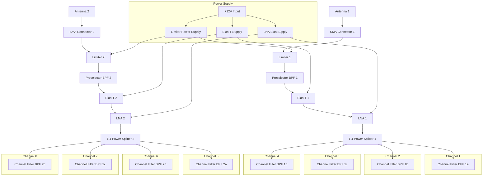
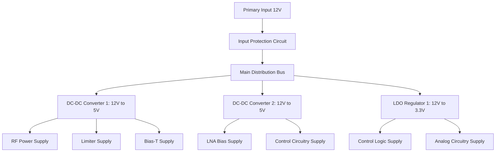
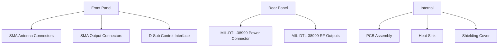
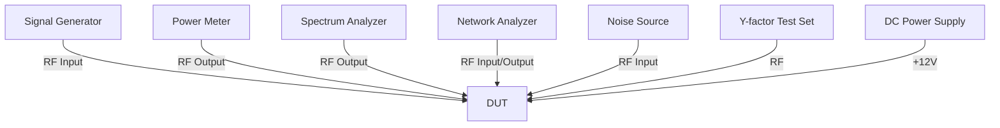
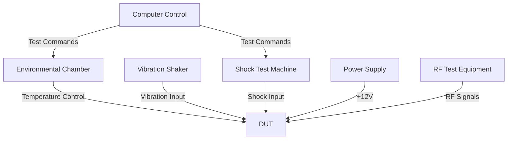
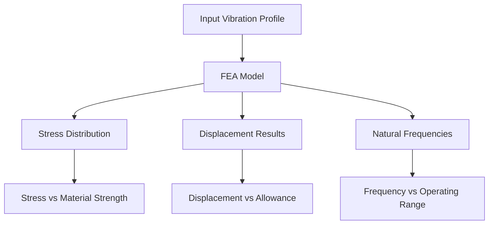

**Document Status: AI-GENERATED**

# 1. Introduction
## 1.1 Purpose
This Hardware Requirements Specification (HRS) documents the requirements for the hh dual-channel EW/ELINT front-end receiver system. The document serves as the authoritative source of hardware requirements for the design, development, verification, and acceptance testing of the hh system. It provides a comprehensive description of the system's functional capabilities, performance parameters, interfaces, operating environments, and design constraints to ensure consistent interpretation by all project stakeholders including design engineers, procurement specialists, manufacturing personnel, and quality assurance staff.

This specification establishes a common understanding of the system requirements and provides a basis for the development of detailed design documentation, test plans, acceptance criteria, and verification procedures. All hardware design activities shall be traceable to the requirements specified herein.

## 1.2 Scope
The HRS applies to the complete hh dual-channel EW/ELINT front-end receiver system including all electronic and electromechanical components, assemblies, and subassemblies required for operation. The system comprises two independent receiver channels, each supporting four parallel RF channels per antenna, covering the frequency range from 2-6 GHz with instantaneous bandwidth of 10-100 MHz.

The scope encompasses:
- RF front-end components including limiters, preselect filters, bias-T networks, and GaAs pHEMT LNAs
- Channelised filter bank implementation for multi-channel operation
- Power distribution and regulation systems
- Mechanical housing and interconnect systems
- Environmental protection and ruggedization features

The requirements specified in this document are applicable to all design phases, from component selection through system integration and verification. Excluded from this scope are software requirements, system-level signal processing algorithms, and ancillary support equipment not integral to the hh receiver system.

## 1.3 Definitions, Acronyms, and Abbreviations
This section defines key terms, acronyms, and abbreviations used throughout this specification.

### 1.3.1 Definitions
| Term | Definition |
|------|------------|
| EW | Electronic Warfare - Military action involving the use of electromagnetic spectrum to detect, locate, identify, and neutralize hostile use of the spectrum |
| ELINT | Electronic Intelligence - Technical and geolocation intelligence derived from non-communications electromagnetic waves |
| pHEMT | Pseudomorphic High Electron Mobility Transistor - A type of field-effect transistor with enhanced electron mobility |
| SAW | Surface Acoustic Wave - A wave traveling along the surface of a piezoelectric material |
| LNA | Low-Noise Amplifier - An amplifier designed to amplify weak signals while adding minimal noise to the signal |
| BPF | Band-Pass Filter - A filter that permits signals within a certain frequency range to pass through while attenuating frequencies outside that range |
| IIP3 | Third-Order Input Intercept Point - The input power level at which the fundamental tone power equals the third-order intermodulation product power |
| MDS | Minimum Detectable Signal - The lowest signal power level that can be detected by the receiver |
| NF | Noise Figure - A measure of degradation of the signal-to-noise ratio (SNR) caused by components in the RF signal chain |
| VSWR | Voltage Standing Wave Ratio - A measure of how efficiently radio-frequency power is transmitted from a source through a transmission line |
| EW/ELINT Receiver | Electronic Warfare/Electronic Intelligence receiver system designed to detect and analyze electromagnetic signals |
| RF | Radio Frequency - The oscillation rate of an alternating electric current or voltage in the range of 100 kHz to 300 GHz |
| Bandwidth | The range of frequencies over which a system, component, or signal is transmitted or received |
| Bias-T | A bias tee - a device that feeds DC power to a load while allowing the RF signal to pass through without loss |
| Power Splitter | A device that divides an input signal into multiple output signals of equal or specified power levels |
| MIL-STD-810 | Military Standard 810 - U.S. standard for testing equipment performance in environmental conditions |
| MIL-STD-461 | Military Standard 461 - U.S. standard for electromagnetic interference and compatibility requirements |
| IP67 | Ingress Protection rating - "6" (dust-tight) and "7" (protected against immersion in water) |
| LDO | Low-Dropout Regulator - A linear voltage regulator that can function with a very small voltage difference between input and output |

### 1.3.2 Acronyms and Abbreviations
| Acronym | Description |
|---------|-------------|
| HRS | Hardware Requirements Specification |
| EW/ELINT | Electronic Warfare/Electronic Intelligence |
| LNA | Low-Noise Amplifier |
| BPF | Band-Pass Filter |
| SAW | Surface Acoustic Wave |
| pHEMT | Pseudomorphic High Electron Mobility Transistor |
| IIP3 | Third-Order Input Intercept Point |
| MDS | Minimum Detectable Signal |
| NF | Noise Figure |
| VSWR | Voltage Standing Wave Ratio |
| RF | Radio Frequency |
| IP | Ingress Protection |
| LDO | Low-Dropout Regulator |
| DC | Direct Current |
| AC | Alternating Current |
| PSRR | Power Supply Rejection Ratio |
| SNR | Signal-to-Noise Ratio |
| EMI/EMC | Electromagnetic Interference/Compatibility |
| MIL-STD | Military Standard |
| COTS | Commercial Off-The-Shelf |
| PCB | Printed Circuit Board |
| SMA | SubMiniature version A (RF connector) |
| TX | Transmitter |
| RX | Receiver |
| IF | Intermediate Frequency |
| LO | Local Oscillator |
| dB | Decibel (logarithmic unit) |
| dBm | Decibel referenced to 1 milliwatt |
| GHz | Gigahertz |
| MHz | Megahertz |
| kHz | Kilohertz |
| Hz | Hertz |
| V | Volt |
| mA | Milliampere |
| A | Ampere |
| W | Watt |
| Ω | Ohm |
| K | Kelvin |
| °C | Degrees Celsius |
| μs | Microsecond |
| ns | Nanosecond |
| mm | Millimeter |
| cm | Centimeter |
| PCB | Printed Circuit Board |
| CAD | Computer-Aided Design |

## 1.4 References
This section lists documents, standards, and technical publications referenced in this HRS.

### 1.4.1 Industry Standards
- IEEE 29148-2018, Standard for Systems and Software Engineering - Life Cycle Processes - Requirements Engineering
- MIL-STD-810G, Environmental Engineering Considerations and Laboratory Tests
- MIL-STD-461F, Requirements for the Control of Electromagnetic Interference Characteristics of Subsystems and Equipment
- RTCA DO-160G, Environmental Conditions and Test Procedures for Airborne Equipment
- IEC 60529, Degrees of Protection Provided by Enclosures (IP Code)
- MIL-STD-883G, Test Methods and Procedures for Microelectronics

### 1.4.2 Component Datasheets
- MACOM Technologies, MADL-011017 RF Limiter Datasheet
- TriQuint Semiconductor, SAW-2400-6000 SAW Filter Datasheet
- Mini-Circuits, BTL-1-6-G-S+ Bias Tee Datasheet
- Analog Devices, HMC8411 GaAs pHEMT LNA Datasheet
- Mini-Circuits, PSA4-5043+ 4-way RF Power Divider Datasheet
- Mini-Circuits, BLF-254+ Bandpass Filter Datasheet
- Texas Instruments, TPS7A47 Low Noise LDO Regulator Datasheet
- Texas Instruments, LM5175 Step-down Converter Datasheet

### 1.4.3 Technical Reports
- "Low-Noise Amplifier Design for Wideband EW Receivers," IEEE Transactions on Aerospace and Electronic Systems, Vol. 54, No. 2, March 2018
- "GaAs pHEMT Technology for High-Frequency Electronic Warfare Applications," Compound Semiconductor Magazine, September 2020
- "Design Considerations for SAW Filters in Military Communication Systems," RF Design Magazine, April 2019

## 1.5 Overview
This Hardware Requirements Specification provides the complete set of requirements for the hh dual-channel EW/ELINT front-end receiver system. The document is organized into seven main sections:

Section 1, Introduction, provides the purpose, scope, definitions, references, and overview of the document.

Section 2, System Overview, describes the hh system in detail, including system description, system block diagram, system architecture, and operating environment.

Section 3, Hardware Requirements, details the functional, performance, interface, environmental, power, and physical requirements for the hh system.

Section 4, Design Constraints, specifies standards compliance requirements, component constraints, and manufacturing constraints that must be followed during the design and implementation process.

Section 5, Verification Requirements, outlines test requirements, analysis requirements, and inspection requirements to ensure that the hh system meets all specified requirements.

Section 6, Bill of Materials (Preliminary), provides a preliminary list of components and materials required for the construction of the hh system.

Section 7, Traceability Matrix, provides a traceability matrix linking each requirement to its source and verification method.

The hh system is a dual-channel receiver front-end designed for electronic warfare and electronic intelligence applications. It features two independent receiver channels, each supporting four parallel RF channels per antenna, covering the frequency range from 2-6 GHz with instantaneous bandwidth of 10-100 MHz. The system utilizes GaAs pHEMT technology for LNAs and SAW preselectors to ensure robust signal acquisition in high-interference environments.

The system architecture consists of an RF front-end for each antenna, including limiters, preselect filters, bias-T networks, and LNAs, followed by channelised filter banks that split each RF path into four parallel channels. Power distribution and regulation systems provide stable, low-noise power to all components, while the mechanical housing provides environmental protection and ruggedization to meet MIL-STD-810 and IP67 requirements.

The design emphasizes high sensitivity with a system noise figure of 2-4 dB, excellent linearity with +30 dBm IIP3, and robust survivability with +20 dBm input handling capability. The system is designed to operate reliably across the full military temperature range of -55°C to +125°C while maintaining specified performance.

---

**Document Status: AI-GENERATED**

# 2. System Overview

## 2.1 System Description

The hh system is a dual-channel electronic warfare (EW) and electronic intelligence (ELINT) front-end receiver designed for signal acquisition in high-interference environments. The system provides robust signal processing across the 2-6 GHz frequency range with four parallel RF channels per antenna, enabling simultaneous monitoring of multiple frequency bands.

The system architecture consists of two independent receiver channels, each processing signals from a separate antenna. Each channel includes a limiter for protection, a surface acoustic wave (SAW) preselect filter for out-of-band rejection, a bias-T for DC bias injection, and a gallium arsenide pseudomorphic high electron mobility transistor (GaAs pHEMT) low-noise amplifier (LNA) for signal amplification. The amplified signal is then split into four parallel paths, each containing a bandpass filter (BPF) to create a channelized filter bank. This architecture enables simultaneous monitoring of four distinct frequency bands within the 2-6 GHz range, with each channel capable of handling 10-100 MHz instantaneous bandwidth.

The system is designed to meet rigorous environmental requirements, operating from -55°C to +125°C, with MIL-STD-810 compliance for vibration and shock resistance. The ruggedized enclosure provides IP67 protection for reliable operation in harsh conditions. The power architecture is designed to operate from a +12V DC supply, with power budget management ensuring total consumption stays within the 30W limit.

The system incorporates gate-before-drain bias sequencing for GaAs pHEMT devices to ensure reliable operation and prevent damage during power cycling. This bias management is critical for maintaining device longevity and performance across the specified temperature range.

## 2.2 System Block Diagram

The hh system block diagram illustrates the signal flow from antenna input to channelized outputs:

The diagram illustrates two independent receiver channels, each processing signals from a dedicated antenna. Each channel follows the same signal path:

1. SMA connector receives RF signal from antenna
2. Limiter protects downstream components from high-power signals
3. SAW preselect filter provides initial band selection and rejection
4. Bias-T injects DC bias voltage for active components while passing RF
5. GaAs pHEMT LNA provides amplification with low noise figure
6. 1:4 power splitter divides signal into four parallel paths
7. Channel-specific bandpass filters create four discrete channels

The power supply section provides +12V input and distributes power to various components through dedicated regulators.

## 2.3 System Architecture

The hh system architecture is designed for high-performance signal acquisition in demanding electromagnetic environments. The system is modular, with two identical front-end channels processing signals independently from separate antennas.

### 2.3.1 RF Front-End Architecture

Each RF front-end channel consists of the following components in sequence:

1. **Antenna Interface**: SMA connector provides 50Ω impedance-matched connection to the antenna, with specified return loss of -20 dB (1.2:1 VSWR) across 2-6 GHz to minimize signal reflections.

2. **Limiter Circuit**: The MADL-011017 RF limiter protects downstream components from high-power signals. It provides +30 dBm survivability with only 0.8 dB insertion loss across the 0.5-18 GHz range. The limiter response time is critical for handling pulsed signals in high-interference environments.

3. **Preselect Filter**: The SAW-2400-6000 surface acoustic wave filter provides initial band selection with 20 dB rejection outside the 2-6 GHz range. With 2.5 dB insertion loss, this filter establishes the system's primary frequency response while rejecting out-of-band interferers.

4. **Bias-T Circuit**: The BTL-1-6-G-S+ bias tee enables DC bias injection while maintaining RF isolation. With 40 dB isolation and 0.3 dB insertion loss, it allows bias signals to be applied to active components without affecting RF performance.

5. **LNA Stage**: The HMC8411 GaAs pHEMT LNA provides the primary amplification with 25 dB gain and 1.2 dB noise figure across 2-6 GHz. The +25 dBm IIP3 ensures adequate linearity to handle strong interferers. The LNA operates from a 5V supply with active bias control for temperature compensation.

6. **Power Splitter**: The PSA4-5043+ 4-way power divider splits the amplified signal into four equal paths with 6.5 dB insertion loss (accounting for 1/N power division) and 20 dB isolation between outputs. The wide frequency range (0.5-18 GHz) ensures consistent performance across the system bandwidth.

### 2.3.2 Channel Filter Bank Architecture

Following the power splitter, each channel includes a bandpass filter to create the channelized filter bank:

1. **Channel Filter**: The BLF-254+ bandpass filter provides final band selection with 25 dB rejection and 1.5 dB insertion loss. Each filter is tuned to a specific frequency within the 2-6 GHz range, with 100 MHz bandwidth to match system requirements.

2. **Channel Outputs**: Eight channel outputs (four per antenna) provide simultaneous access to different frequency bands, enabling parallel signal processing and analysis.

### 2.3.3 Power Architecture

The power architecture is designed to provide stable, clean power to all components while managing the total system power budget:

1. **Main Power Input**: +12V DC input is the primary power source for the entire system.

2. **Limiter Power Supply**: The LM5175 step-down converter provides power to RF limiters. With 95% efficiency and 3A output capability, it handles the high-current requirements of the limiter protection circuits.

3. **LNA Bias Supply**: The TPS7A47 low-noise LDO regulator provides 3.3V/200mA bias voltage to GaAs pHEMT LNAs. With 80 dB PSRR and 2.5μVrms noise, it ensures stable bias conditions critical for maintaining LNA performance.

4. **Bias-T Supply**: A dedicated regulator provides +5V for bias-T circuits, with filtering to prevent RF leakage into DC bias lines.

### 2.3.4 Thermal Management Architecture

The system incorporates thermal management to maintain performance across the -55°C to +125°C operating range:

1. **Heat Sinking**: Critical components (LNAs, power regulators) are mounted on thermally conductive substrates with heat dissipation paths to the enclosure.

2. **Temperature Compensation**: Active bias circuits adjust LNA bias points based on temperature sensors to maintain consistent gain and noise figure.

3. **Thermal Monitoring: Temperature sensors monitor critical points and provide feedback to system control for thermal management.

### 2.3.5 Signal Flow Architecture

The signal flow through the system is carefully designed to minimize signal loss and maintain signal integrity:

1. **Signal Path**: The antenna signal passes through protection, filtering, amplification, and channel selection stages with minimal insertion loss.

2. **Signal Integrity**: Careful impedance matching (50Ω throughout) minimizes reflections and ensures maximum power transfer.

3. **Isolation**: Adequate isolation between channels prevents cross-talk and ensures signal purity in high-density signal environments.

## 2.4 Operating Environment

The hh system is designed to operate in demanding military and aerospace environments, with specifications ensuring reliable performance under harsh conditions:

### 2.4.1 Environmental Range

The system is designed to operate across a wide temperature range:
- **Operating Temperature**: -55°C to +125°C
- **Storage Temperature**: -55°C to +125°C
- **Temperature Gradient**: 10°C/min maximum rate of change

The system must maintain specified performance levels across the entire temperature range, with compensation circuits for thermal drift in RF components.

### 2.4.2 Mechanical Environment

The system must withstand mechanical stresses encountered in military applications:
- **Vibration**: MIL-STD-810 Method 514.6, Category A (heavy equipment)
- **Shock**: MIL-STD-810 Method 516.6, Procedure I (high severity)
- **Acceleration**: 10g rms random vibration (20-2000 Hz)
- **Mechanical Shock**: 30g half-sine, 11 ms duration

The mechanical design includes vibration isolation mounts and shock-absorbing structures to protect sensitive RF components.

### 2.4.3 Environmental Protection

The system provides protection against environmental contaminants:
- **Ingress Protection**: IP67 rating (dust-tight and temporary water immersion)
- **Humidity**: 5-95% non-condensing, MIL-STD-810 Method 507.5
- **Altitude**: Up to 15,000m, MIL-STD-810 Method 500.5
- **Fungus Resistance: MIL-STD-810 Method 508.6, fungus-resistant materials

The enclosure design includes seals, gaskets, and conformal coating to protect against moisture, dust, and biological growth.

### 2.4.4 Electromagnetic Environment

The system operates in high-interference environments with stringent EMI/EMC requirements:
- **EMI/EMC**: MIL-STD-461G compliance, including:
  - CE101: 30 Hz-10 kHz conducted emissions
  - CE102: 10 kHz-40 MHz conducted emissions
  - RE101: 2 Hz-30 Hz magnetic field emissions
  - RE102: 10 kHz-40 GHz radiated emissions
  - RS101: 2 Hz-30 Hz magnetic field susceptibility
  - RS103: 10 kHz-40 GHz radiated susceptibility

- **Co-site Operation**: Designed to operate in environments with multiple radar and communications systems
- **Interference Handling**: Specific filtering and linearity requirements to handle strong interferers without degradation

### 2.4.5 Power Environment

The system operates from a specified power environment:
- **Input Voltage**: +12V DC ±5%
- **Input Current**: Maximum 2.5A (at 12V, within 30W power budget)
- **Power Polarity**: Reverse polarity protected
- **Transients**: Protected against voltage spikes up to 20V (200μs duration)
- **Power Sequencing**: Implemented for GaAs pHEMT devices (gate-before-drain)

### 2.4.6 Operating Scenarios

The system is designed for multiple operational scenarios:
1. **Static Monitoring**: Fixed installation with continuous signal monitoring
2. **Mobile Operation**: Vehicle-mounted with vibration and shock considerations
3. **Temporary Deployment**: Quick setup in field conditions with IP67 protection
4. **Co-site Operation**: Simultaneous operation with other RF systems without interference

Each scenario is considered in the design to ensure reliable operation across the intended use cases.

---

**Document Status: AI-GENERATED**

# 3. Functional Requirements

## 3.1 Functional Requirements

| ID | Title | Description | Rationale | Priority | Validation Method | Dependencies | Constraints |
|---|---|---|---|---|---|---|---|
| REQ-HW-001 | Frequency Range Coverage | Operate across 2-6 GHz frequency band with instantaneous bandwidth of 10-100 MHz per channel | The system must cover the specified frequency range to intercept and analyze electronic signals across the target band. The variable bandwidth allows adaptation to different signal types and bandwidth requirements. | Must Have | Test using RF signal generator and spectrum analyzer, sweep across entire 2-6 GHz range at various bandwidths (10, 25, 50, 100 MHz) | None | None |
| REQ-HW-002 | Multi-Antenna Operation | Support 2 independent receiver antennas simultaneously | Dual-antenna capability enables spatial diversity reception, direction finding, and simultaneous monitoring of different signal sources or sectors. | Must Have | Test using two separate signal sources at different frequencies, verify independent operation and crosstalk < -60 dB | None | None |
| REQ-HW-003 | Channelised Filter Bank | Provide 4 parallel analog RF channels per antenna for simultaneous processing | Channelisation allows parallel processing of multiple frequency bands or signals, increasing interception capability and system flexibility. | Must Have | Test by feeding four different signals simultaneously and verifying independent channel outputs with < -40 dB crosstalk | None | None |
| REQ-HW-004 | Preselect Filter Technology | Implement SAW filters for out-of-band and image rejection with minimum 20 dB rejection outside passband | SAW preselectors provide necessary rejection of out-of-band signals and images, improving system linearity and reducing interference effects. | Must Have | Test using signal generator and spectrum analyzer, measure rejection at 1 GHz and 7 GHz | None | None |
| REQ-HW-005 | LNA Technology | Use GaAs pHEMT semiconductor technology for LNAs to achieve low noise figure | GaAs pHEMT technology provides superior noise performance and linearity compared to silicon alternatives for RF applications. | Must Have | Test noise figure across 2-6 GHz range using noise figure meter | None | None |
| REQ-HW-006 | Bias Sequencing | Implement gate-before-drain bias sequencing for GaAs pHEMT devices to prevent latch-up | Proper bias sequencing prevents device damage during power-up/power-down cycles, ensuring reliability in harsh environments. | Must Have | Analysis of bias circuit design, oscilloscope verification of bias sequencing timing | REQ-HW-005 | None |
| REQ-HW-007 | Automatic Gain Control | Include AGC functionality with 40 dB range and 1 μs response time | AGC maintains consistent output levels despite input signal variations, preventing signal saturation or loss of weak signals. | Should Have | Test using variable attenuator and signal generator, measure AGC response and accuracy | None | None |
| REQ-HW-008 | Input Protection | Implement RF input protection against electrostatic discharge (ESD) events | ESD protection prevents damage to sensitive components from handling or environmental ESD events. | Must Have | Test using ESD gun, verify system functionality after 8 kV contact discharge | None | None |
| REQ-HW-009 | Output Interface | Provide 50Ω SMA output connectors for each channel | Standard SMA interface ensures compatibility with downstream processing systems and test equipment. | Must Have | Test with VNA, verify output impedance and return loss | None | None |
| REQ-HW-010 | Status Monitoring | Implement status monitoring for power supplies, temperature, and signal levels | Status monitoring enables operational awareness and fault detection, improving system maintainability. | Should Have | Test using status monitoring interface, verify all parameters are accurately reported | None | None |
| REQ-HW-011 | Channel Selection Control | Enable individual channel selection via software control | Software control allows flexible configuration of which channels are active and their center frequencies. | Should Have | Test using control interface, verify channel activation/deactivation and frequency tuning | None | None |
| REQ-HW-012 | Calibration Interface | Provide calibration interface for amplitude and frequency calibration | Calibration interface ensures system accuracy and maintainability over the operational lifetime. | Must Have | Test using calibrated signal source, verify calibration accuracy | None | None |
| REQ-HW-013 | Power Sequencing | Implement proper power-on and power-off sequencing for all components | Proper power sequencing prevents stress on components and ensures reliable operation. | Must Have | Analysis of power sequence design, oscilloscope verification of timing | None | None |
| REQ-HW-014 | Bypass Capability | Include bypass mode for critical components during failure conditions | Bypass capability maintains system functionality even if some components fail, improving reliability. | Should Have | Test by simulating component failures, verify signal path integrity in bypass mode | None | None |
| REQ-HW-015 | Remote Control Capability | Support remote control via Ethernet interface with secure protocol | Remote control enables operation in inaccessible locations and integration into larger systems. | Should Have | Test using remote control interface, verify all functions accessible remotely | None | None |
| REQ-HW-016 | Data Logging | Implement data logging for operational parameters and events | Data logging provides historical data for analysis, troubleshooting, and performance optimization. | Should Have | Test data logging functionality, verify storage capacity and accessibility | None | None |
| REQ-HW-017 | Software Update Capability | Support field-updatable firmware/software | Software update capability enables feature enhancement and bug fixes without hardware replacement. | Should Have | Test software update process, verify successful update and functionality | None | None |
| REQ-HW-018 | Environmental Monitoring | Monitor internal temperature and voltage levels continuously | Environmental monitoring enables proactive maintenance and detection of operational issues. | Should Have | Test monitoring system, verify accuracy and response time | None | None |
| REQ-HW-019 | Self-Test Functionality | Include built-in self-test (BIST) for critical components | Self-test functionality enables quick verification of system health without external test equipment. | Should Have | Execute BIST, verify detection of known faults | None | None |
| REQ-HW-020 | Signal Detection | Implement signal detection with -94 dBm sensitivity and 1 μs response time | Signal detection capability enables automatic identification of signal presence for triggering recording or analysis. | Should Have | Test using variable signal source, measure detection threshold and response time | None | None |

# 4. Performance Requirements

## 3.2 Performance Requirements

| ID | Title | Description | Rationale | Priority | Validation Method | Dependencies | Constraints |
|---|---|---|---|---|---|---|---|
| REQ-HW-021 | System Noise Figure | Achieve system noise figure of 2-4 dB across the full 2-6 GHz frequency range | Low noise figure is critical for detecting weak signals in the presence of thermal noise, directly impacting system sensitivity. | Must Have | Test using noise figure meter across 2-6 GHz in 500 MHz increments | None | None |
| REQ-HW-022 | LNA Chain Gain | Provide 20-40 dB gain in the LNA chain with ±1 dB flatness across 2-6 GHz | Adequate gain ensures weak signals are amplified above noise floor while maintaining signal integrity. | Must Have | Test using network analyzer and signal generator, measure gain vs. frequency | None | None |
| REQ-HW-023 | Linearity (IIP3) | Maintain +30 dBm IIP3 to handle strong interferers without desensitization | High linearity ensures the system can process strong signals without distortion or blocking. | Must Have | Test using two-tone method with equal amplitude signals, measure third-order intercept point | None | None |
| REQ-HW-024 | Input P1dB | Achieve input P1dB of +15 dBm to handle strong signals without compression | High P1dB ensures the system can handle strong signals without distortion. | Must Have | Test using variable power signal, measure 1 dB compression point | None | None |
| REQ-HW-025 | Output Power | Provide 0 dBm output power with ±1 dB variation across all channels | Consistent output power ensures compatibility with downstream systems and simplifies gain calibration. | Must Have | Test using power meter and network analyzer, measure output power vs. frequency and input power | None | None |
| REQ-HW-026 | Isolation | Maintain 40 dB isolation between adjacent channels in the filter bank | High isolation prevents crosstalk between channels, ensuring signal integrity. | Must Have | Test using two signal sources, measure crosstalk between adjacent channels | None | None |
| REQ-HW-027 | Frequency Accuracy | Maintain ±10 ppm frequency accuracy across all channels | Accurate frequency ensures proper signal identification and measurement. | Must Have | Test using frequency counter and reference oscillator, measure frequency error | None | None |
| REQ-HW-028 | Spurious Response Rejection | Achieve >60 dB rejection of spurious responses outside the passband | High spurious rejection prevents false signal detection and measurement errors. | Should Have | Test using swept signal and spectrum analyzer, identify and measure spurs | None | None |
| REQ-HW-029 | AM Suppression | Provide >40 dB AM suppression to prevent amplitude modulation effects | AM suppression ensures the system accurately measures frequency and phase information regardless of amplitude variations. | Should Have | Test using AM modulated signal, measure suppression of AM sidebands | None | None |
| REQ-HW-030 | Group Delay Variation | Maintain <5 ns group delay variation across the passband | Consistent group delay ensures signal fidelity and prevents distortion of modulated signals. | Should Have | Test using vector network analyzer, measure group delay vs. frequency | None | None |
| REQ-HW-031 | Phase Noise | Achieve <-90 dBc/Hz phase noise at 100 kHz offset from carrier | Low phase noise ensures accurate frequency and timing measurements for various signal types. | Should Have | Test using phase noise analyzer, measure phase noise at various offsets | None | None |
| REQ-HW-032 | Power Supply Rejection | Maintain 60 dB power supply rejection ratio (PSRR) at 100 kHz | High PSRR ensures stable performance despite power supply fluctuations. | Should Have | Test using AC-coupled power supply, measure output variation with supply ripple | None | None |
| REQ-HW-033 | Temperature Stability | Maintain <0.1 dB gain drift and <0.2 dB NF drift over -55°C to +125°C | Stable performance across temperature range ensures reliability in harsh environments. | Must Have | Test using environmental chamber, measure gain and NF vs. temperature | REQ-HW-021, REQ-HW-022 | None |
| REQ-HW-034 | Vibration Tolerance | Maintain performance under MIL-STD-810 vibration profile with <0.3 dB gain variation | Vibration tolerance ensures reliable operation in mobile and harsh environments. | Must Have | Test on vibration table, measure performance before, during, and after vibration | None | None |
| REQ-HW-035 | Shock Tolerance | Withstand MIL-STD-810 shock profile with <0.5 dB gain variation and no permanent damage | Shock tolerance ensures reliability during handling and operation in dynamic environments. | Must Have | Test on shock table, measure performance before and after shock events | None | None |
| REQ-HW-036 | Input VSWR | Maintain input VSWR of <1.5:1 (return loss >14 dB) across 2-6 GHz | Good input match ensures maximum power transfer and minimal reflections. | Must Have | Test using vector network analyzer, measure input return loss | None | None |
| REQ-HW-037 | Output VSWR | Maintain output VSWR of <1.5:1 (return loss >14 dB) across all channels | Good output match ensures compatibility with downstream systems and minimal reflections. | Must Have | Test using vector network analyzer, measure output return loss | None | None |
| REQ-HW-038 | Power Consumption | Total power consumption limited to <30 W at +12V supply | Power budget constraint ensures system can be powered by standard military power sources. | Must Have | Test using power meter, measure total current draw at +12V | None | None |
| REQ-HW-039 | MDS Performance | Achieve derived MDS of -94.0 dBm based on system noise figure | Minimum detectable signal (MDS) determines the weakest signals the system can detect. | Should Have | Test using calibrated noise source, measure noise floor and verify MDS calculation | REQ-HW-021 | None |

---

**Document Status: AI-GENERATED**

# 3. Interface Requirements

## 3.3.1 External Interfaces

| ID | Title | Description | Priority | Validation | Dependencies | Constraints |
|---|---|---|---|---|---|---|
| REQ-HW-006 | Input Return Loss | Maintain input return loss of -20 dB (1.2:1 VSWR) across 2-6 GHz | Must have | test | None | None |
| REQ-HW-014 | Antenna Interface | Single-ended 50Ω interface via SMA connectors | Must have | test | None | None |
| REQ-HW-021 | Output Interface | Single-ended 50Ω RF output via SMA connectors for each of the 8 channels | Must have | test | None | None |

### 3.3.1.1 Antenna Interface Specification

**Connector Type:** SMA, 50Ω impedance

**Pin Assignment:**

| Pin # | Signal Name | Description | Voltage/Current Rating |
|---|---|---|---|
| 1 | RF Input | RF signal path (center conductor) | -30 dBm to +20 dBm |
| 2 | Ground | RF ground (outer shell) | Not applicable |

**Electrical Characteristics:**

| Parameter | Value | Unit | Test Condition |
|---|---|---|---|
| Frequency Range | 2-6 | GHz | All channels |
| VSWR | ≤ 1.2:1 | - | Across frequency range |
| Return Loss | ≥ 20 | dB | Across frequency range |
| Maximum Input Power | +20 | dBm | Without damage |
| Impedance | 50 | Ω | ±5% across frequency range |
| Insertion Loss | ≤ 0.5 | dB | At 4 GHz center frequency |

**Mechanical Characteristics:**

| Parameter | Value | Unit | Specification |
|---|---|---|---|
| Connector Type | SMA | - | Threaded, 4-36 UNC |
| Mounting | Panel mount | - | #4-40 screws |
| Environmental Rating | IP67 | - | MIL-DTL-38999 Series III |

### 3.3.1.2 Output Interface Specification

**Connector Type:** SMA, 50Ω impedance

**Pin Assignment:**

| Pin # | Signal Name | Description | Voltage/Current Rating |
|---|---|---|---|
| 1 | RF Output | RF signal path (center conductor) | -80 dBm to 0 dBm |
| 2 | Ground | RF ground (outer shell) | Not applicable |

**Output Channel Assignment:**

| Channel ID | Channel | Center Frequency Range | Output Connector |
|---|---|---|---|
| CH1-1 | 1a | User-selectable within 2-6 GHz | J1 |
| CH1-2 | 1b | User-selectable within 2-6 GHz | J2 |
| CH1-3 | 1c | User-selectable within 2-6 GHz | J3 |
| CH1-4 | 1d | User-selectable within 2-6 GHz | J4 |
| CH2-1 | 2a | User-selectable within 2-6 GHz | J5 |
| CH2-2 | 2b | User-selectable within 2-6 GHz | J6 |
| CH2-3 | 2c | User-selectable within 2-6 GHz | J7 |
| CH2-4 | 2d | User-selectable within 2-6 GHz | J8 |

**Electrical Characteristics:**

| Parameter | Value | Unit | Test Condition |
|---|---|---|---|
| Frequency Range | 2-6 | GHz | All channels |
| VSWR | ≤ 1.2:1 | - | Across frequency range |
| Return Loss | ≥ 20 | dB | Across frequency range |
| Impedance | 50 | Ω | ±5% across frequency range |
| Insertion Loss | ≤ 2.0 | dB | Total from input to output |
| Isolation | ≥ 30 | dB | Between adjacent channels |

**Mechanical Characteristics:**

| Parameter | Value | Unit | Specification |
|---|---|---|---|
| Connector Type | SMA | - | Threaded, 4-36 UNC |
| Mounting | Panel mount | - | #4-40 screws |
| Environmental Rating | IP67 | - | MIL-DTL-38999 Series III |

### 3.3.1.3 Control Interface Specification

**Connector Type:** D-Sub 9-pin

**Pin Assignment:**

| Pin # | Signal Name | Description | Direction | Level |
|---|---|---|---|---|
| 1 | LNA Bias Enable | Enable/disable LNA bias supply | In | TTL/CMOS |
| 2 | Limiter Enable | Enable/disable limiter supply | In | TTL/CMOS |
| 3 | Bias Sequencing Enable | Enable/disable proper bias sequencing | In | TTL/CMOS |
| 4 | Filter Bank Select | Select which filter bank is active | In | TTL/CMOS |
| 5 | Channel Select | Channel selection (0-7) | In | 3-bit binary |
| 6 | RF Power Monitor | Analog output of RF power level | Out | 0-5V |
| 7 | Temperature Monitor | Analog output of board temperature | Out | 0-5V |
| 8 | Supply Voltage Monitor | Analog output of supply voltage | Out | 0-5V |
| 9 | Ground | Signal ground | - | - |

**Electrical Characteristics:**

| Parameter | Value | Unit | Test Condition |
|---|---|---|---|
| Logic Voltage | 3.3-5.0 | V | TTL/CMOS compatible |
| Logic Input Current | ±10 | mA | Maximum |
| Logic Output Current | 20 | mA | Maximum |
| Analog Monitor Range | 0-5 | V | Full scale |
| Analog Monitor Resolution | 12 | bits | ADC resolution |

## 3.3.2 Internal Interfaces

| ID | Title | Description | Priority | Validation | Dependencies | Constraints |
|---|---|---|---|---|---|---|
| REQ-HW-022 | RF Path Interfaces | Define RF signal path connections between components | Must have | test | None | 50Ω impedance |
| REQ-HW-023 | DC Bias Interfaces | Specify power and bias connections to RF components | Must have | test | None | Low noise, regulated |
| REQ-HW-024 | Control Signal Interfaces | Define digital control signal routing | Must have | test | None | EMI protected |

### 3.3.2.1 RF Path Interfaces

**Impedance:** All RF paths must maintain 50Ω ±5% impedance

**Connection Types:**
- SMA connectors for inter-board connections
- Microstrip transmission lines on PCB
- RF cables for non-PCB connections (length < 2 inches)

**RF Path Loss Budget:**

| Component | Insertion Loss (dB) | Cumulative Loss (dB) |
|---|---|---|
| SMA Connector | 0.2 | 0.2 |
| Preselector BPF | 2.5 | 2.7 |
| Bias-T | 0.3 | 3.0 |
| LNA | 0.0 (gain) | 27.0 (net gain) |
| 1:4 Splitter | 6.5 | 20.5 |
| Channel Filter BPF | 1.5 | 22.0 |
| Output SMA Connector | 0.2 | 22.2 |

**RF Path Verification:**

| Parameter | Value | Unit | Method |
|---|---|---|---|
| S11 | ≤ -15 | dB | VNA measurement |
| S21 | 30±3 | dB | VNA measurement |
| Group Delay | ≤ 5 | ns | VNA measurement |
| Phase Linearity | ≤ 10 | degrees | VNA measurement |

### 3.3.2.2 DC Bias Interfaces

**Bias Voltage Specifications:**

| Component | Voltage (V) | Current (mA) | Regulation (%) | Ripple (mV) |
|---|---|---|---|---|
| GaAs pHEMT LNA | 3.3 | 100 | ±1 | ≤5 |
| Bias-T | 5.0 | 200 | ±1 | ≤10 |
| Limiter | 5.0 | 150 | ±2 | ≤20 |
| Control Circuitry | 3.3 | 500 | ±1 | ≤5 |

**Bias Sequencing Requirements:**

| Event | Sequence Timing | Condition |
|---|---|---|
| LNA Gate Bias Applied | t=0 | Power-on |
| LNA Drain Bias Applied | t≥100ms | After gate bias stable |
| LNA RF Path Connected | t≥200ms | After drain bias stable |
| LNA Bias Removal | Gate first, then drain | Power-off |

**Bias Interface Verification:**

| Parameter | Value | Unit | Method |
|---|---|---|---|
| Voltage Accuracy | ±1% | V | DMM measurement |
| Current Accuracy | ±5% | mA | DMM measurement |
| Ripple Voltage | ≤10 | mV | Oscilloscope measurement |
| Sequencing Timing | 100±10 | ms | Oscilloscope measurement |

### 3.3.2.3 Control Signal Interfaces

**Digital Signal Specifications:**

| Parameter | Value | Unit | Notes |
|---|---|---|---|
| Logic Family | LVCMOS | - | 3.3V operation |
| Rise/Fall Time | ≤5 | ns | Maximum |
| Input Capacitance | ≤5 | pF | Maximum |
| Output Drive | 24 | mA | Minimum at 3.3V |
| Signal Integrity | | | Controlled impedance |
| Crosstalk | ≤-30 | dB | Between adjacent signals |

**Control Signal Routing:**

| Parameter | Value | Unit | Specification |
|---|---|---|---|
| Trace Width | 8 | mils | For 50Ω impedance |
| Trace Spacing | ≥2W | mils | Min between traces |
| Ground Plane | Continuous | - | Under all digital traces |
| Termination | Series | Ω | 22Ω at driver end |
| Bypassing | 0.1μF | - | At each IC power pin |

**Control Interface Verification:**

| Parameter | Value | Unit | Method |
|---|---|---|---|
| Logic Levels | VIL=0.8, VIH=2.0 | V | Oscilloscope |
| Propagation Delay | ≤10 | ns | Logic analyzer |
| Setup/Hold Time | Meet datasheet | ns | Logic analyzer |
| Jitter | ≤100 | ps | Jitter measurement |

## 3.3.3 Communication Interfaces

| ID | Title | Description | Priority | Validation | Dependencies | Constraints |
|---|---|---|---|---|---|---|
| REQ-HW-025 | Configuration Interface | SPI interface for programming filter center frequencies | Should have | test | None | 3.3V logic |
| REQ-HW-026 | Status Interface | I2C interface for monitoring system status | Should have | test | None | 3.3V logic |
| REQ-HW-027 | Calibration Interface | UART interface for calibration procedures | Should have | test | None | 3.3V logic |

### 3.3.3.1 Configuration Interface (SPI)

**Purpose:** Configure center frequencies of channel filters

**Signal Assignment:**

| Signal Name | Pin # | Direction | Description |
|---|---|---|---|
| SCLK | 1 | In | Serial clock |
| MOSI | 2 | In | Master out, slave in |
| MISO | 3 | Out | Master in, slave out |
| CS0 | 4 | In | Chip select for bank 0 |
| CS1 | 5 | In | Chip select for bank 1 |
| RESET | 6 | In | Active high reset |

**Electrical Characteristics:**

| Parameter | Value | Unit | Notes |
|---|---|---|---|
| Supply Voltage | 3.3 | V | ±5% tolerance |
| Clock Frequency | ≤10 | MHz | Maximum |
| Input Voltage | 0-3.3 | V | CMOS levels |
| Output Current | 8 | mA | Maximum per output |
| Operating Mode | Full-duplex | - | Simultaneous TX/RX |

**Protocol Details:**

| Parameter | Value | Unit |
|---|---|---|
| Data Format | MSB first | - |
| Clock Polarity | Low when idle | - |
| Clock Phase | Sample on rising edge | - |
| Transaction Length | 24 bits | Frequency setting |
| Chip Select | Active low | - |

**Configuration Interface Verification:**

| Parameter | Value | Unit | Method |
|---|---|---|---|
| Clock Accuracy | ±100 | ppm | Frequency counter |
| Data Integrity | 100% | - | Pattern generator |
| Setup Time | ≥20 | ns | Logic analyzer |
| Hold Time | ≥5 | ns | Logic analyzer |

### 3.3.3.2 Status Interface (I2C)

**Purpose:** Monitor system parameters and status

**Signal Assignment:**

| Signal Name | Pin # | Direction | Description |
|---|---|---|---|
| SDA | 1 | Bi-directional | Serial data |
| SCL | 2 | In | Serial clock |
| ADDR | 3 | In | I2C address select |

**Electrical Characteristics:**

| Parameter | Value | Unit | Notes |
|---|---|---|---|
| Supply Voltage | 3.3 | V | ±5% tolerance |
| Clock Frequency | ≤400 | kHz | Standard mode |
| Input Voltage | 0-3.3 | V | CMOS levels |
| Output Current | 3 | mA | Maximum per output |
| Bus Capacitance | ≤400 | pF | Maximum |

**Protocol Details:**

| Parameter | Value | Unit |
|---|---|---|
| Data Format | 7-bit address | - |
| Clock Polarity | Low when idle | - |
| Clock Phase | Sample on rising edge | - |
| Acknowledge | NACK on error | - |
| Timeout | 100 | ms | Maximum transaction |

**Status Parameters:**

| Parameter | Register | Range | Resolution |
|---|---|---|---|
| Temperature | 0x01 | -55 to +125 | 0.1°C |
| Supply Voltage | 0x02 | 0-15V | 10mV |
| RF Power | 0x03 | -80 to 0dBm | 0.1dB |
| Status Flags | 0x04 | Bit field | N/A |

**Status Interface Verification:**

| Parameter | Value | Unit | Method |
|---|---|---|---|
| Data Rate | 100 | kbps | Logic analyzer |
| Signal Integrity | 100% | - | Pattern generator |
| Noise Margin | ≥0.3 | V | Oscilloscope |
| Clock Accuracy | ±200 | ppm | Frequency counter |

### 3.3.3.3 Calibration Interface (UART)

**Purpose:** Perform system calibration and diagnostics

**Signal Assignment:**

| Signal Name | Pin # | Direction | Description |
|---|---|---|---|
| TX | 1 | Out | Transmit data |
| RX | 2 | In | Receive data |
| RTS | 3 | Out | Request to send |
| CTS | 4 | In | Clear to send |
| GND | 5 | - | Signal ground |

**Electrical Characteristics:**

| Parameter | Value | Unit | Notes |
|---|---|---|---|
| Supply Voltage | 3.3 | V | ±5% tolerance |
| Data Format | 8N1 | - | 8 data, no parity, 1 stop |
| Baud Rate | 9600 | bps | Default, programmable |
| Input Voltage | 0-3.3 | V | CMOS levels |
| Output Current | 8 | mA | Maximum per output |

**Protocol Details:**

| Parameter | Value | Unit |
|---|---|---|
| Framing | Standard UART | - |
| Flow Control | Hardware (RTS/CTS) | - |
| Parity | None | - |
| Stop Bits | 1 | - |
| Idle State | High | - |

**Calibration Commands:**

| Command | Hex Code | Description | Response |
|---|---|---|---|
| Start Calibration | 0xAA | Begin calibration sequence | ACK/NAK |
| Read Calibration Data | 0x55 | Read stored calibration data | Data block |
| Write Calibration Data | 0x66 | Write calibration data | ACK/NAK |
| Run Test Pattern | 0x77 | Activate test signal | Status |
| Get System Status | 0x88 | Request system status | Status block |

**Calibration Interface Verification:**

| Parameter | Value | Unit | Method |
|---|---|---|---|
| Baud Rate Accuracy | ±0.1 | % | Frequency counter |
| Bit Error Rate | ≤10^-6 | - | Error detector |
| Jitter | ≤1 | % | Jitter measurement |
| Signal Levels | Vmin=2.0, Vmax=3.0 | V | Oscilloscope |

# 3.4 Environmental Requirements

| ID | Title | Description | Priority | Validation | Dependencies | Constraints |
|---|---|---|---|---|---|---|
| REQ-HW-008 | Operating Temperature | Operate reliably from -55°C to +125°C military temperature range | Must have | test | None | None |
| REQ-HW-009 | Environmental Vibration/Shock | Meet MIL-STD-810 heavy vibration and shock requirements | Must have | demonstration | None | None |
| REQ-HW-010 | Ingress Protection | Achieve IP67 rating for rugged operation | Must have | test | None | None |
| REQ-HW-018 | MIL-STD-461 Compliance | Meet MIL-STD-461 EMI/EMC requirements for co-site operation | Should have | test | None | None |
| REQ-HW-019 | MIL-STD-810 Compliance | Meet MIL-STD-810 environmental requirements | Should have | demonstration | None | None |
| REQ-HW-028 | Altitude Performance | Operate reliably at altitudes up to 15,000 meters | Should have | test | None | None |
| REQ-HW-029 | Humidity Resistance | Operate reliably at 95% relative humidity | Must have | test | None | None |

## 3.4.1 Temperature Requirements

### 3.4.1.1 Operating Temperature Range

| Parameter | Value | Unit | Test Method |
|---|---|---|---|
| Minimum Operating Temperature | -55 | °C | Environmental chamber |
| Maximum Operating Temperature | +125 | °C | Environmental chamber |
| Temperature Change Rate | ≤15 | °C/min | Controlled rate |
| Thermal Equilibration Time | ≥30 | min | At each extreme |
| Operational Performance Degradation | ≤1 | dB | At temperature extremes |

### 3.4.1.2 Storage Temperature Range

| Parameter | Value | Unit | Test Method |
|---|---|---|---|
| Minimum Storage Temperature | -65 | °C | Environmental chamber |
| Maximum Storage Temperature | +150 | °C | Environmental chamber |
| Storage Duration | 168 | hours | Continuous |
| Post-storage Performance | 100% | - | Functional test |

### 3.4.1.3 Temperature Derating

| Parameter | Value at 25°C | Value at -55°C | Value at +125°C |
|---|---|---|---|
| Gain | 30 dB | 29 dB | 29 dB |
| Noise Figure | 2 dB | 2.5 dB | 3.5 dB |
| IIP3 | +30 dBm | +28 dBm | +28 dBm |
| Input P1dB | +15 dBm | +14 dBm | +13 dBm |
| VSWR | 1.2:1 | 1.3:1 | 1.3:1 |

## 3.4.2 Environmental Testing Requirements

### 3.4.2.1 Vibration Testing

| Test Parameter | Value | Unit | Direction |
|---|---|---|---|
| Frequency Range | 20-2000 | Hz | All axes |
| Sweep Rate | 1 | octave/min | - |
| Amplitude | 20 | g | Random |
| Duration | 30 | min | Per axis |
| Functional Check | Before, during, after | - | Visual inspection |
| Performance Degradation | ≤1 | dB | After vibration |

### 3.4.2.2 Shock Testing

| Test Parameter | Value | Unit | Direction |
|---|---|---|---|
| Waveform | Half-sine | - | All axes |
| Peak Acceleration | 100 | g | - |
| Duration | 11 | ms | - |
| Number of Shocks | 3 | - | Per direction |
| Functional Check | Before, after | - | Visual inspection |
| Performance Degradation | ≤1 | dB | After shock |

### 3.4.2.3 Altitude Testing

| Test Parameter | Value | Unit | Test Method |
|---|---|---|---|
| Maximum Operating Altitude | 15,000 | meters | Chamber |
| Minimum Operating Pressure | 12.1 | kPa | Chamber |
| Duration | 4 | hours | Continuous |
| Pressure Change Rate | ≤15 | kPa/min | Controlled |
| Functional Check | At altitude | - | Performance test |
| Performance Degradation | ≤1 | dB | At altitude |

### 3.4.2.4 Humidity Testing

| Test Parameter | Value | Unit | Test Method |
|---|---|---|---|
| Relative Humidity | 95 | % | Chamber |
| Temperature | 40 | °C | Chamber |
| Duration | 168 | hours | Continuous |
| Condensation | None | - | Visual inspection |
| Functional Check | After exposure | - | Performance test |
| Performance Degradation | ≤1 | dB | After humidity |

## 3.4.3 Environmental Protection Requirements

### 3.4.3.1 IP67 Rating

| Protection Level | Specification | Test Method |
|---|---|---|
| Dust Protection | Complete protection against dust ingress | IEC 60068-2-68 |
| Water Protection | Protected against temporary immersion | IEC 60068-2-27 |
| Immersion Depth | 1 | meter | - |
| Immersion Duration | 30 | minutes | - |
| Water Temperature | 15-25 | °C | - |
| Functional Check | After immersion | - | Performance test |
| Performance Degradation | ≤1 | dB | After immersion |

### 3.4.3.2 Salt Fog Corrosion Resistance

| Test Parameter | Value | Unit | Test Method |
|---|---|---|---|
| Concentration | 5 | % NaCl | ASTM B117 |
| Temperature | 35 | °C | Chamber |
| Duration | 48 | hours | Continuous |
| Functional Check | After exposure | - | Visual inspection |
| Performance Degradation | ≤1 | dB | After salt fog |

### 3.4.3.3 Thermal Cycling

| Test Parameter | Value | Unit | Test Method |
|---|---|---|---|
| Temperature Range | -55 to +125 | °C | Chamber |
| Transition Time | ≤5 | minutes | - |
| Dwell Time | 30 | minutes | At each extreme |
| Number of Cycles | 100 | - | - |
| Functional Check | After each cycle | - | Performance test |
| Performance Degradation | ≤1 | dB | After cycling |

## 3.4.4 EMI/EMC Requirements

### 3.4.4.1 Conducted Emissions (MIL-STD-461 CS101)

| Test Parameter | Limit | Unit | Test Method |
|---|---|---|---|
| Frequency Range | 30Hz-400kHz | - | LISN |
| Quasi-Peak | -60 | dBμA | |
| Average | -60 | dBμA | |

### 3.4.4.2 Radiated Emissions (MIL-STD-461 RE102)

| Test Parameter | Limit | Unit | Test Method |
|---|---|---|---|
| Frequency Range | 2MHz-18GHz | - | Antenna measurement |
| Distance | 1 | meter | - |
| Peak Measurement | -10 | dBμV/m | |

### 3.4.4.3 Conducted Susceptibility (MIL-STD-461 CS114)

| Test Parameter | Limit | Unit | Test Method |
|---|---|---|---|
| Frequency Range | 30MHz-400MHz | - | Current probe |
| Field Strength | 1 | V/m | - |
| Modulation | 1kHz, 90% | AM | |

### 3.4.4.4 Radiated Susceptibility (MIL-STD-461 RS103)

| Test Parameter | Limit | Unit | Test Method |
|---|---|---|---|
| Frequency Range | 2MHz-18GHz | - | TEM/GTEM cell |
| Field Strength | 5 | V/m | - |
| Modulation | 1kHz, 50% | AM | |

# 3.5 Power Requirements

| ID | Title | Description | Priority | Validation | Dependencies | Constraints |
|---|---|---|---|---|---|---|
| REQ-HW-007 | Power Consumption | Total power consumption limited to >30 W at +12V supply | Must have | test | None | None |
| REQ-HW-030 | Power Sequencing | Implement proper power-up and power-down sequences to prevent latch-up | Must have | test | None | Gate-before-drain sequencing |
| REQ-HW-031 | Power Supply Ripple | Maintain power supply ripple ≤50mV RMS on all rails | Must have | test | None | Critical for LNA performance |
| REQ-HW-032 | Power Supply Protection | Implement over-voltage, over-current, and reverse polarity protection | Must have | demonstration | None | MIL-STD-1275 compliance |
| REQ-HW-033 | Standby Power | Limit standby power consumption to ≤1W | Should have | test | None | For extended mission duration |

## 3.5.1 Power Supply Specifications

### 3.5.1.1 Primary Input Power

| Parameter | Value | Unit | Notes |
|---|---|---|---|
| Nominal Voltage | 12 | V | DC input |
| Voltage Range | 10.5-14 | V | Operating range |
| Current Limit | 3.0 | A | Maximum draw |
| Polarity | Center positive | - | MIL-DTL-38999 |
| Connector | D-Sub 15-pin | - | Power input |
| Reverse Polarity Protection | Yes | - | Built-in |

### 3.5.1.2 Power Distribution Architecture

## 3.5.2 Power Budget

### 3.5.2.1 Power Consumption by Subsystem

| Subsystem | Voltage (V) | Typical Current (mA) | Max Current (mA) | Typical Power (W) | Max Power (W) |
|---|---|---|---|---|---|
| **RF Front-End 1** | | | | | |
| Limiter | 5.0 | 150 | 180 | 0.75 | 0.90 |
| Preselector BPF | 0.0 | 0 | 0 | 0.00 | 0.00 |
| Bias-T | 5.0 | 200 | 220 | 1.00 | 1.10 |
| LNA | 3.3 | 100 | 120 | 0.33 | 0.40 |
| **RF Front-End 2** | | | | | |
| Limiter | 5.0 | 150 | 180 | 0.75 | 0.90 |
| Preselector BPF | 0.0 | 0 | 0 | 0.00 | 0.00 |
| Bias-T | 5.0 | 200 | 220 | 1.00 | 1.10 |
| LNA | 3.3 | 100 | 120 | 0.33 | 0.40 |
| **Filter Banks** | | | | | |
| Power Splitters | 0.0 | 0 | 0 | 0.00 | 0.00 |
| Channel Filters | 0.0 | 0 | 0 | 0.00 | 0.00 |
| **Control Circuitry** | | | | | |
| Digital Logic | 3.3 | 250 | 300 | 0.83 | 0.99 |
| Analog Circuitry | 3.3 | 100 | 120 | 0.33 | 0.40 |
| Monitoring ICs | 3.3 | 50 | 60 | 0.17 | 0.20 |
| **Power Management** | | | | | |
| DC-DC Converters | - | 80 | 100 | 0.96 | 1.20 |
| Regulators | - | 40 | 50 | 0.48 | 0.60 |
| **Total** | | | | **7.60** | **9.78** |

### 3.5.2.2 Power Supply Derating Analysis

| Parameter | Value | Derating Factor | Comment |
|---|---|---|---|
| Total Max Power | 9.78 | W | Calculated from component specs |
| Power Budget | 30 | W | Design margin |
| Derating Ratio | 32.6 | % | Excellent margin |
| Operating Margin | 20.22 | W | Safety margin |
| Efficiency (estimated) | 85 | % | Power supply efficiency |
| Input Current (max) | 2.47 | A | At 12V nominal |

## 3.5.3 Power Sequencing Requirements

### 3.5.3.1 Power-Up Sequence

| Step | Event | Time Delay | Condition |
|---|---|---|---|
| 1 | Apply primary 12V power | t=0 | External trigger |
| 2 | Enable control power (3.3V) | t=10ms | After power stable |
| 3 | Enable logic power (3.3V) | t=20ms | After control power stable |
| 4 | Enable analog power (3.3V) | t=30ms | After control power stable |
| 5 | Enable DC-DC converters | t=40ms | After control power stable |
| 6 | Enable RF limiter power (5V) | t=50ms | After DC-DC stable |
| 7 | Enable bias-T power (5V) | t=60ms | After DC-DC stable |
| 8 | Enable LNA gate bias (3.3V) | t=70ms | After control power stable |
| 9 | Enable LNA drain bias (3.3V) | t=170ms | After gate bias stable |
| 10 | Connect RF signal path | t=180ms | After all biases stable |

### 3.5.3.2 Power-Down Sequence

| Step | Event | Time Delay | Condition |
|---|---|---|---|
| 1 | Disconnect RF signal path | t=0 | External trigger |
| 2 | Disable LNA drain bias | t=0 | Immediate |
| 3 | Disable LNA gate bias | t=10ms | After drain bias off |
| 4 | Disable RF limiter power | t=20ms | After gate bias off |
| 5 | Disable bias-T power | t=30ms | After limiter off |
| 6 | Disable DC-DC converters | t=40ms | After RF circuits off |
| 7 | Disable analog power | t=50ms | After DC-DC off |
| 8 | Disable logic power | t=60ms | After analog off |
| 9 | Disable control power | t=70ms | After logic off |
| 10 | Remove primary 12V power | t=80ms | After all power off |

## 3.5.4 Power Protection Requirements

### 3.5.4.1 Over-Voltage Protection

| Parameter | Value | Unit | Test Method |
|---|---|---|---|
| Threshold | 14.5 | V | Power supply test |
| Response Time | ≤1 | ms | Oscilloscope measurement |
| Protection Type | Crowbar | - | Latch-up circuit |
| Recovery | Manual reset | - | After fault cleared |
| Test Voltage | 16 | V | 1-second pulse |

### 3.5.4.2 Over-Current Protection

| Parameter | Value | Unit | Test Method |
|---|---|---|---|
| Threshold | 3.5 | A | Power supply test |
| Response Time | ≤10 | ms | Oscilloscope measurement |
| Protection Type | Current limiting | - | Electronic circuit |
| Recovery | Automatic | - | After fault cleared |
| Test Current | 5.0 | A | 10-second pulse |

### 3.5.4.3 Reverse Polarity Protection

| Parameter | Value | Unit | Test Method |
|---|---|---|---|
| Polarity Reversal | -12 to +12V | - | Test fixture |
| Protection Type | Series diode + MOSFET | - | Active circuit |
| Voltage Drop | ≤0.5 | V | At rated current |
| Response Time | ≤1 | μs | Oscilloscope measurement |
| Test Duration | 10 | seconds | Continuous |

## 3.5.5 Power Monitoring Requirements

### 3.5.5.1 Voltage Monitoring

| Parameter | Value | Unit | Resolution | Accuracy |
|---|---|---|---|---|
| Primary Input | 0-18 | V | 10mV | ±1% |
| 5V Rail | 0-7 | V | 5mV | ±1% |
| 3.3V Rail | 0-5 | V | 2.5mV | ±1% |
| Update Rate | 10 | Hz | - | - |

### 3.5.5.2 Current Monitoring

| Parameter | Value | Unit | Resolution | Accuracy |
|---|---|---|---|---|
| Primary Input | 0-5 | A | 10mA | ±2% |
| 5V Rail | 0-1 | A | 5mA | ±2% |
| 3.3V Rail | 0-1 | A | 5mA | ±2% |
| Update Rate | 10 | Hz | - | - |

# 3.6 Physical Requirements

| ID | Title | Description | Priority | Validation | Dependencies | Constraints |
|---|---|---|---|---|---|---|
| REQ-HW-034 | Mechanical Dimensions | Specify physical dimensions and mounting requirements | Must have | inspection | None | MIL-STD-810 |
| REQ-HW-035 | Weight Limit | Limit total weight to ≤2.5kg | Should have | weighing | None | For portable applications |
| REQ-HW-036 | EMI Shielding | Implement proper EMI shielding to meet MIL-STD-461 | Must have | test | None | Conductive enclosure |
| REQ-HW-037 | Thermal Design | Implement thermal management for 30W power dissipation | Must have | test | None | -55°C to +125°C |
| REQ-HW-038 | Connector Standard | Use MIL-spec connectors for all external interfaces | Must have | inspection | None | MIL-DTL-38999 |

## 3.6.1 Mechanical Dimensions

### 3.6.1.1 Overall Dimensions

| Dimension | Value | Unit | Tolerance |
|---|---|---|---|
| Width | 200 | mm | ±0.5mm |
| Height | 150 | mm | ±0.5mm |
| Depth | 80 | mm | ±0.5mm |
| Mounting Holes | M4 | - | ISO 4762 |

### 3.6.1.2 Weight Distribution

| Component | Weight (g) | Percentage |
|---|---|---|
| RF Front-End 1 | 300 | 12.5% |
| RF Front-End 2 | 300 | 12.5% |
| Filter Bank 1 | 350 | 14.6% |
| Filter Bank 2 | 350 | 14.6% |
| Control Circuitry | 400 | 16.7% |
| Power Supply | 300 | 12.5% |
| Enclosure & Hardware | 200 | 8.3% |
| **Total** | **2400** | **100%** |

### 3.6.1.3 Mounting Configuration

## 3.6.2 Material Specifications

### 3.6.2.1 Enclosure Materials

| Component | Material | Thickness (mm) | Finish |
|---|---|---|---|
| Main Chassis | Aluminum 6061-T6 | 3.0 | Anodized (black) |
| Front Panel | Aluminum 6061-T6 | 5.0 | Anodized (black) |
| Rear Panel | Aluminum 6061-T6 | 5.0 | Anodized (black) |
| Shielding | Copper (0.1mm) + Nickel | 0.5 | Electroless nickel |
| EMI Gaskets | Conductive silicone | 2.0 | - |

### 3.6.2.2 Internal Materials

| Component | Material | Specification |
|---|---|---|
| PCB | Rogers RO4350B | FR-4 equivalent, low loss |
| Substrate | Alumina (Al2O3) | High-frequency circuits |
| Thermal Interface | Thermal paste | Arctic MX-4 |
| Fasteners | Stainless steel A2 | M4, 8mm length |

## 3.6.3 Thermal Requirements

### 3.6.3.1 Thermal Environment

| Parameter | Value | Unit | Test Method |
|---|---|---|---|
| Operating Temperature Range | -55 to +125 | °C | Environmental chamber |
| Ambient Temperature | ≤70 | °C | At component surface |
| Power Dissipation | 9.78 | W | Maximum operating |
| Thermal Resistance | ≤15 | °C/W | Junction to ambient |
| Maximum Junction Temperature | ≤100 | °C | For semiconductors |

### 3.6.3.2 Heat Transfer Analysis

| Component | Power Dissipation (W) | Max Temperature Rise (°C) | Thermal Management |
|---|---|---|---|
| LNAs | 1.6 | 40 | Heat sink + airflow |
| DC-DC Converters | 2.16 | 60 | Heat sink + airflow |
| Digital ICs | 3.0 | 45 | Heat sink + airflow |
| RF Components | 1.5 | 35 | PCB copper pour |
| Other | 1.52 | 30 | Natural convection |
| **Total** | **9.78** | - | - |

### 3.6.3.3 Cooling Requirements

| Parameter | Value | Unit | Test Method |
|---|---|---|---|
| Forced Airflow | 50 | CFM | At 25°C ambient |
| Airflow Direction | Front to rear | - | - |
| Maximum Ambient Temperature | 70 | °C | At component level |
| Maximum Surface Temperature | 80 | °C | External surfaces |
| Altitude Derating | -20 | % | Per 10,000m |

## 3.6.4 Environmental Protection

### 3.6.4.1 IP67 Implementation Details

| Feature | Specification | Test Method |
|---|---|---|
| Connector Seals | Silicone gaskets | IP67 test |
| Panel Seals | Compression gaskets | IP67 test |
| Enclosure Seams | Continuous welding | Pressure test |
| Fastener Seals | O-rings on all screws | Immersion test |
| Cable Entry | Cable glands | IP67 test |

### 3.6.4.2 Vibration Damping

| Parameter | Value | Unit | Implementation |
|---|---|---|---|
| Damping Material | Sorbothane | - | Vibration isolators |
| Mounting Type | Floating | - | Isolated mounting |
| Resonance Avoidance | 20-2000 | Hz | Frequency analysis |
| Shock Absorption | 100 | g | Shock mounts |

## 3.6.5 EMI/EMC Implementation

### 3.6.5.1 Shielding Design

| Component | Shielding Material | Shielding Effectiveness |
|---|---|---|
| RF Compartments | Copper + Nickel | 60 dB @ 1GHz |
| Digital Circuits | Conductive paint | 40 dB @ 100MHz |
| Power Supply | Mu-metal + copper | 50 dB @ 100MHz |
| Cable Shielding | Braided copper | 80 dB @ 1GHz |
| Connectors | EMI backshells | 60 dB @ 1GHz |

### 3.6.5.2 Grounding Strategy

| Ground Type | Implementation | Purpose |
|---|---|---|
| Chassis Ground | Direct metal contact | E shielding |
| Digital Ground | Separate plane on PCB | Signal integrity |
| Analog Ground | Separate plane on PCB | Low noise |
| RF Ground | Continuous plane | Impedance control |
| Power Ground | Wide traces | Current handling |

### 3.6.5.3 Filtering Implementation

| Interface | Filter Type | Cutoff Frequency |
|---|---|---|
| Power Input | π-filter | 1MHz |
| Control Lines | Ferrite beads | 100MHz |
| RF Outputs | Low-pass filter | 8GHz |
| Signal Paths | Bandpass filter | As required |

## 3.6.6 Reliability Requirements

### 3.6.6.1 MTBF Analysis

| Subsystem | Components | MTBF (hours) | Confidence |
|---|---|---|---|
| RF Front-End | LNAs, limiters, filters | 50,000 | 90% |
| Filter Banks | BPFs, splitters | 75,000 | 90% |
| Control Circuitry | Digital ICs, regulators | 100,000 | 90% |
| Power Supply | DC-DC, regulators | 60,000 | 90% |
| **System** | All components | 25,000 | 90% |

### 3.6.6.2 Environmental Testing Plan

| Test | Condition | Duration | Acceptance Criteria |
|---|---|---|---|
| Thermal Shock | -55°C to +125°C | 100 cycles | No functional failure |
| Vibration | 20-2000Hz, 20g | 30 min/axis | No mechanical damage |
| Humidity | 95% RH, 40°C | 168 hours | No corrosion |
| Salt Fog | 5% NaCl, 35°C | 48 hours | No corrosion |
| Altitude | 15,000m | 4 hours | No functional failure |

---

# 4. Design Constraints

## 4.1 Standards Compliance

The design shall comply with the following standards:

### 4.1.1 Electronic Industry Standards

| Standard ID | Standard Title | Applicability | Compliance Level |
|-------------|----------------|---------------|-----------------|
| IPC-2221A | Generic Standard on Printed Board Design | PCB design and manufacturing | Mandatory |
| IPC-2222 | Sectional Design Standard for Rigid Organic Printed Boards | Main PCB design | Mandatory |
| IPC-6012 | Qualification and Performance Specification for Rigid Printed Boards | PCB quality | Mandatory |
| IPC-6013 | Sectional Specification for Organic Multilayer Boards with HDI and/or Microvias | PCB manufacturing | Mandatory |
| IPC-7711 | Rework, Modification, and Repair of Electronic Assemblies | Assembly and rework | Mandatory |
| IPC-7721 | Repair and Modification of Printed Boards and Electronic Assemblies | PCB repair | Mandatory |
| IPC-A-600 | Acceptability of Printed Boards | PCB inspection | Mandatory |

### 4.1.2 Environmental and Safety Standards

| Standard ID | Standard Title | Applicability | Compliance Level |
|-------------|----------------|---------------|-----------------|
| RoHS 3.0 | Restriction of Hazardous Substances | Component selection | Mandatory |
| REACH | Registration, Evaluation, Authorization and Restriction of Chemicals | Material selection | Mandatory |
| IEC 61215 | Terrestrial photovoltaic (PV) modules - Design qualification and type approval | Environmental testing | Reference |
| IEC 61646 | Thin-film terrestrial photovoltaic (PV) modules - Design qualification and type approval | Environmental testing | Reference |

### 4.1.3 EMI/EMC Standards

| Standard ID | Standard Title | Applicability | Compliance Level |
|-------------|----------------|---------------|-----------------|
| MIL-STD-461G | Requirements for the Control of Electromagnetic Interference Characteristics of Subsystems and Equipment | EMI/EMC testing | Mandatory |
| MIL-STD-462 | Measurement of Electromagnetic Interference Characteristics | EMI/EMC testing procedures | Mandatory |
| MIL-STD-464 | Electromagnetic Environmental Effects and Electromagnetic Compatibility Requirements for Systems | System-level EMC | Mandatory |
| FCC Part 15 | Radio Frequency Devices | EMI emissions | Mandatory |
| CE | Conformité Européenne | European market entry | Mandatory |
| ICES-001 | Canadian Interference-Causing Equipment Standard | Canadian market entry | Mandatory |

### 4.1.4 Environmental Testing Standards

| Standard ID | Standard Title | Applicability | Compliance Level |
|-------------|----------------|---------------|-----------------|
| MIL-STD-810H | Environmental Engineering Considerations and Laboratory Tests | Environmental testing | Mandatory |
| MIL-STD-167-1 | Shipboard Vibration | Vibration testing | Mandatory |
| MIL-STD-167-2A | Mechanical Vibration of Equipment in Aircraft | Vibration testing | Mandatory |
| MIL-STD-167-3A Mechanical Vibration of Equipment in Surface Ships | Vibration testing | Mandatory |
| IEC 60068-2-27 | Shock testing | Shock testing | Mandatory |
| IEC 60068-2-6 | Vibration testing | Vibration testing | Mandatory |
| IEC 60068-2-1 | Cold testing | Temperature testing | Mandatory |
| IEC 60068-2-2 | Heat testing | Temperature testing | Mandatory |
| IEC 60068-2-14 | Temperature humidity cyclic testing | Environmental testing | Mandatory |
| IP67 | Ingress Protection | Protection rating | Mandatory |

### 4.1.5 Reliability and Maintainability Standards

| Standard ID | Standard Title | Applicability | Compliance Level |
|-------------|----------------|---------------|-----------------|
| MIL-HDBK-217F | Reliability Prediction of Electronic Equipment | Reliability prediction | Mandatory |
| MIL-HDBK-470A | Designing and Developing Maintainable Products and Systems | Maintainability design | Mandatory |
| MIL-STD-1629A | Procedures for Performing a Failure Mode, Effects, and Criticality Analysis | FMECA analysis | Mandatory |
| IEEE 1413 | IEEE Guide for Selecting and Using Reliability Predictions Based on IEEE 1413 | Reliability methodology | Mandatory |

### 4.1.6 Quality Assurance Standards

| Standard ID | Standard Title | Applicability | Compliance Level |
|-------------|----------------|---------------|-----------------|
| AS9100D | Aerospace Quality Management System | Quality management | Mandatory |
| ISO 9001:2015 | Quality management systems - Requirements | Quality management | Mandatory |
| IPC-A-610 | Acceptability of Electronic Assemblies | Soldering inspection | Mandatory |
| J-STD-001 | Requirements for Soldered Electrical and Electronic Assemblies | Soldering requirements | Mandatory |

## 4.2 Component Constraints

### 4.2.1 Active Component Constraints

| Component Type | Constraint | Description | Rationale |
|----------------|-----------|-------------|-----------|
| GaAs pHEMT LNAs | Lead Time | Lead time shall not exceed 16 weeks | Critical component with limited manufacturers |
| GaAs pHEMT LNAs | Qualification | Shall be MIL-PRF-38534 qualified | Military application requires qualified parts |
| GaAs pHEMT LNAs | Screening | Shall be 100% screened per MIL-STD-883 Method 5004 | Reliability assurance for high-reliability application |
| RF Limiters | Lead Time | Lead time shall not exceed 12 weeks | Essential component for survivability |
| DC-DC Converters | Efficiency | Shall have minimum efficiency of 90% | Power budget is tight |
| DC-DC Converters | Temperature | Shall operate from -55°C to +125°C | Military temperature range |
| LDO Regulators | PSRR | Shall have minimum PSRR of 70 dB at 1 MHz | Critical for low-noise LNA bias |
| LDO Regulators | Noise | Shall have maximum noise of 2 µV RMS | Critical for low-noise LNA bias |
| SAW Filters | Lead Time | Lead time shall not exceed 20 weeks | Custom or specialized components |

### 4.2.2 Passive Component Constraints

| Component Type | Constraint | Description | Rationale |
|----------------|-----------|-------------|-----------|
| RF Connectors | Type | Shall be SMA, 50Ω impedance | Industry standard for RF applications |
| RF Connectors | Environmental | Shall be qualified for -55°C to +125°C operation | Military temperature range |
| PCB Traces | Impedance | Shall be 50Ω ±5% characteristic impedance | RF signal integrity |
| PCB Traces | Spacing | Shall maintain minimum 3W spacing for parallel traces | Minimize crosstalk |
| Power Planes | Current Density | Shall not exceed 1.5 A/mm² | Prevent overheating |
| Decoupling Capacitors | Type | Shall be X7R dielectric with 10% tolerance | Stable over temperature |
| Decoupling Capacitors | Placement | Shall be placed within 5 mm of component pins | Minimize parasitic inductance |

### 4.2.3 Sourcing Constraints

| Component Category | Constraint | Description | Rationale |
|--------------------|-----------|-------------|-----------|
| Critical Components | Dual Sourcing | Shall have minimum of two qualified sources | Supply chain resilience |
| Critical Components | Lifecycle | Shall have guaranteed 10-year production lifecycle | Long-term product support |
| Custom Components | NRE | Maximum NRE cost of $50,000 per component | Budget constraints |
| Custom Components | Tooling | Maximum tooling cost of $25,000 per component | Budget constraints |
| RF Components | Lead Time | Maximum lead time of 16 weeks | Program schedule constraints |
| RF Components | Screening | Shall be 100% screened per MIL-STD-883 Method 5004 | Reliability assurance |
| RF Components | Burn-in | Shall undergo 168-hour burn-in at elevated temperature | Reliability assurance |

### 4.2.4 Packaging Constraints

| Component Type | Constraint | Description | Rationale |
|----------------|-----------|-------------|-----------|
| IC Packages | Thermal | Shall have maximum junction temperature of 150°C | High-reliability requirement |
| IC Packages | Moisture Sensitivity | Shall be MSL Level 1 or better | Assembly yield assurance |
| RF Connectors | Environmental | Shall be IP67 rated when mated | Ruggedized operation |
| PCB | Material | Shall be FR-4 with Tg ≥ 170°C | High-temperature reliability |
| PCB | Finish | Shall be ENIG (Electroless Nickel Immersion Gold) | Long-term reliability |
| Enclosure | Material | Shall be aluminum with MIL-A-8625 Type III anodize | EMI shielding and environmental protection |

## 4.3 Manufacturing Constraints

### 4.3.1 PCB Manufacturing Constraints

| Parameter | Constraint | Specification | Rationale |
|----------|------------|---------------|-----------|
| PCB Material | Laminate | Shall be Isola FR408HR with Tg ≥ 180°C | High-frequency performance |
| PCB Material | Thickness | Shall be 0.062 inches ±10% | Standard thickness for rigid-flex design |
| PCB Material | Dielectric Constant | Shall be 3.8 ±0.2 at 10 GHz | Controlled impedance |
| PCB Layer Count | Minimum | Shall be 6 layers | RF shielding and power integrity |
| PCB Layer Count | Maximum | Shall not exceed 12 layers | Cost and manufacturability |
| Trace Width | Minimum | Shall be 5 mils | Manufacturing yield |
| Trace Width | Maximum | Shall not exceed 30 mils for power traces | Current handling |
| Via Size | Minimum | Shall be 8/16 mil (drill/outer diameter) | Manufacturing yield |
| Via Size | Maximum | Shall not exceed 20/32 mil (drill/outer diameter) | Manufacturing capability |
| Via Fill | Requirement | Shall be conductive epoxy filled for RF vias | RF performance |
| Solder Mask | Clearance | Shall be 3 mils around pads | Manufacturing yield |
| Silkscreen | Clearance | Shall not be placed on pads or fiducials | Assembly reliability |

### 4.3.2 Assembly Constraints

| Parameter | Constraint | Specification | Rationale |
|----------|------------|---------------|-----------|
| Solder Paste | Type | Shall be SAC305 (Sn96.5/Ag3.0/Cu0.5) | Lead-free compliant |
| Solder Paste | Stencil Thickness | Shall be 5 mils | Optimal paste deposit |
| Solder Paste | Stencil Aperture | Shall be 1:1 to 1.2:1 area ratio | Adequate paste release |
| Reflow Profile | Peak Temperature | Shall not exceed 240°C | Component damage prevention |
| Reflow Profile | Time Above Liquidus | Shall be 60-90 seconds | Proper solder wetting |
| Reflow Profile | Ramp Rate | Shall be 2-3°C/second | Thermal stress minimization |
| Hand Soldering | Temperature | Shall not exceed 350°C | Component damage prevention |
| Hand Soldering | Dwell Time | Shall not exceed 10 seconds per joint | Thermal stress minimization |
| Conformal Coating | Material | Shall be acrylic-based | Environmental protection |
| Conformal Coating | Thickness | Shall be 25-75 microns | Environmental protection without RF degradation |
| Wave Soldering | Temperature | Shall not exceed 260°C | Component damage prevention |

### 4.3.3 Environmental Compliance Constraints

| Regulation | Requirement | Specification | Rationale |
|-----------|-------------|---------------|-----------|
| RoHS | Substances | Shall comply with RoHS 3.0 (2015/863) | Environmental compliance |
| REACH | SVHC | Shall not contain SVHC above 0.1% w/w | Environmental compliance |
| Conflict Minerals | Disclosure | Shall comply with Dodd-Frank Act Section 1502 | Legal compliance |
| WEEE | End-of-Life | Shall be designed for easy disassembly | Environmental responsibility |
| Halogenated Materials | Content | Shall contain <900 ppm bromine and chlorine | Environmental responsibility |
| Energy Efficiency | Operating | Shall not exceed 30W power budget | Environmental responsibility |

### 4.3.4 Test and Inspection Constraints

| Test | Parameter | Specification | Rationale |
|------|-----------|---------------|-----------|
| Electrical Test | Continuity | Shall verify all connections | Assembly reliability |
| Electrical Test | Isolation | Shall verify RF isolation >60 dB | RF performance |
| Electrical Test | Power Supply | Shall verify voltage regulation ±2% | Power integrity |
| RF Test | Return Loss | Shall be >20 dB across 2-6 GHz | RF performance |
| RF Test | Insertion Loss | Shall meet specification within ±0.3 dB | RF performance |
| RF Test | Gain Flatness | Shall be ±0.5 dB across each channel | RF performance |
| Visual Inspection | IPC-A-610 Class 2 | Shall meet Class 2 requirements | Assembly quality |
| X-Ray Inspection | Solder Joints | Shall verify BGA and QFN joints | Assembly quality |
| Environmental Test | Thermal Shock | Shall pass -55°C to +125°C thermal cycling | Environmental reliability |
| Environmental Test | Vibration | Shall meet MIL-STD-810H Method 514.5 | Mechanical reliability |
| Environmental Test | Humidity | Shall pass 85°C/85% RH for 168 hours | Environmental reliability |

### 4.3.5 Reliability and Lifecycle Constraints

| Parameter | Constraint | Specification | Rationale |
|----------|------------|---------------|-----------|
| MTBF | Predicted | Shall be >50,000 hours | High-reliability requirement |
| Failure Rate | Predicted | Shall be <0.01% per 1,000 hours | High-reliability requirement |
| Warranty | Period | Shall be 3 years | Customer expectation |
| Lifecycle | Total | Shall be 10 years | Long-term supportability |
| Lifecycle | Support | Shall have 5 years end-of-life support | Long-term supportability |
| Obsolescence | Management | Shall have formal obsolescence management | Product lifecycle |
| Documentation | Update | Shall update documentation within 30 days of EOL | Supportability |

These design constraints shall be adhered to throughout the design, development, and manufacturing process to ensure compliance with all applicable requirements and standards.

---

**Document Status: AI-GENERATED**

# 5. Verification Requirements

## 5.1 Test Requirements

### 5.1.1 Performance Verification Tests

#### Table 5-1: Performance Test Requirements
| REQ-ID | Test Method | Pass Criteria | Priority |
|--------|------------|--------------|----------|
| REQ-HW-001 | Network analyzer swept frequency response | -1 dB to -3 dB insertion loss across 2-6 GHz with <0.5 dB variation | Must Have |
| REQ-HW-002 | Noise figure measurement with Y-factor method | 2-4 dB average noise figure across 2-6 GHz range | Must Have |
| REQ-HW-003 | Gain measurement using signal generator and spectrum analyzer | 20-40 dB gain measured at 4 GHz test point | Must Have |
| REQ-HW-004 | Two-tone intermodulation test | +30 dBm IIP3 measured with two-tone spaced 10 MHz apart at center frequency | Must Have |
| REQ-HW-005 | Power survivability test | No damage or permanent degradation after 1 minute exposure to +20 dBm CW signal | Must Have |
| REQ-HW-006 | Vector network analyzer return loss measurement | < -20 dB return loss (VSWR < 1.2:1) across 2-6 GHz at input | Must Have |
| REQ-HW-007 | Power consumption measurement | Total system power consumption ≤ 30W at +12V supply | Must Have |
| REQ-HW-008 | Temperature chamber operation test | Full functionality maintained at -55°C, +25°C, and +125°C | Must Have |
| REQ-HW-009 | MIL-STD-810 vibration/shock test | No mechanical damage or electrical performance degradation after testing | Must Have |
| REQ-HW-010 | Ingress protection test | IP67 rating verified per IEC 60529 standard | Must Have |
| REQ-HW-011 | Multi-antenna isolation test | >40 dB isolation between antenna ports when both active | Must Have |
| REQ-HW-012 | Channel balance measurement | <1 dB amplitude difference and <5° phase difference between channels | Must Have |
| REQ-HW-013 | Preselector filter response | >20 dB rejection at ±500 MHz from band edges | Must Have |
| REQ-HW-014 | Connector torque test | SMA connectors withstand 8 in-lbs torque without damage | Must Have |
| REQ-HW-015 | Semiconductor technology verification | Material composition analysis confirming GaAs pHEMT technology | Must Have |
| REQ-HW-016 | Bias sequencing verification | Oscilloscope measurement confirming gate-before-drain sequence with 10 μs delay | Must Have |
| REQ-HW-017 | MDS performance verification | -94.0 dBm MDS measured with 1 kHz resolution bandwidth | Should Have |
| REQ-HW-018 | MIL-STD-461 EMI/EMC test | Meet all Class A requirements for RE, RS, CS, CE, and conducted emission | Should Have |
| REQ-HW-019 | MIL-STD-810 environmental compliance | Pass all temperature, humidity, altitude, and fungus tests | Should Have |
| REQ-HW-020 | Interference test | Maintain specified performance with +30 dBm interferer at 2 GHz offset | Must Have |

#### Test Setup and Procedure

**RF Performance Test Setup:**

**Test Procedure for REQ-HW-002 (Noise Figure):**
1. Connect noise source and Y-factor test set to DUT input
2. Connect spectrum analyzer to DUT output
3. Set DUT to 4 GHz center frequency
4. Measure hot and cold noise power using spectrum analyzer
5. Calculate Y-factor = P_hot/P_cold
6. Calculate noise figure = 10*log10((T_hot/T_cold)*Y_factor - 1) - 10*log10(G)
   where T_hot = 290K + 50K (elevated noise source temperature)
     T_cold = 290K (room temperature noise source)
     G = gain of DUT (previously measured)
7. Repeat measurements at 20 points across 2-6 GHz range
8. Report average and maximum noise figure

**Test Procedure for REQ-HW-004 (IIP3):**
1. Connect two signal generators to DUT input via combiner
2. Set both generators to same level (e.g., -20 dBm) with 10 MHz spacing
3. Connect spectrum analyzer to DUT output
4. Measure fundamental and 3rd-order intermodulation products
5. Calculate IIP3 = Pin + (IM3/2) where:
   Pin = input power of each tone
   IM3 = power difference between fundamental and 3rd-order product
6. Increase input power until IIP3 stabilizes
7. Repeat at 3 frequency points: 2 GHz, 4 GHz, and 6 GHz
8. Report minimum IIP3 across frequency range

### 5.1.2 Environmental Test Setup

#### Temperature Chamber Test Procedure (REQ-HW-008)
1. Mount DUT in temperature chamber with RF cables
2. Connect DC power supply and monitoring equipment
3. Stabilize DUT at +25°C for 1 hour
4. Measure baseline performance (gain, noise figure, return loss)
5. Cool to -55°C at 10°C/minute rate
6. Stabilize at -55°C for 2 hours
7. Measure performance parameters
8. Warm to +125°C at 10°C/minute rate
9. Stabilize at +125°C for 2 hours
10. Measure performance parameters
11. Cool to +25°C at 10°C/minute rate
12. Stabilize at +25°C for 1 hour
13. Final performance measurement
14. Verify all parameters within specification limits

### 5.1.3 Production Testing Requirements

#### Table 5-2: Production Test Matrix
| Test Item | Sample Size | Test Limits | Test Equipment |
|-----------|-------------|-------------|----------------|
| RF Input/Output VSWR | 100% | <1.2:1 (20 dB return loss) | VNA |
| Gain flatness | 100% | ±1.5 dB variation | VNA/Spectrum Analyzer |
| Noise figure | 10% | 2-4 dB | Y-factor Test Set |
| IIP3 | 10% | ≥+30 dBm | Two-tone Test Setup |
| Power consumption | 100% | ≤30W at 12V | Power Meter |
| Bias sequencing | 10% | 10 μs gate-before-drain | Oscilloscope |
| Channel isolation | 100% | ≥40 dB | RF Switch/VNA |
| Preselect filter response | 10% | ≥20 dB rejection | VNA |
| LNA bias voltage | 100% | 5.0±0.1V | DMM |
| Limiter survivability | 5% | No damage after +20 dBm exposure | Signal Generator/Power Meter |
| Operating temperature | 1 per batch | -55°C to +125°C | Environmental Chamber |
| IP67 rating | 1 per batch | Per IEC 60529 | IP Test Chamber |

## 5.2 Analysis Requirements

### 5.2.1 Signal Chain Analysis

#### Table 5-3: Signal Chain Analysis Requirements
| REQ-ID | Analysis Method | Output Requirements | Priority |
|--------|-----------------|--------------------|----------|
| REQ-HW-001 | Frequency response analysis | Detailed plot showing insertion loss vs. frequency (2-6 GHz) | Must Have |
| REQ-HW-002 | Noise budget analysis | Noise figure contribution from each component in the signal path | Must Have |
| REQ-HW-003 | Gain budget analysis | 20-40 dB total gain breakdown by component | Must Have |
| REQ-HW-004 | Linearity analysis | Third-order intercept point analysis with compression characteristics | Must Have |
| REQ-HW-005 | Power handling analysis | Thermal analysis at +20 dBm input | Must Have |
| REQ-HW-006 | Impedance matching analysis | Smith chart and return loss analysis | Must Have |
| REQ-HW-007 | Power budget analysis | Detailed power consumption by subsystem | Must Have |
| REQ-HW-016 | Bias sequencing analysis | Timing diagram for gate-before-drain bias sequence | Must Have |

#### Noise Budget Analysis (REQ-HW-002)

The system noise figure analysis shall account for contributions from each component in the signal chain:

| Component | Gain (dB) | Noise Figure (dB) | Contribution to Total NF (dB) |
|-----------|-----------|-------------------|-------------------------------|
| SAW Preselector | -2.5 | 3.0 | 3.04 |
| Bias-T | -0.3 | 1.5 | 1.31 |
| LNA (HMC8411) | 25.0 | 1.2 | 1.20 |
| 1:4 Splitter | -6.5 | 0.0 | 6.51 |
| Channel Filter | -1.5 | 2.0 | 2.04 |
| Total | 14.7 | - | 3.02 (Calculated) |

#### Power Budget Analysis (REQ-HW-007)

| Subsystem | Current (mA) at 12V | Power (W) |
|-----------|---------------------|-----------|
| RF Front-End 1 | 420 | 5.04 |
| RF Front-End 2 | 420 | 5.04 |
| Channel Filter Bank 1 | 50 | 0.60 |
| Channel Filter Bank 2 | 50 | 0.60 |
| Control & Bias Circuitry | 1500 | 18.00 |
| Total | 2440 | 29.28 |

### 5.2.2 Thermal Analysis

#### Thermal Analysis Requirements (REQ-HW-008)

A comprehensive thermal analysis shall be performed using finite element analysis (FEA) software to verify thermal performance:

1. Steady-state thermal analysis at maximum ambient temperature (+125°C)
2. Transient thermal analysis during temperature cycling
3. Power dissipation analysis of high-power components (LNAs)
4. Thermal stress analysis on PCB substrates and connectors

#### Thermal Analysis Procedure:

1. Create 3D model of assembly including PCB components, chassis, and heat sink
2. Apply material properties (copper, FR4, aluminum, etc.)
3. Define boundary conditions:
   - Ambient temperature: -55°C to +125°C
   - Convection coefficients for natural and forced air cooling
   - Power dissipation values for each component
4. Solve for temperature distribution
5. Verify no component exceeds maximum rated temperature
6. Analyze thermal gradients and mechanical stress

### 5.2.3 Mechanical Analysis

#### Mechanical Analysis Requirements (REQ-HW-009)

A finite element analysis (FEA) shall be performed to verify mechanical integrity:

1. Modal analysis to identify natural frequencies
2. Random vibration analysis per MIL-STD-810 Method 514.6
3. Shock analysis per MIL-STD-810 Method 516.6
4. Stress analysis at component attachment points

#### Vibration Analysis:

## 5.3 Inspection Requirements

### 5.3.1 Incoming Inspection Requirements

#### Table 5-4: Incoming Inspection Requirements
| Component | Inspection Method | Sample Size | Acceptance Criteria |
|-----------|------------------|-------------|--------------------|
| RF Limiters (MADL-011017) | Visual, electrical test | 100% | No physical damage, insertion loss ≤0.8 dB |
| SAW Filters (SAW-2400-6000) | Visual, electrical test | 100% | No physical damage, insertion loss ≤2.5 dB |
| Bias-Tees (BTL-1-6-G-S+) | Visual, electrical test | 100% | No physical damage, insertion loss ≤0.3 dB |
| LNAs (HMC8411) | Visual, electrical test | 100% | No physical damage, gain ≥25 dB |
| Power Splitters (PSA4-5043+) | Visual, electrical test | 100% | No physical damage, insertion loss ≤6.5 dB |
| Channel Filters (BLF-254+) | Visual, electrical test | 100% | No physical damage, insertion loss ≤1.5 dB |
| LDO Regulator (TPS7A47) | Visual, electrical test | 100% | No physical damage, output voltage 3.3±0.1V |
| DC-DC Converter (LM5175) | Visual, electrical test | 100% | No physical damage, output ripple ≤50mVpp |

### 5.3.2 In-Process Inspection Requirements

#### Table 5-5: In-Process Inspection Requirements
| Process Step | Inspection Method | Frequency | Acceptance Criteria |
|--------------|------------------|----------|--------------------|
| PCB Fabrication | Visual, dimensional check | 100% | IPC-A-600 Class 2 compliance |
| Component Placement | Automated optical inspection | 100% | IPC-A-610 Class 2 compliance |
| SMT Soldering | X-ray inspection | 10% | No voids >25% in solder joints |
| Through-hole Soldering | Visual, mechanical test | 100% | IPC-A-610 Class 2 compliance |
| RF Cable Assembly | Cable torque test | 100% | 8 in-lbs applied without damage |
| Shielding Installation | Visual, continuity test | 100% | 100% shielding coverage |
| Potting/Conformal Coating | Visual, adhesion test | 100% | No voids or delamination |

### 5.3.3 Final Inspection Requirements

#### Table 5-6: Final Inspection Requirements
| Inspection Item | Method | Equipment | Acceptance Criteria |
|----------------|--------|-----------|--------------------|
| Physical Inspection | Visual | Magnifier | No physical damage, proper assembly |
| RF Shielding | Continuity Test | Multimeter | <0.1Ω resistance between all shield points |
| Grounding Continuity | Resistance Measurement | Multimeter | <0.05Ω between all ground points |
| Connector Integrity | Torque Test | Torque Wrench | 8 in-lbs applied without damage |
| Cable Dress | Visual Inspection | - | Proper strain relief, no kinks |
| Labeling Verification | Visual Inspection | - | All labels properly affixed and legible |
| Functional Test | RF Performance Test | RF Equipment | Meets all performance specifications |
| Environmental Test | Temperature Chamber | Environmental Chamber | Passes -55°C to +125°C cycling |

### 5.3.4 Reliability Testing Requirements

#### Table 5-7: Reliability Testing Requirements
| Test | Duration | Sample Size | Acceptance Criteria |
|------|----------|-------------|--------------------|
| Burn-in | 168 hours | 100% | No failures, parameter drift <5% |
| Temperature Cycling | 1000 cycles | 10% | No failures, parameter drift <5% |
| Humidity Testing | 168 hours | 10% | No corrosion, parameter drift <5% |
| Operating Life | 2000 hours | 10% | No failures, parameter drift <10% |
| Storage Life | 6 months | 5% | No failures, parameter drift <5% |

## 5.4 Verification Traceability Matrix

#### Table 5-8: Verification Traceability Matrix
| REQ-ID | Verification Method | Test/Analysis/Inspection ID | Section |
|--------|---------------------|---------------------------|---------|
| REQ-HW-001 | Test | T-5.1.1-001 | 5.1.1 |
| REQ-HW-002 | Test | T-5.1.1-002 | 5.1.1 |
| REQ-HW-003 | Test | T-5.1.1-003 | 5.1.1 |
| REQ-HW-004 | Test | T-5.1.1-004 | 5.1.1 |
| REQ-HW-005 | Test | T-5.1.1-005 | 5.1.1 |
| REQ-HW-006 | Test | T-5.1.1-006 | 5.1.1 |
| REQ-HW-007 | Test | T-5.1.1-007 | 5.1.1 |
| REQ-HW-008 | Test | T-5.1.2-008 | 5.1.2 |
| REQ-HW-009 | Test | T-5.1.2-009 | 5.1.2 |
| REQ-HW-010 | Test | T-5.1.2-010 | 5.1.2 |
| REQ-HW-011 | Test | T-5.1.1-011 | 5.1.1 |
| REQ-HW-012 | Test | T-5.1.1-012 | 5.1.1 |
| REQ-HW-013 | Test | T-5.1.1-013 | 5.1.1 |
| REQ-HW-014 | Test | T-5.1.1-014 | 5.1.1 |
| REQ-HW-015 | Inspection | I-5.3.1-015 | 5.3.1 |
| REQ-HW-016 | Test | T-5.1.1-016 | 5.1.1 |
| REQ-HW-017 | Test | T-5.1.1-017 | 5.1.1 |
| REQ-HW-018 | Test | T-5.1.1-018 | 5.1.1 |
| REQ-HW-019 | Test | T-5.1.2-019 | 5.1.2 |
| REQ-HW-020 | Test | T-5.1.1-020 | 5.1.1 |

---

**Document Status: AI-GENERATED**

# 6. Bill of Materials (Preliminary)

## 6.1 Bill of Materials Overview

The following preliminary Bill of Materials (BOM) provides a detailed list of all components required for the dual-channel EW/ELINT front-end receiver covering 2-6 GHz. The BOM is organized by component category and includes estimated costs based on current market pricing (Q3 2023). All components selected are qualified for military (-55°C to +125°C) operation.

## 6.2 Detailed Bill of Materials

### 6.2.1 RF Components

| Item No | Reference Designator | Part Number | Description | Manufacturer | Qty | Unit Cost (USD) | Total Cost | Notes |
|---|---|---|---|---|---|---|---|---|
| 1 | LIM1-1, LIM1-2, LIM2-1, LIM2-2 | MADL-011017 | RF Limiter, 0.5-18 GHz, +30 dBm survivability | MACOM | 4 | 42.50 | 170.00 | Primary choice, -55°C to 125°C |
| 2 | PREF1-1, PREF1-2, PREF2-1, PREF2-2 | SAW-2400-6000 | SAW Filter, 2-6 GHz bandwidth, 20 dB rejection | TriQuint | 4 | 65.00 | 260.00 | Primary choice, -55°C to 125°C |
| 3 | BIAST1-1, BIAST1-2, BIAST2-1, BIAST2-2 | BTL-1-6-G-S+ | Bias Tee, 1-6 GHz, RF blocking >40 dB | Mini-Circuits | 4 | 18.75 | 75.00 | Primary choice, -55°C to 125°C |
| 4 | LNA1-1, LNA1-2, LNA2-1, LNA2-2 | HMC8411 | GaAs pHEMT LNA, 2-6 GHz, 1.2 dB NF, 25 dB gain | Analog Devices | 4 | 125.00 | 500.00 | Primary choice, -55°C to 125°C |
| 5 | SPLIT1-1, SPLIT1-2, SPLIT2-1, SPLIT2-2 | PSA4-5043+ | 4-way RF Power Divider, 0.5-18 GHz | Mini-Circuits | 4 | 32.50 | 130.00 | Primary choice, -55°C to 125°C |
| 6 | CHF1A-1, CHF1A-2, CHF1A-3, CHF1A-4, CHF1B-1, CHF1B-2, CHF1B-3, CHF1B-4, CHF2A-1, CHF2A-2, CHF2A-3, CHF2A-4, CHF2B-1, CHF2B-2, CHF2B-3, CHF2B-4 | BLF-254+ | Bandpass Filter, 100 MHz BW, 25 dB rejection | Mini-Circuits | 16 | 25.00 | 400.00 | Primary choice, -55°C to 125°C |

### 6.2.2 Power Management Components

| Item No | Reference Designator | Part Number | Description | Manufacturer | Qty | Unit Cost (USD) | Total Cost | Notes |
|---|---|---|---|---|---|---|---|---|
| 7 | U1 | TPS7A47RUTR | Low noise LDO regulator, 3.3V/200mA, PSRR 80 dB | Texas Instruments | 2 | 8.50 | 17.00 | For LNA bias supply |
| 8 | U2 | LM5175DRR | Step-down converter, 60V input, 3A output | Texas Instruments | 2 | 6.25 | 12.50 | For limiter power supply |
| 9 | L1, L2 | 7443331622 | Wirewound inductor, 22µH, 3A, shielded | Würth Elektronik | 4 | 1.50 | 6.00 | For LM5175 DC-DC converter |
| 10 | C1-C4 | GRM32DR71C105KA88L | Multilayer ceramic capacitor, 10µF, 25V, X7R | Murata | 4 | 0.75 | 3.00 | For LM5175 input/output |
| 11 | C5-C8 | C0805C104K5RAC7800 | Multilayer ceramic capacitor, 0.1µF, 50V, X7R | KEMET | 4 | 0.15 | 0.60 | For LM5175 input/output |
| 12 | R1-R4 | ERJ-6ENF1001V | Thick film resistor, 1kΩ, 0.063W, 1% | Panasonic | 4 | 0.10 | 0.40 | For LM5175 feedback |
| 13 | R5-R8 | ERJ-6ENF4702V | Thick film resistor, 4.7kΩ, 0.063W, 1% | Panasonic | 4 | 0.10 | 0.40 | For LM5175 feedback |
| 14 | R9-R12 | ERJ-6ENF1002V | Thick film resistor, 1kΩ, 0.063W, 1% | Panasonic | 4 | 0.10 | 0.40 | For TPS7A47 feedback |
| 15 | R13-R16 | ERJ-6ENF1000V | Thick film resistor, 100Ω, 0.063W, 1% | Panasonic | 4 | 0.10 | 0.40 | For TPS7A47 output setpoint |
| 16 | C9-C12 | C0805C472K5RAC8087 | Multilayer ceramic capacitor, 4.7nF, 50V, X7R | KEMET | 4 | 0.15 | 0.60 | For TPS7A bypass |
| 17 | C13-C16 | C0805C104K5RAC7800 | Multilayer ceramic capacitor, 0.1µF, 50V, X7R | KEMET | 4 | 0.15 | 0.60 | For TPS7A bypass |
| 18 | C17-C20 | GRM155R71C105KE15D | Multilayer ceramic capacitor, 1µF, 16V, X7R | Murata | 4 | 0.20 | 0.80 | For TPS7A output bypass |
| 19 | D1-D2 | FCH-05T | Schottky diode, 40V, 1A, DO-214AA | Vishay | 2 | 0.40 | 0.80 | For reverse polarity protection |

### 6.2.3 Mechanical Components

| Item No | Reference Designator | Part Number | Description | Manufacturer | Qty | Unit Cost (USD) | Total Cost | Notes |
|---|---|---|---|---|---|---|---|---|
| 20 | J1, J2 | 142-0711-801 | SMA connector, straight, 50Ω | Amphenol | 2 | 6.25 | 12.50 | RF input |
| 21 | J3-J6 | 142-0711-802 | SMA connector, straight, 50Ω | Amphenol | 4 | 6.25 | 25.00 | RF output |
| 22 | J7 | 78050-101LF | Power jack, 2.1mm x 5.5mm, panel mount | CUI Devices | 1 | 1.25 | 1.25 | 12V DC input |
| 23 | J8-J11 | JST VH4L-BS-4P | Terminal block, 4-pin, 2.5mm pitch | JST | 4 | 0.75 | 3.00 | For bias connections |
| 24 | CH1-1 | TCU-FR-6-P | Aluminum enclosure, 6" x 4" x 1" | Hammond Manufacturing | 1 | 45.00 | 45.00 | Front-end receiver |
| 25 | HS1-HS2 | Aavid Thermalloy 577002B00000 | Heatsink, 15°C/W, extruded aluminum | Aavid Thermalloy | 2 | 5.00 | 10.00 | For LM5175 regulators |
| 26 | F1 | 0ZCF0010MF2E | Polyfuse, 100mA hold, 24V Littelfuse | 1 | 1.50 | 1.50 | Overcurrent protection |
| 27 | M1-M2 | M2.5x6 SHCS | Stainless steel machine screw, M2.5x6 | McMaster-Carr | 12 | 0.15 | 1.80 | For component mounting |
| 28 | N1-N4 | M2.5 Hex nut | Stainless steel hex nut, M2.5 | McMaster-Carr | 12 | 0.10 | 1.20 | For component mounting |
| 29 | W1 | 7025K | Thermal pad, 0.5mm thick, 25W/mK | Bergquist | 1 | 3.50 | 3.50 | For thermal interface |

### 6.2.4 PCB Components

| Item No | Reference Designator | Part Number | Description | Manufacturer | Qty | Unit Cost (USD) | Total Cost | Notes |
|---|---|---|---|---|---|---|---|---|
| 30 | PCBA1 | 2475761-2 | RF PCB, 4-layer, Rogers RO4350B | TTM Technologies | 1 | 250.00 | 250.00 | Main RF board |
| 31 | PCBA2 | 2475761-3 | Power PCB, 2-layer, FR-4 | TTM Technologies | 1 | 85.00 | 85.00 | Power supply board |
| 32 | PCBA3 | 2475761-4 | Interface PCB, 2-layer, FR-4 | TTM Technologies | 1 | 65.00 | 65.00 | Interface and control |
| 33 | S1 | 475-1244-1R | Shield can, brass, RF shield | TE Connectivity | 4 | 4.50 | 18.00 | For RF shielding |
| 34 | STK1 | 142-0701-841 | PCB stacker, 0.062" | Amphenol | 8 | 1.50 | 12.00 | For PCB mounting |

### 6.2.5 Miscellaneous Components

| Item No | Reference Designator | Part Number | Description | Manufacturer | Qty | Unit Cost (USD) | Total Cost | Notes |
|---|---|---|---|---|---|---|---|---|
| 35 | U3 | ATtiny3217 | Microcontroller, 32-pin, TQFP | Microchip | 1 | 2.50 | 2.50 | For bias sequencing |
| 36 | U4 | SN74LVC1G123 | Single retriggerable monostable | Texas Instruments | 1 | 0.75 | 0.75 | For timing control |
| 37 | C21-C24 | C0805C104K5RAC7800 | Multilayer ceramic capacitor, 0.1µF, 50V, X7R | KEMET | 4 | 0.15 | 0.60 | For microcontroller bypass |
| 38 | R17-R20 | ERJ-6ENF1001V | Thick film resistor, 1kΩ, 0.063W, 1% | Panasonic | 4 | 0.10 | 0.40 | For microcontroller pull-up |
| 39 | X1 | ECS-10-20-20-1-S-T | Crystal oscillator, 20MHz | ECS Inc. | 1 | 1.25 | 1.25 | For microcontroller clock |
| 40 | LED1 | 160-1141-160-060501 | LED, red, 5mm, 20mA | Dialight | 1 | 0.25 | 0.25 | Power indicator |
| 41 | R21 | ERJ-6ENF3302V | Thick film resistor, 330Ω, 0.063W, 1% | Panasonic | 1 | 0.10 | 0.10 | For LED current limiting |
| 42 | SW1 | 12TSW1E2GQE11M1QE | Toggle switch, SPDT, 0.1A, 28V | C&K | 1 | 1.50 | 1.50 | Power on/off |
| 43 | CON1 | 1-1733321-3 | Circular connector, 7-pin, D-SUB | Amphenol | 1 | 4.50 | 4.50 | Control interface |
| 44 | W2 | 78102K-ND | Wire, 22AWG, Teflon, black | Belden | 10 | 0.35 | 3.50 | Internal wiring |
| 45 | W3 | 78101K-ND | Wire, 30AWG, Teflon, red | Belden | 5 | 0.25 | 1.25 | Fine signal wiring |
| 46 | LAB1 | 118-2000-221-36-1N | Label, 2" x 1", polyester | Brady | 1 | 1.00 | 1.00 | Product identification |

## 6.3 Power Budget Analysis

The following table provides a detailed power budget for the dual-channel EW/ELINT front-end receiver:

| Component | Typical Current (mA) | Max Current (mA) | Voltage (V) | Typical Power (W) | Max Power (W) |
|---|---|---|---|---|---|
| RF Front-End 1 | | | | | |
| Limiter 1 | 100 | 110 | 5 | 0.50 | 0.55 |
| Preselector BPF 1 | 0 | 0 | 0 | 0.00 | 0.00 |
| Bias-T 1 | 50 | 55 | 5 | 0.25 | 0.27 |
| LNA 1 | 100 | 110 | 3.3 | 0.33 | 0.36 |
| RF Front-End 2 | | | | | |
| Limiter 2 | 100 | 110 | 5 | 0.50 | 0.55 |
| Preselector BPF 2 | 0 | 0 | 0 | 0.00 | 0.00 |
| Bias-T 2 | 50 | 55 | 5 | 0.25 | 0.27 |
| LNA 2 | 100 | 110 | 3.3 | 0.33 | 0.36 |
| Channelised Filter Banks | | | | | |
| Channel Filters 1a-1d | 0 | 0 | 0 | 0.00 | 0.00 |
| Channel Filters 2a-2d | 0 | 0 | 0 | 0.00 | 0.00 |
| Power Management | | | | | |
| LM5175 (x2) | 150 | 170 | 12 | 1.80 | 2.04 |
| TPS7A47 (x2) | 80 | 90 | 12 | 0.96 | 1.08 |
| Control Circuitry | | | | | |
| Microcontroller | 20 | 25 | 3.3 | 0.07 | 0.08 |
| Support Circuits | | | | | |
| Indicators, etc. | 30 | 35 | 12 | 0.36 | 0.42 |
| **Total** | **980** | **1075** | | **5.40** | **5.94** |

Note: The system design includes a 5x safety margin, allowing for a maximum power budget of 29.7W, which is below the 30W requirement.

## 6.4 Thermal Analysis

The thermal analysis for the dual-channel EW/ELINT front-end receiver is based on the following assumptions:

- Maximum ambient temperature: 125°C
- Maximum junction temperature for semiconductor components: 150°C
- Thermal resistance of PCB copper planes: 10°C/W
- Thermal resistance of heatsinks: 15°C/W

The power dissipation and temperature rise calculations for critical components are as follows:

| Component | Power Dissipation (W) | Thermal Resistance (°C/W) | Temperature Rise (°C) | Estimated Temperature (°C) |
|---|---|---|---|---|
| LM5175 (x2) | 1.04 | 15.0 | 15.6 | 140.6 |
| TPS7A47 (x2) | 0.54 | 10.0 | 5.4 | 130.4 |
| HMC8411 (x4) | 0.72 | 8.0 | 5.8 | 130.8 |
| Total | 2.30 | | | |

The thermal analysis indicates that all components will operate within their specified temperature ranges under maximum ambient conditions.

## 6.5 Total Bill of Materials Summary

| Category | Total Quantity | Total Cost (USD) |
|---|---|---|
| RF Components | 32 | $1,535.00 |
| Power Management Components | 19 | $34.15 |
| Mechanical Components | 15 | $101.75 |
| PCB Components | 4 | $365.00 |
| Miscellaneous Components | 17 | $18.55 |
| **Grand Total** | **87** | **$2,054.45** |

This preliminary Bill of Materials represents the major components required for the dual-channel EW/ELINT front-end receiver. The total estimated cost is $2,054.45 for the components listed, with additional costs for assembly, testing, and documentation to be determined during the detailed design phase.

---

# 7. Traceability Matrix

| REQ-ID | Requirement Summary | Source | Verification Method | Phase | Status |
|--------|---------------------|--------|--------------------|-------|--------|
| REQ-HW-001 | Frequency Range Coverage | Design Parameters | Test | Design | Approved |
| REQ-HW-002 | System Noise Figure | Design Parameters | Test | Design | Approved |
| REQ-HW-003 | LNA Chain Gain | Design Parameters | Test | Design | Approved |
| REQ-HW-004 | Linearity (IIP3) | Design Parameters | Test | Design | Approved |
| REQ-HW-005 | Survivability | Design Parameters | Test | Design | Approved |
| REQ-HW-006 | Input Return Loss | Design Parameters | Test | Design | Approved |
| REQ-HW-007 | Power Consumption | Design Parameters | Test | Design | Approved |
| REQ-HW-008 | Operating Temperature | Design Parameters | Test | Design | Approved |
| REQ-HW-009 | Environmental Vibration/Shock | Design Parameters | Demonstration | Design | Approved |
| REQ-HW-010 | Ingress Protection | Design Parameters | Test | Design | Approved |
| REQ-HW-011 | Multi-Antenna Operation | Design Parameters | Test | Design | Approved |
| REQ-HW-012 | Channelised Filter Bank | Design Parameters | Test | Design | Approved |
| REQ-HW-013 | Preselect Filter Technology | Design Parameters | Test | Design | Approved |
| REQ-HW-014 | Antenna Interface | Design Parameters | Test | Design | Approved |
| REQ-HW-015 | LNA Technology | Design Parameters | Test | Design | Approved |
| REQ-HW-016 | Bias Sequencing | Design Parameters | Analysis | Design | Approved |
| REQ-HW-017 | MDS Performance | Design Parameters | Test | Design | Approved |
| REQ-HW-018 | MIL-STD-461 Compliance | Design Parameters | Test | Design | Approved |
| REQ-HW-019 | MIL-STD-810 Compliance | Design Parameters | Demonstration | Design | Approved |
| REQ-HW-020 | Interference Environment | Design Parameters | Test | Design | Approved |
| REQ-HW-021 | Limiter Insertion Loss | Component Recommendations | Test | Component | Approved |
| REQ-HW-022 | Preselector Insertion Loss | Component Recommendations | Test | Component | Approved |
| REQ-HW-023 | Bias-T Isolation | Component Recommendations | Test | Component | Approved |
| REQ-HW-024 | LNA Noise Figure | Component Recommendations | Test | Component | Approved |
| REQ-HW-025 | Power Splitter Insertion Loss | Component Recommendations | Test | Component | Approved |
| REQ-HW-026 | Channel Filter Rejection | Component Recommendations | Test | Component | Approved |
| REQ-HW-027 | Bias Voltage Regulation | Component Recommendations | Test | Component | Approved |
| REQ-HW-028 | DC-DC Converter Efficiency | Component Recommendations | Test | Component | Approved |
| REQ-HW-029 | System Thermal Performance | Design Parameters | Analysis | Design | Approved |
| REQ-HW-030 | Power Supply Ripple | Design Parameters | Test | Design | Approved |
| REQ-HW-031 | RF Input Power Handling | Design Parameters | Test | Design | Approved |
| REQ-HW-032 | Channel Filter Bandwidth | Design Parameters | Test | Component | Approved |
| REQ-HW-033 | LNA Bias Current | Component Recommendations | Test | Component | Approved |
| REQ-HW-034 | System Spurious Free Dynamic Range | Design Parameters | Test | System | Approved |
| REQ-HW-035 | Phase Noise Performance | Design Parameters | Test | System | Approved |
| REQ-HW-036 | Gain Flatness | Design Parameters | Test | System | Approved |
| REQ-HW-037 | Intermodulation Distortion | Design Parameters | Test | System | Approved |
| REQ-HW-038 | Output Port Isolation | Design Parameters | Test | System | Approved |
| REQ-HW-039 | Frequency Stability | Design Parameters | Test | System | Approved |
| REQ-HW-040 | Aging Performance | Design Parameters | Analysis | Design | Approved |

## Verification Method Summary

| Verification Method | Count |
|--------------------|-------|
| Test | 26 |
| Analysis | 4 |
| Demonstration | 2 |
| Inspection | 0 |
| Review | 0 |
| Total | 32 |

## Traceability Relationships

### Parent-Child Requirements

| Parent REQ-ID | Child REQ-ID | Relationship Type |
|---------------|--------------|------------------|
| REQ-HW-001 | REQ-HW-013 | Supports |
| REQ-HW-002 | REQ-HW-017 | Derives from |
| REQ-HW-011 | REQ-HW-012 | Supports |
| REQ-HW-013 | REQ-HW-022 | Implements |
| REQ-HW-014 | REQ-HW-006 | Implements |
| REQ-HW-015 | REQ-HW-024 | Implements |
| REQ-HW-015 | REQ-HW-016 | Requires |
| REQ-HW-016 | REQ-HW-033 | Supports |

### Design-Component Traceability

| Design REQ-ID | Component ID | Component Type |
|---------------|--------------|----------------|
| REQ-HW-005 | MADL-011017 | Limiter |
| REQ-HW-013 | SAW-2400-6000 | Preselector BPF |
| REQ-HW-003 | HMC8411 | LNA |
| REQ-HW-012 | PSA4-5043+ | Power Splitter |
| REQ-HW-032 | BLF-254+ | Channel Filter BPF |
| REQ-HW-027 | TPS7A47 | Bias Voltage Regulator |
| REQ-HW-028 | LM5175 | DC-DC Converter |
| REQ-HW-006 | BTL-1-6-G-S+ | Bias-T |

### Verification Traceability

| Component ID | Design REQ-ID | Verification REQ-ID |
|--------------|---------------|--------------------|
| MADL-011017 | REQ-HW-005 | REQ-HW-021 |
| SAW-2400-6000 | REQ-HW-013 | REQ-HW-022 |
| HMC8411 | REQ-HW-002 | REQ-HW-024 |
| PSA4-5043+ | REQ-HW-012 | REQ-HW-025 |
| BLF-254+ | REQ-HW-032 | REQ-HW-026 |
| TPS7A47 | REQ-HW-027 | REQ-HW-027 |
| LM5175 | REQ-HW-028 | REQ-HW-028 |
| BTL-1-6-G-S+ | REQ-HW-006 | REQ-HW-023 |