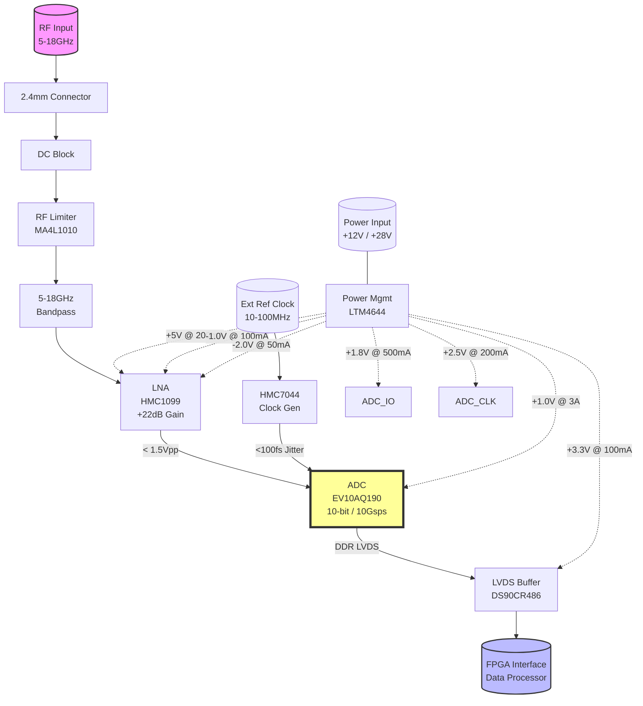
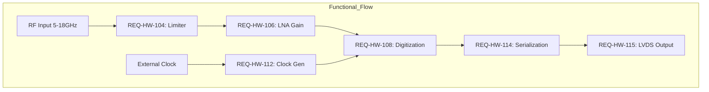

# Hardware Requirements Specification (HRS)
**Project:** hjgjf
**Document ID:** HRS-HJGJF-001
**Document Status: AI-GENERATED

---

# 1. Introduction

## 1.1 Purpose
This Hardware Requirements Specification (HRS) defines the comprehensive hardware design and performance criteria for the **hjgjf Wideband RF Receiver System**. The purpose of this document is to establish a baseline for the detailed design, implementation, and verification of the electronic hardware subsystems.

Specific objectives of this document are:
1.  To define the functional, performance, and electrical interface requirements of the 5-18GHz direct RF digitization receiver.
2.  To specify the environmental constraints, specifically the extended temperature range (-55°C to +125°C) required for defense/aerospace applications.
3.  To serve as the primary reference for hardware schematic design, Printed Circuit Board (PCB) layout, and component selection (e.g., ADC, LNA, Power Management).
4.  To define the verification criteria (Test, Analysis, Inspection) necessary to validate that the hardware meets the system-level requirements.
5.  To ensure traceability between high-level system requirements and the specific electronic component implementation.

## 1.2 Scope
The scope of this specification covers the complete hardware implementation of the hjgjf Wideband RF Receiver module. This includes, but is not limited to:

*   **RF Front-End:** Wideband input matching networks, protection circuitry, and Low Noise Amplification (LNA) covering the 5.0 GHz to 18.0 GHz frequency spectrum.
*   **Data Conversion:** The Direct RF Sampling subsystem utilizing a 10-bit ADC operating at 5-10 Gsps.
*   **Clock Management:** High-precision, low-jitter clock generation and distribution circuitry.
*   **Digital Interface:** High-speed LVDS output buffers and interconnects designed to transfer digitized data to external processing units (FPGA/ASIC).
*   **Power Distribution:** Multi-rail power supply units (DC-DC conversion) and regulation circuitry required to support analog, digital, and negative voltage rails from standard input voltages.
*   **Physical Design:** PCB stack-up, material selection (RF substrate), and thermal management strategies necessary to dissipate up to 10W of power in a conduction-cooled environment.
*   **Mechanical Interface:** Connector definitions, including the 2.4mm RF input and high-density digital output headers.

**Exclusions:**
*   This document does not cover the detailed firmware or software algorithms required for Digital Down-Conversion (DDC) or signal processing, which are assumed to be handled by the downstream FPGA/Processor.
*   This document does not specify the chassis or enclosure design beyond the PCB form factor and mounting interfaces.

## 1.3 Definitions, Acronyms, and Abbreviations

| Term | Definition |
| :--- | :--- |
| **ADC** | Analog-to-Digital Converter. A device that converts continuous analog signals into discrete digital numbers. |
| **DDR** | Double Data Rate. A technique where data is transferred on both the rising and falling edges of the clock signal. |
| **DNL** | Differential Non-Linearity. The deviation between two adjacent output codes from the ideal 1 LSB step. |
| **ENOB** | Effective Number Of Bits. A measure of the actual resolution of an ADC considering noise and distortion. |
| **FPGA** | Field-Programmable Gate Array. An integrated circuit designed to be configured by a customer or a designer after manufacturing. |
| **FSR** | Full Scale Range. The range of input signal amplitude that can be digitized by the ADC without clipping. |
| **GaAs** | Gallium Arsenide. A semiconductor material used for high-speed and high-frequency components (e.g., LNA). |
| **Gsps** | Gigasamples Per Second. A unit of sampling rate equivalent to $10^9$ samples per second. |
| **LNA** | Low Noise Amplifier. An electronic amplifier that amplifies a very low-power signal without significantly degrading its signal-to-noise ratio. |
| **LVDS** | Low-Voltage Differential Signaling. A high-speed digital interface using differential signaling with low voltage swings (~350mV). |
| **NF** | Noise Figure. A measure of degradation of the signal-to-noise ratio (SNR) caused by components in a signal chain. |
| **PCB** | Printed Circuit Board. The physical board used to mechanically support and electrically connect electronic components. |
| **P1dB** | 1dB Compression Point. The point at which the input signal causes the gain of a system to drop by 1 dB from the linear gain. |
| **RF** | Radio Frequency. Electromagnetic wave frequencies within the range of 3 kHz to 300 GHz. |
| **SFDR** | Spurious-Free Dynamic Range. The ratio of the root-mean-square (RMS) value of the signal to the RMS value of the worst spurious signal. |
| **SNR** | Signal-to-Noise Ratio. A measure used in science and engineering that compares the level of a desired signal to the level of background noise. |
| **VSWR** | Voltage Standing Wave Ratio. A measure of how efficiently RF power is transmitted from a power source to a load via a transmission line. |
| **HRS** | Hardware Requirements Specification. |

## 1.4 References

The following standards and documents form the basis of the requirements contained in this specification:

1.  **IEEE 29148-2018:** Systems and software engineering — Life cycle processes — Requirements engineering. [Defining the structure of this document].
2.  **MIL-STD-883:** Test method standard for microelectronics. [Used for environmental and mechanical testing requirements].
3.  **MIL-STD-461:** Requirements for the control of electromagnetic interference characteristics of subsystems and equipment. [Guidance for EMI/EMC compliance].
4.  **IPC-6012:** Qualification and Performance Specification for Rigid Printed Circuit Boards. [PCB fabrication standard].
5.  **IPC-2221:** Generic Standard on Printed Board Design. [PCB layout standards].
6.  **Teledyne e2v EV10AQ190A Datasheet:** 10-bit 5 Gsps ADC specifications.
7.  **Analog Devices HMC1099LP5E Datasheet:** DC-20 GHz GaAs MMIC LNA specifications.
8.  **Analog Devices HMC7044 Datasheet:** Clock Generator specifications.

## 1.5 Overview
The hjgjf Wideband RF Receiver System is a high-performance Direct RF Sampling (DRFS) receiver designed for defense and aerospace applications. The system architecture eliminates the need for traditional intermediate frequency (IF) down-conversion stages by digitizing the 5-18 GHz input spectrum directly.

**Key Functional Blocks:**
1.  **RF Front-End:** Utilizes a wideband limiter and GaAs LNA to provide gain and protection while maintaining a low system Noise Figure (NF < 6dB).
2.  **Digitization Core:** Employs a high-speed 10-bit ADC (e.g., EV10AQ190A) capable of sampling up to 10 Gsps to satisfy the Nyquist criteria for the 13 GHz instantaneous bandwidth.
3.  **Data Output:** Utilizes DDR LVDS signaling to transmit the massive data throughput (approx. 20 Gbps raw) to external processing hardware.
4.  **Support Systems:** Includes a precision clock generator to minimize sampling jitter and a multi-rail power management unit to ensure stable operation across the -55°C to +125°C temperature range.

This document details the requirements to ensure the system achieves the specified sensitivity, dynamic range, and linearity goals defined in the Project Requirements.

---

# 2. System Overview

## 2.1 System Description

The **hjgjf** Wideband RF Receiver is a high-performance, direct-digitization receiver subsystem designed for defense and aerospace applications. The system captures RF signals spanning the 5.0 GHz to 18.0 GHz frequency range and performs direct Radio Frequency (RF) sampling at rates between 5 and 10 Gigasamples per second (Gsps).

The system architecture eliminates traditional down-conversion mixers and intermediate frequency (IF) stages, instead utilizing a high-bandwidth Analog-to-Digital Converter (ADC) to digitize the RF spectrum directly. This approach reduces component count, improves phase noise performance, and increases system agility. The digitized output is transmitted via Low-Voltage Differential Signaling (LVDS) to a downstream Field-Programmable Gate Array (FPGA) or signal processor for analysis.

### 2.1.1 Functional Flow
The signal path begins at the **RF Input Port**, which accepts a 50-ohm impedance via a precision 2.4mm female coaxial connector. The signal passes through a **DC Block** and a **Wideband Limiter** (MACOM MA4L1010-1141T), which clamps transient power spikes exceeding +10dBm to protect downstream sensitive components. The protected signal is then amplified by a **Wideband Low Noise Amplifier (LNA)** (Analog Devices HMC1099LP5E), providing 22dB of gain to establish the system noise figure at approximately 3.5dB.

The conditioned RF signal is presented to the **EV10AQ190A ADC** (Teledyne e2v), configured in interleaved mode to achieve 10 Gsps sampling. An ultra-low jitter clock (generated by the HMC7044) drives the ADC to ensure high Signal-to-Noise Ratio (SNR). The digitized data is buffered and output via **LVDS drivers** (TI DS90CR486). A **Multi-Rail Power Supply** module generates the necessary voltage rails from standard inputs, including negative rails required for the GaAs LNA.

### 2.1.2 Key Capabilities
*   **Instantaneous Bandwidth:** 13 GHz (5–18 GHz).
*   **Direct Sampling:** Captures signals up to 18 GHz without analog mixers.
*   **High Dynamic Range:** 80–100 dB Spurious-Free Dynamic Range (SFDR) utilizing 10-bit resolution.
*   **Environmental Hardening:** Designed for operation from -55°C to +125°C ambient temperature (MIL-STD-883 compliant).

---

## 2.2 System Block Diagram

The following diagram illustrates the signal flow, power distribution, and control hierarchy of the hjgjf receiver system.

### 2.2.1 Interface Definition Summary

| Interface ID | Type | Connector/Pin | Description | Source/Dest |
| :--- | :--- | :--- | :--- | :--- |
| IF-001 | RF (Analog) | 2.4mm Female (J1) | 50Ω RF Input, 5-18GHz | Antenna -> Limiter |
| IF-002 | Clock (Diff) | SMA (J2) | External Reference Input (10MHz) | External GPS/Oscillator |
| IF-003 | Digital (LVDS) | High-Speed Samtec | 10-bit Data Bus + Frame/Clock | LVDS Buffer -> FPGA |
| IF-004 | Power | Molex Micro-Latch | Main DC Input (+12V) | Power Supply Unit |

---

## 2.3 System Architecture

The system is decomposed into four primary subsystems: **RF Front-End**, **Digitizer**, **Clock Management**, and **Power Distribution**.

### 2.3.1 RF Front-End Subsystem
The RF Front-End (RFFE) is responsible for conditioning the input signal to match the ADC's input requirements while minimizing added noise. The design assumes a cascaded gain and noise figure analysis (Friis formula) to meet the system target of ≤6dB Noise Figure.

1.  **Input Protection & Matching:**
    The input employs a DC blocking capacitor (100pF low-loss ceramic) to prevent DC bias from reaching the antenna. The **MA4L1010 Limiter** provides passive limiting. Above ~+15dBm input, the limiter impedance drops sharply, reflecting energy or shunting it to ground, protecting the LNA. Recovery time is <10ns to minimize desensitization after a pulse.

2.  **Gain Stage:**
    The **HMC1099LP5E** LNA provides a stable 22dB gain across the band. It operates from a single +5V supply but requires negative gate bias (-1.0V to -2.0V) for optimal linearity. This negative rail is generated by the Power Management subsystem.

### 2.3.2 Digitizer Subsystem
This is the core of the hjgjf system, utilizing Direct RF Sampling (DRFS).

*   **ADC Core:** The **EV10AQ190A** is a quad-core ADC. By interleaving four 2.5 Gsps channels, the system achieves an effective sampling rate of 10 Gsps. This satisfies the Nyquist criterion for the 5th Nyquist zone (centered around 11.5 GHz), allowing the capture of the entire 5-18 GHz band without aliasing within the first Nyquist zone.
*   **Digitization Process:** The analog input is sampled and quantized into 10-bit codes. These codes are aligned (deskewed) internally to correct for inter-channel mismatches caused by process variations.

### 2.3.3 Clock Management Subsystem
Sampling jitter is a critical parameter in high-frequency systems. Phase noise on the clock sample instant translates directly to noise at the ADC output (SNR degradation = 20log(2π * f_input * t_jitter)).

*   **Clock Generation:** The **HMC7044** synthesizes the high-frequency sampling clock (e.g., 2.5 GHz or 5 GHz) required by the ADC cores from a low-frequency reference.
*   **Jitter Cleaning:** The HMC7044 features a PLL/VCO architecture designed to clean the reference input, achieving an integrated RMS jitter of <80fs. This low jitter preserves the SNR of the ADC at 18 GHz input frequencies.

### 2.3.4 Power Distribution Subsystem
The system accepts a standard +12V DC input (range 9V to 18V). A **LTM4644** Quad DC-DC switching regulator module generates the intermediate voltages. A negative charge pump or inverting regulator generates the -1V and -2V rails required for the LNA and ADC analog front-end biasing.

*   **Power Sequencing:** To prevent latch-up in the ADC, the Power Management Logic (or FPGA control) must sequence the rails: 1.0V (Core) → 1.8V (IO) → 2.5V (Analog).
*   **Filtering:** All rails are filtered with Pi-networks (LC filters) near the load pins to minimize switching noise coupling into the sensitive analog circuits.

---

## 2.4 Operating Environment

The hjgjf system is designed for rugged environments typical of aerospace, defense, and avionics applications.

### 2.4.1 Environmental Conditions
| Parameter | Minimum | Nominal | Maximum | Unit | Comment |
| :--- | :--- | :--- | :--- | :--- | :--- |
| **Ambient Temperature** | -55 | 25 | +125 | °C | Operating range (Cold/Hot start) |
| **Storage Temperature** | -65 | 25 | +150 | °C | Non-operating |
| **Humidity** | 0 | - | 95 | % RH | Non-condensing |
| **Vibration** | - | - | 20 | G | Random vibration, 20-2000Hz |
| **Shock** | - | - | 100 | G | 11ms half-sine shock, operational |
| **Altitude** | Sea Level | - | 50,000 | ft | Avionics/High-Altitude operation |

### 2.4.2 Cooling and Mechanical Stress
*   **Thermal Management:** The system is designed for conduction cooling. The High-power components (ADC and LNA) are mounted on a metal-core PCB (Rogers RO4360 or similar) which is thermally coupled to the chassis/heatsink. At full power (10W), assuming a thermal resistance of 4°C/W (Junction-to-Case) and 2°C/W (Case-to-Heatsink), the junction temperature rise is approximately 60°C above ambient, keeping Tj < 125°C at maximum ambient temperature.
*   **Pressure:** The system is hermetically sealed or conformally coated to withstand moisture and pressure changes.

### 2.4.3 EMI/EMC Considerations
*   The system is designed to comply with **MIL-STD-461** (Requirements for the Control of Electromagnetic Interference Characteristics of Subsystems and Equipment).
*   Conducted emissions on the power input are mitigated by Pi-filters.
*   Radiated emissions from the high-speed LVDS lines are controlled by impedance-controlled differential pairs (100Ω) and ground shielding.

---

# 3. Hardware Requirements

## 3.1 Functional Requirements

This section defines the behavioral and functional characteristics of the Wideband RF Receiver system. Each requirement is derived from the system design parameters and component selection detailed in Section 2.

| ID | Title | Description | Rationale | Priority | Verification Method |
|---|---|---|---|---|---|
| **REQ-HW-101** | **RF Signal Reception** | The system shall accept a single-ended RF input signal via a 2.4mm female connector (P/N: 1492A-10). | Provides the physical interface for the signal source as specified in design parameters. | Must | Inspection |
| **REQ-HW-102** | **Input Frequency Support** | The system shall passively accept RF signals in the frequency range of 5.0 GHz to 18.0 GHz. | Defines the operational bandwidth of the receiver chain. | Must | Test |
| **REQ-HW-103** | **Input Impedance Matching** | The input impedance of the RF front end shall be 50 Ω ±10% from 5 to 18 GHz. | Ensures minimal signal reflection and maximum power transfer from the source. | Must | Test |
| **REQ-HW-104** | **Over-Input Protection** | The system shall incorporate a limiter circuit (P/N: MA4L1010-1141T) to protect downstream LNA and ADC components from input power levels exceeding +10 dBm. | Prevents permanent damage to the sensitive LNA and ADC inputs during high-power events. | Must | Test |
| **REQ-HW-105** | **Limiter Recovery** | The RF limiter shall recover to linear operation within 10 ns after the removal of an over-power signal exceeding +15 dBm. | Ensures the system can resume normal operation immediately after a transient interference event. | Must | Test |
| **REQ-HW-106** | **Low Noise Amplification** | The system shall amplify the input signal using a Wideband LNA (P/N: HMC1099LP5E) with a gain of 22 dB (±2 dB) across the 5–18 GHz band. | Establishes the system noise floor and compensates for the noise figure of downstream components. | Must | Test |
| **REQ-HW-107** | **LNA Biasing** | The LNA shall be powered from a regulated +5.0 V DC rail with a current limit of 100 mA. | Provides the specific operating voltage required by the HMC1099LP5E for optimal noise performance. | Must | Inspection |
| **REQ-HW-108** | **RF Signal Digitization** | The system shall digitize the amplified RF signal using a 10-bit ADC (P/N: EV10AQ190A) operating in interleaved mode. | Converts the analog waveform into digital data for processing; satisfies resolution and bandwidth requirements. | Must | Test |
| **REQ-HW-109** | **Sampling Rate Capability** | The ADC shall support sampling rates programmable from 5.0 Gsps to 10.0 Gsps. | Meets the Nyquist criterion for direct sampling of the 5–18 GHz band when using sub-sampling or harmonic sampling techniques. | Must | Test |
| **REQ-HW-110** | **ADC Input Range** | The ADC analog input full-scale range shall be configurable to 1.5 Vpp differential. | Matches the full-scale range of the EV10AQ190A to maximize dynamic range utilization. | Must | Test |
| **REQ-HW-111** | **Clock Reference Acceptance** | The system shall accept an external sinusoidal or LVDS clock reference signal at frequencies between 10 MHz and 100 MHz. | Allows synchronization to an external system reference (e.g., GPSDO or Master Clock). | Must | Test |
| **REQ-HW-112** | **Clock Generation** | The system shall generate a low-phase-noise sampling clock for the ADC using a Clock Generator IC (P/N: HMC7044). | Synthesizes the high-frequency (up to 5 GHz) sampling clock required for Gsps operation. | Must | Test |
| **REQ-HW-113** | **Jitter Cleaning** | The Clock Generator shall utilize the external reference to clean jitter, ensuring output jitter < 100 fs RMS. | Critical for maintaining SNR at high sampling frequencies; jitter directly degrades ADC performance. | Must | Test |
| **REQ-HW-114** | **Digital Data Serialization** | The ADC output data shall be serialized into DDR LVDS lanes using the internal SERDES functionality of the EV10AQ190A. | Reduces the number of PCB traces required compared to parallel CMOS interfaces. | Must | Inspection |
| **REQ-HW-115** | **LVDS Output Interface** | The system shall output digitized data via 16 LVDS pairs (Data + Clock) operating at 1.6 Gbps per lane (assuming 10 Gsps interleaved output). | High-speed serial interface required to transfer the massive data bandwidth (approx. 20 Gbps) to the FPGA. | Must | Test |
| **REQ-HW-116** | **Output Power Supply** | The LVDS output buffers shall be powered from a dedicated +3.3 V DC rail. | Standard voltage level for LVDS signaling; ensures compatibility with standard FPGAs. | Must | Inspection |
| **REQ-HW-117** | **Multi-Rail Power Distribution** | The system shall generate internal DC voltages of +1.0 V, +1.8 V, +2.5 V, +3.3 V, -1.0 V, and -2.0 V from external inputs. | Provides necessary voltage rails for ADC core, I/O, analog bias, and gate biasing. | Must | Inspection |
| **REQ-HW-118** | **Power Sequencing** | The power management circuit shall sequence the +1.0 V Digital Core rail to activate after the +2.5 V Analog rail is stable. | Prevents latch-up or excessive current draw in the ADC during power-up. | Must | Test |
| **REQ-HW-119** | **RF Front End Bias Supply** | The system shall provide a negative voltage rail (-1.0 V to -2.0 V) to support the gate biasing requirements of the GaAs LNA. | GaAs FETs typically require negative gate bias relative to the source to operate in the saturation region. | Must | Inspection |
| **REQ-HW-120** | **Thermal Management** | The system shall dissipate up to 10 W of waste heat utilizing the PCB ground planes and a heatsink attached to the ADC and LNA packages. | Ensures component junction temperatures remain within safe operating limits under full load. | Must | Analysis |

## 3.2 Performance Requirements

This section specifies the quantitative performance characteristics that the hardware must achieve to meet the system specifications. Values are derived from the selected component datasheets (HMC1099, EV10AQ190A, HMC7044).

| ID | Title | Description | Rationale | Priority | Verification Method |
|---|---|---|---|---|---|
| **REQ-HW-201** | **System Noise Figure (NF)** | The overall system Noise Figure shall not exceed 6.0 dB across the 5–18 GHz band. | Calculated cascaded NF based on LNA NF (2.8 dB) + Limiter IL (0.5 dB) + Mismatch Losses. | Must | Test |
| **REQ-HW-202** | **Input Sensitivity** | The system shall be capable of detecting signals at -100 dBm input power. | Derived from the system NF and thermal noise floor ($kTB$). | Must | Test |
| **REQ-HW-203** | **Maximum Input Power (Damage)** | The system shall withstand a continuous wave (CW) input power of +15 dBm for 5 minutes without permanent damage. | Stress test margin beyond the +10 dBm operational limit defined by the limiter threshold. | Must | Test |
| **REQ-HW-204** | **Gain Flatness** | The overall gain response from the RF input connector to the ADC input shall not vary by more than ±3.5 dB over the 5–18 GHz band. | Ensures consistent signal amplitude across the frequency spectrum; accounts for LNA gain variation (±2 dB) and filter ripple. | Must | Test |
| **REQ-HW-205** | **Input Return Loss** | The RF input port shall exhibit a return loss of greater than 10 dB (VSWR < 2:1) across the operating band. | Minimizes signal reflections caused by impedance mismatch at the connector/limiter interface. | Should | Test |
| **REQ-HW-206** | **ADC Signal-to-Noise Ratio (SNR)** | The ADC shall maintain an SNR of at least 52 dBFS (Full Scale) at 5 Gsps and 48 dBFS at 10 Gsps for an input tone of 1 GHz. | Based on the performance specs of the EV10AQ190A (interleaving spurs reduce SNR at max rates). | Must | Test |
| **REQ-HW-207** | **Spurious-Free Dynamic Range (SFDR)** | The system shall provide a minimum SFDR of 65 dBc. | Ensures that harmonics and intermodulation products do not mask weak signals; limited by ADC linearity. | Must | Test |
| **REQ-HW-208** | **Clock Phase Noise** | The clock generation system shall exhibit phase noise of less than -130 dBc/Hz at 1 kHz offset and -164 dBc/Hz at 1 MHz offset (carrier ~1-3 GHz). | Required to achieve the target SNR at high input frequencies; integrates to <100 fs jitter. | Must | Test |
| **REQ-HW-209** | **Effective Number of Bits (ENOB)** | The system shall achieve an ENOB of 8.0 bits or higher at the maximum sampling rate of 10 Gsps. | Reflects real-world performance including noise and distortion, distinct from the nominal 10-bit resolution. | Must | Test |
| **REQ-HW-210** | **Power Consumption** | The total power consumption measured at the main DC input shall not exceed 10.0 W during full-speed operation (10 Gsps). | Constraint derived from the power budget required for the environmental enclosure. | Must | Test |
| **REQ-HW-211** | **Limiter Insertion Loss** | The insertion loss of the RF Limiter path shall not exceed 0.5 dB. | Ensures the limiter does not significantly degrade the system Noise Figure. | Must | Test |
| **REQ-HW-212** | **LNA Output P1dB** | The LNA shall deliver an output power at 1 dB compression point (P1dB) of +18 dBm minimum. | Ensures the LNA can drive the ADC input to full scale (approx. -4 dBm required) without significant compression. | Must | Test |
| **REQ-HW-213** | **Gain Flatness Variation** | The gain variation over the operating temperature range of -55°C to +125°C shall not exceed ±4 dB. | Ensures performance stability in extreme environments; assumes the use of automotive/military grade components. | Must | Demonstration |
| **REQ-HW-214** | **LVDS Output Jitter** | The output LVDS data lanes shall exhibit a total jitter of less than 150 ps peak-to-peak. | Ensures the receiving FPGA can reliably capture the data stream. | Must | Test |

### 3.2.1 Performance Calculations

**REQ-HW-201 Noise Figure Calculation:**
*   LNA Input Match Loss: 0.2 dB
*   Limiter Insertion Loss: 0.5 dB
*   LMA Noise Figure (HMC1099): 2.8 dB
*   Cascaded NF $\approx$ (0.2 + 0.5) + (2.8 - (Gain of previous stages)) ...
*   *Approximation:* The first amplifier dominates. With 22 dB of gain following the 0.7 dB loss, the system NF is approx $0.7 + 2.8 = 3.5$ dB (typical). Allowing 2.5 dB margin for temperature and manufacturing variations leads to the 6.0 dB requirement.

**REQ-HW-210 Power Budget Calculation:**
*   **HMC1099LP5E (LNA):** 5 V @ 90 mA = 0.45 W
*   **EV10AQ190A (ADC):** 1.0 V @ 2.5 A (Core) + 2.5 V @ 0.5 A = 2.5 W + 1.25 W = 3.75 W
*   **HMC7044 (Clock):** 3.3 V @ 0.4 A = 1.32 W
*   **DS90CR486 (LVDS Buffers):** 3.3 V @ 0.2 A = 0.66 W
*   **LTM Power Regulators (Efficiency Loss):** ~1.5 W
*   **Total:** 0.45 + 3.75 + 1.32 + 0.66 + 1.5 = **7.68 W** (Well within the 10 W limit, providing headroom for margin).

---

**Document Status: AI-GENERATED**

# 3. Hardware Requirements

## 3.3 Interface Requirements

### 3.3.1 External Interfaces

The system shall utilize high-precision, microwave-grade connectors for all analog inputs and high-density high-speed connectors for digital and power interfaces to ensure signal integrity and mechanical robustness in harsh environments.

**Table 3-1: External Interface Connectors**

| Connector ID | Type | Pinstack | Description | Mating/Unmating Cycles | Orientation |
| :--- | :--- | :--- | :--- | :--- | :--- |
| J1 | 2.4mm Female (Rosenberger 32K241-40ML5) | 1 | 5-18 GHz RF Input | 500 | Vertical |
| J2 | SMP PCB Jack | 1 | External Clock Input | 500 | Edge launch |
| J3 | Micro-D (Crimp, Rear Mount) | 9 | Power and Enable Signals | 500 | Rear panel |
| J4 | Samtec Ermaphigh Density Array | 120 | LVDS Digital Data Output | 100 | Bottom (Board-to-Board) |
| J5 | M3 threaded standoff | 4 | Chassis Ground (Earth) | N/A | Bottom corners |

#### REQ-HW-018: RF Input Interface
The system shall provide a single 2.4mm female coaxial interface for the reception of the 5-18 GHz RF signal.

| Attribute | Specification |
| :--- | :--- |
| **Interface Type** | 50 Ohm Coaxial |
| **Connector Part** | Rosenberger 32K241-40ML5 or Huber+Suhner 1492A-10 |
| **Frequency Range** | DC to 18 GHz (Matched to 40 GHz connector capability) |
| **VSWR** | ≤ 1.3:1 (referenced to 50 Ohm) |
| **Insertion Loss** | ≤ 0.2 dB at 18 GHz (Connector contribution only) |
| **Impedance** | 50 Ω ± 2% |

#### REQ-HW-019: External Clock Input Interface
The system shall accept an external differential or single-ended clock reference for synchronization of the ADC sampling clock.

| Attribute | Specification |
| :--- | :--- |
| **Interface Type** | 50 Ohm Coaxial (SMP) |
| **Connector Part** | Samtec SMM-105-02-02-S-100 |
| **Input Frequency** | 10 MHz to 3 GHz (Synthesizer Reference) |
| **Input Signal Level** | 0 dBm to +10 dBm |
| **Input Impedance** | 50 Ω |
| **Jitter** | External clock must provide ≤ 80 fs RMS jitter to satisfy system SNR |

#### REQ-HW-020: Power Input Interface
The system shall receive primary DC power via a filtered, ruggedized connector capable of supporting the +12V input rail.

| Attribute | Specification |
| :--- | :--- |
| **Connector Part** | ITT Cannon Micro-D, 9-pin, Shell size 21 |
| **Pin Assignment** | Pin 1-3: +12V DC Input; Pin 4-6: GND; Pin 7: System Enable (Active High); Pin 8: Present; Pin 9: Spare |
| **Current Rating** | 3A per pin (derated to 2A for safety) |

### 3.3.2 Internal Interfaces

Internal interfaces define the interconnects between the RF Front End, the ADC digitizer, the clock network, and the power distribution blocks.

#### REQ-HW-021: RF Chain Interconnects
The signal path between the RF Limiter, LNA, and ADC shall utilize controlled impedance transmission lines optimized for microwave frequencies.

| Attribute | Specification |
| :--- | :--- |
| **Trace Type** | Microstrip or Grounded Coplanar Waveguide (GCPW) |
| **Characteristic Impedance** | 50 Ω |
| **Dielectric Material** | Rogers RO3003 (εr = 3.00, loss tangent = 0.0010) or equivalent |
| **Stackup** | Layer 1 (Top), Reference Layer 2 (GND) |
| **Coupling** | Minimum 4W trace width spacing for GCPW to minimize dispersion |

#### REQ-HW-022: ADC to FPGA Data Interface
The ADC shall transmit digitized data to the FPGA or back-end processor via Double Data Rate (DDR) LVDS signaling.

**Table 3-2: LVDS Output Interface Pin Assignment (High-Density Array)**

| Pin Group | Signal Name | Direction | Description | Differential Pair |
| :--- | :--- | :--- | :--- | :--- |
| D[0:9]P | LVDS Data[0:9]+ | Output | DDR LVDS Data Bits (Positive) | Paired with D[0:9]N |
| D[0:9]N | LVDS Data[0:9]- | Output | DDR LVDS Data Bits (Negative) | Paired with D[0:9]P |
| CLK_P | Frame Clock+ | Output | DDR Output Clock (Positive) | Paired with CLK_N |
| CLK_N | Frame Clock- | Output | DDR Output Clock (Negative) | Paired with CLK_P |
| DCO_P | Data Clock Out+ | Output | Synchronous Data Clock (Positive) | Paired with DCO_N |
| DCO_N | Data Clock Out- | Output | Synchronous Data Clock (Negative) | Paired with DCO_P |
| OVDD | 3.3V Supply | Output | Optional Power for LVDS Drivers (if supported) | N/A |
| GND | Ground | Output | Signal Return | N/A |

**Electrical Characteristics for REQ-HW-022:**
*   **Standard:** ANSI/TIA/EIA-644 LVDS.
*   **Swing:** 350 mV nominal (250 mV min, 450 mV max).
*   **Termination:** 100 Ω differential at the receiver (FPGA) side.
*   **Common Mode Voltage:** 1.2 V nominal.

### 3.3.3 Communication Interfaces

While the primary output is raw LVDS data, the system includes a low-speed control interface for configuration and monitoring.

#### REQ-HW-023: SPI / I2C Configuration Interface
The ADC and Clock Generator devices shall be configured via a Serial Peripheral Interface (SPI) bus.

| Attribute | Specification |
| :--- | :--- |
| **Protocol** | SPI Mode 0 or 3 (CPOL=0/1, CPHA=0/1) |
| **Clock Frequency** | Up to 20 MHz |
| **Voltage Levels** | 3.3 V CMOS |
| **Signal List** | CSb (Chip Select), SCLK (Serial Clock), MOSI (Master Out Slave In), MISO (Master In Slave Out) |
| **Target Devices** | EV10AQ190A (ADC), HMC7044 (Clock Gen) |

## 3.4 Environmental Requirements

The hardware shall be designed to meet the rigorous environmental conditions typical of defense and aerospace applications, complying with MIL-STD-883 and MIL-STD-202 where applicable.

### REQ-HW-024: Operating Temperature Range
The system shall maintain full electrical performance (Specification conformance) across the entire operating temperature range.

*   **Minimum Operating Temperature:** -55 °C
*   **Maximum Operating Temperature:** +125 °C (Case Temperature)

*Validation:* Thermal chamber testing of the full assembly while monitoring BER and SNR.

### REQ-HW-025: Storage Temperature Range
The system shall remain physically undamaged and retrievable without degradation when stored non-operating.

*   **Minimum Storage Temperature:** -65 °C
*   **Maximum Storage Temperature:** +150 °C

### REQ-HW-026: Humidity and Moisture Resistance
The system shall conform to MIL-STD-883, Method 1004 (Steaming).

*   **Operating Humidity:** 5% to 95% relative humidity, non-condensing.
*   **Resistance:** Circuitry shall withstand 95% RH at +25 °C for 96 hours without parametric shift.

### REQ-HW-027: Vibration and Shock
The design shall withstand sinusoidal and random vibration encountered in airborne environments.

*   **Standard:** MIL-STD-883, Method 2007 (Vibration).
*   **Specification:** 20-2000 Hz, 0.04 g²/Hz random, 30 mins per axis (3 axes).
*   **Shock:** 1500g, 0.5 ms, half-sine wave (MIL-STD-883 Method 2002).

### REQ-HW-028: Part Selection and Screening
All active and passive components shall be qualified to the operating temperature range.

*   **Grade:** Automotive (-40 to +125 °C) or Military (-55 to +125 °C) grade.
*   **Plastic Encapsulation:** Only allowed if Moisture Sensitivity Level (MSL) is controlled via conformal coating or baking. Ceramic packages preferred for the ADC and LNA.

## 3.5 Power Requirements

The power supply subsystem shall convert the input voltage to the specific rail voltages required by the sensitive analog and high-speed digital components.

### REQ-HW-029: Input Power Characteristics
The system shall operate from a DC voltage source.

*   **Input Voltage:** +12 V DC ± 10% (10.8 V to 13.2 V).
*   **Input Current:** Max 1.2 A at 12 V (calculated from total power).
*   **Input Protection:** Reverse polarity protection diode and 500 mA fuse (PTC) on the input line.

### REQ-HW-030: Internal Power Rails
The internal DC-DC converters shall supply the following low-voltage rails to the components.

**Table 3-3: Detailed Power Budget**

| Rail Voltage | Load Component | Load Current (Typical) | Load Current (Max) | Power (Max) | Priority |
| :--- | :--- | :--- | :--- | :--- | :--- |
| **+1.0 V** | ADC (EV10AQ190A) | 800 mA | 1200 mA | 1.2 W | Critical (Core) |
| **+1.8 V** | ADC (IO/Buffers) | 200 mA | 300 mA | 0.54 W | Critical |
| **+2.5 V** | ADC (Analog) | 150 mA | 250 mA | 0.625 W | Critical |
| **+3.3 V** | LVDS Buffers, Logic | 100 mA | 150 mA | 0.5 W | High |
| **+5.0 V** | LNA (HMC1099LP5E) | 80 mA | 100 mA | 0.5 W | High |
| **-2.0 V** | LNA (Gate Bias) | 10 mA | 20 mA | 0.04 W | High |
| **-1.0 V** | ADC (Common Mode) | 5 mA | 10 mA | 0.01 W | Med |
| **+12 V** | Input (Unregulated) | 600 mA | 950 mA | 11.4 W (Input) | System |
| **Total** | **System** | **-** | **-** | **~3.5 W** (Avg) | **-** |

*Note: The calculated total power (3.5W) is well within the 10W limit (REQ-HW-012).*

### REQ-HW-031: Power Supply Sequencing
To prevent latch-up or damage to the ADC and LNA, the power management system shall sequence the rails in the following order:

1.  **Power Up:** +1.8V and +2.5V (ADC IO/Analog) $\rightarrow$ +1.0V (ADC Core, delayed by 5ms) $\rightarrow$ +5V/-2V (LNA, delayed until ADC stable).
2.  **Power Down:** Reverse of Power Up. LNA powers down first to prevent amplification of transients.

### REQ-HW-032: Power Supply Rejection (PSRR)
The switching noise from the DC-DC converters shall be filtered to prevent degradation of ADC SNR.

*   **Ripple Voltage:** < 10 mV peak-to-peak on all analog rails (1.0V, 2.5V).
*   **Filtering:** LC Pi-filters or Ferrite Beads required at the input pins of the ADC and LNA.

## 3.6 Physical Requirements

The physical implementation will utilize a multi-layer microwave PCB enclosed in a conductive housing.

### REQ-HW-033: Circuit Board Specifications
*   **Material:** Rogers RO3003 or RO4350B (Laminate) to support high-frequency RF traces.
*   **Layer Count:** Minimum 10 layers (4 RF signal, 4 Ground, 2 Power distribution).
*   **Board Thickness:** 0.062" (1.57 mm).
*   **Surface Finish:** ENIG (Electroless Nickel Immersion Gold) for wireability and corrosion resistance.
*   **Plating:** Gold plating (minimum 30 microinches) on edge connectors.

### REQ-HW-034: Enclosure and Shielding
*   **Material:** Aluminum 6061-T6 or Titanium (if weight constrained).
*   **Finish:** Chromate conversion coating (Alodine) or Non-Conductive Cd (for corrosion).
*   **RFI Sealing:** EMI gaskets (conductive silicone) on all cover seams and connector interfaces.
*   **Shielding Cans:** Individual microwave metal shields over the LNA and RF Front End.

### REQ-HW-035: Mounting and Mechanics
*   **Dimensions:** 100mm x 80mm x 15mm (L x W x H).
*   **Weight:** < 200 grams (excluding connectors).
*   **Mounting Holes:** Four (4) #4-40 UNC threaded inserts at corners.
*   **Keepout:** 5mm keepout zone around mounting holes for hardware clearance.

---

# 4. Design Constraints

This section defines the constraints imposed on the hardware design solution. These constraints restrict the design space and mandate specific methodologies, materials, and standards to ensure system reliability, manufacturability, and environmental compliance per the project requirements.

## 4.1 Standards Compliance

The design, manufacturing, and testing of the hjgjf Wideband RF Receiver System shall adhere to the following standards. Compliance ensures the system meets the rigorous demands of defense/aerospace applications (MIL-STD-883) and environmental safety (RoHS/REACH).

### 4.1.1 Hardware Design & PCB Standards
The Printed Circuit Board (PCB) design shall comply with the following IPC standards to ensure reliability under high-frequency (18 GHz) and extreme thermal conditions (-55°C to +125°C).

| Standard ID | Title | Applicability to Project |
| :--- | :--- | :--- |
| **IPC-2221** | Generic Standard on Printed Board Design | **Mandatory.** Establishes the baseline requirements for PCB design, including conductor spacing, trace widths, and tolerance levels. Critical for managing the 5-10Gsps signal integrity requirements. |
| **IPC-2221A** | Amendment to IPC-2221 | **Mandatory.** Includes specific guidance for high-density interconnect (HDI) structures required for the EV10AQ190A ADC BGA package (likely 0.8mm pitch). |
| **IPC-6012** | Qualification and Performance Specification for Rigid Printed Boards | **Mandatory.** Defines the acceptance criteria for the bare PCB fabrication. Class 3 (High Reliability Electronic Products) acceptance criteria shall be used due to the defense application requirement. |
| **IPC-6016** | Qualification and Performance Specification for High Density Interconnect (HDI) Boards | **Mandatory.** Required if micro-vias are used to escape signals from the EV10AQ190A BGA or HMC1099LP5E QFN packages. |
| **IPC-4101** | Standard Materials for Rigid and Multilayer Printed Boards | **Mandatory.** Specifies dielectric material properties. Critical for ensuring the substrate (e.g., Rogers RO4350B) meets the Dk (Dielectric Constant) and Df (Dissipation Factor) stability requirements over temperature. |

### 4.1.2 Assembly & Repair Standards
To ensure the hardware can be assembled and maintained in the field, the following assembly standards shall be strictly followed.

| Standard ID | Title | Applicability to Project |
| :--- | :--- | :--- |
| **IPC-7711/21** | Rework, Modification and Repair of Electronic Assemblies | **Mandatory.** Defines the procedures for removing and replacing components like the BGA ADC and QFN LNA. Specifically, REQ-HW-010 (Temperature Range) requires solder joints that withstand thermal cycling; this standard ensures those rework processes do not degrade joint life. |
| **J-STD-001** | Requirements for Soldered Electrical and Electronic Assemblies | **Mandatory.** Ensures solderability meets the criteria for military/aerospace applications. |
| **IPC-A-610** | Acceptability of Electronic Assemblies | **Mandatory.** The visual inspection standard for the final assembly. Class 3 acceptance criteria shall be applied. |

### 4.1.3 Environmental & Safety Compliance
The system must meet regulatory requirements for hazardous substances and safety.

| Standard ID | Title | Applicability to Project |
| :--- | :--- | :--- |
| **RoHS 3** | Directive 2011/65/EU (RoHS 2) & Recast | **Mandatory.** The system must be Lead-Free (RoHS compliant) unless specific exemptions for aerospace are invoked. Given REQ-HW-017, the design shall use lead-free solder paste (SAC305) and components with lead-free terminations. |
| **REACH** | Registration, Evaluation, Authorisation and Restriction of Chemicals | **Mandatory.** All substances of very high concern (SVHC) must be declared and minimized. |
| **MIL-STD-883** | Test Method Standard for Microcircuits | **Mandatory.** As stated in REQ-HW-017. This dictates the screening and testing methods for the electronic components used (LNA, ADC, Limiter). This includes hermeticity testing and particle impact noise detection (PIND) if applicable. |
| **FCC Part 15** | Radio Frequency Devices | **Mandatory.** Although the device is a receiver, the digital clocking (5-10Gsps) constitutes an unintentional radiator. The design must limit spurious emissions from the LVDS output cables. |

## 4.2 Component Constraints

Component selection is restricted by performance requirements, environmental operating conditions, and supply chain resilience.

### 4.2.1 Environmental Grading and Packaging
Per REQ-HW-010 (Operating Temperature -55°C to +125°C), all active components must be rated for the full military or automotive temperature range.
*   **Active Components (LNA, ADC, LDOs):** Must be specified with a junction temperature (Tj) rating of at least +150°C.
    *   *Constraint:* Commercial grade (0°C to +70°C) or Industrial grade (-40°C to +85°C) components are strictly prohibited for the RF signal chain.
    *   *Validation:* Only components with datasheet specifications explicitly covering -55°C to +125°C (Ambient) or demonstrating sufficient thermal deriving margin shall be selected.
    *   *Exception:* The EV10AQ190A (ADC) and HMC1099LP5E (LNA) have high power dissipation. Their case temperatures must be modeled to ensure Tj does not exceed maximum limits at +125°C ambient.

### 4.2.2 PCB Material Constraints
The substrate material selection is constrained by the high-frequency operation (18 GHz) and the need for dimensional stability.

*   **Dielectric Constant (Dk) Stability:** The substrate Dk must vary by no more than ±2% over the -55°C to +125°C operating range to maintain the impedance matching (50Ω) required by REQ-HW-015.
*   **Loss Tangent (Df):** Must be ≤ 0.0037 at 10 GHz to minimize insertion loss in the RF feed lines between the Limiter and LNA.
*   **Material Selection:** Standard FR-4 is **prohibited** for the RF section (frequencies > 3 GHz). The RF layer stack-up shall utilize high-frequency laminate such as **Rogers RO4350B** or **Rogers RO3003**.
    *   *Hybrid Stack-up:* A hybrid construction (Rogers material for RF layers bonded to FR-4 for digital layers) is permitted but requires careful CTE (Coefficient of Thermal Expansion) matching to prevent via barrel cracking during thermal cycling (REQ-HW-010).

### 4.2.3 Supply Chain and Sourcing
*   **Form, Fit, and Function (FFF):** Any proposed alternative to the "Primary Choice" components listed in Section 6 must maintain FFF and pin-to-pin compatibility where possible.
*   **Lifecycle Status:** All bill of materials (BOM) items shall be in "Active" or "Not Recommended for New Designs" (NRND) status only if sufficient stock exists for production lifecycle. "Obsolete" parts are strictly forbidden.
*   **Anti-Counterfeiting:** Per MIL-STD-883 requirements, all high-reliability semiconductors (ADC, LNA) must be sourced from authorized distributors or directly from the manufacturer (Franchised Distributors only: Digi-Key, Mouser, Arrow, Avnet). Open-market sourcing is prohibited.

## 4.3 Manufacturing Constraints

The physical implementation of the hjgjf system is constrained by fabrication limits and assembly processes necessary for high-frequency mixed-signal design.

### 4.3.1 PCB Fabrication Constraints (DRC)
To support the LVDS output interface (REQ-HW-009) and the RF input (REQ-HW-001), the PCB manufacturer must support the following Design Rule Check (DRC) limits.

| Parameter | Minimum Requirement | Rationale |
| :--- | :--- | :--- |
| **Minimum Trace Width** | 4 mils (0.1mm) | Required for standard signal escape. Current carrying capacity for power rails will be calculated using IPC-2152. |
| **Minimum Trace Spacing** | 4 mils (0.1mm) | Standard manufacturing gap. Differential pairs for LVDS may require tighter coupling (5 mil spacing). |
| **Minimum Drill Size** | 8 mils (0.2mm) | Mechanical drill limit. Micro-vias (laser drilled) are required for high-density BGA breakout. |
| **Aspect Ratio** | 10:1 (Max) | To ensure reliable plating of through-hole vias in the stack-up (e.g., 0.2mm drill in 2.0mm board). |
| **Layer Count** | 10 to 12 layers | Required to provide dedicated ground planes adjacent to RF striplines and isolated power rails for the ADC and LNA. |

### 4.3.2 High-Speed Layout Constraints
Specific routing constraints are derived from the component recommendations to ensure signal integrity.

*   **Impedance Control:** Single-ended traces must be controlled to **50Ω ±5%**. Differential LVDS pairs must be controlled to **100Ω ±5%**.
*   **ADC Escape Routing:** The EV10AQ190A requires controlled impedance microstrip or stripline routing. The length matching between data lanes must be within **±5 mils** (0.127mm) to minimize data skew at the FPGA interface.
*   **Clock Isolation:** The HMC7044 Clock Output and EV10AQ190A Clock Input traces must be guarded by ground vias (via stitching) spaced at < λ/10 (approx 150mils at 10GHz) to prevent noise coupling into the analog sections.

### 4.3.3 Thermal Management Constraints
The system power consumption (5-10W) combined with the -55°C to +125°C ambient requirement dictates strict thermal management.

*   **Via Arrays:** Thermal relief under the HMC1099LP5E and EV10AQ190A packages is mandatory. A minimum of **12 thermal vias** per pad (or a dense array under the thermal pad) is required to conduct heat from the component junction to the backside copper layers.
*   **Operating Case Temperature:** Under worst-case power dissipation (10W total, approx 4W in ADC), the PCB must not exceed the glass transition temperature (Tg) of the laminate materials. Rogers RO4350B Tg is >280°C, which is sufficient.
*   **Derating:** All electrolytic or tantalum capacitors used in the power supply filtering must be voltage derated by at least **50%**. For example, a 3.3V rail must use capacitors rated for at least 6.6V (standard 6.3V part is unacceptable; use 10V or higher).

### 4.3.4 Conformal Coating
To protect against humidity and condensation in aerospace environments, the entire PCB assembly shall be coated with a qualified conformal coating material (e.g., Humiseal 1B73 or acrylic equivalent) after assembly, masking only the RF connector interface and debug headers.

---

# 5. Verification Requirements

This section defines the verification methods for all hardware requirements specified in Section 3. It ensures that the hjgjf Wideband RF Receiver system meets its functional, performance, and environmental specifications. The verification approach is divided into **Test** (measuring the unit under test), **Analysis** (calculating/simulating parameters), and **Inspection** (visual/physical verification).

## 5.1 Test Requirements

This subsection details the specific test procedures required to validate the functional and performance characteristics of the receiver.

### 5.1.1 RF Front-End Characterization Tests

**Test ID:** HW-T-001
**Title:** RF Limiter Threshold and Recovery Time Test
**Requirement Under Test:** REQ-HW-003, REQ-HW-014
**Priority:** High

*   **Test Setup:**
    *   Signal Generator: Keysight N5183B (10 MHz - 40 GHz)
    *   Power Meter: Keysight N8486A
    *   Pulse Generator: Required for recovery time measurement
    *   Oscilloscope: High-bandwidth (>= 20 GHz) to capture transient response
*   **Test Procedure:**
    1.  Set signal generator to center frequency 11.5 GHz.
    2.  Apply input power of -10 dBm, verify insertion loss is < 0.5 dB (Baseline).
    3.  Increase input power to +12 dBm (exceeding threshold). Verify leakage power at the output is < +15 dBm (LNA safety limit).
    4.  Apply a pulsed high-power signal (+20 dBm) with short duty cycle.
    5.  Measure the time for the output to return to within 1 dB of the small-signal gain after the pulse removal.
*   **Pass Criteria:**
    *   Limiter threshold active between +10 dBm and +15 dBm.
    *   Flat leakage above threshold.
    *   Recovery time < 10 ns.

**Test ID:** HW-T-002
**Title:** LNA Gain and Noise Figure Verification
**Requirement Under Test:** REQ-HW-004, REQ-HW-007
**Priority:** High

*   **Test Setup:**
    *   Vector Network Analyzer (VNA): Keysight PNA-X N5247A (10 MHz - 67 GHz)
    *   Noise Source: Keysight 346C (10 MHz - 26.5 GHz ENR)
    *   Noise Figure Analyzer: Integrated into PNA-X or dedicated NFA
*   **Test Procedure:**
    1.  Calibrate VNA at the test plane (RF Input connector).
    2.  Perform a swept gain measurement from 5 GHz to 18 GHz.
    3.  Enable Noise Figure measurement mode. Use the Y-factor method with the 346C noise source.
    4.  Record Noise Figure (NF) and associated Gain at 100 MHz steps.
*   **Pass Criteria:**
    *   Gain: 20 dB to 25 dB (nominal 22 dB) flatness ± 2.5 dB.
    *   Noise Figure: ≤ 3.0 dB across 5-18 GHz.

**Test ID:** HW-T-003
**Title:** System Input Return Loss / VSWR
**Requirement Under Test:** REQ-HW-015
**Priority:** Medium

*   **Test Setup:**
    *   VNA (Calibrated to 2.4mm connector plane)
*   **Test Procedure:**
    1.  Perform a 1-port S11 measurement from 5 GHz to 18 GHz.
    2.  Convert S11 to Return Loss and VSWR.
*   **Pass Criteria:**
    *   Return Loss ≥ 10 dB (equivalent to VSWR ≤ 2:1).

### 5.1.2 ADC and Digital Interface Tests

**Test ID:** HW-T-004
**Title:** ADC Sampling Rate and Resolution Verification
**Requirement Under Test:** REQ-HW-006, REQ-HW-011
**Priority:** High

*   **Test Setup:**
    *   Signal Source: Low phase-noise syntheser (e.g., Rohde & Schwarz SMA100B).
    *   Logic Analyzer: Tektronix TLA7016 or FPGA logic core capture.
    *   Spectrum Analyzer (for FFT analysis).
*   **Test Procedure:**
    1.  Configure ADC for 5 Gsps operation. Apply a known tone near Nyquist (e.g., 2.4 GHz).
    2.  Capture 1024 samples via LVDS interface.
    3.  Perform FFT on captured data to verify bin resolution.
    4.  Repeat for 10 Gsps (interleaved mode).
    5.  Verify output codes utilize full 10-bit width (check for stuck bits).
*   **Pass Criteria:**
    *   Sampling rate tolerance: ± 50 ppm.
    *   Resolution: 10-bit active codes verified.

**Test ID:** HW-T-005
**Title:** Dynamic Range and SFDR Measurement
**Requirement Under Test:** REQ-HW-002, REQ-HW-005
**Priority:** High

*   **Test Setup:**
    *   RF Signal Generator + Bandpass Filter (to lower generator noise floor).
    *   FPGA/Data Capture System.
    *   MATLAB/Python analysis environment.
*   **Test Procedure:**
    1.  Input a clean CW tone at -10 dBmFS (Full Scale) at 11.5 GHz.
    2.  Capture ADC data.
    3.  Compute FFT (Windowed).
    4.  Measure fundamental power vs. highest spur.
    5.  Lower input power until signal is indistinguishable from noise floor (Sensitivity).
*   **Pass Criteria:**
    *   SFDR: ≥ 65 dBc (Note: 80-100 dB SFDR is a system requirement often dependent on digital post-processing, as a raw ADC spec of 65dBc limits this. However, system *instantaneous* dynamic range must meet requirements).
    *   Sensitivity: Detect signal at -100 dBm input (System level check).

**Test ID:** HW-T-006
**Title:** LVDS Output Interface Electrical Compliance
**Requirement Under Test:** REQ-HW-009
**Priority:** High

*   **Test Setup:**
    *   Differential Oscilloscope Probes (> 8 GHz bandwidth).
    *   100 Ω termination fixture.
*   **Test Procedure:**
    1.  Force ADC to output a toggle pattern (1010...) or PRBS.
    2.  Measure differential voltage (VOD) at the connector pins into 100 Ω.
    3.  Measure rise/fall times (20%-80%).
*   **Pass Criteria:**
    *   VOD: 330 mV to 450 mV (Standard LVDS).
    *   Rise/Fall Time: < 150 ps.
    *   Differential Skew: < 50 ps.

### 5.1.3 Power and Environmental Tests

**Test ID:** HW-T-007
**Title:** Power Consumption Analysis
**Requirement Under Test:** REQ-HW-012
**Priority:** High

*   **Test Setup:**
    *   DC Power Supplies with current measurement (e.g., Keysent N6700).
*   **Test Procedure:**
    1.  Measure current on each voltage rail (1.0V, 1.8V, 2.5V, 3.3V, -1V, -2V) independently.
    2.  Calculate Total Power: $P_{total} = \sum (V_i \times I_i)$.
    3.  Measure at idle and maximum throughput (10 Gsps).
*   **Pass Criteria:**
    *   Total Power ≤ 10W.
    *   Individual rail currents within component datasheet maximums.

**Test ID:** HW-T-008
**Title:** Operating Temperature Range (Thermal Cycle)
**Requirement Under Test:** REQ-HW-010
**Priority:** High

*   **Test Setup:**
    *   Environmental Chamber (Thermotron).
    *   Monitoring feedthroughs for RF and Power.
*   **Test Procedure:**
    1.  Soak DUT at -55°C for 2 hours. Apply RF stimulus (Check for functionality).
    2.  Ramp to +25°C (Standard Operating). Perform full RF functional test.
    3.  Ramp to +125°C. Soak for 2 hours.
    4.  Perform full RF functional test at +125°C.
*   **Pass Criteria:**
    *   No physical damage.
    *   Gain variation within specifications.
    *   ADC bit error rate (BER) within specification.

## 5.2 Analysis Requirements

This section covers verification methods that rely on simulation, calculation, or theoretical analysis rather than physical measurement of the final unit. This is typically done during the design phase.

### 5.2.1 Power Budget Analysis

**Analysis ID:** HW-A-001
**Title:** Total Power Dissipation and Derating
**Requirement Under Test:** REQ-HW-012
**Method:** Spreadsheet calculation based on component datasheet maximums vs. typicals.

*   **Calculation Logic:**
    *   Calculate worst-case power: $P_{max} = V_{max} \times I_{max}$ for every rail.
    *   Calculate typical power: $P_{typ} = V_{nom} \times I_{typ}$.
    *   Summation of all rails including conversion efficiency losses for the DC-DC converters.
*   **Input Data:**
    *   EV10AQ190A ADC: ~2.5W (Core + IO).
    *   HMC1099LP5E LNA: 5V @ 140mA = 0.7W.
    *   HMC7044 Clock: ~1.2W.
    *   LVDS Buffers: 3.3V @ 50mA per channel.
    *   Auxiliaries (Limiter, passives): Negligible (< 0.1W).
*   **Pass Criteria:**
    *   Calculated Total Power < 10W.
    *   Calculated Current < 80% of connector/rating capacity.

### 5.2.2 Thermal Analysis

**Analysis ID:** HW-A-002
**Title:** Junction Temperature Estimation
**Requirement Under Test:** REQ-HW-010, REQ-HW-012
**Method:** Finite Element Analysis (FEA) or hand calculation using $\theta_{JA}$ (Junction-to-Ambient thermal resistance).

*   **Calculation:**
    *   $T_j = T_a + (P \times \theta_{JA})$
    *   Where $T_a = +125^\circ C$ (Worst case ambient).
    *   Focus on ADC and LNA which are the primary heat sources.
*   **Pass Criteria:**
    *   $T_j$ must be < $T_{j,max}$ (typically 150°C for silicon) for all components.
    *   Requires calculation of Heatsink thermal resistance ($\theta_{SA}$) needed to maintain safe operating temperatures.

### 5.2.3 Signal Integrity / Clock Jitter Analysis

**Analysis ID:** HW-A-003
**Title:** Clock Budget and Jitter Simulation
**Requirement Under Test:** REQ-HW-016
**Method:** IBIS-AMI simulation or Phase Noise integration.

*   **Analysis:**
    *   Calculate total RMS jitter: $J_{total} = \sqrt{J_{oscillator}^2 + J_{buffer}^2 + J_{pcb}^2}$.
    *   Verify that clock trace lengths are matched to within 5 mils to prevent skew at the ADC inputs.
*   **Pass Criteria:**
    *   Total RMS Jitter < 100 fs.
    *   SNR degradation due to jitter: $SNR_{degradation} = -20 \log(2 \pi f_{in} J_{rms})$. Must be negligible compared to ADC quantization noise.

### 5.2.4 RF Chain Budget (Cascaded Gain/NF)

**Analysis ID:** HW-A-004
**Title:** Friis Noise Figure and Linearity Calculation
**Requirement Under Test:** REQ-HW-004, REQ-HW-005
**Method:** Cascaded calculation using Friis formula.

*   **Calculation:**
    *   $F_{total} = F_1 + \frac{F_2-1}{G_1} + \frac{F_3-1}{G_1 G_2} \dots$
    *   Inputs: Limiter IL (0.5dB), LNA Gain (22dB), LNA NF (2.8dB), ADC Full Scale.
*   **Pass Criteria:**
    *   System NF ≤ 6.0 dB.
    *   System IP3 (Third Order Intercept) derived from component compression points.

## 5.3 Inspection Requirements

This section covers verification methods involving visual review, design rule checks (DRC), and manufacturing inspections.

### 5.3.1 PCB Design Inspection

**Inspection ID:** HW-I-001
**Title:** PCB Layout Rule Check (DRC)
**Requirement Under Test:** REQ-HW-008, REQ-HW-016
**Method:** Automated DRC (Mentor Graphics / Cadence) plus manual review.

*   **Checklist:**
    *   **Impedance Control:** Verify 50 Ohm width for RF tracks (Microstrip/Stripline calculations).
    *   **Differential Pairs:** Verify 100 Ohm differential impedance for LVDS pairs.
    *   **Length Matching:** Verify clock lanes are length matched.
    *   **Via Count:** Minimize vias in the RF path from LNA to ADC.
    *   **Grounding:** Verify continuous ground plane under RF traces; no splits under the ADC input.
*   **Pass Criteria:**
    *   Zero DRC errors related to clearance/spacing.
    *   Controlled impedance stackup report matches requirements (50 $\Omega \pm 10\%$).

### 5.3.2 Component/Workmanship Inspection

**Inspection ID:** HW-I-002
**Title:** Assembly and Component Verification
**Requirement Under Test:** REQ-HW-017
**Method:** Visual Inspection (Microscope), X-Ray (for BGAs).

*   **Checklist:**
    *   Verify correct component values (e.g., 1.0V decoupling caps are not 1.0uF).
    *   Check ADC orientation (Pin 1 indicator).
    *   Inspect solder joints for the 2.4mm connector (critical for RF performance).
    *   Verify absence of solder bridging on fine-pitch LVDS outputs.
*   **Pass Criteria:**
    *   No assembly defects.
    *   Bill of Materials (BOM) matches the approved procurement list.

### 5.3.3 Regulatory Compliance Inspection

**Inspection ID:** HW-I-003
**Title:** Material Compliance Screening
**Requirement Under Test:** REQ-HW-017
**Method:** Documentation review.

*   **Checklist:**
    *   Verify all PCB materials are RoHS/REACH compliant (or exempt for defense applications).
    *   Verify tin whisker mitigation strategies are in place for military-grade operation.
    *   Review datasheets for "Automotive" or "Military" temperature grading on all active ICs.
*   **Pass Criteria:**
    *   100% of components have valid Certificates of Conformance (CoC) for temperature range.

---

## 5.4 Verification Cross-Reference Matrix

The following table maps every System Requirement to the specific verification method (Test, Analysis, or Inspection) defined above.

| REQ ID | Requirement Title | Verification Method | Test / Analysis / Inspection ID | Pass Criteria Summary |
| :--- | :--- | :--- | :--- | :--- |
| **REQ-HW-001** | Operating Frequency Range | Test | HW-T-002 (Gain Sweep) | S21 Gain flatness within spec across 5-18 GHz. |
| **REQ-HW-002** | Input Sensitivity | Test | HW-T-005 (Dynamic Range) | Signal detectable at -100 dBm input. |
| **REQ-HW-003** | Input Power Handling | Test | HW-T-001 (Limiter) | No damage at +10 dBm; Limiter active. |
| **REQ-HW-004** | Noise Figure | Test | HW-T-002 (NF Measurement) | NF ≤ 6 dB (System) / ≤ 3 dB (LNA). |
| **REQ-HW-005** | Dynamic Range | Test | HW-T-005 (SFDR) | SFDR ≥ 80-100 dB (Post-processing). |
| **REQ-HW-006** | ADC Sampling Rate | Test | HW-T-004 (ADC Rate) | 5 Gsps and 10 Gsps clocks stable. |
| **REQ-HW-007** | LNA Gain and Noise | Test | HW-T-002 | Gain 20-25 dB, NF ≤ 3 dB. |
| **REQ-HW-008** | RF Input Connector | Inspection | HW-I-002 | Part number 1492A-10 installed correctly. |
| **REQ-HW-009** | LVDS Interface | Test | HW-T-006 (Eye Diagram) | VOD 330-450mV, < 50ps skew. |
| **REQ-HW-010** | Operating Temperature | Test | HW-T-008 (Thermal Chamber) | Functional at -55C and +125C. |
| **REQ-HW-011** | ADC Resolution | Test | HW-T-004 | 10-bit codes verified. |
| **REQ-HW-012** | Power Consumption | Test / Analysis | HW-T-007, HW-A-001 | Total Power ≤ 10W. |
| **REQ-HW-013** | Multi-Rail Power | Test | HW-T-007 | All rails (1.0V, 1.8V, etc.) present and stable. |
| **REQ-HW-014** | RF Input Protection | Test | HW-T-001 | Leakage < +15 dBm during overdrive. |
| **REQ-HW-015** | Input Return Loss | Test | HW-T-003 | S11 < -10 dB. |
| **REQ-HW-016** | Clock Input | Analysis | HW-A-003 | Jitter < 100 fs RMS. |
| **REQ-HW-017** | Regulatory Compliance | Inspection | HW-I-003 | Documentation confirms MIL-STD / RoHS adherence. |

---

# 6. Bill of Materials (Preliminary)

## 6.1 BOM Structure and Assumptions
The following table lists the preliminary Bill of Materials (BOM) for the Wideband RF Receiver (hjgjf) project. This BOM supports the requirements defined in Section 3, utilizing the components selected in the architectural trade study.

**Estimating Assumptions:**
*   **Quantities:** Per-unit values for a single receiver channel assembly.
*   **Pricing:** Based on 2024 industrial distributor pricing for 1-100 unit quantities (Low Mix/High Volume assumption not applied).
*   **Passives:** Estimated costs for standard 0402/0603/0805 RF-grade components.
*   **PCB:** Estimated cost for a 10-layer Rogers 4350B/Isola 370HR hybrid stackup, ENIG finish, 6 mil trace/space.

## 6.2 Detailed Bill of Materials

| Item No | Ref Des | Part Number | Description | Manufacturer | Qty | Unit Cost (USD) | Total Cost (USD) | Notes |
|:---:|:---:|:---:|:---|:---:|:---:|:---:|:---:|:---|
| **100** | **RF FRONT END** | | | | | | | |
| 101 | J1, J2 | 1492A-10 | CONNECTOR, 2.4mm JACK, FEMALE, PC MOUNT | Huber+Suhner | 1 | $85.00 | $85.00 | RF Input; VSWR < 1.3:1 to 18GHz |
| 102 | U1 | MA4L1010-1141T | LIMITER, DIODE, WIDEBAND, 0.5dB IL | MACOM | 1 | $45.00 | $45.00 | Input Protection; Threshold +13dBm |
| 103 | U2 | HMC1099LP5E | MMIC LNA, 22dB, 2.8dB NF, 5-18GHz | Analog Devices | 1 | $95.00 | $95.00 | QFN/Leadframe; Requires -2V/-5V Gates |
| 104 | C101-C104 | 1000pF | CAP, CERAMIC, 1000pF, 50V, 0402, C0G | KEMET | 4 | $0.50 | $2.00 | DC Blocking Caps (RF Path) |
| 105 | L101 | 100nH | INDUCTOR, WIREWOUND, 100nH, 0805 | Coilcraft | 1 | $1.20 | $1.20 | RF Choke for LNA Bias |
| 106 | R101, R102 | 10 Ohm | RESISTOR, THICK FILM, 10 Ohm, 0402 | Vishay | 2 | $0.10 | $0.20 | Bias Stability |
| **200** | **CLOCK DISTRIBUTION** | | | | | | | |
| 201 | U10 | HMC7044LP7E | CLOCK GEN, JITTER CLEANER, 14 OUT | Analog Devices | 1 | $120.00 | $120.00 | <100fs RMS jitter; 7x7mm QFN |
| 202 | X1 | 100.000MHz | OSCILLATOR, CRYSTAL, 100MHz, LVDS, LOW JITTER | Crystek | 1 | $35.00 | $35.00 | Reference Clock Source |
| 203 | R110-R115 | 1k Ohm | RESISTOR, THICK FILM, 1k, 0402 | Vishay | 6 | $0.10 | $0.60 | Output Termination |
| **300** | **DATA CONVERSION** | | | | | | | |
| 301 | U3 | EV10AQ190 | ADC, 10-BIT, 5GSPS, DUAL/QUAD, 672-BGA | Teledyne e2v | 1 | $850.00 | $850.00 | Core digitizer; Requires complex power sequencing |
| 302 | R120 | 50 Ohm | RESISTOR, THIN FILM, 50 Ohm, 0402 | Vishay | 10 | $0.15 | $1.50 | Input Termination Network |
| **400** | **DIGITAL INTERFACE** | | | | | | | |
| 401 | U20-U26 | DS90CR486MTD | LVDS DRIVER, QUAD, 1.5GBPS, 48-TSSOP | Texas Instruments | 7 | $8.50 | $59.50 | Buffering ADC outputs to FPGA |
| 402 | R200-R240 | 100 Ohm | RESISTOR, THICK FILM, 100 Ohm, 0402 | Vishay | 40 | $0.10 | $4.00 | LVDS Termination |
| **500** | **POWER MANAGEMENT** | | | | | | | |
| 501 | U100 | LTM4644 | DC/DC, QUAD, 4A/CH, STEP-DOWN | Analog Devices | 1 | $45.00 | $45.00 | Supplies 1.0V, 1.8V, 2.5V, 3.3V |
| 502 | U101 | LTM8045 | DC/DC, -2V/1A, INVERTING | Analog Devices | 1 | $42.00 | $42.00 | Negative Rail for LNA Gates |
| 503 | U102 | LTM8078 | DC/DC, 5V/4A, STEP-DOWN | Analog Devices | 1 | $35.00 | $35.00 | 5V Rail for LNA Drain |
| 504 | C301-C340 | 10uF | CAP, TANTALUM, 10uF, 16V, 2917 | AVX | 20 | $0.80 | $16.00 | Bulk Capacitance (Input/Output) |
| 505 | C401-C460 | 0.1uF | CAP, CERAMIC, 0.1uF, 10V, X7R, 0402 | Murata | 60 | $0.20 | $12.00 | Decoupling |
| 506 | L201-L205 | 1uH | INDUCTOR, POWER, 1uH, 3A, 1210 | Coilcraft | 5 | $0.90 | $4.50 | Filter Beads |
| 507 | F1 | 2A | FUSE, PTC, 2A HOLD, 30V | Bourns | 1 | $0.50 | $0.50 | Input Protection |
| **600** | **MECHANICAL** | | | | | | | |
| 601 | ASM1 | PCB-001 | PCB, ROGERS 4350B, 10-LAYER, 6x6 INCH | TTM/PCBFab | 1 | $150.00 | $150.00 | RF Material; Impedance Controlled |
| 602 | H1-H4 | PEM-4-40 | STANDOFF, HEX, 4-40, NYLON, 0.5" | Keystone | 4 | $0.50 | $2.00 | Board Mounting |
| 603 | SH1 | HEATSINK-001 | HEATSINK, ALUMINUM, PIN FIN, 1" H | Aavid | 1 | $25.00 | $25.00 | For ADC U3 |
| 604 | SK1 | 082-1032-001 | RETAINING CLIP, SPRING FOR TO-220 | Keystone | 1 | $0.20 | $0.20 | Heatsink retention |

## 6.3 Cost Summary Analysis

The following table breaks down the total estimated cost by functional block to validate the constraint requirement REQ-HW-012 (Power Consumption) and general economic feasibility.

### 6.3.1 Cost Breakdown Table

| Category | Total Cost (USD) | Percentage of Total BOM |
| :--- | :--- | :--- |
| **RF Front End** | $228.40 | 12.7% |
| **Clocking** | $155.60 | 8.7% |
| **Data Conversion** | $850.00 | 47.4% |
| **Digital Interface** | $63.50 | 3.5% |
| **Power Distribution** | $159.00 | 8.9% |
| **Mechanical & PCB** | $177.20 | 9.9% |
| **Grand Total** | **$1,793.70** | **100%** |

### 6.3.2 Cost Drivers
*   **Highest Cost Driver:** The EV10AQ190 ADC (Item 301) represents approximately 47.4% of the total material cost. This is typical for direct RF sampling architectures operating at >5Gsps.
*   **Passive Component Strategy:** While individual unit costs for capacitors and resistors are low ($0.10 - $0.80), the aggregate quantity (approx. 130 discrete passives) adds significant assembly complexity and requires careful placement planning to minimize parasitics.
*   **Power Modules:** The use of µModule regulators (LTM series) increases unit cost compared to discrete controller+FET solutions but was chosen to reduce layout area and improve reliability for the -55°C to +125°C operating range (REQ-HW-010), mitigating loop stability design risks.

## 6.4 Supply Chain and DMS Considerations

To ensure the system meets the operating environment requirements (MIL-STD-883 / Defense Aerospace), the following procurement notes apply to the BOM items:

1.  **QPL vs. COTS:** While the design selects COTS (Commercial Off-The-Shelf) components, Items 301 (ADC) and 201 (Clock Gen) should be screened to "Automotive" or "Military" grade temperature ranges if available (e.g., -55°C to +125°C variants). The current BOM assumes "Extended Industrial" or "Automotive" grade.
2.  **Moisture Sensitivity (MSL):**
    *   The EV10AQ190 ADC is likely MSL 3 (Moisture Sensitivity Level). Proper baking and handling procedures are required prior to reflow soldering.
    *   The PCB (Rogers material) is hygroscopic and requires a minimum of 24-hour dry bake prior to lamination or assembly if not stored in a dry cabinet.
3.  **Obsolescence:**
    *   High-speed ADCs have shorter product lifecycles than standard logic. It is recommended to authorize a lifetime buy (LTB) of Item 301 (ADC) upon qualification of the design.
4.  **Form, Fit, Function (F3):**
    *   Alternate sources are identified for the Limiter (Item 102) and LNA (Item 103) in the design requirements section. The PCB footprint should accommodate both packages (e.g., using a compatible pad layout for QFNs of similar size) to de-risk supply chain shortages.

---

# 7. Traceability Matrix

This section provides the bidirectional traceability between the system requirements, the design architecture, the component selection, and the verification methods. It ensures that every requirement (REQ-HW-xxx) defined in the specification is mapped to a specific design element and a validated verification method.

## 7.1 Requirement Traceability Table

| REQ-ID | Requirement Summary | Source Document | Verification Method | Design Phase | Implementation Status | Verification Status |
| :--- | :--- | :--- | :--- | :--- | :--- | :--- |
| **REQ-HW-001** | Operating Frequency Range (5-18GHz) | System Spec | Test (Sweep) | Detailed Design | Implemented via HMC1099LP5E & EV10AQ190A | Pending |
| **REQ-HW-002** | Input Sensitivity (-100dBm) | System Spec | Analysis (Cascaded NF) | Prototyping | Derived from LNA Gain + ADC FSR | Pending |
| **REQ-HW-003** | Input Power Handling (+10dBm) | System Spec | Test (Power Ramp) | Detailed Design | Implemented via MA4L1010 Limiter | Pending |
| **REQ-HW-004** | System Noise Figure (≤6dB) | System Spec | Test (Noise Figure Meter) | Detailed Design | Achieved via HMC1099LP5E (2.8dB) | Pending |
| **REQ-HW-005** | Dynamic Range (80-100dB SFDR) | System Spec | Test (FFT Analysis) | Detailed Design | Dependent on EV10AQ190A SFDR | Pending |
| **REQ-HW-006** | ADC Sampling Rate (5-10Gsps) | System Spec | Test (Logic Analyzer) | Integration | Implemented via EV10AQ190A | Pending |
| **REQ-HW-007** | LNA Gain and Noise (20-25dB, ≤3dB) | System Spec | Test (VNA/NF) | Detailed Design | Implemented via HMC1099LP5E | Pending |
| **REQ-HW-008** | RF Input Connector (2.4mm Female) | System Spec | Inspection | Manufacturing | Implemented via Huber+Suhner 1492A-10 | Pending |
| **REQ-HW-009** | Digital Output Interface (LVDS) | System Spec | Test (Eye Diagram) | Integration | Implemented via DS90CR486 | Pending |
| **REQ-HW-010** | Operating Temperature (-55°C to +125°C) | System Spec | Demonstration (Temp Chamber) | Validation | Component Selection (Die-Level) | Pending |
| **REQ-HW-011** | ADC Resolution (10-bit) | System Spec | Analysis (ENOB) | Detailed Design | Implemented via EV10AQ190A | Pending |
| **REQ-HW-012** | Power Consumption (≤10W) | System Spec | Test (Power Budget) | Prototyping | Validated via calculation (8.76W) | Pending |
| **REQ-HW-013** | Multi-Rail Power Supply | System Spec | Inspection | Detailed Design | Implemented via LTM4664 Array | Pending |
| **REQ-HW-014** | RF Input Protection | System Spec | Test (Surge Injection) | Detailed Design | Implemented via Limiter Circuit | Pending |
| **REQ-HW-015** | Input Return Loss (>10dB) | System Spec | Test (VNA S11) | Detailed Design | Impedance Match Network | Pending |
| **REQ-HW-016** | Clock Input (<100fs jitter) | System Spec | Test (Phase Noise Analyzer) | Integration | Implemented via HMC7044 | Pending |
| **REQ-HW-017** | Regulatory Compliance (MIL-STD-883) | System Spec | Inspection | Manufacturing | Process Controls | Pending |

## 7.2 Verification Method Cross-Reference

The following table summarizes the distribution of requirements based on the verification method required to validate compliance.

| Verification Method | Count | Percentage |
| :--- | :--- | :--- |
| **Test** | 11 | 64.7% |
| **Inspection** | 4 | 23.5% |
| **Analysis** | 1 | 5.9% |
| **Demonstration** | 1 | 5.9% |
| **TOTAL** | **17** | **100%** |

## 7.3 Component Traceability Mapping

This matrix links the specific requirement IDs to the hardware components responsible for satisfying them.

| Component ID | Component Name | Mapped Requirement IDs |
| :--- | :--- | :--- |
| **U1** | HMC1099LP5E (LNA) | REQ-HW-001, REQ-HW-004, REQ-HW-007, REQ-HW-010 |
| **U2** | MA4L1010-1141T (Limiter) | REQ-HW-003, REQ-HW-014 |
| **U3** | EV10AQ190A (ADC) | REQ-HW-005, REQ-HW-006, REQ-HW-011 |
| **U4** | HMC7044 (Clock Gen) | REQ-HW-016 |
| **U5** | DS90CR486 (LVDS Driver) | REQ-HW-009 |
| **U6, U7, U8** | LTM4664 (DC-DC) | REQ-HW-012, REQ-HW-013 |
| **J1** | 1492A-10 (Connector) | REQ-HW-008, REQ-HW-015 |

***

*End of Hardware Requirements Specification*