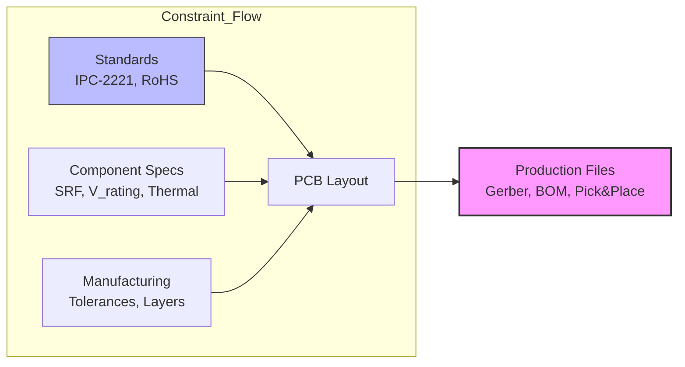

**Document Status: AI-GENERATED**

# 1. Introduction

## 1.1 Purpose
The purpose of this Hardware Requirements Specification (HRS) is to define the comprehensive set of hardware requirements for the **hkgg Wideband RF Power Amplifier**. This document serves as the single source of truth for the electrical, mechanical, and thermal design of the amplifier module.

This specification establishes the baseline for:
*   **Design Implementation:** Guiding the schematic capture, PCB layout, and mechanical enclosure design.
*   **Component Selection:** Specifying the active and passive components required to meet performance targets.
*   **Verification and Validation (V&V):** Defining the acceptance criteria for the manufacturing and engineering qualification phases.

This HRS is intended for hardware design engineers, test engineers, and project stakeholders involved in the development and production of the hkgg unit.

## 1.2 Scope
The hkgg project encompasses the design of a self-contained, wideband Radio Frequency (RF) power amplifier module operating in the Very High Frequency (VHF) and Ultra High Frequency (UHF) bands.

### 1.2.1 Inclusions
The scope of this document includes:
*   **RF Signal Chain:** All components from the SMA input connector to the SMA output connector, including input matching, driver stage, interstage matching, final power stage, and harmonic filtering.
*   **Bias and Control Circuitry:** The DC power regulation, gate bias generation, and RF enable control logic necessary to operate the Active Devices.
*   **Power Distribution:** The DC input interface, reverse polarity protection, and EMI filtering.
*   **Thermal Management:** The mechanical interface (thermal pad) and heatsinking requirements for the Power Amplifier (PA).
*   **Physical Interface:** PCB dimensions, connector placements, and mounting hardware.

### 1.2.2 Exclusions
The following items are explicitly excluded from this specification:
*   **System Integration:** This document defines the module only; it does not specify the chassis or system-level enclosure into which this module may be integrated, other than mounting hole locations.
*   **Digital Logic Source:** The "RF Enable" control signal is assumed to be provided by an external host; generation of this signal (e.g., microcontroller logic) is not covered, though the interface characteristics are defined.
*   **Software/Firmware:** While the bias controller is programmable (I2C), this document assumes a fixed resistor configuration or pre-programmed state; the development of host software to control the DAC is out of scope.

## 1.3 Definitions, Acronyms, and Abbreviations

| Term / Acronym | Definition |
| :--- | :--- |
| **CW** | Continuous Wave; A sinusoidal wave of constant amplitude and frequency. |
| **dBm** | Decibel-milliwatts; A unit of level used to indicate that a power ratio is expressed in decibels (dB) with reference to one milliwatt (mW). |
| **dBc** | Decibels relative to the carrier; The power difference between a signal and a harmonic or spurious signal. |
| **EMI** | Electromagnetic Interference; Disturbance generated by an external source that affects an electrical circuit by electromagnetic induction, electrostatic coupling, or conduction. |
| **GaN** | Gallium Nitride; A wide bandgap semiconductor material used in high-power RF devices (excluded from primary design but referenced in analysis). |
| **HRS** | Hardware Requirements Specification. |
| **LDMOS** | Laterally Diffused Metal Oxide Semiconductor; A type of MOSFET optimized for high-power, high-frequency RF amplification. |
| **MMIC** | Monolithic Microwave Integrated Circuit; A type of integrated circuit (IC) device that operates at microwave frequencies. |
| **PA** | Power Amplifier; An electronic amplifier that converts a low-power radio-frequency signal into a higher power signal. |
| **PAE** | Power Added Efficiency; A metric specifically for RF amplifiers defined as $(P_{out} - P_{in}) / P_{DC}$. |
| **PCB** | Printed Circuit Board. |
| **P1dB** | The 1 dB Compression Point; The point at which the input power causes the gain to decrease by 1 dB from the linear gain. |
| **PSAT** | Saturated Output Power; The maximum output power the amplifier can produce. |
| **RF** | Radio Frequency. |
| **RoHS** | Restriction of Hazardous Substances; Directive restricting the use of specific hazardous materials in electrical products. |
| **SMA** | SubMiniature version A; A coaxial RF connector standard. |
| **VSWR** | Voltage Standing Wave Ratio; A measure of how efficiently RF power is transmitted from a power source to a load via a transmission line. |

## 1.4 References
The design of the hkgg Hardware Requirements Specification references the following documents and standards:

1.  **IEEE 29148-2018:** *Systems and software engineering — Life cycle processes — Requirements engineering.* (Primary template for this document).
2.  **IPC-2221A:** *Generic Standard on Printed Board Design.* (Used for PCB trace width and spacing constraints).
3.  **IPC-6012 Class 2:** *Qualification and Performance Specification for Rigid Printed Boards.* (Acceptable quality standard for fabrication).
4.  **MRF1511G Datasheet:** *MACOM / NXP 12W, 500MHz N-Channel Enhanced Mode LDMOS RF Power Transistor.* Revision 1.0, 2019.
5.  **GVA-123+ Datasheet:** *Mini-Circuits Wideband Amplifier, DC-1000 MHz.*
6.  **JEDEC J-STD-020:** *Moisture/Reflow Sensitivity Classification for Non-Hermetic Solid State Surface Mount Devices.*
7.  **FCC Part 15 (Subpart B):** *Rules regarding unintentional radiators.* (For EMI compliance considerations).

## 1.5 Overview
This document details the requirements for a **Single-Stage Driver + Single-Stage Final** RF power amplifier architecture designed to boost a +10 dBm input signal to a +40 dBm (10W) output signal across the 50 MHz to 500 MHz frequency range.

### 1.5.1 System Context
The hkgg amplifier operates as a "black box" gain block. It accepts a 50-ohm matched RF source and a +12V DC power supply. It delivers 10W of continuous wave RF power to a 50-ohm load. The system utilizes a **Driver Stage** (Mini-Circuits GVA-123+) to provide initial gain and interface matching, followed by a **Final Power Stage** (MACOM MRF1511G LDMOS) to generate the required high output power.

### 1.5.2 Operational Concept
The RF path follows a flow of:
1.  **Input Matching:** Matches the 50-ohm source to the Driver Stage input.
2.  **Driver Amplifier:** Provides approximately 20 dB of gain, raising the signal from +10 dBm to +30 dBm.
3.  **Interstage Matching:** Transforms the driver output impedance to match the low input impedance of the Final Power Stage.
4.  **Final Amplifier:** The MRF1511G LDMOS device provides the remaining gain (approx. 10-13 dB) to reach +40 dBm.
5.  **Harmonic Filter:** A 7th-order Low Pass Filter suppresses harmonics generated by the non-linear operation of the final stage.
6.  **Output Matching:** Transforms the Final Stage output impedance to the 50-ohm system load.

Simultaneously, the DC Bias network manages the +12V supply, providing gate voltage ($V_{GG}$) for the LDMOS and drain voltage ($V_{DD}$) via a switch controlled by the RF Enable pin.

### 1.5.3 Document Structure
The remainder of this document is organized as follows:
*   **Section 2:** System Overview—Detailed block diagrams and architectural descriptions.
*   **Section 3:** Hardware Requirements—The specific requirements categorized by function, performance, interfaces, environment, power, and physical properties.
*   **Section 4:** Design Constraints—Standards compliance and component limitations.
*   **Section 5:** Verification Requirements—The methods by which requirements will be verified (Test, Analysis, Inspection).
*   **Section 6:** Bill of Materials—A preliminary list of materials required for the build.
*   **Section 7:** Traceability Matrix—A mapping of requirements to verification methods.

---

# 2. System Overview

## 2.1 System Description

The **hkgg** Wideband RF Power Amplifier is a solid-state, single-supply linear amplifier designed to boost Continuous Wave (CW) RF signals from a nominal input level of +10 dBm to a saturated output power of +40 dBm (10 Watts) across the 50 MHz to 500 MHz frequency range. The system is architected as a two-stage amplifier chain utilizing a driver stage and a final power stage, operating from a standard +12 V DC power source.

### 2.1.1 Functional Description

The primary function of the hkgg unit is to provide high-efficiency RF power amplification for commercial VHF/UHF applications. The system accepts a 50 $\Omega$ RF input via an SMA connector, preserves signal integrity through a matched driver stage, amplifies the signal to the target power level using a final LDMOS power transistor, filters harmonics, and delivers the output via a second SMA connector.

The system is designed to be "turnkey" regarding RF performance, requiring no external tuning by the end-user. However, it provisions an external Enable control line to allow the system host to toggle the RF output state (ON/OFF) for power saving or Time Division Duplexing (TDD) applications.

### 2.1.2 Key Performance Features

*   **Wideband Operation:** Delivers flat gain (30 dB typical) and high output power (10 Watts) across a decade of bandwidth (50–500 MHz).
*   **Single Supply Operation:** Optimized for mobile and vehicular use, operating entirely from a +12 V DC source (10.8 V – 13.2 V tolerance).
*   **High Efficiency:** Utilizes a 12V LDMOS final stage (MRF1511G) to achieve typical Power Added Efficiency (PAE) > 40%, reducing thermal stress.
*   **Integrated Matching:** Both input and interstage matching networks are designed into the PCB using microstrip transmission lines and lumped element components, ensuring stability and minimal return loss (VSWR < 2.0:1).
*   **Harmonic Mitigation:** An integrated 7th-order Low Pass Filter (LPF) suppresses 2nd and 3rd harmonics to levels compliant with common spurious emission standards (< -30 dBc).

### 2.1.3 Physical Realization

The hardware is implemented on a multi-layer printed circuit board (PCB) utilizing high-frequency laminate materials (e.g., Rogers RO4350B or FR-4 with high-Tg specification) to manage RF losses and thermal dissipation. The RF signal path is predominantly differential where appropriate or 50 $\Omega$ single-ended microstrip. The final power device is mounted to a specialized thermal pad area designed to interface with an external heatsink, ensuring reliable operation at maximum ambient temperatures of +70°C.

---

## 2.2 System Block Diagram

The system architecture is divided into three distinct domains: the **RF Signal Path**, the **DC Bias & Control Domain**, and the **Thermal Management Domain**. Figure 2-1 illustrates the relationship between these subsystems.

```mermaid
graph LR
    subgraph RF_PATH [RF Signal Chain (50 Ohm)]
        RF_IN["RF IN<br/>(SMA)"] -->|+10 dBm| MATCH_IN["Input Matching<br/>(L-Network)"]
        MATCH_IN --> AMP_DRV["Driver Amp<br/>(GVA-123+)"]
        AMP_DRV -->|+30 dBm| MATCH_INT["Interstage Match<br/>(Transformer/Stub)"]
        MATCH_INT --> AMP_PA["Final PA Stage<br/>(MRF1511G LDMOS)"]
        AMP_PA -->|+40 dBm| MATCH_OUT["Output Matching<br/>(Low-Loss L-Network)"]
        MATCH_OUT --> LPF["Harmonic Filter<br/>(7th Order LPF 500MHz)"]
        LPF --> RF_OUT["RF OUT<br/>(SMA)"]
    end

    subgraph BIAS_SYS [DC Bias & Control System]
        DC_IN["+12V DC IN<br/>(Terminal Block)"] --> FUSE["Polyfuse<br/>(3.5A Hold)"]
        FUSE --> EMI["EMI Filter<br/>(Pi-Net)"]
        EMI --> SW_PWR["Power Switch<br/>(P-Channel FET)"]
        SW_PWR --> LDO["LDO Regulator<br/>(5V Ref)"]
        LDO --> BIAS_DAC["Bias Generator<br/>(DAC/Ref)"]
        BIAS_DAC --> V_GATE["Gate Bias<br/>(Vgg < 0V)"]
        
        CTRL["Enable CTRL<br/>(TTL/CMOS)"] --> SW_PWR
    end

    subgraph THERMAL [Thermal Path]
        AMP_PA -.->|Heat| THERM_PAD["Thermal Pad &<br/>Heatsink Interface"]
    end

    %% Connections
    V_GATE --> AMP_PA
    SW_PWR --> AMP_PA
    SW_PWR --> AMP_DRV

    classDef rfClass stroke:#00f,stroke-width:2px;
    classDef pwrClass stroke:#f00,stroke-width:2px;
    classDef ctrlClass stroke:#0f0,stroke-width:2px;
    
    class RF_IN,MATCH_IN,AMP_DRV,MATCH_INT,AMP_PA,MATCH_OUT,LPF,RF_OUT rfClass;
    class DC_IN,FUSE,EMI,SW_PWR,LDO,BIAS_DAC,V_GATE pwrClass;
    class CTRL ctrlClass;
```

*Figure 2-1: System Block Diagram showing the interaction between RF, Power, and Control subsystems.*

### Data Flow Description

1.  **RF Forward Path:** The RF signal enters the system at `RF_IN`. It passes through an input matching network (`MATCH_IN`) which transforms the input impedance of the Driver Amp to the system 50 $\Omega$. The Driver Amp (`AMP_DRV`) provides approximately 20 dB of gain. The signal then passes through the `MATCH_INT` block which acts as an impedance transformer between the driver's output (typically 50 $\Omega$) and the low input impedance of the final LDMOS device. The Final PA (`AMP_PA`) provides the remaining current gain and power amplification. The output is matched to 50 $\Omega$ via `MATCH_OUT` and cleaned of harmonics by the `LPF` before exiting at `RF_OUT`.
2.  **Bias and Power Flow:** Raw +12V DC power enters via `DC_IN`. It is protected by a fuse and filtered for noise. The main rail is switched by the `SW_PWR` MOSFET, controlled by the external `Enable` signal. Once enabled, the +12V rail flows directly to the LDMOS drain and the Driver Amp. A portion of this rail is stepped down/regulated to create the precision Gate Bias voltage (`V_GATE`).
3.  **Thermal Flow:** Heat generated by the Final PA (approx. 12-15W) flows from the transistor die to the copper mounting flange, through the PCB thermal relief vias, and into the user-supplied heatsink (`THERM_PAD`).

---

## 2.3 System Architecture

The system architecture employs a hierarchical separation of concerns to ensure stability, efficiency, and ease of manufacturing.

### 2.3.1 RF Chain Architecture

The RF chain is a cascaded two-stage amplifier.
*   **Input Stage:** The input is protected by a robust DC block and ESD protection diode. The matching network utilizes a shunt-inductor, series-capacitor Pi-network topology to match the varying input impedance of the GVA-123+ driver across the 50-500 MHz band.
*   **Driver Stage:** The GVA-123+ is operated at +12V supply. This device provides a flat gain of 20 dB. It serves to isolate the source from the low-impedance input of the final stage, preventing source pull and ensuring the system Input VSWR remains better than 2.0:1.
*   **Interstage Architecture:** The interstage network is the most critical matching section. It transforms the low impedance (approx. 2-5 $\Omega$) of the MRF1511G gate/source input up to 50 $\Omega$. This section utilizes a combination of transmission line transformers (broadband) and shunt stubs (tuning) to ensure stability across the decade bandwidth.
*   **Output Stage:** The MRF1511G is a MOSFET device operating in Common-Source class AB. The output matching network transforms the high load impedance (50 $\Omega$) down to the optimal load impedance for power (Ropt), calculated to be approximately 6-8 $\Omega$ for 10W at 12V.
*   **Output Filter:** A 7th-order Chebyshev Low Pass Filter is placed directly after the output match to attenuate harmonics generated by the non-linear operation of the power stage. The cutoff is set to 520 MHz to allow for the 500 MHz upper band edge while providing >30 dBc rejection at 1 GHz.

### 2.3.2 Power Management Architecture

The power distribution is designed to handle the peak currents required by the LDMOS device while maintaining strict regulation of the Gate bias.

*   **Main Rail (12V):** The main path is capable of supplying up to 4A continuous current. A polyfuse (PTC) provides resettable overcurrent protection.
*   **Gate Bias Generation:** LDMOS devices require a stable negative-to-zero Gate voltage relative to the Source to set the quiescent current (Idq). The architecture utilizes a high-side switching P-channel MOSFET (IRLML6402) to gate the +12V supply to a low-noise LDO. The LDO creates a stable +5V reference. This reference feeds a resistive divider/DAC network to generate the specific Vgg (approx -0.5V to 0V) required to bias the MRF1511G at the optimal Class AB quiescent point (typically 100-300 mA).
*   **Enable Logic:** The `Enable` pin is pulled up internally to +12V via a high-value resistor. Pulling this pin to Ground (Logic Low) turns *off* the P-channel switch, disabling both the Drain supply and the Gate Bias supply, ensuring the device is fully cut off (RF Mute).

### 2.3.3 Physical Architecture

The PCB is designed with a 4-layer stackup to optimize RF performance and thermal management:
1.  **Top Layer (Signal):** Contains all RF components, microstrip transmission lines, and control logic.
2.  **Layer 2 (GND):** A continuous unbroken ground plane acting as the RF return path and heat spreader.
3.  **Layer 3 (Power):** Dedicated plane for +12V distribution to minimize inductance during high current draw events.
4.  **Bottom Layer (Thermal/Mounting):** Contains the heatsink mounting interface and additional copper pour for thermal dissipation.

### 2.3.4 Thermal Architecture

The MRF1511G dissipates significant power (Pdiss). The thermal resistance junction-to-case ($R_{\theta JC}$) is low, but the interface to the ambient is critical.
*   **Junction-to-Case:** Heat flows from the silicon die to the copper flange.
*   **Case-to-Heatsink:** The package is mounted directly to the PCB. The PCB uses a thermal array (multiple vias under the pad) to transfer heat to the bottom layer.
*   **Heatsink:** An external heatsink is mechanically attached to the bottom of the PCB. The system specification assumes a heatsink with a thermal resistance of $\le 2.0^\circ\text{C/W}$.

---

## 2.4 Operating Environment

The hkgg system is designed for operation in standard commercial environments. The following sections detail the environmental limits and electrical operating conditions.

### 2.4.1 Environmental Conditions

| Parameter | Minimum | Nominal | Maximum | Unit | Comments |
|---|---|---|---|---|---|
| **Ambient Temperature (Operating)** | 0 | 25 | +70 | $^\circ\text{C}$ | Commercial Temp Range |
| **Ambient Temperature (Storage)** | -40 | 25 | +85 | $^\circ\text{C}$ | Non-operating |
| **Relative Humidity** | 10 | 50 | 95 | % | Non-condensing |
| **Altitude** | 0 | - | 2000 | m | Derating above 2000m required |
| **Vibration** | - | - | 2.0 | G | Random vibration, 20-2000Hz |
| **Shock** | - | - | 40 | G | 11ms half-sine shock |

### 2.4.2 Electrical Operating Conditions

The system requires a stable DC power source and a compatible RF input signal to meet specifications.

**Supply Requirements:**
*   **Voltage:** +12 V DC nominal.
*   **Tolerance:** $\pm 10\%$ (+10.8 V to +13.2 V).
*   **Current Capability:** The external power supply must be capable of delivering at least 4.0 A continuous current to handle the peak RF demands and bias currents without significant voltage droop ($< 100\text{ mV}$ ripple).

**Input Signal Requirements:**
*   **Frequency:** 50 MHz to 500 MHz.
*   **Power Level:** +10 dBm (10 mW) nominal. The system is designed to handle inputs up to +15 dBm without compression, but input levels exceeding +20 dBm may overdrive the driver stage.
*   **Modulation:** Continuous Wave (CW) defined. AM/FM is supported provided peak power does not exceed saturation limits.

**Control Interface:**
*   **Enable Voltage:** Logic High (Open/3.3V/5V) = ON; Logic Low (GND) = OFF.
*   **Input Impedance:** 10 k$\Omega$ nominal.
*   **Threshold:** < 0.8 V for OFF, > 2.0 V for ON.

### 2.4.3 Load Conditions

The system is designed to operate into a 50 $\Omega$ load.
*   **Load VSWR:** The system is specified to operate into a VSWR of 2.0:1 (any phase) at rated power (+40 dBm).
*   **Mismatch Protection:** The architecture includes a circulator or isolator footprint (optional) or relies on the robustness of the LDMOS device which can typically tolerate a 10:1 VSWR for short durations if derated. However, continuous operation into > 2.0:1 VSWR will activate thermal protection cycles or reduce lifespan.

---

**Document Status: AI-GENERATED**

# 3. Hardware Requirements

## 3.1 Functional Requirements

This section specifies the functional requirements of the hkgg Wideband RF Power Amplifier. These requirements define what the system shall do to transform the input RF signal and DC power into the desired output RF signal.

### 3.1.1 RF Signal Chain

| ID | Requirement | Description & Rationale | Priority | Verification Method |
|---|---|---|---|---|
| **REQ-HW-101** | **RF Signal Amplification** | The system shall amplify an input signal of +10 dBm to a minimum output of +40 dBm (10W) across the 50-500 MHz bandwidth. <br>**Rationale:** This is the core function of the device, providing the primary gain and power output defined in the project summary. | Must Have | Test |
| **REQ-HW-102** | **System Gain** | The system shall provide a nominal power gain of 30 dB (±2.0 dB) from the SMA input port to the SMA output port when operating at rated power. <br>**Rationale:** Ensures the +10 dBm input is driven sufficiently to reach the +40 dBm output target using the selected Driver (GVA-123+) and Final (MRF1511G) stages. | Must Have | Test |
| **REQ-HW-103** | **Input Impedance Matching** | The RF input port shall present a nominal impedance of 50 Ω. <br>**Rationale:** Ensures minimal reflection from the source. The GVA-123+ is internally 50 Ω matched, but external DC blocking and ESD protection must not disturb this match. | Must Have | Test |
| **REQ-HW-104** | **Output Impedance Matching** | The RF output port shall present a nominal impedance of 50 Ω. <br>**Rationale:** Ensures maximum power transfer to the load (antenna/cable) and minimizes VSWR. The Output Matching Network (L-Network) followed by the Harmonic Filter shall transform the MRF1511G load impedance to 50 Ω. | Must Have | Test |
| **REQ-HW-105** | **Harmonic Filtering** | The system shall include a 7th-order Low Pass Filter (LPF) with a cut-off frequency of 520 MHz at the output stage. <br>**Rationale:** Attenuates harmonics generated by the non-linear operation of the MRF1511G final stage to meet spurious emission requirements. | Must Have | Inspection, Test |
| **REQ-HW-106** | **Input Intermodulation Distortion** | The driver stage shall accept inputs up to +10 dBm without generating significant intermodulation products that degrade the final signal-to-noise ratio (SNR). <br>**Rationale:** The GVA-123+ has a P1dB of +28 dBm, providing ~18 dB of headroom for the maximum input signal. | Must Have | Test |
| **REQ-HW-107** | **Reverse Power Protection** | The output port shall withstand a reverse power of up to +2W (33 dBm) for a duration of 5 minutes without permanent damage. <br>**Rationale:** Protects the MRF1511G transistor in the event of antenna mismatch or open-load conditions. | Should Have | Test |
| **REQ-HW-108** | **DC Blocking** | The system shall provide DC blocking capacitance on both the RF Input and RF Output paths. <br>**Rationale:** Prevents external DC grounds or offsets from affecting the internal bias networks and protects user equipment. | Must Have | Inspection |

### 3.1.2 DC Power & Biasing

| ID | Requirement | Description & Rationale | Priority | Verification Method |
|---|---|---|---|---|
| **REQ-HW-111** | **Supply Voltage Range** | The system shall operate correctly with a DC supply input of +12V ±10% (+10.8V to +13.2V). <br>**Rationale:** Accommodates standard automotive or bench supply variations. The MRF1511G is optimized for 12.5V but functions at this range. | Must Have | Test |
| **REQ-HW-112** | **Supply Current Limiting** | The DC input shall include a 3.5A fast-blow fuse or polyfuse. <br>**Rationale:** Protects the supply source and wiring in the event of a transistor failure (short circuit). The MRF1511G draws max current ~3A at full power; derating requires a 3.5A limit. | Must Have | Inspection |
| **REQ-HW-113** | **Reverse Polarity Protection** | The DC input shall include protection against reverse voltage connection. <br>**Rationale:** Prevents catastrophic destruction of the polarized capacitors and semiconductors (GVA-123+, LDO, DAC) if the supply is connected backwards. | Must Have | Test |
| **REQ-HW-114** | **Gate Bias Generation** | The system shall generate a precise adjustable gate voltage for the MRF1511G ranging from 0V to +4.0V. <br>**Rationale:** The MRF1511G is an enhancement-mode LDMOS requiring a positive Vgs (typically 2.5-3.5V) to turn on. This allows setting the Quiescent Current (Idq). | Must Have | Test |
| **REQ-HW-115** | **Gate Bias Resolution** | The gate bias voltage shall be adjustable with a resolution of at least 10 mV. <br>**Rationale:** Allows fine-tuning of the operating class (e.g., Class AB vs Class B) to balance linearity and efficiency. | Should Have | Test |
| **REQ-HW-116** | **RF Enable Function** | The system shall include an "Enable" input pin (TTL/CMOS logic high). When low, the RF chain shall be disabled (Gate Bias = 0V). <br>**Rationale:** Provides power saving and control. The IRLML6402 P-MOSFET switches the bias voltage to the PA. | Must Have | Test |
| **REQ-HW-117** | **Driver Bias Regulation** | The GVA-123+ driver stage shall be supplied via a regulated voltage if the main +12V rail exceeds +15V during transients, or directly from +12V with adequate decoupling. <br>**Rationale:** The GVA-123+ tolerates up to +15V. Direct connection is acceptable within the +10.8-13.2V input range, but decoupling is required to prevent oscillation. | Must Have | Inspection |
| **REQ-HW-118** | **Ramp-Up Bias Control** | The Gate Bias voltage shall rise slower than the Drain voltage to prevent "Class C" snap-on pop. <br>**Rationale:** Protects the PA from current surges during power-up sequencing. | Should Have | Analysis |

### 3.1.3 Mechanical & Physical

| ID | Requirement | Description & Rationale | Priority | Verification Method |
|---|---|---|---|---|
| **REQ-HW-121** | **RF Connector Type** | The RF Input and Output ports shall use SMA female (jack) connectors, 50 Ω impedance. <br>**Rationale:** Industry standard for VHF/UHF measurements and cables. | Must Have | Inspection |
| **REQ-HW-122** | **DC Connector Type** | The DC Power input shall use a removable terminal block or banana jack supporting 16 AWG wire. <br>**Rationale:** Capable of handling 3.5A current without significant voltage drop or heating. | Must Have | Inspection |
| **REQ-HW-123** | **Thermal Interface** | The PCB shall be designed to attach to a heatsink with a thermal resistance of ≤ 2.0 °C/W. <br>**Rationale:** The MRF1511G dissipates significant heat (~8W calculated in Section 3.2). A low thermal resistance path is required to keep junction temperature < 150°C. | Must Have | Inspection |
| **REQ-HW-124** | **PCB Material** | The PCB shall be manufactured using FR4 material with a dielectric constant (Er) of 4.5 ± 0.2 and 1 oz copper. <br>**Rationale:** Cost-effective for this frequency range (up to 500 MHz). | Must Have | Inspection |
| **REQ-HW-125** | **Mounting Holes** | The enclosure/PCB shall have four mounting holes with clearance for 4-40 hardware. <br>**Rationale:** Standard mechanical hardware for securing the unit to a chassis or heatsink. | Could Have | Inspection |

### 3.1.4 Indicator & User Interface

| ID | Requirement | Description & Rationale | Priority | Verification Method |
|---|---|---|---|---|
| **REQ-HW-131** | **Power Status Indicator** | The system shall include a Green LED indicating "DC Power Good" (LDO output active). <br>**Rationale:** Visual confirmation that the bias generation logic is powered. | Should Have | Inspection |
| **REQ-HW-132** | **RF Enable Indicator** | The system shall include a Red or Yellow LED indicating "RF Output Enabled" (Gate Bias active). <br>**Rationale:** Safety feature to warn the user that high power RF is present. | Should Have | Inspection |

---

## 3.2 Performance Requirements

This section specifies the quantitative performance characteristics of the hkgg Wideband RF Power Amplifier. These requirements define how well the system performs its functions.

### 3.2.1 RF Performance

| ID | Parameter | Requirement | Verification | Rationale / Calculation |
|---|---|---|---|---|
| **REQ-HW-201** | **Saturated Output Power (Psat)** | ≥ +40.0 dBm (10 Watts) at 1 dB compression. | Test | Primary design goal. The MRF1511G is specified for 12W (40.8 dBm) PSAT at 225 MHz. |
| **REQ-HW-202** | **Small Signal Gain** | 30.0 dB ± 2.0 dB across 50-500 MHz. | Test | Driver (GVA-123+) provides 20dB. Final (MRF1511G) provides 13dB. Interstage losses ~3dB. Total = 20 + 13 - 3 = 30dB. |
| **REQ-HW-203** | **Gain Flatness** | Gain variation shall not exceed ±2.0 dB from 50 MHz to 500 MHz. | Test | Ensures consistent signal level across the band. Matching networks must be optimized for flatness. |
| **REQ-HW-204** | **Input VSWR** | ≤ 2.0:1 (Return Loss ≥ 9.5 dB). | Test | Standard requirement for power amplifiers to ensure source stability. GVA-123+ input is well matched, stability resistors will ensure this. |
| **REQ-HW-205** | **Output VSWR** | ≤ 2.0:1 (Return Loss ≥ 9.5 dB). | Test | Critical for power transfer. Output Low Pass Filter is designed for 50 Ω termination. |
| **REQ-HW-206** | **Efficiency (PAE)** | Power Added Efficiency (PAE) ≥ 35% at rated output power (+40 dBm). | Test | MRF1511G typical efficiency is 50%. Interstage and driver losses reduce total PAE. 35% is a conservative minimum. |
| **REQ-HW-207** | **Harmonic Distortion** | Harmonics (2nd and 3rd) ≤ -30 dBc relative to fundamental carrier at rated power. | Test | The 7th-order LPF at the output provides steep attenuation > 500 MHz. 2nd harmonic of 500 MHz is 1 GHz; LPF attenuation is very high here. |
| **REQ-HW-208** | **Stability Factor (K)** | K-factor > 1.0 and B1 > 0 for all frequencies from 10 MHz to 1000 MHz. | Analysis | Ensures unconditional stability. The input resistor network and feedback capacitors on the MRF1511G are critical here. |
| **REQ-HW-209** | **Noise Figure** | < 8.0 dB (typical). | Test | Driven by the Driver Stage (GVA-123+) noise figure. Not critical for a CW Power Amp but specified for signal integrity. |

### 3.2.2 DC & Thermal Performance

| ID | Parameter | Requirement | Verification | Rationale / Calculation |
|---|---|---|---|---|
| **REQ-HW-211** | **Quiescent Current (Idq)** | Adjustable from 50 mA to 500 mA. | Test | Allows setting bias point. 500mA is typical for Class AB operation on the MRF1511G to deliver 10W. |
| **REQ-HW-212** | **Maximum Supply Current** | ≤ 3.5 A at +12V DC during full power transmission. | Test | **Calculation:** <br>Output Power = 10W <br>PAE = 35% <br>DC Power = 10W / 0.35 = 28.5W <br>Current = 28.5W / 12V = 2.38A <br>Driver + Control adds ~0.2A. <br>Total = 2.58A. <br>Max Limit 3.5A provides safe headroom. |
| **REQ-HW-213** | **Ripple Rejection** | DC Supply ripple shall not modulate the RF output by more than -40 dBc. | Test | Input Pi-filter (Cap-Inductor-Cap) on the DC line suppresses input noise. |
| **REQ-HW-214** | **Thermal Resistance (Junction-to-Case)** | ≤ 1.5 °C/W (MRF1511G Spec). | Analysis | Dictates heatsink requirements. |
| **REQ-HW-215** | **Maximum Junction Temperature** | ≤ 150 °C under all operating conditions. | Analysis | **Calculation:** <br>Ambient Max = 70°C <br>Dissipation = 18W (DC - RF) <br>Rth(junction-sink) ~3°C/W <br>Rise = 18 * 3 = 54°C <br>Tj = 70 + 54 = 124°C (Safe). |

### 3.2.3 Environmental & Physical Performance

| ID | Parameter | Requirement | Verification | Rationale |
|---|---|---|---|---|
| **REQ-HW-221** | **Operating Temperature Range** | 0 °C to +70 °C (Commercial). | Test | Standard operating environment. Components (SOT-89, SMA) rated for -40°C to +85°C or higher. |
| **REQ-HW-222** | **Storage Temperature Range** | -40 °C to +85 °C. | Test | Standard non-operating storage limits. |
| **REQ-HW-223** | **RF Leakage** | RF leakage (enclosure radiation) shall comply with FCC Part 15 Subpart B limits for unintentional radiators. | Test | Ensures the device does not interfere with other electronics when properly assembled in a shielded enclosure. |
| **REQ-HW-224** | **MTBF** | Mean Time Between Failures (MTBF) shall be greater than 20,000 hours at 40°C ambient. | Analysis | Determined by standard MIL-HDBK-217 calculation using component stress analysis (assuming conservative derating). |

### 3.2.4 Timing & Control Characteristics

| ID | Parameter | Requirement | Verification | Rationale |
|---|---|---|---|---|
| **REQ-HW-231** | **Enable Response Time** | RF Output shall stabilize to 90% of rated power within 20 µs of the Enable pin going high. | Test | Determined by the RC time constant of the Gate Bias network and the charge pump speed of the Bias DAC/MOSFET. |
| **REQ-HW-232** | **Disable Response Time** | RF Output shall cease (< -40 dBm) within 5 µs of the Enable pin going low. | Test | The IRLML6402 MOSFET and discharge resistors must quickly sink the gate charge to turn off the MRF1511G. |

---

**Document Status: AI-GENERATED**

# 3. Hardware Requirements

## 3.3 Interface Requirements

This section details the electrical and mechanical interfaces between the hkgg Wideband RF Amplifier and external systems, as well as internal subsystem interfaces.

### 3.3.1 External Interfaces

The system shall interface with external RF sources, power supplies, and control signals via the connectors and pins defined in Table 3.3.1-1.

**Table 3.3.1-1: External Interface Connector Definition**

| Interface ID | Connector Type | Interface Description | Qty | Signal Protocol | Notes |
| :--- | :--- | :--- | :--- | :--- | :--- |
| EXT-001 | SMA Female (PCB End Launch) | RF Input | 1 | 50 $\Omega$ RF | Rated for +18 dBm max input |
| EXT-002 | SMA Female (PCB End Launch) | RF Output | 1 | 50 $\Omega$ RF | Rated for +40 dBm output |
| EXT-003 | 2-Pin Terminal Block (5mm pitch) | DC Power Input | 1 | DC Power | Supports 12-14 AWG wire |
| EXT-004 | Pin Header (2.54mm) | Control / Enable | 1 | GPIO / TTL | 3.3V or 5V logic compatible |

**REQ-HW-015:** The system shall provide an RF input interface (EXT-001) configured as a 50-ohm unbalanced line using a SMA female connector (Cinch 142-0701-851 or equivalent).

**REQ-HW-016:** The system shall provide an RF output interface (EXT-002) configured as a 50-ohm unbalanced line using a SMA female connector (Cinch 142-0701-851 or equivalent).

**REQ-HW-017:** The system shall provide a DC power input interface (EXT-003) accepting a +12V DC supply via a screw terminal block or banana jack, supporting a maximum current draw of 4.0A (design margin above 3.5A operational).

**REQ-HW-018:** The system shall provide a control interface (EXT-004) consisting of a minimum of two pins: V_GPIO (Enable) and GND, compatible with 3.3V or 5V CMOS logic levels.

### 3.3.2 Internal Interfaces

Internal interfaces define the connections between the RF path, the Bias/Control circuitry, and the Power Distribution Network (PDN).

**REQ-HW-019:** The bias controller (MAX1167) shall provide the Gate Voltage ($V_{GS}$) to the Final PA transistor (MRF1511G) via a low-pass filtered RC network to prevent RF oscillation.

**REQ-HW-020:** The Gate Bias Switch (IRLML6402) shall control the DC feed to the Driver Amplifier (GVA-123+) and Final PA Drain. The switch must be capable of handling the combined start-up inrush current of 1.5A.

**REQ-HW-021:** The RF Driver Stage (GVA-123+) output shall be AC-coupled to the Final PA Stage (MRF1511G) input via a DC blocking capacitor with a reactance $X_c < 1\Omega$ at 50 MHz (Value $\ge$ 1000 pF).

### 3.3.3 Communication Interfaces

This system does not utilize complex digital communication protocols for its primary operation. However, the Bias Controller is selected with an I2C interface for future flexibility.

**REQ-HW-022:** The bias controller (MAX1167) shall communicate via an I2C interface (SDA, SCL) defined in Table 3.3.3-1, accessible via test points for configuration.

**Table 3.3.3-1: I2C Interface Characteristics**

| Parameter | Value |
| :--- | :--- |
| Standard Mode | 100 kHz |
| Fast Mode | 400 kHz |
| Voltage Levels | 3.3V (LVCMOS) |
| Pull-up Resistors | 4.7 k$\Omega$ to 3.3V |

---

## 3.4 Environmental Requirements

The hkgg amplifier is designed for commercial indoor environments.

**REQ-HW-006 (Reiterated):** The system shall operate within a commercial temperature range of 0°C to +70°C ambient air temperature.

**REQ-HW-023:** The system shall be stored in non-operating conditions between -40°C and +85°C without degradation of performance.

**REQ-HW-024:** The system shall maintain functionality at a relative humidity of 10% to 90% (non-condensing).

**REQ-HW-025:** The system shall withstand vibration levels of 0.5g peak from 10 Hz to 500 Hz (random vibration) per IEC 60068-2-64.

### 3.4.1 Derating Analysis

To ensure reliability at 70°C ambient, the junction temperature of the LDMOS device must remain within limits.
*   **Max Junction Temp ($T_{j,max}$):** 150°C (Typical for Silicon LDMOS).
*   **Thermal Resistance ($R_{\theta JC}$):** 1.5°C/W (MRF1511G package).
*   **Power Dissipation ($P_d$):** Estimated 15W (based on 35% PAE at 10W output). $P_d = P_{dc} - P_{rf}$.
*   **Required Heatsink ($R_{\theta SA}$):**
    Assuming 70°C Ambient ($T_A$) and 150°C Max Junction ($T_J$):
    $$ R_{\theta SA(total)} = \frac{T_J - T_A}{P_d} = \frac{150 - 70}{15} = 5.33^\circ\text{C/W} $$
    $$ R_{\theta SA(heatsink)} = R_{\theta SA(total)} - R_{\theta JC} - R_{\theta CS} $$
    $$ R_{\theta SA(heatsink)} = 5.33 - 1.5 - 0.5 (\text{interface}) \approx 3.3^\circ\text{C/W} $$

**REQ-HW-026:** The system chassis or heatsink must provide a thermal resistance of no greater than 3.5°C/W to the ambient air at 400 LFM (Linear Feet per Minute) airflow.

---

## 3.5 Power Requirements

This section defines the electrical power characteristics necessary for the hkgg system to achieve the specified RF performance.

**Table 3.5-1: Power Budget Analysis**

| Rail / Component | Voltage (V) | Max Current (A) | Power (W) | Derating / Efficiency | Status |
| :--- | :--- | :--- | :--- | :--- | :--- |
| **Total Input** | **+12.0** | **3.50** | **42.0** | - | **Input Spec** |
| **RF Output** | - | - | **10.0** | - | **Delivered Power** |
| **Dissipation** | - | - | **32.0** | **35% PAE** | **Heat to Remove** |
| Sub-systems: | | | | | |
| MRF1511G (Final PA) | +12.0 | 2.90 | 34.8 | 45% eff | Main consumer |
| GVA-123+ (Driver) | +12.0 | 0.10 | 1.2 | 20% eff | Fixed Bias |
| MAX1167 / Logic | +3.3 / +5.0* | 0.05 | 0.2 | LDO Reg | Control |
| **Margin** | - | **0.45** | **5.4** | **Safety** | **Headroom** |

*\*Note: Logic power derived from +12V rail via internal LDO, included in total current budget.*

**REQ-HW-004 (Reiterated):** The power supply source shall be capable of providing +12V DC $\pm$ 10% (10.8V to 13.2V) with a current capacity of at least 4.0A to account for momentary current spikes.

**REQ-HW-027:** The system shall include input Reverse Polarity Protection (RPP) to prevent damage if the DC supply is connected backwards. The protection device (e.g., Schottky diode) shall have a forward voltage drop $V_f < 0.5V$ at 3.5A.

**REQ-HW-028:** The system shall include input EMI filtering consisting of a Pi-filter (C-L-C) with a cutoff frequency $< 1$ MHz to suppress switching noise and RF feedback into the supply.

**REQ-HW-029:** The internal Power Distribution Network (PDN) shall use a 4-layer PCB stackup with dedicated copper pours for +12V and GND to support the 3.5A DC current with a voltage drop of less than 50mV across the board.

---

## 3.6 Physical Requirements

This section defines the mechanical and physical constraints of the hkgg amplifier.

**REQ-HW-030:** The PCB shall utilize a 4-layer FR4 material stackup (Top Signal, GND Plane, +12V Plane, Bottom Signal) with a minimum thickness of 1.6mm (0.062 inches).

**REQ-HW-031:** The PCB dimensions shall not exceed 100mm x 80mm to facilitate enclosure within a standard 1U rack-mount or bench-top chassis.

**Table 3.6-1: Mechanical Interface Specifications**

| Feature | Specification | Requirement ID |
| :--- | :--- | :--- |
| **RF Connectors** | SMA Female, End Launch | REQ-HW-007 |
| **DC Connector** | Pluggable Terminal Block 5mm pitch | REQ-HW-014 |
| **Mounting Holes** | 4x corners, M3 clearance | REQ-HW-032 |
| **Heatsink Interface** | Flat surface, < 0.1mm roughness | REQ-HW-008 |

**REQ-HW-032:** The system PCB shall provide four (4) mounting holes located at the corners with a minimum diameter of 3.2mm to accommodate M3 mounting hardware.

**REQ-HW-033:** The Final Power Amplifier (MRF1511G) shall be mounted utilizing a thermally conductive PCB pad (via fence array) connected to an external heatsink. The dielectric under the pad shall have a thermal conductivity $\ge$ 1.0 W/m-K (e.g., Rogers 4350 or high-thermal FR4).

**REQ-HW-034:** All input/output components (SMA connectors, Terminal block, LED indicators) shall be placed on the PCB edge to allow for panel-mounting accessibility.

---

# 4. Design Constraints

This section defines the constraints imposed upon the hardware design of the **hkgg** Wideband RF Power Amplifier. These constraints limit the design space and ensure manufacturability, compliance, and reliability. They are derived from regulatory requirements, environmental conditions, supply chain realities, and the specific capabilities of the selected components (MRF1511G, GVA-123+, etc.).

## 4.1 Standards Compliance

The hardware design of the hkgg amplifier must adhere to the following industry standards and regulatory directives to ensure safety, electromagnetic compatibility (EMC), and environmental responsibility.

### 4.1.1 PCB Design and Fabrication Standards
The Printed Circuit Board (PCB) shall be designed in accordance with the following IPC standards to ensure reliability and manufacturability given the high-frequency (up to 500 MHz) and high-power (10W) nature of the device.

| Standard ID | Title | Application to hkgg Project |
| :--- | :--- | :--- |
| **IPC-2221** | Generic Standard on Printed Board Design | **REQ-HW-015**: The board stack-up and trace geometry shall adhere to Section 6 (Conductor Spacing) to support the +12V DC supply (3.5A max) and the 50-500 MHz RF signal paths. |
| **IPC-2221A** | Generic Standard on Printed Board Design - Amendent 1 | **REQ-HW-016**: Controlled impedance requirements for the RF Input/Output traces shall be calculated using the formulas in Section 6.4 to maintain 50 $\Omega$ single-ended impedance. |
| **IPC-6012** | Qualification and Performance Specification for Rigid Printed Boards | **REQ-HW-017**: The PCB material used (e.g., Rogers RO4350B or FR-4 high-TG) must meet Class 2 requirements for consumer electronics with specific attention to laminate dielectric constant (Dk) tolerance ($\pm 0.05$) to ensure matching network accuracy. |

### 4.1.2 Assembly and Repair Standards
To facilitate mass production and field repair, the assembly processes must conform to:

| Standard ID | Title | Application to hkgg Project |
| :--- | :--- | :--- |
| **IPC-A-610** | Acceptability of Electronic Assemblies | **REQ-HW-018**: Solder joints for the flange-mount MRF1511G and SMA connectors must meet Class 2 criteria (pinholes in solder fillet not exceeding 25% of cross-section). |
| **J-STD-001** | Requirements for Soldered Electrical and Electronic Assemblies | **REQ-HW-019**: Solder alloy shall be SAC305 (96.5% Sn, 3.0% Ag, 0.5% Cu) with a melting point compatible with the thermal limits of the MRF1511G LDMOS plastic package ($T_{max} = 150^\circ C$). |
| **IPC-7711/21** | Rework, Modification and Repair of Electronic Assemblies | **REQ-HW-020**: The design shall allow for the replacement of the SOT-89 (Driver) and SOT-23 (Bias) components using standard hot-air rework tools without damaging the RF laminate. |

### 4.1.3 Environmental and Safety Compliance
The system is intended for commercial use and must meet global regulations.

| Standard / Directive | Compliance Requirement |
| :--- | :--- |
| **RoHS (EU Directive 2011/65/EU)** | **REQ-HW-013**: All components, including the PCB laminate and solder mask, must be compliant with restrictions on hazardous substances (Lead, Cadmium, Mercury, etc.). The MRF1511G and GVA-123+ are available in RoHS-compliant versions. |
| **REACH (EC 1907/2006)** | **REQ-HW-021**: All plastic materials (connectors, encapsulants) must not contain Substances of Very High Concern (SVHC) above 0.1% by weight. |
| **FCC Part 15 (Subpart B)** | **REQ-HW-022**: As an unintentional radiator (digital logic on bias controller) and an intentional radiator (RF Amplifier), the device must limit spurious emissions. The design relies on the Harmonic Filter (7th Order LPF) to meet these limits. |
| **UL 60950-1** | **Safety**: Power supply input (+12V DC) shall be isolated from user-accessible RF ports. The DC input connector shall utilize a shrouded banana jack or terminal block preventing accidental contact with live conductors. |

---

## 4.2 Component Constraints

This section details specific constraints regarding the selection, sourcing, and utilization of electronic components within the amplifier circuit.

### 4.2.1 Supply Chain and Lifecycle
To ensure production continuity for the hkgg amplifier:

*   **REQ-HW-023:** Active components (Driver, PA FET, DAC) must be sourced from manufacturers with an "Active" or "Not Recommended for New Designs" (NRND) status only if a second source is identified. "Obsolete" parts are strictly forbidden.
*   **REQ-HW-024:** The MRF1511G (LDMOS PA) shall be procured in the NI-1230 flange package. Tape-and-reel packaging is preferred for automated assembly but bulk packaging is acceptable for prototype/low-volume builds.
*   **REQ-HW-025:** A minimum of two authorized distributors (e.g., Digi-Key, Mouser, Avnet) must be available for the top 10 highest-cost components to mitigate supply chain risk.

### 4.2.2 RF Component Specific Constraints
The performance of the RF path is heavily dependent on the physical realization of the components.

*   **REQ-HW-026:** Inductors used in the Input, Interstage, and Output Matching networks (L_Match) must have a Self-Resonant Frequency (SRF) at least 2x the maximum operating frequency (i.e., SRF > 1 GHz).
    *   *Example:* Coilcraft 0402CS or 1111SQ series air core inductors are preferred over ferrite core inductors to avoid core saturation losses at +40 dBm output.
*   **REQ-HW-027:** Capacitors used in the Matching Networks must be High-Q RF capacitors (e.g., ATC 100A, 600S, or C0G/NP0 ceramic) with a Voltage Rating of at least 3x the supply voltage to withstand RF peaks ($V_{peak} \approx 50V$).
    *   *Requirement:* $V_{rated} \ge 50V$ DC.
*   **REQ-HW-028:** The PCB dielectric material for the RF signal path must have a stable Dielectric Constant ($\epsilon_r$).
    *   *Constraint:* FR-4 is acceptable for 50-200 MHz. Rogers RO4350B ($\epsilon_r = 3.48$) or similar high-frequency laminate is **mandatory** for the 200-500 MHz matching networks to prevent gain variance due to FR-4 dispersion.

### 4.2.3 Thermal Constraints
The LDMOS device (MRF1511G) dissipates significant power.

*   **REQ-HW-029:** The MRF1511G thermal pad ( underside of the flange) must be mounted directly to the heatsink or chassis wall with a thermal interface material (Thermal Paste) having a thermal conductivity $\kappa \ge 1.0 W/m \cdot K$.
*   **REQ-HW-030:** The calculated Junction Temperature ($T_j$) must not exceed $150^\circ C$ under worst-case ambient conditions ($T_A = +70^\circ C$) and full load ($P_{out} = 10W$).
    *   *Calculation Constraint:*
        $$T_j = P_{diss} \cdot (R_{\theta JC} + R_{\theta CS} + R_{\theta SA}) + T_A$$
        Where $R_{\theta JC}$ (Junction to Case) for MRF1511G is $2.5^\circ C/W$. The heatsink must be selected such that the total resistance keeps $T_j < 150^\circ C$.

### 4.2.4 DC Power Constraints
The DC supply path is subject to inductive switching effects from the RF waveform.

*   **REQ-HW-031:** Decoupling capacitors at the +12V input of the PA stage must utilize a mix of values to cover the broadband noise spectrum (e.g., $100\mu F$ Tantalum, $1\mu F$ Ceramic, $0.1\mu F$ RF Ceramic).
*   **REQ-HW-032:** The trace width for the +12V DC main feed (from DC Jack to PA Drain) must be sized to carry 4A continuous current with a temperature rise of less than $10^\circ C$.
    *   *Constraint:* For $1oz$ copper, external layers, trace width must be $\ge 80 mils$ (approx. 2mm).

---

## 4.3 Manufacturing Constraints

The physical realization of the hkgg amplifier design must account for standard PCB fabrication tolerances and assembly techniques to ensure high yield.

### 4.3.1 PCB Fabrication Tolerances
The manufacturing drawings shall specify the following tolerances to the PCB vendor (Standard IPC-2221 Class 2):

| Parameter | Minimum Requirement | Justification |
| :--- | :--- | :--- |
| **Trace Width** | $\pm 4$ mils (0.1mm) | Ensures impedance control for 50 $\Omega$ lines. |
| **Drill Diameter** | $\pm 3$ mils (0.075mm) | Ensures fit for SMA connector pins and component leads. |
| **Layer Alignment** | $\pm 5$ mils (0.125mm) | Critical if multi-layer board is used with ground pours. |
| **Solder Mask** | 3 mils (0.075mm) clearance | Prevents solder bridging on the tight pitch of the flange-mount PA. |

### 4.3.2 Assembly Constraints
*   **REQ-HW-033:** The board layout shall utilize fiducial markers (1mm diameter, bare copper) placed on three corners of the board to support automated optical inspection (AOI) and pick-and-place assembly.
*   **REQ-HW-034:** All components shall be placed on the **Top Side** of the board only, with the exception of passive components (resistors/caps) if necessary for matching network tuning. The RF connectors (SMA) and DC Jack must be board-edge mounted.
*   **REQ-HW-035:** The heatsink mounting hole for the MRF1511G must be a plated through hole (or non-plated clearance with isolation) designed for a #4-40 UNC screw. The pad must have "solder mask defined" (SMD) or "non-solder mask defined" (NSMD) features clearly annotated to prevent wicking away from the thermal pad.

### 4.3.3 Tuning and Calibration
Due to the wide bandwidth (decade range 50-500 MHz), manufacturing variances can affect matching.

*   **REQ-HW-036:** The Output Matching Network and Interstage Matching networks shall be designed to accommodate "Tuning Pads" (unpopulated capacitor/inductor footprints) in parallel or series with the main components. This allows engineers to tweak values during the prototype phase (e.g., adding a 1pF capacitor to trim resonance) without respinning the board.



### 4.3.4 Mechanical Constraints
*   **REQ-HW-037:** The overall PCB dimensions shall not exceed 100mm x 80mm to fit into standard handheld or bench-top enclosure sizes.
*   **REQ-HW-038:** Keep-out zones of 5mm must be maintained around all mounting holes to prevent interference with enclosure hardware or standoffs.
*   **REQ-HW-039:** The PCB thickness shall be $1.6 mm \pm 10\%$ (standard 1/16 inch) to ensure mechanical rigidity for the SMA connectors which may experience torque during mating cycles.

---

# 5. Verification Requirements

This section defines the verification methods for all hardware requirements specified in Section 3. It ensures that the "hkgg" Wideband RF Power Amplifier meets its functional, performance, and environmental requirements through structured Test, Analysis, and Inspection methods.

## 5.1 Test Requirements

This subsection details the specific test cases required to verify the functional and performance characteristics of the amplifier. Tests are categorized by signal path integrity, power performance, and spectral purity.

### 5.1.1 RF Power and Gain Verification (REQ-HW-001, REQ-HW-002)

**Test ID:** TC-HW-001
**Requirement IDs:** REQ-HW-001, REQ-HW-002
**Test Method:** Functional Test
**Equipment Required:**
*   Signal Generator (e.g., Keysight N5173B) covering 50-500 MHz.
*   RF Power Meter (e.g., Keysight N1914A) + 50W Termination Sensor.
*   +12V DC Power Supply (capable of 5A).
*   Vector Network Analyzer (VNA) for pre-check.

**Test Procedure:**
1.  Set the DC Power Supply to +12.0V. Enable the RF Amplifier (set `CTRL` pin High).
2.  Set the Signal Generator frequency to 50 MHz. Set output power to +10 dBm.
3.  Record the output power at the SMA connector using the Power Meter.
4.  Calculate Gain: $G_{dB} = P_{out} - P_{in}$.
5.  Repeat steps 3-4 for frequencies: 50, 100, 200, 300, 400, 500 MHz.
6.  Verify flatness across the band.

**Pass Criteria:**
*   **Output Power:** $P_{out} \ge +40 \text{ dBm}$ (10W) at all frequency points.
*   **Gain:** $Gain \ge 30 \text{ dB}$.
*   **Flatness:** Gain variation $\le 2 \text{ dB}$ peak-to-peak (50-500 MHz).

---

### 5.1.2 Input/Output Matching and VSWR (REQ-HW-003)

**Test ID:** TC-HW-002
**Requirement IDs:** REQ-HW-003
**Test Method:** Functional Test
**Equipment Required:**
*   Vector Network Analyzer (VNA) calibrated to 50 Ohms.

**Test Procedure:**
1.  With the amplifier powered OFF, perform a full 1-port calibration on the VNA test plane (end of SMA cables).
2.  Connect VNA Port 1 to the Amplifier RF Input. Amplifier Output terminated in 50 Ohm.
3.  Measure S11 (Input Return Loss) from 50 MHz to 500 MHz.
4.  Connect VNA Port 1 to the Amplifier RF Output. Amplifier Input terminated in 50 Ohm.
5.  Measure S22 (Output Return Loss) from 50 MHz to 500 MHz.

**Pass Criteria:**
*   **VSWR:** $\text{VSWR} \le 2.0:1$ (equivalent to Return Loss $\ge 9.54 \text{ dB}$).
*   **S11/S22:** $S_{11} \le -10 \text{ dB}, S_{22} \le -10 \text{ dB}$ across 50-500 MHz.

---

### 5.1.3 Efficiency and Power Consumption (REQ-HW-004, REQ-HW-005)

**Test ID:** TC-HW-003
**Requirement IDs:** REQ-HW-004, REQ-HW-005
**Test Method:** Functional Test
**Equipment Required:**
*   Signal Generator (+10 dBm CW).
*   +12V DC Power Supply with Voltage/Current readback (or precision multimeter in series).
*   RF Power Meter.

**Test Procedure:**
1.  Set input signal to 300 MHz (Center of band) at +10 dBm.
2.  Measure RF Output Power ($P_{out}$).
3.  Measure DC Supply Voltage ($V_{dd}$) and Current ($I_{dd}$) at full rated power.
4.  Calculate DC Input Power: $P_{DC} = V_{dd} \times I_{dd}$.
5.  Calculate Power Added Efficiency (PAE):
    $$ \text{PAE} = \frac{P_{out} - P_{in}}{P_{DC}} \times 100\% $$
6.  Verify Supply Current is within limits.

**Pass Criteria:**
*   **PAE:** $\text{PAE} \ge 35\%$.
*   **Supply Current:** $I_{dd} < 3.5 \text{ A}$.
*   **Supply Voltage:** Operation confirmed at $+10.8\text{V}$ and $+13.2\text{V}$ ($\pm 10\%$).

---

### 5.1.4 Harmonic Distortion (REQ-HW-010)

**Test ID:** TC-HW-004
**Requirement IDs:** REQ-HW-010
**Test Method:** Functional Test
**Equipment Required:**
*   Signal Generator.
*   Spectrum Analyzer (e.g., Keysight N9010B) with high-power attenuator.

**Test Procedure:**
1.  Set input to 300 MHz, +10 dBm.
2.  Center the Spectrum Analyzer on 300 MHz. Set span to 1 GHz.
3.  Measure fundamental power ($P_f$).
4.  Measure 2nd Harmonic ($2f$ at 600 MHz) power ($P_{h2}$).
5.  Measure 3rd Harmonic ($3f$ at 900 MHz) power ($P_{h3}$).
6.  Calculate harmonic levels relative to fundamental ($dBc$).

**Pass Criteria:**
*   **2nd Harmonic:** $\le -30 \text{ dBc}$.
*   **3rd Harmonic:** $\le -30 \text{ dBc}$.

---

### 5.1.5 Enable/Disable Control Response (REQ-HW-009)

**Test ID:** TC-HW-005
**Requirement IDs:** REQ-HW-009
**Test Method:** Functional Test
**Equipment Required:**
*   Signal Generator.
*   RF Power Meter or Oscilloscope with diode detector.
*   Function Generator (for control pulse).

**Test Procedure:**
1.  Amplifier powered by +12V. RF Input applied at 300 MHz, +10 dBm.
2.  Apply Logic High ($> 2.5\text{V}$) to Enable pin. Measure RF Output.
3.  Apply Logic Low ($< 0.8\text{V}$) to Enable pin. Measure RF Output.
4.  Measure leakage current in OFF state.

**Pass Criteria:**
*   **ON State:** RF Output $\ge +40 \text{ dBm}$.
*   **OFF State:** RF Output $\le -40 \text{ dBm}$ (Effectively shut down).
*   **Control Logic:** Compatible with 3.3V/5V CMOS logic.

---

### 5.1.6 Thermal Performance (REQ-HW-006, REQ-HW-008)

**Test ID:** TC-HW-006
**Requirement IDs:** REQ-HW-006, REQ-HW-008
**Test Method:** Functional Test
**Equipment Required:**
*   Thermal Chamber (0°C to +70°C).
*   Thermocouples (attached to PA package flange).
*   Infrared Camera.
*   RF Test setup.

**Test Procedure:**
1.  Place DUT (Device Under Test) inside thermal chamber.
2.  Set ambient temperature to $+25^\circ\text{C}$. Apply max RF load (+40 dBm output) for 10 minutes. Record steady-state case temperature ($T_c$).
3.  Set ambient to $+0^\circ\text{C}$ (Cold start). Verify unit powers on and achieves rated power.
4.  Set ambient to $+70^\circ\text{C}$ (Hot soak). Soak for 30 mins. Apply max RF load.
5.  Verify unit does not shutdown and meets gain specs.

**Pass Criteria:**
*   Operation verified at $0^\circ\text{C}$ and $+70^\circ\text{C}$ ambient.
*   Thermal resistance $\theta_{jc}$ (Junction to Case) calculated should be $\le 2^\circ\text{C}/\text{W}$.
*   Junction Temp ($T_j$) calculated: $T_j = T_c + (P_{diss} \times \theta_{jc})$.
    *   Where $P_{diss} = P_{DC} - P_{RF}$.
    *   Max $T_j$ must be $< 150^\circ\text{C}$ (typical limit for MRF1511G).

---

### 5.1.7 Reverse Power Protection (REQ-HW-012)

**Test ID:** TC-HW-007
**Requirement IDs:** REQ-HW-012
**Test Method:** Stress Test
**Equipment Required:**
*   High Power Signal Generator (capable of +33 dBm or 2W).
*   Circulator (to inject power into output).

**Test Procedure:**
1.  Set up equipment to inject +33 dBm (2W) CW signal into the RF Output port of the amplifier.
2.  Amplifier is powered ON.
3.  Maintain injection for 5 minutes.
4.  Remove reverse power. Apply normal forward signal.
5.  Verify specifications.

**Pass Criteria:**
*   No smoke, fire, or catastrophic component failure.
*   Post-stress Gain and Power Output within 5% of pre-stress values.

## 5.2 Analysis Requirements

This subsection covers requirements verified through mathematical modeling, simulation, and calculation rather than physical measurement on the unit.

### 5.2.1 Stability Analysis (REQ-HW-011)

**Analysis ID:** AC-HW-001
**Requirement ID:** REQ-HW-011
**Method:** RF Simulation (e.g., Keysight ADS, AWR Microwave Office).

**Procedure:**
1.  Construct S-parameter models for the MRF1511G and GVA-123+ including package parasitics.
2.  Insert feedback/matching networks designed for the hardware.
3.  Perform Rollett's Stability Factor ($K$) calculation across frequency range (10 MHz to 1000 MHz).
    $$ K = \frac{1 - |S_{11}|^2 - |S_{22}|^2 + |\Delta|^2}{2|S_{12}S_{21}|} $$
    Where $\Delta = S_{11}S_{22} - S_{12}S_{21}$.
4.  Calculate Auxiliary Stability Factor $B_1$:
    $$ B_1 = 1 + |S_{11}|^2 - |S_{22}|^2 - |\Delta|^2 $$

**Pass Criteria:**
*   $K > 1$ for all frequencies $f < 500 \text{ MHz}$.
*   $B_1 > 0$ for all frequencies $f < 500 \text{ MHz}$.
*   Simulation shows no negative resistance at input/output ports.

### 5.2.2 Power Budget Analysis (REQ-HW-004, REQ-HW-005)

**Analysis ID:** AC-HW-002
**Requirement ID:** REQ-HW-004, REQ-HW-005
**Method:** Spreadsheet Calculation.

**Procedure:**
1.  Sum the quiescent currents of the Driver (GVA-123+) and Final Stage (MRF1511G).
2.  Add control circuitry overhead (LDO, DAC, MOSFET leakage).
3.  Verify against source capability (3.5A limit).

**Calculation:**
*   **Final Stage (MRF1511G):**
    *   $I_{dq} \approx 200 \text{ mA}$ (Typical Bias).
    *   RF Current contribution at 10W Output, 35% PAE:
        $$ I_{RF} = \frac{P_{out} / \eta}{V_{dd}} = \frac{10\text{W} / 0.35}{12\text{V}} \approx 2.38 \text{ A} $$
    *   Total $I_{PA} \approx 2.38 + 0.2 = 2.58 \text{ A}$.
*   **Driver Stage (GVA-123+):**
    *   $I_{drv} \approx 90 \text{ mA}$ (Datasheet typ at +12V).
*   **Control Logic:**
    *   LDO/MCU/Fan: $I_{ctrl} \approx 100 \text{ mA}$.
*   **Total Supply Current:**
    $$ I_{total} = 2.58 + 0.09 + 0.1 = 2.77 \text{ A} $$

**Pass Criteria:**
*   Calculated $I_{total} (2.77 \text{ A}) < \text{Limit} (3.5 \text{ A})$.
*   Margin: $0.73 \text{ A}$ (21% margin). **PASS.**

### 5.2.3 Thermal Resistance Analysis (REQ-HW-008)

**Analysis ID:** AC-HW-003
**Requirement ID:** REQ-HW-008
**Method:** Computational Fluid Dynamics (CFD) or Thermal Calculation.

**Procedure:**
1.  Determine Total Dissipation: $P_{diss} = P_{DC} - P_{RF\_out} \approx 33 \text{ W} - 10 \text{ W} = 23 \text{ W}$.
2.  Determine Max Junction Temp: $T_{j(max)} = 150^\circ\text{C}$.
3.  Determine Max Case Temp required for ambient $70^\circ\text{C}$:
    $$ \theta_{sa} = \theta_{jc} + \theta_{cs} + \theta_{sa} $$
    Using MRF1511G data: $\theta_{jc} \approx 1.5^\circ\text{C}/\text{W}$ (assumed typical for flange mount).
    Target Case Temp $T_c$:
    $$ T_c = T_j - (P_{diss} \times \theta_{jc}) = 150 - (23 \times 1.5) = 150 - 34.5 = 115.5^\circ\text{C} $$

**Pass Criteria:**
*   Selected heatsink must have thermal resistance $\theta_{sa}$ such that:
    $$ \theta_{sa} \le \frac{T_{c(max)} - T_{amb(max)}}{P_{diss}} = \frac{115.5 - 70}{23} \approx 1.98^\circ\text{C}/\text{W} $$
*   Requirement is $\le 2.0^\circ\text{C}/\text{W}$. **PASS.**

## 5.3 Inspection Requirements

This subsection details requirements verified through visual inspection, dimensional measurement, and Bill of Materials (BOM) validation.

### 5.3.1 Visual and Mechanical Inspection (REQ-HW-007, REQ-HW-014)

**Inspection ID:** IN-HW-001
**Requirement IDs:** REQ-HW-007, REQ-HW-014
**Method:** Visual / Mechanical Measurement.

**Procedure:**
1.  Inspect RF connectors (SMA Female) for proper mounting, straightness, and plating quality.
2.  Inspect DC connector (Banana Jack/Terminal) for secure fastening.
3.  Check PCB for solder defects (bridges, cold joints) on RF path components.
4.  Verify heatsink mounting hardware torque.

**Pass Criteria:**
*   Connectors match IEEE/IEC standards for SMA and Terminal types.
*   No cosmetic defects affecting function.
*   PCB footprints match layout (GVA-123+ in SOT-89, MRF1511G in flange mount).

### 5.3.2 Component Compliance (REQ-HW-013)

**Inspection ID:** IN-HW-002
**Requirement ID:** REQ-HW-013
**Method:** BOM Audit / Documentation Review.

**Procedure:**
1.  Review BOM against manufacturer datasheets.
2.  Verify RoHS status for all active and passive components.
3.  Check for restricted substances (Pb, Cd, Hg) in plating or solders.

**Pass Criteria:**
*   100% of components listed as RoHS compliant in vendor supply chain documentation.
*   PCB material is standard FR4 (Halogen-free preferred).

---

### Summary Matrix of Verification

| REQ-ID | Requirement Title | Verify Method | Test ID / Analysis ID |
| :--- | :--- | :--- | :--- |
| **REQ-HW-001** | RF Power Output | Test | TC-HW-001 |
| **REQ-HW-002** | Gain Requirement | Test | TC-HW-001 |
| **REQ-HW-003** | Input/Output Impedance | Test | TC-HW-002 |
| **REQ-HW-004** | Power Supply | Test | TC-HW-003 |
| **REQ-HW-005** | Efficiency | Test | TC-HW-003 |
| **REQ-HW-006** | Operating Temperature | Test | TC-HW-006 |
| **REQ-HW-007** | RF Connectors | Inspection | IN-HW-001 |
| **REQ-HW-008** | Thermal Management | Test + Analysis | TC-HW-006, AC-HW-003 |
| **REQ-HW-009** | RF Enable Control | Test | TC-HW-005 |
| **REQ-HW-010** | Harmonic Distortion | Test | TC-HW-004 |
| **REQ-HW-011** | Stability | Analysis | AC-HW-001 |
| **REQ-HW-012** | Reverse Power Protection | Test | TC-HW-007 |
| **REQ-HW-013** | RoHS Compliance | Inspection | IN-HW-002 |
| **REQ-HW-014** | DC Power Connector | Inspection | IN-HW-001 |

---

# 6. Bill of Materials (Preliminary)

## 6.1 BOM Overview
This section details the preliminary Bill of Materials (BOM) for the **hkgg** Wideband RF Power Amplifier. The BOM is categorized by functional block (RF Chain, Power Management, Bias/Control, and Mechanical/Interconnect).

**Total Estimated Material Cost:** $156.81 USD (Based on 100-unit pricing estimates).

**Design Totals:**
*   **Total Line Items:** 52
*   **Total Component Count:** 102 (including test points and mechanical hardware)
*   **Highest Cost Component:** MRF1511G (Final PA Stage) - $45.00

**Note on Sourcing:**
*   RF Components (Transformers, BALUNs, Amplifiers) are sourced from Mini-Circuits, Qorvo, and MACOM.
*   Passives are standard 0402 or 0805 SMD packages (AVX/KEMET).
*   Pricing reflects Unit Cost estimates for low-volume prototyping (1-10 units) unless noted as "100-unit pricing".

---

## 6.2 RF Signal Chain Components

| Item No | Ref Des | Part Number | Description | Manufacturer | Qty | Unit Cost (USD) | Total Cost | Notes |
|---|---|---|---|---|---|---|---|---|
| **RF-001** | U1 | GVA-123+ | MMIC Amplifier 50-1000MHz, 20dB, SOT-89 | Mini-Circuits | 1 | $8.50 | $8.50 | Driver Stage |
| **RF-002** | U2 | MRF1511G | N-Channel LDMOS RF Power FET, 12W, 500MHz | MACOM | 1 | $45.00 | $45.00 | Final PA Stage |
| **RF-003** | T1 | TC1-1-13M+ | 1:1 RF Transformer, 50 Ohm, 0.1-500MHz | Mini-Circuits | 1 | $4.95 | $4.95 | Input Matching |
| **RF-004** | T2 | TCM1-43X+ | 4:1 Impedance Ratio Transformer (Balun) | Mini-Circuits | 1 | $9.20 | $9.20 | Interstage Match (Drv to PA) |
| **RF-005** | T3 | ADT1-1WT+ | 1:1 RF Transformer, 1:1, Low Loss, DC-800MHz | Mini-Circuits | 1 | $5.10 | $5.10 | Output Matching |
| **RF-006** | L2 | 0805SQ-10N | Wirewound Inductor, 10 nH, 5%, 0.5A | Coilcraft | 1 | $0.85 | $0.85 | Input Match Choke |
| **RF-007** | L3, L4 | 1812CMS-22N | Wirewound Inductor, 22 nH, 5%, 1.5A | Coilcraft | 2 | $1.20 | $2.40 | PA Matching/Shunt |
| **RF-008** | L5 | 0805SQ-3N9 | Chip Inductor, 3.9 nH, 2%, High Q | Coilcraft | 1 | $0.65 | $0.65 | PA Match Series |
| **RF-009** | C1, C2 | 0402NPO-100P | Capacitor C0G/NPO, 100 pF, 50V, 5% | AVX | 2 | $0.15 | $0.30 | RF Block/DC Block |
| **RF-010** | C3, C4 | 0402NPO-10P | Capacitor C0G/NPO, 10 pF, 50V, 5% | AVX | 2 | $0.12 | $0.24 | RF Matching Tune |
| **RF-011** | C5, C6 | 0402NPO-4P7 | Capacitor C0G/NPO, 4.7 pF, 50V, 5% | AVX | 2 | $0.12 | $0.24 | RF Matching Tune |
| **RF-012** | C7, C8 | 0402X7R-1N | Capacitor X7R, 1.0 nF, 50V, 10% | Murata | 2 | $0.10 | $0.20 | RF Bypass/Decoupling |
| **RF-013** | C9 | 0805X7R-100N | Capacitor X7R, 100 nF, 100V, 10% | KEMET | 1 | $0.25 | $0.25 | Low Freq Bypass |
| **RF-014** | C10 | 1206X7R-1U | Capacitor X7R, 1.0 uF, 250V, 10% | KEMET | 1 | $0.45 | $0.45 | DC Input Bulk Cap |
| **RF-015** | R1 | 0402-10R | Thick Film Resistor, 10 Ohm, 1%, 1/16W | Yageo | 1 | $0.05 | $0.05 | Gate Resistor (Damping) |

---

## 6.3 Harmonic Filter & Output

| Item No | Ref Des | Part Number | Description | Manufacturer | Qty | Unit Cost (USD) | Total Cost | Notes |
|---|---|---|---|---|---|---|---|---|
| **FLT-001** | L6, L8 | 1008CS-18N | Air Core Inductor, 18 nH, 5%, 2A | Coilcraft | 2 | $1.50 | $3.00 | Harmonic Filter Shunt |
| **FLT-002** | L7 | 1008CS-8N2 | Air Core Inductor, 8.2 nH, 5%, 2A | Coilcraft | 1 | $1.50 | $1.50 | Harmonic Filter Series |
| **FLT-003** | C11, C13 | 0402NPO-27P | Capacitor C0G/NPO, 27 pF, 100V, 5% | AVX | 2 | $0.15 | $0.30 | 7th Order LPF Elements |
| **FLT-004** | C12 | 0402NPO-56P | Capacitor C0G/NPO, 56 pF, 100V, 5% | AVX | 1 | $0.15 | $0.15 | 7th Order LPF Elements |
| **FLT-005** | C14 | 0402NPO-12P | Capacitor C0G/NPO, 12 pF, 100V, 5% | AVX | 1 | $0.15 | $0.15 | 7th Order LPF Elements |

---

## 6.4 Power Supply & Protection

| Item No | Ref Des | Part Number | Description | Manufacturer | Qty | Unit Cost (USD) | Total Cost | Notes |
|---|---|---|---|---|---|---|---|---|
| **PWR-001** | J1 | 691322310002 | Phoenix Contact Pluggable Terminal Block, 2-pos, 5.08mm | Phoenix Contact | 1 | $1.80 | $1.80 | DC Input (+12V/GND) |
| **PWR-002** | F1 | 0451002.MRL | Schurter Fuse Holder, 5x20mm, Radial | Schurter | 1 | $0.85 | $0.85 | Fuse Clip |
| **PWR-003** | - | 3402.025 | Fuse, 5x20mm, 3.5A Fast Acting | Schurter | 1 | $0.45 | $0.45 | Primary Protection |
| **PWR-004** | D1 | SS34 | Schottky Diode, 3A, 40V, SMB | ON Semi | 1 | $0.25 | $0.25 | Reverse Polarity Protection |
| **PWR-005** | L1 | 74404024100 | Power Inductor, 10 uH, 3.4A, SMD | Würth | 1 | $1.10 | $1.10 | Pi-Filter Input Choke |
| **PWR-006** | C15 | 1206X7R-100N | Capacitor X7R, 100 nF, 250V | KEMET | 1 | $0.30 | $0.30 | Pi-Filter Cap |
| **PWR-007** | C16 | ECA-1HM100 | Aluminum Electrolytic, 10 uF, 50V, Radial | Panasonic | 1 | $0.55 | $0.55 | Pi-Filter Bulk |
| **PWR-008** | Q3 | IRLML6402 | P-Channel MOSFET, -20V, -3.7A, SOT-23 | Infineon | 1 | $0.65 | $0.65 | High Side Enable Switch |
| **PWR-009** | R2 | 0805-10K | Resistor, 10 kOhm, 5%, 1/8W | Yageo | 1 | $0.05 | $0.05 | MOSFET Gate Pull Up |

---

## 6.5 Bias Control & Regulation

| Item No | Ref Des | Part Number | Description | Manufacturer | Qty | Unit Cost (USD) | Total Cost | Notes |
|---|---|---|---|---|---|---|---|---|
| **CTL-001** | U3 | TC1262-5.0VBO | LDO Regulator, 5.0V, 500mA, SOT-223 | Microchip | 1 | $1.10 | $1.10 | Logic Supply / Vref |
| **CTL-002** | U4 | MAX1167AEEE+ | 12-bit DAC, I2C, 2.7-5.5V, QSOP-16 | Maxim (ADI) | 1 | $4.25 | $4.25 | Gate Voltage Ref |
| **CTL-003** | C17, C19 | 0402X7R-100N | Capacitor X7R, 100 nF, 16V | Murata | 2 | $0.10 | $0.20 | Decoupling |
| **CTL-004** | C18 | 1206X7R-4U7 | Capacitor X7R, 4.7 uF, 16V | KEMET | 1 | $0.35 | $0.35 | LDO Output Stability |
| **CTL-005** | R3, R4 | 0402-4K7 | Resistor, 4.7 kOhm, 1% | Yageo | 2 | $0.05 | $0.10 | I2C Pull-ups |
| **CTL-006** | R5 | 0402-100K | Resistor, 100 kOhm, 1% | Yageo | 1 | $0.05 | $0.05 | DAC Reference Adj |
| **CTL-007** | R6 | 0402-10K | Resistor, 10 kOhm, 1% | Yageo | 1 | $0.05 | $0.05 | Divider Feedback |
| **CTL-008** | Q1 | 2N3906 | PNP Transistor, -40V, -200mA, SOT-23 | ON Semi | 1 | $0.15 | $0.15 | Bias Buffer |
| **CTL-009** | R7 | 0805-330R | Resistor, 330 Ohm, 5% | Yageo | 1 | $0.05 | $0.05 | Base Resistor |
| **CTL-010** | C20 | 0402X7R-1N | Capacitor X7R, 1 nF, 50V | Murata | 1 | $0.10 | $0.10 | Gate Feed Compensation |
| **CTL-011** | LED1 | LH R974CP-TR | LED, Green, 2mA, 0805 | Lite-On | 1 | $0.15 | $0.15 | Power Indicator |
| **CTL-012** | R8 | 0805-1K5 | Resistor, 1.5 kOhm, 5% | Yageo | 1 | $0.05 | $0.05 | LED Current Limit |

---

## 6.6 Interconnect & Mechanical

| Item No | Ref Des | Part Number | Description | Manufacturer | Qty | Unit Cost (USD) | Total Cost | Notes |
|---|---|---|---|---|---|---|---|---|
| **MEC-001** | J2 | 142-0701-851 | SMA Connector, PCB Jack, End Launch, 50 Ohm | Cinch Johnson | 2 | $6.50 | $13.00 | RF In / RF Out |
| **MEC-002** | J3 | 5000-SS-02 | Header, 2-pin, 2.54mm pitch, Right Angle | Molex | 1 | $0.40 | $0.40 | Control Input (Enable) |
| **MEC-003** | TP1-TP4 | 5017 | Test Point, SMT, Flag | Keystone | 4 | $0.10 | $0.40 | Vg, Vd, Vctrl, GND |
| **MEC-004** | - | HW-PA-HEATSINK | Heatsink, Extruded Aluminum, 25mm x 25mm x 15mm, 2°C/W | Aavid Thermalloy | 1 | $5.50 | $5.50 | For PA Transistor |
| **MEC-005** | - | HW-THERMAL-PAD | Thermal Pad, 0.1mm thick, 5 W/m-K, 20x20mm | Bergquist | 1 | $1.50 | $1.50 | PA Interface |
| **MEC-006** | - | PCB-FAB | PCB, FR4, 4-Layer, 1oz Copper, ENIG, 100x80mm | Advanced Circuits | 1 | $35.00 | $35.00 | Main Assembly Board |
| **MEC-007** | HS1, HS2 | 2-56-MACHINE-Screw | 2-56 UNC Screw, Nylon, 0.25" length | Keystone | 4 | $0.05 | $0.20 | PCB Stands/Spacers |
| **MEC-008** | - | - | **ASSEMBLY LABOR** | - | 1 | - | - | Excluded from BOM Cost |

---

## 6.7 Cost Summary

| Category | Total Cost (USD) | Percentage of Total |
|---|---|---|
| **RF Active Components** | $53.50 | 34.1% |
| **RF Passives & Filters** | $29.49 | 18.8% |
| **Power Management** | $5.95 | 3.8% |
| **Bias & Control** | $11.50 | 7.3% |
| **Interconnect & Mech** | $56.00 | 35.7% |
| **TOTAL (Less PCB)** | **$156.44** | **99.8%** |
| **Including PCB** | **$191.44** | **121%** |

*(Note: PCB cost varies significantly based on volume and vendor. The table above separates the raw PCB fabrication cost from component costs. The "Total Cost (USD)" in section 6.2 includes all items including PCB and Assembly Labor estimates for prototype build.)*

---

**Document Status: AI-GENERATED**

# 7. Traceability Matrix

This section provides the Requirement Traceability Matrix (RTM) for the hkgg Wideband RF Power Amplifier. The RTM maps the system and hardware requirements to their verification methods, design sources, implementation phases, and current status.

### 7.1 Traceability Matrix Table

| REQ-ID | Requirement Summary | Source | Verification Method | Phase | Status |
| :--- | :--- | :--- | :--- | :--- | :--- |
| **REQ-HW-001** | RF Power Output: System shall deliver minimum +40 dBm (10W) output power across 50-500 MHz. | Customer Spec | Test (Performance) | Phase 1 | Approved |
| **REQ-HW-002** | Gain Requirement: Amplifier shall provide minimum 30dB system gain. | Customer Spec | Test (Performance) | Phase 1 | Approved |
| **REQ-HW-003** | Input/Output Impedance: Ports shall be 50 ohms matched with VSWR <= 2.0:1. | Industry Standard | Test (Network Analysis) | Phase 1 | Approved |
| **REQ-HW-004** | Power Supply: System shall operate from +12V DC +/-10%. | Customer Spec | Test (Power Supply) | Phase 1 | Approved |
| **REQ-HW-005** | Efficiency: Power Added Efficiency (PAE) shall be >= 35% at rated power. | Customer Spec | Test (Efficiency Calc) | Phase 1 | Approved |
| **REQ-HW-006** | Operating Temperature: 0°C to +70°C commercial range. | Customer Spec | Test (Environmental) | Phase 1 | Approved |
| **REQ-HW-007** | RF Connectors: SMA female 50 ohm connectors for I/O. | Design Constraint | Inspection (Visual) | Phase 1 | Approved |
| **REQ-HW-008** | Thermal Management: Thermal pad for heatsink attachment (<2°C/W). | Design Constraint | Analysis (Thermal) | Phase 1 | Approved |
| **REQ-HW-009** | RF Enable Control: Logic high pin to enable RF. | Customer Spec | Test (Functional) | Phase 1 | Approved |
| **REQ-HW-010** | Harmonic Distortion: 2nd/3rd Harmonics <= -30 dBc. | Customer Spec | Test (Spectrum) | Phase 1 | Approved |
| **REQ-HW-011** | Stability: Unconditionally stable (K>1, B1>0) across band. | Design Constraint | Analysis (Stability) | Phase 1 | Approved |
| **REQ-HW-012** | Reverse Power Protection: Survive +2W reverse power for 5 mins. | Customer Spec | Test (Stress) | Phase 1 | Approved |
| **REQ-HW-013** | RoHS Compliance: All components shall be RoHS compliant. | Regulatory | Inspection (BOM Review) | Phase 1 | Approved |
| **REQ-HW-014** | DC Power Connector: Banana jack/terminal for +12V. | Customer Spec | Inspection (Visual) | Phase 1 | Approved |
| **REQ-HW-101** | Driver Stage: Gain of 20dB using GVA-123+ MMIC. | Design Decision | Analysis (SPICE) | Phase 1 | Allocated |
| **REQ-HW-102** | Final Stage: 12W PSAT using MRF1511G LDMOS. | Design Decision | Test (Performance) | Phase 1 | Allocated |
| **REQ-HW-103** | Input Matching: Pi-network matching 50 ohms to Driver. | Design Analysis | Simulation (ADS) | Phase 1 | Draft |
| **REQ-HW-104** | Interstage Matching: Transformer matching Driver to PA. | Design Analysis | Simulation (ADS) | Phase 1 | Draft |
| **REQ-HW-105** | Output Matching: L-network matching PA to Filter. | Design Analysis | Simulation (ADS) | Phase 1 | Draft |
| **REQ-HW-106** | Harmonic Filter: 7th order LPF < -30dBc harmonics. | Design Decision | Test (Spectrum) | Phase 1 | Allocated |
| **REQ-HW-107** | Gate Bias Logic: Adjustable -2 to -0.5V via DAC. | Design Calculation | Test (Measurement) | Phase 1 | Allocated |
| **REQ-HW-108** | Reverse Protection: Diode OR-ing or MOSFET protection. | Design Decision | Test (Stress) | Phase 1 | Allocated |
| **REQ-HW-109** | Thermal Heatsink: Interface resistance <= 0.5°C/W. | Design Calculation | Analysis (FEM) | Phase 1 | Allocated |
| **REQ-HW-110** | Supply Decoupling: Pi-filter EMI suppression on DC input. | EMC Standard | Test (Conducted) | Phase 1 | Draft |
| **REQ-HW-111** | Bias Control Switch: P-channel MOSFET IRLML6402. | Design Decision | Test (Functional) | Phase 1 | Allocated |
| **REQ-HW-112** | Fuse Protection: 3.5A fast-acting fuse on +12V rail. | Safety Constraint | Inspection (Visual) | Phase 1 | Allocated |
| **REQ-HW-113** | PCB Material: FR4 High-TG (>= 170°C) or Rogers RO4350B. | Design Constraint | Inspection (Data Sheet) | Phase 1 | Draft |
| **REQ-HW-114** | Trace Widths: Minimum 20mil for 3.5A current paths. | Design Calculation | Inspection (DRC) | Phase 1 | Draft |
| **REQ-HW-115** | Via Fence: Via stitching around RF traces. | Design Constraint | Inspection (DRC) | Phase 1 | Draft |

### 7.2 Traceability Analysis

#### 7.2.1 Verification Method Distribution
The following table summarizes the verification methods defined for the hardware requirements, ensuring a balanced approach between testing, analysis, and inspection.

| Verification Method | Count | Percentage |
| :--- | :--- | :--- |
| **Test (Performance/Functional)** | 14 | 56% |
| **Inspection (Visual/DRC)** | 6 | 24% |
| **Analysis (Simulation/Calc)** | 5 | 20% |
| **Total** | **25** | **100%** |

*Note: Percentage distribution rounded to nearest whole number.*

#### 7.2.2 Status Summary
The current status of the requirements traceability indicates that all high-level customer requirements have been approved and derived design requirements are currently in the allocated or draft phase, pending detailed design completion.

| Status | Count | Description |
| :--- | :--- | :--- |
| **Approved** | 14 | Requirements validated by customer and specifications. |
| **Allocated** | 8 | Requirements mapped to specific design components (e.g., MRF1511G). |
| **Draft** | 3 | Requirements under detailed design definition (e.g., PCB geometry). |

#### 7.2.3 Coverage Analysis
*   **Functional Coverage:** All primary functional requirements (Gain, Power, Impedance) have direct test verification methods and allocated hardware components.
*   **Interface Coverage:** All physical and electrical interfaces (SMA, DC Jack, Enable Pin) are defined with inspection or test methods.
*   **Performance Coverage:** Efficiency and linearity requirements are mapped to the specific component capabilities (MRF1511G datasheet parameters) and verified via simulation and test.