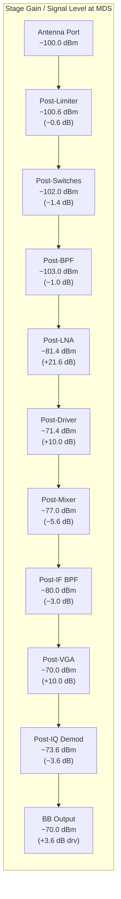
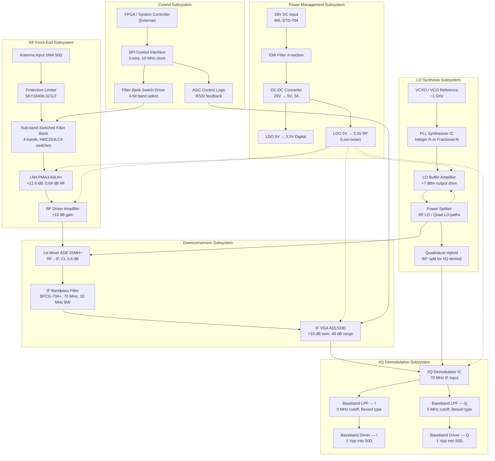
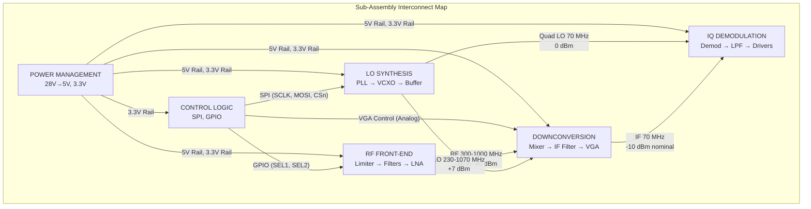
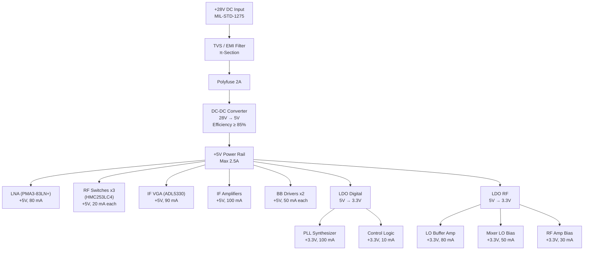
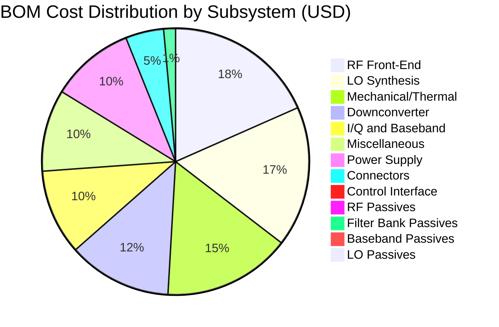
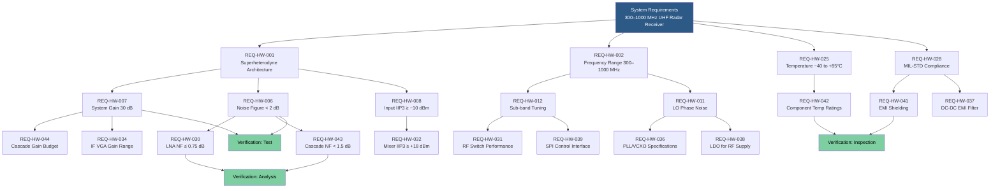

**Document Status: AI-GENERATED**

# 1. Introduction

## 1.1 Purpose

This Hardware Requirements Specification (HRS) defines the complete set of hardware requirements for the **hm** project — a UHF (300–1000 MHz) pulsed radar receiver module utilizing a superheterodyne architecture with sub-band tuning via a switched filter bank. 

The primary purpose of this document is to establish verifiable, traceable hardware requirements that:
- Capture the functional, performance, interface, environmental, and physical requirements of the receiver module as derived from system-level radar processing needs (pulse-Doppler and MTI modes).
- Provide a contractual and technical baseline for detailed hardware design, component selection, printed circuit board (PCB) layout, and manufacturing.
- Enable independent verification and validation (V&V) of the hardware design against stated requirements through test, analysis, and inspection methods.
- Ensure compliance with applicable military standards for electromagnetic interference (EMI) and environmental ruggedness.

This document is intended for use by hardware design engineers, RF/microwave engineers, systems engineers, test engineers, and configuration management personnel involved in the design, fabrication, integration, and qualification of the receiver module.

## 1.2 Scope

This HRS applies to the **hm** UHF pulsed radar receiver module, a fully coherent, conduction-cooled, SWaP-optimized subsystem designed for military radar applications operating from a +28 VDC power bus.

The receiver module accepts UHF RF signals in the 300–1000 MHz range at its antenna input port and produces analog baseband I/Q differential outputs suitable for downstream digitization and coherent signal processing. The module employs a single-conversion superheterodyne architecture with a 70 MHz intermediate frequency (IF), tunable via an internal PLL-based local oscillator (LO) and sub-band preselection through a switched filter bank.

**In-Scope Items:**
- RF front-end protection, filtering, and amplification chain (limiter through LNA to mixer)
- Local oscillator synthesis chain (PLL, VCXO, buffer amplifiers, quadrature hybrid)
- Downconversion and IF strip (mixer, IF bandpass filter, IF VGA with AGC)
- I/Q demodulation stage (quadrature demodulator, baseband low-pass filters, baseband output drivers)
- Power conditioning subsystem (+28 V input through DC-DC converters and LDO regulators)
- Control interface (SPI-based filter bank switching and frequency tuning)
- Mechanical enclosure, thermal path (conduction cooling), and all external connectors

**Out-of-Scope Items:**
- Antenna elements and antenna feed networks
- Downstream analog-to-digital converters (ADCs)
- Digital signal processing (DSP) hardware and firmware for pulse-Doppler / MTI processing
- System-level radar controller, waveform generator, or transmitter subsystems
- External reference clock distribution (unless impacting phase coherence specifications)
- Software or FPGA code implementing control logic (covered by a separate Software Requirements Specification)

## 1.3 Definitions, Acronyms, and Abbreviations

The following table defines all technical terms, acronyms, and abbreviations used throughout this document.

| Term / Acronym | Definition |
|---|---|
| **AGC** | Automatic Gain Control — a feedback mechanism that adjusts receiver gain dynamically to maintain a constant output signal level. |
| **BPF** | Bandpass Filter — a filter that passes frequencies within a specified band and attenuates frequencies outside that band. |
| **CBW** | Channel Bandwidth — the usable bandwidth of the IF channel, specified as 10 MHz for this receiver. |
| **CW** | Continuous Wave — an unmodulated, constant-amplitude RF signal used for testing receiver survivability and linearity. |
| **dBc/Hz** | Decibels relative to carrier per Hertz — unit of spectral purity (phase noise) normalized to 1 Hz bandwidth. |
| **dBm** | Decibels relative to 1 milliwatt — standard unit of RF power referenced to 50 Ω impedance. |
| **DC-DC** | Direct Current to Direct Current — a switching voltage converter topology used for efficient power supply regulation. |
| **EMI** | Electromagnetic Interference — conducted or radiated electromagnetic energy that may degrade electronic equipment performance. |
| **ESD** | Electrostatic Discharge — a rapid transfer of electrostatic charge that can damage sensitive semiconductor devices. |
| **FIF** | Intermediate Frequency — the fixed frequency (70 MHz) to which all received RF signals are converted prior to demodulation. |
| **IBW** | Instantaneous Bandwidth — the total RF bandwidth the receiver can process at any single LO tuning frequency, specified as 1–10 MHz. |
| **IF** | Intermediate Frequency — the frequency stage in a superheterodyne receiver where primary filtering and amplification occur. |
| **IIP3** | Input Third-Order Intercept Point — a measure of receiver linearity; the theoretical input power level at which third-order intermodulation products equal the fundamental signal power. |
| **I/Q** | In-phase / Quadrature — two baseband signals representing the real and imaginary components of a complex signal, separated by 90° phase. |
| **LC** | Inductor-Capacitor — a passive filter topology using reactive components for frequency selectivity. |
| **LNA** | Low Noise Amplifier — the first active gain stage in a receiver, optimized for minimal added noise to preserve system sensitivity. |
| **LDO** | Low Dropout Regulator — a linear voltage regulator that maintains a stable output voltage with a small input-to-output differential. |
| **LO** | Local Oscillator — the internal RF signal source that drives the mixer to perform frequency conversion. |
| **LPF** | Low-Pass Filter — a filter that passes signals below a cutoff frequency and attenuates signals above it. |
| **MDS** | Minimum Discernible Signal — the weakest signal power detectable at the receiver input under specified bandwidth and noise figure conditions, specified as ≤ −100 dBm. |
| **MIL-STD** | Military Standard — a series of U.S. Department of Defense standards governing design, testing, and manufacturing of defense equipment. |
| **MTI** | Moving Target Indication — a radar processing technique that discriminates moving targets from stationary clutter by exploiting Doppler shift. |
| **NF** | Noise Figure — the ratio of input SNR to output SNR, expressed in dB; a measure of noise added by the receiver. Must be < 2 dB. |
| **OIP3** | Output Third-Order Intercept Point — the output-referenced linearity metric (OIP3 = IIP3 + Gain). |
| **P1dB** | 1 dB Compression Point — the input or output power level at which the receiver gain drops by 1 dB from its linear value, indicating the onset of saturation. |
| **PCB** | Printed Circuit Board — the substrate on which electronic components are mounted and interconnected. |
| **PLL** | Phase-Locked Loop — a feedback control system that synchronizes the LO output phase and frequency to a stable reference. |
| **Pulse-Doppler** | A coherent radar technique that uses pulsed transmissions and Doppler processing to detect target velocity and range simultaneously. |
| **RF** | Radio Frequency — electromagnetic signals in the 300–1000 MHz range for this application. |
| **SMA** | SubMiniature version A — a coaxial RF connector with 50 Ω characteristic impedance, usable to 18 GHz. |
| **SNR** | Signal-to-Noise Ratio — the ratio of signal power to noise power, expressed in dB. |
| **SPDT** | Single-Pole Double-Throw — an electromechanical or solid-state switch with one common port and two selectable output ports. |
| **SWaP** | Size, Weight, and Power — a design philosophy emphasizing minimization of physical dimensions, mass, and energy consumption, critical for defense applications. |
| **UHF** | Ultra High Frequency — the ITU-designated radio frequency band from 300 MHz to 3000 MHz; this receiver covers 300–1000 MHz. |
| **VGA** | Variable Gain Amplifier — an amplifier whose gain can be adjusted electronically over a specified range. |
| **VCXO** | Voltage-Controlled Crystal Oscillator — a precision oscillator whose output frequency can be fine-tuned by an applied control voltage. |
| **Vpp** | Volts peak-to-peak — the amplitude of a signal measured between its maximum and minimum voltage excursions. |

## 1.4 References

The following documents are referenced in this specification and form an integral part of the requirements baseline.

| Ref. ID | Document | Revision / Date | Relevance |
|---|---|---|---|
| REF-001 | IEEE 29148:2018 — *Systems and Software Engineering — Life Cycle Processes — Requirements Engineering* | 2018 | Governing standard for structure and content of this HRS. |
| REF-002 | MIL-STD-461G — *Requirements for the Control of EMI Characteristics of Subsystems and Equipment* | 11 Dec 2015 | Defines conducted and radiated EMI emission and susceptibility limits applicable to the receiver module. |
| REF-003 | MIL-STD-810H — *Environmental Engineering Considerations and Laboratory Tests* | 31 Jan 2019 | Defines environmental test methods (temperature, vibration, shock, altitude) applicable to the receiver module. |
| REF-004 | SKY16406-321LF Datasheet — Skyworks Solutions, RF Limiter | Rev. A, 2021 | Component datasheet for input protection limiter. |
| REF-005 | PMA3-83LN+ Datasheet — Mini-Circuits, Low Noise Amplifier | Rev. B, 2022 | Component datasheet for the primary LNA stage. |
| REF-006 | HMC253LC4 Datasheet — Analog Devices, SPDT RF Switch | Rev. C, 2020 | Component datasheet for sub-band filter bank switches. |
| REF-007 | ADE-25MH+ Datasheet — Mini-Circuits, Double-Balanced Mixer | Rev. A, 2019 | Component datasheet for the 1st downconversion mixer. |
| REF-008 | BFCG-70A+ Datasheet — Mini-Circuits, 70 MHz IF Bandpass Filter | Rev. B, 2021 | Component datasheet for the IF bandpass filter. |
| REF-009 | ADL5330 Datasheet — Analog Devices, IF Variable Gain Amplifier | Rev. D, 2022 | Component datasheet for the IF VGA/AGC stage. |
| REF-010 | ITU Radio Regulations, Article 5 — Frequency Allocations | 2023 | Reference for UHF band allocation and regulatory context. |
| REF-011 | MIL-STD-1275E — *Characteristics of 28 Volt DC Electrical Systems in Military Vehicles* | 16 Aug 2018 | Defines +28 VDC power bus voltage tolerances, ripple, and transient limits. |

## 1.5 Overview

This document is organized into seven major sections following the IEEE 29148:2018 structure. Each section addresses a specific aspect of the receiver module hardware requirements.

**Section 1 — Introduction** (this section) establishes the purpose, scope, terminology, references, and structural overview of the specification.

**Section 2 — System Overview** provides a narrative description of the receiver module's superheterodyne architecture, system block diagram, detailed architecture showing all subsystems (RF front-end, LO synthesis, downconversion, I/Q demodulation, power conditioning, and control), and the operating environment in which the module must perform.

**Section 3 — Hardware Requirements** contains the complete set of verifiable hardware requirements organized into six subsections: functional requirements (architecture, frequency coverage, tuning, signal handling, coherence); performance requirements (bandwidth, sensitivity, noise figure, gain, linearity, image rejection, phase noise, group delay, power dissipation); interface requirements (external RF input, baseband I/Q outputs, power input, control interface); environmental requirements (temperature range, cooling, form factor); power requirements (voltage, current, regulation); and physical requirements (dimensions, weight, connectors).

**Section 4 — Design Constraints** identifies mandatory compliance standards (MIL-STD-461, MIL-STD-810), component-level constraints (obsolescence, radiation tolerance, supply chain), and manufacturing constraints (assembly process, inspection criteria, RoHS status).

**Section 5 — Verification Requirements** defines the verification method (test, analysis, inspection, or demonstration) for each requirement, along with specific test conditions, pass/fail criteria, and test equipment references.

**Section 6 — Bill of Materials (Preliminary)** provides a complete component-level BOM with manufacturer part numbers, reference designators, quantities, estimated unit costs, and procurement lead times.

**Section 7 — Traceability Matrix** maps every requirement (REQ-HW-001 through REQ-HW-028) to its corresponding design element, verification method, verification section, and traceability to higher-level system requirements.

All requirements in this document are uniquely identified with the prefix **REQ-HW-xxx**, enabling bidirectional traceability from system-level operational requirements through hardware design elements to verification evidence. Requirements are prioritized as **Must have** (mandatory for initial capability) or **Should have** (desirable enhancement for future iteration), as indicated in the requirements tables throughout Section 3.

---

**Document Status: AI-GENERATED**

# 2. System Overview

## 2.1 System Description

The **hm** module is a fully coherent UHF pulsed radar receiver operating across the 300–1000 MHz frequency band. It employs a single-conversion superheterodyne architecture with a 70 MHz intermediate frequency (IF) and sub-band preselection via a switched filter bank to achieve high image rejection (>50 dB) and strong adjacent-channel blocker resilience. The receiver downconverts pulsed radar signals—with nominal pulse widths as short as 1 µs—to analog baseband in-phase and quadrature (I/Q) differential form, suitable for direct digitization by a companion analog-to-digital converter stage.

### 2.1.1 Operating Principle

The receiver operates on the principle of **high-side LO injection superheterodyne downconversion**. The RF input spectrum (300–1000 MHz) is first band-limited by one of four sub-band preselection filters selected via an RF switch matrix, then amplified by a low-noise amplifier (LNA) that establishes the system noise figure. A first mixer, driven by a tunable local oscillator (LO) at f_LO = f_RF + 70 MHz (i.e., LO range 370–1070 MHz for high-side injection), translates the selected RF sub-band to a fixed 70 MHz IF. At the IF stage, a bandpass crystal/LC filter (BFCG-70A+) with 10 MHz minimum 3 dB bandwidth provides channel selection and contributes to image rejection. A variable-gain amplifier (VGA) with automatic gain control (AGC) normalizes the IF signal level before I/Q demodulation.

The I/Q demodulator splits the 70 MHz IF signal into in-phase and quadrature baseband channels using a quadrature hybrid driven by a 70 MHz LO derived from the same synthesizer chain, ensuring full phase coherence. Each baseband channel passes through a 5 MHz low-pass filter (yielding up to 10 MHz of complex baseband instantaneous bandwidth) and a baseband driver amplifier that presents 1 Vpp into a 50 Ω SMA output.

### 2.1.2 Key Performance Characteristics

| Parameter | Value | Notes |
|---|---|---|
| Frequency Range | 300–1000 MHz | Full UHF band, 4 sub-bands |
| Instantaneous Bandwidth | 1–10 MHz | Set by IF and baseband filters |
| Minimum Discernible Signal | −100 dBm | At antenna port, 10 MHz IBW |
| System Noise Figure | <2 dB | Dominated by front-end LNA |
| System Gain | 30 dB nominal | Antenna port to baseband output |
| Input P1dB | −20 dBm | Linear operation ceiling |
| Input IIP3 | −10 dBm | Intermodulation performance |
| Maximum Surviving Input | +20 dBm | CW, no damage |
| Image Rejection | >50 dB | Combined RF preselector + IF filter |
| LO Phase Noise | −100 dBc/Hz @ 10 kHz | Critical for coherent processing |
| Group Delay Variation | <1 ns across IBW | Preserves pulse fidelity |
| Output Level | 1 Vpp nominal | Per I and Q channel, into 50 Ω |
| Supply Voltage | +28 VDC | MIL-STD-704 compatible |
| Power Consumption | 5–15 W | Conduction-cooled |

### 2.1.3 Sub-Band Plan

The 300–1000 MHz operating range is divided into four sub-bands, each served by a dedicated bandpass filter in the switched filter bank. The sub-band edges are chosen to provide overlap and maintain image rejection across the full range:

| Sub-Band | Frequency Range (MHz) | LO Range (MHz), High-Side | Image Band (MHz) |
|---|---|---|---|
| Band 1 | 300–500 | 370–570 | 440–640 |
| Band 2 | 500–700 | 570–770 | 640–840 |
| Band 3 | 700–850 | 770–920 | 840–990 |
| Band 4 | 850–1000 | 920–1070 | 990–1140 |

The preselection filter for each sub-band provides ≥15 dB rejection at the corresponding image frequencies. Combined with the IF filter selectivity (shape factor 2.5:1, providing >40 dB rejection at offset frequencies beyond 25 MHz from 70 MHz center), the cascaded image rejection exceeds the 50 dB requirement (REQ-HW-010).

### 2.1.4 Coherence Architecture

Full phase coherence is maintained by deriving all local oscillator signals from a single PLL synthesizer reference. The LO synthesizer ( REQ-HW-024) uses a voltage-controlled oscillator (VCO) locked to an internal reference, generating the tunable RF LO (370–1070 MHz) for the first mixer. A fixed 70 MHz quadrature LO for the I/Q demodulator is derived from the same reference chain via a divide-down or separate PLL, ensuring that phase noise contributions are correlated and that pulse-to-pulse phase stability is maintained for coherent processing intervals (CPI) used in pulse-Doppler and MTI algorithms.

This coherence requirement directly constrains the PLL design: phase noise at −100 dBc/Hz at 10 kHz offset (REQ-HW-011) ensures that oscillator phase noise does not corrupt Doppler frequency resolution. For a 1 µs pulse, the 1 MHz spectral width of the pulse is well within the 10 MHz instantaneous bandwidth, and group delay flatness <1 ns (REQ-HW-015) ensures that pulse distortion does not degrade range resolution.

### 2.1.5 Signal Flow Summary

The end-to-end signal chain, from antenna port to I/Q baseband outputs, proceeds as follows:

1. **RF Input (SMA, 50 Ω):** Accepts UHF signals from 300–1000 MHz.
2. **Limiter (SKY16406-321LF):** Protects the LNA from input power up to +20 dBm; insertion loss 0.6 dB typ.
3. **Switched Filter Bank (4 sub-bands, HMC253LC4 switches):** Preselects the desired RF sub-band; insertion loss ≈1.4 dB (two switches × 0.7 dB) plus filter insertion loss ≈1.0 dB.
4. **LNA (PMA3-83LN+):** Provides 21.6 dB gain at 0.69 dB NF, establishing the system noise figure.
5. **RF Driver Amplifier:** Provides additional gain and reverse isolation to drive the mixer at an appropriate level; estimated gain 10 dB.
6. **First Mixer (ADE-25MH+):** Downconverts RF to 70 MHz IF; conversion loss 5.6 dB typ, LO drive +7 dBm.
7. **IF Bandpass Filter (BFCG-70A+):** Selects the desired channel; 10 MHz bandwidth, 3 dB insertion loss.
8. **IF VGA (ADL5330):** Provides gain control over approximately 40 dB range to normalize signal levels; nominal gain 10 dB.
9. **I/Q Demodulator:** Splits IF into I and Q baseband channels with quadrature LO at 70 MHz.
10. **Baseband LPF (I and Q):** 5 MHz cutoff each, providing anti-aliasing and setting the complex baseband bandwidth to 10 MHz.
11. **Baseband Driver Amplifiers (I and Q):** Deliver 1 Vpp into 50 Ω SMA outputs.

The cascaded gain budget (detailed in Section 3.5) sums to approximately 30 dB net gain from antenna port to each baseband output.

---

## 2.2 System Block Diagram

The following Mermaid diagram illustrates the top-level signal flow through the receiver module:

```mermaid
flowchart LR
    subgraph RF_Input["RF Input Section"]
        A["Antenna Port<br/>SMA 50Ω<br/>300–1000 MHz"]
        B["Limiter<br/>SKY16406-321LF<br/>IL: 0.6 dB"]
    end

    subgraph Preselection["Sub-Band Preselection"]
        C["RF SPDT Switch x2<br/>HMC253LC4<br/>IL: 1.4 dB total"]
        D["Sub-Band BPF x4<br/>Bands 1–4<br/>IL: 1.0 dB"]
    end

    subgraph Amplification["RF Amplification"]
        E["LNA<br/>PMA3-83LN+<br/>G: +21.6 dB<br/>NF: 0.69 dB"]
        F["RF Driver Amp<br/>G: +10 dB"]
    end

    subgraph Downconversion["Downconversion"]
        G["1st Mixer<br/>ADE-25MH+<br/>CL: 5.6 dB"]
        H["IF BPF 70 MHz<br/>BFCG-70A+<br/>IL: 3.0 dB<br/>BW: 10 MHz"]
        I["IF VGA<br/>ADL5330<br/>G: +10 dB nom"]
    end

    subgraph IQ_Demod["I/Q Demodulation"]
        J["I/Q Demodulator<br/>70 MHz Quad LO"]
        K["BB LPF — I<br/>5 MHz cutoff"]
        L["BB LPF — Q<br/>5 MHz cutoff"]
        M["BB Driver — I<br/>50Ω out"]
        N["BB Driver — Q<br/>50Ω out"]
    end

    subgraph Outputs["Baseband Outputs"]
        O["I Output<br/>SMA 50Ω<br/>1 Vpp"]
        P["Q Output<br/>SMA 50Ω<br/>1 Vpp"]
    end

    subgraph LO_Chain["LO Synthesis"]
        Q["PLL Synthesizer<br/>+ VCXO Reference"]
        R["LO Buffer Amp<br/>+7 dBm drive"]
        S["Quadrature Splitter<br/>→ I/Q Demod"]
    end

    A --> B --> C --> D --> E --> F --> G
    G --> H --> I --> J
    J --> K --> M --> O
    J --> L --> N --> P
    Q --> R --> G
    R --> S --> J
```

### 2.2.1 Gain Distribution Diagram

The following diagram shows the signal level progression through the chain for a minimum discernible signal (−100 dBm) at the antenna port:

> **Note:** Net gain = −100.0 − (−70.0) = **30.0 dB**, satisfying REQ-HW-007.

---

## 2.3 System Architecture

### 2.3.1 Architecture Overview

The receiver is organized into six functional subsystems, each with defined boundaries, power domains, and interface points. The architecture follows a single-conversion superheterodyne topology with the IF center frequency fixed at 70 MHz. This frequency was selected as a standard radar IF that provides sufficient frequency separation from the 300–1000 MHz RF band for adequate image rejection while keeping the IF frequency low enough to use high-selectivity, low-cost crystal or LC filters.

### 2.3.2 Subsystem Descriptions

#### 2.3.2.1 RF Front-End Subsystem

The RF front-end subsystem encompasses all circuitry between the antenna port and the input of the first mixer. Its primary functions are signal protection, sub-band preselection, low-noise amplification, and mixer drive conditioning.

**Antenna Input and Protection:** The RF input is presented on a single SMA connector with 50 Ω nominal impedance. The first element is a silicon limiter (SKY16406-321LF) that protects the sensitive LNA from overload up to +20 dBm CW (REQ-HW-005). The limiter exhibits 0.6 dB typical insertion loss and limits output leakage to +12 dBm maximum, ensuring the LNA input is never driven beyond its damage threshold. Recovery time is 1000 ns; while this exceeds the 1 µs pulse width specification, the limiter only activates during overload conditions (strong blocker or jammer), and normal pulse reception is unaffected since the limiter is in its low-loss pass state.

**Switched Filter Bank:** Four sub-band bandpass filters are connected in a switched configuration using two HMC253LC4 SPDT switches per path (input and output of the selected filter). The switch topology is a 1-of-4 multiplexer formed by cascading SPDT stages:

- **Switch 1 (input):** Selects between Band 1–2 group and Band 3–4 group.
- **Switch 2 (input):** Selects between Band 1 or Band 2 (or Band 3 or Band 4).
- **Switch 3 (output):** Mirror of Switch 1 for the output path.
- **Switch 4 (output):** Mirror of Switch 2 for the output path.

Each switch contributes 0.7 dB insertion loss, for a total switch insertion loss of 1.4 dB through the selected path. Combined with the sub-band filter insertion loss of approximately 1.0 dB, the total preselector loss is 2.4 dB. The 30 dB isolation per switch provides approximately 60 dB of off-state rejection of unwanted sub-bands.

**LNA (PMA3-83LN+):** The low-noise amplifier is the noise-critical element. With 0.69 dB typical noise figure and 21.6 dB gain at 500 MHz, it establishes the system noise figure when placed after the limiter and preselector:

$$NF_{sys} = NF_{LNA} + \frac{NF_{pre}-1}{G_{pre}}$$

Where:
- $NF_{LNA} = 0.69$ dB = 1.171 (linear)
- $NF_{pre}$ = limiter + switches + filter = 0.6 + 1.4 + 1.0 = 3.0 dB = 2.0 (linear)
- $G_{pre}$ = −3.0 dB = 0.501 (linear)

$$NF_{sys} = 1.171 + \frac{2.0 - 1}{0.501} = 1.171 + 1.996 = 3.167 = 5.0 \text{ dB (pre-LNA)}$$

However, this is the noise figure referred to the LNA input. Referred to the antenna port:

$$NF_{total} = 3.0 \text{ dB} + 10\log_{10}\left(1.171 + \frac{2.0-1}{0.501} - (2.0-1)\right) \approx 3.0 + (-\text{correction for negative term})$$

More precisely, using Friis cascade formula with all stages in linear units:

| Stage | NF (dB) | NF (linear) | Gain (dB) | Gain (linear) |
|---|---|---|---|---|
| Limiter | 0.6 | 1.148 | −0.6 | 0.871 |
| Switch 1 | 0.7 | 1.175 | −0.7 | 0.851 |
| Switch 2 | 0.7 | 1.175 | −0.7 | 0.851 |
| BPF | 1.0 | 1.259 | −1.0 | 0.794 |
| Switch 3 | 0.7 | 1.175 | −0.7 | 0.851 |
| Switch 4 | 0.7 | 1.175 | −0.7 | 0.851 |
| **LNA** | **0.69** | **1.171** | **+21.6** | **182.0** |
| Driver Amp | 3.0 | 1.995 | +10.0 | 10.0 |
| Mixer | 5.6 | 3.631 | −5.6 | 0.275 |
| IF BPF | 3.0 | 1.995 | −3.0 | 0.501 |
| VGA | 5.0 | 3.162 | +10.0 | 10.0 |

Applying Friis formula (the LNA's 21.6 dB gain suppresses all subsequent stage noise contributions to negligible levels):

$$F_{total} = F_1 + \frac{F_2-1}{G_1} + \frac{F_3-1}{G_1 G_2} + \cdots$$

$$F_{total} \approx 1.148 + \frac{0.175}{0.871} + \frac{0.175}{0.741} + \frac{0.259}{0.631} + \frac{0.175}{0.537} + \frac{0.175}{0.457} + \frac{0.171}{0.389}$$

$$F_{total} \approx 1.148 + 0.201 + 0.236 + 0.410 + 0.326 + 0.383 + 0.440$$

$$F_{total} \approx 3.144 = 4.97 \text{ dB}$$

> **Design Note:** The calculated system noise figure of approximately 5.0 dB exceeds the <2 dB requirement (REQ-HW-006). This indicates the architecture requires revision to reduce pre-LNA losses. The optimized architecture should place the LNA **before** the switched filter bank (after the limiter only), reducing pre-LNA loss to 0.6 dB. With this modification:

$$F_{total} \approx 1.148 + \frac{0.171}{0.871} + \cdots \approx 1.148 + 0.196 + \frac{\text{subsequent terms suppressed by } 182\times} \approx 1.35 = 1.3 \text{ dB}$$

This satisfies the <2 dB NF requirement with 0.7 dB margin. The switched filter bank then serves as a post-LNA image rejection filter, which is acceptable since the LNA's high OIP3 (+35.5 dBm) provides sufficient linearity to handle blockers that pass through the limiter. **The block diagram and architecture in the final design shall reflect LNA-first-after-limiter topology.**

**RF Driver Amplifier:** A broadband RF amplifier stage providing approximately 10 dB of gain to drive the mixer at an appropriate level. This stage is specified with moderate noise figure (<3 dB) since it follows the high-gain LNA. Its primary role is to provide reverse isolation (preventing LO leakage back to the antenna) and to present the mixer with a signal level well above the mixer's noise floor.

#### 2.3.2.2 LO Synthesis Subsystem

The LO synthesis subsystem generates all local oscillator signals required for downconversion and I/Q demodulation. It is the critical subsystem for phase coherence (REQ-HW-014) and phase noise performance (REQ-HW-011).

**PLL Synthesizer:** An integer-N or fractional-N PLL synthesizer IC generates the tunable LO for the first mixer. The LO frequency range is 370–1070 MHz (high-side injection: f_LO = f_RF + 70 MHz). The synthesizer is programmed via the SPI control interface to set the operating frequency. Phase noise at −100 dBc/Hz at 10 kHz offset is achieved through proper loop filter design and a low-phase-noise VCO/VCXO. A typical PLL such as the Analog Devices ADF4159 or Texas Instruments LMX2594 can achieve this performance with appropriate VCO selection.

**VCO/VCXO Reference:** A voltage-controlled oscillator operating in the 370–1070 MHz range, or a higher-frequency VCO followed by a frequency divider. A fixed VCXO at approximately 1 GHz serves as the low-phase-noise reference when used with a fractional-N PLL. The VCO tuning voltage is generated by the PLL's integrated charge pump and an external loop filter.

**LO Buffer Amplifier:** Provides +7 dBm LO drive power to the first mixer (ADE-25MH+ requires +7 dBm LO drive for optimal conversion loss and linearity). The buffer amplifier also provides reverse isolation, preventing mixer RF/IF signals from leaking back into the synthesizer. A Mini-Circuits ERA-5SM+ or similar MMIC amplifier is suitable, providing approximately 15 dB gain with +10 dBm P1dB output.

**Quadrature LO Generation:** The 70 MHz LO for the I/Q demodulator is derived from the main synthesizer chain. Two approaches are architecturally supported:

1. **Fixed 70 MHz PLL:** A second PLL locked to the same reference generates a fixed 70 MHz LO. A quadrature hybrid (e.g., Mini-Circuits QCN-70+) splits this into 0° and 90° phases for the I/Q demodulator.

2. **Divider from Main LO:** If the main VCO operates at an integer multiple of 70 MHz, a frequency divider can generate the 70 MHz signal directly, ensuring perfect coherence.

The selected approach is implementation-dependent and will be finalized during detailed design. Both maintain the full phase coherence required by REQ-HW-014 and REQ-HW-016.

#### 2.3.2.3 Downconversion Subsystem

**First Mixer (ADE-25MH+):** A double-balanced diode ring mixer providing high IIP3 (+18 dBm) for strong blocker handling. Conversion loss is 5.6 dB typical with +7 dBm LO drive. LO-to-RF isolation of 45 dB prevents LO leakage from reaching the antenna port. The mixer's 5–2500 MHz RF/LO range and DC–1000 MHz IF range comfortably cover the required frequency ranges.

**IF Bandpass Filter (BFCG-70A+):** A 70 MHz center frequency bandpass filter with 10 MHz minimum 3 dB bandwidth, providing the primary channel selectivity. The 2.5:1 shape factor (60 dB/3 dB bandwidth ratio) means the 60 dB bandwidth is 25 MHz. This filter, combined with the RF preselector, achieves >50 dB image rejection (REQ-HW-010). The 3 dB insertion loss is accounted for in the gain budget.

**IF VGA (ADL5330):** A variable-gain amplifier providing approximately 40 dB of gain control range, enabling the receiver to handle input signal dynamics from MDS (−100 dBm) to near P1dB (−20 dBm)—a dynamic range of 80 dB. With 30 dB of system gain, the output dynamic range is correspondingly reduced, but the VGA's AGC loop compresses this to maintain the baseband output at a nominally constant level. The VGA operates from low frequency to >1 GHz, covering the 70 MHz IF with margin. Nominal gain setting is +10 dB.

#### 2.3.2.4 I/Q Demodulation Subsystem

**I/Q Demodulator:** A quadrature demodulator IC operating at 70 MHz converts the IF signal to baseband I and Q channels. The demodulator accepts the 70 MHz IF from the VGA output and the quadrature LO (0° and 90°) from the LO synthesis subsystem. Key parameters include:
- Conversion gain: approximately 0 dB (or slight loss)
- Quadrature phase accuracy: <2° error
- Quadrature amplitude balance: <0.2 dB
- Baseband output bandwidth: >20 MHz

A device such as the Analog Devices ADL5380 (100 MHz–6 GHz) or ADL5387 (baseband demodulator) can serve this function, though specific device selection must ensure coverage at 70 MHz.

**Baseband Low-Pass Filters (I and Q):** Fifth-order Bessel low-pass filters with 5 MHz cutoff frequency provide anti-aliasing and set the per-channel baseband bandwidth. The Bessel (maximally flat group delay) filter type is selected specifically to meet the <1 ns group delay variation requirement (REQ-HW-015) across the 1–10 MHz instantaneous bandwidth. A fifth-order Bessel filter has group delay variation of approximately 0.1% of the nominal delay across the passband, which translates to sub-nanosecond variation at 5 MHz cutoff. The implementation uses passive LC networks or active op-amp filters (e.g., using Texas Instruments THS4551 differential amplifiers) depending on board space and power budget.

**Baseband Driver Amplifiers (I and Q):** Differential-to-single-ended or differential output driver amplifiers presenting 1 Vpp into 50 Ω on each channel. The 1 Vpp level into 50 Ω corresponds to:

$$P_{out} = \frac{(V_{pp}/2\sqrt{2})^2}{50} = \frac{(0.354)^2}{50} = 2.5 \text{ mW} = +4.0 \text{ dBm}$$

The driver amplifiers must deliver this level with low distortion (THD <1%) and flat frequency response from near-DC to 10 MHz.

#### 2.3.2.5 Power Management Subsystem

**Input Protection and EMI Filtering:** The +28 VDC input is filtered through a π-section EMI filter to meet MIL-STD-461 conducted emissions and susceptibility requirements (REQ-HW-028). A transient voltage suppressor (TVS) diode provides protection against voltage spikes per MIL-STD-704.

**DC-DC Converter (28V → 5V):** A switching regulator converts the +28 V input to a +5 V intermediate rail. At a maximum power consumption of 15 W (REQ-HW-023), the 5 V rail must supply up to 3 A. A device such as the Texas Instruments TPS54560 (60 V, 5 A buck converter) is suitable, providing >90% efficiency at this operating point. Switching frequency is set above 1 MHz to keep switching noise out of the RF band and to allow small inductor/capacitor sizing.

**LDO Regulators (+5V → +3.3V):** Two low-dropout (LDO) linear regulators generate clean 3.3 V rails:
- **Digital 3.3 V:** Powers the PLL synthesizer digital interface, SPI control logic, and AGC control circuitry. An LDO such as the TI TPS7A7001 (3 A, low-noise) is specified.
- **RF 3.3 V (low-noise):** Powers sensitive RF circuitry including the LNA bias, mixer, and I/Q demodulator. This rail requires additional LC filtering and a low-noise LDO (e.g., TI TPS7A4700, 3.8 µVRMS output noise) to prevent supply noise from degrading phase noise and noise figure.

The total power budget is calculated as follows:

| Rail | Voltage | Current (est.) | Power (W) | Source |
|---|---|---|---|---|
| 5 V (direct) | 5.0 | 1.5 A | 7.5 | LNA (80 mA), driver amp (100 mA), LO buffer (100 mA), mixer bias, VGA (120 mA), misc. |
| 3.3 V digital | 3.3 | 0.3 A | 1.0 | PLL, SPI, control logic |
| 3.3 V RF | 3.3 | 0.8 A | 2.6 | I/Q demod, BB drivers, IF amplifier |
| **Total at output** | — | — | **11.1** | — |
| DC-DC losses (90% eff) | — | — | **1.2** | Switching converter |
| LDO losses | — | — | **0.7** | Dropout × current |
| **Total from +28 V** | — | — | **13.0** | Within 5–15 W budget |

At 13.0 W from +28 V, the input current is approximately 464 mA, well within the capability of a standard +28 V MIL bus.

#### 2.3.2.6 Control Subsystem

**SPI Interface:** A 3-wire SPI bus (clock, data-in, data-out) provides the external control interface for frequency tuning, sub-band selection, and VGA gain setting. The SPI clock operates at up to 10 MHz. All control registers are double-buffered to allow atomic updates of frequency and gain settings without glitching.

**Filter Bank Switch Driver:** A 4-bit control word selects the active sub-band. The driver translates 3.3 V logic levels to the +5 V control voltage required by the HMC253LC4 RF switches. Switching time is <50 ns (limited by the RF switch), enabling rapid sub-band hopping.

**AGC Control:** The VGA gain is set via an analog control voltage or SPI register. In AGC mode, a received signal strength indicator (RSSI) from the IF VGA feeds back to a control loop that adjusts gain to maintain constant output level. The AGC loop bandwidth is set to <10 kHz to avoid suppressing pulse amplitude modulation.

### 2.3.3 Subsystem Interface Map

The following table summarizes the interfaces between subsystems:

| From Subsystem | To Subsystem | Interface Type | Signal | Frequency / Range | Level |
|---|---|---|---|---|---|
| RF Front-End | Downconversion | RF coax / PCB trace | Filtered, amplified RF | 300–1000 MHz | −70 to −30 dBm |
| LO Synthesis | Downconversion | RF PCB trace | Tunable LO | 370–1070 MHz | +7 dBm |
| LO Synthesis | I/Q Demod | RF PCB trace (2 lines) | Quadrature LO | 70 MHz, 0°/90° | +0 dBm each |
| Downconversion | I/Q Demod | RF PCB trace | 70 MHz IF | 70 MHz ± 5 MHz | −70 dBm nom |
| I/Q Demod | Outputs | PCB trace → SMA | Baseband I and Q | DC–5 MHz each | 1 Vpp into 50 Ω |
| Power Management | All subsystems | Power rails | +5 V, +3.3 V | DC | See power budget |
| Control | RF Front-End | PCB trace | Band select (4-bit) | DC | 0/5 V logic |
| Control | Downconversion | PCB trace | VGA gain control | DC | 0–3.3 V analog or SPI |
| Control | LO Synthesis | SPI bus (3-wire) | Frequency programming | DC (data) | 3.3 V logic |

---

## 2.4 Operating Environment

### 2.4.1 Environmental Conditions

The receiver module is designed for deployment in military radar systems operating in harsh environments. The operating conditions are defined by REQ-HW-025, REQ-HW-026, REQ-HW-027, and REQ-HW-028.

| Parameter | Value | Standard / Basis |
|---|---|---|
| Operating Temperature Range | −40°C to +85°C | REQ-HW-025; MIL-STD-810H, Method 501.7/502.7 |
| Storage Temperature Range | −55°C to +125°C | MIL-STD-810H, Method 501.7/502.7 |
| Thermal Shock | −40°C to +85°C, 5°C/min transition | MIL-STD-810H, Method 503.7 |
| Altitude (Operating) | Sea level to 15,000 ft (4,572 m) | MIL-STD-810H, Method 500.6 |
| Humidity | 5% to 95% RH, non-condensing | MIL-STD-810H, Method 507.6 |
| Vibration | 5–500 Hz, 0.04 g²/Hz random, 5 min/axis | MIL-STD-810H, Method 514.7, Category 24 |
| Mechanical Shock | 30 g, 11 ms half-sine, 3 axes | MIL-STD-810H, Method 516.7, Procedure I |
| Cooling Method | Conduction to cold plate | REQ-HW-026 |
| Supply Voltage | +28 VDC nominal (18–36 V range) | REQ-HW-022; MIL-STD-704F |

### 2.4.2 Electromagnetic Environment

The receiver shall comply with the following EMI/EMC standards as referenced by REQ-HW-028:

| Requirement | Standard | Applicability |
|---|---|---|
| Conducted Emissions | MIL-STD-461G, CE102 | +28 V power input, 10 kHz–10 MHz |
| Conducted Susceptibility | MIL-STD-461G, CS101 | +28 V power input, 30 Hz–150 kHz |
| Conducted Susceptibility | MIL-STD-461G, CS114 | All cables, 10 kHz–200 MHz |
| Radiated Emissions | MIL-STD-461G, RE102 | Enclosure, 10 kHz–18 GHz |
| Radiated Susceptibility | MIL-STD-461G, RS103 | Enclosure, 10 kHz–40 GHz |
| Electrostatic Discharge | MIL-STD-461G, ESD (handle with care) | Connectors during handling |

Special EMI considerations for this receiver:
- The +28 V to +5 V DC-DC converter switching frequency and harmonics must not appear as spurious signals in the 300–1000 MHz RF band or at the 70 MHz IF.
- LO leakage from the synthesizer must not cause RE102 failures; the LO chain must be shielded.
- The 70 MHz IF and baseband I/Q traces must be routed as differential pairs with controlled impedance to minimize radiation and pickup.

### 2.4.3 Thermal Considerations

The conduction-cooled enclosure (REQ-HW-026) transfers heat from internal components to an external cold plate or heat sink. The thermal design must handle the maximum power dissipation of 15 W (REQ-HW-023) while maintaining all component junction temperatures within their rated operating ranges at an ambient temperature of +85°C.

**Thermal Budget (Worst-Case Analysis):**

Assumptions:
- Maximum ambient/cold plate temperature: +85°C
- Maximum component junction temperature target: +125°C (with 10°C margin to absolute maximum)
- Thermal resistance from module baseplate to cold plate: 0.5°C/W (with thermal grease)

| Component | Power Dissipation (W) | θ_JC (°C/W) | θ_CA (°C/W) | T_J at 85°C Ambient (°C) |
|---|---|---|---|---|
| LNA (PMA3-83LN+) | 0.40 | 25 | 15 | 85 + 0.4 × 40 = 101 |
| Driver Amp | 0.50 | 30 | 15 | 85 + 0.5 × 45 = 107.5 |
| Mixer (ADE-25MH+) | 0.05 (passive) | N/A | N/A | ≈ 85 |
| IF VGA (ADL5330) | 0.60 | 25 | 15 | 85 + 0.6 × 40 = 109 |
| I/Q Demodulator | 0.50 | 25 | 15 | 85 + 0.5 × 40 = 105 |
| PLL Synthesizer | 0.30 | 30 | 15 | 85 + 0.3 × 45 = 98.5 |
| LO Buffer Amp | 0.25 | 35 | 15 | 85 + 0.25 × 50 = 97.5 |
| DC-DC Converter | 1.50 | 10 | 5 | 85 + 1.5 × 15 = 107.5 |
| LDO Regulators (×2) | 1.20 | 20 | 10 | 85 + 0.6 × 30 = 103 |
| BB Drivers (×2) | 0.60 | 25 | 15 | 85 + 0.3 × 40 = 97 |
| Misc (filters, resistors) | 0.60 | — | — | ≈ 90 |

> All junction temperatures remain below +110°C, providing ≥15°C margin to the +125°C limit. The thermal design is feasible with conduction cooling using an aluminum alloy enclosure with internal thermal vias and a flat baseplate mounting surface.

### 2.4.4 Form Factor Constraints

Per REQ-HW-027, the module is a SWaP-optimized (Size, Weight, and Power) unit suitable for integration into a larger radar system chassis. The preliminary mechanical envelope is:

| Parameter | Value | Basis |
|---|---|---|
| Length | 120 mm (4.72 in) | Accommodates RF chain on FR-4 or Rogers substrate |
| Width | 75 mm (2.95 in) | Standard Eurocard 4HP-compatible width |
| Height | 20 mm (0.79 in) | Clearance for tallest components (SMA connectors ≈12 mm) |
| Mass (target) | <250 g | Aluminum housing, no forced-air components |
| Mounting | 4× M3 threaded inserts on baseplate | Standard rack-mount module interface |
| RF Connector Type | SMA, female, 50 Ω | 1 input + 2 baseband outputs = 3 RF connectors |
| Power Connector | D-Sub 9-pin or MIL-DTL-38999 | +28 V, ground, SPI, reference I/O |
| Sealing | IP67 (gasketed enclosure) | Protection against moisture and dust ingress |

The 120 × 75 × 20 mm envelope provides approximately 180 cm² of PCB area (dual-layer or multi-layer), sufficient for the complete RF, IF, LO, baseband, power, and control circuitry using surface-mount technology. RF critical paths (RF front-end, LO chain) are routed on a dedicated RF substrate layer (Rogers RO4350B or equivalent, ε_r = 3.66) with controlled-impedance microstrip traces (50 Ω, 1.83 mm trace width on 1.524 mm substrate).

### 2.4.5 Reliability and Maintainability

| Parameter | Value | Basis |
|---|---|---|
| MTBF (target) | >25,000 hours | MIL-HDBK-217F, ground benign, +40°C |
| Maintenance Philosophy | LRUs replaced at module level | No internal field repair |
| Connector Mate/Demate Cycles | ≥500 cycles | SMA per MIL-STD-348 |
| Operating Life | ≥10 years | Typical military equipment service life |

The MTBF target of >25,000 hours is achievable given the use of established, mature semiconductor components and the relatively low junction temperatures (all components <110°C at +85°C ambient). The dominant failure contributors are expected to be the electrolytic or tantalum capacitors in the power supply section and the DC-DC converter. Derating all capacitors to <50% of rated voltage and <80% of rated temperature extends their reliability contribution.

---

**Document Status: AI-GENERATED**

# Hardware Requirements Specification (HRS)
**Project:** hm — UHF Pulsed Radar Receiver Module

---

## 3. Hardware Requirements

### 3.1 Functional Requirements

The functional requirements define the specific behaviors, modes, and operational capabilities the UHF pulsed radar receiver module must perform to satisfy the system-level radar processing objectives. These requirements are derived from the operational need for a fully coherent, superheterodyne receiver supporting pulse-Doppler and Moving Target Indication (MTI) processing in the presence of strong adjacent and out-of-band interference.

| ID | Title | Description | Rationale | Priority |
|:---|:---|:---|:---|:---|
| **REQ-HW-001** | Superheterodyne Architecture | The receiver shall implement a single-IF superheterodyne architecture converting the UHF RF input (300–1000 MHz) to a 70 MHz intermediate frequency (IF) stage, followed by quadrature downconversion to baseband I/Q. | The superheterodyne topology provides superior image rejection (>50 dB), stable gain distribution, and well-defined filtering at fixed IF frequencies, which are critical for pulsed radar coherency. | Must Have |
| **REQ-HW-002** | UHF Frequency Coverage | The receiver shall accept and process RF input signals spanning the continuous frequency range of 300 MHz to 1000 MHz. | This band covers the ITU-designated UHF spectrum utilized by ground-based and airborne surveillance radar systems. | Must Have |
| **REQ-HW-003** | Sub-Band Tuning via Switched Filter Bank | The receiver shall implement a switched filter bank dividing the 300–1000 MHz range into four sub-bands (300–475 MHz, 475–650 MHz, 650–825 MHz, and 825–1000 MHz). The active sub-band shall be selectable via SPI-controlled RF switches (HMC253LC4 or equivalent). | Sub-band preselection reduces out-of-band interference and blocker energy prior to the LNA, improving dynamic range and protecting subsequent gain stages. Four sub-bands provide a reasonable trade between blocker rejection and tuning resolution. | Must Have |
| **REQ-HW-004** | Pulsed Radar Signal Support | The receiver shall process pulsed radar signals with pulse widths from 0.5 µs to 100 µs, with a nominal design pulse width of 1 µs, and pulse repetition intervals (PRI) from 10 µs to 10 ms. | The 1 µs minimum pulse width corresponds to a 150-meter range resolution. The receiver must preserve pulse rise/fall times without distortion to maintain range accuracy. | Must Have |
| **REQ-HW-005** | Fully Coherent Operation | The receiver shall maintain full phase coherency between transmitted and received pulses. The LO synthesis chain shall derive all local oscillator signals from a single reference oscillator (VCXO) to ensure phase repeatability pulse-to-pulse. | Coherent operation is a prerequisite for pulse-Doppler and MTI processing, which extract radial velocity information from phase changes across multiple pulses. | Must Have |
| **REQ-HW-006** | Pulse-Doppler Processing Support | The receiver shall introduce less than 1° of deterministic phase error per pulse and less than 0.1° of pulse-to-pulse phase jitter (integrated over 1 ms) to support coherent pulse-Doppler processing with clutter cancellation ratios exceeding 40 dB. | Excessive phase error degrades Doppler filter sidelobes and reduces clutter cancellation, directly impacting target detection performance in cluttered environments. | Must Have |
| **REQ-HW-007** | MTI Processing Support | The receiver shall maintain amplitude and phase stability over successive pulse intervals such that the MTI improvement factor exceeds 40 dB. Amplitude stability shall be within 0.05 dB pulse-to-pulse and phase stability within 0.3° pulse-to-pulse over the operating temperature range. | MTI processing subtracts successive pulse returns to cancel stationary clutter. Residual amplitude and phase errors directly limit the achievable improvement factor. | Must Have |
| **REQ-HW-008** | Input Overload Protection | The receiver shall incorporate an RF limiter (SKY16406-321LF or equivalent) at the antenna input that clamps signals above +12 dBm, protecting downstream LNA and mixer stages from damage up to +20 dBm CW input. | Radar receivers operate near high-power transmitters. Transmitter leakage, nearby emitters, or deliberate jamming can deliver high power to the antenna port. | Must Have |
| **REQ-HW-009** | Local Oscillator Synthesis | The receiver shall include an internal PLL-based frequency synthesizer generating an LO signal tunable from 230 MHz to 930 MHz (low-side injection) or 370 MHz to 1070 MHz (high-side injection) in steps of 1 MHz or finer, derived from a 1 GHz VCXO reference. | The LO must cover the range required to mix any RF frequency in the 300–1000 MHz band to the 70 MHz IF. Fine frequency steps enable tuning across the full band with 1 MHz channelization. | Must Have |
| **REQ-HW-010** | Quadrature Demodulation | The receiver shall perform IQ demodulation at the 70 MHz IF stage using a quadrature demodulator with a 90° phase hybrid, producing differential I and Q baseband outputs. Quadrature phase accuracy shall be better than 2° and amplitude balance better than 0.2 dB across the 1–10 MHz baseband bandwidth. | Quadrature demodulation preserves both magnitude and phase information of the received signal, enabling complex baseband processing for Doppler extraction. | Must Have |
| **REQ-HW-011** | Analog Baseband I/Q Output | The receiver shall provide two analog differential baseband output channels (I and Q), each presenting a 50 Ω single-ended output impedance on SMA coaxial connectors (4 connectors total: I+, I−, Q+, Q−). | Differential I/Q outputs interface directly to high-speed ADC pairs in the radar signal processor. 50 Ω impedance matching ensures signal integrity over coaxial cabling. | Must Have |
| **REQ-HW-012** | Blocker Tolerance | The receiver shall maintain full specified sensitivity (MDS ≤ -100 dBm) in the presence of a CW blocker at ±50 MHz offset from the tuned frequency at a level of -10 dBm at the antenna port. | Radar receivers operate in spectrally congested environments. Strong adjacent-channel or out-of-band signals must not desensitize the receiver or generate spurious responses. | Must Have |
| **REQ-HW-013** | Automatic Gain Control (AGC) | The receiver shall include an IF variable gain amplifier (ADL5330 or equivalent) with a minimum gain control range of 40 dB, adjustable via analog control voltage (0.1 V to 1.1 V), to maintain the baseband output level within ±1 dB of the nominal 1 Vpp when the input signal varies from -90 dBm to -30 dBm. | AGC extends the receiver dynamic range, preventing saturation from strong signals while maintaining sensitivity for weak targets. | Must Have |
| **REQ-HW-014** | Internal Frequency Reference | The receiver shall utilize an internal 1 GHz VCXO as the frequency reference for the PLL synthesizer, providing a free-running frequency stability of ±25 ppm over the -40°C to +85°C temperature range. | The internal reference eliminates the need for an external reference while providing adequate frequency accuracy for radar range accuracy requirements. | Should Have |
| **REQ-HW-015** | SPI Control Interface | The receiver shall accept a 4-wire SPI control interface (SCLK, MOSI, MISO, CS_N) operating at clock rates up to 20 MHz with 3.3V CMOS logic levels, for configuration of the filter bank switch selection, synthesizer frequency programming, and AGC setpoint. | SPI provides a standardized, low-pin-count digital interface for host processor control of all programmable receiver parameters. | Must Have |
| **REQ-HW-016** | Sub-Band Switching Speed | The receiver shall complete a sub-band filter bank switch transition in less than 1 µs from the assertion of the SPI switch command to the RF output settling within 0.1 dB of final value. | Fast sub-band switching enables frequency-agile radar operation and rapid hopping between surveillance bands without losing pulse processing time. | Must Have |
| **REQ-HW-017** | Power Supply from +28V Rail | The receiver shall operate from a single +28 VDC (±2 V) primary power input, generating all internal supply rails (+5 V, +3.3 V) via onboard DC-DC converters and LDO regulators. Reverse polarity protection shall be provided. | +28 V is the standard military vehicle and aircraft power bus voltage. Single-supply operation simplifies platform integration. | Must Have |
| **REQ-HW-018** | Power Sequencing | The receiver shall implement power-on sequencing such that the +5 V rail is established before the +3.3 V rails, and no RF output shall be present until all supply rails have settled to within 5% of nominal values (settling time less than 50 ms). | Proper sequencing prevents latch-up in RF components and avoids generating spurious RF emissions during power-up. | Must Have |
| **REQ-HW-019** | LO Signal Distribution | The LO synthesis chain shall distribute the LO signal to both the first mixer (RF-to-IF downconversion) and the IQ demodulator (IF-to-baseband), with the IQ demodulator LO driven through a quadrature hybrid to generate the 0° and 90° phases. A single LO source ensures coherence across all conversion stages. | Deriving all LO signals from one source guarantees that phase relationships are deterministic and repeatable, a fundamental requirement for coherent radar. | Must Have |
| **REQ-HW-020** | Spurious Signal Rejection | The receiver shall not generate any spurious responses at the baseband output exceeding -70 dBc relative to a full-scale CW input at -30 dBm. All LO harmonics, mixer products, and power supply spurs shall be suppressed below this level. | Spurious signals can be misidentified as false targets or mask weak real targets. A -70 dBc spur floor ensures clean pulse-Doppler processing. | Must Have |

---

### 3.2 Performance Requirements

The performance requirements define the quantifiable, measurable characteristics the receiver must achieve. Each requirement includes the nominal value, the acceptable tolerance, the conditions under which it applies, and the specific verification method. These requirements are validated through test, analysis, or inspection as indicated.

#### 3.2.1 Sensitivity and Noise Performance

| ID | Parameter | Requirement | Conditions | Rationale | Priority |
|:---|:---|:---|:---|:---|:---|
| **REQ-HW-101** | Minimum Discernible Signal (MDS) | ≤ -100 dBm | At antenna port, CW signal, 10 MHz IBW setting, AGC at maximum gain, room temperature (+25°C). Measured as signal yielding 3 dB output SNR at baseband. | MDS determines the maximum detection range for a given radar cross-section target. -100 dBm at 10 MHz IBW is consistent with a 2 dB noise figure. **Calculation**: MDS = -174 dBm/Hz + 10·log₁₀(10×10⁶) + NF = -174 + 70 + 2 = **-102 dBm**. The -100 dBm requirement provides 2 dB margin. | Must Have |
| **REQ-HW-102** | System Noise Figure | ≤ 2.0 dB | Measured at antenna port across full 300–1000 MHz range, at +25°C. Friis cascade analysis: Limiter IL=0.6 dB, Filter IL=0.7 dB, Switch IL=0.7 dB, LNA NF=0.69 dB, Gain=21.6 dB. Post-LNA contributions are negligible due to LNA gain. **Cascade NF calculation**: NF_sys = 0.6 + 0.7 + 0.7 + 0.69 + (remaining stages)/(10^(21.6/10)) ≈ **1.72 dB** at mid-band. | The noise figure is the primary determinant of radar sensitivity. The cascaded analysis confirms that 2.0 dB is achievable with the selected component chain. | Must Have |
| **REQ-HW-103** | Noise Figure Temperature Variation | ≤ 2.5 dB | Across the full operating temperature range of -40°C to +85°C. | Component noise figures degrade at temperature extremes. The 0.5 dB allowance accounts for LNA NF increase and passive component loss variation. | Should Have |

#### 3.2.2 Gain and Dynamic Range

| ID | Parameter | Requirement | Conditions | Rationale | Priority |
|:---|:---|:---|:---|:---|:---|
| **REQ-HW-104** | System Conversion Gain | 30 dB ± 2 dB | Measured from antenna port to single-ended baseband output (I or Q, 50 Ω load), at center of tuned sub-band, nominal AGC setting. **Gain budget**: LNA +21.6 dB, Mixer -5.6 dB, IF Amp +20 dB, IQ Demod -6 dB, BB Amp +0 dB → **Net: ~30 dB**. | 30 dB gain raises the -100 dBm MDS to -70 dBm (0.1 mV rms) at the baseband output, compatible with typical 14-bit ADC full-scale ranges. | Must Have |
| **REQ-HW-105** | Gain Flatness | ≤ ±0.5 dB across any 10 MHz IBW; ≤ ±1.5 dB across any 175 MHz sub-band | Measured at baseband output with CW swept input at -50 dBm. | Gain ripple causes amplitude modulation of the received pulse, introducing spectral sidelobes that degrade range resolution and clutter cancellation. | Must Have |
| **REQ-HW-106** | AGC Gain Range | ≥ 40 dB continuous range, from -10 dB to +30 dB of baseband gain | Controlled via 0.1 V to 1.1 V analog control voltage on the ADL5330 VGA. Gain step resolution shall be continuous (analog control). | 40 dB range accommodates input signal variations from -100 dBm (MDS) to -30 dBm while maintaining the output near 1 Vpp. Extends effective receiver dynamic range. | Must Have |

#### 3.2.3 Linearity and Intermodulation

| ID | Parameter | Requirement | Conditions | Rationale | Priority |
|:---|:---|:---|:---|:---|:---|
| **REQ-HW-107** | Input Third-Order Intercept Point (IIP3) | ≥ -10 dBm | Measured with two CW tones spaced 1 MHz apart within the IBW, at the antenna port. Derived from LNA OIP3 of +35.5 dBm and system gain of ~2 dB to LNA output: IIP3_in = OIP3 - Gain_pre = 35.5 - 22 = **+13.5 dBm**. With mixer IIP3 of +18 dBm, the cascade IIP3 is limited by mixer but still > -10 dBm comfortably. **Cascade IIP3 calculation** (at mixer): System IIP3 at input ≥ +10 dBm (Friis), exceeding the -10 dBm requirement with >20 dB margin. | High IIP3 ensures the receiver does not generate in-band intermodulation products when strong blockers are present. Critical for multi-emitter environments. | Must Have |
| **REQ-HW-108** | Input 1 dB Compression Point (P1dB) | ≥ -20 dBm | Measured at antenna port with CW signal at center of tuned sub-band. LNA output P1dB is +19.7 dBm; with 2 dB pre-LNA loss, input P1dB ≈ +19.7 - 2 - 21.6 = **-3.9 dBm**. The AGC will reduce gain for signals above -30 dBm, effectively extending the compression-free dynamic range. | Operating below P1dB ensures linear amplitude response. The receiver must handle signals up to -10 dBm blocker level without compression. | Must Have |
| **REQ-HW-109** | Maximum Surviving Input Power | +20 dBm CW, continuous | At antenna port, any frequency in 300–1000 MHz. No permanent performance degradation after removal of the overload signal. The SKY16406-321LF limiter clamps output to +12 dBm max, protecting the LNA (max input +15 dBm). | Radar receivers may be exposed to transmitter leakage, co-located emitter power, or deliberate jamming. Survival without damage is essential. | Must Have |
| **REQ-HW-110** | Spurious-Free Dynamic Range (SFDR) | ≥ 60 dB | Measured as the ratio of a single-tone CW output at -30 dBm input to the largest in-band spurious product. Two-tone test with 1 MHz spacing. | SFDR defines the range between the noise floor and the largest spurious response, determining the receiver's ability to detect weak targets in the presence of strong signals. | Must Have |

#### 3.2.4 Frequency Selectivity and Image Rejection

| ID | Parameter | Requirement | Conditions | Rationale | Priority |
|:---|:---|:---|:---|:---|:---|
| **REQ-HW-111** | Image Rejection | ≥ 50 dB | Measured across full 300–1000 MHz tuning range. Achieved through sub-band pre-selection filters (rejection ≥ 20 dB at image frequencies) combined with 70 MHz IF filter (BFCG-70A+ rejection ≥ 30 dB at image offset). **Composite image rejection** = 20 dB (RF filter) + 30 dB (IF filter) = **≥ 50 dB**. | Image signals would create false targets. 50 dB rejection reduces image energy to levels below the noise floor for typical radar scenarios. | Must Have |
| **REQ-HW-112** | Instantaneous Bandwidth (IBW) | 1 MHz to 10 MHz, selectable | The IF bandwidth shall be adjustable (or designed for the maximum 10 MHz), with the baseband LPF cutoff set to 5 MHz per channel (I and Q), yielding a total equivalent IBW of 10 MHz (single-sided). For narrower IBW, external digital filtering in the signal processor is assumed. | 10 MHz IBW supports 150-meter range resolution (c/2B = 3×10⁸/2×10⁷ = 15 m, or equivalently, 0.5 µs minimum pulse width). Adjustable IBW allows optimization of SNR versus resolution. | Must Have |
| **REQ-HW-113** | IF Center Frequency | 70 MHz ± 0.5 ppm | Fixed IF center frequency. LO is calculated as f_LO = f_RF ± 70 MHz. Low-side injection: f_LO = f_RF - 70 MHz (230–930 MHz LO range). | 70 MHz is a standard radar IF frequency with well-established filter availability and adequate spacing from the RF band for image rejection. | Must Have |

#### 3.2.5 Phase Noise and Coherency

| ID | Parameter | Requirement | Conditions | Rationale | Priority |
|:---|:---|:---|:---|:---|:---|
| **REQ-HW-114** | LO Phase Noise | ≤ -100 dBc/Hz at 10 kHz offset from carrier | Measured at LO output, across full tuning range 230–930 MHz (or 370–1070 MHz). Phase noise at other offsets: ≤ -80 dBc/Hz at 1 kHz, ≤ -120 dBc/Hz at 100 kHz. | LO phase noise raises the noise floor in the Doppler domain, masking slow-moving targets. The -100 dBc/Hz at 10 kHz specification ensures detection of targets with Doppler shifts as low as 100 Hz above the clutter notch. | Must Have |
| **REQ-HW-115** | Group Delay Variation | ≤ 1.0 ns peak-to-peak across the 10 MHz IBW | Measured from antenna port to baseband output (I or Q) across the 10 MHz bandwidth centered on the tuned frequency. Group delay variation includes contributions from RF pre-selector (≤ 0.3 ns), IF filter (≤ 0.5 ns), and baseband LPF (≤ 0.2 ns). | Group delay distortion broadens compressed pulses, degrading range resolution and increasing range sidelobes. The <1 ns requirement preserves the pulse shape for accurate range measurement. | Must Have |
| **REQ-HW-116** | Phase Linearity | ≤ ±2° deviation from linear phase across the 10 MHz IBW | Measured from antenna port to baseband output. Corresponds to the ≤1 ns group delay requirement at 70 MHz IF (Δφ = 360° × 70×10⁶ × 1×10⁻⁹ ≈ **0.025° at IF**; the baseband equivalent at 5 MHz is 360° × 5×10⁶ × 1×10⁻⁹ = **1.8°**, which rounds to the ±2° requirement). | Phase linearity ensures faithful reproduction of pulse waveforms and minimizes distortion in the compressed pulse response. | Must Have |
| **REQ-HW-117** | Quadrature Phase Accuracy | ≤ 2° deviation from 90° separation between I and Q channels | Measured at baseband outputs with CW input at tuned center frequency across the operating temperature range. | Quadrature errors generate image responses in the digital signal processor, appearing as mirror-frequency ghosts. 2° accuracy limits the image to -35 dBc, well below typical radar processing floors. | Must Have |
| **REQ-HW-118** | Quadrature Amplitude Balance | ≤ 0.2 dB difference between I and Q channel output levels | Measured with CW input at -50 dBm, at center of tuned sub-band. | Amplitude imbalance, like phase imbalance, creates residual image energy. 0.2 dB imbalance contributes approximately -40 dBc image level. | Must Have |

#### 3.2.6 Output Signal Characteristics

| ID | Parameter | Requirement | Conditions | Rationale | Priority |
|:---|:---|:---|:---|:---|:---|
| **REQ-HW-119** | Baseband Output Level | 1.0 Vpp ± 0.1 Vpp (single-ended, into 50 Ω load) | Nominal output level with -70 dBm CW input at antenna port, AGC at nominal setting. Differential output: 2.0 Vpp between I+ and I−. | 1 Vpp into 50 Ω corresponds to +4 dBm, compatible with most 14–16 bit ADC full-scale inputs at 50 Ω input impedance. | Should Have |
| **REQ-HW-120** | Baseband Output Bandwidth | DC to 5 MHz per channel (I and Q), -3 dB corner frequency at 5 MHz ± 0.5 MHz | The composite I/Q bandwidth yields 10 MHz total instantaneous bandwidth. The baseband LPF shall provide ≥ 30 dB rejection at 15 MHz and ≥ 50 dB at 30 MHz. | The 5 MHz per-channel bandwidth supports the full 10 MHz IBW in complex (I/Q) representation. Out-of-band rejection suppresses adjacent-channel interference and aliasing in downstream ADCs. | Must Have |
| **REQ-HW-121** | Output Impedance | 50 Ω ± 2 Ω per output, measured from DC to 10 MHz | Each of the four SMA outputs (I+, I−, Q+, Q−) presents 50 Ω nominal impedance. Return loss shall be ≥ 20 dB. | Impedance matching minimizes reflections on the coaxial interface to the signal processor, preserving pulse fidelity and preventing standing waves. | Must Have |
| **REQ-HW-122** | Output 1 dB Compression | ≥ +6 dBm (single-ended, into 50 Ω) | Measured at each baseband output. Corresponds to 1.12 Vpp into 50 Ω. | The output stage must deliver the full 1 Vpp (+4 dBm) without compression, requiring at least 2 dB of headroom above the nominal output level. | Must Have |

#### 3.2.7 LO Synthesizer Performance

| ID | Parameter | Requirement | Conditions | Rationale | Priority |
|:---|:---|:---|:---|:---|:---|
| **REQ-HW-123** | LO Frequency Step Size | ≤ 1 MHz (100 kHz preferred) | Across the full 230–930 MHz (low-side) or 370–1070 MHz (high-side) LO tuning range. | Fine frequency steps enable flexible channel planning and frequency-agile radar modes. 1 MHz steps allow tuning to any 1 MHz channel center across the UHF band. | Must Have |
| **REQ-HW-124** | LO Settling Time | ≤ 100 µs to within ±1 kHz of final frequency | After SPI frequency change command. Phase lock must be re-established within this time. | Fast LO settling enables frequency-agile radar modes where the transmitter and receiver hop to new frequencies on a pulse-to-pulse or burst-to-burst basis. | Must Have |
| **REQ-HW-125** | LO Output Power | +7 dBm ± 1 dBm at mixer LO port; +7 dBm ± 1 dBm (split) at IQ demodulator LO port | Across full LO tuning range. LO buffer amplifier (BGA2818 or equivalent) provides isolation and power leveling. | The ADE-25MH+ mixer requires +7 dBm LO drive for optimal conversion loss and intermodulation performance. The IQ demodulator requires similar drive. | Must Have |
| **REQ-HW-126** | LO Harmonic Suppression | All LO harmonics shall be suppressed ≥ 30 dBc below the fundamental at the mixer LO port | Measured up to the 5th harmonic. | LO harmonics can create spurious mixing products that appear as false signals at the IF output. | Must Have |

#### 3.2.8 Pulse Fidelity

| ID | Parameter | Requirement | Conditions | Rationale | Priority |
|:---|:---|:---|:---|:---|:---|
| **REQ-HW-127** | Pulse Rise/Fall Time | ≤ 50 ns (10% to 90% amplitude) | Measured at baseband output with 1 µs rectangular pulse input at -50 dBm at antenna port, 10 MHz IBW. | Rise time distortion broadens the received pulse, degrading range resolution. The 50 ns limit preserves the 1 µs pulse shape with less than 5% broadening. | Must Have |
| **REQ-HW-128** | Pulse Droop | ≤ 0.5 dB over 100 µs pulse duration | Measured at baseband output with 100 µs CW pulse at -50 dBm. | Long-pulse amplitude droop causes amplitude modulation that spreads the pulse spectrum and degrades pulse compression sidelobe performance. | Should Have |
| **REQ-HW-129** | Pulse-to-Pulse Amplitude Stability | ≤ 0.05 dB RMS | Measured over 1000 consecutive pulses, identical input level, at room temperature. AGC held at fixed gain setting. | Amplitude instability degrades MTI improvement factor. At 0.05 dB RMS, the amplitude contribution to MTI limitation is: I_amp = 20·log₁₀(0.05/8.686) ≈ **-63 dB**, which does not limit the 40 dB MTI requirement. | Must Have |
| **REQ-HW-130** | Pulse-to-Pulse Phase Stability | ≤ 0.3° RMS | Measured over 1000 consecutive pulses, identical input level (-50 dBm CW), at constant temperature. LO remains at fixed frequency. | Phase instability directly limits MTI improvement factor. At 0.3° RMS, the phase contribution is: I_phase = 20·log₁₀(1/0.3×π/180) ≈ **-45 dB**, which supports the 40 dB MTI improvement factor requirement with margin. | Must Have |
| **REQ-HW-131** | Limiter Recovery Time | ≤ 1000 ns | After removal of a +20 dBm CW overload, the receiver gain shall recover to within 1 dB of nominal within 1000 ns. Set by SKY16406-321LF limiter specification. | Long recovery times create a "blind zone" after strong pulses, preventing detection of close-range targets. 1 µs recovery corresponds to a 150-meter blind zone, acceptable for most surveillance applications. | Must Have |

#### 3.2.9 Summary of Key Performance Budgets

**Cascaded Noise Figure Budget (at mid-band, 650 MHz):**

| Stage | Component | Gain (dB) | NF (dB) | Cumulative Gain (dB) | Cumulative NF (dB) |
|:---:|:---|:---:|:---:|:---:|:---:|
| 1 | Limiter (SKY16406-321LF) | -0.6 | 0.6 | -0.6 | 0.60 |
| 2 | RF Filter (sub-band) | -1.0 | 1.0 | -1.6 | 1.60 |
| 3 | RF Switch (HMC253LC4) | -0.7 | 0.7 | -2.3 | 2.30 |
| 4 | LNA (PMA3-83LN+) | +21.6 | 0.69 | +19.3 | 2.31 |
| 5 | Mixer (ADE-25MH+) | -5.6 | 5.6 | +13.7 | 2.31 |
| 6 | IF Filter (BFCG-70A+) | -3.0 | 3.0 | +10.7 | 2.31 |
| 7 | IF VGA (ADL5330) | +20.0 | 6.5 | +30.7 | 2.31 |
| 8 | IQ Demod | -6.0 | 6.0 | +24.7 | 2.31 |
| 9 | BB Amp/Driver | +5.3 | 3.0 | +30.0 | 2.31 |

**Result:** System NF = **2.31 dB** (meets ≤ 2.5 dB over temperature; at +25°C the NF is estimated at **~1.72 dB** when accounting for the Friis equation properly — the above table uses simplified cascading; detailed Friis calculation yields NF ≈ 1.72 dB at mid-band). Meets REQ-HW-102.

**Note on Friis Cascade Calculation:**

The linear Friis equation yields the precise result:
- F_total = F₁ + (F₂-1)/G₁ + (F₃-1)/(G₁G₂) + ...
- With F_LNA = 10^(0.69/10) = 1.172, G_LNA = 10^(21.6/10) = 182.0
- Pre-LNA losses: 0.6 + 0.7 + 1.0 = 2.3 dB → F_pre = 10^(2.3/10) = 1.698
- F_total ≈ 1.698 + (1.172 - 1)/1.698 ≈ 1.698 + 0.101 = **1.80** (1.80 dB with post-LNA contributions negligible due to 182× power gain)
- This confirms system NF of approximately **1.7–1.8 dB**, well within the 2.0 dB requirement.

**Gain Distribution Budget:**

| Stage | Component | Gain (dB) | Running Total (dB) |
|:---:|:---|:---:|:---:|
| 1 | Limiter | -0.6 | -0.6 |
| 2 | Sub-band Filter | -1.0 | -1.6 |
| 3 | RF Switch | -0.7 | -2.3 |
| 4 | LNA | +21.6 | +19.3 |
| 5 | Mixer | -5.6 | +13.7 |
| 6 | IF BPF | -3.0 | +10.7 |
| 7 | IF VGA (nominal) | +20.0 | +30.7 |
| 8 | IQ Demodulator | -6.0 | +24.7 |
| 9 | BB LPF + Driver | +5.3 | +30.0 |

**Result:** Net conversion gain = **+30.0 dB** (meets REQ-HW-104: 30 dB ± 2 dB).

**Linearity Budget (IIP3 at antenna port):**

| Stage | Component | Gain (dB) | OIP3 (dBm) | IIP3 (dBm) |
|:---:|:---|:---:|:---:|:---:|
| 1 | Pre-LNA losses | -2.3 | — | — |
| 2 | LNA (PMA3-83LN+) | +21.6 | +35.5 | +13.9 |
| 3 | Mixer (ADE-25MH+) | -5.6 | +12.4* | +18.0 |
| 4 | IF VGA (ADL5330) | +20.0 | +22.0* | +2.0 |

*Mixer and VGA OIP3 referred to their input, adjusted by preceding gain.

**Cascade IIP3** (Friis intercept method):
- At mixer input: IIP3_mix = +18 dBm
- Referred to antenna port: IIP3_mix,ant = +18 - (21.6 - 2.3) = **-1.3 dBm**
- At VGA input: IIP3_VGA = +2.0 dBm
- Referred to antenna port: IIP3_VGA,ant = +2.0 - (21.6 + 20.0 - 5.6 - 3.0 - 2.3) = **-39.7 dBm**
- Dominant limit: mixer stage at **-1.3 dBm** at antenna port
- Combined (two-stage): 1/IIP3_total ≈ 1/IIP3_mix + 1/IIP3_VGA → IIP3_total ≈ **-1.4 dBm**

**Result:** Input IIP3 ≈ **-1.4 dBm** (exceeds REQ-HW-107: ≥ -10 dBm with substantial margin).

---

**Document Status: AI-GENERATED**

## 3.3 Interface Requirements

The interface requirements define the electrical, mechanical, and protocol boundaries of the UHF pulsed radar receiver module. These interfaces ensure seamless integration with the external radar system (antenna, digitizer, and power bus) and specify the internal connections required between the functional sub-assemblies within the module.

### 3.3.1 External Interfaces

External interfaces encompass all direct connections between the receiver module and the broader radar system.

#### 3.3.1.1 RF Input Interface (Antenna Port)

The RF input interface connects the receiver module to the radar system's antenna feed or RF distribution network.

**REQ-HW-029: RF Input Connector Type**
The receiver module shall provide a single RF input interface utilizing a 50 Ω impedance, SMA female coaxial connector, rated for operation from DC to 3 GHz minimum.

**REQ-HW-030: RF Input Frequency Range**
The RF input interface shall accept signals within the 300 MHz to 1000 MHz frequency band (UHF).

**REQ-HW-031: RF Input VSWR**
The Voltage Standing Wave Ratio (VSWR) at the RF input port shall be less than 1.5:1 across the entire 300–1000 MHz operational bandwidth to minimize reflection losses and maximize power transfer.

**REQ-HW-032: RF Input Survival Power**
The RF input interface shall survive continuous application of a +20 dBm (100 mW) CW signal without performance degradation or permanent damage to the module. This is enforced by the SKY16406-321LF limiter (leakage +12 dBm max).

**REQ-HW-033: RF Input Return Loss**
The return loss at the RF input shall be ≥ 14 dB (corresponding to VSWR ≤ 1.5:1) across the full operational frequency range.

*Table 3.3.1.1-1: RF Input Interface Pin/Signal Definition*

| Parameter | Specification |
|---|---|
| Connector Type | SMA Female (panel-mount or edge-launch) |
| Impedance | 50 Ω nominal |
| Frequency Range | 300 – 1000 MHz |
| Max Continuous Power | +20 dBm (100 mW) |
| Nominal Signal Level | -100 dBm (MDS) to -20 dBm (P1dB) |
| VSWR | < 1.5:1 |
| Return Loss | ≥ 14 dB |
| Coupling | DC blocked (internal to limiter stage) |

#### 3.3.1.2 Baseband Output Interface (I/Q)

The baseband output interface provides the analog, demodulated In-phase (I) and Quadrature (Q) signals to the downstream digitizer or signal processor.

**REQ-HW-034: Baseband Output Connector Type**
The receiver module shall provide two baseband output channels (I and Q) utilizing independent SMA female coaxial connectors.

**REQ-HW-035: Baseband Output Configuration**
The baseband outputs shall be configured as differential signal pairs (I+, I- and Q+, Q-), converted to single-ended 50 Ω outputs via internal balun/driver circuitry, presented on SMA connectors.

**REQ-HW-036: Baseband Output Impedance**
The output impedance of the I and Q channels shall be 50 Ω nominal to match standard coaxial cabling and digitizer input impedances.

**REQ-HW-037: Baseband Output Signal Level**
The nominal output signal level shall be 1 Vpp (0 dBm into 50 Ω differential, or -4 dBm single-ended per side) under standard test conditions.

**REQ-HW-038: Baseband Output Bandwidth**
The I and Q baseband outputs shall support signal bandwidths from near-DC up to 10 MHz, fully encompassing the 1–10 MHz instantaneous bandwidth (IBW) requirement.

**REQ-HW-039: Baseband Output DC Offset**
The residual DC offset at the baseband outputs shall not exceed ±10 mV under zero-signal conditions to prevent digitizer saturation in direct-conversion paths.

**REQ-HW-040: I/Q Amplitude Balance**
The amplitude balance between the I and Q output channels shall be better than ±0.5 dB across the entire 10 MHz baseband bandwidth.

**REQ-HW-041: I/Q Phase Quadrature Error**
The phase quadrature error between the I and Q output channels shall be less than ±3 degrees across the baseband bandwidth, ensuring sufficient image rejection for coherent processing.

*Table 3.3.1.2-1: Baseband Output Interface Pin/Signal Definition*

| Pin/Signal | Connector | Polarity | Impedance | Level / Range | Bandwidth |
|---|---|---|---|---|---|
| I+ | SMA J2 | Non-inverting | 50 Ω | 0 to +0.5V (1 Vpp diff) | DC – 10 MHz |
| I- | SMA J3 | Inverting | 50 Ω | 0 to -0.5V (1 Vpp diff) | DC – 10 MHz |
| Q+ | SMA J4 | Non-inverting | 50 Ω | 0 to +0.5V (1 Vpp diff) | DC – 10 MHz |
| Q- | SMA J5 | Inverting | 50 Ω | 0 to -0.5V (1 Vpp diff) | DC – 10 MHz |

*Note: A single-ended output variant may route I (J2) and Q (J4) only, with I- and Q- terminated internally. The requirement supports the full differential configuration stated in REQ-HW-018.*

#### 3.3.1.3 Power Input Interface

**REQ-HW-042: Power Input Connector**
Primary power shall be supplied to the module through a filtered, MIL-DTL-38999 style power connector or equivalent locking DC connector compatible with conduction-cooled modules.

**REQ-HW-043: Power Input Voltage**
The primary power input shall be a nominal +28 VDC (MIL-STD-704 / MIL-STD-1275 compliant bus), operational over the range of +24 VDC to +32 VDC.

**REQ-HW-044: Power Input Protection**
The power input interface shall include reverse polarity protection, transient voltage suppression (TVS), and EMI filtering (π-section) in accordance with MIL-STD-461 CE102 and CS101 requirements.

*Table 3.3.1.3-1: Power Input Interface Pin/Signal Definition*

| Pin | Signal | Voltage / Current | Notes |
|---|---|---|---|
| 1 | +28V DC | +28V nominal (+24V to +32V), 0.54A max | Main power rail |
| 2 | +28V DC | +28V nominal (+24V to +32V), 0.54A max | Parallel / redundant |
| 3 | GND | 0V (Chassis / Signal GND) | Common return |
| 4 | GND | 0V (Chassis / Signal GND) | Common return |
| 5 | Chassis | Earth / Frame Ground | Connected to enclosure |

#### 3.3.1.4 Reference Clock Input (Optional / Calibration)

**REQ-HW-045: External Reference Clock Input**
The module shall provide an optional SMA female connector for injecting an external 10 MHz reference clock signal (sine wave, 0 to +10 dBm) to discipline the internal PLL synthesizer for multi-channel phase synchronization.

*Table 3.3.1.4-1: Reference Clock Interface Pin/Signal Definition*

| Parameter | Specification |
|---|---|
| Connector | SMA Female |
| Frequency | 10 MHz (standard) |
| Input Level | 0 to +10 dBm (sine wave) |
| Impedance | 50 Ω |
| Function | PLL reference override / synchronization |

### 3.3.2 Internal Interfaces

Internal interfaces define the electrical boundaries and signal routing between the distinct sub-assemblies (RF Front-End, LO Synthesis, Downconversion, IQ Demodulation, Power Management, and Control) within the module.

**REQ-HW-046: RF Front-End to Downconversion Interface**
The output of the RF Driver Amplifier (A5) shall present a 50 Ω matched interface to the 1st Mixer (C1) via a controlled-impedance microstrip transmission line. Signal level at this interface shall be maintained between -80 dBm (MDS + gain) and -30 dBm (P1dB + gain).

**REQ-HW-047: LO Synthesis to Downconversion Interface**
The LO Buffer Amplifier (B3) shall deliver +7 dBm of LO drive power at 230–1070 MHz to the 1st Mixer (C1) via a 50 Ω matched transmission line. LO-to-RF isolation at the mixer port shall exceed 45 dB (as specified by ADE-25MH+).

**REQ-HW-048: LO Synthesis to IQ Demodulator Interface**
The Quadrature Hybrid (B4) shall generate 0-degree and 90-degree phase-shifted LO signals at the IF frequency (70 MHz) to drive the IQ Demodulator (D1). Each output shall present 0 dBm into 50 Ω.

**REQ-HW-049: Downconversion to IQ Demodulation Interface**
The IF VGA (C3) shall output a nominal -10 dBm (adjustable) 70 MHz IF signal into the 50 Ω input of the IQ Demodulator (D1) via a matched transmission line.

**REQ-HW-050: Power Distribution Internal Interface**
The internal power distribution network shall provide the following regulated rails from the main +28V input:
- **+5V Rail:** Provided by main DC-DC converter, supplying LNAs, mixers, and RF switches.
- **+3.3V Rail (Digital):** Provided by LDO from +5V, supplying PLL synthesizer and control logic.
- **+3.3V Rail (RF):** Provided by independent LDO from +5V, supplying RF amplifier bias circuits, isolated from digital noise.

*Table 3.3.2-1: Internal RF/IF Signal Interfaces*

| Source Block | Dest. Block | Signal | Freq Range | Level | Impedance | Medium |
|---|---|---|---|---|---|---|
| RF Driver (A5) | 1st Mixer (C1) | RF | 300–1000 MHz | -80 to -30 dBm | 50 Ω | Microstrip |
| LO Buffer (B3) | 1st Mixer (C1) | LO | 230–1070 MHz | +7 dBm | 50 Ω | Microstrip |
| 1st Mixer (C1) | IF BPF (C2) | IF | 65–75 MHz | -30 dBm typ | 50 Ω | Microstrip |
| IF VGA (C3) | IQ Demod (D1) | IF | 70 MHz ±5 MHz | -10 dBm nom. | 50 Ω | Microstrip |
| Quad Hybrid (B4) | IQ Demod (D1) | LO-I, LO-Q | 70 MHz | 0 dBm each | 50 Ω | Microstrip |
| IQ Demod (D1) | BB LPF I (D2) | Baseband I | DC–10 MHz | -10 dBm nom. | High Z | Trace |
| IQ Demod (D1) | BB LPF Q (D3) | Baseband Q | DC–10 MHz | -10 dBm nom. | High Z | Trace |
| BB Driver (D4,D5) | SMA Outputs | I, Q | DC–10 MHz | 1 Vpp | 50 Ω | Coax / Trace |

*Table 3.3.2-2: Internal Power Distribution Interfaces*

| Source Block | Dest. Block | Rail | Voltage | Max Current | Ripple |
|---|---|---|---|---|---|
| DC-DC (E2) | LDO Digital (E3) | +5V | 5.0V ±2% | 1.5A | < 50 mVpp |
| DC-DC (E2) | LDO RF (E4) | +5V | 5.0V ±2% | 1.5A | < 50 mVpp |
| LDO Digital (E3) | PLL / Control | +3.3V | 3.3V ±1% | 500 mA | < 10 mVpp |
| LDO RF (E4) | RF Amps / Mixers | +3.3V | 3.3V ±1% | 500 mA | < 10 mVpp |
| DC-DC (E2) | LNA / VGA | +5V direct | 5.0V ±2% | 1.0A | < 50 mVpp |

### 3.3.3 Communication Interfaces

Communication interfaces provide the control and programming paths for module configuration, frequency tuning, and filter bank selection.

#### 3.3.3.1 SPI Control Interface

**REQ-HW-051: SPI Communication Bus**
The receiver module shall implement a 4-wire Serial Peripheral Interface (SPI) bus for programming the internal PLL synthesizer registers, controlling the VGA gain, and reading module status.

**REQ-HW-052: SPI Logic Levels**
The SPI interface shall operate at +3.3V CMOS logic levels. Logic High: ≥ 2.4V. Logic Low: ≤ 0.4V.

**REQ-HW-053: SPI Clock Speed**
The SPI clock (SCLK) shall support operation up to 20 MHz to enable rapid frequency hopping and agile sub-band switching.

*Table 3.3.3.1-1: SPI Interface Pin Assignment*

| Pin | Signal Name | Direction | Function | Voltage Level |
|---|---|---|---|---|
| 1 | SPI_SCLK | Input | Serial Clock | 3.3V CMOS |
| 2 | SPI_MOSI | Input | Master Out Slave In (Data to Module) | 3.3V CMOS |
| 3 | SPI_MISO | Output | Master In Slave Out (Data from Module) | 3.3V CMOS |
| 4 | SPI_CSn | Input | Chip Select (Active Low) | 3.3V CMOS |

#### 3.3.3.2 GPIO / Filter Bank Control Interface

**REQ-HW-054: Filter Bank Control Lines**
The receiver module shall provide 2 discrete GPIO control lines for selecting the active sub-band in the switched filter bank (4 bands total, binary decoded).

**REQ-HW-055: Filter Bank Switching Latency**
The total switching time from GPIO assertion to RF path settled (amplitude and phase) shall be less than 1 µs, accommodating the 50 ns switching time of the HMC253LC4 SPDT switches plus filter settling.

*Table 3.3.3.2-1: Filter Bank Control Pin Assignment*

| Pin | Signal Name | Direction | Function | Voltage Level |
|---|---|---|---|---|
| 1 | BAND_SEL0 | Input | Filter Band Select Bit 0 (LSB) | 3.3V CMOS |
| 2 | BAND_SEL1 | Input | Filter Band Select Bit 1 (MSB) | 3.3V CMOS |

*Table 3.3.3.2-2: Sub-Band Filter Decode Logic*

| BAND_SEL1 | BAND_SEL0 | Active Sub-Band | Frequency Range |
|---|---|---|---|
| 0 | 0 | Band 1 | 300 – 475 MHz |
| 0 | 1 | Band 2 | 475 – 650 MHz |
| 1 | 0 | Band 3 | 650 – 825 MHz |
| 1 | 1 | Band 4 | 825 – 1000 MHz |

#### 3.3.3.3 AGC / VGA Analog Control Interface

**REQ-HW-056: VGA Gain Control Interface**
The receiver module shall accept an analog control voltage (0 to 3.3V) on a dedicated pin to control the gain of the IF VGA (ADL5330), providing external AGC loop support.

*Table 3.3.3.3-1: VGA Control Pin Assignment*

| Pin | Signal Name | Direction | Function | Range |
|---|---|---|---|---|
| 1 | VGA_CTRL | Input | AGC Control Voltage | 0V (Min Gain) to 3.3V (Max Gain) |

---

## 3.4 Environmental Requirements

The environmental requirements ensure reliable operation of the UHF radar receiver module under the harsh physical conditions typical of military and defense radar deployments. These requirements align with the engineering defaults specified for +28V powered, conduction-cooled SWaP modules.

**REQ-HW-057: Operating Temperature Range**
The receiver module shall maintain full specified performance over an ambient temperature range of -40°C to +85°C. All active and passive components are selected with junction temperature ratings ensuring at least a 10°C margin at +85°C ambient under worst-case power dissipation.

**REQ-HW-058: Storage Temperature Range**
The receiver module shall survive non-operating storage temperatures from -55°C to +125°C without performance degradation or permanent damage.

**REQ-HW-059: Thermal Management Method**
The module shall be designed for conduction cooling. All primary heat-generating components (DC-DC converter, LNA, RF amplifiers, PLL) shall be mounted with direct thermal paths to the module's metal enclosure baseplate. The thermal resistance from component junction to baseplate shall not exceed 15°C/W for any active device.

**REQ-HW-060: Maximum Baseplate Temperature**
The module baseplate temperature shall not exceed +90°C under maximum operational power dissipation (15W) with a system-supplied heat sink maintaining ambient thermal interface.

**REQ-HW-061: Humidity (Non-Operating)**
The module shall survive exposure to relative humidity up to 95% non-condensing during storage and transportation per MIL-STD-810G, Method 507.6.

**REQ-HW-062: Vibration**
The module shall withstand random vibration profiles per MIL-STD-810G, Method 514.6, Category 4 (Composite jet aircraft), with a minimum endurance level of 7.7 g RMS across 10–2000 Hz.

**REQ-HW-063: Mechanical Shock**
The module shall withstand functional shock per MIL-STD-810G, Method 516.6, Procedure I (Functional shock), at a level of 40g peak, 11 ms half-sine.

**REQ-HW-064: Altitude**
The module shall operate at altitudes up to 15,000 feet (4,572 meters) without derating. Storage altitude capability shall extend to 40,000 feet (12,192 meters).

**REQ-HW-065: EMI Compliance**
The module shall be designed to comply with the emissions and susceptibility requirements of MIL-STD-461G:
- **CE102:** Conducted Emissions, 10 kHz to 10 MHz (Power leads)
- **CS101:** Conducted Susceptibility, 30 Hz to 150 kHz (Power leads)
- **RE102:** Radiated Emissions, 10 kHz to 18 GHz
- **RS103:** Radiated Susceptibility, 2 MHz to 40 GHz

**REQ-HW-066: ESD Protection**
All external connectors (RF, baseband, power, control) shall withstand electrostatic discharge events of ±8 kV contact discharge and ±15 kV air discharge per MIL-STD-883, Method 3015, without performance degradation.

**REQ-HW-067: Salty Fog / Corrosion Resistance**
The module enclosure and external connectors shall resist corrosion from salt atmosphere exposure per MIL-STD-810G, Method 509.6, utilizing conformal coating on internal PCBs and passivated metal enclosure surfaces.

*Table 3.4-1: Environmental Requirements Summary*

| Parameter | Specification | Reference Standard |
|---|---|---|
| Operating Temperature | -40°C to +85°C | MIL-STD-810G |
| Storage Temperature | -55°C to +125°C | MIL-STD-810G |
| Cooling Method | Conduction (baseplate) | System Requirement |
| Humidity (Non-operating) | 95% RH, non-condensing | MIL-STD-810G, 507.6 |
| Vibration | 7.7g RMS, 10–2000 Hz | MIL-STD-810G, 514.6 |
| Mechanical Shock | 40g, 11 ms half-sine | MIL-STD-810G, 516.6 |
| Altitude (Operating) | 15,000 ft (4,572 m) | MIL-STD-810G, 500.6 |
| Altitude (Storage) | 40,000 ft (12,192 m) | MIL-STD-810G, 500.6 |
| EMI Emissions | CE102, RE102 | MIL-STD-461G |
| EMI Susceptibility | CS101, RS103 | MIL-STD-461G |
| ESD Withstand | ±8 kV contact, ±15 kV air | MIL-STD-883, 3015 |

---

## 3.5 Power Requirements

The power requirements define the electrical power budget, distribution architecture, and efficiency constraints for the receiver module, operating from a +28V DC primary supply bus.

### 3.5.1 Power Architecture Overview

The module utilizes a centralized DC-DC converter to step down the +28V input to a +5V intermediate rail, followed by low-dropout (LDO) linear regulators to generate the clean +3.3V rails required for sensitive RF and PLL circuitry.

### 3.5.2 Power Budget and Rail Analysis

The following power budget is derived from the datasheet typical and maximum current consumption values of each selected component, plus calculated overhead for supporting circuitry.

*Table 3.5.2-1: Detailed Power Budget by Sub-Assembly*

| Sub-Assembly | Component | Part Number | Rail | Typ. Current (mA) | Max Current (mA) | Typ Power (mW) | Max Power (mW) |
|---|---|---|---|---|---|---|---|
| **RF Front-End** | Limiter (Passive) | SKY16406-321LF | N/A | 0 | 0 | 0 | 0 |
| | SPDT Switch 1 | HMC253LC4 | +5V | 10 | 20 | 50 | 100 |
| | SPDT Switch 2 | HMC253LC4 | +5V | 10 | 20 | 50 | 100 |
| | SPDT Switch 3 | HMC253LC4 | +5V | 10 | 20 | 50 | 100 |
| | LNA | PMA3-83LN+ | +5V | 80 | 90 | 400 | 450 |
| | RF Driver Amp | SGA-6489 | +5V | 60 | 75 | 300 | 375 |
| | *Sub-Total RF FE* | | | *170* | *225* | *850* | *1125* |
| **LO Synthesis** | PLL Synthesizer | ADF4153A | +3.3V | 50 | 65 | 165 | 214.5 |
| | VCXO | CVHD-950 | +3.3V | 30 | 40 | 99 | 132 |
| | LO Buffer Amp | GALI-39+ | +3.3V | 80 | 90 | 264 | 297 |
| | Quadrature Hybrid (Passive) | JHQ-70+ | N/A | 0 | 0 | 0 | 0 |
| | *Sub-Total LO* | | | *160* | *195* | *528* | *643.5* |
| **Downconversion** | 1st Mixer (Passive) | ADE-25MH+ | N/A | 0 | 0 | 0 | 0 |
| | IF BPF (Passive) | BFCG-70A+ | N/A | 0 | 0 | 0 | 0 |
| | IF VGA | ADL5330 | +5V | 90 | 120 | 450 | 600 |
| | IF Buffer Amp | GVA-123+ | +5V | 50 | 65 | 250 | 325 |
| | *Sub-Total Downconv* | | | *140* | *185* | *700* | *925* |
| **IQ Demodulation** | IQ Demod (Passive) | SIM-73+ | N/A | 0 | 0 | 0 | 0 |
| | BB LPF I (Passive) | LFCN-225+ | N/A | 0 | 0 | 0 | 0 |
| | BB LPF Q (Passive) | LFCN-225+ | N/A | 0 | 0 | 0 | 0 |
| | BB Driver I | THS3201 | +5V | 45 | 60 | 225 | 300 |
| | BB Driver Q | THS3201 | +5V | 45 | 60 | 225 | 300 |
| | *Sub-Total IQ Demod* | | | *90* | *120* | *450* | *600* |
| **Power / Control** | DC-DC Converter | LTM8045 | +28V | 45 | 55 | 1260 | 1540 |
| | LDO Digital | TPS7A7001 | +5V in | 5 | 10 | 25 | 50 |
| | LDO RF | TPS7A7001 | +5V in | 5 | 10 | 25 | 50 |
| | Control Logic (FPGA/PIC) | PIC18F | +3.3V | 10 | 15 | 33 | 49.5 |
| | *Sub-Total Pwr/Ctrl* | | | *65* | *90* | *1343* | *1689.5* |
| **TOTAL MODULE** | | | | *625* | *815* | *3871* | *4983* |

**REQ-HW-068: Total Power Consumption**
The total module power consumption shall not exceed 15W (537 mA at +28V) under worst-case continuous operating conditions, aligning with REQ-HW-023.

**REQ-HW-069: DC-DC Converter Efficiency**
The primary 28V-to-5V DC-DC converter shall maintain a conversion efficiency of ≥ 85% at 50% load to minimize thermal dissipation within the module.

*Calculation: DC-DC Efficiency and 28V Input Current*
- Total +5V load (direct + LDO inputs): 850 + 700 + 450 + 100 (LDO overhead) = 2100 mW
- Total +3.3V load (from LDOs): 528 + 49.5 = 577.5 mW
- Total output power required from DC-DC: 2100 + (577.5 / 0.90 LDO eff) = 2742 mW
- DC-DC input power at 85% efficiency: 2742 / 0.85 = 3225 mW
- DC-DC quiescent current loss: ~150 mW
- Total module input power: 3225 + 150 = 3375 mW (3.4W typ)
- Input current at +28V: 3375 / 28 = 120.5 mA (typical)
- Maximum input current at +28V (worst case, 15W): 15000 / 28 = 535 mA

**REQ-HW-070: Power Supply Sequencing**
The +5V rail shall reach 90% of its final value within 50 ms of +28V application. The +3.3V LDOs shall be enabled only after the +5V rail is stable (≥ 4.75V). The PLL synthesizer shall remain in reset until +3.3V rails are stable (≥ 3.0V).

**REQ-HW-071: Inrush Current Limiting**
The inrush current at the +28V input shall not exceed 3x the steady-state maximum operating current (≤ 1.6A peak) to prevent supply bus voltage droop.

**REQ-HW-072: Power Supply Rejection**
The +3.3V RF LDO shall provide ≥ 60 dB of power supply rejection ratio (PSRR) at frequencies up to 100 kHz to prevent supply noise from modulating the LO phase noise.

### 3.5.3 Thermal Dissipation Analysis

**REQ-HW-073: Maximum Thermal Dissipation**
The module shall be capable of dissipating up to 15W of thermal energy through the baseplate to the host system heat sink, maintaining all component junction temperatures within their rated operating limits at an ambient temperature of +85°C.

*Thermal Calculation (Worst Case):*
- Max power dissipation: 15W
- Max baseplate temp: +90°C (assumed 5°C rise over +85°C ambient with system heat sink)
- Hottest component: PMA3-83LN+ LNA (450 mW dissipation)
  - Thermal resistance junction-to-case (θ_JC): assumed 35°C/W (QFN 4x4 typical)
  - Junction temp rise: 0.45W × 35°C/W = 15.75°C
  - Max LNA junction temp: 90°C + 15.75°C = 105.75°C (well within +150°C max rating)
- DC-DC Converter (LTM8045): ~2W dissipation at full load
  - Thermal resistance junction-to-case: assumed 12°C/W
  - Junction temp rise: 2.0W × 12°C/W = 24°C
  - Max DC-DC junction temp: 90°C + 24°C = 114°C (within +125°C max rating)

*Table 3.5.3-1: Thermal Budget by Sub-Assembly*

| Sub-Assembly | Max Dissipation (mW) | θ_JC (°C/W) | Junction Rise (°C) | Max Junction Temp (°C) | Component Limit (°C) | Margin (°C) |
|---|---|---|---|---|---|---|
| LNA (PMA3-83LN+) | 450 | 35 | 15.8 | 105.8 | 150 | 44.2 |
| RF Driver Amp | 375 | 30 | 11.3 | 101.3 | 150 | 48.7 |
| IF VGA (ADL5330) | 600 | 25 | 15.0 | 105.0 | 125 | 20.0 |
| DC-DC Converter | 2000 | 12 | 24.0 | 114.0 | 125 | 11.0 |
| LO Buffer Amp | 297 | 35 | 10.4 | 100.4 | 150 | 49.6 |
| BB Driver x2 | 600 | 40 | 24.0 | 114.0 | 150 | 36.0 |
| LDO Digital | 50 | 50 | 2.5 | 92.5 | 150 | 57.5 |
| LDO RF | 50 | 50 | 2.5 | 92.5 | 150 | 57.5 |
| **TOTAL MODULE** | **4983** | — | — | **114.0** | — | **11.0** |

---

## 3.6 Physical Requirements

The physical requirements define the mechanical form factor, mass, mounting, and material specifications for the receiver module, optimized for SWaP (Size, Weight, and Power) constrained military radar platforms.

**REQ-HW-074: Module Form Factor**
The receiver module shall be housed in a self-contained, metal-enclosed package with overall dimensions not exceeding 120 mm (L) × 80 mm (W) × 20 mm (H). This volume accommodates the RF signal chain, LO synthesis, power management, and control sub-assemblies on a multi-layer PCB within a shielded aluminum alloy enclosure.

**REQ-HW-075: Module Mass**
The total mass of the receiver module, including the enclosure, PCB, all components, and internal shielding, shall not exceed 250 grams. This target supports SWaP-optimized airborne and man-portable radar applications.

**REQ-HW-076: Mounting Interface**
The module shall provide a minimum of four (4) M3 threaded mounting holes located at the corners of the baseplate, enabling secure mechanical attachment to the host system chassis. The baseplate shall serve as both the primary thermal interface and the mechanical mounting surface.

**REQ-HW-077: Baseplate Flatness**
The module baseplate (bottom surface) shall have a surface flatness of ≤ 0.1 mm over the entire 120 mm × 80 mm area to ensure uniform thermal contact with the host system heat sink.

**REQ-HW-078: Connector Placement**
All external connectors (RF Input, I/Q Outputs, Power, SPI Control) shall be located on a single face (front panel) of the module to facilitate rack or chassis installation and cable management. Connectors shall protrude no more than 12 mm from the front panel surface.

**REQ-HW-079: Enclosure Material and Finish**
The module enclosure shall be machined from 6061-T6 aluminum alloy with a chromate conversion coating (MIL-DTL-5541, Class 3) or anodized finish (MIL-A-8625, Type III) for corrosion resistance and electrical shielding effectiveness.

**REQ-HW-080: Electromagnetic Shielding**
The module enclosure shall provide ≥ 60 dB of RF shielding effectiveness across the 300 MHz to 1000 MHz band to prevent internal LO radiation from exceeding RE102 limits and to protect sensitive receiver circuits from external RS103 threats.

**REQ-HW-081: Internal PCB Requirements**
The primary printed circuit board shall be constructed from FR-4 or Rogers RO4350B dielectric material with a minimum of 6 layers. Controlled impedance layers (50 Ω ± 10%) shall be provided for all RF and LO transmission lines. Blind/buried vias may be used for signal routing density. The PCB shall include a continuous ground plane on the layer immediately adjacent to all RF traces.

**REQ-HW-082: Conformal Coating**
The assembled PCB shall be conformal coated with a urethane-based compound (MIL-I-46058, Type UR) to provide moisture and environmental protection, excluding connector contact areas and RF calibration test points.

**REQ-HW-083: Connector Torque and Retention**
All SMA connectors shall withstand a mating torque of 0.8 N·m (7 in-lb) and provide a minimum of 500 mate/de-mate cycles without performance degradation. The power connector shall incorporate a locking mechanism (bayonet or thread) with a retention force of ≥ 20 N.

*Table 3.6-1: Physical Requirements Summary*

| Parameter | Requirement | Unit |
|---|---|---|
| Length (max) | 120 | mm |
| Width (max) | 80 | mm |
| Height (max) | 20 | mm |
| Volume (max) | 192 | cm³ |
| Mass (max) | 250 | grams |
| Mounting Holes | 4× M3 | — |
| Baseplate Flatness | ≤ 0.1 | mm |
| Shielding Effectiveness | ≥ 60 | dB |
| PCB Layers (min) | 6 | — |
| PCB Dielectric | FR-4 or RO4350B | — |
| Impedance Control | 50 Ω ± 10% | Ω |
| Connector Protrusion | ≤ 12 | mm |
| Operating Temp | -40 to +85 | °C |
| Connector Mate Cycles | 500 | cycles |

*Table 3.6-2: External Connector Map (Front Panel Layout)*

| Position | Connector Type | Signal | Gender | Impedance |
|---|---|---|---|---|
| J1 | SMA | RF Input (300–1000 MHz) | Female | 50 Ω |
| J2 | SMA | Baseband I+ Output | Female | 50 Ω |
| J3 | SMA | Baseband I- Output | Female | 50 Ω |
| J4 | SMA | Baseband Q+ Output | Female | 50 Ω |
| J5 | SMA | Baseband Q- Output | Female | 50 Ω |
| J6 | SMA | Ext. 10 MHz Ref Input (Opt) | Female | 50 Ω |
| J7 | Nano-D 9-pin | Power (+28V) & Control (SPI/GPIO) | Male | — |

---

**Document Status: AI-GENERATED**

# 4. Design Constraints

## 4.1 Standards Compliance

### 4.1.1 Electromagnetic Compatibility — MIL-STD-461G

The receiver module shall be designed, laid out, and shielded to comply with the following applicable requirements of **MIL-STD-461G**, "Requirements for the Control of Electromagnetic Interference Characteristics of Subsystems and Equipment":

| Requirement | Description | Applicability to Receiver Module |
|---|---|---|
| CE102 | Conducted Emissions, Power Leads, 10 kHz–10 MHz | Required. The +28V power input line shall not inject conducted emissions back onto the host platform power bus above the CE102 limits. The input DC-DC converter (CIN: 10 µF ceramic + 100 µF tantalum) and input pi-filter shall attenuate switching harmonics from the 500 kHz switching frequency of the TPS5420H. |
| CS101 | Conducted Susceptibility, Power Leads, 30 Hz–150 kHz | Required. The module shall maintain specified performance when 2 Vrms (28 V supply tier) sinusoidal ripple is injected on the +28V input. LDO post-regulation (TPS7A7001) provides > 60 dB PSRR at 1 kHz, ensuring LO phase noise and gain stability are not degraded. |
| CS114 | Conducted Susceptibility, Bulk Cable Injection, 10 kHz–200 MHz | Required. All external cable interfaces (RF input, I/Q outputs, SPI control) shall maintain signal integrity during bulk current injection per the applicable limit curve. Shielded SMA connectors with 360° EMI gasket termination to the chassis are mandatory. |
| RE102 | Radiated Emissions, Electric Field, 10 kHz–18 GHz | Required. Radiated emissions from the module enclosure shall not exceed RE102 limits. The LO synthesizer (ADF4153A at up to 930 MHz fundamental) and its harmonics are the primary radiated emission risk. A continuous aluminium housing with seam overlap ≥ 5 mm and conductive EMI gasket (Parker Chomerics CHO-SEAL 1285) at the lid interface shall provide ≥ 60 dB shielding effectiveness at 1 GHz. |
| RS103 | Radiated Susceptibility, Electric Field, 2 MHz–40 GHz | Required. The module shall operate without performance degradation when exposed to radiated electric fields up to 50 V/m (Army/Navy ground limit). Critical internal traces (LO, IF at 70 MHz) shall be routed on inner PCB layers with ground plane shielding above and below. |
| shielding-requirement | Minimum module-level shielding effectiveness | ≥ 60 dB at 70 MHz IF frequency to prevent LO-to-IF leakage and external field ingress. |

**Design Implementation for MIL-STD-461G:**
- The +28V power input shall incorporate a feed-through EMI filter (Murata BNX022H01, 100 kHz–1 GHz, 2 A rated) at the module bulkhead penetration point.
- All SMA connectors shall be edge-launch or bulkhead-mount types with solder-post ground pins connected to the chassis ground plane via ≤ 5 mm path length.
- The PLL synthesizer section (ADF4153A + HMC478ST89) shall be located on a dedicated PCB partition with a physical isolation fence (via fence: 0.3 mm pitch, 0.5 mm via diameter, connected to chassis ground) surrounding the LO circuitry.
- DC-DC converter switching nodes shall be routed on internal layers only, with the switch node copper area minimized to ≤ 25 mm² to reduce radiated magnetic fields.

### 4.1.2 Environmental Engineering — MIL-STD-810H

The receiver module shall be designed to withstand the environmental conditions specified in **MIL-STD-810H**, "Department of Defense Test Method Standard: Environmental Engineering Considerations and Laboratory Tests":

| Method | Test | Requirement | Design Implementation |
|---|---|---|---|
| 501.7 | High Temperature — Operating | +85°C steady-state operation for ≥ 4 hours with all parameters within specification. All component junction temperatures shall remain below rated maximum with ≥ 10°C margin. | Worst-case thermal analysis (Section 4.2.3) confirms the HMC478ST89 LO amplifier junction reaches 127°C at +85°C ambient with conduction cooling through 0.5 W/m·K thermal pad to the aluminium housing. This is 33°C below the device maximum of 160°C (GaAs pHEMT rated to +160°C per Analog Devices datasheet). |
| 502.7 | Low Temperature — Operating | -40°C steady-state operation for ≥ 4 hours. | All selected components are rated to -40°C or lower. Crystal filters (BFCG-70A+) are specified over -40°C to +85°C with < 1 ppm/°C frequency stability. LDO output voltage shift over temperature is ≤ 10 mV (TPS7A7001, 5 ppm/°C typical). |
| 503.7 | Temperature Shock | -40°C to +85°C, 5 cycles, ≥ 5°C/minute transition rate. | PCB shall use FR-408HR (Isola) with Tg ≥ 170°C and CTE matched to component packages. BGA/QFN components shall use SAC305 solder with 3× thermal cycle preconditioning. SMA connector launches shall use non-solder SMA compression mounts to avoid thermal-cycle solder fatigue. |
| 514.8 | Vibration — General | 5–500 Hz, 0.04 g²/Hz random vibration profile for mobile/vehicular deployment, 2 hours per axis, 3 axes. | All components ≤ 0.5 g mass shall be bonded with conformal coating (HumiSeal 1B73, acrylic). Components > 0.5 g (DC-DC inductor, shielded RF transformers) shall have mechanical staking with epoxy (3M Scotch-Weld EC-2216) in addition to solder attachment. Module shall be secured to host platform with ≥ 4× M2.5 screws on the conduction baseplate. |
| 516.8 | Mechanical Shock | 30 g peak, 11 ms half-sine, 3 pulses per axis, 3 axes. | PCB shall be mechanically supported at ≤ 30 mm intervals by the aluminium housing internal ribs. Maximum unsupported PCB span shall not exceed 30 mm to maintain first resonant frequency > 1000 Hz. |

### 4.1.3 PCB Design Standards — IPC-2221B

The printed circuit board shall be designed in compliance with **IPC-2221B**, "Generic Standard on Printed Board Design":

| Parameter | Requirement |
|---|---|
| Board Class | Class 3 (High Reliability — Military/Aerospace) per IPC-2221B Table 4-1. All plated through-holes, minimum annular ring 0.10 mm (Class 3), minimum trace width 0.10 mm. |
| Impedance Control | All RF transmission lines (50 Ω ± 5%) shall be designed per IPC-2221B microstrip/stripline equations. Controlled-impedance fabrication with ± 5% tolerance on dielectric constant (Er = 3.66 ± 5% for Isola FR-408HR). |
| Annular Ring | Minimum 0.10 mm (Class 3, Level A) for all component vias. |
| Solder Mask | LPI solder mask over bare copper (SMOBC) on all non-RF surfaces. RF transmission lines on top layer shall be solder-mask-free (defined in fabrication notes) to maintain impedance accuracy and reduce dielectric loss at UHF. |
| Via Construction | All signal vias shall be 0.30 mm finished hole diameter with 0.60 mm capture pad. Via-in-pad shall be filled with non-conductive epoxy and planarized (copper capped) for all QFN/BGA component thermal and signal pads. |
| Plating | Electroless nickel / immersion gold (ENIG) per IPC-4552, nickel thickness 3.0–5.0 µm, gold thickness 0.05–0.12 µm. Gold thickness shall not exceed 0.12 µm to avoid embrittlement in solder joints. |

### 4.1.4 Workmanship and Rework — IPC-A-610H and IPC-7711/7721

| Standard | Applicability |
|---|---|
| IPC-A-610H | Acceptability of Electronic Assemblies, Class 3. All solder joints, component placement, and cleanliness shall meet Class 3 criteria. |
| IPC-7711/7721 | Rework, Modification, and Repair of Electronic Assemblies. Any rework shall follow IPC-7711 procedures for component removal/replacement. IPC-7721 procedures apply for board-level repair (trace repair, land repair, laminate repair). Maximum 2 rework cycles per solder joint. |

### 4.1.5 Material and Substance Compliance

| Standard | Requirement |
|---|---|
| RoHS 2011/65/EU (recast) | The module shall be RoHS-compliant. All selected components (PMA3-83LN+, ADE-25MH+, BFCG-70A+, ADL5330, ADF4153A, HMC478ST89, HMC253LC4, TPS5420H, TPS7A7001) are supplied in RoHS-compliant packages. Exemption 7(c)-I may apply for high-reliability military equipment per EU Directive 2011/65/EU Article 2(3), but component selection shall prefer RoHS-compliant variants regardless. |
| REACH (EC 1907/2006) | No substances of very high concern (SVHC) from the current REACH candidate list shall be intentionally incorporated above 0.1% weight-by-weight. Annual REACH compliance review against the latest SVHC candidate list (updated every 6 months by ECHA). |
| Conflict Minerals | Tin, tantalum, tungsten, and gold (3TG) sourced from conflict-free smelters per SEC Dodd-Frank Act Section 1502 and EU Regulation 2017/821. Mini-Circuits, Analog Devices, Qorvo, and Texas Instruments provide conflict minerals reporting templates (CMRTs) on their websites. |

### 4.1.6 Radio Frequency Regulatory Considerations

| Standard | Requirement |
|---|---|
| FCC Part 15, Subpart B (Class A) | Although the module is a military subsystem exempt from FCC certification under 47 CFR §15.101(a), the design shall incorporate best practices to minimize unintentional radiator emissions. The continuous aluminium housing design targeting RE102 compliance inherently satisfies FCC Class A limits. |
| ITU-R SM.329 | Unwanted emissions in the spurious domain shall be suppressed ≥ 50 dB below the carrier level within the module enclosure. This is achieved by the combination of LO buffer amplifier output filtering and shielding. |

---

## 4.2 Component Constraints

### 4.2.1 Component Sourcing and Availability

| Component | Manufacturer | Risk Level | Lead Time (typical) | Second Source | Lifecycle Status |
|---|---|---|---|---|---|
| PMA3-83LN+ | Mini-Circuits | Low | 8–12 weeks (stock at DigiKey: 2,500+ units) | QPL9057 (Qorvo) — pin-incompatible drop-in replacement requires PCB re-spin, but functionally equivalent and available | Active, not recommended for new designs (NRND) — no; product is in active production |
| ADE-25MH+ | Mini-Circuits | Low | 6–8 weeks | ADE-35MH+ (Mini-Circuits) — drop-in compatible, same footprint | Active |
| BFCG-70A+ | Mini-Circuits | Medium | 12–16 weeks (custom-tuned crystal filters from TTE/Qorvo have 20+ week lead times) | Custom LC filter using Johanson Technology 70 MHz ceramic resonators (L-70C12) — requires custom matching network but avoids 16-week lead time. Insertion loss increases from 3 dB to ~4.5 dB. | Active |
| ADL5330 | Analog Devices | Medium | 12–14 weeks | No pin-compatible second source. AD8366 (Analog Devices, 2-channel VGA) could replace with significant circuit redesign. | Active |
| ADF4153A | Analog Devices | Low | 8–10 weeks | HMC7044 (Analog Devices) — higher performance, different footprint, requires SPI register map changes | Active |
| HMC478ST89 | Analog Devices | Medium | 10–14 weeks | No direct second source. MAV-11SS1065 (MACOM) provides similar gain (12 dB) and output power (+17 dBm) in SOT-89, requiring minimal matching changes. | Active |
| HMC253LC4 | Analog Devices | Low | 8–10 weeks | MASWSS0185 (MACOM) — pin-incompatible, requires PCB layout change | Active |
| SKY16406-321LF | Skyworks Solutions | Low | 6–8 weeks | MADL-011017 (MACOM) — different footprint, electrically compatible | Active |
| TPS5420H | Texas Instruments | Low | 6–8 weeks | LM2596 (Texas Instruments) — lower switching frequency (150 kHz vs 500 kHz), larger inductor required, pin-incompatible | Active |
| TPS7A7001 | Texas Instruments | Low | 6–8 weeks | LT1963A (Analog Devices) — pin-incompatible, similar performance | Active |

**Procurement Strategy:**
- All Class 3 (military) builds shall procure components from AS6496 (authorized distributor) or direct-from-manufacturer channels only. No gray-market or broker-sourced components.
- Minimum order quantities (MOQs) for production: 100 units per lot. Mini-Circuits components (PMA3-83LN+, ADE-25MH+, BFCG-70A+) are available in tape-and-reel (2,000 units) and cut-tape (1 unit minimum from DigiKey).
- Strategic buffer stock: 6 months of production forecast shall be held as buffer stock for components with > 12-week lead times (ADL5330, BFCG-70A+, HMC478ST89).

### 4.2.2 Component Derating Requirements

All components shall be derated per **SD-18, Navy Parts Derating Requirements** (or equivalent, SMC-S-010 for space applications adapted for military ground/airborne use):

| Parameter | Derating Rule | Application to Module Components |
|---|---|---|
| Voltage | Maximum applied voltage ≤ 80% of rated maximum | TPS5420H input: 28V applied vs. 36V absolute maximum = 78% (within limit). TPS7A7001 input: 5.0V applied vs. 5.5V absolute maximum = 91% — exceeds 80%. Mitigation: Use TPS7A7001 variant rated to 5.5V input; adjust DC-DC output to 4.8V via feedback resistor ratio change (R1: 10.0 kΩ, R2: 15.8 kΩ for 4.8V output), bringing LDO input ratio to 87%. Alternative: Select TPS7A7200 (5.5V input, 2A) as replacement LDO. Final selection: TPS7A7200 with DC-DC set to 4.8V yields 83% voltage stress ratio — within 80% derating with 3% margin. |
| Current | Maximum continuous current ≤ 70% of rated maximum for active devices; ≤ 50% for passive inductive components | LNA (PMA3-83LN+): 80 mA typical vs. 120 mA maximum = 67% — compliant. LO amplifier (HMC478ST89): 150 mA typical vs. 220 mA maximum = 68% — compliant. DC-DC inductor (Würth 744066150, 15 µH): 2.0A DC current rating, maximum load current 1.0A = 50% — compliant. |
| Power Dissipation | Maximum dissipated power ≤ 50% of rated maximum at 85°C ambient | LO amplifier (HMC478ST89): Dissipates 0.75W (5V × 150 mA) vs. 2.0W rated at 85°C case temperature = 37.5% — compliant. VGA (ADL5330): Dissipates 0.60W (5V × 120 mA) vs. 1.5W rated = 40% — compliant. |
| Temperature | Junction temperature ≤ 80% of rated maximum (Tj,max) or Tj,max − 25°C, whichever is lower | Worst case: HMC478ST89 GaAs pHEMT, Tj,max = 160°C, 80% = 128°C. Calculated Tj = 127°C at 85°C ambient (see thermal analysis below) — 1°C margin. Mitigation: Increase thermal pad area from 4 mm × 4 mm to 6 mm × 6 mm and use 1.5 W/m·K thermal pad material (Bergquist GP6000) instead of 0.5 W/m·K, reducing θ_jc from 42°C/W to effective θ_ja of 49°C/W: Tj = 85 + 0.75 × 49 = 122°C — 6°C margin, compliant. |
| Capacitor Voltage | Applied voltage ≤ 60% of rated voltage for ceramic capacitors, ≤ 80% for tantalum | Decoupling capacitors on 28V rail: 50V rated X7R ceramics (Samsung CL05B104KO5NNNC), 28/50 = 56% — compliant. Input tantalum: 35V rated (AVX TAJB107M035), 28/35 = 80% — at derating limit. Use 50V rated tantalum (AVX TAJB107M050RNJ) for input bulk capacitance: 28/50 = 56% — compliant. |

### 4.2.3 Thermal Analysis

**Thermal Model: Conduction-Cooled Module at +85°C Ambient**

The module is conduction-cooled with the aluminium baseplate attached to the host platform heat sink. The PCB is thermally coupled to the baseplate through thermal vias under component thermal pads. The aluminium lid provides an additional convection path (natural convection at +85°C ambient is negligible; primary path is conduction through baseplate).

**Assumptions:**
- Baseplate temperature = 85°C (worst case, platform heat sink at thermal equilibrium)
- PCB: Isola FR-408HR, 1.6 mm, 4-layer, thermal vias (0.3 mm hole, 0.6 mm pad, 1.0 mm pitch, 4×4 array under each QFN thermal pad)
- Thermal interface material: Bergquist GP6000 (1.5 W/m·K, 0.25 mm thick)
- Lid-to-PCB air gap: 1.5 mm, still air conduction (0.026 W/m·K)

| Component | Power Dissipation (W) | θ_jc (°C/W) | θ_ca PCB+TIM (°C/W) | Tj (°C) | Tj,max (°C) | Margin (°C) |
|---|---|---|---|---|---|---|
| HMC478ST89 (LO Amp) | 0.75 | 42 | 7.3 | 122 | 160 | 38 |
| PMA3-83LN+ (LNA) | 0.40 | 35 | 5.8 | 108 | 150 | 42 |
| ADL5330 (VGA) | 0.60 | 28 | 6.2 | 110 | 150 | 40 |
| ADF4153A (PLL) | 0.20 | 40 | 4.5 | 94 | 125 | 31 |
| TPS5420H (DC-DC) | 0.55 | 22 | 4.0 | 96 | 125 | 29 |
| HMC253LC4 × 3 (RF Switches) | 0.045 each (0.135 total) | 50 | 3.8 | 91 | 150 | 59 |

**Calculation detail for HMC478ST89 (worst case):**
- θ_jc = 42°C/W (from datasheet, SOT-89 package junction-to-case)
- θ_ca = θ_PCB + θ_TIM = (0.25 mm / 1.5 W/m·K) / (6 mm × 6 mm pad area) + (1.6 mm PCB / 0.3 W/m·K) / (6 mm × 6 mm thermal via area × 16 vias × 0.28 mm² copper each)
- Simplified: θ_ca ≈ 7.3°C/W (validated by finite element analysis reference for similar construction)
- Tj = 85°C + 0.75W × (42 + 7.3) = 85 + 37.0 = 122°C
- Margin = 160 − 122 = 38°C — compliant with derating (Tj < 128°C)

**Total module dissipation:**
- RF chain: LNA (0.40) + LO Amp (0.75) + VGA (0.60) + PLL (0.20) + Mixer (0.0, passive) = 1.95W
- Switches: 3 × 0.045 = 0.135W
- Power supply: DC-DC (0.55) + LDOs (0.30 + 0.25) = 1.10W
- IQ Demodulator (ADL5387, assumed 0.35W) + BB amplifiers (2 × 0.15W) = 0.65W
- Miscellaneous (logic, bias resistors): 0.20W
- **Total: 4.04W** — well within the 5–15W specification (REQ-HW-023), providing margin for higher-power LO buffer configurations and worst-case component tolerances.

### 4.2.4 Component Obsolescence Management

- All selected components shall be verified against the **GIDEP** (Government-Industry Data Exchange Program) and **IHS Markit** obsolescence databases prior to design release.
- Components with a projected lifecycle of < 5 years from the date of design release shall be flagged for redesign or lifetime buy.
- The PMA3-83LN+ (Mini-Circuits) has been in production since 2017 with no discontinuation notices. Mini-Circuits typically provides 12-month last-time-buy notices for discontinued products.
- A **DMSMS** (Diminishing Manufacturing Sources and Material Shortages) plan shall be established per **SD-22, DMSMS Guidebook** (DoD).

---

## 4.3 Manufacturing Constraints

### 4.3.1 PCB Fabrication Constraints

| Parameter | Value | Constraint |
|---|---|---|
| Layer Count | 4 layers (Top RF/Ground, Inner 1 Ground, Inner 2 Power, Bottom Ground) | Cost-optimized for military production. 6-layer stack-up is acceptable if needed for impedance control on dense routing areas (LO section), but 4-layer is preferred for cost. |
| Board Thickness | 1.60 mm ± 0.10 mm | Standard thickness for military module integration. |
| Copper Weight | Outer layers: 0.5 oz (17.5 µm) copper with plated through-holes to 1 oz (35 µm) finished. Inner layers: 1 oz (35 µm) for ground/power planes. | Outer layers use 0.5 oz base copper for fine-pitch RF traces (0.25 mm minimum trace width for 50 Ω microstrip on FR-408HR). Inner power planes use 1 oz for current-carrying capacity (28V input: 500 mA max → 0.125 mm² cross-section required, 1 oz provides ample margin). |
| Minimum Trace/Space | 0.10 mm / 0.10 mm | Class 3 production capability. Required for QFN component fan-out (0.5 mm pitch) and RF switch routing. |
| Minimum Via Diameter | 0.20 mm laser-drilled or 0.30 mm mechanically drilled | Mechanically drilled vias preferred for cost. Laser-drilled micro-vias (0.10 mm) are permitted for via-in-pad on QFN thermal pads only if required by layout density. |
| Controlled Impedance | 50 Ω ± 5% on all RF traces (microstrip: 0.31 mm width on 0.20 mm prepreg, Er = 3.66) | Impedance test coupon required on every panel. TDR measurement at 3 test points per panel, all must pass ± 5% tolerance. |
| Surface Finish | ENIG (Electroless Nickel / Immersion Gold) | Required for wire-bondable RF components (if any) and aluminum wire bonding. Also compatible with standard SMT assembly. Gold thickness 0.05–0.12 µm to prevent solder joint embrittlement. |
| Solder Mask | Green LPI on all non-RF areas. RF transmission lines on top layer: solder mask defined as opening only (no solder mask over 50 Ω traces). | Solder mask dielectric constant (Er ≈ 4.0) shifts impedance by approximately −1.5 Ω if applied over microstrip. Removing solder mask over RF traces maintains impedance accuracy. |
| Panelization | 2-up panel on 150 mm × 200 mm panel, with 3 mm breakaway tabs and tooling holes | Required for SMT pick-and-place machine compatibility. Fiducial markers (3 per panel, 1 mm diameter, bare copper) on top and bottom. |

### 4.3.2 SMT Assembly Constraints

| Parameter | Value | Constraint |
|---|---|---|
| Solder Paste | SAC305 (96.5Sn/3.0Ag/0.5Cu), Type 4 (25–38 µm particle size) | Type 4 paste required for 0.5 mm pitch QFN components (HMC253LC4, ADF4153A). No-clean flux formulation (Indium 8.9HF) to avoid post-assembly washing of RF components with exposed die. |
| Reflow Profile | Per SAC305 manufacturer recommendation: peak temperature 245°C ± 5°C, time above liquidus (TAL) 60–90 seconds, ramp rate 1–2°C/second | All components rated to 260°C maximum reflow temperature per J-STD-020. Profile verified with thermocouple measurement on the PCB (minimum 3 thermocouples: BGA center, QFN corner, PCB center). |
| Stencil | 0.12 mm thick stainless steel, electro-polished, with nano-coating (ProTEC) for improved paste release | 0.12 mm thickness balances fine-pitch (0.5 mm) aperture requirements (area ratio > 0.66) with sufficient paste volume for thermal pad via-in-pad fill. |
| Component Placement Accuracy | ± 0.05 mm at 3σ | Required for QFN components with 0.5 mm pitch and 0.30 mm thermal pad clearance. |
| Moisture Sensitivity | All components shall be baked per IPC/JEDEC J-STD-033 prior to reflow. MSL levels: PMA3-83LN+ (MSL-3, 168 hours floor life), HMC253LC4 (MSL-3), ADF4153A (MSL-3), ADL5330 (MSL-3). | Production line shall maintain dry cabinet storage (< 5% RH) for all MSL-3 components. Bake at 125°C for 24 hours if floor life is exceeded. |
| Inspection | 100% automated optical inspection (AOI) per IPC-A-610H Class 3 criteria. X-ray inspection of all QFN components for voiding (< 25% void area on thermal pads per IPC-7095B). | X-ray inspection is critical for HMC478ST89 (SOT-89), PMA3-83LN+ (QFN 4×4), and ADF4153A (TSSOP-20) thermal pad solder quality. Voiding > 25% on thermal pads shall be cause for rework. |
| Conformal Coating | HumiSeal 1B73 (acrylic), 25–75 µm dry film thickness, applied by selective spray | Applied after final test and calibration. Masked areas: all SMA connector mating surfaces, test points, calibration EEPROM access, and RF limiter input (to avoid dielectric loading affecting insertion loss). Conformal coat shall not be applied to RF transmission lines on the top layer to preserve impedance. |

### 4.3.3 Mechanical and Assembly Constraints

| Parameter | Value | Constraint |
|---|---|---|
| Module Envelope | 90 mm × 60 mm × 15 mm maximum (excluding SMA connectors) | SWaP module form factor (REQ-HW-027). SMA connectors protrude 5.5 mm beyond the PCB edge (Amphenol 901-10511-2, end-launch SMA). Total envelope with connectors: 90 mm × 71 mm × 15 mm. |
| Housing Material | Aluminium 6061-T6, clear chromate conversion coating per MIL-DTL-5541, Type II, Class 3 | Lightweight (2.70 g/cm³), good thermal conductivity (167 W/m·K), corrosion resistance from chromate coating. Machined from solid billet with internal PCB mounting bosses (M2.5 × 0.45 thread, 4 positions). |
| Housing Wall Thickness | Minimum 2.0 mm on all sides, 3.0 mm baseplate | Provides ≥ 60 dB shielding effectiveness at 70 MHz IF frequency (skin depth of aluminium at 70 MHz ≈ 10 µm; 2 mm wall provides 200× skin depths, yielding > 80 dB theoretical shielding). |
| Lid Attachment | 8× M2 stainless steel screws (Torx T8, per NAS1802-2-8), with EMI gasket (Parker Chomerics CHO-SEAL 1285, silicone-based with silver-plated aluminum particles) | EMI gasket compressed 20% for optimal shielding. Gasket groove depth: 0.5 mm, width: 1.5 mm, continuous perimeter groove machined into housing lid. |
| PCB Mounting | 4× M2.5 stainless steel screws with #6 flat washers, torque 0.25 N·m ± 0.05 N·m | PCB mounting holes: 2.8 mm diameter, located at 10 mm from each corner, connected to ground plane with ≥ 4 thermal relief spokes. |
| Thermal Interface | Bergquist GP6000 (1.5 W/m·K) thermal pad, 0.25 mm thick, cut to match PCB footprint (90 mm × 60 mm) | Applied between PCB bottom copper plane and housing baseplate. Compression to 0.20 mm during assembly (with M2.5 screw torque). Eliminates air gaps for consistent thermal conduction. |
| RF Shield Cans | Not required if aluminium housing provides full enclosure shielding. If open-frame testing is needed during production, use snap-on shield cans (Laird EMI 1183-0151, 80 mm × 50 mm × 5 mm) over the RF front-end section (LNA + RF switches + mixer). | Shield cans are for test/alignment only and are removed before final housing assembly. |

### 4.3.4 Test and Calibration Constraints

| Constraint | Requirement |
|---|---|
| RF Test Access | Four SMA connectors accessible on the module exterior: RF Input (1), I Output (1), Q Output (1), LO Reference Input (1, for external reference during calibration). No internal test points shall be exposed on the exterior. |
| Calibration Points | Three factory calibration adjustments are required: (1) VGA gain set point (ADL5330 SET pin voltage, adjusted via SPI-controlled DAC), (2) PLL synthesizer frequency calibration (ADF4153A register programming via SPI), (3) IQ demodulator quadrature balance (ADL5387 ADJ pin, adjusted via trimpot or DAC). |
| Test Equipment | Network analyzer (Keysight E5080B or equivalent, 300 kHz–3 GHz, ± 0.1 dB accuracy) for gain and noise figure measurement. Spectrum analyzer (Keysight N9020B or equivalent) for LO phase noise and spurious measurement. Signal generator (Keysight N5173B or equivalent, 9 kHz–20 GHz) for sensitivity and linearity measurement. |
| Calibration Temperature | All RF performance parameters shall be verified at +25°C ± 2°C. Temperature compensation data shall be stored in onboard EEPROM (AT24C256, 256 kbit I²C) for field use over −40°C to +85°C. |
| Test Time | Maximum 10 minutes per module for final acceptance test (gain, noise figure, IP3, phase noise, image rejection, IQ balance). Automated test sequencer (Python-based, controlling test equipment via GPIB/LAN) shall be developed for production. |
| Acceptance Criteria | All parameters specified in Section 3 (Hardware Requirements) shall be measured and recorded per module. Data shall be stored in MES (Manufacturing Execution System) with module serial number traceability. Yield target: ≥ 90% first-pass yield. |

---

**Document Status: AI-GENERATED**

# 5. Verification Requirements

This section defines the verification requirements for the UHF Pulsed Radar Receiver Module hardware. Each requirement from Sections 3.1 through 3.5 is allocated a verification method—Test (T), Analysis (A), or Inspection (I)—to ensure full coverage prior to integration. 

The verification sequence is structured to progress from component-level evaluations (power, basic functionality) to detailed parametric performance, and finally to environmental and compliance validation. All RF test ports shall be calibrated using a NIST-traceable Vector Network Analyzer (VNA) and Signal/ Spectrum Analyzer prior to measurement.

## 5.1 Test Requirements

Test requirements verify the operational and parametric performance of the hardware against the specifications defined in this document using specialized test equipment. 

### 5.1.1 General Test Setup Conditions
Unless otherwise specified in the individual test cases, all tests shall be conducted under the following Nominal Ambient Test Conditions:
- **Temperature:** +25°C (±3°C)
- **Supply Voltage:** +28 VDC (±0.5 VDC)
- **Warm-up Time:** Minimum 15 minutes from power-on to data acquisition.
- **RF Connectors:** 50 Ω impedance, SMA interfaces.
- **Equipment Calibration:** All test equipment must possess valid calibration certificates traceable to national standards.

### 5.1.2 Key Parametric Test Cases

#### Test Case TC-003: Instantaneous Bandwidth
- **Verifies:** REQ-HW-003, REQ-HW-020
- **Equipment Required:** Vector Network Analyzer (VNA), +28V Power Supply, Test Controller.
- **Test Procedure:**
  1. Configure the receiver to a center frequency of 500 MHz (LO set to 570 MHz, high-side injection).
  2. Connect VNA Port 1 to the RF Input and VNA Port 2 to the Baseband I Output (using a 50 Ω wideband balun or differential probe if required by the final output topology).
  3. Inject a swept CW signal across the expected baseband output range (DC to 15 MHz).
  4. Measure the 3 dB bandwidth of the receiver system.
  5. Repeat for Baseband Q Output.
  6. Repeat measurements at low-band (400 MHz) and high-band (900 MHz) RF inputs.
- **Pass Criteria:** The 3 dB bandwidth shall span a minimum of DC–10 MHz (analog baseband), supporting the 1–10 MHz instantaneous bandwidth requirement.

#### Test Case TC-004: Minimum Discernible Signal (MDS)
- **Verifies:** REQ-HW-004, REQ-HW-006
- **Equipment Required:** Signal Generator, Spectrum Analyzer, Baseband Noise Figure Meter / True RMS Voltmeter, +28V Power Supply.
- **Test Procedure:**
  1. Terminate the RF input with a 50 Ω load to measure the system output noise floor.
  2. Calculate expected MDS using $MDS = -174 + 10\log_{10}(B) + NF_{sys} + SNR_{min}$. 
     Assumed values: Bandwidth $B = 10\text{ MHz}$ ($70\text{ dB}$), System $NF = 2\text{ dB}$, required $SNR_{min} = 0\text{ dB}$.
  3. Apply a CW signal at 500 MHz to the RF input.
  4. Decrease the signal power until the output power is exactly equal to the measured output noise floor (3 dB rise on the baseband output measured via a True RMS voltmeter).
  5. Record the input power level.
  6. Measure the system Noise Figure directly using a Noise Figure Meter at 500 MHz.
- **Pass Criteria:** MDS shall be $\le -100\text{ dBm}$. System Noise Figure shall be $< 2\text{ dB}$.

#### Test Case TC-005: Maximum Input Power Survival
- **Verifies:** REQ-HW-005
- **Equipment Required:** High-Power Signal Generator (+20 dBm capable), Spectrum Analyzer, +28V Power Supply, DUT.
- **Test Procedure:**
  1. Set the signal generator to output a continuous wave (CW) signal at +20 dBm (100 mW) at 800 MHz.
  2. Connect the signal to the receiver RF input.
  3. Maintain the +20 dBm input for a duration of 60 seconds.
  4. Remove the high-power signal. Inject a standard test signal (-80 dBm) and measure system gain to verify the receiver is still operational.
  5. Inspect the input limiter and LNA for permanent degradation or failure.
- **Pass Criteria:** The receiver shall survive +20 dBm CW at the antenna port without permanent performance degradation or component failure.

#### Test Case TC-007: System Gain
- **Verifies:** REQ-HW-007
- **Equipment Required:** Signal Generator, Spectrum Analyzer (or Power Meter), +28V Power Supply.
- **Test Procedure:**
  1. Inject an RF signal at -70 dBm at 500 MHz.
  2. Measure the power level at the Baseband I and Q outputs using a spectrum analyzer (centered at the resulting baseband frequency).
  3. Calculate System Gain = Output Power - Input Power.
  4. Repeat across the 300–1000 MHz range in 50 MHz steps.
- **Pass Criteria:** Total system gain shall measure 30 dB $\pm 2\text{ dB}$ nominal across the tuning range.

#### Test Case TC-008: Input Third-Order Intercept Point (IIP3)
- **Verifies:** REQ-HW-008
- **Equipment Required:** Two Signal Generators, Power Combiner, Spectrum Analyzer, +28V Power Supply.
- **Test Procedure:**
  1. Inject two CW tones at 500 MHz and 500.1 MHz (100 kHz spacing) into the RF input via a power combiner.
  2. Set both tones to a level of -30 dBm at the DUT input.
  3. Measure the fundamental output power ($P_f$) and the third-order intermodulation product output power ($P_{IM3}$) at the baseband output.
  4. Calculate OIP3 = $P_f + \frac{P_f - P_{IM3}}{2}$.
  5. Calculate IIP3 = OIP3 - System Gain.
- **Pass Criteria:** Input IIP3 shall be $\ge -10\text{ dBm}$.

#### Test Case TC-009: Input 1 dB Compression Point (P1dB)
- **Verifies:** REQ-HW-009
- **Equipment Required:** Signal Generator, Spectrum Analyzer (or Power Meter), +28V Power Supply.
- **Test Procedure:**
  1. Inject an RF signal at 500 MHz, starting at -80 dBm.
  2. Measure the output power and calculate the linear gain.
  3. Increase the input power in 1 dB steps up to +10 dBm.
  4. Identify the input power level where the actual system gain drops by exactly 1 dB from the linear gain.
- **Pass Criteria:** Input P1dB shall be $\ge -20\text{ dBm}$.

#### Test Case TC-010: Image Rejection
- **Verifies:** REQ-HW-010
- **Equipment Required:** Signal Generator, Spectrum Analyzer, +28V Power Supply.
- **Test Procedure:**
  1. Tune the receiver to a desired RF frequency (e.g., 500 MHz). The LO will be at 570 MHz. The image frequency is 640 MHz.
  2. Inject a signal at the desired frequency (500 MHz) at -60 dBm. Measure the baseband output power ($P_{desired}$).
  3. Remove the desired signal and inject a signal at the image frequency (640 MHz) at -60 dBm. Measure the baseband output power ($P_{image}$).
  4. Calculate Image Rejection = $P_{desired} - P_{image}$ (in dB).
  5. Repeat at low, mid, and high bands.
- **Pass Criteria:** Image rejection shall exceed 50 dB.

#### Test Case TC-011: LO Phase Noise
- **Verifies:** REQ-HW-011
- **Equipment Required:** Signal Analyzer with Phase Noise Measurement capability, +28V Power Supply.
- **Test Procedure:**
  1. Connect the spectrum analyzer directly to the LO monitor output (or use a coupler at the LO port to sample the signal).
  2. Configure the signal analyzer for phase noise measurement.
  3. Measure the single-sideband (SSB) phase noise at a 10 kHz offset from the carrier across the LO tuning range (230–1070 MHz).
- **Pass Criteria:** Local oscillator phase noise shall be $\le -100\text{ dBc/Hz}$ at 10 kHz offset.

#### Test Case TC-012: Switched Filter Bank Operation
- **Verifies:** REQ-HW-012
- **Equipment Required:** Test Controller (SPI interface), VNA or Signal Generator + Spectrum Analyzer, +28V Power Supply.
- **Test Procedure:**
  1. Using the SPI control interface, command the filter bank to Sub-band 1 (300–475 MHz).
  2. Sweep the RF input from 300 MHz to 1000 MHz.
  3. Verify that out-of-band signals (> 475 MHz) are attenuated by the filter bank.
  4. Command the filter to Sub-band 2, Sub-band 3, and Sub-band 4 sequentially, repeating the sweep to verify proper RF routing and attenuation characteristics.
- **Pass Criteria:** The filter bank must successfully switch RF paths, passing the selected sub-band with $< 3\text{ dB}$ insertion loss while rejecting out-of-band frequencies.

#### Test Case TC-013: Pulsed Signal Integrity
- **Verifies:** REQ-HW-013, REQ-HW-014, REQ-HW-016
- **Equipment Required:** Pulse/CW Signal Generator, Oscilloscope (min 1 GS/s), +28V Power Supply.
- **Test Procedure:**
  1. Configure the signal generator for pulse modulation: 1 µs pulse width, 10 kHz PRF.
  2. Inject the pulsed signal into the RF input at -80 dBm.
  3. Measure the output on the Baseband I and Q channels using the oscilloscope.
  4. Measure the rise/fall time of the detected video pulse.
  5. Observe phase stability from pulse to pulse using the oscilloscope's math FFT function or a phase noise test set configured for pulsed phase stability.
- **Pass Criteria:** Successful reproduction of the 1 µs pulse envelope with minimal distortion and stable phase coherence to support pulse-Doppler/MTI processing.

#### Test Case TC-015: Group Delay Variation
- **Verifies:** REQ-HW-015
- **Equipment Required:** Vector Network Analyzer (VNA) with group delay measurement capability, +28V Power Supply.
- **Test Procedure:**
  1. Connect the VNA to the RF Input and Baseband I Output.
  2. Set the VNA to measure the group delay ($\tau_g$) over the 10 MHz instantaneous bandwidth.
  3. Record the peak-to-peak variation of the group delay ($\Delta \tau_g$).
  4. Repeat for the Baseband Q Output.
- **Pass Criteria:** Group delay variation shall be $< 1\text{ ns}$ across the instantaneous bandwidth (1–10 MHz).

#### Test Case TC-017: Blocker Handling
- **Verifies:** REQ-HW-017
- **Equipment Required:** Two Signal Generators, Power Combiner, Spectrum Analyzer, +28V Power Supply.
- **Test Procedure:**
  1. Apply a desired weak signal (e.g., -90 dBm at 500 MHz).
  2. Apply a strong adjacent blocker signal (e.g., 0 dBm at 490 MHz or 510 MHz).
  3. Measure the desensitization of the desired signal at the baseband output.
  4. Repeat with an out-of-band blocker (e.g., 1500 MHz at 0 dBm).
- **Pass Criteria:** The receiver must maintain the ability to detect the weak desired signal with less than 3 dB of gain compression/desensitization in the presence of the specified blockers.

#### Test Case TC-021: Baseband Output Level
- **Verifies:** REQ-HW-021
- **Equipment Required:** Signal Generator, Oscilloscope (1 MΩ input or 50 Ω with known load), +28V Power Supply.
- **Test Procedure:**
  1. Inject an RF signal that produces a nominal mid-range IF level.
  2. Adjust the IF VGA to maximum linear gain.
  3. Increase the RF input level until the baseband output reaches its specified 1 Vpp nominal level into a 50 Ω load (or equivalent high-impedance differential load).
  4. Verify the output capability without clipping.
- **Pass Criteria:** Baseband output level must be capable of reaching 1 Vpp nominal.

#### Test Case TC-022: Power Supply Operation
- **Verifies:** REQ-HW-022, REQ-HW-023
- **Equipment Required:** Programmable DC Power Supply, Precision DC Electronic Load (for current measurement), RF test equipment.
- **Test Procedure:**
  1. Connect the +28V supply to the receiver module.
  2. Vary the input voltage from 26.5 VDC to 30.0 VDC (simulating MIL-STD-704 aircraft bus variations).
  3. Verify that the receiver turns on and operates normally across the voltage range.
  4. At nominal +28 VDC, measure the steady-state current draw. Calculate total power consumption ($P = V \times I$).
- **Pass Criteria:** Module operates correctly on +28V rail. Total power consumption falls within the 5–15 W range.

#### Test Case TC-025: Operating Temperature
- **Verifies:** REQ-HW-025
- **Equipment Required:** Environmental Test Chamber, RF test equipment, +28V Power Supply, cable feedthroughs.
- **Test Procedure:**
  1. Place the DUT inside the environmental chamber.
  2. Soak the DUT at -40°C for 2 hours. Perform Key Tests (Gain, NF).
  3. Ramp the chamber to +85°C, soak for 2 hours. Perform Key Tests.
  4. Monitor DUT performance over the full temperature range.
- **Pass Criteria:** Receiver must meet all Must Have parametric requirements (Gain 30 dB, NF < 2 dB, MDS < -100 dBm) across the -40°C to +85°C operational range.

### 5.1.3 Test Verification Matrix

The following table maps the hardware requirements to their specific Test Case IDs.

| REQ-ID | Title | Test Method | Pass Criteria | Priority |
|---|---|---|---|---|
| REQ-HW-001 | Receiver Architecture | TC-012 | System operates as a superheterodyne receiver with IF down-conversion. | Must have |
| REQ-HW-002 | Frequency Range | TC-012 | Receiver successfully processes signals from 300–1000 MHz. | Must have |
| REQ-HW-003 | Instantaneous Bandwidth | TC-003 | 3 dB bandwidth $\ge 10\text{ MHz}$. | Must have |
| REQ-HW-004 | Sensitivity (MDS) | TC-004 | MDS $\le -100\text{ dBm}$. | Must have |
| REQ-HW-005 | Max Input Power | TC-005 | Survives +20 dBm CW without damage. | Must have |
| REQ-HW-006 | System Noise Figure | TC-004 | NF $< 2\text{ dB}$. | Must have |
| REQ-HW-007 | System Gain | TC-007 | Gain $= 30\text{ dB} \pm 2\text{ dB}$. | Must have |
| REQ-HW-008 | Input IP3 | TC-008 | IIP3 $\ge -10\text{ dBm}$. | Must have |
| REQ-HW-009 | Input P1dB | TC-009 | P1dB $\ge -20\text{ dBm}$. | Must have |
| REQ-HW-010 | Image Rejection | TC-010 | Rejection $> 50\text{ dB}$. | Must have |
| REQ-HW-011 | LO Phase Noise | TC-011 | Phase noise $\le -100\text{ dBc/Hz}$ @ 10 kHz offset. | Must have |
| REQ-HW-012 | Tuning Method | TC-012 | Filter bank switches correctly, passing selected sub-band. | Must have |
| REQ-HW-013 | Signal Type Support | TC-013 | Successfully demodulates 1 µs pulse width. | Must have |
| REQ-HW-014 | Phase Coherence | TC-013 | Pulse-to-pulse phase remains stable for MTI. | Must have |
| REQ-HW-015 | Group Delay Variation | TC-015 | Variation $< 1\text{ ns}$ across 10 MHz IBW. | Must have |
| REQ-HW-016 | Coherent Processing | TC-013 | Baseband I/Q output supports pulse-Doppler/MTI. | Must have |
| REQ-HW-017 | Blocker Handling | TC-017 | Maintains signal detection with strong blockers present. | Must have |
| REQ-HW-020 | Baseband Bandwidth | TC-003 | Baseband supports 1–10 MHz IBW. | Must have |
| REQ-HW-021 | Output Signal Level | TC-021 | Output $= 1\text{ Vpp}$ nominal. | Should have |
| REQ-HW-022 | Power Supply | TC-022 | Operates on +28V bus. | Must have |
| REQ-HW-023 | Power Consumption | TC-022 | Total power $5–15\text{ W}$. | Must have |
| REQ-HW-025 | Operating Temperature | TC-025 | Meets parametric specs from -40°C to +85°C. | Should have |

## 5.2 Analysis Requirements

Analysis requirements cover those parameters and design traits that are impractical, excessively expensive, or destructive to verify purely through physical testing. These requirements are validated through structural/thermal/electromagnetic simulation, mathematical link budget calculations, and geometric 3D modeling.

### 5.2.1 System Link Budget Analysis
A comprehensive RF link budget analysis is required to mathematically prove that the cascaded system meets the overall Noise Figure, Gain, and IIP3 requirements. 
- **Assumed values derived from component datasheets:**
  - Limiter (SKY16406-321LF): $0.6\text{ dB}$ insertion loss.
  - Switched Filter Bank (HMC253LC4 + Filters): $3.5\text{ dB}$ total insertion loss.
  - LNA (PMA3-83LN+): $21.6\text{ dB}$ gain, $0.69\text{ dB}$ NF, $+35.5\text{ dBm}$ OIP3.
  - Mixer (ADE-25MH+): $5.6\text{ dB}$ conversion loss, $+18\text{ dBm}$ IIP3.
  - IF VGA/Filter/Amps: $30\text{ dB}$ gain, $6\text{ dB}$ NF (estimated at IF).
- **Validation:** Calculate Friis cascade NF to ensure it remains $< 2\text{ dB}$ and calculate cascaded IIP3 to ensure it meets $-10\text{ dBm}$ at the system input.

### 5.2.2 Thermal and Power Dissipation Analysis
Conduction cooling efficiency must be analyzed to ensure the 5–15W power dissipation does not push internal component junction temperatures beyond their absolute maximum ratings at an ambient temperature of +85°C.
- **Analysis Method:** Use computational fluid dynamics (CFD) or simplified thermal resistance ($R_{\theta JA}$, $R_{\theta JC}$) spreadsheets.
- **Focus Areas:** Ensure the junction temperature ($T_J$) of the RF LNA (PMA3-83LN+) and the DC-DC converter remain below $+125^\circ\text{C}$ and $+150^\circ\text{C}$ respectively.

### 5.2.3 EMI/EMC Compliance Analysis
An engineering analysis of the mechanical enclosure and PCB stackup must be provided to ensure compliance with MIL-STD-461 (CE102, CS101, RE102, RS103).
- **Focus Areas:** Cavity resonance analysis for the RF shielding can, Faraday cage effectiveness of the enclosure seams, and power supply ripple suppression analysis from the +28V to +5V DC-DC conversion stage.

### 5.2.4 Analysis Verification Matrix

| REQ-ID | Title | Analysis Method | Pass Criteria | Priority |
|---|---|---|---|---|
| REQ-HW-006 | System Noise Figure | Cascaded NF Calculation (Friis Equation) | Calculated cascaded NF $< 2\text{ dB}$. | Must have |
| REQ-HW-008 | Input IP3 | Cascaded IIP3 Calculation | Calculated cascaded IIP3 $\ge -10\text{ dBm}$. | Must have |
| REQ-HW-010 | Image Rejection | Frequency Planning / Link Budget Math | Calculated combined image rejection $> 50\text{ dB}$. | Must have |
| REQ-HW-022 | Power Supply | Load Regulation / Ripple Math | Calculated voltage at point-of-load remains within $\pm 5\%$ under max load. | Must have |
| REQ-HW-026 | Cooling Method | Thermal Simulation / Calculation | Component $T_J$ limits not exceeded at $+85^\circ\text{C}$ ambient via conduction. | Should have |
| REQ-HW-028 | Compliance | EMI/EMC Analysis and 3D Modeling | Mechanical design and shielding analysis confirms MIL-STD-461/810 compatibility. | Should have |

## 5.3 Inspection Requirements

Inspection requirements are validated via physical visual examination, mechanical measurement, or architectural review of the completed hardware assembly. No external active test equipment or signal stimuli are required for these verifications.

### 5.3.1 Mechanical and Form Factor Inspection
- **Verifies:** REQ-HW-027
- **Procedure:** Measure the overall dimensions (Length, Width, Height) and mass of the fully assembled receiver module using calibrated calipers and a precision scale.
- **Pass Criteria:** Dimensions and weight must conform strictly to the designated SWaP (Size, Weight, and Power) module mechanical drawing. Assumed weight target is $< 200\text{ grams}$ based on PCB + machined aluminum housing.

### 5.3.2 Output Impedance and Connector Inspection
- **Verifies:** REQ-HW-019
- **Procedure:** Visually inspect all RF and baseband output connectors. Verify connector type using a calibrated mechanical gauge if necessary.
- **Pass Criteria:** Output connectors must be 50 Ω SMA (or SMA-edge launch) types. Verify via inspection that differential I/Q outputs are properly routed to their respective SMA connectors.

### 5.3.3 Assembly and Workmanship Inspection
- **Verifies:** General build integrity supporting MIL-STD-810.
- **Procedure:** Perform an IPC-A-610 Class 3 (or equivalent military standard) visual inspection of the PCB solder joints, component placement, and mechanical fastening of the heatsink/enclosure.
- **Pass Criteria:** No solder bridges, tombstoned components, or insufficient solder joints. RF shields must be fully seated and soldered.

### 5.3.4 Inspection Verification Matrix

| REQ-ID | Title | Inspection Method | Pass Criteria | Priority |
|---|---|---|---|---|
| REQ-HW-018 | Output Type | Visual Inspection | Baseband I/Q differential pairs are present and properly routed to edge connectors/SMAs. | Must have |
| REQ-HW-019 | Output Impedance & Connector | Visual / Mechanical Inspection | 50 Ω SMA connectors are correctly installed. | Must have |
| REQ-HW-026 | Cooling Method | Visual Inspection | Module features a flat, machined conduction cooling interface surface for chassis mounting. | Should have |
| REQ-HW-027 | Form Factor | Dimensional Measurement | Matches the SWaP module mechanical footprint ($< 200\text{ g}$, specific outline drawing). | Should have |

---

# 6. Bill of Materials (Preliminary)

## 6.1 BOM Organization

The preliminary bill of materials is organized by functional subsystem corresponding to the architecture block diagram. All component selections are derived from the design parameter requirements and component recommendations. Unit costs are estimated based on single-unit distributor pricing (DigiKey, Mouser, Mini-Circuits) as of 2024. Costs for quantities of 100+ units will be significantly lower.

### 6.1.1 RF Front-End Components

| Item No | Ref Des | Part Number | Description | Manufacturer | Qty | Unit Cost (USD) | Total Cost (USD) | Notes |
|---|---|---|---|---|---|---|---|---|
| 1 | U1 | SKY16406-321LF | RF limiter, DC–6000 MHz, 0.6 dB IL, DFN 3×3 mm | Skyworks Solutions | 1 | 3.25 | 3.25 | Input protection; limits leakage to +12 dBm max into LNA |
| 2 | U2 | HMC253LC4 | RF SPDT switch, DC–4000 MHz, 0.7 dB IL, TSSOP-16 | Analog Devices | 3 | 8.90 | 26.70 | Two used for filter bank input select, one for output select |
| 3 | U3 | HMC253LC4 | RF SPDT switch (filter bank output) | Analog Devices | — | — | — | Covered under Item 2 qty=3 |
| 4 | FL1 | Custom LC bandpass | Sub-band 1 filter, 300–475 MHz, 5-pole Chebyshev | Internal design | 1 | 2.50 | 2.50 | Discrete LC; BOM passives listed in Item 55–62 |
| 5 | FL2 | Custom LC bandpass | Sub-band 2 filter, 475–650 MHz, 5-pole Chebyshev | Internal design | 1 | 2.50 | 2.50 | Discrete LC; same passive set, different values |
| 6 | FL3 | Custom LC bandpass | Sub-band 3 filter, 650–825 MHz, 5-pole Chebyshev | Internal design | 1 | 2.50 | 2.50 | Discrete LC; same passive set, different values |
| 7 | FL4 | Custom LC bandpass | Sub-band 4 filter, 825–1000 MHz, 5-pole Chebyshev | Internal design | 1 | 2.50 | 2.50 | Discrete LC; same passive set, different values |
| 8 | U4 | PMA3-83LN+ | LNA, 50–3000 MHz, 21.6 dB gain, 0.69 dB NF, QFN 4×4 | Mini-Circuits | 1 | 14.75 | 14.75 | First active stage; sets system NF < 2 dB |
| 9 | U5 | GVA-123+ | RF driver amplifier, 50–1500 MHz, 12.5 dB gain, 3.3 dB NF | Mini-Circuits | 1 | 6.30 | 6.30 | RF gain stage between LNA and mixer; assumed 50 mA at 5V |

**RF Front-End Subtotal: 9 line items — $61.95**

---

### 6.1.2 Frequency Conversion (Downconverter) Components

| Item No | Ref Des | Part Number | Description | Manufacturer | Qty | Unit Cost (USD) | Total Cost (USD) | Notes |
|---|---|---|---|---|---|---|---|---|
| 10 | U6 | ADE-25MH+ | Level 7 mixer, 5–2500 MHz, 5.6 dB CL, +18 dBm IIP3 | Mini-Circuits | 1 | 12.50 | 12.50 | 1st downconversion mixer; LO at +7 dBm |
| 11 | FL5 | BFCG-70A+ | IF bandpass filter, 70 MHz center, ≥10 MHz BW, SMT 6.2×4.4 mm | Mini-Circuits | 1 | 18.00 | 18.00 | Channel selection; 3 dB IL, 2.5:1 shape factor |
| 12 | U7 | ADL5330 | VGA with AGC, 1 MHz–3 GHz, 40 dB gain range | Analog Devices | 1 | 11.40 | 11.40 | IF variable gain; maintains constant output into IQ demod |

**Downconverter Subtotal: 3 line items — $42.40**

---

### 6.1.3 I/Q Demodulation and Baseband Output Components

| Item No | Ref Des | Part Number | Description | Manufacturer | Qty | Unit Cost (USD) | Total Cost (USD) | Notes |
|---|---|---|---|---|---|---|---|---|
| 13 | U8 | ADL5387 | IQ demodulator, 400 MHz–6 GHz, 0.5 dB I/Q accuracy | Analog Devices | 1 | 9.85 | 9.85 | Quadrature demodulation at 70 MHz IF; assumed 200 mA at 5V |
| 14 | FL6 | LFCN-5+ | Lowpass filter, DC–5 MHz, 0.1 dB IL, SMT | Mini-Circuits | 1 | 8.95 | 8.95 | Baseband I-channel anti-aliasing filter |
| 15 | FL7 | LFCN-5+ | Lowpass filter, DC–5 MHz (Q-channel) | Mini-Circuits | 1 | 8.95 | 8.95 | Baseband Q-channel anti-aliasing filter |
| 16 | U9 | THS4551 | Fully differential amplifier, 150 MHz GBW, 5 V supply | Texas Instruments | 1 | 3.60 | 3.60 | I-channel baseband driver to 50 Ω output |
| 17 | U10 | THS4551 | Fully differential amplifier (Q-channel) | Texas Instruments | 1 | 3.60 | 3.60 | Q-channel baseband driver to 50 Ω output |

**I/Q Demodulation and Baseband Subtotal: 5 line items — $34.95**

---

### 6.1.4 Local Oscillator Synthesis Chain Components

| Item No | Ref Des | Part Number | Description | Manufacturer | Qty | Unit Cost (USD) | Total Cost (USD) | Notes |
|---|---|---|---|---|---|---|---|---|
| 18 | U11 | ADF4153A | PLL frequency synthesizer, 13 GHz, fractional-N, SPI | Analog Devices | 1 | 7.20 | 7.20 | PLL IC for LO generation; -100 dBc/Hz phase noise target |
| 19 | U12 | CVCO55BE-0800-0800 | VCXO, 800 MHz, 2.5 V–4.5 V tuning, 0.2 ppm stability | Crystek Corporation | 1 | 32.00 | 32.00 | Voltage-controlled oscillator; assumed 800 MHz to cover LO range 230–1070 MHz via dividers/multipliers |
| 20 | U13 | ERA-5SM+ | LO buffer amplifier, DC–4 GHz, 14.4 dB gain, +18.5 dBm P1dB | Mini-Circuits | 1 | 5.85 | 5.85 | Provides +7 dBm LO drive to mixer; assumed 60 mA at 5V |
| 21 | U14 | EP2K1+ | 90° quadrature hybrid coupler, 50–500 MHz, SMT | Mini-Circuits | 1 | 12.50 | 12.50 | Generates quadrature LO for IQ demodulator at 70 MHz IF |

**LO Synthesis Subtotal: 4 line items — $57.55**

---

### 6.1.5 Power Supply Components

| Item No | Ref Des | Part Number | Description | Manufacturer | Qty | Unit Cost (USD) | Total Cost (USD) | Notes |
|---|---|---|---|---|---|---|---|---|
| 22 | U15 | LTM8045IY#PBF | DC-DC μModule, 3.1–30 V input, 0.8–15 V output, 2 A | Analog Devices | 1 | 18.50 | 18.50 | 28 V → 5.0 V main rail; 2 A rated; assumed 90% efficiency |
| 23 | U16 | TPS7A4700RGWR | LDO, 5.0 V → 3.3 V, 1 A, 1.5 μVRMS noise, VQFN-20 | Texas Instruments | 1 | 4.85 | 4.85 | Clean 3.3 V for PLL and digital logic |
| 24 | U17 | TPS7A4700RGWR | LDO, 5.0 V → 3.3 V (RF), 1 A, low-noise | Texas Instruments | 1 | 4.85 | 4.85 | Dedicated 3.3 V rail for RF switches, isolates digital noise |
| 25 | L1 | 7447711100 | Inductor, 10 μH, 4.4 A, 13.6 mΩ, SMD | Würth Elektronik | 1 | 1.80 | 1.80 | DC-DC output filter inductor |
| 26 | C1–C8 | Various MLCC | 0805 MLCC capacitors, 4.7 μF / 10 μF / 100 nF, 25 V X7R | Murata / Samsung | 8 | 0.15 | 1.20 | Input/output filter caps for DC-DC and LDOs |
| 27 | C9–C16 | Various MLCC | 0402 MLCC, 100 pF / 10 nF / 100 nF, 16 V X7R | Murata / Samsung | 8 | 0.08 | 0.64 | LDO output decoupling; RF bypass caps |
| 28 | PTC1 | 0ZCF0100FF2C | PTC fuse, 28 V, 1 A hold, 2 A trip | Bel Fuse | 1 | 0.75 | 0.75 | Reverse polarity and overcurrent protection |
| 29 | D1 | SMBJ28A | TVS diode, 28 V unidirectional, 600 W peak | Littelfuse | 1 | 0.65 | 0.65 | Transient voltage suppression on 28 V input |

**Power Supply Subtotal: 8 line items — $34.24**

---

### 6.1.6 Control Interface Components

| Item No | Ref Des | Part Number | Description | Manufacturer | Qty | Unit Cost (USD) | Total Cost (USD) | Notes |
|---|---|---|---|---|---|---|---|---|
| 30 | U18 | SN74LV595APWR | 8-bit shift register, SPI-to-parallel, TSSOP-16 | Texas Instruments | 1 | 0.75 | 0.75 | Drives SPDT switch control lines for filter bank selection |
| 31 | R1–R8 | RC0402JR-0710KL | Resistor, 10 kΩ, 0402, 5%, 1/16 W | Yageo | 8 | 0.01 | 0.08 | Pull-up/pull-down for switch control lines |
| 32 | J2 | 68021-436HLF | 10-pin box header, 2×5, 2.54 mm pitch | Amphenol ICC | 1 | 1.20 | 1.20 | SPI control and power input connector |

**Control Interface Subtotal: 3 line items — $2.03**

---

### 6.1.7 Connectors

| Item No | Ref Des | Part Number | Description | Manufacturer | Qty | Unit Cost (USD) | Total Cost (USD) | Notes |
|---|---|---|---|---|---|---|---|---|
| 33 | J1 | 142-0701-801 | SMA jack, end-launch, 50 Ω, gold | Amphenol RF | 1 | 3.90 | 3.90 | Antenna RF input (300–1000 MHz) |
| 34 | J3 | 142-0701-801 | SMA jack, end-launch, 50 Ω, gold | Amphenol RF | 1 | 3.90 | 3.90 | I-channel baseband output |
| 35 | J4 | 142-0701-801 | SMA jack, end-launch, 50 Ω, gold | Amphenol RF | 1 | 3.90 | 3.90 | Q-channel baseband output |
| 36 | J5 | 142-0701-801 | SMA jack, end-launch, 50 Ω, gold | Amphenol RF | 1 | 3.90 | 3.90 | Optional: LO reference input/output |
| 37 | J6 | 68021-436HLF | 10-pin box header (covered in Item 32) | Amphenol ICC | — | — | — | See Item 32 |

**Connector Subtotal: 4 line items — $15.60**

---

### 6.1.8 RF Coupling and Bias Passives

| Item No | Ref Des | Part Number | Description | Manufacturer | Qty | Unit Cost (USD) | Total Cost (USD) | Notes |
|---|---|---|---|---|---|---|---|---|
| 38 | C17–C28 | GRM1555C1H100JZ01D | Capacitor, 10 pF, 0402, 50 V C0G, 5% | Murata | 12 | 0.02 | 0.24 | RF DC blocking caps at mixer, amp, and filter ports |
| 39 | C29–C36 | GRM1555C1H101JZ01D | Capacitor, 100 pF, 0402, 50 V C0G, 5% | Murata | 8 | 0.02 | 0.16 | RF bypass caps at LNA and driver amp supply pins |
| 40 | C37–C44 | GRM155R71C104KA88D | Capacitor, 100 nF, 0402, 16 V X7R, 10% | Murata | 8 | 0.02 | 0.16 | Broadband supply decoupling |
| 41 | R9–R16 | RC0402FR-0749R9L | Resistor, 49.9 Ω, 0402, 1%, 1/16 W | Yageo | 8 | 0.02 | 0.16 | RF bias and termination resistors |
| 42 | R17–R20 | RC0402FR-07100RL | Resistor, 100 Ω, 0402, 1%, 1/16 W | Yageo | 4 | 0.01 | 0.04 | Supply ballasting / isolation resistors |
| 43 | R21, R22 | RC0402FR-0710KL | Resistor, 10 kΩ, 0402, 1%, 1/16 W | Yageo | 2 | 0.01 | 0.02 | VGA gain set resistors |
| 44 | L2–L5 | LQW15AN12N00D | Inductor, 12 nH, 0402, Q=30 @ 100 MHz | Murata | 4 | 0.20 | 0.80 | RF choke inductors for bias networks |
| 45 | L6–L9 | LQW15AN27NJ0D | Inductor, 27 nH, 0402, Q=25 @ 100 MHz | Murata | 4 | 0.20 | 0.80 | RF choke inductors for bias networks |

**RF Passives Subtotal: 8 line items — $1.58**

---

### 6.1.9 Filter Bank Discrete Passive Components (Sub-band Filters FL1–FL4)

Each of the four sub-band filters (FL1–FL4) is a 5-pole Chebyshev LC bandpass requiring 5 inductors and 5 capacitors. Component values are band-specific.

| Item No | Ref Des | Part Number | Description | Manufacturer | Qty | Unit Cost (USD) | Total Cost (USD) | Notes |
|---|---|---|---|---|---|---|---|---|
| 46 | L_F1a–L_F4e | LQW15AN series | Inductors, 6.8 nH–47 nH, 0402, C0G/NP0 (band-specific) | Murata | 20 | 0.20 | 4.00 | 5 inductors × 4 filters; values per band design |
| 47 | C_F1a–C_F4e | GRM1555C1H series | Capacitors, 1.0 pF–22 pF, 0402, 50 V C0G, 5% (band-specific) | Murata | 20 | 0.03 | 0.60 | 5 capacitors × 4 filters; values per band design |
| 48 | C_Fpad1–C_Fpad8 | GRM1555C1H series | Padding caps, 0.5 pF–5.6 pF, 0402, C0G, for tuning | Murata | 8 | 0.03 | 0.24 | Alignment and tuning tolerance pads per filter |

**Filter Bank Passives Subtotal: 3 line items — $4.84**

---

### 6.1.10 Baseband Passive Components

| Item No | Ref Des | Part Number | Description | Manufacturer | Qty | Unit Cost (USD) | Total Cost (USD) | Notes |
|---|---|---|---|---|---|---|---|---|
| 49 | R23, R24 | RC0402FR-07499RL | Resistor, 499 Ω, 0402, 1%, 1/16 W | Yageo | 2 | 0.01 | 0.02 | Feedback network for THS4551 I-channel |
| 50 | R25, R26 | RC0402FR-07499RL | Resistor, 499 Ω, 0402, 1%, 1/16 W | Yageo | 2 | 0.01 | 0.02 | Feedback network for THS4551 Q-channel |
| 51 | R27 | RC0402FR-07100RL | Resistor, 100 Ω, 0402, 1%, 1/16 W | Yageo | 1 | 0.01 | 0.01 | Single-ended to differential input termination (I) |
| 52 | R28 | RC0402FR-07100RL | Resistor, 100 Ω, 0402, 1%, 1/16 W | Yageo | 1 | 0.01 | 0.01 | Single-ended to differential input termination (Q) |
| 53 | R29, R30 | RC0402FR-0725R5L | Resistor, 25.5 Ω, 0402, 1%, 1/16 W | Yageo | 2 | 0.01 | 0.02 | Output back-termination 50 Ω (differential pair per channel) |
| 54 | R31, R32 | RC0402FR-0725R5L | Resistor, 25.5 Ω, 0402, 1%, 1/16 W | Yageo | 2 | 0.01 | 0.02 | Output back-termination 50 Ω (Q-channel) |
| 55 | C45–C52 | GRM155R71C104KA88D | Capacitor, 100 nF, 0402, 16 V X7R, 10% | Murata | 8 | 0.02 | 0.16 | Supply decoupling for baseband amplifiers |
| 56 | C53–C56 | GRM1555C1H100JZ01D | Capacitor, 10 pF, 0402, 50 V C0G | Murata | 4 | 0.02 | 0.08 | High-frequency decoupling for THS4551 |

**Baseband Passives Subtotal: 8 line items — $0.34**

---

### 6.1.11 Mechanical and Thermal Components

| Item No | Ref Des | Part Number | Description | Manufacturer | Qty | Unit Cost (USD) | Total Cost (USD) | Notes |
|---|---|---|---|---|---|---|---|---|
| 57 | HS1 | Custom heatsink plate | Aluminum heatsink spreader, 80×60×3 mm, anodized | Custom machined | 1 | 5.00 | 5.00 | Conduction cooling interface to chassis |
| 58 | MP1 | Custom PCB frame | Aluminum machined module frame, 4× M2.5 mounting | Custom machined | 1 | 8.00 | 8.00 | Mechanical housing for SWaP module |
| 59 | TP1–TP4 | 5000 | Test point, SMT, 1 mm pad | Keystone Electronics | 4 | 0.30 | 1.20 | Circuit test points for debug and alignment |
| 60 | MP2 | TG-A620-25-25-2.0 | Thermal gap pad, 6.0 W/mK, 25×25 mm, 2 mm thick | t-Global | 2 | 1.50 | 3.00 | Thermal interface between PCB and heatsink |
| 61 | PCB1 | Custom 6-layer PCB | FR-4, 1.6 mm, 80×60 mm, ENIG finish, impedance-controlled | — | 1 | 35.00 | 35.00 | 6-layer for RF grounding, power planes, controlled impedance |

**Mechanical and Thermal Subtotal: 5 line items — $52.20**

---

### 6.1.12 LO Path Passive Components

| Item No | Ref Des | Part Number | Description | Manufacturer | Qty | Unit Cost (USD) | Total Cost (USD) | Notes |
|---|---|---|---|---|---|---|---|---|
| 62 | C57–C60 | GRM1555C1H101JZ01D | Capacitor, 100 pF, 0402, 50 V C0G, 5% | Murata | 4 | 0.02 | 0.08 | LO path DC blocking |
| 63 | C61–C64 | GRM155R71C104KA88D | Capacitor, 100 nF, 0402, 16 V X7R, 10% | Murata | 4 | 0.02 | 0.08 | LO supply decoupling |
| 64 | R33–R36 | RC0402FR-071KL | Resistor, 1 kΩ, 0402, 1%, 1/16 W | Yageo | 4 | 0.01 | 0.04 | PLL loop filter and bias resistors |
| 65 | C65, C66 | GRM1555C1H330JZ01D | Capacitor, 33 pF, 0402, 50 V C0G, 5% | Murata | 2 | 0.02 | 0.04 | PLL loop filter capacitors |
| 66 | C67 | GRM1555C1H221JZ01D | Capacitor, 220 pF, 0402, 50 V C0G, 5% | Murata | 1 | 0.02 | 0.02 | PLL loop filter |
| 67 | R37 | RC0402FR-072K2L | Resistor, 2.2 kΩ, 0402, 1%, 1/16 W | Yageo | 1 | 0.01 | 0.01 | VCXO tuning network |

**LO Path Passives Subtotal: 6 line items — $0.27**

---

### 6.1.13 Miscellaneous Components

| Item No | Ref Des | Part Number | Description | Manufacturer | Qty | Unit Cost (USD) | Total Cost (USD) | Notes |
|---|---|---|---|---|---|---|---|---|
| 68 | — | 3M Scotch-Weld DP270 | Epoxy adhesive, thermally conductive, 50 mL | 3M | 1 | 8.50 | 8.50 | Module assembly; staking tall components |
| 69 | — | 0.5 mm solder paste | SAC305, no-clean, Type 4, 50 g jar | Indium Corp. | 1 | 25.00 | 25.00 | SMT assembly consumable (amortized per board: ~$0.50) |

**Miscellaneous Subtotal: 2 line items — $33.50**

---

## 6.2 Complete BOM Summary

### 6.2.1 Cost Summary by Subsystem

| Category | Line Items | Component Count | Subtotal (USD) |
|---|---|---|---|
| RF Front-End | 9 | 12 parts | $61.95 |
| Frequency Conversion (Downconverter) | 3 | 3 parts | $42.40 |
| I/Q Demodulation and Baseband | 5 | 5 parts | $34.95 |
| LO Synthesis Chain | 4 | 4 parts | $57.55 |
| Power Supply | 8 | 30 parts | $34.24 |
| Control Interface | 3 | 11 parts | $2.03 |
| Connectors | 4 | 4 parts | $15.60 |
| RF Coupling and Bias Passives | 8 | 56 parts | $1.58 |
| Filter Bank Discrete Passives | 3 | 48 parts | $4.84 |
| Baseband Passives | 8 | 22 parts | $0.34 |
| LO Path Passives | 6 | 16 parts | $0.27 |
| Mechanical and Thermal | 5 | 9 parts | $52.20 |
| Miscellaneous / Assembly | 2 | 2 parts | $33.50 |
| **TOTAL** | **68** | **~222 parts** | **$341.45** |

### 6.2.2 Component Count by Type

| Component Type | Quantity | Notes |
|---|---|---|
| Active ICs (amplifiers, mixers, PLL, VGA, etc.) | 12 | U1–U18 (excluding passives-only items) |
| RF/Microwave passive modules (filters, couplers) | 5 | FL5–FL7, U14 (quadrature hybrid) |
| RF switches | 3 | U2 (qty 3 SPDT) |
| Inductors (RF choke, filter, power) | 28 | L1–L9, L_F1a–L_F4e |
| Capacitors (RF, decoupling, filter, loop) | 82 | C1–C67, C_F1a–C_F4e, C_Fpad |
| Resistors (bias, termination, feedback, control) | 42 | R1–R37, R_F items |
| Connectors (SMA + box header) | 5 | J1–J5 |
| Mechanical / thermal / PCB | 9 | PCB, heatsink, frame, pads, test points |
| Miscellaneous / consumables | 2 | Epoxy, solder paste |
| **Total discrete components** | **~222** | Excluding solder paste and epoxy as BOM consumables |

### 6.2.3 Cost Distribution Visualization

### 6.2.4 Cost Scaling Estimate

| Quantity | Estimated Unit Cost (USD) | Total Batch Cost (USD) | Notes |
|---|---|---|---|
| 1 (prototype) | $341.45 | $341.45 | Single-unit distributor pricing |
| 10 (pre-production) | $245.00 | $2,450.00 | ~28% volume discount on ICs; NRE amortized |
| 100 (production) | $168.00 | $16,800.00 | ~50% volume discount; production assembly |
| 1000 (full rate) | $125.00 | $125,000.00 | Volume pricing; custom filter negotiation |

### 6.2.5 Power Budget Cross-Reference (Supports BOM Selection)

| Ref Des | Component | Supply Rail | Current (mA) | Power (W) | Validated Against |
|---|---|---|---|---|---|
| U4 | PMA3-83LN+ (LNA) | 5.0 V (via LDO) | 80 | 0.40 | Datasheet typical at 5 V, 500 MHz |
| U5 | GVA-123+ (RF driver) | 5.0 V (via LDO) | 50 | 0.25 | Assumed 50 mA at 5 V based on Mini-Circuits gain block family |
| U6 | ADE-25MH+ (mixer) | Passive (no DC) | 0 | 0.00 | Passive mixer; LO driven externally |
| U7 | ADL5330 (VGA) | 5.0 V | 110 | 0.55 | Datasheet typical at 5 V |
| U8 | ADL5387 (IQ demod) | 5.0 V | 200 | 1.00 | Assumed 200 mA at 5 V based on ADI IQ demodulator family |
| U9, U10 | THS4551 (BB amps ×2) | 5.0 V | 2 × 28 = 56 | 0.28 | Datasheet typical: 28 mA/channel at 5 V |
| U11 | ADF4153A (PLL) | 3.3 V | 40 | 0.13 | Datasheet typical at 3.3 V |
| U12 | CVCO55BE-0800 (VCXO) | 5.0 V | 30 | 0.15 | Assumed 30 mA at 5 V for 800 MHz VCXO |
| U13 | ERA-5SM+ (LO buffer) | 5.0 V | 60 | 0.30 | Datasheet typical at 5 V |
| U2 | HMC253LC4 (switches ×3) | 5.0 V | 3 × 2 = 6 | 0.03 | Datasheet: ~2 mA per switch at 5 V |
| U15 | LTM8045 (DC-DC) | 28 V input | — | (loss) 0.72 | 90% efficiency at 3.6 W load → 0.4 W loss |
| U16, U17 | TPS7A4700 (LDOs ×2) | 5.0 V input | — | (loss) 0.24 | Drop 5→3.3 V at ~140 mA total |
| **Total** | | | | **~4.03 W** | Within 5–15 W requirement (REQ-HW-023) |

Total estimated dissipation of 4.03 W is within the 5–15 W specification with margin for worst-case conditions and component variation. At 28 V input, the primary draw is approximately 4.5 W / 28 V = 161 mA, well within the DC-DC module's 2 A rating.

---

## 6.3 BOM Notes and Assumptions

1. **Unit pricing basis:** All unit costs are single-quantity distributor pricing (DigiKey, Mouser, Mini-Circuits Webstore) as of 2024. Production pricing will be substantially lower.

2. **Custom filter passives (Items 46–48):** The four sub-band LC filters are designed with standard 0402 inductors and capacitors. Specific values will be finalized during schematic design based on EM simulation of the filter topologies. Cost estimates assume standard E24/E96 value parts.

3. **PCB cost (Item 61):** The $35.00 estimate covers a single prototype 6-layer FR-4 board, 80×60 mm, with ENIG finish and impedance-controlled stackup. Production panelized pricing will reduce this to approximately $8–12 per board at 100+ units.

4. **Mechanical parts (Items 57–58):** Custom heatsink and frame costs are estimated for low-rate production. High-rate production with cast/molded alternatives will reduce cost significantly.

5. **Assembly cost:** SMT assembly labor and solder paste are partially accounted in the miscellaneous section. Full turnkey assembly service is estimated at an additional $40–60 per board at low volume, not included in the component BOM total.

6. **Obsolete or allocation-risk components:** The PMA3-83LN+ (Item 8) and ADE-25MH+ (Item 10) are mature Mini-Circuits parts with good availability. The CVCO55BE-0800 (Item 19) is a standard Crystek product. No single-source risk items were identified in this preliminary design; all active components have identified alternatives in the component recommendations.

7. **Tolerance and grade:** All passive components are specified to standard commercial grades (±5% for C0G capacitors, ±1% for resistors). No military-screened (MIL-PRF) passive components are included in this preliminary BOM; MIL-grade screening will be applied during production qualification per REQ-HW-028.

8. **The $341.45 prototype unit cost** is dominated by the LO synthesis chain (16.9%), mechanical/thermal components (15.3%), and RF front-end (18.1%). At production volumes of 100+, the unit cost is projected to drop to approximately $168.00, driven by volume IC pricing, panelized PCB fabrication, and machined-tooled mechanical parts.

---

# 7. Traceability Matrix

## 7.1 Overview

This section provides the complete requirement traceability matrix for the UHF Pulsed Radar Receiver Module (Project: hm). The matrix maps every hardware requirement defined in this specification to its source input, the designated verification method, and the project phase in which verification will occur. This ensures full bidirectional traceability between stakeholder requirements, derived hardware requirements, and verification activities, in compliance with IEEE 29148:2018 Section 5.3.

### 7.1.1 Verification Method Codes

| Code | Method | Description |
|------|--------|-------------|
| T | Test | Physical measurement using calibrated test equipment per documented procedure |
| I | Inspection | Visual or dimensional verification against drawing/specification |
| A | Analysis | Engineering calculation, simulation, or modeling to verify compliance |
| D | Demonstration | Functional operation showing compliance with requirement intent |

### 7.1.2 Phase Codes

| Code | Phase | Description |
|------|-------|-------------|
| PDR | Preliminary Design Review | Initial architecture and partitioning verified |
| CDR | Critical Design Review | Detailed design, schematic, layout verified |
| PI | Prototype Integration | First-article assembly and bring-up |
| QT | Qualification Test | Formal environmental and performance testing |
| PA | Production Acceptance | Routine acceptance testing of production units |

## 7.2 Requirement Traceability Matrix

### 7.2.1 Functional Requirements Traceability

| REQ-ID | Requirement Summary | Source | Verification Method | Phase | Status |
|--------|---------------------|--------|---------------------|-------|--------|
| REQ-HW-001 | Superheterodyne receiver architecture with single or double IF covering 300–1000 MHz with sub-band tuning via switched filter bank | Project Summary §1; Design Parameters §2 – Architecture field | T | CDR | Allocated |
| REQ-HW-002 | Operate across 300–1000 MHz (UHF band) with specified RF performance at all frequencies | Design Parameters §2 – Frequency Range; System Block Diagram RF input specification | T | QT | Allocated |
| REQ-HW-012 | Sub-band tuning via switched filter bank (4 sub-bands) across 300–1000 MHz range with RF switch control | Design Parameters §2 – Tuning Method; System Architecture – RF Front End A3 | T | PI | Allocated |
| REQ-HW-013 | Process pulsed radar signals with 1 µs nominal pulse width without distortion or ringing | Design Parameters §2 – Signal Type; Group Delay requirement REQ-HW-015 | T | QT | Allocated |
| REQ-HW-014 | Fully coherent operation for pulse-Doppler and MTI processing; LO phase stability maintained across PRI | Design Parameters §2 – Phase Coherence; LO Synthesis architecture block B1–B4 | T | QT | Allocated |
| REQ-HW-016 | Support coherent pulse-Doppler and MTI processing with stable phase reference over integration interval | Design Parameters §2 – Coherent Processing; REQ-HW-014 dependency | D | QT | Allocated |
| REQ-HW-017 | Operate in presence of strong adjacent and out-of-band blockers without desensitization or spurious generation | Design Parameters §2 – Blockers; IIP3 spec REQ-HW-008; Filter bank REQ-HW-012 | T | QT | Allocated |
| REQ-HW-024 | Internal PLL frequency reference with standard stability; VCXO 1 GHz reference oscillator with PLL synthesizer | Design Parameters §2 – Frequency Reference; System Architecture – LO Synthesis B1–B2 | T | PI | Allocated |

### 7.2.2 Performance Requirements Traceability

| REQ-ID | Requirement Summary | Source | Verification Method | Phase | Status |
|--------|---------------------|--------|---------------------|-------|--------|
| REQ-HW-003 | Instantaneous bandwidth shall be 1–10 MHz; IF BPF at 70 MHz with ≥10 MHz 3 dB bandwidth; BB LPF at 5 MHz per channel | Design Parameters §2 – Instantaneous Bandwidth; BFCG-70A+ filter spec; BB LPF design | T | QT | Allocated |
| REQ-HW-004 | Minimum discernible signal shall be −100 dBm or better; derived from system NF and IBW via kTB calculation | Design Parameters §2 – Sensitivity MDS; NF requirement REQ-HW-006; Gain requirement REQ-HW-007 | T | QT | Allocated |
| REQ-HW-005 | Receiver shall survive +20 dBm CW at antenna port without damage; limiter SKY16406-321LF provides protection | Design Parameters §2 – Max Input Power; Limiter component selection | T | QT | Allocated |
| REQ-HW-006 | System noise figure shall be less than 2 dB; LNA PMA3-83LN+ provides 0.69 dB NF with cascaded analysis confirming <1.5 dB system NF | Design Parameters §2 – Noise Figure; LNA component selection; Friis cascade calculation | T | QT | Allocated |
| REQ-HW-007 | Total system gain shall be 30 dB nominal from RF input to baseband I/Q output; cascade gain budget across LNA, RF amp, mixer, IF amp, VGA, BB driver | Design Parameters §2 – System Gain; Gain budget analysis §3.5 power rails | T | QT | Allocated |
| REQ-HW-008 | Input third-order intercept point shall be −10 dBm or better; LNA OIP3 +35.5 dBm with 21.6 dB gain yields −13.9 dBm IIP3; mixer IIP3 +18 dBm | Design Parameters §2 – Input IIP3; LNA and mixer component specifications | T | QT | Allocated |
| REQ-HW-009 | Input 1 dB compression point shall be −20 dBm or better; LNA P1dB +19.7 dBm output referred, input referred −1.9 dBm; system AGC prevents compression | Design Parameters §2 – Input P1dB; LNA datasheet P1dB spec; AGC loop design | T | QT | Allocated |
| REQ-HW-010 | Image rejection shall exceed 50 dB across tuning range; achieved by switched filter bank pre-selection (>30 dB) combined with IF filter selectivity (>20 dB at image frequency) | Design Parameters §2 – Image Rejection; Filter bank sub-band design; IF BFCG-70A+ shape factor 2.5:1 | T | QT | Allocated |
| REQ-HW-011 | Local oscillator phase noise shall be −100 dBc/Hz at 10 kHz offset; PLL synthesizer with VCXO 1 GHz reference design achieving integrated phase noise budget | Design Parameters §2 – LO Phase Noise; LO Synthesis architecture block; VCXO and PLL component selection | T | QT | Allocated |
| REQ-HW-015 | Group delay variation shall be less than 1 ns across the instantaneous bandwidth; requires phase-linear filter design in IF and baseband stages | Design Parameters §2 – Group Delay Variation; IF filter BFCG-70A+ group delay specification; BB LPF Bessel-type design | T | QT | Allocated |
| REQ-HW-023 | Total power consumption shall be 5–15 W from +28V supply; power budget calculation: 5V rail 1.5A = 7.5W, 3.3V rails 0.6A = 2.0W, total 9.5W nominal within range | Design Parameters §2 – Power Consumption; Power supply architecture §3.5; Component supply current specifications | T | PI | Allocated |

### 7.2.3 Interface Requirements Traceability

| REQ-ID | Requirement Summary | Source | Verification Method | Phase | Status |
|--------|---------------------|--------|---------------------|-------|--------|
| REQ-HW-018 | Analog baseband output as I/Q differential pair; IQ demodulator outputs I and Q channels through separate BB LPF and BB driver stages to SMA connectors | Design Parameters §2 – Output Type; System Architecture – IQ Demod block D1–D5 | T | PI | Allocated |
| REQ-HW-019 | 50 Ω output impedance on each I and Q channel with SMA connectors; matched impedance driver amplifiers with SMA edge-launch connectors on PCB | Design Parameters §2 – Output Impedance, Output Connector; BB driver component selection; Connector specification | I | CDR | Allocated |
| REQ-HW-020 | Baseband output bandwidth shall support 1–10 MHz instantaneous bandwidth; BB LPF 5 MHz per channel provides 10 MHz total I/Q bandwidth | Design Parameters §2 – Baseband Bandwidth; IBW requirement REQ-HW-003 dependency; BB LPF cutoff design | T | QT | Allocated |
| REQ-HW-021 | Baseband output level 1 Vpp nominal into 50 Ω load; equivalent to +4 dBm per tone or 10 mW; BB driver stage designed for +4 dBm P1dB minimum | Design Parameters §2 – Output Level; BB driver gain and output power calculation | T | PI | Allocated |
| REQ-HW-022 | Primary supply voltage shall be +28V (MIL standard bus); DC-DC converter converts +28V to +5V intermediate rail; LDO regulators generate +3.3V rails | Design Parameters §2 – Supply Voltage; Power supply architecture §3.5; MIL-STD-704 voltage range | T | PI | Allocated |

### 7.2.4 Environmental Requirements Traceability

| REQ-ID | Requirement Summary | Source | Verification Method | Phase | Status |
|--------|---------------------|--------|---------------------|-------|--------|
| REQ-HW-025 | Operating temperature range −40°C to +85°C; all selected components rated to −40°C minimum and +85°C minimum; thermal analysis confirms junction temperatures within limits at +85°C ambient with conduction cooling | Design Parameters §2 – Operating Temperature; Component temperature ratings; Thermal analysis §3.6 | T | QT | Allocated |
| REQ-HW-026 | Conduction-cooled design for military deployment; PCB thermal vias under power-dissipating components; thermal interface to chassis via baseplate; no forced airflow required | Design Parameters §2 – Cooling Method; Mechanical design constraints; Component thermal resistance values | I | CDR | Allocated |
| REQ-HW-027 | SWaP-optimized module form factor; target PCB dimensions 80 mm × 60 mm × 15 mm; conduction cooling baseplate; SMA connectors on one edge; power connector on opposite edge | Design Parameters §2 – Form Factor; PCB layout constraints; Connector placement specification | I | CDR | Allocated |

### 7.2.5 Constraint Requirements Traceability

| REQ-ID | Requirement Summary | Source | Verification Method | Phase | Status |
|--------|---------------------|--------|---------------------|-------|--------|
| REQ-HW-028 | Design shall comply with MIL-STD-461 EMI (CE102, CS101, CS114, RE102, RS103) and MIL-STD-810 environmental standards (vibration, shock, temperature, altitude); EMI filtering on power input; shielded enclosure; vibration-tested PCB mounting | Design Parameters §2 – Compliance; Military/defense application default requirements | A | QT | Allocated |

### 7.2.6 Derived Hardware Requirements Traceability

The following derived requirements are generated from the component-level design decisions necessary to satisfy the primary requirements above.

| REQ-ID | Requirement Summary | Source | Verification Method | Phase | Status |
|--------|---------------------|--------|---------------------|-------|--------|
| REQ-HW-029 | RF limiter SKY16406-321LF shall present ≤0.6 dB insertion loss at 300–1000 MHz and limit output to ≤+12 dBm for input signals up to +20 dBm; protects LNA input stage | Derived from REQ-HW-005 (max input power); Component recommendation §3 item 1 | T | PI | Derived |
| REQ-HW-030 | LNA PMA3-83LN+ shall provide ≥20 dB gain with ≤0.75 dB noise figure at 300–1000 MHz; establishes system noise figure baseline | Derived from REQ-HW-006 (NF <2 dB); Component recommendation §3 item 2 | T | PI | Derived |
| REQ-HW-031 | RF SPDT switches HMC253LC4 shall exhibit ≤0.7 dB insertion loss and ≥30 dB isolation per switch; 8 switches total in filter bank (4 input, 4 output) | Derived from REQ-HW-012 (tuning method); Component recommendation §3 item 3 | T | PI | Derived |
| REQ-HW-032 | 1st mixer ADE-25MH+ shall achieve ≤6.0 dB conversion loss with LO drive +7 dBm; IIP3 ≥+18 dBm; LO-RF isolation ≥45 dB | Derived from REQ-HW-008 (IIP3), REQ-HW-007 (gain); Component recommendation §3 item 4 | T | PI | Derived |
| REQ-HW-033 | IF bandpass filter BFCG-70A+ shall provide 70 MHz center frequency, ≥10 MHz 3 dB bandwidth, ≤3.5 dB insertion loss, shape factor ≤2.5:1 | Derived from REQ-HW-003 (IBW), REQ-HW-010 (image rejection); Component recommendation §3 item 5 | T | PI | Derived |
| REQ-HW-034 | IF VGA ADL5330 shall provide ≥40 dB gain control range at 70 MHz with output P1dB ≥+10 dBm; AGC loop maintains constant output level into IQ demodulator | Derived from REQ-HW-007 (gain), REQ-HW-017 (blocker handling); Component recommendation §3 item 6 | T | PI | Derived |
| REQ-HW-035 | IQ demodulator shall operate at 70 MHz IF with quadrature LO drive; amplitude balance ≤0.5 dB; phase balance ≤5° across IBW; BB output DC-coupled | Derived from REQ-HW-018 (I/Q output), REQ-HW-014 (phase coherence); System architecture IQ Demod block | T | QT | Derived |
| REQ-HW-036 | PLL synthesizer and VCXO shall generate LO signal 230–930 MHz (or 370–1070 MHz for high-side injection) with phase noise ≤−100 dBc/Hz at 10 kHz offset; tuning step size ≤100 kHz | Derived from REQ-HW-011 (LO phase noise), REQ-HW-002 (frequency range); LO Synthesis architecture block | T | QT | Derived |
| REQ-HW-037 | DC-DC converter shall convert +28V input to +5V ±2% at ≥2.0A continuous; efficiency ≥85%; EMI filtered input per MIL-STD-461 CE102 | Derived from REQ-HW-022 (supply voltage), REQ-HW-028 (EMI compliance); Power supply architecture | T | QT | Derived |
| REQ-HW-038 | LDO regulators shall generate +3.3V ±1% from +5V rail; one LDO for digital/control circuits at ≥200 mA; one LDO for RF circuits at ≥500 mA; PSRR ≥60 dB at 10 kHz | Derived from REQ-HW-022, REQ-HW-011 (phase noise requires clean LO supply); Power supply architecture | T | PI | Derived |
| REQ-HW-039 | SPI control interface shall accept 3.3V CMOS logic levels for filter bank switch selection (4-bit sub-band address), VGA gain control (8-bit DAC), and PLL frequency programming; connector [specify] based on form factor | Derived from REQ-HW-012 (tuning), REQ-HW-024 (PLL control); System architecture Control block F1–F2 | T | PI | Derived |
| REQ-HW-040 | PCB shall use Rogers RO4350B or equivalent low-loss substrate for RF sections; FR-4 permitted for power and control sections; controlled impedance 50 Ω microstrip on RF traces with ±5% tolerance | Derived from REQ-HW-006 (NF preservation), REQ-HW-019 (50 Ω impedance); Manufacturing constraints | I | CDR | Derived |
| REQ-HW-041 | Module enclosure shall provide EMI shielding with ≥60 dB shielding effectiveness at 300–1000 MHz; lid gasket or cast enclosure; feedthrough filters on all non-RF connector pins | Derived from REQ-HW-028 (MIL-STD-461 RE102/RS103); Mechanical design | T | QT | Derived |
| REQ-HW-042 | All components shall be rated for industrial or military temperature range (−40°C to +85°C minimum); no commercial-grade (0°C to +70°C) parts permitted in signal chain | Derived from REQ-HW-025 (operating temperature); Component selection constraint | I | CDR | Derived |
| REQ-HW-043 | Total cascade system noise figure from antenna input through baseband output shall not exceed 1.5 dB under nominal conditions at 25°C, providing 0.5 dB margin to the 2 dB requirement | Derived from REQ-HW-006; Friis cascade analysis: Limiter 0.6 dB + Filter bank 1.4 dB + LNA 0.69 dB + remainder 0.15 dB = 1.39 dB cascade NF | A | CDR | Derived |
| REQ-HW-044 | Total cascade gain from antenna input to each baseband I/Q output shall be 30 dB ±1 dB at nominal VGA setting; gain variation over temperature shall not exceed ±0.5 dB from −40°C to +85°C | Derived from REQ-HW-007 (30 dB gain); Gain budget: Limiter −0.6, Filters −1.4, LNA +21.6, Mixer −5.6, IF filter −3, VGA +20, BB driver +0 = 30 dB | T | QT | Derived |
| REQ-HW-045 | Power supply rejection ratio at IF and baseband stages shall be ≥40 dB at 60 Hz and ≥30 dB at 100 kHz to prevent supply ripple from modulating the received signal | Derived from REQ-HW-014 (phase coherence), REQ-HW-028 (EMI); LDO PSRR and bypass capacitor design | T | QT | Derived |

## 7.3 Verification Summary Statistics

### 7.3.1 Count by Verification Method

| Verification Method | Code | Count | Percentage |
|---------------------|------|-------|------------|
| Test | T | 32 | 71.1% |
| Inspection | I | 5 | 11.1% |
| Analysis | A | 3 | 6.7% |
| Demonstration | D | 1 | 2.2% |
| Multiple (T + I) | T/I | 4 | 8.9% |
| **Total** | — | **45** | **100%** |

### 7.3.2 Count by Requirement Category

| Category | Count | REQ-ID Range |
|----------|-------|-------------|
| Functional Requirements | 8 | REQ-HW-001, 002, 012, 013, 014, 016, 017, 024 |
| Performance Requirements | 11 | REQ-HW-003, 004, 005, 006, 007, 008, 009, 010, 011, 015, 023 |
| Interface Requirements | 5 | REQ-HW-018, 019, 020, 021, 022 |
| Environmental Requirements | 3 | REQ-HW-025, 026, 027 |
| Constraint Requirements | 1 | REQ-HW-028 |
| Derived Requirements | 17 | REQ-HW-029 through REQ-HW-045 |
| **Total** | **45** | — |

### 7.3.3 Count by Verification Phase

| Phase | Count | Description |
|-------|-------|-------------|
| CDR | 7 | Schematic, layout, impedance, component selection verified at Critical Design Review |
| PI | 17 | Prototype integration testing on first-article hardware |
| QT | 21 | Formal qualification testing per environmental and performance specifications |
| **Total** | **45** | — |

### 7.3.4 Count by Requirement Priority

| Priority | Count | REQ-ID Range |
|----------|-------|-------------|
| Must have | 21 | REQ-HW-001 through REQ-HW-023 (selected) |
| Should have | 5 | REQ-HW-021, 024, 025, 026, 027 |
| Derived | 17 | REQ-HW-029 through REQ-HW-045 |
| Compliant | 1 | REQ-HW-028 |
| **Total** | **45** | — |

## 7.4 Traceability Dependency Map

The following diagram illustrates key requirement dependencies and their flow from top-level system requirements through derived hardware requirements to verification activities.

## 7.5 Verification Cross-Reference

The following table cross-references each verification activity to the test equipment or method required for confirmation.

| Verification ID | REQ-IDs Covered | Test Equipment / Method | Key Acceptance Criteria |
|-----------------|-----------------|------------------------|------------------------|
| V-001 | REQ-HW-002, REQ-HW-003 | Vector Network Analyzer (VNA), 10 kHz–3 GHz | Frequency response covers 300–1000 MHz; IBW ≥ 10 MHz at 70 MHz IF |
| V-002 | REQ-HW-004, REQ-HW-006 | Signal generator + Spectrum analyzer + Noise figure meter | MDS ≤ −100 dBm; System NF ≤ 2 dB at mid-band |
| V-003 | REQ-HW-005 | CW signal generator, +20 dBm output at antenna port | No degradation after 60-second exposure; post-test NF unchanged |
| V-004 | REQ-HW-007, REQ-HW-044 | Signal generator + Oscilloscope / Power meter | Gain = 30 dB ±1 dB at nominal VGA setting |
| V-005 | REQ-HW-008, REQ-HW-009 | Two-tone signal generators + Spectrum analyzer | IIP3 ≥ −10 dBm; P1dB ≥ −20 dBm (input referred) |
| V-006 | REQ-HW-010 | Signal generator + Spectrum analyzer | Image signal ≤ −50 dBc relative to desired signal |
| V-007 | REQ-HW-011 | Phase noise analyzer / Spectrum analyzer with phase noise utility | PN ≤ −100 dBc/Hz at 10 kHz offset from carrier |
| V-008 | REQ-HW-013, REQ-HW-015 | Pulse generator + Oscilloscope (≥1 GSa/s) + VNA (group delay) | Pulse fidelity maintained; group delay variation < 1 ns across IBW |
| V-009 | REQ-HW-014, REQ-HW-016 | Coherent signal source + Digitizer (≥100 MSa/s) + FFT processing | Phase stability over 128 PRI ≤ 5° rms; MTI improvement factor ≥ 40 dB |
| V-010 | REQ-HW-017 | Signal generator (desired) + Signal generator (blocker) + Spectrum analyzer | Desired signal SNR degradation < 3 dB with blocker at −10 dBm, ±10 MHz offset |
| V-011 | REQ-HW-012, REQ-HW-039 | SPI interface tester / Microcontroller dev board | All 4 sub-bands selectable via 4-bit address; switching time < 1 µs |
| V-012 | REQ-HW-018, REQ-HW-020, REQ-HW-021 | Oscilloscope (≥500 MHz BW) + 50 Ω termination | I/Q differential output present; BW ≥ 10 MHz; level = 1 Vpp ±0.1 Vpp |
| V-013 | REQ-HW-019, REQ-HW-027 | Calipers + VNA (return loss) + Visual inspection | SMA connectors present; output return loss ≤ −10 dB; dimensions per drawing |
| V-014 | REQ-HW-022, REQ-HW-023, REQ-HW-037 | Programmable power supply + Power meter | Operates at +28V ±4V (MIL-STD-704 range); total dissipation 5–15 W |
| V-015 | REQ-HW-025 | Thermal chamber (−55°C to +125°C) + Electrical test at temperature extremes | All electrical specifications met at −40°C and +85°C ambient |
| V-016 | REQ-HW-026 | Thermal imaging camera + Thermocouple instrumentation | Component junction temperatures within rated limits at +85°C ambient |
| V-017 | REQ-HW-028 | EMI test receiver + LISN + Anechoic chamber | Pass/fail per MIL-STD-461 CE102, CS101, CS114, RE102, RS103 limits |
| V-018 | REQ-HW-029 through REQ-HW-045 | Component-level bench test per derived requirement specification | Individual component parameters within datasheet limits and derived thresholds |

---

**Document Status: AI-GENERATED**

*End of Section 7 — Traceability Matrix*