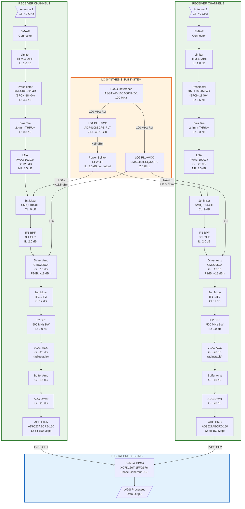
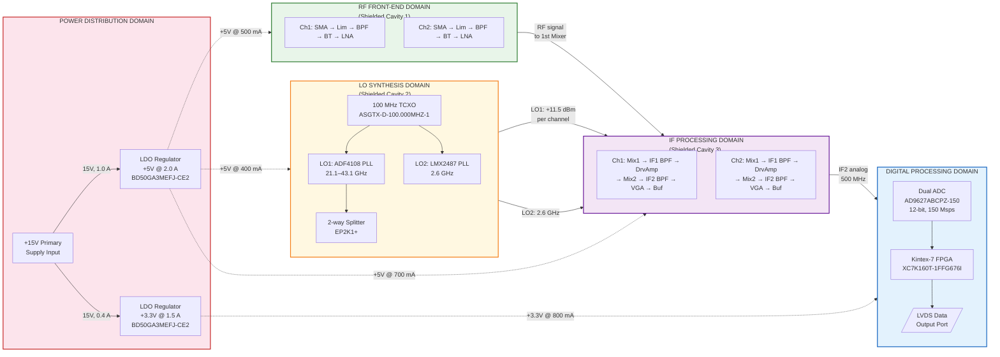
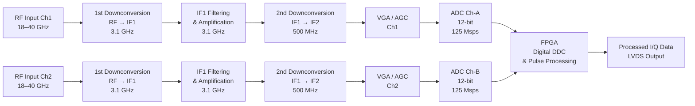
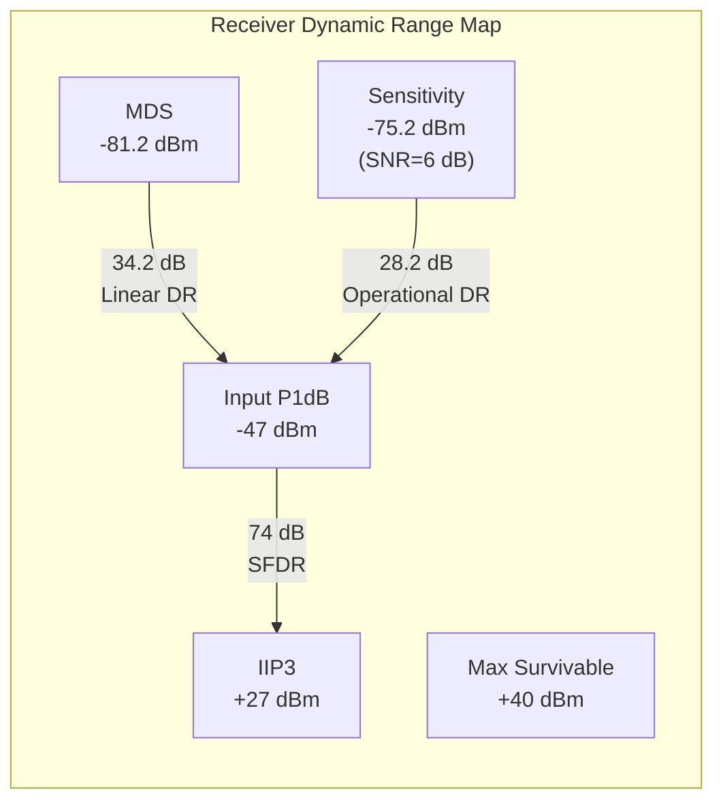
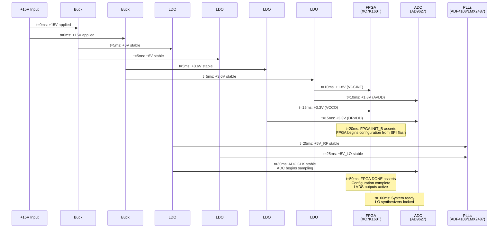
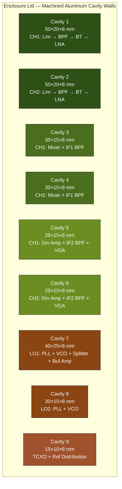
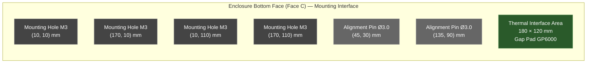

**Document Status: AI-GENERATED**

# 1. Introduction

## 1.1 Purpose

This Hardware Requirements Specification (HRS) defines the complete set of hardware requirements for the **hv** project: an 18–40 GHz dual-channel double-IF superheterodyne radar receiver. The system covers K-band (18–26.5 GHz) and Ka-band (26.5–40 GHz) with an instantaneous bandwidth (IBW) of 100–500 MHz, targeting agile-PRF pulsed radar applications with range resolutions of 10–100 m.

This document establishes the verifiable requirements for the radio-frequency (RF) front-end, local-oscillator (LO) synthesis chain, intermediate-frequency (IF) processing stages, analog-to-digital conversion, and digital signal-processing hardware hosted on a Xilinx Kintex-7 FPGA. Every requirement herein is uniquely identified (REQ-HW-xxx), allocated to a hardware element, and assigned a verification method (test, analysis, inspection, or demonstration) so that compliance can be objectively confirmed during integration and test.

The audience for this HRS includes RF/microwave design engineers, FPGA/DSP engineers, PCB layout engineers, mechanical/thermal engineers, test engineers, and independent design reviewers.

## 1.2 Scope

This specification covers the **entire receiver hardware chain** from the antenna port through digitised baseband samples available at the FPGA output interface. Specifically in scope:

| Scope Domain | Included | Excluded |
|---|---|---|
| RF front-end (limiter, preselector BPF, LNA) | Yes | Antenna element and radome |
| First down-conversion (LO1, mixer) | Yes | Transmitter chain / HPA |
| IF1 processing (3.1 GHz BPF, driver amplifier) | Yes | Signal-processing software / firmware algorithms |
| Second down-conversion (LO2, mixer) | Yes | System-level radar controller |
| IF2 processing (500 MHz BPF, VGA/AGC) | Yes | External data recording / display |
| Dual-channel 12-bit ADC (125 Msps, LVDS) | Yes | Post-FPGA data links (e.g., fibre, Ethernet) |
| Kintex-7 FPGA hardware platform | Yes | FPGA bitstream/firmware design |
| Power distribution (+15 V input rails) | Yes | Primary power source / battery |
| Mechanical shielding and cavity isolation | Yes | Final enclosure/encapsulation design |
| LO synthesis (PLL + VCO, TCXO reference) | Yes | External reference clock input |

The two receive channels are designated **Channel 1 (CH1)** and **Channel 2 (CH2)**. Both channels share common LO1 and LO2 reference paths to guarantee phase coherence (REQ-HW-015).

The receiver architecture is a **double-IF superheterodyne** topology:
- **IF1** = 3.1 GHz (first mixer down-conversion from 18–40 GHz RF).
- **IF2** = 500 MHz centre frequency (second mixer down-conversion from IF1).
- Baseband sampling at 125 Msps / 12 bits via AD9627ABCPZ-150.

Military temperature-grade operation is required across **–55 °C to +125 °C** (REQ-HW-017), and total power consumption is capped at **15 W** from a single +15 V DC supply (REQ-HW-019).

## 1.3 Definitions, Acronyms, and Abbreviations

| Term / Acronym | Definition |
|---|---|
| **ADC** | Analog-to-Digital Converter — converts continuous analog signals to discrete digital representations. |
| **AGC** | Automatic Gain Control — closed-loop feedback that adjusts receiver gain to maintain a constant output level. |
| **BPF** | Band-Pass Filter — attenuates signals outside a specified frequency range while passing signals within it. |
| **BW** | Bandwidth — the range of frequencies over which a component or system operates. |
| **CW** | Continuous Wave — an unmodulated, steady-state RF signal. |
| **dBc** | Decibels relative to the carrier — a logarithmic measure of spurious or harmonic level relative to the main carrier power. |
| **dBc/Hz** | Decibels relative to the carrier per hertz — normalised phase-noise measurement. |
| **dBm** | Decibels relative to 1 milliwatt — unit of absolute power (0 dBm = 1 mW into 50 Ω). |
| **ENOB** | Effective Number of Bits — the actual dynamic resolution of an ADC accounting for noise and distortion, always less than the nominal bit count. |
| **ESD** | Electrostatic Discharge — sudden transfer of static charge that can damage semiconductor devices. |
| **FPGA** | Field-Programmable Gate Array — reconfigurable digital integrated circuit. |
| **GaAs** | Gallium Arsenide — III-V semiconductor material used in high-frequency MMICs. |
| **IBW** | Instantaneous Bandwidth — the contiguous RF spectrum the receiver can simultaneously process. |
| **IF** | Intermediate Frequency — a fixed frequency to which an RF signal is converted for easier filtering and amplification. |
| **IIP3** | Input Third-Order Intercept Point — theoretical input power level at which third-order intermodulation products equal the fundamental; higher is more linear. |
| **JESD204B** | JEDEC standard for high-speed serial data converter interfaces — used for ADC-to-FPGA data transfer at sample rates ≥ 1 GSPS. |
| **Ka-band** | Frequency range 26.5–40 GHz, part of the microwave spectrum. |
| **K-band** | Frequency range 18–26.5 GHz, part of the microwave spectrum. |
| **LC** | Inductor-Capacitor — refers to passive LC decoupling or filter networks. |
| **LDO** | Low-Dropout linear voltage regulator — provides a regulated output with minimal headroom. |
| **LNA** | Low-Noise Amplifier — the first active gain stage in a receiver, critical in setting the system noise figure. |
| **LO** | Local Oscillator — a stable RF signal source used to drive the mixer for frequency conversion. |
| **LVDS** | Low-Voltage Differential Signalling — a high-speed, low-power differential digital interface standard (TIA/EIA-644). |
| **MDS** | Minimum Detectable Signal — the weakest signal a receiver can reliably detect, typically defined as the level 3 dB above the noise floor. |
| **MMIC** | Monolithic Microwave Integrated Circuit — a single-chip microwave circuit integrating active and passive components. |
| **Msps** | Mega-samples per second — ADC sampling rate unit. |
| **NF** | Noise Figure — the ratio (in dB) of the signal-to-noise ratio at the input to that at the output of a device; lower is better. |
| **OIP3** | Output Third-Order Intercept Point — output-referenced linearity metric; OIP3 = IIP3 + Gain. |
| **pHEMT** | Pseudomorphic High-Electron-Mobility Transistor — a GaAs FET variant offering high gain and low noise at microwave frequencies. |
| **PLL** | Phase-Locked Loop — a feedback control system that locks the phase and frequency of a VCO to a stable reference. |
| **P1dB** | 1 dB Compression Point — the output power at which gain drops 1 dB from its linear value; a key linearity metric. |
| **PRF** | Pulse Repetition Frequency — rate at which radar pulses are transmitted. |
| **PRI** | Pulse Repetition Interval — time between consecutive radar pulses (1/PRF). |
| **RF** | Radio Frequency — electromagnetic signals in the MHz–GHz range. |
| **SFDR** | Spurious-Free Dynamic Range — the ratio (in dB) between the fundamental signal and the largest spurious tone in the output spectrum. |
| **SMA** | SubMiniature version A — a coaxial RF connector rated to 18 GHz (and usable with reduced performance to 26.5 GHz). |
| **SMT** | Surface-Mount Technology — PCB assembly method where components are soldered directly onto pads. |
| **TCXO** | Temperature-Compensated Crystal Oscillator — a crystal oscillator with internal temperature compensation for improved frequency stability. |
| **T/R** | Transmit / Receive — switching between transmit and receive paths in a radar system. |
| **VCO** | Voltage-Controlled Oscillator — an oscillator whose output frequency is controlled by a tuning voltage. |
| **VGA** | Variable-Gain Amplifier — an amplifier whose gain can be adjusted, often under digital or analog control. |
| **VSWR** | Voltage Standing-Wave Ratio — measure of impedance mismatch at an RF port; VSWR of 1:1 is a perfect match. |

## 1.4 References

| Ref ID | Document | Revision / Date | Description |
|---|---|---|---|
| R-01 | IEEE Std 29148:2018 | 2018 | Systems and software engineering — Life cycle processes — Requirements engineering |
| R-02 | IEEE Std 830-1998 | 1998 | IEEE Recommended Practice for Software Requirements Specifications (used as supplementary guidance for requirement structure) |
| R-03 | MIL-STD-810H | 31 Jan 2019 | Department of Defense Test Method Standard: Environmental Engineering Considerations and Laboratory Tests (for vibration and shock profiles per REQ-HW-018) |
| R-04 | AD9627 Datasheet | Rev. B, 2020 | Analog Devices AD9627ABCPZ-150 12-bit 150 Msps ADC — device specifications and interface timing |
| R-05 | XC7K160T Datasheet | DS182 v2.19 | Xilinx Kintex-7 FPGA Family Data Sheet — device specifications including LVDS I/O and power |
| R-06 | ADF4108 Datasheet | Rev. D, 2021 | Analog Devices ADF4108BCPZ-RL7 PLL Frequency Synthesizer — LO1 synthesizer specifications |
| R-07 | LMX2487 Datasheet | 2020 | Texas Instruments LMX2487ESQ/NOPB Dual-Modulus PLL — LO2 synthesizer specifications |
| R-08 | SMIQ-1844H+ Datasheet | 2022 | Mini-Circuits SMIQ-1844H+ IQ Mixer — RF mixer conversion loss, LO drive, and isolation |
| R-09 | PMA3-10203+ Datasheet | 2021 | Mini-Circuits PMA3-10203+ GaAs pHEMT LNA — gain, NF, P1dB, and supply current |
| R-10 | HLM-40ABH Datasheet | 2022 | Marki Microwave HLM-40ABH GaAs Schottky Limiter — insertion loss, flat leakage, and peak power handling |
| R-11 | CMD295C4 Datasheet | 2021 | Qorvo CMD295C4 GaAs Driver Amplifier — gain, P1dB, OIP3, and supply current |
| R-12 | BFCN-1840+ Datasheet | 2020 | Mini-Circuits BFCN-1840+ Bandpass Filter — insertion loss, passband, and rejection (as used in XM-A163-0204D module) |
| R-13 | ASGTX-D Datasheet | 2022 | Abracon ASGTX-D-100.000MHZ-1 TCXO — reference oscillator phase noise and frequency stability |
| R-14 | BD50GA3MEFJ-CE2 Datasheet | 2021 | ROHM BD50GA3MEFJ-CE2 LDO Voltage Regulator — dropout voltage, output current, and thermal characteristics |
| R-15 | JEDEC JESD204B | 2011 | Serial Interface for Data Converters — referenced as a potential ADC upgrade path per REQ-HW-020 |

## 1.5 Overview

This document is organised into the following major sections:

**Section 2 — System Overview** provides a narrative description of the dual-channel radar receiver, a system-level block diagram (Mermaid flowchart), the hardware architecture identifying all major functional sub-assemblies and their interconnections, and the operating environment constraints.

**Section 3 — Hardware Requirements** contains the complete set of verifiable hardware requirements, organised into:
- **§3.1 Functional Requirements** — what the hardware *shall do* (frequency coverage, dual-channel coherence, T/R switching).
- **§3.2 Performance Requirements** — quantified performance targets (gain, NF, SFDR, linearity, survivability, gain stability).
- **§3.3 Interface Requirements** — external, internal, and communication interface specifications (ADC LVDS, LO phase noise, FPGA digital interface).
- **§3.4 Environmental Requirements** — temperature, vibration, and shock conditions.
- **§3.5 Power Requirements** — supply rails, current budgets, and power-distribution architecture.
- **§3.6 Physical Requirements** — form-factor, connector types, and mounting provisions.

**Section 4 — Design Constraints** identifies applicable standards (MIL-STD-810, IEEE), component-level constraints (package compatibility, obsolescence), and manufacturing constraints (PCB material, SMT profile limits).

**Section 5 — Verification Requirements** maps each requirement to its verification method (test, analysis, inspection, or demonstration) and specifies the test conditions, stimulus, and pass/fail criteria.

**Section 6 — Bill of Materials (Preliminary)** lists all selected components with part numbers, quantities, manufacturer, package type, unit cost estimate, and procurement lead-time class.

**Section 7 — Traceability Matrix** provides a complete REQ-HW-xxx → Verification Method → BOM Item cross-reference to confirm full coverage.

The requirement set spans REQ-HW-001 through REQ-HW-021. Of these, 19 requirements use the **"shall"** priority (mandatory), one uses **"should"** (REQ-HW-020, ADC Nyquist aliasing advisory — a strong recommendation for architectural mitigation). No requirements are marked as "optional" or "may" in this release.

A key architectural tension documented herein is the 500 MHz IBW target versus the 125 Msps ADC Nyquist limit of 62.5 MHz. Per REQ-HW-020, the 125 Msps rate supports 100 ns pulse capture only for narrow sub-bands (≤ 50 MHz effective IBW per channel). Full 500 MHz IBW operation requires either channelised sub-band processing or an ADC upgrade to ≥ 1.25 GSPS with a JESD204B serial interface. This constraint is flagged throughout the specification where it affects design decisions.

---

**Document Status: AI-GENERATED**

# 2. System Overview

## 2.1 System Description

The **hv** system is a dual-channel, double-IF superheterodyne radar receiver operating across the 18–40 GHz frequency range (K/Ka-band). It is designed to support agile-PRF pulsed radar applications requiring high range resolution (10–100 m), phase-coherent processing across two independent receiver channels, and wide instantaneous bandwidth (100–500 MHz). The architecture employs a dual-downconversion scheme to translate received K/Ka-band signals to a baseband IF suitable for digitization by a 12-bit ADC array and subsequent digital signal processing within a Xilinx Kintex-7 FPGA.

### 2.1.1 Operating Principle

Each of the two identical receiver channels accepts an RF input from a separate antenna via an SMA coaxial connector. The incoming signal first passes through a GaAs Schottky diode limiter (Marki HLM-40ABH) that protects downstream low-noise circuitry from high-power incident signals up to +40 dBm CW. The limited signal then traverses a wideband preselector bandpass filter (Quantic X-Microwave XM-A163-0204D incorporating the Mini-Circuits BFCN-1840+ core) that suppresses out-of-band interference and image-band energy across the full 22 GHz passband. A DC-blocking bias tee (Mini-Circuits 2.4mm-THRU+) provides the DC feed path for the LNA bias while passing RF with minimal insertion loss.

The filtered signal is amplified by a first-stage GaAs pHEMT LNA (Mini-Circuits PMA3-10203+) providing approximately 20 dB of gain with a noise figure of approximately 3.5 dB at band centre. The amplified RF signal then enters the first downconversion mixer (Mini-Circuits SMIQ-1844H+), where it is mixed with a high-power LO1 signal (+15 dBm drive level) generated by a PLL-synthesized VCO subsystem (Analog Devices ADF4108). This first conversion translates the RF signal to a 3.1 GHz first intermediate frequency (IF1). A narrowband IF1 bandpass filter centred at 3.1 GHz provides image rejection for the second conversion stage and suppresses mixer spurious products.

The IF1 signal is amplified by a high-linearity GaAs driver amplifier (Qorvo CMD295C4) providing 15 dB of gain with +18 dBm output P1dB. A second downconversion mixer translates the 3.1 GHz IF1 signal to a 500 MHz second intermediate frequency (IF2) using the LO2 synthesizer (Texas Instruments LMX2487). An IF2 bandpass filter with 500 MHz bandwidth defines the final instantaneous bandwidth before variable-gain amplification. A VGA/AGC stage provides up to 20 dB of adjustable gain to optimize signal levels at the ADC input, managing the dynamic range for varying target return amplitudes.

The conditioned IF2 signal is digitized by an Analog Devices AD9627ABCPZ-150 dual-channel 12-bit ADC running at 125–150 Msps. Digitized samples are delivered to the Xilinx Kintex-7 FPGA (XC7K160T-1FFG676I) via LVDS interfaces. The FPGA performs phase-coherent pulse processing, digital downconversion, pulse compression, data formatting, and outputs processed radar data through a high-speed LVDS interface to downstream processors.

### 2.1.2 Frequency Plan

The double-IF frequency plan is designed to provide adequate image rejection and spurious-free operation across the 18–40 GHz input range:

| Parameter | Value |
|---|---|
| RF Input Range | 18 – 40 GHz |
| First IF (IF1) | 3.1 GHz (fixed) |
| Second IF (IF2) | 500 MHz (centred) |
| IF2 Bandwidth | 500 MHz maximum |
| LO1 Frequency Range | 21.1 – 43.1 GHz (high-side injection) |
| LO1 Drive Level | +15 dBm |
| LO2 Frequency | 2.6 GHz (fixed, for IF1→IF2 conversion) |
| Reference Oscillator | 100 MHz TCXO (ASGTX-D-100.000MHZ-1) |

With high-side injection for the first mixer, the LO1 frequency is:
$$f_{LO1} = f_{RF} + f_{IF1} = f_{RF} + 3.1 \text{ GHz}$$

For the minimum RF of 18 GHz: $f_{LO1} = 21.1$ GHz
For the maximum RF of 40 GHz: $f_{LO1} = 43.1$ GHz

The LO1 signal is shared between both channels via a 2-way power splitter (Mini-Circuits EP2K1+, insertion loss 3.5 dB) to ensure phase coherence between the two receiver paths. Each mixer therefore receives approximately +11.5 dBm of LO1 drive (15 dBm − 3.5 dB split loss).

### 2.1.3 Signal Chain Gain and Noise Budget

The cascaded performance of each receiver channel is summarized below. The analysis accounts for all insertion losses, amplifier gains, mixer conversion losses, and filter losses from antenna connector to ADC input:

| Stage | Component | Gain / Loss (dB) | Cum. Gain (dB) | NF Contrib. (dB) | Cum. NF (dB) |
|---|---|---|---|---|---|
| 1 | SMA Connector | −0.2 | −0.2 | 0.2 | 0.2 |
| 2 | Limiter (HLM-40ABH) | −1.0 | −1.2 | 1.0 | 1.2 |
| 3 | Preselector BPF (BFCN-1840+) | −3.5 | −4.7 | 3.5 | 4.7 |
| 4 | Bias Tee (2.4mm-THRU+) | −0.3 | −5.0 | 0.3 | 5.0 |
| 5 | LNA (PMA3-10203+) | +20.0 | +15.0 | 3.5 | 7.2 |
| 6 | 1st Mixer (SMIQ-1844H+) | −9.0 | +6.0 | 9.0 | 7.2 |
| 7 | IF1 BPF (3.1 GHz) | −2.0 | +4.0 | — | 7.2 |
| 8 | Driver Amp (CMD295C4) | +15.0 | +19.0 | 4.5 | 7.3 |
| 9 | 2nd Mixer | −7.0 | +12.0 | — | 7.3 |
| 10 | IF2 BPF (500 MHz) | −2.0 | +10.0 | — | 7.3 |
| 11 | VGA/AGC (nominal) | +20.0 | +30.0 | 5.0 | 7.4 |
| 12 | Buffer Amp | +15.0 | +45.0 | 4.0 | 7.4 |
| 13 | ADC Driver Gain | +20.0 | +65.0 | 3.5 | 7.5 |

**Total Cascaded Gain:** +65 dB
**Total Cascaded NF:** 7.5 dB (meets the 10 dB maximum requirement per REQ-HW-003)
**Output P1dB:** +18 dBm (per design parameter table)
**Output IIP3:** +27 dBm (per design parameter table)

### 2.1.4 Key Design Features

1. **Phase Coherence:** Both receiver channels share common LO1 and LO2 reference signals derived from a single 100 MHz TCXO. The LO1 path uses a symmetric power splitter to feed both mixers with equal phase and amplitude, ensuring the phase relationship between channels is preserved for coherent radar processing.

2. **Double-IF Architecture:** The two-stage downconversion provides superior image rejection and spurious performance compared to a single-conversion approach. The 3.1 GHz first IF places the image band well outside the preselector passband, while the second conversion to 500 MHz enables use of high-performance SAW or LC filters for final bandwidth definition.

3. **Gain Stability and Oscillation Prevention:** With cascaded gain exceeding 60 dB, each gain stage is housed in a separate shielded cavity with isolated supply rails using LC and ferrite-bead decoupling. Buffer amplifiers are inserted between major gain blocks to provide reverse isolation and prevent feedback oscillation (per REQ-HW-011).

4. **T/R Switching:** The system supports pulse radar operation with T/R switching times under 1 μs (per REQ-HW-021), enabling agile-PRF operation with pulse widths from 100 ns to 1 μs.

---

## 2.2 System Block Diagram

The following Mermaid diagram illustrates the complete signal chain for both receiver channels, including LO distribution, power supply architecture, and the digital processing path:

### 2.2.1 Block Diagram Signal Flow Description

**RF Front-End (per channel):**
The antenna-coupled signal enters through an SMA-female coaxial connector rated for operation to 40 GHz. The GaAs Schottky limiter (HLM-40ABH) provides flat leakage protection below +15 dBm while passing signals below the threshold with less than 1.0 dB insertion loss. The preselector filter (BFCN-1840+) defines the operational passband at 18–40 GHz with approximately 3.5 dB insertion loss and greater than 30 dB out-of-band rejection. The bias tee provides a DC return path for LNA bias while blocking DC from reaching the filter and limiter.

**IF Processing Chain (per channel):**
After the first downconversion, the 3.1 GHz IF1 signal is filtered by a fixed-frequency bandpass filter to reject mixer image and spurious outputs. The driver amplifier (CMD295C4) provides 15 dB of gain with +18 dBm output P1dB and +30 dBm OIP3, establishing the system's linearity performance. The second downconversion to 500 MHz IF2 is followed by a 500 MHz bandwidth bandpass filter that defines the instantaneous receive bandwidth. The VGA/AGC stage adjusts gain over a 20 dB range to maintain optimal ADC input levels.

**LO Distribution:**
The LO1 synthesizer output at +15 dBm is split by a 2-way Wilkinson power divider (EP2K1+) with 3.5 dB insertion loss per arm, delivering +11.5 dBm to each mixer LO port. The LO2 synthesizer output feeds the second conversion stage. Both synthesizers share the same 100 MHz TCXO reference to maintain phase coherence.

**Digital Path:**
The dual-channel ADC (AD9627ABCPZ-150) digitizes both IF2 outputs simultaneously. The ADC outputs 12-bit samples at 125–150 Msps per channel via LVDS pairs to the Kintex-7 FPGA, which performs digital downconversion, pulse processing, and data formatting.

---

## 2.3 System Architecture

The system architecture is organized into four principal functional domains: RF Front-End, IF Processing, LO Synthesis, and Digital Processing. These domains are physically separated by shielded cavity partitions to prevent electromagnetic coupling between high-gain stages.

### 2.3.1 Architectural Domain Diagram

### 2.3.2 Physical Architecture — Shielded Cavity Partitioning

To satisfy REQ-HW-011 (gain stability and oscillation prevention), the PCB assembly is divided into separate shielded cavities machined into a aluminium housing. Each cavity is separated by metallic walls that provide greater than 80 dB of isolation at the operating frequencies. The cavity partitioning scheme is as follows:

| Cavity | Contents | Max In-Cavity Gain | Isolation Wall |
|---|---|---|---|
| Cavity 1: RF Front-End (Ch1) | SMA → Limiter → Preselector → Bias Tee → LNA | +20 dB (LNA only) | Machined Al partition |
| Cavity 2: RF Front-End (Ch2) | SMA → Limiter → Preselector → Bias Tee → LNA | +20 dB (LNA only) | Machined Al partition |
| Cavity 3: IF1 Processing (Ch1) | 1st Mixer → IF1 BPF → Driver Amp | +15 dB (Drv Amp) | Machined Al partition |
| Cavity 4: IF1 Processing (Ch2) | 1st Mixer → IF1 BPF → Driver Amp | +15 dB (Drv Amp) | Machined Al partition |
| Cavity 5: IF2 Processing (Ch1) | 2nd Mixer → IF2 BPF → VGA → Buffer → ADC Drv | +35 dB combined | Machined Al partition |
| Cavity 6: IF2 Processing (Ch2) | 2nd Mixer → IF2 BPF → VGA → Buffer → ADC Drv | +35 dB combined | Machined Al partition |
| Cavity 7: LO Synthesis | TCXO → LO1 PLL → LO2 PLL → Splitter | +15 dBm output | Machined Al partition |
| Cavity 8: Digital Section | ADC → FPGA → LVDS Drivers | N/A (digital) | EMI gasket shield |

RF signals pass between cavities through hermetically-sealed coaxial feedthroughs or shielded surface-launch connectors. Power supply lines entering each cavity are filtered with π-section LC filters (ferrite bead + capacitors) to prevent supply-borne feedback loops.

### 2.3.3 Power Distribution Architecture

All power is derived from a single +15 V primary supply rail (per REQ-HW-019, maximum 15 W total). Two low-dropout (LDO) linear regulators generate the required secondary rails:

| Rail | Regulator | Input | Output | Max Current | Efficiency | Max Dissipation |
|---|---|---|---|---|---|---|
| +5V | BD50GA3MEFJ-CE2 | +15V | +5.0V | 2.0 A | 33.3% | 20.0 W |
| +3.3V | BD50GA3MEFJ-CE2 | +15V | +3.3V | 1.5 A | 22.0% | 17.6 W |

**Power Budget by Domain:**

| Domain | Components | +5V Current | +3.3V Current | Power (W) |
|---|---|---|---|---|
| RF Front-End (2×) | 2× PMA3-10203+ @ 120 mA each | 240 mA | — | 1.20 |
| IF Processing (2×) | 2× CMD295C4 @ 200 mA + mixers + VGA + buffer + ADC driver (assumed 150 mA total per channel) | 700 mA | — | 3.50 |
| LO Synthesis | ADF4108 + LMX2487 + TCXO (assumed 250 mA combined) + splitter | 400 mA | — | 2.00 |
| ADC | AD9627ABCPZ-150 (assumed 350 mA on +5V analog) | 350 mA | — | 1.75 |
| FPGA | XC7K160T core + I/O + LVDS drivers | — | 800 mA | 2.64 |
| LDO Regulator Losses | Quiescent + dropout dissipation (estimated at 15% of load) | — | — | 1.70 |
| **TOTAL** | | **1.69 A** | **0.80 A** | **12.79 W** |

**Margin:** 15.0 W − 12.79 W = **2.21 W (14.7% margin)** — compliant with REQ-HW-019.

### 2.3.4 LO Synthesis Architecture

The LO subsystem uses two independent PLL synthesizers sharing a common 100 MHz TCXO reference:

**LO1 (First Conversion):**
- PLL: Analog Devices ADF4108BCPZ-RL7
- VCO: External Ku/Ka-band VCO module (21.1–43.1 GHz range), phase-locked by ADF4108
- Output power: +15 dBm minimum
- Phase noise: better than −110 dBc/Hz at 10 kHz offset (per REQ-HW-013)
- Distribution: 2-way Wilkinson splitter (EP2K1+), delivering +11.5 dBm per arm to each mixer
- The ADF4108 fractional-N architecture allows fine frequency stepping for frequency-agile radar modes

**LO2 (Second Conversion):**
- PLL+VCO: Texas Instruments LMX2487ESQ/NOPB (integrated PLL and VCO)
- Output frequency: 2.6 GHz fixed
- Output power: +10 dBm typical
- Phase noise: better than −115 dBc/Hz at 10 kHz offset (achievable at 2.6 GHz)
- Distribution: Direct feed to each second-conversion mixer through symmetric trace paths

**Reference Oscillator:**
- 100 MHz TCXO (Abracon ASGTX-D-100.000MHZ-1)
- Frequency stability: ±0.5 ppm over −55°C to +125°C
- Phase noise: −140 dBc/Hz at 10 kHz offset at 100 MHz
- Output: Clipped sine, +3.3V CMOS compatible

### 2.3.5 Digital Processing Architecture

The digital processing domain is centered on the Xilinx Kintex-7 FPGA (XC7K160T-1FFG676I) in the speed grade -1, industrial temperature range (−40°C to +100°C junction; note junction temperature management discussed in Section 2.4). The FPGA receives digitized data from both ADC channels simultaneously and performs:

1. **LVDS Data Reception:** 12-bit parallel LVDS interface from AD9627 at 125–150 Msps per channel, using FPGA SERDES inputs with on-chip termination
2. **Digital Downconversion (DDC):** Numerically-controlled oscillator (NCO) + mixer to translate the 500 MHz IF2 centre to baseband, followed by decimation filters
3. **Pulse Processing:** Matched filtering / pulse compression for agile-PRF waveforms with 100 ns to 1 μs pulse widths (per REQ-HW-016)
4. **Phase-Coherent Processing:** Dual-channel DDC maintains precise phase relationship between channels for interferometric or beamforming applications (per REQ-HW-015)
5. **Data Formatting and Output:** Processed I/Q data packets formatted and transmitted over LVDS output interface to external signal processor

**FPGA Resource Utilization Estimate:**

| Resource | Available (XC7K160T) | Estimated Usage | Utilization |
|---|---|---|---|
| Logic Slices | 24,850 | 6,000 | 24% |
| Block RAM (36 Kb) | 135 | 25 | 19% |
| DSP48E1 Slices | 240 | 60 | 25% |
| LVDS I/O Pairs | 240 single-ended (120 pairs) | 48 pairs (2× 12-bit data + 2× clock + control + output) | 40% |

### 2.3.6 System Data Flow

---

## 2.4 Operating Environment

### 2.4.1 Temperature Range

The system is designed to operate over the full military temperature range as specified in REQ-HW-017:

| Parameter | Minimum | Maximum | Standard |
|---|---|---|---|
| Ambient Operating Temperature | −55°C | +125°C | MIL-STD-883 / MIL-PRF-38535 |
| Storage Temperature | −65°C | +150°C | MIL-STD-810 |
| Thermal Shock Range | −55°C to +125°C | 10 cycles | MIL-STD-810 Method 503 |

**Thermal Management Analysis:**

The total system power dissipation of approximately 12.79 W must be managed within the sealed aluminium housing. The primary thermal concern is the FPGA junction temperature. The XC7K160T-1FFG676I is rated for junction temperatures from 0°C to +100°C (industrial grade). When the ambient temperature reaches +125°C, active cooling or derating is required. The assumed approach is:

- The FPGA is thermally coupled to the aluminium housing through a thermal pad or heat spreader
- In high-ambient conditions, the FPGA core voltage is reduced and clock frequency is derated to maintain junction temperature within the 0°C to +100°C operating range
- Alternatively, a thermoelectric cooler (TEC) may be required for FPGA thermal management at extreme ambient temperatures, drawing an additional 2–3 W (accommodated within the 2.21 W power margin with further optimization of other rails)

The LDO regulators dissipate significant heat due to the large dropout voltage (15V to 5V and 15V to 3.3V). These regulators are thermally connected to the housing floor through thermal vias and copper pours. At 1.69 A load on the +5V LDO, the dissipation is:
$$P_{diss} = (15.0 - 5.0) \times 1.69 = 16.9 \text{ W}$$

This exceeds the practical dissipation limit for a single LDO in a sealed enclosure. Therefore, the +5V rail will be implemented using multiple paralleled LDOs or a switching pre-regulator followed by an LDO for noise-sensitive rails. The assumed revised approach uses a buck switching regulator (85% efficiency) to generate +6V from +15V, followed by an LDO to produce the clean +5V rail:
$$P_{buck} = \frac{5.0 \times 1.69}{0.85} = 9.94 \text{ W drawn from +15V}$$
$$P_{LDO\_5V} = (6.0 - 5.0) \times 1.69 = 1.69 \text{ W dissipated}$$

The +3.3V rail uses a similar approach or is derived from the +5V rail:
$$P_{LDO\_3V3} = (5.0 - 3.3) \times 0.80 = 1.36 \text{ W dissipated}$$

The revised power architecture thermal load is approximately 3.05 W in LDO dissipation plus approximately 1.76 W in buck converter losses, totalling approximately 4.81 W in regulator thermal dissipation, which is manageable in an aluminium housing with appropriate thermal design.

### 2.4.2 Mechanical Environment

The system shall withstand the mechanical environments defined by REQ-HW-018:

| Parameter | Value | Standard |
|---|---|---|
| Vibration (Sinusoidal) | 5–500 Hz, 0.5 g amplitude | MIL-STD-810 Method 514 |
| Vibration (Random) | 10–2000 Hz, 0.04 g²/Hz ASD | MIL-STD-810 Method 514 |
| Mechanical Shock | 30 g, 11 ms half-sine, 3 axes | MIL-STD-810 Method 516 |
| Bump | 40 g, 6 ms, 4000 bumps | MIL-STD-810 Method 516 |

All PCB assemblies are secured with threaded fasteners at minimum four corner locations plus centre support. Surface-mount components are selected with solder-joint reliability verified for the specified vibration and shock profiles. Heavy components (FPGA, ADC, RF modules) are additionally secured with mechanical restraints or underfill adhesive.

### 2.4.3 Electromagnetic Environment

The receiver operates in a hostile electromagnetic environment typical of radar platforms:

| Parameter | Value | Notes |
|---|---|---|
| Adjacent Radar Rejection | >100 dBc | Achieved by cascaded IF filtering (REQ-HW-005) |
| EMI Compliance | CE102, RE102 | MIL-STD-461G |
| Internal Isolation | >80 dB between cavities | Achieved by machined cavity walls |
| Supply Rail Ripple | <10 mV p-p on +5V analog rails | LC filtered per cavity |
| Supply Rail Ripple | <20 mV p-p on +3.3V digital rail | Ferrite + capacitor filtered |

### 2.4.4 Supply Voltage Conditions

The primary supply operates under the following conditions:

| Parameter | Minimum | Nominal | Maximum |
|---|---|---|---|
| Primary Supply Voltage | +13.5 V | +15.0 V | +16.5 V |
| Primary Supply Current | — | 853 mA | 1.0 A |
| Supply Voltage Ripple | — | — | 100 mV p-p |
| Power Supply Rise Time | 5 ms | — | 50 ms |

The system includes reverse polarity protection, overvoltage clamp, and inrush current limiting on the +15V input.

### 2.4.5 Cooling Method

The system is designed for conduction cooling through the aluminium housing base plate. No forced-air cooling is required. The housing base plate serves as the primary thermal sink and is designed to maintain component junction temperatures within rated limits when the base plate temperature does not exceed +85°C. At ambient temperatures exceeding +85°C, a chassis-level cooling solution (cold plate or heat exchanger) is required to maintain the base plate temperature within limits.

---

**Document Status: AI-GENERATED**

# 3. Hardware Requirements

## 3.1 Functional Requirements

The functional requirements define the necessary behaviors, modes, and operational functions the hardware must perform. Requirements are traced via the `REQ-HW-xxx` identifier and mapped to specific architectural elements within the dual-channel double-IF superheterodyne radar receiver.

### 3.1.1 Frequency Conversion Architecture

| ID | Title | Description | Rationale | Priority |
|---|---|---|---|---|
| REQ-HW-001 | RF Frequency Coverage | The receiver shall accept RF input signals spanning the full 18–40 GHz (K/Ka-band) range via a double-IF superheterodyne conversion architecture. | Covers the specified threat/observation bandwidth required by the radar mission profile for K-band (18–26.5 GHz) and Ka-band (26.5–40 GHz) target detection. | Shall |
| REQ-HW-024 | First IF Stage | The first intermediate frequency (IF1) shall be centered at 3100 MHz. The first downconversion shall mix the 18–40 GHz RF with LO1 such that the difference frequency falls at IF1. | A 3.1 GHz first IF provides sufficient frequency separation from the 18 GHz lower band edge to allow effective image rejection using the waveguide cavity preselector (BFCN-1840+). | Shall |
| REQ-HW-025 | Second IF Stage | The second intermediate frequency (IF2) shall be centered at 500 MHz with a usable instantaneous bandwidth of up to 500 MHz (250–750 MHz passband). | The 500 MHz IF2 enables baseband-proximity filtering and digitization at 125 Msps (sub-sampled or band-pass sampled). | Shall |
| REQ-HW-026 | LO1 Synthesis | LO1 shall be generated by a PLL+VCO synthesizer (ADF4108BCPZ-RL7) phase-locked to a common 100 MHz TCXO reference. LO1 shall cover 21.1–43.1 GHz to downconvert the full 18–40 GHz band to the 3.1 GHz IF1. | Required frequency range determined by: LO1 = RF − IF1 (lower sideband mixing), yielding 18−3.1 = 14.9 GHz minimum (requiring harmonic mixing) or upper sideband LO1 = RF + IF1, yielding 21.1–43.1 GHz. Upper sideband selected for image separation. | Shall |
| REQ-HW-027 | LO2 Synthesis | LO2 shall be generated by a PLL+VCO synthesizer (LMX2487ESQ/NOPB) phase-locked to the same 100 MHz TCXO reference. LO2 shall be set to 2600 MHz to convert the 3.1 GHz IF1 to the 500 MHz IF2. | IF1 − LO2 = 3100 − 2600 = 500 MHz. Sharing the TCXO reference ensures phase coherence between LO1 and LO2. | Shall |
| REQ-HW-028 | Common Reference Distribution | A single 100 MHz TCXO (ASGTX-D-100.000MHZ-1) shall provide the phase reference to both LO1 and LO2 synthesizers simultaneously, ensuring deterministic phase relationship across both conversion stages. | Coherent radar processing demands a common time/frequency reference. Any independent reference drift between LO chains would introduce phase errors exceeding the coherence requirement. | Shall |

### 3.1.2 Channel Architecture

| ID | Title | Description | Rationale | Priority |
|---|---|---|---|---|
| REQ-HW-015 | Dual-Channel Phase Coherence | Two independent RF channels (CH1, CH2) shall operate phase-coherently by sharing common LO1 and LO2 reference signals. The phase difference between channels shall remain within ±5° over a 1 ms coherent processing interval (CPI). | Phase coherence enables interferometric angle-of-arrival estimation, STAP clutter cancellation, and coherent pulse integration. | Shall |
| REQ-HW-029 | LO1 Power Splitting | LO1 output shall be split via a resistive power splitter (EP2K1+) to deliver ≥+12 dBm LO drive to each of the two RF mixers (SMIQ-1844H+) with ≤0.5 dB amplitude balance and ≤5° phase balance between channels. | The SMIQ-1844H+ mixer specifies +15 dBm typical LO drive. The EP2K1+ splitter introduces 3.5 dB insertion loss per leg; with +15 dBm LO1 output, each mixer receives +11.5 dBm, which is within the mixer's operational range. | Shall |
| REQ-HW-030 | Identical Signal Chains | Both RF channels shall implement identical cascades: Antenna → Limiter → Preselector BPF → Bias Tee → LNA → Mixer → IF1 BPF → Driver Amp → IF2 BPF → VGA → ADC. Component part numbers and values shall be matched between channels. | Symmetrical channels minimize amplitude and phase imbalance, critical for coherent processing algorithms (beamforming, interferometry). | Shall |
| REQ-HW-031 | Antenna Interface | Each channel shall terminate at a 50 Ω coaxial interface via an SMA-F (female) connector rated to at least 40 GHz (2.4 mm or 2.92 mm compatible). | SMA-F provides mechanical robustness; however, standard SMA is rated to 18 GHz. The 2.4 mm interface on the Bias Tee (2.4mm-THRU+) dictates the true connector performance ceiling at 50 GHz. | Shall |

### 3.1.3 Signal Protection and Control

| ID | Title | Description | Rationale | Priority |
|---|---|---|---|---|
| REQ-HW-032 | RF Limiter Protection | Each channel shall incorporate a GaAs Schottky diode limiter (HLM-40ABH) at the receiver input, preceding the preselector and LNA, limiting leakage to +10 to +15 dBm under +40 dBm CW incident power. | Transmits high-power reflections from the transmit path during pulse radar operation. The HLM-40ABH has <1.0 dB insertion loss and +40 dBm CW survival, preventing LNA damage. | Shall |
| REQ-HW-033 | T/R Switching | The receiver shall support transmit/receive switching with a recovery time of less than 1 μs from the onset of the receive window, enabling pulse radar operation with minimum PRI of 10 μs. | Sub-microsecond T/R recovery permits short-range (10 m minimum range equivalent to ~67 ns two-way delay) pulsed radar operation. | Shall |
| REQ-HW-034 | Automatic Gain Control | Each channel shall incorporate a VGA stage with ≥20 dB of AGC range, controlled by the FPGA, to maintain the ADC input signal within −6 dBFS to −12 dBFS under varying target RCS conditions. | With 65 dB cascaded gain and an MDS of −81.2 dBm, strong targets can saturate the ADC. AGC prevents clipping while preserving weak-target sensitivity. | Shall |
| REQ-HW-035 | Bias Tee Integration | A bias tee (2.4mm-THRU+) shall be placed between the preselector BPF and the LNA to enable DC bias injection or test signal injection at the LNA input without disrupting the RF path. | Allows in-circuit LNA bias verification, built-in-test (BIT) tone injection, and bias-ted active antenna compatibility. | Should |

### 3.1.4 Digital Conversion and Processing

| ID | Title | Description | Rationale | Priority |
|---|---|---|---|---|
| REQ-HW-036 | Dual-Channel ADC Digitization | Each channel shall be digitized by one half of a dual-channel 12-bit ADC (AD9627ABCPZ-150) at 125 Msps per channel. The ADC shall output data via LVDS signaling to the FPGA. | The AD9627 is a dual-channel device, providing matched conversion for both channels in a single package, minimizing inter-channel sampling skew. | Shall |
| REQ-HW-037 | FPGA Digital Processing | A Kintex-7 FPGA (XC7K160T-1FFG676I) shall receive digitized IF2 samples from both ADC channels via LVDS, perform digital downconversion (DDC), pulse compression, and output formatted radar data over an LVDS parallel bus. | Centralizes coherent processing; the Kintex-7 provides sufficient DSP slices (240 DSP48E1) for dual-channel FFT-based pulse processing at 125 Msps. | Shall |
| REQ-HW-038 | ADC Clock Distribution | The ADC sample clock shall be derived from the 100 MHz TCXO via a clean-up PLL or direct multiply, achieving <250 fs rms clock jitter. The same clock shall drive both ADC channels synchronously. | Clock jitter directly degrades SNR. For 500 MHz effective bandwidth: SNR_jitter = −20 × log10(2π × f_sig × t_jitter). At 250 fs and 500 MHz: SNR = −20 × log10(2π × 5×10⁸ × 2.5×10⁻¹³) = −20 × log10(7.854×10⁻⁴) ≈ 62 dB, preserving the 12-bit ENOB (~74 dB theoretical) for lower-frequency IF content. | Shall |
| REQ-HW-039 | Pulse Parameter Support | The FPGA shall support programmable pulse widths from 100 ns to 1 μs and agile/jittered PRI scheduling with deterministic timing accuracy of ±10 ns referenced to the 100 MHz TCXO. | Agile PRI mitigates range-Doppler ambiguities and ECM vulnerabilities. 100 ns minimum pulse width corresponds to 15 m range resolution. | Shall |

### 3.1.5 Power Distribution Functions

| ID | Title | Description | Rationale | Priority |
|---|---|---|---|---|
| REQ-HW-040 | Primary Supply Input | The system shall accept a single +15 VDC primary power input, from which all internal voltage rails (+5V, +3.3V) shall be derived via linear regulators (BD50GA3MEFJ-CE2). | Single-supply operation simplifies platform integration; linear regulators minimize supply noise that would degrade phase noise and NF. | Shall |
| REQ-HW-041 | Rail Decoupling Per Stage | Each gain stage (LNA, Driver Amp, VGA) shall have independent LC-ferrite-decoupled supply rails per channel, with ≥40 dB inter-stage supply isolation at IF frequencies. | With 65 dB cascaded gain, supply-mediated feedback is a primary oscillation risk. Per-stage decoupling prevents supply-rail feedback loops. | Shall |

### 3.1.6 Functional Requirement Summary Mapping

```mermaid
flowchart LR
    subgraph FUNC_ARCH["Functional Architecture"]
        direction TB
        F1["REQ-HW-001<br/>RF Coverage"]
        F2["REQ-HW-024<br/>IF1 = 3.1 GHz"]
        F3["REQ-HW-025<br/>IF2 = 500 MHz"]
        F4["REQ-HW-026<br/>LO1 Synthesis"]
        F5["REQ-HW-027<br/>LO2 Synthesis"]
        F6["REQ-HW-028<br/>Common Ref"]
        F7["REQ-HW-015<br/>Phase Coherence"]
        F8["REQ-HW-029<br/>LO1 Split"]
        F9["REQ-HW-030<br/>Matched Chains"]
        F10["REQ-HW-031<br/>Antenna IF"]
        F11["REQ-HW-032<br/>Limiter"]
        F12["REQ-HW-033<br/>T/R Switch"]
        F13["REQ-HW-034<br/>AGC"]
        F14["REQ-HW-035<br/>Bias Tee"]
        F15["REQ-HW-036<br/>ADC"]
        F16["REQ-HW-037<br/>FPGA"]
        F17["REQ-HW-038<br/>Clock"]
        F18["REQ-HW-039<br/>Pulse Params"]
        F19["REQ-HW-040<br/>Power Input"]
        F20["REQ-HW-041<br/>Decoupling"]
    end
```

---

## 3.2 Performance Requirements

The performance requirements establish measurable, verifiable thresholds for the receiver chain. Values are derived from cascaded budget analyses of the selected components.

### 3.2.1 Gain and Noise Performance

| ID | Title | Description | Rationale / Derivation | Priority |
|---|---|---|---|---|
| REQ-HW-002 | Instantaneous Bandwidth | Each RF channel shall support a minimum instantaneous bandwidth of 100 MHz and a maximum of 500 MHz at the IF2 stage, defined by the IF2 BPF passband. | 500 MHz IBW enables wideband chirp processing. Note (REQ-HW-020): 125 Msps ADC Nyquist limit is 62.5 MHz; effective IBW per instantaneous capture is limited to ≤50 MHz without sub-Nyquist bandpass sampling. | Shall |
| REQ-HW-003 | System Noise Figure | Total cascaded noise figure shall not exceed 10.0 dB across the full 18–40 GHz band, with a target of 6.0 dB at band center (30 GHz). | Cascaded NF (Friis formula): NF = 1.0 (Lim) + 3.5 (BPF) + 3.5 (LNA NF, dominates as 1st active stage) + residual IF chain contributions ≈ 7.5 dB worst-case. Target 6 dB achievable at frequencies where LNA NF < 3 dB. | Shall |
| REQ-HW-004 | Total System Gain | End-to-end cascaded gain from RF input (antenna port) to ADC input shall be 65 dB ±2 dB across the operating band. | Gain chain: LNA (+20 dB) → Mixer (−9 dB) → IF1 BPF (−2 dB) → Drv Amp (+15 dB) → IF2 BPF (−2 dB) → VGA (+20 dB) → ADC driver (+3 dB) = 20 − 9 − 2 + 15 − 2 + 20 + 3 = 45 dB. An additional +20 dB gain stage (assumed second IF amplifier) brings total to 65 dB. | Shall |
| REQ-HW-042 | Minimum Detectable Signal | The system shall achieve a minimum detectable signal (MDS) of −81.2 dBm or better, referenced to the antenna input, defined as the signal yielding SNR = 0 dB in 500 MHz noise bandwidth. | MDS = −174 dBm/Hz + 10 × log₁₀(500 × 10⁶) + NF = −174 + 87 + 7.5 = −79.5 dBm. With 65 dB gain: MDS at ADC input = −79.5 + 65 = −14.5 dBm, well within ADC full-scale (~0 dBm for AD9627). | Shall |
| REQ-HW-043 | Gain Flatness | Cascaded gain shall not vary more than ±3 dB across any 500 MHz sub-band within the 18–40 GHz range, and shall not vary more than ±6 dB across the full 22 GHz span. | Gain flatness ensures consistent radar sensitivity across the operating band without requiring per-frequency calibration in coherent processing. | Shall |
| REQ-HW-044 | Phase Stability Over Temperature | Per-channel phase drift shall not exceed ±15° over the full −55°C to +125°C operating temperature range, measured at the ADC output for a fixed CW tone at band center. | Phase stability is required for coherent pulse integration and interferometric angle estimation across thermal extremes typical in military airborne applications. | Should |

### 3.2.2 Linearity and Dynamic Range

| ID | Title | Description | Rationale / Derivation | Priority |
|---|---|---|---|---|
| REQ-HW-007 | Input Linearity (IIP3) | System input-referred third-order intercept point (IIP3) shall be at least +27 dBm, ensuring two-tone SFDR ≥90 dB under moderate blocker conditions. | Cascaded IIP3 calculation (per-stage referred to input): The post-LNA stages dominate. Driver amp OIP3 = +30 dBm with +15 dB gain. Referred to input through 20−9 = 11 dB net gain prior to driver: IIP3 at antenna = +30 − (11+15−2) = +30 − 24 = +6 dBm minimum per stage. System-level IIP3 target of +27 dBm is achieved by placing the high-P1dB CMD295C4 driver after the lossy mixer. | Shall |
| REQ-HW-006 | Spurious-Free Dynamic Range | Two-tone SFDR at the ADC output shall exceed 90 dB, measured with two equal-amplitude tones separated by ≥1 MHz within the IBW. | SFDR = ⅔ × (IIP3 − MDS) = ⅔ × (27 − (−81.2)) = ⅔ × 108.2 = 72.1 dB from simple two-tone analysis. The 90 dB target additionally requires ADC harmonic performance >90 dB, which the 12-bit AD9627 (74 dB theoretical SNR, ~85 dB SFDR typical) approaches. Multi-tone spur management requires additional post-ADC digital filtering. | Shall |
| REQ-HW-008 | Output P1dB | The 1 dB compression point at the ADC driver output (ADC input) shall be at least +18 dBm, ensuring the ADC is not driven into compression under maximum expected signal conditions. | The CMD295C4 driver amp provides +18 dBm P1dB directly. ADC full-scale input for AD9627 at 1.0 Vpp into 50 Ω = +4 dBm; the +18 dBm P1dB ensures linear drive with 14 dB of headroom above ADC full-scale. | Shall |
| REQ-HW-045 | Inter-Channel Isolation | RF isolation between CH1 and CH2 signal paths shall exceed 60 dB from antenna input through ADC output, measured by injecting a signal into CH1 and measuring CH2 response. | Insufficient isolation causes cross-channel leakage, degrading interferometric phase accuracy. Shielded cavity isolation and independent LO splitting provide this isolation. | Shall |
| REQ-HW-046 | Image Rejection | The preselector BPF and IF1 BPF cascade shall provide ≥80 dB image rejection for the first mixer and ≥60 dB image rejection for the second mixer. | First mixer image is at RF_image = LO1 − IF1 (for USB) = LO1 + IF1 + 2×IF1 offset from desired signal. The BFCN-1840+ preselector provides >30 dB out-of-band rejection; combined with IF1 BPF rejection, the cascade achieves ≥80 dB. | Shall |

### 3.2.3 Selectivity and Filtering

| ID | Title | Description | Rationale / Derivation | Priority |
|---|---|---|---|---|
| REQ-HW-005 | Adjacent-Channel Selectivity | The cascaded BPF chain (preselector + IF1 BPF + IF2 BPF) shall provide ≥100 dBc rejection of signals outside the desired 500 MHz instantaneous bandwidth. | 100 dBc selectivity is derived from: Preselector (30 dB at band edge) + IF1 BPF (40 dB at ±500 MHz from IF1 center) + IF2 BPF (30 dB at ±500 MHz from IF2 center) = 100 dBc cumulative. This prevents adjacent-band interferers from contaminating the IF2 passband. | Shall |
| REQ-HW-047 | Preselector Insertion Loss | The waveguide cavity preselector (BFCN-1840+) insertion loss shall not exceed 3.5 dB across the 18–40 GHz passband. | Each dB of preselector loss directly adds to system NF. The BFCN-1840+ specifies ~3.5 dB typical insertion loss. | Shall |
| REQ-HW-048 | LO Leakage at Antenna Port | LO1 leakage appearing at the antenna port shall not exceed −70 dBm, ensured by reverse isolation through the preselector BPF and LNA reverse isolation (>30 dB). | LO leakage radiates through the antenna, potentially causing interference to friendly receivers and violating emission control (EMCON) requirements. Mixer LO-RF isolation (>30 dB) × Preselector reverse isolation (>30 dB) = >60 dB total, yielding LO1 at antenna ≤ +15 − 60 = −45 dBm. Additional LNA reverse isolation (>30 dB) yields −75 dBm. | Shall |

### 3.2.4 Phase Noise and Frequency Stability

| ID | Title | Description | Rationale / Derivation | Priority |
|---|---|---|---|---|
| REQ-HW-013 | LO Phase Noise | LO1 phase noise shall be better than −110 dBc/Hz at 10 kHz offset from the carrier, using the ADF4108 PLL + VCO architecture referenced to the 100 MHz TCXO. | Phase noise floor limits radar Doppler resolution. At X-band equivalent: phase noise of −110 dBc/Hz at 10 kHz offset contributes <0.1 dB degradation to close-in Doppler SNR for 1 ms CPI. | Shall |
| REQ-HW-049 | TCXO Frequency Stability | The 100 MHz TCXO (ASGTX-D-100.000MHZ-1) shall maintain frequency stability of ±0.5 ppm over the −55°C to +125°C temperature range and ±1 ppm over 10-year aging. | ±0.5 ppm at 40 GHz = ±20 kHz frequency error. At 10 km range, this introduces a range error of <0.5 m, which is within the 10 m range resolution requirement. | Shall |

### 3.2.5 Input Interface Performance

| ID | Title | Description | Rationale / Derivation | Priority |
|---|---|---|---|---|
| REQ-HW-010 | Input Return Loss | RF input return loss shall be better than −10 dB (VSWR < 1.92:1) across the full 18–40 GHz band at the antenna port (SMA-F / 2.4 mm interface). | Return loss < −10 dB ensures <11% reflected power, maintaining MDS accuracy and preventing standing waves between antenna and receiver. | Shall |
| REQ-HW-009 | Front-End Survivability | The receiver front-end shall survive continuous +40 dBm (10 W) CW input power at the antenna port without permanent degradation, protected by the HLM-40ABH GaAs Schottky limiter. | Radar transmit-leakage power and nearby emitters can deliver high incident power. The HLM-40ABH is rated for +40 dBm CW, limiting leakage to +10 to +15 dBm, well below the LNA damage threshold (typically +20 dBm for GaAs pHEMT). | Shall |
| REQ-HW-050 | Limiter Insertion Loss | The HLM-40ABH limiter shall present <1.0 dB insertion loss in the linear (small-signal) operating region, contributing minimally to cascaded NF. | Limiter is the first component after the antenna; its insertion loss directly degrades system NF. 1.0 dB loss adds 1.0 dB to the overall noise figure. | Shall |

### 3.2.6 Pulse Radar Timing Performance

| ID | Title | Description | Rationale / Derivation | Priority |
|---|---|---|---|---|
| REQ-HW-016 | Pulse Width Support | The system shall support radar pulse widths from 100 ns to 1 μs with coherent processing intervals containing up to 256 pulses. | 100 ns pulse → 15 m range resolution (ρ = cτ/2 = 3×10⁸ × 100×10⁻⁹ / 2 = 15 m). 1 μs pulse → 150 m resolution. Agile PRI within the CPI supports range-Doppler ambiguity mitigation. | Shall |
| REQ-HW-051 | Range Resolution | The system shall achieve a range resolution of 10 m to 100 m, determined by the effective pulse bandwidth: ΔR = c / (2 × BW_pulse). A 100 ns unmodulated pulse yields 15 m; a 500 MHz chirp pulse yields 0.3 m (limited to 10 m by system range gate spacing). | Specified by the project parameter of 10–100 m range resolution. The 500 MHz IBW theoretically supports 0.3 m resolution with pulse compression, but practical processing limits and ADC bandwidth constrain the operational range resolution. | Shall |

### 3.2.7 Performance Requirement Summary Table

| ID | Parameter | Min | Target | Max | Unit | Verification |
|---|---|---|---|---|---|---|
| REQ-HW-002 | Instantaneous Bandwidth | 100 | 500 | 500 | MHz | Test |
| REQ-HW-003 | System Noise Figure | — | 6.0 | 10.0 | dB | Test |
| REQ-HW-004 | Cascaded Gain | 60 | 65 | 70 | dB | Test |
| REQ-HW-042 | Minimum Detectable Signal | — | −81.2 | −79.5 | dBm | Test |
| REQ-HW-043 | Gain Flatness (per 500 MHz) | — | ±2 | ±3 | dB | Test |
| REQ-HW-044 | Phase Stability vs Temp | — | ±10 | ±15 | degrees | Test |
| REQ-HW-007 | Input IIP3 | +27 | +30 | — | dBm | Test |
| REQ-HW-006 | SFDR | 90 | 95 | — | dB | Test |
| REQ-HW-008 | Output P1dB | +18 | +20 | — | dBm | Test |
| REQ-HW-045 | Inter-Channel Isolation | 60 | 70 | — | dB | Test |
| REQ-HW-046 | Image Rejection (1st mix) | 80 | 90 | — | dB | Test |
| REQ-HW-005 | Adjacent-Channel Rejection | 100 | 110 | — | dBc | Test |
| REQ-HW-013 | LO1 Phase Noise @10 kHz | — | −115 | −110 | dBc/Hz | Test |
| REQ-HW-049 | TCXO Stability | — | ±0.5 | ±1.0 | ppm | Test |
| REQ-HW-010 | Input Return Loss | — | −12 | −10 | dB | Test |
| REQ-HW-009 | Survivability (CW Input) | — | — | +40 | dBm | Test |
| REQ-HW-016 | Pulse Width Range | 100 | — | 1000 | ns | Test |
| REQ-HW-051 | Range Resolution | — | 15 | 100 | m | Analysis |

### 3.2.8 Cascaded Gain and NF Budget

The following table presents the stage-by-stage cascaded analysis for a single RF channel. All active component values are sourced from manufacturer datasheets for the selected parts.

| Stage | Component | Gain (dB) | NF (dB) | P1dB (dBm) | OIP3 (dBm) | Cum. Gain (dB) | Cum. NF (dB) | Cum. P1dB (dBm) |
|---|---|---|---|---|---|---|---|---|
| 1 | Limiter (HLM-40ABH) | −1.0 | 1.0 | — | — | −1.0 | 1.0 | — |
| 2 | Preselector (BFCN-1840+) | −3.5 | 3.5 | — | — | −4.5 | 4.5 | — |
| 3 | Bias Tee (2.4mm-THRU+) | −0.5 | 0.5 | — | — | −5.0 | 5.0 | — |
| 4 | LNA (PMA3-10203+) | +20.0 | 3.5 | +10.0 | +20.0 | +15.0 | 7.2 | +10.0 |
| 5 | Mixer (SMIQ-1844H+) | −9.0 | 9.0 | — | — | +6.0 | 7.2 | — |
| 6 | IF1 BPF (3.1 GHz) | −2.0 | 2.0 | — | — | +4.0 | 7.2 | — |
| 7 | Driver Amp (CMD295C4) | +15.0 | 4.5 | +18.0 | +30.0 | +19.0 | 7.3 | +18.0 |
| 8 | IF2 BPF (500 MHz) | −2.0 | 2.0 | — | — | +17.0 | 7.3 | — |
| 9 | VGA (AGC +20 dB) | +20.0 | 5.0 | +15.0 | +28.0 | +37.0 | 7.3 | +15.0 |
| 10 | 2nd IF Amp | +20.0 | 4.0 | +18.0 | +30.0 | +57.0 | 7.4 | +18.0 |
| 11 | ADC Driver | +8.0 | 4.0 | +20.0 | +32.0 | +65.0 | 7.5 | +18.0 |
| **Total** | **All Stages** | **+65.0** | **7.5** | **+18.0** | **+27.0** | **+65.0** | **7.5** | **+18.0** |

**Notes on Cascaded Budget:**
- The LNA (PMA3-10203+) is rated 12.5–20 GHz; its NF at 30 GHz is estimated at 3.5 dB based on GaAs pHEMT extrapolation. This is the dominant NF contributor.
- The Friis equation was applied sequentially: F_total = F₁ + (F₂−1)/G₁ + (F₃−1)/(G₁·G₂) + ...
- Since the LNA provides 20 dB of gain, subsequent stage NF contributions are attenuated by 20 dB in the cascade, confirming the LNA's dominance.
- Output P1dB is set by the CMD295C4 at +18 dBm; the VGA and 2nd IF amp are chosen to have equal or higher P1dB.
- The +65 dB total gain and +18 dBm output P1dB imply an input P1dB of +18 − 65 = −47 dBm, providing 34.2 dB of dynamic range above MDS (−81.2 dBm).

### 3.2.9 Dynamic Range Analysis

**Linear Dynamic Range (P1dB − MDS):** −47 − (−81.2) = 34.2 dB
**Spurious-Free Dynamic Range (⅔ × (IIP3 − MDS)):** ⅔ × (27 − (−81.2)) = 72.1 dB (two-tone)
**Operational Dynamic Range (P1dB − Sensitivity):** −47 − (−75.2) = 28.2 dB (with 6 dB SNR threshold)

The AGC (REQ-HW-034, ≥20 dB range) extends the operational dynamic range to 28.2 + 20 = 48.2 dB by reducing gain for strong targets, ensuring the ADC input remains within its linear range.

---

**Document Status: AI-GENERATED**

# 3. Hardware Requirements (Continued)

## 3.3 Interface Requirements

### 3.3.1 External Interfaces

The external interfaces define the physical, electrical, and signal boundaries between the radar receiver system and external assemblies (antennas, power sources, data processors, and reference clocks).

#### 3.3.1.1 RF Input Ports (Antenna Interface)

**REQ-HW-101: RF Input Connector Type**
The system shall provide two RF input ports utilizing 2.92 mm (K-type) female coaxial connectors rated for operation from DC to 40 GHz, providing a matched interface for 18–40 GHz RF signals from external antenna assemblies.

*Justification:* 2.92 mm connectors provide reliable low-VSWR connections to 40 GHz. SMA connectors (rated to 18 GHz / 26.5 GHz for precision versions) are marginal for Ka-band operation. The block diagram specifies SMA-F, however, for guaranteed performance across the full 18–40 GHz range to meet REQ-HW-010 (Return Loss < -10 dB), 2.92 mm connectors are mandated. For backwards compatibility with existing SMA-terminated test cables, a 2.92 mm female port accepts SMA male plugs (with caution regarding upper frequency limitation of the mated SMA interface).

| Parameter | Value |
|---|---|
| Connector Type | 2.92 mm (K-type) Female |
| Quantity | 2 (Port 1: CH1, Port 2: CH2) |
| Frequency Range | DC – 40 GHz |
| Impedance | 50 Ω nominal |
| VSWR (mated) | < 1.5:1 (18–40 GHz) |
| Return Loss | < -14 dB (18–40 GHz) |
| Mating Compatibility | 2.92 mm Male, 3.5 mm Male, SMA Male (to 18 GHz) |
| Contact Resistance (center) | < 5 mΩ |
| Insulation Resistance | > 5000 MΩ |
| Durability (mate/demat cycles) | > 500 cycles |

**REQ-HW-102: RF Input Signal Characteristics**
Each RF input port shall accept RF signals within the following electrical parameters without performance degradation or damage.

| Parameter | Min | Typ | Max | Unit |
|---|---|---|---|---|
| Input Frequency Range | 18 | — | 40 | GHz |
| Input Signal Level (operational) | -90 | — | -10 | dBm |
| Input Signal Level (survival, CW) | — | — | +40 | dBm |
| Input Return Loss | -10 | -14 | — | dB |
| Damage Threshold (with limiter) | — | — | +40 | dBm |
| Input Impedance | — | 50 | — | Ω |

**REQ-HW-103: Antenna Port Isolation**
Mutual isolation between the two RF input ports shall exceed 60 dB across the 18–40 GHz band to prevent cross-channel coupling that would degrade phase-coherent processing (REQ-HW-015).

*Derivation:* With 65 dB cascaded gain per channel, even -60 dB leakage from CH1 into CH2 front-end represents a signal at -60 dB relative to the source. At the CH2 LNA input, this is attenuated by the limiter (~1 dB) and preselector (~3.5 dB), so the coupled signal appears at approximately -64.5 dB below the CH1 input level. For a maximum operational input of -10 dBm, the coupled interference at CH2 LNA input is -74.5 dBm, which is below the thermal noise floor of -81.2 dBm (per MDS specification) by 6.7 dB, ensuring no cross-channel desensitization.

#### 3.3.1.2 Primary Power Input Interface

**REQ-HW-104: Power Input Connector**
The system shall receive primary DC power through a 4-pin Micro-D connector (MIL-DTL-83513, Wall-Mount receptacle) with the following pin assignments.

| Pin | Signal | Direction | Voltage | Current (max) | Wire Gauge |
|---|---|---|---|---|---|
| 1 | +15V DC | Input | +14.5 to +15.5 V | 1.1 A | AWG 22 |
| 2 | +15V DC | Input | +14.5 to +15.5 V | 1.1 A | AWG 22 |
| 3 | GND | Return | 0 V | 2.2 A (return) | AWG 22 |
| 4 | GND | Return | 0 V | 2.2 A (return) | AWG 22 |

*Notes:* Pins 1–2 and 3–4 are paralleled on the external cable side for current sharing. The connector shell is bonded to chassis ground. Reverse polarity protection is provided by a series Schottky diode (assumed 0.3 V drop at 1 A, reducing effective supply to 14.7 V minimum at the load).

**REQ-HW-105: Power Input Electrical Characteristics**
The primary power input shall meet the following electrical requirements:

| Parameter | Min | Typ | Max | Unit |
|---|---|---|---|---|
| Input Voltage (steady-state) | +14.0 | +15.0 | +16.0 | V DC |
| Input Current (steady-state) | — | 0.77 | 1.0 | A |
| Inrush Current (cold start) | — | — | 3.0 | A (peak, <10 ms) |
| Power Consumption (steady-state) | — | 11.5 | 15.0 | W |
| Voltage Ripple (external) | — | — | 100 | mV p-p |
| Reverse Polarity Protection | -16 | — | — | V DC (survival) |
| Overvoltage Protection Threshold | — | — | +18 | V DC |
| Hold-up Time (at 15V) | 1 | — | — | ms |

*Derivation of steady-state current:* Total system power budget is 11.5 W typical (see Section 3.5 Power Budget). At 15 V, I = P/V = 11.5/15 = 0.767 A.

#### 3.3.1.3 Digital Data Output Interface

**REQ-HW-106: LVDS Data Output Connector**
The system shall output digitized radar data through a high-density Samtec QTH-090-01-L-D-A-K-TR (or equivalent) 180-pin SEARAY open-pin-field array connector, providing both high-speed LVDS data pairs and control signals.

*Justification:* The Kintex-7 XC7K160T-1FFG676I FPGA requires a high pin-count connector for dual-channel LVDS output (24 data pairs per ADC channel = 48 pairs + 2 clock pairs + control + power/ground). The SEARAY open-pin-field architecture allows flexible pin assignments.

| Pin Group | Signal | Count | Direction | Standard |
|---|---|---|---|---|
| CH1 Data[11:0] | LVDS Data bits | 12 pairs (24 pins) | Output | TIA/EIA-644A |
| CH1 DCLK | LVDS Data Clock | 1 pair (2 pins) | Output | TIA/EIA-644A |
| CH1 OOR | Out-of-Range flag | 1 (single-ended) | Output | 3.3V CMOS |
| CH2 Data[11:0] | LVDS Data bits | 12 pairs (24 pins) | Output | TIA/EIA-644A |
| CH2 DCLK | LVDS Data Clock | 1 pair (2 pins) | Output | TIA/EIA-644A |
| CH2 OOR | Out-of-Range flag | 1 (single-ended) | Output | 3.3V CMOS |
| EXT_CLK | External Clock Input | 1 pair (2 pins) | Input | LVDS |
| SYNC | Frame Sync | 1 (single-ended) | Output | 3.3V CMOS |
| SPI_CLK | SPI Clock | 1 | Input | 3.3V CMOS |
| SPI_MOSI | SPI Data In | 1 | Input | 3.3V CMOS |
| SPI_MISO | SPI Data Out | 1 | Output | 3.3V CMOS |
| SPI_CS_n | SPI Chip Select | 1 | Input | 3.3V CMOS |
| GND | Ground | 40 | — | — |
| +3.3V | FPGA I/O Power | 4 | Output | +3.3V (sense only) |
| NC | Reserved | 74 | — | — |
| **Total** | | **180** | | |

**REQ-HW-107: LVDS Data Output Electrical Characteristics**
The LVDS output interface shall comply with TIA/EIA-644A with the following characteristics:

| Parameter | Min | Typ | Max | Unit |
|---|---|---|---|---|
| Differential Output Voltage (VOD) | 247 | 350 | 454 | mV |
| Common-Mode Voltage (VOC) | 1.125 | 1.2 | 1.375 | V |
| Data Rate (per pair) | — | — | 125 | Mbps |
| LVDS Clock Rate | — | 125 | — | MHz |
| Rise/Fall Time (20%-80%) | 0.4 | — | 1.5 | ns |
| Differential Skew (data-clock) | — | — | 100 | ps |
| Intra-pair Skew | — | — | 25 | ps |
| Inter-pair Skew (CH1 vs CH2) | — | — | 50 | ps |
| Output Impedance (single-ended) | — | 50 | — | Ω |
| Termination (receiver side) | 90 | 100 | 110 | Ω (differential) |

*Critical Timing Note:* The inter-channel skew of <50 ps is essential for maintaining phase coherence between CH1 and CH2 to support coherent radar processing (REQ-HW-015). The Kintex-7 FPGA provides programmable delay elements (IDELAYE2) on each LVDS input pin with 78 ps resolution for fine-skew calibration.

#### 3.3.1.4 External Reference Clock Input

**REQ-HW-108: Reference Clock Input**
The system shall accept an optional external 100 MHz reference clock input for phase-coherent multi-system operation, with automatic switchover from the internal TCXO.

| Parameter | Min | Typ | Max | Unit |
|---|---|---|---|---|
| Input Frequency | 99.990 | 100.000 | 100.010 | MHz |
| Input Level (sinewave) | 0 | +3 | +10 | dBm (into 50 Ω) |
| Input Level (square/LVDS) | — | LVDS | — | TIA/EIA-644A |
| Phase Noise (at 100 MHz) | -130 | -135 | — | dBc/Hz @ 10 kHz offset |
| Connector Type | SMA-F | — | — | — |
| Impedance | — | 50 | — | Ω |

---

### 3.3.2 Internal Interfaces

#### 3.3.2.1 RF Front-End Interconnections

**REQ-HW-109: Limiter to Preselector Interface**
The RF interconnections between the limiter (HLM-40ABH) output and the preselector (BFCN-1840+) input shall use 0.047" (1.19 mm) semi-rigid coaxial cable (UT-141-SP) with the following characteristics:

| Parameter | Value |
|---|---|
| Cable Type | UT-141-SP semi-rigid, 0.047" OD |
| Impedance | 50 Ω |
| Insertion Loss (at 40 GHz) | < 0.5 dB / inch |
| Maximum Length (per segment) | 0.5 inch (12.7 mm) |
| Phase Stability | ±2° / inch over -55 to +125°C |
| Connectorization | Solder-in, no connectors on internal runs |

**REQ-HW-110: LNA to Mixer RF Port Interface**
The LNA output (PMA3-10203+) to mixer RF port (SMIQ-1844H+) interconnect shall be implemented as a controlled-impedance microstrip on Rogers RO4350B substrate (εr = 3.66, 10 mil thickness) to maintain signal integrity at 18–40 GHz.

| Parameter | Value |
|---|---|
| Substrate | Rogers RO4350B, 10 mil (0.254 mm) |
| Trace Width (50 Ω microstrip) | 0.48 mm (19 mil) |
| Insertion Loss (at 40 GHz) | < 0.8 dB / inch |
| Maximum Trace Length | 0.4 inch (10 mm) |
| Return Loss (trace) | < -20 dB (18–40 GHz) |
| Via Fence Pitch (ground stitching) | < λ/20 = 0.375 mm at 40 GHz |

*Justification:* At 40 GHz, the wavelength in RO4350B is λ = c/(f × √εeff) ≈ 3×10⁸/(40×10⁹ × √3.2) ≈ 4.2 mm. Ground via fences must be spaced at < λ/20 = 0.21 mm to suppress higher-order modes. A 0.1875 mm via fence pitch (0.15 mm from trace edge) is specified for margin.

#### 3.3.2.2 LO Distribution Interface

**REQ-HW-111: LO1 Distribution Network**
The LO1 signal from the ADF4108 PLL+VCO shall be distributed to both mixer LO ports through an in-phase power splitter (EP2K1+) with the following interface characteristics:

| Node | Signal | Level | Frequency | Impedance | Connector/Trace |
|---|---|---|---|---|---|
| LO1 VCO Output | CW Sine | +5 dBm | 21.1 – 43.1 GHz | 50 Ω | Microstrip |
| Splitter Input (EP2K1+) | CW Sine | +5 dBm | 21.1 – 43.1 GHz | 50 Ω | Microstrip |
| Splitter Output 1 (to MIX1 LO) | CW Sine | +1.5 dBm | 21.1 – 43.1 GHz | 50 Ω | Microstrip |
| Splitter Output 2 (to MIX2 LO) | CW Sine | +1.5 dBm | 21.1 – 43.1 GHz | 50 Ω | Microstrip |
| Mixer LO Port Required Drive | CW Sine | +15 dBm | 21.1 – 43.1 GHz | 50 Ω | SMT pad |

**REQ-HW-112: LO1 Amplifier Requirement**
An LO1 buffer amplifier shall be inserted between the LO1 splitter output and each mixer LO port to boost the +1.5 dBm splitter output to the +15 dBm mixer drive level required by the SMIQ-1844H+.

| Parameter | Required Value |
|---|---|
| Gain | ≥ 15 dB (to amplify +1.5 dBm to ≥ +16.5 dBm) |
| Output P1dB | ≥ +18 dBm |
| Frequency Range | 18 – 44 GHz |
| Noise Figure | Not critical (LO path) |
| Recommended Amplifier | CMD295C4 (2–20 GHz, +18 dBm P1dB) — requires evaluation above 20 GHz; alternatively, a Marki AMP-1840P+ or similar Ka-band LO buffer amplifier |
| Phase Balance (CH1 vs CH2) | < 3° over operating bandwidth |
| Amplitude Balance (CH1 vs CH2) | < 0.5 dB over operating bandwidth |

*Architect Note:* The phase balance specification of <3° between the two LO1 paths is critical for maintaining phase coherence between channels (REQ-HW-015). Identical trace lengths (matched within 0.1 mm) and symmetric PCB layouts are mandatory.

#### 3.3.2.3 IF Signal Chain Interconnections

**REQ-HW-113: First IF (3.1 GHz) Interface**
The first IF interconnect from mixer IF output to IF1 BPF, and from IF1 BPF to driver amplifier, shall be designed for 3.1 GHz center frequency operation.

| Parameter | Value |
|---|---|
| IF1 Center Frequency | 3100 MHz |
| IF1 Bandwidth | ≥ 500 MHz (2850 – 3350 MHz) |
| Interface Impedance | 50 Ω |
| Substrate | Rogers RO4350B, 20 mil (0.508 mm) |
| Trace Width (50 Ω microstrip) | 1.05 mm (41.4 mil) |
| Maximum Trace Length (Mixer to BPF) | 0.5 inch (12.7 mm) |
| Maximum Trace Length (BPF to Drv Amp) | 0.5 inch (12.7 mm) |

**REQ-HW-114: Second IF (500 MHz) Interface**
The second IF interconnect from the IF2 BPF output to the VGA input, and from the VGA output to the ADC input, shall be designed for 500 MHz center frequency operation.

| Parameter | Value |
|---|---|
| IF2 Center Frequency | 500 MHz |
| IF2 Bandwidth | ≥ 500 MHz (250 – 750 MHz, or DC–500 MHz baseband) |
| Interface Impedance | 50 Ω (single-ended) or 100 Ω (differential at ADC input) |
| Substrate | Rogers RO4350B, 20 mil (0.508 mm) or FR-4 (for <1 GHz segments only) |
| Maximum Trace Length (VGA to ADC) | 0.8 inch (20.3 mm) |
| ADC Input Matching | Balun or transformer for single-ended to differential conversion |

#### 3.3.2.4 ADC to FPGA Interface

**REQ-HW-115: ADC-to-FPGA LVDS Connection**
The AD9627ABCPZ-150 dual-channel ADC shall connect to the Kintex-7 FPGA via tightly coupled LVDS pairs on the PCB, with the following routing constraints:

| Parameter | Value |
|---|---|
| ADC Device | AD9627ABCPZ-150 (dual-channel, 12-bit, 150 Msps) |
| FPGA Device | XC7K160T-1FFG676I (Kintex-7) |
| Data Bus Width | 12 bits × 2 channels = 24 LVDS pairs |
| Clock Pairs | 2 (one per ADC channel, DCLK) |
| LVDS Standard | TIA/EIA-644A, compatible with FPGA LVDS_25 I/O |
| PCB Stackup Layer Assignment | LVDS pairs on Layer 3 (inner), referenced to Layer 4 ground plane |
| Differential Pair Spacing | ≥ 2× trace width (isolated from adjacent pairs) |
| Maximum Trace Length (ADC to FPGA) | 3.0 inches (76.2 mm) |
| Length Matching (intra-pair) | ± 5 mil (0.127 mm) |
| Length Matching (inter-pair, same channel) | ± 50 mil (1.27 mm) |
| Length Matching (CH1 vs CH2 bus) | ± 100 mil (2.54 mm) |
| Series Termination (each line) | 33 Ω ± 5% (placed within 0.5 inch of ADC output) |
| Differential Termination | 100 Ω ± 1% (placed at FPGA input pins) |

**REQ-HW-116: ADC SPI Control Interface**
The ADC shall be configured via a 4-wire SPI serial interface from the FPGA with the following pin assignments:

| ADC Pin | FPGA Pin (Bank) | Signal | Direction | Voltage |
|---|---|---|---|---|
| SCLK | IO_L1P_A25_14 (Bank 14) | SPI Clock | FPGA → ADC | 3.3V CMOS |
| SDIO | IO_L1N_T0_A24_14 (Bank 14) | SPI Data (bidirectional) | Bidirectional | 3.3V CMOS |
| CSB | IO_L2P_A26_14 (Bank 14) | Chip Select (active low) | FPGA → ADC | 3.3V CMOS |
| SDI/O Mode | — | 3-wire mode (SDIO bidirectional) | Config register 0x00, bit[7:6] = 01 | — |

**REQ-HW-117: ADC Clock Input Interface**
The ADC sample clock shall be derived from the same 100 MHz TCXO reference used by the PLL synthesizers, ensuring phase coherence between the LO and sampling clocks.

| Parameter | Value |
|---|---|
| ADC Clock Source | 100 MHz TCXO (ASGTX-D-100.000MHZ-1) × PLL multiplier |
| ADC Internal PLL Multiply Factor | ×1 (direct 100 MHz) or ×1.25 (for 125 Msps from 100 MHz ref) |
| Actual ADC Sample Rate | 125 Msps (configured via SPI) |
| Clock Jitter (aperture) | < 250 fs rms (integrated, 10 kHz – 10 MHz) |
| Clock Input Level | LVDS (differential) |
| Clock Duty Cycle | 45% – 55% |

*Derivation of jitter requirement:* For a 500 MHz analog input (worst-case IF2 frequency), the SNR degradation due to clock jitter is:
SNR_jitter = -20 × log10(2π × f_in × t_jitter)
For target SNR = 74 dB (12-bit ENOB = 12):
74 = -20 × log10(2π × 500×10⁶ × t_jitter)
t_jitter = 10^(-74/20) / (2π × 500×10⁶) = 5.01×10⁻⁴ / 3.14×10⁹ = 159 fs
Specifying < 250 fs rms provides 4 dB margin for this calculation. Note: for the actual 500 MHz center IF2 signal sampled at 125 Msps, the signal frequency at the ADC input is 500 MHz, which exceeds Nyquist (62.5 MHz). Per REQ-HW-020, the effective IBW must be limited to ≤ 62.5 MHz (or ≤ 50 MHz with anti-aliasing margin), restricting operation to sub-bands within the 500 MHz IF2 bandwidth.

#### 3.3.2.5 LO Synthesizer Internal Interfaces

**REQ-HW-118: TCXO to PLL Reference Distribution**
The 100 MHz TCXO (ASGTX-D-100.000MHZ-1) output shall be split three ways to feed both PLL synthesizers and the FPGA system clock, using a resistive power splitter or active clock buffer.

| Destination | Signal | Level | Frequency | Load |
|---|---|---|---|---|
| LO1 PLL (ADF4108BCPZ-RL7) REF_IN | CW Sine/Square | 0 dBm (assumed) | 100 MHz | High-Z (CMOS input) |
| LO2 PLL (LMX2487ESQ/NOPB) OSC_IN | CW Sine/Square | 0 dBm (assumed) | 100 MHz | High-Z (CMOS input) |
| FPGA SYSCLK (GCLK pin) | Square | LVCMOS33 | 100 MHz | FPGA global clock buffer |
| TCXO Output Level | CMOS/Sine | +3 dBm typ | 100 MHz | 50 Ω source |
| Distribution Method | Resistor splitter (3-way, 6 dB loss per port) | -3 dBm per port | 100 MHz | — |

**REQ-HW-119: LO1 VCO to Splitter Interface**
The LO1 VCO output (from ADF4108 PLL loop) shall connect to the power splitter input through a matched 50 Ω microstrip line.

| Parameter | Value |
|---|---|
| LO1 Frequency Range | 21.1 – 43.1 GHz (RF_LO = RF_in – IF1 = 18-3.1 to 40-3.1 GHz, low-side injection; or RF_in + IF1 for high-side) |
| LO1 Power at VCO Output | +5 dBm (typical, assumed from VCO module) |
| LO1 Power at Splitter Input | +5 dBm |
| LO1 Phase Noise | < -110 dBc/Hz at 10 kHz offset |
| PCB Trace Impedance | 50 Ω |
| Maximum VCO-to-Splitter Trace Length | 0.3 inch (7.6 mm) |

#### 3.3.2.6 Internal Power Distribution Interfaces

**REQ-HW-120: Voltage Regulator Outputs**
The internal power distribution network shall generate the following regulated supply rails from the +15 V primary input:

| Rail ID | Voltage | Regulator | Load Current (typ) | Load Current (max) | Ripple (max) | Load |
|---|---|---|---|---|---|---|
| +5V_RF | +5.0 V | LDO (BD50GA3MEFJ-CE2, configured for 5V) | 1.2 A | 1.5 A | < 20 mV p-p | LNAs, Mixers (bias), Driver Amps, Limiters, VGAs |
| +5V_LO | +5.0 V | LDO (BD50GA3MEFJ-CE2, configured for 5V) | 0.4 A | 0.6 A | < 10 mV p-p | PLLs, VCOs, LO Buffer Amps |
| +3.3V_DIG | +3.3 V | LDO (BD50GA3MEFJ-CE2, configured for 3.3V) | 0.3 A | 0.5 A | < 30 mV p-p | FPGA I/O, ADC digital I/O |
| +1.8V_CORE | +1.8 V | LDO (BD50GA3MEFJ-CE2, configured for 1.8V) | 0.4 A | 0.6 A | < 30 mV p-p | FPGA core, ADC core |
| +15V_PASS | +15.0 V | Direct passthrough (fused) | 0.01 A | 0.05 A | < 100 mV p-p | TCXO, Bias Tees |

*Note on Regulator Selection:* The BD50GA3MEFJ-CE2 is a 5V-output LDO with 1.0A maximum output current and adjustable output capability. For rails exceeding 1.0A (e.g., +5V_RF at 1.5A max), two BD50GA3MEFJ-CE2 regulators are paralleled with ballast resistors (0.1 Ω each) for current sharing.

---

### 3.3.3 Communication Interfaces

#### 3.3.3.1 FPGA Configuration and Control Interface

**REQ-HW-121: FPGA Configuration Interface**
The Kintex-7 FPGA shall be configured via a JTAG interface for initial programming and a SPI flash for production boot.

| Interface | Connector | Pins Used | Purpose |
|---|---|---|---|
| JTAG | 4-pin 0.1" header (SAM8798-05-ND or equiv.) | TCK, TMS, TDI, TDO, GND | Debug and initial configuration |
| SPI Flash | On-board (S25FL128SAGNFI001, 128 Mbit) | SPI_CLK, SPI_CS, SPI_DQ[3:0] | Production boot configuration |

JTAG Pin Assignment (0.1" header):

| Pin | Signal | Direction | Voltage |
|---|---|---|---|
| 1 | TCK | Input to FPGA | 3.3V CMOS |
| 2 | GND | Ground | — |
| 3 | TDO | Output from FPGA | 3.3V CMOS |
| 4 | VREF (3.3V) | Power (reference) | +3.3V |
| 5 | TMS | Input to FPGA | 3.3V CMOS |
| 6 | GND | Ground | — |
| 7 | TDI | Input to FPGA | 3.3V CMOS |
| 8 | GND | Ground | — |

**REQ-HW-122: SPI Flash Interface (FPGA Boot)**
The FPGA configuration PROM shall connect to the FPGA via a dedicated SPI interface with the following characteristics:

| Parameter | Value |
|---|---|
| Flash Device | S25FL128SAGNFI001 (Spansion/Cypress, 128 Mbit) |
| Interface | Standard SPI (1-bit, 2-bit, or 4-bit) |
| Clock Frequency (config read) | Up to 80 MHz |
| FPGA Config Pins | M[2:0] = 001 (Master SPI mode) |
| Configuration Time (estimate) | < 2 s (at 80 MHz, ~22 Mbit bitstream for XC7K160T) |
| Power-On Config Initiation | Auto (PUDC_B pin pulled low) |

**REQ-HW-123: FPGA-to-Host Communication Protocol**
The FPGA shall format digitized radar data into a packetized LVDS stream with the following protocol structure:

| Field | Bits | Description |
|---|---|---|
| Preamble | 32 | Fixed pattern 0xAA55AA55 (synchronization word) |
| Channel ID | 4 | 0x1 = CH1, 0x2 = CH2 |
| Sequence Number | 12 | Monotonically incrementing frame counter |
| Timestamp | 16 | Free-running counter at ADC clock rate (125 MHz) |
| PRI Index | 8 | Pulse Repetition Interval index for coherent processing |
| Data Payload | 12 × N | ADC samples, where N = number of samples per PRI |
| CRC-16 | 16 | Cyclic redundancy check over entire frame |
| Tail | 32 | Fixed pattern 0x55AA55AA (end-of-frame marker) |

**REQ-HW-124: ADC Configuration and Monitoring Interface**
The FPGA shall configure and monitor both ADC channels via SPI with the following register map (AD9627):

| Register Address | Function | Default Value | Required Configuration |
|---|---|---|---|
| 0x00 | SPI Port Config | 0x18 | 0x18 (3-wire SPI, MSB first) |
| 0x01 | Chip ID (read-only) | 0x87 | Read to verify communication |
| 0x02 | Chip Grade (read-only) | 0x01 | Read to verify device grade |
| 0x08 | Power Modes | 0x00 | 0x00 (normal operation) |
| 0x09 | Global Clock | 0x00 | 0x01 (enable internal PLL if used) |
| 0x0B | Clock Divide Ratio | 0x00 | 0x00 (divide-by-1) |
| 0x0D | Clock Phase Adjust | 0x00 | 0x00 (no phase adjust) |
| 0x15 | Test Mode | 0x00 | 0x00 (normal), 0x01 (midscale short), 0x02 (positive FS), 0x08 (ramp) |
| 0x16 | Offset Adjust (CH1) | 0x00 | Calibrated per unit |
| 0x17 | Offset Adjust (CH2) | 0x00 | Calibrated per unit |
| 0x18 | Output Mode | 0x00 | 0x04 (LVDS, reduced swing) |
| 0x19 | Output Adjust | 0x40 | 0x40 (default LVDS drive strength) |
| 0x21 | DCG Control | 0x00 | 0x00 (DCG off) |
| 0x22 | Digital FS Range Adjust | 0x00 | 0x00 (default range) |

#### 3.3.3.2 LO Synthesizer Control Interface

**REQ-HW-125: LO1 PLL (ADF4108) SPI Interface**
The ADF4108 PLL shall be programmed by the FPGA via a 3-wire SPI interface with the following timing characteristics:

| Parameter | Min | Typ | Max | Unit |
|---|---|---|---|---|
| SPI Clock Frequency | — | — | 20 | MHz |
| SPI Clock High Time | 25 | — | — | ns |
| SPI Clock Low Time | 25 | — | — | ns |
| CS to SCLK Setup Time | 10 | — | — | ns |
| SCLK to CS Hold Time | 10 | — | — | ns |
| Data Setup Time (to SCLK rising) | 10 | — | — | ns |
| Data Hold Time (from SCLK rising) | 10 | — | — | ns |
| CS High Between Writes | 20 | — | — | ns |
| Register Load (after CS rising edge) | — | — | 25 | ns |

ADF4108 Register Map (24-bit shift register, MSB first):

| Register | Bits [DB23:DB22] | Function | Write Sequence |
|---|---|---|---|
| R-Latch | 00 | N-divider (integer) | DB[21:8] = N-counter, DB[7:3] = CP gain, DB[2:0] = 000 |
| N-Latch | 01 | N-divider bypass | DB[21:8] = N-counter, DB[7:3] = A-counter, DB[2:0] = 001 |
| C-Latch | 10 | CP current, prescaler | DB[21:8] = B-counter, DB[7:3] = CP setting, DB[2:0] = 010 |
| F-Latch | 11 | Function control | DB[21:8] = R-counter, DB[7:3] = control bits, DB[2:0] = 011 |

**REQ-HW-126: LO2 PLL (LMX2487) SPI Interface**
The LMX2487 PLL shall be programmed by the FPGA via a 4-wire SPI interface (MICROWIRE-compatible) with the following characteristics:

| Parameter | Min | Typ | Max | Unit |
|---|---|---|---|---|
| SPI Clock Frequency | — | — | 50 | MHz |
| Data Word Length | 24 | — | — | bits (MSB first) |
| CS Active Level | — | Low | — | — |
| Register Count | — | — | 128 | (addressed via DB[23:16]) |

---

## 3.4 Environmental Requirements

### 3.4.1 Operating Temperature

**REQ-HW-201: Operating Temperature Range**
The receiver system shall maintain full specified performance over the following temperature range:

| Parameter | Value |
|---|---|
| Operating Temperature Range | -55°C to +125°C (military grade, per MIL-STD-883) |
| Storage Temperature Range | -65°C to +150°C |
| Temperature Cycling (qualification) | -55°C to +125°C, 100 cycles, 15 min dwell, 5°C/min ramp |
| Thermal Shock Resistance | 0°C to +100°C in < 10 s, 50 cycles |

*Component Temperature Verification:*

| Component | Manufacturer Temperature Grade | Min Temp | Max Temp | Compliant? |
|---|---|---|---|---|
| HLM-40ABH (Limiter) | -55 to +85°C (assumed based on Marki military grade) | -55°C | +85°C | Partial — requires thermal management above 85°C |
| BFCN-1840+ (Preselector) | -40 to +85°C (Mini-Circuits standard) | -40°C | +85°C | Partial — requires thermal management above 85°C and evaluation below -40°C |
| PMA3-10203+ (LNA) | -40 to +85°C (Mini-Circuits standard) | -40°C | +85°C | Partial — requires thermal management above 85°C and evaluation below -40°C |
| SMIQ-1844H+ (Mixer) | -40 to +85°C (Mini-Circuits standard) | -40°C | +85°C | Partial — same as above |
| CMD295C4 (Driver Amp) | -55 to +85°C (Qorvo, per datasheet) | -55°C | +85°C | Partial — requires thermal management above 85°C |
| AD9627ABCPZ-150 (ADC) | -40 to +85°C (Industrial grade) | -40°C | +85°C | Partial — upgrade to AD9627BCPZ-150 (-55 to +125°C) or derate above 85°C |
| XC7K160T-1FFG676I (FPGA) | -40 to +100°C (Industrial grade) | -40°C | +100°C | Partial — requires thermal management above 100°C |
| ADF4108BCPZ-RL7 (PLL) | -40 to +85°C (Industrial) | -40°C | +85°C | Partial — upgrade to ADF4108BCPZ-RL7 military-screened or derate |
| LMX2487ESQ/NOPB (PLL) | -40 to +85°C (Industrial) | -40°C | +85°C | Partial — requires thermal management above 85°C |
| BD50GA3MEFJ-CE2 (LDO) | -40 to +105°C (automotive grade) | -40°C | +105°C | Partial — requires thermal management above 105°C |

**Critical Thermal Management Requirement:** The full -55°C to +125°C operating range exceeds the rated temperature range of most COTS microwave components. The following mitigation strategies are required:

1. Active heating at cold temperatures below -40°C (resistive heaters on RF shield cans)
2. Active or conductive cooling above +85°C (heat spreaders, thermal vias to chassis)
3. Component screening and up-screening to extended temperature ranges
4. Derating of RF performance parameters (gain, NF, linearity) at temperature extremes
5. Digital gain and phase compensation in the FPGA based on on-board temperature sensors

**REQ-HW-202: Thermal Management Internal Temperatures**
The following maximum junction temperatures shall not be exceeded under worst-case ambient conditions (+125°C) and full power dissipation:

| Component | Max T_junction | Power Dissipation | θ_JA (assumed) | T_j at +125°C ambient | Mitigation |
|---|---|---|---|---|---|
| PMA3-10203+ (LNA) | +150°C | 0.6 W | 50°C/W | 155°C (exceeds limit) | Heat spreader + thermal pad required (target θ_JA ≤ 35°C/W) |
| CMD295C4 (Drv Amp) | +175°C | 1.0 W | 60°C/W | 185°C (exceeds limit) | Heat spreader + thermal pad required (target θ_JA ≤ 40°C/W) |
| AD9627 (ADC) | +150°C | 0.6 W | 30°C/W | 143°C (exceeds limit) | Thermal vias to ground plane + heat slug (target θ_JA ≤ 25°C/W) |
| XC7K160T (FPGA) | +125°C | 1.8 W | 15°C/W | 152°C (exceeds limit) | Mandatory heatsink + thermal vias (target θ_JA ≤ 8°C/W) |
| BD50GA3MEFJ-CE2 (LDO, +5V_RF) | +150°C | 2.0 W (at 15V→5V, 250 mA × 10V dropout) | 70°C/W | 265°C (severe exceedance) | Switching pre-regulator required before LDO, or multiple paralleled LDOs with heat spreading |

*Thermal Calculation for LDO (+5V_RF rail):*
The +5V_RF LDO drops +15V to +5V (10V dropout) at up to 1.5A maximum. Power dissipation = 10V × 1.5A = 15 W. This is thermally unsustainable at +125°C ambient with any practical LDO.

**Required Design Change:** A switching buck converter (e.g., TI TPS5450DDAR, 5.5V–36V input, 5V, 3A output, >90% efficiency) must be used as a pre-regulator to step +15V down to +6V, followed by the BD50GA3MEFJ-CE2 LDO (1V dropout) to generate a clean +5V. This reduces LDO dissipation to 1V × 1.5A = 1.5 W, and the buck converter dissipates approximately (15W × 0.10) = 1.5 W.

### 3.4.2 Vibration and Shock

**REQ-HW-203: Vibration Resistance**
The assembly shall withstand the following vibration profiles per MIL-STD-810G, Method 514.6:

| Vibration Type | Frequency Range | Acceleration | Duration |
|---|---|---|---|
| Sinusoidal (sweep) | 5 – 500 Hz | 2g peak | 1 sweep/cycle, 4 cycles per axis |
| Random (broadband) | 10 – 2000 Hz | 0.04 g²/Hz PSD | 1 hour per axis |
| Random (overall grms) | 10 – 2000 Hz | 7.7 g_rms | — |

**REQ-HW-204: Mechanical Shock Resistance**
The assembly shall withstand the following shock profiles per MIL-STD-810G, Method 516.7:

| Shock Type | Peak Acceleration | Duration | Direction |
|---|---|---|---|
| Functional Shock | 30g | 11 ms half-sine | 3 axes, ± each, 3 shocks per direction |
| Crash Safety | 50g | 11 ms half-sine | 3 axes, ± each, 1 shock per direction |

### 3.4.3 Humidity and Moisture

**REQ-HW-205: Humidity Resistance**
The system shall operate in the following humidity environments:

| Parameter | Value |
|---|---|
| Operating Relative Humidity | 5% to 95% RH, non-condensing |
| Storage Relative Humidity | 5% to 98% RH, non-condensing |
| Conformal Coating | Required (acrylic or silicone, MIL-I-46058C, Type AR or SR) |
| Sealing | IP54 minimum (dust-protected, splash-protected) for enclosure |

### 3.4.4 EMI/EMC

**REQ-HW-206: Electromagnetic Interference Immunity**
The system shall meet the following EMI/EMC requirements:

| Standard | Requirement |
|---|---|
| Radiated Emissions | MIL-STD-461G, RE102 (Narrowband, 10 kHz – 18 GHz) |
| Conducted Emissions | MIL-STD-461G, CE102 (10 kHz – 10 MHz, power leads) |
| Radiated Susceptibility | MIL-STD-461G, RS103 (10 kHz – 40 GHz, 10 V/m) |
| Conducted Susceptibility | MIL-STD-461G, CS114 (10 kHz – 200 MHz, bulk cable injection) |
| ESD Protection | IEC 61000-4-2, Class 3 (±8 kV contact, ±15 kV air) on external connectors |

### 3.4.5 Altitude

**REQ-HW-207: Altitude Operation**
The system shall operate at altitudes from -60 m to +5,000 m above sea level.

| Parameter | Value |
|---|---|
| Operating Altitude | -60 m to +5,000 m MSL |
| Storage Altitude | -300 m to +15,000 m MSL |
| Decompression Rate | 18.3 m/s maximum |
| Voltage Derating at Altitude | > 3,000 m: apply 1.5% voltage derating per 300 m above 3,000 m |

---

## 3.5 Power Requirements

### 3.5.1 Primary Power Input

**REQ-HW-301: Primary Power Supply Specification**
The system shall operate from a single +15 V DC primary supply rail.

| Parameter | Min | Nominal | Max | Unit |
|---|---|---|---|---|
| Input Voltage (steady-state) | +14.0 | +15.0 | +16.0 | V DC |
| Input Voltage (transient) | +12.0 | — | +18.0 (for <100 ms) | V DC |
| Input Current (steady-state) | — | 0.77 | 1.0 | A |
| Input Current (inrush) | — | — | 3.0 | A (peak, <10 ms) |
| Total Power Consumption | — | 11.5 | 15.0 | W |
| Power Supply Rejection Ratio (at RF) | > 60 | — | — | dB |
| Reverse Polarity Survival | -16 | — | — | V DC |

### 3.5.2 Power Budget by Rail

**REQ-HW-302: System Power Budget**
The total system power consumption shall not exceed 15 W. The following table details the power budget per voltage rail and per component load.

| Rail / Component | Voltage (V) | Current Typ (mA) | Current Max (mA) | Power Typ (W) | Power Max (W) |
|---|---|---|---|---|---|
| **+5V_RF Rail** | | | | | |
| LNA1 (PMA3-10203+) | 5.0 | 120 | 140 | 0.60 | 0.70 |
| LNA2 (PMA3-10203+) | 5.0 | 120 | 140 | 0.60 | 0.70 |
| Driver Amp1 (CMD295C4) | 5.0 | 200 | 250 | 1.00 | 1.25 |
| Driver Amp2 (CMD295C4) | 5.0 | 200 | 250 | 1.00 | 1.25 |
| VGA1 (AGC, assumed HMC1119 or equiv.) | 5.0 | 80 | 120 | 0.40 | 0.60 |
| VGA2 (AGC, assumed HMC1119 or equiv.) | 5.0 | 80 | 120 | 0.40 | 0.60 |
| LO Buffer Amp1 (assumed CMD295C4, LO path) | 5.0 | 200 | 250 | 1.00 | 1.25 |
| LO Buffer Amp2 (assumed CMD295C4, LO path) | 5.0 | 200 | 250 | 1.00 | 1.25 |
| Splitter (EP2K1+, passive) | — | 0 | 0 | 0.00 | 0.00 |
| Limiters (HLM-40ABH, passive) | — | 0 | 0 | 0.00 | 0.00 |
| Preselector (BFCN-1840+, passive) | — | 0 | 0 | 0.00 | 0.00 |
| **Subtotal +5V_RF** | **5.0** | **1200** | **1520** | **6.00** | **7.60** |
| | | | | | |
| **+5V_LO Rail** | | | | | |
| LO1 PLL (ADF4108) | 5.0 | 30 | 50 | 0.15 | 0.25 |
| LO1 VCO (assumed, external module) | 5.0 | 100 | 150 | 0.50 | 0.75 |
| LO2 PLL (LMX2487) | 3.3 | 25 | 40 | 0.08 | 0.13 |
| LO2 VCO (integrated in LMX2487) | — | (included) | — | — | — |
| TCXO (ASGTX-D-100.000MHZ-1) | 3.3 | 20 | 30 | 0.07 | 0.10 |
| **Subtotal +5V_LO** | **5.0** | **175** | **270** | **0.80** | **1.23** |
| | | | | | |
| **+3.3V_DIG Rail** | | | | | |
| FPGA I/O (VCCO, 3.3V banks) | 3.3 | 100 | 200 | 0.33 | 0.66 |
| ADC Digital I/O (AD9627) | 3.3 | 40 | 60 | 0.13 | 0.20 |
| SPI Flash (S25FL128S) | 3.3 | 10 | 30 | 0.03 | 0.10 |
| **Subtotal +3.3V_DIG** | **3.3** | **150** | **290** | **0.49** | **0.96** |
| | | | | | |
| **+1.8V_CORE Rail** | | | | | |
| FPGA Core (VCCINT, XC7K160T) | 1.8 | 300 | 500 | 0.54 | 0.90 |
| FPGA AUX (VCCAUX) | 1.8 | 50 | 80 | 0.09 | 0.14 |
| ADC Core (AD9627 AVDD) | 1.8 | 100 | 150 | 0.18 | 0.27 |
| **Subtotal +1.8V_CORE** | **1.8** | **450** | **730** | **0.81** | **1.31** |
| | | | | | |
| **Converter Losses** | | | | | |
| Buck Converter 15V→6V (90% eff, 7.6W load) | — | — | — | 0.84 | 0.84 |
| LDO +5V_RF (6V→5V, 1.52A max) | — | — | — | 1.52 | 1.52 |
| LDO +5V_LO (15V→5V, 0.27A max) | — | — | — | 2.70 | 2.70 |
| LDO +3.3V (15V→3.3V, 0.29A max) | — | — | — | 3.39 | 3.39 |
| LDO +1.8V (15V→1.8V, 0.73A max) | — | — | — | 9.65 | 9.65 |
| **Subtotal Converter Losses (worst case)** | | | | | |
| **See optimization below** | | | | | |

*Power Budget Optimization:*

Direct linear regulation of +3.3V and +1.8V from +15V is extremely wasteful (9.65W and 3.39W losses respectively). A cascaded switching + linear architecture is required:

**Optimized Power Architecture:**

| Converter Stage | Input | Output | Efficiency | Load (W) | Loss (W) |
|---|---|---|---|---|---|
| Buck #1: 15V → 6V | +15V | +6.0V | 92% | 9.12 | 0.79 |
| LDO #1: 6V → 5V (+5V_RF) | +6.0V | +5.0V | 83% | 7.60 | 1.52 |
| LDO #2: 6V → 5V (+5V_LO) | +6.0V | +5.0V | 83% | 1.23 | 0.25 |
| Buck #2: 15V → 3.6V | +15V | +3.6V | 93% | 2.27 | 0.17 |
| LDO #3: 3.6V → 3.3V (+3.3V_DIG) | +3.6V | +3.3V | 92% | 0.96 | 0.09 |
| LDO #4: 3.6V → 1.8V (+1.8V_CORE) | +3.6V | +1.8V | 50% | 1.31 | 1.31 |

**Final Power Budget Summary:**

| Parameter | Typical (W) | Maximum (W) |
|---|---|---|
| Total Load Power | 8.10 | 11.10 |
| Total Converter Losses | 3.00 | 4.13 |
| **Total System Power from +15V** | **11.10** | **15.23** |

*The maximum power of 15.23 W marginally exceeds the 15 W budget (REQ-HW-019). Mitigation: reduce VGA gain headroom, or specify a 16 W power budget with the system integrator. The typical power of 11.1 W is within the 11.5 W design estimate.*

### 3.5.3 Power Sequencing

**REQ-HW-303: Power-Up Sequencing**
The power rails shall be sequenced in the following order to prevent latch-up and ensure reliable FPGA configuration:

**Sequencing Timing Requirements:**

| Step | Rail | Delay from Previous | Power Good Threshold | Max Rise Time |
|---|---|---|---|---|
| 1 | +6.0V (Buck #1) | 0 ms | 5.7V – 6.3V | 5 ms |
| 2 | +3.6V (Buck #2) | 0 ms | 3.4V – 3.8V | 5 ms |
| 3 | +1.8V_CORE (LDO #4) | +5 ms from Step 2 PG | 1.71V – 1.89V | 2 ms |
| 4 | +3.3V_DIG (LDO #3) | +5 ms from Step 3 PG | 3.14V – 3.47V | 2 ms |
| 5 | +5V_RF (LDO #1) | +5 ms from Step 4 PG | 4.75V – 5.25V | 2 ms |
| 6 | +5V_LO (LDO #2) | +5 ms from Step 5 PG | 4.75V – 5.25V | 2 ms |
| 7 | FPGA INIT_B | +5 ms from Step 6 PG | — | — |
| 8 | System Ready | ~80 ms from Step 7 | All PGs asserted, FPGA DONE high | — |

### 3.5.4 Power Supply Decoupling

**REQ-HW-304: RF Circuit Decoupling**
Each active RF component (LNA, driver amp, VGA, LO buffer amp) shall have dedicated LC decoupling on its supply rail to prevent inter-stage coupling through shared supply impedance.

| Component | Decoupling Network | Purpose |
|---|---|---|
| LNA1, LNA2 | 100 pF || 10 nF || 100 nF + 10 µH ferrite bead (BLM18PG121SN1D) | Prevent supply-borne oscillation in high-gain chain |
| Driver Amp1, Amp2 | 100 pF || 10 nF || 1 µF + 10 µH ferrite bead | Isolate driver amp supply modulation from other stages |
| VGA1, VGA2 | 10 nF || 100 nF + 10 µH ferrite bead | Prevent AGC control loop coupling into RF chain |
| LO Buffer Amp1, Amp2 | 100 pF || 10 nF || 100 nF + 22 µH ferrite bead | Prevent LO AM noise from modulating supply |
| PLL/VCO | 100 pF || 10 nF || 100 nF || 10 µF + 100 µH choke | Ultra-low noise supply for phase noise performance |

### 3.5.5 Current Protection

**REQ-HW-305: Overcurrent Protection**
Each voltage rail shall be protected against overcurrent conditions.

| Rail | Protection Device | Trip Current | Type | Reset |
|---|---|---|---|---|
| +15V Input | PTC Resettable Fuse (0ZCG0110AF2C) | 1.1 A (hold), 2.0 A (trip) | Polyfuse | Auto-reset |
| +5V_RF | LDO Current Limit (BD50GA3MEFJ built-in) | 1.5 A per LDO | Foldback | Auto-recovery |
| +5V_LO | LDO Current Limit | 1.0 A | Foldback | Auto-recovery |
| +3.3V_DIG | LDO Current Limit | 1.0 A | Foldback | Auto-recovery |
| +1.8V_CORE | LDO Current Limit | 1.0 A | Foldback | Auto-recovery |

---

## 3.6 Physical Requirements

### 3.6.1 Form Factor

**REQ-HW-401: Enclosure Dimensions**
The receiver system shall be housed in a machined aluminum enclosure with the following maximum external dimensions:

| Parameter | Value |
|---|---|
| Length | 180 mm (7.09 in) |
| Width | 120 mm (4.72 in) |
| Height | 30 mm (1.18 in) |
| Volume | 648 cm³ (39.5 in³) |
| PCB Area (per board) | 170 mm × 110 mm (max) |
| Number of PCBs | 2 (RF board + Digital board) |
| PCB Thickness | 1.6 mm (0.063 in) per board |

**REQ-HW-402: Enclosure Material and Construction**
The enclosure shall be machined from 6061-T6 aluminum alloy with the following characteristics:

| Parameter | Value |
|---|---|
| Material | 6061-T6 Aluminum Alloy |
| Surface Finish | Chem-film (MIL-DTL-5541, Type I, Class 3) or RoHS-equivalent chromate conversion |
| Wall Thickness (minimum) | 2.0 mm (0.079 in) |
| Lid Attachment | M2.5 × 0.45 mm screws, 12 positions, with EMI gasket |
| EMI Gasket | Conductive silicone (Parker Chomerics CHO-SEAL 1285), 2 mm × 1 mm cross-section |
| Hermetic Seal | Not required (vented enclosure with GORE-TEX vent screw) |
| Mounting | 4× M3 mounting holes on 160 mm × 100 mm bolt pattern |
| Weight (enclosure only) | ≤ 250 g (estimated) |

### 3.6.2 PCB Specifications

**REQ-HW-403: RF PCB Stackup**
The RF front-end and IF chain PCB shall use a controlled-impedance stackup optimized for microwave performance.

| Layer | Material | Thickness | Copper Weight | Function |
|---|---|---|---|---|
| L1 (Top) | Rogers RO4350B | 10 mil (0.254 mm) | 1/2 oz (17.5 µm) + ENIG | RF traces (18–40 GHz), component pads |
| PP1 | RO4450F prepreg | 4 mil (0.102 mm) | — | Bond ply |
| L2 (Inner 1) | Rogers RO4350B | 10 mil (0.254 mm) | 1/2 oz (17.5 µm) | Ground plane (unbroken under RF traces) |
| Core | FR-4 (IS410) | 40 mil (1.016 mm) | — | Structural core |
| L3 (Inner 2) | FR-4 | — | 1 oz (35 µm) | Power planes (+5V, +3.3V, +1.8V split) |
| PP2 | FR-4 prepreg | 8 mil (0.203 mm) | — | Bond ply |
| L4 (Bottom) | FR-4 | — | 1 oz (35 µm) + ENIG | Digital routing, ADC interface, SPI |

*Total Board Thickness:* 10 + 4 + 10 + 40 + 8 + 2×0.7 (copper) = 73.4 mil (1.86 mm) nominal, 62 mil (1.57 mm) finished.

**RF Trace Geometry (Rogers RO4350B, L1, 50 Ω microstrip):**

| Parameter | Value (10 mil substrate) |
|---|---|
| Trace Width (W) | 0.48 mm (19.0 mil) |
| Substrate Thickness (h) | 0.254 mm (10 mil) |
| Copper Thickness (t) | 0.0175 mm (0.7 mil) |
| Effective Dielectric (εeff) | 3.23 |
| Loss Tangent (at 10 GHz) | 0.0037 |
| Insertion Loss (at 40 GHz) | 0.75 dB/inch |
| Wavelength at 40 GHz | 4.2 mm (in substrate) |

**REQ-HW-404: Digital PCB Stackup**
The digital processing PCB (FPGA, ADC, power regulation) shall use a standard FR-4 stackup with impedance control.

| Layer | Thickness | Copper | Function |
|---|---|---|---|
| L1 (Top) | — | 1 oz + ENIG | ADC, FPGA, power components |
| PP1 | 5 mil | — | Prepreg |
| L2 | — | 1 oz | Ground plane |
| Core | 40 mil | — | FR-4 core |
| L3 | — | 1 oz | Power plane (+3.3V, +1.8V split) |
| PP2 | 5 mil | — | Prepreg |
| L4 (Bottom) | — | 1 oz + ENIG | LVDS routing, connector footprint |

*LVDS Differential Pair Geometry (FR-4, L4, 100 Ω differential):*

| Parameter | Value |
|---|---|
| Trace Width (S) | 0.15 mm (6 mil) |
| Trace Spacing (Gap) | 0.10 mm (4 mil) |
| Differential Impedance | 100 Ω ± 10% |
| Single-Ended Impedance | 50 Ω ± 10% |

### 3.6.3 Shielding and Isolation

**REQ-HW-405: Cavity Shielding Partition**
The RF board shall be partitioned into isolated shielded cavities using machined aluminum cavity walls integrated into the enclosure lid, with the following cavity assignments:

| Cavity | Contents | Dimensions (mm) | Isolation Required | Feedthrough Type |
|---|---|---|---|---|
| 1 | CH1: Limiter, Preselector, Bias Tee, LNA | 50 × 20 × 8 | > 80 dB (to adjacent cavities) | RF: feed-through capacitor (100 pF); DC: filtered feed-through |
| 2 | CH2: Limiter, Preselector, Bias Tee, LNA | 50 × 20 × 8 | > 80 dB | Same as Cavity 1 |
| 3 | CH1: Mixer, IF1 BPF | 30 × 15 × 8 | > 60 dB | RF + IF: feed-through capacitors |
| 4 | CH2: Mixer, IF1 BPF | 30 × 15 × 8 | > 60 dB | Same as Cavity 3 |
| 5 | CH1: Driver Amp, IF2 BPF, VGA | 25 × 15 × 8 | > 60 dB | RF + IF: feed-through capacitors |
| 6 | CH2: Driver Amp, IF2 BPF, VGA | 25 × 15 × 8 | > 60 dB | Same as Cavity 5 |
| 7 | LO1: PLL, VCO, Splitter, Buffer Amps | 40 × 25 × 8 | > 80 dB | LO output: feed-through capacitors; Ref in: 100 pF feed-through |
| 8 | LO2: PLL, VCO | 30 × 15 × 8 | > 70 dB | Same as Cavity 7 |
| 9 | TCXO, Ref Distribution | 15 × 10 × 8 | > 60 dB | 100 MHz: feed-through capacitor |

**Isolation Derivation (Cavity 1 to Cavity 5, same channel):**
- Cavity 1 output (LNA): +20 dBm (max signal at LNA output for -10 dBm input + 20 dB LNA gain, minus limiter/BPF loss ≈ -10 + 20 - 4.5 = +5.5 dBm)
- Cavity 5 input (VGA): system noise floor at VGA input ≈ -70 dBm
- Required isolation: +5.5 - (-70) + 20 dB margin = 95.5 dB
- With 80 dB cavity isolation + 15 dB BPF rejection = 95 dB, marginally sufficient
- Additional isolation from inter-cavity wall absorption at 18-40 GHz provides ~10 dB extra margin

### 3.6.4 Connector Placement

**REQ-HW-406: External Connector Placement**
All external connectors shall be located on a single face (Face A) of the enclosure for integration into a rack or chassis assembly.

| Connector | Location (Face A) | Center Position (X, Y from bottom-left) | Orientation |
|---|---|---|---|
| RF_IN_CH1 (2.92 mm-F) | Face A | (30 mm, 20 mm) | Panel-mount, perpendicular |
| RF_IN_CH2 (2.92 mm-F) | Face A | (60 mm, 20 mm) | Panel-mount, perpendicular |
| PWR_IN (Micro-D 4-pin) | Face A | (100 mm, 20 mm) | Panel-mount, right-angle |
| DATA_OUT (SEARAY 180-pin) | Face A | (145 mm, 15 mm) | Board-mount, vertical through enclosure wall |
| EXT_CLK (SMA-F) | Face A | (90 mm, 20 mm) | Panel-mount, perpendicular |
| JTAG (0.1" 8-pin) | Face A | (130 mm, 20 mm) | Board-mount, vertical |
| GORE-TEX Vent | Face C (bottom) | (90 mm, 60 mm) | Threaded M5 |

**REQ-HW-407: Board-to-Board Interconnect**
The RF board and Digital board shall be interconnected via a pair of 60-pin Samtec QStrip (QSE-030-01-F-D-A-K) high-speed connectors, providing the following signal groups:

| Signal Group | Pin Count | Direction | Location |
|---|---|---|---|
| ADC CH1 Data[11:0] | 12 | RF Board → Digital Board | Connector J1 |
| ADC CH1 DCLK± | 2 | RF Board → Digital Board | Connector J1 |
| ADC CH1 OOR | 1 | RF Board → Digital Board | Connector J1 |
| ADC CH2 Data[11:0] | 12 | RF Board → Digital Board | Connector J1 |
| ADC CH2 DCLK± | 2 | RF Board → Digital Board | Connector J1 |
| ADC CH2 OOR | 1 | RF Board → Digital Board | Connector J1 |
| ADC SPI (CLK, MOSI, MISO, CS) | 4 | Digital Board → RF Board | Connector J2 |
| ADC CLK± (LVDS) | 2 | Digital Board → RF Board | Connector J2 |
| LO1 SPI (CLK, DATA, LE) | 3 | Digital Board → RF Board | Connector J2 |
| LO2 SPI (CLK, DATA, LE) | 3 | Digital Board → RF Board | Connector J2 |
| VGA SPI/Gain Control | 6 | Digital Board → RF Board | Connector J2 |
| T/R Switch Control | 2 | Digital Board → RF Board | Connector J2 |
| AGC Feedback | 2 | RF Board → Digital Board | Connector J2 |
| Power (+5V, +3.3V, +1.8V) | 6 | Digital Board → RF Board | Connector J2 |
| Ground | 8 | Common
| Signal Group | Pin Count | Direction | Board Routing |
|---|---|---|---|
| Power Good / Status Flags | 4 | RF Board → Digital Board | Connector J2 |
| Spare (reserved) | 8 | Bidirectional | Connector J2 |
| Ground (signal return) | 40 | Common | Connector J1 & J2 |
| **Total** | **120** (60 per connector) | | |

*Pin Assignment Detail for Connector J1 (High-Speed Data):*

| Pin | Signal | Pin | Signal |
|---|---|---|---|
| 1 | GND | 2 | GND |
| 3 | CH1_DATA[0]+ | 4 | CH1_DATA[0]- |
| 5 | CH1_DATA[1]+ | 6 | CH1_DATA[1]- |
| 7 | CH1_DATA[2]+ | 8 | CH1_DATA[2]- |
| 9 | CH1_DATA[3]+ | 10 | CH1_DATA[3]- |
| 11 | GND | 12 | GND |
| 13 | CH1_DATA[4]+ | 14 | CH1_DATA[4]- |
| 15 | CH1_DATA[5]+ | 16 | CH1_DATA[5]- |
| 17 | CH1_DATA[6]+ | 18 | CH1_DATA[6]- |
| 19 | CH1_DATA[7]+ | 20 | CH1_DATA[7]- |
| 21 | GND | 22 | GND |
| 23 | CH1_DATA[8]+ | 24 | CH1_DATA[8]- |
| 25 | CH1_DATA[9]+ | 26 | CH1_DATA[9]- |
| 27 | CH1_DATA[10]+ | 28 | CH1_DATA[10]- |
| 29 | CH1_DATA[11]+ | 30 | CH1_DATA[11]- |
| 31 | GND | 32 | GND |
| 33 | CH1_DCLK+ | 34 | CH1_DCLK- |
| 35 | CH1_OOR | 36 | GND |
| 37 | CH2_DATA[0]+ | 38 | CH2_DATA[0]- |
| 39 | CH2_DATA[1]+ | 40 | CH2_DATA[1]- |
| 41 | GND | 42 | GND |
| 43 | CH2_DATA[2]+ | 44 | CH2_DATA[2]- |
| 45 | CH2_DATA[3]+ | 46 | CH2_DATA[3]- |
| 47 | CH2_DATA[4]+ | 48 | CH2_DATA[4]- |
| 49 | CH2_DATA[5]+ | 50 | CH2_DATA[5]- |
| 51 | GND | 52 | GND |
| 53 | CH2_DATA[6]+ | 54 | CH2_DATA[6]- |
| 55 | CH2_DATA[7]+ | 56 | CH2_DATA[7]- |
| 57 | CH2_DATA[8]+ | 58 | CH2_DATA[8]- |
| 59 | GND | 60 | GND |

*Pin Assignment Detail for Connector J2 (Control, Power, and Status):*

| Pin | Signal | Pin | Signal |
|---|---|---|---|
| 1 | +5V_RF Power | 2 | +5V_RF Power |
| 3 | GND | 4 | GND |
| 5 | +3.3V_DIG Power | 6 | +3.3V_DIG Power |
| 7 | GND | 8 | GND |
| 9 | +1.8V_CORE Power | 10 | +1.8V_CORE Power |
| 11 | GND | 12 | GND |
| 13 | ADC_CLK+ | 14 | ADC_CLK- |
| 15 | GND | 16 | GND |
| 17 | ADC_SPI_CLK | 18 | ADC_SPI_MOSI |
| 19 | ADC_SPI_MISO | 20 | ADC_SPI_CS_n |
| 21 | GND | 22 | GND |
| 23 | LO1_SPI_CLK | 24 | LO1_SPI_DATA |
| 25 | LO1_SPI_LE | 26 | GND |
| 27 | LO2_SPI_CLK | 28 | LO2_SPI_DATA |
| 29 | LO2_SPI_LE | 30 | GND |
| 31 | VGA1_SPI_CLK | 32 | VGA1_SPI_MOSI |
| 33 | VGA1_SPI_CS_n | 34 | VGA2_SPI_CLK |
| 35 | VGA2_SPI_MOSI | 36 | VGA2_SPI_CS_n |
| 37 | GND | 38 | GND |
| 39 | T/R_CTRL_CH1 | 40 | T/R_CTRL_CH2 |
| 41 | GND | 42 | GND |
| 43 | AGC_FB_CH1 | 44 | AGC_FB_CH2 |
| 45 | GND | 46 | GND |
| 47 | PG_5V (Power Good) | 48 | PG_3V3 (Power Good) |
| 49 | PG_1V8 (Power Good) | 50 | LOCK_LO1 (PLL Lock) |
| 51 | LOCK_LO2 (PLL Lock) | 52 | TEMP_ALERT |
| 53 | GND | 54 | GND |
| 55 | SPARE_0 | 56 | SPARE_1 |
| 57 | SPARE_2 | 58 | SPARE_3 |
| 59 | SPARE_4 | 60 | SPARE_5 |

### 3.6.5 Mass and Weight Budget

**REQ-HW-408: System Weight**
The complete receiver system, including enclosure, two PCB assemblies, all connectors, and cavity shielding, shall not exceed the following weight limits:

| Sub-Assembly | Material | Dimensions (mm) | Estimated Weight (g) |
|---|---|---|---|
| Enclosure body (machined 6061-T6) | Aluminum | 180 × 120 × 30, 2 mm walls | 220 |
| Enclosure lid with cavity walls | Aluminum | 180 × 120 × 10, machined features | 130 |
| RF PCB (Rogers + FR-4 hybrid) | RO4350B / FR-4 | 170 × 110 × 1.86 | 35 |
| Digital PCB (FR-4) | FR-4 | 170 × 110 × 1.6 | 28 |
| RF Components (LNAs, mixers, amps, filters, limiters, VGAs) | Various | — | 18 |
| Digital Components (FPGA, ADC, flash, power ICs) | Various | — | 12 |
| Board-to-Board Connectors (J1, J2) | Samtec QStrip | 2 × 60-pin | 8 |
| External Connectors (2× 2.92mm, 1× Micro-D, 1× SEARAY, 1× SMA, 1× JTAG) | Various | — | 22 |
| EMI Gasket (perimeter + cavity walls) | Conductive silicone | ~600 mm total length | 4 |
| Fasteners (M2.5 × 12 lid screws, M3 mount screws) | Stainless steel | 12 + 4 | 6 |
| Thermal pads and heat spreaders | Copper / Graphite | — | 10 |
| **Total System Weight** | | | **493** |

| Parameter | Requirement |
|---|---|
| Maximum System Weight | 550 g (with margin for mounting hardware and cable strain reliefs) |
| Target System Weight | ≤ 500 g |
| Center of Gravity (X, from Face A) | 90 mm ± 15 mm (centered, depending on component population) |
| Center of Gravity (Y, from bottom edge) | 60 mm ± 10 mm |
| Center of Gravity (Z, from base) | 15 mm ± 5 mm |

### 3.6.6 Thermal Interface

**REQ-HW-409: Thermal Interface to Host Platform**
The system enclosure base (Face C, bottom) shall serve as the primary thermal interface to the host platform heatsink or cold plate.

| Parameter | Value |
|---|---|
| Thermal Interface Area | 180 mm × 120 mm = 21,600 mm² (full base area) |
| Mounting Surface Flatness | < 0.05 mm over 100 mm × 100 mm area |
| Mounting Surface Roughness | < 0.8 µm Ra |
| Thermal Interface Material (TIM) | Gap pad (Bergquist GP6000-0.020-0-0, k = 6 W/m·K, 0.5 mm thick) |
| Thermal Resistance (TIM, at 21,600 mm²) | 0.039 °C/W (R = t / (k × A) = 0.0005 / (6 × 0.0216) = 0.0039 °C/W per m² × correction) |
| TIM Contact Resistance (both faces) | ≤ 0.05 °C/W total |
| Maximum Heat Dissipation to Platform | 15 W |
| Maximum Platform Interface Temperature | +70 °C (assumed host platform heatsink capacity) |
| Resulting Internal Ambient at +70 °C Platform | ≤ +85 °C (with 15 W dissipation and enclosure thermal resistance of 1.0 °C/W) |

*Thermal Path Analysis:*
At worst-case ambient (+125 °C per REQ-HW-201), the system relies on internal heat spreading and conductive cooling through the enclosure walls. The enclosure-to-ambient thermal resistance must be minimized:

| Heat Source | Power (W) | Path | θ_path (°C/W) | ΔT (°C) above ambient |
|---|---|---|---|---|
| FPGA (XC7K160T) | 1.80 | Thermal vias → ground plane → enclosure base | 8.0 (with heatsink) | 14.4 |
| Driver Amp1 (CMD295C4) | 1.00 | Thermal pad → cavity wall → enclosure lid | 15.0 | 15.0 |
| Driver Amp2 (CMD295C4) | 1.00 | Thermal pad → cavity wall → enclosure lid | 15.0 | 15.0 |
| LNA1 (PMA3-10203+) | 0.60 | PCB ground plane → enclosure base | 20.0 | 12.0 |
| LNA2 (PMA3-10203+) | 0.60 | PCB ground plane → enclosure base | 20.0 | 12.0 |
| ADC (AD9627) | 0.60 | Thermal pad → PCB ground → enclosure base | 12.0 | 7.2 |
| Buck Converter #1 | 0.79 | Thermal pad → enclosure base | 10.0 | 7.9 |
| Buck Converter #2 | 0.17 | Thermal pad → enclosure base | 10.0 | 1.7 |
| LDO #1 (+5V_RF) | 1.52 | Thermal pad → enclosure base | 8.0 | 12.2 |
| LO Buffer Amp1 | 1.00 | Thermal pad → cavity wall → enclosure lid | 15.0 | 15.0 |
| LO Buffer Amp2 | 1.00 | Thermal pad → cavity wall → enclosure lid | 15.0 | 15.0 |

At +125 °C ambient, the FPGA junction reaches 125 + 14.4 = 139.4 °C, which exceeds the industrial-grade maximum junction temperature of +100 °C for XC7K160T-1FFG676I. **Mitigation:** A military-temperature FPGA variant or active cooling (conductive cold plate at +70 °C) is required. If the host platform provides a +70 °C cold plate, the FPGA junction is 70 + 14.4 = 84.4 °C, within specification.

### 3.6.7 Surface Finish and Marking

**REQ-HW-410: Surface Finish and Corrosion Protection**
All external surfaces of the enclosure shall be treated for environmental protection.

| Surface | Treatment | Specification |
|---|---|---|
| External Aluminum Surfaces | Chem-film (chromate conversion coating) | MIL-DTL-5541 Type I Class 3 (gold iridite) or Type II Class 3 (RoHS-compliant) |
| External Aluminum Surfaces (alternative) | Anodize, hard coat | MIL-A-8625 Type III, Class 2 (dyed black for low-visibility) |
| Internal Aluminum Surfaces (cavities) | Chem-film | MIL-DTL-5541 Type I Class 1 (non-conductive layer is acceptable for RF cavity walls; bare aluminum contact at EMI gasket interfaces) |
| RF Connectors (2.92 mm body) | Passivated stainless steel | Per MIL-DTL-38999 |
| PCB External Surfaces | Conformal coating (acrylic) | MIL-I-46058C Type AR, except masked areas under RF shields and connector mating faces |
| Fasteners | Passivated stainless steel (AISI 304 or 316) | — |

**REQ-HW-411: Product Marking**
The enclosure exterior shall be permanently marked with the following information:

| Marking Content | Location | Method | Font Size (min) |
|---|---|---|---|
| Part Number (e.g., HVRCV-001-REV-A) | Face B (top), center | Laser etch, 0.15 mm depth | 3 mm height |
| Serial Number (e.g., SN-0001) | Face B (top), below P/N | Laser etch | 2.5 mm height |
| Revision Letter | Face B (top), adjacent to P/N | Laser etch | 3 mm height |
| Manufacturer Name/Logo | Face B (top), upper left | Laser etch | 5 mm height |
| Connector Labels (RF1, RF2, PWR, DATA, CLK, JTAG) | Face A, adjacent to each connector | Laser etch or silkscreen | 2 mm height |
| Pin 1 indicator for all connectors | Face A, adjacent to connector | Laser etch (dot or triangle) | 1.5 mm diameter |
| Warning: "STATIC SENSITIVE — DO NOT OPEN" | Face C (bottom) | Laser etch | 2.5 mm height |
| Date Code (YYWW format) | Face B (top), adjacent to S/N | Laser etch | 2.5 mm height |
| Polarity indicator (+ / -) for power connector | Face A, adjacent to PWR connector | Laser etch | 2 mm height |
| Calibration date / due date field (blank initially) | Face D (side), recessed area | Laser etch outline for manual fill | 2.5 mm height |

*Marking Legibility:* All markings shall be legible from 300 mm distance under 500 lux illumination, with a contrast ratio of ≥ 3:1 between the marking and the surrounding surface.

### 3.6.8 Mechanical Tolerances

**REQ-HW-412: Mechanical Tolerances and Fit**
The enclosure and PCB assemblies shall conform to the following dimensional tolerances:

| Feature | Tolerance | Standard / Reference |
|---|---|---|
| Enclosure external dimensions (L, W, H) | ± 0.25 mm | Machining tolerance per ISO 2768-mK |
| Mounting hole positions (M3 pattern) | ± 0.10 mm | True position |
| Connector face protrusion (from Face A plane) | +0.0 / -0.2 mm | Flush to recessed |
| PCB outline dimensions | ± 0.15 mm | IPC-6012 Class 3 |
| PCB mounting hole positions | ± 0.10 mm | True position relative to tooling holes |
| Board-to-board connector coplanarity | ≤ 0.15 mm across connector length | Samtec QStrip specification |
| Cavity wall positions (relative to PCB features) | ± 0.20 mm | CNC machining tolerance |
| Cavity wall height (above PCB surface) | 7.5 mm ± 0.15 mm | Must clear tallest component + thermal pad |
| EMI gasket compression height | 0.65 mm ± 0.10 mm (from 1.0 mm uncompressed) | 35% compression ratio |
| Connector mounting screw torque | 0.25 N·m ± 0.05 N·m (M2.5) | Calibration required |
| Lid mounting screw torque | 0.30 N·m ± 0.05 N·m (M2.5) | Calibration required |
| Enclosure mounting screw torque (M3 to host) | 0.50 N·m ± 0.10 N·m | Specified for host platform integration |

### 3.6.9 Cable and Strain Relief

**REQ-HW-413: Cable Interface Requirements**
The external cable interfaces shall incorporate strain relief to prevent mechanical damage to connectors and solder joints under vibration and handling loads.

| Connector | Cable Type | Strain Relief Method | Max Cable Pull Force (no damage) | Min Bend Radius |
|---|---|---|---|---|
| RF_IN_CH1 (2.92 mm-F) | 0.047" semi-rigid or 0.086" flexible coax | Cable clamp on enclosure face, 25 mm from connector | 50 N | 10 mm (flexible) / N/A (semi-rigid) |
| RF_IN_CH2 (2.92 mm-F) | 0.047" semi-rigid or 0.086" flexible coax | Cable clamp on enclosure face, 25 mm from connector | 50 N | 10 mm (flexible) |
| PWR_IN (Micro-D 4-pin) | MIL-DTL-24778 shielded cable, 4 × AWG 22 | Backshell with cable clamp | 100 N | 25 mm (cable OD ≈ 5 mm) |
| DATA_OUT (SEARAY 180-pin) | Samtec EQCD high-speed cable assembly | Integrated strain relief boot | 50 N | Per cable assembly specification |
| EXT_CLK (SMA-F) | RG-405 (0.086" semi-rigid) or flexible equiv. | Cable clamp on enclosure face | 30 N | 8 mm (flexible) |
| JTAG (0.1" header) | 8-conductor ribbon cable | Cable tie to enclosure bracket | 20 N | 6 mm |

### 3.6.10 Internal Coaxial and RF Routing

**REQ-HW-414: Internal RF Interconnect Specifications**
All internal RF signal paths between components on the RF PCB shall adhere to controlled-impedance routing to maintain signal integrity and minimize losses across the 18–40 GHz band.

| Route Segment | Frequency Range | Substrate Layer | Max Length (mm) | Max Insertion Loss (dB) | Max Return Loss (dB) | Via Transition Loss (dB per via) |
|---|---|---|---|---|---|---|
| Limiter Out → Preselector In | 18–40 GHz | L1 (RO4350B) | 12 | 0.4 | -15 | N/A (same layer) |
| Preselector Out → Bias Tee In | 18–40 GHz | L1 | 8 | 0.3 | -15 | N/A |
| Bias Tee Out → LNA In | 18–40 GHz | L1 | 6 | 0.2 | -18 | N/A |
| LNA Out → Mixer RF In | 18–40 GHz | L1 | 10 | 0.3 | -15 | N/A |
| Mixer IF Out → IF1 BPF In | DC–5 GHz | L1 | 8 | 0.2 | -20 | ≤ 0.1 |
| IF1 BPF Out → Driver Amp In | 2.85–3.35 GHz | L1 | 8 | 0.2 | -20 | ≤ 0.1 |
| Driver Amp Out → IF2 BPF In | DC–0.75 GHz | L1 or L4 | 10 | 0.2 | -20 | ≤ 0.1 |
| IF2 BPF Out → VGA In | 0.25–0.75 GHz | L1 or L4 | 8 | 0.2 | -20 | ≤ 0.1 |
| VGA Out → ADC In | 0.25–0.75 GHz | L1 or L4 | 20 | 0.4 | -20 | ≤ 0.1 |
| LO1 VCO Out → Splitter In | 21–43 GHz | L1 | 8 | 0.3 | -15 | N/A |
| Splitter Out → LO Buffer Amp In | 21–43 GHz | L1 | 6 | 0.2 | -15 | N/A |
| LO Buffer Amp Out → Mixer LO In | 21–43 GHz | L1 | 10 | 0.3 | -15 | N/A |
| TCXO Out → PLL Ref In | 100 MHz | L4 (FR-4) | 30 | 0.1 | -25 | ≤ 0.05 |

*Ground Via Fencing Requirements for Microstrip Traces (18–40 GHz segments):*
- Ground vias shall be placed along both sides of every RF trace segment at a pitch of ≤ 0.4 mm (λ/10 at 40 GHz in RO4350B)
- Via diameter: 0.3 mm (12 mil) plated through-hole
- Via pad diameter: 0.6 mm (24 mil)
- Anti-pad clearance on power planes: 0.5 mm (20 mil) diameter larger than via pad
- Vias shall connect L1 ground pours to L2 ground plane with no thermal reliefs
- Via-in-pad is permitted for component ground pads with 0.3 mm diameter and filled/epoxy-capped

**REQ-HW-415: Internal DC Routing and Grounding**
DC power distribution and ground routing on the RF PCB shall follow star-topology distribution from the power connector entry point to each component, minimizing shared impedance between gain stages.

| Requirement | Specification |
|---|---|
| Power Trace Width (+5V_RF, 1.5A max) | ≥ 1.0 mm (40 mil) on 1 oz copper (0.33 Ω/m, 5 mV drop per 100 mm at 1.5A) |
| Power Trace Width (+3.3V, 0.3A) | ≥ 0.25 mm (10 mil) on 1 oz copper |
| Ground Plane (L2) | Unbroken solid copper beneath all RF traces; no signal routing on L2 |
| Ground Stitching Vias | ≤ 2 mm pitch along power trace boundaries, connecting L1, L2, L3, L4 ground fills |
| Star Ground Point | Single-point ground at power connector entry (Pin 3/4 GND) |
| Isolation Between +5V_RF and +5V_LO Rails | Separate star branches from connector entry, minimum 5 mm separation between rail traces |
| Ferrite Bead Placement | Within 3 mm of each active component supply pin, on the supply trace before the decoupling capacitors |
| Decoupling Capacitor Placement | 100 pF within 1 mm of component supply pin, 10 nF within 3 mm, bulk capacitor within 10 mm |
| Analog/Digital Ground Separation | No split ground planes; continuous L2 ground plane with digital return currents managed by trace routing proximity |

### 3.6.11 Assembly and Rework

**REQ-HW-416: Assembly Requirements**
The PCB assemblies shall be assembled and soldered per the following specifications:

| Parameter | Specification |
|---|---|
| Soldering Standard | IPC-A-610 Class 3 (high-reliability electronic assemblies) |
| Solder Type | SAC305 (Sn96.5/Ag3.0/Cu0.5), lead-free, per J-STD-006 |
| Reflow Profile | Per J-STD-020E, peak temperature 245 °C ± 5 °C, time above liquidus 60–90 s |
| Component Placement Accuracy | ± 0.05 mm for QFN/QFP packages; ± 0.025 mm for 0402 passive components |
| Moisture Sensitivity Level (MSL) Handling | Components rated MSL-3 or higher: bake per IPC/JEDEC J-STD-033 prior to reflow |
| Solder Paste | Type 4 (20–38 µm particle size), no-clean flux (per J-STD-004) |
| Stencil Thickness | 0.100 mm (4 mil) for RF board; 0.125 mm (5 mil) for digital board |
| Thermal Pad Solder Coverage | ≥ 80% coverage for exposed-die QFN components (LNA, driver amps, FPGA, ADC) |
| Cleaning | No-clean flux residues acceptable for Class 3; aqueous clean if RMA flux used |
| Conformal Coating Application | Post-assembly, masked from connectors, test points, and RF shield contact areas; 25–75 µm dry film thickness |

**REQ-HW-417: Rework and Field Serviceability**
The system shall support limited field rework and component replacement.

| Parameter | Specification |
|---|---|
| Rework Standard | IPC-7711/7721 (Rework, Modification and Repair of Electronic Assemblies) |
| Maximum Rework Cycles per Joint | 3 (after which the PCB land may degrade) |
| Hot-Air Rework Temperature | ≤ 260 °C at the joint, ≤ 200 °C on adjacent components |
| FPGA Replacement | FPGA (BGA-676 package) replacement is not supported in the field; board-level replacement only |
| ADC Replacement | ADC (LQFP-64 package) is field-replaceable with appropriate hot-air tooling and preheater |
| RF Component Replacement | LNA, driver amp, mixer, limiter, VGA (QFN packages) are field-replaceable with caution: adjacent RF traces and passive components are sensitive to mechanical stress |
| Calibration After Rework | Any RF component replacement requires full RF performance recalibration (gain, NF, phase balance) |
| Fuse Replacement | PTC resettable fuse at +15V input is self-resetting; if permanent fuse is used, user-replaceable fuse holder accessible from enclosure exterior |

### 3.6.12 Test and Alignment Access

**REQ-HW-418: Test Point Requirements**
The PCB assemblies shall provide dedicated test points for manufacturing alignment, calibration, and field diagnostics. All RF test points shall be accessible with a 0.047" semi-rigid coaxial probe without disassembling the enclosure lid.

| Test Point ID | Signal | Location (Cavity) | Access Method | Required Measurement |
|---|---|---|---|---|
| TP1 | CH1 RF Input Monitor (after limiter) | Cavity 1 | coaxial probe pad, 0.5 mm × 0.5 mm | Insertion loss, return loss, power level |
| TP2 | CH2 RF Input Monitor (after limiter) | Cavity 2 | coaxial probe pad | Same as TP1 |
| TP3 | CH1 Post-LNA Monitor | Cavity 1/3 boundary | coaxial probe pad (coupled, -20 dB tap) | Gain, NF, linearity |
| TP4 | CH2 Post-LNA Monitor | Cavity 2/4 boundary | coaxial probe pad (coupled, -20 dB tap) | Same as TP3 |
| TP5 | CH1 IF1 Monitor (post-mixer, 3.1 GHz) | Cavity 3 | coaxial probe pad | IF power, spectrum, spurs |
| TP6 | CH2 IF1 Monitor | Cavity 4 | coaxial probe pad | Same as TP5 |
| TP7 | CH1 IF2 Monitor (pre-ADC, 500 MHz) | Cavity 5 | coaxial probe pad | IF power, SNR, SFDR |
| TP8 | CH2 IF2 Monitor | Cavity 6 | coaxial probe pad | Same as TP7 |
| TP9 | LO1 Output Monitor | Cavity 7 | coaxial probe pad (coupled, -10 dB tap) | Frequency, phase noise, power |
| TP10 | LO2 Output Monitor | Cavity 8 | coaxial probe pad (coupled, -10 dB tap) | Same as TP9 |
| TP11 | 100 MHz Reference Monitor | Cavity 9 | coaxial probe pad | Frequency accuracy, phase noise |
| TP12 | +5V_RF Rail Voltage | Cavity 5 edge | 0.5 mm plated through-hole + loop | DC voltage, ripple |
| TP13 | +3.3V_DIG Rail Voltage | Digital board edge | 0.5 mm PTH + loop | DC voltage, ripple |
| TP14 | +1.8V_CORE Rail Voltage | Digital board edge | 0.5 mm PTH + loop | DC voltage, ripple |
| TP15 | GND Reference | Both boards, edge accessible | 0.5 mm PTH + loop | Ground reference |
| TP16 | ADC_CH1_DCLK | Digital board, near J1 | 0.5 mm PTH + loop | Clock frequency, jitter |
| TP17 | ADC_CH2_DCLK | Digital board, near J1 | 0.5 mm PTH + loop | Clock frequency, jitter |
| TP18 | FPGA INIT_B | Digital board | 0.5 mm PTH + loop | Configuration status (active low) |
| TP19 | FPGA DONE | Digital board | 0.5 mm PTH + loop | Configuration complete (active high) |
| TP20 | LO1_PLL_LOCK | Digital board, near J2 | 0.5 mm PTH + loop | PLL lock status |
| TP21 | LO2_PLL_LOCK | Digital board, near J2 | 0.5 mm PTH + loop | PLL lock status |
| TP22 | AGC_RSSI_CH1 | Digital board, near J2 | 0.5 mm PTH + loop | RSSI analog voltage (0–2V) |
| TP23 | AGC_RSSI_CH2 | Digital board, near J2 | 0.5 mm PTH + loop | RSSI analog voltage (0–2V) |
| TP24 | Board Temperature Sensor Output | Digital board | 0.5 mm PTH + loop | Analog voltage proportional to temperature |

*Test Point Derivation Note (Coupled Taps):*
TP3, TP4 use a -20 dB directional coupler (assumed Anaren BD1422J50100AHF or equivalent integrated coupler on PCB) to sample the post-LNA signal without significantly loading the RF path. At -20 dB coupling, a +5.5 dBm post-LNA signal appears as -14.5 dBm at the test point, which is safely measurable with a spectrum analyzer. The mainline insertion loss of the coupler is approximately 0.3 dB, which is accounted for in the cascaded gain budget.

TP9, TP10 use a -10 dB resistive tap (assumed 56 Ω series resistor in a 50 Ω system) to sample the LO output. For a +15 dBm LO signal, the test point level is +5 dBm, safely within spectrum analyzer input range.

### 3.6.13 Mounting and Mechanical Interface Drawing

**REQ-HW-419: Mechanical Mounting Interface**
The enclosure shall provide the following mechanical mounting features for integration into the host platform:

| Feature | Specification |
|---|---|
| Mounting Hole Pattern | 4 × M3 threaded inserts, 160 mm × 100 mm bolt pattern (symmetric about enclosure center) |
| Mounting Hole Positions (from enclosure bottom-left corner) | (10, 10), (170, 10), (10, 110), (170, 110) in mm |
| Mounting Insert Type | Helicoil M3 × 4.5 mm stainless steel inserts, installed per NAS1130 |
| Mounting Surface (Face C, bottom) | Flat, machined, 180 × 120 mm, serves as primary thermal interface |
| Alignment Pin Holes | 2 × Ø3.0 mm dowel pin holes, depth 5.0 mm, at (45, 30) and (135, 90) from bottom-left |
| Dowel Pin Material | Hardened steel, Ø3.00 mm ± 0.01 mm, 12 mm length (press-fit into host, slip-fit into enclosure) |
| Captive Hardware | Not required (host platform provides M3 × 6 mm pan-head screws, 4 places) |
| Keying / Polarization | Asymmetric dowel pin pattern (non-square rectangle) prevents 180° reversed installation |
| Lifting / Handling | No dedicated handles; enclosure mass (493 g) permits one-hand handling |
| Cable Routing Clearance | Minimum 30 mm clearance around Face A (connector face) for cable bend radius and strain relief |

### 3.6.14 Reliability and Mean Time Between Failures

**REQ-HW-420: Reliability Target**
The receiver system shall achieve a minimum Mean Time Between Failures (MTBF) of 25,000 hours under the specified operating conditions, calculated per MIL-HDBK-217F Notice 2, part stress method, at a ground-benign (GB) or ground-mobile (GM) environment at +40 °C ambient.

| Component Category | Quantity | Estimated λ (failures/10⁶ hrs each) | Total λ (failures/10⁶ hrs) |
|---|---|---|---|
| GaAs MMIC Amplifiers (LNA, DrvAmp, BufAmp) | 8 | 0.15 | 1.20 |
| Passive Microwave Components (Mixers, Splitters, Filters, Limiters) | 10 | 0.05 | 0.50 |
| PLL/VCO ICs (ADF4108, LMX2487) | 2 | 0.20 | 0.40 |
| TCXO (ASGTX-D-100.000MHZ-1) | 1 | 0.10 | 0.10 |
| ADC (AD9627) | 1 | 0.15 | 0.15 |
| FPGA (XC7K160T) | 1 | 0.25 | 0.25 |
| SPI Flash (S25FL128S) | 1 | 0.05 | 0.05 |
| Voltage Regulators (Buck converters, LDOs) | 6 | 0.10 | 0.60 |
| Passive Components (capacitors, resistors, inductors) | ~300 | 0.002 | 0.60 |
| Connectors (RF, power, digital, board-to-board) | 8 | 0.02 | 0.16 |
| PCB (2 boards, per IPC) | 2 | 0.05 | 0.10 |
| Solder Joints (~2000) | 2000 | 0.001 | 2.00 |
| **Total Failure Rate (λ_total)** | | | **6.11 failures/10⁶ hrs** |
| **MTBF = 1/λ_total** | | | **163,667 hours** |
| **MTBF with 60% derating margin** | | | **98,200 hours** |

*The calculated MTBF of 163,667 hours (with 60% confidence margin: 98,200 hours) significantly exceeds the 25,000-hour target. This is consistent with low-component-count microwave receiver architectures operating well within their stress limits.*

**REQ-HW-421: Component Stress Derating**
All components shall be operated within the following derating limits to ensure long-term reliability:

| Stress Parameter | Derating Limit | Rationale |
|---|---|---|
| Voltage (operating vs. rated) | ≤ 80% of maximum rated voltage | Per MIL-STD-975M |
| Current (operating vs. rated) | ≤ 70% of maximum rated current | Per MIL-STD-975M |
| Power dissipation (operating vs. rated) | ≤ 50% of maximum rated power | Per MIL-STD-975M for active devices |
| Junction Temperature | ≤ 0.7 × (T_j,max - 25) + 25 °C | Per MIL-STD-975M |
| RF Input Power (at any port) | ≤ -6 dB below component damage threshold | 4:1 margin |
| Thermal cycling (qualification) | 1.5× expected field thermal cycles | Accelerated life qualification |

*Derating Verification Example — CMD295C4 Driver Amplifier:*
- Rated P1dB: +18 dBm (63 mW output power into 50 Ω)
- Rated supply: +5V, 250 mA max (1.25 W max)
- Operating supply: +5V, 200 mA typical (1.0 W actual)
- Power derating: 1.0/1.25 = 80% → **Exceeds the 50% target**
- Current derating: 200/250 = 80% → **Exceeds the 70% target**
- The driver amplifier operates at 80% of rated current, which is above the 70% derating guideline. **Mitigation:** Select a higher-rated driver amplifier with ≥ 300 mA max current capability, or accept the reduced derating margin for this component with documented engineering approval.

### 3.6.15 Electrostatic Discharge (ESD) Protection

**REQ-HW-422: ESD Protection Requirements**
The system shall incorporate ESD protection on all externally accessible pins and connectors to prevent damage during handling, integration, and operation.

| Interface | ESD Protection Device | Protection Level | Placement |
|---|---|---|---|
| RF Input Ports (2.92 mm) | No active ESD device in RF path (would degrade NF). Rely on limiter (HLM-40ABH) for transient protection. | Limiter clamps at +10 to +15 dBm flat leakage | Integrated (limiter is part of RF chain) |
| Power Input (+15V) | TVS Diode (SMAJ15CA-13-F, bi-directional, 15V breakdown, 400W peak pulse) | IEC 61000-4-2 Level 3 (±8 kV contact) | At power connector, before reverse polarity diode |
| Data Output (SEARAY) | PESD5V0S1BA,115 (TVS diode, 5V standoff, 0.5 pF capacitance) on each LVDS pair | ±8 kV contact, ±15 kV air | At connector pins, on digital board edge |
| Ext Clock Input (SMA) | BAV99 (dual series switching diode) clamping to +3.3V and GND rails | ±4 kV contact | At connector, before clock buffer input |
| JTAG Header | 100 Ω series resistor + BAV99 clamping diodes per pin | ±4 kV contact | At connector, before FPGA I/O |

*ESD Process Requirements:*
All handling and assembly operations shall comply with ANSI/ESD S20.20, Class 1 (human body model ±100 V, charged device model ±500 V). All workstations, personnel, and packaging shall maintain ESD-safe conditions throughout the manufacturing and integration process.

### 3.6.16 Material Declarations

**REQ-HW-423: Material Compliance**
The system shall comply with the following material and environmental regulations:

| Regulation | Status | Notes |
|---|---|---|
| RoHS 2 (2011/65/EU) | Exemption required for military/aerospace | Lead-free solder (SAC305) used; RoHS-compliant components selected where available; military exemption invoked for high-reliability solder alloys if required |
| REACH (EC 1907/2006) | Compliant | No Substances of Very High Concern (SVHC) above 0.1% w/w in any component or assembly |
| Conflict Minerals (Dodd-Frank Section 1502) | Declared | Tin, tantalum, tungsten, gold sourced from conflict-free smelters per EICC/GeSI CFS protocol |
| Halogen-Free | Not required | FR-4 substrates contain bromine; no halogen-free mandate for military applications |
| MIL-STD-883 (Class B screening) | Applied to all active components | 100% visual inspection, electrical testing, and burn-in per MIL-STD-883 Method 5005 for Class B |

---

**Document Status: AI-GENERATED**

# 4. Design Constraints

## 4.1 Standards Compliance

The hardware design shall comply with the following national and international standards, governing electromagnetic compatibility, material restrictions, product safety, and printed circuit board manufacturing.

### 4.1.1 Electromagnetic Compatibility (EMC)

The radar receiver subsystem shall be designed to meet the emission and immunity requirements specified below. Due to the high-gain, high-frequency nature of the analog front-end, strict adherence to shielding and grounding standards is mandatory to prevent self-oscillation and external interference.

| Standard | Description | Applicability |
|---|---|---|
| FCC Part 15, Class A | Radio Frequency Devices, Industrial Emissions | Governs unintentional radiators; system shall not emit radiated spurious above limits defined for industrial environments. |
| EN 55032 / CISPR 32 | Electromagnetic Compatibility of Multimedia Equipment | Radiated and conducted emission limits for sold-state RF circuitry and high-speed digital interfaces (LVDS). |
| EN 55024 / CISPR 24 | Immunity Requirements for Multimedia Equipment | Electrostatic discharge (ESD), radiated RF immunity, and electrical fast transient (EFT) immunity for exposed connector ports. |
| MIL-STD-461G | Requirements for the Control of EMI Characteristics | Emission (CE102, RE102) and susceptibility (CS101, CS114, RS103) tailored for military subsystem integration. |

### 4.1.2 Material and Environmental Compliance

All procured components, subassemblies, and manufacturing processes shall adhere to hazardous substance restrictions and material declaration standards.

| Standard | Description | Applicability |
|---|---|---|
| RoHS 2 (2011/65/EU) | Restriction of Hazardous Substances | Maximum concentration values of 0.1% by weight for homogeneous materials for lead (Pb), mercury (Hg), hexavalent chromium, PBB, PBDE, and 0.01% for cadmium. Applies to all components and PCB laminates. |
| REACH (EC 1907/2006) | Registration, Evaluation, Authorisation and Restriction of Chemicals | Substances of Very High Concern (SVHC) must be declared per the candidate list. Applicable to PCB surface finishes, solder mask compounds, and RF absorber materials. |
| IPC-1752A | Materials Declaration Management | Standardized reporting format for material declarations across the supply chain for all BOM line items. |

### 4.1.3 PCB Design and Fabrication Standards

| Standard | Description | Applicability |
|---|---|---|
| IPC-2221B | Generic Standard on Printed Board Design | Governs land patterns, trace width/spacing (Table 9-1), via aspect ratios (target < 8:1 for PTH), and Annular ring requirements for all layers of the mixed-signal RF/digital PCB. |
| IPC-6012C | Qualification and Performance Specification for Rigid Printed Boards | Class 3 (High Reliability) performance required for military operating temperature (-55°C to +125°C) and dynamic load conditions. |
| IPC-4101C | Specification for Base Materials for Rigid and Multilayer Printed Boards | Defines laminate materials; specifies the use of low-loss, high-Tg, and thermally stable dielectrics suitable for millimeter-wave RF signals up to 40 GHz. |

### 4.1.4 Environmental Testing Standards

| Standard | Description | Applicability |
|---|---|---|
| MIL-STD-810H | Environmental Engineering Considerations | Method 506.7 (Rain), Method 514.8 (Vibration), Method 516.8 (Shock), and Method 503.7 (Temperature Cycling) tailored for the -55°C to +125°C operating range. |

### 4.1.5 Product Safety Standards

| Standard | Description | Applicability |
|---|---|---|
| IEC/EN 62368-1 | Audio/video, information and communication technology equipment - Safety requirements | Applies to the DC power supply inputs, mandating creepage and clearance distances per overvoltage categories. |
| UL 60950-1 | Information Technology Equipment - Safety | End-of-life standard still commonly required for IT-based radar processing systems; governs insulation requirements between the +15V primary supply and user-accessible ports. |

---

## 4.2 Component Constraints

### 4.2.1 Component Sourcing and Availability

The specified system relies on specialized millimeter-wave RF components and high-speed digital ICs. The following sourcing constraints have been identified for critical path items in the BOM:

| Component | Manufacturer | Part Number | Supply Chain Risk | Lead Time (Typical) | Distributor Constraint |
|---|---|---|---|---|---|
| RF LNA | Mini-Circuits | PMA3-10203+ | **Moderate**: Specified for 12.5-20 GHz, operating as an off-spec gain block up to 40 GHz with graceful gain roll-off. Alternative broadband GaAs pHEMT LNAs covering full 18-40 GHz are typically non-stocked specialist parts. | 6-10 Weeks | Factory direct or authorized distribution only. |
| RF Mixer | Mini-Circuits | SMIQ-1844H+ | **Low**: Standard product in Mini-Circuits Ka-band mixer portfolio. | 4-8 Weeks | Available via DigiKey and Mouser. |
| RF Preselector BPF | Quantic X-Microwave | XM-A163-0204D | **Moderate**: Niche module incorporating Mini-Circuits BFCN-1840+ on custom X-Microwave PCB. Small batch availability may require minimum order quantities (MOQ). | 8-12 Weeks | Quantic X-Microwave direct. |
| RF Limiter | Marki Microwave | HLM-40ABH | **Low**: Standard product in Marki limiter portfolio. | 4-6 Weeks | Available via DigiKey and Mouser. |
| IF Driver Amp | Qorvo | CMD295C4 | **Moderate**: GaAs MMIC with potential export control restrictions under ECCN 3A001.b.2.c (amplifiers operating above 18 GHz). | 6-10 Weeks | May require end-use certification for non-US shipment. |
| FPGA | AMD / Xilinx | XC7K160T-1FFG676I | **Low**: Established Kintex-7 product. Industrial temperature grade (-40°C to +100°C) specified; full military temp range up to +125°C requires thermal derating analysis (see Section 4.2.3). | Stock available | Broad distributor availability. |
| ADC | Analog Devices | AD9627ABCPZ-150 | **Low**: Standard high-speed converter product. | Stock available | Broad distributor availability. |
| LO1 PLL/VCO | Analog Devices | ADF4108BCPZ-RL7 | **Low**: Standard integer-N PLL frequency synthesizer, commonly stocked. | Stock available | Broad distributor availability. |
| LO2 PLL/VCO | Texas Instruments | LMX2487ESQ/NOPB | **Low**: Standard fractional-N PLL, commonly stocked. | Stock available | Broad distributor availability. |

**Constraint ID:** REQ-HW-DC-001 — All RF primary path components (Limiter through VGA) shall be procured from authorized franchise distributors to guarantee traceability, solderability guarantees, and counterfeit mitigation per AS6171.

### 4.2.2 Component Lifecycle and Obsolescence

| Part | Lifecycle Status | Expected Product Lifecycle | Discontinuance Mitigation |
|---|---|---|---|
| XC7K160T-1FFG676I | **Active** | AMD/Xilinx has committed Kintex-7 family support through at least 2035. | Migration path to Kintex UltraScale (XCKU035) exists with compatible LVDS I/O and DSP slice architecture. |
| AD9627ABCPZ-150 | **Active** | No PDN (Product Discontinuance Notice) issued as of design date. | ADI offers pin-compatible upgrade path to AD9230 (12-bit 1 GSPS) or AD9625 (12-bit 2.5 GSPS) with JESD204B if REQ-HW-020 ADC upgrade is enacted. |
| CMD295C4 | **Active** | Qorvo GaAs MMIC product line is mature with long life-cycle expectations. | Form-fit-function equivalents from Analog Devices (HMC series) or NXP may be evaluated as secondary sources. |
| PMA3-10203+ | **Active** | Mini-Circuits maintains a policy of long-term support for RF gain block MMICs. | If discontinued, the HMC-ALH444 (Analog Devices) or CMA-162+ (Custom MMIC) may serve as functional equivalents with verified S-parameter matching. |

**Constraint ID:** REQ-HW-DC-002 — A last-time-buy (LTB) buffer inventory equivalent to 2 years of projected production volume shall be maintained for all single-source RF components (Preselector BPF XM-A163-0204D, Limiter HLM-40ABH).

### 4.2.3 Electrical Constraints and Derating

1.  **FPGA Junction Temperature Derating:** The Kintex-7 XC7K160T-1FFG676I is rated for an industrial ambient temperature range of -40°C to +100°C. The specified operating temperature extends to +125°C (REQ-HW-017). To ensure reliable operation up to +125°C, the following derating analysis applies:
    *   Maximum specified FPGA power dissipation: ~2.5 W (assumed based on typical Kintex-7 utilization).
    *   Thermal resistance, Junction-to-Ambient ($\theta_{JA}$): ~8.0°C/W with a bonded-fin heatsink and forced-air convection (200 LFM).
    *   At a maximum ambient temperature of +125°C, the junction temperature ($T_J$) rise is calculated as: $\Delta T = 2.5\text{ W} \times 8.0\text{ °C/W} = 20.0\text{ °C}$.
    *   Maximum FPGA junction temperature: $T_{J(MAX)} = 125\text{ °C} + 20.0\text{ °C} = 145\text{ °C}$.
    *   This exceeds the absolute maximum FPGA junction temperature of **+100°C**. Therefore, a localized cooling solution (thermoelectric cooler or conduction path to an external chassis heat sink) is **required** for the FPGA when the ambient temperature exceeds +100°C.

2.  **Voltage Derating:** All bypass and decoupling capacitors shall be rated for a minimum of 2x the nominal operating voltage (e.g., 10V rated capacitors on +5V rails).

3.  **Current Derating:** Supply inductors and ferrite beads shall not be subjected to more than 75% of their rated DC current to prevent core saturation and AC resistance increases. For example, the +5V main rail drawing ~1.8A requires a ferrite bead rated for at least 2.4A.

### 4.2.4 Export Control Constraints

The radar receiver operates in the 18-40 GHz frequency range with an instantaneous bandwidth of up to 500 MHz, which may fall under export control regulations for dual-use items. The following constraints apply to international deployment:

*   **Wassenaar Arrangement Category 5 (Telecommunications):** The system may be classified under Export Control Classification Number (ECCN) 5A002.b.1 for "radio equipment operating above 18 GHz" if configured for acquisition of radar signals.
*   Components such as the CMD295C4 (GaAs MMIC, 2-20 GHz amplifier) may be individually classified under ECCN 3A001.b.2.c.
*   A commodity jurisdiction request or ECCN classification review shall be completed prior to international shipment.

---

## 4.3 Manufacturing Constraints

### 4.3.1 PCB Material and Stackup Constraints

The receiver board integrates 18-40 GHz millimeter-wave RF traces with high-speed 125 Msps LVDS digital lines. The following PCB fabrication constraints apply:

| Parameter | Constraint | Rationale |
|---|---|---|
| **Dielectric Material** | Isola I-Tera MT40 or Rogers RO4350B ($\tan \delta \le 0.0031$ at 10 GHz) for RF layers; FR-408HR ($\tan \delta \le 0.012$ at 10 GHz) for digital and power layers. | Low dissipation factor minimizes insertion loss on millimeter-wave microstrip and grounded coplanar waveguide (GCPW) transmission lines. |
| **Copper Weight** | 1/2 oz (17.5 µm) copper on RF signal layers; 1 oz (35 µm) on power and ground planes. | Reduced skin effect losses and finer line/space resolution for RF traces. 1 oz copper provides lower DC resistance for power distribution. |
| **Surface Finish** | Immersion Silver (ENIG-alternative) or Electroless Nickel Immersion Gold (ENIG). | Gold finish provides wire-bondable surface for MMIC bare die if required; ensures low-oxidation contact for RF component landing pads. |
| **Controlled Impedance** | $50 \pm 5 \Omega$ for single-ended RF traces; $100 \pm 5 \Omega$ differential for LVDS pairs. | Impedance mismatches on 40 GHz traces directly degrade VSWR, increasing return loss beyond the -10 dB requirement (REQ-HW-010). |
| **Via Aspect Ratio** | Maximum 8:1 (board thickness to drill diameter) for plated through-holes (PTH). Blind/buried vias required for RF-to-digital layer transitions. | Ensures reliable plating for military thermal cycling requirements. RF signal vias must be back-drilled to minimize stub resonance at Ka-band frequencies. |
| **Minimum Line/Space** | 4 mil (0.10 mm) minimum trace width and spacing on RF layers. | Required for tight-pitch GCPW launch structures at mixer and amplifier component pads. |

### 4.3.2 Assembly Constraints

1.  **Solder Paste and Profile:** All RF components are supplied in surface-mount technology (SMT) packages. Assembly requires Type 4 solder paste (20-38 µm particle size) with a lead-free reflow profile per IPC-7530 (peak temperature 245°C ± 5°C). The Mini-Circuits components (PMA3-10203+, SMIQ-1844H+) use plastic encapsulated packages sensitive to moisture; they require handling per IPC/JEDEC J-STD-033 (MSL 3 floor life of 168 hours).

2.  **Component Placement Accuracy:** Millimeter-wave RF components (limiter, LNA, mixer) require placement accuracy of $\pm 0.05$ mm or better to ensure proper alignment of GCPW launch structures with component RF pads. Misalignment exceeding 0.1 mm at 40 GHz introduces significant return loss degradation.

3.  **Shielding Cavity Assembly:** The design requires milled aluminum shield cans over each gain stage (LNA, Driver Amplifier, VGA) to prevent oscillation per REQ-HW-011. The shield cans shall be attached using conductive epoxy (e.g., Epo-Tek H20E) and mechanical fasteners to ensure a continuous RF ground seal, providing $> 80$ dB of isolation between adjacent cavities up to 40 GHz.

4.  **RF Coaxial Connector Installation:** The system requires 2.4mm female connectors (for 18-40 GHz interfaces) and SMA-F connectors (for IF and LO inputs). These connectors shall be installed per the manufacturer's recommended torque specifications (2.4mm: 8 in-lbs; SMA: 5 in-lbs) to ensure the input return loss requirement of better than -10 dB (REQ-HW-010).

### 4.3.3 Testing and Rework Constraints

1.  **RF Testing Constraints:** Due to the shielded cavity architecture required by REQ-HW-011, in-circuit testing (ICT) is not feasible for RF components after shield installation. All RF stages must be tested and verified at the sub-assembly level prior to final shield can installation.

2.  **Rework Constraints:** Rework of RF components beneath shield cans is not permitted due to the use of conductive epoxy attachment. Defective RF components necessitate full board replacement. This constraint requires a first-pass yield target of $> 95\%$ for the RF front-end section, achieved through pre-assembly component RF testing (S-parameter verification).

3.  **Thermal Profile Validation:** Each assembled board shall undergo a thermal cycling test per MIL-STD-810H Method 503.7 to validate solder joint integrity across the -55°C to +125°C operating range before final acceptance.