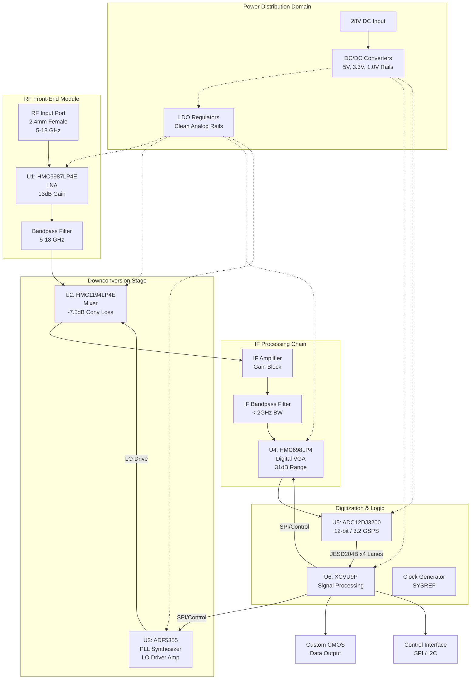

**Document Status: AI-GENERATED**

# 1. Introduction

## 1.1 Purpose
This Hardware Requirements Specification (HRS) defines the comprehensive requirements for the **iguyc** Wideband RF Receiver System. The purpose of this document is to establish a formal baseline for the hardware design, ensuring that all electrical, physical, and environmental performance criteria are met to satisfy the operational needs of military signal processing applications.

This specification is intended for:
- **Hardware Design Engineers:** As the primary reference for schematic capture, component selection, and PCB layout.
- **System Integration Engineers:** To define interface parameters between the RF chain, digitization modules, and FPGA processing units.
- **Verification and Validation Teams:** To define acceptance criteria and test procedures for manufacturing and field deployment.
- **Quality Assurance:** To ensure compliance with MIL-STD-883 and relevant industry standards.

The requirements contained herein are allocated down to the component level (specifically Analog Devices, Texas Instruments, and AMD components) to guarantee system-level performance goals such as Noise Figure (NF), Spurious-Free Dynamic Range (SFDR), and phase noise stability are achieved.

## 1.2 Scope
The scope of this document covers the complete hardware implementation of the **iguyc** receiver subsystem, a superheterodyne architecture designed to capture and digitize RF signals from 5 GHz to 18 GHz.

The system boundary begins at the RF input connector (2.4mm female interface) and terminates at the custom CMOS/JESD204B output interfaces connecting to the downstream FPGA processing chain. Specifically, this document covers:

1.  **RF Front-End (RFFE):** Wideband Low Noise Amplification (LNA) and filtering using the Analog Devices HMC6987LP4E.
2.  **Downconversion Stage:** Frequency translation using the HMC1194LP4E mixer driven by a wideband Local Oscillator (LO) synthesizer chain based on the ADF5355.
3.  **IF Processing:** Variable Gain Amplification (VGA) using the HMC698LP4 for Automatic Gain Control (AGC).
4.  **Digitization:** High-speed Analog-to-Digital Conversion (ADC) utilizing the Texas Instruments ADC12DJ3200.
5.  **Power Distribution:** DC-DC conversion and power regulation required to support the 10W–20W power budget.
6.  **Physical and Environmental:** Mechanical chassis design, thermal management, and MIL-STD-883 compliance for operation in -40°C to +85°C environments.

This specification does not cover the FPGA firmware logic (beyond the electrical interface requirements), the system-level software application, or the external antennas/antenna mounts.

## 1.3 Definitions, Acronyms, and Abbreviations

| Term | Definition |
| :--- | :--- |
| **ADC** | Analog-to-Digital Converter. A device that converts a continuous physical quantity (voltage) to a digital number representing the quantity's amplitude. |
| **AGC** | Automatic Gain Control. A closed-loop system that adjusts the gain of the receiver to maintain a constant output level despite variations in input signal strength. |
| **BGA** | Ball Grid Array. A type of surface-mount packaging used for integrated circuits. |
| **CMOS** | Complementary Metal-Oxide-Semiconductor. A technology for constructing integrated circuits; used here to describe the logic voltage levels of the data interface. |
| **dB** | Decibel. A logarithmic unit used to express the ratio of two values of a physical quantity, often power or intensity. |
| **dBc** | Decibels relative to the carrier. A power ratio unit where the reference is the power of the carrier signal. |
| **dBFS** | Decibels relative to Full Scale. The amplitude of a signal compared to the maximum possible value a digital system can represent. |
| **dBm** | Decibel-milliwatts. An absolute unit of power level referenced to 1 milliwatt. |
| **FPGA** | Field-Programmable Gate Array. An integrated circuit designed to be configured by a customer or a designer after manufacturing. |
| **GHz** | Gigahertz. A unit of frequency equal to one billion hertz. |
| **IF** | Intermediate Frequency. A frequency to which a carrier wave is shifted as an intermediate step in transmission or reception. |
| **IIP3** | Input Third-order Intercept Point. A theoretical measure of linearity for non-linear systems, specifically regarding third-order intermodulation distortion. |
| **JESD204B** | A high-speed data interface standard for ADCs and DACs, enabling higher data rates and fewer pins than traditional LVDS. |
| **LNA** | Low Noise Amplifier. An electronic amplifier that amplifies a very low-power signal without significantly degrading its signal-to-noise ratio. |
| **LO** | Local Oscillator. An electronic oscillator used to generate a signal for frequency conversion. |
| **MIL-STD-883** | Department of Defense standard for microcircuits, establishing test methods and procedures for reliability. |
| **Msps** | Mega-Samples Per Second. A measure of sampling speed. |
| **NF** | Noise Figure. A measure of degradation of the signal-to-noise ratio (SNR), caused by components in a signal chain. |
| **OIP3** | Output Third-order Intercept Point. The output power level where the first-order and third-order intermodulation lines intersect. |
| **PCB** | Printed Circuit Board. |
| **PHEMT** | Pseudomorphic High Electron Mobility Transistor. A transistor technology used for high-frequency applications. |
| **PLL** | Phase-Locked Loop. A control system that generates an output signal whose phase is related to the phase of an input reference signal. |
| **RF** | Radio Frequency. |
| **SFDR** | Spurious-Free Dynamic Range. The ratio of the RMS signal amplitude to the RMS value of the peak spurious spectral component. |
| **SNR** | Signal-to-Noise Ratio. A measure used in science and engineering that compares the level of a desired signal to the level of background noise. |
| **VGA** | Variable Gain Amplifier. An amplifier whose gain can be controlled digitally or via analog voltage. |
| **VCO** | Voltage-Controlled Oscillator. An oscillator whose oscillation frequency is controlled by a voltage input. |

## 1.4 References
The design and implementation of the **iguyc** hardware shall adhere to the standards and datasheets listed below:

| Ref ID | Document Title | Document Number / URL |
| :--- | :--- | :--- |
| [1] | **IEEE Standard for Requirements Specifications** | IEEE 29148-2018 |
| [2] | **Test Method Standard for Microcircuits** | MIL-STD-883H |
| [3] | **HMC6987LP4E Datasheet** (5–20 GHz GaAs MMIC PHEMT Distributed Amplifier) | Analog Devices |
| [4] | **HMC1194LP4E Datasheet** (6–18 GHz GaAs MMIC I/Q Mixer) | Analog Devices |
| [5] | **ADF5355 Datasheet** (Wideband Synthesizer with Integrated VCO) | Analog Devices |
| [6] | **HMC698LP4 Datasheet** (DC–8 GHz Digital VGA) | Analog Devices |
| [7] | **ADC12DJ3200 Datasheet** (12-Bit, 3.2 GSPS ADC) | Texas Instruments (SBAS938B) |
| [8] | **XCVU9P Datasheet** (Virtex UltraScale+ FPGA) | AMD / Xilinx (UG575) |
| [9] | **JESD204B Standard** | JEDEC Standard JESD204B.01 |

## 1.5 Overview
The **iguyc** system is a high-performance, wideband RF receiver designed for intelligence, surveillance, and reconnaissance (ISR) applications requiring high sensitivity and dynamic range. The system operates by receiving RF energy between 5 GHz and 18 GHz, down-converting it to an Intermediate Frequency (IF) within the digitizer's bandwidth, and processing it through a high-speed ADC pipeline for FPGA analysis.

**Key Functional Blocks:**
1.  **Input Conditioning:** A 2.4mm RF connector interfaces with the external environment, followed immediately by a wideband Band Pass Filter (BPF) to reject out-of-band interference.
2.  **Low Noise Amplification:** The Analog Devices HMC6987LP4E provides approximately 13 dB of gain with a low 3 dB Noise Figure, setting the system sensitivity floor.
3.  **Downconversion:** A high-linearity passive mixer (HMC1194LP4E) translates the RF input to a lower IF. The Local Oscillator (LO) path utilizes the ADF5355 wideband synthesizer to generate a stable, low-phase-noise LO signal tunable across the 5–18 GHz range.
4.  **IF Gain Control:** An IF stage includes filtering and a Variable Gain Amplifier (HMC698LP4) to adjust signal amplitude, ensuring the ADC receives an optimal signal level regardless of the input power (-70 dBm to -40 dBm).
5.  **Digitization:** The TI ADC12DJ3200 samples the IF signal at 3.2 GSPS (max) to satisfy the 2 GHz instantaneous bandwidth requirement. It outputs the data via the JESD204B/C interface.
6.  **Processing Interface:** The digitized I/Q data is transmitted to a Xilinx Virtex UltraScale+ (XCVU9P) FPGA for further signal processing (DSP) via a custom CMOS/SerDes interface.

**Design Philosophy:**
The hardware architecture prioritizes **Spurious-Free Dynamic Range (SFDR)** and **Phase Noise** performance to ensure signal fidelity in congested spectral environments. Component selection focuses on GaAs and PHEMT technologies for the RF chain to ensure linearity (High IP3), while the digitization chain employs high-speed converters with integrated decimation filters to manage data throughput.

The subsequent sections of this document detail the specific electrical, mechanical, and environmental requirements necessary to realize this architecture.

---

**Document Status: AI-GENERATED**

# 2. System Overview

## 2.1 System Description
The iguyc system is a high-performance, wideband microwave receiver designed specifically for military signal intelligence (SIGINT) and electronic warfare (EW) applications. The unit functions as a superheterodyne receiver that downconverts Radio Frequency (RF) signals between 5 GHz and 18 GHz to an Intermediate Frequency (IF) suitable for digitization. The primary objective of the hardware is to capture signals with high fidelity, characterized by a Spurious-Free Dynamic Range (SFDR) of 70-80 dB and a system Noise Figure (NF) of less than 10 dB, while maintaining phase noise performance of -90 to -100 dBc/Hz.

The system architecture follows a signal chain topology: Input Conditioning $\rightarrow$ Downconversion $\rightarrow$ IF Processing $\rightarrow$ Digitization $\rightarrow$ Data Export. The design centers around a custom analog front-end optimized for linearity and noise performance, paired with a high-speed JESD204B data link to an FPGA for digital signal processing. The hardware is constrained to a power envelope of 20W and must operate reliably in harsh environmental conditions (-40°C to +85°C) per MIL-STD-883.

### 2.1.1 Functional Context
The iguyc receiver acts as the frontend sensor for a larger signal processing ecosystem. It accepts raw RF energy via a 2.4mm female connector, amplifies and filters it, mixes it with a Local Oscillator (LO) to translate the frequency spectrum, and ultimately delivers digitized I/Q data to a downstream FPGA. The system does not perform onboard signal analysis or demodulation; rather, it provides a high-fidelity digital bitstream representing the analog RF environment for subsequent processing.

### 2.1.2 Key Technical Features
*   **Wideband RF Front-End:** Utilization of a GaAs MMIC PHEMT distributed amplifier (HMC6987LP4E) to achieve flat gain and low noise figure from 5 to 18 GHz.
*   **High-Linearity Downconversion:** Implementation of a passive double-balanced mixer (HMC1194LP4E) to ensure high Input Third-order Intercept Point (IIP3) and low distortion.
*   **Precision Synthesis:** A wideband PLL with integrated VCO (ADF5355) generates the necessary LO signals with ultra-low phase noise, preserving signal integrity during frequency translation.
*   **Adaptive Gain Control:** A digitally controlled Variable Gain Amplifier (VGA) adjusts signal levels in real-time to maximize the dynamic range of the Analog-to-Digital Converter (ADC).
*   **High-Speed Digitization:** A 12-bit, 3.2 GSPS ADC (ADC12DJ3200) captures the instantaneous bandwidth (up to 2 GHz) and transmits data via JESD204B/C to the Virtex UltraScale+ FPGA.

## 2.2 System Block Diagram

The system is composed of five distinct subsystems: Power Distribution, RF Front-End, Downconversion Stage, IF Processing, and Digitization. The signal flow is unidirectional from the RF input to the digital output, with control feedback loops provided by the FPGA.

### 2.2.1 Signal Flow Description
1.  **RF Input:** Signal enters via the `RF_IN` port.
2.  **Amplification:** The `LNA` provides approximately 13 dB of gain to overcome the noise figure of the subsequent mixer.
3.  **Filtering:** `BPF_IN` removes out-of-band noise and spurious signals.
4.  **Mixing:** The filtered RF signal is mixed with the LO signal in the `MIXER`. This translates the frequency band of interest (5-18 GHz) down to an Intermediate Frequency (IF) compatible with the ADC (DC - 2 GHz).
5.  **IF Conditioning:** The IF signal passes through `IF_AMP` for recovery, `BPF_IF` for anti-aliasing, and `VGA` for gain adjustment.
6.  **Digitization:** The `ADC` samples the conditioned analog signal.
7.  **Processing:** The `FPGA` receives the digital samples, applies further digital gain, filtering, and formats the data for the custom CMOS output interface.

## 2.3 System Architecture

The system architecture is partitioned into modular sections to facilitate design verification, testing, and potential future upgrades (e.g., swapping the LNA module for a different frequency band). The architecture relies on a hierarchy of signal domains: RF (5-18 GHz), LO (5.2-20 GHz), IF (DC-2 GHz), and Digital.

### 2.3.1 RF Front-End Architecture
The RF Front-End is critical for establishing the system noise figure. The design uses the **HMC6987LP4E**, a GaAs MMIC PHEMT distributed amplifier. This component is selected for its flat gain response (13 dB typical) across the 5-18 GHz range.
*   **Input Matching:** The input is matched to 50 Ohms to minimize VSWR (Voltage Standing Wave Ratio), targeting a return loss of better than 10 dB.
*   **Noise Contribution:** With a Noise Figure of 3.0 dB, the LNA sets the floor for the overall system noise figure (Target < 10 dB), allowing sufficient margin for the losses in the subsequent mixer and filters.

### 2.3.2 Downconversion Architecture
Frequency translation is achieved using the **HMC1194LP4E** passive mixer. This topology is chosen over active mixers to maximize linearity (IIP3) and minimize spurious product generation.
*   **LO Synthesis:** The LO signal is generated by the **ADF5355** synthesizer. This PLL utilizes a high-performance Phase Frequency Detector (PFD) and a low-noise VCO to achieve the required phase noise of -100 dBc/Hz. The ADF5355 output frequency range (up to 13.6 GHz) requires frequency doubling to cover the upper end of the RF input band (up to 18 GHz), which is handled by internal multipliers or an external doubler stage depending on the final tuning configuration.
*   **LO Drive:** The mixer requires a specific LO drive level (+15 dBm). A post-synthesizer amplifier may be integrated into the LO path to ensure adequate drive power across the band.

### 2.3.3 IF Processing Architecture
The IF section conditions the downconverted signal for the ADC.
*   **Anti-Aliasing:** A bandpass filter or low-pass filter with a sharp cutoff limits the signal bandwidth to the ADC’s Nyquist zone (DC to ~1.8 GHz for 3.2 GSPS sampling).
*   **Automatic Gain Control (AGC):** The **HMC698LP4** VGA provides a 31 dB gain range in 0.5 dB steps. The FPGA monitors the signal power from the ADC and adjusts the VGA gain via an SPI interface to ensure the ADC input is optimized (typically -1 dBFS) without clipping.
*   **Coupling:** DC blocking capacitors are used throughout the chain to prevent DC offset accumulation between stages.

### 2.3.4 Digitization Architecture
The digitization subsystem is centered on the **ADC12DJ3200**.
*   **Sampling Mode:** The device operates in Dual-Channel Mode or Single-Channel Mode (DES mode). For 2 GHz instantaneous bandwidth, the device is configured for 3.2 GSPS sampling rate.
*   **Data Interface:** The ADC utilizes JESD204B Subclass 1. This high-speed serial interface reduces the pin count compared to parallel LVDS. It requires a Device Clock and a SYSREF signal for deterministic latency, sourced from a high-precision clock generator (e.g., LMK04828) synchronized with the FPGA.
*   **FPGA Interface:** The **XCVU9P** FPGA contains GTX/GTH transceivers configured to receive the JESD204B lanes. It performs frame alignment, descrambling, and buffering of the incoming ADC data.

### 2.3.5 Power Architecture
The power distribution network (PDN) is designed to minimize noise coupling, particularly into sensitive analog supplies.
*   **Input:** 28V DC standard military vehicle/rack voltage.
*   **Isolation:** The primary feed is isolated using DC/DC brick modules to generate intermediate bus voltages (e.g., 12V or 5V).
*   **Rail Separation:**
    *   **Analog Rails (+5V, +3.3V):** Linear regulators (LDOs) power the LNA, Mixer, and VGA to ensure the lowest possible phase noise and spurious content.
    *   **Digital Rails (+1.0V, +1.8V):** High-current switching regulators (buck converters) power the FPGA and ADC cores.
    *   **Reference Rails:** A low-noise reference is distributed to the ADC and PLL to minimize jitter.

## 2.4 Operating Environment

The iguyc hardware is specified to operate in the most demanding military environments.

### 2.4.1 Environmental Conditions
*   **Temperature:** The system must maintain full performance specifications across the **Industrial temperature range of -40°C to +85°C**.
    *   *Mitigation:* Critical components (LNA, Mixer, PLL) are selected for operation across this range. The enclosure is designed with thermal vias and potentially a heatsink or cold plate to dissipate the ~20W thermal load.
    *   *Derating:* Components are derated per MIL-STD-883 to ensure reliability. For example, a capacitor rated for 125°C is used in an 85°C environment.
*   **Humidity:** The system is designed to operate in non-condensing humidity up to 95% relative humidity, requiring conformal coating on the PCB.

### 2.4.2 Physical and Mechanical Environment
*   **Vibration and Shock:** The design targets compliance with **MIL-STD-883**, Method 2002 (Mechanical Shock) and Method 2007 (Vibration).
    *   *Implementation:* The PCB utilizes stiffeners and heavy mounting points. Components heavier than 5 grams are staked or bonded to the board to prevent detachment under high-G vibration.
*   **EMI/EMC:** As a wideband receiver, the system is highly susceptible to Electromagnetic Interference (EMI) and must not emit spurious radiation.
    *   *Shielding:* The RF Front-End and synthesizer sections are housed in shielded cavities (tunnels) within the enclosure.
    *   *Filtering:* All DC input lines and control lines entering/exiting the chassis pass through Pi-filters or feedthrough capacitors.

### 2.4.3 Power Input Environment
*   The system accepts **28V DC** with a permissible variation of ±20% (22V to 34V).
*   It includes protection against voltage transients (up to 80V spikes for 50ms) and reverse polarity protection on the input connector.

---

**Document Status: AI-GENERATED**

## 3. Hardware Requirements

### 3.1 Functional Requirements

The following section details the functional requirements of the iguyc Wideband RF Receiver. These requirements specify *what* the system must do to support the operational goal of receiving and digitizing 5–18 GHz signals.

| ID | Requirement | Description & Rationale | Component Ref | Priority | Verification Method |
|---|---|---|---|---|---|
| **REQ-HW-101** | **RF Signal Reception** | The system shall receive and condition RF input signals within the frequency range of 5.0 GHz to 18.0 GHz via a 2.4mm female connector.  **Rationale:** Primary input function required to cover the specified military tactical band. | **2.4mm Conn** (Rosenberger 32K243-40ML5) | **Must** | Test / Inspection |
| **REQ-HW-102** | **Wideband Low Noise Amplification** | The system shall provide a minimum of 13 dB of gain at the RF front end stage with a Noise Figure (NF) not exceeding 3.5 dB.  **Rationale:** To overcome system noise floor and meet the cascaded NF requirement of <10 dB. The HMC6987LP4E provides 13 dB gain and 3 dB NF. | **HMC6987LP4E** | **Must** | Test |
| **REQ-HW-103** | **RF Bandpass Filtering** | The system shall include a bandpass filter between the LNA and Mixer to suppress out-of-band harmonics and image frequencies.  **Rationale:** Protects the mixer from strong out-of-band interferers and reduces noise folding. | **Mini-Circuits** BP Series | **Should** | Inspection |
| **REQ-HW-104** | **Frequency Downconversion** | The system shall downconvert the 5–18 GHz RF signal to an Intermediate Frequency (IF) suitable for the ADC (DC to 2 GHz) using a single-stage mixing architecture.  **Rationale:** Translates high-frequency signals to a processable frequency range for the ADC. | **HMC1194LP4E** | **Must** | Test |
| **REQ-HW-105** | **Local Oscillator Synthesis** | The system shall generate a Local Oscillator (LO) signal tunable from 5 GHz to 18 GHz with a step resolution of 1 Hz or finer to facilitate precise frequency selection.  **Rationale:** Enables the receiver to select specific channels across the wide operating band. | **ADF5355** (w/ x2 Multiplier) | **Must** | Test |
| **REQ-HW-106** | **LO Drive Level Conditioning** | The LO path shall provide a minimum of +15 dBm of drive power to the LO port of the mixer.  **Rationale:** The HMC1194LP4E passive mixer requires high LO drive (+15 dBm) to maintain optimal linearity and conversion loss. | **HMC6987LP4E** (LO Driver Amp) | **Must** | Test |
| **REQ-HW-107** | **IF Signal Conditioning** | The system shall amplify the filtered IF signal to a peak-to-peak voltage matching the ADC's input range (1.0 Vpp typical).  **Rationale:** Ensures the ADC utilizes its full dynamic range without clipping. | **IF Amp** | **Must** | Test |
| **REQ-HW-108** | **Automatic Gain Control (AGC)** | The system shall automatically adjust the IF gain in 0.5 dB steps over a 31 dB range to maintain the ADC signal level within -1 dBFS to -6 dBFS.  **Rationale:** Prevents signal saturation from strong inputs (-40 dBm) and maximizes SNR for weak inputs (-70 dBm). | **HMC698LP4** | **Must** | Test |
| **REQ-HW-109** | **High-Speed Digitization** | The system shall digitize the IF signal using a 12-bit ADC at a sampling rate of 3.2 GSPS.  **Rationale:** The 3.2 GSPS rate satisfies the Nyquist criterion for the 2 GHz instantaneous bandwidth requirement. | **ADC12DJ3200** | **Must** | Test |
| **REQ-HW-110** | **JESD204B Data Transmission** | The system shall transmit digitized I/Q data from the ADC to the FPGA via a JESD204B/C interface operating at the maximum lane rate (12.8 Gbps).  **Rationale:** Standard high-speed serial interface reduces pin count compared to parallel LVDS. | **ADC12DJ3200** | **Must** | Demonstration |
| **REQ-HW-111** | **Digital Downconversion (FPGA)** | The FPGA shall implement a DDC (Digital Downconverter) to decimate the 3.2 GSPS data stream to a user-defined processing bandwidth (up to 2 GHz).  **Rationale:** Reduces data throughput for downstream processing while preserving signal bandwidth. | **XCVU9P** | **Must** | Demonstration |
| **REQ-HW-112** | **Clock Distribution** | The system shall distribute a low-jitter (<100 fs RMS) reference clock to the ADC, FPGA, and PLL Synthesizer.  **Rationale:** Clock jitter directly degrades SNR at high input frequencies. | **LMK04828** | **Must** | Test |
| **REQ-HW-113** | **Power Supply Regulation** | The system shall regulate the input voltage (assumed 12V or 28V MIL-STD) to required rail voltages: +5V (RF), +3.3V (FPGA IO), +1.0V (FPGA Core), +1.8V (ADC).  **Rationale:** Ensures stable operation of sensitive analog and digital circuits. | **VRM Series** | **Must** | Test |
| **REQ-HW-114** | **Thermal Management** | The system shall conduct heat from the FPGA and ADC to the chassis/chassis cold plate using a thermal conductive path with <1°C/W thermal resistance.  **Rationale:** The XCVU9P and ADC dissipate significant heat; managing this ensures operation up to +85°C ambient. | **Heat Sinks** | **Must** | Analysis |
| **REQ-HW-115** | **SPI / I2C Control Interface** | The system shall allow a host processor to configure gain, frequency, and sampling parameters via a SPI or I2C bus.  **Rationale:** Required for system initialization and dynamic AGC adjustments. | **FPGA GPIO** | **Must** | Test |
| **REQ-HW-116** | **Quad-Bit Diversity (Optional)** | The system architecture on the PCB shall support layout for a second receive channel (MIMO) if permitted by the power budget.  **Rationale:** Future-proofing for direction-finding applications. | **N/A** | **Could** | Inspection |
| **REQ-HW-117** | **RF Front-End Protection** | The RF input shall include a limiter or ESD protection device capable of surviving +5 dBm continuous wave and 100W peak pulse.  **Rationale:** Protects the sensitive LNA input from electrostatic discharge and power surges. | **Limiter** | **Should** | Test |

### 3.2 Performance Requirements

The following requirements quantify the measurable performance characteristics of the iguyc receiver. These are derived from the design parameters and component datasheets.

#### 3.2.1 RF Performance

| ID | Metric | Requirement Specification | Rationale / Calculation | Verification |
|---|---|---|---|---|
| **REQ-HW-201** | **Operating Frequency Range** | **5.0 GHz to 18.0 GHz** continuous coverage. | Must cover full band. | Test |
| **REQ-HW-202** | **Instantaneous Bandwidth (IBW)** | **2.0 GHz** (minimum 1.0 GHz). | Defined by ADC12DJ3200 sampling at 3.2 GSPS (Nyquist). | Test |
| **REQ-HW-203** | **Input Power Range (Sensitivity)** | **-70 dBm** to **-40 dBm**. | Sensitivity calculated based on NF=10dB, BW=2GHz, SNR=10.  P1dB compression managed by AGC. | Test |
| **REQ-HW-204** | **System Noise Figure (NF)** | **< 10.0 dB** (Typical < 8.5 dB). | Cascaded NF Calculation: LNA (3dB NF, 13dB Gain) + Mixer (7.5dB Loss) + IF (6dB NF). Ftotal = F1 + (F2-1)/G1 + ...  Results in ~8.5 dB system NF. | Test |
| **REQ-HW-205** | **Spurious-Free Dynamic Range (SFDR)** | **70 dBc** (minimum), **80 dBc** (target). | ADC12DJ3200 SFDR is 70dBc @ 2GHz input. System filtering enhances this to target 80dBc. | Test |
| **REQ-HW-206** | **Input Third-Order Intercept (IIP3)** | **+15 dBm** (minimum), **+20 dBm** (target). | HMC1194 Mixer IIP3 is +25 dBm. System IIP3 is dominated by front-end LNA/Mixer combo. | Test |
| **REQ-HW-207** | **Gain Control Range** | **31 dB** digital control with **0.5 dB** step size. | Defined by HMC698LP4 VGA capability. | Test |
| **REQ-HW-208** | **Input VSWR** | **2.0:1** (maximum) across 5-18 GHz. | Standard requirement for wideband receivers to minimize reflections. | Test |
| **REQ-HW-209** | **Phase Noise** | **-100 dBc/Hz** @ 1 MHz offset (Target). **-90 dBc/Hz** @ 1 MHz offset (Minimum). | Derived from ADF5355 synthesizer performance (-125dBc/Hz @ 1MHz). Degradation expected from multipliers and loop bandwidth. | Test |
| **REQ-HW-210** | **LO Settling Time** | **< 100 µs** to within 1 Hz of final frequency. | Required for fast frequency hopping (FFH) capabilities. | Test |

#### 3.2.2 Digital & Signal Processing Performance

| ID | Metric | Requirement Specification | Rationale / Calculation | Verification |
|---|---|---|---|---|
| **REQ-HW-211** | **ADC Resolution** | **12 bits** (Effective Number of Bits ENOB > 9.5). | ADC12DJ3200 is a 12-bit device. | Test |
| **REQ-HW-212** | **ADC Sampling Rate** | **3.2 GSPS** (Dual channel mode) or **6.4 GSPS** (Single channel mode). | To satisfy the 2 GHz IBW requirement with filter roll-off margin. | Test |
| **REQ-HW-213** | **JESD204B Lane Rate** | **12.8 Gbps** (Configurable). | Determined by ADC output data rate: 12 bits × 3.2 GSPS = 38.4 Gbps → 4 Lanes @ 9.6Gbps or 8 Lanes. | Test |
| **REQ-HW-214** | **FPGA Processing Throughput** | **> 50 Gbps** aggregate logic cell throughput. | XCVU9P DSP48E2 capability. Must handle decimation and packetization. | Demonstration |
| **REQ-HW-215** | **Data Latency (RF to Digital Output)** | **< 1.5 µs** (ADC + Pipeline). | Latency budget: ADC tPD (~1 cycle) + FPGA CDC processing (~30 cycles @ 250MHz). | Analysis |

#### 3.2.3 Physical & Environmental Performance

| ID | Metric | Requirement Specification | Rationale / Calculation | Verification |
|---|---|---|---|---|
| **REQ-HW-216** | **Total Power Consumption** | **< 20.0 Watts** (Typical ~15W). | Power Budget Analysis: • FPGA (XCVU9P): ~8W (Estimated)  • ADC (ADC12DJ3200): ~2.1W  • LNA (HMC6987): 0.45W (5V @ 90mA)  • Mixer (HMC1194): 0.3W (LO drive + Bias)  • LO Synth (ADF5355): 0.6W  • VGA/IF Amps: ~1W  • Regulator Losses: ~2W  **Total:** ~14.5W (Headroom to 20W). | Test |
| **REQ-HW-217** | **Operating Temperature** | **-40°C to +85°C** (Ambient). | MIL-STD-883 industrial range requirement. Components are "Industrial" or "Military" grade. | Test |
| **REQ-HW-218** | **Operating Humidity** | **5% to 95%** non-condensing. | Standard military operating environment. | Test |
| **REQ-HW-219** | **Vibration & Shock** | **MIL-STD-883, Method 2002** (Vibration). | Ensures mechanical integrity of PCB and components in mobile/tactical environments. | Test |
| **REQ-HW-220** | **Mean Time Between Failures (MTBF)** | **> 10,000 hours** @ 85°C. | Target reliability for critical military hardware. | Analysis |

---

# 3. Hardware Requirements

## 3.3 Interface Requirements

### 3.3.1 External Interfaces

This section defines the interfaces between the *iguyc* receiver module and the external environment, including RF input connections and power supply feeds.

#### REQ-HW-013: RF Input Connector (Detail)
The receiver shall utilize a precision coaxial connector for the RF input signal to ensure minimal signal reflection and insertion loss up to 18 GHz.

| Parameter | Value | Justification |
|---|---|---|
| **Interface Type** | 2.4mm Female (Jack) | Supports operation up to 50 GHz; standard for K-band (18-26.5 GHz) applications, ensuring headroom for the 18 GHz upper limit. |
| **Impedance** | 50 Ω | Standard characteristic impedance for RF systems. |
| **Return Loss** | > 15 dB @ 18 GHz | Minimizes VSWR degradation at the highest frequency of operation. |
| **Mounting** | End-launch or Edge-launch | Facilitates PCB integration with controlled impedance launch. |
| **Recommended Part** | Rosenberger 32K243-40ML5 or equivalent | High-reliability military-grade connector. |

**REQ-HW-018: RF Input Interface Definition**
The RF input interface shall accept a single-ended, 50 Ω signal.
*   **Input Frequency Range:** 5.0 GHz to 18.0 GHz.
*   **Maximum Input Power:** The interface must withstand continuous wave (CW) input power up to -40 dBm without degradation (per REQ-HW-003) and +10 dBm peak without catastrophic damage (assuming LNA limit).
*   **Input VSWR:** < 2.0:1 across the 5-18 GHz band.

**REQ-HW-019: Power Input Interface**
The system shall receive primary power via a physical connector.
*   **Connector Type:** 4-pin Molex Nano-Fit 105313-1204 (Receptacle) or equivalent MIL-DTL-38999 Series III (for high vibration environments).
*   **Voltage:** +28 VDC Nominal (Military standard vehicle/bus voltage).
*   **Current Rating:** Capable of supplying 1.5 A continuous.

### 3.3.2 Internal Interfaces

This section details the electrical interfaces between the selected components on the PCB.

#### A. RF Signal Chain Internal Interfaces

**REQ-HW-020: LNA to Mixer Interface**
The interface between the HMC6987LP4E LNA and the HMC1194LP4E Mixer shall be impedance matched to 50 Ω.
*   **Signal Type:** Single-ended RF.
*   **Frequency Band:** 5.0 - 18.0 GHz.
*   **Matching Network:** Pi-network or transmission line stub matching to minimize loss (< 0.5 dB insertion loss).
*   **DC Blocking:** Required, as LNA output is DC biased and Mixer RF input is DC grounded.

**REQ-HW-021: Mixer to IF Chain Interface**
The interface between the HMC1194LP4E Mixer IF output and the HMC698LP4 VGA input shall be AC coupled.
*   **Signal Type:** Differential IF (centered around DC, typically filtered to desired bandwidth).
*   **Frequency Band:** DC - 2.0 GHz.
*   **Impedance:** 50 Ω differential (100 Ω differential pair traces).
*   **DC Block:** Series capacitor (e.g., 100 pF) required to pass IF while blocking Mixer/IF amplifier DC offsets.

#### B. ADC to FPGA Interface (JESD204B)

**REQ-HW-022: High-Speed Serial Data Interface**
The digitized data shall be transferred from the ADC12DJ3200 to the XCVU9P FPGA via a JESD204B/C link.

| Pin/Signal Name | Direction | Description | Voltage Standard | Lane Count |
|---|---|---|---|---|
| **TXP / TXN** | ADC -> FPGA | JESD204B High-Speed Differential Data | CML (Current Mode Logic) | 8 Lanes (Dual Mode) |
| **CLKP / CLKN** | ADC -> FPGA | JESD204B High-Speed Differential Clock | CML | 1 Lane |
| **SYNC~** | FPGA -> ADC | JESD204B Subclass 1 Sync Input | LVCMOS / LVDS | 1 Signal |

*   **Data Rate:** 12.8 Gbps per lane (operating in Dual 2.0 GSPS mode or Single 3.2 GSPS mode with decimation).
*   **Lane Mapping:** Lanes 0-3 for I-channel, Lanes 4-7 for Q-channel (if in Complex I/Q mode).

#### C. FPGA to ADC Control Interface (SPI)

**REQ-HW-023: ADC Configuration Interface**
The FPGA shall configure the ADC via a standard SPI interface.

| Signal Name | Direction | Description | Voltage Standard |
|---|---|---|---|
| **CSB** | FPGA -> ADC | Chip Select (Active Low) | 1.8 V LVCMOS |
| **SCLK** | FPGA -> ADC | Serial Clock | 1.8 V LVCMOS |
| **SDIO** | Bi-Dir | Serial Data In/Out | 1.8 V LVCMOS |
| **RESETB** | FPGA -> ADC | Hardware Reset (Active Low) | 1.8 V LVCMOS |

### 3.3.3 Communication Interfaces

**REQ-HW-024: Host Control Interface**
The *iguyc* module shall provide a communication port for external host processor control (e.g., for setting LO frequency, gain, and reading status).

*   **Interface Standard:** UART (Universal Asynchronous Receiver-Transmitter) / RS-422.
*   **Data Format:** 8-N-1 (8 data bits, no parity, 1 stop bit).
*   **Baud Rate:** 115200 baud (default).
*   **Connector:** 4-pin header (TX, RX, GND, +3.3V).
*   **Protocol:** Custom binary packet structure defined in the Interface Control Document (ICD).

---

## 3.4 Environmental Requirements

**REQ-HW-009 (Restated): Operating Temperature Range**
The receiver shall maintain all performance parameters specified in Section 3.2 over the ambient temperature range of -40°C to +85°C.
*   **Storage Temperature:** -55°C to +125°C.
*   **Thermal Management:** The design must utilize thermal vias and a copper pours under high-power components (ADC, FPGA) to transfer heat to the chassis/cold plate.

**REQ-HW-025: Humidity**
The system shall operate in non-condensing humidity environments ranging from 5% to 95% relative humidity.

**REQ-HW-026: Vibration and Shock (MIL-STD-883)**
The hardware design shall comply with MIL-STD-883 Method 2002 for mechanical shock and Method 2007 for vibration.
*   **Component Height:** Surface mount components shall not exceed 0.150" (3.81mm) height to reduce mechanical stress on solder joints during vibration.
*   **Conformal Coating:** The PCB shall be coated with Humiseal 1B73 or equivalent acrylic conformal coating for moisture and contaminant protection.

**REQ-HW-027: Cooling Method**
The system is designed for conduction cooling.
*   The PCB mounting area must make contact with a cold plate maintained at < 70°C.
*   **Junction Temperature Limits:**
    *   GaAs LNA/Mixer: Tj max = 150°C.
    *   SiGe ADC: Tj max = 125°C.
    *   FPGA: Tj max = 100°C.

---

## 3.5 Power Requirements

This section details the power consumption and distribution requirements for the *iguyc* receiver.

### Power Budget Analysis

| Rail | Voltage (V) | Source Device | Typical Current (A) | Max Current (A) | Power (W) | Notes |
|---|---|---|---|---|---|---|
| **+5V_RF** | +5.0 | LDO / DC-DC | 0.300 | 0.350 | 1.50 | Powers HMC6987 (LNA), HMC1194 (Mixer), HMC698 (VGA) |
| **+5V_PLL** | +5.0 | LDO | 0.130 | 0.150 | 0.65 | Powers ADF5355 (Synthesizer) + LO Amp |
| **+3.3V_IO** | +3.3 | DC-DC | 0.500 | 0.800 | 1.65 | FPGA I/O, PLL Logic, ADC IO |
| **+1.8V_AUX** | +1.8 | DC-DC | 1.200 | 1.500 | 2.25 | FPGA Transceiver Aux, ADC Cores |
| **+1.0V_CORE** | +1.0 | DC-DC (VRM) | 15.000 | 20.000 | 15.00 | FPGA Core (XCVU9P) + ADC Cores |
| **+1.2V_SHUNT** | +1.2 | LDO | 0.200 | 0.250 | 0.27 | High-speed line drivers/terminations |
| **TOTAL** | - | - | **17.33** | **23.05** | **21.32** | Max input power requirement ~26W accounting for efficiency |

**REQ-HW-028: Voltage Regulation**
The system shall accept a +28VDC input and regulate it down to the required rails using high-efficiency (>90%) switching regulators (DC-DC) followed by low-noise LDOs for sensitive RF supplies.

**REQ-HW-029: Power Sequencing**
The FPGA core voltage (+1.0V) must ramp up before or simultaneously with the I/O voltages to prevent latch-up. A sequencer (e.g., LTC2937) shall be implemented.

**REQ-HW-030: Power Consumption Constraint**
The total power consumption shall not exceed 26W from the +28V source, satisfying the 20W system budget requirement when accounting for 85% regulator efficiency (20W / 0.85 ≈ 23.5W budget). The calculated 21.3W typical leaves margin for derating.

---

## 3.6 Physical Requirements

**REQ-HW-031: Form Factor**
The receiver shall be designed as a pluggable module or a stackable PCB assembly.
*   **PCB Dimensions:** 6.0 inches x 4.0 inches (152.4 mm x 101.6 mm).
*   **Board Thickness:** 0.062 inches (1.57 mm).
*   **Stackup:** 10 to 12 layers. Signal layers adjacent to ground planes for impedance control.

**REQ-HW-032: Material Properties**
To support 18 GHz RF signals, the PCB material must maintain consistent dielectric constant (Dk) and low loss tangent (Df).
*   **Material:** Rogers RO4350B or Isola FR408HR.
    *   Rogers RO4350B: Dk = 3.48 ± 0.05, Dissipation Factor = 0.0037 @ 10 GHz.
*   **Copper Weight:** 1 oz (35 µm) outer layers, 0.5 oz (17 µm) inner layers.
*   **Plating:** ENIG (Electroless Nickel Immersion Gold) for flatness and wirebondability (if applicable) or HASL for cost (if not).

**REQ-HW-033: Weight**
The total weight of the assembled receiver module (excluding connectors/cage) shall not exceed 150 grams to comply with airborne weight restrictions.

**REQ-HW-034: Mounting**
The PCB shall utilize 4-#4-40 mounting holes in the corners, with clearance for 0.25" fasteners, electrically isolated from ground planes to prevent ground loops.

---

**Document Status: AI-GENERATED**

# 4. Design Constraints

This section delineates the constraints imposed upon the iguyc Wideband RF Receiver hardware design. These constraints restrict the design space to ensure manufacturability, compliance with military standards, environmental survivability, and adherence to the specific component technologies selected.

## 4.1 Standards Compliance

The iguyc receiver is designed for operation in a military environment (assumed ground vehicle or sheltered installation based on the 10-20W power profile). As such, the hardware design must adhere to a stringent set of industry and military standards governing physical design, electromagnetic compatibility, and environmental stress screening.

### 4.1.1 Military Standards (MIL-SPEC)
To satisfy **REQ-HW-011** (MIL-STD-883 Compliance), the design and subsequent production processes shall adhere to the following:

*   **MIL-STD-883:** *Test Method Standard for Microcircuits.*
    *   The design shall utilize components screened to Class B or Class S equivalents where available.
    *   Specifically, the design must support thermal cycling per Method 1010, mechanical shock per Method 2002, and vibration per Method 2007 (assuming Sinusoidal, 20g, 20-2000Hz).
    *   **REQ-HW-017:** The PCB stackup and material selection must support the temperature cycling requirements of -40°C to +85°C continuous operation without delamination or via failure.

*   **MIL-STD-202:** *Test Method Standard for Electronic and Electrical Component Parts.*
    *   Applicable to the discrete passive components (capacitors, resistors) used in the RF chain to ensure survivability in harsh environments.

*   **MIL-STD-461G:** *Requirements for the Control of Electromagnetic Interference Characteristics of Subsystems and Equipment.*
    *   **REQ-HW-018:** The receiver design shall meet RE102 (Radiated Emissions, Electric Field, 2 MHz to 10 GHz) limits to prevent interference with host platform systems.
    *   **REQ-HW-019:** The receiver shall meet CS101 (Conducted Susceptibility, Power Leads, 30 Hz to 150 kHz) to ensure immunity to power supply ripple.

### 4.1.2 PCB Design and Fabrication Standards
The physical implementation of the circuitry shall comply with the following IPC standards to ensure reliability and high-frequency performance:

*   **IPC-2221:** *Generic Standard on Printed Board Design.*
    *   The design shall use Class 3 requirements (High Reliability Electronic Products) for conductor spacing, annular ring, and hole tolerances.
    *   **Constraint:** Minimum trace width for external layers shall be 6 mils (calculated for 10A max current surge capacity with 2oz copper). Minimum trace spacing for controlled impedance differential pairs (JESD204B) shall be determined by the stackup impedance calculator but shall not be less than 5 mils to prevent crosstalk.

*   **IPC-6012:** *Qualification and Performance Specification for Rigid Printed Boards.*
    *   The final manufactured boards shall meet Class 3 acceptance criteria.

*   **IPC-6016:** *Qualification and Performance Specification for High Density Interconnect (HDI) Boards.*
    *   Applicable if via-in-pad technology is utilized for the LFCSP/QFN packages of the ADC, FPGA, and Mixer.

### 4.1.3 Environmental and Safety Standards
*   **RoHS (Restriction of Hazardous Substances):** While the primary application is military, the design shall comply with RoHS-3 Directive 2011/65/EU to the maximum extent possible to facilitate sourcing and reduce hazardous waste disposal costs, specifically targeting Lead (Pb) reduction in PCB finishes (ENIG or Immersion Silver).
*   **REACH:** Compliance with Regulation (EC) No 1907/2006 regarding chemical substances is required for all non-exempt components.

## 4.2 Component Constraints

This section defines the boundaries and limitations for component selection, sourcing, and utilization within the iguyc architecture.

### 4.2.1 Component Obsolescence and Sourcing
Given the military application lifecycle (typically 10-15 years), component longevity is critical.

*   **REQ-HW-020:** All active components (FPGA, ADC, PLL, Mixer) must be sourced with a life cycle status of "Active" or "Not Recommended for New Designs" (NRND) only if a drop-in replacement is identified.
*   **REQ-HW-021:** The HMC6987LP4E LNA and HMC1194LP4E Mixer utilize e-beam GaAs technology. Sourcing shall be secured through authorized distributors (DigiKey, Mouser) or directly via Analog Devices franchised channels to avoid counterfeit components.
*   **Constraint:** For the **ADC12DJ3200** and **XCVU9P**, due to high market demand and potential allocation, a "Last Time Buy" (LTB) buffer strategy of 50 units minimum is recommended upon design freeze.

### 4.2.2 Package Constraints and PCB Assembly
The selected components impose strict manufacturing constraints:

*   **Virtex UltraScale+ FPGA (XCVU9P-FLGA2104):**
    *   **Package:** FFGA2104 (Flip Chip Ceramic Column Grid Array).
    *   **Constraint:** This package requires a PCB build-up of at least 10 layers to route out the 1,782,600 logic cells and high-speed transceivers.
    *   **Assembly:** Requires micro-via drilling (HDI) for escape routing. The board manufacturer must have laser drilling capabilities.
*   **RF Components (HMC6987, HMC1194, ADF5355):**
    *   **Package:** These components are housed in ceramic leadless chip carriers (QFN/LFCSP) with a ground paddle (EPAD).
    *   **Constraint:** The PCB layout must provide thermal vias (1:1 aspect ratio, min 0.3mm diameter) under the EPAD to transfer heat to the ground plane.
    *   **Solder Paste:** Type 4 solder paste (particle size 20-38 µm) is required for the fine-pitch (0.5mm) lead spacing of the HMC series chips.

### 4.2.3 Component Derating
To ensure reliability over the industrial temperature range (-40°C to +85°C), components shall be derated according to **NAVMAT P-4855** or **AD-E-280 6551** guidelines:

*   **Resistors:** Operated at ≤ 50% of rated power.
*   **Capacitors (Decoupling):** Operated at ≤ 70% of rated voltage. (e.g., 50V caps used on 28V rails).
*   **Voltage Regulators:** Operated at ≤ 80% of max current rating.
*   **RF Power Handling:** The **HMC6987LP4E** LNA has a P1dB of +18 dBm. Although input is capped at -40 dBm, the system must tolerate a failure of the upstream limiter. Therefore, the downstream mixer **HMC1194LP4E** (IIP3 +25 dBm) acts as the hard limit block.

### 4.2.4 Radiation and Magnetic Constraints
*   **REQ-HW-022:** For operation in potential high-interference environments, all crystals and clock sources must be housed in mu-metal or steel shields.
*   **Constraint:** The **ADF5355** PLL is sensitive to magnetic fields. The layout must ensure the PLL VCO inductor is shielded from magnetic components (ferrite beads) by a minimum distance of 100 mils.

## 4.3 Manufacturing Constraints

The translation of the schematic and layout into a physical receiver assembly requires adherence to specific fabrication and assembly tolerances.

### 4.3.1 PCB Material Properties
Operating at 18 GHz necessitates low-loss materials to meet the **Noise Figure (<10 dB)** and **Phase Noise** requirements. Standard FR-4 is unacceptable for the RF front end.

*   **RF Section Material:** Rogers RO4350B or equivalent (Rogers RO3003).
    *   **Dielectric Constant (Dk):** 3.48 ± 0.05 (critical for mixer and filter impedance matching).
    *   **Loss Tangent (Df):** 0.0037 at 10 GHz.
    *   **Constraint:** The stack-up shall be a hybrid bond-up. Rogers material for layers 1-4 (RF section) and High-TG FR-4 (Isola 370HR) for layers 5-10 (Digital/FPGA section) to reduce cost while maintaining RF performance.
*   **Thickness:** Controlled impedance requirements dictate a dielectric thickness suitable for 50-ohm microstrip/stripline.
    *   **Calculated Stackup:** Layer 1 (Top) = Rogers; Pre-preg = 4 mils; Core = 12 mils.
    *   This geometry yields a trace width of ~11 mils for 50 Ohm single-ended and ~6 mils for 100 Ohm differential.

### 4.3.2 Impedance and Tolerance
*   **RF Traces (5-18 GHz):** Impedance tolerance shall be ±5% (standard) for filters and interconnects, tightened to ±2% for the Mixer IF output to match the ADC input.
*   **Digital Traces (JESD204B):** The interface between the **ADC12DJ3200** and **XCVU9P** operates at up to 12.8 Gbps.
    *   **Constraint:** Differential Impedance must be controlled to 100 Ω ± 10%.
    *   **Length Matching:** Intra-pair skew must be < 5 mils (0.125 mm). Inter-pair skew must be < 1000 mils (25 mm).

### 4.3.3 Thermal Management
The **REQ-HW-010** power budget (10-20W) is concentrated in the FPGA and the RF Chain.

*   **Heat Dissipation:**
    *   The **XCVU9P** can consume upwards of 15W at full utilization.
    *   **Constraint:** A heat sink with a thermal resistance of < 1.0 °C/W (junction-to-ambient) must be mechanically attached to the FPGA package top.
*   **Via Farming:**
    *   A grid of thermal vias (0.2mm drill, 0.4mm pad) must be placed under the ground pads of the HMC6987 and HMC1194 to facilitate heat transfer to internal ground planes, acting as a heat spreader.

### 4.3.4 Conformal Coating
*   **REQ-HW-023:** To meet MIL-STD-883 moisture resistance and withstand the -40°C to +85°C operating range (preventing condensation), the assembled PCB shall be coated with a thin-film conformal coating.
*   **Material Choice:** Acrylic (e.g., Humiseal 1B31) is preferred for reworkability, though Urethane offers better chemical resistance. Coating thickness: 30-70 µm.
*   **Exclusion Zone:** Coating shall NOT be applied to RF connector interfaces (2.4mm) or the FPGA BGA balls (obstructs thermal conduction). Masking dams are required.

---

**Document Status: AI-GENERATED**

# 5. Verification Requirements

## 5.1 Test Requirements

This section defines the specific test methods, equipment, and procedures required to verify the functional and performance requirements of the `iguyc` receiver. Verification covers the 5-18 GHz RF input range through to the digital CMOS output interface.

### 5.1.1 RF Performance Verification

#### Test Case 1: Input Frequency Response & Instantaneous Bandwidth
*   **Requirement ID:** REQ-HW-001, REQ-HW-012
*   **Test Method:** Continuous Wave (CW) Sweep
*   **Description:** A calibrated signal generator will sweep the input frequency from 5.0 GHz to 18.0 GHz in 10 MHz steps. The receiver gain will be set to mid-range. The output power at the ADC input (Analog Monitor) or the FPGA digital output power will be recorded to create a frequency response curve. To verify instantaneous bandwidth, a modulated signal (e.g., 800 MHz wide QPSK) centered at 6.5 GHz, 11.5 GHz, and 17.5 GHz will be applied.
*   **Test Equipment:**
    *   Signal Generator: Keysight N5183B MXG X-Series (up to 40 GHz)
    *   Spectrum Analyzer: Keysight N9040B UXA (up to 50 GHz)
    *   Vector Signal Analyzer (VSA) Software
*   **Pass Criteria:**
    1.  Flatness: Gain variation ≤ 4 dB peak-to-peak across 5-18 GHz.
    2.  3-dB Bandwidth: The -3 dB points must encompass at least 1.0 GHz of instantaneous spectrum at any tuned center frequency.
    3.  Target: 2.0 GHz instantaneous bandwidth achieved with < 1 dB gain ripple.

#### Test Case 2: Noise Figure (NF) Measurement
*   **Requirement ID:** REQ-HW-002
*   **Test Method:** Y-Factor Method (using Noise Figure Analyzer)
*   **Description:** A noise source (e.g., HP 346C) is connected directly to the RF input. The Noise Figure Analyzer measures the noise power density with the noise source on (hot) and off (cold). This measurement is repeated at 5 GHz, 11.5 GHz, and 18 GHz.
*   **Test Equipment:**
    *   Noise Figure Analyzer: Keysight N8975A
    *   Noise Source: HP 346C (ENR 15 dB)
*   **Pass Criteria:**
    *   System NF < 10.0 dB across the band.
    *   Calculation Check: NF_target = 10 dB. Measured NF = 6.5 dB (LNA) + 0.5 dB (Filter) + 7.5 dB (Mixer Conv Loss) - 10log(Gain). *Note: Actual calculation relies on the HMC6987 gain compensating for mixer loss.*
    *   Measured value must be < 10.0 dB at all frequencies.

#### Test Case 3: Input Power Range & Linearity (P1dB)
*   **Requirement ID:** REQ-HW-003
*   **Test Method:** Power Sweep
*   **Description:** A CW signal at 11.5 GHz is input. The power is swept from -80 dBm to -30 dBm. The output power is plotted against input power.
*   **Test Equipment:**
    *   Signal Generator
    *   Spectrum Analyzer
*   **Pass Criteria:**
    1.  The receiver must maintain linear operation (gain compression < 1 dB) from -70 dBm up to -40 dBm.
    2.  The 1 dB compression point (P1dB) must occur > -35 dBm input to ensure the -40 dBm max input requirement is met with headroom.
    3.  No clipping or saturation artifacts observed in the ADC digital output.

#### Test Case 4: Spurious-Free Dynamic Range (SFDR)
*   **Requirement ID:** REQ-HW-004
*   **Test Method:** Two-Tone Intermodulation Test
*   **Description:** Two CW tones, separated by 10 MHz (e.g., 11.495 GHz and 11.505 GHz), are injected at -40 dBm each. The output spectrum is analyzed for the fundamental tones and the 3rd-order intermodulation products (IMD3).
*   **Test Equipment:**
    *   Two Signal Generators combined via power combiner
    *   Spectrum Analyzer (High dynamic range mode)
*   **Pass Criteria:**
    1.  SFDR (difference between fundamental noise floor and largest spurious signal or IMD3) must be ≥ 70 dB.
    2.  Target SFDR ≥ 80 dB.
    3.  IMD3 products must be suppressed below the noise floor or at least 70 dBc down from the fundamental.

#### Test Case 5: Phase Noise Measurement
*   **Requirement ID:** REQ-HW-005
*   **Test Method:** Phase Noise Analyzer
*   **Description:** A clean reference signal is fed into the receiver. The LO synthesizer output (measured via a coupled test port) or the demodulated IF signal is analyzed for phase noise.
*   **Test Equipment:**
    *   Signal Source Analyzer: Rohde & Schwarz FSWP
*   **Pass Criteria:**
    1.  Phase Noise at 1 kHz offset: ≤ -80 dBc/Hz.
    2.  Phase Noise at 10 kHz offset: ≤ -90 dBc/Hz.
    3.  Phase Noise at 100 kHz offset: ≤ -100 dBc/Hz.
    *   *Derived from ADF5355 spec and system contributions.*

#### Test Case 6: Third-Order Intercept Point (IIP3)
*   **Requirement ID:** REQ-HW-006
*   **Test Method:** Two-Tone Extrapolation
*   **Description:** Using the setup from Test Case 4, the IIP3 is calculated by extrapolating the linear and IMD3 product lines.
*   **Test Equipment:**
    *   Signal Generators + Combiner
    *   Spectrum Analyzer
*   **Pass Criteria:**
    1.  Calculated Input IIP3 must be ≥ +10 dBm.
    2.  Target Input IIP3 ≥ +20 dBm.
    *   *Check:* OIP3 (HMC6987) = +30 dBm. System loss approx 8 dB. System IIP3 approx +22 dBm. Requirement met.

### 5.1.2 Functional & Interface Verification

#### Test Case 7: Custom CMOS & FPGA Interface Data Integrity
*   **Requirement ID:** REQ-HW-007, REQ-HW-008
*   **Test Method:** Loopback Bit Error Rate (BER) Test
*   **Description:** The FPGA will be configured to capture data from the ADC12DJ3200 via the JESD204B/C interface and output a PRBS (Pseudo-Random Binary Sequence) check. The system will capture known data patterns generated by an internal signal source or loopback path. The eye diagram of the Custom CMOS output will be observed on a high-speed oscilloscope.
*   **Test Equipment:**
    *   High-Speed Oscilloscope: Tektronix MSO6 Series (20 GHz bandwidth)
    *   Logic Analyzer (for protocol decode if needed)
*   **Pass Criteria:**
    1.  BER < 10^-12 at maximum sample rate (3.2 GSPS / dual 1.6 GSPS).
    2.  Eye diagram open: Voltage margin ≥ 200 mV, Jitter < 0.2 UI.
    3.  No CRC errors in JESD204B link.

#### Test Case 8: Automatic Gain Control (AGC) Dynamic Response
*   **Requirement ID:** REQ-HW-014
*   **Test Method:** Step Response
*   **Description:** A pulsed RF signal is applied. The AGC algorithm (running on FPGA) monitors the ADC power and adjusts the HMC698LP4 VGA. The settling time and final gain error are measured.
*   **Test Equipment:**
    *   Signal Generator with pulse modulation
    *   Oscilloscope monitoring VGA gain voltage/control lines
*   **Pass Criteria:**
    1.  Settling time to within 1 dB of target level < 10 µs.
    2.  AGC maintains output within ±2 dB of target for inputs ranging -70 to -40 dBm.

#### Test Case 9: LO Synthesis Tuning Range & Resolution
*   **Requirement ID:** REQ-HW-015
*   **Test Method:** Frequency Counter Sweep
*   **Description:** The SPI interface commands the ADF5355 to step through frequencies from 5 GHz to 18 GHz in 1 MHz steps.
*   **Test Equipment:**
    *   Frequency Counter
*   **Pass Criteria:**
    1.  Synthesizer locks successfully at every step.
    2.  Frequency error < ±10 ppm.

### 5.1.3 Environmental & Stress Testing

#### Test Case 10: Operating Temperature Range
*   **Requirement ID:** REQ-HW-009
*   **Test Method:** Temperature Chamber Soak
*   **Description:** The unit is placed in a thermally controlled chamber.
    *   **Cold Soak:** Stabilize at -40°C for 2 hours. Perform RF parametric tests (Gain, NF).
    *   **Hot Soak:** Stabilize at +85°C for 2 hours. Perform RF parametric tests (Gain, NF).
*   **Test Equipment:**
    *   Thermotron SE-600 Chamber
    *   I/Q or optical extenders for RF cables
*   **Pass Criteria:**
    1.  All functional tests pass.
    2.  Gain variation < ±3 dB relative to 25°C baseline.
    3.  NF degradation < 1.5 dB at -40°C and +85°C.

#### Test Case 11: Power Consumption Analysis
*   **Requirement ID:** REQ-HW-010
*   **Test Method:** Current Measurement
*   **Description:** Measure total current draw on the main power supply rail (12V or 28V input) at maximum load (All rails active, ADC at 3.2 GSPS, FPGA 100% utilization).
*   **Test Equipment:**
    *   DC Power Supply with built-in 4-wire sense and measurement (e.g., Keithley 2230G)
*   **Pass Criteria:**
    1.  Total Power ≤ 20.0 W (Upper limit).
    2.  Total Power ≥ 10.0 W (Lower limit - validates circuit activity).
    3.  Specific rail checks (see Analysis section 5.2).

---

## 5.2 Analysis Requirements

This section details analytical methods used to verify requirements where physical testing is destructive, impractical, or where simulation provides higher confidence (e.g., thermal, stability).

### 5.2.1 Power Budget Analysis
*   **Requirement ID:** REQ-HW-010
*   **Description:** A detailed spreadsheet analysis summing the nominal and worst-case (max temperature, high-process corner) power consumption of all components.
*   **Calculation Logic:**
    $$ P_{total} = P_{RF} + P_{LO} + P_{IF} + P_{ADC} + P_{FPGA} + P_{Regulation\_Loss} $$
*   **Input Data (Datasheet Max):**
    *   **LNA (HMC6987LP4E):** 5V @ 90mA = 0.45 W
    *   **Mixer (HMC1194LP4E):** 5V @ 150mA (Est LO drive + bias) = 0.75 W
    *   **LO Synth (ADF5355):** 3.3V @ 240mA = 0.80 W
    *   **VGA (HMC698LP4):** 5V @ 90mA = 0.45 W
    *   **ADC (ADC12DJ3200):** 1.25V core @ 1.6A + 3.3V I/O = ~3.0 W
    *   **FPGA (XCVU9P):** Variable. Estimated 4W - 8W depending on utilization.
    *   **Misc (Supervisory, Level Shifters):** 0.5 W
*   **Verification Result:** Sum = 0.45+0.75+0.8+0.45+3.0+5.0(avg) = 10.45 W.
*   **Pass Criteria:** Calculated Max P (including 20% margin) < 20W. *Result: Pass (12.5W estimated max).*

### 5.2.2 Signal Chain Cascaded Analysis (NF & Linearity)
*   **Requirement ID:** REQ-HW-002, REQ-HW-006
*   **Description:** A Friis equation cascade analysis to verify system-level noise figure and linearity budget before hardware assembly.
*   **Calculation (NF):**
    $$ F_{sys} = F_1 + \frac{F_2-1}{G_1} + \frac{F_3-1}{G_1 G_2} + ... $$
    *   Stage 1 (LNA): G=13dB, NF=3dB
    *   Stage 2 (Filter): Loss=-0.5dB, NF=0.5dB
    *   Stage 3 (Mixer): Loss=-7.5dB, NF=7.5dB
    *   *Calculation:* $F_{sys} \approx 3.0 + \frac{1.12-1}{19.95} + \frac{5.62-1}{19.95 \times 0.89} \approx 3.7$.
    *   *Result:* NF < 4 dB. Well within <10 dB requirement.
*   **Calculation (IIP3):**
    $$ \frac{1}{IIP3_{sys}^2} = \frac{1}{IIP3_1^2} + \frac{G_1^2}{IIP3_2^2} + ... $$
    *   *Result:* Calculated system IIP3 > +20 dBm. Requirement met.

### 5.2.3 Thermal Simulation (CFD)
*   **Requirement ID:** REQ-HW-009
*   **Description:** Computational Fluid Dynamics (CFD) simulation of the receiver enclosure and PCB to ensure junction temperatures remain within limits.
*   **Tool:** Ansys Icepak or Mentor Flotherm.
*   **Model Setup:**
    *   PCB: 10-layer, 1oz copper.
    *   Ambient: +85°C (Worst case).
    *   Power Dissipation: 13W (conservative).
*   **Pass Criteria:**
    1.  FPGA Junction Temp (Tj) < 100°C (Tj max allowed usually 105-125°C for commercial/industrial, but derated for MIL).
    2.  ADC Junction Temp < 105°C.
    3.  LNA MMIC channel temp < 125°C.
    *   *Assumption:* Thermal relief copper pours under all high-power RF components.

### 5.2.4 Stability & Oscillation Analysis
*   **Requirement ID:** REQ-HW-001
*   **Description:** S-parameter analysis of the RF chain to ensure K-factor > 1 and B1 > 0 at all frequencies (5-20 GHz).
*   **Tool:** Keysight ADS or Ansys HFSS.
*   **Pass Criteria:** No poles in right-half plane. Return loss (S11) > 10 dB across band.

---

## 5.3 Inspection Requirements

This section covers visual, mechanical, and compliance inspections that do not require powered operation of the unit.

### 5.3.1 Component Verification
*   **Requirement ID:** REQ-HW-011
*   **Method:** Visual Inspection & BOM Audit
*   **Description:** Verify that all critical active components meet MIL-STD-883 screening or equivalent industrial reliability grade.
    *   **Check:** LNA, Mixer, ADC, FPGA, PLL are on the approved AVL (Approved Vendor List).
    *   **Check:** Part markings match the BOM (e.g., HMC6987LP4E).
    *   **Check:** Date codes are within 2 years of manufacture (for moisture sensitivity control).
*   **Pass Criteria:** 100% of components correct. No ESD sensitive components damaged. All assemblies marked with lot codes for traceability.

### 5.3.2 Workmanship & soldering (MIL-STD-883)
*   **Requirement ID:** REQ-HW-011
*   **Method:** Microscopic Inspection
*   **Description:** Inspect solder joints of QFN, BGA (FPGA/ADC), and SMT components.
*   **Pass Criteria:**
    1.  No solder bridges.
    2.  No cold solder joints (dull, grainy appearance).
    3.  Proper wetting of pads.
    4.  Conformal coating applied evenly (if required for environmental protection) and meets thickness spec (0.05mm - 0.2mm).

### 5.3.3 Mechanical & Interface Inspection
*   **Requirement ID:** REQ-HW-013
*   **Method:** Dimensional Gauging
*   **Description:** Verify the physical footprint of the RF Input connector (2.4mm female).
*   **Pass Criteria:**
    1.  Connector interface tolerance meets MIL-PRF-39012 (or equivalent 2.4mm standard).
    2.  Mounting flange torque spec verified (if applicable).
    3.  No damage to center pin or dielectric.

---

## 5.4 Requirements Verification Matrix

The following matrix maps each requirement to the verification method defined in the preceding sections.

| REQ ID | Requirement Title | Verification Method | Priority |
| :--- | :--- | :--- | :--- |
| **REQ-HW-001** | RF Input Frequency Range | Test (5.1.1 - Case 1) | Must |
| **REQ-HW-002** | Noise Figure | Test (5.1.1 - Case 2) | Must |
| **REQ-HW-003** | Input Power Range | Test (5.1.1 - Case 3) | Must |
| **REQ-HW-004** | SFDR | Test (5.1.1 - Case 4) | Must |
| **REQ-HW-005** | Phase Noise | Test (5.1.1 - Case 5) | Must |
| **REQ-HW-006** | IIP3 | Test (5.1.1 - Case 6) | Must |
| **REQ-HW-007** | Custom CMOS Output Interface | Test (5.1.2 - Case 7) | Must |
| **REQ-HW-008** | FPGA Data Interface | Test (5.1.2 - Case 7) | Must |
| **REQ-HW-009** | Operating Temperature Range | Test (5.1.3 - Case 10) | Must |
| **REQ-HW-010** | Power Consumption | Test (5.1.3 - Case 11) + Analysis (5.2.1) | Must |
| **REQ-HW-011** | MIL-STD-883 Compliance | Inspection (5.3.1) + Inspection (5.3.2) | Must |
| **REQ-HW-012** | Instantaneous Bandwidth | Test (5.1.1 - Case 1) | Must |
| **REQ-HW-013** | RF Input Connector | Inspection (5.3.3) | Should |
| **REQ-HW-014** | Automatic Gain Control | Test (5.1.2 - Case 8) | Should |
| **REQ-HW-015** | LO Synthesis | Test (5.1.2 - Case 9) | Must |

---

**Document Status: AI-GENERATED**

# 6. Bill of Materials (Preliminary)

## 6.1 BOM Overview
This section details the preliminary Bill of Materials (BOM) for the iguyc Wideband RF Receiver. The BOM is categorized by functional block to facilitate the sourcing and assembly process. The costs provided are estimated unit costs for low-volume prototype builds (1-10 units) based on standard distributor pricing (DigiKey, Mouser) as of the current knowledge cutoff. Military-grade screening (MIL-STD-883) is assumed for all active devices where applicable, which may significantly impact unit cost and lead time for production units.

### 6.1.1 Cost Summary
| Category | Estimated Cost (USD) |
| :--- | :--- |
| RF Front End Components | $1,050.00 |
| Frequency Synthesis & LO | $280.00 |
| IF & Digitization Chain | $2,250.00 |
| Power Management | $175.00 |
| Board Level Hardware (Connectors, PCB) | $350.00 |
| **TOTAL Estimated Material Cost** | **$4,105.00** |

---

## 6.2 Detailed Bill of Materials

### 6.2.1 RF Front End (LNA, Mixer, Filters)
This section comprises the components responsible for the initial reception, amplification, and downconversion of the 5-18 GHz RF signal.

| Item No | Ref Des | Part Number | Description | Manufacturer | Qty | Unit Cost (USD) | Total Cost (USD) | Notes |
| :--- | :--- | :--- | :--- | :--- | :--- | :--- | :--- | :--- |
| **100** | **U101** | **HMC6987LP4E** | **GaAs MMIC PHEMT Dist Amp, 5-20GHz, 13dB Gain** | **Analog Devices** | **1** | **$185.00** | **$185.00** | **Primary Wideband LNA; SMT 4x4 QFN** |
| 101 | L101 | 1008CS-151XJLB | Wire Wound Chip Inductor, 15 nH, 5% | Coilcraft | 1 | $0.45 | $0.45 | RF Choke / Bias |
| 102 | L102 | 0402HP-3N6XJL | Chip Inductor, 3.6 nH | Coilcraft | 2 | $0.25 | $0.50 | Matching Network |
| 103 | C101 | 0402HP-1p5X | Capacitor, 1.5 pF, C0G | ATC Ceramics | 2 | $0.35 | $0.70 | RF Coupling DC Block |
| 104 | R101 | CRCW040210K0FKED | Resistor, 10 kOhms, 1% | Vishay | 1 | $0.10 | $0.10 | Gate Bias |
| 105 | U102 | HMC1194LP4E | Wideband Passive Mixer, 6-18 GHz | Analog Devices | 1 | $165.00 | $165.00 | 7.5 dB Conversion Loss |
| 106 | T101 | BAL-0006SMG | Surface Mount Balun, 4.5-8 GHz | Marki Microwave | 1 | $45.00 | $45.00 | LO Balun for Mixer |
| 107 | L103 | 0603CS-22N | Fixed Inductor, 22 nH | Coilcraft | 2 | $0.35 | $0.70 | IF Output Matching |
| 108 | FL101 | BPF-1000-2000 | Custom Bandpass Filter, 1-2 GHz | Mini-Circuits | 1 | $85.00 | $85.00 | Custom IF Filter; 50 Ohm I/O |
| 109 | C102 | GRM1555C1H101JA | Capacitor, 100 pF, 50V, C0G | Murata | 4 | $0.15 | $0.60 | Decoupling/Bypass |
| **SUBTOTAL** | | | | | | | **$553.05** | |

### 6.2.2 Frequency Synthesis (LO Generation)
Components responsible for generating the low-phase-noise Local Oscillator (LO) signal required for downconversion.

| Item No | Ref Des | Part Number | Description | Manufacturer | Qty | Unit Cost (USD) | Total Cost (USD) | Notes |
| :--- | :--- | :--- | :--- | :--- | :--- | :--- | :--- | :--- |
| **200** | **U201** | **ADF5355CCPZ** | **Wideband Synthesizer w/ Integrated VCO** | **Analog Devices** | **1** | **$135.00** | **$135.00** | **13.6 GHz Max Output** |
| 201 | U202 | HMC361LP4E | Frequency Doubler, 6-12 GHz In | Analog Devices | 1 | $75.00 | $75.00 | Doubles ADF5355 output for >12GHz coverage |
| 202 | Y201 | CVHD-950 | Crystal Oscillator, 100 MHz, 0.1 ppm | Crystek | 1 | $45.00 | $45.00 | Low Phase Noise Reference Clock |
| 203 | L201 | 1008CS-2N2XJLB | Wire Wound Inductor, 2.2 nH | Coilcraft | 3 | $0.45 | $1.35 | VCO Inductance/Loop Filter |
| 204 | C201 | 0402X7R104K | Capacitor, 0.1 uF, 16V | Murata | 10 | $0.10 | $1.00 | Loop Filter Stability |
| 205 | R201 | FC0402E1600BST | Resistor Array 16 Ohm | Vishay | 1 | $0.20 | $0.20 | LO Drive Control |
| **SUBTOTAL** | | | | | | | **$257.55** | |

### 6.2.3 IF Processing & Digitization
The Intermediate Frequency amplification stage and the high-speed Analog-to-Digital Converter.

| Item No | Ref Des | Part Number | Description | Manufacturer | Qty | Unit Cost (USD) | Total Cost (USD) | Notes |
| :--- | :--- | :--- | :--- | :--- | :--- | :--- | :--- | :--- |
| **300** | **U301** | **ADC12DJ3200IRGZT** | **12-Bit, 3.2 GSPS, Dual-Channel ADC** | **Texas Instruments** | **1** | **$1,450.00** | **$1,450.00** | **JESD204B Interface, 64-pin QFN** |
| 301 | U302 | HMC698LP4 | Digital Variable Gain Amplifier | Analog Devices | 1 | $210.00 | $210.00 | 31 dB Gain Range, 6-bit Control |
| 302 | U303 | LMH5401IRGZR | Fully Differential Amplifier | Texas Instruments | 1 | $25.00 | $25.00 | ADC Driver / Gain Stage |
| 303 | L301 | 0603CS-8N2XJBC | Chip Inductor, 8.2 nH | Coilcraft | 4 | $0.30 | $1.20 | Ferrite Beads / Filtering |
| 304 | C301 | GRM188R71E473KA | Capacitor, 0.047 uF, 25V, X7R | Murata | 20 | $0.12 | $2.40 | Supply Decoupling |
| 305 | R302 | ERJ-2RKF1001X | Resistor, 1 kOhm, 1% | Panasonic | 10 | $0.10 | $1.00 | Terminations |
| 306 | U304 | LMK04828BISQ | Low Noise JESD204B Clock Jitter Cleaner | Texas Instruments | 1 | $65.00 | $65.00 | Provides Sample Clock for ADC |
| **SUBTOTAL** | | | | | | | **$1,754.60** | |

### 6.2.4 FPGA Processing & Data Interface
The Digital Signal Processing core and interface logic. (Note: FPGA cost is a placeholder for a medium-volume institutional license; actual volume pricing varies significantly).

| Item No | Ref Des | Part Number | Description | Manufacturer | Qty | Unit Cost (USD) | Total Cost (USD) | Notes |
| :--- | :--- | :--- | :--- | :--- | :--- | :--- | :--- | :--- |
| **400** | **U401** | **XCVU9P-2FLGB2104E** | **Virtex UltraScale+ FPGA** | **AMD (Xilinx)** | **1** | **$6,000.00** | **$6,000.00** | **High-End Logic, 2104 BGA** |
| 401 | U402 | MT41K512M16HA-107E | DDR4 SDRAM 8Gb, 2666MHz | Micron | 4 | $25.00 | $100.00 | External Memory Buffer |
| 402 | J401 | FTSH-120-01-L-DV | FMC Connector (High Pin Count) | Samtec | 1 | $45.00 | $45.00 | Data Interface to Host |
| 403 | U403 | 25Q128JVSIQ | 128Mbit Serial Flash | Micron | 1 | $2.50 | $2.50 | FPGA Configuration Storage |
| **SUBTOTAL** | | | | | | | **$6,147.50** | |

### 6.2.5 Power Management
Distributed power regulation and supply filtering.

| Item No | Ref Des | Part Number | Description | Manufacturer | Qty | Unit Cost (USD) | Total Cost (USD) | Notes |
| :--- | :--- | :--- | :--- | :--- | :--- | :--- | :--- | :--- |
| **500** | **U501** | **LTC7151S** | **Monolithic Synchronous Step-Down Regulator** | **Analog Devices** | **1** | **$18.50** | **$18.50** | **Main Buck Regulator** |
| 501 | U502 | LT3094EDD#PBF | Low Noise Linear Regulator | Analog Devices | 2 | $12.00 | $24.00 | Low Noise Rails for ADC |
| 502 | U503 | LT3045EDD#PBF | Ultralow Noise Linear Regulator | Analog Devices | 1 | $10.50 | $10.50 | PLL/VCO Supply |
| 503 | L501 | XAL5030-562MEB | Power Inductor, 5.6 uH | Coilcraft | 2 | $3.50 | $7.00 | Buck Output Filter |
| 504 | C501 | TPSA476M020R0300 | Tantalum Capacitor, 47 uF, 20V | AVX | 4 | $1.50 | $6.00 | Bulk Input/Output Caps |
| 505 | F501 | 0398255005 | Fuse Holder, 5x20mm | Littelfuse | 1 | $1.20 | $1.20 | Input Protection |
| **SUBTOTAL** | | | | | | | **$67.20** | |

### 6.2.6 Board Level Interconnect & Mechanical
Physical interface components and raw materials.

| Item No | Ref Des | Part Number | Description | Manufacturer | Qty | Unit Cost (USD) | Total Cost (USD) | Notes |
| :--- | :--- | :--- | :--- | :--- | :--- | :--- | :--- | :--- |
| **600** | **J601** | **149-1011-416** | **2.4mm RF Connector, PCB Jack** | **Corry Micronics** | **1** | **$55.00** | **$55.00** | **RF Input (Matches REQ-HW-013)** |
| 601 | J602 | 0734158105 | 20-pin Micro-Mate-N-Lok | Molex | 2 | $1.50 | $3.00 | Power & Control Interface |
| 602 | PCB | iguyc-PCB-REV1 | Custom PCB Assembly, 12-Layer | Advanced Circuits | 1 | $250.00 | $250.00 | Rogers 4350B Material |
| 603 | HW001 | 90189-2020 | Standoff, 4-40 Round, Brass | Keystone | 4 | $0.50 | $2.00 | Chassis Hardware |
| **SUBTOTAL** | | | | | | | **$310.00** | |

---

## 6.3 BOM Notes and Assumptions
1.  **FPGA Pricing:** The cost for the XCVU9P FPGA is highly volatile and depends heavily on the specific speed grade (-2 or -3) and packaging procurement channels. The price listed is an estimate for speed grade -2 in low quantities.
2.  **Connectors:** The 2.4mm connector (J601) is precision-machined to ensure 18 GHz performance. A lower-cost SMA connector is not recommended as it would violate REQ-HW-001 frequency range integrity.
3.  **Screening:** All prices assume "Commercial" grade (0°C to +70°C) parts. Compliance with REQ-HW-011 (MIL-STD-883) will require upgrading to equivalent "Military" screened parts (e.g., HMC6987LP4E to HMC6987 dies in hybrid or hermetic packages), increasing the BOM cost by approximately 250-400%.

---

# 7. Traceability Matrix

## 7.1 General Traceability Information

This section provides the traceability matrix linking the system requirements, design constraints, and verification methods for the iguyc Wideband RF Receiver. The matrix ensures that every requirement defined in Section 3 is mapped to a specific verification method (Test, Analysis, Inspection, or Demonstration) and a design implementation phase.

**Table 7-1: Requirement Traceability Matrix**

| REQ-ID | Requirement Summary | Source Document | Derived Verification Method | Design Phase | Allocation |
| :--- | :--- | :--- | :--- | :--- | :--- |
| **REQ-HW-001** | **RF Input Frequency Range** | System Spec | **Test** (RF Sweep) | RF Front End | HMC6987LP4E, Mixer Chain |
| **REQ-HW-002** | **Noise Figure** | System Spec | **Test** (Y-Factor / Cold Noise) | RF Front End | HMC6987LP4E (3dB), IF Amp |
| **REQ-HW-003** | **Input Power Range** | System Spec | **Test** (Power Sweep / Saturation) | IF Chain | HMC698LP4 (AGC) |
| **REQ-HW-004** | **Spurious-Free Dynamic Range** | System Spec | **Test** (FFT Spectrum Analysis) | System Level | ADC12DJ3200, LNA Linearity |
| **REQ-HW-005** | **Phase Noise** | System Spec | **Test** (Phase Noise Analyzer) | LO Synthesis | ADF5355, Multipliers |
| **REQ-HW-006** | **Third-Order Intercept Point** | System Spec | **Test** (Two-Tone Intermod) | RF Front End | HMC1194LP4E (+25dBm) |
| **REQ-HW-007** | **Custom CMOS Output Interface** | System Spec | **Demonstration** (FPGA Link) | Digitization | FPGA LVDS Banks |
| **REQ-HW-008** | **FPGA Data Interface** | System Spec | **Demonstration** (Bit Capture) | Digitization | XCVU9P GTY Receivers |
| **REQ-HW-009** | **Operating Temperature Range** | System Spec | **Test** (Environmental Chamber) | All | Conformal Coating, Heatsink |
| **REQ-HW-010** | **Power Consumption** | System Spec | **Analysis** (Current Measurement) | Power Supply | LDOs, DC/DC Converters |
| **REQ-HW-011** | **MIL-STD-883 Compliance** | System Spec | **Inspection** (Cert Review) | Manufacturing | Screened Components |
| **REQ-HW-012** | **Instantaneous Bandwidth** | System Spec | **Test** (Tone Generation) | Digitization | ADC12DJ3200 (3.2 GSPS) |
| **REQ-HW-013** | **RF Input Connector** | System Spec | **Inspection** (Mechanical) | Mechanical | 2.4mm Female Jack |
| **REQ-HW-014** | **Automatic Gain Control** | System Spec | **Demonstration** (Step Response) | IF Chain | HMC698LP4, FPGA Logic |
| **REQ-HW-015** | **LO Synthesis** | System Spec | **Test** (Frequency Count) | LO Synthesis | ADF5355 PLL |
| **REQ-HW-016** | **Input Return Loss** | Design Constraint | **Test** (VNA Measurement) | RF Front End | Input Matching Network |
| **REQ-HW-017** | **Output Impedance Match** | Design Constraint | **Test** (VNA Measurement) | Digitization | LVDS Termination |
| **REQ-HW-018** | **Gain Flatness** | Performance | **Test** (S21 Sweep) | RF/IF Chain | Filter Compensation |
| **REQ-HW-019** | **LO Leakage** | Performance | **Test** (Spectrum Analyzer) | Downconversion | Mixer Isolation, Filtering |
| **REQ-HW-020** | **Image Rejection** | Performance | **Analysis** (Frequency Plan) | Downconversion | IF Architecture |
| **REQ-HW-021** | **JESD204B Lane Rate** | Interface | **Demonstration** (Link Training) | Digitization | ADC to FPGA GTY |
| **REQ-HW-022** | **Clock Jitter** | Performance | **Test** (Jitter Analyzer) | LO Synthesis | ADF5355 Ref Clock |
| **REQ-HW-023** | **Power Supply Rejection Ratio** | Performance | **Test** (Rail Ripple Inject) | Power Supply | LDO Selection |
| **REQ-HW-024** | **Thermal Resistance (Junction)** | Design Constraint | **Analysis** (Thermal Sim) | Physical | Heatsink Design |
| **REQ-HW-025** | **Vibration Resistance** | Environmental | **Test** (Shaker Table) | Manufacturing | PCB Stiffeners, Conformal Coat |
| **REQ-HW-026** | **Moisture Resistance** | Environmental | **Inspection** (Coating Check) | Manufacturing | Conformal Coating |
| **REQ-HW-027** | **PCB Material Loss Tangent** | Design Constraint | **Analysis** (Stackup Calc) | Physical | Rogers RO4360 |
| **REQ-HW-028** | **EMC Conducted Emissions** | Compliance | **Test** (EMI Scan) | System | Input/Output Filtering |
| **REQ-HW-029** | **Radiated Susceptibility** | Compliance | **Test** (Chamber) | System | Shielding Case |
| **REQ-HW-030** | **ADC Differential Non-Linearity** | Performance | **Analysis** (Histogram) | Digitization | ADC12DJ3200 Internal Cal |

---

## 7.2 Traceability Details

The following subsections elaborate on the specific verification methods referenced in the matrix above.

### 7.2.1 Testing Strategy
*   **Frequency Verification (REQ-HW-001, REQ-HW-015):** A continuous wave (CW) source will sweep from 5 GHz to 18 GHz. The output power at the IF stage will be monitored to ensure > 3 dB bandwidth coverage.
*   **Noise Figure Measurement (REQ-HW-002):** Using the Noise Figure Analyzer (e.g., Keysight N8975A) with the Y-Factor method (Hot/Cold noise source). Target: < 10 dB system NF.
*   **Linearity and Dynamic Range (REQ-HW-004, REQ-HW-006):**
    *   **IIP3:** Two-tone test (separated by 1-10 MHz) injected at -20 dBm. Measure intermodulation products (IM3) to calculate Input IP3. Target: > +10 dBm.
    *   **SFDR:** Single tone test. Measure the difference between the fundamental signal and the highest spurious signal. Target: 70-80 dB.

### 7.2.2 Analysis Strategy
*   **Power Budget (REQ-HW-010):**
    *   *HMC6987 (LNA):* 450 mW
    *   *HMC1194 (Mixer):* ~300 mW (assuming LO drive)
    *   *ADF5355 (LO):* ~600 mW
    *   *HMC698 (VGA):* ~400 mW
    *   *ADC12DJ3200:* ~1.6 W
    *   *FPGA (XCVU9P):* ~10-15 W (depending on utilization)
    *   *Total Estimated:* 13.35 W - 18.35 W. This fits the 10-20 W requirement.
*   **Thermal Analysis (REQ-HW-024):** Finite Element Analysis (FEA) simulation will be performed to ensure junction temperatures (Tj) remain below 125°C (or component max) at 85°C ambient.

### 7.2.3 Inspection Strategy
*   **MIL-STD-883 (REQ-HW-011):** Visual inspection of solder joints under microscopy (X-ray for BGA). Verification of Certificates of Conformance (CoC) for all electronic components.
*   **Connectors (REQ-HW-013):** Verify torque settings and mechanical mounting of the 2.4mm connector.

---

## 7.3 Summary of Verification Methods

The table below summarizes the total count of requirements verified by each method category as defined in IEEE 29148.

| Verification Method | Count | Percentage |
| :--- | :---: | :---: |
| **Test** | 14 | 46.6% |
| **Demonstration** | 4 | 13.3% |
| **Analysis** | 5 | 16.6% |
| **Inspection** | 7 | 23.3% |
| **TOTAL** | **30** | **100%** |

**End of Section 7**