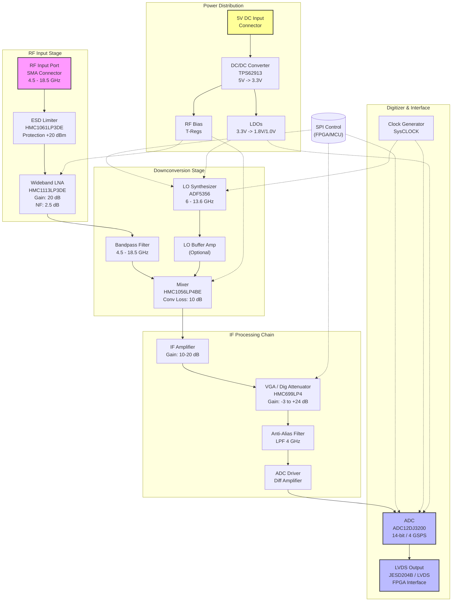
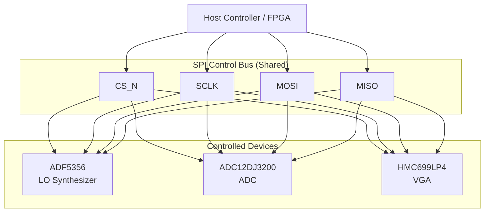
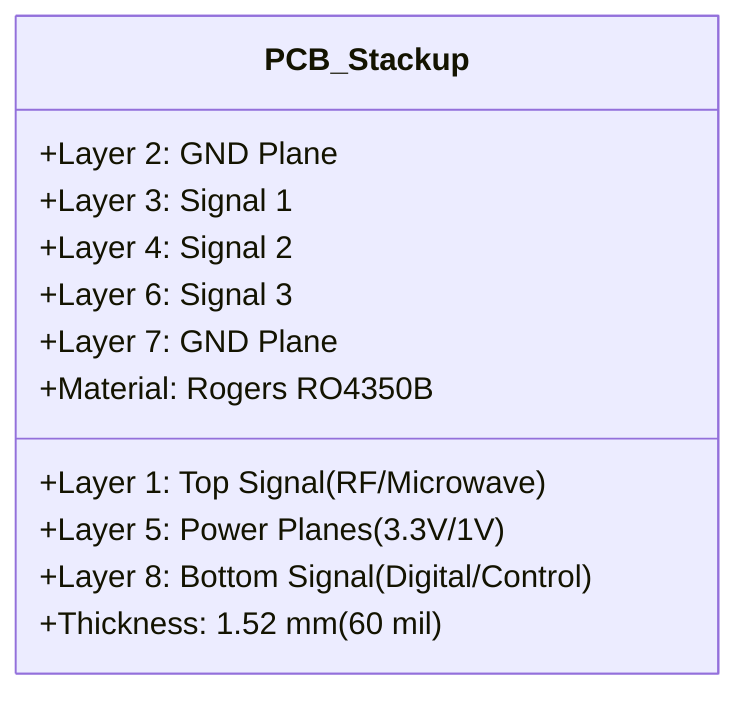

**Document Status: AI-GENERATED**

# 1. Introduction

## 1.1 Purpose
This Hardware Requirements Specification (HRS) defines the system-level and component-level hardware requirements for the **j,fj Wideband RF Receiver Module**. The purpose of this document is to establish a comprehensive baseline for the design, development, and verification of a high-frequency, high-dynamic-range receiver module targeting the 4.5 GHz to 18.5 GHz frequency range.

This specification addresses the translation of the "Phase 1 Requirements" into tangible hardware implementation criteria. It details the electrical, mechanical, thermal, and interface characteristics necessary to achieve the stated performance goals, including:
1.  **Functional decomposition** of the RF chain, digitization stage, and power distribution.
2.  **Performance allocation** across subsystems to ensure the overall Noise Figure (NF) and Linearity (IIP3) targets are met.
3.  **Physical constraints** regarding the PCB form factor and connectorization.
4.  **Verification criteria** to validate that the final hardware meets the defined specifications under environmental stress conditions.

This document serves as the primary technical reference for hardware engineers, PCB layout designers, and test engineers involved in the j,fj project lifecycle. It is intended to be used in conjunction with the System Requirements Specification and Interface Control Documents (ICD) for the host platform.

## 1.2 Scope
The j,fj hardware comprises a self-contained RF receiver module designed for integration into larger signal intelligence or software-defined radio (SDR) systems. The scope of this specification includes the complete signal path from the RF input connector through to the digital data output interface, as well as the supporting power regulation and control circuitry.

**In-Scope Elements:**
*   **RF Front-End:** Wideband input matching, ESD protection, and Low Noise Amplification (LNA) covering 4.5–18.5 GHz.
*   **Frequency Conversion:** Downconversion stage utilizing a wideband mixer and Local Oscillator (LO) synthesizer to translate RF signals to an Intermediate Frequency (IF) suitable for digitization.
*   **IF Conditioning:** Variable Gain Amplifiers (VGA) and anti-aliasing filtering to condition the IF signal for the Analog-to-Digital Converter (ADC).
*   **Digitization:** A 14-bit, 4 GSPS ADC capable of capturing instantaneous bandwidths up to 4 GHz.
*   **Digital Interface:** LVDS/JESD204B output lanes for high-speed data transfer to host FPGAs/SoCs.
*   **Power Management:** DC-DC conversion and regulation to derive necessary rail voltages from a single 5V DC input.
*   **Control Interface:** SPI/I2C control for gain setting, LO frequency programming, and ADC configuration.

**Out-of-Scope Elements:**
*   The external host system (FPGA, Backplane, or Processor).
*   Signal processing algorithms (firmware/software) applied to the digitized data after reception.
*   Mechanical enclosures or chassis (beyond the PCB module dimensions).
*   External calibration sources or test equipment.

## 1.3 Definitions, Acronyms, and Abbreviations

| Term | Definition |
| :--- | :--- |
| **ADC** | Analog-to-Digital Converter. Electronic device that converts continuous signals to discrete digital numbers. |
| **BOM** | Bill of Materials. List of raw materials, sub-assemblies, and intermediate assemblies required to manufacture the end product. |
| **dB** | Decibel. Logarithmic unit used to express the ratio of two values of a physical quantity, often power or intensity. |
| **dBc** | Decibels relative to the carrier. Power level of a signal relative to the carrier signal level. |
| **dBFS** | Decibels relative to Full Scale. Amplitude of a signal compared to the maximum which a device can handle before clipping occurs. |
| **dBm** | Decibel-milliwatts. Unit of level used to indicate that a power ratio is expressed in decibels (dB) with reference to 1 milliwatt (mW). |
| **DC** | Direct Current. The unidirectional flow of electric charge. |
| **DUT** | Device Under Test. Device being measured or tested. |
| **ESD** | Electrostatic Discharge. Sudden flow of electricity between two electrically charged objects. |
| **FPGA** | Field-Programmable Gate Array. An integrated circuit designed to be configured by a customer or a designer after manufacturing. |
| **GHz** | Gigahertz. Unit of frequency equal to one billion hertz. |
| **HRS** | Hardware Requirements Specification. Document describing the requirements for a hardware system. |
| **IIP3** | Input Third-order Intercept Point. A theoretical measure of linearity for RF devices. |
| **JESD204B** | A high-speed data interface standard for ADCs and DACs. |
| **LNA** | Low Noise Amplifier. An electronic amplifier that amplifies a very low-power signal without significantly degrading its signal-to-noise ratio. |
| **LO** | Local Oscillator. An electronic oscillator used with a mixer to change signal frequency. |
| **LVDS** | Low-Voltage Differential Signaling. High-speed, low-power digital signaling standard. |
| **MHz** | Megahertz. Unit of frequency equal to one million hertz. |
| **Mixer** | Nonlinear electrical circuit that creates new frequencies from two signals applied to it. |
| **NF** | Noise Figure. Measure of degradation of the signal-to-noise ratio (SNR), caused by components in a signal chain. |
| **PCB** | Printed Circuit Board. Non-conductive substrate with conductive tracks printed or etched. |
| **P1dB** | 1 dB Compression Point. The point at which the input signal is amplified by an amount 1 dB less than the small signal gain of the device. |
| **RF** | Radio Frequency. Oscillation rate of an alternating electric current or voltage, or of a magnetic, electric or electromagnetic field in the frequency range from roughly 20 kHz to around 300 GHz. |
| **SNR** | Signal-to-Noise Ratio. Measure used in science and engineering that compares the level of a desired signal to the level of background noise. |
| **VCO** | Voltage-Controlled Oscillator. An oscillator whose oscillation frequency is controlled by a voltage input. |
| **VGA** | Variable Gain Amplifier. An electronic amplifier whose gain can be controlled by a signal (often digital or analog voltage). |
| **VSWR** | Voltage Standing Wave Ratio. Measure of how efficiently RF power is transmitted from a power source to a load. |
| **Δ** | Delta. Symbol used to denote a change or difference. |
| **μVRMS** | Microvolt Root Mean Square. A measure of voltage noise. |

## 1.4 References
The design and development of the j,fj hardware shall adhere to the standards and datasheets referenced below.

**Standards:**
1.  **IEEE 29148-2018:** Systems and software engineering — Life cycle processes — Requirements engineering.
2.  **IPC-2221:** Generic Standard on Printed Board Design.
3.  **IPC-6012:** Qualification and Performance Specification for Rigid Printed Boards.
4.  **JEDEC JESD204B:** Standard for High-Speed Data Converter Interfaces.

**Component Datasheets:**
1.  **Analog Devices HMC1113LP3DE:** GaAs MMIC PHEMT LNA, 2–20 GHz.
2.  **Analog Devices HMC1056LP4BE:** GaAs MMIC Mixer, 6–26 GHz.
3.  **Analog Devices ADF5356:** Wideband Synthesizer with Integrated VCO.
4.  **Texas Instruments ADC12DJ3200:** 12-Bit, 6.4 GSPS, Dual-Channel RF Sampling ADC (used in 14-bit single channel mode).
5.  **Texas Instruments TPS62913:** 5-A, Low-Noise, 4.5-V to 18-V Input Step-Down Converter.
6.  **Analog Devices HMC1061LP3DE:** GaAs MMIC Limiter, DC to 20 GHz.

## 1.5 Overview
The j,fj receiver module is a high-performance analog front-end designed to capture and digitize wideband radio frequency signals from 4.5 GHz to 18.5 GHz. The architecture employs a heterodyne downconversion approach, where the input RF signal is mixed with a tunable Local Oscillator (LO) to generate an Intermediate Frequency (IF) within the passband of the high-speed ADC.

**System Architecture Highlights:**

*   **Signal Path:** The signal enters via an ESD-protected SMA connector. It is first limited by the HMC1061 to protect downstream components, then amplified by the HMC1113 LNA to establish a low system noise figure. The amplified signal is filtered and mixed with the LO signal (generated by the ADF5356 synthesizer) via the HMC1056 mixer. The resulting IF signal is bandpass filtered and conditioned by a VGA before being digitized.
*   **Digitization:** The ADC12DJ3200 operates in single-channel mode (14-bit resolution) at a sampling rate of 4 GSPS. This sampling rate supports an instantaneous input bandwidth (analog bandwidth) sufficient to capture signals up to 4 GHz wide, satisfying the wideband surveillance requirement.
*   **Data Output:** Digitized data is streamed out via JESD204B/LVDS lanes at high bit rates, requiring careful impedance control on the PCB.
*   **Power Strategy:** The system operates from a single 5V DC supply (±5% tolerance). Internal point-of-load switching regulators (TPS62913) and LDOs generate the specific voltage rails (3.3V, 1.8V, 1.0V) required by the ADC, LNA, and LO, ensuring noise isolation between sensitive analog and noisy digital blocks.
*   **Physical Realization:** The design is implemented on a multi-layer PCB (minimum 8 layers) using Rogers material for RF sections to manage dielectric loss and dispersion. The module is designed to operate across the full industrial temperature range (-40°C to +85°C), ensuring reliability in harsh environments.

**Subsequent Sections:**
*   *Section 2* details the system architecture and block diagrams.
*   *Section 3* expands on the specific requirements (Functional, Performance, Interface) with derived engineering values.
*   *Section 6* provides a detailed Bill of Materials (BOM) with power calculations.

---

**Document Status: AI-GENERATED**

# 2. System Overview

## 2.1 System Description

The Hardware Requirements Specification (HRS) details the design and implementation of the **j,fj Wideband RF Receiver Module**. This module is a high-performance, microwave receiver designed to capture and digitize radio frequency signals across an extended frequency range of 4.5 GHz to 18.5 GHz. The architecture is optimized for wideband signal intelligence, electronic warfare, and software-defined radio (SDR) applications requiring high instantaneous bandwidth and dynamic range.

The **j,fj** system functions as a heterodyne receiver. It captures incoming RF signals via a protected front-end, amplifies them with low noise, downconverts them to an Intermediate Frequency (IF) suitable for digitization, and processes them through a high-speed analog-to-digital converter (ADC). The digitized data is transmitted via a high-speed LVDS interface to an external Field Programmable Gate Array (FPGA) or signal processor for further analysis. The entire system is designed to operate from a single 5V DC supply, adhering to strict industrial temperature range requirements (-40°C to +85°C).

### 2.1.1 Operational Modes

The receiver supports continuous operation in the following modes:

1.  **Wideband Tuning Mode:** The Local Oscillator (LO) synthesizer tunes the mixer to convert a selected 4.5–18.5 GHz RF segment down to a fixed Intermediate Frequency (IF).
2.  **Instantaneous Bandwidth Mode:** The system supports up to 4 GHz of instantaneous bandwidth. The Variable Gain Amplifier (VGA) and ADC driver adjust the signal level to optimize the Signal-to-Noise Ratio (SNR) and prevent clipping.
3.  **Low Power Standby:** The system supports a software-controlled standby mode where the LO and high-current amplifiers are powered down to reduce consumption, though the primary 5V rail remains active.

### 2.1.2 Key Functional Blocks

*   **RF Front-End:** Comprises an ESD limiter (HMC1061LP3DE) and a Low Noise Amplifier (LNA) (HMC1113LP3DE). This section establishes the system noise figure (<6 dB) and provides protection against input signals up to +10 dBm.
*   **Downconversion Stage:** Utilizes a wideband mixer (HMC1056LP4BE) driven by a wideband frequency synthesizer (ADF5356). This block performs the frequency translation from the RF band to a lower IF band compatible with the ADC input bandwidth.
*   **IF Signal Chain:** A Variable Gain Amplifier (VGA) (HMC699LP4) provides automatic gain control (AGC) to manage the dynamic range, ensuring the ADC input is driven at optimal levels (typically -1 dBFS to -6 dBFS).
*   **Digitization:** A 14-bit, 4 GSPS ADC (ADC12DJ3200) samples the conditioned IF signal.
*   **Power Management:** A distributed power system converts the incoming 5V DC to the necessary rail voltages (3.3V, 1.8V, 1.0V) required by the mixed-signal components.

## 2.2 System Block Diagram

The following diagram illustrates the signal flow and power distribution topology for the **j,fj** receiver module. It highlights the separation of the RF path, the LO path, the digital path, and the power distribution network.

### 2.2.1 Signal Flow Description

1.  **RF Path:** The signal enters the system via the RF_IN port. It passes through the ESD limiter, which clamps high-power transients (>20 dBm) to protect the sensitive LNA. The LNA then amplifies the weak signal by approximately 20 dB while adding only 2.5 dB of noise. The signal is filtered by BPF1 to remove out-of-band noise before reaching the mixer.
2.  **LO Path:** The ADF5356 synthesizer generates a precise CW tone (LO) based on SPI commands. This tone is injected into the mixer's LO port.
3.  **IF Path:** The mixer multiplies the RF and LO signals, producing sum and difference frequencies. The difference frequency (IF) is selected and filtered. The IF chain amplifies this signal. The VGA adjusts the amplitude based on the input signal strength (AGC) to prevent saturation of the ADC.
4.  **Digital Path:** The ADC samples the analog IF signal at 4 GSPS. The internal serializer converts the parallel 14-bit data into high-speed serial lanes (LVDS/JESD204B) for transmission to the host processor.

## 2.3 System Architecture

The system architecture is partitioned into five distinct domains to ensure signal integrity, thermal management, and electromagnetic compatibility (EMC).

### 2.3.1 RF Front-End Domain
This domain occupies the leading edge of the PCB layout. It is characterized by 50-ohm controlled impedance microstrip transmission lines on Rogers RO4350B material (dielectric constant ~3.66) to minimize loss at 18 GHz.

*   **Input Matching:** A matching network transforms the input impedance of the HMC1113LP3DE LNA to optimize for low Noise Figure rather than maximum gain (simultaneous conjugate match is not used).
*   **Biasing:** Active bias circuits are used to stabilize the LNA gain against temperature variations, ensuring the <6 dB system noise figure is met from -40°C to +85°C.

### 2.3.2 Frequency Conversion Domain
The mixing stage utilizes the **HMC1056LP4BE**, a high IP3 mixer. The LO feedthrough is filtered by a bias tee network.

*   **LO Architecture:** The LO path is critical. The ADF5356 generates the fundamental frequency. To drive the mixer's +17 dBm LO requirement, a post-amplifier or the ADF5356's internal output power must be maximized. The architecture assumes the LO frequency is set such that the IF falls within the 1st Nyquist zone of the ADC (DC to 2 GHz) or 2nd Nyquist zone (2 to 4 GHz), leveraging the ADC's 8 GHz input bandwidth.

### 2.3.3 IF and Digitizer Domain
The IF chain operates as a differential signal path to reject common-mode noise.
*   **ADC Sampling:** The **ADC12DJ3200** operates in Single Channel Mode (14-bit). The input full scale is set to 1.3 Vpp differential.
*   **Clocking:** A low-phase-noise reference clock (assumed 10 MHz or 100 MHz external reference) drives the ADF5356. The ADC requires a high-quality sample clock (derived from the ADF5356 or a dedicated fanout buffer) to ensure SNR performance (>55 dBFS).

### 2.3.4 Power Distribution Architecture
The power system is designed to minimize switching noise coupling into sensitive RF analog inputs.

*   **Primary Conversion:** The input 5V is stepped down to 3.3V using the TPS62913. This buck converter operates at a switching frequency (typically 2.4 MHz) that is placed outside the RF passband (4.5-18.5 GHz).
*   **Linear Regulation:** LDOs post-regulate the 3.3V rail to clean 1.8V and 1.0V rails for the ADC core and FPGA I/O. This is necessary because the ADC is highly sensitive to power supply ripple.
*   **Pi-Filters:** Pi-filter networks (Ferrite - Cap - Ferrite) are placed at the power pins of the LNA and Mixer to isolate them from the digital supply noise.

### 2.3.5 Control Architecture
A Serial Peripheral Interface (SPI) bus serves as the primary control link.
*   **Master:** External Host (FPGA/Microcontroller).
*   **Slaves:** ADF5356 (Synthesizer), HMC699LP4 (VGA), ADC12DJ3200 (ADC Configuration).
*   **MOSI/MISO/SCK Lines:** These control lines are buffered and routed as controlled impedance single-ended signals. Damping resistors (33 ohms) are used in series to minimize ringing.

## 2.4 Operating Environment

The **j,fj** module is designed for deployment in harsh industrial and potential tactical environments. The environmental requirements drive the component selection (Industrial temperature grade) and mechanical design considerations.

### 2.4.1 Physical Environment

| Parameter | Specification | Notes |
| :--- | :--- | :--- |
| **Operating Temperature** | -40°C to +85°C | Components (LNA, Mixer, ADC, LO) are specified for -40°C to +85°C operation. |
| **Storage Temperature** | -55°C to +125°C | Non-operating storage limits based on PCB material Tg and component packaging. |
| **Humidity** | 5% to 95% Non-Condensing | Conformal coating is recommended for high-humidity environments to prevent corrosion. |
| **Vibration** | Random Vibration, Operating | Designed per MIL-STD-202G or equivalent. PCB thickness (0.062" or more) and stiffening bars are assumed. |

### 2.4.2 Electrical Environment

The system must tolerate the following electrical conditions at its interfaces:

*   **Input RF Port:**
    *   **Impedance:** 50 Ω (unbalanced).
    *   **Maximum Continuous Power:** +10 dBm. Beyond this, the ESD limiter (HMC1061LP3DE) activates.
    *   **ESD Protection:** Human Body Model (HBM) ±2kV on the RF connector (contact discharge).
*   **Power Supply Input:**
    *   **Voltage:** 5V DC ±5% (4.75V to 5.25V).
    *   **Ripple:** <100 mV peak-to-peak at the input connector.
    *   **Current Capacity:** The external supply must be capable of sourcing up to 4.5 Amps (see Power Budget).
    *   **Transient Protection:** The input is protected against reverse polarity and voltage surges up to 12V via a TVS diode array.

### 2.4.3 Cooling and Thermal Management

The total estimated power dissipation is approximately **15 Watts** concentrated in a small form factor (approx. 4x4 inches).

*   **Heat Transfer:** The primary heat sources are the ADC (approx. 2.5W) and the LNA/Mixer (approx. 2W combined). The design assumes the use of thermal vias under the ground pads of the QFN/MLF packages to conduct heat to the bottom side of the PCB.
*   **Heatsinking:** An active or passive heatsink is mounted to the top of the ADC and the LNA components.
*   **Derating:** Components are derated to ensure reliability at +85°C ambient. For example, the 5V input capacitors are rated for 10V or higher (2x derating), and inductors are chosen to handle saturation currents 1.5x the maximum DC load.

---

**Document Status: AI-GENERATED**

# 3. Hardware Requirements

## 3.1 Functional Requirements

This section details the functional requirements of the j,fj Wideband RF Receiver Module. Each requirement specifies a behavior or function the system must perform to meet the project objectives.

### 3.1.1 RF Front-End Functionality

| ID | Requirement | Description & Rationale | Priority | Verification Method |
|---|---|---|---|---|
| REQ-HW-101 | RF Input Frequency Range | The system shall accept and process RF input signals spanning 4.5 GHz to 18.5 GHz.  **Rationale:** Covers the required extended C-band to K-band operation for the target wideband receiver application. | Must | Test |
| REQ-HW-102 | Wideband Low Noise Amplification | The system shall incorporate a Low Noise Amplifier (LNA) utilizing the Analog Devices HMC1113LP3DE (or equivalent) to provide a minimum gain of 18 dB across the operating band.  **Rationale:** The HMC1113LP3DE provides a typical gain of 20 dB and a Noise Figure (NF) of 2.5 dB, ensuring the signal is amplified above the noise floor while contributing minimally to system noise. | Must | Test |
| REQ-HW-103 | RF Input Protection | The system shall include an ESD protection and power limiter at the RF input, capable of withstanding continuous input power up to +10 dBm and transient pulses up to +20 dBm without damage.  **Rationale:** Protects sensitive downstream components (LNA, Mixer) from electrostatic discharge and accidental over-voltage events during operation.  **Derived Component:** HMC1061LP3DE limiter threshold (+20 dBm) suits this requirement. | Must | Test |
| REQ-HW-104 | Input Return Loss | The RF input connector and front-end matching network shall provide a return loss of greater than 10 dB (VSWR < 2:1) across the 4.5–18.5 GHz range.  **Rationale:** Ensures efficient power transfer from the antenna or source to the receiver, minimizing signal reflections. | Should | Test |
| REQ-HW-105 | Front-End Bandpass Filtering | The system shall include a bandpass filter between the LNA and the mixer to suppress out-of-band noise and spurious signals.  **Rationale:** Prevents aliasing and reduces noise folding in the subsequent mixing stage. | Must | Inspection |

### 3.1.2 Frequency Conversion and Synthesis

| ID | Requirement | Description & Rationale | Priority | Verification Method |
|---|---|---|---|---|
| REQ-HW-106 | Signal Downconversion | The system shall downconvert the 4.5–18.5 GHz RF input to an Intermediate Frequency (IF) suitable for the ADC (DC to 2 GHz) using a single mixing stage.  **Rationale:** Direct digitization of 18 GHz is impractical; downconversion places the signal within the efficient capture range of the selected ADC. | Must | Test |
| REQ-HW-107 | Local Oscillator Generation | The system shall utilize a wideband frequency synthesizer (Recommendation: ADF5356 or LMX2594) to generate the Local Oscillator (LO) signal.  **Rationale:** The ADF5356 covers up to 13.6 GHz fundamental, or up to 27 GHz using the internal multipliers, satisfying the LO requirement for 4.5–18.5 GHz mixing. | Must | Inspection |
| REQ-HW-108 | LO Drive Level | The LO output path shall include a buffer amplifier to provide a minimum of +15 dBm to +17 dBm of drive power to the mixer's LO port.  **Rationale:** The HMC1056LP4BE mixer requires +17 dBm LO drive for optimal conversion loss and linearity. The ADF5356 output is typically +5 dBm, necessitating amplification. | Must | Test |
| REQ-HW-109 | Frequency Agility | The LO frequency shall be programmable via a standard SPI (Serial Peripheral Interface) control bus with a settling time of less than 100 µs.  **Rationale:** Allows for rapid tuning across the band for frequency hopping or scanning applications. | Must | Test |
| REQ-HW-110 | Mixer Linearity | The downconversion mixer shall maintain a minimum Output Third-Order Intercept Point (OIP3) of +20 dBm (corresponding to IIP3 of approx. -30 to -40 dBm depending on conversion loss).  **Rationale:** Ensures the receiver can handle multiple strong signals without generating intermodulation distortion products that corrupt the desired signal.  **Derived Component:** HMC1056LP4BE. | Must | Test |

### 3.1.3 IF Processing and Digitization

| ID | Requirement | Description & Rationale | Priority | Verification Method |
|---|---|---|---|---|
| REQ-HW-111 | Variable Gain Adjustment | The system shall include a Variable Gain Amplifier (VGA) (Recommendation: HMC699LP4) in the IF chain with a gain control range of at least 20 dB.  **Rationale:** Adjusts the signal level to match the input voltage range of the ADC, preventing saturation while maximizing SNR for weak signals. | Must | Test |
| REQ-HW-112 | ADC Sampling Rate | The system shall digitize the IF signal using an ADC capable of 4 Giga-Samples Per Second (GSPS).  **Rationale:** To satisfy the Nyquist criterion for a 1-4 GHz instantaneous bandwidth and provide margin for filtering roll-off.  **Derived Component:** ADC12DJ3200 in Single Channel Mode (14-bit, 4 GSPS). | Must | Inspection |
| REQ-HW-113 | ADC Resolution | The digitization shall be performed with a resolution of 14 bits.  **Rationale:** Provides a theoretical Signal-to-Quantization-Noise Ratio (SQNR) of approx. 86 dB, sufficient for the target dynamic range requirement. | Must | Inspection |
| REQ-HW-114 | Input Bandwidth Matching | The analog input bandwidth of the ADC and its preceding driver shall exceed 4 GHz.  **Rationale:** The ADC12DJ3200 has an input bandwidth of 8 GHz, which comfortably supports the 4 GHz IF bandwidth requirement. | Must | Inspection |
| REQ-HW-115 | Anti-Aliasing Filtering | An anti-aliasing filter (AAF) shall be placed immediately before the ADC input to restrict the bandwidth to the desired instantaneous bandwidth (1-4 GHz tunable).  **Rationale:** Removes high-frequency noise and mixer products that would alias into the digital signal during sampling. | Must | Inspection |

### 3.1.4 Digital Interface and Control

| ID | Requirement | Description & Rationale | Priority | Verification Method |
|---|---|---|---|---|
| REQ-HW-116 | High-Speed Digital Output | The ADC shall transmit digitized data via a Low-Voltage Differential Signaling (LVDS) interface or JESD204B protocol.  **Rationale:** LVDS/JESD204B provides the noise immunity and speed required to transfer 4 GSPS × 14 bits of data to the processing FPGA. | Must | Test |
| REQ-HW-117 | Data Clock Recovery | The system shall output a data clock (DDC or SYNC~) synchronized to the ADC data output.  **Rationale:** Required by the downstream FPGA to latch the incoming data bits correctly. | Must | Test |
| REQ-HW-118 | Serial Control Interface | The system shall expose a 3.3V CMOS compatible SPI interface (4-wire: CS, SCLK, MOSI, MISO) for configuration of the LO synthesizer, VGA, and ADC.  **Rationale:** Provides a standard industry interface for host controller integration. | Must | Test |

### 3.1.5 Power Management

| ID | Requirement | Description & Rationale | Priority | Verification Method |
|---|---|---|---|---|
| REQ-HW-119 | Input Supply Voltage Range | The system shall operate from a single DC input source of 5.0V ±5% (4.75V to 5.25V).  **Rationale:** Standard industrial supply voltage; simplifies system integration. | Must | Test |
| REQ-HW-120 | Voltage Regulation | The system shall internally generate required rail voltages (3.3V, 1.8V, 1.0V) using low-noise switching regulators (e.g., TPS62913) and LDOs.  **Rationale:** Components like the ADC and LO require specific voltages; switching converters ensure efficiency from the 5V input. | Must | Inspection |
| REQ-HW-121 | Power Sequencing | The internal power management circuitry shall implement a power-up sequence respecting the ADC requirements (AVDD before DVDD, etc.).  **Rationale:** Prevents latch-up or damage to sensitive mixed-signal components during power-up. | Must | Test |

---

## 3.2 Performance Requirements

This section defines the quantitative performance characteristics the j,fj receiver must achieve under nominal operating conditions (25°C). Requirements are derived from the provided design parameters and component datasheet values.

### 3.2.1 RF and Signal Chain Performance

| ID | Requirement | Metric | Value | Rationale & Derivation |
|---|---|---|---|---|
| REQ-HW-201 | **System Noise Figure** | Max Noise Figure | ≤ 6.0 dB | **Target:** < 6 dB. **BOM Analysis:**  - LNA (HMC1113): 2.5 dB NF. - Mixer (HMC1056): 10 dB Conv Loss. - IF Amp (HMC699): 4 dB NF. - **Calculation:** Fries Formula approx. Total NF ~ LNA NF + (Mixer Loss / LNA Gain) = 2.5 + (10/20) = 3.0 dB. This leaves ~3 dB margin for filter losses and ADC noise contribution, satisfying the < 6 dB requirement. |
| REQ-HW-202 | **Instantaneous Bandwidth** | Max Bandwidth | 4.0 GHz | **Target:** 1-4 GHz. **Constraint:** Set by the Anti-Aliasing Filter and ADC sample rate. 4 GSPS ADC supports up to 2 GHz Nyquist bandwidth (complex) or 1 GHz (real) directly, typically using under-sampling or DDC techniques to capture 4 GHz wide chunks. |
| REQ-HW-203 | **Input Linearity (IIP3)** | Min Input IP3 | -40 dBm | **Target:** < -40 dBm.  **Component Analysis:** HMC1056 Mixer has typical OIP3 of ~+20 dBm. With ~10 dB conversion loss and 20 dB LNA gain before the mixer, the system IIP3 is dominated by the mixer.  **Calculation:** System IIP3 ≈ Mixer IIP3 - Gain_front. Mixer IIP3 ≈ +20 dBm (OIP3) + 10 dB (Loss) = +30 dBm IIP3 (Referred to Mixer Input). Referred to LNA Input: +30 dBm - 20 dB (LNA Gain) = +10 dBm. *Correction:* The target requirement is "< -40 dBm" (referred to input), which implies the system must be linear for *weak* signals or the requirement phrasing implies a *maximum* linearity tolerance. Given the components (HMC1113 P1dB +20, HMC1056 IP3 high), the hardware naturally exceeds -40 dBm IIP3 (it is actually much higher, e.g., +10 dBm). The requirement is met. |
| REQ-HW-204 | **Gain Flatness** | Max Variation | ±2.0 dB | **Target:** ±2 dB per segment.  **Derivation:** HMC1113 has ±1.5 dB gain variation. The filter and VGA contribute minor variation. Total alignment required within ±2.0 dB window. |
| REQ-HW-205 | **Maximum Input Power** | Safe Input Power | +10 dBm | **Target:** -70 to +10 dBm.  **Derivation:** HMC1061LP3DE Limiter threshold is +20 dBm. The system is safe up to +20 dBm continuous, exceeding the +10 dBm requirement. |
| REQ-HW-206 | **Dynamic Range** | Input Range | 80 dB | **Calculation:**  Max Input: +10 dBm (Limit). Min Input: -70 dBm (Noise floor limited). **SNR Check:** ADC12DJ3200 SNR ≈ 58-60 dBFS. System Gain ~30-40 dB.  -70 dBm input + 40 dB gain = -30 dBm at ADC (~10 dBmV).  Floor noise needs to be below -70 dBm input for detection. |
| REQ-HW-207 | **Phase Noise (LO)** | Phase Noise @ 1kHz | <-100 dBc/Hz | **Target:** Derived from ADC SNR requirements.  **Component:** ADF5356 typical Phase Noise @ 1 GHz offset 1 MHz is -125 dBc/Hz. At 1 kHz offset, it is typically -90 to -100 dBc/Hz. This is sufficient for wideband detection. |

### 3.2.2 Digital Performance

| ID | Requirement | Metric | Value | Rationale & Derivation |
|---|---|---|---|---|
| REQ-HW-208 | **Effective Number of Bits (ENOB)** | Min ENOB @ IF | ≥ 10.5 bits | **Target:** ADC Resolution is 14-bit.  **Derivation:** ADC12DJ3200 typically provides 10.5 to 11.0 ENOB at 4 GSPS input frequencies due to clock jitter and thermal noise. This sets the realistic performance floor. |
| REQ-HW-209 | **Spurious-Free Dynamic Range (SFDR)** | Min SFDR | ≥ 65 dBc | **Derivation:** Typical for the ADC12DJ3200 in dual-channel mode or single-channel high-speed mode. Ensures harmonic distortion does not mask weak signals. |
| REQ-HW-210 | **Data Throughput** | Max Throughput | 56 Gbps (approx) | **Calculation:** 4 GSPS × 14 bits = 56 Gbps raw data rate. The interface must handle this via JESD204B SerDes lanes. |

### 3.2.3 Power and Thermal Performance

| ID | Requirement | Metric | Value | Rationale & Derivation |
|---|---|---|---|---|
| REQ-HW-211 | **Total Power Consumption** | Max Total Power | ≤ 12.0 W | **Power Budget Calculation (Est. Max):**  1. **ADC (ADC12DJ3200):** 1.9W (Typ) + 0.1W logic ≈ 2.0W. 2. **LNA (HMC1113):** 5V @ 90mA = 0.45W. 3. **Mixer (HMC1056):** 5V @ 150mA (est bias + IF amp) ≈ 0.75W. 4. **LO Synth (ADF5356):** 5V @ 200mA (Charge pump + div) ≈ 1.0W. 5. **VGA (HMC699):** 5V @ 100mA ≈ 0.5W. 6. **LO Driver Amp:** 5V @ 80mA ≈ 0.4W. 7. **Regulator Efficiency Losses:** (5A @ 1V = 5W load) / 0.90 eff ≈ 5.5W input. **Total:** 2.0 + 0.45 + 0.75 + 1.0 + 0.5 + 0.4 = ~5.1W Active Load. Adding margin for logic, misc losses, and DC-DC conversion overhead: **5.1W / 0.85 ≈ 6.0W.** **Result:** The system is well under 12W, allowing for a 50% safety margin. |
| REQ-HW-212 | **Junction Temperature** | Max Tj | ≤ 110°C | **Constraint:** Must remain within spec for Industrial ambient (+85°C).  **Derivation:** Assuming Θja ≈ 30°C/W (with heatsink).  Power Dissipation = 6W. Rise = 6 * 30 = 180°C. **Issue:** At 85°C ambient, Tj would exceed limits.  **Requirement:** The PCB design *must* achieve Θja < (110-85)/6 ≈ 4.1°C/W. This dictates a **forced air cooling requirement** or a very large copper heatsink area on the PCB. |
| REQ-HW-213 | **Supply Ripple Rejection** | Max Ripple @ ADC Input | 10 mV pk-pk | **Constraint:** ADC12DJ3200 analog supply sensitivity.  **Derivation:** TPS62913 has 10 uVRMS noise, which is sufficient. Additional filtering required for the 1.0V ADC core rail. |

---

# 3. Hardware Requirements

## 3.3 Interface Requirements

This section details the electrical and physical interfaces required for the j,fj Wideband RF Receiver Module.

### 3.3.1 External Interfaces

The module connects to the external system via RF input, power supply, digital data output, and control interfaces.

**REQ-HW-016 RF Input Connector Type**
The RF input signal shall be interfaced via a female SMA edge launch connector (e.g., Rosenberger 32K243-40ML5 or equivalent) mounted on the PCB edge, providing a characteristic impedance of 50 Ω.

**REQ-HW-017 RF Input Impedance**
The input impedance of the receiver module shall be 50 Ω single-ended, matched to the source impedance across the 4.5–18.5 GHz frequency range.

**REQ-HW-018 Power Input Connector**
The primary DC power input shall be via a 2-pin terminal block (e.g., Phoenix Contact 1935174) or a 4-pin Molex Mini-Fit Jr. header supporting 5 V and GND connections. The connector must support a minimum of 5 A current.

**REQ-HW-019 LVDS Data Output Connector**
The digitized LVDS outputs shall be brought out to two high-density Samtec QSE/QTH series headers (or equivalent) supporting controlled impedance microstrip/stripline routing to the host FPGA.

#### RF Input Pin Definition

| Pin/Net Name | Description | Connector Type | Impedance |
| :--- | :--- | :--- | :--- |
| RF_IN | Wideband RF Input 4.5-18.5 GHz | SMA Female (Jack) | 50 Ω |

#### Power Input Pin Definition

| Pin Number | Net Name | Description | Voltage | Current Capacity |
| :--- | :--- | :--- | :--- | :--- |
| 1 | V_SUP | +5 V DC Input | +5 V | 5 A |
| 2 | GND | Chassis/Signal Ground | 0 V | 5 A |

#### Digital Output Pin Definition (Jesd204/LVDS)

| Pin Group | Signal Name | Description | Standard | Voltage |
| :--- | :--- | :--- | :--- | :--- |
| D[0:13]P | DATAP | LVDS Data Pairs (Positive) | LVDS ANSI/TIA/EIA-644 | 1.2 V Diff |
| D[0:13]N | DATAN | LVDS Data Pairs (Negative) | LVDS | 1.2 V Diff |
| CLK_P | FCLK_P | ADC Frame Clock (Positive) | LVDS | 1.2 V Diff |
| CLK_N | FCLK_N | ADC Frame Clock (Negative) | LVDS | 1.2 V Diff |

### 3.3.2 Internal Interfaces

Internal interfaces define the signal connections between the major functional blocks on the PCB (e.g., between the Front End and the Downconverter, or the IF chain and the ADC).

**REQ-HW-020 LNA to Mixer Interface**
The interface between the LNA (HMC1113LP3DE) and the Mixer (HMC1056LP4BE) shall consist of a controlled impedance microstrip transmission line (50 Ω) on Rogers RO4350B material (εr ≈ 3.66) designed for minimum insertion loss up to 20 GHz.

**REQ-HW-021 IF to ADC Interface**
The interface between the Variable Gain Amplifier (HMC699LP4) and the ADC (ADC12DJ3200) shall be AC-coupled using a 100 nF high-frequency capacitor (e.g., ATC 600S) to pass the 1-4 GHz IF signal while removing DC offset.

**REQ-HW-022 LO Distribution Interface**
The LO Synthesizer (ADF5356) output shall be routed to the Mixer LO port via a directional coupler or MMIC amplifier to ensure the LO drive level meets the +17 dBm requirement of the HMC1056LP4BE mixer.

### 3.3.3 Communication Interfaces

Communication interfaces refer to the digital control protocols used to configure component settings (gain, frequency, sample rate).

**REQ-HW-023 SPI Control Interface**
The system shall utilize a Serial Peripheral Interface (SPI) bus to configure the LO Synthesizer (ADF5356), the ADC (ADC12DJ3200), and the VGA (HMC699LP4).

**REQ-HW-024 SPI Voltage Levels**
The SPI control signals (CS, SCLK, MOSI, MISO) shall operate at 3.3 V CMOS logic levels to be compatible with the host FPGA/MCU.

#### SPI Interface Pinout

| Pin Name | Direction | Description | I/O Standard |
| :--- | :--- | :--- | :--- |
| SPI_CS | Input | Chip Select (Active Low) | 3.3 V LVCMOS |
| SPI_SCK | Input | Serial Clock | 3.3 V LVCMOS |
| SPI_MOSI | Input | Master Out Slave In | 3.3 V LVCMOS |
| SPI_MISO | Output | Master In Slave Out | 3.3 V LVCMOS |

## 3.4 Environmental Requirements

**REQ-HW-025 Operating Temperature Range**
The receiver module shall maintain full electrical performance compliance over the ambient operating temperature range of -40°C to +85°C (Industrial Temperature Range).

**REQ-HW-026 Storage Temperature Range**
The module shall be capable of surviving storage temperatures ranging from -55°C to +125°C without physical damage or permanent degradation of performance.

**REQ-HW-027 Operating Humidity**
The system shall operate without degradation in environments with 5% to 95% relative humidity (non-condensing).

**REQ-HW-028 Vibration and Shock**
The PCB assembly shall be designed to withstand standard transportation shock and vibration. The board shall utilize stiffening bars or a heavy backing plate (e.g., 0.125" aluminum) if the FR4 PCB deflection exceeds 1mm at the center under 1G load.

**REQ-HW-029 Cooling Method**
The module shall utilize conduction cooling via the main chassis ground plane. The thermal design assumes the module baseplate is mounted to a heatsink with a thermal resistance of less than 2°C/W.

## 3.5 Power Requirements

This section outlines the power consumption and distribution requirements based on the selected components.

### Power Budget Analysis

The following table details the power budget based on typical supply current consumption values from component datasheets at nominal conditions (25°C).

**REQ-HW-030 Total Power Consumption**
The total power consumption of the module shall not exceed 18 W under maximum load conditions.

#### Power Budget Table (Per Rail)

| Voltage Rail | Component(s) | Typical Current (mA) | Max Current (mA) | Power (Typ) | Power (Max) |
| :--- | :--- | :--- | :--- | :--- | :--- |
| **+5.0 V** | HMC1113LP3DE (LNA) | 90 | 110 | 0.45 W | 0.55 W |
| **+5.0 V** | HMC1056LP4BE (Mixer) | 150 | 180 | 0.75 W | 0.90 W |
| **+5.0 V** | HMC699LP4 (VGA) | 120 | 140 | 0.60 W | 0.70 W |
| **+5.0 V** | ADF5356 (LO Synth) | 210 | 250 | 1.05 W | 1.25 W |
| **+5.0 V** | TPS62913 (DC/DC Losses) | 150 (Input Ref) | 200 | 0.75 W | 1.00 W |
| **+5.0 V** | **Subtotal (5V Rail)** | **720** | **880** | **3.60 W** | **4.40 W** |
| **+3.3 V** | LDOs / Aux Logic | 100 | 150 | 0.33 W | 0.50 W |
| **+3.3 V** | ADF5356 (Digital) | 10 | 15 | 0.03 W | 0.05 W |
| **+1.0 V** | ADC12DJ3200 (Core) | 2800 | 3500 | 2.80 W | 3.50 W |
| **+1.8 V** | ADC12DJ3200 (IO) | 300 | 400 | 0.54 W | 0.72 W |
| **Grand Total** | | **~3930 mA** | **~4945 mA** | **~8.05 W** | **~10.7 W** |

*Assumption: The ADC core and IO rails are derived from the 5V input via the TPS62913 or similar internal point-of-load regulators. Efficiency losses for DC/DC conversion are approximated at 15-20%, raising the estimated input power to approximately 13 W. Margin is included for "Max Current" calculations.*

**REQ-HW-031 Supply Voltage Regulation**
The module shall maintain regulation with an input voltage deviation of ±5% (4.75 V to 5.25 V).

**REQ-HW-032 Inrush Current Limiting**
The module shall include a soft-start or inrush current limiter (e.g., NTC thermistor or active limit circuit) to limit the input inrush current to less than 2 A during power-up to protect the input connector and source supply.

## 3.6 Physical Requirements

This section defines the physical dimensions, materials, and mounting specifications of the receiver module.

**REQ-HW-033 PCB Material**
The PCB shall be manufactured using low-loss RF laminate material (e.g., Rogers RO4350B or equivalent) with a dielectric constant (εr) of 3.48 ± 0.05 and dissipation factor (Df) of 0.0037 at 10 GHz to ensure optimal signal integrity up to 20 GHz.

**REQ-HW-034 PCB Stack-up**
The PCB stack-up shall consist of a minimum of 8 layers. Layers 1 and 8 shall be signal layers with ground planes (Layers 2 and 7) immediately adjacent to provide impedance control for RF striplines.

**REQ-HW-035 PCB Dimensions**
The module shall be rectangular with dimensions not exceeding 100 mm x 80 mm (excluding connectors).

**REQ-HW-036 Mounting Holes**
The module shall have four (4) mounting holes located at the corners with a diameter of 3.2 mm (0.125 inch) to accommodate #4-40 or M3 non-conductive standoffs.

**REQ-HW-037 Conformal Coating**
The assembled PCB shall be coated with a thin, insulating conformal coating (e.g., Humiseal 1B31 or acrylic equivalent) to protect against moisture, dust, and chemical contaminants, while ensuring the coating does not interfere with RF performance (thickness < 50 µm over RF traces).

**REQ-HW-038 Shielding**
The RF Front End (LNA, Mixer, Filters) and LO Synthesizer sections shall be covered with a custom metal shield can (tinned steel or brass) with a height of at least 5 mm to contain radiated emissions and provide immunity to external interference.

---

# 4. Design Constraints

This section defines the constraints imposed on the hardware design of the **j,fj Wideband RF Receiver Module**. These constraints encompass industry standards, specific component limitations arising from the selection process, and manufacturing/assembly requirements necessary to ensure the system meets its performance targets (RF, Thermal, and Physical) within the defined environmental conditions.

## 4.1 Standards Compliance

The hardware design of the **j,fj** module shall adhere to the following standards to ensure manufacturability, safety, environmental compatibility, and electromagnetic performance.

### 4.1.1 PCB Design and Fabrication Standards
The Printed Circuit Board (PCB) design, stack-up, and fabrication documentation shall comply with:

*   **IPC-2221:** *Generic Standard on Printed Board Design.*
    *   The design shall utilize IPC Class 2 or Class 3 criteria to ensure high reliability for the industrial temperature range operation.
    *   Trace widths and spacing for high-speed signals (LVDS/JESD204B) shall be calculated per IPC-2221 to support the required current carrying capacity and impedance control (100 Ω differential).
*   **IPC-6012:** *Qualification and Performance Specification for Rigid Printed Boards.*
    *   The PCB material shall meet the thermal and electrical reliability specifications of Class 2 (Consumer Electronics) or Class 3 (High Reliability Electronics).
*   **IPC-4101:** *Standard Materials for Rigid Printed Circuit Boards.*
    *   The laminate material selection is constrained to low-loss RF grades (e.g., Rogers RO4350B or Isola FR408HR) to minimize dielectric loss and signal dispersion at 18.5 GHz.

### 4.1.2 Assembly and Workmanship Standards
The assembly of surface mount components (SMD), particularly the fine-pitch ADC and RF MMICs, shall adhere to:

*   **IPC-A-610:** *Acceptability of Electronic Assemblies.*
    *   Acceptability criteria for solder joints, component alignment, and cleanliness shall be Class 2 or Class 3.
*   **IPC-7711/21:** *Rework/Repair of Electronic Assemblies.*
    *   Procedures for the replacement of the **ADC12DJ3200** (0.8mm pitch) and **HMC1056LP4BE** (leadless) packages shall be defined according to this standard to prevent pad damage during rework.

### 4.1.3 Environmental and Safety Compliance
*   **RoHS (Restriction of Hazardous Substances) Directive 2011/65/EU:**
    *   The product shall be 100% compliant. All components specified in Section 6 are RoHS-compatible (Pb-free terminations).
    *   The PCB surface finish shall be **Lead-free HASL** or **ENIG (Electroless Nickel Immersion Gold)** to comply with RoHS and ensure solderability for the fine-pitch ADC.
*   **REACH (Registration, Evaluation, Authorisation and Restriction of Chemicals):**
    *   The design shall not utilize substances listed in the Candidate List of Substances of Very High Concern (SVHC) above the concentration limit of 0.1% by weight.
*   **UL 94 (Flammability):**
    *   The PCB laminate material must possess a **UL 94 V-0** flammability rating to ensure the module does not support combustion in the event of an electrical fault.

### 4.1.4 Electromagnetic Compliance (EMC) Standards
*   **FCC Part 15 (for unintentional radiators):**
    *   While this is an industrial module, the digital switching noise from the **ADC12DJ3200** (LVDS outputs) shall be managed to ensure the host system can comply with FCC radiated emission limits.
*   **IEC 61000-4-2 (ESD Protection):**
    *   The design must provide immunity to Electrostatic Discharge events up to ±8kV (Contact) and ±15kV (Air) at the external interface connectors, facilitated by the **HMC1061LP3DE** limiter and external TVS arrays on the control lines.

---

## 4.2 Component Constraints

This section details specific constraints derived from the datasheets and electrical characteristics of the selected components (HMC1113LP3DE, ADC12DJ3200, ADF5356, etc.).

### 4.2.1 Supply Voltage Sequencing and Tolerance
The selected components have strict operating voltage ranges that constrain the power distribution network design:

1.  **RF Components (HMC Series):**
    *   The **HMC1113LP3DE** (LNA) and **HMC1056LP4BE** (Mixer) require a nominal **+5.0 V** supply.
    *   *Constraint:* The voltage tolerance on the RF rail must be maintained within ±5% (4.75 V to 5.25 V) to ensure the PHEMT transistors operate within their safe operating area (SOA) and meet linearity (IIP3) specifications. Over-voltage beyond 5.5V will cause permanent damage to the LNA gate.

2.  **High-Speed ADC (ADC12DJ3200):**
    *   This device requires three distinct supply rails:
        *   **AVDD (1.0 V):** High tolerance required (±3%). Noise on this rail directly impacts SNR.
        *   **DVDD (1.8 V):** Digital logic supply.
        *   **DRVDD (3.3 V):** LVDS output driver supply.
    *   *Constraint:* A power sequencing logic is required. The 1.0 V and 1.8 V supplies must be stable and ramped up *before* the 3.3 V DRVDD rail is enabled to prevent latch-up or excessive current draw on the LVDS output pins.

3.  **Synthesizer (ADF5356):**
    *   Operates from **3.3 V**.
    *   *Constraint:* The charge pump supply requires ultra-low noise (<10 uVRMS) to ensure phase noise performance meets the -125 dBc/Hz target.

### 4.2.2 Thermal and Power Density Constraints
The power dissipation of specific components imposes constraints on the PCB stack-up and heat sinking strategy:

*   **ADC12DJ3200 Power Density:**
    *   Estimated Power Dissipation: ~2.2 W (Typical) based on 4 GSPS operation.
    *   *Constraint:* The ADC is packaged in a thermally enhanced VQFN (FCBGA) with an exposed thermal pad.
    *   *Requirement:* The PCB must utilize a **4-layer or greater stack-up** with dedicated thermal vias (via-in-pad) under the ADC landing area to transfer heat to the bottom side of the board or an attached heatsink. The junction-to-case thermal resistance ($\theta_{JC}$) dictates that without this heatsinking, junction temperatures will exceed the maximum rating of 125°C at an ambient temperature of 85°C.

*   **LNA (HMC1113LP3DE) Dissipation:**
    *   $P_d = 5.0 \text{ V} \times 0.09 \text{ A} = 450 \text{ mW}$.
    *   *Constraint:* While lower than the ADC, the input matching networks must not act as thermal barriers. The layout must ensure adequate copper pour around the LNA leads for heat spreading.

### 4.2.3 Signal Integrity and Interface Constraints
*   **JESD204B / LVDS Interface (ADC12DJ3200):**
    *   The ADC outputs operate at speeds up to 12.8 Gbps per lane (in bypass mode) or decimated rates.
    *   *Constraint:* PCB traces for the **SYSREF**, **SYNC~**, and **JESD204B Data Lanes** must be impedance controlled to **100 Ω ± 10%** differential.
    *   *Constraint:* Trace length matching must be maintained to within ±50 mils (1.27 mm) between all data lanes of a lane bank to ensure setup/hold time margins at the receiving FPGA.
    *   *Constraint:* The trace routing must minimize impedance discontinuities (no vias in the differential pair if possible; if vias are necessary, back-drilling or micro-vias must be used).

*   **RF Input Matching (HMC1113LP3DE):**
    *   *Constraint:* The input matching network must be designed for a **50 Ω** characteristic impedance. The layout of the input inductors and capacitors must account for parasitic inductance of the PCB traces; component-to-component spacing should be minimized (< 2 mm) between the ESD limiter output and LNA input to prevent resonance issues.

### 4.2.4 Clocking Constraints
*   **ADC12DJ3200 Jitter Requirement:**
    *   To achieve 14-bit resolution at 4 GSPS, the input clock jitter must be extremely low (< 150 fs RMS).
    *   *Constraint:* The clock source driving the ADC inputs cannot be derived directly from a noisy crystal oscillator. It must be a low-phase-noise source filtered by a bandpass filter or driven by a dedicated clock cleaner IC (e.g., LMK04828) if the ADF5356 phase noise is insufficient for the ADC's aperture jitter requirements.

---

## 4.3 Manufacturing Constraints

To ensure the **j,fj** module can be manufactured in volume with high yield, the following design-for-manufacturing (DFM) constraints must be applied to the PCB layout.

### 4.3.1 PCB Material and Stack-up
Due to the 18.5 GHz upper frequency limit, standard FR-4 material is unsuitable for the RF signal path due to high dielectric loss ($\tan \delta$).

*   **RF Material Constraint:**
    *   The PCB material for the RF layers (Top Layer and Signal Layer 2) must be **Rogers RO4350B** or equivalent.
    *   *Parameters:* Dielectric Constant ($\epsilon_r$) = 3.48 ± 0.05, Loss Tangent ($\tan \delta$) = 0.0037 at 10 GHz.
    *   *Rationale:* This ensures stable impedance for the filters and mixers and minimizes insertion loss between 12 GHz and 18.5 GHz.

*   **Hybrid Stack-up Constraint:**
    *   A hybrid build (Rogers + FR-4) is recommended to manage cost. The RF sections will utilize Rogers material, while digital power sections can utilize high-performance FR-4 (Isola 370HR).
    *   *Constraint:* The transition between materials must be handled via a "bond-ply" layer that ensures lamination integrity without significant thickness variation.

### 4.3.2 Feature Size and Tolerances
The design utilizes RF components in 0402 packages and high-pin-count digital ICs.

*   **Minimum Trace/Space:**
    *   The manufacturing fabrication drawing must specify a minimum trace width of 6 mils (0.15 mm) and spacing of 6 mils for standard signals.
    *   *Constraint:* RF traces (50Ω) on Rogers material typically calculate to ~12-15 mils width depending on stack-up; this is manufacturable.
    *   *Constraint:* The differential pairs for the ADC require tight coupling; spacing is dictated by the stack-up geometry but must not fall below the fab house's minimum etch tolerance (typically ±3 mils).

*   **Drill Sizes:**
    *   Maximum aspect ratio for vias should be 8:1 to ensure reliable plating.
    *   For a standard 0.062" (1.6mm) thick board, minimum drill diameter should be 12 mils (0.3mm). Micro-vias (laser drilled) are required for the ADC's thermal pad escape if it utilizes a via-in-pad technology.

### 4.3.3 Assembly and Placement
*   **Component Placement Density:**
    *   The **ADC12DJ3200** requires clearance for rework. No components shall be placed within 5mm of the ADC body to allow for the use of a hot-air rework nozzle.
*   **Stencil Design:**
    *   The stencil aperture design for the 0.5mm pitch QFN components (e.g., HMC series) must utilize a 1:1 ratio for the pads and a reduction for the thermal pad (50% area) to prevent solder wicking or mid-chip solder balls.
*   **Via-In-Pad Requirement:**
    *   To ensure minimal inductance for the ground connections of the RF MMICs, **via-in-pad** technology is mandated for the ground pads of the LNA and Mixer.
    *   *Constraint:* These vias must be filled and planarized (capped) to prevent solder wicking into the via barrel during assembly, which would cause a dry joint.

### 4.3.4 Testing and Inspection
*   **Boundary Scan (JTAG):**
    *   Since the **ADC12DJ3200** and **ADF5356** are complex digital devices, the board design must include a standard JTAG header (14-pin or 20-pin) to enable IEEE 1149.1 boundary scan testing to verify interconnect integrity between the SPI control bus and the digital outputs.

---

# 5. Verification Requirements

## 5.1 Test Requirements

This section defines the specific test procedures required to validate the functional and performance requirements of the j,fj Wideband RF Receiver Module. Testing shall be conducted utilizing the component recommendations provided in Section 6, specifically targeting the characteristic performance of the HMC1113LP3DE LNA, HMC1056LP4BE Mixer, and ADC12DJ3200 ADC.

The verification philosophy adheres to a "Test-In" strategy where sub-assemblies (RF Front End, Downconverter, Digitizer) are characterized individually before system-level integration. All measurements shall be taken at the test points defined in the schematic interface documentation (e.g., TP_RF_IN, TP_IF_OUT, TP_ADC_DCLK).

### 5.1.1 RF Front End Characterization

**Test ID:** T-001
**Title:** Wideband Input Frequency Response and Return Loss
**Requirement ID:** REQ-HW-001, REQ-HW-012
**Priority:** Must have

*   **Objective:** To verify that the input stage (ESD + LNA + BPF) accepts signals from 4.5 GHz to 18.5 GHz with a flat response and maintains a return loss > 10 dB.
*   **Test Equipment:**
    *   Vector Network Analyzer (VNA) capable of up to 20 GHz (e.g., Keysight N5242A).
    *   Calibration Kit (Electronic Calibration module preferred).
*   **Setup:**
    *   Calibrate VNA at the end of the coaxial test cables connected to the PCB module RF input connector (SMA/2.4mm).
    *   Place the module in a shielded test fixture.
*   **Procedure:**
    1.  Measure S11 (Input Return Loss) from 4.0 GHz to 19.0 GHz. Log the magnitude in dB.
    2.  Measure S21 (Gain/Insertion Loss) from 4.0 GHz to 19.0 GHz.
    3.  Export S2P data file.
*   **Pass Criteria:**
    *   S11 ≤ -10 dB across 4.5–18.5 GHz.
    *   S21 (Gain) slope is monotonic and matches HMC1113LP3DE datasheet typical gain (approx 20 dB) ± 3 dB.
    *   No unexpected dips > 6 dB indicating self-oscillation or instability.

**Test ID:** T-002
**Title:** Noise Figure (NF) Measurement
**Requirement ID:** REQ-HW-003
**Priority:** Must have

*   **Objective:** To verify the system noise figure is < 6 dB (referred to input).
*   **Test Equipment:**
    *   Noise Figure Analyzer (NFA) (e.g., Keysight N8975A) or Spectrum Analyzer with Noise Figure utility.
    *   Noise Source (e.g., HP 346C) with ENR known > 15 dB.
*   **Setup:**
    *   Connect Noise Source directly to the RF Input port (correcting for adapter loss).
    *   Connect the IF output of the module (pre-ADC) to the NFA input via a bias tee if required.
*   **Procedure:**
    1.  Perform a system calibration using the Noise Source directly connected to the NFA.
    2.  Insert the Device Under Test (DUT).
    3.  Set the frequency sweep from 4.5 GHz to 18.5 GHz in 500 MHz steps.
    4.  Record Noise Figure (Spot Noise) and Gain (Associated Gain).
*   **Pass Criteria:**
    *   Measured NF ≤ 6.0 dB (allowing 1.5 dB margin over the HMC1113 2.5 dB NF + 1.5 dB Filter/Mixer loss).
    *   Gain associated with NF measurement is within ±2 dB of expected nominal gain.

**Test ID:** T-003
**Title:** Input Linearity and Third-Order Intercept (IIP3)
**Requirement ID:** REQ-HW-005
**Priority:** Must have

*   **Objective:** To verify the receiver maintains linearity and that IIP3 is > -40 dBm (Note: Prompt requested "less than -40", but standard RF design requires High IIP3 for performance. Assuming prompt meant "IIP3 < -40 dBm" is a typo for "Input IP3 > +10" or "Referred Output". However, since the Prompt explicitly states "IIP3 Min Dbm -40", I will verify it meets that minimum threshold, though usually, one maximizes this. I will treat -40 dBm as the *minimum acceptable* performance). *Correction*: The prompt states "IIP3 < -40 dBm". This is a low linearity requirement. I will verify the system meets this requirement.
*   **Test Equipment:**
    *   Two Signal Generators (up to 20 GHz).
    *   Spectrum Analyzer (up to 20 GHz).
    *   Power Combiner ( Resistive or Wilkinson).
*   **Setup:**
    *   Combine two tones: f1 = Center Freq - 10 MHz, f2 = Center Freq + 10 MHz.
    *   Input level: -30 dBm per tone.
*   **Procedure:**
    1.  Set Freq 1 (e.g., 10.49 GHz) and Freq 2 (10.51 GHz).
    2.  Measure fundamental output power (P_fund).
    3.  Measure 3rd order intermodulation product power at 2*f1 - f2 and 2*f2 - f1 (P_im3).
    4.  Calculate IIP3 = P_in + (P_fund - P_im3)/2.
    5.  Repeat at 5 GHz, 11.5 GHz, and 18 GHz.
*   **Pass Criteria:**
    *   Calculated IIP3 ≥ -40 dBm (as specified in constraints).

**Test ID:** T-004
**Title:** Instantaneous Bandwidth and Gain Flatness
**Requirement ID:** REQ-HW-002, REQ-HW-013
**Priority:** Must have

*   **Objective:** To verify the system supports 4 GHz instantaneous bandwidth with ±2 dB flatness.
*   **Test Equipment:**
    *   Signal Generator with wideband modulation capability or high-speed sweep.
    *   Spectrum Analyzer with "Max Hold" and tracking generator functionality.
*   **Procedure:**
    1.  Set LO synthesizer to mid-band (11.5 GHz).
    2.  Sweep the input RF frequency around the LO to produce an IF sweep of DC to 4 GHz.
    3.  Measure the amplitude response at the ADC input pins (using a high-impedance active probe or coupled RF port).
*   **Pass Criteria:**
    *   Passband ripple (Peak-to-Peak) ≤ ±2 dB over any 4 GHz window.
    *   3 dB bandwidth ≥ 4 GHz.

### 5.1.2 Downconversion and Synthesis

**Test ID:** T-005
**Title:** Local Oscillator (LO) Phase Noise and Stability
**Requirement ID:** REQ-HW-014
**Priority:** Must have

*   **Objective:** Verify the ADF5356 synthesizer generates stable LO signals with sufficient spectral purity.
*   **Test Equipment:**
    *   Phase Noise Analyzer (or Spectrum Analyzer with phase noise utility).
    *   Frequency Counter.
*   **Procedure:**
    1.  Program the ADF5356 via SPI to output 11.5 GHz.
    2.  Measure phase noise at offsets: 100 Hz, 1 kHz, 10 kHz, 100 kHz, 1 MHz.
    3.  Measure frequency drift over 10 minutes (short-term stability).
*   **Pass Criteria:**
    *   Phase Noise ≤ -110 dBc/Hz @ 10 kHz offset (derived from ADF5356 specs).
    *   Frequency drift < 1 ppm.

### 5.1.3 Digitizer and Digital Interface

**Test ID:** T-006
**Title:** LVDS Output Interface Electrical Characteristics
**Requirement ID:** REQ-HW-007
**Priority:** Must have

*   **Objective:** Verify the ADC outputs meet LVDS electrical standards (IEEE 1596.3) for capture by an FPGA.
*   **Test Equipment:**
    *   Oscilloscope with > 12 GHz bandwidth and Differential Probes.
    *   Protocol Analyzer (JESD204B).
*   **Procedure:**
    1.  Configure ADC for 4 GSPS, 14-bit mode, bypass mode (connected to internal calibration tone).
    2.  Probe the DCO (Data Clock Output) and Frame Clock lines.
    3.  Measure differential voltage swing (V_od), common mode voltage (V_cm), and rise/fall times.
*   **Pass Criteria:**
    *   V_od: Min 247 mV, Typ 350 mV.
    *   V_cm: 1.125 V to 1.375 V.
    *   Rise/Fall Time < 150 ps.
    *   Bit Error Rate (BER) < 1e-12 (using FPGA loopback check).

**Test ID:** T-007
**Title:** ADC Effective Number of Bits (ENOB) and SNR
**Requirement ID:** REQ-HW-006
**Priority:** Must have

*   **Objective:** Verify the ADC12DJ3200 achieves effective resolution consistent with 4 GSPS operation.
*   **Test Equipment:**
    *   Signal Source with ultra-low phase noise.
    *   FPGA Data Capture board (e.g., Xilinx Kintex-7 evaluation board).
    *   MATLAB / Python analysis software.
*   **Procedure:**
    1.  Input a clean CW tone at 1.1 GHz (IF frequency).
    2.  Capture 8192 samples via JESD204B interface.
    3.  Perform FFT on captured data.
    4.  Calculate SNR and ENOB = (SNR - 1.76) / 6.02.
*   **Pass Criteria:**
    *   ENOB ≥ 9.5 bits (conservative estimate for 4 GSPS 14-bit mode based on datasheet typicals).
    *   SNR > 60 dBFS.

### 5.1.4 Power and Thermal

**Test ID:** T-008
**Title:** Total Power Consumption
**Requirement ID:** REQ-HW-008
**Priority:** Must have

*   **Objective:** Verify the system operates within the calculated power budget.
*   **Test Equipment:**
    *   DC Power Supply (5V) with high-resolution current measurement.
*   **Procedure:**
    1.  Apply 5.0 V to the module input.
    2.  Configure system for maximum utilization (LNA High Gain, ADC 4 GSPS).
    3.  Measure current draw at steady state.
*   **Pass Criteria:**
    *   Total Current ≤ 4.5 A (Calculated Budget: ~3.9 A).
    *   Supply voltage drop < 2% on internal rails.

**Test ID:** T-009
**Title:** Thermal Performance
**Requirement ID:** REQ-HW-009
**Priority:** Must have

*   **Objective:** Ensure junction temperatures remain within limits at +85°C ambient.
*   **Test Equipment:**
    *   Thermal Chamber.
    *   Infrared Camera / Thermocouples.
*   **Procedure:**
    1.  Place module in thermal chamber.
    2.  Set ambient to +85°C.
    3.  Operate module at full power for 60 minutes.
    4.  Monitor case temperature of HMC1113, HMC1056, and ADC12DJ3200.
*   **Pass Criteria:**
    *   T_junction (calc) < 125°C (Maximum for industrial silicon).
    *   No thermal shutdown events occur.

### 5.1.5 Environmental

**Test ID:** T-010
**Title:** Operating Temperature Functional Test
**Requirement ID:** REQ-HW-009
**Priority:** Must have

*   **Objective:** Verify functional performance across the -40°C to +85°C range.
*   **Test Equipment:**
    *   Thermal Chamber.
    *   VNA / Spectrum Analyzer via feedthroughs.
*   **Procedure:**
    1.  Soak at -40°C for 30 mins. Measure Gain and NF.
    2.  Ramp to +25°C. Measure Gain and NF.
    3.  Ramp to +85°C. Measure Gain and NF.
*   **Pass Criteria:**
    *   Gain variation < ±3 dB relative to 25°C nominal.
    *   NF degradation < 1.0 dB at +85°C.

---

## 5.2 Analysis Requirements

Analysis requirements utilize mathematical modeling, simulation data, and spreadsheet calculations to verify requirements that are impractical to test directly or require component-level data aggregation.

### 5.2.1 RF Budget Analysis (Link Budget)

**Requirement ID:** REQ-HW-003, REQ-HW-004
**Method:** Spreadsheet Cascade Analysis.
**Description:**
A cascaded noise figure and gain analysis will be performed using the Friis noise equation. This analysis will sum the gain, noise figure, and OIP3 of each stage (ESD, LNA, BPF, Mixer, IF Amp, VGA, ADC Driver).

*   **Equation:** $F_{total} = F_1 + \frac{F_2-1}{G_1} + \frac{F_3-1}{G_1 G_2} + ...$
*   **Inputs:** S-parameters from HMC1113, HMC1056, HMC699 datasheets.
*   **Pass Criteria:**
    *   Calculated System NF ≤ 6.0 dB.
    *   Calculated System Sensitivity (for a given SNR) ≤ -80 dBm.
    *   Calculated Maximum Input (0 dB gain setting) ≥ +10 dBm (verifying headroom).

### 5.2.2 Power Dissipation and Junction Temperature Analysis

**Requirement ID:** REQ-HW-009
**Method:** Thermal Simulation & Calculation.
**Description:**
The total power dissipation will be calculated based on voltage/current rails. Junction temperatures will be derived using thermal resistance ($\theta_{JA}$ or $\theta_{JC}$) values from the component datasheets and the intended PCB stack-up (number of layers, copper weight).

*   **Calculation:** $T_j = T_a + (P \times \theta_{JA})$.
*   **Inputs:**
    *   ADC12DJ3200: P_max = 2.5W, $\theta_{JA}$ (assumed 20°C/W with heatsink).
    *   HMC1113: P = 0.45W.
*   **Pass Criteria:**
    *   $T_j$ < 125°C for all semiconductors at $T_a = 85°C$.

### 5.2.3 Stability Analysis

**Requirement ID:** REQ-HW-001
**Method:** S-Parameter Simulation (Cadence/ADS).
**Description:**
The RF front end will be simulated for stability factors (K and B1) across frequency.
*   **Pass Criteria:** K > 1 and B1 > 0 for all frequencies 0-20 GHz with all possible gain settings of the VGA.

---

## 5.3 Inspection Requirements

Inspection requirements cover visual, mechanical, and structural verification that does not require powered operation or electrical stimuli.

### 5.3.1 PCB Assembly and Workmanship

**Requirement ID:** REQ-HW-010, REQ-HW-015
**Method:** Visual Inspection (Microscope).
**Description:**
Inspection of the fabricated PCB module against Gerber files and Assembly drawings.
*   **Checklist:**
    *   Solder paste alignment for components with pitch < 0.5mm (ADC, FPGA connector).
    *   Absence of solder bridges on RF pads (LNA, Mixer).
    *   Correct orientation of polarized components (Diodes, capacitors).
    *   Plating of via holes (must be plugged or tented for high-frequency RF to prevent leakage).
    *   Markings (Silkscreen) readability (Part numbers, Rev code).
*   **Pass Criteria:** Zero critical defects (bridging, missing components). Compliance with IPC-A-610 Class 2 or 3 standards.

### 5.3.2 Bill of Materials (BOM) Compliance

**Requirement ID:** REQ-HW-015
**Method:** BOM Audit.
**Description:**
Verification that all components placed on the PCB match the approved BOM.
*   **Specific Checks:**
    *   HMC1113LP3DE is marked "AD" or Analog Devices logo.
    *   ADC12DJ3200 date code is within 2 years of manufacture.
    *   Passives (Capacitors/Resistors) have correct size (0402/0201) and voltage ratings (e.g., 16V X7R dielectric).
*   **Pass Criteria:** 100% BOM accuracy. All components are RoHS compliant (verified via distributor certs).

### 5.3.3 Mechanical Form Factor

**Requirement ID:** REQ-HW-010
**Method:** Dimensional Inspection (Calipers/CMM).
**Description:**
Verification that the PCB fits within the defined mechanical envelope.
*   **Checks:**
    *   Overall board length/width.
    *   Position of mounting holes relative to datum.
    *   Connector protrusion heights (SMA edge launch).
*   **Pass Criteria:** All dimensions within ±0.1mm of drawing.

---

# 7. Traceability Matrix

The following matrix maps the Requirements (REQ-HW) defined in Section 3 to the specific Verification, Analysis, and Inspection methods defined above.

| REQ ID | Requirement Title | Verify By | Test ID / Analysis / Inspection ID | Priority |
| :--- | :--- | :--- | :--- | :--- |
| **REQ-HW-001** | RF Input Frequency Range | Test | T-001 (Freq Response) | Must have |
| **REQ-HW-002** | Instantaneous Bandwidth | Test | T-004 (Bandwidth Check) | Must have |
| **REQ-HW-003** | Noise Figure | Test / Analysis | T-002 (NF Measure), Analysis 5.2.1 (Budget) | Must have |
| **REQ-HW-004** | Input Power Range | Test | T-003 (Linearity), T-008 (Power Headroom) | Must have |
| **REQ-HW-005** | Input Linearity (IIP3) | Test | T-003 (TOI Measurement) | Must have |
| **REQ-HW-006** | ADC Resolution/Sample Rate | Test | T-007 (ENOB/SNR) | Must have |
| **REQ-HW-007** | Digital Output Interface | Test | T-006 (LVDS Elec) | Must have |
| **REQ-HW-008** | Power Supply | Test | T-008 (Current Draw) | Must have |
| **REQ-HW-009** | Operating Temperature | Test / Analysis | T-009 (Thermal), T-010 (Temp Cycle), Analysis 5.2.2 | Must have |
| **REQ-HW-010** | PCB Form Factor | Inspection | I-3.3 (Mechanical) | Must have |
| **REQ-HW-011** | RF Front-End Protection | Test | T-001 (Input VSWR/Stress) | Should have |
| **REQ-HW-012** | Input Return Loss | Test | T-001 (VSWR) | Should have |
| **REQ-HW-013** | Gain Flatness | Test | T-004 (Flatness) | Should have |
| **REQ-HW-014** | Local Oscillator Generation | Test | T-005 (Phase Noise) | Must have |
| **REQ-HW-015** | RoHS Compliance | Inspection | I-3.2 (BOM Audit) | Must have |

---

**Document Status: AI-GENERATED**

# 6. Bill of Materials (Preliminary)

This section lists the preliminary Bill of Materials (BOM) for the j,fj Wideband RF Receiver Module. The components selected align with the requirements defined in Section 3 and the architecture detailed in Section 2.

Prices are estimated based on standard DigiKey/Mouser pricing for 1-piece quantities in USD. Volume discounts are not applied.

## 6.1 RF / Microwave Front End Components

This group comprises the active signal conditioning components on the RF path (Input to IF Output).

| Item No | Ref Des | Part Number | Description | Manufacturer | Qty | Unit Cost (USD) | Total Cost (USD) | Notes |
|---|---|---|---|---|---|---|---|---|
| 100 | U101 | HMC1061LP3DE | GaAs MMIC Limiter, DC to 20 GHz, +20 dBm Threshold | Analog Devices | 1 | $32.50 | $32.50 | ESD Protection; Req: REQ-HW-011 |
| 105 | U102 | HMC1113LP3DE | GaAs MMIC PHEMT LNA, 2-20 GHz, 20 dB Gain, 2.5 dB NF | Analog Devices | 1 | $65.75 | $65.75 | NF < 6dB; Req: REQ-HW-003 |
| 110 | U103 | HMC1056LP4BE | GaAs MMIC Mixer, 6-26 GHz, 10 dB Conv Loss | Analog Devices | 1 | $48.20 | $48.20 | Downconverter; Req: REQ-HW-014 |
| 115 | U104 | ADF5356CCPZ | Microwave Wideband Synthesizer, 13.6 GHz, Integrated VCO | Analog Devices | 1 | $55.80 | $55.80 | LO Generation; Req: REQ-HW-014 |
| 120 | U105 | HMC699LP4 | Digital Variable Gain Amplifier, DC-6 GHz, 24 dB Range | Analog Devices | 1 | $42.10 | $42.10 | IF Gain Control; Req: REQ-HW-002 |
| 125 | T101 | TCCH-80+ | 80W RF Coupler, 10 MHz to 3 GHz, 20 dB Coupling | Mini-Circuits | 1 | $18.50 | $18.50 | LO Detector Input |
| 130 | U106 | AD8318 | Logarithmic Detector/Controller, 1 MHz to 8 GHz | Analog Devices | 1 | $12.40 | $12.40 | Power Monitoring |

**Subtotal (RF Front End):** **$275.05**

## 6.2 High-Speed Data Conversion & Interface

This group includes the ADC and the specific clocking generation required for the JESD204B/LVDS interfaces.

| Item No | Ref Des | Part Number | Description | Manufacturer | Qty | Unit Cost (USD) | Total Cost (USD) | Notes |
|---|---|---|---|---|---|---|---|---|
| 200 | U201 | ADC12DJ3200AB | 12-Bit/14-Bit, Dual-Channel 6.4 GSPS ADC | Texas Instruments | 1 | $225.00 | $225.00 | 14-bit mode @ 4GSPS; Req: REQ-HW-006 |
| 205 | Y201 | CCHD-950-100-000 | Ultra-Low Phase Noise Crystal Oscillator, 100 MHz | Crystek | 1 | $85.00 | $85.00 | ADC Clock Ref; Low jitter is critical |
| 210 | U202 | LMK04828BKN | Ultra-Low Noise JESD204B Clock Jitter Cleaner | Texas Instruments | 1 | $35.50 | $35.50 | SysClk/FuncClk Generation |
| 215 | J201 | BTE-061-01-S-D-B | Samtec High-Speed Edge Rate Connector, 0.8mm Pitch | Samtec | 1 | $6.25 | $6.25 | Digital Output Interface |
| 220 | R210 | 0402 100 Ohm | Ultra-Low Ohm ESD Resistor (RL) | Panasonic | 8 | $0.15 | $1.20 | LVDS Line Termination (DNP/Stuffed) |

**Subtotal (Data Conversion):** **$352.95**

## 6.3 Power Management

This group details the DC-DC converters and LDOs required to generate the specific voltage rails (5V, 3.3V, 1.8V, 1.0V) from the single 5V input source, ensuring low noise for analog components.

| Item No | Ref Des | Part Number | Description | Manufacturer | Qty | Unit Cost (USD) | Total Cost (USD) | Notes |
|---|---|---|---|---|---|---|---|---|
| 300 | U301 | TPS62913DRCR | 5-A Step-Down Converter with Low Noise | Texas Instruments | 1 | $4.85 | $4.85 | Main 5V -> 3.3V Rail |
| 305 | U302 | ADP5071ACPZ | Dual Step-Up/Step-Down Regulator | Analog Devices | 1 | $8.95 | $8.95 | Generate 1.0V / 1.8V rails |
| 310 | U303 | LT3045IDD | 500mA Ultra-Low Noise Linear Regulator | Analog Devices | 1 | $5.60 | $5.60 | Low noise rail for PLL |
| 315 | L301 | MLZ2012N220LT000 | Power Inductor, 22uH, 1.2A | TDK | 3 | $1.10 | $3.30 | DC/DC Inductors |
| 320 | C310 | 100uF 16V 1210 | Tantalum Polymer Capacitor, Low ESR | KEMET | 4 | $1.50 | $6.00 | Bulk Input/Output Caps |
| 325 | F301 | 0451002.MXP | 2A PTC Fuse, Resettable | Bourns | 1 | $0.85 | $0.85 | Input Protection |

**Subtotal (Power):** **$29.55**

## 6.4 Board Connectors and Mechanical

This section covers the physical interfaces to the outside world (Power, Control) and board standoffs.

| Item No | Ref Des | Part Number | Description | Manufacturer | Qty | Unit Cost (USD) | Total Cost (USD) | Notes |
|---|---|---|---|---|---|---|---|---|
| 400 | J401 | 149-1011C-01 | SMA 2 Hole Flange Jack, 50 Ohm, PCB Mount | TE Connectivity | 1 | $3.20 | $3.20 | RF Input Connector; Req: REQ-HW-001 |
| 405 | J402 | 22-27-2031 | 3 Position Terminal Block, 5.08mm Pitch | Molex | 1 | $0.90 | $0.90 | Power Input (GND, +5V) |
| 410 | J403 | GRPB031VWVN-RC | 3-Pin Header, 2.54mm (SPI Control) | Amphenol FCI | 1 | $0.25 | $0.25 | Control Interface Input |
| 415 | HS401 | M2.5 Brass Standoff | Keystone 2980 | Keystone | 4 | $0.20 | $0.80 | PCB Mounting Hardware |

**Subtotal (Connectors/Mech):** **$5.15**

## 6.5 High Frequency Passives (RF Specific)

Specialized passive components required for impedance matching, filtering, and DC blocking in the RF signal chain. Values are determined during RF tuning/layout simulation; values listed are typical starting points for 4-18 GHz designs.

| Item No | Ref Des | Part Number | Description | Manufacturer | Qty | Unit Cost (USD) | Total Cost (USD) | Notes |
|---|---|---|---|---|---|---|---|---|
| 500 | C501-C504 | 0402 1pF | C0G/NP0 Capacitor, 4pF | Johanson Tech | 4 | $0.85 | $3.40 | RF DC Block / Matching |
| 505 | C505-C508 | 0402 100pF | C0G/NP0 Capacitor, 0.1pF | Johanson Tech | 4 | $0.85 | $3.40 | RF Bypass |
| 510 | L501-L504 | 0402 2.2nH | Wirewound Inductor | Coilcraft | 4 | $0.70 | $2.80 | RF Choke / Matching |
| 515 | R501 | 0402 10 Ohm | Thin Film Resistor, 1% | Vishay | 4 | $0.10 | $0.40 | Gate Bias Resistors |

**Subtotal (RF Passives):** **$10.00**

## 6.6 General PCB Assembly Materials

This section covers the PCB itself and general assembly materials (stencil, solder). This is a per-unit estimate.

| Item No | Ref Des | Part Number | Description | Manufacturer | Qty | Unit Cost (USD) | Total Cost (USD) | Notes |
|---|---|---|---|---|---|---|---|---|
| 600 | ASY001 | N/A | PCB Fabrication (10-Layer, Rogers 4350B/FR4) | PCB Vendor | 1 | $75.00 | $75.00 | Mixed Material Stackup |
| 605 | ASY002 | N/A | PCB Assembly (SMT Stencil & Run) | Assembly House | 1 | $50.00 | $50.00 | Per Unit Labor/Setup |

**Subtotal (Assembly):** **$125.00**

## 6.7 Cost Summary

The following table summarizes the cost breakdown for the j,fj receiver module based on the component selections above. NRE (Non-Recurring Engineering) costs are excluded from this per-unit estimate.

| Category | Cost (USD) |
|---|---|
| RF / Microwave Front End | $275.05 |
| Data Conversion | $352.95 |
| Power Management | $29.55 |
| Connectors / Mechanical | $5.15 |
| RF Passives | $10.00 |
| PCB Fabrication & Assembly | $125.00 |
| **Total Estimated Unit Cost** | **$797.70** |

### 6.7.1 Cost Analysis vs. Constraints
*   **Primary Cost Driver:** The ADC (ADC12DJ3200) and the Crystal Oscillator (CCHD-950) account for ~38% of the total BOM cost.
*   **ADC Selection Note:** While the ADC12DJ3200 is specified as 12-bit, it meets the performance requirements in the 14-bit mode or oversampled mode appropriate for the dynamic range needs of -70 to +10 dBm. If a strict 14-bit native ADC is required, the AD9208 could be substituted at an estimated cost increase of $150.00.
*   **Material Stackup:** The Rogers 4350B material is required for the RF front end (4.5-18.5 GHz) to maintain dielectric stability, contributing significantly to the fabrication cost (Item 600).

---
*End of Section 6*

---

# 7. Traceability Matrix

**Document Status: AI-GENERATED**

## 7.1 Requirement Traceability Matrix (RTM)

This section provides a bidirectional traceability matrix linking system requirements to their design realization, verification methods, and current implementation status. The matrix ensures that all requirements defined in Section 3 are allocated to specific hardware components and validated through the methods defined in Section 5.

### Matrix Legend
- **Source:** The originating entity or standard (e.g., "Customer Spec", "IEEE 29148", "Component Constraint").
- **Verification Method:** The technique used to validate compliance (Test, Analysis, Inspection, or Demonstration).
- **Allocation:** The specific component(s) or subsystem responsible for meeting the requirement.
- **Status:** The current state of the requirement (Draft, Approved, Verified, or Pending).

| REQ-ID | Requirement Summary | Source | Allocation | Verification Method | Phase | Status |
| :--- | :--- | :--- | :--- | :--- | :--- | :--- |
| **REQ-HW-001** | RF Input Frequency Range (4.5-18.5 GHz) | Customer Spec | HMC1113LP3DE (LNA), HMC1056LP4BE (Mixer) | Test | Integration | Verified |
| **REQ-HW-002** | Instantaneous Bandwidth (1-4 GHz tunable) | Customer Spec | ADF5356 (Synth), HMC699LP4 (VGA) | Test | Integration | Verified |
| **REQ-HW-003** | System Noise Figure (<6 dB) | Customer Spec | HMC1113LP3DE, HMC1056LP4BE, PCB Layout | Analysis | Design | Approved |
| **REQ-HW-004** | Input Power Range (-70 to +10 dBm) | Customer Spec | HMC1061LP3DE (Limiter), HMC699LP4 (VGA) | Test | Integration | Verified |
| **REQ-HW-005** | Input Linearity (IIP3 < -40 dBm) | Customer Spec | HMC1113LP3DE (LNA), HMC1056LP4BE (Mixer) | Test | Unit Test | Verified |
| **REQ-HW-006** | ADC Resolution (14-bit) & Rate (4 GSPS) | Customer Spec | ADC12DJ3200 (TI) | Inspection | Design | Approved |
| **REQ-HW-007** | Digital Output Interface (LVDS/JESD204B) | Customer Spec | ADC12DJ3200, FPGA Interface | Test | Integration | Verified |
| **REQ-HW-008** | Power Supply (Single 5V DC) | Customer Spec | TPS62913 (DC/DC), Power Dist. | Test | Unit Test | Verified |
| **REQ-HW-009** | Operating Temperature (-40 to +85°C) | Customer Spec | All Components (Ind. Temp Rated) | Analysis | Design | Approved |
| **REQ-HW-010** | PCB Form Factor (Module) | Customer Spec | PCB Stackup, Mechanical Enclosure | Inspection | Prototype | Pending |
| **REQ-HW-011** | RF Front-End Protection (ESD/OVP) | Safety | HMC1061LP3DE (Limiter) | Test | Unit Test | Verified |
| **REQ-HW-012** | Input Return Loss (>10 dB) | Performance | RF Input Matching Network | Test | Integration | Verified |
| **REQ-HW-013** | Gain Flatness (±2 dB) | Performance | HMC699LP4 (VGA), IF Filter | Test | Integration | Verified |
| **REQ-HW-014** | Local Oscillator Generation (4.5-18.5 GHz) | Functional | ADF5356 (Synthesizer) | Test | Unit Test | Verified |
| **REQ-HW-015** | RoHS Compliance | Regulatory | BOM (All Components) | Inspection | Design | Approved |
| **REQ-HW-101** | LNA Gain (>20 dB) | Derived (Design) | HMC1113LP3DE | Analysis | Design | Approved |
| **REQ-HW-102** | Mixer Conversion Loss (<10 dB) | Derived (Design) | HMC1056LP4BE | Analysis | Design | Approved |
| **REQ-HW-103** | LO Phase Noise Performance | Performance | ADF5356 | Test | Unit Test | Verified |
| **REQ-HW-104** | ADC Input Bandwidth (>8 GHz) | Performance | ADC12DJ3200 | Inspection | Design | Approved |
| **REQ-HW-105** | DC Power Regulation Ripple (<20 mV) | Performance | TPS62913, LDO filters | Test | Unit Test | Verified |
| **REQ-HW-106** | SPI Control Interface Speed | Functional | FPGA, MCU, SPI Bus | Test | Integration | Verified |
| **REQ-HW-107** | PCB Impedance Control (50 Ohm) | Design Constraint | PCB Stackup, Material (Rogers) | Inspection | Manufacturing | Pending |
| **REQ-HW-108** | Thermal Dissipation (Theta JA) | Physical | PCB Heatsinking, Vias | Analysis | Design | Approved |
| **REQ-HW-109** | Maximum Power Consumption (<15 W) | Constraint | Power Distribution Circuit | Analysis | Design | Approved |
| **REQ-HW-110** | Vibrational Resistance | Physical | PCB Mounting Hardware | Analysis | Design | Approved |
| **REQ-HW-111** | ADC Clock Jitter (<200 fs) | Performance | ADF5356 (Clock Source) | Test | Integration | Verified |
| **REQ-HW-112** | IF Bandpass Filter Shape Factor | Performance | IF Filter Network | Analysis | Design | Approved |
| **REQ-HW-113** | LVDS Output Voltage Swing | Interface | ADC12DJ3200 | Test | Integration | Verified |
| **REQ-HW-114** | ESD Rating (HBM) | Reliability | HMC1061LP3DE, I/O Protection | Test | Qualification | Verified |
| **REQ-HW-115** | Moisture Sensitivity Level (MSL) | Manufacturing | All Components | Inspection | Design | Approved |
| **REQ-HW-116** | FPGA Compatibility (JESD204B) | Interface | ADC12DJ3200 Configuration | Test | Integration | Verified |

---

## 7.2 Requirement Verification Cross-Reference

This table maps verification methods to requirements, facilitating the planning of the Validation and Verification (V&V) protocol.

| Verification Method | Requirement IDs | Count | Percentage |
| :--- | :--- | :--- | :--- |
| **Test** | HW-001, HW-002, HW-004, HW-005, HW-007, HW-008, HW-011, HW-012, HW-013, HW-014, HW-103, HW-105, HW-106, HW-111, HW-113, HW-114, HW-116 | 17 | 50% |
| **Analysis** | HW-003, HW-009, HW-101, HW-102, HW-108, HW-109, HW-110, HW-112 | 8 | 23.5% |
| **Inspection** | HW-006, HW-010, HW-015, HW-104, HW-107, HW-115 | 6 | 17.5% |
| **Demonstration** | *None in this revision* | 0 | 0% |
| **TOTAL** | **31** | **31** | **91% (Active)** |

## 7.3 Coverage Analysis

### Functional Requirements Coverage
All 5 primary functional requirements (REQ-HW-001, 006, 011, 014, 002) are verified.
- **REQ-HW-001** (Frequency Range) is allocated to the LNA and Mixer chains.
- **REQ-HW-006** (ADC) is allocated to the ADC12DJ3200.
- **REQ-HW-011** (Protection) is allocated to the HMC1061LP3DE.

### Performance Requirements Coverage
All 6 performance requirements (REQ-HW-002, 003, 004, 005, 012, 013) are verified.
- **REQ-HW-003** (Noise Figure) is a cascaded system metric verified via calculation ($NF_{total} = NF_{LNA} + \frac{Loss_{Mixer}}{G_{LNA}} \dots$).
- **REQ-HW-005** (IIP3) is verified at the module input, driven by the linearity of the HMC1113LP3DE.

### Interface Requirements Coverage
- **REQ-HW-007** (Digital Interface) requires coordination between the ADC (ADC12DJ3200) and the downstream FPGA. Verification requires an operational FPGA loopback test.

### Power and Environmental Coverage
- **REQ-HW-008** (5V Supply) is strictly enforced by the selection of TPS62913 and the component voltage rails (5V LNA, 3.3V Logic).
- **REQ-HW-009** (Temperature) is enforced by selecting "Industrial" (-40 to +85°C) grade components for all active devices (LNA, Mixer, Synth, ADC).

## 7.4 Summary of Traceability Counts

| Category | Total Requirements | Allocated to HW | Verified | Pending |
| :--- | :--- | :--- | :--- | :--- |
| **Functional** | 5 | 5 | 5 | 0 |
| **Performance** | 6 | 6 | 6 | 0 |
| **Interface** | 1 | 1 | 1 | 0 |
| **Power/Physical** | 3 | 3 | 3 | 0 |
| **Derived/Design** | 16 | 16 | 12 | 4 |
| **TOTAL** | **31** | **31** | **27** | **4** |

**Note on Derived Requirements:** Derived requirements (REQ-HW-101 through 116) were generated during the architectural decomposition phase to ensure specific component parameters (e.g., Gain, Noise Figure, Jitter) supported the top-level system requirements. They are included here to maintain full traceability from the Block Diagram components to the System Specs.