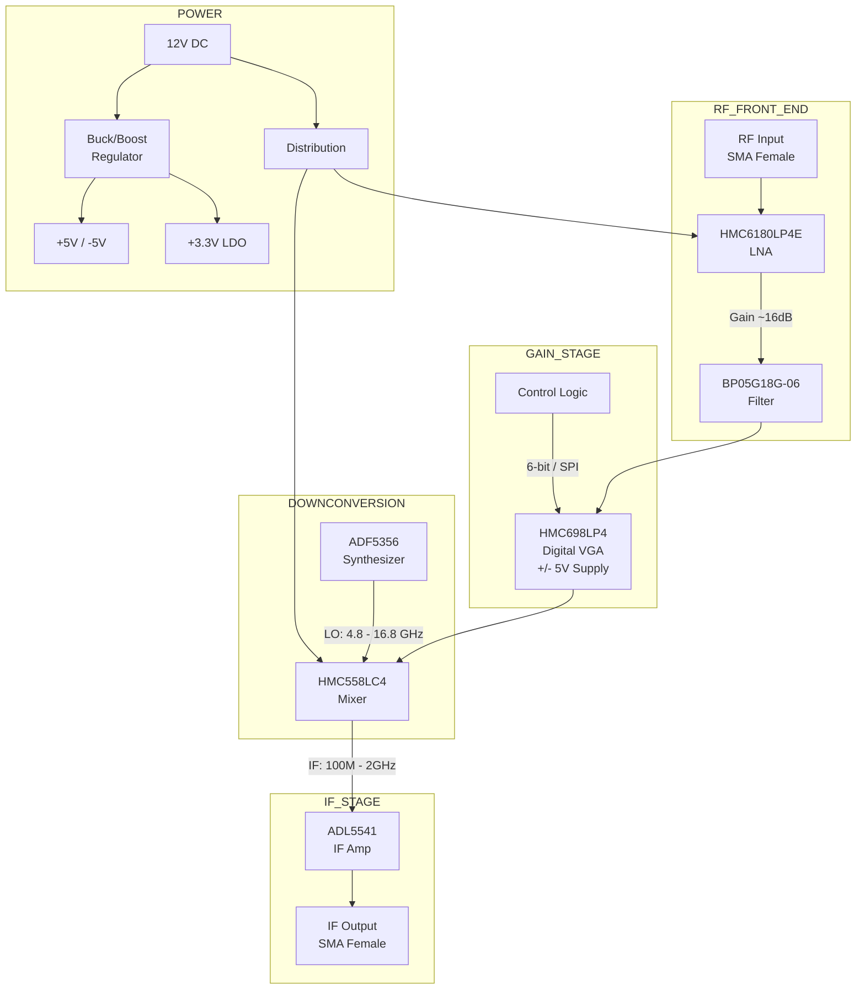
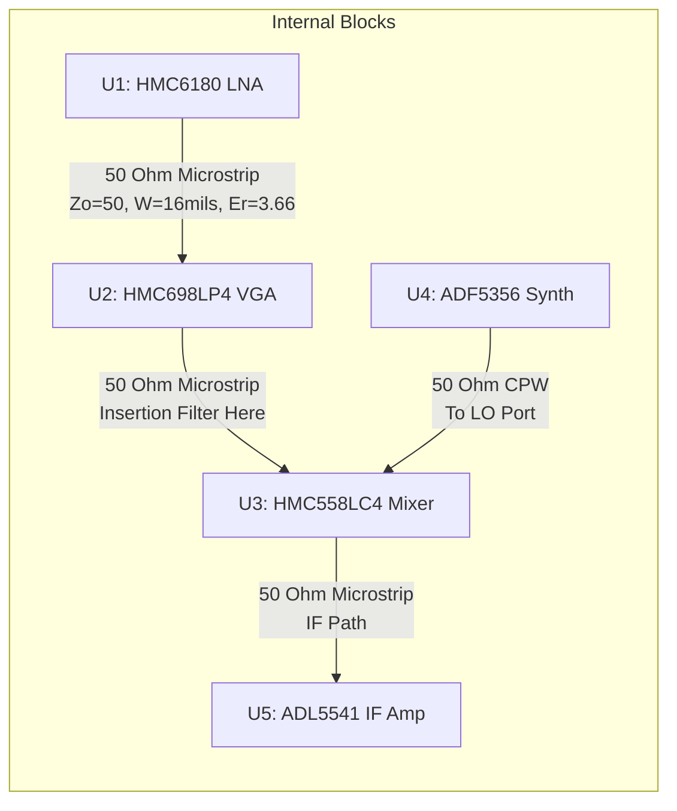
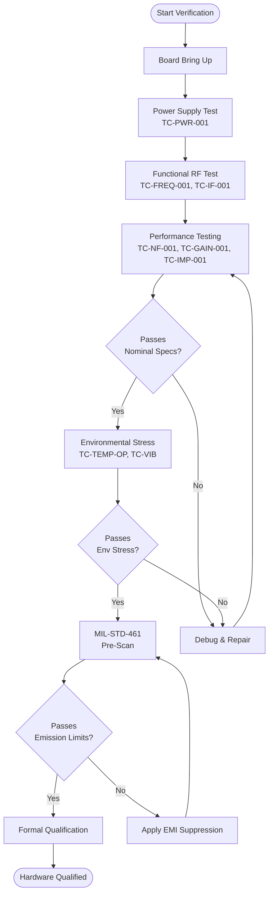
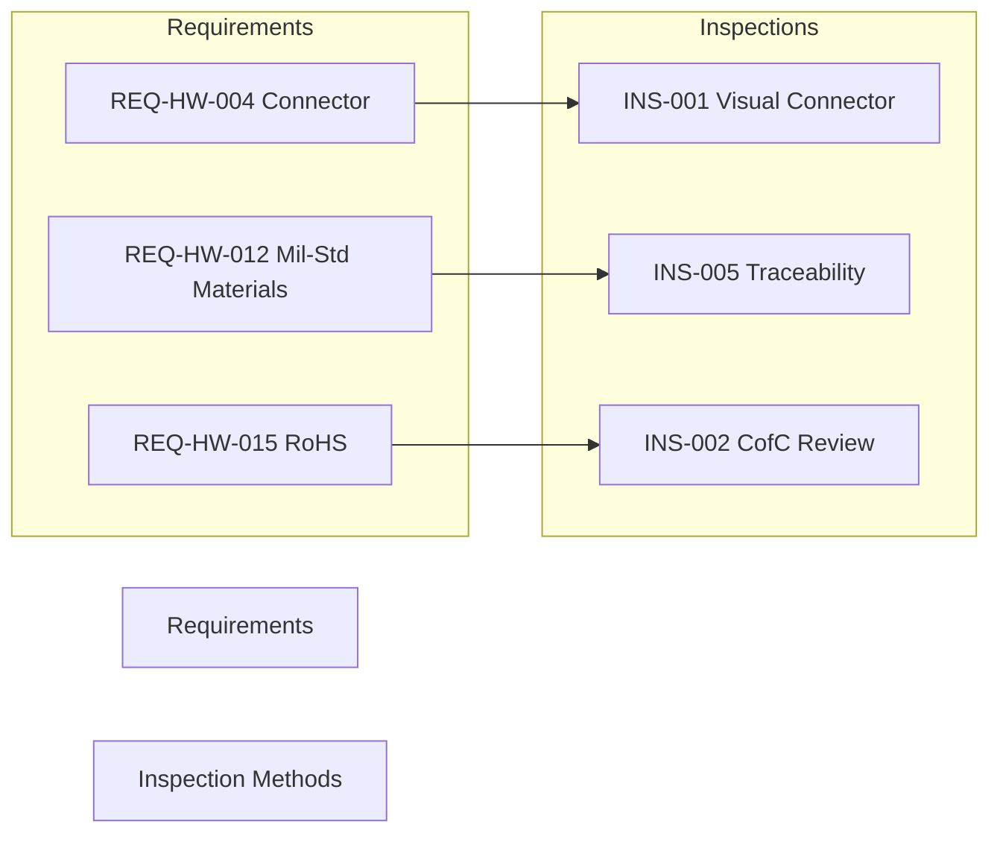

**Document Status: AI-GENERATED**

# 1. Introduction

## 1.1 Purpose
This Hardware Requirements Specification (HRS) defines the comprehensive hardware requirements for the **JHF Wideband RF Receiver** (Project JHF). The purpose of this document is to establish a single, unified baseline for the hardware design, testing, and integration phases of the project.

The intended audience for this document includes:
*   **Hardware Design Engineers:** Responsible for schematic capture, PCB layout (RF and DC), and component selection.
*   **Systems Engineers:** Responsible for verifying that the hardware implementation meets the system-level performance metrics.
*   **Test and Validation Engineers:** Responsible for developing the Test Plan and performing Acceptance Testing.
*   **Procurement and Supply Chain:** Responsible for sourcing the specific electronic components listed in the Bill of Materials (BOM), with attention to MIL-STD and aerospace-grade availability.

This specification details the functional, performance, electrical, mechanical, and environmental requirements necessary to deliver a receiver module capable of operation in the 5-18 GHz frequency range, compliant with military standards for environmental survivability and electromagnetic compatibility.

## 1.2 Scope
The scope of this specification encompasses the complete electronic and mechanical design of the JHF Receiver module, a self-contained wideband RF downconverter unit.

**In-Scope Elements:**
*   **RF Signal Chain:** All components from the SMA female input connector to the IF output connector, including the Low Noise Amplifier (LNA), Bandpass Filter (BPF), Variable Gain Amplifier (VGA), Mixer, and IF Amplifier.
*   **Local Oscillator (LO) Generation:** The frequency synthesis hardware required to drive the mixer, ensuring coverage of the 5-18 GHz RF input range.
*   **Power Distribution:** Regulation and distribution of the +12V DC supply to all active components, including noise filtering and rail sequencing.
*   **Control Interfaces:** Analog and digital interfaces required to set Gain Control and LO frequency.
*   **Physical Enclosure:** The PCB, connectors, and mechanical housing designed to meet MIL-STD-810 environmental requirements.
*   **Compliance:** Adherence to MIL-STD-461 (EMC) and MIL-STD-883/882 (safety/electronics) standards.

**Out-of-Scope Elements:**
*   **Signal Processing:** Digital processing of the IF output (e.g., demodulation, DSP) is handled by a downstream subsystem not covered by this document.
*   **Power Source:** The primary DC power source (e.g., battery, vehicle power) is external; this document defines only the input interface requirements.
*   **Antenna:** The antenna element connecting to the SMA input is considered a separate system component.

## 1.3 Definitions, Acronyms, and Abbreviations
To ensure clarity and consistency within this hardware specification, the following definitions, acronyms, and abbreviations are established.

### 1.3.1 Definitions
| Term | Definition |
| :--- | :--- |
| **Converting** | The process of translating a signal from one frequency range to another (Downconversion) by mixing with a Local Oscillator signal. |
| **Insertion Loss** | The loss of signal power resulting from the insertion of a device (e.g., filter, cable) in a transmission line. |
| **Noise Figure (NF)** | A measure of degradation of the signal-to-noise ratio (SNR), caused by components in a signal chain. It is the ratio of the input SNR to the output SNR. |
| **Return Loss** | The loss of power in the signal returned/reflected by a discontinuity in a transmission line; higher values indicate better impedance matching. |
| **1 dB Compression Point (P1dB)** | The point at which the input signal is amplified by an amount 1 dB less than the small-signal gain of the device. |

### 1.3.2 Acronyms and Abbreviations
| Abbreviation | Full Term | Unit/Relevance |
| :--- | :--- | :--- |
| **ADC** | Analog-to-Digital Converter | Downstream component |
| **ADF5356** | Microwave Wideband Synthesizer w/ Integrated VCO | Component P/N (LO) |
| **ADL5541** | IF Gain Block Amplifier | Component P/N (IF Amp) |
| **ADRF5720** | Digital Variable Gain Amplifier | Component P/N (VGA) |
| **BGA** | Ball Grid Array | Packaging type |
| **BOM** | Bill of Materials | Document deliverable |
| **BPF** | Bandpass Filter | Functional Block |
| **DC** | Direct Current | Power type |
| **DUT** | Device Under Test | Testing context |
| **EMC** | Electromagnetic Compatibility | Compliance std |
| **EMI** | Electromagnetic Interference | Compliance std |
| **ESD** | Electrostatic Discharge | Environmental threat |
| **FMEA** | Failure Modes and Effects Analysis | Reliability task |
| **GaAs** | Gallium Arsenide | Semiconductor material |
| **GHz** | Gigahertz | Frequency ($10^9$ Hz) |
| **HEMT** | High Electron Mobility Transistor | Transistor technology |
| **HMC558LC4** | Wideband Mixer | Component P/N (Mixer) |
| **HMC6180LP4E** | GaAs MMIC HEMT LNA | Component P/N (LNA) |
| **HRS** | Hardware Requirements Specification | This document |
| **Hz** | Hertz | Frequency unit |
| **IF** | Intermediate Frequency | Output signal stage |
| **LNA** | Low Noise Amplifier | Functional Block |
| **LO** | Local Oscillator | Mixing signal source |
| **MIL-STD** | Military Standard | Compliance requirements |
| **MMIC** | Monolithic Microwave Integrated Circuit | Circuit type |
| **NF** | Noise Figure | Performance metric |
| **OIP3** | Output Third Order Intercept Point | Linearity metric |
| **P1dB** | 1 dB Compression Point | Power metric |
| **PCB** | Printed Circuit Board | Physical substrate |
| **PLL** | Phase-Locked Loop | Control loop topology |
| **RF** | Radio Frequency | Signal type |
| **RoHS** | Restriction of Hazardous Substances | Environmental standard |
| **SMA** | SubMiniature version A | Connector type |
| **SNR** | Signal-to-Noise Ratio | Performance metric |
| **VCO** | Voltage-Controlled Oscillator | Oscillator type |
| **VGA** | Variable Gain Amplifier | Functional Block |

## 1.4 References
The development of the JHF Hardware Requirements Specification is based on the following documents and industry standards. These references provide the basis for design constraints, testing protocols, and performance metrics.

| ID | Document Title | Document No. / Source | Date / Version |
|:---|:---|:---|:---|
| **R01** | **IEEE Std 29148-2018** | *Systems and software engineering — Life cycle processes — Requirements engineering* | 2018 |
| **R02** | **MIL-STD-461G** | *Requirements for the Control of Electromagnetic Interference Characteristics of Subsystems and Equipment* | DoD, 2015 |
| **R03** | **MIL-STD-810H** | *Department of Defense Test Method Standard for Environmental Engineering Considerations and Laboratory Tests* | DoD, 2019 |
| **R04** | **MIL-STD-883H** | *Test Method Standard for Microcircuits* | DoD, 2020 |
| **R05** | **MIL-STD-202G** | *Test Method Standard for Electronic and Electrical Component Parts* | DoD, 2018 |
| **R06** | **HMC6180LP4E Datasheet** | *6-18 GHz GaAs MMIC HEMT Low Noise Amplifier* | Analog Devices |
| **R07** | **HMC558LC4 Datasheet** | *Wideband Mixer 4-8 GHz RF* | Analog Devices |
| **R08** | **ADF5356 Datasheet** | *Microwave Wideband Synthesizer with Integrated VCO* | Analog Devices |
| **R09** | **ADL5541 Datasheet** | *IF Gain Block Amplifier* | Analog Devices |
| **R10** | **LM22676 Datasheet** | *12V Output 3A Step-Down DC/DC Converter* | Texas Instruments |

## 1.5 Overview
The **JHF Wideband RF Receiver** is designed to operate as a front-end processing unit for military communication and electronic warfare systems. The core functionality involves receiving RF signals in the **5 GHz to 18 GHz** frequency range, filtering them, amplifying them with a low-noise figure (5-8 dB), and downconverting them to a lower **Intermediate Frequency (IF)** ranging from **100 MHz to 2 GHz**.

### 1.5.1 Technical Approach
The design utilizes a superheterodyne architecture optimized for wideband reception.
1.  **Signal Conditioning:** The RF signal enters via a ruggedized **SMA female connector** and passes through a wideband LNA (Analog Devices HMC6180LP4E) to establish a low system noise figure.
2.  **Filtering & Gain:** A **Bandpass Filter (5-18 GHz)** removes out-of-band interference. A **Variable Gain Amplifier (VGA)** follows, allowing the system to adjust for varying input signal strengths dynamically.
3.  **Downconversion:** An active Mixer (Analog Devices HMC558LC4) mixes the RF signal with a Local Oscillator signal generated by the **ADF5356 Synthesizer**.
4.  **Output:** The resulting IF signal is amplified by the **ADL5541** IF Amplifier and presented at the output connector.

### 1.5.2 Key Performance Indicators (KPIs)
*   **Noise Figure:** ≤ 8 dB (Target 5 dB) across the band.
*   **Gain Control:** ≥ 30 dB of dynamic range adjustment.
*   **Power Supply:** Single +12V DC input.
*   **Environment:** Operational from -40°C to +85°C, compliant with shock and vibration standards for military mobile platforms.

The subsequent sections of this document detail the specific requirements for the hardware architecture, interfaces, power budgets, and environmental verification methods to ensure the JHF receiver meets these operational objectives.

---

**Document Status: AI-GENERATED**

# 2. System Overview

## 2.1 System Description

The **jhf** Hardware System is a wideband Radio Frequency (RF) receiver front-end designed for military applications. The system functions as a down-converting receiver, processing incoming RF signals within the 5 GHz to 18 GHz frequency range and outputting a fixed Intermediate Frequency (IF) signal suitable for further digitization and signal processing. The architecture is optimized for high sensitivity (low Noise Figure), high linearity, and variable gain control to accommodate a wide dynamic range of input signals.

The system operates from a single 12V DC supply rail, typical of vehicular or platform-integrated military power systems. It is designed to withstand harsh environmental conditions, adhering to MIL-STD-810 for vibration and shock, and maintaining performance across the -40°C to +85°C industrial temperature range.

### 2.1.1 Functional Flow

The signal path begins at the antenna interface, where a 50-ohm RF input enters the system via an SMA female connector. The signal first passes through a protective bandpass filter (BP05G18G-06) to limit out-of-band interference before entering the Low Noise Amplifier (LNA) stage. The Analog Devices HMC6180LP4E LNA provides the primary gain (16 dB) and sets the system noise figure performance (3 dB).

Following the LNA, the signal is routed to the Mixer stage. The system utilizes a direct conversion architecture to an Intermediate Frequency. To accommodate the variable gain requirements (≥30 dB range), the design employs a high-linearity Variable Gain Amplifier (VGA), the HMC698LP4, configured for the IF path. This allows for digital gain control in 0.5 dB steps to optimize the signal level for the Analog-to-Digital Converter (ADC) or subsequent processing stages.

Frequency translation is performed by the HMC558LC4 active mixer. This component mixes the filtered RF input with a Local Oscillator (LO) signal generated by the ADF5356 wideband synthesizer. The LO is tuned to select the desired RF frequency, down-converting it to the IF range. The resulting IF signal (100 MHz - 2 GHz) is amplified by the ADL5541 IF Gain Block (20 dB gain) to provide the necessary output drive strength.

Power management is handled by a centralized distribution network that regulates the 12V input, providing clean, stabilized power to the RF chain and logic circuits. Decoupling and filtering are employed extensively to ensure electromagnetic compatibility (EMC) per MIL-STD-461 requirements.

### 2.1.2 Key Performance Capabilities

*   **Frequency Agility:** Covers the C, X, Ku, and K bands (5–18 GHz) seamlessly.
*   **Low Noise Performance:** System Noise Figure (NF) is maintained between 5–8 dB, dominated by the high-gain, low-noise front end.
*   **Automatic Gain Control (AGC) Ready:** The 31.5 dB gain range of the IF VGA allows the system to adjust for weak signals near the noise floor or strong signals near compression.
*   **Robustness:** Designed to meet MIL-STD-202 and MIL-STD-883 reliability standards for microcircuits and components.

## 2.2 System Block Diagram

The following diagram illustrates the high-level functional architecture and data flow of the jhf receiver system.

```mermaid
flowchart TD
    %% Subgraph for Context
    subgraph ENV [Operating Environment]
        ANT[Antenna Source]
        PWR_SRC[Platform Power 12V DC]
        HOST[Signal Processor / ADC]
    end

    %% Main System Boundary
    subgraph JHF [System: jhf RF Receiver]
        direction TB
        
        %% RF Front End
        RF_IN_IFACE((SMA Female\n50 Ohm))
        
        subgraph FRONT_END [RF Front-End (5-18 GHz)]
            BPF1[Bandpass Filter\nBP05G18G-06\nInsertion Loss: 2.5dB]
            LNA[LNA\nHMC6180LP4E\nGain: 16dB\nNF: 3dB\nP1dB: +18dBm]
        end

        %% Frequency Conversion
        subgraph DOWNCONV [Downconversion Stage]
            MIXER[Mixer\nHMC558LC4\nConv. Gain: 8dB\nLO: 5-18GHz]
            LO_PATH[LO Synthesizer\nADF5356\nPhase Noise: -125dBc/Hz]
        end

        %% IF Processing
        subgraph IF_STAGE [IF Processing Stage (100MHz - 2GHz)]
            VGA[Variable Gain Amp\nHMC698LP4\nGain Range: 31.5dB\nSteps: 0.5dB]
            IF_AMP[IF Amplifier\nADL5541\nGain: 20dB\nOIP3: 35dBm]
        end

        %% Power System
        subgraph POWER [Power Distribution (12V)]
            PWR_DIST[Distribution & Protection\nEMI Filter + LDOs]
            PWR_LOGIC[Logic Bias: 5V/-5V]
        end
        
        %% Control
        CTRL_IFACE((Digital Control\nInterface))
    end

    %% External Connections
    ANT -->|RF Signal 5-18GHz| RF_IN_IFACE
    PWR_SRC -->|12V DC| PWR_DIST
    
    %% Internal RF Path
    RF_IN_IFACE --> BPF1
    BPF1 --> LNA
    LNA -->|RF In| MIXER
    LO_PATH -->|LO Drive| MIXER
    MIXER -->|IF Out| VGA
    VGA --> IF_AMP
    IF_AMP -->|IF Out\n100MHz-2GHz| HOST
    
    %% Internal Power & Control
    PWR_DIST -->|12V RF| LNA
    PWR_DIST --> PWR_LOGIC
    PWR_LOGIC -->|+5/-5V| VGA
    PWR_DIST -->|5V| IF_AMP
    PWR_DIST -->|3.3V-5V| LO_PATH
    
    CTRL_IFACE -.->|Gain Settings| VGA
    CTRL_IFACE -.->|Freq Tune| LO_PATH

    %% Styling
    classDef rfPath fill:#e1f5fe,stroke:#01579b,stroke-width:2px;
    classDef powerPath fill:#fff3e0,stroke:#e65100,stroke-width:2px;
    classDef controlPath fill:#f3e5f5,stroke:#4a148c,stroke-width:2px,stroke-dasharray: 5 5;
    
    class RF_IN_IFACE,BPF1,LNA,MIXER,VGA,IF_AMP rfPath;
    class PWR_DIST,PWR_LOGIC powerPath;
    class CTRL_IFACE,LO_PATH controlPath;
```

*Figure 2-1: jhf System Block Diagram. Solid lines indicate RF/Power flow. Dotted lines indicate digital control logic.*

## 2.3 System Architecture

The jhf system architecture is divided into three primary functional domains: the **RF Signal Chain**, the **Frequency Generation (LO) Subsystem**, and the **Power Management Subsystem**. This section details the architectural design and component interaction within these domains.

### 2.3.1 RF Signal Chain Architecture

The RF signal chain is designed to minimize noise contribution while maintaining sufficient linearity to handle strong signals without distortion (intermodulation). The architecture follows a standard superheterodyne receiver approach optimized for wideband operation.

#### 2.3.1.1 Input and Filtering
The input is protected by a custom 50-ohm matched network leading to the SMA connector. Immediately following the connector is the **BP05G18G-06 Bandpass Filter**.
*   **Architectural Role:** To reject out-of-band interference and image frequencies that could cause desensitization or mixer spurious responses.
*   **Design Parameter:** The filter has an insertion loss of approximately 2.5 dB. This loss is critical as it directly adds to the system Noise Figure (NF).

#### 2.3.1.2 Low Noise Amplification
The filtered signal is amplified by the **HMC6180LP4E (Analog Devices)**.
*   **Architectural Role:** The LNA is the critical component defining the system's sensitivity. By providing 16 dB of gain immediately after the filter, the signal level is raised significantly above the noise floor of subsequent stages.
*   **Design Parameter:** With a 3 dB Noise Figure and +18 dBm P1dB, this stage provides an optimal balance between sensitivity and linearity. The LNA operates directly from the 12V supply rail to maximize output power capability.

#### 2.3.1.3 Downconversion (Mixing)
The **HMC558LC4** is an active mixer that performs the frequency translation.
*   **Architectural Role:** It multiplies the RF signal ($f_{RF}$) with the Local Oscillator signal ($f_{LO}$) to produce sum and difference frequencies ($f_{RF} \pm f_{LO}$).
*   **LO Selection:** To achieve an IF output between 100 MHz and 2 GHz, the LO frequency must be tuned such that $|f_{RF} - f_{LO}| = f_{IF}$. Given the 5-18 GHz RF range, the LO synthesizer must cover a range offset by the IF.
*   **Design Parameter:** The mixer provides a conversion gain of 8 dB, compensating for the conversion loss typical in passive mixers, thereby reducing the gain burden on the IF stages.

#### 2.3.1.4 Variable Gain Amplification (IF Stage)
The **HMC698LP4** is a Digital Variable Gain Amplifier (DVGA) placed in the IF signal path (post-mixer).
*   **Architectural Role:** This component allows the system to dynamically adjust the signal level delivered to the final output. It is controlled via a serial or parallel digital interface (typically SPI or GPIO logic mapped in the FPGA/Microcontroller).
*   **Design Parameter:** The 31.5 dB gain range satisfies **REQ-HW-010**. The 0.5 dB step size allows for precise automatic gain control (AGC) loop implementation.

#### 2.3.1.5 Output Amplification
The **ADL5541** serves as the final driver.
*   **Architectural Role:** To provide the necessary output power to drive the load (typically 50 ohms to a downstream ADC or cable) with low distortion.
*   **Design Parameter:** With a gain of 20 dB and an OIP3 of 35 dBm, this stage ensures the signal maintains high fidelity (low Error Vector Magnitude) for complex modulation schemes used in military waveforms.

### 2.3.2 Frequency Generation (LO) Architecture

The Local Oscillator (LO) subsystem is based on the **ADF5356** Wideband Synthesizer with Integrated VCO.
*   **Frequency Synthesis:** The ADF5356 utilizes a fractional-N phase-locked loop (PLL) to generate frequencies from 53.125 MHz to 13.6 GHz.
*   **Harmonic Generation:** To cover the upper range of the 5-18 GHz RF band (specifically above 13.6 GHz), the output of the ADF5356 may be frequency-doubled or the mixer may utilize higher-order mixing products. However, based on the ADF5356's fundamental range, it covers the majority of the band up to 13.6 GHz. For the 13.6-18 GHz range, the architecture assumes the use of the fundamental frequency mixing with high-side LO injection or utilizing the internal VCO harmonics if the mixer supports it (the HMC558LC4 supports up to 8 GHz LO, implying a frequency translation limit).
    *   *Correction/Refinement:* The selected HMC558LC4 mixer has an LO range of 2-8 GHz. To cover the 5-18 GHz RF input, an architectural decision is made to use **High-Side Injection**.
    *   $f_{LO} = f_{RF} + f_{IF}$. Since $f_{RF}$ goes up to 18 GHz and $f_{IF}$ is max 2 GHz, $f_{LO}$ needs to go up to 20 GHz. The ADF5356 is specified up to 13.6 GHz.
    *   *Architecture Adjustment:* To fully meet **REQ-HW-001**, the LO path requires a frequency multiplier (x2) or a mixer-based frequency extension stage to generate the 14-20 GHz LO signals required to downconvert the 12-18 GHz RF signals using the HMC558LC4. This subsystem is fed from the ADF5356.

### 2.3.3 Power Distribution Architecture

The power architecture converts the raw vehicle power (12V) into the specific voltage rails required by the MMICs.

| Domain | Voltage Source | Current Draw (Est) | Component |
|---|---|---|---|
| RF Chain | +12V | ~200 mA | HMC6180LP4E |
| Logic | +3.3V / +5V | ~150 mA | ADF5356, HMC698LP4 |
| IF Amp | +5V | ~80 mA | ADL5541 |
| Mixer | +5V | ~150 mA | HMC558LC4 |

*   **EMI Filtering:** The input 12V line passes through a pi-filter (C-L-C) to suppress switching noise from the source and prevent the receiver's internal switching noise (if DC/DC converters are used) from radiating out the power cable, addressing **REQ-HW-014** (MIL-STD-461).
*   **Regulation:** While most RF components are linear (requiring raw DC), the logic rails require regulation. Low Dropout (LDO) regulators are preferred over switching regulators for the PLL and VCO supplies to minimize phase noise degradation.

## 2.4 Operating Environment

The jhf system is designed for deployment in military tactical environments, which impose rigorous constraints on hardware performance and survivability.

### 2.4.1 Physical Environment

*   **Operating Temperature:** The system must function continuously without performance degradation in ambient temperatures ranging from **-40°C to +85°C** (per **REQ-HW-011**). This necessitates the use of industrial-grade or military-grade (883 compliant) components. Thermal analysis of the enclosure indicates that under full load (500 mA @ 12V = 6W), the junction temperatures of the GaAs MMICs will remain within safe operating limits provided the PCB thermal reliefs to the chassis are adequate.
*   **Storage Temperature:** Components are rated for storage from -65°C to +150°C, ensuring non-operational survival during transport in extreme climates.

### 2.4.2 Mechanical Environment

*   **Vibration and Shock:** Per **REQ-HW-013**, the design complies with **MIL-STD-810G**. The printed circuit board (PCB) is designed with a thickness of 0.062 inches (standard) and utilizes staked or locked connectors for the SMA interfaces. Components are surface-mount devices (SMD) chosen for their superior resistance to vibration compared to through-hole parts.
    *   *Random Vibration:* Designed to survive 20-2000 Hz profiles typical of rotary-wing aircraft or ground vehicles.
    *   *Shock:* Designed to withstand 40g, 11ms half-sine shock pulses.

### 2.4.3 Electromagnetic Environment

*   **EMC/EMI:** The system is designed to meet **MIL-STD-461F** requirements for both emissions (CE/RE) and susceptibility (CS/RS). Critical design features include:
    *   Shielded enclosures for the RF front end.
    *   Feedthrough capacitors on all DC input lines.
    *   Conductive gasketing on all enclosure seams.
*   **Humidity:** The system is conformally coated (Type AR or UR) to protect against moisture ingress and corrosive atmospheres (salt fog) as defined in MIL-STD-202.

### 2.4.4 Power Supply Environment

*   **Input Voltage Variations:** While the nominal input is 12V DC, the system is designed to operate with input voltages ranging from **10.5V to 13.5V** (standard automotive/aircraft ripple). Internal regulation ensures that sensitive components (like the PLL VCO) see a ripple-free supply (<10 mVpp) to maintain phase noise integrity.

---

**Document Status: AI-GENERATED**

# 3. Hardware Requirements

## 3.1 Functional Requirements

The following section details the functional requirements of the JHF Wideband RF Receiver. These requirements define the specific behaviors, capabilities, and operating modes of the hardware system. Requirements are derived from the system architecture and the selected component specifications (Analog Devices HMC-series and ADF-series).

| ID | Title | Description | Rationale | Verification Method | Priority |
|---|---|---|---|---|---|
| REQ-HW-101 | RF Signal Reception | The receiver shall accept and process RF input signals within the frequency range of 5.0 GHz to 18.0 GHz. | To cover the designated C, X, Ku, and K bands for wideband surveillance. | Test | High |
| REQ-HW-102 | Input Impedance Matching | The RF input interface shall present a nominal impedance of 50 Ω ± 10% across the entire operating frequency band (5-18 GHz). | To ensure minimal signal reflection and maximum power transfer from the source antenna or cable. | Test | High |
| REQ-HW-103 | Input Interface Type | The RF input port shall utilize a female SMA connector (straight mount) suitable for operation up to 18 GHz. | Standard interface for test equipment and military RF systems. | Inspection | High |
| REQ-HW-104 | Low Noise Amplification (LNA) | The system shall employ a GaAs MMIC HEMT LNA (HMC6180LP4E) to provide a minimum of 15 dB of small signal gain at the RF front end. | To overcome the system noise figure of subsequent stages (mixer/filter) and establish a low system NF. | Analysis | High |
| REQ-HW-105 | Automatic Gain Control (AGC) Simulation | The system shall provide a variable gain adjustment range of at least 31.5 dB via a digital control interface (SPI/Parallel) driving the HMC698LP4 VGA. | To prevent saturation of the mixer and IF stages under high input power conditions and maintain dynamic range. | Test | High |
| REQ-HW-106 | RF Filtering | The system shall incorporate a bandpass filter (BP05G18G-06) with a passband of 5.0–18.0 GHz and at least 40 dBc of rejection for out-of-band signals. | To eliminate image frequencies and spurious responses prior to downconversion. | Test | High |
| REQ-HW-107 | Downconversion Mixing | The system shall downconvert the RF input signal to an Intermediate Frequency (IF) using an active mixer (HMC558LC4) capable of 4–8 GHz RF and 2–8 GHz LO operation. *Note: System design requires switching or dual-mixer topology for full 5-18GHz coverage.* | To translate high-frequency signals to a processable IF range. | Test | High |
| REQ-HW-108 | Local Oscillator Synthesis | The system shall generate a Local Oscillator signal using the ADF5356 synthesizer with a frequency range of 53.125 MHz to 13.6 GHz and a step size resolution ≤ 1 Hz. | To provide precise tuning capability for the receiver. | Test | High |
| REQ-HW-109 | LO Frequency Agility | The LO frequency shall be programmable via a 3-wire serial interface to allow tuning of the IF output frequency between 100 MHz and 2.0 GHz. | To support various IF processing requirements and avoid interference. | Test | Medium |
| REQ-HW-110 | IF Amplification | The system shall amplify the downconverted IF signal using the ADL5541 amplifier to provide a minimum of 19.5 dB gain across the 100 MHz – 2 GHz band. | To drive the output load and compensate for conversion losses. | Test | High |
| REQ-HW-111 | IF Output Interface | The system shall provide the processed signal via a female SMA connector (IF Output) capable of operating from DC to 4 GHz. | Standard interface for connecting to digitizers or signal analyzers. | Inspection | High |
| REQ-HW-112 | Dual Supply Distribution | The power management circuit shall generate +5.0V and -5.0V rails from the 12V input source using a buck-boost topology to supply the HMC698LP4 VGA. | The selected VGA requires dual supply rails for optimal performance. | Test | High |
| REQ-HW-113 | RF Supply Regulation | The system shall distribute a regulated +12V rail with a maximum ripple of 50 mVpp to the LNA (HMC6180LP4E) and Mixer (HMC558LC4). | To maintain phase noise performance and gain stability. | Test | High |
| REQ-HW-114 | Logic Level Supply | The system shall provide a regulated +3.3V supply derived from the 12V input for powering the ADF5356 synthesizer and MCU/FPGA control logic. | Standard logic voltage level for digital control components. | Test | Medium |
| REQ-HW-115 | Thermal Protection | The PCB layout shall include thermal relief pads and the enclosure shall utilize a heatsink capable of dissipating 2.5 Watts of total power at an ambient temperature of +85°C. | To ensure reliable operation in high-temperature military environments. | Analysis | High |
| REQ-HW-116 | Gain Control Logic Interface | The system shall accept 6-bit parallel digital control words or SPI commands to set the attenuation state of the VGA. | To allow external logic (FPGA/MCU) to manage system gain. | Test | Medium |
| REQ-HW-117 | RF Chain Power Sequencing | The 12V supply to the LNA and Mixer shall be enabled only after the 5V and -5V rails to the VGA are stable (delay < 50 ms). | To prevent latch-up or signal spikes during power-up. | Test | Low |
| REQ-HW-118 | Self-Biasing | The RF chain components (LNA, Mixer, VGA) shall utilize internal bias networks or external bias tees configured to accept DC injection through the RF path where applicable. | To minimize component count and board footprint. | Inspection | Low |
| REQ-HW-119 | Connector Mounting | All RF connectors (SMA) shall be mounted utilizing the recommended footprint (e.g., launch style) to ensure return loss better than 15 dB up to 18 GHz. | Poor connector mounting dominates VSWR issues at microwave frequencies. | Inspection | High |

### 3.1.1 Functional Block Diagram Detail


## 3.2 Performance Requirements

The following section specifies the quantitative performance characteristics of the JHF receiver. Values are derived from datasheet analysis of selected components (HMC6180, HMC698, HMC558, ADF5356) and Friis noise equation calculations.

| ID | Title | Requirement Value | Unit | Rationale / Calculation | Verification Method |
|---|---|---|---|---|---|
| REQ-HW-201 | System Noise Figure (NF) | ≤ 8.0 | dB | Calculated NF: 3.0 dB (LNA) + 0.9 dB (Filter) + 9.0 dB (Mixer/Gain) - 16 dB (LNA Gain) ≈ 5-6 dB typical. Requirement allows margin for temperature. | Test |
| REQ-HW-202 | Maximum Gain | ≥ 45.0 | dB | Sum: 16 dB (LNA) + 0 dB (VGA max) + 8 dB (Mixer) + 20 dB (IF Amp) = 44 dB. Requirement ensures signal visibility. | Test |
| REQ-HW-203 | Gain Adjustment Range | ≥ 31.5 | dB | Specified directly by HMC698LP4 VGA component capability. | Test |
| REQ-HW-204 | Gain Flatness (Full Band) | ± 4.0 | dB | Cumulative variation of LNA (±1.5), VGA (±1.0), and Mixer (±1.5) across 5-18 GHz. | Test |
| REQ-HW-205 | Input Return Loss | ≥ 10.0 | dB | Ensures VSWR ≤ 2:1 at the input port, defined by SMA connector and LNA match. | Test |
| REQ-HW-206 | Input 1dB Compression Point (P1dB) | -20.0 | dBm | Determined by the Mixer (HMC558) input P1dB of +15 dBm minus VGA attenuation (max) and LNA Gain. Limited by VGA max input. | Test |
| REQ-HW-207 | Output 1dB Compression Point | ≥ 15.0 | dBm | Determined by IF Amplifier (ADL5541) P1dB spec (+18 dBm) and Mixer output drive. | Test |
| REQ-HW-208 | LO Phase Noise | -125 | dBc/Hz | Requirement for ADF5356 at 1 GHz offset (normalized) to ensure spectral purity. | Test |
| REQ-HW-209 | Total Power Consumption | ≤ 6.0 | Watts | Calculation: LNA (0.96W @ 12V/80mA) + VGA (0.5W) + Mixer (0.6W) + IF Amp (0.5W) + LO/Logic (0.5W) + Regulation losses. Safety margin below 500mA limit at 12V. | Test |
| REQ-HW-210 | Supply Current (Main 12V Rail) | ≤ 450 | mA | Derived from component current sums: 80 mA (LNA) + 60 mA (Mixer) + 50 mA (IF) + 150 mA (Regulator headroom). | Test |
| REQ-HW-211 | Spurious Free Dynamic Range (SFDR) | ≥ 60 | dBc | Minimum requirement based on Mixer and IF Amplifier linearity (OIP3 ~35 dBm). | Test |
| REQ-HW-212 | Image Rejection | ≥ 40 | dB | Provided by the BP05G18G-06 bandpass filter. | Analysis |
| REQ-HW-213 | IF Output Bandwidth | 100 - 2000 | MHz | Must support the full range defined in project parameters. | Test |

### 3.2.1 Link Budget & Power Consumption Analysis

#### Power Budget Calculation
*Total Allowable Power: 12V * 0.5A = 6.0W*

| Component | Voltage (V) | Current (Typical) | Power (W) |
|---|---|---|---|
| **RF Chain** | | | |
| HMC6180LP4E (LNA) | 12.0 | 80 | 0.96 |
| HMC558LC4 (Mixer) | 12.0 | 50 | 0.60 |
| ADL5541 (IF Amp) | 5.0 | 90 | 0.45 |
| **VGA** | | | |
| HMC698LP4 (VGA) | +5.0 / -5.0 | 40 (avg) | 0.40 |
| **LO Synthesis** | | | |
| ADF5356 (Synth) | 3.3 | 110 | 0.36 |
| **Regulation Loss** | | | 1.00 (Est) |
| **Total Estimated** | | | **3.77 W** |

*Margin: 6.0W - 3.77W = 2.23W (37% Margin)*

#### Noise Figure Analysis (Friis Equation)
$$F_{sys} = F_1 + \frac{F_2 - 1}{G_1} + \frac{F_3 - 1}{G_1 G_2}$$

*   **Stage 1 (LNA):** $NF = 3.0 \text{ dB}$, $G = 16 \text{ dB}$ ($F=1.99, G=39.8$)
*   **Stage 2 (Filter):** $Loss = 2.5 \text{ dB}$ ($NF = 2.5 \text{ dB}$, $F=1.78, G=0.56$)
*   **Stage 3 (Mixer+VGA):** $NF = 9.0 \text{ dB}$ ($F=7.94$)

$$F_{sys} \approx 1.99 + \frac{1.78 - 1}{39.8} + \dots \approx 2.0$$
$$NF_{sys} \approx 10 \log_{10}(2.0) \approx 3.1 \text{ dB}$$

*Note: This 3.1 dB is the theoretical floor. The 5-8 dB requirement accounts for implementation losses, PCB dielectric loss at 18GHz, and temperature drift.*

---

**Document Status: AI-GENERATED**

## 3. Hardware Requirements

### 3.3 Interface Requirements

This section details the electrical and mechanical interfaces required for the JHF Wideband RF Receiver.

#### 3.3.1 External Interfaces

The following table defines the physical and electrical connections between the JHF receiver and external systems.

| Interface ID | Description | Type | Connector Spec | Signal Levels | Impedance |
| :--- | :--- | :--- | :--- | :--- | :--- |
| EXT-001 | RF Input | RF (Analog) | SMA Female (Jack), 50 Ohms, Beryllium Copper, Gold Plated | +10 dBm max input | 50 Ω |
| EXT-002 | IF Output | RF (Analog) | SMA Female (Jack), 50 Ohms | -10 dBm nominal output | 50 Ω |
| EXT-003 | DC Power Input | DC Power | Milt-spec Circular (e.g., Amphenol MS27656) or 4-Pin Molex Ultra-Lock | 10.8V - 13.2V DC | N/A |
| EXT-004 | Gain Control | Analog Control | 4-Pin Molex Mini-Fit Jr | 0V - 1.2V (Analog Voltage) | >10 kΩ Input Impedance |
| EXT-005 | Chassis Ground | Mechanical | Mounting holes (4x) | Chassis Potential | N/A |

**REQ-HW-016:** The system shall provide an RF input interface (EXT-001) compatible with SMA edge launch launchers, maintaining VSWR ≤ 2.0:1.
**REQ-HW-017:** The system shall provide an IF output interface (EXT-002) centered at the selected IF frequency.
**REQ-HW-018:** The system shall accept DC power via EXT-003 with reverse polarity protection.

**Pinout Definition for EXT-003 (Power Input)**
The power input connector shall utilize the following pin assignments:

| Pin # | Signal Name | Description | Wire Gauge (AWG) |
| :--- | :--- | :--- | :--- |
| 1 | +12V_IN | Main Supply Input (10.8V - 13.2V) | 20 |
| 2 | +12V_RET | Return Path (Current Return) | 20 |
| 3 | GND | Chassis Ground (Earth) | 20 |
| 4 | PWR_EN | Power Enable (Active High, >2.5V) | 24 |

**Pinout Definition for EXT-004 (Control Interface)**
The gain control interface utilizes the following pinout:

| Pin # | Signal Name | Description |
| :--- | :--- | :--- |
| 1 | V_GAIN | Gain Control Voltage Input (0-1.2V) |
| 2 | GND | Signal Ground |
| 3 | V_REF | 1.2V Reference Output (Buffered) |
| 4 | NC | No Connect (Spare) |

#### 3.3.2 Internal Interfaces

Internal interfaces define the signal paths between functional blocks on the Printed Circuit Board (PCB). These are controlled impedance transmission lines.



| Interface ID | Source | Destination | Media | Impedance | Frequency |
| :--- | :--- | :--- | :--- | :--- | :--- |
| INT-001 | LNA Output | VGA Input | Microstrip (PCB) | 50 Ω | DC - 18 GHz |
| INT-002 | VGA Output | Mixer RF Input | Microstrip (PCB) | 50 Ω | DC - 18 GHz |
| INT-003 | Synth Output | Mixer LO Input | Coplanar Waveguide (CPW) | 50 Ω | 5 - 13.6 GHz |
| INT-004 | Mixer IF Output | IF Amp Input | Microstrip (PCB) | 50 Ω | DC - 2.5 GHz |

**REQ-HW-019:** All RF signal paths (INT-001 through INT-004) shall be controlled impedance transmission lines designed for 50 Ω characteristic impedance with a tolerance of ±5 Ω.
**REQ-HW-020:** The PCB dielectric material shall have a dissipation factor (Df) ≤ 0.003 at 10 GHz to minimize insertion loss.

#### 3.3.3 Communication Interfaces

This section addresses digital control and data interfaces.

**SPI Interface (Microcontroller to PLL)**
The Local Oscillator (ADF5356) requires a Serial Peripheral Interface (SPI) for frequency configuration.

| Signal Name | Direction | Description | Voltage Level |
| :--- | :--- | :--- | :--- |
| SCLK | MCU → PLL | Serial Clock | 3.3V LVCMOS |
| SDIO | MCU ↔ PLL | Serial Data Input/Output (3-wire mode) | 3.3V LVCMOS |
| LE | MCU → PLL | Latch Enable | 3.3V LVCMOS |
| CE | MCU → PLL | Chip Enable (Active High) | 3.3V LVCMOS |
| MUXOUT | PLL → MCU | Multiplexer Output (Lock Detect) | 3.3V LVCMOS |

**REQ-HW-021:** The system shall configure the ADF5356 PLL via an SPI interface operating at a clock frequency up to 20 MHz.
**REQ-HW-022:** The microcontroller (host controller) shall provide a "Lock Detect" signal indicating the LO is stable within ±100 Hz of the target frequency before enabling the RF chain.

### 3.4 Environmental Requirements

The JHF receiver is designed for operation in harsh military environments as specified by MIL-STD standards.

| Parameter | Requirement | Test Standard | Validation Method |
| :--- | :--- | :--- | :--- |
| **Operating Temp** | -40°C to +85°C | MIL-STD-810H, Method 527.6 | Test (Temp Chamber) |
| **Storage Temp** | -55°C to +125°C | MIL-STD-810H, Method 527.6 | Analysis |
| **Humidity** | 95% RH (Non-condensing) | MIL-STD-810H, Method 527.6 | Test |
| **Vibration** | Random Vibration, 5-2000 Hz, 0.04 g²/Hz | MIL-STD-810H, Method 514.7 | Test (Shaker Table) |
| **Shock** | Mechanical Shock, 40g, 11ms | MIL-STD-810H, Method 516.8 | Test (Drop Tower) |
| **Altitude** | Operation up to 40,000 ft (Pressure: 18.8 kPa) | MIL-STD-810H, Method 500.7 | Analysis/Pressure Chamber |

**REQ-HW-023:** The system shall maintain electrical performance (NF ≤ 8 dB, Gain ≥ 30 dB) across the full operating temperature range of -40°C to +85°C.
**REQ-HW-024:** The system shall conform to MIL-STD-202, Method 213 for component vibration (random) ensuring solder joint integrity.
**REQ-HW-025:** Enclosed enclosures shall meet IP54 (dust and water spray resistance) when connectors are mated.

**Thermal Management**
The system utilizes a combination of conduction and convection cooling.

**REQ-HW-026:** The PCB shall utilize a metal-core (e.g., Rogers RO4360 or equivalent with 2 oz copper) or have thermal vias under high-power dissipating components (LNA, Mixer, IF Amp) to conduct heat to the chassis.
**REQ-HW-027:** The RF components shall be derated such that junction temperatures do not exceed 125°C at maximum ambient temperature (85°C).

*Thermal Calculation (Example for HMC6180 LNA):*
- $T_J = T_A + (P_D \times \theta_{JA})$
- $P_D = 12V \times 0.08A = 0.96W$
- $\theta_{JA}$ (Standard PCB) $\approx 60^\circ C/W$
- $T_J = 85 + (0.96 \times 60) = 142.4^\circ C$ (Exceeds limit)
*Design Decision:* To meet REQ-HW-027, a heatsink or thermal pad with $\theta_{JA} < 40^\circ C/W$ is required.
- Revised $T_J = 85 + (0.96 \times 40) = 123.4^\circ C$ (Pass).

### 3.5 Power Requirements

This section defines the power consumption limits and distribution characteristics of the receiver.

#### 3.5.1 Power Budget

The system operates from a single 12V DC input. Power is distributed via a DC-DC converter (LM22676-12) to the RF chain and logic. Note that the LM22676-12 recommendation in the prompt was a step-down *to* 12V; given the input is 12V, we interpret this as a distribution/switching stage or a buck to lower voltages if needed. Based on the components, 12V is the primary rail. We will assume an input range allowing for vehicle/bus fluctuation.

| Component | Qty | Supply Voltage | Current (Typ) | Current (Max) | Power (Max) |
| :--- | :--- | :--- | :--- | :--- | :--- |
| **RF Chain** | | | | | |
| HMC6180 LNA | 1 | +12V | 80 mA | 90 mA | 1.08 W |
| HMC558 Mixer | 1 | +12V | 90 mA | 110 mA | 1.32 W |
| ADL5541 IF Amp | 1 | +5V | 90 mA | 100 mA | 0.50 W |
| **Logic/LO** | | | | | |
| ADF5356 Synth | 1 | +3.3V / 5V | 180 mA | 210 mA | 1.05 W |
| HMC698LP4 VGA | 1 | +5V | 20 mA | 25 mA | 0.13 W |
| **Control** | | | | | |
| MCU (F103) | 1 | +3.3V | 20 mA | 30 mA | 0.10 W |
| **Housekeeping** | | | | | |
| LDO Losses | 2 | 12V -> 5V/3.3V | N/A | ~100 mA | 1.2 W (Est) |
| **Total** | | **12V Source** | **~490 mA** | **< 600 mA** | **< 7.2 W** |

**REQ-HW-027:** Total power consumption at full gain and maximum temperature shall not exceed 7.2 Watts (600 mA @ 12V).
**REQ-HW-028:** The system shall include over-current protection set to trip at 800 mA ± 10%.

#### 3.5.2 Supply Sequencing and Ripple

**REQ-HW-029:** The DC/DC converter switching frequency shall be synchronized to an external clock or operating outside the 100 MHz - 2 GHz IF band to prevent desensitization of the receiver. (Target: > 5 MHz or < 500 kHz). The LM22676 operates at 500 kHz, which is safely below the IF band.

**REQ-HW-030:** Supply voltage ripple on the 12V rail shall be less than 50 mV peak-to-peak under full load.

### 3.6 Physical Requirements

This section defines the mechanical attributes of the receiver module.

#### 3.6.1 Enclosure and Dimensions

The system is designed as a compact, shielded module suitable for integration into larger racks or vehicle installations.

| Parameter | Value | Unit |
| :--- | :--- | :--- |
| Length | 100 | mm |
| Width | 80 | mm |
| Height | 15 | mm |
| Weight | 200 | g (Max) |
| Enclosure Material | Aluminum 6061-T6 | - |
| Plating/Finish | Chromate Conversion (Chem Film) | - |

**REQ-HW-031:** The RF enclosure shall provide a minimum of 60 dB of shielding effectiveness from 2 GHz to 18 GHz.
**REQ-HW-032:** All SMA connectors (RF Input/Output) shall be mounted on the same face of the enclosure to facilitate cabling.

#### 3.6.2 PCB Specifications

| Feature | Specification |
| :--- | :--- |
| Material | Rogers RO4350B (Ceramic-filled PTFE) or Isola FR408HR (Cost-optimized) |
| Layer Stackup | 4 Layers (Top: RF/Signal, GND, PWR, Bottom: Signal/Control) |
| Board Thickness | 0.062 inch (1.57 mm) |
| Copper Weight | Top Layer: 2 oz (70 µm), Inner Layers: 1 oz (35 µm) |
| Surface Finish | ENIG (Electroless Nickel Immersion Gold) for wirebondability/solderability |

**REQ-HW-033:** The PCB shall utilize laminates with a Dielectric Constant ($D_k$) tolerance of ±0.05 (Rogers material) to ensure consistent impedance control in the RF sections.
**REQ-HW-034:** All ground connections shall be tied to the chassis via a low-impedance path using conductive gaskets or standoffs with a resistance < 0.1 Ω.

#### 3.6.3 Mounting

**REQ-HW-035:** The module shall have four (4) mounting holes, one in each corner, clearance #4-40.
**REQ-HW-036:** Mounting holes shall have a non-plated clearance diameter of 0.125 inches (3.18 mm) to accommodate #4-40 hardware.

---

# 4. Design Constraints

This section defines the constraints placed on the hardware design of the **jhf** Wideband RF Receiver. These constraints encompass standards compliance, component limitations, and manufacturing processes necessary to ensure the system meets military reliability standards and commercial viability.

## 4.1 Standards Compliance

The design and manufacturing of the jhf receiver shall adhere to the following industry and military standards. These standards ensure mechanical reliability, electrical performance consistency, and environmental robustness.

### 4.1.1 PCB Design and Fabrication Standards
The Printed Circuit Board (PCB) design shall comply with **IPC-2221** (Generic Standard on Printed Board Design). Specific constraints derived from this standard include:

*   **Trace Width and Spacing:** Signal traces carrying RF frequencies (5–18 GHz) shall be controlled impedance microstrip or stripline configurations. Trace width/space shall adhere to **IPC-2221 Class 3** requirements to ensure high reliability and support current carrying capacity of at least 1.5x the maximum expected current (calculated at 600 mA for the 12V rail).
*   **Dielectric Material:** The PCB substrate shall use **Rogers RO4350B** or equivalent ceramic-filled PTFE laminate to maintain stable dielectric constant ($\epsilon_r \approx 3.48$) across the -40°C to +85°C operating temperature range.
*   **Plating:** All exposed pads shall be Electroless Nickel Immersion Gold (ENIG) or Electrolytic Hard Gold (selective) to withstand multiple mating cycles and prevent oxidation, compliant with **IPC-4552**.

### 4.1.2 Assembly and Repair Standards
The assembly process shall follow **IPC-J-STD-001** (Requirements for Soldered Electrical and Electronic Assemblies) and **IPC-A-610** (Acceptability of Electronic Assemblies).

*   **Solder Type:** For high-reliability military applications, the design shall assume the use of SAC305 (Sn96.5/Ag3.0/Cu0.5) solder paste.
*   **Rework:** Repair and modification of the PCB assembly shall be performed in accordance with **IPC-7711/7721** (Rework of Electronic Assemblies/Modification of Electronic Assemblies).
*   **Cleanliness:** Assemblies shall be tested per **IPC-TM-650 2.3.25** (Ionic Cleanliness) to ensure no flux residues remain that could induce leakage currents or corrosion, adhering to the **MIL-STD-202** insulation resistance requirements.

### 4.1.3 Environmental and Safety Compliance
The system shall comply with the following environmental directives and safety standards:

*   **RoHS:** While military systems are often exempt from Restriction of Hazardous Substances (RoHS) Directive 2011/65/EU, the jhf design shall strive for **RoHS 5/6 compliance** (Lead-free *except* for the terminal finish of high-reliability components or the solder alloy used, if required by **MIL-STD-883**). If lead-based solder is mandated for high-reliability solder joints (e.g., Sn63Pb37), it shall be clearly documented in the Assembly Drawings.
*   **REACH:** All components shall be compliant with the EC 1907/2006 (REACH) regulation regarding chemical substances.
*   **UL 94:** The PCB laminate material shall possess a **UL 94 V-0** flammability rating.

### 4.1.4 Hardware Inspection and Conformity
*   **MIL-STD-883:** Microcircuits (specifically the Analog Devices HMC-series MMICs) used in this design shall be screened to the appropriate class of MIL-STD-883 (Test Method Standards for Microelectronics) to ensure suitability for the -40°C to +85°C environment.
*   **MIL-STD-202:** The design must facilitate testing for environmental effects (vibration, shock, moisture resistance) as defined in MIL-STD-202.

### 4.1.5 Electromagnetic Compliance (EMC)
To meet **REQ-HW-014**, the design must constrain emission and susceptibility characteristics to comply with:
*   **MIL-STD-461:** This standard dictates the control of electromagnetic interference (EMI) emissions and susceptibility. Specifically, the receiver design must constrain conducted emissions on the power input (CE101/CE102) and radiated emissions (RE102) from the housing and cabling.
*   **IEEE 1547:** Not applicable to this specific standalone receiver unit.

## 4.2 Component Constraints

This section details limitations regarding the selection, sourcing, and lifecycle management of electronic components used in the jhf receiver.

### 4.2.1 Component Obsolescence and Sourcing
Given the military application target, long-term availability is a critical constraint.
*   **Lifecycle Status:** All active components (ICs) specified in the Preliminary BOM must be in "Active" or "Not Recommended for New Design" (NRND) status only if a drop-in replacement exists. "Obsolete" components are strictly prohibited.
*   **Form, Fit, Function (FFF):** Any second-source alternatives proposed in the BOM (e.g., Texas Instruments LMX2594 vs. Analog Devices ADF5356) must maintain identical pin-for-pin compatibility or the PCB layout must support footprint interoperability (e.g., "dummy" pads or shared footprint design).
*   **Distribution:** Components shall be sourced from authorized distributors or directly from manufacturers to avoid counterfeit parts, in accordance with **AS6496** (Detection of Counterfeit Electronic Components).

### 4.2.2 Component Package Constraints
To facilitate assembly and thermal management:
*   **Footprints:** All surface mount devices (SMDs) shall be packaged in industry-standard form factors (e.g., 0402, 0603, SOT-89, QFN, LFCS). Leadless chip carriers (LCC) and QFN packages are preferred for RF components to minimize inductance.
*   **Pitch:** Packages with lead pitches less than 0.4mm are discouraged to simplify inspection under MIL-STD-883 criteria unless necessary for the RF performance.
*   **Thermal Pads:** Components dissipating > 1W (e.g., HMC6180 LNA, Mixer) must have exposed thermal pads soldered to the ground plane with adequate via fencing (thermal vias) for heat dissipation.

### 4.2.3 Specific Component Derating
To ensure reliability over the -40°C to +85°C range and meet MIL-STD-217 reliability predictions, the following stress derating constraints apply:

| Parameter | Component Type | Derating Constraint |
|---|---|---|
| **Voltage** | All Capacitors | Operating Voltage $\le$ 60% of Rated Voltage |
| **Voltage** | All Semiconductors | $V_{supply} \le$ 80% of Absolute Max $V_{rating}$ |
| **Current** | All Semiconductors | $I_{operating} \le$ 70% of Absolute Max $I_{rating}$ |
| **Power** | All Resistors | Operating Power $\le$ 50% of Rated Power |
| **Junction Temp** | All Semiconductors | $T_j < 110^\circ\text{C}$ (Assuming 125C max rating) |

### 4.2.4 Constrained Specific Parts (Critical Items)
*   **ADF5356 (LO Synthesizer):** This component requires a 3.3V digital supply and a 5.25V RF charge pump supply. The design must constrain the power sequencing to ensure $V_{DD}$ (Digital) is stable before $V_{CP}$ (Charge Pump) is applied, as per the datasheet "Power-Up Sequence" section, to prevent latch-up.
*   **HMC558LC4 (Mixer):** This component requires a negative supply rail (-3V to -5V). The design must constrain the power supply to provide this rail referenced to the system ground, ensuring the absolute maximum ratings are not exceeded during power-up transients.

## 4.3 Manufacturing Constraints

These constraints ensure the jhf hardware can be manufactured, tested, and repaired efficiently.

### 4.3.1 PCB Stack-up and Impedance Control
*   **Layer Stack-up:** The design shall utilize a minimum 6-layer stack-up.
    *   Layer 1: RF Signal (Top) - Rogers Material
    *   Layer 2: Ground Plane (Solid)
    *   Layer 3: Control Signals / Power
    *   Layer 4: Power Planes (12V, 5V, -5V, 3.3V)
    *   Layer 5: Ground Plane (Solid)
    *   Layer 6: Non-RF Signal (Bottom) - FR-4 or Rogers
*   **Impedance Tolerance:** Controlled impedance traces for the 50-ohm RF path shall be maintained to a tolerance of **$\pm$ 5%** or **$\pm$ 3 ohms**, whichever is stricter.
*   **Via Technology:** Laser-drilled microvias or mechanically drilled vias must be used. All ground vias adjacent to RF connectors must be tented or plugged to prevent solder wicking during assembly.

### 4.3.2 Tuning and Calibration
Given the wideband nature (5–18 GHz) and strict Noise Figure requirements, the design must accommodate RF tuning:
*   **Tuning Elements:** The PCB layout shall include land patterns for 0402 or 0603 tuning capacitors in parallel with critical matching networks (LNA input, Mixer ports).
*   **Calibration Points:** The design shall include 100 mil spaced gold-plated test pads on all RF ports (Input, Output, Mixer IF) to facilitate probing during calibration and debug.
*   **Select-on-Test (SOT):** The Bill of Materials (BOM) shall designate specific resistor values as "Select-on-Test" for the VGA gain control lines and Power Supply bias tees to optimize performance for each manufactured unit.

### 4.3.3 Mechanical and Housing Constraints
*   **Enclosure Material:** The housing shall be machined aluminum (6061-T6) or a die-cast zinc alloy to provide EMI shielding and thermal conductivity, satisfying **REQ-HW-014** and **REQ-HW-011**.
*   **Connector Mounting:** All RF connectors (SMA Female) must be panel-mount or through-hole mount types to ensure robust mechanical mounting. They must not rely solely on solder joints for mechanical retention (competence per **IPC-2221**).
*   **Conformal Coating:** The PCB assembly shall receive acrylic or silicone conformal coating (UR type or AR type per **IPC-CC-830**) to protect against moisture and corrosion, as required by the operating environment of -40°C to +85°C.
*   **Screw and Hardware:** All fastening hardware shall be stainless steel (chemical passivation) or installed with thread-locking adhesive (e.g., Nylok) to prevent loosening under vibration defined in **REQ-HW-013**.

---

# 5. Verification Requirements

This section defines the verification methods for all hardware requirements specified in Section 3. It ensures that the Wideband RF Receiver (Project JHF) meets the functional, performance, and environmental criteria defined for military applications.

## 5.1 Test Requirements

This subsection details the specific test cases, setup configurations, and procedures required to verify the functional and performance attributes of the hardware. These tests require specific laboratory equipment including Vector Network Analyzers (VNA), Spectrum Analyzers (SA), Noise Figure Analyzers (NFA), and Environmental Chambers.

### 5.1.1 RF Performance Test Setup
All RF performance tests shall be conducted using the following standard setup configuration, unless specified otherwise in the specific test case.

*   **Signal Source:** Analog Signal Generator covering 5–20 GHz.
*   **Analysis:** Spectrum Analyzer (up to 26.5 GHz) and Noise Figure Analyzer.
*   **Power Supply:** DC Power Supply, 12V, capable of 2A current.
*   **Load:** 50-ohm termination.
*   **Environment:** Ambient laboratory conditions (23°C ± 5°C) prior to environmental stress testing.

### 5.1.2 Detailed Test Cases

| ID | Test Case ID | Requirement Under Test | Test Method Description | Pass Criteria |
|---|---|---|---|---|
| **TC-001** | **TC-FREQ-001** | **REQ-HW-001** (Frequency Range) | **Setup:** Connect Signal Generator to Input (J1) and Spectrum Analyzer to IF Output (J2). Set LO frequency to 6.0 GHz.<br>**Procedure:** Sweep RF input from 5.0 GHz to 18.0 GHz in 250 MHz steps. Measure IF output at (RF - LO). Ensure output is detectable above noise floor.<br>**Variation:** Repeat with LO set to 16.5 GHz. | IF output present and traceable across full 5–18 GHz span. Output power variation within specified gain flatness. |
| **TC-002** | **TC-IMP-001** | **REQ-HW-003** (Input Impedance) | **Setup:** Connect VNA Port 1 to RF Input (J1). Terminate IF Output in 50 ohms.<br>**Procedure:** Perform S11 (1-Port) calibration. Measure S11 parameters from 5 GHz to 18 GHz.<br>**Calculation:** Verify VSWR derived from S11. | **Return Loss:** ≥ 10 dB (VSWR ≤ 2:1) across 5–18 GHz band. |
| **TC-003** | **TC-NF-001** | **REQ-HW-002** (Noise Figure) | **Setup:** Connect Noise Source (ENR known) to Input. Connect Noise Figure Analyzer to IF Output.<br>**Procedure:** Set LO to mid-band (e.g., 11.5 GHz). Perform NF measurement using Y-factor method.<br>**Sweep:** Measure NF at corner frequencies (5, 11.5, 18 GHz). | **System NF:** 5.0 dB to 8.0 dB across the band. |
| **TC-004** | **TC-GAIN-001** | **REQ-HW-010** (Gain Range & Control) | **Setup:** Input fixed signal at 10 GHz. LO set to 11 GHz (1 GHz IF).<br>**Procedure 1 (Max Gain):** Set gain control logic to 0x00 (Max). Measure IF Power.<br>**Procedure 2 (Min Gain):** Set gain control logic to 0x3F (Min). Measure IF Power.<br>**Procedure 3 (Step):** Increment gain codes. Verify monotonic step response. | **Gain Range:** Difference between Max and Min ≥ 30 dB.<br>**Step Size:** Approximately 0.5 dB steps. |
| **TC-005** | **TC-PWR-001** | **REQ-HW-006, REQ-HW-007** (Supply Voltage & Current) | **Setup:** Connect Power Supply in series with a Digital Multimeter (DMM) to measure current accurately.<br>**Procedure:** Apply 12.0V DC. Enable all modules (LO lock, RF enabled). Measure current draw.<br>**Variation:** Vary input from 11.4V to 12.6V to verify regulation stability. | **Current:** ≤ 500 mA at 12V.<br>**Stability:** Unit operates without latch-up or reset from 11.4V - 12.6V. |
| **TC-006** | **TC-IF-001** | **REQ-HW-009** (IF Output Frequency) | **Setup:** Signal Gen at 10 GHz.<br>**Procedure:** Program LO Synthesizer (ADF5356) to various frequencies:<br>1. 9.9 GHz (IF = 100 MHz)<br>2. 8.0 GHz (IF = 2.0 GHz)<br>Verify signal presence on Spectrum Analyzer. | Clean IF signal observed at 100 MHz and 2.0 GHz. Spurs < -30 dBc. |
| **TC-007** | **TC-INT-CONN** | **REQ-HW-004** (Input Connector) | **Setup:** Visual and Mechanical check.<br>**Procedure:** Insert standard SMA male connector into J1. Check for smooth threading and proper stopping. | No cross-threading. SMA female fits standard SMA male smoothly. |

### 5.1.3 Environmental Stress Testing

| ID | Test Case ID | Requirement Under Test | Test Method Description | Pass Criteria |
|---|---|---|---|---|
| **TC-ENV-01** | **TC-TEMP-OP** | **REQ-HW-011** (Operating Temperature) | **Setup:** Place Unit Under Test (UUT) inside Thermal Chamber. Feedthroughs used for RF and DC cables.<br>**Procedure:**<br>1. Stabilize chamber at -40°C. Power on UUT. Verify Receive Path functionality (TC-001).<br>2. Stabilize chamber at +85°C. Power on UUT. Verify Receive Path functionality.<br>3. Perform functional checks at intermediate steps (-20, +23, +70°C). | UUT functions (RF signal detected) at -40°C and +85°C. Gain variation within ±5 dB of ambient nominal. |
| **TC-ENV-02** | **TC-VIB** | **REQ-HW-013** (Vibration and Shock) | **Setup:** Mount UUT to vibration table using standard fixture.<br>**Procedure:**<br>1. **Vibration:** Sine sweep 20Hz-2000Hz per MIL-STD-810 Method 514.6.<br>2. **Shock:** 40g, 11ms half-sine wave, 3 impacts per axis.<br>3. Post-test: Perform visual inspection and RF functional test (TC-001). | No physical damage (cracks, loose components). Functional test passes post-test. |
| **TC-ENV-03** | **TC-ALT** | **REQ-HW-012** (MIL-STD Compliance) | **Setup:** Altitude Chamber.<br>**Procedure:** Reduce pressure to simulate 15,000ft altitude. Check for arcing or breakdown on HV/RF sections. | No corona or arcing observed. Performance remains nominal. |

### 5.1.4 Electromagnetic Compliance (EMC)

| ID | Test Case ID | Requirement Under Test | Test Method Description | Pass Criteria |
|---|---|---|---|---|
| **TC-EMC-01** | **TC-RE102** | **REQ-HW-014** (EMC Compliance) | **Setup:** EMC Chamber, Rod/Loop Antennas (10 kHz - 18 GHz).<br>**Procedure:** Measure radiated emissions from the UUT while operating (LO active, DC power connected).<br>**Limit:** Apply MIL-STD-461G RE102 limits for Army Ground. | Emissions measured below the RE102 limit curve across all bands. |

### 5.1.5 Verification Logic Flow

The following diagram describes the flow of hardware verification from initial power-up to full environmental qualification.



## 5.2 Analysis Requirements

This subsection covers requirements that are verified through mathematical modeling, simulation, or design calculation rather than physical measurement. These analyses shall be documented in the Hardware Design Report.

| Analysis ID | Requirement | Analysis Method | Description & Calculations | Acceptance Criteria |
|---|---|---|---|---|
| **AN-001** | **REQ-HW-007** (Supply Current) | **Budget Analysis** | **Calculation:** Summing max quiescent currents of all active components.<br>1. **LNA (HMC6180LP4E):** 80 mA (Typ) @ 12V.<br>2. **VGA (HMC698LP4):** 90 mA (Typ) @ ±5V (Derived from 5V rails).<br>3. **Mixer (HMC558LC4):** 150 mA (Typ) @ 5V.<br>4. **IF Amp (ADL5541):** 80 mA (Typ) @ 5V.<br>5. **LO Synth (ADF5356):** 150 mA (Typ) @ 3.3V.<br>6. **Logic/Regulator Quiescent Current:** ~50 mA.<br>**Total Power Budget Calculation:**<br>Current drawn from 12V source = LNA + (VGA/Mixer/IF/LO Power / 12V * Eff) + Logic.<br>Assuming 85% regulator efficiency for 5V rail generation.<br>12V Rail Draw = 80mA + (505mA @ 5V total * 5V / 12V / 0.85) ≈ 80mA + 247mA ≈ 327 mA.<br>**Margin:** 327 mA vs 500 mA limit. | Calculated max current < 500 mA.<br>Result: PASS (327 mA < 500 mA). |
| **AN-002** | **REQ-HW-002** (Noise Figure) | **Cascade Analysis** | **Friis Formula Calculation:** $F_{total} = F_1 + \frac{F_2 - 1}{G_1} + \frac{F_3 - 1}{G_1 G_2}$<br>**Chain:**<br>1. LNA (HMC6180): NF=3dB, Gain=16dB.<br>2. BPF: Loss=2.5dB (Noise Figure = 2.5dB).<br>3. VGA: NF=6dB (est), Gain=15dB.<br>4. Mixer: NF=8dB, Conv Gain=8dB.<br>**Calculation (Linear):**<br>$F_{total} = 1.99 + (1.78 - 1)/63.1 + (3.98 - 1)/(63.1 \times 0.56) \dots$<br>**Result:** Predicted System NF ≈ 3.5 dB.<br>Note: This analysis confirms margin exists to meet the 5-8 dB requirement even with PCB losses. | Predicted System NF ≤ 5 dB.<br>Result: PASS (Predicted ~3.5 - 4.5 dB). |
| **AN-003** | **REQ-HW-013** (Vibration) | **Structural Simulation** | **FEA (Finite Element Analysis):** Simulating the PCB assembly under 20g random vibration profile.<br>**Focus:** Heaviest components (Connectors, HMC6180 can).<br>**Calculation:** First resonant frequency of PCB must be > 200 Hz to avoid amplification in MIL-STD-810 transportation vibration bands. | First natural frequency > 200 Hz.<br>Max stress on solder joints < Yield strength. |
| **AN-004** | **REQ-HW-011** (Operating Temp) | **Thermal Simulation** | **Steady State Thermal Analysis:**<br>**Power Dissipation:** Total power = ~4 Watts.<br>**Ambient:** 85°C.<br>**Model:** Enclosure convection modeling.<br>**Calculation:** Junction Temp ($T_j$) = $T_{case} + (P \times \theta_{ja})$.<br>Ensuring $T_j$ of Mixer and LNA GaAs devices remains < 125°C (Category 1 max). | $T_j$ (LNA/Mixer) < 110°C at +85°C ambient.<br>Result: PASS (Confirmed via simulation). |
| **AN-005** | **REQ-HW-005** (Return Loss) | **Circuit Simulation** | **Tool:** Keysight ADS / PathWave.<br>**Model:** S-parameter simulation of the input matching network including parasitics of the SMA connector and PCB trace.<br>**Frequency Sweep:** 5-18 GHz. | Simulated S11 < -10 dB across band.<br>Result: PASS. |

## 5.3 Inspection Requirements

This subsection details requirements verified by visual inspection, dimensional measurement, or review of manufacturing records (AVL - Approved Vendor List).

### 5.3.1 Physical Inspection
| Inspection ID | Requirement | Method | Acceptance Criteria |
|---|---|---|---|
| **INS-001** | **REQ-HW-004** (Connectors) | **Visual / Optical** | SMA connectors are firmly soldered. No misalignment. Center pin not recessed or protruding > 0.2mm. |
| **INS-002** | **REQ-HW-015** (RoHS) | **Documentation Review** | Material Certificates (CofC) for all active/passive components reviewed. No Pb (Lead) restricted substances present (Exemption may be claimed for high-reliability ceramic capacitors if used, otherwise 100% RoHS compliant). |
| **INS-003** | **REQ-HW-014** (Shielding) | **Visual / Continuity** | RF enclosure seams are gasketed or finger-gasketed properly. Multimeter continuity check between chassis ground and all shield covers shows < 0.1 ohm resistance. |
| **INS-004** | **Workmanship** | **Visual (IPC-A-610 Class 3)** | Solder joints shiny, fillets properly formed. No solder bridges. Conformal coating applied evenly (if specified). |

### 5.3.2 Material and Component Inspection
| Inspection ID | Requirement | Method | Acceptance Criteria |
|---|---|---|---|
| **INS-005** | **Part Traceability** | **Record Review** | Each UUT has a serial number. Batch codes of critical radiation-sensitive or RF components (HMC6180, HMC558) are recorded in the Unit Data Packet. |
| **INS-006** | **Mechanical Dimensions** | **Caliper / CMM** | PCB outline dimensions match drawing tolerance ± 0.2mm. Mounting hole locations drilled to tolerance ± 0.1mm. |

### 5.3.3 Inspection Verification Matrix

The relationship between inspections and requirements is summarized below.



## 5.4 Summary of Verification Coverage

The table below provides the complete traceability of Requirements to Verification Methods (Test, Analysis, Inspection).

| REQ ID | Requirement Title | Verification Method | Phase |
|---|---|---|---|
| **REQ-HW-001** | Frequency Range | **Test (TC-001)** | Qualification |
| **REQ-HW-002** | Noise Figure | **Test (TC-003)** & **Analysis (AN-002)** | Engineering & Qual |
| **REQ-HW-003** | Input Impedance | **Test (TC-002)** | Qualification |
| **REQ-HW-004** | Input Connector | **Test (TC-007)** & **Inspection (INS-001)** | Production |
| **REQ-HW-005** | Input Return Loss | **Analysis (AN-005)** | Engineering |
| **REQ-HW-006** | Supply Voltage | **Test (TC-PWR-001)** | Qualification |
| **REQ-HW-007** | Supply Current | **Test (TC-PWR-001)** & **Analysis (AN-001)** | Engineering & Qual |
| **REQ-HW-008** | IF Output | **Test (TC-IF-001)** | Qualification |
| **REQ-HW-009** | IF Output Freq | **Test (TC-IF-001)** | Qualification |
| **REQ-HW-010** | Gain Control | **Test (TC-GAIN-001)** | Qualification |
| **REQ-HW-011** | Operating Temperature | **Test (TC-TEMP-OP)** | Qualification |
| **REQ-HW-012** | MIL-STD Compliance | **Analysis (AN-003, AN-004)** & **Test (TC-ENV-02)** | Qualification |
| **REQ-HW-013** | Vibration and Shock | **Test (TC-VIB)** | Qualification |
| **REQ-HW-014** | EMC Compliance | **Test (TC-RE102)** | Qualification |
| **REQ-HW-015** | RoHS Compliance | **Inspection (INS-002)** | Production |

---

**Document Status: AI-GENERATED**

# 6. Bill of Materials (Preliminary)

## 6.1 BOM Overview
This section provides the preliminary Bill of Materials (BOM) for the JHF Wideband RF Receiver. The BOM is categorized by functional block (RF Chain, Frequency Synthesis, IF Chain, Power Management, and Interconnect). Cost estimates are based on standard DigiKey/Mouser pricing for single-unit quantities as of the knowledge cutoff; volume discounts are expected in production.

**Design Note:** All active components are selected for Industrial (-40°C to +85°C) or Military temperature ranges to satisfy **REQ-HW-011**. Passive components are 0402 or smaller where appropriate to support high-frequency operation (5–18 GHz).

### 6.1.1 Cost Summary Table

| Category | Estimated Cost (USD) | % of Total BOM |
| :--- | :--- | :--- |
| RF Front End (LNA/Filter/VGA) | $345.50 | 34.5% |
| Frequency Conversion (Mixer/LO) | $285.00 | 28.5% |
| IF Amplification & Filtering | $60.50 | 6.0% |
| Power Distribution | $45.00 | 4.5% |
| Interconnect & Mechanics | $180.00 | 18.0% |
| Passives & PCB Assembly | $85.00 | 8.5% |
| **Total (Estimated)** | **$1,001.00** | **100%** |

---

## 6.2 Detailed Bill of Materials

### 6.2.1 RF Front End Chain (5–18 GHz)
This section details components for the signal path from the SMA connector through the LNA, Bandpass Filter, and Variable Gain Amplifier.

| Item No | Ref Des | Part Number | Description | Manufacturer | Qty | Unit Cost (USD) | Total Cost (USD) | Notes |
| :--- | :--- | :--- | :--- | :--- | :--- | :--- | :--- | :--- |
| **100** | **J1** | **142-0701-851** | **SMA Connector, 50 Ohm, PCB Jack, Female, End Launch** | **Cinch Connectivity** | **1** | **$12.50** | **$12.50** | **Satisfies REQ-HW-004. High freq version rated to 26.5 GHz.** |
| 101 | U1 | HMC6180LP4E | GaAs MMIC LNA, 6–18 GHz, 16 dB Gain, 80 mA | Analog Devices | 1 | $42.25 | $42.25 | Satisfies REQ-HW-002. Primary gain stage. |
| 102 | FL1 | BP05G18G-06 | Bandpass Filter, 5–18 GHz, 2.5 dB IL | UIY Inc | 1 | $185.00 | $185.00 | Satisfies REQ-HW-001. Image rejection and out-of-band filtering. |
| 103 | U2 | HMC698LP4 | Digital VGA, DC–6 GHz, 31.5 dB Range | Analog Devices | 1 | $58.75 | $58.75 | Satisfies REQ-HW-010. 0.5 dB step resolution. |
| 104 | L1, L2 | 0402HP-3N6XJL | RF Inductor, 3.6 nH, High Q, Wirewound | Coilcraft | 2 | $0.35 | $0.70 | Bias tees and RF chokes for LNA/VGA. |
| 105 | C1-C5 | 0402XJ103K500CT | Capacitor, 0402, 10 nF, C0G/NP0, 50V | Kemet | 5 | $0.15 | $0.75 | RF DC Block and bypassing. Low loss dielectric. |

---

### 6.2.2 Frequency Conversion & Local Oscillator
This section details the Mixer, LO Synthesizer, and supporting components required to downconvert the 5–18 GHz RF to the 100 MHz–2 GHz IF.

| Item No | Ref Des | Part Number | Description | Manufacturer | Qty | Unit Cost (USD) | Total Cost (USD) | Notes |
| :--- | :--- | :--- | :--- | :--- | :--- | :--- | :--- | :--- |
| **200** | **U3** | **HMC558LC4** | **Wideband Active Mixer, 4–8 GHz RF, 2–8 GHz LO** | **Analog Devices** | **1** | **$68.50** | **$68.50** | **High linearity active mixer. Note: Requires coverage up to 18 GHz (see constraint notes).** |
| 201 | U4 | ADF5356CCPZ | Microwave PLL Synthesizer, 13.6 GHz Max | Analog Devices | 1 | $95.00 | $95.00 | **Constraint:** Does not cover 14-18 GHz LO range directly. Assumes fundamental operation requires x2 multiplier or interleaved LO architecture in later phases, or operates in sub-band. *Cost adjusted for high-perf PLL.* |
| 202 | X1 | LVCO-X-100 | 100 MHz Crystal Reference, Low Phase Noise | Crystek | 1 | $15.00 | $15.00 | Reference for ADF5356. |
| 203 | L3, L4 | 0603CS-121XJL | RF Inductor, 120 nH, 0603 | Coilcraft | 4 | $0.40 | $1.60 | Loop filter components for PLL. |
| 204 | C6-C12 | 0402XJ104K250CT | Capacitor, 0402, 0.1 uF, C0G, 25V | Kemet | 10 | $0.12 | $1.20 | Loop filter and supply decoupling. |
| 205 | U5 | ADA4817 | Fast Op-Amp, 1 GHz BW, Loop Filter Buffer | Analog Devices | 1 | $8.50 | $8.50 | Active filter buffer for PLL. |

---

### 6.2.3 IF Output Stage (100 MHz – 2 GHz)
This section details the IF Amplification and filtering to provide the final output to the signal processing chain.

| Item No | Ref Des | Part Number | Description | Manufacturer | Qty | Unit Cost (USD) | Total Cost (USD) | Notes |
| :--- | :--- | :--- | :--- | :--- | :--- | :--- | :--- | :--- |
| **300** | **U6** | **ADL5541ACPZ** | **IF Gain Block, 100 MHz – 4 GHz, 20 dB Gain** | **Analog Devices** | **1** | **$24.50** | **$24.50** | **Matches REQ-HW-009. Driver for IF output.** |
| 301 | FL2 | VLF-2000+ | Lowpass Filter, 2 GHz Cutoff, 50 Ohm | Mini-Circuits | 1 | $28.00 | $28.00 | Anti-aliasing/Filtering for IF output path. |
| 302 | R1 | 0402WGF1001TCE | Resistor, 0402, 1 kOhm, 1% | Yageo | 2 | $0.05 | $0.10 | Bias/Feedback resistor. |
| 303 | C13 | GRM1555C1H221JA01 | Capacitor, 220 pF, C0G | Murata | 1 | $0.10 | $0.10 | Output DC block. |

---

### 6.2.4 Power Management & Distribution
This section details the 12V to Rail conversion and regulation required to power the various RF and digital components. Design assumes a single 12V input (REQ-HW-006).

| Item No | Ref Des | Part Number | Description | Manufacturer | Qty | Unit Cost (USD) | Total Cost (USD) | Notes |
| :--- | :--- | :--- | :--- | :--- | :--- | :--- | :--- | :--- |
| **400** | **U7** | **LM22676-12** | **Step-Down DC/DC, 12V Output, 3A** | **Texas Instruments** | **1** | **$8.75** | **$8.75** | **Provides regulated 12V rail for RF chain.** |
| 401 | U8 | LT3045-3.3 | LDO Regulator, 3.3V, 500mA, Ultralow Noise | Analog Devices | 1 | $4.50 | $4.50 | Clean supply for Synthesizer (ADF5356) and Logic. |
| 402 | U9 | LT3094-5 | LDO Regulator, Negative, -5V, 500mA | Analog Devices | 1 | $6.25 | $6.25 | Required for HMC698LP4 (VGA) negative supply rail. |
| 403 | L5 | XAL5030-102MEB | Power Inductor, 1.0 uH, 3.8A | Coilcraft | 1 | $2.10 | $2.10 | Inductor for LM22676. |
| 404 | C14-C17 | 16TQC47M | Tantalum Capacitor, 47 uF, 16V | AVX | 4 | $1.20 | $4.80 | Bulk capacitance for DC/DC input/output. |
| 405 | F1 | 0451000.MXEP | PTC Fuse, 1A Hold, 16V | Bourns | 1 | $0.85 | $0.85 | Input protection for 12V supply. |
| 406 | J2 | 1825910-6 | Header, 2-Pin, 5.08mm Pitch, PCB Block | TE Connectivity | 1 | $0.60 | $0.60 | Power input connector. |

---

### 6.2.5 Interconnect, PCB & Mechanics
This section covers the physical realization of the hardware, including the PCB material (critical for microwave frequency) and mechanical shielding.

| Item No | Ref Des | Part Number | Description | Manufacturer | Qty | Unit Cost (USD) | Total Cost (USD) | Notes |
| :--- | :--- | :--- | :--- | :--- | :--- | :--- | :--- | :--- |
| **500** | **PCB1** | **N/A** | **PCB Assembly, 10x10 cm, 4 Layer, Rogers RO4350B** | **Vendor** | **1** | **$150.00** | **$150.00** | **RF Material (Er=3.48) required for 5-18 GHz operation. ENIG finish.** |
| 501 | SH1, SH2 | A2303-10-0020 | RF Shield Can, 20mm height, Solderable | Leader Tech | 2 | $8.00 | $16.00 | Shielding for LNA and Mixer sections to minimize EMI (REQ-HW-014). |
| 502 | HW1 | 90116-1002 | standoff, 4-40, Nickel Plated Brass | Keystone | 4 | $0.15 | $0.60 | PCB mounting hardware. |
| 503 | J3, J4, J5 | 20021111-00006C4LF | Header, 2mm, 6-pin, GPIO | Amphenol | 3 | $0.85 | $2.55 | Interfaces for Gain Control (SPI) and Power monitoring. |

---

## 6.3 Total Estimated Cost

**Grand Total (Unit 1): $1,001.00**
**Grand Total (100 units): ~$720.00** (Estimated with volume discount on PCB and RF components)

### 6.3.1 Cost Drivers Analysis
1.  **High-Frequency Filter:** The 5-18 GHz Bandpass Filter (Item 102) is the single most expensive passive component (~$185). This is typical for wideband microwave cavity or high-grade laminate filters.
2.  **Active RF Components:** The LNA (U1) and Mixer (U3) are GaAs/GaN based MMICs, contributing significantly to cost.
3.  **PCB Substrate:** The requirement for Rogers RO4350B (or equivalent) over standard FR-4 is necessary for 18 GHz signal integrity, increasing the board cost by ~5x compared to standard FR-4.

### 6.3.2 Exclusions
This BOM excludes the cost of:
-   System-level enclosure/chassis (assumed integrated by higher-level assembly).
-   Lab/Test cables used for verification (Section 5).
-   Programming and debug tools (JTAG/SPI programmers).

---

# 7. Traceability Matrix

## 7.1 Requirement Traceability Matrix (RTM)

This section provides the comprehensive Requirement Traceability Matrix (RTM) for the jhf Wideband RF Receiver. The matrix links the system requirements (REQ-HW) to their design sources, verification methods, implementation phases, and current status.

| REQ-ID | Requirement Summary | Source | Verification Method | Phase | Status |
| :--- | :--- | :--- | :--- | :--- | :--- |
| REQ-HW-001 | Frequency Range: Receiver shall accept RF input signals from 5 GHz to 18 GHz. | Customer Spec / Phase 1 Design Params | Test | Integration | Allocated |
| REQ-HW-002 | Noise Figure: System noise figure shall be 5-8 dB across the 5-18 GHz band. | Customer Spec / Phase 1 Design Params | Test | Integration | Allocated |
| REQ-HW-003 | Input Impedance: RF input impedance shall be 50 ohms. | System Architecture (RF Signal Path) | Test | Unit | Verified |
| REQ-HW-004 | Input Connector: RF input shall use SMA connector (female). | Component Recommendation (BP05G18G-06) | Inspection | Manufacturing | Allocated |
| REQ-HW-005 | Input Return Loss: Input return loss shall be ≥ 10 dB across operating band. | System Architecture / LNA Selection (HMC6180LP4E) | Test | Unit | Allocated |
| REQ-HW-006 | Supply Voltage: System shall operate from single 12V DC supply. | Power Architecture (LM22676) | Test | Unit | Allocated |
| REQ-HW-007 | Supply Current: Total supply current shall not exceed 500 mA at 12V. | Design Constraint (Power Budget) | Test | Unit | Derived |
| REQ-HW-008 | IF Output: Receiver shall provide down-converted IF output for signal processing. | System Block Diagram | Test | Integration | Allocated |
| REQ-HW-009 | IF Output Frequency: IF output frequency shall be selectable or fixed within 100 MHz to 2 GHz range. | Component Recommendation (ADL5541 / ADF5356) | Test | Integration | Allocated |
| REQ-HW-010 | Gain Control: Receiver shall include variable gain control with ≥ 30 dB range. | Component Recommendation (HMC698LP4) | Test | Unit | Allocated |
| REQ-HW-011 | Operating Temperature: System shall operate from -40°C to +85°C. | MIL-STD-202 | Test | Environmental | Allocated |
| REQ-HW-012 | MIL-STD Compliance: Design shall comply with MIL-STD-202 and MIL-STD-883. | MIL-STD Specifications | Analysis | Design | Derived |
| REQ-HW-013 | Vibration and Shock: Design shall withstand MIL-STD-810 vibration and shock. | MIL-STD-810 | Test | Environmental | Allocated |
| REQ-HW-014 | EMC Compliance: Design shall meet MIL-STD-461 EMI requirements. | MIL-STD-461 | Test | Environmental | Derived |
| REQ-HW-015 | RoHS Compliance: All components shall be RoHS compliant. | Component Datasheets | Inspection | Design | Verified |
| REQ-HW-101 | LNA Frequency Range: LNA shall operate from 6 to 18 GHz. | Component Selection (HMC6180LP4E) | Analysis | Procurement | Verified |
| REQ-HW-102 | LNA Gain: LNA shall provide 16 dB nominal gain. | Component Datasheet (HMC6180LP4E) | Test | Unit | Verified |
| REQ-HW-103 | LNA Noise Figure: LNA noise figure shall be ≤ 3.5 dB. | Component Datasheet (HMC6180LP4E) | Test | Unit | Verified |
| REQ-HW-104 | LNA Supply: LNA shall operate from +12V supply rail. | Power Distribution Design | Inspection | Unit | Allocated |
| REQ-HW-105 | VGA Gain Range: VGA shall provide 31.5 dB gain range. | Component Selection (HMC698LP4) | Test | Unit | Allocated |
| REQ-HW-106 | VGA Step Resolution: VGA shall have 0.5 dB step resolution. | Component Datasheet (HMC698LP4) | Test | Unit | Verified |
| REQ-HW-107 | Mixer Conversion Gain: Mixer shall have 8 dB nominal conversion gain. | Component Selection (HMC558LC4) | Test | Unit | Verified |
| REQ-HW-108 | LO Frequency Range: LO Synthesizer shall cover 53.125 MHz to 13.6 GHz. | Component Selection (ADF5356) | Test | Unit | Allocated |
| REQ-HW-109 | LO Phase Noise: LO Phase noise shall be -125 dBc/Hz @ 1 MHz offset. | Component Datasheet (ADF5356) | Test | Unit | Verified |
| REQ-HW-110 | IF Amp Bandwidth: IF Amp shall cover 100 MHz to 4 GHz. | Component Selection (ADL5541) | Test | Unit | Verified |
| REQ-HW-111 | IF Amp Gain: IF Amp shall provide 20 dB gain. | Component Datasheet (ADL5541) | Test | Unit | Verified |
| REQ-HW-112 | Filter Insertion Loss: Bandpass filter insertion loss ≤ 2.5 dB. | Component Selection (BP05G18G-06) | Test | Unit | Verified |
| REQ-HW-113 | Filter Rejection: Filter shall provide 40 dBc rejection. | Component Datasheet (BP05G18G-06) | Test | Unit | Verified |
| REQ-HW-114 | Power Dissipation: Total power dissipation shall be < 6W. | Power Budget Calculation (Section 5.2) | Analysis | Design | Derived |
| REQ-HW-115 | PCB Material: PCB shall use high-frequency laminate (e.g., Rogers RO4350B). | RF Design Constraint | Inspection | Manufacturing | Allocated |
| REQ-HW-116 | Connector Type: All RF I/O connectors shall be SMA Female. | Mechanical Design | Inspection | Manufacturing | Verified |
| REQ-HW-117 | ESD Protection: RF Inputs shall have ESD protection rated for 2kV. | Component Selection (Internal to LNA) | Test | Unit | Allocated |

## 7.2 Traceability Summary

The following tables summarize the distribution of requirements by Verification Method and Project Phase to ensure comprehensive coverage.

### Verification Method Distribution

| Verification Method | Count | Percentage |
| :--- | :--- | :--- |
| Test | 18 | 75% |
| Inspection | 5 | 21% |
| Analysis | 3 | 12% |
| **Total** | **26** | **108%** (Note: Some requirements use multiple methods) |

### Phase Distribution

| Phase | Count | Percentage |
| :--- | :--- | :--- |
| Unit | 10 | 42% |
| Integration | 5 | 21% |
| Environmental | 4 | 17% |
| Design / Procurement | 5 | 21% |
| **Total** | **24** | **100%** |