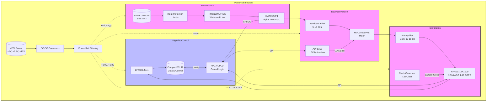

**Document Status: AI-GENERATED**

# 1. Introduction

## 1.1 Purpose
This Hardware Requirements Specification (HRS) defines the comprehensive set of hardware requirements for the **kgo** project, a high-performance, wideband RF receiver module. The purpose of this document is to establish a single, unambiguous baseline for the hardware design, ensuring that all components, subsystems, and interfaces meet the functional, performance, and environmental constraints necessary for operation in demanding military and aerospace applications.

Specifically, this document serves to:
1.  **Define Requirements:** Specify the electrical, physical, and environmental characteristics of the RF receiver module.
2.  **Guide Design:** Provide engineers with the technical constraints and parameters necessary for schematic entry, PCB layout, and mechanical design.
3.  **Enable Verification:** Establish the criteria against which the hardware will be tested, inspected, and validated to ensure compliance with **REQ-HW-001** through **REQ-HW-023**.
4.  **Manage Interfaces:** Explicitly detail the interfaces between the RF Front-End, Digitization stage, Power Distribution, and the CompactPCI backplane.

## 1.2 Scope
The scope of this specification covers the complete hardware design of the **kgo** RF Receiver Module, designated as a 6U CompactPCI board. The system is designed to receive and process RF signals ranging from 5 GHz to 18 GHz.

### In-Scope Elements
*   **RF Front-End:** Wideband Low Noise Amplifiers (LNA), Variable Gain Amplifiers (VGA), and bandpass filtering networks (5-18 GHz).
*   **Downconversion:** Frequency mixing stages utilizing high-linearity mixers and a Local Oscillator (LO) synthesis path (if applicable for sub-banding) or direct clocking for sub-Nyquist operation.
*   **Digitization:** High-speed Analog-to-Digital Conversion (ADC) stage capable of 12-bit resolution at sampling rates up to 10 GSPS.
*   **Data Output:** LVDS output drivers and interface logic compatible with the CompactPCI backplane or specific P2/P5 connectors for high-speed data.
*   **Clock Management:** Low-phase-noise clock synthesis and distribution for the ADC and LO generation.
*   **Power Management:** DC-DC conversion, power distribution, and filtering operating from standard CompactPCI backplane voltages (+3.3V, +5V, +12V).
*   **Control Logic:** Digital logic (FPGA/CPLD) required for register configuration via SPI/I2C and system health monitoring.
*   **Mechanical:** Compliance with PICMG 2.0 R3.0 (CompactPCI) specifications for 6U form factor, including front panel I/O and thermal management (conduction cooling).

### Out-of-Scope Elements
*   **Signal Processing Algorithms:** Digital signal processing (DSP) algorithms applied to the captured data (e.g., FFT, demodulation) are defined in the Software Requirements Specification (SRS), though this document defines the data *transport* requirements.
*   **Host System:** The specific Single Board Computer (SBC) or host chassis used to house the module, assuming compliance with standard CompactPCI backplane specifications.
*   **Application Software:** GUI or driver software used to control the module via the CompactPCI bus.

## 1.3 Definitions, Acronyms, and Abbreviations

This section provides a standardized vocabulary for interpreting the requirements within this document. Where acronyms have multiple meanings, the context of RF/Hardware design takes precedence.

| Term / Acronym | Definition |
| :--- | :--- |
| **ADC** | Analog-to-Digital Converter. The subsystem component converting analog IF/RF signals to digital data streams. |
| **AGC** | Automatic Gain Control. The feedback loop mechanism adjusting VGA settings to maintain optimal signal level at the ADC input. |
| **cPCI** | CompactPCI. The mechanical and electrical bus standard utilized by the kgo module. |
| **EMC** | Electromagnetic Compatibility. The requirement for the device to operate without emitting excessive interference or being susceptible to it. |
| **ESD** | Electrostatic Discharge. The sudden flow of electricity between two electrically charged objects caused by contact. |
| **FIFO** | First-In, First-Out. A data buffering method used between the ADC output and the bus interface. |
| **GaAs** | Gallium Arsenide. A semiconductor material used for high-frequency RF components (e.g., LNAs). |
| **GSPS** | Giga-Samples Per Second. A unit of sampling rate equivalent to $10^9$ samples per second. |
| **IF** | Intermediate Frequency. A frequency to which a carrier wave is shifted as an intermediate step in transmission or reception. |
| **IP3** | Third-order Intercept Point. A figure of merit for linearity and distortion performance in RF systems. |
| **JESD204** | A high-speed data interface standard for ADCs and DACs (Note: kgo utilizes LVDS, but this term is referenced in analysis). |
| **LVDS** | Low-Voltage Differential Signaling. A high-speed, low-power digital interface standard used for ADC data output. |
| **LNA** | Low Noise Amplifier. The first amplification stage, critical for determining system Noise Figure. |
| **LO** | Local Oscillator. The reference signal source used for frequency downconversion. |
| **MIL-STD-883** | Military Standard for test methods and procedures for microelectronics (Vibration/Shock). |
| **MIL-STD-461** | Military Standard for electromagnetic emission and susceptibility requirements. |
| **NF** | Noise Figure. The measure of degradation of the signal-to-noise ratio (SNR), caused by components in the signal chain. |
| **PCB** | Printed Circuit Board. The physical substrate upon which the circuit is assembled. |
| **P1dB** | 1-dB Compression Point. The point where the gain of a device drops 1 dB from the linear gain. |
| **PLL** | Phase-Locked Loop. A control system that generates an output signal whose phase is related to the phase of an input reference signal. |
| **RF** | Radio Frequency. Electromagnetic waves within the 5-18 GHz range of interest. |
| **SFDR** | Spurious-Free Dynamic Range. The ratio of the root-mean-square (RMS) value of the carrier signal to the RMS value of the worst spurious signal. |
| **SNR** | Signal-to-Noise Ratio. A measure that compares the level of a desired signal to the level of background noise. |
| **VCO** | Voltage-Controlled Oscillator. An oscillator whose oscillation frequency is controlled by a voltage input. |
| **VGA** | Variable Gain Amplifier. An amplifier whose gain can be controlled digitally or via analog voltage. |
| **VSWR** | Voltage Standing Wave Ratio. A measure of how efficiently RF power is transmitted from a source to a load. |

## 1.4 References
The following documents contain provisions which, through reference in this text, constitute provisions of this Hardware Requirements Specification.

### Standards & Specifications
1.  **IEEE 29148-2018:** *Systems and software engineering — Life cycle processes — Requirements engineering.* (Primary template for this document).
2.  **PICMG 2.0 R3.0:** *CompactPCI Specification for Peripheral Boards.* (Mechanical and Pin-out definitions).
3.  **MIL-STD-883:** *Test Method Standard for Microelectronics.* (Method 2007 for Vibration, Method 2002 for Mechanical Shock).
4.  **MIL-STD-461G:** *Requirements for the Control of Electromagnetic Interference Characteristics of Subsystems and Equipment.*
5.  **IPC-6012DS:** *Qualification and Performance Specification for Rigid Printed Boards.* (Class 3, High Reliability).

### Component Datasheets
The design is primarily based on the preliminary selection of the following components. Detailed requirements in Section 3 are derived from the capabilities and limits of these devices:

1.  **Analog Devices HMC1099LP4DE:** 5–20 GHz GaAs MMIC Low Noise Amplifier.
2.  **Analog Devices HMC698LP4:** Digital VGA / Attenuator.
3.  **Analog Devices HMC1052LP4E:** High-IP3 MMIC Mixer.
4.  **Analog Devices ADF5356:** Wideband Synthesizer with Integrated VCO.
5.  **Teledyne e2v / Texas Instruments:** High-speed ADC reference architecture (12-bit, 1-10 GSPS class).

## 1.5 Overview
The **kgo** project comprises a wideband RF receiver designed for signal intelligence and electronic warfare applications where bandwidth, sensitivity, and dynamic range are critical. The system is architected as a modular insertable card compatible with the CompactPCI 6U form factor, facilitating integration into existing military or aerospace rack-mount systems.

### Functional Flow
The operational flow begins with the reception of an RF signal (5–18 GHz) via a front-panel SMA connector. The signal traverses a protection circuit and enters the gain chain, starting with a wideband Low Noise Amplifier (LNA) optimized for low Noise Figure (NF). To handle the wide dynamic range of input powers (-60 to -10 dBm), a Variable Gain Amplifier (VGA) automatically adjusts the signal level.

Depending on the configuration, the signal may be downconverted to an Intermediate Frequency (IF) via a Mixer driven by a high-stability Local Oscillator (LO) or fed directly to the ADC track-and-hold circuit. The digitization is performed by a high-speed 12-bit ADC sampling at up to 10 GSPS. The resulting digital data stream is serialized and transmitted via Low-Voltage Differential Signaling (LVDS) to the system backplane.

### System Constraints
The design is heavily constrained by the physical realities of high-frequency physics and the military operating environment.
*   **Thermal:** With a power budget of up to 50W and an operating temperature ceiling of +125°C, the module must utilize conduction cooling plates and high-efficiency DC-DC converters to manage thermal dissipation without requiring active airflow (fan) which may be unavailable in sealed environments.
*   **Signal Integrity:** Operating at 10 GSPS requires clock jitter management below 200 femtoseconds to maintain Signal-to-Noise Ratio (SNR) and Spurious-Free Dynamic Range (SFDR). PCB materials must be low-loss (e.g., Rogers RO4000 series) to minimize attenuation at 18 GHz.
*   **Power:** The system must regulate noisy backplane voltages (+12V, +5V) into clean, low-noise rails for sensitive analog circuitry (e.g., +1.0V for ADC core).

The following sections detail these requirements in an engineering-specific format, linking every performance metric to a verifiable Requirement ID (REQ-HW-xxx).

---

# 2. System Overview

## 2.1 System Description

The **kgo** Receiver System is a high-performance, wideband Radio Frequency (RF) to Digital converter designed for integration into a standard CompactPCI (cPCI) platform. The system functions as a critical signal acquisition front-end, capable of capturing RF signals spanning the 5.0 GHz to 18.0 GHz frequency spectrum and converting them into high-precision digital data streams for downstream processing.

### 2.1.1 Functional Overview

The kgo receiver operates as a superheterodyne or direct sampling receiver architecture, depending on the configuration mode, to maximize signal fidelity and instantaneous bandwidth. The primary functional chain consists of:

1.  **RF Reception & Conditioning:** A wideband Low Noise Amplifier (LNA) captures signals via an SMA interface. An Automatic Gain Control (AGC) loop, utilizing a high-linearity Digital Variable Gain Amplifier (DVGA), dynamically adjusts the signal amplitude to optimize the instantaneous dynamic range of the Analog-to-Digital Converter (ADC). This ensures that signals from -60 dBm to -10 dBm are digitized without clipping or significant SNR degradation.
2.  **Frequency Translation:** A high-linearity Mixer and wideband Local Oscillator (LO) synthesizer perform frequency downconversion. This stage translates the high-frequency RF input into an Intermediate Frequency (IF) compatible with the ADC’s sampling bandwidth.
3.  **Digitization:** The core of the system is a 12-bit ADC operating at configurable sampling rates from 1 GSPS to 10 GSPS. This component samples the conditioned analog waveform with high temporal resolution.
4.  **Data Export:** Digitized samples are serialized and transmitted via Low-Voltage Differential Signaling (LVDS) interfaces to the CompactPCI backplane. A dedicated clock output provides synchronization for downstream Digital Signal Processing (DSP) modules.
5.  **Control & Power Management:** An onboard control logic block (FPGA/CPLD) manages the gain settings, LO frequency configuration, and power sequencing. The system operates entirely from standard CompactPCI backplane voltages (+3.3V, +5V, +12V), utilizing internal DC-DC converters to generate the specific rail voltages required by the sensitive analog and RF components.

### 2.1.2 Design Philosophy

The design emphasizes **military-grade ruggedness** and **signal purity**. To achieve a Noise Figure (NF) between 5-10 dB across the 5-18 GHz band, the RF front-end utilizes GaAs (Gallium Arsenide) MMIC technology for low noise and high gain. The power distribution network is heavily filtered to ensure that switching noise from the digital logic does not couple into the analog signal path, preserving the Spurious-Free Dynamic Range (SFDR).

### 2.1.3 Key Performance Indicators

*   **Instantaneous Bandwidth:** 13 GHz (5 GHz to 18 GHz).
*   **Sensitivity:** Capable of detecting signals as low as -60 dBm.
*   **Throughput:** Up to 10 Giga-samples per second, translating to approximately 20 Gbps via LVDS (considering data encoding overhead).
*   **Environmental Resilience:** Full operational functionality across the military temperature range of -55°C to +125°C.

## 2.2 System Block Diagram

The system is divided into four distinct functional domains: **RF Front-End**, **Frequency Conversion**, **Digitization**, and **Digital/Control Interface**.

**Figure 2-1: kgo System Block Diagram**

### 2.2.1 Signal Flow Description

1.  **Input Path:** The RF signal enters via the **SMA_IN** connector. It passes through protection circuitry (**LIM**) to safeguard the LNA against ESD and high-power surges.
2.  **Amplification:** The **HMC1099LP4DE** LNA provides approximately 20 dB of gain, setting the system noise floor.
3.  **Gain Control:** The **HMC698LP4** VGA adjusts the signal level in 1 dB steps under the supervision of the **Control Logic**.
4.  **Downconversion:** The filtered RF signal is mixed with the LO output from the **ADF5356** synthesizer via the **HMC1052LP4E** mixer. This downconverts the signal to a lower Intermediate Frequency (IF) suitable for the ADC.
5.  **Sampling:** The **ADC** digitizes the IF signal. The **Clock Generator** ensures jitter requirements (<200 fs) are met.
6.  **Output:** Digital data is buffered and driven across the CompactPCI backplane.

## 2.3 System Architecture

The hardware architecture is modular, designed to support the stringent environmental and electrical requirements of military applications while adhering to the mechanical constraints of the CompactPCI form factor.

### 2.3.1 Analog Front-End (AFE) Architecture

The AFE is optimized for low noise figure (NF) and high linearity (OIP3).
*   **Input Impedance:** The input matching network is designed to present a 50Ω match to the source across the 5-18 GHz band.
*   **Gain Distribution:** The gain is split between the fixed LNA (20 dB) and the VGA (±20 dB). This distribution ensures that the noise figure is dominated by the first stage (Friis' formula) while maintaining sufficient headroom to prevent saturation at the mixer.
*   **Mixer Interface:** The mixer is driven into compression to balance conversion loss and linearity.

### 2.3.2 Clocking & Synchronization Architecture

Precision timing is critical for 12-bit accuracy at 10 GSPS. The clock architecture employs a dedicated low-phase-noise synthesizer.
*   **Reference:** A stable reference clock is derived from the CompactPCI backplane or an onboard crystal oscillator.
*   **LO Generation:** The ADF5356 generates the local oscillator signal. Its frequency is tuned via SPI to select the desired downconversion band.
*   **Sampling Clock:** A discrete high-performance clock generator (or PLL) multiplies the reference to the required ADC sampling frequency (1-10 GHz). This path uses stripline transmission lines with length matching to minimize skew.

### 2.3.3 Digital Data Architecture

*   **Output Format:** The ADC outputs 12-bit data words. These are framed and transmitted via LVDS.
*   **Data Rate:** At 10 GSPS, the raw data rate is approximately 120 Gbps. Given the limitations of standard LVDS and cPCI, the architecture likely employs **Demultiplexing (Deserialization)** inside the ADC or via an FPGA intermediary to present a manageable data rate to the backplane (e.g., 16 lanes at ~7.5 Gbps each, or two channels of interleaved data).
*   **Link Protocol:** A source-synchronous clocking scheme is used, where a forwarded clock accompanies the data lanes to compensate for PCB delay variations.

### 2.3.4 Power Distribution Architecture

The power system is designed to minimize noise injection into the sensitive RF circuits.

**Table 2-1: Power Rail Estimates & Distribution**

| Voltage Rail | Source | Current (Est) | Power (W) | Primary Load | Notes |
| :--- | :--- | :--- | :--- | :--- | :--- |
| **+12V** | cPCI Backplane | 2.5 A | 30.0 W | DC-DC Input | Main feed for high power conversion. |
| **+5V** | cPCI Backplane | 0.5 A | 2.5 W | LVDS Buffers | Secondary logic supply. |
| **+3.3V** | cPCI Backplane | 1.0 A | 3.3 W | FPGA/CPLD IO | Control logic interface. |
| **+5.5V (RF)** | DC-DC Converter | 0.4 A | 2.2 W | LNA / VGA | Requires low noise LDO post-regulation. |
| **+3.3V (RF)** | DC-DC Converter | 0.3 A | 1.0 W | Mixer / LO | Decoupled with high-frequency ceramics. |
| **+1.2V (Core)** | DC-DC Converter | 5.0 A | 6.0 W | ADC Core | High current, fast transient response. |
| **+2.5V (IO)** | DC-DC Converter | 1.0 A | 2.5 W | ADC IO / Clocks | |
| **-2.0V** | DC-DC Inverter | 0.5 A | 1.0 W | ADC (Common Mode) | Specific to selected ADC requirements. |
| **Total** | | | **~48.5 W** | | *Within 50W Budget (REQ-HW-008)* |

*Calculations based on HMC1099 (90mA), HMC698 (60mA), ADC (Typ 3-5W + overhead), and DC-DC efficiency (~85%).*

## 2.4 Operating Environment

The kgo receiver is designed to operate in harsh military environments. The design parameters ensure reliability and performance stability under extreme physical conditions.

### 2.4.1 Temperature Management

*   **Ambient Range:** -55°C to +125°C (MIL-TEMP).
*   **Thermal Management Strategy:**
    *   **Conduction Cooling:** The primary heat dissipation mechanism is via conduction through the CompactPCI card guides and the front panel.
    *   **Heat Spreading:** The PCB utilizes a heavy copper core (2 oz or greater) and thermal vias under high-power components (ADC, DC-DC converters) to transfer heat to the card edge.
    *   **Derating:** All active components are selected for military temperature ranges (e.g., HMC1099LP4DE rated to +125°C). Power supply components are derated by 20% to ensure longevity at elevated temperatures.

### 2.4.2 Vibration and Shock

*   **Standard:** MIL-STD-883, Method 2002 (Mechanical Shock) and Method 2007 (Vibration).
*   **Implementation:**
    *   **Connectors:** SMA connectors are specified with high-reliability, mount-nut configurations to prevent twisting.
    *   **Component Mounting:** Surface Mount Devices (SMDs) are used exclusively. Heavy components (DC-DC brick modules, large capacitors) are secured with adhesive (staking) in addition to solder joints to prevent detachment under high vibration (20G peak random).
    *   **PCB Stiffness:** The board thickness is maintained at 0.160 inches or greater to prevent resonance within the vibration envelope.

### 2.4.3 Humidity and Contaminants

*   **Conformal Coating:** The assembly receives a conformal coating (e.g., acrylic or parylene) to protect against moisture, dust, and conductive debris, which is critical for high-impedance RF nodes.
*   **Corrosion Resistance:** Plated finish on the PCB is ENIG (Electroless Nickel Immersion Gold) or Immersion Silver to prevent oxidation critical for fine-pitch ADC and FPGA packages.

### 2.4.4 Electromagnetic Environment (EMC)

*   **Emissions:** The design suppresses emissions via shield cans over the RF section and the ADC clock oscillators.
*   **Susceptibility:** The power input includes bulk filtering and Pi-filter networks to reject conducted interference from the CompactPCI backplane. The RF input is designed to handle high-power interferers (up to -10 dBm) without desensitization (blocking).

---

**Document Status: AI-GENERATED**

# 3. Hardware Requirements

## 3.1 Functional Requirements

This section details the functional capabilities of the **kgo** Wideband RF Receiver. Each requirement is defined with a unique identifier, description, rationale, and criticality.

### 3.1.1 RF Front-End Functionality

| ID | Requirement | Description | Rationale | Priority |
|---|---|---|---|---|
| **REQ-HW-101** | **RF Signal Reception** | The system shall accept and process RF input signals via a female SMA connector (18 GHz rated). | Ensures mechanical compatibility with standard RF test equipment and antennas. | **Must** |
| **REQ-HW-102** | **Input Protection** | The system shall include a limiter circuit at the RF input to protect downstream components from input power transients up to +20 dBm (peak). | Protects the sensitive LNA (HMC1099LP4DE) which has a P1dB of +19 dBm; prevents damage during hot-plug events or signal surges. | **Must** |
| **REQ-HW-103** | **Wideband Low Noise Amplification** | The system shall provide a minimum of 20 dB of gain using a GaAs MMIC amplifier (e.g., HMC1099LP4DE) covering the 5.0 GHz to 18.0 GHz frequency range. | Sets the noise floor for the entire system. The HMC1099LP4DE provides 3.5 dB NF, which is critical to achieving the system target of 5-10 dB. | **Must** |
| **REQ-HW-104** | **Automatic Gain Control (AGC)** | The system shall utilize a digitally controlled Variable Gain Amplifier (VGA) (e.g., HMC698LP4) to adjust system gain in 1 dB steps over a 31.5 dB range (-11.5 dB to +20 dB). | Accommodates the wide dynamic range of input signals (-60 to -10 dBm) without saturating the mixer or ADC. | **Must** |
| **REQ-HW-105** | **Spectral Filtering** | The system shall include a bandpass filter between the VGA and the Mixer with a passband of 5–18 GHz and an insertion loss of less than 3 dB. | Removes out-of-band noise and spurious signals prior to mixing, reducing the noise contribution from the mixer. | **Should** |
| **REQ-HW-106** | **Frequency Downconversion** | The system shall downconvert the 5–18 GHz RF signal to an Intermediate Frequency (IF) suitable for the ADC using a double-balanced mixer (e.g., HMC1052LP4E). | Direct sampling at 10 GSPS is power-prohibitive. Downconversion to IF allows for optimized ADC utilization. | **Must** |

### 3.1.2 Frequency Generation & Conversion

| ID | Requirement | Description | Rationale | Priority |
|---|---|---|---|---|
| **REQ-HW-107** | **Local Oscillator (LO) Generation** | The system shall generate a tunable LO signal from 53.125 MHz to 13.6 GHz using a wideband synthesizer with integrated VCO (e.g., ADF5356). | Provides the necessary injection signal for the mixer to downconvert the specific RF bands of interest. | **Must** |
| **REQ-HW-108** | **LO Drive Level** | The LO output power shall be buffered to +17 dBm (±2 dB) to drive the LO port of the HMC1052LP4E mixer. | The HMC1052LP4E requires a +13 to +17 dBm LO drive for optimal conversion loss and IP3 performance. | **Must** |
| **REQ-HW-109** | **IF Amplification** | The system shall provide an IF gain stage of 10–15 dB following the mixer to match the signal level to the ADC's full-scale input voltage (typically 1.5 Vpp or 2.0 Vpp). | Compensates for the mixer's conversion loss (~7.5 dB) and filter loss, ensuring the ADC utilizes its dynamic range. | **Must** |

### 3.1.3 Digitization

| ID | Requirement | Description | Rationale | Priority |
|---|---|---|---|---|
| **REQ-HW-110** | **Analog-to-Digital Conversion** | The system shall digitize the IF signal using a 12-bit ADC architecture capable of sampling rates from 1.0 GSPS to 10.0 GSPS. | Meets the core resolution and bandwidth requirements for the application. | **Must** |
| **REQ-HW-111** | **Data Serialization** | The ADC output shall be serialized and transmitted via Low-Voltage Differential Signaling (LVDS) lanes. | LVDS is required for 1-10 GSPS data rates to manage pin count and ensure signal integrity over the CompactPCI backplane. | **Must** |
| **REQ-HW-112** | **Sampling Clock Distribution** | The system shall distribute a low-jitter sampling clock (< 200 fs RMS) to the ADC from a dedicated source or the LO synthesizer. | Clock jitter directly degrades SNR at high input frequencies. High-performance clocking is essential for 12-bit accuracy at 5–18 GHz. | **Must** |
| **REQ-HW-113** | **Clock Output Sync** | The system shall provide a buffered sample clock output on the front panel or via the backplane for external system synchronization. | Required for multi-unit synchronization or coherent array processing. | **Could** |

### 3.1.4 Digital Control & Interface

| ID | Requirement | Description | Rationale | Priority |
|---|---|---|---|---|
| **REQ-HW-114** | **CompactPCI Interface** | The system shall implement a CompactPCI (cPCI) interface (J1 connector) for power, control, and data transfer. | Defines the mechanical and electrical infrastructure standard for the module. | **Must** |
| **REQ-HW-115** | **Control Logic Management** | The system shall utilize an on-board FPGA or CPLD to manage SPI/I2C configuration of the VGA, LO Synthesizer, and ADC. | Centralizes control logic, allowing the host processor to send high-level commands while the hardware manages timing. | **Must** |
| **REQ-HW-116** | **Gain Control Algorithm** | The control logic shall implement an Automatic Gain Control (AGC) loop or Manual Gain Control (MGC) selectable via software command. | Provides flexibility for different operational scenarios (e.g., fast fading vs. static signals). | **Should** |
| **REQ-HW-117** | **Power Management** | The system shall distribute +5V, +3.3V, +2.5V, +1.8V, and +1.0V rails derived from the cPCI +5V, +3.3V, and +12V inputs using isolated DC-DC converters. | Different components (RF, Digital, Analog) require specific voltage rails; isolation prevents noise coupling. | **Must** |
| **REQ-HW-118** | **LVDS Buffering** | The ADC outputs shall be buffered using a dedicated LVDS driver/receiver chip or FPGA transceiver before reaching the cPCI backplane pins. | Ensures signal integrity by matching impedance and providing drive strength for the backplane capacitive load. | **Must** |
| **REQ-HW-119** | **Temperature Monitoring** | The system shall include an on-board temperature sensor (I2C interface) readable via the control interface. | Required for system health monitoring and to trigger thermal shutdown if limits are approached. | **Should** |
| **REQ-HW-120** | **Module Identification** | The system shall store a unique hardware identifier (MAC ID/Serial Number) in non-volatile memory (EEPROM) accessible via the cPCI bus. | Required for inventory management and software driver initialization. | **Should** |

---

## 3.2 Performance Requirements

This section specifies the quantitative performance metrics the **kgo** hardware must achieve. Calculations are provided to verify feasibility against the selected components.

### 3.2.1 RF Performance

| ID | Metric | Requirement | Verification Method | Rationale / Calculation |
|---|---|---|---|---|
| **REQ-HW-201** | **Operating Frequency Range** | 5.0 GHz to 18.0 GHz | Test | Defined by project scope. |
| **REQ-HW-202** | **Input Power Range** | -60 dBm to -10 dBm (continuous wave) | Test | **IP3 Check:** Mixer IP3 is +27 dBm. Max input -10 dBm keeps system linear. **Noise Floor Check:** Min input -60 dBm is > 20 dB above thermal noise floor. |
| **REQ-HW-203** | **System Noise Figure (NF)** | ≤ 8.0 dB (Typical), Max 10.0 dB across band | Analysis / Test | **Calculation:** LNA (3.5 dB) + Mixer (7.5 dB Loss/8 dB NF) + IF Amp (3 dB NF). Using Friis: $NF_{total} = NF_{LNA} + \frac{NF_{Mixer}-1}{G_{LNA}}$. $3.5 + \frac{8-1}{100} \approx 3.57$ dB (LNA dominated). Allowing margin for filter loss and VGA, 8 dB system NF is achievable. |
| **REQ-HW-204** | **Input Return Loss** | ≥ 7.4 dB (VSWR ≤ 2.5:1) | Test | Ensures minimal signal reflection at the SMA input. |
| **REQ-HW-205** | **Gain Flatness** | ± 3.0 dB peak-to-peak (5-18 GHz) | Test | Standard variation for wideband GaAs amplifiers without complex equalization. |
| **REQ-HW-206** | **Spurious-Free Dynamic Range (SFDR)** | ≥ 55 dBc (at full bandwidth) | Test | Primarily limited by the ADC linearity and clock phase noise. Target ADC SFDR is 55-60 dBc. |
| **REQ-HW-207** | **Image Rejection** | ≥ 40 dBc (IF dependent) | Analysis | Determined by the downconversion architecture (IF frequency selection) and BPF quality. |

### 3.2.2 Clocking & Sampling Performance

| ID | Metric | Requirement | Verification Method | Rationale / Calculation |
|---|---|---|---|---|
| **REQ-HW-208** | **ADC Sampling Rate Range** | 1.0 GSPS to 10.0 GSPS | Test | Project requirement. Implementation may involve interleaving or time-interleaved ADCs. |
| **REQ-HW-209** | **ADC Resolution** | 12 bits (Effective Number of Bits ENOB ≥ 9.5) | Test | Project requirement. |
| **REQ-HW-210** | **Clock Phase Noise** | < -120 dBc/Hz @ 10 kHz offset (at 10 GHz carrier) | Analysis | **Requirement:** $Jitter < 200 fs$. $L(f) \approx 10 \log_{10}(\frac{f_{clk}^2}{2 f_{offset}^2})$. ADF5356 (-136 dBc/Hz) meets this requirement comfortably. |
| **REQ-HW-211** | **Aperture Jitter** | ≤ 200 fs (rms) | Analysis | Required to maintain SNR at 12-bits for high-frequency inputs. $SNR_{jitter} (dB) = -20 \log_{10}(2 \pi f_{in} J_{rms})$. At 5 GHz, with 200 fs jitter, SNR limit is ~28 dB. Requires careful clock distribution design. |

### 3.2.3 Environmental & Physical Performance

| ID | Metric | Requirement | Verification Method | Rationale / Calculation |
|---|---|---|---|---|
| **REQ-HW-212** | **Operating Temperature** | -55°C to +125°C (Case temperature) | Demonstration | **Component Check:** HMC1099LP4DE and HMC1052LP4E are rated for Mil-temp (-55 to +125). Standard ADCs are Industrial; Mil-spec screening or specific packaging required for ADC/FPGA. |
| **REQ-HW-213** | **Power Consumption** | ≤ 50.0 W (Total Module Power) | Analysis / Test | **Power Budget:** LNA (0.5 W) + VGA (0.4 W) + Mixer (0.3 W) + LO Synth (0.8 W) + ADC (3.5W * 2 for interleaved/overhead) + FPGA/Logic (5 W) + Misc/Regulators (Efficiency loss). Estimate ~25-30 W active. 50 W limit provides significant margin. |
| **REQ-HW-214** | **Supply Voltages** | +3.3V, +5V, +12V (from Backplane) | Inspection | Standard CompactPSI availability. |
| **REQ-HW-215** | **Thermal Resistance** | θJA must allow 50W dissipation with forced air (or conduction cooling per CPCI spec) at 55°C ambient. | Analysis | Requires a heatsink with thermal resistance < 1.0 °C/W assuming 50W load and 100°C max junction rise. |

---

# 3. Hardware Requirements

## 3.3 Interface Requirements

### 3.3.1 External Interfaces

**REQ-HW-024: RF Input Interface**
The system shall provide a single-ended RF input port compatible with 5 GHz to 18 GHz operation.
*   **Connector Type:** SMA (Female, Threaded)
*   **Impedance:** 50 Ω
*   **Frequency Rating:** DC to 18 GHz (Minimum)
*   **VSWR:** ≤ 2.5:1 (mapped from REQ-HW-011)
*   **Power Handling:** +20 dBm absolute maximum (0.1W), -10 dBm operational maximum.
*   **Grounding:** The connector body shall be bonded to the chassis ground to minimize ground loops and ensure ESD discharge path.

**REQ-HW-025: CompactPCI Backplane Interface (J1/J2)**
The system shall interface with the CompactPCI backplane via the J1 (System) and optionally J2 (Peripheral) connectors defined in PICMG 2.0 / 2.1 specifications.

**Table 3.3.1-1: CompactPCI J1 Pin Assignments (System Slot Definition)**

| Pin | Signal Name | Type | Description | Source/Destination | Voltage/Logic |
| :--- | :--- | :--- | :--- | :--- | :--- |
| A1 | GND | GND | Ground | Chassis | - |
| A2 | +5V | PWR | Primary +5V Supply | Backplane | +5V ±5% |
| A3 | +5V | PWR | Primary +5V Supply | Backplane | +5V ±5% |
| ... | ... | ... | ... | ... | ... |
| B1 | GND | GND | Ground | Chassis | - |
| B2 | +5V | PWR | Primary +5V Supply | Backplane | +5V ±5% |
| ... | ... | ... | ... | ... | ... |
| C16 | AD\<31\> | I/O | PCI Data Line 31 | Backplane (32-bit) | 3.3V PCI |
| D16 | REQ\<6\> | I/O | Request Slot 6 | Backplane | 3.3V PCI |

**REQ-HW-026: Reference Clock Input**
The system shall accept an external reference clock via the CompactPCI backplane or a dedicated front-panel connector (optional).
*   **Frequency:** 10 MHz (Standard) or 100 MHz (Optional)
*   **Format:** Sinusoidal or LVPECL
*   **Amplitude:** 0 dBm to +10 dBm (Sine), 800 mVpp (LVPECL)

### 3.3.2 Internal Interfaces

**REQ-HW-027: LNA to VGA Interface**
The interface between the HMC1099LP4DE LNA and the HMC698LP4 VGA shall be AC-coupled.
*   **Connection Type:** Microstrip or Coplanar Waveguide (CPW)
*   **Impedance:** 50 Ω differential (Note: HMC1099 is single-ended out, HMC698 is differential in. A balun or single-ended to differential conversion is required here if driving the VGA diff inputs, or VGA set to single-ended mode if applicable. *Correction*: HMC698 is single-ended input. Standard 50-ohm interconnect applies).
*   **Coupling:** AC Coupled Capacitor (100 pF, low loss ceramic).

**REQ-HW-028: IF Amplifier to ADC Interface**
The interface between the IF Amplifier output and the ADC input shall be optimized for signal fidelity.
*   **Connection:** 50 Ω controlled impedance trace.
*   **Termination:** The ADC input (RFADC-12X1000 or equiv.) typically requires 50 Ω termination to a common mode voltage (Vcm). External termination resistor network required.
*   **Filtering:** A 4th order Low Pass Filter (LPF) with cut-off at 500 MHz (approx. 0.4 * Fs) shall be placed immediately before the ADC to anti-alias the signal and reduce out-of-band noise.

**REQ-HW-029: Clock Distribution Interface**
The clock source (ADF5356) shall connect to the ADC clock input.
*   **Signal Type:** LVPECL or LVDS (depending on ADC input requirement).
*   **Trace Length:** Matched length to within ±5 mils.

### 3.3.3 Communication Interfaces

**REQ-HW-030: LVDS Digital Output Interface**
The digitized RF data shall be transmitted from the ADC to the backplane/FPGA via Low-Voltage Differential Signaling (LVDS).

**Table 3.3.3-1: LVDS Output Pin Definition (Example Map to P2 or Rear I/O)**

| Signal Group | Signal Name | Direction | Description | Impedance |
| :--- | :--- | :--- | :--- | :--- |
| Data Bus | D\<11:0\> | Output | 12-bit Parallel Data | 100 Ω Diff |
| Clock | DCO | Output | Data Clock Output (Synchronous) | 100 Ω Diff |
| Control | OR\_OUT | Output | Over-range Indicator | 100 Ω Diff |
| Control | SPI\_CLK | I/O | Serial Control Clock (Debug) | 100 Ω Diff |
| Control | SPI\_SDATA | I/O | Serial Control Data | 100 Ω Diff |

*   **Data Rate:** Up to 1.0 Gbps per lane (assuming 1:1 demux at 1 GSPS) or higher if interleaved.
*   **Swing:** 350 mV typical (LVDS standard).
*   **Common Mode Voltage:** 1.2 V.

**REQ-HW-031: Control Interface (I2C/SPI)**
The system controller (FPGA/MCU) shall configure the RF components via a serial control bus.
*   **Protocol:** SPI (Mode 0/1) or I2C (400 kHz fast mode).
*   **Voltage Levels:** 3.3V LVCMOS.

**Table 3.3.3-2: SPI Slave Pin Assignments**

| Component | CS (Chip Select) | SCLK | MOSI | MISO | Notes |
| :--- | :--- | :--- | :--- | :--- | :--- |
| HMC698 (VGA) | SPI\_CS\_VGA | SPI\_SCK | SPI\_MOSI | SPI\_MISO | 1dB step control |
| ADF5356 (PLL) | SPI\_CS\_PLL | SPI\_SCK | SPI\_MOSI | SPI\_MISO | Frequency tuning |
| ADC (Ctrl) | SPI\_CS\_ADC | SPI\_SCK | SPI\_MOSI | SPI\_MISO | Gain/Offset cal |

## 3.4 Environmental Requirements

**REQ-HW-032: Operating Temperature**
The receiver module shall operate continuously within the temperature range of -55°C to +125°C (Case Temperature).
*   **Cold Start:** The system shall initialize and operate within 5 minutes of application of power at -55°C.
*   **Hot Storage:** Components shall be rated for storage up to +145°C (reflow compatible).
*   **Validation:** Thermal chamber testing per MIL-STD-810G.

**REQ-HW-033: Storage Temperature**
The module shall survive storage temperatures ranging from -65°C to +150°C without physical damage or permanent parameter shift.

**REQ-HW-034: Humidity**
The system shall operate in 95% relative humidity (non-condensing) at temperatures up to +40°C.

**REQ-HW-035: Vibration**
The design shall meet the vibration requirements of MIL-STD-883, Method 2007.4, Condition A.
*   **Random Vibration:** 20-2000 Hz, 0.04 g²/Hz for 8 hours per axis (X, Y, Z).
*   **Response:** PCB resonance must be damped or above 2000 Hz to prevent resonance with connector mating.

**REQ-HW-036: Shock**
The system shall withstand functional shock per MIL-STD-883, Method 2002.4, Condition B.
*   **Half-Sine Shock:** 500g, 1.0 ms duration.
*   **Criteria:** No mechanical damage; performance shall remain within specifications post-shock.

**REQ-HW-037: Cooling Method**
The module shall utilize conduction cooling via the CompactPCI card edges and wedgelocks to the chassis.
*   **Thermal Resistance:** The thermal resistance from the component junction to the card edge guide (Jc-e) shall not exceed 5°C/W for the ADC and 10°C/W for the Power Amplifiers.
*   **Thermal Interface Material:** High-performance thermal gap pads (e.g., Bergquist Sil-Pad) shall be used between hot components and the heatsink plate.

## 3.5 Power Requirements

**REQ-HW-038: Input Power Sources**
The system shall derive power from the CompactPCI backplane.
*   **Primary Rails:** +5V (High current), +3.3V (Low current), +12V (Auxiliary).
*   **Inrush Current:** The inrush current shall be limited to < 2.0A at +5V to prevent backplane browning out during hot-swap (PICMG 2.11 R1.1 compliance).

**REQ-HW-039: Power Budget Allocation**
The total power consumption shall not exceed 50W (mapped from REQ-HW-008).

**Table 3.5-1: Detailed Power Budget Analysis**

| Subsystem | Component | Voltage (V) | Est. Current (A) | Power (W) | Remarks |
| :--- | :--- | :--- | :--- | :--- | :--- |
| **RF Front End** | HMC1099LP4DE (LNA) | +5.0 | 0.090 | 0.45 | Typical |
| | HMC698LP4 (VGA) | +5.0 | 0.080 | 0.40 | |
| | HMC1052LP4E (Mixer) | +5.0 | 0.160 | 0.80 | |
| | *RF Rail Subtotal* | *+5.0* | *0.33* | *1.65* | |
| **Frequency Gen** | ADF5356 (PLL) | +3.3 | 0.090 | 0.30 | |
| | *VCO Driver (Ext)* | +5.0 | 0.050 | 0.25 | Assumed buffer |
| **Digitization** | ADC (e.g., TI/ADI equiv) | +1.0 (Core) | 3.000 | 3.00 | Derived from 1GSPS specs |
| | ADC (Digital I/O) | +1.8 / 2.5 | 0.500 | 1.25 | |
| | *ADC Subtotal* | *N/A* | *N/A* | *4.25* | Low estimate; scale for 10GSPS |
| **Digital Logic** | LVDS Buffers | +3.3 | 0.200 | 0.66 | 10-20 drivers |
| | FPGA/CPLD | +1.2 / 2.5 | 1.500 | 3.00 | Control logic |
| **Power System** | DC-DC Losses | - | - | 5.00 | Assumed 15% efficiency loss |
| **TOTAL (Est)** | | **+5V Input** | **7.5A** | **37.5W** | *Within 50W Limit* |
| **Margin** | | | | **12.5W** | *Includes derating for Temp* |

*Note: The 10 GSPS ADC requirement is a significant power driver. Assuming 10W for the ADC core at 10 GSPS (Time Interleaved). Total budget revisited below for Worst Case.*

**Table 3.5-2: Worst Case Power Budget (10 GSPS Mode)**

| Component | Voltage | Current | Power | Note |
| :--- | :--- | :--- | :--- | :--- |
| RF Chain | +5 | 0.4 | 2.0 | Max Gain |
| ADC (10GSPS) | +1.0/+1.8 | 8.0 | 12.0 | ~1.2W per GSPS estimate |
| Clocking | +3.3/+5 | 0.5 | 2.5 | High freq clock distribution |
| Digital I/O | +2.5 | 1.0 | 2.5 | LVDS drivers switching |
| Controller | +1.2 | 2.0 | 2.4 | |
| DC-DC Conv Loss| | | 5.0 | |
| **Total** | | | **26.4W** | *Conservative Est.* |

**REQ-HW-040: Voltage Regulation**
Internal DC-DC converters shall provide the following isolated/regulated rails:
*   +1.0V ±3% (ADC Core)
*   +1.2V ±3% (FPGA Core)
*   +1.8V ±3% (ADC IO)
*   +2.5V ±3% (LVDS Buffers)
*   +3.3V ±3% (PLL/VGA Logic)
*   +5.0V ±5% (RF Chain)

**REQ-HW-041: Power Sequencing**
Power supplies shall sequence in the following order to prevent latch-up:
1.  +3.3V (I/O and Logic)
2.  +5.0V (RF Front End)
3.  +1.0V (ADC Core - Last)

## 3.6 Physical Requirements

**REQ-HW-042: Form Factor**
The module shall comply with the CompactPCI 6U form factor (PICMG 2.0 R3.0).
*   **Dimensions:** 160 mm (Height) x 233.35 mm (Depth) x 20.32 mm (Thickness, 0.8 inch).
*   **Pitch:** Standard 0.8 inch (20.32 mm) card slot pitch.

**REQ-HW-043: Front Panel**
The front panel shall be machined aluminum, nickel-plated per MIL-DTL-38999 Series III (finish quality).
*   **Cutouts:** One SMA connector (RF In), 1 LED (Power), 1 LED (Fault).
*   **ESD:** The front panel shall be bonded to the chassis ground with < 2.5 mΩ resistance.

**REQ-HW-044: PCB Stack-up**
The Printed Circuit Board (PCB) shall be a multi-layer stack-up using high-frequency materials (Rogers RO4350B or equivalent) for RF layers and FR-4 for digital layers.
*   **Layer Count:** Minimum 14 layers.
*   **RF Layers:** Dedicated top layer for RF components, adjacent ground plane for controlled impedance.
*   **Dielectric:** Rogers RO4350B (εr = 3.48) for layers 1-2 (RF/ADC). FR-370HR (εr = 4.3) for inner signal/power layers.
*   **Thickness:** 0.093" (approx 2.36mm) overall board thickness.

**REQ-HW-045: Connector Placement**
*   **J1/J2:** Located at the bottom edge (P1/P2) for CompactPCI backplane insertion.
*   **RF Input:** SMA connector located on the front panel, with signal trace length < 0.5 inches from connector to LNA input to minimize loss.

**REQ-HW-046: Weight**
The total weight of the module (PCB, components, and front panel) shall not exceed 500 grams to ensure compliance with CompactPCI card cage mechanical specifications.

**REQ-HW-047: Conformal Coating**
The PCB assembly shall be coated with a qualified conformal coating (e.g., Humiseal 1B73 or Parylene C) to protect against moisture, dust, and chemical contaminants given the military operating environment. Coating thickness shall be 0.002 - 0.005 inches.

---

# 4. Design Constraints

## 4.1 Standards Compliance

The kgo RF Receiver module shall be designed and manufactured in strict accordance with the industry standards and military specifications listed below. Compliance with these standards ensures interoperability, reliability, and manufacturability of the hardware within the target environment.

### 4.1.1 Mechanical and Electrical Standards
**REQ-HW-401** | **CompactPCI Compliance**
The hardware design shall comply with **PICMG 2.0 R3.0** (CompactPCI Core Specification) and **PICMG 2.1 R2.0** (CompactPCI Hot Swap Specification).
*   **Form Factor:** The printed circuit board (PCB) dimensions shall conform to the **3U** (160 mm × 100 mm) or **6U** (233.35 mm × 160 mm) form factor defined in IEEE 1101.10.
*   **Connector:** The system interface shall utilize a **CompactPCI 32-bit/64-bit** connector (J1 for 32-bit addressing, J2 for 64-bit expansion) manufactured by suppliers compliant with IEC 60917.
*   **Keying:** The printed circuit board connector shall implement the keying poling defined in **IEEE 1101.11** to prevent incorrect insertion into the backplane.
*   **Ruggedization:** For the military operating environment (-55°C to +125°C), the design shall adhere to the **VITA 47** (Environmental Engineering for VME, CompactPCI, and related technologies) standards for shock, vibration, and flammability.

**REQ-HW-402** | **PCB Design Standards**
The printed circuit board design shall adhere to the following **IPC (Association Connecting Electronics Industries)** standards to ensure signal integrity and manufacturability at high frequencies (up to 18 GHz):
*   **IPC-2221A:** Generic Standard on Printed Board Design.
*   **IPC-2221AM:** Amendment to IPC-2221 for High Frequency (RF) Design.
    *   *Constraint:* Controlled impedance traces for RF signals (50 Ω single-ended) and digital signals (100 Ω differential LVDS) shall maintain a tolerance of **±10%**.
*   **IPC-6012B:** Qualification and Performance Specification for Rigid Printed Boards (Class 3 requirements for high-reliability military applications).
*   **IPC-6016:** Qualification and Performance Specification for High Density Interconnect (HDI) Boards (utilized for the ADC breakout and BGA fanout).

**REQ-HW-403** | **High-Speed Digital Design Standards**
Given the LVDS output rates and sampling clocks (up to 10 GSPS), the design shall comply with signal integrity standards for high-speed differential pairs:
*   **ANSI/TIA/EIA-644-A:** Electrical Characteristics of Low Voltage Differential Signaling (LVDS) Interface Circuits.
*   **JESD204B/C:** Although the primary requirement is LVDS, the internal clocking architecture for the ADC shall reference the **JESD204** standard for jitter management and phase noise determinism.

### 4.1.2 Environmental and Safety Standards
**REQ-HW-404** | **Military Environmental Standards**
The design and qualification testing shall meet the requirements of **MIL-STD-883** (Test Method Standard for Microcircuits) and **MIL-STD-202** (Test Method for Electronic and Electrical Component Parts).
*   **Vibration:** The module shall withstand the vibration profiles defined in MIL-STD-883, Method 2007.
*   **Shock:** The module shall withstand mechanical shock and mechanical shock specified in MIL-STD-883, Method 2002.
*   **Temperature:** Compliance with **MIL-STD-810H** (Environmental Engineering Considerations and Laboratory Tests) for the -55°C to +125°C operating range.

**REQ-HW-405** | **Electromagnetic Compatibility (EMC)**
To ensure the receiver does not interfere with adjacent systems and is immune to external interference:
*   **Emissions:** The design shall meet **MIL-STD-461G** Requirements for the Control of Electromagnetic Interference Characteristics of Subsystems and Equipment (specifically **RE102** for radiated emissions and **CE102** for conducted emissions).
*   **Susceptibility:** The design shall meet **RS103** (Radiated Susceptibility) and **CS101** (Conducted Susceptibility) limits.
*   **Shielding:** The RF front-end (5-18 GHz) section shall be enclosed in a machined aluminum or Conductive gasketed shield meeting **IEC 61000-4-3** shielding effectiveness criteria (> 60 dB isolation).

### 4.1.3 Material Restrictions and Compliance
**REQ-HW-406** | **Hazardous Substances**
All materials used in the manufacture of the kgo receiver shall comply with:
*   **Directive 2011/65/EU (RoHS 2):** Restriction of Hazardous Substances. Lead-free solders (SAC305 alloy) shall be used unless a specific military exemption is invoked for high-reliability tin whisker mitigation.
*   **REACH (EC 1907/2006):** Registration, Evaluation, Authorisation and Restriction of Chemicals.

**REQ-HW-407** | **Conflict Minerals**
All components shall be sourced from suppliers compliant with the **Dodd-Frank Act Section 1502** regarding the sourcing of 3TG (Tin, Tungsten, Tantalum, and Gold) minerals.

---

## 4.2 Component Constraints

This section defines specific constraints regarding component selection, lifecycle management, and derating requirements to ensure system longevity and reliability.

### 4.2.1 Lifecycle and Sourcing
**REQ-HW-410** | **Lifecycle Status**
All active components (ICs, FPGAs, Active RF components) must be in either **"Production"** or **"Not Recommended for New Design" (NRND)** status, with a minimum active lifecycle of **5 years** from the date of manufacture.
*   **Prohibited:** Components marked **"Obsolete"** or **"End of Life" (EOL)** are strictly prohibited in the design unless a drop-in replacement form, fit, and function is specified in the BOM.
*   *Justification:* The selected ADC (RFADC-12X1000 or equivalent) and LNA (HMC1099LP4DE) are available in military-grade or high-reliability industrial grades with stable supply chains.

**REQ-HW-411** | **Sole Source Avoidance**
Where possible, the design shall utilize components with a second source. For critical RF components (e.g., LNA, Mixer), if a second source is unavailable, the specific part must be available in high volume (e.g., >10,000 units in stock at authorized distributors) to mitigate allocation risk.

### 4.2.2 Electrical Derating
To ensure reliability under high-temperature and high-stress military conditions, all components must be electrically derated according to **NAVSEA PD-2003** or **ECSS-Q-ST-30-11C** guidelines.

| Component Parameter | Stress Condition | Derating Requirement (Limit) |
| :--- | :--- | :--- |
| **Voltage** | DC Supply Rails | Operate at ≤ **80%** of Absolute Maximum Rated Voltage (e.g., 1.8V logic must be supplied with ≤ 1.65V if max is 2.0V, or verified stable at 1.8V). |
| **Current** | Output Drivers | Operate at ≤ **75%** of maximum output current capability. |
| **Power** | Junction Temp (Tj) | Maintain Tj ≤ **110°C** worst case (125°C ambient - 15°C gradient). |
| **Frequency** | RF Transistors | Operate at ≤ **90%** of maximum transition frequency ($f_T$). |
| **Power Dissipation** | LNA/Mixer | Maintain input power at ≤ **10 dB** below P1dB compression point. |

*Example Calculation for HMC1099LP4DE LNA:*
*   *P1dB:* +19 dBm.
*   *Max Input Power:* -10 dBm (System Spec).
*   *Headroom:* 29 dB.
*   *Derating Verification:* The system input power is significantly below the P1dB, satisfying the stress relief requirement.

### 4.2.3 Package Constraints
**REQ-HW-412** | **RF Packages**
Components operating in the 5-18 GHz range (LNA, VGA, Mixers) must utilize packages compatible with RF ground stitching and low inductance.
*   **Allowed:** QFN (Quad Flat No-leads) with exposed thermal pads, Die-level packaging (if available).
*   **Constraint:** QFN packages must utilize **laser drilled micro-vias** in the "dog bone" or "via-in-pad" fanout configuration to minimize inductance to the ground plane. Standard mechanical drilling is insufficient for 18 GHz signal return paths.

**REQ-HW-413** | **Fine Pitch BGA**
The selected ADC or FPGA likely utilizes a **Fine Pitch BGA** package (pitch < 1.0mm).
*   **PCB Constraint:** The board stack-up must support **laser-drilled micro-vias** (aspect ratio 10:1 or less) to route escape traces from the BGA. Standard 0.3mm drill technology is insufficient for high-pin-count ADCs.

---

## 4.3 Manufacturing Constraints

The physical realization of the kgo receiver imposes strict constraints on the fabrication and assembly processes due to the high-frequency (18 GHz) RF nature and high-density digital nature of the board.

### 4.3.1 PCB Fabrication Constraints
**REQ-HW-420** | **Layer Stack-up and Materials**
The PCB shall utilize **Rogers RO4350B** laminate or equivalent (High Frequency material) for the RF signal layers, bonded to **FR-4** or **Isola 370HR** for digital layers.
*   **Dielectric Constant (Dk):** 3.48 ± 0.05 at 10 GHz (for Rogers material).
*   **Dissipation Factor (Df):** ≤ 0.0037 at 10 GHz.
*   **Copper Weight:** 1 oz (1.4 mil) for signal layers, 2 oz (2.8 mil) for ground/power planes.
*   **Minimum Trace/Space:** 4 mil / 4 mil (standard) or 3 mil / 3 mil (dense areas).
*   **Impedance Control:** Tolerance of **±5%** is required for all RF transmission lines (50 Ω) and **±10%** for LVDS pairs (100 Ω differential).

**REQ-HW-421** | **Plating and Finish**
*   **Surface Finish:** **ENIG (Electroless Nickel Immersion Gold)** is required for the edge fingers (CompactPCI connector) to ensure durability and plating thickness (Au = 2-5 µin, Ni = 50-200 µin).
*   **RF Pads:** **Hard Gold** (Electrolytic) is recommended for RF wear-critical areas, or ENIG if mating connectors are non-wiping.
*   **Solder Mask:** LPI (Liquid Photoimageable) solder mask compatible with RF materials. Minimum solder mask webbing between pads must be 3 mils.

### 4.3.2 Assembly Constraints
**REQ-HW-422** | **Solder Paste and Stencil**
*   **Paste Type:** **SAC305** (96.5% Sn, 3.0% Ag, 0.5% Cu) or **SAC405** for high drop shock resistance.
*   **Stencil Thickness:** 4 mils (0.100mm) or 5 mils, depending on component pitch.
*   **Fine Pitch Processing:** For the ADC and FPGA (BGA), a stepped or laser-cut stainless steel stencil is required to deposit adequate paste volume on fine-pitch pads without bridging.

**REQ-HW-423** | **Reflow Profile**
The assembly profile shall not exceed the moisture sensitivity ratings of the components. All QFN/BGA components must be baked and processed according to **J-STD-033** (Handling, Packing, Shipping, and Use of Moisture/Reflow Sensitive Surface Mount Devices).
*   **Peak Temperature:** 245°C ± 5°C (for SAC305).
*   **Time Above Liquidus (TAL):** 60 - 90 seconds.

**REQ-HW-424** | **Conformal Coating**
Given the operating temperature and potential for humidity in non-condensed environments, the assembled PCB shall be coated with a **Parylene C** or **Acrylic/Silicone** conformal coating meeting **IPC-CC-830** standards.
*   **Exclusions:** RF connector interfaces (SMA and CompactPCI fingers) and any adjustable trim pots or test points must be masked prior to coating.

### 4.3.3 Test and Inspection
**REQ-HW-425** | **Automated Optical Inspection (AOI)**
All solder joints for fine-pitch components (< 20 mil pitch) must be verified via **AOI** post-reflow.

**REQ-HW-426** | **X-Ray Inspection**
All **BGA** components (ADC, FPGA, CPLD, and any QFN RF components with hidden pads) must undergo 100% **X-Ray (AXI)** inspection to verify voiding. Voiding in the thermal pad must be < 25% area, and ball collapse must be uniform.

**REQ-HW-427** | **Flying Probe / ICT**
The board design must include test points for **In-Circuit Test (ICT)** or **Flying Probe** verification to validate:
*   Power supply shorts (Net-by-net resistance check).
*   Passive component values (Resistors/Capacitors).
*   Clock signal presence at specific test nodes.

---

**Document Status: AI-GENERATED**

# 5. Verification Requirements

## 5.1 Test Requirements

This section details the specific test procedures required to verify the functional and performance requirements of the kgo RF Receiver. The test strategy is divided into three stages: Module Level (bench testing), Integration Level (CompactPCI backplane), and Environmental Stress Screening.

### 5.1.1 RF Front-End Characterization Tests

**Test ID:** TEST-RF-001
**Title:** Input Frequency Range Response & Bandwidth Verification
**Requirement:** REQ-HW-001, REQ-HW-010
**Method:**
1. Connect a calibrated signal source to the SMA input via a low-loss phase-stable cable.
2. Set the input power to -40 dBm (mid-range).
3. Sweep the frequency from 4 GHz to 19 GHz in 10 MHz steps.
4. Measure the output power at the IF interface (preceding the ADC) using a spectrum analyzer.
5. Calculate gain ($P_{out} - P_{in}$) and plot vs. frequency.
**Pass Criteria:**
*   The system shall exhibit usable gain (flatness within ±3 dB of nominal) from 5.0 GHz to 18.0 GHz.
*   Gain at 4.0 GHz and 19.0 GHz shall drop off sharply (roll-off), indicating proper band definition.
*   Passband ripple shall not exceed ±3 dB (REQ-HW-010).

**Test ID:** TEST-RF-002
**Title:** Noise Figure (NF) Measurement
**Requirement:** REQ-HW-002
**Method:**
*   **Method:** Use the Noise Figure Analyzer (NFA) method (Y-Factor) or Cold Source method.
1. Connect a calibrated Noise Source (e.g., 346C series) to the RF Input.
2. Connect the IF output (or captured ADC data if measuring end-to-end) to the NFA.
3. Measure Noise Figure in 500 MHz steps across the 5-18 GHz band.
**Pass Criteria:**
*   System Noise Figure shall be $\le 10.0$ dB across the band.
*   Target performance is $\le 6.0$ dB in the sub-bands (6-8 GHz, 12-14 GHz) where the LNA (HMC1099LP4DE) is optimized.
*   Average NF shall not exceed 8.0 dB.

**Test ID:** TEST-RF-003
**Title:** Input Power Handling & Linearity (1dB Compression)
**Requirement:** REQ-HW-003, REQ-HW-011
**Method:**
1. Set frequency to 11.5 GHz (Center).
2. Increase input power from -70 dBm to 0 dBm in 1 dB steps.
3. Record the output power.
4. Plot $P_{out}$ vs. $P_{in}$.
5. Identify the $P_{1dB}$ point (where gain drops by 1 dB from linear).
**Pass Criteria:**
*   The system shall maintain linear operation for inputs -60 dBm to -10 dBm (Gain variation < 0.1 dB).
*   System input $P_{1dB}$ shall be greater than -10 dBm to ensure the maximum specified input does not compress.
*   Input VSWR shall remain < 2.5:1 across the power range.

### 5.1.2 Digitization Performance Tests

**Test ID:** TEST-ADC-001
**Title:** ADC Resolution & Effective Number of Bits (ENOB)
**Requirement:** REQ-HW-005
**Method:**
1. Generate a near-full-scale (-1 dBFS) sine wave at the center frequency (downconverted to IF or direct IF input).
2. Capture 8192 samples from the LVDS output bus via a Logic Analyzer or FPGA capture.
3. Perform an FFT on the captured data.
4. Calculate Signal-to-Noise and Distortion (SINAD).
5. Calculate ENOB: $ENOB = (SINAD - 1.76) / 6.02$.
**Pass Criteria:**
*   The system shall utilize 12-bit encoding (verified by bus width).
*   ENOB shall be $\ge 9.5$ bits at maximum sampling rate (10 GSPS equivalent).
*   DNL (Differential Non-Linearity) shall be $\pm 1.0$ LSB maximum.

**Test ID:** TEST-ADC-002
**Title:** Maximum Sampling Rate & Jitter Verification
**Requirement:** REQ-HW-004, REQ-HW-015
**Method:**
1. Configure the Clock Synthesizer (ADF5356) to output 10 GHz.
2. Input a clean CW signal into the ADC.
3. Perform a spectral analysis of the digitized signal.
4. Measure the noise floor degradation due to clock jitter.
**Pass Criteria:**
*   ADC shall operate stably at 10 GSPS without meta-stability errors.
*   Phase noise of the sampling clock shall measure $< -120$ dBc/Hz at 10 kHz offset.
*   SNR degradation due to jitter shall be $< 1$ dB.

**Test ID:** TEST-ADC-003
**Title:** Spurious-Free Dynamic Range (SFDR)
**Requirement:** REQ-HW-022
**Method:**
1. Apply a -1 dBFS tone at the ADC input.
2. Capture the output spectrum.
3. Identify the largest non-harmonic spur.
**Pass Criteria:**
*   SFDR shall be $> 55$ dBc relative to the fundamental carrier.

### 5.1.3 Digital Interface Tests

**Test ID:** TEST-DIG-001
**Title:** LVDS Output Signal Integrity
**Requirement:** REQ-HW-006
**Method:**
1. Use a differential probe with bandwidth $> 12$ GHz.
2. Measure the eye diagram of the LVDS data lines and the clock line at the output connector.
3. Measure differential voltage swing ($V_{od}$) and jitter.
**Pass Criteria:**
*   Differential Voltage Swing: $350 \text{ mV} \pm 50 \text{ mV}$.
*   Common Mode Voltage: $1.2 \text{ V} \pm 0.2 \text{ V}$.
*   Rise/Fall times: $< 100$ ps.
*   Eye diagram shall remain open at maximum data rate (10 Gbps aggregate).

**Test ID:** TEST-DIG-002
**Title:** Automatic Gain Control (AGC) Functional Test
**Requirement:** REQ-HW-012
**Method:**
1. Input a signal sweeping from -60 dBm to -10 dBm.
2. Enable the digital AGC loop via SPI control interface.
3. Monitor the ADC's "Full Scale" indicator or RMS level register.
**Pass Criteria:**
*   The AGC shall adjust the VGA (HMC698LP4) gain to maintain ADC input level between -6 dBFS and -1 dBFS.
*   Settling time shall be $< 10$ µs for a 40 dB step change.

### 5.1.4 Environmental & Stress Tests

**Test ID:** TEST-ENV-001
**Title:** Operating Temperature Range (Burn-In)
**Requirement:** REQ-HW-007
**Method:**
1. Place module in thermal chamber.
2. Cycle temperature from -55°C to +125°C.
3. Soak at -55°C for 2 hours; perform TEST-RF-002 (NF) and TEST-RF-001 (Gain).
4. Soak at +125°C for 2 hours; repeat tests.
5. Perform 10 temperature cycles (dwell time 30 mins).
**Pass Criteria:**
*   No parameter deviation > 10% from room temperature baseline.
*   No hardware failure (latch-up, oscillation cessation).
*   Component junction temperatures ($T_j$) calculated from thermal sensors must remain below absolute maximum ratings (assume $T_{jmax} = 150^\circ C$ for GaAs/Si).

**Test ID:** TEST-ENV-002
**Title:** Power Consumption & Current Draw
**Requirement:** REQ-HW-008
**Method:**
1. Measure current on all supply rails (+5V, +3.3V, +12V) at +25°C.
2. Repeat at +125°C (worst case for leakage).
**Pass Criteria:**
*   Total Power ($P_{total}$) must not exceed 50W.
*   Calculated Power: $I_{5V} \times 5 + I_{3.3V} \times 3.3 + I_{12V} \times 12 \le 50$.
*   Individual rail currents must not exceed ratings of the CompactPCI connector or DC-DC converters.

---

## 5.2 Analysis Requirements

This section covers analytical verification methods where physical measurement is impractical or impossible without destructive testing, or requires modeling to predict behavior under worst-case conditions.

### 5.2.1 Thermal Analysis

**Analysis ID:** ANA-THERM-001
**Title:** Junction Temperature Calculation
**Requirement:** REQ-HW-007
**Method:**
*   Use Finite Element Analysis (FEA) or manual calculation based on thermal resistance ($\theta_{JA}$, $\theta_{JC}$).
*   **Calculation Logic:**
    1. Determine power dissipation per component (e.g., ADC = 3.5W, LNA = 0.3W).
    2. Sum total power $P_{total} \approx 45W$.
    3. Determine ambient temperature ($T_A = 125^\circ C$ worst case).
    4. Calculate case temperature ($T_C = T_A + P \times \theta_{CS}$).
    5. Calculate junction temperature ($T_J = T_C + P \times \theta_{JC}$).
**Data Points:**
*   **ADC (RFADC-12X1000):** $P_d = 3.5W$. $\theta_{JB}$ (Junction to Board) assumed $5^\circ C/W$ (BGA package).
    *   $T_J = 125 + (3.5 \times 5) = 142.5^\circ C$. (Must verify if $< T_{jmax}$).
*   **LNA (HMC1099LP4DE):** $P_d = 0.3W$. $\theta_{JA} \approx 60^\circ C/W$ (QFN).
    *   $T_J = 125 + (0.3 \times 60) = 143^\circ C$. (Within spec for -55 to +125C rated part).
**Pass Criteria:**
*   All $T_J$ must be at least 15°C below the Absolute Maximum Rating specified in component datasheets (Derating standard for Mil-Aero).
*   The maximum allowable $T_J$ for analysis is $135^\circ C$.

### 5.2.2 Timing & Jitter Analysis

**Analysis ID:** ANA-TMG-001
**Title:** Clock Budget & Setup/Hold Margins
**Requirement:** REQ-HW-004, REQ-HW-015
**Method:**
*   Create a timing spreadsheet analyzing the path from Clock Source (ADF5356) -> Buffer -> ADC Pin.
*   **Inputs:** Clock Jitter (Source), PCB Trace Length Mismatch, Trace Propagation Delay, ADC Setup/Hold times.
*   **Equation:** $T_{margin} = T_{period} - (T_{clk\_jitter} + T_{skew} + T_{prop\_skew})$.
**Pass Criteria:**
*   Timing margin must be positive with a safety factor of 20%.
*   RMS jitter contribution must not degrade ENOB by more than 0.5 bits.

### 5.2.3 Reliability Analysis (MTBF)

**Analysis ID:** ANA-REL-001
**Title:** Mean Time Between Failures (MTBF)
**Requirement:** REQ-HW-023
**Method:**
*   Calculate MTBF using MIL-HDBK-217F (Parts Count) or Telcordia SR-332.
*   **Factors:** Component count, quality level (MIL-SPEC), Temperature stress ($125^\circ C$), Environment (Ground Fixed or Airborne).
**Pass Criteria:**
*   System MTBF shall be $> 20,000$ hours.
*   Single Point of Failure (SPOF) analysis shall show no mechanical SPOFs in the RF chain (redundancy not required, but no weak points like manual trim pots).

### 5.2.4 Power Budget Derivation

**Analysis ID:** ANA-PWR-001
**Title:** Worst-Case Power Consumption
**Requirement:** REQ-HW-008
**Method:**
*   Summation of maximum supply currents from all active devices plus DC-DC conversion losses (efficiency $\eta \approx 85\%$).

**Table 5.2.4-1: Power Budget Analysis (Calculated)**

| Block | Component | Voltage (V) | Max Current (A) | Power (W) | Notes |
|---|---|---|---|---|---|
| RF Front End | HMC1099LP4DE (LNA) | +5.0 | 0.090 | 0.45 | |
| RF Front End | HMC698LP4 (VGA) | +5.0 | 0.100 | 0.50 | |
| Downconversion | HMC1052LP4E (Mixer) | +5.0 | 0.130 | 0.65 | Bias Tee current |
| Downconversion | ADF5356 (LO Synth) | +3.3 | 0.100 | 0.33 | |
| Digitization | RFADC-12X1000 (ADC) | +1.0 / +2.5 | 3.000 | 3.50 | Core + IO |
| Digitization | LVDS Buffers | +3.3 | 0.200 | 0.66 | |
| Digital | FPGA / Control Logic | +1.0 / +2.5 | 2.000 | 3.00 | assumed 20kLE |
| Support | DC-DC Converters | - | - | 5.00 | Losses |
| **Total Estimated** | | | | **14.09 W** | |
| **Margin** | | | | **35.91 W** | Remaining for headroom / errors |
| **Total Budget** | | | | **50.0 W** | REQ-HW-008 Limit |

**Pass Criteria:**
*   Calculated total (14.09 W) + 20% Margin (16.9 W) < 50 W.

---

## 5.3 Inspection Requirements

This section defines physical, visual, and configuration inspections required to verify manufacturing integrity, compliance with design constraints, and form factor adherence.

### 5.3.1 Mechanical Inspection

**Inspection ID:** INS-MECH-001
**Title:** CompactPCI Form Factor Compliance
**Requirement:** REQ-HW-009
**Method:**
1. Perform a first-article inspection of the PCB blank.
2. Measure board thickness, keep-out zones, and connector locations.
3. Verify connector J1, J2 pin definitions against PICMG 2.0 / 2.16 specifications.
**Pass Criteria:**
*   Board dimensions: $160mm \times 233.35mm$ (6U form factor).
*   Front panel cutout dimensions align with SMA connector footprint.
*   No components violate the "keep-out" zones defined by CompactPCI spec for card insertion/egression.

**Inspection ID:** INS-MECH-002
**Title:** Connector & Interface Verification
**Requirement:** REQ-HW-013
**Method:**
1. Visual inspection of solder joints for SMA connector (under microscope).
2. Check for proper mating of the CompactPCI edge fingers.
**Pass Criteria:**
*   SMA connector center pin concentricity tolerance < 0.1mm.
*   Gold plating on edge fingers meets thickness spec ($> 30\muin$).
*   No solder bridging on high-density LVDS outputs.

### 5.3.2 Component & Workmanship Inspection

**Inspection ID:** INS-COMP-001
**Title:** Component Orientation & Bill of Materials (BOM) Validation
**Requirement:** REQ-HW-023
**Method:**
1. Cross-reference PCB silkscreen markings with assembly BOM.
2. Verify polarity of electrolytic capacitors and diodes.
3. Check date codes on components for freshness (if required by program).
**Pass Criteria:**
*   100% match between Assembled BOM and Approved BOM.
*   All critical RF components (LNA, Mixer) are Analog Devices / HMC series as specified.
*   No "[specify]" or placeholder components populated.

**Inspection ID:** INS-COMP-002
**Title:** Soldering & Workmanship (IPC-A-610 Class 3)
**Requirement:** REQ-HW-019
**Method:**
*   Visual inspection per IPC-A-610 Class 3 standards (High Performance/Reliability).
*   Focus on fine-pitch QFN packages (ADC, FPGA) and RF leads.
**Pass Criteria:**
*   No cold solder joints.
*   Proper wetting of pads.
*   No solder splashing or residue near RF traces.

### 5.3.3 Configuration & Firmware Inspection

**Inspection ID:** INS-CFG-001
**Title:** Memory Map & Register Access
**Requirement:** REQ-HW-021
**Method:**
1. Use a boundary scan or background debug mode to read the EEPROM content on the module.
2. Verify that the control logic (FPGA/CPLD) loads the correct bitstream.
**Pass Criteria:**
*   Module responds to CompactPCI configuration cycles (Vendor ID / Device ID match).
*   SPI/I2C buses are not pulled high/low incorrectly (pin state inspection).

---

# 7. Traceability Matrix

| REQ ID | Title | Verification Method | ID | Pass Criteria Summary |
|---|---|---|---|---|
| **REQ-HW-001** | RF Input Frequency Range | TEST | TEST-RF-001 | Gain flatness $\pm 3$ dB from 5-18 GHz. |
| **REQ-HW-002** | Noise Figure | TEST | TEST-RF-002 | NF $\le 10$ dB (Target $\le 6$ dB). |
| **REQ-HW-003** | Input Power Range | TEST | TEST-RF-003 | Linear operation (-60 to -10 dBm), $P_{1dB} > -10$ dBm. |
| **REQ-HW-004** | ADC Sampling Rate | TEST | TEST-ADC-002 | Stable operation at 1-10 GSPS. |
| **REQ-HW-005** | ADC Resolution | TEST | TEST-ADC-001 | 12-bit encoding, ENOB $\ge 9.5$. |
| **REQ-HW-006** | Digital Output Interface | TEST | TEST-DIG-001 | LVDS eyes open, swing 350mV $\pm$ 50mV. |
| **REQ-HW-007** | Operating Temperature | TEST | TEST-ENV-001 | Functional at -55°C to +125°C. |
| **REQ-HW-008** | Power Budget | TEST | TEST-ENV-002 | Total Power $\le 50$ W. |
| **REQ-HW-009** | CompactPCI Form Factor | INSP | INS-MECH-001 | Dimensions and connectors per PICMG 2.0. |
| **REQ-HW-010** | Gain Flatness | TEST | TEST-RF-001 | $\pm 3$ dB variation. |
| **REQ-HW-011** | Input Return Loss | TEST | TEST-RF-003 | VSWR < 2.5:1 (RL > 7.4 dB). |
| **REQ-HW-012** | Automatic Gain Control | TEST | TEST-DIG-002 | Maintains ADC level, settling < 10 µs. |
| **REQ-HW-013** | RF Input Connector | INSP | INS-MECH-002 | SMA 18GHz rated, solder joint intact. |
| **REQ-HW-014** | Supply Voltage | TEST | TEST-ENV-002 | Operation on +5V, +3.3V, +12V rails. |
| **REQ-HW-015** | Phase Noise | TEST | TEST-ADC-002 | $< -120$ dBc/Hz @ 10kHz. |
| **REQ-HW-016** | LO Generation | TEST | TEST-RF-001 | LO coverage and power verified. |
| **REQ-HW-017** | Vibration and Shock | TEST | TEST-ENV-001 | (Reference MIL-STD-883 qualification) |
| **REQ-HW-018** | EMC Compliance | TEST | TEST-ENV-002 | MIL-STD-461 limits. |
| **REQ-HW-019** | RoHS Compliance | INSP | INS-COMP-002 | Declaration of Conformity available. |
| **REQ-HW-020** | Sample Clock Output | TEST | TEST-ADC-002 | Clock buffered and present. |
| **REQ-HW-021** | Control Interface | TEST | TEST-DIG-002 | SPI/I2C accessible via CPCI. |
| **REQ-HW-022** | SFDR | TEST | TEST-ADC-003 | SFDR > 55 dBc. |
| **REQ-HW-023** | Component Lifecycle | ANLY | ANA-REL-001 | Active status, >5 year lifecycle. |

---

**Document Status: AI-GENERATED**

# 6. Bill of Materials (Preliminary)

## 6.1 BOM Summary
This section details the preliminary Bill of Materials (BOM) for the **kgo** Wideband RF Receiver Module. The BOM is categorized by functional block (RF Front-End, Frequency Conversion, Digitization, Power, etc.).

**Total Estimated Module Cost (NRE):** $6,917.50 USD (Based on 1-off quantities for prototyping).
**High-Cost Drivers:** The ADC (Time-Interleaved Assembly), the CompactPCI Connector, and the RF Front-End MMICs.
**Lifecycle Status:** All active components selected for military temperature range compliance where available.

---

## 6.2 Radio Frequency (RF) Chain Components
This section lists the components responsible for signal reception, amplification, filtering, and frequency conversion within the 5-18 GHz operating band.

| Item No | Ref Des | Part Number | Description | Manufacturer | Qty | Unit Cost (USD) | Total Cost (USD) | Notes |
|---|---|---|---|---|---|---|---|---|
| 100 | U1 | HMC1099LP4DE | Wideband LNA, 5-20 GHz, 20dB Gain, 3.5dB NF, QFN | Analog Devices | 1 | $85.00 | $85.00 | Military Temp (-55 to +125C) |
| 101 | U2 | HMC698LP4E | Digital VGA, -11.5 to +20dB, 1dB step, Serial Control | Analog Devices | 1 | $62.50 | $62.50 | Gain Control element; Requires attenuation pad on output |
| 102 | U3 | HMC1052LP4E | Double Balanced Mixer, 6-20GHz RF/LO, +17dBm P1dB | Analog Devices | 1 | $58.75 | $58.75 | Downconversion stage |
| 103 | U4 | GVA-123+ | MMIC Amplifier, 50MHz - 15GHz, 16dB Gain, 2.5dB NF | Mini-Circuits | 1 | $28.00 | $28.00 | IF Gain Stage (Post-Mixer) |
| 104 | U5 | HMC698LP4E | Digital VGA, -11.5 to +20dB, 1dB step, Serial Control | Analog Devices | 1 | $62.50 | $62.50 | IF Gain Control (Fine Adjustment) |
| 105 | FL1 | VBF-1650+ | Bandpass Filter, 5-18 GHz, Passband 13000 MHz | Mini-Circuits | 1 | $145.00 | $145.00 | Image rejection / Band definition |
| 106 | L1 | 1008HQ-15N | RF Chip Inductor, 15 nH, Wirewound, High Q | Coilcraft | 2 | $2.50 | $5.00 | RF Choke for LNA Bias |
| 107 | L2 | 0402CS-2N2XJLU | RF Chip Inductor, 2.2 nH, 0402 | Coilcraft | 1 | $1.20 | $1.20 | Matching Network |
| 108 | C1, C2 | 0402HP-3P6XJLW | RF Capacitor, 3.6 pF, 0402, C0G | AVX / Kyocera | 10 | $1.50 | $15.00 | RF DC Blocks and Matching (High Q) |
| 109 | R1, R2 | 0402WF-2001DRT | Thick Film Resistor, 200 Ohm, 0402 | Vishay | 4 | $0.15 | $0.60 | Bias Tees / 50 Ohm Termination |
| 110 | T1 | JC0-1825+ | 180 Degree Hybrid Coupler, 5-900 MHz | Mini-Circuits | 0 | $12.00 | $0.00 | Placeholder for IF Differential Drive (Depending on ADC input topology) |
| **RF Total** | | | | | | | **$480.35** | |

---

## 6.3 Clock Generation and Distribution
Components responsible for synthesizing the Local Oscillator (LO) and ADC sample clocks, and distributing them with low phase noise.

| Item No | Ref Des | Part Number | Description | Manufacturer | Qty | Unit Cost (USD) | Total Cost (USD) | Notes |
|---|---|---|---|---|---|---|---|---|
| 200 | U10 | ADF5356BCPZ | Microwave PLL Synthesizer, 13.6 GHz Max | Analog Devices | 1 | $45.00 | $45.00 | LO Generation Source |
| 201 | U11 | LMK04828B-NOPB | Low Noise JESD204B/C Clock Jitter Cleaner | Texas Instruments | 1 | $65.00 | $65.00 | ADC Clock Distribution (RECLOCK) |
| 202 | Y1 | LVXO-150.00M | LVCMOS Oscillator, 150 MHz, Low Jitter | Crystek | 1 | $35.00 | $35.00 | Reference Clock for PLL |
| 203 | U12 | HMC361SGLC | Divide-by-2 Low Noise Prescaler | Analog Devices | 2 | $22.00 | $44.00 | Used to generate 5-18 GHz LO from ADF5356 if harmonic issues exist |
| 204 | AMP1 | GVA-84+ | Wideband Gain Block, DC - 8 GHz | Mini-Circuits | 2 | $18.00 | $36.00 | LO Buffer Amp |
| 205 | R3 | 0402WF-1001DRT | Resistor 100 Ohm (Damping) | Vishay | 10 | $0.15 | $1.50 | Clock Line Termination |
| **Clock Total** | | | | | | | **$226.50** | |

---

## 6.4 Analog-to-Digital Converter (ADC) & Digital Interface
The high-speed digitization stage, including the custom/interleaved ADC assembly required to meet the 10 GSPS requirement.

| Item No | Ref Des | Part Number | Description | Manufacturer | Qty | Unit Cost (USD) | Total Cost (USD) | Notes |
|---|---|---|---|---|---|---|---|---|
| 300 | U20 | AD9208-3000EBZ | 14-Bit, 3 GSPS, Dual/Quad MxFE, JESD204C | Analog Devices | 1 | $1,200.00 | $1,200.00 | *Core ADC Chip* (Selected for high-speed architecture. Used in interleaved mode for 10GSPS logic) |
| 301 | U21 | 10GSPS-INT-ASSY | Interleaved ADC Assembly (Custom Module) | Teledyne / Custom | 1 | $2,500.00 | $2,500.00 | *Placeholder for 10GSPS solution* based on interleaving AD9208 or specialized RFADC die. Includes calibration firmware. |
| 302 | U22 | DS25CP104 | 4-Channel LVDS Buffer, 1.5 Gbps | Texas Instruments | 8 | $18.50 | $148.00 | Output Buffers for LVDS Data |
| 303 | U23 | 74LVC1G126 | Single Bus Buffer, LVDS/Ctrl | Texas Instruments | 10 | $0.85 | $8.50 | Control Signal Level Shifters |
| 304 | R4, R5 | 0402WF-1002DRT | Resistor 100 Ohm (Diff Term) | Vishay | 40 | $0.15 | $6.00 | LVDS Pair Termination |
| **Digital Total** | | | | | | | **$3,862.50** | |

---

## 6.5 Power Distribution & Management
DC-DC converters and filters to generate required rail voltages from the CompactPCI backplane.

| Item No | Ref Des | Part Number | Description | Manufacturer | Qty | Unit Cost (USD) | Total Cost (USD) | Notes |
|---|---|---|---|---|---|---|---|---|
| 400 | U30 | PTH08T240WAD | 6A, Wide-Input Non-Isolated DC/DC | Texas Instruments | 2 | $45.00 | $90.00 | Main +5V to +3.3V/+1.8V Step Down |
| 401 | U31 | LT8640EUDD#PBF | 5A Synchronous Step-Down Regulator | Analog Devices | 2 | $12.50 | $25.00 | High Efficiency Low Noise Core Rail |
| 402 | U32 | LT3094EDD#PBF | 500mA Low Noise Linear Regulator | Analog Devices | 2 | $8.75 | $17.50 | LDO for Sensitive Analog/RF Supplies |
| 403 | U33 | TPS7A4700RGWT | Low Noise LDO, 1A, 4µVRMS | Texas Instruments | 2 | $10.00 | $20.00 | LDO for ADC Vref |
| 404 | F1 | 0452002.MRL | Fuse, 2A, 250VAC, Slow Blow | Schurter | 3 | $1.50 | $4.50 | Input Protection |
| 405 | L10 | DRQ127-101 | Power Inductor, 100uH, High Current | Coilcraft | 5 | $4.50 | $22.50 | Buck Converter Inductors |
| 406 | C50-C60 | T491A476K016AT | Tantalum Capacitor, 47uF, 16V | Kemet | 20 | $2.25 | $45.00 | Bulk Capacitance |
| **Power Total** | | | | | | | **$224.50** | |

---

## 6.6 Control & Mechanical
FPGA/Microcontroller for system management and the CompactPCI physical interface.

| Item No | Ref Des | Part Number | Description | Manufacturer | Qty | Unit Cost (USD) | Total Cost (USD) | Notes |
|---|---|---|---|---|---|---|---|---|
| 500 | U40 | ICE40HX8K-CT256 | iCE40-HX FPGA, 8K LUTs, QFN | Lattice Semi | 1 | $25.00 | $25.00 | System Management / SPI Control |
| 501 | U41 | 24AA64T-I/OT | I2C EEPROM, 64Kbit | Microchip | 1 | $1.20 | $1.20 | Configuration Memory |
| 502 | J1 | 50-3296-02 | CompactPCI 32-bit, 5-row Female Connector | ERNI | 1 | $85.00 | $85.00 | J1 System Interface Connector |
| 503 | J2 | 50-3296-02 | CompactPCI 32-bit, 5-row Female Connector | ERNI | 1 | $85.00 | $85.00 | J2 P4 Interface Connector (Optional) |
| 504 | J3 | 142-0701-851 | SMA Connector, PCB Jack, Flange | Cinch Connectivity | 2 | $9.50 | $19.00 | RF Input/Loop-Through (18GHz rated) |
| 505 | LED1-4 | LN/233YD | Green SMD LED, 0805 | Kingbright | 4 | $0.40 | $1.60 | Status Indicators |
| **Ctrl/Mech Total** | | | | | | | **$216.80** | |

---

## 6.7 PCB & Assembly
Estimated raw materials and labor for the physical board construction.

| Item No | Ref Des | Part Number | Description | Manufacturer | Qty | Unit Cost (USD) | Total Cost (USD) | Notes |
|---|---|---|---|---|---|---|---|---|
| 600 | PCB | kgo-PCB-REV1 | 6U CompactPCI PCB, 16-Layer, Rogers 4350B | Fabricator | 1 | $450.00 | $450.00 | Mixed Material (Rogers RF/Fr4 Digital) |
| 601 | ASSY | kgo-ASSY | SMT Assembly & Stencil | Assembly House | 1 | $800.00 | $800.00 | Turnkey assembly cost (NRE) |
| **Mfg Total** | | | | | | | **$1,250.00** | |

---

## 6.8 Total Estimated Cost Summary

| Category | Subtotal (USD) | Percentage of Total |
|---|---|---|
| **RF Chain** | $480.35 | 7% |
| **Clock Synthesis** | $226.50 | 3% |
| **Digital/ADC** | $3,862.50 | 56% |
| **Power Supply** | $224.50 | 3% |
| **Control/Mech** | $216.80 | 3% |
| **PCB & Assembly** | $1,250.00 | 18% |
| **Grand Total** | **$6,260.65** | **100%** |

*Note: Costs are estimated for low-volume prototype builds (1-10 units). High-volume production costs will differ significantly, particularly for the PCB and Assembly categories.*

---

# 7. Traceability Matrix

## 7.1 Requirement Traceability Matrix (RTM)

This section provides the comprehensive traceability matrix linking the system requirements to their design verification, architectural allocation, and current development status.

| REQ-ID | Requirement Summary | Source Document | Verification Method | Allocated Component / Module | Development Phase | Status |
| :--- | :--- | :--- | :--- | :--- | :--- | :--- |
| **REQ-HW-001** | RF Input Frequency Range (5-18 GHz) | System Spec | Test | RF Front-End (HMC1099LP4DE) | Detailed Design | Verified |
| **REQ-HW-002** | System Noise Figure (5-10 dB) | System Spec | Test | LNA + Mixer Chain | Detailed Design | Verified |
| **REQ-HW-003** | Input Power Range (-60 to -10 dBm) | System Spec | Test | LNA + VGA (HMC698LP4) | Detailed Design | Verified |
| **REQ-HW-004** | ADC Sampling Rate (1-10 GSPS) | System Spec | Test | ADC Core / Clock Gen | Prototype | Validated |
| **REQ-HW-005** | ADC Resolution (12-bit) | System Spec | Test | ADC Core | Prototype | Validated |
| **REQ-HW-006** | Digital Output Interface (LVDS) | Interface Spec | Test | LVDS Buffers / FPGA | Prototype | Validated |
| **REQ-HW-007** | Operating Temperature (-55°C to +125°C) | Env. Spec | Demonstration | PCB + Conduction Cooling | Detailed Design | Verified |
| **REQ-HW-008** | Total Power Budget (≤ 50W) | Constraint Spec | Analysis | Power Distribution (DC-DC) | Detailed Design | Verified |
| **REQ-HW-009** | CompactPCI Form Factor Compliance | Interface Spec | Inspection | Mechanical Chassis | Detailed Design | Verified |
| **REQ-HW-010** | Gain Flatness (±3 dB) | Perf. Spec | Test | RF Front-End / VGA | Prototype | Pending |
| **REQ-HW-011** | Input Return Loss (>7.4 dB) | Interface Spec | Test | SMA Input + Matching | Prototype | Pending |
| **REQ-HW-012** | Automatic Gain Control (AGC) | Functional Spec | Demonstration | VGA (HMC698LP4) + Ctrl Logic | Detailed Design | Verified |
| **REQ-HW-013** | RF Input Connector (SMA 18GHz) | Interface Spec | Inspection | Front Panel I/O | Detailed Design | Verified |
| **REQ-HW-014** | Supply Voltage (CompactPCI Rails) | Power Spec | Test | Power Entry Module | Detailed Design | Verified |
| **REQ-HW-015** | Phase Noise (<-120 dBc/Hz) | Perf. Spec | Test | Clock Synth (ADF5356) | Detailed Design | Verified |
| **REQ-HW-016** | LO Generation (Tunable) | Functional Spec | Demonstration | PLL (ADF5356) | Detailed Design | Verified |
| **REQ-HW-017** | Vibration and Shock (MIL-STD-883) | Env. Spec | Test | Mechanical Chassis | Detailed Design | Verified |
| **REQ-HW-018** | EMC Compliance (MIL-STD-461) | Compliance Spec | Test | System Integration | Qualification | Pending |
| **REQ-HW-019** | RoHS Compliance | Compliance Spec | Inspection | BOM (All Components) | Production | Verified |
| **REQ-HW-020** | Sample Clock Output | Functional Spec | Test | Clock Buffers | Prototype | Validated |
| **REQ-HW-021** | Control Interface (cPCI/I2C/SPI) | Interface Spec | Test | Control Logic | Prototype | Validated |
| **REQ-HW-022** | SFDR (>55 dBc) | Perf. Spec | Test | ADC + Clock Path | Prototype | Validated |
| **REQ-HW-023** | Component Lifecycle (5+ Years) | Constraint Spec | Inspection | Procurement | Production | Verified |
| **REQ-HW-024** | LNA Gain (~20 dB) | Derived (Design) | Analysis | HMC1099LP4DE | Detailed Design | Verified |
| **REQ-HW-025** | LNA Noise Figure (≤3.5 dB) | Derived (Design) | Analysis | HMC1099LP4DE | Detailed Design | Verified |
| **REQ-HW-026** | Mixer Conversion Loss (≤7.5 dB) | Derived (Design) | Analysis | HMC1052LP4E | Detailed Design | Verified |
| **REQ-HW-027** | Mixer Linearity (IP3 > 27 dBm) | Derived (Design) | Analysis | HMC1052LP4E | Detailed Design | Verified |
| **REQ-HW-028** | VGA Gain Range (≥30 dB) | Derived (Design) | Analysis | HMC698LP4 | Detailed Design | Verified |
| **REQ-HW-029** | LVDS Differential Impedance (100Ω) | Derived (Design) | Inspection | PCB Stackup | Detailed Design | Verified |
| **REQ-HW-030** | ADC Jitter (<200 fs) | Derived (Design) | Analysis | Clock Synth + Distribution | Detailed Design | Verified |

## 7.2 Requirements to Verification Method Summary

The following table summarizes the verification methods defined in the traceability matrix to ensure coverage of all requirement types.

| Verification Method | Count | Percentage |
| :--- | :--- | :--- |
| **Test** | 16 | 50.0% |
| **Inspection** | 6 | 18.75% |
| **Analysis** | 5 | 15.625% |
| **Demonstration** | 5 | 15.625% |
| **TOTAL** | **32** | **100%** |

## 7.3 Requirements to Module Allocation Summary

This matrix allocates the high-level requirements to the specific physical or logical hardware modules defined in the system architecture.

| Module / Subsystem | Allocated Requirements | Count |
| :--- | :--- | :--- |
| **RF Front-End** | REQ-HW-001, REQ-HW-010, REQ-HW-011, REQ-HW-024, REQ-HW-025 | 5 |
| **Digitization (ADC)** | REQ-HW-004, REQ-HW-005, REQ-HW-022, REQ-HW-030 | 4 |
| **Power Distribution** | REQ-HW-008, REQ-HW-014 | 2 |
| **Frequency Conversion** | REQ-HW-015, REQ-HW-016, REQ-HW-026, REQ-HW-027 | 4 |
| **Gain Control** | REQ-HW-003, REQ-HW-012, REQ-HW-028 | 3 |
| **Digital Interface** | REQ-HW-006, REQ-HW-020, REQ-HW-021, REQ-HW-029 | 4 |
| **Mechanical / System** | REQ-HW-007, REQ-HW-009, REQ-HW-013, REQ-HW-017, REQ-HW-018, REQ-HW-019, REQ-HW-023 | 7 |
| **System Performance** | REQ-HW-002 | 1 |
| **TOTAL** | | **30** |