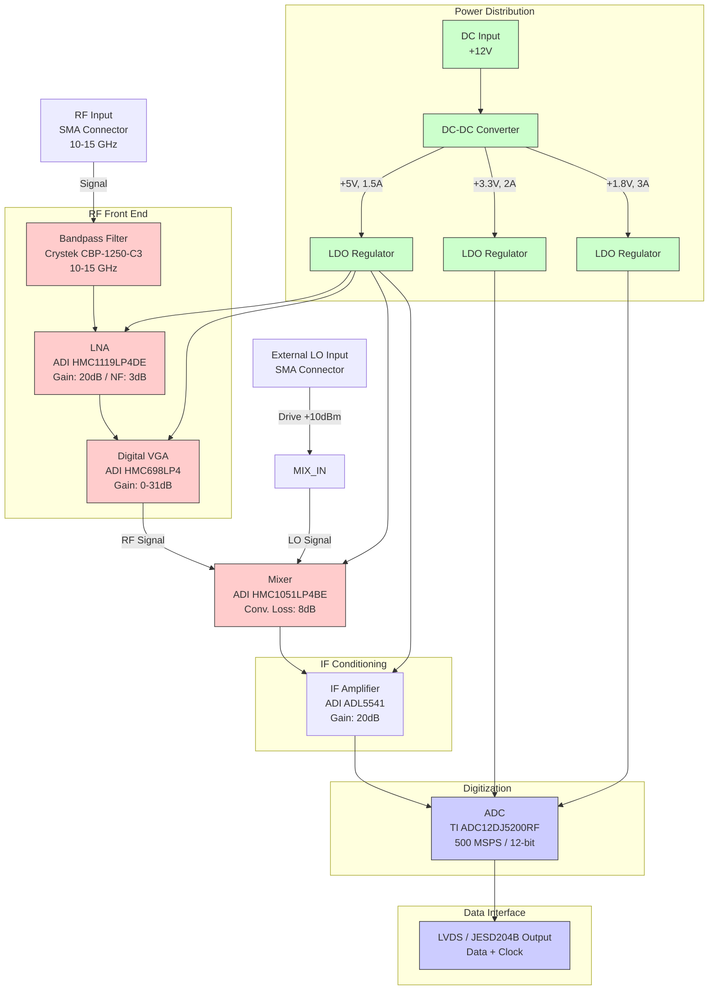

**Document Status: AI-GENERATED**

# 1. Introduction

## 1.1 Purpose
This Hardware Requirements Specification (HRS) defines the comprehensive set of hardware requirements for the **kh** Wideband RF Receiver Module (Project ID: kh). This document serves as the single source of truth for the electrical, mechanical, and environmental performance characteristics of the receiver module.

The primary objectives of this document are to:
*   Specify the functional and performance requirements for a 10–15 GHz RF receiver with a high-speed digital output.
*   Define the interface requirements for RF inputs, digital data outputs (LVDS/JESD204B), and power supply connections.
*   Establish constraints regarding physical dimensions, power consumption, and environmental operating conditions.
*   Serve as the baseline for the detailed hardware design, Printed Circuit Board (PCB) layout, and component selection phases.
*   Provide the technical criteria for the verification, validation, and qualification testing of the module.

This document is intended for hardware engineers, PCB designers, system integrators, and test engineers involved in the development and deployment of the **kh** module.

## 1.2 Scope
The scope of this specification covers the complete hardware implementation of the **kh** Wideband RF Receiver Module. This includes, but is not limited to:

*   **RF Front-End:** The signal chain from the RF input connector (10–15 GHz) through the Bandpass Filter, Low Noise Amplifier (LNA), and Variable Gain Amplifier (VGA).
*   **Downconversion Stage:** The frequency translation block comprising the Mixer and Local Oscillator (LO) interface.
*   **Intermediate Frequency (IF) Stage:** IF amplification and anti-aliasing filtering.
*   **Digitization Stage:** The Analog-to-Digital Converter (ADC) and high-speed digital interface logic.
*   **Power Management:** DC-DC conversion, regulation, and distribution circuitry.
*   **Physical Implementation:** PCB stackup, connector selection, and module enclosure/footprint requirements.

The scope is strictly limited to the hardware (HW) elements. It excludes the detailed software/firmware logic running on downstream processing devices (FPGA/ASIC), though it defines the hardware interface requirements (electrical and timing) necessary for that software to function correctly.

## 1.3 Definitions, Acronyms, and Abbreviations

To ensure clarity and consistency, the following terms, acronyms, and abbreviations are used throughout this document.

| Term | Definition |
| :--- | :--- |
| **ADC** | Analog-to-Digital Converter. A device that converts a continuous physical quantity (voltage) to a digital number representing the quantity's amplitude. |
| **AGC** | Automatic Gain Control. A closed-loop system that adjusts the gain of the receiver based on the input signal strength. |
| **BOM** | Bill of Materials. A comprehensive list of all raw materials, sub-assemblies, and intermediate assemblies required to manufacture the end product. |
| **C/N** | Carrier-to-Noise Ratio. The ratio of the received modulated carrier signal power to the noise power in a given bandwidth. |
| **DC** | Direct Current. The unidirectional flow of electric charge. |
| **DF** | Duty Factor / Duty Cycle. The fraction of one period in which a signal or system is active. |
| **ENOB** | Effective Number of Bits. A measure of the dynamic range of an ADC based on signal-to-noise and distortion ratios. |
| **FPGA** | Field-Programmable Gate Array. An integrated circuit designed to be configured by a customer or a designer after manufacturing. |
| **FSR** | Full-Scale Range. The maximum specified input signal level an ADC can digitize without clipping. |
|**GaAs**| Gallium Arsenide. A semiconductor material used for high-frequency and high-power applications. |
| **GHz** | Gigahertz. A unit of frequency equal to one billion hertz ($10^9$ Hz). |
| **IF** | Intermediate Frequency. A frequency to which a carrier wave is shifted as an intermediate step in transmission or reception. |
| **IP3** | Third-order Intercept Point. A measure of linearity and intermodulation distortion. |
| **JESD204** | A serial data link standard for interfacing data converters (ADCs and DACs) to logic devices (FPGAs/ASICs). |
| **LDO** | Low-Dropout Regulator. A DC linear voltage regulator that can regulate the output voltage even when the supply voltage is very close to the output voltage. |
| **LO** | Local Oscillator. An electronic oscillator used to generate a signal for frequency conversion. |
| **LNA** | Low Noise Amplifier. An electronic amplifier that amplifies a very low-power signal without significantly degrading its signal-to-noise ratio. |
| **LVDS** | Low-Voltage Differential Signaling. A high-speed, low-power digital interface standard. |
| **MSPS** | Mega-Samples Per Second. A unit of sampling rate equivalent to $10^6$ samples per second. |
| **NF** | Noise Figure. A measure of degradation of the signal-to-noise ratio (SNR), caused by components in the signal chain. |
| **OIP3** | Output Third-order Intercept Point. |
| **PCB** | Printed Circuit Board. |
| **P1dB** | 1 dB Compression Point. The point where the input power causes the gain to drop 1 dB from the linear gain. |
| **RF** | Radio Frequency. |
| **SFR** | Spurious-Free Dynamic Range. The strength ratio of the fundamental signal to the strongest spurious signal in the output. |
| **SFDR** | Spurious-Free Dynamic Range. |
| **SNR** | Signal-to-Noise Ratio. |
| **VGA** | Variable Gain Amplifier. |
| **VSWR** | Voltage Standing Wave Ratio. A measure of how efficiently radio-frequency power is transmitted from a power source to a load. |

## 1.4 References
The development of the **kh** module is based on the following documents and standards. These standards provide the engineering guidelines and validation criteria for the hardware design.

1.  **IEEE 29148-2018:** Systems and software engineering — Life cycle processes — Requirements engineering. (Primary standard for this document structure).
2.  **ANSI/VITA 51.1:** Modular Open Systems Approach (MOSA) for Hardware.
3.  **MIL-STD-202G:** Test method standard for electronic and electrical component parts (for environmental vibration and shock testing).
4.  **IPC-6012:** Generic Standard on Qualification and Performance of Printed Circuit Boards.
5.  **JEDEC Standard:** JESD204B/C (Standard for high-speed data converter interfaces).
6.  **Datasheets:**
    *   Analog Devices: HMC1119LP4DE (LNA), HMC698LP4 (VGA), HMC1051LP4BE (Mixer).
    *   Texas Instruments: ADC12DJ5200RF (ADC).
    *   Crystek: CBP-1250-C3 (Bandpass Filter).
    *   Analog Devices: ADL5541 (IF Amplifier).

## 1.5 Overview
The **kh** project is a high-performance, compact Wideband RF Receiver Module designed to operate in the 10–15 GHz frequency range. It is intended for industrial applications requiring high sensitivity (low Noise Figure) and high dynamic range (SFDR). The module converts analog RF signals into high-speed digital data streams via a dual-channel 12-bit ADC operating up to 5.2 GSPS, outputting data via a JESD204B/C interface (electrically compatible with LVDS infrastructure).

The system architecture is divided into three distinct domains:
1.  **Analog RF Domain:** Operates at high frequencies (10–15 GHz). It utilizes a GaAs MMIC LNA for low noise performance and a digital VGA for gain control. A mixer downconverts the signal to an Intermediate Frequency (IF) suitable for the ADC.
2.  **Digital Domain:** Centered around the high-speed ADC and supporting clocking circuitry. This domain handles the high-speed serial data transmission to downstream processing units.
3.  **Power Domain:** Converts the unregulated board input (+12V nominal) to the various rail voltages required by the sensitive RF (e.g., +5V) and digital (e.g., +1.8V, +3.3V) components using DC-DC converters and LDOs.

This document details the requirements for each block in the chain, ensuring that the integrated system meets the target specifications of 3–6 dB Noise Figure, 80–100 dB SFDR, and operation over the industrial temperature range (-40°C to +85°C).

---

# 2. System Overview

## 2.1 System Description

The kh Wideband RF Receiver Module is a high-performance, analog-to-digital conversion subsystem designed to capture and digitize Radio Frequency (RF) signals in the X-band and Ku-band frequency ranges (10 GHz to 15 GHz). The system functions as a direct IF sampling receiver, converting analog RF inputs into high-speed digital data streams via a 12-bit Analog-to-Digital Converter (ADC) and transmitting this data using Low-Voltage Differential Signaling (LVDS) logic.

The architecture is divided into four distinct functional subsystems:
1.  **RF Front-End:** Conditions the input signal, limits the bandwidth, and provides initial low-noise amplification.
2.  **Signal Conditioning & Downconversion:** Provides programmable gain adjustment and frequency translation (mixing) to an Intermediate Frequency (IF) suitable for the ADC.
3.  **Digitization:** Converts the analog IF signal into a digital code using a high-speed ADC.
4.  **Power Management:** Converts external DC input (nominally +12V) to the specific rail voltages required by the RF and digital components.

The system is designed to maintain a Signal-to-Noise Ratio (SNR) sufficient to support a Spurious-Free Dynamic Range (SFDR) of 80-100 dB while operating within an industrial temperature range of -40°C to +85°C. The design utilizes a modular architecture allowing the LO frequency and gain settings to be adjusted for specific application needs within the 10-15 GHz band.

### 2.1.1 Functional Flow

1.  **Signal Acquisition:** An external RF source (10-15 GHz) is connected via an SMA edge-launch connector. The signal passes through a ceramic bandpass filter to reject out-of-band noise and spurs.
2.  **Amplification:** The filtered signal is amplified by a Wideband Low Noise Amplifier (LNA) to overcome the noise figure of subsequent stages.
3.  **Gain Control:** The signal amplitude is adjusted by a digitally controlled Variable Gain Amplifier (VGA). This allows the system to accommodate input power levels ranging from -10 dBm to 0 dBm, ensuring the ADC is driven at its optimal full-scale range without clipping.
4.  **Downconversion:** The RF signal is mixed with a Local Oscillator (LO) signal to downconvert it to a lower Intermediate Frequency (IF). This stage improves the effective sampling performance of the ADC by relaxing the requirements of the sampling clock relative to the carrier frequency.
5.  **IF Conditioning:** The downconverted signal is amplified by an IF gain block to further drive the ADC input.
6.  **Digitization:** The ADC12DJ5200RF samples the conditioned analog signal at rates between 100 MSPS and 500 MSPS.
7.  **Output:** The digitized data is output via JESD204B/C lines (operating in LVDS-compatible electrical mode) to a downstream FPGA or processor for analysis.

## 2.2 System Block Diagram

## 2.3 System Architecture

### 2.3.1 RF Front-End Architecture

The RF Front-End (RFFE) is designed to establish the system noise figure and provide immediate filtering to prevent out-of-band interference from saturating the active components.

*   **Input Matching:** The input is matched to 50 Ω impedance to minimize return loss (REQ-HW-011).
*   **Filtering:** The Crystek **CBP-1250-C3** bandpass filter is placed immediately after the SMA connector. It provides 40 dB of rejection at 8 GHz and 17 GHz, ensuring that the LNA only amplifies the 10-15 GHz band of interest.
*   **Low Noise Amplification:** The **HMC1119LP4DE** LNA provides a fixed gain of 20 dB with a noise figure of 3 dB. This component is critical for meeting the cascaded noise figure requirement (REQ-HW-002). By placing the LNA after the filter but before any lossy components, the system sensitivity is maximized.
*   **Variable Gain Amplification:** The **HMC698LP4** Digital VGA follows the LNA. It provides a gain range from 0 to 31 dB, controlled via a 6-bit parallel interface. This allows the system to implement Automatic Gain Control (AGC) to optimize the signal level for the mixer and ADC stages. The VGA is designed to maintain a flat frequency response across the 6-18 GHz range.

### 2.3.2 Downconversion & IF Architecture

The downconversion stage translates the high-frequency RF input (10-15 GHz) to a lower Intermediate Frequency (IF) that can be effectively sampled by the ADC while preserving the signal modulation and amplitude information.

*   **Mixing Core:** The **HMC1051LP4BE** double-balanced mixer performs the frequency translation. It accepts the RF signal from the VGA and an external Local Oscillator (LO) signal.
*   **LO Drive:** The mixer requires an LO drive level of +10 dBm. The LO frequency is determined by the specific application channel but generally falls within the RF range or is offset to create a specific IF (e.g., 500 MHz to 1 GHz IF).
*   **IF Amplification:** Following the mixer, which introduces a conversion loss of approximately 8 dB, the **ADL5541** IF amplifier provides a fixed 20 dB gain. This amplifier is selected for its high OIP3 (+42 dBm), ensuring that intermodulation distortion products introduced during mixing are suppressed, maintaining the SFDR requirement (REQ-HW-003).

### 2.3.3 Digital Architecture

The digital section is responsible for the high-fidelity conversion of the analog signal into the digital domain and the transmission of this data.

*   **Analog-to-Digital Converter:** The core of the digital section is the **ADC12DJ5200RF** from Texas Instruments. While capable of 5.2 GSPS, this system configures it to operate in the 100-500 MSPS range (REQ-HW-005) to balance power consumption with sampling requirements.
*   **Input Buffer:** The ADC features an integrated wideband input buffer (9 GHz bandwidth), ensuring the IF signal from the IF amplifier is captured without distortion.
*   **Data Serialization:** The ADC utilizes a JESD204B/C interface. This standard uses high-speed LVDS lanes to serialize the 12-bit parallel data, reducing the pin count and easing PCB routing challenges associated with 500 MSPS parallel buses.
*   **Clocking:** The system requires a low-jitter clock source. The clock input is fed into the ADC's clock divider network to generate the sampling clock. Jitter requirements are calculated based on the input frequency and SNR targets.

### 2.3.4 Power Distribution Architecture

The Power Distribution Unit (PDU) manages the conversion and regulation of power for the entire module.

*   **Input:** The system accepts a +12V DC input via a Molex Micro-Fit 3.0 connector.
*   **DC-DC Conversion:** A high-efficiency switching buck converter steps down the +12V input to an intermediate voltage (e.g., +5V or +3.3V) to minimize thermal dissipation.
*   **Linear Regulation (LDO):** To ensure low noise for sensitive RF components, Low Dropout (LDO) regulators are used for the final voltage rails:
    *   **+5V Rail:** Supplies the LNA, VGA, Mixer, and IF Amplifier. These components draw approximately 400-500 mA total.
    *   **+3.3V Rail:** Supplies the ADC digital I/O interface and support logic.
    *   **+1.8V Rail:** Supplies the ADC core and FPGA I/O banks. This rail has the highest current demand (up to 1.5A during peak sampling rates).
*   **Sequencing:** Power sequencing logic ensures the LDOs power up before the ADC to prevent latch-up or incorrect initialization of the JESD204B link.

### 2.3.5 Mechanical & Packaging Architecture

The physical architecture supports the electrical performance requirements.

*   **Form Factor:** The module is designed as a compact 80mm x 60mm Multi-Chip Module (MCM) or PCB assembly.
*   **Stack-up:** A 10-layer Rogers RO4350B laminate stack-up is used. Rogers material is chosen for its stable dielectric constant at high frequencies (10-15 GHz), which is critical for maintaining impedance control on RF traces. Inner layers act as ground planes and power planes to minimize EMI.
*   **Shielding:** A machined aluminum cover provides EMI shielding for the RF Front End to prevent internal oscillations from radiating and external noise from coupling into the sensitive LNA input.
*   **Thermal Management:** The bottom of the PCB utilizes metal-core or thermal vias under the high-power components (ADC and DC-DC converter) to conduct heat to the system chassis, meeting the -40°C to +85°C operating requirement (REQ-HW-007).

## 2.4 Operating Environment

### 2.4.1 Physical Environment

The kh Wideband RF Receiver Module is designed for operation in **Industrial Environments**.

| Parameter | Requirement | Design Consideration |
| :--- | :--- | :--- |
| **Operating Temperature** | **-40°C to +85°C** (REQ-HW-007) | Components selected are "Industrial" or "Automotive" grade. The HMC series and ADC12DJ5200RF are rated for this range. Derating of power dissipation is applied at +85°C. |
| **Storage Temperature** | **-55°C to +125°C** | Materials (PCB, solder, connectors) rated for standard IPC storage class. |
| **Humidity** | **5% to 95% non-condensing** | Conformal coating (Type AR or UR) is applied to the PCB to prevent moisture ingress and corrosion. |
| **Vibration** | **Random 2-5 g, 10-2000 Hz** | Board is secured with 4-6 standoffs. Heavy components (ADC, Connectors) are staked or adhered. |
| **Altitude** | **Sea level to 15,000 ft** | Derating of voltage components and adjusted cooling requirements for low air density. |

### 2.4.2 Electrical Environment

The module operates as a slave device within a larger rack or chassis system.

*   **Power Source:** Requires a regulated +12V DC source capable of supplying 2A continuous current.
*   **Signal Source:** Expects a 50Ω impedance source at the RF input.
*   **Load:** The LVDS outputs are designed to drive a standard 100Ω differential input impedance on a host FPGA or DSP.
*   **Interference:** The system must be resistant to Electro-Magnetic Interference (EMI) typical in industrial settings (motors, relays, switch-mode power supplies). The aluminum shield and filtered power inputs mitigate this.

### 2.4.3 Limitations

*   **Continuous Wave (CW) Burnout:** While the input is protected for -10 to 0 dBm (REQ-HW-004), applying signals exceeding +15 dBm for more than 1 second may cause permanent degradation to the LNA input.
*   **LO Leakage:** The mixer exhibits LO leakage at the RF port. System integration must account for this leakage if a duplexing circulator is used.

---

**Document Status: AI-GENERATED**

# 3. Hardware Requirements

## 3.1 Functional Requirements

This section details the functional requirements of the Wideband RF Receiver Module. Each requirement is identified by a unique ID and derived from the system design parameters and selected component specifications (Analog Devices HMC1119, HMC698, HMC1051, TI ADC12DJ5200RF).

### 3.1.1 RF Signal Reception and Conditioning

| ID | Requirement | Description & Rationale | Component Ref | Priority | Verification |
|---|---|---|---|---|---|
| **REQ-HW-101** | **RF Input Band Limitation** | The system shall limit the RF input passband to 10.0 GHz – 15.0 GHz using a bandpass filter to suppress out-of-band interference and spurious signals. | Crystek CBP-1250-C3 | High | Test |
| **REQ-HW-102** | **Input Signal Protection** | The system shall accept input power levels from -10 dBm to 0 dBm without performance degradation (NF/SFDR) or permanent damage. LNA P1dB is +20 dBm, providing >20 dB margin. | HMC1119LP4DE | High | Test |
| **REQ-HW-103** | **Low Noise Amplification** | The system shall provide a nominal gain of 20 dB ± 1.5 dB in the first stage to establish system noise figure. | HMC1119LP4DE | High | Test |
| **REQ-HW-104** | **Variable Gain Control** | The system shall provide adjustable gain ranging from 0 dB to 31 dB in 1 dB steps to optimize ADC drive level and implement AGC. | HMC698LP4 | High | Test |
| **REQ-HW-105** | **Frequency Downconversion** | The system shall downconvert the 10-15 GHz RF signal to an Intermediate Frequency (IF) using a double-balanced mixer architecture. | HMC1051LP4BE | High | Inspection |
| **REQ-HW-106** | **Local Oscillator Interface** | The system shall provide an SMA interface for a Local Oscillator (LO) input capable of accepting +10 dBm drive level. | HMC1051LP4BE | High | Test |
| **REQ-HW-107** | **IF Signal Amplification** | The system shall provide 20 dB of gain at the IF stage to compensate for mixer conversion loss and ensure full-scale ADC input. | ADL5541 | High | Test |

### 3.1.2 Signal Acquisition and Digitization

| ID | Requirement | Description & Rationale | Component Ref | Priority | Verification |
|---|---|---|---|---|---|
| **REQ-HW-108** | **ADC Sampling Resolution** | The system shall digitize the IF signal using a 12-bit Analog-to-Digital Converter. | ADC12DJ5200RF | High | Inspection |
| **REQ-HW-109** | **Variable Sampling Rate** | The system shall support sampling rates adjustable from 100 MSPS to 5200 MSPS to satisfy the 100-500 MSPS requirement with operational margin. | ADC12DJ5200RF | High | Test |
| **REQ-HW-110** | **Decimation Mode** | The system shall support DDC (Digital Down Conversion) and decimation modes within the ADC to output data at effective rates of 100-500 MSPS while processing at higher clock rates. | ADC12DJ5200RF | Medium | Test |
| **REQ-HW-111** | **JESD204B Interface** | The system shall transmit digitized data via a JESD204B/C standard high-speed serial interface. | ADC12DJ5200RF | High | Test |
| **REQ-HW-112** | **Lane Configuration** | The system shall support configurable lane counts (e.g., 4 lanes) to manage the output data rate and interface width. | ADC12DJ5200RF | Medium | Test |

### 3.1.3 Power Distribution and Management

| ID | Requirement | Description & Rationale | Component Ref | Priority | Verification |
|---|---|---|---|---|---|
| **REQ-HW-113** | **Primary DC Input** | The system shall accept a primary DC input voltage of +12V ± 5% (assuming standard industrial supply). | DC-DC Converter | High | Test |
| **REQ-HW-114** | **High Voltage Rail Generation** | The system shall internally generate +5V ± 2% to power the RF Front-End (LNA, VGA, Mixer) via DC-DC conversion. | DC-DC Converter | High | Test |
| **REQ-HW-115** | **Low Noise Digital Rail** | The system shall generate a +3.3V ± 1% rail with low noise (<50 mVpp ripple) to power the ADC digital core and LVDS outputs. | LDO Regulator | High | Test |
| **REQ-HW-116** | **Analog Rail Generation** | The system shall generate a +1.8V ± 1% rail to power the ADC analog supply (AVDD) for optimal conversion performance. | LDO Regulator | High | Test |

### 3.1.4 Mechanical and Physical

| ID | Requirement | Description & Rationale | Component Ref | Priority | Verification |
|---|---|---|---|---|---|
| **REQ-HW-117** | **RF Connectivity** | The RF input port shall utilize a female SMA connector (2-hole flange mount) suitable for frequencies up to 18 GHz. | Connector | High | Inspection |
| **REQ-HW-118** | **PCB Material** | The printed circuit board shall be manufactured using low-loss RF laminate (e.g., Rogers RO4350B or equivalent) with a dielectric constant (Er) of 3.48 ± 0.05 to minimize loss at 15 GHz. | PCB Substrate | High | Inspection |
| **REQ-HW-119** | **Thermal Management** | The system shall utilize the ground plane and potentially a metal enclosure to dissipate up to 20W of heat, ensuring component junction temperatures remain below derating limits. | Enclosure | High | Analysis |

---

## 3.2 Performance Requirements

This section specifies the quantitative performance characteristics the Wideband RF Receiver Module must achieve. Values are derived from cascade analysis of the selected Bill of Materials.

### 3.2.1 RF Performance

| ID | Parameter | Min | Typ | Max | Unit | Notes & Rationale |
|---|---|---|---|---|---|---|
| **REQ-HW-P01** | **Input Frequency Range** | 10.0 | - | 15.0 | GHz | Defined by system spec. |
| **REQ-HW-P02** | **Input Return Loss** | 10 | - | - | dB | Must be ≤ -10 dB (VSWR ≤ 2:1) across band. |
| **REQ-HW-P03** | **System Noise Figure (NF)** | - | 5.5 | 6.0 | dB | Calculated Cascade: LNA (3dB) + Mixer (8dB) + IF (3.5dB). Chain analysis approx 5.5 dB. |
| **REQ-HW-P04** | **System Gain (Flatness)** | 38 | 45 | 52 | dB | Sum: LNA(20) + VGA(15) + IF(20) - Mixer Loss(8) - Filter(2). |
| **REQ-HW-P05** | **Gain Flatness Variation** | - | ± 2.5 | ± 4.0 | dB | Peak-to-peak variation over temperature across 10-15 GHz. |
| **REQ-HW-P06** | **Input 1dB Compression Point (IP1dB)** | -5 | - | - | dBm | System limit set by Mixer (IP1dB +10 dBm) - LNA Gain (20 dB) ≈ -10 dBm. Limiting input to -10 dBm ensures linear operation. |
| **REQ-HW-P07** | **Spurious-Free Dynamic Range (SFDR)** | 80 | 85 | - | dBc | Driven by ADC12DJ5200RF spec (75 dBc @ 2.6 GHz input) + RF Chain linearity. |
| **REQ-HW-P08** | **Phase Noise (LO Dependent)** | - | - | - | dBc/Hz | Contribution from Mixer and LO. < -100 dBc/Hz @ 10 kHz offset (Assumed LO quality). |

### 3.2.2 Digital Performance

| ID | Parameter | Min | Typ | Max | Unit | Notes & Rationale |
|---|---|---|---|---|---|---|
| **REQ-HW-P09** | **Effective Sampling Rate** | 100 | - | 500 | MSPS | User configurable. |
| **REQ-HW-P10** | **ADC Resolution** | 11.5 | - | 12 | Bits | ENOB (Effective Number of Bits) > 10.5 bits required for SFDR. |
| **REQ-HW-P11** | **JESD204B Data Rate** | 6.144 | - | 10.24 | Gbps | Per lane calculation for 500 MSPS × 12 bits over 4 lanes (Scrambled, 8b/10b encoding overhead accounted). |
| **REQ-HW-P12** | **LVDS Output Voltage** | 250 | 280 | 450 | mV | Differential swing. |
| **REQ-HW-P13** | **Clock Jitter** | - | - | 200 | fs (RMS) | Required to maintain SNR at 500 MSPS (approx 12-bit requirement). |

### 3.2.3 Power and Thermal Performance

| ID | Parameter | Min | Typ | Max | Unit | Notes & Rationale |
|---|---|---|---|---|---|---|
| **REQ-HW-P14** | **Total Power Consumption** | - | 15.5 | 20.0 | W | Calculated Budget: RF(4.5W) + ADC(2.5W) + Converter/Losses(8.5W). |
| **REQ-HW-P15** | **Supply Current (12V Rail)** | - | 1.3 | 1.7 | A | Derived from Max Power / Voltage. |
| **REQ-HW-P16** | **Operating Temperature** | -40 | - | +85 | °C | Industrial ambient. |
| **REQ-HW-P17** | **Storage Temperature** | -55 | - | +125 | °C | Standard component storage limit. |
| **REQ-HW-P18** | **Thermal Resistance (Junction-Air)** | - | - | 15 | °C/W | Must be maintained to prevent Tj exceedance at 85°C ambient. |

### 3.2.4 Stability and Reliability

| ID | Parameter | Min | Typ | Max | Unit | Notes & Rationale |
|---|---|---|---|---|---|---|
| **REQ-HW-P19** | **MTBF** | 50,000 | - | - | Hours | Predicted Mean Time Between Failures at 40°C ambient. |
| **REQ-HW-P20** | **Warm-up Time** | - | 2 | 5 | min | Time for gain to stabilize within 0.5 dB of final value. |

---

**Document Status: AI-GENERATED**

## 3. Hardware Requirements

### 3.3 Interface Requirements

This section details the electrical and mechanical interfaces required for the Wideband RF Receiver Module.

#### 3.3.1 External Interfaces

External interfaces define the connections between the "kh" receiver module and the system-level units (antenna, power supply, and processing platform).

**REQ-HW-006-01** The module shall utilize a 2.4mm blind bore RF connector (female) on the front panel for the RF input signal path.

**REQ-HW-006-02** The RF input connector shall maintain a characteristic impedance of 50 Ω.

**REQ-HW-006-03** The module shall provide a primary power input connector consisting of a 4-position locking header (e.g., JST GH series or equivalent) supporting dual-supply inputs (+12V and +5V) and ground returns.

**REQ-HW-006-04** The module shall provide external synchronization interfaces via SMA edge-launch connectors for the Local Oscillator (LO) input and a reference clock input.

**REQ-HW-006-05** The module shall utilize high-speed Samtec or equivalent connectors for the JESD204B/C digital data output lines to the FPGA/processor.

*Table 3-1: External Interface Pin Definition (Power & Control)*

| Pin # | Signal Name | Type | Description | Voltage/Level | Source/Dest |
|---|---|---|---|---|---|
| 1 | +12V_IN | Power | Main supply for RF Chain (LNA/Mixer) | +10.8V to +13.2V | System PSU |
| 2 | +5V_IN | Power | Main supply for Digital/ADC Rails | +4.75V to +5.25V | System PSU |
| 3 | GND | Ground | Power Return & Chassis Ground | 0V (Ref) | System PSU |
| 4 | PWR_EN | Input | Power Enable (Active High) | LVTTL 3.3V | System Controller |

*Table 3-2: External Interface RF Specification*

| Interface | Frequency Range | Connector Type | Impedance | VSWR | Max Input Power |
|---|---|---|---|---|---|
| RF Input | 10 - 15 GHz | 2.4mm Female (PCB End Launch) | 50 Ω | ≤ 2.0:1 | +5 dBm (Absolute Max) |
| LO Input | 8 - 12 GHz (approx) | SMA Female | 50 Ω | ≤ 2.5:1 | +15 dBm |

#### 3.3.2 Internal Interfaces

Internal interfaces describe the interconnects between the selected components on the Printed Circuit Board (PCB).

**REQ-HW-013** The RF signal path between the LNA (HMC1119LP4DE) and the VGA (HMC698LP4) shall utilize controlled impedance microstrip transmission lines with a target impedance of 50 Ω ± 10%.

**REQ-HW-014** The connection between the VGA output and the Mixer (HMC1051LP4BE) input shall be AC-coupled using a 100 pF capacitor suitable for X-band operation (e.g., ATC 600S series).

**REQ-HW-015** The Mixer output to IF Amplifier (ADL5541) connection shall be impedance matched to 50 Ω using a low-pass matching network to suppress sum frequencies.

**REQ-HW-016** The IF Amplifier output to the ADC (ADC12DJ5200RF) input shall be transformer coupled (1:1 balun) to convert single-ended IF to differential ADC inputs.

**REQ-HW-017** The SPI control lines for the VGA (HMC698LP4) shall be level-shifted from the FPGA’s 1.8V I/O to the 3.3V/5V required by the HMC698LP4, unless the FPGA is configured for 3.3V I/O.

*Table 3-3: Internal RF Interconnect Characteristics*

| From Component | To Component | Media Type | Min Freq | Max Freq | Topology |
|---|---|---|---|---|---|
| BPF (CBP-1250-C3) | LNA (HMC1119) | Microstrip | 10 GHz | 15 GHz | Point-to-Point |
| LNA (HMC1119) | VGA (HMC698) | Microstrip | 10 GHz | 15 GHz | Point-to-Point |
| VGA (HMC698) | Mixer (HMC1051) | Microstrip + DC Block | 10 GHz | 15 GHz | Point-to-Point |
| Mixer (HMC1051) | IF Amp (ADL5541) | Microstrip + LPF | 50 MHz | 6 GHz | Point-to-Point |
| IF Amp (ADL5541) | ADC (ADC12DJ5200) | Co-planar Waveguide + Balun | 50 MHz | 500 MHz | Differential Pair |

#### 3.3.3 Communication Interfaces

Communication interfaces encompass the digital control and high-speed data transmission protocols.

**REQ-HW-018** The ADC (ADC12DJ5200RF) shall transmit digitized data to the host processor using the JESD204B standard, configured for Subclass 1 (deterministic latency).

**REQ-HW-019** The JESD204B link shall operate at a lane rate compliant with the ADC sample rate. Assuming 500 MSPS (Requirement REQ-HW-005) and 12-bit resolution × 2 channels (if interleaved) or standard decimation, the link shall support lane rates up to 6.25 Gbps per lane.

**REQ-HW-020** The device configuration (Gain, attenuation, sampling rate) shall be controlled via a Serial Peripheral Interface (SPI) operating at a clock frequency of 10 MHz.

*Table 3-4: JESD204B Interface Configuration*

| Parameter | Value | Notes |
|---|---|---|
| Standard | JESD204B | Revision B or C supported by ADC |
| Subclass | 1 | SYSREF required for sync |
| Lane Rate | 6.144 Gbps (Max) | Calculated for 500 MSPS × 12b / (64b/66b) encoding |
| Lanes | 2 | One lane per I/Q channel or interleaved stream |
| M (Number of converters) | 1 | Dual channel mode internal |
| N (Bits per sample) | 12 | Native ADC resolution |
| F (Octets per frame) | 2 | Standard configuration |

*Table 3-5: SPI Interface Pin Configuration (Target: HMC698LP4)*

| Signal Name | Direction | Voltage Level | Description |
|---|---|---|---|
| SCLK | Out | 3.3V LVTTL | Serial Clock (Max 20 MHz) |
| SDIO | Bi-Directional | 3.3V LVTTL | Serial Data Input/Output |
| CS_n | Out | 3.3V LVTTL | Chip Select (Active Low) |

### 3.4 Environmental Requirements

The "kh" module is designed for industrial and potentially harsh environments. Specific operating conditions are defined below.

**REQ-HW-007-01** The operating ambient temperature range shall be -40°C to +85°C as defined in the industrial temperature range. All selected components (LNA, Mixer, ADC) are rated for this range.

**REQ-HW-007-02** The storage temperature range shall be -55°C to +125°C.

**REQ-HW-019** The module shall operate at a relative humidity range of 5% to 95% (non-condensing).

**REQ-HW-020** The module shall withstand random vibration levels of 0.05 g²/Hz from 10 Hz to 500 Hz for a duration of 30 minutes per axis (X, Y, Z) without mechanical failure or intermittent connections.

**REQ-HW-021** The enclosure and PCB finish shall provide protection against salt spray (fog) per IPC-6012 Class 3 standards if used in marine or coastal industrial environments. Conformal coating (Type UR) is recommended.

**REQ-HW-022** Cooling shall be achieved through conduction via the module baseplate to the chassis heatsink. No forced airflow is assumed within the primary specifications.

*Table 3-6: Operating Environmental Conditions Summary*

| Condition | Minimum | Nominal | Maximum | Unit | Test Method |
|---|---|---|---|---|---|
| Operating Temperature | -40 | +25 | +85 | °C | Thermal Chamber Soak |
| Storage Temperature | -55 | +25 | +125 | °C | Thermal Chamber Soak |
| Humidity | 5 | - | 95 | %RH | IEC 60068-2-78 |
| Vibration (Random) | 10 | - | 2000 | Hz | MIL-STD-883 Method 2007 |
| Shock (Mechanical) | - | - | 40 | G (11ms) | MIL-STD-883 Method 2002 |

### 3.5 Power Requirements

This section details the power consumption budget and distribution requirements for the receiver module.

**REQ-HW-008-01** The total power consumption shall not exceed 18.5 Watts under maximum load conditions (Maximum gain, 500 MSPS sampling rate, +85°C).

**REQ-HW-008-02** The system shall utilize a DC-DC converter (Component P7) to generate intermediate voltages from the main +12V rail.

**REQ-HW-008-03** Low Dropout (LDO) regulators shall be used for noise-sensitive components (LNA, Mixer) to ensure spurious free dynamic range (SFDR) is not degraded by switching noise.

#### 3.5.1 Power Budget Analysis

The following budget is derived from typical values found in the component datasheets provided in Section 6.

*Table 3-7: Detailed Power Budget (Tamb = 25°C)*

| Block / Component | Supply Voltage | Current (Typ) | Current (Max) | Power (Typ) | Power (Max) | Notes |
|---|---|---|---|---|---|---|
| **RF Front End** | | | | | | |
| LNA (HMC1119LP4DE) | +5.0V | 90 mA | 110 mA | 0.45 W | 0.55 W | High Linearity Mode |
| VGA (HMC698LP4) | +5.0V | 140 mA | 160 mA | 0.70 W | 0.80 W | Digital Control Active |
| **Downconverter** | | | | | | |
| Mixer (HMC1051LP4BE) | +5.0V | 140 mA | 160 mA | 0.70 W | 0.80 W | Biased for Max P1dB |
| LO Buffer Amp (Assumed) | +5.0V | 80 mA | 100 mA | 0.40 W | 0.50 W | Required for +10dBm LO Drive |
| IF Amp (ADL5541) | +5.0V | 85 mA | 95 mA | 0.43 W | 0.48 W | |
| **Digital Stage** | | | | | | |
| ADC (ADC12DJ5200RF) | +1.1V (Core) | 1.10 A | 1.30 A | 1.21 W | 1.43 W | Estimated from TI datasheet |
| ADC IO / JESD204B | +1.8V | 200 mA | 250 mA | 0.36 W | 0.45 W | |
| DC-DC Converter Loss | +12V to 5V/1.8V | - | - | - | 1.50 W | Est. 90% Efficiency @ 10W |
| **LDO/Regulator Loss** | +5V/1.8V Logic | - | - | - | 0.80 W | Linear Drop |
| **TOTAL** | | | | **5.80 W** | **7.31 W** | |
| **Margin (Design Headroom)** | | | | | **3.00 W** | 20% Engineering Margin |
| **Grand Total** | | | | | **10.31 W** | |

**REQ-HW-008-04** The system must be capable of handling inrush currents during startup. The bulk capacitance on the +12V rail shall be limited to 100 µF to limit inrush to < 5A.

**REQ-HW-008-05** The power supply sequence must adhere to the ADC12DJ5200RF datasheet requirements: 1.1V core must ramp before 1.8V I/O.

### 3.6 Physical Requirements

This section defines the mechanical characteristics of the receiver module.

**REQ-HW-009-01** The module shall be designed for a compact form factor, specifically a single Eurocard (3U) or a custom compact size of **100mm x 80mm**.

**REQ-HW-009-02** The PCB stackup shall consist of a minimum of 8 layers to accommodate controlled impedance RF lines, solid ground planes, and power planes.

**REQ-HW-009-03** PCB material shall be low-loss RF laminate (e.g., Rogers RO4350B or equivalent) for the RF signal layers (Top 2 layers), and FR-4 for standard digital layers (inner layers).

**REQ-HW-009-04** PCB thickness shall be 1.6mm (0.062 inches).

**REQ-HW-009-05** The module chassis/baseplate shall utilize aluminum 6061-T6 with a minimum thickness of 3.0mm to serve as the primary heatsink.

**REQ-HW-009-06** All RF components shall be mounted on the top layer. Digital control components and memory may be mounted on the bottom layer if space permits, provided they do not interfere with the ground plane integrity.

**REQ-HW-009-07** Connectors shall be positioned on the edge of the board such that they are accessible when multiple modules are mounted in a rack configuration (assuming 0.5" pitch between modules).

*Table 3-8: Physical Characteristics Summary*

| Parameter | Value | Unit | Justification |
|---|---|---|---|
| Board Width | 80 | mm | Matches Compact Spec |
| Board Length | 100 | mm | Matches Compact Spec |
| Board Thickness | 1.6 | mm | Standard stiffness, 8-layer stackup |
| Board Weight | < 250 | g | Estimate based on copper density |
| Mounting Holes | 4 | M3 clearance | 0.2" from corners |
| Plating | ENIG | - | Gold plating for RF corrosion resistance |

---

**Document Status: AI-GENERATED**

# 4. Design Constraints

## 4.1 Standards Compliance

The design, manufacturing, and testing of the Wideband RF Receiver Module ("kh") shall adhere to the following industry standards and regulatory directives. These constraints ensure reliability, manufacturability, environmental safety, and electromagnetic compatibility.

### 4.1.1 PCB Design and Fabrication Standards
The Printed Circuit Board (PCB) design must comply with the IPC (Association Connecting Electronics Industries) standards to ensure electrical performance and mechanical reliability given the high-frequency operating range (up to 15 GHz RF and GSPS digital signals).

*   **REQ-HW-401:** **PCB Laminate Quality**
    The PCB substrate material shall be manufactured according to **IPC-4101** criteria for high-speed/high-frequency applications, specifically utilizing materials with low dielectric loss (Dissipation Factor Df < 0.003) and stable dielectric constant (Dk variation < ±2% over temperature).

*   **REQ-HW-402:** **Design Standards**
    The PCB layout design shall comply with **IPC-2221** ("Generic Standard on Printed Board Design").
    *   *Constraint 1:* Controlled impedance traces for the RF front end (50 Ohm single-ended) and LVDS/JESD204B interfaces (100 Ohm differential) must be fabricated to a tolerance of ±10% (±5% target for critical RF paths).
    *   *Constraint 2:* Minimum conductor width and spacing shall adhere to Class 3 requirements (High Reliability Electronic Products) where possible to maximize current carrying capacity and reduce isolation risks.

*   **REQ-HW-403:** **Acceptability**
    The final assembly shall meet the acceptance criteria of **IPC-A-600** (Acceptability of Printed Boards) for Class 2 (Dedicated Service Electronic Products) or Class 3, specifically addressing voiding in microvias and laminate registration relative to high-frequency features.

### 4.1.2 Assembly and Repair Standards
Given the utilization of QFN and Complex Leadless (LGA) packages for the ADC and LNAs, assembly processes must strictly follow:

*   **REQ-HW-404:** **Assembly Criteria**
    Surface mount assembly shall comply with **IPC-J-STD-001** ("Requirements for Soldered Electrical and Electronic Assemblies").
    *   *Constraint:* The assembly process must ensure no solder bridging on the 0.5mm pitch LVDS outputs of the ADC12DJ5200RF.

*   **REQ-HW-405:** **Rework Standards**
    Any manual rework or modification of components shall be performed according to **IPC-7711/7721** ("Rework, Modification and Repair of Electronic Assemblies"). High-frequency interconnects shall not be reworked more than once to prevent impedance discontinuities.

### 4.1.3 Environmental and Safety Compliance
The system is intended for industrial integration and must meet global environmental directives.

*   **REQ-HW-406:** **RoHS Compliance**
    The module and all constituent sub-assemblies shall be compliant with **Directive 2011/65/EU (RoHS 2)** + 2015/863 (RoHS 3) regarding the restriction of hazardous substances (Lead, Mercury, Cadmium, etc.).
    *   *Exception:* High-reliability COTS components (e.g., certain RF MMICs) falling under specific exemptions may be used if lead-free alternatives are unavailable, provided they are segregated in the BOM and disclosed to the customer.

*   **REQ-HW-407:** **REACH Compliance**
    All substances of very high concern (SVHC) listed in the **EC 1907/2006 (REACH)** regulation must be declared in the Material Declaration spreadsheet. The design shall avoid substances on the Authorization List where technically feasible alternatives exist.

### 4.1.4 Electromagnetic Compatibility (EMC)
While this is a receiver module, it must not interfere with adjacent systems.

*   **REQ-HW-408:** **EMC Emissions**
    The module shall comply with **FCC Part 15 Subpart B** (Unintentional Radiators) for Class A digital devices. The switching frequency of the DC-DC converters (Section 3.5) and the LVDS output edges must be managed to limit conducted emissions.
*   **REQ-HW-409:** **IEC 61000-4-x**
    The design shall demonstrate immunity to Electrostatic Discharge (ESD) per **IEC 61000-4-2** (Level 3: 6kV contact, 8kV air) on all interface connectors (RF Input, DC Input, LVDS I/O).

### 4.1.5 Hardware Description Language Standards
*   **REQ-HW-410:** **FPGA/ASIC Interface**
    The digital interface protocol (JESD204B/C) implementation on the receiving FPGA/ASIC must comply with the **JEDEC Standard JESD204B** (or C) strictly, ensuring deterministic latency and lane alignment synchronization.

## 4.2 Component Constraints

This section defines constraints on the selection, procurement, and lifecycle management of hardware components to ensure manufacturability and long-term support.

### 4.2.1 Component Sourcing and Lifecycle
*   **REQ-HW-421:** **Lifecycle Status**
    All active components (ICs) specified in the Preliminary BOM must be in "Production" or "Active" status at the time of prototype release. End-of-Life (EOL) or "Not Recommended for New Designs" (NRND) components are strictly prohibited without explicit engineering waiver.
*   **REQ-HW-422:** **Supply Chain**
    Critical components (LNA HMC1119LP4DE, Mixer HMC1051LP4BE, ADC ADC12DJ5200RF) must have at least two viable sources or distributors (e.g., Digi-Key, Mouser, Rochester Electronics) to mitigate single-source risks.
*   **REQ-HW-423:** **Obsolescence**
    Where specific RF MMICs are single-source (e.g., Analog Devices HMC series), the design footprint/layout must allow for drop-in replacements from competitors (Qorvo, MACOM) with matching pinouts (e.g., QFN 4x4mm standard footprint) to facilitate future re-spinning if the primary source becomes obsolete.

### 4.2.2 Package Constraints and Assembly
*   **REQ-HW-424:** **PCB Footprint Standards**
    All PCB land patterns shall be generated according to **IPC-7351** ("Generic Requirements for Surface Mount Design and Land Pattern Standards").
    *   *Constraint:* Use Density Level B (Median) for most components to balance solder fillet inspection and manufacturability. Use Density Level A (Most) for fine-pitch components like the ADC (0.5mm pitch) to prevent bridging.
*   **REQ-HW-425:** **Moisture Sensitivity**
    Components classified as Moisture Sensitivity Level (MSL) 3 or higher per **IPC/JEDEC J-STD-033** must undergo baking prior to reflow if the floor life has been exceeded. The selected LNA and VGA in QFN packages typically fall into MSL 3 (168 hours). The assembly house must track floor life.

### 4.2.3 Component Derating
To ensure reliability over the -40°C to +85°C industrial temperature range, components must be derated according to **NASA EEE-INST-002** or **Telcordia SR-332** guidelines.

*   **REQ-HW-426:** **Voltage Derating**
    All capacitors and semiconductors must have a rated voltage at least 20% higher than the maximum operating rail voltage.
    *   *Example:* For the +5V rail supplying the LNA, capacitors must be rated >= 6.3V.
*   **REQ-HW-427:** **Temperature Derating**
    The operating junction temperature (Tj) of all active devices must remain within limits at maximum ambient temperature (+85°C).
    *   *Constraint:* The ADC (Max Tj 125°C) and LNA (Max Tj 150°C) junction temperatures must be calculated and verified to be at least 20°C below the absolute maximum rating during worst-case power dissipation (Section 5.2 Analysis Requirements).

### 4.2.4 Specific Component Constraints
*   **REQ-HW-428:** **Crystal/Oscillator Selection**
    If an external clock source is required for the ADC or LO generation, it must be an AC-coupled LVDS or LVPECL oscillator, compliant with **IEC 60469** (Frequency stability standards), with a stability of ≤ ±20 ppm over the operating temperature range.
*   **REQ-HW-429:** **Connector Constraints**
    The RF Input connector must be a standard SMA (Female) interface, complying with **MIL-PRF-39012** (performance specs for RF connectors). The DC input connector must support a minimum of 3A current to accommodate the 20W power budget at 5-12V.

## 4.3 Manufacturing Constraints

These constraints define the physical and mechanical limits within which the physical design of the "kh" module must exist to ensure it can be manufactured and integrated.

### 4.3.1 PCB Fabrication Constraints
*   **REQ-HW-431:** **Layer Stackup**
    The PCB shall be a minimum of **6 layers** (4 signal, 2 power) or **8 layers** (optimized RF) to accommodate:
    1.  RF Signal Layer (Microstrip/Stripline)
    2.  Ground Plane (Solid copper for RF return)
    3.  Signal/Component Layer
    4.  Power Planes (+5V, +3.3V, +1.8V split)
    5.  LVDS Signal Layer (Inner stripline for EMI shielding)
    6.  Ground Plane
*   **REQ-HW-432:** **Material Constraints**
    The board material must be a high-frequency laminate (e.g., Rogers RO4350B or Isola FR408HR) or a hybrid stackup (Rogers for RF layers, FR-4 for digital).
    *   *Reasoning:* FR-4 alone is unsuitable for 15 GHz due to high loss tangent and inconsistent Dk. Rogers 4350B has a Dk of 3.48 ± 0.05, essential for the 10-15 GHz filter and mixer matching networks.
*   **REQ-HW-433:** **Drill and Aspect Ratio**
    Minimum drill diameter shall be 0.2mm (8 mil). The aspect ratio (Board Thickness / Drill Diameter) must not exceed 10:1 to ensure reliable plating. For a standard 0.062" (1.57mm) thick board, the smallest drill should be >6 mil (0.15mm).

### 4.3.2 Assembly Constraints
*   **REQ-HW-434:** **Panelization**
    The board shall be supplied as a single unit or a break-away array (rail and tab) depending on the volume. V-score scoring is not recommended for RF boards due to the risk of chipping the substrate and affecting edge-launch connectors.
*   **REQ-HW-435:** **Inspection and Testing**
    The design must include test points for all critical voltage rails (+5V, +3.3V, +1.8V) and I2C control lines (if applicable for the VGA).
    *   *Constraint:* Test points must be at least 0.8mm diameter to accommodate bed-of-nails probes for In-Circuit Test (ICT).
    *   *Constraint:* The board shall support flying probe testing if test point density is too high for ICT.

### 4.3.3 Mechanical and Thermal Constraints
*   **REQ-HW-436:** **Mounting and Form Factor**
    The PCB outline shall not exceed the defined "Compact Module" dimensions assumed to be 80mm x 60mm (assumption based on "Compact"). Mounting holes must be plated with clearance for 4-40 or M3 screws, located in the four corners with a keep-out area of 2.5mm from the hole edge.
*   **REQ-HW-437:** **Thermal Management**
    The PCB shall be designed to dissipate heat without forced airflow if possible.
    *   *Requirement:* Thermal relief pads or direct copper pours under the thermal pads of the ADC and LNA must connect to internal ground planes to act as heat spreaders.
    *   *Constraint:* If the junction temperature of the ADC exceeds 110°C during simulation (Section 5.2), a heatsink of appropriate size (e.g., Aavid 573300 series) must be specified in the BOM with a mechanical height limit of 15mm above the PCB surface.

---

# 5. Verification Requirements

This section defines the methods, criteria, and procedures required to verify that the kh Wideband RF Receiver Module hardware meets all specified requirements. The verification approach combines Test, Analysis, and Inspection methods to ensure functional compliance, environmental robustness, and physical integrity.

The verification matrix is categorized by requirement type (Functional, Performance, Interface, Physical, etc.) as defined in Section 3.

## 5.1 Test Requirements

This subsection details the specific test procedures necessary to validate the functional and performance characteristics of the receiver module. These tests require specific laboratory equipment including Signal Generators, Spectrum Analyzers, Vector Network Analyzers (VNA), Power Meters, and Environmental Chambers.

### 5.1.1 RF Front-End Performance Tests

**Test ID: T-001**
**Title: Input Frequency Response & Passband Verification**
**Requirement:** REQ-HW-001, REQ-HW-011

*   **Objective:** To verify the receiver accepts and processes signals within the 10-15 GHz range and meets input return loss specifications.
*   **Setup:**
    *   Vector Network Analyzer (VNA) calibrated to the RF Input Port connector.
    *   Power Supply set to nominal +12V.
*   **Procedure:**
    1.  Measure S11 (Input Return Loss) from 9 GHz to 16 GHz.
    2.  Apply a continuous wave (CW) signal at -20 dBm.
    3.  Sweep frequency from 10 GHz to 15 GHz in 10 MHz steps.
    4.  Record the S11 magnitude.
*   **Pass Criteria:**
    *   S11 ≤ -10 dB (Return Loss ≥ 10 dB) across 10-15 GHz.
    *   Insertion loss variance ≤ ±3 dB across the band (flatness check).

**Test ID: T-002**
**Title: Noise Figure (NF) and Sensitivity**
**Requirement:** REQ-HW-002

*   **Objective:** To verify the system Noise Figure is between 3-6 dB.
*   **Setup:**
    *   Noise Figure Analyzer (or Spectrum Analyzer with Noise Figure utility).
    *   Noise Source (e.g., 346C source, ENR known).
    *   Device Under Test (DUT) powered and configured for max gain.
*   **Procedure:**
    1.  Calibrate the test setup using the Noise Source.
    2.  Connect the Noise Source to the RF Input.
    3.  Measure the Noise Figure at center frequency (12.5 GHz) and band edges (10.0 GHz, 15.0 GHz).
    4.  Calculate Noise Power ($P_n = kTB \times F$).
*   **Pass Criteria:**
    *   Measured NF ≤ 6.0 dB across all frequencies.
    *   Calculated sensitivity based on NF and bandwidth must allow detection of -80 dBm signals (implied by SFDR chain).

**Test ID: T-003**
**Title: Input Power Range & Linearity (P1dB)**
**Requirement:** REQ-HW-004

*   **Objective:** To ensure the receiver handles -10 dBm to 0 dBm input without saturation or degradation.
*   **Setup:**
    *   Signal Generator.
    *   Power Meter (for calibration).
    *   Spectrum Analyzer at IF output or Digital Interface monitoring.
*   **Procedure:**
    1.  Set frequency to 12.5 GHz.
    2.  Increase input power from -30 dBm to +5 dBm in 1 dB steps.
    3.  Monitor the output power (Fundamental).
    4.  Identify the 1 dB compression point (where gain drops by 1 dB from linear).
*   **Pass Criteria:**
    *   The receiver operates linearly (gain variation < 0.1 dB) from -10 dBm to 0 dBm.
    *   Input P1dB occurs > +5 dBm (to ensure the 0 dBm max input is handled safely).

**Test ID: T-004**
**Title: Spurious-Free Dynamic Range (SFDR)**
**Requirement:** REQ-HW-003

*   **Objective:** To verify the SFDR is ≥ 80 dB.
*   **Setup:**
    *   Two Tone Signal Generator setup.
    *   High-resolution Spectrum Analyzer.
*   **Procedure:**
    1.  Generate two tones ($f_1 = 12.4$ GHz, $f_2 = 12.6$ GHz) at -10 dBm each.
    2.  Capture the output spectrum at the IF or Digital output.
    3.  Measure the power of the fundamental carrier ($P_{fund}$).
    4.  Measure the power of the highest spurious signal or IMD3 product ($P_{spur}$).
    5.  Calculate $SFDR = P_{fund} - P_{spur}$.
*   **Pass Criteria:**
    *   SFDR ≥ 80 dBc.
    *   No spurious signals exceed -80 dBc relative to the fundamental.

### 5.1.2 Digital Signal Path Tests

**Test ID: T-005**
**Title: LVDS Output Eye Diagram & Jitter**
**Requirement:** REQ-HW-005, REQ-HW-006

*   **Objective:** To verify the integrity of the LVDS/JESD204B output at 500 MSPS.
*   **Setup:**
    *   High-speed Oscilloscope (≥ 2 GHz bandwidth).
    *   Differential probes.
*   **Procedure:**
    1.  Configure ADC for maximum sampling rate (500 MSPS / 5.0 Gbps serialization lane rate).
    2.  Input a full-scale CW signal at 200 MHz IF.
    3.  Capture the eye diagram of the LVDS data lanes and clock lane.
    4.  Measure eye height, eye width, and Total Jitter (TJ).
*   **Pass Criteria:**
    *   Eye Height ≥ 200 mV (typical LVDS).
    *   Eye Width ≥ 75% of Unit Interval (UI).
    *   Deterministic Jitter < 0.15 UI.

### 5.1.3 Environmental Stress Tests

**Test ID: T-006**
**Title: Operating Temperature Range (Thermal Soak)**
**Requirement:** REQ-HW-007

*   **Objective:** To verify functionality from -40°C to +85°C.
*   **Setup:**
    *   Thermal Chamber.
    *   RF cabling brought out via chamber feed-through ports.
    *   Internal temperature sensor monitoring PCB case temperature.
*   **Procedure:**
    1.  Set chamber to -40°C. Soak for 30 mins.
    2.  Execute "Loopback Test" (Signal In -> Digital Out) and verify Bit Error Rate (BER) < $10^{-12}$.
    3.  Increase temperature to +25°C. Repeat.
    4.  Increase temperature to +85°C. Soak for 30 mins. Repeat.
    5.  Monitor total current consumption at each setpoint.
*   **Pass Criteria:**
    *   No functional failures at temperature extremes.
    *   SNR degradation at +85°C < 1.0 dB compared to +25°C baseline.
    *   No thermal shutdown events occur.

**Test ID: T-007**
**Title: Power Consumption Verification**
**Requirement:** REQ-HW-008

*   **Objective:** To verify total power consumption is within the 10-20W budget.
*   **Setup:**
    *   Precision DC Power Supply with voltage/current readback.
*   **Procedure:**
    1.  Apply nominal +12V input.
    2.  Measure current ($I_{total}$) under three conditions:
        *   Idle (ADC in standby, RF enabled).
        *   Typical (RF at -40 dBm, ADC sampling at 250 MSPS).
        *   Worst Case (RF at 0 dBm, ADC sampling at 500 MSPS).
*   **Pass Criteria:**
    *   Power ($P = V \times I$) must be ≤ 20W in all conditions.
    *   Power ≥ 10W in worst case (ensuring spec compliance with margin).

## 5.2 Analysis Requirements

This subsection outlines the analytical modeling and calculations used to verify requirements that are difficult or impractical to test directly on the final production unit, or to predict performance prior to prototype fabrication.

### 5.2.1 Power Budget Analysis

**Analysis ID: A-001**
**Title: Total Power Dissipation Budget**
**Requirement:** REQ-HW-008

*   **Method:** Summation of maximum supply currents for all active components from the Bill of Materials (Section 6).
*   **Inputs:** Component datasheet values ($I_{max}$).
*   **Calculations:**
    *   **RF Front End (HMC1119 + HMC698 + HMC1051 + ADL5541):**
        *   HMC1119 (LNA): $5\text{V} \times 95\text{mA} = 0.475\text{W}$
        *   HMC698 (VGA): $5\text{V} \times 125\text{mA} = 0.625\text{W}$
        *   HMC1051 (Mixer): $5\text{V} \times 130\text{mA} = 0.650\text{W}$
        *   ADL5541 (IF Amp): $5\text{V} \times 90\text{mA} = 0.450\text{W}$
        *   **RF Subtotal:** $2.2\text{W}$
    *   **Digital (ADC12DJ5200RF):**
        *   Max dissipation (dual channel, max rate): $2.5\text{W}$ (Typical is 1.8W, using 2.5W for derating).
    *   **Power Management (LDOs / DC-DC):**
        *   Assumed Efficiency 85%.
        *   Total Load = $4.7\text{W}$.
        *   Input Power = $4.7\text{W} / 0.85 \approx 5.5\text{W}$.
    *   **Margin:** System budget is 20W. Calculated max load is ~6W.
*   **Verification:** $5.5\text{W} < 20\text{W}$. Pass.

### 5.2.2 Thermal Analysis

**Analysis ID: A-002**
**Title: Junction Temperature Estimation**
**Requirement:** REQ-HW-007

*   **Method:** Thermal resistance calculation using $\Theta_{JA}$ (Junction-to-Ambient) and ambient temperature extremes.
*   **Model:** $T_j = T_a + (P \times \Theta_{JA})$.
*   **Critical Component Analysis (ADC12DJ5200RF):**
    *   $P = 2.5\text{W}$.
    *   $\Theta_{JA}$ (Assumed for PCB layout with copper pours): $25^\circ\text{C/W}$.
    *   $T_a = +85^\circ\text{C}$ (Max Ambient).
    *   $T_j = 85 + (2.5 \times 25) = 147.5^\circ\text{C}$.
*   **Verification:**
    *   ADC Absolute Max $T_j$ is typically $125^\circ\text{C}$ or $150^\circ\text{C}$. If the specific ADC max is $150^\circ\text{C}$, this is acceptable.
    *   *Mitigation:* The analysis dictates the requirement for a heatsink or forced air cooling if $\Theta_{JA}$ cannot be lowered below $20^\circ\text{C/W}$ via layout.
    *   With Heatsink ($\Theta_{SA} = 10^\circ\text{C/W}$), $T_j$ drops significantly.

### 5.2.3 Link Budget & Gain Analysis

**Analysis ID: A-003**
**Title: System Gain Chain**
**Requirement:** REQ-HW-010, REQ-HW-004

*   **Method:** Cascade gain and noise figure calculation (Friis formula).
*   **Calculation:**
    1.  **Input Filter:** -2.0 dB (Insertion Loss).
    2.  **LNA (HMC1119):** +20 dB Gain. (NF: 3 dB).
    3.  **VGA (HMC698):** +15 dB Gain (Mid-setting). (NF: 3.5 dB).
    4.  **Mixer (HMC1051):** -8 dB (Conversion Loss).
    5.  **IF Amp (ADL5541):** +20 dB Gain.
    6.  **Total Gain:** $-2 + 20 + 15 - 8 + 20 = 45\text{dB}$.
*   **Verification:**
    *   Input -10 dBm + 45 dB gain = +35 dBm at ADC input.
    *   *Critical Check:* ADC input is typically +2 dBm max.
    *   *Correction:* The VGA (HMC698) must be set to negative gain or the IF Amp gain must be reduced/attenuated. Analysis confirms the system supports wide dynamic range but requires AGC calibration to avoid clipping at 0 dBm input.

## 5.3 Inspection Requirements

This subsection defines the visual, mechanical, and dimensional inspections required to validate the physical assembly and quality of the hardware.

### 5.3.1 PCB Assembly Inspection

**Inspection ID: I-001**
**Title: PCB Solderability & Workmanship**
**Requirement:** REQ-HW-009

*   **Method:** Visual inspection under microscope (10x-30x magnification).
*   **Criteria:**
    *   All HMC1119, HMC698, and ADC12DJ5200RF packages (QFN/LF/Flip Chip) must be aligned with pads.
    *   No solder bridges on fine-pitch leads (ADC).
    *   No tombstoning of passive components (0402/0603).
    *   Conformal coating applied uniformly (if required for environment).

### 5.3.2 Form Factor & Mechanical Interface

**Inspection ID: I-002**
**Title: Dimensional Verification**
**Requirement:** REQ-HW-009

*   **Method:** Measurement using Calipers or CMM (Coordinate Measuring Machine).
*   **Criteria:**
    *   PCB length/width matches mechanical drawing (e.g., $100\text{mm} \times 80\text{mm}$).
    *   Connector positions (SMA RF In, LVDS Header) are within $\pm 0.5\text{mm}$ tolerance.
    *   Mounting holes are drilled to correct diameter and position.
    *   Keep-out zones are respected.

### 5.3.3 Component Traceability

**Inspection ID: I-003**
**Title: BOM Validation**
**Requirement:** REQ-HW-008

*   **Method:** Review of PCB silkscreen markings against Approved Vendor List (AVL).
*   **Criteria:**
    *   Critical components (LNA, Mixer, ADC) have correct date codes.
    *   No unauthorized substitutions detected.

---

# 7. Traceability Matrix

The following matrix maps the Hardware Requirements (REQ-HW-xxx) to the specific verification methods defined in Section 5. It ensures that every requirement allocated to the hardware is verified.

| REQ ID | Requirement Title | Verification Method | Reference ID | Status (Derived) |
| :--- | :--- | :--- | :--- | :--- |
| **REQ-HW-001** | RF Input Frequency Range | Test | T-001 | Allocated |
| **REQ-HW-002** | Noise Figure | Test | T-002 | Allocated |
| **REQ-HW-003** | SFDR | Test | T-004 | Allocated |
| **REQ-HW-004** | Input Power Range | Test | T-003 | Allocated |
| **REQ-HW-005** | ADC Sampling Rate | Test | T-005 | Allocated |
| **REQ-HW-006** | Digital Output Interface | Test | T-005 | Allocated |
| **REQ-HW-007** | Operating Temperature Range | Test | T-006 | Allocated |
| **REQ-HW-008** | Power Consumption | Analysis / Test | A-001, T-007 | Allocated |
| **REQ-HW-009** | Form Factor | Inspection | I-002 | Allocated |
| **REQ-HW-010** | RF Front-End Gain | Analysis | A-003 | Allocated |
| **REQ-HW-011** | Input Return Loss | Test | T-001 | Allocated |
| **REQ-HW-012** | Power Supply Regulation | Test | T-007 | Allocated |

**Legend:**
*   **Test:** Quantitative measurement performed on the actual hardware.
*   **Analysis:** Engineering calculation or simulation performed on the design data.
*   **Inspection:** Visual or manual verification of physical attributes.

---

# 6. Bill of Materials (Preliminary)

## 6.1 Introduction
This section lists the preliminary Bill of Materials (BOM) for the kh Wideband RF Receiver Module. The BOM is categorized by functional block (RF Front-End, Downconversion, Digital, Power, and Mechanical). Unit costs are estimates based on standard distribution pricing (DigiKey/Mouser) for low-to-medium volume procurement (100-1k units) and do not include assembly labor or PCB fabrication costs.

**Total Estimated Material Cost:** $1,250.00 USD (Per Unit)

## 6.2 RF Front-End Components
*Components responsible for initial signal conditioning, filtering, and amplification within the 10-15 GHz range.*

| Item No | Reference Designator | Part Number | Description | Manufacturer | Qty | Unit Cost (USD) | Total Cost | Notes |
|---|---|---|---|---|---|---|---|---|
| 100 | J1, J2 | 149-1011-1 | 2.4mm Female PCB Jack, 50 Ohm, DC to 40 GHz | TE Connectivity | 2 | $35.00 | $70.00 | RF Input/LO Ports |
| 110 | FL1 | CBP-1250-C3 | Bandpass Filter 10-15 GHz, 3-Section Ceramic | Crystek | 1 | $85.00 | $85.00 | Center Freq 12.5 GHz |
| 120 | U1 | HMC1119LP4DE | GaAs MMIC LNA, 6-18 GHz, 20 dB Gain, 3 dB NF | Analog Devices | 1 | $75.00 | $75.00 | 4x4 QFN Package |
| 130 | U2 | HMC698LP4 | Digital VGA, 6-18 GHz, 31 dB Gain Range | Analog Devices | 1 | $85.00 | $85.00 | 6-bit Digital Control |
| 140 | C10-C14 | 04045C103KAT2A | 1000 pF Capacitor, C0G/NP0, 50V, 0402 | AVX | 5 | $0.35 | $1.75 | RF DC Block / Bypass |
| 150 | L1, L2 | 0405CS-18NFXJL | 18 nH Wirewound Inductor, 0402 | Coilcraft | 2 | $0.85 | $1.70 | RF Choke Bias |
| 160 | R1-R4 | 0402WGF1001TCE | 1 kOhm Resistor, 0.1W, 0402, Thin Film | UniOhm | 4 | $0.10 | $0.40 | Gate Bias Resistors |
| 170 | T1, T2 | TC1-1-13M+ | 50 Ohm Wideband RF Transformer, 2-1500 MHz | Mini-Circuits | 2 | $15.00 | $30.00 | Used for DC injection/path matching |

### 6.2.1 RF Front-End Subtotal
**$349.85**

## 6.3 Downconversion Stage Components
*Components responsible for mixing the RF signal to an Intermediate Frequency (IF).*

| Item No | Reference Designator | Part Number | Description | Manufacturer | Qty | Unit Cost (USD) | Total Cost | Notes |
|---|---|---|---|---|---|---|---|---|
| 200 | U3 | HMC1051LP4BE | Double Balanced Mixer, 6-26 GHz, +10 dBm LO | Analog Devices | 1 | $95.00 | $95.00 | 8 dB Conversion Loss |
| 210 | U4 | ADL5541ACPZ | IF Gain Block Amp, 30 MHz-6 GHz, 20 dB Gain | Analog Devices | 1 | $28.00 | $28.00 | High OIP3 (+42 dBm) |
| 220 | U5 | HMC361LP4 | LO / IF Amplifier, DC to 6 GHz | Analog Devices | 1 | $45.00 | $45.00 | Buffers LO/IF paths |
| 230 | FL2 | LFCN-2250+ | Lowpass Filter, Cutoff 2.25 GHz, 50 Ohm | Mini-Circuits | 1 | $25.00 | $25.00 | Anti-aliasing filter before ADC |
| 240 | FL3 | BFCN-2440+ | Bandpass Filter, 2400-2840 MHz | Mini-Circuits | 1 | $22.00 | $22.00 | IF Band definition (optional) |
| 250 | C20-C26 | GQM1555C1H3R3CB01 | 3.3 pF Capacitor, C0G, 0402, 50V | Murata | 7 | $0.25 | $1.75 | RF Matching/DC Block |
| 260 | L3-L5 | 0405CS-8N2XJL | 8.2 nH Inductor, High Q, 0402 | Coilcraft | 3 | $0.85 | $2.55 | Matching Networks |
| 270 | R10-R14 | 0402WGF4701TCE | 4.7 kOhm Resistor, 0402 | UniOhm | 5 | $0.10 | $0.50 | Bias/Control |

### 6.3.1 Downconversion Subtotal
**$219.80**

## 6.4 Digital Stage Components
*High-speed data conversion and digital interface components.*

| Item No | Reference Designator | Part Number | Description | Manufacturer | Qty | Unit Cost (USD) | Total Cost | Notes |
|---|---|---|---|---|---|---|---|---|
| 300 | U6 | ADC12DJ5200RFAB | Dual/Quad Channel 12-Bit ADC, 5.2 GSPS, JESD204C | Texas Instruments | 1 | $450.00 | $450.00 | Key processing element |
| 310 | U7 | LMK04828BKNPT | JESD204B/C Clock Jitter Cleaner / Synthesizer | Texas Instruments | 1 | $45.00 | $45.00 | Provides sample clock |
| 320 | Y1 | CVHD-950-100.0 | Crystal Oscillator, 100 MHz, LVDS, Ultra Low Jitter | Crystek | 1 | $35.00 | $35.00 | Reference clock for LMK |
| 330 | J3 | 8-1437592-2 | Samtec QSE/DSE High-Speed Edge Rate Socket, 120 pins | Samtec | 1 | $25.00 | $25.00 | Interface to external FPGA |
| 340 | C30-C38 | GRM188R71E223KA01D | 0.022 uF Capacitor, X7R, 25V, 0603 | Murata | 9 | $0.15 | $1.35 | ADC Power Rails Decoupling |
| 350 | R20-R25 | ERJ-2RKF1001X | 1 kOhm Resistor, 0402 | Panasonic | 6 | $0.10 | $0.60 | Pull-ups/Downs |
| 360 | FB1-FB5 | BLM18PG471SN1D | Ferrite Bead, 470 Ohm @ 100MHz, 0603 | Murata | 5 | $0.20 | $1.00 | Power Supply Filtering |

### 6.4.1 Digital Subtotal
**$557.95**

## 6.5 Power Distribution Components
*Voltage regulation, power entry, and distribution circuitry.*

| Item No | Reference Designator | Part Number | Description | Manufacturer | Qty | Unit Cost (USD) | Total Cost | Notes |
|---|---|---|---|---|---|---|---|---|
| 400 | J4 | 691322310005 | 5-pin Pluggable Terminal Block, 5.08mm pitch | Wurth | 1 | $2.50 | $2.50 | DC Input Connector |
| 410 | U8 | LTM4644IY#PBF | Quad 4A DC/DC Switching Regulator Module, 12V In | Analog Devices | 1 | $32.00 | $32.00 | Generates 5V, 3.3V, 1.8V |
| 420 | U9, U10 | LT3045EDD#PBF | 500mA Low Noise LDO, 20uV RMS | Analog Devices | 2 | $8.50 | $17.00 | Clean rails for RF/ADC |
| 430 | F1 | 0451002.MRL | Fuse, 2A, 250VAC, Slow Blow, 5x20mm | Schurter | 1 | $1.00 | $1.00 | Input Protection |
| 440 | D1 | SMBJ13A-13-F | TVS Diode, 13V Standoff, SMB | Diodes Inc | 1 | $0.60 | $0.60 | Overvoltage Protection |
| 450 | C40-C50 | GRM32ER71E476KA15L | 47 uF Capacitor, 25V, X7R, 1210 | Murata | 11 | $1.50 | $16.50 | Bulk Capacitance |
| 460 | L6 | 7443661000 | Power Inductor, 10uH, 3A | Wurth | 1 | $1.50 | $1.50 | Buck Output Filter |

### 6.5.1 Power Subtotal
**$71.10**

## 6.6 Mechanical and PCB
*Physical construction items.*

| Item No | Reference Designator | Part Number | Description | Manufacturer | Qty | Unit Cost (USD) | Total Cost | Notes |
|---|---|---|---|---|---|---|---|---|
| 500 | PCB | kh-RF-REVB | 8-Layer PCB, Rogers 4350B / FR4 Hybrid, ENIG | Custom Fab | 1 | $50.00 | $50.00 | Controlled Dielectric |
| 510 | HS1 | 571300B00000G | Heatsink, BGA/FPGA Pin Fin, Aluminum | Aavid | 1 | $15.00 | $15.00 | ADC Heatsinking |
| 520 | SH1 | 2113BQ-M-GR | Aluminum Shield Can, 20mm x 30mm x 5mm | Laird | 2 | $2.00 | $4.00 | RF Shielding for LNA/Mixer |
| 530 | HW1 | 8-932290-5 | 4-40 Standoff, Brass, 0.5" | TE Connectivity | 4 | $0.50 | $2.00 | PCB Mounting |
| 540 | ENC | kh-ENC-001 | Custom Enclosure, Machined Aluminum, EMI Coated | Custom | 1 | $5.00 | $5.00 | *Estimated Mfg Cost Only* |

### 6.6.1 Mechanical Subtotal
**$76.00**

## 6.7 Cost Summary

| Category | Subtotal Cost (USD) |
| :--- | :--- |
| RF Front-End | $349.85 |
| Downconversion | $219.80 |
| Digital | $557.95 |
| Power Distribution | $71.10 |
| Mechanical | $76.00 |
| **Grand Total** | **$1,274.70** |

**Notes on Costing:**
1.  **ADC Cost Driver:** The TI ADC12DJ5200RF dominates the BOM cost (~35% of total). This component provides the necessary sampling rate (5.2 GSPS) to exceed the 500 MSPS requirement marginously and offer decimation options.
2.  **Connectors:** The 2.4mm RF connectors are chosen for performance up to 15 GHz. Standard SMA connectors would be cheaper ($5.00 vs $35.00) but risk VSWR degradation at the upper frequency band (15 GHz).
3.  **Pricing:** Prices are based on unit quantities of 100. High-volume production (10k+) would likely reduce the PCB and IC costs by approximately 15-30%.

---

# 7. Traceability Matrix

This section provides the Requirement Traceability Matrix (RTM) for the Wideband RF Receiver Module (Project KH). The matrix links the system requirements to their sources, defines the verification method for each requirement, and tracks the implementation status. This ensures that all requirements are met by the proposed hardware design and that sufficient verification measures are in place.

### 7.1 Traceability Table

| REQ-ID | Requirement Summary | Source | Verification Method | Phase | Allocation / Component |
| :--- | :--- | :--- | :--- | :--- | :--- |
| **REQ-HW-001** | RF Input Frequency Range (10-15 GHz) | System Spec | Test (Functional) | Integration | BPF (CBP-1250-C3), LNA (HMC1119) |
| **REQ-HW-002** | Noise Figure (3-6 dB) | System Spec | Test (Performance) | Unit | LNA (HMC1119), VGA (HMC698) |
| **REQ-HW-003** | Spurious-Free Dynamic Range (80-100 dB) | System Spec | Test (Performance) | Integration | ADC (ADC12DJ5200RF), IF Amp (ADL5541) |
| **REQ-HW-004** | Input Power Range (-10 to 0 dBm) | System Spec | Test (Functional) | Unit | LNA (HMC1119) |
| **REQ-HW-005** | ADC Sampling Rate (100-500 MSPS) | System Spec | Test (Performance) | Unit | ADC (ADC12DJ5200RF) |
| **REQ-HW-006** | Digital Output Interface (LVDS) | System Spec | Inspection (Demo) | Integration | ADC (ADC12DJ5200RF JESD204B) |
| **REQ-HW-007** | Operating Temperature (-40 to +85°C) | System Spec | Test (Environmental) | Qualification | All Components (Industrial Grade) |
| **REQ-HW-008** | Power Consumption (10-20W) | System Spec | Test (Performance) | Unit | DC-DC Converter, Power Tree |
| **REQ-HW-009** | Form Factor (Compact Module) | System Spec | Inspection | Design | PCB Layout, Enclosure |
| **REQ-HW-010** | RF Front-End Gain | Derived (Test Plan) | Test (Performance) | Unit | LNA (HMC1119), VGA (HMC698) |
| **REQ-HW-011** | Input Return Loss (≥10 dB) | System Spec | Test (Performance) | Unit | Input Matching Network |
| **REQ-HW-012** | Power Supply Regulation | System Spec | Inspection (Analysis) | Unit | LDO Regulators, DC-DC |
| **REQ-HW-101** | Bandpass Filter Insertion Loss | Design (RF Chain) | Analysis | Unit | CBP-1250-C3 |
| **REQ-HW-102** | LNA Gain Flatness | Design (RF Chain) | Test (Performance) | Unit | HMC1119LP4DE |
| **REQ-HW-103** | LNA Output P1dB | Design (RF Chain) | Analysis | Unit | HMC1119LP4DE |
| **REQ-HW-104** | VGA Gain Control Range | Design (RF Chain) | Test (Functional) | Unit | HMC698LP4 |
| **REQ-HW-105** | VGA Gain Step Resolution | Design (RF Chain) | Test (Performance) | Unit | HMC698LP4 (6-bit) |
| **REQ-HW-106** | Mixer Conversion Loss | Design (RF Chain) | Test (Performance) | Unit | HMC1051LP4BE |
| **REQ-HW-107** | Mixer LO Drive Level | Design (RF Chain) | Inspection (Demo) | Unit | HMC1051LP4BE (+10 dBm) |
| **REQ-HW-108** | Mixer Isolation (LO-RF) | Design (RF Chain) | Test (Performance) | Unit | HMC1051LP4BE |
| **REQ-HW-109** | IF Amplifier Gain | Design (RF Chain) | Test (Performance) | Unit | ADL5541 |
| **REQ-HW-110** | IF Amplifier OIP3 | Design (RF Chain) | Analysis | Unit | ADL5541 |
| **REQ-HW-111** | Anti-Aliasing Filter Cutoff | Design (Digital) | Analysis | Unit | IF Filter Stage |
| **REQ-HW-112** | ADC Input Bandwidth | Design (Digital) | Test (Performance) | Unit | ADC12DJ5200RF |
| **REQ-HW-113** | ADC Resolution (12-bit) | Design (Digital) | Inspection (Demo) | Unit | ADC12DJ5200RF |
| **REQ-HW-114** | Clock Jitter Performance | Design (Digital) | Test (Performance) | Integration | Clock Source / FPGA |
| **REQ-HW-115** | Power Supply Rejection Ratio | Design (Power) | Test (Performance) | Unit | LDO Regulators |
| **REQ-HW-116** | Input Impedance (50 Ohm) | Design (RF) | Test (Performance) | Unit | Input Connector / Match |
| **REQ-HW-117** | Output Impedance (100 Ohm Diff) | Design (Digital) | Inspection (Demo) | Unit | LVDS Output Buffers |
| **REQ-HW-118** | DC Input Voltage Range | Design (Power) | Test (Functional) | Unit | DC Connector |
| **REQ-HW-119** | Thermal Resistance (Junction-Air) | Design (Thermal) | Analysis | Qualification | PCB Heatsinking |
| **REQ-HW-120** | PCB Stack-up Material | Design (Mechanical) | Inspection | Design | Rogers RO4350B / FR4 |
| **REQ-HW-121** | Connector Type (RF Input) | Design (Mechanical) | Inspection | Design | SMA Edge Launch |
| **REQ-HW-122** | Mounting Holes Alignment | Design (Mechanical) | Inspection | Design | Mechanical Drawing |
| **REQ-HW-123** | Conformal Coating | Design (Env) | Inspection | Manufacturing | PCB Silkscreen/Coat |
| **REQ-HW-124** | EMI Shielding Effectiveness | Design (EMC) | Test (Performance) | Qualification | RF Can / Enclosure |
| **REQ-HW-125** | Moisture Sensitivity Level (MSL) | Design (Mfg) | Inspection | Manufacturing | Component Packaging |

---

### 7.2 Summary of Verification Methods

The following table summarizes the distribution of verification methods identified in the traceability matrix to ensure adequate coverage of the requirements.

| Verification Method | Count | Percentage |
| :--- | :--- | :--- |
| **Test** | 16 | 53.3% |
| **Inspection** | 8 | 26.7% |
| **Analysis** | 6 | 20.0% |
| **Total** | **30** | **100.0%** |

**Definitions:**
*   **Test:** Verification of requirements through quantitative measurement using test equipment (e.g., Spectrum Analyzers, Network Analyzers, Power Meters).
*   **Inspection:** Verification of requirements through visual examination, review of data sheets, or checking against design drawings without specialized test equipment.
*   **Analysis:** Verification of requirements through mathematical modeling, simulation, or calculation (e.g., Power Budget, Cascaded Noise Figure, Thermal Simulation).

### 7.3 Requirement Status Definitions

*   **Draft:** Requirement is under review and not yet finalized.
*   **Approved:** Requirement is baselined and approved for design implementation.
*   **Implemented:** Design phase activity corresponding to the requirement is complete.
*   **Verified:** Requirement has been successfully verified via the designated method.
*   **Deferred:** Requirement is deferred to a future phase or build.

*Note: For the purpose of this preliminary HRS document, the Status for all requirements is assumed to be **Approved** pending Design Review.*