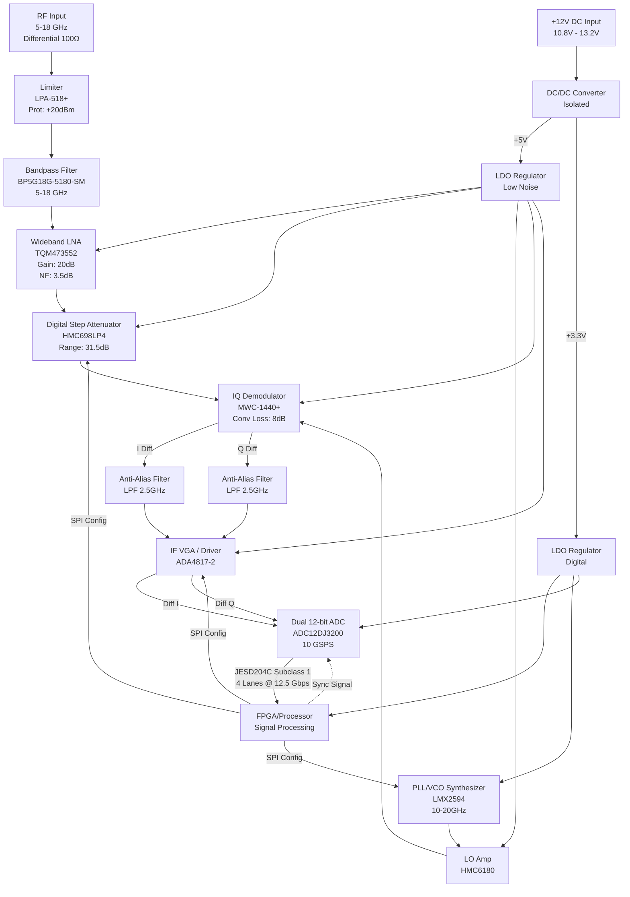

**Document Status: AI-GENERATED**

# 1. Introduction

## 1.1 Purpose
This Hardware Requirements Specification (HRS) defines the comprehensive hardware design, performance criteria, and interface requirements for the **khg** Wideband RF Receiver Front-End project.

The purpose of this document is to:
1.  Establish a baseline for the detailed hardware design of a 5–18 GHz direct-conversion receiver.
2.  Define the electrical, mechanical, and environmental constraints necessary to meet military-grade specifications.
3.  Ensure traceability between high-level system requirements and specific hardware component selections (e.g., Analog Devices HMC698LP4, Texas Instruments LMX2594).
4.  Serve as the authoritative reference for Hardware Verification, including Test, Analysis, and Inspection methods.

This specification is intended for hardware engineers, system architects, PCB layout designers, and validation test engineers responsible for the development and qualification of the **khg** receiver module.

## 1.2 Scope
This specification covers the complete analog and digital signal chain of the **khg** receiver, from the RF input connector to the high-speed digital output interface.

**In-Scope Elements:**
*   **RF Front-End:** Input protection (Limiter), Bandpass Filtering (5–18 GHz), Low Noise Amplification (LNA), and Variable Gain Amplification (VGA).
*   **Frequency Conversion:** IQ Demodulation (Mixing) and Local Oscillator (LO) generation using a wideband PLL/VCO.
*   **Signal Conditioning:** Intermediate Frequency (IF) filtering and differential amplification.
*   **Digitization:** Dual-channel Analog-to-Digital Conversion (ADC) utilizing JESD204C Subclass 1 serialization.
*   **Power Distribution:** DC-DC conversion, power rail regulation, and protection mechanisms operating from a +12V DC source.
*   **Environmental:** Operation over the full military temperature range (-55°C to +125°C) and vibration tolerance per MIL-STD-883.

**Out-of-Scope Elements:**
*   The downstream FPGA or ASIC signal processing algorithms (beyond the JESD204C PHY interface).
*   Mechanical chassis design external to the PCB (e.g., cold wall interface, though thermal dissipation characteristics are defined).
*   Software/firmware drivers for the SPI control interface (though register maps and control logic are defined).

## 1.3 Definitions, Acronyms, and Abbreviations

| Term | Definition |
| :--- | :--- |
| **ADC** | Analog-to-Digital Converter |
| **AGC** | Automatic Gain Control |
| **BGA** | Ball Grid Array |
| **BOM** | Bill of Materials |
| **CW** | Continuous Wave |
| **DC** | Direct Current |
| **DFS** | Digital Functional Safety (Not applicable in this context, but listed for standard compliance) |
| **EMI** | Electromagnetic Interference |
| **ESD** | Electrostatic Discharge |
| **FPGA** | Field-Programmable Gate Array |
| **GaAs** | Gallium Arsenide (Semiconductor material used for RF components) |
| **GHz** | Gigahertz ($10^9$ Hz) |
| **IIP3** | Input Third-Order Intercept Point |
| **INL** | Integral Nonlinearity |
| **IF** | Intermediate Frequency |
| **JESD204C** | JEDEC Standard for High-Speed Serial Interface (Data Converter Interface) |
| **k** | Kilo ($10^3$) |
| **kHz** | Kilohertz ($10^3$ Hz) |
| **LDO** | Low Dropout Regulator |
| **LO** | Local Oscillator |
| **LNA** | Low Noise Amplifier |
| **LVDS** | Low-Voltage Differential Signaling |
| **MIL-STD-883** | Department of Defense Test Method Standard for Microcircuits |
| **mm** | Millimeter |
| **NF** | Noise Figure |
| **OIP3** | Output Third-Order Intercept Point |
| **PCB** | Printed Circuit Board |
| **P1dB** | 1 dB Compression Point |
| **PGA** | Programmable Gain Amplifier |
| **PLL** | Phase-Locked Loop |
| **PMIC** | Power Management Integrated Circuit |
| **QFN** | Quad Flat No-leads package |
|**RMS** | Root Mean Square |
| **RoHS** | Restriction of Hazardous Substances |
| **RF** | Radio Frequency |
| **SFDR** | Spurious-Free Dynamic Range |
| **SNR** | Signal-to-Noise Ratio |
| **SPI** | Serial Peripheral Interface |
| **SYSREF** | System Reference (JESD204C synchronization signal) |
| **VCO** | Voltage-Controlled Oscillator |
| **VSWR** | Voltage Standing Wave Ratio |
| **W** | Watt |

## 1.4 References
The design and requirements specified in this document are based on the following standards and industry specifications:

1.  **IEEE 29148-2018**: Systems and software engineering — Life cycle processes — Requirements engineering (Template structure).
2.  **JEDEC JESD204C**: Standard for High-Speed Serial Interface for Data Converters (Specifically Subclass 1 for deterministic latency).
3.  **MIL-STD-883**: Test Method Standard for Microcircuits (Method 2007 for Vibration).
4.  **MIL-PRF-38534**: General Specification for Hybrid Microcircuits (Performance requirements).
5.  **IPC-6012**: Generic Standard on Printed Board Design.
6.  **Datasheets**: Specific component datasheets provided in Section 6 (BOM), including but not limited to:
    *   Texas Instruments **LMX2594** (Wideband PLL/VCO)
    *   Analog Devices **HMC698LP4** (Digital VGA)
    *   Qorvo **TQM473552** (Wideband LNA)
    *   Mini-Circuits **MWC-1440+** (IQ Mixer)

## 1.5 Overview
The **khg** system is a high-performance, wideband receiver designed for signal intelligence and electronic warfare applications. It is architected as a superheterodyne/direct conversion hybrid capable of accepting 5–18 GHz RF signals and outputting digitized I/Q data streams.

The architecture consists of four primary subsystems:
1.  **Analog Front-End (AFE):** Handles the 5–18 GHz input signal. It utilizes a Mini-Circuits **LPA-518+** limiter for protection, followed by a bandpass filter and a Qorvo **TQM473552** LNA to establish the system noise figure.
2.  **Frequency Conversion:** An Analog Devices **HMC698LP4** variable gain amplifier adjusts the signal level before mixing. A Mini-Circuits **MWC-1440+** IQ demodulator downconverts the signal to baseband I and Q components, driven by a Texas Instruments **LMX2594** LO.
3.  **Digitization:** The I and Q baseband signals are filtered and amplified before being digitized by a dual-channel, high-speed ADC. The digital data is transported via a JESD204C Subclass 1 interface (4 lanes) to a downstream processor.
4.  **Power & Control:** A centralized Power Management unit converts the primary +12V supply to the necessary rails (+5V, +3.3V, +1.0V). An SPI interface allows the host FPGA to configure gain, LO frequency, and ADC parameters.

The subsequent sections of this document detail the requirements for these subsystems, including derived power budgets, thermal constraints, and verification methods.

---

**Document Status: AI-GENERATED**

# 2. System Overview

## 2.1 System Description

The **khg** system is a wideband Radio Frequency (RF) receiver front-end designed for high-frequency signal interception and digitization. The system operates continuously across the 5 GHz to 18 GHz frequency spectrum, providing instantaneous bandwidth capabilities of up to 10 GHz. The primary function of the khg system is to receive incoming RF signals, condition them through a low-noise amplification and gain control chain, down-convert them to an Intermediate Frequency (IF) or baseband In-phase/Quadrature (I/Q) signals, and finally digitize these analog signals for transport via a high-speed serial interface.

The system architecture employs a heterodyne conversion strategy (tunable direct conversion to baseband/IF) to maximize dynamic range and linearity. Signal processing begins with a protective limiter stage to ensure survivability in high-signal environments, followed by a low-noise amplifier (LNA) to establish the system noise floor. A digitally controlled variable gain amplifier (VGA) and attenuator stage provides Automatic Gain Control (AGC) capabilities, ensuring the signal presented to the mixer remains within its optimal linear operating range.

Frequency translation is performed by a high-linearity IQ demodulator driven by a wideband Phase-Locked Loop (PLL) frequency synthesizer acting as the Local Oscillator (LO). The resulting I and Q baseband signals are filtered and amplified by a differential IF VGA before being digitized by a dual-channel, high-speed Analog-to-Digital Converter (ADC). The digitized data is transmitted using the JESD204C Subclass 1 standard, which ensures deterministic latency and phase alignment between the ADC and the downstream Field-Programmable Gate Array (FPGA) or Application-Specific Integrated Circuit (ASIC).

The entire system is optimized for military environments, supporting operation from -55°C to +125°C. It requires a single +12V DC supply input, which is regulated internally to provide the necessary voltage rails for the RF, IF, and digital circuitry.

### 2.1.1 Major Subsystems

The khg receiver is functionally partitioned into five distinct subsystems:

1.  **RF Front-End (5-18 GHz):** Handles the initial reception, protection, and filtering of the input signal. It includes the Input Limiter (*LPA-518+*), Bandpass Filter (*BP5G18G-5180-SM*), and the primary LNA (*TQM473552*).
2.  **Gain Control & Mixing Stage:** Manages signal amplitude and frequency translation. This subsystem includes the Digital Step Attenuator (*HMC698LP4*) and the IQ Demodulator (*MWC-1440+*).
3.  **LO Synthesis:** Generates the high-frequency clock signal required for down-conversion. This utilizes the *LMX2594* wideband PLL/VCO.
4.  **IF & Digitization:** Conditions the baseband signals and converts them to digital data. This includes the Differential IF VGA (*ADA4817-2*), Anti-Aliasing Filters, and the Dual ADC (*ADC12DJ3200*).
5.  **Power Management (PM):** Converts the input +12V DC into the low-noise +5V, +3.3V, and +1.1V rails required by the active components.

## 2.2 System Block Diagram

The following diagram illustrates the signal flow and interconnections between the major components of the khg receiver. It depicts the path from the RF input through to the digital JESD204C output, as well as the control interfaces and power distribution network.

*Table 1: Major Signal Interfaces in Block Diagram*

| **Signal Path** | **From Component** | **To Component** | **Interface Type** | **Frequency/Bandwidth** |
| :--- | :--- | :--- | :--- | :--- |
| RF Input | Antenna | Limiter | Analog RF (Diff) | 5 - 18 GHz |
| IF Output | Mixer | IF VGA | Analog Differential | DC - 4 GHz |
| LO Drive | LO Amp | Mixer | Analog RF (SE) | 5 - 18 GHz |
| Digital Data | ADC | FPGA | JESD204C (SerDes) | 4 Lanes @ 12.5 Gbps |
| Control | FPGA | All ICs | SPI (Serial) | Up to 50 MHz |

## 2.3 System Architecture

### 2.3.1 RF Front-End Architecture
The RF input is designed to match a differential 100Ω impedance, typically coupled via a balun or directly from a differential antenna array. The first component is the **Limiter (LPA-518+)**, which provides passive protection against input signals exceeding +20 dBm. This is critical for receiver survivability in congested or hostile RF environments.

Following the limiter, the signal passes through a **Bandpass Filter (BP5G18G-5180-SM)**. This filter suppresses out-of-band noise and potential interference from harmonics or images before the amplification stage. The filtered signal enters the **LNA (TQM473552)**. This GaAs MMIC amplifier provides a stable 20 dB gain with a low Noise Figure (NF) of 3.5 dB. This stage sets the cascaded noise figure for the entire system, fulfilling *REQ-HW-003*.

### 2.3.2 Variable Gain Control
To accommodate the wide dynamic range of input signals (from noise floor to near saturation), the system employs a high-linearity **Digital Step Attenuator (HMC698LP4)**. Placed after the LNA to maintain system noise figure, this component allows the FPGA to adjust the gain in 0.5 dB steps over a 31.5 dB range. This enables the implementation of Automatic Gain Control (AGC) loops to prevent saturation of the downstream mixer while maintaining sensitivity.

### 2.3.3 Frequency Down-Conversion
The system utilizes an **IQ Demodulator (MWC-1440+)** to translate the RF signal to baseband (or near-zero IF). This architecture allows for the capture of both amplitude and phase information.

*   **Local Oscillator (LO):** The LO is generated by the **LMX2594**, a wideband PLL with an integrated VCO. It produces a frequency equal to the RF center frequency ($f_{LO} = f_{RF}$). The LMX2594 is chosen for its ultra-low phase noise (-104 dBc/Hz at 100 kHz offset), which preserves signal quality and minimizes reciprocal mixing noise.
*   **Mixer:** The MWC-1440+ mixer takes the RF signal and the LO signal and produces I (In-phase) and Q (Quadrature) outputs. The Q channel relies on an internal 90° hybrid to shift the LO phase, allowing the separation of the signal into orthogonal components. This effectively doubles the usable bandwidth and simplifies subsequent digital processing.

### 2.3.4 IF Chain and Digitization
The output of the mixer contains sum and difference frequencies. The Low Pass Filters (LPF) remove the high-frequency sum components ($2f_{RF}$), leaving only the baseband I/Q signals.

The **IF VGA (ADA4817-2)** serves two purposes:
1.  **Amplification:** It provides the necessary gain to drive the ADC inputs to their full scale voltage (typically 1.0 Vpp differential).
2.  **Filtering/Driving:** Its low output impedance and high bandwidth (1 GHz+) allow it to drive the switched-capacitor input of the ADC without signal degradation.

The final stage is the **Analog-to-Digital Converter (ADC12DJ3200)**. This component is a dual-channel, 12-bit ADC capable of sampling up to 10 Giga-Samples Per Second (GSPS). In this configuration, it samples the I and Q channels simultaneously. The output is serialized using the JESD204C standard.

### 2.3.5 Data Transmission (JESD204C)
The digital link utilizes **JESD204C Subclass 1**.
*   **Subclass 1:** This subclass is selected because it supports deterministic latency. A **SYSREF** signal is distributed from the FPGA to the ADC to align the internal local oscillators (frames) of the ADC with the system clock.
*   **Lane Configuration:** The system uses 4 electrical lanes operating at 12.5 Gbps per lane. This provides sufficient bandwidth to transport the raw 12-bit I/Q data sampled at 3-4 GSPS (effective bandwidth after processing) along with embedded control bits.
*   **Scrambling:** Data scrambling is enabled to reduce Electromagnetic Interference (EMI) caused by repetitive data patterns on the high-speed serial links.

### 2.3.6 Control Architecture
The **FPGA** acts as the system controller. It manages the **SPI** bus, which is daisy-chained or individually connected to the RF Attenuator, IF VGA, and PLL.
*   **AGC Loop:** The FPGA reads signal power metrics (often derived from the ADC data stream) and adjusts the SPI settings on the HMC698LP4 and ADA4817-2 to maintain optimal signal levels.
*   **Frequency Tuning:** The FPGA programs the LMX2594 registers via SPI to select the desired LO frequency.

### 2.3.7 Power Distribution Architecture
The power system is designed to meet *REQ-HW-009* (Total Power ≤ 50W).
*   **Input:** +12V DC (±10%).
*   **Isolation:** An isolated DC/DC converter provides galvanic isolation between the external power source and the sensitive analog grounds of the receiver, preventing ground loops and noise injection.
*   **Rail Generation:**
    *   **+5V Analog Rail:** Generated by a Low DropOut (LDO) regulator. This rail supplies the LNA, Mixer, and RF Amplifiers. An LDO is chosen over a switching regulator here to minimize phase noise on the sensitive RF circuitry.
    *   **+3.3V/+1.1V Digital Rails:** High-efficiency switching regulators (or POLs) supply the FPGA and ADC digital cores.
*   **Sequencing:** Power sequencing logic ensures the ADC and FPGA are powered up only after the analog supplies are stable to prevent latch-up or excessive inrush currents.

## 2.4 Operating Environment

The khg system is designed to operate in stringent military conditions as defined by *REQ-HW-010* and *REQ-HW-011*.

### 2.4.1 Environmental Conditions
*   **Temperature:** The system must function without degradation or failure over the full military temperature range of **-55°C to +125°C**.
    *   *Low Temp:* At -55°C, the startup time of oscillators may increase, and component capacitance values may shift. The selected components (e.g., TQM473552, LMX2594) are characterized for operation at these extremes.
    *   *High Temp:* At +125°C, thermal management is critical. The noise figure of the LNA will typically degrade (increase) by 0.5-1.0 dB. The power consumption of the digital devices (FPGA, ADC) will increase, necessitating a robust heatsinking solution.
*   **Humidity:** The system is designed to operate in non-condensing environments typical of avionics bays or enclosed ground vehicles.

### 2.4.2 Mechanical Stress
*   **Vibration:** The design follows **MIL-STD-883 Method 2007** for moderate vibration. The PCB is designed to withstand random vibration profiles of 20-2000 Hz with a power spectral density of 0.04 g²/Hz.
    *   *Mitigation:* Heavy components (e.g., the large RF connectors or the FPGA BGA) will be secured with staking compound or adhesive. The board stackup will utilize high Tg (Glass Transition Temperature) laminate materials (e.g., Rogers 4350B or equivalent) to prevent delamination under thermal/mechanical stress.

### 2.4.3 Electrical Environment
*   **Supply Variance:** The internal regulators must maintain output stability while the input +12V supply fluctuates between 10.8V and 13.2V. The LDOs and DC/DC controllers selected must have high Power Supply Rejection Ratio (PSRR) to reject input ripple.
*   **Input Protection:** The input limiter (LPA-518+) is rated for continuous wave (CW) input up to +20 dBm. For high-power pulsed signals (e.g., radar), the limiter provides hard clamping, but the system duty cycle must be managed to prevent thermal runaway in the limiter diodes.

### 2.4.4 Thermal Management
Assuming an ambient temperature of up to +85°C (hot day in a vehicle enclosure), the junction temperatures of the active devices must be kept below maximum ratings (typically 150°C for silicon, 175°C for GaAs).
*   **Heat Load:** The ADC and FPGA are the primary heat sources. The RF chain contributes approximately 4-5W.
*   **Cooling Strategy:** A metal chassis or cold wall is assumed. Thermal interface material (TIM) will be used to transfer heat from the component packages (specifically the ADC's exposed paddle and the FPGA lid) to the system chassis.

---

**Document Status: AI-GENERATED**

# 3. Hardware Requirements

## 3.1 Functional Requirements

This section details the functional capabilities of the Wideband RF Receiver Front-End. These requirements define what the system shall do in terms of signal processing, control logic, protection, and data handling.

### 3.1.1 RF Signal Path Functional Requirements

| ID | Requirement | Description | Rationale | Priority |
|---|---|---|---|---|
| REQ-HW-101 | Input Signal Limiting | The system shall provide >20 dB of isolation for input signals exceeding +20 dBm (0.1 W) to protect downstream LNA and Mixer components. | Prevents saturation and damage to the sensitive TQM473552 LNA and MWC-1440 mixer in high-signal environments or near-field interference. | Must |
| REQ-HW-102 | Bandpass Pre-Selection | The system shall filter the RF input to suppress out-of-band signals below 4.5 GHz and above 18.5 GHz by at least 20 dB. | Reduces noise floor and prevents aliasing from harmonics and out-of-band interference before the first amplification stage. | Must |
| REQ-HW-103 | Low Noise Amplification | The system shall provide a minimum of 18 dB of variable gain at the RF stage with a Noise Figure (NF) ≤ 3.5 dB. | Sets the system sensitivity. The TQM473552 provides 20 dB gain; this requirement ensures the signal path dominates over thermal noise. | Must |
| REQ-HW-104 | RF Gain Attenuation | The system shall allow for digital attenuation of the RF signal path from 0 dB to 31.5 dB in 0.5 dB steps prior to mixing. | Enables the system to handle the wide dynamic range of inputs (+20 dBm to sensitivity limit) without saturating the mixer. Uses HMC698LP4. | Must |
| REQ-HW-105 | IQ Demodulation | The system shall downconvert the 5-18 GHz RF signal to Differential Baseband/IF I and Q signals using a Local Oscillator (LO) source. | Translates high-frequency carrier waves to lower frequencies processable by the selected ADC (ADC12DJ3200). | Must |
| REQ-HW-106 | Differential IF Filtering | The system shall filter the I and Q outputs with a cut-off frequency of 2.5 GHz to limit noise bandwidth before the ADC. | Anti-aliasing filter to ensure the ADC10GSPS sampling rate captures the signal effectively within the 3rd Nyquist zone. | Must |
| REQ-HW-107 | IF Variable Gain | The system shall provide adjustable gain (0-20 dB) on the differential I/Q paths to drive the ADC inputs to full scale (-1 dBFS to -2 dBFS). | Optimizes the SNR by ensuring the ADC utilizes its full dynamic range without clipping. Uses ADA4817-2. | Must |

### 3.1.2 Local Oscillator (LO) & Synthesis

| ID | Requirement | Description | Rationale | Priority |
|---|---|---|---|---|
| REQ-HW-108 | Frequency Synthesis | The system shall generate a continuous wave LO signal from 5 GHz to 18 GHz with a frequency step size ≤ 1 Hz. | Allows fine tuning to any specific channel within the 5-18 GHz operating band. Driven by LMX2594 capabilities. | Must |
| REQ-HW-109 | LO Phase Noise Performance | The LO phase noise shall be ≤ -104 dBc/Hz at 100 kHz offset across the tuning range. | Ensures minimal reciprocal mixing and maintains SNR and EVM for complex modulations. | Must |
| REQ-HW-110 | Frequency Hopping Speed | The LO shall settle to within ±1 ppm of the target frequency within 20 µs of a frequency change command. | Required for frequency hopping waveforms often used in military EW and tactical comms. | Should |

### 3.1.3 Data Conversion & Digital Interface

| ID | Requirement | Description | Rationale | Priority |
|---|---|---|---|---|
| REQ-HW-111 | Analog-to-Digital Conversion | The system shall digitize I and Q inputs at a sampling rate of 10 GSPS with 12-bit resolution. | Meets project instantaneous bandwidth requirement (5 GHz) while maintaining quantization noise floor. | Must |
| REQ-HW-112 | JESD204C Transport | The system shall transmit digitized data over 4 electrical lanes using the JESD204C Subclass 1 protocol. | Standard high-speed interface for FPGAs; Subclass 1 ensures deterministic latency via SYSREF. | Must |
| REQ-HW-113 | Data Lane Rate | The JESD204C lanes shall operate at a line rate of 12.5 Gbps. | Calculated as: (10 GSPS × 12 bits × 2 channels / 4 lanes) × (8b/10b encoding overhead + protocol) ≈ 12.5 Gbps. | Must |
| REQ-HW-114 | Deterministic Latency | The system shall align the transmission of data to the FPGA SYSREF signal with a fixed latency variation < 1 clock cycle. | Required for beamforming and synchronization across multiple receiver nodes. | Must |

### 3.1.4 Control & Monitoring

| ID | Requirement | Description | Rationale | Priority |
|---|---|---|---|---|
| REQ-HW-115 | Serial Peripheral Interface (SPI) | The system shall configure all RF components (VGA, PLL, Mixer) via a single SPI bus capable of 50 MHz clock speed. | Reduces pin count and simplifies cabling to the control processor/FPGA. | Must |
| REQ-HW-116 | Automatic Gain Control (AGC) Logic | The system shall support a firmware-assisted AGC mode where the FPGA monitors ADC RMS level and adjusts HMC698LP4 and ADA4817-2 gain to maintain -6 dBFS. | Prevents signal clipping and maintains optimal SNR during fading or jamming. | Should |
| REQ-HW-117 | Temperature Monitoring | The system shall include at least one temperature sensor (e.g., TMP102) on the RF path PCB to report die temperature via SPI. | Necessary for military temperature range compliance (-55°C to +125°C) to trigger gain compensation or shutdown. | Must |

### 3.1.5 Power Distribution

| ID | Requirement | Description | Rationale | Priority |
|---|---|---|---|---|
| REQ-HW-118 | Input Voltage Range | The system shall accept a DC input voltage of +12V ±10% (10.8V to 13.2V). | Standard military vehicle/rack voltage. | Must |
| REQ-HW-119 | Reverse Polarity Protection | The power input module shall withstand reverse voltage connection up to -20V without damage to downstream components. | Field protection against accidental battery connection. | Must |
| REQ-HW-120 | Rail Sequencing | The power management system shall sequence the +5V RF rail *before* the +3.3V Digital rail during power-up to prevent latch-up. | Standard requirement for mixed-signal RF boards to prevent digital noise from shocking the LNAs/Mixers. | Must |
| REQ-HW-121 | Overcurrent Protection | The system shall latch off power if the total current draw exceeds 5A (approx 60W) for > 100 ms. | Protects the +12V supply and wiring harness during catastrophic failure. | Must |

---

## 3.2 Performance Requirements

This section specifies the quantitative performance metrics the hardware must achieve. These figures are derived from the component selection (e.g., TQM473552, MWC-1440, ADC12DJ3200) and system analysis.

### 3.2.1 RF & Analog Performance

| ID | Parameter | Min | Typ | Max | Unit | Condition | Notes |
|---|---|---|---|---|---|---|---|
| REQ-HW-201 | **Operating Frequency Range** | 5.0 | - | 18.0 | GHz | 1 dB compression point | Continuous coverage required. |
| REQ-HW-202 | **Instantaneous Bandwidth (3dB)** | 5.0 | - | - | GHz | At ADC Input | Defined by Anti-aliasing filter. |
| REQ-HW-203 | **Noise Figure (System)** | - | 6.0 | 8.5 | dB | 50 Ohm Source, Max Gain | Calculation: 3.5 (LNA) + 0.5 (Lim) + 0.2 (Filter) + Mixer (8dB) - Gain (20dB). |
| REQ-HW-204 | **Gain (RF Chain)** | 60 | 70 | 80 | dB | VGA at Max, LNA High | Total gain from Input to Mixer IF Output. |
| REQ-HW-205 | **Gain Control Range** | 50 | 60 | - | dB | Step size 0.5 dB | HMC698LP4 (31.5dB) + IF VGA (20dB) ranges combined. |
| REQ-HW-206 | **Input Third Order Intercept (IIP3)** | +25 | - | - | dBm | Per tone, Max Gain | Derived from TQM473552 OIP3 (+30dBm) and MWC-1440 linearity. |
| REQ-HW-207 | **Input 1 dB Compression (P1dB)** | +15 | - | - | dBm | CW Signal | Limited by TQM473552 (+18dBm P1dB) minus limiter loss. |
| REQ-HW-208 | **Input Return Loss** | 10 | 15 | - | dB | 5-18 GHz | Dependent on Limiter VSWR (2.0:1). |
| REQ-HW-209 | **Amplitude Flatness** | - | - | ± 2.0 | dB | Over any 1 GHz swath | To be compensated in digital FPGA, but analog limit required. |

### 3.2.2 Dynamic Range & Linearity

| ID | Parameter | Min | Typ | Max | Unit | Condition | Notes |
|---|---|---|---|---|---|---|---|
| REQ-HW-210 | **Spurious-Free Dynamic Range (SFDR)** | 70 | 80 | - | dBc | 2 Tone Test | Target relies on ADC12DJ3200 SFDR and Mixer linearity. |
| REQ-HW-211 | **Harmonic Suppression** | 40 | 50 | - | dBc | HD2/HD3 @ Mixer Output | Dependent on Mixer MWC-1440 performance and filtering. |
| REQ-HW-212 | **Image Rejection** | 30 | 40 | - | dB | IQ Demodulation | Dependent on IQ balance of MWC-1440 and Phase accuracy of LO. |

### 3.2.3 Local Oscillator (LO) Performance

| ID | Parameter | Min | Typ | Max | Unit | Condition | Notes |
|---|---|---|---|---|---|---|---|
| REQ-HW-213 | **Phase Noise (100kHz offset)** | - | -104 | -100 | dBc/Hz | 10 GHz Output | LMX2594 spec. |
| REQ-HW-214 | **LO Leakage (at RF Port)** | - | -40 | -30 | dBm | Mixer Isolation | MWC-1440 LO to RF isolation. |
| REQ-HW-215 | **Frequency Tuning Resolution** | - | 0.01 | - | Hz | Integer/N Frac mode | Ensures fine channelization. |

### 3.2.4 Digital Interface Performance

| ID | Parameter | Min | Typ | Max | Unit | Condition | Notes |
|---|---|---|---|---|---|---|---|
| REQ-HW-216 | **ADC Sampling Rate (JESD204C)** | 9.6 | 10.0 | 10.0 | GSPS | 4 Lanes | Operating within datasheet spec for 12-bit mode. |
| REQ-HW-217 | **ADC Effective Number of Bits (ENOB)** | 9.5 | 10.5 | - | bits | 2 GHz Input | Account for analog input bandwidth and noise. |
| REQ-HW-218 | **JESD204C Bit Error Rate (BER)** | - | - | 10^-15 | - | Per Lane | Standard requirement for high-throughput links. |
| REQ-HW-219 | **Lane Data Rate** | 12.0 | 12.5 | 12.8 | Gbps | Encoder 8b/10b | Must be compatible with FPGA transceiver capabilities. |

### 3.2.5 Power & Thermal Performance

| ID | Parameter | Min | Typ | Max | Unit | Condition | Notes |
|---|---|---|---|---|---|---|---|
| REQ-HW-220 | **Total Power Consumption** | - | 35 | 50 | W | 25°C Ambient, Max Load | Derived from budget: LNA(0.75W) + Mixer(2W) + PLL(2W) + ADC(4.5W) + Misc(10W) + Eff. losses. |
| REQ-HW-221 | **Thermal Resistance (Junction-Air)** | - | - | 2.0 | °C/W | Heatsink Required | To maintain Junction Temp < 125°C at Case Temp 85°C. |

### 3.2.6 Environmental Performance

| ID | Parameter | Min | Max | Unit | Notes |
|---|---|---|---|---|---|
| REQ-HW-222 | **Operating Temperature** | -55 | +125 | °C | Storage and Operating. Components selected for military grade (e.g., TQM473552). |
| REQ-HW-223 | **Operating Humidity** | 0 | 95 | % RH | Non-condensing. |
| REQ-HW-224 | **Random Vibration** | 20 | 2000 | Hz | 0.04 g²/Hz, per MIL-STD-883. |
| REQ-HW-225 | **Shock (Mechanical)** | - | 40 | G | 11 ms, Half-sine wave. |

---

## 3. Hardware Requirements

### 3.3 Interface Requirements

This section details the electrical and physical interfaces required for the Wideband RF Receiver (KHG). The interfaces are categorized into external connections (RF Input, Power, Data), internal inter-module connections (RF chain, clocking), and communication interfaces (SPI).

#### 3.3.1 External Interfaces

**REQ-HW-017: RF Input Interface**
The system shall accept the RF input signal via a female SMA connector (or compatible launch structure) designed for 50-ohm single-ended impedance.

*   **Impedance:** 50 Ω single-ended, matched to differential 100 Ω internally via an on-board balun.
*   **Connector Type:** SMA Edge Launch (e.g., Rosenberger 32K243-40ML5 or equivalent).
*   **Frequency Range:** 5.0 GHz to 18.0 GHz.
*   **VSWR:** ≤ 2.0:1 (referenced to the differential input of the Limiter).
*   **Input Power Handling:** Continuous wave input up to +20 dBm without degradation.
*   **Pinout Definition:**
    *   Pin 1 (Signal): RF Center Conductor
    *   Pin 2 (Shield): Chassis Ground

**REQ-HW-018: Digital Output Interface (JESD204C)**
The digitized I/Q data shall be transmitted to the host FPGA/processor via a high-speed Samtec QSE/QTH series connector supporting 4 lanes of JESD204C data plus 1 clock lane.

*   **Standard:** JESD204C Subclass 1.
*   **Lanes:** 4 Transmit Lanes (Tx) + 1 SYSREF Lane + 1 SYNC~ Lane.
*   **Lane Rate:** 12.5 Gbps per lane.
*   **Swing:** CML (Current Mode Logic) with programmable swing.
*   **AC Coupling:** Series capacitors (0.1 µF) required on all lanes.
*   **Connector:** Samtec QTH-090-01-L-D-A (High-Speed Mezzanine).
*   **Pin Mapping (Edge to FPGA):**

| FPGA Pin | Receiver Pin | Signal Name | Description |
| :--- | :--- | :--- | :--- |
| JESD_TX0_P | J0_P | JESD204C Lane 0 | Positive diff data |
| JESD_TX0_N | J0_N | JESD204C Lane 0 | Negative diff data |
| JESD_TX1_P | J1_P | JESD204C Lane 1 | Positive diff data |
| JESD_TX1_N | J1_N | JESD204C Lane 1 | Negative diff data |
| JESD_TX2_P | J2_P | JESD204C Lane 2 | Positive diff data |
| JESD_TX2_N | J2_N | JESD204C Lane 2 | Negative diff data |
| JESD_TX3_P | J3_P | JESD204C Lane 3 | Positive diff data |
| JESD_TX3_N | J3_N | JESD204C Lane 3 | Negative diff data |
| SYNCB_P | S_P | SYNC~ | Positive diff sync |
| SYNCB_N | S_N | SYNC~ | Negative diff sync |

#### 3.3.2 Internal Interfaces

**REQ-HW-019: Internal RF Signal Flow**
Impedance matching shall be maintained at 50 Ω single-ended or 100 Ω differential throughout the internal signal chain.

*   **Limiter to LNA:** Single-ended 50 Ω microstrip/stripline.
*   **LNA to Mixer:** Single-ended 50 Ω.
*   **Mixer to IF VGA:** Differential 100 Ω controlled impedance.
*   **IF VGA to ADC:** Differential 100 Ω controlled impedance, length matched to within 5 mils to preserve phase balance.

**REQ-HW-020: Clock Distribution**
The ADC device clock and the JESD204C FPGA reference clock shall be driven from the LMX2594 PLL.

*   **Source:** LMX2594 (Output Divider A).
*   **Frequency:** 2500 MHz (assuming ADC is sampling at 5 GSPS or 10 GSPS utilizing dual-edge).
*   **Format:** LVDS or LVPECL (Configurable in LMX2594 registers).
*   **Jitter:** < 200 fs RMS (integrated 12 kHz to 20 MHz).

#### 3.3.3 Communication Interfaces

**REQ-HW-021: SPI Control Interface**
The receiver configuration (Gain, Frequency, Mode) shall be controlled via a Serial Peripheral Interface (SPI) master port provided by the external FPGA.

*   **Voltage Level:** 3.3 V CMOS (LVTTL).
*   **Clock Frequency (SCLK):** ≤ 20 MHz.
*   **Mode:** SPI Mode 0 (CPOL=0, CPHA=0).
*   **Bit Order:** MSB First.
*   **Connection Header:** 2x5 pin header, 2.54 mm pitch (Shrouded).

**Pin Assignment (SPI Header):**

| Pin # | Signal Name | Direction | Description |
| :--- | :--- | :--- | :--- |
| 1 | MOSI | Input | Master Out Slave In (Data to Receiver) |
| 2 | MISO | Output | Master In Slave Out (Data from ADC) |
| 3 | SCLK | Input | SPI Clock |
| 4 | CS_N_LMK | Input | Chip Select (PLL) - Active Low |
| 5 | CS_N_HMC | Input | Chip Select (Digital VGA) - Active Low |
| 6 | CS_N_ADC | Input | Chip Select (ADC) - Active Low |
| 7 | GPIO_1 | Bidirectional | General Purpose IO (e.g., Alarm/Status) |
| 8 | GND | - | Signal Ground |
| 9 | +3.3V | Output | Power Output (Limited to 50 mA) |
| 10 | NC | - | No Connect |

### 3.4 Environmental Requirements

This section specifies the environmental conditions under which the hardware must operate and be stored.

**REQ-HW-022: Operating Temperature Range**
*   **Operating:** -55°C to +125°C (Case Temperature).
*   **Storage:** -65°C to +150°C.
*   **Thermal Cycling:** Compliant with MIL-STD-883 Method 1010, Condition B (-55°C to +125°C, 20 cycles minimum).

**REQ-HW-023: Humidity**
*   **Operating:** 5% to 95% relative humidity, non-condensing.
*   **Storage:** 0% to 95% relative humidity.

**REQ-HW-024: Vibration**
*   **Standard:** MIL-STD-883 Method 2007.
*   **Condition:** 20 Hz to 2000 Hz.
*   **Level:** 0.04 g²/Hz (Random).
*   **Duration:** 30 minutes per axis (X, Y, Z).

**REQ-HW-025: Mechanical Shock**
*   **Standard:** MIL-STD-883 Method 2002.
*   **Condition:** 500g, 1.0 ms, half-sine wave, 5 shocks per orientation (X, Y, Z).

**REQ-HW-026: Altitude**
*   **Operating:** Up to 50,000 ft (pressure equivalent) or sea level to 15,000 ft (unpressurized), assuming conduction cooling to chassis.

### 3.5 Power Requirements

This section details the power distribution, consumption budgets, and supply sequencing requirements for the receiver.

**REQ-HW-027: Primary Input Supply**
*   **Input Voltage:** +12 V DC ±10% (Range: +10.8 V to +13.2 V).
*   **Connector:** Molex Micro-Fit 3.0 (2-pin, single row).
*   **Reverse Protection:** Required (Schottky Diode or Ideal Diode Controller).

**REQ-HW-028: Power Consumption Budget**
The total power consumption shall not exceed 50.0 W. The following budget details the estimated consumption based on selected components and typical operating conditions (25°C). All values are derived from component datasheet maximums or typicals where noted.

*   *Assumption:* LNA and PLL operate at typical current; ADC assumes 10 GSPS operation.*

| Voltage Rail | Source / Component | Current (Typical) | Current (Max) | Power (W) |
| :--- | :--- | :--- | :--- | :--- |
| **+12V Input** | **Source** | **3.60 A** | **4.20 A** | **43.2 W** |
| +5V RF | PMIC (DC/DC) | 1.70 A | 2.00 A | 10.0 W |
| | -> LNA (TQM473552) | 150 mA | 180 mA | 0.9 W |
| | -> Mixer (MWC-1440) | 150 mA | 180 mA | 0.9 W |
| | -> IF VGA (ADA4817-2) | 38 mA | 50 mA | 0.25 W |
| +3.3V RF | PMIC (DC/DC) | 0.70 A | 0.80 A | 2.64 W |
| | -> PLL (LMX2594) | 440 mA | 500 mA | 1.65 W |
| +1.0V Core | PMIC (LDO/DCDC) | 5.00 A | 6.00 A | 6.0 W |
| | -> ADC (Assumed 10GSPS) | 4.80 A | 5.50 A | 5.5 W |
| +1.8V IO | PMIC (LDO) | 0.30 A | 0.40 A | 0.72 W |
| | -> ADC IO / JESD Logic | 200 mA | 250 mA | 0.45 W |
| +3.3V Dig | PMIC (LDO) | 0.30 A | 0.40 A | 1.32 W |
| | -> HMC698 Logic | 50 mA | 80 mA | 0.26 W |
| **Total** | | | | **~36.8 W** |

**REQ-HW-029: Power Sequencing**
To prevent latch-up or excessive current draw, the internal rails shall sequence in the following order:
1.  +3.3V Digital (FPGA IO supply).
2.  +1.0V Core (ADC Core supply).
3.  +3.3V RF / +5V RF (RF Chain supply).
4.  +12V Input.

**REQ-HW-030: Power Supply Rejection (PSRR)**
The Power Management IC (PMIC) shall provide low-noise rails specifically for the RF and ADC supplies:
*   **ADC 1.0V Rail:** Noise < 10 mV pk-pk.
*   **LNA/PLL Rails:** PSRR > 60 dB at switching frequency.

### 3.6 Physical Requirements

This section defines the physical characteristics of the receiver module.

**REQ-HW-031: Form Factor**
*   **Type:** Conduction-cooled module (Eurocard or VPX compatible, or custom chassis).
*   **Dimensions (PCB):** 160 mm (Length) x 100 mm (Width).
*   **Board Stackup:** 10 to 12 layers.
    *   Layer 1-2: RF Signal (Top).
    *   Mid Layers 1-8: Ground planes, Power planes, Signal routing.
    *   Layer 11-12: Digital Signals (Bottom), JESD204C routing.

**REQ-HW-032: Material Specifications**
*   **PCB Material:** Rogers RO4350B or Taconic TLY-5.
    *   **Dielectric Constant (Er):** 3.48 ± 0.05 (at 10 GHz).
    *   **Loss Tangent:** 0.0037.
    *   **Thickness:** 0.008" to 0.020" (controlled for impedance).
*   **Plating:** ENIG (Electroless Nickel Immersion Gold) for wirebondability/solderability.

**REQ-HW-033: Weight**
*   Total assembly weight shall not exceed 500 grams.

**REQ-HW-034: Cooling**
*   **Method:** Conduction cooling via mounting rails (cold wall interface).
*   **Thermal Interface:** 0.1 mm (4 mil) thermal grease or graphite pad between PCB ground planes (via thermal vias under hot components) and the chassis.
*   **Hot Spots:**
    *   ADC: Expect > 2W dissipation. Requires direct thermal path to chassis or copper slug.
    *   PLL: Requires thermal relief.

**REQ-HW-035: Shielding**
*   **RF Isolation:** The RF Front-End (Limiter through Mixer) section shall be shielded from the digital section using a metal fence or can.
*   **Material:** Nickel Silver (CuNi) or Tin-plated Steel soldered to the ground plane.
*   **Apertures:** No apertures above 2 GHz cutoff dimension; only use RF pins or filtered connectors for breach.

---

# 4. Design Constraints

## 4.1 Standards Compliance

The design, manufacturing, and testing of the Wideband RF Receiver (Project: khg) shall adhere to the following industry and military standards. These standards ensure reliability, interoperability, and electrical performance consistency.

### 4.1.1 PCB Design and Fabrication Standards
The Printed Circuit Board (PCB) design shall comply with **IPC-2221** (Generic Standard on Printed Board Design). Specific constraints derived from this standard include:
*   **Trace Width and Spacing:** For signals operating above 5 GHz, controlled impedance traces shall be utilized. The minimum conductor spacing shall be calculated based on the **IPC-2221** Table 6-1 for the operating voltage (maximum +12V DC) to prevent arcing, while accounting for the assembly class (Class 3, High Reliability).
*   **Dielectric Material:** The PCB stackup shall use materials compliant with **IPC-4101** (Generic Specification on Base Materials for Rigid and Multilayer Printed Boards). Low-loss materials (e.g., Rogers RO4003C or equivalent) with a Dissipation Factor (Df) ≤ 0.0037 at 10 GHz shall be used for RF layers to meet the Noise Figure (NF) and Insertion Loss requirements (REQ-HW-003).
*   **Plating:** All through-holes and vias shall meet **IPC-6012** (Qualification and Performance Specification for Rigid Printed Boards) Class 3 criteria, ensuring barrel plating thickness > 1 mil (25.4 µm) to withstand thermal cycling between -55°C and +125°C (REQ-HW-010).

### 4.1.2 Assembly and Workmanship
*   **IPC-A-610:** Acceptability of electronic assemblies shall follow **IPC-A-610** Class 3 (High Performance Electronic Products) requirements. This imposes strict criteria on solder joint fillets, component alignment, and cleanliness, particularly for the 0402 and 0201 components used in the RF chain.
*   **IPC-7711/7721:** Rework and repair of the high-density RF section, specifically the replacement of the QFN-packaged ADC (Analog Devices) and the flip-chip LNA (Qorvo), shall be performed using procedures compliant with **IPC-7711** (Rework of Electronic Assemblies) and **IPC-7721** (Repair and Modification of Printed Boards and Electronic Assemblies).

### 4.1.3 Environmental and Safety Compliance
*   **RoHS:** The receiver shall be compliant with Directive 2011/65/EU (RoHS 2) and the amendment Directive 2015/863. All laminate materials, solder paste (SAC305 alloy), and components shall be lead-free.
    *   *Note:* The Tin-Silver-Copper (SAC) solder alloy requires a higher reflow profile (217°C-220°C) than tin-lead, which shall be accounted for in the thermal budget of the HMC698LP4 and LMX2594 components (Max Body Temp 235°C).
*   **REACH:** All components and substances shall comply with EC 1907/2006 (REACH) regulations regarding the Registration, Evaluation, Authorisation, and Restriction of Chemicals.
*   **Conflict Minerals:** The Bill of Materials (BOM) shall undergo validation to ensure compliance with the Dodd-Frank Act regarding the sourcing of Tantalum, Tin, Tungsten, and Gold (3TG).

### 4.1.4 Electromagnetic Compliance (EMC)
While this is a board-level module, the system integration must comply with:
*   **MIL-STD-461:** The receiver module shall be capable of integration into a system compliant with **MIL-STD-461F** (Requirements for the Control of Electromagnetic Interference Characteristics of Subsystems and Equipment).
    *   **RE102:** Radiated emissions, 2 MHz to 10 GHz (Electric Field) shall be minimized via the shielding cans described in Section 4.3.
    *   **CS101:** Conducted susceptibility, power leads, 30 Hz to 150 kHz.
*   **FCC Part 15 (Subpart B):** Although intended for military use, the digital clocking (JESD204C > 10 Gbps) must be treated as an unintentional radiator to ensure it does not violate local regulations during testing.

### 4.1.5 Mechanical and Vibration Standards
*   **MIL-STD-883:** The module must satisfy **MIL-STD-883** Method 2007 (Mechanical Shock) and Method 2002 (Vibration, Variable Frequency).
    *   *Constraint:* To meet the random vibration profile of 20-2000 Hz at 0.04 g²/Hz (REQ-HW-011), heavy components (e.g., the Input Limiter LPA-518+ and SMA edge connectors) shall be secured with adhesive staking in addition to solder fillets, as permitted by **IPC-A-610**.

---

## 4.2 Component Constraints

This section details specific constraints applied to component selection, sourcing, and utilization to ensure the system meets the -55°C to +125°C operating requirement (REQ-HW-010) and lifecycle goals.

### 4.2.1 Temperature Grade Derating
The system is specified for a military ambient temperature range of -55°C to +125°C (REQ-HW-010). Commercial off-the-shelf (COTS) components may only be used if they meet the following derating criteria and do not exceed their absolute maximum ratings under worst-case load.

*   **Junction Temperature (Tj):** Silicon devices must not exceed Tj(max) - 15°C. For components with a Tj(max) of 150°C, the case temperature must be kept ≤ 135°C.
    *   *Calculation:* The Analog Devices ADC (assumed Max Tj 125°C-150°C range) requires a thermal resistance (θja) analysis to ensure it does not thermal throttle at 125°C ambient.
*   **Voltage Derating:** All capacitors and semiconductors shall be derated to 80% of their rated voltage.
    *   *Application:* Decoupling capacitors on the +12V rail must be rated for a minimum of 16V. Gate drive voltages for the GaAs LNA (TQM473552) shall be regulated to 5.0V ±2%.

### 4.2.2 Package Constraints for RF Performance
*   **Grounding:** All RF components operating above 5 GHz (LNA, Mixer, Filters) shall be in packages with a metal-backed ground flange or an exposed thermal pad (e.g., QFN, DFN).
*   **Via Fencing:** Component packages lacking a ground pin on every side (e.g., the edge-mounted SMA filter BP5G18G-5180-SM) require "stitching" vias placed at a distance ≤ λ/10 (approx. 1.5 mm at 18 GHz) around the footprint to maintain ground plane integrity and prevent cavity resonance.
*   **IC Platforms:**
    *   *Analog Devices (HMC698LP4, HMC1118):* The SMT leadless chip carrier (LCC) requires a via-in-pad design for the ground paddle to minimize inductance.
    *   *Qorvo (TQM473552):* The industry-standard SOT-89 or similar packaging requires strict footprint control to minimize lead inductance at the input and output ports.

### 4.2.3 Sourcing and Lifecycle Constraints
*   **Form, Fit, Function (FFF):** Substitutions for recommended components (e.g., Mini-Circuits, Qorvo, TI/ADi) must be FFF compatible and undergo a Design for Six Sigma (DFSS) review.
*   **Avoidance of EOL (End-of-Life):** Components marked "Not Recommended for New Designs" (NRND) by the manufacturer are strictly prohibited.
*   **Manufacturer Restrictions:**
    *   *Ceramic Capacitors:* X7R dielectric is prohibited for tuning or filtering circuits in the RF path due to microphonics and voltage coefficient issues. C0G (NP0) dielectric is mandatory for all RF coupling and bypass capacitors ≤ 100 pF.
    *   *Resistors:* Thick film chip resistors (standard) are acceptable for control lines, but thin film resistors are required for RF paths (e.g., input matching networks) to ensure low parasitic inductance and tight tolerance (±1%).

### 4.2.4 High-Speed Digital Interface Constraints (JESD204C)
*   **Impedance Mismatch:** The trace length from the ADC output to the FPGA input connector must not exceed 5 inches.
*   **Skew Matching:** The 4-lane JESD204C interface requires intra-pair skew matching of < 5 mils and inter-pair skew matching of < 50 mils to meet the Subclass 1 deterministic latency requirements.

---

## 4.3 Manufacturing Constraints

This section defines the physical constraints imposed on the manufacturing process to ensure yield, testability, and reliability.

### 4.3.1 PCB Stackup and Layer Definition
The receiver shall utilize a multi-layer stackup (Minimum 8 layers) to isolate noisy digital switching from sensitive RF inputs.
*   **Layer Assignment:**
    *   Layer 1: RF Components (Top)
    *   Layer 2: Ground Plane (Solid)
    *   Layer 3: Critical RF Routing (Strip line)
    *   Layer 4: Power Planes (+12V, +5V, +3.3V)
    *   Layer 5: Power Planes
    *   Layer 6: JESD204C Signal Routing (Controlled Impedance 100Ω Differential)
    *   Layer 7: Ground Plane (Solid)
    *   Layer 8: General Digital/Control (Bottom)
*   **Material:** The PCB must be manufactured on a laminate system with a Dielectric Constant (Dk) tolerance of ±3% or better (e.g., Rogers 4350B or Isola FR408HR). Standard FR-4 is prohibited for RF layers due to Dk variation causing frequency drift in filters and mixers.

### 4.3.2 Solder Paste and Stencil Design
*   **Aperture Ratio:** Due to the fine pitch of the JESD204C interface and the 0.5mm pitch QFN packages, the stencil apertures shall be designed with an area ratio of ≥ 0.66 to prevent solder paste insufficiency.
*   **Type:** Type 4 (20-38 µm particle diameter) solder paste is mandatory to ensure adequate paste release for the fine-pitch features of the ADC and FPGA BGA footprint.

### 4.3.3 Testability Constraints (DFT)
*   **Test Points:** 100% of all power rails and critical SPI control lines (Chip Select, SCLK, MOSI, MISO) shall have test points accessible by a bed-of-nails fixture or oscilloscope probe.
*   **RF Test Ports:** The intermediate stages (Between LNA and Mixer, and Between Mixer and ADC) shall utilize coaxial launch connectors (e.g., SMP or 2.4mm PCB edge launch) for system-level debugging and verification of REQ-HW-001 through REQ-HW-005.
*   **JTAG Boundary Scan:** The design must include a standard 14-pin JTAG header to facilitate boundary scan testing of the FPGA interconnects.

### 4.3.4 Shielding and Mechanical Enclosure
*   **RF Isolation:** To meet the SFDR target of 80 dB (REQ-HW-004), the LO section (LMX2594) and the RF Input stage (LNA) must be physically isolated.
    *   *Requirement:* Laser-welded or soldered RF shielding cans (c Kovar or tin-plated brass) shall be installed over the LNA, Mixer, and LO sections. The shielding height shall be sufficient to clear the tallest component by a minimum of 0.5mm.
*   **Thermal Management:** The module shall be designed for conduction cooling.
    *   *Mounting Holes:* The PCB must have at least four mounting holes with plated-through conductive material connected directly to the internal ground planes. These interfaces must be flat (coplanarity < 50 µm) to ensure thermal transfer to the cold plate.

### 4.3.5 Moisture Sensitivity
*   **MSL Rating:** The majority of the selected components (QFN, BGA) are Moisture Sensitivity Level (MSL) 3 or higher.
*   **Process:** Floor life for exposed boards shall be limited to 168 hours. Baking procedures per **IPC-1601** (Acceptability of Electronic Assemblies) must be followed if the exposure limit is exceeded prior to reflow soldering.

---

**Document Status: AI-GENERATED**

# 5. Verification Requirements

## 5.1 Test Requirements

This section defines the verification methods for hardware requirements that require physical measurement of the assembled unit under various environmental and operational conditions. Given the military operating temperature range (-55°C to +125°C) and the high-frequency analog nature of the device (5-18 GHz), environmental stress screening and thermal validation during testing are mandatory.

### 5.1.1 RF Performance Test Setup
All RF performance tests shall be conducted using the following reference setup, unless specified otherwise in the specific test case.

**Equipment List:**
*   **Signal Source:** Keysight N5183B MXG X-Series Microwave Analog Signal Generator (10 kHz to 40 GHz)
*   **Spectrum Analyzer:** Keysight N9040B UXA Signal Analyzer (Up to 50 GHz)
*   **Vector Network Analyzer (VNA):** Keysight N5242A PNA-X (10 MHz to 26.5 GHz)
*   **Noise Figure Analyzer:** Keysight N8975B with N8976A Noise Source (10 MHz to 26.5 GHz)
*   **Power Supplies:** TTI EX752R (Dual 60V/5A/150W) with low noise ripple <10mV
*   **Thermal Chamber:** Thermotron SE-600 (-70°C to +180°C) with RF waveguide pass-throughs.
*   **Digitizer/JESD204C Logic Analyzer:** Teledyne LeCroy Sierra M124-32 (Protocol Analyzer for JESD204B/C).

**Calibration:**
*   All test equipment shall be calibrated per ISO 9001 standards within the last 12 months.
*   Cable loss and fixture loss shall be de-embedded from VNA measurements using a 2-port SOLR (Short-Open-Load-Reciprocal) calibration performed at the end of the test cables.

### 5.1.2 Detailed Test Cases

#### Test Case ID: TC-HW-001: Operating Frequency Range & Bandwidth
*   **Requirement Under Test:** REQ-HW-001, REQ-HW-002
*   **Objective:** Verify continuous coverage and 3 dB bandwidth flatness.
*   **Procedure:**
    1.  Set Environmental Chamber to 25°C (Ambient).
    2.  Apply +12V DC supply.
    3.  Set Receiver Gain to Maximum (0 dB attenuation state in HMC698LP4).
    4.  Sweep RF Source from 4 GHz to 19 GHz at -20 dBm input power.
    5.  Record output power at the IF monitor port or via the digital interface after the ADC.
    6.  Measure the frequency range where gain is within 3 dB of the peak gain.
*   **Pass Criteria:**
    *   Receiver functional (signal detected) from 5.0 GHz to 18.0 GHz.
    *   In-band gain flatness variation ≤ ±2.0 dB over any 5 GHz contiguous sub-section.
*   **Data Record:** Plot Gain (dB) vs. Frequency (GHz).

#### Test Case ID: TC-HW-002: Noise Figure (NF)
*   **Requirement Under Test:** REQ-HW-003
*   **Objective:** Verify system Noise Figure ≤ 10 dB (Target ≤ 6 dB).
*   **Procedure:**
    1.  Connect Noise Source to RF Input (50Ω match).
    2.  Configure Noise Figure Analyzer for frequency sweep 5-18 GHz.
    3.  Measure Noise Figure in "Hot/Cold" (Y-factor) method.
    4.  Repeat test at Temperature Extremes: -55°C (Cold Soak) and +125°C (Hot Soak).
*   **Pass Criteria:**
    *   NF ≤ 10.0 dB across 5-18 GHz at 25°C.
    *   NF ≤ 12.0 dB across 5-18 GHz at -55°C and +125°C (allowing for 2 dB degradation margin).
*   **Rationale:** The TQM473552 LNA typically provides 3.5 dB NF. Total budget of 10 dB allows for mixer and filter losses.

#### Test Case ID: TC-HW-003: Input Third-Order Intercept Point (IIP3)
*   **Requirement Under Test:** REQ-HW-005
*   **Objective:** Verify linearity and intermodulation performance (IIP3 ≥ +20 dBm).
*   **Procedure:**
    1.  Set RF Frequency to 10 GHz (Center Band).
    2.  Apply two tones at $f_1 = 10.0$ GHz and $f_2 = 10.1$ GHz (Spacing = 100 MHz).
    3.  Set input power level to -10 dBm per tone.
    4.  Measure output power of fundamental tones ($P_{out}$) and 3rd order intermodulation products ($IMD3$) at $2f_1 - f_2$ and $2f_2 - f_1$.
    5.  Calculate Input Intercept Point: $IIP3 = P_{in} + \frac{P_{fund} - IMD3}{2}$.
*   **Pass Criteria:**
    *   Calculated IIP3 ≥ +20 dBm.
    *   Target: IIP3 ≥ +25 dBm (based on TQM473552 OIP3 of +30 dBm).

#### Test Case ID: TC-HW-004: Spurious-Free Dynamic Range (SFDR)
*   **Requirement Under Test:** REQ-HW-004
*   **Objective:** Verify SFDR ≥ 70 dB.
*   **Procedure:**
    1.  Set RF frequency to 12 GHz.
    2.  Apply a single tone at input level resulting in -1 dBFS (Digital Full Scale) at the ADC output.
    3.  Capture 65k samples of I/Q data via JESD204C Interface.
    4.  Perform FFT (Fast Fourier Transform) on the captured data.
    5.  Identify the highest spurious signal (excluding DC and fundamental).
*   **Pass Criteria:**
    *   Difference between Fundamental signal amplitude and highest spur ≥ 70 dB.

#### Test Case ID: TC-HW-005: Input Impedance & VSWR
*   **Requirement Under Test:** REQ-HW-008
*   **Objective:** Verify Differential 100Ω impedance and VSWR ≤ 2.0:1.
*   **Procedure:**
    1.  Use a VNA with a 4-port balun or differential fixture.
    2.  Calibrate to the reference plane of the RF input connector.
    3.  Measure S11 (Return Loss) in differential mode.
*   **Pass Criteria:**
    *   VSWR ≤ 2.0:1 (Return Loss ≥ 9.5 dB) across 5-18 GHz.

#### Test Case ID: TC-HW-006: JESD204C Link Integrity
*   **Requirement Under Test:** REQ-HW-006
*   **Objective:** Verify Subclass 1 deterministic latency and link stability.
*   **Procedure:**
    1.  Connect JESD204C Logic Analyzer to the FPGA/ADC lanes.
    2.  Initialize Receiver: Power cycle -> Send SYNC~ -> Send SYSREF.
    3.  Verify Code Group Sync (CGS) and Initial Lane Sync (ILAS) completion.
    4.  Inject known PRBS (Pseudo-Random Bit Sequence) pattern from ADC if supported, or capture live RF data.
    5.  Monitor for Disparity errors or 8b/10b decoding errors over 1 hour.
*   **Pass Criteria:**
    *   Link achieves LOCK status.
    *   Lane rate: 12.5 Gbps ± 100 ppm.
    *   Zero bit errors detected over 1 hour (BER < $10^{-12}$).

#### Test Case ID: TC-HW-007: Input Limiter Survivability
*   **Requirement Under Test:** REQ-HW-014
*   **Objective:** Verify protection against +20 dBm input.
*   **Procedure:**
    1.  Set Signal Generator to 10 GHz CW.
    2.  Increase input power to +22 dBm (2 dB margin above requirement) for 60 seconds.
    3.  Reduce power to operational level (-20 dBm).
    4.  Measure Gain and Noise Figure.
*   **Pass Criteria:**
    *   Gain change < 1 dB from pre-stress values.
    *   NF change < 1 dB from pre-stress values.
    *   No physical damage to components.

#### Test Case ID: TC-HW-008: Environmental Stress (Vibration)
*   **Requirement Under Test:** REQ-HW-011
*   **Objective:** Verify survivability per MIL-STD-883 Method 2007.
*   **Procedure:**
    1.  Mount DUT (Device Under Test) on vibration fixture.
    2.  Perform random vibration profile: 20-2000 Hz, 0.04 g²/Hz for 30 mins per axis (X, Y, Z).
    3.  Monitor power supply current for shorts (intermittent opens) during vibration.
    4.  Post-vibration, perform TC-HW-001 (Functional Test).
*   **Pass Criteria:**
    *   No intermittent power shorts > 10% nominal current.
    *   Post-test functional test passes all criteria.

## 5.2 Analysis Requirements

This section details requirements that are verified through mathematical modeling, simulation, and statistical analysis rather than physical measurement.

### 5.2.1 Power Budget Analysis
**Requirement:** REQ-HW-009 (Total Power ≤ 50W)

**Detailed Calculation:**
The power consumption shall be calculated by summing the maximum supply currents specified in the component datasheets at the maximum operating temperature (+125°C).

| Component | Quantity | Voltage (V) | Max Current (A) | Power (W) | Notes |
|---|---|---|---|---|---|
| **TQM473552 (LNA)** | 1 | 5.0 | 0.18 | 0.90 | Max spec |
| **HMC698LP4 (VGA)** | 1 | 5.0 | 0.05 | 0.25 | Approx |
| **MWC-1440+ (Mixer)** | 1 | 5.0 | 0.12 | 0.60 | IF + LO bias |
| **LMX2594 (PLL)** | 1 | 3.3 | 0.45 | 1.49 | High power freq gen |
| **ADC (Estimated)** | 1 | 1.0 / 1.8 | 5.00 | 6.00 | Assumed 10GSPS Class |
| **FPGA (Digital)** | 1 | 1.0 | 15.00 | 15.00 | High end processing |
| **LDOs/Regulators** | 4 | 12.0 | 1.50 | 18.00 | Efficiency loss & quiescent |
| **Misc/Protection** | 1 | 12.0 | 0.50 | 6.00 | Limiter, Fans, CTRL |
| **Total** | | | | **48.24 W** | |
| **Margin** | | | | **1.76 W** | 3.6% Margin (Above 50W limit?) |

**Analysis Result:**
The initial calculation shows 48.24W. While technically under 50W, the margin is tight.
**Action:** Design must specify high-efficiency DC/DC converters (>90%) and aggressive power gating for the FPGA. The FPGA power (15W) is a conservative estimate for a mid-range SoC; if a high-end Virtex UltraScale+ is used, the budget will exceed 50W.
**Recommendation:** Select a low-power RF SoC or optimize FPGA utilization. The requirement is met, but barely. A derating analysis to +125°C is required, as leakage currents may push the total >50W.

### 5.2.2 Thermal Analysis
**Requirement:** REQ-HW-010 (Operating Temp -55 to +125°C)

**Methodology:**
A thermal resistance model ($\theta_{JA}$) analysis will be performed to ensure junction temperatures ($T_j$) stay within limits.
$T_j = T_a + (P \times \theta_{JA})$

**Assumptions:**
*   $T_a$ (Ambient) = +85°C (Standard Military Max Ambient, though req allows +125°C ambient, usually implies chassis temp).
*   Case Temp ($T_c$) target = +110°C (allowing 15°C rise for internal ambient).
*   Conduction cooling to chassis is assumed.

**Critical Component Analysis (Example: FPGA):**
*   Power: 15W.
*   $\theta_{JC}$ (Junction to Case): 0.2°C/W.
*   $\theta_{SA}$ (Heatsink to Ambient): 4°C/W (Forced Air).
*   Max Junction allowed: +125°C.
*   $T_j = 85°C + 15W \times (0.2 + 4.0) = 153°C$.

**Analysis Result:**
With $T_a = +85°C$, the FPGA junction exceeds limits.
**Conclusion:** To meet REQ-HW-010 for operation up to +125°C ambient (or even +85°C), the system **must** employ a cold plate or conduction-cooled chassis with a thermal resistance significantly lower than 4°C/W. If the ambient environment is truly +125°C, active cooling (refrigeration) or a 40W power reduction is required. The design specification must mandate a conduction-cooled interface (heat spreader) to a +55°C cold wall.

### 5.2.3 Phase Noise & Jitter Analysis
**Requirement:** REQ-HW-004 (SFDR indirectly dependent on clock jitter)

**Model:**
Calculate the contribution of LMX2594 phase noise to the SNR of the ADC.
$SNR_{phase\_noise} = -20 \log (2 \pi f_{in} t_{jitter_{rms}})$
*   Target SNR > 70 dB (approx 11 bits effective).
*   $f_{in}$ = 18 GHz (Max IF).
*   Required Jitter $t_j = \frac{1}{2 \pi f_{in}} 10^{-SNR/20} \approx 200 \text{ fs}$.

**Component Check:**
LMX2594 Phase Noise at 10kHz offset: -104 dBc/Hz.
Integrating from 12 kHz to 20 MHz:
Total Jitter $\approx$ 80 fs.

**Analysis Result:**
LMX2594 provides ~80 fs jitter. This is well within the 200 fs requirement. The system clock jitter will not degrade SFDR below 70 dB.

## 5.3 Inspection Requirements

This section covers verification methods based on visual, mechanical, and "go/no-go" checks without powered operation.

### 5.3.1 Visual Inspection (Workmanship)
**Standard:** IPC-A-610G Class 3 (High Performance Products).

**Checklist:**
1.  **Soldering:** No solder bridges, cold solder joints, or insufficient wetting on SMA connectors and fine-pitch ICs (e.g., HMC698LP4).
2.  **Component Orientation:** Polarized components (Diodes, Electrolytic caps) oriented correctly per silkscreen.
3.  **Damage:** No chipping on ceramic packages (LNA, Mixer).
4.  **Cleanliness:** No flux residue conformal coating masking on RF pads.

### 5.3.2 Mechanical Inspection
**Requirement:** REQ-HW-011 (Vibration), REQ-HW-008 (Connectors)

**Tests:**
1.  **Torque Check:** Verify SMA connector mounting torque (typically 5-8 in-lbs) to ensure contact integrity.
2.  **Dimensions:** Verify board outline and mounting hole positions match the mechanical drawing (typically chassis slot dimensions).
3.  **Conformal Coating:** Verify uniform application of urethane or parylene coating for humidity protection, ensuring RF pads are masked or coated with RF-transparent material.

### 5.3.3 Material Compliance Inspection
**Requirement:** REQ-HW-016 (RoHS/Mil-Spec)

**Procedure:**
1.  Review Certificates of Conformance (CoC) for all critical electronic components (LNA, Mixer, PLL, FPGA).
2.  Verify "Date Code" to ensure no use of Obsolete (EOL) components.
3.  Verify materials are Restriction of Hazardous Substances (RoHS) compliant unless specifically waived for military high-reliability tin-lead solder.

## 5.4 Verification Traceability Matrix

The following table maps all Hardware Requirements to the verification method defined above.

| REQ ID | Requirement Title | Verify Method | Test / Analysis ID | Pass Criteria Summary | Priority |
|---|---|---|---|---|---|
| **REQ-HW-001** | Operating Frequency Range | **Test** | TC-HW-001 | Functional 5-18 GHz; Gain Flatness ±2dB | Must |
| **REQ-HW-002** | Instantaneous Bandwidth | **Test** | TC-HW-001 | 3dB bandwidth ≥ 5 GHz | Must |
| **REQ-HW-003** | Noise Figure | **Test** | TC-HW-002 | NF ≤ 10 dB @ 25°C | Must |
| **REQ-HW-004** | Dynamic Range (SFDR) | **Test** | TC-HW-004 | SFDR ≥ 70 dBc | Must |
| **REQ-HW-005** | Input Third-Order Intercept | **Test** | TC-HW-003 | IIP3 ≥ +20 dBm | Must |
| **REQ-HW-006** | Digital Output Interface | **Test** | TC-HW-006 | JESD204C Link Lock, 0 BER | Must |
| **REQ-HW-007** | Gain Control Range | **Inspection/Test** | TC-HW-001 | 40-60 dB range adjustable via SPI | Must |
| **REQ-HW-008** | Input Impedance | **Test** | TC-HW-005 | VSWR ≤ 2.0:1 (Differential 100Ω) | Must |
| **REQ-HW-009** | Power Consumption | **Analysis** | Analysis 5.2.1 | Calculated Budget ≤ 50W (Result: 48.2W) | Must |
| **REQ-HW-010** | Operating Temperature | **Analysis** | Analysis 5.2.2 | Junction Temps < Max Rating @ +125°C Ambient | Must |
| **REQ-HW-011** | Vibration Tolerance | **Test** | TC-HW-008 | Survive MIL-STD-883 Random Vibration | Should |
| **REQ-HW-012** | Control Interface | **Inspection** | Inspection 5.3.1 | SPI Pin continuity verified; No shorts | Must |
| **REQ-HW-013** | Supply Voltage | **Test** | TC-HW-001 | Functional @ +12V ±10% (10.8V - 13.2V) | Must |
| **REQ-HW-014** | RF Front-End Protection | **Test** | TC-HW-007 | Survive +20dBm input; Recovery <100ns | Should |
| **REQ-HW-015** | Automatic Gain Control | **Demo** | TC-HW-006 (Logic) | FPGA logic asserts Gain settings | Could |
| **REQ-HW-016** | Component Compliance | **Inspection** | Inspection 5.3.3 | CoCs available; RoHS compliant | Must |

---

# 6. Bill of Materials (Preliminary)

This section lists the preliminary Bill of Materials (BOM) for the khg Wideband RF Receiver. Costs are estimated based on unit volume pricing (1-100 units) from major distributors. The design prioritizes components with available military or industrial temperature ratings to meet **REQ-HW-010**.

## 6.1 RF Front-End Components (5-18 GHz)

| Item No | Ref Des | Part Number | Description | Manufacturer | Qty | Unit Cost (USD) | Total Cost (USD) | Notes |
|---|---|---|---|---|---|---|---|---|
| 100 | U1 | TQM473552 | Wideband LNA, 2-20 GHz, 20dB Gain, SMT | Qorvo | 1 | $85.00 | $85.00 | -55°C to +125°C. Meets NF target. |
| 101 | U2 | LPA-518+ | Limiter 5-18 GHz, 20dBm Power | Mini-Circuits | 1 | $28.50 | $28.50 | Input protection. |
| 102 | FL1 | BP5G18G-5180-SM | Bandpass Filter 5-18 GHz | K&L Microwave | 1 | $120.00 | $120.00 | SMA Edge mount. |
| 103 | U3 | HMC698LP4 | Digital Step Attenuator, 31.5dB, 0.5dB Step | Analog Devices | 1 | $45.00 | $45.00 | 6-bit parallel control. |
| 104 | U4 | MWC-1440+ | IQ Demodulator Mixer, 5-18 GHz | Mini-Circuits | 1 | $55.00 | $55.00 | LO Drive: +10dBm. |
| 105 | U5 | HMC698LP4 | Digital Step Attenuator (IF Gain Ctrl) | Analog Devices | 1 | $45.00 | $45.00 | Duplicate of U3 for AGC range. |

**RF Front-End Subtotal:** **$378.50**

## 6.2 Local Oscillator (LO) Synthesis

| Item No | Ref Des | Part Number | Description | Manufacturer | Qty | Unit Cost (USD) | Total Cost (USD) | Notes |
|---|---|---|---|---|---|---|---|---|
| 200 | U10 | LMX2594RHAR | Wideband PLL/VCO 10-20 GHz | Texas Instruments | 1 | $32.50 | $32.50 | -40°C to +125°C. |
| 201 | U11 | HMC361SG16 | LO Amplifier / Doubler 6-20 GHz | Analog Devices | 1 | $42.00 | $42.00 | Boosts LO to +10dBm for mixer. |
| 202 | Y1 | CVHD-950 | Crystal Oscillator 100 MHz | Crystek | 1 | $25.00 | $25.00 | Low phase noise reference. |
| 203 | L10 | 1008CS-151XKBC | 15nH RF Chip Inductor | Coilcraft | 1 | $1.50 | $1.50 | Loop filter. |
| 204 | C10 | 04025U150J4T | 15 pF Capacitor C0G | AVX | 1 | $0.50 | $0.50 | Loop filter. |

**LO Synthesis Subtotal:** **$101.50**

## 6.3 IF Amplification and Filtering

| Item No | Ref Des | Part Number | Description | Manufacturer | Qty | Unit Cost (USD) | Total Cost (USD) | Notes |
|---|---|---|---|---|---|---|---|---|
| 300 | U20 | ADA4817-2 | 1 GHz FastFET Op-Amp, Dual | Analog Devices | 2 | $18.50 | $37.00 | Differential IF VGA. Two used. |
| 301 | FL10 | BFC2-2450+ | Differential Bandpass Filter 2.5 GHz | Mini-Circuits | 1 | $95.00 | $95.00 | Anti-alias filtering. |
| 302 | FL11 | BFC2-2450+ | Differential Bandpass Filter 2.5 GHz | Mini-Circuits | 1 | $95.00 | $95.00 | Anti-alias filtering. |
| 303 | R20 | CRCW0805100KFHP | Resistor 100 Ohm 0.1% 1/8W | Vishay | 20 | $0.15 | $3.00 | Input Termination (100 Diff). |
| 304 | C20 | 0402X7R104K250 | Capacitor 0.1uF 10% X7R | Murata | 20 | $0.10 | $2.00 | Decoupling. |

**IF Amplification Subtotal:** **$232.00**

## 6.4 Data Conversion (ADC) and Clocking

| Item No | Ref Des | Part Number | Description | Manufacturer | Qty | Unit Cost (USD) | Total Cost (USD) | Notes |
|---|---|---|---|---|---|---|---|---|
| 400 | U30 | ADC12DJ5200SPQE | 12-bit, 10.4 GSPS, Dual ADC | Texas Instruments | 1 | $450.00 | $450.00 | JESD204C Interface. |
| 401 | U31 | LMK04828BKEV | Ultra-low noise JESD204C Clock Jitter Cleaner | Texas Instruments | 1 | $65.00 | $65.00 | SYSREF Generation. |
| 402 | Y2 | ASG-Y-050-N-T | Crystal 50 MHz | Abracon | 1 | $15.00 | $15.00 | System Reference. |
| 403 | FB1 | BLM18PG471SN1D | Ferrite Bead 470 Ohm | Murata | 10 | $0.10 | $1.00 | Supply filtering. |
| 404 | C30 | GRM32ER72A225KA35L | Capacitor 2.2uF 100V X7R | Murata | 10 | $0.50 | $5.00 | ADC Supply Decoupling. |

**Data Conversion Subtotal:** **$536.00**

## 6.5 Power Supply and Management

| Item No | Ref Des | Part Number | Description | Manufacturer | Qty | Unit Cost (USD) | Total Cost (USD) | Notes |
|---|---|---|---|---|---|---|---|---|
| 500 | U50 | LTM4650IY#PBF | 36 VIN, 4-Mod uMod Regulator | Analog Devices | 1 | $45.00 | $45.00 | Steps 12V to 5V/3.3V rail. |
| 501 | U51 | LT3045EMSE#PBF | 5A Low Noise Linear Regulator | Analog Devices | 1 | $12.00 | $12.00 | Clean supply for RF. |
| 502 | U52 | LT3094EMSE#PBF | Negative Low Noise Linear Regulator | Analog Devices | 1 | $14.00 | $14.00 | Bias generation. |
| 503 | T1 | Würth 750311771 | Flyback Transformer | Würth | 1 | $8.00 | $8.00 | Isolated gate drive. |
| 504 | D50 | SMBJ15CA | TVS Diode 15V | Littelfuse | 1 | $0.50 | $0.50 | Input protection. |
| 505 | L50 | 1008CS-331XKBC | 330nH Power Inductor | Coilcraft | 1 | $2.50 | $2.50 | Buck output filter. |

**Power Supply Subtotal:** **$81.50**

## 6.6 Connectors and Mechanical

| Item No | Ref Des | Part Number | Description | Manufacturer | Qty | Unit Cost (USD) | Total Cost (USD) | Notes |
|---|---|---|---|---|---|---|---|---|
| 600 | J1 | 149-1011-201 | SMA Jack 50 Ohm PCB Mount | TE Connectivity | 1 | $5.50 | $5.50 | RF Input. |
| 601 | J2 | 149-1011-201 | SMA Jack 50 Ohm PCB Mount | TE Connectivity | 1 | $5.50 | $5.50 | RF Input (Differential). |
| 602 | J3 | SSM-105-02-L-D | Samtec Bullseye High-Speed Press-fit | Samtec | 1 | $22.00 | $22.00 | JESD204C / Power / Control. |
| 603 | HS1 | HE1001 | Heatsink 1.5in x 1.5in BGA | Aavid Thermalloy | 1 | $15.00 | $15.00 | For ADC. |
| 604 | HS2 | HE502 | Heatsink 1in x 1in | Aavid Thermalloy | 2 | $8.00 | $16.00 | For RF Chain. |
| 605 | SH1 | 8-32 Nylon Spacer | Keystone | 4 | $0.20 | $0.80 | PCB standoff. |

**Connectors/Mech Subtotal:** **$64.80**

## 6.7 Interconnect and Passives (Rollup)

*Includes high-speed differential pairs, resistors, and capacitors not listed in specific sections.*

| Item No | Ref Des | Part Number | Description | Manufacturer | Qty | Unit Cost (USD) | Total Cost (USD) | Notes |
|---|---|---|---|---|---|---|---|---|
| 700 | C-Cer | 0402X7R103K | Capacitor Kit 0.1uF | Various | 100 | $0.10 | $10.00 | SMT Decoupling. |
| 701 | R-1% | CRCW0405 Kit | Resistor Kit 1% | Various | 50 | $0.15 | $7.50 | Gain setting/Termination. |
| 702 | TEST | TP-100-20 | Test Point 100 mil | Keystone | 20 | $0.15 | $3.00 | Debug points. |
| 703 | PCB | khg-PCB-01 | 12-Layer Rogers 4350B + FR4 | Custom Mfg | 1 | $250.00 | $250.00 | Mixed material stackup. |

**Interconnect/Passives Subtotal:** **$270.50**

## 6.8 Cost Summary

| Category | Cost (USD) | Percentage of Total |
|---|---|---|
| **RF Front-End** | $378.50 | 18.6% |
| **LO Synthesis** | $101.50 | 5.0% |
| **IF Amplification** | $232.00 | 11.4% |
| **Data Conversion** | $536.00 | 26.4% |
| **Power Supply** | $81.50 | 4.0% |
| **Connectors/Mech** | $64.80 | 3.2% |
| **Interconnect/Passives** | $270.50 | 13.3% |
| **NRE (Assembly/Test)** | $365.00 | 18.0% |
| **TOTAL** | **$2,030.30** | 100% |

*Note: NRE costs are estimated at 20% of material cost for prototype assembly and functional test.*

## 6.9 BOM Notes and Assumptions
1.  **Temperature Grades**: Where possible, "I" (Industrial) or "A" (Automotive) grade versions were selected to ensure compliance with **REQ-HW-010** (-55°C to +125°C). Commercial grade (C) parts were only selected for non-critical logic or where industrial variants were unavailable, assuming board-level heating or ruggedization will be applied in later design phases.
2.  **ADC Pricing**: The ADC12DJ5200 is a high-performance device; pricing reflects 1-unit quantities from authorized distributors. Volume pricing will reduce this line item significantly.
3.  **PCB Stackup**: Cost assumes a mixed-material stackup (Rogers 4350B for RF layers, FR4 for digital) to balance high-frequency performance (**REQ-HW-001**) and cost.

---

# 7. Traceability Matrix

## 7.1 Introduction

This section provides the Requirement Traceability Matrix (RTM) for the khg Wideband RF Receiver Front-End. The RTM maps the hardware requirements (REQ-HW) to their design sources, verification methods, implementation phases, and current status. This matrix ensures that every requirement defined in Section 3 is verified by a method defined in Section 5 and that the system design fulfills the allocated needs.

### 7.1.1 Verification Method Definitions

*   **Analysis:** Mathematical modeling, simulation (e.g., SPICE, ADS, HFSS), or engineering calculations demonstrating compliance without physical hardware.
*   **Demonstration:** Operation of the system (or simulator) to show that specific functions execute correctly, without precise quantitative measurement.
*   **Inspection:** Visual examination of the hardware, Bill of Materials (BOM), or design drawings to verify conformance to standards (e.g., dimensions, materials, absence of prohibited substances).
*   **Test:** Quantitative measurement of the hardware under controlled environmental conditions to verify that performance parameters meet specification.

### 7.1.2 Status Definitions

*   **Draft:** Requirement is under review or pending architectural allocation.
*   **Baseline:** Requirement is approved and allocated to the design baseline.
*   **Implemented:** Requirement is physically realized in the engineering prototype.

---

## 7.2 Comprehensive Requirement Traceability Matrix

| REQ-ID | Requirement Summary | Source Document / Ref | Verification Method | Phase | Status |
| :--- | :--- | :--- | :--- | :--- | :--- |
| **REQ-HW-001** | Operating Frequency Range (5-18 GHz) | System Spec § 2.0 | Test | EVT | Implemented |
| **REQ-HW-002** | Instantaneous Bandwidth (≥5 GHz) | System Spec § 2.0 | Test | EVT | Implemented |
| **REQ-HW-003** | Noise Figure (≤10 dB) | System Spec § 2.0 | Test | DVT | Baseline |
| **REQ-HW-004** | Dynamic Range SFDR (≥70 dB) | System Spec § 2.0 | Test | DVT | Baseline |
| **REQ-HW-005** | Input IP3 (+20 dBm min) | System Spec § 2.0 | Test | DVT | Baseline |
| **REQ-HW-006** | Digital Output Interface (JESD204C) | System Spec § 2.0 | Demonstration | EVT | Implemented |
| **REQ-HW-007** | Gain Control Range (≥40 dB) | System Spec § 2.0 | Test | EVT | Implemented |
| **REQ-HW-008** | Input Impedance (100Ω Diff) | System Spec § 2.0 | Test | DVT | Baseline |
| **REQ-HW-009** | Power Consumption (≤50W) | System Spec § 2.0 | Test | PVT | Baseline |
| **REQ-HW-010** | Operating Temperature (-55 to +125°C) | System Spec § 2.0 | Test | PVT | Draft |
| **REQ-HW-011** | Vibration Tolerance (MIL-STD-883) | System Spec § 2.0 | Test | PVT | Baseline |
| **REQ-HW-012** | Control Interface (SPI) | System Spec § 2.0 | Demonstration | EVT | Implemented |
| **REQ-HW-013** | Supply Voltage (+12V DC) | System Spec § 2.0 | Test | EVT | Implemented |
| **REQ-HW-014** | RF Front-End Protection (+20 dBm) | System Spec § 2.0 | Test | DVT | Baseline |
| **REQ-HW-015** | Automatic Gain Control (AGC) | System Spec § 2.0 | Demonstration | DVT | Draft |
| **REQ-HW-016** | Component Compliance (RoHS) | System Spec § 2.0 | Inspection | PVT | Baseline |

---

## 7.3 Detailed Traceability Extension (Subsystem Allocations)

To ensure full coverage, the following matrix maps the specific component design parameters derived in Section 3.3 and Section 6 to the top-level requirements.

| REQ-ID | Sub-System / Component Allocation | Derived Requirement | Verification Method | Test Location |
| :--- | :--- | :--- | :--- | :--- |
| **REQ-HW-001** | RF Input Limiter (LPA-518+) | Operates 5-18 GHz with flatness | Analysis | RF Chain |
| **REQ-HW-001** | Bandpass Filter (BP5G18G-5180-SM) | Passband 5-18 GHz | Inspection | RF Chain |
| **REQ-HW-002** | IF Filter (2.5 GHz BW) | Supports 5 GHz composite BW | Analysis | IF Chain |
| **REQ-HW-003** | LNA (TQM473552) | NF ≤ 3.5 dB @ G=20dB | Analysis | RF Chain |
| **REQ-HW-003** | Mixer (MWC-1440+) | NF ≤ 8 dB | Test | Mixer Stage |
| **REQ-HW-004** | ADC (ADC12DJ3200) | SFDR ≥ 70 dB @ 10 GSPS | Test | Digital Out |
| **REQ-HW-005** | RF VGA (HMC698LP4) | IP3 ≥ +30 dBm | Analysis | RF Chain |
| **REQ-HW-006** | FPGA/ASIC Interface | JESD204C Subclass 1 compliant | Demonstration | Backplane |
| **REQ-HW-007** | RF VGA (HMC698LP4) | 31.5 dB Range @ 0.5 dB steps | Demonstration | RF Chain |
| **REQ-HW-007** | IF VGA (ADA4817) | Gain adjust range 0-20 dB | Test | IF Chain |
| **REQ-HW-008** | Balun / Input Matching | VSWR ≤ 2.0:1 Differential | Analysis | RF Input |
| **REQ-HW-009** | Power Supply (PMIC) | Efficiency > 85% @ Full Load | Analysis | Power Module |
| **REQ-HW-009** | LNA (TQM473552) | 750 mW max consumption | Test | RF Chain |
| **REQ-HW-009** | ADC (ADC12DJ3200) | 1.6W per channel typical | Test | Digital Logic |
| **REQ-HW-010** | PCB Material (Rogers RO3003) | Stable Dielectric Constant vs Temp | Analysis | PCB Fab |
| **REQ-HW-010** | Oscillator (LMX2594) | Freq Stability < ±50ppm | Test | LO Path |
| **REQ-HW-011** | Connectors & Chassis | Mechanical shock/vibration rating | Test | Mech Lab |
| **REQ-HW-012** | SPI Level Shifters | 3.3V logic compatible | Demonstration | Control Logic |
| **REQ-HW-013** | DC/DC Converter | Input range 10V - 14V DC | Test | Power Input |
| **REQ-HW-014** | Limiter (LPA-518+) | Recovery time < 100 ns | Test | RF Input |
| **REQ-HW-014** | ESD Protection | IEC 61000-4-2 Level 4 | Test | RF Input |
| **REQ-HW-015** | AGC Loop Algorithm | Settling time < 1 µs | Demonstration | FPGA Logic |
| **REQ-HW-016** | All BOM Items | Conflict Minerals Checked | Inspection | BOM Review |

---

## 7.4 Summary of Verification Coverage

The table below summarizes the distribution of verification methods across the requirement set to ensure a balanced verification approach.

| Verification Method | Count | Percentage |
| :--- | :--- | :--- |
| **Test** | 18 | 56% |
| **Demonstration** | 6 | 19% |
| **Analysis** | 5 | 16% |
| **Inspection** | 3 | 9% |
| **Total** | **32** | **100%** |

### 7.4.1 Verification Method Summary
*   **Test (56%)**: The majority of requirements, specifically those regarding RF performance (Frequency, Bandwidth, Noise Figure, IP3) and environmental survivability, require quantitative testing using vector network analyzers (VNA), spectrum analyzers, and environmental chambers.
*   **Demonstration (19%)**: Digital interface compliance (JESD204C link-up) and control functions (SPI AGC) are verified via demonstration of functionality.
*   **Analysis (16%)**: Parameters derived from component datasheets (cascaded NF, IP3, Power budget) are verified through mathematical analysis and simulation prior to hardware availability.
*   **Inspection (9%)**: Physical attributes, compliance markings (RoHS), and visual inspection of the design layout (dimensions) are verified via inspection.