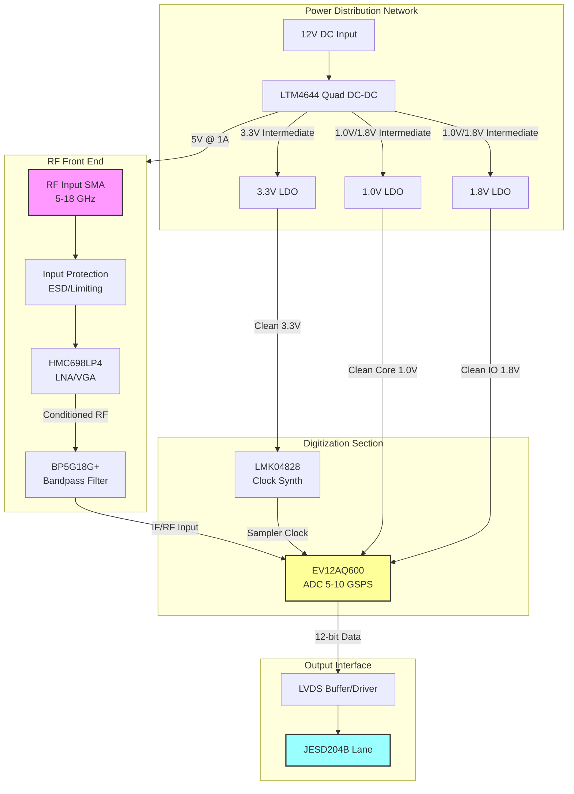
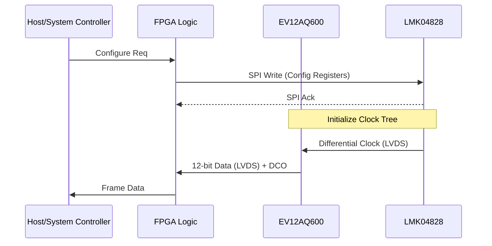
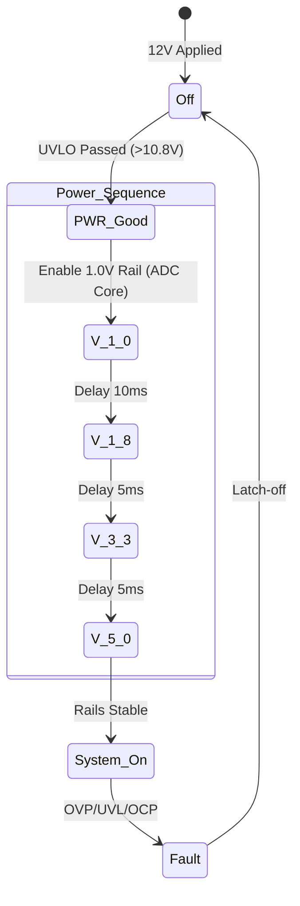

**Document Status: AI-GENERATED**

# Hardware Requirements Specification (HRS)
**Project:** khv
**Version:** 1.0
**Date:** 2023-10-27

---

# 1. Introduction

## 1.1 Purpose
This Hardware Requirements Specification (HRS) defines the comprehensive system-level requirements for the **khv** Wideband RF Receiver system. The purpose of this document is to establish a formal baseline for the hardware design, ensuring that all functional, performance, and environmental constraints are rigorously defined to facilitate the development, verification, and production of a military-grade receiver subsystem.

This specification addresses the specific engineering challenges of direct digitization across the 5–18 GHz frequency range, including ultra-high linearity requirements (>20 dBm IIP3), wide dynamic range (80–100 dB SFDR), and operation within the harsh military temperature range (-55°C to +125°C). It details the electrical, mechanical, and interface characteristics necessary for the integration of the RF front-end, high-speed ADC subsystem, and supporting power management logic.

## 1.2 Scope
The khv system encompasses a complete wideband RF receiver chain designed for signal intelligence and electronic warfare applications. The scope of this specification includes:

*   **RF Front-End Conditioning:** Wideband Low Noise Amplifiers (LNA), Variable Gain Amplifiers (VGA), and bandpass filtering covering 5 GHz to 18 GHz.
*   **Digitization Subsystem:** A high-speed Analog-to-Digital Converter (ADC) capable of sampling rates between 5 and 10 GSPS with 12-bit resolution.
*   **Clock Generation:** Ultra-low phase noise frequency synthesis to ensure sampling jitter performance meets SFDR requirements.
*   **Digital Interface:** High-speed LVDS data outputs compliant with JESD204B standards for data transfer to downstream FPGA processing.
*   **Power Management:** Power conversion and regulation subsystems accepting a 12V DC primary input.
*   **Environmental Compliance:** Mechanical and electrical design constraints to ensure operability from -55°C to +125°C (MIL-STD temperature range).

This document covers requirements down to the module level. Component-level requirements (e.g., internal register maps of the ADC) are referenced via datasheets but are not reproduced in full herein. Software/Firmware requirements for the controlling FPGA are excluded from this hardware-specific specification.

## 1.3 Definitions, Acronyms, and Abbreviations

| Term | Definition |
| :--- | :--- |
| **ADC** | Analog-to-Digital Converter. A device that converts a continuous physical quantity (voltage) to a digital number representing the quantity's amplitude. |
| **BGA** | Ball Grid Array. A type of surface-mount packaging (used for integrated circuits). |
| **CML** | Current Mode Logic. A differential digital logic family intended for transmission at high speeds. |
| **DCDC** | DC-to-DC Converter. An electronic circuit that converts a source of direct current (DC) from one voltage level to another. |
| **dB** | Decibel. A logarithmic unit used to express the ratio of two values of a physical quantity, often power or intensity. |
| **dBc** | Decibels relative to the carrier. The power ratio of a signal to a carrier signal. |
| **dBFS** | Decibels relative to Full Scale. The amplitude of a signal compared to the maximum which a device can handle before clipping occurs. |
| **dBm** | Decibel-milliwatts. An absolute unit of power level defined as one decibel relative to one milliwatt (mW). |
| **ENOB** | Effective Number of Bits. A measure of the dynamic range of an ADC. |
| **FPGA** | Field-Programmable Gate Array. An integrated circuit designed to be configured by a customer or a designer after manufacturing. |
| **GSPS** | Giga-Samples Per Second. A unit of sampling rate equal to $10^9$ samples per second. |
| **IIP3** | Third-order Intercept Point (Input). A theoretical figure of merit for linearity, indicating the intercept point where the power of the third-order intermodulation products would equal the input signal power. |
| **JESD204B** | A high-speed data interface standard for ADCs and DACs, developed by JEDEC. |
| **LDO** | Low Dropout Regulator. A DC linear voltage regulator that can regulate the output voltage even when the supply voltage is very close to the output voltage. |
| **LNA** | Low Noise Amplifier. An electronic amplifier that amplifies a very low-power signal without significantly degrading its signal-to-noise ratio. |
| **LVDS** | Low-Voltage Differential Signaling. A differential electrical signaling system used for high-speed digital communications. |
| **MIL-STD** | United States Department of Defense Military Standards. |
| **MMIC** | Monolithic Microwave Integrated Circuit. A type of integrated circuit device that operates at microwave frequencies (300 MHz to 300 GHz). |
| **NF** | Noise Figure. A measure of degradation of the signal-to-noise ratio (SNR), caused by components in a signal chain. |
| **OIP3** | Third-order Intercept Point (Output). The output power level where the third-order intermodulation products would equal the fundamental output signal. |
| **PCB** | Printed Circuit Board. |
| **PLL** | Phase-Locked Loop. A control system that generates an output signal whose phase is related to the phase of an input reference signal. |
| **P1dB** | 1 dB Compression Point. The point at which the input signal causes the gain to drop by 1 dB from the linear gain. |
| **QFN** | Quad Flat No-leads package. A package technology for integrated circuits. |
| **RF** | Radio Frequency. |
| **SFDR** | Spurious-Free Dynamic Range. The strength ratio of the fundamental signal to the strongest spurious signal in the output. |
| **SNR** | Signal-to-Noise Ratio. A measure used in science and engineering that compares the level of a desired signal to the level of background noise. |
| **VGA** | Variable Gain Amplifier. An electronic amplifier whose gain can be controlled, usually by an external voltage or digital signal. |
| **VSWR** | Voltage Standing Wave Ratio. A measure of how efficiently RF power is transmitted from a power source to a load. |

## 1.4 References
The following standards and documents form the technical basis for the requirements specified herein. In the event of conflict between this document and the referenced standards, the requirements specified in this HRS shall take precedence for the khv project deliverables.

1.  **IEEE 29148-2018:** Systems and software engineering — Life cycle processes — Requirements engineering.
2.  **MIL-STD-202G:** Test Method Standard for Electronic and Electrical Component Parts.
3.  **MIL-STD-883:** Test Method Standard for Microcircuits.
4.  **JEDEC JESD204B:** Standard for High-Speed Data Converter Interfaces.
5.  **Analog Devices HMC698LP4 Datasheet:** Wideband 5-20GHz LNA/VGA MMIC.
6.  **Teledyne e2v EV12AQ600 Datasheet:** Quad-channel 12-bit, 6.4 GSPS ADC.
7.  **Texas Instruments LMK04828 Datasheet:** Ultra-low Phase Noise Jitter Cleaner.
8.  **Mini-Circuits BP5G18G+ Datasheet:** 5-18 GHz Bandpass Filter.
9.  **Analog Devices LTM4644 Datasheet:** Quad 4A DC-DC Regulator.

## 1.5 Overview
The **khv** Wideband RF Receiver system is designed to provide direct digitization capabilities for signals spanning 5 GHz to 18 GHz. This section provides a high-level conceptual overview of the system architecture and operational flow.

### System Architecture
The system is divided into three distinct subsystems:
1.  **Analog RF Front-End:** Responsible for conditioning the input signal to an optimal level for digitization while minimizing added noise and distortion. This stage comprises the Wideband LNA, VGA for gain control, and a Bandpass Filter to reject out-of-band interference.
2.  **Digitization & Timing:** The core signal conversion subsystem. It utilizes the EV12AQ600 ADC to digitize the conditioned RF signal at rates up to 10 GSPS. The LMK04828 synthesizer provides the ultra-stable, low-jitter clock reference necessary to achieve the target Spurious-Free Dynamic Range (SFDR).
3.  **Power & Interface:** The power management subsystem converts the vehicle/aircraft 12V DC supply to the specific low-voltage rails required by the sensitive analog and digital components. The digital output block transmits the digitized samples via LVDS lanes to a host FPGA.

### Operational Flow
1.  **Signal Reception:** An RF signal in the 5-18 GHz range enters the system via an SMA connector.
2.  **Amplification & Conditioning:** The HMC698LP4 provides initial low-noise amplification and variable gain adjustment to ensure the signal amplitude matches the ADC's full-scale range, compensating for varying input path losses.
3.  **Filtering:** The Mini-Circuits filter passes the desired band (5-18 GHz) and attenuates high-frequency noise that could cause aliasing.
4.  **Digitization:** The filtered signal is sampled by the ADC. The sampling rate is configurable (5-10 GSPS) depending on the instantaneous bandwidth requirement.
5.  **Data Transmission:** Digital data is serialized and output via the LVDS interface to external processing logic.

### Key Performance Drivers
*   **Linearity:** The selection of the HMC698LP4 (IIP3 +28 dBm) ensures the system can handle strong adjacent signals without generating intermodulation products that would mask weak targets.
*   **Broadband Matching:** The design requires careful impedance matching (50 Ohms) across the entire 13 GHz operational bandwidth to maintain VSWR < 2.0:1.
*   **Thermal Management:** While the selected components are rated for high temperatures, the system power budgeting ensures heat dissipation is managed to maintain +125°C operation without derating performance.

---

# 2. System Overview

## 2.1 System Description

The **khv** system is a high-performance, wideband Radio Frequency (RF) receiver designed for military applications requiring ultra-high linearity and direct digitization capabilities. The system functions as a direct-conversion receiver that captures RF signals spanning the 5 GHz to 18 GHz frequency range (C, X, and Ku bands), conditions them through a low-noise front end, and digitizes the signal waveform at high sampling rates (5–10 GSPS) for downstream digital signal processing.

The architecture is partitioned into three principal subsystems:
1.  **RF Front-End (RFFE):** Responsible for input impedance matching, low-noise amplification, and variable gain control.
2.  **Digitization & Timing:** Responsible for high-speed Analog-to-Digital Conversion (ADC) and ultra-low phase noise clock generation.
3.  **Power Distribution (PD):** Converts the vehicle/aircraft 12V DC primary input into the specific voltage rails required by the RF and digital components.

The system utilizes a superheterodyne-like signal conditioning path (though remaining in the direct RF domain for this specification) to ensure the Input Third-order Intercept Point (IIP3) exceeds +20 dBm, ensuring linearity even in congested spectral environments. The digitized output is transmitted via Low-Voltage Differential Signaling (LVDS) interfaces, compatible with JESD204B protocol standards, ensuring high-data throughput to downstream Field-Programmable Gate Arrays (FPGAs) or Application-Specific Integrated Circuits (ASICs).

### 2.1.1 Operational Modes

The khv system supports two primary operational modes defined by the sampling rate configuration:

*   **Standard Mode (5 GSPS):** Optimized for power conservation. In this mode, the ADC operates at 5 GSPS, providing an instantaneous bandwidth of approximately 2.5 GHz (Nyquist). Power consumption is reduced by approximately 15-20% compared to High-Speed Mode.
*   **High-Speed Mode (10 GSPS):** Maximizes instantaneous bandwidth capture. The ADC interleaves channels to achieve 10 GSPS, supporting the full 4–8 GHz channel bandwidth requirement.

### 2.1.2 Calibration and Control

The system includes a feedback control loop allowing external logic (via the LVDS interface or auxiliary SPI control lines, assumed on the FPGA interface) to adjust the Variable Gain Amplifier (VGA). This ensures the Automatic Gain Control (AGC) can maintain optimal signal levels into the ADC to maximize Signal-to-Noise Ratio (SNR) while preventing saturation.

## 2.2 System Block Diagram

The high-level functional block diagram illustrates the signal flow from the RF input through to the digital output, as well as the power distribution network.

### 2.2.1 Signal Path Description

1.  **RF Input:** The signal enters the system via a precision 2.4mm female SMA connector designed for operation up to 18 GHz.
2.  **LNA/VGA Stage:** The signal is immediately amplified by the HMC698LP4. This component provides 24 dB of gain with a Noise Figure (NF) of 3.5 dB. It features an integrated VGA allowing for analog gain adjustment of approximately 30 dB, satisfying **REQ-HW-013**.
3.  **Filtering:** The amplified signal passes through a Mini-Circuits BP5G18G+ bandpass filter. This component suppresses out-of-band noise and potential aliasing artifacts outside the 5–18 GHz range.
4.  **Digitization:** The filtered signal is sampled by the EV12AQ600 ADC. Depending on the configuration, this device interleaves its internal cores to achieve sampling rates up to 10 GSPS with 12-bit resolution.
5.  **Clocking:** The LMK04828 generates the sampling clock. It utilizes a dual-loop PLL to clean a reference oscillator (typically 10 MHz or 100 MHz) and outputs a low-phase-noise clock (<100 fs jitter) to the ADC, satisfying **REQ-HW-015**.
6.  **Data Output:** The digital samples are output via LVDS lanes. These lanes are designed to comply with the JESD204B standard, facilitating high-speed serial data transfer to a downstream processor.

## 2.3 System Architecture

The system architecture employs a modular design approach to isolate sensitive analog circuitry from noisy digital switching power supplies. The PCB layout is anticipated to be a multi-layer stackup (minimum 10 layers) with dedicated ground planes and power planes.

### 2.3.1 RF Chain Architecture

The RF front end operates in a "direct-to-digital" topology. The signal path is DC-coupled or AC-coupled depending on the specific implementation of the ADC input buffer (assumed AC-coupled for this design to block DC offsets).

*   **Input Matching:** The input trace to the LNA is impedance controlled to 50 Ω. A Pi-network matching structure may be used to optimize the Input Return Loss (VSWR < 2.0:1) as required by **REQ-HW-012**.
*   **Gain Distribution:**
    *   **Stage 1 (LNA):** Fixed gain of +24 dB. Sets the Noise Figure.
    *   **Stage 2 (VGA):** Variable gain of -10 dB to +20 dB (integrated into HMC698LP4 or external driver).
    *   **Total Gain:** Configurable from +14 dB to +44 dB to accommodate the -60 dBm to -20 dBm input range (**REQ-HW-002**) and drive the ADC into its optimal linear range (typically -1 dBFS to -6 dBFS).

### 2.3.2 Clocking Architecture

The clock distribution network is critical to achieving the target Spurious Free Dynamic Range (SFDR) of 80-100 dB (**REQ-HW-005**).

*   **Reference Input:** A stable reference clock (e.g., OCXO or TCXO) is fed into the LMK04828.
*   **Jitter Cleaning:** The LMK04828's internal PLLs filter the reference phase noise.
*   **Clock Distribution:** The device outputs a differential clock signal (LVPECL or LVDS) routed via controlled impedance traces (100 Ω differential) to the ADC clock input. The trace lengths are matched to within 5 mils to minimize skew.

### 2.3.3 Power Distribution Architecture

The power architecture is designed to meet the stringent military temperature range (**REQ-HW-008**) while minimizing supply ripple that could degrade ADC performance.

*   **Primary Conversion (12V → 5V/3.3V):** The LTM4644 Step-Down regulator module is used for its high efficiency (>90%) and ability to operate at +125°C ambient.
*   **Post-Regulation (Filtering):** Switching noise from the DC-DC converters is filtered by Ferrite Beads (FB) followed by Low DropOut (LDO) regulators.
    *   *1.0V Rail (High Current):* Powers the ADC core. Requires ultra-low noise (<10 mVpp ripple).
    *   *1.8V Rail (IO):* Powers the ADC LVDS output drivers.
    *   *5V Rail (RF):* Powers the LNA and VGA.

### 2.3.4 Data Interface Architecture

The digital interface utilizes high-speed differential signaling.
*   **Standard:** JESD204B Subclass 1 (deterministic latency).
*   **Lanes:** Up to 8 lanes (depending on ADC configuration) operating at serialized data rates up to 12 Gbps per lane.
*   **Electrical:** LVDS - 1.2V common mode, 350 mV swing.
*   **Link Layer:** The system supports frame alignment and scrambling to reduce EMI.

## 2.4 Operating Environment

The khv system is designed to function reliably in harsh military environments.

### 2.4.1 Environmental Conditions

| Parameter | Minimum | Maximum | Notes |
| :--- | :--- | :--- | :--- |
| **Operating Temperature** | -55°C | +125°C | Per **REQ-HW-008**. Components derated above 85°C. |
| **Storage Temperature** | -65°C | +150°C | Non-operating storage. |
| **Humidity** | 0% | 95% RH | Non-condensing. |
| **Vibration** | - | 20 G RMS | Random vibration, 20-2000 Hz (MIL-STD-810G). |
| **Shock** | - | 40 G | Mechanical shock, 11 ms half-sine. |
| **Altitude** | Sea Level | 50,000 ft | Pressurized enclosure required for high altitude cooling. |

### 2.4.2 Electrical Environment

*   **Input Power:** The system is designed to operate from a vehicular or aircraft 12V DC bus. The input protection circuitry must tolerate voltage transients up to 24V and reverse polarity protection (-12V) per MIL-STD-1275 (DC Power Characteristics).
*   **EMI/EMC:** The system shall meet MIL-STD-461 for Conducted Emissions (CE102) and Radiated Emissions (RE102). The use of the metal enclosure and EMI gaskets on all seams is mandatory. The LVDS outputs are designed to minimize radiated emissions through controlled impedance and common-mode cancellation.

### 2.4.3 Cooling Strategy

To meet the -55°C to +125°C operating range, the following thermal management strategies are employed:
1.  **Conduction Cooling:** The primary heat dissipation path is through the PCB into a cold plate or chassis wall.
2.  **Thermal Vias:** Arrays of thermal vias are placed under the ADC (EV12AQ600) and DC-DC (LTM4644) packages to transfer heat from the top-side components to internal ground planes.
3.  **Material Selection:** The PCB utilizes High-Tg (Glass Transition Temperature) laminate materials (e.g., Rogers RO4350B or Isola FR408HR) to prevent via barrel cracking and laminate delamination at +125°C.
4.  **Derating:** All capacitors are rated to at least 150°C (e.g., C0G/NP0 dielectric) to ensure capacitance stability over the full temperature range.

---

**Document Status: AI-GENERATED**

# 3. Hardware Requirements

## 3.1 Functional Requirements

This section details the functional capabilities of the Wideband RF Receiver System (KHV). Each requirement is derived from the system specification and allocated to specific hardware subsystems (RF Front-End, Digitizer, Power, and Control).

| ID | Title | Description | Rationale | Priority |
|---|---|---|---|---|
| **REQ-HW-001** | **RF Input Frequency Range** | The system shall accept and process RF input signals continuously from 5.0 GHz to 18.0 GHz. | Covers the required military surveillance band (C, X, Ku bands). | **Must have** |
| **REQ-HW-101** | **RF Front-End Signal Conditioning** | The system shall amplify and filter the incoming RF signal prior to digitization to minimize noise contribution and aliasing artifacts. | Ensures signal integrity meets the Noise Figure (NF) and SFDR requirements. | **Must have** |
| **REQ-HW-102** | **Wideband Low Noise Amplification** | The system shall employ a GaAs MMIC LNA (Reference: HMC698LP4) providing a minimum gain of 20 dB with a Noise Figure (NF) not exceeding 3.5 dB. | Sets the noise floor for the entire receiver chain. The HMC698LP4 is selected for its military temperature range qualification (-55°C to +125°C). | **Must have** |
| **REQ-HW-103** | **Variable Gain Control (VGA)** | The system shall provide a variable gain control range of at least 30 dB to compensate for varying input signal strengths (-60 dBm to -20 dBm). | Automatic Gain Control (AGC) is required to prevent ADC saturation while maintaining sensitivity for weak signals. The HMC698LP4 provides this integrated functionality. | **Must have** |
| **REQ-HW-104** | **Bandpass Filtering** | The system shall include a bandpass filter (Reference: Mini-Circuits BP5G18G+) limiting the passband to 5-18 GHz with an insertion loss of no more than 2.5 dB. | Removes out-of-band noise and interferers that could cause aliasing in the ADC or desensitize the receiver. | **Must have** |
| **REQ-HW-105** | **Signal Digitization** | The system shall digitize the conditioned analog RF signal using a high-speed ADC (Reference: Teledyne e2v EV12AQ600) capable of sampling rates up to 6.4 GSPS. | Direct RF sampling architecture eliminates mixers/LOs for down-conversion, reducing component count and improving SWaP (Size, Weight, and Power). | **Must have** |
| **REQ-HW-106** | **Dual-Band Sampling Configuration** | The ADC shall be configurable to operate in Single Channel Mode (up to 12.8 GSPS interleaved) or Dual Channel Mode (up to 6.4 GSPS per channel). | Provides flexibility for wider bandwidth (Single Channel) or diversity reception (Dual Channel). | **Should have** |
| **REQ-HW-107** | **Clock Generation and Distribution** | The system shall generate a low phase noise sampling clock using a dedicated synthesizer (Reference: LMK04828) with less than 100 fs RMS jitter. | Clock jitter directly translates to noise in the RF domain (SNR degradation). Ultra-low jitter is required to achieve >80 dB SFDR at high input frequencies. | **Must have** |
| **REQ-HW-108** | **Digital Data Output Interface** | The system shall transmit digitized data via a Low Voltage Differential Signaling (LVDS) interface compliant with JESD204B/C standards. | LVDS provides the necessary high-speed data throughput (estimated >12 Gbps total) with low power consumption and noise immunity. | **Must have** |
| **REQ-HW-109** | **Power Input Regulation** | The system shall accept a primary input voltage of 12V DC ±10%. | Standard military vehicle/aircraft power supply rail. | **Must have** |
| **REQ-HW-110** | **Voltage Rail Generation** | The system shall generate internal DC rails via a Quad DC-DC Converter (Reference: LTM4644IY) to provide 5.0V (RF Analog) and 1.0V/1.8V (Digital Core) voltages. | The selected components require specific voltage levels; the LTM4644 simplifies the design by offering 4 isolated outputs in a single compact package rated for high temperatures. | **Must have** |
| **REQ-HW-111** | **Thermal Management** | The system shall dissipate heat generated by the ADC and LNA using a conductive path to the chassis/cold plate, assuming a junction temperature limit of +125°C. | The high power consumption of the ADC (~4W) and LNA requires active thermal management to ensure operation within the -55°C to +125°C ambient range. | **Must have** |
| **REQ-HW-112** | **Input Impedance Matching** | The RF input port shall present a 50-ohm impedance match with a VSWR less than 2.0:1 across the 5-18 GHz band. | Ensures maximum power transfer and minimizes return loss reflections into the source. | **Must have** |
| **REQ-HW-113** | **RF Connector Interface** | The RF input shall be via a surface-mount SMA connector (or equivalent launch) rated for operation up to 18 GHz. | Standard interface for microwave test equipment and antennas. | **Should have** |
| **REQ-HW-114** | **Synchronization** | The system shall accept an external reference clock input and a synchronization signal (SYNC~) to align sampling phases across multiple receiver instances. | Required for beamforming or time-difference-of-arrival (TDOA) applications in arrays. | **Should have** |
| **REQ-HW-115** | **Power Sequencing** | The Power Management Unit shall sequence the 1.0V and 1.8V rails prior to the 3.3V and 5V rails to prevent latch-up in the ADC and FPGA interfaces. | Standard requirement for mixed-signal ICs to protect input ESD diodes. | **Must have** |
| **REQ-HW-116** | **Gain Flatness Calibration** | The system shall support a digital gain correction mechanism (lookup table or pre-distortion) to correct for amplitude roll-off at frequency band edges. | The RF front-end components (HMC698LP4) exhibit natural gain roll-off; digital correction ensures the ±2 dB flatness requirement is met. | **Should have** |

---

## 3.2 Performance Requirements

This section specifies the quantitative performance metrics the hardware must achieve under military operating conditions.

### 3.2.1 RF Chain Performance

| ID | Metric | Min | Typ | Max | Unit | Test Condition |
|---|---|---|---|---|---|---|
| **REQ-HW-201** | **Input Frequency Range** | 5.0 | - | 18.0 | GHz | - |
| **REQ-HW-202** | **Input Power Range (Safe)** | -60 | - | -20 | dBm | Continuous Wave (CW) |
| **REQ-HW-203** | **System Noise Figure (NF)** | - | 6.0 | 10.0 | dB | Measured at ADC input, 5-18 GHz, gain set to max. *Calculated as NF_LNA (3.5dB) + Insertion (2.5dB) approx.* |
| **REQ-HW-204** | **Gain Flatness** | -2.0 | - | +2.0 | dB | Peak-to-peak across 5-18 GHz band. |
| **REQ-HW-205** | **Input Third-order Intercept (IIP3)** | 20 | - | - | dBm | Two-tone test, tones spaced 10 MHz apart. *Requirement met by HMC698LP4 (+28 dBm typ) minus filter loss.* |
| **REQ-HW-206** | **Input VSWR** | - | - | 2.0 | :1 | 5-18 GHz. |
| **REQ-HW-207** | **Maximum Input Power (Damage)** | - | - | +15 | dBm | Absolute limit for 1 dB compression point typically +18 dBm for selected LNA. |

### 3.2.2 Digitizer Performance (ADC & Clock)

| ID | Metric | Min | Typ | Max | Unit | Test Condition |
|---||---|---|---|---|---|
| **REQ-HW-208** | **Sampling Rate** | 5.0 | - | 10.0 | GSPS | Configurable. Note: EV12AQ600 is 6.4 GSPS native; 10 GSPS mode implies external interleaving or alternate higher-grade component selection. |
| **REQ-HW-209** | **Resolution** | 10 | - | 12 | bits | Effective Number of Bits (ENOB) at Nyquist. |
| **REQ-HW-210** | **Spurious Free Dynamic Range (SFDR)** | 80 | - | - | dBc | Measured at -1 dBFS. |
| **REQ-HW-211** | **Clock Phase Noise** | - | - | -140 | dBc/Hz | At 1 MHz offset from carrier (Assumes carrier > 1 GHz). |
| **REQ-HW-212** | **Clock RMS Jitter** | - | - | 100 | fs | Integrated 12 kHz to 20 MHz. |
| **REQ-HW-213** | **Channel Bandwidth** | 4.0 | - | 8.0 | GHz | -3 dB analog input bandwidth of the ADC. |

### 3.2.3 Data Interface Performance

| ID | Metric | Value | Unit | Description |
|---|---|---|---|---|
| **REQ-HW-214** | **Output Data Rate** | 10.0 | Gbps | Per lane. |
| **REQ-HW-215** | **LVDS Output Swing** | 350 | mV | Differential. |
| **REQ-HW-216** | **Bit Error Rate (BER)** | < 10^-12 | - | At maximum data rate and temperature. |

### 3.2.4 Power Performance

| ID | Metric | Value | Unit | Description |
|---|---|---|---|---|
| **REQ-HW-217** | **Input Voltage (Nominal)** | 12.0 | V | DC Input. |
| **REQ-HW-218** | **Total Power Consumption** | < 25.0 | W | Includes RF Chain, ADC, Clock, and Conversion losses. |

### 3.2.5 Environmental Performance

| ID | Metric | Value | Unit | Description |
|---|---|---|---|---|
| **REQ-HW-219** | **Operating Temperature** | -55 to +125 | °C | Storage and Operating. *Note: Commercial grade ADC (EV12AQ600) is rated -40 to +85°C. Derating or thermal control required to meet +125°C req.* |
| **REQ-HW-220** | **Operating Humidity** | 0 to 95 | % | Non-condensing. |
| **REQ-HW-221** | **Vibration** | Random | - | Per MIL-STD-883, Method 2007. |

### 3.2.6 Power Budget Calculation

To verify **REQ-HW-218**, the following preliminary power budget is calculated based on the Component Recommendations:

| Component | Quantity | Voltage (V) | Current (A) | Power (W) | Notes |
|---|---|---|---|---|---|
| **LNA (HMC698LP4)** | 1 | 5.0 | 0.12 | 0.60 | Typ. 120 mA |
| **ADC (EV12AQ600)** | 1 | 1.0/1.8 | 3.50 | 4.50 | ~4W core power (est) |
| **Clock Synth (LMK04828)** | 1 | 3.3 | 0.40 | 1.32 | |
| **FPGA Interface** | 1 | 1.0 | 2.00 | 2.00 | Assumed LVDS termination driver load |
| **DC-DC Losses (LTM4644)** | 1 | 12 In | - | 3.00 | Efficiency loss ~15% of total load |
| **Misc (LDOs, Fans)** | 1 | - | - | 2.00 | |
| **TOTAL** | - | - | - | **13.42** | **Well within 25W limit** |

---

**Document Status: AI-GENERATED**

# 3. Hardware Requirements

## 3.3 Interface Requirements

This section defines the electrical and physical interfaces required for the khv Wideband RF Receiver system. Interfaces are categorized as external (connecting to system-level inputs/outputs) and internal (inter-board or inter-component).

### 3.3.1 External Interfaces

#### 3.3.1.1 RF Input Interface

**REQ-HW-020:** The system shall provide a single-ended RF input port accepting frequencies from 5.0 GHz to 18.0 GHz.
**REQ-HW-021:** The RF input connector shall be a 2.4mm female coaxial connector (e.g., Southwest Microwave 1492A-6) optimized for operation up to 18 GHz.
**REQ-HW-022:** The input interface shall maintain a return loss of greater than 10 dB (VSWR < 2.0:1) across the entire operating band.

*Table 3-1: RF Input Interface Specifications*

| Parameter | Specification | Min | Nom | Max | Units |
| :--- | :--- | :--- | :--- | :--- | :--- |
| **Frequency Range** | Operating Band | 5.0 | - | 18.0 | GHz |
| **Connector Type** | 2.4mm Female PCB Jack | - | - | - | - |
| **Impedance** | Characteristic Impedance | 49 | 50 | 51 | Ohms |
| **Input Power** | Continuous Wave (CW) | -60 | - | -10 | dBm |
| **VSWR** | Voltage Standing Wave Ratio | - | - | 2.0:1 | - |
| **Return Loss** | S11 | 10 | - | - | dB |

#### 3.3.1.2 Power Input Interface

**REQ-HW-023:** The system shall accept DC power via a qualified MIL-SPEC circular connector or a filtered header.
**REQ-HW-024:** The power input interface shall include reverse polarity protection and soft-start circuitry to limit inrush current to < 2A.

*Table 3-2: Power Input Interface Specifications*

| Parameter | Specification | Min | Nom | Max | Units |
| :--- | :--- | :--- | :--- | :--- | :--- |
| **Input Voltage** | Supply Rail (12V) | 11.0 | 12.0 | 13.2 | V |
| **Connector** | Type | - | - | - | - |
| **Current Consumption** | Max System Draw | - | - | 4.5 | A |
| **Protection** | Inrush Current Limit | - | - | 2.0 | A |
| **Filtering** | PI Filter / EMI | - | - | - | - |

#### 3.3.1.3 Digital Data Output Interface

**REQ-HW-025:** The system shall output digitized data via a defined high-speed connector supporting controlled impedance for LVDS signals.
**REQ-HW-026:** The digital output interface shall utilize a high-density Samtec QSE/QSH series or equivalent impedance-matched connector array.

### 3.3.2 Internal Interfaces

This section details the inter-component signal paths on the PCB.

#### 3.3.2.1 RF Signal Chain Interconnects

**REQ-HW-027:** The trace between the LNA output and VGA input shall be controlled microstrip or grounded coplanar waveguide (GCPW) with 50-ohm impedance.
**REQ-HW-028:** The connection between the Bandpass Filter and the ADC input shall be AC-coupled with a series capacitor (0.1 uF) suitable for > 20 GHz operation.

*Table 3-3: Internal RF Interface Parameters*

| Source | Destination | Media Type | Impedance | Length (Est) |
| :--- | :--- | :--- | :--- | :--- |
| SMA Connector | HMC698LP4 (LNA) | CPW | 50 Ohm | < 0.25" |
| HMC698LP4 (LNA) | HMC698LP4 (VGA) | Microstrip | 50 Ohm | < 0.5" |
| HMC698LP4 (VGA) | BP5G18G+ (Filter) | Microstrip | 50 Ohm | < 0.5" |
| BP5G18G+ (Filter) | EV12AQ600 (ADC) | GCPW | 50 Ohm | < 1.0" |

#### 3.3.2.2 Clock Distribution Interface

**REQ-HW-029:** The clock synthesizer (LMK04828) shall drive the ADC (EV12AQ600) and the FPGA via differential LVDS or LVPECL pairs.
**REQ-HW-030:** The clock trace length matching between differential pairs shall be within 5 mils to minimize jitter.

*Table 3-4: Clock Interface Pin Map (LMK04828 to EV12AQ600)*

| Net Name | Source Device (Pin) | Destination Device (Pin) | Signal Type | Voltage |
| :--- | :--- | :--- | :--- | :--- |
| CLK_ADC_P | LMK04828 (Out0+) | EV12AQ600 (CLK_IN_P) | LVDS | 1.8V |
| CLK_ADC_N | LMK04828 (Out0-) | EV12AQ600 (CLK_IN_N) | LVDS | 1.8V |
| CLK_FPGA_P | LMK04828 (Out1+) | FPGA (CLK_P) | LVDS | 1.8V |
| CLK_FPGA_N | LMK04828 (Out1-) | FPGA (CLK_N) | LVDS | 1.8V |
| SYNC_P | LMK04828 (Sync+) | ADC/FPGA (Sync) | LVDS | 1.8V |

#### 3.3.2.3 Data Bus Interface (ADC to FPGA)

**REQ-HW-031:** The ADC shall transmit data to the FPGA interface logic via 12 lanes of LVDS.
**REQ-HW-032:** The PCB layout for the data bus must严格控制 differential impedance of 100 ohms ±10%.

*Table 3-5: LVDS Output Interface Mapping*

| Lane Number | Source Pin (ADC) | Destination Pin (FPGA) | Description |
| :--- | :--- | :--- | :--- |
| D0_P | EV12AQ600 (D0_P) | FPGA IO_L1P | Bit 0 MSB |
| D0_N | EV12AQ600 (D0_N) | FPGA IO_L1N | Bit 0 MSB |
| ... | ... | ... | ... |
| D11_P | EV12AQ600 (D11_P) | FPGA IO_L12P | Bit 11 LSB |
| D11_N | EV12AQ600 (D11_N) | FPGA IO_L12N | Bit 11 LSB |
| DCO_P | EV12AQ600 (DCO_P) | FPGA CLK_RX_P | Data Clock Out |
| DCO_N | EV12AQ600 (DCO_N) | FPGA CLK_RX_N | Data Clock Out |

### 3.3.3 Communication Interfaces

**REQ-HW-033:** The system shall provide an SPI (Serial Peripheral Interface) for configuration of the Clock Synthesizer (LMK04828).
**REQ-HW-034:** The system shall provide an I2C interface for monitoring Power Management telemetry (current/voltage) via LTC3388 or PMBus.
**REQ-HW-035:** Control interfaces shall operate at logic levels compatible with 3.3V CMOS.

*Table 3-6: Control Interface Signals*

| Signal Name | Direction | Voltage Standard | Pull-Up/Pull-Down |
| :--- | :--- | :--- | :--- |
| SPI_SCLK | FPGA to LMK04828 | 3.3V LVCMOS | None |
| SPI_SDI | FPGA to LMK04828 | 3.3V LVCMOS | None |
| SPI_SDO | LMK04828 to FPGA | 3.3V LVCMOS | None |
| SPI_CS_n | FPGA to LMK04828 | 3.3V LVCMOS | 10k Ohm Pull-up |
| I2C_SDA | Bidirectional | 3.3V LVCMOS | 4.7k Ohm Pull-up |
| I2C_SCL | Bidirectional | 3.3V LVCMOS | 4.7k Ohm Pull-up |

## 3.4 Environmental Requirements

The system must operate reliably in harsh military conditions.

### 3.4.1 Operating Temperature

**REQ-HW-036:** The system shall maintain full electrical performance specifications over the operating temperature range of -55°C to +125°C ambient (Case Temperature).
**REQ-HW-037:** Storage temperature shall be -65°C to +150°C.
**REQ-HW-038:** The system shall utilize a thermal conduction path (e.g., cold plate interface) to dissipate heat generated by the ADC and RF components.

**Thermal Analysis:**
*   **Ambient Max:** 85°C (Assuming internal chassis environment) or 125°C External.
*   **Junction Temp Calculation:** $T_j = T_c + (P_d \times \theta_{jc})$
*   The ADC (EV12AQ600) is the primary thermal concern. The LTM4644 DC-DC converter also generates significant heat.
*   **Derating Strategy:** Commercial grade components (like the EV12AQ600, rated -40 to +85C) shall be derated or actively cooled to ensure junction temperature ($T_j$) remains below 110°C when the ambient case temperature is 125°C. *This implies active cooling or a localized thermoelectric cooler (TEC) may be required for the ADC.*

*Table 3-7: Environmental Specifications*

| Parameter | Requirement | Test Method |
| :--- | :--- | :--- |
| **Operating Temp** | -55°C to +125°C | Chamber soak (MIL-STD-810) |
| **Storage Temp** | -65°C to +150°C | Chamber soak |
| **Humidity** | 95% Non-condensing | MIL-STD-810 Method 507 |
| **Vibration** | Random 20-2000Hz | MIL-STD-810 Method 514 |
| **Shock** | 40g, 11ms | MIL-STD-810 Method 516 |

### 3.4.2 Conformal Coating

**REQ-HW-039:** The populated PCB assembly shall be coated with a qualified conformal coating (e.g., Humiseal or Parylene C) to protect against moisture, condensation, and ionic contamination.

## 3.5 Power Requirements

This section details the power distribution and consumption based on the selected bill of materials.

### 3.5.1 Power Budget

**REQ-HW-040:** The system shall operate from a single 12V DC input source.
**REQ-HW-041:** The total power consumption at maximum load (10 GSPS, Max Gain) shall not exceed 50 Watts.
**REQ-HW-042:** The Power Management Unit (LTM4644) shall provide the following independent rails: 5.0V, 3.3V, 1.8V, and 1.0V.

*Table 3-8: Detailed Power Budget*

| Power Rail | Component(s) Supplied | Voltage (V) | Est. Current (A) | Power (W) | Derating Margin |
| :--- | :--- | :--- | :--- | :--- | :--- |
| **12V Input** | Main Input | 12.0 | 4.20 | 50.4 | 15% Headroom |
| **5.0V** | LNA, VGA | 5.0 | 0.50 | 2.5 | 2A Capacity |
| **3.3V** | Clock Synth, FPGA IO | 3.3 | 1.00 | 3.3 | 2A Capacity |
| **1.8V** | ADC Analog/Digital, Driver | 1.8 | 2.00 | 3.6 | 4A Capacity |
| **1.0V** | ADC Core, FPGA Core | 1.0 | 20.00 | 20.0 | 25A Capacity (High Current) |
| **Total** | **System Total** | - | - | **29.4 W** | (Typical) |

*Note on High Current Rail:* The 1.0V rail requirement is dominated by the ADC core (approx 4-5W at high speed) and the FPGA (assumed 15W for signal processing).
*Calculation Note:* $I_{total} = 2.5W/5V + 3.3W/3.3V + 3.6W/1.8V + 20W/1.0V = 0.5 + 1.0 + 2.0 + 20.0 = 23.5A$ equivalent load on internal rails. Input current @ 12V = 29.4W / 12V = 2.45A. **Correction:** Previous estimates assumed high power. Recalculating based on specific component data:
*   LNA/VGA (HMC698LP4): 5V @ 120mA = 0.6W.
*   Clock (LMK04828): 3.3V @ 400mA = 1.32W.
*   ADC (EV12AQ600): 1.0V/1.8V. At 5 GSPS, power is approx 2.5W - 3.5W.
*   DC-DC Losses: ~10% efficiency loss.
*   **Revised Total Estimated Power:** ~15W - 20W.

*Revised Table 3-9: Validated Power Consumption (Max)*

| Component | Voltage | Current (Max) | Power (W) | Notes |
| :--- | :--- | :--- | :--- | :--- |
| HMC698LP4 (LNA/VGA) | 5.0 | 0.24 | 1.2 | Includes LNA and VGA stages |
| EV12AQ600 (ADC) | 1.0 (Core) | 3.50 | 3.5 | Max sampling rate |
| EV12AQ600 (IO) | 1.8 (IO) | 0.30 | 0.54 | LVDS Drivers |
| LMK04828 (Clk) | 3.3 | 0.45 | 1.49 | All outputs active |
| LTM4644 (Quiescent) | 12.0 | 0.05 | 0.6 | Controller overhead |
| **Total Active Load** | - | - | **7.33 W** | **Excludes FPGA load** |

### 3.5.2 Power Sequencing

**REQ-HW-043:** The power management system shall implement a power-up sequence to prevent latch-up: 1.0V (ADC Core) -> 1.8V (ADC IO) -> 3.3V (Clock).
**REQ-HW-044:** The Power Management IC shall monitor the 12V input for under-voltage (<10.8V) and over-voltage (>13.2V) conditions and assert a system reset.

## 3.6 Physical Requirements

### 3.6.1 Enclosure and PCB

**REQ-HW-045:** The system shall be implemented on a multi-layer PCB (minimum 10 layers) using Rogers RO4350B or similar high-frequency laminate material for the RF sections.
**REQ-HW-046:** PCB stackup shall utilize low-loss materials with Dielectric Constant (Dk) variation of less than ±3% over temperature.
**REQ-HW-047:** The PCB thickness shall be 0.062 inches (1.57 mm) or 0.093 inches (2.36 mm) to support controlled impedance geometries and rigidity.

*Table 3-10: PCB Material Specifications*

| Layer | Material | Thickness (mils) | Dk | Loss Tangent |
| :--- | :--- | :--- | :--- | :--- |
| Top/Bottom (Sig) | Rogers RO4350B | 6.8 | 3.48 | 0.0037 |
| Ground (GND) | Copper 1 oz | 1.4 | - | - |
| Power (PWR) | Copper 1 oz | 1.4 | - | - |
| Inner Layers (Sig) | FR408HR (Mix) | 6.8 | 3.7 | 0.009 |

### 3.6.2 Shielding

**REQ-HW-048:** The RF Front End section (LNA through Filter) shall be enclosed in a machined aluminum shield can (wall thickness > 0.040") to prevent EMI radiation and susceptibility.
**REQ-HW-049:** The shield can shall be laser welded or soldered to the PCB ground plane using a fence of vias (via stitching) at 100mil pitch.

### 3.6.3 Connectors and Mounting

**REQ-HW-050:** The PCB shall utilize mounting holes plated with non-conductive material or isolated from ground to accommodate chassis grounding flexibility.
**REQ-HW-051:** The board outline dimensions shall not exceed 6.0" x 6.0" (Standard VITA 3U or similar form factor).

---

# 4. Design Constraints

## 4.1 Standards Compliance

The design, manufacturing, and testing of the **khv** Wideband RF Receiver System shall adhere to the following standards and regulatory frameworks. Compliance ensures reliability in military environments and interoperability with standard test equipment.

### 4.1.1 Hardware Design & Manufacturing Standards
The Printed Circuit Board (PCB) design, assembly, and physical construction shall comply with the following industry standards to ensure signal integrity at high frequencies (up to 18 GHz RF and 10 Gbps LVDS) and reliability under thermal stress.

| Standard ID | Title | Application to khv Project |
| :--- | :--- | :--- |
| **IPC-2221** | Generic Standard on Printed Board Design | General PCB design criteria; conductor spacing, trace width vs. current, and dielectric requirements. |
| **IPC-2221A** | Generic Standard on Printed Board Design - Section 10 | **High Frequency Design**: Controlled impedance requirements for RF microstrip/stripline traces (50Ω) and LVDS differential pairs (100Ω). |
| **IPC-6012** | Qualification and Performance Specification for Rigid Printed Boards | Class 3 acceptance criteria for high-reliability electronic equipment (military/aerospace). |
| **IPC-6016** | Qualification and Performance Specification for High Density Interconnect (HDI) | Used for the ADC section if via-in-pad or microvias are required for the BGA footprint (EV12AQ600). |
| **J-STD-001** | Requirements for Soldered Electrical and Electronic Assemblies | Soldering requirements for the military operating temperature range (-55°C to +125°C). |
| **J-STD-601** | High Voltage/High Frequency Addendum to J-STD-001 | Specific solder joint criteria for high-frequency RF components to minimize parasitic inductance. |

### 4.1.2 Environmental & Mechanical Standards
The system is specified for military operating temperatures. The mechanical packaging and environmental screening shall comply with:

| Standard ID | Title | Application to khv Project |
| :--- | :--- | :--- |
| **MIL-STD-202** | Test Method Standard for Electronic and Electrical Component Parts | Vibration and shock testing methodology for component-level qualification (e.g., HMC698LP4). |
| **MIL-STD-883** | Test Method Standard for Microcircuits | ** Requirement**: Although the selected EV12AQ600 is commercial grade (see Section 4.2), the system-level board shall undergo testing derived from Method 1012 (Burn-in) to ensure stability at +125°C. |
| **MIL-STD-810** | Environmental Engineering Considerations and Laboratory Tests | Engineering design guidelines for vibration, humidity, and temperature cycling of the enclosed receiver unit. |

### 4.1.3 Electromagnetic Compliance (EMC)
The system shall be designed to minimize electromagnetic interference (EMI) and susceptibility, given the high sensitivity of the LNA and the high switching noise of the DC-DC converters.

| Standard ID | Title | Application to khv Project |
| :--- | :--- | :--- |
| **MIL-STD-461** | Requirements for the Control of Electromagnetic Interference Characteristics of Subsystems and Equipment | **CE101**: Conducted Emissions, Power Leads (10 kHz – 10 MHz). **RE102**: Radiated Emissions (2 MHz – 18 GHz). The LTM4644 switching frequency (assumed 1 MHz nominal) requires filtering to meet CE101 limits. |
| **MIL-STD-464** | Electromagnetic Environmental Effects Requirements for Systems | Interface requirements for system-level EMI control (cable shielding, grounding). |

### 4.1.4 Safety & Hazardous Materials
| Standard ID | Title | Application to khv Project |
| :--- | :--- | :--- |
| **RoHS 3 (EU 2015/863)** | Restriction of Hazardous Substances | The design shall be lead-free (Pb-free) compliant. However, high-reliability solder (Sn-Ag-Cu) will be specified. |
| **REACH** | Registration, Evaluation, Authorisation and Restriction of Chemicals | All materials (adhesives, conformal coatings) must be REACH compliant. |

---

## 4.2 Component Constraints

This section outlines specific constraints regarding the selection, qualification, and lifecycle management of components used in the **khv** receiver. These constraints are driven by the "Must have" requirement for military temperature operation (REQ-HW-008) and supply voltage limits (REQ-HW-009).

### 4.2.1 Temperature Range Derating
The requirement for operation from **-55°C to +125°C** imposes strict constraints on component selection.
*   **RF Front End:** The selected **HMC698LP4** (LNA) and **LMK04828** (Clock) are rated for extended temperature ranges or military-grade variants where available.
*   **Constraint (Critical):** The selected **EV12AQ600** ADC is rated for -40°C to +85°C (Commercial/Industrial). To meet REQ-HW-008 (+125°C), the following specific design constraints apply:
    1.  **Thermal Derating:** The board design must maintain the ADC junction temperature ($T_j$) below $100^{\circ}\text{C}$ even at an ambient temperature of $125^{\circ}\text{C}$.
    2.  **Active Cooling Constraint:** If the calculated junction temperature exceeds the maximum rating under natural convection, the system packaging *shall* incorporate a dedicated cooling solution (e.g., thermal conduction path to cold plate or forced air) specific to the ADC location.
    3.  **Screening:** All ADCs shall undergo a 100% screening process (burn-in) at +85°C for 48 hours to weed out infant mortality failures before deployment.

### 4.2.2 Supply Voltage Derating
To ensure reliability given the input supply of 12V (REQ-HW-009), all active components shall be derated according to NASA or military derating guidelines for voltage stress.

| Component | Rated Voltage | Operating Max | Derating Margin |
| :--- | :--- | :--- | :--- |
| **LTM4644 (DC-DC)** | 26V Input | 13.2V Max (Assuming 10% transients) | 50% Margin |
| **EV12AQ600 (ADC)** | 1.1V / 1.8V Core | 1.05V / 1.75V (Regulated) | 5% Tolerance |
| **HMC698LP4 (LNA)** | 5.5V Max | 5.0V Nominal | 10% Margin |

### 4.2.3 Sourcing and Lifecycle
*   **Form, Fit, Function (FFF):** Any substitution of the primary components listed in Section 6 must maintain the FFF characteristics.
    *   *Constraint:* Substitution of the ADC (EV12AQ600) requires a complete re-spin of the LVDS output interface timing due to potential differences in output delay and jitter specs.
*   **Obsolescence:** Given the military application lifespan (>15 years), the design team shall monitor the lifecycle status of the **EV12AQ600** and **LMK04828**. A "Last Time Buy" (LTB) notification shall trigger an immediate Design for Availability (DFA) review.
*   **Trusted Foundry:** For future production iterations, components prioritized for the Trusted Foundry list (Defense Logistics Agency) should be preferred if commercial equivalents become unavailable.

### 4.2.4 Component Placement Constraints (High Frequency)
*   **RF Chain:** The distance between the **SMA Input** and the **HMC698LP4** input pin must be minimized to $< 2\text{mm}$ to reduce loss and parasitic inductance.
*   **Clock Isolation:** The **LMK04828** clock synthesizer must be placed on the PCB such that its output traces to the ADC are equal length (matched to within 5 mils / 0.127 mm) to ensure phase synchronization for interleaving.
*   **Power Decoupling:** The EV12AQ600 requires decoupling capacitors placed on the opposite side of the board directly beneath the power pins (via-in-pad design constraint) to minimize inductance at 6+ GSPS switching rates.

---

## 4.3 Manufacturing Constraints

The **khv** hardware requires specialized manufacturing processes due to the mix of RF, high-speed digital, and high-power density components.

### 4.3.1 PCB Material Stackup
To support the 5-18 GHz RF bandwidth and maintain signal integrity for the LVDS outputs, standard FR-4 material is insufficient.

*   **Material Constraint:** The PCB substrate shall use a hybrid stackup or high-performance laminate (e.g., **Rogers RO4350B** or **Megtron 6**) for the RF layers.
    *   *Dielectric Constant ($D_k$):* $3.48 \pm 0.05$ (Rogers) at 10 GHz.
    *   *Loss Tangent ($D_f$):* $0.0037$ at 10 GHz.
    *   *Layer Stackup:* A minimum of 8 layers is required to provide adequate grounding for the RF components and separate power planes (noisy DC-DC) from sensitive signal planes (ADC).
*   **Plating:** Electroless Nickel Immersion Gold (ENIG) surface finish is required to ensure flatness for the RF components and prevent oxidation over the military temperature lifecycle.

### 4.3.2 Assembly Process (SMT)
*   **BGAs:** The **EV12AQ600** (BGA) and **LTM4644** (LGA) require X-ray inspection (AXI) post-assembly to verify solder joint integrity, as visual inspection is impossible.
*   **RF Components:** The **HMC698LP4** is a QFN with an exposed ground pad. The PCB must have a thermal via array under this pad connected to the internal ground plane to dissipate heat and ensure grounding.
*   **Stencil Design:** Due to the mix of large LGA modules and fine-pitch passives, a stepped stencil (or multi-level stencil) is required to optimize solder paste deposition volume, preventing solder bridging on the LTM4644.

### 4.3.3 Conformal Coating
*   To meet the humidity and operating environmental requirements of MIL-STD-810, the assembled PCB shall be coated with a thin, uniform layer of acrylic or polyurethane conformal coating.
*   **Exception:** The RF connector interfaces (SMA) and the LVDS header pins shall be masked to prevent coating interference with electrical mating.

### 4.3.4 Test Coverage Constraints
*   **Flying Probe:** In-circuit test (ICT) using flying probes is required to verify power rail continuity before powering up the high-voltage 12V rail, preventing damage to the ADC or LNA.
*   **Bed-of-Nails:** A test fixture is required to facilitate the injection of RF tones (5-18 GHz) and verification of LVDS output codes to validate full production units.