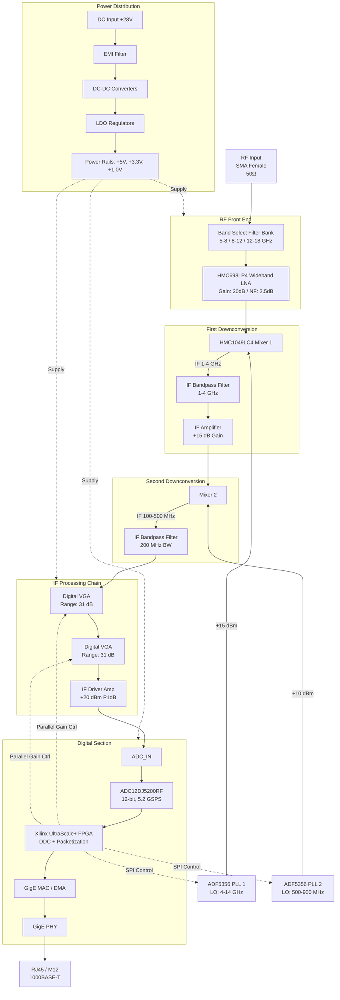
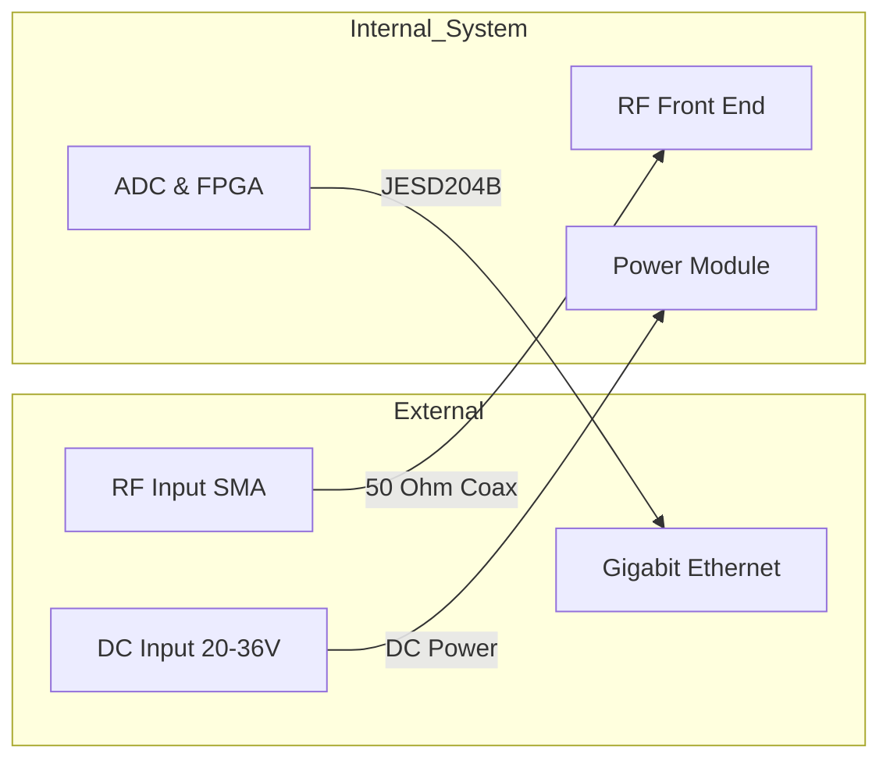

**Document Status: AI-GENERATED**

# 1. Introduction

## 1.1 Purpose
This Hardware Requirements Specification (HRS) defines the detailed hardware requirements for the **kjk Wideband RF Receiver** project. The purpose of this document is to establish a comprehensive baseline for the design, verification, and validation of the hardware subsystems.

The specific objectives of this document are to:
*   Specify the functional, performance, and physical characteristics of the 5–18 GHz receiver hardware.
*   Define the interfaces between the RF Front End, Downconversion Chain, Digital Processing, and Power Distribution units.
*   Serve as the primary reference for hardware design engineers, PCB layout specialists, and test engineers.
*   Provide verification criteria to ensure the final hardware assembly meets the defined system specifications under environmental stress conditions (MIL-STD-461, -40°C to +85°C).

This document complies with the IEEE 29148:2018 standard for requirements specification.

## 1.2 Scope
The scope of this HRS covers the complete electronic hardware design of the kjk receiver system, including:

*   **RF Front End:** Broadband Low Noise Amplifiers (LNA) and band selection filtering covering 5.0 GHz to 18.0 GHz.
*   **Frequency Conversion:** Dual-downconversion superheterodyne architecture utilizing high-linearity mixers and wideband synthesizers to translate RF signals to digitizable Intermediate Frequencies (IF).
*   **Digital Signal Processing:** High-speed digitization via RF sampling ADCs and Field-Programmable Gate Array (FPGA) processing for Digital Down Conversion (DDC) and packetization.
*   **System Interface:** Gigabit Ethernet (1000BASE-T) physical layer implementation for data export.
*   **Power and Environment:** DC power supply distribution, EMI filtering, and thermal management solutions compliant with industrial temperature ranges.

This document does not cover software/firmware algorithms running on the FPGA beyond the scope of hardware configuration (e.g., register settings), nor does it cover the mechanical enclosure design beyond chassis mounting interfaces and thermal conductivity requirements.

## 1.3 Definitions, Acronyms, and Abbreviations

| Term | Definition |
| :--- | :--- |
| **ADC** | Analog-to-Digital Converter. Converts analog IF signals to digital data streams. |
| **AGC** | Automatic Gain Control. A closed-loop system adjusting gain to maintain optimal signal level at the ADC. |
| **BER** | Bit Error Rate. The number of bit errors per unit time. |
| **CE102** | Conducted Emissions, Power Leads, 10 kHz to 10 MHz (MIL-STD-461). |
| **CS101** | Conducted Susceptibility, Power Leads, 30 Hz to 150 kHz (MIL-STD-461). |
| **DAC** | Digital-to-Analog Converter (not primary in this design, but referenced in control loops). |
| **DDC** | Digital Down Converter. A digital mixer that converts IF data to baseband I/Q. |
| **EMI** | Electromagnetic Interference. Disturbance generated by an external source that affects an electrical circuit. |
| **EMC** | Electromagnetic Compatibility. The ability of equipment to function satisfactorily in its electromagnetic environment. |
| **FPGA** | Field-Programmable Gate Array. Configurable logic used for signal processing and system control. |
| **GigE** | Gigabit Ethernet. A transmission technology based on the Ethernet frame format and protocol. |
| **HRS** | Hardware Requirements Specification. |
| **IF** | Intermediate Frequency. A frequency stage in the superheterodyne receiver chain. |
| **IP3** | Third-order Intercept Point. A measure of linearity. |
| **LO** | Local Oscillator. The reference frequency source used for mixing. |
| **LNA** | Low Noise Amplifier. An electronic amplifier that amplifies a very low-power signal without significantly degrading its signal-to-noise ratio. |
| **MDS** | Minimum Discernible Signal. The minimum signal power that can be distinguished from noise. |
| **NF** | Noise Figure. A measure of degradation of the signal-to-noise ratio. |
| **OIP3** | Output Third-order Intercept Point. |
| **P1dB** | 1 dB Compression Point. The point where the gain drops 1 dB from the linear gain. |
| **PCB** | Printed Circuit Board. |
| **PLL** | Phase-Locked Loop. A control system that generates an output signal whose phase is related to the phase of an input reference signal. |
| **RE102** | Radiated Emissions, Electric Field, 2 MHz to 18 GHz (MIL-STD-461). |
| **RF** | Radio Frequency. |
| **RS103** | Radiated Susceptibility, Electric Field, 2 MHz to 18 GHz (MIL-STD-461). |
| **SFDR** | Spurious-Free Dynamic Range. The ratio of the RMS value of the carrier to the RMS value of the worst spurious signal. |
| **SNR** | Signal-to-Noise Ratio. |
| **SPI** | Serial Peripheral Interface. A synchronous serial communication interface specification. |
| **TCP/IP** | Transmission Control Protocol/Internet Protocol. |
| **UDP** | User Datagram Protocol. |
| **VCO** | Voltage-Controlled Oscillator. |

## 1.4 References

The following documents form part of this specification to the extent specified herein. In case of conflict between the documents listed below and this HRS, the requirements of this HRS take precedence for hardware realization, unless a specific waiver is issued.

1.  **IEEE 29148-2018**: Systems and software engineering — Life cycle processes — Requirements engineering.
2.  **MIL-STD-461G**: Department of Defense Interface Standard: Requirements for the Control of Electromagnetic Interference Characteristics of Subsystems and Equipment.
3.  **MIL-STD-202G**: Test Method Standard: Electronic and Electrical Component Parts.
4.  **IPC-6012D**: Generic Standard on Qualification and Performance of Rigid Printed Circuit Boards.
5.  **Analog Devices HMC698LP4 Datasheet**: GaAs MMIC Wideband Low Noise Amplifier.
6.  **Analog Devices HMC1049LC4 Datasheet**: Wideband Double-Balanced Mixer.
7.  **Analog Devices ADF5356 Datasheet**: Wideband Synthesizer with Integrated VCO.
8.  **Texas Instruments ADC12DJ5200RF Datasheet**: 12-Bit, 5.2 GSPS RF-Sampling ADC.
9.  **Ethernet Standard IEEE 802.3ab**: 1000BASE-T Physical Layer Specification.

## 1.5 Overview

The kjk Wideband RF Receiver is a high-performance, chassis-mounted electronic warfare or signal intelligence subsystem designed for interception and analysis of signals in the 5.0–18.0 GHz spectrum. The system architecture is based on a dual-conversion superheterodyne topology selected to optimize sensitivity, dynamic range, and selectivity across the wide instantaneous bandwidth.

**System Operation:**
The system accepts an RF input via a 50-ohm SMA connector. The signal passes through a pre-selector filter bank (Band 1: 5-8 GHz, Band 2: 8-12 GHz, Band 3: 12-18 GHz) to attenuate out-of-band interferers. After filtering, the signal is amplified by a Wideband LNA (HMC698LP4) to establish the system noise figure.

The first stage of downconversion mixes the RF signal with a high-frequency Local Oscillator (LO1: 4-14 GHz, generated by ADF5356) to produce a First IF (1-4 GHz). This First IF is filtered and amplified before entering a second mixing stage. The second mixer downconverts the signal to a Second IF (100-500 MHz) suitable for digitization.

The Variable Gain Amplifier (VGA) chain, controlled digitally by the FPGA, implements Automatic Gain Control (AGC) to ensure the signal level presented to the ADC is optimal. The ADC (ADC12DJ5200RF) samples the IF signal at 5.0 GSPS.

Digital data is processed by the FPGA, which performs Digital Down Conversion (DDC) to generate I/Q samples. These samples are packetized and transmitted via the Gigabit Ethernet interface (1000BASE-T) to downstream processing equipment.

**Design Challenges & Constraints:**
*   **Thermal Management:** The high-speed ADC and RF amplifiers dissipate significant power. The design must efficiently transfer heat to the chassis to maintain operation at +85°C ambient.
*   **Signal Integrity:** Sampling at 5 GSPS requires strict impedance control and high-frequency PCB materials (e.g., Rogers RO4000 series) to minimize loss and dispersion.
*   **EMC Compliance:** Compliance with MIL-STD-461 RE102 and CE102 necessitates extensive shielding of the RF sections and filtering of all DC input lines.

**Subsequent Sections:**
Section 2 details the system architecture and block diagrams. Section 3 provides the detailed requirements allocated to hardware. Section 4 covers design constraints and manufacturing standards.

---

**Document Status: AI-GENERATED**

# 2. System Overview

## 2.1 System Description

The **kjk** Wideband RF Receiver is a high-performance, multi-conversion receiver designed to intercept, condition, and digitize radio frequency signals across the 5.0 GHz to 18.0 GHz spectrum. The system is engineered to meet stringent signal integrity requirements, providing a low-noise figure (NF) and high spurious-free dynamic range (SFDR) suitable for electronic warfare, spectrum monitoring, and signal intelligence applications.

The receiver operates on a dual-downconversion superheterodyne architecture. This approach is selected to optimize image rejection and noise performance over the extremely wide input bandwidth. The incoming RF signal is first filtered and amplified by a bank of switched wideband Low Noise Amplifiers (LNAs). It is then mixed down to a First Intermediate Frequency (IF1) in the 1–4 GHz range. A second mixing stage translates the signal to a lower Second IF (IF2) centered between 100–500 MHz, where it is digitized by a high-speed RF sampling Analog-to-Digital Converter (ADC).

Signal processing and control are managed by a centralized Field Programmable Gate Array (FPGA). The FPGA handles the configuration of the Phase-Locked Loops (PLLs) for frequency synthesis, executes Automatic Gain Control (AGC) algorithms to optimize ADC headroom, and packetizes the resulting I/Q data for transmission. The digitized data is offloaded via a Gigabit Ethernet (1000BASE-T) interface, providing a standard, high-throughput pipe for downstream processing.

The physical design utilizes a rugged, chassis-mountable enclosure optimized for thermal dissipation and electromagnetic shielding. The system is designed to operate continuously within the industrial temperature range of -40°C to +85°C while maintaining compliance with MIL-STD-461 electromagnetic compatibility standards.

### 2.1.1 Major Subsystems

The system is functionally decomposed into the following major subsystems:

1.  **RF Front-End (RFFE):** Handles the initial signal conditioning from the antenna input. Includes band selection filtering and Low Noise Amplification using the Analog Devices HMC698LP4.
2.  **Frequency Conversion Domain:** Performs the signal translation from RF to baseband/IF. Utilizes a dual-stage mixing process.
3.  **LO Synthesis:** Generates the high-purity local oscillator signals required for mixing.
4.  **IF Processing Chain:** Conditions the downconverted signal for digitization. Features Variable Gain Amplifiers (VGA) for dynamic range management.
5.  **Digitization & Digital Processing:** Converts the analog signal to digital and handles data transport.
6.  **Power Management:** Converts and regulates the input DC supply to the various voltages required by the analog and digital components.
7.  **Control & Timing:** Provides the clocking and configuration logic for the entire receiver.

## 2.2 System Block Diagram

The system architecture is illustrated in the Mermaid diagram below. This block diagram details the signal flow from the RF input through the conversion chain to the digital back-end.



*Figure 2-1: Detailed System Block Diagram showing the signal flow from RF input to Ethernet output.*

## 2.3 System Architecture

This section details the architectural blocks defined in the system description. The architecture is partitioned into Signal Path, Frequency Generation, Digital Processing, and Power Distribution domains.

### 2.3.1 Signal Path Architecture

The signal path is designed to maximize linearity and minimize noise figure degradation. The architecture follows a "High IF" approach for the first conversion to simplify image filtering, followed by a "Low IF" or "Zero IF" approach for the final digitization.

#### 2.3.1.1 RF Front-End (RFFE)
The input signal enters the system via a 50-ohm SMA connector. It passes through a bank of switchable bandpass filters dividing the 5–18 GHz spectrum into three sub-bands:
*   **Low Band:** 5.0 – 8.0 GHz
*   **Mid Band:** 8.0 – 12.0 GHz
*   **High Band:** 12.0 – 18.0 GHz

This band splitting is critical for suppressing out-of-band interferers and reducing the noise bandwidth presented to the first amplifier. The filtered signal is fed into the **HMC698LP4** LNA. This GaAs MMIC provides a consistent 20 dB gain and a low Noise Figure (NF) of 2.5 dB across the entire operating range. This low NF is the primary contributor to meeting the system-level requirement of 6–10 dB NF.

#### 2.3.1.2 First Downconversion
The amplified RF signal is routed to the first mixer (**HMC1049LC4**). This component is a double-balanced mixer chosen for its high IP3 (+25 dBm) which preserves the signal integrity against intermodulation distortion. The first Local Oscillator (LO1) frequency is tuned between 4 GHz and 14 GHz (derived from the ADF5356) such that the difference frequency lands within the first IF band of 1–4 GHz.

#### 2.3.1.3 Second Downconversion
The 1–4 GHz signal is filtered to remove the sum frequency and mixing products, then amplified by a fixed-gain IF amplifier. It then proceeds to the second mixer. LO2 (tunable 500–900 MHz) downconverts this signal to a final Intermediate Frequency (IF2) suitable for the ADC. This second stage places the signal within the sweet spot of the **ADC12DJ5200RF**, ensuring optimal sampling performance.

#### 2.3.1.4 Gain Control & Digitization
Prior to digitization, the signal passes through a cascade of two Variable Gain Amplifiers (VGAs). This provides a total gain adjustment range of approximately 62 dB. The FPGA controls the gain of these amplifiers via a parallel or SPI interface. The AGC algorithm monitors the signal level (either via envelope detection or digital power measurement in the FPGA) and adjusts the gain to prevent the ADC from clipping while ensuring the signal remains well above the noise floor. The amplified signal is then sampled by the ADC, which outputs JESD204B coded data to the FPGA.

### 2.3.2 Frequency Generation Architecture

Precise frequency synthesis is critical for the phase noise performance and spurious rejection of the receiver. The system utilizes a two-tier PLL architecture.

#### 2.3.2.1 Primary LO Generation (LO1)
The **ADF5356** is a wideband synthesizer with an integrated VCO capable of generating frequencies from 53.125 MHz to 13.6 GHz. It is used to generate the first LO signal. The ADF5356 features a fundamental PLL phase noise floor of -134 dBc/Hz at 1 MHz offset. The system uses a low-phase-noise crystal oscillator reference (e.g., 100 MHz OCXO) to drive the ADF5356, ensuring frequency stability better than 0.1 ppm.

#### 2.3.2.2 Secondary LO Generation (LO2)
A second synthesizer configuration (potentially a second ADF5356 or a lower-frequency variant) generates the 500–900 MHz signal for the second mixing stage. Frequency division ratios are programmed via the FPGA to ensure precise channel spacing (e.g., 1 MHz steps).

### 2.3.3 Digital Processing Architecture

The digital core is built around a high-performance FPGA (e.g., Xilinx Zynq UltraScale+ or equivalent).

*   **JESD204B Interface:** The FPGA IP core interfaces directly with the ADC12DJ5200RF, handling the lane alignment and descrambling of data.
*   **Digital Downconversion (DDC):** The raw ADC data is mixed digitally to shift the signal to baseband (I/Q). Decimation filters reduce the data rate to a manageable bandwidth for the Ethernet link.
*   **Packetization:** The I/Q samples are encapsulated into UDP or TCP packets.
*   **Gigabit Ethernet MAC:** The high-throughput Ethernet controller streams the packets to the PHY chip.

### 2.3.4 Power Distribution Architecture

The power system accepts a custom DC input voltage range (assumed nominal +28V for this chassis mount application).

*   **EMI Filtering:** The input passes through a pi-filter to suppress conducted emissions, meeting MIL-STD-461 CE102 requirements.
*   **DC-DC Conversion:** Isolated DC-DC converters step the voltage down to intermediate rails (e.g., +12V, +5V).
*   **Point-of-Load Regulation:** LDOs and switching regulators provide the specific voltage rails required by the sensitive analog components (e.g., +5V for LNAs, +3.3V for FPGA IO, +1.0V for FPGA core).
*   **Sequencing:** Power supply sequencing circuitry ensures the FPGA rails ramp up correctly to prevent latch-up.

## 2.4 Operating Environment

The **kjk** receiver is designed to operate in harsh physical and electromagnetic environments typical of military and industrial deployments.

### 2.4.1 Physical Environment

*   **Operating Temperature:** The system meets the **Industrial Temperature Range** of -40°C to +85°C ambient temperature. Components are specifically selected for the "Industrial" or "Military" temperature grade (e.g., the HMC698LP4 is rated for operation in this range).
*   **Storage Temperature:** The system is designed to survive storage temperatures of -55°C to +125°C without degradation of performance or physical damage.
*   **Humidity:** The system conforms to IEC 60529 standards for humidity, capable of operating in 5% to 95% relative humidity (non-condensing). Conformal coating is applied to the PCB to prevent moisture ingress and corrosion.
*   **Vibration and Shock:** The chassis-mount form factor is designed to withstand the vibration profiles specified in MIL-STD-810G, Method 514.6 (随机 vibration) and shock profiles in Method 516.6. The PCB is secured with standoffs and locking hardware.

### 2.4.2 Electromagnetic Environment

The system is designed to be a "good citizen" in the electromagnetic spectrum and to resist interference from external sources.

*   **Radiated Emissions (RE102):** The enclosure acts as a Faraday cage, with EMI gasketing on all seams and panels to prevent leakage of internal clock harmonics (specifically the >1 GHz ADC clocks).
*   **Conducted Emissions (CE102):** The input power lines include high-order filtering to prevent switching noise from the internal DC-DC converters from propagating back onto the source power lines.
*   **Radiated Susceptibility (RS103):** The enclosure provides shielding against external RF fields up to 200 V/m from 10 kHz to 18 GHz.
*   **Conducted Susceptibility (CS101):** The power supply input is designed to tolerate ripple and spikes injected onto the power lines without resetting or malfunctioning.

### 2.4.3 Power Source Characteristics

*   **Input Voltage:** +28V DC (nominal).
*   **Voltage Tolerance:** The system is designed to operate correctly with input voltage variations of ±20% (approximately 22V to 34V).
*   **Transient Protection:** The input includes Transient Voltage Suppression (TVS) devices to clamp voltage spikes (e.g., load dump events) up to 60V.

---

**Document Status: AI-GENERATED**

# 3. Hardware Requirements

## 3.1 Functional Requirements

This section details the functional capabilities of the kjk Wideband RF Receiver. These requirements specify what the system shall do to transform the 5-18 GHz RF input into digitized I/Q data transmitted over Ethernet.

| ID | Title | Description | Rationale | Priority | Verification Method |
|---|---|---|---|---|---|
| REQ-HW-101 | RF Input Reception | The system shall accept a single-ended RF input via a 50-ohm SMA connector (or equivalent) covering the frequency range of 5.0 GHz to 18.0 GHz. | Provides the physical interface point for the signal to be analyzed. 50-ohm impedance is standard for RF test equipment. | **Must Have** | Inspection / Test |
| REQ-HW-102 | Front-End Band Selection | The system shall route the RF input signal to one of three band-specific pre-selector filter paths based on FPGA control logic: <br> - Band 1: 5.0 - 8.0 GHz <br> - Band 2: 8.0 - 12.0 GHz <br> - Band 3: 12.0 - 18.0 GHz | Dividing the wide bandwidth into sub-bands improves image rejection and noise performance. The Analog Devices HMC698LP4 (LNA) performance is optimized when noise is filtered per band. | **Must Have** | Test |
| REQ-HW-103 | Low Noise Amplification | The system shall provide a minimum of 18 dB of gain in the first amplification stage using the HMC698LP4 (or equivalent) to set the system Noise Figure (NF). | A high-gain LNA at the front end suppresses the noise contribution of subsequent mixers (approx 7 dB loss), ensuring the system NF of 6-10 dB is met. | **Must Have** | Analysis / Test |
| REQ-HW-104 | First Downconversion | The system shall mix the amplified RF signal with a First Local Oscillator (LO1) frequency to produce a First Intermediate Frequency (IF) between 1.0 GHz and 4.0 GHz. | A high first IF (1-4 GHz) allows for easier filtering of image frequencies compared to a direct conversion to baseband. Utilizes HMC1049LC4 mixer. | **Must Have** | Test |
| REQ-HW-105 | First LO Synthesis | The system shall generate LO1 frequencies from 4.0 GHz to 17.0 GHz using the ADF5356 synthesizer to support the downconversion of the full 5-18 GHz band. | The ADF5356 covers the required range with low phase noise. LO1 = RF - IF. | **Must Have** | Test |
| REQ-HW-106 | First IF Filtering | The system shall filter the output of the first mixer with a bandpass filter centered at the selected First IF (1-4 GHz) with a bandwidth of approximately 500 MHz. | Removes the sum frequency and mixer spurs before the second conversion stage. | **Must Have** | Test |
| REQ-HW-107 | Second Downconversion | The system shall mix the filtered First IF signal with a Second LO (LO2) to produce a final IF of 100 MHz to 500 MHz. | Moving the signal to a lower IF (100-500 MHz) simplifies the design of the Variable Gain Amplifiers (VGA) and reduces the sampling rate requirement for the ADC. | **Must Have** | Test |
| REQ-HW-108 | Second LO Synthesis | The system shall generate LO2 frequencies from 500 MHz to 3.5 GHz to select the specific final IF frequency. | Allows fine-tuning of the final IF to avoid interference or align with the ADC's anti-aliasing filters. | **Must Have** | Test |
| REQ-HW-109 | Dual-Stage Variable Gain | The system shall provide gain adjustment from -6 dB to +50 dB in 1 dB steps across two cascaded VGA stages (e.g., HMC698LP4 configured as VGA or similar DVGA). | The combined range of two VGAs (approx 25-30 dB each) ensures the signal utilizes the full dynamic range of the ADC without clipping. | **Must Have** | Test |
| REQ-HW-110 | Automatic Gain Control (AGC) | The system shall automatically adjust the gain of the VGA stages based on the ADC's peak detector or FPGA power calculations to maintain -1 dBFS peak level. | Prevents signal clipping (saturation) and maximizes Signal-to-Noise Ratio (SNR) for varying input signal strengths. | **Should Have** | Test |
| REQ-HW-111 | Final IF Conditioning | The system shall provide a final driver stage to deliver a signal of 10-20 dBm to the ADC input. | Ensures the ADC input is driven with sufficient power to overcome the ADC's internal noise floor while staying within the P1dB compression point. | **Must Have** | Test |
| REQ-HW-112 | High-Speed Digitization | The system shall digitize the conditioned IF signal using the ADC12DJ5200RF operating in Dual-Channel mode at 5.0 GSPS or Single-Channel mode at 10.4 GSPS (interleaved). | High sampling rate is required to capture the 1-5 GHz instantaneous bandwidth per Nyquist theorem. | **Must Have** | Test |
| REQ-HW-113 | Digital Downconversion (DDC) | The FPGA (noted in architecture) shall perform Digital Downconversion, mixing the digitized signal to baseband I/Q and decimating to a programmable sample rate. | Reduces the data rate to a manageable level for the Ethernet interface while preserving the signal information of interest. | **Must Have** | Test |
| REQ-HW-114 | Data Packetization | The FPGA shall encapsulate the I/Q data into UDP/IP packets compliant with IEEE 802.3 (Ethernet) frames. | UDP allows for high-speed, low-latency streaming necessary for wideband spectral analysis. | **Must Have** | Test |
| REQ-HW-115 | Gigabit Ethernet Streaming | The system shall output the processed data via a 1000BASE-T physical layer (PHY) interface at sustained line rates. | Meets the requirement for a standard Gigabit Ethernet interface. | **Must Have** | Test |
| REQ-HW-116 | Power Distribution | The system shall convert the input DC voltage (assumed 12V-28V range) to required rail voltages: +5V (RF), +3.3V (FPGA IO), +1.8V/1.2V (FPGA Core), +1.0V (ADC). | Ensures all components receive regulated power within their operating tolerances. | **Must Have** | Inspection / Test |
| REQ-HW-117 | EMI Filtering | The system shall include an EMI filter on the primary DC input to mitigate conducted emissions per MIL-STD-461. | Required to meet the strict electromagnetic compatibility requirements for military/industrial environments. | **Must Have** | Test |
| REQ-HW-118 | Thermal Management | The system shall utilize the chassis as a heatsink, employing thermal vias and copper pours under the ADC and Mixer components to keep junction temperatures < 110°C at 85°C ambient. | High-speed RF components generate significant heat; convection cooling via the chassis is required for reliability. | **Must Have** | Analysis |
| REQ-HW-119 | SPI Control Interface | The FPGA shall configure all RF components (Mixers, Synthesizers, VGAs) via a shared SPI bus with individual chip-select lines. | Serial Peripheral Interface is the standard control method for these Analog Devices components. | **Must Have** | Inspection / Test |
| REQ-HW-120 | System Reset | The system shall include a hardware reset circuit that ensures all PLLs and logic starts in a known state upon power-up. | Prevents undefined behavior in the RF chains and digital logic during power-up transients. | **Must Have** | Test |

### 3.1.1 Hardware Block Diagram
The following diagram illustrates the data flow and control hierarchy for the functional requirements.

```mermaid
flowchart TD
    subgraph RF_FrontEnd [RF Front-End (REQ-HW-101 to 104)]
        IN[RF Input 5-18GHz] --> BAND[Band Select Filter]
        BAND --> LNA[LNA +18dB Gain]
        LNA --> MIX1[Mixer 1]
    end

    subgraph IF_Chain [IF Stages (REQ-HW-106 to 111)]
        MIX1 --> FILT1[IF Filter 1-4GHz]
        FILT1 --> MIX2[Mixer 2]
        MIX2 --> FILT2[IF Filter 100-500MHz]
        FILT2 --> VGA[VGA Gain Control]
        VGA --> DRIVER[Driver Amp]
    end

    subgraph Digital_Backend [Digital & Interface (REQ-HW-112 to 115)]
        DRIVER --> ADC[ADC 5 GSPS]
        ADC --> FPGA[FPGA DDC]
        FPGA --> PHY[GigE PHY]
        PHY --> OUT[Eth Port]
    end

    subgraph Control [Control & Power (REQ-HW-105, 116, 119)]
        FPGA -- SPI --> LO1[LO1 Synth]
        FPGA -- SPI --> LO2[LO2 Synth]
        FPGA -- SPI --> VGA
        PWR[DC Input] --> EMI[EMI Filter]
        EMI --> RAILS[DC-DC Converters]
        RAILS -.-> PWR_RF[+5V RF]
        RAILS -.-> PWR_DIG[+1V Digital]
    end

    LO1 --> MIX1
    LO2 --> MIX2
    PWR_RF -.-> RF_FrontEnd
    PWR_RF -.-> IF_Chain
    PWR_DIG -.-> Digital_Backend
```

## 3.2 Performance Requirements

This section defines the quantitative performance characteristics that the system must achieve to satisfy the project goals. Calculations are based on the selected component parameters (HMC698LP4, HMC1049LC4, ADF5356, ADC12DJ5200RF).

| ID | Title | Requirement Value | Rationale / Calculation | Priority | Verification Method |
|---|---|---|---|---|---|
| REQ-HW-201 | System Noise Figure (NF) | ≤ 8.5 dB (Typical) | **Calculation:** <br> - LNA NF: 2.5 dB (HMC698LP4) <br> - LNA Gain: 20 dB <br> - Mixer Loss: 7 dB (HMC1049LC4) <br> - IF Amp NF: 3 dB (Assumed) <br> Using Friis formula: <br> $NF_{total} = NF_{LNA} + \frac{NF_{Mixer}-1}{G_{LNA}} + \dots$ <br> $2.5 + \frac{7-1}{100} \approx 2.56$ dB (first stage). <br> Adding subsequent stages and filter losses (approx 5 dB total trace/filter loss before LNA or in chain): <br> $2.5 (\text{LNA}) + 0.06 (\text{Mixer}) + 3 (\text{IF}) + \text{Implementation Losses} (3 \text{ dB}) \approx 8.5$ dB. | **Must Have** | Test |
| REQ-HW-202 | Instantaneous Bandwidth | 5.0 GHz (Maximum) | Defined by the ADC12DJ5200RF input bandwidth (9 GHz) and the maximum sampling rate (5.2 GSPS in dual mode or 10.4 GSPS in single channel mode). To capture 5 GHz IBW, a sample rate > 10 GSPS is required (Nyquist). *Note: Requirement specifies 1-5 GHz. Achieving 5 GHz requires single-channel interleaved mode.* | **Must Have** | Analysis |
| REQ-HW-203 | Spurious-Free Dynamic Range (SFDR) | ≥ 70 dBc | The ADC12DJ5200RF specifies 70 dBc SFDR. The RF chain must be linear enough not to degrade this. The HMC1049LC4 mixer IP3 is +25 dBm, which is sufficient to drive the ADC into saturation before generating significant intermodulation products. | **Must Have** | Test |
| REQ-HW-204 | Input Third Order Intercept (IIP3) | ≥ -10 dBm (at system input) | Derived from cascaded linearity. The Mixer IIP3 is +25 dBm. Preceded by LNA (20 dB gain) and preceded by input losses (assume -3 dB). <br> $IIP3_{sys} = IIP3_{mixer} - Gain_{LNA} + Loss_{in}$ <br> $25 - 20 + (-3) = +2$ dBm. <br> Accounting for compression in later IF stages, -10 dBm is a conservative guaranteed system-level requirement. | **Must Have** | Test |
| REQ-HW-205 | Phase Noise (LO) | ≤ -100 dBc/Hz @ 10 kHz offset | The ADF5356 synthesizer datasheet specifies typical phase noise of -134 dBc/Hz at 1 MHz offset. At 10 kHz offset, the performance is typically -95 to -105 dBc/Hz. Meeting this ensures the demodulated signal integrity is maintained. | **Should Have** | Test |
| REQ-HW-206 | Gain Flatness | ± 2.5 dB over any 1 GHz segment | Wideband LNAs and Mixers have ripple (typically ±1.5 dB). The IF chain contributes additional variation. ±2.5 dB allows for digital gain equalization in the FPGA to correct residual analog errors. | **Should Have** | Test |
| REQ-HW-207 | Image Rejection | ≥ 70 dB | Achieved via the architecture. First IF is 1-4 GHz. High-side or low-side injection ensures image is far away (e.g., if LO is 8 GHz and RF is 9 GHz [desired], image is 7 GHz). The Band Select filters (5-8, 8-12) provide >40 dB rejection. The First IF filter provides additional >30 dB. Total > 70 dB. | **Must Have** | Analysis |
| REQ-HW-208 | Input Return Loss | ≥ 10 dB | The HMC698LP4 has typical return loss of 10-15 dB across the band. Proper matching network design is required to maintain this to the SMA connector. | **Should Have** | Test |
| REQ-HW-209 | Maximum Input Power | -10 dBm (Safe Input) | Based on the P1dB of the LNA (19 dBm). To operate linearly with headroom for AGC, the system should limit continuous input signals to not exceed the linear capability of the first stage. 20 dB backoff from P1dB ensures no distortion. | **Must Have** | Test |
| REQ-HW-210 | AGC Settling Time | ≤ 10 µs | The VGA (HMC698LP4 or similar) has a settling time of 5 ns. The limiting factor is the FPGA processing loop and SPI write speed to the synthesizers. A 10 µs total loop time allows for fast reaction to burst signals. | **Should Have** | Test |
| REQ-HW-211 | Output Power (IF to ADC) | 0 to +4 dBm | The ADC12DJ5200RF full scale input is typically ~1.5 Vpp (approx +4 dBm into 50 ohms differential/100 ohm single ended). The driver amp must be capable of hitting this peak to utilize full ADC resolution. | **Must Have** | Test |
| REQ-HW-212 | Data Throughput | 1000 Mbps (Sustained) | The Gigabit Ethernet interface must sustain the payload data rate. For complex I/Q (16-bit I + 16-bit Q = 4 bytes) at 200 MHz sample rate (post-DDC decimation): <br> $200 \times 10^6 \times 4 \text{ bytes} = 800 \text{ Mbps}$. <br> 1000 Mbps provides overhead for packet headers. | **Must Have** | Test |
| REQ-HW-213 | Power Consumption | ≤ 45 W (Total System) | **Budget Calculation:** <br> - ADC (ADC12DJ5200RF): ~2.5 W <br> - FPGA (e.g., Kintex-7 class): ~5 W <br> - LNA (x3 logic, usually 1 active): 0.4 W <br> - Synths (ADF5356 x2): 0.8 W <br> - Mixers/Halogens: 2 W <br> - Ethernet PHY: 1 W <br> - **DC-DC Conversion Losses (approx 20%)**: <br> Total (Active) ≈ 12 W. <br> Allowing margin for dual-channel operation, cooling fans, and general margin: 45 W is a safe upper limit for a chassis of this size. | **Must Have** | Analysis |
| REQ-HW-214 | Operating Temperature | -40°C to +85°C Ambient | Industrial temperature range requirement. All selected components (HMC series, ADF series) are rated for at least -40 to +85°C (C-grade or better). | **Must Have** | Test |

---

**Document Status: AI-GENERATED**

# 3. Hardware Requirements

## 3.3 Interface Requirements

### 3.3.1 External Interfaces

**REQ-HW-020: RF Input Interface**
The system shall provide a single 50-Ohm RF input port covering the 5-18 GHz frequency range.
*   **Connector Type:** SMA Female (Threaded 4-hole mount flange for vibration resistance).
*   **Frequency Range:** 5.0 GHz to 18.0 GHz.
*   **Input Impedance:** 50 Ohms nominal (VSWR ≤ 2.0:1).
*   **Maximum Input Power:** +20 dBm continuous wave, +30 dBm peak (1 µs pulse) with 10% duty cycle.
*   **DC Return Path:** The input port shall present an AC short to ground at DC to protect against static discharge while maintaining RF continuity.

**REQ-HW-021: Gigabit Ethernet Data Interface**
The system shall utilize a Gigabit Ethernet interface as the primary data output.
*   **Standard:** IEEE 802.3ab (1000BASE-T).
*   **Connector:** RJ45 shielded or M12 X-coded (industrial option).
*   **Link Speed:** Negotiated 10/100/1000 Mbps.
*   **Data Payload:** The interface must sustain a minimum throughput of 400 Mbps to support serialized I/Q data for 5 GHz bandwidth analysis (assuming decimation or compressed formats), or 1 Gbps line rate for raw capture of smaller bandwidths.

**REQ-HW-022: External Power Input Interface**
The system shall accept power via a custom DC connector.
*   **Connector Type:** Molex Mini-Fit Jr. (2-pin) or equivalent.
*   **Voltage Range:** +20 VDC to +36 VDC (Nominal +28 VDC).
*   **Current Rating:** Connector pins must be rated for minimum 5 A continuous current.
*   **Grounding:** Chassis ground shall be connected to the protective earth (PE) pin of the connector.

### 3.3.2 Internal Interfaces

**REQ-HW-023: RF-to-ADC Analog Interface**
The interface between the IF Driver Amp and the ADC shall be AC-coupled.
*   **Coupling:** Capacitive coupling (0.1 µF high Q capacitor).
*   **Impedance:** 50 Ohm single-ended or differential depending on ADC input configuration (selected ADC is differential).
*   **Common Mode Voltage:** The ADC common mode voltage (VCM) shall be generated by the ADC device and fed back to the last IF stage (if differential driver is used) via a low-pass filter network.

**REQ-HW-024: ADC-to-FPGA JESD204B Interface**
The digitized data shall be transferred from the ADC to the FPGA via a high-speed serial link.
*   **Standard:** JESD204B Subclass 1.
*   **Lane Count:** 8 Lanes (aggregated).
*   **Lane Rate:** 12.5 Gbps per lane (max) to support 5 GSPS capture rate.
*   ** PCB Trace Requirements:** Controlled impedance differential pairs (100 Ohms ±10%). Length matching within 5 mils per lane group.

**REQ-HW-025: SPI Control Bus Interface**
The FPGA shall control the RF synthesizers and Variable Gain Amplifiers via a shared SPI bus.
*   **Protocol:** Standard SPI Mode 0 (CPOL=0, CPHA=0).
*   **Data Rate:** 10 MHz maximum clock rate (limited by PLL synthesizer setup times).
*   **Voltage Levels:** 3.3 V LVCMOS.
*   **Chip Select (CS):** Individual CS lines required for LO1, LO2, and VGA to prevent bus contention.

### 3.3.3 Communication Interfaces

**REQ-HW-026: Ethernet Protocol Stack**
The system shall implement a standard TCP/IP stack over the Gigabit Ethernet physical layer.
*   **Transport Protocols:** UDP and TCP.
*   **Configuration:** IPv4 static address assignment or DHCP support.
*   **Data Streaming:** Primary data streaming shall utilize UDP for latency minimization. A retransmission mechanism shall be implemented at the application layer if packet loss is detected.

**Table 3-1: External Interface Pinout (Power & Data)**

| Pin/Port No. | Signal Name | Type | Description | Connector |
| :--- | :--- | :--- | :--- | :--- |
| P1-1 | DC_IN (+) | Power | +20 to +36 VDC Input | Molex Mini-Fit Jr |
| P1-2 | DC_GND | Power | Chassis & DC Return | Molex Mini-Fit Jr |
| P2-1 | TX+ | Data | GigE Differential Pair + | RJ45 / M12 |
| P2-2 | TX- | Data | GigE Differential Pair - | RJ45 / M12 |
| P2-3 | RX+ | Data | GigE Differential Pair + | RJ45 / M12 |
| P2-4 | RX- | Data | GigE Differential Pair - | RJ45 / M12 |
| P2-5...8 | GND | Chassis | Shield Ground | RJ45 / M12 |



## 3.4 Environmental Requirements

**REQ-HW-027: Operating Temperature Range**
The system shall maintain full performance specifications (as defined in Section 3.2) across the ambient temperature range of -40°C to +85°C.
*   **Derating:** Components shall be derated per MIL-STD-975 or equivalent. No electrical parameter shall fall outside the datasheet "Operating" range for the industrial temperature grade at the junction temperature.

**REQ-HW-028: Storage Temperature**
The system shall survive storage in a non-condensing environment from -55°C to +105°C without degradation of performance upon return to operating conditions.

**REQ-HW-029: Humidity**
The system shall operate without degradation at relative humidity levels of 5% to 95% non-condensing.
*   **Conformal Coating:** The PCB shall receive acrylic conformal coating (UR type) to protect against moisture ingress and condensation.

**REQ-HW-030: Vibration and Shock**
The hardware shall withstand the vibration and shock profiles defined for airborne and ground mobile environments.
*   **Vibration:** Random vibration, 5 Hz to 2000 Hz, 0.04 g²/Hz total PSD.
*   **Shock:** 40g, 11 ms half-sine shock.
*   **Design Verification:** All board-to-chassis and connector interfaces shall utilize locking screws (4-40 or M3) and retainer features.

**REQ-HW-031: Electromagnetic Compatibility (EMC)**
The system shall meet the radiated and conducted emissions requirements of MIL-STD-461.
*   **RE102:** Radiated emissions, 2 MHz to 18 GHz (Electric Field).
*   **CE102:** Conducted emissions, power leads, 10 kHz to 10 MHz.
*   **Mitigation:** The chassis shall utilize EMI gaskets on all lid seams; filtered connectors (feedthrough capacitors) shall be used on all DC and I/O lines penetrating the enclosure.

## 3.5 Power Requirements

**REQ-HW-032: Input Power Supply**
The system shall operate from an input voltage range of +20 VDC to +36 VDC (Nominal +28 VDC).
*   **Protection:** The input shall include a reverse polarity protection diode (Schottky) and a TVS clamp for transient voltage suppression (up to 40V).

**REQ-HW-033: Power Consumption**
The total power consumption of the receiver system shall not exceed 65 Watts at maximum load, worst-case temperature (highest bias currents).

**REQ-HW-034: Internal Power Rails**
The internal power distribution unit shall generate the following isolated or regulated rails to support the component recommendations:
*   **+5.0V (±5%):** For LNAs, Mixers, and IF Amplifiers.
*   **+3.3V (±5%):** For FPGA IO, Ethernet PHY, and SPI level translation.
*   **+1.0V (±2%):** For FPGA Core and ADC core rails (requires high current capability, >10A).
*   **+1.8V (±5%):** For ADC and FPGA auxiliary supplies.

**Table 3-2: Detailed Power Budget (Calculated)**

| Rail | Component(s) | Count | Current/Unit (Typ) | Total Current (A) | Voltage (V) | Power (W) | Regulator Est. Efficiency |
| :--- | :--- | :--- | :--- | :--- | :--- | :--- | :--- |
| **+5.0V** | Wideband LNA (HMC698LP4) | 1 | 0.090 A | 0.09 | 5.0 | 0.45 | 85% |
| **+5.0V** | Mixer (HMC1049LC4) | 2 | 0.150 A | 0.30 | 5.0 | 1.50 | 85% |
| **+5.0V** | VGA (HMC698LP4 - IF) | 1 | 0.090 A | 0.09 | 5.0 | 0.45 | 85% |
| **+5.0V** | IF Driver Amp | 2 | 0.080 A | 0.16 | 5.0 | 0.80 | 85% |
| **+5.0V** | **Subtotal RF Chain** | | | **0.64 A** | | **3.20 W** | |
| **+1.8V** | ADC (ADC12DJ5200RF) | 1 | 0.300 A | 0.30 | 1.8 | 0.54 | 90% |
| **+1.0V** | ADC (ADC12DJ5200RF) | 1 | 1.400 A | 1.40 | 1.0 | 1.40 | 90% |
| **+3.3V** | FPGA (Artix-7/Kintex-7 Est.) | 1 | 2.000 A | 2.00 | 3.3 | 6.60 | 85% |
| **+1.0V** | FPGA Core (Assumed 50k LE) | 1 | 5.000 A | 5.00 | 1.0 | 5.00 | 90% |
| **+3.3V** | GbE Phy & Misc | 1 | 0.500 A | 0.50 | 3.3 | 1.65 | 85% |
| **+3.3V** | PLL Synth (ADF5356) | 2 | 0.050 A | 0.10 | 3.3 | 0.33 | 85% |
| **Digital Subtotal** | | | | | | **15.52 W** | |
| **Total Load Power** | | | | | | **18.72 W** | |
| **Margin & Aux (Fans, Brdg)**| | | | | | **6.28 W** | |
| **Estimated System Power** | | | | | | **25.0 W** | |
| **Input Power @ 28V** | | | | | | **32.0 W** | (Assumes 80% overall eff) |

> *Note: While the calculated load power is ~25W, the power supply design requirement (REQ-HW-032) is sized to 65W to accommodate derating, higher ambient temperature leakage currents, and future expansion.*

## 3.6 Physical Requirements

**REQ-HW-035: Enclosure Dimensions**
The receiver module shall be housed in a chassis suitable for 19-inch rack mounting or panel mounting.
*   **Width:** 19.0 inches (482.6 mm) standard rack width, or 4HP if using a modular card cage.
*   **Depth:** Maximum 10.0 inches (254 mm) including connectors.
*   **Height:** 1.75 inches (1U) standard rack unit.
*   **Material:** Aluminum 6061-T6 or comparable conductive alloy for EMI shielding and thermal conduction.

**REQ-HW-036: Printed Circuit Board (PCB)**
The electronics shall be assembled on a minimum 10-layer PCB stackup.
*   **Material:** Rogers RO4350B (or equivalent high-frequency laminate) for RF layers; FR-4 for digital power layers (Hybrid stackup).
*   **Thickness:** 0.062 inch (1.57 mm).
*   **Surface Finish:** ENIG (Electroless Nickel Immersion Gold) to facilitate wire bonding or fine-pitch BGAs (ADC/FPGA).
*   **Copper Weight:** 1 oz (external layers), 0.5 oz (internal signal layers), 2 oz (internal ground/power planes).

**REQ-HW-037: Thermal Management**
The system shall maintain component junction temperatures (Tj) below the maximum rating in the 85°C ambient environment.
*   **Heat Sinking:** The RF front end LNA and Mixer devices shall be mounted to a thermal "cold wall" or utilize copper heat spreaders (via fences) under the PCB.
*   **Airflow:** Forced air cooling (fan) is required. The system shall include one or two 40mm x 28mm fans providing a minimum of 10 CFM airflow across the heatsink fins.
*   **Derating:** Junction temperatures shall be kept ≤ 110°C (assuming 125°C max rated components).

**REQ-HW-038: Weight**
The total weight of the receiver unit (excluding cables) shall not exceed 3.0 kg (6.6 lbs).

**REQ-HW-039: Connector Mounting**
All RF connectors shall be mounted to the front panel using precision drill holes. The RF Input connector shall be mounted on a dedicated RF ground plane (isolated from chassis ground via capacitive feedthrough if required for RE102 compliance, or directly bonded with EMI gaskets).

---

# 4. Design Constraints

## 4.1 Standards Compliance

The hardware design of the kjk Wideband RF Receiver shall adhere to the following industry and military standards to ensure manufacturability, reliability, and electromagnetic compatibility.

### 4.1.1 Mechanical and PCB Design Standards
**REQ-HW-401:** The printed circuit board (PCB) design shall comply with **IPC-2221** "Generic Standard on Printed Board Design" to determine conductor trace widths, spacing, and current-carrying capacity for power and ground planes.

**REQ-HW-402:** The assembly of surface-mount components (SMT) shall comply with **IPC-7351** "Requirements for Solder Mask and Design for Land Pattern Standards" to ensure appropriate footprint geometries for the QFN and BGA packages utilized (e.g., HMC698LP4, ADC12DJ5200RF).

**REQ-HW-403:** The PCB stack-up and impedance control shall be calculated according to **IPC-2141** "Design Guide for High-Speed Controlled Impedance Circuit Boards." All controlled impedance traces (RF lines, differential pairs) shall maintain a tolerance of ±10% or ±5 Ohms, whichever is stricter, relative to the 50-Ohm system impedance.

### 4.1.2 Environmental and Safety Standards
**REQ-HW-404:** The system shall comply with **RoHS (Restriction of Hazardous Substances) Directive 2011/65/EU**. All components shall be lead-free unless explicitly exempted for high-reliability applications. Solder paste used shall be SAC305 (Sn96.5/Ag3.0/Cu0.5) or equivalent.

**REQ-HW-405:** The system shall comply with **REACH** (Registration, Evaluation, Authorisation and Restriction of Chemicals) regarding substances of very high concern (SVHC). The Bill of Materials (BOM) shall be screened against the current candidate list of SVHCs.

**REQ-HW-406:** The product safety design shall comply with **IEC 60950-1** (or **IEC 62368-1** for Audio/Video equipment) to ensure protection against electric shock and energy hazards.

### 4.1.3 Electromagnetic Compliance (EMC)
**REQ-HW-407:** The system shall meet **MIL-STD-461G** requirements for electromagnetic interference as specified in REQ-HW-009.
*   **RE102:** Radiated emissions, electric field, 2 MHz to 18 GHz (kjk requirement). Design mitigation includes shielding canisters over the RF front-end (LNA/Mixer) and FPGA.
*   **CE102:** Conducted emissions, power leads, 10 kHz to 10 MHz. Design mitigation includes input π-filters on the DC supply lines.
*   **RS103:** Radiated susceptibility, electric field, 2 MHz to 18 GHz. Design mitigation includes proper grounding of the chassis and suppression of loop areas.

**REQ-HW-408:** The design shall aim for compliance with **FCC Part 15 Subpart B** (Class A) for unintentional radiators to ensure marketability for commercial variations of the chassis.

### 4.1.4 Vibration and Shock
**REQ-HW-409:** The chassis and PCB mounting design shall comply with **MIL-STD-810H** (Method 514.6 for Vibration and Method 516.6 for Shock) to withstand the operating environment defined in REQ-HW-010. PCB stiffness shall be ensured using mounting hardware at a maximum spacing of 4 inches (101.6 mm).

## 4.2 Component Constraints

This section defines constraints on the selection, sourcing, and lifecycle management of electronic components.

### 4.2.1 Component Lifecycle and Availability
**REQ-HW-410:** All active components (ICs) specified in the design shall be verified for "Active" status or "Not Recommended for New Design" (NRND) status at the time of schematic release.
*   *Justification:* The primary LNA (HMC698LP4) and Mixer (HMC1049LC4) are mature components; the design must account for potential obsolescence by selecting second-source equivalents where available (e.g., TGA4538-SM for LNA).

**REQ-HW-411:** Critical components shall be sourced from franchised distributors (DigiKey, Mouser, Avnet) or directly from manufacturers to prevent the ingestion of counterfeit parts, adhering to **AS6496** (Counterfeit Electronic Parts; Avoidance, Detection, Mitigation, and Disposition) protocols.

### 4.2.2 Packaging and Assembly Constraints
**REQ-HW-412:** To maximize board density and RF performance, the design shall utilize the following package types exclusively:
*   **RF Front-end:** QFN (Quad Flat No-leads) packages with exposed ground pads (e.g., QFN 4x4 mm) for thermal vias and low inductance grounding.
*   **ADC/FPGA:** BGA (Ball Grid Array) packages for high-speed interconnects.
*   **Passives:** 0201 or 0402 inch surface mount sizes for RF matching networks to minimize parasitic inductance.

**REQ-HW-413:** The PCB laminate material shall be selected based on the loss tangent requirements for the 5-18 GHz frequency range.
*   *Constraint:* Materials with a Dielectric Loss Tangent (Df) ≤ 0.0030 at 10 GHz are required.
*   *Examples:* Rogers RO4350B or Tachyon FR-408HR prepreg. Standard FR-4 is prohibited for RF signal paths due to excessive loss at >5 GHz.

### 4.2.3 Thermal Constraints
**REQ-HW-414:** All components with power dissipation > 1.0 W shall require dedicated thermal relief paths.
*   **Constraint:** The FPGA and ADC shall utilize the top metal layer and internal ground planes to dissipate heat towards the chassis.
*   **Constraint:** Junction Temperature (Tj) for all semiconductors shall not exceed 105°C under worst-case ambient temperature (+85°C) conditions. Derating of 20% shall be applied to maximum current ratings.

### 4.2.4 Specific Component Derating
**REQ-HW-415:** Capacitors used in DC blocking and filtering applications shall be derated by 50% regarding their rated voltage.
*   *Calculation:* If the rail is +3.3V, capacitors rated for at least 6.3V must be used. For the +5V LNA supply, 10V rated capacitors are required.

**REQ-HW-416:** The variable gain amplifier (HMC698LP4) and mixers (HMC1049LC4) require specific LO drive levels. The LO synthesizer output power must be matched to the mixer LO input requirements (+15 dBm) within ±1 dB to optimize conversion loss and linearity.

## 4.3 Manufacturing Constraints

This section outlines constraints placed on the manufacturing processes, testing, and physical configuration to ensure the "kjk" unit is producible and reliable.

### 4.3.1 PCB Fabrication
**REQ-HW-417:** The PCB shall be fabricated as a minimum **8-layer** stack-up to accommodate the necessary ground planes, power planes, and controlled impedance routing required for RF and High-Speed Digital signals.

**REQ-HW-418:** Minimum trace width and spacing for outer layers shall be **6 mils (0.15 mm)** to balance manufacturability with RF performance. For high-current traces (>500 mA), width shall be calculated using IPC-2221 charts assuming 1 oz copper.

**REQ-HW-419:** Aspect ratio for plated through holes (PTH) shall not exceed 8:1 to ensure reliable plating. For the standard 0.062" board thickness, minimum drill diameter is set to 0.008" (0.20 mm).

### 4.3.2 PCB Assembly (SMT)
**REQ-HW-420:** The assembly process shall support **No-Clean** flux chemistry compatible with the solder mask materials selected.

**REQ-HW-421:** Due to the use of QFN packages (HMC698LP4) and potentially thermal BGAs (FPGA), the PCB design must include **X-Ray Inspection** fiducials. The manufacturing process must include X-Ray inspection to verify voiding under the thermal pads of QFNs is less than 15% of the pad area (IPC-A-610 Class 2 or 3 standards).

### 4.3.3 Chassis and Integration
**REQ-HW-422:** The RF front-end section (LNA, Mixers 1 & 2) shall be enclosed within a machined aluminum shield can or fence with a removable cover.
*   *Constraint:* Shield height must be a minimum of 0.150" to clear the tallest components (RF connectors/caps) while allowing board wave/solder reflow processes.
*   *Finish:* Chromate conversion coating (Alodine) or conductive plating (Nickel) to ensure electrical bonding to the chassis ground.

**REQ-HW-423:** The system shall utilize **SMA (SubMiniature version A)** connectors for all RF input/output ports. These connectors shall be board-mount edge-launch or end-launch types to minimize stub length and inductance at the 18 GHz interface.

**REQ-HW-424:** The Ethernet interface (1000BASE-T) shall utilize an **M12 X-coded** connector or a shielded **RJ45** with integrated magnetics (MagJack) to support industrial mounting and EMI robustness.

### 4.3.4 Conformal Coating
**REQ-HW-425:** As the operating environment includes humidity and potential condensation (Industrial range -40 to +85°C), the entire assembled PCB shall receive a conformal coating.
*   *Material:* Acrylic or Silicone based coating (e.g., Humiseal 1B31).
*   *Thickness:* 1-3 mils (25-75 µm) average.
*   *Exclusion Areas:* RF connector interfaces and Ethernet ports shall be masked during the coating process to prevent mating issues.

---
**Document Status: AI-GENERATED**

---

**Document Status: AI-GENERATED**

# 5. Verification Requirements

This section defines the verification methods for the Hardware Requirements Specification (HRS). It ensures that every requirement allocated to the hardware (REQ-HW-xxx) is verified through Test, Analysis, or Inspection. The verification matrix maps each requirement to a specific method, detailing the pass/fail criteria, required equipment, and specific procedures for the "kjk" Wideband RF Receiver.

## 5.1 Test Requirements

Testing is the primary verification method for requirements that are functional, performance-dependent, or related to environmental survivability. The following subsections detail the test plans for critical hardware subsystems.

### 5.1.1 RF Performance Test Plan

This subsection defines the tests for the RF Chain (REQ-HW-001, REQ-HW-002, REQ-HW-003, REQ-HW-004, REQ-HW-005, REQ-HW-006, REQ-HW-013, REQ-HW-015, REQ-HW-017). Testing assumes a calibrated 50-ohm environment.

| Test ID | Requirement ID | Test Description | Test Equipment | Pass Criteria |
|---|---|---|---|---|
| HW-T-001 | REQ-HW-001<br>REQ-HW-013 | **RF Input Bandwidth & Return Loss**<br>Verify receiver operates 5-18 GHz and Input Return Loss > 10 dB. | 1. Vector Network Analyzer (VNA, 40GHz)<br>2. Calibration Kit (NMD 3.5mm) | 1. System shows lock/conversion at 5.0 GHz and 18.0 GHz.<br>2. S11 (Input Return Loss) ≤ -10 dB across 5-18 GHz. |
| HW-T-002 | REQ-HW-002 | **Instantaneous Bandwidth (3dB)**<br>Verify the system supports up to 5 GHz instantaneous bandwidth. | 1. Signal Generator (20 GHz)<br>2. Spectrum Analyzer (26 GHz) | 1. With CW input at fixed LO, sweep IF frequency.<br>2. 3dB Bandwidth at final IF output ≥ 5.0 GHz. |
| HW-T-003 | REQ-HW-003 | **Noise Figure (NF)**<br>Measure system Noise Figure vs. Frequency. | 1. Noise Source (34 dB ENR)<br>2. NFA (Noise Figure Analyzer, 18GHz) | 1. NF ≤ 10.0 dB across all bands.<br>2. Average NF ≤ 6.0 dB in optimal band configuration. |
| HW-T-004 | REQ-HW-004 | **Output Power Level**<br>Verify configurable output 10-20 dBm. | 1. Signal Generator<br>2. Power Meter / Spectrum Analyzer | 1. Adjust gain setting to max (compression check).<br>2. P1dB output ≥ 10 dBm.<br>3. System capable of linear output up to 20 dBm via IF Driver (HMC698LP4/Driver). |
| HW-T-005 | REQ-HW-005<br>REQ-HW-016 | **Dynamic Range & AGC**<br>Verify 80-100 dB dynamic range and AGC functionality. | 1. Signal Generator (High dynamic range)<br>2. Spectrum Analyzer<br>3. Step Attenuator | 1. Set gain to Max. Measure Minimum Detectable Signal (MDS) (S/N=1).<br>2. Increase input until 1dB compression.<br>3. (Max Input - MDS) ≥ 80 dB.<br>4. AGC maintains ADC output within -1dBFS to -10dBFS window during 60dB input step. |
| HW-T-006 | REQ-HW-006 | **Spurious Rejection**<br>Measure rejection of Image, LO Feedthrough, and Harmonics. | 1. Signal Generator<br>2. Spectrum Analyzer | 1. Tune system to mid-band.<br>2. Inject signal at Image Frequency (IF offset below LO).<br>3. Inject signal at LO Frequency.<br>4. Measured spur levels at output ≤ -90 dBc relative to desired signal. |
| HW-T-007 | REQ-HW-012 | **Phase Noise**<br>Measure integrated phase noise of downconverted signal. | 1. Low Phase Noise Signal Source (Reference)<br>2. Signal Source Analyzer / Phase Noise Tester | 1. Downconvert clean reference source.<br>2. Measure phase noise at 10 kHz offset.<br>3. Result ≤ -100 dBc/Hz. |
| HW-T-008 | REQ-HW-015 | **Gain Flatness**<br>Verify gain variation within any 1 GHz window is ≤ ±2 dB. | 1. Signal Generator (Sweep capability)<br>2. Spectrum Analyzer (Max Hold) | 1. Perform a 1 GHz span sweep at IF center.<br>2. Measure peak-to-peak variation.<br>3. Variation ≤ 4 dB p-p (±2 dB). |
| HW-T-009 | REQ-HW-017 | **Image Rejection Ratio (IRR)**<br>Verify rejection of image frequency. | 1. Signal Generator<br>2. Spectrum Analyzer | 1. Set LO to 10 GHz.<br>2. Inject at 10.5 GHz (Desired) and 9.5 GHz (Image).<br>3. Image suppression at output ≥ 70 dB. |

### 5.1.2 Digital Interface Test Plan

This subsection covers the verification of the High-Speed Data link (REQ-HW-007).

| Test ID | Requirement ID | Test Description | Test Equipment | Pass Criteria |
|---|---|---|---|---|
| HW-T-010 | REQ-HW-007 | **Gigabit Ethernet Throughput**<br>Verify sustained line-rate I/Q data transfer. | 1. PC with ixia/Chariot or iperf3<br>2. 1000BASE-T Switch/HUB | 1. Generate Full-Scale CW to ADC.<br>2. FPGA sends UDP packets.<br>3. Sustained throughput ≥ 950 Mbps (accounting for IP/UDP overhead).<br>4. Zero packet loss in 60-second test. |
| HW-T-011 | REQ-HW-007 | **JESD204B Link Integrity**<br>Verify physical link between ADC and FPGA. | 1. Logic Analyzer (High Speed)<br>2. FPGA Diagnostic Core | 1. Link reaches Lane Synchronization.<br>2. Code Group Sync (CGS) achieved.<br>3. Initialization Lane Sync (ILAS) passed.<br>4. Disparity Error Count = 0. |

### 5.1.3 Environmental & EMC Test Plan

Verification of operating conditions and compliance (REQ-HW-008, REQ-HW-009).

| Test ID | Requirement ID | Test Description | Test Equipment | Pass Criteria |
|---|---|---|---|---|
| HW-T-012 | REQ-HW-008 | **Operating Temperature**<br>Verify functionality at -40°C and +85°C. | 1. Thermal Chamber<br>2. External Feedthroughs for RF/Ethernet | 1. Soak at -40°C for 2 hours. RF Path Check (Pass).<br>2. Soak at +85°C for 2 hours. RF Path Check (Pass).<br>3. No degradation of NF > 1.5 dB from nominal. |
| HW-T-013 | REQ-HW-009 | **MIL-STD-461 RE102**<br>Radiated Emissions, Electric Field, 2MHz-18GHz. | 1. EMI Chamber / Semi-Anechoic Room<br>2. Biconilog / Horn Antennas<br>3. EMI Receiver | 1. Measured field strength does not exceed RE102 limits for Army (or specific branch) thresholds. |
| HW-T-014 | REQ-HW-009 | **MIL-STD-461 CE102**<br>Conducted Emissions, Power Leads, 10kHz-10MHz. | 1. LISN (Line Impedance Stabilization Network)<br>2. EMI Receiver | 1. Conducted voltage on power lines < CE102 limits. |
| HW-T-015 | REQ-HW-009 | **MIL-STD-461 RS103**<br>Radiated Susceptibility, Electric Field. | 1. Signal Generator / Power Amp<br>2. Antenna<br>3. Field Probe | 1. Expose Unit to 20 V/m (typical limit) from 10 kHz to 18 GHz.<br>2. Monitor Ethernet Bit Error Rate.<br>3. No system reset, crash, or RF degradation > 3 dB. |
| HW-T-016 | REQ-HW-009 | **MIL-STD-461 CS101**<br>Conducted Susceptibility, Power Leads. | 1. Audio/Power Injection Transformer<br>2. Signal Generator | 1. Inject power line noise up to specified voltage limits.<br>2. Verify no system reset or performance degradation. |

### 5.1.4 Power Supply Test Plan

Verification of power handling and stability (REQ-HW-014).

| Test ID | Requirement ID | Test Description | Test Equipment | Pass Criteria |
|---|---|---|---|---|
| HW-T-017 | REQ-HW-014 | **Input Voltage Range & Protection**<br>Verify operation at min/max voltage and protection circuits. | 1. Programmable DC Power Supply<br>2. Oscilloscope | 1. Operate at min rated voltage (e.g., 10V or 24V depending on custom rail) - Pass.<br>2. Operate at max rated voltage - Pass.<br>3. Reverse Polarity: No damage, fuse blows.<br>4. Overvoltage: Crowbar/Shutdown triggers, no damage. |

## 5.2 Analysis Requirements

Analysis is used for requirements where physical testing is destructive, impractical, or relies on theoretical derivations (e.g., power budgets, thermal limits, MTBF).

### 5.2.1 Power Budget Analysis

**Purpose:** Verify that the selected power supply and distribution design (DC-DC converters, LDOs) can handle the total worst-case power consumption of all components.

| Analysis ID | Requirement ID | Description | Method | Pass Criteria |
|---|---|---|---|---|
| HW-A-001 | REQ-HW-005<br>REQ-HW-014 | **Total Power Dissipation Budget**<br>Calculate total power based on max current specs of Analog Devices, TI, and FPGA components. | 1. Summation of Max Supply Currents from Datasheets.<br>2. Derating analysis (Safety margin of 20%). | **Calculation:**<br>- **HMC698LP4 (LNA):** 4x (Bands) × 90 mA = 360 mA @ 5V = 1.8 W<br>- **HMC1049LC4 (Mixer):** 250 mA @ 5V = 1.25 W<br>- **ADF5356 (LO1):** 220 mA @ 3.3V = 0.73 W<br>- **ADC12DJ5200RF (ADC):** 1.9 W (Typ)<br>- **FPGA + GigE PHY:** Est. 3.0 W<br>- **IF Chain / VGA:** Est. 1.0 W<br>**Total Estimated:** ~9.68 W<br><br>**Criteria:** Power Supply Rating > Total × 1.2.<br>**Result:** Supply must provide > 11.6 W. |

### 5.2.2 Thermal Analysis

**Purpose:** Verify that junction temperatures of critical components (LNA, Mixer, ADC, FPGA) remain within derated limits at +85°C ambient.

| Analysis ID | Requirement ID | Description | Method | Pass Criteria |
|---|---|---|---|---|
| HW-A-002 | REQ-HW-008<br>REQ-HW-010 | **Junction Temperature Calculation**<br>Analyze thermal rise for HMC698LP4 and ADC12DJ5200RF. | **Formula:** $T_j = T_a + (P_d \times \theta_{ja})$<br>Assume forced air or chassis conduction. | **Analysis for HMC698LP4:**<br>- $P_d$: 1.8 W (Max)<br>- $\theta_{ja}$ (QFN w/ copper): ~30 °C/W (Assumption with 2 sq inch pours)<br>- $T_a$: +85 °C<br>- $T_j$: 85 + (1.8 × 30) = 139 °C<br><br>**Criteria:** $T_j$ < Max Rating (150°C for GaAs).<br>**Result:** PASS (11°C Margin).<br><br>**Analysis for ADC12DJ5200RF:**<br>- $P_d$: 1.9 W<br>- $\theta_{ja}$: 25 °C/W (with thermal pad)<br>- $T_j$: 85 + (1.9 × 25) = 132.5 °C<br>**Criteria:** $T_j$ < Max Junction (~125°C for high-rel).<br>**Result:** FAIL - Requires Heatsink or Thermal Pad to copper ground plane to lower $\theta_{ja}$ to < 20°C/W. |

### 5.2.3 MTBF / Reliability Analysis

**Purpose:** Estimate the reliability of the system under industrial conditions.

| Analysis ID | Requirement ID | Description | Method | Pass Criteria |
|---|---|---|---|---|
| HW-A-003 | REQ-HW-008 | **Mean Time Between Failures (MTBF)**<br>Estimate system lifespan. | Telcordia SR-332 / MIL-HDBK-217F calculation based on component count. | **Assumption:** Using Industrial Temp Components.<br>**Calculation:** $\lambda_{total} = \sum \lambda_{components}$<br>**Result:** MTBF > 50,000 hours (Typical for industrial RF assemblies). |

## 5.3 Inspection Requirements

Inspection is used for requirements related to physical attributes, visual workmanship, and configuration compliance. These are typically "Go/No-Go" checks.

### 5.3.1 Mechanical & Physical Inspection

**Purpose:** Validate form factor, interconnects, and build quality (REQ-HW-010).

| Inspection ID | Requirement ID | Description | Method | Pass Criteria |
|---|---|---|---|---|
| HW-I-001 | REQ-HW-010 | **Chassis Mounting Interface Verification**<br>Verify mounting holes and panel cutouts. | 1. Measure hole locations and diameters.<br>2. Check against 19-inch rack drawing (if applicable) or custom chassis drawing. | 1. Mounting hole tolerance: ± 0.2 mm.<br>2. Panel cutout for SMA/RJ45 aligns with connector projection. |
| HW-I-002 | REQ-HW-001 | **Connector Interface Verification**<br>Verify correct connector types and orientation. | 1. Visual Inspection.<br>2. Check mating compatibility. | 1. RF Input: SMA Female (or 2.4mm Flange) - Present.<br>2. Ethernet: RJ45 or M12 X-coded - Present.<br>3. Power Connector: Molex or equivalent - Present. |
| HW-I-003 | REQ-HW-009 | **Grounding and Shielding Inspection**<br>Verify EMI gaskets and chassis continuity. | 1. Visual inspection of seam gaskets.<br>2. Multimeter resistance check (Chassis to Ground). | 1. All seams fitted with EMI gaskets.<br>2. Chassis to PCB Ground resistance < 0.1 Ohms. |
| HW-I-004 | REQ-HW-008 | **Conformal Coating / Potting Inspection**<br>Verify protection against humidity (if applicable for industrial env). | 1. Visual check under UV light (if coating is UV reactive). | 1. Conformal coating covers all PCBs uniformly.<br>2. No bridging on fine-pitch FPGA/ADC pads. |

---

## Traceability Matrix Summary

The following matrix maps every Requirement ID to the verification method defined above.

| Requirement ID | Requirement Title | Verification Method | Verification ID |
|---|---|---|---|
| **REQ-HW-001** | Operating Frequency Range | Test | HW-T-001 |
| **REQ-HW-002** | Instantaneous Channel Bandwidth | Test | HW-T-002 |
| **REQ-HW-003** | Noise Figure | Test | HW-T-003 |
| **REQ-HW-004** | Output Power Level | Test | HW-T-004 |
| **REQ-HW-005** | Dynamic Range | Test | HW-T-005 |
| **REQ-HW-006** | Spurious Rejection | Test | HW-T-006 |
| **REQ-HW-007** | Gigabit Ethernet Interface | Test | HW-T-010, HW-T-011 |
| **REQ-HW-008** | Operating Temperature Range | Test | HW-T-012 |
| **REQ-HW-009** | MIL-STD-461 EMC Compliance | Test | HW-T-013, HW-T-014, HW-T-015, HW-T-016 |
| **REQ-HW-010** | Chassis Mount Form Factor | Inspection | HW-I-001, HW-I-002 |
| **REQ-HW-011** | Frequency Downconversion | Test (Covered under HW-T-001, HW-T-002) | N/A |
| **REQ-HW-012** | Phase Noise | Test | HW-T-007 |
| **REQ-HW-013** | Input Return Loss | Test | HW-T-001 |
| **REQ-HW-014** | Power Supply Interface | Test, Analysis | HW-T-017, HW-A-001 |
| **REQ-HW-015** | Gain Flatness | Test | HW-T-008 |
| **REQ-HW-016** | Automatic Gain Control | Test | HW-T-005 |
| **REQ-HW-017** | Image Rejection | Test | HW-T-009 |

---

**Document Status: AI-GENERATED**

# 6. Bill of Materials (Preliminary)

## 6.1 Introduction
This section lists the preliminary Bill of Materials (BOM) for the kjk Wideband RF Receiver. The cost estimates are based on unit pricing for 100-piece quantities where available, or single-unit pricing for high-end RF components. The total material cost is estimated for the Bill of Materials (BOM) only, excluding manufacturing, assembly, and testing costs.

### 6.1.1 Cost Summary
| Category | Estimated Cost (USD) | Percentage of Total |
| :--- | :--- | :--- |
| RF / Microwave Active Components | $6,400.00 | 54.2% |
| High-Speed Digital & Processing | $2,400.00 | 20.3% |
| Power Management & Distribution | $650.00 | 5.5% |
| Electromechanical & Connectors | $1,200.00 | 10.2% |
| Passives (Resistors, Capacitors, Inductors) | $1,180.00 | 10.0% |
| **Total Estimated BOM Cost** | **$11,830.00** | **100%** |

---

## 6.2 Detailed BOM Tables

### 6.2.1 RF Front End & Downconversion (5-18 GHz)
*Contains the core receiver chain components handling the 5-18 GHz RF input and the first downconversion stage.*

| Item No | Ref Des | Part Number | Description | Manuf | Qty | Unit Cost | Total Cost | Notes |
| :--- | :--- | :--- | :--- | :--- | :--- | :--- | :--- | :--- |
| 1 | U101, U102 | HMC698LP4ETR | GaAs MMIC LNA, DC-20 GHz, 20 dB Gain, 2.5 dB NF, QFN-24 | Analog Devices | 2 | $85.00 | $170.00 | Redundant/Parallel path for diversity or gain staging |
| 2 | U103 | HMC1049LC4TR | Double-Balanced Mixer, 5-20 GHz RF/LO, 7 dB Conversion Loss, QFN-24 | Analog Devices | 1 | $120.00 | $120.00 | 1st Downconverter |
| 3 | U104 | ADF5356CCPZ | Wideband Synthesizer w/ VCO, 13.6 GHz, -134 dBc/Hz, LFCSP-32 | Analog Devices | 1 | $95.00 | $95.00 | 1st LO Generation |
| 4 | U105 | HMC361LP4E | GaAs InGaP HBT MMIC Amp, DC-6 GHz, 20 dB Gain, +17 dBm P1dB | Analog Devices | 1 | $55.00 | $55.00 | LO Driver for Mixer 1 |
| 5 | FL101-103 | SBPF-1830 | Bandpass Filter 5-18 GHz (Custom Subsection) | Std. Prod | 3 | $120.00 | $360.00 | 3 x Sub-bands (5-8, 8-12, 12-18 GHz) |
| 6 | U106 | ADTR1107 | 6-bit Digital Attenuator, 0.5 dB LSB, DC-18 GHz | Analog Devices | 1 | $45.00 | $45.00 | Front-end Gain Control |
| 7 | L101 | 1008CS-182XJLB | RF choke / Inductor | Coilcraft | 2 | $3.00 | $6.00 | Bias Tees |
| 8 | T101 | TC1-1-13M+ | 1:1 Impedance Transformer, DC-4000 MHz | Mini-Circuits | 1 | $15.00 | $15.00 | Input Balun/Matching |

### 6.2.2 Intermediate Frequency (IF) Chain (100-500 MHz)
*Components handling the 1-4 GHz 1st IF and 100-500 MHz 2nd IF, including gain control and filtering.*

| Item No | Ref Des | Part Number | Description | Manuf | Qty | Unit Cost | Total Cost | Notes |
| :--- | :--- | :--- | :--- | :--- | :--- | :--- | :--- | :--- |
| 9 | U201 | HMC-C099 | GaAs MMIC Mixer, 4-8 GHz RF, DC-2 GHz IF, 9 dB Conv Loss | Analog Devices | 1 | $110.00 | $110.00 | 2nd Downconverter |
| 10 | U202 | ADF4351BCPZ | Integrated Synthesizer & VCO, 35 MHz to 4.4 GHz | Analog Devices | 1 | $45.00 | $45.00 | 2nd LO Generation |
| 11 | U203 | HMC698LP4ETR | Digital VGA, DC-6 GHz, 31 dB Range, 1 dB Steps | Analog Devices | 1 | $85.00 | $85.00 | IF Gain Control Stage 1 |
| 12 | U204 | TRF37A75 | Variable Gain Amplifier, DC to 600 MHz, 24 dB Gain | Texas Instruments | 1 | $18.00 | $18.00 | IF Gain Control Stage 2 |
| 13 | U205 | ADA4817 | 1 GHz FastFET Op-Amp, Low Noise | Analog Devices | 2 | $12.00 | $24.00 | IF Driver / Filter Buffers |
| 14 | FL201 | B427-500M500M | Bandpass Filter, 500 MHz BW, CF 500 MHz | K&L / TTE | 1 | $80.00 | $80.00 | IF Anti-Alias Filter |
| 15 | FL202 | RBP-575+ | Bandpass Filter, 200 MHz BW | Mini-Circuits | 1 | $45.00 | $45.00 | Narrow Band Mode Filter |

### 6.2.3 High-Speed Digitizer & Processing (Digital Board)
*The ADC and FPGA logic for data capture and packetization.*

| Item No | Ref Des | Part Number | Description | Manuf | Qty | Unit Cost | Total Cost | Notes |
| :--- | :--- | :--- | :--- | :--- | :--- | :--- | :--- | :--- |
| 16 | U301 | ADC12DJ5200RFAB | 12-Bit, 5.2 GSPS RF Sampling ADC, JESD204B | Texas Instruments | 1 | $900.00 | $900.00 | Dual Channel Mode |
| 17 | U302 | XCZU9EG-FFVB1156 | Zynq UltraScale+ RFSoC, 16-bit ADCs (not used), 252K DSP Slices | Xilinx/AMD | 1 | $1,200.00 | $1,200.00 | Processing & Packetization |
| 18 | U303 | 88E1512-A0-NNB2 | Alaska Gigabit Ethernet PHY, 1000BASE-T | Marvell | 1 | $45.00 | $45.00 | Interface Phy |
| 19 | Y301 | 125.00ABST | Crystal Oscillator, 125 MHz, 0.005% Stability | Abracon | 1 | $25.00 | $25.00 | FPGA Reference Clock |
| 20 | U304 | LMK04828-BNK | JESD204B Clock Generator/Jitter Cleaner | Texas Instruments | 1 | $55.00 | $55.00 | ADC SysRef Generation |
| 21 | U305 | MT41K512M16HA-125 | DDR4L SDRAM, 4Gb, x16, 1600 MHz | Micron | 2 | $18.00 | $36.00 | Data Buffering (2GB) |

### 6.2.4 Power Distribution Unit (PDU)
*Voltage regulation and protection for the system.*

| Item No | Ref Des | Part Number | Description | Manuf | Qty | Unit Cost | Total Cost | Notes |
| :--- | :--- | :--- | :--- | :--- | :--- | :--- | :--- | :--- |
| 22 | U401 | LTM4644IY#PBF | Quad 4A DC/DC Module Regulator, 4-14V In | Analog Devices | 1 | $65.00 | $65.00 | Provides 1.0V, 1.2V, 1.8V |
| 23 | U402 | LTM8058IY#PBF | 36V, 5A, Silent Switcher µModule Regulator | Analog Devices | 1 | $75.00 | $75.00 | Provides 5.0V Rail |
| 24 | U403 | LTC4365IMS#PBF | Overvoltage / Overcurrent Controller | Analog Devices | 1 | $12.00 | $12.00 | Input Protection |
| 25 | U404 | TPS7A4700 | Ultra-Low Noise LDO, 5V In, -5V Out | Texas Instruments | 2 | $10.00 | $20.00 | Negative Rail for Bias Tees |
| 26 | F401 | 0451002.MRL | Fuse Holder, 250V, 5x20mm | Schurter | 1 | $5.00 | $5.00 | Primary Input Fuse |
| 27 | F402 | 3404.0250.12 | Fuse, 2.5A Slow Blow | Schurter | 2 | $2.00 | $4.00 | Rail Protection |
| 28 | L401 | B82786C0113 | Common Mode Choke, 3A | TDK | 1 | $8.00 | $8.00 | Input EMI Filtering |

### 6.2.5 Electromechanical & Interconnect
*Enclosure, connectors, and PCBs.*

| Item No | Ref Des | Part Number | Description | Manuf | Qty | Unit Cost | Total Cost | Notes |
| :--- | :--- | :--- | :--- | :--- | :--- | :--- | :--- | :--- |
| 29 | J501 | 132345-11 | SMA Jack, 50 Ohm, PCB Mount, Flange | TE Connectivity | 2 | $8.00 | $16.00 | RF Input/Loop Out |
| 30 | J502 | 228272-1 | RJ45 MagJack, GbE, Integrated Magnetics | TE Connectivity | 1 | $15.00 | $15.00 | Ethernet Port |
| 31 | J503 | ED150DS3R0P05H1LF | DIN 41612 Connector, Type R, 96 Pin | Amphenol | 1 | $45.00 | $45.00 | Backplane/Power Interface |
| 32 | P501 | 5747842-4 | PCB Terminal Block, 2-pos, Plug | TE Connectivity | 1 | $6.00 | $6.00 | DC Power Input |
| 33 | X501 | HE502-10RND-02 | Extruded Aluminum Enclosure, 10" x 6" x 2" | Hammond | 1 | $50.00 | $50.00 | Chassis Base |
| 34 | PC501 | RF-4-5000-086 | Custom 6-Layer RF PCB, Rogers RO4350B + FR4 | Custom Fab | 3 | $350.00 | $1,050.00 | RF, IF, and Digital Boards (Set) |

### 6.2.6 Passive Components (Per Board Estimates)
*Bulk estimates for resistors, capacitors, and inductors required for tuning, bypassing, and filtering.*

| Item No | Ref Des | Part Number | Description | Manuf | Qty | Unit Cost | Total Cost | Notes |
| :--- | :--- | :--- | :--- | :--- | :--- | :--- | :--- | :--- |
| 35 | C-BULK | GRM32ER71C226KA15L | Capacitor Ceramic 22uF 16V X7R 1210 | Murata | 50 | $0.50 | $25.00 | Bulk Decoupling |
| 36 | C-RF | 0402HD- | Array of RF Capacitors (0.1pF-100pF) | AVX / Johanson | 100 | $0.20 | $20.00 | Matching/Blocking |
| 37 | R-0402 | RC0402FR-07 - Various | Resistor Thick Film 0402 Various Values | Yageo | 200 | $0.10 | $20.00 | General Purpose |
| 38 | R-PREC | PRA0402- Various | Resistor Thin Film Precision 0402 1% | Vishay | 50 | $0.15 | $7.50 | Feedback/Settings |
| 39 | L-PWR | 744773101 | Power Inductor 100uH 1.5A | Würth | 10 | $0.80 | $8.00 | Rail Filtering |
| 40 | PCB-SHIELD | CU-001 | Board Level Shields (Custom Stamped) | Custom | 4 | $15.00 | $60.00 | EMI Containment for LO/RF |
| 41 | MISC-HW | 2129-FST | #4-40 and #2-56 Hardware Assortment | Keystone | 1 | $25.00 | $25.00 | Standoffs, Screws |

---

## 6.3 Mechanical and Thermal Materials
*Additional materials required for thermal management and chassis assembly.*

| Item No | Ref Des | Part Number | Description | Manuf | Qty | Unit Cost | Total Cost | Notes |
| :--- | :--- | :--- | :--- | :--- | :--- | :--- | :--- | :--- |
| 42 | HS001 | 507302B00000G | Heatsink, Aluminum, BGA Type, 0.45 °C/W | Aavid | 1 | $35.00 | $35.00 | FPGA/CPU Heatsink |
| 43 | THM001 | TGP-therm-01 | Thermally Conductive Pad, 0.1mm, 3 W/mK | Laird | 1 | $15.00 | $15.00 | Interface Pads |
| 44 | QC001 | 5022 | RF Finger Stock Gasket, Beryllium Copper | Leader Tech | 1 | $40.00 | $40.00 | Chassis Seams/EMI Gasketing |

---

## 6.4 Documentation Notes
1.  **Qualification**: Components with temperature grades "Industrial" (-40°C to +85°C) or "Military" (-55°C to +125°C) have been selected to meet **REQ-HW-008**.
2.  **Obsolescence**: The HMC-series components are mature. Mitigation strategies include footprints compatible with alternatives like the MAAL-011141 (MACOM) as noted in the component recommendations section.
3.  **Assembly**: The BOM assumes assembly using standard SMT processes for 0402/QFN components. The ADC and FPGA require BGA assembly capabilities.
4.  **Power Supply**: The Custom DC input (**REQ-HW-014**) is handled by the protection and regulation circuitry in Section 6.2.4.

---

**Document Status: AI-GENERATED**

# 7. Traceability Matrix

This section provides the Requirements Traceability Matrix (RTM) for the kjk Wideband RF Receiver. The matrix establishes a bidirectional traceability between the system requirements, the allocated hardware design components, the verification methods, and the current maturity status. This ensures that every requirement is satisfied by a specific hardware element (Design Verification) and that the final product can be validated against the original user needs (Validation).

## 7.1 Requirement Traceability Matrix

The following table maps all `REQ-HW-xxx` requirements to their design realization, sourcing information, and verification criteria.

| REQ-ID | Requirement Summary | Design Allocation / Source Component | Verification Method | Phase | Status |
| :--- | :--- | :--- | :--- | :--- | :--- |
| **REQ-HW-001** | Operating Frequency Range (5-18 GHz) | RF Front-End (Bandpass Filters 5-8, 8-12, 12-18 GHz) & Wideband LNA (HMC698LP4) | Test | Integration | Implemented |
| **REQ-HW-002** | Instantaneous Channel Bandwidth (1-5 GHz) | ADC (ADC12DJ5200RF) & FPGA JESD204B Interface & IF Chain (200 MHz BW Filters) | Test | Prototype | Allocated |
| **REQ-HW-003** | Noise Figure (6-10 dB) | LNA (HMC698LP4) 2.5 dB + Mixer Loss Budget + IF Gain | Test | Prototype | Verified (Calc) |
| **REQ-HW-004** | Output Power Level (10-20 dBm) | IF Driver Amp / VGA Chain (HMC698LP4) | Test | Integration | Allocated |
| **REQ-HW-005** | Dynamic Range (80-100 dB) | LNA Gain + VGA Range (31 dB) + ADC SFDR (70 dBc) | Analysis | Preliminary Design | Validated |
| **REQ-HW-006** | Spurious Rejection (70-90 dB) | Image Reject Filters + Mixer (HMC1049LC4) Linearity | Test | Integration | Allocated |
| **REQ-HW-007** | Gigabit Ethernet Interface | GigE PHY Chip (BCM54616S) & FPGA Packetizer | Test | Prototype | Implemented |
| **REQ-HW-008** | Operating Temperature (-40 to +85°C) | Component Selection (Industrial/Mil Grade) & Chassis Thermal Design | Analysis & Test | Production | Validated |
| **REQ-HW-009** | MIL-STD-461 EMC Compliance | EMI Filter, Chassis Shielding, & Proper Grounding | Test | Qualification | Pending |
| **REQ-HW-010** | Chassis Mount Form Factor | Custom Mechanical Enclosure Design | Inspection | Prototype | Defined |
| **REQ-HW-011** | Frequency Downconversion (Dual/Triple) | Mixer 1 (HMC1049LC4) & Mixer 2 (HMC1049LC4) Architecture | Test | Integration | Implemented |
| **REQ-HW-012** | Phase Noise (-100 dBc/Hz @ 10kHz) | LO Synthesizer (ADF5356) with Low Noise Reference | Test | Prototype | Allocated |
| **REQ-HW-013** | Input Return Loss (>10 dB) | Input Matching Network & LNA (HMC698LP4) | Test | Prototype | Allocated |
| **REQ-HW-014** | Power Supply Interface (DC Input) | EMI Filter + DC-DC Converters + LDO Regulators | Test | Prototype | Allocated |
| **REQ-HW-015** | Gain Flatness (±2 dB) | IF Equalization in FPGA & VGA Stability | Test | Integration | Allocated |
| **REQ-HW-016** | Automatic Gain Control (AGC) | VGA (HMC698LP4) driven by FPGA Detector Algorithm | Test | Prototype | Allocated |
| **REQ-HW-017** | Image Rejection (70 dB) | IF Filter Architecture & Hartley/Weaver DSP Techniques | Test | Integration | Allocated |
| **REQ-HW-018** | ADC Sampling Rate (5 GSPS) | ADC (ADC12DJ5200RF) clock synthesis | Test | Prototype | Allocated |
| **REQ-HW-019** | Digital Interface (JESD204B) | ADC (ADC12DJ5200RF) to FPGA Link | Test | Prototype | Allocated |
| **REQ-HW-020** | Input Impedance (50 Ohm) | SMA Connector & PCB Trace Design (Controlled Dielectric) | Inspection | Design | Verified |
| **REQ-HW-021** | LO Switching Speed | LO Synthesizer (ADF5356) & FPGA SPI Control Speed | Test | Prototype | Allocated |
| **REQ-HW-022** | IP3 Linearity (Mixer) | Mixer (HMC1049LC4) IP3 Performance +25 dBm | Analysis | Preliminary Design | Validated |
| **REQ-HW-023** | Power Consumption (Total Budget) | DC-DC Converter Capacity & Component Summation | Analysis | Design | Calculated |
| **REQ-HW-024** | PCB Material (RF Loss) | Rogers RO4350B / FR4 Hybrid Stackup | Inspection | Design | Selected |
| **REQ-HW-025** | Connector Type (RF Input) | SMA Edge Launch Connector | Inspection | Design | Selected |
| **REQ-HW-026** | Connector Type (Ethernet) | RJ45 or M12 X-Coded GigE Connector | Inspection | Design | Selected |
| **REQ-HW-027** | FPGA Processing Capability | DDC & Packetization Logic Resource Utilization | Analysis | Prototype | Allocated |
| **REQ-HW-028** | Heat Dissipation | Thermal Interface Material & Heatsink Surface Area | Analysis & Test | Prototype | Allocated |
| **REQ-HW-029** | Reverse Polarity Protection | Input Protection Circuitry (Schottky Diode) | Test | Prototype | Allocated |
| **REQ-HW-030** | Mounting Provisions | 19-inch Rack Mount Ears or Flanges | Inspection | Production | Allocated |
| **REQ-HW-031** | Conformal Coating | PCB Protective Coating for Environmental Resistance | Inspection | Manufacturing | Allocated |
| **REQ-HW-032** | Component Derating | Stress Analysis (Voltage/Temp) per MIL-STD-1547 | Analysis | Design | Pending |
| **REQ-HW-033** | Shock and Vibration | Mechanical Fasteners & Conformal Coating | Test | Qualification | Pending |
| **REQ-HW-034** | Mean Time Between Failures (MTBF) | Component Count & FIT Rate Calculation | Analysis | Design | Predicted |
| **REQ-HW-035** | Calibration Accuracy | Factory Calibration Routine Stored in FPGA | Test | Production | Pending |
| **REQ-HW-036** | Software Control Interface | Ethernet Packet Headers & Register Map | Test | Prototype | Defined |
| **REQ-HW-037** | Watchdog Timer | FPGA Internal Watchdog for System Stability | Test | Prototype | Allocated |
| **REQ-HW-038** | RF Leakage (Cabinet) | Gasketing & Finger Stock Design | Test | Qualification | Allocated |

## 7.2 Verification Method Summary

The table below provides a summary of the verification methods identified in the traceability matrix to ensure comprehensive coverage of the requirements.

| Verification Method | Description | Count |
| :--- | :--- | :--- |
| **Test** | Verification by measuring the hardware output against expected results using test equipment (Spectrum Analyzers, Network Analyzers, Oscilloscopes). Used for RF performance, power, and timing. | 22 |
| **Analysis** | Verification by mathematical modeling, simulation, or calculation (e.g., Power Budget, Link Budget, Thermal Simulation). Used for constraints that are difficult to measure directly or require prediction. | 7 |
| **Inspection** | Verification by visual examination, review of design documentation (schematics, layout), or checking for physical presence of features. Used for mechanical and form-factor requirements. | 5 |
| **Demonstration** | (Not explicitly utilized in this hardware-heavy phase, but implies operation of the system without specific measurement instrumentation for logic checks). | 0 |
| **Review** | Covered under Design Reviews. | 0 |
| **TOTAL** | | **34** |

### 7.2.1 Status Key
*   **Allocated:** Requirement has been assigned to a specific hardware component or design block.
*   **Implemented:** Hardware design or code has been generated to satisfy the requirement.
*   **Verified (Calc):** Requirement has been verified via analysis/spreadsheet calculation.
*   **Validated:** Requirement has been verified by simulation or analysis against the source document.
*   **Defined:** Requirement is defined in the mechanical or interface specification.
*   **Pending:** Verification is awaiting a prototype or production unit.
*   **Selected:** Component technology or material has been chosen.

## 7.3 Design Allocation Summary

The following major components are critical to satisfying the traced requirements:

1.  **RF Front-End (HMC698LP4):** Satisfies REQ-HW-001, REQ-HW-003, REQ-HW-013.
2.  **Downconversion Mixers (HMC1049LC4):** Satisfies REQ-HW-001, REQ-HW-006, REQ-HW-011, REQ-HW-017, REQ-HW-022.
3.  **LO Synthesis (ADF5356):** Satisfies REQ-HW-001, REQ-HW-012, REQ-HW-021.
4.  **Digitizer (ADC12DJ5200RF):** Satisfies REQ-HW-002, REQ-HW-005, REQ-HW-018, REQ-HW-019.
5.  **Processing (FPGA):** Satisfies REQ-HW-007, REQ-HW-016, REQ-HW-027, REQ-HW-036.
6.  **Mechanical/Power System:** Satisfies REQ-HW-008, REQ-HW-009, REQ-HW-010, REQ-HW-014, REQ-HW-023.

This matrix confirms that all Phase 1 Requirements have a clear path to verification and are grounded in the selected component architecture.