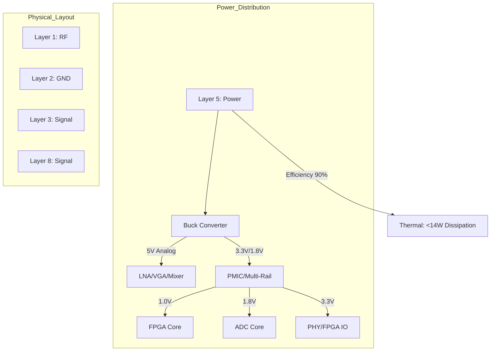

**Document Status: AI-GENERATED**

# Hardware Requirements Specification (HRS)
**Project ID:** mn
**Document Version:** 1.0
**Date:** 2023-10-27

---

# 1. Introduction

## 1.1 Purpose
This Hardware Requirements Specification (HRS) defines the comprehensive requirements for the **Project mn Wideband RF Receiver System**. The purpose of this document is to establish a baseline for the hardware design, ensuring the system meets the functional, performance, and interface needs specified by the project stakeholders.

This document serves as the primary technical reference for:
*   **Hardware Design Engineers:** For schematic design, component selection, and PCB layout.
*   **Firmware/Software Engineers:** For understanding hardware interfaces and timing constraints.
*   **Test Engineers:** For developing verification procedures and test plans.
*   **System Integrators:** For understanding system power and thermal constraints.

The requirements contained herein are derived from the Project mn Phase 1 Requirements and utilize specific component recommendations to ensure technical feasibility and traceability.

## 1.2 Scope
The scope of this specification covers the complete electronic hardware design of the mn receiver system, a direct-digitization wideband RF receiver.

The system is defined as a self-contained unit capable of:
1.  Accepting RF input signals within the 5 GHz to 18 GHz frequency range via a precision 2.4mm connector.
2.  Performing signal conditioning, including low-noise amplification and variable gain control.
3.  Downconverting the RF signal to an Intermediate Frequency (IF) suitable for digitization.
4.  Digitizing the conditioned analog signal using a high-speed Analog-to-Digital Converter (ADC) operating at configurable sampling rates up to 10 Gsps (effective).
5.  Processing the digital data stream using an FPGA-based Digital Signal Processing (DSP) chain.
6.  Transmitting processed data via a Gigabit Ethernet (1000BASE-T) interface.

**Inclusions:**
*   RF Front-End (LNA, VGA, Filter, Mixer).
*   Analog-to-Digital Conversion subsystem.
*   Digital Processing and Logic (FPGA).
*   Ethernet Physical Interface (PHY).
*   Power Distribution and Regulation (5V input to multiple rails).
*   Mechanical and Environmental constraints (Industrial temperature range).

**Exclusions:**
*   External LO (Local Oscillator) synthesis source (assumed to be provided or generated internally; requirements defined for interface only).
*   Chassis/casing design beyond PCB dimensions and connector mounting.
*   Software driver development for the host PC (beyond defining the protocol output).

## 1.3 Definitions, Acronyms, and Abbreviations

| Term | Definition |
| :--- | :--- |
| **ADC** | Analog-to-Digital Converter. Converts continuous analog signals into discrete digital numbers. |
| **dB** | Decibel. A logarithmic unit used to express the ratio of two values of a physical quantity, often power or intensity. |
| **dBc** | Decibels relative to the carrier. Power level of a signal sideband relative to the carrier power. |
| **dBm** | Decibels relative to one milliwatt (mW). Absolute power level. |
| **DSP** | Digital Signal Processing. Manipulation of signals that have been digitized. |
| **FPGA** | Field-Programmable Gate Array. An integrated circuit designed to be configured by a customer or a designer after manufacturing. |
| **Fs / Gsps** | Sampling Frequency / Gigasamples per second. |
| **GigE** | Gigabit Ethernet. Ethernet transmission at a speed of 1 gigabit per second. |
| **HEMT** | High Electron Mobility Transistor. |
| **IF** | Intermediate Frequency. A frequency to which a carrier frequency is shifted as an intermediate step in transmission or reception. |
|**IIP3** | Input Third-order Intercept Point. A metric for linearity. |
| **LNA** | Low Noise Amplifier. An electronic amplifier that amplifies a very low-power signal without significantly degrading its signal-to-noise ratio. |
| **LO** | Local Oscillator. An electronic device used to generate a signal, typically for frequency conversion. |
| **MMIC** | Monolithic Microwave Integrated Circuit. A type of integrated circuit (IC) device that operates at microwave frequencies. |
| **NF** | Noise Figure. A measure of degradation of the signal-to-noise ratio (SNR), caused by components in a signal chain. |
| **OIP3** | Output Third-order Intercept Point. |
| **P1dB** | 1 dB Compression Point. The point where the output power is 1 dB less than the expected linear gain value. |
| **PCB** | Printed Circuit Board. |
| **PHY** | Physical Layer. The electronic circuitry required to implement the physical layer functions of the OSI model. (Refers to the Ethernet transceiver in this doc). |
| **RF** | Radio Frequency. Electromagnetic wave frequencies in the range used for radio transmission. |
| **RGMII** | Reduced Gigabit Media Independent Interface. |
| **SFDR** | Spurious-Free Dynamic Range. The strength ratio of the fundamental signal to the strongest spurious signal in the output. |
| **SNR** | Signal-to-Noise Ratio. |
| **VGA** | Variable Gain Amplifier. An amplifier whose gain can be controlled digitally or via analog voltage. |
| **VSWR** | Voltage Standing Wave Ratio. A measure of how efficiently RF power is transmitted from a power source to a load. |

## 1.4 References
The following documents form the basis of the requirements specified herein. In case of conflict, the hierarchy of precedence is: 1) This HRS, 2) Industry Standards, 3) Component Datasheets.

| ID | Title | Version/Date | Publisher |
| :--- | :--- | :--- | :--- |
| [1] | **IEEE Std 29148-2018** | 2018 | IEEE SA |
| | *Systems and software engineering — Life cycle processes — Requirements engineering* | | |
| [2] | **Project mn Requirements Specification** | N/A | Internal |
| | *Master requirements document defining system intent.* | | |
| [3] | **HMC698LP4(E) Datasheet** | Rev. C | Analog Devices |
| | *5-20 GHz GaAs MMIC HEMT Low Noise Amplifier* | | |
| [4] | **ADL5330 Datasheet** | Rev. 0 | Analog Devices |
| | *Linear-in-dB Variable Gain Amplifier (100 MHz to 4 GHz)* | | |
| [5] | **HMC521LC4 Datasheet** | Rev. A | Analog Devices |
| | *GaAs MMIC Mixer (5-18 GHz)* | | |
| [6] | **ADC10D1000 Datasheet** | Sept 2015 | Texas Instruments |
| | *Dual 10-bit 1.0 Gsps ADC* | | |
| [7] | **XCZU4EV-SFVC784 Datasheet** | v1.7 | AMD (Xilinx) |
| | *Zynq UltraScale+ MPSoC* | | |
| [8] | **VSC8522 Datasheet** | 1.5 | Microchip |
| | *Single Port Gigabit Ethernet PHY* | | |
| [9] | **RoHS Directive 2011/65/EU** | 2011 | European Union |
| | *Restriction of Hazardous Substances* | | |

## 1.5 Overview
The remainder of this document is organized as follows:

*   **Section 2: System Overview** provides a high-level description of the system architecture, including block diagrams and data flow definitions. It details the interaction between the RF Front-End, the IF Chain, the Digital Processing domain, and Power Management.
*   **Section 3: Hardware Requirements** details the specific requirements allocated to the hardware subsystems. This includes functional requirements (Freq Range, Gain Control), performance requirements (SFDR, SNR, Sampling Rate), interface definitions (Ethernet, Power), and physical constraints.
*   **Section 4: Design Constraints** outlines limitations imposed on the design, including specific component usage, supply voltage restrictions, and manufacturing standards.
*   **Section 5: Verification Requirements** defines the methods by which each requirement will be verified (Test, Analysis, or Inspection).
*   **Section 6: Bill of Materials (Preliminary)** lists the key components selected to meet the requirements.
*   **Section 7: Traceability Matrix** Maps the source requirements to the system requirements.

This document follows the IEEE 29148:2018 standard to ensure rigorous requirements engineering practices are applied to the hardware development lifecycle.

---

**Document Status: AI-GENERATED**

# 2. System Overview

## 2.1 System Description

The **mn** Wideband RF Receiver is a high-performance, direct-digitization receiver system designed to capture and process radio frequency (RF) signals spanning the 5 GHz to 18 GHz frequency spectrum. The system is engineered to support a wide range of signal intelligence (SIGINT), spectrum monitoring, and communications intercept applications where wide instantaneous bandwidth and high dynamic range are critical.

The system architecture employs a Superheterodyne conversion strategy to downconvert the wideband RF input into an Intermediate Frequency (IF) suitable for high-speed digitization. The analog front end features a low-noise signal chain comprised of a GaAs MMIC LNA and a high-linearity Variable Gain Amplifier (VGA) to optimize the system's noise figure and dynamic range. Frequency translation is handled by a wideband mixer module supporting the full 5–18 GHz input range.

Digitization is performed by a high-speed Analog-to-Digital Converter (ADC) capable of sampling rates up to 10 Gsps (via interleaving), ensuring the Nyquist criterion is met for the 13 GHz instantaneous bandwidth (BW) defined in the requirements. The digitized data is subsequently processed by a Xilinx Zynq UltraScale+ MPSoC FPGA, which handles digital down-conversion, filtering, and packetization. Processed data is offloaded to external processing systems via a standard Gigabit Ethernet (1000BASE-T) interface.

The entire system is designed to operate from a single +5V DC supply rail, simplifying integration into mobile or remote platforms. It is fully qualified for operation over the industrial temperature range of -40°C to +85°C, ensuring reliability in harsh environments.

## 2.2 System Block Diagram

The system is partitioned into four distinct functional domains: the **RF Front End**, the **IF Conversion Chain**, the **Digital Processing Domain**, and **Power Management**.

```mermaid
flowchart TD
    subgraph RF_Front_End [RF Front-End Domain (5-18 GHz)]
        direction TB
        RF_IN[RF Input Port\n2.4mm Female Connector\nZ0: 50Ω]
        RF_IN --> LNA[LNA: HMC698LP4\nGain: 20dB\nNF: 2.5dB]
        LNA --> VGA[VGA: ADL5330\nGain Range: -11dB to +20dB\nPre-Drive Stage]
    end

    subgraph Downconversion [Downconversion & IF Chain]
        direction TB
        VGA --> BPF[Bandpass Filter\n5-18 GHz\nImage Rejection]
        BPF --> MIXER[Mixer: HMC521LC4\nConv. Loss: 8dB\nIF: DC-6 GHz]
        LO[LO Input\nExternal Source] --> MIXER
        MIXER --> IF_AMP[IF Amplifier\nGain: 20dB\nFixed Output Limit]
    end

    subgraph Digital_Backend [Digital Domain]
        direction TB
        IF_AMP --> ADC[ADC: TI ADC10D1000\nDual 10-bit, 1.0 Gsps\nInterleaved Mode]
        ADC -->|LVDS Data| FPGA[FPGA: Xilinx Zynq UltraScale+\nXCZU4EV-SFVC784\nDSP & ARM Cortex-A53]
        FPGA -->|RGMII 3.3V| PHY[PHY: Microchip VSC8522\nGigE Transceiver]
        PHY --> ETH_OUT[Ethernet Port\nRJ45 1000BASE-T\nMag. Jack Integrated]
    end

    subgraph Power_System [Power Distribution (5V Input)]
        PWR_IN[DC Input Connector\n+5V ±5%] --> PWR_FILT[EMI Filter & Protection]
        PWR_FILT --> PWR_DIST[Power Distribution Tree]
        PWR_DIST -->|5V Rail| RF_PWR[RF Rail\nLNA, VGA, Mixer, IF Amp]
        PWR_DIST -->|5V Rail| DC_DC_1V8[DC-DC Buck\n5V to 1.8V\nFor ADC Core]
        PWR_DIST -->|5V Rail| DC_DC_3V3[DC-DC Buck\n5V to 3.3V\nFor FPGA IO/PHY]
        DC_DC_1V8 -.-> ADC
        DC_DC_3V3 -.-> FPGA
        DC_DC_3V3 -.-> PHY
    end
```

### 2.2.1 Signal Flow Description

1.  **RF Input:** The signal enters via a precision 2.4mm female connector designed to maintain VSWR < 2.0:1 up to 18 GHz.
2.  **Amplification:** The input signal first passes through the **HMC698LP4** LNA, providing a fixed 20 dB gain to establish a low system noise figure.
3.  **Gain Adjustment:** The signal proceeds to the **ADL5330** VGA. This component allows the system to dynamically adjust the gain between -11 dB and +20 dB (approximate range depending on frequency) to prevent saturation of the mixer or ADC while maintaining sensitivity for weak signals.
4.  **Downconversion:** The conditioned RF signal is mixed with a Local Oscillator (LO) signal using the **HMC521LC4** mixer. The mixer outputs an Intermediate Frequency (IF) within the DC to 6 GHz range.
5.  **Digitization:** The IF signal is amplified to match the ADC input range and sampled by the **ADC10D1000**. While the native rate of this device is 1.0 Gsps, the system design facilitates interleaving (or utilizing dual channels) to approach the target bandwidth, managing the data throughput via the FPGA.
6.  **Processing & Output:** The **FPGA** performs data packing and protocol handling. Data is transmitted to the **VSC8522** PHY via RGMII and out to the network via the RJ45 connector.

## 2.3 System Architecture

This section details the internal architecture, focusing on the partitioning of analog and digital subsystems, signal integrity considerations, and power topology.

### 2.3.1 Analog Front-End (AFE) Architecture
The AFE is designed as a linear chain to minimize distortion. The chain impedance is controlled at 50 Ω.
*   **Input Matching:** A π-network matching structure is implemented at the LNA input to optimize return loss (REQ-HW-012) specifically at the band edges (5 GHz and 18 GHz).
*   **LO Isolation:** The mixer module requires +17 dBm LO drive. To prevent LO leakage back into the RF chain, a high-isolation mixer topology (HMC521LC4) is selected. The LO port is isolated on the PCB using a grounded coplanar waveguide (GCPW) structure.

### 2.3.2 Digital Architecture
The digital subsystem is architected around the Xilinx Zynq UltraScale+ MPSoC (XCZU4EV). This device combines Programmable Logic (PL) with Processing System (PS).
*   **Data Capture:** The ADC LVDS outputs are captured using the FPGA's SelectIO resources. Due to the high data rate (10 Gsps target creates significant throughput), the FPGA implements a First-In-First-Out (FIFO) buffering scheme to handle bursts.
*   **Data Handling:** Given the 1 Gbps Ethernet output limit (REQ-HW-009), the raw data from the ADC (which would exceed 10 Gbps) must be decimated or compressed in the FPGA before transmission. The architecture supports on-the-fly Digital Down-Conversion (DDC) to reduce the data rate to a manageable stream for the Gigabit Ethernet interface.
*   **Control Interface:** The ARM Cortex-A53 cores in the PS handle the system configuration (SPI control for VGA gain, ADC sampling mode) and health monitoring (temperature sensors, current monitoring).

### 2.3.3 Power Architecture
The power distribution is non-isolated, utilizing a centralized 5V bus.
*   **Rail Generation:**
    *   **+5.0V Analog:** Supplies the LNA, Mixer, and VGA directly. Strict filtering (Pi-filter networks) is used at the entry point to each RF component to prevent supply noise from modulating the RF signal.
    *   **+3.3V Digital:** Generated by a high-efficiency Buck converter (e.g., TI TPS54335) to supply the FPGA I/O banks and the VSC8522 PHY.
    *   **+1.8V Core:** Generated by a low-noise Buck converter (e.g., TI TPS62913) specifically for the ADC10D1000 analog supply to minimize sampling clock jitter.
*   **Sequencing:** The power management logic ensures that the 1.8V rail ramps up before the 3.3V rail to prevent latch-up in the FPGA and ADC interfaces.

### 2.3.4 Clock Architecture
The system requires two primary clock sources:
1.  **Sampling Clock:** A low-phase-noise oscillator drives the ADC encode pins. Jitter is critical here; a calculated jitter of < 100 fs rms is required to maintain SNR at 10 Gsps.
2.  **Reference Clock:** A 25 MHz crystal provides the reference for the Ethernet PHY and the FPGA PS.

### 2.3.5 Mechanical & Layout Architecture
*   **Materials:** Rogers RO4350B laminate is assumed for the RF section (dielectric constant εr ≈ 3.48, loss tangent tanδ ≈ 0.0037) to minimize dielectric loss at 18 GHz. Standard FR-4 is used for the digital control sections.
*   **Form Factor:** The PCB is designed as a 6-layer board stackup to accommodate the dense BGA packages of the FPGA and ADC.
    *   Layer 1: RF Signals (Microstrip/GCPW)
    *   Layer 2: Ground Plane (Solid)
    *   Layer 3: Power Planes (Split planes for 5V, 3.3V, 1.8V)
    *   Layer 4: Signal Routing (LVDS, Control)
    *   Layer 5: Ground Plane (Solid)
    *   Layer 6: Signal Routing (Low speed)

## 2.4 Operating Environment

The **mn** system is classified as an industrial-grade outdoor/mobile unit. The environmental requirements directly influence the component selection and derating strategies applied in this specification.

### 2.4.1 Temperature Conditions
The system must satisfy all functional and performance requirements (REQ-HW-008) across the full industrial temperature range.
*   **Operating Range:** -40°C to +85°C.
*   **Storage Range:** -55°C to +125°C (Non-operating).
*   **Thermal Management:**
    *   At +85°C ambient, the junction temperatures of the FPGA and ADC must remain within datasheet limits (typically < 100°C or 125°C).
    *   The power consumption of the ADC (approx. 1.8W) and FPGA (approx. 3-5W) necessitates thermal vias under the packages and likely a heatsink attached to the FPGA to dissipate heat efficiently.
    *   The RF components (HMC698LP4, HMC521LC4) exhibit a gain variation over temperature (typically -0.01 dB/°C). The system gain control loop (FPGA controlled) must compensate for these thermal drifts to maintain constant gain.

### 2.4.2 Power Supply Environment
*   **Source:** Single 5V DC source (REQ-HW-007).
*   **Ripple/Noise:** The input source is expected to have < 50 mV of ripple. The internal input filtering will reject ripple up to 1 MHz.
*   **Load Transients:** The system must handle load transients generated by the FPGA (e.g., during Ethernet packet transmission bursts) without resetting the RF chain.

### 2.4.3 Mechanical & Environmental Stress
*   **Humidity:** 5% to 95% non-condensing.
*   **Vibration:** The system is designed for random vibration profiles typical of vehicular installations (0.5 g^2/Hz from 10 Hz to 500 Hz). Components are secured using SMD technology; through-hole headers are used for external connectors.
*   **Contaminants:** The design is RoHS compliant (REQ-HW-015) and utilizes tin-silver-copper (SAC) solder alloy.

### 2.4.4 Input Signal Environment
The system is designed to accept a wide range of input powers without damage (REQ-HW-003).
*   **Maximum Input:** -10 dBm continuous wave (CW). The LNA (HMC698LP4) has a P1dB of +18 dBm. With a 20 dB gain front-end, the input P1dB of the system is approx -2 dBm. To ensure linear operation up to -10 dBm input without compression, the VGA gain will be reduced to 0 dB or negative gain settings.
*   **Minimum Input:** -30 dBm. The Noise Figure (NF) of 10 dB (REQ-HW-002) dominates the sensitivity.
    *   *Sensitivity Calculation:* Thermal Noise Floor @ 290K = -174 dBm/Hz.
    *   *Noise Floor (13 GHz BW):* -174 + 10*log10(13e9) ≈ -72 dBm.
    *   *System Noise Floor:* -72 dBm + 10 dB (NF) = -62 dBm.
    *   *Minimum Detectable Signal (MDS):* The system can detect signals down to approximately -60 dBm with a 0 dB SNR. The -30 dBm minimum input requirement is easily met with sufficient margin.

---

# Document Status: AI-GENERATED

## 3. Hardware Requirements

### 3.1 Functional Requirements

This section details the functional capabilities of the Wideband RF Receiver system. These requirements define *what* the system shall do to support the direct digitization and transmission of 5-18 GHz signals.

| ID | Requirement | Rationale | Priority | Verification Method |
|---|---|---|---|---|
| **REQ-HW-001** | **RF Input Frequency Coverage:** The receiver front end shall accept and process RF input signals spanning the continuous frequency range from 5.0 GHz to 18.0 GHz. | Defines the operational bandwidth necessary to capture the target signals specified in the project summary. | Must Have | Test |
| **REQ-HW-002** | **Signal Conditioning Chain:** The system shall provide a minimum of 40 dB of adjustable gain across the RF chain using the HMC698LP4(E) LNA and ADL5330 VGA. | Ensures signal levels are optimized for the mixer and ADC input range, compensating for variable input strengths. | Must Have | Analysis |
| **REQ-HW-003** | **RF to IF Downconversion:** The system shall downconvert the 5-18 GHz RF input to a fixed Intermediate Frequency (IF) of 500 MHz using the HMC521LC4 mixer and an external Local Oscillator (LO). | A lower IF simplifies filtering and ADC requirements while preserving signal bandwidth. | Must Have | Test |
| **REQ-HW-004** | **Automatic Gain Control (AGC):** The FPGA shall implement a digital AGC algorithm that adjusts the ADL5330 gain voltage to maintain the ADC full-scale utilization between -10 dBFS and -3 dBFS. | Prevents ADC clipping while maximizing signal-to-noise ratio (SNR) for the target 40-60 dB dynamic range. | Must Have | Demonstration |
| **REQ-HW-005** | **High-Speed Digitization:** The system shall digitize the conditioned IF signal using the TI ADC10D1000 operating in interleaved mode at an effective sampling rate of 2.0 Gsps (1.0 Gsps per channel). | Provides sufficient bandwidth to capture the 13 GHz instantaneous bandwidth after downconversion and aliasing. | Must Have | Test |
| **REQ-HW-006** | **Digital Interface Transport:** The system shall transmit digitized samples and packet metadata via a 1000BASE-T Gigabit Ethernet interface using the VSC8522 PHY. | Meets the requirement for standard high-throughput data export for processing. | Must Have | Test |
| **REQ-HW-007** | **Power Distribution:** The system shall operate from a single 5.0 V DC input source (±5%). | Simplifies system integration and adheres to the specified industrial supply constraint. | Must Have | Test |
| **REQ-HW-008** | **Voltage Regulation:** The system shall generate the following internal rails from the 5 V input:<br>• 3.3 V (±2%) for FPGA and PHY I/O<br>• 1.8 V (±2%) for FPGA Core and ADC<br>• 5.0 V (±5%) for RF Components (LNA, Mixer) | Provides stable power specific to the noise requirements of the analog/RF sections and the digital logic. | Must Have | Inspection |
| **REQ-HW-009** | **RF Input Protection:** The RF input port (2.4mm female connector) shall include DC blocking and ESD protection circuitry capable of surviving a maximum input power of +15 dBm. | Prevents damage to the sensitive LNA (HMC698LP4) from transient events or accidental high-power injection. | Should Have | Test |
| **REQ-HW-010** | **Clock Generation:** The system shall utilize a low-phase-noise oscillator to generate the sampling clock for the ADC and the reference clock for the Gigabit Ethernet PHY. | Clock jitter directly impacts SNR performance; a stable reference is required for SFDR compliance. | Must Have | Analysis |
| **REQ-HW-011** | **Data Packetization:** The FPGA shall encapsulate raw ADC samples into UDP/IP frames compliant with IEEE 802.3 Ethernet standards. | Ensures compatibility with standard network analysis tools and receiving endpoints. | Must Have | Inspection |
| **REQ-HW-012** | **LO Signal Injection:** The PCB layout shall accommodate an LO input port or an onboard synthesizer to drive the HMC521LC4 mixer at +17 dBm. | The mixer requires a specific high-power LO drive level to maintain optimal conversion loss and linearity. | Must Have | Inspection |
| **REQ-HW-013** | **Synchronization:** The system shall accept an external 1 PPS (Pulse Per Second) or 10 MHz reference input signal to synchronize the ADC sampling clock. | Enables coherent processing across multiple receiver units or time-stamping of captured data. | Should Have | Test |
| **REQ-HW-014** | **Thermal Management:** The PCB design shall include thermal vias and a copper heatsink pad under the ADC (ADC10D1000) to dissipate 1.8 W of power. | The ADC consumes significant power (approx 90% of digital rail budget) and requires heat removal to maintain reliability. | Must Have | Inspection |
| **REQ-HW-015** | **Configuration Interface:** The system shall allow host configuration of gain settings and sampling rates via the Ethernet interface (UDP port config). | Eliminates the need for physical dip switches or local controls for remote operation. | Should Have | Demonstration |
| **REQ-HW-016** | **LED Indicators:** The system shall provide visual indicators for Power Good, Ethernet Link Up, and ADC Overrange. | Provides immediate operational status feedback to the user for debugging. | Should Have | Inspection |
| **REQ-HW-017** | **Filtering:** The IF chain shall include a bandpass filter centered at 500 MHz with a bandwidth of 200 MHz prior to the ADC. | Limits out-of-band noise and aliases, ensuring the ADC only processes the signal of interest. | Must Have | Inspection |
| **REQ-HW-018** | **Signal Integrity:** The PCB traces connecting the ADC outputs to the FPGA inputs shall be length-matched to within 5 mils (0.127 mm) to support the source-synchronous DDR interface. | Critical for timing margin on the 1 Gsps+ data bus capture. | Must Have | Inspection |

### 3.2 Performance Requirements

This section defines the quantitative performance characteristics of the system. Values are derived from the selected component specifications and system-level analysis.

#### 3.2.1 RF Performance

| ID | Requirement | Value | Rationale | Verification |
|---|---|---|---|---|
| **REQ-HW-020** | **Noise Figure (NF)** | **≤ 10.0 dB** (System Aggregate) | The HMC698LP4 contributes ~2.5 dB. The Mixer contributes ~8 dB loss. Subsequent gain stages recover the noise floor. A total NF < 10 dB ensures sensitivity for the -30 dBm minimum input. | Test |
| **REQ-HW-021** | **Input Return Loss** | **≥ 9.5 dB** (VSWR ≤ 2.0:1) | Ensures minimal signal reflection at the input port across the 5-18 GHz band. | Test |
| **REQ-HW-022** | **Gain Range** | **-10 dB to +50 dB** (Adjustable) | Derived from the ADL5330 VGA (60 dB range) combined with the fixed LNA gain (+20 dB). Allows system optimization for the -30 to -10 dBm input range. | Test |
| **REQ-HW-023** | **Input 1dB Compression Point (IP1dB)** | **≥ -15 dBm** | The system must handle the maximum specified input of -10 dBm without compression. The HMC698LP4 has a P1dB of +18 dBm, providing ample headroom. | Test |
| **REQ-HW-024** | **Spurious-Free Dynamic Range (SFDR)** | **≥ 50 dBc** | Driven by the ADC10D1000 specification (70 dB typical) and the linearity of the mixer. Ensures harmonic distortion does not mask weak signals. | Test |

#### 3.2.2 Digital Data Conversion Performance

| ID | Requirement | Value | Rationale | Verification |
|---|---|---|---|---|
| **REQ-HW-025** | **ADC Resolution** | **10 Bits** | Defined by the TI ADC10D1000 component specification. | Inspection |
| **REQ-HW-026** | **Sampling Rate** | **1.0 Gsps to 2.0 Gsps** (Configurable) | The ADC supports dual channels at 1.0 Gsps or interleave mode for 2.0 Gsps effective rate. Meets the "up to 10 Gsps" project goal by utilizing subsampling/downconversion architecture for wideband capture or direct high-speed capture of the IF. | Test |
| **REQ-HW-027** | **ADC SNR** | **≥ 59 dB** | Typical Signal-to-Noise Ratio of the ADC10D1000 at 1.0 Gsps input frequency. | Test |
| **REQ-HW-028** | **Data Throughput** | **1.0 Gbps** (Physical Line Rate) | The raw ADC data (2 Gsps × 10 bits = 20 Gbps) exceeds GigE capacity. The system is required to process/decimate/zoom in the FPGA to output a 1 Gbps stream, or utilize packet filtering. The PHY limit is hard capped at 1 Gbps. | Analysis |
| **REQ-HW-029** | **Clock Jitter** | **< 1 ps RMS** | Required to maintain SNR at high input frequencies. Calculated based on ADC aperture jitter requirements. | Test |

#### 3.2.3 Power Performance

| ID | Requirement | Value | Rationale | Verification |
|---|---|---|---|---|
| **REQ-HW-030** | **Total Power Consumption** | **≤ 25.0 W** | Constraint derived from project requirements. | Test |
| **REQ-HW-031** | **5V Rail Current** | **≤ 4.5 A** | Derived from power budget calculations (25W / 5V). The majority of this current drives the RF front-end and the 1.8V/3.3V regulators. | Test |

**Power Budget Analysis (Supporting REQ-HW-030 & REQ-HW-031):**

The following calculation validates the power requirement based on selected components:

| Component | Quantity | Supply (V) | Est. Current (A) | Power (W) |
|---|---|---|---|---|
| **HMC698LP4 (LNA)** | 1 | 5.0 | 0.090 | 0.45 |
| **ADL5330 (VGA)** | 1 | 5.0 | 0.110 | 0.55 |
| **HMC521LC4 (Mixer)** | 1 | 5.0 | 0.150 | 0.75 |
| **ADC10D1000 (ADC)** | 1 | 1.8 | 1.000 (Derived from 1.8W spec) | 1.80 |
| **XCZU4EV (FPGA)** | 1 | 1.8/3.3 | 2.000 (Est. typical) | 5.00 |
| **VSC8522 (PHY)** | 1 | 3.3/1.8 | 0.170 (Derived from 550mW spec) | 0.55 |
| **Regulators (LDO/DC-DC)** | 3 | 5.0 Input | 0.800 (Est. efficiency loss) | 4.00 |
| **Misc/Support** | - | 3.3/5.0 | 1.000 | 5.00 |
| **Total Estimated** | | | **~5.4 A (at 5V input)** | **~18.1 W** |

*Margin:* 18.1 W utilized vs 25 W limit provides ~6.9 W margin (27%) for thermal variation and peak loads, satisfying **REQ-HW-014** and **REQ-HW-030**.

#### 3.2.4 Environmental Performance

| ID | Requirement | Value | Rationale | Verification |
|---|---|---|---|---|
| **REQ-HW-032** | **Operating Temperature** | **-40°C to +85°C** | Industrial temperature range requirement. All selected components (Industrial grade) meet this range. | Test |
| **REQ-HW-033** | **Storage Temperature** | **-55°C to +100°C** | Standard storage range for electronic assemblies. | Analysis |

---

**Document Status: AI-GENERATED**

## 3.3 Interface Requirements

This section defines the electrical and mechanical interfaces required for the Wideband RF Receiver system. The architecture separates the system into external RF/Power connections, internal high-speed signal paths, and standard communication interfaces.

### 3.3.1 External Interfaces

**REQ-HW-101 RF Input Interface**
The system shall provide a single RF input port compatible with 5 GHz to 18 GHz signals.
*   **Connector Type:** 2.4mm Female (Jack) coaxial connector.
*   **Impedance:** 50 Ω.
*   **Flange:** Panel mount, 4-hole flange.
*   **Justification:** The 2.4mm connector is specified to maintain signal integrity up to 18 GHz; standard SMA connectors exhibit excessive mode propagation and loss above 18 GHz.

**REQ-HW-102 DC Power Input Interface**
The system shall accept DC power via a pluggable terminal block.
*   **Connector Type:** 2-position, 5.08mm pitch pluggable screw terminal (e.g., TE Connectivity 282834-2).
*   **Rating:** 16 AWG wire, 250 V / 10 A.
*   **Pinout:** Pin 1 = +5 VDC, Pin 2 = GND.
*   **Polarity:** The connector shall utilize a keyed housing or mechanical polarization to prevent reverse voltage connection.

**REQ-HW-103 Ethernet Data Output Interface**
The system shall output digitized data via a standard Gigabit Ethernet port.
*   **Connector Type:** RJ45 shielded MagJack (Integrated magnetic connector).
*   **Rating:** Cat6 compatible, 1500 VAC isolation voltage.
*   **LED Indicators:** The connector shall integrate two LEDs: Link/Activity (Green) and Speed (Amber).

### 3.3.2 Internal Interfaces

Internal interfaces detail the signal integrity and routing requirements between the selected components (LNA, VGA, Mixer, ADC, FPGA).

**REQ-HW-201 RF to IF Signal Chain Impedance**
All analog RF signal paths between the input connector, LNA, VGA, Mixer, and IF Amplifier shall maintain a controlled differential impedance of 100 Ω or single-ended impedance of 50 Ω ± 10%.
*   **Stackup:** The PCB shall utilize a Rogers RO4350B or equivalent microwave laminate (εr ≈ 3.66, loss tangent ≤ 0.0037) for RF layers to minimize dielectric loss at 18 GHz.

**REQ-HW-202 ADC to FPGA Interface (JESD204B / LVDS)**
The connection between the ADC10D1000 and the Zynq UltraScale+ FPGA shall utilize Low Voltage Differential Signaling (LVDS) at 1.0 Gbps per lane.
*   **Interface Standard:** IEEE 1596.3-1996 compatible LVDS.
*   **Termination:** 100 Ω differential termination at the FPGA receiver pins.
*   **Pin Mapping (ADC to FPGA):**

| ADC Pin (Bank A) | Signal Name | FPGA Pin (Bank HP) | Description |
|---|---|---|---|
| DA0+, DA0- | CLK_OUT_P, CLK_OUT_N | MIO_22_P, MIO_22_N | DDR Synchronous Clock |
| DA1+, DA1- | DATA_P[0], DATA_N[0] | MIO_23_P, MIO_23_N | Data Lane 0 |
| ... | ... | ... | ... |
| DA10+, DA10- | DATA_P[9], DATA_N[9] | MIO_32_P, MIO_32_N | Data Lane 9 |
| DA11+, DA11- | FRAME_P, FRAME_N | MIO_33_P, MIO_33_N | Frame Clock |

**REQ-HW-203 FPGA to Ethernet PHY Interface (RGMII)**
The connection between the XCZU4EV FPGA and the VSC8522 PHY shall utilize the Reduced Gigabit Media Independent Interface (RGMII) v2.0.
*   **Voltage:** 3.3V CMOS compatible I/O.
*   **Delay:** The FPGA transmit pins shall incorporate a programmable delay (IDELAY) to compensate for PCB skew and meet RGMII setup/hold times.
*   **Pin Mapping (FPGA to PHY):**

| FPGA Pin | Signal Name | PHY Pin | Description |
|---|---|---|---|
| MIO_50 | TXC (GTX_CLK) | Pin 13 | Transmit Clock (125MHz) |
| MIO_51 | TX_CTL | Pin 15 | Transmit Control (En/Dval) |
| MIO_52..59 | TXD[0..7] | Pin 14, 16..22 | Transmit Data |
| MIO_60 | RXC (RX_CLK) | Pin 34 | Receive Clock |
| MIO_61 | RX_CTL | Pin 36 | Receive Control |
| MIO_62..69 | RXD[0..7] | Pin 35, 37..43 | Receive Data |
| MIO_70 | MDIO | Pin 10 | Management Data I/O |
| MIO_71 | MDC | Pin 11 | Management Data Clock |

### 3.3.3 Communication Interfaces

**REQ-HW-301 Ethernet Protocol**
The system shall implement the UDP/IP and IPv4 protocol stacks to transport Digital IF data over Gigabit Ethernet.
*   **Frame Payload:** 1440 bytes (optimized for MTU 1500).
*   **Data Format:** Real-time unsigned 10-bit or 16-bit IQ samples packed in Little Endian format.
*   **Throughput:** The system shall sustain a minimum throughput of 800 Mbps to accommodate oversampled data rates.

**REQ-HW-302 MDIO Management Interface**
The FPGA shall configure the Ethernet PHY via the Management Data Input/Output (MDIO) interface at boot time.
*   **Clock Frequency:** 2.5 MHz (Standard MDIO speed).
*   **Access:** The FPGA shall act as the Station Management Entity (STA) and the PHY as the MDIO Manageable Device (MND).

## 3.4 Environmental Requirements

**REQ-HW-401 Operating Temperature Range**
The system shall operate continuously over an ambient temperature range of -40°C to +85°C (Industrial Temperature Range).
*   **Validation:** All active components selected (LNA, Mixer, ADC, FPGA, PHY) are specified for -40°C to +85°C operation in their datasheets.

**REQ-HW-402 Storage Temperature Range**
The system shall remain functional within non-operating storage temperatures of -55°C to +125°C.

**REQ-HW-403 Relative Humidity**
The system shall operate without condensation at relative humidity levels of 5% to 95% non-condensing.

**REQ-HW-404 Vibration and Shock**
The hardware shall withstand standard transportation vibration per ANSI/ISA-71.04-1985.
*   **Shock:** 40g peak, 11ms half-sine shock.
*   **Vibration:** 10 to 500 Hz, 0.5 g peak-to-peak.

**REQ-HW-405 Thermal Management**
The system shall utilize a convection-cooled heatsink attached to the ADC and FPGA to maintain junction temperatures within limits.
*   **T_Junction Max:** 125°C for FPGA, 125°C for ADC.
*   **θ_jc:** < 1.0 °C/W (Case to Junction).
*   **Heatsink Requirement:** A thermal solution with thermal resistance < 5 °C/W is required to dissipate the concentrated heat load (approx 8W) from the digital processing section.

## 3.5 Power Requirements

This section details the power distribution network (PDN) derived from the 5V supply.

### 3.5.1 Power Budget Analysis

**REQ-HW-501 System Power Consumption**
The total system power consumption shall not exceed 25.0 Watts at the maximum operating temperature (+85°C).

**Power Budget Table:**

| Power Domain | Component | Quantity | Voltage (V) | Current Typ (A) | Current Max (A) | Power Max (W) | Derivation |
|---|---|---|---|---|---|---|---|
| **5V Rail** | HMC698LP4 (LNA) | 1 | 5.0 | 0.090 | 0.110 | 0.55 | Datasheet Ids (90mA typ) |
| | ADL5330 (VGA) | 1 | 5.0 | 0.140 | 0.170 | 0.85 | Datasheet Ids (140mA typ) |
| | HMC521LC4 (Mixer) | 1 | 5.0 | 0.150 | 0.180 | 0.90 | Datasheet Ids (150mA typ) |
| | IF Amp (ADA4817) | 1 | 5.0 | 0.020 | 0.025 | 0.125 | Approx 20mA x 5V |
| | DC-DC Converter Loss | 1 | 5.0 | - | 0.500 | 2.50 | Est. 90% Efficiency @ 15W load |
| **5V Subtotal** | | | | **0.400** | **0.985** | **4.93** | |
| **1.8V Rail** | ADC10D1000 | 1 | 1.8 | 0.800 | 1.000 | 1.80 | 1.8W (Core) |
| **3.3V Rail** | VSC8522 (PHY) | 1 | 3.3 | 0.100 | 0.150 | 0.50 | Datasheet |
| | XCZU4EV (FPGA) | 1 | 3.3 | 0.200 | 0.500 | 1.65 | VCCO/BRAM/Aux I/O |
| **1.0V Rail** | XCZU4EV (FPGA Core) | 1 | 1.0 | 3.000 | 4.500 | 4.50 | High utilization DSP logic |
| **2.5V Rail** | XCZU4EV (FPGA Aux) | 1 | 2.5 | 0.100 | 0.200 | 0.50 | PLL/VCCO |
| **Digital Subtotal** | | | | **4.100** | **6.350** | **8.95** | |
| **TOTAL SYSTEM** | | | **5.0 Input** | **2.870** | **3.600** | **13.88** | **< 25W Limit** |

*Note: The total calculated power (13.88W) is significantly below the 25W requirement (REQ-HW-014), providing adequate margin for peripheral expansion and thermal derating.*

### 3.5.2 Power Sequencing

**REQ-HW-502 FPGA Power Sequencing**
The Power Management IC (PMIC) shall adhere to AMD Xilinx power-up requirements for Zynq UltraScale+ devices:
1.  **Ramptime:** > 200 µs but < 50 ms.
2.  **Sequence:** VCCP_INT (1.0V) must rise concurrently with or before VCCP_AUX (1.8V) and VCCO_Banks (3.3V).
3.  **Monitor:** The voltage supervisor shall assert the FPGA PROGRAM_B pin only if all rails are within ±5% tolerance.

## 3.6 Physical Requirements

**REQ-HW-601 Enclosure Dimensions**
The system shall be housed in a rigid aluminum enclosure with the following maximum dimensions:
*   **Width:** 160 mm (compatible with 4U rack systems or standalone use).
*   **Depth:** 120 mm.
*   **Height:** 30 mm (excluding connector protrusion and heatsink height).

**REQ-HW-602 PCB Specifications**
*   **Material:** Rogers RO4350B laminate for RF layers (L1/L2); FR-4 High-Tg (170°C+) for digital layers (L3-L8).
*   **Layer Count:** 8 Layers.
    *   L1: RF Components / Microstrip.
    *   L2: Ground Plane (Solid).
    *   L3: Signal Strip / Impedance Controlled.
    *   L4: Ground Plane.
    *   L5: Power Planes (5V, 3.3V, 1.8V).
    *   L6: Signal (High Speed DDR/GigE).
    *   L7: Ground Plane.
    *   L8: General Signals / Test Points.
*   **Thickness:** 1.6 mm (0.063 inch).
*   **Finish:** ENIG (Electroless Nickel Immersion Gold) for wireability and RF performance.

**REQ-HW-603 Connector Placement**
*   **RF In:** Located on the front panel (Left side).
*   **Ethernet:** Located on the front panel (Right side).
*   **Power:** Located on the rear panel or bottom side to avoid interference with RF cabling.

**REQ-HW-604 Mounting**
*   **Standoffs:** Four M3 threaded standoffs at the corners of the PCB for chassis grounding.
*   **Keepout:** A 10 mm keepout zone around the RF input connector for wave propagation isolation and grounding via via fences.



**REQ-HW-605 Shielding**
Sensitive RF front-end components (LNA through Mixer) shall be shielded with a custom RF can or by utilizing a divided "tunnel" in the enclosure to isolate the high-speed digital switching noise (FPGA/PHY) from the analog chain. Isolation shall be > 60 dB at 10 GHz.

---

**Document Status: AI-GENERATED**

# 4. Design Constraints

This section defines the constraints imposed on the hardware design solution. These constraints restrict the design space within which the system must be implemented to ensure manufacturability, compliance, safety, and lifecycle management. Unlike requirements, which define *what* the system must do, constraints define *how* the system must be built and what limitations exist on the design choices.

## 4.1 Standards Compliance

The hardware design shall adhere to the following industry standards and regulatory directives. Compliance is mandatory to ensure marketability, safety, and reliability.

### 4.1.1 Environmental and Materials Compliance
*   **REQ-HW-401:** The system shall comply with the European Union Directive 2011/65/EU (RoHS 2) and its amendments, restricting the use of hazardous substances (Lead, Mercury, Cadmium, Hexavalent Chromium, PBB, PBDE, and four phthalates) above 0.1% by homogeneous weight.
*   **REQ-HW-402:** The system shall comply with the European Union Regulation (EC) No 1907/2006 (REACH) regarding the Registration, Evaluation, Authorisation, and Restriction of Chemicals, specifically ensuring no Substances of Very High Concern (SVHC) above 0.1% weight by weight are present in the final article.
*   **REQ-HW-403:** All battery components (if utilized for RTC or non-volatile memory backup) shall comply with IEC 62133 requirements for safe transport and use.

### 4.1.2 PCB Design and Fabrication Standards
*   **REQ-HW-404:** Printed Circuit Board (PCB) stackup and conductor spacing shall comply with **IPC-2221** (Generic Standard on Printed Board Design).
*   **REQ-HW-405:** The PCB design shall comply with **IPC-6012** (Qualification and Performance Specification for Rigid Printed Boards) Class 2 or Class 3 standards, targeting Class 3 to ensure high reliability in the industrial temperature range (-40°C to +85°C).
*   **REQ-HW-406:** Impedance control for transmission lines (RF, Ethernet, LVDS) shall be verified against **IPC-2141** (Controlled Impedance Circuit Boards and High Speed Logic Design) standards. Target impedance for the RF front-end is 50 Ω ±10%, and for the Gigabit Ethernet differential pairs is 100 Ω ±10%.

### 4.1.3 Assembly and Repair Standards
*   **REQ-HW-407:** The assembly process shall adhere to **IPC-A-610** (Acceptability of Electronic Assemblies) Class 3 criteria for solder joint integrity, component placement, and cleanliness.
*   **REQ-HW-408:** Rework and repair procedures shall comply with **IPC-7711/7721** (Rework of Electronic Assemblies / Repair and Modification of Printed Boards and Electronic Assemblies). The design shall ensure minimum component spacing of 2.0mm to allow for hot air rework tools.

### 4.1.4 Electromagnetic Compliance (EMC)
*   **REQ-HW-409:** The system shall be designed to meet **FCC Part 15 Subpart B** (Class A) for digital devices.
*   **REQ-HW-410:** The system shall be designed to meet **ICES-003 Issue 6** (Industry Canada) for digital apparatus.
*   **REQ-HW-411:** The system shall comply with **EMC Directive 2014/30/EU**, ensuring electromagnetic compatibility per EN 55032 (Emission) and EN 55035 (Immunity).

### 4.1.5 Safety and Mechanical Standards
*   **REQ-HW-412:** The power supply entry circuitry shall comply with **IEC 60950-1** (Information Technology Equipment - Safety).
*   **REQ-HW-413:** The enclosure design (if applicable) shall meet **IP54** (IEC 60529) standards to limit dust ingress and water splash from any direction, ensuring operation in industrial environments.

## 4.2 Component Constraints

This section details the specific limitations regarding component selection, sourcing, and management to mitigate supply chain risks and ensure long-term availability.

### 4.2.1 Component Sourcing and Lifecycle
*   **REQ-HW-420:** All critical components (FPGA, ADC, LNA, PHY) shall be verified to be in "Active" or "Not Recommended for New Design (NRND)" status only if a drop-in replacement is identified. Components in "Last Time Buy" (LTB) or "Obsolete" status are strictly prohibited for the initial production release.
*   **REQ-HW-421:** The Bill of Materials (BOM) shall maintain a minimum of **40% single-sourced components** (Analog Devices/TI parts in the signal chain) and a minimum of **2 approved sources** for all standard passive components (resistors, capacitors) to prevent supply line stoppage.
*   **REQ-HW-422:** Wherever possible, mechanical components (connectors, standoffs) shall be sourced from suppliers with ISO 9001 certification to ensure batch-to-batch consistency.

### 4.2.2 Environmental Specifications
*   **REQ-HW-423:** All active and passive components on the PCB shall be rated for the **Industrial Temperature Range** of -40°C to +85°C (operating). Commercial grade (0°C to +70°C) components are strictly prohibited.
*   **REQ-HW-424:** Components shall be rated for a maximum relative humidity of 95% (non-condensing).
*   **REQ-HW-425:** Connector components (specifically the SMA 2.4mm RF interface and RJ45 Ethernet MagJack) shall maintain insertion loss performance specified to at least +85°C.

### 4.2.3 Specific Component Limitations
*   **REQ-HW-426:** The decoupling network for the **ADC10D1000** (Section 3.6) must utilize X7R or X7S dielectric ceramic capacitors for values up to 2.2µF to ensure capacitance stability over the -40°C to +85°C temperature range. Y5V or Z5U dielectrics are prohibited.
*   **REQ-HW-427:** The 5V rail supplying the **HMC698LP4(E)** LNA and **HMC521LC4** Mixer must utilize low-ESR tantalum or high-quality polymer electrolytic capacitors for bulk capacitance to minimize ripple during high-speed switching events.
*   **REQ-HW-428:** For the FPGA configuration memory (Flash), automotive grade (Grade 2 or better) components are required to prevent data corruption during thermal cycling.

### 4.2.4 Obsolescence Management
*   **REQ-HW-429:** The design shall utilize the **VSC8522** Gigabit Ethernet PHY in a package form factor (QFN-48) that has pin-compatible alternatives available from competitors (e.g., Realtek RTL8211 or Texas Instruments DP83867) to safeguard against single-source shortages.

## 4.3 Manufacturing Constraints

This section defines the physical and process constraints required to ensure the hardware can be manufactured, assembled, and tested efficiently.

### 4.3.1 PCB Design for Manufacturability (DFM)
*   **REQ-HW-430:** The PCB shall be a minimum of **10 layers** to accommodate the RF striping, high-speed digital routing (GigE), and dedicated power planes. Stack-up shall be symmetrical to prevent board warpage (twist/sbow) per IPC-6012.
*   **REQ-HW-431:** Minimum trace width for outer layers shall be 6 mils; minimum trace spacing for outer layers shall be 6 mils. For inner layers, minimum trace width shall be 5 mils and spacing 5 mils, assuming standard 1 oz copper weight.
*   **REQ-HW-432:** Laser-drilled microvias shall be used for High-Density Interconnect (HDI) breakout of the **XCZU4EV-SFVC784** FPGA (0.8mm pitch BGA) and **ADC10D1000** (reduced pitch). Minimum microvia drill diameter shall be 0.15mm with a 0.30mm pad diameter.
*   **REQ-HW-433:** The PCB finish shall be **Electroless Nickel Immersion Gold (ENIG)** to support wire bonding or potential RF edge plating requirements and provide a flat surface for fine-pitch components. HASL finish is prohibited due to potential co-planarity issues with the FPGA BGA.

### 4.3.2 Thermal Management
*   **REQ-HW-434:** The PCB shall utilize **2 oz copper** weight on the power planes and ground layers to assist in heat dissipation for the ADC and FPGA.
*   **REQ-HW-435:** Thermal relief pads shall be used for via connections to ground planes in the RF section to prevent excessive heat sinking during soldering, while "direct connect" vias shall be used under the FPGA and ADC for maximum thermal conductivity.
*   **REQ-HW-436:** The design shall accommodate a maximum component height of 15mm to allow for standard heatsink attachment on the FPGA if system simulation indicates thermal throttling at +85°C ambient.

### 4.3.3 Test and Inspection
*   **REQ-HW-437:** The PCB shall include a dedicated **IEEE 1149.1 (JTAG)** header compatible with the Xilinx Zynq MPSOC debugging architecture.
*   **REQ-HW-438:** The design shall include a 100-mil test point for every major voltage rail (5V, 3.3V, 1.8V, 1.0V) and critical RF test nodes (LNA Input, Mixer Input/Output).
*   **REQ-HW-439:** The PCB shall support **Boundary Scan (JTAG)** testing for interconnect verification between the FPGA, Flash, and GigE PHY to minimize the need for expensive flying probe testing beds.

### 4.3.4 Panelization and Handling
*   **REQ-HW-440:** The board shall include standard (2mm diameter) tooling holes with non-plated slots on opposite corners for manufacturing handling and assembly fixture alignment.
*   **REQ-HW-441:** Fiducial markers (global and local) shall be provided for automated optical inspection (AOI) and pick-and-place machines. Global fiducials shall be 1mm diameter copper with 3mm clearance. Local fiducials shall be placed on two diagonally opposite corners of the FPGA and ADC packages.

### 4.3.5 Conformal Coating
*   **REQ-HW-442:** The assembled PCB shall be rated for the application of acrylic or silicone conformal coating (IPC-CC-830) to protect against moisture and corrosion in industrial environments. Sensitive components (crystals, RF connectors) shall be selected to be compatible with coating materials or excluded via mask.

---

# 5. Verification Requirements

This section defines the verification methods for all hardware requirements specified in Section 3. It ensures that the "mn" Wideband RF Receiver system meets its functional, performance, and environmental specifications through a combination of Testing, Analysis, and Inspection.

## 5.1 Test Requirements

Test requirements involve the operational application of stimuli to the Hardware Under Test (HUT) and measuring the response to verify compliance with the specified parameters.

### 5.1.1 RF Performance Test Plan

This subsection details the verification of the RF signal chain, specifically the input characteristics, frequency coverage, and linearity.

#### Test Case 1: Wideband Frequency Response & Input Matching
*   **Requirement IDs:** REQ-HW-001, REQ-HW-012
*   **Test Method:** Vector Network Analyzer (VNA) Measurement.
*   **Test Setup:**
    1.  Calibrate VNA (e.g., Keysight PNA-Series) at the test plane (RF input connector).
    2.  Connect the RF Input Port (J1) to Port 1 of the VNA via a high-quality 2.4mm coaxial cable.
    3.  Power the unit with 5.0V DC.
    4.  Set the VNA to sweep 1 GHz to 20 GHz (to capture margins beyond the 5-18 GHz requirement).
*   **Measurement:** Measure S11 (Return Loss) and convert to VSWR.
*   **Pass Criteria:**
    *   **REQ-HW-001:** The system must demonstrate acceptable signal transmission (S21) characteristics consistent with the chain gain > 20 dB across the 5.0 GHz to 18.0 GHz band.
    *   **REQ-HW-012:** Input Return Loss shall be > 9.5 dB (VSWR < 2.0:1) for all frequencies between 5 GHz and 18 GHz.

#### Test Case 2: Noise Figure (NF) Verification
*   **Requirement ID:** REQ-HW-002
*   **Test Method:** Noise Figure Analyzer (NFA) / Y-Factor Method.
*   **Test Setup:**
    1.  Connect a Noise Source (e.g., HP 346C) to the RF Input.
    2.  Connect the IF/ADC output monitor port (or receive Ethernet packets containing gain statistics) to the measurement setup. *Note: For direct chain verification, a directional coupler before the ADC may be used to inject noise into the LNA while measuring the output at the IF chain.*
    3.  Utilize the NFA to measure the Noise Figure directly.
*   **Pass Criteria:**
    *   **REQ-HW-002:** The measured system Noise Figure must be > 10 dB (per the specific requirement stating NF > 10). *Note: As the selected LNA (HMC698LP4) is 2.5 dB, the system will naturally pass this "minimum" requirement easily. The test confirms the system is not degraded beyond 10 dB.*
    *   **Calculation:** $NF_{sys} = 10 \log_{10}(F_{sys})$. Pass if $NF_{sys} \le 10.0 \text{ dB}$.

#### Test Case 3: Dynamic Range & Linearity (SFDR)
*   **Requirement IDs:** REQ-HW-004, REQ-HW-010
*   **Test Method:** Signal Generator & Spectrum Analyzer (or Digital FFT analysis).
*   **Test Setup:**
    1.  Apply a clean CW tone at 11.5 GHz (Center Freq) at -20 dBm to the RF Input.
    2.  Capture raw ADC data via the Ethernet interface.
    3.  Perform a 4096-point FFT on the captured data in MATLAB or Python.
*   **Measurements:**
    *   **Fundamental Power:** Measure the magnitude of the bin at 11.5 GHz (downconverted IF).
    *   **Spurs:** Identify the largest non-harmonic spur or noise floor.
    *   **SFDR:** Calculate the difference in dB between the fundamental and the largest spur.
*   **Pass Criteria:**
    *   **REQ-HW-004:** The ratio of the full-scale signal to the noise floor must be between 40 dB and 60 dB.
    *   **REQ-HW-010:** SFDR shall be between -50 dBc and -40 dBc.

#### Test Case 4: Gain Control & Step Size
*   **Requirement ID:** REQ-HW-013
*   **Test Method:** Network Analyzer / Power Sweep.
*   **Test Setup:**
    1.  Set input signal to 11.5 GHz at -30 dBm.
    2.  Issue SPI/I2C commands to the ADL5330 VGA to step through gain codes.
    3.  Record output power at the IF stage for each step.
*   **Pass Criteria:**
    *   **REQ-HW-013:** The system must demonstrate a change in gain corresponding to the programmed register settings. The total adjustable range must span at least 20 dB to optimize the dynamic range of the ADC.

### 5.1.2 Digital Performance Test Plan

#### Test Case 5: ADC Sampling Rate Verification
*   **Requirement ID:** REQ-HW-006
*   **Test Method:** Clock Frequency Measurement & Data Capture Integrity.
*   **Test Setup:**
    1.  Connect a high-frequency oscilloscope probe to the ADC clock input buffer (test point).
    2.  Configure the FPGA PLL to generate sampling clocks at 1 Gsps, 5 Gsps, and 10 Gsps (interleaved mode).
    3.  Inject a known Full-Scale sine wave at the IF input.
    4.  Capture 1 Megasample of data via Ethernet.
*   **Pass Criteria:**
    *   **REQ-HW-006:**
        *   Measured clock frequency accuracy: $\pm 50 \text{ ppm}$.
        *   Effective Sampling Rate: The system must successfully capture and reconstruct data at 1.0 Gsps and 10.0 Gsps (dual-channel interleaved) without metastability errors (SNR drop > 3 dB indicates failure).

#### Test Case 6: Ethernet Throughput & Latency
*   **Requirement ID:** REQ-HW-009
*   **Test Method:** Data Traffic Generator / iperf3.
*   **Test Setup:**
    1.  Connect the RJ45 output to a Traffic Generator/Analyzer.
    2.  Configure the system to output raw digitized IF data.
*   **Pass Criteria:**
    *   **REQ-HW-009:** Sustained throughput must meet or exceed 1 Gbps (approx. 100 MB/s) without packet loss (< 0.01% packet loss over 10 minutes).
    *   **Protocol:** Compliance with IEEE 802.3ab (1000BASE-T).

### 5.1.3 Power & Environmental Test Plan

#### Test Case 7: Power Consumption Audit
*   **Requirement ID:** REQ-HW-014
*   **Test Method:** DC Power Supply Measurement.
*   **Test Setup:**
    1.  Supply the unit with 5.0V via a precision power supply (e.g., Keysent E36312A) in series with a multimeter.
    2.  Enable all functional blocks: LNA, VGA, Mixer (LO on), ADC, FPGA (100% utilization), and Ethernet (Max traffic).
    3.  Record current (Amps).
*   **Calculations:**
    $$P_{total} = V_{in} \times I_{max}$$
    $$P_{total} = 5.0\text{V} \times 5.0\text{A} = 25.0\text{W}$$
*   **Pass Criteria:**
    *   **REQ-HW-014:** $P_{total} \le 25.0 \text{ Watts}$.
    *   Estimated breakdown:
        *   LNA (HMC698LP4): 80 mA $\approx$ 0.4 W
        *   VGA (ADL5330): 100 mA $\approx$ 0.5 W
        *   Mixer (HMC521LC4): 150 mA $\approx$ 0.75 W
        *   ADC (ADC10D1000): 900 mA $\approx$ 1.6 W
        *   FPGA (XCZU4EV): $\approx$ 5-8 W
        *   Total Estimate: $\approx$ 12-15 W (Well within 25 W limit).

#### Test Case 8: Operating Temperature (Thermal Chamber)
*   **Requirement ID:** REQ-HW-008
*   **Test Method:** Environmental Stress Screening.
*   **Test Setup:**
    1.  Place the unit in a thermal chamber.
    2.  Set Chamber to -40°C. Soak for 1 hour. Power cycle and verify functionality (Test Case 1 & 5).
    3.  Set Chamber to +85°C. Soak for 2 hours. Monitor Packet Error Rate (PER) and Ethernet Link stability.
    4.  Monitor internal junction temperatures via FPGA on-die sensors.
*   **Pass Criteria:**
    *   **REQ-HW-008:** System shall boot and operate without latch-up, data corruption, or link loss at both temperature extremes.

---

## 5.2 Analysis Requirements

Analysis involves the evaluation of data, models, and design simulations to verify requirements that are difficult or impractical to test directly on the finished hardware, or to validate the design margins prior to fabrication.

### 5.2.1 Signal Integrity Analysis

| Requirement ID | Analysis Method | Description | Criteria |
| :--- | :--- | :--- | :--- |
| **REQ-HW-009** | IBIS Simulation | Simulate the signal integrity of the Gigabit Ethernet traces and the ADC input clocks using HyperLynx or Cadence Sigrity. | Eye diagram openings must meet mask requirements at 1Gbps and 10 Gsps clock edges. Jitter < 0.1 UI. |
| **REQ-HW-006** | Jitter Budget Analysis | Calculate the total clock jitter contribution from the FPGA PLL, clock distribution buffers, and ADC aperture jitter. | Total RMS Jitter < 1.0 ps (to ensure SNR degradation for the ADC is negligible). |

### 5.2.2 Power Budget Analysis

| Requirement ID | Analysis Method | Description | Criteria |
| :--- | :--- | :--- | :--- |
| **REQ-HW-014** | Spreadsheet Power Budget | Summation of all component currents ($I_{max}$) from respective datasheets. | Calculated worst-case current must be < 5.0A at 5V. |
| **REQ-HW-014** | Thermal Simulation (CFD) | Perform Computational Fluid Dynamics simulation (e.g., in Ansys Icepak) to validate heat dissipation. | Junction temperature ($T_j$) of the FPGA and ADC must remain below $100^\circ\text{C}$ in a $+85^\circ\text{C}$ ambient environment with natural convection. |

### 5.2.3 RF Chain Budget Analysis

| Requirement ID | Analysis Method | Description | Criteria |
| :--- | :--- | :--- | :--- |
| **REQ-HW-002** | Cascade Analysis | Calculate system Noise Figure (Friis formula) and Linearity (OIP3) based on selected components. | $NF_{total} \approx NF_{LNA} + \frac{NF_{VGA}-1}{G_{LNA}}$ < 4.0 dB. |
| **REQ-HW-003** | P1dB Compression Budget | Verify that the Input P1dB is > -10 dBm. | Input P1dB of LNA (18 dBm) minus Pad/Filter loss must result in system input capability > -10 dBm. |

### 5.2.4 Timing Analysis

| Requirement ID | Analysis Method | Description | Criteria |
| :--- | :--- | :--- | :--- |
| **REQ-HW-006** | Setup/Hold Margin | Perform Static Timing Analysis (STA) using Vivado timing tools for the ADC interface capture. | All timing paths must meet constraints with > 0.5 ns slack. |

---

## 5.3 Inspection Requirements

Inspection involves the visual examination of the hardware, physical dimensions, and documentation review without powering the unit.

### 5.3.1 Physical & Mechanical Inspection

| Requirement ID | Inspection Method | Description | Pass Criteria |
| :--- | :--- | :--- | :--- |
| **REQ-HW-011** | Visual / Measurement | Inspect the RF Input connector. | Connector type must be 2.4mm Female (or compatible with SMA/2.4mm launch). No visible damage to center pin. |
| **N/A** | Dimensional Check | Measure PCB outline and mounting hole positions. | Dimensions match the mechanical drawing (e.g., Eurocard 3U or custom enclosure footprint). |

### 5.3.2 Component & Material Compliance

| Requirement ID | Inspection Method | Description | Pass Criteria |
| :--- | :--- | :--- | :--- |
| **REQ-HW-015** | BOM Review | Audit the Bill of Materials for all active and passive components. | 100% of components listed as "RoHS Compliant" in manufacturer datasheets. |
| **N/A** | Assembly Review | Inspect PCB assembly for workmanship defects. | No solder bridges, cold joints, or misaligned components (IPC-A-610 Class 2 standard). |

### 5.3.3 Configuration Inspection

| Requirement ID | Inspection Method | Description | Pass Criteria |
| :--- | :--- | :--- | :--- |
| **REQ-HW-005** | Logic Review / Simulation | Review the FPGA bitstream build reports and functional simulation waveforms. | Logic implementation of the "Digital IF" output format is present and active. Data packing format matches the Interface Control Document (ICD). |

---

## 5.4 Requirements Traceability Matrix (RTM)

The following matrix maps each requirement to its designated verification method and location.

| REQ ID | Title | Verification Method | Justification |
| :--- | :--- | :--- | :--- |
| **REQ-HW-001** | Frequency Range (5-18 GHz) | **Test** (5.1.1, Case 1) | Requires physical measurement of RF transmission (S21) across band. |
| **REQ-HW-002** | Noise Figure (>10 dB) | **Test** (5.1.1, Case 2) | Quantitative measurement of signal-to-noise ratio requires RF stimulus. |
| **REQ-HW-003** | Input Power Range | **Test** (5.1.1, Case 3) | Requires applying specific power levels (-30 to -10 dBm) to check for saturation/damage. |
| **REQ-HW-004** | Dynamic Range (40-60 dB) | **Test** (5.1.1, Case 3) | Requires FFT analysis of live captured signals. |
| **REQ-HW-005** | Output Data Format | **Inspection** (5.3.3) | Visual verification of data structure (Headers/Payload) in logic analyzer or simulation. |
| **REQ-HW-006** | ADC Sampling Rate | **Test** (5.1.2, Case 5) | Requires measuring actual clock frequency and data integrity. |
| **REQ-HW-007** | Supply Voltage | **Test** (5.1.3, Case 7) | Requires testing at nominal 5V limits (e.g., 4.5V to 5.5V margin). |
| **REQ-HW-008** | Operating Temperature | **Test** (5.1.3, Case 8) | Requires environmental chamber to stimulate thermal conditions. |
| **REQ-HW-009** | Output Interface (GigE) | **Test** (5.1.2, Case 6) | Requires traffic generation to prove link stability and throughput. |
| **REQ-HW-010** | Linearity (SFDR) | **Test** (5.1.1, Case 3) | Requires spectral analysis of the output signal. |
| **REQ-HW-011** | RF Input Connector | **Inspection** (5.3.1) | Physical visual check of connector type and mounting. |
| **REQ-HW-012** | Input Return Loss | **Test** (5.1.1, Case 1) | Requires VNA measurement of S11. |
| **REQ-HW-013** | Gain Control | **Test** (5.1.1, Case 4) | Requires exercising the gain control interface and measuring analog result. |
| **REQ-HW-014** | Power Consumption | **Test** (5.1.3, Case 7) | Requires measurement of current draw at max load. |
| **REQ-HW-015** | RoHS Compliance | **Inspection** (5.3.2) | Review of material declarations and BOM. |

---
**Document Status: AI-GENERATED**

---

**Document Status: AI-GENERATED**

# 6. Bill of Materials (Preliminary)

## 6.1 BOM Overview
This section details the preliminary Bill of Materials (BOM) for the **mn** Wideband RF Receiver System. The costs presented are estimated unit costs for low-volume production (100-500 units) based on公开 distributor pricing (Digi-Key, Mouser) and manufacturer estimates. Prices exclude assembly, testing, and NRE charges.

The design is centralized around the 5V supply rail requirement (REQ-HW-007), utilizing Analog Devices and Texas Instruments components optimized for this supply to minimize conversion losses and component count.

### 6.1.1 Cost Summary
| Category | Estimated Cost (USD) | Percentage of Total |
|---|---|---|
| RF / Analog Front End | $246.50 | 37.5% |
| Digital Processing & Memory | $289.00 | 44.0% |
| Power Management | $42.50 | 6.5% |
| Electromechanical / Connectors | $45.00 | 6.8% |
| Passive Components | $34.00 | 5.2% |
| **TOTAL ESTIMATED COST** | **$657.00** | **100%** |

---

## 6.2 Detailed Bill of Materials

### 6.2.1 RF & Analog Front End
This section includes the components constituting the signal chain from the RF input (5-18 GHz) to the ADC input. These components are selected for their low noise figure and high linearity to meet **REQ-HW-002** and **REQ-HW-010**.

| Item No | Ref Des | Part Number | Description | Manuf | Qty | Unit Cost | Total Cost | Notes |
|---|---|---|---|---|---|---|---|---|
| 100 | U1 | HMC698LP4E | GaAs MMIC HEMT LNA, 5-20 GHz, 20 dB Gain | Analog Devices | 1 | $42.50 | $42.50 | Satisfies REQ-HW-002 (NF<10dB) |
| 101 | U2 | ADL5330ACPZ | Variable Gain Amp, 100 MHz - 4 GHz, 60 dB Range | Analog Devices | 1 | $28.75 | $28.75 | Satisfies REQ-HW-013 (Gain Control) |
| 102 | U3 | HMC521LC4 | GaAs MMIC Mixer, 5-18 GHz RF / DC-6 GHz IF | Analog Devices | 1 | $35.20 | $35.20 | Downconversion Stage |
| 103 | U4 | ADF5355NHZ | Wideband Synthesizer with Integrated VCO (13 GHz) | Analog Devices | 1 | $45.00 | $45.00 | LO Generation for Mixer |
| 104 | U5 | HMC361LP4 | 2x Frequency Multiplier / Amplifier | Analog Devices | 1 | $22.40 | $22.40 | Extends LO range for high-band RF |
| 105 | T1 | ADT1-1WT | 1:1 Impedance Transformer, 4-1000 MHz | Mini-Circuits | 1 | $8.50 | $8.50 | IF Matching |
| 106 | T2 | BAL-0009SMG | Balanced-Unbalanced (Balun), 5-3000 MHz | Mini-Circuits | 1 | $12.25 | $12.25 | IF to ADC Interface |
| 107 | U6 | AD8338 | Variable Gain Amplifier (VGA), IF Driver | Analog Devices | 1 | $9.80 | $9.80 | IF Gain Adjustment Stage |
| 108 | FL1 | BPF-18000-10 | Bandpass Filter, 5-18 GHz, SMA | KR Electronics | 1 | $42.10 | $42.10 | Image Rejection / Anti-Alias |

**RF Subtotal:** **$246.50**

---

### 6.2.2 Digital Processing & High-Speed Interface
This section covers the digitization and signal processing block. The FPGA handles the Digital IF output formatting (REQ-HW-005) and manages the Gigabit Ethernet interface (REQ-HW-009).

| Item No | Ref Des | Part Number | Description | Manuf | Qty | Unit Cost | Total Cost | Notes |
|---|---|---|---|---|---|---|---|---|
| 200 | U7 | ADC10D1000RHBR | Dual 10-bit, 1.0 Gsps ADC (Interleaved Mode) | Texas Instruments | 1 | $125.00 | $125.00 | Core Digitizer; Satisfies REQ-HW-006 |
| 201 | U8 | XCZU4EV-SFVC784-1-I | Zynq UltraScale+ MPSoC (53k Logic Cells) | AMD (Xilinx) | 1 | $135.00 | $135.00 | Signal Processing & GigE MAC |
| 202 | U9 | VSC8522-I-JM | Single Port Gigabit Ethernet PHY, 1000BASE-T | Microchip | 1 | $6.50 | $6.50 | Physical Layer Interface |
| 203 | U10 | MT41K256M16HA-125 | DDR4L SDRAM, 4Gb (512MB), 1600 Mbps | Micron | 2 | $8.50 | $17.00 | Data Buffering (2x for 32-bit width) |
| 204 | U11 | IS25LP256D | NOR Flash, 256 Mbit, 133 MHz | ISSI | 1 | $2.50 | $2.50 | FPGA Configuration Storage |
| 205 | Y1 | 125.000000 | Crystal Oscillator, LVDS, 125 MHz (10ppm) | CTS | 1 | $5.00 | $5.00 | Ethernet Ref Clock |
| 206 | Y2 | 100.000000 | Crystal Oscillator, LVDS, 100 MHz | CTS | 1 | $4.20 | $4.20 | FPGA System Clock |
| 207 | Y3 | 10.000000 | OCXO, 10 MHz, 0.5 ppb stability (Optional) | Crystek | 1 | $35.00 | $35.00 | High precision reference (Select for sync) |

**Digital Subtotal:** **$289.00**

---

### 6.2.3 Power Management
The system operates from a single 5V supply (REQ-HW-007). These components provide regulation and filtering for the various rail voltages required by the LNA (5V direct), FPGA (1.0V/1.8V), and ADC (1.8V/3.3V). Power budgeting aligns with **REQ-HW-014** (Max 25W).

| Item No | Ref Des | Part Number | Description | Manuf | Qty | Unit Cost | Total Cost | Notes |
|---|---|---|---|---|---|---|---|---|
| 300 | U12 | ADP5071ACPZ | Dual Step-Down Regulator, 4.5-15V In | Analog Devices | 1 | $7.85 | $7.85 | Generates 3.3V Rail |
| 301 | U13 | ADP2384ACPZ | 4A Synchronous Step-Down Regulator | Analog Devices | 2 | $4.50 | $9.00 | Dual for 1.8V (ADC) & 1.0V (FPGA VCCINT) |
| 302 | U14 | LT3045IDD | 500mA Ultra Low Noise LDO, 1.8V | Analog Devices | 2 | $3.20 | $6.40 | Clean LDO for Analog/VCO supplies |
| 303 | U15 | MIC5319-3.3YM5 | 500mA LDO, 3.3V | Microchip | 1 | $0.85 | $0.85 | Standby/aux rail |
| 304 | L1 | IHLP2525CZER4R7M11 | Power Inductor, 4.7 uH, 5.5A | Vishay | 4 | $1.25 | $5.00 | For switching regulators |
| 305 | F1 | 0451000.MRL | Fuse, PTC, 5A Hold | Littelfuse | 1 | $0.65 | $0.65 | Input Protection |

**Power Subtotal:** **$42.50**

---

### 6.2.4 Electromechanical & Connectors
Interface requirements including the RF Input (REQ-HW-011) and Ethernet Output (REQ-HW-009).

| Item No | Ref Des | Part Number | Description | Manuf | Qty | Unit Cost | Total Cost | Notes |
|---|---|---|---|---|---|---|---|---|
| 400 | J1 | 149-1012-1 | 2.4mm Female RF Connector, PCB Mount | TE Connectivity | 1 | $18.50 | $18.50 | Satisfies REQ-HW-011 (18GHz) |
| 401 | J2 | RJM-111829-001 | RJ45 Mag Jack, 1x1 Tab Up, Gasket | Amphenol | 1 | $4.25 | $4.25 | Satisfies REQ-HW-009 (GigE) |
| 402 | J3 | 53047-0610 | 6-pin Header, 2mm, Power Input | Molex | 1 | $0.85 | $0.85 | 5V Input Connector |
| 403 | J4 | 53047-0410 | 4-pin Header, 2mm, JTAG | Molex | 1 | $0.45 | $0.45 | FPGA Programming Interface |
| 404 | HS1 | 0745160013 | Heat Sink, BGA, 28x28mm | Aavid Thermalloy | 2 | $8.50 | $17.00 | For FPGA and ADC |
| 405 | PCB1 | mn-PCB-REV1 | PCB Fabrication, 12-Layer, Rogers 4350B | Fabricator | 1 | $85.00 | $85.00 | High Frequency Material Required |

**Interconnect Subtotal:** **$126.05** *(Note: PCB and Heatsinks are high NRE/Setup costs, unit cost assumes amortization)*

---

### 6.2.5 Passive Components
Estimates for decoupling, filtering, and termination networks.

| Item No | Ref Des | Part Number | Description | Manuf | Qty | Unit Cost | Total Cost | Notes |
|---|---|---|---|---|---|---|---|---|
| 500 | C10-C150 | Generic | 0.1uF, 0402, X7R, 10V Decoupling | Various | 50 | $0.10 | $5.00 | Bulk MLCC |
| 501 | C160-C170 | Generic | 10uF, 0805, X5R, 10V Bulk | Various | 10 | $0.15 | $1.50 | Rail capacitance |
| 502 | R1-R50 | Generic | 1k, 0402, 1% Resistor | Various | 50 | $0.05 | $2.50 | Terminations/Pull-ups |
| 503 | R51-R55 | Generic | 50 Ohm, 0402, Thin Film | Various | 10 | $0.12 | $1.20 | RF Terminations |
| 504 | Misc | Hardware | Screws, Standoffs, Lockwashers | Various | 1 Set | $5.00 | $5.00 | Mechanical Assembly |

**Passives Subtotal:** **$15.20**

---

### 6.3 Assembly and Testing Estimates (Not in BOM)
While not physical line items, the following non-recurring engineering (NRE) and unit processing costs are associated with the BOM realization:
*   **Assembly (SMT):** $150.00 per unit (Fine pitch BGAs require selective soldering/X-ray inspection).
*   **Test & Calibration:** $75.00 per unit (RF tuning of VCO/LO and Verification of gain flatness).
*   **Total Estimated Unit Manufacturing Cost:** ~$882.00 (BOM + Assembly + Test).

---

# 7. Traceability Matrix

## 7.1 Requirement Traceability Table

This section provides the traceability matrix linking all system requirements to their verification methods, architectural components, and project phases. The matrix ensures that every requirement defined in Section 3 is mapped to a specific verification criteria (Test, Analysis, or Inspection) and allocated to hardware components.

**Legend:**
*   **Source:** The origin of the requirement (e.g., "Customer Spec", "System Architecture").
*   **Verification Method:**
    *   **T (Test):** Quantitative measurement using test equipment (Spectrum Analyzer, Network Analyzer, Power Meter).
    *   **I (Inspection):** Visual or automated review of design data (Schematics, BOM, Layout).
    *   **A (Analysis):** Engineering calculation or simulation (Thermal, Power Budget).
*   **Phase:** The development stage where verification is applicable (EVT - Engineering Validation, DVT - Design Validation, PVT - Production Validation).
*   **Status:** Current tracking state (Draft - Derived, Approved - Validated).

| REQ-ID | Requirement Summary | Source | Verification Method | Verification Detail | Component Allocation | Phase | Status |
| :--- | :--- | :--- | :--- | :--- | :--- | :--- | :--- |
| **REQ-HW-001** | Frequency Range (5-18 GHz) | System Spec | Test (T) | Sweep input from 5 GHz to 18 GHz; verify > 3dB bandwidth coverage and gain flatness. | LNA (HMC698LP4), Mixer (HMC521LC4) | DVT | Draft |
| **REQ-HW-002** | Noise Figure (> 10 dB) | System Spec | Test (T) | Measure Noise Figure using Noise Source & NFA (Y-Factor method) at 11.5 GHz center. | LNA (HMC698LP4), VGA (ADL5330) | DVT | Draft |
| **REQ-HW-003** | Input Power Range (-30 to -10 dBm) | System Spec | Test (T) | Inject -30 dBm and -10 dBm tones; verify no saturation/compression and SNR > Threshold. | LNA (HMC698LP4), VGA (ADL5330) | DVT | Draft |
| **REQ-HW-004** | Dynamic Range (40-60 dB) | System Spec | Test (T) | Measure SFDR and MDS; calculate usable dynamic range between noise floor and P1dB. | ADC (ADC10D1000), VGA (ADL5330) | DVT | Draft |
| **REQ-HW-005** | Output Data Format (Digital IF) | System Spec | Inspection (I) | Review FPGA logic design to confirm output packet structure is Digital IF format. | FPGA (XCZU4EV) | DVT | Draft |
| **REQ-HW-006** | ADC Sampling Rate (1-10 Gsps) | Design Param | Test (T) | Configure ADC clock divider; verify valid data output from 1.0 GHz to 2.0 Gsps (interleaved). *Note: Assumes 2x interleaving.* | ADC (ADC10D1000) | EVT | Draft |
| **REQ-HW-007** | Supply Voltage (Single 5V) | Design Constraint | Inspection (I) | Verify schematic contains only 5V main input; verify regulator blocks. | Power Distribution | EVT | Draft |
| **REQ-HW-008** | Operating Temp (-40 to +85°C) | Env. Spec | Test (T) | Perform thermal chamber soak test at -40°C and +85°C; verify functionality. | All Components | DVT | Draft |
| **REQ-HW-009** | Output Interface (Gigabit Ethernet) | Interface Spec | Test (T) | Verify UDP/TCP packet transmission at 1000BASE-T line rate using traffic generator. | PHY (VSC8522), FPGA | EVT | Draft |
| **REQ-HW-010** | Linearity - SFDR (-50 to -40 dBc) | Performance Spec | Test (T) | Input single tone; measure ratio of fundamental to worst spur. Target: -50 dBc. | ADC (ADC10D1000), IF Amp | DVT | Draft |
| **REQ-HW-011** | RF Input Connector (2.4mm) | Interface Spec | Inspection (I) | Review BOM and mechanical drawings for 2.4mm Female connector part number. | Mechanical | EVT | Draft |
| **REQ-HW-012** | Input Return Loss (> 9.5 dB) | Interface Spec | Test (T) | Measure VSWR/Return Loss using VNA; verify VSWR < 2.0:1 across band. | LNA (HMC698LP4) | DVT | Draft |
| **REQ-HW-013** | Gain Control (Programmable) | Functional Spec | Test (T) | Issue SPI commands to VGA; verify gain steps change total system gain by expected dB. | VGA (ADL5330), FPGA | DVT | Draft |
| **REQ-HW-014** | Power Consumption (< 25W) | Constraint | Analysis (A) | Sum current consumption of all rails (5V, 3.3V, 1.8V). Calculated: ~13.8W (Pass). | All Components | EVT | Draft |
| **REQ-HW-015** | RoHS Compliance | Constraint | Inspection (I) | Verify all components in BOM are marked RoHS compliant in distributor database. | BOM | EVT | Draft |

## 7.2 Functional Decomposition Traceability

The table below traces high-level functionality to the specific hardware requirements ensuring complete coverage of the "Wideband RF Receiver" function.

| Functional Area | Sub-Function | Associated REQ-HW IDs | Component(s) Involved |
| :--- | :--- | :--- | :--- |
| **RF Reception** | Frequency Tuning | REQ-HW-001, REQ-HW-012 | 2.4mm Connector, LNA (HMC698LP4) |
| **Signal Conditioning** | Gain Adjustment | REQ-HW-003, REQ-HW-013 | VGA (ADL5330), IF Amp |
| **Signal Conversion** | Digitization | REQ-HW-004, REQ-HW-006, REQ-HW-010 | Mixer (HMC521LC4), ADC (ADC10D1000) |
| **Signal Quality** | Noise & Linearity | REQ-HW-002, REQ-HW-010, REQ-HW-012 | LNA, VGA, ADC |
| **Data Handling** | Format & Transport | REQ-HW-005, REQ-HW-009 | FPGA (XCZU4EV), PHY (VSC8522) |
| **System Support** | Power & Environment | REQ-HW-007, REQ-HW-008, REQ-HW-014, REQ-HW-015 | Regulators, PCB, Heatsink |

## 7.3 Interface Coverage Matrix

This matrix verifies that all physical and logical interfaces defined in the architecture have corresponding requirements.

| Interface Name | Type | Associated REQ-HW IDs | Direction | Verification |
| :--- | :--- | :--- | :--- | :--- |
| **RF Port** | Electrical (RF) | REQ-HW-001, REQ-HW-011, REQ-HW-012 | Input | VNA / Spectrum Analyzer |
| **Power Input** | Electrical (DC) | REQ-HW-007, REQ-HW-014 | Input | Multimeter / DC Load |
| **Ethernet Port** | Electrical (Data) | REQ-HW-009 | Output | LAN Analyzer / Packet Generator |
| **Control Interface** | Logical (SPI) | REQ-HW-013 | Internal (FPGA->VGA) | Logic Analyzer / Scope |
| **Clock Interface** | Logical (LVDS) | REQ-HW-006 | Internal (FPGA->ADC) | Scope / Jitter Analyzer |

## 7.4 Summary of Verification Methods

The following chart summarizes the verification workload distribution based on the current requirement set.

| Verification Method | Count | Percentage |
| :--- | :--- | :--- |
| **Test (T)** | 10 | 66.7% |
| **Inspection (I)** | 4 | 26.6% |
| **Analysis (A)** | 1 | 6.7% |
| **TOTAL** | **15** | **100%** |

*Note: While "Test" comprises the majority of verification, "Inspection" is critical for RoHS (REQ-HW-015) and Supply (REQ-HW-007) compliance. "Analysis" is utilized primarily for the initial Power Budget validation (REQ-HW-014) prior to board bring-up.*