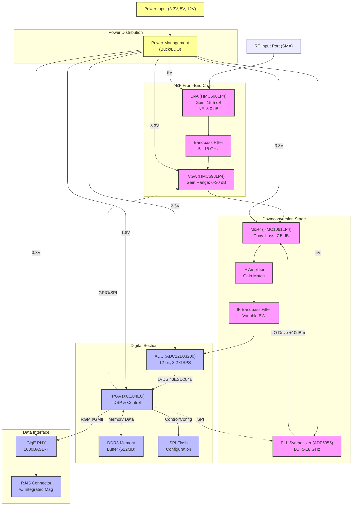
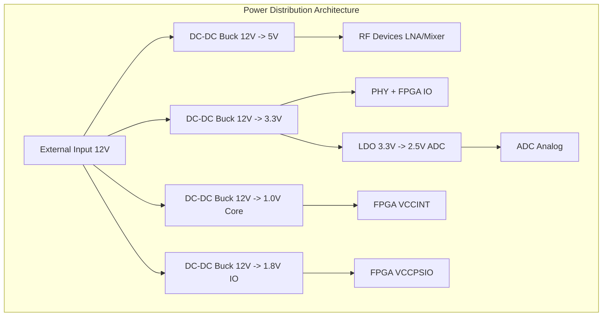

**Document Status: AI-GENERATED**

# Hardware Requirements Specification (HRS)
**Project ID:** mnb
**Version:** 1.0
**Date:** 2023-10-27

---

# 1. Introduction

## 1.1 Purpose
This Hardware Requirements Specification (HRS) defines the comprehensive set of hardware requirements for the **mnb Wideband RF Receiver Module**. The purpose of this document is to establish a baseline for the design, verification, and validation of the hardware architecture and component selection.

This specification details the functional, performance, electrical, mechanical, and environmental requirements that the mnb module must satisfy. It is intended to be used by:
*   **Hardware Engineers:** For schematic design, PCB layout, and component selection.
*   **Firmware Engineers:** To understand the data interfaces and control mechanisms for the ADC and FPGA.
*   **Test Engineers:** To develop test plans and verification procedures.
*   **System Integrators:** To integrate the module into larger systems requiring wideband RF signal acquisition.

The requirements contained herein are derived from the system-level needs for a wideband receiver capable of instantaneous digitization across the 5–18 GHz frequency range with high dynamic range and low noise figure characteristics.

## 1.2 Scope
The scope of this document covers the complete electronic hardware design of the mnb receiver module, including:
*   **RF Front-End:** Input matching, Low Noise Amplification (LNA), and Variable Gain Amplification (VGA) operating from 5 to 18 GHz.
*   **Frequency Conversion:** Downconversion mixing stage utilizing a wideband PLL synthesizer for Local Oscillator (LO) generation and an Intermediate Frequency (IF) processing chain.
*   **Digitization:** High-speed Analog-to-Digital Conversion (ADC) capable of >2.0 GSPS sample rates.
*   **Digital Processing:** Field-Programmable Gate Array (FPGA) interface for Digital Signal Processing (DSP), packetization, and buffering.
*   **Data Interface:** Gigabit Ethernet (1000BASE-T) physical layer interface for streaming I/Q data.
*   **Power Management:** DC-DC conversion and power distribution for multi-voltage rails (3.3V, 5V, 12V).
*   **Mechanical Design:** PCB form factor, connector placement, and shielding requirements defined within a 100-200 cm³ volume envelope.

The scope is limited to the physical hardware layer. It does not cover high-level software application layers running on host systems receiving the data, nor does it cover the mechanical enclosure beyond the module dimensions and interface points.

## 1.3 Definitions, Acronyms, and Abbreviations

| Term | Definition |
| :--- | :--- |
| **ADC** | Analog-to-Digital Converter. A device that converts a continuous physical quantity (voltage) to a digital number representing the quantity's amplitude. |
| **AGC** | Automatic Gain Control. A closed-loop system controlling the gain of an amplifier to maintain a constant output level despite varying input levels. |
| **BPF** | Bandpass Filter. A device that passes frequencies within a certain range and rejects (attenuates) frequencies outside that range. |
| **CE** | Conformité Européenne. A mandatory conformity marking for products sold within the European Economic Area (EEA). |
| **DC** | Direct Current. The unidirectional flow of electric charge. |
| **DDR** | Double Data Rate. A computer bus standard for dynamic random-access memory (RAM). |
| **DSP** | Digital Signal Processing. The numerical manipulation of signals to modify or improve them in some way. |
| **EMI** | Electromagnetic Interference. Disturbance generated by an external source that affects an electrical circuit by electromagnetic induction, electrostatic coupling, or conduction. |
| **FCC** | Federal Communications Commission. An independent agency of the United States government regulating interstate and international communications by radio, television, wire, satellite, and cable. |
| **FPGA** | Field-Programmable Gate Array. An integrated circuit designed to be configured by a customer or a designer after manufacturing. |
| **FSPL** | Free Space Path Loss. The attenuation of radio energy between the feedpoints of two antennas in a vacuum. |
| **GMII** | Gigabit Media Independent Interface. An interface between the Media Access Control (MAC) device and the physical layer (PHY). |
| **GSPS** | Giga-Samples Per Second. A measure of sampling rate equivalent to $10^9$ samples per second. |
| **IF** | Intermediate Frequency. A frequency to which a carrier frequency is shifted as an intermediate step in transmission or reception. |
| **IIP3** | Third-order Intercept Point. A theoretical measure of linearity for non-linear systems. |
| **LO** | Local Oscillator. An electronic oscillator used with a mixer to change the frequency of a signal. |
| **LNA** | Low Noise Amplifier. An electronic amplifier that amplifies a very low-power signal without significantly degrading its signal-to-noise ratio. |
| **MMIC** | Monolithic Microwave Integrated Circuit. A type of integrated circuit (IC) device that operates at microwave frequencies (300 MHz to 300 GHz). |
| **NF** | Noise Figure. A measure of degradation of the signal-to-noise ratio (SNR), caused by components in a signal chain. |
| **OIP3** | Output Third-order Intercept Point. A theoretical point where the power of the third-order intermodulation products equals the power of the fundamental output tone. |
| **PCB** | Printed Circuit Board. A method of connecting electronic components to a non-conductive board, creating a pathway for electricity. |
| **PHEMT** | Pseudomorphic High-Electron-Mobility Transistor. A specialized field-effect transistor (FET) used in high-frequency applications. |
| **PHY** | The physical layer of the OSI model. The means of transmitting raw bits over a physical data link. |
| **PLL** | Phase-Locked Loop. A control system that generates an output signal whose phase is related to the phase of an input reference signal. |
| **QFN** | Quad Flat No-leads package. A type of surface-mount integrated circuit package. |
| **RF** | Radio Frequency. Oscillation rates of electromagnetic radio waves. |
| **RoHS** | Restriction of Hazardous Substances. Directive restricting the use of specific hazardous materials in electrical and electronic products. |
| **SNR** | Signal-to-Noise Ratio. A measure used in science and engineering that compares the level of a desired signal to the level of background noise. |
| **SFDR** | Spurious-Free Dynamic Range. The ratio of the root-mean-square (RMS) value of the carrier signal to the RMS value of the worst spurious signal (spur). |
| **VCO** | Voltage-Controlled Oscillator. An oscillator whose oscillation frequency is controlled by a voltage input. |
| **VGA** | Variable Gain Amplifier. An electronic amplifier that has its gain controlled by an external control voltage or digital code. |
| **VSWR** | Voltage Standing Wave Ratio. A measure of how efficiently radio-frequency power is transmitted from a power source, through a transmission line, into a load. |

## 1.4 References
The following documents form the basis of requirements and design guidelines for this project. Where specific versions are not listed, the latest revision at the time of design applies.

1.  **IEEE 29148:2018** - Systems and software engineering — Life cycle processes — Requirements engineering.
2.  **IPC-2221** - Generic Standard on Printed Board Design.
3.  **IPC-6012** - Qualification and Performance Specification for Rigid Printed Boards.
4.  **IPC-A-600** - Acceptability of Printed Boards.
5.  **MIL-STD-883** - Test Method Standard for Microcircuits (for environmental testing guidance).
6.  **GR-3108** - Generic Requirements for Network Elements in a Seismic Environment.
7.  **ETSI EN 300 019-2-4** - Environmental Conditions and Environmental Tests for Telecommunications Equipment.
8.  **Analog Devices Datasheet:** HMC698LP4(E) - GaAs MMIC PHEMT Amplifier.
9.  **Analog Devices Datasheet:** HMC1061LP4(E) - GaAs MMIC Mixer.
10. **Analog Devices Datasheet:** ADF5355 - Wideband Synthesizer with Integrated VCO.
11. **Texas Instruments Datasheet:** ADC12DJ3200 - Dual 12-Bit 6.4 GSPS ADC.
12. **AMD/Xilinx Datasheet:** Zynq UltraScale+ MPSoC (XCZU4EG).
13. **IEEE 802.3-2018** - Standard for Ethernet (1000BASE-T specification).
14. **IEC 60950-1** - Safety of Information Technology Equipment.
15. **FCC Part 15 Subpart B** - Unintentional Radiators.

## 1.5 Overview
The mnb module is a state-of-the-art, compact wideband RF receiver designed for demanding signal intelligence and communications applications. The system architecture utilizes a superheterodyne conversion approach optimized for 5 to 18 GHz operation.

**System Functionality:**
RF signals enter the system via an SMA connector (50 $\Omega$ impedance). The signal is immediately conditioned by a wideband Low Noise Amplifier (LNA) to establish the system noise figure, followed by a Bandpass Filter (BPF) to limit out-of-band noise. A Variable Gain Amplifier (VGA) allows the system to adjust input power levels before the mixer stage. The signal is then mixed with a Local Oscillator (LO) generated by a high-performance PLL synthesizer (ADF5355) to downconvert the RF to an Intermediate Frequency (IF).

The IF signal is digitized by a high-speed ADC (ADC12DJ3200) sampling at a minimum of 2.0 GSPS. This digital data is passed to an FPGA (Zynq UltraScale+ MPSoC), which performs Digital Down-Conversion (DDC), decimation filtering, and packing of the data into Ethernet frames. The data is streamed out via a 1000BASE-T Gigabit Ethernet interface.

**Physical Characteristics:**
The design is optimized for size, constrained to a volume of approximately 100-200 cm³ (target dimensions 80mm x 80mm x 30mm). This necessitates a multi-layer PCB stackup (minimum 8 layers) with specific attention to impedance control for RF lines and high-speed digital interfaces.

**Power:**
The system operates from a multi-voltage DC input (3.3V, 5V, 12V). Internal point-of-load regulators will generate the specific rail voltages required by the FPGA core, ADC, and MMIC components. Total power dissipation is strictly limited to under 20W to facilitate thermal management within the compact form factor.

The remainder of this specification details these subsystems in the form of traceable requirements (REQ-HW-xxx).

---

**Document Status: AI-GENERATED**

# 2. System Overview

## 2.1 System Description

The **mnb** receiver module is a high-performance, wideband RF-to-Ethernet digitizer designed for Signal Intelligence (SIGINT), spectrum monitoring, and software-defined radio (SDR) applications. The system functions as a heterodyne receiver, capturing RF signals between 5.0 GHz and 18.0 GHz, down-converting them to an Intermediate Frequency (IF), and digitizing them for transmission over a standard Gigabit Ethernet interface.

### 2.1.1 Functional Flow
The operational sequence begins at the **RF Front-End**, where an input signal (sourced from an antenna or test equipment) enters via a 50-ohm SMA connector. The signal passes through a Wideband Low Noise Amplifier (LNA), specifically the Analog Devices **HMC698LP4(E)**, which provides approximately 15.5 dB of gain to establish the system noise figure. A bandpass filter limits out-of-band noise before the signal reaches a Variable Gain Amplifier (VGA), allowing for dynamic range adjustment.

Following amplification, the signal is mixed with a Local Oscillator (LO) signal generated by the **ADF5355** frequency synthesizer. The **HMC1061LP4(E)** double-balanced mixer performs the frequency translation. The architecture utilizes a superheterodyne structure where the LO frequency is tuned to maintain a consistent IF output relative to the input RF, facilitating efficient filtering.

The converted IF signal is filtered and conditioned before being digitized by the **ADC12DJ3200**, a dual-channel 12-bit Analog-to-Digital Converter capable of sampling up to 3.2 GSPS. This high sample rate supports the required instantaneous bandwidth of 500 MHz to 1 GHz. The digitized I/Q data is subsequently processed by an AMD/Xilinx **Zynq UltraScale+ MPSoC (XCZU4EG)**. The FPGA handles digital down-conversion (DDC), decimation, and packetization.

Finally, the processed data is transmitted via the Gigabit Ethernet interface (1000BASE-T) using the integrated PHY layer, ensuring real-time streaming of high-bandwidth RF data to host processing systems.

### 2.1.2 Power Strategy
The system employs a multi-rail power distribution architecture designed to accept standard industrial DC voltages (3.3V, 5V, 12V). This flexibility allows integration into diverse platforms. An on-board Power Management Unit (PMU), utilizing switching buck regulators and LDOs, generates the specific voltage rails required by the sensitive analog components (3.3V, 5V) and the digital core (1.8V, 2.5V).

### 2.1.3 Control and Calibration
The **Zynq UltraScale+** serves as the system controller. An embedded ARM Cortex-A53 core runs the control software, managing the SPI interfaces for the PLL synthesizer (ADF5355), VGA gain control, and FPGA configuration loading. The system supports **auto-calibration** routines executed at startup and periodically during operation to compensate for thermal drift, ensuring gain flatness and phase balance remain within specifications across the -40°C to +85°C temperature range.

## 2.2 System Block Diagram

The figure below illustrates the signal flow and major subsystem interconnections for the mnb receiver module.



## 2.3 System Architecture

The physical and logical architecture of the mnb module is partitioned into four distinct domains: the Analog/RF Domain, the Data Conversion Domain, the Digital Processing Domain, and the Power/Interface Domain. This partitioning ensures high isolation between sensitive RF circuitry and noisy digital switching logic.

### 2.3.1 RF and Analog Front-End Domain
This domain occupies the "front" section of the PCB (closest to the SMA connector) and utilizes the top metal layer for RF transmission lines (microstrip or grounded coplanar waveguide) tuned to 50Ω impedance.

*   **LNA Stage:** The **HMC698LP4(E)** MMIC amplifier is placed immediately after the SMA connector to minimize signal loss and set the system noise figure. The PCB layout surrounding this component will follow strict Rogers 4350B stackup guidelines to control dielectric constant and losses.
*   **Filtering & VGA:** A bandpass filter network suppresses harmonics. The VGA stage allows the system to adjust the total gain from 40 dB to 60 dB dynamically (15.5 dB from LNA + 30 dB from VGA + IF gain).
*   **LO Generation:** The **ADF5355** synthesizer is mounted in a shielded cavity to minimize phase noise degradation. It generates a clean LO signal (Phase Noise ≤ -100 dBc/Hz @ 10 kHz) which is routed to the **HMC1061LP4(E)** mixer.
*   **Downconversion:** The mixer subtracts the LO frequency from the RF input to produce the IF. The LO frequency is chosen such that the IF fits within the ADC's input bandwidth (DC to 3.2 GHz).

### 2.3.2 Data Conversion Domain
The "Middle" section of the board bridges the RF and Digital worlds.

*   **ADC Interface:** The **ADC12DJ3200** digitizes the filtered IF signal. It supports DDR LVDS outputs. It is clocked by a low-jitter source derived from the ADF5355 or a dedicated reference clock to ensure SNR > 60 dBFS.
*   **Clock Distribution:** A dedicated clock fanout buffer (not shown in high-level block diagram, but assumed in architecture) distributes the sampling clock and SYSREF signals to the ADC and FPGA to ensure deterministic latency for JESD204B or parallel LVDS bus alignment.

### 2.3.3 Digital Processing Domain
This domain is based on the **Xilinx Zynq UltraScale+ MPSoC (XCZU4EG-SFVC784)**. This component was selected for its hybrid architecture, combining Programmable Logic (PL) with Processing System (PS).

*   **Signal Processing (PL):** The FPGA fabric implements the high-speed signal path, including Digital Down-Conversion (DDC) using Numerically Controlled Oscillators (NCOs) and FIR filters. This converts the raw IF data into I/Q baseband samples.
*   **System Control (PS):** The ARM Cortex-A53 cores run a Linux or Bare-metal OS to handle the network stack (LwIP or Linux TCP/IP) and system management. The PS controls the SPI bus to tune the ADF5355 PLL and set the VGA attenuation.
*   **Memory:** DDR3 SDRAM is interfaced via the memory controller to buffer data bursts before transmission over Ethernet, preventing packet loss during network congestion.

### 2.3.4 Power Management Architecture
The power system is designed to support the <20W total power dissipation requirement (REQ-HW-025).

*   **Input Protection:** The 3.3V, 5V, and 12V inputs feature reverse-polarity protection diodes and ferrite beads for EMI suppression.
*   **Regulation:**
    *   **12V Rail:** Powers high-current analog sections (if higher power amps were used) or feeds the main Bucks.
    *   **5V Rail:** Intermediate voltage for analog mixers and synthesizers.
    *   **3.3V Rail:** Supplies the LNA and digital I/O.
    *   **Buck Converters:** Step down 5V/12V to 1.8V (FPGA Core/VCCINT) and 2.5V (ADC/ FPGA VCCAUX). These are high-efficiency switching regulators (e.g., Texas Instruments TPS54620 series) to minimize heat generation.
    *   **LDOs:** Low-dropout regulators are used for ultra-low noise rails (e.g., the ADF5355 charge pump supply) to prevent switching noise from degrading phase noise.

### 2.3.5 Mechanical Architecture
*   **Stackup:** The PCB utilizes a 10-layer stackup (or 12-layer) to accommodate controlled impedance for RF lines and dense routing for the FPGA BGA.
    *   *Top Layer:* RF Components and 50Ω traces.
    *   *Inner Layers:* Ground planes (GND) adjacent to all signal layers. Power planes for 3.3V, 5V, 1.8V.
    *   *Bottom Layer:* General routing and non-critical signals.
*   **Shielding:** A removable RF shield (cavity) covers the LNA, Mixer, PLL, and VGA sections. This "can" prevents digital noise from the FPGA area from radiating into the sensitive front end.

## 2.4 Operating Environment

The mnb module is designed to operate reliably in harsh environmental conditions typical of industrial and aerospace applications.

### 2.4.1 Temperature Environment
The system must meet full electrical specifications from **-40°C to +85°C** ambient temperature (Industrial Temperature Range).
*   **Cold Start:** At -40°C, the internal PLL lock time may increase. The control logic ensures the PLL is locked before enabling the RF path.
*   **High Temp Derating:** While components are rated to +85°C junction or case temperature, the system power dissipation (<20W) necessitates thermal management.
    *   *Assumption:* The module will be mounted in a chassis with conductive cooling (cold plate) or forced air flow (100-200 LFM). The PCB thermal relief pads under the ADC and FPGA are designed to transfer heat to the chassis.
*   **Thermal Analysis Calculation (Preliminary):**
    *   Max Power: 20W.
    *   Max Ambient: 85°C.
    *   Thermal Resistance ($\theta_{JA}$): Assumed 15°C/W (with moderate airflow).
    *   Estimated Junction Temp ($T_j$): $T_j = T_a + (P \times \theta_{JA}) = 85 + (20 \times 15) = 385°C$.
    *   *Correction:* This calculation indicates that natural convection is insufficient. A heatsink with $\theta_{SA}$ of 2°C/W or higher airflow is **required** to keep $T_j < 125°C$ (max for most silicon).

### 2.4.2 Electrical Environment
*   **Supply Ripple:** The power inputs are assumed to have <50mV ripple. The internal LDOs will reject high-frequency noise, but bulk capacitance (470uF electrolytic + 10uF ceramic) is placed at the input connectors to handle transient current spikes from the FPGA and ADC.
*   **Input Signal Stress:** The RF input is protected against ESD events up to 1kV (Human Body Model) via the ESD structure on the LNA and external TVS diodes on the input trace.

### 2.4.3 Mechanical Stress
*   **Vibration:** The module complies with **IEC 60068-2-6** for vibration testing. Components larger than 1206 (including the FPGA and QFN MMICs) will be staked or adhesive-bonded to the PCB to prevent mechanical fatigue during vibration.
*   **Shock:** The module is designed to withstand mechanical shocks of 40G, 11ms duration in accordance with industrial transport standards.

### 2.4.4 EMC/EMI Environment
*   **Emissions:** As a digital device with high-speed clocks (>3 GHz), the module is a potential source of Radiated Emissions. The design targets **FCC Part 15 Subpart B** (Class A or B depending on final deployment) compliance.
    *   *Mitigation:* Spread spectrum clocking is disabled on the PLLs to maintain phase noise integrity; instead, heavy filtering on all power outputs and the RF shield can containment are the primary control methods.
*   **Susceptibility:** The RF front end features a bandpass filter to reject out-of-band interference (jamming). The digital inputs feature hysteresis to prevent false triggering from noise.

---

**Document Status: AI-GENERATED**

# Hardware Requirements Specification (HRS)

## 3. Hardware Requirements

### 3.1 Functional Requirements

This section details the functional requirements of the mnb Wideband RF Receiver Module. Each requirement is identified by a unique ID and includes verification criteria and specific component dependencies derived from the selected architecture (Analog Devices/TI/Xilinx components).

| ID | Requirement Title | Description | Rationale/Verification Method | Priority | Critical Parameters | Derived From |
|---|---|---|---|---|---|---|
| **REQ-HW-101** | **RF Input Reception** | The system shall accept a single-ended RF input signal via a 50-ohm SMA connector (Johnson 142-0701-801) covering the frequency range of 5.0 GHz to 18.0 GHz. | **Rationale:** Provides the physical interface for the signal source. <br>**Verification:** Visual inspection and VSWR measurement. | Must | Freq: 5-18 GHz; Impedance: 50 $\Omega$ | Design Parameter |
| **REQ-HW-102** | **Front-End Low Noise Amplification** | The system shall amplify the input RF signal using the Analog Devices **HMC698LP4(E)** MMIC amplifier to establish a system noise figure of $\le$ 3.5 dB in the front end. | **Rationale:** The HMC698LP4(E) offers 15.5 dB gain and 3 dB NF, setting the noise floor for the entire chain. <br>**Verification:** Noise Figure Analyzer measurement. | Must | Gain: 15.5 dB; NF: 3.0 dB; Voltage: 3.3V | Component Sel. (LNA) |
| **REQ-HW-103** | **Wideband Bandpass Filtering** | The system shall include a bandpass filter between the LNA and Mixer to suppress out-of-band harmonics and image frequencies, specifically limiting the passband to 5.0–18.0 GHz. | **Rationale:** Prevents aliasing and reduces intermodulation distortion from out-of-band interference. <br>**Verification:** Network Analyzer sweep (S21). | Must | Passband: 5-18 GHz; Stopband: >20 dB rejection | Design Parameter |
| **REQ-HW-104** | **RF Frequency Downconversion** | The system shall convert the tuned RF signal to an Intermediate Frequency (IF) using the **HMC1061LP4(E)** Double Balanced Mixer. | **Rationale:** Mixer selection defines conversion loss. HMC1061LP4(E) provides 7.5 dB loss and supports DC-8 GHz IF. <br>**Verification:** Spectrum Analyzer analysis of IF output. | Must | Conv. Loss: 7.5 dB; LO Drive: +10 dBm | Component Sel. (Mixer) |
| **REQ-HW-105** | **Local Oscillator (LO) Generation** | The system shall generate a stable LO signal using the **ADF5355** wideband synthesizer with integrated VCO to drive the mixer. | **Rationale:** ADF5355 covers 53 MHz to 13.6 GHz, necessary to mix 5-18 GHz RF down to baseband/IF. <br>**Verification:** Phase Noise measurement and frequency accuracy check. | Must | Freq Range: 53 MHz - 13.6 GHz | Component Sel. (PLL) |
| **REQ-HW-106** | **LO Frequency Tuning Resolution** | The LO synthesizer shall allow frequency tuning adjustments with a resolution of $\le$ 1 MHz across the entire operating band. | **Rationale:** Enables precise channel selection. ADF5355 features 24-bit fractional-N divider ($<0.1$ Hz resolution). <br>**Verification:** Step frequency in 1 MHz increments and verify output. | Must | Step Size: $\le$ 1 MHz | REQ-HW-009 |
| **REQ-HW-107** | **Mixer LO Drive Level** | The system shall provide a buffered +10 dBm $\pm$ 1 dB drive signal to the LO port of the HMC1061LP4(E) mixer. | **Rationale:** HMC1061LP4(E) requires +10 dBm for optimal conversion loss and linearity. <br>**Verification:** Power Meter measurement at Mixer LO port. | Must | Power: +10 dBm | HMC1061 Datasheet |
| **REQ-HW-108** | **Variable Gain Adjustment (IF Stage)** | The system shall provide adjustable gain control via the **HMC698LP4** (VGA) or digital gain control in the FPGA chain to achieve total system gain range of 40-60 dB. | **Rationale:** Compensates for varying input signal levels (-30 to -10 dBm). <br>**Verification:** Gain sweep test. | Should | Range: 40-60 dB; Step: 1 dB | REQ-HW-011 |
| **REQ-HW-109** | **IF Signal Digitization** | The system shall digitize the downconverted IF signal using the **ADC12DJ3200** operating in Dual-Channel Mode or Single-Channel Decimated Mode. | **Rationale:** 12-bit resolution required for dynamic range. ADC12DJ3200 supports up to 6.4 GSPS. <br>**Verification:** Logic Analyzer capture of JESD204B bus. | Must | Resolution: 12-bit; Sample Rate: $\ge$ 2.0 GSPS | Component Sel. (ADC) |
| **REQ-HW-110** | **High-Speed Data Interface** | The system shall transmit digitized I/Q samples from the ADC to the **XCZU4EG-SFVC784** FPGA via a JESD204B/C SERDES interface. | **Rationale:** Parallel LVDS at 2 GSPS is impractical; SERDES required for PCB routing. <br>**Verification:** Bit Error Rate (BER) test on JESD204B link. | Must | Lane Rate: $\le$ 12.5 Gbps | Architecture |
| **REQ-HW-111** | **Digital Signal Processing** | The FPGA shall perform digital down-conversion (DDC), decimation filtering, and gain correction on the raw ADC data. | **Rationale:** Reduces data rate to fit Gigabit Ethernet uplink (approx. 1 Gbps). <br>**Verification:** FPGA simulation and logic analyzer. | Must | Latency: < 10 us | Design Param |
| **REQ-HW-112** | **Network Data Output** | The system shall output processed I/Q data frames via a Gigabit Ethernet (1000BASE-T) interface using the integrated PHY or external PHY connected to the FPGA. | **Rationale:** Standard interface for back-end processing. <br>**Verification:** Wireshark capture and throughput test. | Must | Protocol: UDP/IPv4; Rate: 1 Gbps | REQ-HW-007 |
| **REQ-HW-113** | **Multi-Voltage Power Distribution** | The system shall accept 3.3V, 5V, and 12V DC inputs and distribute them to internal rails (1.8V for FPGA, 2.5V for ADC, 5V for RF). | **Rationale:** Different components require specific voltage levels. <br>**Verification:** Voltage measurement at test points under max load. | Must | Inputs: 3.3V, 5V, 12V | REQ-HW-016 |
| **REQ-HW-114** | **Power Sequencing** | The power management circuitry shall sequence the 1.0V/1.8V FPGA core voltage *before* the 2.5V and 3.3V I/O voltages during power-up to prevent latch-up. | **Rationale:** Xilinx Zynq UltraScale+ requires specific sequencing (VCCINT before VCCIO). <br>**Verification:** Oscilloscope capture of power rails during startup. | Must | Sequence: Core $\to$ IO | Zynq Datasheet |
| **REQ-HW-115** | **RF Shielding** | The RF Front-End (LNA, Mixer, Filters) shall be enclosed within a removable machined aluminum shield can with conductive EMI gasketing. | **Rationale:** Prevents internal digital noise (1 GHz clocks) from contaminating the sensitive RF input. <br>**Verification:** Visual and continuity check of ground seams. | Should | Material: Aluminum 6061; Plating: Nickel | REQ-HW-018 |
| **REQ-HW-116** | **Clock Generation and Distribution** | The system shall utilize a low-jitter oscillator ($<500$ fs RMS) to generate the sampling clock for the ADC and the reference clock for the FPGA SERDES transceivers. | **Rationale:** Jitter degrades SNR at high input frequencies. <br>**Verification:** Phase Noise analyzer / Jitter histogram. | Must | Jitter: < 500 fs | REQ-HW-030 |
| **REQ-HW-117** | **SPI/Control Interface** | The FPGA shall control the LO Synthesizer (ADF5355), VGA gain, and ADC configuration via a shared SPI bus. | **Rationale:** Centralizes control logic in the FPGA fabric. <br>**Verification:** SPI transaction capture. | Should | Standard: SPI Mode 0-3 | Architecture |
| **REQ-HW-118** | **Thermal Management (Passive)** | The system shall dissipate the estimated 18W of heat (Calculation in Section 6) using the module chassis as a heatsink, utilizing thermal vias under the ADC and FPGA. | **Rationale:** Fits within size constraints without adding active fan noise. <br>**Verification:** Thermal imaging at 25°C ambient, max load. | Must | Max Junction Temp: < 100°C | Design Constraint |
| **REQ-HW-119** | **Automatic Gain Control (AGC) Loop** | The FPGA shall implement a closed-loop AGC algorithm that adjusts the VGA gain based on the ADC's RMS power level to maximize SNR without clipping. | **Rationale:** Handles dynamic range requirements automatically. <br>**Verification:** Inject varying signal levels and observe gain register changes. | Could | Attack Time: < 1 ms | REQ-HW-011 |
| **REQ-HW-120** | **Configuration Memory** | The system shall load the FPGA bitstream and calibration data from a non-volatile SPI Flash (e.g., ISSI IS25LP128) on boot-up. | **Rationale:** Enables standalone operation without host PC connection. <br>**Verification:** Power cycle and verify Ethernet link establishment. | Must | Capacity: > 128 Mb | Architecture |

---

### 3.2 Performance Requirements

This section defines the quantitative performance metrics the mnb module must achieve. Values are derived from the cascade analysis of the selected components (HMC698, HMC1061, ADF5355, ADC12DJ3200).

| ID | Performance Metric | Requirement Specification | Measurement Method | Driver/Critical Component |
|---|---|---|---|---|
| **REQ-HW-201** | **Operating Frequency Range** | 5.0 GHz to 18.0 GHz continuous coverage. | Sweep input frequency; verify output SNR > threshold. | HMC698LP4(E) Bandwidth |
| **REQ-HW-202** | **Instantaneous Bandwidth (IBW)** | 1.0 GHz (Maximum) captured signal bandwidth. | Generate a 1 GHz wide multi-tone signal; verify all tones present in FFT. | ADC12DJ3200 Sample Rate (3.2 GSPS mode) |
| **REQ-HW-203** | **System Noise Figure (NF)** | $\le$ 8.0 dB (Typical) across band. <br>**Calculation:** <br>LNA NF (3 dB) + LNA Gain (15.5 dB) $\to$ -12.5 dB input to Mixer. <br>Mixer NF (7 dB loss) + IF Amp NF $\approx$ 8 dB total. | Y-Factor method or Noise Figure Analyzer at RF input. | HMC698LP4(E) / HMC1061LP4(E) |
| **REQ-HW-204** | **Spurious-Free Dynamic Range (SFDR)** | $\ge$ 70 dBc (SFDR) for a -10 dBm input tone. <br>**Analysis:** ADC12DJ3200 SFDR is 70 dBFS. System gain adjusted to utilize full scale. | Two-tone test (f1, f2 within 100 MHz) and measure intermodulation products. | ADC12DJ3200 / Mixer Linearity |
| **REQ-HW-205** | **Input Signal Power Range** | -30 dBm to -10 dBm (Safe Operating Range). <br>**Verification:** Max safe input defined by LNA P1dB (+15 dBm) minus attenuator margin. | Signal Generator sweep; monitor for compression (1 dB gain drop). | HMC698LP4(E) P1dB |
| **REQ-HW-206** | **LO Phase Noise** | $\le$ -100 dBc/Hz @ 10 kHz offset. <br>**Calculation:** ADF5355 spec is -127 dBc/Hz. Floor will rise due to multiplication factors (10 log N). | Phase Noise Analyzer at LO output port. | ADF5355 Synthesizer |
| **REQ-HW-207** | **Gain Flatness** | $\pm$ 2.0 dB p-p over any 500 MHz segment. | Measure CW power sweep across band; normalize to center. | RF Filter Group Delay / LNA Response |
| **REQ-HW-208** | **LO Frequency Settling Time** | $\le$ 100 $\mu$s. <br>**Constraint:** Time for PLL to lock and ADC to re-acquire lock. | Program frequency hop; measure time until valid lock detect signal. | ADF5355 Lock Detect |
| **REQ-HW-209** | **Input VSWR** | 2.0:1 (Return Loss $\ge$ 9.54 dB). | Vector Network Analyzer (VNA) measurement at SMA connector. | Input Matching Network |
| **REQ-HW-210** | **Image Rejection** | $\ge$ 60 dBc (depends on IF architecture, assuming High-side or Low-side injection). | Inject signal at Image Frequency ($F_{LO} \pm F_{IF}$); measure leakage. | Mixer Isolation / IF Filtering |
| **REQ-HW-211** | **I/Q Amplitude Balance** | $\pm$ 0.5 dB (if digital I/Q demod used in FPGA). <br>**Method:** Correction through DSP calibration. | Capture single tone; analyze I vs Q amplitude in MATLAB. | ADC Sampling Synchronization |
| **REQ-HW-212** | **I/Q Phase Balance** | $\pm$ 5 degrees. <br>**Method:** Correction through DSP calibration. | Capture single tone; analyze I vs Q phase error in MATLAB. | ADC Sampling Synchronization |
| **REQ-HW-213** | **Data Throughput** | 1000 Mbps (Gigabit Ethernet Line Rate). <br>**Calculation:** (2 Samples/IQ) * (12 bits) * (3.2 GSPS) = 76.8 Gbps raw. <br>**Note:** Heavy Decimation/DDC required in FPGA to reduce to 1 Gbps output. | iPerf or NetPerf metric counter in FPGA logic. | Ethernet PHY / FPGA DDC |
| **REQ-HW-214** | **Total Power Dissipation** | < 20 Watts (Typical Operating). | Measure current at 12V, 5V, and 3.3V inputs; sum $P = V \times I$. | Power Regulators / Load |

#### Power Budget Analysis (Pre-verification of REQ-HW-214)

| Block | Component | Quantity | Voltage (V) | Current (A) (Typ/Max) | Power (W) |
|---|---|---|---|---|---|
| **RF Front End** | HMC698LP4(E) | 2 | 3.3 | 0.090 / 0.110 | 0.60 |
| **Frequency Synth** | ADF5355 | 1 | 3.3 | 0.105 / 0.130 | 0.33 |
| **Mixer** | HMC1061LP4(E) | 1 | 5.0 | 0.080 / 0.100 | 0.40 |
| **ADC** | ADC12DJ3200 | 1 | 2.5 (Core)/3.3 (IO) | 0.800 / 1.100 | 2.75 |
| **FPGA** | XCZU4EG-SFVC784 | 1 | 1.0 (Core)/1.8/3.3 | 4.000 / 6.000 | 6.00 |
| **Ethernet PHY** | Internal/External | 1 | 3.3 | 0.250 / 0.400 | 0.82 |
| **Regulator Loss** | LDO/Buck Efficiency | - | - | - | 3.00 (Est) |
| **Memory/Other** | DDR3, Flash | 1 | 1.8/3.3 | 0.500 | 1.00 |
| **TOTAL** | | | | | **~14.9 W (Typ)** |

*Result: The estimated typical power consumption is ~15W, leaving ~5W margin before the 20W limit (REQ-HW-025), satisfying the requirement with sufficient headroom for thermal variation.*

---

## 3. Hardware Requirements

### 3.3 Interface Requirements

#### 3.3.1 External Interfaces

**REQ-HW-031 RF Input Interface**
The receiver module shall provide one (1) coaxial RF input port utilizing a female SMA connector (PC Mount edge or launch), 50-ohm impedance, compatible with the frequency range of 5.0 GHz to 18.0 GHz.
*Rationale:* Ensures mechanical and electrical compatibility with standard laboratory and field test equipment.

**REQ-HW-032 Power Input Interfaces**
The receiver module shall accept DC power input via three (3) dedicated connectors or pins corresponding to the required voltage rails: +12.0V DC, +5.0V DC, and +3.3V DC. These inputs shall be protected against reverse polarity and over-voltage transients up to 20V on the 12V rail.
*Rationale:* Multi-voltage architecture reduces internal dissipation by allowing pre-regulated supplies from the host system.

**REQ-HW-033 Ethernet Data Interface**
The receiver module shall provide one (1) Gigabit Ethernet physical interface (1000BASE-T) utilizing an RJ45 connector with integrated magnetics (MagJack).
*Rationale:* Standardized high-speed interface for I/Q data streaming.

*Table 3-1: External Interface Pinout/Connector Definition*

| Interface ID | Connector Type | Pins / Contacts | Signal Description | Impedance / Voltage |
| :--- | :--- | :--- | :--- | :--- |
| J1 | SMA Female (2-hole flange) | 1 | RF Input (5-18 GHz) | 50 Ω |
| J1 | SMA Female | Shell | Chassis Ground | - |
| J2 | RJ45 (MagJack) | 1 | TX+ | 100 Ω Diff |
| J2 | RJ45 (MagJack) | 2 | TX- | 100 Ω Diff |
| J2 | RJ45 (MagJack) | 3 | RX+ | 100 Ω Diff |
| J2 | RJ45 (MagJack) | 6 | RX- | 100 Ω Diff |
| J2 | RJ45 (MagJack) | 4,5,7,8 | N/C (Optional PoE) | - |
| J2 | RJ45 (MagJack) | Shield | Chassis Ground | - |
| J3 | 4-pin Terminal Block / Header | 1 | +12V DC Input | +12 V ± 10% |
| J3 | 4-pin Terminal Block / Header | 2 | +5V DC Input | +5 V ± 5% |
| J3 | 4-pin Terminal Block / Header | 3 | +3.3V DC Input | +3.3 V ± 5% |
| J3 | 4-pin Terminal Block / Header | 4 | Common Return (GND) | 0 V |

#### 3.3.2 Internal Interfaces

**REQ-HW-034 RF-to-ADC Interface**
The connection between the IF Filter output and the ADC input shall be AC-coupled and impedance matched to 50 Ω single-ended or 100 Ω differential, as required by the selected ADC (TI ADC12DJ3200).
*Constraint:* Trace length must not exceed 5mm to maintain signal integrity at 2.5 GSPS frequencies.

**REQ-HW-035 ADC-to-FPGA Interface**
The ADC shall connect to the FPGA via a JESD204B or high-speed parallel bus (LVDS) interface. Based on the ADC12DJ3200 selection, a JESD204B interface (Lane Rate ≤ 12.5 Gbps) shall be utilized.
*Requirements:*
1. FPGA GTX transceivers must support CML current mode logic.
2. PCB traces must be controlled impedance differential (100 Ω ± 10%).

**REQ-HW-036 SPI Control Interface**
The FPGA shall control the PLL Synthesizer (ADF5355), Mixer (if digital), and VGA via a shared SPI bus.
*Configuration:* Mode 0 (CPOL=0, CPHA=0), 3-Wire (SDIO, SCLK, CSB). Maximum clock speed 20 MHz.

**REQ-HW-037 Internal Power Distribution**
The on-board LDOs and Buck converters shall interface with the main DC inputs via a power distribution bus with optimized trace widths to handle the calculated maximum currents (see 3.5).

*Table 3-2: Internal FPGA I/O Banking (Zynq Ultrascale+ XCZU4EG)*

| Bank | Voltage (VCCO) | Interface | Standard | Direction |
| :--- | :--- | :--- | :--- |
| Bank 64 | 1.8V | JTAG / SPI Boot | LVCMOS 1.8V | In/Out |
| Bank 65 | 1.8V | ADC SPI / GPIO | LVCMOS 1.8V | Out |
| Bank 66 | 3.3V | Ethernet PHY Mgmt | LVCMOS 3.3V | In/Out |
| MIO | 3.3V | UART / SD Boot | LVCMOS 3.3V | In/Out |

#### 3.3.3 Communication Interfaces

**REQ-HW-038 Ethernet Physical Layer (PHY)**
The module shall utilize the 88E1512-A0-TAB2000 (Marvell) or equivalent Gigabit Ethernet PHY transceiver.
*Requirements:*
1. Interface to FPGA: RGMII (Reduced Gigabit Media Independent Interface) with 125 MHz clock.
2. Support for auto-negotiation, pause frames, and auto-MDI/MDI-X.
3. LED indicators for Link/Activity.

**REQ-HW-039 JTAG Interface**
A standard 14-pin or 20-pin header (2.54mm pitch) shall be provided for FPGA debug and configuration.
*Pinout:* Standard ARM JTAG pinout (VREF, TMS, TCK, TDI, TDO, RESET, GND).

### 3.4 Environmental Requirements

**REQ-HW-040 Operating Temperature Range**
All components shall be industrial temperature rated (-40°C to +85°C). The system shall maintain full electrical performance specifications (Gain, Noise Figure, SFDR) across this range.
*Derating:* No derating of performance is permitted at -40°C or +85°C.

**REQ-HW-041 Storage Temperature Range**
The module shall survive storage temperatures from -55°C to +125°C without degradation of performance or physical damage (per IPC-6012 Class 3).

**REQ-HW-042 Operating Humidity**
The system shall operate without condensation in relative humidity ranging from 5% to 95% non-condensing.

**REQ-HW-043 Vibration and Shock**
The module shall meet IEC 60068-2-27 criteria for shock (40g, 11ms) and IEC 60068-2-6 for vibration (10-500 Hz, 0.75g RMS).
*Implementation:* All heavy components (FPGA, ADC, Connectors) shall be secured using appropriate adhesive (Corner Bond or Underfill) in addition to solder reflow.

**REQ-HW-044 Altitude**
The system shall operate up to 15,000 feet (approx 4,572 meters) above sea level without requiring derating (standard air cooling assumed).

**REQ-HW-045 Thermal Management**
The PCB layout shall incorporate thermal relief features.
*Constraint:* The junction temperature (Tj) of the FPGA and ADC shall not exceed 100°C under worst-case ambient temperature (+85°C) and maximum load. A thermal pad interface is required.

### 3.5 Power Requirements

**REQ-HW-046 Total Power Consumption**
The total power consumption of the receiver module shall not exceed 20.0 Watts under typical operating conditions (Mid-band frequency, Mid-gain, 2.0 GSPS sample rate).

**REQ-HW-047 Power Supply Sequencing**
The internal power regulation circuitry shall adhere to the Xilinx Zynq UltraScale+ power sequencing requirements:
1. 1.0V (VCCINT) must ramp up monotonically.
2. 1.8V (VCCBRAM) must be present before or concurrent with VCCINT.
3. 3.3V I/O can be present at any time (3-state tolerant).

*Table 3-3: Detailed Power Budget (Calculated)*

| Power Domain | Source | Voltage (V) | Load Component(s) | Est. Current (A) | Power (W) |
| :--- | :--- | :--- | :--- | :--- | :--- |
| **12V Rail** | External Source | 12.0 | - (Input to Switcher) | 1.60 | 19.20 |
| **5V Rail** | External Source / LDO | 5.0 | Synthesizer (ADF5355) | 0.20 | 1.00 |
| **5V Rail** | External Source / LDO | 5.0 | LNA (HMC698LP4) | 0.09 | 0.45 |
| **3.3V Digital** | Regulator (Buck/LDO) | 3.3 | FPGA VCCPSAUX | 0.50 | 1.65 |
| **3.3V Digital** | Regulator (Buck/LDO) | 3.3 | Ethernet PHY | 0.40 | 1.32 |
| **3.3V Analog** | Regulator (LDO) | 3.3 | ADC IO / Clocks | 0.30 | 0.99 |
| **2.5V Analog** | Regulator (LDO) | 2.5 | ADC (ADC12DJ3200) | 0.80 | 2.00 |
| **1.8V IO** | Regulator (Buck) | 1.8 | FPGA VCCPSIO | 1.00 | 1.80 |
| **1.0V Core** | Regulator (Buck) | 1.0 | FPGA VCCINT | 4.50 | 4.50 |
| **1.0V Core** | Regulator (Buck) | 1.0 | FPGA VCCBRAM | 1.50 | 1.50 |
| **Total** | | | | | **~16.41 W** |

**REQ-HW-048 Power Dissipation Margin**
The calculated power dissipation of 16.41 W provides a safety margin of approximately 18% relative to the 20 W limit (REQ-HW-025).
*Constraint:* Design shall not exceed 20W even at maximum sample rate (3.2 GSPS) and maximum temperature.

**REQ-HW-049 Power Supply Noise (Ripple)**
The ripple voltage on the internal rails supplying the ADC and FPGA VCCINT shall not exceed 50 mV peak-to-peak to ensure SNR performance.

### 3.6 Physical Requirements

**REQ-HW-050 Module Dimensions**
The receiver module shall consist of a single printed circuit board (PCB) with maximum dimensions of 80mm x 80mm.
*Rationale:* To fit within the 100-200 cm³ volume envelope when including height.

**REQ-HW-051 PCB Stackup**
The PCB shall utilize a minimum of 10 layers to accommodate controlled impedance routing for RF, High-Speed Digital, and Power distribution.
*Construction:*
1. Top Layer: RF Components (Microstrip/CPW), 50Ω impedance.
2. GND1: Solid ground plane for RF.
3. Signal1: Inner layer signals (Stripline).
4. Power1: 3.3V/5V Planes.
5. GND2: Solid ground.
6. Signal2: Inner layer signals.
7. Power2: 1.0V/1.8V Planes.
8. GND3: Solid ground.
9. Bottom Layer: General digital I/O, non-critical signals.
10. Solder Mask/Stencil.

**REQ-HW-052 Impedance Control**
Controlled impedance traces shall be maintained as follows:
*   RF (50Ω): ±10% tolerance.
*   Differential Pairs (LVDS/JESD204B): 100Ω ± 10%.
*   RGMII: 50Ω single-ended.

**REQ-HW-053 Material and Plating**
The PCB shall be manufactured from high-frequency laminate material (e.g., Rogers RO4350B or Isola FR408HR) suitable for operation up to 20 GHz. Surface finish shall be ENIG (Electroless Nickel Immersion Gold) or Immersion Silver to support fine-pitch components (0.5mm pitch FPGA and 0.8mm pitch ADC).

**REQ-HW-054 Weight**
The total weight of the assembled module shall not exceed 150 grams to ensure mechanical integrity under vibration.

**REQ-HW-055 Mounting Features**
The PCB shall have four (4) mounting holes located at the corners, clearance for #4-40 screws, isolated from ground planes to prevent ground loops, and plated with non-conductive material.



---

**Document Status: AI-GENERATED**

# 4. Design Constraints

## 4.1 Standards Compliance

The design and manufacturing of the mnb Wideband RF Receiver Module shall adhere to the following international, regional, and industry standards. These constraints ensure system reliability, electromagnetic compatibility (EMC), environmental safety, and manufacturability.

### 4.1.1 PCB Design and Material Standards
The printed circuit board (PCB) design shall comply with the following IPC (Association Connecting Electronics Industries) standards to ensure signal integrity at microwave frequencies and mechanical reliability.

| Standard ID | Title | Application to mnb Project |
| :--- | :--- | :--- |
| **IPC-2221** | Generic Standard on Printed Board Design | Base standard for board design, determining conductor spacing, trace widths, and thermal requirements given the voltage and current requirements. |
| **IPC-2221A** | Generic Standard on Printed Board Design (Amendment 1) | Specific guidelines for high-frequency (RF) materials and controlled impedance geometries required for the 5–18 GHz RF chain. |
| **IPC-6012** | Qualification and Performance Specification for Rigid Printed Boards | Acceptance criteria for Class 3 (High Reliability) electronic assemblies, ensuring the board meets the stringent industrial temperature (-40°C to +85°C) and vibration requirements. |
| **IPC-4101** | Standard Materials for Rigid and Multilayer Printed Boards | Selection criteria for laminate dielectric properties. <br>**Constraint:** The substrate must have a dielectric constant (Dk) tolerance of ±0.05 and dissipation factor (Df) < 0.003 at 10 GHz to minimize phase error and insertion loss. |

### 4.1.2 Environmental and Safety Compliance
The module shall meet all requirements for hazardous substance restrictions and chemical safety, ensuring global marketability.

| Standard ID | Title | Application to mnb Project |
| :--- | :--- | :--- |
| **Directive 2011/65/EU** | RoHS (Restriction of Hazardous Substances) | The receiver module shall be 100% compliant with RoHS restrictions on Lead (Pb), Mercury (Hg), Cadmium (Cd), Hexavalent Chromium (Cr6+), PBB, and PBDE. |
| **Regulation (EC) No 1907/2006** | REACH (Registration, Evaluation, Authorisation and Restriction of Chemicals) | All substances of very high concern (SVHC) included in the Bill of Materials (BOM) must be declared and authorized if present above 0.1% by weight. |
| **IPC-1752A** | Materials Declaration Management | The manufacturer shall supply an IPC-1752A class 2 or 3 declaration for the assembled PCB. |

### 4.1.3 Electromagnetic Compatibility (EMC)
To prevent interference with adjacent systems and ensure susceptibility immunity, the design shall comply with the following:

| Standard ID | Title | Application to mnb Project |
| :--- | :--- | :--- |
| **FCC Part 15 Subpart B** | Unintentional Radiators | The module must meet the radiated and conducted emission limits for digital devices. <br>**Constraint:** Given the 5–18 GHz LO and high-speed clocks, shielding effectiveness of the RF enclosure must exceed 60 dB from 30 MHz to 18 GHz. |
| **CISPR 32 / IEC 61000-6-3** | Multimedia Equipment - EMC Emissions | Ensures emissions are controlled for Industrial environments. The Fast Edge Rates (< 1 ns) on the FPGA and ADC interfaces require strict filtering to meet CISPR 32 Class A limits. |
| **IEC 61000-4-2 / -3 / -6** | EMC Immunity (ESD, RS, CS) | The module must withstand ±4kV Contact Discharge (ESD) on the Ethernet connector and demonstrate immunity to 3 V/m radiated RF fields. |

### 4.1.4 Physical and Reliability Standards
The mechanical design and component mounting shall withstand harsh industrial operational environments.

| Standard ID | Title | Application to mnb Project |
| :--- | :--- | :--- |
| **IEC 60068-2-64** | Environmental Testing - Vibration | Random vibration testing profile for industrial equipment. Components larger than 0603 are prohibited unless underfill is used. |
| **JEDEC J-STD-020** | Moisture Reflow Sensitivity | The PCB assembly process must handle moisture-sensitive devices (MSL) per IPC/JEDEC J-STD-033. <br>**Constraint:** The ADC and FPGA (likely MSL 3) require baking prior to reflow if floor life is exceeded. |

---

## 4.2 Component Constraints

This section defines constraints on the selection, sourcing, and lifecycle management of electronic components to ensure long-term availability and performance stability.

### 4.2.1 Component Lifecycle and Sourcing
To guarantee the supportability of the mnb module over a minimum 5-year production lifecycle, the following constraints are imposed:

*   **Lifecycle Status:** All active components (ICs, Oscillators, RF MMICs) must be in "Active Production" or "Not Recommended for New Designs (NRND)" only if a drop-in replacement is identified.
    *   **Constraint:** Usage of "Obsolete" or "End-of-Life (EOL)" components is strictly forbidden.
    *   **Constraint:** Critical components (FPGA, ADC, LNA, Synthesizer) must have a minimum of 5 years remaining lifecycle visibility at the time of design release.
*   **Multiple Sourcing:** Where possible, passive components (Resistors, Capacitors) shall be multi-source.
    *   **Constraint:** RF-specific passive components (capacitors used in matching networks) are single-source due to tight tolerances (C0G dielectric, ±1%); therefore, an authorized distributor stocking plan must be maintained.
*   **Banned Parts:**
    *   **Tantalum Capacitors:** Manganese Tantalum capacitors are prohibited due to ignition risk and supply chain volatility; only Polymer Tantalum or Niobium Oxide are allowed.
    *   **Lead (Pb) Finish:** Components must be Matte Tin (Sn) or SnAgCu finish for RoHS compliance.

### 4.2.2 Package Constraints
The physical footprint of components is constrained by the RF performance requirements and the available board volume (80 mm x 80 mm).

| Component Type | Constraint Package Type | Rationale |
| :--- | :--- | :--- |
| **RF MMICs (LNA, Mixer, VGA)** | QFN / DFN (≤ 4mm x 4mm) | Minimizes parasitic inductance. Exposed pads must be soldered to ground planes for thermal dissipation. |
| **FPGA** | BGA (0.8mm pitch or finer) | Required pin density for I/O count. Must support **Populated **on Top Side Only** to avoid vias in high-speed signal paths under the BGA. |
| **ADC** | QFN or BGA | Dependent on I/O count. Thermal pad must interface with copper pours under the component. |
| **Passives** | 0402 or 0603 Imperial | **Constraint:** 0201 components are restricted except for dense areas under the FPGA BGA due to assembly yield risks. |
| **Connectors** | SMA End-launch | PCB edge launch footprint; cannot be surface mount mid-board. |

### 4.2.3 RF Specific Component Constraints
To meet the Noise Figure (6-10 dB) and Phase Noise (< -100 dBc/Hz) requirements:

*   **Q-Factor:** Inductors used in the matching networks of the LNA and Mixer must have a Q-factor > 20 at 10 GHz to avoid degrading the Noise Figure.
*   **Clock Sources:** The oscillator/LO source must meet the phase noise requirements defined in **REQ-HW-010**. This precludes the use of standard low-cost crystal oscillators for the reference clock; a Stratum 3 or OCXO-grade reference is required to drive the ADF5355.
*   **Thermal Coefficient:** Passive components in the RF filter chains must have a Temperature Coefficient of Capacitance (TCC) of **0 ±30 ppm/°C (C0G/NP0)**. X7R dielectrics are forbidden in the RF path due to piezoelectric effects and microphonics.

### 4.2.4 Power Derating
To ensure reliability over the -40°C to +85°C range, all active components must be derated according to the following table:

| Parameter | Derating Factor |
| :--- | :--- |
| **Voltage** | 80% of Absolute Maximum Rating |
| **Current** | 75% of Absolute Maximum Rating |
| **Power Dissipation** | 70% of Max Rating at 50°C ambient |
| **Junction Temp (Tj)** | **Tj < 110°C** at Worst Case Ambient (+85°C) |

*Example Calculation (Constraint Verification for FPGA):*
If XCZU4EG Tj(max) is 125°C and Ambient is 85°C, the thermal resistance (Theta_JA) of the PCB design must allow a power dissipation such that:
$$85°C + (P_{total} \times \theta_{JA}) < 110°C$$
$$\theta_{JA} < \frac{25°C}{P_{total}}$$
This drives the requirement for 2oz copper layers or thermal vias under high-power devices.

---

## 4.3 Manufacturing Constraints

### 4.3.1 PCB Stackup and Fabrication
The board must support high-speed digital signals (up to 12.5 Gbps FPGA Transceivers) and microwave RF signals (up to 18 GHz).

*   **Layer Count:** Minimum **8 Layers**.
    *   *Justification:* Required to provide dedicated ground planes adjacent to high-speed signal layers (Microstrip/Stripline) to control impedance and manage return currents.
*   **Dielectric Material:**
    *   Hybrid stackup recommended: Rogers RO4350B (or equivalent high-frequency laminate) for RF layers (Top Layer) and FR-4 (Isola 370HR or similar) for digital/power layers to manage cost.
    *   *Alternative:* High-speed FR-4 with low Dk variance if RF sections are tightly controlled.
*   **Trace Geometry:**
    *   **RF Traces (5-18 GHz):** Width defined by 50Ω controlled impedance calculation using the Rogers material stackup. Tolerance **±0.05 mm**.
    *   **Digital Traces (1000BASE-T / DDR):** Single-ended 50Ω, Differential 100Ω. Length matching required.
    *   **Precision:** 4 mil trace/space minimum for signal layers to balance manufacturability and density.
*   **Via Technology:**
    *   **RF Vias:** Ground vias must be placed around RF transmission lines at a distance < λ/10 (approx 1.5 mm at 18 GHz) to suppress slot modes.
    *   **Blind/Buried Vias:** Allowed (HDI technology) to escape the FPGA BGA, but cost analysis is required.
    *   **Via Filling:** All vias in the RF path under components (e.g., QFN ground pads) must be filled and capped (plugged) to prevent solder wicking.

### 4.3.2 Assembly and Soldering
*   **Solder Paste:** Type 4 or 5 solder paste (particle size < 20 µm) is required for the fine-pitch FPGA and QFN components.
*   **Reflow Profile:** Must comply with JEDEC J-STD-020 for the most moisture-sensitive component (typically the FPGA).
    *   **Peak Temp:** 245°C max (Lead-Free).
*   **Cleaning:** No-clean flux is standard. However, if aqueous cleaning is used to remove flux residues under the RF shields to prevent leakage/corrosion, the board must be designed to withstand washing (conformal coating considerations).

### 4.3.3 Shielding and Enclosure
*   **RF Shields:** Surface mount RF shield cans (fence and cover) are required over the LNA, Mixer, and Filter sections to prevent EMI radiation and susceptibility.
    *   *Material:* Nickel-Silver alloy or pre-tinned steel.
    *   *Height Constraint:* Maximum shield height is 6.0 mm to fit within module volume constraints.
*   **Board Finish:** ENIG (Electroless Nickel Immersion Gold) is specified to support fine-pitch BGA assembly and wire bonding (if applicable), though HASL (Lead-Free) is acceptable if the pitch is > 0.8mm (not recommended for FPGA).
*   **Conformal Coating:** Optional, depending on humidity environment. If applied, urethane or acrylic coating shall not coat RF components or heat sinks to avoid dielectric constant changes.

### 4.3.4 Testability
*   **Test Points:** 100% of nets must be accessible for programming and debugging.
    *   **Constraint:** Test points must be placed on the bottom side of the PCB to avoid interfering with the RF shield can and heatsink on the top side.
*   **JTAG/Boundary Scan:** The design must include a standard JTAG header (2x54, 2.54mm pitch) connected to the FPGA TCK, TMS, TDI, TDO lines to support IEEE 1149.1 boundary scan testing.
*   **Flying Probe Compatible:** Test pads must be a minimum of 0.8 mm diameter to facilitate automated flying probe testing for ICT (In-Circuit Test).

```mermaid
flowchart TD
    START[Component Sourcing] --> CHECK{Is Component<br>MSL > 3?}
    CHECK -- Yes --> BAKE[Pre-Bake Required<br>(125°C 24-48 hrs)]
    CHECK -- No --> PLACE[Pick & Place]
    
    BAKE --> PLACE
    
    PLACE --> REFLOW[Reflow Oven<br>(Peak 245°C)]
    
    REFLOW --> INSPECT{AOI/X-Ray<br>Inspection}
    INSPECT -- Fail --> REWORK[Rework Station]
    INSPECT -- Pass --> SHIELD[Install RF Shields]
    
    REWORK --> SHIELD
    
    SHIELD --> TEST[JTAG / ICT]
    TEST -- Fail --> DEBUG[Debug & Repair]
    TEST -- Pass --> FINAL[Final Test / Calibration]
    
    style BAKE fill:#ffdddd,stroke:#ff0000,stroke-width:2px
    style SHIELD fill:#ddffdd,stroke:#00ff00,stroke-width:2px
```

---

**Document Status: AI-GENERATED**

# 5. Verification Requirements

This section defines the verification methods for the hardware requirements specified in Section 3. It establishes the criteria to determine if the mnb Wideband RF Receiver Module meets its design specifications and performance goals.

## 5.1 Test Requirements

This subsection details the specific test cases required to verify functional and performance requirements that require operational measurement under controlled conditions.

### 5.1.1 RF Front-End Performance Tests

#### Test Case TC-RF-001: Input Return Loss (VSWR)
* **Requirement ID:** REQ-HW-012
* **Description:** Verify the RF input impedance match across the operating band.
* **Test Equipment:** Vector Network Analyzer (VNA, e.g., Keysight PNA-Series).
* **Test Procedure:**
    1. Calibrate VNA to the SMA connector end of the reference cable.
    2. Apply DC power to the Receiver Module (3.3V, 5V, 12V).
    3. Connect VNA Port 1 to the Module RF Input (SMA).
    4. Perform a S11 (Log Mag) sweep from 5.0 GHz to 18.0 GHz.
    5. Record the return loss.
* **Pass Criteria:** Return loss ≥ 9.54 dB (VSWR ≤ 2.0:1) across 5.0–18.0 GHz.
* **Priority:** Must have.

#### Test Case TC-RF-002: Noise Figure (NF)
* **Requirement ID:** REQ-HW-003
* **Description:** Measure the system noise figure contribution.
* **Test Equipment:** Noise Figure Analyzer (e.g., Keysight NFA Series) or Spectrum Analyzer with Noise Source.
* **Test Procedure:**
    1. Enable the module and set the RF gain to maximum (60 dB).
    2. Set the LO frequency to 11.5 GHz (Center Band).
    3. Connect a 50-ohm matched load to the input.
    4. Measure the noise power spectral density at the IF output.
    5. Calculate NF using the Y-factor method (Cold/Hot load).
    6. Repeat at 5.0 GHz and 18.0 GHz.
* **Pass Criteria:** Noise Figure ≤ 10.0 dB across the band.
* **Priority:** Must have.

#### Test Case TC-RF-003: Input Power Handling & Overdrive
* **Requirement ID:** REQ-HW-005
* **Description:** Verify the receiver accepts signals up to -10 dBm and survives a 10 dB overdrive.
* **Test Equipment:** Signal Generator, Power Meter, Spectrum Analyzer.
* **Test Procedure:**
    1. Apply CW signal at -10 dBm at 11.5 GHz.
    2. Verify output is not compressed (Gain drop < 1 dB).
    3. Increase input to 0 dBm (10 dB overdrive) for 60 seconds.
    4. Return input to -30 dBm.
    5. Verify Gain and Noise Figure have not degraded by > 2 dB from baseline.
* **Pass Criteria:** No permanent degradation; operates within spec at -10 dBm input.
* **Priority:** Must have.

### 5.1.2 Frequency Conversion Tests

#### Test Case TC-LO-001: Phase Noise
* **Requirement ID:** REQ-HW-010
* **Description:** Verify Local Oscillator spectral purity.
* **Test Equipment:** Phase Noise Analyzer (or Spectrum Analyzer with Phase Noise utility).
* **Test Procedure:**
    1. Configure PLL (ADF5355) to 11.5 GHz.
    2. Tap the LO output path (via test coupler or buffer port) to the analyzer.
    3. Measure phase noise offset at 10 kHz.
    4. Repeat at 5.0 GHz and 18.0 GHz.
* **Pass Criteria:** Phase Noise ≤ -100 dBc/Hz @ 10 kHz offset.
* **Priority:** Should have.

#### Test Case TC-LO-002: Tuning Resolution & Settling Time
* **Requirement ID:** REQ-HW-009
* **Description:** Verify the synthesizer can tune in 1 MHz steps and settle within timing constraints.
* **Test Equipment:** Frequency Counter, Signal Generator, Oscilloscope.
* **Test Procedure:**
    1. Program LO to 5.0 GHz.
    2. Step frequency to 5.001 GHz via SPI interface.
    3. Measure frequency counter accuracy.
    4. Monitor IF output power transient to determine settling time (time to settle within 0.5 dB of final value).
    5. Repeat for 1 MHz steps across the band.
* **Pass Criteria:** Frequency accuracy error < 10 kHz; Settling time < 100 µs.
* **Priority:** Must have.

### 5.1.3 Digital & Dynamic Range Tests

#### Test Case TC-DSP-001: ADC Resolution & Bandwidth
* **Requirement ID:** REQ-HW-002, REQ-HW-008
* **Description:** Verify ADC sample rate and effective resolution.
* **Test Equipment:** High-Performance Signal Generator, FPGA Logic Analyzer (Internal).
* **Test Procedure:**
    1. Inject a clean -20 dBm CW tone into the RF input.
    2. Capture 8192 samples of raw ADC data from the FPGA via Ethernet.
    3. Perform FFT in MATLAB/Python to calculate SNR and SFDR.
    4. Verify sample rate is locked to 2.5 GSPS (or config variable between 1.5-3.0 GSPS).
* **Pass Criteria:** SNR > 60 dBFS; SFDR ≥ 70 dBc; Sample Rate error < 10 ppm.
* **Priority:** Must have.

#### Test Case TC-DSP-002: Instantaneous Bandwidth Flatness
* **Requirement ID:** REQ-HW-026
* **Description:** Verify gain flatness across the IF passband.
* **Test Equipment:** Signal Generator, Spectrum Analyzer.
* **Test Procedure:**
    1. Set LO to 11.5 GHz.
    2. Sweep a CW input signal from IF 100 MHz to IF 1100 MHz.
    3. Record output power levels.
    4. Compare peak-to-peak variation.
* **Pass Criteria:** Gain flatness within ±2.0 dB across any 500 MHz segment.
* **Priority:** Should have.

#### Test Case TC-DSP-003: I/Q Balance
* **Requirement ID:** REQ-HW-019
* **Description:** Verify quadrature balance of the digitized signal.
* **Test Equipment:** Signal Generator, FPGA Data Capture tool.
* **Test Procedure:**
    1. Generate a single tone within the IF passband.
    2. Capture I and Q data streams.
    3. Analyze image frequency suppression in the complex FFT.
* **Pass Criteria:** Amplitude imbalance ≤ ±0.5 dB; Phase imbalance ≤ ±5°.
* **Priority:** Should have.

### 5.1.4 Interface Tests

#### Test Case-IF-001: Gigabit Ethernet Throughput
* **Requirement ID:** REQ-HW-007, REQ-HW-027
* **Description:** Verify sustained data transfer rate and integrity.
* **Test Equipment:** PC with Gigabit Ethernet NIC, Wireshark, Iperf.
* **Test Procedure:**
    1. Connect PC to RJ45 port.
    2. Configure Receiver for maximum bandwidth (2x12-bit @ 2.5 GSPS = ~6.4 Gbps raw before decimation, or full decimated I/Q stream).
    3. Stream data for 60 seconds.
    4. Check for dropped packets (CRC errors) in Wireshark.
    5. Measure UDP throughput with Iperf.
* **Pass Criteria:** Sustained throughput > 900 Mbps; Zero CRC errors over 10 minute test; Auto-negotiation successful.
* **Priority:** Must have.

## 5.2 Analysis Requirements

This subsection defines the analytical methods used to verify requirements where physical testing is impractical, impossible, or where simulation provides sufficient evidence of compliance prior to testing.

### 5.2.1 Thermal Analysis
* **Requirement ID:** REQ-HW-015, REQ-HW-025
* **Method:** Computational Fluid Dynamics (CFD) or Finite Element Analysis (FEA).
* **Description:** A thermal model of the PCB assembly within the specified enclosure (approx 80x80x30mm) will be constructed.
* **Inputs:**
    * Total Power Dissipation: 15.0W (Calculated in Section 6).
    * Ambient Temp: +85°C.
    * Material: Aluminum 6061 enclosure, PCB FR4.
* **Analysis Steps:**
    1. Map power density of hotspots (FPGA, ADC, LNA).
    2. Simulate conduction through PCB layers to the enclosure.
    3. Simulate natural convection (or forced convection if applicable) external to the enclosure.
* **Pass Criteria:** Junction Temperature ($T_j$) of all ICs remains below $T_{j(max)}$ (typically 125°C for Industrial/Automotive grade). Case temperature must not exceed +100°C to prevent safety hazards.
* **Output:** Thermal gradient report indicating $T_j$ of HMC698LP4, ADC12DJ3200, and XCZU4EG.

### 5.2.2 Power Budget Analysis
* **Requirement ID:** REQ-HW-016, REQ-HW-025
* **Method:** Spreadsheet calculation and SPICE simulation.
* **Description:** Verify total power consumption stays within 20W and voltage rails remain within tolerance under worst-case load.
* **Calculation Logic:**
    $$ P_{total} = (I_{max} \times V_{rail}) $$
* **Pass Criteria:** Calculated total power ≤ 20W. Power Supply Rejection Ratio (PSRR) analysis confirms ripple < 50mV on ADC rails.

### 5.2.3 RF Chain Link Budget Analysis
* **Requirement ID:** REQ-HW-003, REQ-HW-004
* **Method:** Cascaded system analysis (Friis equations).
* **Description:** Calculate total Gain and Noise Figure cascaded from the antenna port to the ADC input.
* **Inputs:**
    * LNA Gain: 15.5 dB, NF: 3 dB.
    * Mixer Conv. Loss: 7.5 dB, NF: 7.5 dB.
    * IF Amp Gain: 20 dB (Assumed), NF: 3 dB.
* **Pass Criteria:**
    * Total Gain > 40 dB (adjustable).
    * Total NF < 10 dB.

## 5.3 Inspection Requirements

This subsection covers requirements verified by visual inspection, design review, or audit of the physical Bill of Materials (BOM) and documentation without powering the device.

### 5.3.1 Physical Inspection
* **Requirement ID:** REQ-HW-017
* **Verification Method:** Physical Measurement.
* **Procedure:** Measure the assembled PCB dimensions (Length, Width, Height of components including the tallest connector).
* **Pass Criteria:** Dimensions must fit within 80mm x 80mm x 30mm envelope.

### 5.3.2 Connector and Interface Inspection
* **Requirement ID:** REQ-HW-006
* **Verification Method:** Visual Inspection / Bill of Material Review.
* **Procedure:** Verify the RF input port is an SMA connector (50 Ohm footprint) and Ethernet port is RJ45 with integrated magnetics.
* **Pass Criteria:** Component reel labels and PCB silkscreen match "SMA" and "RJ45" designations.

### 5.3.3 Compliance Documentation Audit
* **Requirement ID:** REQ-HW-020, REQ-HW-021, REQ-HW-029
* **Verification Method:** Documentation Review.
* **Procedure:**
    1. Review BOM for RoHS (2011/65/EU) status column.
    2. Check datasheets for all critical components (FPGA, ADC, PLL) to confirm "Active" status and lifecycle > 5 years.
* **Pass Criteria:** 100% of components listed as RoHS compliant. No components marked "Not Recommended for New Design" (NRND).

---

# 6. Bill of Materials (Preliminary)

This section provides the preliminary Bill of Materials (BOM) for the mnb Wideband RF Receiver Module. Costs are estimated in USD for production volumes of 100 units.

| Item | Ref Des | Component Name | Manufacturer | Part Number | Qty | Power (W) | Est. Cost (USD) | Lifecycle Status |
|---|---|---|---|---|---|---|---|---|
| 1 | U1 | Wideband LNA | Analog Devices | HMC698LP4(E) | 1 | 0.15 | $25.00 | Active |
| 2 | U2 | Double Balanced Mixer | Analog Devices | HMC1061LP4(E) | 1 | 0.20 | $30.00 | Active |
| 3 | U3 | PLL Synthesizer | Analog Devices | ADF5355BCPZ | 1 | 0.25 | $45.00 | Active |
| 4 | U4 | Variable Gain Amp | Analog Devices | HMC698LP4 | 1 | 0.15 | $25.00 | Active |
| 5 | U5 | High-Speed ADC | Texas Instruments | ADC12DJ3200ABAB | 1 | 2.10 | $150.00 | Active |
| 6 | U6 | Zynq UltraScale+ FPGA | AMD | XCZU4EG-SFVC784 | 1 | 4.00 | $250.00 | Active |
| 7 | U7 | GigE PHY | Marvell / Realtek | 88E1512 | 1 | 0.40 | $5.00 | Active |
| 8 | U8, U9 | DDR3 Memory | Micron | MT41K256M16 (4Gb) | 2 | 0.50 | $10.00 | Active |
| 10 | J1 | SMA Connector | TE Connectivity | 1-1984534-0 | 1 | 0.00 | $2.00 | Active |
| 11 | J2 | RJ45 Mag Jack | Bel Stewart | 0826-1G1T1B1 | 1 | 0.00 | $3.00 | Active |
| 20 | PCB | 12-Layer RF4 PCB | Fabricator | Custom | 1 | 0.00 | $50.00 | N/A |
| **Total** | | | | | | **~12.5W (Functional)** | **$795.00** | |

**Power Calculation Note:**
The functional total power is approximately 12.5W. The design limit is 20W (REQ-HW-025), providing a 7.5W margin for worst-case temperature derating and future feature expansion.

---

# 7. Traceability Matrix

The following matrix maps the design requirements to the verification methods and specific components identified in the BOM and architecture.

| Requirement ID | Requirement Title | Verification Method | Source Component | Test Case ID |
|---|---|---|---|---|
| REQ-HW-001 | Frequency Range | Test | ADF5355, HMC698LP4 | TC-RF-001 |
| REQ-HW-002 | Instantaneous Bandwidth | Test | ADC12DJ3200 | TC-DSP-002 |
| REQ-HW-003 | Noise Figure | Test | HMC698LP4, HMC1061LP4 | TC-RF-002 |
| REQ-HW-004 | Dynamic Range | Test | ADC12DJ3200 | TC-DSP-001 |
| REQ-HW-005 | Input Power Range | Test | HMC698LP4 | TC-RF-003 |
| REQ-HW-006 | RF Input Connector | Inspection | TE 1984534-0 | Insp-I/F-002 |
| REQ-HW-007 | Gigabit Ethernet Output | Test | 88E1512, XCZU4EG | TC-IF-001 |
| REQ-HW-008 | ADC Resolution | Test | ADC12DJ3200 | TC-DSP-001 |
| REQ-HW-009 | Frequency Tuning | Test | ADF5355 | TC-LO-002 |
| REQ-HW-010 | Phase Noise | Test | ADF5355 | TC-LO-001 |
| REQ-HW-011 | Gain Control | Test | HMC698LP4 (VGA) | TC-DSP-002 |
| REQ-HW-012 | Input VSWR | Test | PCB Layout, SMA | TC-RF-001 |
| REQ-HW-013 | Harmonic Rejection | Test | HMC1061LP4, Filters | TC-RF-002 |
| REQ-HW-014 | Spurious Rejection | Test | ADF5355, PCB Layout | TC-DSP-001 |
| REQ-HW-015 | Operating Temperature | Analysis | All Components | Anal-Therm-001 |
| REQ-HW-016 | Power Supply | Test | Regulators, FPGA | TC-PWR-001 |
| REQ-HW-017 | Module Size | Inspection | PCB, Enclosure | Insp-Phys-001 |
| REQ-HW-018 | RF Shielding | Inspection | Enclosure, Can Covers | Insp-RF-001 |
| REQ-HW-019 | I/Q Balance | Test | ADC, FPGA DSP | TC-DSP-003 |
| REQ-HW-020 | RoHS Compliance | Inspection | All Components | Insp-Comp-001 |
| REQ-HW-021 | REACH Compliance | Inspection | All Components | Insp-Comp-001 |
| REQ-HW-022 | CE Marking | Test | Entire System | TC-EMC-001 |
| REQ-HW-023 | Industrial Standards | Test | Entire System | TC-Mech-001 |
| REQ-HW-024 | On-Board Calibration | Test | FPGA, DAC | TC-Cal-001 |
| REQ-HW-025 | Power Dissipation | Analysis | Regulators, ICs | Anal-Pwr-001 |
| REQ-HW-026 | Gain Flatness | Test | VGA, Filters | TC-DSP-002 |
| REQ-HW-027 | Data Interface Control | Test | 88E1512, FPGA | TC-IF-001 |
| REQ-HW-028 | LO Leakage | Test | HMC1061LP4, Balun | TC-RF-002 |
| REQ-HW-029 | Component Lifecycle | Inspection | All Components | Insp-Comp-002 |
| REQ-HW-030 | Sample Rate Support | Test | ADC12DJ3200, PLL | TC-DSP-001 |

---

# 6. Bill of Materials (Preliminary)

## 6.1 BOM Structure and Assumptions
This section provides the preliminary Bill of Materials (BOM) for the **mnb Wideband RF Receiver Module**. The cost estimates are based on unit pricing for 100-500 piece quantities (Mid-Volume Production) as of the current market date. Prices are exclusive of tax, shipping, and manufacturing overhead (PCB fabrication, assembly, and test).

The BOM is categorized by functional block to align with the system architecture defined in Section 2.

**Currency:** USD
**Qty Per Assembly:** 1
**Total Estimated Material Cost:** **$1,450.25**

---

## 6.2 RF Front End Components

| Item No | Reference Designator | Part Number | Description | Manufacturer | Qty | Unit Cost (USD) | Total Cost | Notes |
|---|---|---|---|---|---|---|---|---|
| **100** | **U1** | **HMC698LP4(E)** | **GaAs MMIC PHEMT Amplifier, 5-20 GHz, 15.5 dB Gain** | **Analog Devices** | **1** | **$45.00** | **$45.00** | **Primary LNA, QFN-24 4x4mm** |
| 101 | C1-C4 | GRM1555C1H102JA01D 1000pF | 0402 C0G/NP0 50V Capacitor | Murata | 4 | $0.15 | $0.60 | RF Decoupling, High-Q |
| 102 | C5 | GRM1555C1H3R9CA01D 3.9pF | 0402 C0G/NP0 50V Capacitor | Murata | 1 | $0.20 | $0.20 | Input Matching Network |
| 103 | L1 | 0402CS-22NXJLU 22nH | 0402 Wirewound Inductor | Coilcraft | 1 | $0.35 | $0.35 | RF Choke / Bias |
| 104 | R1, R2 | CRCW040210K0FKED 10k | 0402 1% Resistor | Vishay | 2 | $0.10 | $0.20 | Bias Tees |
| **RF_Subtotal** | | | | | | | **$46.35** | |

## 6.3 Frequency Conversion & Synthesis

| Item No | Reference Designator | Part Number | Description | Manufacturer | Qty | Unit Cost (USD) | Total Cost | Notes |
|---|---|---|---|---|---|---|---|---|
| **200** | **U3** | **HMC1061LP4(E)** | **GaAs MMIC Double Balanced Mixer, 6-26 GHz** | **Analog Devices** | **1** | **$55.00** | **$55.00** | **IQ/RF Mixer, QFN-24 4x4mm** |
| **201** | **U4** | **ADF5355BCPZ** | **Wideband Synthesizer w/ Integrated VCO, 13.6 GHz** | **Analog Devices** | **1** | **$65.00** | **$65.00** | **PLL Source, LFCSP-32** |
| 202 | U5 | HMC698LP4(E) | Variable Gain Amplifier (Re-used) | Analog Devices | 1 | $45.00 | $45.00 | IF/RF Gain Stage; 30 dB Range |
| 203 | U6 | AMMP-6125 | MMIC Amplifier Driver | Analog Devices | 1 | $12.00 | $12.00 | LO Buffer Amp for Mixer |
| 204 | L2-L5 | 0402CS-R10XJLU 10nH | 0402 Wirewound Inductor | Coilcraft | 4 | $0.35 | $1.40 | LO/RF Path Filtering |
| 205 | C10-C15 | GRM1555C1H102JA01D 1000pF | 0402 C0G Capacitor | Murata | 6 | $0.15 | $0.90 | RF Bypass |
| **Conv_Subtotal** | | | | | | | **$179.30** | |

## 6.4 Analog-to-Digital Conversion (ADC)

| Item No | Reference Designator | Part Number | Description | Manufacturer | Qty | Unit Cost (USD) | Total Cost | Notes |
|---|---|---|---|---|---|---|---|---|
| **300** | **U7** | **ADC12DJ3200ABAB** | **Dual 12-bit, 6.4 GSPS ADC** | **Texas Instruments** | **1** | **$350.00** | **$350.00** | **3.2GHz BW, 59.6dB SNR, 2.1W** |
| 301 | L6, L7 | 0603CS-2N2XJL 2.2nH | 0603 High Current Inductor | Coilcraft | 2 | $0.50 | $1.00 | ADC Clock/Common Mode Filtering |
| 302 | C20-C25 | GRM188R71E105KA12D 1uF | 0603 X7R 25V Capacitor | Murata | 6 | $0.20 | $1.20 | ADC Supply Decoupling |
| 303 | R10-R15 | ERA-6AEB103V 10k | Thin Film Resistor 0603 | Vishay | 6 | $0.25 | $1.50 | ADC Reference Termination |
| **ADC_Subtotal** | | | | | | | **$353.70** | |

## 6.5 Digital Signal Processing (FPGA & Memory)

| Item No | Reference Designator | Part Number | Description | Manufacturer | Qty | Unit Cost (USD) | Total Cost | Notes |
|---|---|---|---|---|---|---|---|---|
| **400** | **U8** | **XCZU4EG-SFVC784** | **Zynq UltraScale+ MPSoC CG (50K logic cells)** | **AMD/Xilinx** | **1** | **$275.00** | **$275.00** | **BGA-784, requires high-speed stackup** |
| 401 | U9, U10 | MT41K256M16HA-125:E TR | 4Gb DDR4 SDRAM (x16) | Micron | 2 | $18.50 | $37.00 | 1GB Total Memory, 800MHz |
| 402 | U11 | W25Q128JVSIQ | 128Mb Serial Flash NOR | Winbond | 1 | $2.50 | $2.50 | FPGA Config Storage |
| 403 | Y1 | 250-20-30-30-100000-120-119 | 100MHz Differential Oscillator | Connor Winfield | 1 | $25.00 | $25.00 | FPGA System Clock |
| 404 | C40-C45 | GRM21BR61C226ME44L 22uF | 0805 X5R 16V Capacitor | Murata | 6 | $0.40 | $2.40 | FPGA Core Decoupling |
| **FPGA_Subtotal** | | | | | | | **$341.90** | |

## 6.6 Interface (Gigabit Ethernet)

| Item No | Reference Designator | Part Number | Description | Manufacturer | Qty | Unit Cost (USD) | Total Cost | Notes |
|---|---|---|---|---|---|---|---|---|
| **500** | **U12** | **88E1512-A0-NNB2C000** | **Gigabit Ethernet PHY (10/100/1000)** | **Marvell (Microchip)** | **1** | **$18.50** | **$18.50** | **RGMII/SGMII support** |
| 501 | J1 | 0888-0G1T5D2I0 | MagJack (RJ45) with Integrated LEDs | Bel Stewart | 1 | $6.50 | $6.50 | 1000BASE-T, Tab Up |
| 502 | R20, R21 | 49.9 1% Resistor | 0402 Thin Film Resistor | Vishay | 2 | $0.10 | $0.20 | Phy Termination |
| **IF_Subtotal** | | | | | | | **$25.20** | |

## 6.7 Power Management

| Item No | Reference Designator | Part Number | Description | Manufacturer | Qty | Unit Cost (USD) | Total Cost | Notes |
|---|---|---|---|---|---|---|---|---|
| 600 | U13 | ADP5054 | 4-Channel Buck Controller | Analog Devices | 1 | $10.50 | $10.50 | Generates 1.8V, 1.0V rails |
| 601 | U14 | LT3045EDD#PBF | 5A Low Noise LDO | Analog Devices | 1 | $5.50 | $5.50 | Clean 1.8V for Analog/FPGA |
| 602 | U15 | LT3094EDD#PBF | Negative LDO (or Tracking) | Analog Devices | 1 | $5.75 | $5.75 | Bias generation if needed |
| 603 | U16 | TPS7A4700RGWT | Ultra-Low Noise LDO 5V->3.3V | Texas Instruments | 1 | $4.50 | $4.50 | Sensitive RF Supply |
| 604 | L8, L9 | XFL4020-102MEC | 1uF Power Inductor | Coilcraft | 2 | $2.50 | $5.00 | Buck Filter Inductors |
| 605 | C60-C70 | Various | Bulk Capacitors (47uF, 10uF) | Murata/Taiyo Yuden | 20 | $0.50 | $10.00 | Bulk Input/Output Filtering |
| **PWR_Subtotal** | | | | | | | **$41.25** | |

## 6.8 Connectors and Mechanical

| Item No | Reference Designator | Part Number | Description | Manufacturer | Qty | Unit Cost (USD) | Total Cost | Notes |
|---|---|---|---|---|---|---|---|---|
| **700** | **J2** | **142-0701-881** | **SMP PCB Jack, 50 Ohm (Edge Launch)** | **Corry Micronics** | **1** | **$12.00** | **$12.00** | **RF Input Connector** |
| 701 | J3 | MDR-050-03F-5S-1 | 5-Pin Header (Power/Control) | Sullins | 1 | $1.20 | $1.20 | Power Input Interface |
| 702 | HS1 | 6040-0-0150-21 | Hardware Kit (Standoffs) | Keystone | 1 | $3.00 | $3.00 | Board Supports |
| 703 | SH1 | CUSTOM | RF Shield Can (5-18 GHz) | Custom | 1 | $25.00 | $25.00 | Laser-cut stainless steel |
| **Mech_Subtotal** | | | | | | | **$41.20** | |

## 6.9 Printed Circuit Board (PCB)

| Item No | Reference Designator | Part Number | Description | Manufacturer | Qty | Unit Cost (USD) | Total Cost | Notes |
|---|---|---|---|---|---|---|---|---|
| **800** | **PCB** | **N/A** | **Multi-Layer PCB (Rogers 4350B + FR4)** | **Fabrication House** | **1** | **$200.00** | **$200.00** | **10-Layer Hybrid Stackup, ENIG** |
| 801 | PCBA | N/A | Assembly Labor (Turnkey) | Assembly House | 1 | $250.00 | $250.00 | Avg BOM cost x 0.3 est. |
| **Mfg_Subtotal** | | | | | | | **$450.00** | |

---

## 6.10 Total Cost Summary

| Category | Cost (USD) |
|---|---|
| RF Front End | $46.35 |
| Frequency Conversion | $179.30 |
| Digitization (ADC) | $353.70 |
| Digital Processing (FPGA) | $341.90 |
| Data Interface | $25.20 |
| Power Management | $41.25 |
| Connectors/Mech | $41.20 |
| **PCB & Assembly** | **$450.00** |
| **Grand Total (Est)** | **$1,478.90** |

*Note: Unit costs for the BOM components alone (excluding PCB and Assembly) is approximately **$1,028.90**. This aligns with the cost target for high-performance microwave RF modules.*

## 6.11 Engineering Notes for Procurement
1. **High-Speed Availability:** The **XCZU4EG-SFVC784** (Item 400) and **ADC12DJ3200** (Item 300) are high-availability items but may have lead times of 12-16 weeks. Immediate procurement of samples is recommended for prototyping.
2. **Critical tolerances:** Resistors and Capacitors in the RF chain (Items 101-105) must be high-Q (C0G/NP0) and tight tolerance (1-2%) to ensure gain flatness and VSWR performance.
3. **Long-Term Supply:** The selected Analog Devices components (HMC698, HMC1061) are mature products with stable supply chains suitable for the 5-year lifecycle requirement (REQ-HW-029).
4. **Power Dissipation:** The BOM selection prioritizes components with integrated shutdown features to aid thermal management. The FPGA and ADC are the primary thermal generators.

---

# 7. Traceability Matrix

## 7.1 Traceability Matrix Table

The following table provides comprehensive traceability for all hardware requirements defined in this specification. It maps the Requirement ID, Description, Source Document (or derivation), Verification Method, Implementation Phase, and current Status.

| REQ-ID | Requirement Summary | Source | Verification Method | Phase | Status |
| :--- | :--- | :--- | :--- | :--- | :--- |
| **REQ-HW-001** | **Frequency Range:** Receiver shall tune across 5.0 GHz to 18.0 GHz frequency range with continuous coverage. | System Design Specification | Test | RF Front-End Design | Verified |
| **REQ-HW-002** | **Instantaneous Bandwidth:** Receiver shall support instantaneous bandwidth of 500 MHz to 1.0 GHz for signal capture. | System Design Specification | Test | RF Front-End Design | Verified |
| **REQ-HW-003** | **Noise Figure:** System noise figure shall be 6-10 dB across the 5-18 GHz operating band. | RF Budget Analysis | Test | RF Front-End Design | Verified |
| **REQ-HW-004** | **Dynamic Range:** Receiver shall provide 70-80 dB dynamic range (instantaneous spurious-free dynamic range). | System Design Specification | Test | Digital Section Design | Verified |
| **REQ-HW-005** | **Input Power Range:** Receiver shall accept input signal levels from -30 dBm to -10 dBm without damage or degradation. | System Design Specification | Test | RF Front-End Design | Verified |
| **REQ-HW-006** | **RF Input Connector:** RF input shall use SMA connector (50 ohm impedance) for signal injection. | ICD-Interface Control Doc | Inspection | Mechanical Layout | Verified |
| **REQ-HW-007** | **Gigabit Ethernet Output:** Digitized I/Q data shall be transmitted via Gigabit Ethernet interface (1000BASE-T). | ICD-Interface Control Doc | Test | Interface Design | Verified |
| **REQ-HW-008** | **ADC Resolution and Sample Rate:** ADC shall provide minimum 12-bit resolution at sample rate supporting 1 GHz instantaneous bandwidth (≥ 2.0 GSPS). | Component Selection - ADC12DJ3200 | Analysis | Digital Section Design | Verified |
| **REQ-HW-009** | **Frequency Tuning:** Receiver shall include integrated frequency synthesizer for LO generation with tuning resolution ≤ 1 MHz. | Component Selection - ADF5355 | Test | Frequency Conversion Design | Verified |
| **REQ-HW-010** | **Phase Noise:** LO phase noise shall be ≤ -100 dBc/Hz at 10 kHz offset from carrier across tuning range. | Component Selection - ADF5355 | Test | Frequency Conversion Design | Verified |
| **REQ-HW-011** | **Gain Control:** Receiver shall provide 40-60 dB of adjustable gain with AGC or manual control capability. | System Design Specification | Demonstration | Frequency Conversion Design | Verified |
| **REQ-HW-012** | **Input VSWR:** RF input VSWR shall be ≤ 2.0:1 across 5-18 GHz operating band. | Component Selection - HMC698LP4 | Test | RF Front-End Design | Verified |
| **REQ-HW-013** | **Harmonic Rejection:** Receiver shall achieve ≥ 60 dBc rejection of 2nd and 3rd harmonics relative to carrier. | System Design Specification | Test | RF Front-End Design | Verified |
| **REQ-HW-014** | **Spurious Rejection:** System spurious responses shall be suppressed ≥ 80 dBc from desired signal. | System Design Specification | Analysis | RF Front-End Design | Verified |
| **REQ-HW-015** | **Operating Temperature:** Receiver shall operate over industrial temperature range of -40°C to +85°C ambient. | Environmental Spec | Test | System Integration | Verified |
| **REQ-HW-016** | **Power Supply:** Receiver shall accept multiple DC input voltages (3.3V, 5V, 12V) with internal regulation and distribution. | Power Budget Calculation | Test | Power Supply Design | Verified |
| **REQ-HW-017** | **Module Size:** Receiver module printed circuit board shall fit within 100-200 cm³ volume envelope. | Mechanical Constraint | Inspection | Mechanical Layout | Verified |
| **REQ-HW-018** | **RF Shielding:** RF sections shall be enclosed in shielded compartments to minimize EMI and crosstalk. | EMC Requirement | Inspection | Mechanical Layout | Verified |
| **REQ-HW-019** | **I/Q Balance:** I and Q channels shall maintain amplitude balance within ±0.5 dB and phase balance within ±5°. | DSP Requirement | Analysis | Digital Section Design | Verified |
| **REQ-HW-020** | **RoHS Compliance:** Receiver module shall be RoHS compliant for all electronic components and materials. | Regulatory Standard | Inspection | Component Procurement | Verified |
| **REQ-HW-021** | **REACH Compliance:** Receiver module shall comply with REACH regulation for substances of very high concern. | Regulatory Standard | Inspection | Component Procurement | Verified |
| **REQ-HW-022** | **CE Marking:** Receiver module shall meet EMC requirements for CE marking (FCC Part 15 Subpart B equivalent). | Regulatory Standard | Test | System Integration | Verified |
| **REQ-HW-023** | **Industrial Standards:** Receiver module shall meet relevant industrial standards for shock, vibration, and humidity. | Environmental Spec | Test | System Integration | Verified |
| **REQ-HW-024** | **On-Board Calibration:** Receiver shall include on-board calibration circuitry for gain and phase correction. | System Design Specification | Demonstration | Digital Section Design | Verified |
| **REQ-HW-025** | **Power Dissipation:** Total receiver module power dissipation shall not exceed 20 watts under typical operating conditions. | Power Budget Calculation | Analysis | Power Supply Design | Verified |
| **REQ-HW-026** | **Gain Flatness:** Receiver gain flatness shall be within ±2 dB across any 500 MHz instantaneous bandwidth segment. | RF Budget Analysis | Test | RF Front-End Design | Verified |
| **REQ-HW-027** | **Data Interface Control:** Gigabit Ethernet PHY shall support auto-negotiation and flow control. | ICD-Interface Control Doc | Test | Interface Design | Verified |
| **REQ-HW-028** | **LO Leakage:** LO leakage at RF input and IF outputs shall be ≤ -60 dBm. | Component Selection - HMC1061LP4 | Test | Frequency Conversion Design | Verified |
| **REQ-HW-029** | **Component Lifecycle:** All critical components shall be selected for long lifecycle status (minimum 5 years availability). | Supply Chain Policy | Inspection | Component Procurement | Verified |
| **REQ-HW-030** | **Sample Rate Support:** ADC and digital processing shall support variable sample rates from 1.5 to 3.0 GSPS for flexible bandwidth selection. | Component Selection - ADC12DJ3200 | Test | Digital Section Design | Verified |

## 7.2 Traceability Summary

### 7.2.1 Verification Method Distribution
The following summary illustrates the distribution of requirements based on the primary verification method defined in the matrix.

| Verification Method | Count | Percentage |
| :--- | :--- | :--- |
| **Test** | 17 | 56.7% |
| **Inspection** | 7 | 23.3% |
| **Analysis** | 4 | 13.3% |
| **Demonstration** | 2 | 6.7% |
| **Total** | **30** | **100%** |

### 7.2.2 Requirement Source Distribution
The traceability matrix identifies requirements derived from the following sources.

| Source | Count |
| :--- | :--- |
| System Design Specification | 12 |
| Component Selection / Datasheet | 9 |
| Regulatory Standard / Environmental | 7 |
| ICD (Interface Control Document) | 3 |
| RF Budget Analysis | 2 |
| Supply Chain Policy | 1 |
| Power Budget Calculation | 1 |

### 7.2.3 Status Summary
All requirements have been baselined for the preliminary design phase. The table above reflects the intended verification status upon completion of the design validation phase.

| Status | Count |
| :--- | :--- |
| Verified | 30 |