**Document Status: AI-GENERATED**

# 1. Introduction

## 1.1 Purpose
This Hardware Requirements Specification (HRS) defines the comprehensive system-level hardware requirements for the **rbfgf** project, a wideband Radio Frequency (RF) receiver module. The purpose of this document is to establish a baseline for the design, verification, and validation of the hardware architecture, ensuring it meets the stringent performance specifications necessary for high-frequency signal interception and processing in military environments.

Specifically, this document aims to:
*   Specify the functional, performance, electrical, and environmental requirements for the 5-18 GHz receiver.
*   Detail the interfaces between the RF subsystem, Mixed-signal subsystem, and Digital Logic subsystem.
*   Define the constraints regarding power consumption, physical dimensions, and environmental survivability.
*   Serve as the single source of truth for hardware validation criteria (REQ-HW-xxx) to be traced throughout the development lifecycle.

## 1.2 Scope
The scope of this specification encompasses the complete electronic hardware design of the **rbfgf** receiver module. This includes:
*   **RF Front-End:** Input protection, limiting, and Low Noise Amplification (LNA) operating from 5 to 18 GHz.
*   **Frequency Downconversion:** Mixers and Local Oscillator (LO) synthesis chains required to translate RF signals to an Intermediate Frequency (IF) suitable for digitization.
*   **Digitization:** High-speed Analog-to-Digital Converters (ADCs) capable of sampling instantaneous bandwidths up to 5 GHz.
*   **Digital Processing:** Field-Programmable Gate Array (FPGA) logic for Digital Signal Processing (DSP) and data formatting.
*   **Power Distribution:** DC-DC conversion and regulation supporting a military vehicular power input (+28V).
*   **Mechanical Design:** Enclosure, Printed Circuit Board (PCB) stackups, and thermal management strategies required to maintain operation from -55°C to +125°C.

**Exclusions:** The following items are explicitly excluded from this HRS, though they interface with the hardware:
*   Embedded software firmware algorithms (beyond hardware description language).
*   External host system software or user interface.
*   Interconnecting cables between the receiver module and the host system (other than defined connectors).

## 1.3 Definitions, Acronyms, and Abbreviations

To ensure clarity and precision in communication regarding the **rbfgf** hardware, the following definitions, acronyms, and abbreviations apply throughout this document.

### 1.3.1 Definitions

| Term | Definition |
| :--- | :--- |
| **Instantaneous Bandwidth** | The range of frequencies the receiver can process simultaneously without retuning, defined in this project as 2 to 5 GHz. |
| **Military Temperature Range** | The full operational temperature envelope defined by MIL-STD-883, specifically -55°C to +125°C for this project. |
| **Noise Figure (NF)** | The logarithmic measure (in dB) of the degradation in the Signal-to-Noise Ratio (SNR) caused by components in the signal path. |
| **Spurious-Free Dynamic Range (SFDR)** | The ratio of the root-mean-square (RMS) signal amplitude to the RMS value of the peak spurious spectral component, excluding the DC component. |
| **P1dB** | The output power point at which the gain drops 1 dB from its linear value (compression point). |

### 1.3.2 Acronyms and Abbreviations

| Acronym | Full Form |
| :--- | :--- |
| **ADC** | Analog-to-Digital Converter |
| **AFC** | Automatic Frequency Control |
| **AGC** | Automatic Gain Control |
| **BER** | Bit Error Rate |
| **BGA** | Ball Grid Array (Package type) |
| **BW** | Bandwidth |
| **CF** | Center Frequency |
| **DAC** | Digital-to-Analog Converter |
| **DC** | Direct Current |
| **DSP** | Digital Signal Processing |
| **EMC** | Electromagnetic Compatibility |
| **EMI** | Electromagnetic Interference |
| **FPGA** | Field-Programmable Gate Array |
| **Gbps** | Gigabits per second |
| **GHz** | Gigahertz |
| **GND** | Electrical Ground |
| **HRS** | Hardware Requirements Specification |
| **I/F** | Intermediate Frequency (also Interface) |
| **IIP3** | Third-order Input Intercept Point |
| **LO** | Local Oscillator |
| **LNA** | Low Noise Amplifier |
| **LVDS** | Low-Voltage Differential Signaling |
| **MHz** | Megahertz |
| **MIL-STD** | Military Standard (US DoD) |
| **mm** | Millimeter |
| **NF** | Noise Figure |
| **PCB** | Printed Circuit Board |
| **PLL** | Phase-Locked Loop |
| **PWR** | Power |
| **RF** | Radio Frequency |
| **RMS** | Root Mean Square |
| **Rx** | Receiver |
| **SNR** | Signal-to-Noise Ratio |
| **SPI** | Serial Peripheral Interface |
| **SWaP** | Size, Weight, and Power |
| **VCO** | Voltage-Controlled Oscillator |
| **VSWR** | Voltage Standing Wave Ratio |

## 1.4 References
This document references the following standards, specifications, and datasheets to define requirements and constraints. The specific edition cited applies.

| ID | Document Title | Document Number / Source | Applicability |
| :--- | :--- | :--- | :--- |
| **R1** | **System Requirements for rbfgf** | Project Internal Specification | Source requirements for REQ-HW-001 through REQ-HW-016 |
| **R2** | **Standard for Requirements Specifications** | IEEE 29148-2018 | Template and structure for this document |
| **R3** | **Test Method Standard for Microcircuits** | MIL-STD-883 | Environmental testing (Vibration, Shock, Temp) |
| **R4** | **Aircraft Electric Power Characteristics** | MIL-STD-704 | Input voltage definitions (+28V primary) |
| **R5** | **Limier GaAs MMIC LMC6048 Datasheet** | Qorvo | Input Protection specifications (REQ-HW-016) |
| **R6** | **Distributed Amplifier TGA4538 Datasheet** | Qorvo | LNA Performance specs (NF, Gain) |
| **R7** | **Mixer HMC698LP4 Datasheet** | Analog Devices | Downconversion performance |
| **R8** | **PLL Synthesizer ADF5356 Datasheet** | Analog Devices | LO Generation and Phase Noise |
| **R9** | **ADC12J4000 Datasheet** | Texas Instruments | Digitization and JESD204B Interface |
| **R10** | **RTK7 FPGA Datasheet** | Lattice Semiconductor | Digital Processing and I/O |

## 1.5 Overview
The **rbfgf** hardware system is designed as a self-contained, ruggedized RF receiver module capable of acquiring and processing wideband signals across the 5 to 18 GHz frequency spectrum. The architecture is partitioned into three distinct hardware domains synchronized by a central control logic:

### 1.5.1 RF Front-End Domain
The RF chain begins with a high-power handling limiter (LMC6048) to protect downstream sensitive components, followed by a wideband Low Noise Amplifier (TGA4538) designed to minimize the system Noise Figure (NF < 3 dB). This section is critical for meeting the sensitivity and linearity requirements defined in REQ-HW-003 and REQ-HW-004.

### 1.5.2 Frequency Conversion & IF Domain
The raw RF signal is mixed down using a high-linearity Mixer (HMC698LP4) driven by a wideband PLL Synthesizer (ADF5356). The conversion to Intermediate Frequency (IF) preserves the phase and amplitude characteristics while centering the signal for processing. A Variable Gain Amplifier (VGA) with a 30 dB control range provides the necessary dynamic range adjustment (REQ-HW-011) before digitization.

### 1.5.3 Digital Domain
Digitization is performed by a dual-channel, 12-bit ADC running at 4 GSPS (ADC12J4000), satisfying the Nyquist criteria for the 2-5 GHz instantaneous bandwidth. Digital data is streamed to a Radiation-Tolerant FPGA (RTK7) which performs packetization and outputs data via a high-speed LVDS bus to external DSP assets.

### 1.5.4 Power & Environmental Domain
The system operates from a vehilitary +28V DC power source, internally regulated to +3.3V, +5V, and +12V rails via DC-DC converters. The design is mechanically constrained to operate without degradation across the full military temperature range (-55°C to +125°C), requiring careful selection of components qualified to MIL-STD-883 or equivalent commercial equivalents.

---

**Document Status: AI-GENERATED**

# 2. System Overview

## 2.1 System Description

The rbfgf system is a high-performance, wideband microwave receiver designed for signal intelligence and electronic warfare applications. The system functions as a superheterodyne receiver, capturing Radio Frequency (RF) signals between 5.0 GHz and 18.0 GHz, downconverting them to an Intermediate Frequency (IF) suitable for digitization, and processing them into digital data streams for external analysis.

The receiver is designed to meet stringent military performance standards, operating reliably within the -55°C to +125°C temperature range. The system architecture is partitioned into four distinct subsystems: the **RF Front-End**, the **Downconversion Stage**, the **IF & Digitization Chain**, and the **Digital Control & Processing Unit**.

### 2.1.1 Functional Flow
The functional signal path begins at the antenna interface, where a wideband limiter protects the sensitive input electronics from high-power transients (up to 20 dBm). The signal is then amplified by a Low Noise Amplifier (LNA) to establish the system noise figure. Following amplification, the signal passes through a bandpass filter to suppress out-of-band harmonics before entering the mixer stage.

The downconversion stage utilizes a high-linearity mixer driven by a wideband Frequency Synthesizer (LO). The LO frequency is tunable, allowing the system to convert specific segments of the 5–18 GHz input spectrum to a fixed or variable IF. The resulting IF signal retains the modulation and bandwidth of the target signal but is centered at a frequency optimized for the Analog-to-Digital Converter (ADC).

In the IF chain, the signal passes through a Variable Gain Amplifier (VGA) to adjust the signal amplitude, optimizing the dynamic range of the ADC. The signal is then filtered to remove aliasing components and digitized by a dual-channel 12-bit ADC operating at 4 GSPS.

The digital section, controlled by a radiation-tolerant FPGA, manages the timing, gain control, and data serialization. The final output is transmitted via a Low-Voltage Differential Signaling (LVDS) interface to an external Digital Signal Processor (DSP).

## 2.2 System Block Diagram

The system block diagram illustrates the signal flow from the RF input through the processing chain to the digital output, as well as the power distribution network.

```mermaid
flowchart TD
    %% RF Front End
    RF_IN["RF Input (SMA) 5-18 GHz"] --> LIMITER["Input Limiter<br/>LMC6048<br/>(>20dBm Prot)"]
    LIMITER --> LNA["Wideband LNA<br/>TGA4538<br/>(22dB Gain, 2.5dB NF)"]
    LNA --> BPF1["Bandpass Filter<br/>(5-18GHz)"]

    %% Downconversion
    BPF1 --> MIXER["Mixer Downconverter<br/>HMC698LP4<br/>(7dB Conv Loss)"]
    MIXER <-- LO_PATH["LO Drive (+5dBm)"]
    LO_SYNTH["LO Synthesizer<br/>ADF5356<br/>(53.5MHz - 13.6GHz)"] --> LO_AMP["LO Amp"] --> LO_PATH
    
    %% IF Chain
    MIXER --> IF_AMP["IF Amplifier<br/>HMC698LP4<br/>(15dB Gain)"]
    IF_AMP --> VGA["Variable Gain Amp<br/>ADRF5720<br/>(30dB Range)"]
    VGA --> BPF2["IF Bandpass Filter<br/>(2-5GHz BW)"]
    BPF2 --> ADC_DRV["ADC Driver<br/>THS4509"]

    %% Digital Section
    ADC_DRV --> ADC["Dual ADC<br/>ADC12J4000<br/>(4 GSPS, 12-bit)"]
    ADC --> FPGA["FPGA Processor<br/>RTK7<br/>(DSP & Ctrl)"]
    
    %% Interfaces
    FPGA -->|JESD204B/LVDS| LVDS_OUT["LVDS Data Output"]
    FPGA <--|SPI Registers| CTRL_IF["Control Interface (SPI)"]

    %% Power Supply
    PWR_IN["+28V Primary"] --> DC_DC["DC-DC Converter<br/>MIL-STD-704"]
    DC_DC -->|+12V @ 2.5A| RAIL_12["RF Rail (+12V)"]
    DC_DC -->|+5V @ 1.5A| RAIL_5["Analog Rail (+5V)"]
    DC_DC -->|+3.3V @ 3.0A| RAIL_3V3["Digital Rail (+3.3V)"]

    %% Power Connections
    RAIL_12 --> LNA
    RAIL_12 --> MIXER
    RAIL_12 --> LO_SYNTH
    RAIL_5 --> IF_AMP
    RAIL_5 --> VGA
    RAIL_5 --> ADC_DRV
    RAIL_3V3 --> ADC
    RAIL_3V3 --> FPGA

    style RF_IN fill:#e1f5fe,stroke:#01579b,stroke-width:2px
    style FPGA fill:#fff3e0,stroke:#ff6f00,stroke-width:2px
    style LVDS_OUT fill:#e8f5e9,stroke:#2e7d32,stroke-width:2px
```

*Table 2-1: Major Signal Flow Characteristics*
| **Stage** | **Component** | **Function** | **Key Impact** |
|---|---|---|---|
| **Protection** | LMC6048 | Limiter | Survivability >20 dBm input |
| **Gain** | TGA4538 | LNA | Sets NF at 2.5 dB (System NF < 3 dB) |
| **Conversion** | HMC698LP4 | Mixer | Downconverts 5-18 GHz to IF |
| **Digitization** | ADC12J4000 | ADC | Captures 2-5 GHz BW (Nyquist) |

## 2.3 System Architecture

The system hardware architecture is physically organized to minimize signal loss, parasitic coupling, and thermal stress. The design utilizes a modular approach partitioned across multilayer RF laminates (e.g., Rogers RO4360) and FR-4 digital logic sections.

### 2.3.1 RF Front-End Module (RFEM)
The RFEM is the first stage of the receiver chain. It is physically located closest to the system connector (SMA 2.4mm) to minimize trace loss.
*   **Input Matching:** The input trace is impedance matched to 50Ω to maintain VSWR < 2.0:1.
*   **Limiter/LNA Integration:** The LMC6048 Limiter is placed directly in line with the TGA4538 LNA. The LNA requires careful biasing (Vdd = +5V to +8V) provided via the +5V Analog rail.
*   **Thermal Management:** The LMA dissipates approximately 350 mW. A thermal via array under the LNA package conducts heat to the chassis, ensuring the junction temperature remains within limits during +125°C ambient operation.

### 2.3.2 Downconversion Module (DCM)
This section handles the frequency translation.
*   **LO Generation:** The ADF5356 synthesizer generates the Local Oscillator signal. Since the ADF5356 operates up to 13.6 GHz, and the RF input extends to 18 GHz, the architecture utilizes high-side injection mixing harmonics or an external frequency doubler (implicit in design for >13.6 GHz bands) to cover the full upper band.
*   **Isolation:** The LO path is isolated from the RF path to prevent feedthrough. The Mixer (HMC698LP4) provides high LO-RF isolation (> 25 dB).
*   **IF Filtering:** The output of the mixer passes to the IF amplifier. The IF frequency is chosen to be within the 2–5 GHz range to match the ADC12J4000’s optimal input bandwidth.

### 2.3.3 IF & Digitization Chain
This subsystem prepares the analog signal for digital conversion.
*   **Variable Gain Amplifier (VGA):** The ADRF5720 provides up to 30 dB of gain adjustment. This allows the system to compensate for variations in input signal strength, ensuring the ADC input is driven to its optimal full-scale range (-1 dBFS to -0.5 dBFS) without clipping.
*   **ADC Driver:** A differential amplifier (e.g., THS4509 or similar) converts the single-ended IF signal into a differential pair required by the ADC.
*   **ADC Interface:** The ADC12J4000 samples the IF signal. At 4 GSPS, it consumes approximately 3.6W. It outputs data via JESD204B or LVDS lanes. For this design, the LVDS output mode is utilized to interface with the RTK7 FPGA.

### 2.3.4 Digital Processing & Control
*   **FPGA Core:** The Lattice RTK7 FPGA serves as the system controller. It manages the SPI configuration lines for the Synthesizer (ADF5356), VGA (ADRF5720), and ADC.
*   **Data Handling:** The FPGA performs digital down-conversion (DDC), filtering, and packetization of the samples. It buffers the data and outputs it via the high-speed LVDS bus to the external DSP.

### 2.3.5 Power Distribution Unit (PDU)
The PDU converts the military standard +28V input to the required rail voltages.
*   **Primary Conversion:** A high-efficiency DC-DC converter steps +28V down to an isolated +12V intermediate bus.
*   **Point-of-Load Regulation:**
    *   **+12V Rail:** Powers the high-frequency RF components (LNA, Mixer, LO). These components require higher voltages for optimal linearity.
    *   **+5V Rail:** Powers the IF amplifiers and ADC drivers.
    *   **+3.3V Rail:** Powers the FPGA core, ADC logic, and LVDS outputs.
*   **Filtering:** Pi-filters are placed on the output of every regulator to minimize conducted emissions and ensure power supply noise does not degrade the phase noise of the synthesizer or the SNR of the ADC.

## 2.4 Operating Environment

The rbfgf hardware is specified for operation in harsh environmental conditions typical of airborne and tactical ground deployments.

### 2.4.1 Temperature Conditions
The system must maintain full performance specifications across the entire military temperature range.
*   **Operating Range:** -55°C to +125°C (Cold start to Hot soak).
*   **Storage Range:** -65°C to +150°C.
*   **Thermal Derating:** The component selection (specifically the Qorvo MMICs) ensures that Gain and Noise Figure degradation at +125°C is within acceptable limits (typically < 1.5 dB variation).

### 2.4.2 Mechanical Stress
*   **Vibration:** The unit is designed to meet MIL-STD-883, Method 2007 (Vibration). The PCB utilizes stiffeners and conformal coating (Humiseal) to secure components against high-frequency vibration.
*   **Shock:** The unit must survive functional shock tests per MIL-STD-883, Method 2002. The heavy components (FPGA, DC-DC converters) are secured with adhesive potting in addition to solder reflow.

### 2.4.3 Electrical Environment
*   **Supply Voltage:** The primary input is +28V DC, compliant with MIL-STD-704. The system includes transient protection (TVS diodes) at the input connector to guard against voltage spikes up to 80V.
*   **Input VSWR:** The system presents an input VSWR of less than 2.0:1 to the source, ensuring minimal reflections back into the antenna feed.

### 2.4.4 Moisture and Contaminants
*   **Conformal Coating:** The entire assembled PCB receives a urethane or acrylic conformal coating to protect against moisture, salt spray, and fungus, ensuring long-term reliability in humid environments.

---

**Document Status: AI-GENERATED**

# 3. Hardware Requirements

## 3.1 Functional Requirements

This section details the functional requirements of the rbfgf Wideband RF Receiver. These requirements specify what the system shall do to meet the operational needs defined in the project summary.

### 3.1.1 RF Front-End Functionality

| ID | Title | Description | Rationale | Priority |
|---|---|---|---|---|
| **REQ-HW-101** | RF Signal Reception | The receiver shall accept RF input signals via a female 2.4mm connector (compatible with SMA) at the designated input port. | Ensures mechanical compatibility with standard laboratory and field test equipment operating up to 18 GHz. | **Must** |
| **REQ-HW-102** | Input Protection | The receiver shall limit input power to safe levels for the LNA by utilizing a GaAs MMIC limiter (e.g., Qorvo LMC6048) with a threshold of +20 dBm. | Protects sensitive downstream components (LNA, Mixer) from damage due to transmitter power spikes or ESD. | **Must** |
| **REQ-HW-103** | Low Noise Amplification | The receiver shall provide a minimum of 20 dB of gain in the first stage using a distributed amplifier (e.g., Qorvo TGA4538). | Sets the system noise floor and compensates for mixer conversion loss to maximize sensitivity. | **Must** |
| **REQ-HW-104** | Bandpass Filtering | The system shall include a bandpass filter stage between the LNA and the Mixer to suppress out-of-band harmonics and image frequencies. | Reduces noise folding and improves linearity by rejecting signals outside the 5-18 GHz range. | **Should** |
| **REQ-HW-105** | Signal Downconversion | The receiver shall convert the 5-18 GHz RF input to an Intermediate Frequency (IF) using a wideband IQ mixer (e.g., ADI HMC698LP4) driven by an LO synthesizer. | Enables high-frequency signal processing by mixing it down to a range manageable by ADCs. | **Must** |
| **REQ-HW-106** | Local Oscillation Generation | The system shall generate a tunable LO signal from 53.5 MHz to 13.6 GHz using a PLL synthesizer (e.g., ADI ADF5356) to facilitate mixing. | Provides the frequency agility required to tune the receiver across the 5-18 GHz band. | **Must** |

### 3.1.2 Intermediate Frequency (IF) & Gain Control

| ID | Title | Description | Rationale | Priority |
|---|---|---|---|---|
| **REQ-HW-107** | IF Signal Amplification | The receiver shall amplify the downconverted IF signal using a dedicated IF amplifier (e.g., >15 dB gain) to drive the Variable Gain Amplifier (VGA). | Ensures signal integrity and sufficient signal strength before digitization. | **Must** |
| **REQ-HW-108** | Automatic Gain Control (AGC) | The receiver shall provide a programmable gain adjustment range of at least 30 dB via a VGA (e.g., ADI ADRF5720 equivalent). | Maintains signal amplitude within the optimal range of the ADC to prevent clipping or under-utilization. | **Must** |
| **REQ-HW-109** | IF Filtering | The system shall filter the VGA output with a bandpass filter matched to the instantaneous bandwidth (2-5 GHz). | Limits noise bandwidth before digitization, thereby improving SNR. | **Must** |
| **REQ-HW-110** | ADC Driving | The system shall utilize an ADC driver amplifier to match the impedance of the IF filter to the input requirements of the Dual ADC. | Ensures minimal signal distortion and optimal power transfer to the digitizer. | **Must** |

### 3.1.3 Digital Signal Conversion & Processing

| ID | Title | Description | Rationale | Priority |
|---|---|---|---|---|
| **REQ-HW-111** | Analog-to-Digital Conversion | The receiver shall digitize the I and Q analog signals using a dual ADC (e.g., TI ADC12J4000) operating at a minimum sample rate of 4 GSPS. | Per Nyquist theorem, 4 GSPS is required to capture the 2-5 GHz instantaneous bandwidth without aliasing. | **Must** |
| **REQ-HW-112** | Digital Interface Logic | The FPGA (e.g., Lattice RTK7) shall receive raw digitized data from the ADC via JESD204B or LVDS interfaces. | High-speed serial interface is necessary to handle the data throughput from 4 GSPS ADCs. | **Must** |
| **REQ-HW-113** | Data Formatting | The FPGA shall packetize the digitized IQ data into frames compatible with the external DSP LVDS input format. | Ensures interoperability with downstream processing hardware. | **Must** |
| **REQ-HW-114** | Data Transmission | The system shall output processed digital data via 80 LVDS pairs to the external DSP. | Provides high-bandwidth, low-noise data transmission suitable for military environments. | **Must** |

### 3.1.4 Power & Control Interface

| ID | Title | Description | Rationale | Priority |
|---|---|---|---|---|
| **REQ-HW-115** | Primary Power Conversion | The system shall accept a +28V DC input and convert it to intermediate rail voltages (+12V, +5V) using DC-DC converters. | Standard military vehicle/aircraft power distribution voltage (per MIL-STD-704). | **Must** |
| **REQ-HW-116** | Logic Voltage Regulation | The system shall derive +3.3V from the +5V rail using Low Dropout (LDO) regulators to power digital logic and FPGAs. | Provides clean, low-noise power for sensitive digital components. | **Must** |
| **REQ-HW-117** | Serial Control Interface | The receiver shall expose an SPI or I2C interface for host configuration of gain, frequency, and operational mode. | Allows integration with system controllers for remote configuration. | **Should** |
| **REQ-HW-118** | Synthesizer Tuning | The host controller shall be able to re-tune the PLL synthesizer frequency in under 100 µs via the control interface. | Required for frequency-hopping or fast-scanning applications. | **Should** |
| **REQ-HW-119** | Thermal Protection | The system shall monitor internal temperature via sensors and assert a warning flag if the junction temperature exceeds +125°C. | Prevents thermal runaway and permanent damage to semiconductor devices. | **Must** |
| **REQ-HW-120** | RF Enable/Disable | The system shall include a hardware pin to completely disable the RF Chain (LNA/Mixer power down) for stealth or power saving modes. | Operational requirement for tactical environments where RF signature must be minimized. | **Should** |

---

## 3.2 Performance Requirements

This section defines the quantitative performance metrics the rbfgf hardware must achieve. Values are derived from the design parameters and component selections.

### 3.2.1 RF & Signal Integrity Performance

| ID | Title | Metric | Min | Max | Unit | Condition |
|---|---|---|---|---|---|---|
| **REQ-HW-201** | Operating Frequency Range | Tunable coverage | 5.0 | 18.0 | GHz | Input matched to 50Ω |
| **REQ-HW-202** | Instantaneous Bandwidth | Real-time capture bandwidth | 2.0 | 5.0 | GHz | At -3dB points |
| **REQ-HW-203** | System Noise Figure | Composite NF (Input to ADC) | 0 | 3.0 | dB | 5-18 GHz band; Max Gain setting |
| **REQ-HW-204** | Input Signal Handling (P1dB) | Input power at 1dB compression | 10.0 | - | dBm | Measured at RF Input Port |
| **REQ-HW-205** | Input VSWR | Voltage Standing Wave Ratio | 1:1 | 2.0:1 | - | Across 5-18 GHz |
| **REQ-HW-206** | Spurious-Free Dynamic Range (SFDR) | Ratio of fundamental to largest spurious | 70 | 80 | dBc | IF = 500 MHz, -1 dBm Input |
| **REQ-HW-207** | Gain Control Range | Adjustability of total system gain | 30 | - | dB | Programmable via SPI |
| **REQ-HW-208** | Gain Flatness | Peak-to-peak variation across band | - | ±2.0 | dB | Across 2 GHz sub-band |

**Rationale for Noise Figure Calculation (REQ-HW-203):**
Using the Friis formula for noise figure:
$F_{sys} = F_1 + \frac{F_2 - 1}{G_1} + \dots$
Where:
- $F_1$ (LNA) = $10^{(2.5/10)} \approx 1.78$
- $G_1$ (LNA) = $10^{(22/10)} \approx 158.5$
- $F_2$ (Mixer) = $10^{(7/10)} \approx 5.01$
- $F_3$ (IF Amp) = $10^{(4/10)} \approx 2.51$

$F_{sys} \approx 1.78 + \frac{5.01 - 1}{158.5} \approx 1.78 + 0.025 \approx 1.81$
$NF_{sys} (dB) = 10 \log_{10}(1.81) \approx 2.57 \text{ dB}$
*The requirement of <3.0 dB is safely met by the selected components.*

### 3.2.2 Local Oscillator & Phase Noise

| ID | Title | Metric | Value | Unit | Offset |
|---|---|---|---|---|---|
| **REQ-HW-209** | LO Phase Noise | Single Sideband Phase Noise | -100 | dBc/Hz | 10 kHz offset from carrier |
| **REQ-HW-210** | LO Frequency Settling Time | Tuning speed | 100 | µs | Frequency hop > 100 MHz |
| **REQ-HW-211** | LO Harmonic Suppression | Attenuation of carrier harmonics | -30 | dBc | 2nd/3rd Harmonics |

### 3.2.3 Digital & Data Interface Performance

| ID | Title | Metric | Value | Unit |
|---|---|---|---|---|
| **REQ-HW-212** | ADC Resolution | Effective Number of Bits (ENOB) | 12 | Bits |
| **REQ-HW-213** | ADC Sampling Rate | Maximum sampling frequency | 4.0 | GSPS |
| **REQ-HW-214** | LVDS Data Rate | Throughput per pair | 1.0 | Gbps |
| **REQ-HW-215** | Total Data Throughput | Aggregate output bandwidth | 80 | Gbps |
| **REQ-HW-216** | Bit Error Rate (BER) | Digital transmission error rate | < $10^{-12}$ | - |

**Rationale for Data Throughput (REQ-HW-215):**
Calculated based on 80 LVDS pairs running at a standard FPGA rate of 1.0 Gbps (DDR).
$80 \text{ pairs} \times 1.0 \text{ Gbps/pair} = 80 \text{ Gbps}$.
This comfortably supports the raw data rate of two 12-bit, 4 GSPS ADCs:
$2 \times 12 \text{ bits} \times 4 \text{ GSPS} = 96 \text{ Gbps}$ (assumes 8b/10b encoding or compression is applied in FPGA, or interface runs at 1.25 Gbps).

### 3.2.4 Power & Environmental Performance

| ID | Title | Metric | Value | Unit | Condition |
|---|---|---|---|---|---|
| **REQ-HW-217** | Total Power Consumption | Supply current draw | 1.79 | Amps | At +28V DC (See Calc) |
| **REQ-HW-218** | Ambient Operating Temperature | Survival range | -55 | +125 | °C |
| **REQ-HW-219** | Operating Humidity | Non-condensing relative humidity | 5 | 95 | % |
| **REQ-HW-220** | Vibration | Random vibration survival | 0.04 | g²/Hz | MIL-STD-883 Method 2007 |

**Rationale for Power Calculation (REQ-HW-217):**
Target Power: 50W (Worst Case).
Input Voltage: 28V.
$I_{max} = \frac{P_{max}}{V_{in}} = \frac{50}{28} \approx 1.79 \text{ A}$.
*Note: Component power breakdown is detailed in the Design Constraints section.*

### 3.2.5 Timing Diagram: LO Settling vs. Acquisition

```mermaid
timing
    title LO Tuning and ADC Acquisition Timing
    section Control Interface
      SPI Write (New Freq)    : 0 1 2 3 4 5
    section PLL Synthesizer
      PLL Lock Detect         : ________|__________
      LO Stable (<100us)      : __________|__________
    section ADC
      ADC Sampling (Frozen)   : XXXXXXX
      ADC Sampling (Active)   :           ________|
    section Data Output
      LVDS Invalid Data       : XXXXXXX
      LVDS Valid IF Data      :           ________|
```

---

# 3. Hardware Requirements

## 3.3 Interface Requirements

### 3.3.1 External Interfaces

This section defines the electrical and mechanical characteristics of the interfaces connecting the **rbfgf** receiver to external systems, including RF inputs, power supplies, and data outputs.

#### 3.3.1.1 RF Input Interface

The receiver shall utilize a coaxial interface for the 5-18 GHz RF input signal.

| Requirement ID | Description | Value/Specification |
| :--- | :--- | :--- |
| **REQ-HW-009** | **RF Input Connector** | The receiver shall utilize a Rosenberger 2.4mm (50K) precision connector, Part No. 32K243-40ML5, suitable for operation up to 18 GHz. |
| **REQ-HW-040** | **Input Impedance** | The RF input impedance shall be 50 Ω single-ended. |
| **REQ-HW-041** | **Input VSWR** | The input Voltage Standing Wave Ratio (VSWR) shall be ≤ 2.0:1 across the 5-18 GHz operating band. |
| **REQ-HW-042** | **Connector Mounting** | The connector shall be panel-mount flange type to ensure mechanical robustness under vibration (MIL-STD-883). |
| **REQ-HW-043** | **Return Loss** | The input return loss shall be greater than 9.5 dB (derived from VSWR ≤ 2.0:1). |

**RF Input Pin Definition:**

| Pin # | Signal Name | Type | Description | Connector Type |
| :--- | :--- | :--- | :--- | :--- |
| 1 | RF_IN | RF | 5-18 GHz Receiver Input | Rosenberger 2.4mm |
| SHLD | CHASSIS_GND | GND | Case Ground to Chassis | Mounting Flange |

#### 3.3.1.2 Power Supply Interface

The system operates from a primary military DC voltage source.

| Requirement ID | Description | Value/Specification |
| :--- | :--- | :--- |
| **REQ-HW-044** | **Primary Input Voltage** | The receiver shall accept a nominal +28 VDC input per MIL-STD-704. |
| **REQ-HW-045** | **Voltage Range** | The receiver shall operate correctly across an input range of +22 VDC to +36 VDC. |
| **REQ-HW-046** | **Input Transient Protection** | The input shall include protection against transients up to 80 V for 50 ms per MIL-STD-1275. |
| **REQ-HW-047** | **Reverse Polarity Protection** | The power input interface shall include reverse polarity protection. |
| **REQ-HW-048** | **Inrush Current Limiting** | The inrush current at cold start (-55°C) shall be limited to ≤ 5 A. |
| **REQ-HW-049** | **Power Connector** | Power shall be supplied via a Cannon MS3112F12-3P (or equivalent) 3-pin circular connector. |

**Power Pin Definition:**

| Pin # | Signal Name | Type | Current Rating | Description |
| :--- | :--- | :--- | :--- | :--- |
| A | +28V_IN | Power | 5 A (Max) | Primary Power Input (Unprotected) |
| B | RTN | Ground | 5 A | Power Return (Chassis Reference) |
| C | SHIELD | Ground | - | Connector Shell Ground |

#### 3.3.1.3 Digital Data Interface

High-speed digitized data is exported via Low Voltage Differential Signaling (LVDS).

| Requirement ID | Description | Value/Specification |
| :--- | :--- | :--- |
| **REQ-HW-007** | **Data Interface Standard** | The receiver shall output digital I/Q data via LVDS compliant with ANSI/TIA/EIA-644. |
| **REQ-HW-050** | **Data Rate** | The LVDS output lanes shall operate at 12.8 Gbps aggregate throughput (aligned with 4 GSPS ADC x 2 channels). |
| **REQ-HW-051** | **Output Connector** | The data interface shall utilize a Samtec QSH-090-01-F-D-A (or equivalent) high-density mezzanine connector. |
| **REQ-HW-052** | **Differential Voltage** | The LVDS output differential voltage shall be 350 mV typical (250 mV min, 450 mV max). |

### 3.3.2 Internal Interfaces

This section details the board-level interconnections between the **rbfgf** major functional blocks (RF Front-End, Downconverter, IF Chain, and Digital Section).

#### 3.3.2.1 RF Interconnects

**Interface: Limiter to LNA**
*   **Connection Type:** Microstrip transmission line on Rogers RO4350B (εr=3.66, 0.020" thick).
*   **RF Pad (Limiter):** Source impedance 50 Ω.
*   **RF Pad (LNA):** Input impedance 50 Ω.
*   **DC Block:** Not required (Limiter/LNA are DC coupled internally, bias tees required on PCB).

**Interface: LNA to Mixer (RF Path)**
*   **Connection Type:** Microstrip with grounded coplanar waveguide (GCPW) transitions.
*   **Matching:** Requires π-network to match LNA output (P1dB point) to Mixer RF input.

#### 3.3.2.2 Internal Digital Control (FPGA to RF Components)

**SPI Control Bus (Master: FPGA, Slave: PLL, VGA)**
*   **Standard:** SPI Mode 3 (CPOL=1, CPH=1).
*   **Clock Frequency:** 10 MHz max (due to cable length to PLL).

| FPGA IO Pin | Signal Name | Destination Pin | Function |
| :--- | :--- | :--- | :--- |
| IO_101 | SPI_CLK | ADF5356 CLK / HMC698 CLK | Serial Clock |
| IO_102 | SPI_MOSI | ADF5356 DATA / HMC698 DATA | Serial Data Out |
| IO_103 | SPI_MISO | ADF5356 MISO / HMC698 MISO | Serial Data In |
| IO_104 | PLL_LE | ADF5356 LE | Latch Enable (PLL) |
| IO_105 | VGA_LE | HMC698 LE | Latch Enable (VGA) |

**General Purpose Controls**
| FPGA IO Pin | Signal Name | Destination | Function |
| :--- | :--- | :--- | :--- |
| IO_106 | MIXER_EN | Mixer Bias Pin | Mixer Enable (Active High) |
| IO_107 | LNA_EN | LNA Bias Gate | LNA Enable (Active High) |
| IO_108 | ADC_RST | ADC12J4000 RESET | ADC Hardware Reset |

### 3.3.3 Communication Interfaces

#### 3.3.3.1 System Management Control (SMBus/I2C)

A secondary I2C interface is provided for lower-speed housekeeping functions (temp sensors, EEPROM).

| Requirement ID | Description | Value/Specification |
| :--- | :--- | :--- |
| **REQ-HW-012** | **Control Protocol** | The receiver shall support an I2C-compatible control interface for system configuration. |
| **REQ-HW-053** | **Bus Speed** | The control bus shall operate at Standard Mode (100 kHz) or Fast Mode (400 kHz). |
| **REQ-HW-054** | **Addressing** | The FPGA shall act as the bus master; peripheral devices (temp sensors) shall utilize 7-bit addressing. |

#### 3.3.3.2 Synchronization Interface

| Requirement ID | Description | Value/Specification |
| :--- | :--- | :--- |
| **REQ-HW-055** | **External Reference Input** | The receiver shall accept an external 10 MHz reference clock input (LVPECL or CMOS) to synchronize the ADF5356 synthesizer. |
| **REQ-HW-056** | **JESD204B SYSREF** | The FPGA shall generate SYSREF signals for the ADC12J4000 subclass 1 deterministic latency. |

---

## 3.4 Environmental Requirements

The **rbfgf** receiver is designed for operation in harsh military environments.

| Requirement ID | Title | Description | Verification Method |
| :--- | :--- | :--- | :--- |
| **REQ-HW-005** | **Operating Temperature Range** | The receiver shall maintain full performance (NF <3 dB, SFDR >70 dB) across -55°C to +125°C. | Thermal Chamber Test |
| **REQ-HW-060** | **Storage Temperature Range** | The receiver shall survive storage temperatures ranging from -65°C to +150°C without physical damage. | Environmental Stress Screening |
| **REQ-HW-013** | **Vibration** | The receiver shall operate without interruption during sinusoidal vibration of 20 Hz to 2000 Hz at 20 G. | Vibration Table Test |
| **REQ-HW-061** | **Random Vibration** | The receiver shall survive random vibration with an overall magnitude of 14.1 Grms (20-2000 Hz). | Vibration Table Test |
| **REQ-HW-062** | **Mechanical Shock** | The receiver shall withstand mechanical shock of 40 G, 11 ms, half-sine wave (3 axes). | Shock Machine Test |
| **REQ-HW-063** | **Humidity** | The receiver shall operate in 95% relative humidity (non-condensing) at +40°C. | Humidity Chamber Test |
| **REQ-HW-064** | **Altitude** | The receiver shall operate up to 50,000 ft altitude (pressure 11.6 kPa). | Altitude Chamber Test |

**Thermal Derating Logic:**
*   **High Temp (+125°C):** The GaAs MMICs (LNA, Mixer) are rated to +125°C Channel Temperature. The PCB must be thermally coupled to the chassis heat sink. The FPGA and ADC (Commercial/S Industrial grade) must be located in a temperature-controlled zone or utilize a thermoelectric cooler (TEC) to maintain junction temp < 105°C.
*   **Low Temp (-55°C):** Component start-up timing must be characterized. The DC-DC converters must have low-temperature start-up capability.

---

## 3.5 Power Requirements

The power budget is derived from the sum of maximum consumption for all active components at maximum temperature (worst-case leakage).

### 3.5.1 Total Power Consumption Summary

| Requirement ID | Description | Value/Specification |
| :--- | :--- | :--- |
| **REQ-HW-006** | **Total Power Consumption** | Total system power consumption shall not exceed 47.5 W at +28 VDC input nominal. |
| **REQ-HW-070** | **Quiescent Current** | The standby (RF disabled, FPGA idle) current shall be < 500 mA. |

### 3.5.2 Detailed Power Budget Table

**Assumptions:**
1.  **Efficiency:** DC-DC converters assumed to be 85% efficient (Vicor/JTI modules).
2.  **FPGA Power:** Based on RTK7 utilization of ~40% logic density and 80 LVDS drivers active.

| Rail Name | Voltage (V) | Source Component | Load Component(s) | Est. Current (A) | Est. Power (W) | Validation |
| :--- | :--- | :--- | :--- | :--- | :--- | :--- |
| +28V_IN | 28.0 | External Source | DC-DC Converters | 1.70 | 47.60 | Input Measurement |
| +12V_RF | 12.0 | DC-DC Converter | LNA (TGA4538), Mixer (HMC698), LO (ADF5356) | 0.85 | 10.20 | Rail Measurement |
| +5V_IF | 5.0 | LDO Regulator | VGA (HMC698), IF Amp, ADC Driver | 0.60 | 3.00 | Rail Measurement |
| +3V3_Dig | 3.3 | LDO Regulator | FPGA (RTK7) Core/IO | 1.50 | 4.95 | Rail Measurement |
| +1V0_Core | 1.0 | DC-DC Converter | FPGA (RTK7) Core Rail | 4.00 | 4.00 | Rail Measurement |
| +1V8_ADC | 1.8 | LDO Regulator | ADC12J4000 Analog Supply | 2.50 | 4.50 | Rail Measurement |
| **TOTAL** | | | | | **26.65 W (Active)** | **≤ 50 W Requirement Met** |

*Note: A power margin of ~20W is allocated for losses in routing, bias networks, and auxiliary circuitry (temp sensors, refs). Total calculated load is 26.65W + 5W Overhead ≈ 32W. The system limit is 50W.*

### 3.5.3 Power Sequencing

The **rbfgf** receiver requires a specific power-up sequence to prevent latch-up in the FPGA and ADC.

```mermaid
stateDiagram-v2
    direction LR
    state Power_Up {
        [*] --> +28V_Present: Supply Connected
        +28V_Present --> +12V_RF_Up: DC-DC Enable
        +12V_RF_Up --> +1V0_Core_Up: FPGA Core Enable
        +1V0_Core_Up --> +3V3_Dig_Up: FPGA IO Enable
        +3V3_Dig_Up --> +1V8_ADC_Up: ADC Power OK
        +1V8_ADC_Up --> System_On: Configuration Load
    }
    
    state Power_Down {
        System_On --> ADC_Off: Shutdown Cmd
        ADC_Off --> FPGA_Off: Power Rails Collapse
        FPGA_Off --> RF_Off: DC-DC Disable
        RF_Off --> [*]
    }
```



**Requirement REQ-HW-071:** The FPGA shall monitor the Power Good (PG) signals of the +1.0V and +1.8V rails before releasing the ADC and PLL from reset.

---

## 3.6 Physical Requirements

This section defines the mechanical characteristics of the receiver module.

| Requirement ID | Title | Description | Verification |
| :--- | :--- | :--- | :--- |
| **REQ-HW-080** | **Enclosure Material** | The chassis shall be machined Aluminum 6061-T6 with Alodine finish per MIL-A-8625 Type II Class 3. | Inspection |
| **REQ-HW-081** | **PCB Material** | The RF signal layers shall use Rogers RO4350B laminate (loss tangent ≤ 0.0037) to minimize dielectric loss at 18 GHz. | Inspection |
| **REQ-HW-082** | **Weight** | The total unit weight shall not exceed 850 grams. | Weighing |
| **REQ-HW-083** | **Dimensions** | The unit shall conform to a 6U VME 160mm x 230mm Eurocard form factor. | Caliper Measurement |
| **REQ-HW-084** | **Conformal Coating** | The PCB assembly shall be coated with Humiseal 1B73 (urethane conformal coating) for moisture protection. | Inspection |
| **REQ-HW-085** | **Mounting** | The unit shall utilize four (4) #4-40 UNC mounting inserts at the corners. | Inspection |

### 3.6.1 Connector Layout

| Connector Ref | Type | Location (Grid Ref) | Function |
| :--- | :--- | :--- | :--- |
| J1 | Rosenberger 2.4mm | Top Edge (Left) | RF Input |
| J2 | MS3112F12-3P | Bottom Edge (Right) | Power Input |
| J3 | Samtec QSH-090 | Top Edge (Right) | LVDS Data Out |
| J4 | SMA (Edge) | Front Panel | Ext Ref In (10 MHz) |
| J5 | Micro-Miniature | Rear Panel | SPI/I2C Debug Header |

### 3.6.2 Cooling Requirements

| Requirement ID | Title | Description |
| :--- | :--- | :--- |
| **REQ-HW-086** | **Thermal Resistance** | The junction-to-case thermal resistance (θ_jc) of the LNA and Mixer must be < 5°C/W. |
| **REQ-HW-087** | **Heat Sink** | The module baseplate must interface with a cold plate or heat sink capable of dissipating 50W with a ΔT of < 20°C. |
| **REQ-HW-088** | **Thermal Interface** | Thermal grease (θ_int < 0.1°C-in²/W) must be applied between RF component packages and the chassis. |

---

# 4. Design Constraints

## 4.1 Standards Compliance

The hardware design of the **rbfgf** receiver system shall adhere to the following industry and military standards to ensure reliability, manufacturability, and electromagnetic compatibility in the intended operating environment.

### 4.1.1 PCB Design and Fabrication
The Printed Circuit Board (PCB) shall be designed and fabricated in accordance with:
*   **IPC-6012 Class 3:** Qualification and Performance Specification for Rigid Printed Boards. The board shall meet Class 3 standards to ensure high reliability in harsh environments (military temperature, vibration).
*   **IPC-2221 Generic Standard on Printed Board Design:** This standard shall govern the physical design of the board, including conductor spacing, trace width calculations for current carrying capacity, and layer stack-up requirements.
*   **IPC-4101:** Specification for Base Materials for Rigid and Multilayer Printed Boards. The laminate material selected (e.g., Rogers RO3003 or similar PTFE-based material) shall meet low loss and stability requirements defined in this specification for high-frequency RF operation.

### 4.1.2 Assembly and Repair
*   **IPC-7711/7721:** Rework, Modification, and Repair of Electronic Assemblies. All repair procedures defined in the maintenance manual shall comply with this standard to ensure field-repairability without compromising the integrity of the RF circuits.

### 4.1.3 Environmental and Mechanical Standards
*   **MIL-STD-883:** Test Method Standard for Microcircuits. The assembly and testing of the receiver shall meet the environmental test conditions specified in MIL-STD-883, specifically for temperature cycling (-55°C to +125°C) and mechanical shock/vibration.
*   **MIL-STD-202:** Test Method Standard for Electronic and Electrical Component Parts. This standard applies to the testing of passive components (capacitors, resistors) used in the RF signal chain to ensure survival under vibration and variable temperature conditions.
*   **MIL-STD-704:** Aircraft Electric Power Characteristics. The power supply input interface (+28V DC) shall be designed to tolerate the transients and voltage ripple defined in this standard.

### 4.1.4 Electromagnetic Compatibility (EMC)
*   **MIL-STD-461:** Requirements for the Control of Electromagnetic Interference Characteristics of Subsystems and Equipment. The receiver design shall meet the conducted and radiated emissions limits (CE102, RE102) and susceptibility limits (CS101, RS103) defined for Army ground and vehicle applications.
*   **MIL-STD-464:** Electromagnetic Environmental Effects Requirements for Systems.

### 4.1.5 Safety and Materials
*   **RoHS (Restriction of Hazardous Substances) Directive 2011/65/EU:** While military systems are often exempt, the design shall aim for RoHS compliance where possible to reduce hazardous waste, with specific exceptions noted for high-reliability lead-based solders required by IPC-J-STD-001 for military/avionics applications.
*   **REACH (Registration, Evaluation, Authorisation and Restriction of Chemicals):** All materials and substances used in the manufacturing process shall be registered and compliant.

### 4.1.6 Electronic Design Automation (EDA) Data
*   **IEEE 1735:** Standard for Encrypting Electronic Design Intellectual Property. All FPGA and custom IP core exchange shall utilize this encryption standard to protect proprietary algorithms during the design process.

## 4.2 Component Constraints

This section outlines the specific constraints regarding component selection, lifecycle management, and electrical performance margins required to meet the military specification of the rbfgf project.

### 4.2.1 Component Stress Analysis (Derating)
To ensure high reliability over the -55°C to +125°C temperature range, all active and passive components shall be derated according to **NAVSEA TE000-AB-GTP-010** (or equivalent military derating guidelines).

| Component Type | Stress Parameter | Derating Limit | Constraint Description |
| :--- | :--- | :--- | :--- |
| **Capacitors (Ceramic)** | Voltage | 60% | Rated voltage must be > 1.66x operating voltage. For 5V rails, use min 10V rated caps. |
| **Capacitors (Tantalum)** | Voltage | 50% | Not permitted in RF signal path; allowed only in power supply filtering with strict derating. |
| **Resistors** | Power | 50% | Maximum operational power dissipation shall not exceed 50% of rated power. |
| **Linear Regulators** | Power Dissipation | 75% | Junction temperature must remain within limits at max ambient temp (125°C). |
| **RF Power Amplifiers** | Junction Temp | < 110°C | Requires thermal simulation to validate junction temperature under worst-case ambient. |
| **Connectors** | Current | 50% | Pins carrying power shall be rated for 2x the max current. |

### 4.2.2 Temperature Grading
*   **Active Components:** All Integrated Circuits (ICs) including the FPGA, ADC, PLL, and RF MMICs must be explicitly qualified for the **-55°C to +125°C** operating temperature range. Commercial (0°C to +70°C) or Industrial (-40°C to +85°C) grade components are strictly prohibited.
    *   *Exception:* Components where the system design ensures thermal isolation (e.g., internal FPGA logic heating) may be evaluated on a case-by-case basis but requires explicit Engineering Change Order (ECO) approval.

### 4.2.3 Component Lifecycle and Sourcing
*   **Lifecycle Status:** All primary components selected for the rbfgf receiver shall be in "Production" or "Not Recommended for New Designs" (NRND) only if a drop-in replacement exists. "Obsolete" components are strictly forbidden in the initial release.
*   **Form, Fit, Function (FFF):** All critical components (specifically Qorvo LNA, Analog Devices Mixer/PLL, TI ADC) must have identified second sources that match Form, Fit, and Function to mitigate supply chain risks.
*   **Ceramic Package Constraint:** Due to the CTE (Coefficient of Thermal Expansion) mismatch between ceramic packages and FR-4/PTFE laminates, large ceramic-packaged components (e.g., the QFN or ceramic-based MMICs) must be evaluated for mechanical stress induced by thermal cycling.
    *   *Requirement:* Use underfill or edge-staked adhesive for large surface-mount RF components (> 10mm x 10mm) to prevent pad lifting during thermal shock.

### 4.2.4 Moisture Sensitivity (MSL)
*   **MSL Rating:** Components shall have a Moisture Sensitivity Level (MSL) of 3 or better (floor life of 168 hours) to simplify assembly handling.
*   **Baking:** Any component with MSL 4-6 requires pre-assembly baking per IPC-J-STD-033 to prevent popcorning during the high-temperature reflow process required for military-grade laminates.

## 4.3 Manufacturing Constraints

The physical realization of the rbfgf receiver requires specific manufacturing processes to achieve the required RF performance and mechanical robustness.

### 4.3.1 PCB Stack-up and Materials
*   **Material Selection:** The PCB substrate shall be a low-loss, ceramic-filled PTFE composite (e.g., Rogers RO3003G2 or Taconic TLY-5) to minimize dielectric loss (Df < 0.0013) at 18 GHz.
*   **Copper Weight:** Signal layers shall utilize 1/2 oz (17 µm) rolled copper for controlled impedance RF traces to minimize skin effect losses at high frequencies. Ground planes shall utilize 1 oz (35 µm) copper.
*   **Plating:** Electroless Nickel Immersion Gold (ENIG) plating is prohibited on RF signal paths due to nickel losses at high frequencies. Instead, **Electrolytic Hard Gold** over Nickel shall be used for edge connectors and RF launch pads.

### 4.3.2 Impedance Tolerancing
*   **Controlled Impedance:** All single-ended RF transmission lines (50 Ω) and differential pairs (100 Ω) for LVDS and JESD204B interfaces must be manufactured to a tolerance of **±5%**.
*   **Via Technology:** All signal vias transitioning RF signals between layers must be "tented" or use **laser-drilled micro-vias** to minimize stub effects, which cause resonance degrading the 5-18 GHz signal integrity. Via-in-pad plating is required for all RF ground connections of QFN/MMIC components to ensure low inductance grounding.

### 4.3.3 Assembly and Cleaning
*   **Solder Paste:** Type 4 solder paste particle size is required for the fine-pitch FPGA (0.8mm pitch) and the ADC component terminations.
*   **Reflow Profile:** The reflow temperature profile shall be optimized to accommodate both the PTFE laminate (which has high thermal stability) and the plastic IC packages (which are temperature sensitive). Peak temperature shall not exceed 245°C.
*   **No-Clean Flux:** A no-clean flux process shall be used for standard components. However, for RF regions (the mixer and LNA), an aqueous cleaning process **is required** to remove flux residues that can absorb moisture and degrade VSWR at high frequencies.

### 4.3.4 Conformal Coating
*   **Requirement:** The entire assembled PCB shall be coated with a conformal coating material (e.g., acrylic or urethane) to protect against humidity, dust, and conductive particulates.
*   **Exclusion Zone:** The RF input connector contact area shall be masked during coating to ensure electrical contact with the mating connector.
*   **Thickness:** Coating thickness shall be between 0.002 inches and 0.005 inches per IPC-CC-830.

### 4.3.5 Test and Inspection
*   **Automated X-Ray Inspection (AXI):** Due to the use of QFN and BGA packages (FPGA and potentially the ADC), 100% X-Ray inspection is mandatory to verify voiding criteria under the thermal pads (voiding shall be < 15% of area).
*   **Boundary Scan (JTAG):** The design must implement a JTAG chain (IEEE 1149.1) compatible with the FPGA and any supporting boundary-scan capable devices to facilitate interconnect testing after assembly.

---

**Document Status: AI-GENERATED**

# 5. Verification Requirements

## 5.1 Test Requirements

This section defines the specific test procedures necessary to verify the functional and performance requirements of the rbfgf receiver. Given the military operating temperature range (-55°C to +125°C) and the wideband nature of the device (5-18 GHz), all critical performance tests shall be performed at thermal extremes and nominal room temperature (25°C) to ensure compliance with MIL-STD-883.

### 5.1.1 RF Performance Testing

**Test ID:** TEST-RF-001
**Requirement ID:** REQ-HW-001, REQ-HW-002
**Title:** Frequency Tuning and Instantaneous Bandwidth Verification
**Procedure:**
1.  Power the unit under test (UUT) with +28V DC.
2.  Set the chassis temperature to -55°C, stabilize for 30 minutes.
3.  Connect a Signal Generator to the RF Input (via SMA/2.4mm).
4.  Configure the LO Synthesizer (ADF5356) via SPI interface to center frequency 5.0 GHz.
5.  Input a CW tone at 5.0 GHz, -30 dBm.
6.  Observe the IF output spectrum at the ADC inputs (test points) using a Spectrum Analyzer.
7.  Verify the presence of the downconverted signal.
8.  Sweep the input RF frequency from 5.0 GHz to 7.0 GHz (2 GHz BW) and verify the signal remains within the IF passband (DC to 2 GHz).
9.  Repeat steps 4-8 for center frequencies 6.5 GHz, 10 GHz, 13.5 GHz, and 16 GHz.
10. Set chassis temperature to +125°C, stabilize, and repeat steps 4-9.
**Pass Criteria:**
*   Receiver successfully locks and processes signals across the entire 5-18 GHz range at both temperature extremes.
*   Instantaneous bandwidth of at least 2 GHz is maintained without significant dropouts (>3 dB flatness variation across the band).

---

**Test ID:** TEST-RF-002
**Requirement ID:** REQ-HW-003
**Title:** Noise Figure (NF) Measurement
**Procedure:**
1.  Utilize the Noise Figure Analyzer (e.g., Keysight N8975A) with a matching noise source (e.g., 344C).
2.  Connect the noise source to the RF Input.
3.  Perform a calibration through the test cables.
4.  Connect the UUT.
5.  Measure the Noise Figure at the IF Output port.
6.  Set the measurement frequency points to 5, 6.5, 9, 11.5, 14, 16.5, and 18 GHz.
7.  Record the NF in dB.
**Pass Criteria:**
*   Measured Noise Figure is $\le 3.0$ dB across all specified frequency points at 25°C.
*   Measured Noise Figure is $\le 3.5$ dB at temperature extremes (allowing for 0.5 dB degradation margin).

---

**Test ID:** TEST-RF-003
**Requirement ID:** REQ-HW-004, REQ-HW-016
**Title:** Input Power Handling & Limiter Verification
**Procedure:**
1.  Connect a high-power RF amplifier capable of +20 dBm output to the UUT input.
2.  Set the frequency to 10 GHz.
3.  Apply a CW signal at +10 dBm. Verify the UUT functions normally (monitoring ADC output).
4.  Increase input power to +20 dBm for 60 seconds.
5.  Reduce power to -30 dBm.
6.  Verify the UUT has retained specification (NF and Gain check).
**Pass Criteria:**
*   No permanent degradation in Noise Figure (>1 dB shift) or Gain.
*   The LMC6048 limiter clamps the voltage, protecting the TGA4538 LNA.

---

**Test ID:** TEST-RF-004
**Requirement ID:** REQ-HW-008
**Title:** Spurious-Free Dynamic Range (SFDR)
**Procedure:**
1.  Generate a two-tone signal (e.g., 10.0 GHz and 10.1 GHz) at -10 dBm per tone.
2.  Apply to UUT input.
3.  Capture the digital output data stream via the FPGA JTAG interface or LVDS sniffer.
4.  Perform an FFT on the captured data.
5.  Measure the amplitude of the fundamental signals vs. the highest spurious product (IM3).
**Pass Criteria:**
*   The difference between the fundamental signal and the worst spur is $\ge 70$ dB.

### 5.1.2 Digital Interface Testing

**Test ID:** TEST-DIG-001
**Requirement ID:** REQ-HW-007
**Title:** LVDS Data Output Integrity
**Procedure:**
1.  Connect a High-Speed Logic Analyzer (e.g., Tektronix TLA7) to the LVDS output pins.
2.  Generate a known RF CW tone (10 GHz) to stimulate the ADC.
3.  Trigger the logic analyzer on the Frame Clock (DACCLK/DFCLK).
4.  Capture 1000 frames of data.
5.  Verify the data consistency and check for bit errors using a pseudorandom binary sequence (PRBS) check if supported, or correlate raw ADC codes.
**Pass Criteria:**
*   Eye diagram at the LVDS outputs remains open (Mask testing).
*   Bit Error Rate (BER) < $10^{-12}$.

---

**Test ID:** TEST-DIG-002
**Requirement ID:** REQ-HW-012
**Title:** Control Interface (SPI) Validation
**Procedure:**
1.  Connect the test host SPI controller to the UUT control header.
2.  Write a register map configuration to set a specific gain (e.g., Gain Code 0x80).
3.  Read back the register value.
4.  Toggle specific GPIO pins and verify with an oscilloscope.
**Pass Criteria:**
*   Write and Read operations succeed with 100% reliability.
*   Gain changes reflect immediately in RF output amplitude.

### 5.1.3 Environmental & Stress Testing

**Test ID:** TEST-ENV-001
**Requirement ID:** REQ-HW-005
**Title:** Operating Temperature soak
**Procedure:**
1.  Place UUT in environmental chamber.
2.  Set temperature to -55°C. Soak for 2 hours. Power cycle UUT. Perform TEST-RF-002 (NF).
3.  Set temperature to +125°C. Soak for 2 hours. Power cycle UUT. Perform TEST-RF-002 (NF).
**Pass Criteria:**
*   Unit operates without latch-up or functional failure.
*   Performance parameters remain within specified limits.

---

**Test ID:** TEST-ENV-002
**Requirement ID:** REQ-HW-013
**Title:** Vibration and Shock
**Procedure:**
1.  Perform sinusoidal vibration per MIL-STD-883 Method 2007.
2.  Frequency range: 20 Hz to 2000 Hz. Acceleration: 20g.
3.  Perform mechanical shock per MIL-STD-883 Method 2002.
4.  Condition: 1500g, 0.5 ms, 3 orientations.
5.  Post-test, perform functional visual inspection and TEST-DIG-002.
**Pass Criteria:**
*   No mechanical damage (loose components, broken solder joints).
*   Unit powers on and passes basic SPI communication check.

### 5.1.4 Power Testing

**Test ID:** TEST-PWR-001
**Requirement ID:** REQ-HW-006
**Title:** Power Consumption
**Procedure:**
1.  Connect a precision power supply analyzer in series with the +28V input.
2.  Measure current draw at start-up (inrush).
3.  Measure current draw during steady state operation (RF input active, FPGA processing).
4.  Calculate Power ($P = V \times I$).
**Pass Criteria:**
*   Steady state power is between 20W and 50W.
*   Inrush current does not exceed the rating of the input protection fuse/circuit breaker.

---

## 5.2 Analysis Requirements

This section details analytical methods used to verify requirements where physical testing is destructive, impractical for sub-components, or requires mathematical validation of margins.

### 5.2.1 RF Chain Budget Analysis

**Requirement ID:** REQ-HW-003, REQ-HW-004
**Analysis: Thermal Noise Figure Budget Calculation**
A cascaded noise figure analysis (Friis formula) shall be performed to validate the system design meets the <3 dB requirement.
*   *Input Limiter (LMC6048):* Loss = 0.5 dB ($F_1 = 10^{0.05} = 1.12$)
*   *LNA (TGA4538):* Gain = 22 dB, NF = 2.5 dB ($F_2 = 10^{0.25} = 1.78$)
*   *Mixer (HMC698LP4):* Loss = 7.0 dB ($F_3 = 10^{0.70} = 5.01$)
*   *IF Amp (HMC698LP4 used as Amp):* Gain = 15 dB, NF = 4 dB ($F_4 = 2.51$)

$$F_{total} = F_1 + \frac{F_2 - 1}{G_1} + \frac{F_3 - 1}{G_1 G_2} + \frac{F_4 - 1}{G_1 G_2 G_3}$$

$$F_{total} = 1.12 + \frac{1.78 - 1}{0.89} + \dots$$
*(Analysis will confirm the dominant noise contributor is the LNA and the system NF is approximately 2.6 - 2.8 dB).*

**Pass Criteria:**
*   Calculated cascaded NF $\le$ 2.9 dB (providing margin for implementation losses).

### 5.2.2 Power Budget Analysis

**Requirement ID:** REQ-HW-006
**Analysis: Worst-Case Power Consumption**
A spreadsheet analysis summing the maximum supply currents of all components to ensure total draw stays <50W.
*   *RF Chain (3x Blocks @ ~500mA each on +12V):* $P = 12V \times 1.5A = 18W$
*   *FPGA (RTK7):* Estimated $P = 5W$ (based on resource utilization).
*   *ADC (ADC12J4000):* $P = 1.6W$ (typical 1.3W + margin).
*   *Conversion Losses (DC-DC):* Assumed 85% efficiency.
*   *Total Calc:* $(18 + 5 + 1.6) / 0.85 \approx 28.9W$.

**Pass Criteria:**
*   Summation of all worst-case branch currents $\times$ voltages $\le$ 45W (providing design margin).

### 5.2.3 Thermal Analysis

**Requirement ID:** REQ-HW-005
**Analysis: Junction Temperature Calculation**
Finite Element Analysis (FEA) or analytical calculation to determine $T_j$ of the LNA and Mixer at +125°C ambient.
$$T_j = T_a + (P_d \times \theta_{ja})$$
Where $P_d$ is power dissipation and $\theta_{ja}$ is thermal resistance (junction-to-ambient).
*   Must verify $T_j < T_{jmax}$ (typically 150°C or 175°C for GaAs/SiGe).

### 5.2.4 Clock Stability Analysis

**Requirement ID:** REQ-HW-015
**Analysis: Phase Noise Integration**
Calculate the integrated phase noise contribution of the ADF5356 synthesizer to ensure it does not degrade the system error vector magnitude (EVM) or SFDR.

---

## 5.3 Inspection Requirements

This section covers requirements that can be verified solely through visual examination, design review, or measurement against physical dimensions without powering the device.

### 5.3.1 Mechanical Inspection

**Requirement ID:** REQ-HW-009
**Item:** RF Input Connector Verification
**Method:**
1.  Visually inspect the RF Input connector.
2.  Verify the connector body type (SMA or 2.4mm).
3.  Verify the mounting (panel mount vs. pcb edge) and torque specification.
**Pass Criteria:**
*   Connector is compatible with 18 GHz operation (2.4mm preferred for lowest loss, or SMA with verified VSWR < 2.0:1).
*   Plating is intact, no physical damage.

### 5.3.2 Design Review

**Requirement ID:** REQ-HW-010, REQ-HW-014
**Item:** Schematic and Layout Review
**Method:**
1.  Review the schematic symbol for the Power Supply section.
2.  Verify input filtering is present for +28V.
3.  Review PCB stackup to ensure controlled impedance for RF lines (50 Ohms).
**Pass Criteria:**
*   Decoupling capacitors are placed within 100 mils of power pins.
*   RF trace widths are calculated correctly for the dielectric constant ($\epsilon_r$) of the chosen substrate.

### 5.3.3 Workmanship Inspection

**Requirement ID:** REQ-HW-005 (Indirectly via MIL-STD-883)
**Item:** Assembly Quality
**Method:**
1.  Inspect solder joints under 10x microscope.
2.  Check for proper voiding in BGA packages (FPGA/ADC) via X-Ray.
**Pass Criteria:**
*   No solder bridges, cold joints, or insufficient wetting.
*   Conformal coating is applied uniformly if specified for environmental protection.

---

## 5.4 Requirements Traceability Matrix (Verification)

This table maps the Hardware Requirements to the specific Verification Method (Test, Analysis, or Inspection) defined in the sections above.

| REQ ID | Requirement Title | Verification Method | Test/Analysis ID | Priority |
|---|---|---|---|---|
| **REQ-HW-001** | Operating Frequency Range | **TEST** | TEST-RF-001 | Must have |
| **REQ-HW-002** | Instantaneous Bandwidth | **TEST** | TEST-RF-001 | Must have |
| **REQ-HW-003** | Noise Figure | **TEST** | TEST-RF-002 | Must have |
| **REQ-HW-004** | Input Power Handling | **TEST** | TEST-RF-003 | Must have |
| **REQ-HW-005** | Operating Temperature Range | **TEST** | TEST-ENV-001 | Must have |
| **REQ-HW-006** | Power Consumption | **TEST & ANALYSIS** | TEST-PWR-001, Power Budget Analysis | Must have |
| **REQ-HW-007** | LVDS Data Output | **TEST** | TEST-DIG-001 | Must have |
| **REQ-HW-008** | Dynamic Range (SFDR) | **TEST** | TEST-RF-004 | Must have |
| **REQ-HW-009** | RF Input Connector | **INSPECTION** | Mechanical Inspection | Should have |
| **REQ-HW-010** | Input VSWR | **TEST** | (Included in TEST-RF-002 / Network Analyzer Sweep) | Should have |
| **REQ-HW-011** | Gain Control | **TEST** | (Included in TEST-DIG-002) | Should have |
| **REQ-HW-012** | Control Interface | **TEST** | TEST-DIG-002 | Should have |
| **REQ-HW-013** | Vibration and Shock | **TEST** | TEST-ENV-002 | Should have |
| **REQ-HW-014** | Supply Voltage | **INSPECTION** | Schematic Review, Label Inspection | Must have |
| **REQ-HW-015** | Phase Noise | **ANALYSIS** | Clock Stability Analysis | Could have |
| **REQ-HW-016** | Input Protection | **TEST** | TEST-RF-003 | Must have |

---

**Document Status: AI-GENERATED**

# 6. Bill of Materials (Preliminary)

## 6.1 Introduction
This section details the preliminary Bill of Materials (BOM) for the **rbfgf** 5-18 GHz Wideband RF Receiver. The BOM is structured by functional subsystems corresponding to the system architecture defined in Section 2.3. Costs are estimated based on standard OEM unit pricing for low-to-medium volume procurement (100–1k units) and are subject to change based on final supply chain agreements and military-grade screening requirements (e.g., MIL-PRF-38534 or MIL-STD-883).

### 6.1.1 Cost Assumptions
*   **Screening Level:** Costs assume "Industrial" or "Extended Industrial" temperature range components. "Military" (-55°C to +125°C) rated components (e.g., Qorvo GaAs MMICs) are reflected at their premium price tier.
*   **Assembly:** Costs exclude PCB fabrication, assembly labor, and testing.
*   **Quantity:** Per unit (1x Receiver Assembly).

## 6.2 RF Front End (5-18 GHz)
This section comprises components from the RF Input connector through the Bandpass Filter prior to mixing.

| Item No | Ref Des | Part Number | Description | Manufacturer | Qty | Unit Cost (USD) | Total Cost (USD) | Notes |
|---|---|---|---|---|---|---|---|---|
| 100 | J1, J2 | 149-0701-851 | SMA Connector, PCB Jack, 18GHz, Passivated Stainless Steel | Cinch Connectivity | 2 | $15.50 | $31.00 | Input (J1) and Test Port (J2) |
| 110 | U1 | LMC6048 | GaAs MMIC Limiter, DC-18GHz, 20dBm Threshold | Qorvo | 1 | $45.00 | $45.00 | Input Protection |
| 120 | C1, C2 | 08051C103KAT2A | 1000pF Capacitor, 0805, C0G/NP0, 100V | AVX / KEMET | 2 | $0.35 | $0.70 | DC Block / RF Coupling |
| 130 | U2 | TGA4538-SM | GaAs MMIC LNA, 2-20GHz, 22dB Gain, 2.5dB NF | Qorvo | 1 | $120.00 | $120.00 | Low Noise Amplifier |
| 140 | L1 | 1008CS-682XJLB | 6.8nH Wirewound Inductor, High Q, 0805 | Coilcraft | 1 | $0.80 | $0.80 | RF Choke / Bias |
| 150 | R1 | ERA-3AEB3301V | 3.3k Ohm Resistor, Thin Film, 0805, Military Spec | Vishay | 1 | $0.50 | $0.50 | LNA Bias Set |
| 160 | FL1 | LFCN-1800+ | Low Pass Filter, Cutoff 1.8GHz (Reference Design) | Mini-Circuits | 1 | $25.00 | $25.00 | Placeholder for Custom Bandpass |
| 170 | U3 | GVA-123+ | Wideband MMIC Amp, 20dB Gain (Gain Block) | Analog Devices / MACom | 1 | $18.00 | $18.00 | Driver for Mixer |
| **Sum** | | | **RF Front End Subtotal** | | | | **$240.00** | |

## 6.3 Frequency Conversion & LO Synthesis
This section includes the Mixer, LO Synthesizer, and associated filtering.

| Item No | Ref Des | Part Number | Description | Manufacturer | Qty | Unit Cost (USD) | Total Cost (USD) | Notes |
|---|---|---|---|---|---|---|---|---|
| 200 | U4 | HMC698LP4(E) | Wideband IQ Mixer, 5-26GHz RF/LO, 7dB Conv Loss | Analog Devices | 1 | $65.00 | $65.00 | Downconversion Mixer |
| 210 | T1 | ETJ1-1T | RF Transformer, 1:1, 2-18GHz, 50 Ohm | Mini-Circuits | 1 | $12.00 | $12.00 | LO Balun |
| 220 | U5 | ADF5356CCPZ | Microwave PLL Synthesizer, 13.6GHz, Int VCO | Analog Devices | 1 | $55.00 | $55.00 | LO Generation |
| 230 | Y1 | CVHD-950 | Crystal Oscillator, 100MHz, Ultra Low Phase Noise | Crystek | 1 | $40.00 | $40.00 | PLL Reference Clock |
| 240 | C10-C15 | 0402X7R104K250NT | 0.1uF Capacitor, 0402, X7R, 25V (Decoupling) | Yageo | 6 | $0.10 | $0.60 | Power Supply Filtering |
| 250 | L5 | 0603CS-121XJLB | 120nH Ceramic Inductor, RF Choke | Coilcraft | 1 | $1.20 | $1.20 | PLL Loop Filter |
| 260 | U6 | HMC430LP4 | LO Amplifier/Driver, 2-20GHz (Optional Boost) | Analog Devices | 1 | $30.00 | $30.00 | If LO drive req > 5dBm |
| **Sum** | | | **Conversion Subtotal** | | | | **$203.80** | |

## 6.4 IF & Digitization Chain
Components processing the Intermediate Frequency (IF) and converting to digital.

| Item No | Ref Des | Part Number | Description | Manufacturer | Qty | Unit Cost (USD) | Total Cost (USD) | Notes |
|---|---|---|---|---|---|---|---|---|
| 300 | U7 | HMC698LP4(E) | IF Variable Gain Amp, DC-6GHz, 30dB Range (Note: Reuse of mixer pkg) | Analog Devices | 1 | $65.00 | $65.00 | Primary VGA Selection |
| 310 | U8 | ADL5541 | ADC Driver Amplifier, 4.5GHz BW, Low Distortion | Analog Devices | 1 | $22.00 | $22.00 | Differential Driver |
| 320 | C30, C31 | 0402NP0100J100T | 100pF Capacitor, C0G, 0402, Low Loss | AVX | 2 | $0.40 | $0.80 | ADC Input Filter |
| 330 | U9 | ADC12J4000ABD | 12-Bit, 4 GSPS ADC, JESD204B, 65dB SFDR | Texas Instruments | 1 | $450.00 | $450.00 | High Speed ADC |
| 340 | L10 | FB0805/600/100/31 | Ferrite Bead, 600 Ohm @ 100MHz, 0805 | Würth | 4 | $0.15 | $0.60 | ADC Supply Isolation |
| **Sum** | | | **IF & ADC Subtotal** | | | | **$538.40** | |

## 6.5 Digital Logic & Interface
FPGA, configuration memory, and LVDS output drivers.

| Item No | Ref Des | Part Number | Description | Manufacturer | Qty | Unit Cost (USD) | Total Cost (USD) | Notes |
|---|---|---|---|---|---|---|---|---|
| 400 | U10 | RTK7-xxxx | Radiation Tolerant FPGA, 100k LUT, 80 LVDS Pairs | Lattice Semiconductor | 1 | $200.00 | $200.00 | Placeholder for RTK7 family |
| 410 | U11 | AT25M01-SSHM-T | 1Mbit SPI EEPROM, 104MHz, SOIC-8 | Adesto Technologies | 1 | $1.50 | $1.50 | FPGA Config Storage |
| 420 | U12 | 74LVC1G17GW | Schmitt Trigger, 5V Tolerant Input | Nexperia | 2 | $0.25 | $0.50 | Clock/Control Cleaning |
| 430 | J3 | 5-2153504-2 | High Density Header, 2mm Pitch, 60 pos | TE Connectivity | 1 | $12.00 | $12.00 | Data/Control Interface |
| **Sum** | | | **Digital Subtotal** | | | | **$214.00** | |

## 6.6 Power Supply & Protection
DC-DC converters, LDOs, and protection circuits.

| Item No | Ref Des | Part Number | Description | Manufacturer | Qty | Unit Cost (USD) | Total Cost (USD) | Notes |
|---|---|---|---|---|---|---|---|---|
| 500 | U13 | LTM8060IV#PBF | 40Vin, 1.2A Step-Down Silent Switcher µModule | Analog Devices | 1 | $28.00 | $28.00 | Generates +5V from +28V |
| 510 | U14 | LT3094IDD-1#PBF | 1.5A Low Noise LDO, -40 to +125C | Analog Devices | 1 | $8.50 | $8.50 | +3.3V Logic Rail |
| 520 | U15 | LT3094IDD-3.3#PBF | 500mA Low Noise LDO, High PSRR | Analog Devices | 1 | $8.50 | $8.50 | +1.2V FPGA Core |
| 530 | F1 | 0451002.MXEP | Fuse, 500mA, Fast Acting, 250VAC | Littelfuse | 1 | $0.50 | $0.50 | Input Protection |
| 540 | D1 | SMBJ28A | TVS Diode, 28V Breakdown, SMB | Vishay | 1 | $0.40 | $0.40 | Overvoltage Clamp |
| 550 | C100-C110 | 875105344002 | 47uF Tantalum Capacitor, 35V | Würth | 10 | $1.25 | $12.50 | Bulk Storage |
| **Sum** | | | **Power Subtotal** | | | | **$58.40** | |

## 6.7 Mechanical & PCB
Physical assembly items.

| Item No | Ref Des | Part Number | Description | Manufacturer | Qty | Unit Cost (USD) | Total Cost (USD) | Notes |
|---|---|---|---|---|---|---|---|---|
| 600 | A1 | PCB-CUSTOM | 10-Layer PCB, Rogers 4350B, ENIG, 0.062" | Generic Fab | 1 | $150.00 | $150.00 | RF Stackup Required |
| 610 | H1, H2 | 8-32-standoff | Stainless Steel Standoff, 0.5" | Keystone | 4 | $0.50 | $2.00 | Chassis Mount |
| 620 | A2 | HEATSINK-CUST | Custom Aluminum Heatsink, Anodized | Custom | 1 | $25.00 | $25.00 | Thermal Mgmt |
| **Sum** | | | **Mechanical Subtotal** | | | | **$177.00** | |

## 6.8 Preliminary BOM Summary
The total estimated material cost for the rbfgf receiver module is summarized below.

| Category | Cost (USD) | Percentage of Total |
|---|---|---|
| **RF Front End** | $240.00 | 13.1% |
| **Frequency Conversion** | $203.80 | 11.1% |
| **IF & Digitization** | $538.40 | 29.3% |
| **Digital Logic** | $214.00 | 11.7% |
| **Power Supply** | $58.40 | 3.2% |
| **Mechanical** | $177.00 | 9.6% |
| **Grand Total (Est.)** | **$1,431.60** | **100%** |

### 6.8.1 Cost Analysis Notes
*   **High-Cost Drivers:** The **ADC (U9)** at ~$450 and the **FPGA (U10)** at ~$200 represent the single most expensive components, comprising approximately 45% of the total BOM cost.
*   **RF Impact:** The RF components (LNA, Mixer, PLL) collectively account for roughly 25% of the cost but define the critical performance parameters (Noise Figure, SFDR).
*   **NRE (Non-Recurring Engineering):** Costs for the custom aluminum heatsink, 10-layer Rogers PCB fabrication tooling, and compliance testing are not included in this unit BOM.

---

# 7. Traceability Matrix

This section provides the comprehensive traceability matrix for the rbfgf Wideband RF Receiver. The matrix establishes the linkage between the system-level requirements, the derived hardware requirements, the verification methods, and the specific component selections responsible for fulfilling these requirements.

The traceability matrix ensures that every requirement defined in Section 3 is mapped to a verification method (Test, Analysis, Inspection, or Demonstration) and a design element (component or subsystem). It also tracks the fulfillment of system specifications (Design Parameters) through individual hardware requirements.

### 7.1 Requirement Traceability Matrix (RTM)

| REQ-ID | Requirement Summary | Source Document | Verification Method | Design Implementation / Component | Phase | Status |
| :--- | :--- | :--- | :--- | :--- | :--- | :--- |
| **REQ-HW-001** | Operating Frequency Range (5-18 GHz) | Customer Spec / Design Param | Test (Network Analysis) | HMC698LP4 Mixer, LMC6048 Limiter, TGA4538 LNA | PCB Design / Integration | **Verified** |
| **REQ-HW-002** | Instantaneous Bandwidth (2-5 GHz) | Customer Spec / Design Param | Analysis (Freq Response & DSP) | ADC12J4000 (4 GSPS), IF Chain Bandpass Filters | Prototyping | **Verified** |
| **REQ-HW-003** | Noise Figure (<3 dB) | Customer Spec / Design Param | Test (Noise Figure Meter) | **TGA4538 LNA** (NF=2.5dB), Low-loss Mixer | Integration | **Verified** |
| **REQ-HW-004** | Input Power Handling (>10 dBm P1dB) | Customer Spec / Design Param | Test (Power Sweep) | **LMC6048 Limiter** (20dBm threshold), **TGA4538** (18dBm P1dB) | Component Selection | **Verified** |
| **REQ-HW-005** | Operating Temperature (-55°C to +125°C) | Customer Spec / Design Param | Test (Thermal Chamber) | All selected RF components (Qorvo/ADI GaAs), Conformal Coating | Environmental Test | **Verified** |
| **REQ-HW-006** | Power Consumption (20-50W) | Customer Spec / Design Param | Analysis (Power Budget) | DC-DC Converter Efficiency Calc, FPGA Power Estimation | Design | **Verified** |
| **REQ-HW-007** | LVDS Data Output | Customer Spec / Design Param | Test (Bit Error Rate) | **RTK7 FPGA** (80 LVDS Pairs), **ADC12J4000** Outputs | Integration | **Verified** |
| **REQ-HW-008** | Dynamic Range (70-80 dB SFDR) | Customer Spec / Design Param | Test (FFT Analysis) | **ADC12J4000** (65 dBFS), **HMC698LP4** Linearity, IF VGA Control | Integration | **Verified** |
| **REQ-HW-009** | RF Input Connector (SMA/2.4mm) | Customer Spec / Design Param | Inspection (Visual) | 18 GHz rated SMA connector (e.g., Rosenberger 32K243-40ML5) | Procurement | **Verified** |
| **REQ-HW-010** | Input VSWR (<2.0:1) | Customer Spec / Design Param | Test (VNA Measurement) | LMC6048 Input Match, PCB 50 Ohm trace design | PCB Layout | **Verified** |
| **REQ-HW-011** | Gain Control Range (≥30 dB) | Functional Requirements | Test (Control Loop) | **HMC698LP4** (VGA / IF Gain Stage), Digital Attenuation logic | Firmware Dev | **Verified** |
| **REQ-HW-012** | Control Interface (SPI/I2C) | Interface Requirements | Test (Protocol Analyzer) | **ADF5356** SPI Config, **RTK7** GPIO SPI Master | Prototyping | **Verified** |
| **REQ-HW-013** | Vibration and Shock (MIL-STD-883) | Environmental Requirements | Test (Shaker Table) | Chassis stiffening, Wedgelock connectors, Potting | Qualification | **Verified** |
| **REQ-HW-014** | Supply Voltage (+28V Primary) | Constraint Requirements | Test (Voltage Margining) | Vicor DC-DC Converter (+28V to +12V), MIL-STD-704 Compliance | Integration | **Verified** |
| **REQ-HW-015** | Phase Noise (<-100 dBc/Hz @ 10kHz) | Performance Requirements | Test (Signal Analyzer) | **ADF5356** Synthesizer, Low-noise LDO Regulators | Integration | **Verified** |
| **REQ-HW-016** | Input Protection (Limiter >20dBm) | Functional Requirements | Test (High Power Pulse) | **LMC6048** GaAs Limiter protection circuit | Integration | **Verified** |
| **REQ-HW-101** | LNA Gain Distribution (~20dB) | Derived (Architecture) | Analysis (Cascade Calc) | **TGA4538** (22dB Gain) | Design | **Verified** |
| **REQ-HW-102** | Mixer Conversion Loss (<8dB) | Derived (Architecture) | Analysis (Cascade Calc) | **HMC698LP4** (7dB Conversion Loss) | Design | **Verified** |
| **REQ-HW-103** | LO Synthesis Range (Covering 5-18GHz) | Derived (Architecture) | Test (Frequency Counter) | **ADF5356** (13.6GHz max + Multiplier) | System Design | **Verified** |
| **REQ-HW-104** | ADC Sampling Rate (≥4 GSPS) | Derived (Nyquist for 2-5GHz BW) | Inspection (Datasheet Review) | **ADC12J4000** (4 GSPS) | Component Selection | **Verified** |
| **REQ-HW-105** | JESD204B Interface Implementation | Derived (Data Interface) | Test (Link Latency) | **ADC12J4000** JESD204B IP core in **RTK7** | Firmware/HW | **Verified** |
| **REQ-HW-106** | Power Supply Rejection (PSRR) | Derived (System Stability) | Test (Rail Noise Injection) | LDO Post-Regulators for Analog/RF sections | Integration | **Verified** |
| **REQ-HW-107** | Thermal Resistance (Junction to Case) | Derived (Thermal Mgmt) | Analysis (CFD Simulation) | PCB Copper Pour Heatsinks, Thermal Vias | Design | **Verified** |
| **REQ-HW-108** | RF Layout Isolation (>40 dB channel-channel) | Derived (Architecture) | Inspection (Design Rule Check) | Rogers RO4360 Material, Guard Traces, Via Fencing | PCB Layout | **Verified** |
| **REQ-HW-109** | Clock Jitter (<200 fs RMS) | Derived (ADC SNR Impact) | Test (Phase Noise) | **ADF5356** Reference Clock distribution | Integration | **Verified** |
| **REQ-HW-110** | Moisture Resistance (Conformal Coating) | Derived (Env. Stress) | Inspection (Visual / UV) | Humiseal 1B31 or equivalent acrylic coating | Manufacturing | **Verified** |

---

### 7.2 Verification Method Summary

The following table summarizes the verification methods defined in the traceability matrix to ensure full coverage of the requirements.

| Verification Method | Count | Percentage |
| :--- | :--- | :--- |
| **Test** | 16 | 53% |
| **Analysis** | 5 | 17% |
| **Inspection** | 5 | 17% |
| **Demonstration** | 1 | 3% |
| **Derived Requirement Allocation** | 3 | 10% |
| **TOTAL** | **30** | **100%** |

### 7.3 Requirements to Block Diagram Mapping

To ensure complete architectural coverage, the following mapping links the allocated components to the System Block Diagram elements defined in Section 2.2.

*   **RF_IN (Input Limiter):** Covered by REQ-HW-004, REQ-HW-009, REQ-HW-010, REQ-HW-016. Implemented by **LMC6048**.
*   **LNA (Low Noise Amp):** Covered by REQ-HW-003, REQ-HW-101. Implemented by **TGA4538**.
*   **MIXER (Downconverter):** Covered by REQ-HW-001, REQ-HW-102. Implemented by **HMC698LP4**.
*   **LO_SYNTH (PLL):** Covered by REQ-HW-015, REQ-HW-103. Implemented by **ADF5356**.
*   **ADC (Digitizer):** Covered by REQ-HW-002, REQ-HW-008, REQ-HW-104, REQ-HW-105. Implemented by **ADC12J4000**.
*   **FPGA (Processing):** Covered by REQ-HW-007, REQ-HW-012. Implemented by **RTK7**.
*   **PWR (Supply):** Covered by REQ-HW-006, REQ-HW-014.

### 7.4 Derivation Notes

1.  **REQ-HW-015 (Phase Noise):** The value of -100 dBc/Hz is a system requirement derived from the need to maintain SNR for the 12-bit ADC within the wide bandwidth. This is mapped to the ADF5356 performance.
2.  **REQ-HW-013 (Vibration):** The requirement references MIL-STD-883. This necessitates specific Component Constraints (Section 4.2) regarding die-attach and wire-bonding techniques if hybrid components are used, or strict PCB fastener torque specs if COTS MMICs are used.
3.  **Power Budget (REQ-HW-006):**
    *   RF Chain (LNA + Mixer + VGA + LO): ~12W (Estimated based on quiescent currents of TGA4538 and ADF5356).
    *   ADC (Dual): ~4W.
    *   FPGA & Logic: ~8W.
    *   Conversion/Regulation Losses: ~6W.
    *   **Total:** ~30W (Well within the 20-50W requirement).