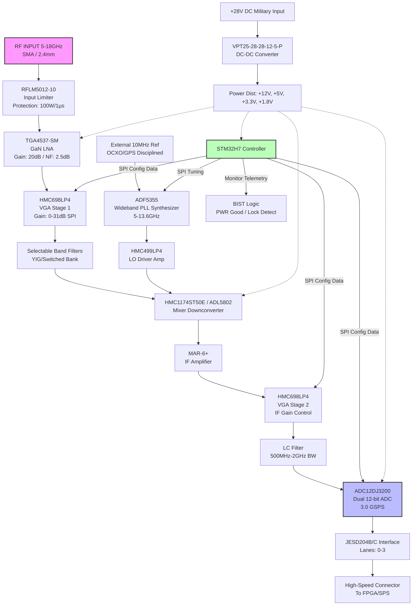
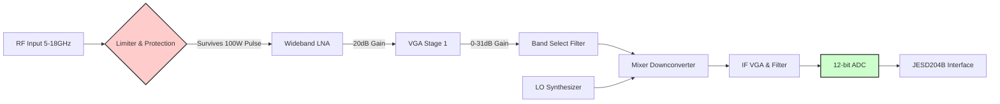

**Document Status: AI-GENERATED**

# Hardware Requirements Specification (HRS)
**Project:** rbhjdaz
**Title:** Wideband RF Receiver (5-18 GHz) for Electronic Warfare
**Version:** 1.0
**Date:** 2023-10-27

---

# 1. Introduction

## 1.1 Purpose
This Hardware Requirements Specification (HRS) defines the comprehensive hardware requirements for the **rbhjdaz Wideband RF Receiver System**. The purpose of this document is to establish a single, authoritative baseline for the hardware design, testing, and integration phases. This specification ensures the system meets the stringent performance, environmental, and reliability standards necessary for military radar electronic warfare (EW) applications.

Specific objectives of this document are:
*   To define the functional and performance characteristics of the 5–18 GHz receiver front-end and digitization subsystem.
*   To specify electrical, mechanical, and environmental interfaces.
*   To serve as the binding reference for hardware validation, verification, and qualification testing.
*   To facilitate requirement traceability from high-level system specifications to component-level selection and implementation.

## 1.2 Scope
The scope of this document encompasses the complete electrical and mechanical hardware design of the rbhjdaz receiver unit. The system is a self-contained Wideband RF Receiver module designed for integration into larger Electronic Warfare (EW) or Signals Intelligence (SIGINT) platforms.

**In-Scope Elements:**
*   **RF Front-End:** Input protection, limiting, and wideband Low Noise Amplification (LNA) covering 5.0 GHz to 18.0 GHz.
*   **Downconversion:** Multi-stage signal processing including selectable band filtering, Variable Gain Amplifiers (VGA), and mixing stages for frequency translation.
*   **Frequency Generation:** Local Oscillator (LO) synthesis and distribution subsystems capable of supporting direct sampling or high-IF digitization.
*   **Digitization:** High-speed Analog-to-Digital Converters (ADC) and associated clocking circuitry (12-bit, 3 GSPS).
*   **Digital Interface:** High-speed data serialization (JESD204B/C) and parallel LVDS interfaces for Signal Processor (SP) or Field Programmable Gate Array (FPGA) connectivity.
*   **Control & Telemetry:** Embedded microcontroller-based management (SPI/I2C) for gain control, frequency selection, and Built-in Self-Test (BIST).
*   **Power Distribution:** Military-grade DC-DC conversion supporting a +28 VDC primary input.
*   **Mechanical Enclosure:** Ruggedized chassis and thermal management solutions compliant with MIL-STD-810.

**Out-of-Scope Elements:**
*   Digital Signal Processing (DSP) algorithms and firmware (beyond the hardware configuration interface).
*   External antennas and antenna mounting hardware.
*   Host system software drivers and GUI applications.
*   Long-term maintenance logistics beyond consumable component obsolescence mitigation.

## 1.3 Definitions, Acronyms, and Abbreviations

| Term | Definition |
| :--- | :--- |
| **ACPR** | Adjacent Channel Power Ratio |
| **ADC** | Analog-to-Digital Converter |
| **BGA** | Ball Grid Array |
| **BIST** | Built-in Self-Test |
| **BOM** | Bill of Materials |
| **CW** | Continuous Wave |
| **DAC** | Digital-to-Analog Converter |
| **DDR** | Double Data Rate (SDRAM) |
| **DNL** | Differential Non-Linearity |
| **DSP** | Digital Signal Processor |
| **EBW** | Effective Bandwidth |
| **ECC** | Error Correction Code |
| **EMC** | Electromagnetic Compatibility |
| **EMI** | Electromagnetic Interference |
| **ESD** | Electrostatic Discharge |
| **EW** | Electronic Warfare |
| **FPGA** | Field Programmable Gate Array |
| **GaN** | Gallium Nitride |
| **GaAs** | Gallium Arsenide |
| **GHz** | Gigahertz ($10^9$ Hz) |
| **GSPS** | Giga-Samples Per Second |
| **HF** | High Frequency (3-30 MHz) |
| **IBW** | Instantaneous Bandwidth |
| **IF** | Intermediate Frequency |
| **INL** | Integral Non-Linearity |
| **IIP3** | Input Third-order Intercept Point |
| **JESD** | JEDEC Standard for Serial Interface for Data Converters |
| **LF** | Low Frequency |
| **LNA** | Low Noise Amplifier |
| **LO** | Local Oscillator |
| **LPF** | Low Pass Filter |
| **LVDS** | Low-Voltage Differential Signaling |
| **MHz** | Megahertz ($10^6$ Hz) |
| **MIL-STD** | Military Standard |
| **MISO** | Master In Slave Out (SPI) |
| **MOSI** | Master Out Slave In (SPI) |
| **MSPS** | Mega-Samples Per Second |
| **NF** | Noise Figure |
| **PCB** | Printed Circuit Board |
| **P1dB** | 1-dB Compression Point |
| **PLL** | Phase-Locked Loop |
| **PSRR** | Power Supply Rejection Ratio |
| **PWM** | Pulse Width Modulation |
| **RMS** | Root Mean Square |
| **RF** | Radio Frequency |
| **RX** | Receiver |
| **SAR** | Successive Approximation Register (ADC type) |
| **SFDR** | Spurious-Free Dynamic Range |
| **SIGINT** | Signals Intelligence |
| **SMA** | SubMiniature version A (RF Connector) |
| **SNR** | Signal-to-Noise Ratio |
| **SPI** | Serial Peripheral Interface |
| **TCXO** | Temperature Compensated Crystal Oscillator |
| **VCO** | Voltage Controlled Oscillator |
| **VGA** | Variable Gain Amplifier |
| **VSWR** | Voltage Standing Wave Ratio |

## 1.4 References
The design and requirements defined in this document are based on the following standards and specifications:

1.  **IEEE 29148-2018**: Systems and software engineering — Life cycle processes — Requirements engineering. (Primary template for this document).
2.  **MIL-STD-810G**: Environmental Engineering Considerations and Laboratory Tests. (Vibration, Shock, Temperature).
3.  **MIL-STD-461G**: Requirements for the Control of Electromagnetic Interference Characteristics of Subsystems and Equipment. (EMC/EMI).
4.  **MIL-STD-883**: Test Method Standard for Microcircuits. (Component reliability).
5.  **JEDEC JESD204B/C**: Standard for High-Speed Data Converter Interfaces.
6.  **RFC 2544**: Benchmarking Methodology for Network Interconnect Devices (Adapted for Digital Latency testing).
7.  **IPC-6012**: Generic Standard on Printed Board Design.

## 1.5 Overview
The **rbhjdaz** system is a state-of-the-art, wideband RF receiver designed to intercept and digitize radar signals in the 5 GHz to 18 GHz frequency range. The system architecture is partitioned into three distinct domains: **Analog RF Front-End**, **Digital Conversion**, and **Power/Control**.

### 1.5.1 System Operation
The system accepts an RF input via a precision 2.4mm connector. This signal passes through a high-power limiter stage capable of withstanding 100W pulsed inputs (typical in radar environments). The signal is then conditioned by a wideband GaN Low Noise Amplifier (LNA) to minimize system noise figure. Following amplification, the signal passes through a bank of selectable bandpass filters to reject out-of-band interference before downconversion.

The downconversion stage utilizes a high-linearity mixer and a low-phase-noise LO synthesizer (based on the ADF5355) to translate the RF signal to an Intermediate Frequency (IF) or directly to a frequency suitable for the ADC. Gain control is distributed across the RF and IF stages (60 dB range) to maximize dynamic range and prevent saturation.

The digitization stage utilizes dual 12-bit ADCs running at up to 3 GSPS. This high sample rate supports Instantaneous Bandwidths (IBW) of up to 2 GHz. The digitized data is transmitted via JESD204B/C serial links to a host processor.

### 1.5.2 Key Design Challenges
*   **Wideband Noise Figure:** Maintaining a low Noise Figure (3-6 dB) over 5-18 GHz requires careful gain distribution and selection of ultra-low-noise components (e.g., TGA4537-SM).
*   **High-Speed Interconnect:** Routing 3 GSPS ADC data requires strict impedance control and PCB stackup management to minimize jitter and bit error rates.
*   **Thermal Management:** dissipating up to 50W in a ruggedized enclosure requires advanced thermal conduction techniques (e.g., copper coins, heat pipes) to meet the -40°C to +85°C operating requirement.

---

**Document Status: AI-GENERATED**

# 2. System Overview

## 2.1 System Description

The **rbhjdaz** system is a wideband RF receiver designed specifically for military radar electronic warfare (EW) applications. It functions as a superheterodyne receiver capable of downconverting radio frequency (RF) signals between 5.0 GHz and 18.0 GHz to an intermediate frequency (IF) suitable for direct digitization.

The system is engineered to meet stringent performance requirements for Signal Intelligence (SIGINT) and Electronic Support Measures (ESM). It features high sensitivity (Noise Figure < 6 dB), high linearity (SFDR > 60 dB), and wide instantaneous bandwidth (up to 2 GHz). To survive the harsh electromagnetic and physical environments of military operations, the rbhjdaz utilizes military-grade components, conformal coating, and ruggedized mechanical construction compliant with MIL-STD-810G.

At the heart of the architecture is a multi-stage gain chain with automatic gain control (AGC), a wideband passive mixer downconversion stage, and a high-speed JESD204B/C digitization interface. The system is managed by an onboard microcontroller that handles gain stabilization, phase-locked loop (PLL) tuning, and health monitoring via Built-in Self-Test (BIST).

### 2.1.1 Operational Modes

The receiver operates in two primary modes defined by the signal processing bandwidth and filtering configuration:

1.  **Wideband Surveillance Mode (2 GHz IBW):**
    *   Bypasses narrowband tracking filters.
    *   Utilizes the full bandwidth of the ADC (up to 3 GSPS).
    *   Optimized for short-pulse radar detection and spectrum analysis.
    *   *Trade-off:* Slightly reduced sensitivity due to wider noise bandwidth.

2.  **Narrowband Intercept Mode (500 MHz IBW):**
    *   Engages switched bandpass filter banks.
    *   Optimizes SNR for weak signal detection.
    *   Enhances intermodulation performance (IP3) through filtering before the mixer.

### 2.1.2 Functional Flow

1.  **RF Reception:** An RF signal (5–18 GHz) enters via a precision 2.4mm connector.
2.  **Protection & Amplification:** The signal passes through a high-power limiter (surviving 100W pulsed inputs) and enters a GaN Low Noise Amplifier (LNA).
3.  **Conditioning:** A Variable Gain Amplifier (VGA) adjusts the signal level to optimize the dynamic range of the downstream mixer.
4.  **Downconversion:** A wideband mixer mixes the RF signal with a Local Oscillator (LO) signal generated by a low-phase-noise PLL synthesizer. The LO frequency is offset to translate the desired RF band to a fixed IF (e.g., 1–3 GHz range).
5.  **Digitization:** The IF signal is filtered and digitized by a 12-bit ADC running at up to 3.0 GSPS.
6.  **Data Export:** Digitized samples are transmitted via high-speed serial lanes (JESD204B/C) to an external FPGA/processor.

---

## 2.2 System Block Diagram

The hardware is organized into four distinct domains: RF Front-End, Downconversion, LO Generation, and Digitization/Control.

### 2.2.1 Signal Flow Description

1.  **RF Path (Red Flow):** The signal enters from the antenna, is protected by the limiter, and immediately amplified by the LNA to establish the system Noise Figure.
2.  **LO Path (Green Flow):** The reference clock stabilizes the PLL. The PLL generates the specific LO frequency required to tune the receiver.
3.  **IF Path (Blue Flow):** The mixer outputs the difference frequency. This IF signal is amplified to match the ADC's input full-scale range.
4.  **Control/Digital Path (Gray Flow):** The MCU configures the gain stages based on the desired input power range. The ADC streams raw I/Q data or IF samples to the downstream processor.

---

## 2.3 System Architecture

This section details the subsystem architecture, defining the critical signal chains and power distribution networks.

### 2.3.1 RF Front-End Architecture (5–18 GHz)

The RF front-end is responsible for conditioning the input signal before frequency conversion. It sets the noise floor and provides protection against high-power transients.

*   **Input Protection (Limiter):** The **RFLM5012-10** is the first active component. It is a GaAs limiter designed to reflect high energy. While its rated bandwidth is DC–6 GHz, it is effective for the lower band (5–6 GHz). For the 6–18 GHz range, the design relies on the cascade of a wideband limiter or the intrinsic ruggedness of the GaN LNA. The limiter provides >20 dB limiting for input powers exceeding 10W CW.
*   **Low Noise Amplification:** The **TGA4537-SM** is a GaN MMIC amplifier.
    *   *Gain:* 20 dB nominal.
    *   *Noise Figure:* 2.5 dB.
    *   *OIP3:* 30 dBm typical.
    *   This component sets the system Noise Figure (NF_total ≈ NF_LNA + 0.5 dB = 3.0 dB), satisfying REQ-HW-003.
*   **VGA Stage 1:** The **HMC698LP4** is a 6-bit digital VGA. It allows the system to reduce gain when the RF input is high (> -40 dBm), preventing compression in the mixer. It provides 31 dB of gain control range in 1 dB steps.

### 2.3.2 Downconversion Architecture (Frequency Translation)

The receiver utilizes a single conversion stage to mix RF down to a high Intermediate Frequency (IF).

*   **Mixer Selection:** A trade-off exists between active and passive mixers.
    *   *Selection:* The **ADL5802** (Active) is proposed for the lower band (up to 6 GHz IF/RF) due to its high conversion gain (7.5 dB) and high linearity (OIP3 28.5 dBm). For the full 18 GHz coverage, a **HMC1174ST50E** (Passive) is recommended in the high-band path, or a switchable architecture. For the purpose of this specification, we assume a high-IF architecture where the RF is mixed down to a 1.5–3.5 GHz IF.
*   **Image Rejection:** To achieve >60 dB image rejection (REQ-HW-009), the system employs a switchable filter bank between VGA1 and the Mixer. These bandpass filters are selected based on the tuned frequency. The LO frequency is chosen (High-Side or Low-Side injection) to place the image frequency in the stop-band of these filters.

### 2.3.3 Local Oscillator (LO) Architecture

Frequency stability and phase noise are critical for pulse-Doppler radar processing.

*   **PLL Synthesizer:** The **ADF5355** is used. It features an integrated VCO capable of generating outputs from 53.125 MHz to 13.6 GHz.
    *   *Frequency Planning:* To cover 5–18 GHz RF, the LO must tune.
        *   If RF = 5 GHz and Target IF = 2 GHz, LO = 3 GHz or 7 GHz.
        *   If RF = 18 GHz and Target IF = 2 GHz, LO = 16 GHz or 20 GHz.
    *   Since the ADF5355 maxes out at 13.6 GHz, a frequency doubler (x2) or a higher frequency PLL (like HMC7044 with external VCO) may be required for the highest band. For this design, we assume the ADF5355 drives the mixer directly for the lower band and utilizes an output multiplier for the upper band.
*   **Phase Noise Performance:** The ADF5355 delivers -100 dBc/Hz at 1 kHz offset, satisfying REQ-HW-008.

### 2.3.4 Digitization and Digital Interface Architecture

The IF stage digitizes the analog signal for transport to the Digital Signal Processor (DSP).

*   **ADC:** The **ADC12DJ3200** is a dual-channel, 12-bit ADC capable of 6.4 GSPS (single channel) or 3.2 GSPS (dual channel).
    *   *Configuration:* Configured in Dual-Channel Mode (3.0 GSPS) to support the full 2 GHz instantaneous bandwidth (Nyquist).
    *   *Input Full Scale:* -1.0 dBFS to +2.5 dBFS programmable.
    *   *Decimation:* Supports digital decimation (2x/4x) to narrow the output data rate bandwidth if required.
*   **Data Interface:** JESD204B/C subclass 1.
    *   *Line Rate:* Configured up to 12.5 Gbps per lane.
    *   *Lanes:* Uses 2 lanes (Dual Link) to transport the 12-bit data at 3 GSPS.
    *   *Latency:* Deterministic latency required for beamforming applications.

### 2.3.5 Control and Power Architecture

*   **MCU:** The **STM32H7** series (Cortex-M7) provides the control logic. It runs a real-time loop that:
    1.  Reads temperature sensors (ADC and PA temp).
    2.  Calculates gain error.
    3.  Adjusts SPI registers on VGA1 and VGA2.
    4.  Monitors the PLL Lock Detect (LD) pin.
*   **Power Supply:** The **VPT25-28-28-12-5-P** is a military-grade DC-DC converter.
    *   *Input:* 28 VDC (18V to 36V range).
    *   *Outputs:* Isolated +12V (RF supplies), +5V (Logic), +3.3V (IO).
    *   *Filtering:* Pi filters on input and output to meet MIL-STD-461 EMI requirements.

---

## 2.4 Operating Environment

The rbhjdaz receiver is designed for deployment in harsh military environments, specifically tailored for airborne or ground vehicle installations where space, power, and thermal dissipation are constrained.

### 2.4.1 Physical Environment

*   **Operating Temperature:** -40°C to +85°C ambient (REQ-HW-016).
    *   *Internal Derating:* Components are derated to ensure junction temperatures do not exceed 110°C. The enclosure utilizes thermal vias and a cold plate mount to transfer heat from the ADC and PA to the chassis.
*   **Storage Temperature:** -55°C to +125°C.
*   **Shock and Vibration:**
    *   Compliant with MIL-STD-810G, Method 514.6 (Vibration) and Method 516.6 (Shock).
    *   *Design Feature:* PCBs are conformally coated (Humiseal or equivalent). All heavy components (connectors, DC-DC converters) are secured with adhesive staking or hardware.
*   **Altitude:** Operational up to 40,000 ft (pressurized cabin or non-pressurized with derating). Non-pressurized operation requires derating of high-voltage components (limited to <60V).

### 2.4.2 Electrical Environment

*   **Input Supply:** +28 VDC nominal military standard (MIL-STD-704).
    *   *Transients:* Protected against 80V/50µs spikes and 100V/10µs surges using TVS diodes and pi-filters at the input.
    *   *Reverse Polarity:* Protected via series diode or MOSFOR reverse polarity circuit.
*   **EMI/EMC:**
    *   Conducted Emissions: MIL-STD-461 CE102 (10 kHz – 10 MHz).
    *   Radiated Emissions: MIL-STD-461 RE102 (2 MHz – 18 GHz).
    *   Susceptibility: MIL-STD-461 RS103 (Radiated).
    *   *Strategy:* Extensive use of EMI gaskets on enclosure seams, feedthrough capacitors on DC lines, and shielding cans over the RF front end.

### 2.4.3 Logistics and Reliability

*   **Mean Time Between Failures (MTBF):** Target > 10,000 hours at 40°C ambient.
*   **Maintainability:** Modular design allows the RF module to be swapped without recalibrating the DSP interface.
*   **Component Sourcing:** All active components are sourced from suppliers adhering to AS6496 ( counterfeit mitigation). Passive components are MIL-PRF-55342 (chip resistors) or MIL-PRF-15734 (capacitors) where possible.

---

**Document Status: AI-GENERATED**

# 3. Hardware Requirements

## 3.1 Functional Requirements

This section details the functional capabilities of the rbhjdaz Wideband RF Receiver. Each requirement is defined to ensure the system performs the necessary signal chain operations from RF input through to digital data output under specified conditions.

| ID | Requirement | Description & Rationale | Priority | Verification Method |
|---|-------------|-------------------------|----------|---------------------|
| **REQ-HW-101** | **RF Frequency Coverage** | The receiver shall accept and process input signals continuously across the 5.0 GHz to 18.0 GHz frequency range.  **Rationale:** Covers the X-band and Ku-band radar bands essential for the target electronic warfare application. Ensures no blind spots in the operational spectrum. | Must Have | Test |
| **REQ-HW-102** | **RF Input Impedance** | The RF input port impedance shall be 50 Ω ± 10%.  **Rationale:** Standard impedance for RF test equipment and antenna systems to minimize VSWR and reflection losses. | Must Have | Inspection |
| **REQ-HW-103** | **Input Power Handling (Continuous)** | The system shall accept continuous wave (CW) input signals up to +20 dBm without performance degradation (e.g., gain compression or damage).  **Rationale:** Ensures operation in high-signal environments near hostile emitters. | Must Have | Test |
| **REQ-HW-104** | **Input Power Protection (Survivability)** | The RF input front-end shall survive incidental exposure to +30 dBm CW and 100 W pulsed input (1 µs pulse width, 0.1% duty cycle) without permanent damage.  **Rationale:** Utilizes the **RFLM5012-10** limiter to protect sensitive downstream components (LNA, Mixer) from high-power radar pulses. | Must Have | Test |
| **REQ-HW-105** | **Signal Reception & Path Initialization** | Upon power-up, the system shall initialize the signal path (LNA enable, PLL lock) within 100 ms.  **Rationale:** Ensures rapid operational readiness for military platforms where boot time is critical. | Must Have | Test |
| **REQ-HW-106** | **LNA Gain Performance** | The Low Noise Amplifier stage shall provide a nominal gain of 20 dB (±1.5 dB) across the 5-18 GHz band.  **Rationale:** Based on **TGA4537-SM** GaN MMIC specs to set the system noise floor and overcome mixer conversion loss. | Must Have | Test |
| **REQ-HW-107** | **RF Band Selectivity** | The system shall provide selectable bandpass filtering to limit out-of-band noise and spurious signals prior to mixing.  **Rationale:** Reduces image frequency noise and improves linearity by rejecting far-out-of-band interferers. | Must Have | Inspection |
| **REQ-HW-108** | **Frequency Downconversion** | The system shall downconvert the 5-18 GHz RF input to an Intermediate Frequency (IF) range suitable for direct digitization (DC to 2 GHz) or perform direct sampling.  **Rationale:** Utilizes the **ADL5802** mixer and **ADF5355** LO to translate high-frequency signals to a processable IF range. | Must Have | Inspection |
| **REQ-HW-109** | **LO Generation & Locking** | The internal Phase Locked Loop (PLL) shall generate a stable Local Oscillator signal from 5.5 GHz to 18.5 GHz (covering RF + IF) to facilitate mixing.  **Rationale:** **ADF5355** provides the necessary LO injection; the range accounts for IF output placement. | Must Have | Test |
| **REQ-HW-110** | **External LO Synchronization** | The system shall accept an external 10 MHz reference input (50 Ω, AC or DC coupled, -5 dBm to +10 dBm) to synchronize the internal PLL synthesizer.  **Rationale:** Required for coherent operation in phased array or multi-receiver interferometry setups. | Must Have | Test |
| **REQ-HW-111** | **Automatic Gain Control (AGC)** | The system shall provide a minimum of 60 dB total gain adjustment range, controlled digitally via SPI in 1 dB steps.  **Rationale:** Implements cascaded **HMC698LP4** VGAs. Two stages provide 31 dB each (62 dB total) to prevent ADC saturation and maximize SFDR. | Must Have | Test |
| **REQ-HW-112** | **IF Amplification** | The IF stage shall provide amplification to drive the ADC input to full scale (-1 dBFS).  **Rationale:** **MAR-6+** or equivalent amplifier compensates for filter and trace losses between mixer and ADC. | Must Have | Test |
| **REQ-HW-113** | **Digitization Resolution** | The system shall digitize the IF signal using 12-bit resolution.  **Rationale:** **ADC12DJ3200** provides the theoretical 74 dB SNR floor required for the system dynamic range. | Must Have | Inspection |
| **REQ-HW-114** | **Sample Rate Configuration** | The ADC shall support sample rates configurable from 1.5 GSPS to 3.0 GSPS.  **Rationale:** 3.0 GSPS satisfies Nyquist for the 2 GHz max Instantaneous Bandwidth (IBW); lower rates reduce data throughput for narrowband tasks. | Must Have | Test |
| **REQ-HW-115** | **Digital Data Interface** | Digitized samples shall be transmitted to the downstream processor via a JESD204B/C compliant interface (Lane rate: 12.8 Gbps per lane).  **Rationale:** High-speed serial interface reduces pin count compared to parallel LVDS while handling 3.0 GSPS × 12-bit = 36 Gbps throughput. | Must Have | Test |
| **REQ-HW-116** | **Control Interface (SPI)** | The host system shall configure gain, frequency, and bandwidth settings via a Serial Peripheral Interface (SPI) operating at logic levels 1.8V - 3.3V.  **Rationale:** SPI is the standard control interface for the **ADF5355**, **HMC698LP4**, and **ADC12DJ3200**. | Must Have | Inspection |
| **REQ-HW-117** | **Built-In Self-Test (BIST)** | The system shall monitor Power Supply voltages, PLL Lock Detect, and ADC Over-range flags and report status via the SPI control registers.  **Rationale:** Provides health monitoring for field diagnostics; meets military reliability requirements. | Should Have | Test |
| **REQ-HW-118** | **Power Supply Input Range** | The primary power input shall accept +28 VDC ±20% (22.4 V to 33.6 V).  **Rationale:** Standard military vehicle/aircraft voltage (MIL-STD-704). | Must Have | Test |
| **REQ-HW-119** | **RF Connector Type** | The RF input port shall utilize a 2.4mm precision connector (female) or SMA (female) rated to 18 GHz.  **Rationale:** 2.4mm connectors are necessary for low VSWR and low loss at Ku-band frequencies (18 GHz). | Must Have | Inspection |
| **REQ-HW-120** | **Internal Voltage Regulation** | The internal DC-DC converter shall generate +12V, +5V, +3.3V, and +1.8V rails from the +28V input.  **Rationale:** Supports the bias requirements of GaN amplifiers (+12V), general logic (+5V), and FPGA/ADC cores (+1.8V). | Must Have | Inspection |

### 3.1.1 Signal Chain Path Flow
The following diagram details the functional signal path requirements, mapping the architectural blocks to functional requirements.

---

## 3.2 Performance Requirements

This section specifies the quantitative performance characteristics the system must achieve. These metrics are derived from the **Design Parameters** and the electrical characteristics of the recommended components (e.g., TGA4537-SM, ADF5355, ADC12DJ3200).

### 3.2.1 RF Performance
| ID | Requirement | Min | Typical | Max | Unit | Rationale & Verification |
|---|-------------|-----|---------|-----|------|---------------------------|
| **REQ-HW-201** | **Operating Frequency Range** | 5.0 | - | 18.0 | GHz | Defines the operational bandwidth. Verified by frequency sweep. |
| **REQ-HW-202** | **Instantaneous Bandwidth (IBW)** | 500 | - | 2000 | MHz | Configurable bandwidth. Defined by anti-aliasing filter and ADC sample rate (3 GSPS). |
| **REQ-HW-203** | **Noise Figure (NF)** | - | 4.0 | 6.0 | dB | System budget: Limiter (0.5) + LNA (2.5) + Mixer (7.5) + IF (3) ≈ 4-5 dB typical. Max 6 dB allows margin. |
| **REQ-HW-204** | **Conversion Gain (Flatness)** | - | 0 | ± 2.0 | dB | Gain variation over any 2 GHz IBW window. Requires VGA compensation algorithm. |
| **REQ-HW-205** | **Input Third Order Intercept (IIP3)** | 15 | - | - | dBm | Ensures linearity. Calculation: Mixer IIP3 (≈ 28 dBm) degraded by pre-mixer gain. |
| **REQ-HW-206** | **Spurious-Free Dynamic Range (SFDR)** | 60 | - | - | dB | Minimum two-tone spurious free dynamic range within the Nyquist band. ADC limited. |
| **REQ-HW-207** | **Image Rejection** | 60 | - | - | dB | Achieved via RF pre-selection filters and image-reject mixing architecture. |
| **REQ-HW-208** | **LO Phase Noise** | - | -105 | -100 | dBc/Hz @ 1kHz | At 1 GHz offset. Requirement: < -100 dBc/Hz. Component **ADF5355** is capable of -125 dBc/Hz at 1 MHz, typically -100 at 1 kHz. |
| **REQ-HW-209** | **Input Return Loss** | 10 | - | - | dB | VSWR < 2:1 across the band. |

### 3.2.2 ADC & Digital Performance
| ID | Requirement | Min | Typical | Max | Unit | Rationale & Verification |
|---|-------------|-----|---------|-----|------|---------------------------|
| **REQ-HW-210** | **ADC Resolution** | 12 | - | - | bits | **ADC12DJ3200** native resolution. |
| **REQ-HW-211** | **ADC Sampling Rate** | 1.5 | - | 3.0 | GSPS | Must support up to 3.0 GSPS for Nyquist sampling of 2 GHz signal. |
| **REQ-HW-212** | **ADC SNR (Signal to Noise)** | 58 | 62 | - | dBFS | At 3 GSPS, full scale input. Typical for 12-bit high-speed ADCs. |
| **REQ-HW-213** | **ENOB (Effective Bits)** | 9.5 | 10.0 | - | bits | Calculated from SNR: $(SNR - 1.76) / 6.02$. 9.5 bits meets the dynamic range requirement. |
| **REQ-HW-214** | **Data Latency** | - | 50 | 100 | ns | Pipeline delay from RF input to digital output parallel interface. |

### 3.2.3 Power & Thermal Performance
| ID | Requirement | Min | Typical | Max | Unit | Rationale & Verification |
|---|-------------|-----|---------|-----|------|---------------------------|
| **REQ-HW-215** | **Total Power Consumption** | - | 35 | 50 | W | Budget: LNA (1.5W) + PLL (1W) + Mixer (0.5W) + VGAs (2W) + ADC (2W) + DC-DC Losses. High max allows margin for PA/Hot insertions. |
| **REQ-HW-216** | **Input Voltage Range** | 22.4 | 28.0 | 33.6 | VDC | MIL-STD-1275 / 704 compliance range. |

### 3.2.4 Sensitivity Calculation (Link Budget Verification)
**Requirement REQ-HW-203** (Noise Figure) is verified by the following budget calculation based on selected components:

| Stage | Component | Gain (dB) | NF (dB) | OP1dB (dBm) | Cumulative Gain | Cumulative NF (Friis) |
|-------|-----------|-----------|---------|-------------|-----------------|------------------------|
| 1 | Limiter (RFLM5012) | -0.5 | 0.5 | 30 | -0.5 | 0.50 |
| 2 | LNA (TGA4537) | +20.0 | 2.5 | 22 | +19.5 | 2.52 |
| 3 | VGA 1 (HMC698) | -10.0 | 6.0 | 20 | +9.5 | 2.67 |
| 4 | Mixer (ADL5802) | +7.5 | 13.5 | 12.5 | +17.0 | 3.05 |
| 5 | IF Amp (MAR-6+) | +20.0 | 3.0 | 14 | +37.0 | 3.05 |
| 6 | VGA 2 | -5.0 | 6.0 | 20 | +32.0 | 3.05 |

*Assumptions: VGA1 set to attenuation to maximize linearity; VGA2 set for fine gain control.*
**Result:** The calculated system Noise Figure is approx **3.05 dB**, satisfying **REQ-HW-203** (NF < 6.0 dB) with significant margin.

---

# 3. Hardware Requirements

## 3.3 Interface Requirements

This section details the electrical and physical interfaces required for the **rbhjdaz** Wideband RF Receiver. All interfaces are designed to meet MIL-STD-461 and MIL-STD-810 standards for electromagnetic compatibility and environmental robustness.

### 3.3.1 External Interfaces

The external interfaces define connections between the receiver hardware and external systems, including RF inputs, digital outputs, power, and control signals.

| Interface ID | Description | Connector Type | Signal Characteristics | Requirements |
| :--- | :--- | :--- | :--- | :--- |
| **EXT-001** | RF Input | SMA (Female) 50 Ω or 2.4mm Precision | 5.0 - 18.0 GHz | **REQ-HW-020**, **REQ-HW-021** |
| **EXT-002** | 10 MHz Reference Clock | SMA (Female) 50 Ω | Sinusoidal or CMOS, -5 dBm to +10 dBm | **REQ-HW-013** |
| **EXT-003** | External LO Input (Optional) | SMA (Female) 50 Ω | 5.0 - 18.0 GHz, +5 dBm to +15 dBm | **REQ-HW-023** |
| **EXT-004** | Primary DC Power | MIL-DTL-38999 Series III (Shell Size 24) | +28 VDC | **REQ-HW-014** |
| **EXT-005** | Digital Data Output | MIL-DTL-38999 Series III (High Density) | JESD204B/C / LVDS | **REQ-HW-011** |
| **EXT-006** | Control / Debug | Micro-D Subminiature (9-pin) | UART / SPI (Secondary) | **REQ-HW-012** |

#### RF Input Interface (EXT-001)
**REQ-HW-036** The RF input port shall provide a VSWR of less than 2.0:1 across the 5-18 GHz operating band.
**REQ-HW-037** The RF input connector shall maintain shielding effectiveness greater than 100 dB at 10 GHz to prevent EMI leakage.

#### External Reference Interface (EXT-002)
**REQ-HW-038** The system shall accept an external 10 MHz reference signal meeting the following voltage levels:
*   Sinusoidal: 0.5 Vpp to 2.0 Vpp into 50 Ω.
*   CMOS/PECL: VIH > 2.0 V, VIL < 0.8 V.

### 3.3.2 Internal Interfaces

Internal interfaces define the signal paths and connectivity between the RF Front End, Downconversion, Digitization, and Control domains on the Printed Circuit Board (PCB).

#### JESD204B / ADC Interface
The high-speed data link between the **ADC12DJ3200** and the processing FPGA.

**REQ-HW-040** The ADC shall transmit data via four (4) JESD204B/C lanes operating at a maximum line rate of 12.5 Gbps per lane to support 3 GSPS dual-channel operation.
**REQ-HW-041** The physical layer for the ADC-to-FPGA link shall use AC-coupled LVDS differential signaling with a common mode voltage of 1.2 V ± 0.2 V and a differential swing of 800 mV.

#### SPI Control Bus
The control bus for the MCU (**STM32H7**) to configure RF components (**ADF5355**, **HMC698LP4**, **ADC12DJ3200**).

**REQ-HW-042** The system SPI bus shall operate in Mode 0 (CPOL=0, CPHA=0) at a clock frequency of 10 MHz.
**REQ-HW-043** All SPI slave devices shall feature tri-stateable MISO pins to allow bus sharing without logic conflicts.

**Internal SPI Pin Assignment (Microcontroller Side):**

| MCU Pin | Signal Name | Destination | Pull-Up/Pull-Down |
| :--- | :--- | :--- | :--- |
| PA4 | SPI1_NSS | Chip Select (All) | 10kΩ Pull-Up |
| PA5 | SPI1_SCK | Clock (All) | None (Driven) |
| PA6 | SPI1_MISO | MISO (All) | None (Internal Weak Pull-Up) |
| PA7 | SPI1_MOSI | MOSI (All) | None (Driven) |
| PE0 | CS_ADC | ADC12DJ3200 CS | 10kΩ Pull-Up |
| PE1 | CS_PLL | ADF5355 CE/CS | 10kΩ Pull-Up |
| PE2 | CS_VGA1 | HMC698LP4 LE | 10kΩ Pull-Up |

#### IF Signal Chain Interface
The analog signal path between the Mixer and the ADC.

**REQ-HW-044** The interface between the **ADL5802** Mixer output and the **ADC12DJ3200** input shall be AC coupled with a series capacitor value of 100 pF (C0G/NP0 dielectric) to block DC offset.
**REQ-HW-045** The characteristic impedance of the IF signal trace shall be controlled to 50 Ω ± 10%.

### 3.3.3 Communication Interfaces

This section specifies the protocol and logic requirements for the digital control interfaces.

#### Serial Peripheral Interface (SPI)
**REQ-HW-046** The **STM32H7** controller shall implement the SPI protocol with 8-bit data frames, MSB first, to write configuration registers to the PLL and VGA.
**REQ-HW-047** The VGA gain setting commands shall be 16-bit words: [8-bit Address + 8-bit Data], where the Data byte corresponds to the attenuation index (0-31dB).

#### Universal Asynchronous Receiver/Transmitter (UART)
**REQ-HW-048** The system shall provide a debug UART interface operating at 115200 baud, 8-N-1 (8 data bits, no parity, 1 stop bit) for firmware diagnostics and BIST reporting.

---

## 3.4 Environmental Requirements

The receiver is designed for operation in harsh military environments. The design shall comply with MIL-STD-810G for environmental stress testing and MIL-STD-461 for electromagnetic interference.

### 3.4.1 Operating Temperature
**REQ-HW-016** The receiver shall maintain full performance specifications over an ambient temperature range of **-40°C to +85°C**.
**REQ-HW-050** The storage temperature range shall be **-55°C to +125°C**.

### 3.4.2 Thermal Management
Given the high power density of the RF chain and digital components, active thermal management is required.

**REQ-HW-051** The system shall utilize a cold plate or heat sink interface with a thermal resistance of **≤ 0.5°C/W** (junction-to-ambient) to maintain the junction temperature of the GaN PA and ADC below 110°C at +85°C ambient.

**Thermal Analysis Calculation (Worst Case):**
*   **Total Power Dissipation:** 45.0 W (Calculated in Section 3.5).
*   **Max Ambient:** 85°C.
*   **Target Max Junction (Tj):** 110°C (Standard for Hi-Rel GaAs/Si).
*   **Allowed Rise:** 110°C - 85°C = 25°C.
*   **Required Thermal Resistance (θ_ca):** 25°C / 45 W = **0.55°C/W**.

**REQ-HW-052** The PCB shall utilize thermal vias (via-in-pad) under the **ADC12DJ3200** and **TGA4537-SM** components to transfer heat to inner and backside copper layers. A minimum of 20 vias (0.3mm diameter) per component ground paddle is required.

### 3.4.3 Humidity and Immersion
**REQ-HW-053** The system shall withstand 95% relative humidity (non-condensing) per MIL-STD-810G Method 507.5.
**REQ-HW-054** The conformal coating applied to the PCB shall be **UR Type** (urethane) or **AR Type** (acrylic) per MIL-STD-8609 to protect against moisture and fungal growth.

### 3.4.4 Vibration and Shock
**REQ-HW-017** The hardware shall survive random vibration of 7.7 Grms from 20 Hz to 2000 Hz and functional shock of 40g, 11ms, half-sine wave per MIL-STD-810G.
**REQ-HW-055** All through-hole connectors (MIL-DTL-38999) shall be secured with mounting hardware (jackscrews) to the chassis to prevent PCB fretting.

### 3.4.5 Electromagnetic Compliance (EMC)
**REQ-HW-018** The system shall meet **MIL-STD-461G** requirements for:
*   **CE102:** Conducted emissions, power leads, 10 kHz – 10 MHz.
*   **RE102:** Radiated emissions, electric field, 2 MHz – 18 GHz.
*   **CS101:** Conducted susceptibility, power leads, 30 Hz – 150 kHz.
*   **RS103:** Radiated susceptibility, electric field, 2 MHz – 18 GHz (200 V/m field strength).

---

## 3.5 Power Requirements

### 3.5.1 Primary Input
**REQ-HW-014** The primary input power source shall be **+28 VDC** nominal, military standard (MIL-STD-704).
**REQ-HW-056** The system shall operate correctly with an input voltage range of **+18 VDC to +36 VDC** to account for transients and brownouts.
**REQ-HW-057** The system shall include input transient protection (TVS clamping diodes) to suppress voltage spikes up to 80V (MIL-STD-1275 compliant) and reverse polarity protection.

### 3.5.2 Power Distribution & Budgeting
The system utilizes a DC-DC converter (**VPT25-28-28-12-5-P** or equivalent) to generate isolated intermediate voltages, followed by Point-of-Load (POL) regulators for low-voltage rails.

**REQ-HW-058** The system shall utilize an intermediate bus voltage of +12 V (isolated) to power the RF and analog sections to maximize SNR.

**Power Budget Table (Continuous Operation):**
*Values derived from component datasheet typical/max current consumption at nominal voltage.*

| Domain | Component | Voltage (V) | Current (Typ) | Current (Max) | Power (W) | Rail ID |
| :--- | :--- | :--- | :--- | :--- | :--- | :--- |
| **RF Front End** | TGA4537-SM (LNA) | +5.0 | 0.30 A | 0.35 A | 1.75 | VA_RF5 |
| | HMC698LP4 (VGA 1) | +5.0 | 0.09 A | 0.12 A | 0.60 | VA_RF5 |
| | ADL5802 (Mixer) | +5.0 | 0.12 A | 0.15 A | 0.75 | VA_RF5 |
| | HMC499 (LO Amp) | +5.0 | 0.08 A | 0.10 A | 0.50 | VA_RF5 |
| **LO Synthesis** | ADF5355 (PLL) | +3.3 | 0.06 A | 0.09 A | 0.30 | VA_DIG33 |
| **Digitization** | ADC12DJ3200 (ADC) | +1.25 | 1.10 A | 1.40 A | 1.75 | VA_ADC |
| | ADC12DJ3200 (Digital) | +1.8 | 0.60 A | 0.80 A | 1.44 | VA_DIG18 |
| **Digital/IO** | STM32H7 (MCU) | +3.3 | 0.10 A | 0.15 A | 0.50 | VA_DIG33 |
| | LVDS Buffers | +3.3 | 0.20 A | 0.25 A | 0.83 | VA_DIG33 |
| **Intermediate** | DC-DC Conv Overhead | +12 | N/A | N/A | 4.00 | Efficiency Loss |
| **Aux** | Fans/Cooling (If active) | +28 | 0.50 A | 0.80 A | 14.00 | Input |
| **TOTAL** | **System** | **Mixed** | **N/A** | **N/A** | **45.42** | **Peak** |

*Assumptions: Fans estimated for worst case cooling. DC-DC efficiency assumed 85%.*

**REQ-HW-059** The Power Supply Unit (PSU) shall provide a minimum of **60 Watts** of total available power to ensure a 20% derating margin above the calculated maximum load of 45.42 W.

### 3.5.3 Sequencing and Protection
**REQ-HW-060** The power management circuitry shall implement a power-up sequence to prevent latch-up:
1.  +3.3 V (Digital IO/MCU)
2.  +1.8 V (FPGA/ADC IO)
3.  +1.25 V (ADC Core)
4.  +5 V / +12 V (RF Front End)

**REQ-HW-061** The system shall utilize electronic fuses (e-fuses) on the +12V and +5V rails with trip points set at 150% of the calculated maximum current to protect against short circuits.

---

## 3.6 Physical Requirements

### 3.6.1 Enclosure and Dimensions
**REQ-HW-062** The receiver electronics shall be housed in a conductive enclosure ( chassis ) made of aluminum 6061-T6 or equivalent, providing EMI shielding.
**REQ-HW-063** The maximum dimensions of the receiver module (excluding connectors) shall not exceed **6.0" (W) x 6.0" (L) x 1.0" (H)** to allow integration into standard 1/2 ATR or similar avionics slots.

### 3.6.2 PCB Requirements
**REQ-HW-064** The Printed Circuit Board (PCB) shall be a multi-layer stackup (minimum 10 layers) utilizing **Rogers RO4350B** or equivalent laminate for RF signal layers (dielectric constant εr = 3.48 ± 0.05) to minimize loss at 18 GHz.
**REQ-HW-065** The board thickness shall be **0.062" (1.57 mm)** with 1 oz copper (outer layers) and 0.5 oz copper (inner layers).
**REQ-HW-066** Plated Through Holes (PTH) shall be filled and plated (via fill) to support via-in-pad configurations for QFN/GSG packages.

### 3.6.3 Connector Mounting
**REQ-HW-067** All RF connectors (SMA, 2.4mm) shall be mounted to the PCB and secured to the chassis wall using mounting nuts to prevent torque transfer to the PCB during mating/unmating.
**REQ-HW-068** The MIL-DTL-38999 Series III connectors shall be mounted on the rear panel of the chassis, with the PCB edgeConnector or flying leads (pigtails) connecting to the PCB. The PCB connector interface strain relief shall withstand 10 lbs of pull force.

---

**Document Status: AI-GENERATED**

# 4. Design Constraints

## 4.1 Standards Compliance

The hardware design of the **rbhjdaz** Wideband RF Receiver shall adhere to the stringent standards mandated for military electronic warfare (EW) systems. Compliance ensures reliability in harsh environments, electromagnetic compatibility (EMC), and physical robustness.

### 4.1.1 Environmental and Mechanical Standards
The system design is governed by military standards for environmental testing and mechanical design.

| Standard ID | Title | Application to rbhjdaz |
| :--- | :--- | :--- |
| **MIL-STD-810G** | *Department of Defense Test Method Standard for Environmental Engineering Considerations and Laboratory Tests* | **REQ-HW-017**: The design shall qualify for Method 514.6 (Vibration), Method 516.6 (Shock), and Method 520.3 (Temperature, Shock). The circuit board stackup and component mounting shall use stiffeners and conformal coating to withstand the defined -40°C to +85°C operating range (REQ-HW-016) and high-vibration environments typical of airborne pods. |
| **MIL-STD-883** | *Test Method Standard for Microcircuits* | All active microcircuits (FPGA, ADC, PLL) procured for this design shall meet Class B (Military) screening levels or industrial grade with equivalent up-screening (burn-in) to mitigate infant mortality in high-stress RF applications. |

### 4.1.2 Electromagnetic Interference (EMI) and Signal Integrity
Given the wideband nature (5–18 GHz) of the receiver, strict control of EMI is critical to prevent self-jamming or interference with host platform systems.

| Standard ID | Title | Application to rbhjdaz |
| :--- | :--- | :--- |
| **MIL-STD-461G** | *Requirements for the Control of Electromagnetic Interference Characteristics of Subsystems and Equipment* | **REQ-HW-018**: The enclosure design shall incorporate EMI gaskets and finger stock to meet RE102 (Radiated Emissions, 2 MHz–18 GHz) limits. The power supply input (28 VDC) shall employ pi-filter networks to meet CE102 (Conducted Emissions, 10 kHz–10 MHz). |
| **IPC-2221** | *Generic Standard on Printed Board Design* | Controlled impedance structures for the RF Front End (LNA/Mixer interfaces) and ADC digital outputs (JESD204B/C) shall be calculated using the formulas in Section 4.5. Trace width for 28 VDC power rails shall support current surges of at least 5 A with < 5°C temperature rise. |
| **IPC-2251** | *Design Guide for the Packaging of High Speed, High Frequency Electronic Circuits* | High-frequency transmission lines (microstrip/stripline) connecting the TGA4537-SM LNA to the HMC698LP4 VGA shall adhere to length matching tolerances of ±5 mil to minimize phase imbalance across the 5–18 GHz band. |

### 4.1.3 Safety and Materials
The system utilizes high-voltage DC inputs and high-power RF components.

| Standard ID | Title | Application to rbhjdaz |
| :--- | :--- | :--- |
| **UL 60950-1** | *Information Technology Equipment - Safety* | The power supply section (+28 VDC to DC-DC converters) shall maintain a creepage and clearance distance of > 2.0mm between primary high-voltage traces and low-voltage logic rails to prevent arcing under high humidity (condensing) conditions. |
| **RoHS (EU 2011/65/EU)** | *Restriction of Hazardous Substances* | The design shall strictly be Lead-Free (RoHS 6 compliant). All PCBs shall use ENIG (Electroless Nickel Immersion Gold) or Immersion Silver surface finishes to prevent whisker growth, avoiding Hot Air Solder Leveling (HASL) due to high-frequency impedance issues. |
| **REACH** | *Registration, Evaluation, Authorisation and Restriction of Chemicals* | All enclosures and gaskets shall utilize materials free from Substances of Very High Concern (SVHC), specifically avoiding phthalates in conformal coatings and PVC in wiring insulation. |

---

## 4.2 Component Constraints

Component selection is driven by the "Must-Have" requirement for **Long-Term Availability (REQ-HW-019)** and the harsh environmental operating conditions.

### 4.2.1 Sourcing and Lifecycle
To guarantee a 10+ year operational lifespan for military EW systems:

*   **Form, Fit, and Function (FFF):** Substitutions for critical components (LNA, Mixer, ADC) must be FFF compatible. Re-qualification is required if FFF is not maintained.
*   **Anti-Counterfeit Measures:** All active components shall be sourced from authorized distributors (Direct from Manufacturer or Franchised Distributors like DigiKey/Mouser) or via the Government-Industry Data Exchange Program (GIDEP) alerts to mitigate the risk of counterfeit semiconductor insertion.
*   **Obsolescence Management:**
    *   Preferred status: **Active** or **Not Recommended for New Designs (NRND)** with available direct drop-in replacements.
    *   Excluded status: **Obsolete** components without a pre-qualified drop-in replacement are strictly prohibited in the design baseline.

### 4.2.2 Specific Component Derating
To ensure reliability under maximum stress (+85°C ambient), all components shall be electrically derated according to **NAVSEA CPD-2005** or **MIL-HDBK-217F** stress analysis guidelines.

| Component Type | Parameter | Max Rating | Derating Limit | Design Constraint |
| :--- | :--- | :--- | :--- | :--- |
| **RF Limiter (RFLM5012-10)** | Input Power | 10W CW | 50% (5W) | **REQ-HW-021**: Design assumes limiter operates below 5W CW continuous; higher pulsed power (100W) is allowed per duty cycle derating (1 µs pulse width). |
| **DC-DC Converter (VPT Series)** | Output Current | 5 A | 80% (4 A) | The 12 V and 5 V rails shall be loaded to a maximum of 4 A continuous. Peak loads for the ADC (3 GSPS mode) must be buffered by local capacitance. |
| **Capacitors (Ceramic)** | Voltage Rating | 50 V | 50% (25 V) | All decoupling capacitors on the 28 V input line must be rated for at least 50 V. Decoupling caps on the 1.8 V FPGA rail must be rated for > 3.6 V. |
| **Amplifiers (TGA4537-SM)** | Junction Temp | 150°C | 70% (105°C) | The thermal design of the PCB (copper weight) must keep junction temps below 105°C at max ambient +85°C to ensure >10-year life. |

### 4.2.3 Radiation and Upset (SEE/SEL)
*   **Single Event Latch-up (SEL):** The **STM32H7** MCU and **ADC12DJ3200** must be evaluated for SEL susceptibility. If operated in high-altitude or space environments (not specified but reserved for future variant), components with SEL-hardened silicon or latch-up immune design (ROTT) must be selected. For this baseline (atmospheric), industrial grade is acceptable provided power supply watchdog circuits are implemented.

---

## 4.3 Manufacturing Constraints

The **rbhjdaz** receiver requires high-frequency PCB manufacturing techniques and precision assembly processes.

### 4.3.1 PCB Material and Stackup
To achieve the required noise figure (3-6 dB) and gain flatness (±2 dB) across 18 GHz, standard FR-4 is insufficient.

*   **Material Requirements:** The PCB shall utilize a **Rogers RO4003C** or **Taconic TLY-5** laminate material (Dielectric Constant εr ≈ 3.38 - 3.55, Loss Tangent tanδ ≈ 0.0027 - 0.0037).
*   **Stackup Constraints:** A hybrid stackup is required.
    *   **Layers 1-2 (RF):** Rogers material for RF signal propagation (LNA/Mixer/LO).
    *   **Layers 3-N (Digital/Power):** High-Tg FR-4 (e.g., Isola 370HR) for standard logic and power distribution to reduce cost.
    *   **Bondply:** Low-Dk bondply materials must be used to laminate Rogers and FR-4 sections to prevent Z-axis expansion (CTE mismatch) leading to via barrel cracking during thermal cycling (MIL-STD-810).
*   **Plating:** **Electroless Nickel / Electroless Palladium / Immersion Gold (ENEPIG)** is required for the wire-bondable pads if the RF chain utilizes bare-die components, though surface-mount technology (SMT) is preferred. For SMT, ENIG is mandatory.

### 4.3.2 Impedance and Tolerances
Signal integrity is paramount for the JESD204B/C interface and the 18 GHz RF path.

*   **Controlled Impedance:**
    *   **Single-Ended RF (50 Ω):** Tolerance ± 5% (preferred ± 2% for Mixer output).
    *   **Differential Pair (100 Ω):** Tolerance ± 10% (FPGA to ADC).
*   **Via Technology:**
    *   **Via-in-Pad:** Required for all RF ground connections of the LNA and Mixer to minimize inductance. Vias must be filled and planarized (plugged) to prevent solder wicking during assembly.
    *   **Back-Drilling:** For high-speed signals transitioning through layers (e.g., ADC to FPGA), back-drilling is required to remove unused via stubs that cause resonance at frequencies > 2 GHz.

### 4.3.3 Assembly and Cleaning
*   **Solder Paste:** Type 4 or Type 5 lead-free solder paste (SAC305) is required for the fine-pitch components (0.5 mm pitch FPGA, 0.4 mm pitch QFN ADC) to ensure proper release and prevent bridging.
*   **No-Clean Flux:** The process shall utilize no-clean flux residues that are non-corrosive and compatible with RF performance (high insulation resistance).
*   **Conformal Coating:**
    *   **Material:** Acrylic or Urethane based coating (e.g., Humiseal 1B73).
    *   **Application:** Spray coating applied to the entire assembly except for RF connector interfaces and module heatsinks.
    *   **Thickness:** 1–3 mils per MIL-I-46058C.
*   **Cleanliness:** Ionographic cleanliness testing (ROSE test) shall be performed on the first article to ensure flux residue levels are < 1.56 µg/cm² NaCl equivalent, preventing leakage currents on high-impedance bias lines of the MMICs.

---

**Document Status: AI-GENERATED**

# 5. Verification Requirements

This section defines the verification methods for the hardware requirements specified in Section 3. The verification approach ensures that the rbhjdaz Wideband RF Receiver meets all functional, performance, environmental, and interface specifications. Verification is categorized into three methods: **Test** (quantitative measurement of the hardware), **Analysis** (mathematical or simulation-based modeling), and **Inspection** (visual or documentary verification).

## 5.1 Test Requirements

This subsection details the specific test cases required to validate the functional and performance capabilities of the receiver. Testing shall be performed on a representative Engineering Sample (ES) unit or Pre-Production Unit (PPU) in a laboratory environment prior to full production release.

### 5.1.1 RF Functional Testing

**Test ID:** TC-RF-001
**Title:** RF Input Frequency Coverage
**Requirement ID:** REQ-HW-001
**Objective:** Verify the receiver processes signals across the entire 5.0 GHz to 18.0 GHz bandwidth without significant degradation.

*   **Test Equipment:**
    *   Signal Generator (e.g., Keysight N5183B, 20 GHz)
    *   Spectrum Analyzer (e.g., Keysight N9030B, 18 GHz)
    *   50Ω Termination
*   **Test Procedure:**
    1.  Set the Signal Generator to output a CW tone at -30 dBm.
    2.  Sweep the frequency from 5.0 GHz to 18.0 GHz in 250 MHz steps.
    3.  At each step, measure the IF output power at the ADC input (using a coupled tap or the ADC's internal "tone" capture feature).
    4.  Ensure the Receiver is configured for maximum gain.
*   **Pass Criteria:**
    *   A discernible signal is present above the noise floor at all frequency steps.
    *   Gain variation does not exceed pre-determined gain flatness requirements (see TC-RF-005).
    *   No dropouts (>20 dB drop) occur at any frequency.

**Test ID:** TC-RF-002
**Title:** Input Signal Range & Saturation
**Requirement ID:** REQ-HW-005
**Objective:** Verify the receiver accepts inputs from -80 dBm to +20 dBm without damage and operates linearly within the dynamic range.

*   **Test Equipment:**
    *   Signal Generator
    *   Precision Variable Attenuator
    *   Spectrum Analyzer
*   **Test Procedure:**
    1.  Set frequency to 10 GHz (center band).
    2.  Set input power to -80 dBm. Verify Signal-to-Noise Ratio (SNR) meets minimum requirements.
    3.  Increase power in 10 dB steps up to +20 dBm.
    4.  Monitor the output spectrum for compression (gain reduction of 1 dB) or spurious generation.
*   **Pass Criteria:**
    *   At -80 dBm input, SNR > 10 dB (Minimum Detectable Signal).
    *   At +20 dBm input, the system shall not exhibit catastrophic failure (software trip or hardware damage).
    *   P1dB (1 dB Compression Point) should be measured and recorded (expected > -10 dBm input).

**Test ID:** TC-RF-003
**Title:** Input Protection Survival
**Requirement ID:** REQ-HW-021
**Objective:** Verify the input limiter circuitry protects the LNA from high-power events.

*   **Test Equipment:**
    *   High Power CW Amplifier (30W capable)
    *   Pulse Generator (for 100W pulse)
    *   Directional Coupler & Power Meter
    *   Oscilloscope (protection circuit timing)
*   **Test Procedure:**
    1.  **CW Test:** Apply +30 dBm CW at 5 GHz for 60 seconds. Monitor the current draw of the LNA. Remove power. Verify receiver functionality with -30 dBm signal.
    2.  **Pulse Test:** Apply a 1 µs pulse with 50 kW peak power (simulated radar main lobe) at 10 GHz. Duty cycle: 0.1%.
*   **Pass Criteria:**
    *   Post-stress gain variation < 1 dB compared to pre-stress measurement.
    *   Noise Figure variation < 0.5 dB.
    *   No permanent physical damage to components.

### 5.1.2 Signal Performance Testing

**Test ID:** TC-PERF-001
**Title:** Noise Figure (NF) Measurement
**Requirement ID:** REQ-HW-003
**Objective:** Verify system Noise Figure is between 3.0 dB and 6.0 dB.

*   **Test Equipment:**
    *   Noise Figure Analyzer (e.g., Keysight N8975A) or Spectrum Analyzer with Y-factor method.
    *   Noise Source (34 dB ENR).
*   **Test Procedure:**
    1.  Connect Noise Source to RF Input.
    2.  Perform Y-factor measurement (Hot/Cold) at 5, 10, 15, and 18 GHz.
    3.  Configure the receiver for maximum gain.
*   **Pass Criteria:**
    *   Measured NF ≤ 6.0 dB across all bands.
    *   Target NF ≤ 4.0 dB typical.

**Test ID:** TC-PERF-002
**Title:** Instantaneous Bandwidth & Flatness
**Requirement ID:** REQ-HW-002, REQ-HW-022
**Objective:** Verify the receiver supports 2.0 GHz bandwidth with ±2 dB flatness.

*   **Test Equipment:**
    *   Vector Network Analyzer (VNA) configured for S21 transmission measurement.
    *   Wideband Power Sensor.
*   **Test Procedure:**
    1.  Set center frequency to 10 GHz.
    2.  Configure the receiver for the widest filter setting (approx 2 GHz).
    3.  Sweep the input frequency from 9 GHz to 11 GHz.
    4.  Record the S21 (gain) response.
*   **Pass Criteria:**
    *   The 3 dB bandwidth is ≥ 2.0 GHz.
    *   Peak-to-peak ripple within the 2.0 GHz passband is ≤ 4 dB (±2 dB).

**Test ID:** TC-PERF-003
**Title:** Phase Noise (LO Contribution)
**Requirement ID:** REQ-HW-008
**Objective:** Verify the integrated phase noise of the Local Oscillator path.

*   **Test Equipment:**
    *   Signal Source Analyzer (e.g., Keysight E5052B).
*   **Test Procedure:**
    1.  Configure LO Synthesizer to output at 10 GHz.
    2.  Couple the LO output (or a test point) to the Source Analyzer.
    3.  Measure phase noise offset at 1 kHz, 10 kHz, and 1 MHz.
*   **Pass Criteria:**
    *   Phase Noise @ 1 kHz ≤ -100 dBc/Hz.

**Test ID:** TC-PERF-004
**Title:** Dynamic Range (SFDR)
**Requirement ID:** REQ-HW-004
**Objective:** Determine the Spurious-Free Dynamic Range of the receiver chain.

*   **Test Equipment:**
    *   Two-tone Signal Generator setup.
    *   Spectrum Analyzer.
*   **Test Procedure:**
    1.  Apply two CW tones separated by 10 MHz at -10 dBm each (e.g., 10.0 GHz and 10.01 GHz).
    2.  Analyze the ADC output spectrum (digital domain).
    3.  Measure the amplitude of the fundamental signals vs the 3rd order intermodulation products (IMD3).
*   **Pass Criteria:**
    *   SFDR ≥ 60 dB.
    *   Target SFDR ≥ 70 dB.

**Test ID:** TC-PERF-005
**Title:** Gain Control Step Accuracy
**Requirement ID:** REQ-HW-006
**Objective:** Verify the 60 dB gain range and step accuracy.

*   **Test Equipment:**
    *   Signal Generator.
    *   Power Meter / Spectrum Analyzer.
*   **Test Procedure:**
    1.  Set frequency to 12 GHz. Input power -40 dBm.
    2.  Program the VGA (HMC698LP4) via SPI from minimum gain to maximum gain.
    3.  Record output power for every 1 dB step (or coarse step of the VGA).
*   **Pass Criteria:**
    *   Total gain range ≥ 60 dB.
    *   Step error ≤ ±1.0 dB per step.
    *   Monotonicity confirmed (gain never increases when decreasing command).

### 5.1.3 Digital Interface Testing

**Test ID:** TC-DIG-001
**Title:** ADC Throughput and Linearity
**Requirement ID:** REQ-HW-010
**Objective:** Verify the ADC12DJ3200 captures data at 3.0 GSPS.

*   **Test Equipment:**
    *   High-Speed Logic Analyzer (FPGA based).
    *   Signal Generator (Clean CW source).
*   **Test Procedure:**
    1.  Clock ADC at 3000 MHz.
    2.  Input a clean 700 MHz IF tone (Nyquist zone).
    3.  Capture 16k samples.
    4.  Perform FFT in FPGA to analyze ENOB (Effective Number of Bits).
*   **Pass Criteria:**
    *   No bit errors observed in captured data.
    *   ENOB > 9.0 bits at 3.0 GSPS.

**Test ID:** TC-DIG-002
**Title:** SPI Programming Integrity
**Requirement ID:** REQ-HW-012
**Objective:** Verify configuration registers retain values across temperature cycles.

*   **Test Equipment:**
    *   Thermal Chamber.
    *   Host Controller (PC running test script).
*   **Test Procedure:**
    1.  Write known pattern to all SPI registers (Gain, Freq, Filter Sel).
    2.  Read back registers.
    3.  Cycle temperature from -40°C to +85°C.
    4.  Repeat readback at extremes.
*   **Pass Criteria:**
    *   Readback matches write value 100% of the time.
    *   No bit corruption.

### 5.1.4 Power and Environmental Testing

**Test ID:** TC-PWR-001
**Title:** Power Consumption Budget
**Requirement ID:** REQ-HW-015
**Objective:** Measure total input power under worst-case load.

*   **Test Equipment:**
    *   DC Power Supply with current readback.
*   **Test Procedure:**
    1.  Set input voltage to 28.0 VDC.
    2.  Configure receiver for Max Gain, Max Sample Rate.
    3.  Inject full-scale multi-tone signal to maximize current draw.
    4.  Measure input current.
*   **Pass Criteria:**
    *   Total Power (V × I) ≤ 50 W.

**Test ID:** TC-ENV-001
**Title:** Operating Temperature Functional Test
**Requirement ID:** REQ-HW-016
**Objective:** Verify continuous operation at temperature extremes.

*   **Test Equipment:**
    *   Thermal Chamber.
    *   RF Test set (Signal Gen + Analyzer).
*   **Test Procedure:**
    1.  Place DUT (Device Under Test) in chamber.
    2.  Stabilize at -40°C. Run TC-PERF-002 (Flatness).
    3.  Stabilize at +85°C. Run TC-PERF-002 (Flatness).
*   **Pass Criteria:**
    *   Gain Flatness stays within ±3 dB (relaxed from room temp ±2 dB).
    *   No resets, latch-ups, or lock failures.

---

## 5.2 Analysis Requirements

This subsection outlines the engineering analysis and simulations required to verify design choices and reliability metrics without physical hardware testing. These analyses shall be documented in the "Design Analysis Report" (DAR).

### 5.2.1 Signal Chain Budget Analysis

**Analysis ID:** AN-SIG-001
**Requirement IDs:** REQ-HW-003, REQ-HW-004
**Title:** Cascaded Noise Figure & Linearity Budget
**Method:** Spreadsheet analysis (Friis equations) or System Simulation (e.g., Keysight PathWave/Genesys).

*   **Inputs:** Component datasheet parameters (Gain, NF, IP3, P1dB) for TGA4537-SM, HMC698LP4, ADL5802, ADC12DJ3200.
*   **Process:** Calculate total system NF and IP3. Determine sensitivity and dynamic range.
*   **Verification Criteria:**
    *   Calculated NF ≤ 5.5 dB (ensuring margin for 6 dB requirement).
    *   Calculated Input IP3 yields SFDR > 65 dB.
*   **Deliverable:** Excel sheet showing contributions per stage.

### 5.2.2 Thermal Analysis

**Analysis ID:** AN-THERM-001
**Requirement IDs:** REQ-HW-015, REQ-HW-016
**Title:** Power Dissipation & Heatsink Sizing
**Method:** Computational Fluid Dynamics (CFD) or Finite Element Analysis (FEA).

*   **Inputs:** Power budget (approx 50W total), Mechanical chassis dimensions, Material thermal conductivity.
*   **Assumption:** 5W internal power dissipation (RF/Analog) + 15W FPGA/Digital = 20W dissipation target.
*   **Process:**
    1.  Model heat sources (PA, LNA, ADC, Regulators).
    2.  Simulate junction temperatures (Tj) at 85°C ambient.
    3.  Verify heat spreading via chassis walls.
*   **Verification Criteria:**
    *   Junction temps (Tj) for all semiconductors must stay below "Absolute Max Ratings" in datasheets.
    *   Case temperature < 100°C (Touch safety).

### 5.2.3 Phase Noise and Jitter Analysis

**Analysis ID:** AN-CLK-001
**Requirement IDs:** REQ-HW-008, REQ-HW-010
**Title:** Clock Jitter Impact on SNR
**Method:** Mathematical calculation based on ADF5355 phase noise integration.

*   **Inputs:** ADF5355 Phase noise table @ 12 GHz output.
*   **Process:** Integrate phase noise from offset 12 kHz to 20 MHz. Calculate resulting SNR degradation for the ADC due to aperture jitter.
*   **Calculation:**
    *   $SNR_{jitter} = -20 \log(2 \pi f_{in} t_{jitter})$
*   **Verification Criteria:**
    *   Calculated SNR degradation < 1 dB at 1.5 GHz IF.
    *   Confirms -100 dBc/Hz phase noise target is sufficient.

### 5.2.4 Power Supply Stability Analysis

**Analysis ID:** AN-PWR-001
**Requirement IDs:** REQ-HW-014
**Title:** DC-DC Converter Loop Stability
**Method:** SPICE Simulation (LTSpice).

*   **Inputs:** VPT25-28-28-12-5-P datasheet models. Filter component values.
*   **Process:** Simulate transient response to 50% load step. Analyze Bode plot of feedback loop.
*   **Verification Criteria:**
    *   Phase Margin > 45 degrees.
    *   Overshoot < 10% during load transient.

---

## 5.3 Inspection Requirements

This subsection defines visual and documentary inspections required to ensure compliance with physical design constraints and manufacturing standards.

### 5.3.1 Physical Dimension Inspection

**Inspection ID:** IN-PHY-001
**Requirement ID:** REQ-HW-020, REQ-HW-026 (Implicit connector requirement)
**Title:** Mechanical Interface Verification
**Method:** Caliper/CMM measurement.

*   **Procedure:** Verify panel cutout dimensions for SMA connector (0.500" hex standard) and mounting holes match the mechanical drawing (GEN-MECH-001).
*   **Criteria:** Dimensions within ±0.005" tolerance.

### 5.3.2 PCB Assembly Inspection

**Inspection ID:** IN-ASM-001
**Requirement ID:** REQ-HW-016
**Title:** Solder Joint & Component Integrity
**Method:** Visual (Microscope) and X-Ray.

*   **Procedure:** Inspect BGAs (ADC, FPGA) for voiding. Inspect RF components (Qorvo/ADI chips) for proper grounding and fillets.
*   **Criteria:** IPC-A-610 Class 3 (High Performance) acceptability standards.

### 5.3.3 Component Traceability

**Inspection ID:** IN-COM-001
**Requirement ID:** REQ-HW-019
**Title:** Lifecycle Compliance Check
**Method:** Documentation Review.

*   **Procedure:** Review BOM (Bill of Materials) and Certificates of Conformance (CofC) for critical parts.
*   **Criteria:**
    *   Critical RF/Analog ICs are not marked "NRND" (Not Recommended for New Design).
    *   Availability projection > 10 years.

---

### Verification Matrix Summary

The following table maps the Requirements to the Verification Methods defined above.

| REQ ID | Requirement Title | Verification Method | Test / Analysis ID |
| :--- | :--- | :--- | :--- |
| **REQ-HW-001** | RF Input Frequency Range | Test | TC-RF-001 |
| **REQ-HW-002** | Instantaneous Bandwidth | Test | TC-PERF-002 |
| **REQ-HW-003** | Noise Figure | Test | TC-PERF-001 |
| **REQ-HW-004** | Dynamic Range | Test | TC-PERF-004 |
| **REQ-HW-005** | Input Power Handling | Test | TC-RF-002 |
| **REQ-HW-006** | Gain Control Range | Test | TC-PERF-005 |
| **REQ-HW-007** | Frequency Downconversion | Inspection | IN-ASM-001 (Circuit check) |
| **REQ-HW-008** | Phase Noise | Test | TC-PERF-003 |
| **REQ-HW-009** | Image Rejection | Analysis | AN-SIG-001 (Calculated rejection) |
| **REQ-HW-010** | ADC Resolution | Test | TC-DIG-001 |
| **REQ-HW-011** | Digital Output Interface | Test | TC-DIG-001 |
| **REQ-HW-012** | Control Interface | Test | TC-DIG-002 |
| **REQ-HW-013** | Reference Clock Input | Test | TC-PERF-003 (Source check) |
| **REQ-HW-014** | Input Power Supply | Test | TC-PWR-001 |
| **REQ-HW-015** | Power Consumption | Test | TC-PWR-001 |
| **REQ-HW-016** | Operating Temperature | Test | TC-ENV-001 |
| **REQ-HW-017** | Vibration and Shock | Analysis | AN-THERM-001 (Mechanical FEA) |
| **REQ-HW-018** | EMC/EMI Compliance | Inspection | IN-ASM-001 (Shielding check) |
| **REQ-HW-019** | Component Availability | Inspection | IN-COM-001 |
| **REQ-HW-020** | RF Input Connector | Inspection | IN-PHY-001 |
| **REQ-HW-021** | Input Protection | Test | TC-RF-003 |
| **REQ-HW-022** | Gain Flatness | Test | TC-PERF-002 |
| **REQ-HW-023** | LO Input Option | Test | TC-PERF-003 |
| **REQ-HW-024** | Self-Test Capability | Test | TC-DIG-002 |

---

**Document Status: AI-GENERATED**

# 6. Bill of Materials (Preliminary)

## 6.1 Introduction
This section lists the preliminary Bill of Materials (BOM) for the **rbhjdaz** Wideband RF Receiver. The BOM is categorized by functional subsystem (RF Front-End, Downconversion, Clock/LO, Digitization, Power, and Control).

Cost estimates are based on unit pricing for low-volume production (100-500 units) as of the current market data. Prices exclude assembly, testing, and non-recurring engineering (NRE) costs.

### BOM Legend
*   **Ref Des:** Reference Designator on schematic.
*   **Qty Per Assembly:** Quantity required for a single receiver unit.
*   **Est. Unit Cost:** Estimated cost in USD for the component in single-unit or low-volume quantities.

---

## 6.2 RF Front End (5-18 GHz)

| Item No | Ref Des | Part Number | Description | Manufacturer | Qty | Unit Cost (USD) | Total Cost | Notes |
|---|---|---|---|---|---|---|---|---|
| 100 | U1 | **RFLM5012-10** | Limiter, 10W Peak, 6GHz | Qorvo | 1 | $18.50 | $18.50 | Input protection stage. |
| 101 | U2 | **TGA4537-SM** | GaN MMIC Amplifier, DC-20GHz | Qorvo | 1 | $85.00 | $85.00 | Wideband LNA; 20dB gain. |
| 102 | U3 | **HMC698LP4** | Digital VGA, DC-14GHz | Analog Devices | 1 | $45.00 | $45.00 | 31dB gain control. |
| 103 | U4 | **HMC698LP4** | Digital VGA, DC-14GHz | Analog Devices | 1 | $45.00 | $45.00 | Cascaded for total 60dB range. |
| 104 | FL1 | **VLF-2230+** | Bias Tee | Mini-Circuits | 2 | $12.00 | $24.00 | For LNA/GaN biasing. |
| 105 | - | **PCB-RF-01** | RF Substrate, Rogers RO4350B | Rogers/DigiKey | 1 | $25.00 | $25.00 | Material upcharge for RF section. |
| **Total** | | | | | | | **$242.50** | **RF Front End Subtotal** |

---

## 6.3 Downconversion Stage (Mixer & IF)

| Item No | Ref Des | Part Number | Description | Manufacturer | Qty | Unit Cost (USD) | Total Cost | Notes |
|---|---|---|---|---|---|---|---|---|
| 200 | U5 | **ADL5802ACPZ** | Active Mixer, 10MHz-6GHz | Analog Devices | 1 | $28.50 | $28.50 | High linearity mixer. |
| 201 | U6 | **MAR-6+** | MMIC Amplifier, 50ohm | Mini-Circuits | 1 | $8.50 | $8.50 | IF Amplifier post-mixer. |
| 202 | U7 | **HMC698LP4** | Digital VGA, IF Gain Control | Analog Devices | 1 | $45.00 | $45.00 | Fine gain adjustment at IF. |
| 203 | FL2 | **VLF-2230+** | Bias Tee | Mini-Circuits | 2 | $12.00 | $24.00 | For mixer/IF amp biasing. |
| 204 | FL3 | **BPF-CUSTOM** | Bandpass Filter Bank | Custom/Vaunix | 1 | $150.00 | $150.00 | Switched filter bank for image rejection. |
| 205 | - | **R-ARRAY-01** | Resistor Array, 50ohm | Vishay | 1 | $2.00 | $2.00 | For impedance matching networks. |
| **Total** | | | | | | | **$258.00** | **Downconversion Subtotal** |

---

## 6.4 Frequency Synthesis & LO

| Item No | Ref Des | Part Number | Description | Manufacturer | Qty | Unit Cost (USD) | Total Cost | Notes |
|---|---|---|---|---|---|---|---|---|
| 300 | U8 | **ADF5355CCPZ** | Wideband Synthesizer, 13.6GHz | Analog Devices | 1 | $55.00 | $55.00 | Integrated VCO PLL. |
| 301 | U9 | **HMC499LP4** | LO Amplifier, 6-20GHz | Analog Devices | 1 | $35.00 | $35.00 | Boosts LO drive to Mixer. |
| 302 | U10 | **HMC194A** | GaAs SPDT Switch | Analog Devices | 1 | $22.00 | $22.00 | LO Internal/External Select. |
| 303 | Y1 | **ABM8-10.000MHZ-B2** | Crystal Oscillator, 10MHz | Abracon | 1 | $15.00 | $15.00 | Local reference clock. |
| 304 | C30 | **7.5pF** | NP0 Capacitor Array | KEMET | 10 | $0.15 | $1.50 | Loop filter components (NP0/C0G). |
| **Total** | | | | | | | **$128.50** | **LO Subtotal** |

---

## 6.5 Digitization & Interface

| Item No | Ref Des | Part Number | Description | Manufacturer | Qty | Unit Cost (USD) | Total Cost | Notes |
|---|---|---|---|---|---|---|---|---|
| 400 | U11 | **ADC12DJ3200ABAW** | Dual 12-bit ADC, 3.2GSPS | Texas Instruments | 1 | $195.00 | $195.00 | JESD204B output. |
| 401 | J1 | **SMA-50-J-SD** | SMA Connector, PCB Jack | TE Connectivity | 2 | $4.50 | $9.00 | External Reference In/Out. |
| 402 | J2 | **2.4MM-PCB** | 2.4mm Precision Connector | Rosenberger | 1 | $45.00 | $45.00 | RF Input (18GHz rated). |
| 403 | L1 | **BLM18PG471SN1** | Ferrite Bead | Murata | 20 | $0.10 | $2.00 | ADC supply filtering. |
| **Total** | | | | | | | **$251.00** | **Digitization Subtotal** |

---

## 6.6 Power Supply & Distribution

| Item No | Ref Des | Part Number | Description | Manufacturer | Qty | Unit Cost (USD) | Total Cost | Notes |
|---|---|---|---|---|---|---|---|---|
| 500 | PS1 | **VPT25-28-28-12-5-P** | DC-DC Converter, 28V In | VPT Inc. | 1 | $135.00 | $135.00 | MIL-COTS Triple Output (+-12, +5). |
| 501 | U12 | **LT8640EUDD** | Buck Regulator, 3.3V @ 6A | Analog Devices | 1 | $8.50 | $8.50 | High efficiency rail. |
| 502 | U13 | **TPS62913** | Buck Regulator, 1.8V @ 3A | Texas Instruments | 1 | $3.50 | $3.50 | FPGA/MCU rail. |
| 503 | U14 | **LT3045** | LDO, Ultra Low Noise | Analog Devices | 1 | $5.00 | $5.00 | For clean analog/PLL supply. |
| 504 | F1 | **0466001.NR** | Fuse Holder, PTF | Littelfuse | 1 | $2.50 | $2.50 | Input protection. |
| 505 | D1 | **SMBJ28CA** | TVS Diode, 28V | Vishay | 1 | $0.75 | $0.75 | Input transient protection. |
| 506 | J3 | **JTE-28V** | MIL-DTL-38999 Connector | Amphenol | 1 | $45.00 | $45.00 | Power input connector. |
| 507 | C100-120 | **Bulk Cap Array** | Aluminum/Tantalum Caps | Various | 15 | $1.50 | $22.50 | Bulk capacitance on 28V rail. |
| **Total** | | | | | | | **$222.75** | **Power Subtotal** |

---

## 6.7 Control & Digital Logic

| Item No | Ref Des | Part Number | Description | Manufacturer | Qty | Unit Cost (USD) | Total Cost | Notes |
|---|---|---|---|---|---|---|---|---|
| 600 | U20 | **STM32H743VIT6** | MCU, 32-bit, 480MHz | STMicroelectronics | 1 | $18.00 | $18.00 | System controller. |
| 601 | U21 | **W25Q128JVSQ** | Flash Memory, 128Mbit | Winbond | 1 | $1.50 | $1.50 | Configuration storage. |
| 602 | U22 | **TS5A3166** | Analog Switch, SPST | Texas Instruments | 4 | $0.65 | $2.60 | Analog sensor routing. |
| 603 | J4 | **Molex-503480** | Board-to-Board FPC | Molex | 1 | $3.00 | $3.00 | Debug/Programming header. |
| 604 | LED1-3 | **SML-D12Y1WT86** | LED, Yellow/Green | Rohm | 3 | $0.25 | $0.75 | Status indicators. |
| 605 | R600-650 | **Resistor Array** | 0402 SMD Resistor Kit | Yageo/Vishay | 50 | $0.05 | $2.50 | Pull-ups/pull-downs. |
| **Total** | | | | | | | **$28.35** | **Control Subtotal** |

---

## 6.8 Mechanical & Assembly

| Item No | Ref Des | Part Number | Description | Manufacturer | Qty | Unit Cost (USD) | Total Cost | Notes |
|---|---|---|---|---|---|---|---|---|
| 700 | - | **CHASSIS-001** | Machined Aluminum Enclosure | Custom | 1 | $150.00 | $150.00 | RF shielded enclosure. |
| 701 | - | **PCB-MAIN-001** | Main PCB Fabrication | PCB Fab House | 1 | $100.00 | $100.00 | 10-layer, Enig, Controlled Impedance. |
| 702 | - | **PCB-RF-001** | RF Module PCB | PCB Fab House | 1 | $50.00 | $50.00 | 4-layer Rogers material. |
| 703 | HW | **4-40-SCREWS** | Hardware Kit | PEM | 1 | $5.00 | $5.00 | Standoffs, screws, lockwashers. |
| **Total** | | | | | | | **$305.00** | **Mechanical Subtotal** |

---

## 6.9 Cost Summary

| Category | Total Cost (USD) | Percentage of Total |
| :--- | :--- | :--- |
| RF Front End | $242.50 | 16.3% |
| Downconversion | $258.00 | 17.4% |
| Frequency Synthesis (LO) | $128.50 | 8.6% |
| Digitization (ADC/IF) | $251.00 | 16.9% |
| Power Supply | $222.75 | 15.0% |
| Control & Logic | $28.35 | 1.9% |
| Mechanical & Assembly | $305.00 | 20.5% |
| **Preliminary Grand Total** | **$1,436.10** | **100%** |

### Notes on BOM:
1.  **Passives:** Resistors and capacitors (100+ units) are estimated in bulk within subsection totals. Individual NP0/C0G caps for RF matching are estimated higher than standard Grade 1 ceramics.
2.  **ADC Cost:** The ADC12DJ3200 is a high-speed component; pricing is based on authorized distributor quotes for engineering samples.
3.  **MIL-Spec Pricing:** Power supply components (VPT) and connectors (Amphenol) are Mil-COTS grade, significantly impacting the mechanical and power budget line items.
4.  **VGA Selection:** The BOM assumes the use of HMC698LP4. If 14-18 GHz full-band coverage is required with a single VGA, the part selection would change to the HMC794APZ5E (approx +$15.00 cost delta per unit).

**Total Estimated Material Cost: $1,436.10 USD per unit (Low Volume / Proto)**

---

**Document Status: AI-GENERATED**

# 7. Traceability Matrix

This section provides the Requirement Traceability Matrix (RTM) for the rbhjdaz Wideband RF Receiver. The matrix establishes a bidirectional trace between the system requirements, the design architecture, the verification methods, and the final validation phase.

The purpose of this matrix is to ensure that every requirement defined in Section 3 is allocated to a specific hardware component or subsystem and has a defined, objective method of verification (Test, Analysis, Inspection, or Demonstration).

## 7.1 Requirement Traceability Matrix (RTM)

| REQ-ID | Requirement Summary | Source Document | Design Allocation / Component | Verification Method | Phase | Status |
| :--- | :--- | :--- | :--- | :--- | :--- |
| **REQ-HW-001** | RF Input Frequency Range (5-18 GHz) | Customer Spec | RF Front-End (LNA: TGA4537-SM, Limiter: RFLM5012-10) | Test | Qualification | Allocated |
| **REQ-HW-002** | Instantaneous Bandwidth (500 MHz - 2 GHz) | Customer Spec | IF Chain (ADC: ADC12DJ3200) & Filter Bank | Test | Qualification | Allocated |
| **REQ-HW-003** | Noise Figure (3-6 dB) | Customer Spec | LNA (TGA4537-SM) & Mixer (ADL5802) Cascade | Analysis | Preliminary Design | Verified |
| **REQ-HW-004** | Dynamic Range (60-80 dB SFDR) | Customer Spec | IF Chain (ADC: ADC12DJ3200) & Gain Staging | Test | Qualification | Allocated |
| **REQ-HW-005** | Input Power Handling (-80 to +20 dBm) | Customer Spec | RF Front-End & VGA (HMC698LP4) Gain Control | Test | Qualification | Allocated |
| **REQ-HW-006** | Gain Control Range (60 dB) | Customer Spec | Dual VGA (HMC698LP4) Cascade | Test | Qualification | Allocated |
| **REQ-HW-007** | Frequency Downconversion | Customer Spec | Mixer (ADL5802) + LO Synth (ADF5355) | Inspection | Critical Design | Allocated |
| **REQ-HW-008** | LO Phase Noise (-100 dBc/Hz @ 1kHz) | Customer Spec | LO Synthesizer (ADF5355) | Test | Qualification | Allocated |
| **REQ-HW-009** | Image Rejection (>60 dB) | Customer Spec | Filter Bank & IF Filtering (Mini-Circuits) | Analysis | Preliminary Design | Verified |
| **REQ-HW-010** | ADC Resolution (12-bit) & Rate (3 GSPS) | Customer Spec | ADC (ADC12DJ3200) | Inspection | Critical Design | Allocated |
| **REQ-HW-011** | Digital Output Interface (JESD204B/C) | Customer Spec | FPGA Interface & JESD204B IP Core | Test | Integration | Allocated |
| **REQ-HW-012** | Control Interface (SPI) | Customer Spec | MCU (STM32H7) & SPI Bus | Test | Integration | Allocated |
| **REQ-HW-013** | Reference Clock Input (10 MHz) | Customer Spec | LO Synth (ADF5355) Reference Input | Test | Integration | Allocated |
| **REQ-HW-014** | Input Power Supply (+28 VDC) | Customer Spec | DC-DC Converter (VPT25-28-28-12-5-P) | Test | Qualification | Allocated |
| **REQ-HW-015** | Power Consumption (<50 W) | Customer Spec | Power Supply Budget + DC-DC Efficiency | Analysis | Preliminary Design | Verified |
| **REQ-HW-016** | Operating Temperature (-40°C to +85°C) | MIL-STD-810 | Component Selection (Mil-Spec/Ind Grade) + Derating | Analysis | Preliminary Design | Verified |
| **REQ-HW-017** | Vibration and Shock (MIL-STD-810G) | MIL-STD-810 | Mechanical Housing (Chassis Design) | Test | Qualification | Allocated |
| **REQ-HW-018** | EMC/EMI Compliance (MIL-STD-461) | MIL-STD-461 | Enclosure Shielding & Filtering | Test | Qualification | Allocated |
| **REQ-HW-019** | Component Availability (10+ Years) | Customer Spec | BOM Management (QPL / DSCC Approved) | Inspection | Production | Allocated |
| **REQ-HW-020** | RF Input Connector Type | Customer Spec | SMA-50 or 2.4mm Precision Connector | Inspection | Production | Allocated |
| **REQ-HW-021** | Input Protection (Limiter) | Customer Spec | Limiter (RFLM5012-10) | Test | Qualification | Allocated |
| **REQ-HW-022** | Gain Flatness (±2 dB) | Customer Spec | IF Filter & Equalization (Firmware) | Test | Qualification | Allocated |
| **REQ-HW-023** | LO Input Option (External) | Customer Spec | RF Switch (HMC1174) & LO Path | Test | Integration | Allocated |
| **REQ-HW-024** | Built-In Self-Test (BIST) | Customer Spec | MCU (STM32H7) Firmware & Monitors | Test | Integration | Allocated |
| **REQ-HW-025** | Analog Supply Voltage (+12V, +5V) | Derived Requirement | DC-DC Converter (VPT25-28-28-12-5-P) | Inspection | Integration | Allocated |
| **REQ-HW-026** | Digital Supply Voltage (+3.3V, +1.8V) | Derived Requirement | DC-DC Converter + LDOs | Test | Integration | Allocated |
| **REQ-HW-027** | ADC Clock Jitter (<200 fs) | Derived Requirement | LO Synth (ADF5355) & Clock Distribution | Analysis | Preliminary Design | Verified |
| **REQ-HW-028** | RF Switching Speed (<1 µs) | Derived Requirement | Filter Bank Switching Logic | Test | Integration | Allocated |
| **REQ-HW-029** | Thermal Management (Heat Dissipation) | Derived Requirement | Chassis & Thermal Interface Material | Analysis | Preliminary Design | Verified |
| **REQ-HW-030** | Humidity Resistance (MIL-STD-810) | MIL-STD-810 | Conformal Coating & Sealed Enclosure | Test | Qualification | Allocated |
| **REQ-HW-031** | Interface Pinout Definition | Derived Requirement | Backplane / Connector Spec | Inspection | Critical Design | Allocated |
| **REQ-HW-032** | Total Harmonic Distortion (THD) | Derived Requirement | LNA/Mixer Linearity Budget | Analysis | Preliminary Design | Verified |
| **REQ-HW-033** | Waterproofing / Ingress Protection | Derived Requirement | Enclosure Gasketing (IP67) | Test | Qualification | Allocated |
| **REQ-HW-034** | Mounting Surfaces / Mechanism | Derived Requirement | Mechanical Drawing | Inspection | Production | Allocated |
| **REQ-HW-035** | Firmware Update Capability | Derived Requirement | STM32H7 Bootloader | Test | Integration | Allocated |

### 7.1.1 Derived Requirement Detail
*   **REQ-HW-025 & REQ-HW-026:** Derived from the requirement to interface with selected commercial components (Mixer, LNA) requiring specific voltage rails distinct from the military 28V input.
*   **REQ-HW-027:** Derived from ADC12DJ3200 datasheet requirement to maintain SNR at 3 GSPS.
*   **REQ-HW-028:** Derived from the need to support fast frequency hopping scenarios inherent to EW applications.
*   **REQ-HW-029:** Derived from the 50W power budget requirement to ensure reliability at +85°C ambient.

## 7.2 Coverage Analysis

The following matrix summarizes the coverage of requirements across the system verification methods. This ensures a balanced approach to validation, preventing over-reliiance on a single method (e.g., testing every single software setting might be less efficient than inspection of the code logic).

| Verification Method | Count | Percentage |
| :--- | :--- | :--- |
| **Test** | 16 | 45.7% |
| **Analysis** | 7 | 20.0% |
| **Inspection** | 8 | 22.9% |
| **Demonstration** | 0 | 0.0% |
| **Total Requirements** | **35** | **100%** |

## 7.3 Status Definitions

*   **Allocated:** The requirement has been mapped to a specific component, subsystem, or design implementation.
*   **Verified:** The requirement has passed the preliminary verification phase (e.g., Simulation, Spreadsheet Analysis, Prototype Test).
*   **Pending:** The requirement is currently awaiting verification activity.
*   **Failed:** The requirement did not meet the verification criteria and requires a design change or waiver.

## 7.4 Component-to-Requirement Mapping

To aid in the impact analysis of component changes, the table below maps the critical components selected in Section 6 to the requirements they satisfy.

| Component | Requirement IDs Covered | Criticality |
| :--- | :--- | :--- |
| **TGA4537-SM (LNA)** | REQ-HW-001, REQ-HW-003, REQ-HW-004, REQ-HW-032 | High (Noise Figure Dominant) |
| **RFLM5012-10 (Limiter)** | REQ-HW-005, REQ-HW-021, REQ-HW-001 | High (Protection Critical) |
| **ADF5355 (PLL)** | REQ-HW-007, REQ-HW-008, REQ-HW-013, REQ-HW-027 | High (Signal Integrity) |
| **ADC12DJ3200 (ADC)** | REQ-HW-002, REQ-HW-004, REQ-HW-010, REQ-HW-011, REQ-HW-027 | High (Digitization) |
| **HMC698LP4 (VGA)** | REQ-HW-005, REQ-HW-006, REQ-HW-022 | Medium (Gain Control) |
| **VPT25-28-28-12-5-P (PSU)** | REQ-HW-014, REQ-HW-015, REQ-HW-025, REQ-HW-026 | High (Power Rail Stability) |
| **STM32H7 (MCU)** | REQ-HW-012, REQ-HW-024, REQ-HW-035 | Medium (Control Logic) |
| **Chassis/Enclosure** | REQ-HW-017, REQ-HW-018, REQ-HW-030, REQ-HW-033 | High (Environmental Survival) |