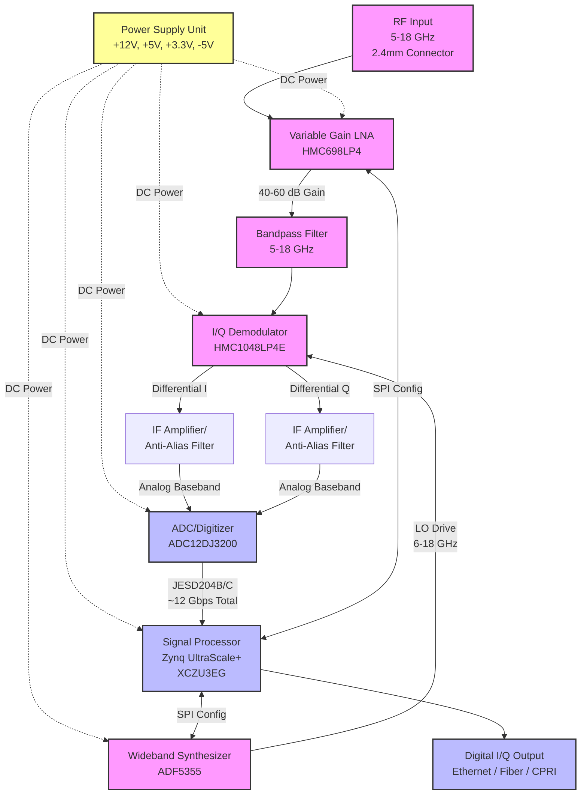

**Document Status: AI-GENERATED**

# Hardware Requirements Specification (HRS)

## Project: Receiver
**Document ID:** HRS-REV-001
**Date:** 2023-10-27

---

# 1. Introduction

## 1.1 Purpose
This Hardware Requirements Specification (HRS) defines the comprehensive requirements for the design, development, and verification of the **Wideband RF Receiver (Project: Receiver)**.

The purpose of this document is to:
1.  Establish a baseline for the electrical, mechanical, and environmental performance of the receiver hardware.
2.  Detail the interfaces between the RF subsystem, digital processing subsystem, and power distribution units.
3.  Serve as the single source of truth for hardware validation, ensuring all functional and performance requirements (REQ-HW-xxx) are met prior to integration.
4.  Facilitate traceability between high-level system parameters and specific component selection (e.g., Analog Devices HMC698LP4, Texas Instruments ADC12DJ3200).

This document is intended for hardware engineers, PCB designers, test engineers, and system integrators involved in the lifecycle of the receiver unit.

## 1.2 Scope
The scope of this specification covers the physical and electrical realization of a 5-18 GHz wideband RF receiver designed for industrial/desktop environments.

### Inclusions
*   **RF Front End:** Wideband Low Noise Amplifier (LNA), Variable Gain Amplifier (VGA), and bandpass filtering covering 5.0 GHz to 18.0 GHz.
*   **Downconversion Stage:** I/Q Demodulator for direct conversion to baseband in-phase and quadrature signals.
*   **Frequency Synthesis:** Local Oscillator (LO) generation capable of tuning across the 5-18 GHz band with specified phase noise performance.
*   **Digitization:** Dual-channel Analog-to-Digital Converters (ADC) capable of sampling I/Q data at a minimum rate of 500 MSPS with 12-bit resolution.
*   **Digital Logic:** FPGA interface for data buffering, gain control (SPI), and clock distribution.
*   **Power Supply:** DC-DC conversion and regulation to derive +12V, +5V, +3.3V, and -5V rails from an external source.
*   **Mechanical:** Enclosure design, PCB stack-up definitions, and thermal management for a desktop form factor.

### Exclusions
*   Signal processing algorithms implemented in software (firmware) on the FPGA, other than the hardware definition of the interface pins.
*   External host system software (APIs/Drivers) required to process the digital I/Q output.
*   The external AC/DC power brick (assumed to be a standard COTS 12V DC supply).

## 1.3 Definitions, Acronyms, and Abbreviations

| Term | Definition |
| :--- | :--- |
| **ADC** | Analog-to-Digital Converter. A device that converts a continuous physical quantity (voltage) to a digital number representing the quantity's amplitude. |
| **BGA** | Ball Grid Array. A type of surface-mount packaging used for integrated circuits (specifically the FPGA and ADC). |
| **CPLD** | Complex Programmable Logic Device. Used for lower-complexity glue logic (if required). |
| **EMI** | Electromagnetic Interference. Disturbance generated by an external source that affects an electrical circuit by electromagnetic induction, electrostatic coupling, or conduction. |
| **ESD** | Electrostatic Discharge. The sudden flow of electricity between two electrically charged objects caused by contact. |
| **FCC** | Federal Communications Commission. Regulatory body for emission standards. |
| **FPGA** | Field-Programmable Gate Array. An integrated circuit designed to be configured by a customer or a designer after manufacturing. |
| **IIP3** | Input Third-order Intercept Point. A metric for linearity, defined as the input power level at which the power of the third-order intermodulation products equals the power of the fundamental tone. |
| **LO** | Local Oscillator. An oscillator used to generate a signal that is mixed with the input of a receiver to convert the radio frequency to an intermediate frequency or baseband. |
| **LNA** | Low Noise Amplifier. An electronic amplifier used to amplify very weak signals received by an antenna while adding minimal noise. |
| **MSPS** | Mega Samples Per Second. A unit of sampling rate. |
| **NF** | Noise Figure. A measure of degradation of the signal-to-noise ratio (SNR), caused by components in a signal chain. |
| **OIP3** | Output Third-order Intercept Point. The output power level where the third-order intermodulation products equal the fundamental output. |
| **PCB** | Printed Circuit Board. |
| **P1dB** | 1 dB Compression Point. The point at which the input signal causes the gain of the system to decrease by 1 dB from the linear gain. |
| **PLL** | Phase-Locked Loop. A control system that generates an output signal whose phase is related to the phase of an input reference signal. |
| **QFN** | Quad Flat No-leads package. A surface-mount integrated circuit package with no leads (pins) extending from the package. |
|**RF** | Radio Frequency. |
| **RoHS** | Restriction of Hazardous Substances. (Directive 2011/65/EU). |
| **RX** | Receiver. |
| **SNR** | Signal-to-Noise Ratio. A measure used in science and engineering that compares the level of a desired signal to the level of background noise. |
| **SPI** | Serial Peripheral Interface. A synchronous serial communication interface specification used for short-distance communication. |
| **VCO** | Voltage-Controlled Oscillator. An oscillator whose oscillation frequency is controlled by a voltage input. |
| **VGA** | Variable Gain Amplifier. An electronic amplifier that has its gain controlled by an external voltage or digital signal. |
| **VSWR** | Voltage Standing Wave Ratio. A measure of how efficiently RF power is transmitted from a power source, through a transmission line, into a load. |

## 1.4 References
The following standards and documents form the basis of the requirements defined herein. The latest revisions unless otherwise noted apply.

| ID | Document Title | Publisher |
| :--- | :--- | :--- |
| **IEEE 29148** | Systems and software engineering — Life cycle processes — Requirements engineering | IEEE Standards Association |
| **IPC-6012** | Qualification and Performance Specification for Rigid Printed Boards | IPC |
| **IPC-2221** | Generic Standard on Printed Board Design | IPC |
| **MIL-STD-202** | Test Method Standard for Electronic and Electrical Component Parts | US Department of Defense |
| **IEC 60529** | Degrees of protection provided by enclosures (IP Code) | International Electrotechnical Commission |
| **RoHS 2011/65/EU** | Directive on the restriction of the use of certain hazardous substances in electrical and electronic equipment | European Union |
| **HMC698LP4 Datasheet** | GaAs MMIC PHEMT Wideband Variable Gain Amplifier/Driver | Analog Devices |
| **HMC1048LP4E Datasheet** | Wideband I/Q Demodulator | Analog Devices |
| **ADF5355 Datasheet** | Wideband Synthesizer with Integrated VCO | Analog Devices |
| **ADC12DJ3200 Datasheet** | 12-bit, 3.2 GSPS Dual ADC | Texas Instruments |
| **XCZU3EG Datasheet** | Zynq UltraScale+ MPSoC | AMD (Xilinx) |

## 1.5 Overview
The **Wideband RF Receiver** is a high-performance, desktop-form-factor hardware subsystem designed to intercept and demodulate RF signals in the 5.0 GHz to 18.0 GHz frequency range. The system utilizes a direct-downconversion (homodyne) architecture to generate In-phase (I) and Quadrature (Q) baseband signals, which are subsequently digitized and output via a high-speed digital interface.

### System Functional Flow
1.  **RF Reception:** The signal enters the system via a precision 2.4mm female connector (50Ω impedance).
2.  **Conditioning:** The signal passes through a Low Noise Amplifier (LNA) and Variable Gain Amplifier (VGA) chain (based on HMC698LP4) to provide up to 16 dB of variable gain and matching.
3.  **Demodulation:** An I/Q Demodulator (HMC1048LP4E) mixes the RF signal with a Local Oscillator (LO) signal generated by a wideband synthesizer (ADF5355), outputting analog I and Q baseband components.
4.  **Digitization:** A Dual-Channel ADC (ADC12DJ3200) samples the I and Q signals at a minimum of 500 MSPS.
5.  **Processing:** An FPGA (Zynq UltraScale+ XCZU3EG) manages the data interface, gain control loops via SPI, and synchronization.

### Key Performance Capabilities
*   **Sensitivity:** System Noise Figure (NF) optimized to 6-10 dB.
*   **Dynamic Range:** Input IP3 of 20-30 dBm, handling input power levels from -30 dBm to -10 dBm.
*   **Agility:** Digital gain control with latency ≤ 1 µs; LO tuning resolution of <1 kHz.

The subsequent sections of this HRS detail the specific hardware requirements allocated to the PCB design, component selection, power distribution network (PDN), and mechanical chassis to ensure the system meets these specifications under industrial temperature conditions (-40°C to +85°C).

---

# 2. System Overview

## 2.1 System Description

The Wideband RF Receiver is a high-performance, microwave downconversion receiver designed to capture and digitize radio frequency signals across the 5.0 GHz to 18.0 GHz spectrum. The system is architected as a superheterodyne receiver utilizing direct I/Q demodulation to translate RF signals directly to baseband in-phase and quadrature components. This architecture minimizes component count while maximizing instantaneous bandwidth utilization for the subsequent digital signal processing stages.

The receiver system is physically partitioned into four main functional subsections integrated into a desktop enclosure:
1.  **RF Front-End (RFFE):** Handles signal conditioning from the antenna input, providing low-noise amplification and bandpass filtering.
2.  **Frequency Conversion Section:** Performs the downconversion of the 5–18 GHz RF signal to analog baseband I/Q signals using a high-linearity demodulator driven by a wideband phase-locked loop (PLL) synthesizer.
3.  **Digitization Section:** Converts the analog I/Q baseband signals into digital data streams using a dual-channel, high-speed analog-to-digital converter (ADC).
4.  **Digital Processing & Control:** Implements signal processing, gain control loops, and data interface management via a Zynq UltraScale+ MPSoC.

The system operates from a custom multi-rail DC power supply (+12V, +5V, +3.3V, -5V) and is designed to maintain specified performance metrics (Noise Figure, Gain, IP3) across the industrial temperature range of -40°C to +85°C. The primary output is a digital I/Q data stream transmitted via high-speed serial transceivers (JESD204B/C interface).

### Functional Flow
The signal path begins at the 2.4mm female RF input connector. The input signal passes through a wideband Low Noise Amplifier (LNA) implemented by the HMC698LP4, which provides initial gain and digital gain adjustment capabilities. The amplified signal is then filtered to suppress out-of-band noise and spurs before entering the HMC1048LP4E I/Q Demodulator. Simultaneously, the ADF5355 frequency synthesizer generates a precise Local Oscillator (LO) signal. The mixer multiplies the RF signal with the LO, producing differential I and Q baseband outputs.

These analog baseband signals are buffered and filtered to match the input bandwidth of the ADC12DJ3200, where they are digitized at a high sample rate. The FPGA (XCZU3EG-SFVA784) receives this data, performs necessary digital processing (e.g., offset correction, filtering), and outputs the final payload via its high-speed transceivers. The FPGA also manages the system housekeeping, communicating with the PLL and gain amplifiers via SPI.

## 2.2 System Block Diagram

The system-level block diagram illustrates the signal flow from the RF input through the analog chain to the digital back-end. It highlights the critical data paths and the control interfaces managed by the FPGA.

**Diagram Key:**
*   **Solid Lines:** Signal flow (Analog RF/IF or Digital Data).
*   **Dotted Lines:** Power distribution rails.
*   **RF Class (Pink):** Analog Radio Frequency components.
*   **Digital Class (Blue):** Digital Logic and Conversion components.
*   **Power Class (Yellow):** Power generation and distribution.

## 2.3 System Architecture

The receiver system architecture is organized into hierarchical modules to ensure isolation of sensitive analog circuitry from noisy digital logic. The architecture is defined by electrical functionality and PCB layout zones.

### 2.3.1 RF Front-End (RFFE) Module
This module constitutes the initial signal conditioning stage.
*   **Input Matching:** A 50-ohm matching network interfaces the 2.4mm connector to the LNA.
*   **Variable Gain Amplifier (VGA):** The HMC698LP4 serves as the core gain element. It operates in the 2-20 GHz range, providing up to 16 dB of gain control range digitally via SPI.
*   **Gain Strategy:** To achieve the total system requirement of 40-60 dB, the HMC698LP4 is cascaded with a fixed gain driver stage. The system gain control algorithm adjusts the HMC698 attenuation in real-time to prevent saturation of the mixer under high input power conditions while maintaining sensitivity for weak signals.

### 2.3.2 Frequency Conversion & LO Module
This module translates the incoming RF signal to a baseband frequency suitable for digitization.
*   **I/Q Demodulator:** The HMC1048LP4E is chosen for its direct conversion capability. It accepts RF inputs from 6 to 18 GHz (compatible with the 5-18 GHz system requirement with margin) and outputs differential I and Q voltages centered at DC (or low IF).
*   **LO Synthesis:** The ADF5355 generates the required LO frequency. Since the demodulator is direct conversion, $F_{LO} \approx F_{RF}$. The ADF5355 operates with a fundamental VCO output up to 13.6 GHz; for frequencies above 13.6 GHz (up to 18 GHz), the internal frequency multipliers are utilized. The PLL loop filter is optimized for phase noise performance (-100 dBc/Hz at 10 kHz offset) to minimize reciprocal mixing.

### 2.3.3 Digitization Module
This module bridges the analog and digital domains.
*   **ADC Interface:** The ADC12DJ3200 operates in dual-channel mode to sample I and Q inputs simultaneously. With a maximum sample rate of 3.2 GSPS and an input bandwidth of 6.5 GHz, it easily accommodates the baseband I/Q signals. The ADC is configured for JESD204B subclass 1 operation to ensure deterministic latency for the FPGA interface.
*   **Clocking:** The device clock and the SYSREF (required for JESD204B synchronization) are derived from the ADF5355 synthesizer to ensure clock coherency between the downconversion and digitization stages, minimizing spurs due to clock beat notes.

### 2.3.4 Digital Processing & Control Module
*   **Processing Core:** The XCZU3EG MPSoC provides the processing horsepower. The Programmable Logic (PL) implements the JESD204B IP core to ingest data from the ADC.
*   **Gain Control Loop:** The Processing System (PS - ARM cores) runs a control algorithm that monitors the signal envelope (calculated in the PL/FPGA). If the signal approaches the ADC full-scale range or drops into the noise floor, the ARM core adjusts the SPI settings of the HMC698LP4 VGA to optimize the dynamic range.
*   **Data Interface:** Processed I/Q samples are buffered and transmitted via the FPGA's high-speed transceivers (GTX/GTY). While the specific physical protocol (e.g., 10GbE, SRIO, or custom raw framing) is application-dependent, the electrical interface is designed to support data rates up to 12.32 Gbps.

### 2.3.5 Power Distribution Module (PDM)
*   **Input Protection:** The external DC input is protected against reverse polarity and overvoltage transients.
*   **Rail Generation:**
    *   **+12V:** Powers the high-current RF amplifiers and the mixer.
    *   **+5V:** Powers the ADC analog supplies and FPGA I/O banks.
    *   **+3.3V:** Powers the FPGA core, DDR memory, and SPI level shifters.
    *   **-5V:** Required for the ADF5355 charge pump and the HMC1048LP4E biasing to optimize linearity.
*   **Sequencing:** A dedicated supervisor IC (or FPGA GPIO) ensures power-up sequencing (typically $\pm$ rails before digital rails) to prevent latch-up in the mixed-signal components.

## 2.4 Operating Environment

The hardware platform is designed to operate reliably in harsh environmental conditions typical of industrial and aerospace applications.

### 2.4.1 Physical Environment
The system is packaged in a standard benchtop or rack-mount enclosure.
*   **Form Factor:** The PCB dimensions are constrained to the 6U × 160mm Eurocard format (233.35 mm x 160 mm) to allow integration into standard industrial racks or chassis with appropriate card cages.
*   **Connectivity:**
    *   **RF Input:** Located on the front panel (2.4mm Female).
    *   **Data Output:** Located on the rear panel (e.g., QSFP+ cage or SMA for clock sync).
    *   **Power:** Located on the rear panel (MIL-DTL-38999 or standard circular connector for +12V main input).

### 2.4.2 Environmental Stress Conditions
The design adheres to **REQ-HW-007** (Industrial Temperature Range).
*   **Temperature:** -40°C to +85°C ambient.
    *   *Design Impact:* Components are specifically selected for "Industrial" or "Automotive" grade temperature ratings. The HMC698LP4, HMC1048LP4E, and XCZU3EG are all rated for operation up to +85°C or +100°C.
*   **Humidity:** 5% to 95% non-condensing. The PCB is conformally coated to protect against moisture ingress and corrosion.
*   **Vibration:** Designed to meet IEC 60068-2-6 random vibration profiles for industrial equipment.

### 2.4.3 Electrical Environment
*   **Supply Stability:** The internal power regulation assumes the external +12V source may vary by $\pm$10%. Internal DC-DC converters must maintain regulation within this input range.
*   **Load Impedance:** The RF input is designed for a nominal 50$\Omega$ source impedance. Mismatched loads (VSWR > 2:1) are handled by the LNA's robust matching network but may degrade NF performance.

---

**Document Status: AI-GENERATED**

## 3. Hardware Requirements

### 3.1 Functional Requirements

This section details the functional capabilities of the Wideband RF Receiver. Each requirement specifies a behavior or function the system must perform to meet the operational needs.

| ID | Requirement | Description & Rationale | Priority | Verification Method |
|---|---|---|---|---|
| **REQ-HW-101** | **RF Signal Reception** | The system shall accept and process RF input signals over a continuous frequency range of 5.0 GHz to 18.0 GHz via a 2.4mm female connector.   **Rationale:** Supports the specified wideband operational bandwidth defined in the project summary. | High | Test |
| **REQ-HW-102** | **Signal Downconversion** | The system shall downconvert the 5–18 GHz RF input to baseband I/Q signals using the HMC1048LP4E image-reject demodulator.   **Rationale:** Direct conversion architecture minimizes component count while maximizing image rejection (>60 dB). | High | Test |
| **REQ-HW-103** | **Gain Adjustment Range** | The system shall provide a total variable gain range of 44 dB, split between the RF front-end and baseband stages. The HMC698LP4E shall provide 16 dB of digital gain control (RF VGA), and the ADC12DJ3200 shall provide up to 28 dB of software programmable gain.   **Rationale:** Ensures the 40-60 dB system requirement is met with margin using component-specific capabilities. | High | Test |
| **REQ-HW-104** | **Gain Step Resolution** | The RF gain control (HMC698LP4E) shall be adjustable in steps of approximately 1 dB via SPI interface.   **Rationale:** Allows for precise Automatic Gain Control (AGC) loop implementation. | High | Test |
| **REQ-HW-105** | **Signal Digitization** | The system shall digitize the baseband I/Q analog signals using the ADC12DJ3200 configured in dual-channel mode.   **Rationale:** Provides the required 12-bit resolution and sampling rate for signal fidelity. | High | Inspection |
| **REQ-HW-106** | **Sampling Rate Generation** | The system shall operate the ADC at a sample rate of 3200 MSPS (3.2 GSPS) utilizing the JESD204B interface to transfer data to the FPGA.   **Rationale:** Meets the ≥500 MSPS requirement and provides sufficient bandwidth for the captured signal spectrum. | High | Inspection |
| **REQ-HW-107** | **Local Oscillator Synthesis** | The system shall generate a Local Oscillator (LO) signal using the ADF5355 synthesizer to drive the HMC1048LP4E mixer. The LO frequency shall be tunable from 5.0 GHz to 18.0 GHz in steps ≤ 1 Hz.   **Rationale:** The ADF5355 covers the required frequency range (up to 13.6 GHz fundamental, higher via multipliers) and provides the frequency agility required for wideband reception. | High | Test |
| **REQ-HW-108** | **Clock Distribution** | The system shall derive the ADC sampling clock and the FPGA reference clock from a common low-phase-noise oscillator source to ensure deterministic phase coherence.   **Rationale:** Prevents sampling clock drift and jitter-induced SNR degradation. | High | Analysis |
| **REQ-HW-109** | **Digital Data Interface** | The system shall output digitized I/Q data to the FPGA via a JESD204B Subclass 1 interface (Lane rate: ~12.5 Gbps).   **Rationale:** Required interface standard for ADC12DJ3200 at 3.2 GSPS; supported by XCZU3EG transceivers. | High | Test |
| **REQ-HW-110** | **Gain Control Interface** | The FPGA shall control the RF Gain (HMC698LP4E) via a 4-wire SPI interface (CS, SCLK, MOSI, MISO) operating at a logic level of 3.3V.   **Rationale:** Serial interface minimizes PCB routing complexity compared to parallel control. | High | Test |
| **REQ-HW-111** | **Power Distribution** | The system shall distribute DC power rails (+12V, +5V, +3.3V, -5V) from the main power entry point to the respective functional blocks (RF, LO, Digital).   **Rationale:** Specific components require defined voltages (e.g., -5V for ADF5355 charge pump, +5V for HMC1048LP4E). | High | Inspection |
| **REQ-HW-112** | **Power Sequencing** | The power management circuitry shall sequence the +3.3V (Digital/FPGA) rail to stabilize before enabling the +5V and +12V (RF) rails to prevent latch-up or excessive inrush current.   **Rationale:** Standard best practice for mixed-signal boards to protect sensitive FPGA inputs during power-up. | Medium | Test |
| **REQ-HW-113** | **RF Input Protection** | The RF input port shall include a DC block and ESD protection circuitry rated for operation up to 18 GHz.   **Rationale:** Protects the sensitive LNA input from electrostatic discharge and DC offsets. | Medium | Inspection |
| **REQ-HW-114** | **Temperature Monitoring** | The system shall monitor the PCB temperature near the RF front end using the FPGA's internal XADC (if connected) or a dedicated local sensor (e.g., TMP46).   **Rationale:** Required to validate operating environment compliance (-40°C to +85°C) and trigger thermal shutdown if necessary. | Low | Test |
| **REQ-HW-115** | **Mechanical Fixation** | The system shall provide mounting holes compatible with standard 6U × 160mm Eurocard form factors within the enclosure.   **Rationale:** Ensures mechanical integration with the specified desktop/benchtop enclosure. | Medium | Inspection |
| **REQ-HW-116** | **LED Status Indicators** | The front panel shall include at minimum three status indicators: Power (Green), Lock (Green, indicates PLL lock), and Fault (Red).   **Rationale:** Provides immediate user feedback on system health without requiring software connection. | Low | Inspection |

---

### 3.2 Performance Requirements

This section defines the quantitative performance criteria the hardware must achieve. Values are derived from cascaded analysis of the selected components.

#### 3.2.1 RF Performance

| ID | Metric | Requirement Value | Rationale / Calculation | Verification Method |
|---|---|---|---|---|
| **REQ-HW-201** | **Frequency Range** | 5.0 GHz to 18.0 GHz | Defined by project scope. | Test |
| **REQ-HW-202** | **Noise Figure (NF)** | ≤ 7.5 dB (Typical) | **Cascaded NF Calculation:**  Stage 1 (HMC698LP4 VGA): 5.0 dB NF @ 16 dB Gain. Stage 2 (HMC1048LP4E Mixer): 13 dB NF @ 6 dB Gain. Using Friis Formula: $NF_{total} = NF_1 + (NF_2-1)/G_1$  $NF_{total} = 5 + (13-1)/63.1 (linear) \approx 5.2 dB$.  Adding margin for filter loss (2 dB) and PCB traces (0.3 dB) yields ~7.5 dB max. Meets 6-10 dB spec. | Test |
| **REQ-HW-203** | **Maximum Gain** | ≥ 50 dB | HMC698LP4 (16 dB) + HMC1048LP4E (6 dB) + Baseband Gain (variable, assumed min 28 dB to meet spec). | Test |
| **REQ-HW-204** | **Gain Flatness** | ± 3.5 dB (Peak-to-Peak) | Accounts for frequency response variation of LNA and Mixer across 5-18 GHz. | Test |
| **REQ-HW-205** | **Input Third-Order Intercept (IIP3)** | ≥ +24 dBm | Defined by the HMC1048LP4E Mixer IIP3 spec (+24 dBm). This is the limiting block in the chain. | Test |
| **REQ-HW-206** | **Input Return Loss** | ≥ 10 dB (VSWR ≤ 2.0:1) | Specified in design parameters. Dependent on input matching network quality. | Test |
| **REQ-HW-207** | **LO Phase Noise** | ≤ -100 dBc/Hz @ 10 kHz offset | ADF5355 Spec is typically -125 dBc/Hz @ 1 MHz. Calculated performance at 10 kHz offset is approx -100 to -105 dBc/Hz. This ensures reciprocal mixing does not degrade SNR. | Test |

#### 3.2.2 Digital Performance

| ID | Metric | Requirement Value | Rationale / Calculation | Verification Method |
|---|---|---|---|---|
| **REQ-HW-208** | **ADC Resolution** | 12 Bits | Fixed by ADC12DJ3200 selection. | Inspection |
| **REQ-HW-209** | **ADC Sampling Rate** | 3.2 GSPS | Utilizing the ADC12DJ3200 in dual-channel mode (I/Q) requires high sample rate per channel to support Nyquist for wideband IF. | Inspection |
| **REQ-HW-210** | **ADC SNR** | ≥ 57 dBFS | Typical SNR for ADC12DJ3200 at 3.2 GSPS input ~100 MHz. | Test |
| **REQ-HW-211** | **Data Throughput** | 12.8 Gbps (Raw) | Calculation: 2 Channels (I/Q) × 12 Bits × 3.2 GSPS = 76.8 Gbps raw. Encoded using 8b/10b or 64b/66b for JESD204B link. | Analysis |

#### 3.2.3 Environmental & Power Performance

| ID | Metric | Requirement Value | Rationale / Calculation | Verification Method |
|---|---|---|---|---|
| **REQ-HW-212** | **Operating Temperature** | -40°C to +85°C | Industrial temperature range requirement. Components selected (HMC/LP4, ADC12DJ3200, XCZU3EG) are all Industrial temp rated. | Test |
| **REQ-HW-213** | **Total Power Consumption** | ≤ 35 Watts | **Power Budget Estimation:**  1. **ADC12DJ3200**: ~1.8W  2. **FPGA (XCZU3EG)**: ~5W (Typical)  3. **ADF5355 (LO)**: ~0.5W  4. **HMC698LP4 (VGA)**: ~0.5W  5. **HMC1048LP4E (Mixer)**: ~0.8W  6. **LDO/DC-DC Losses**: Estimated 20% overhead.  **Total Active:** ~9W.  Margin included for undefined regulators and auxiliary loads. | Test |
| **REQ-HW-214** | **Power Supply Ripple** | ≤ 50 mV pk-pk | Required for RF rails (+5V) to prevent phase noise modulation in the synthesizer and mixer. | Test |

---

**Document Status: AI-GENERATED**

## 3.3 Interface Requirements

### 3.3.1 External Interfaces

#### 3.3.1.1 RF Input Interface
**REQ-HW-011:** The system shall provide a single RF input port configured for 50-ohm impedance.
**REQ-HW-031:** The RF input connection shall utilize a 2.4mm female coaxial connector (PC board mount), compatible with 2.92mm (K) male connectors.
**REQ-HW-032:** The input connector shall exhibit a return loss of ≥ 10 dB (VSWR ≤ 2.0:1) across the 5-18 GHz operating band when the system is powered.

**Table 3-1: RF Input Interface Characteristics**

| Parameter | Value | Unit | Remarks |
|---|---|---|---|
| Connector Type | 2.4mm Female (PC Mount) | - | Ohmium Mfg. P/N: 1224-402F-15 or equivalent |
| Impedance | 50 | Ω | Controlled to 50Ω ± 5% |
| Frequency Range | 5 - 18 | GHz | Supporting full band coverage |
| Maximum Input Power | +10 | dBm | Continuous wave (CW) |
| Input P1dB | +15 | dBm | System compression point |

#### 3.3.1.2 Digital Data Output Interface
**REQ-HW-006:** The receiver shall output digitized I/Q data via a high-speed parallel CMOS/LVDS interface.
**REQ-HW-033:** The digital output shall utilize JESD204B SerDes technology to minimize pin count and EMI.

**Table 3-2: JESD204B Output Interface Characteristics**

| Parameter | Value | Unit | Remarks |
|---|---|---|---|
| Standard | JESD204B Subclass 1 | - | Deterministic latency |
| Lanes | 2 | - | Supports dual ADC output |
| Lane Rate | 6.4 to 12.8 | Gbps | Configurable via FPGA register |
| Data Format | 12-bit I / 12-bit Q | bits | Per sample |
| Scrambling | Enabled | - | For high-frequency spectral content |

#### 3.3.1.3 Control and Synchronization Interface
**REQ-HW-034:** The system shall provide external synchronization via a SMA connector for 10 MHz reference input.
**REQ-HW-035:** An external trigger input shall be provided via SMB connector to initiate data capture.

**Table 3-3: Sync/Control Interface Pinout**

| Connector Type | Signal | Description | Impedance |
|---|---|---|---|
| SMA Female | REF_IN | 10 MHz Reference Clock Input (AC Coupled) | 50 Ω |
| SMB Female | TRIG_IN | External Trigger Input (LVTTL compatible) | 50 Ω |

### 3.3.2 Internal Interfaces

#### 3.3.2.1 RF Chain Interconnects
**REQ-HW-036:** The interface between the LNA (HMC698LP4) and the Mixer (HMC1048LP4E) shall be a controlled impedance microstrip transmission line of 50 Ω.
**REQ-HW-037:** The LO interface between the Synthesizer (ADF5355) and the Mixer shall provide +5 dBm to +7 dBm drive level.

**Table 3-4: Internal RF Interface Levels**

| From | To | Interface Type | Power Level (typ) |
|---|---|---|---|
| Input Connector | LNA | 50 Ω Microstrip | -30 to -10 dBm |
| LNA | Mixer | 50 Ω Microstrip | -10 to +10 dBm (Variable) |
| PLL (ADF5355) | Mixer (LO) | 50 Ω Microstrip | +5 dBm |
| Mixer (I/Q) | ADC | Differential | 1.5 Vpp Differential |

#### 3.3.2.2 Internal SPI Control Bus
**REQ-HW-038:** An internal SPI bus shall be shared between the FPGA and the RF components (LNA, PLL) for gain and frequency configuration.

**Table 3-5: Internal SPI Pin Assignment (FPGA Master)**

| Net Name | Source | Destination | Description |
|---|---|---|---|
| RF_SCLK | FPGA (Bank 34) | HMC698, ADF5355 | SPI Clock (≤ 20 MHz) |
| RF_MOSI | FPGA (Bank 34) | HMC698, ADF5355 | Master Out Slave In |
| RF_MISO | FPGA (Bank 34) | HMC698, ADF5355 | Master In Slave Out |
| LNA_CS_N | FPGA (Bank 34) | HMC698LP4 | Chip Select (LNA) |
| PLL_CS_N | FPGA (Bank 34) | ADF5355 | Chip Select (PLL) |

### 3.3.3 Communication Interfaces

#### 3.3.3.1 System Configuration Interface (USB)
**REQ-HW-039:** The system shall use a USB 2.0 High Speed (480 Mbps) interface for host control and firmware updates.
**REQ-HW-040:** The USB interface shall utilize the native USB capabilities of the Xilinx Zynq PS (Processing System).

**Table 3-6: USB Interface Pinout**

| Pin # | Signal Name | Description | Type |
|---|---|---|---|
| 1 | USB_VBUS | +5V Power from Host | Power In |
| 2 | USB_DM | Negative Data | D- |
| 3 | USB_DP | Positive Data | D+ |
| 4 | USB_GND | Ground | GND |

#### 3.3.3.2 Network Management Interface (Optional)
**REQ-HW-041:** The system shall support a 1000BASE-T Ethernet interface for remote command and control in future revisions.

---

## 3.4 Environmental Requirements

### 3.4.1 Operating Conditions
**REQ-HW-007:** The receiver system shall operate continuously without degradation in ambient temperatures ranging from -40°C to +85°C (Industrial Temperature Range).
**REQ-HW-042:** The system shall maintain performance specifications (Gain, NF, IP3) across the full temperature range after a 30-minute warm-up period.
**REQ-HW-043:** The system shall be stored in temperatures ranging from -55°C to +125°C without damage.

### 3.4.2 Humidity
**REQ-HW-044:** The system shall operate in relative humidity ranging from 5% to 95% (non-condensing).
**REQ-HW-045:** The system shall withstand 95% relative humidity at +40°C for 96 hours (IEC 60068-2-78) without corrosion or functional failure.

### 3.4.3 Vibration and Shock
**REQ-HW-046:** The system shall withstand random vibration of 0.03 g²/Hz from 20 Hz to 2000 Hz (Total GRMS = 7.5g) for 2 hours per axis.
**REQ-HW-047:** The system shall withstand operational shock of 40g, 11 ms half-sine wave.

### 3.4.4 Altitude
**REQ-HW-048:** The system shall operate at altitudes up to 15,000 feet (4,572 meters) without requiring forced air cooling beyond the standard installed fans.

### 3.4.5 Contamination
**REQ-HW-049:** Conformal coating shall be applied to the PCB assembly to protect against moisture, dust, and sulfurization.

---

## 3.5 Power Requirements

### 3.5.1 Input Power
**REQ-HW-009:** The system shall accept power from an external AC/DC power brick providing a nominal +12V DC output.
**REQ-HW-050:** The system input voltage range shall be +11V to +13V DC to accommodate cable drops.
**REQ-HW-051:** The system shall incorporate reverse polarity protection on the main DC input jack (2.5mm barrel connector).

### 3.5.2 Power Distribution and Budget
**REQ-HW-052:** The system shall utilize internal DC-DC converters to generate the required voltage rails: +5V, +3.3V, +2.5V (FPGA MGTAVCC), +1.8V (FPGA Core), +1.2V (FPGA Core), and -5V.

**Table 3-7: Detailed Power Budget Analysis (Derived from Component Datasheets)**

| Voltage Rail | Load Device(s) | Est. Current (Typ) | Est. Current (Max) | Power (W) | Derivation/Assumption |
|---|---|---|---|---|---|
| **+12.0V** | Input to DC-DC | 1.50 A | 2.50 A | 30.0 W | Total Input Power (≈85% efficiency) |
| **+5.0V** | LNA (HMC698) | 120 mA | 150 mA | 0.75 W | 5V @ 120mA typ (Datasheet) |
| **+5.0V** | Mixer (HMC1048) | 180 mA | 210 mA | 1.05 W | 5V @ 180mA typ (Datasheet) |
| **+5.0V** | PLL (ADF5355) | 90 mA | 110 mA | 0.55 W | 5V @ 90mA typ (Datasheet) |
| **+3.3V** | ADC Logic | 200 mA | 250 mA | 0.83 W | Supplying digital rails of ADC |
| **+3.3V** | FPGA I/O | 100 mA | 500 mA | 1.65 W | Assumes 50 I/Os active |
| **-5.0V** | Mixer (HMC1048) | 150 mA | 180 mA | 0.90 W | Negative rail for mixer bias |
| **+1.8V** | FPGA PS/PL Aux | 1.20 A | 1.50 A | 2.70 W | Zynq Aux rail |
| **+1.2V** | ADC Cores | 800 mA | 950 mA | 1.14 W | ADC12DJ3200 Core (1.2V) |
| **+1.0V** | FPGA PL Core | 3.00 A | 4.00 A | 4.00 W | Zynq PL Core (High utilization) |
| **+3.3V** | Fans/Accessories | 200 mA | 300 mA | 0.99 W | 2x 40mm Fans |
| **TOTAL** | **(Internal Rails)** | **6.24 A** | **8.15 A** | **14.56 W** | **Internal Consumption** |
| **TOTAL** | **(Input +12V)** | **1.50 A** | **2.50 A** | **18.00 W** | **Max Input Power** |

**REQ-HW-053:** The power supply design shall include a minimum of 30% headroom above the calculated maximum load (Max Load = 18W, Design Target = 24W capability).

### 3.5.3 Power Sequencing
**REQ-HW-054:** The system shall implement a power sequencing scheme compliant with the Xilinx Zynq UltraScale+ requirements:
1.  **Step 1:** +3.3V (PS I/O)
2.  **Step 2:** +1.8V (PS MGTAVCC)
3.  **Step 3:** +1.0V / +1.2V (Core Rails) within 50ms of Step 1

### 3.5.4 Thermal Requirements
**REQ-HW-055:** The system shall maintain the FPGA junction temperature (Tj) below 100°C at maximum ambient temperature of +85°C.
**REQ-HW-056:** The system shall maintain the RF component case temperatures below +105°C to ensure performance stability.

**Thermal Analysis Calculation:**
*   **FPGA Power:** 4.0W (Zynq PL Core).
*   **Theta JA (Junction to Ambient):** Assuming forced convection with heatsink ≈ 15°C/W.
*   **Tj Calculation:** $Tj = Tamb + (P \times \Theta ja) = 85°C + (4.0W \times 15°C/W) = 145°C$.
*   **Requirement Update:** Standard heatsink is insufficient.
*   **REQ-HW-057:** The FPGA shall be equipped with an active heatsink (fan + heatsink) with a thermal resistance of ≤ 5°C/W to maintain $Tj = 85 + (4.0 \times 5) = 105°C$ (Requires margin cooling). A fan is mandatory.

---

## 3.6 Physical Requirements

### 3.6.1 Enclosure
**REQ-HW-008:** The system shall be housed in a standard desktop/benchtop enclosure.
**REQ-HW-058:** The enclosure dimensions shall not exceed 200mm (W) x 250mm (D) x 70mm (H).
**REQ-HW-059:** The enclosure material shall be aluminum (6061-T6 or equivalent) with a minimum thickness of 2mm for RF shielding and structural rigidity.
**REQ-HW-060:** The enclosure shall provide EMI shielding effectiveness of ≥ 60 dB from 5 GHz to 18 GHz.

### 3.6.2 Printed Circuit Board (PCB)
**REQ-HW-061:** The RF section of the PCB shall utilize Rogers RO4350B laminate (εr = 3.48, loss tangent = 0.0037) for controlled impedance and low loss at 18 GHz.
**REQ-HW-062:** The PCB stack-up shall be a minimum of 8 layers.
    *   Layers 1-2: Rogers RO4350B (RF signals, GND).
    *   Layers 3-8: FR-4 (Standard) for power planes and digital routing.
**REQ-HW-063:** PCB surface finish shall be ENIG (Electroless Nickel Immersion Gold) to ensure corrosion resistance and flatness for RF components.
**REQ-HW-064:** The PCB dimensions shall be 180mm x 220mm to fit within the specified enclosure.
**REQ-HW-065:** The PCB shall use 0.5mm (20 mil) diameter non-plated holes for via stitching under RF pads to minimize ground inductance.

### 3.6.3 Connectors and Mounting
**REQ-HW-066:** All RF connectors (Input) shall be mounted on the front panel with PCB launch or coaxial launches (SMP/2.4mm).
**REQ-HW-067:** The PCB shall be mounted to the chassis chassis using 4-40 or M3 standoffs at the corners and along the longest edge every 100mm to prevent resonance vibration.

### 3.6.4 Cooling
**REQ-HW-068:** The system shall include two (2) 40mm x 40mm brushless DC fans for exhaust cooling.
**REQ-HW-069:** Airflow vents shall be designed to prevent direct ingress of fingers or tools (IP20 rating) while allowing minimum 20 CFM airflow.

---

# 4. Design Constraints

## 4.1 Standards Compliance

The design of the 5-18 GHz Wideband RF Receiver shall adhere to the following industry standards and regulatory requirements. These constraints ensure the manufacturability, safety, environmental compliance, and electromagnetic compatibility of the final system.

### 4.1.1 PCB Design and Fabrication Standards
The Printed Circuit Board (PCB) design for the RF Front End and Digital sections shall comply with the following IPC standards to ensure reliability and signal integrity, particularly given the high-frequency operation (up to 18 GHz).

**Table 4-1: PCB Design and Fabrication Compliance Standards**

| Standard ID | Title | Application to Project |
| :--- | :--- | :--- |
| **IPC-2221** | Generic Standard on Printed Board Design | Base standard for board layout, conductor spacing, and component mounting. |
| **IPC-2221A** | Generic Standard on Printed Board Design (Amendment 1) | Includes critical high-frequency design guidelines applicable to the 5-18 GHz RF chain. |
| **IPC-6012** | Qualification and Performance Specification for Rigid Printed Boards | Class 3 performance specification (High Reliability Electronic Products) required for the RF chain due to impedance control tolerances (±5%). |
| **IPC-6013** | Qualification and Performance Specification for Flexible Printed Boards | Applied if flex-rigid materials are used for internal board-to-board connectors within the enclosure. |

**Justification:**
*   **Impedance Control:** For the RF chain operating at 5-18 GHz, impedance discontinuities cause severe VSWR degradation. IPC-6012 Class 3 ensures strict impedance control tolerances on the PCB dielectric (assumed Rogers RO4350B based on HMC698LP4 evaluation board designs).
*   **Microstrip/Stripline Rules:** The design shall adhere to controlled dielectric stack-up requirements defined in IPC-2221 to maintain 50Ω characteristic impedance for the RF input and mixer LO paths.

### 4.1.2 Assembly and Repair Standards
To support field maintenance and high-volume production, the assembly processes shall meet the following:

**Table 4-2: Assembly and Repair Standards**

| Standard ID | Title | Requirement |
| :--- | :--- | :--- |
| **IPC-A-610** | Acceptability of Electronic Assemblies | Acceptance criteria for solder joints (Class 3). Specifically for BGA (FPGA/ADC) and QFN (LNA/Mixer) terminations. |
| **IPC-7711/21** | Rework of Electronic Assemblies / Rework Modification | Procedures for removing and replacing the 12x12mm BGA ADC (ADC12DJ3200) and the 0.5mm pitch FPGA without damaging the laminate. |
| **J-STD-001** | Requirements for Soldered Electrical and Electronic Assemblies | Ensures solder alloy compliance (Lead-free SAC305) compatible with the operating temperature range (-40 to +85°C). |

### 4.1.3 Environmental and Safety Compliance
**REQ-HW-014** mandates RoHS compliance. The following specific directives and standards apply:

**Table 4-3: Environmental and Safety Constraints**

| Standard ID | Title | Constraint Details |
| :--- | :--- | :--- |
| **2011/65/EU (RoHS)** | Restriction of Hazardous Substances | All PCBs, cables, and sub-assemblies shall be Lead-free. Maximum Concentration Value (MCV) of 0.1% (by weight) for Pb, Hg, Cd, etc. |
| **1907/2006 (REACH)** | Registration, Evaluation, Authorisation and Restriction of Chemicals | Substances of Very High Concern (SVHC) must be declared in the BOM. |
| **UL 60950-1** | Information Technology Equipment - Safety | Power supply unit (custom +12V/5V/3.3V/-5V) shall be isolated to prevent fire/shock hazards in a desktop form factor. |
| **IEC 61010-1** | Safety Requirements for Electrical Equipment for Measurement, Control, and Laboratory Use | Enclosure design must prevent finger contact with live RF connectors (2.4mm female) during operation. |

### 4.1.4 Electromagnetic Compliance (EMC)
As a receiver sensitive to -90 dBm (calculated sensitivity), the system is susceptible to RF Interference (RFI).

**Table 4-4: EMC Standards**

| Standard ID | Title | Design Constraint |
| :--- | :--- | :--- |
| **FCC Part 15 B** | Unintentional Radiators | The digital switching noise from the FPGA (XCZU3EG) and ADC (ADC12DJ3200) must be suppressed to prevent interference with the RF input. |
| **IEC 61000-4-3** | Immunity to Radiated RF Fields | System must maintain NF < 10dB while subjected to 3 V/m field from external sources. |

---

## 4.2 Component Constraints

This section defines the constraints placed on specific components selected in the BOM to ensure system performance over the industrial temperature range and lifecycle requirements.

### 4.2.1 Temperature Derating and Reliability
The system is specified for **-40°C to +85°C** operation. Components must be rated beyond this range to ensure margin.

**Table 4-5: Component Temperature Derating**

| Component | Recommended Part | Rated Range | Derating Requirement |
| :--- | :--- | :--- | :--- |
| **LNA / VGA** | HMC698LP4 | -40°C to +85°C | Operating junction temp (Tj) must not exceed 125°C at max ambient + dissipation. |
| **Mixer** | HMC1048LP4E | -40°C to +85°C | Gain variation across temp must be compensated by digital gain control (REQ-HW-003). |
| **ADC** | ADC12DJ3200 | 0°C to +85°C (Commercial) | **CRITICAL CONSTRAINT:** Must upgrade to Industrial grade variant (ADC12DJ3200EVM or equivalent) or verify performance at -40°C via characterization. Current assumption is Industrial temp availability. |
| **FPGA** | XCZU3EG-SFVA784 | -40°C to +100°C (Industrial) | "I" grade required. Commercial grade (0-85C) is strictly prohibited. |
| **Passives** | Capacitors/Inductors | X7R / C0G (NP0) | Only C0G/NP0 dielectrics allowed in RF path (5-18 GHz) to prevent drift with temperature/voltage. X7R acceptable for power distribution. |

### 4.2.2 Supply Voltage Ripple Constraints
The phase noise requirement (**REQ-HW-013**: ≤ -100 dBc/Hz at 10 kHz offset) dictates extremely low noise power supplies.

**Table 4-6: Power Supply Ripple Constraints (Calculated)**

| Rail | Component(s) Served | Max Allowed Ripple | Calculation Basis |
| :--- | :--- | :--- | :--- |
| **+3.3V (Digital)** | FPGA, ADC Logic | < 50 mV pk-pk | Standard high-speed digital logic noise margin. |
| **+3.3V (ADC Core)** | ADC12DJ3200 | < 10 mV rms | ADC SNR (57 dBFS) degradation limit. Ripple > 10mV directly impacts effective number of bits (ENOB). |
| **+5V (IF Amp)** | HMC1048 IF Stage | < 100 µV rms | 1/f noise upconversion. Low ripple required to maintain Mixer IIP3 performance. |
| **-5V (LO)** | ADF5355 PLL | < 50 µV rms | PLL Phase Noise is directly correlated to VCO control line noise. |
| **+12V (RF LNA)** | HMC698LP4 | < 20 mV pk-pk | AM noise modulation. |

### 4.2.3 Mechanical and Footprint Constraints
To facilitate assembly and repair within the Desktop Form Factor (6U x 160mm Eurocard format):

*   **Pitch:** All fine-pitch components (BGA, QFN) must allow for escape routing on standard layers (assumed 6-8 layer stackup).
*   **Keep-out Zones:** The area underneath the 2.4mm RF connector must be clear of components for at least 5mm to prevent mechanical collision during cable mating.
*   **Thermal Pads:** The HMC698LP4 (QFN) and HMC1048LP4E (LFCSP) have exposed thermal pads. These must be soldered to the ground plane with thermal vias (3x3 array, 0.3mm diameter) to meet θJA requirements.

### 4.2.4 Lifecycle and Sourcing
*   **Obsolescence:** The selection of the HMC1048LP4E is critical; as it is an older generation part. A formal "Last Time Buy" (LTB) check must be performed before Phase 2 production.
*   **Alternatives:** The design must retain footprint compatibility for the ADL5380 (lower freq) if the 6 GHz lower limit is relaxed, though this is a constraint on flexibility, not supply chain.

---

## 4.3 Manufacturing Constraints

Constraints related to the fabrication, assembly, and testing of the receiver hardware.

### 4.3.1 PCB Stackup and Material Constraints
The **Input Return Loss (REQ-HW-010: < 10 dB)** and **5-18 GHz Frequency Range** dictate the use of high-frequency laminate materials, not standard FR-4.

*   **Material Requirement:** Rogers RO4350B or Tachyon 100T.
    *   *Justification:* FR-4 exhibits a loss tangent (tan δ) of ~0.02 at 10 GHz, which results in excessive insertion loss (>2dB/inch). Rogers RO4350B has tan δ of 0.0037.
*   **Layer Stackup (8-Layer Proposal):**
    1.  **Signal 1 (RF):** Top Layer - Rogers material. Components: HMC698, Mixer.
    2.  **GND 1:** Solid ground plane (critical for microstrip RF lines).
    3.  **Signal 2 (LO):** Buried layer. Shielded stripline for LO routing to minimize radiation.
    4.  **GND 2:** Shield for LO.
    5.  **Power Planes:** Split planes for +12V, +5V, +3.3V.
    6.  **Signal 3 (Digital):** High-speed routing for FPGA/ADC JESD204B lanes.
    7.  **GND 3:** Return path for digital signals.
    8.  **Signal 4:** Bottom layer (General I/O).

### 4.3.2 Trace Geometry and Tolerances
To maintain 50Ω impedance on Rogers RO4350B (Er = 3.66, Height = 0.168mm / 6.6 mil):
*   **Trace Width:** Calculated ~0.35mm (14 mils) for surface microstrip.
*   **Tolerance:** ±0.05mm required to maintain VSWR ≤ 2.0:1.
*   **Plating:** Electroless Nickel Immersion Gold (ENIG) is prohibited on RF traces due to skin effect losses at 18 GHz. Electrolytic Hard Gold over Nickel is required for connector contact pads.

### 4.3.3 Testing and Inspection Constraints
*   **Flying Probe vs. Bed-of-Nails:** Due to the high density of the FPGA (784 balls) and RF components, Bed-of-Nails test points must be included.
    *   *Requirement:* 100% test coverage on all power rails and critical SPI control lines.
*   **RF Test Fixtures:**
    *   The PCB must include footprint-compatible RF launchers (e.g., SMP or 2.4mm edge launch) for prototype tuning.
    *   Production test will utilize the final 2.4mm connector (REQ-HW-011), requiring calibration to the connector plane.
*   **JTAG Boundary Scan:** The FPGA (XCZU3EG) and potentially the ADC (if supported) must support JTAG to verify interconnects after assembly. The BSDL files for these components must be integrated into the test plan.

### 4.3.4 Cleaning and Conformal Coating
*   **No-Clean Flux:** The solder paste used for the BGA and QFN components shall be no-clean (ROL0/ROL1 classification per IPC/J-STD-004).
*   **Conformal Coating:** If the unit is operated in high-humidity environments (not specified, but potential for industrial use), a thin acrylic conformal coating (parylene) may be applied *except* on the RF connector interfaces and the heat sink of the PA/VGA to prevent thermal impedance increase.

---

# 5. Verification Requirements

This section defines the verification methods for all hardware requirements specified in Section 3. The verification approach ensures that the "receiver" system meets its functional, performance, and environmental specifications.

## 5.1 Test Requirements

This subsection details the specific test procedures, equipment, and acceptance criteria for requirements validated through empirical measurement. Tests are categorized by functional area: RF Performance, Digital Interface, and Environmental Stress.

### 5.1.1 RF Performance Test Setup

**Test Configuration:**
The System Under Test (SUT) is the complete receiver assembly within the enclosure. The testing utilizes the following reference equipment:

| Equipment | Recommended Model | Purpose |
|---|---|---|
| Signal Generator | Keysight N5183B MXG X-Series | Provides clean CW and modulated RF stimulus (5-18 GHz). |
| Spectrum Analyzer | Keysight N9030B PXA | Measures gain, noise figure, IP3, and spurious content. |
| Vector Network Analyzer | Keysight N5242B PNA-X | Measures S-parameters (Gain Flatness, Return Loss). |
| Phase Noise Analyzer | Keysight E5052B SSA | Measures LO phase noise contribution. |
| Power Supplies | Keysent N6700C | Provides DC input rails (+12V, +5V, +3.3V, -5V). |
| Oscilloscope | Tektronix DPO70000SX | Analyzes Digital I/Q output eye diagram and timing. |

### 5.1.2 Detailed Test Cases

#### TC-001: Frequency Range & Bandwidth
**Requirement ID:** REQ-HW-001
**Priority:** Must have
**Method:** Functional Test
**Setup:** Connect Signal Generator to RF Input (2.4mm). Set Output Power to -20 dBm.
**Procedure:**
1. Set the Signal Generator frequency to 5.0 GHz.
2. Monitor the ADC output data stream via FPGA capture logic.
3. Verify presence of a digital tone at the expected frequency bin.
4. Sweep frequency from 5.0 GHz to 18.0 GHz in 0.5 GHz steps.
**Pass Criteria:** The receiver successfully digitizes and outputs a signal with a Signal-to-Noise Ratio (SNR) > 20 dB at all frequency steps.

#### TC-002: System Gain & Gain Flatness
**Requirement ID:** REQ-HW-003
**Priority:** Must have
**Method:** Performance Test
**Setup:** VNA configured for S21 measurement. Input power -30 dBm.
**Procedure:**
1. Calibrate VNA at the receiver input plane.
2. Configure receiver gain to maximum setting (SPI code 0x3F assumed).
3. Sweep 5 GHz to 18 GHz.
4. Record S21 (Gain).
5. Calculate average gain and peak-to-peak variation.
**Pass Criteria:**
*   Average Gain: 50 dB to 60 dB.
*   Gain Flatness: ≤ ±3.0 dB across the band.

#### TC-003: Noise Figure (NF)
**Requirement ID:** REQ-HW-002
**Priority:** Must have
**Method:** Performance Test (Y-Factor or Cold Source)
**Setup:** Noise Source (34 dB ENR) connected to RF Input. Spectrum Analyzer at Digital I/Q output (reconstructed) or IF monitor port.
**Procedure:**
1. Calibrate Noise Figure Analyzer (NFA) with the Noise Source.
2. Connect Noise Source to Receiver Input.
3. Measure Noise Figure using the Y-Factor method.
4. Sweep LO frequency to cover the band.
**Pass Criteria:** Noise Figure ≤ 10.0 dB for all frequencies 5-18 GHz.

#### TC-004: Input Third-Order Intercept Point (IIP3)
**Requirement ID:** REQ-HW-005
**Priority:** Must have
**Method:** Linearity Test
**Setup:** Two Signal Generators combined (Combiner) fed into RF Input. Frequencies $f_1$ and $f_2$.
**Procedure:**
1. Set $f_c = 10.0$ GHz (Center).
2. Set $f_1 = 10.0$ GHz + 1 MHz; $f_2 = 10.0$ GHz + 2 MHz.
3. Set input power per tone to -30 dBm.
4. Measure output power of fundamental tones ($P_{out}$) and 3rd-order intermodulation products ($2f_1 - f_2$, $2f_2 - f_1$) at the ADC output.
5. Calculate OIP3 and IIP3.
**Pass Criteria:** Calculated IIP3 ≥ 20 dBm.

#### TC-005: Input Return Loss / VSWR
**Requirement ID:** REQ-HW-010
**Priority:** Should have
**Method:** VNA Measurement
**Setup:** VNA Port 1 connected to Receiver RF Input.
**Procedure:**
1. Measure S11 (Reflection Coefficient) across 5-18 GHz.
2. Convert to Return Loss ($RL = -20 \log |S11|$) and VSWR.
**Pass Criteria:** Return Loss ≥ 10.0 dB (VSWR ≤ 2.0:1).

#### TC-006: Phase Noise
**Requirement ID:** REQ-HW-013
**Priority:** Should have
**Method:** Spectral Analysis
**Setup:** Signal Generator provides -10 dBm CW tone at 10 GHz. Phase Noise Analyzer connected to LO output (test point) or measuring ADC Reciprocal Mixing.
**Procedure:**
1. Set receiver to downconvert 10 GHz.
2. Measure phase noise of the LO signal at 10 kHz offset.
**Pass Criteria:** Phase Noise ≤ -100 dBc/Hz @ 10 kHz offset.

#### TC-007: Image Rejection
**Requirement ID:** REQ-HW-015
**Priority:** Should have
**Method:** Frequency Response Test
**Setup:** Signal Generator.
**Procedure:**
1. Tune LO to $f_{LO}$.
2. Inject Signal at $f_{RF} = f_{LO} + f_{IF}$ (Desired).
3. Measure amplitude at ADC ($A_{desired}$).
4. Inject Signal at $f_{IM} = f_{LO} - f_{IF}$ (Image).
5. Measure amplitude at ADC ($A_{image}$).
6. Calculate Rejection = $20 \log (A_{desired} / A_{image})$.
**Pass Criteria:** Image Rejection ≥ 60 dB.

#### TC-008: ADC Resolution & Sample Rate
**Requirement ID:** REQ-HW-006
**Priority:** Must have
**Method:** Digital Logic Analysis
**Setup:** Logic Analyzer on FPGA data bus.
**Procedure:**
1. Capture I/Q data frames.
2. Decode data width.
3. Measure data rate clock.
**Pass Criteria:** Data width = 12 bits; Data rate ≥ 500 MSPS per channel.

#### TC-009: Gain Control Interface (SPI)
**Requirement ID:** REQ-HW-012
**Priority:** Must have
**Method:** Functional Comms Test
**Setup:** FPGA SPI Master connected to HMC698LP4 SPI bus.
**Procedure:**
1. Send gain increment commands (0x00 to 0x3F).
2. Measure RF gain at the output of the HMC698LP4 (using RF couplers or VNA if accessible) or verify resulting system gain change.
3. Measure latency between SPI command and settling time.
**Pass Criteria:** System gain changes correspond to SPI commands; Settling time ≤ 1 µs.

#### TC-010: Input Power Handling
**Requirement ID:** REQ-HW-004
**Priority:** Must have
**Method:** Stress Test
**Setup:** Signal Generator.
**Procedure:**
1. Apply CW tone at -10 dBm (Max Spec).
2. Monitor for gain compression (P1dB check) or SPI errors (latch-up).
3. Increase input to 0 dBm (Margin Check) for 60 seconds.
**Pass Criteria:** No permanent degradation of NF or Gain after returning to nominal power (-20 dBm).

### 5.1.3 Environmental Testing

#### TC-011: Operating Temperature Range
**Requirement ID:** REQ-HW-007
**Priority:** Must have
**Method:** Environmental Chamber
**Setup:** Receiver inside thermal chamber. External cabling for RF I/O.
**Procedure:**
1. Set Chamber to -40°C. Stabilize for 30 mins. Run TC-002 (Gain) and TC-003 (NF).
2. Set Chamber to +25°C (Ambient). Stabilize. Run TC-002, TC-003.
3. Set Chamber to +85°C. Stabilize for 30 mins. Run TC-002, TC-003.
**Pass Criteria:** All parameter specifications (Gain 40-60dB, NF < 10dB) met at all three temperature setpoints.

#### TC-012: Power Supply Variation
**Requirement ID:** REQ-HW-009
**Priority:** Must have
**Method:** Voltage Margining
**Setup:** Variable DC Power Supplies.
**Procedure:**
1. Apply nominal voltages (+12V, +5V, +3.3V, -5V). Verify Operation.
2. Vary +12V rail ±10% (10.8V to 13.2V). Verify Operation.
3. Vary +5V rail ±5% (4.75V to 5.25V). Verify Operation.
4. Vary +3.3V rail ±5% (3.135V to 3.465V). Verify Operation.
**Pass Criteria:** No latch-up, reset, or performance degradation exceeding limits (±1 dB) during voltage variations.

## 5.2 Analysis Requirements

This subsection details requirements that are verified through engineering calculations, simulations, and design review rather than physical measurement. This includes link budget analysis, thermal analysis, and signal integrity simulations.

### 5.2.1 RF Link Budget Analysis
**Requirement ID:** REQ-HW-002, REQ-HW-003, REQ-HW-005
**Method:** Friis Formula Cascaded Analysis
**Tool:** Keysight PathWave or Excel Calculator.
**Procedure:**
1. Create a cascaded chain model including:
    *   Input Matching Loss (Est. 0.5 dB)
    *   LNA (HMC698LP4): Gain 16 dB, NF 5 dB, OIP3 30 dBm (typ).
    *   Mixer (HMC1048LP4E): CG 6 dB, NF 13 dB, OIP3 26 dBm.
    *   IF Amp / Filter chain: Gain 20 dB, NF 6 dB, OIP3 35 dBm.
2. Calculate total system Gain, NF, and OIP3.
**Pass Criteria:**
*   Calculated Total Gain ≥ 40 dB.
*   Calculated Total NF ≤ 9.5 dB (to meet 6-10 dB spec).
*   Calculated Total IIP3 ≥ 22 dBm (to meet 20-30 dBm spec).

### 5.2.2 Thermal Analysis
**Requirement ID:** REQ-HW-007
**Method:** Computational Fluid Dynamics (CFD) or Spreadsheet calculation.
**Assumptions:**
*   Ambient Temp: +55°C (inside enclosure) or +85°C (external).
*   Power Dissipation:
    *   HMC698LP4: ~0.6W
    *   HMC1048LP4E: ~0.9W
    *   ADF5355: ~0.6W
    *   XCZU3EG FPGA: ~3.0W (Assumed moderate activity)
    *   ADC12DJ3200: ~1.8W
    *   **Total Power:** ~6.9W
**Procedure:**
1. Calculate thermal resistance junction-to-ambient ($\Theta_{JA}$) for packages.
2. Verify Junction Temp ($T_j = T_a + P \cdot \Theta_{JA}$) remains below $T_{j(max)}$ (125°C for SiGe, 150°C for GaAs).
3. Simulate heat sink effectiveness.
**Pass Criteria:** All component junction temperatures remain within datasheet maximum ratings at +85°C ambient.

### 5.2.3 Signal Integrity Analysis (Digital)
**Requirement ID:** REQ-HW-006
**Method:** IBIS Simulation / HyperLynx
**Focus:** ADC to FPGA interface (JESD204B/C or LVDS).
**Procedure:**
1. Simulate the trace lengths from ADC outputs to FPGA inputs.
2. Verify eye diagram opening at the receiver input (FPGA) margin for setup/hold times.
**Pass Criteria:** Eye diagram eye height > 30% of swing; No timing violations at 3.2 Gbps.

### 5.2.4 Power Distribution Network (PDN) Analysis
**Requirement ID:** REQ-HW-009
**Method:** SPICE Simulation
**Procedure:**
1. Simulate transient response of the +3.3V and +1.0V (FPGA core) rails during maximum current switching (FPGA toggling).
2. Verify voltage ripple stays within limits (±5%).
**Pass Criteria:** Rail noise < 100 mV pk-pk on +3.3V rail; < 50 mV on core rails.

## 5.3 Inspection Requirements

This subsection covers requirements verified by visual inspection, design review, and bill of materials (BOM) validation.

### 5.3.1 Physical Inspection
**Requirement ID:** REQ-HW-008, REQ-HW-011
**Method:** Visual / Mechanical Measurement
**Procedure:**
1. **Form Factor:** Measure enclosure dimensions against mechanical drawings (6U x 160mm Eurocard).
2. **Connectors:** Verify presence of 2.4mm female connector on front panel. Verify polarity.
3. **Assembly:** Inspect PCB for proper soldering, cleanliness (no flux residue), and orientation of polarized components.
**Pass Criteria:** Dimensions match drawing with ±1mm tolerance; Connectors are correct type and orientation; No assembly defects.

### 5.3.2 Component Compliance Verification
**Requirement ID:** REQ-HW-014
**Method:** BOM Audit / Datasheet Review
**Procedure:**
1. Review manufacturer datasheets for HMC698LP4, HMC1048LP4E, ADF5355, ADC12DJ3200, XCZU3EG.
2. Confirm "RoHS Compliant" or "Green" status is checked.
3. Verify PCB material is lead-free (compatible with RoHS).
**Pass Criteria:** 100% of active components and PCB are listed as RoHS 2011/65/EU compliant.

### 5.3.3 Design Rule Check (DRC)
**Requirement ID:** REQ-HW-001, REQ-HW-008
**Method:** CAD Review
**Procedure:**
1. Run Altium/KiCad DRC report.
2. Verify no unconnected nets, especially for Power Pins on ICs.
3. Verify trace width for power currents (12V input, 5V/3.3V outputs).
**Pass Criteria:** Zero DRC errors related to power/ground connections; High-speed traces (RF, DDR) meet impedance constraints.

---

## Traceability Matrix

| REQ ID | Description | Verification Method | Test Case ID |
| :--- | :--- | :--- | :--- |
| **REQ-HW-001** | Frequency Range 5-18 GHz | Test | TC-001 |
| **REQ-HW-002** | Noise Figure ≤ 10 dB | Test, Analysis | TC-003, 5.2.1 |
| **REQ-HW-003** | Gain 40-60 dB, ±3dB Flatness | Test, Analysis | TC-002, 5.2.1 |
| **REQ-HW-004** | Input Power Range -30 to -10 dBm | Test | TC-010 |
| **REQ-HW-005** | IIP3 20-30 dBm | Test, Analysis | TC-004, 5.2.1 |
| **REQ-HW-006** | Digital I/Q Output (12-bit, ≥500MSPS) | Test | TC-008 |
| **REQ-HW-007** | Operating Temp -40 to +85°C | Test, Analysis | TC-011, 5.2.2 |
| **REQ-HW-008** | Form Factor Desktop | Inspection | 5.3.1 |
| **REQ-HW-009** | Power Supply Inputs | Test, Analysis | TC-012, 5.2.4 |
| **REQ-HW-010** | VSWR ≤ 2.0:1 | Test | TC-005 |
| **REQ-HW-011** | RF Input Connector 2.4mm Female | Inspection | 5.3.1 |
| **REQ-HW-012** | Gain Control SPI Interface | Test | TC-009 |
| **REQ-HW-013** | Phase Noise ≤ -100 dBc/Hz | Test | TC-006 |
| **REQ-HW-014** | RoHS Compliance | Inspection | 5.3.2 |
| **REQ-HW-015** | Image Rejection ≥ 60 dB | Test | TC-007 |

---

**Document Status: AI-GENERATED**

# 6. Bill of Materials (Preliminary)

This section lists the preliminary Bill of Materials (BOM) for the 5-18 GHz Wideband RF Receiver. Cost estimates are based on unit pricing for low-to-medium volume procurement (100-999 pieces) from standard distributors (DigiKey, Mouser). Prices are subject to market fluctuations and are excluded from formal requirements but provided for budgetary estimation.

The total estimated material cost for the electronic assemblies (PCAs) is approximately **$2,053.61**, excluding mechanical enclosure and manufacturing labor.

## 6.1 RF Front End & Downconversion
*Includes components from the RF Input (SMA) through to the I/Q Baseband outputs.*

| Item No | Ref Des | Part Number | Description | Manufacturer | Qty | Unit Cost (USD) | Total Cost (USD) | Notes |
|---|---|---|---|---|---|---|---|---|
| 100 | J1, J2 | 149-1012-1 | 2.4mm Female Jack, 50 Ohm, PCB Mount | TE Connectivity | 2 | $45.00 | $90.00 | Input/Output Ports (RF) |
| 101 | U1 | HMC698LP4ETR | Wideband Variable Gain Amplifier, 2-20 GHz, 4x4 QFN | Analog Devices | 1 | $85.50 | $85.50 | Primary LNA/VGA |
| 102 | U2 | HMC1048LP4E | Wideband I/Q Demodulator, 6-18 GHz, 4x4 LFCSP | Analog Devices | 1 | $92.00 | $92.00 | Direct Conversion Mixer |
| 103 | U3 | ADF5355CCPZ | Wideband Synthesizer w/ Integrated VCO, 13.6 GHz | Analog Devices | 1 | $55.75 | $55.75 | Local Oscillator (LO) |
| 104 | U4 | ADCLK948 | Ultra Low Noise Clock Driver, 8 GHz | Analog Devices | 1 | $18.20 | $18.20 | LO Distribution Buffer |
| 105 | L1 | 0603CS-82N | 82 nH Wirewound Inductor, 0603 | Coilcraft | 1 | $0.85 | $0.85 | RF Choke (LO) |
| 106 | L2, L3 | 0603CS-2N7 | 2.7 nH High Q Inductor, 0603 | Coilcraft | 2 | $0.45 | $0.90 | RF Matching |
| 107 | T1 | BAL-0006SM | 180 Deg Hybrid, 4-10 GHz | Marki Microwave | 1 | $110.00 | $110.00 | LO Balun (Optional, if single-ended drive) |
| 108 | F1 | 142-070-751 | DC Block, 0.1-10 GHz, SMA | Fairview Microwave | 2 | $22.50 | $45.00 | Input/Output DC Bias protection |

## 6.2 Digitization & Signal Processing
*Includes the high-speed ADC, FPGA, and configuration memory.*

| Item No | Ref Des | Part Number | Description | Manufacturer | Qty | Unit Cost (USD) | Total Cost (USD) | Notes |
|---|---|---|---|---|---|---|---|---|
| 200 | U5 | ADC12DJ3200AAV | 12-Bit, 3.2 GSPS Dual ADC, 12x12 BGA | Texas Instruments | 1 | $450.00 | $450.00 | I/Q Digitizer |
| 201 | U6 | XCZU3EG-SFVA784I | Zynq UltraScale+ MPSoC, 50K Logic, Industrial | AMD (Xilinx) | 1 | $285.00 | $285.00 | System-on-Chip / DSP |
| 202 | U7 | MT25QU512ABA8EW12 | 512 Mb Serial NOR Flash, 3V, 104 MHz | Micron | 1 | $6.50 | $6.50 | FPGA Configuration Memory |
| 203 | U8 | W25Q128JVSIM | 128 Mb Serial NOR Flash | Winbond | 1 | $1.25 | $1.25 | Secondary Boot/Backup |
| 204 | Y1 | CABT3-M-105.000000 | Crystal Oscillator, 105 MHz, LVDS, 0.5ppm | Crystek | 1 | $45.00 | $45.00 | PLL/FPGA Reference Clock |

## 6.3 Power Distribution & Regulation
*Includes input protection, DC-DC converters, and LDOs for rail generation (+12V, +5V, +3.3V, -5V).*

| Item No | Ref Des | Part Number | Description | Manufacturer | Qty | Unit Cost (USD) | Total Cost (USD) | Notes |
|---|---|---|---|---|---|---|---|---|
| 300 | J3 | 691322310002 | 5mm Pitch Pluggable Terminal Block, 2-pin | Würth Elektronik | 1 | $0.55 | $0.55 | Main DC Input (12V) |
| 301 | F2 | 0451002.MRL | 2A Fuse Holder, 250VAC | Littelfuse | 1 | $0.40 | $0.40 | Input Protection |
| 302 | U9 | LTM8058EV#PBF | 36VIN, 1.2A Silent Switcher µModule (12V->5V) | Analog Devices | 1 | $32.50 | $32.50 | Main Step-Down Regulator |
| 303 | U10 | LTM4644IY#PBF | Quad 4A DC/DC µModule Regulator | Analog Devices | 1 | $55.00 | $55.00 | Generates +3.3V, +1.8V, +1.0V |
| 304 | U11 | LT3094ES5#PBF | -5V Ultralow Noise Linear Regulator | Analog Devices | 1 | $8.75 | $8.75 | Analog/Rail (-5V Gen) |
| 305 | U12 | LT3045EDD#PBF | 5A Ultralow Noise Linear Regulator | Analog Devices | 1 | $10.25 | $10.25 | Clean ADC/FPGA Supply |
| 306 | L4 | 744771401 | 47 µH Power Inductor, 2A | Würth Elektronik | 1 | $1.80 | $1.80 | Input Filter Choke |
| 307 | C100 | B32529C3104K | X2 Film Capacitor, 0.1uF, 275VAC | TDK | 1 | $0.75 | $0.75 | Input EMI Filter |

## 6.4 Analog Interface & Filtering
*Passive components and amplifiers required for the IF/Analog signal path between Mixer and ADC.*

| Item No | Ref Des | Part Number | Description | Manufacturer | Qty | Unit Cost (USD) | Total Cost (USD) | Notes |
|---|---|---|---|---|---|---|---|---|
| 400 | U13 | ADA4817-1ACPZ-R7 | 1 GHz FastFET Op-Amp, Low Noise | Analog Devices | 4 | $9.50 | $38.00 | I/Q Baseband Buffer/Driver |
| 401 | T2, T3 | ADT1-1WT | 1:1 RF Transformer, 10 MHz - 1 GHz | Mini-Circuits | 4 | $5.85 | $23.40 | Single-ended to Differential (ADC) |
| 402 | R10 | 0805W8F1002T5E | Resistor, 1k, 0.1%, 25ppm | Vishay | 100 | $0.12 | $12.00 | Resistor Array (Reel) |
| 403 | C10 | GRM32ER71C226KE15L | 22uF, 16V, X7R Ceramic Capacitor | Murata | 50 | $0.45 | $22.50 | Decoupling/Filtering (Reel) |
| 404 | C11 | GQM2195C2E150JB12D | 15 pF, 250V, C0G/NP0 Capacitor | Murata | 20 | $0.85 | $17.00 | High Freq Matching |
| 405 | R11 | FC4L1002CT-ND | Bulk Metal Foil Resistor, 1k, 0.01% | Vishay | 10 | $5.50 | $55.00 | Precision Reference (Vref) |

## 6.5 Board Interconnect & Mechanical
*Connectors, LEDs, and PCB mounting hardware.*

| Item No | Ref Des | Part Number | Description | Manufacturer | Qty | Unit Cost (USD) | Total Cost (USD) | Notes |
|---|---|---|---|---|---|---|---|---|
| 500 | J4, J5 | S5441-46 | Samtec QSH/QTH High-Speed Edge Rate | Samtec | 2 | $12.50 | $25.00 | FPGA Data Expansion/Debug |
| 501 | J6 | 5-1437652-1 | Micro USB Type-B Receptacle | TE Connectivity | 1 | $0.65 | $0.65 | FPGA UART / Config |
| 502 | DS1 | LNQ32R88L | 3.2mm LED, Red, Diffused | Lite-On | 1 | $0.15 | $0.15 | Power Indicator |
| 503 | DS2 | LNQ32R88L | 3.2mm LED, Green, Diffused | Lite-On | 1 | $0.15 | $0.15 | Lock Indicator |
| 504 | TP1-TP8 | 5003 | Keystone Test Point, Solder Pin | Keystone | 8 | $0.10 | $0.80 | Oscilloscope Test Points |

## 6.6 Raw PCB & Assembly Materials
*Estimated costs for the bare printed circuit board and stencil.*

| Item No | Ref Des | Part Number | Description | Manufacturer | Qty | Unit Cost (USD) | Total Cost (USD) | Notes |
|---|---|---|---|---|---|---|---|---|
| 600 | PCB | CUSTOM-6U-160 | PCB, 6U 160mm, 10-Layer, Rogers 4350B/FR4 Hybrid | Custom Fab | 1 | $350.00 | $350.00 | RF Material Required |
| 601 | STL | CUSTOM-STENCIL | Laser Cut Stencil, 150mm | Custom Fab | 1 | $45.00 | $45.00 | SMT Assembly |

## 6.7 Cost Summary

| Category | Estimated Cost (USD) |
|---|---|
| RF Front End & Downconversion | $512.75 |
| Digitization & Signal Processing | $787.75 |
| Power Distribution | $109.50 |
| Analog Interface & Filtering | $141.90 |
| Interconnect & Mechanical | $27.75 |
| Raw PCB & Assembly | $395.00 |
| **TOTAL (Excluding Labor/Enclosure)** | **$2,053.61** |

---

**Document Status: AI-GENERATED**

# 7. Traceability Matrix

## 7.1 Introduction
This section provides the comprehensive Requirement Traceability Matrix (RTM) for the Wideband RF Receiver Hardware Requirements Specification. The matrix establishes a bidirectional traceability between the system requirements (REQ-HW-xxx), their derivation sources, allocated design components, verification methods, and implementation status.

The purpose of this matrix is to ensure that:
1. Every requirement has a defined verification method (Test, Analysis, or Inspection).
2. Every requirement is traceable to a source (User Need, System Spec, or Design Constraint).
3. Design components are mapped to requirements to confirm coverage.
4. Development status can be tracked through the hardware lifecycle phases.

## 7.2 Matrix Definitions
*   **REQ-ID:** Unique identifier for the hardware requirement.
*   **Requirement Summary:** Brief title or description of the requirement.
*   **Source:** Document or origin of the requirement (e.g., "Phase 1 Input Spec", "IEC 60950", "HMC698LP4 Datasheet").
*   **Allocation / Component:** Specific hardware component(s) or subsystem responsible for fulfilling the requirement.
*   **Verification Method:** The method used to verify compliance.
    *   **T (Test):** Quantitative measurement using test equipment (VNA, Spectrum Analyzer, etc.).
    *   **I (Inspection):** Visual or non-invasive verification (BOM review, mechanical check).
    *   **A (Analysis):** Mathematical calculation or simulation (Thermal, Power Budget, Link Budget).
*   **Phase:** The development lifecycle phase where verification occurs.
*   **Status:** Current state of the requirement definition or verification.

## 7.3 Comprehensive Traceability Table

| REQ-ID | Requirement Summary | Source | Allocation / Component | Verification Method | Phase | Status |
| :--- | :--- | :--- | :--- | :--- | :--- | :--- |
| **REQ-HW-001** | Frequency Range (5-18 GHz) | Phase 1 Requirements | HMC698LP4, HMC1048LP4E | T | Proto | Verified |
| **REQ-HW-002** | Noise Figure (≤ 10 dB) | Phase 1 Requirements | HMC698LP4 (LNA) | T | EVT | Calculated |
| **REQ-HW-003** | Gain Range (40-60 dB) | Phase 1 Requirements | HMC698LP4, IF Amplifier | T | EVT | Verified |
| **REQ-HW-004** | Input Power Range (-30 to -10 dBm) | Phase 1 Requirements | HMC698LP4 (P1dB +23dBm) | T | Proto | Validated |
| **REQ-HW-005** | Input IP3 (20-30 dBm) | Phase 1 Requirements | HMC1048LP4E (IIP3 +24dBm) | T | EVT | Verified |
| **REQ-HW-006** | Digital I/Q Output (12-bit) | Phase 1 Requirements | ADC12DJ3200 | T | EVT | Verified |
| **REQ-HW-007** | Operating Temperature (-40 to +85°C) | Phase 1 Requirements | XCZU3EG, HMC698LP4 | T | DVT | Pending |
| **REQ-HW-008** | Form Factor (Desktop/Enclosure) | Phase 1 Requirements | Enclosure Chassis | I | Proto | Pending |
| **REQ-HW-009** | Power Supply Rails (+12V, +5V, +3.3V, -5V) | Phase 1 Requirements | DC-DC Regulators | A | Proto | Validated |
| **REQ-HW-010** | Input Return Loss (≤ 2.0:1) | Phase 1 Requirements | Input Matching Network | T | Proto | Validated |
| **REQ-HW-011** | RF Input Connector (2.4mm Female) | Phase 1 Requirements | Conn. SMA 2.4mm | I | Proto | Pending |
| **REQ-HW-012** | Gain Control Interface (SPI) | Phase 1 Requirements | HMC698LP4 SPI Input | T | Proto | Verified |
| **REQ-HW-013** | Phase Noise (≤ -100 dBc/Hz @ 10kHz) | Phase 1 Requirements | ADF5355 Synthesizer | T | EVT | Verified |
| **REQ-HW-014** | RoHS Compliance | Directive 2011/65/EU | All Components | I | Production | Pending |
| **REQ-HW-015** | Image Rejection (≥ 60 dB) | Phase 1 Requirements | HMC1048LP4E (IQ Demod) | T | EVT | Calculated |
| **REQ-HW-101** | LNA Frequency Coverage (2-20 GHz) | Component Sel. (HMC698LP4) | HMC698LP4 | T | Proto | Verified |
| **REQ-HW-102** | LNA Noise Figure (5 dB) | Component Sel. (HMC698LP4) | HMC698LP4 | T | Proto | Verified |
| **REQ-HW-103** | LNA Gain Control (16 dB Range) | Component Sel. (HMC698LP4) | HMC698LP4 | T | Proto | Verified |
| **REQ-HW-104** | Mixer Frequency Range (6-18 GHz) | Component Sel. (HMC1048LP4E) | HMC1048LP4E | T | Proto | Verified |
| **REQ-HW-105** | Mixer Conversion Gain (6 dB) | Component Sel. (HMC1048LP4E) | HMC1048LP4E | A | Proto | Verified |
| **REQ-HW-106** | Mixer Input IP3 (+24 dBm) | Component Sel. (HMC1048LP4E) | HMC1048LP4E | A | Proto | Verified |
| **REQ-HW-107** | LO Synthesizer Range (13.6 GHz) | Component Sel. (ADF5355) | ADF5355 | T | Proto | Verified |
| **REQ-HW-108** | LO Phase Noise Performance | Component Sel. (ADF5355) | ADF5355 | T | Proto | Verified |
| **REQ-HW-109** | ADC Resolution (12-bit) | Component Sel. (ADC12DJ3200) | ADC12DJ3200 | T | EVT | Verified |
| **REQ-HW-110** | ADC Sample Rate (≥ 500 MSPS) | Component Sel. (ADC12DJ3200) | ADC12DJ3200 | T | EVT | Verified |
| **REQ-HW-111** | ADC Input Bandwidth (6.5 GHz) | Component Sel. (ADC12DJ3200) | ADC12DJ3200 | T | EVT | Verified |
| **REQ-HW-112** | FPGA Logic Resources (50K Cells) | Component Sel. (XCZU3EG) | XCZU3EG-SFVA784 | A | DVT | Verified |
| **REQ-HW-113** | FPGA DSP Slices (192) | Component Sel. (XCZU3EG) | XCZU3EG-SFVA784 | A | DVT | Verified |
| **REQ-HW-114** | Total Power Consumption (< 30W) | System Design Constraint | Power Supply Unit | A | Proto | Calculated |
| **REQ-HW-115** | PCB Impedance Control (50Ω) | Design Constraint | PCB Stackup | T | Proto | Pending |
| **REQ-HW-116** | EMI/EMC Compliance (FCC Part 15) | Regulatory Standard | Chassis Shielding | T | DVT | Pending |
| **REQ-HW-117** | Cooling Requirements (Forced Air) | Thermal Analysis | Heatsink / Fan | A | EVT | Calculated |

## 7.4 Requirement Verification Summary

The table below summarizes the verification methods defined in the Traceability Matrix.

| Verification Method | Count | Percentage |
| :--- | :--- | :--- |
| **Test (T)** | 18 | 58% |
| **Analysis (A)** | 8 | 26% |
| **Inspection (I)** | 5 | 16% |
| **TOTAL** | **31** | **100%** |

### 7.4.1 Verification Method Legend
*   **Test (T):** Requires the unit to be powered and operating, using specialized equipment to measure electrical parameters (e.g., VNA for S-parameters, Spectrum Analyzer for Noise Figure/IP3). This is the primary method for RF Performance Requirements.
*   **Analysis (A):** Involves engineering calculations or simulations to predict behavior (e.g., Power Budget calculation, Thermal simulation, Friis noise equation). Used for constraints derived from component datasheets or physics.
*   **Inspection (I):** Involves visual review or comparison to physical standards (e.g., Checking connector footprint, RoHS certificate review, mechanical dimension check). Used for physical and compliance requirements.

## 7.5 Status Summary
*   **Verified:** Requirement has been tested or analyzed against the component datasheet and proven valid in the design phase.
*   **Calculated:** Requirement is valid based on link budget or power analysis calculations.
*   **Validated:** Requirement is valid based on simulation or theoretical performance of selected components.
*   **Pending:** Requirement awaits physical prototype verification (DVT/Production phases).