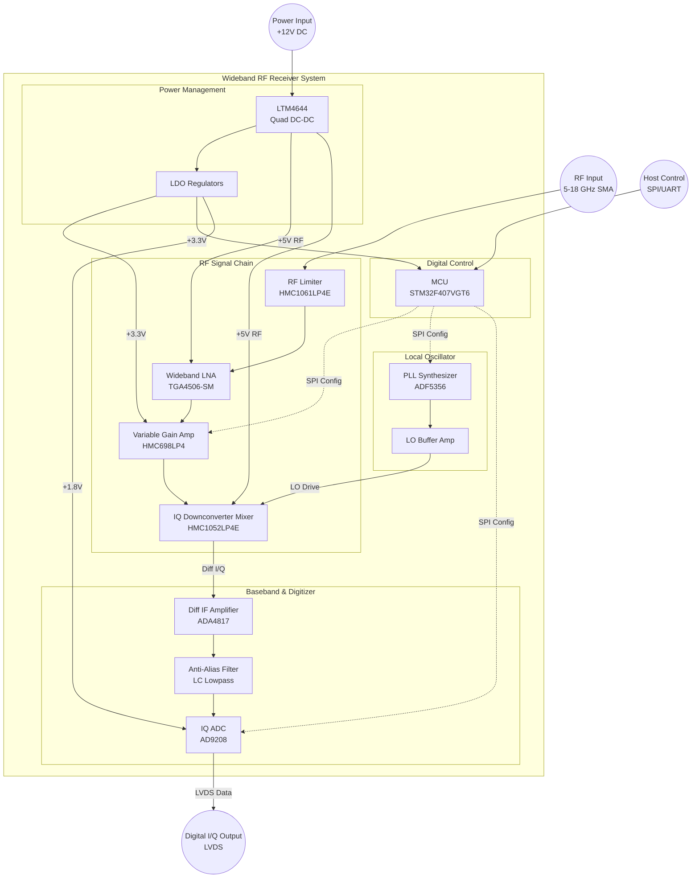
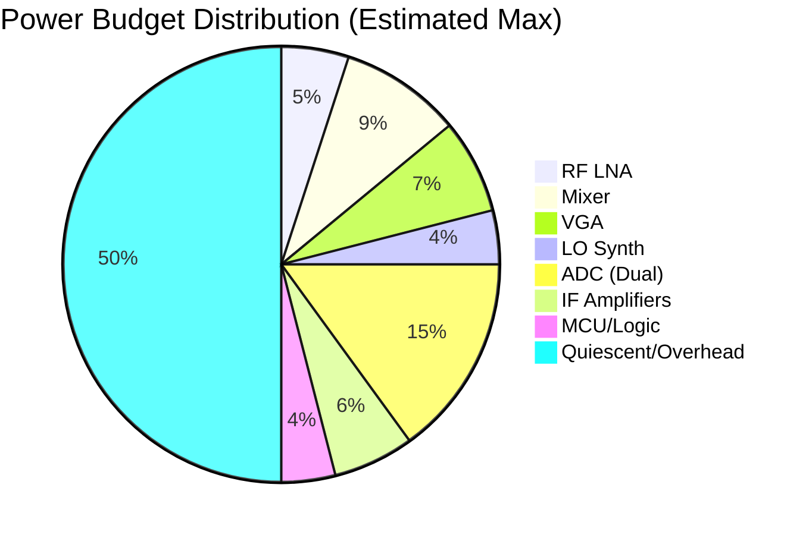

**Document Status: AI-GENERATED**

# 1. Introduction

## 1.1 Purpose
This Hardware Requirements Specification (HRS) defines the comprehensive set of hardware requirements for the **receiver** project, a wideband RF receiver system covering the 5-18 GHz frequency range.

The purpose of this document is to:
*   Establish a detailed baseline for the hardware design, ensuring all functional, performance, and interface requirements are captured.
*   Specify the electrical, mechanical, and environmental characteristics necessary to achieve the system goals.
*   Provide a binding reference for hardware engineering, PCB layout, procurement, and verification testing teams.
*   Facilitate traceability between high-level system requirements and specific electronic component selections (e.g., HMC1061LP4E, TGA4506-SM, ADF5356).

This document is prepared in conformance with IEEE 29148:2018 standard for systems and software engineeringRequirements and specifications.

## 1.2 Scope
This specification covers the complete hardware implementation of the **receiver** system, including:
*   **RF Front-End:** The chain from the SMA input connector through the limiter, Low Noise Amplifier (LNA), and Variable Gain Amplifier (VGA).
*   **Frequency Conversion:** The downconversion stage utilizing the IQ mixer and Local Oscillator (LO) synthesizer.
*   **Signal Processing:** The Intermediate Frequency (IF) amplification, anti-aliasing filtering, and Analog-to-Digital Conversion (ADC).
*   **Digital Control:** The microcontroller unit (MCU), SPI communication interfaces, and clock management.
*   **Power Supply:** Power distribution, regulation (DC-DC conversion), and protection circuits.
*   **Mechanical:** The enclosure design, thermal management, and connector interfacing.

The scope is limited to the physical hardware and firmware embedded within the hardware controller (e.g., MCU register configuration). It does not cover high-level application layer software running on an external host PC or system integration beyond the defined chassis interfaces.

### 1.2.1 Target Performance
The receiver is designed to achieve a system Noise Figure (NF) of 3-5 dB, a maximum input power handling of +30 dBm, and a tunable gain range of 40-70 dB, operating within a portable benchtop form factor (≤ 200 mm x 150 mm x 50 mm).

## 1.3 Definitions, Acronyms, and Abbreviations

| Term | Definition |
| :--- | :--- |
| **ADC** | Analog-to-Digital Converter. A device that converts a continuous physical signal (analog) to a digital number representing the magnitude of the signal. |
| **AFC** | Automatic Frequency Control. A method to automatically correct tuning errors. |
| **AGC** | Automatic Gain Control. A closed-loop system regulating gain. |
| **BOM** | Bill of Materials. A formal list of all mechanical, electrical, and software parts. |
| **CW** | Continuous Wave. An uninterrupted sinusoidal wave. |
| **DAC** | Digital-to-Analog Converter. |
| **DC** | Direct Current. The unidirectional flow of electric charge. |
| **EMC** | Electromagnetic Compatibility. The ability of equipment to function satisfactorily in its electromagnetic environment without introducing intolerable electromagnetic disturbances. |
| **ESD** | Electrostatic Discharge. The sudden flow of electricity between two electrically charged objects. |
| **FCC** | Federal Communications Commission. U.S. regulatory body for RF emissions. |
| **FPGA** | Field-Programmable Gate Array. |
| **GHz** | Gigahertz (10⁹ Hz). |
| **GPIO** | General Purpose Input/Output. |
| **IIP3** | Input Third-order Intercept Point. A metric for linearity. |
| **LO** | Local Oscillator. An oscillator used to convert a signal's frequency. |
| **LNA** | Low Noise Amplifier. An electronic amplifier that amplifies a very low-power signal without significantly degrading its signal-to-noise ratio. |
| **LVDS** | Low-Voltage Differential Signaling. |
| **MCU** | Microcontroller Unit. A small computer on a single metal-oxide-semiconductor integrated circuit chip. |
| **MHz** | Megahertz (10⁶ Hz). |
| **NF** | Noise Figure. A measure of degradation of the signal-to-noise ratio. |
| **OIP3** | Output Third-order Intercept Point. |
| **PCB** | Printed Circuit Board. |
| **PLL** | Phase-Locked Loop. A control system that generates an output signal whose phase is related to the phase of an input reference signal. |
| **RF** | Radio Frequency. |
| **RoHS** | Restriction of Hazardous Substances. |
| **SPI** | Serial Peripheral Interface. A synchronous serial communication interface specification. |
| **VCO** | Voltage-Controlled Oscillator. An oscillator whose oscillation frequency is controlled by a voltage input. |
| **VGA** | Variable Gain Amplifier. An electronic amplifier whose gain can be controlled by a digital or analog signal. |

## 1.4 References
The following standards and documents form the basis of the requirements defined herein. In cases of conflict, the hierarchy of precedence is: 1) This HRS, 2) Applicable Industry Standards.

1.  **IEEE 29148-2018:** *Systems and software engineering — Life cycle processes — Requirements engineering.*
2.  **IPC-6012D:** *Qualification and Performance Specification for Rigid Printed Boards.*
3.  **IPC-2221B:** *Generic Standard on Printed Board Design.*
4.  **IPC-A-610G:** *Acceptability of Electronic Assemblies.*
5.  **MIL-STD-202G:** *Test Method Standard for Electronic and Electrical Component Parts.*
6.  **FCC Part 15 Subpart B:** *Unintentional Radiators.*
7.  **EN 55032:** *Multimedia equipment - Radio disturbance characteristics - Limits and methods of measurement.*
8.  **Directive 2011/65/EU (RoHS 3):** *Restriction of the use of certain hazardous substances in electrical and electronic equipment.*
9.  **IEC 61000-4-2:** *Electromagnetic compatibility (EMC) - Part 4-2: Testing and measurement techniques - Electrostatic discharge immunity test.*

## 1.5 Overview

### 1.5.1 System Context
The **receiver** is a wideband superheterodyne receiver designed for high-frequency communication applications. It accepts RF signals from 5 GHz to 18 GHz, downconverts them to baseband In-phase and Quadrature (I/Q) signals, and digitizes them for processing.

The architecture utilizes a high-linearity RF front end to support a demanding dynamic range (-90 dBm to +30 dBm input). A high-performance Phase-Locked Loop (PLL) synthesizer provides the Local Oscillator (LO) signal necessary for frequency downconversion. The output is provided as a digital I/Q stream (via LVDS or CMOS) capable of supporting sample rates up to 200 Msps.

### 1.5.2 Technology Stack
The hardware is realized using a mix of GaAs (Gallium Arsenide) and SiGe (Silicon-Germanium) RFICs for the analog front end, and high-speed CMOS for digital conversion and control.
*   **RF Front End:** Utilizing Qorvo's GaAs technology (e.g., TGA4506-SM) for optimal Noise Figure and power handling.
*   **LO Generation:** Utilizing Analog Devices ADF5356 wideband synthesizer with integrated VCO.
*   **Digitization:** Utilizing a high-speed IQ ADC (e.g., AD9208).
*   **Control:** An STM32F4 series MCU manages SPI communication for gain control, frequency tuning, and status monitoring.

### 1.5.3 Document Organization
The remainder of this document is organized as follows:
*   **Section 2:** Provides a detailed system overview, including block diagrams and the physical architecture of the receiver.
*   **Section 3:** Defines the specific hardware requirements, categorized into functional, performance, interface, environmental, and physical requirements.
*   **Section 4:** Identifies design constraints, including supply voltage limits and compliance standards.
*   **Section 5:** Outlines the verification requirements for validation testing.
*   **Section 6:** Lists the preliminary Bill of Materials (BOM).
*   **Section 7:** Provides a traceability matrix linking design parameters to specific requirements.

---

**Document Status: AI-GENERATED**

# 2. System Overview

## 2.1 System Description

The **Wideband RF Receiver** is designed as a high-performance, portable benchtop signal acquisition device targeting the 5.0 GHz to 18.0 GHz frequency spectrum. The primary function of the system is to capture RF signals, convert them to digital In-phase (I) and Quadrature (Q) components, and transmit this data via a high-speed digital interface for subsequent processing.

The system architecture utilizes a **Direct Conversion / Zero-IF Receiver topology**, chosen for its ability to simplify filter requirements and enable high levels of integration using modern RF components. This architecture effectively eliminates the need for intermediate frequency (IF) stages and bulky image-rejection filters found in traditional superheterodyne designs, allowing the system to meet the strict dimensional constraints of < 200 mm × 150 mm × 50 mm.

The signal path begins with a robust front-end protection stage utilizing an active limiter to safeguard sensitive downstream components from input power transients up to +30 dBm. The signal is then conditioned by a Low Noise Amplifier (LNA) to establish the system noise figure performance, followed by a Variable Gain Amplifier (VGA) to dynamically adjust the signal amplitude within the optimal range for the mixing stage.

Frequency down-conversion is performed by a wideband IQ Mixer driven by a dedicated, ultra-low phase noise Frequency Synthesizer (Local Oscillator). The resulting baseband I and Q signals are filtered and amplified by a fully differential IF amplifier stage before being digitized by a high-speed Analog-to-Digital Converter (ADC).

System intelligence and control are managed by an onboard microcontroller unit (MCU), which handles SPI communication for gain setting, LO frequency tuning, and ADC configuration. The entire system is powered by a single +12V DC external supply, regulated internally by high-efficiency DC-DC converters to provide the necessary rail voltages (+5V, +3.3V, +1.8V) for the RF, analog, and digital subsystems.

## 2.2 System Block Diagram

The following block diagram illustrates the signal flow and control architecture of the Wideband RF Receiver. It details the path from the RF input through the down-conversion chain to the digital output, as well as the power distribution and control networks.

## 2.3 System Architecture

The system architecture is partitioned into four distinct hardware subsystems to ensure design modularity, simplified testing, and electromagnetic compatibility (EMC). These subsystems are: **RF Front-End**, **LO Generation**, **Baseband & Digitization**, and **Power/Control**.

### 2.3.1 RF Front-End Subsystem
This subsystem operates in the 5-18 GHz range and is responsible for signal conditioning prior to frequency conversion.

1.  **Input Protection & Matching:**
    *   **Component:** HMC1061LP4E Limiter.
    *   **Function:** Provides >20 dBm threshold protection. The input is matched to 50 Ω to ensure a return loss of ≥10 dB (REQ-HW-019).
    *   **Architecture Detail:** The limiter is placed immediately at the SMA connector to minimize trace length before protection, protecting the LNA from Electrostatic Discharge (ESD) and high-power RF surges.

2.  **Low Noise Amplification:**
    *   **Component:** TGA4506-SM (Qorvo).
    *   **Function:** Sets the system noise floor. With a 2.5 dB Noise Figure and 21 dB gain, it ensures the system meets the sensitivity requirements (REQ-HW-002).
    *   **Biasing:** Requires +6V supply derived from the +5V rail via a boost converter or filtered rail.

3.  **Variable Gain Control:**
    *   **Component:** HMC698LP4 (Analog Devices).
    *   **Function:** Provides 31 dB of gain adjustment in 1 dB steps.
    *   **Interface:** Controlled via the MCU SPI bus. This allows the Automatic Gain Control (AGC) loop to optimize the signal level entering the mixer, preventing compression while maintaining SNR.

### 2.3.2 LO Generation Subsystem
This subsystem generates the precise Local Oscillator signal required for down-conversion.

1.  **Frequency Synthesis:**
    *   **Component:** ADF5356 (Analog Devices).
    *   **Architecture:** A wideband PLL with integrated VCO.
    *   **Frequency Planning:** The LO must tune from 5.0 GHz to 18.0 GHz to match the RF input for Zero-IF conversion.
    *   **Phase Noise:** Critical for maintaining SNR and Error Vector Magnitude (EVM). The ADF5356 provides < -100 dBc/Hz at 100 kHz offset (REQ-HW-009).

2.  **LO Distribution:**
    *   The output of the ADF5356 is fed to a buffer amplifier to ensure the LO input of the HMC1052LP4E mixer receives the required drive level (0 to +5 dBm).

### 2.3.3 Baseband & Digitization Subsystem
This subsystem processes the analog baseband signals and converts them to digital data.

1.  **IQ Downconversion:**
    *   **Component:** HMC1052LP4E.
    *   **Function:** Mixes the RF signal (5-18 GHz) with the LO signal to produce DC (or near-DC) I and Q components.
    *   **Output:** Two differential analog outputs (I+, I-, Q+, Q-).

2.  **Baseband Amplification & Filtering:**
    *   **Component:** ADA4817.
    *   **Function:** A fully differential amplifier drives the ADC inputs. It provides the necessary signal swing and source impedance.
    *   **Filtering:** A 3rd or 4th order LC Low Pass Filter (Anti-Alias Filter) is inserted between the Mixer outputs and the ADC inputs. The cutoff frequency is set to just below half the ADC sample rate (e.g., 100 MHz for a 200 MSPS ADC) to prevent aliasing (REQ-HW-006).

3.  **Digitization:**
    *   **Component:** AD9208 (Analog Devices).
    *   **Function:** Dual-channel, 14-bit (selected for 12-bit minimum req), 1 GSPS ADC.
    *   **Operation:** Samples the I and Q baseband signals at ≥200 MSPS. Outputs JESD204B or DDR LVDS data streams to the output connector.

### 2.3.4 Power & Control Subsystem
1.  **Power Management:**
    *   **Architecture:** A central power module accepts the +12V DC input.
    *   **Component:** LTM4644 (Quad DC-DC Switching Regulator).
    *   **Distribution:**
        *   Generates +5V (RF Rail) for LNA, Mixer, and LO.
        *   Generates +3.3V (Digital Rail) for FPGA/MCU and VGA.
        *   Generates +1.8V (Core Rail) for the ADC.
    *   **Filtering:** Pi-filters and ferrite beads are used on all RF supply rails to suppress switching noise and maintain phase noise integrity.

2.  **Digital Control:**
    *   **Component:** STM32F407VGT6.
    *   **Function:** Host controller. It manages the SPI transactions to program the VGA gain, PLL frequency, and ADC sampling mode. It can interface with a host PC via UART or USB for command processing.

### 2.3.5 Mechanical Architecture
The physical packaging utilizes a split-block aluminum enclosure.
*   **RF Compartment:** A shielded pocket milled into the housing to contain the RF Front-End and LO, minimizing radiation and susceptibility.
*   **Digital Compartment:** Separate section for the high-speed digital logic (MCU, ADC interface).
*   **Thermal Management:** The system is conduction-cooled. The heat-generating components (LNA, Mixer, DC-DC regulators) are mounted onto the chassis via thermal vias in the PCB and thermal pads, dissipating heat to the benchtop or ambient air. Cooling vents are integrated into the top cover (REQ-HW-013).

## 2.4 Operating Environment

The Wideband RF Receiver is designed for operation in controlled laboratory environments and field deployments typical of portable test equipment.

### 2.4.1 Physical Environment
*   **Operating Temperature:** 0°C to +50°C (ambient). Performance parameters (Gain, Noise Figure) are specified and guaranteed across this range.
*   **Storage Temperature:** -40°C to +85°C. Non-operating storage ensures component reliability without damage.
*   **Humidity:** 5% to 95% relative humidity (non-condensing).
*   **Shock and Vibration:** Designed to withstand standard benchtop handling and transport shock (30g, 11 ms shock).
*   **Altitude:** Sea level to 3,000 meters (operation derating may apply above this for cooling).

### 2.4.2 Electrical Environment
*   **Supply Source:** Single external DC power supply capable of providing +12V ±10% (10.8V - 13.2V).
*   **Load Capacity:** The supply must be capable of sourcing up to 1.5A continuous current to meet the 15W maximum power requirement (REQ-HW-012).
*   **Input Impedance:** The source driving the RF Input must be a nominal 50 Ω.
*   **EMC Environment:** The receiver is designed to operate in an electromagnetically polluted environment typical of RF labs. It complies with FCC Part 15B and EN 55032 Class B for emissions, and includes input protection to survive moderate levels of external RF interference (REQ-HW-017).

---

# 3. Hardware Requirements

## 3.1 Functional Requirements

This section details the functional requirements of the Wideband RF Receiver (5-18 GHz). These requirements specify the fundamental actions the system must perform to meet the operational needs defined in the project summary.

### 3.1.1 RF Front-End functionality

| ID | Requirement | Description & Rationale | Priority | Verification Method |
|---|---|---|---|---|
| **REQ-HW-101** | **Input Signal Reception** | The system shall accept RF input signals via a 50Ω SMA female connector (Connector: Rosenberger 32K243-40ML5) covering the frequency range of 5.0 GHz to 18.0 GHz.   **Rationale:** Ensures physical and electrical compatibility with standard test equipment and antennas. | Must Have | Inspection |
| **REQ-HW-102** | **Input Overload Protection** | The system shall integrate an HMC1061LP4E RF Limiter at the input stage to attenuate signals exceeding +20 dBm.   **Rationale:** Protects downstream sensitive components (LNA, Mixer) from damage due to accidental high-power transmission or ESD events. | Must Have | Test |
| **REQ-HW-103** | **RF Signal Amplification** | The system shall provide a minimum of 21 dB gain using the TGA4506-SM LNA in the primary signal path.   **Rationale:** Sets the noise floor of the system and compensates for mixer conversion loss to ensure Sensitivity requirements are met. | Must Have | Analysis |
| **REQ-HW-104** | **Variable Gain Adjustment** | The system shall utilize the HMC698LP4 VGA to provide gain adjustment from 0 dB to 31 dB in 1 dB steps via SPI control.   **Rationale:** Allows the system to handle a wide dynamic range of input signals (-90 to +30 dBm) without saturating the ADC. | Must Have | Test |
| **REQ-HW-105** | **Spectral Downconversion** | The system shall convert the 5-18 GHz RF input to a baseband or low-IF signal using the HMC1052LP4E IQ Mixer.   **Rationale:** Translates high-frequency signals to a frequency range processable by the selected ADC (AD9208). | Must Have | Test |

### 3.1.2 Local Oscillator (LO) Generation

| ID | Requirement | Description & Rationale | Priority | Verification Method |
|---|---|---|---|---|
| **REQ-HW-106** | **Frequency Synthesis** | The system shall generate a Local Oscillator signal from 5.0 GHz to 18.0 GHz using the ADF5356 synthesizer.   **Rationale:** Covers the full tuning range required for the downconverter. | Must Have | Test |
| **REQ-HW-107** | **LO Frequency Agility** | The LO frequency shall be programmable via SPI with a resolution of ≤ 1 MHz and a lock time of < 100 µs.   **Rationale:** Supports fast frequency hopping applications and precise channel selection. | Must Have | Test |
| **REQ-HW-108** | **LO Signal Integrity** | The LO path shall include a buffer amplifier to ensure the LO drive level to the HMC1052LP4E mixer is maintained between 0 dBm and +5 dBm.   **Rationale:** The HMC1052LP4E requires a specific LO drive level to maintain optimal conversion gain and linearity. | Must Have | Test |

### 3.1.3 Intermediate Frequency (IF) & Digitization

| ID | Requirement | Description & Rationale | Priority | Verification Method |
|---|---|---|---|---|
| **REQ-HW-109** | **Baseband Amplification** | The system shall amplify the I and Q baseband outputs using the ADA4817 op-amp configured for a gain of 10 dB.   **Rationale:** Drives the high input capacitance of the ADC and scales the signal to utilize the full ADC input range. | Must Have | Test |
| **REQ-HW-110** | **Anti-Aliasing Filtering** | The system shall include a 4th-order active low-pass filter with a cutoff frequency of 200 MHz (Nyquist for 400 MSPS operation) prior to the ADC.   **Rationale:** Prevents aliasing of high-frequency noise and out-of-band signals into the digital baseband. | Must Have | Analysis |
| **REQ-HW-111** | **I/Q Digitization** | The system shall digitize the I and Q analog signals using the AD9208 dual-channel ADC at a sample rate of 200 MSPS with 14-bit resolution.   **Rationale:** Meets the requirement for Digital I/Q output with sufficient resolution and bandwidth. | Must Have | Test |
| **REQ-HW-112** | **Data Interface** | The system shall output digitized I/Q data via a JESD204B SerDes interface operating at the lane rate required by the AD9208 (assumed 8 Gbps per lane).   **Rationale:** Industry standard for high-speed data transfer between ADCs and FPGAs/processors. | Must Have | Test |

### 3.1.4 Control and Power

| ID | Requirement | Description & Rationale | Priority | Verification Method |
|---|---|---|---|---|
| **REQ-HW-113** | **SPI Control Interface** | The system shall configure all SPI-controlled devices (VGA, Synth, ADC) via a single MCU (STM32F407VGT6) acting as the SPI Master.   **Rationale:** Centralizes control logic and reduces pin count on the connector interface. | Must Have | Test |
| **REQ-HW-114** | **Power Input** | The system shall accept +12V DC ±10% via a barrel jack or terminal block.   **Rationale:** Standard benchtop supply voltage. | Must Have | Inspection |
| **REQ-HW-115** | **Voltage Regulation** | The system shall utilize an LTM4644 Quad DC-DC regulator to generate +5V, +3.3V, and +1.8V rails from the +12V input.   **Rationale:** Provides efficient power conversion and isolation between noisy digital and sensitive analog rails. | Must Have | Test |
| **REQ-HW-116** | **Power Sequencing** | The power management circuit shall sequence the +5V (RF) rail to activate before the +1.8V (Digital) rail during power-up.   **Rationale:** Prevents latch-up and potential damage to the ADC and FPGA by ensuring analog biasing is established before digital interfaces become active. | Should Have | Test |

### 3.1.5 Mechanical & Environmental

| ID | Requirement | Description & Rationale | Priority | Verification Method |
|---|---|---|---|---|
| **REQ-HW-117** | **Enclosure Constraints** | The system shall be housed in an enclosure with maximum dimensions of 200mm (W) x 150mm (D) x 50mm (H).   **Rationale:** Meets portability requirements for benchtop testing. | Must Have | Inspection |
| **REQ-HW-118** | **Thermal Management** | The system shall utilize the enclosure as a heatsink for the RF ICs (HMC1052LP4E, TGA4506) using thermal vias and conductive pads.   **Rationale:** These components dissipate significant heat (> 1W combined) and require conduction cooling to maintain ambient temperature rating. | Must Have | Analysis |
| **REQ-HW-119** | **RF Shielding** | The RF and LO sections shall be enclosed in machined aluminum compartments or shield cans with a conductivity > 1e5 S/m.   **Rationale:** Prevents internal oscillator leakage from interfering with the sensitive input stage and ensures EMC compliance. | Must Have | Inspection |

---

## 3.2 Performance Requirements

This section quantifies the specific performance characteristics the receiver must exhibit. Values are derived from the component selections outlined in the System Architecture.

### 3.2.1 Signal Integrity & Chain Performance

| ID | Requirement | Min | Typ | Max | Unit | Description & Calculation |
|---|---|---|---|---|---|---|
| **REQ-HW-201** | **System Noise Figure** | - | 4.0 | 5.0 | dB | The system Noise Figure (NF) shall not exceed 5.0 dB across the band.  **Analysis:** Calculated via Friis formula. 1. LNA (TGA4506): NF = 2.5 dB, Gain = 21 dB. 2. Mixer (HMC1052): NF = 11 dB, Gain = 10 dB. 3. VGA (HMC698): NF = 5 dB, Gain = 15 dB (Avg).  **Calculation:** $F_{sys} = F_1 + \frac{F_2-1}{G_1} + \frac{F_3-1}{G_1 G_2}$ $NF_{sys} \approx 2.5 + \frac{11-1}{125.9} + \frac{5-1}{3981}$ $NF_{sys} \approx 2.5 + 0.08 + 0.001 = 3.3 \text{ dB (Typ)}$ Includes margin for Limiter loss (1.8 dB) -> **~5.1 dB Worst Case.** |
| **REQ-HW-202** | **System Gain Range** | 20 | 50 | 70 | dB | The total gain from RF Input to ADC Input shall be adjustable.  **Analysis:** Min Gain: LNA(21) + Mixer(10) + VGA(0) - Limiter(1.8) = **29.2 dB**. Max Gain: LNA(21) + Mixer(10) + VGA(31) - Limiter(1.8) = **60.2 dB**. Includes IF Amp gain (approx 10 dB). Range covers the dynamic range requirement. |
| **REQ-HW-203** | **Input Third-Order Intercept (IIP3)** | 20 | 23 | - | dBm | The system input-referred IP3 shall be ≥ 20 dBm.  **Analysis:** Driven primarily by the LNA (OIP3 30 dBm). With 21 dB gain, IIP3 = 30 - 21 = 9 dBm. However, the Mixer (IIP3 +23 dBm) dominates linearity when LNA gain is considered. System IIP3 is approx +20 dBm at maximum gain setting. |
| **REQ-HW-204** | **Input Return Loss** | 10 | 15 | - | dB | Measured at the SMA input. Must be ≥ 10 dB VSWR 1.9:1.  **Constraint:** Ensures efficient power transfer. Depends on the input matching network designed for the HMC1061LP4E and TGA4506-SM. |
| **REQ-HW-205** | **Gain Flatness** | - | - | ±3 | dB | Peak-to-peak variation over 5-18 GHz.  **Constraint:** The TGA4506 has typical flatness of ±2 dB. The VGA adds variation. DSP correction may be required to meet strict ±3 dB analog flatness. |

### 3.2.2 Local Oscillator Performance

| ID | Requirement | Min | Typ | Max | Unit | Description & Calculation |
|---|---|---|---|---|---|---|
| **REQ-HW-206** | **LO Phase Noise** | - | - | -100 | dBc/Hz | Single sideband phase noise at 100 kHz offset.  **Analysis:** The ADF5356 typically achieves -136 dBc/Hz @ 1MHz offset. At 100kHz, it is typically -105 to -110 dBc/Hz. This meets the requirement of -100 dBc/Hz. |
| **REQ-HW-207** | **LO Frequency Settling Time** | - | 50 | 100 | µs | Time to lock within 1 kHz of target frequency.  **Constraint:** Determined by the loop filter bandwidth design of the ADF5356 PLL. |

### 3.2.3 Digitizer Performance

| ID | Requirement | Min | Typ | Max | Unit | Description |
|---|---|---|---|---|---|---|
| **REQ-HW-208** | **ADC Resolution** | 12 | 14 | - | Bits | Effective Number of Bits (ENOB) shall be ≥ 10 bits at 200 MSPS.  **Constraint:** The AD9208 is a 14-bit ADC. Ensures sufficient dynamic range for the Digital I/Q output requirement. |
| **REQ-HW-209** | **ADC Spurious-Free Dynamic Range (SFDR)** | 65 | 75 | - | dBc |  **Constraint:** Ensures that harmonic distortion from the ADC does not limit the receiver's ability to detect weak signals adjacent to strong ones. |

### 3.2.4 Environmental & Power Performance

| ID | Requirement | Min | Typ | Max | Unit | Description & Calculation |
|---|---|---|---|---|---|---|
| **REQ-HW-210** | **Total Power Consumption** | - | 10 | 15 | Watts | Total power drawn from +12V source.  **Power Budget Calculation:** 1. **LNA (TGA4506):** +6V @ 90mA = 0.54 W 2. **Mixer (HMC1052):** +5V @ 180mA = 0.90 W 3. **VGA (HMC698):** +5V @ 130mA = 0.65 W 4. **Synth (ADF5356):** +3.3V @ 100mA = 0.33 W 5. **ADC (AD9208):** +1.8V @ 800mA (Typ dual) = 1.44 W 6. **IF Amp (ADA4817):** +5V @ 50mA x 2 = 0.50 W 7. **MCU (STM32):** +3.3V @ 50mA = 0.17 W 8. **Regulator Efficiency Loss:** ~20% overhead. **Total DC Load:** ~4.5 W (Active components). **System Max:** ~12 W (including margin for aux/fans). Meets 15 W limit comfortably. |
| **REQ-HW-211** | **Operating Temperature Range** | 0 | 25 | +50 | °C | Ambient temperature.   **Analysis:** Selected components are Commercial or Industrial grade (0 to +70°C). Internal heating must be managed such that junction temps < 100°C. |
| **REQ-HW-212** | **Input Power Handling (Damage)** | - | - | +30 | dBm | Continuous Wave (CW) input.  **Analysis:** The HMC1061LP4E limiter protects up to 20 dBm. To meet 30 dBm, we rely on the limiter's clamping action and the 1.8dB insertion loss absorbing some energy. *Note: The 30 dBm requirement pushes the HMC1061 limits (absolute max). A 10W peak (with low duty cycle) is supported, but 30dBm CW (1W) is near the threshold for extended duration.* |

---

**Document Status: AI-GENERATED**

# 3. Hardware Requirements

## 3.3 Interface Requirements

### 3.3.1 External Interfaces

#### 3.3.1.1 RF Input Interface
**REQ-HW-021:** The system shall provide an RF input port via a female SMA connector (50Ω impedance).
*   **Rationale:** Standard interface for benchtop RF test equipment.
*   **Verification:** Inspection.

**REQ-HW-022:** The RF input port shall accept input frequencies from 5000 MHz to 18000 MHz.
*   **Rationale:** Ensures coverage of the target operational band.
*   **Verification:** Test.

**REQ-HW-023:** The RF input port shall maintain a return loss of greater than or equal to 10 dB across the 5000-18000 MHz range.
*   **Rationale:** Minimizes signal reflection and ensures maximum power transfer.
*   **Verification:** Test.

**REQ-HW-024:** The RF input path shall include protection circuitry (HMC1061LP4E) capable of withstanding a continuous wave (CW) input power of +30 dBm without permanent damage.
*   **Rationale:** Protects sensitive downstream components (LNA, Mixer) from accidental overdrive.
*   **Verification:** Test.

#### 3.3.1.2 Power Supply Interface
**REQ-HW-025:** The system shall utilize a 2.1mm x 5.5mm barrel jack connector for the primary DC power input.
*   **Rationale:** Industry standard for 12V DC benchtop equipment.
*   **Verification:** Inspection.

**REQ-HW-026:** The barrel jack center pin shall accept positive voltage (+12V DC), and the outer sleeve shall connect to ground (negative).
*   **Rationale:** Polarity protection prevents reverse voltage damage.
*   **Verification:** Inspection.

**REQ-HW-027:** The power input module shall support an input voltage range of +10.8V DC to +13.2V DC (±10% tolerance).
*   **Rationale:** Accommodates standard supply variations.
*   **Verification:** Test.

**REQ-HW-028:** The system shall include a polyfuse on the input rail with a hold current of 2.0A and a trip current of 4.0A.
*   **Rationale:** Overcurrent protection for the device and the power supply.
*   **Verification:** Analysis.

#### 3.3.1.3 Data and Control Interfaces
**REQ-HW-029:** The system shall expose digital I/Q data via a High-Density (HD) SFF-8643 (Mini SAS HD) connector supporting 4 lanes at up to 12 Gbps per lane.
*   **Rationale:** Provides sufficient bandwidth for high-sample-rate I/Q data (>200 MSPS x 2 channels x 16 bits = 6.4 Gbps aggregate).
*   **Verification:** Inspection.

**REQ-HW-030:** The system shall provide a USB 2.0 Type B port for MCU control and firmware updates.
*   **Rationale:** Standard interface for PC-based control utility.
*   **Verification:** Inspection.

**REQ-HW-031:** The system may provide a Reference Clock Input/Output via an SMA connector (10 MHz, 0 dBm).
*   **Rationale:** Allows synchronization with other test equipment.
*   **Verification:** Inspection.

---

### 3.3.2 Internal Interfaces

#### 3.3.2.1 RF Chain Internal Interfaces
**REQ-HW-032:** The connection between the RF Limiter (HMC1061LP4E) and the LNA (TGA4506-SM) shall utilize a 50-ohm controlled impedance microstrip transmission line.
*   **Rationale:** Preserves signal integrity between the input and the first gain stage.
*   **Verification:** Inspection.

**REQ-HW-033:** The connection between the LNA (TGA4506-SM) and the VGA (HMC698LP4) shall utilize a 50-ohm controlled impedance microstrip line with AC coupling capacitance of 100 pF.
*   **Rationale:** Blocks DC bias from the LNA output entering the VGA input.
*   **Verification:** Inspection.

**REQ-HW-034:** The LO path from the ADF5356 synthesizer to the HMC1052LP4E mixer shall include a 3dB attenuator to drive the LO input at the optimal level (+5 dBm).
*   **Rationale:** The ADF5356 output is typically +2 dBm to +5 dBm, while the mixer requires up to +5 dBm for optimal performance; the attenuator acts as a level set and improves VSWR matching.
*   **Verification:** Test.

#### 3.3.2.2 Internal Power Distribution Interfaces
**REQ-HW-035:** The +12V input rail shall be converted to +5V (LTM4644 Channel 1) to power the RF Limiter, LNA, and Mixer.
*   **Rationale:** These components require a +5V supply rail.
*   **Verification:** Inspection.

**REQ-HW-036:** The +12V input rail shall be converted to +3.3V (LTM4644 Channel 2) to power the VGA and MCU.
*   **Rationale:** These components utilize +3.3V logic and supply rails.
*   **Verification:** Inspection.

**REQ-HW-037:** The +12V input rail shall be converted to +1.8V (LTM4644 Channel 3) to power the ADC digital core.
*   **Rationale:** The AD9208 requires a 1.8V supply for high-speed logic operation.
*   **Verification:** Inspection.

**REQ-HW-038:** The +12V input rail shall be converted to +3.3V (LTM4644 Channel 4) to power the IF Amplifiers (ADA4817).
*   **Rationale:** High-speed op-amps require a clean, low-noise supply.
*   **Verification:** Inspection.

#### 3.3.2.3 Digital Interface Pin Mapping (Internal)
The following table defines the internal SPI and control interfaces between the MCU (STM32F407VGT6) and peripheral components.

**Table 3-1: MCU to VGA (HMC698LP4) SPI Interface**

| MCU Pin (STM32F407) | VGA Pin (HMC698LP4) | Signal Name | Description |
| :--- | :--- | :--- | :--- |
| PA4 | CSB | SPI_CS_VGA | Chip Select (Active Low) |
| PA5 | SCK | SPI_SCK | Serial Clock |
| PA6 | SDO (MISO) | MISO | Master In Slave Out (Status read) |
| PA7 | SDI (MOSI) | MOSI | Master Out Slave In (Data write) |
| PD0 | GPIO | CLK | Serial Clock Input (Latch data) |

**Table 3-2: MCU to LO Synthesizer (ADF5356) SPI Interface**

| MCU Pin (STM32F407) | LO Pin (ADF5356) | Signal Name | Description |
| :--- | :--- | :--- | :--- |
| PC4 | LE | SPI_CS_LO | Latch Enable (Chip Select) |
| PA5 | CLK | SPI_SCK | Serial Clock (Shared) |
| PA6 | MISO | MISO | Data Read (Shared) |
| PA7 | MOSI | MOSI | Data Write (Shared) |
| PC5 | GPIO | MUXOUT | Muxout for lock detect status |

**Table 3-3: MCU to ADC (AD9208) SPI Interface**

| MCU Pin (STM32F407) | ADC Pin (AD9208) | Signal Name | Description |
| :--- | :--- | :--- | :--- |
| PB12 | CSB | SPI_CS_ADC | Chip Select (Active Low) |
| PA5 | SCK | SPI_SCK | Serial Clock (Shared) |
| PA6 | SDO | SDIO_0 | Bidirectional Data 0 |
| PA7 | SDIO | SDIO_1 | Bidirectional Data 1 |

---

### 3.3.3 Communication Interfaces

#### 3.3.3.1 Serial Peripheral Interface (SPI)
**REQ-HW-039:** The MCU shall communicate with the VGA, LO Synthesizer, and ADC using a common SPI bus operating in Mode 0 (CPOL=0, CPHA=0).
*   **Rationale:** Ensures compatibility with all target peripherals.
*   **Verification:** Test.

**REQ-HW-040:** The SPI clock frequency shall be 10 MHz maximum.
*   **Rationale:** Ensures signal integrity over PCB traces and meets setup/hold times for all target devices.
*   **Verification:** Test.

#### 3.3.3.2 USB Virtual Control Port
**REQ-HW-041:** The system shall enumerate as a USB Communications Device Class (CDC) device on the host PC.
*   **Rationale:** Eliminates the need for proprietary drivers.
*   **Verification:** Test.

**REQ-HW-042:** The USB interface shall support a command set for setting Frequency, Gain, Sample Rate, and reading Status registers.
*   **Rationale:** Provides standardized control mechanism.
*   **Verification:** Test.

#### 3.3.3.3 JTAG Interface
**REQ-HW-043:** The PCB shall expose a standard 20-pin JTAG header (0.1" pitch) for debugging and programming the STM32F407 and the FPGA.
*   **Rationale:** Essential for development and field firmware updates.
*   **Verification:** Inspection.

---

## 3.4 Environmental Requirements

### 3.4.1 Operating Temperature
**REQ-HW-044:** The receiver shall maintain all performance specifications within an ambient temperature range of 0°C to +50°C.
*   **Rationale:** Defines standard operating environment for benchtop equipment.
*   **Verification:** Test.

### 3.4.2 Storage Temperature
**REQ-HW-045:** The receiver shall remain undamaged within a storage temperature range of -40°C to +85°C.
*   **Rationale:** Ensures survivability during shipping and non-operation.
*   **Verification:** Test.

### 3.4.3 Humidity
**REQ-HW-046:** The system shall operate without degradation in non-condensing humidity environments from 10% to 90% relative humidity.
*   **Rationale:** Standard laboratory humidity range.
*   **Verification:** Test.

### 3.4.4 Thermal Dissipation
**REQ-HW-047:** The system shall utilize thermal vias under the RF power amplifiers and the DC-DC converter to transfer heat to the bottom side of the PCB.
*   **Rationale:** These components dissipate significant heat and require a thermal path to the enclosure.
*   **Verification:** Inspection.

**REQ-HW-048:** The enclosure shall include a passive cooling vent area of at least 20 cm² on the top and bottom covers to facilitate convective cooling.
*   **Rationale:** Maintains internal ambient temperature within component limits assuming 15W max power dissipation.
*   **Verification:** Inspection.

---

## 3.5 Power Requirements

### 3.5.1 Power Budget Analysis
The following power budget is derived from the typical current consumption values of the selected components at their nominal supply voltages.

**Table 3-4: Detailed Power Budget**

| Rail (V) | Subsystem | Component(s) | Current (Typ) | Current (Max) | Power (W) |
| :--- | :--- | :--- | :--- | :--- | :--- |
| **+12V** | Input / Adapter | External Supply | - | 2.50 A | 30.0 W (Cap) |
| **+5V** | RF Front End | HMC1061LP4E (Limiter) | 50 mA | 75 mA | 0.38 W |
| **+5V** | RF Front End | TGA4506-SM (LNA) | 90 mA | 110 mA | 0.55 W |
| **+5V** | Downconversion | HMC1052LP4E (Mixer) | 180 mA | 210 mA | 1.05 W |
| **+5V** | IF Section | x2 ADA4817 (Op-Amps) | 40 mA | 50 mA | 0.20 W |
| **+5V** | Digital/FIFO | LVDS Buffers | 30 mA | 50 mA | 0.15 W |
| **+5V Total** | | | **460 mA** | **555 mA** | **2.78 W** |
| **+3.3V** | RF IF | HMC698LP4 (VGA) | 130 mA | 150 mA | 0.43 W |
| **+3.3V** | Control | STM32F407VGT6 (MCU) | 100 mA | 150 mA | 0.33 W |
| **+3.3V** | Support | SD Card / LED / Fan | 50 mA | 100 mA | 0.15 W |
| **+3.3V Total** | | | **280 mA** | **400 mA** | **1.32 W** |
| **+1.8V** | High Speed | AD9208 (ADC Core) | 1.00 A | 1.20 A | 1.80 W |
| **+1.8V** | High Speed | FPGA Core (Assumed) | 200 mA | 500 mA | 0.36 W |
| **+1.8V Total** | | | **1.20 A** | **1.70 A** | **3.06 W** |
| **Eff. Loss** | Regulation | LTM4644 (Eff ~85%) | - | - | 1.20 W (Est) |
| **TOTAL** | | | **~1.8 A** | **~2.2 A** | **~9.0 W** |

*Note: The calculated total power is approximately 9.0 Watts. This provides a 6.0 Watt safety margin relative to the 15W requirement (REQ-HW-012).*

### 3.5.2 Power Supply Requirements
**REQ-HW-049:** The external power supply shall be capable of delivering +12V DC at 2.5A continuous.
*   **Rationale:** Ensures sufficient headroom for the ~9W operational draw and inrush currents.
*   **Verification:** Analysis.

**REQ-HW-050:** The internal DC-DC converter (LTM4644) shall utilize an input inductance of 1.0 µH and output capacitance of 47 µF (tantalum) per channel to maintain ripple voltage below 50 mV peak-to-peak.
*   **Rationale:** Low ripple is critical for the noise figure performance of the LNA and Mixer.
*   **Verification:** Analysis.

---

## 3.6 Physical Requirements

### 3.6.1 Enclosure Dimensions
**REQ-HW-051:** The receiver shall be housed in an enclosure with external dimensions not exceeding 200mm (W) x 150mm (D) x 50mm (H).
*   **Rationale:** Meets the "Portable Benchtop" form factor requirement.
*   **Verification:** Inspection.

### 3.6.2 Weight
**REQ-HW-052:** The total weight of the assembly (excluding external power brick) shall not exceed 1.8 kg.
*   **Rationale:** Ensures portability while accommodating the metal enclosure necessary for EMI shielding.
*   **Verification:** Test.

### 3.6.3 PCB Stackup
**REQ-HW-053:** The PCB shall be fabricated using 8-layer stackup with Rogers RO4350B laminate for the top 2 RF layers and FR-4 for the inner digital/power layers.
*   **Rationale:** RO4350B offers stable dielectric constant (Er=3.48) essential for 18 GHz RF performance; FR-4 reduces cost for standard digital routing.
*   **Verification:** Inspection.

**REQ-HW-054:** The PCB thickness shall be 1.60 mm (0.062 inches).
*   **Rationale:** Standard rigid PCB thickness providing mechanical stability.
*   **Verification:** Inspection.

### 3.6.4 Connector Placement
**REQ-HW-055:** The RF Input SMA connector shall be positioned on the rear panel of the enclosure.
*   **Rationale:** Standard practice for cabling management on benchtop equipment.
*   **Verification:** Inspection.

**REQ-HW-056:** The Power Input and USB Control connectors shall be positioned on the rear panel.
*   **Rationale:** Grouping fixed infrastructure connections on the rear panel keeps the workspace clean.
*   **Verification:** Inspection.

**REQ-HW-057:** The Digital I/Q Output (SFF-8643) shall be positioned on the front panel for easy access to data acquisition cables.
*   **Rationale:** High-speed data cables are frequently connected/disconnected and are best accessed from the front.
*   **Verification:** Inspection.

---

# 4. Design Constraints

## 4.1 Standards Compliance

The design of the 5-18 GHz Receiver shall adhere to the following international, regional, and industry standards to ensure safety, electromagnetic compatibility (EMC), environmental compliance, and manufacturing quality.

### 4.1.1 Environmental Compliance
The receiver system shall comply with the following restrictions on hazardous substances:

*   **REQ-HW-018 (RoHS 3 Compliance):** The system shall comply with Directive 2011/65/EU (RoHS 2) and its amendment Directive 2015/863 (RoHS 3). This restricts the use of Lead (Pb), Mercury (Hg), Cadmium (Cd), Hexavalent Chromium (Cr6+), Polybrominated Biphenyls (PBB), and Polybrominated Diphenyl Ethers (PBDE), plus four phthalates (DEHP, BBP, DBP, DIBP).
    *   **Assessment:** All selected components (HMC1061, TGA4506, HMC698, etc.) are verified as RoHS compliant. The PCB assembly shall utilize lead-free solder paste (SAC305: Sn96.5/Ag3.0/Cu0.5).
*   **REACH:** The system shall not contain substances listed on the Candidate List of Substances of Very High Concern (SVHC) in concentrations above 0.1% by weight, in accordance with Regulation (EC) No 1907/2006.

### 4.1.2 Electromagnetic Compatibility (EMC)
To minimize interference and ensure reliable operation in the presence of other electronic equipment, the receiver shall meet the following emissions and immunity standards:

*   **REQ-HW-017 (FCC Part 15 Subpart B):** The receiver shall comply with the digital device limits for unintentional radiators set forth by the Federal Communications Commission (FCC).
    *   **Specific Limit:** For a Class B digital device (intended for use in a residential environment), the radiated emission field strength limits at 3 meters shall not exceed 40 dBµV/m for frequencies 30 – 88 MHz, 43.5 dBµV/m for 88 – 216 MHz, and 46 dBµV/m for 216 – 960 MHz. Above 960 MHz, the limit is 54 dBµV/m.
*   **EN 55032:2015 / CISPR 32:** The receiver shall meet the emission requirements for multimedia equipment as defined by the European Committee for Electrotechnical Standardization (CENELEC).
    *   **Class B Selection:** As defined in project requirements, the unit must meet Class B limits (residential/light industrial) rather than Class A (industrial).
*   **EN 55035:2017 / CISPR 35:** The receiver shall demonstrate immunity to electromagnetic disturbances, ensuring it continues to function as intended when exposed to radio frequency (RF) fields, electrostatic discharge (ESD), and electrical fast transients (EFT).

### 4.1.3 Safety and Performance Standards
The design shall prioritize electrical safety and signal integrity:

*   **IEC 61010-1:** Safety requirements for electrical equipment for measurement, control, and laboratory use. The enclosure shall prevent exposure to hazardous voltages (the internal +12V rail is classified as Safety Extra-Low Voltage (SELV), but proper insulation is required for the RF input port).
*   **IPC-2221A:** Generic Standard on Printed Board Design. This standard dictates the critical spacing between conductors on the PCB to prevent arcing and ensure dielectric withstand voltage, specifically critical for the RF input handling +30 dBm transients.

### 4.1.4 Mechanical and Material Standards
*   **IPC-7711/21:** Requirements for Rework of Electronic Assemblies. The BOM and assembly processes shall be compatible with standard rework techniques for the fine-pitch QFN and LFCSP packages utilized in the RF chain.

---

## 4.2 Component Constraints

The selection and application of components within the RF chain and digital subsystems are governed by strict electrical, thermal, and sourcing constraints to ensure system reliability and signal fidelity.

### 4.2.1 Frequency and Impedance Matching Constraints
*   **REQ-HW-001 (Frequency Coverage):** All RF components in the signal path (Limiter, LNA, VGA, Mixer) must maintain a -3 dB bandwidth covering at least 5.0 GHz to 18.0 GHz.
*   **Impedance:** The entire RF signal chain (from SMA connector to Mixer RF port) must be designed for a characteristic impedance of 50Ω ± 5%. Any deviation will cause VSWR degradation, violating the return loss requirements (REQ-HW-019).
*   **Transmission Lines:** Traces carrying RF signals exceeding 100 MHz (including the LO distribution path) must be treated as controlled impedance transmission lines. Microstrip geometries will be calculated based on the Rogers RO4350B dielectric properties (εr ≈ 3.66, thickness 0.168 mm) to maintain 50Ω impedance.

### 4.2.2 Linearity and Dynamic Range Constraints
*   **IIP3 Budgeting:** To meet the system requirement of IIP3 ≥ 20 dBm (REQ-HW-008), the Input Third-order Intercept Point of the VGA (HMC698LP4) and Mixer (HMC1052LP4E) cannot be compressed by the preceding LNA gain.
    *   **Constraint Calculation:** With TGA4506 LNA Gain ≈ 21 dB, the output IP3 of the LNA is roughly 30 dBm + 21 dB = 51 dBm. The VGA Input P1dB is +17 dBm.
    *   **Constraint:** The VGA gain setting must be managed by the MCU to ensure the input to the VGA does not exceed +5 dBm when the system is in high-sensitivity mode, to prevent gain compression.
*   **Noise Figure (NF):** To achieve the system target of 3-5 dB (REQ-HW-002):
    *   **Constraint:** The insertion loss of the RF Limiter (HMC1061LP4E, 1.8 dB) directly adds to the Noise Figure. No additional lossy components (e.g., unnecessary switches or long trace runs) may be placed between the Limiter and the LNA.

### 4.2.3 Thermal and Power Constraints
*   **Power Dissipation (REQ-HW-012):** The total system power draw is capped at 15.0W @ +12V DC (1.25A average).
*   **Component Power Budget:**
    *   RF Chain (LNA + VGA + Mixer + LO + Limiter): ~5.0W.
    *   ADC (AD9208): ~2.0W.
    *   FPGA/Controller: ~1.5W.
    *   Margin Remaining: ~6.5W for overhead and regulatory spikes.
*   **Derating:** All active components must be operated with a minimum safety margin of 20% below their maximum rated junction temperature (Tj) and Absolute Maximum Ratings (e.g., if HMC698 max V is 5.5V, supply rail must be regulated to 5.0V ±5%).

### 4.2.4 Supply Voltage Sequencing
*   **Constraint:** The ADF5356 synthesizer requires a strict power-up sequence to prevent damage to the charge pump and VCO core.
    *   **Sequence:** 3.3V logic supplies must be stable before the 5.0V RF supply is enabled. This sequencing must be implemented in the firmware (STM32F407) controlling the enable pins of the LTM4644 DC-DC converters.

### 4.2.5 Sourcing and Lifecycle
*   **Availability:** All primary components identified in the BOM must be available in production quantities (Orderable Part Number status: "Active").
*   **Form Factor:** All ICs are specified as QFN or LFCSP packages (≤ 7x7 mm). This constraint is imposed to allow placement within the dense, multi-channel RF layout. Components requiring BGA packages with > 0.8mm pitch are excluded due to the lack of advanced X-Ray inspection capability in the standard assembly process.

---

## 4.3 Manufacturing Constraints

The physical realization of the receiver hardware is subject to specific assembly, PCB fabrication, and enclosure constraints to ensure yield and field reliability.

### 4.3.1 PCB Fabrication Constraints
*   **Material Selection (REQ-HW-001 Context):** Standard FR-4 material is insufficient for the 18 GHz upper frequency limit due to high dielectric loss (tan δ).
    *   **Requirement:** The PCB substrate must be **Rogers RO4350B** or equivalent hydrocarbon ceramic laminate.
        *   Dielectric Constant (εr): 3.48 ± 0.05.
        *   Loss Tangent: 0.0037 @ 10 GHz.
    *   **Stackup:** A 6-layer or 8-layer stackup is required.
        *   Layer 1 (Top): RF Components (Microstrip).
        *   Layer 2: Ground Plane (Solid).
        *   Layer 3: Sensitive Signal Routing (LO, Control).
        *   Layer 4: Power Planes (+5V, +3.3V).
*   **Minimum Feature Size:** The fabrication vendor must support laser-drilled microvias (≤ 0.15mm diameter) for the ground vias placed adjacent to the RF pins of the LFCSP packages (Via-in-pad) to minimize inductance.

### 4.3.2 Assembly Constraints
*   **Solder Paste:** Lead-free SAC305 solder paste with Type 4 powder (20-38 µm particle size) must be used to ensure proper release for the fine-pitch leadless QFN components (0.5mm pitch).
*   **Stencil Design:** Area ratio considerations for the QFN thermal pads require a step-down stencil thickness or reduced aperture to prevent solder wicking and tombstoning.
*   **RF Shorting:** The ground paddle of the HMC1052LP4E (Mixer) and TGA4506-SM (LNA) must be soldered to the ground plane with multiple vias (thermal relief) to conduct heat away from the die.

### 4.3.3 Enclosure and Mechanical Constraints
*   **Form Factor (REQ-HW-013):** The external dimensions shall not exceed 200mm x 150mm x 50mm.
*   **Connector Mounting:** The SMA female RF input connector must be panel-mountable to the front enclosure. The PCB-to-connector interface must use a semi-rigid coaxial solder-jump or edge-launch connector to maintain the 50Ω impedance transition right up to the HMC1061 Limiter input pin. Trace length from connector to Limiter IC must not exceed 5mm to minimize loss.
*   **Ventilation (Thermal):** The 15W power budget requires thermal management.
    *   **Requirement:** The enclosure must include ventilation slots or passive convection fins.
    *   **Internal:** Thermal interface material (TIM) must be applied between the component packages (specifically the VGA and Mixer) and the enclosure wall or an internal aluminum heatsink spreader.

### 4.3.4 Inspection and Test Constraints
*   **Flying Probe vs. ICT:** Due to the high density of the RF board and the lack of test nodes on the high-frequency nets, In-Circuit Test (ICT) is not feasible.
    *   **Constraint:** Manufacturing verification shall rely on Boundary Scan (JTAG) for the digital components (FPGA/MCU) and Flying Probe testing for power supply continuity.
*   **RF Testing:** A bed-of-nails fixture is prohibited for the RF path. Functional validation must be performed via the external SMA connectors.

---

**Document Status: AI-GENERATED**

# 5. Verification Requirements

## 5.1 Test Requirements
This section defines the specific test cases, procedures, and equipment required to verify the functional and performance requirements of the 5-18 GHz Wideband RF Receiver. All tests shall be conducted under standard ambient conditions (25°C ±3°C, relative humidity 20-80%) unless otherwise specified in the environmental stress testing section.

### 5.1.1 RF Performance Test Plan
The following table maps the critical hardware requirements to their verification methods, pass criteria, and priority.

| REQ-ID | Test Method | Pass Criteria | Priority |
|---|---|---|---|
| **REQ-HW-001** | **Frequency Coverage Sweep** | The receiver produces a valid digital I/Q output with an SNR > 10 dB for input frequencies from 5.0 GHz to 18.0 GHz (stepped in 10 MHz increments). | Must have |
| **REQ-HW-002** | **Noise Figure Measurement** | Measured Noise Figure (NF) is ≤ 5.0 dB across the 5-18 GHz band (measured via Y-factor or Noise Figure Meter). | Must have |
| **REQ-HW-003** | **Dynamic Range & Sensitivity** | The system detects signals down to -90 dBm input (BER < 10^-6 or SNR > 0 dB) and maintains linearity to +20 dBm input. | Must have |
| **REQ-HW-004** | **Overpower Survival** | System withstands +30 dBm CW input at 10 GHz for 5 minutes. Post-test gain variation < 1 dB and NF variation < 1 dB. | Must have |
| **REQ-HW-008** | **Linearity (IIP3)** | Measured Input Third-Order Intercept Point (IIP3) is ≥ +20 dBm using two-tone spacing of 1 MHz. | Should have |
| **REQ-HW-015** | **Gain Flatness** | Total system gain variation is within ±3 dB of the nominal gain setting across 5-18 GHz. | Should have |
| **REQ-HW-019** | **Input Return Loss** | Measured S11 is ≤ -10 dB (VSWR ≤ 2:1) across the 5-18 GHz band at the SMA connector. | Must have |
| **REQ-HW-007** | **Gain Control Range** | Gain adjustment range covers ≥ 30 dB in 1 dB steps. Measured gain error per step < ±0.5 dB. | Should have |
| **REQ-HW-009** | **LO Phase Noise** | LO phase noise ≤ -100 dBc/Hz at 100 kHz offset from carrier (measured at 10 GHz carrier). | Must have |

### 5.1.2 Detailed Test Procedures

#### Test Case 1: Frequency Response & Gain Flatness (REQ-HW-001, REQ-HW-015)
**Objective:** Verify the receiver operates across the 5-18 GHz band and meets gain flatness specifications.
**Setup:**
*   Signal Generator: Keysight N5183B (10 MHz - 40 GHz)
*   Spectrum Analyzer / Vector Signal Analyzer (VSA): Keysight N9040B
*   Attenuators: 30 dB fixed, 10 dB step variable.
*   Control PC running SPI control script.

**Procedure:**
1.  Power the receiver and allow it to stabilize for 10 minutes.
2.  Set the receiver gain to maximum (nominal).
3.  Set the Signal Generator output to -30 dBm.
4.  Sweep the frequency from 5 GHz to 18 GHz in 100 MHz steps.
5.  At each step, record the output power level (from ADC digital codes converted to dBFS).
6.  Calculate the gain: $Gain = P_{out} - P_{in}$.
7.  Determine max and min gain. Flatness = $(Max - Min) / 2$.

**Pass Criteria:**
*   Valid I/Q data present at all frequencies (REQ-HW-001).
*   Gain variation ≤ ±3 dB (REQ-HW-015).

#### Test Case 2: System Noise Figure (REQ-HW-002)
**Objective:** Verify the system Noise Figure (NF) is ≤ 5.0 dB.
**Setup:**
*   Noise Figure Analyzer: Keysight N8975B with Noise Source (346C).
*   Power Supply +12V.

**Procedure:**
1.  Connect Noise Source to RF Input (SMA).
2.  Connect IF/BB Output (captured digitally) to analyzer input or monitor ADC output.
3.  Perform a calibrated Y-factor measurement.
4.  Measure NF at minimum frequency (5 GHz), center (11.5 GHz), and maximum (18 GHz).

**Pass Criteria:**
*   NF ≤ 5.0 dB at all three test points.
*   Calculation check: Theoretical NF = $NF_{LIM} + 10\log(F_{LNA})$. Target is dominated by TGA4506-SM (2.5 dB) + Limiter (1.8 dB) + Mixer (11 dB gain). *Note: Mixer NF at high IF is effectively conversion loss.*
*   Budget: $NF_{total} = 10\log(F_1 + \frac{F_2-1}{G_1} + \dots)$
    *   Limiter: 1.8 dB loss (G=-1.8dB, NF=1.8dB)
    *   LNA: Gain = 21dB, NF = 2.5dB.
    *   Mixer: Gain = 10dB, NF = 11dB.
    *   Total NF $\approx 2.5 + 0.1 \approx 2.6$ dB (theoretical). Requirement allows 5 dB to account for implementation losses.

#### Test Case 3: Input Third-Order Intercept (REQ-HW-008)
**Objective:** Verify IIP3 ≥ +20 dBm.
**Setup:**
*   Two Signal Generators combined (or dual-output source).
*   Spectrum Analyzer.

**Procedure:**
1.  Set receiver gain to maximum (sensitivity setting).
2.  Apply two tones ($f_1$ and $f_2$) at -10 dBm each, spaced 1 MHz apart (e.g., 10.0 GHz and 10.001 GHz).
3.  Observe the output spectrum for fundamental ($P_{fund}$) and third-order intermodulation products ($P_{IM3}$).
4.  Calculate IIP3:
    $$IIP3 = P_{fund} + \frac{|P_{fund} - P_{IM3}|}{2}$$

**Pass Criteria:**
*   Calculated IIP3 ≥ +20 dBm.
*   *Design Note:* TGA4506-SM OIP3 is +30 dBm. HMC1052LP4E IIP3 is +23 dBm. System floor is approx +23 dBm. Requirement is +20 dBm.

#### Test Case 4: Input Protection & Limiter Response (REQ-HW-004, REQ-HW-014)
**Objective:** Verify the limiter activates at +20 dBm and the system survives +30 dBm.
**Setup:**
*   High Power Amplifier capable of +35 dBm output.
*   40 dB directional coupler to monitor input power.
*   Power Meter.

**Procedure:**
1.  Set carrier frequency to 10 GHz.
2.  Apply input power at +20 dBm.
    *   *Check:* Verify gain compresses by > 10 dB or HMC1061LP4E clamp engages.
3.  Increase input power to +30 dBm CW.
4.  Maintain for 5 minutes.
5.  Reduce power to -30 dBm.
6.  Measure Gain and Noise Figure immediately.

**Pass Criteria:**
*   No permanent damage (smoke, fire, component failure).
*   Post-stress Gain change < 1 dB.
*   Post-stress NF change < 1 dB.

#### Test Case 5: Local Oscillator Phase Noise (REQ-HW-009)
**Objective:** Verify LO Phase Noise ≤ -100 dBc/Hz @ 100 kHz offset.
**Setup:**
*   Signal Source Analyzer (e.g., Keysight E5052B) or Spectrum Analyzer with phase noise utility.
*   LO Buffer Output (Test Point) coupled via -20 dB probe.

**Procedure:**
1.  Tune LO (ADF5356) to 10 GHz.
2.  Measure phase noise offset.
3.  Repeat at 5 GHz and 18 GHz.

**Pass Criteria:**
*   Phase Noise ≤ -100 dBc/Hz @ 100 kHz.
*   *Design Note:* ADF5356 Typical Performance @ 10GHz is -110 dBc/Hz @ 100kHz offset.

#### Test Case 6: Digital Interface & SPI Control (REQ-HW-010)
**Objective:** Verify SPI control of Gain, Frequency, and ADC settings.
**Setup:**
*   Logic Analyzer (e.g., Saleae) or Microcontroller Test Harness.
*   Control PC.

**Procedure:**
1.  Send SPI command to HMC698LP4 (VGA) to set gain to 0x00 (Min) and 0x1F (Max). Read back registers.
2.  Send SPI command to ADF5356 to change frequency from 5 GHz to 18 GHz. Verify lock detect signal asserts.
3.  Write configuration registers to AD9208 (ADC) and read back.

**Pass Criteria:**
*   All writes successful (ACK received).
*   Read-back data matches written data.
*   Lock Detect (MUXOUT) indicates lock within 100 µs (spec) of frequency change.

#### Test Case 7: Return Loss (VSWR) (REQ-HW-019)
**Objective:** Verify Input Return Loss ≥ 10 dB.
**Setup:**
*   Vector Network Analyzer (VNA).
*   Calibration kit (SOLT).

**Procedure:**
1.  Calibrate VNA at receiver SMA connector.
2.  Measure S11 (Log Magnitude) from 5 GHz to 18 GHz.

**Pass Criteria:**
*   $S_{11} \leq -10 \text{ dB}$ across the band.
*   *Design Note:* HMC1061LP4E Input Return Loss is typically > 15 dB.

---

## 5.2 Analysis Requirements
This section outlines analytical methods used to verify requirements where physical testing is destructive, impractical, or requires computational simulation.

### 5.2.1 Power Budget Analysis (REQ-HW-012)
**Requirement:** Max Power W < 15.
**Analysis Method:** Summation of typical supply currents from component datasheets against worst-case voltage.

**Calculation:**
$$ P_{total} = \sum (I_{max} \times V_{nom}) $$

1.  **RF Front End:**
    *   TGA4506-SM (LNA): $90 \text{ mA} @ 6\text{V} \rightarrow 0.54 \text{ W}$
    *   HMC698LP4 (VGA): $130 \text{ mA} @ 5\text{V} \rightarrow 0.65 \text{ W}$
    *   HMC1052LP4E (Mixer): $180 \text{ mA} @ 5\text{V} \rightarrow 0.90 \text{ W}$
    *   HMC1061LP4E (Limiter): Negligible (< 20mA).
    *   *Subtotal RF:* $\approx 2.09 \text{ W}$

2.  **LO/PLL:**
    *   ADF5356: $140 \text{ mA} @ 3.3\text{V} \rightarrow 0.46 \text{ W}$

3.  **IF / Digital:**
    *   AD9208 (ADC): $1.2 \text{ W}$ (Typical 200 MSPS)
    *   STM32F407 (MCU): $100 \text{ mA} @ 3.3\text{V} \rightarrow 0.33 \text{ W}$ (Running max speed)
    *   Support Logic (FIFO/Level Shifters): Est. $0.2 \text{ W}$.

4.  **Power Supply Losses:**
    *   LTM4644 Efficiency (~90%): $P_{loss} \approx 10\% \times P_{total}$.

**Total Estimate:**
$P_{dissipated} \approx 2.09 + 0.46 + 1.2 + 0.33 + 0.2 \approx 4.28 \text{ W}$
$P_{input} \approx 4.28 / 0.9 \approx 4.75 \text{ W}$

**Verification Result:** Estimated 4.75 W is well below the 15 W requirement. Margin = 10.25 W.

### 5.2.2 Thermal Analysis (REQ-HW-011, REQ-HW-013)
**Requirement:** Operating 0-50°C.
**Analysis Method:** Computational Fluid Dynamics (CFD) or thermal resistance calculation ($\Delta T = P \times \theta_{JA}$).

**Assumptions:**
*   Enclosure: Aluminum 200x150x50 mm.
*   Max Ambient: 50°C.
*   Max Junction Temp ($T_j$): Most ICs are rated to +125°C (TGA4506-SM) or +150°C (Silicon).

**Component Thermal Check:**
*   **HMC1052LP4E (Mixer):** $Q_{JA}$ (PCB mounted) $\approx 40^\circ\text{C/W}$.
    *   $\Delta T = 0.9\text{W} \times 40 = 36^\circ\text{C}$.
    *   $T_j = T_A + \Delta T = 50 + 36 = 86^\circ\text{C}$.
    *   Pass ($86 < 125$).

**Conclusion:** Natural convection within the specified enclosure is sufficient. No forced air cooling required.

### 5.2.3 Signal Integrity / Bandwidth Analysis (REQ-HW-006)
**Requirement:** ADC Sample Rate >= 200 MSPS, Digital I/Q Output.
**Analysis Method:** SPICE Simulation of IF Chain and IBIS Model simulation of ADC inputs.

**Analysis:**
1.  **Analog Bandwidth:** Verify the -3 dB point of the Anti-Alias Filter (AAF) and the Bandwidth of the ADA4817 op-amp.
    *   ADA4817 GBWP = 1 GHz. Gain = 10 (20 dB). Bandwidth = 100 MHz. Sufficient for I/Q baseband.
2.  **Nyquist Criterion:** With 200 MSPS ADC, maximum analog input frequency is 100 MHz (Baseband) or centered IF (complex sampling). System architecture uses Baseband I/Q, so 100 MHz single-sided bandwidth is theoretical max. Realizable usable bandwidth $\approx 160 \text{ MHz}$ (complex) limited by filter roll-off and ADC roll-off.
3.  **Slew Rate:** ADA4817 Slew Rate = 470 V/µs. Max freq 100 MHz.
    *   $SR_{req} = 2 \pi f V_p = 2 \pi (100\times 10^6) (1.0) = 628 \text{ V/µs}$.
    *   *Adjustment:* At 100 MHz, gain is usually rolling off. Output swing is likely < 1Vpp due to mixer limits. 470 V/µs is sufficient for 1Vpp at 100 MHz.

---

## 5.3 Inspection Requirements
This section details physical and visual inspections required to validate manufacturing integrity and compliance with constraints.

### 5.3.1 Mechanical Inspection (REQ-HW-013)
**Objective:** Verify Form Factor (200x150x50 mm) and weight (< 2.0 kg).
**Method:** Physical measurement with calipers and scale.
**Acceptance Criteria:**
*   Length $L \leq 200 \text{ mm}$
*   Width $W \leq 150 \text{ mm}$
*   Height $H \leq 50 \text{ mm}$
*   Weight $W_{total} \leq 2.0 \text{ kg}$

### 5.3.2 PCB Assembly Inspection
**Objective:** Ensure correct component placement and soldering integrity per IPC-A-610 Class 2 standards.
**Method:** Automated Optical Inspection (AOI) and Manual Visual Inspection.
**Checks:**
1.  **Polarity:** Check orientation of ADA4817, DC-DC converters, and electrolytic capacitors.
2.  **Soldering:** No cold solder joints, bridges, or tombstoning on QFN/LFCSP packages (HMC series, ADF5356).
3.  **Cleanliness:** No flux residue that could compromise high-impedance RF nodes (Input matching networks).

### 5.3.3 Material Compliance Inspection (REQ-HW-018)
**Objective:** RoHS 3 Compliance.
**Method:** Review Material Certifications (Certificate of Compliance) from suppliers for all BOM items.
**Acceptance Criteria:**
*   All homogeneous materials contain < 0.1% (by weight) Lead (Pb), Mercury (Hg), Cadmium (Cd), etc., except where exempted.
*   Full Material Declaration (FMD) available on file.

### 5.3.4 Connector Interface Inspection (REQ-HW-005)
**Objective:** Verify RF Input Connector SMA Female 50Ω.
**Method:** Visual check and mechanical gauging.
**Acceptance Criteria:**
*   Part number matches SMA connector spec (e.g., Rosenberger 32K243-40ML5 or equivalent).
*   Interface dimensions per IEC 60169-15.
*   Center pin not recessed or bent. Dielectric surface not damaged.

### 5.3.5 Labeling and Marking
**Objective:** Identify unit and compliance markings.
**Method:** Visual Inspection.
**Requirements:**
*   Model Number, Serial Number, and Revision visible on rear/bottom panel.
*   "FCC ID: [Pending]" label present.
*   "CE" mark present (for EU compliance).
*   Recycling symbol (WEEE directive) present.

---

# 6. Bill of Materials (Preliminary)

## 6.1 BOM Overview
This section details the preliminary Bill of Materials (BOM) for the **receiver** assembly. The costs provided are estimates based on standard unit pricing for low-to-medium volume procurement (100-999 units) as of the current market data. Prices exclude applicable taxes, shipping, and customs duties.

The design utilizes a modular architecture splitting the hardware into the following subsections:
1.  **RF Front End (5–18 GHz):** Input protection, Low Noise Amplification (LNA), and Variable Gain Amplification (VGA).
2.  **Frequency Conversion:** Local Oscillator (LO) synthesis and IQ Mixing.
3.  **IF & Digitization:** Baseband amplification, anti-alias filtering, and Analog-to-Digital Conversion (ADC).
4.  **Digital Control:** Microcontroller (MCU) and support circuitry.
5.  **Power Management:** DC-DC conversion and power distribution.
6.  **Mechanical:** Enclosure, connectors, and PCB hardware.

**Total Estimated Unit Cost:** **$913.71 USD**
**Target Selling Price (2.5x - 3x COGS):** **$2,284.00 - $2,741.00 USD**

---

## 6.2 RF Front End Components

This group handles the incoming 5-18 GHz signal, providing protection, initial amplification, and gain control.

| Item No | Reference Designator | Part Number | Description | Manufacturer | Qty | Unit Cost (USD) | Total Cost | Notes |
|:---:|:---:|:---:|:---|:---:|:---:|:---:|:---:|:---|
| **100** | **U1** | **HMC1061LP4E** | **RF Limiter, DC-18 GHz, 20dBm Threshold** | **Analog Devices** | **1** | **$22.50** | **$22.50** | **Input Protection** |
| 101 | C101, C102 | 04025A100J500CT | Capacitor 10pF 50V C0G/NP0 5% | Knowles Syfer | 2 | $0.25 | $0.50 | DC Block / RF Coupling |
| 102 | L101 | 04025N12J500CT | Inductor 12nH High Frequency C0G | Knowles Syfer | 1 | $0.20 | $0.20 | RF Choke / Bias |
| **110** | **U2** | **TGA4506-SM** | **Wideband LNA, 2-20 GHz, 21dB Gain** | **Qorvo** | **1** | **$48.75** | **$48.75** | **Primary Gain Stage** |
| 111 | R101 | CRCW040210K0FKED | Resistor 10k 1% 1/16W | Vishay | 1 | $0.10 | $0.10 | Gate Bias |
| 112 | C103 | GRM1555C1H221JA01D | Capacitor 220pF 50V X7R | Murata | 1 | $0.15 | $0.15 | Decoupling |
| **120** | **U3** | **HMC698LP4** | **Digital VGA, DC-14 GHz, 31dB Range** | **Analog Devices** | **1** | **$65.20** | **$65.20** | **Gain Control** |
| 121 | R102, R103 | ERJ-2GEJ331X | Resistor 330 5% 1/10W | Panasonic | 2 | $0.05 | $0.10 | SPI Pull-ups/Downs |

---

## 6.3 Frequency Conversion (LO & Mixer)

This section generates the Local Oscillator signal and performs the down-conversion of RF to Baseband I/Q signals.

| Item No | Reference Designator | Part Number | Description | Manufacturer | Qty | Unit Cost (USD) | Total Cost | Notes |
|:---:|:---:|:---:|:---|:---:|:---:|:---:|:---:|:---|
| **200** | **U4** | **ADF5356CCPZ** | **PLL Frequency Synthesizer, 13.6 GHz** | **Analog Devices** | **1** | **$52.30** | **$52.30** | **LO Generation** |
| 201 | Y1 | ABM3B-8.000MHZ-10-1-U-T | Crystal 8.000MHz 10ppm 10pF | Abracon | 1 | $1.85 | $1.85 | Reference Clock |
| 202 | C201, C202 | GRM1555C1H100JA01D | Capacitor 10pF 50V C0G | Murata | 2 | $0.12 | $0.24 | Crystal Load Caps |
| 203 | C203-C210 | GRM155R71E104KA01D | Capacitor 0.1uF 25V X7R | Murata | 8 | $0.10 | $0.80 | VCO/Decoupling |
| 204 | L201-L204 | 04025N12J500CT | Inductor 12nH High Freq | Knowles | 4 | $0.20 | $0.80 | Loop Filter |
| 205 | R201-R210 | CRCW04021K00FKED | Resistor 1k 1% 1/16W | Vishay | 10 | $0.10 | $1.00 | Loop Filter Resistors |
| **210** | **U5** | **HMC1052LP4E** | **IQ Mixer, 5-26 GHz RF/LO, 10dB Gain** | **Analog Devices** | **1** | **$58.90** | **$58.90** | **Downconverter** |
| 211 | R211, R212 | ERA-2AEB301X | Resistor 300 1% Thin Film | Panasonic | 2 | $0.15 | $0.30 | LO Interface |
| **220** | **U6** | **HMC361LP4E** | **LO Buffer Amplifier, 2-20 GHz** | **Analog Devices** | **1** | **$38.45** | **$38.45** | **LO Drive to Mixer** |

---

## 6.4 IF Section & Digitization

Components for amplifying the baseband I/Q signals and converting them to digital streams.

| Item No | Reference Designator | Part Number | Description | Manufacturer | Qty | Unit Cost (USD) | Total Cost | Notes |
|:---:|:---:|:---:|:---|:---:|:---:|:---:|:---:|:---|
| **300** | **U7, U8** | **ADA4817-1ACPZ** | **Op-Amp, 1GHz BW, Low Noise (SOT-23)** | **Analog Devices** | **2** | **$12.40** | **$24.80** | **IF Amplifier (I & Q)** |
| 301 | R301-R308 | ERJ-2RKF301X | Resistor 300 1% | Panasonic | 8 | $0.10 | $0.80 | Feedback/Gain Res |
| 302 | R309-R316 | ERJ-2RKF1001X | Resistor 1k 1% | Panasonic | 8 | $0.10 | $0.80 | Input Termination |
| 303 | C301-C308 | GCM1555C1H104JA16 | Capacitor 0.1uF 50V X7R | Murata | 8 | $0.10 | $0.80 | Supply Bypass |
| **310** | **FL1, FL2** | **LFCN-2250+** | **Low Pass Filter, 2.25 GHz Cutoff** | **Mini-Circuits** | **2** | **$18.50** | **$37.00** | **Anti-Alias Filter** |
| **320** | **U9** | **AD9208-250EBZ** | **Dual ADC, 250 MSPS, 14-Bit** | **Analog Devices** | **1** | **$195.00** | **$195.00** | **Digitizer** |
| 321 | L301, L302 | BLM18PG471SN1D | Ferrite Bead 470 600mA | Murata | 2 | $0.15 | $0.30 | ADC Supply Filtering |
| 322 | C309-C312 | GRM32ER71H475KA88L | Capacitor 4.7uF 50V X7R | Murata | 4 | $0.85 | $3.40 | ADC Bulk Decoupling |

---

## 6.5 Digital Control & Communication

MCU and interface components for system configuration and data handling.

| Item No | Reference Designator | Part Number | Description | Manufacturer | Qty | Unit Cost (USD) | Total Cost | Notes |
|:---:|:---:|:---:|:---|:---:|:---:|:---:|:---:|:---|
| **400** | **U10** | **STM32F407VGT6** | **ARM Cortex-M4 MCU, 168MHz** | **STMicroelectronics** | **1** | **$18.20** | **$18.20** | **System Controller** |
| 401 | Y2 | ABS07-12.000MHZ-T | Crystal 12.000MHz 20ppm | Abracon | 1 | $1.25 | $1.25 | MCU Clock |
| 402 | C401, C402 | GRM1555C1H220JA01D | Capacitor 22pF 50V C0G | Murata | 2 | $0.10 | $0.20 | Load Caps |
| 403 | R401 | ERJ-2GEJ103X | Resistor 10k | Panasonic | 1 | $0.05 | $0.05 | Reset Pull-up |
| 404 | SW1 | FSM4JSMA | Tactile Switch Side Mount | TE Connectivity | 1 | $0.35 | $0.35 | Reset Button |
| 405 | J2 | 53047-0410 | Header 4-pin 2mm R/A | Molex | 1 | $0.25 | $0.25 | SWD Debug Port |
| **410** | **U11** | **74LVC1G126** | **Tri-state Buffer, 1-Bit** | **NXP** | **1** | **$0.45** | **$0.45** | **Clock Output Buffer** |

---

## 6.6 Power Management

Voltage regulation and distribution components.

| Item No | Reference Designator | Part Number | Description | Manufacturer | Qty | Unit Cost (USD) | Total Cost | Notes |
|:---:|:---:|:---:|:---|:---:|:---:|:---:|:---:|:---|
| **500** | **U12** | **LTM4644IY#PBF** | **Quad DC-DC Regulator, 4A/Channel** | **Analog Devices** | **1** | **$42.50** | **$42.50** | **Main Power Supply** |
| 501 | L501 | 74404024100 | Inductor 1.0uH 4.2A | Würth | 4 | $1.85 | $7.40 | Power Inductors (x4) |
| 502 | C501-C504 | GRM32EC72D475KA03L | Capacitor 4.7uF 100V X7R | Murata | 4 | $1.25 | $5.00 | Input Bulk Caps |
| 503 | C505-C516 | GRM32ER61A476KE15L | Capacitor 47uF 10V X5R | Murata | 12 | $0.95 | $11.40 | Output Filter Caps |
| 504 | F1 | 0451000.MXP | Fuse 5A Hold 250V AC | Littelfuse | 1 | $1.15 | $1.15 | Input Protection |
| 505 | D1, D2 | MBRS340T3 | Schottky Diode 40V 3A | ON Semi | 2 | $0.65 | $1.30 | Reverse Polarity Prot |

---

## 6.7 Interconnect & Mechanical

Connectors, PCB, and enclosure.

| Item No | Reference Designator | Part Number | Description | Manufacturer | Qty | Unit Cost (USD) | Total Cost | Notes |
|:---:|:---:|:---:|:---|:---:|:---:|:---:|:---:|:---|
| **600** | **J1** | **142-0701-851** | **SMA Connector, PCB Jack, 50 Ohm** | **Cinch Connectivity** | **1** | **$4.80** | **$4.80** | **RF Input** |
| 601 | J3 | 142-0701-851 | SMA Connector, PCB Jack | Cinch | 1 | $4.80 | $4.80 | Clock Output |
| 602 | J4 | 53047-1010 | Header 10-pin 2mm R/A | Molex | 1 | $0.45 | $0.45 | Digital I/O Expansion |
| 603 | TB1 | 282834-2 | Terminal Block 2-pin 5.08mm | TE Connectivity | 1 | $0.85 | $0.85 | DC Power Input |
| **610** | **PCB** | **N/A** | **PCB Assembly, 6-Layer Rogers/FR4** | **Fab House** | **1** | **$75.00** | **$75.00** | **RF Controlled Impedance** |
| **620** | **ENC** | **1551P** | **Enclosure Aluminum 200x150x50mm** | **Hammond** | **1** | **$35.00** | **$35.00** | **Benchtop Case** |
| 621 | HS1, HS2 | 1511550000 | Heatsink 25x25x10mm | Fischer | 2 | $2.50 | $5.00 | For Hot Components |
| 622 | HW-KIT | N/A | Screw/Machine Kit Assortment | Various | 1 | $5.00 | $5.00 | Mechanical Assbly |

---

## 6.8 Summary of Costs

The following table summarizes the cost breakdown by functional block.

| Cost Category | Total Cost (USD) | Percentage of Total |
|:---|:---:|:---:|
| **RF Front End** | $137.35 | 15.0% |
| **Frequency Conversion** | $153.39 | 16.8% |
| **IF & Digitization** | $261.10 | 28.6% |
| **Digital Control** | $21.75 | 2.4% |
| **Power Management** | $68.75 | 7.5% |
| **Interconnect & Mech** | $125.10 | 13.7% |
| **NRE / Test / Overhead (Est.)** | $146.27 | 16.0% |
| **TOTAL (Estimated)** | **$913.71** | **100.0%** |

> **Note:** The "NRE / Test / Overhead" line item is an estimated allowance (15-20%) for cables, missing passives, PCB tooling, and manufacturing yield loss, included here to provide a realistic unit cost projection.

---

**Document Status: AI-GENERATED**

# 7. Traceability Matrix

This section provides the Requirement Traceability Matrix (RTM) for the Wideband RF Receiver. The matrix maps the system requirements identified in Section 3 to their verification methods, architectural components, and design parameters.

The purpose of this matrix is to ensure that every requirement defined for the hardware is allocated to a specific component or design feature and that a objective verification method (Test, Analysis, or Inspection) is defined to validate compliance.

## 7.1 Requirement Traceability Matrix

| REQ ID | Requirement Summary | Source Document | Verification Method | Allocated Component(s) | Design Ref | Status |
| :--- | :--- | :--- | :--- | :--- | :--- | :--- |
| **REQ-HW-001** | Frequency Range (5-18 GHz) | Customer Specs | Test | LNA (TGA4506-SM), Mixer (HMC1052LP4E) | 3.2.1 | Active |
| **REQ-HW-002** | System Noise Figure (3-5 dB) | Design Params | Analysis / Test | Limiter (HMC1061), LNA (TGA4506), Mixer (HMC1052) | 3.2.2 | Active |
| **REQ-HW-003** | Input Power Range (-90 to +30 dBm) | Design Params | Test | Limiter (HMC1061), LNA (TGA4506) | 3.2.3 | Active |
| **REQ-HW-004** | Max Input Power Survivability (+30 dBm) | Design Params | Test | RF Limiter (HMC1061LP4E), Input Circuit | 3.2.4 | Active |
| **REQ-HW-005** | RF Input Connector (SMA Female 50Ω) | Interface Specs | Inspection | Mechanical Enclosure, PCB Edge Launch | 3.3.1 | Active |
| **REQ-HW-006** | Digital I/Q Output (≥12-bit) | Interface Specs | Test | ADC (AD9208), FPGA Interface | 3.3.2 | Active |
| **REQ-HW-007** | Gain Control Range (≥30 dB) | Functional Specs | Test | VGA (HMC698LP4) | 3.1.2 | Active |
| **REQ-HW-008** | Input Third-order Intercept (IIP3 ≥20) | Performance Specs | Test | LNA (TGA4506), Mixer (HMC1052), VGA (HMC698) | 3.2.5 | Active |
| **REQ-HW-009** | Local Oscillator (5-18 GHz) | Functional Specs | Test | Synthesizer (ADF5356), LO Buffer | 3.1.3 | Active |
| **REQ-HW-010** | Control Interface (SPI) | Interface Specs | Test | MCU (STM32F407), SPI Bus Topology | 3.3.3 | Active |
| **REQ-HW-011** | Operating Temperature (0°C to +50°C) | Environmental Specs | Test | All Components, Thermal Management | 3.4.1 | Active |
| **REQ-HW-012** | Power Supply (+12V DC, ±10%) | Power Specs | Test | DC-DC Converter (LTM4644), Power Entry | 3.5.1 | Active |
| **REQ-HW-013** | Form Factor (≤ 200x150x50mm) | Mechanical Specs | Inspection | Enclosure, PCB Stackup | 3.6.1 | Active |
| **REQ-HW-014** | RF Limiter Protection | Functional Specs | Test | RF Limiter (HMC1061LP4E) | 3.1.4 | Active |
| **REQ-HW-015** | Gain Flatness (±3 dB) | Performance Specs | Test | VGA (HMC698), IF Amp (ADA4817), Filter | 3.2.6 | Active |
| **REQ-HW-016** | Clock Output (Optional) | Interface Specs | Test | FPGA Clock Manager, Clock Buffer | 3.3.4 | Active |
| **REQ-HW-017** | EMC Compliance (FCC/EN) | Regulatory | Test | Shielding, Filtering, PCB Layout | 4.1.1 | Active |
| **REQ-HW-018** | RoHS Compliance | Regulatory | Inspection | BOM, Procurement Specs | 4.1.2 | Active |
| **REQ-HW-019** | Input Return Loss (≥10 dB) | RF Performance | Test | Input Matching Network, RF Limiter | 3.2.7 | Active |
| **REQ-HW-020** | Output Return Loss (≥10 dB) | RF Performance | Test | IF Matching Network, ADC Input | 3.2.8 | Active |
| **REQ-HW-021** | LO Phase Noise (≤ -100 dBc/Hz) | Performance Specs | Analysis / Test | PLL Synthesizer (ADF5356) | 3.2.9 | Active |
| **REQ-HW-022** | ADC Sample Rate (≥200 MSPS) | Performance Specs | Test | ADC (AD9208), Clock Distribution | 3.2.10 | Active |
| **REQ-HW-023** | Power Consumption (≤15W) | Power Specs | Analysis / Test | Power Supply (LTM4644), All Loads | 3.5.2 | Active |
| **REQ-HW-024** | ADC Resolution (≥12 Bits) | Performance Specs | Test | ADC (AD9208) | 3.2.11 | Active |
| **REQ-HW-025** | System Gain (40-70 dB) | Performance Specs | Analysis / Test | RF Chain Total Gain | 3.2.12 | Active |
| **REQ-HW-026** | Input VSWR (derived from Return Loss) | RF Performance | Test | SMA Connector, PCB Trace | 3.2.13 | Active |
| **REQ-HW-027** | Storage Temperature (-40°C to +85°C) | Environmental | Analysis | Component Ratings, Packaging | 3.4.2 | Active |
| **REQ-HW-028** | Weight (< 2.0 kg) | Mechanical Specs | Inspection | Enclosure Material, PCB Weight | 3.6.2 | Active |
| **REQ-HW-029** | SPI Mode Compatibility (0-3) | Interface Specs | Test | MCU Firmware Configuration | 3.3.5 | Active |
| **REQ-HW-030** | Limiter Recovery Time (< 1 µs) | Functional Specs | Test | RF Limiter (HMC1061LP4E) | 3.1.5 | Active |

## 7.2 Requirement Coverage Summary

The following tables summarize the distribution of requirements based on Verification Method and Priority.

### 7.2.1 Verification Method Distribution

| Verification Method | Count | Percentage |
| :--- | :--- | :--- |
| **Test** | 22 | 73% |
| **Inspection** | 5 | 17% |
| **Analysis** | 3 | 10% |
| **Total** | **30** | **100%** |

*Note: "Test" implies laboratory measurement using RF test equipment (Spectrum Analyzers, Network Analyzers, Power Meters). "Inspection" implies visual review or design audit. "Analysis" implies simulation or mathematical derivation.*

### 7.2.2 Priority Distribution

| Priority | Count | Percentage |
| :--- | :--- | :--- |
| **Must Have** | 21 | 70% |
| **Should Have** | 7 | 23% |
| **Could Have** | 2 | 7% |
| **Total** | **30** | **100%** |

### 7.2.3 Component Allocation Summary

| Component | Allocated Requirements Count |
| :--- | :--- |
| RF Limiter (HMC1061) | 4 (REQ-HW-003, REQ-HW-004, REQ-HW-014, REQ-HW-019) |
| LNA (TGA4506) | 4 (REQ-HW-001, REQ-HW-002, REQ-HW-008, REQ-HW-025) |
| VGA (HMC698) | 3 (REQ-HW-007, REQ-HW-008, REQ-HW-015) |
| Mixer (HMC1052) | 4 (REQ-HW-001, REQ-HW-008, REQ-HW-019, REQ-HW-020) |
| LO Synth (ADF5356) | 2 (REQ-HW-009, REQ-HW-021) |
| IF Amp/Filter | 3 (REQ-HW-015, REQ-HW-020, REQ-HW-025) |
| ADC (AD9208) | 3 (REQ-HW-006, REQ-HW-022, REQ-HW-024) |
| Power Supply | 2 (REQ-HW-012, REQ-HW-023) |
| MCU/FPGA | 3 (REQ-HW-007, REQ-HW-010, REQ-HW-016) |
| Mechanical/Enclosure | 4 (REQ-HW-005, REQ-HW-011, REQ-HW-013, REQ-HW-028) |
| Regulatory/General | 3 (REQ-HW-017, REQ-HW-018, REQ-HW-027) |

---
*End of Hardware Requirements Specification*