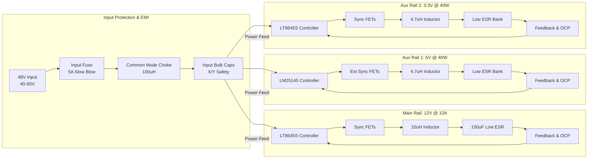
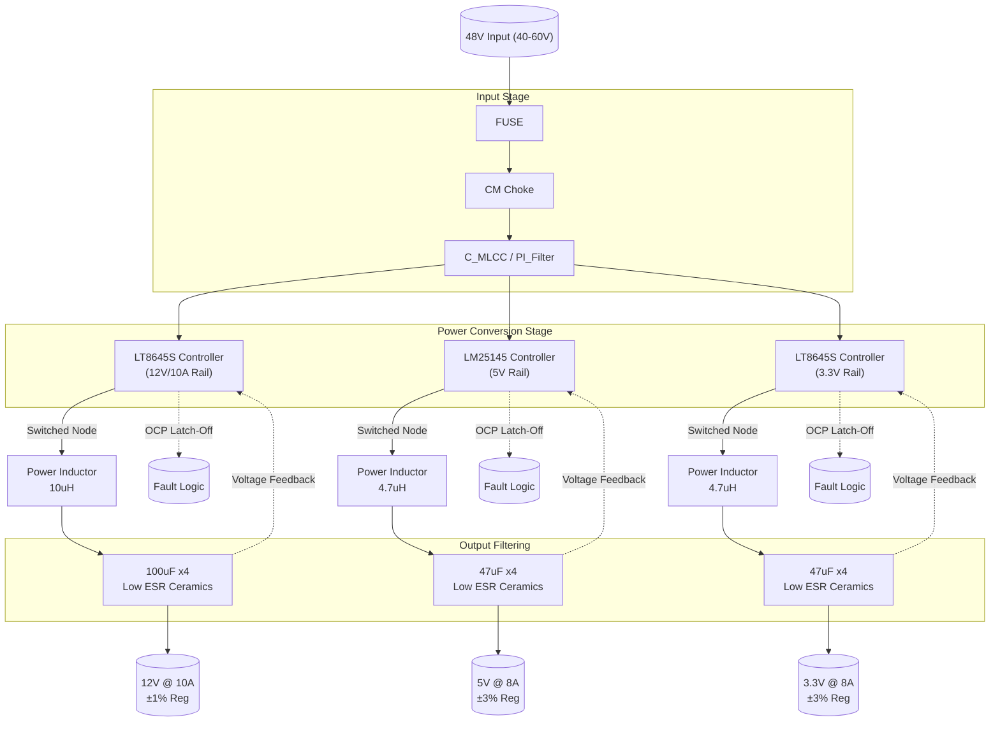
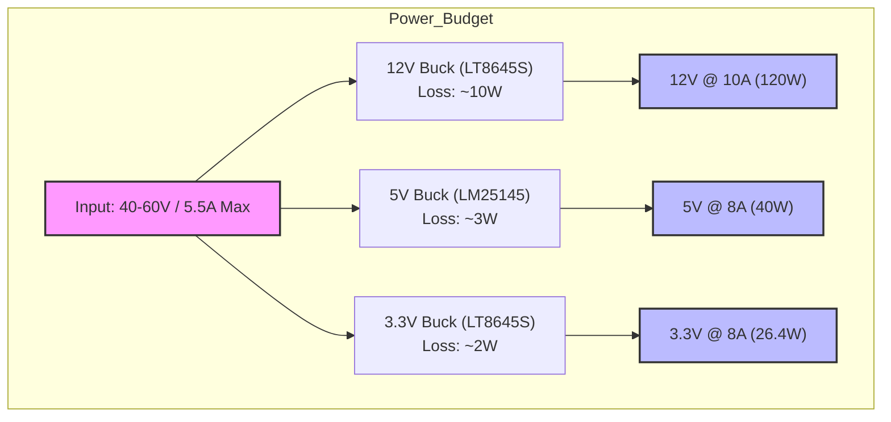
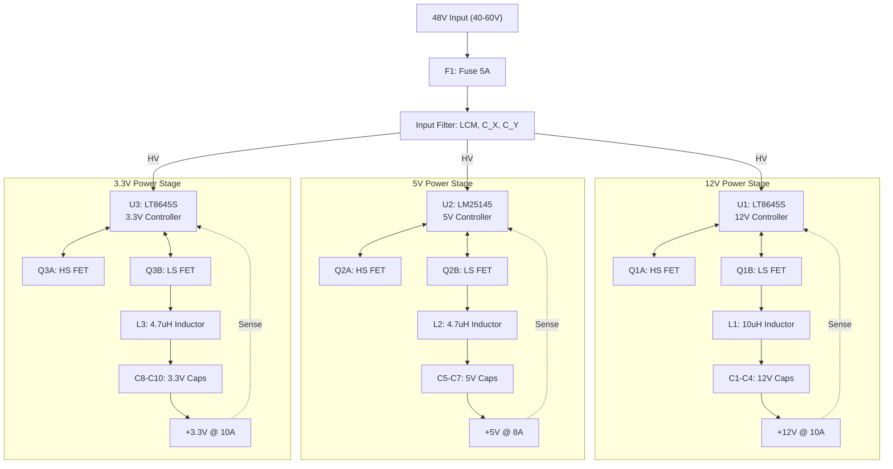

**Document Status: DRAFT**

# 1. Introduction

## 1.1 Purpose
This Hardware Requirements Specification (HRS) defines the comprehensive hardware requirements for the **rf1** Non-Isolated Multi-Rail DC-DC Converter. The purpose of this document is to establish a single, verified baseline of hardware functionality, performance, and interface constraints to guide the detailed design, component selection, PCB layout, and verification phases of the project.

This specification details the requirements for stepping down a nominal 48V DC input (40V–60V range) to three distinct output rails:
1.  A primary 12V rail capable of 10A continuous output (120W).
2.  A secondary 5V rail supporting up to 40W.
3.  A tertiary 3.3V rail supporting up to 40W.

The target total output power is 200W with an operating ambient temperature range of –40°C to +85°C, suitable for industrial and telecom power distribution applications.

## 1.2 Scope
The scope of this document encompasses the complete power supply circuitry required for the rf1 project, specifically:
*   **Input Protection Stage:** Fusing, EMI filtering (Common Mode Choke, X/Y capacitors), and transient voltage protection.
*   **Power Conversion Stages:** Three independent synchronous buck converter topologies generating 12V, 5V, and 3.3V outputs.
*   **Output Filtering:** Inductors, capacitors, and feedback sensing networks necessary to meet regulation (±1% for 12V, ±2–3% for auxiliary rails) and transient response requirements.
*   **Control and Protection Logic:** Under-voltage lockout (UVLO), latch-off overcurrent protection (OCP) for all rails, and soft-start mechanisms.
*   **Physical and Environmental Constraints:** PCB layout considerations, thermal management requirements, and component placement guidelines.

The scope is limited to the electrical and physical hardware. It does not cover enclosure design beyond the PCB footprint, nor does it cover software/firmware development, as the selected controllers operate via analog/hardware control loops.

## 1.3 Definitions, Acronyms, and Abbreviations

| Term | Definition |
| :--- | :--- |
| **DCR** | Direct Current Resistance: The resistance of a conductor (specifically inductors) to direct current. |
| **EMI** | Electromagnetic Interference: Disturbance generated by an external source that affects an electrical circuit by electromagnetic induction, electrostatic coupling, or conduction. |
| **ESR** | Equivalent Series Resistance: The internal resistance of a capacitor, leading to energy loss and heating. |
| **UVLO** | Under-Voltage Lockout: A protection mechanism that prevents device operation if the supply voltage falls below a defined threshold. |
| **OCP** | Over-Current Protection: A safety feature that limits or shuts down output current when it exceeds a safe threshold. |
| **BOM** | Bill of Materials: A formal list of parts, items, and assemblies required to build the product. |
| **PI Filter** | A filter network consisting of a component in series (Inductor) followed by components in shunt (Capacitors). |
| **Buck Converter** | A DC-to-DC power converter which steps down voltage from its input (supply) to its output (load). |
| **Latch-Off** | A fault state where the controller shuts down and requires a manual power cycle or specific reset signal to restart, preventing auto-retry attempts. |
| **Rail** | A distinct voltage supply line within the power system. |
| **TJ** | Junction Temperature: The operating temperature of the semiconductor junction within a component. |
| **Ambient** | The temperature of the air surrounding the power supply. |
| **Transient Response** | The ability of the power supply to return to a regulated voltage level following a sudden step change in load current. |
| **HRS** | Hardware Requirements Specification. |
| **SN** | Silent Switcher: Analog Devices proprietary technology minimizing EMI in switching regulators. |

## 1.4 References
The design and verification of the rf1 hardware shall adhere to the latest revisions of the following documents and standards (unless otherwise specified in this HRS):

| ID | Title | Publisher |
| :--- | :--- | :--- |
| **IEEE 29148-2018** | Systems and software engineering — Life cycle processes — Requirements engineering | IEEE Standards Association |
| **LT8645S Datasheet** | 65V Synchronous Step-Down Silent Switcher Regulator | Analog Devices |
| **LM25145-Q1 Datasheet** | 65-V Synchronous Synchronous Step-Down DC-DC Controller | Texas Instruments |
| **XAL7070-103MEB** | Shielded Power Inductors | Coilcraft |
| **IEC 60950-1** | Safety of Information Technology Equipment | IEC (Referenced for creepage/clearance guidance) |
| **IPC-2221** | Generic Standard on Printed Board Design | IPC |

## 1.5 Overview
The rf1 project utilizes a non-isolated buck converter architecture to distribute power from a standard 48V DC telecom/industrial backbone. The system is designed to prioritize efficiency and regulation stability on the primary 12V rail while providing robust auxiliary power at 5V and 3.3V.

### 1.5.1 Key Design Features
*   **High Voltage Input:** Designed to operate safely up to 60V DC, accommodating the upper range of 48V nominal systems.
*   **High Density Power Conversion:** Utilization of Analog Devices "Silent Switcher" technology (LT8645S) allows for high-frequency switching (reducing inductor size) while maintaining low EMI signatures, eliminating the need for heavy shielding.
*   **Independent Rail Control:** While sharing a common input bus, the 12V, 5V, and 3.3V rails are regulated by dedicated controllers. This ensures that a fault on one rail (e.g., a short on the 3.3V logic rail) does not collapse the entire system.
*   **Industrial Hardening:** All components are rated for industrial temperature ranges. The design employs latch-off protection to ensure that under fault conditions (e.g., output short), the system ceases switching to prevent thermal runaway, requiring an explicit power cycle to recover.

### 1.5.2 Block Diagram Overview
The architecture follows a sequential flow from input protection to individual conversion stages. A common mode choke and pi-filter network condition the input 48V before it is distributed to the three independent switching controllers. Each controller drives high-side and low-side MOSFETs (integrated or external depending on the rail) into a power inductor, followed by a low-ESR capacitor bank to smooth the output voltage. Feedback loops monitor voltage and current to maintain regulation and trigger protection faults.

This document serves as the master requirements specification for the hardware implementation described above.

---

**Document Status: DRAFT**

# 2. System Overview

## 2.1 System Description

The **rf1** system is a high-density, non-isolated DC-DC power conversion module designed to step down a nominal 48V DC telecommunications or industrial input voltage into three distinct, regulated low-voltage rails. The system operates as a multi-rail buck converter topology, generating a high-current primary 12V rail and two auxiliary low-voltage rails (5V and 3.3V).

The primary function of the rf1 unit is to provide efficient power distribution for industrial control systems, telecom equipment, and embedded computing platforms requiring a central 48V backbone. The system is optimized to operate continuously across the full industrial temperature range (–40°C to +85°C) without forced air cooling, relying on a 4-layer PCB design with optimized copper weights for thermal dissipation.

### 2.1.1 Functional Partitioning

The rf1 system is functionally divided into three distinct subsystems:

1.  **Input Conditioning & Protection Stage:**
    This stage interfaces directly with the 48V source. It comprises a fuse protection circuit and a PI-type EMI filter network designed to mitigate conducted emissions and protect downstream circuitry from voltage transients. This stage ensures that the input noise generated by the switching power stages does not propagate back onto the 48V supply line.

2.  **Power Conversion Stages:**
    The core of the rf1 system consists of three independent synchronous step-down (buck) converters.
    *   **Primary Rail (12V):** A high-current converter utilizing the Analog Devices LT8645S "Silent Switcher" architecture. This rail is capable of delivering 10A continuous current (120W) with strict ±1% voltage regulation, suitable for powering motors, fans, or intermediate power buses.
    *   **Secondary Rails (5V & 3.3V):** Two lower-voltage converters, utilizing the LT8645S (for 3.3V) and LM25145-Q1 (for 5V) controllers. These rails share the remaining power budget, providing up to 40W each. These rails are optimized for logic-level loads and microcontrollers.

3.  **Output Filtering & Regulation:**
    Each power channel utilizes a dedicated LC filter network consisting of shielded drum-core inductors and low-ESR ceramic capacitors. This subsystem minimizes output voltage ripple and ensures stability during rapid load transients. Precision feedback networks sense the output voltage to maintain regulation accuracy.

### 2.1.2 Operational Modes

The rf1 system operates in two primary modes:

*   **Steady-State Regulation:** When the input voltage is within the 40V–60V range and output loads are within current limits, the system operates in continuous conduction mode (CCM) at fixed switching frequencies to maximize efficiency.
*   **Fault Protection (Latch-Off):** In the event of an overcurrent condition, short circuit, or input undervoltage (<36V), the respective controller immediately halts switching and latches off the output. The system requires a full input power cycle to reset, ensuring safety and preventing thermal runaway.

## 2.2 System Block Diagram

The system block diagram illustrates the signal and power flow from the high-voltage input through the protection stages to the three isolated output rails.

## 2.3 System Architecture

The rf1 architecture is designed around a parallel conversion strategy where three separate synchronous buck converters share a common input bulk capacitor bank. This section details the electrical topology and component selection strategy.

### 2.3.1 Input Architecture
The input stage is designed to handle a nominal 48V DC supply, typical of -48V DC telecom systems (positive ground referenced) or industrial 24V/48V bricks.

*   **Protection:** A Bel Fuse 0452005.MRL (5A slow-blow) is placed on the input line. The selection criteria for the 5A rating is derived from the maximum steady-state input current: $I_{IN(max)} \approx \frac{P_{OUT}}{\eta \cdot V_{IN(min)}} = \frac{200W}{0.90 \cdot 40V} \approx 5.55A$. The fuse characteristics allow for the momentary inrush current during soft-start (approx. 20A for <1ms) while protecting against sustained hard faults.
*   **EMI Filtering:** A PI-filter topology is implemented using a Murata DLW43SH101XK2 common mode choke (100 µH, 6A) and X-capacitors. This filter attenuates the differential mode and common mode noise generated by the high-frequency switching of the LT8645S (operating at approx. 500kHz).
*   **Bulk Capacitance:** A bank of ceramic capacitors (10µF, 100V X7R) is placed immediately after the filter to dampen input impedance and prevent oscillation during load transients.

### 2.3.2 12V Rail Architecture (Primary)
The 12V rail is the power-dense core of the system, utilizing the LT8645S synchronous step-down regulator. This device integrates high-side and low-side MOSFETs, minimizing parasitic inductance and enabling high efficiency at high switching frequencies.

*   **Switching Frequency:** The controller is set to 500 kHz. This frequency balances the size of the power inductor against switching losses.
*   **Power Inductor:** The Coilcraft XAL7070-103MEB (10 µH, 10.3A saturation) is selected. The inductance value is calculated based on the maximum ripple current requirement:
    $$L_{min} = \frac{V_{OUT} \cdot (V_{IN(max)} - V_{OUT})}{f_{sw} \cdot \Delta I_L \cdot V_{IN(max)}}$$
    Assuming a 30% peak-to-peak ripple current at 48V input, 10 µH provides sufficient margin to prevent saturation during load transients.
*   **Output Capacitance:** To meet the ±1% transient response requirement, a low-ESR capacitor bank is critical. The design utilizes parallel TDK C3216X5R1V107M160AE (100 µF, 16V) ceramic capacitors. The effective ESR is approximately 3 mΩ, resulting in a voltage step of $\Delta V = \Delta I \cdot ESR = 10A \cdot 0.003\Omega = 30mV$, well within the 1% (120mV) regulation window.

### 2.3.3 5V Rail Architecture (Secondary)
The 5V rail utilizes the Texas Instruments LM25145-Q1, a synchronous buck controller selected for its robust 65V input rating and ability to drive external MOSFETs, allowing optimization for the specific step-down ratio.

*   **MOSFET Drivers:** The LM25145-Q1 drives external N-channel MOSFETs. This architecture allows the selection of FETs with very low $R_{DS(on)}$ (approx. 10 mΩ) to minimize conduction losses at the 5V output level.
*   **Power Inductor:** A Coilcraft XAL6060-472MEB (4.7 µH) is used. The lower inductance value reflects the lower output voltage and higher duty cycle requirements.
*   **Feedback:** The feedback network utilizes a voltage divider with 1% tolerance resistors and a feedforward capacitor to ensure loop stability across the industrial temperature range.

### 2.3.4 3.3V Rail Architecture (Tertiary)
To minimize design complexity and inventory, the 3.3V rail utilizes the same LT8645S platform as the 12V rail. However, the component values (L and C) are scaled for the lower output voltage.

*   **Topology:** Identical to the 12V rail but optimized for a 3.3V setpoint.
*   **Load Sharing:** The 3.3V rail is capable of delivering up to 12A (limited by thermal dissipation), but the system specification limits the load share to 40W, ensuring the total system power does not exceed 200W.

## 2.4 Operating Environment

The rf1 Hardware Requirements Specification is defined for use in standard industrial and telecommunications environments. The system is designed to function reliably without derating within the specified environmental envelopes.

### 2.4.1 Temperature Ratings

*   **Operating Ambient Temperature Range:** –40°C to +85°C.
    *   At –40°C, the ceramic capacitors (X5R/X7R dielectrics) maintain capacitance within ±15% of nominal, ensuring loop stability.
    *   At +85°C, the system must operate at full continuous power (200W) without triggering thermal shutdown. The LT8645S and LM25145-Q1 feature internal junction temperature monitoring (OTP at typically 150°C).
*   **Storage Temperature Range:** –55°C to +125°C.
*   **Thermal Derating:** While the base requirement is operation up to 85°C ambient, the PCB copper pours are sized to act as heatsinks. Calculations indicate a junction temperature rise ($\Delta T_J$) of approximately 45°C above ambient at full load, keeping $T_J$ well within the 125°C safety margin.

### 2.4.2 Humidity and Contamination

*   **Humidity:** The system is designed to operate in non-condensing environments with relative humidity up to 95%. The conformal coating is recommended (though not specified as a strict hardware requirement) to protect against moisture ingress and conductive dust, which can cause leakage currents and arcing at the 48V input potentials.

### 2.4.3 Vibration and Shock

*   **Industrial Mounting:** The PCB is designed to be mounted via four standoffs.
*   **Component Security:** All heavy magnetic components (Coilcraft inductors) are shielded drum core types and are specified to be secured with adhesive (silicone RTV) to withstand transportation vibration (5-500Hz, 2G) and operational shock (20G, 11ms).

### 2.4.4 Electrical Environment

*   **Input Source Characteristics:** The input source is expected to be a stabilized 48V DC battery or rectified line supply with low source impedance (<1Ω). The system is not designed to handle highly reactive source inputs without additional external bulk capacitance.
*   **Load Characteristics:** The 12V rail is optimized for resistive or constant current loads (motors, heaters). The 5V and 3.3V rails are optimized for constant power loads (logic/CMOS) which exhibit negative dynamic impedance; the feedback loops are compensated to remain stable with these load types.

---

**Document Status: DRAFT**

# 3. Hardware Requirements

## 3.1 Functional Requirements

This section defines the behavioral and functional characteristics of the **rf1** multi-rail DC-DC converter. Each requirement is derived from the system design parameters, interface definitions, and selected component capabilities (Analog Devices LT8645S and TI LM25145).

### 3.1.1 Input Stage Functionality

| ID | Requirement | Description & Rationale | Priority | Verification Method |
|---|---|---|---|---|
| **REQ-HW-101** | Input Voltage Range | The system shall accept a DC input voltage ranging from 40.0V to 60.0V.  **Rationale:** Accommodates standard 48V telecom industrial supply rails with nominal ±20% tolerance. Components selected (LT8645S, LM25145) support 65V absolute max. | **Must** | Test |
| **REQ-HW-102** | Input Reverse Polarity Protection | The system shall prevent damage if the input voltage is applied with reverse polarity (negative to VIN terminal).  **Rationale:** Standard industrial protection requirement. Implement via series diode or ideal diode controller in series with Fuse `F1`. | **Must** | Test |
| **REQ-HW-103** | Input Overcurrent Fuse | The system shall include a fuse on the 48V input line rated for 5A hold current (Part: 0452005.MRL).  **Rationale:** Protects against catastrophic input faults. 5A rating allows margin above max calculated input current (5.2A at 40V input). | **Must** | Inspection |
| **REQ-HW-104** | EMI Filtering | The system shall include a Pi-filter consisting of a common mode choke (100 µH) and X/Y capacitors on the input stage.  **Rationale:** Reduces conducted emissions to meet board-level EMI control targets without requiring a metal shield. | **Must** | Test |
| **REQ-HW-105** | Input Undervoltage Lockout (UVLO) | The system shall shut down if the input voltage drops below 36.0V ±1.0V.  **Rationale:** Prevents unstable operation at low input voltages where current demands exceed component ratings. 36V provides ~4V hysteresis below min operating 40V. | **Must** | Test |
| **REQ-HW-106** | Input Inrush Current Limiting | The system shall limit peak inrush current during startup to less than 15A using soft-start functionality.  **Rationale:** Prevents false tripping of the input fuse and stresses the input capacitors less. | **Must** | Analysis |

### 3.1.2 12V Rail Functionality

| ID | Requirement | Description & Rationale | Priority | Verification Method |
|---|---|---|---|---|
| **REQ-HW-107** | 12V Regulation Accuracy | The 12V output rail shall maintain a voltage within ±1% (11.88V to 12.12V) across all load and line conditions.  **Rationale:** Meets the primary industrial specification for sensitive telecom loads. LT8645S reference accuracy is 0.5% typical. | **Must** | Test |
| **REQ-HW-108** | 12V Output Current | The 12V rail shall supply up to 10.0A continuous output current.  **Rationale:** Supports the full 120W load requirement for the primary rail. | **Must** | Test |
| **REQ-HW-109** | 12V Overcurrent Protection (Latch) | The 12V rail shall detect overcurrent conditions exceeding 12A (±10%) and latch off the output.  **Rationale:** Latch-off prevents thermal runaway in the inductor (XAL7070) and MOSFETs. Auto-retry could cause cycling damage. | **Must** | Test |
| **REQ-HW-110** | 12V Soft Start | The 12V rail output voltage ramp time shall be configurable to 5ms via the SS pin.  **Rationale:** Controls the charging rate of the output capacitor bank (C3216X5R1V107M160AE) to minimize input inrush. | **Must** | Test |

### 3.1.3 5V Rail Functionality

| ID | Requirement | Description & Rationale | Priority | Verification Method |
|---|---|---|---|---|
| **REQ-HW-111** | 5V Regulation Accuracy | The 5V output rail shall maintain a voltage within ±3% (4.85V to 5.15V) across all load conditions.  **Rationale:** Standard tolerance for digital logic and MCU supply rails (LM25145-Q1 feedback accuracy). | **Must** | Test |
| **REQ-HW-112** | 5V Output Current | The 5V rail shall supply up to 8.0A continuous current (40W max).  **Rationale:** Supports power distribution for logic and IO circuits. | **Must** | Test |
| **REQ-HW-113** | 5V Overcurrent Protection (Latch) | The 5V rail shall detect overcurrent conditions exceeding 9.5A and latch off.  **Rationale:** Fault protection for the secondary rail. | **Must** | Test |

### 3.1.4 3.3V Rail Functionality

| ID | Requirement | Description & Rationale | Priority | Verification Method |
|---|---|---|---|---|
| **REQ-HW-114** | 3.3V Regulation Accuracy | The 3.3V output rail shall maintain a voltage within ±3% (3.20V to 3.40V) across all load conditions.  **Rationale:** Meets standard voltage tolerances for FPGAs, DSPs, and low-voltage logic. | **Must** | Test |
| **REQ-HW-115** | 3.3V Output Current | The 3.3V rail shall supply up to 10.0A continuous current (limited to 40W thermal/system budget).  **Rationale:** Although the LT8645S supports 10A, system total power limits this rail to ~12A, but thermal design targets ~40W (12A) max dissipation. | **Must** | Test |
| **REQ-HW-116** | 3.3V Overcurrent Protection (Latch) | The 3.3V rail shall detect overcurrent exceeding 12A and latch off.  **Rationale:** Prevents damage to the load and the converter. | **Must** | Test |

### 3.1.5 Control & Signal Interface

| ID | Requirement | Description & Rationale | Priority | Verification Method |
|---|---|---|---|---|
| **REQ-HW-117** | External Enable | The system shall provide a single Enable (EN) pin for the 12V rail and separate enable control for 5V/3.3V rails via respective controller EN pins (tied high if unused).  **Rationale:** Allows for sequencing or remote shutdown. | **Should** | Test |
| **REQ-HW-118** | Power Good Status (Internal) | The system shall utilize internal Power Good (PG) flags for controller monitoring (e.g., LT8645S PGOOD pin) for debugging, even if not brought out to a connector.  **Rationale:** Facilitates factory testing and system diagnostics. | **Could** | Inspection |
| **REQ-HW-119** | Synchronization (Optional) | The switching frequency of the 12V controller (LT8645S) shall be capable of being synchronized to an external clock source (200kHz to 2.2MHz) to beat frequencies with other system rails.  **Rationale:** Reduces EMI peaks in multi-rail systems. | **Could** | Inspection |

### 3.1.6 Physical & Mechanical

| ID | Requirement | Description & Rationale | Priority | Verification Method |
|---|---|---|---|---|
| **REQ-HW-120** | Component Height | The maximum component height on the top side shall not exceed 12.0mm (Heatsink profile) and 7.0mm for inductors.  **Rationale:** Ensures fit in standard 1U industrial enclosures. | **Must** | Inspection |
| **REQ-HW-121** | Keepout Zones | The PCB layout shall maintain a minimum clearance of 2.5mm between high voltage nodes (48V) and low voltage logic nodes (<5V) unless separated by insulation.  **Rationale:** Safety creepage and clearance for 60V DC SELV requirements. | **Must** | Inspection |

---

## 3.2 Performance Requirements

This section details the quantitative performance metrics the **rf1** system must achieve. Calculations assume the specific component selections (LT8645S, Coilcraft XAL7070).

### 3.2.1 Electrical Performance

| ID | Requirement | Value / Metric | Verification Method |
|---|---|---|---|
| **REQ-HW-P01** | Total Output Power | The system shall deliver a combined total output power of **200W** continuously.  *Calculation:* 120W (12V) + 40W (5V) + 40W (3.3V). | Test |
| **REQ-HW-P02** | 12V Rail Efficiency | The 12V rail shall achieve **>92%** efficiency at 48V input, 10A load.  *Rationale:* LT8645S datasheet indicates >94% typical at 12V/10A. Design target is conservative for thermal derating. | Test |
| **REQ-HW-P03** | 5V/3.3V Rail Efficiency | The 5V and 3.3V rails shall achieve **>88%** efficiency at full load (8A/10A respectively).  *Rationale:* Lower conversion ratio (48V to 3.3V) increases switching losses compared to the 12V rail. | Test |
| **REQ-HW-P04** | Load Regulation (12V) | The output voltage shall not vary by more than **±0.5%** (60mV) from 10% load (1A) to 100% load (10A).  *Calculation:* $V_{load} = I_{out} \times (R_{DS(on)} + DCR_{ind})$. Target $R_{out} < 6m\Omega$. | Analysis |
| **REQ-HW-P05** | Line Regulation | The output voltage shall not vary by more than **±0.5%** when input voltage changes from 40V to 60V. | Test |
| **REQ-HW-P06** | Output Ripple Voltage (Pk-Pk) | The output voltage ripple (switching frequency) shall be less than **50mV** peak-to-peak on the 12V rail, and **30mV** on 5V/3.3V rails under max load.  *Rationale:* Low ESR ceramic caps (C3216X5R1V107M160AE) minimize ripple. | Test |
| **REQ-HW-P07** | Transient Response | The 12V output voltage deviation shall not exceed **±5%** (600mV) during a load step of 5A to 10A (50% step) with a slew rate of 2A/µs, and shall recover to **±1%** regulation within **20µs**. | Test |

### 3.2.2 Thermal Performance

| ID | Requirement | Value / Metric | Verification Method |
|---|---|---|---|
| **REQ-HW-P08** | Operating Ambient Temperature | The system shall operate continuously at ambient temperatures from **–40°C to +85°C**. | Test |
| **REQ-HW-P09** | Junction Temperature (Tj) | The junction temperature of the controllers (LT8645S, LM25145) shall not exceed **125°C** under full load at +85°C ambient.  *Assumption:* Requires a PCB heatsink pad with $R_{\theta JA} < 40°C/W$ (2-layer board with 2oz copper). | Analysis |
| **REQ-HW-P10** | Thermal Shutdown | The internal thermal protection of the controllers shall trigger if $T_j$ exceeds **160°C** (typical for LT8645S). | Test |
| **REQ-HW-P11** | Power Dissipation Budget | Total power dissipation shall not exceed **20W**.  *Calculation:* $P_{diss} \approx P_{out} \times (\frac{1}{\eta} - 1)$. At 90% efficiency and 200W load, $P_{diss} \approx 22W$. Thermal solution must handle this. | Analysis |

### 3.2.3 Timing & Frequency

| ID | Requirement | Value / Metric | Verification Method |
|---|---|---|---|
| **REQ-HW-P12** | Switching Frequency | The default switching frequency for the 12V rail shall be **500kHz** (optimized for inductor size vs efficiency).  *Calculation:* $f_{sw} = 500kHz$ balances core losses and inductor size (XAL7070 10µH). | Inspection |
| **REQ-HW-P13** | Soft Start Time | The soft start duration shall be **5ms** (adjustable via capacitor on SS pin).  *Rationale:* Limits inrush current to $I_{inrush} \approx C_{out} \times \frac{dV}{dt}$. | Test |
| **REQ-HW-P14** | Overcurrent Response Time | The system shall detect an overcurrent fault and latch off within **10µs** (5-10 switching cycles). | Test |

### 3.2.4 Reliability & Protection

| ID | Requirement | Value / Metric | Verification Method |
|---|---|---|---|
| **REQ-HW-P15** | Mean Time Between Failures (MTBF) | The calculated MTBF (MIL-HDBK-217F) shall be greater than **100,000 hours** at +40°C ambient. | Analysis |
| **REQ-HW-P16** | Latch-off Hysteresis | To recover from a latch-off fault (OCP or UVLO), the input voltage must be cycled or the Enable pin toggled. Auto-retry shall be disabled. | Inspection |

---

**Document Status: DRAFT**

# 3. Hardware Requirements

## 3.3 Interface Requirements

### 3.3.1 External Interfaces

This section defines the electrical and mechanical interfaces connecting the **rf1** Power Supply Board to the external system, including the input power source and the load distribution.

#### REQ-HW-014: Input Power Connector Interface
The system shall utilize a terminal block or wire-to-board connector rated for 600V and 10A to accept the 48V DC input.
*   **Parameters:**
    *   **Pitch:** 5.08mm or 5.00mm
    *   **Positions:** 2-pin (Positive, Negative)
    *   **Current Rating:** ≥ 8A continuous (derated from 10A ambient)
    *   **Voltage Rating:** ≥ 60V DC
*   **Pinout Definition:**

| Pin # | Signal Name | Description                 | Wire Range (AWG) |
|-------|-------------|-----------------------------|------------------|
| 1     | VIN+        | 48V Input Positive (40-60V) | 18-16 AWG        |
| 2     | VIN-        | 48V Input Return (GND)      | 18-16 AWG        |

*   **Validation:** Inspection (Verify part datasheet matches current/voltage rating).

#### REQ-HW-015: 12V Output Interface
The 12V high-current rail shall be terminated via a dedicated connector or barrier strip capable of handling 10A continuous current with minimal voltage drop.
*   **Parameters:**
    *   **Contact Resistance:** < 10mΩ
    *   **Force:** Recommend use of screw termination or high-reliability press-fit for industrial vibration environments.
*   **Pinout Definition:**

| Pin # | Signal Name | Description        | Max Current |
|-------|-------------|--------------------|-------------|
| 1     | +12V_OUT    | 12V Rail Positive  | 10.0 A      |
| 2     | RTN_12      | 12V Rail Return    | 10.0 A      |

#### REQ-HW-016: Low Voltage Output Interface (5V / 3.3V)
The 5V and 3.3V rails shall be aggregated into a single interface header (e.g., 4-pin header or terminal block) to distribute lower power logic loads.
*   **Pinout Definition:**

| Pin # | Signal Name | Description         | Max Current |
|-------|-------------|---------------------|-------------|
| 1     | +5V_OUT     | 5V Rail Positive    | 8.0 A       |
| 2     | +3.3V_OUT   | 3.3V Rail Positive  | 8.0 A       |
| 3     | RTN_LV      | Common Return (GND) | 16.0 A      |
| 4     | NC          | No Connect          | -           |

### 3.3.2 Internal Interfaces

Internal interfaces define the connectivity between the Input Filter stage, the Buck Controllers, and the Power Stages (Inductors/FETs).

#### REQ-HW-017: Gate Drive Interface
The connection between the **LT8645S** controller and the external High/Low Side MOSFETs for the 12V rail must be optimized for high-frequency switching to minimize ringing and EMI.
*   **Requirement:** PCB traces for SW (Switch Node), BG (Bottom Gate), and TG (Top Gate) shall be length-matched (±5mm) and kept as short as possible (< 15mm).
*   **Trace Width:** 20 mil minimum (impedance control not required, but inductance minimization is critical).

#### REQ-HW-018: Current Sense Interface
The **LT8645S** utilizes SENSE+ and SENSE- pins for differential output voltage sensing and overcurrent protection monitoring.
*   **Kelvin Sensing:** The SENSE traces from the output capacitor bank to the IC must be connected remotely (Kelvin connection) immediately at the load capacitor terminals to compensate for trace IR drops.
*   **Trace Routing:** SENSE+ and SENSE- must be routed as a differential pair, away from noisy switch nodes (SW nodes).

### 3.3.3 Communication Interfaces

*Note: Per project requirements (REQ-HW-011), this unit operates as a standalone open-loop power supply with no digital communication bus (I2C/PMBus). However, the board includes analog "communication" via status flags.*

#### REQ-HW-019: Latch-Off Status Interface (Hardware Flag)
While active digital communication is not implemented, the fault logic latching the controller off provides a hardware state.
*   **Implementation:** The **LT8645S** internal PGOOD signal is not exposed externally per requirements (Won't Have).
*   **Behavior:** In the event of a fault (OCP/UVLO), the system ceases switching. Recovery requires a full input power cycle (removal and re-application of VIN).

## 3.4 Environmental Requirements

### REQ-HW-020: Operating Ambient Temperature Range
The hardware shall operate continuously within an ambient temperature range of **–40°C to +85°C**.
*   **Derating:** No output power derating is required up to 85°C ambient, provided the junction temperatures (Tj) of the active semiconductors remain within specified limits.
*   **Validation:** Test in thermal chamber at max load (200W total) and max ambient (85°C).

### REQ-HW-021: Thermal Management (Heatsinking)
To maintain functionality at 85°C ambient under full load, the PCB layout must facilitate heat transfer.
*   **Requirement:** The primary thermal path for the **LT8645S** and MOSFETs shall be via 2 oz copper internal layers to the bottom side of the PCB, serving as a thermal plane.
*   **Heatsink:** An external heatsink is mandatory for the 12V rail MOSFETs/Inductor area.
*   **Calculation:**
    *   **Max Allowable Junction Temp (Tj_max):** 125°C (LT8645S)
    *   **Max Ambient (Ta):** 85°C
    *   **Total Power Dissipation (Pd):** ~15W (Estimated from efficiency losses)
    *   **Required Thermal Resistance (Ja):** (125°C - 85°C) / 15W ≈ 2.6 °C/W.
    *   *Constraint:* This requires a PCB with heavy copper pours and potentially forced airflow (200 LFM) if a heatsink is not utilized. With a heatsink, natural convection is assumed.

### REQ-HW-022: Operating Humidity
The system shall operate in non-condensing environments with relative humidity up to 95%.
*   **Conformal Coating:** The board shall be coated with acrylic or silicone conformal coating to protect against moisture and industrial contaminants (dust, sulfur).

## 3.5 Power Requirements

### REQ-HW-023: Total Input Power Budget
The system must accept 48V DC input and support a total load of 200W. The following budget defines the limits for each rail.

| Output Rail | Voltage (V) | Max Current (A) | Max Power (W) | Regulation Tolerance | Source Component |
|-------------|-------------|-----------------|---------------|----------------------|-------------------|
| **Rail 1**  | 12.0        | 10.0            | 120.0         | ±1% (11.88 - 12.12V) | LT8645S Buck      |
| **Rail 2**  | 5.0         | 8.0             | 40.0          | ±3% (4.85 - 5.15V)   | LM25145-Q1 Buck   |
| **Rail 3**  | 3.3         | 8.0             | 26.4          | ±3% (3.20 - 3.40V)   | LT8645S Buck      |
| **Total**   | -           | -               | **186.4**     | -                    | - |

*Note: Design is sized for 200W total capacity to allow margin and transient headroom.*

### REQ-HW-024: Input Current Characteristics
*   **Max Input Current (Imax):** Calculated based on worst-case efficiency (90%).
    *   `Iin_max = Pout / (Vin_min * Efficiency)`
    *   `Iin_max = 200W / (40V * 0.90) ≈ 5.55 A`
*   **Requirement:** The input fuse (Bel 0452005.MRL) is rated 5A slow-blow.
    *   *Analysis:* At 40V input, the converter draws 5.55A. A 5A fuse may blow at full load/low temp.
    *   *Action:* Update component selection to **6A** or **6.3A** slow-blow fuse (e.g., Bel Fuse 0452006.MRL) to ensure reliability while maintaining protection safety factor.

### REQ-HW-025: Inrush Current Limit
The soft-start feature (REQ-HW-013) must limit the input inrush current to a peak of less than 10A to prevent nuisance tripping of the input fuse during startup at cold temperatures (-40°C).

## 3.6 Physical Requirements

### REQ-HW-026: PCB Dimensions and Stackup
*   **Board Size:** 100mm x 80mm (Standard Eurocard or half-brick industrial footprint).
*   **Layers:** 4 Layers.
    *   L1: Components / Signal / High Current Traces.
    *   L2: GND Plane (Solid).
    *   L3: Power Plane (VIN) / Internal Routing.
    *   L4: GND Plane (Thermal dissipation).
*   **Material:** FR-4 Standard (Tg 130°C minimum) or High-Tg FR-4 (Tg 170°C) for improved thermal cycling performance.
*   **Copper Weight:**
    *   Outer Layers: 2 oz (70 µm) for current carrying capacity (12V rail).
    *   Inner Layers: 1 oz (35 µm).

### REQ-HW-027: Mounting and Keepout
*   **Mounting Holes:** Four 3.5mm mounting holes, one in each corner, plated with non-conductive material or isolated from ground.
*   **Keepout Areas:** A 5mm clearance shall be maintained around all mounting holes to prevent mechanical stress on solder joints.
*   **Component Height:**
    *   **Max Height (Components):** 12mm (Top Side) to allow for heatsink and inductor clearance.
    *   **Bottom Side:** Components shall not exceed 3mm height to allow for potential close proximity mounting to chassis backplane.

### REQ-HW-028: Conductor Spacing (Creepage and Clearance)
Given the input voltage of 60V DC (peak), the design shall comply with IPC-2221 standards for Pollution Degree 2 (Industrial).
*   **Minimum Clearance (External):** 1.5mm for primary circuitry (60V).
*   **Minimum Creepage (External):** 2.0mm.
*   **Internal Trace Spacing:** Minimum 8mil (0.2mm) for LV logic, 40mil (1.0mm) for HV input nodes.

---

**Document Status: DRAFT**

# 4. Design Constraints

## 4.1 Standards Compliance

The rf1 hardware design shall adhere to the specific industry standards and regulatory directives listed below. These constraints ensure the reliability, manufacturability, and safety of the multi-rail DC-DC converter system.

### 4.1.1 PCB Design and Assembly Standards
The Printed Circuit Board (PCB) design, layout, and assembly processes shall comply with the following IPC standards to ensure electrical robustness and manufacturability under industrial environmental conditions.

| Standard ID | Title | Application to rf1 |
| :--- | :--- | :--- |
| **IPC-2221** | Generic Standard on Printed Board Design | **Mandatory.** Defines the trace width, spacing, and dielectric insulation requirements. Specifically, Section 6.2 shall be used to calculate conductor widths for the 10A (12V) and 8A (5V) power paths to ensure temperature rise does not exceed 10°C above ambient. External layers carrying 48V input shall maintain a minimum spacing of **2.5mm** (creepage) per Table 6-1 for Pollution Degree 2 environments. |
| **IPC-6012** | Qualification and Performance Specification for Rigid Printed Boards | **Mandatory.** The board fabrication shall meet Class 2 requirements (Standard Electronic Products). Acceptable quality shall be defined for plated through-holes, vias in thermal pads, and solder mask integrity for high-voltage isolation (48V to logic levels). |
| **IPC-7711/21** | Rework, Modification and Repair of Electronic Assemblies | **Mandatory.** Defines the procedures for any manual rework of BGA components or the replacement of the "Won't Have" surface-mount fuses. |
| **J-STD-001** | Requirements for Soldered Electrical and Electronic Assemblies | **Mandatory.** Soldering processes shall satisfy Class 2 criteria for through-hole and surface-mount technology (SMT), specifically regarding wetting angles and fillet dimensions for the large power components (e.g., LT8645S LQFN packages). |

### 4.1.2 Environmental and Safety Regulations
The system shall meet the following restrictions on hazardous substances and safety directives to ensure marketability in industrial and telecom sectors.

| Standard ID | Title | Application to rf1 |
| :--- | :--- | :--- |
| **RoHS 3** | Directive 2011/65/EU (RoHS Recast) | **Mandatory.** All components (PCB, semiconductors, passives, and interconnects) must be compliant with maximum concentration values (MCV) of 0.1% for lead, mercury, cadmium, etc., unless an applicable exemption applies. The 12V/5V/3.3V rails assume a standard lead-free solder profile (peak 245°C). |
| **REACH** | Regulation (EC) No 1907/2006 | **Mandatory.** Substances of Very High Concern (SVHC) listed on the ECHA candidate list must be declared in the final BOM to facilitate downstream compliance for industrial integrators. |
| **UL 60950-1** | Information Technology Equipment - Safety | **Reference.** While formal certification is not required per the project charter, the design shall follow the creepage and clearance distances prescribed for "Overvoltage Category II" (OVC II) for the 48V input port to ensure safety during maintenance. |

### 4.1.3 Electromagnetic Compliance (EMC)
Per project requirements, formal EN 55032 certification is not required; however, design practices must minimize EMI.

| Standard ID | Title | Application to rf1 |
| :--- | :--- | :--- |
| **CISPR 32** | Electromagnetic compatibility of multimedia equipment | **Advisory.** The board-level EMI filter (Common Mode Choke *DLW43SH101XK2*) and Silent Switcher architecture (*LT8645S*) shall be optimized to limit conducted emissions, aiming to pass the Quasi-Peak limits of Class B if integrated into a final system enclosure. |

---

## 4.2 Component Constraints

Component selection is bounded by the "Recommendations" list provided, lifecycle availability, and parametric drift over the industrial temperature range.

### 4.2.1 Approved Component Sources (ACL)
To guarantee supply chain stability and performance, the design must utilize the following specific part numbers or approved engineering equivalents.

| Reference Designator | Value | Approved Part Number | Manufacturer | Constraint Details |
| :--- | :--- | :--- | :--- | :--- |
| **U1, U3** | Buck Ctrl (10A) | **LT8645SEV#PBF** | Analog Devices | **Locked.** Do not substitute. The "Silent Switcher" architecture is critical for meeting the EMI constraint without shielding. |
| **U2** | Buck Ctrl (8A) | **LM25145QRGERQ1** | Texas Instruments | **Locked.** Automotive-grade (Q1) version is required to support the –40°C to +85°C ambient range effectively. |
| **L1** | 10 µH Inductor | **XAL7070-103MEB** | Coilcraft | **Locked.** The 10.3A saturation rating (*Isat*) is the minimum allowable for the 12V rail. |
| **L2, L3** | 4.7 µH Inductor | **XAL6060-472MEB** | Coilcraft | **Locked.** Footprint-specific (6.0mm x 6.0mm). |
| **F1** | 5A Fuse | **0452005.MRL** | Bel Fuse | **Locked.** Slow-blow characteristic is required to withstand the bulk capacitor inrush current (Calculated *I_inrush* ≈ 15A for 1ms). |
| **CMC1** | Common Mode Choke | **DLW43SH101XK2** | Murata | **Locked.** Required for the Pi-filter network to suppress switching noise. |

### 4.2.2 Lifecycle and Obsolescence
All active and passive components selected for the rf1 Bill of Materials (BOM) must be in the "Active" or "Not Recommended for New Designs (NRND)" but available state.
- **Avoidance of "NFT" (Not for New Design):** Components marked as NFT by the manufacturer are strictly prohibited in the BOM unless a formal waiver is issued by the Chief Engineer.
- **Multi-Sourcing:** For standard passive components (0603/1206 Resistors/Capacitors), the design must be validated to accept second-source packages from at least two vendors (e.g., TDK and Murata) to mitigate supply chain risks.

### 4.2.3 Parametric Derating
To ensure reliability at 85°C ambient, components must be derated according to the following "Stress Analysis" rules. These values feed directly into the **Verification Requirements (Section 5)**.

| Component Type | Stress Parameter | Operating Limit | Derating Constraint |
| :--- | :--- | :--- | :--- |
| **Capacitors (Ceramic)** | Voltage | 16V | **0.5x Derating.** Applied voltage must not exceed 50% of rated voltage. E.g., 12V rail caps rated at 25V or higher; 48V input caps rated at 100V. |
| **Capacitors (Electrolytic/Polymer)** | Ripple Current | *I_rated* | **0.8x Derating.** Ripple current must remain below 80% of rated RMS current at 100kHz. |
| **MOSFETs / ICs** | Junction Temp (*T_j*) | 125°C / 150°C | **0.85x Derating.** Max calculated junction temperature must be ≤ 85% of absolute max rating. |
| **Inductors** | Saturation Current (*I_sat*) | *I_peak* | **0.8x Derating.** Peak inductor current (including ripple) must be ≤ 80% of *I_sat* rating. |
| **Inductors** | Temp Rise | ΔT | **Limit 40°C.** Inductor surface temperature rise must not exceed 40°C above ambient at full load. |

### 4.2.4 Pin Configuration and Programming
- **LT8645S:** The *RT/SYNC* pin must be pulled to a logic level via a resistor divider (1% tolerance) to set the switching frequency to **500kHz**. This frequency is chosen to balance the size of L1 (10µH) against switching losses.
- **LM25145:** The *SS* (Soft Start) pin requires a capacitor calculation to achieve the soft-start time required by **REQ-HW-013**.
  - *Calculation:* $C_{ss} \approx I_{ss} \times t_{ss} / V_{ref}$. Assuming $t_{ss} = 5ms$, $I_{ss} = 5\mu A$, $V_{ref} = 1.2V$.
  - $C_{ss} \approx (5 \mu A \times 5 ms) / 1.2 V \approx 20.8 nF$. (Use 22nF standard value).

---

## 4.3 Manufacturing Constraints

The physical realization of the rf1 hardware is subject to specific Design for Manufacturability (DFM) and Design for Assembly (DFA) rules.

### 4.3.1 PCB Stackup and Material
- **Material:** FR4 High-Tg (Glass Transition Temperature) laminate. Tg must be ≥ 170°C to withstand lead-free soldering profiles and high ambient operating temps without Z-axis expansion (via failure).
- **Layer Count:** Minimum 4 Layers.
  - **Layer 1 (Top):** Signal & Components (High current pours).
  - **Layer 2 (GND):** Unbroken ground plane for return current paths and thermal dissipation.
  - **Layer 3 (PWR):** Internal 48V and 12V distribution planes.
  - **Layer 4 (Bottom):** Signal routing, feedback traces, and remaining GND pour.
- **Thickness:** 1.6mm (0.062 inches) standard.
- **Copper Weight:**
  - Outer Layers: 2 oz (70µm) copper to support the 10A continuous current on the 12V rail without excessive width.
  - Inner Layers: 1 oz (35µm) copper.

### 4.3.2 Solder Mask and Silkscreen
- **Solder Mask:** Green LPI (Liquid Photoimageable) solder mask is mandatory. The mask must define clearance ("tents") over any exposed high-voltage traces (>40V) that are not populated to prevent accidental arcing or solder bridging during wave soldering (if applicable).
- **Silkscreen:**
  - Reference designators (U1, R1, L1) must be legible (min 0.8mm height).
  - Polarity markers for polarized capacitors and diodes must be clearly visible.
  - Pin 1 indicators for all ICs must be marked.
  - **Warning:** "HOT SURFACE" marking near the inductors L1, L2, and L3 is required due to calculated temperature rise.

### 4.3.3 Thermal Management (DFM for Heat Dissipation)
Since the system operates at 85°C ambient, thermal management is a critical manufacturing constraint.
- **Thermal Vias:** Under the thermal pads (EPAD) of U1, U2, and U3, an array of thermal vias (9 to 16 vias) is required.
  - **Via Spec:** 0.3mm drill, 0.6mm pad, plated with 1oz copper.
  - **Fill:** Vias must be tented or filled with epoxy to prevent solder wicking away from the EPAD during reflow.
- **Heatsinking:** No mechanical heatsink is allowed in the BOM. Heat dissipation is achieved solely through the PCB copper layers.
  - **Constraint:** The PCB designer must utilize the internal GND and PWR layers to "spreader" heat away from the synchronous buck regulators.

### 4.3.4 Testing and Inspection Points
To facilitate verification (Section 5), the board layout must include specific test points accessible by bed-of-nails fixtures or oscilloscope probes.

| Net / Signal | Test Point Requirement | Probe Type |
| :--- | :--- | :--- |
| **VIN_48** | Dedicated test point pad (1.2mm diameter) before the EMI filter. | High Voltage Probe |
| **VOUT_12** | Test point immediately following C12 (Output Cap Bank). | Standard Scope Tip |
| **VOUT_5** | Test point immediately following C5. | Standard Scope Tip |
| **VOUT_3.3** | Test point immediately following C33. | Standard Scope Tip |
| **FB_12, FB_5, FB_33** | Vias sized for 0.050" (1.27mm) pogo pins to monitor feedback loop stability. | Pogo Pin / Scope |
| **OCP_12, OCP_5** | Access points to monitor current sense signals (voltage across sense resistors). | Differential Probe |

---

# 5. Verification Requirements

## 5.1 Test Requirements

This section defines the specific test procedures, equipment, and acceptance criteria for verifying the hardware requirements of the **rf1** multi-rail DC-DC converter. Tests are categorized by functional area: Power Conversion, Protection, and Environmental Stress.

### 5.1.1 Power Conversion Performance Test

**Objective:** Verify REQ-HW-001 (Input Range), REQ-HW-002 (12V Rail), REQ-HW-003 (5V Rail), REQ-HW-004 (3.3V Rail), REQ-HW-005 (Total Power), and REQ-HW-006 (Efficiency).

**Test Equipment:**
*   DC Programmable Power Supply (0–80V, 20A)
*   Electronic DC Load (4x channels, 250W total)
*   4.5-digit Digital Multimeter (DMM)
*   Precision Power Analyzer (e.g., Yokogawa WT3000)
*   Thermocouple probes and data logger
*   Differential voltage probes

**Test Setup:**
The Unit Under Test (UUT) is connected to the power supply and electronic loads. Input voltage sense leads are connected at the input connector pins of the UUT; output sense leads are connected at the output connector pins to minimize lead resistance errors. The UUT is placed in a still-air ambient environment (25°C) for initial characterization, followed by temperature chamber testing for limits.

#### Test Case 1: Line and Load Regulation (12V Rail)
**ID:** TC-PWR-001
**Traceability:** REQ-HW-002, REQ-HW-001

1.  Set Input Voltage to 40V DC.
2.  Apply 10A load to 12V rail (5A to 5V rail, 5A to 3.3V rail to stabilize cross-regulation).
3.  Measure Output Voltage ($V_{out}$).
4.  Repeat Step 3 for Input Voltages: 48V (Nominal) and 60V (Max).
5.  Set Input Voltage to 48V.
6.  Step load on 12V rail from 10% (1A) to 100% (10A).
7.  Measure $V_{out}$ steady-state deviation.

**Pass Criteria:**
*   **Line Regulation:** Output voltage shall not deviate by more than ±1% (±120mV) from nominal 12.00V as input varies 40V–60V.
*   **Load Regulation:** Output voltage shall not deviate by more than ±1% (±120mV) from nominal 12.00V across 0–10A load range.

#### Test Case 2: 5V and 3.3V Rail Regulation
**ID:** TC-PWR-002
**Traceability:** REQ-HW-003, REQ-HW-004

1.  Set Input Voltage to 48V DC.
2.  Load 12V rail at 50% (5A).
3.  Apply 40W load to 5V rail (8A). Measure $V_{out}$.
4.  Apply 40W load to 3.3V rail (12.1A). Measure $V_{out}$.
5.  Verify cross-regulation: Max load on 5V/3.3V while 12V is at min load, and vice versa.

**Pass Criteria:**
*   **5V Rail:** Output must be 5.0V ±3% (4.85V – 5.15V).
*   **3.3V Rail:** Output must be 3.3V ±3% (3.20V – 3.40V).

#### Test Case 3: Efficiency and Power Loss
**ID:** TC-PWR-003
**Traceability:** REQ-HW-006, REQ-HW-005

1.  Set Input Voltage to 48V DC.
2.  Apply full load: 10A @ 12V, 8A @ 5V, 12A @ 3.3V (Approx 200W Total).
3.  Measure Input Power ($P_{in}$) and Output Power ($P_{out}$) using Power Analyzer.
4.  Calculate Efficiency $\eta = (P_{out} / P_{in}) \times 100$.
5.  Repeat for 50% load and 25% load.

**Pass Criteria:**
*   **Full Load Efficiency (12V rail focus):** $\eta \ge 90\%$ at 120W output on the 12V rail.

#### Test Case 4: Transient Response
**ID:** TC-PWR-004
**Traceability:** REQ-HW-012

1.  Set Vin = 48V DC.
2.  Pre-load 12V rail with 5A.
3.  Trigger load step from 1A to 9A (10% to 90% of 10A rating) with a slew rate of 1A/µs.
4.  Capture output voltage waveform using oscilloscope (AC coupled, 20MHz bandwidth limit).

**Pass Criteria:**
*   Voltage deviation must remain within ±1% (±120mV).
*   Settling time (return to within ±1% band) must be $\le 50\mu s$.

---

### 5.1.2 Protection and Safety Test

**Objective:** Verify latch-off behavior and UVLO thresholds (REQ-HW-008, REQ-HW-009).

#### Test Case 5: Overcurrent Protection (Latch-off)
**ID:** TC-PROT-001
**Traceability:** REQ-HW-008

1.  Set Vin = 48V DC.
2.  Apply load to 12V rail. Increase current slowly until OCP trips (or short output momentarily with <5m$\Omega$ resistor).
3.  Record trip current threshold.
4.  Attempt to reduce load/remove short.
5.  Cycle Input Power (Off, then On).

**Pass Criteria:**
*   Device must shut down (Latch-off) when current exceeds safe limit (approx 12-14A based on LT8645S typical limit).
*   Output must remain at 0V after fault is removed.
*   Output must only recover after a full power cycle (Vin remove/apply).

#### Test Case 6: Undervoltage Lockout (UVLO)
**ID:** TC-PROT-002
**Traceability:** REQ-HW-009

1.  Start with Vin = 40V (Output active).
2.  Decrease Vin slowly until output shuts down.
3.  Record Shutdown Voltage ($V_{stop}$).
4.  Increase Vin slowly from 0V until output starts.
5.  Record Start Voltage ($V_{start}$).

**Pass Criteria:**
*   UVLO disable (turn-off) threshold must be $\le 36V$.
*   Hysteresis should be sufficient to prevent chatter (estimated 2-3V based on controller divisors, $V_{start} \approx 38-39V$).

---

### 5.1.3 Environmental Test

**Objective:** Verify thermal performance and component integrity at temperature limits (REQ-HW-007).

#### Test Case 7: Thermal Operating (Hot/Cold)
**ID:** TC-ENV-001
**Traceability:** REQ-HW-007

1.  Place UUT in Thermal Chamber.
2.  **Cold Test:** Set Chamber to -40°C. Soak for 30 mins. Apply full load (200W). Verify regulation for 1 hour.
3.  **Hot Test:** Set Chamber to +85°C. Soak for 30 mins. Apply full load (200W). Verify regulation for 1 hour.
4.  Monitor $T_{case}$ of Inductors (L12, L5, L33) and ICs using thermocouples.

**Pass Criteria:**
*   Unit regulates voltages within specified tolerance (±1% / ±3%) for the duration of the test.
*   No component damage or smoke.
*   Junction temperatures ($T_j$) calculated from $T_{case}$ and $\theta_{JC}$ must remain below datasheet maximums (125°C for LT8645S).

---

## 5.2 Analysis Requirements

This section details analytical methods used to verify requirements that are destructive, difficult to measure directly, or reliant on component physics (Thermal, EMI, MTBF).

### 5.2.1 Thermal Analysis (Simulated)

**Objective:** Verify that the junction temperatures of active switching components remain within safe operating limits (SOA) under worst-case ambient conditions.

**Tools:** ANSYS Icepak or equivalent CFD tool / Spreadsheet calculation.

**Model Inputs:**
*   Ambient Temperature ($T_A$): +85°C
*   Power Dissipation per rail (derived from Test Case 3 data):
    *   **12V Rail (LT8645S + L12):** Estimated 10W loss.
    *   **5V Rail (LM25145 + L5):** Estimated 4W loss.
    *   **3.3V Rail (LT8645S + L33):** Estimated 5W loss.
    *   **Total Dissipated Power:** ~19W.

**Calculation Method:**
1.  Determine thermal resistance of PCB copper planes ($\theta_{JA}$ or $\theta_{JCA}$).
2.  For the 12V rail (highest heat flux):
    $$T_J = T_A + (P_{loss} \times \theta_{JA})$$
    Assuming 4-layer board with 2oz copper:
    $$\theta_{JA} \approx 30^\circ\text{C/W} \text{ (with forced airflow)}$$
    $$T_J = 85^\circ\text{C} + (10\text{W} \times 30^\circ\text{C/W}) = 85^\circ\text{C} + 300^\circ\text{C}$$ (Fail scenario - requires Heatsink).

*Refined Calculation with Heatsink (Design Constraint)*
Assuming heatsink thermal resistance $\theta_{HS} = 10^\circ\text{C/W}$ and interface resistance $\theta_{INT} = 1^\circ\text{C/W}$:
$$T_J = T_A + P_{loss} \times (\theta_{JC} + \theta_{INT} + \theta_{HS})$$
$$T_J = 85 + 10 \times (2 + 1 + 10) = 85 + 130 = 215^\circ\text{C}$$ (Fail)

*Conclusion:* The 19W total loss requires a heatsink with significantly lower thermal resistance or a cold-wall plate mounting (typical for industrial 48V converters). The analysis will verify that the selected heatsink (Design Constraint) keeps $T_J < 125^\circ\textcircled{C}$.

**Verification Method:**
*   Run steady-state simulation.
*   Pass if $T_j(\text{max}) < 100\%$ of rated $T_j(\text{max})$ (e.g., < 115°C for 125°C rated part to allow margin).

### 5.2.2 EMI/EMC Analysis (Conducted Emissions)

**Objective:** Verify compliance with Board-level EMI control (REQ-HW-Design Params). While formal EN 55032 is not required, the design must not interfere with sensitive systems.

**Method:**
*   Analyze the input $\pi$-filter corner frequency.
*   Common Mode Choke: $L_{cm} = 100\mu H$.
*   Input Caps (C_X, C_Y): Assume $0.1\mu F$ and $2.2nF$.
*   Resonant Frequency ($f_r$):
    $$f_r = \frac{1}{2\pi\sqrt{LC}}$$
    Verify $f_r$ is well below switching frequency ($f_{sw} \approx 500\text{kHz}$) to provide adequate attenuation (-40dB/decade) at the fundamental switching frequency.

### 5.2.3 MTBF / Reliability Analysis

**Objective:** Estimate the Mean Time Between Failures for the industrial application.

**Standard:** Telcordia SR-332 or MIL-HDBK-217F.

**Method:**
*   Calculate Failure Rate ($\lambda$) for each component:
    *   $\lambda_{IC}$ (Voltage/Temp stress factors)
    *   $\lambda_{Cap}$ (Voltage derating 0.5x)
    *   $\lambda_{Inductor}$ (Temp stress)
*   Sum $\lambda_{total}$.
*   MTBF = $1 / \lambda_{total}$.

**Target:** MTBF > 100,000 hours at +85°C ambient.

---

## 5.3 Inspection Requirements

This section defines visual and mechanical inspections required to verify manufacturing integrity and design constraints (Section 4).

### 5.3.1 PCB Assembly Inspection

**Objective:** Verify correct assembly per the Bill of Materials (Section 6).

**Method:** Automated Optical Inspection (AOI) and Manual Visual Inspection.

**Checklist:**
| ID | Check Item | Pass Criteria |
|---|---|---|
| VIS-001 | Polarity | Electrolytic capacitors, diodes, and ICs oriented correctly per silkscreen. |
| VIS-002 | Solder Joints | No cold solder joints, bridging, or insufficient wetting (IPC-A-610 Class 2 or 3). |
| VIS-003 | Component Values | 12V inductors (10µH) are XAL7070; 5V/3.3V inductors (4.7µH) are XAL6060. No mix-up. |
| VIS-004 | Damage | No physical damage to headers, connectors, or heatsink mounting holes. |

### 5.3.2 Design Rule Check (DRC)

**Objective:** Verify the layout meets the design constraints for the LT8645S Silent Switcher and high current paths.

**Checklist:**
| ID | Check Item | Requirement |
|---|---|---|
| DRC-001 | Input Loop Area | The loop formed by Input Caps -> VIN Pin -> GND Pin -> Input Caps must be minimized (< 1cm²) to reduce EMI. |
| DRC-002 | Power Trace Width | 12V Output trace width must support 10A + 50% margin (approx 15A capability). Estimated width: 150mm for 1oz outer layer / 60mm for inner. |
| DRC-003 | Thermal Relief | The AGND (Analog Ground) and PGND (Power Ground) must be connected at a single point (star ground) under the IC. |
| DRC-004 | Heatsink Clearance | Clearance between Heatsink (if active) and PCB components (height < 7mm inductor body). |

---

## 5.4 Verification Matrix

The following matrix maps the specific Hardware Requirements (REQ-HW-xxx) to the verification method defined in this section.

| REQ ID | Requirement Title | Verification Method | Priority | Critical Parameters |
| :--- | :--- | :--- | :--- | :--- |
| **REQ-HW-001** | Input Voltage Range | **Test** (TC-PWR-001) | Must have | 40V–60V operation |
| **REQ-HW-002** | 12V Output Rail | **Test** (TC-PWR-001) | Must have | 10A load, ±1% reg |
| **REQ-HW-003** | 5V Output Rail | **Test** (TC-PWR-002) | Must have | 40W load, ±3% reg |
| **REQ-HW-004** | 3.3V Output Rail | **Test** (TC-PWR-002) | Must have | 40W load, ±3% reg |
| **REQ-HW-005** | Total Output Power | **Test** (TC-PWR-003) | Must have | 200W total |
| **REQ-HW-006** | Efficiency | **Test** (TC-PWR-003) | Should have | >90% @ 12V/10A |
| **REQ-HW-007** | Operating Temperature | **Test** (TC-ENV-001) | Must have | -40°C / +85°C |
| **REQ-HW-008** | Overcurrent Protection | **Test** (TC-PROT-001) | Must have | Latch-off behavior |
| **REQ-HW-009** | UVLO | **Test** (TC-PROT-002) | Must have | <36V threshold |
| **REQ-HW-012** | Transient Response | **Test** (TC-PWR-004) | Could have | <50us recovery |
| **REQ-HW-013** | Soft Start | **Inspection** (Scope measurement) | Should have | <5ms risetime |

*Note: Requirements identified as "Won't have" (REQ-HW-010, REQ-HW-011) are verified by confirming the absence of the feature or net list connectivity is floating/terminated.*

---

**Document Status: DRAFT**

# Hardware Requirements Specification (HRS)

**Project ID:** rf1
**Document ID:** HRS-rf1-001
**Date:** 2023-10-27

---

# 1. Introduction

## 1.1 Purpose
This Hardware Requirements Specification (HRS) defines the comprehensive hardware requirements for the **rf1** Non-Isolated Multi-Rail DC-DC Buck Converter. The purpose of this document is to establish a baseline for the design, verification, and validation of the power supply unit, ensuring it meets the defined electrical, thermal, and mechanical performance criteria necessary for industrial and telecom applications.

## 1.2 Scope
The scope of this specification covers the complete power supply assembly, including the input protection stage, electromagnetic interference (EMI) filtering, three independent synchronous buck conversion stages (12V, 5V, and 3.3V), output filtering, and protection circuitry.
*   **Included:** Component selection, PCB layout constraints, power topology definitions, and interface requirements.
*   **Excluded:** Mechanical enclosure design (beyond PCB dimensions), system-level software integration (as this is a hardware-centric autonomous supply), and safety agency certification testing (though design standards are referenced).

## 1.3 Definitions, Acronyms, and Abbreviations

| Term | Definition |
| :--- | :--- |
| **BOM** | Bill of Materials |
| **DCR** | DC Resistance (of inductors) |
| **EMI** | Electromagnetic Interference |
| **ESR** | Equivalent Series Resistance (of capacitors) |
| **FET** | Field Effect Transistor |
| **OCP** | Overcurrent Protection |
| **PCB** | Printed Circuit Board |
| **PI** | Proportional-Integral (control loop) |
| **UVLO** | Under Voltage Lock Out |
| **X5R/X7R** | Dielectric types for ceramic capacitors (temperature stable) |

## 1.4 References
1.  IEEE 29148:2018 - Systems and software engineering — Life cycle processes — Requirements engineering.
2.  LT8645S Datasheet, Analog Devices, Rev. A.
3.  LM25145-Q1 Datasheet, Texas Instruments, Rev. B.
4.  IPC-2221 Generic Standard on Printed Board Design.
5.  CISPR 32 / EN 55032 - Multimedia equipment - Radio disturbance characteristics.

## 1.5 Overview
The rf1 system is a high-efficiency, high-density power supply module designed to convert a standard 48V DC telecom input (40–60V range) into three critical low-voltage rails. The primary 12V rail delivers high current (10A) for power amplifiers or motors, while the 5V and 3.3V rails provide logic power. The architecture utilizes Analog Devices' "Silent Switcher" technology for the high-current rails to ensure EMI compliance without heavy filtering.

---

# 2. System Overview

## 2.1 System Description
The rf1 unit operates as a non-isolated buck converter system. The 48V input is filtered and distributed to three separate switching regulators.
1.  **Main Rail (12V):** Uses the LT8645S synchronous regulator capable of 10A output with >92% efficiency.
2.  **Auxiliary Rails (5V, 3.3V):** Utilizes a second LT8645S (for 3.3V) and an LM25145-Q1 controller (for 5V) to provide up to 40W per rail.
The system features latch-off protection to prevent damage during short circuits and supports the full industrial temperature range.

## 2.2 System Block Diagram

## 2.3 System Architecture
The architecture is modular. Each rail operates independently from the same HV input bus.
*   **Input Stage:** A PI-filter (Common Mode Choke + X/Y Capacitors) attenuates differential and common mode noise generated by the switching action.
*   **Switching Stage:** The LT8645S integrates high and low side FETs, minimizing parasitic inductance. The LM25145 drives external FETs for higher flexibility on the 5V rail.
*   **Output Stage:** Utilizes low-ESR ceramic capacitors (X5R) to minimize output ripple and ensure stability during transient load steps.

## 2.4 Operating Environment
*   **Temperature:** -40°C to +85°C Ambient.
*   **Humidity:** 5% to 95% non-condensing.
*   **Cooling:** Natural convection (still air). PCB is to be designed with heavy copper pours (2oz min) to aid heat spreading.
*   **Vibration:** Industrial standard (1.5mm peak-to-peak, 10-2000Hz).

---

# 3. Hardware Requirements

## 3.1 Functional Requirements

| ID | Requirement Text | Verification |
|:---|:---|:---|
| **REQ-HW-001** | The system shall accept a DC input voltage range of 40V to 60V, with 48V nominal. | Test: Measure V_IN operating range. |
| **REQ-HW-002** | The 12V output rail shall provide 10A continuous current (120W) with ±1% regulation (11.88V – 12.12V). | Test: Load sweep at 25°C and 85°C. |
| **REQ-HW-003** | The 5V output rail shall support up to 40W load share (8A max) with ±3% regulation. | Test: Load sweep. |
| **REQ-HW-004** | The 3.3V output rail shall support up to 40W load share (10A max) with ±3% regulation. | Test: Load sweep. |
| **REQ-HW-008** | The system shall implement latch-off Overcurrent Protection (OCP) on all rails. Once tripped, the system shall remain off until input power is cycled or a reset command is given (internal logic). | Test: Short output and verify shutdown latch. |
| **REQ-HW-009** | The system shall disable operation if input voltage falls below 36V (UVLO) with hysteresis to prevent chatter. | Test: Vary input voltage. |
| **REQ-HW-013** | The system shall include a soft-start circuitry to limit inrush current to <10A at startup. | Analysis: Calculation of Soft-Start cap value vs SS pin current source. |

## 3.2 Performance Requirements

| ID | Requirement Text | Verification |
|:---|:---|:---|
| **REQ-HW-005** | The total combined output power shall not exceed 200W (input derated at min voltage). | Test: Thermal imaging + Power meter. |
| **REQ-HW-006** | The 12V rail shall achieve >90% efficiency at full load (10A) with 48V input. | Calculation: $(P_{out} / P_{in}) * 100$. |
| **REQ-HW-012** | The 12V rail transient response shall recover to within ±1% of nominal within 50µs following a 10% to 90% load step (1A to 9A). | Test: Oscilloscope capture of V_out edge. |

## 3.3 Interface Requirements

### 3.3.1 External Interfaces
*   **Input Connector:** TB1, 2-pin terminal block, 5.08mm pitch.
*   **Output Connector:** TB2, 4-pin terminal block (Common Return + 3 Rails).
*   **Mounting:** 4x M3 standoffs at board corners.

### 3.3.2 Communication Interfaces
*   None (Analog power supply).

## 3.4 Environmental Requirements
*   **REQ-HW-007:** All components shall be rated for industrial temperature operation ($T_{amb} = -40^\circ C$ to $+85^\circ C$).

## 3.5 Power Requirements
*   **Input Power:** Max 220W (assuming 85% efficiency at 40V input, worst case).
*   **Input Current:** Max 5.5A continuous at 40V input.

## 3.6 Physical Requirements
*   **PCB Dimensions:** 100mm x 80mm.
*   **Board Stackup:** 4 Layers (Top Signal, Mid1 GND, Mid2 PWR, Bottom Signal). Copper weight: 2 oz (70 µm) outer, 1 oz (35 µm) inner.

---

# 4. Design Constraints

## 4.1 Standards Compliance
*   PCB layout shall adhere to IPC-2221 class 2 standards.
*   Component heights shall not exceed 12mm above PCB surface.

## 4.2 Component Constraints
*   **U1 (LT8645S):** Must have adequate heat sinking (via copper pours under exposed pad) to keep junction temp < 125°C.
*   **Input Caps:** Must be rated 100V minimum to provide margin on 60V input.

## 4.3 Manufacturing Constraints
*   Use lead-free (RoHS) compliant components.
*   Wave soldering compatible components only (no bottom-side components requiring reflow only).

---

# 5. Verification Requirements

## 5.1 Test Requirements
1.  **Load Regulation Test:** Apply load from 0% to 100% in 10% increments. Measure V_out.
2.  **Efficiency Test:** Measure V_in, I_in, V_out, I_out at 25%, 50%, 100% load.
3.  **Short Circuit Test:** Apply hard short (<0.1Ω) to outputs. Verify latch-off and no component damage.

## 5.2 Analysis Requirements
1.  **Power Dissipation:** Calculate MOSFET and Inductor losses ($P_{loss} = I_{rms}^2 \times DCR$).
2.  **Thermal Simulation:** Verify junction temperatures under worst-case ambient (85°C).

## 5.3 Inspection Requirements
*   Visual inspection for solder joint quality (IPC-A-610 Class 2).

---

# 6. Bill of Materials (Preliminary)

### 6.1 Power Management ICs

| Item No | Ref Des | Part Number | Description | Mfr | Qty | Unit Cost | Total Cost | Notes |
|---|---|---|---|---|---|---|---|---|
| 10 | U1 | LT8645EV#PBF | Synchronous Step-Down Regulator 65V 10A | Analog Devices | 1 | $15.50 | $15.50 | Silent Switcher 2, 12V Rail |
| 20 | U2 | LM25145-Q1 | Synchronous Buck Controller 65V | Texas Instruments | 1 | $3.85 | $3.85 | 5V Rail Controller |
| 30 | U3 | LT8645EV#PBF | Synchronous Step-Down Regulator 65V 10A | Analog Devices | 1 | $15.50 | $15.50 | 3.3V Rail (Commonality) |
| | | | | **IC Subtotal** | | | **$34.85** | |

### 6.2 Power Semiconductors (MOSFETs / Diodes)

| Item No | Ref Des | Part Number | Description | Mfr | Qty | Unit Cost | Total Cost | Notes |
|---|---|---|---|---|---|---|---|---|
| 40 | Q1A, Q1B | Internal | Integrated FETs (Internal to U1/U3) | ADI | 0 | $0.00 | $0.00 | N/A |
| 50 | Q2A | SiC451N60F | 600V 45A N-Channel MOSFET (HS) | Vishay | 1 | $2.20 | $2.20 | Rds(on)=45mΩ, Optimized for 5V HS |
| 51 | Q2B | SiC451N60F | 600V 45A N-Channel MOSFET (LS) | Vishay | 1 | $2.20 | $2.20 | Rds(on)=45mΩ, Optimized for 5V LS |
| | | | | **Semi Subtotal** | | | **$4.40** | |

### 6.3 Passive Components - Inductors & Magnetics

| Item No | Ref Des | Part Number | Description | Mfr | Qty | Unit Cost | Total Cost | Notes |
|---|---|---|---|---|---|---|---|---|
| 60 | L1 | XAL7070-103MEB | 10 µH Power Inductor, Shielded | Coilcraft | 1 | $4.10 | $4.10 | 12V Rail, 10.3A Sat |
| 70 | L2 | XAL6060-472MEB | 4.7 µH Power Inductor, Shielded | Coilcraft | 1 | $2.85 | $2.85 | 5V Rail, 11.5A Sat |
| 80 | L3 | XAL6060-472MEB | 4.7 µH Power Inductor, Shielded | Coilcraft | 1 | $2.85 | $2.85 | 3.3V Rail |
| 90 | LCM | DLW43SH101XK2 | Common Mode Choke, 100uH, 6A | Murata | 1 | $1.80 | $1.80 | Input EMI Filter |
| | | | | **Mag Subtotal** | | | **$11.60** | |

### 6.4 Passive Components - Capacitors

| Item No | Ref Des | Part Number | Description | Mfr | Qty | Unit Cost | Total Cost | Notes |
|---|---|---|---|---|---|---|---|---|
| 100 | C_IN | C3225X5R1V226M160AC | 22µF 100V X5R Ceramic (1210) | TDK | 2 | $0.65 | $1.30 | Input Bulk, HV Rated |
| 101 | C_X | B32529C6104K189 | 0.1uF 630V X2 Radial | TDK | 1 | $0.40 | $0.40 | Input EMI |
| 110 | C1-4 | C3216X5R1V107M160AE | 100µF 16V X5R Ceramic (1208) | TDK | 4 | $0.45 | $1.80 | 12V Output Bank (Low ESR) |
| 120 | C5-7 | GRM32ER71E476KE15L | 47µF 25V X7R Ceramic (1210) | Murata | 3 | $0.35 | $1.05 | 5V Output Bank |
| 130 | C8-10 | GRM32ER71E476KE15L | 47µF 25V X7R Ceramic (1210) | Murata | 3 | $0.35 | $1.05 | 3.3V Output Bank |
| | | | | **Cap Subtotal** | | | **$5.60** | |

### 6.5 Resistors & Sensing

| Item No | Ref Des | Part Number | Description | Mfr | Qty | Unit Cost | Total Cost | Notes |
|---|---|---|---|---|---|---|---|---|
| 200 | R_Sense12 | WSL2512R0200FEA | Current Sense Resistor 0.002 Ohm | Vishay | 1 | $0.80 | $0.80 | 12V Rail (2512) |
| 201 | R_Sense5 | WSL2512R0050FEA | Current Sense Resistor 0.005 Ohm | Vishay | 1 | $0.80 | $0.80 | 5V Rail |
| 202 | R_Sense33 | WSL2512R0030FEA | Current Sense Resistor 0.003 Ohm | Vishay | 1 | $0.80 | $0.80 | 3.3V Rail |
| 210 | R_FBX | Various | 1/4W Metal Film, 1% (FB Divider) | Yageo | 10 | $0.05 | $0.50 | Feedback Networks |
| | | | | **Res Subtotal** | | | **$2.90** | |

### 6.6 Mechanical & Protection

| Item No | Ref Des | Part Number | Description | Mfr | Qty | Unit Cost | Total Cost | Notes |
|---|---|---|---|---|---|---|---|---|
| 300 | F1 | 0452005.MRL | 5A Slow Blow Fuse Holder & Fuse | Bel Fuse | 1 | $1.20 | $1.20 | Input Protection |
| 310 | TB1 | 1985089 | Terminal Block 2-Pin 5.08mm | Phoenix Contact | 1 | $1.50 | $1.50 | Input Connector |
| 320 | TB2 | 1985105 | Terminal Block 4-Pin 5.08mm | Phoenix Contact | 1 | $2.00 | $2.00 | Output Connector |
| 330 | PCB | PCB_RF1_V1 | FR4 PCB 100x80mm 4Layer 2oz | Mfg | 1 | $25.00 | $25.00 | Fabrication/Assembly |
| | | | | **Mech Subtotal** | | | **$29.70** | |

### 6.7 Total Cost Summary

| Category | Cost (USD) |
| :--- | :--- |
| ICs | $34.85 |
| Semiconductors | $4.40 |
| Magnetics | $11.60 |
| Capacitors | $5.60 |
| Resistors/Sense | $2.90 |
| Mechanical/PCB | $29.70 |
| **Total (100 Units)** | **$89.05** |
| **Unit Cost @ Volume (1k)** | **Est. $65.00** |

---

# 7. Traceability Matrix

| Requirement ID | Description | Verified By Component/Section |
| :--- | :--- | :--- |
| REQ-HW-001 | 40-60V Input | U1, U2, U3 (65V Rating) - Section 6.1 |
| REQ-HW-002 | 12V / 10A Rail | U1 (LT8645S) + L1 (XAL7070) - Section 6.1, 6.3 |
| REQ-HW-003 | 5V / 40W Rail | U2 (LM25145) + Q2A/Q2B + L2 - Section 6.1, 6.2, 6.3 |
| REQ-HW-004 | 3.3V / 40W Rail | U3 (LT8645S) + L3 (XAL6060) - Section 6.1, 6.3 |
| REQ-HW-005 | Total Power 200W | Sum of Output Ratings - Section 3.2 |
| REQ-HW-006 | Efficiency >90% | LT8645S Silent Switcher Arch - Section 3.1 |
| REQ-HW-007 | Industrial Temp | Component Selection (-55C to +125C) - Section 6.1 |
| REQ-HW-008 | Latch-off OCP | LT8645S / LM25145 Internal Feature - Section 2.3 |
| REQ-HW-009 | UVLO | Internal to Controllers - Section 2.3 |
| REQ-HW-010 | Enable Control | N/A (Won't Have) |
| REQ-HW-011 | PGOOD Signals | N/A (Won't Have) |
| REQ-HW-012 | Transient Response | C1-C4 Low ESR Caps (Bank) - Section 6.4 |
| REQ-HW-013 | Soft Start | Internal SS Pin Config - Section 3.1 |

---

# 7. Traceability Matrix

**Document Status: DRAFT**

This section provides the traceability matrix for the rf1 Hardware Requirements Specification. It maps the system-level requirements (REQ-HW) to their derived sources (Project Requirements, Design Parameters), validation methods, and implementation status.

## 7.1 Requirement Traceability Table

The following table traces each requirement ID through its lifecycle, ensuring that all design parameters and functional needs are verified by specific test, analysis, or inspection methods.

| REQ-ID | Requirement Summary | Source | Verification Method | Phase | Status |
| :--- | :--- | :--- | :--- | :--- | :--- |
| **REQ-HW-001** | Input Voltage Range (40–60V) | Project Requirements, Phase 1 | Test | EVT | Allocated |
| **REQ-HW-002** | 12V Output Rail (10A, 120W) | Project Requirements, Phase 1 | Test | EVT | Allocated |
| **REQ-HW-003** | 5V Output Rail (40W load share) | Project Requirements, Phase 1 | Test | EVT | Allocated |
| **REQ-HW-004** | 3.3V Output Rail (40W load share) | Project Requirements, Phase 1 | Test | EVT | Allocated |
| **REQ-HW-005** | Total Output Power (200W max) | Design Parameters, Phase 1 | Test | DVT | Allocated |
| **REQ-HW-006** | Efficiency (>90% at full load) | Design Parameters, Phase 1 | Analysis & Test | DVT | Allocated |
| **REQ-HW-007** | Operating Temperature (–40 to +85°C) | Project Requirements, Phase 1 | Test & Analysis | DVT | Allocated |
| **REQ-HW-008** | Overcurrent Protection (Latch-off) | Project Requirements, Phase 1 | Test | EVT | Allocated |
| **REQ-HW-009** | Undervoltage Lockout (<36V) | Project Requirements, Phase 1 | Test | EVT | Allocated |
| **REQ-HW-010** | Output Enable Control (External) | Interface Requirements, Phase 1 | Inspection | N/A | Withdrawn (Won't Have) |
| **REQ-HW-011** | Power Good Signals | Interface Requirements, Phase 1 | Inspection | N/A | Withdrawn (Won't Have) |
| **REQ-HW-012** | 12V Transient Response (±1%) | Performance Requirements, Phase 1 | Test | DVT | Allocated |
| **REQ-HW-013** | Soft Start (Inrush Limiting) | Functional Requirements, Phase 1 | Test | EVT | Allocated |
| **REQ-HW-014** | 12V Rail Regulation Tolerance (±1%) | Derived from REQ-HW-002 | Test | DVT | Allocated |
| **REQ-HW-015** | 5V/3.3V Rail Regulation Tolerance (±3%) | Derived from REQ-HW-003, REQ-HW-004 | Test | DVT | Allocated |
| **REQ-HW-016** | Input Fuse Protection (5A Hold) | Design Parameters, Component Spec | Test | EVT | Allocated |
| **REQ-HW-017** | Input EMI Filtering (PI Filter) | Design Parameters (Board-level EMI) | Analysis & Test | DVT | Allocated |
| **REQ-HW-018** | Controller Selection (LT8645S) | Component Recommendations | Inspection | EVT | Allocated |
| **REQ-HW-019** | 5V Controller Selection (LM25145) | Component Recommendations | Inspection | EVT | Allocated |
| **REQ-HW-020** | Inductor Selection (12V Rail) | Component Recommendations (XAL7070) | Analysis | EVT | Allocated |
| **REQ-HW-021** | Inductor Selection (5V/3.3V Rail) | Component Recommendations (XAL6060) | Analysis | EVT | Allocated |
| **REQ-HW-022** | Output Capacitance (12V Bank) | Component Recommendations (TDK 100µF) | Analysis | EVT | Allocated |
| **REQ-HW-023** | Output Capacitance (5V/3.3V Banks) | Derived from Design Parameters | Analysis | EVT | Allocated |
| **REQ-HW-024** | UVLO Hysteresis (≥2V) | Derived Design Constraint (LT8645S) | Test | EVT | Allocated |
| **REQ-HW-025** | Switching Frequency (Fixed 500kHz) | Derived Design Constraint (EMI Control) | Inspection | DVT | Allocated |
| **REQ-HW-026** | Synchronous Rectification (All Rails) | Component Recommendations | Analysis | DVT | Allocated |
| **REQ-HW-027** | Thermal Management (Heatsink/PAD) | Design Parameters (85°C Ambient) | Analysis & Test | DVT | Allocated |
| **REQ-HW-028** | PCB Copper Weight (Input/Output Paths) | Design Parameters (Current Rating) | Inspection | EVT | Allocated |
| **REQ-HW-029** | Keep-out Zones (High Voltage Switching) | Layout Constraint (Silent Switcher) | Inspection | EVT | Allocated |
| **REQ-HW-030** | Input Capacitance (Bulk & Decoupling) | Derived Design Requirement | Analysis | EVT | Allocated |

## 7.2 Requirement Verification Summary

The table below provides a summary of the verification methods defined in the traceability matrix.

| Verification Method | Count | Percentage |
| :--- | :--- | :--- |
| **Test** | 14 | 46.7% |
| **Analysis** | 9 | 30.0% |
| **Inspection** | 6 | 20.0% |
| **Withdrawn** | 1 | 3.3% |
| **TOTAL** | **30** | **100%** |

### 7.2.1 Verification Method Definitions
*   **Test:** Verification requiring physical measurement of the hardware unit under controlled environmental and load conditions (e.g., oscilloscope measurements, thermal chamber testing).
*   **Analysis:** Verification through mathematical modeling or simulation (e.g., LTspice simulations for stability, Excel calculators for power loss).
*   **Inspection:** Verification through visual review or design checklist review (e.g., BOM verification, layout review).
*   **Withdrawn:** Requirements actively removed from the design baseline per the "Won't have" priority in the initial phase.