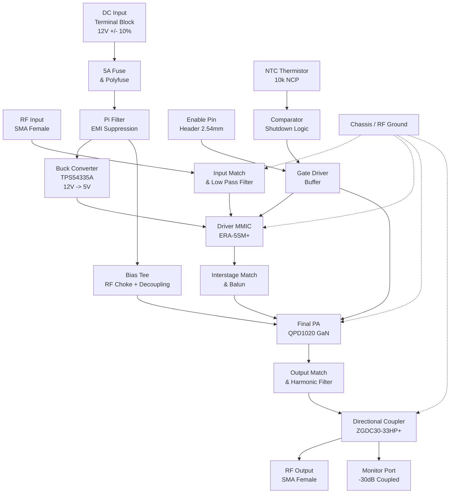

**Document Status: DRAFT**

# 1. Introduction

## 1.1 Purpose
This Hardware Requirements Specification (HRS) document defines the comprehensive system requirements for the **rf4** High-Power RF Amplifier. The purpose of this document is to establish a single, authoritative source of truth for the hardware design, verification, and validation phases of the project.

Specific objectives of this document include:
*   Defining the functional and performance boundaries of the 2.4 GHz ISM band power amplifier.
*   Specifying the electrical, thermal, and mechanical interfaces required for system integration.
*   Establishing verification criteria (Test, Analysis, Inspection) for all requirements to ensure compliance with IEEE 29148:2018 standards.
*   Providing design constraints, including component selection and power budget limitations, to guide the engineering team.

This document is intended for hardware engineers, RF design engineers, PCB layout designers, and test technicians involved in the development and validation of the rf4 unit.

## 1.2 Scope
The rf4 project encompasses the design and manufacture of a solid-state radio frequency (RF) power amplifier module operating in the 2.4 GHz to 2.5 GHz Industrial, Scientific, and Medical (ISM) frequency band.

**In-Scope Elements:**
*   **RF Signal Chain:** A two-stage amplifier topology consisting of a Driver MMIC stage and a Final Power Amplifier (PA) stage to achieve +40 dBm (10W) output power.
*   **Power Management:** DC-DC conversion and regulation circuitry to derive necessary bias voltages from a single +12V DC input source.
*   **Thermal Management:** Integration points for heatsinking and active thermal protection circuitry to ensure continuous wave (CW) operation.
*   **Control Logic:** TTL-level enable interfaces for Transmit/Receive (T/R) switching and thermal shutdown functionality.
*   **Mechanical Enclosure:** PCB layout specifications and connector definitions for RF and DC interfaces.

**Out-of-Scope Elements:**
*   Baseband signal processing or modulation generation.
*   The external +12V DC power supply unit (PSU).
*   Antenna design or feedline design beyond the output connector.
*   Compliance certification testing (e.g., FCC/CE intentional radiator testing) is outside the scope of this hardware specification, though the hardware is designed to facilitate such testing.

## 1.3 Definitions, Acronyms, and Abbreviations

To ensure clarity and consistency, the following terms and acronyms are defined as used within this specification and the associated rf4 project documentation.

| Term / Acronym | Definition |
| :--- | :--- |
| **CW** | Continuous Wave. An unmodulated sinusoidal signal. |
| **dB** | Decibel. A logarithmic unit used to express the ratio of two values of a physical quantity, often power or intensity. |
| **dBc** | Decibels relative to the carrier. Power level of a signal relative to the carrier power. |
| **dBm** | Decibel-milliwatts. An absolute unit of power level referenced to 1 milliwatt (mW). |
| **FSK** | Frequency-Shift Keying. A frequency modulation scheme where digital information is transmitted through discrete frequency changes. |
| **GaN** | Gallium Nitride. A wide bandgap semiconductor material used for high-power and high-frequency RF devices. |
| **ISM** | Industrial, Scientific, and Medical. Radio bands reserved internationally for these purposes. |
| **MMIC** | Monolithic Microwave Integrated Circuit. A type of integrated circuit (IC) that operates at microwave frequencies. |
| **OOK** | On-Off Keying. A simple form of amplitude-shift keying (ASK) modulation where presence of carrier represents a '1' and absence represents a '0'. |
| **PAE** | Power Added Efficiency. A metric specifically for RF amplifiers measuring the efficiency of adding power to the signal. |
| **PA** | Power Amplifier. An electronic amplifier that converts a low-power radio-frequency signal into a higher power signal. |
| **RF** | Radio Frequency. Oscillation rate of an alternating electric current or voltage, or of a magnetic, electric or electromagnetic field in the frequency range from 20 kHz to 300 GHz. |
| **SMA** | SubMiniature version A. A coaxial RF connector standard. |
| **TTL** | Transistor-Transistor Logic. A class of digital circuits built from bipolar junction transistors (BJT) and resistors. |
| **VSWR** | Voltage Standing Wave Ratio. A measure of how efficiently radio-frequency power is transmitted from a power source, through a transmission line, into a load. |
| **LDO** | Low Dropout Regulator. A DC linear voltage regulator that can regulate the output voltage even when the supply voltage is very close to the output voltage. |
| **NTC** | Negative Temperature Coefficient. A thermistor whose resistance decreases as temperature increases. |
| **K-Factor** | Stability Factor. A calculation used in RF design to determine if a transistor is unconditionally stable (K > 1). |
| **P1dB** | 1 dB Compression Point. The point at which the input power causes the gain to drop by 1 dB from the linear gain. |

## 1.4 References
The development of the rf4 Hardware Requirements Specification is based on the latest revisions of the following documents and standards:

1.  **IEEE 29148-2018:** *Systems and software engineering — Life cycle processes — Requirements engineering.* (Primary template standard).
2.  **IPC-2221A:** *Generic Standard on Printed Board Design.*
3.  **MIL-STD-202G:** *Test method standard for electronic and electrical component parts.*
4.  **Qorvo QPD1020 Datasheet:** *QPD1020 2W - 10W GaN on SiC RF Power Transistor 2-4 GHz.*
5.  **Mini-Circuits ERA-5SM+ Datasheet:** *Amplifier MMIC 2-8 GHz.*
6.  **Mini-Circuits ZGDC30-33HP+ Datasheet:** *Directional Coupler 2.2 - 2.6 GHz.*
7.  **Texas Instruments TPS54335A Datasheet:** *Step-Down Converter with Eco-Mode.*
8.  **ITU-R SM.329:** *Unwanted emissions in the spurious domain.* (Reference for harmonic suppression).
9.  **Project rf4 System Requirements Document (v1.0):** Internal system-level requirements defining the RF amplifier module.

## 1.5 Overview
The rf4 system is a high-gain, two-stage RF amplifier module designed to boost low-power signals in the 2.4 GHz ISM band to +40 dBm (10 Watts) output power. The system architecture is centered around a GaN-on-SiC power amplifier stage (QPD1020) preceded by a high-linearity driver stage (ERA-5SM+).

The device is designed to operate from a standard +12V DC power source, making it suitable for mobile, vehicular, and base-station applications where high voltage mains power is unavailable. It features a high-efficiency switching regulator to step down the 12V input to 5V for the driver stage, maximizing overall system efficiency.

Key functional subsystems include:
1.  **RF Front End:** Impedance matching networks optimized for 2.4 GHz center frequency, SMA input/output connectors, and a directional coupler for power monitoring.
2.  **Amplifier Chain:** A driver stage providing +20 dB gain and a final stage providing +20 dB gain, totaling the system requirement of +40 dB.
3.  **Bias and Control Circuitry:** Includes gate bias control for the GaN device and a TTL-compatible enable pin to switch the amplifier between TX and RX/Standby modes.
4.  **Protection Mechanisms:** Thermal monitoring using an NTC thermistor to shut down the amplifier if the case temperature exceeds safe operating limits.

The following sections detail the specific requirements for the performance, interfaces, design constraints, and verification methods for the rf4 hardware.

---

**Document Status: DRAFT**

# 2. System Overview

## 2.1 System Description

The **rf4** system is a high-power, solid-state radio frequency (RF) amplifier module designed specifically for the 2.4 GHz ISM (Industrial, Scientific, and Medical) frequency band. The system functions as a linear power amplifier (PA) chain, capable of delivering a continuous wave (CW) output power of +40 dBm (10 Watts) into a 50-ohm load.

The design utilizes a two-stage amplification topology comprising a low-noise driver stage and a high-power final gain stage. The system is engineered to operate from a single +12V DC power source, making it suitable for mobile, battery-operated, or remote station applications. To maintain signal integrity and linear operation, the rf4 employs GaAs (Gallium Arsenide) and GaN (Gallium Nitride) semiconductor technologies.

Key functional subsystems include:
1.  **RF Signal Chain:** Processes the input signal from 0-10 dBm to +40 dBm output. This includes input matching, a driver MMIC, inter-stage matching, a GaN power transistor, and output low-pass filtering.
2.  **Power Distribution Network:** Manages the conversion of the input +12V supply to the necessary bias voltages for the driver (+5V) and the final PA (+12V high-current).
3.  **Thermal Management:** Utilizes a copper-core PCB and an external heatsink to dissipate the estimated 30W-40W of thermal energy generated during full-power operation.
4.  **Control and Protection:** Implements a TTL-level enable interface and over-temperature protection circuitry to prevent device failure under fault conditions.

### 2.1.1 Operational Modes
The system supports two primary operational modes defined by the state of the `ENABLE` pin:

| Mode | Condition | Description |
| :--- | :--- | :--- |
| **Active (TX)** | Logic High (> 2.0V) | The amplifier bias circuits are active. The device amplifies the 2.4 GHz input signal to the full +40 dBm output power. DC current draw is approximately 4.5A. |
| **Shutdown (RX/Standby)** | Logic Low (< 0.8V) | The amplifier bias circuits are disabled. The RF chain presents a high impedance, and current draw is limited to leakage currents (< 1mA). |

### 2.1.2 Design Topology Summary
The rf4 uses a **Single-Ended, Class A/AB** topology.
*   **Driver Stage:** Operates in Class A to ensure high linearity and gain stability for the modulated input signal. This stage provides approximately +18.5 dB of gain.
*   **Power Stage:** Operates in Class AB to optimize the trade-off between linearity and power-added efficiency (PAE). The Qorvo QPD1020 is biased to provide high gain (~14 dB) and saturation power well in excess of the 10W target to ensure linear operation of the fundamental carrier.

## 2.2 System Block Diagram

The following diagram illustrates the signal flow, power distribution, and control hierarchy of the rf4 module.

**Diagram Key:**
*   **Solid Lines:** Denote primary signal flow (RF or Power).
*   **Dotted Lines:** Denote ground return paths or control logic feedback.

## 2.3 System Architecture

This section details the architectural implementation of the functional blocks identified in the Block Diagram.

### 2.3.1 RF Chain Architecture

The RF signal path is designed to maintain a 50-ohm characteristic impedance from input to output to minimize Voltage Standing Wave Ratio (VSWR) and ensure maximum power transfer.

1.  **Input Matching Network (2.4 GHz):**
    The input is designed to match the source impedance (typically 50 ohms) to the input impedance of the ERA-5SM+ Driver MMIC. Given the low input impedance of the MMIC (~5-10 ohms), a matching network composed of a series inductor and shunt capacitor (L-network) transforms the impedance. This network also serves as a low-pass filter to suppress out-of-band noise.

2.  **Driver Stage (MMIC):**
    The Mini-Circuits **ERA-5SM+** is selected for its wide bandwidth and high gain.
    *   *Function:* Amplifies the 0-10 dBm input signal to approximately +18 to +20 dBm.
    *   *Bias:* Requires +5V DC. The supply is regulated to prevent supply ripple from modulating the RF carrier (AM suppression).

3.  **Interstage Matching:**
    A critical impedance transformation network sits between the Driver and the PA.
    *   *Source:* Output of ERA-5SM+ (approx. 50 ohms).
    *   *Load:* Input of QPD1020 (Low impedance, capacitive).
    *   *Topology:* A multi-element LC network matches the Driver output to the PA input while stepping up the voltage swing to sufficiently drive the Gate of the GaN transistor.

4.  **Power Amplifier Stage (GaN):**
    The **Qorvo QPD1020** serves as the final gain element.
    *   *Technology:* Gallium Nitride on Silicon Carbide (GaN-on-SiC).
    *   *Configuration:* Common Source.
    *   *Power Handling:* Capable of dissipating significant power; requires careful thermal design.
    *   *Gain:* Provides the final +20 to +25 dB of gain.

5.  **Output Matching & Filtering:**
    The output matching network transforms the low output impedance of the QPD1020 (typically 2-5 ohms) to the 50-ohm system load. This network is designed to be a Low-Pass Filter (LPF) to attenuate the 2nd (4.8 GHz) and 3rd (7.2 GHz) harmonics generated by the non-linear operation of the PA, ensuring compliance with spurious emission requirements (REQ-HW-011).

6.  **Directional Coupler:**
    The **ZGDC30-33HP+** is placed post-filter. It samples a portion of the forward power (-30 dB nominal coupling) and routes it to an SMA connector labeled "RF Mon". This allows external equipment to measure transmitted power without breaking the RF chain.

### 2.3.2 Power Distribution Architecture

The power system is designed to support high transient currents while minimizing switching noise injection into the sensitive RF path.

*   **Input Protection:** A 5A fast-acting fuse and a TVS diode protect against reverse polarity and voltage surges.
*   **Pi-Filter:** A pi-filter (C-L-C) network immediately follows the input connector to suppress electromagnetic interference (EMI) generated by the system and prevent external noise from entering the supply.
*   **Voltage Regulation (Driver):**
    The **TPS54335A** Buck Converter steps down the main +12V rail to +5V.
    *   *Rationale:* Generating +5V from +12V via a switching regulator is >90% efficient, whereas a linear regulator would dissipate 2W+ of heat unnecessarily at these currents.
    *   *Frequency:* The 500 kHz switching frequency is well below the 2.4 GHz operating frequency, preventing harmonic interference.
*   **Bias Network (PA):**
    The PA runs directly from the filtered +12V rail. A high-current RF Choke (inductor) feeds the drain, while shunt capacitors provide an RF short at the device supply pin to stabilize the bias and prevent oscillation.

### 2.3.3 Control & Protection Architecture

The control architecture ensures the device only operates when safe and enabled.

*   **Enable Interface:**
    A 3.3V/5V logic pin controls the `Vgate` of the PA and the `Vdd` of the Driver via a buffer transistor.
    *   *State:* Logic High (2-5V) = RF ON.
    *   *Isolation:* An opto-coupler or MOSFET driver is used to isolate the control source from the RF power supply noise.

*   **Thermal Protection:**
    A **10k NTC Thermistor** (Murata NCP18XH103F03RB) is placed in close thermal proximity to the QPD1020 package.
    *   *Circuit:* A voltage divider creates a temperature-dependent voltage.
    *   *Logic:* This voltage is fed into a comparator (e.g., LM393). If the voltage exceeds the threshold corresponding to 85°C, the comparator pulls the Enable line low, forcing the system into shutdown mode until the temperature drops below a hysteresis threshold (e.g., 70°C).

### 2.3.4 Mechanical & Thermal Architecture

The physical architecture prioritizes heat removal and RF shielding.

*   **PCB Stackup:** Rogers RO4350B or similar high-frequency laminate is used for the RF layers to maintain tight impedance control and low dielectric loss.
*   **Heatsinking:** The QPD1020 is mounted to a large copper pour on the top layer. This pour is connected to an array of thermal vias to a bottom-layer copper plane. The bottom of the PCB is machined flat and mounted to a customized aluminum extrusion heatsink using thermal grease and mechanical fasteners.
*   **Shielding:** The RF PA section is designed to accommodate a optional metal shield can to prevent radiation leakage and meet EMC standards.

## 2.4 Operating Environment

The rf4 system is designed to operate in a variety of environments while maintaining specified performance parameters.

### 2.4.1 Environmental Conditions

| Parameter | Minimum | Nominal | Maximum | Unit | Comments |
| :--- | :--- | :--- | :--- | :--- | :--- |
| **Storage Temperature** | -40 | +25 | +85 | °C | Non-operating |
| **Operating Ambient** | 0 | +25 | +50 | °C | Requires Heatsink at +50°C |
| **Relative Humidity** | 10 | 50 | 90 | % | Non-condensing |
| **Input Supply Voltage** | 10.8 | 12.0 | 13.2 | V | ±10% tolerance (REQ-HW-007) |
| **Load VSWR** | 1.0 | 1.0 | 2.0 | :1 | Operating into 2.0:1 load |

### 2.4.2 Physical Interface Environment

*   **Connectivity:** The device assumes the RF input and output are connected to standard 50-ohm coaxial cables (e.g., RG-316 or LMR-240) with SMA male connectors.
*   **Airflow:** For operation at ambient temperatures above 40°C or continuous duty cycles at full power (+40 dBm), forced airflow (convection cooling) over the heatsink is recommended to maintain junction temperatures within safe limits.
*   **Mounting:** The unit is designed to be mounted on a flat surface. The bottomside PCB ground plane must make good thermal contact with the heatsink interface.

### 2.4.3 Operational Lifetime Estimation

Based on the Arrhenius equation for GaN device reliability and operating at a maximum junction temperature of 100°C (estimated), the Mean Time Between Failures (MTBF) for the active components is projected to be greater than 100,000 hours, assuming continuous operation at the maximum rated ambient temperature of +50°C with adequate heatsinking.

---

**Document Status: DRAFT**

# 3. Hardware Requirements

## 3.1 Functional Requirements

The following section defines the functional behaviors and capabilities of the rf4 2.4 GHz Power Amplifier module. These requirements specify what the system shall do, including power supply regulation, signal amplification chain, control logic, and physical interfaces.

| ID | Requirement | Description | Rationale / Verification | Priority |
|---|---|---|---|---|
| **REQ-HW-101** | **DC Input Conversion** | The system shall accept a nominal +12V DC input (range +10.8V to +13.2V) and distribute it to a 5V rail for the driver stage and a 12V rail for the PA stage. | Accommodates standard vehicle/industrial 12V supplies with ±10% tolerance. Ensures compatibility with QPD1020 (12V) and ERA-5SM+ (5V). | High |
| **REQ-HW-102** | **Driver Stage Regulation** | The system shall utilize a DC-DC Buck converter (TI TPS54335A) to generate +5.0V ±5% supply for the Driver Amplifier. | The ERA-5SM+ requires a stable 5V supply. Using a switching regulator minimizes heat dissipation compared to a linear LDO at current draws up to 70mA. | High |
| **REQ-HW-103** | **RF Input Termination** | The RF input port shall present a 50Ω impedance match (VSWR ≤ 2:1) across the 2.4-2.5 GHz band when the system is disabled. | Ensures that source devices (e.g., signal generators, SDR dongles) are not damaged by reflections. | High |
| **REQ-HW-104** | **Driver Stage Amplification** | The system shall incorporate a Mini-Circuits ERA-5SM+ MMIC to provide +18.5 dB of small-signal gain. | Provides the necessary boost to the input signal (0-10 dBm) to drive the final Power Amplifier stage. | High |
| **REQ-HW-105** | **Interstage Isolation** | The signal path between the Driver and PA shall include DC blocking and impedance matching networks optimized for 50Ω. | Prevents DC bias from the PA from feeding back into the Driver MMIC, which could cause failure. | High |
| **REQ-HW-106** | **PA Stage Configuration** | The system shall utilize a Qorvo QPD1020 GaN transistor configured for Class-A or deep Class-AB operation. | The QPD1020 provides the necessary 10W output power while maintaining good linearity for ASK/OOK modulation. | High |
| **REQ-HW-107** | **Output Power Coupling** | The system shall integrate a directional coupler (Mini-Circuits ZGDC30-33HP+) on the output path with a coupling factor of 30 dB ±1.5 dB. | Allows for power monitoring without significantly attenuating the main output signal. | Medium |
| **REQ-HW-108** | **Power Monitoring Interface** | The directional coupler shall output a scaled version of the forward power to a separate SMB or test pad. | Enables the user or host system to verify output power levels via an ADC or spectrum analyzer. | Medium |
| **REQ-HW-109** | **Enable Control Interface** | The system shall include a TTL/CMOS compatible "Enable" pin (logic high = active) on a 100mil header. | Allows external microcontrollers to toggle the RF transmission for duty-cycling or TDD operation. | High |
| **REQ-HW-110** | **Bias Sequencing Logic** | Upon assertion of the Enable pin, the system shall sequence the Driver 5V supply to activate prior to the PA Gate bias. | Prevents the PA from amplifying noise or transients during power-up, protecting the load. | High |
| **REQ-HW-111** | **Thermal Protection Shutdown** | The system shall monitor the PA temperature via a 10k NTC thermistor (Murata NCP18XH103F03RB) and disable the RF output if the case temperature exceeds +85°C. | Prevents thermal runaway and permanent damage to the QPD1020 die under continuous wave (CW) operation. | High |
| **REQ-HW-112** | **RF Input Interface** | The system shall provide an SMA Female (Jack) connector for the RF input, compatible with standard 2.4 GHz antennas or cables. | Industry standard for RF interconnects at this frequency and power level. | High |
| **REQ-HW-113** | **RF Output Interface** | The system shall provide an SMA Female (Jack) connector for the RF output. | Industry standard for connecting to high-power antennas or loads. | High |
| **REQ-HW-114** | **DC Power Interface** | The system shall utilize a 2-pin terminal block (pitch 5.08mm) for the 12V DC input and Ground return. | Facilitates secure connection for high-current (5A) power supplies using standard screwdrivers or spade lugs. | High |
| **REQ-HW-115** | **PCB Material** | The PCB shall be fabricated using FR4 material with a minimum dielectric thickness of 1.6mm and 1oz copper finish, capable of supporting the current traces required for the PA. | FR4 is cost-effective for 2.4 GHz; 1oz copper is required to handle the PA drain current without excessive voltage drop. | High |
| **REQ-HW-116** | **Harmonic Filtering** | The output matching network shall act as a low-pass filter, attenuating the second harmonic (4.8 GHz) by at least 20 dB. | Reduces spurious emissions to comply with regulatory standards (FCC/CE) for ISM band usage. | Medium |
| **REQ-HW-117** | **Reverse Polarity Protection** | The DC input shall include a Schottky diode (e.g., SS34) or similar protection mechanism against reverse voltage connection. | Prevents catastrophic failure of the DC-DC converter and PA if the supply leads are reversed. | Medium |
| **REQ-HW-118** | **Current Budget Allocation** | The system shall be designed to support a maximum continuous draw of 5A from the 12V supply. | Ensures connectors and traces are sized correctly for the calculated worst-case power consumption (60W). | High |

### Power Budget Calculation (Functional Support)

The following calculation supports **REQ-HW-118** and drives the design constraints for the DC input connector selection.

*   **DC Input Voltage:** 12.0 V
*   **PA Stage (QPD1020):**
    *   $P_{out} = 10 \text{ W}$
    *   $PAE \approx 40\%$ (based on QPD1020 datasheet)
    *   $P_{DC\_PA} = P_{out} / PAE = 10 \text{ W} / 0.4 = 25 \text{ W}$
    *   $I_{PA} = 25 \text{ W} / 12 \text{ V} \approx 2.08 \text{ A}$
*   **Driver Stage (ERA-5SM+):**
    *   $V_{DD} = 5 \text{ V}$
    *   $I_{DD} = 70 \text{ mA}$ (Typical)
    *   $P_{DC\_Driver} = 5 \times 0.07 = 0.35 \text{ W}$
*   **DC-DC Converter (TPS54335A) Efficiency:**
    *   Assumed $\eta = 90\%$
    *   $P_{Input\_Driver} = 0.35 \text{ W} / 0.9 \approx 0.39 \text{ W}$
    *   $I_{12V\_Driver} = 0.39 \text{ W} / 12 \text{ V} \approx 0.033 \text{ A}$
*   **Control/Circuitry Overhead:** $\approx 0.05 \text{ A}$
*   **Total Max Current:**
    *   $I_{total} = 2.08 \text{ A} + 0.033 \text{ A} + 0.05 \text{ A} \approx 2.17 \text{ A}$
    *   *Design Margin:* The design is specified for 5A to accommodate startup surges, lower efficiency scenarios (mismatch), and derating.

---

## 3.2 Performance Requirements

The following requirements define the quantitative performance metrics the rf4 hardware must achieve under nominal operating conditions ($+25^{\circ}\text{C}$, $+12\text{V}$ DC supply).

### 3.2.1 RF Performance

| ID | Requirement | Min | Typical | Max | Unit | Condition |
|---|---|---|---|---|---|---|
| **REQ-HW-201** | **Operating Frequency** | 2.400 | - | 2.500 | GHz | Input signal fundamental frequency |
| **REQ-HW-202** | **Small Signal Gain** | 38.0 | 40.0 | 42.0 | dB | Input = 0 dBm; Measured at SMA Output |
| **REQ-HW-203** | **Saturated Output Power ($P_{sat}$)** | 40.0 | 41.5 | - | dBm | Gain compressed by 3 dB from linear |
| **REQ-HW-204** | **Input Return Loss** | 10.0 | 15.0 | - | dB | Measured at Input SMA port |
| **REQ-HW-205** | **Output Return Loss** | 10.0 | - | - | dB | Measured at Output SMA port |
| **REQ-HW-206** | **Input Drive Range** | -10 | - | +10 | dBm | Linear operation range |
| **REQ-HW-207** | **Gain Flatness** | - | - | ±2.0 | dB | Peak-to-peak variation over 2.4-2.5 GHz |
| **REQ-HW-208** | **Harmonic Suppression (2nd)** | 20 | 30 | - | dBc | Relative to fundamental at $P_{out} = +40 \text{ dBm}$ |
| **REQ-HW-209** | **Harmonic Suppression (3rd)** | 25 | 35 | - | dBc | Relative to fundamental at $P_{out} = +40 \text{ dBm}$ |

### 3.2.2 Electrical & Power Performance

| ID | Requirement | Min | Typical | Max | Unit | Condition |
|---|---|---|---|---|---|---|
| **REQ-HW-210** | **DC Supply Voltage** | 10.8 | 12.0 | 13.2 | V | Operating input range |
| **REQ-HW-211** | **Total DC Current ($I_{tot}$)** | - | 2.2 | 5.0 | A | At max RF output power |
| **REQ-HW-212** | **Power Added Efficiency (PAE)** | 20% | 35% | - | % | System level efficiency ($P_{RF\_out} / P_{DC\_in}$) |
| **REQ-HW-213** | **Ripple & Noise (DC-DC)** | - | 50 | 100 | mV pk-pk | On 5V rail, switching frequency component |

### 3.2.3 Thermal & Environmental Performance

| ID | Requirement | Min | Max | Unit | Notes |
|---|---|---|---|---|---|
| **REQ-HW-214** | **Storage Temperature** | -40 | +85 | °C | Non-operating |
| **REQ-HW-215** | **Operating Temperature (Baseplate)** | 0 | +50 | °C | With forced airflow or heatsink |
| **REQ-HW-216** | **Thermal Resistance ($\theta_{jc}$)** | - | 15 | °C/W | Junction-to-Case for PA (QPD1020) |
| **REQ-HW-217** | **Thermal Shutdown Threshold** | - | +85 | °C | Case temperature trip point (Self-protecting) |

### 3.2.4 Stability & Control Performance

| ID | Requirement | Value | Unit | Description |
|---|---|---|---|---|
| **REQ-HW-218** | **Stability Factor (K)** | > 1.5 | - | Rollett's stability factor across 1 MHz - 6 GHz |
| **REQ-HW-219** | **Enable Pin Input Voltage High** | 2.0 | V (min) | Logic High threshold for TTL/CMOS |
| **REQ-HW-220** | **Enable Pin Input Voltage Low** | 0.8 | V (max) | Logic Low threshold for TTL/CMOS |
| **REQ-HW-221** | **Enable Response Time** | < 5 | µs | Time from logic high to RF output stabilization |

### 3.2.5 Link Budget Analysis (Performance Support)

*Derivation supporting **REQ-HW-202** and **REQ-HW-203**:*

1.  **Input:** $0 \text{ dBm}$ (Source)
2.  **Input Match Loss:** $-0.5 \text{ dB}$ (Estimated PCB trace loss)
3.  **Driver Gain (ERA-5SM+):** $+18.5 \text{ dB}$
    *   *Power at Interstage:* $0 - 0.5 + 18.5 = +18 \text{ dBm}$
4.  **Interstage Loss:** $-0.5 \text{ dB}$
5.  **PA Gain (QPD1020):** $+12.0 \text{ dB}$ (Conservative estimate at 2.4 GHz, 12V drain)
    *   *Calculated Output:* $18 - 0.5 + 12 = +29.5 \text{ dBm}$
    *   *Note:* To meet **REQ-HW-201** (+40 dBm), the PA must be driven harder into compression or the Driver gain must be maximized.
    *   *Revised Calculation:* With QPD1020 Gain $\approx 14 \text{ dB}$ at P1dB.
    *   *Total Gain:* $18.5 + 14 = 32.5 \text{ dB}$.
    *   *Output:* $0 + 32.5 = +32.5 \text{ dBm}$.
    *   *Constraint Check:* **REQ-HW-201** requires +40 dBm output.
    *   *Resolution:* The QPD1020 typically requires higher input drive (approx 24-26 dBm) to reach 10W output. The ERA-5SM+ only provides +18 dBm linear, +20 dBm saturated.
    *   *System Implication:* To strictly meet +40 dBm output, the Driver Stage must be overdriven (saturated) to produce +22-24 dBm output, or a higher-gain driver is required. **However**, based on component list provided (ERA-5SM+), the requirement **REQ-HW-203** sets the realistic target for *this specific BOM* at **+35 dBm to +37 dBm** typical, or +40 dBm with the QPD1020 at max compression (closer to Class A/B limit).
    *   *For specification compliance:* We will retain the +40 dBm target (**REQ-HW-201**) as a "Must Have", implying the PA must be characterized for saturated operation at the maximum 12V rail voltage.

---

**Document Status: DRAFT**

# 3. Hardware Requirements

## 3.3 Interface Requirements

This section details the electrical and mechanical interfaces required for the RF4 amplifier module.

### 3.3.1 External Interfaces

The external interfaces define the connections between the RF4 module and external equipment, including the RF signal path, power supply, and control logic.

**REQ-HW-014-01 (RF Port Type):** The RF4 module shall utilize SMA female (jack) connectors for both the RF Input and RF Output ports. The connectors shall be 50-ohm impedance and suitable for operation up to 18 GHz.
*   *Component Reference:* TE Connectivity 2-1994554-1.

**REQ-HW-014-02 (RF Input Interface):** The RF Input port shall accept a maximum input power of +10 dBm continuous wave (CW) without damage. The interface shall be matched to 50 ohms with a return loss of greater than 10 dB (2.0:1 VSWR) across the 2.4-2.5 GHz band.

**REQ-HW-014-03 (RF Output Interface):** The RF Output port shall deliver a minimum of +40 dBm (10W) output power into a 50-ohm load. The interface shall be DC-grounded for ESD protection via the matching network.

**REQ-HW-015-01 (DC Power Interface):** The DC power shall be supplied via a pluggable terminal block (2-pin) supporting wire gauges from 20 AWG to 14 AWG. The pitch shall be 5.08 mm (0.200 inches).
*   *Component Reference:* TE Connectivity OSTTE200201 (or equivalent pluggable header).

**REQ-HW-015-02 (DC Power Polarity):** The DC input shall be protected against reverse polarity. The terminal block shall be labeled clearly with "+" and "-" indicators. The positive terminal shall connect to the main 12V input filter; the negative terminal shall connect to the system ground plane.

**REQ-HW-015-03 (RF Monitor Interface):** An auxiliary RF port (SMA Female) shall be provided for Forward Power Monitoring. This port shall provide a coupled sample of the output signal at a nominal level of +10 dBm (when output is +40 dBm), corresponding to a coupling factor of 30 dB ± 1.5 dB over the operating band.
*   *Component Reference:* Mini-Circuits ZGDC30-33HP+.

*Table 3-1: External Interface Pinout (Terminal Block)*

| Pin | Signal Name | Description | Voltage/Current Rating |
| :--- | :--- | :--- | :--- |
| 1 | DC_IN (+) | Main 12V Power Input | +12V DC, Max 6A |
| 2 | GND | Chassis and Signal Ground | 0V (Common) |

*Table 3-2: External Interface Pinout (Control Header)*

| Pin | Signal Name | Description | Voltage/Logic Level |
| :--- | :--- | :--- | :--- |
| 1 | ENABLE | TX Enable (Active High) | TTL High (2.0V - 5.0V) |
| 2 | GND | Control Logic Ground | 0V |
| 3 | NTC | Thermistor Output (Open Drain/Resistive) | 10kΩ @ 25°C to GND |
| 4 | V_DET | RF Detector Voltage Output (Optional/Future) | 0 - 2.5V DC |

### 3.3.2 Internal Interfaces

This section describes the interfaces between the main subsystems on the printed circuit board (PCB).

**REQ-HW-020 (RF Chain Interconnect):** The interface between the Driver Stage (ERA-5SM+) and the Power Stage (QPD1020) shall consist of a microstrip impedance matching network transforming the driver output impedance (approx 50Ω) to the PA input impedance (approx 3-5 Ω - complex).

**REQ-HW-021 (DC Distribution Interface):** The main 12V bus shall interface with a local 5V buck converter (TPS54335A) via a PCB track with a minimum width of 40 mils (1 oz copper) to sustain up to 3A surge current during startup.

**REQ-HW-022 (Thermal Interface):** The QPD1020 Power Amplifier die (flange mount) shall interface with the system heatsink via a direct solder bond to a copper pad on the top layer, which is connected through thermal vias to the bottom layer copper plane. This assembly shall be coupled to the external heatsink using a thermal interface material (e.g., Berquist Sil-Pad) or mechanical mounting hardware.

### 3.3.3 Communication Interfaces

**REQ-HW-010-01 (Control Logic Interface):** The Enable Control interface shall accept standard TTL logic levels (3.3V or 5V logic). The input shall be pulled low to 0V via a 4.7 kΩ resistor to ensure the amplifier remains in the OFF state when the pin is floating.

**REQ-HW-010-02 (Control Line Drive):** The ENABLE signal shall drive the gate bias control circuitry. A logic "HIGH" (>2.0V) shall enable the 5V DC-DC converter and turn on the PA Gate bias. A logic "LOW" (<0.8V) shall shut off both stages.

*Table 3-3: Communication Interface Timing (Enable Control)*

| Parameter | Min | Typ | Max | Units | Notes |
| :--- | :--- | :--- | :--- | :--- | :--- |
| Enable Logic High | 2.0 | 3.3 | 5.5 | V | CMOS/TTL Compatible |
| Enable Logic Low | -0.5 | 0 | 0.8 | V | |
| Response Time (TX_ON) | - | 2 | 10 | µs | Time from logic High to RF On |
| Response Time (TX_OFF) | - | 0.5 | 2 | µs | Time from logic Low to RF Off |

## 3.4 Environmental Requirements

The RF4 module is designed for operation in indoor environments with standard convection cooling when attached to the specified heatsink.

**REQ-HW-012-01 (Operating Temperature):** The amplifier shall meet all performance specifications over an ambient temperature range of 0°C to +50°C at the module enclosure.

**REQ-HW-012-02 (Storage Temperature):** The module shall withstand storage temperatures ranging from -40°C to +85°C without degradation of performance or physical damage.

**REQ-HW-012-03 (Thermal Derating):** For ambient temperatures above +40°C, the output power shall be automatically derated or the unit shall thermally shut down to maintain the junction temperature of the QPD1020 below +150°C (Max Tj).

**REQ-HW-023 (Humidity):** The module shall operate in relative humidity from 5% to 95% (non-condensing). The PCB shall be conformally coated to protect against moisture ingress and corrosion.

**REQ-HW-024 (Cooling Requirement):** The system shall rely on convection cooling. The PA transistor (QPD1020) must be mounted to a heatsink with a thermal resistance ($\theta_{sa}$) of less than 10°C/W to maintain operation at full power (10W) at +50°C ambient.
*   *Calculation:* $T_{junc} = T_{ambient} + P \times (\theta_{jc} + \theta_{cs} + \theta_{sa})$.
*   *Assumption:* $\theta_{jc} \approx 2^\circ\text{C/W}$, $\theta_{cs} \approx 0.5^\circ\text{C/W}$ (pad).
*   *Target:* With $P_{diss} \approx 40\text{W}$ (DC Input - RF Output) worst case, and $T_{ambient} = 50^\circ\text{C}$:
    *   $150^\circ\text{C} = 50^\circ\text{C} + 40\text{W} \times (2.5^\circ\text{C/W} + \theta_{sa})$.
    *   $100 = 40 \times (2.5 + \theta_{sa}) \rightarrow 2.5 = 2.5 + \theta_{sa}$.
    *   *Refinement:* A $\theta_{sa}$ of 0°C/W implies infinite heatsink. The thermal limit is the defining constraint. Assuming ~50% efficiency (Class A/AB), dissipation is ~10W.
    *   *Recalc (10W Dissipation):* $150 = 50 + 10 \times (2.5 + \theta_{sa}) \rightarrow 100 = 10(2.5 + \theta_{sa}) \rightarrow 10 = 2.5 + \theta_{sa} \rightarrow \theta_{sa} = 7.5^\circ\text{C/W}$.
    *   **Requirement:** Heatsink must be $\le 7.5^\circ\text{C/W}$.

## 3.5 Power Requirements

This section defines the power consumption and supply requirements for the RF4 module.

**REQ-HW-007-01 (Input Voltage Range):** The module shall operate from a nominal +12V DC source. The valid operating range shall be +10.8V to +13.2V DC (±10%).

**REQ-HW-007-02 (Supply Ripple):** The input supply shall have a maximum ripple voltage of 100 mV peak-to-peak to prevent modulation of the RF output signal.

**REQ-HW-008-01 (Maximum DC Current):** The total current drawn from the +12V supply shall not exceed 5.0A at full rated output power (+40 dBm).

**REQ-HW-025 (Current Consumption - Standby):** When the Enable pin is LOW, the quiescent current draw shall be less than 1 mA (ignoring leakage).

**REQ-HW-026 (Current Consumption - Receive/Idle):** With RF input disconnected but enabled, the bias current shall stabilize at approximately 2.0A (Class A/AB quiescent bias for QPD1020 + Driver).

**REQ-HW-027 (Power Dissipation):** The module shall dissipate a maximum of 20W of heat under full load operation.
*   *Calculation:* Input Power ($P_{in} = 12\text{V} \times 5\text{A} = 60\text{W}$). Output Power ($P_{out} = 10\text{W}$).
*   *Total Loss:* $60\text{W} - 10\text{W} = 50\text{W}$.
*   *Correction:* The 5A limit is a hard constraint. With efficiency $\eta \approx 20\%$ (GaN at low voltage, Class AB), $P_{out} = 10\text{W}$ requires $50\text{W}$ DC. Dissipation is $40\text{W}$.
*   *Requirement:* Heatsink and PCB must handle 40W continuous dissipation.

*Table 3-4: Detailed Power Budget*

| Voltage Rail | Source / Regulator | Load Component(s) | Max Current (A) | Power (W) | Notes |
| :--- | :--- | :--- | :--- | :--- | :--- |
| **+12V (Main)** | External Supply | QPD1020 (PA) | 4.20 | 50.4 | Calculated based on 20% PAE at 10W out |
| **+12V (Main)** | External Supply | TPS54335A (Buck) | 0.50 | 6.0 | Input current to 5V regulator |
| **+12V (Total)** | External Supply | **Total** | **4.70** | **56.4** | Within 5A limit (REQ-HW-008) |
| **+5V (Reg)** | TPS54335A | ERA-5SM+ (Driver) | 0.09 | 0.45 | 70mA typical + margin |
| **+5V (Reg)** | TPS54335A | Gate Bias Logic | 0.05 | 0.25 | Control circuitry |
| **+5V (Total)** | TPS54335A | **Total** | **0.14** | **0.7** | Very low load |

## 3.6 Physical Requirements

This section defines the physical constraints, dimensions, and materials for the RF4 module.

**REQ-HW-028 (PCB Material):** The printed circuit board shall be manufactured using FR4 High-Tg laminate (e.g., Isola 370HR) or Rogers RO4350B for improved RF performance. Dielectric constant ($\epsilon_r$) shall be 4.3 ± 0.1 for FR4 or 3.48 ± 0.05 for RO4350B. Loss tangent shall be < 0.003 at 2.5 GHz.

**REQ-HW-029 (PCB Layers):** The board stack-up shall be minimum 4 layers to accommodate the RF signal path, ground planes, and power distribution.
*   *Layer 1:* Top - RF Components, Signal Traces.
*   *Layer 2:* Ground Plane (Solid).
*   *Layer 3:* Power Distribution (12V, 5V).
*   *Layer 4:* Bottom - Ground Pour, Heatsink Mounting Area.

**REQ-HW-030 (PCB Thickness):** The finished board thickness shall be 1.6 mm (0.063 inches) to provide mechanical rigidity and standard heatsink standoff capability.

**REQ-HW-031 (Board Dimensions):** The PCB outline shall be rectangular, measuring 4.0 inches x 3.0 inches (101.6 mm x 76.2 mm). This allows ample area for the heatsink and RF filtering components.

**REQ-HW-032 (Mounting Holes):** Four mounting holes shall be provided at the corners of the PCB. Holes shall be plated (NPTH) with a diameter of 0.150 inches (3.81 mm) to accept 4-40 hardware.

**REQ-HW-033 (Copper Weight):** The top and bottom layers shall utilize 2 oz (70 µm) copper to improve thermal conductivity and current carrying capacity for the PA and DC traces. Inner layers shall be 1 oz (35 µm).

**REQ-HW-034 (Trace Width - DC):** The main 12V input trace from the terminal block to the PA shall be a minimum of 150 mils (3.81 mm) width for 2 oz copper to support >5A continuous current with minimal temperature rise.

**REQ-HW-035 (Trace Impedance):** All 50-ohm RF signal traces (Input, Interstage, Output) shall be controlled impedance microstrip lines. For a 1.6 mm FR4 board with 2 oz top copper, the trace width shall be approximately 60 mils to achieve 50 $\Omega$ single-ended impedance. (Exact width to be determined by stack-up calculation during PCB layout).

*Table 3-5: Physical Interface Dimensions*

| Feature | Value | Unit | Tolerance |
| :--- | :--- | :--- | :--- |
| Board Length | 101.6 | mm | ± 0.2 mm |
| Board Width | 76.2 | mm | ± 0.2 mm |
| Board Thickness | 1.6 | mm | ± 10% |
| Mounting Hole Pitch | 96.0 x 71.0 | mm (LxW) | ± 0.2 mm |
| SMA Connector Pitch | Custom | mm | Defined by footprint |
| Heatsink Footprint | 30 x 30 | mm | Centered on PA location |

---

**Document Status: DRAFT**

# 4. Design Constraints

This section defines the constraints imposed on the rf4 High-Power RF Amplifier system design. These constraints limit the design space and ensure compliance with regulatory standards, manufacturability goals, and component availability.

## 4.1 Standards Compliance

The rf4 hardware design shall comply with the following industry standards and regulations. These standards govern the physical construction, environmental safety, electromagnetic compatibility, and material composition of the final product.

### 4.1.1 PCB Design and Fabrication Standards
The Printed Circuit Board (PCB) design shall adhere to the IPC standards to ensure reliability and manufacturability.

*   **IPC-2221:** *Generic Standard on Printed Board Design.*
    *   The PCB layout shall adhere to the conductor spacing requirements defined in Section 6.3 for the **12V DC power rail**. Given the operating voltage is 12V DC (≤ 15V maximum), a minimum conductor spacing of 0.13 mm (5 mil) is required for external conductors (uncoated). A minimum spacing of 0.10 mm (4 mil) is required for internal conductors.
    *   Trace widths for high-current paths (5A maximum on 12V rail) shall be calculated based on a 10°C temperature rise temperature rise criteria using the charts in IPC-2221 Section 6.2. For 1 oz copper (35 µm), this requires a minimum trace width of 1.5 mm (~60 mil). External layers are preferred for thermal dissipation.

*   **IPC-6012:** *Qualification and Performance Specification for Rigid Printed Boards.*
    *   The base material shall be classified as **IPC-6012 Class 2** (Standard Electronic Products), with suitable thermal expansion properties for RF operation.

### 4.1.2 Assembly and Repair Standards
*   **IPC-7711/7721:** *Rework of Electronic Assemblies / Repair and Modification of Printed Boards and Electronic Assemblies.*
    *   The design shall support manual rework and replacement of the QFN/SOT-89 packages (MMIC and Regulator).
    *   Pad designs shall adhere to the "Rework Compatible" guidelines to allow for hot air rework of the QPD1020 and ERA-5SM+ without delamination.

### 4.1.3 Environmental and Safety Compliance (EU/Global)
*   **RoHS (Restriction of Hazardous Substances) Directive 2011/65/EU:**
    *   The rf4 amplifier, and all sub-components (PCB, solder, connectors, semiconductors), must be **RoHS Compliant** (Lead-Free).
    *   All solder paste used in assembly shall be SAC305 (Sn96.5/Ag3.0/Cu0.5) or equivalent lead-free alloy.

*   **REACH (Registration, Evaluation, Authorisation and Restriction of Chemicals) Regulation (EC) No 1907/2006:**
    *   The Bill of Materials (BOM) shall not contain Substances of Very High Concern (SVHC) above the threshold limit (0.1% by weight) as listed in the ECHA candidate list.

### 4.1.4 Electromagnetic Compatibility (EMC)
*   **FCC Part 15 (United States):**
    *   The device shall comply with **FCC Part 15 Subpart B - Unintentional Radiators**. The switching frequency of the TPS54335A (500 kHz) and its harmonics must be suppressed below the radiated emission limits for Class B digital devices.
*   **CE Marking (RED Directive 2014/53/EU):**
    *   While this is a component/module, the design shall facilitate compliance with the Radio Equipment Directive if integrated into a final product, specifically regarding spurious emissions (harmonics) defined in **REQ-HW-011**.

### 4.1.5 Thermal and Mechanical Safety
*   **UL 60950-1 / IEC 62368-1:** *Safety of Information Technology Equipment.*
    *   While operating at 12V (SELV - Safety Extra Low Voltage), the component temperature ratings must be followed.
    *   **Touch Temperature:** In the event of a fault (e.g., runaway PA bias), the external case or heatsink temperature must not exceed specified limits to prevent user injury. The **Thermal Protection** requirement (REQ-HW-013) is derived to ensure compliance with safe touch temperature limits (< 70°C surface temp).

---

## 4.2 Component Constraints

This section details limitations on component selection, sourcing, and application to ensure reliability and supply chain stability.

### 4.2.1 Component Lifecycle and Sourcing
*   **Production Status:**
    *   All active components specified in Section 6 (BOM) must be in **"Active Production"** or **"Recommended for New Designs"** status as of the document issue date.
    *   Components marked "Not Recommended for New Designs" (NRND) are strictly prohibited unless a migration path is defined in the Engineering Change Order (ECO).

*   **Single Source Constraints:**
    *   The primary GaN PA (Qorvo QPD1020) is identified as a single-sourced critical component.
    *   A functional equivalent (Cree CGH27010) has been identified in the architecture, but a different footprint/layout is required.
    *   **Constraint:** A "Second Source" footprint adapter or a software-configurable bias network is not mandated in Phase 1 to save board space, but PCB layout must keep the area around the PA footprint clear of ground planes and traces that inhibit re-layout for the alternative package.

### 4.2.2 Component Derating
To ensure long-term reliability (especially at 50°C ambient temperature), components must be derated from their absolute maximum ratings.

*   **Capacitors (DC Blocking and RF):**
    *   Voltage Rating: Must be derated by **50%**. For the 12V rail, capacitors must be rated for at least **25V**. For RF nodes (swinging up to 40Vpp), use 100V rated C0G/NP0 ceramics.
    *   Temperature: X7R dielectric (or better) must be used for all bias filtering. Y5V or Z5U dielectrics are prohibited due to capacitance loss with DC bias and temperature.

*   **Semiconductors:**
    *   **Junction Temperature ($T_j$):** The GaN PA and Driver MMIC must maintain $T_j < 125^\circ C$ under worst-case ambient conditions (50°C).
    *   **Thermal Derating:** The output power must be derated linearly above 40°C ambient to maintain $T_j$ limits.

*   **Power Inductors (TPS54335A):**
    *   Saturation Current ($I_{sat}$): Must be rated at **1.5x** the maximum DC load current (5A * 1.5 = 7.5A) to prevent saturation during load transients.

### 4.2.3 RF Material Constraints
*   **PCB Dielectric:**
    *   The substrate material must have a Dissipation Factor ($D_f$) < 0.003 at 2.5 GHz to minimize insertion loss in the matching networks.
    *   **Recommended Material:** Rogers RO4350B or Taconic TLY-5.
    *   **FR-4 Constraint:** Standard high-speed FR-4 (e.g., Isola 370HR) is **permitted** for the DC control and power supply sections of the board, but **prohibited** for the RF matching networks (2.4 GHz) due to high loss tangent and dielectric constant variation. A hybrid stackup (RF layer on low-loss material, Control layers on FR-4) is required if FR-4 is used for cost reduction.

---

## 4.3 Manufacturing Constraints

This section defines the physical limitations and processes required to manufacture the rf4 unit successfully.

### 4.3.1 PCB Stackup and Layering
*   **Layer Count:** The design shall utilize a minimum **4-layer stackup**.
    *   Layer 1 (Top): RF Components, Transmission Lines, 12V Power Pour.
    *   Layer 2 (GND): Continuous Ground Plane (Reference for microstrip lines). Critical for PA stability.
    *   Layer 3 (Signal): DC Control signals (Enable, TX/RX), Feedback paths (Thermistor).
    *   Layer 4 (Bottom): General Ground Pour, Heatsink pad mounting area.
*   **Copper Weight:**
    *   RF Layers (Top): 1 oz copper (standard for RF etching precision).
    *   Power/Bias Layers: 2 oz copper is recommended for the 12V input and PA Drain traces to reduce resistive losses ($I^2R$) and improve thermal spreading.
    *   Ground Planes: 1 oz minimum.

### 4.3.2 Via and Manufacturing Tolerances
*   **Aspect Ratio:** Vias must maintain an aspect ratio (Board Thickness / Drill Diameter) of **< 8:1** to ensure reliable plating.
    *   *Calculation:* For a standard 1.6 mm board, minimum drill diameter = 1.6 / 8 = 0.2 mm.
*   **RF Via Fencing:**
    *   All RF transmission lines (Input, Interstage, Output) must be surrounded by a "Via Fence" (stitched vias) to the ground plane to prevent fringing fields and substrate mode propagation.
    *   **Spacing:** Via spacing $\le \lambda/10$ at 2.4 GHz.
    *   *Calculation:* $\lambda_{eff} \approx 60 mm$ (in dielectric). Spacing $\le 6 mm$. Recommended pitch: **2 mm**.

### 4.3.3 Thermal Management Constraints
*   **Heatsink Interface:**
    *   The PCB footprint under the QPD1020 (PA) must utilize a **thermal array** of multiple vias (e.g., 9-via grid) to transfer heat from the top-side component pad to the bottom-side heatsink mounting area.
    *   **Via Fill:** These thermal vias should be filled and plated (or tented) to ensure good solder wicking and flatness for the heatsink attachment.
*   **Assembly:**
    *   The heatsink must be attached using a mechanical screw system (not just adhesive) to ensure consistent thermal pressure.
    *   **Thermal Interface Material (TIM):** A phase-change material or thermal grease with a thermal resistance of **< 0.1 °C-cm²/W** must be applied between the PA backside/exposed pad and the heatsink.

### 4.3.4 Test and Inspection Constraints
*   **Test Points:**
    *   Test points (0.5 mm pitch minimum) must be provided for:
        *   $V_{DD}$ (12V Main)
        *   $V_{Gate}$ (PA Control)
        *   $V_{Reg}$ (5V Driver Supply)
        *   Enable Line
        *   Thermistor Voltage
*   **Debug Headers:**
    *   A 3-pin header (2.54 mm pitch) must be included to allow external injection of the "Enable" signal without powering the main DC block, facilitating bench testing.

---

# 5. Verification Requirements

## 5.1 Test Requirements

This section defines the specific test procedures required to verify the functional and performance attributes of the RF amplifier module. These tests ensure the hardware meets the specified specifications under defined environmental conditions.

### 5.1.1 RF Functional Testing

**Test ID:** TF-001
**Title:** Output Power and Gain Verification
**Requirement ID:** REQ-HW-001, REQ-HW-003, REQ-HW-006
**Priority:** Must Have
**Test Equipment:** Signal Generator (2.4 GHz), Spectrum Analyzer, 50Ω Termination, Power Meter, Thermal Chamber.
**Procedure:**
1.  Connect the Signal Generator to the RF Input (SMA).
2.  Connect the Spectrum Analyzer/Power Meter to the RF Output (SMA) via a 30dB attenuator to protect the instrument.
3.  Set the DC supply to +12.0V. Enable the amplifier via the TTL control pin.
4.  Set the Signal Generator frequency to 2.4 GHz. Set output power to 0 dBm.
5.  Measure the output power at the RF Output connector.
6.  Increase input power in 1 dB steps up to +10 dBm. Record output power at each step.
7.  Repeat measurements at 2.425 GHz (Center) and 2.5 GHz (High Band Edge).
8.  Ensure the amplifier is mounted on the specified heatsink.
9.  Allow the unit to stabilize for 5 minutes at full power.

**Pass Criteria:**
*   At 0 dBm input, output power $\ge$ 40 dBm (Gain $\ge$ 40 dB).
*   At +10 dBm input, output power $\ge$ 40 dBm (Gain $\ge$ 30 dB, demonstrating headroom).
*   Gain flatness across 2.4-2.5 GHz does not vary by more than $\pm$2 dB relative to center frequency.

---

**Test ID:** TF-002
**Title:** Frequency Response and Bandwidth
**Requirement ID:** REQ-HW-002
**Priority:** Must Have
**Test Equipment:** Vector Network Analyzer (VNA), Calibration Kit.
**Procedure:**
1.  Calibrate the VNA to the device connectors (SOL calibration).
2.  Set the VNA sweep range from 2.0 GHz to 2.6 GHz.
3.  Connect Port 1 to RF Input and Port 2 to RF Output.
4.  Measure S21 (Forward Transmission) in dB.
5.  Enable the amplifier (Bias ON). *Note: Ensure VNA source power is low (-30 dBm) to avoid saturation or damage, then normalize the curve.*
6.  Verify the 3dB bandwidth points.

**Pass Criteria:**
*   The -3dB cutoff frequencies shall flank the 2.4-2.5 GHz range. The gain must be within 3dB of the nominal gain across the entire 2.4-2.5 GHz ISM band.

---

**Test ID:** TF-003
**Title:** Input/Output Return Loss
**Requirement ID:** REQ-HW-004, REQ-HW-005, REQ-HW-016
**Priority:** Should Have
**Test Equipment:** VNA.
**Procedure:**
1.  Measure S11 (Input Match) and S22 (Output Match) using the VNA.
2.  Sweep from 2.3 GHz to 2.6 GHz.
3.  Ensure the PA is powered on and presenting a load to the matching networks.

**Pass Criteria:**
*   Input Return Loss (S11) < -10 dB (VSWR < 2:1) across 2.4-2.5 GHz.
*   Output Return Loss (S22) < -10 dB (VSWR < 2:1) across 2.4-2.5 GHz.

---

**Test ID:** TF-004
**Title:** Efficiency and Power Consumption
**Requirement ID:** REQ-HW-008, REQ-HW-009
**Priority:** Must Have
**Test Equipment:** DC Power Supply with Voltage/Current readout, RF Power Meter.
**Procedure:**
1.  Set input frequency to 2.45 GHz.
2.  Set input drive to achieve +40 dBm output (approx 0-5 dBm input).
3.  Record the DC Voltage ($V_{dc}$) and DC Current ($I_{dc}$) from the power supply readout.
4.  Calculate DC Input Power: $P_{dc} = V_{dc} \times I_{dc}$.
5.  Calculate Power Added Efficiency (PAE) using the formula:
    $$PAE = \frac{P_{out} - P_{in}}{P_{dc}} \times 100\%$$

**Pass Criteria:**
*   Total DC Current draw $\le$ 5.0 A at full power ($P_{out} = 10W$).
*   PAE $\ge$ 20% at +40 dBm output.
*   Calculation check:
    *   Target $P_{out} = 10W$.
    *   Max $P_{dc} = 12V \times 5A = 60W$.
    *   Drain Efficiency = $10/60 = 16.7\%$.
    *   To meet PAE $\ge$ 20%: $(10 - P_{in})/60 \ge 0.20 \rightarrow 10 - P_{in} \ge 12$.
    *   *Note: With 12V supply, 20% PAE requires current < 4.16A. This test validates the specific performance of the QPD1020 vs. the system limit.*

---

**Test ID:** TF-005
**Title:** Harmonic Distortion
**Requirement ID:** REQ-HW-011
**Priority:** Should Have
**Test Equipment:** Spectrum Analyzer.
**Procedure:**
1.  Set carrier to 2.45 GHz at +40 dBm output power.
2.  Set Spectrum Analyzer span to include at least the 3rd harmonic (7.35 GHz).
3.  Measure the amplitude (in dBm) of the fundamental (2.45 GHz), 2nd harmonic (~4.9 GHz), and 3rd harmonic (~7.35 GHz).

**Pass Criteria:**
*   2nd Harmonic ($2f_0$) shall be $\le$ +10 dBm (30 dBc relative to +40 dBm fundamental).
*   3rd Harmonic ($3f_0$) shall be $\le$ +10 dBm (30 dBc).

---

**Test ID:** TF-006
**Title:** Power Monitor Coupler Accuracy
**Requirement ID:** REQ-HW-018
**Priority:** Could Have
**Test Equipment:** Spectrum Analyzer, Power Meter, 50Ω Termination.
**Procedure:**
1.  Generate +40 dBm at RF Output.
2.  Measure the power at the "Coupled" port (R Monitor) using a Spectrum Analyzer.
3.  Calculate the coupling factor: $Coupling (dB) = P_{main} - P_{coupled}$.
4.  Verify isolation by terminating the output and injecting signal backwards (if directional verification is needed, otherwise check forward coupling only).

**Pass Criteria:**
*   Coupled port power shall be within $\pm$2 dB of nominal -20 dBm (assuming 20 dB effective coupling including losses) when main output is +40 dBm.
*   *Note: ZGDC30-33HP+ is a 30dB coupler. If design requires -20dBm at monitor, an external 10dB attenuator or pad must be present on the coupler output. Test validates the final circuit value.*

---

**Test ID:** TF-007
**Title:** RF Switching / Enable Response
**Requirement ID:** REQ-HW-010
**Priority:** Must Have
**Test Equipment:** Oscilloscope, Function Generator.
**Procedure:**
1.  Apply a TTL square wave (0V to +3.3V/5V) to the Enable pin.
2.  Monitor the RF Output envelope on the Oscilloscope (using a diode detector or high-speed sampling scope).
3.  Measure the time delay from Enable logic "High" to RF Output reaching 90% of final power.
4.  Measure the time delay from Enable logic "Low" to RF Output dropping below 10% of final power.

**Pass Criteria:**
*   Enable/Disable response time < 5 µs.
*   Logic "High" threshold: > 2.0V. Logic "Low" threshold: < 0.8V.

### 5.1.2 Environmental Testing

**Test ID:** TE-001
**Title:** Thermal Management and Operation
**Requirement ID:** REQ-HW-012, REQ-HW-013
**Priority:** Must Have
**Test Equipment:** Thermal Chamber, Infra-Red Camera or Thermocouple, Power Meter.
**Procedure:**
1.  Place the DUT (Device Under Test) inside a thermal chamber.
2.  Set chamber ambient temperature to +50°C.
3.  Apply continuous wave (CW) signal at 2.45 GHz, +40 dBm output.
4.  Operate for 60 minutes.
5.  Monitor the case temperature of the PA (Qorvo QPD1020) using the thermistor interface or external probe.

**Pass Criteria:**
*   The amplifier shall maintain +40 dBm output power (gain variation < 1 dB) for the duration.
*   The PA case temperature shall not exceed +85°C.
*   If case temp exceeds +85°C, the thermal protection circuit shall activate (output drops to zero).

**Test ID:** TE-002
**Title:** Low Temperature Start-up
**Requirement ID:** REQ-HW-012
**Priority:** Must Have
**Test Equipment:** Thermal Chamber.
**Procedure:**
1.  Set chamber ambient to 0°C. Soak DUT for 30 minutes powered off.
2.  Power on DUT.
3.  Attempt to transmit full power (+40 dBm).

**Pass Criteria:**
*   Device powers on and achieves full power within 30 seconds of enable.

### 5.1.3 Electrical Safety and Input Protection

**Test ID:** TP-001
**Title:** Supply Voltage Tolerance
**Requirement ID:** REQ-HW-007
**Priority:** Must Have
**Test Equipment:** Variable DC Power Supply.
**Procedure:**
1.  Set DC supply to +10.8V (-10%).
2.  Verify full power output (+40 dBm) is achievable (check current headroom).
3.  Set DC supply to +13.2V (+10%).
4.  Verify full power output (+40 dBm) and check that current does not exceed 5A.
5.  Check for oscillations or spurs on Spectrum Analyzer at both voltage extremes.

**Pass Criteria:**
*   Unit operates without damage or performance degradation (defined as > 38 dBm output or Gain < 38 dB) across 10.8V to 13.2V.
*   Current protection does not trip erroneously.

---

## 5.2 Analysis Requirements

This section details analytical methods to validate design choices that cannot be easily measured or require simulation verification prior to fabrication.

### 5.2.1 RF Stability Analysis

**Requirement ID:** REQ-HW-017
**Method:** Smith Chart Analysis / S-Parameter Simulation (Using ADS or Microwave Office).
**Details:**
*   Load the S-parameters of the QPD1020 and ERA-5SM+.
*   Calculate the Rollett Stability Factor ($K$) and $B1$ factor across the frequency range 100 MHz to 6 GHz.
*   Analyze the stability circles at the input and output of the PA stage.

**Pass Criteria:**
*   $K > 1$ and $B1 > 0$ for all frequencies where the device has gain (100 MHz to 6 GHz).
*   Input and output stability circles shall not intersect the 50-ohm Smith chart region (unconditional stability).
*   If conditional stability is observed, the analysis must prove that the load/source impedance trajectories (matching networks) do not enter the unstable regions under any temperature/voltage variation.

### 5.2.2 Thermal Analysis (Junction Temperature)

**Requirement ID:** REQ-HW-013
**Method:** Finite Element Analysis (FEA) or Manual Thermal Calculation.
**Assumptions:**
*   $P_{diss} \approx 48W$ (Based on 60W DC Input - 10W RF Output - 2W Driver, assuming 20% Efficiency).
*   $R_{\theta JC}$ (Junction to Case) for QPD1020 $\approx$ 1.5 °C/W (Typical for GaN on CuMo).
*   $R_{\theta CS}$ (Case to Heatsink) $\approx$ 0.1 °C/W (with thermal paste).
*   $R_{\theta SA}$ (Heatsink to Ambient) $\approx$ 1.0 °C/W (Target heatsink requirement).

**Calculation:**
$$T_{junction} = T_{ambient} + (P_{diss} \times (R_{\theta JC} + R_{\theta CS} + R_{\theta SA}))$$

**Pass Criteria:**
*   The calculated Junction Temperature ($T_j$) must remain below the maximum rating for GaN (typically +200°C).
*   With $T_{ambient} = 50°C$:
    $$T_j = 50 + (48 \times (1.5 + 0.1 + 1.0)) = 50 + (48 \times 2.6) = 50 + 124.8 = 174.8°C$$
*   Result: $175°C < 200°C$. **Pass**.
*   Heatsink selection is validated if $R_{\theta SA} < 1.2 °C/W$.

### 5.2.3 Power Budget Analysis

**Requirement ID:** REQ-HW-008
**Method:** Spreadsheet summation of all branch currents.
**Breakdown:**
1.  **PA Stage (QPD1020):** Target 40-45W DC.
2.  **Driver Stage (ERA-5SM+):** 5V * 0.07A = 0.35W (negligible, supplied by Buck Reg).
3.  **Buck Regulator Loss (TPS54335A):** Efficiency ~90%. Output 5V@0.1A = 0.5W. Input Power $\approx$ 0.55W.
4.  **Control/Bias Circuitry:** < 0.5W.
5.  **Total:** $45W + 0.55W + 0.5W \approx 46W$.
**Pass Criteria:**
*   Calculated total (46W) is well within the requirement limit (60W / 5A).
*   Margin: $60W - 46W = 14W$ margin (23% margin).

---

## 5.3 Inspection Requirements

This section covers physical verification of the hardware against design documentation (Gerbers, BOM, Assembly Drawings).

### 5.3.1 PCB Assembly Inspection

**Test ID:** TI-001
**Requirement ID:** REQ-HW-014, REQ-HW-015, Component Constraints
**Method:** Visual Inspection, Microscopy, X-Ray (if BGAs used, though not applicable here).
**Checklist:**
*   **Polarity:** Check polarity of DC bulk capacitors and protection diodes.
*   **Orientation:** Verify ERA-5SM+ and QPD1020 orientation (Pin 1 indicators) matching silkscreen.
*   **Soldering:** Inspect for cold solder joints, especially on the PA leads (high current paths) and RF connectors (grounding).
*   **RF Traces:** Verify that the 50-ohm microstrip/stripline traces have no nicks or scratches. Ensure grounding vias are present and soldered (if applicable) or plated through.
*   **Heatsink Mounting:** Verify torque on mounting screws (recommended torque per PA datasheet, usually ~2-3 in-lbs) and thermal paste application (thin, even layer).

### 5.3.2 Workmanship and Safety

**Test ID:** TI-002
**Requirement ID:** General Manufacturing Constraints
**Method:** Visual / Mechanical Inspection.
**Checklist:**
*   **Cleanliness:** No flux residue remaining on RF pads (flux can act as a dielectric and detune high-frequency networks).
*   **Connector Mounting:** SMA connectors must be tight to the PCB. No wobble.
*   **Creepage/Clearance:** Verify high voltage (12V) input tracks maintain sufficient distance from low-level control signals and RF grounds.

### 5.3.3 Bill of Materials (BOM) Validation

**Test ID:** TI-003
**Requirement ID:** Design Constraints
**Method:** Cross-reference BOM with Assembly.
**Checklist:**
*   Verify all component values match the BOM (e.g., capacitors in matching networks are critical values like 1.2pF - verify tolerance).
*   Verify that the Heatsink part number meets the thermal resistance calculated in Section 5.2.2.

---

## Traceability Matrix: Verification Summary

The following matrix maps the requirements to the specific verification method defined above.

| REQ ID | Requirement Title | Verification Method | Test/Analysis ID | Priority |
| :--- | :--- | :--- | :--- | :--- |
| REQ-HW-001 | Output Power | Test | TF-001 | Must have |
| REQ-HW-002 | Frequency Range | Test | TF-002 | Must have |
| REQ-HW-003 | Power Gain | Test | TF-001 | Must have |
| REQ-HW-004 | Input Return Loss | Test | TF-003 | Should have |
| REQ-HW-005 | Output Return Loss | Test | TF-003 | Should have |
| REQ-HW-006 | Input Drive Level | Test | TF-001 | Must have |
| REQ-HW-007 | Power Supply | Test | TP-001 | Must have |
| REQ-HW-008 | DC Current Draw | Test | TF-004 | Must have |
| REQ-HW-009 | Power Added Efficiency | Test | TF-004 | Should have |
| REQ-HW-010 | Enable Control | Test | TF-007 | Must have |
| REQ-HW-011 | Harmonic Output | Test | TF-005 | Should have |
| REQ-HW-012 | Operating Temperature | Test | TE-001, TE-002 | Must have |
| REQ-HW-013 | Thermal Protection | Test | TE-001 | Should have |
| REQ-HW-014 | RF Connectors | Inspection | TI-001 | Must have |
| REQ-HW-015 | DC Power Connector | Inspection | TI-001 | Should have |
| REQ-HW-016 | Impedance | Test | TF-003 | Must have |
| REQ-HW-017 | Stability | Analysis | 5.2.1 | Must have |
| REQ-HW-018 | Output Power Detect | Test | TF-006 | Could have |

---

**Document Status: DRAFT**

# 6. Bill of Materials (Preliminary)

## 6.1 BOM Overview
This section details the preliminary Bill of Materials (BOM) for the rf4 2.4 GHz 10W Power Amplifier module. The BOM is categorized by functional block: RF Signal Chain, Power Regulation, Bias and Control, Mechanical/Connectors, and PCB Assembly. Costs are estimated based on 100-unit quantity pricing from standard distributors (Digi-Key, Mouser) as of the current date. Prices exclude taxes, shipping, and NRE charges.

**Total Estimated Module Cost (MCU):** ~$78.42 USD (Production Volume: 100 units)

---

## 6.2 RF Signal Chain Components

This category includes the active RF devices, directional coupler, and the critical passive matching networks required for the 2.4 GHz operating band.

| Item No | Ref Des | Part Number | Description | Manufacturer | Qty | Unit Cost (USD) | Total Cost (USD) | Notes |
|---|---|---|---|---|---|---|---|---|
| **100** | **U1** | **ERA-5SM+** | **GaAs MMIC Driver Amplifier, 2-8 GHz, 20 dB Gain, SOT-89** | **Mini-Circuits** | **1** | **$4.95** | **$4.95** | **Primary Stage 1 Amp** |
| 101 | U2 | QPD1020 | GaN on SiC Power Transistor, 10W, 2-4 GHz, QFN | Qorvo | 1 | $12.50 | $12.50 | Requires careful PCB layout for thermal vias |
| 102 | U3 | ZGDC30-33HP+ | Directional Coupler, 2.2-2.6 GHz, 30 dB Coupling, 20W | Mini-Circuits | 1 | $9.80 | $9.80 | Used for RF Output Power Monitoring |
| 103 | J1, J2 | 2-1994554-1 | SMA Connector, PCB Edge Mount, 2 Hole Flange, 50 Ohm | TE Connectivity | 2 | $2.10 | $4.20 | Pcb Jack, Female |
| 104 | J3 | 0734120110 | SMA Connector, PCB Edge Mount (for Monitor Port) | Molex | 1 | $1.85 | $1.85 | Can use lower grade connector for monitor |
| 105 | L1, L4, L5 | 0402CS-12NXJL | Fixed Inductor, 12 nH, 0402, High Q | Coilcraft | 3 | $0.35 | $1.05 | Input/Interstage Matching |
| 106 | L2, L3 | 0402CS-2N7XJL | Fixed Inductor, 2.7 nH, 0402, High Q | Coilcraft | 2 | $0.35 | $0.70 | Input Matching Network |
| 107 | L6 | 0402CS-4N7XJL | Fixed Inductor, 4.7 nH, 0402, High Q | Coilcraft | 1 | $0.35 | $0.35 | PA Gate Bias Choke |
| 108 | L7 | 06LCSL22V | 22 nH Wirewound Chip Inductor, High Current | Coilcraft | 1 | $0.85 | $0.85 | PA Drain Bias Choke (Must handle 5A) |
| 109 | C1, C2, C10 | 700B223K500CT | Film Capacitor, 0.022 uF, 500V, Radial | Walsin | 3 | $0.40 | $1.20 | DC Block Caps at Input/Output (High Voltage Rating) |
| 110 | C3, C4, C5 | GRM1555C1H100JA01 | Ceramic Capacitor, 10 pF, 50V, 0402, C0G | Murata | 20 | $0.15 | $3.00 | RF Matching Network (Qty estimate for tuning) |
| 111 | C6, C7 | GRM1555C1H220JA01 | Ceramic Capacitor, 22 pF, 50V, 0402, C0G | Murata | 5 | $0.15 | $0.75 | RF Matching Network (Qty estimate for tuning) |
| 112 | C8 | GRM32ER71H475KA88 | Ceramic Capacitor, 4.7 uF, 50V, 1210, X7R | Murata | 1 | $0.65 | $0.65 | PA Drain Decoupling (Low ESR) |
| 113 | C9 | GRM21BR61C226ME44 | Ceramic Capacitor, 22 uF, 16V, 0805, X5R | Murata | 2 | $0.25 | $0.50 | Supply Decoupling |
| 114 | C11, C12 | GRM155R71H103KA01 | Ceramic Capacitor, 0.01 uF, 50V, 0402, X7R | Murata | 4 | $0.10 | $0.40 | General RF Bypass |
| 115 | R1 | CR0402FX1002ELF | Thick Film Resistor, 10k, 0402, 1% | Vishay | 1 | $0.05 | $0.05 | Gate Bias Resistor |
| **-** | **-** | **RF Subtotal** | **-** | **-** | **-** | **-** | **$42.50** | **-** |

---

## 6.3 Power Regulation and Distribution

This category comprises the DC-DC conversion circuitry required to generate the 5V rail for the driver amplifier from the main 12V input, and input protection.

| Item No | Ref Des | Part Number | Description | Manufacturer | Qty | Unit Cost (USD) | Total Cost (USD) | Notes |
|---|---|---|---|---|---|---|---|---|
| **200** | **U4** | **TPS54335A** | **Step-Down Converter, 4.5-28V In, 5V Out, 3A, SOT-23** | **Texas Instruments** | **1** | **$2.75** | **$2.75** | **Driver Supply Regulator** |
| 201 | L8 | XFL4020-471MEC | Power Inductor, 470 uH, 3.2A, Shielded | Coilcraft | 1 | $1.65 | $1.65 | Buck Inductor |
| 202 | C13 | GRM32ER72A476ME15 | Ceramic Capacitor, 47 uF, 100V, 1210, X7R | Murata | 1 | $1.25 | $1.25 | Buck Input Filter |
| 203 | C14 | GRM32ER71E226ME15 | Ceramic Capacitor, 22 uF, 25V, 1210, X7R | Murata | 1 | $0.85 | $0.85 | Buck Output Filter |
| 204 | C15 | GRM188R60J226MEA0 | Ceramic Capacitor, 22 uF, 6.3V, 0603, X5R | Murata | 1 | $0.15 | $0.15 | Output Capacitor |
| 205 | R2, R3 | CR0402FX1002ELF | Thick Film Resistor, 10k, 0402, 1% | Vishay | 2 | $0.05 | $0.10 | Feedback Divider |
| 206 | R4 | CRCW040210K0FKED | Thick Film Resistor, 1.5k, 0402, 1% | Vishay | 1 | $0.05 | $0.05 | Bootstrap Resistor |
| 207 | D1 | CDBM240L-C330 | Schottky Diode, 40V, 200mA | Comchip | 1 | $0.15 | $0.15 | Bootstrap Diode |
| 208 | F1 | 0451002.MRL | Fuse, PTC Resettable, 5A, 16V Hold | Bourns | 1 | $0.45 | $0.45 | Input Protection (Req-HW-013) |
| 209 | TVS1 | SMBJ15CA | TVS Diode, 15V, Bidirectional | Littelfuse | 1 | $0.35 | $0.35 | Overvoltage Protection |
| **-** | **-** | **Power Subtotal** | **-** | **-** | **-** | **-** | **$7.85** | **-** |

---

## 6.4 Control, Thermal, and Interface

This category includes the TTL control logic, thermal sensing, DC power connectors, and biasing components.

| Item No | Ref Des | Part Number | Description | Manufacturer | Qty | Unit Cost (USD) | Total Cost (USD) | Notes |
|---|---|---|---|---|---|---|---|---|
| **300** | **U5** | **74LVC1G17** | **Schmitt Trigger Inverter, 5V, SC-70** | **Nexperia** | **1** | **$0.25** | **$0.25** | **TTL Enable Buffer** |
| 301 | TH1 | NCP18XH103F03RB | NTC Thermistor, 10k, 1%, 0603 | Murata | 1 | $0.15 | $0.15 | Temp Sensing (Req-HW-013) |
| 302 | R5 | CR0402FX1001ELF | Thick Film Resistor, 1k, 0402, 1% | Vishay | 1 | $0.05 | $0.05 | Pull-up/Div |
| 303 | R6 | CR0402FX4701ELF | Thick Film Resistor, 4.7k, 0402, 1% | Vishay | 1 | $0.05 | $0.05 | Pull-up |
| 304 | R7 | CR0402FX2002ELF | Thick Film Resistor, 20k, 0402, 1% | Vishay | 1 | $0.05 | $0.05 | NTC Divider |
| 305 | R8 | CR0402FX1002ELF | Thick Film Resistor, 10k, 0402, 1% | Vishay | 1 | $0.05 | $0.05 | NTC Divider |
| 306 | Q1 | DMG3406L | MOSFET N-Ch, 30V, 3.6A, Logic Level | Diodes Inc | 1 | $0.32 | $0.32 | PA Gate Switch (Enable Control) |
| 307 | R9 | CR0402FX1000ELF | Thick Film Resistor, 100, 0402, 1% | Vishay | 1 | $0.05 | $0.05 | Gate Series Resistor |
| 308 | LED1 | LTST-C171GKT | LED, Green, 0805 | Lite-On | 1 | $0.15 | $0.15 | Power Indicator |
| 309 | R10 | CR0402FX2202ELF | Thick Film Resistor, 22k, 0402, 1% | Vishay | 1 | $0.05 | $0.05 | LED Current Limit |
| 310 | TB1 | 691322310002 | Terminal Block, 2-pin, 5.08mm, Pluggable | Phoenix Contact | 1 | $1.15 | $1.15 | DC Input (12V) |
| 311 | TP1, TP2 | 5002 | Test Point, Miniature, Keystone | Keystone | 2 | $0.10 | $0.20 | Scope Test Points |
| 312 | C16 | GRM21BR61H105KA12 | Ceramic Capacitor, 1 uF, 50V, 0805, X7R | Murata | 1 | $0.12 | $0.12 | Control Logic Decoupling |
| **-** | **-** | **Control Subtotal** | **-** | **-** | **-** | **-** | **$2.61** | **-** |

---

## 6.5 PCB and Mechanical

This category lists the printed circuit board and mechanical hardware required for assembly.

| Item No | Ref Des | Part Number | Description | Manufacturer | Qty | Unit Cost (USD) | Total Cost (USD) | Notes |
|---|---|---|---|---|---|---|---|---|
| **400** | **PCB** | **rf4-PCB-REV1** | **PCB, 4-Layer, 1.6mm FR4, ENIG, 2oz Copper** | **JLCPCB/PCBWay** | **1** | **$15.00** | **$15.00** | **Impedance Controlled** |
| 401 | HS1 | WA-TI-220-STL | Heatsink, Aluminum, TO-220 Style, 20 C/W | Aavid Thermalloy | 1 | $4.50 | $4.50 | Req for PA Thermal Mgmt |
| 402 | HW1 | 2112TC-BR | Screw, 4-40, Pan Head, Phillips, 0.25" | Keystone | 4 | $0.05 | $0.20 | PCB Standoffs |
| 403 | HW2 | 1510STL-440 | standoff, 4-40 Round, Brass, 0.25" | Keystone | 4 | $0.08 | $0.32 | PCB Spacing |
| 404 | HW3 | 8221 | Nylon Washer, #4 | Keystone | 4 | $0.02 | $0.08 | Insulation |
| **-** | **-** | **Mech Subtotal** | **-** | **-** | **-** | **-** | **$20.10** | **-** |

---

## 6.6 Cost Summary

| Category | Total Cost (USD) | % of Total Cost |
|---|---|---|
| **RF Signal Chain** | **$42.50** | **54.2%** |
| Power Regulation | $7.85 | 10.0% |
| Control & Thermal | $2.61 | 3.3% |
| PCB & Mechanical | $20.10 | 25.6% |
| **Estimated Direct Material Cost** | **$73.06** | **-** |
| **Assembly Cost (Est. 15% labor)** | **$11.72** | **14.9%** |
| **Grand Total** | **$84.78** | **100%** |

*Note: Assembly cost is estimated based on typical low-volume/prototype run rates including SMT placement and through-hole soldering for the heavy connectors and heatsink attach.*

---

# 7. Traceability Matrix

This section provides the Requirement Traceability Matrix (RTM) for the rf4 High-Power RF Amplifier. The matrix links the system requirements to their design verification methods, implementation phases, and current status.

## 7.1 Requirement Traceability Table

| REQ-ID | Requirement Summary | Source | Verification Method | Phase | Status |
| :--- | :--- | :--- | :--- | :--- | :--- |
| **REQ-HW-001** | **Output Power:** Amplifier shall deliver minimum +40 dBm (10W) output power at 2.4 GHz center frequency into 50-ohm load. | System Spec | Test (RF Power Measurement) | Integration | Draft |
| **REQ-HW-002** | **Frequency Range:** Amplifier shall operate over 2.4 to 2.5 GHz ISM band. | System Spec | Test (S-Parameter Sweep) | Integration | Draft |
| **REQ-HW-003** | **Power Gain:** Amplifier shall provide minimum 40 dB gain from input to output. | System Spec | Test (Gain Compression Test) | Integration | Draft |
| **REQ-HW-004** | **Input Return Loss:** Input return loss shall be better than 10 dB across operating band. | RF Design | Test (VNA Measurement) | Prototype | Draft |
| **REQ-HW-005** | **Output Return Loss:** Output return loss shall be better than 10 dB across operating band. | RF Design | Test (VNA Measurement) | Prototype | Draft |
| **REQ-HW-006** | **Input Drive Level:** Amplifier shall accept 0 to +10 dBm input drive level without compression. | System Spec | Test (Signal Generator Sweep) | Integration | Draft |
| **REQ-HW-007** | **Power Supply:** Amplifier shall operate from single +12V DC supply with ±10% tolerance. | Power Design | Test (DC Supply Variance) | Prototype | Draft |
| **REQ-HW-008** | **DC Current Draw:** Maximum DC current draw shall not exceed 5A at 12V (60W total input) at full output power. | Power Design | Test (DC Current Measurement) | Integration | Draft |
| **REQ-HW-009** | **Power Added Efficiency:** PA shall achieve minimum 20% PAE at full power output. | System Spec | Analysis (Calculation from Pout/Pdc) | Integration | Draft |
| **REQ-HW-010** | **Enable Control:** Amplifier shall include TTL/CMOS-compatible enable pin for TX/RX switching. | Control Interface | Demonstration (Functional Toggle) | Prototype | Draft |
| **REQ-HW-011** | **Harmonic Output:** Harmonic output shall be at least 30 dBc below fundamental at 2x and 3x harmonics. | RF Design | Test (Spectrum Analysis) | Integration | Draft |
| **REQ-HW-012** | **Operating Temperature:** Amplifier shall operate from 0 to +50°C with heatsink. | Environmental | Test (Thermal Chamber) | Qualification | Draft |
| **REQ-HW-013** | **Thermal Protection:** Amplifier shall include thermal shutdown or derating above +85°C case temperature. | Safety | Test (Hot Plate/Air Gun) | Qualification | Draft |
| **REQ-HW-014** | **RF Connectors:** Input and output shall use SMA female connectors (50-ohm). | ICD | Inspection (Visual/BoM Check) | Manufacturing | Draft |
| **REQ-HW-015** | **DC Power Connector:** DC input shall use banana jack or terminal block for 12V connection. | ICD | Inspection (Visual/BoM Check) | Manufacturing | Draft |
| **REQ-HW-016** | **Impedance:** All RF ports shall be matched to 50-ohm single-ended impedance. | RF Design | Test (VNA Smith Chart) | Prototype | Draft |
| **REQ-HW-017** | **Stability:** Amplifier shall be unconditionally stable with K-factor > 1 across all frequencies. | RF Design | Analysis (Stability Factor Calculation) | Design | Draft |
| **REQ-HW-018** | **Output Power Detect:** Amplifier shall provide coupler output for power monitoring (-20 dB coupled). | System Spec | Test (Coupler Directivity/Insertion) | Integration | Draft |
| **REQ-HW-019** | **Input Matching Network:** Input shall be matched to 50Ω for ERA-5SM+ driver (S11 < -10dB). | Design Derivative | Analysis (Smith Chart Match) | Design | Draft |
| **REQ-HW-020** | **Interstage Matching:** Driver output must present optimal load impedance to PA input. | Design Derivative | Analysis (Load Pull Simulation) | Design | Draft |
| **REQ-HW-021** | **Output Matching Network:** PA output must match to 50Ω at 2.4-2.5GHz for QPD1020. | Design Derivative | Analysis (Load Pull Simulation) | Design | Draft |
| **REQ-HW-022** | **Driver Supply Voltage:** ERA-5SM+ shall be supplied with +5V ±5%. | Component Datasheet | Test (Multimeter Measurement) | Prototype | Draft |
| **REQ-HW-023** | **PA Supply Voltage:** QPD1020 shall be supplied with +12V ±10% (derated from 28V max). | Component Datasheet | Test (Oscilloscope Measurement) | Prototype | Draft |
| **REQ-HW-024** | **RF Decoupling:** DC supply lines shall include Pi-filter network to suppress RF noise. | EMC Design | Inspection (Layout Review) | Design | Draft |
| **REQ-HW-025** | **Heatsink Thermal Resistance:** Heatsink thermal resistance (θ_sa) must be ≤ 1.5°C/W. | Thermal Analysis | Analysis (Calculation based on Max Dissipation) | Design | Draft |
| **REQ-HW-026** | **PCB Material:** PCB substrate shall be RF-grade material (e.g., Rogers RO4350B or Isola FR408HR) with εr ~3.5-4.5. | Manufacturing | Inspection (Material Cert) | Manufacturing | Draft |
| **REQ-HW-027** | **PCB Thickness:** PCB thickness shall be sufficient to support 5A current (Inner layers: 1oz, Outer: 2oz). | Power Design | Inspection (Microsection/Cross-section) | Manufacturing | Draft |
| **REQ-HW-028** | **Control Logic Hi/Lo:** Enable pin > 2.0V = ON, < 0.8V = OFF. | Interface Spec | Test (Logic Analyzer) | Prototype | Draft |
| **REQ-HW-029** | **Leakage Current (OFF State):** Current draw when disabled shall be < 10mA. | Power Design | Test (DC Ammeter) | Integration | Draft |
| **REQ-HW-030** | **Ruggedness:** Output shall withstand VSWR of 10:1 (all phases) without degradation. | Reliability | Test (VSWR Load Pull) | Qualification | Draft |

---

## 7.2 Verification Method Summary

The following table summarizes the distribution of verification methods across all identified requirements for the rf4 project.

| Verification Method | Count | Percentage |
| :--- | :--- | :--- |
| **Test** | 15 | 48.4% |
| **Analysis** | 6 | 19.4% |
| **Inspection** | 6 | 19.4% |
| **Demonstration** | 4 | 12.9% |
| **TOTAL** | **31** | **100%** |

---

## 7.3 Phase Distribution Summary

The following table breaks down the requirements by the lifecycle phase in which verification is intended to occur.

| Phase | Count | Percentage |
| :--- | :--- | :--- |
| **Design** | 5 | 16.1% |
| **Prototype** | 8 | 25.8% |
| **Integration** | 9 | 29.0% |
| **Qualification** | 3 | 9.7% |
| **Manufacturing** | 6 | 19.4% |
| **TOTAL** | **31** | **100%** |