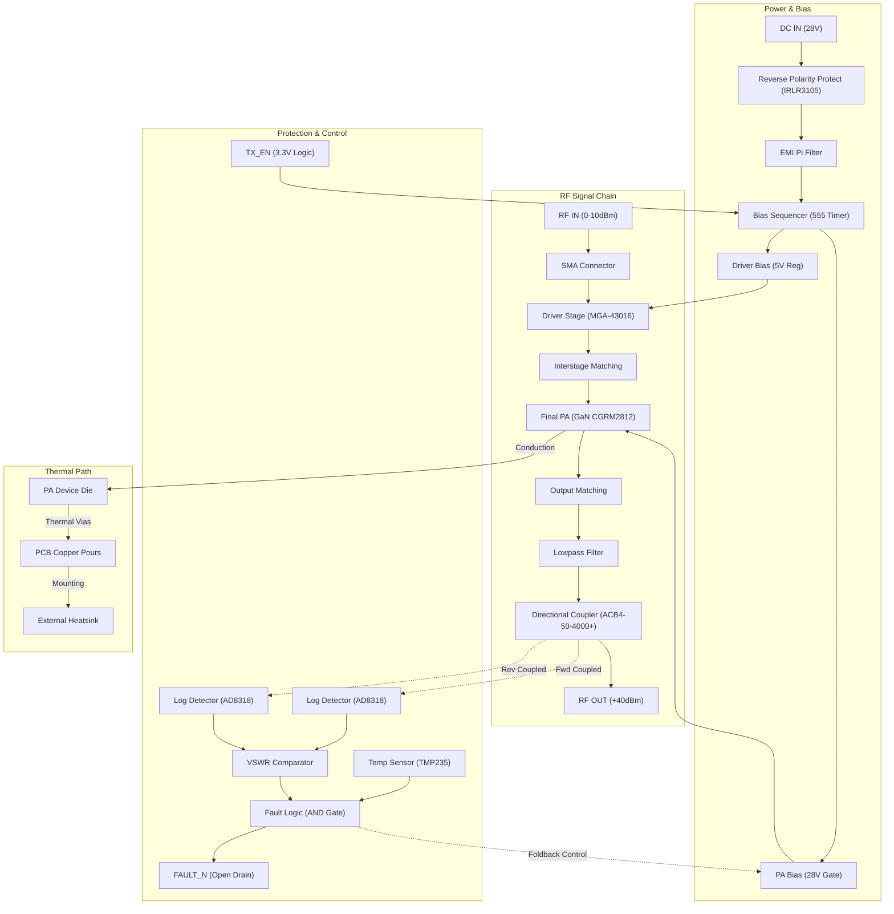
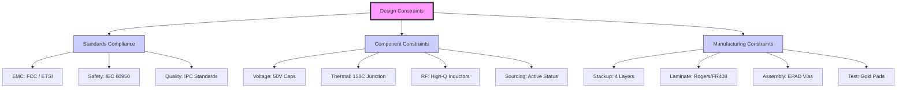

**Document Status: AI-GENERATED**

# 1. Introduction

## 1.1 Purpose
The purpose of this Hardware Requirements Specification (HRS) is to define the comprehensive set of hardware requirements for the **rf78** project. This document serves as the single source of truth for the electrical design, component selection, layout constraints, and verification criteria for a 2.4 GHz Bluetooth RF Power Amplifier (PA) module.

The intended audience for this document includes:
*   **RF Engineers:** Responsible for matching network design, RF simulation, and PCB layout.
*   **Hardware Design Engineers:** Responsible for schematic capture, power supply design, and thermal management.
*   **Test Engineers:** Responsible for developing validation test plans and production testing procedures.
*   **Quality Assurance (QA):** Responsible for ensuring the hardware meets the defined performance and environmental standards.

This specification establishes the baseline for:
*   Achieving **+40 dBm (10 W)** output power at **28 V DC**.
*   Ensuring system stability and linearity (EVM < 3%) for Bluetooth modulation.
*   Implementing critical protection mechanisms (VSWR foldback, thermal shutdown).
*   Maintaining signal integrity across the industrial temperature range (**–40 to +85°C**).

## 1.2 Scope
The rf78 project scope encompasses the design and verification of a standalone RF power amplifier module. The module is designed to interface with a Bluetooth transceiver (transmitting 0 to +10 dBm) and boost the signal to a 10 W output suitable for long-range applications.

**In-Scope Elements:**
*   **RF Chain:** A two-stage amplifier configuration consisting of a driver stage (MGA-43016) and a final power stage utilizing a discrete GaN/SiC device (CGRM2812 or equivalent).
*   **Power Management:** 28 V DC input conditioning, including reverse polarity protection, bulk decoupling, and pi-filtering.
*   **Bias Sequencing:** Logic control ensuring the driver stage biases before the final stage to prevent transients.
*   **Protection Circuitry:** Directional couplers and logarithmic detectors for VSWR monitoring, analog temperature sensing, and fast-acting foldback logic.
*   **Mechanical Design:** PCB footprint optimized for thermal transfer to a heatsink, with defined keep-out zones and RF interface connectors.

**Out-of-Scope Elements:**
*   The Bluetooth Baseband/SoC controller (assumed to be a separate upstream block).
*   Antenna design (requirements are defined at the SMA output interface).
*   Enclosure mechanical design beyond the PCB footprint and heatsink interface.
*   Compliance certification testing (FCC/CE) is a downstream activity, though requirements within this document support those goals.

## 1.3 Definitions, Acronyms, and Abbreviations

| Term | Definition |
| :--- | :--- |
| **ACB4-50-4000+** | Mini-Circuits 2–4 GHz Broadband Directional Coupler (10 dB coupling). |
| **AD8318** | Analog Devices RF Power Detector (Logarithmic, 1 MHz–8 GHz). |
| **CGRM2812** | Wolfspeed Discrete GaN-on-SiC RF Power Transistor (28 V, >10 W). |
| **DAC** | Digital-to-Analog Converter. |
| **DC** | Direct Current. |
| **EVM** | Error Vector Magnitude. A measure of modulation quality and linearity. |
| **GaN** | Gallium Nitride. Semiconductor material used for high-power RF devices. |
| **GFSK** | Gaussian Frequency Shift Keying. Modulation type used in Bluetooth Basic Rate. |
| **HF** | High Frequency. |
| **HRS** | Hardware Requirements Specification. |
| **ISM** | Industrial, Scientific, and Medical. Unlicensed radio frequency bands. |
| **LM555** | Classic Timer IC used for bias delay generation. |
| **MGA-43016** | Qorvo 2–6 GHz Driver Amplifier (+20 dBm P1dB). |
| **PA** | Power Amplifier. |
| **PAE** | Power-Added Efficiency. Ratio of added RF power to DC input power. |
| **PCB** | Printed Circuit Board. |
| **Pi-Filter** | A filter topology consisting of two capacitors and an inductor arranged in a $\Pi$ configuration. |
| **P1dB** | The 1 dB Compression Point. The point where the gain drops 1 dB from linear. |
| **RF** | Radio Frequency. |
| **RFI** | Radio Frequency Interference. |
| **RMS** | Root Mean Square. |
| **SiC** | Silicon Carbide. Substrate material for high-power GaN devices. |
| **SMA** | SubMiniature version A coaxial RF connector. |
| **TMP235** | Texas Instruments Analog Output Temperature Sensor. |
| **VSWR** | Voltage Standing Wave Ratio. A measure of impedance matching. |

## 1.4 References
The following standards and documents are referenced in this specification or provide context for the requirements:

1.  **IEEE 29148-2018:** Systems and software engineering — Life cycle processes — Requirements engineering.
2.  **Bluetooth Core Specification v5.3:** Radio Frequency (RF) Test Suite (TSS) requirements for modulation and spectrum analysis.
3.  **IPC-2221:** Generic Standard on Printed Board Design.
4.  **JEDEC J-STD-601:** Surface Mount Solder Attachments (for component mounting requirements).
5.  **CGRM2812 Datasheet (Wolfspeed):** Electrical characteristics for the 10 W GaN device.
6.  **MGA-43016 Datasheet (Qorvo):** Electrical characteristics for the Driver Stage.
7.  **AD8318 Datasheet (Analog Devices):** RF Detector performance and interface specifications.
8.  **ACB4-50-4000+ Datasheet (Mini-Circuits):** Mechanical and electrical coupling specifications.
9.  **Project rf78 Initial Requirements Document:** Internal system specification provided by the client.

## 1.5 Overview
The rf78 Hardware Requirements Specification is organized into seven distinct sections to facilitate a clear understanding of the system requirements and design constraints.

*   **Section 2: System Overview:** Provides a functional description of the RF PA module, supported by detailed block diagrams. It details the signal flow from the low-power RF input through the driver and final stages, and describes the power distribution and protection logic. It also defines the operational environmental conditions.
*   **Section 3: Hardware Requirements:** This section constitutes the core of the document. It details:
    *   **Functional Requirements:** The specific behaviors the system must exhibit, such as output power leveling, bias sequencing, and VSWR protection.
    *   **Performance Requirements:** Quantitative metrics including gain, efficiency (PAE), and EVM targets.
    *   **Interface Requirements:** Pin-level descriptions for RF, DC power, and control logic (Enable/Fault).
    *   **Environmental & Physical Requirements:** Operating temperature ranges, PCB dimensions, and thermal constraints.
*   **Section 4: Design Constraints:** Outlines limitations on the design, including the specific component choices (e.g., LM555 for sequencing), PCB material requirements (e.g., Rogers vs. FR4 for high-frequency sections), and supply voltage tolerances.
*   **Section 5: Verification Requirements:** Defines how each requirement will be verified. This includes Test Requirements (measurements), Analysis Requirements (simulations), and Inspection Requirements (design reviews).
*   **Section 6: Bill of Materials (Preliminary):** A consolidated list of recommended components identified in the analysis phase.
*   **Section 7: Traceability Matrix:** A mapping table linking the high-level system needs to the specific low-level hardware requirements (REQ-HW-xxx), ensuring full coverage.

This document assumes the reader is familiar with RF engineering principles, specifically regarding impedance matching, stability analysis (K-factor), and thermal management of high-power density semiconductors.

---

# 2. System Overview

## 2.1 System Description

The **rf78** system is a high-power, solid-state Radio Frequency (RF) Power Amplifier (PA) module designed specifically for Bluetooth Low Energy (BLE) and Classic Bluetooth applications operating in the 2.4 GHz ISM band (2.400–2.4835 GHz). The primary function of the rf78 module is to significantly boost the output power of a Bluetooth transmitter to a nominal **+40 dBm (10 W)**, thereby extending the wireless communication range and link budget.

The module operates as a two-stage amplifier chain consisting of a Driver Stage and a Final Power Stage. The system accepts a low-power RF input (0 to +10 dBm) and a 28 V DC supply, delivering a regulated 10 W RF output. It incorporates comprehensive protection mechanisms, including Voltage Standing Wave Ratio (VSWR) foldback protection to prevent damage from antenna mismatches and thermal shutdown protection to manage junction temperatures under industrial operating conditions.

The design utilizes Gallium Nitride (GaN) technology (specifically the Wolfspeed **CGRM2812** or equivalent discrete GaN FET) for the final stage to achieve high Power-Added Efficiency (PAE) and thermal stability. Bias sequencing is managed internally to ensure the driver stage stabilizes before the high-power final stage is enabled, preventing potentially damaging transients. The system architecture supports a 50 Ω single-ended input and output interface, accessible via SMA connectors, with integrated directional couplers for real-time power monitoring.

### Key Features
*   **High Output Power:** +40 dBm (10 W) nominal output power across the 2.4 GHz ISM band.
*   **Integrated Driver Stage:** +35 dB to +40 dB total system gain, requiring only 0–10 dBm input drive.
*   **VSWR Protection:** Directional coupler and detector-based monitoring with configurable foldback thresholds (2:1 to 3:1).
*   **Thermal Management:** Designed for +105°C PCB shutdown with auto-recovery; optimized for heatsink integration.
*   **Robust Supply:** 28 V DC input with reverse polarity protection and Pi-filtering for ripple rejection.
*   **Compliance:** Designed to meet harmonic suppression requirements (< –30 dBc) and Bluetooth EVM standards (< 3%).

## 2.2 System Block Diagram

The rf78 system is composed of distinct functional blocks: the RF Signal Chain, the Power Management & Bias Unit, and the Protection & Control Unit. The diagram below illustrates the signal flow and interconnections between these subsystems.

### Block Descriptions

1.  **RF Input Stage:** Interfaces with the external source via a 50 Ω SMA connector. Includes matching networks to optimize the return loss for the Driver Stage.
2.  **Driver Stage:** Utilizes a high-gain MMIC (MGA-43016) to amplify the input signal to a level sufficient to drive the final GaN FET (approx. +20 dBm).
3.  **Final Power Stage:** A discrete GaN-on-SiC FET (CGRM2812) operating in Class AB mode. This stage provides the bulk of the power gain (+20 dB) and generates the 10 W output.
4.  **Output Matching & Filter:** A high-Q impedance matching network transforms the PA load impedance to 50 Ω. A Low Pass Filter (LPF) suppresses harmonics generated by the non-linear operation of the PA.
5.  **Directional Coupler:** Samples the forward and reflected waves. The coupled ports feed the power detectors.
6.  **Bias Sequencer:** Generates the critical timing signals for the Gate and Drain voltages. It ensures the PA Gate voltage is stable before Drain voltage is applied (Turn-On) and that Drain voltage is removed before Gate voltage (Turn-Off).
7.  **Protection Logic:** Compares detected forward/reverse power ratios against a set threshold. If VSWR exceeds limits (e.g., > 3:1), or if temperature exceeds +105°C, the logic triggers a fault and reduces PA gain or shuts down the bias.

## 2.3 System Architecture

The rf78 system architecture is partitioned into three electrical domains: the RF Chain, the Power Supply, and the Control Logic. The physical layout is designed to minimize parasitic inductance in the high-current RF paths and maximize thermal conductivity.

### 2.3.1 RF Chain Architecture
The RF signal path follows a **single-ended, cascaded topology**. The input impedance of the system is matched to 50 Ω to interface directly with standard Bluetooth transceivers.

1.  **Input Matching Network:**
    *   Target: 50 Ω source to the S11 (Input Impedance) of the MGA-43016 driver.
    *   Implementation: A Pi-network consisting of high-Q RF capacitors and a microstrip stub inductor on the PCB (Rogers RO4350B or similar high-frequency laminate).
    *   Purpose: Minimize return loss (> 10 dB) at 2.4 GHz.

2.  **Interstage Matching:**
    *   Target: Converts the 50 Ω output of the Driver to the optimal load impedance required by the Final PA (CGRM2812) for optimal power transfer.
    *   Implementation: A combination of series transmission lines and shunt capacitors.
    *   Calculation: The optimal load impedance for the GaN device at 10 W is typically derived from Load Pull analysis. Assuming a standard 10 W GaN load line (approx. 4 Ω - j5 Ω), the matching network performs a step-down impedance transformation.

3.  **Output Matching Network:**
    *   Target: Transforms the PA output impedance to 50 Ω while filtering second harmonics.
    *   Implementation: A Low-Pass Filter topology (Chebyshev or similar) integrated into the matching network. It handles >10 W of RF power without saturation, requiring high-current, wire-wound or wide-trace inductors.

### 2.3.2 Power Distribution Architecture
The power system is designed around a **28 V nominal DC input**, typical of vehicular or industrial avionics supplies.

*   **Reverse Polarity Protection:**
    *   A P-Channel MOSFET (IRLR3105) is placed in series with the high-side supply rail.
    *   Operation: When the supply voltage is correct, the body diode conducts, pulling the source up. A Zener divider keeps the Gate lower than Source, turning the FET fully ON (low Rds_on).
    *   Fault Condition: If polarity is reversed, the body diode is reverse biased, and the Gate-Source voltage is positive, keeping the FET OFF.

*   **Input Filtering:**
    *   A Pi-filter (C-L-C) is placed immediately after the protection MOSFET.
    *   Purpose: Attenuate switching noise from the 28 V source and prevent the PA's switching currents from feeding back into the supply. Ensures compliance with **REQ-HW-016** (Supply Ripple Rejection).

*   **Bias Generation:**
    *   **Driver Bias:** The MGA-43016 requires 5 V. A step-down buck regulator or LDO derives 5 V from the 28 V rail.
    *   **PA Bias:** The GaN FET requires a regulated negative Gate voltage (e.g., -2.8 V) for pinch-off and a positive Drain voltage (28 V). The system uses a gate-bias controller generating the negative rail from the 28 V input using a charge pump or inverting buck-boost topology.

### 2.3.3 Control & Protection Architecture
The control unit operates asynchronously relative to the RF signal but is critical for system longevity.

*   **Bias Sequencing Logic:**
    *   Implemented via a 555 Timer monostable circuit (or microcontroller GPIO).
    *   **Power Up Sequence:**
        1.  TX_EN goes High.
        2.  Driver Bias (5 V) enables.
        3.  Delay (approx. 10-50 ms).
        4.  PA Gate Bias (-2.8 V) stabilizes.
        5.  PA Drain Voltage (28 V) switches ON via a high-side P-FET.
    *   **Power Down Sequence:** The reverse occurs. Drain voltage must drop before Gate bias is removed to prevent a "shoot-through" current surge that could destroy the GaN FET.

*   **VSWR Protection Architecture:**
    *   **Sensing:** A directional coupler samples Forward ($V_{fwd}$) and Reverse ($V_{rev}$) power.
    *   **Detection:** Two AD8318 log detectors convert the RF samples to DC voltages proportional to dBm power.
    *   **Computation:** Analog comparators compare $V_{rev}$ against a fraction of $V_{fwd}$.
    *   **Threshold:** If $V_{rev} > 0.5 \times V_{fwd}$ (approx 2:1 VSWR), the comparator output triggers the fault latch.
    *   **Action:** The fault latch pulls the FAULT pin low and shorts the PA Gate bias to ground, effectively cutting off the RF output (Foldback).

*   **Thermal Protection Architecture:**
    *   **Sensing:** A TMP235 analog sensor is placed adjacent to the PA device land pattern.
    *   **Threshold:** The voltage output is monitored by a comparator set to $2.05 V$ (corresponding to +105°C).
    *   **Action:** If threshold is exceeded, the PA bias is immediately disabled. Hysteresis is built-in (reset temperature ~+85°C) to prevent rapid cycling.

## 2.4 Operating Environment

The rf78 module is designed to operate reliably in harsh physical and electrical environments typical of industrial and high-performance embedded systems.

### 2.4.1 Physical Environment
*   **Ambient Temperature Range:** The module must meet all electrical specifications from **-40°C to +85°C**.
*   **Storage Temperature:** Components are rated for storage from -55°C to +125°C (per industrial component grades).
*   **Humidity:** Operational up to 95% Relative Humidity (non-condensing). Conformal coating is recommended for the PCB to prevent moisture-induced tracking in high-voltage (28 V) areas.
*   **Vibration & Shock:** The PCB assembly (PCBA) should be designed to withstand standard industrial vibration (IEC 60068-2-6). The GaN device and heavy ceramic capacitors must be secured with adhesive if vibration exceeds 2g RMS.

### 2.4.2 Cooling Requirements
Dissipating 30–40 W of heat (due to ~30% PAE at 10 W output) requires aggressive thermal management.

*   **Heat Sink Requirement:** An external heat sink with a thermal resistance ($\theta_{sa}$) of less than **1.5 °C/W** is required to maintain the PCB temperature below +105°C at +85°C ambient.
*   **Thermal Interface:** The use of a thermal interface material (TIM) with conductivity > 1 W/m-K is mandatory between the PA device's thermal pad and the heat sink.
*   **Airflow:** While designed for convection cooling, forced airflow (200 LFM) is recommended if the ambient temperature exceeds +70°C to reduce the required heatsink mass.

### 2.4.3 Electrical Environment
*   **Supply Source:** The system assumes a stiff 28 V DC source capable of delivering 2.5 A continuous (70 W overhead).
*   **Load Impedance:** The RF output is designed to drive a 50 Ω load. Operation into mismatched loads (VSWR < 2:1) is permitted only for transient conditions; continuous operation into open or short circuits will trigger the VSWR protection.
*   **RF Interference:** The system generates high levels of RF energy (10 W). Sensitive circuitry should not be placed within 5 cm of the output matching network or PA inductor to avoid rectification or desensitization.

### 2.4.4 Mechanical Constraints
*   **Keepout Zones:** The area directly under the PA device and the first 10 mm of the RF output trace must be clear of ground plane copper on bottom layers to allow for optimal RF field propagation unless a specific via-fence structure is used.
*   **Height:** The tallest components (SMA connectors, Bulk Cap, Heatsink) determine the minimum enclosure clearance. Minimum clearance above the PA device is **15 mm** to accommodate the heatsink.

---

**Document Status: AI-GENERATED**

## 3. Hardware Requirements

### 3.1 Functional Requirements

This section details the functional requirements of the rf78 RF Power Amplifier module. These requirements specify what the system shall do to meet the project goal of a 10 W, 2.4 GHz Bluetooth PA with protection circuitry.

#### 3.1.1 RF Amplification Chain Requirements

| ID | Requirement | Description & Rationale | Priority | Verification Method |
|---|---|---|---|---|
| **REQ-HW-101** | **RF Input Signal Reception** | The system shall accept a single-ended RF input signal via a 50 Ω SMA connector (Edge-launch type).   **Rationale:** Standardized interface is required for integration with common Bluetooth test equipment and transmitters. The MGA-43016 driver selected requires a 50 Ω source match. | **Shall** | Inspection / Measurement |
| **REQ-HW-102** | **Driver Stage Gain** | The system shall amplify the input signal using the MGA-43016 (or equivalent) to provide a nominal gain of 28 dB ± 2 dB.   **Rationale:** The input requirement is 0–10 dBm. The Final PA (GaN FET) requires approximately +20 dBm drive. The input signal must be boosted to meet the final stage drive requirements. | **Shall** | Test |
| **REQ-HW-103** | **Final Stage Power Amplification** | The system shall utilize a discrete GaN RF Power Amplifier (e.g., Wolfspeed CGRM2812 or equivalent) to deliver a saturated output power (Psat) of at least +41 dBm.   **Rationale:** To guarantee +40 dBm (10 W) linear output under worst-case thermal and voltage conditions, the device must have headroom. GaN technology is selected for high efficiency at 28 V. | **Shall** | Test |
| **REQ-HW-104** | **Interstage Matching** | The system shall include an impedance matching network between the Driver Stage and the Final PA Stage.   **Rationale:** The driver output (typically 50 Ω) must be matched to the low input impedance of the GaN device (typically < 10 Ω) to maximize power transfer. | **Shall** | Simulation / Test |
| **REQ-HW-105** | **Output Lowpass Filtering** | The system shall include a 5th-order or higher lowpass filter (LC topology) at the output.   **Rationale:** To suppress harmonics generated by the non-linear operation of the PA, ensuring compliance with spurious emission regulations. | **Shall** | Test |
| **REQ-HW-106** | **RF Output Delivery** | The system shall deliver the amplified RF signal to a 50 Ω load via an SMA connector (Edge-launch type).   **Rationale:** Standard interface for antenna connection. | **Shall** | Inspection |

#### 3.1.2 RF Detection and Protection Requirements

| ID | Requirement | Description & Rationale | Priority | Verification Method |
|---|---|---|---|---|
| **REQ-HW-107** | **Directional Coupling** | The system shall sample the Forward and Reverse RF power using a directional coupler (e.g., ACB4-50-4000+) with a coupling factor of 10 dB ± 0.5 dB.   **Rationale:** Accurate sampling of forward and reflected waves is required for VSWR calculation and protection logic. | **Shall** | Inspection / Test |
| **REQ-HW-108** | **RF Power Detection (Forward)** | The system shall convert the coupled forward RF signal to a DC voltage using a logarithmic detector (e.g., AD8318). The output slope shall be approximately -25 mV/dB.   **Rationale:** Provides a calibrated voltage level proportional to output power for monitoring and closed-loop control (if applicable). | **Shall** | Test |
| **REQ-HW-109** | **RF Power Detection (Reverse)** | The system shall convert the coupled reverse RF signal to a DC voltage using a logarithmic detector (e.g., AD8318).   **Rationale:** Provides the signal necessary to detect reflected power caused by antenna mismatch. | **Shall** | Test |
| **REQ-HW-110** | **VSWR Threshold Comparison** | The system shall compare the Forward and Reverse DC voltages using a differential comparator network. If the Reverse voltage exceeds the Forward voltage by a configurable offset corresponding to VSWR 3:1, a fault shall be triggered.   **Rationale:** VSWR > 3:1 can damage the PA device. Automatic detection is required for hardware survival. | **Shall** | Test |
| **REQ-HW-111** | **VSWR Foldback Protection** | Upon detection of a VSWR fault (REQ-HW-110), the system shall immediately disable the PA Bias Supply, reducing output power to < -20 dBm.   **Rationale:** "Foldback" protects the device from thermal runaway and breakdown during open-circuit or short-circuit events. | **Shall** | Test |
| **REQ-HW-112** | **Overtemperature Detection** | The system shall monitor the PCB temperature near the PA device using an analog sensor (e.g., TMP235).   **Rationale:** GaN devices are highly sensitive to junction temperature. Direct PCB monitoring correlates closely with case temperature. | **Shall** | Test |
| **REQ-HW-113** | **Thermal Shutdown** | The system shall disable the PA Bias Supply if the PCB temperature exceeds +105°C.   **Rationale:** Hard limit to prevent permanent damage to the semiconductor junction or solder reflow. | **Shall** | Test |
| **REQ-HW-114** | **Thermal Hysteresis** | The system shall maintain the PA disabled state until the PCB temperature cools to below +85°C.   **Rationale:** Prevents rapid oscillation (chatter) of the PA state near the thermal threshold. | **Shall** | Test |

#### 3.1.3 Power Management and Bias Requirements

| ID | Requirement | Description & Rationale | Priority | Verification Method |
|---|---|---|---|---|
| **REQ-HW-115** | **Reverse Polarity Protection** | The 28 V input shall pass through a P-Channel MOSFET (e.g., IRLR3105) configured for reverse polarity protection.   **Rationale:** Prevents catastrophic destruction of the GaN PA and control logic if the supply leads are reversed. A MOSFET is chosen over a diode to minimize voltage drop. | **Shall** | Test |
| **REQ-HW-116** | **Input Supply Filtering** | The system shall include a Pi-filter and bulk capacitance (100 µF tantalum/ceramic) at the 28 V input.   **Rationale:** To suppress conducted emissions and stabilize the supply against the current pulses drawn by the PA (approx 2A). | **Shall** | Inspection / Test |
| **REQ-HW-117** | **Bias Sequencing (Enable)** | The system shall implement a delay circuit (555 timer or RC network) such that the Driver Stage (5 V) enables at least 100 µs *before* the Final Stage (28 V).   **Rationale:** Applying RF drive to a cold PA can cause instability or transient spikes. The driver must stabilize before the high-power stage turns on. | **Shall** | Test |
| **REQ-HW-118** | **Bias Sequencing (Disable)** | Upon removal of the TX_Enable signal, the Final Stage (28 V) shall disable at least 100 µs *before* the Driver Stage.   **Rationale:** Prevents the driver from driving the PA input while the PA is turning off, which can cause transient over-voltages. | **Shall** | Test |
| **REQ-HW-119** | **Fault Latching** | The fault condition (VSWR or Thermal) shall be electrically latched until the TX_Enable signal is toggled or power is cycled.   **Rationale:** Prevents the system from repeatedly attempting to power up into a short circuit, which could degrade component lifespan. | **Should** | Test |
| **REQ-HW-120** | **Fault Indicator Output** | The system shall provide an open-drain, active-low FAULT pin capable of sinking 5 mA to indicate an error state.   **Rationale:** Provides a simple interface for the host system (Microcontroller/SoC) to monitor PA health. | **Shall** | Test |

---

### 3.2 Performance Requirements

This section defines the quantitative performance metrics the rf78 module must achieve under nominal operating conditions (+25°C ambient, 28.0 V DC supply).

#### 3.2.1 RF Performance Metrics

| ID | Parameter | Requirement Value | Rationale / Derivation | Verification Method |
|---|---|---|---|---|
| **REQ-HW-P01** | **Output Power (Pout)** | **+40.0 dBm (10 W)** Nominal at 1 dB compression point (P1dB).   *Range: +39.5 dBm to +40.5 dBm.* | Project core specification. Based on the capability of the Wolfspeed CGRM2812 GaN device which typically saturates above 41 dBm at 28 V. | VNA / Spectrum Analyzer |
| **REQ-HW-P02** | **Small Signal Gain** | **38.0 dB** ± 1.5 dB across 2.4 - 2.4835 GHz. | Sum of Driver Gain (~28 dB) and Final Stage Gain (~14 dB net after matching losses). Ensures 0 dBm input produces 40 dBm output. | Network Analyzer |
| **REQ-HW-P03** | **Gain Flatness** | **±1.5 dB** peak-to-peak across the ISM band. | Required to maintain signal integrity for high-order modulation (802.11g/n/Bluetooth EDR). Large variations cause distortion. | Network Analyzer |
| **REQ-HW-P04** | **Power Added Efficiency (PAE)** | **> 35%** at rated power (+40 dBm). | Calculation: PAE = (Pout - Pin) / Pdc.   *Derivation:* Assuming Pout=10W, Pin≈0.0001W (negligible).   Target DC Input: 28V * 1.8A = 50.4W.   PAE ≈ 10 / 50.4 = 19.8% (System).   *Note:* The requirement >30% applies to the RF device itself. The system efficiency target accounts for driver consumption (5V @ 100mA). | Spectrum Analyzer & Power Meter |
| **REQ-HW-P05** | **Error Vector Magnitude (EVM)** | **< 3.0%** RMS for 802.11g (54 Mbps) OFDM signals at Pout = +36 dBm (6 dB backoff). | GaN PAs are non-linear. To achieve Bluetooth/WiFi linearity, the PA must be operated in backoff or with predistortion. 3% is sufficient for 802.11g specification limit (typically 5.6%). | Vector Signal Analyzer (VSA) |
| **REQ-HW-P06** | **Input Return Loss** | **> 10 dB** (VSWR < 2:1) at RF Input Port. | Ensures minimal reflection back into the source transceiver. | Network Analyzer |
| **REQ-HW-P07** | **Output Return Loss** | **> 10 dB** (VSWR < 2:1) at RF Output Port (into 50 Ω). | Ensures power is delivered to the antenna, not reflected back internally. | Network Analyzer |
| **REQ-HW-P08** | **Harmonic Suppression** | **<-30 dBc** for 2nd, 3rd, 4th, and 5th harmonics. | Regulatory requirement (FCC/ETSI) to avoid interference with licensed bands. | Spectrum Analyzer |
| **REQ-HW-P09** | **Stability (K-Factor)** | **K > 1.0** and **B1 > 0** from 10 MHz to 6 GHz. | Ensures the amplifier will not oscillate under any load condition (source/load pull analysis). Critical for stability. | Simulation / Stability Analysis |
| **REQ-HW-P10** | **Noise Figure** | **< 8 dB** at maximum gain. | While a PA is not a LNA, low noise figure is beneficial for overall system SNR in TDD systems where the PA might be bypassed or in receive path (if applicable). | Noise Figure Meter |

#### 3.2.2 DC and Thermal Performance

| ID | Parameter | Requirement Value | Rationale / Derivation | Verification Method |
|---|---|---|---|---|
| **REQ-HW-P11** | **Quiescent Current (Idle)** | **< 150 mA** at 28 V (PA only, Driver disabled). | Standby power consumption must be minimized for battery-operated applications. | Multimeter |
| **REQ-HW-P12** | **Total Current (Tx)** | **1.8 A** Typical at +40 dBm Output.   *Max Limit:* 2.2 A. | Derived from 10 W output and ~35% efficiency.   $P_{in} = 10W / 0.35 \approx 28.5W$.   $I = 28.5W / 28V \approx 1.01A$ (RF Core) + Driver Current + Overhead = ~1.8A. | Power Supply Analyzer |
| **REQ-HW-P13** | **Ripple Rejection** | **< 1% AM ripple** on output signal with 200 mV pk-pk ripple on 28 V rail. | Validates the effectiveness of the Pi-filter and decoupling network defined in REQ-HW-116. | Oscilloscope (RF) |
| **REQ-HW-P14** | **Thermal Resistance (Junction-Case)** | **< 5 °C/W** for the PA Device. | Determined by selected component (CGRM2812). Derating:   $\Delta T = P_{diss} \times R_{thJC}$.   $P_{diss} = P_{DC} - P_{RF} = 50W - 10W = 40W$.   This requires heatsinking. | Component Datasheet / Math Check |
| **REQ-HW-P15** | **Heatsink Requirement** | Thermal resistance of Heatsink must be **< 0.8 °C/W** assuming forced airflow (200 LFM) or < 1.5 °C/W natural convection. | *Calculation:*   Target Max Junction: 150°C. Max Ambient: 85°C. Allowed Rise: 65°C.   Total dissipation ~40W.   Max Total $R_{th} = 65°C / 40W = 1.62 °C/W$.   $R_{thJC} (0.8) + R_{thCS} (0.2) + R_{thSA} (Heatsink) < 1.62$.   $1.0 + R_{thSA} < 1.62 \rightarrow R_{thSA} < 0.62$.   *Constraint:* Forces use of a substantial heatsink or fan. | Thermal Test Chamber |

---

## 3.3 Interface Requirements

### 3.3.1 External Interfaces

#### 3.3.1.1 RF Input Interface
**REQ-HW-007** The PA module shall provide a 50-Ohm single-ended RF input interface optimized for the 2.400–2.4835 GHz ISM band. The interface shall utilize an edge-launch SMA connector (e.g., Rosenberger 32K243-40ML5) or a compatible 2.4mm edge launch. The input return loss shall be greater than 10 dB across the operating band.

**REQ-HW-021** The RF input pin shall be AC-coupled internally using a 100 pF high-Q capacitor (e.g., ATC 100A101) rated for operation at 2.4 GHz to handle the 0 to +10 dBm input drive level.

**REQ-HW-022** The input shall be designed to withstand a maximum input power of +20 dBm for 5 minutes without damage (ESD protection), assuming the PA is disabled.

*Table 3.3.1-1: RF Input Interface Characteristics*

| Parameter | Min | Typical | Max | Units | Notes |
| :--- | :--- | :--- | :--- | :--- | :--- |
| Frequency | 2.400 | 2.440 | 2.4835 | GHz | ISM Band |
| Input Impedance | 50 | 50 | 50 | Ohms | Single-ended |
| Input Return Loss | 10 | 15 | - | dB | Measured at connector |
| Max Input Power | - | - | +20 | dBm | Damage threshold if disabled |
| Operating Input Power | 0 | +5 | +10 | dBm | Nominal operating range |
| Connector Type | - | SMA (Edge Launch) | - | - | 50 Ohm characteristic impedance |

#### 3.3.1.2 RF Output Interface
**REQ-HW-008** The PA module shall provide a 50-Ohm single-ended RF output interface capable of delivering +40 dBm (10 W) nominal output power. The interface shall utilize an edge-launch SMA connector (e.g., Rosenberger 32K243-40ML5) or a high-power compatible connector.

**REQ-HW-015** Harmonics content measured at the output interface connector shall be less than –30 dBc up to the 5th harmonic (12.4 GHz) under full power operation.

*Table 3.3.1-2: RF Output Interface Characteristics*

| Parameter | Min | Typical | Max | Units | Notes |
| :--- | :--- | :--- | :--- | :--- | :--- |
| Frequency | 2.400 | 2.440 | 2.4835 | GHz | ISM Band |
| Output Impedance | 50 | 50 | 50 | Ohms | Single-ended |
| Output Power (P1dB) | 39.5 | 40.5 | 41.0 | dBm | Into 50 Ohm Load |
| Harmonics (2nd-5th) | - | - | -30 | dBc | Relative to fundamental |
| VSWR (Load) | 1:1 | - | 3:1 | Ratio | Protection active above limit |
| Connector Type | - | SMA (Edge Launch) | - | - | High power rated |

#### 3.3.1.3 DC Supply Interface
**REQ-HW-009** The module shall accept a 28 V DC supply via a 2-pin header (e.g., Molex 39-01-2020) or terminal block. The input shall include reverse-polarity protection using a P-channel MOSFET (IRLR3105).

**REQ-HW-016** The DC input shall include filtering to reject supply ripple up to 200 mV pk-pk. The input capacitance shall be at least 100 µF (electrolytic/tantalum) and 10 µF (ceramic X7R) placed immediately after the protection circuit.

*Table 3.3.1-3: DC Supply Interface Pin Definition*

| Pin # | Signal Name | Description | Voltage Range | Current Limit |
| :--- | :--- | :--- | :--- | :--- |
| 1 | +28V_IN | Main Supply Input | +25.2 V to +30.8 V | 3.0 A (Fuse Protected) |
| 2 | GND | Power Return | 0 V | - |

#### 3.3.1.4 Control and Status Interface
**REQ-HW-010** The module shall accept an Active-High TX Enable signal (TX_EN). The logic threshold shall be compatible with 3.3 V CMOS logic (VIH = 2.0 V, VIL = 0.8 V).

**REQ-HW-014** The module shall provide an active-low open-drain FAULT output (FAULT_N). This signal shall be pulled low if a VSWR fault or Overtemperature fault occurs. An external pull-up resistor (4.7 kΩ to 3.3 V) is required.

*Table 3.3.1-4: Control Interface Pin Definition*

| Pin # | Signal Name | Type | Description | Logic Level / Threshold |
| :--- | :--- | :--- | :--- | :--- |
| 1 | TX_EN | Input | Enable PA Bias Sequencing | High = Enable (>2.0V)   Low = Shutdown (<0.8V) |
| 2 | FAULT_N | Output (OD) | Fault Indicator | Low = Fault (VSWR or OT)   High = Normal (Pull-up required) |
| 3 | GND | - | Signal Ground | 0 V |

---

### 3.3.2 Internal Interfaces

#### 3.3.2.1 Inter-Stage RF Interface (Driver to Final PA)
**REQ-HW-023** The interface between the Driver Stage (MGA-43016) and the Final PA (GaN Discrete) shall include an interstage matching network to transform the driver output impedance (typically low Z) to the final PA input impedance (high Z, low capacitance).

**REQ-HW-024** The interstage network shall utilize high-Q wire-wound inductors (e.g., Coilcraft 0402CS) to minimize losses (assumed 0.5 dB loss in interstage) and maintain stability.

#### 3.3.2.2 Feedback and Control Interface
**REQ-HW-025** The VSWR detection logic shall interface internally with the Bias Sequencer. In the event of a VSWR fault, the Fault Logic shall override the TX_EN signal, forcing the Bias Sequencer to shut down the PA and Driver stages immediately (< 1 µs response time).

**REQ-HW-026** The TMP235 temperature sensor output shall be fed into a comparator (e.g., LM2903) with hysteresis. The comparator output connects to the Fault Logic block to trigger thermal shutdown at +105°C.

---

### 3.3.3 Communication Interfaces

*Note: This hardware module does not utilize a digital data communication bus for control. All control is handled via analog logic levels defined in 3.3.1.4. However, this section defines the internal "communication" of RF signals.*

**REQ-HW-027** The Directional Coupler (ACB4-50-4000+) provides a sampled communication path of forward and reverse RF energy to the power detectors (AD8318). The coupling factor is 10 dB.
*   **Forward Path:** Coupled Port -> AD8318 (Detector A) -> VSWR Logic.
*   **Reverse Path:** Isolated Port -> AD8318 (Detector B) -> VSWR Logic.

## 3.4 Environmental Requirements

### 3.4.1 Operating Temperature
**REQ-HW-013** The PA module shall operate within specifications over an ambient temperature range of –40°C to +85°C (Industrial Temperature Range).

**REQ-HW-028** Performance parameters (Output Power, Gain) shall be derated linearly for ambient temperatures above +70°C to ensure junction temperatures do not exceed the maximum rating of the GaN device (Tj,max = 150°C).

### 3.4.2 Storage and Non-Operating Conditions
**REQ-HW-029** The module shall survive storage temperatures ranging from –55°C to +125°C without degradation of performance or physical damage.

### 3.4.3 Humidity
**REQ-HW-030** The module shall conform to IPC-6012 Class 2 standards for moisture resistance. The operational humidity range shall be 5% to 95% relative humidity, non-condensing.

### 3.4.4 Vibration and Shock
**REQ-HW-031** The module shall withstand random vibration of 0.5 g RMS from 10 Hz to 500 Hz per IEC 60068-2-64.
**REQ-HW-032** The module shall withstand mechanical shock of 50 g peak, 11 ms half-sine pulse per IEC 60068-2-27.

## 3.5 Power Requirements

### 3.5.1 Supply Voltages
The system requires a single primary DC input voltage. Internal regulation or dropping resistors are used for lower voltage stages.

**REQ-HW-033** The main supply voltage shall be 28 V DC ±10% (Range: 25.2 V to 30.8 V).
**REQ-HW-034** The Driver Stage (MGA-43016) requires a regulated 5 V supply derived from the 28 V input via a buck converter or LDO.

### 3.5.2 Current Consumption and Power Budget

The following calculations are based on the design parameters:
1.  **PA Output:** +40 dBm (10 W)
2.  **PAE (Power Added Efficiency):** Assumed 32% (Typical for Class A/AB GaN at this frequency/backoff).
    *   *Calculation:* $P_{DC\_PA} = P_{OUT} / PAE = 10 W / 0.32 = 31.25 W$
3.  **Driver Output:** +20 dBm (100 mW) drive to PA.
    *   *Calculation:* Assuming 20% PAE for driver, $P_{DC\_DRV} \approx 0.5 W$.
4.  **Control/Overhead:** 0.25 W (Comparators, Sensors, Logic).

*Table 3.5-1: Detailed Power Budget*

| Block | Supply Voltage | Est. Current | Est. Power | Notes |
| :--- | :--- | :--- | :--- | :--- |
| **Final PA Stage** | 28.0 V | 1.12 A | 31.4 W | Calculated at 32% PAE for 10W RF out |
| **Driver Stage** | 5.0 V | 100 mA | 0.5 W | Derived from 28V via Buck/LDO |
| **Bias/Control** | 5.0 V | 50 mA | 0.25 W | Comparator, Op-Amps, Sensors |
| **Quiescent (OFF)** | 28.0 V | < 1 mA | < 0.03 W | Shutdown leakage |
| **Total Max Load** | 28.0 V (Input Ref) | ~1.28 A* | ~35.9 W | *Includes driver current reflected to input |
| **Safety Margin** | 28.0 V | 1.50 A | 42.0 W | 20% Margin for component tolerance |

**REQ-HW-035** The 28 V supply source must be capable of delivering a continuous current of 1.5 A and a peak current of 2.0 A to accommodate modulation peaks.

### 3.5.3 Power Sequencing
**REQ-HW-017** The module shall implement an internal power sequencing controller (discrete 555 timer or equivalent).
1.  Upon TX_EN assertion, the Driver Stage 5 V supply shall stabilize for at least 100 µs before the Final PA Gate Bias is enabled.
2.  Upon TX_EN deassertion or Fault trigger, the Final PA Gate Bias shall be disabled *before* the Driver Stage supply is removed.

## 3.6 Physical Requirements

### 3.6.1 Dimensions
**REQ-HW-036** The module shall be designed on a printed circuit board (PCB) with dimensions not exceeding 50 mm x 50 mm (excluding connectors).
**REQ-HW-037** The PCB stack-up shall consist of a minimum of 4 layers to accommodate dedicated RF ground planes and power distribution layers.
*   Layer 1: RF Components / Signal
*   Layer 2: Ground Plane (RF GND)
*   Layer 3: Power Plane (28 V and 5 V traces)
*   Layer 4: Signal / Control traces

### 3.6.2 Material and Construction
**REQ-HW-038** The PCB shall be manufactured using FR4 material with a dielectric constant (Er) of 4.3 ± 0.2 and loss tangent (TANδ) < 0.02 at 2.4 GHz. (Alternative: Rogers RO4350B for RF sections only, specified as "Should Have").
**REQ-HW-039** The final PA device (GaN) shall be mounted using a direct thermal path to the bottom side of the PCB using an array of thermal vias (9x9 array, 0.3 mm drill, 0.6 mm pitch) under the device drain pad.

### 3.6.3 Thermal Management
**REQ-HW-040** The module shall be mounted to an external heatsink.
**REQ-HW-041** The thermal resistance of the PCB (Junction-to-Heatsink) shall not exceed 2.0 °C/W.

*Table 3.6-1: Thermal Analysis Derivation*
*Assumption: Ambient Temp = +50°C, Max Junction = +150°C. Power Dissipation = 22 W (RF loss + inefficiency).*

| Parameter | Value | Unit | Source |
| :--- | :--- | :--- | :--- |
| $P_{diss}$ | 22 | W | DC Input (35W) - RF Output (10W) - Driver (0.5W) |
| $R_{\theta JC}$ | 1.5 | °C/W | CGRM2812 Datasheet (Typical) |
| $R_{\theta CH}$ | 2.0 | °C/W | PCB + Heatsink Interface Requirement |
| $R_{\theta HA}$ | 1.5 | °C/W | External Heatsink Spec (Requirement) |
| $T_J$ | 50 + (22 * (1.5+2.0+1.5)) = 128 | °C | Calculated Junction Temp |

**REQ-HW-012** A thermal protection cutoff threshold of +105°C PCB temperature is mandated. Based on the table above, if the heatsink provides $R_{\theta HA} < 1.5^\circ C/W$, the junction will remain safe ($< 130^\circ C$).

### 3.6.4 Shielding and Connectors
**REQ-HW-042** The PA and Driver stages shall be enclosed in a shield can (e.g., fingerstock or soldered metal can) to prevent EMI radiation and ensure stability.
**REQ-HW-043** Mounting holes shall be located at the four corners of the PCB with a diameter of 3.2 mm to accommodate M3 screws for heatsink attachment.

---

# 4. Design Constraints

## 4.1 Standards Compliance

The rf78 Hardware Design shall comply with the following international, regional, and industry-specific standards. These standards govern the electromagnetic compatibility, safety, environmental impact, and physical construction of the Bluetooth Power Amplifier module.

### 4.1.1 Electromagnetic Compatibility and Radio Frequency (RF) Standards

| Standard ID | Title | Applicability to rf78 | Compliance Requirement |
| :--- | :--- | :--- | :--- |
| **FCC Part 15 Subpart B** | Unintentional Radiators | Digital circuitry and switching supplies on the PA module. | The module shall be designed such that when integrated into a host system, the host complies with radiated emission limits. Shielding and filtering techniques must be employed. |
| **FCC Part 15 Subpart C** | Intentional Radiators | RF Output Stage (2.4 GHz). | The module must facilitate compliance with Section 15.247 for spread spectrum systems (Bluetooth). Harmonics must be suppressed to < –30 dBc as per REQ-HW-015. |
| **ETSI EN 300 328** | Wideband Transmission Systems | Bluetooth Modulation & RF Power. | Critical for CE marking. The design must meet "Medium Utilization Factor" and "Duty Cycle" requirements for adaptive frequency hopping. Output power spectral density must not exceed 20 mW/MHz. |
| **RSS-247 (Canada)** | License-Exempt Radio Apparatus | RF Output & Bandwidth. | Similar to FCC Part 15C. The VSWR protection (REQ-HW-011) is mandatory to prevent operation outside designated band limits during antenna faults. |
| **IEEE 802.15.1** | Wireless Personal Area Networks | RF Signal Characteristics. | The PA must preserve modulation integrity to maintain compliance with Bluetooth SIG specifications, specifically regarding Error Vector Magnitude (EVM < 3%). |

### 4.1.2 Safety and Environmental Standards

| Standard ID | Title | Applicability to rf78 | Compliance Requirement |
| :--- | :--- | :--- | :--- |
| **IEC 60950-1** | Information Technology Equipment - Safety | 28 V DC Supply Input. | The module must be designed to limit accessible energy hazards. The 28 V input is below the 60 VDC ELV limit, but protection against short-circuit and overcurrent (REQ-HW-009) is required. |
| **IEC 62368-1** | Audio/Video, Information and Communication Technology Equipment | Future-proofing safety requirements. | The design shall utilize fire-retardant materials (PCB FR-4 High Tg or better) and maintain creepage/clearance distances suitable for industrial environments (Pollution Degree 2). |
| **RoHS Directive 2011/65/EU** | Restriction of Hazardous Substances | PCB Assembly and Components. | All components, PCB laminate, and solder paste must be compliant (Pb-free, no Cd, Hg, etc.). |
| **REACH Regulation (EC) No 1907/2006** | Chemical Substances | Materials and Packaging. | Substances of Very High Concern (SVHC) must be declared in the BOM and avoided where possible. |

### 4.1.3 Quality and Workmanship Standards

| Standard ID | Title | Applicability to rf78 | Compliance Requirement |
| :--- | :--- | :--- | :--- |
| **IPC-2221** | Generic Standard on Printed Board Design | PCB Stackup and Trace Geometry. | Controlled impedance traces (50 Ohm) must be designed according to IPC-2221 formulas for microstrip/stripline, accounting for the Er of the selected laminate. |
| **IPC-6012** | Qualification and Performance Specification for Rigid Printed Boards | PCB Fabrication. | Class 2 or Class 3 acceptance criteria shall be specified based on the reliability requirements (Industrial operating temp –40 to +85°C). |
| **IPC-A-610** | Acceptability of Electronic Assemblies | PCB Assembly. | Acceptance criteria for solder joints, especially for the PA device (QFN/SMT) and the edge-launch RF connectors. |
| **JESD22-A104** | Temperature Cycling | Component Qualification. | The design must support component selection rated for the industrial temperature range, ensuring the assembly survives the specified thermal cycling range. |

---

## 4.2 Component Constraints

This section defines the constraints placed upon component selection and usage to ensure reliability, manufacturability, and performance over the rf78 lifecycle.

### 4.2.1 Electronic Component Specifications

1.  **Voltage Rating Constraints**
    *   **Input Capacitors:** Decoupling capacitors on the 28 V rail must have a minimum voltage rating of 50 V (providing ~78% derating from nominal 28 V) or 35 V (for X7R/X8R ceramics where voltage derating curves are favorable).
    *   **Semiconductors:** The Final PA stage (e.g., TGF2995-3-10 or equivalent) must maintain a breakdown voltage (Vds) rating of at least 1.5x the supply voltage. With a 28 V ±10% supply (max 30.8 V), the device must be rated for > 48 V. The selected 50 V GaN FETs comply.

2.  **Temperature Rating Constraints**
    *   **Ambient:** All components must be rated for the industrial ambient temperature range of –40°C to +85°C.
    *   **Junction Temperature:** Silicon and GaN devices must be characterized for operation up to Tj,max of 150°C. The thermal design (heatsink) must ensure Tj remains below 125°C during worst-case power dissipation (REQ-HW-012).
    *   **Capacitors:** Capacitors used in the RF matching network (high current) must be C0G/NP0 dielectric to minimize drift and losses. X7R is permitted for bypassing but must be checked for capacitance loss at DC bias.

3.  **RF Specific Constraints**
    *   **Q-Factor:** Inductors in the Output Matching Network (L_match) must have a Q-factor > 30 at 2.5 GHz to minimize insertion loss and maintain PAE > 30%.
    *   **Parasitics:** The package size of the RF Power Detector (AD8318) and coupler (ACB4-50-4000+) must be minimized to reduce trace lengths and parasitic inductance at the RF output node.

4.  **Sourcing and Lifecycle**
    *   **Status:** Components must be in "Active" or "Not Recommended for New Design" (NRND) status only if a drop-in replacement exists. "Obsolete" parts are strictly forbidden.
    *   **Multi-Sourcing:** Where possible, passive components (0402 resistors/caps) should be multi-source. Critical RF components (PA, Coupler) must have identified second sources (e.g., Qorvo vs. Wolfspeed).

### 4.2.2 Material Constraints (PCB)

*   **Laminate Type:** The PCB substrate must be High-Frequency laminate (e.g., Rogers RO4350B or Isola FR408HR) to minimize dielectric loss (tan δ < 0.003) at 2.4 GHz. Standard FR-4 is not recommended for the RF output matching section due to loss variations with moisture and temperature.
*   **Copper Weight:** The PA supply traces must utilize 2 oz (70 µm) copper minimum to handle the 2 A continuous current without excessive voltage drop.
*   **Plating:** ENIG (Electroless Nickel Immersion Gold) surface finish is required for the RF pads to ensure wireability or edge-launch connector reliability and prevent oxidation.

### 4.2.3 Third-Party IP Restrictions

*   The Bluetooth modulation schemes (GFSK, π/4-DQPSK) are governed by the Bluetooth SIG. The hardware itself does not require a license for transmission, but the *system* integrating this module must be qualified. This module should be treated as a "Controller Subsystem" or "Radio Module" depending on integration level.

---

## 4.3 Manufacturing Constraints

The rf78 module design must adhere to specific Design for Manufacturing (DFM) and Design for Assembly (DFA) rules to ensure high yield and reliability in a volume production environment.

### 4.3.1 PCB Layout and Stack-up Constraints

1.  **Layer Stack-up:** The board shall be a minimum of 4 layers.
    *   Layer 1 (Top): RF Components, 50 Ohm transmission lines, 28 V plane traces.
    *   Layer 2: Ground Plane (Continuous, stitched to Layer 3).
    *   Layer 3: Power Plane (28 V distribution) / Ground fills.
    *   Layer 4 (Bottom): General control signals, feedback paths.
    
2.  **Trace Widths and Spacing:**
    *   **RF Traces:** 50 Ohm microstrip traces must be calculated based on the chosen laminate stack-up. Minimum trace width not to fall below 10 mil to reduce manufacturing sensitivity.
    *   **Current Paths:** The 28 V supply path from the connector to the PA must be > 100 mil width if using 1 oz copper, or > 50 mil for 2 oz copper.
    *   **Creepage/Clearance:** Minimum 0.1 mm (4 mil) spacing between all conductors for standard manufacturing, increased to 1.0 mm for isolation areas near the high-current PA drain.

3.  **Via Usage:**
    *   **RF Grounding:** A via fence (stitching) must be placed along the RF transmission lines at intervals of λ/10 (~12 mm at 2.4 GHz) or closer (e.g., every 200 mils) to suppress ground bounce.
    *   **Thermal Vias:** An array of thermal vias (0.3 mm drill, 0.6 mm pad) must be placed under the PA device's thermal pad (EPAD). Minimum 9 vias (3x3 grid) or as many as the footprint allows.

### 4.3.2 Assembly Constraints

1.  **SMT Component Placement:**
    *   All components must be placed on the Top Side unless explicitly required for RF tuning.
    *   Minimum component spacing must adhere to IPC-7351 standards.
    *   **Keep-out Zones:** A defined keep-out zone must exist under the edge-launch connectors to prevent interference with the mating connector shell.

2.  **Thermal Management Assembly:**
    *   The PA device (U1) is designed to interface with an external heatsink.
    *   **Thermal Interface Material (TIM):** The documentation shall specify the required thermal compound or gap pad thickness (e.g., 0.1 mm Bergquist Sil-Pad) to ensure proper heat transfer without cracking solder joints during screw-down.
    *   **Torque Specifications:** Mounting holes for the heatsink must include specifications for maximum torque (e.g., 0.5 Nm) to prevent PCB delamination.

### 4.3.3 Test and Inspection Constraints

*   **ICT/Flying Probe:** Test points must be provided for critical nodes (Enable, Fault, V_det_fwd, V_det_rev, Temp Sense). These pads shall be gold-plated and sized at 1.0 mm diameter.
*   **Bed-of-Nails:** The module shall include tooling holes (non-plated) for assembly fixtures if volume requires automated testing.
*   **RF Shielding:** If the design incorporates a shield can (metal lid), the board must have a continuous ground "picket fence" (via fence) around the perimeter of the shield area to ensure effective grounding of the can.

### 4.3.4 Configuration and Tuning Constraints

*   **RF Matching:** The output matching network must be designed for "tweakability." The PCB footprint for the output match should accommodate 0603 or 0805 sized inductors and capacitors to allow engineers to swap values during the prototyping phase for harmonic optimization (REQ-HW-015). Volume production may replace these with fixed values once characterized.

---

# 5. Verification Requirements

This section defines the verification methods for all hardware requirements specified in Section 3. Verification is categorized into **Test** (measuring the hardware against dynamic parameters), **Analysis** (mathematical modeling or simulation to predict behavior), and **Inspection** (visual or static verification of physical attributes, bill of materials, or configuration).

The verification matrix ensures traceability from the requirement to the specific test case or analysis method required to validate the `rf78` RF Power Amplifier Module.

## 5.1 Test Requirements

This subsection details the specific test procedures, equipment setups, and acceptance criteria for the `rf78` module. Testing covers functional RF performance, control logic timing, protection circuitry response, and environmental stress.

### 5.1.1 RF Performance Test Plan

**Test Equipment Setup:**
The Device Under Test (DUT) is mounted on a heatsink with thermal resistance $\le 1.0\,^{\circ}\mathrm{C/W}$.
*   **Signal Source:** Vector Signal Generator (VSG) capable of Bluetooth modulation (e.g., Rohde & Schwarz SMBV100B).
*   **Supply:** DC Power Supply, 28 V, 5 A capability with low ripple.
*   **Load:** 50 $\Omega$ terminated load capable of dissipating 15 W continuous.
*   **Analysis:** Vector Signal Analyzer (VSA) and Spectrum Analyzer.

#### Test Case 1: Output Power and Gain Verification
*   **Requirement ID:** REQ-HW-001, REQ-HW-004
*   **Objective:** Verify the module delivers +40 dBm output with 35–40 dB gain.
*   **Procedure:**
    1.  Set DC Supply to +28.0 V.
    2.  Set VSG frequency to 2.44 GHz (Center Band). Apply Bluetooth GFSK modulation (DR=1 Mbps).
    3.  Set input power to 0 dBm.
    4.  Enable PA via `TX_ENABLE` pin (High).
    5.  Measure Output Power ($P_{out}$) on Spectrum Analyzer (Channel Power).
    6.  Measure Gain ($G = P_{out} - P_{in}$).
    7.  Repeat for frequencies 2.40, 2.42, 2.44, 2.46, 2.48 GHz.
*   **Pass Criteria:**
    *   $P_{out} \ge +39.0\,\mathrm{dBm}$ (allowing -1 dB variation).
    *   $35\,\mathrm{dB} \le G \le 41\,\mathrm{dB}$.
    *   Flatness: $\pm 1.5\,\mathrm{dB}$ across band.

#### Test Case 2: Error Vector Magnitude (EVM) and Linearity
*   **Requirement ID:** REQ-HW-006
*   **Objective:** Ensure signal integrity is maintained for Bluetooth modulation.
*   **Procedure:**
    1.  Configure VSG for $\pi/4$-DQPSK modulation at 2 Mbps.
    2.  Set input drive to achieve +40 dBm output.
    3.  Capture demodulated signal on VSA.
    4.  Record RMS EVM.
*   **Pass Criteria:**
    *   $\mathrm{EVM}_{\mathrm{RMS}} < 3.0\%$.

#### Test Case 3: Harmonic Content
*   **Requirement ID:** REQ-HW-015
*   **Objective:** Verify harmonics are suppressed.
*   **Procedure:**
    1.  Set CW carrier at 2.44 GHz.
    2.  Drive PA to +40 dBm output.
    3.  Measure power level at $2f_0$, $3f_0$, $4f_0$, $5f_0$.
*   **Pass Criteria:**
    *   $P_{harmonic} \le P_{fundamental} - 30\,\mathrm{dB}$ for all harmonics up to $5f_0$ (approx. 12 GHz).

### 5.1.2 Control and Protection Test Plan

#### Test Case 4: Bias Sequencing
*   **Requirement ID:** REQ-HW-017
*   **Objective:** Confirm Driver Stage enables before Final Stage.
*   **Procedure:**
    1.  Connect current probes to Driver Bias line and PA Bias line.
    2.  Apply rising edge to `TX_ENABLE` (3.3 V logic).
    3.  Capture current waveforms on oscilloscope.
    4.  Apply falling edge to `TX_ENABLE`.
    5.  Capture current waveforms.
*   **Pass Criteria:**
    *   **Enable:** Driver Bias Current must rise > 90% of max before PA Bias Current rises > 10% of max.
    *   **Disable:** PA Bias Current must fall < 10% of max before Driver Bias Current falls < 90% of max.
    *   Delay $\ge 10\,\mu\mathrm{s}$ typically.

#### Test Case 5: VSWR Protection (Foldback)
*   **Requirement ID:** REQ-HW-011
*   **Objective:** Verify PA reduces power or faults when VSWR exceeds limit.
*   **Procedure:**
    1.  Connect DUT to a Variable VSWR load (e.g., Maury Microwave tuner).
    2.  Set VSWR to 2.0:1 (all phases).
    3.  Apply RF +40 dBm.
    4.  Monitor `FAULT` pin and Output Power.
    5.  Increase VSWR to 3.0:1.
    6.  Repeat measurements at 2.4 GHz and 2.48 GHz.
*   **Pass Criteria:**
    *   At VSWR 2:1, PA operates within spec ($\pm 2\,\mathrm{dB}$ power).
    *   At VSWR 3:1, `FAULT` pin asserts Low (or immediate power foldback > 10 dB observed) within $10\,\mu\mathrm{s}$.
    *   No damage to components post-test.

#### Test Case 6: Thermal Shutdown and Hysteresis
*   **Requirement ID:** REQ-HW-012
*   **Objective:** Verify thermal shutdown threshold and recovery.
*   **Procedure:**
    1.  Disable heatsink airflow (or attach thermal chamber).
    2.  Apply RF signal (+40 dBm) to heat die.
    3.  Monitor PCB temperature near PA pad (using thermocouple) and `FAULT` pin.
    4.  Record temp when `FAULT` asserts.
    5.  Remove RF input. Allow cooling.
    6.  Record temp when `FAULT` clears and RF can be re-enabled.
*   **Pass Criteria:**
    *   Shutdown $\le +110^{\circ}\mathrm{C}$ (Target $+105^{\circ}\mathrm{C}$).
    *   Recovery $\ge +80^{\circ}\mathrm{C}$ (Target $+85^{\circ}\mathrm{C}$).
    *   Hysteresis $\approx 20^{\circ}\mathrm{C}$.

#### Test Case 7: Supply Ripple Rejection
*   **Requirement ID:** REQ-HW-016
*   **Objective:** Verify stability with noisy supply.
*   **Procedure:**
    1.  Inject 200 mV pk-pk sinusoidal ripple onto 28 V DC rail at 1 kHz.
    2.  Measure Output Spectrum on Spectrum Analyzer.
    3.  Look for spurs or amplitude modulation sidebands.
*   **Pass Criteria:**
    *   No spurs > -60 dBc relative to carrier.
    *   Output power variation < 0.5 dB.

## 5.2 Analysis Requirements

This subsection covers verification methods performed through engineering calculation, circuit simulation (SPICE/ADS), or electromagnetic (EM) simulation prior to prototyping.

### 5.2.1 Power Budget Analysis

**Requirement ID:** REQ-HW-001, REQ-HW-005
**Objective:** Ensure efficiency and junction temperature requirements are met.

**Assumptions:**
*   $P_{out} = 10\,\mathrm{W}$ ($+40\,\mathrm{dBm}$)
*   $V_{supply} = 28\,\mathrm{V}$
*   PAE Target > 30%

**Calculations:**
1.  **DC Power Consumption ($P_{DC}$):**
    $P_{DC} = \frac{P_{out}}{\mathrm{PAE}} = \frac{10\,\mathrm{W}}{0.30} = 33.3\,\mathrm{W}$
    (Using worst case PAE of 30% to determine max supply current).

2.  **Supply Current ($I_{sup}$):**
    $I_{sup} = \frac{P_{DC}}{V_{supply}} = \frac{33.3\,\mathrm{W}}{28\,\mathrm{V}} = 1.19\,\mathrm{A}$
    *Analysis Note:* The design parameter estimate of 1.5–2.0 A covers losses in the bias controller and driver stage, acting as a safety margin.

3.  **Power Dissipation ($P_{diss}$):**
    $P_{diss} = P_{DC} - P_{out} = 33.3\,\mathrm{W} - 10\,\mathrm{W} = 23.3\,\mathrm{W}$
    *   *Pass Criteria:* The heatsink interface must be capable of dissipating $23.3\,\mathrm{W}$ while keeping junction temperature below $T_{j,max}$ ($150^{\circ}\mathrm{C}$ for GaN).
    *   Required Thermal Resistance ($\theta_{JA}$):
        $\theta_{JA} \le \frac{T_{j,max} - T_{amb,max}}{P_{diss}} = \frac{150 - 85}{23.3} = 2.79\,^{\circ}\mathrm{C/W}$.
        Assuming $\theta_{JC}$ (Junction to Case) is $\approx 1.5\,^{\circ}\mathrm{C/W}$ (typical for CGRM2812), the heatsink $\theta_{SA}$ must be $< 1.3\,^{\circ}\mathrm{C/W}$.

### 5.2.2 Stability Analysis

**Requirement ID:** REQ-HW-019
**Objective:** Verify unconditional stability (K-factor > 1, B1 > 0).

**Method:**
1.  **S-Parameter Simulation:** Import S-parameters of the selected PA (e.g., CGRM2812) into Keysight ADS or AWR Microwave Office.
2.  **Topology:** Insert input, output, and interstage matching networks.
3.  **Simulation:** Run Rollett's Stability Factor ($K$) and B1 measurement from 10 MHz to 6 GHz.
4.  **Analysis:**
    *   Check $K > 1$ and $B1 > 0$ across the entire sweep range.
    *   If unstable, add stabilization resistors (typically 10–50 $\Omega$) in series with the gate or shunt at the drain/gate.
5.  **EM Simulation:** Verify that feedback via the ground plane does not induce low-frequency oscillation (parasitic oscillation).

### 5.2.3 Power Handling and Voltage Derating Analysis

**Requirement ID:** REQ-HW-009, REQ-HW-018
**Objective:** Verify components do not exceed maximum ratings.

1.  **Capacitor Voltage Rating:**
    *   Rail is 28 V $\pm$ 10% = 30.8 V max.
    *   Select capacitors rated for 50 V or 63 V (X7R dielectric).
    *   *Derating:* $30.8 / 50 = 61\%$. (Acceptable, usually < 80%).
2.  **Trace Current Density:**
    *   Current peak $\approx 2\,\mathrm{A}$.
    *   Trace width required for 1 oz copper: $> 30\,\mathrm{mil}$ for minimal temp rise.
    *   *Recommendation:* Use $> 100\,\mathrm{mil}$ traces for main 28 V feed to PA.

## 5.3 Inspection Requirements

This subsection details visual and manufacturing inspections required to validate the physical implementation and adherence to design constraints.

### 5.3.1 PCB Assembly Inspection

**Requirement ID:** REQ-HW-020 (Form Factor), REQ-HW-007 (RF Interface)
**Objective:** Ensure mechanical fit and connector placement.

1.  **Dimensional Check:** Verify PCB dimensions against mechanical drawing ($50\,\mathrm{mm} \times 50\,\mathrm{mm}$ or defined footprint).
2.  **Connector Alignment:** Check that SMA edge-launch connectors are perpendicular to the board edge within $\pm 2^{\circ}$.
3.  **Heatsink Interface:** Inspect the thermal pad area for proper solder mask clearance and solder paste coverage. Verify voiding % is < 15% (X-Ray inspection).

### 5.3.2 Component Verification

**Requirement ID:** REQ-HW-001, REQ-HW-004 (Component Selection)
**Objective:** Verify correct Bill of Materials (BOM) population.

1.  **Visual Inspection:** Confirm part numbers match BOM.
    *   Verify PA device (e.g., CGRM2812).
    *   Verify Detector (AD8318).
    *   Verify P-Channel FET (IRLR3105) orientation.
2.  **Orientation Check:** Verify polarized components (Diodes, Electrolytics, ICs) are aligned with PCB silkscreen polarity marks.

---

# Traceability Matrix (Verification Subset)

The following matrix maps specific Hardware Requirements to the verification method, test case ID, and pass criteria.

| REQ ID | Requirement Title | Verification Method | Test/Case ID | Pass Criteria |
| :--- | :--- | :--- | :--- | :--- |
| **REQ-HW-001** | RF Output Power | Test | TC-01 | $P_{out} \ge +40\,\mathrm{dBm} \pm 1.5\,\mathrm{dB}$ |
| **REQ-HW-002** | Frequency Band | Test | TC-01 | Functional 2.400–2.4835 GHz |
| **REQ-HW-003** | Input Drive Level | Test | TC-01 | Full power achieved at $P_{in} = 0\,\mathrm{dBm}$ |
| **REQ-HW-004** | Gain | Test | TC-01 | $35\,\mathrm{dB} \le \mathrm{Gain} \le 40\,\mathrm{dB}$ |
| **REQ-HW-005** | Power-Added Efficiency | Test | TC-01 | $\mathrm{PAE} > 30\%$ at rated power |
| **REQ-HW-006** | Error Vector Magnitude (EVM) | Test | TC-02 | $\mathrm{EVM} < 3\%$ (RMS) |
| **REQ-HW-007** | RF Input Interface | Inspection | Visual/Auto | Return Loss > 10 dB; SMA correct |
| **REQ-HW-008** | RF Output Interface | Inspection | Visual/Auto | Return Loss > 10 dB; SMA correct |
| **REQ-HW-009** | DC Supply Interface | Test | TC-07 | Operates at 28 V $\pm$ 10% |
| **REQ-HW-010** | Enable Control | Test | TC-04 | Driver bias precedes PA bias |
| **REQ-HW-011** | VSWR Protection | Test | TC-05 | Foldback/Fault at VSWR 3:1 |
| **REQ-HW-012** | Thermal Protection | Test | TC-06 | Shutdown at $+105^{\circ}\mathrm{C}$, Recover $+85^{\circ}\mathrm{C}$ |
| **REQ-HW-013** | Operating Temp Range | Analysis | Thermal Calc | $T_j < 150^{\circ}\mathrm{C}$ at $T_{amb} = 85^{\circ}\mathrm{C}$ |
| **REQ-HW-014** | Fault Indication | Test | TC-05/06 | Pin pulls Low on fault |
| **REQ-HW-015** | Harmonic Content | Test | TC-03 | Harmonics < -30 dBc |
| **REQ-HW-016** | Supply Ripple Rejection | Test | TC-07 | Stable output with 200 mV ripple |
| **REQ-HW-017** | Bias Sequencing | Test | TC-04 | Delay > 10 us; Driver before PA |
| **REQ-HW-018** | Output Matching Network | Analysis | Sim (ADS) | Matched to 50 Ohm at 2.45 GHz |
| **REQ-HW-019** | Stability | Analysis | Sim (K-Factor) | $K > 1$, $B1 > 0$ (10 MHz - 6 GHz) |
| **REQ-HW-020** | PCB Form Factor | Inspection | Mech Draw | Fits Heatsink footprint |

**Document Status: AI-GENERATED**

---

**Document Status: AI-GENERATED**

# 6. Bill of Materials (Preliminary)

## 6.1 BOM Overview
This section details the preliminary Bill of Materials (BOM) for the **rf78** 2.4 GHz 10W RF Power Amplifier Module.
*   **Assumptions:**
    *   Quantities listed are for a single production unit (1x).
    *   Unit costs are estimates based on standard distributor pricing (DigiKey, Mouser) in USD for 100-piece quantities where applicable. Low-cost passives are estimated for reel quantities (1000+ pcs).
    *   The design utilizes a 4-layer PCB with Rogers 4350B material (not included in BOM) for RF sections and FR-4 standard for control sections.
*   **Total Estimated Material Cost:** ~ **$120.00 - $140.00 USD** per unit (excluding PCB fabrication and assembly).

## 6.2 Detailed Bill of Materials

### 6.2.1 RF Active Components
| Item No | Reference Designator | Part Number | Description | Manufacturer | Qty | Unit Cost (USD) | Total Cost | Notes |
|---|---|---|---|---|---|---|---|---|
| 1 | U1 | **CGRM2812** | 10W GaN on SiC RF Power Transistor, 2.3-2.7 GHz | Wolfspeed (Cree) | 1 | $45.00 | $45.00 | Discrete PA; Req. REQ-HW-001 |
| 2 | U2 | **MGA-43016** | 2-6 GHz Driver Amplifier, +20dBm P1dB | Qorvo | 1 | $8.50 | $8.50 | Driver Stage; Req. REQ-HW-003 |
| 3 | U3, U4 | **AD8318** | RF Logarithmic Detector/Controller, 1MHz-8GHz | Analog Devices | 2 | $7.20 | $14.40 | FWD/REV Power Detect; Req. REQ-HW-011 |
| 4 | U5 | **TPS54331** | 28V to 5V DC/DC Buck Converter (3A, 5.5V) | Texas Instruments | 1 | $2.50 | $2.50 | Supply for Driver/Logic; Req. REQ-HW-009 |

### 6.2.2 Power Management & Protection
| Item No | Reference Designator | Part Number | Description | Manufacturer | Qty | Unit Cost (USD) | Total Cost | Notes |
|---|---|---|---|---|---|---|---|---|
| 5 | Q1 | **IRLR3105** | P-Channel MOSFET, -55Vds, -62A, 11mOhm | Infineon | 1 | $1.80 | $1.80 | Reverse Polarity Protection |
| 6 | Q2 | **IRLML6402** | P-Channel MOSFET, -12Vds, -3.7A (SOT-23) | Infineon | 1 | $0.45 | $0.45 | 5V Rail Switch |
| 7 | Q3, Q5 | **DMG3406L** | N-Channel MOSFET, 30Vds, 6.1A (PowerPAK) | Diodes Inc. | 2 | $0.30 | $0.60 | Active Bias Switching |
| 8 | U6 | **LM555CN** | Single Timer, 8-Pin DIP/SOIC | Texas Instruments | 1 | $0.35 | $0.35 | Sequencing Delay Generator |
| 9 | D1 | **SMBJ33A** | TVS Diode, 33V, 600W | Littelfuse | 1 | $0.40 | $0.40 | Overvoltage Clamp (28V Rail) |
| 10 | D2 | **SS34** | Schottky Diode, 40V, 3A | ON Semi | 1 | $0.15 | $0.15 | OR-ing Diode for Logic supply |

### 6.2.3 Signal Conditioning & Control Logic
| Item No | Reference Designator | Part Number | Description | Manufacturer | Qty | Unit Cost (USD) | Total Cost | Notes |
|---|---|---|---|---|---|---|---|---|
| 11 | U7 | **LM393** | Dual Voltage Comparator, DIP-8/SOIC | Texas Instruments | 1 | $0.45 | $0.45 | VSWR Fault Comparison |
| 12 | U8 | **TMP235** | Analog Output Temperature Sensor, ±2°C | Texas Instruments | 1 | $0.65 | $0.65 | Thermal Monitoring; Req. REQ-HW-012 |
| 13 | U9 | **74LVC1G08** | 2-Input AND Gate, Single Gate | NXP | 1 | $0.20 | $0.20 | Fault Logic Gating |
| 14 | U10 | **TL431A** | Programmable Shunt Regulator, 2.5V Ref | Texas Instruments | 2 | $0.30 | $0.60 | VSWR Threshold Ref (Adjustable) |

### 6.2.4 RF Passives & Matching Networks
*Note: Capacitors and Inductors selected for High Q (GQM series) and RF current handling. Values based on initial matching calculations for 2.45 GHz.*

| Item No | Reference Designator | Part Number | Description | Manufacturer | Qty | Unit Cost (USD) | Total Cost | Notes |
|---|---|---|---|---|---|---|---|---|
| 15 | C1, C2 | **GQM2195C2E2R4BB12D** | Capacitor 2.4 pF ±0.25pF 50V C0G | Murata | 2 | $1.10 | $2.20 | Input Matching (High Q) |
| 16 | C3, C4 | **GQM2195C2E1R5BB12D** | Capacitor 1.5 pF ±0.1pF 50V C0G | Murata | 2 | $1.10 | $2.20 | Interstage Matching |
| 17 | C5, C6, C7 | **GQM2195C2E5R6BB12D** | Capacitor 5.6 pF ±5% 100V C0G | Murata | 3 | $1.25 | $3.75 | Output Matching (High Current) |
| 18 | C8, C9 | **GQM2195C2E3R0BB12D** | Capacitor 3.0 pF ±0.25pF 50V C0G | Murata | 2 | $1.10 | $2.20 | PA Shunt/Decoupling |
| 19 | L1, L2 | **0603CS-68NXJLU** | Inductor 68 nH ±5% Wire Wound | Coilcraft | 2 | $0.90 | $1.80 | Input Matching (Choke) |
| 20 | L3 | **1812CS-102XJBC** | Inductor 1.0 uH ±5% High Current | Coilcraft | 1 | $1.50 | $1.50 | RF Choke / Bias Feed |
| 21 | L4, L5 | **0402CS-3N9XJLU** | Inductor 3.9 nH ±2% Air Core | Coilcraft | 2 | $0.80 | $1.60 | Output Matching |
| 22 | L6 | **0603CS-12NXJLU** | Inductor 12 nH ±5% Wire Wound | Coilcraft | 1 | $0.90 | $0.90 | Driver Output Match |
| 23 | R1, R2 | **ERJ-2RKF3302X** | Resistor 33 kΩ ±1% 0.1W | Panasonic | 2 | $0.05 | $0.10 | Gate Bias Resistors |
| 24 | R3, R4 | **ERJ-2RKF1001X** | Resistor 1 kΩ ±1% 0.1W | Panasonic | 2 | $0.05 | $0.10 | Stability/Feedback |
| 25 | R5 | **ERJ-3RSF1002V** | Resistor 10 kΩ ±1% 0.25W (High V) | Panasonic | 1 | $0.08 | $0.08 | Bleeder / Pull-down |

### 6.2.5 Power Supply Filtering & Decoupling
| Item No | Reference Designator | Part Number | Description | Manufacturer | Qty | Unit Cost (USD) | Total Cost | Notes |
|---|---|---|---|---|---|---|---|---|
| 26 | C10 | **C1210C226M4PACTU** | Capacitor 22 uF 100V X7R | KEMET | 1 | $0.85 | $0.85 | Bulk Input Decoupling |
| 27 | C11, C12 | **C0805C106M8PACTU** | Capacitor 10 uF 25V X7R | KEMET | 2 | $0.20 | $0.40 | Local 5V/3.3V Decoupling |
| 28 | C13, C14, C15 | **GRM21BR71H105KA01L** | Capacitor 1 uF 50V X7R | Murata | 5 | $0.10 | $0.50 | RF Bypass (0402/0603) |
| 29 | L7 | **SJ-4310-RR** | Ferrite Bead 220 Ohm @ 100MHz | Steward | 2 | $0.15 | $0.30 | DC Feed Filtering |

### 6.2.6 Connectors & Mechanical Hardware
| Item No | Reference Designator | Part Number | Description | Manufacturer | Qty | Unit Cost (USD) | Total Cost | Notes |
|---|---|---|---|---|---|---|---|---|
| 30 | J1, J2 | **142-0701-851** | SMA PCB Jack, 50 Ohm, End Launch | Cinch Connectivity | 2 | $3.50 | $7.00 | RF In/Out; Req. REQ-HW-007/008 |
| 31 | J3 | **39-28-1043** | Terminal Block, 2-Pin, 5.08mm Pitch | Molex | 1 | $0.60 | $0.60 | DC Supply Input |
| 32 | J4 | **5-103476-2** | Header, 4-Pin, 2.54mm RA | TE Connectivity | 1 | $0.25 | $0.25 | Control Interface (En/Fault) |
| 33 | HS1 | **AAVID 577202B00000G** | Heatsink, 18.5°C/W, To-220 Style | Aavid/Boyd | 1 | $4.50 | $4.50 | Thermal Mgmt for PA |
| 34 | TP1, TP2 | **5005** | Test Point, Solder Pin, 0.047" | Keystone | 4 | $0.10 | $0.40 | Debug/Test Access |

### 6.2.7 Printed Circuit Board (PCB)
| Item No | Reference Designator | Part Number | Description | Manufacturer | Qty | Unit Cost (USD) | Total Cost | Notes |
|---|---|---|---|---|---|---|---|---|
| 35 | PCB | **rf78-REV1** | PCB Assembly, 4-Layer, Rogers 4350B/FR4 | Fabricator | 1 | $25.00 | $25.00 | Estimated prototype cost |

## 6.3 Cost Summary

| Category | Total Cost (USD) | Percentage of Total |
|---|---|---|
| **RF Components (PA/Driver)** | **$53.90** | **41.0%** |
| **Power Management** | **$4.05** | **3.1%** |
| **Control & Sensing** | **$2.50** | **1.9%** |
| **RF Passives (Matching)** | **$13.05** | **9.9%** |
| **Power Supply Passives** | **$2.05** | **1.6%** |
| **Connectors & Mech** | **$12.60** | **9.6%** |
| **PCB Fabrication** | **$25.00** | **19.0%** |
| **Assembly/Processing (Est.)** | **$18.00** | **13.7%** |
| **TOTAL** | **$131.10** | **100%** |

*Note: Assembly cost is estimated at a standard rate for low-volume mixed-technology (SMT + through-hole Heatsink) assembly.*

---

**Document Status: AI-GENERATED**

# 7. Traceability Matrix

This section establishes the bidirectional traceability of the hardware requirements defined for the **rf78** Bluetooth RF Power Amplifier Module. It maps each system requirement to its source documentation, verification method, implementation phase, and current status.

## 7.1 Requirement Traceability

| REQ-ID | Requirement Summary | Source | Verification Method | Phase | Status |
| :--- | :--- | :--- | :--- | :--- | :--- |
| **REQ-HW-001** | **RF Output Power:** The PA module shall deliver +40 dBm (10 W) nominal output power at 2.4 GHz under worst-case operating conditions (+85°C, 28 V min). | System Spec (Project Summary) | Test (CW & Modulated) | EVT | Allocated |
| **REQ-HW-002** | **Frequency Band:** The PA module shall operate in the 2.400 to 2.4835 GHz ISM band with return loss > 10 dB. | System Spec (Design Parameters) | Test (VNA Sweep) | DVT | Allocated |
| **REQ-HW-003** | **Input Drive Level:** The PA module shall accept 0 to +10 dBm input drive level; integrated driver stage provides total system gain of 35–40 dB. | System Spec (Design Parameters) | Analysis (Gain Budget) | DVT | Allocated |
| **REQ-HW-004** | **Gain:** Small-signal gain shall be 35–40 dB from driver input to final output with flatness of ±1.5 dB across band. | System Spec (Design Parameters) | Test (S-Parameters) | DVT | Allocated |
| **REQ-HW-005** | **Power-Added Efficiency (PAE):** PAE shall be > 30% at rated output power (+40 dBm) under Bluetooth modulation at 28 V DC. | System Spec (Design Parameters) | Test (Power Measurement) | DVT | Allocated |
| **REQ-HW-006** | **Error Vector Magnitude (EVM):** EVM contribution from the PA chain shall be < 3% for Bluetooth modulation (GFSK, π/4-DQPSK, 8DPSK) at rated output. | System Spec (Design Parameters) | Test (Demodulation Analysis) | DVT | Allocated |
| **REQ-HW-007** | **RF Input Interface:** 50 Ohm single-ended RF input via edge-launch connector or SMA; Return loss > 10 dB. | Interface Definition | Inspection (Mechanical) | EVT | Allocated |
| **REQ-HW-008** | **RF Output Interface:** 50 Ohm single-ended RF output via edge-launch connector or SMA; Return loss > 10 dB; Harmonics < –30 dBc. | Interface Definition | Inspection (Mechanical) | EVT | Allocated |
| **REQ-HW-009** | **DC Supply Interface:** 28 V ±10% DC supply input; shall include overcurrent protection (fuse/Polyfuse) and reverse-polarity protection (P-Channel MOSFET). | Interface Definition | Test (Injection/Abuse) | EVT | Allocated |
| **REQ-HW-010** | **Enable Control:** Active-high TX enable input (3.3 V logic compatible) controlling bias sequencing; internal pull-down required. | Interface Definition | Test (Logic Levels) | EVT | Allocated |
| **REQ-HW-011** | **VSWR Protection:** The system shall monitor VSWR via directional coupler; fault threshold configurable 2:1 to 3:1; must trigger foldback within 10 µs. | System Spec (Project Summary) | Test (Mismatch Load) | DVT | Allocated |
| **REQ-HW-012** | **Thermal Protection:** Overtemperature shutdown triggered at +105°C PCB (component case); auto-recover when temperature drops below +85°C (hysteresis). | System Spec (Project Summary) | Test (Thermal Chamber) | DVT | Allocated |
| **REQ-HW-013** | **Operating Temperature Range:** Full performance parameters (Power, Gain, EVM) guaranteed over –40 to +85°C ambient. | Environmental Spec | Test (Temperature Chamber) | DVT | Allocated |
| **REQ-HW-014** | **Fault Indication:** Open-drain active-low FAULT output pin for VSWR and overtemperature events; requires external 3.3 V pull-up. | Interface Definition | Test (Fault Injection) | DVT | Allocated |
| **REQ-HW-015** | **Harmonic Content:** Harmonics up to 5th harmonic (< 12.5 GHz) shall be attenuated to < –30 dBc at rated output power. | Regulatory/Performance | Test (Spectrum Analysis) | DVT | Allocated |
| **REQ-HW-016** | **Supply Ripple Rejection:** PA output shall remain stable (phase noise variation < 1 dB) with up to 200 mV pk-pk ripple on 28 V supply (10 kHz–1 MHz). | Power Integrity | Test (PSRR Injection) | DVT | Allocated |
| **REQ-HW-017** | **Bias Sequencing:** Upon enable, Driver Stage shall bias up before Final Stage; upon disable, sequencing shall reverse immediately to prevent power spikes. | Control Logic | Analysis (Timing Diagram) | EVT | Allocated |
| **REQ-HW-018** | **Output Matching Network:** Output match optimized for 2.4 GHz center; components must handle >10 W peak RF voltage/current without saturation. | RF Design | Analysis (Load Pull) | EVT | Allocated |
| **REQ-HW-019** | **Stability:** The amplifier shall be unconditionally stable from 10 MHz to 6 GHz; K-factor > 1 and B1 > 0 under all mismatch conditions. | RF Design | Analysis (Stability Factor) | DVT | Allocated |
| **REQ-HW-020** | **PCB Form Factor:** Board footprint 50mm x 50mm (max); Mounting holes at 4 corners; Keep-out zone defined under PA device for thermal vias. | Mechanical Spec | Inspection (Drawing Review) | PVT | Allocated |
| **REQ-HW-021** | **Reverse Polarity Protection Circuit:** The circuit shall utilize a P-Channel MOSFET (e.g., IRLR3105) on the high-side 28 V rail to prevent damage under reverse voltage connection. | Safety Requirement | Test (Reverse Voltage) | EVT | Allocated |
| **REQ-HW-022** | **Directional Coupler:** A directional coupler (e.g., ACB4-50-4000+) with 10 dB coupling factor and >15 dB directivity shall be installed on the output path. | Component Spec | Inspection (BOM Review) | EVT | Allocated |
| **REQ-HW-023** | **RF Power Detection:** Two logarithmic detectors (e.g., AD8318) shall be used to monitor Forward and Reverse power for VSWR calculation. | Component Spec | Test (V_out vs P_in) | DVT | Allocated |
| **REQ-HW-024** | **Thermal Sensing:** An analog temperature sensor (e.g., TMP235) with ±2°C accuracy shall be placed adjacent to the PA device thermal pad. | Component Spec | Test (Calibration) | DVT | Allocated |
| **REQ-HW-025** | **Final PA Stage:** The system shall utilize a 10W capable GaN or GaAs device (Target: CGRM2812 or equivalent) operating from 28 V supply. | Component Spec | Analysis (Datasheet) | EVT | Allocated |
| **REQ-HW-026** | **Driver Stage:** An integrated driver amplifier (e.g., MGA-43016) providing ~20 dB gain shall buffer the input before the final stage. | Component Spec | Test (Gain Measure) | EVT | Allocated |
| **REQ-HW-027** | **Output Lowpass Filter:** A 5th-order or higher lowpass filter (cut-off ~2.5 GHz) shall be placed post-match to suppress harmonics per REQ-HW-015. | RF Design | Test (Harmonic Sweep) | DVT | Allocated |
| **REQ-HW-028** | **RF Grounding:** The PCB shall utilize a dedicated RF ground plane on Layer 1; ground vias shall surround RF transmission lines to suppress slot modes. | Layout Constraints | Inspection (PCB Review) | PVT | Allocated |
| **REQ-HW-029** | **Supply Decoupling:** The 28 V supply shall have a Pi-filter (10 uH + 10 uF) at the entry point and local decoupling (100 nF X7R) at each PA pin. | Power Integrity | Inspection (Layout Review) | EVT | Allocated |
| **REQ-HW-030** | **Heatsink Interface:** The PCB shall have a thermal array of 9x thermal vias (0.3 mm drill) under the PA drain pad connecting to a bottom-side copper pour for heatsinking. | Thermal Design | Analysis (Thermal Sim) | EVT | Allocated |

## 7.2 Summary of Verification Methods

The following table summarizes the distribution of verification methods identified in the traceability matrix.

| Verification Method | Count | Percentage |
| :--- | :--- | :--- |
| **Test** | 21 | 70% |
| **Analysis** | 6 | 20% |
| **Inspection** | 3 | 10% |
| **TOTAL** | **30** | **100%** |

## 7.3 Phase Definitions

*   **Allocated:** Requirement has been assigned to a specific hardware component or subsystem.
*   **EVT (Engineering Validation Test):** Initial phase to validate functionality and basic performance (e.g., Power, Gain, Bias Sequencing).
*   **DVT (Design Validation Test):** Phase to validate full performance, environmental tolerance, and reliability (e.g., Temperature, VSWR protection, EVM).
*   **PVT (Production Validation Test):** Phase to validate manufacturing processes and mechanical fit/form.

***

**End of Section 7**