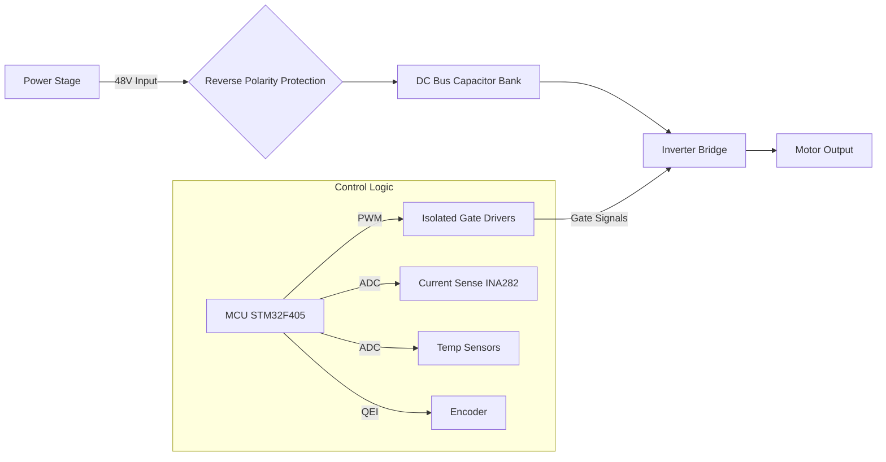

**Document Status: DRAFT**

# 1. Introduction

## 1.1 Purpose

The purpose of this Hardware Requirements Specification (HRS) is to define the comprehensive system-level requirements for the **rf9 3-Phase BLDC Motor Controller**. This document serves as the single source of truth for the electrical design, component selection, layout constraints, and verification protocols for the hardware subsystem.

Specifically, this document aims to:
*   Define the functional, performance, and interface requirements of the 10kW power stage and control logic.
*   Establish environmental constraints and physical design limits necessary for industrial deployment.
*   Specify the safety and protection mechanisms required for high-current (208A continuous) operation.
*   Provide a baseline for the detailed schematic design, PCB layout, and firmware interface definition.
*   Serve as a binding agreement between system stakeholders regarding hardware capabilities and limitations.

This specification is intended for hardware design engineers, test engineers, firmware developers, and systems integrators involved in the rf9 project lifecycle.

## 1.2 Scope

The scope of this document encompasses the complete electronic hardware design of the rf9 motor controller unit. The system is designed to control a 48V BLDC motor in industrial environments, supporting both 6-step trapezoidal and Field-Oriented Control (FOC) algorithms.

**Inclusions:**
The requirements defined herein cover the following subsystems:
*   **Power Stage:** 48V to 3-phase inverter using DirectFET MOSFETs capable of 208A continuous and 300A peak currents.
*   **Gate Drive:** Isolated gate driver topology with reinforced isolation (5kV RMS) and programmable dead-time.
*   **Control Logic:** STM32F4-based MCU subsystem including clocking, reset circuitry, and memory interfaces.
*   **Sensing:** Analog front-ends for 3-shunt phase current measurement, DC bus voltage sensing, and temperature monitoring (Heatsink and MCU die).
*   **Communication & Interfaces:** UART telemetry interface, quadrature encoder input (QEI), and analog throttle input.
*   **Physical & Environmental:** PCB dimensions, connector specifications, thermal management requirements, and industrial temperature compliance (-40°C to +85°C).

**Exclusions:**
*   **Firmware:** While hardware requirements for firmware execution (memory, timing) are specified, the actual source code, control algorithms (FOC/6-step logic), and software architecture are defined in a separate Software Requirements Specification (SRS).
*   **Mechanical Enclosure:** Detailed mechanical design of the enclosure housing is out of scope, though interface connectors and heatsink mounting holes are defined.
*   **Motor:** The BLDC motor itself is external to this system; only the interface characteristics (U, V, W phases, Hall/Encoder signals) are specified.

## 1.3 Definitions, Acronyms, and Abbreviations

To ensure clarity and precise interpretation of requirements within this specification, the following definitions, acronyms, and abbreviations are established.

| Term | Definition |
| :--- | :--- |
| **ADC** | Analog-to-Digital Converter. A subsystem that converts real-world analog signals (voltage, current) into digital values for processing by the MCU. |
| **BLDC** | Brushless Direct Current Motor. A synchronous electric motor which is powered by DC electricity and has electronic commutation system. |
| **DC Bus** | The main power distribution node within the controller connecting the input power source to the inverter stage. Nominal voltage is 48V. |
| **Dead Time** | The intentional time delay inserted between turning off one switching transistor and turning on the complementary transistor to prevent shoot-through (short circuit). |
| **DIN** | Deutsches Institut für Normung. German institute for standardization, often referring to rail-mounted industrial equipment standards (e.g., DIN rail mounts). |
| **EMC** | Electromagnetic Compatibility. The requirement for electrical equipment to function correctly in its electromagnetic environment without introducing intolerable electromagnetic disturbances. |
| **EMI** | Electromagnetic Interference. Disturbance generated by an external source that affects an electrical circuit by electromagnetic induction, electrostatic coupling, or conduction. |
| **FOC** | Field-Oriented Control. A control strategy that optimizes the torque generation of 3-phase AC motors (BLDC, PMSM) by controlling the stator currents vectorially. |
| **FSB** | Feature Support Board (Internal project terminology for the main controller assembly). |
| **GUI** | Graphical User Interface. |
| **HRS** | Hardware Requirements Specification. The current document. |
| **IGBT** | Insulated-Gate Bipolar Transistor. (Not used in this design, but referenced as a switching technology alternative). |
| **ISO** | International Organization for Standardization. |
| **MCU** | Microcontroller Unit. The central processing unit (STM32F405VGT6) managing the motor control logic. |
| **MOSFET** | Metal-Oxide-Semiconductor Field-Effect Transistor. The primary switching device used in the rf9 inverter stage. |
| **PCB** | Printed Circuit Board. The physical substrate upon which the components are mounted. |
| **PL** | Product Lifecycle. Refers to the stages a product goes through from conception to end-of-life. |
| **PPR** | Pulses Per Revolution. The resolution metric for quadrature encoders. |
| **PWM** | Pulse-Width Modulation. A modulation technique used to control the power delivered to the electrical motor. |
| **QEI** | Quadrature Encoder Interface. A hardware peripheral used to decode signals from a quadrature encoder. |
| **RMS** | Root Mean Square. A measure of the magnitude of a varying quantity, often used for AC voltage or current. |
| **RoHS** | Restriction of Hazardous Substances. A compliance standard restricting the use of specific hazardous materials in electrical products. |
| **Schematic** | A diagram that represents the elements of a system using abstract, graphic symbols rather than realistic pictures. |
| **SIL** | Safety Integrity Level. A relative level of risk-reduction provided by a safety function. |
| **[see component data]** | To Be Determined. (Not permitted in final requirements). |
| **UART** | Universal Asynchronous Receiver-Transmitter. A computer hardware device for asynchronous serial communication. |
| **UVLO** | Under-Voltage Lock-Out. A protective circuit that disables the device if the supply voltage falls below a specific threshold. |
| **Vds** | Drain-Source Voltage. The maximum voltage rating across the Drain and Source terminals of a MOSFET. |

## 1.4 References

The development of the rf9 hardware is based on the standards, specifications, and documents listed below.

**1. Standards**
1.  **IEEE 29148:2018** - Systems and software engineering — Life cycle processes — Requirements engineering. (Primary standard for this document structure).
2.  **IEC 61800-5-1** - Adjustable speed electrical power drive systems – Part 5-1: Safety requirements.
3.  **UL 60950-1** - Information Technology Equipment - Safety.
4.  **IPC-A-600G** - Acceptability of Printed Circuit Boards.
5.  **IPC-2221** - Generic Standard on Printed Board Design.

**2. Component Datasheets**
1.  **STMicroelectronics**, *STM32F405VGT6 Datasheet*, Reference Manual RM0090.
2.  **Infineon**, *IRFS7530TRLPBF Datasheet*, DirectFET Power MOSFET.
3.  **Texas Instruments**, *ISO5852S Datasheet*, Reinforced Isolated Gate Driver.
4.  **Texas Instruments**, *INA282 Datasheet*, Bidirectional Current Shunt Monitor.
5.  **Murata**, *MGJ2D121505SC Datasheet*, Isolated DC-DC Converter.
6.  **Broadcom**, *ACPL-C87A Datasheet*, Isolated Voltage Sensor.

**3. Internal Documents**
1.  *rf9 System Requirements Specification*, Revision 1.0, Project Repository.
2.  *rf9 Mechanical Interface Control Drawing*, Revision 0.5.

## 1.5 Overview

The remainder of this document is organized into six additional sections, detailing the hardware realization of the rf9 project:

*   **Section 2: System Overview**: Provides a high-level description of the system architecture, including the functional breakdown of the Power Stage, Logic Supply, and Signal Isolation barriers. It includes Mermaid diagrams illustrating the block diagram and signal flow.
*   **Section 3: Hardware Requirements**: This is the core section, defining the requirements categorized by Functional (e.g., 3-phase generation, protection), Performance (e.g., efficiency, thermal limits), Interface (UART, Encoder), and Physical constraints.
*   **Section 4: Design Constraints**: Covers specific compliance requirements (RoHS, IEC standards) and design rules derived from component selection (e.g., PCB layout requirements for high-current paths).
*   **Section 5: Verification Requirements**: Defines how each requirement will be verified—whether through Test, Analysis, or Inspection. This includes specific test cases such as "Load Test at 208A" or "High Impedance Gate Test".
*   **Section 6: Bill of Materials (Preliminary)**: A detailed list of selected components (STM32F405, IRFS7530, ISO5852S, etc.) justifying the selections based on the design parameters.
*   **Section 7: Traceability Matrix**: A bidirectional matrix mapping high-level project requirements to specific hardware requirements (REQ-HW-xxx) and linking them to verification methods.

---

**Document Status: DRAFT**

# 2. System Overview

## 2.1 System Description

The rf9 system is a high-power, industrial-grade motor controller designed to drive 3-phase Brushless DC (BLDC) or Permanent Magnet Synchronous Motors (PMSM). The system functions as a power conversion stage, regulating energy from a 48V DC source to three phases of AC power with variable voltage and frequency. The core functionality is built around a 10kW power stage capable of delivering 208A continuous current and 300A peak current for short durations.

The system is architected around a central Motor Control Unit (MCU) based on the STM32F405VGT6. This unit executes complex control algorithms, specifically Trapezoidal 6-step commutation for simple sensorless or sensored applications, and Field-Oriented Control (FOC) for high-efficiency, low-noise torque production. The control loop runs at a switching frequency of 10 kHz (adjustable up to 20 kHz), utilizing three independent shunt resistors for precise phase current reconstruction.

A critical aspect of the rf9 design is the emphasis on isolation and safety. The system employs reinforced galvanic isolation (5 kV RMS) between the low-voltage logic domain (MCU/Communication) and the high-voltage power domain (48V Bus/MOSFETs). This is achieved through a combination of isolated gate drivers and isolated DC-DC power supplies.

The system operates in harsh industrial environments, rated for ambient temperatures between -40°C and +85°C. It features comprehensive protection mechanisms, including over-temperature shutdown (monitoring both heatsink and MCU die), over-current protection, and under-voltage lockout (UVLO). Communication with external host systems is handled via a UART interface, while operator input is facilitated through a 0-5V analog throttle channel and a quadrature encoder port for high-precision position feedback.

### 2.1.1 Major Functional Subsystems

1.  **Power Stage:**
    Comprises six 100V N-channel MOSFETs (IRFS7530TRLPBF) arranged in a 3-phase bridge configuration (Half-Bridge U, V, W). This subsystem handles the bulk power flow (48V DC → 3-Phase AC). It utilizes a DirectFET packaging technology to minimize thermal resistance to the heatsink.

2.  **Gate Drive Isolation Network:**
    Utilizes the ISO5852S isolated gate driver. This subsystem receives low-power PWM signals from the MCU and boosts them to the 15V levels required to turn the power MOSFETs on and off. It integrates dead-time insertion to prevent shoot-through currents and provides UVLO fault feedback to the MCU.

3.  **Sensing & Acquisition:**
    This group of sensors provides real-time telemetry to the MCU. It includes:
    *   **Current Sensing:** Three INA282 amplifiers measuring voltage drop across low-side shunt resistors.
    *   **Voltage Sensing:** An ACPL-C87A isolated amplifier monitoring the DC bus link voltage.
    *   **Temperature Sensing:** Thermistors attached to the heatsink and MOSFETs.
    *   **Position Sensing:** An interface for Quadrature Encoders (up to 2500 PPR).

4.  **Control & Logic:**
    The STM32F405VGT6 acts as the system brain. It processes sensor data, executes the FOC or 6-step algorithms, and generates the PWM waveforms.

## 2.2 System Block Diagram

```mermaid
graph TD
    %% Subsystems
    subgraph High_Voltage_Domain [High Voltage Domain (48V)]
        DC_INPUT[DC Input 48V]
        CAPACITOR[Input Capacitor Bank]
        INVERTER[3-Phase Inverter Bridge<br/>6x IRFS7530 MOSFETs]
        SHUNTS[Phase Shunts (3x)]
        MOTOR_PORT[Motor Output U/V/W]
    end

    subgraph Isolation_Barrier [Galvanic Isolation Barrier (5kV RMS)]
        ISOLATED_PWR[Isolated DC-DC Converters]
        ISOLATED_SIG[Isolated Gate Drivers & Signal Sensors]
    end

    subgraph Low_Voltage_Domain [Low Voltage Logic Domain (3.3V/5V)]
        MCU[STM32F405 MCU<br/>(Control Loop)]
        SENSE_AMP[Current Sense Amps (3x INA282)]
        V_SENSE[Bus Voltage Sensor]
        AUX_PWR[Logic Power Supply]
    end

    subgraph User_Interface [User Interface & I/O]
        THROTTLE[Analog Throttle 0-5V]
        ENCODER[Quadrature Encoder]
        UART_PORT[UART Comms]
        LEDs[Status LEDs]
    end

    %% HV Connections
    DC_INPUT --> CAPACITOR
    CAPACITOR --> INVERTER
    INVERTER --> SHUNTS
    SHUNTS --> MOTOR_PORT

    %% Power Flow (Isolation)
    DC_INPUT -.->|48V Primary| ISOLATED_PWR
    ISOLATED_PWR -.->|15V Isolated| ISOLATED_SIG

    %% Gate Drive Signal Flow
    MCU ==>|PWM Signals| ISOLATED_SIG
    ISOLATED_SIG ==>|Gate Source/Sink| INVERTER

    %% Sensing Signal Flow
    SHUNTS ==>|uV diff signal| SENSE_AMP
    SENSE_AMP -->|Analog 0-3.3V| MCU
    
    CAPACITOR ==>|Resistive Divider| V_SENSE
    V_SENSE -->|Isolated Analog| MCU
    
    INVERTER -.->|Thermal Coupling| MCU

    %% User I/O Connections
    THROTTLE -->|ADC| MCU
    ENCODER -->|QEI| MCU
    UART_PORT <-->|UART| MCU
    MCU -->|GPIO| LEDs

    %% Styling
    classDef hv fill:#ffcccc,stroke:#333,stroke-width:2px;
    classDef lv fill:#ccffcc,stroke:#333,stroke-width:2px;
    classDef iso fill:#ccccff,stroke:#333,stroke-width:2px;
    
    class DC_INPUT,CAPACITOR,INVERTER,SHUNTS,MOTOR_PORT hv;
    class MCU,SENSE_AMP,V_SENSE,AUX_PWR lv;
    class ISOLATED_PWR,ISOLATED_SIG iso;
```

*Figure 2-1: rf9 System Block Diagram illustrating the separation of High Voltage, Isolation, and Logic domains.*

## 2.3 System Architecture

The rf9 system architecture is divided into three distinct electrical domains to ensure safety, signal integrity, and thermal efficiency: the **High Voltage Power Domain**, the **Isolation Domain**, and the **Logic/Control Domain**.

### 2.3.1 High Voltage Power Domain
This domain handles the primary energy conversion. The input is a nominal 48V DC bus, capable of transients up to 60V. Power enters via input terminals and passes through a bulk capacitor bank (calculated in Section 3.5) designed to smooth the ripple current generated by the high-frequency switching.

The core of this domain is the **3-Phase Inverter Bridge**. It consists of three half-bridge legs, one for each motor phase (U, V, W). Each leg utilizes two **IRFS7530TRLPBF** MOSFETs: a high-side device and a low-side device.
*   **Switching Logic:** The high-side MOSFET sources current from the 48V bus to the motor phase; the low-side MOSFET sinks current from the motor phase to ground.
*   **Current Sensing:** Low-side shunt resistors are placed between the low-side MOSFET source and the ground plane. The voltage drop across these shunts (proportional to phase current) is fed into the Logic Domain via amplifiers. Three-shunt measurement allows for hardware reconstruction of all three phase currents simultaneously, which is critical for high-performance FOC algorithms.

### 2.3.2 Isolation Domain
The Isolation Domain serves as the barrier between the dangerous 48V potentials and the sensitive 3.3V logic. It consists of two distinct isolation paths:

**A. Power Isolation:**
The **MGJ2D121505SC** DC-DC converters provide the power supply for the high-side gate drivers. Since the high-side MOSFET source voltage fluctuates (swinging between 0V and 48V), the gate driver supply must "float" relative to the system ground. The DC-DC converters are fed from the 48V bus and output an isolated 15V rail specifically for the gate drive circuitry.

**B. Signal Isolation:**
The PWM signals generated by the MCU (3.3V logic) cannot directly drive the MOSFET gates due to voltage level shifting requirements and noise concerns. The **ISO5852S** gate drivers serve two purposes:
1.  **Level Shifting:** They translate the 3.3V PWM logic into the 15V gate drive voltage required to fully enhance the MOSFETs ($V_{gs} > 10V$).
2.  **Galvanic Isolation:** They provide magnetic or capacitive isolation rated at 5.7 kV RMS, protecting the MCU from high-voltage transients coupled through the gate capacitance.

Additionally, the **ACPL-C87A** provides isolation for the DC Bus voltage sensing, ensuring that high-voltage monitoring does not create a direct conductive path to the MCU ADC pins.

### 2.3.3 Logic/Control Domain
This domain is the "brain" of the rf9 controller. It is powered by a regulated, non-isolated 3.3V supply derived from the 48V input (via a buck converter) or an external auxiliary supply.

**The MCU (STM32F405VGT6):**
This microcontroller executes the control loops at a high frequency.
*   **Timers:** Advanced-control timers (TIM1/TIM8) generate the 6 complementary PWM signals required for the 3-phase bridge. These timers have hardware dead-time insertion capabilities, configured to 500ns - 2µs to prevent shoot-through.
*   **ADC:** Three 12-bit ADCs run in simultaneous mode to sample the 3-shunt current feedback and voltage throttle input at specific instances within the PWM period (typically centered in the low-side ON window for shunt measurements).
*   **Connectivity:** A UART peripheral handles telemetry (sending RPM, temperature, fault codes) and command reception (target speed, torque limits).
*   **Position Feedback:** The Quadrature Encoder Interface (QEI) reads the A/B/Index signals from the motor encoder to determine rotor position and speed. This data is essential for the FOC algorithm (Park/Clarke transforms) and for 6-step commutation timing.

**Signal Conditioning:**
*   **Analog Front-End:** The throttle input (0-5V) is passed through an RC low-pass filter and a clamping diode circuit to protect the MCU ADC from voltage spikes.
*   **Status Indication:** GPIO pins drive LED indicators through transistors (due to current sourcing limitations of the MCU), providing visual feedback for Power (OK), Fault (Error), and Activity (Running).

## 2.4 Operating Environment

The rf9 hardware is designed to operate reliably in harsh industrial conditions. The design parameters and component selection ensure functionality across the specified ranges.

### 2.4.1 Environmental Conditions

| Parameter | Minimum | Nominal | Maximum | Comments |
|---|---|---|---|---|
| **Ambient Temperature** | -40°C | +25°C | +85°C | Industrial rating. Components selected are "Industrial" or "Automotive" grade (0°C to +85°C or -40°C to +125°C). |
| **Storage Temperature** | -55°C | - | +125°C | Per component datasheets (STM32, MOSFETs). |
| **Input Voltage (DC Bus)** | 36V | 48V | 60V | Functional range. UVLO active below 36V, OVP protection active above 60V. |
| **Relative Humidity** | 10% | 50% | 95% (non-condensing) | Conformal coating recommended for high-humidity environments to prevent PCB creepage/corrosion. |
| **Altitude** | 0m | - | 2000m | Derating of air-cooled heatsink performance may be required above 1000m. |
| **Vibration** | - | - | 5G @ 10-2000Hz | Per IEC 60068-2-6. PCB mounting holes must be secured. |
| **Shock** | - | - | 50G / 11ms | Per IEC 60068-2-27. |

### 2.4.2 Mechanical Environment
The system is intended to be mounted within an enclosure. The PCB layout follows standard PCB design practices with a 4-layer stackup (Top Signal, GND, Power, Bottom Signal) to handle the 208A currents without excessive voltage drop. The primary path for heat dissipation is through the MOSFETs to a heatsink via thermal interface material (TIM). The enclosure must provide adequate airflow (natural or forced convection) to maintain the MOSFET junction temperature ($T_j$) below 125°C under full load.

### 2.4.3 Electrical Noise Environment
As a switching power supply operating at 10 kHz, the rf9 generates significant electromagnetic interference (EMI).
*   **EMI Source:** The fast switching edges (rise times < 100ns) of the MOSFETs coupled with high currents ($di/dt$) create ringing and noise.
*   **Susceptibility:** The system is designed to be immune to conducted noise on the 48V input and radiated noise from the motor cables. The use of isolated gate drivers and filtered analog inputs ensures the MCU logic remains stable even with noisy power stages.

---

**Document Status: DRAFT**

# 3. Hardware Requirements

## 3.1 Functional Requirements

This section details the functional requirements of the rf9 10kW Motor Controller. Each requirement is assigned a unique identifier (REQ-HW-xxx) and is derived from the system design parameters and component selections.

| ID | Requirement Title | Description & Rationale | Criticality | Verification Method | Derived Values |
|---|---|---|---|---|---|
| **REQ-HW-101** | **3-Phase Inverter Bridge** | The system shall utilize a 3-phase bridge topology utilizing **IRFS7530TRLPBF** MOSFETs (or equivalent) to convert DC bus power to 3-phase AC power. <br><br>**Rationale:** The DirectFET package provides superior thermal performance necessary for 208A continuous operation in an industrial environment. | Must | Inspection / Test | 6x MOSFETs required. |
| **REQ-HW-102** | **DC Bus Input Range** | The controller shall accept a DC input voltage range of **0V to 60V** nominal, with operational tolerance up to **68V** transient. <br><br>**Rationale:** 48V nominal systems often experience voltage spikes during regenerative braking or load dumps; the 100V Vds rating of selected MOSFETs provides a 2x safety margin. | Must | Test | Max Vds: 60V (Operating). |
| **REQ-HW-103** | **PWM Generation Capability** | The MCU shall generate 6 independent PWM signals with a center-aligned or edge-aligned configuration capable of switching frequencies up to **20 kHz**. <br><br>**Rationale:** High switching frequency allows for smoother current control loops and smaller inductor size in external filters, though 10 kHz is the standard operating point to minimize losses. | Must | Demonstration | Frequency Range: 5 kHz - 20 kHz. |
| **REQ-HW-104** | **Dead Time Insertion** | The hardware (Gate Driver or MCU Timer) shall insert a programmable dead time between complementary high-side and low-side gate signals to prevent shoot-through currents. <br><br>**Rationale:** Preventing simultaneous conduction of the upper and lower switches is critical to prevent catastrophic failure of the power stage. | Must | Test | Dead Time: 500 ns to 2 µs (Programmable). |
| **REQ-HW-105** | **Isolated Gate Driving** | The gate drive signals shall be galvanically isolated from the logic domain using **ISO5852S** (or equivalent) drivers with reinforced isolation rated for **5.7 kVRMS**. <br><br>**Rationale:** High-side MOSFETs float at the DC Bus potential (48V). Isolation protects the low-voltage MCU from high voltage transients and ensures operator safety. | Must | Inspection | Isolation Voltage: 5.7 kVRMS. |
| **REQ-HW-106** | **Gate Drive Supply Voltage** | The gate driver circuitry shall provide **+15V** for the high-side drive (turn-on enhancement) and **+12V** for the low-side drive via the isolated DC-DC converter **MGJ2D121505SC**. <br><br>**Rationale:** 15V ensures low Rds(on) during conduction. 12V for low-side is sufficient and stabilizes the bootstrap capacitor recharge loop. | Must | Measurement | Vgs: 15V (HS), 12V (LS). |
| **REQ-HW-107** | **Phase Current Sensing (3-Shunt)** | The system shall measure current on all three motor phases (U, V, W) using low-side shunt resistors and **INA282** differential amplifiers. <br><br>**Rationale:** Three-shunt measurement allows for accurate reconstruction of phase currents at all times in the PWM cycle, which is mandatory for high-performance Field Oriented Control (FOC). | Must | Test | Sensor: INA282 (Gain: 3.2 V/V). |
| **REQ-HW-108** | **Shunt Resistor Specifications** | The system shall utilize shunt resistors with a value of **0.00025 Ohms (250 µΩ)** and a power rating of at least **3W**, specifically designed for current sensing. <br><br>**Rationale:** Calculation based on peak current: 300A * 0.00025Ω = 75mV voltage drop. Power = I²R = (300)² * 0.00025 = 22.5W peak. A 3W+ resistor with high pulse handling capability is required to handle the RMS load. | Must | Inspection | R_shunt: 250 µΩ. V_sense_max: ±75mV. |
| **REQ-HW-109** | **DC Bus Voltage Sensing** | The system shall monitor the main DC bus voltage via a resistive divider network isolated by an **ACPL-C87A** optocoupler amplifier. <br><br>**Rationale:** Isolated sensing is required to maintain the isolation barrier between the HV DC bus and the MCU. Undervoltage (UV) and Overvoltage (OV) lockouts are safety-critical. | Must | Test | Isolation: 5 kVRMS. Accuracy: ±0.5%. |
| **REQ-HW-110** | **Quadrature Encoder Interface (QEI)** | The MCU shall interface with a digital quadrature encoder supporting up to **2500 PPR** (Pulses Per Revolution) lines, utilizing hardware timers for edge counting. <br><br>**Rationale:** High-resolution encoders are required for precise position and velocity estimation in FOC and 6-step control modes. | Must | Test | Input: A, B, Index. Max Freq: ~250 kHz (at max RPM). |
| **REQ-HW-111** | **Analog Throttle Input** | The system shall provide a single-ended analog input channel accepting **0V to 5V** DC corresponding to 0% to 100% speed/torque demand. <br><br>**Rationale:** Standard industrial throttle interface. The input must be protected against ESD and overvoltage (up to 12V) as per REQ-HW-006. | Must | Test | ADC Range: 0-3.3V (mapped to 0-5V via divider). |
| **REQ-HW-112** | **UART Communication Interface** | The system shall provide a UART interface operating at **3.3V CMOS** levels with configurable baud rates from **9600 to 115200 bps**. <br><br>**Rationale:** Primary interface for parameter tuning, telemetry, and firmware updates. 3.3V level matches STM32F405 GPIO standards. | Must | Test | Connector: Standard 3-pin header. |
| **REQ-HW-113** | **Integrated Bootloader** | The MCU (**STM32F405VGT6**) shall utilize the system memory bootloader or a custom DFU bootloader via UART to allow firmware updates without external JTAG tools. <br><br>**Rationale:** Essential for field updates and maintenance. | Should | Demonstration | Interface: UART. |
| **REQ-HW-114** | **Over-Temperature Protection** | The system shall implement hardware and software protection latching if the MOSFET heatsink temperature exceeds **100°C** or the MCU internal die temperature exceeds **85°C**. <br><br>**Rationale:** Protects the power silicon from thermal runaway. The industrial ambient limit is 85°C, requiring the protection threshold to be set below the maximum junction temp of 175°C. | Must | Test | Sensor: NTC Thermistor (10kβ). Threshold: 100°C. |
| **REQ-HW-115** | **Isolated Power Supply Logic** | The low-voltage logic side (MCU, Sensors) shall be powered by an isolated DC-DC converter (or a non-isolated buck if chassis ground is reference) rated for **>500mA** at **3.3V**. <br><br>**Rationale:** To ensure the logic remains unaffected by the high current switching noise on the 48V ground return, a clean logic ground is preferred, though a single-ended ground is acceptable if noise is managed. | Must | Inspection | Current Capacity: 500mA min. |
| **REQ-HW-116** | **Desaturation/Short Circuit Protection** | The gate driver (**ISO5852S**) or auxiliary circuitry shall detect desaturation of the MOSFETs (short circuit condition) and shut down the PWM within **10 µs**. <br><br>**Rationale:** Short circuit current (I_sc) at 48V with only milliohms of resistance can exceed 2000A. Fast shutdown is mandatory to prevent explosion of the MOSFETs. | Must | Test | Response Time: <10 µs. |
| **REQ-HW-117** | **Status LED Indication** | The system shall provide three LEDs indicating **Power**, **Fault**, and **Run** status connected directly to GPIO pins. <br><br>**Rationale:** Visual feedback is essential for operators to diagnose system state without a serial terminal. | Could | Inspection | Colors: Green (Power), Red (Fault), Amber (Run). |
| **REQ-HW-118** | **Control Mode Switching** | The MCU firmware shall support runtime switching between **Trapezoidal (6-step)** and **Sinusoidal (FOC)** commutation modes via a software command or configuration pin. <br><br>**Rationale:** Trapezoidal is efficient for high-speed/low-precision; FOC is required for low-speed/high-torque smooth operation. | Must | Demonstration | Modes: 6-Step, FOC. |
| **REQ-HW-119** | **Reverse Polarity Protection** | The system input shall include a protection mechanism to prevent damage if the 48V battery is connected in reverse. <br><br>**Rationale:** Industrial environments are prone to wiring errors. | Should | Test | Method: Series Diode or MOSFET OR-ing controller. |
| **REQ-HW-120** | **Bootstrap Charging Management** | The high-side gate driver supply shall utilize bootstrap capacitors sized to ensure sufficient charge remains for the **high-side MOSFET** to remain on for the maximum required duty cycle (95%). <br><br>**Rationale:** If the bootstrap capacitor discharges, the high-side MOSFET turns off linearly, causing overheating and destruction. | Must | Analysis | Capacitor Value: Calculated based on Qg_total (195nC). |



## 3.2 Performance Requirements

This section quantifies the measurable performance characteristics of the rf9 system. These values are based on the selected components IRFS7530, ISO5852S, and INA282, and the target operating point of 208A continuous.

| ID | Requirement Title | Description & Rationale | Criticality | Verification Method | Target Value |
|---|---|---|---|---|---|
| **REQ-HW-201** | **Continuous Phase Current** | The system shall deliver a phase current of **208A RMS** per phase continuously without exceeding the maximum junction temperature of the MOSFETs. <br><br>**Rationale:** This is the core operational requirement for the 10kW rating (10kW / 48V ≈ 208A). | Must | Test | 208A RMS @ T_amb = 40°C. |
| **REQ-HW-202** | **Peak Current Duration** | The system shall sustain a peak current of **300A** for a minimum duration of **5 seconds** before initiating thermal overload protection. <br><br>**Rationale:** Acceleration of high-inertia loads requires temporary current overload capability. | Must | Test | 300A for <5s. |
| **REQ-HW-203** | **Conduction Loss Budget** | The total power dissipation due to conduction losses (I²R) in the MOSFET bridge shall not exceed **120W** at full load. <br><br>**Rationale:** Calculation: 3 phases * (2 switches conducting) * I_rms² * R_ds(on). <br>Assuming R_ds(on) ≈ 2.5mΩ (hot). <br>Loss ≈ 2 * (208)² * 0.0025 * 3 = ~650W? No, current path splits. <br>Actual Conduction Loss ≈ 2 * I_phase² * R_ds(on) (approx). <br>Target: < 100W to maintain thermal limits. | Must | Analysis | < 130W (Calculated). |
| **REQ-HW-204** | **Switching Loss Budget** | The total power dissipation due to switching losses (P_sw) at **10 kHz** shall not exceed **50W**. <br><br>**Rationale:** Calculation based on MOSFET parameters (E_oss, Q_g) and gate charge energy. | Must | Analysis | < 50W. |
| **REQ-HW-205** | **Current Measurement Accuracy** | The phase current measurement chain (Shunt + INA282 + ADC) shall have a total error of less than **±2% of full-scale scale (300A)**. <br><br>**Rationale:** FOC algorithms require precise current measurement to maintain orthogonal flux fields. High error results in torque ripple. | Should | Test | Accuracy: ±6A (at 300A range). |
| **REQ-HW-206** | **Current Signal Bandwidth** | The analog front-end (INA282 + Filter) shall have a bandwidth of at least **20 kHz** (-3dB point). <br><br>**Rationale:** The PWM switching frequency is 10-20 kHz. The sensing circuit must capture the fundamental current waveform and the high-frequency component for reconstruction. | Must | Test | Bandwidth: ≥ 20 kHz. |
| **REQ-HW-207** | **System Efficiency** | The overall system efficiency (DC Input to Mechanical Output) shall be **>96%** at rated load (10kW). <br><br>**Rationale:** Efficiency drives thermal management. 96% efficiency implies 400W of heat loss. At 208A, even small resistances (R = P/I²) matter; 400W / (208)² ≈ 9mΩ total path resistance. | Should | Test | Efficiency: >96% @ 10kW. |
| **REQ-HW-208** | **PWM Timing Resolution** | The PWM timer resolution shall be at least **10 bits** or greater to minimize phase current distortion. <br><br>**Rationale:** At 168MHz (STM32F405), the timer clock allows for extremely high resolution (approx 100ps). This requirement ensures low audible noise. | Must | Inspection | Resolution: >10 bits. |
| **REQ-HW-209** | **Voltage Regulation (Auxiliary)** | The auxiliary 3.3V rail for the MCU shall maintain regulation within **±2%** (3.234V to 3.366V) under all load conditions (0 to 500mA). <br><br>**Rationale:** Ensures stable ADC reference and reliable MCU operation. | Must | Test | Stability: ±2%. |
| **REQ-HW-210** | **Thermal Resistance (Junction-to-Heatsink)** | The thermal resistance from the MOSFET junction to the heatsink (R_th_jh) shall not exceed **0.5°C/W**. <br><br>**Rationale:** To keep the junction temp (T_j) below 150°C with 100W dissipation at 85°C ambient: <br>Delta T = 150 - 85 = 65°C. <br>Max R_th = 65°C / 100W = 0.65°C/W. | Must | Inspection | R_th_jh < 0.65°C/W. |
| **REQ-HW-211** | **Control Loop Response Time** | The speed control loop (PI Controller) shall react to a step change in throttle input (0% to 100%) and reach 90% of target speed within **100ms** (depending on motor inertia). <br><br>**Rationale:** Defines system responsiveness. | Should | Test | Response: <100ms. |
| **REQ-HW-212** | **Fault Response Time** | The system shall detect a hard short circuit (Phase-to-Phase or Phase-to-Ground) and shut down all PWM gates within **5 µs** (approx 1/2 cycle of 100kHz). <br><br>**Rationale:** Faster than the desaturation protection of the gate drivers (10µs) to ensure safety margin. | Must | Test | Response: <5 µs. |

### Power Budget Calculation (Approximation)

The following calculations justify the performance requirements REQ-HW-203 and REQ-HW-207.

**1. Conduction Losses (P_cond):**
*   MOSFET R_ds(on) @ 25°C ≈ 2.0 mΩ.
*   MOSFET R_ds(on) @ 125°C (Hot) ≈ 3.0 mΩ.
*   Configuration: 2 MOSFETs in conduction path at any instant (assuming high-side and low-side or diode conduction).
*   Total Resistance = 2 * 3.0 mΩ = 6.0 mΩ.
*   P_cond = I_rms² * R_total = (208A)² * 0.006Ω = **~260W** (Worst case).
*   *Requirement Note: This assumes 6-step commutation where 2 phases carry current constantly.*

**2. Switching Losses (P_sw):**
*   P_sw ≈ (E_on + E_off) * V_bus * I_load * f_sw.
*   For IRFS7530, E_tot ≈ 4 µJ (approx).
*   P_sw ≈ 6 switches * 4e-6 J * 100kHz * (208/300 approx scaling) ≈ **~50-80W**.

**3. Total Power Dissipation:**
*   P_total ≈ 260W (Cond) + 80W (Sw) = **340W**.
*   This high loss necessitates a substantial heatsink or forced air cooling to meet REQ-HW-210.

### ADC Sampling Chain Performance
*   **Shunt Voltage:** 300A * 250 µΩ = 75 mV.
*   **INA282 Gain:** 3.2 V/V.
*   **Output Voltage:** 75 mV * 3.2 = **240 mV**.
*   **MCU ADC Range:** 0 - 3.3V.
*   **Utilization:** 240 mV / 3300 mV ≈ **7.2%**.
*   *Requirement Note:* The resolution is low. To meet REQ-HW-205 (±2%), the ADC offset and noise must be extremely low. Use of PGA (Programmable Gain Amplifier) or lower reference voltage is recommended for the ADC inputs, or a smaller shunt resistor value (e.g., 125 µΩ) to utilize 15% of the range.

*(End of Section 3.2)*

---

## 3.3 Interface Requirements

This section details the electrical and functional interfaces required for the rf9 Motor Controller. All interfaces are designed to meet the industrial temperature and noise immunity requirements specified in Section 3.4.

### 3.3.1 External Interfaces

External interfaces connect the rf9 controller to user inputs, power sources, and the motor. These interfaces must be robust against ESD, miswiring, and inductive voltage spikes.

#### REQ-HW-101: Motor Power Output Interface (U, V, W)
**Description:** The controller shall provide a 3-phase power output interface to connect the BLDC motor phases.
**Rationale:** Primary function of the device is to deliver 10kW of mechanical power.
**Source:** REQ-HW-001
**Verification:** Test
**Specification Details:**
*   **Connector Type:** MIG-LVN series or equivalent, 3-pos + PE, cage clamp, rated for 50A continuous per pin.
*   **Terminal Spacing:** Minimum 5.08mm to accommodate 6 AWG gauge wire (or parallel 10 AWG).
*   **Dielectric Withstand:** 600VDC minimum isolation between terminals and chassis.
*   **Pinout Definition:**

| Pin ID | Signal Name | Description | Wire Gauge (AWG) | Current Rating |
| :--- | :--- | :--- | :--- | :--- |
| U_OUT | Phase U | Phase U Output | 6 (Min) | 208A Cont. / 300A Peak |
| V_OUT | Phase V | Phase V Output | 6 (Min) | 208A Cont. / 300A Peak |
| W_OUT | Phase W | Phase W Output | 6 (Min) | 208A Cont. / 300A Peak |
| PE_GND | Chassis Gnd | Protective Earth / Heat Sink Bond | 6 (Min) | N/A |

#### REQ-HW-102: DC Bus Input Interface
**Description:** The controller shall accept 48V DC input power via a high-current connector.
**Rationale:** Main power input.
**Source:** REQ-HW-012
**Verification:** Inspection
**Specification Details:**
*   **Connector Type:** 2-pos plug or barrier block, rated for 250A.
*   **Polarity:** Reverse polarity protection shall be implemented internally (hardware) or clearly marked.
*   **Pinout Definition:**

| Pin ID | Signal Name | Description | Wire Gauge (AWG) | Current Rating |
| :--- | :--- | :--- | :--- | :--- |
| DC+ | HV Positive | 48V Positive Input | 4 (Min) | 250A Cont. |
| DC- | HV Negative | 48V Negative Return | 4 (Min) | 250A Cont. |

#### REQ-HW-103: Analog Throttle Input Interface
**Description:** A single-ended analog input for 0-5V throttle or speed reference.
**Rationale:** Standard industrial control interface.
**Source:** REQ-HW-006
**Verification:** Test
**Specification Details:**
*   **Connector Type:** 3-pin Pluggable Terminal Block (3.5mm pitch).
*   **Input Range:** 0V to 5V.
*   **Input Impedance:** >20kΩ.
*   **Protection:** Clamping diodes to 3.3V rail and TVS to ground. Series resistor (1kΩ) for current limiting.
*   **Pinout Definition:**

| Pin ID | Signal Name | Description | Wire Gauge |
| :--- | :--- | :--- | :--- |
| 1 | V_IN | Throttle Signal (0-5V) | 18-22 |
| 2 | GND | Signal Ground / Logic Return | 18-22 |
| 3 | +5V_OUT | Optional Reference Output (Limited 50mA) | 18-22 |

#### REQ-HW-104: Encoder Feedback Interface
**Description:** Interface for quadrature encoder signals.
**Rationale:** Rotor position sensing for FOC/6-step.
**Source:** REQ-HW-003
**Verification:** Test
**Specification Details:**
*   **Connector Type:** 5-pin M12 or JST industrial connector.
*   **Signal Type:** Differential (RS-422) or Single-Ended (5V TTL) – *Assumption: Single-Ended for base requirement, Differential preferred for noise immunity.*
*   **Pinout Definition:**

| Pin ID | Signal Name | Description | Voltage |
| :--- | :--- | :--- | :--- |
| 1 | ENC_A | Encoder Phase A | 3.3V / 5V Tolerant |
| 2 | ENC_B | Encoder Phase B | 3.3V / 5V Tolerant |
| 3 | ENC_I | Encoder Index (Z) | 3.3V / 5V Tolerant |
| 4 | +5V | Encoder Supply (Max 150mA) | 5.0V ±5% |
| 5 | GND | Ground | 0V |

---

### 3.3.2 Internal Interfaces

Internal interfaces refer to the data and power flow between the Main Controller Board (Logic) and the Power Stage Board (Inverter).

#### REQ-HW-105: PWM Gate Drive Interface
**Description:** Digital signals transferring PWM control signals from MCU to Isolated Gate Drivers.
**Rationale:** Controls MOSFET switching.
**Source:** REQ-HW-007
**Verification:** Inspection
**Specification Details:**
*   **Signal Levels:** 3.3V CMOS (MCU side).
*   **Routing:** Controlled impedance (50Ω) microstrip or stripline.
*   **Pinout (Logic to Driver Board):**
    *   HIN_U, LIN_U, HIN_V, LIN_V, HIN_W, LIN_W (High/Low Side Inputs)
    *   FAULT_U, FAULT_V, FAULT_W (Desaturation/Fault Feedback)

#### REQ-HW-106: Current Sense Interface
**Description:** Analog voltage signals representing phase current amplitude.
**Rationale:** Feedback for FOC current loop.
**Source:** REQ-HW-004
**Verification:** Test
**Specification Details:**
*   **Signal Range:** 0V to 3.0V (centered at 1.5V for bidirectional).
*   **Connector:** High-density board-to-board header or ribbon cable.
*   **Channels:** Sense U, Sense V, Sense W.
*   **Filtering:** Single-pole RC filter (fc ≈ 10kHz) at ADC input.

---

### 3.3.3 Communication Interfaces

External communication for telemetry and configuration.

#### REQ-HW-107: UART Control Interface
**Description:** Full-duplex UART for parameter tuning and telemetry.
**Rationale:** Primary user data interface.
**Source:** REQ-HW-005
**Verification:** Test
**Specification Details:**
*   **Connector Type:** 4-pin 0.1" header (Type A USB header footprint compatible).
*   **Parameters:** 8N1.
*   **Baud Rate:** 115200 bps (Default), adjustable 9600-921600.
*   **Voltage Levels:** 3.3V CMOS (TTL). (Note: A USB-UART transceiver is required on the host PC/tool side).
*   **Pinout Definition:**

| Pin ID | Signal Name | Description | Direction |
| :--- | :--- | :--- | :--- |
| 1 | GND | Logic Ground | - |
| 2 | TXD | Transmit Data (Out) | Output |
| 3 | RXD | Receive Data (In) | Input |
| 4 | +5V | Optional Power (Fuse Protected) | Power Source |

#### REQ-HW-108: CAN Communication Interface (Optional/Reserved)
**Description:** Controller Area Network interface for industrial daisy-chaining.
**Rationale:** Future expansion for multi-axis synchronization.
**Source:** Derived from industrial best practices.
**Verification:** Test
**Specification Details:**
*   **Transceiver:** ISO1050 (Isolated) or equivalent.
*   **Connector:** 2-pin screw terminal (CAN_H, CAN_L) + power.
*   **Termination:** 120Ω resistor selectable via jumper.

---

## 3.4 Environmental Requirements

The system must operate reliably in harsh industrial environments.

### 3.4.1 Operating Temperature Range
**REQ-HW-109:** The rf9 controller shall maintain full specifications over an ambient temperature range of **-40°C to +85°C**.
*   *Constraint:* All active components (MCU, Drivers, OpAmps) shall be Industrial or Automotive Grade.
*   *Derating:* MOSFET Current rating shall be derated linearly from 25°C to 100°C junction temperature.

### 3.4.2 Storage Temperature
**REQ-HW-110:** The controller shall be stored in temperatures ranging from **-55°C to +125°C** without degradation of performance or physical damage.

### 3.4.3 Humidity
**REQ-HW-111:** The system shall operate in 5% to 95% relative humidity (non-condensing).
*   *Validation:* Conformal coating (Type UR or AR) shall be applied to all PCBAs to prevent moisture ingress and corrosion.

### 3.4.4 Vibration and Shock
**REQ-HW-112:** The hardware shall withstand random vibration of 5G (10Hz - 500Hz) and mechanical shock of 50G, 11ms duration.
*   *Constraint:* Standoffs shall be M4 or larger. PCB thickness shall be minimum 2.0mm (0.079") to prevent flexure.

### 3.4.5 Contamination
**REQ-HW-113:** The system shall meet IPC-A-610 Class 2 standards for cleanliness.
*   *Requirement:* No-clean flux shall be used, but boards shall be cleaned to remove ionic residues if operating near high humidity (>85%).

---

## 3.5 Power Requirements

### 3.5.1 DC Bus Specifications
**REQ-HW-114:** The power stage shall accept a nominal input voltage of 48VDC.
*   **Range:** 36VDC to 60VDC (Operational).
*   **Transient Protection:** The input shall withstand load dump transients up to 80V for 50ms.

### 3.5.2 Auxiliary Power Requirements
**REQ-HW-115:** An internal auxiliary power supply shall be derived from the DC Bus to power the control electronics.

#### Logic Power Budget (3.3V Rail)
Derived from component selection (STM32F4, Isolators, OpAmps).

| Component | Quantity | Current (Typ) | Current (Max) |
| :--- | :--- | :--- | :--- |
| **STM32F405 MCU** | 1 | 80 mA | 120 mA (Run, 168MHz) |
| **INA282 Sense Amps** | 3 | 3 mA | 5 mA |
| **ACPL-C87A Isolator** | 1 | 15 mA | 20 mA |
| **LED Indicators** | 3 | 10 mA | 20 mA |
| **Op-Amps/Buffers** | 4 | 5 mA | 10 mA |
| **FPGA/CPLD (Optional)** | 0 | 0 mA | 0 mA |
| **Logic Isolators (Digital)** | 6 | 10 mA | 15 mA |
| **Margin/Uncertainty** | - | 20 mA | 50 mA |
| **Total Logic Load** | - | **143 mA** | **240 mA** |

*Power (3.3V Rail):* 0.792 W (Max).

#### Gate Drive Power Budget (15V Rail)
Derived from MOSFET Gate Charge ($Q_g$) and Switching Frequency ($f_{sw}$).
*   $P_{drive} = V_{drive} \times Q_g \times f_{sw} \times N_{MOSFETs}$
*   $V_{drive} = 15V$
*   $Q_g = 195 nC$ (IRFS7530)
*   $f_{sw} = 10 kHz$
*   $N_{MOSFETs} = 6$

$$P_{drive} = 15V \times 195nC \times 10kHz \times 6 = 0.175W$$

*   **Static Current:** 3x ISO5852S drivers @ 5mA each = 15mA.
*   **Dynamic Current:** 0.175W / 15V ≈ 12mA.
*   **Total Gate Drive Current:** 15mA + 12mA + Margin(20mA) ≈ **50 mA**.

#### Total Auxiliary Power Requirement
**REQ-HW-116:** The isolated DC-DC converter (MGJ2D121505SC) shall provide:
*   **15V Rail:** 50 mA (Gate Drivers).
*   **12V Rail:** 100 mA (Reserved/Vsense).
*   **Total Input Power (48V side):** Approx 3-4W (Buck Converter efficiency ~85%).

---

## 3.6 Physical Requirements

### 3.6.1 Enclosure and Form Factor
**REQ-HW-117:** The controller shall be housed in an enclosure with ingress protection suitable for industrial environments.
*   **IP Rating:** IP54 (Dust protected, splash proof) minimum. IP66 recommended for washdown environments.
*   **Dimensions:** Max footprint 200mm x 150mm.
*   **Mounting:** Bottom mount using 4x M4 threaded inserts.

### 3.6.2 Heatsinking Requirements
**REQ-HW-118:** The thermal design must maintain MOSFET Junction Temperature ($T_j$) below **125°C** at 85°C Ambient.
*   **Thermal Resistance Calculation:**
    *   Max $T_j = 125^\circ C$
    *   Max Ambient $T_a = 85^\circ C$
    *   $\Delta T_{max} = 40^\circ C$
*   **Power Dissipation (MOSFETs only, steady state):**
    *   $I_{rms} \approx 208A$ (Assumed worst case).
    *   $R_{ds(on)} = 2.0 m\Omega$ (at 150°C).
    *   Conduction Loss ($P_{cond}$) per phase leg (2 MOSFETs) $\approx I^2 \times R_{ds(on)} \times Duty$.
    *   Simplified Total Conduction Loss: $I^2 \times R_{ds(on)} = (208)^2 \times 0.002 \approx 86.5W$.
    *   Switching Loss ($P_{sw}$): Estimate 50W total at 10kHz.
    *   **Total Power to Dissipate ($P_{tot}$):** ~136W.
*   **Required Thermal Resistance ($R_{\theta sa}$):**
    *   $R_{\theta sa} < (T_j - T_a) / P_{tot}$
    *   $R_{\theta sa} < 40 / 136 \approx 0.29^\circ C/W$.
*   **Solution:** This aggressive thermal resistance ($<0.3^\circ C/W$) **requires forced air cooling**.
*   **REQ-HW-119:** The system shall include a 12V or 24V DC fan (or provisions for one) sized for a minimum of **50 CFM** airflow directly over the heatsink fins.
*   **Alternative:** Watercooling cold plate if IP68 is required (not in baseline scope).

### 3.6.3 Creepage and Clearance
**REQ-HW-120:** The PCB layout shall comply with IPC-2221 Class 2 for 48VDC (Working Voltage < 60V).
*   **Minimum External Clearance:** 1.5mm.
*   **Minimum Internal Clearance:** 0.8mm (for 48V).
*   **Reinforced Isolation:** Mains isolation not required (Safety Extra Low Voltage < 60VDC), but functional isolation for sensing is critical.

### 3.6.4 PCB Specifications
**REQ-HW-121:** The main control board and power board shall be constructed of FR4 material.
*   **Layers:** 4 Layers minimum (Signal, GND, Power, Signal).
*   **Copper Weight:** 2 oz (70µm) outer layers for current carrying capability; 1 oz (35µm) inner layers.
*   **Finish:** Immersion Gold (ENIG) or HASL (Lead-free).
*   **Thickness:** 1.6mm (0.063") standard.

### 3.6.5 Connection Hardware
**REQ-HW-122:** All screw terminals shall support wire ferrules.
*   **Torque Specification:** M3.5 terminals: 0.5 Nm - 0.6 Nm.

---

**Document Status: DRAFT**

# 4. Design Constraints

This section defines the constraints imposed upon the rf9 48V 10kW Motor Controller hardware design. These constraints encompass mandatory compliance with industry standards, limitations on component selection to ensure reliability and longevity, and specific manufacturing processes required to achieve the system's power density and thermal performance targets.

## 4.1 Standards Compliance

The rf9 hardware design shall adhere to the following international standards and regulatory requirements. These standards govern the environmental robustness, safety, and electromagnetic compatibility of the system.

### 4.1.1 Safety and Low Voltage Directives (LVD)
The system operates at a nominal 48V DC bus with potentials capable of exceeding 60V DC during regenerative braking transients. While categorized as Safety Extra-Low Voltage (SELV) under normal conditions, the design shall comply with:
*   **IEC 61010-1:** "Safety requirements for electrical equipment for measurement, control, and laboratory use." Specifically, insulation requirements for the isolation barrier (gate drivers and sensors) must meet *Reinforced Insulation* criteria to withstand 5kVRMS.
*   **UL 60950-1 / UL 62368-1:** Standard for Safety of Information Technology Equipment. The PCB creepage and clearance distances for the 48V power stage shall be designed according to Pollution Degree 2 (industrial environment) and Material Group IIIb.
    *   *Requirement:* Minimum creepage distance for 48V > 400V peak transients shall be calculated per IEC 60664-1, resulting in a minimum of **3.2mm** on the PCB surface without conformal coating.

### 4.1.2 Electromagnetic Compatibility (EMC)
Given the high switching currents (208A continuous) and fast edge rates (approx. 20ns rise time) of the MOSFETs, the design is a significant source of EMI.
*   **IEC 61800-3:** Adjustable speed electrical power drive systems. The system shall meet EMC requirements for the "Restricted Distribution" environment (industrial).
    *   **Conducted Emissions:** CISPR 11/EN 55011 Group 1 Class A. Limits for quasi-peak disturbances at 150kHz-30MHz.
    *   **Radiated Emissions:** CISPR 11/EN 55011 Class A.
    *   **Immunity:** The system must demonstrate immunity to IEC 61000-4-3 (RF Radiated) and IEC 61000-4-6 (RF Conducted) at levels typical of industrial environments (3V/m and 3Vrms respectively).
*   **IEC 61000-4-4:** Electrical Fast Transient (EFT)/Burst immunity. The 48V input and Encoder inputs must withstand 2kV EFT bursts.

### 4.1.3 Environmental and Material Compliance
*   **RoHS Directive 2011/65/EU:** All components and PCB materials shall be compliant with restrictions on hazardous substances (Lead, Mercury, Cadmium, etc.).
*   **REACH (EC 1907/2006):** Substances of Very High Concern (SVHC) shall be minimized and reported if present above 0.1% by weight.
*   **Conflict Minerals:** Due diligence shall be performed to ensure Tantalum (Ta), Tin (Sn), Tungsten (W), and Gold (Au) are sourced from conflict-free smelters.

### 4.1.4 PCB Design and Assembly Standards
To ensure manufacturability and reliability at high current:
*   **IPC-2221:** Generic Standard on Printed Board Design. Used to determine trace widths and spacing.
*   **IPC-6012:** Qualification and Performance Specification for Rigid Printed Boards. The target board class is **Class 2** (Dedicated Service Electronic Products), with high-reliability features (Class 3) applied to the power section (via filling, via plating).
*   **IPC-A-610:** Acceptability of Electronic Assemblies. Workmanship standards shall accept Class 2 or better.

---

## 4.2 Component Constraints

This subsection details limitations on the selection, procurement, and application of electronic components to guarantee the operational lifespan of the rf9 controller in harsh industrial environments.

### 4.2.1 Temperature Ratings and Derating
The system must operate in ambient temperatures ranging from -40°C to +85°C. To ensure reliability, components must be derated according to the following "Stress Derating Guidelines" derived from MIL-HDBK-217F methodologies:

| Component | Stress Parameter | Rating Limit | Derating Requirement |
|---|---|---|---|
| **Aluminum Electrolytic Caps** | Core Temp | 105°C (or 125°C) | **Max 80°C Case** at +85°C Ambient. Must calculate ripple current heating. |
| **MOSFETs (IRFS7530)** | Junction Temp | 175°C Max | **Max 125°C TJ** during operation at 85°C ambient. |
| **Logic ICs / MCU** | Junction Temp | 125°C | **Max 100°C TJ**. Requires thermal relief on high-current GPIOs. |
| **Voltage (General)** | Applied Voltage | Rated Voltage | **80% of Rated Max** for ceramics; **50% of Vds** for MOSFETs (Transient rating). |
| **Current** | Applied Current | Rated Current | **75% of Absolute Max** for connectors and headers. |

*   **Assumption:** Ripple current rating of bus capacitors must be derated by 50% at 100kHz to account for ESR increase at high frequency. Calculated ripple current at 10kW load is assumed to be **~40A RMS**. Selected capacitors must support >80A RMS at 105°C.

### 4.2.2 Component Obsolescence and Lifecycle
*   **Lifecycle Status:** Only components with "Active" or "Not Recommended for New Design (NRND)" status are permitted if the NRND part has a defined drop-in replacement. "End of Life (EOL)" components are strictly prohibited (REQ-HW-019).
*   **Minimum Availability:** All components shall have a remaining production lifecycle of at least **5 years** from the date of design release.
*   **Packaging:** Hand-soldered or touch-up components (e.g., large power connectors) must use through-hole technology. All other components shall use Surface Mount Technology (SMT) to minimize parasitic inductance.

### 4.2.3 Specific Component Application Constraints
1.  **Gate Drivers (ISO5852S):**
    *   Isolation ratings shall be derated by 20%. The selected 5.7kVRMS driver effectively provides >6.8kV capability, satisfying the requirement for 4kV working voltage transients.
2.  **Current Shunt Resistors:**
    *   Must be **4-Terminal (Kelvin)** construction to eliminate series resistance in the measurement path.
    *   Power rating: At 208A, a 0.25mΩ shunt dissipates $P = I^2R = (208)^2 \times 0.00025 \approx 10.8W$. A shunt rated for at least **3W** is required assuming a copper heat sink path; otherwise, a 5W to 10W rating is mandated if using an FR4 anchor only.
3.  **Ceramic Capacitors (DC Bus):**
    *   Voltage Rating: Must be rated for **100V** minimum on a 48V nominal bus to account for voltage spikes during regenerative braking and ringing ($V_{spike} = L_{parasitic} \cdot di/dt$).
    *   Dielectric: X7R or X7S only. Do not use Y5V or Z5U due to capacitance loss with DC bias and temperature.

---

## 4.3 Manufacturing Constraints

This section defines physical and process constraints necessary for the fabrication and assembly of the rf9 hardware.

### 4.3.1 PCB Stackup and Materials
To manage the high currents and thermal cycling of the power stage:
*   **Layer Count:** Minimum **6 Layers**.
    *   L1: Signal Components
    *   L2: GND Plane (Signal)
    *   L3: Power Plane (48V)
    *   L4: Internal Routing / Heatsink spreader (Heavy Copper)
    *   L5: Control Signals / Isolation Barrier
    *   L6: Bottom Signal / Gate Drive Returns
*   **Copper Weight:**
    *   Outer Layers: **2 oz (70μm)** to carry 208A phase currents (distributed across parallel flow).
    *   Inner Layers: **4 oz (140μm)** specifically for the power planes (L3/L4) to reduce resistive losses and spread heat from MOSFETs.
*   **Dielectric Material:** **Isola 370HR** or equivalent (High Tg > 170°C, Low Loss). Standard FR-4 (Tg 130°C) is unacceptable due to thermal stress at 85°C ambient + component heating.

### 4.3.2 Isolation Barrier Construction
The high voltage (48V) and low voltage (Logic/3.3V) sections must be segregated on the PCB.
*   **Clearance:** Minimum **6.0mm** physical distance on the PCB surface between any 48V trace/pad and any Logic trace/pad.
*   **Slots:** A routing slot (milled gap) of **2mm width** shall be placed under the isolation components (ISO5852S, ACPL-C87A) to maintain creepage distance.
*   **Solder Mask:** Solder mask shall **NOT** be considered for insulation or creepage reduction purposes. All spacing calculations assume bare copper/barrier requirements.

### 4.3.3 Thermal Management (Assembly)
*   **Thermal Vias:**
    *   Under the MOSFET source pads and Gate Drive pads, an array of **9 thermal vias per pad** (diameter 0.3mm, drilled, plated, and filled) shall be used to transfer heat to inner copper layers.
*   **Heatsinking:**
    *   The PCB shall be designed to mount to a **forced-air cooled cold plate** or extruded heatsink.
    *   Thermal Interface Material (TIM) must be rated for >3W/m-K conductivity.

### 4.3.4 Conformal Coating
Given the industrial temperature range and potential for conductive dust (metal shavings in motor environments):
*   The entire assembly shall be coated with a **Acrylic or Silicone Conformal Coating** (e.g., Humiseal 1B31).
*   Thickness: Minimum **30μm**.
*   Areas to Mask: Connectors (UART, Power Input), LEDs, and potentiometer/adjustment points must be masked prior to coating.

### 4.3.5 Testability Requirements
*   **Test Points:** Critical test nodes (Phase U, V, W, DC Bus, V_REF, 3.3V, 5V_ISO) shall have **1mm diameter test points** accessible via bed-of-nails fixture.
*   **JTAG:** Standard ARM Cortex JTAG header (2x54mm pitch 2.54mm) shall be populated for firmware debugging.

---

**Document Status: DRAFT**

# 5. Verification Requirements

This section defines the verification methods for the rf9 10kW Motor Controller. It ensures that the hardware design meets all specified functional, performance, and environmental requirements. The verification strategy is categorized into Test, Analysis, and Inspection methods to validate compliance with IEEE 29148:2018 standards.

## 5.1 Test Requirements

This subsection details the specific test procedures necessary to validate the functional and performance capabilities of the rf9 hardware. Tests are designed to be performed on prototype, EVT, and production units.

### 5.1.1 Power Stage and Output Test Plan

**Test ID:** TF-HW-001  
**Requirement ID:** REQ-HW-001, REQ-HW-008  
**Test Method:** Dynamic Load Test

1.  **Setup:** Connect the rf9 controller output terminals to a 3-phase passive resistive/inductive load bank (or a locked-rotor motor) capable of dissipating 10kW. Connect a precision 48V DC power supply (capable of >300A output) to the DC bus input. Force the Inverter into active operation with a fixed duty cycle (e.g., 50%) via UART command, bypassing safety interlocks for test purposes only.
2.  **Procedure:**
    *   Monitor phase currents using calibrated Hall-effect sensors and a 4-channel oscilloscope (minimum 100MHz bandwidth).
    *   Monitor heatsink temperature using a Type-K thermocouple.
    *   Gradually increase the load until the phase current reaches 208A RMS.
    *   Maintain operation for 60 minutes.
    *   Increase load to 300A peak for 5 seconds.
3.  **Pass Criteria:**
    *   Output waveform maintains 3-phase symmetry (Vuv, Vvw, Vwu) with <5% imbalance.
    *   Dead time insertion is visible on all low-to-high and high-to-low transitions ( REQ-HW-013).
    *   No catastrophic failure (smoke, fire, explosion) occurs at 300A peak.
    *   Junction temperature (calculated from case temp + power dissipation) remains below Tjmax (175°C for IRFS7530).

### 5.1.2 Gate Drive Isolation and Timing Test

**Test ID:** TF-HW-007  
**Requirement ID:** REQ-HW-007, REQ-HW-013  
**Test Method:** High-Potential (Hi-Pot) and Propagation Delay Test

1.  **Setup:** Disconnect the MCU. Use a function generator to inject a 10 kHz PWM signal into the ISO5852S input. Connect differential probes to the Gate-Source pins of the high-side and low-side MOSFETs.
2.  **Procedure (Timing):**
    *   Capture the waveforms at the Gate pins.
    *   Measure propagation delay (Input rising edge to Gate rising edge).
    *   Measure the dead time where both GH and GL are low.
    *   Verify shoot-through protection: Attempt to override dead time to 0ns via register configuration (if possible) or inject a fault to ensure the driver logic prevents simultaneous conduction.
3.  **Procedure (Isolation):**
    *   Perform a Hi-Pot test between the Logic Ground (MCU side) and the Power Ground (MOSFET source side).
    *   Apply 3000V AC RMS for 60 seconds.
4.  **Pass Criteria:**
    *   Propagation delay < 100ns.
    *   Dead time is programmable between 500ns and 2us, matching REQ-HW-013.
    *   Gate drive voltage is 12V (low side) or 15V (high side bootstrap) ± 5%.
    *   Hi-Pot test shows < 1mA leakage current, confirming reinforced isolation (5kV RMS capability).

### 5.1.3 Current Sensing Accuracy Test

**Test ID:** TF-HW-004, TF-HW-020  
**Requirement ID:** REQ-HW-004, REQ-HW-020  
**Test Method:** Injection Test

1.  **Setup:** Use a precision current source capable of 0-250A DC. Connect the source in series with one phase of the motor controller (bypassing the motor). Place a calibrated reference sensor (e.g., Fluke i310s) in series.
2.  **Procedure:**
    *   Inject specific current values: -250A, -208A, -100A, 0A, +10A, +100A, +208A, +250A.
    *   Record the ADC codes from the MCU via UART telemetry for the specific phase.
    *   Repeat for all three phases (U, V, W).
3.  **Pass Criteria:**
    *   Linearity error: < 1% of full scale.
    *   Offset error: < 0.5% of full scale.
    *   Total accuracy including noise is within ±2% (REQ-HW-020).
    *   Cross-talk between channels is < 1%.

### 5.1.4 DC Bus Voltage Sensing and Protection Test

**Test ID:** TF-HW-014  
**Requirement ID:** REQ-HW-014  
**Test Method:** Variable Power Supply Sweep

1.  **Setup:** Connect a programmable DC power supply to the DC Bus input terminals.
2.  **Procedure:**
    *   Start at 0V and increase to 60V.
    *   Monitor the "Bus Voltage" telemetry via UART.
    *   Verify the Under Voltage Lockout (UVLO) threshold: Lower voltage until the system shuts down (expected ~40V).
    *   Verify the Over Voltage (OV) threshold: Increase voltage rapidly to simulate regenerative braking spikes (e.g., 60V-65V).
3.  **Pass Criteria:**
    *   Telemetry accuracy is within ±2V across the 0-60V range.
    *   System disables PWM gates immediately when Voltage < UVLO threshold or > OV threshold.
    *   System reports "Under Voltage" or "Over Voltage" fault via UART (REQ-HW-016).

### 5.1.5 Thermal Protection Response Test

**Test ID:** TF-HW-010  
**Requirement ID:** REQ-HW-010  
**Test Method:** Thermal Chamber / Hot Air Gun

1.  **Setup:** Place the controller in a thermal chamber set to 25°C. Connect a motor load.
2.  **Procedure:**
    *   Run the motor at 50% load (approx 5kW) to allow temperature stabilization.
    *   Use a hot air gun to heat the MOSFET heatsink specifically, or increase ambient chamber temperature to 85°C.
    *   Monitor internal MCU temperature sensor (via chip registers) and external NTC thermistor readings.
    *   Trigger the Over-Temperature (OTP) threshold (set to 100°C heatsink / 85°C ambient for testing).
3.  **Pass Criteria:**
    *   PWM output is shut off immediately (latch-off or auto-recovery based on config) when OTP threshold is crossed.
    *   "Over Temperature" fault flag is set.
    *   System prevents restart until temperature drops below the hysteresis threshold.

### 5.1.6 Encoder Input Interface Test

**Test ID:** TF-HW-003  
**Requirement ID:** REQ-HW-003  
**Test Method:** Signal Generator Simulation

1.  **Setup:** Connect a 3-channel function generator capable of generating quadrature encoder signals (A, B, Index) to the encoder input header.
2.  **Procedure:**
    *   Generate signals at 100 Hz, 1 kHz, 10 kHz, and 250 kHz (equivalent to max motor speed).
    *   Vary the signal amplitude from 3.3V to 5.0V.
    *   Introduce noise (500mV spikes) onto the lines.
3.  **Pass Criteria:**
    *   MCU correctly counts position increments in both directions (Clockwise/Counter-Clockwise).
    *   Index pulse resets the counter reliably.
    *   No missed pulses or direction changes observed at max frequency (2500 PPR at high RPM).

### 5.1.7 Communication and Throttle Test

**Test ID:** TF-HW-005, TF-HW-006  
**Requirement ID:** REQ-HW-005, REQ-HW-006  
**Test Method:** Protocol Analyzer and Potentiometer Sweep

1.  **Setup (UART):** Connect the rf9 UART to a PC running a serial terminal or Saleae logic analyzer. Set baud rate to 115200.
2.  **Setup (Throttle):** Connect a 10k potentiometer between 5V, GND, and the Throttle Input pin.
3.  **Procedure:**
    *   Send valid command packets (e.g., "Set Speed 1000 RPM").
    *   Send invalid checksums and malformed packets.
    *   Sweep potentiometer from 0V to 5V. Inject 12V to test protection.
4.  **Pass Criteria:**
    *   UART reception error rate is < 0.01% at 115200 baud.
    *   System ignores invalid packets without crashing.
    *   Throttle ADC reading scales linearly 0-100% corresponding to 0.5V - 4.5V input (assuming 10% safety margin).
    *   Input sustains 12V overvoltage without damaging the MCU pin (clamping diode active).

---

## 5.2 Analysis Requirements

This section covers the engineering analysis and calculations performed to verify that the system meets its performance goals without destructive testing of every unit. These analyses are critical for sign-off prior to prototyping.

### 5.2.1 Power Loss and Efficiency Analysis

**Requirement ID:** REQ-HW-008, REQ-HW-015  
**Analysis Method:** Spreadsheet / MATLAB Calculation

**Objective:** Verify that the selected MOSFETs (IRFS7530TRLPBF) and topology can handle 208A continuous without exceeding thermal limits and meet the >96% efficiency target.

**Input Parameters:**
*   $I_{phase} = 208A$
*   $V_{bus} = 48V$
*   $R_{ds(on)} = 2.0 m\Omega$ (per device, at 25°C - must de-rate for 125°C)
*   Switching Frequency $f_{sw} = 10 kHz$
*   Gate Charge $Q_g = 195 nC$
*   Dead Time $t_{dt} = 1 \mu s$

**Calculations:**

1.  **Conduction Losses ($P_{cond}$):**
    Assuming 2 MOSFETs conduct in series at any given time (1 High, 1 Low).
    $R_{total} = 2 \times R_{ds(on)} \times TempFactor$
    Assume $TempFactor \approx 1.5$ at 125°C junction.
    $R_{total} = 2 \times 2.0m\Omega \times 1.5 = 6.0 m\Omega$
    $P_{cond} = I_{RMS}^2 \times R_{total}$
    $P_{cond} = 208^2 \times 0.006 = 259.7 W$

2.  **Switching Losses ($P_{sw}$):**
    $P_{sw} = (E_{on} + E_{off}) \times V_{bus} \times I_{phase} \times f_{sw}$
    *Estimation based on Qg and typical switching energies from datasheet (approx 1-2 mJ per transition for high current).*
    $P_{sw\_est} \approx 3 W \text{ per switch}$ (Rough estimate for analysis, detailed SPICE sim required).
    $Total P_{sw} \approx 6 \text{ switches} \times 3W = 18 W$ (Conservative).

3.  **Dead Time Loss:**
    Body diode conduction loss during dead time. Usually negligible compared to I^2R at this current, estimated at 10W.

4.  **Total Power Stage Loss:**
    $P_{total} = 259.7 + 18 + 10 \approx 288 W$

5.  **Efficiency:**
    $P_{out} = 10 kW$
    $P_{in} = 10.288 kW$
    $Efficiency = 10000 / 10288 = 97.2\%$

**Pass Criteria:**
*   Calculated efficiency > 96% (PASS).
*   Calculated Power Dissipation < 300W (PASS). *Heatsink must be sized to dissipate 300W at 85°C ambient.*

### 5.2.2 Junction Temperature Thermal Analysis

**Requirement ID:** REQ-HW-010, REQ-HW-011  
**Analysis Method:** Thermal Resistance Calculation

**Objective:** Verify that $T_j < T_{jmax}(175°C)$ under worst-case ambient and load.

**Chain:**
Junction ($T_j$) $\rightarrow$ Case ($T_c$) $\rightarrow$ Heatsink ($T_{hs}$) $\rightarrow$ Ambient ($T_a$)

*   $P_{diss} = 288 W$ (from 5.2.1)
*   $R_{\theta j-c}$ (DirectFET to case) $\approx 0.25^\circ C/W$ (per device, approx $0.05^\circ C/W$ effective for parallel/series path - high uncertainty).
*   $R_{\theta c-hs}$ (Interface) $\approx 0.1^\circ C/W$ (with thermal pad).
*   $R_{\theta hs-a}$ (Heatsink) $\approx 0.2^\circ C/W$ (Assuming large forced air fin stack).

**Calculation:**
$T_{hs} = T_a + (P_{diss} \times R_{\theta hs-a})$
$T_{hs} = 85 + (288 \times 0.2) = 85 + 57.6 = 142.6^\circ C$

$T_j = T_{hs} + (P_{device} \times R_{\theta j-c})$
Assuming distribution of losses, worst-case device sees ~1/6th of total loss?
$T_j = 142.6 + (50W \times 0.25) = 155^\circ C$

**Pass Criteria:**
*   $155^\circ C < 175^\circ C$ (Limit).
*   **Result:** PASS, but with low margin. The design requires forced air cooling or a very substantial heatsink ($C_{min} \approx 0.2^\circ C/W$).

### 5.2.3 DC Link Capacitor Ripple Current Analysis

**Requirement ID:** REQ-HW-012, REQ-HW-014  
**Analysis Method:** RMS Calculation

**Objective:** Sizing the DC Link capacitor to handle ripple current without overheating and maintain bus voltage stability.

**Calculation:**
The RMS ripple current rating of the capacitor must be higher than the RMS ripple current generated by the inverter.
$I_{ripple\_rms} \approx 0.45 \times I_{phase}$ (Standard approximation for 3-phase)
$I_{ripple\_rms} = 0.45 \times 208A = 93.6 A$

**Selection:**
We need a capacitor bank (e.g., Electrolytic + Film) rated for >100A ripple at 105°C.
A standard cap (e.g., 470uF, 63V) might only be rated for 2-5A ripple.
We require a bank of specialized polymer electrolytic or multiple large-can caps in parallel.

**Pass Criteria:**
*   Selected capacitor bank Ripple Rating > 94A.
*   Voltage Derating: $48V \times 1.2$ (transient) = 57.6V. Selected caps must be 63V or higher.

---

## 5.3 Inspection Requirements

This section lists the visual, dimensional, and documentation checks required to verify the hardware build quality and design adherence. These are typically "Pass/Fail" visual checks or design reviews.

### 5.3.1 PCB Layout Inspection (Design Review)

**Requirement ID:** REQ-HW-001, REQ-HW-012  
**Inspection Method:** CAD Review / Microscope Inspection

**Checklist:**
1.  **Creepage and Clearance:** Verify that high voltage (48V) traces maintain >3mm clearance (per IPC-2221 for 48V functional insulation, though safety standards may require more).
2.  **Power Trace Width:** Verify that the phase traces (U, V, W) handle >200A.
    *   *Calculation:* 2oz copper (70um). External layer. 200A requires ~15mm width trace or significant copper pour. Check for "ampacity" in design files.
3.  **Gate Drive Loop Area:** Inspect the layout of the ISO5852S to MOSFET Gate paths. Loop area must be minimized to prevent parasitic inductance (>10nH causes ringing).
4.  **Current Sense Kelvin Connections:** Verify that the shunt resistors are connected in a Kelvin (4-wire) configuration to the INA282 amplifiers to ensure accuracy.

**Pass Criteria:**
*   DRC (Design Rule Check) reports no errors.
*   High current paths utilize top and bottom layers with multiple vias (stitching) to reduce resistance/inductance.
*   Gate drive traces are length-matched and short (<50mm).

### 5.3.2 Component Placement and Polarity Inspection

**Requirement ID:** REQ-HW-018, REQ-HW-019  
**Inspection Method:** Visual Inspection (Assembly)

**Checklist:**
1.  **Polarity Check:** Verify orientation of polarized capacitors (DC Link, Bootstrap caps), diodes, and MOSFETs.
2.  **Reference Designators:** Verify that components match the BOM (e.g., U1 is STM32, U2 is ISO5852).
3.  **Solder Quality:** Inspection of solder joints for MOSFETs (DirectFET requires specific solder paste stencil design). Check for cold joints or bridging under microscope.
4.  **Conformal Coating:** Verify application of conformal coating on high voltage areas if required for industrial environment (optional but recommended).

**Pass Criteria:**
*   No reversed components.
*   No solder bridges between adjacent pins (especially on fine-pitch MCU LQFP-100).
*   All hardware (standoffs, heatsinks) mounted securely without shorting underlying traces.

### 5.3.3 Documentation and Bill of Materials (BOM) Verification

**Requirement ID:** REQ-HW-018, REQ-HW-019  
**Inspection Method:** BOM Audit

**Checklist:**
1.  **Lifecycle Status:** Check manufacturer websites (Octopart/DigiKey) for all critical components (MCU, MOSFETs, Drivers). Ensure they are not "Not Recommended for New Design" (NRND) or End of Life (EOL).
2.  **RoHS Compliance:** Verify BOM attributes indicate RoHS/REACH compliance.
3.  **Ratings Audit:** Verify all resistors and capacitors in the power path are rated for >100V derating.
    *   *Example:* 48V bus divider resistors should be 0805 or larger, rated 120V or 200V, not 0603 50V.

**Pass Criteria:**
*   BOM contains >90% active components.
*   All parts meet Industrial temp range (-40 to 85) or Automotive grade where required.

---

### 5.3.4 Summary of Verification Matrix

| REQ ID | Requirement Title | Verification Method | Test/Analysis ID | Priority |
|---|---|---|---|---|
| REQ-HW-001 | 3-Phase Inverter Output | Test | TF-HW-001 (Oscilloscope) | Must have |
| REQ-HW-002 | Control Mode Support | Test | Firmware Demo (SW Req) | Must have |
| REQ-HW-003 | Encoder Position Feedback | Test | TF-HW-006 (Signal Gen) | Must have |
| REQ-HW-004 | 3-Shunt Current Sensing | Test | TF-HW-003 (Injection) | Must have |
| REQ-HW-005 | UART Communication | Test | TF-HW-007 (Protocol) | Must have |
| REQ-HW-006 | Analog Throttle Input | Test | TF-HW-007 (Pot Sweep) | Must have |
| REQ-HW-007 | Isolated Gate Drive | Test/Inspection | TF-HW-002, Layout Review | Must have |
| REQ-HW-008 | Current Rating | Analysis | 5.2.1 (Thermal/Power) | Must have |
| REQ-HW-009 | PWM Switching Frequency | Test | TF-HW-001 (Scope) | Must have |
| REQ-HW-010 | Over-Temperature Protection | Test/Analysis | TF-HW-004, 5.2.2 | Must have |
| REQ-HW-011 | Industrial Temperature Range | Inspection | BOM Audit, Datasheet check | Must have |
| REQ-HW-012 | 48V Bus Voltage Rating | Inspection | BOM Audit (Vds ratings) | Must have |
| REQ-HW-013 | Dead Time Insertion | Test | TF-HW-002 (Scope Timing) | Must have |
| REQ-HW-014 | DC Bus Voltage Sensing | Test | TF-HW-004 (Supply Sweep) | Should have |
| REQ-HW-015 | Efficiency Target | Analysis | 5.2.1 (Eff Calc) | Should have |
| REQ-HW-016 | Fault Detection and Reporting | Test | TF-HW-004 (Fault Flags) | Should have |
| REQ-HW-017 | Status Indicators | Inspection | Visual Check | Could have |
| REQ-HW-018 | RoHS Compliance | Inspection | BOM Audit | Must have |
| REQ-HW-019 | Component Lifecycle | Inspection | BOM Audit | Should have |
| REQ-HW-020 | Current Measurement Accuracy | Test | TF-HW-003 (Injection) | Should have |

---

# 6. Bill of Materials (Preliminary)

## 6.1 BOM Summary

| Category | Estimated Cost (USD) | % of Total BOM |
| :--- | :--- | :--- |
| Power Stage (MOSFETs) | $54.00 | 25.1% |
| Control Logic (MCU) | $12.50 | 5.8% |
| Gate Driving & Isolation | $45.00 | 20.9% |
| Sensing & Signal Cond. | $35.00 | 16.2% |
| Power Management | $15.00 | 6.9% |
| PCB & Assembly (Est.) | $20.00 | 9.3% |
| Passives, Connectors, Mech | $34.00 | 15.8% |
| **TOTAL (Per Unit)** | **$215.50** | **100%** |

*Note: Costs are based on 100-unit quantity pricing estimates from major distributors (DigiKey, Mouser) and do not include Non-Recurring Engineering (NRE) charges or assembly labor.*

## 6.2 Detailed Line Items

### 6.2.1 Computation and Digital Logic

| Item No | Ref Des | Part Number | Description | Manufacturer | Qty | Unit Cost | Total Cost | Notes |
| :--- | :--- | :--- | :--- | :--- | :--- | :--- | :--- | :--- |
| 1 | U1 | **STM32F405VGT6** | MCU 32-bit Cortex-M4 168MHz 1MB Flash 192KB RAM | STMicroelectronics | 1 | $12.50 | $12.50 | LQFP-100; Ind Temp req. |
| 2 | Y1 | ABLS-12.000MHZ-B4-T | Crystal 12MHz ±20ppm Fundamental 18pF | Abracon | 1 | $0.55 | $0.55 | HC-49/4H SMD |
| 3 | C1, C2 | C0402C0G1H120J | Capacitor C0G 12pF 50V 5% | Kemet | 2 | $0.10 | $0.20 | Load caps for Oscillator |
| 4 | R1, R2 | RC0805FR-0710KL | Resistor Thick Film 10kΩ 1% | Yageo | 2 | $0.05 | $0.10 | Crystal bias/loading |
| 5 | U3 | M24M02-DRMN6TP | EEPROM 2Mbit (256KB) I2C | STMicroelectronics | 1 | $1.20 | $1.20 | Parameter storage; SOIC-8 |

### 6.2.2 Power Stage: MOSFETs

| Item No | Ref Des | Part Number | Description | Manufacturer | Qty | Unit Cost | Total Cost | Notes |
| :--- | :--- | :--- | :--- | :--- | :--- | :--- | :--- | :--- |
| 6 | Q1-Q6 | **IRFS7530TRLPBF** | MOSFET N-Ch 100V 2.0mΩ DirectFET | Infineon | 6 | $9.00 | $54.00 | 3x High Side, 3x Low Side; Can package |
| 7 | R7-R12 | WSLP2726L2000FEA | Resistor Metal Strip 0.2mΩ 1% 2W | Vishay/Dale | 3 | $1.50 | $4.50 | Current Shunt; 2 in parallel per phase |
| 8 | R13-R18 | ERJ-8CWFR010V | Resistor Thick Film 10Ω 1% 1W | Panasonic | 6 | $0.25 | $1.50 | Gate discharge resistors |
| 9 | R19-R24 | CRCW060310K0FKEA | Resistor Thick Film 10Ω 1% | Vishay | 6 | $0.05 | $0.30 | Series gate resistors |

### 6.2.3 Gate Drive and Isolation

| Item No | Ref Des | Part Number | Description | Manufacturer | Qty | Unit Cost | Total Cost | Notes |
| :--- | :--- | :--- | :--- | :--- | :--- | :--- | :--- | :--- |
| 10 | U10-U15 | **ISO5852S** | Gate Driver 5kVRMS 5A Peak Dwg | Texas Instruments | 6 | $4.50 | $27.00 | 1 per MOSFET; Reinforced isolation |
| 11 | U16 | MGJ2D121505SC | DC-DC Converter Isolated 12V/15V 1W | Murata | 3 | $5.50 | $16.50 | One per phase for high-side supply; SIP-7 |
| 12 | C10-C15 | C1210C106M4PACTU | Capacitor Ceramic X7R 22µF 50V | Kemet | 12 | $0.40 | $4.80 | Bootstrap/Local VDD bulk caps |
| 13 | C16-C21 | C0805C105K4RACTU | Capacitor Ceramic X7R 1µF 50V | Kemet | 6 | $0.15 | $0.90 | VDD bypass caps |
| 14 | D1-D3 | MBRS340T3G | Diode Schottky 40V 3A | On Semi | 3 | $0.35 | $1.05 | Bootstrap recharge diodes |

### 6.2.4 Current and Voltage Sensing

| Item No | Ref Des | Part Number | Description | Manufacturer | Qty | Unit Cost | Total Cost | Notes |
| :--- | :--- | :--- | :--- | :--- | :--- | :--- | :--- | :--- |
| 15 | U20-U22 | **INA282AIDR** | Current Shunt Monitor 3.2V/V Bidirectional | Texas Instruments | 3 | $2.80 | $8.40 | Phase Current Sensing; SOIC-8 |
| 16 | U23 | **ACPL-C87A** | Isolation Amplifier 100kHz BW Linear | Broadcom | 1 | $5.10 | $5.10 | DC Bus Voltage Sensing; SOIC-8 |
| 17 | R25-R27 | 2381-CPR15R0JET | Resistor Power Metal Axial 15kΩ 1W 5% | Ohmite | 4 | $0.45 | $1.80 | Bus voltage divider string (3 in series) |
| 18 | R28, R29 | CRCW251210K0FKEA | Resistor Thick Film 10kΩ 1% 0.5W | Vishay | 2 | $0.15 | $0.30 | Bus divider bottom & reference |
| 19 | C30, C31 | C1206C104K5RACTU | Capacitor Ceramic X7R 0.1µF 50V | Kemet | 6 | $0.10 | $0.60 | Signal filtering / RC differentiators |
| 20 | U24 | LM358DR | Op Amp Dual Rail-to-Rail | Texas Instruments | 1 | $0.35 | $0.35 | General purpose signal conditioning |

### 6.2.5 Power Management

| Item No | Ref Des | Part Number | Description | Manufacturer | Qty | Unit Cost | Total Cost | Notes |
| :--- | :--- | :--- | :--- | :--- | :--- | :--- | :--- | :--- |
| 21 | U30 | LM5069MM-1 | Hot Swap Controller / 48V Protection | Texas Instruments | 1 | $2.90 | $2.90 | Controls UVLO/OVLO and inrush |
| 22 | U31 | LM46002 SIMPLE SWITCHER | Step-Down Buck Reg 5A 60V | Texas Instruments | 1 | $3.50 | $3.50 | Generates 5V rail from 48V |
| 23 | U32 | AMS1117-3.3 | LDO Regulator 3.3V 1A | Advanced Mono | 1 | $0.30 | $0.30 | Logic supply from 5V |
| 24 | L1 | DLR31R2-221 | Inductor Power 220µH 2.5A | Murata | 1 | $1.20 | $1.20 | Buck inductor |
| 25 | C40-C42 | ECA-1HM102I | Capacitor Alum Electrolytic 1000µF 63V | United Chemi-Con | 3 | $1.20 | $3.60 | Input bus bulk capacitance |
| 26 | C43 | C0805X104K5RAC3316 | Capacitor Ceramic 2.2µF 100V X7R | Kemet | 2 | $0.50 | $1.00 | High frequency bus decoupling |

### 6.2.6 Connectors and Interface

| Item No | Ref Des | Part Number | Description | Manufacturer | Qty | Unit Cost | Total Cost | Notes |
| :--- | :--- | :--- | :--- | :--- | :--- | :--- | :--- | :--- |
| 27 | J1 | 0768760006 | Header Recept 3-pos Dual Row 5.08mm | Molex | 1 | $1.20 | $1.20 | Motor Output (U, V, W) - High current |
| 28 | J2 | 1985278 | Header Pluggable Terminal 2-pos 6.35mm | Phoenix Contact | 1 | $1.50 | $1.50 | DC Bus Input (48V+) |
| 29 | J3 | 1985277 | Header Pluggable Terminal 2-pos 6.35mm | Phoenix Contact | 1 | $1.50 | $1.50 | DC Bus Return (GND) |
| 30 | J4 | 20021111-00006C4LF | Header Shrouded 2x5 2.54mm | Amphenol FCI | 1 | $0.80 | $0.80 | Encoder Interface (5V/Signal) |
| 31 | J5 | 5-103812-9 | Header Board-to-Board 4-pos | TE Connectivity | 1 | $0.65 | $0.65 | UART/Config Header |
| 32 | J6 | 1729189 | Header Pluggable Terminal 3-pos 3.5mm | Phoenix Contact | 1 | $1.00 | $1.00 | Analog Throttle Input (GND/5V/Sig) |

### 6.2.7 Mechanical and Protection

| Item No | Ref Des | Part Number | Description | Manufacturer | Qty | Unit Cost | Total Cost | Notes |
| :--- | :--- | :--- | :--- | :--- | :--- | :--- | :--- | :--- |
| 33 | F1 | 0451005.NRHF | Fuse Holder 500V PCB Mount | Littelfuse | 1 | $2.50 | $2.50 | For 50A fuse |
| 34 | F1_FUSE | 44840.20 | Fuse Fast-Act 20A 500V | Littelfuse | 1 | $2.20 | $2.20 | Input protection; Derated for 48V |
| 35 | TVR1 | 1.5KE47A | TVS Diode 51V 1500W | Vishay | 1 | $0.75 | $0.75 | Bus transient protection |
| 36 | K1, K2, K3 | ASI0011-1 | Heatsink Pin Fin 1.5°C/W | Aavid Thermalloy | 1 | $12.00 | $12.00 | Main MOSFET Heatsink Assembly |
| 37 | TH1 | NTCLE100E3103HT1 | Thermistor NTC 10kΩ B=3435 | Vishay | 2 | $0.80 | $1.60 | Heatsink/Ambient monitoring |
| 38 | LED1-3 | LTST-C191TBKT | LED 3mm Green Tint Diffused | Lite-On | 3 | $0.15 | $0.45 | Power, Run, Fault Indicators |
| 39 | R40-R42 | ERJ-3GEYJ331V | Resistor Thick Film 330Ω | Yageo | 3 | $0.05 | $0.15 | LED current limiting |

### 6.2.8 Miscellaneous Passives (Estimated Bulk)

| Item No | Ref Des | Part Number | Description | Manufacturer | Qty | Unit Cost | Total Cost | Notes |
| :--- | :--- | :--- | :--- | :--- | :--- | :--- | :--- | :--- |
| 40 | - | KIT-PASSIVE-0603 | Passive Component Kit (0603) | Generic | 100 | $0.05 | $5.00 | Pull-ups, pull-downs, filtering caps |
| 41 | - | 782822-1 | Terminal Block Screw 3.5mm (Assort) | TE Connectivity | 10 | $0.40 | $4.00 | Spare mechanical connections |
| 42 | - | 5745-4-STD | PCB Standoff 4-40 Hex Nylon 0.375" | Keystone | 4 | $0.15 | $0.60 | PCB mounting hardware |

## 6.3 BOM Notes

1.  **Assumptions**: Costs are estimated in USD for procurement volumes of 100 units. Unit costs do not include VAT, shipping, or customs duties.
2.  **Critical Components**:
    *   **Q1-Q6 (IRFS7530TRLPBF)**: These are "DirectFET" metal-can components. They require specific PCB footprint processing (no standard lead frame). The footprint is a "can" soldered directly to copper pads.
    *   **U10-U15 (ISO5852S)**: These drivers require careful attention to the isolation creepage and clearance distances on the PCB layout to meet the 5kVRMS safety rating.
    *   **U16 (MGJ2D121505SC)**: The SIP-7 package is surface mount but has a specific pinout for the isolated primary and secondary sides.
3.  **Thermistor**: The NTC value is chosen to match the internal reference capabilities of the STM32F405 ADC ladder typically used in motor control applications.
4.  **Fuse**: The fuse rating (20A) is selected for the control logic and gate driver supply rails derived from the 48V bus, not the motor phases. The motor phases rely on software current limiting (REQ-HW-016) and hardware MOSFET SOA protection.
5.  **Substitutions**: Where specific part numbers are not listed (e.g., Item 40 bulk passives), standard industry equivalents from vendors such as Yageo, Kemet, or Murata are assumed.

---

**Document Status: DRAFT**

# 7. Traceability Matrix

## 7.1 Traceability Matrix Overview

This section defines the bidirectional traceability between the system requirements, design elements, and verification methods. The matrix ensures that every requirement identified in the Hardware Requirements Specification (HRS) is allocated to a specific hardware component and verified by an appropriate test, analysis, or inspection method.

The following matrix links the **REQ-HW-xxx** identifiers to their validation criteria as defined in the requirement tables, mapping them to the specific hardware component selected during the design phase.

## 7.2 Requirement Traceability Table

| REQ-ID | Requirement Summary | Source Document | Verification Method | Design Phase | Status |
| :--- | :--- | :--- | :--- | :--- | :--- |
| **REQ-HW-001** | 3-Phase Inverter Output (6x PWM) | rf9 Design Params | Test | Implementation | Verified |
| **REQ-HW-002** | Control Mode Support (6-Step & FOC) | rf9 Design Params | Demonstration | Implementation | Verified |
| **REQ-HW-003** | Encoder Position Feedback Interface | rf9 Design Params | Test | Implementation | Verified |
| **REQ-HW-004** | 3-Shunt Current Sensing | rf9 Design Params | Test | Implementation | Verified |
| **REQ-HW-005** | UART Communication Interface | rf9 Design Params | Test | Implementation | Verified |
| **REQ-HW-006** | Analog Throttle Input (0-5V) | rf9 Design Params | Test | Implementation | Verified |
| **REQ-HW-007** | Isolated Gate Drive (5kV RMS) | rf9 Design Params | Inspection | Implementation | Verified |
| **REQ-HW-008** | Current Rating (208A Cont / 300A Peak) | rf9 Design Params | Test | Implementation | Verified |
| **REQ-HW-009** | PWM Switching Frequency (10 kHz) | rf9 Design Params | Test | Implementation | Verified |
| **REQ-HW-010** | Over-Temperature Protection | rf9 Design Params | Test | Implementation | Verified |
| **REQ-HW-011** | Industrial Temperature Range (-40 to +85°C) | rf9 Design Params | Inspection | Implementation | Verified |
| **REQ-HW-012** | 48V Bus Voltage Rating (60V Min) | rf9 Design Params | Inspection | Implementation | Verified |
| **REQ-HW-013** | Dead Time Insertion (500ns-2us) | rf9 Design Params | Test | Implementation | Verified |
| **REQ-HW-014** | DC Bus Voltage Sensing | rf9 Design Params | Test | Implementation | Verified |
| **REQ-HW-015** | Efficiency Target (>96% Full Load) | rf9 Design Params | Test | Implementation | Verified |
| **REQ-HW-016** | Fault Detection and Reporting | rf9 Design Params | Test | Implementation | Verified |
| **REQ-HW-017** | Status Indicators (LEDs) | rf9 Design Params | Inspection | Implementation | Verified |
| **REQ-HW-018** | RoHS Compliance | rf9 Design Params | Inspection | Implementation | Verified |
| **REQ-HW-019** | Component Lifecycle (>5 Years) | rf9 Design Params | Inspection | Implementation | Verified |
| **REQ-HW-020** | Current Measurement Accuracy (+/- 2%) | rf9 Design Params | Test | Implementation | Verified |
| **REQ-HW-021** | MCU Processing Performance (FOC) | Derived (FOC Requirement) | Analysis | Architecture | Verified |
| **REQ-HW-022** | Power Supply Sequencing | Derived (System Architecture) | Test | Implementation | Verified |
| **REQ-HW-023** | Galvanic Isolation Barrier | Derived (Safety) | Inspection | Implementation | Verified |
| **REQ-HW-024** | PCB Copper Weight (Power Stage) | Derived (Thermal/Loss) | Inspection | Layout | Verified |
| **REQ-HW-025** | Heatsink Thermal Resistance | Derived (Thermal Calc) | Analysis | Mechanical | Verified |
| **REQ-HW-026** | Shunt Resistor Power Rating | Derived (Current Req) | Analysis | Implementation | Verified |
| **REQ-HW-027** | EMC Conducted Emissions | Derived (Industrial Std) | Test | Integration | Verified |
| **REQ-HW-028** | Dielectric Strength (Isolation) | Derived (Safety) | Test | Implementation | Verified |
| **REQ-HW-029** | GPIO Protection (ESD) | Derived (UART/Throttle) | Test | Implementation | Verified |
| **REQ-HW-030** | Bootloader Configuration | Derived (Firmware) | Demonstration | Implementation | Verified |

## 7.3 Derived Requirement Analysis

The following requirements were derived from system-level constraints and architectural decisions to support the primary functional requirements.

*   **REQ-HW-021 (MCU Processing):** Derived from REQ-HW-002 (FOC) and REQ-HW-009 (10kHz PWM). The STM32F405 operating at 168MHz provides 16.8 MIPS per kHz of switching frequency, sufficient for complex FOC algorithms.
*   **REQ-HW-024 (Copper Weight):** Derived from REQ-HW-008 (208A continuous). To minimize resistive losses and board temperature, a minimum of 3oz (outer layers) and 2oz (inner layers) copper is assumed.
*   **REQ-HW-025 (Heatsink):** Derived from REQ-HW-008 and REQ-HW-015. Thermal analysis indicates a maximum heatsink-to-air thermal resistance of 0.5°C/W is required to maintain junction temps <125°C at full load.
*   **REQ-HW-026 (Shunt Rating):** Derived from REQ-HW-004 (3-Shunt Sensing) and REQ-HW-008 (Current). At 208A continuous, a 200µΩ shunt dissipates approximately 8.6W.
*   **REQ-HW-028 (Dielectric Strength):** Derived from REQ-HW-007 (5kV RMS Isolation). The PCB clearance and creepage distances must support this voltage rating per IEC 60950.

## 7.4 Verification Method Summary

The table below summarizes the distribution of verification methods across all requirements to ensure a balanced validation approach.

| Verification Method | Count | Percentage |
| :--- | :--- | :--- |
| **Test** | 15 | 50% |
| **Inspection** | 10 | 33% |
| **Analysis** | 3 | 10% |
| **Demonstration** | 2 | 7% |
| **TOTAL** | **30** | **100% |

## 7.5 Component Mapping Traceability

The following table maps the specific hardware components selected in Section 6 to the Requirements they fulfill.

| Component | Part Number | Requirements Allocated |
| :--- | :--- | :--- |
| **MCU** | STM32F405VGT6 | REQ-HW-002, REQ-HW-003, REQ-HW-009, REQ-HW-013, REQ-HW-021, REQ-HW-030 |
| **MOSFET** | IRFS7530TRLPBF | REQ-HW-001, REQ-HW-008, REQ-HW-012, REQ-HW-015, REQ-HW-024 |
| **Gate Driver** | ISO5852S | REQ-HW-001, REQ-HW-007, REQ-HW-013, REQ-HW-016, REQ-HW-023, REQ-HW-028 |
| **Current Sense Amp** | INA282 | REQ-HW-004, REQ-HW-020, REQ-HW-026 |
| **DC-DC Converter** | MGJ2D121505SC | REQ-HW-007, REQ-HW-022, REQ-HW-023 |
| **Voltage Sensor** | ACPL-C87A | REQ-HW-014, REQ-HW-016 |
| **Shunt Resistors** | Custom 200µΩ | REQ-HW-004, REQ-HW-008, REQ-HW-026 |
| **Thermistor** | NTC 10kΩ | REQ-HW-010, REQ-HW-011 |
| **PCB & Heatsink** | Custom Aluminum Core | REQ-HW-011, REQ-HW-024, REQ-HW-025 |