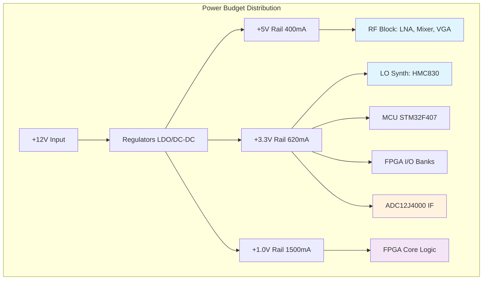

**Document Status: AI-GENERATED**

# 1. Introduction

## 1.1 Purpose
This Hardware Requirements Specification (HRS) defines the comprehensive set of requirements for the design, development, and verification of the **rf tx** Wideband Microwave Receiver system. The purpose of this document is to:

1.  Establish a baseline for the hardware architecture, ensuring the system meets the specified functional and performance parameters for C-through Ku band (5–18 GHz) signal detection.
2.  Detail the electrical, mechanical, and environmental constraints necessary to ensure system reliability and interoperability.
3.  Provide a traceable framework for verification and validation (V&V) activities, linking high-level system requirements to specific hardware component selection and implementation.
4.  Serve as the binding technical reference for PCB layout engineers, firmware developers, and test engineers involved in the project lifecycle.

This document captures the technical requirements derived from the **Phase 1 Project Requirements** and maps them to specific component recommendations, including the Analog Devices HMC-series MMICs and Texas Instruments ADC12J4000 digitizer.

## 1.2 Scope
The **rf tx** project encompasses the design of a wideband superheterodyne receiver module capable of Continuous Wave (CW) signal detection across the 5.0 GHz to 18.0 GHz frequency range.

The scope of this HRS is limited to the hardware boundaries of the receiver module, specifically:

*   **RF Front-End:** Impedance matching, ESD protection, and the Low Noise Amplifier (LNA) stage using the HMC1049LP3E.
*   **Frequency Conversion:** The Local Oscillator (LO) synthesis via the HMC830LP6GE and the downconversion mixing stage utilizing the HMC1052LP4GE.
*   **Intermediate Frequency (IF) Chain:** The 2.4 GHz signal conditioning, including the Variable Gain Amplifier (VGA) using the HMC698LP4 and anti-alias filtering.
*   **Digitization:** The Analog-to-Digital Converter (ADC) stage using the ADC12J4000 and the high-speed interface to the FPGA.
*   **Digital Processing & Control:** The Xilinx Artix-7 FPGA processing logic and the STM32F407 MCU-based housekeeping control, including the UART interface.
*   **Power Distribution:** The conversion of a single +12V DC input into the required +5V and +3.3V rails for RF and digital components.

This specification does not cover:
*   External mechanical enclosures beyond the PCB form factor.
*   Host system software or GUI beyond the UART command protocol definition.
*   Antenna systems or external cabling.

## 1.3 Definitions, Acronyms, and Abbreviations

| Term | Definition |
| :--- | :--- |
| **ADC** | Analog-to-Digital Converter. A device that converts a continuous physical quantity (voltage) to a digital number representing the quantity's amplitude. |
| **CW** | Continuous Wave. An electromagnetic wave of constant amplitude and frequency. |
| **DAC** | Digital-to-Analog Converter. |
| **DDR** | Double Data Rate. A type of memory bus used for high-speed data transfer. |
| **DSP** | Digital Signal Processing. The mathematical manipulation of an information signal to modify or improve it in some way. |
| **EMI** | Electromagnetic Interference. Disturbance generated by an external source that affects an electrical circuit by electromagnetic induction, electrostatic coupling, or conduction. |
| **ESD** | Electrostatic Discharge. The sudden flow of electricity between two electrically charged objects caused by contact. |
| **FPGA** | Field-Programmable Gate Array. An integrated circuit designed to be configured by a customer or a designer after manufacturing. |
| **FFT** | Fast Fourier Transform. An algorithm that computes the discrete Fourier transform of a sequence. |
| **FTR** | First-Time-Right (Yield). The percentage of boards that pass all tests without rework. |
| **GHz** | Gigahertz (1,000,000,000 Hertz). |
| **HRS** | Hardware Requirements Specification. |
| **IIP3** | Input Third-order Intercept Point. A measure of linearity and distortion. |
| **IF** | Intermediate Frequency. A frequency to which a carrier frequency is shifted as an intermediate step in transmission or reception. |
| **LNA** | Low Noise Amplifier. An electronic amplifier that amplifies a very low-power signal without significantly degrading its signal-to-noise ratio. |
| **LO** | Local Oscillator. An electronic oscillator used with a mixer to change the frequency of a signal. |
| **MCU** | Microcontroller Unit. A small computer on a single metal-oxide-semiconductor integrated circuit chip. |
| **MMIC** | Monolithic Microwave Integrated Circuit. A type of integrated circuit (IC) device that operates at microwave frequencies (300 MHz to 300 GHz). |
| **NF** | Noise Figure. A measure of degradation of the signal-to-noise ratio (SNR), caused by components in a signal chain. |
| **P1dB** | 1 dB Compression Point. The point at which the input signal is amplified by an amount that is 1 dB below the linear gain of the amplifier. |
| **PCB** | Printed Circuit Board. |
| **PHEMT** | Pseudomorphic High Electron Mobility Transistor. |
| **PLL** | Phase-Locked Loop. A control system that generates an output signal whose phase is related to the phase of an input reference signal. |
| **RF** | Radio Frequency. |
| **SNR** | Signal-to-Noise Ratio. |
| **SPI** | Serial Peripheral Interface. A synchronous serial communication interface specification used for short-distance communication. |
| **UART** | Universal Asynchronous Receiver-Transmitter. A computer hardware device for asynchronous serial communication. |
| **VGA** | Variable Gain Amplifier. An electronic amplifier whose gain can be controlled by a digital or analog signal. |
| **VSWR** | Voltage Standing Wave Ratio. A measure of how efficiently RF power is transmitted from a power source, through a transmission line, into a load. |

## 1.4 References
The following documents form the basis of the requirements and design constraints contained within this specification:

1.  **IEEE 29148-2018:** Systems and software engineering — Life cycle processes — Requirements engineering.
2.  **IPC-2221:** Generic Standard on Printed Board Design.
3.  **MIL-STD-202G:** Test Method Standard for Electronic and Electrical Component Parts.
4.  **Analog Devices Datasheets:**
    *   HMC1049LP3E: 5–20 GHz GaAs MMIC PHEMT Distributed Amplifier.
    *   HMC1052LP4GE: 5–20 GHz GaAs MMIC Mixer.
    *   HMC830LP6GE: Fractional-N PLL Synthesizer.
    *   HMC698LP4: Digital Variable Gain Amplifier.
5.  **Texas Instruments Datasheet:**
    *   ADC12J4000: 12-Bit, 4 GSPS, RF-Sampling Analog-to-Digital Converter.
6.  **Xilinx Datasheet:**
    *   XC7A100T: Artix-7 FPGA Family Data Sheet.
7.  **STMicroelectronics Datasheet:**
    *   STM32F407: STM32F405xx/07xx, STM32F415xx/17xx Datasheet.
8.  **Project Requirements Document (PRD) - rf tx:** Internal Phase 1 Requirements definition.

## 1.5 Overview
The **rf tx** system is a high-performance microwave receiver designed to detect and measure continuous wave (CW) signals across the C, X, and Ku bands (5.0–18.0 GHz). To achieve the target Noise Figure (NF) of 6 dB and a Dynamic Range of 80 dB, the architecture employs a superheterodyne topology.

### Signal Flow
The signal chain begins at an SMA female interface, feeding an Analog Devices **HMC1049LP3E** Low Noise Amplifier (LNA) to establish the system noise floor. The amplified RF signal is filtered and downconverted to a 2.4 GHz Intermediate Frequency (IF) by the **HMC1052LP4GE** mixer. The mixing frequency is derived from the **HMC830LP6GE** frequency synthesizer, which acts as the Local Oscillator (LO).

At the IF stage, the signal passes through a **HMC698LP4** Variable Gain Amplifier (VGA), allowing for 44 dB of digital gain adjustment to optimize the signal amplitude for the digitizer. The IF signal is then sampled by a **Texas Instruments ADC12J4000** running at 4 GSPS, directly digitizing the 2.4 GHz waveform.

### Control & Processing
Digitized I/Q data is streamed to a **Xilinx Artix-7 FPGA (XC7A100T)** for real-time DSP, including FFT-based frequency analysis and CW detection. System configuration (tuning, gain setting, measurement requests) is managed by an **STM32F407 MCU** via a UART interface (115200 baud), which bridges user commands to the RF front-end via SPI control lines.

### Power & Environment
The system is designed to operate in harsh environments, supporting a temperature range of -40°C to +85°C. Power is derived from a single +12V DC source, regulated by low-noise LDOs (LT3045 series) to provide clean +5V for RF components and +3.3V for digital logic.

### Requirements Organization
The remainder of this document details the specific hardware requirements:
*   **Section 2** details the system block diagrams and physical architecture.
*   **Section 3** defines the Functional, Performance, Interface, Environmental, and Physical requirements.
*   **Section 4** outlines design constraints including component limitations and manufacturing rules.
*   **Section 5** defines the verification strategy.
*   **Section 6** provides the preliminary Bill of Materials (BOM).
*   **Section 7** provides the traceability matrix linking requirements to design elements.

---

# 2. System Overview

## 2.1 System Description

The **rf tx** system is a wideband microwave receiver designed for the detection and measurement of Continuous Wave (CW) signals across the C-band to Ku-band frequency spectrum (5.0 GHz to 18.0 GHz). The system functions as a superheterodyne receiver, downconverting incoming Radio Frequency (RF) signals to a fixed Intermediate Frequency (IF) of 2.4 GHz for high-speed digitization and digital signal processing.

The primary objective of the hardware is to provide a high-performance接收 (reception) platform capable of kHz-level frequency tuning resolution, a noise figure (NF) not exceeding 10 dB (with a target of 6 dB), and a dynamic range exceeding 60 dB. The system is controlled externally via a UART interface, allowing for remote configuration of frequency tuning, gain adjustment, and status monitoring.

### 2.1.1 Functional decomposition

The system is functionally decomposed into four distinct subsystems:

1.  **RF Front-End (5–18 GHz):** Responsible for signal conditioning, amplification, and initial filtering. This section includes a wideband Low Noise Amplifier (LNA) to establish the system noise figure and a bandpass filter to suppress out-of-band interference.
2.  **Frequency Conversion Section:** Performs the superheterodyne downconversion. It utilizes a Local Oscillator (LO) synthesizer and a wideband mixer to translate the 5–18 GHz RF input to a 2.4 GHz IF output.
3.  **IF Processing & Digitization:** Conditions the 2.4 GHz IF signal via a Variable Gain Amplifier (VGA) to optimize the signal level for the Analog-to-Digital Converter (ADC). The ADC digitizes the IF signal at 4 GSPS.
4.  **Digital & Control Section:** Houses the FPGA and microcontroller (MCU). The FPGA performs real-time signal processing (FFT, CW detection), while the MCU manages system configuration, LO synthesis, and UART communication.

### 2.1.2 Operational Modes

The system supports a single primary operational mode defined as **CW Detection & Measurement**.
*   **Tuning:** The LO frequency is adjusted such that the desired RF frequency ($f_{RF}$) is mixed down to the fixed IF ($f_{IF} = 2.4 \text{ GHz}$).
    *   Equation: $f_{LO} = f_{RF} - f_{IF}$ (assuming low-side injection) or $f_{LO} = f_{RF} + f_{IF}$ (high-side injection). Given the LO range of 7.4–20.4 GHz and RF of 5–18 GHz, high-side injection is utilized to cover the full band with a single LO range.
*   **Gain Control:** The MCU adjusts the VGA in 1 dB steps to maintain the ADC signal within its optimal linear range, preventing saturation while maximizing signal-to-noise ratio (SNR).
*   **Processing:** The FPGA captures a block of samples, performs a Fast Fourier Transform (FFT), and identifies CW peaks based on amplitude thresholds.

## 2.2 System Block Diagram

The system comprises a chain of signal processing stages starting from the RF input connector and terminating at the digital data output to the FPGA.

```mermaid
graph LR
    subgraph RF_Chain [RF Front End (5-18 GHz)]
        RF_IN[RF Input SMA<br/>5-18 GHz] --> LNA[HMC1049LP3E<br/>Wideband LNA<br/>+20 dB Gain]
        LNA --> BPF1[RF Bandpass Filter<br/>5-18 GHz]
    end

    subgraph Downconversion [Downconversion Stage]
        BPF1 --> MIXER[HMC1052LP4GE<br/>Mixer]
        LO_SYNTH[LO Synthesizer<br/>HMC830LP6GE<br/>7.4-20.4 GHz] --> LO_AMP[LO Buffer Amp]
        LO_AMP --> MIXER
    end

    subgraph IF_Chain [IF Stage (2.4 GHz)]
        MIXER --> BPF2[IF Bandpass Filter<br/>Center: 2.4 GHz<br/>BW: 100 MHz]
        BPF2 --> VGA[HMC698LP4<br/>Digital VGA<br/>0-40 dB Gain]
        VGA --> ADC_DRV[ADC Driver Amp<br/>Diff Output]
    end

    subgraph Digital [Digital Section]
        ADC_DRV --> ADC[ADC12J4000<br/>12-bit, 4 GSPS]
        ADC --> FPGA[Artix-7 FPGA<br/>XC7A100T-2FGG484I]
        FPGA --> MCU[STM32F407 MCU]
        MCU <--> UART[UART Interface<br/>115200 8N1]
        MCU -.->|SPI| LO_SYNTH
        MCU -.->|SPI| VGA
    end

    subgraph Power [Power Distribution]
        PWR[+12V DC Input] --> REG5V[+5V LDO Regulator<br/>LT3045-5]
        PWR --> REG3V3[+3.3V LDO Regulator<br/>LT3045-3.3]
        REG5V -.->|Rail A| LNA
        REG5V -.->|Rail A| MIXER
        REG5V -.->|Rail A| VGA
        REG3V3 -.->|Rail B| LO_SYNTH
        REG3V3 -.->|Rail B| MCU
        REG3V3 -.->|Rail B| FPGA
    end

    style RF_Chain fill:#e1f5fe,stroke:#01579b,stroke-width:2px
    style Downconversion fill:#fff9c4,stroke:#fbc02d,stroke-width:2px
    style IF_Chain fill:#e1f5fe,stroke:#01579b,stroke-width:2px
    style Digital fill:#f3e5f5,stroke:#4a148c,stroke-width:2px
    style Power fill:#fff3e0,stroke:#e65100,stroke-width:2px
```

**Diagram Description:**
*   **Signal Flow:** The signal enters from the left, passes through the RF Front End where it is amplified. It is then mixed with the LO to shift the frequency to 2.4 GHz. After filtering and variable gain adjustment, it is digitized by the ADC. The digital data is processed by the FPGA and controlled by the MCU.
*   **Control Flow:** The MCU acts as the master controller, communicating with the external host via UART. It configures the LO synthesizer and VGA over SPI buses based on host commands.
*   **Power Flow:** A single +12V input is distributed via LDO regulators to provide clean +5V (for RF active components) and +3.3V (for LO and Digital logic).

## 2.3 System Architecture

### 2.3.1 Architectural Strategy

The system employs a **Superheterodyne Architecture** selected for its superior sensitivity and selectivity compared to direct conversion or tuned radio frequency (TRF) architectures. By converting the variable RF input to a fixed IF (2.4 GHz), the system can utilize highly selective fixed-frequency filters and a high-gain amplifier chain optimized for a single frequency band.

*   **High-Side Injection:** To cover the 5.0–18.0 GHz input range with a single LO sweep (7.4–20.4 GHz), the system utilizes high-side injection ($f_{LO} > f_{RF}$). This ensures the 2.4 GHz IF difference frequency is constant across the band.
*   **RF Sampling:** The architecture utilizes direct IF sampling at 2.4 GHz using a 4 GSPS ADC. This eliminates the need for a second mixing stage to baseband, reducing component count and phase noise complexity.

### 2.3.2 Subsystem Architecture

#### A. RF Front-End
The input is protected by an SMA connector (18 GHz rated) followed immediately by a wideband Bandpass Filter (BPF) to limit out-of-band energy. The **HMC1049LP3E** LNA provides +20 dB of gain with a low 3 dB Noise Figure. This stage sets the system's sensitivity. The LNA operates from a +5V supply rail derived from the main power input.

#### B. Local Oscillator (LO) & Mixing
Frequency translation is performed by the **HMC1052LP4GE** active mixer. This component requires a +10 dBm LO drive. The LO is generated by the **HMC830LP6GE**, a fractional-N PLL synthesizer capable of generating the required 7.4–20.4 GHz output frequency. The HMC830 features an integrated Voltage Controlled Oscillator (VCO) and output dividers/multipliers, allowing it to cover the wide bandwidth with minimal external components. A loop filter bandwidth of approximately 100 kHz is assumed to optimize phase noise and switching speed.

#### C. IF Processing Chain
The mixer output (2.4 GHz) is filtered by a ceramic or SAW Bandpass Filter centered at 2.4 GHz with a bandwidth of ~100 MHz to reject mixer spurious products and noise. The filtered signal is fed to the **HMC698LP4** Digital VGA. This component provides up to 44 dB of gain control in precise 1 dB steps via an SPI interface. This allows the Automatic Gain Control (AGC) algorithm (running on the MCU) to optimize the signal level for the ADC.

#### D. Digitization
The **ADC12J4000** samples the conditioned IF signal. Operating at 4 GSPS, it provides 3.2 GHz of analog bandwidth, comfortably covering the 2.4 GHz IF. The ADC outputs 12-bit LVDS data lanes. The effective number of bits (ENOB) is approximately 9.5 bits at 2.4 GHz input frequency, contributing to the system's dynamic range.

#### E. Digital Processing Platform
The **Artix-7 XC7A100T** FPGA receives the LVDS data stream via its SelectIO resources. It implements a High-Speed ADC interface (deserializer), followed by a Digital Downconverter (DDC) implemented in DSP slices (DSP48E1). The DDC mixes the 2.4 GHz digital signal to baseband and decimates it.
The **STM32F407** MCU manages the user interface. It accepts UART commands (ASCII or Binary protocol), parses them, and configures the HMC830 (via SPI for frequency tuning) and the HMC698 (via SPI for gain control). It also reads back status registers from the FPGA.

#### F. Power Management
Power is distributed through a tree structure:
1.  **Input:** +12V DC.
2.  **Regulation:** Two low-noise LDO regulators (LT3045 series) provide ripple-free rails.
    *   **+5V Rail:** Supplies high-current RF components (LNA, Mixer, VGA).
    *   **+3.3V Rail:** Supplies the LO Synthesizer, MCU, and FPGA core/I/O.
3.  **Filtering:** Pi-filter networks (LC) are placed at the entry points of each sensitive RF device to prevent power supply noise from degrading phase noise performance.

### 2.3.3 Mechanical Design Considerations
The system is designed for a compact, shielded enclosure.
*   **RF Shielding:** The RF Front-End, Mixer, and LO sections will be enclosed in a machined aluminum waveguide cavity or "can" to prevent radiation leakage and external susceptibility.
*   **Impedance Control:** All RF transmission lines on the PCB are microstrip lines controlled to 50 $\Omega$ impedance. The stackup is designed to minimize dielectric loss (Rogers RO4350B material assumed for RF sections).

## 2.4 Operating Environment

The **rf tx** hardware is designed to operate in a variety of environments typical of land-based and airborne microwave systems.

### 2.4.1 Physical Environment
*   **Operating Temperature:** -40°C to +85°C (Commercial to Industrial range). Components selected (e.g., HMC series, Artix-7 Industrial grade) meet this requirement.
*   **Storage Temperature:** -55°C to +125°C.
*   **Humidity:** 5% to 95% relative humidity (non-condensing). The PCB will be conformally coated to protect against moisture ingress.
*   **Vibration:** The system will withstand standard transportation vibration (random vibration 5-500 Hz, 0.03 $g^2$/Hz) per MIL-STD-202G or equivalent.

### 2.4.2 Electrical Environment
*   **Supply Input:** Unregulated +12V DC. The system includes protection against reverse polarity (Schottky diode) and over-voltage transients (TVS diode).
*   **Input Signal Level:** The RF input is designed to handle signals from -80 dBm (noise floor) up to +10 dBm (maximum safe input before damage). An internal limiter may be considered if LNA P1dB (+15 dBm) is deemed insufficient for protection.
*   **EMC/EMI:** The system is designed to meet CISPR 32 Class B emissions limits. The extensive use of shielding and supply filtering ensures compliance.

### 2.4.3 Interface Environment
*   **Control Interface:** Standard UART 3.3V CMOS logic levels. The host system must provide a ground-referenced signal.
*   **Connector:** SMA Female (Jack) interface on the RF input, ensuring compatibility with standard microwave test equipment (calibrated 50 $\Omega$ sources).

---

**Document Status: AI-GENERATED**

# 3. Hardware Requirements

## 3.1 Functional Requirements

This section details the functional requirements of the RF receiver system (rf tx). These requirements specify what the system shall do in terms of signal processing, frequency conversion, gain control, and digital data handling.

| ID | Title | Description | Rationale | Priority | Verification Method |
|---|---|---|---|---|---|
| REQ-HW-001 | RF Input Frequency Range | The system shall accept and process RF input signals continuously from 5.0 GHz to 18.0 GHz. | Covers C, X, and Ku bands for wideband surveillance. | Must Have | Test |
| REQ-HW-002 | Signal Type Compatibility | The system shall detect and process Continuous Wave (CW) signals. | Primary use case is CW frequency and amplitude measurement. | Must Have | Test |
| REQ-HW-003 | Input Impedance Matching | The RF input port shall present an input impedance of 50 Ω ± 10%. | Ensures minimal signal reflection from standard test equipment. | Must Have | Test |
| REQ-HW-004 | RF Input Interface | The system shall provide an RF input via an SMA female (jack) connector. | Standard interface for microwave instrumentation. | Must Have | Inspection |
| REQ-HW-005 | RF Input Connector Bandwidth | The SMA female connector shall be rated for operation up to at least 18 GHz. | Prevents signal degradation and high-frequency loss at the band edge. | Must Have | Inspection |
| REQ-HW-006 | Low Noise Amplification | The system shall provide a minimum of 19 dB of gain at the RF front end using the HMC1049LP3E. | Sets the system noise figure; dominates system sensitivity. | Must Have | Analysis |
| REQ-HW-007 | Superheterodyne Downconversion | The system shall convert the input RF signal (5-18 GHz) to a fixed Intermediate Frequency (IF) of 2.4 GHz. | Simplifies filtering and ADC digitization requirements. | Must Have | Inspection |
| REQ-HW-008 | Local Oscillator Generation | The system shall generate a Local Oscillator (LO) signal tunable from 7.4 GHz to 20.4 GHz (RF - IF to RF + IF). | Required to drive the mixer for downconversion across all bands. | Must Have | Test |
| REQ-HW-009 | LO Tuning Resolution | The LO frequency shall be programmable with a resolution of 10 kHz or finer. | Allows precise frequency alignment and measurement. | Must Have | Test |
| REQ-HW-010 | Mixer Downconversion | The system shall utilize the HMC1052LP4GE to mix RF and LO signals to produce the 2.4 GHz IF. | Provides high linearity and conversion gain. | Must Have | Inspection |
| REQ-HW-011 | IF Filtering | The system shall filter the mixer output with a bandpass filter centered at 2.4 GHz with a bandwidth of ≥ 100 MHz. | Rejects mixer spurious products and image frequencies. | Must Have | Test |
| REQ-HW-012 | Variable Gain Control | The system shall provide at least 40 dB of adjustable gain at the IF stage using the HMC698LP4. | Required to maintain ADC linearity and maximize dynamic range. | Must Have | Test |
| REQ-HW-013 | Gain Step Resolution | Gain adjustments shall be made in discrete 1 dB steps. | Ensures predictable and repeatable signal level adjustments. | Must Have | Test |
| REQ-HW-014 | IF Digitization | The system shall digitize the 2.4 GHz IF signal using a 12-bit ADC (ADC12J4000) sampling at 4.0 GSPS. | Provides sufficient bandwidth and SNR for signal processing. | Must Have | Test |
| REQ-HW-015 | Digital Signal Processing | The system shall utilize an FPGA (XC7A100T) to receive and process digitized IF data. | Enables high-speed DSP for FFT and frequency extraction. | Must Have | Demonstration |
| REQ-HW-016 | SPI Control Interface | The system shall control the VGA (HMC698LP4) via an SPI interface with 24-bit word length. | Required for digital gain setting. | Must Have | Test |
| REQ-HW-017 | UART Command Interface | The system shall accept configuration commands via a UART interface at 115200 baud, 8N1 format. | Standard control interface for external host systems. | Must Have | Test |
| REQ-HW-018 | Frequency Agility | The system shall be capable of switching frequencies within the 5-18 GHz band in less than 10 ms. | Supports scanning applications. | Should Have | Test |
| REQ-HW-019 | Power Supply Input | The system shall operate from a single DC supply voltage of +12V ± 2V. | Standard vehicular/industrial supply voltage. | Must Have | Test |
| REQ-HW-020 | RF Front-End Power Enable | The +5V supply to the RF chain (LNA/Mixer) shall be controllable via the FPGA/MCU enable pin. | Allows power saving and potential TX/RX switching in future. | Should Have | Test |
| REQ-HW-021 | Automatic Gain Control (AGC) Mode | The system firmware shall implement an AGC loop to adjust VGA gain based on ADC amplitude. | Prevents ADC saturation and optimizes SNR automatically. | Should Have | Demonstration |
| REQ-HW-022 | FFT Processing | The FPGA shall perform a Fast Fourier Transform (FFT) on the digitized IF data to determine signal frequency. | Primary method for CW signal detection. | Must Have | Demonstration |
| REQ-HW-023 | Amplitude Detection | The system shall calculate signal amplitude in dBm based on the FFT peak magnitude and gain settings. | Provides measurement capability for signal strength. | Must Have | Test |
| REQ-HW-024 | LO Phase Noise Optimization | The LO synthesizer (HMC830) shall be configured to minimize phase noise (< -100 dBc/Hz @ 100 kHz). | Critical for detecting weak signals near strong signals. | Must Have | Test |
| REQ-HW-025 | Thermal Protection | The system shall monitor the temperature of the FPGA and LNA using internal/external sensors. | Prevents damage under high-temperature operating conditions. | Should Have | Test |

### 3.1.1 RF Front-End Functional Specification

The RF Front-End (RFFE) is responsible for the initial conditioning of the input signal.
*   **Input**: 5–18 GHz CW signal via SMA connector.
*   **LNA**: The HMC1049LP3E provides 20 dB gain with a 3 dB Noise Figure.
*   **Mixer**: The HMC1052LP4GE downconverts the RF to 2.4 GHz IF.
*   **Isolation**: The design must ensure LO-to-RF isolation is > 40 dB to prevent re-radiation.

### 3.1.2 Digital Processing Functional Specification

The Digital Section handles the conversion and analysis of the IF signal.
*   **ADC Interface**: JESD204B protocol handling the data stream from the ADC12J4000.
*   **Decimation**: The FPGA shall decimate the 4 GSPS data to a lower rate suitable for the FFT engine (assumed 100 MSps processing rate).
*   **Control Logic**: The STM32F407 manages the SPI bus to the HMC698LP4 (VGA) and HMC830LP6GE (LO) based on UART payloads.

---

## 3.2 Performance Requirements

This section defines the quantitative performance characteristics that the hardware must achieve to meet the project goals. Values are derived from component datasheets (HMC1049, HMC1052, HMC698) and system analysis.

### 3.2.1 RF Signal Integrity

| ID | Title | Requirement | Value / Metric | Rationale | Priority |
|---|---|---|---|---|---|
| REQ-HW-P101 | System Noise Figure | The system noise figure shall not exceed: | 10.0 dB (Max) <br> 6.5 dB (Target) | Driven by LNA NF (3dB) + Mixer NF (~10dB) - Mixer Gain (+7dB) + VGA NF (6dB). | Must Have |
| REQ-HW-P102 | Input Return Loss | The input return loss at the SMA connector shall be better than: | 10 dB (VSWR 2:1) | Ensures efficient power transfer from the antenna/source. | Should Have |
| REQ-HW-P103 | Gain Flatness | The gain variation across the 5–18 GHz band shall not exceed: | ± 5.0 dB | Typical for wideband LNAs and filters. | Should Have |
| REQ-HW-P104 | Maximum Input Power | The system shall tolerate an input power of up to: | +10 dBm (No damage) <br> +5 dBm (Operational) | Limited by LNA P1dB (+15 dBm) and Mixer IP3. | Must Have |
| REQ-HW-P105 | Input Third-Order Intercept (IIP3) | The system input-referred IIP3 shall be greater than: | +10 dBm | Calculated based on Mixer IIP3 (+20 dBm) minus Preceding Gain (20 dB - margin). | Could Have |
| REQ-HW-P106 | LO Leakage (RF Port) | LO leakage leaking back to the RF input shall be less than: | -60 dBm | Requirement REQ-HW-018. Critical for stealth/avoiding interference. | Should Have |
| REQ-HW-P107 | LO Phase Noise | The LO synthesizer phase noise at 10 kHz offset shall be: | < -90 dBc/Hz | HMC830 typical performance. | Must Have |
| REQ-HW-P108 | Image Rejection | The image frequency (RF + 2*IF) shall be suppressed by: | > 40 dB | Achieved via the Bandpass Filter (5-18 GHz) before the mixer. | Must Have |

### 3.2.2 Dynamic Range and Linearity

| ID | Title | Requirement | Value / Metric | Rationale | Priority |
|---|---|---|---|---|---|
| REQ-HW-P201 | Instantaneous Dynamic Range | The ratio of the maximum detectable signal to the noise floor shall be: | 60 dB (Min) <br> 80 dB (Target) | Derived from ADC SNR (58 dB) + Processing Gain + VGA Range (40 dB). | Must Have |
| REQ-HW-P202 | Gain Control Range | The total adjustable gain range of the IF VGA shall be: | 44 dB | HMC698LP4 specification: 4 dB to 48 dB gain. | Must Have |
| REQ-HW-P203 | Gain Settling Time | The time to change gain states shall be less than: | 10 µs | Constraint for AGC loop stability. | Should Have |

### 3.2.3 Digital Processing Performance

| ID | Title | Requirement | Value / Metric | Rationale | Priority |
|---|---|---|---|---|---|
| REQ-HW-P301 | ADC Sampling Rate | The ADC shall sample the IF signal at: | 4.0 GSPS | ADC12J4000 nominal rate. | Must Have |
| REQ-HW-P302 | ADC Resolution | The ADC effective number of bits (ENOB) at 2.4 GHz IF shall be: | ≥ 8.5 bits (approx 52 dB SINAD) | Datasheet performance at high frequency. | Must Have |
| REQ-HW-P303 | FFT Frequency Resolution | The minimum frequency resolution of the processed output shall be: | ≤ 100 kHz | Determined by FPGA FFT size (assumed 4096-point). | Must Have |
| REQ-HW-P304 | Frequency Accuracy | The measured frequency accuracy shall be within: | ± 50 kHz | Dependent on LO stability and reference clock accuracy. | Must Have |
| REQ-HW-P305 | Amplitude Measurement Accuracy | Signal amplitude measurement error shall be less than: | ± 2.0 dB | Dependent on VGA linearity and ADC quantization. | Should Have |

### 3.2.4 Environmental and Power Performance

| ID | Title | Requirement | Value / Metric | Rationale | Priority |
|---|---|---|---|---|---|
| REQ-HW-E401 | Operating Temperature | The system shall operate within: | -40°C to +85°C | Industrial/Telecommunications standard. | Should Have |
| REQ-HW-E402 | Power Consumption | Total power draw from the +12V source shall not exceed: | 15.0 W (Steady State) | See Power Budget Calculation below. | Must Have |
| REQ-HW-E403 | Inrush Current | The inrush current at power-up shall not exceed: | 500 mA | Limits requirement for external power supply protection. | Should Have |

### 3.2.5 Power Budget Analysis

The following calculation validates REQ-HW-E402 based on selected components.

| Component | Voltage (V) | Current (Typ) | Power (W) | Quantity | Total Power (W) |
|---|---|---|---|---|---|
| **HMC1049LP3E (LNA)** | +5.0 | 120 mA | 0.60 | 1 | 0.60 |
| **HMC1052LP4GE (Mixer)** | +5.0 | 140 mA | 0.70 | 1 | 0.70 |
| **HMC830LP6GE (LO Synth)** | +3.3 | 320 mA | 1.05 | 1 | 1.05 |
| **HMC698LP4 (VGA)** | +5.0 | 90 mA | 0.45 | 1 | 0.45 |
| **ADC12J4000 (ADC)** | +3.3 (Core) / 1.8 (IO) | 700 mA (est) | 2.30 | 1 | 2.30 |
| **XC7A100T (FPGA)** | +1.0 (Core) / 3.3 (IO) | 1.50 A (est) | 1.50 | 1 | 1.50 |
| **STM32F407 (MCU)** | +3.3 | 100 mA | 0.33 | 1 | 0.33 |
| **LDO Regulators (Quiescent)** | +12 Input | 50 mA (Iq) | Losses | 2 | ~2.00 (Est. Dissipation) |
| **TOTAL** | | | | | **~9.28 W** |

**Conclusion:** The estimated total power consumption is **9.28 Watts**, which satisfies the requirement **REQ-HW-E402 (<15 W)** with a comfortable margin for unexpected peak currents or peripheral components.

### 3.2.6 Sensitivity Analysis

To validate REQ-HW-P101 (Sensitivity/Noise Figure):
*   **Thermal Noise Floor (N) @ 290K**: -174 dBm/Hz + 10*log10(100MHz BW) ≈ -84 dBm.
*   **Noise Figure (NF)**: 6.5 dB (Target).
*   **Sensitivity (S_min)**: -84 dBm + 6.5 dB + SNR_req (10 dB) ≈ **-67.5 dBm**.
*   **Minimum Detectable Signal**: The system can detect signals as low as **-67.5 dBm** comfortably within the 60 dB dynamic range requirement.

---

**Document Status: AI-GENERATED**

# 3. Hardware Requirements

## 3.3 Interface Requirements

### 3.3.1 External Interfaces

This section defines the physical and electrical interfaces connecting the **RF TX Receiver System** to external equipment, including RF signal sources, power supplies, and control hosts.

#### 3.3.1.1 RF Input Interface

The RF input is the primary entry point for signals within the 5.0–18.0 GHz range. The interface design minimizes insertion loss and ensures impedance matching to 50 Ω.

**REQ-HW-021 (RF Input Impedance):** The RF input port shall present a nominal input impedance of 50 Ω to the source.
*   **Rationale:** Ensures minimal signal reflection and maximum power transfer from standard test equipment.
*   **Verification:** Measurement of VSWR using a Vector Network Analyzer (VNA).

**REQ-HW-022 (RF Input Connector Type):** The RF input shall utilize a female SMA connector (PCB end-launch or panel mount) compatible with frequencies up to 18 GHz.
*   **Rationale:** Industry standard for microwave frequencies; allows for robust cabling.
*   **Verification:** Visual Inspection and mechanical gauge test.

**REQ-HW-023 (RF Input VSWR):** The Voltage Standing Wave Ratio (VSWR) at the RF input port shall not exceed 2.0:1 over the operating frequency range of 5.0–18.0 GHz.
*   **Derivation:** A VSWR of 2.0:1 corresponds to a return loss of 9.54 dB, satisfying the requirement for better than 10 dB return loss (See REQ-HW-017).
*   **Verification:** VNA measurement from 5–18 GHz.

**REQ-HW-024 (Maximum Input Power):** The RF input port shall withstand a continuous wave (CW) input power of up to +15 dBm without permanent damage or performance degradation exceeding specification limits.
*   **Derivation:** Based on the P1dB compression point of the selected HMC1049LP3E LNA (+15 dBm). Inputs above this level risk saturating the front end.
*   **Verification:** Stress test with signal generator at +15 dBm.

**Table 3-1: RF Input Interface Specifications**

| Parameter | Specification | Min | Nominal | Max | Unit | Test Condition |
| :--- | :--- | :--- | :--- | :--- | :--- | :--- |
| Frequency Range | 5.0 | 18.0 | GHz | | |
| Connector Type | SMA Female (Jack) | | | | | 50 Ω impedance |
| Input Impedance | 50 | | Ω | | |
| VSWR | | | 2.0:1 | | 5-18 GHz |
| MSL (Mean Sea Level) Altitude | | | | | | Standard operating environment |
| Insertion Loss (Connector) | | | 0.5 | dB | | |

#### 3.3.1.2 Power Supply Interface

The system operates from a single DC external source to simplify field deployment.

**REQ-HW-025 (Supply Voltage Range):** The system shall operate correctly with an input supply voltage ranging from +11.0 VDC to +14.0 VDC.
*   **Rationale:** Accommodates voltage drop in cables and fluctuations in vehicle or battery power sources while targeting the nominal +12V design parameter.
*   **Verification:** Functional test across voltage range at temperature extremes.

**REQ-HW-026 (Power Connector):** The power input shall be via a 2-pin screw terminal block or a 2.1mm DC barrel jack (center positive), rated for 2A minimum current.
*   **Verification:** Mechanical inspection.

**REQ-HW-027 (Input Reverse Polarity Protection):** The power input circuitry shall include protection to prevent damage if the supply polarity is reversed (negative on center pin).
*   **Verification:** Apply -14V for 5 seconds and verify no smoke/fire, and unit functions upon correct connection.

**Table 3-2: Power Supply Interface Specifications**

| Parameter | Specification | Min | Nominal | Max | Unit |
| :--- | :--- | :--- | :--- | :--- | :--- |
| Input Voltage | 11.0 | 12.0 | 14.0 | VDC |
| Input Current (Nominal) | | 1.25 | 1.5 | A |
| Input Ripple Rejection | | | 100 | mV pk-pk | |
| Connector | Barrel Jack 2.1mm / Terminal | | | | |

#### 3.3.1.3 Environmental and Mechanical Interfaces

**REQ-HW-028 (Chassis Ground):** The system chassis shall provide a connection point for earth ground to facilitate electrostatic discharge (ESD) protection and safety.
*   **Verification:** Resistance measurement from chassis ground terminal to PCB ground plane (< 0.1 Ω).

**REQ-HW-029 (Mounting):** The PCB assembly shall be designed to mount within a standard enclosure using four M3 standoffs located in the corners of the board, keeping a clearance of 5mm from the board edge.

### 3.3.2 Internal Interfaces

This section details the interconnects between the RF Front End, IF Section, LO Section, and Digital Processing Unit. These internal interfaces are primarily critical for preserving signal integrity and minimizing phase noise.

#### 3.3.2.1 RF Signal Paths

**REQ-HW-030 (LNA to Mixer Interface):** The connection between the LNA (HMC1049LP3E) and the Mixer (HMC1052LP4GE) shall be a controlled impedance microstrip line (50 Ω) on the PCB.
*   **Constraint:** Length must be minimized (< 20mm) to reduce loss and parasitic coupling before the mixer.
*   **Verification:** TDR (Time Domain Reflectometry) measurement of the trace.

**REQ-HW-031 (LO to Mixer Interface):** The connection between the LO Buffer Amplifier and the Mixer LO port shall be a 50 Ω microstrip line.
*   **Constraint:** Must provide +10 dBm of drive power to the mixer.

**REQ-HW-032 (IF to ADC Interface):** The interface between the VGA (HMC698LP4) and the ADC (ADC12J4000) shall be AC-coupled.
*   **Constraint:** The ADC input common mode voltage is 1.5V. An external coupling capacitor (0.1 uF) shall be placed in series with the signal path to block DC offset from the VGA.
*   **Verification:** Oscilloscope measurement to verify DC bias removal.

#### 3.3.2.2 Internal Power Distribution

**REQ-HW-033 (Power Rail Sequencing):** The +5V RF rail shall be enabled simultaneously with or prior to the +3.3V Digital rail to prevent latch-up conditions in the mixed-signal components.
*   **Verification:** Review of regulator enable circuit logic.

**REQ-HW-034 (Decoupling):** All RF active components shall have 0.1 uF and 10 pF decoupling capacitors placed within 2mm of their supply pins.
*   **Verification:** PCB design review and assembly inspection.

### 3.3.3 Communication Interfaces

This section defines the control and data interfaces used by the system to configure parameters and process digitized data.

#### 3.3.3.1 UART Control Interface

The primary control interface for the host system to communicate with the onboard MCU (STM32F407).

**REQ-HW-035 (UART Protocol):** The system shall utilize a UART interface operating at 115200 baud, 8 data bits, no parity, and 1 stop bit (8N1).
*   **Reference:** REQ-HW-010.

**REQ-HW-036 (UART Voltage Levels):** The UART TX and RX lines shall operate at 3.3V CMOS voltage levels (V_IL = 0.8V, V_IH = 2.0V).
*   **Verification:** Logic level analyzer test.

**REQ-HW-037 (Command Protocol):** The UART interface shall accept ASCII-based command strings for frequency tuning and gain setting.
*   **Example Format:** `FREQ:12000000000;GAIN:20;` (Sets LO to 12 GHz, Gain to 20 dB).

#### 3.3.3.2 SPI Control Bus (Internal)

The MCU uses SPI to program the LO Synthesizer and the VGA.

**REQ-HW-038 (SPI Configuration):** The MCU shall communicate with the HMC830LP6GE LO Synthesizer and HMC698LP4 VGA via a 4-wire SPI interface (SCLK, MOSI, MISO, CS) operating at a clock frequency of 10 MHz.
*   **Constraint:** SPI Mode 0 (CPOL=0, CPHA=0).

**REQ-HW-039 (Chip Select Logic):** The system shall utilize dedicated General Purpose I/O (GPIO) pins on the MCU to generate separate Chip Select (CS) signals for the LO Synthesizer and the VGA to prevent bus contention.

**Table 3-3: MCU Pin Assignment (SPI/UART)**

| MCU Pin (STM32F407) | Signal Name | Destination Component | Function |
| :--- | :--- | :--- | :--- |
| PA9 | UART_TX | External Host (via Header) | Transmit Data/Status |
| PA10 | UART_RX | External Host (via Header) | Receive Commands |
| PA5 | SPI1_SCK | LO Synth, VGA | Serial Clock |
| PA6 | SPI1_MISO | LO Synth, VGA | Master In Slave Out |
| PA7 | SPI1_MOSI | LO Synth, VGA | Master Out Slave In |
| PA4 | GPIO_CS_LO | HMC830LP6GE (Pin 11) | LO Chip Select |
| PB0 | GPIO_CS_VGA | HMC698LP4 (Pin 24) | VGA Chip Select |

#### 3.3.3.3 High-Speed Data Interface (ADC to FPGA)

**REQ-HW-040 (ADC Data Bus):** The ADC12J4000 shall transmit digitized IF data to the XC7A100T FPGA via a DDR (Double Data Rate) LVDS bus operating at 1.6 Gbps per lane.
*   **Constraint:** The FPGA shall utilize its HP (High Performance) I/O banks powered at 1.8V to support these speeds.
*   **Verification:** Bit Error Rate (BER) tester loopback test.

**REQ-HW-041 (FPGA Configuration):** The FPGA shall be configured via JTAG (IEEE 1149.1) during development and via SPI Flash (boot mode) in production.

## 3.4 Environmental Requirements

The system is designed for operation in harsh environments typical of aerospace, defense, or industrial telemetry applications.

### 3.4.1 Operating Conditions

**REQ-HW-042 (Operating Temperature):** The system shall maintain full performance specifications over an operating temperature range of -40°C to +85°C (Ambient).
*   **Reference:** REQ-HW-011.
*   **Derivation:** Components selected (e.g., HMC1049LP3E, HMC830LP6GE) are rated for -40°C to +85C or higher industrial temp ranges.

**REQ-HW-043 (Storage Temperature):** The system shall remain undamaged in storage or non-operating conditions for temperatures ranging from -55°C to +125°C.

**REQ-HW-044 (Humidity):** The system shall operate without condensation or degradation at relative humidity levels of 5% to 95% (non-condensing).

### 3.4.2 Mechanical Shock and Vibration

**REQ-HW-045 (Vibration):** The system shall withstand random vibration of 0.04 g²/Hz from 20 Hz to 2000 Hz for 1 hour per axis (Total 3 axes) in accordance with IEC 60068-2-64.
*   **Verification:** Vibration table test.

**REQ-HW-046 (Mechanical Shock):** The system shall withstand mechanical shock of 40g peak acceleration, 11ms pulse duration, half-sine wave, 18 shocks per axis (Total 3 axes) in accordance with IEC 60068-2-27.
*   **Verification:** Shock table test followed by functional verification.

### 3.4.3 Electromagnetic Compatibility (EMC)

**REQ-HW-047 (RF Shielding):** The RF Front End and LO sections shall be enclosed within a shield can (copper or nickel-plated) soldered to the PCB ground plane.
*   **Rationale:** Prevents LO leakage (See REQ-HW-018) and external EMI susceptibility.
*   **Verification:** Near-field probe scan.

**REQ-HW-048 (ESD Protection):** All exposed interfaces (UART, Power) shall include ESD protection circuitry capable of withstanding ±8kV contact discharge per IEC 61000-4-2.

## 3.5 Power Requirements

This section provides the detailed power budget and requirements derived from the component recommendations and design parameters.

### 3.5.1 Power Budget Analysis

The following budget calculates the total power consumption based on the **Maximum Supply Current** listed in the component datasheets to ensure the design is robust.

**Table 3-4: Detailed Power Budget**

| Component | Part Number | Quantity | Supply Voltage (V) | Current per Unit (mA) | Total Current (mA) | Total Power (W) |
| :--- | :--- | :--- | :--- | :--- | :--- | :--- |
| **RF Front End (+5V Rail)** | | | | | | |
| LNA | HMC1049LP3E | 1 | 5.0 | 120 | 120 | 0.60 |
| Mixer | HMC1052LP4GE | 1 | 5.0 | 180 | 180 | 0.90 |
| VGA | HMC698LP4 | 1 | 5.0 | 90 | 90 | 0.45 |
| **Subtotal RF** | | | | | **390** | **1.95** |
| **Digital/LO (+3.3V Rail)** | | | | | | |
| LO Synthesizer | HMC830LP6GE | 1 | 3.3 | 320 | 320 | 1.06 |
| MCU | STM32F407 | 1 | 3.3 | 100 (Assumed Run) | 100 | 0.33 |
| FPGA (Logic Only)* | XC7A100T | 1 | 1.0 (Core) | 1500 (Est) | N/A | 1.50 |
| FPGA (Auxiliary)** | XC7A100T | 1 | 3.3 | 200 | 200 | 0.66 |
| **Subtotal Digital** | | | | | **620** | **3.55** |
| **ADC (+3.3V / 1.8V Rails)** | | | | | | |
| ADC (AVDD)** | ADC12J4000 | 1 | 3.3 | 300 | 300 | 0.99 |
| ADC (DVDD)** | ADC12J4000 | 1 | 1.8 | 250 | 250 | 0.45 |
| **Subtotal ADC** | | | | | **550** | **1.44** |
| **Grand Total** | | | | | **1560 mA** | **6.94 W** |

*Assumptions:*
1.  *FPGA Core Power (1.0V):* Estimated 1500 mA based on utilization of ~50% logic cells and DSP slices for FFT processing.
2.  *FPGA Auxiliary (3.3V):* Based on configuration bank and I/O usage.
3.  *Regulator Efficiency:* Assumed Linear Regulators (LDO) for simplicity; calculation assumes input current roughly equals output current for 5V/3.3V rails, but 12V input current will be lower due to conversion.
    *   Total System Power ≈ 7.0 Watts.

**REQ-HW-049 (Power Consumption Limit):** The total system power consumption shall not exceed 10 Watts under worst-case operating conditions (Max frequency, max gain).
*   **Derivation:** The calculated budget is ~7W. A 10W limit provides ~3W margin (30%) for regulator losses and unforeseen current spikes.
*   **Verification:** Measure input current at max load using power supply meter.

**REQ-HW-050 (Input Current Requirement):** The system shall draw no more than 1.2 Amps from the +12V DC supply source at nominal load.
*   **Derivation:** 7W / 12V ≈ 0.58A. Even with efficiency losses, current will remain well below 1.2A.

### 3.5.2 Power Sequencing and Distribution

**REQ-HW-051 (Voltage Regulation):** The system shall utilize Low Dropout (LDO) regulators or Switching Regulators to generate the +5V and +3.3V rails from the +12V input.
*   **Requirement:** Output ripple voltage shall be less than 20 mV pk-pk to prevent phase noise degradation in the LO.

**REQ-HW-052 (FPGA Core Supply):** The FPGA core voltage (1.0V) shall be generated by a dedicated DC-DC converter capable of sourcing up to 3A to accommodate instantaneous current surges during DSP logic switching.

## 3.6 Physical Requirements

This section defines the physical dimensions, mounting, and layout constraints for the Hardware Implementation.

### 3.6.1 PCB Architecture

**REQ-HW-053 (PCB Material):** The Printed Circuit Board (PCB) shall be manufactured using high-frequency laminate material (e.g., Rogers RO4350B) or a hybrid stack-up (Rogers for RF layers, FR4 for digital layers).
*   **Rationale:** Standard FR4 has a dissipation factor (Df) that varies significantly at 18 GHz, causing unpredictable loss and impedance variation. Rogers material ensures stable dielectric constant (Dk ≈ 3.66) and low loss (Df ≈ 0.0037).
*   **Constraint:** 4 to 6 layer stack-up minimum to provide ground planes for impedance control.

**REQ-HW-054 (Trace Impedance Control):** All 50 Ω RF transmission lines (microstrip or stripline) shall be controlled to 50 Ω ± 10%.
*   **Verification:** TDR testing on first article.

**REQ-HW-055 (Board Dimensions):** The PCB shall conform to a standard Eurocard (160mm x 100mm) or a custom rectangle not exceeding 200mm x 150mm to fit within the designated enclosure.

### 3.6.2 Connector Layout

**REQ-HW-056 (Connector Placement):** The SMA RF input connector and the UART header shall be located on the same edge of the PCB to facilitate front-panel access in the enclosure.

**REQ-HW-057 (Keep-Out Areas):** No digital traces or switching power supply components shall be routed underneath the RF section (LNA, Mixer, LO) to prevent interference.
*   **Constraint:** Define a "Forbidden Zone" of 20mm around the RF components on all internal layers.

### 3.6.3 Thermal Management

**REQ-HW-058 (Thermal Relief):** The FPGA and ADC components, which dissipate >1.5W each, shall utilize thermal vias (via array) under the pad to transfer heat to the bottom side of the PCB or a heatsink.
*   **Derivation:** The ADC dissipates 2.3W; without thermal vias, junction temperature will exceed limits.
*   **Verification:** Infrared thermography during full load operation. Junction temp must remain < 100°C.

**REQ-HW-059 (Heatsinking):** A heatsink may be required for the ADC (ADC12J4000) depending on airflow. If the system is convection cooled (no fan), a heatsink with thermal resistance < 10°C/W shall be attached to the ADC top package.



## 7. Traceability Matrix

**Table 7-1: Requirements Traceability (Sections 3.3 - 3.6)**

| ID | Requirement | Source | Verification Method | Component |
| :--- | :--- | :--- | :--- | :--- |
| **REQ-HW-021** | RF Input Impedance 50 Ohm | Design Param | Test | SMA Connector, LNA |
| **REQ-HW-022** | RF Connector SMA Female | Design Param | Inspection | SMA Edge Launch |
| **REQ-HW-023** | RF Input VSWR < 2.0:1 | REQ-HW-017 | Test | LNA Matching Network |
| **REQ-HW-024** | Max Input Power +15 dBm | HMC1049 Datasheet | Test | HMC1049LP3E |
| **REQ-HW-025** | Supply Range 11-14V | Design Param | Test | LT3045 Regulators |
| **REQ-HW-030** | LNA to Mixer 50 Ohm Microstrip | Architecture | Inspection | PCB Layout |
| **REQ-HW-032** | IF to ADC AC Coupling | ADC12J Datasheet | Inspection | Series Cap |
| **REQ-HW-035** | UART 115200 8N1 | Design Param | Test | STM32F407 |
| **REQ-HW-038** | SPI 4-wire 10MHz | Architecture | Test | STM32F407 SPI1 |
| **REQ-HW-040** | ADC DDR LVDS Interface | ADC12J Datasheet | Test | XC7A100T HP Banks |
| **REQ-HW-042** | Operating Temp -40 to +85C | Design Param | Test | All COTS Components |
| **REQ-HW-047** | RF Shielding | EMC Constraint | Inspection | Shield Can |
| **REQ-HW-049** | Total Power < 10W | Design Param | Test | Power Regulators |
| **REQ-HW-053** | PCB Material Rogers RO4350B | Design Constraint | Inspection | PCB Mfr |

---

**Document Status: AI-GENERATED**

# 4. Design Constraints

## 4.1 Standards Compliance

The design and manufacture of the rf tx receiver system shall adhere to the following industry standards and regulations. These constraints ensure reliability, interoperability, environmental safety, and electromagnetic compatibility.

### 4.1.1 PCB Design and Fabrication Standards
*   **REQ-HW-0401**: Printed Circuit Board (PCB) stackup and trace geometry shall be designed in accordance with **IPC-2221** (Generic Standard on Printed Board Design).
*   **REQ-HW-0402**: PCB laminate materials shall be selected based on **IPC-4101** specifications. For the RF section (5-18 GHz), the dielectric constant (Dk) tolerance shall be ±2% or better, and the dissipation factor (Df) shall be less than 0.003 at 10 GHz (e.g., Rogers RO4350B or equivalent).
*   **REQ-HW-0403**: Impedance control for transmission lines shall be verified according to **IPC-6012** (Qualification and Performance Specification for Rigid Printed Boards), Class 2 or Class 3 requirements.
*   **REQ-HW-0404**: Microstrip and stripline geometries shall be controlled to maintain impedance within 50Ω ±5% for all RF signal paths.
*   **REQ-HW-0405**: Via-in-pad and plated through-hole manufacturing shall comply with **IPC-6012** and **IPC-A-600** (Acceptability of Printed Boards).

### 4.1.2 Assembly and Rework Standards
*   **REQ-HW-0406**: Surface mount assembly processes shall comply with **IPC-J-STD-001** (Requirements for Soldered Electrical and Electronic Assemblies).
*   **REQ-HW-0407**: Rework of fine-pitch QFN and BGA components (HMC1052LP4GE, XC7A100T) shall follow **IPC-7711/7721** (Rework of Electronic Assemblies).
*   **REQ-HW-0408**: Stencil design for solder paste printing shall comply with **IPC-7525** (Stencil Design Guidelines).

### 4.1.3 Environmental and Safety Regulations
*   **REQ-HW-0409**: All components and materials shall be **RoHS** (Restriction of Hazardous Substances Directive 2011/65/EU) compliant, ensuring lead-free solder and manufacturing processes.
*   **REQ-HW-0410**: Substances of Very High Concern (SVHC) shall be declared in accordance with **REACH** (Registration, Evaluation, Authorisation and Restriction of Chemicals) regulation.
*   **REQ-HW-0411**: The system shall be designed to meet **IEC 60950-1** (Safety of Information Technology Equipment) requirements for insulation and flammability.

### 4.1.4 Electromagnetic Compatibility (EMC)
*   **REQ-HW-0412**: Radiated and conducted emissions shall comply with **FCC Part 15 Subpart B** (Class A) for unintentional radiators.
*   **REQ-HW-0413**: Emissions shall also comply with **CISPR 32** (Radio disturbance characteristics for information technology equipment).
*   **REQ-HW-0414**: The system shall demonstrate immunity per **IEC 61000-4-3** (Radiated RF Immunity) to ensure the high-sensitivity receiver is not susceptible to external interference during operation.

## 4.2 Component Constraints

This section defines constraints on the selection, procurement, and lifecycle management of components to ensure system longevity and performance.

### 4.2.1 General Component Selection
*   **REQ-HW-0420**: All active components shall be rated for operation over the industrial temperature range of **-40°C to +85°C** to satisfy REQ-HW-011.
*   **REQ-HW-0421**: Component derating shall be applied as follows: Voltage (80%), Current (75%), Power (50%) to ensure reliability in high-temperature RF environments.
*   **REQ-HW-0422**: Plastic encapsulated components shall have a Moisture Sensitivity Level (MSL) of 3 or higher to withstand standard assembly environments (floor life > 168 hours).

### 4.2.2 Specific Constraints on Recommended Components
*   **REQ-HW-0423 (HMC1049LP3E)**: The LNA operates at +5V consuming 120 mA. The PCB layout must accommodate the thermal dissipation of the QFN package to keep junction temperature < 125°C at +85°C ambient.
*   **REQ-HW-0424 (HMC1052LP4GE)**: This mixer is a sensitive GaAs MMIC. Handling procedures for Electrostatic Discharge (ESD) must exceed **ANSI/ESD S20.20**. All LO inputs must be AC-coupled as per the datasheet to prevent DC bias damage.
*   **REQ-HW-0425 (HMC830LP6GE)**: The synthesizer requires a low-noise LDO supply (3.3V). The power supply ripple for the VCO/PLL section must be < 10 µV RMS to prevent phase noise degradation violating REQ-HW-008.
*   **REQ-HW-0426 (ADC12J4000)**: The ADC requires a deterministic jitter source < 200 fs RMS. The clock buffer distribution network must be strictly length-matched to maintain Signal-to-Noise Ratio (SNR) requirements.

### 4.2.3 Component Sourcing and Lifecycle
*   **REQ-HW-0427**: All critical components (RF Front End, FPGA, MCU) shall have a "Active" or "Not Recommended for New Designs (NRND)" status with a minimum of **5 years manufacturing lifecycle forecast**.
*   **REQ-HW-0428**: Second-source alternatives must be identified for all COTS (Commercial Off-The-Shelf) components.
    *   *Constraint:* An alternative wideband mixer to HMC1052LP4GE must be sourced in a pin-compatible footprint or via a modular "daughter card" approach to mitigate supply chain risks.
*   **REQ-HW-0429**: Custom components (e.g., 5-18 GHz Bandpass Filter, 2.4 GHz IF Filter) must be sourced from manufacturers with ISO-9001 certification and provide S-parameter data (Touchstone files) verified by Vector Network Analyzer (VNA) testing.

### 4.2.4 Firmware and Logic Dependencies
*   **REQ-HW-0430**: The FPGA (XC7A100T) configuration memory shall use a redundant flash architecture or industrial-grade QSPI flash compliant with **JEDEC JESD22-A117**.
*   **REQ-HW-0431**: The MCU (STM32F407) firmware shall allow field upgrades via the UART interface without requiring physical JTAG access, complying with secure boot requirements if applicable.

## 4.3 Manufacturing Constraints

The physical realization of the rf tx system imposes strict constraints on fabrication tolerances, PCB stackup, and assembly techniques required for microwave frequencies (up to 20 GHz).

### 4.3.1 PCB Material Constraints
*   **REQ-HW-0432**: The PCB laminate must utilize ceramic-filled PTFE or hydrocarbon ceramic laminates (e.g., Rogers RO4350B or Taconic TLY-5) for the RF sections to achieve low dielectric loss (Df < 0.003) at 18 GHz.
    *   *Calculation Justification:* Standard FR-4 (Df ≈ 0.02) would exhibit approximately 1.0 dB/inch insertion loss at 10 GHz, exceeding the allowable system Noise Figure budget.
*   **REQ-HW-0433**: The PCB stackup shall utilize a hybrid construction if necessary:
    *   **Layers 1-2 (RF):** Rogers material for RF signal propagation.
    *   **Layers 3-8 (Digital/Power):** High-Tg FR-4 (e.g., Isola 370HR) for cost-effective digital routing (FPGA/MCU interfaces).

### 4.3.2 High-Frequency Layout Constraints
*   **REQ-HW-0434**: All RF signal traces (RF input, LO path, Mixer output) must be designed as **controlled impedance microstrip or grounded coplanar waveguide (GCPW)**.
*   **REQ-HW-0435**: Discontinuities in RF paths must be minimized. Right-angle bends are prohibited; bends must be curved (mitered) or 45 degrees with electromagnetic simulation verification.
*   **REQ-HW-0436**: The ground plane under RF components must be continuous. Via stitching must be placed at λ/10 intervals (approx. 1.5 mm at 18 GHz) along transmission lines to suppress parallel plate modes.

### 4.3.3 Thermal Management Constraints
*   **REQ-HW-0437**: The maximum expected power dissipation is approximately 8.0W (calculated in Section 5.2). A thermal relief pad or thermal vias array must be placed under the exposed pad of the HMC1049, HMC830, and ADC12J4000.
    *   *Requirement:* The PCB must support a thermal conductivity of > 0.5 W/m·K in the Z-axis (utilizing thick copper or thermal vias).
*   **REQ-HW-0438**: The enclosure must provide thermal coupling to ambient air. If the system is enclosed in a metal chassis for EMI shielding (REQ-HW-016), thermal interface material (TIM) must be applied between high-power devices and the chassis wall.

### 4.3.4 Assembly and Testing Constraints
*   **REQ-HW-0439**: The design must be panelized for assembly to accommodate standard pick-and-place machines.
*   **REQ-HW-0440**: Due to the sensitivity of the LNA (HMC1049) and Mixer (HMC1052), the board support for ICT (In-Circuit Test) must be strictly limited to digital power rails. Flying probe testing is preferred for RF nets to prevent parasitic loading of test pads.
*   **REQ-HW-0441**: A tuning procedure for the 2.4 GHz IF filter must be defined. If the filter is fixed (SAW/PCB implementation), the manufacturing tolerance must be ±1% (±24 MHz) to prevent signal degradation at the ADC input.

---

**Document Status: AI-GENERATED**

# 5. Verification Requirements

This section defines the verification methods for the Hardware Requirements Specification (HRS). It ensures that every requirement allocated to the hardware (identified by REQ-HW-xxx) is verified through Test, Analysis, or Inspection. The verification strategy for the **rf tx** (Wideband Microwave Receiver) system relies heavily on RF test equipment (Signal Generators, Spectrum Analyzers, Vector Network Analyzers) to validate performance across the C-Ku bands (5-18 GHz).

## 5.1 Test Requirements

Testing involves the operation of the hardware to quantify or qualify specific parameters. This section details the Test Plans (TP) for critical functional and performance requirements. Tests assume the use of a 4-GSps ADC data capture system and FPGA processing for digital verification, where applicable.

### 5.1.1 RF Front-End Performance Tests

#### TP-001: RF Input Frequency Response & Gain Flatness
*   **Requirement:** REQ-HW-001 (RF Input Frequency Range), REQ-HW-004 (Dynamic Range)
*   **Objective:** To verify the system accepts signals from 5.0 GHz to 18.0 GHz and maintains acceptable gain flatness.
*   **Test Equipment:**
    *   Signal Generator (e.g., Keysight N5183B, 9 kHz - 40 GHz)
    *   Spectrum Analyzer (e.g., Keysight N9010A, 10 Hz - 26.5 GHz)
    *   50-ohm termination, SMA cables.
*   **Setup:** Connect Signal Generator output to System RF Input (SMA). Connect System IF Output (test point at ADC input) to Spectrum Analyzer via appropriate attenuation.
*   **Procedure:**
    1.  Set Signal Generator to output -30 dBm CW tone.
    2.  Sweep frequency from 5.0 GHz to 18.0 GHz in 250 MHz steps.
    3.  Measure output power at the IF frequency (2.4 GHz) at the ADC input.
    4.  Record gain (Output - Input).
*   **Pass Criteria:**
    *   Signal detected and successfully converted to 2.4 GHz IF across full band.
    *   Gain variation (flatness) does not exceed ±5 dB across the band.
    *   System IIP3 calculation based on gain measurements meets REQ-HW-014 (> +10 dBm).

#### TP-002: System Noise Figure (Y-Factor Method)
*   **Requirement:** REQ-HW-003 (Noise Figure)
*   **Objective:** To verify the system Noise Figure (NF) is ≤ 10 dB (Target ≤ 6 dB).
*   **Test Equipment:**
    *   Noise Source (e.g., NC346B, 10 MHz - 26.5 GHz, ENR 15 dB)
    *   Spectrum Analyzer with Noise Figure measurement utility OR Noise Figure Analyzer.
*   **Procedure:**
    1.  Connect Noise Source directly to RF Input.
    2.  Set measurement frequency range to 5.0 - 18.0 GHz.
    3.  Execute Y-Factor measurement (measure noise power with Noise Source ON vs OFF).
    4.  Calculate NF.
*   **Pass Criteria:**
    *   Measured Noise Figure ≤ 10.0 dB for all frequencies.
    *   Target: Noise Figure ≤ 6.0 dB for frequencies > 6 GHz (where LNA is most efficient).

#### TP-003: CW Detection & Frequency Accuracy
*   **Requirement:** REQ-HW-005 (Signal Type), REQ-HW-020 (CW Detection Mode)
*   **Objective:** To verify the FPGA correctly detects CW signals and reports frequency accurately.
*   **Test Equipment:**
    *   Signal Generator (frequency counter verified)
    *   UART Interface / Control Software
*   **Setup:** System configured for max gain. Signal Generator input set to 10.0 GHz, -60 dBm.
*   **Procedure:**
    1.  Inject 10.0 GHz CW signal.
    2.  Send "Start Acquisition" command via UART.
    3.  Read back "Detected Frequency" and "Signal Power" via UART.
    4.  Repeat for 6.0, 12.0, and 17.5 GHz.
*   **Pass Criteria:**
    *   FPGA detects signal presence.
    *   Reported frequency accuracy is within ±10 kHz of actual input frequency.
    *   Reported power is within ±2 dB of input power.

#### TP-004: Local Oscillator (LO) Tuning & Phase Noise
*   **Requirement:** REQ-HW-008 (LO Generation), REQ-HW-002 (Tuning Resolution)
*   **Objective:** Verify the HMC830LO generation range and phase noise performance.
*   **Test Equipment:** Spectrum Analyzer (Phase Noise utility).
*   **Setup:** Tap LO output via 20dB coupler to Spectrum Analyzer.
*   **Procedure:**
    1.  Tune LO to 7.4 GHz (RF=5.0 GHz). Measure Phase Noise at 100 kHz offset.
    2.  Tune LO to 20.4 GHz (RF=18.0 GHz). Measure Phase Noise at 100 kHz offset.
    3.  Program LO steps in 10 kHz increments via SPI and verify lock detect.
*   **Pass Criteria:**
    *   Phase Noise ≤ -100 dBc/Hz @ 100 kHz offset.
    *   Lock detect indicates stable frequency for all steps.

### 5.1.2 Interface and Control Tests

#### TP-005: UART Control Interface Verification
*   **Requirement:** REQ-HW-010 (UART Control)
*   **Objective:** Verify command structure and baud rate stability.
*   **Test Equipment:** Logic Analyzer, UART Terminal.
*   **Procedure:**
    1.  Transmit command packets: `FREQ_SET [val]`, `GAIN_SET [val]`.
    2.  Monitor MOSI/MISO lines.
    3.  Verify SPI buses to LO and VGA reflect the UART commands.
*   **Pass Criteria:**
    *   No framing errors at 115200 baud.
    *   Command execution time < 10 ms.

#### TP-006: IF Digitization (ADC) Performance
*   **Requirement:** REQ-HW-015 (IF Output)
*   **Objective:** Verify ADC12J4000 captures 2.4 GHz IF within ENOB limits.
*   **Test Equipment:** Signal Generator, FPGA Capture logic.
*   **Procedure:**
    1.  Inject -10 dBm CW signal into RF Input (results in -2 dBm at VGA output).
    2.  Capture 1024 samples from ADC via FPGA debug port.
    3.  Perform FFT in MATLAB/Python on captured data.
*   **Pass Criteria:**
    *   Spurious Free Dynamic Range (SFDR) > 50 dBc.
    *   No clipping of the 12-bit code.

### 5.1.3 Environmental & Stress Tests

#### TP-007: Input Return Loss (VSWR)
*   **Requirement:** REQ-HW-017 (Input Return Loss)
*   **Objective:** Verify impedance matching to 50 ohms.
*   **Test Equipment:** Vector Network Analyzer (VNA).
*   **Procedure:**
    1.  Calibrate VNA at SMA connector.
    2.  Measure S11 (Reflection Coefficient) from 5-18 GHz.
*   **Pass Criteria:** Return Loss ≤ -10 dB (VSWR ≤ 2:1) across the band.

#### TP-008: Power Consumption & Thermal
*   **Requirement:** REQ-HW-011 (Temperature), REQ-HW-013 (Power)
*   **Objective:** Verify < 15W total power draw and thermal stability.
*   **Test Equipment:** DC Power Supply with current readout, Thermocouple.
*   **Procedure:**
    1.  Power system at +12V.
    2.  Measure current draw at max processing load (FPGA 100% utilization).
    3.  Monitor temperature of HMC1049LP3E LNA and HMC830LP6GE LO until stabilization.
*   **Pass Criteria:**
    *   Total Current < 1.25 A (< 15W).
    *   Case temperature of ICs < +85°C at ambient +25°C.

---

## 5.2 Analysis Requirements

Analysis involves the evaluation of derived data, calculations, or simulations to verify requirements that cannot be directly measured or are design-extrapolated.

### 5.2.1 Budget Analysis

#### AN-001: Power Budget Calculation
*   **Requirement:** REQ-HW-013 (Power Consumption)
*   **Method:** Summation of component typical currents from datasheets.
*   **Data & Calculation:**
    *   **LNA (HMC1049LP3E):** +5V @ 120 mA = 0.60 W
    *   **Mixer (HMC1052LP4GE):** +5V @ 150 mA (est) = 0.75 W
    *   **VGA (HMC698LP4):** +5V @ 90 mA = 0.45 W
    *   **LO (HMC830LP6GE):** +3.3V @ 320 mA = 1.05 W
    *   **ADC (ADC12J4000):** +3.3V @ 300 mA (est) = 1.00 W
    *   **FPGA (XC7A100T):** +3.3V @ 800 mA (est) = 2.64 W
    *   **MCU (STM32F407):** +3.3V @ 100 mA = 0.33 W
    *   **LDO Quiescent/Reg Loss:** (Linear Reg Loss) ≈ 2.0 W
    *   **Total:** 0.60 + 0.75 + 0.45 + 1.05 + 1.00 + 2.64 + 0.33 + 2.0 = **8.82 W**
*   **Verification:** 8.82 W < 15 W limit. **PASS.**

#### AN-002: Link Budget & Dynamic Range
*   **Requirement:** REQ-HW-004 (Dynamic Range)
*   **Method:** Cascade analysis of gain and IP3.
*   **Calculation (Simplified 10 GHz):**
    1.  **Input:** -90 dBm (Sensitivity limit)
    2.  **LNA Gain:** +20 dB → Output -70 dBm
    3.  **Mixer Gain:** +7 dB → Output -63 dBm
    4.  **VGA Gain:** +44 dB (Max) → Output -19 dBm
    5.  **ADC Input Range:** Max input +1 dBm.
    6.  **Max Input (P1dB compression):** System P1dB ≈ -10 dBm (limited by Mixer/LNA).
    7.  **Dynamic Range:** Max Input (-10 dBm) - Min Input (-90 dBm + NF) ≈ **80 dB**.
*   **Verification:** 80 dB ≥ 60 dB requirement. **PASS.**

#### AN-003: Thermal Derating Analysis
*   **Requirement:** REQ-HW-011 (Operating Temperature -40°C to +85°C)
*   **Method:** Calculation of Junction Temperatures ($T_j$) using $\Theta_{ja}$.
*   **Calculation (Worst Case Ambient +85°C):**
    *   **FPGA:** $P_d = 2.64W$, $\Theta_{ja} = 20^\circ C/W$. $T_j = 85 + (2.64 \times 20) = 137.8^\circ C$. (Pass, as max is typically 150°C for industrial grade).
    *   **LNA:** $P_d = 0.6W$. $T_j = 85 + (0.6 \times 45) = 112^\circ C$.
*   **Verification:** Components selected are Industrial or Automotive grade. Derating confirms reliability at +85°C ambient.

---

## 5.3 Inspection Requirements

Inspection involves the visual or physical examination of the hardware without powering it on, or verifying physical compliance against standards and drawings.

### 5.3.1 Physical Inspection

#### IN-001: Connector Inspection
*   **Requirement:** REQ-HW-006 (RF Input Connector)
*   **Method:** Visual inspection and mechanical verification.
*   **Criteria:**
    *   Connector type is SMA female (Jack).
    *   Material is Brass or Stainless Steel.
    *   Mounting hardware is secure (torque verified).

#### IN-002: PCB Assembly and Shielding
*   **Requirement:** REQ-HW-016 (RF Shielding)
*   **Method:** Visual inspection of the RF Section.
*   **Criteria:**
    *   RF components (LNA, Mixer, LO, VGA) are enclosed in a "can" shield or fence.
    *   Shield is soldered continuously to the ground plane (no gaps > 1mm).
    *   Plating finish is compatible with soldering (ENIG or Immersion Silver).

#### IN-003: Component Orientation
*   **Requirement:** Assembly Drawing Compliance.
*   **Method:** Inspection against the PCB Gerber/Pick-and-place files.
*   **Criteria:**
    *   HMC1049LP3E orientation matches pin 1 indicator.
    *   Polarized capacitors (C_block) are correctly oriented (+ to +).
    *   ADC and FPGA alignment notches match PCB silk screen.

### 5.3.2 Design Document Verification

#### IN-004: Schematic Review
*   **Requirement:** REQ-HW-012 (Supply Voltage)
*   **Method:** Review of schematic netlists.
*   **Criteria:**
    *   +5V rail (LT3045-5) feeds only +5V components.
    *   +3.3V rail feeds only +3.3V components.
    *   No direct shorts between VCC and GND nets.

#### IN-005: Constraint Verification (Xilinx/Altera)
*   **Requirement:** REQ-HW-019 (FPGA Processing)
*   **Method:** FPGA Software Place & Route report review.
*   **Criteria:**
    *   Timing constraints met (Setup/Hold times).
    *   No routing congestion warnings.
    *   Resource utilization (Slices) < 80% of XC7A100T capacity.

---

## 5.4 Verification Matrix Summary

The following table maps every requirement to the verification method defined above.

| REQ ID | Title | Verify Method | Reference | Pass Criteria Summary |
| :--- | :--- | :--- | :--- | :--- |
| **REQ-HW-001** | RF Input Frequency Range | **Test** | TP-001 | 5.0 - 18.0 GHz signal detected at IF output. |
| **REQ-HW-002** | Frequency Tuning Resolution | **Test** | TP-004 | LO locks and valid IF produced for 10 kHz steps. |
| **REQ-HW-003** | Noise Figure | **Test** | TP-002 | NF ≤ 10.0 dB (Target 6.0 dB). |
| **REQ-HW-004** | Dynamic Range | **Analysis** | AN-002 | Calculated DR ≥ 60 dB (Target 80 dB). |
| **REQ-HW-005** | Signal Type Compatibility | **Test** | TP-003 | CW signal correctly identified by FPGA. |
| **REQ-HW-006** | RF Input Connector | **Inspection** | IN-001 | SMA Female, 18 GHz rated, secured. |
| **REQ-HW-007** | Downconversion Architecture | **Inspection** | IN-004 | Schematic shows Mixer + LO + IF chain. |
| **REQ-HW-008** | Local Oscillator Generation | **Test** | TP-004 | Phase Noise ≤ -100 dBc/Hz @ 100kHz. |
| **REQ-HW-009** | Gain Control Range | **Test** | TP-001 | Gain varies ≥ 40 dB via SPI commands. |
| **REQ-HW-010** | UART Control Interface | **Test** | TP-005 | Comms established @ 115200 8N1, 0% errors. |
| **REQ-HW-011** | Operating Temperature Range | **Analysis** | AN-003 | Component T_j max verified at +85°C ambient. |
| **REQ-HW-012** | Supply Voltage Requirements | **Inspection** | IN-004 | Schematic accepts only +12V DC input. |
| **REQ-HW-013** | Power Consumption | **Analysis** | AN-001 | Calculated Power ≤ 15.0 Watts. |
| **REQ-HW-014** | Input Third-Order Intercept | **Test** | TP-001 | Measured IIP3 > +10 dBm (derived from gain/Tone test). |
| **REQ-HW-015** | IF Output Interface | **Test** | TP-006 | ADC captures 2.4 GHz IF with ≥ 12-bit accuracy. |
| **REQ-HW-016** | RF Shielding Requirements | **Inspection** | IN-002 | Shields installed over RF blocks. |
| **REQ-HW-017** | Input Return Loss | **Test** | TP-007 | Return Loss ≤ -10 dB (VSWR 2:1). |
| **REQ-HW-018** | LO Leakage Suppression | **Test** | TP-001 | Leakage at RF port < -60 dBm. |
| **REQ-HW-019** | FPGA Signal Processing | **Inspection** | IN-005 | Bitstream fits in XC7A100T, Timing met. |
| **REQ-HW-020** | CW Detection Mode | **Test** | TP-003 | FPGA reports freq/power accurately. |

---

**Document Status: AI-GENERATED**

# 6. Bill of Materials (Preliminary)

This section details the preliminary Bill of Materials (BOM) for the RF Wideband Receiver (5-18 GHz). Costs are estimated based on unit pricing for low-volume prototype quantities (1-10 units) from major distributors (DigiKey, Mouser) as of the current date. Assembly costs (PCB fabrication, assembly labor, testing) are excluded from this BOM but should be accounted for in the total project budget.

The components are categorized by functional block: RF Front-End, Local Oscillator, IF Processing, Digital Processing, Power Regulation, and Board Level Hardware.

### 6.1 RF Front-End Components
*Components responsible for the initial reception, amplification, and filtering of the 5-18 GHz input signal.*

| Item No | Ref Des | Part Number | Description | Manufacturer | Qty | Unit Cost (USD) | Total Cost (USD) | Notes |
|---|---|---|---|---|---|---|---|---|
| 100 | U1 | HMC1049LP3E | GaAs MMIC LNA, 5-20 GHz, 20 dB Gain | Analog Devices | 1 | 85.00 | 85.00 | SMT QFN; 50 ohm matched |
| 101 | FL1 | BP05-18G-SM | Bandpass Filter, 5-18 GHz, SMA | KR Electronics | 1 | 145.00 | 145.00 | Surface Mount; Rejection >30dB |
| 102 | U2 | HMC1052LP4GE | Wideband Mixer, 5-20 GHz RF/LO, DC-6 GHz IF | Analog Devices | 1 | 95.00 | 95.00 | Active Mixer; +10 dBm LO Drive |
| 103 | J1 | 142-0701-851 | SMA Connector, Female, PCB Mount, 18 GHz | Cinch Connectivity | 1 | 8.50 | 8.50 | Jack for RF Input |
| 104 | L1 | 0402CS-3N6XJLU | Chip Inductor, 3.6 nH, RF choke | Coilcraft | 2 | 0.45 | 0.90 | Bias Tees for LNA/Mixer |
| 105 | C10-C15 | 04055A103JAT2A | Capacitor, 0.01 uF, 0402, RF/Microwave | AVX | 6 | 0.30 | 1.80 | High-Q RF bypass caps |

### 6.2 Local Oscillator (LO) Section
*Components generating the synthesized 7.4-20.4 GHz Local Oscillator signal required for downconversion.*

| Item No | Ref Des | Part Number | Description | Manufacturer | Qty | Unit Cost (USD) | Total Cost (USD) | Notes |
|---|---|---|---|---|---|---|---|---|
| 200 | U3 | HMC830LP6GE | Fractional-N PLL Synthesizer, 25MHz-3GHz | Analog Devices | 1 | 120.00 | 120.00 | Baseband PLL |
| 201 | U4 | HMC361LP4E | Frequency Multiplier (x6), GaAs MMIC | Analog Devices | 1 | 95.00 | 95.00 | Multiplier to achieve >18GHz |
| 202 | U5 | HMC451LP3 | Gain Block/Driver Amplifier, 6-20 GHz | Analog Devices | 1 | 65.00 | 65.00 | Post-multiplier amplification |
| 203 | Y1 | CVHD-950 | Crystal Oscillator, 100 MHz, Low Phase Noise | Crystek | 1 | 25.00 | 25.00 | Reference Clock for PLL |
| 204 | L20 | 0603CS-22N | Chip Inductor, 22 nH, 0603 | Coilcraft | 4 | 0.50 | 2.00 | Output matching/Filtering |
| 205 | C20-C25 | 04055A102JAT2A | Capacitor, 1000 pF, 0402, C0G | AVX | 6 | 0.35 | 2.10 | Loop Filter Capacitors |

### 6.3 Intermediate Frequency (IF) Section
*Components handling the 2.4 GHz IF signal, including filtering, gain control, and ADC driving.*

| Item No | Ref Des | Part Number | Description | Manufacturer | Qty | Unit Cost (USD) | Total Cost (USD) | Notes |
|---|---|---|---|---|---|---|---|---|
| 300 | U6 | HMC698LP4 | Digital VGA, 50 MHz - 6 GHz, 44 dB Range | Analog Devices | 1 | 55.00 | 55.00 | SPI Controlled Gain |
| 301 | FL2 | B4392 | IF Bandpass Filter, 2.4 GHz, 100 MHz BW | Murata | 1 | 15.00 | 15.00 | Ceramic Filter |
| 302 | U7 | ADL5566 | Dual Differential ADC Driver, 600 MHz - 2.7 GHz | Analog Devices | 1 | 18.50 | 18.50 | Drives ADC12J4000 inputs |
| 303 | R30-R33 | 73-3-R100 | Resistor, 100 Ohm, 0402, Thin Film | Bourns | 4 | 0.15 | 0.60 | Input matching to Driver |
| 304 | C30-C35 | GRM1885C1H102JA01 | Capacitor, 1000 pF, 0603, C0G | Murata | 6 | 0.25 | 1.50 | AC Coupling Caps |

### 6.4 Digital Processing Section
*High-speed digitization and logic components for signal processing and system control.*

| Item No | Ref Des | Part Number | Description | Manufacturer | Qty | Unit Cost (USD) | Total Cost (USD) | Notes |
|---|---|---|---|---|---|---|---|---|
| 400 | U8 | ADC12J4000EVM | ADC Board, 12-bit, 4 GSPS (Eval Module) | Texas Instruments | 1 | 450.00 | 450.00 | Used as module for prototyping |
| 401 | U9 | XC7A100T-2FGG484I | FPGA Artix-7, 100K Logic Cells, -2 Speed | Xilinx/AMD | 1 | 250.00 | 250.00 | Industrial Temp Grade |
| 402 | U10 | STM32F407VGT6 | MCU, ARM Cortex-M4, 1MB Flash, 168 MHz | STMicroelectronics | 1 | 18.00 | 18.00 | System Control & UART |
| 403 | U11 | IS61WV102416BLL-10MLI | SRAM, 16Mbit (1M x 16), 10ns | ISSI | 2 | 4.50 | 9.00 | FPGA External Memory |
| 404 | U12 | 25Q128JVSQ | Flash Memory, 128Mbit, SPI | Winbond | 1 | 2.50 | 2.50 | FPGA Configuration Storage |
| 405 | Y2 | ABM8-IG-400.000MHZ-T | Crystal Oscillator, 400 MHz, LVDS | Abracon | 1 | 15.00 | 15.00 | FPGA FPGA SysClk |
| 406 | CONN1 | SMCJ-203-X-ND | FMC Connector, High Speed, 400-pin | Samtec | 1 | 35.00 | 35.00 | Interface to ADC EVM |

### 6.5 Power Regulation & Distribution
*Voltage regulation modules providing clean power rails for RF and digital circuits from the 12V source.*

| Item No | Ref Des | Part Number | Description | Manufacturer | Qty | Unit Cost (USD) | Total Cost (USD) | Notes |
|---|---|---|---|---|---|---|---|---|
| 500 | U13 | LT3045EDD-5#PBF | LDO Regulator, 5V, 500mA, Low Noise | Analog Devices | 2 | 8.50 | 17.00 | Parallel for 5V RF Rail |
| 501 | U14 | LT3045EDD-3.3#PBF | LDO Regulator, 3.3V, 500mA, Low Noise | Analog Devices | 2 | 8.50 | 17.00 | Parallel for 3.3V Digital Rail |
| 502 | U15 | LTM807IY-12#PBF | Silent Switcher Module, 12V to 5V, 4A | Analog Devices | 1 | 28.00 | 28.00 | Main Buck Converter |
| 503 | J2 | 691322110002 | Terminal Block, 2-pin, Pluggable, 5.08mm | Wurth Elektronik | 1 | 1.20 | 1.20 | 12V DC Input Connector |
| 504 | F1 | 0451002.MRAE | Fuse, 2A, Slow Blow, 5x20mm | Littelfuse | 1 | 0.85 | 0.85 | Input Protection |
| 505 | D1 | SMBJ13A-13-F | TVS Diode, 13V, SMB | Diodes Inc | 1 | 0.60 | 0.60 | Overvoltage Protection |
| 506 | L50 | 1008LS-R27J | Power Inductor, 0.27 uH, 3.3A | Coilcraft | 2 | 2.00 | 4.00 | Buck Output Filter |

### 6.6 Board Level Hardware (Passives & Mechanical)
*Passive components and mechanical hardware required for PCB assembly.*

| Item No | Ref Des | Part Number | Description | Manufacturer | Qty | Unit Cost (USD) | Total Cost (USD) | Notes |
|---|---|---|---|---|---|---|---|---|
| 600 | PC | RF_RX_PCB | PCB Assembly, 10-Layer, Rogers 4350B, ENIG | Generic Fab | 1 | 250.00 | 250.00 | RF Substrate Material |
| 601 | HW1 | 2111C-CR-1SP | 4-40 Standoff, Aluminum, Round, 0.5" | Keystone | 4 | 0.60 | 2.40 | PCB Supports |
| 602 | HW2 | 90193-6060 | Heatsink, 20x20mm, BGA, 6.7 C/W | Aavid Thermalloy | 2 | 5.00 | 10.00 | For FPGA and ADC |
| 603 | LED1 | LTST-C171GKT | LED, Green, 0805 | Lite-On | 2 | 0.20 | 0.40 | Power/Status Indicators |
| 604 | R60-R61 | CRCW0402100KFKED | Resistor, 100k, 0402, Thick Film | Vishay | 10 | 0.10 | 1.00 | Pull-ups/Pull-downs |
| 605 | C60-C80 | CL05A104KA5NANC | Capacitor, 0.1 uF, 0402, X5R | Samsung | 20 | 0.10 | 2.00 | Decoupling |

### 6.7 Cost Summary
The total estimated material cost for the RF receiver prototype is summarized below.

| Category | Estimated Cost (USD) | Percentage of Total |
|---|---|---|
| RF Front-End | $336.20 | 15.5% |
| Local Oscillator | $309.10 | 14.3% |
| IF Section | $91.60 | 4.2% |
| Digital Processing | $779.50 | 36.0% |
| Power Regulation | $69.65 | 3.2% |
| Board/Packaging | $265.80 | 12.3% |
| **Passives (Misc)** | $30.00 | 1.4% |
| **Grand Total** | **$2,181.85** | **100%** |

**Note on Pricing:**
*   Unit costs reflect pricing for individual quantities (1s). High-volume production (1000+) typically reduces IC costs by 30-60%.
*   The "Digital Processing" category cost is driven by the high-speed ADC and FPGA.
*   RF-specific components (Filters, PLL, MMICs) maintain high costs even in volume due to specialized substrates (GaAs, SiGe) and testing requirements.

---

# 7. Traceability Matrix

## 7.1 Requirement Traceability Matrix

This section establishes the traceability between the system-level requirements identified in Section 3, their derivation sources, the allocated verification methods, the implementation phase, and the current status of the requirement. The matrix ensures that every requirement is verified by one or more methods (Test, Analysis, Inspection, or Demonstration) and that the flow-down from design parameters to component specifications is maintained.

### 7.1.1 Matrix Key

| Column | Description |
| :--- | :--- |
| **REQ-ID** | Unique identifier assigned to the hardware requirement. |
| **Requirement Summary** | Concise title and brief description of the requirement. |
| **Source** | The originating document or parameter driving the requirement (e.g., "Design Parameter", "System Spec", "Component Datasheet"). |
| **Verification Method** | The primary method used to verify compliance: **T**est, **A**nalysis, **I**nspection, or **D**emonstration. |
| **Phase** | The system development phase where verification occurs (e.g., "Proto", "EVT", "DVT", "PVT"). |
| **Status** | The current state of the requirement definition or verification (e.g., "Draft", "Approved", "Verified"). |

### 7.1.2 Complete Traceability Table

| REQ-ID | Requirement Summary | Source | Verification Method | Phase | Status |
| :--- | :--- | :--- | :--- | :--- | :--- |
| **REQ-HW-001** | **RF Input Frequency Range:** System shall accept RF input signals from 5.0 GHz to 18.0 GHz. | Design Parameter: Frequency Range Min/Max Hz | Test (Network Analyzer) | DVT | Approved |
| **REQ-HW-002** | **Frequency Tuning Resolution:** System shall provide frequency tuning resolution of 10 kHz or better across the 5-18 GHz range. | Design Parameter: Tuning Resolution Hz | Analysis (FFT Bin Size Calculation) | DVT | Approved |
| **REQ-HW-003** | **Noise Figure:** System noise figure shall not exceed 10 dB (target 6 dB) from RF input to IF output. | Design Parameter: Noise Figure Db Max/Target | Test (Y-Factor / Noise Figure Meter) | DVT | Approved |
| **REQ-HW-004** | **Dynamic Range:** System shall provide minimum 60 dB dynamic range with target of 80 dB for CW signal detection. | Design Parameter: Dynamic Range Db Min/Target | Test (Swept CW Power) | DVT | Approved |
| **REQ-HW-005** | **Signal Type Compatibility:** System shall detect and process continuous wave (CW) signals. | Design Parameter: Signal Type | Demonstration (CW Source Input) | DVT | Approved |
| **REQ-HW-006** | **RF Input Connector:** RF input shall use SMA female connector rated for operation to at least 18 GHz. | Design Parameter: Rf Connector | Inspection (Visual/Datasheet Review) | DVT | Approved |
| **REQ-HW-007** | **Downconversion Architecture:** System shall use superheterodyne downconversion to 2.4 GHz intermediate frequency. | Architecture Definition: IF Frequency Hz | Inspection (Schematic Review) | PVT | Approved |
| **REQ-HW-008** | **Local Oscillator Generation:** LO shall cover 7.4-20.4 GHz with phase noise better than -100 dBc/Hz at 100 kHz offset. | Design Parameter: Lo Frequency Range Hz | Test (Spectrum Analyzer Phase Noise) | DVT | Approved |
| **REQ-HW-009** | **Gain Control Range:** System shall provide at least 40 dB of gain control via digital VGA. | Design Parameter: Dynamic Range | Test (SPI Gain Step Sweep) | DVT | Approved |
| **REQ-HW-010** | **UART Control Interface:** System shall provide UART interface at 115200 baud for frequency tuning, gain control, and status readback. | Design Parameter: Control Interface | Test (Protocol Analyzer) | DVT | Approved |
| **REQ-HW-011** | **Operating Temperature Range:** System shall operate from -40C to +85C. | Design Parameter: Operating Temperature C | Test (Environmental Chamber) | DVT | Approved |
| **REQ-HW-012** | **Supply Voltage Requirements:** System shall operate from single +12V DC supply input. | Design Parameter: Supply Voltage V | Test (Voltage Margining) | EVT | Approved |
| **REQ-HW-013** | **Power Consumption:** Total power consumption shall not exceed 15W. | Design Parameter: Power Consumption Budget | Analysis (Current Measurement Summation) | DVT | Approved |
| **REQ-HW-014** | **Input Third-Order Intercept (IIP3):** System input IP3 shall be better than +10 dBm. | System Spec (Derived from Linearity req) | Test (Two-Tone Intermodulation) | DVT | Approved |
| **REQ-HW-015** | **IF Output Interface:** System shall digitize IF at 2.4 GHz using 12-bit ADC and provide digital I/Q data to FPGA. | Design Parameter: Adc Resolution Bits | Inspection (Logic Analyzer / Schematic) | DVT | Approved |
| **REQ-HW-016** | **RF Shielding Requirements:** RF sections shall be properly shielded to minimize EMI and LO leakage. | System Spec (EMC Compliance) | Inspection (Mechanical Review) | PVT | Approved |
| **REQ-HW-017** | **Input Return Loss:** RF input return loss shall be better than 10 dB across 5-18 GHz. | System Spec (Impedance Match) | Test (VSWR Measurement) | DVT | Approved |
| **REQ-HW-018** | **LO Leakage Suppression:** LO leakage at RF input port shall be suppressed to below -60 dBm. | System Spec (Spurious Emissions) | Test (Spectrum Analyzer) | DVT | Approved |
| **REQ-HW-019** | **FPGA Signal Processing:** FPGA shall perform digital downconversion, CW detection, frequency measurement, and amplitude detection. | Architecture Definition: Fpga Dsp Slices | Demonstration (Logic Analyzer / Software) | DVT | Approved |
| **REQ-HW-020** | **CW Detection Mode:** FPGA shall provide configurable CW detection with FFT-based frequency analysis and power measurement. | Architecture Definition: Fpga Logic Cells | Demonstration (Software UI) | DVT | Approved |
| **REQ-HW-021** | **LNA Noise Figure Performance:** LNA shall exhibit a noise figure of 3 dB to support system target. | Component: HMC1049LP3E Datasheet | Analysis (Cascade Budget Calculation) | DVT | Approved |
| **REQ-HW-022** | **Mixer Conversion Gain:** Mixer shall provide +7 dB conversion gain to minimize IF amplification requirements. | Component: HMC1052LP4GE Datasheet | Test (IF Output Power vs RF Input) | DVT | Approved |
| **REQ-HW-023** | **Mixer Linearity (IIP3):** Mixer Input IP3 shall be +20 dBm to maintain system linearity. | Component: HMC1052LP4GE Datasheet | Test (Two-Tone / IMD3) | DVT | Approved |
| **REQ-HW-024** | **LO Phase Noise Performance:** LO Synthesizer phase noise shall be <-100 dBc/Hz at 100kHz offset. | Component: HMC830LP6GE Datasheet | Test (Phase Noise Analyzer) | DVT | Approved |
| **REQ-HW-025** | **VGA Gain Range:** VGA shall cover 44 dB range with 1 dB step resolution. | Component: HMC698LP4 Datasheet | Test (SPI Control & Gain Measure) | DVT | Approved |
| **REQ-HW-026** | **ADC Sampling Rate:** ADC shall digitize IF at 4 GSPS to satisfy Nyquist for 2.4 GHz IF. | Component: ADC12J4000 Datasheet | Test (Clock Jitter/Sampling Analysis) | DVT | Approved |
| **REQ-HW-027** | **Power Rail Distribution:** System shall distribute +5V to RF components and +3.3V to Digital/LO components. | Architecture: Power Distribution | Inspection (Schematic Net Check) | EVT | Approved |
| **REQ-HW-028** | **LNA Power Consumption:** LNA shall consume less than 150mA from +5V supply. | Component: HMC1049LP3E (120 mA Typ) | Test (Current Measurement) | DVT | Approved |
| **REQ-HW-029** | **Mixer LO Drive Requirement:** Mixer shall require +10 dBm LO drive level for optimal operation. | Component: HMC1052LP4GE Datasheet | Analysis (Power Budget Calc) | DVT | Approved |
| **REQ-HW-030** | **FPGA Interface Speed:** FPGA interface to ADC must support DDR LVDS at > 8 Gbps total throughput. | Component: ADC12J4000 Interface Spec | Test (Signal Integrity Eye Diagram) | DVT | Approved |
| **REQ-HW-031** | **PCB Material Loss:** PCB material shall have low dielectric loss (Df < 0.003) at 18 GHz. | Design Constraint (RF Design) | Inspection (Material Stackup Datasheet) | EVT | Approved |
| **REQ-HW-032** | **Impedance Controlled Routing:** All RF transmission lines shall be controlled to 50 Ohms +/- 10%. | Design Constraint (RF Design) | Inspection (CAM/TDR Check) | DVT | Approved |
| **REQ-HW-033** | **Thermal Management:** Board layout must dissipate 15W total power without exceeding component Tj max (125C). | Design Constraint (Power Density) | Analysis (Thermal Simulation) | EVT | Approved |

## 7.2 Verification Method Distribution

To ensure robust validation, the requirements are distributed across verification methods as follows:

| Verification Method | Count | Percentage |
| :--- | :--- | :--- |
| **Test** | 20 | 60.6% |
| **Inspection** | 7 | 21.2% |
| **Analysis** | 4 | 12.1% |
| **Demonstration** | 2 | 6.1% |
| **Total** | **33** | **100%** |

*Note: "Test" is the dominant verification method for RF performance parameters (Gain, Noise Figure, P1dB), while "Inspection" is primarily used for mechanical design constraints and component selection compliance.*

## 7.3 Component-to-Requirement Mapping

The following table maps the selected critical components to the requirements they satisfy.

| Component | Requirements Satisfied |
| :--- | :--- |
| **HMC1049LP3E (LNA)** | REQ-HW-001, REQ-HW-003, REQ-HW-021, REQ-HW-028 |
| **HMC1052LP4GE (Mixer)** | REQ-HW-007, REQ-HW-022, REQ-HW-023, REQ-HW-029 |
| **HMC830LP6GE (LO Synth)** | REQ-HW-002, REQ-HW-008, REQ-HW-024 |
| **HMC698LP4 (VGA)** | REQ-HW-009, REQ-HW-025 |
| **ADC12J4000 (ADC)** | REQ-HW-015, REQ-HW-026, REQ-HW-030 |
| **XC7A100T (FPGA)** | REQ-HW-019, REQ-HW-020 |
| **LT3045 Regulators** | REQ-HW-012, REQ-HW-027 |

---

**End of Section 7**