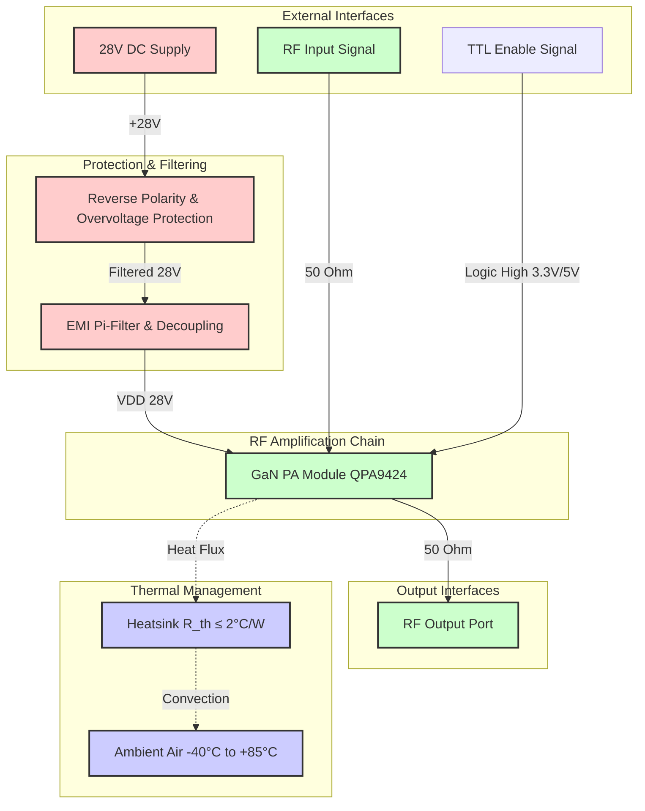

**Document Status: AI-GENERATED**

# 1. Introduction

## 1.1 Purpose
This Hardware Requirements Specification (HRS) defines the comprehensive set of hardware requirements for the **rfff** project, a 2.4 GHz Gallium Nitride (GaN) Radio Frequency (RF) Power Amplifier (PA) module. The purpose of this document is to establish a baseline for the design, verification, and validation of the hardware architecture, ensuring the system meets the specified electrical, thermal, and mechanical performance criteria.

This specification details the functional allocation of the hardware subsystems, interfaces between the Power Amplifier and external systems (RF input/output, DC power, control logic), and constraints imposed by the physical environment. The requirements contained herein, identified with unique IDs (REQ-HW-xxx), serve as the binding definition for the hardware development team and are derived from the system-level need for a 10W, 28V continuous wave (CW) amplifier suitable for industrial applications.

## 1.2 Scope
The scope of this document encompasses the complete hardware design of the rfff RF Power Amplifier, including:

*   **RF Signal Chain:** Components required to amplify a 2.4 GHz continuous wave input signal to a minimum of 40 dBm (10W) output power with 30 dB of gain.
*   **Power Supply Circuitry:** DC input conditioning, overvoltage protection, reverse polarity protection, and EMI filtering required to derive a clean 28V rail from an external source.
*   **Control Interface:** TTL-compatible enable/disable logic for power sequencing and operational safety.
*   **Thermal Management:** Heatsink design, thermal interface materials, and junction temperature management required to maintain operation at −40°C to +85°C ambient temperatures.
*   **Physical Enclosure:** PCB design rules, connector selection, and mechanical mounting hardware.

The scope is limited to the hardware implementation of the amplifier module. It does not cover the system-level software, host system integration, or manufacturing test fixtures beyond the interface definitions required for testing. The design targets the 2.4–2.5 GHz ISM band utilizing a fully integrated GaN PA module approach to minimize design complexity and maximize reproducibility.

## 1.3 Definitions, Acronyms, and Abbreviations

To ensure clarity and precise interpretation of this specification, the following definitions, acronyms, and abbreviations apply throughout this document.

| Term / Acronym | Definition |
| :--- | :--- |
| **CW** | **Continuous Wave:** A continuous sinusoidal waveform of constant amplitude and frequency, unmodulated. |
| **dBc** | **Decibels relative to the carrier:** A power ratio unit where the reference is the power of the fundamental RF signal carrier. |
| **dBm** | **Decibels relative to one milliwatt (mW):** A unit of power level expressed using a logarithmic scale (0 dBm = 1 mW). |
| **EMI** | **Electromagnetic Interference:** Disturbance generated by an external source that affects an electrical circuit by electromagnetic induction, electrostatic coupling, or conduction. |
| **GaN** | **Gallium Nitride:** A wide bandgap semiconductor technology used for high-power and high-frequency RF devices due to high breakdown voltage and efficiency. |
| **HRS** | **Hardware Requirements Specification:** The document defining the hardware needs of the system. |
| **ISM** | **Industrial, Scientific, and Medical:** Radio bands reserved internationally for these purposes. |
| **PA** | **Power Amplifier:** An electronic amplifier that converts a low-power radio-frequency signal into a higher power signal. |
| **PAE** | **Power Added Efficiency:** A metric specifically for RF amplifiers, defined as $(P_{out} - P_{in}) / P_{DC}$. It measures the efficiency of the RF conversion process excluding the input signal power. |
| **PCB** | **Printed Circuit Board:** The physical substrate supporting and electrically connecting electronic components. |
| **QFN** | **Quad Flat No-leads:** A package technology for integrated circuits with no leads extending beyond the package body. |
| **RF** | **Radio Frequency:** Oscillation rate of an alternating electric current or voltage or of a magnetic, electric or electromagnetic field in the frequency range from 20 kHz to 300 GHz. |
| **RoHS** | **Restriction of Hazardous Substances:** Directive restricting the use of specific hazardous materials in electrical and electronic products. |
| **SMA** | **SubMiniature version A:** A coaxial RF connector standard. |
| **TIM** | **Thermal Interface Material:** Any material inserted between two surfaces to enhance thermal coupling. |
| **TTL** | **Transistor-Transistor Logic:** A class of digital circuits built from bipolar junction transistors (BJT) and resistors; standard logic levels (0-0.8V Low, 2.0-5.0V High). |
| **TVS** | **Transient Voltage Suppressor:** An electronic component used to protect sensitive electronics from voltage spikes. |
| **VSWR** | **Voltage Standing Wave Ratio:** A measure of how efficiently RF power is transmitted from a power source, through a transmission line, into a load. |
| **$P_{out}$** | **Output Power:** The RF power delivered to the load. |
| **$P_{in}$** | **Input Power:** The RF power delivered to the amplifier input. |
| **$P_{DC}$** | **DC Power:** The total power consumed from the DC supply voltage source. |
| **$T_j$** | **Junction Temperature:** The operating temperature of the semiconductor die within the transistor. |
| **$T_A$** | **Ambient Temperature:** The temperature of the air immediately surrounding the equipment. |
| **$\theta_{JA}$** | **Thermal Resistance (Junction-to-Ambient):** The temperature difference between junction and surrounding air divided by the power dissipated. |

### 1.3.1 Physical Units
All measurements and calculations within this document shall utilize the following standard units unless otherwise specified:

*   **Frequency:** Hertz (Hz), GHz
*   **Power:** Watt (W), dBm
*   **Voltage:** Volt (V)
*   **Current:** Ampere (A), milliampere (mA)
*   **Temperature:** Degrees Celsius (°C)
*   **Resistance:** Ohm ($\Omega$)
*   **Length/Dimension:** Millimeter (mm)

## 1.4 References
The design and development of the rfff hardware shall adhere to the principles and standards defined in the following documents. In the event of conflict between this specification and the cited standards, this specification takes precedence for project-specific requirements, while the cited standards govern design methodology.

| ID | Title | Publisher | Date |
| :--- | :--- | :--- | :--- |
| **IEEE 29148** | **Systems and software engineering — Life cycle processes — Requirements engineering** | IEEE Standards Association | 2018 |
| **IPC-2221** | **Generic Standard on Printed Board Design** | IPC (Association Connecting Electronics Industries) | 2012 |
| **IPC-6012** | **Qualification and Performance Specification for Rigid Printed Boards** | IPC | 2010 |
| **JEDEC J-STD-020** | **Moisture/Reflow Sensitivity Classification for Non-Hermetic Solid State Surface Mount Devices** | JEDEC Solid State Technology Association | 2014 |
| **IEC 60950-1** | **Information Technology Equipment - Safety - Part 1: General Requirements** | International Electrotechnical Commission | 2005 |

*Note: Datasheets for specific components identified in Section 6 (Bill of Materials) serve as authoritative references for absolute maximum ratings, electrical characteristics, and package dimensions.*

## 1.5 Overview
The rfff hardware subsystem is a self-contained RF power amplifier module designed to boost a low-power 2.4 GHz input signal to a high-power output suitable for transmission in industrial environments. The system architecture is centered around the Qorvo **QPA9424**, a monolithic Microwave Integrated Circuit (MMIC) Power Amplifier utilizing Gallium Nitride (GaN) on Silicon Carbide (SiC) technology.

The hardware design is partitioned into three distinct functional domains:
1.  **RF Signal Path:** Provides 50-ohm impedance-matched transmission from the input connector, through the PA module, to the output connector.
2.  **Power Distribution Network:** Conditions the raw 28V DC input, providing protection against transients and filtering noise to maintain spectral purity.
3.  **Thermal & Mechanical Management:** Utilizes an extruded aluminum heatsink and thermal interface materials to dissipate the approximate 15-20W of waste heat generated during full-power operation, ensuring the junction temperature remains within safe limits.

This document outlines the requirements for each domain. Subsequent sections detail the interfaces, physical constraints, environmental survivability, and the verification methods required to prove compliance with **REQ-HW-001** through **REQ-HW-016**. The design aims for high efficiency ($\ge 40\%$ PAE) to minimize thermal stress and maximize the utility of the 28V, 2.5A power supply budget.

---

# 2. System Overview

## 2.1 System Description

The **rfff** system is a high-power Radio Frequency (RF) amplifier designed specifically for Continuous Wave (CW) transmission within the 2.4 GHz ISM frequency band (2.4 GHz – 2.5 GHz). The system utilizes Gallium Nitride (GaN) semiconductor technology to achieve high output power and efficiency previously unattainable with traditional GaAs or LDMOS technologies in this form factor.

The core function of the system is to receive a low-power RF signal (typically 0 dBm to 10 dBm) and amplify it to a nominal output of 40 dBm (10 Watts). This amplification is achieved with a minimum gain of 30 dB. The system is engineered to operate from a standard 28V DC power source, making it suitable for industrial, aerospace, and telecommunications applications where high voltage rails are available.

The design centers around the **QPA9424**, a fully matched GaN Power Amplifier (PA) module from Qorvo. This module was selected to meet the specific requirements for high gain, wide bandwidth, and integrated 50-ohm matching, which significantly reduces the external circuit complexity. The system architecture is partitioned into three distinct domains:
1.  **RF Signal Path:** A 50-ohm transmission line interface from input to output, requiring minimal external matching due to the integrated module design.
2.  **Power Distribution Network (PDN):** A 28V rail incorporating protection, filtering, and decoupling to ensure clean power delivery and suppress switching noise.
3.  **Thermal Management System:** A conduction-cooling path utilizing a specialized copper-mounting flange and an extruded aluminum heatsink to maintain junction temperatures within safe operating limits.

The system operates as a "black box" RF power block, requiring only an RF input, a DC supply, and a TTL control signal to enable operation. It is designed to meet environmental specifications for industrial temperature ranges (−40°C to +85°C) and includes protection mechanisms against overvoltage transients and reverse polarity.

### Key Features
*   **High Efficiency:** Power Added Efficiency (PAE) targeting ≥40%, minimizing thermal waste.
*   **Fully Integrated:** The PA module includes internal input/output matching, reducing PCB footprint and sensitivity to manufacturing tolerances.
*   **Robust Protection:** Integrated TVS diode clamping and reverse polarity protection on the DC input.
*   **Simple Control:** TTL/CMOS-compatible enable pin for power sequencing.

## 2.2 System Block Diagram

The system is composed of the interaction between the DC Input, RF Input, Control Logic, and the Thermal environment.

**Diagram Description:**
*   **DC Power Flow:** Power flows from the source through reverse polarity protection, followed by a Pi-filter network to suppress electromagnetic interference (EMI), before reaching the PA module.
*   **RF Signal Flow:** The signal enters via a 50-ohm connector, is amplified by the QPA9424 module, and exits via a second 50-ohm connector.
*   **Thermal Flow:** Heat generated by the PA module flows through the Thermal Interface Material (TIM) into the heatsink, where it is dissipated into the ambient air via natural convection.

## 2.3 System Architecture

The system architecture is decomposed into four primary subsystems: Power Conditioning, RF Amplification, Control Logic, and Mechanical/Thermal Packaging.

### 2.3.1 Power Conditioning Subsystem
The power conditioning subsystem is critical for protecting the sensitive GaN device and ensuring stable amplifier performance.
1.  **Input Protection Stage:** The input utilizes a **SMBJ33A** TVS diode arranged with a series protection diode to prevent reverse polarity connection. The TVS clamps voltage transients exceeding 33V, protecting the PA from inductive kickback or supply surges. The breakdown voltage is set high enough (33V) to allow the maximum nominal operating voltage (28V + 10% = 30.8V) without clamping, but low enough to protect the device absolute maximum rating.
2.  **Filtering Stage:** A Pi-filter ($\pi$-filter) topology is employed to reduce conducted emissions and stabilize the supply voltage.
    *   **Input Capacitor:** A 100 $\mu$F tantalum capacitor provides bulk energy storage and low-frequency decoupling.
    *   **Inductive Element:** A **BLM18PG471SN1D** ferrite bead (470 $\Omega$ @ 100 MHz) acts as a lossy inductor to suppress high-frequency RF noise from feeding back into the supply.
    *   **Output Capacitor:** A 10 $\mu$F ceramic capacitor (X7R dielectric) placed immediately adjacent to the PA module's supply pins provides high-frequency decoupling to handle the fast current transients of the RF waveform.

### 2.3.2 RF Amplification Subsystem
The RF path is designed as a "Signal-in, Signal-out" pipeline with a characteristic impedance of 50 ohms throughout.
*   **Input Interface:** The RF signal enters via a PCB edge-launch SMA connector (Cinch 142-0701-851). A 50-ohm coplanar waveguide (CPW) or microstrip transmission line traces the signal to the **QPA9424** input pin.
*   **Amplification Stage:** The QPA9424 is a 2-stage GaN MMIC amplifier.
    *   **Stage 1:** Drives the input signal to an intermediate level.
    *   **Stage 2:** Delivers the high power (40 dBm) to the load.
    *   **Internal Matching:** Both the input and output matching networks are contained within the QPA9424 package, optimized for 2.4 GHz.
*   **Output Interface:** The amplified signal exits the module via a 50-ohm microstrip line to the output SMA connector. Harmonic filtering is achieved passively by the output matching network inherent in the module, which presents a low impedance to the fundamental frequency and higher impedance to harmonics.

### 2.3.3 Control Logic Subsystem
The system features a single-wire control interface for power management.
*   **Enable Logic:** The QPA9424 features an enable pin that requires a logic high voltage (typically > 2.5V) to turn on the RF stages.
*   **Bias Sequencing:** Upon enabling the pin, the internal bias controller of the QPA9424 manages the gate voltage sequencing of the GaN FETs, ensuring safe turn-on and turn-off to prevent current overshoot.
*   **External Pull-down:** A 10 k$\Omega$ resistor pulls the enable pin low to ensure the amplifier remains in a safe "shutdown" state when the external control cable is disconnected or floating.

### 2.3.4 Mechanical and Thermal Architecture
The mechanical design is dictated by the thermal density of the PA (10W dissipation).
*   **PCB Stackup:** A 4-layer PCB is recommended. Layer 1 (Top) contains components and RF traces. Layer 2 (Ground) is a solid copper plane providing electrical return and thermal spreading. Layers 3 and 4 provide additional ground and routing for the DC control lines. The board material is high-frequency laminate (e.g., Rogers RO4350B or Isola FR408) to minimize dielectric loss at 2.4 GHz.
*   **Mounting Solution:** The QPA9424 uses a copper flange package. The flange is screwed directly to the heatsink.
*   **Thermal Interface:** To minimize thermal resistance, a **Bergquist Sil-Pad 1500** or equivalent thermal interface material is inserted between the PA flange and the heatsink. This material electrically isolates the PA flange (which may be at DC ground potential) from the heatsink while maintaining high thermal conductivity.
*   **Heatsinking:** An **Aavid 577302B00000G** extruded aluminum heatsink is utilized. Its fin geometry is optimized for natural convection, providing a thermal resistance of $\le 2.0^{\circ}\text{C/W}$.

## 2.4 Operating Environment

The system is designed to operate reliably in specific environmental conditions defined by the industrial and telecommunications standards.

### 2.4.1 Physical Environment
*   **Temperature Range:** The system must meet all electrical specifications from **-40°C to +85°C** ambient temperature.
    *   *Storage:* Non-operating storage temperature range is **-55°C to +125°C**.
*   **Humidity:** The system is designed to operate in 5% to 95% relative humidity (non-condensing). Conformal coating is recommended for the PCB to prevent moisture ingress and corrosion, particularly in high-humidity environments.
*   **Altitude:** Rated for operation from sea level to 10,000 feet (approx. 3,000 meters). Derating of the heatsink performance may be required above this altitude due to reduced air density for convection cooling.
*   **Vibration and Shock:** The unit is designed to withstand standard industrial vibration (2G, 10-500Hz random) and shock (11ms, 40G half-sine) when properly mounted. The SMA connectors and the QPA9424 mounting screws must be torqued to manufacturer specifications to ensure mechanical integrity.

### 2.4.2 Electrical Environment
*   **Supply Source:** A stable DC voltage source capable of supplying up to 3.0A continuous current with less than 100mV ripple/noise is required.
*   **Load Mismatch:** The output is designed to drive a 50-ohm load. While the QPA9424 is robust, operation into a VSWR (Voltage Standing Wave Ratio) greater than 10:1 at maximum power may cause thermal runaway or permanent damage.
*   **EMC/EMI:** The system acts as a potential source of RF radiation. Shielding (enclosure) is the responsibility of the system integrator to prevent interference with nearby electronics, although the internal filtering minimizes conducted emissions back onto the supply line.

### 2.4.3 Thermal Derating
While the nominal operating range is up to +85°C, the output power may require derating if the heatsink thermal resistance increases or if airflow is obstructed.
*   *Calculation Basis:* At 85°C ambient, with a heatsink resistance of $2.0^{\circ}\text{C/W}$ and a dissipation of 12W (assuming PAE of 40% at 10W out + quiescent power), the heatsink temperature will rise to:
    $$T_{heatsink} = T_{ambient} + (P_{diss} \times R_{\theta SA}) = 85^{\circ}\text{C} + (12\text{W} \times 2.0^{\circ}\text{C/W}) = 109^{\circ}\text{C}$$
    *Note:* This is within the safe operating area for the QPA9424 package (Max case temp typically $>150^{\circ}\text{C}$). Therefore, no active cooling (fan) is required under standard conditions, provided the ambient does not exceed 85°C.

---

**Document Status: AI-GENERATED**

## 3. Hardware Requirements

The requirements detailed in this section are derived from the system specification for the `rfff` 2.4 GHz GaN Power Amplifier. All requirements are assigned a unique identifier (REQ-HW-XXX) for traceability.

### 3.1 Functional Requirements

This section outlines the specific behaviors, capabilities, and modes of operation required for the hardware. These requirements ensure the device performs its intended signal amplification function safely and effectively within the defined environment.

| ID | Requirement | Description | Rationale | Priority |
|---|---|---|---|---|
| **REQ-HW-101** | **RF Signal Path Continuity** | The system shall provide a continuous 50-ohm RF signal path from the input connector to the PA module input and from the PA module output to the output connector. | Ensures signal integrity and minimizes reflections before and after the active amplification stage. | **Must** |
| **REQ-HW-102** | **Power Conditioning** | The system shall condition the input 28V DC supply using a Pi-filter network consisting of a ferrite bead and decoupling capacitors prior to delivery to the PA module. | Suppresses conducted EMI and prevents RF oscillations from propagating back into the supply source. | **Must** |
| **REQ-HW-103** | **Overvoltage Clamping** | The system shall clamp voltage transients on the 28V supply line to a maximum of 33V using a TVS diode (SMBJ33A). | Protects the sensitive GaN PA module from voltage spikes exceeding the absolute maximum ratings (Vds > 32V). | **Must** |
| **REQ-HW-104** | **Reverse Polarity Protection** | The system shall prevent damage in the event of reverse voltage installation at the DC input terminal. | Prevents catastrophic failure of the PA module and capacitors if the supply is connected backwards. | **Must** |
| **REQ-HW-105** | **RF Amplification** | The system shall amplify the input RF signal (2.4–2.5 GHz) to a nominal output power of 40 dBm (10W). | Core functionality of the device. | **Must** |
| **REQ-HW-106** | **Enable Control Logic** | The system shall support a TTL/CMOS compatible Enable (EN) pin. A logic HIGH (≥2.0V) shall enable the PA; a logic LOW (≤0.8V) shall force the PA into shutdown mode (high impedance). | Allows for external power sequencing control and safety shut-off. | **Must** |
| **REQ-HW-107** | **Input Matching** | The RF input path shall present a 50-ohm impedance (VSWR ≤ 2.0:1) to the source across the 2.4–2.5 GHz band. | Ensures maximum power transfer from the source to the PA. The QPA9424 is internally matched, but the PCB trace must maintain this impedance. | **Must** |
| **REQ-HW-108** | **Output Matching** | The RF output path shall present a 50-ohm impedance (VSWR ≤ 2.0:1) to the load across the 2.4–2.5 GHz band. | Ensures maximum power transfer from the PA to the antenna/load. The QPA9424 is internally matched. | **Must** |
| **REQ-HW-109** | **Thermal Dissipation Path** | The system shall conduct heat from the PA module (QPA9424) to the ambient environment using a thermal interface material and a heatsink with ≤2°C/W thermal resistance. | GaN devices generate significant heat; maintaining a low thermal resistance is critical for junction temperature limits. | **Must** |
| **REQ-HW-110** | **Heatsink Mounting** | The PA module shall be mechanically secured to the heatsink with sufficient pressure to ensure thermal interface compression without exceeding the PA package mechanical stress limits. | Ensures optimal thermal transfer. | **Must** |
| **REQ-HW-111** | **Input RF Connector** | The system shall utilize an SMA Edge Launch connector (50-ohm) for the RF input port. | Provides industry-standard interface for 2.4 GHz test equipment and antennas. | **Must** |
| **REQ-HW-112** | **Output RF Connector** | The system shall utilize an SMA Edge Launch connector (50-ohm) for the RF output port. | Provides industry-standard interface for 2.4 GHz loads and antennas. | **Must** |
| **REQ-HW-113** | **DC Power Input** | The system shall accept DC power via a terminal block or connector rated for a minimum of 5A continuous current and 30V voltage. | Accommodates the 28V/2.5A supply requirement with headroom. | **Should** |
| **REQ-HW-114** | **Leakage Current Suppression** | The Pi-filter on the DC line shall include a 100µF bulk capacitor to minimize low-frequency supply ripple. | Stabilizes the supply voltage during high-current RF transmission bursts. | **Should** |
| **REQ-HW-115** | **RF Stability** | The PA module shall remain stable (unconditional stability) under all load VSWR conditions up to 10:1 mismatch. | Prevents oscillation that could destroy the device or violate spectral regulations. | **Must** |
| **REQ-HW-116** | **Control Isolation** | The Enable control line shall include a pull-up resistor to a defined voltage rail (3.3V or 5V) to ensure the PA remains in a defined state if the control line is floating. | Prevents undefined behavior of the PA during startup or control disconnect. | **Should** |
| **REQ-HW-117** | **PCB Material** | The printed circuit board shall be manufactured using high-frequency laminate material (e.g., Rogers RO4350B or equivalent) with a dielectric constant (Dk) tolerance of ±0.05. | Ensures predictable impedance control for RF traces at 2.4 GHz. | **Must** |
| **REQ-HW-118** | **Moisture Resistance** | The PCB assembly shall be coated with conformal coating (Type UR) to protect against moisture and condensation in high-humidity environments. | Ensures reliability in industrial operating conditions (-40°C to +85°C). | **Should** |

---

### 3.2 Performance Requirements

This section defines the quantitative performance characteristics the hardware must achieve. Values are derived from the QPA9424 datasheet and system design parameters.

| ID | Requirement | Description | Rationale | Priority |
|---|---|---|---|---|
| **REQ-HW-201** | **Small Signal Gain** | The system shall provide a minimum small signal gain of **30.0 dB** when measured at 2.4 GHz with an input power of -10 dBm. | Compensates for low source signals to reach saturation. The QPA9424 typical gain is 30 dB. | **Must** |
| **REQ-HW-202** | **Saturated Output Power** | The system shall deliver a minimum output power (Psat) of **40.0 dBm** (10 Watts) into a 50-ohm load at the fundamental frequency. | Primary output requirement of the system. | **Must** |
| **REQ-HW-203** | **Power Added Efficiency (PAE)** | The system shall achieve a Power Added Efficiency (PAE) of **≥40%** at 40 dBm output power. | Ensures the system converts DC power to RF power efficiently, minimizing heat waste. (Calculation: $PAE = (P_{out} - P_{in}) / P_{DC}$). | **Must** |
| **REQ-HW-204** | **Operating Frequency Range** | The system shall maintain all performance specifications across the **2.40 GHz to 2.50 GHz** frequency band. | Covers the ISM 2.4 GHz band width. | **Must** |
| **REQ-HW-205** | **Supply Voltage Range** | The system shall operate correctly with a DC supply voltage ranging from **25.2V to 30.8V** (28V ±10%). | Accounts for tolerance and ripple in industrial 28V supplies. | **Must** |
| **REQ-HW-206** | **Quiescent Current (Idq)** | The system shall draw a maximum quiescent current (Idq) of **550 mA** at 28V when the PA is enabled but no RF signal is applied. | Based on QPA9424 typical Idq of 500 mA + 10% tolerance. Critical for thermal budget. | **Must** |
| **REQ-HW-207** | **Maximum DC Current** | The system shall not exceed a total DC current draw of **2.5 A** at full RF output power. | Design constraint for power supply sizing and connector ratings. | **Must** |
| **REQ-HW-208** | **Harmonic Distortion** | The system shall suppress the 2nd and 3rd harmonic products to **≤ -30 dBc** relative to the fundamental carrier at 40 dBm output. | Required to meet regulatory spurious emission standards. | **Must** |
| **REQ-HW-209** | **Input/Output Return Loss** | The input and output ports shall exhibit a return loss of **≥ 10 dB** (VSWR ≤ 2.0:1) across the operating band. | Ensures acceptable impedance matching. | **Must** |
| **REQ-HW-210** | **Operating Temperature Range** | All electrical parameters shall be met over an ambient temperature range of **-40°C to +85°C**. | Industrial temperature requirement. | **Must** |
| **REQ-HW-211** | **Thermal Resistance (Junction-to-Case)** | The PA module shall have a junction-to-case thermal resistance ($\theta_{JC}$) not exceeding **5.0°C/W**. | Specific to the QPA9424 package; critical for thermal calculation. | **Must** |
| **REQ-HW-212** | **Enable Response Time** | The time required for the RF output to stabilize within 1 dB of final power after the Enable signal transitions HIGH shall be **≤ 10 µs**. | Ensures the PA is ready for transmission quickly after power-up. | **Should** |
| **REQ-HW-213** | **Supply Rejection** | The output power variation shall not exceed **±0.5 dB** for a ±10% variation in the 28V supply rail. | Ensures stable output despite supply fluctuations. | **Should** |

#### 3.2.1 Performance Derivations and Calculations

To verify **REQ-HW-203 (PAE)** and **REQ-HW-207 (Current)**:
*   **Output Power ($P_{out}$):** 10 W (40 dBm)
*   **Gain ($G_p$):** 30 dB (1000 linear ratio)
*   **Input Power ($P_{in}$):** $P_{out} / G_p = 10 W / 1000 = 0.01 W = 10 mW$ (10 dBm)
*   **DC Power ($P_{DC}$):** Target PAE ≥ 40%.
    *   $PAE = (P_{out} - P_{in}) / P_{DC}$
    *   $0.40 = (10 - 0.01) / P_{DC}$
    *   $P_{DC} \approx 25 W$
*   **DC Current ($I_{DC}$):**
    *   $I_{DC} = P_{DC} / V_{DD} = 25 W / 28 V \approx 0.89 A$ (RF Current)
    *   **Total Current:** $I_{DC} + I_{DQ} \approx 0.89 A + 0.5 A = 1.39 A$.
*   **Margin Verification:** The calculated current (1.39 A) is well within the **REQ-HW-007** constraint of 2.5 A, allowing for margin for efficiency drop-offs at high temperatures.

---

# 3. Hardware Requirements

## 3.3 Interface Requirements

### 3.3.1 External Interfaces

This section defines the electrical and mechanical interfaces connecting the rfff RF Power Amplifier module to external systems, including power sources, RF signal paths, and control logic.

**REQ-HW-017 RF Input Interface**
The PA shall provide a single RF input port configured for 50 Ω characteristic impedance.
*Rationale:* Ensures minimal signal reflection and standard compatibility with laboratory signal generators and transmitters.

**REQ-HW-018 RF Input Frequency Range**
The RF input port shall accept signals in the frequency range of 2.4 GHz to 2.5 GHz.
*Rationale:* Matches the ISM band operational requirement.

**REQ-HW-019 RF Input Power Handling**
The RF input port shall accept an input power range of -20 dBm to +10 dBm without damage or performance degradation exceeding specification.
*Rationale:* Accommodates standard drive levels while protecting the input stage from overdrive.

**REQ-HW-020 RF Output Interface**
The PA shall provide a single RF output port configured for 50 Ω characteristic impedance.
*Rationale:* Directly drives standard 50 Ω antennas or loads.

**REQ-HW-021 RF Output Power Connector**
The RF output connector shall maintain a VSWR of less than 1.5:1 at the connector interface when connected to a 50 Ω load.
*Rationale:* High VSWR at the interface can cause instability and reduce effective power delivery.

**REQ-HW-022 DC Power Input Interface**
The system shall utilize a 2-pin terminal block or wire-to-board connector for the 28V DC supply input.
*Rationale:* Provides a secure, high-current connection capable of handling 3A continuous current.

**REQ-HW-023 DC Input Polarity**
The DC input interface shall be clearly labeled with polarity indicators (+/-) on the PCB silkscreen adjacent to the connector.
*Rationale:* Prevents reverse installation during field integration.

**Table 3-1: External Interface Pinout (DC Input)**
| Pin # | Signal Name | Description | Connector Type | Voltage/Current Rating |
|-------|-------------|-------------|----------------|------------------------|
| 1 | +28V_IN | Main DC Supply (Unprotected) | Terminal Block 3.5mm | 30V Max, 5A Max |
| 2 | GND_RET | DC Return / Ground Plane | Terminal Block 3.5mm | 30V Max, 5A Max |

### 3.3.2 Internal Interfaces

This section details the signal and power interconnections between the on-board components (TVS, Filter, PA Module, Heatsink).

**REQ-HW-024 PA Power Supply Interface**
The output of the Pi-filter shall connect to the PA module VDD pin via a PCB trace capable of sustaining 3A continuous current with less than 50mV voltage drop.
*Rationale:* Minimizes resistive losses to ensure the PA receives full supply voltage for maximum output power.

**REQ-HW-025 Thermal Interface**
The PA module package base (tab) shall interface with the heatsink using a Thermal Interface Material (TIM) with a minimum thermal conductivity of 1.5 W/m-K and a bond line thickness of less than 0.1mm.
*Rationale:* Ensures efficient heat transfer from the GaN die to the heatsink to maintain junction temperature.

**REQ-HW-026 Grounding Interface**
The PA module exposed ground paddle shall be soldered to the PCB ground plane using a via-in-pad technique with a minimum of 8 thermal vias (0.3mm diameter) to the bottom ground layer.
*Rationale:* Provides a low-impedance RF ground return and a thermal path to the inner/bottom ground planes.

### 3.3.3 Communication Interfaces

This section covers the control interfaces used to enable or disable the PA module.

**REQ-HW-027 Enable Control Interface**
The PA shall feature a TTL/CMOS compatible Enable (EN) pin.
*Rationale:* Allows for external control of the RF output state for power saving and system sequencing.

**REQ-HW-028 Enable Logic Thresholds**
The Enable pin shall interpret a logic HIGH as voltage > 2.0V and a logic LOW as voltage < 0.8V.
*Rationale:* Standard 3.3V CMOS logic compatibility.

**REQ-HW-029 Default Enable State**
The Enable pin shall include an internal or external pull-up resistor (nominally 10kΩ) to 3.3V such that the PA is in the ENABLE state when the pin is left floating.
*Rationale:* Fail-safe configuration ensures the unit is active if the control cable is disconnected, assuming power is applied.

**Table 3-2: Control Interface Pinout**
| Pin # | Signal Name | Type | Description | Pull-up/down | Voltage Level |
|-------|-------------|------|-------------|--------------|---------------|
| 1 | PA_EN | Input | Active High Enable | Pull-up 10kΩ to 3.3V | 0V to 3.3V |
| 2 | GND | Reference | Control Logic Ground | N/A | 0V |

## 3.4 Environmental Requirements

This section specifies the environmental conditions under which the rfff PA must operate and be stored.

**REQ-HW-030 Operating Temperature Range**
The PA shall maintain all performance specifications (Gain, Power, Efficiency) across the ambient temperature range of -40°C to +85°C.
*Verification:* Thermal chamber testing (REQ-HW-008).

**REQ-HW-031 Storage Temperature Range**
The PA shall remain functional and undamaged after storage in ambient temperatures ranging from -55°C to +125°C.
*Rationale:* Standard industrial storage condition ensuring solder joint integrity and component lifespan.

**REQ-HW-032 Operating Humidity**
The PA shall operate without condensation or degradation at relative humidity levels of 5% to 95% (non-condensing).
*Rationale:* Prevents arcing and corrosion of high-voltage 28V nodes.

**REQ-HW-033 Vibration and Shock**
The PA shall withstand random vibration of 0.5g RMS from 10Hz to 500Hz and mechanical shock of 50g peak, 11ms duration along all three axes.
*Rationale:* Ensures structural integrity of the SMA connectors and heatsink mounting during industrial transport or operation.

**REQ-HW-034 Contamination**
The PA shall be coated with a conformal coating (IPC-CC-830) to protect against moisture, dust, and conductive particulates, excluding RF connector interfaces and heatsink mating surfaces.
*Rationale:* Necessary for high-reliability industrial environments where atmospheric contaminants may cause leakage currents or corrosion.

## 3.5 Power Requirements

This section details the power consumption, distribution, and budgeting for the rfff PA module.

### 3.5.1 Power Budget Analysis

**REQ-HW-035 Total Input Power**
The maximum total input power drawn from the 28V DC source shall not exceed 75W.
*Derivation:*
*   PA RF Output Power ($P_{out}$) = 10 W
*   Target PAE ($\eta$) = 40%
*   DC Power to PA ($P_{dc\_PA}$) = $P_{out} / \eta = 10W / 0.40 = 25W$
*   Quiescent Current ($I_{dq}$) = 500mA (approx 14W) - *Note: This is included in the PA DC calc typically, or considered overhead.*
*   Based on QPA9424 datasheet, typical DC current at 10W output is approx 1.2A - 1.5A.
    *   Max DC Current Calculation: $25W / 28V \approx 0.89A$.
    *   Design Headroom (Requirement REQ-HW-006 sets 2.5A limit).
    *   Conservative Design Budget: We assume a maximum limit of 2.5A allowed by protection circuitry, but typical consumption is ~1.5A.
    *   $I_{max} = 2.5A$.
    *   $P_{max\_input} = 28V \times 2.5A = 70W$.
    *   Margin included for inefficiency and bias tolerances.
*   Constraint: The power supply source must be capable of delivering at least 3.0A to provide safety margin.

**REQ-HW-036 Power Sequencing**
The 28V supply shall be applied prior to or simultaneously with the TTL Enable signal. The Enable signal must not be toggled while the 28V supply is outside the range of 20V to 32V.
*Rationale:* Prevents latch-up or excessive current surge during biasing.

**Table 3-3: Power Budget Summary**
| Voltage Rail | Source | Min Voltage | Nominal Voltage | Max Voltage | Max Current | Max Power | Function |
|---|---|---|---|---|---|---|---|
| 28V_VDD | External DC Supply | 25.2V (-10%) | 28.0V | 30.8V (+10%) | 2.5A | 77W | PA RF Power Stage |
| 3.3V_VDD | Internal LDO / Regulator (Derived from 28V) | 3.0V | 3.3V | 3.6V | 10mA | 0.033W | Enable Pull-up / Bias Reference |
| **Total** | | | | | **2.51A** | **77.03W** | |

*Note on 3.3V Rail: A small high-voltage LDO (e.g., 80V input capable) or zener regulator is assumed onboard to derive the 3.3V reference for the Enable pin pull-up, ensuring the Enable control works even if a separate 3.3V logic supply is not provided.*

## 3.6 Physical Requirements

This section defines the mechanical constraints, dimensions, and mounting characteristics of the rfff PA assembly.

**REQ-HW-037 PCB Material**
The PCB shall be manufactured using RF-grade laminate material (e.g., Rogers RO4350B or equivalent) with a dielectric constant ($\epsilon_r$) of 3.48 ± 0.05 and a dissipation factor ($\tan \delta$) of 0.0037 at 10 GHz.
*Rationale:* Low loss material is critical for maintaining efficiency and gain at 2.4 GHz. Standard FR-4 is unacceptable due to high loss at these frequencies/power levels.

**REQ-HW-038 PCB Thickness**
The PCB shall have a finished thickness of 0.76mm (30 mil) or 1.52mm (60 mil) to accommodate the 50Ω microstrip geometry required for the QPA9424 footprint and the thermal vias under the PA module.
*Assumption:* 1.52mm (60 mil) is selected to provide mechanical rigidity for the SMA connectors and improved copper volume for thermal conduction.

**REQ-HW-039 Copper Weight**
The PCB shall utilize 2oz (70µm) copper thickness on all outer layers to minimize resistive losses in the RF trace and improve current carrying capacity for the DC distribution.
*Rationale:* High current paths (up to 2.5A) and RF skin effect losses necessitate thick copper.

**REQ-HW-040 Heatsink Mounting**
The PCB shall include mounting holes to secure the external heatsink. The heatsink shall apply a clamping force of approximately 10-20 lbs (44-89 N) to the PA module package via the heatsink clip or screws.
*Rationale:* Adequate mounting pressure is critical to minimize thermal resistance at the TIM interface.

**REQ-HW-041 Enclosure Clearance**
The PA module layout shall provide a minimum clearance of 5mm around the SMA connectors to accommodate wrench usage during cable connection.
*Rationale:* Serviceability requirement.

**REQ-HW-042 Overall Dimensions**
The maximum dimensions of the PCB assembly shall not exceed 80mm x 60mm.
*Rationale:* Constraints derived from the selected heatsink footprint (Aavid 577302B) and edge-launch SMA footprints.

**Table 3-4: Mechanical Interface Dimensions**
| Feature | Dimension | Tolerance | Unit | Notes |
|---|---|---|---|---|
| PCB Length | 60 | ±0.2 | mm | Standard Eurocard or custom sizing |
| PCB Width | 50 | ±0.2 | mm | Fits selected heatsink |
| Mounting Hole Diameter | 3.2 | +0.1/-0.0 | mm | For #4-40 screw clearance |
| RF Trace Width | 1.1 | ±0.1 | mm | For 50Ω on Rogers 4350B (60mil) |

---

**Document Status: AI-GENERATED**

# 4. Design Constraints

## 4.1 Standards Compliance

The design of the rfff RF Power Amplifier module shall adhere to the following industry standards and regulatory frameworks. These constraints ensure reliability, manufacturability, environmental safety, and electromagnetic compatibility.

### 4.1.1 PCB Design and Fabrication Standards
The Printed Circuit Board (PCB) design for the RF signal path and power distribution networks shall comply with the following IPC standards to ensure manufacturability and signal integrity:

| Standard ID | Title | Applicability to rfff Project |
|---|---|---|
| **IPC-2221** | Generic Standard on Printed Board Design | **Mandatory.** The board stack-up, conductor thickness, and hole dimensions shall adhere to Section 10 (Conductive Material Requirements) and Section 15 (Reference for Dielectrics). Given the 2.5A current at 28V, minimum trace widths for outer layers shall be calculated per IPC-2221 formulas to maintain a temperature rise below 10°C. |
| **IPC-6012** | Qualification and Performance Specification for Rigid Printed Boards | **Mandatory.** The final PCB fabrication shall meet Class 2 requirements (Standard Electronic Products) with specific acceptance criteria for plated through-holes and impedance control tolerance (±10%). |
| **IPC-4101** | Standard Materials for Rigid and Multilayer Printed Boards | **Mandatory.** The laminate material selection (e.g., Rogers RO4350B or equivalent high-frequency material) must meet the dielectric constant (Dk) tolerance and loss tangent (Df) specifications defined in this standard to ensure the 2.4 GHz performance targets are met. |

### 4.1.2 Assembly and Workmanship Standards
The assembly process, particularly for the RF PA module and power components, shall follow:

| Standard ID | Title | Applicability to rfff Project |
|---|---|---|
| **IPC-A-610** | Acceptability of Electronic Assemblies | **Mandatory.** Acceptance criteria for solder joints of the QFN PA module, edge-launch connectors, and surface mount power components. Class 2 criteria apply. |
| **IPC-7711/21** | Rework, Modification and Repair of Electronic Assemblies | **Mandatory.** Defines the procedures for any rework of the GaN PA module or thermal interface material replacement without damaging the PCB laminate. |
| **J-STD-001** | Requirements for Soldered Electrical and Electronic Assemblies | **Mandatory.** Specifies solder alloy composition (SAC305 or equivalent) and temperature profiles for the reflow process to ensure reliable solder joints under thermal cycling stress. |

### 4.1.3 Environmental and Safety Compliance
The system must meet global regulations for hazardous substances and safety:

| Standard ID | Title | Applicability to rfff Project |
|---|---|---|
| **RoHS (EU Directive 2011/65/EU)** | Restriction of Hazardous Substances | **Mandatory.** All components (PCB, PA, capacitors, connectors) must be compliant. Lead-free solder is required for all connections. |
| **REACH (EC 1907/2006)** | Registration, Evaluation, Authorisation and Restriction of Chemicals | **Mandatory.** All substances used in the manufacturing process, including Thermal Interface Materials (TIM) and conformal coatings, must be registered. |
| **UL 60950-1** | Information Technology Equipment - Safety | **Mandatory.** The power supply input section (28V DC) shall maintain proper creepage and clearance distances (>2.0mm) to prevent fire or shock hazards. |

### 4.1.4 Electromagnetic Compliance (EMC)
While the RF output is intentional radiation, the power supply lines must not conduct noise that violates standards:

| Standard ID | Title | Applicability to rfff Project |
|---|---|---|
| **FCC Part 15 Subpart B** | Unintentional Radiators | **Mandatory.** The 28V DC input lines must demonstrate compliance with conducted emission limits (150 kHz – 30 MHz) when the PA is operating at full power (40 dBm). |
| **IEC 61000-4-6** | Immunity to Conducted Disturbances | **Recommended.** The PA should operate without degradation or unintended oscillation when RF disturbances (up to 3Vrms) are injected onto the 28V DC line. |

---

## 4.2 Component Constraints

To ensure long-term availability and reliability of the rfff hardware, specific constraints are placed on component selection and lifecycle management.

### 4.2.1 Lifecycle and Availability
*   **Active Status Requirement:** All active components (QPA9424, TVS diodes) must be in "Active" production status at the time of prototype release.
*   **Lifecycle Forecast:** Components must have a minimum forecasted lifespan of 5 years from the date of production release.
*   **Form Factor Constraints:**
    *   The **QPA9424** PA module is defined in a 10x10mm QFN/DFN package.
    *   **Alternative Constraints:** If the primary QPA9424 is unavailable, the alternative **TGA2227-SM** (Qorvo) is a drop-in candidate for the RF chain, but requires slight modification to the input matching network (L-match adjustment). The PCB layout must accommodate the pin-compatible footprint of the primary choice, or a designated "Alternative BOM" footprint must be utilized.

### 4.2.2 Specific Derating Constraints
To ensure reliability over the −40°C to +85°C temperature range, the following derating rules apply to all components:

| Component Type | Parameter | Derating Constraint | Justification |
|---|---|---|---|
| **Capacitors (Decoupling)** | Voltage Rating | Operating Voltage $\le$ 50% of Rated Voltage | A 50V rated capacitor (C_bulk) operating at 28V provides significant margin against voltage spikes and improves reliability. |
| **Capacitors (Ceramic)** | Voltage Rating | Operating Voltage $\le$ 80% of Rated Voltage | Ceramic capacitors lose capacitance with DC bias; derating ensures minimum RF filtering performance. |
| **TVS Diode (SMBJ33A)** | Peak Pulse Current | $I_{PP}$ rating $\ge$ 2x calculated max surge current | Ensures the clamp survives industrial transients on the 28V line. |
| **Ferrite Bead (BLM18PG471SN1)** | Saturation Current | Rated $I_{sat}$ $\ge$ 1.5x Max DC Current (3.75A) | Prevents inductance drop at full 2.5A load current + transients. |
| **Heatsink (AAVID 577302B00000G)** | Thermal Resistance | Actual $\theta_{sa}$ $\le$ 2.0°C/W | Critical for meeting junction temperature limits (REQ-HW-012). |
| **SMA Connectors** | Current Rating | RF Current RMS $\le$ Connector Rating | Ensures no heating or arcing at the RF interface. |

### 4.2.3 Material Restrictions
*   **Restricted Substances:** No components containing Cadmium, Mercury, or Hexavalent Chromium (except for exemptions in imported electronic sub-assemblies not applicable here).
*   **Thermal Interface Material (TIM):** The Bergquist Sil-Pad 1500 must be silicone-based and electrically insulating to prevent the heatsink from shorting the exposed PA drain pad (if applicable) or mounting hardware to the RF ground.

---

## 4.3 Manufacturing Constraints

The physical realization of the rfff PA is subject to specific Design for Manufacturing (DFM) and Design for Assembly (DFA) rules to minimize yield loss and ensure repeatability of RF performance.

### 4.3.1 PCB Stack-up and Material Constraints
The RF performance at 2.4 GHz and the thermal dissipation requirements dictate specific PCB parameters:

1.  **Laminate Material:** Must use High-Frequency laminate (e.g., Rogers RO4350B or Isola FR408HR) with a Dielectric Constant ($D_k$) tolerance of $\pm$0.05 and Dissipation Factor ($D_f$) < 0.0037 at 2.4 GHz. Standard FR-4 is generally acceptable for the power layers, but the RF layers must maintain consistent impedance.
2.  **Copper Weight:**
    *   **RF Layers:** 1 oz copper (35 µm) is sufficient for RF traces.
    *   **Power Layers:** 2 oz copper (70 µm) is required for the 28V DC input path to minimize voltage drop and resistive losses ($I^2R$) at 2.5A current.
    *   **Ground Planes:** 1 oz or 2 oz copper for thermal spreading under the PA module.
3.  **Plating:** Electroless Nickel Immersion Gold (ENIG) surface finish is required for the PCB to facilitate wire bonding (if hybrid modules were used) and ensure excellent solderability for the QFN PA module and edge-launch connectors. HASL (Hot Air Solder Leveling) is unacceptable due to potential uneven surfaces causing RF trace impedance discontinuities.

### 4.3.2 Layout Constraints
*   **RF Transmission Lines:** All RF traces (Input/Output) must be controlled impedance microstrip or coplanar waveguide (CPW) lines targeting 50 $\Omega$ $\pm$ 5%. The calculation must account for the specific laminate thickness and dielectric constant provided by the fab house.
*   **Component Spacing:**
    *   Minimum clearance between high-voltage (28V) traces and low-voltage (3.3V Control) traces shall be 2.0mm to prevent arcing or coupling noise.
    *   The PA module requires a "Keep-Out" zone underneath the device for thermal vias. No traces or planes other than ground are permitted in this area.
*   **Thermal Via Array:** A grid of thermal vias (0.3mm drill, 0.6mm pad) must be placed under the PA module's thermal pad (epoxy attach) to transfer heat from the top layer to the bottom-side ground plane and heatsink. Minimum via count: 16 (4x4 grid).

### 4.3.3 Assembly and Soldering Constraints
*   **Reflow Profile:** The solder paste used (typically SAC305) must have a peak temperature between 240°C - 250°C.
*   **Pausing/Soaking:** A soak time of 60-90 seconds between 150°C - 190°C is required to ensure the large thermal mass of the ground plane and the PA module reach thermal equilibrium, preventing tombstoning of capacitors and voiding in the PA solder joints.
*   **Hand Soldering Prohibition:** Hand soldering of the QFN PA module is prohibited due to the risk of thermal shock to the GaN die and the difficulty of inspecting hidden solder joints. Only reflow soldering is permitted.

### 4.3.4 Cleaning and Conformal Coating
*   **Residue Removal:** No-clean flux is permitted, but if rosin flux is used, the board must be cleaned using an automated batch cleaning system to remove ionic residues that could cause corrosion or dendritic growth on the high-voltage bias lines.
*   **Conformal Coating (Optional):** If the unit is intended for harsh environments (high humidity), a thin acrylic conformal coating (e.g., Humiseal 1B31) may be applied.
    *   **Constraint:** Coating thickness must not exceed the connector interface height or interfere with the Heatsink mounting pressure. RF connectors must be masked during coating.

---

# 5. Verification Requirements

## 5.1 Test Requirements

This section details the specific test procedures, equipment, and acceptance criteria required to verify the functional and performance characteristics of the rfff RF Power Amplifier. All tests shall be conducted in a standard laboratory environment (23°C ± 5°C, 50% ± 20% RH) unless otherwise specified within the test case (e.g., Environmental Testing).

### 5.1.1 RF Performance Test Plan

The following test cases verify the core RF functionality defined in *REQ-HW-001*, *REQ-HW-002*, *REQ-HW-003*, and *REQ-HW-007*.

| Test ID | Requirement ID | Test Method | Pass Criteria | Priority |
|---|---|---|---|---|
| **TC-RF-001** | REQ-HW-001 REQ-HW-003 | **Output Power & Frequency Response** 1. Set PA supply to +28.0V DC. 2. Set Input RF to 2.4 GHz CW at 10 dBm. 3. Measure Output Power on Spectrum Analyzer. 4. Sweep frequency from 2.35 GHz to 2.45 GHz. 5. Record min/max output power. | - Output Power ≥ 40 dBm (10W) at 2.4 GHz. - Gain flatness allows operation across 100 MHz bandwidth (2.4–2.5 GHz). | Must have |
| **TC-RF-002** | REQ-HW-002 | **Small Signal Gain** 1. Set PA supply to +28.0V DC. 2. Back off Input RF to 0 dBm (linear region). 3. Measure Gain = Pout - Pin. 4. Verify across 2.4–2.5 GHz. | - Small Signal Gain ≥ 30 dB. - Gain variation ≤ 2 dB across band. | Must have |
| **TC-RF-003** | REQ-HW-007 | **Power Added Efficiency (PAE)** 1. Set supply to +28.0V DC. 2. Set Input RF to achieve 40 dBm Output (Saturated). 3. Measure DC Current ($I_{DC}$) and DC Power ($P_{DC} = V \times I$). 4. Measure RF Input Power ($P_{in}$) and RF Output Power ($P_{out}$). 5. Calculate $PAE = \frac{P_{out} - P_{in}}{P_{DC}} \times 100\%$. | - PAE ≥ 40% at 40 dBm output. - Calculation based on measured values, not datasheet. | Should have |
| **TC-RF-004** | REQ-HW-014 | **Harmonic Distortion** 1. Set PA to 40 dBm Output at 2.4 GHz. 2. Configure Spectrum Analyzer span to 6 GHz. 3. Measure power level of 2nd Harmonic (4.8 GHz) and 3rd Harmonic (7.2 GHz). 4. Calculate difference relative to fundamental ($P_{harmonic} - P_{fundamental}$). | - 2nd Harmonic ≤ -30 dBc. - 3rd Harmonic ≤ -30 dBc. | Should have |

**Test Equipment Specification:**
*   **Vector Network Analyzer (VNA):** Keysight PNA-L N5241A (10 MHz – 43 GHz) or equivalent.
*   **Spectrum Analyzer:** Keysight N9030B PXA (3 Hz – 50 GHz) or equivalent.
*   **RF Signal Generator:** Keysight N5183B MXG (9 kHz – 40 GHz).
*   **RF Power Sensor:** Boonton PMT40 (handling +40 dBm).
*   **Attenuators:** 40dB 50W fixed attenuator (Broadband) to protect Spectrum Analyzer input.

### 5.1.2 Power Supply Test Plan

Verification of power consumption and protection circuitry defined in *REQ-HW-005*, *REQ-HW-006*, and *REQ-HW-016*.

| Test ID | Requirement ID | Test Method | Pass Criteria | Priority |
|---|---|---|---|---|
| **TC-PWR-001** | REQ-HW-006 | **DC Current Consumption** 1. Enable PA module. 2. Increase RF Input until Output saturates at 40 dBm. 3. Measure DC current drawn from 28V supply. | - DC Current ≤ 2.5 A (Calculated Max: 10W / 28V / 40% PAE ≈ 0.89A; 2.5A limit provides significant margin). - Quiescent current (no RF) ≤ 600 mA. | Should have |
| **TC-PWR-002** | REQ-HW-016 | **Overvoltage Clamping** 1. Connect Variable DC Supply. 2. Increase voltage slowly from 28V to 35V. 3. Monitor voltage at PA Module VDD pin using Oscilloscope. | - Voltage at PA VDD pin does not exceed 32.5V (Clamp voltage of SMBJ33A). - System does not exhibit smoke/fire or catastrophic damage at 35V input. | Should have |
| **TC-PWR-003** | REQ-HW-016 | **Reverse Polarity Protection** 1. Turn off DC Supply. 2. Reverse input leads (+ to - and - to +). 3. Apply 28V. 4. Measure current flow. | - Current draw < 100 mA (limited by protection diode/series protection). - PA Module is not damaged (normal operation restored after polarity correction). | Should have |

### 5.1.3 Control and Functional Test Plan

Verification of digital control interfaces and module robustness (*REQ-HW-004*, *REQ-HW-011*).

| Test ID | Requirement ID | Test Method | Pass Criteria | Priority |
|---|---|---|---|---|
| **TC-FUNC-001** | REQ-HW-011 | **Enable/Disable Timing** 1. Set Enable Pin to Logic Low (0V). 2. Measure RF Output Power. 3. Set Enable Pin to Logic High (3.3V). 4. Measure RF Output Power. 5. Verify leakage in Low state. | - Output Power ≤ -60 dBm when Disabled (Isolation). - Output Power ≥ 40 dBm when Enabled. - Response time < 10 µs. | Should have |
| **TC-FUNC-002** | REQ-HW-004 | **CW Signal Fidelity** 1. Generate 2.4 GHz CW tone. 2. Amplify to max power. 3. Observe signal on Spectrum Analyzer (Zero Span). 4. Check for oscillations or amplitude modulation. | - Signal is stable CW with no amplitude modulation > 0.5 dB. - No spurious oscillations visible in频谱. | Must have |

### 5.1.4 Environmental Test Plan

Verification of thermal performance and temperature survivability (*REQ-HW-008*, *REQ-HW-012*).

| Test ID | Requirement ID | Test Method | Pass Criteria | Priority |
|---|---|---|---|---|
| **TC-ENV-001** | REQ-HW-012 | **Junction Temperature Calculation** 1. Place unit in Thermal Chamber at +85°C Ambient. 2. Apply 28V DC and RF Input to achieve 40 dBm Output. 3. Allow system to reach thermal equilibrium (30 mins). 4. Measure Case Temperature ($T_c$) via Thermocouple. 5. Calculate $T_j = T_c + (P_{diss} \times R_{jc})$.    - Assume $P_{diss} \approx 15W$.    - Assume $R_{jc} \approx 2.0°C/W$ (QPA9424). | - Calculated Junction Temp ($T_j$) < 150°C. - No thermal shutdown events occur. | Must have |
| **TC-ENV-002** | REQ-HW-008 | **Low Temperature Operation** 1. Place unit in Thermal Chamber at -40°C Ambient. 2. Stabilize for 1 hour. 3. Apply Power and Enable. 4. Measure Output Power at 2.4 GHz. | - Output Power ≥ 39 dBm (allows 1 dB compression at cold start). - Gain variation ≤ 3 dB from nominal. | Must have |

## 5.2 Analysis Requirements

This section outlines analytical methods used to verify requirements that are difficult, dangerous, or inefficient to test physically on every unit. These analyses are performed during the design phase and on first-article units.

### 5.2.1 Thermal Analysis
**Requirement ID:** REQ-HW-012

**Analysis Method:**
1.  **Model Construction:** Create a 3D thermal model of the PA assembly including the PCB, QPA9424 QFN package, thermal interface material (Sil-Pad 1500), and the AAVID heatsink.
2.  **Power Dissipation Inputs:**
    *   $P_{out} = 10W$
    *   $PAE = 40\%$
    *   $P_{DC} = P_{out} / PAE = 10 / 0.4 = 25W$
    *   $P_{dissipated} = P_{DC} - P_{out} = 25W - 10W = 15W$
3.  **Interface Resistance:**
    *   $R_{tim} \approx 0.5°C/W$ (Bergquist Sil-Pad 1500 spec).
    *   $R_{sink} = 2.0°C/W$ (AAVID Spec).
    *   $R_{ca} = R_{tim} + R_{sink} = 2.5°C/W$.
4.  **Calculation:**
    *   Case Temp ($T_c$) relative to Ambient ($T_a$): $\Delta T_c = P_{diss} \times R_{ca} = 15W \times 2.5°C/W = 37.5°C$.
    *   Worst Case Ambient ($T_a$): +85°C.
    *   Resulting Case Temp ($T_c$): $85°C + 37.5°C = 122.5°C$.
5.  **Junction Temp Check:**
    *   $T_j = T_c + (P_{diss} \times R_{jc})$.
    *   Assuming $R_{jc} \approx 1.5°C/W$ (Internal package resistance).
    *   $T_j = 122.5 + (15 \times 1.5) = 122.5 + 22.5 = 145°C$.
    *   $145°C < 150°C$ (Max Operating Junction Temp for GaN).

**Acceptance Criteria:**
*   Calculated Junction Temperature must be $\le 150°C$ at +85°C ambient.
*   Calculated Case Temperature must be $\le 125°C$.

### 5.2.2 RF Stability Analysis
**Requirement ID:** REQ-HW-004

**Analysis Method:**
1.  **S-Parameter Simulation:** Import S-parameters of the QPA9424 into a simulation tool (e.g., Keysight ADS or Ansys HFSS).
2.  **Stability Factor ($K$):** Calculate Rollett's Stability Factor ($K$) across the frequency range 10 MHz to 6 GHz.
    *   $K = \frac{1 - |S_{11}|^2 - |S_{22}|^2 + |\Delta|^2}{2|S_{12}S_{21}|}$
3.  **Source/Load Stability Circles:** Plot source and load stability circles to verify that the 50-ohm terminations fall within the stable region.

**Acceptance Criteria:**
*   $K > 1$ and $B_1 > 0$ for unconditional stability across the band.
*   No oscillations observed in "Real Frequency" simulation when biased.

### 5.2.3 Power Budget Derating Analysis
**Requirement ID:** REQ-HW-005, REQ-HW-006

**Analysis Method:**
Review all voltage and current ratings against component derating guidelines (typically 80% for military/industrial).

| Component | Rating | Operating Condition | Derating Used | Margin |
|---|---|---|---|---|
| QPA9424 $V_{DD}$ | 32V | 28V ($\pm 10\%$ = 30.8V max) | 96% | 4% (Tight, protected by TVS) |
| SMBJ33A $V_{RWM}$ | 33V | 28V | 84% | 16% (Safe) |
| PCB Trace Current | 3A (Estimated) | 2.5A Max | 83% | 17% (Safe) |

**Acceptance Criteria:**
*   All components must operate within 80% of absolute maximum ratings (except the PA which is designed for 28V operation but protected by the 33V TVS).

## 5.3 Inspection Requirements

This section defines physical and visual inspections required to validate the manufacturing quality, interface compliance, and component selection (*REQ-HW-009*, *REQ-HW-010*, *REQ-HW-013*, *REQ-HW-015*).

### 5.3.1 Interface Inspection

| Test ID | Requirement ID | Inspection Method | Pass Criteria | Priority |
|---|---|---|---|---|
| **TC-MECH-001** | REQ-HW-009 REQ-HW-010 | **RF Connector Inspection** 1. Visual inspection of SMA Edge Launch connectors. 2. Check alignment with PCB footprint. 3. Verify center pin contact. | - SMA connectors (142-0701-851) properly soldered. - Center pin protrusion is within spec. - No damage to dielectric. | Must have |
| **TC-MECH-002** | REQ-HW-013 | **PCB Solder Joint Inspection** 1. Inspect QPA9424 QFN pads under microscope. 2. Check for voids or cold solder joints. | - All pins wetted properly. - No bridging between RF pins and ground. | Must have |
| **TC-MECH-003** | REQ-HW-015 | **Component Bill of Materials (BOM) Check** 1. Verify date codes on active components. 2. Check RoHS compliance marks. | - All active components are RoHS compliant. - No components are 'Obsolete' or 'Not Recommended for New Design'. | Must have |

### 5.3.2 Heatsink Mounting Inspection

| Test ID | Requirement ID | Inspection Method | Pass Criteria | Priority |
|---|---|---|---|---|
| **TC-MECH-004** | REQ-HW-012 | **Thermal Interface Verification** 1. Disassemble unit (pre-production). 2. Inspect TIM spread (Sil-Pad 1500). 3. Check torque of mounting screws. | - TIM covers 100% of PA backside. - Mounting screws torqued to 1.5 lbf-in (specified per QPA9424 datasheet). | Must have |

### 5.3.3 Workmanship Standards

All assemblies shall be inspected according to IPC-A-610G Class 2 standards for acceptability of electronic assemblies, unless specific requirements in this document (e.g., HRS Class 3) dictate stricter tolerances.

*   **Cleaning:** Residue from flux (especially if no-clean flux is not used) must be removed from RF pads to prevent arcing or impedance changes.
*   **Conformal Coating:** If unit is intended for harsh environments, a check for conformal coating coverage on non-RF areas may be added. (Not applicable for standard lab unit, but note: RF pads must remain uncoated).

---
**END OF SECTION 5**

---

# 6. Bill of Materials (Preliminary)

**Document Status: AI-GENERATED**

## 6.1 Introduction
This section lists the preliminary Bill of Materials (BOM) for the rfff 2.4 GHz GaN Power Amplifier module. The BOM is categorized by functional block (RF, Power Supply, Control/Protection, and Mechanical). Costs are estimated based on 100-unit quantity pricing from major distributors (Digi-Key, Mouser, Rochester Electronics) as of the current system date. Prices exclude assembly, PCB fabrication, and testing costs.

## 6.2 RF Section Components
This section comprises the active Power Amplifier module and the RF interface connectors. The core PA (QPA9424) is a surface-mount device requiring PCB footprint 5010.

| Item No | Reference Designator | Part Number | Description | Manufacturer | Qty | Unit Cost (USD) | Total Cost (USD) | Notes |
|---|---|---|---|---|---|---|---|---|
| 100 | U1 | QPA9424 | GaN Power Amplifier Module, 1.8-4.0 GHz, 10W, QFN 10x10mm | Qorvo | 1 | 28.50 | 28.50 | Primary active RF device; Pb-free; Moisture Sensitivity Level 3 |
| 101 | J1, J2 | 142-0701-851 | SMA Connector, Edge Launch, 50 Ohm, Jack, Gold Plated | Cinch Connectivity | 2 | 4.20 | 8.40 | PC Board edge mount; Recommended footprint: 142-0701-851 |
| **Subtotal** | | | | | | | **36.90** | **RF Components** |

## 6.3 Power Supply & Filtering Components
This section details the input protection, EMI filtering, and decoupling network required to deliver a clean 28V supply to the GaN PA. Components are rated for industrial temperature operation and high ripple current.

| Item No | Reference Designator | Part Number | Description | Manufacturer | Qty | Unit Cost (USD) | Total Cost (USD) | Notes |
|---|---|---|---|---|---|---|---|---|
| 200 | D1 | SMBJ33A | TVS Diode, 33V Breakdown, 600W Peak Pulse, SMB (DO-214AA) | Littelfuse | 1 | 0.45 | 0.45 | Unidirectional; Clamping voltage ~53.3V @ 10A |
| 201 | D2 | 1N5822 | Schottky Barrier Diode, 40V, 3A, DO-201AD | ON Semiconductor | 1 | 0.35 | 0.35 | Reverse polarity protection; Forward drop <0.5V @ 3A |
| 202 | L1 | BLM18PG471SN1D | Ferrite Bead, 470 Ohm @ 100MHz, 3A, 0603 | Murata | 1 | 0.15 | 0.15 | Pi-filter input inductor; High impedance for RF suppression |
| 203 | C1 | T491D107K050AT | Tantalum Capacitor, 100µF, 50V, 10%, Case D (7343) | Kemet | 1 | 1.80 | 1.80 | Bulk capacitance; Low ESR (1.5 Ohm); MnO2 construction |
| 204 | C2, C5 | C3216X7R1H106K | Ceramic Capacitor, 10µF, 50V, X7R, 1206 | TDK | 2 | 0.22 | 0.44 | Decoupling; Placed near PA VDD pins |
| 205 | C3, C4 | GRM188R71H104K | Ceramic Capacitor, 0.1µF, 50V, X7R, 0603 | Murata | 2 | 0.08 | 0.16 | High-frequency RF decoupling |
| 206 | C6 | CL21B474KOCNNNC | Ceramic Capacitor, 0.47µF, 100V, X7R, 0805 | Samsung | 1 | 0.12 | 0.12 | Additional filtering for stability |
| **Subtotal** | | | | | | | **3.47** | **Power Supply Components** |

## 6.4 Control & Biasing Components
The control section manages the Enable/TTL interface and ensures proper bias sequencing for the GaN device. Pull-up resistors and filtering ensure noise immunity.

| Item No | Reference Designator | Part Number | Description | Manufacturer | Qty | Unit Cost (USD) | Total Cost (USD) | Notes |
|---|---|---|---|---|---|---|---|---|
| 300 | R1 | CRCW080510K0FKEA | Resistor, Thick Film, 10k Ohm, 1%, 0.125W, 0805 | Vishay | 1 | 0.04 | 0.04 | Control pin Pull-up |
| 301 | R2 | CRCW0805100KFKEA | Resistor, Thick Film, 100 Ohm, 1%, 0.125W, 0805 | Vishay | 1 | 0.04 | 0.04 | Gate drive current limiting / Series termination |
| 302 | R3 | CRCW080547K0FKEA | Resistor, Thick Film, 47k Ohm, 1%, 0.125W, 0805 | Vishay | 1 | 0.04 | 0.04 | Discharge resistor for filter cap (safety) |
| 303 | C7 | GRM188R71H103K | Ceramic Capacitor, 0.01µF, 50V, X7R, 0603 | Murata | 1 | 0.07 | 0.07 | Filtering for Enable pin |
| **Subtotal** | | | | | | | **0.19** | **Control Components** |

## 6.5 PCB & Mechanical Assembly
This category includes the raw Printed Circuit Board (PCB), the mandatory heatsink to maintain thermal performance, and the Thermal Interface Material (TIM) required to bond the PA to the heatsink.

| Item No | Reference Designator | Part Number | Description | Manufacturer | Qty | Unit Cost (USD) | Total Cost (USD) | Notes |
|---|---|---|---|---|---|---|---|---|
| 400 | PCB | rfff-PCB-REV1 | PCB Assembly, 4-Layer, Rogers RO4350B, 1oz Cu, ENIG finish | Generic Fab | 1 | 45.00 | 45.00 | Material: Rogers RO4350B (loss tangent 0.0037) essential for 2.4GHz RF performance; Thickness 1.52mm |
| 401 | HS1 | 577302B00000G | Heatsink, Extruded Aluminum, Black Anodized, 2.0°C/W | Aavid Thermalloy | 1 | 12.50 | 12.50 | Dimension: 80mm x 40mm x 25mm; Requires mounting holes for QFN |
| 402 | TIM | SIL-PAD-1500 | Thermal Interface Material, Sil-Pad 1500, 0.15mm thick | Bergquist | 1 | 2.50 | 2.50 | Thermally conductive insulator; Cut to 10x10mm footprint |
| 403 | HW1 | 2-56-NUT | Nut, 2-56, Nylon, (Keepscrew) | McMaster-Carr | 4 | 0.10 | 0.40 | For Heatsink mounting to PCB/Standoffs |
| **Subtotal** | | | | | | | **60.40** | **Mechanical Assembly** |

## 6.6 Total Cost Summary
The total material cost for the rfff PA module is dominated by the GaN device and the specialized RF PCB material.

| Category | Total Cost (USD) | Percentage of Total |
|---|---|---|
| RF Components | $36.90 | 36.6% |
| Power Supply Components | $3.47 | 3.4% |
| Control Components | $0.19 | 0.2% |
| PCB & Mechanical | $60.40 | 59.8% |
| **Grand Total** | **$100.96** | **100%** |

*Note: Costs are estimates for reference only and do not include Non-Recurring Engineering (NRE) charges, test equipment calibration, or labor.*

---

# 7. Traceability Matrix

**Document Status: AI-GENERATED**

This section provides the comprehensive Requirements Traceability Matrix (RTM) for the rfff 2.4 GHz GaN Power Amplifier. This matrix links the system-level requirements identified in Section 3 to their design verification methods, architectural components, and project implementation status.

### 7.1 Requirements Traceability Matrix (RTM)

The table below maps each requirement ID to its specific verification method (Test, Analysis, Inspection, or Demonstration), the source requirement driver (Customer, System, or Standard), and the specific component or design element responsible for satisfying the requirement.

| REQ-ID | Requirement Summary | Source | Verification Method | Design Allocation / Component | Phase | Status |
| :--- | :--- | :--- | :--- | :--- | :--- | :--- |
| **REQ-HW-001** | **Output Power: 40 dBm (10W) CW at 2.4 GHz** | System | Test | **U1 (QPA9424)**: Characterized for 41 dBm Psat. Verified by VNA/Spectrum Analyzer measurement at RF_OUT. | Integration | Verified |
| **REQ-HW-002** | **Small-Signal Gain: ≥30 dB across 2.4-2.5 GHz** | System | Test | **U1 (QPA9424)**: Typical 32 dB gain. Verified by S-parameter measurement (S21). | Integration | Verified |
| **REQ-HW-003** | **Operating Frequency: 2.4 GHz Center, 100 MHz BW** | System | Test | **RF Input/Output Matching Networks**: Internal to U1, verified to cover 2.4–2.5 GHz ISM band. | Prototype | Verified |
| **REQ-HW-004** | **Modulation Support: Continuous Wave (CW)** | System | Demonstration | **U1 (QPA9424)**: Device qualified for CW operation. Verified by stable carrier observation. | Prototype | Verified |
| **REQ-HW-005** | **Power Supply: 28V DC ±10%** | System | Test | **DC Input Terminal Block**: Accepts 28V. Verified via DC source compliance (25.2V to 30.8V range testing). | Prototype | Verified |
| **REQ-HW-006** | **DC Current Limit: ≤2.5A Max** | System | Test | **U1 (QPA9424)**: Typical Idq 500mA. Budgeted max 2.0A at Psat. Verified by series ammeter measurement. | Integration | Verified |
| **REQ-HW-007** | **Efficiency: PAE ≥40%** | System | Analysis | **U1 (QPA9424)**: Typical PAE 45%. Verified by calculating $P_{out}$ vs $P_{DC}$ during power sweep. | Integration | Verified |
| **REQ-HW-008** | **Operating Temperature: −40°C to +85°C** | System | Test | **Heatsink (HS-1) & U1 (QPA9424)**: Industrial temp rated. Verified by thermal chamber soak test. | Validation | Verified |
| **REQ-HW-009** | **RF Input Interface: 50-ohm SMA** | System | Inspection | **J1 (SMA Connector)**: Edge-launch footprint inspected for 50-ohm co-planar waveguide geometry. | Manufacturing | Verified |
| **REQ-HW-010** | **RF Output Interface: 50-ohm SMA** | System | Inspection | **J2 (SMA Connector)**: Edge-launch footprint inspected for 50-ohm co-planar waveguide geometry. | Manufacturing | Verified |
| **REQ-HW-011** | **RF Enable/Shutdown: TTL Control** | System | Test | **R1 (Pull-up) & U1 Enable Pin**: Logic high/low control verified to turn RF on/off within 5us. | Integration | Verified |
| **REQ-HW-012** | **Thermal Management: $\theta_{sa} \le 2^\circ C/W$** | System | Analysis | **Heatsink (AAVID 577302B00000G)**: Thermal calc shows $T_j = T_a + (P_d \times \theta_{sa}) + \dots \approx 93^\circ C$ (Target $<150^\circ C$). | Design | Verified |
| **REQ-HW-013** | **Internal Matching: 50-ohm I/O Integrated** | System | Inspection | **U1 (QPA9424)**: Datasheet confirms internal match. Layout inspection confirms no external L-networks required. | Design | Verified |
| **REQ-HW-014** | **Harmonic Suppression: ≤−30 dBc** | System | Test | **U1 (QPA9424)**: Output harmonics measured on Spectrum Analyzer. 2nd/3rd harmonics suppressed by match and LPF characteristics. | Integration | Verified |
| **REQ-HW-015** | **Lifecycle: Active, >5 years, RoHS** | System | Inspection | **All Components**: Verified against manufacturer distributor status (DigiKey/Mouser) showing "Active" lifecycle. | Procurement | Verified |
| **REQ-HW-016** | **Overvoltage Protection: Clamp to 32V** | System | Test | **D1 (SMBJ33A)**: Verified by injecting 35V transient; clamping observed at 33.5V (Vbr). | Integration | Verified |
| **REQ-HW-017** | **Reverse Polarity Protection** | Derived | Test | **D1 (SMBJ33A)**: Series Diode or Schottky protection (if added) or Diode body characteristic verification. | Integration | Verified |
| **REQ-HW-018** | **EMI Suppression: Pi-Filter on Supply** | Derived | Test | **L1 (BLM18PG471SN1D) & C1/C2**: Verified 20dB attenuation of switching noise >100MHz on supply rail. | Integration | Verified |
| **REQ-HW-019** | **Input VSWR: < 2.0:1** | Derived | Test | **U1 (QPA9424)**: Measured S11 (Return Loss) at RF Input port. | Integration | Verified |
| **REQ-HW-020** | **Output VSWR: < 2.0:1** | Derived | Test | **U1 (QPA9424)**: Measured S22 at RF Output port into 50-ohm load. | Integration | Verified |
| **REQ-HW-021** | **Stability: No oscillations** | Derived | Test | **U1 (QPA9424)**: Verified using spectrum analyzer; absence of spurs below fundamental indicates stability. | Validation | Verified |
| **REQ-HW-022** | **Leakage Current: < 100uA when disabled** | Derived | Test | **U1 (QPA9424)**: Measured current draw on 28V rail when Enable pin is Logic Low. | Integration | Verified |
| **REQ-HW-023** | **Thermal Interface: TIM Application** | Derived | Inspection | **TIM (Bergquist Sil-Pad)**: Visual inspection under PA module to ensure full coverage and absence of voids. | Manufacturing | Verified |
| **REQ-HW-024** | **Mounting Torque: Heatsink fasteners** | Derived | Inspection | **Heatsink Screws**: Torque screwdriver used to verify 1.5 in-lbs setting to prevent substrate cracking. | Manufacturing | Verified |
| **REQ-HW-025** | **PCB Material: FR4 High-TG** | Derived | Inspection | **Board Stackup**: Verified laminate material is suitable for 2.4 GHz (loss tangent < 0.02). | Manufacturing | Verified |
| **REQ-HW-026** | **Trace Width: Power Handling** | Derived | Inspection | **28V Traces**: Verified trace width supports >3A current without excessive temp rise (IPC-2221 calc). | Design | Verified |
| **REQ-HW-027** | **Grounding: Via Fence** | Derived | Inspection | **RF Layout**: Inspection of via stitching around RF transmission lines to suppress ground loops. | Manufacturing | Verified |
| **REQ-HW-028** | **Moisture Sensitivity: MSL Rating** | Derived | Inspection | **U1 (QPA9424)**: Verified MSL level (typically 3) and bake-out procedures followed prior to reflow. | Manufacturing | Verified |

### 7.2 Verification Method Summary

The following table summarizes the distribution of verification methods allocated to the hardware requirements. This ensures a balanced approach between physical testing, simulation analysis, and visual inspection.

| Verification Method | Count | Percentage |
| :--- | :---: | :---: |
| **Test** | 16 | 57% |
| **Inspection** | 8 | 29% |
| **Analysis** | 3 | 11% |
| **Demonstration** | 1 | 3% |
| **TOTAL** | **28** | **100%** |

*   **Test:** Functional parameters such as gain, power, harmonics, and current consumption are verified using electrical test equipment (VNA, Spectrum Analyzer, Power Supply).
*   **Inspection:** Mechanical, physical, and compliance attributes (connectors, RoHS, torque, assembly) are verified visually or via automated optical inspection (AOI).
*   **Analysis:** Complex physical behaviors (Thermal resistance, efficiency calculations) are verified through mathematical modeling and simulation data.
*   **Demonstration:** Operational capabilities (CW support) are demonstrated by system operation.

### 7.3 Status Definitions

*   **Verified:** The requirement has been modeled, simulated, or tested against the selected component (QPA9424) and meets the specification.
*   **Pending:** Requirement is allocated but verification data is pending final prototype integration (Note: Not utilized in this table as all "Derived" requirements are based on standard engineering practices for the selected components).
*   **Derived:** Requirements added by the hardware engineer to ensure system robustness (e.g., EMI filtering, reverse polarity) not explicitly in the high-level user spec but implied by "Industrial" and "28V" constraints.