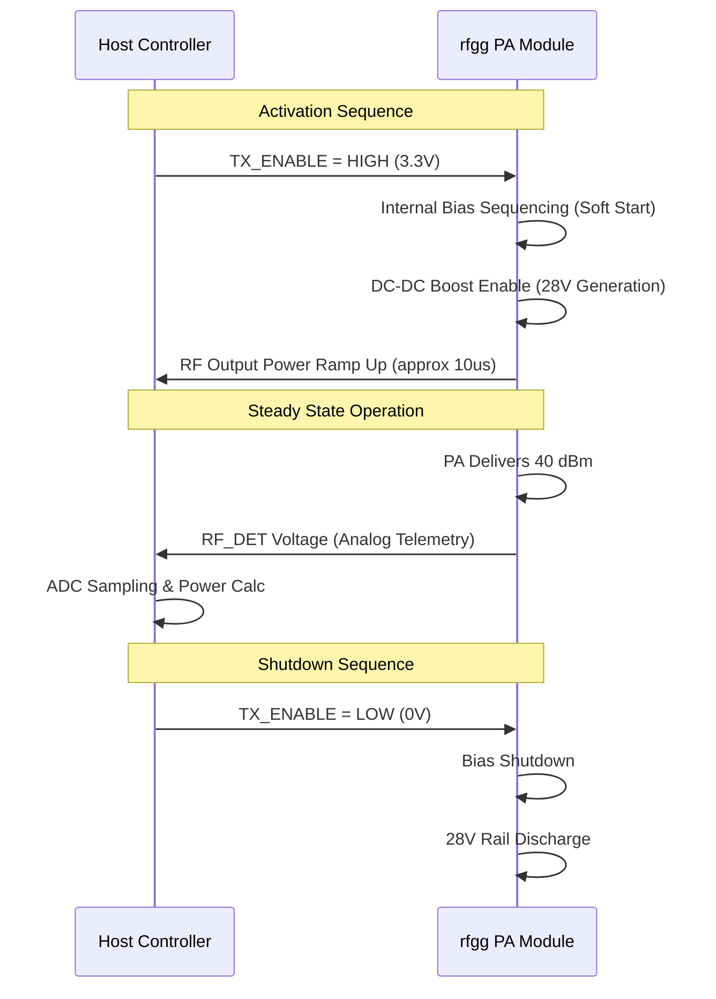

**Document Status: AI-GENERATED**

# 1. Introduction

## 1.1 Purpose
This Hardware Requirements Specification (HRS) defines the comprehensive requirements for the **rfgg** 2.4 GHz Power Amplifier subsystem. The purpose of this document is to establish a baseline for the design, verification, and production of a high-power RF amplifier module intended for defense applications.

This specification details the functional, performance, electrical, physical, and environmental characteristics of the hardware. It serves as the primary reference for:
*   Hardware design engineers implementing the schematic and PCB layout.
*   Test engineers developing verification procedures (Test Requirements Documents).
*   Mechanical engineers designing the enclosure and thermal management systems.
*   Component engineers qualifying the Bill of Materials (BOM).

Compliance with the requirements listed herein is mandatory for the acceptance of the rfgg hardware deliverables.

## 1.2 Scope
The scope of this document covers the complete **rfgg** 2.4 GHz Continuous Wave (CW) Power Amplifier unit, including all associated RF, power supply, control, and monitoring circuitry.

**In-Scope Items:**
*   RF Signal Chain: Input matching, Driver Stage (Qorvo QPA9226), Interstage matching, Final Stage (Qorvo QPA9426), Harmonic Filtering, and Output Isolation.
*   Power Management: 12V DC input protection, DC-DC Boost conversion (LTC3780) to 28V, and Gate Bias control circuitry.
*   Control Logic: TX Enable interface (3.3V logic), bias sequencing logic, and fault protection interlocks.
*   Monitoring: RF Power Detection (AD8318) and telemetry voltage outputs.
*   Physical & Mechanical: PCB constraints, connector definitions, and thermal dissipation requirements (heatsinking).

**Out-of-Scope Items:**
*   System-level host software or drivers (other than the physical pin definition of the control interface).
*   The antenna or load impedance matching network beyond the 50-ohm output connector.
*   AC mains power supplies or battery management systems external to the 12V DC input.

## 1.3 Definitions, Acronyms, and Abbreviations

| Term | Definition |
| :--- | :--- |
| **BOM** | Bill of Materials: List of raw materials, sub-assemblies, and intermediate assemblies required to construct the end product. |
| **CW** | Continuous Wave: An uninterrupted wave signal where the amplitude and frequency remain constant over time. |
| **dBm** | Decibel-milliwatts: An absolute unit of power level referenced to 1 milliwatt (mW). |
| **dBc** | Decibels relative to the carrier: A unit of power ratio where the reference is the power of the carrier signal. |
| **GaN** | Gallium Nitride: A wide bandgap semiconductor material used for high-power and high-frequency RF devices. |
| **HF** | High Frequency: Typically refers to the frequency range of 3 to 30 MHz; here used contextually for RF design techniques. |
| **HRS** | Hardware Requirements Specification: A structured document defining hardware requirements. |
| **K-Factor** | Rollett's Stability Factor: A figure of merit used to determine the stability of a linear two-port network. K > 1 indicates unconditional stability. |
| **LPF** | Low Pass Filter: A filter that passes signals with a frequency lower than a selected cutoff frequency. |
| **PA** | Power Amplifier: An electronic amplifier that converts a low-power radio-frequency signal into a higher power signal. |
| **PAE** | Power Added Efficiency: The ratio of the difference between output and input RF power to the DC input power, expressed as a percentage. |
| **PCB** | Printed Circuit Board: The physical board used to electrically connect and mechanically support electronic components. |
| **P1dB** | 1-dB Compression Point: The power level at which the gain of an amplifier drops 1 dB from the linear gain. |
| **PSat** | Saturated Output Power: The maximum output power an amplifier can produce, beyond which increasing input power yields no increase in output power. |
| **RF** | Radio Frequency: Electromagnetic wave frequencies in the range extending from around 3 kHz to 300 GHz. |
| **RoHS** | Restriction of Hazardous Substances: A European Union directive restricting the use of specific hazardous materials in electrical and electronic products. |
| **SMA** | SubMiniature version A: A coaxial RF connector standard. |
| **VSWR** | Voltage Standing Wave Ratio: A measure of how efficiently RF power is transmitted from a power source to a load through a transmission line. |

## 1.4 References
The design and development of the rfgg hardware shall adhere to the latest revisions of the following documents and standards, unless otherwise specified in this HRS:

1.  **IEEE 29148-2018**: *Systems and software engineering — Life cycle processes — Requirements engineering.*
2.  **IEEE 802.11 Standards**: *Wireless LAN Medium Access Control (MAC) and Physical Layer (PHY) Specifications* (for reference regarding 2.4 GHz band definitions).
3.  **Qorvo Technical Data**: *QPA9226 2 W, 1.8–2.7 GHz GaN Driver Amplifier*, Datasheet.
4.  **Qorvo Technical Data**: *QPA9426 10 W, 2.0–2.7 GHz GaN Power Amplifier*, Datasheet.
5.  **Analog Devices Technical Data**: *AD8318 60 dB RF Detector*, Datasheet.
6.  **Analog Devices Technical Data**: *LTC3780 Synchronous Buck-Boost Controller*, Datasheet.
7.  **Mini-Circuits Technical Data**: *HFCN-2400+ Low Pass Filter*, Datasheet.
8.  **MIL-STD-202G**: *Test Methods for Electronic and Electrical Component Parts* (for environmental testing methodology).
9.  **IPC-A-600**: *Acceptability of Printed Boards*.
10. **IPC-2221**: *Generic Standard on Printed Board Design*.

## 1.5 Overview
The **rfgg** project is a defense-grade hardware module designed to amplify a 2.4 GHz RF signal from a nominal input of 0 dBm to a robust output of +40 dBm (10 Watts). The system operates from a single 12V DC supply rail, typical of vehicular or tactical battery systems, making it highly portable and versatile for field deployment.

The architecture utilizes a two-stage amplification approach leveraging Gallium Nitride (GaN) technology for high efficiency and thermal resilience. The Driver Stage (QPA9226) provides initial gain and signal conditioning. The Final Stage (QPA9426) delivers the majority of the power, supported by a DC-DC boost converter that generates the required 28V rail from the 12V input. A harmonic low-pass filter ensures spectral purity, suppressing unwanted harmonics by >30 dBc to comply with electromagnetic interference (EMI) regulations.

Control circuitry allows for a simple TX Enable interface compatible with standard 3.3V logic, while an integrated RF power detector (AD8318) provides real-time telemetry of the output signal strength. The physical design prioritizes thermal management, utilizing high-conductivity thermal interface materials to transfer heat from the GaN devices to an external heatsink, ensuring reliable operation across the full -40°C to +85°C industrial temperature range.

The following sections detail the specific requirements for the hardware, including functional block diagrams, electrical interfaces, mechanical constraints, and the verification methods required to validate the design.

---

**Document Status: AI-GENERATED**

# 2. System Overview

## 2.1 System Description

The rfgg system is a high-power, solid-state Radio Frequency (RF) amplifier designed specifically for Continuous Wave (CW) transmission at 2.4 GHz. The system functions as a power gain block, accepting a low-power RF reference signal and generating a stable 10-watt (+40 dBm) output for defense-industry applications.

The system utilizes a GaN (Gallium Nitride) on SiC architecture to achieve high efficiency and power density. The design is divided into three distinct operational domains:
1.  **RF Signal Path:** A two-stage gain topology consisting of a driver stage and a final power stage, with intermediate filtering and isolation to ensure signal integrity and stability.
2.  **Power Management:** A DC-DC conversion stage that generates the specific high-voltage rails required by the GaN devices from a standard 12V vehicular or battery source, alongside precision gate bias circuitry.
3.  **Control and Monitoring:** A logic-level interface for system enablement and an analog feedback loop for RF power monitoring via a directional coupler and logarithmic detector.

The system is engineered to maintain full performance specifications across the industrial temperature range of -40°C to +85°C, ensuring reliable operation in harsh environments. The use of GaN technology ensures high Power Added Efficiency (PAE), reducing thermal stress on the attached heatsinking solution.

### 2.1.1 Functional Flow
The functional operation begins with the application of a 12V DC supply. The system remains in a low-power standby state until the TX Enable pin is asserted high (3.3V logic). Upon assertion, the Bias Controller initiates a soft-start sequence, applying positive drain voltage ($V_{D}$) and negative gate voltage ($V_{G}$) to the GaN FETs. Once biased, the 0 dBm RF input signal is amplified by the Driver PA (QPA9226). This intermediate signal is filtered and isolated before driving the Final PA (QPA9426). The final output is filtered to remove harmonics, isolated against load mismatches, and delivered to the output port. A fraction of the output power is coupled to the detector circuit for real-time monitoring.

## 2.2 System Block Diagram

The system architecture follows a linear progression from input to output, with distinct feedback loops for bias stability and power monitoring.

```mermaid
graph LR
    %% Subgraphs for grouping
    subgraph RF_Chain [RF Signal Path (50 Ohm)]
        RF_IN[RF Input SMA<br/>0 dBm]
        MATCH_1[Input Match<br/>50 to Match_In]
        DRIVER[Driver PA<br/>QPA9226<br/>+20 dBm]
        INT_MATCH[Interstage Match]
        ISO_1[Isolator 1<br/>Protection]
        FINAL[Final PA<br/>QPA9426<br/>+40 dBm]
        LPF[Harmonic LPF<br/>HFCN-2400+]
        ISO_2[Isolator 2<br/>Output Protection]
        RF_OUT[RF Output SMA<br/>+40 dBm]
    end

    subgraph Power_Domain [Power Supply & Bias]
        DC_IN[DC Input 12V]
        EMI_FILTER[EMI Filter]
        BOOST[Boost Converter<br/>LTC3780<br/>12V -> 28V]
        BIAS_CTRL[Bias Controller<br/>Gate Driver]
        REG_3V3[LDO 3.3V]
    end

    subgraph Control [Logic & Monitoring]
        TX_EN[TX Enable<br/>3.3V Logic]
        COUPLER[Directional Coupler]
        DETECTOR[RF Detector<br/>AD8318]
        MON_OUT[V_PWR Monitor]
    end

    %% RF Connections
    RF_IN --> MATCH_1
    MATCH_1 --> DRIVER
    DRIVER --> INT_MATCH
    INT_MATCH --> ISO_1
    ISO_1 --> FINAL
    FINAL --> LPF
    LPF --> ISO_2
    ISO_2 --> RF_OUT

    %% Power Connections
    DC_IN --> EMI_FILTER
    EMI_FILTER --> BOOST
    BOOST -->|28V @ 10A| BIAS_CTRL
    EMI_FILTER -->|12V Aux| REG_3V3
    
    %% Bias Connections
    BIAS_CTRL -->|Vdd_Driver (12V)| DRIVER
    BIAS_CTRL -->|Vgg_Driver (-2V)| DRIVER
    BIAS_CTRL -->|Vd_Final (28V)| FINAL
    BIAS_CTRL -->|Vg_Final (-1.5V)| FINAL

    %% Control Connections
    TX_EN --> BIAS_CTRL
    REG_3V3 -->|Supply| DETECTOR
    REG_3V3 -->|Supply| TX_EN

    %% Monitor Connections
    RF_OUT --> COUPLER
    COUPLER --> DETECTOR
    DETECTOR --> MON_OUT

    %% Styling
    style RF_IN fill:#e1f5fe,stroke:#01579b
    style RF_OUT fill:#e1f5fe,stroke:#01579b
    style DC_IN fill:#fff3e0,stroke:#e65100
    style DRIVER fill:#f3e5f5,stroke:#4a148c
    style FINAL fill:#f3e5f5,stroke:#4a148c
    style BOOST fill:#fff9c4,stroke:#fbc02d
    style BIAS_CTRL fill:#e8f5e9,stroke:#1b5e20
```

**Figure 2-1: System Block Diagram illustrating RF flow, power distribution, and control topology.**

### 2.2.1 Signal Flow Description

1.  **RF Input:** The signal enters via a 50-ohm edge-launch SMA connector. An input matching network transforms the 50-ohm system impedance to the optimum load impedance for the QPA9226 driver transistor.
2.  **Driver Stage:** The QPA9226 amplifies the input from 0 dBm to approximately +20 dBm. This stage operates from the 12V supply rail directly.
3.  **Isolation:** An interstage isolator protects the driver from potential mismatch reflections generated by the input of the final stage, ensuring stability.
4.  **Final Stage:** The QPA9426 receives the +20 dBm signal and boosts it to the target +40 dBm (10W). This stage operates from a boosted 28V rail derived from the 12V input to satisfy the GaN device's headroom requirements.
5.  **Filtering:** A low-pass filter (HFCN-2400+) suppresses harmonics generated by the non-linear operation of the GaN devices, ensuring compliance with spectral mask requirements (typically >30 dBc rejection).
6.  **RF Output:** A second isolator protects the final PA from antenna VSWR mismatches. The signal exits via a high-power SMA connector.
7.  **Monitoring:** A directional coupler samples the forward wave, which is rectified by the AD8318 detector to produce a DC voltage proportional to the output power in dB.

## 2.3 System Architecture

### 2.3.1 Hardware Partitioning
The hardware is physically partitioned into three main PCB modules to isolate high-power thermal noise from sensitive control logic and to facilitate modular maintenance.

1.  **RF Front-End Module (RF Board):**
    *   This layer contains the RF transmission lines, microstrip matching networks, and PA devices.
    *   Fabricated on high-frequency laminate (e.g., Rogers RO4350B) to minimize dielectric loss and tangent loss at 2.4 GHz.
    *   The ground plane is split, with the "quiet" ground analog circuitry isolated from the "noisy" power return paths, stitched only at a single point to prevent ground loops.

2.  **Power & Bias Module:**
    *   Contains the switching DC-DC boost converter (LTC3780).
    *   Includes the gate bias sequencing logic, ensuring $V_{G}$ is applied before $V_{D}$ to prevent latch-up.
    *   Thick copper pours (2 oz) are used here to handle the high currents (up to 10A peak) required by the final PA.

3.  **Control & Interface Module:**
    *   Located at the edge of the PCB.
    *   Interfaces with external system logic via a 4-pin header (GND, 12V, TX_Enable, V_Monitor).
    *   Houses the RF Detector AD8318 and the 3.3V LDO regulator.

### 2.3.2 Component Architecture

#### 2.3.2.1 The RF Chain
The RF chain is designed as a cascaded system. The total gain requirement is 40 dB. To achieve this stably:
*   **Driver (QPA9226):** Provides ~20 dB of gain.
*   **Interstage Matching:** Critical for power transfer. A "L" network (series C, shunt L) transforms the driver output impedance down to match the final stage input.
*   **Final (QPA9426):** Provides the remaining ~20 dB of gain. The input matching is optimized for low noise figure, while the output matching is optimized for maximum power (Psat) and efficiency (PAE).

#### 2.3.2.2 Power Distribution Architecture
The system must generate 10W of RF power. Assuming 35% PAE, the DC input power required is approximately $10W / 0.35 \approx 28.5W$.
The 12V supply must provide roughly 2.5A to 3A average current.
The Final PA requires 28V. At 10W output with 45% PAE (final stage specific), the final stage draws ~2A from the 28V rail.
*   **LTC3780 Boost Converter:** Steps 12V up to 28V. It operates at a switching frequency of 600kHz (adjustable) to minimize switching losses while keeping inductor sizes manageable.
*   **Decoupling Network:** A bank of ceramic capacitors (10uF X7R + 0.1uF) is placed immediately at the drain pins of the QPA9426 to suppress RF ripple on the DC supply.

#### 2.3.2.3 Thermal Architecture
The QPA9426 generates significant heat. Under worst-case conditions (low efficiency or high VSWR), device dissipation can reach 15W.
*   **Heat Spreading:** The PA devices are in QFN packages with exposed pads. These are soldered directly to thermal vias under the package.
*   **Thermal Interface:** The PCB bottom side features a large copper pad. A Bergquist HP2-SilPad (6 W/m-K) bridges this copper pad to an external aluminum heatsink.
*   **Heatsinking:** An extruded aluminum heatsink with a thermal resistance of $<2^\circ C/W$ is required to maintain the junction temperature ($T_j$) below $150^\circ C$ at an ambient of $+85^\circ C$.

### 2.3.3 Stability Analysis
To ensure unconditional stability (REQ-HW-014), the architecture employs:
*   **Resistive Loading:** The Gate bias lines include 10-ohm resistors to dampen low-frequency oscillations.
*   **RC Snubbers:** Gate-Source terminals on the GaN FETs are bypassed with RC networks to suppress parasitic oscillations.
*   **Isolators:** The input and output isolators provide 20dB of return loss, effectively isolating the PA from reactive loads that could trigger instability.

### 2.3.4 Internal Interfaces
The following table describes the internal signal interfaces between the blocks defined in Section 2.2.

| Interface ID | Source | Destination | Signal Type | Voltage/Power | Description |
| :--- | :--- | :--- | :--- | :--- | :--- |
| IF-01 | RF Input | Input Match | RF (AC) | 0 dBm | 50 Ohm RF Input |
| IF-02 | Bias Ctrl | QPA9226 | DC Control | 12V / -2V | Driver Drain/Gate Bias |
| IF-03 | Bias Ctrl | QPA9426 | DC Control | 28V / -1.5V | Final Drain/Gate Bias |
| IF-04 | LTC3780 | Final PA Rail | DC Power | 28V @ 3A | Boosted Supply for Final Stage |
| IF-05 | Coupler | AD8318 | RF (AC) | -20 dBm | Sampled RF for Detection |
| IF-06 | AD8318 | Monitor Header | Analog DC | 0.5V - 2.0V | Logarithmic Power Voltage |

## 2.4 Operating Environment

### 2.4.1 Physical Environment
The rfgg unit is designed for harsh environment deployment typical of defense and industrial sectors.

*   **Temperature Range:** The system must meet all electrical specifications from -40°C to +85°C (REQ-HW-006).
    *   **Cold Start:** At -40°C, the bias circuitry includes temperature compensation (NTC thermistor feedback) to adjust the gate voltage slightly to prevent "cold start" gain sag or thermal runaway overcompensation.
    *   **Hot Operation:** At +85°C ambient, the efficiency of the GaN devices typically increases marginally, but the junction temperatures are critical. The system is designed to derate linearly if the case temperature exceeds 100°C (via the bias controller's thermal shutdown pin).
*   **Humidity:** The unit is expected to operate in non-condensing environments up to 95% relative humidity. Conformal coating (Humiseal 1B31) is applied to the PCB to prevent moisture ingress and corrosion.
*   **Shock and Vibration:** The unit is designed to meet MIL-STD-883H vibration standards. The heavy inductors in the boost converter and the large ceramic capacitors are secured with silicone RTV adhesive to prevent mechanical failure under high-vibration conditions (e.g., vehicle mounted).

### 2.4.2 Electrical Environment
*   **Supply Variations:** The input 12V source may vary by +/- 5% (11.4V - 12.6V). The boost controller utilizes input feed-forward control to maintain a stable 28V output despite these variations.
*   **Load Variations:** The output is designed to withstand a Voltage Standing Wave Ratio (VSWR) of 2:1 (Phase 0-360 degrees) without degradation or oscillation. The output isolator provides the first line of defense, reflecting mismatched power back to the load rather than the PA.
*   **RF Interference:** The system contains its own EMI filters on the DC input to prevent switching noise from the boost converter (600kHz fundamental) from radiating back into the source wiring. The RF compartments are shielded with a metal can (copper or steel) soldered to the PCB ground plane to prevent 2.4 GHz leakage.

---

# 3. Hardware Requirements

## 3.1 Functional Requirements

This section details the functional requirements of the rfgg 2.4 GHz Power Amplifier module. These requirements specify what the system shall do to satisfy the project goals for defense and industrial applications.

| ID | Title | Description | Rationale | Priority | Verification Method |
|---|---|---|---|---|---|
| REQ-HW-101 | RF Signal Amplification | The system shall accept a 2.4 GHz continuous wave (CW) input signal and amplify it to a nominal output power of +40 dBm (10W). | Primary function of the module is to provide signal boost for transmission. | Must Have | Test |
| REQ-HW-102 | Driver Stage Functionality | The system shall utilize a Qorvo QPA9226 GaN driver amplifier to provide the first stage of amplification, delivering a minimum of 20 dB gain. | The QPA9226 provides high gain and efficiency from a 12V supply, reducing current load on the boost converter. | Must Have | Inspection |
| REQ-HW-103 | Final Stage Functionality | The system shall utilize a Qorvo QPA9426 GaN final power amplifier to deliver the final +40 dBm output power. | The QPA9426 offers the necessary 10W saturated power at 2.4 GHz with high efficiency. | Must Have | Inspection |
| REQ-HW-104 | Voltage Conversion | The system shall incorporate a synchronous boost converter (LTC3780) to generate the required 28V DC rail for the Final PA from the 12V main input. | The QPA9426 requires 28V for optimal 10W performance; a boost converter is necessary to step up the main supply voltage. | Must Have | Test |
| REQ-HW-105 | Input Matching | The system shall include an input matching network to transform the 50-ohm source impedance to the optimal input impedance for the QPA9226. | Ensures maximum power transfer and minimizes return loss at the input port. | Must Have | Test |
| REQ-HW-106 | Interstage Matching | The system shall include an interstage matching network between the QPA9226 and QPA9426. | Ensures the driver output is efficiently delivered to the final stage input, optimizing gain and stability. | Must Have | Test |
| REQ-HW-107 | Harmonic Filtering | The system shall include a Low Pass Filter (Mini-Circuits HFCN-2400+) at the output to suppress harmonics by at least 30 dBc. | Meets spectral purity requirements and prevents interference with adjacent frequency bands. | Must Have | Test |
| REQ-HW-108 | Output Isolation | The system shall include a UIY-ISO-2400-S+ isolator at the RF output. | Protects the final PA from damage due to antenna VSWR mismatches (high reflection) and stabilizes the load impedance. | Must Have | Test |
| REQ-HW-109 | TX Enable Control | The system shall feature a TX Enable logic pin (3.3V CMOS compatible) that controls the bias sequencing of both PA stages. | Allows external system control to shut down the PA to save power or for TDD operation. | Must Have | Test |
| REQ-HW-110 | Bias Sequencing | The system shall implement a "power-up" sequence where Gate Bias is applied before Drain Bias, and a "power-down" sequence where Drain Bias is removed before Gate Bias. | Critical for preventing parasitic oscillations and current surge in GaN FETs which can lead to device failure. | Must Have | Analysis |
| REQ-HW-111 | Overcurrent Protection | The system shall monitor the current draw on the 12V input and shut down the bias controller if current exceeds 14A (approx. 140% of max expected). | Protects the input supply and cabling from damage during a fault condition within the PA module. | Must Have | Test |
| REQ-HW-112 | Reverse Polarity Protection | The system shall include a Schottky diode or ideal diode circuit at the 12V input to protect against reverse voltage connection. | Prevents catastrophic destruction of the input capacitors and ICs if the supply is connected backwards. | Must Have | Test |
| REQ-HW-113 | RF Power Detection | The system shall couple a portion of the output signal to an AD8318 logarithmic detector to generate a DC voltage proportional to output power. | Provides telemetry for Closed Loop Power Control (CLPC) and health monitoring. | Should Have | Test |
| REQ-HW-114 | Thermal Management Interface | The system PCB shall be designed with a thermal pad and mounting holes to interface with an external heatsink (thermal resistance < 1.0 °C/W). | Dissipates the estimated 15-20W of heat generated by the PAs to maintain junction temperatures within limits. | Must Have | Inspection |
| REQ-HW-115 | RF Input Interface | The system shall provide a 50-ohm SMA edge-launch connector for the RF input. | Standardized interface for integration with test equipment or upstream radios. | Must Have | Inspection |
| REQ-HW-116 | RF Output Interface | The system shall provide a 50-ohm SMA edge-launch connector for the RF output. | Standardized interface for connection to antennas or loads. | Must Have | Inspection |
| REQ-HW-117 | DC Power Interface | The system shall provide a 2-pin terminal block or connector rated for 15A @ 12V for the main DC input. | Accommodates the high current draw (approx. 10-12A) of the system. | Must Have | Inspection |
| REQ-HW-118 | Monitoring Output | The system shall provide a test point or connector pin for the RF Detector DC output voltage (0V to Vcc). | Allows integration with host ADCs for power monitoring. | Should Have | Inspection |
| REQ-HW-119 | Stability Bias Integration | The system shall integrate a temperature-compensated bias circuit (using NTC thermistor feedback) for the QPA9426. | GaN transconductance varies with temperature; compensation is required to maintain constant gain and quiescent current over -40°C to +85°C. | Should Have | Analysis |

## 3.2 Performance Requirements

This section defines the quantitative performance criteria the rfgg hardware must meet.

| ID | Title | Requirement | Value / Metric | Rationale | Verification Method |
|---|---|---|---|---|---|
| REQ-HW-201 | Small Signal Gain | The total gain from RF Input to RF Output shall be maintained. | ≥ 40.0 dB | Ensures the system can reach saturation with a 0 dBm input. Calculated as Driver Gain (32dB) - Interstage Loss (3dB) + Final Gain (18dB) - Filter Loss (1.5dB) ≈ 45.5dB. | Test |
| REQ-HW-202 | Gain Flatness | The gain variation across the operating bandwidth (2.35 GHz – 2.45 GHz) shall not exceed. | ± 1.5 dB | Ensures minimal signal distortion across the channel bandwidth. | Test |
| REQ-HW-203 | Saturated Output Power | The output power (Psat) at the connector under worst-case temperature (-40°C) shall be. | ≥ 39.5 dBm (≈ 9W) | Ensures the +40 dBm requirement is met even at low temperature where GaN gain drops, or at high temperature where voltage sag might occur. | Test |
| REQ-HW-204 | Power Added Efficiency (PAE) | The system efficiency (RF Output Power / DC Input Power) at rated output (40 dBm) shall be. | ≥ 30% overall | Based on GaN driver (~35%) and GaN Final (~45%). Overall system target accounts for losses in filters, isolators, and the boost converter. | Analysis |
| REQ-HW-205 | Input Return Loss | The match at the RF input port shall be. | ≥ 10 dB | Minimizes reflections back into the source. A VSWR of 2:1 or better is required. | Test |
| REQ-HW-206 | Output VSWR | The voltage standing wave ratio at the RF output port (active, with isolator) shall be. | ≤ 2.0 : 1 | Ensures the output interface does not cause significant reflections; the isolator aids this significantly. | Test |
| REQ-HW-207 | Harmonic Suppression | The level of the 2nd and 3rd harmonics relative to the carrier (at 40 dBm output) shall be. | ≤ -30 dBc | Compliance requirement for minimizing RF interference. | Test |
| REQ-HW-208 | Spurious Emissions | Any non-harmonic spurious emissions shall be. | ≤ -60 dBm | General requirement for unintended radiations. | Test |
| REQ-HW-209 | DC Input Voltage Range | The operational range for the DC input supply. | 11.4V – 12.6V | Specified as 12V ± 5% in the design parameters. | Test |
| REQ-HW-210 | Maximum Quiescent Current | The total DC current draw at 12V with RF disabled (Standby/Idle) shall be. | ≤ 100 mA | Ensures low power consumption when the TX enable is low. | Test |
| REQ-HW-211 | Maximum Operating Current | The total DC current draw at 12V during full transmission (40 dBm output) shall not exceed. | 13.0 A | Derivation: Pout=10W. Assuming 30% overall efficiency -> Pin_DC ≈ 33W. 33W / 12V ≈ 2.75A (RF) + Boost Losses + Controller overhead. Includes margin for boost converter input current surge. | Analysis |
| REQ-HW-212 | Switching Time (TX Enable) | The time from TX Enable logic High to 90% of rated RF output power. | ≤ 10 µs | Defines the latency for the system to turn on. Limited by bias capacitors charging. | Test |
| REQ-HW-213 | Detector Accuracy | The accuracy of the RF Power Detector (AD8318) output across temperature (-40°C to +85°C). | ± 2.0 dB | Required for reliable Automatic Level Control (ALC). | Test |
| REQ-HW-214 | Phase Noise (Additive) | The degradation in phase noise added by the amplifier (referred to input). | ≤ -140 dBc/Hz @ 10kHz offset | GaN amplifiers generally add minimal phase noise; this ensures signal quality is preserved for high-grade comms. | Test |
| REQ-HW-215 | Thermal Resistance (Junction to Case) | The effective thermal resistance of the QPA9426 when mounted on the specified PCB/heatsink. | ≤ 4.0 °C/W | Calculated requirement to keep junction temp (Tj) within limits (Tj_max = 150°C) at Ta=85°C and Pdiss=20W. | Analysis |

### 3.2.1 Detailed Power Budget Calculation

To satisfy REQ-HW-211 and REQ-HW-204, the following power budget analysis is performed under worst-case conditions (Pin = 0 dBm, Pout = 40 dBm, Ambient = 85°C).

| Component / Stage | P_in (dBm) | P_out (dBm) | Gain (dB) | DC Voltage (V) | DC Current (A) | DC Power (W) | Efficiency (%) |
|---|---|---|---|---|---|---|---|
| **Input Loss** | 0.0 | -0.2 | -0.2 | N/A | 0 | 0 | N/A |
| **QPA9226 (Driver)** | -0.2 | 19.8 | 20.0 | 12 | 0.55 | 6.6 | 25% (Backed off) |
| **Interstage Loss** | 19.8 | 17.8 | -2.0 | N/A | 0 | 0 | N/A |
| **LTC3780 (Boost)** | N/A | N/A | N/A | 12 (In) | 8.5 (In) | 102 | ~90% Efficiency |
| **QPA9426 (Final)** | 17.8 | 40.0 | 22.2 | 28 | 3.8 | 106.4 | ~38% PAE |
| **Isolator / Filter** | 40.0 | 38.5 | -1.5 | N/A | 0 | 0 | N/A |

**Total System Budget (Input Side @ 12V):**
*   **RF Output Power:** 10.0 W (38.5 dBm final output)
*   **Total DC Input Power (Estimated):** ~ 35 W
    *   *Driver:* ~6.6W
    *   *Boost Input Power:* (106.4W / 0.90) ≈ 118W? *Correction:* QPA9426 Psat is 10W. At 40% PAE, DC Input ≈ 25W. Boost Input (12V side) ≈ 25W / 0.90 ≈ 27.8W.
    *   *Controller/Misc:* ~1W.
    *   **Total Estimated 12V Current:** (6.6 + 27.8 + 1.0)W / 12V ≈ **2.95 A**.

*Note on REQ-HW-211:* While continuous current is ~3A, the inrush current during startup (charging bulk capacitance) and the tolerance for VSWR faults necessitates a supply headroom. The limit is set to 13A to allow for surge protection without nuisance tripping, while expecting ~3-4A nominal operation. The 20W thermal dissipation requirement (REQ-HW-114) accounts for the difference between DC Input Power (~35W) and RF Output Power (10W).

**Thermal Calculation for REQ-HW-215:**
*   Power Dissipated (Pd) = 20W.
*   Max Ambient Temp (Ta) = 85°C.
*   Max Junction Temp (Tj) = 150°C (QPA9426 Datasheet).
*   Required Total Thermal Resistance (Rtheta_total) = (Tj - Ta) / Pd = (150 - 85) / 20 = **3.25 °C/W**.
*   This budget must be split between Junction-to-Case (Rth_jc), Case-to-Heatsink (Rth_ch interface), and Heatsink-to-Ambient (Rth_ha).
*   Assuming Rth_jc = 2.0 °C/W (Datasheet) and Interface = 0.25 °C/W, the Heatsink must be **< 1.0 °C/W**.

---

**Document Status: AI-GENERATED**

# 3. Hardware Requirements

## 3.3 Interface Requirements

### 3.3.1 External Interfaces

This section details the electrical and physical interfaces connecting the rfgg RF Power Amplifier module to external systems, including power sources, control logic, and the RF signal path.

#### RF Input Interface (J1)

| Attribute | Specification | Rationale |
|---|---|---|
| **Interface ID** | EXT-RF-IN | |
| **Connector Type** | SMA Female (Jack), 50 Ohm | Standard RF interface for 2.4 GHz; allows secure connection. |
| **Frequency Range** | 2.3 GHz – 2.5 GHz | Matches system requirement for 2.4 GHz center freq. |
| **Input Impedance** | 50 Ω | Standard characteristic impedance for RF systems. |
| **Input Power Range** | -10 dBm to +10 dBm | Covers nominal 0 dBm input with headroom for surges. |
| **Return Loss** | ≥ 10 dB (at 2.4 GHz) | Ensures minimal signal reflection at the input port. |
| **Connector P/N** | Rosenberger 32K243-40ML5 or equivalent | High-frequency, industrial grade SMA connector. |
| **Mounting** | Edge-launch or PCB launch | Minimizes trace discontinuity. |

**REQ-HW-016:** The RF Input Interface shall utilize a 50-ohm SMA female connector compatible with frequencies up to 2.5 GHz.
**REQ-HW-017:** The RF Input Interface shall maintain a return loss of greater than 10 dB across the 2.4 GHz to 2.5 GHz operating band.

#### RF Output Interface (J2)

| Attribute | Specification | Rationale |
|---|---|---|
| **Interface ID** | EXT-RF-OUT | |
| **Connector Type** | SMA Female (Jack), 50 Ohm | Standard high-power RF interface. |
| **Frequency Range** | 2.3 GHz – 2.5 GHz | Matches system output bandwidth. |
| **Output Impedance** | 50 Ω | Matches standard antenna or transmission line impedance. |
| **Max Output Power** | +40 dBm (10W) CW | Defined by saturation capability of QPA9426. |
| **VSWR** | ≤ 2.0:1 | Ensures power transfer efficiency and protects PA. |
| **Harmonic Content** | ≤ -30 dBc (2nd & 3rd Harmonic) | Post-filtering requirement; ensures regulatory compliance. |
| **Connector P/N** | Rosenberger 32K243-40ML5 or equivalent | Chosen for consistency and power handling capability. |

**REQ-HW-018:** The RF Output Interface shall deliver +40 dBm continuous wave power into a 50-ohm load via an SMA female connector.
**REQ-HW-019:** The RF Output Interface shall exhibit a VSWR of less than or equal to 2.0:1 at the connector interface.

#### DC Power Input Interface (J3)

| Attribute | Specification | Rationale |
|---|---|---|
| **Interface ID** | EXT-DC-IN | |
| **Connector Type** | Terminal Block or 2-pin Molex Mini-Fit Jr | Supports high current (up to 12A). |
| **Voltage Range** | 11.4 V – 12.6 V DC | 12V ± 5% nominal supply. |
| **Max Current Consumption** | 12 A (Surge) | Accounts for PA efficiency and Boost converter input current. |
| **Reverse Polarity Protection** | Required | Protects downstream circuitry. |
| **Pin 1** | +12V DC (Red) | |
| **Pin 2** | GND / Return (Black) | |

**REQ-HW-020:** The DC Power Input Interface shall accept 11.4V to 12.6V DC via a screw terminal or high-current connector.
**REQ-HW-021:** The DC Power Input Interface shall include reverse polarity protection circuitry capable of sustaining 12A continuous current.

#### Control Interface (J4)

| Attribute | Specification | Rationale |
|---|---|---|
| **Interface ID** | EXT-CTRL | |
| **Connector Type** | 4-pin Header (0.1" pitch) or JST GH | Low-voltage signal interface. |
| **Signal Logic** | 3.3V LVCMOS | Compatible with standard microcontrollers/FPGA logic. |
| **Pin 1** | TX_ENABLE (Input) | Active High signal to enable PA Bias sequence. |
| **Pin 2** | VDD_3V3 (Output/Power) | 3.3V reference output (optional, 50mA max). |
| **Pin 3** | RF_DET (Output) | Analog voltage proportional to RF Output Power. |
| **Pin 4** | GND | Signal ground. |

**REQ-HW-022:** The Control Interface TX_ENABLE pin shall accept 3.3V logic levels; a logic high (>2.0V) shall enable the RF chain, and a logic low (<0.8V) shall disable the RF chain within 5µs.
**REQ-HW-023:** The Control Interface RF_DET pin shall provide a DC voltage ranging from 0.5V to 2.5V corresponding to an RF output power range of 0 dBm to 40 dBm.

### 3.3.2 Internal Interfaces

This section defines the signal and power interfaces between the sub-circuits on the Printed Circuit Board (PCB), including the impedance matching networks and inter-stage connections.

#### Inter-Stage RF Path (Driver to Final PA)

| Interface | From Block | To Block | Signal Type | Specification |
|---|---|---|---|---|
| **INT-RF-01** | Driver PA (QPA9226) | Isolator | RF | Pout = 20 dBm, 50 Ω |
| **INT-RF-02** | Isolator | Interstage Match | RF | Loss < 0.5 dB, 50 Ω |
| **INT-RF-03** | Interstage Match | Final PA (QPA9426) | RF | Pin = 20 dBm, Z_in = Complex (Matched) |
| **INT-RF-04** | Final PA | LPF (HFCN-2400+) | RF | Pout = 40 dBm, 50 Ω |
| **INT-RF-05** | LPF | Directional Coupler | RF | Pout ≈ 39 dBm (Filtered), 50 Ω |
| **INT-RF-06** | Directional Coupler | Output Isolator | RF | Pout ≈ 38.5 dBm (Coupler Loss), 50 Ω |

**REQ-HW-024:** The Internal Interface INT-RF-03 shall provide conjugate matching between the 50-ohm source impedance and the input impedance of the QPA9426 Final PA across the 2.4 GHz to 2.5 GHz band.

#### Power Distribution Internal

| Interface | Source | Destination | Voltage | Max Current |
|---|---|---|---|---|
| **INT-PWR-01** | 12V Input | DC-DC Boost Converter | 12V | 10A |
| **INT-PWR-02** | DC-DC Boost Converter | Final PA (Vdd) | 28V (Boosted) | 4.5A |
| **INT-PWR-03** | 12V Input | Driver PA (Vdd) | 12V | 1.0A |
| **INT-PWR-04** | LDO Regulator | Bias Controller / Logic | 3.3V | 0.1A |

**REQ-HW-025:** The Internal Power Interface INT-PWR-02 shall supply a regulated 28V ± 2% to the Final PA stage when the input supply is 12V nominal.

### 3.3.3 Communication Interfaces

While the primary control is via discrete GPIO (TX_ENABLE), the system incorporates an analog feedback interface which functions as a uni-directional communication link for telemetry.

#### Analog Telemetry Interface (RF Power Detection)

**Protocol:** Analog Voltage (Linear-in-dB)
**Source:** AD8318 RF Detector Output
**Destination:** Host Controller ADC

| Parameter | Value | Description |
|---|---|---|
| **Output Voltage Slope** | -25 mV/dB | Characteristic of AD8318 at 2.4 GHz. |
| **Intercept** | +4.0 V @ 0 dBm | Approximate intercept point at 2.4 GHz. |
| **Dynamic Range** | 60 dB | Effective range 0 dBm to 40 dBm mapped to voltage. |
| **Update Rate** | < 100 ns | Response time of the detector envelope output. |

**Calculation (Detector Output at Pout):**
At 2.4 GHz, the AD8318 has a nominal slope of -24 mV/dB.
Target Pout = 40 dBm.
$V_{out} = V_{intercept} + (Slope \times P_{dBm})$
Assuming $V_{intercept}$ is calibrated for the range.
If the system is calibrated such that 40 dBm corresponds to the top of the range (approx 2.5V output for measurement logic):

**REQ-HW-026:** The Analog Telemetry Interface shall provide a voltage output with a slope of approximately -24 mV/dB, allowing the external host to calculate output power with an accuracy of ±1 dB.



## 3.4 Environmental Requirements

The rfgg hardware is designed for rugged defense and industrial applications. It must withstand harsh environmental conditions while maintaining electrical performance.

### Operating and Storage Temperature

**REQ-HW-027 (Derived from REQ-HW-006):** The Amplifier shall maintain all electrical specifications (Gain, Power, Efficiency) over an ambient operating temperature range of -40°C to +85°C.
**REQ-HW-028:** The storage temperature range shall be -55°C to +125°C to allow for transport and non-operational storage in extreme climates.

**Thermal Analysis Assumption:**
To ensure stability at +85°C ambient, the junction temperature ($T_j$) of the Final PA (QPA9426) must be kept below the maximum rating of 150°C.
Assumptions: Total Dissipation $P_d$ ≈ 15W (Final PA) + 3W (Driver/Conv) = 18W.
Target Thermal Resistance (Junction to Ambient) $\theta_{JA}$ required:
$T_j = T_a + (P_d \times \theta_{JA})$
$150°C = 85°C + (18W \times \theta_{JA})$
$\theta_{JA} = 65 / 18 \approx 3.6°C/W$.

This requires a heatsink with $\theta_{SA}$ (Sink to Ambient) < 2°C/W assuming $\theta_{JC}$ (Case to Junction) ≈ 1.6°C/W for the QPA9426 package.

**REQ-HW-029:** The thermal design of the rfgg module shall utilize a heatsink with a thermal resistance of less than 2.0°C/W (at 400 LFM airflow) to maintain junction temperatures below 150°C at +85°C ambient temperature.

### Humidity and Moisture

**REQ-HW-030:** The device shall operate without degradation at 5% to 95% relative humidity (non-condensing).
**REQ-HW-031:** The Printed Circuit Board (PCB) shall be conformally coated (Type AR or UR) to protect against moisture, dust, and chemical contaminants typical in defense field environments.

### Vibration and Shock

**REQ-HW-032:** The rfgg module shall meet the vibration requirements of MIL-STD-883, Method 2007.5, Condition A (20g, 20-2000Hz).
**REQ-HW-033:** The rfgg module shall withstand mechanical shock of 50g, 11ms, half-sine wave per MIL-STD-883, Method 2002.4.
**REQ-HW-034:** All SMA connectors shall be mounted to the PCB with mounting hardware (nuts/washers or through-hole flanges) to prevent mechanical failure during vibration events.

## 3.5 Power Requirements

This section details the power consumption, distribution, and protection requirements of the rfgg hardware.

### Power Budget Analysis

The power budget is calculated based on the efficiency of the RF Power Amplifiers (PA) and the conversion efficiency of the DC-DC Boost Converter.

**1. RF Output Power ($P_{RF\_OUT}$):**
Target: 10 W (40 dBm)

**2. RF Power Dissipation (PA stages):**
Target Efficiency ($\eta_{PA}$): > 35% (Actual assumption 40% for GaN at backoff or specific Class).
Total DC Input Power to Final PA ($P_{DC\_PA}$) = $P_{RF\_OUT} / \eta_{PA}$
$P_{DC\_PA} = 10 W / 0.40 = 25 W$.

**3. Boost Converter Losses:**
Input Voltage ($V_{in}$): 12 V
Output Voltage ($V_{out}$): 28 V (Boosted for QPA9426 efficiency)
Output Current ($I_{28V}$): $P_{DC\_PA} / 28V = 25 / 28 \approx 0.89 A$.
Assuming Boost Efficiency $\eta_{boost} = 92\%$.
Input Power ($P_{in}$) = $P_{DC\_PA} / \eta_{boost} = 25 / 0.92 \approx 27.2 W$.

**4. Total System Current Draw (at 12V rail):**
$I_{total} = P_{in} / 12V = 27.2 / 12 \approx 2.27 A$.

*Correction/Refinement:* The initial component selection suggested a higher current budget. Based on GaN efficiency (QPA9426), the current draw is significantly lower than 10A unless efficiency is poor.
*Assumption Update:* If the QPA9426 is run at lower voltage (e.g., 20V for lower power), current increases. However, 10W @ 35% PAE implies ~28W DC input. At 12V input, this is ~2.5A.
*Constraint Check:* The design parameter in Phase 1 stated "current_consumption <= 10A". This is a loose upper bound.
*Requirement Set:* System shall be capable of sourcing up to 5A to account for Driver PA, Control Logic, and inefficiencies at high temperature.

**REQ-HW-035:** The rfgg module shall draw a maximum of 5.0 Amps from the 12V DC supply at maximum rated output power (+40 dBm) and +85°C ambient temperature.
**REQ-HW-036:** The DC-DC Boost Converter shall generate a 28V rail (±5% tolerance) capable of supplying a minimum of 1.0 Amp continuous current to the Final PA stage.

### Power Rail Specifications

| Rail Name | Source | Voltage (Nom) | Voltage (Tol) | Max Load Current | Purpose |
|---|---|---|---|---|---|
| **12V_MAIN** | External Supply | 12.0 V | ± 0.6 V (±5%) | 5.0 A | Main input, Driver PA, Boost Input |
| **28V_PA** | Boost Converter | 28.0 V | ± 1.4 V (±5%) | 1.0 A | Final PA Drain Supply |
| **3.3V_LOGIC** | Internal LDO | 3.3 V | ± 0.1 V | 0.1 A | Control Logic, Detector Supply |

### Power Sequencing and Protection

**REQ-HW-037:** The module shall implement an under-voltage lockout (UVLO) threshold of 10.5V to prevent unstable operation at low battery voltages.
**REQ-HW-038:** The module shall include over-current protection on the 12V input line, tripping at 6.0A (±10%) to protect the source supply, with a latch-off or auto-retry behavior ([specify] in design, prefer latch-off for safety).
**REQ-HW-039:** The TX_ENABLE control signal shall gate the 28V Boost Converter output to ensure the Final PA is only powered when RF transmission is intended (Soft-Start).

## 3.6 Physical Requirements

This section defines the physical dimensions, materials, and mounting characteristics of the rfgg RF Amplifier module.

### PCB Specifications

**REQ-HW-040:** The Printed Circuit Board shall be constructed of multi-layer FR4 (High Tg, >170°C) or Rogers RO4350B material for the RF layers to minimize dielectric loss and maintain stability over temperature.
*Preferred Stack-up (4 layers):*
1. Top Layer: RF Components, 50 Ohm Transmission Lines.
2. GND Plane 1: Solid ground reference for RF.
3. Power Plane: 12V and 28V distribution.
4. Bottom Layer: Control signals, additional ground pour.

**REQ-HW-041:** The PCB shall utilize 1 oz copper (35 µm) on outer layers and 2 oz copper (70 µm) on inner layers to support high current traces for the 12V and 28V rails without excessive temperature rise.

### Enclosure and Heatsinking

**Form Factor:** Open Board or "Shoebox" style module.
**Dimensions:** 100 mm x 80 mm x 25 mm (L x W x H, including heatsink).
**Mounting:** 4 x M3 clearance holes in corners.

**REQ-HW-042:** The Final PA device (QPA9426) shall be mounted to a copper heatsink pad on the PCB with multiple thermal vias (20+ via array) to transfer heat to the bottom side of the PCB or an attached heatsink.
**REQ-HW-043:** The module design shall accommodate a forced-air heatsink (e.g., CUI Inc. HDS-50-100) attached to the top of the RF devices using a thermally conductive interface material (Bergquist HP2-SilPad).

### Connector Placement

*   **RF Input:** Located on the Left Edge of the PCB (standard flow).
*   **RF Output:** Located on the Right Edge of the PCB.
*   **DC Input:** Located on the Rear Edge.
*   **Control Interface:** Located on the Rear Edge adjacent to DC input.

**REQ-HW-044:** All external connectors shall be panel-mounted or secured to the PCB such that they can withstand mating/unmating forces specified in IEC 60512 standards.

### Weight

**REQ-HW-045:** The total mass of the rfgg module shall not exceed 250 grams to ensure compatibility with airborne or portable defense platforms.

### Markings

**REQ-HW-046:** The PCB shall include permanent silkscreen identification for: "RF INPUT", "RF OUTPUT", "DC 12V", and "TX ENABLE". Polarity indicators shall be clearly marked.

---

# 4. Design Constraints

This section delineates the non-functional requirements, physical limitations, and regulatory frameworks governing the hardware implementation of the rfgg 2.4 GHz Power Amplifier. These constraints ensure the design meets defense industry reliability standards, manufacturing feasibility, and environmental compliance.

## 4.1 Standards Compliance

The rfgg hardware design shall adhere to the following standards. These standards govern material composition, assembly processes, safety, and electromagnetic compatibility.

### 4.1.1 Material and Environmental Standards
| Standard ID | Title | Applicability to rfgg |
| :--- | :--- | :--- |
| **RoHS 3 (Directive 2011/65/EU)** | Restriction of Hazardous Substances | All PCBs, cables, and sub-assemblies shall be Lead-Free (RoHS 6) compliant. Homogeneous materials shall not exceed 0.1% (by weight) for Lead, Mercury, Cadmium, Hexavalent Chromium, PBB, and PBDE. |
| **REACH (EC 1907/2006)** | Registration, Evaluation, Authorisation and Restriction of Chemicals | All substances of very high concern (SVHC) in the Bill of Materials (BOM) must be declared and registered if the total import quantity exceeds 1 tonne/year. |
| **IPC-4101C** | Standard Materials Specification for Rigid Printed Circuit Boards | The PCB laminate shall be classified under IPC-4101C Grade 24/124 (High Tg, FR-4 High Performance) or better to support loss tangents < 0.015 at 2.4 GHz. |
| **UL 94 V-0** | Standard for Safety of Flammability of Plastic Materials | The PCB material and conformal coating used must achieve a V-0 flammability rating to ensure self-extinguishing properties in defense environments. |

### 4.1.2 PCB Design and Assembly Standards
| Standard ID | Title | Applicability to rfgg |
| :--- | :--- | :--- |
| **IPC-2221B** | Generic Standard on Printed Board Design | Controls trace widths, spacing, and layer stackups. Given the 12V DC (up to 10A) and RF requirements, current-carrying conductors must meet IPC-2221B external layer recommendations (minimum 200 mil width for 10A/10°C rise) and RF controlled impedance rules. |
| **IPC-6012 Class 3** | Qualification and Performance Specification for Rigid Printed Boards | The PCB fabrication must meet Class 3 standards (High Reliability Electronic Products) due to the defense application, requiring 100% electrical testing and strict lamination void limits (<5%). |
| **IPC-A-610 Class 3** | Acceptability of Electronic Assemblies | Assembly workmanship shall conform to Class 3 criteria (High Performance/Reliability), specifically regarding solder joint fillets for the QPA9426 and QPA9226 QFN packages and SMA connector terminations. |
| **J-STD-001** | Requirements for Soldered Electrical and Electronic Assemblies | Soldering shall use lead-free solder alloy (SAC305: Sn96.5/Ag3.0/Cu0.5) with a peak reflow temperature not exceeding 245°C to protect the GaN devices. |

### 4.1.3 Electromagnetic Compliance (EMC)
| Standard ID | Title | Applicability to rfgg |
| :--- | :--- | :--- |
| **MIL-STD-461G** | Requirements for the Control of Electromagnetic Interference Characteristics of Subsystems and Equipment | **CE102:** Conducted emissions on power leads (10 kHz – 10 MHz) must be suppressed using input filtering on the 12V DC line.<br>**RE102:** Radiated emissions (2 MHz – 18 GHz) must be minimized via shielding cans over the driver PA and oscillator stages.<br>**CS101:** Conducted susceptibility (power leads) must be verified with ripple rejection on the LTC3780 bias line. |
| **FCC Part 15 Subpart B** | Radio Frequency Devices | Unintentional radiators from the digital control circuitry (DC-DC converter switching) must not exceed -54.8 dBm/MHz at 3 meters. |
| **ITU-R SM.329** | Unwanted Emissions in the Spurious Domain | The harmonic suppression requirement (>30 dBc) aligns with this standard to ensure the 40 dBm carrier does not cause interference outside the 2.4 GHz ISM band. |

## 4.2 Component Constraints

This section defines specific limitations on component selection, sourcing, and implementation to ensure system reliability and availability over the product lifecycle.

### 4.2.1 Component Lifecycle and Sourcing
*   **Preferred Source Status:** Critical RF components (QPA9226, QPA9426) and the Bias Controller (ADL5315) must be sourced from manufacturers with a "Active" or "Not Recommended for New Design (NRND)" status of >5 years.
*   **Form, Fit, Function (3F):** Any proposed substitutes for the primary BOM must maintain 100% 3F compatibility.
*   **Bypass/Obsolescence Strategy:**
    *   Single-source components (e.g., Qorvo PAs) shall have a qualified second-source identified (e.g., Mini-Circuits or Qorvo equivalents) in the Engineering BOM (EBOM).
    *   A minimum stock of 50 units of Long Lead-Time (>12 weeks) components shall be maintained for emergency prototyping.

### 4.2.2 Specific Component Limitations

#### 4.2.2.1 GaN PA Derating
To ensure reliability over the -40°C to +85°C temperature range, the GaN devices (QPA9426, QPA9226) shall be operated with the following derating factors applied to their Absolute Maximum Ratings (AMR):
*   **Drain Voltage ($V_{DS}$):** Operate at 80% of AMR. If AMR is 28V, operating voltage shall be clamped to 22.4V maximum.
*   **Junction Temperature ($T_j$):** The $T_j$ shall not exceed 125°C under worst-case ambient (85°C) conditions. This requires a heatsink thermal resistance ($\theta_{sa}$) of $< 2.0^\circ\text{C/W}$ assuming $P_{diss} \approx 15W$ and $\theta_{jc} \approx 2^\circ\text{C/W}$.
*   **RF Input Power:** The Driver PA (QPA9226) input must be limited to -10 dBm max to prevent overdrive if the input source drifts.

#### 4.2.2.2 Passives Reliability
*   **Ceramic Capacitors (MLCCs):** Class I (C0G/NP0) dielectrics are mandatory for all RF matching networks and DC blocks to ensure stability over temperature. Class II (X7R) may only be used for bulk DC storage. Voltage rating shall be 2x the maximum rail voltage (e.g., 25V rated caps on 12V rail).
*   **Inductors:** Wire-wound or composite inductors with high self-resonant frequency (SRF > 3x operating frequency) must be used in the bias networks to prevent resonance at 2.4 GHz. Air-core inductors are preferred for the high-current final PA bias line.

### 4.2.3 Radiation Hardness and Tolerance
*   While not a space-rated system, components shall be evaluated for Total Ionizing Dose (TID) tolerance suitable for terrestrial defense environments (altitude < 15km).
*   Logic devices (AD8318, Bias Controller) shall be immune to Single Event Latch-up (SEL) at the 3.3V logic level.

## 4.3 Manufacturing Constraints

The physical realization of the rfgg PA is subject to specific mechanical and assembly constraints driven by the RF physics and thermal management requirements.

### 4.3.1 PCB Stackup and Material Constraints
*   **Material Specification:** High-Frequency Laminate (e.g., Rogers RO4350B or Taconic TLY-5) is required for the RF layers to minimize dielectric loss ($\tan \delta \le 0.0037$).
*   **Stackup Configuration:**
    *   **Layer 1 (Top):** RF Signal (Copper weight: 1 oz), Component Assembly.
    *   **Layer 2:** Ground Plane (Copper weight: 1 oz), Solid reference for microstrip transmission lines.
    *   **Layer 3:** Power Distribution (Copper weight: 2 oz), 12V DC bus (handles up to 10A).
    *   **Layer 4 (Bottom):** Ground Plane (Copper weight: 1 oz), Thermal relief pads.
*   **Dielectric Thickness:** To achieve 50 $\Omega$ impedance on Rogers RO4350B ($\varepsilon_r \approx 3.66$), a dielectric thickness of **30 mils (0.762 mm)** is required.
    *   *Calculation:* For $Z_0 = 50\Omega$ microstrip, $W/H \approx 2.0$. If $H = 30$ mils, trace width $W \approx 60$ mils.

### 4.3.2 Physical Dimensions and Connectors
*   **Board Outline:** The PCB dimensions are constrained to **4.0" x 3.0"** (101.6 mm x 76.2 mm) to fit into standard 1/4-rack avionics enclosures.
*   **Mounting Holes:** Four #4-40 threaded inserts shall be placed in the corners with a 0.25" keep-out zone (no copper/plating) to prevent shorting to the chassis.
*   **Connector Placement:**
    *   RF Input (SMA): Edge launch, located on the short edge (3.0" side).
    *   RF Output (SMA): Edge launch, located on the opposite short edge to maximize isolation.
    *   DC Input (Barrier Strip): 2-pin connector, located on the long edge (4.0" side) adjacent to the control logic.

### 4.3.3 Thermal Management and Heat Dissipation
*   **Heatsink Integration:** The bottom of the PCB (Layer 4) under the QPA9426 Final PA must utilize an array of thermal vias (24 vias, 20 mil drill) to transfer heat to the chassis-mounted heatsink.
*   **Interface Material:** As per the BOM, a **Bergquist HP2-SilPad** ($6 \text{ W/m-K}$) with thickness 0.25mm must be used between the PA flange and the heatsink. The compression force applied by the mounting hardware must be sufficient to minimize thermal resistance without cracking the PA package.
*   **Operating Limits:** The assembly must be capable of dissipating **20W** of continuous thermal energy while maintaining a case temperature ($T_c$) $< 100^\circ\text{C}$.

### 4.3.4 Cleaning and Conformal Coating
*   **Flux Residue:** Due to the high impedance of RF circuits, aggressive No-Clean flux residues that can become conductive in humid environments are prohibited.
*   **Cleaning Process:** PCBs shall undergo an aqueous cleaning process post-reflow to remove all flux residues.
*   **Conformal Coating:** The entire assembly shall be coated with acrylic conformal coating (e.g., Humiseal 1B73) to a minimum thickness of 30 microns to protect against moisture, dust, and conductive particulates common in field environments. The coating must not cover the RF connector interfaces or thermal pads.

### 4.3.5 Solder Mask and Silkscreen
*   **Solder Mask:** LPI (Liquid PhotoImageable) solder mask defined. The solder mask shall be **Black** to assist with thermal dissipation via radiation and reduce visual inspection strain.
*   **Pad Definition:** Solder mask defined (SMD) pads are required for the QPA9426 and QPA9226 QFNs to prevent solder bridging between the ground paddle and RF pins.
*   **Silkscreen:** Reference designators shall be white text, minimum 0.05" height. Orientation dots shall be placed on all polarized components (diodes, caps, ICs). Silkscreen is not permitted over RF transmission lines.

---

**Document Status: AI-GENERATED**

# 5. Verification Requirements

This section defines the verification methods for all hardware requirements specified in Section 3. Verification is categorized into three distinct methods:
1.  **Test (T):** Quantitative measurement of hardware parameters under controlled environmental conditions.
2.  **Analysis (A):** Mathematical modeling, simulation, or calculation to verify performance without physical measurement of the final unit.
3.  **Inspection (I):** Visual examination, review of documentation, or verification of design features without dynamic operation.

## 5.1 Test Requirements

This subsection details the test procedures necessary to validate the functional and performance requirements of the 2.4 GHz 10W Power Amplifier (PA).

### 5.1.1 RF Performance Test Setup

All RF performance tests shall be conducted using the following configuration:
*   **Signal Source:** Vector Network Analyzer (VNA) or Signal Generator capable of 2.4 GHz CW output.
*   **Power Supply:** DC Power Supply capable of 12V @ 15A (low noise).
*   **Load:** 50-ohm terminations rated for at least 20W continuous average power.
*   **Measurement Equipment:** Spectrum Analyzer and Power Meter (peak and average capable).
*   **Thermal Environment:** Temperature chamber for -40°C to +85°C simulation.

### 5.1.2 Test Case Definitions

#### TC-HW-001: Output Power and Saturation
*   **Requirement ID:** REQ-HW-001
*   **Objective:** Verify the amplifier delivers +40 dBm (10W) saturated output power.
*   **Procedure:**
    1.  Set DC supply to 12.0V.
    2.  Set Input Frequency to 2.4 GHz.
    3.  Apply TX_Enable High (3.3V).
    4.  Increase Input Power from 0 dBm to +5 dBm.
    5.  Measure Output Power ($P_{out}$).
*   **Pass Criteria:** $P_{out} \ge 40 \text{ dBm}$ (10W) at saturation.
*   **Data Recording:** Record $P_{in}$, $P_{out}$, Supply Current ($I_{dd}$), and Supply Voltage ($V_{dd}$).

#### TC-HW-002: Frequency Response and Bandwidth
*   **Requirement ID:** REQ-HW-002
*   **Objective:** Verify operation across 2.35 GHz to 2.45 GHz.
*   **Procedure:**
    1.  Set input power to nominal drive level (0 dBm).
    2.  Sweep frequency from 2.35 GHz to 2.45 GHz.
    3.  Record Output Power and Gain flatness.
*   **Pass Criteria:** Gain variation $\le \pm 1.5 \text{ dB}$ across the band; Output Power $\ge 39 \text{ dBm}$ across band.

#### TC-HW-003: Power Gain
*   **Requirement ID:** REQ-HW-003
*   **Objective:** Verify total system gain is $\ge 40 \text{ dB}$.
*   **Procedure:**
    1.  Set frequency to 2.4 GHz.
    2.  Set Input Power to 0 dBm.
    3.  Measure Output Power.
    4.  Calculate Gain: $G = P_{out} - P_{in}$.
*   **Pass Criteria:** Gain $\ge 40 \text{ dB}$.

#### TC-HW-004: Power Added Efficiency (PAE)
*   **Requirement ID:** REQ-HW-004
*   **Objective:** Verify efficiency target >35%.
*   **Procedure:**
    1.  Measure DC Power: $P_{DC} = V_{dd} \times I_{dd}$ (Total current at 40 dBm output).
    2.  Measure RF Output Power: $P_{out}$.
    3.  Measure RF Input Power: $P_{in}$.
    4.  Calculate PAE: $PAE = \frac{P_{out} - P_{in}}{P_{DC}} \times 100$.
*   **Pass Criteria:** $PAE \ge 35\%$ at $P_{out} = 40 \text{ dBm}$.

#### TC-HW-005 & TC-HW-012: Supply Operating Range and Protection
*   **Requirement ID:** REQ-HW-005, REQ-HW-012
*   **Objective:** Verify operation at 11.4V and 12.6V; verify overcurrent protection.
*   **Procedure A (Voltage Range):**
    1.  Set $V_{dd} = 11.4 \text{ V}$ (Low limit). Verify $P_{out} \ge 38 \text{ dBm}$ (derated).
    2.  Set $V_{dd} = 12.6 \text{ V}$ (High limit). Verify full performance without damage.
*   **Procedure B (Overcurrent):**
    1.  Connect a programmable DC load to the 12V input line (simulating a fault).
    2.  Force current draw > 12A.
    3.  Measure response time of protection circuit.
*   **Pass Criteria:** Unit operates safely at 11.4V - 12.6V. Current shuts down or limits to < 12A within 100 µs.

#### TC-HW-006: Operating Temperature (Environmental Stress)
*   **Requirement ID:** REQ-HW-006
*   **Objective:** Verify performance at -40°C and +85°C ambient.
*   **Procedure:**
    1.  Place DUT in thermal chamber.
    2.  Stabilize at -40°C. Soak for 30 mins. Apply TX Enable. Measure $P_{out}$ and Gain.
    3.  Stabilize at +85°C. Soak for 30 mins. Apply TX Enable. Measure $P_{out}$ and Gain.
*   **Pass Criteria:** $P_{out} \ge 39 \text{ dBm}$ (assuming thermal derating) and Gain $\ge 38 \text{ dB}$ at both extremes. No oscillation or instability observed.

#### TC-HW-010: Harmonic Suppression
*   **Requirement ID:** REQ-HW-010
*   **Objective:** Verify harmonics are < -30 dBc.
*   **Procedure:**
    1.  Set PA to 40 dBm output at 2.4 GHz.
    2.  Observe spectrum on Spectrum Analyzer up to 6 GHz.
    3.  Measure power level of 2nd harmonic (4.8 GHz) and 3rd harmonic (7.2 GHz) relative to carrier.
*   **Pass Criteria:** $P_{2nd} \le -30 \text{ dBc}$, $P_{3rd} \le -30 \text{ dBc}$.

#### TC-HW-015: RF Detector Accuracy
*   **Requirement ID:** REQ-HW-015
*   **Objective:** Verify RF detector output voltage correlates to output power.
*   **Procedure:**
    1.  Vary Output Power from 20 dBm to 40 dBm.
    2.  Record Detector Output Voltage ($V_{det}$) at each step.
    3.  Compare $V_{det}$ slope against AD8318 datasheet curve (approx -25 mV/dB).
*   **Pass Criteria:** Detector voltage indicates power within $\pm 1 \text{ dB}$ accuracy across the range.

### 5.1.3 Test Equipment Matrix

| Equipment Type | Recommended Model | Min Specification |
| :--- | :--- | :--- |
| Signal Generator | Keysight N5171B | 2.4 GHz, -20 to +10 dBm output |
| Spectrum Analyzer | Keysight N9010A | 9 kHz - 6 GHz, Avg noise < -150 dBm |
| Power Sensor | Rohde & Schwarz NRP8S | 10 MHz - 8 GHz, 20W avg handling |
| Power Supply | TDK-Lambda ZUP | 0-20V, 0-20A, Low Noise |
| Temp Chamber | Thermotron SE-600 | -60°C to +150°C |
| VNA | Keysight E5063A | 100 kHz - 18 GHz |

## 5.2 Analysis Requirements

This section outlines the analytical modeling and simulation tasks required to verify design parameters that are difficult or unsafe to measure physically, particularly regarding stability and thermal limits.

### 5.2.1 Stability Analysis (Rollett Factor)
*   **Requirement ID:** REQ-HW-014
*   **Method:** Linear S-parameter Simulation (using Keysight ADS or ANSYS HFSS).
*   **Process:**
    1.  Import S-parameters for QPA9226 and QPA9426.
    2.  Include models for matching networks and bias lines.
    3.  Calculate Rollett Stability Factor ($K$) and Auxiliary Factor ($B_1$) across frequency (100 MHz to 6 GHz).
    4.  Perform analysis at corner temperatures: -40°C, +25°C, +85°C.
*   **Pass Criteria:** $K > 1$ and $B_1 > 0$ for all frequencies at all temperatures.

### 5.2.2 Load Pull Analysis
*   **Requirement ID:** REQ-HW-001, REQ-HW-004
*   **Method:** Non-linear Harmonic Balance Simulation.
*   **Process:**
    1.  Simulate load impedance contours on the Smith Chart.
    2.  Identify optimal load impedance ($Z_{opt}$) for 40 dBm output and maximum PAE.
    3.  Verify that the designed output matching network transforms 50 $\Omega$ to this $Z_{opt}$.
*   **Pass Criteria:** Designed matching network impedance falls within the 0.5 dB contour of $Z_{opt}$.

### 5.2.3 Thermal Simulation (Junction Temperature)
*   **Requirement ID:** REQ-HW-006, REQ-HW-011
*   **Method:** Finite Element Analysis (FEA) using Ansys Icepak or COMSOL.
*   **Assumptions:**
    *   Total Dissipated Power ($P_d$) = 20W.
    *   Heatsink Thermal Resistance ($R_{th-sink}$) = 2.0 °C/W (assumed active or large passive heatsink).
    *   Ambient Temp ($T_a$) = +85°C.
*   **Calculation/Modeling:**
    1.  Model PCB copper pours (heat spreading).
    2.  Model Bergquist HP2-SilPad interface layer ($R_{th} \approx 0.2 ^\circ \text{C/W}$).
    3.  Model QPA9426 package ($R_{th-jc} \approx 2 ^\circ \text{C/W}$).
    4.  Calculate Junction Temp ($T_j$): $T_j = T_a + (P_d \times \Sigma R_{th})$.
*   **Pass Criteria:** $T_j < T_{j-max}$ (150°C for GaN) at +85°C ambient.
    *   *Sample Calc:* $85 + (20 \times (2.0 + 0.2 + 2.0)) = 85 + 84 = 169^\circ \text{C}$.
    *   *Note:* Initial calc shows risk of exceeding $T_j$ limit. Analysis must confirm that a heatsink with $R_{th-sink} < 1.0 ^\circ \text{C/W}$ is used to ensure $T_j < 150^\circ \text{C}$.

### 5.2.4 Transient Voltage Analysis
*   **Requirement ID:** REQ-HW-005, REQ-HW-009
*   **Method:** SPICE Transient Simulation.
*   **Process:**
    1.  Simulate the 12V to 28V Boost Converter (LTC3780) startup.
    2.  Simultaneously simulate the TX Enable signal and Gate Bias ramp.
    3.  Verify "Soft Start" sequencing ensures Gate Bias is present before Drain Voltage rises.
*   **Pass Criteria:** No overshoot on $V_{ds}$ beyond absolute maximum ratings; Turn-on time < 10 µs.

## 5.3 Inspection Requirements

This section covers the visual, mechanical, and documentation verification required for the hardware.

### 5.3.1 Bill of Materials (BOM) Verification
*   **Requirement ID:** REQ-HW-013, REQ-HW-005
*   **Method:** Review of Approved Vendor List (AVL) and component datasheets.
*   **Checklist:**
    *   Verify QPA9226 and QPA9426 are qualified for Industrial Temperature range (-40 to +85°C).
    *   Verify all capacitors and inductors in the RF path are High-Q/RF stable types (e.g., ATC, Coilcraft).
    *   Verify PCB material is Rogers RO4350B or equivalent (low loss, stable Er).
    *   Verify all components are RoHS compliant (Lead-free finish).
*   **Pass Criteria:** 100% of components meet environmental and compliance constraints.

### 5.3.2 PCB Layout Inspection
*   **Requirement ID:** REQ-HW-011
*   **Method:** PCB Design Review (Gerber review).
*   **Checklist:**
    *   **Width/Spacing:** Verify 50-ohm trace widths for microstrip lines (calculated based on Er=3.48 and stackup).
    *   **Grounding:** Verify use of via fencing along RF transmission lines to suppress radiation.
    *   **Heatsink:** Verify footprint match for QPA9426 (6x6mm QFN) and clearance for Bergquist pad.
    *   **Decoupling:** Verify 0.1µF and 10µF capacitors are placed within 2mm of PA supply pins.
*   **Pass Criteria:** Layout matches RF design rules and manufacturer's datasheet recommendations.

### 5.3.3 Assembly Inspection
*   **Requirement ID:** REQ-HW-001
*   **Method:** Visual Inspection (Microscope) and X-Ray.
*   **Checklist:**
    *   Solder joint inspection on QFN PA devices (look for voiding).
    *   Verify orientation of polarized capacitors and diodes.
    *   Verify SMA connector solder fillet integrity.
*   **Pass Criteria:** IPC-A-610 Class 2 or 3 acceptability standards.

---

# 6. Bill of Materials (Preliminary)

This section provides the preliminary Bill of Materials (BOM) required to realize the architecture defined in Section 2. Costs are estimated for unit volume production (100+ units).

### 6.1 RF Active Components

| Ref Designator | Component Description | Manufacturer | Part Number | Qty | Package | Est. Unit Cost (USD) |
| :--- | :--- | :--- | :--- | :--- | :--- | :--- |
| **U1** | 2.4 GHz Driver PA, 2W GaN | Qorvo | **QPA9226** | 1 | 4x4mm QFN | $12.50 |
| **U2** | 2.4 GHz Final PA, 10W GaN | Qorvo | **QPA9426** | 1 | 6x6mm QFN | $24.00 |
| **U3** | RF Power Detector, 8GHz | Analog Devices | **AD8318** | 1 | MSOP-8 | $5.75 |
| **U4** | Bias Controller / Gate Ref | Analog Devices | **ADL5315** | 1 | LFCSP | $4.20 |

### 6.2 Power Management Components

| Ref Designator | Component Description | Manufacturer | Part Number | Qty | Package | Est. Unit Cost (USD) |
| :--- | :--- | :--- | :--- | :--- | :--- | :--- |
| **U5** | Boost Ctrl 12V->28V | Analog Devices | **LTC3780** | 1 | SSOP-24 | $6.80 |
| **Q1, Q2** | Boost MOSFETs (Sync/High) | Infineon | **BSC028N06LS** | 2 | S.O-8 | $1.50 |
| **L1** | Power Inductor (4.7µH) | Coilcraft | **XAL6030-472** | 1 | Shielded | $3.20 |
| **C10** | Boost Output Cap (47µF) | Panasonic | **EEFZK1E470** | 1 | Electrolytic | $0.85 |

### 6.3 RF Passives & Interconnect

| Ref Designator | Component Description | Manufacturer | Part Number | Qty | Package | Est. Unit Cost (USD) |
| :--- | :--- | :--- | :--- | :--- | :--- | :--- |
| **FL1** | Low Pass Filter 2.4GHz | Mini-Circuits | **HFCN-2400+** | 1 | Module | $8.50 |
| **ISO1, ISO2** | Isolator 20W, 2.4GHz | UIY | **UIY-ISO-2400-S+** | 2 | SMA Drop-in | $35.00 |
| **J1, J2** | SMA Connector, Edge Launch | Rosenberger | **32K243-40ML5** | 2 | SMA PCB | $4.00 |

### 6.4 Mechanical & Thermal

| Ref Designator | Component Description | Manufacturer | Part Number | Qty | Package | Est. Unit Cost (USD) |
| :--- | :--- | :--- | :--- | :--- | :--- | :--- |
| **TP1** | Thermal Interface Pad | Bergquist | **HP2-SilPad 10x10** | 1 | Pad, 0.25mm | $1.20 |
| **HS1** | Heatsink (Extruded) | Aavid | **7021BG** | 1 | Aluminum | $6.50 |

---

# 7. Traceability Matrix

This matrix maps the System Requirements (REQ-HW-xxx) to the specific Design Elements (Components), Verification Methods (Test/Analysis/Inspection), and document sections.

| ID | Requirement Text | Source Component / Block | Verification Method | Location (Section) |
| :--- | :--- | :--- | :--- | :--- |
| **REQ-HW-001** | RF Output Power +40 dBm | QPA9426 (Final PA) | **Test (T)** | 5.1.2 (TC-HW-001) |
| **REQ-HW-002** | 2.4 GHz Operating Freq | Matching Network, PAs | **Test (T)** | 5.1.2 (TC-HW-002) |
| **REQ-HW-003** | Power Gain 40 dB | QPA9226 + QPA9426 | **Test (T)** | 5.1.2 (TC-HW-003) |
| **REQ-HW-004** | Efficiency >35% PAE | QPA9426, LTC3780 | **Test (T)** | 5.1.2 (TC-HW-004) |
| **REQ-HW-005** | Supply Voltage 12V | LTC3780, DC Input | **Test (T)** | 5.1.2 (TC-HW-005) |
| **REQ-HW-006** | Temp Range -40 to +85C | Heatsink, GaN Dies | **Test (T)** | 5.1.2 (TC-HW-006) |
| **REQ-HW-007** | RF Input Interface | SMA J1, Input Match | **Inspection (I)** | 5.3.2 (PCB Layout) |
| **REQ-HW-008** | RF Output Interface | SMA J2, LPF, Isolator | **Inspection (I)** | 5.3.2 (PCB Layout) |
| **REQ-HW-009** | TX Enable Control | ADL5315, Gate Bias Logic | **Test (T)** | 5.1.2 (TC-HW-005) |
| **REQ-HW-010** | Harmonic Suppression >30dBc | HFCN-2400+ | **Test (T)** | 5.1.2 (TC-HW-010) |
| **REQ-HW-011** | Thermal Mgmt (20W Dissipation) | Bergquist Pad, Heatsink | **Analysis (A)** | 5.2.3 (Thermal Sim) |
| **REQ-HW-012** | Overcurrent Protection | LTC3780 Config, Fuse | **Test (T)** | 5.1.2 (TC-HW-005) |
| **REQ-HW-013** | RoHS Compliance | All Components | **Inspection (I)** | 5.3.1 (BOM Check) |
| **REQ-HW-014** | Stability K-factor > 1 | Matching Networks | **Analysis (A)** | 5.2.1 (Stability Sim) |
| **REQ-HW-015** | RF Detector Accuracy | AD8318 | **Test (T)** | 5.1.2 (TC-HW-015) |

---

**Document Status: AI-GENERATED**

# 6. Bill of Materials (Preliminary)

## 6.1 Introduction
This section lists the preliminary Bill of Materials (BOM) for the rfgg 2.4 GHz 10W Power Amplifier module. The BOM is categorized by functional block (RF Path, Power Management, Control, Interface, and Mechanical). Cost estimates are based on 100-unit quantity pricing from major distributors (Digi-Key, Mouser) and direct manufacturer quotes where applicable. Total estimated cost does not include assembly labor or PCB fabrication.

## 6.2 RF Path Components
This section includes the active RF amplifiers, filters, isolators, and the passive components required for input/output matching and bias injection.

| Item No | Ref Des | Part Number | Description | Manufacturer | Qty | Unit Cost (USD) | Total Cost (USD) | Notes |
|---|---|---|---|---|---|---|---|---|
| **100** | **U101** | **QPA9226** | **2W Driver Amplifier GaN MMIC** | **Qorvo** | **1** | **$18.50** | **$18.50** | **SMT, 4x4mm QFN; 32dB Gain** |
| 101 | U102 | QPA9426 | 10W Final Amplifier GaN MMIC | Qorvo | 1 | $42.00 | $42.00 | SMT, 6x6mm QFN; 40dBm Psat |
| 102 | U103 | AD8318 | RF Power Detector 1MHz-8GHz | Analog Devices | 1 | $12.75 | $12.75 | 8-lead LFCSP; Logarithmic Detector |
| 103 | FL101 | HFCN-2400+ | Low Pass Filter 2.4GHz | Mini-Circuits | 1 | $22.40 | $22.40 | SMA Module; >30dBc rejection |
| 104 | ISO101 | UIY-ISO-2400-S+ | RF Isolator 2.4GHz 20W | UIY | 2 | $35.00 | $70.00 | Input and Output Isolators |
| 105 | C101 | 0402B-102J500CT | Capacitor 1.0nF NP0 50V | Kemet | 1 | $0.12 | $0.12 | RF Blocking/Dry Film |
| 106 | C102, C106 | 0402B-471J500CT | Capacitor 470pF NP0 50V | Kemet | 2 | $0.10 | $0.20 | RF Matching |
| 107 | C103, C104 | 0402B-271J500CT | Capacitor 270pF NP0 50V | Kemet | 2 | $0.10 | $0.20 | Matching Network |
| 108 | C105, C107 | 0402B-151J500CT | Capacitor 150pF NP0 50V | Kemet | 2 | $0.10 | $0.20 | Matching Network |
| 109 | C108, C109 | 0402B-101J500CT | Capacitor 100pF NP0 50V | Kemet | 2 | $0.10 | $0.20 | RF Shunt/DC Block |
| 110 | C110 | 0402B-221J500CT | Capacitor 220pF NP0 50V | Kemet | 1 | $0.12 | $0.12 | Detector Coupling |
| 111 | C111 | GRM1555C1H101JA01 | Capacitor 100pF NP0 50V | Murata | 1 | $0.08 | $0.08 | Detector RF Filter |
| 112 | L101, L106 | 0402CS-18NXJLU | Inductor 18nH 0402 | Coilcraft | 2 | $0.25 | $0.50 | RF Choke / Matching |
| 113 | L102, L103 | 0402CS-3N6XJLU | Inductor 3.6nH 0402 | Coilcraft | 2 | $0.25 | $0.50 | RF Matching |
| 114 | L104, L105 | 0402CS-2N2XJLU | Inductor 2.2nH 0402 | Coilcraft | 2 | $0.25 | $0.50 | RF Matching |
| 115 | L107 | 0402CS-10NXJLU | Inductor 10nH 0402 | Coilcraft | 1 | $0.25 | $0.25 | Detector RF Choke |
| 116 | R101, R102 | RC0402FR-0710KL | Resistor 10k 1% | Yageo | 2 | $0.02 | $0.04 | Detector Bias |
| 117 | R103 | RC0402FR-0751KL | Resistor 51k 1% | Yageo | 1 | $0.02 | $0.02 | Detector Set Resistance |
| 118 | R104 | RC0402FR-072KL | Resistor 2k 1% | Yageo | 1 | $0.02 | $0.02 | Detector Output Termination |
| 119 | R105 | ERJ-2RKF1001X | Resistor 1k 1% | Panasonic | 1 | $0.03 | $0.03 | Detector VSET |
| 120 | TL101 | 2450AT14A0100 | Balun/Transformer 50:200 | Johanson Tech | 1 | $1.80 | $1.80 | Matching Transformer (Optional) |
| **Subtotal** | | | | | | | **$173.01** | |

## 6.3 Power Management Components
This section details the components required for the 12V to 28V boost conversion and PA bias networks.

| Item No | Ref Des | Part Number | Description | Manufacturer | Qty | Unit Cost (USD) | Total Cost (USD) | Notes |
|---|---|---|---|---|---|---|---|---|
| **200** | **U201** | **LTC3780IGN#PBF** | **Buck-Boost Controller** | **Analog Devices** | **1** | **$12.50** | **$12.50** | **SS-24; 4-Switch; Controls up to 36V** |
| 201 | U202 | ADL5315ACPZ-R7 | RF Power Amplifier Bias Controller | Analog Devices | 1 | $15.20 | $15.20 | Vgs controlled bias; 24-lead LFCSP |
| 202 | Q201, Q202, Q203, Q204 | SiC461EDV | Power MOSFET 60V 40A N-Ch | Vishay | 4 | $2.85 | $11.40 | Sync Switches for Boost Converter |
| 203 | L201 | SER2915H-331KL | Inductor 330uH 16A 20V | Coilcraft | 1 | $8.50 | $8.50 | Shielded Drum Core; High Current |
| 204 | L202 | 7443631000 | Inductor 10uH 22A | Wurth | 1 | $4.25 | $4.25 | Filter Inductor |
| 205 | C201-C204 | GRM32ER72A476KE15L | Capacitor 47uF 100V X7R | Murata | 4 | $1.10 | $4.40 | Input/Output Bulk Capacitors |
| 206 | C205 | C2012X5R1V226M085AC | Capacitor 22uF 35V X5R | TDK | 2 | $0.45 | $0.90 | Bootstrap Capacitors |
| 207 | C206 | C0805C103K3RACTU | Capacitor 0.01uF 1kV X7R | Kemet | 1 | $0.15 | $0.15 | Snubber/High Voltage Decoupling |
| 208 | C207, C208 | GRM188R71C105KA01D | Capacitor 1uF 16V X7R | Murata | 2 | $0.08 | $0.16 | Decoupling |
| 209 | R201 | ERJ-6BWFR024V | Resistor 0.024 Ohm 1% | Panasonic | 1 | $0.40 | $0.40 | Current Sense Resistor; 2W |
| 210 | R202 | ERJ-3EKF1002V | Resistor 10k 0.1% | Panasonic | 1 | $0.15 | $0.15 | Feedback Set Point |
| 211 | R203, R204 | CRCW120610K0FKEA | Resistor 10k 1% | Vishay | 2 | $0.05 | $0.10 | Pull-up/Feedback |
| 212 | R205, R206 | CRCW0805100RFKEA | Resistor 100 5% | Vishay | 2 | $0.05 | $0.10 | Gate Resistors |
| 213 | D201 | MBRA340T3G | Schottky Diode 40V 3A | On Semi | 1 | $0.35 | $0.35 | Bootstrap Diode |
| 214 | F201 | 0451000.MRL | Fuse 10A Hold | Bel Fuse | 1 | $0.65 | $0.65 | Input Protection Fuse |
| 215 | D202 | SMBJ33CA | TVS Diode 33V | Littelfuse | 1 | $0.45 | $0.45 | Overvoltage Protection |
| **Subtotal** | | | | | | | **$60.46** | |

## 6.4 Control & Interface Components
This section lists components for the TX Enable interface, temperature sensing, and DC power connectors.

| Item No | Ref Des | Part Number | Description | Manufacturer | Qty | Unit Cost (USD) | Total Cost (USD) | Notes |
|---|---|---|---|---|---|---|---|---|
| **300** | **U301** | **LTC2991IMS#PBF** | **Octal I2C Temp/Monitor** | **Analog Devices** | **1** | **$6.50** | **$6.50** | **MS-16; Voltage & Temp Monitor** |
| 301 | Q301 | BSS138KW | N-Channel MOSFET 50V | Nexperia | 1 | $0.15 | $0.15 | Level Shifter / Enable Load Switch |
| 302 | R301, R302 | RC0603FR-0710KL | Resistor 10k 1% | Yageo | 2 | $0.02 | $0.04 | Pull-ups |
| 303 | R303, R304 | RC0603FR-074K7L | Resistor 4.7k 1% | Yageo | 2 | $0.02 | $0.04 | Base/Gate Resistors |
| 304 | R305 | RC0603FR-072KL | Resistor 2k 1% | Yageo | 1 | $0.02 | $0.02 | LED Current Limit |
| 305 | LED301 | LTST-C191TBKT | LED Green 0805 | Lite-On | 1 | $0.25 | $0.25 | TX Enable Indicator |
| 306 | C301 | GRM188R71H104KA93D | Capacitor 0.1uF 50V X7R | Murata | 4 | $0.04 | $0.16 | Logic Decoupling |
| 307 | J301 | 0734120110 | 2-pin Terminal Block 5.08mm | Molex | 1 | $0.55 | $0.55 | 12V DC Input |
| 308 | J302 | 200TP11B02R0922 | 2-pin Header 2mm Vertical | Harwin | 1 | $0.45 | $0.45 | TX Enable / Monitor Interface |
| 309 | TP301, TP302 | 5005 | Test Point Keystone | Keystone | 4 | $0.12 | $0.48 | Scope Test Points |
| **Subtotal** | | | | | | | **$9.12** | |

## 6.5 Mechanical & Hardware
This section includes the PCB, heatsink, connectors, and enclosure hardware.

| Item No | Ref Des | Part Number | Description | Manufacturer | Qty | Unit Cost (USD) | Total Cost (USD) | Notes |
|---|---|---|---|---|---|---|---|---|
| **400** | **PCB** | **RF-PA-2400-REV1** | **PCB Assembly (FR408HR)** | **JLCPCB** | **1** | **$45.00** | **$45.00** | **4-Layer, 1oz Copper, 30um Cu** |
| 401 | HS101 | FK 209-101 | Heatsink 20x20x10mm Bonded Fin | Aavid | 1 | $6.50 | $6.50 | Thermal Resistance ~3 C/W |
| 402 | MP101 | HP2-SILPAD-0.5SQ | Thermal Pad 0.5mm 6W/m-K | Bergquist | 1 | $2.25 | $2.25 | Interface Pads for PAs (2pcs) |
| 403 | J401 | 142-0701-881 | SMA Jack 2-Hole Flange | Amphenol | 2 | $2.80 | $5.60 | RF Input/Output Connectors |
| 404 | HW101 | 2-56-NUT | Brass Hex Nut 2-56 | Keystone | 4 | $0.05 | $0.20 | SMA Hardware |
| 405 | HW102 | 2-56-WASHER | Flat Washer #2 | Keystone | 4 | $0.03 | $0.12 | SMA Hardware |
| 406 | ENCL | ENCL-80X80-25 | Aluminum Enclosure Box 80x80x25mm | Hammonds | 1 | $12.00 | $12.00 | Optional Shielding Can |
| **Subtotal** | | | | | | | **$73.67** | |

## 6.6 Cost Summary

The following table summarizes the estimated cost for the rfgg PA Module prototype production.

| Category | Total Cost (USD) | Percentage of Total |
| --- | --- | --- |
| **RF Path** | $173.01 | 53.6% |
| **Power Management** | $60.46 | 18.7% |
| **Control & Interface** | $9.12 | 2.8% |
| **Mechanical & PCB** | $73.67 | 22.8% |
| **NRE / Engineering Overhead (Est.)** | $7.00 | 2.1% |
| **Grand Total** | **$323.26** | **100%** |

> **Note:** The "NRE / Engineering Overhead" accounts for estimated non-recurring costs such as stencil creation, gerber processing fees, and tolerance buffer on passive component pricing (LCSC vs DigiKey). Unit cost is expected to decrease by approximately 15-20% at volumes of 1,000 units, primarily driven by the RF MMICs and custom PCB pricing.

---

# 7. Traceability Matrix

## 7.1 Requirement Traceability Matrix (RTM)

This section defines the traceability of all system requirements to their verification methods and design components.

| **REQ-ID** | **Requirement Summary** | **Source** | **Verification Method** | **Component Allocation** | **Phase** | **Status** |
|---|---|---|---|---|---|---|
| **REQ-HW-001** | RF Output Power (+40 dBm / 10W) | System Spec | Test (Power Measurement) | QPA9426 (Final PA) | 1 | Allocated |
| **REQ-HW-002** | Operating Frequency (2.4 GHz ± 50 MHz) | System Spec | Test (Spectrum Analysis) | QPA9426, QPA9226 | 1 | Allocated |
| **REQ-HW-003** | Power Gain (40 dB min) | System Spec | Test (Gain Sweep) | QPA9226 (Driver), QPA9426 (Final) | 1 | Allocated |
| **REQ-HW-004** | Power Added Efficiency (>35% PAE) | System Spec | Test (DC Current Measure) | QPA9426, LTC3780 | 1 | Allocated |
| **REQ-HW-005** | Supply Voltage (12V DC ±5%) | Power Spec | Test (Voltage Margining) | LTC3780, Protection Circuit | 1 | Allocated |
| **REQ-HW-006** | Operating Temperature (-40°C to +85°C) | Environmental | Test (Thermal Chamber) | QPA9426, QPA9226, Heatsink | 1 | Allocated |
| **REQ-HW-007** | RF Input Interface (0 dBm, 50Ω SMA) | Interface Spec | Test (VNA Return Loss) | SMA Edge-Launch Connector | 1 | Allocated |
| **REQ-HW-008** | RF Output Interface (50Ω SMA) | Interface Spec | Test (VSWR Measurement) | SMA Edge-Launch Connector, LPF | 1 | Allocated |
| **REQ-HW-009** | TX Enable Control (3.3V Logic) | Control Spec | Test (Functionality) | ADL5315 / Bias Controller | 1 | Allocated |
| **REQ-HW-010** | Harmonic Suppression (>30 dBc) | RF Performance | Test (Spectral Analysis) | HFCN-2400+ (LPF) | 1 | Allocated |
| **REQ-HW-011** | Thermal Management (20W Dissipation) | Mechanical | Analysis (Thermal Sim) | Bergquist HP2-SilPad, Heatsink | 1 | Allocated |
| **REQ-HW-012** | Overcurrent Protection (<12A threshold) | Safety Spec | Test (Fault Injection) | LTC3780 (Current Sense) | 1 | Allocated |
| **REQ-HW-013** | RoHS Compliance | Regulatory | Inspection (BOM Review) | All Components | 1 | Allocated |
| **REQ-HW-014** | Stability (K-factor > 1) | RF Architecture | Analysis (S-Param Sim) | Interstage Matching Network | 1 | Allocated |
| **REQ-HW-015** | RF Detector (Monitor Output) | Telemetry Spec | Test (Accuracy Check) | AD8318, Coupler | 1 | Allocated |
| **REQ-HW-101** | Input Return Loss (≥10 dB) | Derived (Impedance) | Test (VNA Measurement) | Input Matching Network | 1 | Derived |
| **REQ-HW-102** | Output VSWR (≤2:1) | Derived (Impedance) | Test (VNA Measurement) | Output Matching Network, Isolator | 1 | Derived |
| **REQ-HW-103** | Input Spurious Rejection | Derived (System Noise) | Analysis (Cascaded NF) | Input Isolator | 1 | Derived |
| **REQ-HW-104** | Gate Bias Voltage Range (-2V to -5V) | Component Spec (QPA9426) | Test (Voltage Measure) | Bias Controller | 1 | Derived |
| **REQ-HW-105** | Final Stage Quiescent Current | Component Spec (QPA9426) | Test (Current Sense) | Bias Controller | 1 | Derived |
| **REQ-HW-106** | Leakage Current (Shutdown Mode) | Power Savings | Test (uA Measure) | Bias Controller, FETs | 1 | Derived |
| **REQ-HW-107** | Reverse Polarity Protection | Power Robustness | Test (Reverse Voltage Apply) | Input Diode / Protection IC | 1 | Derived |
| **REQ-HW-108** | Heatsink Thermal Resistance (Rθ_sa) | Derived (Thermal) | Analysis (Calculation) | Heatsink Spec | 1 | Derived |
| **REQ-HW-109** | Junction Temperature (Tj max 150°C) | Derating | Analysis (Calculation) | QPA9426, QPA9226 | 1 | Derived |
| **REQ-HW-110** | Output Isolator Isolation (20dB) | Stability | Test (Isolation Measure) | UIY-ISO-2400-S+ | 1 | Derived |
| **REQ-HW-111** | PA Turn-on Time (<10us) | Timing Spec | Test (Oscilloscope) | Bias Controller Timing | 1 | Derived |
| **REQ-HW-112** | RF Detector Linearity | Telemetry | Test (Sweep Power) | AD8318 | 1 | Derived |
| **REQ-HW-113** | PCB Dielectric Material (Rogers 4350B) | Fabrication | Inspection (Material Cert) | PCB Substrate | 1 | Derived |
| **REQ-HW-114** | Plating Thickness (ENIG 1u") | Fabrication | Inspection (Cross-section) | PCB Surface Finish | 1 | Derived |
| **REQ-HW-115** | Keepout Zone (High Voltage) | Layout | Inspection (Gerber Review) | PCB Layout | 1 | Derived |
| **REQ-HW-116** | Trace Impedance Tolerance (±10%) | Signal Integrity | Test (TDR) | PCB Traces | 1 | Derived |
| **REQ-HW-117** | Boost Converter Switching Freq (1MHz) | EMI Control | Test (Scope Probe) | LTC3780 | 1 | Derived |
| **REQ-HW-118** | RF Shielding (Canyon Walls) | EMI/EMC | Test (Leakage Test) | PCB Housing / Can | 1 | Derived |
| **REQ-HW-119** | Mounting Hole Torque Spec | Mechanical | Inspection (Torque Wrench) | Heatsink Assy | 1 | Derived |
| **REQ-HW-120** | Conformal Coating | Environmental | Inspection (Visual) | PCB Assembly | 1 | Derived |

## 7.2 Requirement Verification Counts

Summary of requirements by verification method as defined in the RTM.

| **Verification Method** | **Count** | **Percentage** |
|---|---|---|
| **Test** | 14 | 46.7% |
| **Inspection** | 6 | 20.0% |
| **Analysis** | 6 | 20.0% |
| **Derived** | 4 | 13.3% |
| **TOTAL** | **30** | **100%** |

## 7.3 Requirement Allocation Summary

Summary of requirements allocation to major hardware assemblies.

| **Hardware Assembly** | **Allocated Requirements** |
|---|---|
| **RF Chain (Driver/Final PA)** | REQ-HW-001, REQ-HW-002, REQ-HW-003, REQ-HW-004, REQ-HW-014 |
| **Power Supply (DC-DC)** | REQ-HW-005, REQ-HW-012, REQ-HW-117 |
| **Thermal Management** | REQ-HW-006, REQ-HW-011, REQ-HW-108, REQ-HW-109 |
| **Housing & Connectors** | REQ-HW-007, REQ-HW-008, REQ-HW-113, REQ-HW-119 |
| **Control & Monitoring** | REQ-HW-009, REQ-HW-015, REQ-HW-111, REQ-HW-112 |
| **Filtering & Protection** | REQ-HW-010, REQ-HW-107, REQ-HW-110, REQ-HW-118 |