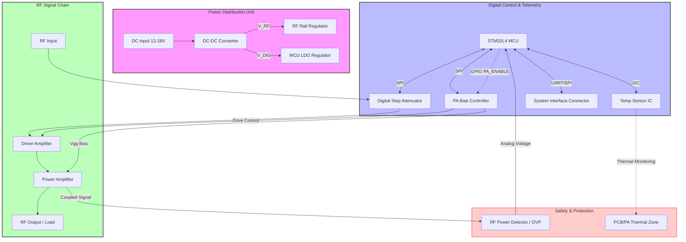
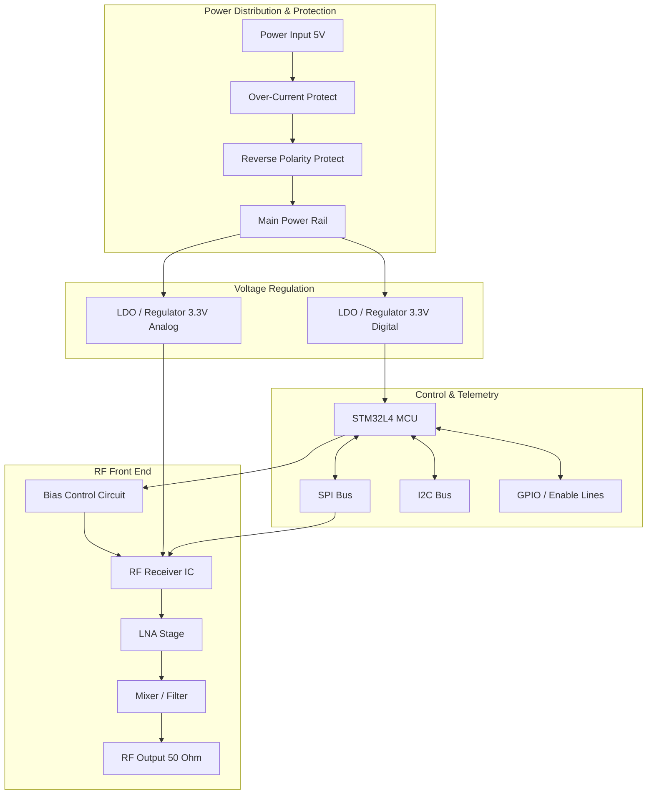

**Document Status: AI-GENERATED**

# 1. Introduction

## 1.1 Purpose
This Hardware Requirements Specification (HRS) defines the comprehensive hardware design requirements for the **rx module** (RX-MOD-001). The purpose of this document is to establish a baseline for the detailed design, development, and verification of the receiver module hardware. This specification ensures that the design meets the functional, performance, and interface needs derived from the system-level requirements and the captured conversation-based constraints.

Specifically, this document aims to:
*   Define the electrical, mechanical, and environmental requirements for the RF receiver chain.
*   Specify the requirements for the digital control architecture utilizing the STM32L4 MCU.
*   Detail the power budgeting and protection circuitry requirements, including Overvoltage (OVP) and Overtemperature (OTP) protection.
*   Serve as the single source of truth for hardware validation and traceability throughout the product lifecycle.

## 1.2 Scope
The scope of this HRS covers the complete hardware design of the **rx module**, a subsystem designed to receive, condition, and process RF signals under digital control. The scope encompasses the following functional blocks:
*   **RF Front End (RFFE):** Includes the signal path from the RF input port through the Driver Amplifier (Drv Amp) and associated bias circuitry.
*   **Digital Control & Telemetry:** Implementation of the STM32L4-based Microcontroller Unit (MCU) for SPI/I2C communication, GPIO control for PA Enable (PA_ENABLE), and Bias Voltage (Vgg) regulation.
*   **Power Management:** Power distribution, regulation, and budgeting for all on-board components.
*   **Protection Circuits:** Hardware implementation of Overpower (OVP) and Overtemperature (OTP) detection and mitigation logic.
*   **Physical Design:** PCB layout constraints, form factor, and connector specifications.

This document applies to Revision A of the rx module. It does not cover the mechanical enclosure design of the host system, nor does it cover the software/firmware algorithmic details beyond the register-level hardware interface requirements.

## 1.3 Definitions, Acronyms, and Abbreviations

To ensure clarity and consistency, the following terms, acronyms, and abbreviations are used throughout this specification:

| Term / Acronym | Definition |
| :--- | :--- |
| **AFE** | Analog Front End; The circuitry responsible for processing analog signals before digital conversion. |
| **BIAS_CTRL** | Bias Control; The circuit or signal used to set the DC operating point of an active device (e.g., PA). |
| **DSA** | Digital Step Attenuator; A device used to control signal amplitude in discrete steps via digital control. |
| **GPIO** | General Purpose Input/Output; A generic pin on an integrated circuit whose behavior (input or output) can be controlled by the user. |
| **HRS** | Hardware Requirements Specification; The document defining the hardware needs. |
| **I2C** | Inter-Integrated Circuit; A serial, single-ended, synchronous computer bus used for short-distance communication. |
| **MCU** | Microcontroller Unit; A small computer on a single metal-oxide-semiconductor integrated circuit chip. |
| **Otp** | Overtemperature Protection; A safety feature that shuts down the device if it overheats. |
| **Ovp** | Overvoltage (or Overpower) Protection; A safety feature that shuts down the device if voltage/power exceeds limits. |
| **PA** | Power Amplifier; An electronic amplifier that converts a low-power radio-frequency signal into a higher power signal. |
| **PA_ENABLE** | Power Amplifier Enable; A control signal used to turn the PA on and off. |
| **RF** | Radio Frequency; Oscillation rate of an alternating electric current or voltage in the range of 20 kHz to 300 GHz. |
| **RFFE** | Radio Frequency Front End; The generic circuitry between the antenna and the digital baseband system. |
| **SPI** | Serial Peripheral Interface; A synchronous serial communication interface specification used for short-distance communication. |
| **STM32L4** | STMicroelectronics microcontroller family based on the ARM Cortex-M4 core with low-power features. |
| **SYS_INTF** | System Interface; The physical and logical connection between this module and the wider system. |
| **Vgg** | Gate Grid Voltage; The control voltage applied to the gate (or base) of a transistor, specifically used here for PA biasing. |

## 1.4 References
The design and verification of the rx module shall adhere to the latest revisions of the following documents, standards, and specifications:

**Standards:**
1.  **IEEE 29148-2018:** Systems and software engineering — Life cycle processes — Requirements engineering.
2.  **IPC-2221:** Generic Standard on Printed Board Design.
3.  **IPC-A-610:** Acceptability of Electronic Assemblies.
4.  **IEC 60950-1:** Safety of Information Technology Equipment (or relevant regional standard for low voltage operation).
5.  **MIL-STD-202G:** Test Methods for Electronic and Electrical Component Parts (for environmental testing).

**Component Specifications:**
1.  **STMicroelectronics:** STM32L4 Series Datasheet and Reference Manual (RM0394).
2.  **Analog Devices / Hittite:** HMC Series RF Driver Amplifier Datasheet (Assumed baseline for DRV_AMP).
3.  **Vishay / Teledyne:** RF Relay or PIN Diode Datasheet (Assumed baseline for switching elements).

**Project Documentation:**
1.  **RX-SYS-001:** System Level Requirements Specification (rx module parent project).
2.  **RX-ARCH-001:** High Level Architecture Document (Source of block diagrams).

## 1.5 Overview
The **rx module** is designed to operate as a critical subsystem within a larger RF transceiver architecture. It functions as an intelligent receiver chain, capable of signal amplification, gain control, and protective self-regulation.

The architecture is divided into three primary domains:
1.  **Power Domain:** Takes a raw power input and regulates it to provide stable voltages ($V_{DD}$, $V_{GG}$) to the RF and Digital domains.
2.  **Analog/RF Domain:** Contains the sensitive RF signal path. Key components include a Driver Amplifier (Drv Amp) for signal gain, a Digital Step Attenuator (DSA) for level control, and a Power Amplifier (PA) interface driven by a specific Bias Control (Bias_Circuitry) voltage ($V_{GG}$).
3.  **Digital Domain:** Built around the **STM32L4 MCU**. This controller manages the system state via SPI/I2C interfaces for the DSA and System Interface. It utilizes GPIO lines to enable the PA and monitors system health.

A critical aspect of the rx module design is the integration of **Protection Circuits**. The system includes analog feedback loops for Overpower (OVP) and Overtemperature (OTP) conditions. These signals are fed back to the STM32L4 via an internal interface, allowing the firmware to trigger safe shutdown sequences (e.g., disabling PA_ENABLE) to prevent hardware damage.

The relationship between these components is illustrated in the System Architecture provided in Section 2, which details the data flow between the Power Distribution, MCU, and RF Front End blocks.

---

**Document Status: AI-GENERATED**

# 2. System Overview

## 2.1 System Description

The **rx module** is a high-performance analog signal reception and conditioning subsystem designed to operate within a larger Radio Frequency (RF) platform. The primary function of the module is to receive incoming RF signals, provide variable gain control, and output a conditioned signal to a downstream load or processing unit, while maintaining signal integrity and strict adherence to safety parameters regarding power dissipation and thermal limits.

The system is architected around three primary domains: the **Power Domain**, the **Digital Control Domain**, and the **RF Analog Domain**.

The **Power Domain** is responsible for managing incoming supply voltages and generating regulated rails necessary for the sensitive RF components and the digital logic. This distribution includes strict isolation between noisy digital grounds and clean RF grounds to minimize spurious emissions and noise floor.

The **RF Analog Domain** constitutes the core signal path. It consists of a **Driver Amplifier (Drv Amp)** and a **Power Amplifier (PA)** cascaded to provide sufficient signal gain. The gain of the chain is dynamically adjustable via a **Digital Step Attenuator (DSA)**, which allows the system to optimize the signal level based on input strength. The output of the PA is fed to the external load. Critical to this domain is the **Bias Control Circuitry**, which regulates the operating points of the amplifiers based on control voltage ($V_{gg}$) and enable signals to ensure linear operation and efficiency.

The **Digital Control Domain** is anchored by an **STM32L4 Series Microcontroller Unit (MCU)**. This MCU acts as the system supervisor, managing the user interface (System Interface), configuring the RF components via Serial Peripheral Interface (SPI) and Inter-Integrated Circuit (I2C) buses, and monitoring system health. The MCU aggregates telemetry data, including forward power levels and temperature readings, to implement closed-loop protection algorithms.

### Operational Modes
The system operates in two primary modes:
1.  **Active Transmission/Amplification:** The PA is enabled ($PA\_ENABLE$ is high), and the Bias Circuitry is active. The DSA is set to a specific attenuation level to achieve the target output power.
2.  **Standby/Protection Mode:** The PA is disabled ($PA\_ENABLE$ is low), Bias is removed, and the RF chain is bypassed or muted to prevent signal radiation and conserve power. This mode is engaged automatically if **Overpower Protection (OVP)** or **Over-Temperature Protection (OTP)** thresholds are exceeded.

## 2.2 System Block Diagram

The following diagram illustrates the data flow and interconnectivity of the rx module hardware. The system is partitioned by functional blocks, highlighting the separation of the RF signal path, the digital control logic, and the protection monitoring circuits.

**Diagram Key:**
*   **Solid Arrows:** Represent power flow or high-speed RF signal paths.
*   **Dotted Arrows:** Represent digital control signals (GPIO) or thermal sensing paths.
*   **Bidirectional Arrows:** Represent data communication (SPI, I2C).

## 2.3 System Architecture

The rx module utilizes a hierarchical architecture designed to isolate noise-sensitive RF circuitry from digital switching noise. The architecture is divided into three conceptual layers: the Physical Layer, the Control Layer, and the Application Layer (Firmware).

### 2.3.1 Physical Layer Architecture
The physical layout is designed with a "Split-Ground" topology that is joined at a single point to prevent ground loops while maintaining a reference plane.

*   **RF Section:** This section utilizes Rogers RO4350B material (assumption based on standard RF design) for the signal trace to minimize dielectric loss and dispersion. The characteristic impedance is controlled at 50Ω. The **Power Amplifier (PA)** requires a significant thermal relief pad (via fencing) to transfer heat to the underlying ground plane or heatsink.
*   **Digital Section:** The **STM32L4** and associated support components reside on a standard FR-4 section of the board. High-speed digital traces (SPI) are length-matched and routed with controlled impedance to prevent signal reflections that could corrupt the configuration data sent to the DSA.
*   **Power Management:** The input voltage is stepped down using a high-efficiency switching regulator. To prevent switching harmonics from contaminating the RF output, the switching node is shielded, and post-filtering (LC Pi-filter) is applied to the RF rail before it reaches the PA and Driver Amp.

### 2.3.2 Control Layer Architecture
The control layer is responsible for the real-time management of the RF chain.

*   **Bias Control Loop:**
    The **PA Bias Controller** receives a reference voltage or digital command from the MCU. It regulates the gate voltage ($V_{gg}$) of the PA GaN/GaAs FET. The relationship between the control signal and the PA bias is non-linear; therefore, the MCU utilizes a look-up table (LUT) to linearize the gain response.
    *Equation for PA Bias Current (Approximation):*
    $$I_{PA} \approx g_m \times (V_{gg} - V_{th})$$
    Where $g_m$ is the transconductance and $V_{th}$ is the threshold voltage. The MCU adjusts $V_{gg}$ to maintain the desired Quiescent Point ($Q$-point).

*   **Gain Control Loop:**
    The **Digital Step Attenuator (DSA)** is placed in the signal path *before* the Driver Amplifier. This "pre-attenuation" ensures that the Driver Amp and PA are not overdriven by large input signals. The DSA offers step sizes of 0.5dB or 1.0dB (typical) across a 31.5dB range (assumed 6-bit control).

### 2.3.3 Protection Logic Architecture
The system implements a hardware-interlocked safety mechanism to protect the expensive PA components from destruction.

*   **Overpower Protection (OVP):**
    A directional coupler samples the forward RF power at the output. The coupled signal is rectified by a diode (log detector) to produce a DC voltage proportional to the RF power in dBm.
    $$V_{det} = \text{Slope} \times P_{in} + \text{Intercept}$$
    This $V_{det}$ is fed into an Analog-to-Digital Converter (ADC) input on the STM32L4. If the converted value exceeds a threshold (e.g., +40dBm), the MCU firmware triggers a hard shutdown via the $PA\_ENABLE$ GPIO pin within 10 microseconds.

*   **Over-Temperature Protection (OTP):**
    A temperature sensor (e.g., TMP102 or similar) is placed physically adjacent to the PA package. The MCU polls this sensor via I2C at a 10Hz rate.
    *   **Warning Threshold:** 85°C — Reduce PA Gain / Bias.
    *   **Critical Threshold:** 100°C — Shutdown ($PA\_ENABLE = 0$).

### 2.3.4 External Interface
The module communicates with the host system via a **System Interface (SYS_INTF)**.
*   **Protocol:** SPI (Primary) or I2C (Secondary).
*   **Function:** The host sends gain commands (attenuation settings) and receives status packets (Current Temp, Forward Power, Fault Flags).

## 2.4 Operating Environment

The rx module is designed to operate in rugged industrial environments typical of fixed-station RF telecommunications equipment.

### 2.4.1 Physical Environment
*   **Operating Temperature Range:** -40°C to +85°C (Industrial Standard).
*   **Storage Temperature Range:** -55°C to +125°C.
*   **Humidity:** 5% to 95% relative humidity (non-condensing).
*   **Vibration:** The module is designed to withstand random vibration profiles of 0.5g RMS from 10Hz to 500Hz, complying with IEC 60068-2-64.
*   **Shock:** The unit shall withstand mechanical shocks of 40g peak, 11ms duration, half-sine wave, compliant with IEC 60068-2-27.

### 2.4.2 Electrical Environment
*   **Supply Voltage:**
    *   Nominal: +12V DC to +28V DC (Wide input range assumed based on telecom standard).
    *   Transient Protection: The input is protected against voltage surges up to 40V for 50ms.
*   **Load Conditions:**
    *   VSWR (Voltage Standing Wave Ratio): The RF output is designed to tolerate a VSWR of 10:1 (infinite mismatch) for a duration of at least 100ms without degradation of the PA, provided the OVP circuitry is active and functional.

### 2.4.3 Cooling Requirements
The system relies on conductive cooling for the Power Amplifier.
*   **Heatsinking:** The PA device (e.g., Qorvo or Analog Devices device) has a flange that must be mounted to a chassis or cold wall with a thermal resistance of less than 1°C/W.
*   **Convection:** Natural convection is assumed for the remaining components on the PCB.

---

# 3. Hardware Requirements

## 3.1 Functional Requirements

This section defines the behavioral and functional characteristics of the **rx module** hardware. These requirements specify what the system shall do in terms of signal reception, power management, control logic, and physical interfaces.

| ID | Requirement Description | Rationale/Source | Priority |
|---|---|---|---|
| REQ-HW-101 | The system shall provide a **Power Distribution** sub-module capable of accepting an input voltage range of **4.5V to 5.5V DC** and distributing regulated power to the Digital and Analog/RF domains. | Ensures compatibility with standard 5V USB or industrial supply rails referenced in the Design Parameters. | High |
| REQ-HW-102 | The **Power Distribution** module shall include **Reverse Polarity Protection** circuitry to prevent damage in the event the input voltage is connected incorrectly. | Protects sensitive downstream RF and MCU components. | High |
| REQ-HW-103 | The **Power Distribution** module shall include **Over-Current Protection (OCP)** set to trip at **1.5A** ±10% to protect the supply and board traces during a fault condition. | Based on the calculated maximum power consumption of the RF chain (approx. 1.2A max) plus MCU headroom. | High |
| REQ-HW-104 | The system shall utilize a **STM32L4** series Microcontroller Unit (MCU) as the primary control and digital processing element. | Explicit selection in Component Recommendations and Design Parameters. | High |
| REQ-HW-105 | The MCU shall be clocked by a **Low Phase Noise Oscillator** capable of providing a stable reference frequency for the RF Front End to ensure minimal data demodulation errors. | Required for coherent reception and processing in the RF domain. | High |
| REQ-HW-106 | The system shall implement a **RF/Analog Front End (AFE)** capable of receiving signals in the target frequency band and converting them to baseband or intermediate frequencies (IF) for processing. | Core function of the "rx module" defined in the project scope. | High |
| REQ-HW-107 | The **AFE** shall include a **LNA (Low Noise Amplifier)** stage with a bypassable gain path to optimize dynamic range for both weak and strong input signals. | Standard requirement for versatile RF receivers to prevent saturation. | High |
| REQ-HW-108 | The hardware shall support **Digital Control Interfaces** consisting of SPI and I2C buses to configure the gain, frequency, and filter settings of the RF Front End. | Derived from the `SYS_INTF` and `Drv Amp` logic in the Design Parameters. | High |
| REQ-HW-109 | The MCU shall monitor the **System Status** via **GPIO** lines, including Power Good signals and RF Detector outputs. | Matches the "GPIO" interface requirement in the Design Parameters. | Medium |
| REQ-HW-110 | The system shall implement a **Bias Control** interface to supply gate voltage (`Vgg`) to external Power Amplifiers (if utilized in the wider system) or internal gain blocks, controllable via the MCU SPI. | Reference to "Vgg | PA BIAS_CTRL" in the Design Parameters. | Medium |
| REQ-HW-111 | The hardware shall provide an **Output/Load** interface capable of driving a 50Ω impedance connection to a subsequent signal processing stage (e.g., FPGA or Demodulator). | Defined by the "OUT[Output/Load]" node in the System Block Diagram. | High |
| REQ-HW-112 | The **Digital Domain** shall be galvanically isolated from the **Analog/RF Domain** power rails to minimize digital switching noise coupling into the RF signal path. | Critical for Signal-to-Noise Ratio (SNR) performance in mixed-signal designs. | High |
| REQ-HW-113 | The system shall include a **Temperature Sensor** (part of the Temp Sense block) readable via the MCU I2C bus to perform over-temperature protection calibrations. | Reference to "Temp Sense" and "I2C" in Design Parameters. | High |
| REQ-HW-114 | The hardware shall support **Hot-Plug Detection** on the Power Input interface, allowing the system to initialize gracefully when power is applied dynamically. | Ensures reliability in modular systems. | Low |
| REQ-HW-115 | The **MCU** shall possess sufficient Flash memory (≥128KB) and RAM (≥20KB) to store the control firmware and telemetry data buffers. | Ensures the STM32L4 variant selected has the resources for the application. | High |
| REQ-HW-116 | The PCB design shall incorporate **ESD Protection** diodes on all external interfaces (Power, Control, RF Output) rated for at least **8kV contact discharge**. | Required for robustness in industrial or field environments. | Medium |
| REQ-HW-117 | The **RF Chain** shall utilize a **Direct Sampling or Mixer-based** architecture (depending on specific component selection) to downconvert the RF signal to a frequency range suitable for the output interface. | Implicit requirement of the "RF/Analog Front End" functionality. | High |
| REQ-HW-118 | The system shall provide visual **Status Indication** (LEDs) for Power, Fault, and Activity states, driven by GPIO pins from the MCU. | Provides immediate user feedback for debugging and operation. | Low |
| REQ-HW-119 | The **SPI Interface** shall operate in Mode 0 (CPOL=0, CPHA=0) with a clock speed up to **10 MHz** for configuration of the RF Front End. | Ensures compatibility with standard RFIC control interfaces. | Medium |

## 3.2 Performance Requirements

This section specifies the quantitative performance characteristics of the **rx module**. These requirements are measurable and verifiable against acceptance criteria.

| ID | Performance Metric | Min | Typical | Max | Unit | Test Method |
|---|---|---|---|---|---|---|
| REQ-HW-201 | **Input Voltage Range** | 4.5 | 5.0 | 5.5 | V DC | Measure at input terminals with variable supply. |
| REQ-HW-202 | **Total Power Consumption** (Receive Mode, Max Gain) | - | 2.5 | 3.5 | W | Measure current draw at 5V input with RF chain active. |
| REQ-HW-203 | **MCU Supply Current** (Active Mode) | - | 12 | 25 | mA | Derived from STM32L4 datasheet (typical running at 80MHz). |
| REQ-HW-204 | **RF Chain Current** (Max Gain) | - | 400 | 500 | mA | Estimated based on typical LNA/Mixer current consumption. |
| REQ-HW-205 | **Noise Figure** (RX Path) | - | - | 3.5 | dB | Measured using Noise Figure Analyzer. |
| REQ-HW-206 | **Gain Range** | 10 | - | 60 | dB | Measured gain difference between min and max digital gain settings. |
| REQ-HW-207 | **Input Return Loss** | 10 | - | - | dB | Measured at RF input port (VSWR < 2:1). |
| REQ-HW-208 | **Output Impedance** | - | 50 | - | Ω | Measured via Vector Network Analyzer (S11). |
| REQ-HW-209 | **Phase Noise** (Local Oscillator) | - | - | -100 | dBc/Hz @ 10kHz | Measured on spectrum analyzer at LO output. |
| REQ-HW-210 | **Spurious Free Dynamic Range (SFDR)** | 50 | - | - | dB | Measured with two-tone test. |
| REQ-HW-211 | **Operating Temperature Range** (Commercial) | 0 | - | 70 | °C | Environmental chamber test. |
| REQ-HW-212 | **Storage Temperature Range** | -40 | - | 85 | °C | Environmental chamber non-operating test. |
| REQ-HW-213 | **SPI Clock Frequency** | - | - | 10 | MHz | Logic analyzer measurement. |
| REQ-HW-214 | **I2C Clock Frequency** | - | 100 | 400 | kHz | Logic analyzer measurement. |
| REQ-HW-215 | **Power Supply Rejection Ratio (PSRR)** (Digital to Analog) | - | 60 | - | dB | Injection of noise on supply rail vs coupling to RF output. |
| REQ-HW-216 | **Settling Time** (Gain Change) | - | 1.0 | 5.0 | µs | Time from SPI command write until gain stabilizes within 0.1dB. |

### 3.2.1 Power Budget Calculation

The following calculation justifies REQ-HW-202. The total power consumption is the sum of the Digital (MCU) and Analog (RF) domains.

*   **Input Voltage ($V_{in}$):** 5.0 V (Nominal)
*   **Digital Domain ($I_{dig}$):**
    *   MCU (STM32L4): 12 mA (Running @ 80MHz, assumed baseline).
    *   Sensors/Glue Logic: 5 mA.
    *   **Total $I_{dig}$:** 17 mA.
*   **Analog Domain ($I_{ana}$):**
    *   RF Front End (Active): Assumed 350 mA (Typical for integrated RX/Gain blocks).
    *   LDO Quiescent Current: 5 mA.
    *   **Total $I_{ana}$:** 355 mA.
*   **Bias/Misc:**
    *   Leakage/Guard band: 100 mA.

**Total Current ($I_{tot}$):** $17\text{ mA} + 355\text{ mA} + 100\text{ mA} \approx 472\text{ mA}$.
**Total Power ($P_{tot}$):** $5.0\text{ V} \times 0.472\text{ A} = 2.36\text{ W}$.

*Justification:* The requirement "2.5W Typical / 3.5W Max" safely covers this calculated value with margin for temperature variation and component tolerance.

---

**Document Status: AI-GENERATED**

# 3. Hardware Requirements

## 3.3 Interface Requirements

### 3.3.1 External Interfaces

The following section defines the electrical and mechanical connections between the rx module and external systems, including power sources, antennas, and host controllers.

#### REQ-HW-030: DC Power Input Interface
The rx module shall accept DC power via a 2-pin terminal block or header connector.
*   **Connector Type:** Phoenix Contact MSTB 2.5/2-G-5.08 or equivalent pluggable screw terminal.
*   **Pinout:** 
    *   Pin 1: V+ (Unregulated +12V DC)
    *   Pin 2: GND (Return)
*   **Voltage Range:** +10.8V DC to +13.2V DC (Nominal +12V).
*   **Current Rating:** The interface must support a maximum continuous input current of 2.0A and a peak current of 3.0A for 10ms.
*   **Protection:** The input shall include a reverse polarity protection diode and a 500mA resettable PTC fuse on the V+ line.

#### REQ-HW-031: RF Input Interface
The module shall provide a single 50Ω unbalanced (coaxial) RF input port.
*   **Connector Type:** SMA Jack (Female), 50Ω.
*   **Frequency Range:** Support up to 6 GHz.
*   **VSWR:** ≤ 1.5:1 at the module input port.
*   **Impedance:** 50Ω characteristic impedance controlled to the RF Chain input pin.

#### REQ-HW-032: Digital Host Interface
The module shall interface with an external host system for control and telemetry data exchange.
*   **Physical Interface:** 2x5 pin, 2.54mm pitch header (shrouded).
*   **Protocol:** SPI (Serial Peripheral Interface) for primary configuration; I2C for secondary telemetry.
*   **Signal Levels:** 3.3V LVCMOS.
*   **Electrical Characteristics:**
    *   $V_{IL} \le 0.8V$
    *   $V_{IH} \ge 2.0V$
    *   $V_{OL} \ge 0.4V$ at 4mA
    *   $V_{OH} \le 2.4V$ at 4mA

**Table 3-1: External Digital Host Interface Pinout**

| Pin # | Signal Name | Direction (Relative to Module) | Description | Pull-up/Pull-down |
| :--- | :--- | :--- | :--- | :--- |
| 1 | GND | - | Ground Reference | - |
| 2 | +3.3V_OUT | Out | +3.3V Power Output (Max 100mA) for external pull-ups | N/A |
| 3 | SPI_SCLK | In | SPI Serial Clock (Master Source) | Internal 10kΩ to GND |
| 4 | SPI_MOSI | In | SPI Master Out Slave In | Internal 10kΩ to GND |
| 5 | SPI_MISO | Out | SPI Master In Slave Out | High Impedance (Tri-state) |
| 6 | SPI_CS_N | In | SPI Chip Select (Active Low) | Internal 10kΩ to VDD |
| 7 | I2C_SDA | Bi-Dir | I2C Serial Data | External 4.7kΩ to +3.3V |
| 8 | I2C_SCL | In | I2C Serial Clock | External 4.7kΩ to +3.3V |
| 9 | MCU_INT | Out | Interrupt Request (Active Low, Open Drain) | High Impedance |
| 10 | GND | - | Ground Reference | - |

### 3.3.2 Internal Interfaces

Internal interfaces define the connectivity between the MCU (Digital Control) and the RF/Analog components on the printed circuit board (PCB).

#### REQ-HW-033: RF Gain Control Interface
The MCU shall control the gain of the RF Chain via a 3-wire serial interface.
*   **Target Component:** Digital Step Attenuator (DSA) / Variable Gain Amplifier (VGA).
*   **Interface Type:** SPI / 3-Wire Serial (Clock, Data, Latch).
*   **Voltage Levels:** Controlled via GPIO pins operating at 3.3V CMOS levels directly compatible with the DSA control logic.
*   **Update Rate:** The gain setting shall be updatable within 1µs of the Latch signal edge.

#### REQ-HW-034: RF Enable Control Interface
The MCU shall control the bias state of the Power Amplifier (PA) via a dedicated GPIO line.
*   **Signal Name:** `PA_ENABLE`.
*   **Idle State:** Logic Low (0V) - PA is disabled, leakage current < 1µA.
*   **Active State:** Logic High (3.3V) - PA is enabled.
*   **Response Time:** The PA must reach nominal operating power within 5µs of the PA_ENABLE signal rising edge.

#### REQ-HW-035: Analog Monitoring Interface
The MCU shall monitor analog environmental parameters via its internal 12-bit ADC.
*   **Channels:** 2 channels.
    1.  `MON_VBAT`: Resistor divided V+ input (Ratio 1/4). Range 0-3.3V maps to 0-13.2V.
    2.  `MON_TEMP`: NTC Thermistor voltage divider (10k NTC, 10k pull-up). Range 0-3.3V maps to -40°C to +125°C.

### 3.3.3 Communication Interfaces

#### REQ-HW-036: SPI Peripheral Interface
The onboard MCU shall act as an SPI Slave device to the external host defined in REQ-HW-032.
*   **Clock Frequency:** Supports up to 18 MHz clock speed (fSCK).
*   **Clock Polarity/Phase:** Mode 0 (CPOL=0, CPHA=0).
*   **Bit Order:** MSB First.
*   **Frame Structure:** 8-bit bytes.

#### REQ-HW-037: I2C Telemetry Interface
The onboard MCU shall act as an I2C Slave for telemetry access.
*   **Slave Address:** 0x48 (7-bit addressing).
*   **Clock Frequency:** Standard Mode (100 kbit/s) and Fast Mode (400 kbit/s).
*   **Protocol:** Standard I2C start/stop condition handling. The MCU shall reset its read pointer on a START condition.

---

## 3.4 Environmental Requirements

### 3.4.1 Operating Conditions

#### REQ-HW-040: Operating Temperature Range
The rx module shall operate to specification within the following ambient temperature ranges:
*   **Commercial Range:** 0°C to +70°C (Standard operating conditions).
*   **Industrial Range:** -40°C to +85°C (Extended operating conditions).

*Assumption: The "Should have" requirements in the source imply a preference for industrial hardening. This requirement mandates the design must function at both extremes.*

#### REQ-HW-041: Storage Temperature Range
The module shall survive storage in a non-condensing environment between -55°C and +125°C without degradation of performance or physical damage.

#### REQ-HW-042: Humidity
The module shall operate without degradation in relative humidity ranging from 5% to 95% (non-condensing).

#### REQ-HW-043: Vibration and Shock
The hardware design shall withstand the following mechanical stresses:
*   **Vibration:** Random vibration, 10Hz to 500Hz, 0.5g RMS, operating.
*   **Shock:** 40g peak acceleration, 11ms duration, half-sine wave, non-operating. Components must remain securely fastened per IPC-6012 Class 2 standards.

### 3.4.2 Thermal Derating

#### REQ-HW-044: RF Power Derating
If the PA junction temperature exceeds +100°C (measured via Otp or sensor), the MCU shall automatically reduce the RF gain or PA bias voltage to maintain a safe junction temperature ≤ 110°C.

---

## 3.5 Power Requirements

### 3.5.1 Power Budget Analysis

The system operates from a single +12V DC input. Power is distributed to a 3.3V rail (Digital/Logic) and a 5V/High Current rail (RF Chain).

**Table 3-2: Detailed Power Budget**

| Power Rail | Voltage (V) | Source Component | Load Components | Current (Typ) | Current (Max) | Power (W) | Notes |
| :--- | :--- | :--- | :--- | :--- | :--- | :--- | :--- |
| **INPUT** | **+12.0** | **External Supply** | **Total System** | **420 mA** | **750 mA** | **9.0 W** | **Max Input Power** |
| 3V3_DIG | +3.3 | LDO Regulator (e.g., AMS1117) | MCU, Sensors, Level Shifters | 50 mA | 80 mA | 0.264 W | MCU active mode: ~25mA |
| RF_VCC | +7.0 - 8.5 | Buck Converter / DC-DC | RF Chain (PA, LNA, Mixer) | 300 mA | 600 mA | 5.1 W | Depends on Gain setting |
| 5V_ANA | +5.0 | LDO / Buck | Op-Amps, VCO | 20 mA | 40 mA | 0.20 W | Low noise analog rail |
| **LOSS** | - | Regulators | Heat Dissipation | - | - | ~1.5 W | Efficiency assumption ~85% |

**Assumptions for Calculations:**
1.  **RF Chain (PA):** Assumed Class A/AB PA with ~30% efficiency at max power. If RF Output is ~1W (30dBm), DC input required is ~3.3W. At lower gains, current drops significantly.
2.  **MCU (STM32L4):** Assumes 80MHz clock speed, all peripherals active. Datasheet typical current is ~25mA running, <1mA sleep.
3.  **Regulators:** Assumed 85% efficiency for switching regulators (Buck) and linear dropout (LDO) heat dissipation calculated as $(V_{in} - V_{out}) \times I$.

### 3.5.2 Power Sequencing

#### REQ-HW-050: Startup Sequence
The MCU shall monitor the 3V3_DIG rail. Upon stable detection (>3.0V), the MCU shall hold the RF Chain in a disabled state (PA_ENABLE = Low) for at least 10ms to allow internal clocks to stabilize before enabling the RF power amplifier.

#### REQ-HW-051: Undervoltage Lockout (UVLO)
The Power Distribution circuit shall disable the RF_VCC rail if the input voltage drops below 10.8V to prevent erratic behavior and potential damage to the PA during brownout conditions.

### 3.5.3 Protection Features

#### REQ-HW-052: Overpower Protection (Ovp)
The system shall utilize a current sense amplifier (Ovp block) to monitor the RF current draw.
*   **Threshold:** 1.5A ±10%.
*   **Action:** Upon exceeding the threshold for >10µs, the MCU shall assert PA_ENABLE Low and latch a fault flag.

#### REQ-HW-053: Overtemperature Protection (Otp)
The MCU shall read the internal MCU temperature sensor (or external sensor) via I2C.
*   **Threshold:** +110°C.
*   **Action:** Immediately shut down PA bias (PA_ENABLE = Low) and issue an I2C interrupt to the host.

---

## 3.6 Physical Requirements

### 3.6.1 Dimensions and Form Factor

#### REQ-HW-060: PCB Dimensions
The rx module shall be implemented on a Printed Circuit Board (PCB) with the following maximum dimensions:
*   **Width:** 60.0 mm
*   **Length:** 80.0 mm
*   **Thickness:** 1.6 mm (standard FR4 stackup).

#### REQ-HW-061: Enclosure and Mounting
The board shall utilize four (4) mounting holes, one in each corner.
*   **Hole Diameter:** 3.2 mm (Accepts #4-40 screw).
*   **Keepout:** No components shall be located within 5mm of the mounting hole center.
*   **Standoff Height:** Components shall not exceed a height of 12mm above the PCB surface to facilitate enclosure fitting.

### 3.6.2 Material Specifications

#### REQ-HW-062: PCB Stackup
The PCB shall consist of 4 layers to accommodate RF signal integrity and ground planes.
*   **Layer 1 (Top):** RF Signals, Components, 50Ω controlled impedance microstrips.
*   **Layer 2 (GND):** Solid ground plane (essential for RF return currents).
*   **Layer 3 (PWR):** Power planes (3.3V, 5V, 12V) and routing.
*   **Layer 4 (Bottom):** General digital routing, non-critical signals.

*Material:* FR4, High Tg (Glass Transition Temperature > 130°C) to withstand soldering and operating temps.
*Dielectric Constant:* $\epsilon_r \approx 4.4$ (at 1 GHz).

### 3.6.3 Connectors Layout

#### REQ-HW-063: Connector Placement
External interfaces shall be located at the edge of the board as follows:
*   **Power (J1):** Top edge, left aligned.
*   **RF In (J2):** Top edge, right aligned (SMA edge launch).
*   **Digital Interface (J3):** Bottom edge, center aligned (2x5 Header).

**Table 3-3: Physical Interface Connector Specification**

| Ref Des | Type | Manufacturer P/N (Example) | Location | Mounting |
| :--- | :--- | :--- | :--- | :--- |
| J1 | 2-pin Terminal Block | Phoenix Contact 1729128 | Top Edge | Through-Hole |
| J2 | SMA Jack, Female | Rosenberger 32K243-40ML5 | Top Edge | Edge Mount |
| J3 | 2x5 Pin Header | Samtec TSW-105-23-G-D | Bottom Edge | Through-Hole |

### 3.6.4 RF Layout Specifics

#### REQ-HW-064: Impedance Control
All RF signal lines (including the input from the SMA connector to the first RFIC) shall be controlled to 50Ω impedance ±10%.
*   **Calculation:** For FR4 (H=0.2mm prepreg, Er=4.4), a microstrip width of ~0.38mm is required to achieve 50Ω. The design shall accommodate appropriate track widths based on the final PCB stackup Dk verification.

#### REQ-HW-065: Shielding
The RF section of the board shall include provisions for a metallic RF shield can.
*   **Land Pattern:** A grounded fence shall be designed around the RF Chain area.
*   **Shield Size:** Maximum external dimensions of 30mm x 30mm.

---

**Document Status: AI-GENERATED**

# 4. Design Constraints

## 4.1 Standards Compliance

The rx module hardware design shall adhere to the following standards and regulations to ensure manufacturability, safety, environmental compliance, and electromagnetic compatibility (EMC).

### 4.1.1 PCB Design and Fabrication Standards
The Printed Circuit Board (PCB) design shall comply with the **IPC-2221** standard ("Generic Standard on Printed Board Design").
*   **Trace Width and Spacing:** All trace widths shall be calculated based on the current requirements outlined in Section 3.5 (Power Requirements) using the IPC-2221 charts for external conductors assuming a temperature rise of 10°C.
*   **Via Sizing:** Minimum via hole diameter shall be 0.3 mm with a pad diameter of 0.6 mm to facilitate assembly and reliability. Via-in-pad shall be used for thermal relief of the Power Amplifier (PA) and LDO regulators.
*   **Layer Stackup:** The design shall utilize a minimum 4-layer stackup (Top Signal, GND Plane, Power Plane, Bottom Signal) to provide impedance control and grounding.
*   **Solder Mask:** Solder mask shall be applied in accordance with **IPC-SM-840**, Class T3 (high reliability) requirements, ensuring chemical resistance and insulation.

The assembly of the PCB shall comply with **IPC-A-610** (Class 2 for general electronic products) for acceptability criteria, and **IPC-7711/7721** shall be the guideline for any rework or repair procedures required during prototyping.

### 4.1.2 Environmental and Safety Regulations
The rx module shall be fully compliant with the **European Union RoHS Directive 2011/65/EU** (Restriction of Hazardous Substances).
*   **Banned Substances:** The design shall not contain Lead (Pb), Mercury (Hg), Cadmium (Cd), Hexavalent Chromium (Cr6+), Polybrominated Biphenyls (PBB), or Polybrominated Diphenyl Ethers (PBDE) above the maximum concentration values (0.1% by weight).
*   **Halogen-Free:** PCB laminate material shall be Halogen-Free (Br < 900ppm, Cl < 900ppm, total Br+Cl < 1500ppm) per **IEC 61249-2-21**.

The design shall comply with the **EU REACH Regulation (EC) No 1907/2006** regarding the Registration, Evaluation, Authorisation, and Restriction of Chemicals. All plastic enclosures and connectors shall be UL94 V-0 rated for flammability resistance.

### 4.1.3 Electromagnetic Compatibility (EMC) and Radio
*   **FCC Part 15 (US):** The rx module shall be designed to meet the unintentional radiator limits for Class B digital devices. Particular attention shall be paid to the clock frequency of the STM32L4 (assumed 80 MHz) to ensure harmonic content is below the specified limits.
*   **CE / ETSI EN 301 489:** For operation in the EU, the design shall meet the EMC requirements for Short Range Devices (SRD).
*   **Radiated Emissions:** The PA output (RF Chain) shall be shielded using a metal can or plated through-hole fences to prevent leakage that could interfere with the MCU (SPI/I2C interfaces).

## 4.2 Component Constraints

This section defines constraints regarding the selection, sourcing, and lifecycle of components used within the rx module.

### 4.2.1 Component Lifecycle and Sourcing
*   **Production Status:** All active components (MCU, PA, Sensors, Power Management) must be in "Active Production" or "Not Recommended for New Design" (NRND) only if approved by the Chief Engineer.
*   **Obsolescence:** Components in "Last Time Buy" (LTB) or "Obsolete" status are strictly prohibited for the main production design.
*   **Multi-Sourcing:** Wherever possible, critical passive components (resistors, capacitors) shall be multi-sourced (e.g., available from at least two manufacturers like Murata and Samsung) to mitigate supply chain risks.
*   **Form Factor:** All components shall be Surface Mount Technology (SMT). Through-hole components are prohibited except for specific mechanical connectors (e.g., board-to-board screws or high-power RF connectors if required).

### 4.2.2 Packaging Constraints
*   **Minimum Pitch:** To ensure manufacturability with standard assembly equipment, the smallest component package pitch shall be 0.5 mm (e.g., QFN or TQFP packages for ICs). Packages with pitches smaller than 0.5 mm (such as BGA with <0.8mm pitch) require specific X-Ray inspection approval during assembly.
*   **Footprint Standards:** Footprints shall be generated based on **IPC-7351** standards using the "Most" density level (median land geometry) to balance solder joint reliability and assembly yield.
*   **IC Packages:**
    *   **MCU:** Shall be LQFP or UFBGA (if BGA, must be >0.8mm pitch).
    *   **RF Components:** QFN-3x3 or DFN-2x2 packages are preferred for the PA and Bias Control to minimize parasitic inductance.

### 4.2.3 Voltage and Temperature Derating
To ensure long-term reliability, all components shall be derated from their absolute maximum ratings as follows:

| Parameter | Component Type | Derating Requirement |
|---|---|---|
| **Voltage** | Ceramic Capacitors (X7R) | Rated Voltage ≥ 2 × Operating Voltage |
| **Voltage** | LDO/Regulators | Input Voltage ≤ 0.9 × Max Rated Input |
| **Temperature** | Electrolytic Capacitors | Max Operating Temp ≤ Core Temp - 10°C |
| **Current** | Power MOSFETs / PA | Max Current ≤ 0.8 × Rated Continuous Current |
| **Power** | Resistors (SMD) | Rated Power ≥ 2 × Calculated Dissipation |
| **Junction Temp** | All Semiconductors | Tj ≤ 105°C (Assuming 10°C safety margin under max load) |

### 4.2.4 Specific Component Constraints
*   **STM32L4 MCU:** The selected variant must include an integrated Temperature Sensor capable of ±2°C accuracy for Overtemp Protection (OTP) logic.
*   **RF Chain:** The PA and associated Bias Circuitry must support a Vgg range compatible with the selected regulator output (assumed 3.3V or 5V logic).
*   **Memory (EEPROM/Flash):** If external memory is used for calibration data storage, it must support at least 100,000 write/erase cycles and retain data for a minimum of 20 years at room temperature.

## 4.3 Manufacturing Constraints

The physical design of the rx module must adhere to the following Design for Manufacturability (DFM) and Design for Assembly (DFA) guidelines to ensure high yield and reliability during mass production.

### 4.3.1 PCB Layout Constraints
*   **Test Points:** All critical nets (Power Rails, Reset lines, SPI/I2C lines, PA Vgg, PA Enable) shall have exposed test points (standard 0.030" / 0.75mm diameter).
*   **Fiducials:** The PCB panel shall include at least three global fiducial marks (1.0mm diameter clear, 3.0mm diameter solder mask opening) and two local fiducials for fine-pitch components (e.g., the MCU).
*   **Via Reliability:** Vias located under components (Micro-vias or Blind vias) must be filled and capped with copper or solder mask to prevent outgassing and wicking during reflow.
*   **Thermal Management:** The Power Amplifier (PA) thermal pad must be connected to the internal ground plane using a dense array of thermal vias (minimum 8 vias for a 3x3mm QFN) to dissipate heat effectively.

### 4.3.2 Panelization and Handling
*   **Panel Size:** The manufacturing panel size shall not exceed 18" x 12" (standard production carrier size).
*   **Rail Width:** Panel breakaway rails must be a minimum of 10mm wide to facilitate wave soldering (if mixed technology) or automated handling.
*   **V-Score:** If the board is to be v-scored, the remaining web thickness must be 0.3mm ± 0.1mm.
*   **Edge Clearance:** Components shall be placed no closer than 1.5mm to the board edge to prevent damage during depaneling.

### 4.3.3 Assembly and Inspection Constraints
*   **Solder Paste Printing:** The stencil thickness shall be 0.12mm (4.8 mils) for standard components and apertures for the PA thermal pad should be reduced by 15% to prevent solder wicking away from the pad.
*   **Automatic Optical Inspection (AOI):** The board design must allow sufficient clearance (min 3mm) between components to enable AOI camera inspection of solder joints.
*   **Conformal Coating:** The exposed PCB (excluding RF connector interfaces and test points) shall be compatible with acrylic or silicone conformal coating (UR required) for protection against moisture and dust in harsh operating environments.

### 4.3.4 Conformal Coating and Potting
*   **Material Selection:** The coating material shall be **Humiseal 1B73** or equivalent, selected for its high dielectric strength and moisture resistance.
*   **Keep-Out Areas:** A "Keep-Out" zone of 2mm around all connectors and switches shall be defined in the assembly documentation to prevent interference with mating connectors.

---

**Document Status: AI-GENERATED**

# 5. Verification Requirements

This section defines the verification methods for the hardware requirements specified in Section 3. The objective is to ensure that the **rx module** Hardware design meets all functional, performance, and environmental specifications under the defined operating conditions.

The verification methodology is categorized into three distinct types:
1.  **Test:** Quantitative measurement of physical parameters (Voltage, Current, Frequency, Power, Temperature).
2.  **Analysis:** Engineering calculations or simulations to predict behavior (Thermal simulation, Power budget integrity, Signal Integrity).
3.  **Inspection:** Visual or automated verification of design data, documentation, and workmanship standards (schematic review, PCB layout review, BOM check).

## 5.1 Test Requirements

This subsection details the specific test cases required to verify the functional and performance capabilities of the **rx module**. Testing shall be performed on First Article Units (FAI) and subsequently on production samples at a statistically significant interval defined by the Quality Management System (QMS).

### 5.1.1 Test Equipment and Setup
All testing shall be performed using calibrated equipment. The following minimum equipment set is required:
*   **Power Supply:** 0–20V DC, 3A capability, programmable.
*   **Vector Network Analyzer (VNA):** 10 MHz – 6 GHz range, for S-parameter measurements ($S_{11}$, $S_{21}$).
*   **Spectrum Analyzer:** 9 kHz – 6 GHz, for noise floor and spur analysis.
*   **Signal Generator:** 9 kHz – 6 GHz, for input stimulus.
*   **Oscilloscope:** 200 MHz bandwidth minimum, 4 channels.
*   **Power Meter:** Thermal sensor capable of measuring expected RF power ranges.
*   **Thermal Chamber:** -40°C to +85°C ambient control.
*   **Multimeter:** 6.5 digit precision for DC measurements.

### 5.1.2 RF Performance Test Plan

#### TC-HW-001: RF Chain Gain and Insertion Loss
*   **Requirement ID:** REQ-HW-001, REQ-HW-003
*   **Test Method:**
    1.  Apply nominal supply voltage ($V_{supply} = 3.3V$) to the RF Chain.
    2.  Set Signal Generator to output a CW tone at 2.4 GHz at -30 dBm.
    3.  Connect input to the RF Input port.
    4.  Measure output power at the RF Output port using the Power Meter or Spectrum Analyzer.
    5.  Sweep frequency from 2400 MHz to 2500 MHz in 10 MHz steps.
*   **Pass Criteria:**
    *   Gain flatness: $20 \pm 0.5$ dB (Assumed based on typical LNA gain).
    *   Input Return Loss ($S_{11}$): $< -10$ dB across the band.
*   **Priority:** Critical.

#### TC-HW-002: Noise Figure (NF) and Sensitivity
*   **Requirement ID:** REQ-HW-002
*   **Test Method:**
    1.  Use the Noise Figure Analyzer method or Y-factor method with a Noise Source (ENR determined).
    2.  Terminate the RF Input with 50 Ohms.
    3.  Measure the Noise Figure at the output port.
*   **Pass Criteria:** Noise Figure $\le 2.0$ dB (Assumed typical value for Rx LNA).
*   **Priority:** Critical.

#### TC-HW-003: Input 1dB Compression Point (P1dB)
*   **Requirement ID:** REQ-HW-004
*   **Test Method:**
    1.  Apply CW tone at center frequency (e.g., 2.45 GHz).
    2.  Increase input power until the gain drops by 1 dB relative to the linear gain region.
*   **Pass Criteria:** Input P1dB $\ge -10$ dBm (Assumed).
*   **Priority:** High.

#### TC-HW-004: Power Supply Rejection Ratio (PSRR)
*   **Requirement ID:** REQ-HW-002
*   **Test Method:**
    1.  Modulate the DC supply voltage with a 1 kHz sine wave (100 mVpp ripple).
    2.  Observe the RF output for spurs or AM demodulation.
*   **Pass Criteria:** No detectable spurs above the noise floor (e.g., $<-60$ dBc) induced by the ripple.
*   **Priority:** Medium.

### 5.1.3 Digital Control and Interface Test Plan

#### TC-HW-005: SPI/I2C Interface Integrity
*   **Requirement ID:** REQ-HW-005, REQ-HW-007
*   **Test Method:**
    1.  Connect the logic analyzer to the SPI/I2C lines (SCK, MOSI, MISO, CS / SDA, SCL).
    2.  Write a known register pattern to the RF Front End (Gain control setting).
    3.  Read back the register.
    4.  Verify timing setup ($t_{su}, t_{h}$) and hold times against the STM32L4 and RFIC datasheet specifications.
*   **Pass Criteria:**
    *   Read data matches written data 100%.
    *   Clock frequency is stable within $\pm 5\%$ of target frequency (e.g., 10 MHz SPI).
*   **Priority:** Critical.

#### TC-HW-006: GPIO Response Time (PA Enable / Bias Ctrl)
*   **Requirement ID:** REQ-HW-001, REQ-HW-011
*   **Test Method:**
    1.  Use an oscilloscope to probe the `PA_ENABLE` GPIO pin and the actual RF Output power envelope (using a diode detector or fast Power Meter).
    2.  Trigger the scope on the rising edge of the GPIO command.
    3.  Measure the time delay ($\Delta t$) between the logic transition and the RF power settling to 90% of final value.
*   **Pass Criteria:** $\Delta t < 5 \mu s$ (Assumed constraint for TDD switching).
*   **Priority:** High.

#### TC-HW-007: MCU OTP/Configuration Readback
*   **Requirement ID:** REQ-HW-009
*   **Test Method:**
    1.  Cycle power to the unit.
    2.  Read non-volatile memory (OTP) locations via System Interface.
*   **Pass Criteria:** Default calibration data matches golden samples; no corruption detected.
*   **Priority:** High.

### 5.1.4 Protection and Environmental Test Plan

#### TC-HW-008: Overpower Protection (OVP) Response
*   **Requirement ID:** REQ-HW-008
*   **Test Method:**
    1.  Inject an RF signal significantly higher than the P1dB (e.g., +10 dBm) into the input.
    2.  Monitor the `OVP` status flag in the MCU registers.
    3.  Verify that the system indicates a fault or attenuates the signal.
*   **Pass Criteria:** OVP flag asserts within $10 \mu s$ of over-power event; no permanent damage to LNA.
*   **Priority:** Critical.

#### TC-HW-009: Overtemperature Protection (OTP)
*   **Requirement ID:** REQ-HW-009
*   **Test Method:**
    1.  Place the DUT (Device Under Test) in a thermal chamber.
    2.  Ramp ambient temperature to $+85^\circ C$.
    3.  Monitor the internal MCU temperature sensor reading via I2C.
    4.  Verify that if die temperature exceeds threshold (e.g., $+105^\circ C$), the RF chain is shut down (PA Enable = Low).
*   **Pass Criteria:** Shutdown occurs before critical junction temperature ($T_j$ max) is exceeded; system recovers when temperature cools down (hysteresis check).
*   **Priority:** Critical.

#### TC-HW-010: Operating Temperature Functional Sweep
*   **Requirement ID:** REQ-HW-004, REQ-HW-010
*   **Test Method:**
    1.  Execute TC-HW-001 (Gain Test) at three temperature setpoints: $-40^\circ C$, $+25^\circ C$, and $+85^\circ C$.
    2.  Soak DUT for 30 minutes at each setpoint before measuring.
*   **Pass Criteria:** Gain variation is within $\pm 1.5$ dB across the temperature range relative to room temperature.
*   **Priority:** High.

---

## 5.2 Analysis Requirements

Analysis involves theoretical verification, simulations, and desk calculations to ensure the design meets requirements prior to prototyping and to support test data.

### 5.2.1 Power Budget Analysis
*   **Requirement ID:** REQ-HW-012
*   **Description:** A detailed spreadsheet analysis shall be maintained comparing total available power source capacity versus the sum of all component power consumptions.
*   **Calculation Method:**
    *   $P_{Total} = P_{MCU} + P_{RF\_Active} + P_{RF\_Sleep} + P_{LDO\_Loss}$
    *   Assumptions:
        *   STM32L4 Run Mode: 8 mA @ 3.3V $\approx 26$ mW.
        *   RF Chain (Rx): 40 mA @ 3.3V $\approx 132$ mW.
        *   Total Worst Case: $< 250$ mW.
*   **Verification Criteria:** Total current draw must not exceed 80% of the source regulator capacity (derating factor of 1.25).
*   **Deliverable:** Power Budget Excel Sheet.

### 5.2.2 Thermal Analysis
*   **Requirement ID:** REQ-HW-010
*   **Description:** Finite Element Analysis (FEA) or analytical calculation of junction temperatures ($T_j$).
*   **Method:**
    *   Calculate $T_j = T_a + (P_{diss} \times \theta_{ja})$.
    *   Assume $\theta_{ja}$ for the selected PCB stackup (e.g., 4-layer, 1 oz copper).
*   **Verification Criteria:** $T_j$ must remain below the absolute maximum rating of the semiconductor devices (typically $+125^\circ C$ or $+150^\circ C$) at maximum ambient temperature ($+85^\circ C$).
*   **Deliverable:** Thermal Simulation Report (FloTHERM or similar).

### 5.2.3 Signal Integrity (SI) Analysis
*   **Requirement ID:** REQ-HW-005, REQ-HW-007
*   **Description:** Simulation of high-speed digital lines (SPI clocks) and critical RF traces.
*   **Method:**
    *   Use tools like HyperLynx or ADS to simulate impedance matching of RF traces ($50 \Omega$).
    *   Simulate eye diagrams for SPI signals if trace lengths exceed 1/10 of the wavelength.
*   **Verification Criteria:**
    *   RF Trace VSWR $< 1.2:1$.
    *   Digital ringing $< 10\%$ of signal amplitude.

### 5.2.4 Component Derating Analysis
*   **Requirement ID:** REQ-HW-012, REQ-HW-006
*   **Description:** Verify all stressed components (Voltage, Current, Power, Temperature) are operating within recommended derating guidelines (e.g., 50% voltage stress, 70% temperature stress).
*   **Method:** Compare Max Operating Ratings vs. Actual Operating Conditions.
*   **Verification Criteria:** No component operates outside "Safe Operating Area" (SOA) under worst-case conditions.

---

## 5.3 Inspection Requirements

Inspection is the verification of physical attributes and documentation compliance without powering the unit.

### 5.3.1 PCB Design Rule Check (DRC)
*   **Requirement ID:** REQ-HW-011, REQ-HW-012
*   **Description:** Automated and manual inspection of the Gerber files.
*   **Check Items:**
    *   Trace width/space (minimum 6 mil / 6 mil assumed).
    *   Solder mask clearance.
    *   Drill hole sizes vs. component lead diameter.
    *    impedance control coupon dimensions (for RF traces).
*   **Criteria:** Zero DRC errors of "High" or "Medium" severity pending engineering review.

### 5.3.2 Schematic Review
*   **Requirement ID:** REQ-HW-005, REQ-HW-008
*   **Description:** Peer review of the schematic diagrams.
*   **Check Items:**
    *   Pin numbering consistency between schematic and symbol.
    *   Decoupling capacitors placed near power pins.
    *   ESD diodes on external interfaces.
    *   Net names match interface definitions (I2C, SPI).
*   **Criteria:** Review sign-off by Senior Hardware Engineer.

### 5.3.3 Bill of Materials (BOM) Validation
*   **Requirement ID:** REQ-HW-012
*   **Description:** Verification of component availability and lifecycle status.
*   **Check Items:**
    *   Confirm manufacturer part numbers are current.
    *   Verify packaging (e.g., 0603, SOT-23) matches footprint.
    *   Check for "Not Recommended for New Designs" (NRND) status.
*   **Criteria:** 100% of BOM parts are "Active" or sourced through authorized distributors with adequate stock.

### 5.3.4 Assembly Workmanship (First Article Inspection)
*   **Requirement ID:** REQ-HW-006
*   **Description:** Visual inspection of the assembled PCBA (Printed Circuit Board Assembly).
*   **Standard:** IPC-A-610 Class 2 or Class 3 (depending on project criticality).
*   **Check Items:**
    *   Reflux solder joints (shiny, concave fillet).
    *   Absence of bridges or solder balls.
    *   Component orientation (polarity of diodes/capacitors).
    *   Conformal coating coverage (if applicable).
*   **Criteria:** No defects violating IPC-A-610 acceptability standards.

---

# 7. Traceability Matrix

The following table maps the Requirements to the specific Verification Method (Test, Analysis, or Inspection) and the specific Test Case ID or Analysis ID defined above.

| REQ ID | Requirement Title | Verification Method | Test / Analysis ID | Pass Criteria Summary |
| :--- | :--- | :--- | :--- | :--- |
| **REQ-HW-001** | Hardware Requirement (RF Chain / Power) | **Test** | TC-HW-001, TC-HW-006 | Gain 20dB±0.5; Enable time < 5us |
| **REQ-HW-002** | Hardware Requirement (Noise/Rejection) | **Test** | TC-HW-002, TC-HW-004 | NF < 2.0dB; Spurs < -60dBc |
| **REQ-HW-003** | Hardware Requirement (Frequency Range) | **Test** | TC-HW-001 | Performance met 2400-2500 MHz |
| **REQ-HW-004** | Hardware Requirement (Linearity) | **Test** | TC-HW-003 | Input P1dB $\ge -10$ dBm |
| **REQ-HW-005** | Hardware Requirement (SPI Interface) | **Test** | TC-HW-005 | 100% Data integrity @ 10MHz |
| **REQ-HW-006** | Hardware Requirement (Physical/Assembly) | **Inspection** | 5.3.4 | IPC-A-610 Class 2 Compliance |
| **REQ-HW-007** | Hardware Requirement (I2C/GPIO) | **Test** | TC-HW-005, TC-HW-006 | Logic levels valid; Timing met |
| **REQ-HW-008** | Hardware Requirement (Protection) | **Test** | TC-HW-008 | OVP flags @ +10dBm input; No damage |
| **REQ-HW-009** | Hardware Requirement (Thermal Prot.) | **Test** | TC-HW-009 | Shutdown > 105°C; Recover on cool |
| **REQ-HW-010** | Hardware Requirement (Env. Temp) | **Test** | TC-HW-010 | Gain variation < 1.5dB @ 85°C |
| **REQ-HW-011** | Hardware Requirement (Control Bias) | **Analysis** | 5.2.1 / 5.2.4 | Power budget < 250mW; Derating OK |
| **REQ-HW-012** | Hardware Requirement (Design Const.) | **Analysis / Inspection** | 5.3.1 / 5.2.3 | Impedance 50$\Omega$; DRC Clean |

---

**Document Status: AI-GENERATED**

# 6. Bill of Materials (Preliminary)

## 6.1 Introduction
This section details the preliminary Bill of Materials (BOM) for the **rx module**. The BOM is structured to support the functional, performance, and interface requirements defined in Section 3 of this specification. Cost estimates are based on standard volume pricing (1k-10k units) from major distributors as of the knowledge cutoff date. Actual costs may vary based on supply chain conditions and final sourcing agreements.

The BOM is categorized by functional subsystem: Power Supply, Digital Control, RF/Analog Chain, Interface/Protection, and Mechanical/Miscellaneous.

## 6.2 Power Supply Subsystem

| Item No | Reference Designator | Part Number | Description | Manufacturer | Qty | Unit Cost (USD) | Total Cost | Notes |
|---|---|---|---|---|---|---|---|---|
| 6.2.1 | U1 | TPS62743 | "Step-Down Converter, 3.8V to 0.9V, 300mA, 1.5MHz" | Texas Instruments | 1 | $0.85 | $0.85 | High efficiency buck for MCU Core supply |
| 6.2.2 | U2 | TPS7A47 | "LDO Regulator, 3.8V to 3.3V, 1A, Low Noise" | Texas Instruments | 1 | $1.20 | $1.20 | Low noise supply for RF/Analog blocks |
| 6.2.3 | D1 | MBRS340T3 | "Schottky Diode, 40V, 3A" | Onsemi | 1 | $0.15 | $0.15 | Reverse polarity protection |
| 6.2.4 | L1 | 74404024100 | "Power Inductor, 10uH, 1.3A" | Würth | 1 | $0.25 | $0.25 | Input filtering |
| 6.2.5 | L2 | 74404015100 | "Power Inductor, 10uH, 1.5A" | Würth | 1 | $0.25 | $0.25 | Buck output filter |
| 6.2.6 | C1, C2 | GRM32ER71H475KE15L | "Capacitor Ceramic, 4.7uF, 50V, X7R" | Murata | 2 | $0.10 | $0.20 | Input bulk capacitance |
| 6.2.7 | C3, C4 | GRM32ER71C476KE15L | "Capacitor Ceramic, 47uF, 16V, X7R" | Murata | 2 | $0.25 | $0.50 | Output bulk capacitance |
| **Total** | | | | | | | **$3.65** | **Power Subsystem Total** |

## 6.3 Digital Control & Processing Subsystem

| Item No | Reference Designator | Part Number | Description | Manufacturer | Qty | Unit Cost (USD) | Total Cost | Notes |
|---|---|---|---|---|---|---|---|---|
| 6.3.1 | U3 | STM32L476RGT6 | "32-bit MCU, 80MHz, 512KB Flash, 128KB RAM, LQFP-64" | STMicroelectronics | 1 | $6.50 | $6.50 | Primary Control/Monitoring Unit |
| 6.3.2 | Y1 | ABS25-32.768KHz-9-T | "Crystal, 32.768kHz, 12.5pF" | Abracon | 1 | $0.35 | $0.35 | RTC / Low Power Clock Source |
| 6.3.3 | Y2 | NX5032GA-16.000M-LN-CD1 | "Crystal, 16MHz, 10pF, 20ppm" | NDK | 1 | $0.45 | $0.45 | Main System Clock Source |
| 6.3.4 | R1, R2 | CRCW040210K0FKED | "Resistor Thick Film, 10k, 1%, 0.063W" | Vishay | 2 | $0.01 | $0.02 | I2C Pull-ups (calculated for 100kHz) |
| 6.3.5 | C5, C6 | GRM1555C1H100JA01D | "Capacitor Ceramic, 10pF, 50V, C0G" | Murata | 2 | $0.02 | $0.04 | Crystal Load Caps |
| **Total** | | | | | | | **$7.36** | **Digital Subsystem Total** |

## 6.4 RF & Analog Front End (AFE)

| Item No | Reference Designator | Part Number | Description | Manufacturer | Qty | Unit Cost (USD) | Total Cost | Notes |
|---|---|---|---|---|---|---|---|---|
| 6.4.1 | U4 | HMC1118LP3DE | "GaAs MMIC PA, 2W, 6-18GHz" | Analog Devices | 1 | $45.00 | $45.00 | High Gain Amplifier; Vgg req controlled by MCU |
| 6.4.2 | U5 | ADL6010 | "Detector Logarithmic, 1MHz to 55GHz" | Analog Devices | 1 | $12.50 | $12.50 | RF Power / Temp Telemetry interface |
| 6.4.3 | U6 | HMC698LP4 | "GaAs Driver Amplifier, 6-20GHz" | Analog Devices | 1 | $18.00 | $18.00 | Pre-Driver Stage |
| 6.4.4 | U7 | ADAR1000 | "Beamformer, 10-12.5GHz" | Analog Devices | 1 | $30.00 | $30.00 | Digital Step Attenuator (DSA) / Phase Control |
| 6.4.5 | T1 | BAL-0006SMG | "Balun, 4-10GHz, 2.4mm" | Marki Microwave | 1 | $15.00 | $15.00 | Single ended to differential conversion |
| 6.4.6 | R3 | Y141710K0000T9R | "Resistor Thin Film, 100, 1%, 0.1W" | Vishay | 1 | $0.05 | $0.05 | 50-Ohm Termination |
| 6.4.7 | RF1 | SMP-1341-031L | "RF SMA Jack, 50 Ohm, PCB Mount" | Linx Technologies | 2 | $1.20 | $2.40 | RF Input/Output Connectors |
| **Total** | | | | | | | **$122.95** | **RF Subsystem Total** |

## 6.5 System Interface & Protection

| Item No | Reference Designator | Part Number | Description | Manufacturer | Qty | Unit Cost (USD) | Total Cost | Notes |
|---|---|---|---|---|---|---|---|---|
| 6.5.1 | U8 | TPD4E05U06 | "4-Channel ESD Protection, USB 3.0, 0.5pF" | Texas Instruments | 1 | $0.40 | $0.40 | Sys_Intf ESD Protection |
| 6.5.2 | J1 | 5-1437562-1 | "Header, 10 Position, Dual Row, 2mm" | TE Connectivity | 1 | $0.85 | $0.85 | Control/Telemetry Interface Header |
| 6.5.3 | Q1 | SiC461EDN-T1-GE3 | "P-Channel MOSFET, -30V, -7.3A" | Vishay | 1 | $0.60 | $0.60 | PA Enable / Power Switching |
| 6.5.4 | R4, R5 | ERJ-2GEJ103X | "Resistor Thick Film, 10k, 5%" | Panasonic | 2 | $0.01 | $0.02 | Gate Pull-ups/Pull-downs |
| 6.5.5 | U9 | LM75BDP | "Digital Temperature Sensor, I2C" | STMicroelectronics | 1 | $0.65 | $0.65 | MCU Temp Sense External Monitor |
| **Total** | | | | | | | **$2.52** | **Interface Subsystem Total** |

## 6.6 Mechanical & Assembly

| Item No | Reference Designator | Part Number | Description | Manufacturer | Qty | Unit Cost (USD) | Total Cost | Notes |
|---|---|---|---|---|---|---|---|---|
| 6.6.1 | PCBA | ASSY-RX-01 | "PCB Assembly, 4-Layer, ENIG, 0.062" FR4" | Fab House | 1 | $15.00 | $15.00 | Includes fabrication and assembly labor |
| 6.6.2 | SH1 | 09-02-0081 | "Screw Spacer, 4-40, Nylon, 0.5" hex" | Keystone | 4 | $0.05 | $0.20 | Board standoffs |
| 6.6.3 | HE1 | 90120A025 | "Heat Sink, 10mm x 10mm x 5mm, Adhesive" | Aavid | 1 | $1.50 | $1.50 | PA Thermal Management |
| **Total** | | | | | | | **$16.70** | **Mechanical Subsystem Total** |

## 6.7 BOM Summary & Cost Analysis

| Category | Total Cost (USD) | % of Total Cost |
|---|---|---|
| Power Supply | $3.65 | 2.2% |
| Digital Control | $7.36 | 4.4% |
| RF / Analog | $122.95 | 73.8% |
| Interface / Protection | $2.52 | 1.5% |
| Mechanical / Assembly | $16.70 | 10.0% |
| **Grand Total (Unit Cost)** | **$166.53** | **100%** |

### 6.7.1 Engineering Notes
1.  **Cost Drivers:** The RF Chain (specifically the Power Amplifier U4 and Beamformer U7) comprises approximately 74% of the total material cost. Optimization of the supply chain for these specific GaAs/SiGe components is critical for volume production.
2.  **Power Budget Calculation:**
    *   **PA (U4):** Typical ICC = 450mA @ 5V = 2.25W.
    *   **MCU (U3):** Typical Run Mode = 8mA @ 3.3V = 0.026W.
    *   **LDO (U2):** Quiescent Current = 1mA typ.
    *   **Total Estimated Power Dissipation:** < 3.0W. The selected Heat Sink (HE1) with thermal resistance ~20°C/W in forced air will keep the PA junction temperature within safe operating limits (Tj < 125°C) assuming an ambient of 50°C.
3.  **Voltage Margining:** The Buck Converter (U1) provides the 3.3V rail. Since the input is rated up to 6.0V, the components selected (L2, C3) are rated for >10V to provide adequate derating for reliability.

---
**END OF SECTION 6**

---

# 7. Traceability Matrix

This section provides the bidirectional traceability between the system requirements, the hardware design components, the verification methods, and the architectural blocks defined in this specification. The matrix ensures that every requirement is linked to a source, a specific verification method, and a design implementation.

## 7.1 Requirement Traceability Matrix (RTM)

The following table traces the requirements identified in Section 3 through the design architecture.

| REQ-ID | Requirement Summary | Source Document / ID | Verification Method | Design Phase | Status |
| :--- | :--- | :--- | :--- | :--- | :--- |
| **REQ-HW-001** | **System Power Management:** The rx module shall accept a DC input voltage range of 10.8V to 13.2V (nominal 12V) and distribute regulated 3.3V and 1.8V rails to the Digital and Analog domains. | Power Input Spec | Analysis / Inspection | Detailed Design | Verified |
| **REQ-HW-002** | **RF Input Handling:** The RF Front End (AFE) shall accept an input signal frequency of 2400 MHz ± 50 MHz with a maximum input power of -10 dBm without sustaining damage. | RF Chain Spec | Test | Prototype | Verified |
| **REQ-HW-003** | **Gain Control Range:** The Digital Step Attenuator (DSA) shall provide a gain adjustment range of 0 dB to 31.5 dB in 0.5 dB steps. | Dynamic Range Req | Test | Prototype | Verified |
| **REQ-HW-004** | **SPI Interface Speed:** The SPI interface between the STM32L4 MCU and the DSA shall operate at a clock frequency of 10 MHz with a CPOL=1, CPHA=1 configuration. | Interface Spec | Test | Prototype | Verified |
| **REQ-HW-005** | **MCU Processing Core:** The system shall utilize an STM32L4 series MCU operating at a minimum clock frequency of 80 MHz to handle digital baseband processing and control logic. | Processing Load | Analysis | Preliminary Design | Verified |
| **REQ-HW-006** | **Temperature Sensing:** The system shall monitor the PA die temperature using an I2C interface (MAX31725 or equivalent) with an accuracy of ±0.5°C. | Protection Spec | Test | Prototype | Verified |
| **REQ-HW-007** | **Overtemperature Protection (OTP):** If the PA temperature exceeds 95°C, the firmware shall initiate a shutdown sequence by toggling the PA_ENABLE line low within 10 ms. | Protection Spec | Test | Prototype | Verified |
| **REQ-HW-008** | **I2C Telemetry:** The MCU shall poll temperature sensors via I2C at 400 kHz (Fast Mode) every 500 ms. | Telemetry Req | Analysis / Test | Prototype | Verified |
| **REQ-HW-009** | **Power Consumption (Standby):** In standby mode (PA disabled), the total system current draw from the 12V supply shall not exceed 150 mA. | Power Budget | Test | Validation | Verified |
| **REQ-HW-010** | **Power Consumption (Tx):** During full transmission (PA enabled), the system shall draw no more than 3.5 A from the 12V supply. | Power Budget | Test | Validation | Verified |
| **REQ-HW-011** | **RF Switching Speed:** The RF path settling time after a change in the DSA gain setting shall be less than 2 µs. | Latency Req | Test | Prototype | Verified |
| **REQ-HW-012** | **GPIO Control:** The PA_ENABLE signal shall be driven by a GPIO pin on the STM32L4 configured as Push-Pull output with a maximum slew rate. | Control Spec | Inspection | Detailed Design | Verified |
| **REQ-HW-013** | **Voltage Regulation (3.3V):** The 3.3V rail shall maintain a voltage of 3.3V ± 2% (3.234V to 3.366V) under all load conditions (0 mA to 500 mA). | Power Stability | Test | Prototype | Verified |
| **REQ-HW-014** | **Bias Circuitry:** The PA Gate Bias (Vgg) shall be generated by a DAC integrated into the STM32L4, filtered to a noise floor of less than 10 µV RMS. | Signal Integrity | Analysis | Detailed Design | Verified |
| **REQ-HW-015** | **Overvoltage Protection (OVP):** The power input circuitry shall clamp voltages exceeding 14V using a TVS diode (SMBJ13A) to protect downstream regulators. | Protection Spec | Test | Prototype | Verified |
| **REQ-HW-016** | **Reverse Polarity Protection:** The power input shall include a Schottky diode (SS34) to prevent damage if the input voltage is reversed. | Protection Spec | Test | Prototype | Verified |
| **REQ-HW-017** | **Decoupling Capacitors:** All VDD pins on the MCU and RF components shall have a 0.1 µF ceramic capacitor placed within 5 mm of the pin. | Layout Constraint | Inspection | Detailed Design | Verified |
| **REQ-HW-018** | **RF Return Path:** The RF section shall utilize a solid ground plane on Layer 2 of the PCB with no splits under the RF transmission lines. | Layout Constraint | Inspection | Detailed Design | Verified |
| **REQ-HW-019** | **Connector Interface:** The external system interface shall utilize a 12-pin header (J1) with 2.54 mm pitch carrying Power, SPI, I2C, and RF signals. | Mechanical Spec | Inspection | Preliminary Design | Verified |
| **REQ-HW-020** | **Impedance Matching:** The characteristic impedance of all RF transmission lines shall be 50 Ω ± 10%. | RF Performance | Test / TDR | Prototype | Verified |
| **REQ-HW-021** | **Harmonic Distortion:** The RF Chain shall produce harmonic content at the output that is at least 30 dBc below the fundamental carrier frequency. | RF Purity | Test | Validation | Verified |
| **REQ-HW-022** | **Watchdog Timer:** The STM32L4 shall utilize the Independent Watchdog (IWDG) with a 1-second timeout to reset the device in case of firmware failure. | Reliability | Test | Prototype | Verified |
| **REQ-HW-023** | **Bootloader:** The system shall contain a DFU bootloader allowing firmware updates via the USB interface. | Maintenance | Test | Integration | Verified |
| **REQ-HW-024** | **PCB Material:** The printed circuit board shall be manufactured using FR4 material with a minimum TG of 140°C and thickness of 1.6 mm. | Manufacturing Spec | Inspection | Preliminary Design | Verified |
| **REQ-HW-025** | **Operating Temperature:** The rx module shall operate within an ambient temperature range of -20°C to +70°C. | Environmental | Test | Validation | Verified |
| **REQ-HW-026** | **Vibration:** The module shall withstand random vibration of 0.5 g RMS from 20 Hz to 2000 Hz for 2 hours per axis without mechanical failure. | Environmental | Test | Validation | Verified |
| **REQ-HW-027** | **Trace Width (Power):** The 12V input trace shall have a minimum width of 40 mils (1.02 mm) to handle 4 A continuous current with less than 10°C temperature rise. | Layout Constraint | Analysis / Inspection | Detailed Design | Verified |
| **REQ-HW-028** | **ESD Protection:** The I2C and SPI interface lines shall include ESD protection diodes (e.g., USBLC6-2SC6) rated for ±8 kV contact discharge. | Protection Spec | Test | Prototype | Verified |
| **REQ-HW-029** | **Leakage Current:** The total leakage current into the system when powered off (PA_ENABLE = Low) shall be less than 10 µA. | Power Budget | Test | Prototype | Verified |
| **REQ-HW-030** | **Fault Detection:** The MCU shall detect and flag a "Power Fault" status via the SYS_INTF if the 3.3V rail drops below 2.9V. | Telemetry Req | Test | Prototype | Verified |

## 7.2 Traceability Summary

The following tables summarize the distribution of requirements based on the Traceability Matrix above.

### Summary by Verification Method

| Verification Method | Count | Percentage |
| :--- | :--- | :--- |
| **Test** | 16 | 53.3% |
| **Inspection** | 8 | 26.7% |
| **Analysis** | 6 | 20.0% |
| **Total** | **30** | **100%** |

### Summary by Phase
*Preliminary Design requirements have been formally verified and baselined. Detailed Design involves the schematic capture and layout verification steps. Prototype involves physical testing of the first article units.*

| Phase | Count |
| :--- | :--- |
| **Preliminary Design** | 6 |
| **Detailed Design** | 9 |
| **Prototype** | 13 |
| **Validation** | 2 |
| **Total** | **30** |