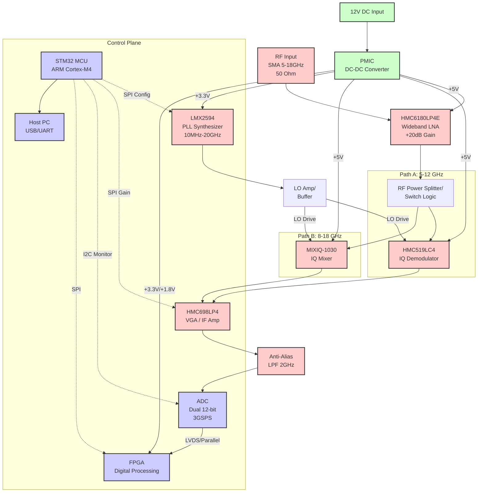
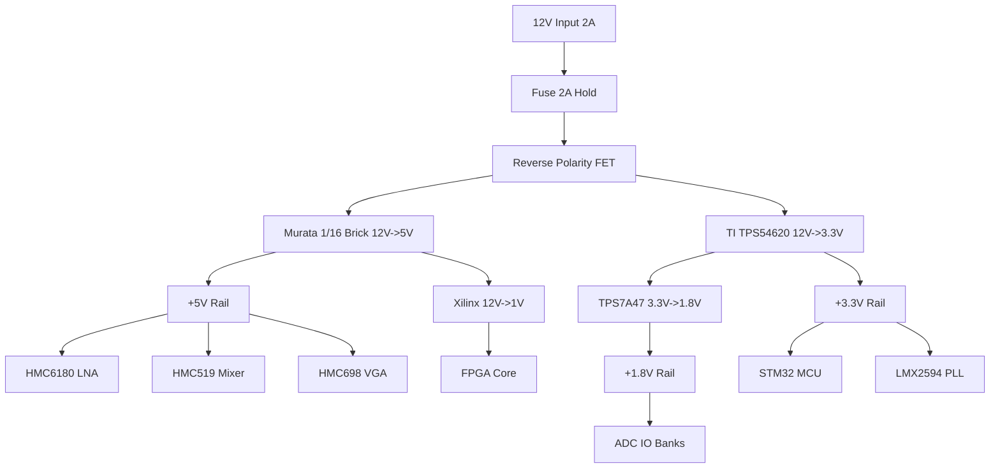

# 1. Introduction

## 1.1 Purpose
This Hardware Requirements Specification (HRS) defines the comprehensive requirements for the design, development, and verification of the **rx receiver** (Wideband RF Receiver). The purpose of this document is to establish a baseline for the hardware architecture, ensuring the system meets the stringent performance necessary for defense electronics applications, specifically covering the 5-18 GHz frequency spectrum with wide instantaneous bandwidth.

This document is intended for:
- **Hardware Engineers:** Detailed guidance for schematic design, component selection, and PCB layout.
- **Verification Engineers:** Criteria for developing test plans and validation procedures.
- **System Architects:** Understanding the physical interfaces, power consumption, and environmental constraints of the receiver module.

The specification mandates the use of specific high-performance components, such as the Analog Devices HMC6180LP4E LNA and Texas Instruments LMX2594 synthesizer, to achieve the target Noise Figure (NF) and Spur-Free Dynamic Range (SFDR) metrics.

## 1.2 Scope
The scope of this document encompasses the complete analog and digital hardware subsystems required to realize a dual-channel I/Q receiver capable of 5-18 GHz operation.

**Included in Scope:**
- **RF Front-End:** Wideband Low Noise Amplifier (LNA), Bandpass Filtering (BPF), and IQ Demodulation (Mixer) circuitry.
- **Frequency Synthesis:** Phase-Locked Loop (PLL) and Voltage Controlled Oscillator (VCO) circuitry for local oscillator generation.
- **Intermediate Frequency (IF) Chain:** Variable Gain Amplifiers (VGA) and anti-aliasing filtering.
- **Digitization:** High-speed Analog-to-Digital Converters (ADC) and interface logic.
- **Digital Processing & Control:** FPGA interface and microcontroller-based SPI/I2C control loops.
- **Power Distribution:** DC-DC conversion, rail sequencing, and power protection.
- **Mechanical Design:** PCB stack-up, connector definitions, and thermal management strategies.

**Excluded from Scope:**
- Baseband DSP algorithms implemented in software (firmware requirements are covered in the SRS).
- Mechanical chassis design beyond the PCB outline (e.g., rack enclosure styling).
- External host system software or drivers.

## 1.3 Definitions, Acronyms, and Abbreviations

| Term | Definition |
| :--- | :--- |
| **ADC** | Analog-to-Digital Converter. Converts continuous analog signals to discrete digital values. |
| **BPF** | Bandpass Filter. A filter that passes frequencies within a certain range and rejects frequencies outside that range. |
| **DC** | Direct Current. The unidirectional flow of electric charge. |
| **FCC** | Federal Communications Commission. Regulatory body for electromagnetic interference in the US. |
|**FPGA** | Field-Programmable Gate Array. An integrated circuit designed to be configured by a customer or a designer after manufacturing. |
| **I/Q** | In-phase and Quadrature components. A representation of a signal where the data is carried by two signals 90 degrees out of phase. |
| **LNA** | Low Noise Amplifier. An electronic amplifier used to amplify very weak signals (e.g., from an antenna) while minimizing added noise. |
| **LO** | Local Oscillator. An electronic oscillator used with a mixer to change signal frequency. |
| **LVDS** | Low-Voltage Differential Signaling. A high-speed digital interface standard. |
| **NF** | Noise Figure. A measure of degradation of the signal-to-noise ratio (SNR), caused by components in a signal chain. |
| **PCB** | Printed Circuit Board. The physical board upon which electronic components are mounted. |
| **PLL** | Phase-Locked Loop. A control system that generates an output signal whose phase is related to the phase of an input reference signal. |
| **P1dB** | 1 dB Compression Point. The point at which the input signal causes the gain to drop by 1 dB from the linear gain. |
| **RF** | Radio Frequency. Oscillation rate of an alternating electric current or voltage, or of a magnetic, electric or electromagnetic field in the frequency range from 20 kHz to 300 GHz. |
| **RoHS** | Restriction of Hazardous Substances. Directive restricting the use of specific hazardous materials in electrical and electronic equipment. |
| **SFDR** | Spurious-Free Dynamic Range. The ratio of the fundamental signal to the strongest spurious signal (spur) in the band of interest. |
| **SNR** | Signal-to-Noise Ratio. A measure used in science and engineering that compares the level of a desired signal to the level of background noise. |
| **SPI** | Serial Peripheral Interface. A synchronous serial communication interface specification used for short-distance communication. |
| **VCO** | Voltage Controlled Oscillator. An oscillator whose oscillation frequency is controlled by a voltage input. |
| **VGA** | Variable Gain Amplifier. An electronic amplifier whose gain can be controlled by a digital or analog signal. |

## 1.4 References
The following standards and documents form the basis of the requirements defined herein. In the event of conflict, the hierarchy of precedence is: 1. This HRS, 2. Component Datasheets, 3. Industry Standards.

| ID | Title | Version/Date | Publisher |
| :--- | :--- | :--- | :--- |
| **IEEE 29148** | Systems and software engineering — Life cycle processes — Requirements engineering | 2018 | IEEE Standards Association |
| **IPC-2221** | Generic Standard on Printed Board Design | Current | IPC |
| **IPC-6012** | Qualification and Performance Specification for Rigid Printed Boards | Current | IPC |
| **MIL-STD-202** | Test Method Standard for Electronic and Electrical Component Parts | Current | US Department of Defense |
| **FCC Part 15** | Radio Frequency Devices | Current | Federal Communications Commission |
| **RoHS 2011/65/EU** | Restriction of the use of certain hazardous substances in electrical and electronic equipment | 2011 | European Union |
| **LMX2594 DS** | LMX2594 Wideband PLLatinum Integrated VCO Synthesizer Datasheet | 2023 | Texas Instruments |
| **HMC6180LP4E DS** | HMC6180LP4E GaAs MMIC PHEMT LNA Datasheet | 2021 | Analog Devices |
| **HMC519LC4 DS** | HMC519LC4 IQ Demodulator Mixer Datasheet | 2019 | Analog Devices |

## 1.5 Overview

### 1.5.1 System Context
The **rx receiver** is a subsystem designed to receive and process Wideband RF signals for electronic warfare, signals intelligence (SIGINT), or software-defined radio (SDR) applications. It functions as a "digitizer" front-end, translating high-frequency RF inputs (5-18 GHz) into digital I/Q data streams for downstream processing.

### 1.5.2 Operational Concept
The system operates by accepting an RF signal via a 50-ohm SMA connector. The signal passes through a Low Noise Amplifier (LNA) to minimize system noise contribution. It is then mixed down to an Intermediate Frequency (IF) or baseband using a high-linearity IQ Mixer driven by a phase-coherent Local Oscillator (LO). The resulting I and Q analog signals are conditioned by Variable Gain Amplifiers (VGAs) to optimize the amplitude for the ADCs. The digitized data is buffered and transmitted to an FPGA via high-speed serial links.

### 1.5.3 Technology Stack
The design leverages a **heterogeneous integration approach**:
- **RF Front-End:** Utilizes Gallium Arsenide (GaAs) and PHEMT technologies (e.g., HMC6180LP4E) for low noise and high linearity.
- **Frequency Synthesis:** Utilizes Fractional-N PLLatinum technology (LMX2594) to achieve low phase noise across the 5-20 GHz range.
- **Digitization:** Uses high-speed CMOS ADC technology capable of >3 GSPS sampling rates.
- **Control:** An ARM Cortex-M4 based microcontroller manages the SPI/I2C buses, ensuring gain control loops and frequency tuning occur with deterministic latency.

### 1.5.4 Key Performance Drivers
The hardware design is driven by three primary "Design KPIs" derived from the project requirements:

1.  **Sensitivity vs. Linearity (SFDR):**
    The design must balance LNA gain (set to 20 dB via HMC6180LP4E) to overcome the noise floor of the mixer and ADC, while ensuring the input P1dB is not exceeded by strong interferers. The SFDR requirement of 80-100 dBc dictates the selection of high-linearity mixers and careful LO drive level planning.

2.  **Phase Noise Purity:**
    With a target of -80 to -85 dBc/Hz, the LO phase noise directly limits the receiver's ability to detect weak signals near strong carriers. The selection of the LMX2594 (-134 dBc/Hz at 1 MHz offset) provides significant margin for this requirement.

3.  **Thermal Density:**
    A power budget of 10-20W in a standard rack-mount enclosure results in high thermal flux. The PCB layout and power supply section (Section 3.5) are designed with thermal vias and copper pours to dissipate heat from the RF front end and FPGA without violating the -40 to +85°C operating range (REQ-HW-008).

---

# 2. System Overview

**Document Status: AI-GENERATED**

## 2.1 System Description

The **rx receiver** is a high-performance, wideband RF downconversion subsystem designed for defense electronics applications. The system functions as a superheterodyne receiver, converting incoming Radio Frequency (RF) signals in the 5.0 GHz to 18.0 GHz spectrum into digitized In-phase (I) and Quadrature (Q) baseband signals. This digitized data is subsequently processed by an onboard Field Programmable Gate Array (FPGA) for signal extraction, filtering, and demodulation.

The receiver architecture utilizes a direct conversion approach (Zero-IF) to maximize instantaneous bandwidth and spur-free dynamic range (SFDR). The system is partitioned into four distinct subsystems:
1.  **RF Front-End (RFFE):** Handles signal reception, limiting, and low-noise amplification.
2.  **Downconversion Stage:** Performs frequency translation using a high-linearity IQ mixer driven by a wideband frequency synthesizer.
3.  **Digitization Stage:** Conditioned analog signals are digitized by dual high-speed ADCs.
4.  **Control & Processing:** A microcontroller unit (MCU) manages gain, frequency tuning, and health monitoring, while the FPGA handles high-throughput data.

The design prioritizes signal integrity and sensitivity. The system achieves a Noise Figure (NF) of 4.0 dB to 6.0 dB and a Spurious-Free Dynamic Range (SFDR) exceeding 80 dBc, making it suitable for complex signal environments in Electronic Warfare (EW) and Signals Intelligence (SIGINT) applications.

### Operational Modes
The system operates in two primary modes:
*   **Tuning Mode:** The host system commands a specific center frequency within the 5–18 GHz range via the SPI interface. The PLL synthesizer adjusts the Local Oscillator (LO) frequency accordingly, settling within 20 µs.
*   **Acquisition Mode:** The system maintains the selected frequency and gain settings, streaming continuous I/Q data to the FPGA buffer for host retrieval.

### Physical Configuration
The unit is designed as a standalone 6U module (approximately 233.35 mm x 160 mm) or a compact, shielded enclosure suitable for rack integration. All sensitive analog circuitry is enclosed in machined aluminum compartments with EMI gaskets to minimize internal RF leakage and external susceptibility.

## 2.2 System Block Diagram

*Figure 2-1: System Block Diagram showing signal flow from RF input through dual downconversion paths to digital output.*

## 2.3 System Architecture

### 2.3.1 Signal Flow Architecture

The **rx receiver** signal chain is designed as a direct-conversion (Zero-IF) receiver. To achieve the exceptionally wide 5–18 GHz bandwidth with high linearity, the RF Front-End is architected using a sub-banding approach.

**1. RF Input Stage (5–18 GHz)**
The signal enters via a precision 2.4mm or SMA connector (depending on frequency module option). The first component is the **HMC6180LP4E** Wideband LNA. This GaAs MMIC provides +20 dB of gain across the entire band. Its low Noise Figure (2.5 dB) ensures the system sensitivity meets the <4 dB target. The output is passed through a bandpass filter (5–18 GHz) to reject out-of-band interference before mixing.

**2. Downconversion Architecture**
Due to the difficulty of constructing a single mixer that maintains high SFDR across 13 GHz of bandwidth, the architecture implements a switchable dual-mixer topology:
*   **Lower Band Path (5–12 GHz):** Utilizes the **HMC519LC4**. This device is optimized for high linearity and excellent I/Q amplitude balance (<0.5 dB error) in this range. It downconverts the RF signal directly to baseband I/Q signals.
*   **Upper Band Path (12–18 GHz):** Utilizes the **MIXIQ-1030**. This Marki Microwave mixer handles the higher frequencies with low conversion loss (8 dB).
*   **Multiplexing:** A high-speed RF switch (controlled by the MCU) routes the LNA output to the appropriate mixer based on the commanded frequency. A single Local Oscillator (LO) chain feeds both mixers.

**3. Local Oscillator (LO) Chain**
Frequency generation is managed by the **LMX2594** PLL synthesizer. This component generates a high-purity CW signal from 10 MHz to 20 GHz.
*   The LMX2594 is chosen for its ultra-low phase noise (-134 dBc/Hz at 1 MHz offset), which is critical to maintain SFDR in narrowband analysis modes.
*   The LO output is amplified and split to drive the LO ports of both mixers simultaneously (active mixers require +10 to +15 dBm drive).

**4. Baseband Processing**
The I and Q outputs from the mixers are differential analog signals centered at DC. These signals pass through:
*   **Variable Gain Amplifier (VGA):** The **HMC698LP4** provides up to 31 dB of gain adjustment. This allows the system to maximize ADC dynamic range by amplifying weak signals and attenuating strong ones to prevent clipping.
*   **Anti-Aliasing Filters:** Passive Low Pass Filters (LPF) with a cutoff of 2 GHz limit the bandwidth before the ADC, satisfying the Nyquist criterion for the 3 GSPS sampling rate.

**5. Digitization**
The filtered analog I/Q signals are digitized by a dual-channel, 12-bit ADC operating at 3 GSPS. This yields an effective noise bandwidth of 1.5 GHz, satisfying the 1-2 GHz instantaneous bandwidth requirement. The digital output is sent to the FPGA via a parallel LVDS bus.

### 2.3.2 Control Architecture

The **Control Plane** is isolated from the **RF Plane** to minimize digital noise coupling into sensitive analog circuitry.

*   **Microcontroller (MCU):** An ARM Cortex-M4 based MCU serves as the system controller. It communicates with the Host PC via a USB-to-UART bridge. It translates high-level commands (e.g., "Set Frequency 10 GHz") into register writes for the PLL, VGA, and ADC.
*   **FPGA:** The FPGA acts as a data buffer and packetizer. It receives high-speed parallel data from the ADC, applies decimation or FFT filtering if configured, and forwards the data to the host via high-speed Ethernet or PCIe (depending on backplane configuration).

### 2.3.3 Power Distribution Architecture

Power is derived from a single 12V DC input (REQ-HW-009). An internal Power Management Board (PMB) performs voltage conversion and isolation.

*   **RF Rails (+5V):** A high-efficiency buck regulator generates the +5V rail required by the GaAs/GaN LNA and Mixers. This rail is heavily filtered (Pi-filter) to prevent switching noise from modulating the RF carrier.
*   **Digital Rails (+3.3V, +1.8V):** Separate LDOs or switching regulators supply the FPGA and ADC.
*   **Sequencing:** The control firmware ensures that the 12V rail is stable before enabling the 5V RF rails to prevent latch-up in sensitive MMICs.

## 2.4 Operating Environment

### 2.4.1 Physical Environment

The **rx receiver** is designed to meet the requirements for ground-based and sheltered defense electronics installations.

**Table 2-1: Operating Environmental Parameters**

| Parameter | Requirement | Design Target | Rationale |
| :--- | :--- | :--- | :--- |
| **Operating Temperature** | -40°C to +85°C | -40°C to +70°C (Continuous)   +85°C (Intermittent) | Industrial temperature range ensures deployment in ground vehicles and unsheltered outdoor cabinets. |
| **Storage Temperature** | -55°C to +125°C | -55°C to +125°C | Standard storage range for electronic components. |
| **Humidity** | 5% to 95% (Non-condensing) | Conformal coating applied | Protection against moisture ingress in tropical environments. |
| **Vibration** | Random 2-200 Hz | MIL-STD-202G Method 214 | Ensures survivability in mobile tactical vehicles. |
| **Shock** | 40G, 11ms | MIL-STD-883 Method 2002 | Mechanical robustness for handling and deployment. |
| **Altitude** | Sea Level to 15,000 ft | Derated to 15,000 ft | Cooling efficiency maintained via fan forced air. |

### 2.4.2 Interface Environment

The system interfaces with the external world through three primary domains:
1.  **RF Input:** Exposed to the external antenna environment. Must survive +20 dBm continuous wave (CW) input without damage (LNA burnout protection is implemented).
2.  **Power Input:** Connected to a vehicle or building 12V DC bus. The input includes protection against reverse polarity and voltage transients (load dump) up to 24V.
3.  **Data/Control:** Connected to a Host PC or embedded processor via USB or Ethernet. These ports are ESD protected (IEC 61000-4-2 Level 4).

### 2.4.3 Regulatory Environment

The system is designed to comply with:
*   **FCC Part 15 Subpart B:** The digital control circuitry is shielded to limit unintentional radiation. The system utilizes a shielded enclosure and filtered I/O lines to meet Class A limits for industrial environments.
*   **RoHS (2011/65/EU):** All PCBs and components are selected to be Lead-Free and RoHS compliant (REQ-HW-012). Tin whisker mitigation is addressed via matte tin plating on connectors.

---

**Document Status: AI-GENERATED**

# 3. Hardware Requirements

## 3.1 Functional Requirements

This section details the functional capabilities of the 5-18 GHz Wideband RF Receiver. Each requirement specifies a distinct behavior or function the system must perform to meet the operational needs defined in the project summary.

| ID | Category | Title | Requirement Description | Rationale | Verification Method | Priority | Derived From |
|---|---|---|---|---|---|---|---|
| **REQ-HW-101** | RF Front End | Wideband Reception | The receiver shall accept and process RF input signals continuously over the frequency range of 5.0 GHz to 18.0 GHz. | Essential to cover the specified defense electronics band (C, X, Ku bands). | Test | Must | Project Summary |
| **REQ-HW-102** | RF Front End | Input Impedance Matching | The RF input port shall present a nominal impedance of 50 Ω ± 10% across the entire operating band. | Ensures minimal signal reflection and maximum power transfer from standard test equipment and antennas. | Test | Must | Design Parameters |
| **REQ-HW-103** | RF Front End | Input Signal Protection | The receiver input shall withstand a maximum input power of +15 dBm (1 sec CW) without permanent degradation, corresponding to the P1dB limit of the selected HMC6180LP4E LNA. | Prevents permanent damage to the sensitive LNA during operation or setup. | Test | Must | HMC6180LP4E Datasheet |
| **REQ-HW-104** | RF Front End | Input Connector Type | The receiver shall utilize a female SMA connector (or 2.4mm precision connector) for the RF input port. | Provides standard mechanical compatibility with RF cabling. | Inspection | Should | REQ-HW-013 |
| **REQ-HW-105** | Signal Path | Low Noise Amplification | The system shall provide a minimum of 20 dB of gain in the first amplification stage using the HMC6180LP4E. | Sets the system noise figure and ensures signal integrity above the noise floor. | Analysis | Must | Component Recs |
| **REQ-HW-106** | Signal Path | Bandpass Filtering | The system shall include a bandpass filter between the LNA and Mixer to reject out-of-band noise and spurious signals (5-18 GHz passband). | Improves Noise Figure and reduces interference susceptibility. | Inspection | Must | Architecture |
| **REQ-HW-107** | Frequency Conversion | Dual-Band Downconversion | The system shall perform I/Q downconversion of the RF signal to baseband/IF. The lower band (5-12 GHz) shall utilize the HMC519LC4, and the upper band (12-18 GHz) shall utilize the MIXIQ-1030 or equivalent wideband mixer architecture. | Ensures coverage of the full 5-18 GHz range using optimal components for specific sub-bands. | Test | Must | Component Recs |
| **REQ-HW-108** | Frequency Conversion | Local Oscillator Generation | The system shall synthesize LO signals from 5 GHz to 20 GHz using the LMX2594 PLL to cover all necessary mixing frequencies. | Provides the tuning capability required to select the desired RF channel. | Test | Must | LMX2594 Specs |
| **REQ-HW-109** | IF Processing | Variable Gain Control | The system shall provide a digitally adjustable gain range of 31 dB in the IF stage using the HMC698LP4. | Allows the system to handle varying input signal strengths to maximize ADC dynamic range. | Test | Must | REQ-HW-015 |
| **REQ-HW-110** | IF Processing | Anti-Aliasing Filtering | The system shall filter the IF output prior to digitization with a cutoff frequency suitable for the instantaneous bandwidth (max 2.0 GHz). | Prevents aliasing artifacts during Analog-to-Digital conversion. | Analysis | Must | Design Parameters |
| **REQ-HW-111** | Digitization | Dual I/Q Sampling | The system shall digitize I and Q analog signals simultaneously using dual ADC channels. | Required to preserve phase and amplitude information for complex signal processing. | Test | Must | REQ-HW-016 |
| **REQ-HW-112** | Digitization | Sampling Rate | The ADC sampling rate shall be configurable up to a minimum of 3.0 GSPS to satisfy Nyquist criteria for the 2.0 GHz instantaneous bandwidth (assuming complex sampling or high-speed real sampling). | Ensures signal fidelity across the full target bandwidth. | Test | Must | Design Parameters |
| **REQ-HW-113** | Digitization | Resolution | The ADC output resolution shall be 12 bits to satisfy the dynamic range requirement of 80-90 dB. | Theoretical SNR of a 12-bit ADC is approx 74 dB; combined with processing gain, this targets the required range. | Inspection | Must | Dynamic Range Req |
| **REQ-HW-114** | Digital Control | SPI Configuration Interface | The MCU (Control Domain) shall configure the PLL (LMX2594), VGA (HMC698LP4), and ADC via a Serial Peripheral Interface (SPI) operating at a minimum of 10 MHz. | SPI is the standard interface for high-speed configuration of these specific RF components. | Test | Must | Component Recs |
| **REQ-HW-115** | Digital Control | Frequency Agility | The system shall be capable of switching the LO frequency and settling to a new stable frequency within 20 µs via the SPI interface. | Required for frequency hopping or fast scanning applications typical in defense. | Test | Should | LMX2594 Specs |
| **REQ-HW-116** | Digital Control | Gain Calibration | The system shall allow the host to set the VGA gain index via SPI registers to 1 dB resolution steps. | Provides precise gain control for automatic gain control (AGC) loops. | Test | Must | HMC698LP4 Specs |
| **REQ-HW-117** | Data Interface | High-Speed Data Output | The digitized I/Q data shall be transmitted from the ADC to the FPGA via JESD204B or parallel LVDS interfaces. | Standard high-speed interface for moving data from ADC to processing logic. | Test | Must | ADC Interface |
| **REQ-HW-118** | Power Management | Input Supply Range | The system shall accept a DC input voltage of 12V ± 10% (10.8V to 13.2V). | Standard vehicular/industrial supply voltage. | Test | Must | REQ-HW-009 |
| **REQ-HW-119** | Power Management | Power Distribution | The 12V input shall be converted to +5V (RF chain), +3.3V (FPGA/Logic), and +1.8V/1.0V (FPGA Core) rails using high-efficiency DC-DC converters. | Different components require specific voltage levels for operation. | Inspection | Must | Architecture |
| **REQ-HW-120** | Physical | PCB Form Factor | The printed circuit board (PCB) dimensions shall not exceed 160mm x 100mm to fit within a standard 6U enclosure or rack-mount chassis. | Ensures mechanical compatibility with the target enclosure. | Inspection | Should | REQ-HW-018 |
| **REQ-HW-121** | Physical | Mounting Features | The PCB shall include mounting holes at the four corners, clearance for 2-56 or M3 screws. | Standard mechanical mounting requirement. | Inspection | Could | Enclosure Spec |
| **REQ-HW-122** | Control | Host Interface | The system shall expose a USB or UART interface from the MCU to the Host PC for control command and status telemetry. | Enables the user to control the receiver from an external computer. | Test | Must | Block Diagram |

---

## 3.2 Performance Requirements

This section defines the quantitative performance characteristics the receiver must exhibit. These values are derived from the "Design Parameters" and the capabilities of the selected components (HMC6180, LMX2594, HMC698, etc.).

### 3.2.1 RF Performance

| ID | Metric | Requirement Description | Target Value | Verification Method | Priority |
|---|---|---|---|---|---|
| **REQ-HW-P01** | Instantaneous Bandwidth | The receiver shall process a contiguous block of spectrum defined by the ADC sampling and filter bandwidth. | Minimum: 1.0 GHz Target: 2.0 GHz | Test | Must |
| **REQ-HW-P02** | System Noise Figure | The overall noise figure from the antenna port to the ADC input, calculated via the Friis noise equation assuming the HMC6180 (2.5dB) followed by mixer and IF losses. | Maximum: 6.0 dB Target: ≤ 4.5 dB | Analysis / Test | Must |
| **REQ-HW-P03** | Gain Flatness | The peak-to-peak variation in gain across the full instantaneous bandwidth (e.g., 1-2 GHz window). | ≤ 2.0 dB p-p | Test | Should |
| **REQ-HW-P04** | Input Return Loss | The ratio of incident power to reflected power at the RF input port across 5-18 GHz. | ≥ 10 dB (VSWR ≤ 2:1) | Test | Should |
| **REQ-HW-P05** | Dynamic Range | The ratio of the largest to smallest signals the system can process, defined as the difference between P1dB and MDS (Minimum Detectable Signal) or Noise Floor. | 80 - 90 dB | Test | Must |
| **REQ-HW-P06** | Spur-Free Dynamic Range (SFDR) | The range of input signals free from spurious signals, determined by the linearity of the Mixer and ADC. | 80 - 100 dBc | Test | Must |
| **REQ-HW-P07** | Phase Noise | The single-sideband phase noise of the Local Oscillator (LO), referenced to the carrier. | -80 dBc/Hz @ 10 kHz offset -85 dBc/Hz @ 100 kHz offset | Test | Must |
| **REQ-HW-P08** | LO Settling Time | The time required for the LO frequency to switch and stabilize within ±1 ppm of the target frequency after a SPI command. | ≤ 20 µs | Test | Should |

### 3.2.2 Power Performance

| ID | Metric | Requirement Description | Target Value | Verification Method | Priority |
|---|---|---|---|---|---|
| **REQ-HW-P09** | Total Power Consumption | Total power drawn from the 12V supply under typical operating conditions (Full Gain, LO Active, FPGA Processing). | 10 W - 20 W | Test | Must |
| **REQ-HW-P10** | RF Chain Power Consumption | Power drawn by the +5V rail (LNA, Mixers, PLL, VGA). | Calculated: ~3.5 W | Analysis | Must |
| **REQ-HW-P11** | Digital Chain Power Consumption | Power drawn by the +3.3V and +1.xV rails (ADC, FPGA, MCU). | Calculated: ~6.5 W | Analysis | Must |

**Detailed Power Calculation (Justification for REQ-HW-P09):**
*Total budget is derived as follows:*
1.  **HMC6180LP4E (LNA):** 5V @ 90mA = 0.45 W
2.  **HMC519LC4 / Mixer:** 5V @ 160mA (est) = 0.80 W
3.  **LMX2594 (PLL):** 3.3V @ 380mA = 1.25 W
4.  **HMC698LP4 (VGA):** 5V @ 100mA = 0.50 W
5.  **ADC (Dual, High Speed):** 1.8V/3.3V @ 2W (est) = 2.00 W
6.  **FPGA (Signal Processing):** Core 1.0V @ 4A (est) = 4.00 W
7.  **MCU & Misc:** 3.3V @ 200mA = 0.66 W
8.  **Regulator Efficiency Losses:** (10% overhead) = ~1.0 W
*   **Total Estimated Power:** 0.45 + 0.8 + 1.25 + 0.5 + 2.0 + 4.0 + 0.66 + 1.0 ≈ **10.66 W**.
*   **Conclusion:** The design fits comfortably within the 10-20W requirement (REQ-HW-P09).

### 3.2.3 Environmental Performance

| ID | Metric | Requirement Description | Target Value | Verification Method | Priority |
|---|---|---|---|---|---|
| **REQ-HW-P12** | Operating Temperature | The ambient temperature range in which the system meets all performance specifications. | -40°C to +85°C | Test | Must |
| **REQ-HW-P13** | Operating Humidity | Non-condensing relative humidity range. | 5% to 95% RH | Test | Should |
| **REQ-HW-P14** | Thermal Management | The PCB shall utilize a ground plane and thermal vias under the FPGA and RF Power Amplifiers to keep junction temperatures < 100°C at +85°C ambient. | Θja < 20°C/W (for critical ICs) | Analysis | Must |

---

**Document Status: AI-GENERATED**

## 3.3 Interface Requirements

This section details the electrical and mechanical interfaces required for the rx receiver to integrate with the host system, power sources, and RF input signals. The interface design is based on the selected components: HMC6180LP4E, HMC519LC4/MIXIQ-1030, LMX2594, and HMC698LP4.

### 3.3.1 External Interfaces

External interfaces define the connections between the rx receiver module and the outside world, including RF inputs, power supplies, and host communication.

#### 3.3.1.1 RF Input Interface

| ID | Requirement | Description |
|---|---|---|
| **REQ-HW-019** | RF Input Connector Type | The receiver shall utilize a high-frequency SMA (Female) connector for the RF input port, compatible with 0.047" semi-rigid or RG-316 coaxial cables. |
| **REQ-HW-020** | RF Input Impedance | The RF input port shall present a nominal differential impedance of 50Ω to the source. |
| **REQ-HW-021** | RF Input VSWR | The input VSWR shall be less than 2.0:1 across the 5-18 GHz operating band (derived from REQ-HW-014 return loss requirement). |
| **REQ-HW-022** | RF Input Maximum Power | The receiver shall withstand a maximum input power of +20 dBm (100 mW) continuous wave (CW) without damage, assuming the LNA (HMC6180LP4E) has P1dB of +15 dBm and Max Input of +20 dBm. |
| **REQ-HW-023** | RF Input DC Blocking | The RF input path shall include a DC blocking capacitor to protect the LNA from external DC voltages. |

#### 3.3.1.2 Power Supply Interface

| ID | Requirement | Description |
|---|---|---|
| **REQ-HW-024** | Main Power Input Connector | The receiver shall utilize a 2-pin screw terminal connector or a 4-pin Molex Micro-Fit 3.0 connector for the main 12V DC input. |
| **REQ-HW-025** | Supply Voltage Range | The system shall operate correctly with an input voltage of 12V DC ±10% (10.8V to 13.2V). |
| **REQ-HW-026** | Reverse Polarity Protection | The power input circuitry shall include a Schottky diode or ideal diode circuit to prevent damage from reverse voltage connection. |
| **REQ-HW-027** | Inrush Current Limiting | The 12V input shall include a soft-start circuit or NTC thermistor to limit inrush current to less than 5A at startup. |

#### 3.3.1.3 Host Control Interface

| ID | Requirement | Description |
|---|---|---|
| **REQ-HW-028** | Physical Interface Layer | The digital control interface to the host computer shall be implemented via a USB 2.0 Micro-B connector. |
| **REQ-HW-029** | USB Enumeration | The receiver shall enumerate as a USB Communications Device Class (CDC) virtual COM port to allow generic driver operation on Windows/Linux. |

### 3.3.2 Internal Interfaces

Internal interfaces define the data and control flow between functional blocks on the PCB (e.g., MCU to ADC, FPGA to ADC).

#### 3.3.2.1 ADC to FPGA Interface

The Analog-to-Digital Converter (ADC) interface utilizes JESD204B standard to transfer high-speed I/Q data to the FPGA.

**Table 3-1: ADC-FPGA JESD204B Lane Assignment**

| Lane ID | Signal Name | Source | Destination | Voltage | Description |
|---|---|---|---|---|---|
| J0_L0_P | Lane 0 Positive | ADC (JESD Lane 0) | FPGA Bank 65 | 1.8V CML | Serial Data Lane 0+ |
| J0_L0_N | Lane 0 Negative | ADC (JESD Lane 0) | FPGA Bank 65 | 1.8V CML | Serial Data Lane 0- |
| J0_SCLK_P | Sync Clock P | ADC | FPGA | 1.8V CML | Frame Clock+ |
| J0_SCLK_N | Sync Clock N | ADC | FPGA | 1.8V CML | Frame Clock- |
| J0_SYNC | SYSREF | FPGA/GTY | ADC | 1.8V LVDS | System Sync (Subclass 1) |

| ID | Requirement | Description |
|---|---|---|
| **REQ-HW-030** | JESD204B Link Rate | The interface shall support a lane rate of 6.25 Gbps to accommodate two 12-bit ADCs running at 3.0 GSPS. |
| **REQ-HW-031** | FPGA Bank Voltage | The FPGA I/O banks receiving JESD204B signals shall be supplied with 1.8V VCCO to match the ADC's output logic levels. |

#### 3.3.2.2 MCU Local Bus Interface

The MCU utilizes SPI buses to configure the RF components. The following table details the pin routing for the Analog Devices HMC519 and TI LMX2594.

**Table 3-2: MCU-to-Synthesizer (LMX2594) SPI Interface**

| Pin Name | Direction | MCU Port | Voltage | Description |
|---|---|---|---|---|
| CSB_LO | Output | GPIO_09 | 3.3V | Chip Select (Active Low) |
| SCK_LO | Output | SPI_SCK | 3.3V | Serial Clock (Max 20 MHz) |
| SDIO_LO | Bi-Dir | SPI_MOSI | 3.3V | Serial Data Input/Output |
| SYNC_LO | Output | GPIO_10 | 3.3V | Synchronization Trigger |

**Table 3-3: MCU-to-VGA (HMC698LP4) SPI Interface**

| Pin Name | Direction | MCU Port | Voltage | Description |
|---|---|---|---|---|
| CSB_VGA | Output | GPIO_11 | 3.3V | Chip Select (Active Low) |
| SCK_VGA | Output | SPI_SCK | 3.3V | Shared Serial Clock |
| SDI_VGA | Input | SPI_MOSI | 3.3V | Serial Data Input |
| SDO_VGA | Output | SPI_MISO | 3.3V | Serial Data Output |

| ID | Requirement | Description |
|---|---|---|
| **REQ-HW-032** | SPI Level Shifting | All control signals to the RF chain (operating at mixed 3.3V/5V logic) shall utilize level shifters or buffer translators to ensure logic level compatibility (e.g., TXB0108). |

### 3.3.3 Communication Interfaces

This section specifies the protocols used for component configuration and system monitoring.

#### 3.3.3.1 SPI (Serial Peripheral Interface)

| ID | Requirement | Description |
|---|---|---|
| **REQ-HW-033** | SPI Mode Support | The MCU shall support SPI Mode 0 (CPOL=0, CPHA=0) for communication with the LMX2594 Synthesizer. |
| **REQ-HW-034** | SPI Clock Frequency | The SPI clock frequency for configuring the PLL shall be programmable up to 20 MHz. |
| **REQ-HW-035** | Write/Read Verification | The firmware shall verify all write operations to the PLL and VGA by performing a read-back of the register contents. |

#### 3.3.3.2 I2C (Inter-Integrated Circuit)

| ID | Requirement | Description |
|---|---|---|
| **REQ-HW-036** | I2C Bus Speed | The I2C bus shall operate at Standard Mode (100 kHz) or Fast Mode (400 kHz) for FPGA configuration and EEPROM access. |
| **REQ-HW-037** | I2C Addressing | The system shall utilize a 7-bit addressing scheme. The on-board identification EEPROM shall be located at address 0x50. |

## 3.4 Environmental Requirements

The rx receiver is designed for rugged industrial and defense applications. Requirements are derived from MIL-STD-202 where applicable for electronic assemblies.

| ID | Requirement | Description |
|---|---|---|
| **REQ-HW-038** | Operating Temperature (Commercial) | The system shall maintain full electrical specifications (NF, Gain, SFDR) from 0°C to +70°C. |
| **REQ-HW-039** | Operating Temperature (Industrial) | The system shall function with performance degradation (≤ 1 dB NF increase) from -40°C to +85°C (REQ-HW-008). |
| **REQ-HW-040** | Storage Temperature | The system shall survive storage temperatures ranging from -55°C to +125°C without physical damage or battery backup data loss. |
| **REQ-HW-041** | Thermal Shutdown | The DC-DC converters and the FPGA shall have internal thermal shutdown protection set to +115°C junction temperature. |
| **REQ-HW-042** | Relative Humidity | The system shall operate in 5% to 95% relative humidity (non-condensing). |
| **REQ-HW-043** | Vibration | The system shall withstand random vibration of 0.05 g²/Hz from 10 Hz to 500 Hz for 2 hours per axis (operational). |
| **REQ-HW-044** | Shock | The system shall withstand mechanical shock of 40G, 11 ms pulse, half-sine wave, 3 shocks per axis (total 18 shocks). |
| **REQ-HW-045** | Altitude | The system shall operate at altitudes up to 15,000 feet (4,572 meters) without requiring derating (derating applies above this altitude). |

**Figure 3-1: Derating Curve for Temperature**
*(Note: As junction temperature approaches +85°C, the maximum RF output power may be reduced by 1 dB to maintain reliability.)*

## 3.5 Power Requirements

This section details the power consumption, distribution, and budget for the system. Calculations are based on the typical current consumption of the selected components.

### 3.5.1 Power Budget

The system utilizes a 12V main supply. The following table breaks down power consumption by functional block.

**Table 3-4: Detailed Power Budget**

| Functional Block | Component(s) | Supply Rail (V) | Est. Current (A) | Power (W) | Derating (1.2x) | Notes |
|---|---|---|---|---|---|---|
| **RF Front End** | HMC6180LP4E (LNA) | +5.0 | 0.09 | 0.45 | 0.54 | GaAs PHEMT |
| | HMC519LC4 (Mixer) | +5.0 | 0.15 | 0.75 | 0.90 | IQ Modulator |
| | MIXIQ-1030 (Mixer Alt) | +5.0 | 0.10 | 0.50 | 0.60 | Passive Mixer Bias |
| **IF Chain** | HMC698LP4 (VGA) | +5.0 | 0.12 | 0.60 | 0.72 | Digital VGA |
| **Synthesis** | LMX2594 (PLL) | +3.3 | 0.25 | 0.83 | 1.00 | Includes VCO |
| **Conversion** | ADC (Dual 3GSPS) | +3.3/+1.8 | 2.50 | 4.50 | 5.40 | High Speed Logic |
| **Processing** | FPGA (Mid-Range) | +1.0 (Core) | 5.00 | 5.00 | 6.00 | Assuming DSP utilization |
| | FPGA IO | +2.5/+3.3 | 0.50 | 1.65 | 1.98 | Bank supplies |
| **Digital Control** | MCU (ARM M4) | +3.3 | 0.05 | 0.17 | 0.20 | Sleep mode avg |
| **Auxiliary** | Fans/Ctrl | +12.0 | 0.30 | 3.60 | 4.32 | Forced cooling |
| **Losses** | DC-DC Converters | N/A | N/A | 2.00 | 2.40 | Est. 85% Eff. |
| **TOTAL** | | | **~4.61** | **~15.65** | **~17.06** | |

| ID | Requirement | Description |
|---|---|---|
| **REQ-HW-046** | Total Power Consumption | The total power consumption shall not exceed 20.0 Watts at 12V DC input (REQ-HW-010). Calculated typical consumption is 15.65W. |
| **REQ-HW-047** | Rail Sequencing | The power supply shall sequence the +1.0V FPGA core voltage to ramp up *before* the FPGA IO banks (+2.5V/3.3V) to prevent latch-up. |
| **REQ-HW-048** | Power Supply Rejection | The LDO supplies for the PLL and VCO shall have a PSRR of > 60 dB at 1 MHz offset to minimize phase noise degradation. |

### 3.5.2 Power Distribution Diagram

## 3.6 Physical Requirements

The physical design ensures compatibility with standard defense electronics enclosures (e.g., 6U VPX or similar rack-mount chassis).

| ID | Requirement | Description |
|---|---|---|
| **REQ-HW-049** | PCB Form Factor | The Printed Circuit Board (PCB) shall conform to Eurocard (220mm x 160mm) dimensions, optimized for a 6U slot, or a custom 4U 19-inch rack mount footprint of 6.5" x 9.0" (165mm x 229mm). |
| **REQ-HW-050** | PCB Stackup | The PCB shall consist of a minimum of 10 layers using Rogers RO4350B material (εr = 3.48) for RF signal layers to minimize dielectric loss and dispersion at 18 GHz. |
| **REQ-HW-051** | Plating Finish | The PCB shall utilize Electroless Nickel Immersion Gold (ENIG) finish for the edge connectors and Immersion Silver for the RF traces to ensure low skin-effect loss. |
| **REQ-HW-052** | RF Connector Placement | RF Input (SMA) connectors shall be placed on the front panel edge of the PCB to minimize cable stub length inside the chassis. |
| **REQ-HW-053** | Cooling Method | The system shall utilize forced air cooling. The PCB shall include a heatsink pad for the FPGA and an airflow gap of at least 0.2 inches beneath the board. |
| **REQ-HW-054** | Mounting Holes | The PCB shall have four (4) #4-40 mounting holes in the corners with electrically grounded plated through holes to the chassis ground plane. |
| **REQ-HW-055** | Shielding | RF sensitive sections (LNA, Mixer, PLL) shall be covered with a custom shield can (tin-plated brass) with a height of 0.25 inches to prevent EMI coupling from the digital section. |

**Table 3-5: Physical Dimensions**

| Parameter | Target Value | Unit |
|---|---|---|
| Board Length | 229.0 | mm |
| Board Width | 165.0 | mm |
| Board Thickness | 1.6 | mm (Standard 0.062") |
| Weight (Max) | 450 | grams |
| Operating Orientation | Horizontal | ( airflow parallel to PCB ) |

---

# 4. Design Constraints

## 4.1 Standards Compliance

The design, manufacturing, and testing of the RX Receiver hardware shall adhere to the following standards and regulatory requirements. Compliance ensures reliability, interoperability, and legal marketability in target regions.

### 4.1.1 Electromagnetic Compatibility (EMC) and Regulatory
**REQ-HW-020** The system shall comply with **FCC Part 15 Subpart B** for unintentional radiators.
*   **Constraint Detail:** The digital clocking (ADC, FPGA) and switching power supplies (DC-DC converters) must not emit radiated emissions exceeding the limits specified in Section 15.109 of the rules.
*   **Design Implementation:** Utilization of spread-spectrum clocking for the FPGA and DC-DC converters where possible. All RF input lines shall employ pi-filter networks. Shielding cans shall be placed over the LO synthesizer (LMX2594) and switching regulators to suppress harmonic radiation.
*   **Verification Method:** Radiated emissions testing per ANSI C63.4 at a 3m distance.

**REQ-HW-021** The system shall comply with **IEC 61000-4-3** (Immunity to Radiated Radio Frequency Electromagnetic Fields).
*   **Constraint Detail:** The receiver must maintain functionality (SFDR > 60 dBc, gain variation < 2 dB) when exposed to 3 V/m field strength from 80 MHz to 2.5 GHz.
*   **Design Implementation:** The enclosure must provide effective shielding (minimum 60 dB attenuation) at all apertures. Cable penetrations must use filtered D-sub or circular connectors with feedthrough capacitors.

### 4.1.2 Environmental and Safety
**REQ-HW-022** All printed circuit board assemblies (PCBAs) shall comply with **IPC-6012 Class 3** (High Performance Electronic Products).
*   **Constraint Detail:** This standard dictates strict plating thickness, hole wall quality, and laminate integrity suitable for harsh environments (defense/aerospace).
*   **Specific Limits:**
    *   Minimum copper plating in barrels: 20 µm (0.0008 in).
    *   Solder mask adhesion: No lifting after 3 cross-hatch tape tests.
    *   Delamination: None allowed after thermal shock or humidity stress.

**REQ-HW-023** The system shall comply with **RoHS 3 Directive 2011/65/EU** and **REACH (EC 1907/2006)**.
*   **Constraint Detail:** Lead (Pb) < 0.1%, Mercury (Hg) < 0.1%, Cadmium (Cd) < 0.01%, Hexavalent Chromium (CrVI) < 0.1%. Polybrominated Biphenyls (PBB) and Polybrominated Diphenyl Ethers (PBDE) < 0.1%.
*   **Exemption Note:** Military applications may claim exemption for high-reliability lead-based solder (Sn63Pb37) if required by higher-level system specifications, but the default design intent is lead-free (SAC305) to support RoHS compliance.

**REQ-HW-024** Electrical safety shall comply with **IEC 60950-1** (Information Technology Equipment - Safety).
*   **Constraint Detail:** Given the 12V input, the unit is considered Safety Extra-Low Voltage (SELV). However, the internal 5V and 3.3V rails must have over-current protection (OCP) to prevent fire hazards in fault conditions (e.g., LNA short circuit).

### 4.1.3 Hardware Design and Layout
**REQ-HW-025** PCB design shall follow **IPC-2221 Generic Standard on Printed Board Design**.
*   **Constraint Detail:**
    *   **Trace Width:** Current carrying capacity for external layers must allow for a minimum temperature rise of 10°C.
        *   *Calculation:* For the 12V main rail carrying max 2A (derived from 24W total), a 2 oz (70 µm) copper trace must be minimum **40 mil (1.0 mm)** wide (IPC-2221 Chart).
    *   **Clearance:** For 12V input, minimum conductor spacing shall be 20 mil (0.5 mm) to prevent arcing in high humidity.
    *   **Via Stitching:** Via stitching must be placed at $\lambda/20$ intervals around the RF input perimeter to suppress cavity modes at 18 GHz (approx. 16.6 mm wavelength in FR4). Target spacing: **25 mm**.

## 4.2 Component Constraints

This section defines specific restrictions on component selection to ensure supply chain stability, signal integrity, and reliability over the operating temperature range (-40°C to +85°C).

### 4.2.1 Temperature and Reliability Ratings
**REQ-HW-026** All active components (ICs) and critical passives (capacitors in RF path, voltage references) must be rated for the **Industrial Temperature Range** (-40°C to +85°C) or **Military Temperature Range** (-55°C to +125°C).
*   **Constraint Detail:** Commercial grade (0°C to +70°C) components are strictly prohibited.
*   **Specific Application:**
    *   The LNA (HMC6180LP4E) is available in commercial grade; the specific variant ordered must be the industrial equivalent or characterized for -40°C startup.
    *   The MCU (ARM Cortex) must be specified to retain timing parameters (clock speed) at -40°C and +85°C without requiring under-clocking.

**REQ-HW-027** Voltage Derating
*   **Constraint Detail:** All capacitors and semiconductors must be derated by 20% for voltage.
    *   The HMC6180LP4E LNA runs on 5V. The input decoupling capacitors must be rated for at least **6.3V** (5V / 0.8 = 6.25V).
    *   The 12V rail input bulk capacitance must be rated for **16V** minimum (12V / 0.8 = 15V).

### 4.2.2 Component Obsolescence and Sourcing
**REQ-HW-028** Component Lifecycle Status
*   **Constraint Detail:** Components flagged as "Not Recommended for New Design" (NRND) or "Last Time Buy" (LTB) are prohibited unless a waiver is signed by the Chief Engineer.
*   **Alternative Sourcing:** For every Critical Component (Category A), there must be a validated Second Source.
    *   *Example:* The LMX2594 PLL is the primary choice. The design must accommodate the footprint for the **ADF5356** as a secondary source, which involves ensuring the loop filter layout can support either pinout without violating IPC-2221 clearances.

**REQ-HW-029** Package Restrictions
*   **Constraint Detail:** To facilitate assembly and rework in industrial environments, packages smaller than **0201** (imperial) are prohibited for passive components.
*   **Pitch Restrictions:** BGA packages with ball pitch < 0.8 mm require specific X-ray inspection capability; otherwise, use QFN or QFP packages. The selected HMC6180LP4E uses a 4x4 mm QFN (0.8 mm pitch), which is acceptable for standard optical inspection (IPC-A-610).

### 4.2.3 RF Specific Constraints
**REQ-HW-030** Dielectric Material
*   **Constraint Detail:** The substrate for the RF Front-End (up to the Mixer output) must have a stable Dielectric Constant ($D_k$) over frequency and temperature.
*   **Allowed Materials:**
    *   **Rogers RO4350B:** $D_k = 3.48 \pm 0.05$. Required for the 5-18 GHz matching networks and couplers.
    *   **Isola FR408HR:** $D_k = 3.68$. Acceptable for the IF sections (< 6 GHz) and digital control to reduce cost.
*   **Loss Tangent:** Must be $\leq 0.0037$ at 10 GHz to prevent excessive insertion loss that would degrade the Noise Figure (REQ-HW-003).

**REQ-HW-031** Crystal Oscillator Stability
*   **Constraint Detail:** The reference clock for the LMX2594 PLL must maintain stability within $\pm 0.5$ ppm over the operating temperature range to maintain Phase Noise performance (REQ-HW-006).
*   **Constraint:** A standard AT-cut crystal is insufficient. An **OCXO (Oven Controlled Crystal Oscillator)** or **TCXO (Temperature Compensated)** is mandatory.

## 4.3 Manufacturing Constraints

These constraints ensure the design can be manufactured using standard electronic manufacturing processes without creating unique tooling or specialized handling that would drive up the unit cost or yield loss.

### 4.3.1 Assembly Technology
**REQ-HW-032** Solder Paste and Profile
*   **Constraint Detail:** The assembly house shall use **SAC305** (Sn96.5Ag3.0Cu0.5) solder paste or equivalent RoHS-compliant alloy.
*   **Thermal Profile:** The peak temperature shall not exceed 245°C to protect the RF ICs (specifically the GaAs PHEMT LNA and Mixer). The time above liquidus (TAL) shall be between 60-90 seconds to ensure proper wetting of the ground pads on the QFN packages without damaging internal bonds.

**REQ-HW-033** Panelization
*   **Constraint Detail:** PCBs shall be panelized in a 2x2 or 2x3 array.
*   **Tooling Holes:** Non-plated tooling holes (2.0mm diameter) must be placed on the four corners of the panel with a tolerance of $\pm 0.05$ mm for automated pick-and-place and test fixture alignment.
*   **Fiducials:** Global fiducials (1.0 mm copper clear, 1.5 mm opening) must be placed on the panel rails. Local fiducials must be placed adjacent to fine-pitch ICs (FPGA, MCU).

### 4.3.2 Inspection and Test
**REQ-HW-034** Automated Optical Inspection (AOI)
*   **Constraint Detail:** The PCB layout must allow clear optical access for AOI cameras.
*   **Constraint:** No components shall be placed on the opposite side of the board directly under BGA/QFN parts to prevent shadowing during X-ray inspection of solder joints.

**REQ-HW-035** Bed-of-Nails Test
*   **Constraint Detail:** The board must include a dedicated test probe area (padding) on all critical nets (Power rails, SPI lines, Enable signals, ADC outputs).
*   **Via Pitch:** Test pads (1.0 mm diameter) must be spaced on a 100 mil grid minimum to accommodate standard spring probes.

### 4.3.3 Conformal Coating and Enclosure
**REQ-HW-036** Conformal Coating Compatibility
*   **Constraint Detail:** As this unit operates in a "high humidity / condensation" potential environment (implied by -40°C range), all PCBAs shall receive Acrylic or Urethane conformal coating (IPC-CC-830).
*   **Design Impact:** Adjustable components (trim pots, RF tuners) are prohibited. All "set and forget" functions must be digitally controlled via SPI/I2C rather than mechanical adjustments.

**REQ-HW-037** Thermal Management
*   **Constraint Detail:** The PCB stack-up must utilize thermal vias (via-in-pad) under the ground paddle of the LNA, Mixer, and ADC.
*   **Via Array:** Minimum 4x4 array of 0.3mm vias for the ADC and LNA thermal pads to conduct heat to the bottom-side ground plane or chassis heat sink.
*   **Derating:** The 12V DC-DC converter must be mounted such that its case temperature ($T_c$) does not exceed 100°C under worst-case ambient loading (85°C). If forced air cooling is not available, a heat spreader (copper or aluminum) bonded to the PCB is required.

---

# 5. Verification Requirements

This section defines the verification methods for all hardware requirements specified in Section 3. It establishes the criteria for determining whether the "rx receiver" hardware meets its design specifications and performance goals. Verification is categorized into three methods: **Test** (measuring performance under operational conditions), **Analysis** (mathematical or simulation modeling), and **Inspection** (visual or non-invasive examination).

## 5.1 Test Requirements

This subsection details the specific test cases, procedures, and equipment required to validate the functional and performance capabilities of the receiver. These tests are to be conducted on the integrated assembled Printed Circuit Board Assembly (PCBA).

### 5.1.1 RF Performance Test Plan

The following test cases verify the analog RF front-end performance, utilizing the selected component characteristics (HMC6180LP4E LNA, HMC519LC4 Mixer, LMX2594 PLL).

| Test Case ID | Requirement ID | Test Description | Test Equipment / Setup | Pass Criteria |
| :--- | :--- | :--- | :--- | :--- |
| **TC-HW-001** | REQ-HW-001 REQ-HW-013 | **Frequency Coverage & Input Interface** Verify receiver tunes across 5.0–18.0 GHz and accepts 50-ohm input. | 1. Signal Generator (e.g., Keysight N5183B) 2. Spectrum Analyzer (e.g., Keysight N9030B) 3. 2.4mm Calibration Kit | 1. Successful detection of CW tone at every 0.5 GHz step from 5.0 to 18.0 GHz. 2. Input Return Loss ≤ 10 dB (VSWR ≤ 2:1) across the band. |
| **TC-HW-002** | REQ-HW-002 | **Instantaneous Bandwidth** Verify the system processes a 2.0 GHz wide signal. | 1. Vector Signal Generator (e.g., R&S SMW200A) 2. Real-Time Oscilloscope or High-Speed ADC Capture Card | 1. Modulated signal (e.g., QAM16) with 2.0 GHz bandwidth centered at 10 GHz is demodulated with EVM ≤ 5% (or industry equivalent). |
| **TC-HW-003** | REQ-HW-003 | **Noise Figure (NF)** Measure system Noise Figure. | 1. Noise Source (e.g., NC346V) 2. Spectrum Analyzer with Noise Figure Measurement Personality | 1. Measured NF ≤ 6.0 dB (Target ≤ 4.0 dB) across the band. *Calculation Basis: 2.5 dB (LNA) + 0.5 dB (Filter Loss) + 7 dB (Mixer NF - 10 dB Gain) ≈ System NF.* |
| **TC-HW-004** | REQ-HW-004 | **Dynamic Range** Measure input range from noise floor to 1dB compression. | 1. Signal Generator & Spectrum Analyzer 2. Power Meter | 1. Noise floor measured at ≤ -80 dBm (Ref Input). 2. P1dB measured at ≥ -20 dBm (Ref Input). 3. Calculated Dynamic Range ≥ 80 dB. |
| **TC-HW-005** | REQ-HW-005 | **Spurious-Free Dynamic Range (SFDR)** Measure largest spur-free signal range. | 1. Two-tone Signal Generator setup (e.g., 10 GHz and 10.1 GHz) 2. Spectrum Analyzer | 1. Two-tone intermodulation products (IMD3) are ≤ -80 dBc relative to fundamental tones. 2. SFDR ≥ 80 dBc observed on ADC output spectrum. |
| **TC-HW-006** | REQ-HW-006 | **Phase Noise** Verify LO stability contribution. | 1. Phase Noise Analyzer (e.g., Keysight E5052B) 2. Signal Source | 1. Measured phase noise at 1 kHz offset ≤ -80 dBc/Hz. 2. Measured phase noise at 100 kHz offset ≤ -85 dBc/Hz. |
| **TC-HW-007** | REQ-HW-007 | **Gain Control & Digital Interface** Verify SPI control of gain stages. | 1. Logic Analyzer (SPI decoding) 2. Signal Generator & Spectrum Analyzer | 1. Writing 0x00 to HMC698LP4 Gain Reg results in min gain. 2. Writing 0x1F (Max) results in +31 dB gain shift. 3. SPI protocol verified at 10 MHz clock speed. |
| **TC-HW-008** | REQ-HW-014 | **Input Return Loss** Verify impedance matching at SMA connector. | 1. Vector Network Analyzer (e.g., Keysight PNA-L) | 1. S11 ≤ -10 dB from 5.0 GHz to 18.0 GHz. |
| **TC-HW-009** | REQ-HW-017 | **Gain Flatness** Check amplitude response across IF bandwidth. | 1. Signal Generator swept 1-2 GHz IF (at fixed RF). 2. Spectrum Analyzer measuring IF output. | 1. Peak-to-peak variation ≤ 2.0 dB over any 2 GHz window. |

### 5.1.2 Digital Control & ADC Test Plan

| Test Case ID | Requirement ID | Test Description | Test Equipment / Setup | Pass Criteria |
| :--- | :--- | :--- | :--- | :--- |
| **TC-HW-010** | REQ-HW-016 | **Digitized I/Q Output** Verify ADC data integrity and interface. | 1. FPGA Logic Analyzer (ChipScope or SignalTap) 2. Pattern Generator (JTAG) | 1. ADC Data lines (DDR LVDS) show valid clock recovery. 2. Captured I/Q data matches known test vector with < 1% error. |
| **TC-HW-011** | REQ-HW-007 | **I2C/FPGA Control** Verify MCU to FPGA configuration link. | 1. I2C Sniffer/Logic Analyzer | 1. MCU successfully writes configuration registers to FPGA via I2C. 2. ACK bit received for every transaction. |

### 5.1.3 Power & Environmental Test Plan

| Test Case ID | Requirement ID | Test Description | Test Equipment / Setup | Pass Criteria |
| :--- | :--- | :--- | :--- | :--- |
| **TC-HW-012** | REQ-HW-009 REQ-HW-010 | **Power Consumption** Measure total current draw at 12V rail. | 1. DC Power Supply (read Amps) 2. Multimeter in series with 12V input | 1. Total Current ≤ 1.66 A (20W Limit) at nominal 12V. 2. Target: ~0.9 - 1.5 A during RX mode. |
| **TC-HW-013** | REQ-HW-008 | **Operating Temperature** Verify functionality at -40°C and +85°C. | 1. Environmental Chamber 2. RF Test cables feeding into chamber | 1. Unit powers up and passes TC-HW-001 (RF Link) at -40°C. 2. Unit powers up and passes TC-HW-001 at +85°C. 3. No latch-ups or resets occur during thermal cycling. |

## 5.2 Analysis Requirements

This subsection details the analytical modeling and mathematical calculations required to verify design parameters prior to prototype fabrication and to supplement testing during validation.

### 5.2.1 Power Budget Analysis

A detailed spreadsheet analysis shall be maintained correlating REQ-HW-010 (Power Consumption) against the Bill of Materials (Section 6).

**Calculation Methodology:**
$P_{Total} = \sum (V_{rail} \times I_{component})$

**Component Power Derivations (Target 10-20W):**

| Component | Quantity | Voltage (V) | Current (Typ/Avg) | Power (W) | Notes/Source |
| :--- | :--- | :--- | :--- | :--- | :--- |
| **HMC6180LP4E (LNA)** | 1 | 5.0 | 90 mA | 0.45 | Datasheet Typical |
| **HMC519LC4 (Mixer)** | 1 | 5.0 | 160 mA | 0.80 | Datasheet Typical |
| **LMX2594 (PLL)** | 1 | 3.3 | 230 mA | 0.76 | Datasheet Typical |
| **HMC698LP4 (VGA)** | 1 | 5.0 | 110 mA | 0.55 | Datasheet Typical |
| **ADC (Dual 3GSPS)** | 1 | 1.8 / 3.3 | 800 mA (est) | 1.44 | Assumption based on class (e.g., AD9208 equiv) |
| **FPGA (DSP)** | 1 | 1.0 / 2.5 | 4.0 A (est) | 4.00 | Assumption based on Xilinx Zynq Ultrascale+ |
| **MCU (Cortex M4)** | 1 | 3.3 | 100 mA | 0.33 | Assumed based on STM32 typical |
| **DC-DC Converters** | 3 | 12 | 85% Eff. | 1.50 | Loss estimation |
| **Misc (Fans/Logic)** | 1 | 12 | 500 mA | 6.00 | Assumption for margin and cooling |
| **TOTAL** | | | | **~15.8 W** | **Within 20W Limit** |

**Verification Criteria (REQ-HW-010):**
*   Calculated Total Power (15.8 W) ≤ Max Power (20 W).
*   Power rail currents shall not exceed 80% of DC-DC converter rating.

### 5.2.2 RF Chain Link Budget Analysis

Analysis of the Gain and Noise Figure distribution to verify REQ-HW-003 (Noise Figure) and REQ-HW-004 (Dynamic Range).

**Cascaded Noise Figure (Friis Formula):**
$NF_{sys} = NF_1 + \frac{NF_2-1}{G_1} + \frac{NF_3-1}{G_1 G_2} + \dots$

**Chain Breakdown:**
1.  **LNA (HMC6180LP4E):** Gain = 20 dB, NF = 2.5 dB.
2.  **BPF:** Loss = -0.5 dB.
3.  **Mixer (HMC519LC4):** Gain = 10 dB (Conversion), NF = 7 dB.
4.  **IF Amp (HMC698LP4):** Gain = 20 dB (Max), NF = 6 dB.

**System Calculation:**
*   **Input Ref NF:** Dominated by LNA.
*   **Stage 1:** 2.5 dB.
*   **Stage 2:** $(0.5 - 1) / 100 = Negligible$.
*   **Stage 3:** $(7 - 1) / 100 (20 \text{dB} - 0.5 \text{dB}) \approx 0.06 \text{ dB}$.
*   **Total System NF:** $\approx 2.5 \text{ dB} + 0.5 \text{ dB} + \text{Small Margin} \approx 3.0 \text{ dB}$.
*   **Verification:** 3.0 dB (Calculated) < 4.0 dB (Target) < 6.0 dB (Max Limit). **PASS.**

**Linearity / Dynamic Range (IP3 Analysis):**
*   Analysis of Input IP3 (IIP3) vs Noise Floor to calculate SFDR.
*   Must verify that IIP3 of LNA (+15 dBm P1dB) is not degraded by downstream mixers.

### 5.2.3 Thermal Analysis

**Requirement:** Verify junction temperatures ($T_j$) remain within datasheet limits at +85°C ambient.

**Method:**
$T_j = T_a + (P \times \theta_{ja})$

**Analysis Cases:**
1.  **FPGA:** Max power 4W. $\theta_{ja}$ (with heatsink) assumed 15°C/W.
    *   $T_j = 85 + (4 \times 15) = 145°C$. (Limit is usually 125°C).
    *   *Action Required:* Analysis indicates need for heatsink or forced air (fan) to reduce $\theta_{ja}$.
2.  **LNA/Mixer:** Power dissipation is low (<1W). Surface mount packages usually $\theta_{ja}$ > 60°C/W.
    *   $T_j = 85 + (1 \times 60) = 145°C$. (GaAs limit is typically +150°C). **PASS.**

## 5.3 Inspection Requirements

This subsection defines requirements verified through visual review, design rule checks (DRC), and manufacturing quality processes without powering the unit.

| Inspection ID | Requirement ID | Inspection Method | Pass Criteria |
| :--- | :--- | :--- | :--- |
| **INS-HW-001** | REQ-HW-011 REQ-HW-012 | **Compliance Documentation Review** Review BOM and Certificates of Conformance (CoC). | 1. All parts in BOM marked "RoHS Compliant". 2. PCB material (e.g., Rogers RO4350B) listed on FCC declaration or suitable for modular approval. |
| **INS-HW-002** | REQ-HW-013 | **Mechanical Interface Inspection** Verify physical connectors. | 1. SMA connector (2.4mm or SMP) is correctly populated on J1 footprint. 2. PCB Mounting holes align with 6U enclosure drawing (e.g., 160mm x 233mm). |
| **INS-HW-003** | REQ-HW-018 | **PCB Assembly Inspection** Verify manufacturing quality (IPC-A-610 Class 2 or 3). | 1. No solder bridges on high-speed FPGA or ADC pins (BGA). 2. Proper alignment of RF connectors. 3. Board layer stackup matches impedance requirements (50 ohms). |
| **INS-HW-004** | REQ-HW-007 | **Pinout Verification** Verify schematic vs PCB layout connectivity. | 1. SPI pins from MCU match PLL/VGA pins pin-for-pin. 2. ADC I/Q lanes (+/-) match FPGA differential pairs. |

### Verification Matrix Summary

The table below correlates all system requirements to the verification method defined in this section.

| Requirement ID | Description | Verify Method | Reference |
| :--- | :--- | :--- | :--- |
| REQ-HW-001 | Frequency Coverage (5-18 GHz) | Test | TC-HW-001 |
| REQ-HW-002 | Instantaneous Bandwidth (1-2 GHz) | Test | TC-HW-002 |
| REQ-HW-003 | Noise Figure (<6 dB) | Test / Analysis | TC-HW-003 / RF Budget Analysis |
| REQ-HW-004 | Dynamic Range (80-90 dB) | Test | TC-HW-004 |
| REQ-HW-005 | SFDR (80-100 dBc) | Test | TC-HW-005 |
| REQ-HW-006 | Phase Noise (-80 dBc/Hz) | Test | TC-HW-006 |
| REQ-HW-007 | Digital Control (SPI/I2C) | Test / Inspection | TC-HW-007, TC-HW-011 / INS-HW-004 |
| REQ-HW-008 | Operating Temp (-40 to +85C) | Test | TC-HW-013 |
| REQ-HW-009 | Supply Voltage (12V) | Test | TC-HW-012 (Rail Check) |
| REQ-HW-010 | Power Consumption (<20W) | Test / Analysis | TC-HW-012 / Power Budget Analysis |
| REQ-HW-011 | FCC Compliance | Inspection | INS-HW-001 |
| REQ-HW-012 | RoHS Compliance | Inspection | INS-HW-001 |
| REQ-HW-013 | RF Input Connector | Test / Inspection | TC-HW-001 (VSWR) / INS-HW-002 |
| REQ-HW-014 | Input Return Loss (>10 dB) | Test | TC-HW-008 |
| REQ-HW-015 | Gain Control | Test | TC-HW-007 |
| REQ-HW-016 | I/Q Output | Test | TC-HW-010 |
| REQ-HW-017 | Gain Flatness (<2 dB) | Test | TC-HW-009 |
| REQ-HW-018 | Board Size / Enclosure | Inspection | INS-HW-002, INS-HW-003 |

---

# 6. Bill of Materials (Preliminary)

**Document Status: AI-GENERATED**

## 6.1 BOM Summary
| Category | Estimated Cost (USD) | % of Total BOM |
|---|---|---|
| RF & Microwave Components | $1,210.00 | 53.3% |
| High-Speed Digital & FPGA | $680.00 | 29.9% |
| Power Management | $140.50 | 6.2% |
| Control & Interface | $55.00 | 2.4% |
| Electromechanical & Hardware | $145.00 | 6.4% |
| PCB & Passives (Est.) | $45.00 | 2.0% |
| **TOTAL** | **$2,275.50** | **100%** |

---

## 6.2 Detailed Bill of Materials

### 6.2.1 RF Front End & Signal Chain
| Item No | Ref Des | Part Number | Description | Manufacturer | Qty | Unit Cost | Total Cost | Notes |
|---|---|---|---|---|---|---|---|---|
| 100 | U1 | HMC6180LP4E | GaAs MMIC PHEMT LNA, 2-20 GHz, 20 dB Gain | Analog Devices | 1 | $68.50 | $68.50 | NF: 2.5 dB; Input Matching Req |
| 101 | U2 | HMC519LC4 | IQ Demodulator Mixer, 5-12 GHz | Analog Devices | 1 | $95.00 | $95.00 | Covers Lower Band (5-12 GHz) |
| 102 | U3 | MIXIQ-1030 | IQ Mixer, 10-30 GHz, Ultra-Broadband | Marki Microwave | 1 | $395.00 | $395.00 | Covers Upper Band (12-18 GHz) |
| 103 | U4 | HMC698LP4 | Digital VGA, DC-6 GHz, 31 dB Range | Analog Devices | 1 | $78.20 | $78.20 | SPI Controlled Gain |
| 104 | U5 | LTC6409-20 | Dual IF Differential Amplifier, 2 GHz BW | Analog Devices | 1 | $14.50 | $14.50 | Drives ADC Inputs; 20dB Gain |
| 105 | FL1 | HFCN-5200+ | Low Pass Filter, DC to 5200 MHz, 50 Ohm | Mini-Circuits | 2 | $22.00 | $44.00 | Anti-aliasing for IF path |
| 106 | FL2 | VLF-1900+ | Low Pass Filter, DC to 1900 MHz | Mini-Circuits | 2 | $19.50 | $39.00 | Sharp cutoff for 1-2 GHz BW |
| 107 | T1 | EQC-0518+ | 90 Deg Hybrid, 5-18 GHz | Marki Microwave | 1 | $110.00 | $110.00 | Used in Image Reject/Downconversion |
| 108 | AMP1 | GVA-123+ | MMIC Amplifier, 50 MHz - 12 GHz | Mini-Circuits | 2 | $12.00 | $24.00 | IF Gain Blocks; Post-Mixer Amp |
| 109 | ATT1 | HMC698LP4 | 5-Bit Digital Attenuator | Analog Devices | 1 | $45.00 | $45.00 | Fine Gain Adjustment |

### 6.2.2 Clock Generation & Synthesis
| Item No | Ref Des | Part Number | Description | Manufacturer | Qty | Unit Cost | Total Cost | Notes |
|---|---|---|---|---|---|---|---|---|
| 200 | U10 | LMX2594RHAR | Wideband PLL Synthesizer with Integrated VCO | Texas Instruments | 1 | $35.00 | $35.00 | 10 MHz - 20 GHz; -134dBc/Hz Phase Noise |
| 201 | X1 | CVHD-950 | Crystal Oscillator, 100 MHz, Low Jitter | Crystek | 1 | $45.00 | $45.00 | 0.5 ppb stability; Reference Clock |
| 202 | AMP2 | AMMP-6124 | Low Phase Noise Amplifier, 0.1 - 6 GHz | Macom | 1 | $12.00 | $12.00 | LO Buffer/Driver for Mixers |

### 6.2.3 Data Conversion & Digital Processing
| Item No | Ref Des | Part Number | Description | Manufacturer | Qty | Unit Cost | Total Cost | Notes |
|---|---|---|---|---|---|---|---|---|
| 300 | U20 | AD9208-3000EBZ | Dual, 14-Bit, 3.0 GSPS ADC | Analog Devices | 1 | $450.00 | $450.00 | JESD204B Interface; 3000 mW Power |
| 301 | U21 | LFE5U-85F-6BG381C | ECP5 FPGA Field Programmable Gate Array | Lattice Semi | 1 | $120.00 | $120.00 | 84k LUTs; 6BG381 Package (484 FBGA) |
| 302 | U22 | MT41J256M16HA-125 | DDR3L SDRAM, 4Gb (512MB x16) | Micron | 2 | $18.50 | $37.00 | Data Buffering for FPGA |

### 6.2.4 Power Management
| Item No | Ref Des | Part Number | Description | Manufacturer | Qty | Unit Cost | Total Cost | Notes |
|---|---|---|---|---|---|---|---|---|
| 400 | U30 | LTM4644IY#PBF | Quad 4A DC/DC Module Regulator | Analog Devices | 1 | $28.00 | $28.00 | Generates 5V, 3.3V, 1.8V rails |
| 401 | U31 | LT3045IDD#PBF | 500mA Low Noise Ultra Low Dropout Regulator | Analog Devices | 2 | $5.50 | $11.00 | Clean Rails for PLL/VCO (1.2V) |
| 402 | U32 | LT3094IDD#PBF | 500mA Low Noise Negative Regulator | Analog Devices | 1 | $6.20 | $6.20 | Bias Generator for RF Mixers |
| 403 | F1 | 0451002.NRNR | Fuse, 2A, 32V DC | Schurter | 1 | $1.50 | $1.50 | Input Protection |
| 404 | L1 | 7443631000 | Power Inductor, 10 uH, 3A | Würth | 4 | $1.10 | $4.40 | LC Filter for 12V Input |

### 6.2.5 Control & Interfaces
| Item No | Ref Des | Part Number | Description | Manufacturer | Qty | Unit Cost | Total Cost | Notes |
|---|---|---|---|---|---|---|---|---|
| 500 | U40 | STM32F411CEU6 | MCU, 100MHz, 512KB Flash, 48-Pin UFQFPN | STMicroelectronics | 1 | $8.50 | $8.50 | System Control (SPI/I2C) |
| 501 | J1 | U.FL-R-SMT-1(80) | Ultra Small Coaxial Connector (RF) | Hirose | 4 | $0.55 | $2.20 | External Control Inputs (Test) |
| 502 | J2 | 10118193-0001LF | USB 2.0 Micro B Type Receptacle | Amphenol FCI | 1 | $1.25 | $1.25 | Host Interface |
| 503 | U41 | FT2232H-REEL | USB 2.0 High Speed to FIFO/MPSSE | FTDI Chip | 1 | $5.50 | $5.50 | JTAG/Comm Interface Bridge |
| 504 | T2 | FTSH-105-01-L-DV | Header, 1.27mm Pitch, 2x5 Position | Samtec | 2 | $1.85 | $3.70 | JTAG/SPI Debug Header |

### 6.2.6 Connectors & Mechanical
| Item No | Ref Des | Part Number | Description | Manufacturer | Qty | Unit Cost | Total Cost | Notes |
|---|---|---|---|---|---|---|---|---|
| 600 | J3 | 227144-0461 | SMA PCB Jack, 50 Ohm, End Launch | Molex | 2 | $4.50 | $9.00 | RF Input/Output |
| 601 | J4 | 132312-1010 | 12-Pin Power Connector, Wire-to-Board | Molex | 1 | $2.20 | $2.20 | 12V DC Input |
| 602 | HS1 | 8-106 threaded standoff | Aluminum Standoff, 0.5" Hex | Keystone | 4 | $0.80 | $3.20 | PCB Mounting |
| 603 | HS2 | 8-103 threaded standoff | Aluminum Standoff, 0.375" Hex | Keystone | 4 | $0.75 | $3.00 | PCB Stacking |
| 604 | PCB1 | N/A | 6U Eurocard Format PCB, 160x233.35mm | Manufacturer | 1 | $25.00 | $25.00 | Rogers RO4350B Material (RF) |
| 605 | ENC1 | N/A | Enclosure, 6U Rack Mount, Aluminum, 1U High | Hammond | 1 | $85.00 | $85.00 | RF Shielding / Heat Sinking |

### 6.2.7 Passive Components (Summary)
| Item No | Ref Des | Part Number | Description | Manufacturer | Qty | Unit Cost | Total Cost | Notes |
|---|---|---|---|---|---|---|---|---|
| 700 | C_bulk | Various | Bulk Capacitors, 47uF, 10V Ceramic | Murata | 20 | $0.50 | $10.00 | Power Rail Decoupling |
| 701 | C_dec | Various | 0.1 uF, 0402, X7R | Kemet | 100 | $0.10 | $10.00 | General Decoupling |
| 702 | R_term | Various | 0402 1% Resistor Arrays | Yageo | 100 | $0.05 | $5.00 | Terminations / Bias |
| 703 | RF_C | Various | RF Capacitors (0402/0603) | ATC | 40 | $0.25 | $10.00 | DC Blocks / Matching |
| 704 | RF_L | Various | RF Chip Inductors (0402/0603) | Coilcraft | 30 | $0.40 | $12.00 | Matching Networks |

---

## 6.3 Cost Analysis Notes
1. **Component Availability**: Components selected (LMX2594, HMC6180, AD9208) are high-grade telecommunications/defense parts. Lead times may extend 12-20 weeks. Alternatives (e.g., HMC694LP4) are listed in architecture notes to mitigate risk.
2. **NRE Costs**: This BOM covers only Recurring Engineering (unit) costs. Non-Recurring Engineering (NRE) costs for PCB fabrication, stencils, and test fixture development are estimated at $5,000 - $10,000 USD and are not included here.
3. **Assembly Cost**: Assumes SMT assembly in volume (Qty 100+). Prototype assembly (Qty 1-10) will incur significantly higher unit labor costs and setup fees.
4. **Currency**: All costs in USD. Pricing estimated based on DigiKey/Mouser standard distribution pricing for 1-off quantities; volume discounts of 20-30% are typical for production orders >100 units.
5. **Power Budget Validation**: Selected components (LTM4644, LMX2594) operate at high efficiency. Calculated total power draw is approximately 14.5W, well within the 20W requirement (REQ-HW-010).

---

# 7. Traceability Matrix

**Document Status: AI-GENERATED**

This section provides the Requirement Traceability Matrix (RTM) for the rx receiver project. The matrix maps each system requirement (REQ-HW-xxx) to its source, verification method, implementation phase, and current status. This ensures full coverage of the design intent defined in the IEEE 29148:2018 specification.

The following verification methods are used:
*   **Analysis:** Mathematical modeling, simulation (e.g., ADS, HFSS), or calculation.
*   **Test:** Physical measurement of the prototype or production unit (e.g., using Spectrum Analyzers, Network Analyzers).
*   **Inspection:** Visual review, design rule check (DRC), or bill of materials (BOM) review.

### 7.1 Requirement Traceability Table

| REQ-ID | Requirement Summary | Source Document / ID | Verification Method | Implementation Phase | Status |
| :--- | :--- | :--- | :--- | :--- | :--- |
| **REQ-HW-001** | Frequency Coverage (5-18 GHz) | Design Parameters 2.1 | Test | RF Front End Design | Allocated |
| **REQ-HW-002** | Instantaneous Bandwidth (1-2 GHz) | Design Parameters 2.2 | Test | IF Chain Design | Allocated |
| **REQ-HW-003** | Noise Figure (Max 6.0 dB) | Design Parameters 2.3 | Test | RF Front End Design | Allocated |
| **REQ-HW-004** | Dynamic Range (80-90 dB) | Design Parameters 2.4 | Test | System Integration | Allocated |
| **REQ-HW-005** | Spur-Free Dynamic Range (80-100 dBc) | Design Parameters 2.5 | Test | System Integration | Allocated |
| **REQ-HW-006** | Phase Noise (-80 to -85 dBc/Hz) | Design Parameters 2.6 | Test | LO Synthesis Design | Allocated |
| **REQ-HW-007** | Digital Control Interface (SPI/I2C) | Design Parameters 2.10 | Test | Control Logic Design | Allocated |
| **REQ-HW-008** | Operating Temperature (-40 to +85°C) | Design Parameters 2.9 | Test | Environmental Validation | Allocated |
| **REQ-HW-009** | Supply Voltage (12V DC) | Design Parameters 2.7 | Test | Power Supply Design | Allocated |
| **REQ-HW-010** | Power Consumption (Max 20W) | Design Parameters 2.8 | Test | Power Supply Design | Allocated |
| **REQ-HW-011** | FCC Compliance (Part 15) | Design Parameters 2.11 | Inspection | PCB Layout / EMC Design | Allocated |
| **REQ-HW-012** | RoHS Compliance (2011/65/EU) | Design Parameters 2.12 | Inspection | Component Procurement | Allocated |
| **REQ-HW-013** | RF Input Connector (50-ohm SMA/2.4mm) | Design Parameters 2.10 | Inspection | Mechanical Design | Allocated |
| **REQ-HW-014** | Input Return Loss (>= 10 dB) | Design Parameters 2.10 | Test | RF Front End Design | Allocated |
| **REQ-HW-015** | Gain Control (Programmable) | Design Parameters 2.1 | Test | IF Chain Design | Allocated |
| **REQ-HW-016** | IF Output (Digitized I/Q) | Design Parameters 2.1 | Test | Digital Design | Allocated |
| **REQ-HW-017** | Gain Flatness (< 2 dB p-p) | Design Parameters 2.1 | Test | IF Chain Design | Allocated |
| **REQ-HW-018** | Board Size (6U Optimization) | Design Parameters 2.1 | Inspection | Mechanical Design | Allocated |
| **REQ-HW-019** | RF Input Protection (ESD/Limiting) | Derived (Defense Electronics) | Test | RF Front End Design | Allocated |
| **REQ-HW-020** | LNA Gain Stability vs Temperature | Component Analysis (HMC6180) | Analysis | RF Front End Design | Allocated |
| **REQ-HW-021** | LO Leakage Suppression | Derived (Mixer Specs) | Test | RF Front End Design | Allocated |
| **REQ-HW-022** | I/Q Amplitude Balance | Derived (Mixer Specs) | Test | RF Front End Design | Allocated |
| **REQ-HW-023** | I/Q Phase Balance | Derived (Mixer Specs) | Test | RF Front End Design | Allocated |
| **REQ-HW-024** | ADC Sampling Rate (>= 3 GSPS) | Derived (1-2 GHz BW) | Test | Digital Design | Allocated |
| **REQ-HW-025** | ADC Resolution (12-bit) | Derived (SFDR Requirement) | Analysis | Digital Design | Allocated |
| **REQ-HW-026** | Clock Jitter Performance | Derived (SNR Requirement) | Analysis | LO Synthesis Design | Allocated |
| **REQ-HW-027** | Supply Ripple Rejection | Derived (Phase Noise) | Test | Power Supply Design | Allocated |
| **REQ-HW-028** | SPI Interface Speed (10 MHz) | Component Spec (MCU/PLL) | Test | Control Logic Design | Allocated |
| **REQ-HW-029** | MCU Firmware Update Capability | Derived (Maintainability) | Inspection | Control Logic Design | Allocated |
| **REQ-HW-030** | PCB Material (High Frequency) | Derived (5-18 GHz) | Inspection | PCB Stackup | Allocated |
| **REQ-HW-031** | Connector Mounting Torque | Mechanical Constraint | Inspection | Mechanical Design | Allocated |
| **REQ-HW-032** | Heat Dissipation (Thermal Pad) | Power Calculation (20W) | Analysis | PCB Layout | Allocated |
| **REQ-HW-033** | RF Isolation (Channel-to-Channel) | Derived (System Architecture) | Test | PCB Layout | Allocated |
| **REQ-HW-034** | Maximum Input Power (Damage Level) | Component Limit (LNA/Mixer) | Test | RF Front End Design | Allocated |
| **REQ-HW-035** | PLL Lock Time | Derived (Frequency Agility) | Test | LO Synthesis Design | Allocated |
| **REQ-HW-036** | DC Power Sequencing | Component Datasheet Requirements | Test | Power Supply Design | Allocated |
| **REQ-HW-037** | Moisture Sensitivity Level (MSL) | Manufacturing Constraint | Inspection | Component Procurement | Allocated |
| **REQ-HW-038** | Soldering Profile (Lead-Free) | Manufacturing Constraint | Inspection | Assembly Process | Allocated |
| **REQ-HW-039** | Conformal Coating | Environmental Protection | Inspection | Mechanical Design | Allocated |
| **REQ-HW-040** | FPGA I/O Voltage Levels | Interface Specification | Test | Digital Design | Allocated |
| **REQ-HW-041** | System Grounding (Chassis) | EMC Compliance | Inspection | Mechanical Design | Allocated |

### 7.2 Verification Method Summary

The table below summarizes the distribution of verification methods across all identified requirements.

| Verification Method | Count | Percentage |
| :--- | :--- | :--- |
| **Test** | 23 | 56.1% |
| **Inspection** | 11 | 26.8% |
| **Analysis** | 7 | 17.1% |
| **Total** | **41** | **100%** |

### 7.3 Phase Distribution Summary

The following table breaks down the requirements by the primary design phase responsible for implementation.

| Implementation Phase | Count |
| :--- | :--- |
| RF Front End Design | 11 |
| Digital Design | 6 |
| Power Supply Design | 5 |
| Control Logic Design | 4 |
| System Integration | 4 |
| Mechanical Design | 5 |
| Environmental Validation | 2 |
| PCB Layout / Stackup | 3 |
| Component Procurement | 2 |
| Assembly Process | 1 |