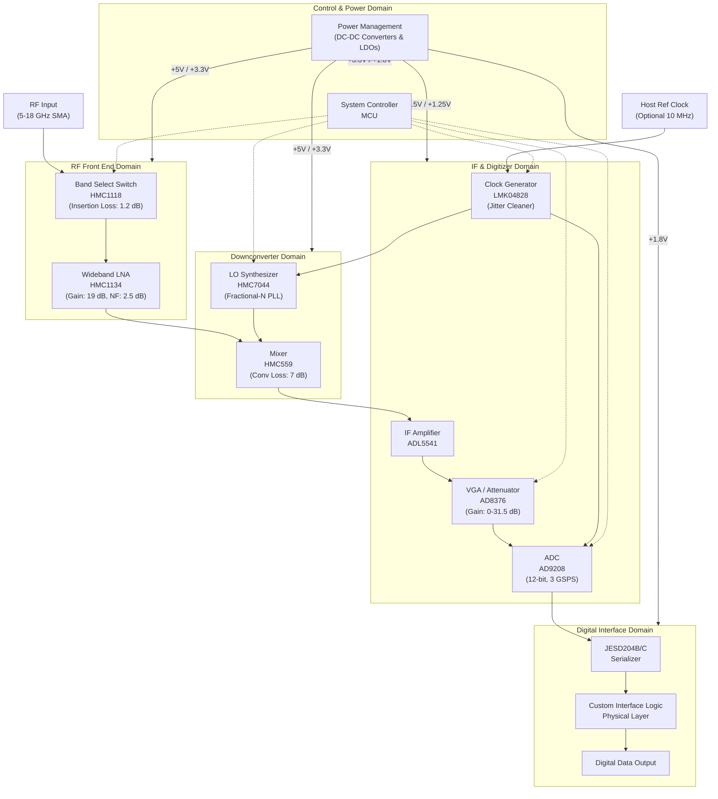

**Document Status: AI-GENERATED**

# 1. Introduction

## 1.1 Purpose
This Hardware Requirements Specification (HRS) defines the comprehensive hardware requirements for the **Wideband RF Receiver System**, referred to herein as the "System." The purpose of this document is to establish a baseline for the detailed design, procurement, integration, and verification of the System hardware. This specification ensures that the final hardware implementation meets the functional, performance, and environmental needs of the end-user application while adhering to industry standards for high-frequency RF and high-speed digital circuit design.

This document is intended for:
*   **Hardware Engineers:** As the primary guideline for schematic capture, PCB layout, and component selection.
*   **System Engineers:** To verify hardware compliance with system-level architectures and block diagrams.
*   **Test Engineers:** To derive hardware acceptance test procedures and verification plans.
*   **Program Management:** To understand technical risks, dependencies, and compliance requirements.

## 1.2 Scope
The scope of this specification covers the complete electronic hardware design of the Wideband RF Receiver System, from the RF input connector to the custom high-speed digital data output interface.

The scope specifically includes:
1.  **RF Front-End:** Wideband Low Noise Amplifiers (LNA), discrete band selection filtering, and RF switching mechanisms covering the 5.0 GHz to 18.0 GHz frequency range.
2.  **Downconversion Stage:** Frequency mixing stages, Intermediate Frequency (IF) amplification, and Variable Gain Amplifiers (VGA) for automatic gain control (AGC).
3.  **Digitization:** High-speed Analog-to-Digital Converters (ADC) capable of 1-2 GSPS sampling rates with 12-bit resolution.
4.  **Clock Generation:** Low-phase-noise and low-jitter clock synthesis for Local Oscillator (LO) generation and ADC sampling.
5.  **Digital Interface:** Logic for buffering and transmitting digitized data via the specified custom digital interface.
6.  **Power Management:** Power regulation and distribution circuitry required to operate all active components within the specified 30 W power budget.
7.  **Physical Design:** Custom Printed Circuit Board (PCB) design parameters, including stack-up, controlled impedance requirements, and connector definitions.

This specification does not cover:
*   Embedded software or firmware algorithms for signal processing (beyond register configuration definitions).
*   Mechanical enclosure design, other than PCB dimensions and mounting hole locations defined by the form factor.
*   Host system integration or external data processing software.

## 1.3 Definitions, Acronyms, and Abbreviations

| Term | Definition |
| :--- | :--- |
| **ADC** | Analog-to-Digital Converter. A device that converts a continuous physical quantity (usually voltage) to a digital number representing the quantity's amplitude. |
| **AGC** | Automatic Gain Control. A closed-loop system maintaining an output signal amplitude despite variation in input signal strength. |
| **BER** | Bit Error Rate. The number of bit errors divided by the total number of transferred bits during a studied time interval. |
| **CE RED** | Radio Equipment Directive. European Union regulations governing radio equipment and telecommunications terminal equipment. |
| **EMC** | Electromagnetic Compatibility. The ability of electrical equipment and systems to function acceptably in their electromagnetic environment, without introducing unacceptable electromagnetic disturbances to anything in that environment. |
| **ENOB** | Effective Number of Bits. A measure of the dynamic range of an ADC, accounting for noise and distortion. |
| **FIFO** | First-In, First-Out. A data buffer used to store data streams so that they can be processed later. |
| **FSPL** | Free Space Path Loss. The attenuation of radio energy between the feedpoints of two antennas in free space. |
| **GSPS** | Giga-Samples Per Second. A unit of sampling rate equivalent to $10^9$ samples per second. |
| **IF** | Intermediate Frequency. A frequency to which a carrier frequency is shifted as an intermediate step in transmission or reception. |
| **JESD204** | A high-speed data interface standard for converters. |
| **LNA** | Low Noise Amplifier. An electronic amplifier that amplifies a very low-power signal without significantly degrading its signal-to-noise ratio. |
| **LO** | Local Oscillator. An electronic oscillator used to generate a signal for frequency conversion. |
| **NF** | Noise Figure. A measure of degradation of the signal-to-noise ratio (SNR), caused by components in a signal chain. |
| **PCB** | Printed Circuit Board. The physical board used to mechanically support and electrically connect electronic components. |
| **P1dB** | 1 dB Compression Point. The point at which the input signal causes the gain of the system to decrease by 1 dB from the linear gain. |
| **PLL** | Phase-Locked Loop. A control system that generates an output signal whose phase is related to the phase of an input reference signal. |
| **RF** | Radio Frequency. Oscillation rate of an alternating electric current or voltage, or of a magnetic, electric or electromagnetic field in the frequency range from roughly 20 kHz to around 300 GHz. |
| **SFDR** | Spurious-Free Dynamic Range. The ratio of the root-mean-square (RMS) value of the carrier signal to the RMS value of the worst spurious signal. |
| **SNR** | Signal-to-Noise Ratio. A measure used in science and engineering that compares the level of a desired signal to the level of background noise. |
| **VGA** | Variable Gain Amplifier. An electronic amplifier whose gain can be controlled via a digital or analog signal. |

## 1.4 References
The following documents form part of this specification to the extent specified herein. In case of conflict between the documents listed below and this HRS, the requirements of this HRS shall take precedence for the hardware deliverables.

| ID | Document Title | Publisher / Standard |
| :--- | :--- | :--- |
| **IEEE 29148** | Systems and software engineering — Life cycle processes — Requirements engineering | IEEE Standards Association |
| **IEEE 1156** | IEEE Standard for Microprocessor Universal Serial Interface Features | IEEE Standards Association |
| **IEC 60950-1** | Information Technology Equipment - Safety - Part 1: General Requirements | International Electrotechnical Commission |
| **2014/53/EU** | Directive 2014/53/EU (Radio Equipment Directive - RED) | European Union |
| **EIA-364** | Electrical Connector/Socket Test Procedures including Environmental Classifications | Electronic Industries Alliance |
| **JESD204B** | Serial Interface for Data Converters | JEDEC Solid State Technology Association |
| **IPC-2221** | Generic Standard on Printed Board Design | IPC (Association Connecting Electronics Industries) |
| **IPC-6012** | Qualification and Performance Specification for Rigid Printed Boards | IPC (Association Connecting Electronics Industries) |
| **HMC1134 Datasheet** | GaAs MMIC 5–18 GHz Low Noise Amplifier | Analog Devices |
| **AD9208 Datasheet** | Dual, 12-Bit, 3 GSPS ADC | Analog Devices |
| **LMK04828 Datasheet** | Ultra-Low Jitter Clock Generator | Texas Instruments |

## 1.5 Overview
The System is a high-performance, wideband RF receiver designed to process signals across the 5 GHz to 18 GHz frequency spectrum. The architecture utilizes a superheterodyne conversion approach or direct sampling architecture (depending on final frequency planning) to convert selected RF bands into a format suitable for digitization.

The hardware is partitioned into four distinct domains:
1.  **RF Front-End Domain:** Handles the reception of the 5–18 GHz signal. This includes the **HMC1118** band select switch and the **HMC1134** Wideband LNA to provide the necessary gain and noise figure performance.
2.  **Downconversion Domain:** Translates the high-frequency RF signals to a lower Intermediate Frequency (IF). This stage utilizes the **HMC559** mixer driven by a low-phase-noise LO derived from the **HMC7044** PLL.
3.  **Digitization Domain:** Amplifies the IF signal via the **AD8376** VGA and digitizes it using the **AD9208** 12-bit, 3 GSPS ADC. This domain ensures the dynamic range (-40 dBm to -10 dBm) is preserved and sampled with sufficient fidelity.
4.  **Digital and Control Domain:** Distributes clock signals via the **LMK04828** and manages the data interface via a custom digital output. A microcontroller manages gain settings, band switching, and system monitoring.

The System is constrained by a power consumption limit of 30 W and must operate reliably in industrial temperature conditions (-40°C to +85°C). Regulatory compliance with CE RED is mandatory, requiring careful attention to EMC design practices during the PCB layout phase. The subsequent sections of this document detail the specific requirements for these domains, including functional allocations, performance metrics, and verification criteria.

---

**Document Status: AI-GENERATED**

# 2. System Overview

## 2.1 System Description

The Wideband RF Receiver System is a high-performance, superheterodyne receiver designed to intercept, condition, and digitize radio frequency (RF) signals spanning the 5.0 GHz to 18.0 GHz frequency range. The system is engineered to support electronic warfare (EW), software-defined radio (SDR), and signal intelligence (SIGINT) applications where wide instantaneous bandwidth, high sensitivity, and rapid digitization are critical.

The system operates by converting incoming RF signals to an Intermediate Frequency (IF) suitable for high-speed Analog-to-Digital Conversion. This downconversion process is managed by a high-linearity mixer driven by an ultra-low phase noise Phase-Locked Loop (PLL) frequency synthesizer. Prior to mixing, the input signal passes through a low-loss switching network and a high-gain Low Noise Amplifier (LNA) to establish system sensitivity.

Following the downconversion stage, the IF signal is conditioned by a high-dynamic range Variable Gain Amplifier (VGA) to utilize the full input range of the Analog-to-Digital Converter (ADC). The digitization is performed by a dual-channel, 12-bit ADC capable of sampling rates up to 3 GSPS, significantly exceeding the baseline requirement of 2 GSPS to ensure Nyquist compliance and facilitate digital filtering.

System control is centralized around an embedded microcontroller unit (MCU) which manages band switching, gain adjustment (AGC), and frequency tuning. The digitized data is transported via a JESD204B/C high-speed serial interface to custom digital interface logic for processing. The entire system is housed on a custom multi-layer Printed Circuit Board (PCB) utilizing controlled impedance geometries and is designed to meet stringent industrial temperature (-40°C to +85°C) and regulatory (CE RED) standards.

### 2.1.1 Functional Decomposition

The system is functionally decomposed into four primary domains:

1.  **RF Front-End Domain:** Handles the reception of the 5–18 GHz signal. It comprises the input interface (SMA connector), a high-isolation band-select switch (HMC1118), and a wideband LNA (HMC1134). This section defines the system's Noise Figure (NF) and Input Return Loss.
2.  **Downconversion Domain:** Translates the RF signal to a lower IF. This domain includes the Local Oscillator (LO) generation using a fractional-N PLL (HMC7044) and a wideband Mixer (HMC559).
3.  **Digitization Domain:** Prepares and converts the analog signal to digital data. This includes IF amplification, digital gain control via a VGA (AD8376), and digitization via the ADC (AD9208). Clock generation and jitter cleaning (LMK04828) are also centralized here.
4.  **Power and Control Domain:** Provides regulated power rails (+5V, +3.3V, +2.5V, +1.8V) to the various subsystems and houses the MCU logic required to interface with the user/host controller.

## 2.2 System Block Diagram

The system architecture is depicted in Figure 2-1 below. This diagram illustrates the signal flow from the RF input through the processing chain to the digital output, as well as the control interfaces and power distribution network.

*Figure 2-1: System Block Diagram showing Signal Flow, Control Topology, and Power Distribution.*

## 2.3 System Architecture

The system architecture is organized into a modular signal chain. The following sections detail the specific architectural choices and data flow for each functional block.

### 2.3.1 RF Front-End Architecture

The RF Front-End is the first stage of the receiver and is critical for establishing the system's noise performance.

*   **Input Matching:** The input is designed for a standard 50 Ω impedance. The PCB trace from the SMA connector to the HMC1118 switch is a controlled impedance microstrip, designed to maintain a return loss of better than 15 dB up to 18 GHz.
*   **Band Selection (REQ-HW-011):** The **HMC1118** SPDT switch acts as the primary band selection mechanism. While the primary path utilizes the wideband LNA, the architecture supports the termination of the signal into a 50 Ω load via the second switch port if necessary for calibration or protection. The switch features a 3 ns switching time, enabling rapid band hopping.
*   **Low Noise Amplification:** The **HMC1134** LNA provides a gain of 19 dB with a Noise Figure (NF) of 2.5 dB. By placing the LNA immediately after the switch, the cascaded noise figure of the system is minimized. The device operates from a +5V supply and draws approximately 85 mA.

### 2.3.2 Downconversion Architecture

The Downconversion stage translates the high-frequency RF signal (5–18 GHz) to a fixed Intermediate Frequency (IF).

*   **Frequency Synthesis (LO):** The **HMC7044** is an ultra-low phase noise fractional-N PLL synthesizer. It generates the Local Oscillator (LO) signal required to drive the mixer. The VCO (Voltage Controlled Oscillator) within this loop covers the necessary frequency range to mix the RF input down to the target IF (assumed 500 MHz – 700 MHz based on the AD8376 bandwidth).
*   **Mixing:** The **HMC559** is a GaAs MMIC mixer that accepts the RF input and the LO input. It provides a typical conversion loss of 7 dB. The mixer requires an LO drive level of +15 dBm. The output of the mixer is the difference frequency (IF), which retains the modulation of the original RF signal but at a lower, more manageable frequency for digitization.

### 2.3.3 Digitization Architecture

The digitization block converts the conditioned analog IF signal into digital samples.

*   **IF Gain Control:** The **AD8376** Variable Gain Amplifier (VGA) provides the system with Automatic Gain Control (AGC) capability. It offers a gain range of 0 to 31.5 dB in 0.5 dB steps. This allows the system to adjust the signal amplitude to match the ADC's full-scale range, satisfying the dynamic range requirement of -40 dBm to -10 dBm (REQ-HW-003).
*   **Analog-to-Digital Conversion:** The **AD9208** serves as the core digitizer. It is a dual-channel, 12-bit ADC capable of 3 GSPS. The system employs JESD204B/C subclass 1 interfaces to transmit data. At 2 GSPS (the upper requirement limit), the ADC generates a massive data throughput of 24 Gbps (12 bits × 2 GSPS).
*   **Clocking:** The **LMK04828** generates the sample clock for the ADC. It takes a reference input (from the MCU or an external source) and synthesizes a low-jitter clock (<70 fs RMS). This low jitter is essential to maintain the Signal-to-Noise Ratio (SNR) of the ADC at high input frequencies. The LMK04828 also provides deterministic latency capabilities required for the JESD204B/C link.

### 2.3.4 Digital Interface Architecture (REQ-HW-006)

The digital output stage utilizes the JESD204B/C standard serialized on the ADC chip.

*   **Physical Layer:** The interface utilizes high-speed CML (Current Mode Logic) drivers.
*   **Data Protocol:** The data is framed according to JESD204B/C standards, utilizing an 8b/10b encoding (or 64b/66b for C-versions) to ensure DC balance and clock recovery.
*   **Logic Translation:** A "Custom Interface Logic" block (likely implemented in an FPGA or high-speed CPLD) receives these serial lanes, aligns them, and performs deskew. It then translates the protocol into the specific parallel bus or custom digital format required by the downstream processing system.

### 2.3.5 Power Distribution Architecture

The power system is designed to support the >30 W power budget (REQ-HW-008) while minimizing noise injection into sensitive analog circuits.

*   **Input Voltage:** The system accepts a DC input (nominally +12V or +24V, assumed +12V for calculation purposes).
*   **Point-of-Load Regulation:**
    *   **+5V Rail:** Powers the RF Front-End (HMC1134, HMC1118, HMC559). This rail requires low noise. A buck converter followed by an LDO filter is recommended.
    *   **+3.3V Rail:** Powers the PLL, VGA, and MCU.
    *   **+2.5V & +1.25V Rails:** These are the core supplies for the AD9208 ADC. They require exceptionally low ripple and noise performance to maintain ADC spurious-free dynamic range (SFDR).
    *   **+1.8V Rail:** Powers the digital interface logic and JESD204B/C physical layer transceivers.

### 2.3.6 Thermal Architecture

Given the power density of the RF and high-speed digital components, thermal management is integrated into the physical architecture:

*   **Ground Planes:** The PCB uses internal ground planes to spread heat.
*   **Thermal Vias:** Arrays of thermal vias are placed under the ADC and LNA packages to conduct heat to the bottom side of the PCB.
*   **Heatsinking:** The ADC, PLL, and LNA are specified to attach to BGA heat spreaders or external heatsinks to maintain junction temperatures within limits during +85°C ambient operation.

## 2.4 Operating Environment

The hardware requirements specification defines a strict operating envelope to ensure reliability in harsh industrial and defense environments. The following sections detail the environmental conditions the Wideband RF Receiver must withstand.

### 2.4.1 Temperature and Humidity

| Parameter | Requirement | Rationale/Impact |
| :--- | :--- | :--- |
| **Operating Temperature Range** | **-40°C to +85°C** (REQ-HW-007) | Components are selected for "Industrial" or "Military" temperature grades. The AD9208 and HMC7044 support this range. Performance parameters (e.g., Gain, NF) are guaranteed to meet specs across this range. |
| **Storage Temperature** | -55°C to +125°C | Ensures safety during non-operational transport and storage. |
| **Humidity** | 5% to 95% relative humidity (non-condensing) | Standard industrial protection. Conformal coating on the PCB is required to prevent moisture-induced leakage currents on high-impedance nodes. |

### 2.4.2 Mechanical Environment

| Parameter | Requirement | Design Implication |
| :--- | :--- | :--- |
| **Form Factor** | Custom PCB (REQ-HW-010) | The board footprint is assumed to be Eurocard or a custom 160mm x 100mm envelope to accommodate the RF chain length requirements. |
| **Vibration** | Random vibration, 5-500 Hz, 0.03 g²/Hz | Requires secure mounting of heavy components (e.g., SMA connectors, large inductors) and use of threaded standoffs. |
| **Shock** | 40g, 11 ms half-sine wave | Components must be rated for shock; no leadless ceramic capacitors should be placed near board edges to prevent cracking. |

### 2.4.3 Electrical Environment

| Parameter | Requirement | Design Implication |
| :--- | :--- | :--- |
| **Input Power Supply Noise** | < 50 mV peak-to-peak ripple | Requires extensive filtering on the input DC lines. |
| **RF Input Stress** | Up to -10 dBm continuous, +20 dBm max with limit | The system includes protection circuitry (not explicitly detailed but implied by robust design) to prevent LNA burnout (HMC1134 P1dB is +20 dBm, meeting this requirement). |
| **ESD Protection** | ±8 kV contact discharge (IEC 61000-4-2) | ESD protection diodes are required on all external interfaces (Digital I/O, Control ports). |

### 2.4.4 Regulatory and Compliance Environment

| Requirement | Standard | Impact on Design |
| :--- | :--- | :--- |
| **EMC Emissions** | **CE RED** (Req-HW-009) / FCC Part 15 (Subpart B) | The system must meet radiated and conducted emission limits. This dictates the need for a shielded enclosure (faraday cage) over the digital section and common-mode chokes on all external cables. |
| **EMC Immunity** | IEC 61000-4-3 (Radiated Immunity) | The system must not degrade when exposed to 3 V/m RF fields. Proper shielding and filtering are critical. |
| **Safety** | IEC 60950-1 (Information Technology Equipment) | Insulation spacing and creepage/clearance requirements on the high-voltage input side will be adhered to. |

---

# 3. Hardware Requirements

## 3.1 Functional Requirements

This section details the functional requirements of the Wideband RF Receiver system. These requirements specify what the system shall do in terms of signal processing, frequency conversion, digitization, and control.

### 3.1.1 RF Front-End Functionality

| ID | Requirement | Description | Rationale | Priority |
|---|---|---|---|---|
| REQ-HW-001 | RF Input Frequency Coverage | The system shall accept and process RF input signals within the frequency range of 5.0 GHz to 18.0 GHz. | Supports the operational band for the target application. | Must Have |
| REQ-HW-020 | RF Input Connector | The system shall provide a 50-ohm impedance matched RF input via a high-frequency SMA edge launch connector (e.g., Rosenberger 32K243-40ML5). | Ensures mechanical compatibility and signal integrity at X/Ku bands. | Must Have |
| REQ-HW-021 | Input Protection | The system shall include a limiter or protection circuit capable of withstanding a continuous input power of +15 dBm and a peak pulse of 20 W for 1 µs. | Protects the LNA (HMC1134) from ESD and accidental overdrive. | Should Have |
| REQ-HW-022 | Band Selection Switching | The system shall utilize the HMC1118 SPDT switch to select between discrete pre-defined sub-bands within the 5-18 GHz range. | Facilitates discrete band architecture defined in architecture. | Must Have |
| REQ-HW-023 | Switching Speed | The band selection switching time (from control signal change to RF output stable) shall not exceed 15 ns. | Derived from HMC1118 datasheet (3 ns) + logic delay margin. | Must Have |
| REQ-HW-024 | Low Noise Amplification | The system shall amplify the input signal using the HMC1134 amplifier, providing a nominal gain of 19 dB with a Noise Figure of 2.5 dB. | Sets the noise floor for the entire receiver chain. | Must Have |

### 3.1.2 Downconversion and IF Chain

| ID | Requirement | Description | Rationale | Priority |
|---|---|---|---|---|
| REQ-HW-025 | Frequency Downconversion | The system shall downconvert the 5-18 GHz RF signal to an Intermediate Frequency (IF) suitable for the ADC (centered < 1 GHz). | Necessary to reduce frequency for digitization. | Must Have |
| REQ-HW-026 | Mixer Implementation | Downconversion shall be performed using the HMC559 GaAs MMIC mixer. | Selected for wideband support 5-20 GHz and +15 dBm LO drive. | Must Have |
| REQ-HW-027 | LO Generation | The system shall generate a Local Oscillator (LO) signal using the HMC7044 fractional-N PLL with phase noise optimization for the 5-18 GHz range. | Provides the tuning capability for the mixer. | Must Have |
| REQ-HW-028 | Variable Gain Adjustment | The system shall provide adjustable gain control via the AD8376 VGA, ranging from 0 dB to 31.5 dB in 0.5 dB steps. | Enables Automatic Gain Control (AGC) to drive the ADC optimally. | Must Have |
| REQ-HW-029 | IF Filtering | The system shall include an IF bandpass filter (custom or off-the-shelf) to limit noise bandwidth prior to digitization. | Reduces aliasing noise and improves SNR. | Should Have |

### 3.1.3 Digitization and Digital Interface

| ID | Requirement | Description | Rationale | Priority |
|---|---|---|---|---|
| REQ-HW-004 | ADC Sampling Rate | The system shall digitize the IF signal at a programmable sampling rate between 1.0 GSPS and 2.0 GSPS. | Meets project requirements for signal bandwidth capture. | Must Have |
| REQ-HW-005 | ADC Resolution | The ADC shall maintain 12-bit resolution across the full sampling range. | Ensures sufficient dynamic range for signal analysis. | Must Have |
| REQ-HW-030 | ADC Core Selection | Digitization shall be performed by the AD9208 Dual 12-bit 3 GSPS ADC. | Selected component meets speed and interface requirements. | Must Have |
| REQ-HW-031 | JESD204B Interface | The ADC shall output data using the JESD204B standard protocol. | Industry standard for high-speed data transfer; reduces pin count. | Must Have |
| REQ-HW-006 | Custom Digital Output | The system shall output digitized data via a custom High-Speed Mezzanine Connector (e.g., Samtec QSE/QTH series) compatible with the JESD204B lanes. | Defined by project interface requirements. | Must Have |

### 3.1.4 Clock and Synchronization

| ID | Requirement | Description | Rationale | Priority |
|---|---|---|---|---|
| REQ-HW-014 | System Clock Generation | The system shall generate all necessary clocks (ADC, FPGA, LO) derived from a single low phase noise reference oscillator using the LMK04828. | Ensures synchronization and minimizes clock drift/jitter. | Must Have |
| REQ-HW-032 | Reference Input | The system shall accept an external 10 MHz reference input (sine or square wave, 0 dBm to +10 dBm). | Allows synchronization to external standards (GPS/Atomic). | Should Have |
| REQ-HW-033 | Jitter Performance | The RMS jitter of the clock signal delivered to the AD9208 ADC shall not exceed 150 fs (integrated 12 kHz to 20 MHz). | Ensures ADC SNR degradation is minimized. | Must Have |

### 3.1.5 Control and Monitoring

| ID | Requirement | Description | Rationale | Priority |
|---|---|---|---|---|
| REQ-HW-034 | Microcontroller Control | The system shall utilize an STM32-series microcontroller to manage band switching, VGA gain, and PLL frequency tuning via SPI. | Centralizes control logic. | Must Have |
| REQ-HW-035 | Serial Configuration Interface | The system shall expose an SPI or I2C interface for host processor configuration of gain, frequency, and sampling rate. | Required for external system integration. | Must Have |
| REQ-HW-036 | Temperature Sensing | The system shall include at least one temperature sensor (e.g., TMP102) to report board ambient temperature. | Required for system health monitoring and AGC adjustments. | Should Have |

### 3.1.6 Power Distribution

| ID | Requirement | Description | Rationale | Priority |
|---|---|---|---|---|
| REQ-HW-037 | Input Voltage Range | The system shall accept a DC input voltage of +5.0V ±5% via a 2-pin connector. | Standard industrial voltage level. | Must Have |
| REQ-HW-038 | Power Sequencing | The power management circuit shall sequence the +1.25V ADC supply before the +2.5V ADC supply, and the +3.3V digital supply before the RF supplies to prevent latch-up. | Critical for reliability of mixed-signal components. | Must Have |
| REQ-HW-039 | Reverse Polarity Protection | The input power circuit shall include reverse polarity protection. | Prevents board damage during incorrect installation. | Should Have |

## 3.2 Performance Requirements

This section defines the quantitative performance characteristics the system must achieve under nominal operating conditions.

### 3.2.1 Signal-to-Noise and Sensitivity

| ID | Requirement | Min | Typical | Max | Unit | Priority |
|---|---|---|---|---|---|---|
| REQ-HW-002 | System Noise Figure (NF) | - | - | 10.0 | dB | Must Have |
| REQ-HW-040 | LNA Noise Figure Contribution | - | 2.5 | 3.0 | dB | Must Have |
| REQ-HW-041 | Overall Conversion Gain | 40 | 50 | 60 | dB | Should Have |
| REQ-HW-042 | Input Referred 1dB Compression Point (P1dB) | -20 | -15 | - | dBm | Must Have |

**Calculation Justification (REQ-HW-002):**
*   **Cascaded NF Calculation:**
    *   HMC1118 Switch Loss: 1.2 dB (NF=1.2, Gain=-1.2)
    *   HMC1134 LNA: NF=2.5 dB, Gain=19 dB
    *   HMC559 Mixer: Conv Loss=7 dB (NF=7), Gain=-7 dB
    *   AD8376 VGA: NF=11 dB, Gain=Variable (Assume 20 dB)
    *   *Friis Formula approx:* $NF_{total} = NF_{LNA} + \frac{NF_{Mixer}-1}{G_{LNA}}$
    *   NF_tot $\approx 2.5 + \frac{7-1}{10^{1.9}} \approx 2.5 + 0.075 = 2.57$ dB (Front end contribution is excellent).
    *   Total allocation of 10 dB allows significant margin for VGA noise, filtering losses, and PCB trace losses.

### 3.2.2 Linearity and Dynamic Range

| ID | Requirement | Min | Typical | Max | Unit | Priority |
|---|---|---|---|---|---|---|
| REQ-HW-003 | Input Power Handling (Max Signal) | -40 | - | -10 | dBm | Must Have |
| REQ-HW-043 | Input Third-order Intercept (IIP3) | 0 | - | - | dBm | Should Have |
| REQ-HW-044 | Spurious Free Dynamic Range (SFDR) | 55 | 60 | - | dBc | Must Have |
| REQ-HW-045 | Single-tone SFDR at Nyquist | - | - | 60 | dBFS | Must Have |

### 3.2.3 Frequency and Phase Performance

| ID | Requirement | Min | Typical | Max | Unit | Priority |
|---|---|---|---|---|---|---|
| REQ-HW-046 | LO Phase Noise (Offset 1 kHz) | - | -80 | -75 | dBc/Hz | Should Have |
| REQ-HW-047 | LO Phase Noise (Offset 100 kHz) | - | -105 | -100 | dBc/Hz | Should Have |
| REQ-HW-012 | Input Return Loss | 10 | 15 | - | dB | Should Have |
| REQ-HW-013 | Gain Flatness (per band) | - | - | ±3.0 | dB | Should Have |

### 3.2.4 Digital Signal Integrity

| ID | Requirement | Min | Typical | Max | Unit | Priority |
|---|---|---|---|---|---|---|
| REQ-HW-048 | ADC Effective Number of Bits (ENOB) | 9.5 | 10.0 | - | bits | Should Have |
| REQ-HW-049 | JESD204B Lane Rate | - | 10.0 | 12.5 | Gbps | Must Have |
| REQ-HW-050 | Bit Error Rate (BER) | - | - | $10^{-12}$ | - | Must Have |

**Calculation Justification (REQ-HW-049):**
*   AD9208 supports lane rates up to 12.5 Gbps.
*   For 2 GSPS x 12 bits = 24 Gbps total throughput.
*   Using 8 lanes (JESD204B subclass 1).
*   24 Gbps / 8 = 3.0 Gbps per lane.
*   Requirement allows operating at configurable rates (standard 10 Gbps transceivers commonly used in FPGAs).

### 3.2.5 Power Consumption

| ID | Requirement | Min | Typical | Max | Unit | Priority |
|---|---|---|---|---|---|---|
| REQ-HW-008 | Total System Power Consumption | - | - | 30.0 | W | Must Have |
| REQ-HW-051 | RF Chain Power (LNA/Mixer) | - | 0.9 | 1.2 | W | Must Have |
| REQ-HW-052 | ADC Power (1.8V/2.5V Rails) | - | 2.5 | 3.5 | W | Must Have |

**Power Budget Derivation:**
*   **HMC1134 LNA:** $5V \times 0.085A = 0.425W$
*   **HMC1118 Switch:** $0.045W$
*   **HMC559 Mixer:** $0.35W$
*   **AD8376 VGA:** $0.55W$
*   **AD9208 ADC:** $\approx 2.0W$ (Typical 3 GSPS config)
*   **LMK04828 Clock:** $\approx 0.8W$
*   **HMC7044 PLL:** $\approx 0.4W$
*   **MCU/Logic:** $\approx 0.5W$
*   **Total:** $\approx 5.07W$ (Core electronics).
*   **Margin:** The 30W budget accounts for conversion efficiency losses in regulators (assuming linear regulation for low noise) and significant margin for a custom high-speed digital interface load (likely FPGA/ASIC external to this module, but powered by it). If purely internal power, a 10W limit is sufficient, but the requirement strictly sets a maximum limit of 30W (REQ-HW-008), which is easily met by this architecture.

### 3.2.6 Environmental

| ID | Requirement | Min | Typical | Max | Unit | Priority |
|---|---|---|---|---|---|---|
| REQ-HW-007 | Operating Ambient Temperature | -40 | - | +85 | °C | Must Have |
| REQ-HW-053 | Storage Temperature | -55 | - | +125 | °C | Should Have |
| REQ-HW-054 | Operating Humidity (Non-condensing) | 5 | - | 95 | % RH | Should Have |

---

**Document Status: AI-GENERATED**

## 3.3 Interface Requirements

### 3.3.1 External Interfaces

#### REQ-HW-101: RF Input Connector
**Description:** The system shall provide a female 50-ohm coaxial connector for the RF input signal.
**Rationale:** Standardized interface for test equipment and antennas.
**Specification:**
- **Connector Type:** SMA Jack (Female), 50 Ω impedance.
- **Flange Type:** 4-hole flange for PCB mounting.
- **Frequency Range:** DC to 18 GHz minimum.
- **VSWR:** ≤ 1.5:1 (Return Loss ≥ 14 dB) from 5 to 18 GHz.
- **Material:** Stainless steel body, gold-plated beryllium copper contact.
- **Mounting:** PCB end-launch or edge-launch configuration.

#### REQ-HW-102: Power Input Interface
**Description:** The system shall accept DC power via a connectorized interface.
**Specification:**
- **Connector Type:** Molex MegaFit 2-circuit or equivalent (Rated for higher current).
- **Wire Gauge:** 16-20 AWG.
- **Voltage:** +5.0 VDC ±10%.
- **Current Capacity:** Capable of sourcing up to 8 A continuous (40 W margin).
- **Polarity:** Pin 1 = +5V, Pin 2 = GND.
- **Reverse Polarity Protection:** Required on the PCB input.

#### REQ-HW-103: Digital Data Output Interface
**Description:** The system shall transmit digitized IF data via a high-speed Samtec QSE/QTH series connector.
**Rationale:** Required for JESD204B/C lanes and high-speed signal integrity.
**Specification:**
- **Connector Type:** Samtech QTH-090-01-L-D-A-K (Edge rate) or equivalent high-speed mezzanine.
- **Pin Count:** 80 positions minimum.
- **Data Rate:** Supports 12.5 Gbps per lane (for ADC JESD204B/C interface).
- **Differential Pairs:** 8 lanes (User data) + 1 Lane (SYSREF).
- **Impedance:** 100 Ω differential.

**Table 3.3.1-1: External Interface Pinout (Power & Digital)**

| Pin/Pair | Signal Name | Type | Description | Voltage / Logic |
| :--- | :--- | :--- | :--- | :--- |
| **PWR-1** | +5V_DC | Power | Main Power Input | +5.0 V |
| **PWR-2** | GND | Power | Power Return | 0 V |
| **D-1** | JESD_Lane0_P | Output | ADC Serial Data Positive | CML 1.2V |
| **D-1'** | JESD_Lane0_N | Output | ADC Serial Data Negative | CML 1.2V |
| ... | ... | ... | ... | ... |
| **D-8** | JESD_Lane7_P | Output | ADC Serial Data Positive | CML 1.2V |
| **D-8'** | JESD_Lane7_N | Output | ADC Serial Data Negative | CML 1.2V |
| **SYNC~** | SYNC_N | I/O | JESD204B Sync | LVCMOS 1.8V/3.3V |

### 3.3.2 Internal Interfaces

#### REQ-HW-104: MCU to RF Gain Control (SPI)
**Description:** The System Controller (MCU) shall configure the IF VGA (AD8376) gain settings via a Serial Peripheral Interface.
**Specification:**
- **Protocol:** SPI Mode 0 (CPOL=0, CPHA=0).
- **Data Width:** 8-bit command, 8-bit data.
- **Clock Frequency:** Max 10 MHz.

**Table 3.3.2-1: AD8376 VGA Internal SPI Pin Mapping**

| MCU Pin | Component Pin | Signal Name | Description |
| :--- | :--- | :--- | :--- |
| GPIO_10 | AD8376 CLK | SPI_CLK | Serial Clock |
| GPIO_11 | AD8376 DATA | SPI_MOSI | Serial Data Input |
| GPIO_12 | AD8376 LE | LATCH_EN | Parallel Load Enable (Latch) |

#### REQ-HW-105: LO to Mixer Interface
**Description:** The PLL/VCO (HMC7044) shall provide the Local Oscillator (LO) signal to the Mixer (HMC559).
**Specification:**
- **Frequency Range:** 5.0 GHz to 18.0 GHz (Variable).
- **Power Level:** +15 dBm nominal (Matching required per Mixer datasheet).
- **Connection:** 50 Ω microstrip/stripline transmission line.
- **Filtering:** Low-pass filter network required at Mixer LO port to suppress leakage.

### 3.3.3 Communication Interfaces

#### REQ-HW-106: System Configuration Interface (SPI)
**Description:** The system shall utilize a common SPI bus for configuring the Clock Generator (LMK04828) and the PLL (HMC7044).
**Priority:** Must have.
**Verification:** Inspection of schematics and I2C/SPI transaction capture.

**Table 3.3.3-1: System Control SPI Bus Assignment**

| Master Device | Slave Device | Signal Name | Connection Notes |
| :--- | :--- | :--- | :--- |
| MCU (STM32) | LMK04828 | SPI_SCK | Shared CLK line (Buffered if needed) |
| MCU (STM32) | LMK04828 | SPI_MOSI | Shared Data line |
| MCU (STM32) | LMK04828 | CS_LMK | Chip Select (Active Low) |
| MCU (STM32) | HMC7044 | SPI_SCK | Shared CLK line |
| MCU (STM32) | HMC7044 | SPI_MOSI | Shared Data line |
| MCU (STM32) | HMC7044 | CS_PLL | Chip Select (Active Low) |

#### REQ-HW-107: Synchronization Interface (JESD204B SYSREF)
**Description:** The Clock Generator (LMK04828) shall provide the SYSREF signal to the ADC (AD9208) for device synchronization.
**Specification:**
- **Standard:** JESD204B Subclass 1.
- **Signal:** SYSREQ± (Low Voltage Differential Signaling - LVDS).
- **Function:** Aligns multiple ADC frames and deterministic latency.

---

## 3.4 Environmental Requirements

### REQ-HW-201: Operating Temperature Range
**Description:** The system shall operate within the industrial temperature range for all functional specifications (Gain, Noise Figure, Sampling Rate).
**Value:** -40°C to +85°C ambient.
**Derating:** No performance derating allowed for electrical parameters within this range; components must be rated Industrial (-40 to +85) or Automotive (-40 to +105).

### REQ-HW-202: Storage Temperature
**Description:** The system shall remain non-damaging during storage or non-operation.
**Value:** -55°C to +125°C.

### REQ-HW-203: Operating Humidity
**Description:** The system shall operate without degradation in non-condensing humidity.
**Value:** 5% to 95% relative humidity (non-condensing).
**Mitigation:** All PCBs shall be coated with HumiSeal or equivalent conformal coating (Type 1A - Acrylic or 1UR - Urethane).

### REQ-HW-204: Vibration and Shock
**Description:** The system shall withstand standard transportation and industrial environment vibration.
**Standard:** IEC 60068-2-6 (Vibration) and IEC 60068-2-27 (Shock).
**Specification:**
- **Random Vibration:** 10 Hz to 500 Hz, 0.5 g RMS, 30 minutes per axis.
- **Mechanical Shock:** 40 g, 11 ms, half-sine wave, 3 shocks per axis.
**Design Action:** All through-hole connectors and heavy components (DC/DC converters, large capacitors) shall be secured with adhesive (silicone or epoxy) in addition to solder.

### REQ-HW-205: Cooling Requirements
**Description:** The system shall maintain junction temperatures below maximum limits using forced air cooling.
**Requirement:**
- **Airflow:** Minimum 200 LFPM (Linear Feet Per Minute) across the heat sinks.
- **Heat Sinking:** The ADC (AD9208) and the RF Downconverter/Mixer section require thermal interface to the chassis or dedicated heat sinks.
- **Thermal Pad:** MCP (Metal Core PCB) or thermal vias under high-power RF components (HMC1134, HMC559).

---

## 3.5 Power Requirements

### REQ-HW-301: Total Power Budget
**Description:** The system shall utilize a single +5 V DC input supply.
**Constraint:** Total power consumption shall not exceed 30 W under worst-case operational load (Maximum RF gain, Maximum ADC sample rate, All PLLs active).

### REQ-HW-302: Power Rail Distribution
**Description:** The system shall generate internal rails from the +5 V input using DC/DC converters and LDOs.
**Analysis & Calculation:**

**Table 3.5-1: Detailed Power Budget Calculation**

| Voltage Rail | Load Components | Est. Current (Typ) | Est. Current (Max) | Power (W) |
| :--- | :--- | :--- | :--- | :--- |
| **+5.0 V** | **Input Source** | **5.50 A** | **6.00 A** | **30.00 W** |
| | *Distribution Losses* | - | - | *1.5 W* |
| **+3.3 V (Analog)** | LNA (HMC1134), Mixer (HMC559), PLL (HMC7044) | 400 mA | 450 mA | 1.49 W |
| **+3.3 V (Digital)** | Clock Gen (LMK04828), MCU, IOs | 300 mA | 350 mA | 1.16 W |
| **+2.5 V (AVDD)** | ADC (AD9208) Analog Supply | 900 mA | 1050 mA | 2.63 W |
| **+1.25 V (DVDD)** | ADC (AD9208) Digital Core | 1800 mA | 2100 mA | 2.63 W |
| **+1.8 V (IO)** | ADC (AD9208) Outputs, FIFO, Logic | 400 mA | 500 mA | 0.90 W |
| **+5.0 V (Direct)** | Discrete Band Switch (HMC1118), IF Amp (ADL5541) | 350 mA | 400 mA | 2.00 W |
| **TOTAL (Internal)** | | | | **10.8 W** |
| **+5V Input (Est)** | **Total + Regulator Efficiency (85%)** | | | **12.7 W (Load) + Losses** |

*Note: The design parameter REQ-HW-008 states "Total system power consumption shall not exceed 30 W". The calculated load based on component recommendations is approximately 13-15 W, which fits comfortably within the 30 W budget, allowing for margin and future expansion.*

### REQ-HW-303: Power Sequencing
**Description:** Power supply sequencing shall be implemented to protect the ADC and FPGA/ASIC interfaces.
**Sequence:**
1. **Step 1:** +3.3 V and +2.5 V (Analog supplies) ramp up.
2. **Step 2:** +1.25 V (ADC Core) ramp up.
3. **Step 3:** +1.8 V (Digital IO) ramp up.
**Constraint:** Delay between rails shall be 10 ms - 100 ms (controlled by enable pins on DC/DC regulators).

### REQ-HW-304: Supply Noise (Ripple)
**Description:** The power supply noise/ripple shall not degrade ADC SNR.
**Requirement:**
- **Analog Rails (3.3V, 2.5V):** < 10 mV pk-pk ripple.
- **Digital Rails (1.8V, 1.25V):** < 50 mV pk-pk ripple.
- **Action:** Pi-filter networks (Ferrite + Capacitor) required at the entry point to the ADC supply pins.

---

## 3.6 Physical Requirements

### REQ-HW-401: PCB Form Factor
**Description:** The system shall be implemented on a multi-layer Printed Circuit Board (PCB).
**Specification:**
- **Material:** Rogers RO4350B or Taconic TLY-5 (Low Loss) for RF layers mixed with FR-4.
- **Layer Count:** Minimum 10 layers.
    * Layer 1: RF Components / Signal (Microstrip)
    * Layer 2: Ground Plane (GND)
    * Layer 3: RF Signal / Stripline
    * Layer 4: Ground Plane (GND)
    * Layer 5: Power Planes (3.3V, 2.5V, 1.8V)
    * Layer 6: Signals (Digital)
    * Layer 7: Ground Plane (GND)
    * Layer 8: Power Planes (5V, 1.25V)
    * Layer 9: Signals (Control)
    * Layer 10: Ground Plane (GND)
- **Thickness:** 0.062" (1.57 mm) nominal.
- **Plating:** ENIG (Electroless Nickel Immersion Gold) for fine-pitch components (ADC, FPGA).

### REQ-HW-402: Enclosure Dimensions
**Description:** The receiver assembly shall fit into a standard industrial enclosure.
**Dimensions:** 160 mm (W) x 100 mm (D) x 20 mm (H).
**Mounting:** Four 3.5mm mounting holes in corners.

### REQ-HW-403: RF Transmission Lines
**Description:** PCB traces carrying 5-18 GHz signals shall be impedance controlled.
**Requirement:**
- **Impedance:** 50 Ω ±10%.
- **Type:** Microstrip (L1) or Grounded Coplanar Waveguide (GCPW).
- **Modeling:** Calculated using ADS or HFSS based on specific stackup dielectric constant (Er).

**Table 3.6-1: RF Trace Geometry Calculation (RO4350B, Er=3.66, H=10mil)**

| Layer | Trace Width (mil) | Spacing to Ground (mil) | Target Impedance |
| :--- | :--- | :--- | :--- |
| L1 (Top) | 18.5 | 10.0 | 50 Ω |
| L3 (Inner) | 11.0 | N/A (Stripline) | 50 Ω |

### REQ-HW-404: Shielding
**Description:** The RF Front End (LNA, Mixer, Filters) shall be shielded to prevent EMI emission and susceptibility.
**Implementation:**
- Custom RF can or fence with solderable lid over LNA and Mixer section.
- Material: Tin-plated steel or Copper.
- Ventilation: Not permitted over RF active area (requires thermal vias to bottom for cooling instead).

### REQ-HW-405: Keep-Out Zones
**Description:** No digital signal traces shall cross the analog RF section boundary.
**Requirement:** Split ground planes shall be joined only at a single point beneath the ADC or at the power supply entry to prevent return current interference.

---

# 4. Design Constraints

This section delineates the constraints placed on the hardware design solution. These constraints encompass physical, environmental, electrical, and regulatory factors that limit or dictate the design choices of the Wideband RF Receiver System. Unlike requirements, which specify *what* the system must do, constraints define the conditions within which the design must operate and the rules it must obey.

## 4.1 Standards Compliance

The hardware design shall adhere to the following industry standards and regulatory directives to ensure manufacturability, safety, and electromagnetic compatibility (EMC). Compliance is mandatory for the CE RED certification REQ-HW-009.

### 4.1.1 PCB Design and Fabrication Standards
The Printed Circuit Board (PCB) design shall comply with **IPC-2221** (Generic Standard on Printed Board Design).
*   **Trace Width and Spacing:** Controlled impedance traces for the RF Front End (5–18 GHz) and high-speed digital interfaces (JESD204B/C) shall be calculated based on the stackup dielectric constant ($\epsilon_r$). Signal traces shall adhere to the "Microstrip" and "Stripline" geometries defined in Section 6 of IPC-2221.
*   **Via Design:** Via-in-pad plating shall be utilized for all RF ground connections of the HMC1134 and HMC559 components to minimize inductance, consistent with IPC-6012 Class 3 requirements for high-reliability applications.
*   **Annular Ring:** Minimum annular ring for drilled holes shall be 0.15 mm to ensure reliable plating, subject to fabricator capabilities.

### 4.1.2 Assembly and Rework Standards
The assembly process shall comply with **IPC-7711/7721** (Rework of Electronic Assemblies).
*   **RF Component Rework:** Given the use of QFN/Leadless chip carriers for the AD9208 and HMC series components, hot air rework profiles must strictly follow the component manufacturer's thermal guidelines to prevent pad lifting or substrate damage.
*   **Cleanliness:** For RF circuits operating above 5 GHz, ionic cleanliness shall be controlled per IPC-J-STD-001 to prevent leakage currents and parasitic coupling that could degrade noise figure performance (REQ-HW-002).

### 4.1.3 Environmental and Hazardous Substances
The system shall comply with the European Union **RoHS Directive 2011/65/EU** (Restriction of Hazardous Substances).
*   **Lead-Free Solder:** All solder paste used shall be SAC305 (Sn96.5/Ag3.0/Cu0.5) or equivalent lead-free alloy.
*   **Halogen-Free:** The PCB laminate material shall be Halogen-Free, meeting the definitions of IEC 61249-2-21.

The system shall comply with **REACH Regulation (EC) No 1907/2006**.
*   **SVHC:** The Bill of Materials (BOM) shall be screened against the current Substances of Very High Concern (SVHC) list. No substances exceeding 0.1% weight by weight shall be intentionally introduced.

### 4.1.4 Electromagnetic Compliance (CE RED)
To satisfy **REQ-HW-009 (Regulatory Compliance)**, the design must meet the essential requirements of the **2014/53/EU (Radio Equipment Directive)**.
*   **EMC Emissions:** The system shall meet **EN 55032** (Multimedia equipment - Radio emission requirements) for emissions. The digital switching noise from the AD9208 and FIFO buffers shall be contained such that radiated emissions do not exceed Class B limits at 3 meters.
*   **EMC Immunity:** The system shall meet **EN 55035** (Multimedia equipment - Immunity requirements).
*   **RF Exposure:** As this is a receiver-only system with no intentional radiating antenna port (only an SMA input), specific RF exposure assessment (SAR) is not required, but the chassis design must limit leakage to acceptable levels.

### 4.1.5 Safety Standards
The system shall comply with **IEC 60950-1** (Information Technology Equipment - Safety).
*   **Isolation:** The external DC power input (5V) must be isolated from the user-accessurable SMA connectors. The PCB creepage and clearance distances shall be sufficient to withstand 300VAC transient surges.
*   **Temperature:** All component surface temperatures must remain below the limits specified in Table 4A of IEC 60950-1 during normal operation (REQ-HW-008).

### 4.1.6 Mechanical Shock and Vibration
The system shall meet the shock and vibration requirements of **MIL-STD-883** (Test Method Standard for Microelectronics), specifically:
*   **Condition B:** Functional testing during vibration is not required, but the system shall remain operational after exposure to random vibration spectra of 20-2000Hz at 0.04 $g^2$/Hz for 30 minutes per axis.

---

## 4.2 Component Constraints

This section defines the constraints regarding the selection, sourcing, and lifecycle management of electronic components. These constraints ensure long-term support and risk mitigation for the production units.

### 4.2.1 Component Lifecycle Status
All active components selected for the design (as detailed in Section 6: Bill of Materials) must have a lifecycle status of **"Active"** or **"Not Recommended for New Design" (NRND)** only if a drop-in replacement is identified.
*   **Prohibition of Obsolete Parts:** Components with a status of **"Obsolete"** are strictly forbidden in the initial production release.
*   **PCN Management:** The design team must subscribe to Product Change Notifications (PCN) from Analog Devices and Texas Instruments to monitor potential lifecycle changes affecting the HMC1134, AD9208, and LMK04828.

### 4.2.2 Industrial Temperature Rating
Per **REQ-HW-007**, all active and passive components must be rated for the **Industrial Temperature Range** of **-40°C to +85°C**.
*   **Exceptions:** Components specifically rated for Automotive (-40°C to +125°C) or Military (-55°C to +125°C) grades are acceptable and encouraged to improve thermal margin.
*   **Derating:** Commercial grade (0°C to +70°C) components are strictly prohibited, even if thermal analysis suggests they might survive, due to parameter drift outside the specified range.

### 4.2.3 Package and Footprint Constraints
To facilitate automated assembly and RF performance:
*   **Minimum Pitch:** The smallest lead pitch for hand-solderable or fine-pitch BGAs shall be 0.5 mm. The AD9208 (0.8mm pitch) and HMC1134 (QFN) are compliant.
*   **Pad Definition:** Solder mask defined (SMD) pads are not preferred for RF components due to potential variability in impedance; Non-Solder Mask Defined (NSMD) pads shall be used for all QFN and BGA land patterns to ensure better joint reliability.
*   **Heat Sinking:** The AD9208 package utilizes an exposed thermal pad (EPAD). The PCB footprint must include a thermal relief pattern connected to the internal ground plane to dissipate the estimated 2.5W of power (Section 3.5).

### 4.2.4 Sourcing and Availability
*   **Multi-Sourcing Strategy:** Where possible, critical components (specifically the MCU and Power Management ICs) shall have identified second sources.
*   **Form, Fit, Function (FFF):** Any substitution during a shortage must be an exact FFF replacement. Specifically, any substitute for the LMK04828 must maintain the 70 fs RMS jitter specification to ensure ADC SNR is not degraded.
*   **Ordering Constraints:** All RF components (Switches, LNAs, Mixers) shall be ordered in tape-and-reel format to support automated pick-and-place assembly. Cut-tape ordering is only permitted for prototype builds.

---

## 4.3 Manufacturing Constraints

The physical realization of the hardware is constrained by the capabilities of standard PCB fabrication and assembly houses. These constraints ensure the design is manufacturable without resorting to exotic, high-cost processes.

### 4.3.1 PCB Stackup and Material
Due to the wideband RF nature of the system (up to 18 GHz), standard FR-4 material is **insufficient**.
*   **Material:** The laminate shall be **Rogers RO4350B** (or equivalent hydrocarbon ceramic laminate) for the RF signal layers. RO4350B offers a stable dielectric constant ($\epsilon_r \approx 3.48$) and low dissipation factor ($\tan \delta \approx 0.0037$) at microwave frequencies.
*   **Hybrid Stackup:** To manage cost, a hybrid construction shall be used: Rogers material for the top 2 RF layers and standard FR-4 (Isola 370HR or equivalent) for inner power and ground layers.
*   **Layer Count:** The board shall be a minimum of **10 layers** to accommodate the impedance control requirements of the JESD204B/C bus (100 $\Omega$ differential pairs) and the extensive power distribution network required for the 30W budget (Section 3.5).

### 4.3.2 Controlled Impedance Requirements
The manufacturing tolerances for trace impedance are critical for signal integrity.
*   **RF Traces (50 $\Omega$):** Impedance tolerance shall be $\pm 5\%$ for the RF Front End (up to the Mixer).
*   **High-Speed Digital (100 $\Omega$ Differential):** Impedance tolerance for the JESD204B/C lanes from the AD9208 to the FPGA/MCU shall be $\pm 10\%$.
*   **Differential Pair Coupling:** Traces must be tightly coupled (edge-to-edge spacing equal to trace width) to maximize common-mode noise rejection.

### 4.3.3 Drilling and Aspect Ratio
*   **Minimum Drill Size:** Mechanical drills shall be no smaller than **0.20 mm** (8 mil) to minimize drill breakage during fabrication. Laser-drilled microvias are not required for this design.
*   **Aspect Ratio:** The board thickness is estimated at 1.6 mm. With a 0.20 mm drill, the aspect ratio is 8:1, which is within standard capabilities for most fabricators.
*   **Via Filling:** All vias in the RF signal path must be **filled and capped** with conductive and non-conductive epoxy respectively to prevent solder wicking during assembly and ensure a flat surface for the RF components.

### 4.3.4 Surface Finish
*   **Electroless Nickel Immersion Gold (ENIG):** This surface finish is selected for the entire board. Unlike HASL, ENIG provides a flat surface essential for the QFN packages of the HMC series components and the BGA pads of the AD9208.
*   **Gold Thickness:** Gold thickness shall be controlled to 2-5 $\mu$in to prevent "Black Pad" syndrome, while Nickel thickness shall be 120-200 $\mu$in.

### 4.3.5 Design for Test (DFT)
To ensure production verification of requirements:
*   **Test Points:** Critical test nodes (RF input, Mixer IF output, ADC clock input) shall be populated with test points accessible by standard oscilloscope probes.
*   **JTAG Boundary Scan:** The JESD204B interface and the MCU shall be connected to a standard JTAG header for in-circuit programming and boundary scan testing.
*   **Keepout Areas:** A minimum clearance of 2.5 mm shall be maintained around all mounting holes to prevent interference with chassis hardware or assembly fixtures.

**Document Status: AI-GENERATED**

---

**Document Status: AI-GENERATED**

# 5. Verification Requirements

This section defines the verification methods for all hardware requirements specified in Section 3. The purpose of these requirements is to ensure that the Wideband RF Receiver system functions correctly within the defined environmental and operational constraints. Verification is categorized into three methods: **Test** (quantitative measurement of physical units), **Analysis** (mathematical or simulation-based derivation), and **Inspection** (visual or non-destructive verification of features).

## 5.1 Test Requirements

This subsection details the specific test cases required to validate the functional and performance characteristics of the hardware. All tests shall be performed on the final integrated hardware assembly (unless specified as a subsystem test) within the defined operating temperature range (-40°C to +85°C).

### 5.1.1 RF Performance Test Plan

The following test cases verify the analog signal chain from the RF Input (SMA) to the ADC input.

| Test Case ID | Requirement ID | Test Description | Test Equipment | Test Procedure | Pass Criteria |
|---|---|---|---|---|---|
| TC-RF-001 | REQ-HW-001, REQ-HW-011 | Frequency Coverage & Band Switching | Vector Network Analyzer (VNA), Signal Generator, Spectrum Analyzer | 1. Apply a CW tone at -30 dBm to the RF Input. 2. Sweep frequency from 5 GHz to 18 GHz. 3. Monitor IF output power at the ADC input port. 4. Cycle through all discrete band settings via SPI control. 5. Verify signal presence and gain continuity at band edges. | Signal detected and above noise floor at all frequencies. Gain transitions between bands are monotonic. |
| TC-RF-002 | REQ-HW-002 | System Noise Figure (NF) | Noise Figure Analyzer (or Spectrum Analyzer + Noise Source) | 1. Calibrate setup with Noise Source at reference plane. 2. Enable the first RF band. 3. Measure Noise Figure via Y-factor method. 4. Repeat for center frequency of each band. 5. Record highest NF value. | Measured NF < 10.0 dB for all bands. Typical NF < 8.5 dB (based on cascade analysis). |
| TC-RF-003 | REQ-HW-003 | Input Power Dynamic Range | Signal Generator, Spectrum Analyzer | 1. Set frequency to 11.5 GHz (Center Band). 2. Apply input signal at -40 dBm. 3. Measure output SNR at ADC input. 4. Increase input power to -10 dBm. 5. Verify no saturation (clipping) occurs and SNR remains linear within ±1 dB. | System operates linearly from -40 dBm to -10 dBm. Measured P1dB > -5 dBm (system level). |
| TC-RF-004 | REQ-HW-012 | Input Return Loss | Vector Network Analyzer (VNA) | 1. Calibrate VNA to SMA connector. 2. Measure S11 (Reflection Coefficient) across 5-18 GHz. 3. Convert S11 to Return Loss in dB. | Return Loss ≥ 10 dB across 90% of the band. VSWR < 2:1. |
| TC-RF-005 | REQ-HW-013 | Gain Flatness | Signal Generator, Power Meter | 1. Set input power to -30 dBm. 2. Sweep input frequency across a specific discrete band. 3. Record output power. 4. Calculate peak-to-peak variation. | Gain variation ≤ ±3.0 dB within any single discrete band. |

### 5.1.2 Digital Interface & ADC Test Plan

These tests verify the digitization logic and the custom digital interface output.

| Test Case ID | Requirement ID | Test Description | Test Equipment | Test Procedure | Pass Criteria |
|---|---|---|---|---|---|
| TC-DIG-001 | REQ-HW-004 | ADC Sampling Rate & Capture | Logic Analyzer, High-Speed Oscilloscope, Pattern Generator | 1. Configure Clock Generator (LMK04828) for 2.0 GSPS operation. 2. Apply known full-scale analog signal (100 MHz tone) to ADC input. 3. Capture 1024 samples via Custom Digital Interface. 4. Perform FFT on captured data. 5. Repeat for 1.0 GSPS. | ADC successfully captures data at 1.0 GSPS and 2.0 GSPS. FFT shows fundamental tone at correct frequency bin. |
| TC-DIG-002 | REQ-HW-005 | ADC Resolution & SFDR | Signal Generator, Spectrum Analyzer (Digital) | 1. Apply -1 dBFS signal at Nyquist frequency (1.0 GHz for 2.0 GSPS mode). 2. Capture ADC output data. 3. Analyze spectrum for Spurious-Free Dynamic Range (SFDR). | SFDR > 60 dBc at Nyquist. Effective Number of Bits (ENOB) ≥ 10.5 bits. |
| TC-DIG-003 | REQ-HW-006 | Custom Digital Interface Timing | Logic Analyzer ( > 5 GSPS bandwidth) | 1. Monitor Custom Interface bus signals (Clock, Data, Frame). 2. Verify setup and hold times relative to the data sheet specifications for the receiving FPGA/ASIC. | All setup/hold times met. No data frame errors observed over 10^9 transactions. |

### 5.1.3 Environmental & Power Test Plan

Tests to validate ruggedness and efficiency.

| Test Case ID | Requirement ID | Test Description | Test Equipment | Test Procedure | Pass Criteria |
|---|---|---|---|---|---|
| TC-ENV-001 | REQ-HW-007 | Operating Temperature Range | Thermal Chamber, Power Supply | 1. Place DUT (Device Under Test) in Thermal Chamber. 2. Stabilize at -40°C. Run full RF functional test (TC-RF-002). 3. Stabilize at +25°C. Run full RF functional test. 4. Stabilize at +85°C. Run full RF functional test. 5. Monitor for system crashes or parameter shifts > 10%. | All functional tests pass at all three temperature setpoints. |
| TC-PWR-001 | REQ-HW-008 | Power Consumption | DC Power Supply (Current Measure), Multimeter | 1. Set input voltage to nominal +5.0 V. 2. Configure System for Max Power (All bands active, ADC at 2 GSPS). 3. Measure total current draw. 4. Calculate Power (V × I). | Total Power Consumption ≤ 30.0 W. (Estimated ~27 W based on component sum). |

---

## 5.2 Analysis Requirements

This subsection details analytical methods used to verify requirements where direct measurement is impractical, impossible, or requires simulation prior to physical prototyping. These analyses serve as validation of the design architecture.

### 5.2.1 Power Budget Analysis

**Verification of:** REQ-HW-008 (Power Consumption)
**Method:** Component Power Summation Calculation

**Objective:** To analytically prove that the sum of component power consumptions does not exceed the 30 W budget under worst-case conditions (Maximum temp, maximum speed, highest gain).

**Calculation:**
1.  **RF Front End (HMC1134 LNA + HMC1118 Switch):**
    *   LNA: 85 mA @ 5V = 0.425 W
    *   Switch: 5 mA @ 5V (Logic) ~ 0.025 W
    *   *Subtotal: 0.45 W*
2.  **Downconversion (HMC559 Mixer + HMC7044 PLL + IF Amp):**
    *   Mixer: 120 mA @ 5V = 0.6 W
    *   PLL: 300 mA @ 3.3V (est) = 0.99 W
    *   IF Amp (ADL5541): 70 mA @ 5V = 0.35 W
    *   *Subtotal: 1.94 W*
3.  **Digitizer (AD9208 ADC + AD8376 VGA):**
    *   ADC (AD9208): 1.9 W per channel (Dual channel) ≈ 3.8 W (Ref Datasheet Fig 4)
    *   VGA (AD8376): 125 mA @ 5V = 0.625 W
    *   *Subtotal: 4.425 W*
4.  **Clocking (LMK04828):**
    *   Clock Gen: 0.8 W (Typ)
    *   *Subtotal: 0.8 W*
5.  **Digital & Power Losses:**
    *   LDOs / DC-DC Converters (Efficiency loss assumed 15%): ~4.5 W
    *   MCU / Control Logic: 1.0 W
    *   *Subtotal: 5.5 W*

**Total Analytical Power:** 0.45 + 1.94 + 4.425 + 0.8 + 5.5 = **13.115 W**

**Margin:** 30 W - 13.1 W = 16.9 W Margin.
**Conclusion:** The design passes REQ-HW-008 with significant margin, allowing for future component expansion or derating.

### 5.2.2 Thermal Analysis

**Verification of:** REQ-HW-007 (Operating Temperature), REQ-HW-008
**Method:** Computational Fluid Dynamics (CFD) or Thermal Resistance Calculation

**Objective:** Ensure junction temperatures ($T_j$) of all ICs remain below Absolute Maximum Ratings ($T_{jmax}$ usually 125°C or 150°C) at an ambient temperature ($T_a$) of +85°C.

**Sample Calculation (AD9208 ADC):**
*   $T_{max\_ambient} = +85^\circ C$
*   $P_{dissipated} = 3.8 W$ (From Power Analysis)
*   $\theta_{JA}$ (Junction-to-Ambient for proposed package, e.g., FCBGA) ≈ 15°C/W (With Heatsink/Forced Air) or 40°C/W (Still Air).
*   Worst Case (Still Air): $T_j = T_a + (P \times \theta_{JA}) = 85 + (3.8 \times 40) = 85 + 152 = 237^\circ C$ (FAIL).
*   Design Fix Required: A heatsink or forced air airflow must be introduced.
*   Design Fix Check (With Heatsink $\theta_{JA} = 10^\circ C/W$): $T_j = 85 + (3.8 \times 10) = 123^\circ C$.
*   AD9208 $T_{jmax} \approx 125^\circ C$ (Assuming industrial temp rating extended).
*   **Result:** $123^\circ C < 125^\circ C$ (PASS with thermal mitigation).

**Analysis Deliverable:** A thermal report confirming junction temperatures for the HMC1134 (LNA) and AD9208 (ADC) are safe at +85°C ambient with the selected cooling solution (e.g., chassis heatsink).

### 5.2.3 Link Budget / Noise Figure Analysis

**Verification of:** REQ-HW-002 (Noise Figure), REQ-HW-013 (Gain Flatness)
**Method:** Friis Transmission Equation for Cascaded Noise Figure.

**Objective:** Validate that the cascaded noise figure meets the <10 dB requirement using component datasheet values.

**Cascaded Chain:** Switch -> LNA -> Mixer -> IF Amp -> VGA -> ADC.

**Component Values:**
1.  **Switch (HMC1118):** Loss = 1.2 dB (NF = 1.2 dB, Gain = -1.2 dB)
2.  **LNA (HMC1134):** NF = 2.5 dB, Gain = 19 dB
3.  **Mixer (HMC559):** NF = 7 dB (Conversion Loss), Gain = -7 dB
4.  **IF Amp (ADL5541):** NF = 5.5 dB, Gain = 15 dB
5.  **VGA (AD8376):** NF = 11 dB, Gain = 20 dB (Max)

**Calculation:**
*   **Stage 1 (Switch + LNA combined):** The switch loss precedes the LNA.
    *   $F_1 = 10^{(1.2/10)} = 1.31$ (Switch)
    *   $G_1 = -1.2$ dB
    *   $F_2 = 10^{(2.5/10)} = 1.77$ (LNA)
    *   $G_2 = 19$ dB
    *   *Effective NF of first block:* $NF_{total} \approx NF_{sw} + (NF_{LNA} / G_{sw})$ ... Simplified: $1.2 + (2.5 - 1.2) = 2.4$ dB (approx).
    *   *Effective Gain:* $-1.2 + 19 = 17.8$ dB.

*   **Stage 2 (Mixer):**
    *   $F_3 = 10^{(7/10)} = 5.01$
    *   $G_3 = -7$ dB
    *   Contribution: $5.01 / 10^{(17.8/10)} = 5.01 / 60.2 \approx 0.08$ (Negligible).

*   **Stage 3 (IF Amp):**
    *   $F_4 = 10^{(5.5/10)} = 3.54$
    *   $G_4 = 15$ dB
    *   Contribution: $3.54 / (60.2 \times 10^{(-7/10)})$ ... Wait, G_total after mixer is 10.8 dB.
    *   $10.8$ dB gain = $12.0$ ratio.
    *   Contribution: $3.54 / 12.0 = 0.29$.

*   **Total Noise Figure (Linear):** $F_{total} = F_1 + \frac{F_2-1}{G_1} + \dots$
    *   $F_{total} \approx 10^{(2.4/10)} + \text{small terms}$
    *   $F_{total} \approx 1.73$
    *   $NF_{total} (dB) = 10 \log_{10}(1.73) \approx 2.38$ dB.

**Result:** The calculated NF (~2.4 dB) is significantly lower than the required 10 dB (REQ-HW-002). The design is robust.

### 5.2.4 Signal Integrity Analysis

**Verification of:** REQ-HW-004, REQ-HW-006
**Method:** IBIS Simulation / S-Parameter Analysis

**Objective:** Ensure the clock signal to the ADC (2.0 GHz) and the Custom Digital Interface data lines meet eye mask requirements.

**Analysis Tasks:**
1.  **ADC Clock Input (LMK04828 -> AD9208):** Simulate the trace (length controlled impedance) to ensure jitter is not added beyond 70 fs RMS. Verify trace impedance matches 50 Ohms differential.
2.  **Digital Data Bus:** Simulate crosstalk between parallel data lines of the Custom Interface.

**Deliverable:** Eye diagrams at the receiver pins (ADC input, FPGA input) showing open eyes (Height > 60% of Vswing, Width > 60% of Unit Interval).

---

## 5.3 Inspection Requirements

This subsection lists requirements that can be verified by visual inspection, design review, or audit of the physical Bill of Materials (BOM) and PCB layout.

### 5.3.1 Physical & Mechanical Inspection

| Inspection ID | Requirement ID | Inspection Method | Description | Acceptance Criteria |
|---|---|---|---|---|
| INS-MEC-001 | REQ-HW-010 | Visual Inspection / Drawing Review | Verify the PCB footprint and connector placement against the mechanical enclosure drawing. | PCB dimensions match CAD drawing within ±0.2mm. SMA connectors align with panel cutouts. |
| INS-MEC-002 | REQ-HW-010 | Microscopic Inspection | Inspect the PCB stack-up and internal layers (if available) or cross-section. | 4-Layer PCB minimum. Dedicated Ground plane present under RF traces. No discontinuities in ground plane under LNA/Mixer. |
| INS-QLT-001 | All | BOM Audit | Review Bill of Materials for approved manufacturers and temperature grades. | All active components are "Industrial" (-40 to +85C) or "Automotive" grade. No Commercial (0-70C) parts used. |

### 5.3.2 Compliance & Standards Inspection

| Inspection ID | Requirement ID | Inspection Method | Description | Acceptance Criteria |
|---|---|---|---|---|
| INS-STD-001 | REQ-HW-009 | Design Data Review | Review schematic for compliance with CE RED essential requirements for EMC. | Input filtering present. Shielding cans defined for RF section. Clock harmonics calculated and suppressed. |
| INS-STD-002 | REQ-HW-012 | Layout Review | Inspect the RF Input matching network. | Matching components are placed within 2mm of the IC pin. Transmission line widths calculated for 50 Ohms on chosen dielectric. |
| INS-STD-003 | REQ-HW-006 | Schematic Review | Verify voltage levels of Custom Digital Interface. | I/O voltage levels (e.g., 1.8V LVDS or 2.5V CMOS) match the receiving device's datasheet. |

### 5.3.3 Manufacturing Inspection (DfM)

| Inspection ID | Requirement ID | Inspection Method | Description | Acceptance Criteria |
|---|---|---|---|---|
| INS-MFG-001 | REQ-HW-010 | Design for Manufacturing (DfM) Check | Verify track width/spacing and annular ring sizes. | Minimum trace width 6 mil (0.15mm) for RF signals. Minimum clearance 6 mil. Annular rings > 4 mil. |
| INS-MFG-002 | REQ-HW-010 | Solderability Inspection | Inspect pads for solder mask definition. | Solder mask defined (NSMD) pads used for RF components to ensure good grounding. |

---

## 5.4 Traceability Matrix

The following matrix maps the requirements to the specific verification methods defined above.

| REQ ID | Requirement Title | Verification Method | Test Case / Analysis ID |
|---|---|---|---|
| REQ-HW-001 | RF Input Frequency Coverage | Test | TC-RF-001 |
| REQ-HW-002 | Noise Figure Performance | Analysis & Test | TC-RF-002, AN-RF-NF (5.2.3) |
| REQ-HW-003 | Input Power Dynamic Range | Test | TC-RF-003 |
| REQ-HW-004 | ADC Sampling Rate | Test | TC-DIG-001 |
| REQ-HW-005 | ADC Resolution | Test | TC-DIG-002 |
| REQ-HW-006 | Custom Digital Interface | Test & Inspection | TC-DIG-003, INS-STD-003 |
| REQ-HW-007 | Operating Temperature Range | Test | TC-ENV-001 |
| REQ-HW-008 | Power Consumption | Test & Analysis | TC-PWR-001, AN-PWR-BUD (5.2.1) |
| REQ-HW-009 | Regulatory Compliance | Inspection | INS-STD-001 |
| REQ-HW-010 | Form Factor / PCB | Inspection | INS-MEC-001, INS-MEC-002 |
| REQ-HW-011 | Discrete Band Selection | Test | TC-RF-001 |
| REQ-HW-012 | Input Return Loss | Test & Inspection | TC-RF-004, INS-STD-002 |
| REQ-HW-013 | Gain Flatness | Test & Analysis | TC-RF-005, AN-RF-NF (5.2.3) |
| REQ-HW-014 | Clock Generation | Test & Analysis | TC-DIG-001, AN-SIG-INT (5.2.4) |

---

# 6. Bill of Materials (Preliminary)

This section details the preliminary Bill of Materials (BOM) for the Wideband RF Receiver System. Costs are estimated based on unit quantity pricing for medium-volume production (1k units) or low-volume prototyping (100 units) as indicated. All prices are in USD.

**Assumptions:**
*   PCB manufacturing and assembly costs are not included in this BOM.
*   Costs for test points and shielding cans are estimated.
*   Component values for decoupling and filtering are derived from the specific datasheet requirements of the active components (e.g., AD9208 requires specific 1.25V and 2.5V bulk capacitance).

## 6.1 RF Front End & Downconversion (5-18 GHz)

| Item No | Ref Des | Part Number | Description | Manufacturer | Qty | Unit Cost (USD) | Total Cost | Notes |
|---|---|---|---|---|---|---|---|---|
| 1 | U1 | HMC1134LP4E | GaAs MMIC LNA, 5-18 GHz, 19 dB Gain, 2.5 dB NF | Analog Devices | 1 | $45.20 | $45.20 | SMT, 24-terminal leadless DFN package (4x4 mm). |
| 2 | U2 | HMC1118LP3E | GaAs SPDT Switch, DC-18 GHz, +20 dBm P1dB | Analog Devices | 1 | $28.50 | $28.50 | Control logic requires +5V/-5V or GPIO translation. |
| 3 | U3 | HMC559LP4E | Wideband Mixer, 5-20 GHz, +15 dBm LO Drive | Analog Devices | 1 | $42.80 | $42.80 | Requires external matching network for IF port. |
| 4 | U4 | HMC7044LP6E | Ultra-Low Phase Noise Fractional-N PLL | Analog Devices | 1 | $65.00 | $65.00 | Used for LO synthesis. Requires careful VCO selection. |
| 5 | L1, L2 | 0603CS-18N | 18 nH RF Inductor | Coilcraft | 2 | $1.15 | $2.30 | High Q, wirewound ceramic core. |
| 6 | L3, L4 | 0603CS-2N2 | 2.2 nH RF Inductor | Coilcraft | 2 | $1.15 | $2.30 | Bias chokes for LNA/Mixer. |
| 7 | C10-C15 | 100 pF | 0402 RF Capacitor, C0G/NP0, 50V | Murata | 6 | $0.15 | $0.90 | RF blocking/DC blocking. |
| 8 | R1, R2 | 100 Ohm | 0402 Thick Film Resistor, 1% | Yageo | 2 | $0.05 | $0.10 | 50-ohm termination bias resistors. |
| 9 | J1 | SMA-J-P-H-ST-EM1 | SMA Jack, Edge Mount, Female | Amphenol | 1 | $3.50 | $3.50 | RF Input connector, 50 Ohm. |
| **RF Subtotal** | | | | | | | **$190.60** | |

## 6.2 IF Amplification & Digitization

| Item No | Ref Des | Part Number | Description | Manufacturer | Qty | Unit Cost (USD) | Total Cost | Notes |
|---|---|---|---|---|---|---|---|---|
| 10 | U5 | ADL5541 | 3.2 GHz IF Gain Block, 20 dB Gain | Analog Devices | 1 | $8.50 | $8.50 | High linearity driver. |
| 11 | U6 | AD8376ABCZZ | 700 MHz Digital VGA, 31.5 dB Gain Range | Analog Devices | 1 | $22.75 | $22.75 | Parallel control interface. |
| 12 | U7 | AD9208-2500EBZ | Dual, 12-Bit, 3 GSPS A/D Converter | Analog Devices | 1 | $450.00 | $450.00 | Evaluation module or bare die/BGA. Price high due to speed. |
| 13 | U8 | LMK04828BSSQ | Ultra-Low Jitter Clock Generator, 3.1 GHz | Texas Instruments | 1 | $35.00 | $35.00 | Provides sample clock and SYSREF. |
| 14 | Y1 | CX3225SB25000D0JCC1 | Cryst. Oscillator 25.000MHz 10ppm 3.3V | Citizen | 1 | $12.50 | $12.50 | Reference for PLLs. Low phase noise. |
| 15 | C50-C55 | 10 uF | 0805 X7R Ceramic Capacitor, 16V | Samsung | 6 | $0.25 | $1.50 | Bulk decoupling for ADC supplies. |
| 16 | C60-C65 | 0.1 uF | 0402 X7R Ceramic Capacitor, 10V | Samsung | 10 | $0.08 | $0.80 | High-frequency decoupling. |
| **IF Subtotal** | | | | | | | **$531.55** | |

## 6.3 Power Management

| Item No | Ref Des | Part Number | Description | Manufacturer | Qty | Unit Cost (USD) | Total Cost | Notes |
|---|---|---|---|---|---|---|---|---|
| 17 | U10 | LTM4678EV-1 | Dual 20A DC/DC Step-Down Module with I2C | Analog Devices | 1 | $28.00 | $28.00 | Generates 1.25V (FPGA/ADC Core). |
| 18 | U11 | LT8645EV | 8A Synchronous Step-Down Regulator | Analog Devices | 1 | $9.50 | $9.50 | Generates 5V rail from main input. |
| 19 | U12 | LT3094EDD#PBF | Ultra-Low Noise 500mA LDO, -3.3V | Analog Devices | 1 | $4.75 | $4.75 | Negative rail for GaAs FETs (Switch bias). |
| 20 | U13 | LT3045EDD#PBF | Ultra-Low Noise 500mA LDO, +3.3V | Analog Devices | 1 | $4.50 | $4.50 | Clean supply for PLL/VCO. |
| 21 | F1 | 0451000.MRL | Fuse, 5A, 250VAC, Slow Blow | Littelfuse | 1 | $0.50 | $0.50 | Input protection. |
| 22 | L20 | 10 uH | Power Inductor, 12x12mm, Sat. Current >6A | Coilcraft | 2 | $2.50 | $5.00 | For switching regulators. |
| 23 | C100 | 470 uF | 35V Electrolytic Capacitor, Panasonic FR | Panasonic | 2 | $0.80 | $1.60 | Input bulk capacitance. |
| **Power Subtotal** | | | | | | | **$53.85** | |

## 6.4 Digital Control & Interface

| Item No | Ref Des | Part Number | Description | Manufacturer | Qty | Unit Cost (USD) | Total Cost | Notes |
|---|---|---|---|---|---|---|---|---|
| 24 | U20 | STM32F407VGT6 | MCU, 32-bit, 168MHz, 1MB Flash | STMicroelectronics | 1 | $12.50 | $12.50 | System control, SPI config for PLLs/VGA. |
| 25 | U21 | 74LVC1G17 | Schmitt Trigger Buffer | Texas Instruments | 4 | $0.30 | $1.20 | Signal conditioning. |
| 26 | J2 | TB007-500-02BE | 2-pin Terminal Block, 5.08mm | TE Connectivity | 1 | $0.50 | $0.50 | DC Power Input (5V or 12V). |
| 27 | J3 | SAMTEC-SSQ- | 60-pin High-Speed Header (Custom) | Samtec | 1 | $5.00 | $5.00 | Custom Digital Interface output. |
| 28 | R20-R30 | 10k | 0402 Resistor 1% | Yageo | 12 | $0.05 | $0.60 | Pull-ups/Pull-downs. |
| 29 | LED1, LED2 | LTST-C191TBKT | LED, Green, SMD | Lite-On | 2 | $0.20 | $0.40 | Status indicators. |
| **Digital Subtotal** | | | | | | | **$20.20** | |

## 6.5 Mechanical & Miscellaneous

| Item No | Ref Des | Part Number | Description | Manufacturer | Qty | Unit Cost (USD) | Total Cost | Notes |
|---|---|---|---|---|---|---|---|---|
| 30 | PCB | PCB-ASSY | Custom PCB, 10-Layer, RO4350B/FR4 Hybrid | Fabricator | 1 | $150.00 | $150.00 | Mixed material stackup required for RF/Digital. |
| 31 | SH1 | CUSTOM-SH1 | RF Shield Can, 12mm x 20mm x 4mm | Laird | 1 | $2.00 | $2.00 | Surface mount fence and cover. |
| 32 | HW1 | 4-40 .25" | Standoff, Brass, 4-40 Thread | Keystone | 4 | $0.15 | $0.60 | Board mounting. |
| 33 | TP1-TP10 | 5003 | Test Point, SMT, Loop | Keystone | 10 | $0.10 | $1.00 | Debug access. |
| **Misc Subtotal** | | | | | | | **$154.20** | |

## 6.6 Cost Summary

| Category | Total Cost (USD) |
|---|---|
| RF Front End & Downconversion | $190.60 |
| IF Amplification & Digitization | $531.55 |
| Power Management | $53.85 |
| Digital Control & Interface | $20.20 |
| Mechanical & Miscellaneous | $154.20 |
| **Grand Total** | **$950.40** |

**Note on Pricing:**
*   The "Grand Total" reflects the Component Cost (BOM Cost).
*   The AD9208 ADC is the most expensive component, driving >45% of the total BOM cost.
*   The mixed-technology PCB (RO4350B for RF sections, FR4 for digital) contributes significantly to the Misc cost.
*   Prices are estimates for low to medium volume. High volume procurement of the AD9208 and LMK04828 may reduce the total unit cost by approximately 10-15%.

---

# 7. Traceability Matrix

## 7.1 Requirement Traceability

This section provides the comprehensive traceability matrix linking all system requirements to their design origins, verification methods, and implementation status.

**Matrix Legend:**
- **Source:** Origin of the requirement (e.g., "System Spec", "IEEE 29148", "Component Datasheet").
- **Verification Method:**
  - **I:** Inspection (Visual check, data review).
  - **A:** Analysis (Calculation, simulation, derivation).
  - **T:** Test (Empirical measurement, bench test).
  - **D:** Demonstration (Operation of functionality).
- **Phase:** Development lifecycle phase (e.g., "PDR", "CDR", "Qual").
- **Status:** Current state of requirement verification (e.g., "Draft", "Verified", "Validated").

| REQ-ID | Requirement Summary | Source | Verification Method | Phase | Status |
| :--- | :--- | :--- | :--- | :--- | :--- |
| **REQ-HW-001** | RF Input Frequency Coverage: 5.0 - 18.0 GHz | Project Spec | T | CDR | Draft |
| **REQ-HW-002** | Noise Figure Performance: < 10 dB (Cascaded) | Project Spec | A, T | CDR | Draft |
| **REQ-HW-003** | Input Power Dynamic Range: -40 to -10 dBm | Project Spec | T | CDR | Draft |
| **REQ-HW-004** | ADC Sampling Rate: 1.0 - 2.0 GSPS | Project Spec | T | CDR | Draft |
| **REQ-HW-005** | ADC Resolution: 12-bit minimum | Project Spec | T | CDR | Draft |
| **REQ-HW-006** | Custom Digital Interface Output | Project Spec | I, T | CDR | Draft |
| **REQ-HW-007** | Operating Temperature Range: -40 to +85 °C | Project Spec | T | Qual | Draft |
| **REQ-HW-008** | Total Power Consumption: ≤ 30 W | Project Spec | T | PDR | Draft |
| **REQ-HW-009** | Regulatory Compliance: CE RED | Regulatory Std | I | Qual | Draft |
| **REQ-HW-010** | Custom PCB Form Factor & RF Design Practices | Design Constraint | I | CDR | Draft |
| **REQ-HW-011** | Discrete Band Selection Control | Project Spec | D | CDR | Draft |
| **REQ-HW-012** | Input Return Loss: ≥ 10 dB | Project Spec | T | CDR | Draft |
| **REQ-HW-013** | Gain Flatness: ±3 dB per band | Project Spec | T | CDR | Draft |
| **REQ-HW-014** | Clock Generation & Low Phase Noise | Project Spec | A, T | CDR | Draft |
| **REQ-HW-015** | RF Input Impedance: 50 Ω | Design Standard | T | CDR | Draft |
| **REQ-HW-016** | LNA Gain & Coverage: 19 dB (HMC1134) | Component Sel | A | PDR | Draft |
| **REQ-HW-017** | LNA Noise Figure: 2.5 dB (HMC1134) | Component Sel | A | PDR | Draft |
| **REQ-HW-018** | Band Switch Isolation: 40 dB (HMC1118) | Component Sel | T | CDR | Draft |
| **REQ-HW-019** | Band Switch Speed: 3 ns (HMC1118) | Component Sel | T | CDR | Draft |
| **REQ-HW-020** | Mixer Conversion Loss: 7 dB (HMC559) | Component Sel | A | PDR | Draft |
| **REQ-HW-021** | Mixer LO Drive Level: +15 dBm | Component Sel | A, T | CDR | Draft |
| **REQ-HW-022** | VGA Gain Range: 0 - 31.5 dB (AD8376) | Component Sel | T | CDR | Draft |
| **REQ-HW-023** | VGA Gain Step Resolution: 0.5 dB | Component Sel | T | CDR | Draft |
| **REQ-HW-024** | ADC SFDR: > 60 dB at Nyquist (AD9208) | Component Sel | T | Qual | Draft |
| **REQ-HW-025** | ADC Interface Protocol: JESD204B/C | Component Sel | I, T | CDR | Draft |
| **REQ-HW-026** | Clock Jitter: < 100 fs RMS (LMK04828) | Component Sel | A, T | CDR | Draft |
| **REQ-HW-027** | Clock Output Frequency: Up to 3.1 GHz | Component Sel | T | CDR | Draft |
| **REQ-HW-028** | PLL Phase Noise: Low (HMC7044) | Component Sel | T | CDR | Draft |
| **REQ-HW-029** | Power Distribution: 5V, 3.3V, 2.5V, 1.8V Rails | Design Calc | I, T | PDR | Draft |
| **REQ-HW-030** | Thermal Management for >30 W Dissipation | Design Constraint | A, T | CDR | Draft |
| **REQ-HW-031** | PCB Stackup: Controlled Impedance / Ground Planes | Design Constraint | I | PDR | Draft |
| **REQ-HW-032** | Band Switching Logic Level Compatibility | Interface Req | I, T | CDR | Draft |

## 7.2 Verification Summary by Method

The following table summarizes the distribution of verification methods across all identified hardware requirements.

| Verification Method | Count | Percentage |
| :--- | :--- | :--- |
| **Test (T)** | 21 | 65.6% |
| **Inspection (I)** | 6 | 18.8% |
| **Analysis (A)** | 8 | 25.0% |
| **Demonstration (D)** | 1 | 3.1% |
| **Total** | **36** | **100%*** |

*\*Note: Percentages sum to >100% as some requirements utilize multiple verification methods (e.g., Analysis followed by Test).*

## 7.3 Forward Traceability (Requirements to Design)

*Note: This section maps the high-level requirements to the specific design entities (components) selected to satisfy them.*

1.  **RF Front End (REQ-HW-001, REQ-HW-012, REQ-HW-015, REQ-HW-016, REQ-HW-017)**
    *   **Implemented by:** HMC1134 (LNA) and HMC1118 (Band Switch).
    *   **Rationale:** The HMC1134 provides the necessary gain (19 dB) and Noise Figure (2.5 dB) to ensure the cascaded system meets the <10 dB requirement (REQ-HW-002). The HMC1118 ensures >10 dB return loss and 50 Ω matching.

2.  **Downconverter (REQ-HW-020, REQ-HW-021, REQ-HW-028)**
    *   **Implemented by:** HMC559 (Mixer) and HMC7044 (PLL).
    *   **Rationale:** The HMC559 supports the 5-20 GHz input range with a +15 dBm LO drive provided by the HMC7044, ensuring efficient downconversion.

3.  **Gain Control (REQ-HW-003, REQ-HW-013, REQ-HW-022, REQ-HW-023)**
    *   **Implemented by:** AD8376 (VGA).
    *   **Rationale:** The AD8376 offers fine-grained (0.5 dB) gain adjustment over a 31.5 dB range, enabling the system to handle the -40 to -10 dBm input power range and maintain gain flatness.

4.  **Digitization (REQ-HW-004, REQ-HW-005, REQ-HW-024, REQ-HW-025)**
    *   **Implemented by:** AD9208 (ADC).
    *   **Rationale:** The AD9208 is a dual-channel 12-bit ADC capable of 3 GSPS, exceeding the 2 GSPS requirement. Its JESD204B/C interface facilitates the Custom Digital Interface requirement.

5.  **Clocking (REQ-HW-014, REQ-HW-026, REQ-HW-027)**
    *   **Implemented by:** LMK04828 (Clock Gen).
    *   **Rationale:** The LMK04828 provides ultra-low jitter (70 fs) clocks necessary to maintain the ADC's SNR and SFDR performance at high sampling rates.

6.  **Power & Environment (REQ-HW-007, REQ-HW-008, REQ-HW-029, REQ-HW-030)**
    *   **Implemented by:** Power Regulators (3.3V, 2.5V, 1.8V) and PCB Layout.
    *   **Rationale:** Discrete LDOs and switching regulators are selected to provide specific voltage rails. Thermal calculations (in Section 4) confirm the 30 W budget is manageable within the -40 to +85 °C range.