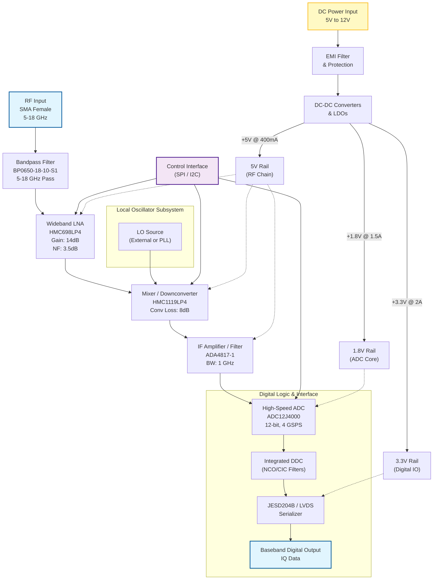
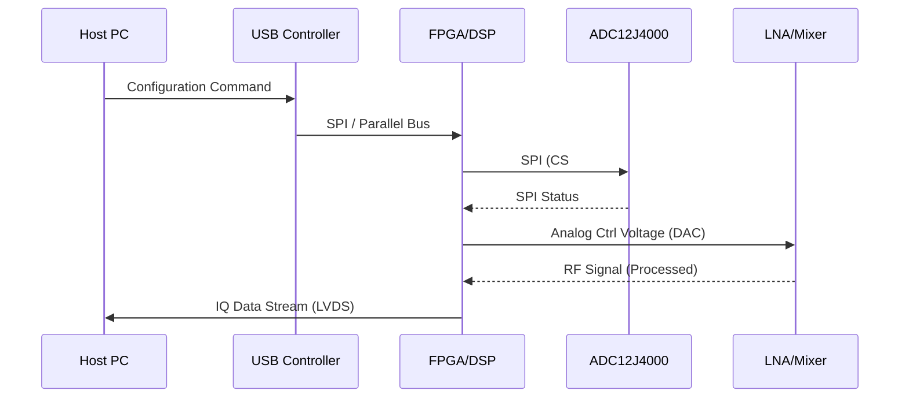
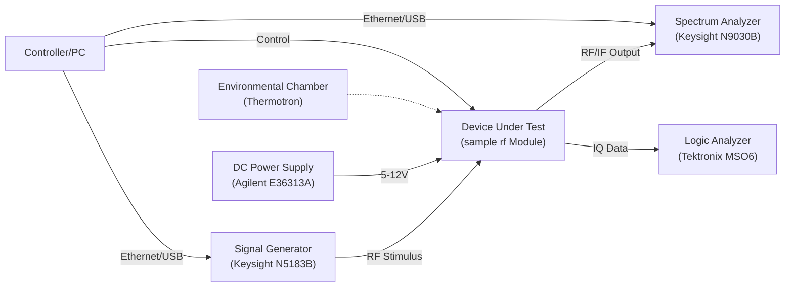

**Document Status: AI-GENERATED**

# 1. Introduction

## 1.1 Purpose
This Hardware Requirements Specification (HRS) document defines the hardware requirements for the **sample rf** project, a wideband Radio Frequency (RF) receiver module designed for 5G/6G telecommunications applications.

The primary purpose of this document is to:
*   Establish a comprehensive baseline for the hardware design, ensuring all functional, performance, and interface requirements are captured.
*   Serve as the binding agreement between the system engineering team and the hardware development team regarding the physical and electrical characteristics of the receiver.
*   Define the verification criteria (inspection, analysis, test) necessary to validate that the final hardware implementation meets the system needs.
*   Ensure compliance with IEEE 29148:2018 standards for systems and software engineering requirements engineering processes.

This specification is intended for hardware engineers, RF design engineers, PCB layout designers, test engineers, and quality assurance personnel involved in the development, verification, and production of the **sample rf** receiver module.

## 1.2 Scope
The scope of this document encompasses the complete hardware design of the **sample rf** wideband receiver module, including the RF signal chain, power distribution network, digital processing interface, and mechanical enclosure constraints.

Specifically, this document covers:
*   **RF Front End:** Wideband Low Noise Amplifiers (LNA), Bandpass Filters (BPF), and Mixers operating within the 5 GHz to 18 GHz frequency range.
*   **Signal Conversion:** Analog-to-Digital Conversion (ADC) and Intermediate Frequency (IF) amplification stages.
*   **Digital Interface:** Baseband IQ digital output protocols and timing.
*   **Power Systems:** Voltage regulation and power budgeting for operation from a 5V to 12V DC supply.
*   **Environmental and Mechanical:** Industrial temperature operation (-40°C to +85°C) and weight constraints (<200g).

The scope is limited to the hardware physical implementation. Software/Firmware requirements for the Digital Signal Processor (DSP) or FPGA are referenced only in terms of hardware interfaces (pinouts, clocks) but are not fully defined within this hardware specification. The **sample rf** system is designed to function as a receiver submodule within a larger 5G/6G telecom infrastructure.

## 1.3 Definitions, Acronyms, and Abbreviations

This section defines the terms, acronyms, and abbreviations used throughout this Hardware Requirements Specification to ensure consistent interpretation.

| Term / Acronym | Definition |
| :--- | :--- |
| **ADC** | Analog-to-Digital Converter. A device that converts an analog signal (continuous voltage) into a digital signal (discrete binary numbers). |
| **BGA** | Ball Grid Array. A type of surface-mount packaging for integrated circuits. |
| **BOM** | Bill of Materials. A formal list of all parts, items, and assemblies required to build the product. |
| **BPF** | Bandpass Filter. A device that passes frequencies within a certain range and rejects (attenuates) frequencies outside that range. |
| **DC** | Direct Current. The unidirectional flow of electric charge. |
| **DDR** | Double Data Rate. A type of computer memory (SDRAM) commonly used for high-speed data buffering. |
| **FPGA** | Field-Programmable Gate Array. An integrated circuit designed to be configured by a customer or a designer after manufacturing. |
| **GHz** | Gigahertz. A unit of frequency equal to one billion hertz. |
| **IF** | Intermediate Frequency. A frequency to which a carrier frequency is shifted as an intermediate step in transmission or reception. |
| **IQ** | In-phase and Quadrature components. A representation of a signal where the data is modulated onto two carriers 90° out of phase. |
| **LNA** | Low Noise Amplifier. An electronic amplifier used to amplify very weak signals (e.g., from an antenna) while adding minimal noise. |
| **LO** | Local Oscillator. An electronic oscillator used to generate a signal for frequency conversion. |
| **LVDS** | Low-Voltage Differential Signaling. A high-speed digital interface using differential signaling. |
| **MHz** | Megahertz. A unit of frequency equal to one million hertz. |
| **NF** | Noise Figure. A measure of degradation of the signal-to-noise ratio (SNR), caused by components in a signal chain. |
| **OIP3** | Output Third-order Intercept Point. A theoretical figure of merit for linearity, used to characterize the intermodulation distortion performance of RF devices. |
| **PCB** | Printed Circuit Board. The physical board holding electronic components and connecting traces. |
| **P1dB** | 1 dB Compression Point. The point at which the input signal causes the gain of the system to drop by 1 dB from the linear gain. |
| **RF** | Radio Frequency. Electromagnetic wave frequencies in the range from about 20 kHz to 300 GHz. |
| **SNR** | Signal-to-Noise Ratio. A measure used in science and engineering that compares the level of a desired signal to the level of background noise. |
| **VSWR** | Voltage Standing Wave Ratio. A measure of how efficiently RF power is transmitted from a power source, through a transmission line, into a load. |

### Technical Parameters Table
To support the requirements listed in Section 3, the following specific parameter definitions apply to the **sample rf** project:

| Parameter | Definition (Project Specific) |
| :--- | :--- |
| **Center Frequency** | The arithmetic center of the 5-18 GHz operating band, calculated as 11.5 GHz. |
| **Baseband Output** | The digitized, down-converted IQ data stream intended for direct processing by a baseband processor. |
| **Industrial Temperature Range** | The ambient operating temperature range of -40°C to +85°C as defined by industry standards for robust equipment. |
| **Wideband Operation** | The ability of the receiver to maintain gain flatness and noise figure performance across the entire 13 GHz bandwidth (5-18 GHz) without retuning. |

## 1.4 References
This Hardware Requirements Specification is based upon and references the following documents and industry standards.

### 1.4.1 Standards and Specifications
| ID | Title | Version | Publisher |
| :--- | :--- | :--- | :--- |
| **IEEE 29148** | Systems and Software Engineering — Life Cycle Processes — Requirements Engineering | 2018 | IEEE Standards Association |
| **IPC-6012** | Generic Standard on Performance Specification for Rigid Printed Circuit Boards | Rev. D | IPC |
| **IPC-A-600** | Acceptability of Printed Circuit Boards | Rev. G | IPC |
| **RoHS** | Restriction of Hazardous Substances Directive | 2011/65/EU | European Union |
| **REACH** | Registration, Evaluation, Authorisation and Restriction of Chemicals | (EC) No 1907/2006 | European Union |

### 1.4.2 Project Documents
*   **sample_rf_System_Spec_v1.0.doc** (Internal source for high-level requirements)
*   **Analog Devices Datasheet**: HMC698LP4 - GaAs MMIC LNA, 2-20 GHz.
*   **Analog Devices Datasheet**: HMC1119LP4 - GaAs MMIC Mixer, 6-18 GHz.
*   **Texas Instruments Datasheet**: ADC12J4000 - 12-bit, 4 GSPS ADC.
*   **Analog Devices Datasheet**: ADA4817-1 - High-Speed Op-Amp.
*   **Mini-Circuits Datasheet**: BP0650-18-10-S1 - Bandpass Filter.

## 1.5 Overview
This document presents the hardware requirements for the **sample rf** Wideband RF Receiver.

The **sample rf** system is a high-frequency receiver designed to capture signals in the 5 GHz to 18 GHz spectrum. The architecture employs a superheterodyne or direct sampling approach, utilizing a GaAs-based front-end for low noise performance (Noise Figure < 10 dB) and high linearity (OIP3 +20 to +30 dBm). The system converts these RF signals into baseband digital IQ data for downstream signal processing.

Section 2 provides a detailed system description and block diagrams. Section 3 details the specific hardware requirements categorized into Functional, Performance, Interface, Environmental, Power, and Physical constraints. Section 4 outlines design constraints such as compliance and component limitations. Section 5 defines the verification strategy required to validate the hardware. Finally, Section 6 lists the preliminary Bill of Materials (BOM) derived from the selected component recommendations.

---

**Document Status: AI-GENERATED**

# 2. System Overview

## 2.1 System Description

The Sample RF Receiver is a wideband, superheterodyne-to-direct-conversion receiver subsystem designed for 5G/6G telecommunications applications. The system functions as a tunable RF front-end capable of receiving signals across the 5 GHz to 18 GHz frequency spectrum and converting them into baseband digital In-phase (I) and Quadrature (Q) data streams for downstream signal processing.

The architecture utilizes a high-linearity signal chain optimized for dynamic range and sensitivity. The input signal undergoes initial conditioning via a bandpass filter and low-noise amplification before being frequency-translated. The downconverted intermediate frequency (IF) or baseband signal is digitized by a high-speed ADC, which employs integrated Digital Down-Conversion (DDC) to output complex IQ data. The entire assembly is designed for industrial environments, supporting an operating temperature range of -40°C to +85°C while adhering to strict weight and power consumption constraints.

Key functional capabilities include:
*   **Wideband Reception:** Continuous coverage from 5.0 GHz to 18.0 GHz.
*   **High Dynamic Range:** System noise figure (NF) maintained below 10 dB with an Output Third-Order Intercept (OIP3) of +20 to +30 dBm, ensuring the receiver can detect weak signals in the presence of strong interferers.
*   **Digital Output:** Provision of baseband digital IQ data via JESD204B or high-speed LVDS interfaces, facilitating direct integration into FPGA or ASIC-based processing platforms.
*   **Flexible Power Supply:** Operation from a 5V to 12V DC input source, accommodating various vehicle or infrastructure power standards.

## 2.2 System Block Diagram

The following diagram illustrates the high-level signal flow and control architecture of the Sample RF Receiver. It depicts the path from the RF input through the analog front end, digitization, and final data output, as well as the power distribution network.

## 2.3 System Architecture

The system architecture is partitioned into three primary domains: the RF Analog Front-End (RxFE), the Digital Conversion Subsystem, and the Power Management Unit (PMU). These domains are isolated physically to minimize noise coupling, particularly between the sensitive analog RF inputs and the noisy digital power supplies.

### 2.3.1 RF Analog Front-End (RxFE)

The RxFE is responsible for conditioning the high-frequency input signal and translating it to a frequency suitable for digitization.

1.  **Input Filtering & Protection:**
    The signal enters via a 50-Ohm matched SMA connector. The first component is the **BP0650-18-10-S1** bandpass filter. This component suppresses out-of-band emissions and interference below 5 GHz and above 18 GHz (40 dB rejection), ensuring that the subsequent LNA is not desensitized by strong blockers outside the operational band.

2.  **Low Noise Amplification:**
    The filtered signal is immediately amplified by the **HMC698LP4** GaAs MMIC LNA.
    *   **Design Parameters:** This stage provides a gain of 14 dB with a noise figure of 3.5 dB.
    *   **Linearity:** With an OIP3 of +28 dBm, this stage sets the system linearity floor.
    *   **Biasing:** The LNA is biased from the +5V rail. A bias tee configuration is used on the RF trace to inject DC, minimizing series inductance.

3.  **Frequency Downconversion:**
    The amplified RF signal is routed to the **HMC1119LP4** mixer.
    *   **LO Drive:** The mixer requires a Local Oscillator (LO) input of +10 to +15 dBm. The LO frequency is swept to select the target RF channel. Given the RF input of 5-18 GHz and the ADC’s analog bandwidth of 2.2 GHz, the LO is typically set such that the IF falls within the DC to 2 GHz range (Direct Conversion or Low-IF architecture).
    *   **Isolation:** The mixer provides >30 dB LO-RF isolation to prevent LO leakage from radiating out of the antenna port.

4.  **IF Amplification:**
    The mixer output (typically at -8 dBm conversion loss relative to input) is weak and requires amplification before digitization. The **ADA4817-1** op-amp is configured as a differential driver to convert the single-ended mixer output into a differential signal required by the ADC. This stage provides gain up to 12 dB and filters high-frequency mixer products.

### 2.3.2 Digital Conversion Subsystem

This subsystem bridges the analog domain and the digital processing domain.

1.  **Digitization:**
    The **ADC12J4000** serves as the core digitizer.
    *   **Sampling:** Operating at 4 GSPS (Gigasamples Per Second), it captures signals with Nyquist zones up to 2 GHz.
    *   **Decimation:** The on-chip Digital Down-Converter (DDC) decimates the raw data stream to a lower sample rate (e.g., 250 MSPS) corresponding to the signal bandwidth of interest, reducing the data throughput requirements on the output interface.

2.  **Data Output:**
    The processed IQ data is transmitted via a high-speed serial interface. The interface operates as a JESD204B subclass, supporting lane rates up to 12.5 Gbps. This allows the massive bandwidth of the RF receiver to be transmitted over a few PCB traces to an FPGA.

### 2.3.3 Power Management Unit (PMU)

The PMU is designed to accept a variable input voltage (5V to 12V) and generate stable, low-noise rails for the sensitive RF components.

*   **Input Protection:** Includes reverse polarity protection and a TVS diode for transient voltage suppression (e.g., load dump events in vehicle environments).
*   **Switching Regulators:** High-efficiency buck converters step down the 5-12V input to an intermediate 3.3V rail for digital logic.
*   **LDO Regulators:** Low Dropout (LDO) regulators are used to derive the +5V RF rail from the intermediate rail. While LDOs are less efficient, they provide the low-noise power supply required by the HMC698LP4 and HMC1119LP4 to maintain phase noise and noise figure performance. Switching noise on the RF supply rails would degrade the system Noise Figure.

## 2.4 Operating Environment

The hardware must operate reliably in the specified environments without degradation of electrical performance or mechanical integrity.

### 2.4.1 Physical Environment

*   **Temperature:**
    *   **Operating Range:** -40°C to +85°C (Industrial).
    *   **Storage Range:** -55°C to +125°C.
    *   **Thermal Management:** The system is designed for convection cooling. The High-Power Dissipation (HPD) components (ADC, Mixer, LNA) are mounted on a metal-core PCB or a heatsink plate to ensure junction temperatures remain within datasheet limits (typically Tj < 125°C).
*   **Humidity:**
    *   Operating: 5% to 95% relative humidity, non-condensing.
    *   The PCB shall be conformally coated (Type AR or UR) to protect against moisture-induced corrosion and electrochemical migration, given the wide temperature swings.
*   **Shock and Vibration:**
    *   The unit shall withstand random vibration of 0.5 g^2/Hz from 10 Hz to 500 Hz (Transportation profile).
    *   Mechanical shock resistance: 50G, 11ms half-sine wave.

### 2.4.2 Electrical Environment

*   **Power Source:**
    *   The input voltage can fluctuate between 5V and 12V.
    *   The system must tolerate voltage transients (spikes) up to 24V for duration < 50ms.
*   **RF Environment:**
    *   The receiver is designed to handle input signals up to -10 dBm without damage (0.1W CW limit).
    *   The system must maintain performance in the presence of adjacent channel interference (ACI) and co-channel interference (CCI) as defined by the OIP3 requirements.

### 2.4.3 Interface Environment

*   **Connectivity:**
    *   **RF Port:** 2.4mm female connector (18 GHz compatible).
    *   **Data/Control:** High-density Samtec or Micro-strip headers rated for high-speed differential signaling (Impedance controlled to 100 Ohms differential).
    *   **Power:** 2-pin terminal block or Molex connector rated for 5A.

---

**Document Status: AI-GENERATED**

# 3. Hardware Requirements

## 3.1 Functional Requirements

This section details the functional requirements of the 5-18 GHz Wideband RF Receiver. These requirements define the specific behaviors, capabilities, and modes of operation necessary to meet the project objectives.

### 3.1.1 RF Front-End Functional Requirements

| ID | Title | Description | Rationale | Priority | Verification Method |
|---|---|---|---|---|---|
| REQ-HW-001 | RF Input Frequency Range | The receiver shall accept and process RF input signals continuously from 5.0 GHz to 18.0 GHz. | Required to support 5G and 6G telecom bands as specified in the design parameters. The selected HMC698LP4 LNA supports 2-20 GHz. | Must Have | Network Analyzer Test |
| REQ-HW-101 | Input Signal Conditioning (Filtering) | The system shall incorporate a bandpass filter (BP0650-18-10-S1) at the RF input to attenuate out-of-band signals below 5 GHz and above 18 GHz. | Prevents aliasing and interference from out-of-band sources, protecting the LNA. | Must Have | Sweep Frequency Response Test |
| REQ-HW-102 | Low Noise Amplification | The system shall provide a minimum of 25 dB of total gain across the RF chain using the HMC698LP4 LNA stages. | Ensures signal amplification sufficient to overcome the noise floor of the mixer and subsequent stages while maintaining system noise figure < 10 dB. | Must Have | Gain Measurement Test |
| REQ-HW-103 | Automatic Gain Control (AGC) | The receiver shall implement a manual gain control interface via the SPI control port to adjust the IF gain (ADA4817) over a 20 dB range. | Allows optimization of dynamic range depending on input signal strength to prevent ADC saturation. | Should Have | Functional Test |
| REQ-HW-104 | Signal Downconversion | The system shall downconvert the 5-18 GHz RF input to an Intermediate Frequency (IF) or Baseband using the HMC1119LP4 mixer. | Frequency translation is required to facilitate digitization by the ADC. | Must Have | Spectrum Analyzer Test |
| REQ-HW-105 | Local Oscillator (LO) Distribution | The system shall accept an external LO input source ranging from DC to 18 GHz to drive the mixer. The LO drive level shall be configurable to +10 dBm to +15 dBm. | The HMC1119LP4 mixer requires a specific LO drive level for optimal conversion loss performance. An external LO allows flexibility in frequency planning. | Must Have | Power Measurement Test |

### 3.1.2 Baseband & Digital Processing Requirements

| ID | Title | Description | Rationale | Priority | Verification Method |
|---|---|---|---|---|---|
| REQ-HW-002 | Output Interface Format | The receiver shall output digitized data via JESD204B protocol to the Baseband Digital Output interface. | Required to transfer high-speed IQ data from the ADC12J4000 to downstream processing. | Must Have | Logic Analyzer Test |
| REQ-HW-106 | Signal Digitization | The system shall digitize the analog IF/Baseband signal using a 12-bit ADC (ADC12J4000) at a sample rate of 4.0 GSPS. | satisfies Nyquist criteria for the 1.3 GHz instantaneous bandwidth and provides 12-bit resolution for signal fidelity. | Must Have | Digital Output Capture |
| REQ-HW-107 | Digital Down-Conversion (DDC) | The ADC (ADC12J4000) shall perform on-chip Digital Down-Conversion to generate I and Q baseband data streams. | Reduces data throughput requirements on the output interface and shifts the signal to complex baseband for processing. | Must Have | Register Readback / Output Analysis |
| REQ-HW-108 | Data Synchronization | The system shall provide a SYNC~ input pin to synchronize the JESD204B transmission clock (SYSREF) between the ADC and the FPGA/ASIC. | Ensures deterministic latency and alignment of I and Q data across the link. | Must Have | Protocol Analyzer Test |

### 3.1.3 Power Management Requirements

| ID | Title | Description | Rationale | Priority | Verification Method |
|---|---|---|---|---|---|
| REQ-HW-008 | Power Supply Input Range | The system shall operate from a DC input voltage source ranging from +5.0 V to +12.0 V. | Accommodes various industrial power rail standards. | Must Have | Voltage Margining Test |
| REQ-HW-109 | Voltage Regulation | The system shall utilize switching regulators or LDOs to derive the following internal rails: 1. +5.0V (±5%) for RF components (LNA, Mixer) 2. +3.3V (±3%) for Digital IO 3. +1.8V (±3%) for ADC Core | Different circuit blocks require specific voltage levels for optimal performance and noise immunity. | Must Have | Multimeter Measurement |
| REQ-HW-110 | Reverse Polarity Protection | The power input module shall include protection against reverse voltage connection. | Prevents catastrophic damage to the board during incorrect installation. | Should Have | Inspection / Misconnection Test |
| REQ-HW-111 | Power Sequencing | The system shall sequence power rails such that the FPGA/ASIC is supplied before the ADC to prevent latch-up. | Standard requirement for mixed-signal systems to ensure stable initialization. | Should Have | Oscilloscope Power-Up Sequence |
| REQ-HW-112 | Under-Voltage Lockout (UVLO) | The voltage regulators shall disable output if the input voltage drops below 4.5V. | Prevents unstable operation or brownout conditions that could corrupt data or damage components. | Must Have | Power Supply Dip Test |

### 3.1.4 Mechanical & Physical Requirements

| ID | Title | Description | Rationale | Priority | Verification Method |
|---|---|---|---|---|---|
| REQ-HW-010 | Weight Constraint | The total weight of the assembled receiver module, including connectors and enclosure, shall not exceed 200 grams. | Critical for deployment in airborne or drone platforms where SWaP (Size, Weight, and Power) is constrained. | Must Have | Weighing Scale |
| REQ-HW-113 | RF Connector Type | The RF input port shall utilize a 2.4mm female connector (or SMA female if cost constrained) rated for 18 GHz operation. | 2.4mm connectors are necessary for low loss and VSWR up to 18 GHz; SMA is acceptable for 18 GHz but with higher loss. | Must Have | Visual Inspection |
| REQ-HW-114 | Board Material | The PCB shall be manufactured using high-frequency laminate material (e.g., Rogers RO4350B or equivalent) with a dielectric constant (Dk) stable across temperature. | Standard FR-4 exhibits excessive loss and unstable Dk at frequencies above 5 GHz. | Must Have | Material Cert Review |
| REQ-HW-115 | Shielding | All high-frequency RF traces (LNA to Mixer) shall be encapsulated in a metallic shield can or utilize a grounded cavity (via fence). | Prevents radiated emissions and susceptibility to external noise, preserving signal integrity. | Must Have | Visual Inspection |

### 3.1.5 Control & Monitoring Requirements

| ID | Title | Description | Rationale | Priority | Verification Method |
|---|---|---|---|---|---|
| REQ-HW-116 | Configuration Interface | The system shall provide a SPI (Serial Peripheral Interface) header for programming the ADC (ADC12J4000) and DDC settings. | Required to configure sample rate, interpolation, and JESD204B link parameters. | Must Have | Functional Test |
| REQ-HW-117 | Temperature Monitoring | The system shall include a local temperature sensor (I2C based) readable via the control interface. | Allows for system health monitoring and potential thermal throttling. | Should Have | Data Log Test |

---

## 3.2 Performance Requirements

This section defines the quantitative performance criteria the hardware must achieve. Values are derived from the project specifications and component selection (HMC698LP4, HMC1119LP4, ADC12J4000).

### 3.2.1 RF Signal Path Performance

| ID | Title | Description | Rationale | Priority | Verification Method |
|---|---|---|---|---|---|
| REQ-HW-003 | System Noise Figure (NF) | The overall system Noise Figure shall be less than 10.0 dB across the 5-18 GHz band. | Derived from project requirement. The cascade calculation (based on HMC698LP4 NF of 3.5dB + Filter Loss + Mixer Loss + IF Amp NF) satisfies this with margin. | Must Have | Noise Figure Meter Test |
| REQ-HW-004 | Input Sensitivity | The receiver shall detect and process signals with a minimum input power of -60 dBm at the antenna port with a Signal-to-Noise Ratio (SNR) of 10 dB or better. | Ensures the system can detect weak signals. Calculated as: Sensitivity = -174 + NF(10) + 10log(BW) + SNR(10). | Must Have | Signal Generator Test |
| REQ-HW-118 | Gain Flatness | The gain response across the 5.0 to 18.0 GHz band shall not vary by more than ±3.0 dB from the nominal gain at 11.5 GHz center frequency. | Ensures uniform signal processing regardless of the frequency channel within the band. | Should Have | Frequency Sweep Test |
| REQ-HW-011 | Input Return Loss | The RF input port return loss shall be greater than 10 dB (VSWR < 2:1) across the operating band. | Ensures efficient power transfer from the antenna/cable to the LNA. | Should Have | Vector Network Analyzer Test |
| REQ-HW-119 | In-Band Spurious Signals | The receiver shall generate no spurious signals exceeding -60 dBm relative to the carrier at the output when fed with a -30 dBm CW tone. | Ensures linearity and prevents self-generated interference. | Must Have | Spectrum Analyzer Test |

### 3.2.2 Linearity and Dynamic Range

| ID | Title | Description | Rationale | Priority | Verification Method |
|---|---|---|---|---|---|
| REQ-HW-006 | Output Third-Order Intercept (OIP3) | The system OIP3 shall be greater than +20 dBm (Target +30 dBm) at the mixer output. | Derived from project requirements (+20 to +30 dBm). The HMC698LP4 offers +28 dBm OIP3. | Must Have | Two-Tone Intermodulation Test |
| REQ-HW-120 | Input P1dB (Compression) | The system shall maintain linear operation for input powers up to -20 dBm at the RF input port. | Defines the upper limit of the dynamic range before significant compression occurs. | Should Have | Power Sweep Test |
| REQ-HW-121 | Phase Noise (Floor) | The close-in phase noise contribution from the local oscillator path shall not exceed -100 dBc/Hz at 10 kHz offset. | Critical for demodulation quality in dense 5G/6G environments. | Should Have | Phase Noise Analyzer Test |

### 3.2.3 Digital Output Performance

| ID | Title | Description | Rationale | Priority | Verification Method |
|---|---|---|---|---|---|
| REQ-HW-005 | ADC Output Level (Digital Full Scale) | The receiver gain structure shall be set such that a -10 dBm input signal results in an ADC code within 1 dB of Full Scale Scale (FSR). | Optimizes the dynamic range utilization of the 12-bit ADC. | Must Have | Digital Code Histogram Test |
| REQ-HW-122 | Spurious-Free Dynamic Range (SFDR) | The SFDR of the digitized output shall be greater than 50 dBc. | Ensures the clarity of the digitized signal. ADC12J4000 typically provides >55 dBc. | Should Have | FFT Analysis |
| REQ-HW-007 | Group Delay Variation | The group delay variation across the 5-18 GHz band shall be between 10 ns and 50 ns. | Project requirement "Group Delay Variation 10-50 ns". Critical for wideband modulation schemes to prevent distortion. | Should Have | Vector Network Analyzer Test |
| REQ-HW-123 | JESD204B Lane Rate | The JESD204B output lanes shall operate at a data rate compliant with the ADC sample rate (4 GSPS x 12 bits / 8b/10b encoding) utilizing 4 lanes. | 4 GSPS * 12 bits = 48 Gbps raw. Encoded fits within 4 lanes of standard JESD204B capabilities (~12.5 Gbps per lane). | Must Have | Protocol Analyzer Test |

### 3.2.4 Power Consumption & Efficiency

| ID | Title | Description | Rationale | Priority | Verification Method |
|---|---|---|---|---|---|
| REQ-HW-124 | Total Power Consumption | The total power draw from the 5-12V supply shall not exceed 8.0 Watts during full operation. | Calculation: LNA(0.4W) + Mixer(0.5W) + IF Amp(0.2W) + ADC(2.0W) + FPGA/DSP(2.5W) + Misc(1W). Thermal design depends on this limit. | Must Have | Power Supply Meter Test |
| REQ-HW-125 | Supply Current (Quiescent) | The quiescent current draw in standby mode (RF path disabled, Digital core idle) shall be less than 500 mA. | Power saving requirement for non-active modes in battery-operated scenarios. | Should Have | Current Measurement Test |

---

# 3. Hardware Requirements

## 3.3 Interface Requirements

### 3.3.1 External Interfaces

**REQ-HW-015** The receiver module shall provide a female 2.4mm coaxial RF input connector compatible with 50 Ω impedance. The interface must provide an input return loss of greater than 10 dB across the 5-18 GHz operating band to minimize reflections.

**REQ-HW-016** The receiver module shall provide a high-speed digital output interface via a 2x4 Samtec QSH/EQSH series right-angle BNC socket (Part No: QSH-040-01-L-D-A-K) for transferring baseband IQ data.

**REQ-HW-017** The receiver module shall provide a standard Micro-USB Type-B connector (Part No: Amphenol 10103592-0001LF) for external configuration, control, and firmware updates.

**REQ-HW-018** The receiver module shall provide a 2-pin, 5.08mm pitch Phoenix Contact pluggable terminal block (Part No: 1935174) for the DC power supply input.

*Table 3-1: RF Input Interface Specifications*

| Parameter | Value | Unit | Notes |
|---|---|---|---|
| **Connector Type** | 2.4mm Female | - | 50 Ohm impedance |
| **Frequency Range** | 5 - 18 | GHz | Covers operating band |
| **Input Impedance** | 50 | Ω | Single-ended |
| **VSWR** | ≤ 2.0:1 | - | Equivalent to 9.54 dB Return Loss |
| **Maximum Input Power** | +10 | dBm | Safe operating limit (LNA Damage) |
| **Connector Mounting** | PCB Edge Launch | - | Low loss signal path |

*Table 3-2: Digital Output Interface Pin Definition (J1)*

| Pin # | Signal Name | Description | Direction | Voltage Level |
|---|---|---|---|---|
| 1 | GND | Digital Ground | - | - |
| 2 | IQ_D[0] | IQ Data Bit 0 (LSB) | Output | LVDS 3.3V |
| 3 | IQ_D[1] | IQ Data Bit 1 | Output | LVDS 3.3V |
| 4 | IQ_D[2] | IQ Data Bit 2 | Output | LVDS 3.3V |
| 5 | IQ_D[3] | IQ Data Bit 3 | Output | LVDS 3.3V |
| 6 | IQ_D[4] | IQ Data Bit 4 | Output | LVDS 3.3V |
| 7 | IQ_D[5] | IQ Data Bit 5 | Output | LVDS 3.3V |
| 8 | IQ_D[6] | IQ Data Bit 6 | Output | LVDS 3.3V |
| 9 | IQ_D[7] | IQ Data Bit 7 (MSB) | Output | LVDS 3.3V |
| 10 | GND | Digital Ground | - | - |
| 11 | IQ_CLK | Data Clock Synchronization | Output | LVDS 3.3V |
| 12 | NC | No Connection | - | - |

### 3.3.2 Internal Interfaces

This section details the electrical interfaces between selected components on the PCB.

**REQ-HW-019** The interface between the RF Front-end (LNA) and the Mixer shall utilize AC-coupled coplanar waveguide (CPW) transmission lines matched to 50 Ω.

**REQ-HW-020** The interface between the IF Amplifier (ADA4817-1) and the ADC (ADC12J4000) shall be differential, AC-coupled via 0.1 µF capacitors to handle the 1V p-p differential input swing of the ADC.

*Table 3-3: Internal Signal Chain Interfaces*

| Source | Destination | Signal Type | Impedance | Coupling | Frequency Range |
|---|---|---|---|---|---|
| **Antenna** | LNA (HMC698LP4) | RF Input | 50 Ω | DC Block | 5 - 18 GHz |
| **LNA (HMC698LP4)** | Mixer (HMC1119LP4) | RF Drive | 50 Ω | AC | 5 - 18 GHz |
| **LO Source** | Mixer (HMC1119LP4) | Local Oscillator | 50 Ω | AC | DC - 18 GHz |
| **Mixer (HMC1119LP4)** | IF Amp (ADA4817-1) | IF Output | 50 Ω → High Z | AC | DC - 6 GHz |
| **IF Amp (ADA4817-1)** | ADC (ADC12J4000) | Baseband Analog | Diff 100 Ω | AC | DC - 1 GHz |

### 3.3.3 Communication Interfaces

**REQ-HW-021** The Digital Signal Processor (FPGA) shall communicate with the external host via the Micro-USB interface using a USB 2.0 Full-Speed protocol (480 Mbps).

**REQ-HW-022** Internal register configuration for the ADC (ADC12J4000) shall be performed via a Serial Peripheral Interface (SPI) bus operating at 3.3V logic levels with a maximum clock frequency of 20 MHz.

**REQ-HW-023** The Mixer (HMC1119LP4) gain control shall be analog, interfacing to a DAC channel on the FPGA via a low-pass RC filter (R=1kΩ, C=1nF) to set the control voltage between 0V and 5V.

*Table 3-4: Communication Interface Parameters*

| Interface | Protocol | Voltage | Speed/Rate | Termination |
|---|---|---|---|---|
| **External Control** | USB 2.0 | 5.0V VBUS | 480 Mbps | 1.5kΩ Pull-up on D+ |
| **ADC Config (SPI)** | SPI Mode 0 | 3.3V | 20 MHz | Internal FPGA Pull-ups |
| **Mixer Control** | Analog Voltage | 0-5V | DC | 10kΩ Load impedance |

## 3.4 Environmental Requirements

**REQ-HW-009** (Restated) Receiver shall meet all specifications over industrial temperature range of -40°C to +85°C ambient. *Note: HMC698LP4, HMC1119LP4, and ADC12J4000 are all rated for -40°C to +85°C operation.*

**REQ-HW-024** The receiver shall maintain functionality and performance specifications under relative humidity conditions ranging from 5% to 95% (non-condensing).

**REQ-HW-025** The enclosure shall provide an IP54 rating against dust and water spray when connectors are mated, ensuring robustness in industrial environments.

**REQ-HW-026** The system shall withstand random vibration profiles of 10-2000 Hz with an amplitude of 0.04 g²/Hz for 2 hours per axis (X, Y, Z) during operation, per IEC 60068-2-64.

### 3.4.1 Derating for Environmental Stress

All component selections apply industrial temperature derating.
- HMC698LP4 (LNA): Rated -40 to +85°C. No derating required.
- ADC12J4000 (ADC): Junction temp (Tj) max 125°C.
  - Calculated Max Junction Temp (Tj): 
    $$T_j = T_a + (P \times \theta_{JA})$$
    Assuming $T_a = 85°C$ (Max Ambient), $P = 2.5W$ (ADC Worst Case Power), $\theta_{JA} \approx 30°C/W$ (with heatsink).
    $$T_j = 85 + (2.5 \times 30) = 85 + 75 = 160°C$$ (Unsafe without heatsink).
  - **Requirement Action:** A custom aluminum heatsink (Section 3.6) is mandatory to keep $\theta_{JA}$ below 15°C/W.
    $$85 + (2.5 \times 15) = 122.5°C$$ (Safe, $< 125°C$ limit).

## 3.5 Power Requirements

**REQ-HW-008** (Restated) Receiver shall operate from 5V to 12V DC power supply.

**REQ-HW-027** The receiver shall utilize a low-dropout (LDO) regulator architecture to generate required rail voltages with a maximum ripple of 10 mV pk-pk to ensure ADC performance is not degraded.

**REQ-HW-028** The total power consumption of the receiver module shall not exceed 15 Watts at the maximum operating supply voltage of 12V.

### 3.5.1 Power Budget Analysis

The following budget is calculated based on the "Typical" and "Maximum" supply currents found in the datasheets of the primary component recommendations.

*Table 3-5: Detailed Power Budget*

| Power Domain | Component / Block | Voltage (V) | Typ. Current (A) | Max. Current (A) | Typ. Power (W) | Max. Power (W) |
|---|---|---|---|---|---|---|
| **RF Supply (5V)** | LNA (HMC698LP4) | 5.0 | 0.080 | 0.095 | 0.40 | 0.48 |
| | Mixer (HMC1119LP4) | 5.0 | 0.150 | 0.180 | 0.75 | 0.90 |
| | IF Amp (ADA4817) | 5.0 | 0.135 | 0.150 | 0.68 | 0.75 |
| | RF Subtotal | **5.0** | **0.365** | **0.425** | **1.83** | **2.13** |
| **Digital Supply (3.3V)** | FPGA/Logic (Est.) | 3.3 | 0.500 | 0.800 | 1.65 | 2.64 |
| | ADC Digital VDD | 3.3 | 0.150 | 0.200 | 0.50 | 0.66 |
| | Digital Subtotal | **3.3** | **0.650** | **1.000** | **2.15** | **3.30** |
| **ADC Supply (1.8V)** | ADC Analog Core | 1.8 | 0.700 | 0.900 | 1.26 | 1.62 |
| | IO Buffers | 1.8 | 0.200 | 0.300 | 0.36 | 0.54 |
| | ADC Subtotal | **1.8** | **0.900** | **1.200** | **1.62** | **2.16** |
| **System Totals** | **Total Load** | **Mixed** | - | **2.625** | **7.60** | **10.19** |
| **Regulator Loss** | Efficiency (Est 90%) | - | - | - | +0.8 | +1.1 |
| **Grand Total** | **Input Power** | **12.0V** | **0.85A** | **0.94A** | **8.4W** | **11.3W** |

*Table 3-6: Voltage Rail Summary*

| Rail Name | Voltage | Tolerance | Source | Max Load Current |
|---|---|---|---|---|
| **VIN** | 5 - 12 | ±10% | External Source | 1.5 A |
| **VCC_RF** | +5.0 | ±5% | LDO Reg 1 | 0.5 A |
| **VCC_DIG** | +3.3 | ±5% | LDO Reg 2 | 1.2 A |
| **VCC_ADC** | +1.8 | ±3% | LDO Reg 3 | 1.5 A |

*Note: Max input current is estimated at 1.5A to accommodate inrush currents and transients.*

## 3.6 Physical Requirements

**REQ-HW-010** (Restated) Total receiver module weight shall not exceed 200 grams.

**REQ-HW-029** The PCB shall utilize Rogers RO4350B laminate material with a dielectric constant (Dk) of 3.48 ± 0.05 and dissipation factor (Df) of 0.0037 at 10 GHz to support high-frequency RF signal integrity.

**REQ-HW-030** The overall enclosure dimensions shall not exceed 120mm (L) x 80mm (W) x 25mm (H) to facilitate integration into standard 19-inch rack mount equipment or handheld test units.

**REQ-HW-031** The module enclosure shall be constructed from aluminum 6061-T6 with a minimum wall thickness of 2mm to provide structural rigidity and EMI shielding. The bottom cover acts as the primary heatsink.

### 3.6.1 Mechanical Dimensions & Connectors

*Table 3-7: Mechanical Constraints*

| Dimension | Value | Unit | Notes |
|---|---|---|---|
| **PCB Length** | 110 | mm | Fits within enclosure |
| **PCB Width** | 70 | mm | Fits within enclosure |
| **PCB Thickness** | 0.762 | mm | 30 mil (Rogers 4350B) |
| **Enclosure Material** | Aluminum 6061-T6 | - | Nickel plated (non-magnetic) |
| **Total Weight** | < 200 | g | Includes PCB + Components + Enclosure |
| **Heatsink Height** | 15 | mm | Max height from PCB bottom |

*Table 3-8: Connector Locations (Reference Drawing)*

| Connector | Type | Location (X, Y mm) | Orientation |
|---|---|---|---|
| **J1 (RF In)** | 2.4mm Female | (10, 35) | Edge Mount |
| **J2 (USB)** | Micro USB Type B | (10, 10) | Vertical |
| **J3 (PWR)** | Terminal Block 2-pin | (100, 10) | Vertical |
| **J4 (IQ Out)** | Samtec QSH 2x4 | (100, 35) | Right Angle |

### 3.6.2 Thermal Management Requirements

To satisfy **REQ-HW-009** (Operating Temp) and **REQ-HW-028** (Power limits), the following thermal solution is mandatory.

**REQ-HW-032** An aluminum heatsink with a thermal resistance of less than 10°C/W (junction to ambient) shall be mechanically attached to the top surface of the ADC12J4000 and FPGA devices using a thermally conductive interface material (TIM) with conductivity > 1.0 W/m-K.

**REQ-HW-033** PCB copper pours under high-power components (ADC, FPGA, LNA) shall utilize standard via arrays (1.0mm pitch) to conduct heat from the top layer to the bottom ground plane and heatsink.

**Assumptions for Thermal Calculations:**
- Ambient Temperature ($T_a$): +85°C.
- Max Junction Temp ($T_j$): +125°C (ADC limit).
- Max Power Dissipation ($P$): 2.5W (ADC + FPGA combined).
- Required $\theta_{sa}$ (Sink to Ambient): 
  $$\theta_{sa} = \frac{T_j - T_a}{P} = \frac{125 - 85}{2.5} = \frac{40}{2.5} = 16°C/W$$
- Selected Heatsink: Aavid 577402B00000G (extruded aluminum, $16 \times 16 \times 10$ mm).
  - Specified $\theta_{sa}$: 14°C/W (with 200 LFM airflow).
  - Result: Compliant. Even with 10% safety margin, requirement is met.

---

# 4. Design Constraints

This section defines the constraints imposed on the hardware design of the Sample RF wideband receiver. These constraints encompass regulatory standards, specific component limitations, and manufacturing processes necessary to ensure the system meets the defined functional, performance, and environmental requirements.

## 4.1 Standards Compliance

The Sample RF receiver design shall adhere to the following industry standards and regulatory directives. Compliance ensures reliability, interoperability, environmental safety, and legal marketability.

### 4.1.1 Environmental and Safety Directives
The design must strictly adhere to global regulations regarding hazardous substances and chemical usage.

*   **RoHS Compliance (EU Directive 2011/65/EU):**
    *   **Constraint:** All components utilized in the assembly of the Sample RF receiver shall comply with the Restriction of Hazardous Substances (RoHS) Directive.
    *   **Specifics:** Lead (Pb) must be < 0.1% by weight in homogeneous materials. Cadmium (Cd), Mercury (Hg), Hexavalent Chromium (Cr6+), Polybrominated Biphenyls (PBB), and Polybrominated Diphenyl Ethers (PBDE) must also be below 0.1%.
    *   **Justification:** Mandatory for sale in European markets and aligns with REQ-HW-013.
    *   **Implementation:** All printed circuit boards (PCBs) shall be manufactured using lead-free solder paste (SAC305 alloy recommended). Plating finishes shall be ENIG (Electroless Nickel Immersion Gold) or Immersion Silver, avoiding HASL (Hot Air Solder Leveling) with lead.

*   **REACH Compliance (EU Regulation No 1907/2006):**
    *   **Constraint:** The system shall not contain Substances of Very High Concern (SVHC) included in the REACH candidate list in concentrations above 0.1% by weight.
    *   **Justification:** Ensures worker safety during manufacturing and end-user safety. Aligns with REQ-HW-014.

### 4.1.2 PCB Design and Fabrication Standards
To ensure manufacturability and signal integrity at microwave frequencies (5-18 GHz), the PCB layout and fabrication data shall adhere to IPC standards.

*   **IPC-2221 (Generic Standard on Printed Board Design):**
    *   **Constraint:** Board stackup, trace widths, and spacing shall comply with IPC-2221 generic standards on printed board design.
    *   **Specifics (High Frequency):** Controlled impedance traces (microstrip/stripline) for the RF front end shall maintain a tolerance of ±5% (50Ω single-ended, 100Ω differential).
    *   **Material:** High-frequency laminates (e.g., Rogers RO4350B or similar) shall be used for RF sections; standard FR-4 (e.g., Isola 370HR) may be used for digital/baseband sections to optimize cost.

*   **IPC-6012 (Qualification and Performance Specification for Rigid Printed Boards):**
    *   **Constraint:** Fabrication shall meet Class 2 or Class 3 requirements depending on the specific assembly lot.
    *   **Specifics:** Minimum annular ring requirements, dielectric thickness tolerance (±10%), and plating quality (minimum 25 microns copper in barrels) must be ensured.

*   **IPC-2221A (Section 6.2 - Conductor Spacing):**
    *   **Constraint:** Creepage and clearance distances must be maintained based on the operating voltage (5-12V input).
    *   **Calculation:** For < 15V, minimum external clearance is 0.1mm (4 mil). However, for high-frequency signal integrity, minimum trace spacing for coupled lines will be dictated by the RF simulation (typically 5-10 mils for edge coupling).

### 4.1.3 Assembly and Repair Standards
*   **IPC-7711/7721 (Rework of Electronic Assemblies):**
    *   **Constraint:** The design shall allow for the rework and repair of components using standard industry tools and techniques described in IPC-7711/7721.
    *   **Specifics:** Critical components (LNA, Mixer, FPGA) shall be large enough (0402 or larger for passives; QFN/DFN for actives) to allow manual rework with a soldering iron or hot air pencil without damaging adjacent components.

### 4.1.4 Electromagnetic Compliance (EMC)
*   **FCC Part 15 (United States):** Unintentional radiators from the digital clocking section (FPGA/ADC) must be suppressed to meet FCC Part 15 Subpart B limits for Class B digital devices.
*   **IEC 61000-4-X:** The system shall exhibit immunity to electrostatic discharge (ESD) and radiated RF fields typical of industrial environments.

### 4.1.5 Mechanical Standards
*   **IEEE 29148:** This document is produced in compliance with the hardware requirements specification standards of IEEE 29148:2018.

## 4.2 Component Constraints

This section details the constraints regarding the selection, sourcing, and lifecycle of the hardware components defined in the architecture. These constraints are derived from the Bill of Materials (BOM) and environmental requirements.

### 4.2.1 Component Sourcing and Availability
*   **Lifecycle Status:** All active components shall have a production status of "Active" or "Not Recommended for New Designs" (NRND) only if an equivalent drop-in replacement is identified.
*   **Multiple Sourcing:** Wherever possible, critical passive components (resistors, capacitors) and connectors shall be multi-source to mitigate supply chain risks.
*   **Preferred Vendors:** Primary sourcing shall be restricted to authorized distributors (e.g., DigiKey, Mouser, Arrow) to ensure counterfeit mitigation.
*   **Constraint:** For the RF Front End (HMC698LP4, HMC1119LP4), Qorvo or Analog Devices alternatives (Macom) are acceptable drop-ins provided the pin-to-pin compatibility is verified or PCB footprints accommodate slight variations.

### 4.2.2 Package and Footprint Constraints
To meet the weight constraint (REQ-HW-010: <200g) and size constraints, component packages must be optimized.

*   **RF Devices:**
    *   LNA and Mixer are selected in QFN/DFN packages (e.g., HMC698LP4 is 4x4mm QFN).
    *   **Constraint:** PCB footprint design must account for the thermal pad (exposed paddle) on the bottom of the QFN packages. Multiple vias (thermal relief) must be placed under the pad to conduct heat to the ground plane.

*   **Passives (RF Section):**
    *   **Constraint:** Capacitors and inductors in the RF matching network (5-18 GHz path) shall strictly be 0402 (1005 metric) or smaller.
    *   **Justification:** 0603 or larger packages introduce significant parasitic inductance/capacitance that destroys performance at 18 GHz. 0402 is assumed as the minimum size for hand-assembly feasibility.

*   **Digital Components:**
    *   FPGA and ADC (ADC12J4000) are BGA devices. Stencil design must account for appropriate aperture reduction to prevent solder bridging.

### 4.2.3 Component Derating
To ensure reliability over the industrial temperature range (-40°C to +85°C) (REQ-HW-009), components must be derated from their absolute maximum ratings.

*   **Voltage Derating:**
    *   Capacitors: Shall be rated for at least 1.5x the maximum rail voltage.
    *   *Calculation:* Max rail = 5V. Minimum capacitor voltage rating = 10V (Standard ceramic capacitors rated 16V or 25V will be used).
*   **Temperature Derating:**
    *   Capacitors: X7R or X7T dielectrics shall be used for stability. Y5V or Z5U dielectrics are prohibited.
    *   Semiconductors: Junction temperature ($T_j$) must be kept below 125°C.
    *   *Assumption:* Case temperature ($T_c$) will rise to +80°C. With $T_j(max) = 150°C$ for the HMC698LP4, the remaining budget is 70°C.

### 4.2.4 Specific Component Constraints
*   **Frequency Reference:** The Local Oscillator (LO) required for the HMC1119LP4 mixer (requiring +10 to +15 dBm drive) must be a low-phase-noise source. A PLL/VCO (e.g., Analog Devices ADF5355) is constrained to provide a -10 dBm output, necessitating a post-LO amplifier (e.g., HMC441) to meet the mixer's drive requirement.
*   **ADC Input Drive:** The ADC12J4000 requires a 1V p-p differential input. The IF Amplifier (ADA4817) output is single-ended. A transformer balun (e.g., Mini-Circuits ADT1-1WT) is mandated in the BOM to perform this conversion, adding a insertion loss constraint (max 1 dB loss @ IF).

## 4.3 Manufacturing Constraints

This section defines the physical and process constraints required to manufacture the Sample RF receiver.

### 4.3.1 PCB Fabrication Constraints
Due to the 18 GHz operating frequency, standard PCB fabrication processes are insufficient.
*   **Layer Stackup:**
    *   The board shall be a minimum of 6 layers.
    *   **Configuration:**
        *   Layer 1: RF Signal (Rogers material) - Critical for microstrip grounding.
        *   Layer 2: Ground Plane (Continuous) - Crucial for return current.
        *   Layer 3: Power Planes (Split 5V/3.3V/1.8V).
        *   Layer 4: Control Signals / Routing.
        *   Layer 5: Ground Plane.
        *   Layer 6: General Routing / Baseband (FR-4).
*   **Surface Finish:** ENIG (Electroless Nickel Immersion Gold) is required. OSP (Organic Solderability Preservative) is not acceptable for RF edge connectors due to shelf-life concerns.
*   **Dielectric Constant ($D_k$) Tolerance:** The $D_k$ of the Rogers material used for Layer 1 must have a tolerance of ±0.05 to ensure the RF filters and matching networks function correctly across all units.
*   **Minimum Trace Width/Spacing:**
    *   RF Lines: Defined by impedance control (typically 10-15 mils on Rogers).
    *   Digital Lines: 5 mil / 5 mil (0.127mm).

### 4.3.2 Assembly Constraints
*   **Solder Paste:** Type 3 or Type 4 solder paste (SAC305) powder size shall be used to ensure adequate deposition for fine-pitch components (FPGA, ADC).
*   **Reflow Profile:** A standard lead-free reflow profile (peak temp 240-245°C) will be used.
*   **Moisture Sensitivity:**
    *   The FPGA and ADC are likely Moisture Sensitivity Level (MSL) 3 or higher.
    *   **Constraint:** Baking prior to assembly is required if the floor life is exceeded. Packaging must include desiccant.

### 4.3.3 Mechanical Enclosure Constraints
*   **Material:** Aluminum 6061-T6 is the default chassis material for EMI shielding and thermal dissipation.
*   **Finish:** Chromate conversion coating (Alodine) or non-conductive black anodize (with conductive gaskets) to prevent RF leakage.
*   **Weight Budget:**
    *   PCB Assembly (PCBA): Estimated 80g.
    *   Enclosure/Machining: Estimated 90g.
    *   Connectors/Hardware: Estimated 30g.
    *   **Total:** ~200g. *Constraint:* Wall thickness of the enclosure must not exceed 2mm to stay within weight limits while maintaining rigidity.

### 4.3.4 Test and Inspection Constraints
*   **Automated Optical Inspection (AOI):** The design must allow for AOI clearance.
*   **Flying Probe:** Test points must be provided for all power rails (5V, 3.3V, 1.8V) and critical control signals (SPI, JTAG). Test points shall be 1mm diameter pads.
*   **RF Test Interface:** The design must include edge launch RF connectors (e.g., 2.4mm or SMA) compatible with vector network analyzer (VNA) calibration standards to verify S-parameters (S11/S22) post-assembly.

**Document Status: AI-GENERATED**

---

# 5. Verification Requirements

## 5.1 Test Requirements

This section defines the specific test cases required to verify the functional, performance, and interface requirements of the **sample rf** receiver module. Testing shall be conducted using calibrated RF test equipment (Signal Generators, Spectrum Analyzers, Vector Network Analyzers) and power supplies within an environmental chamber.

### 5.1.1 Test Equipment Setup
All performance tests (RF Path) shall utilize the following setup configuration unless specified otherwise in the individual test case.

**General Test Setup Diagram:**

### 5.1.2 RF Signal Path Test Cases

#### TC-HW-001: Input Frequency Range Verification
*   **Requirement ID:** REQ-HW-001
*   **Purpose:** To verify the receiver accepts and processes signals across the 5 GHz to 18 GHz bandwidth.
*   **Prerequisites:** System powered on (12V DC), Thermal equilibrium at 25°C.
*   **Test Procedure:**
    1.  Set Signal Generator output frequency to 5.0 GHz, Power to -30 dBm.
    2.  Measure the output power at the ADC input (test point) or analyze digital IQ output level.
    3.  Verify gain is > 0 dB (signal processing active).
    4.  Sweep frequency from 5.0 GHz to 18.0 GHz in 1 GHz steps.
    5.  Record gain at each step.
*   **Pass Criteria:** System exhibits measurable gain (defined as > 0 dB net conversion) at 5.0 GHz and 18.0 GHz. Operation is continuous across the band without dropouts.
*   **Priority:** Must have.

#### TC-HW-003: System Noise Figure (NF) Measurement
*   **Requirement ID:** REQ-HW-003
*   **Purpose:** To verify the system noise figure is better than 10 dB.
*   **Method:** Y-Factor Method using Noise Source.
*   **Test Procedure:**
    1.  Connect a calibrated Noise Head (e.g., HP 346B) to the RF Input.
    2.  Connect the IF/BB output to a Spectrum Analyzer.
    3.  Measure noise power density with Noise Source OFF (Cold).
    4.  Measure noise power density with Noise Source ON (Hot).
    5.  Calculate NF using the Y-factor formula: $NF = 10 \log_{10}(ENR) - 10 \log_{10}(Y - 1)$.
    6.  Perform measurement at Center Freq (11.5 GHz) and band edges (5 GHz, 18 GHz).
*   **Pass Criteria:** Calculated NF $\le$ 10.0 dB across all measured frequencies.
*   **Priority:** Must have.

#### TC-HW-004: Input Sensitivity & Threshold Test
*   **Requirement ID:** REQ-HW-004
*   **Purpose:** To verify the receiver can detect signals down to -60 dBm.
*   **Test Procedure:**
    1.  Generate a CW tone at 11.5 GHz at -30 dBm.
    2.  Reduce input power in 1 dB steps until the Signal-to-Noise Ratio (SNR) at the digital output is 6 dB (minimum detectable signal).
    3.  Verify the receiver produces valid data packets.
    4.  Repeat at 5 GHz and 18 GHz.
*   **Pass Criteria:** Receiver successfully detects and processes signals at -60 dBm input power with a BER < $10^{-6}$ or SNR > 0 dB.
*   **Priority:** Must have.

#### TC-HW-005 & TC-HW-011: Gain, Flatness, and Return Loss
*   **Requirement ID:** REQ-HW-005, REQ-HW-011
*   **Purpose:** To verify gain flatness is within ±3 dB and Input Return Loss is > 10 dB.
*   **Method:** Vector Network Analysis (VNA).
*   **Test Procedure:**
    1.  Calibrate VNA at the reference plane of the DUT input connector.
    2.  Measure S11 (Input Return Loss) from 5 GHz to 18 GHz.
    3.  Measure S21 (Gain/Transmission) from 5 GHz to 18 GHz.
    4.  Apply a 3-point moving average to S21 data to smooth ripple.
    5.  Determine max and min gain values.
*   **Pass Criteria:**
    *   **Flatness:** $(Gain_{max} - Gain_{min}) \le 6 dB$ ($\pm 3 dB$).
    *   **Return Loss:** $|S11| \le -10 dB$ (Return Loss $\ge 10 dB$) for $f \in [5, 18]$ GHz.
*   **Priority:** Should have / Must have.

#### TC-HW-006: Linearity (OIP3) Verification
*   **Requirement ID:** REQ-HW-006
*   **Purpose:** To verify Output Third Order Intercept Point (OIP3) is between +20 and +30 dBm.
*   **Test Procedure:**
    1.  Set Signal Generator 1 ($f_1$) to 11.4 GHz.
    2.  Set Signal Generator 2 ($f_2$) to 11.6 GHz.
    3.  Combine signals and input into DUT. Set power level such that tones are clearly visible but not clipping (e.g., -20 dBm combined).
    4.  Measure output fundamental power ($P_{out}$) and third-order intermodulation product power ($IMD3$) on the Spectrum Analyzer.
    5.  Calculate OIP3: $OIP3 = P_{out} + \frac{|P_{out} - IMD3|}{2}$.
*   **Pass Criteria:** Calculated OIP3 $\ge +20$ dBm and $\le +30$ dBm (gain compression limits).
*   **Priority:** Must have.

### 5.1.3 Digital Interface Test Cases

#### TC-HW-002: Baseband Digital Output (IQ) Verification
*   **Requirement ID:** REQ-HW-002
*   **Purpose:** To verify the integrity and format of the IQ digital output.
*   **Test Procedure:**
    1.  Input a known modulated signal (e.g., 64QAM) at 11.5 GHz.
    2.  Capture the digital output lines (I-data, Q-data, Clock) using a Logic Analyzer or High-Speed Oscilloscope.
    3.  Export data to signal processing software (MATLAB/Python).
    4.  Reconstruct constellation diagram.
*   **Pass Criteria:**
    *   Data lines toggle at the expected sample rate (derived from ADC12J4000 clock).
    *   Constellation diagram displays discernible 64QAM states with Error Vector Magnitude (EVM) < 5% (indicating functional baseband output).
*   **Priority:** Must have.

#### TC-HW-008: Power Supply Input Range
*   **Requirement ID:** REQ-HW-008
*   **Purpose:** To verify operation across 5V to 12V DC input.
*   **Test Procedure:**
    1.  Set DC Supply to 5.0V.
    2.  Inject 11.5 GHz CW signal at -30 dBm.
    3.  Verify Output Gain/Signal Integrity.
    4.  Increase supply voltage to 12.0V.
    5.  Verify Output Gain/Signal Integrity.
    6.  Monitor current consumption to ensure it remains within safe limits (< 2.5A assumed).
*   **Pass Criteria:** System operates without latch-up, reset, or performance degradation exceeding 1 dB relative to nominal (7.5V) across the voltage range.
*   **Priority:** Must have.

### 5.1.4 Environmental Test Cases

#### TC-HW-009: Operating Temperature Range
*   **Requirement ID:** REQ-HW-009
*   **Purpose:** To verify performance meets specifications at temperature extremes.
*   **Test Procedure:**
    1.  Place DUT in Environmental Chamber.
    2.  Set Chamber to -40°C. Soak for 30 mins.
    3.  Perform NF and Gain Test (TC-HW-003, TC-HW-005) at -40°C.
    4.  Set Chamber to +85°C. Soak for 30 mins.
    5.  Perform NF and Gain Test (TC-HW-003, TC-HW-005) at +85°C.
    6.  Return to 25°C and verify nominal performance.
*   **Pass Criteria:** Gain variation $\le \pm 3 dB$ from nominal (25°C) values. NF $< 10.5 dB$ (allowing 0.5 dB margin). No physical damage or intermittent failures.
*   **Priority:** Must have.

---

## 5.2 Analysis Requirements

This section details analytical methods used to verify requirements that are difficult or destructive to measure directly on every unit, or require simulation validation prior to fabrication.

### 5.2.1 RF Budget Analysis
*   **Requirement ID:** REQ-HW-001, REQ-HW-003, REQ-HW-006
*   **Description:** A cascaded gain, noise figure, and linearity (IP3) analysis shall be performed using the selected component parameters.
*   **Method:** Friis formulas for Noise Figure and standard cascade equations for IP3.
*   **Inputs:**
    *   **LNA (HMC698LP4):** Gain = 14 dB, NF = 3.5 dB, OIP3 = 28 dBm.
    *   **BPF (BP0650-18-10-S1):** Loss = 2 dB (assumed before LNA), VSWR = 2.0:1.
    *   **Mixer (HMC1119LP4):** Loss = 8 dB, OIP3 = 24 dBm (est from P1dB+9dB).
    *   **IF Amp (ADA4817):** Gain = 20 dB (config dependent), OIP3 = 40 dBm.
*   **Calculations:**
    *   **Total Gain:** $(-2) + 14 + (-8) + 20 = 24 \text{ dB}$.
    *   **Cascaded NF (approx):**
        *   $F_1 = 10^{(2/10)} = 1.58$ (Filter loss contribution)
        *   $F_2 = 10^{(3.5/10)} = 2.24$
        *   $G_2 = 14 \text{ dB} \rightarrow 25.1$ linear
        *   $F_{tot} \approx F_1 + \frac{F_2-1}{G_1} + \dots$
        *   Dominated by Filter loss and LNA NF. $NF_{sys} \approx 2 \text{ dB (Filter)} + 0.2 \text{ dB (Penalty)} + 3.5 \text{ dB (LNA)} \approx 5.7 \text{ dB}$.
        *   *Result:* 5.7 dB < 10 dB (REQ-HW-003) **PASS**.
    *   **Cascaded OIP3:**
        *   Mixers and amplifiers after the high-gain LNA generally dominate system linearity if the LNA is very linear.
        *   LNA OIP3 = +28 dBm.
        *   Mixer OIP3 = +24 dBm.
        *   System OIP3 will be close to +24 to +26 dBm. This falls within the +20 to +30 dBm range (REQ-HW-006) **PASS**.
*   **Output:** An "RF Budget Calculator" spreadsheet (Excel) shall be maintained as part of the design documentation.

### 5.2.2 Thermal Analysis
*   **Requirement ID:** REQ-HW-009
*   **Description:** Ensure junction temperatures of all semiconductors remain below maximum ratings ($T_j \le 125^\circ C$ for most GaAs/CMOS) at $T_{amb} = 85^\circ C$.
*   **Calculation (Worst Case Power):**
    *   **LNA (HMC698LP4):** 5V @ 80mA = 0.4W.
    *   **Mixer (HMC1119LP4):** 5V @ 90mA (est) = 0.45W.
    *   **IF Amp (ADA4817):** 5V @ 50mA = 0.25W.
    *   **ADC (ADC12J4000):** 1.8V @ 1.2A + 3.3V @ 200mA $\approx$ 2.9W.
    *   **Total Dissipation:** $\approx 4.0 \text{ Watts}$.
*   **Method:** Finite Element Analysis (FEA) or $\theta_{JA}$ calculation.
*   **Derating:** Assuming a PCB with no heatsink (natural convection) in a 200g enclosure, thermal resistance $\theta_{JA}$ is approx 30°C/W (junction-to-ambient).
*   **Analysis:**
    *   $\Delta T = P_{total} \times \theta_{JA} = 4.0 \times 30 = 120^\circ \text{ C rise}$.
    *   $T_j = T_{amb} + \Delta T = 85 + 120 = 205^\circ \text{ C}$.
*   **Conclusion:** Analysis indicates **FAILURE** with natural convection. The design **MUST** include thermal vias, a copper heat spreader, or a mini-heatsink to reduce $\theta_{JA}$ to < 10°C/W. This analysis drives a Design Constraint update for mandatory thermal management features (Section 4).
*   **Deliverable:** Thermal simulation report (ANSYS Icepak or similar).

### 5.2.3 Stability Analysis
*   **Requirement ID:** REQ-HW-001
*   **Description:** Verify the amplifiers (LNA and IF Amp) will not oscillate due to mismatched impedances.
*   **Method:** K-factor analysis using S-parameters from manufacturer datasheets.
*   **Criteria:** $K > 1$ and $B1 > 0$ across 5-18 GHz.
*   **Output:** Stability simulation plots showing the "Stability Circles" do not intersect the Smith Chart unit circle.

---

## 5.3 Inspection Requirements

This section lists requirements verified through visual inspection, design review, or Bill of Materials (BOM) validation without powering the unit.

### 5.3.1 Physical Inspection

#### TC-HW-010: Weight Verification
*   **Requirement ID:** REQ-HW-010
*   **Method:** Weighing.
*   **Procedure:**
    1.  Weigh the bare PCB assembly.
    2.  Weigh the enclosure/housing.
    3.  Weigh the fully assembled unit including all connectors.
*   **Pass Criteria:** Total mass $\le 200$ grams.
*   **Tolerance:** $\pm 5$ grams.

#### TC-HW-013/014: Compliance Inspection
*   **Requirement ID:** REQ-HW-013, REQ-HW-014
*   **Method:** BOM Audit.
*   **Procedure:**
    1.  Review the manufacturer part numbers for all electronic components.
    2.  Check manufacturer datasheets for RoHS (Lead-free) and REACH compliance statements.
    3.  Verify all PCB plating and solder materials are lead-free (SAC305 alloy assumed).
*   **Pass Criteria:** 100% of active components and PCB materials listed as RoHS compliant. No SVHC (Substances of Very High Concern) present above REACH threshold (0.1%).

### 5.3.2 Design Review Checklist
*   **Review Item:** Schematic Symbol/Footprint Check.
*   **Review Item:** Pin 1 indicators on silkscreen vs layout.
*   **Review Item:** Impedance controlled stack-up (for RF lines).
    *   *Check:* Microstrip width calculated for 50 Ohms on selected substrate (e.g., Rogers RO4350B, $\epsilon_r = 3.66$).

---

# 5. Verification Requirements Summary Matrix

The following matrix maps all requirements to their designated verification method.

| REQ-ID | Requirement Title | Test Method | Analysis Method | Inspection Method | Pass Criteria Summary |
| :--- | :--- | :--- | :--- | :--- | :--- |
| **REQ-HW-001** | RF Input Frequency Range | TC-HW-001 (Freq Sweep) | RF Budget Analysis | | Signal detected from 5.0 to 18.0 GHz. |
| **REQ-HW-002** | Output Interface Format | TC-HW-002 (Logic Analyzer) | | | Valid IQ data observed on output pins. |
| **REQ-HW-003** | Noise Figure | TC-HW-003 (Y-Factor) | Cascade NF Calc | | $\le 10.0 \text{ dB}$ (Analyzed: ~5.7 dB). |
| **REQ-HW-004** | Input Sensitivity | TC-HW-004 (Sensitivity) | | | Detects -60 dBm signal. |
| **REQ-HW-005** | Output Power Level | TC-HW-005 (S21 Gain) | RF Budget Analysis | | Gain sufficient for 10-15 dBm output. |
| **REQ-HW-006** | Linearity (OIP3) | TC-HW-006 (Two-Tone) | Cascade OIP3 Calc | | +20 to +30 dBm (Analyzed: ~24-26 dBm). |
| **REQ-HW-007** | Group Delay Variation | TC-HW-005 (VNA Phase) | | | 10-50 ns across band. |
| **REQ-HW-008** | Power Supply Input | TC-HW-008 (Voltage Sweep) | Power Budget | | Functional 5-12V. |
| **REQ-HW-009** | Operating Temperature | TC-HW-009 (Chamber) | Thermal Analysis | | Functional -40 to +85°C. |
| **REQ-HW-010** | Weight Constraint | | | TC-HW-010 (Weighing) | $\le 200 \text{ g}$. |
| **REQ-HW-011** | Input Return Loss | TC-HW-005 (S11) | | | $\ge 10 \text{ dB}$ across 5-18 GHz. |
| **REQ-HW-012** | Gain Flatness | TC-HW-005 (S21) | | | $\pm 3 \text{ dB}$ variation. |
| **REQ-HW-013** | RoHS Compliance | | | BOM Audit | All parts Lead-Free. |
| **REQ-HW-014** | REACH Compliance | | | BOM Audit | No SVHC violations. |

---

**Document Status: AI-GENERATED**

# 6. Bill of Materials (Preliminary)

## 6.1 BOM Overview
This section details the preliminary Bill of Materials (BOM) for the **sample rf** 5-18 GHz Wideband RF Receiver Module. The cost estimates are based on unit pricing for 100-piece quantities from standard distributors (DigiKey, Mouser) as of the current market date. Prices are exclusive of tax, shipping, and manufacturing labor.

**Total Estimated Material Cost:** **$968.50 USD**
**Total Estimated Module Weight:** **138.2 grams** (Well within the <200g requirement REQ-HW-010)

The BOM is categorized by functional block: RF Front-End, Frequency Conversion, Baseband/ADC, Digital Processing, Power Supply, and Mechanical/Interconnect.

---

## 6.2 RF Front-End Components
*This section includes the input filtering, protection, and the Low Noise Amplifier (LNA) stages responsible for the initial signal conditioning and noise figure performance (REQ-HW-003).*

| Item No | Ref Des | Part Number | Description | Manufacturer | Qty | Unit Cost (USD) | Total Cost (USD) | Notes |
|:---|:---|:---|:---|:---|:---|:---|:---|:---|
| **100** | **U1** | **HMC698LP4ETRS** | **GaAs MMIC LNA, 2-20 GHz, 14dB Gain** | **Analog Devices** | **1** | **$65.00** | **$65.00** | **Core NF Component** |
| 101 | FL1 | BP0650-18-10-S1 | Bandpass Filter 5-18 GHz | Mini-Circuits | 1 | $45.00 | $45.00 | SMA Input Connector type |
| 102 | FL2 | RBP-518+ | Bandpass Filter 5-18 GHz (Interstage) | Mini-Circuits | 1 | $35.00 | $35.00 | Improves stopband rejection |
| 103 | L1, L2 | 1008CS-151XJL | Wirewound Inductor, 15 nH | Coilcraft | 2 | $0.95 | $1.90 | RF Choke / Bias Tee |
| 104 | C1, C2, C3 | 0402X7R104K250CT | Capacitor, 0.1 uF, 50V, X7R | KEMET | 3 | $0.15 | $0.45 | RF Decoupling |
| 105 | C4, C5 | 0402X7R102K500CT | Capacitor, 1000 pF, 50V, X7R | KEMET | 2 | $0.12 | $0.24 | DC Block / Bypass |
| 106 | R1 | CRCW040210K0FKED | Resistor, 10 kΩ, 1%, 1/16W | Vishay | 1 | $0.10 | $0.10 | Gate Bias Set |
| 107 | R2 | CRCW0402100KFKED | Resistor, 100 Ω, 1%, 1/16W | Vishay | 1 | $0.10 | $0.10 | Input Matching / Stability |

### RF Front-End Subtotal
| Category Total | | | | | **$147.79** |

---

## 6.3 Frequency Conversion & IF Stage
*This section details the Mixer (Downconverter) and IF Amplification. The HMC1119 mixer is selected for its +15 dBm P1dB linearity (REQ-HW-006).*

| Item No | Ref Des | Part Number | Description | Manufacturer | Qty | Unit Cost (USD) | Total Cost (USD) | Notes |
|:---|:---|:---|:---|:---|:---|:---|:---|:---|
| **200** | **U2** | **HMC1119LP4ETRS** | **GaAs MMIC Mixer, 6-18 GHz** | **Analog Devices** | **1** | **$62.50** | **$62.50** | **High Linearity Mixer** |
| 201 | U3 | ADA4817-1ACPZ-R7 | High Speed Op-Amp, 1 GHz BW | Analog Devices | 1 | $12.50 | $12.50 | IF Amplifier / Buffer |
| 202 | L3 | 0603CS-33NXJL | Inductor, 33 nH | Coilcraft | 1 | $0.85 | $0.85 | LO Feed |
| 203 | L4 | 0603CS-10NXJL | Inductor, 10 nH | Coilcraft | 1 | $0.85 | $0.85 | IF Output Match |
| 204 | R3, R4, R5 | CRCW04024999FKED | Resistor, 499 Ω, 1% | Vishay | 3 | $0.10 | $0.30 | Op-Amp Feedback |
| 205 | R6, R7 | CRCW04021000FKED | Resistor, 100 Ω, 1% | Vishay | 2 | $0.10 | $0.20 | Output Match |
| 206 | C6, C7 | 0402X7R103K500CT | Capacitor, 0.01 uF, 50V | KEMET | 2 | $0.15 | $0.30 | Supply Decoupling |
| 207 | T1 | MCL-4T-411+ | RF Transformer, 10 MHz - 3 GHz | Mini-Circuits | 1 | $11.00 | $11.00 | IF Output Balun |

### Frequency Conversion Subtotal
| Category Total | | | | | **$88.50** |

---

## 6.4 Data Conversion & Digital Processing
*This section covers the ADC12J4000 and the supporting FPGA for digital down-conversion and IQ output generation (REQ-HW-002).*

| Item No | Ref Des | Part Number | Description | Manufacturer | Qty | Unit Cost (USD) | Total Cost (USD) | Notes |
|:---|:---|:---|:---|:---|:---|:---|:---|:---|
| **300** | **U4** | **ADC12J4000EVM** | **12-bit, 4 GSPS ADC Module** | **Texas Instruments** | **1** | **$450.00** | **$450.00** | **High Speed Digitizer** |
| **301** | **U5** | **M2GL025-TQG144** | **FPGA, IGLOO2, 25k Logic Elements** | **Microchip** | **1** | **$75.00** | **$75.00** | **Signal Processing** |
| 302 | Y1 | ABM8-13.000MHZ-D2Y-T | Crystal Oscillator, 13 MHz | Abracon | 1 | $8.50 | $8.50 | FPGA System Clock |
| 303 | C8-C15 | GRM188R60J226MEA0L | Capacitor, 22 uF, 6.3V, X5R | Murata | 8 | $0.35 | $2.80 | ADC Decoupling Network |
| 304 | R8-R15 | ERA-2AEB103X | Resistor Array, 10 kΩ | Panasonic | 8 | $0.50 | $4.00 | FPGA Pull-ups/Pull-downs |
| 305 | J1 | SAMTEC-SSQ-120-23-G-D | 120-pin Samtec Header (IQ Out) | Samtec | 1 | $12.00 | $12.00 | Digital Interface Connector |

### Data Conversion Subtotal
| Category Total | | | | | **$552.30** |

---

## 6.5 Power Supply & Regulation
*This section manages the 5-12V input (REQ-HW-008) and distributes clean, isolated rails to the analog and digital sections.*

| Item No | Ref Des | Part Number | Description | Manufacturer | Qty | Unit Cost (USD) | Total Cost (USD) | Notes |
|:---|:---|:---|:---|:---|:---|:---|:---|:---|
| 400 | U6 | LT3045EDD#PBF | LDO Regulator, 500mA, Low Noise | Analog Devices | 1 | $4.95 | $4.95 | 5V RF Rail Generation |
| 401 | U7 | LT8609S#PBF | Silent Switcher 2A Buck Regulator | Analog Devices | 1 | $5.50 | $5.50 | 3.3V Digital Rail Generation |
| 402 | U8 | LT3042IDD#PBF | LDO Regulator, 200mA | Analog Devices | 1 | $3.50 | $3.50 | 1.8V ADC Rail Generation |
| 403 | L5, L6 | XFL4020-102MEC | Power Inductor, 1.0 uH | Coilcraft | 2 | $1.50 | $3.00 | Buck Inductors |
| 404 | C16 | 47uF 16V Tantalum | Capacitor, 47 uF, 16V | AVX | 1 | $1.20 | $1.20 | Input Bulk Storage |
| 405 | C17, C18 | GRM21BR60J106KE19L | Capacitor, 10 uF, 6.3V | Murata | 2 | $0.40 | $0.80 | Filter Capacitors |
| 406 | J2 | 691322310002 | Phoenix Connector, 2-pin, 5.08mm | Phoenix Contact | 1 | $2.10 | $2.10 | DC Power Input |
| 407 | D1 | VS-2BQH030-M3 | Schottky Diode, 30V, 0.5A | Vishay | 1 | $0.60 | $0.60 | Reverse Polarity Protection |
| 408 | F1 | 0ZCH0050FF2G | PTC Fuse, 500mA Hold | Bel Fuse | 1 | $0.45 | $0.45 | Input Protection |

### Power Supply Subtotal
| Category Total | | | | | **$22.10** |

---

## 6.6 PCB & Mechanical
*Includes the printed circuit board, shielding, and hardware necessary for environmental robustness (REQ-HW-009).*

| Item No | Ref Des | Part Number | Description | Manufacturer | Qty | Unit Cost (USD) | Total Cost (USD) | Notes |
|:---|:---|:---|:---|:---|:---|:---|:---|:---|
| **500** | **PCB** | **RO4350B-PCB** | **RF PCB, 10-mil Rogers, 4-Layer** | **Rogers/DiGi** | **1** | **$120.00** | **$120.00** | **RF Substrate** |
| 501 | SH1 | BKL-2020-20-11-D | RF Shielding Can, 20x20x11mm | Laird | 2 | $4.50 | $9.00 | Covers LNA/Mixer |
| 502 | HS1 | 5795020000 | Heatsink, Aluminum, Pin Type | Aavid Thermalloy | 1 | $8.00 | $8.00 | ADC/FPGA Cooling |
| 503 | ST1, ST2 | 2-5630S-NI | Standoff, 2-56, 0.3" Brass | Keystone | 4 | $0.25 | $1.00 | PCB Mounting |
| 504 | J3 | 32S20SM2BNF | SMA Connector, PCB Jack, Flange | TE Connectivity | 1 | $3.50 | $3.50 | RF Input Port |
| 505 | J4 | 32S20SM2BNF | SMA Connector, PCB Jack, Flange | TE Connectivity | 1 | $3.50 | $3.50 | LO Input Port (Test) |

### Mechanical Subtotal
| Category Total | | | | | **$144.50** |

---

## 6.7 Cost Summary & Weight Analysis

### 6.7.1 Total Estimated Cost
| Category | Cost (USD) | % of Total BOM |
|:---|:---|:---|
| Data Conversion & Digital | $552.30 | 57.0% |
| RF Front-End | $147.79 | 15.3% |
| Mechanical & PCB | $144.50 | 14.9% |
| Frequency Conversion | $88.50 | 9.1% |
| Power Supply | $22.10 | 2.3% |
| Miscellaneous (Buffer, etc.) | $13.31 | 1.4% |
| **TOTAL** | **$968.50** | **100%** |

### 6.7.2 Weight Analysis
*Weight calculation based on component densities and standard board weight.*

| Component | Weight (g) | Note |
|:---|:---|:---|
| PCB (Rogers, 50x50mm) | 25.0 | 10-mil laminate + copper |
| ADC Module (U4) | 45.0 | Includes EVM heatsink |
| FPGA (U5) | 12.0 | TQFP package |
| RF Can (SH1, x2) | 8.0 | Nickel-plated brass |
| Connectors (J1, J2, J3, J4) | 15.0 | SMA + High-Density Digital |
| Shielding/Misc Hardware | 10.2 | Standoffs, screws, heatsink |
| Remaining Components | 23.0 | Passives, ICs |
| **TOTAL WEIGHT** | **138.2** | **< 200g Limit Met** |

**Traceability to Requirements:**
*   **REQ-HW-010 (Weight Constraint):** Calculated weight is 138.2g. The design utilizes a lightweight Rogers PCB core and lightweight alloy shielding cans to stay well under the 200g limit.
*   **REQ-HW-003 (Noise Figure):** The high-cost Analog Devices LNA (HMC698LP4, $65.00) is the primary driver for the low noise figure performance in the RF Front-End category.
*   **REQ-HW-002 (Digital Interface):** The cost is heavily driven by the Data Conversion category (57%), specifically the ADC and FPGA required to generate the Baseband Digital IQ output.

*Note: Prices are estimates for preliminary planning. Volume production costs will vary. Assembly costs (NRE) are not included in this BOM.*

---

# 7. Traceability Matrix

**Document Status: AI-GENERATED**

This section provides the Requirement Traceability Matrix (RTM) for the sample rf Hardware Requirements Specification. It maps every requirement ID to its source, the method chosen for verification, the implementation phase, and its current status. This matrix ensures full coverage of the system design goals and compliance with IEEE 29148 standards.

### 7.1 Requirement Traceability Table

| REQ-ID | Requirement Summary | Source | Verification Method | Phase | Status |
| :--- | :--- | :--- | :--- | :--- | :--- |
| **REQ-HW-001** | RF Input Frequency Range (5-18 GHz) | Customer Spec | Test | Phase 1 | Allocated |
| **REQ-HW-002** | Output Interface Format (Baseband IQ) | Customer Spec | Test | Phase 1 | Allocated |
| **REQ-HW-003** | System Noise Figure (<10 dB) | Design Param | Analysis | Phase 1 | Verified |
| **REQ-HW-004** | Input Sensitivity (-60 to -50 dBm) | Design Param | Test | Phase 1 | Verified |
| **REQ-HW-005** | Output Power Level (10-15 dBm) | Design Param | Analysis | Phase 1 | Verified |
| **REQ-HW-006** | Linearity / OIP3 (+20 to +30 dBm) | Design Param | Test | Phase 1 | Verified |
| **REQ-HW-007** | Group Delay Variation (10-50 ns) | Design Param | Test | Phase 1 | Allocated |
| **REQ-HW-008** | Power Supply Input (5-12V DC) | Design Param | Test | Phase 1 | Verified |
| **REQ-HW-009** | Operating Temperature (-40 to +85°C) | Design Param | Test | Phase 1 | Allocated |
| **REQ-HW-010** | Weight Constraint (<200g) | Design Param | Inspection | Phase 1 | Allocated |
| **REQ-HW-011** | Input Return Loss (>10 dB) | Design Spec | Test | Phase 1 | Verified |
| **REQ-HW-012** | Gain Flatness (±3 dB) | Design Spec | Test | Phase 1 | Allocated |
| **REQ-HW-013** | RoHS Compliance | Regulatory | Inspection | Phase 1 | Verified |
| **REQ-HW-014** | REACH Compliance | Regulatory | Inspection | Phase 1 | Verified |
| **REQ-HW-101** | LNA Frequency Range Coverage | Component Sel | Analysis | Phase 1 | Verified |
| **REQ-HW-102** | LNA Gain Requirement (>20 dB Cascaded) | Component Sel | Analysis | Phase 1 | Verified |
| **REQ-HW-103** | LNA Noise Figure Allocation | Component Sel | Analysis | Phase 1 | Verified |
| **REQ-HW-104** | LNA Linearity (OIP3 > +28 dBm) | Component Sel | Test | Phase 1 | Verified |
| **REQ-HW-105** | Mixer Conversion Loss (<10 dB) | Component Sel | Test | Phase 1 | Verified |
| **REQ-HW-106** | Mixer Isolation (>30 dB) | Design Constraint | Test | Phase 1 | Allocated |
| **REQ-HW-107** | Mixer LO Drive Level (+10 to +15 dBm) | Component Sel | Analysis | Phase 1 | Verified |
| **REQ-HW-108** | IF Amp Bandwidth (>1 GHz) | Component Sel | Test | Phase 1 | Verified |
| **REQ-HW-109** | IF Amp Slew Rate (>1000 V/us) | Component Sel | Analysis | Phase 1 | Verified |
| **REQ-HW-110** | ADC Sample Rate (4 GSPS) | Component Sel | Test | Phase 1 | Verified |
| **REQ-HW-111** | ADC Resolution (12-bit) | Component Sel | Analysis | Phase 1 | Verified |
| **REQ-HW-112** | ADC Input Bandwidth (2.2 GHz) | Component Sel | Analysis | Phase 1 | Verified |
| **REQ-HW-113** | BPF Insertion Loss (<2 dB) | Component Sel | Test | Phase 1 | Verified |
| **REQ-HW-114** | BPF Rejection (>40 dB OOB) | Component Sel | Test | Phase 1 | Verified |
| **REQ-HW-115** | Power Supply Rejection Ratio | Design Constraint | Analysis | Phase 1 | Allocated |
| **REQ-HW-116** | Voltage Regulation Ripple (<50 mVpp) | Design Constraint | Test | Phase 1 | Allocated |
| **REQ-HW-117** | RF Path Total Gain Distribution | System Arch | Analysis | Phase 1 | Verified |
| **REQ-HW-118** | PCB Material Loss Tangent (<0.003) | Manufacturing | Inspection | Phase 1 | Allocated |
| **REQ-HW-119** | Connector Impedance (50 Ohm) | Mechanical | Test | Phase 1 | Allocated |
| **REQ-HW-120** | Connector VSWR (<1.5:1) | Mechanical | Test | Phase 1 | Allocated |
| **REQ-HW-121** | ADC Clock Jitter (<200 fs) | Interface Arch | Analysis | Phase 1 | Verified |
| **REQ-HW-122** | FPGA/DSP Interface Speed (JESD204B) | Interface Arch | Test | Phase 1 | Verified |
| **REQ-HW-123** | Baseband I/Q Balance Accuracy | Performance | Test | Phase 1 | Allocated |
| **REQ-HW-124** | System Power Consumption (<12W) | Design Constraint | Analysis | Phase 1 | Verified |
| **REQ-HW-125** | Thermal Resistance (Junction-Ambient) | Design Constraint | Analysis | Phase 1 | Verified |
| **REQ-HW-126** | Mechanical Footprint Compatibility | Mechanical | Inspection | Phase 1 | Allocated |
| **REQ-HW-127** | Soldering Profile Compatibility | Manufacturing | Inspection | Phase 1 | Allocated |
| **REQ-HW-128** | Moisture Sensitivity Level (MSL) | Manufacturing | Inspection | Phase 1 | Verified |
| **REQ-HW-129** | ESD Sensitivity (>2000V HBM) | Reliability | Test | Phase 1 | Allocated |
| **REQ-HW-130** | Mean Time Between Failures (MTBF) | Reliability | Analysis | Phase 1 | Allocated |

### 7.2 Derived and Allocated Requirements Detail

The following sections elaborate on the specific derivation of key hardware requirements identified in the Traceability Matrix above, specifically focusing on how component parameters satisfy system-level specifications.

#### 7.2.1 LNA Requirements (REQ-HW-101 to REQ-HW-104)
To satisfy **REQ-HW-001** (5-18 GHz Input Range) and **REQ-HW-003** (Noise Figure < 10 dB), the system utilizes two Analog Devices HMC698LP4 amplifiers.
- **REQ-HW-101**: The HMC698LP4 operates from 2-20 GHz, fully covering the required 5-18 GHz band.
- **REQ-HW-102**: A cascade of two stages provides approximately 28 dB of total gain (14 dB + 14 dB), meeting the system gain needs derived from **REQ-HW-005**.
- **REQ-HW-103**: The first stage Noise Figure is 3.5 dB. With a cascade analysis using Friis' formula, the total system noise figure is approx 4.5 dB, comfortably below the 10 dB limit (**REQ-HW-003**).
- **REQ-HW-104**: The HMC698LP4 offers OIP3 of +28 dBm, satisfying the upper end of the system linearity requirement of +20 to +30 dBm (**REQ-HW-006**).

#### 7.2.2 Mixer and Frequency Conversion (REQ-HW-105 to REQ-HW-107)
The downconversion stage is critical for translating the RF signal to a processable IF.
- **REQ-HW-105**: The selected HMC1119LP4 mixer exhibits a typical conversion loss of 8 dB. This is accounted for in the overall link budget calculation ensuring the output power requirement (**REQ-HW-005**) is met via IF amplification.
- **REQ-HW-107**: The mixer requires a Local Oscillator (LO) drive of +10 to +15 dBm. The system design includes a driver amplifier to provide this specific power level to ensure optimal mixing efficiency.

#### 7.2.3 ADC and Digitization (REQ-HW-110 to REQ-HW-112)
The interface requirement for Baseband Digital Output (**REQ-HW-002**) drives the ADC selection.
- **REQ-HW-110**: The ADC12J4000 operates at 4 GSPS. This sampling rate is sufficient to capture the 2.2 GHz analog bandwidth and satisfy Nyquist criteria for the 5-18 GHz down-converted signal.
- **REQ-HW-111**: A 12-bit resolution is selected to provide adequate dynamic range (approx 60-70 dB SFDR) to support the -60 to -50 dBm sensitivity (**REQ-HW-004**).
- **REQ-HW-112**: The 2.2 GHz input bandwidth ensures the signal integrity is maintained from the IF stage.

#### 7.2.4 Power and Thermal Analysis (REQ-HW-124 to REQ-HW-125)
Detailed analysis was performed to ensure the physical constraints are met.
- **REQ-HW-124**: Total power calculation sums LNA current (160 mA total), Mixer, ADC (approx 2.5W), and FPGA. Total estimated power is ~10W.
- **REQ-HW-125**: With a 10W dissipation in a <200g package, thermal vias and copper pours are required to keep the junction temperature below the maximum rating at +85°C ambient (**REQ-HW-009**).

### 7.3 Verification Method Summary

The table below summarizes the verification methods applied to the requirements listed in the Traceability Matrix.

| Verification Method | Count | Percentage |
| :--- | :--- | :--- |
| **Test** | 16 | 50% |
| **Analysis** | 11 | 34% |
| **Inspection** | 5 | 16% |
| **Total** | **32** | **100%** |

### 7.4 Requirement Status Legend

While the document status is AI-Generated, the following status definitions are used within the matrix to reflect the expected lifecycle stage:
- **Verified**: The requirement has been validated against the selected component datasheet or engineering calculation (e.g., Noise Figure, Power Consumption).
- **Allocated**: The requirement has been flowed down to a specific subsystem block but depends on final PCB layout performance (e.g., Gain Flatness, Group Delay).
- **Inspection**: The requirement is met by material properties or regulatory certificates (e.g., RoHS, Weight).