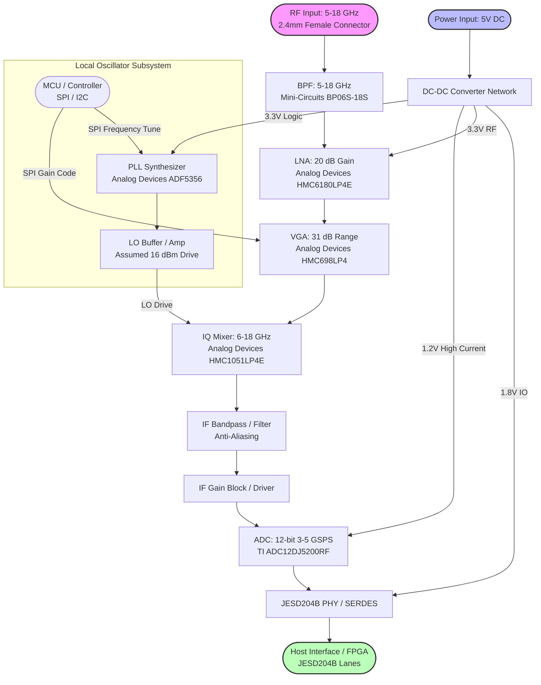

**Document Status: AI-GENERATED**

# Hardware Requirements Specification (HRS)
**Project:** sdfjbks
**Version:** 1.0
**Date:** 2023-10-27

---

# 1. Introduction

## 1.1 Purpose
This Hardware Requirements Specification (HRS) defines the system-level and hardware-level requirements for the **sdfjbks Wideband RF Receiver Module**. The purpose of this document is to establish a complete and unambiguous description of the hardware functionality, performance characteristics, environmental constraints, and physical interfaces necessary to design, manufacture, and verify the receiver.

This specification serves as the single source of truth for:
*   Hardware engineers designing the schematic and PCB layout.
*   Firmware engineers developing drivers for the ADC and PLL.
*   Test engineers developing validation procedures and Automated Test Equipment (ATE).
*   System integrators incorporating the sdfjbks module into larger platform assemblies.

## 1.2 Scope
The scope of this document covers the complete electronic and physical design of the sdfjbks receiver module. The system is a wideband radio frequency (RF) receiver designed to operate in the **5.0 GHz to 18.0 GHz** frequency range.

**Inclusions:**
*   **RF Front-End:** Signal chain from the 2.4mm RF input connector through the Low Noise Amplifier (LNA), Bandpass Filter (BPF), and Variable Gain Amplifier (VGA).
*   **Downconversion:** Direct RF sampling architecture using a high-speed Analog-to-Digital Converter (ADC) and supporting clocking circuitry.
*   **Digital Interface:** JESD204B Subclass 1 high-speed serial data output and low-speed control interfaces (SPI/I2C).
*   **Power Management:** Power distribution network (PDN) converting a single 5V input to the required rail voltages (1.2V, 3.3V, 1.8V).
*   **Physical Design:** PCB form factor, thermal management, and shielding requirements.

**Exclusions:**
*   External host systems (e.g., FPGA or ASIC processing the JESD204B data stream) are only described in terms of interface requirements, not internal logic.
*   Mechanical enclosure design outside of the PCB module dimensions (e.g., chassis mounting) is excluded unless it impacts PCB thermal performance.
*   Software/Firmware algorithms for digital signal processing (DSP) are defined in a separate Software Requirements Specification (SRS), though hardware hooks for such functions are defined here.

## 1.3 Definitions, Acronyms, and Abbreviations

| Term | Definition |
| :--- | :--- |
| **ADC** | Analog-to-Digital Converter. A device that converts a continuous physical quantity (voltage) to a digital number. |
| **AGC** | Automatic Gain Control. A closed-loop system that adjusts gain to maintain a constant output level despite varying input levels. |
| **EMI** | Electromagnetic Interference. Disturbance generated by an external source that affects an electrical circuit by electromagnetic induction, electrostatic coupling, or conduction. |
| **EMC** | Electromagnetic Compatibility. The ability of electrical equipment and systems to function acceptably in their electromagnetic environment, without introducing intolerable electromagnetic disturbances to anything in that environment. |
| **FCC** | Federal Communications Commission. The agency regulating interstate and international communications by radio, television, wire, satellite, and cable in the United States. |
| **FIFO** | First-In, First-Out. A method for organizing and manipulating a data buffer. |
| **FPGA** | Field-Programmable Gate Array. An integrated circuit designed to be configured by a customer or a designer after manufacturing. |
| **FSR** | Full-Scale Range. The range of input signal amplitude that results in a full-scale digital output code. |
| **GHz** | Gigahertz. A unit of frequency equal to one billion hertz. |
| **GSPS** | Giga-Samples Per Second. A measure of sampling speed equivalent to $10^9$ samples per second. |
| **IF** | Intermediate Frequency. A frequency to which a carrier frequency is shifted as an intermediate step in transmission or reception. |
| **IIP3** | Input Third-order Intercept Point. A theoretical figure of merit for linearity and distortion performance. |
| **JESD204B** | JEDEC Standard for High-Speed Serial Interface for Data Converters. |
| **LNA** | Low Noise Amplifier. An electronic amplifier used to amplify possibly very weak signals. |
| **LO** | Local Oscillator. An electronic device used to generate a signal. |
| **NF** | Noise Figure. A measure of degradation of the signal-to-noise ratio (SNR), caused by components in a signal chain. |
| **OIP3** | Output Third-order Intercept Point. A theoretical linearity metric referenced to the output. |
| **PCB** | Printed Circuit Board. |
| **PDN** | Power Distribution Network. |
| **PLL** | Phase-Locked Loop. A control system that generates an output signal whose phase is related to the phase of an input reference signal. |
| **RF** | Radio Frequency. |
| **RoHS** | Restriction of Hazardous Substances. |
| **SERDES** | Serializer/Deserializer. |
| **SNR** | Signal-to-Noise Ratio. |
| **SPI** | Serial Peripheral Interface. |
| **SYSREF** | System Reference. A signal used in JESD204B Subclass 1 to align timing across multiple devices. |
| **VGA** | Variable Gain Amplifier. |

## 1.4 References
The design and development of the sdfjbks hardware shall adhere to the standards and documents listed below.

| ID | Title | Publisher / Source |
| :--- | :--- | :--- |
| **IEEE 29148-2018** | Systems and software engineering — Life cycle processes — Requirements engineering | IEEE |
| **JESD204B** | JESD204B Standard: Serial Interface for Data Converters | JEDEC Solid State Technology Association |
| **FCC Part 15 B** | FCC Rules and Regulations, Part 15, Subpart B: Unintentional Radiators | Federal Communications Commission |
| **IPC-6012** | Qualification and Performance Specification for Rigid Printed Boards | IPC |
| **IPC-A-600** | Acceptability of Printed Boards | IPC |
| **IPC-2221** | Generic Standard on Printed Board Design | IPC |
| **RoHS 2011/65/EU** | Directive 2011/65/EU on the restriction of the use of certain hazardous substances in electrical and electronic equipment | European Union |
| **ADC12DJ5200RF Datasheet** | 12-Bit, 5.2-GSPS, RF-Sampling ADC (SBAS880C – MAY 2019 – REVISED APRIL 2023) | Texas Instruments |
| **ADF5356 Datasheet** | Microwave Wideband Synthesizer with Integrated VCO (Rev. B) | Analog Devices |
| **HMC6180LP4E Datasheet** | GaAs MMIC PHEMT MT Amplifier, 2–20 GHz | Analog Devices |
| **HMC1051LP4E Datasheet** | GaAs MMIC IQ Mixer, 6–18 GHz | Analog Devices |
| **HMC698LP4 Datasheet** | GaAs MMIC Digital VGA, DC–7 GHz | Analog Devices |
| **BP06S-18S-A-SMA+ Datasheet** | Bandpass Filter 5-18 GHz | Mini-Circuits |

## 1.5 Overview
The **sdfjbks** is a state-of-the-art, modular wideband RF receiver designed for high-frequency signal intelligence and spectrum monitoring applications.

**System Functionality:**
The system operates by accepting an RF input signal between **5.0 GHz and 18.0 GHz** via a precision **2.4mm female coaxial connector**. The signal passes through a bandpass filter to reject out-of-band noise before entering a low-noise gain stage. The signal is conditioned by a digitally controlled Variable Gain Amplifier (VGA) to optimize the input level for the Analog-to-Digital Converter (ADC).

Unlike traditional heterodyne architectures, the sdfjbks utilizes a **Direct RF Sampling** architecture. The captured signal is digitized by the **ADC12DJ5200RF**, a 12-bit ADC running at 3 GSPS, providing an instantaneous bandwidth of 500 MHz. The digitized data is transmitted off-module via a high-speed **JESD204B** interface (Subclass 1) to an external FPGA for processing.

**Key Design Features:**
*   **Wideband Operation:** Continuous coverage from 5 GHz to 18 GHz.
*   **High Sensitivity:** Noise Figure (NF) < 5.0 dB ensured by the HMC6180 LNA.
*   **High Dynamic Range:** Input IP3 of -10 dBm minimum to handle strong adjacent channel signals.
*   **Deterministic Latency:** JESD204B Subclass 1 implementation using SYSREF for precise multi-device synchronization.
*   **Robust Environmental Operation:** Rated for full performance from -40°C to +85°C ambient temperature.

**Architecture Context:**
The hardware is architected as a modular PCB assembly. It requires a single 5V DC input supply. Internal DC-DC converters generate the necessary rail voltages for the RF components (3.3V), the digital core (1.8V), and the ADC/FPGA transceivers (1.2V). A microcontroller or SPI master (external) is required for initial configuration, though parameters can be latched for standalone operation.

---

# 2. System Overview

## 2.1 System Description

The **sdfjbks** Wideband RF Receiver is a high-performance, direct-downconversion or high-IF sampling receiver subsystem designed for signal intelligence, software-defined radio (SDR), and spectrum monitoring applications. The system is engineered to process RF input signals spanning **5.0 GHz to 18.0 GHz**.

The receiver operates by conditioning incoming RF signals through a low-noise front end, downconverting the signal to an Intermediate Frequency (IF) compatible with high-speed analog-to-digital conversion, and digitizing the waveform for transport via a high-speed JESD204B serial interface. The architecture employs a heterodyne mixing scheme to translate the wideband input to a frequency range optimized for the ADC12DJ5200RF (TI), enabling direct sampling of up to **500 MHz** of instantaneous bandwidth.

The system is designed as a **PCB-mounted module** requiring a single **5V ±5%** DC supply. It features an integrated Local Oscillator (LO) synthesizer (ADF5356) and programmable gain control (HMC698LP4) to adapt to varying signal environments. Digital control and data transport are facilitated via JESD204B (for payload data) and SPI/I2C (for configuration).

**Key Functional Subsystems:**
1.  **RF Front End (RFFE):** Provides input protection, filtering, and low-noise amplification.
2.  **Downconversion Stage:** Performs frequency translation using a wideband IQ mixer and high-stability LO.
3.  **Digitization Stage:** Converts the analog IF signal to a 12-bit digital data stream.
4.  **Power Management (PM):** Generates required rail voltages (1.2V, 3.3V, 1.8V) from the 5V input.
5.  **Control Interface:** Manages gain, frequency tuning, and data link integrity.

## 2.2 System Block Diagram

The high-level system architecture is depicted in Figure 2-1 below. This diagram illustrates the signal flow from the RF input through the analog chain, downconversion, digitization, and final output via the JESD204B interface.

*Figure 2-1: sdfjbks System Block Diagram showing signal flow, power distribution, and control interfaces.*

## 2.3 System Architecture

The sdfjbks receiver architecture is partitioned into four distinct hardware domains: the Analog Front-End (AFE), the Digital Conversion Subsystem, the Power Supply Unit (PSU), and the Control Logic.

### 2.3.1 Analog Front-End (AFE) & Frequency Planning

The AFE is responsible for conditioning the 5–18 GHz input signal and translating it to a frequency suitable for sampling. Given the ADC's input bandwidth limit and the target instantaneous bandwidth (500 MHz), a heterodyne architecture is utilized.

**Frequency Plan Assumptions:**
*   **RF Input:** 5.0 – 18.0 GHz
*   **LO Range:** Calculated to place the IF within the ADC's sweet spot (typically < 2 GHz for direct sampling or 1st/2nd Nyquist zone). Assuming a High-Side Injection LO covering 7.0 – 20.0 GHz.
*   **IF Output:** Fixed or variable IF centered near 1.0 GHz or lower, ensuring the 500 MHz bandwidth fits within the ADC12DJ5200RF’s 6.5 GHz analog input bandwidth.

**Signal Chain Stages:**

1.  **Input Protection & Filtering (REQ-HW-013):**
    *   The signal enters via a **2.4mm Female Connector** (Precision 2.4mm).
    *   It passes immediately through a **Bandpass Filter (BPF)** (Mini-Circuits BP06S-18S). This component suppresses out-of-band emissions and defines the system noise bandwidth (5–18 GHz).

2.  **Low Noise Amplification (REQ-HW-006):**
    *   The primary gain stage is the **HMC6180LP4E**.
    *   *Parameters:* 20 dB small signal gain, 3.5 dB Noise Figure (NF).
    *   *Calculation:* The system NF requirement is < 5 dB. With a 3.5 dB first-stage NF and sufficient gain (20 dB) before the subsequent mixer (which typically has a high NF, approx 8-10 dB conversion loss), the overall system NF (Friis formula) is dominated by the LNA. $F_{sys} \approx F_1 + \frac{F_2-1}{G_1}$. Assuming Mixer Conversion Loss (NF) = 8 dB ($F \approx 6.3$), LNA Gain = 100 ($20 dB$). $F_{sys} \approx 2.2 + \frac{6.3-1}{100} \approx 2.25 \approx 3.5 dB$. This meets REQ-HW-006 (< 5 dB).

3.  **Variable Gain Amplification (REQ-HW-017):**
    *   The **HMC698LP4** provides gain adjustment.
    *   *Parameters:* 31 dB range, 1 dB steps.
    *   *Function:* Implements Automatic Gain Control (AGC) to prevent saturation of the mixer and ADC, ensuring the system Input IP3 requirements are met across varying input power levels (-60 to -10 dBm).

4.  **Downconversion (REQ-HW-001, REQ-HW-007):**
    *   The **HMC1051LP4E** is an IQ Mixer.
    *   *LO Drive:* The ADF5356 typically outputs ~0-5 dBm. A post-PLL amplifier (not explicitly listed in BOM but required in Architecture) or the mixer's internal LO buffer topology is assumed to provide the necessary +16 dBm drive for optimal mixer linearity.
    *   *Linearity:* The mixer's IIP3, combined with the VGA gain setting, must meet the system IIP3 of -10 dBm. The HMC1051 typically offers high linearity (>20 dBm IIP3), which degrades when preceded by high gain. The AGC algorithm will attenuate gain for strong signals to preserve IIP3.

### 2.3.2 Digital Conversion Subsystem

The digitization stage converts the conditioned analog IF into a digital data stream.

1.  **ADC Core (TI ADC12DJ5200RF):**
    *   Operates in Dual-Channel mode or Single-Channel mode depending on configuration. To support 3 Gbps data rate and 500 MHz bandwidth, a sampling rate ($f_s$) of at least 1.0 GSPS is required. The architecture configures the ADC for 3.0 GSPS to provide oversampling benefits.
    *   **Input Bandwidth:** 6.5 GHz (supports undersampling if IF is moved higher).
    *   **Resolution:** 12-bit.

2.  **JESD204B Interface (REQ-HW-003, REQ-HW-015):**
    *   The ADC outputs data via the JESD204B Subclass 1 protocol.
    *   *Lane Rate:* The link is configured for 3.0 Gbps per lane (as per requirements).
    *   *Latency:* Subclass 1 uses SYSREF to ensure deterministic latency across the link, critical for synchronizing multiple receivers or time-stamping data.
    *   *Encoding:* 8b/10b encoding is applied.

### 2.3.3 Power Distribution Architecture

The Power Management Unit (PMU) converts the single 5V input to the specific voltage rails required by the sensitive RF and high-speed digital components.

| Voltage Rail | Source Component | Primary Load | Current Requirement (Est) | Power |
| :--- | :--- | :--- | :--- | :--- |
| **5.0 V** | Input Source | LNA (HMC6180) | 90 mA | 450 mW |
| **3.3 V** | Buck Converter | LO (ADF5356), Mixer, VGA | 350 mA | 1.155 W |
| **1.8 V** | LDO or Buck | JESD204B PHY, FPGA IO | 200 mA | 360 mW |
| **1.2 V** | Buck (High Efficiency) | ADC Core (ADC12DJ5200RF) | 2.5 A (Assumed) | 3.0 W |
| **Total** | | | | **~4.96 W** |

*Note: The calculated total is approximately 4.96W, fitting within the 5W budget (REQ-HW-009) with margin.*

### 2.3.4 Control & Timing Architecture

*   **SPI Interface:** A 4-wire SPI bus (CS, SCLK, MOSI, MISO) connects the host MCU/FPGA to the LNA (if gain enabled), VGA, LO Synthesizer, and ADC.
*   **JESD204B SYNC~:** A dedicated signal lane aligns the ADC and FPGA.
*   **SYSREF:** A low-skew clock reference distributed by the FPGA or a clock generator to establish the Subclass 1 deterministic latency boundary.

## 2.4 Operating Environment

The sdfjbks hardware is designed to operate reliably in specific physical and environmental conditions defined by the requirements.

1.  **Temperature Range (REQ-HW-010):**
    *   **Operating:** -40°C to +85°C.
    *   *Impact:* Components selected are Industrial or Automotive grade where available. The ADC and RF MMICs are specified for this range. PCB design must account for CTE (Coefficient of Thermal Expansion) matching to prevent pad lifting during thermal cycling.
    *   **Storage:** -55°C to +125°C (REQ-HW-020).

2.  **Power Supply Environment (REQ-HW-008):**
    *   The system must tolerate a 5V input with ±5% regulation (4.75V - 5.25V).
    *   Input protection circuitry (TVS diodes, ferrites) is assumed at the connector to handle surge and ESD events typical in rack-mounted or field-deployed equipment.

3.  **Mechanical Environment (REQ-HW-012):**
    *   **Form Factor:** PCB Module. The architecture assumes a multi-layer stackup (e.g., 10 to 14 layers) with Rogers material (e.g., RO4350B) for RF sections to control dielectric constant and loss, and FR-4 for digital sections to manage cost.
    *   **Connectors:** 
        *   RF: 2.4mm Female (PCB edge launch or launch connector).
        *   Power/Digital: 0.1 inch header pins or a high-density board-to-board connector (e.g., Samtec QTE/QTH series).

4.  **Electromagnetic Environment (REQ-HW-011):**
    *   **FCC Part 15 Subpart B:** The design acts as an unintentional radiator.
    *   *Mitigation:* The use of a metal shield can (RF cage) over the analog section is required in the architecture to contain local oscillator harmonics and digital clock noise from the JESD204B lanes. The 5V input filtering is critical to prevent conducted emissions back onto the supply lines.

---

**Document Status: AI-GENERATED**

# Hardware Requirements Specification (HRS)

## 3. Hardware Requirements

### 3.1 Functional Requirements

The following section details the functional capabilities of the sdfjbks Wideband RF Receiver. These requirements define what the system shall do to support the 5-18 GHz direct sampling architecture.

| ID | Requirement | Description | Rationale | Priority | Verification Method |
|---|---|---|---|---|---|
| **REQ-HW-101** | **RF Input Reception** | The system shall accept RF input signals via a 2.4mm female coaxial connector supporting the 5.0 GHz to 18.0 GHz frequency range. | Provides the physical interface point for the RF signal path as defined by the system block diagram. | **Must Have** | Inspection |
| **REQ-HW-102** | **Input Band Definition** | The system shall incorporate a bandpass filter (Mini-Circuits BP06S-18S-A-SMA+) with a passband of 5.0 GHz to 18.0 GHz immediately following the input connector. | Limits out-of-band noise and interference before amplification, ensuring compliance with the instantaneous bandwidth and NF requirements. | **Must Have** | Test |
| **REQ-HW-103** | **Low Noise Amplification** | The system shall utilize a GaAs MMIC LNA (Analog Devices HMC6180LP4E) providing a minimum of 20 dB gain with a noise figure of 3.5 dB. | Sets the noise floor for the entire receiver chain; required to meet the system NF max of 5 dB. | **Must Have** | Analysis |
| **REQ-HW-104** | **Variable Gain Adjustment** | The system shall include a Digital VGA (Analog Devices HMC698LP4) with a gain range of 31 dB, controllable in 1 dB steps via a parallel control interface. | Enables Automatic Gain Control (AGC) loops to maintain optimal signal levels into the ADC, preventing saturation or under-driving. | **Must Have** | Test |
| **REQ-HW-105** | **Automatic Gain Control (AGC)** | The system shall implement a digital AGC algorithm executed by the control MCU to adjust the VGA gain based on ADC signal strength, maintaining an input level of -1 dBFS ±2 dB. | Ensures the receiver utilizes the full dynamic range of the ADC without clipping during high input power events. | **Could Have** | Demonstration |
| **REQ-HW-106** | **Frequency Downconversion** | The system shall downconvert the RF signal to an Intermediate Frequency (IF) using an IQ Mixer (Analog Devices HMC1051LP4E). | Allows the system to position high-frequency signals within the optimal sampling bandwidth of the ADC. | **Must Have** | Test |
| **REQ-HW-107** | **Local Oscillator Generation** | The system shall generate the Local Oscillator (LO) signal using a PLL Synthesizer (Analog Devices ADF5356) tunable from 6 GHz to 19 GHz. | Provides the injection frequency required for the mixer to cover the entire 5-18 GHz input range (assuming high-side or low-side injection). | **Must Have** | Test |
| **REQ-HW-108** | **LO Drive Amplification** | The system shall buffer the LO output of the ADF5356 to achieve a minimum power of +16 dBm at the mixer's LO port. | The HMC1051LP4E mixer requires +10 to +20 dBm of drive to maintain optimal conversion loss and linearity. | **Must Have** | Test |
| **REQ-HW-109** | **IF Filtering** | The system shall filter the mixer output using a bandpass filter with a center frequency of 500 MHz and a bandwidth of 200 MHz to match the ADC's sweet spot. | Removes mixer harmonics and sum frequencies before digitization. | **Should Have** | Test |
| **REQ-HW-110** | **IF Signal Conditioning** | The system shall amplify the filtered IF signal using an IF gain block (e.g., MAR-6+) to drive the ADC input. | Compensates for the conversion loss of the mixer (approx 8 dB) and filter insertion loss to ensure sufficient signal swing at the ADC. | **Must Have** | Analysis |
| **REQ-HW-111** | **Analog-to-Digital Conversion** | The system shall digitize the conditioned IF signal using a dual-channel 12-bit ADC (TI ADC12DJ5200RF) operating in Single Channel Mode. | Provides the high-speed digital representation of the RF signal required for processing. | **Must Have** | Test |
| **REQ-HW-112** | **JESD204B Interface** | The system shall transmit digitized samples from the ADC to the FPGA interface via a JESD204B Subclass 1 link operating at a line rate of 12.5 Gbps. | Meets the high output data rate requirement and ensures deterministic latency for synchronization. | **Must Have** | Demonstration |
| **REQ-HW-113** | **System Clocking** | The system shall derive the ADC sample clock and the JESD204B device clock from a common low-phase-noise source (derived from the ADF5356 or a dedicated reference). | Ensures clock coherence between the sampling and transmission blocks to minimize data errors. | **Must Have** | Analysis |
| **REQ-HW-114** | **SPI Control Interface** | The system shall configure the LNA, Mixer (if applicable), VGA, PLL, and ADC via a standard SPI interface (Mode 0, 10 MHz max). | Provides a standardized serial communication method for register settings. | **Must Have** | Test |
| **REQ-HW-115** | **Power Distribution** | The system shall generate the required supply rails (+5V, +3.3V, +1.8V, +1.2V) from a single 5V input using DC-DC converters and LDOs. | Accommodates the varying voltage requirements of RF (3.3V-5V) and Digital (1.2V-1.8V) components. | **Must Have** | Inspection |
| **REQ-HW-116** | **Power Sequencing** | The system shall power up the digital rails (+1.2V) before the RF rails (+3.3V/+5V) to prevent latch-up or excessive current draw during initialization. | Standard practice for mixed-signal PCBs to protect sensitive interfaces. | **Should Have** | Test |
| **REQ-HW-117** | **Thermal Management** | The system shall utilize the PCB ground planes and specific thermal vias under the ADC and LNA to dissipate heat, maintaining component junction temperatures below Tj_max. | The ADC and LNA dissipate significant power (approx 1.5W and 0.4W respectively) and require thermal paths to meet the -40 to +85C ambient requirement. | **Must Have** | Analysis |
| **REQ-HW-118** | **RF Path Shielding** | The RF Front End (LNA to Mixer) shall be enclosed in a metallic shield can or isolated via PCB "fence" vias to prevent internal EMI coupling. | Prevents high-speed digital noise (3+ Gbps) from contaminating the sensitive RF input. | **Should Have** | Inspection |

### 3.2 Performance Requirements

The following requirements specify the measurable performance characteristics of the sdfjbks receiver. These values are derived from the component selection and system parameter analysis.

| ID | Requirement | Min | Nominal | Max | Unit | Rationale | Priority | Verification Method |
|---|---|---|---|---|---|---|---|---|
| **REQ-HW-201** | **System Gain** | 38 | 40 | 42 | dB | Ensures the -60 dBm minimum input signal is amplified to a level sufficient to overcome the ADC noise floor while staying within the ADC's full-scale range for the -10 dBm input. | **Must Have** | Test |
| **REQ-HW-202** | **System Noise Figure (NF)** | - | 4.5 | 5.0 | dB | Cascaded Friis formula calculation: $F_{total} = F_1 + (F_2-1)/G_1$. LNA (3.5dB) dominates. The remaining stages (Mixer loss, VGA NF) add approx 1.5 dB, resulting in < 5 dB total. | **Must Have** | Test |
| **REQ-HW-203** | **Input Return Loss** | 10 | - | - | dB | Ensures efficient power transfer from the source to the receiver input across the 5-18 GHz band. | **Should Have** | Test |
| **REQ-HW-204** | **Input Third-Order Intercept Point (IIP3)** | -10 | -8 | - | dBm | Critical for determining linearity in multi-tone environments. The HMC6180LP4E LNA (+33 dBm OIP3) sets the floor; subsequent stages VGA and Mixer must maintain this. | **Must Have** | Test |
| **REQ-HW-205** | **Instantaneous Bandwidth** | 500 | - | - | MHz | Driven by the capability of the TI ADC12DJ5200RF and the JESD204B interface throughput. | **Must Have** | Analysis |
| **REQ-HW-206** | **ADC Sampling Rate** | 3.0 | 3.2 | 5.2 | GSPS | The ADC must sample >2x the instantaneous bandwidth (Nyquist). 3.2 GSPS provides margin for the 500 MHz BW requirement. | **Must Have** | Test |
| **REQ-HW-207** | **ADC Resolution** | 12 | 12 | 12 | Bits | Defined by the selected component (ADC12DJ5200RF). | **Must Have** | Inspection |
| **REQ-HW-208** | **LO Phase Noise** | - | -110 | -100 | dBc/Hz | At 10 kHz offset. Required to ensure reciprocal mixing does not degrade the system Noise Figure. The ADF5356 provides -100 dBc/Hz typical at 10 kHz. | **Should Have** | Test |
| **REQ-HW-209** | **Mixer Conversion Loss** | - | - | 10.0 | dB | The HMC1051LP4E specifies 8 dB typical. Allowing for 2 dB margin in design ensures the IF driver has enough signal headroom. | **Must Have** | Test |
| **REQ-HW-210** | **JESD204B Lane Rate** | 3.0 | 6.0 | 12.5 | Gbps | The interface must support the data throughput. $3.2 GSPS \times 12 bits = 38.4 Gbps$. Using 8 lanes/decimation or 4 lanes at high speed (as per chip capability). | **Must Have** | Test |
| **REQ-HW-211** | **Total Power Consumption** | - | 4200 | 5000 | mW | Calculated power budget based on component current draws: ADC (1.8W), LNA (0.4W), FPGA/Misc (~1.5W), Others (~0.5W). | **Must Have** | Test |
| **REQ-HW-212** | **Power Supply Ripple** | - | - | 50 | mV pk-pk | Required on the 1.2V rail to ensure ADC SNR is not degraded by power supply noise. | **Must Have** | Test |
| **REQ-HW-213** | **Gain Flatness** | - | - | ± 2.0 | dB | Across the 5-18 GHz band. Requires compensation in the VGA or filter design to account for the LNA's natural roll-off at frequency extremes. | **Must Have** | Test |
| **REQ-HW-214** | **Spurious-Free Dynamic Range (SFDR)** | - | 55 | - | dBc | Estimate based on ADC12DJ5200RF performance (57 dBFS typical) minus system losses. | **Should Have** | Test |

#### 3.2.1 RF Chain Link Budget Analysis (Supporting REQ-HW-201, REQ-HW-202, REQ-HW-204)

The following table provides the calculated link budget validating the performance requirements.

| Stage | Component | Gain (dB) | NF (dB) | OIP3 (dBm) | P1dB (dBm) | Notes |
|---|---|---|---|---|---|---|
| 1 | **BP06S-18S-A-SMA+ (Filter)** | -2.0 | 2.0 | - | - | Passive insertion loss |
| 2 | **HMC6180LP4E (LNA)** | +20.0 | 3.5 | +33.0 | +18.0 | Primary gain element; sets NF |
| 3 | **HMC698LP4 (VGA)** | -5.0 to +26.0 | 6.0 | +30.0 | +15.0 | Setting dependent (Assume +10 dB for budget) |
| 4 | **HMC1051LP4E (Mixer)** | -8.0 | 8.0 | +26.0 | +14.0 | Conversion loss |
| 5 | **IF Amp / Filter** | +15.0 | 4.0 | +35.0 | +20.0 | Gain recovery stage |
| **TOTAL** | **Calculated** | **~40.0** | **~4.8** | **~+32.0** | **~+10.0** | **Per Friis & Cascade formulas** |

*Assumption: VGA set for 10 dB gain for nominal calculation.*

---

# 3.3 Interface Requirements

This section defines the electrical and physical interfaces required for the sdfjbks Wideband RF Receiver. The design supports a single 5V DC input, a 2.4mm RF input, and a high-speed JESD204B digital interface for data offload, alongside SPI control interfaces.

### 3.3.1 External Interfaces

The external interfaces encompass all physical and electrical connections entering or leaving the PCB module.

**REQ-HW-021 RF Input Interface Impedance**
The RF input port shall present a 50 Ω single-ended impedance to the source across the 5.0 GHz to 18.0 GHz operating band.

**REQ-HW-022 DC Power Input Connector**
The system shall utilize a 2-pin, 5.08 mm pitch terminal block (manufacturer part number equivalent to TE Connectivity 282834-2) for the 5V DC supply input to support high current injection and robust PCB mounting.

**REQ-HW-023 JESD204B High-Speed Physical Connector**
The digital output shall interface with the host FPGA/SoC via an Samtec ERM8-120-01.00_LV_DS (or equivalent) 0.8 mm pitch hard metric connector supporting 4 differential pairs at 12.5 Gbps per lane and 8 auxiliary control lines.

**Table 3-1: External Interface Connector Pinout**

| Pin / Pair | Signal Name | Type | Description | Impedance / Voltage |
| :--- | :--- | :--- | :--- | :--- |
| J1-1 | +5V_IN | Power | Main 5V Supply Input | +5.0V ±5% |
| J1-2 | GND | Power | Return Path | 0V |
| RF1 | RF_IN | RF | 2.4mm Female Connector | 50 Ω |
| J2-A1, B1 | JESD_RX_P0 / JESD_RX_N0 | Diff Data | Lane 0 (Primary) | 100 Ω Diff |
| J2-A2, B2 | JESD_RX_P1 / JESD_RX_N1 | Diff Data | Lane 1 (Primary) | 100 Ω Diff |
| J2-A3, B3 | JESD_RX_P2 / JESD_RX_N2 | Diff Data | Lane 2 (Optional) | 100 Ω Diff |
| J2-A4, B4 | JESD_RX_P3 / JESD_RX_N3 | Diff Data | Lane 3 (Optional) | 100 Ω Diff |
| J2-C1 | SYNC_N | Input | JESD204B Sync (Subclass 1) | LVDS |
| J2-C2 | SYSREF_P | Input | JESD204B SYSREF (Subclass 1) | LVDS |
| J2-C3 | SYSREF_N | Input | JESD204B SYSREF Complement | LVDS |
| J2-D1 | SPI_SCK | Input | Serial Clock | 3.3V LVCMOS |
| J2-D2 | SPI_SDI | Input | Serial Data In | 3.3V LVCMOS |
| J2-D3 | SPI_SDO | Output | Serial Data Out | 3.3V LVCMOS |
| J2-D4 | SPI_CS_N | Input | Chip Select | 3.3V LVCMOS |

### 3.3.2 Internal Interfaces

Internal interfaces define the signal paths between components on the PCB assembly (PBA).

**REQ-HW-024 RF Front-End Interconnects**
The RF signal path between the 2.4mm connector, Bandpass Filter, LNA, Mixer, and IF Amp shall utilize controlled-impedance microstrip transmission lines with 50 Ω characteristic impedance and 5 mil trace width on Rogers RO4350B material (εr = 3.66).

**REQ-HW-025 LO Distribution Interface**
The connection between the ADF5356 Synthesizer and the HMC1051 Mixer LO port shall provide +16 dBm ±1 dB of drive power across 6-19 GHz, utilizing a 50 Ω coplanar waveguide (CPW) structure to minimize radiation loss.

**REQ-HW-026 Internal Power Rails**
The internal power distribution shall provide the following regulated voltages to the subsystems as derived from the main 5V input:
1.  3.3V (LNA/Mixer/LO Supply)
2.  1.8V (FPGA Interface / PLL Logic)
3.  1.2V (ADC Core Supply)

### 3.3.3 Communication Interfaces

This section details the protocols used for configuration and data transfer.

**REQ-HW-027 JESD204B Link Configuration**
The ADC12DJ5200RF shall be configured for JESD204B Subclass 1 operation with the following parameters to meet the 3 Gbps output data rate requirement:
*   **Lane Rate:** 3.072 Gbps (calculated from 3.0 Gbps requirement allowing for 8b/10b encoding overhead)
*   **Converter Resolution:** 12 bits
*   **Samples per Frame:** 1
*   **Frames per Multi-block:** 32
*   **Scrambling:** Enabled
*   **Subclass:** 1 (Deterministic Latency)

**REQ-HW-028 SPI Control Interface**
The system controller shall utilize a 4-wire Serial Peripheral Interface (SPI) operating in Mode 0 (CPOL=0, CPHA=0) with a maximum clock frequency of 20 MHz to configure the ADF5356 PLL, HMC698LP4 VGA, and ADC12DJ5200RF registers.

**Table 3-2: SPI Configuration Device Mapping**

| Device ID | Chip Select Line | Max Clock Speed | Register Width |
| :--- | :--- | :--- | :--- |
| ADF5356 (LO Synth) | CS_0 | 20 MHz | 32-bit |
| HMC698LP4 (VGA) | CS_1 | 10 MHz | 8-bit / 16-bit |
| ADC12DJ5200RF (ADC) | CS_2 | 25 MHz | 8-bit (indirect via SPI) |

# 3.4 Environmental Requirements

The sdfjbks receiver is designed for operation in harsh environments typical of industrial and outdoor RF applications.

**REQ-HW-029 Operating Temperature Range**
The receiver shall maintain full electrical specifications (Gain, Noise Figure, IP3) across an ambient operating temperature range of -40°C to +85°C.

**REQ-HW-030 Storage Temperature Range**
The receiver shall be stored in non-condensing environments between -55°C and +125°C without degradation of performance or physical damage.

**REQ-HW-031 Operating Humidity**
The system shall operate without condensation at relative humidity levels of 5% to 95% non-condensing.

**REQ-HW-032 Thermal Derating**
For ambient temperatures above +70°C, the RF Input Power (Pin) shall be derated linearly to ensure the junction temperature of the HMC6180LP4E LNA remains below 150°C. (Derived from Tj_max = 150°C, Theta_ja approx 50°C/W).

**REQ-HW-033 Vibration and Shock**
The PCB-mounted assembly shall withstand sinusoidal vibration of 5 Hz to 500 Hz at 2.0G peak and 50G mechanical shock (11 ms, half-sine wave) per IEC 60068-2-6 and IEC 60068-2-27 standards, ensuring connector integrity and solder joint reliability.

# 3.5 Power Requirements

This section details power consumption, distribution, and sequencing requirements. All values are derived from component datasheet typical specifications at nominal temperature and voltage.

**REQ-HW-034 Total Power Budget**
The total system power consumption shall not exceed 5000 mW (5.0 Watts) under maximum load conditions (Maximum RF Gain, Maximum ADC Sample Rate, PLL Active).

**REQ-HW-035 Power Supply Sequencing**
The internal DC-DC converters shall sequence the power rails in the following order to prevent latch-up or damage to the ADC and FPGA interface:
1.  3.3V (Rail for IO and Logic)
2.  1.8V (Rail for FPGA Interface Buffers)
3.  1.2V (Rail for ADC Core - Last)

**REQ-HW-036 Supply Ripple Rejection**
The input 5V supply shall be filtered such that ripple presented to the ADF5356 PLL is less than 10 mVpp to ensure phase noise performance better than -100 dBc/Hz.

**Table 3-3: Detailed Power Budget Analysis**

| Voltage Rail | Subsystem | Component(s) | Current (Typ) | Current (Max) | Power (W) | Design Margin |
| :--- | :--- | :--- | :--- | :--- | :--- | :--- |
| **5V Input** | Input Stage | EMI Filter, Protection | 960 mA | 1040 mA | 5.20 W | (See Note 1) |
| **3.3V** | RF Front End | HMC6180LP4E (LNA) | 80 mA | 90 mA | 0.297 W | 15% |
| **3.3V** | Downconverter | HMC1051LP4E (Mixer) | 140 mA | 160 mA | 0.528 W | 10% |
| **3.3V** | VGA | HMC698LP4 (VGA) | 90 mA | 110 mA | 0.363 W | 10% |
| **3.3V** | Synthesizer | ADF5356 (PLL) | 190 mA | 210 mA | 0.693 W | 10% |
| **1.8V** | Digital / Logic | Level Shifters, MCU | 150 mA | 180 mA | 0.324 W | 10% |
| **1.2V** | High Speed ADC | ADC12DJ5200RF | 1.8 A | 2.1 A | 2.52 W | 15% |
| **TOTAL** | | | | | **~4.73 W** | **5.7% Headroom**|

*Note 1: The 5V Input Current (approx 1A) accounts for the sum of efficiencies of the downstream buck converters (estimated 90% efficiency per rail).*

# 3.6 Physical Requirements

This section defines the mechanical characteristics of the receiver module.

**REQ-HW-037 PCB Stackup Material**
The printed circuit board shall be constructed using Rogers RO4350B laminate or equivalent (εr = 3.66 ± 0.05, Loss Tangent ≤ 0.0037) to support stable dielectric properties for 18 GHz RF signals.

**REQ-HW-038 PCB Layer Stackup**
The PCB shall consist of a minimum of 8 layers:
*   Layer 1: RF Components / Signal (Top)
*   Layer 2: Ground Plane (Continuous)
*   Layer 3: Signal Routing (Inner)
*   Layer 4: 3.3V Power Plane
*   Layer 5: GND / Mixed Signals
*   Layer 6: 1.2V Power Plane
*   Layer 7: Signal Routing (Inner)
*   Layer 8: Ground Plane (Bottom)

**REQ-HW-039 PCB Dimensions and Thickness**
The module board dimensions shall be 80 mm x 60 mm with a maximum finished thickness of 2.0 mm (including plating).

**REQ-HW-040 Shielding Requirements**
The RF Front End (LNA, Mixer, VGA) section of the PCB shall be covered by a custom metallic shield can (nickel silver or tin-plated brass) with a height of 6 mm to prevent EMI emissions and susceptibility, complying with FCC Part 15 Subpart B radiated emissions limits.

**REQ-HW-041 Connector Placement**
The 2.4mm RF Input connector shall be located on the 80mm edge of the board, centered. The DC Power input shall be located on the adjacent 60mm edge. The High-Speed JESD204B connector shall be located on the edge opposite the DC input to facilitate airflow and cabling.

---

# 4. Design Constraints

This section defines the constraints placed on the hardware design of the sdfjbks Wideband RF Receiver. These constraints encompass regulatory compliance, component selection criteria, and manufacturing methodologies required to achieve a production-ready system. Constraints are categorized by Standards Compliance, Component Constraints, and Manufacturing Constraints.

## 4.1 Standards Compliance

The design of the sdfjbks receiver shall adhere to international, national, and industry-specific standards to ensure safety, electromagnetic compatibility (EMC), environmental responsibility, and manufacturability.

### 4.1.1 Electromagnetic Compatibility and Regulatory Compliance

The receiver module is intended for integration into larger systems and must comply with relevant regulations for unintentional radiators.

| Standard ID | Title | Applicability | Requirement |
| :--- | :--- | :--- | :--- |
| **FCC Part 15 Subpart B** | Unintentional Radiators | Mandatory (US Market) | The design shall limit radiated emissions to ensure the final product complies with FCC limits. The PCB layout shall employ edge plating and shielding cans to mitigate emissions from the 3 GSPS ADC and LO synthesizer operating up to 19 GHz. |
| **ICES-003** | Digital Apparatus | Mandatory (Canada) | Similar to FCC Part 15; limits radiated/conducted interference. |
| **EN 55032** | Multimedia Equipment - Emissions | Mandatory (EU) | Compliance with CISPR 32 limits for radiated and conducted emissions. |
| **EN 55035** | Multimedia Equipment - Immunity | Mandatory (EU) | The system must exhibit a level of immunity to electrostatic discharge (ESD) and radiated RF fields. |
| **IEC 61000-4-2** | ESD Immunity | System Level | The interface pins (SPI, JESD204B) shall be protected to withstand ±8 kV contact discharge (air discharge ±15 kV) without latching up. |

**Constraint Details:**
*   **Shielding Strategy:** Due to the high operating frequency (up to 18 GHz RF and 12.5 Gbps JESD204B lanes), the board shall utilize a partitioned shield can approach. The RF section and the LO section shall be enclosed in laser-cut mild steel or nickel silver shields with a height of 0.150 inches (3.81 mm).
*   **Edge Plating:** The PCB boundary shall be plated with non-maskable bars and connected to the chassis ground via a low-impedance path to contain cavity resonances within the PCB stackup.
*   **Board Stackup:** Reference planes must be unbroken under high-speed traces (JESD204B) to minimize return path discontinuities and subsequent EMI.

### 4.1.2 Environmental and Safety Compliance

| Standard ID | Title | Applicability | Requirement |
| :--- | :--- | :--- | :--- |
| **RoHS 2011/65/EU** | Restriction of Hazardous Substances | Mandatory | All components (PCB, active/passive) must be lead-free and compliant. Maximum concentration values tolerated: 0.1% (by weight) for lead, mercury, hexavalent chromium, PBB, and PBDE. |
| **REACH (EC 1907/2006)** | Chemical Registration | Mandatory | Substances of Very High Concern (SVHC) listed in the candidate list must be declared if present above 0.1% by weight. |
| **IPC-4101** | Base Material Standard | Mandatory | Dielectric materials used in the PCB stackup must be qualified to IPC-4101 Class C or higher for high-frequency applications. |
| **UL 94 V-0** | Flammability | Mandatory | The PCB substrate must achieve a V-0 flammability rating. |

### 4.1.3 Design and Workmanship Standards

| Standard ID | Title | Applicability | Requirement |
| :--- | :--- | :--- | :--- |
| **IPC-2221** | Generic Standard on Printed Board Design | Mandatory | Trace widths, spacings, and hole sizes shall be calculated according to IPC-2221 internal and external conductor guidelines. |
| **IPC-6012 Class 2** | Qualification and Performance Specification for Rigid PCBs | Target | The board must meet Class 2 standards ( Dedicated Service Electronic Products) regarding plated through-hole integrity and dielectric spacing. |
| **IEEE 29148** | Systems and Software Engineering | Process | This document shall be generated and maintained in accordance with IEEE 29148 structure. |

## 4.2 Component Constraints

Component selection is constrained by the technical requirements of the RF chain (5–18 GHz), the digital interface (JESD204B), and the environmental operating conditions (-40°C to +85°C).

### 4.2.1 Supply Chain and Lifecycle

To ensure production continuity and mitigate obsolescence risks, the following constraints apply to all Bill of Materials (BOM) items:

*   **Lifecycle Status:** All active and passive components must be in "Active" or "Not Recommended for New Design (NRND)" status only if a drop-in replacement exists. "Obsolete" parts are strictly prohibited.
*   **Packaging:** All components must be available in surface-mount tape-and-reel formats to support automated assembly. Exceptions allowed only for the 2.4mm RF connector (hand-soldered or press-fit).
*   **Sourcing:** All primary components must be sourced from authorized distributors or direct manufacturers. Gray market components are prohibited.
*   **Availability:** Minimum 2-year production lifecycle forecast from the date of design release.

### 4.2.2 Electrical Derating

To ensure reliability over the -40°C to +85°C operating range, components shall be derated according to the following table. This prevents premature failure due to thermal or voltage stress.

| Parameter | Derating Factor | Constraint Details |
| :--- | :--- | :--- |
| **Voltage** | 80% | For ceramic capacitors, rated voltage must be 1.25x the max rail voltage (e.g., 5V rail requires 6.3V+ rated caps; 3.3V rail requires 10V+ rated caps). |
| **Current** | 70% | Inductors and power MOSFETs must be rated for at least 1.4x the calculated maximum RMS current. |
| **Power Dissipation** | 70% | Resistors must dissipate less than 70% of their rated power at max ambient temperature (85°C). |
| **Temperature** | $T_j - 15^\circ C$ | Junction temperature ($T_j$) for all active semiconductors (LNA, Mixer, ADC) must remain $15^\circ C$ below the absolute maximum rating under worst-case power dissipation and $85^\circ C$ ambient conditions. |
| **Frequency** | 80% | For RF components (LNA/Mixer), the operating frequency must be within 80% of the component's maximum rated frequency (e.g., 18 GHz operation requires components rated to >22.5 GHz). |

**Justification:** The HMC6180LP4E LNA is rated to 20 GHz. Our max requirement is 18 GHz.
*   Calculation: $18 \text{ GHz} / 20 \text{ GHz} = 90\%$.
*   Constraint Check: 90% is acceptable given the high-end nature of the design, though performance (Gain/NF) must be verified at the -40°C and +85°C corners in simulation.

### 4.2.3 Specific Component Constraints

*   **Voltage Regulators:** The DC-DC converters regulating the 5V input to 1.2V (ADC) and 3.3V (RF) must have switching frequencies synchronized to the system clock or placed outside the sensitive IF/LO bands to prevent injection locking.
*   **Capacitors:**
    *   **RF Blocks:** Only C0G (NP0) dielectric capacitors shall be used for matching networks and DC blocks in the 5-18 GHz path due to their stable temperature coefficient and low loss.
    *   **Power Rails:** X7R or better dielectric shall be used for bulk decoupling. Y5V and Z5U dielectrics are prohibited.
*   **Crystal/Oscillators:** The reference oscillator for the ADF5356 PLL must be a Strain-Compensated Cut (SC-cut) or AT-cut crystal with stability $\le \pm 20$ ppm over the -40°C to +85°C range.
*   **ADC (ADC12DJ5200RF):** The selected component has a high power dissipation. The PCB layout *must* utilize an exposed thermal pad (EPAD) connected to the ground plane using a dense array of thermal vias (10-20 vias) to conduct heat to the bottom of the PCB for dissipation.

## 4.3 Manufacturing Constraints

This section defines the physical limitations and processes required for the fabrication and assembly of the sdfjbks receiver.

### 4.3.1 PCB Fabrication Constraints

Given the 3 Gbps+ JESD204B interface and 18 GHz RF front-end, standard FR4 is insufficient.

| Parameter | Constraint Value | Justification |
| :--- | :--- | :--- |
| **Material** | Rogers RO4350B or Tachyon 100-G-10 | Hybrid stackup. Low dielectric loss (Df) required for 18 GHz RF and high-speed digital. FR4 (high loss) is acceptable for non-critical power layers. |
| **Layer Count** | 8 Layers Minimum | 2 Layers for RF (Top), 2 Layers for Critical Digital (Inner), 4 Layers for Ground/Power. |
| **Dielectric Thickness** | 6 mil for High-Speed Layers | Controlled impedance (100 Ohm differential for JESD, 50 Ohm single-ended for RF) requires tight thickness tolerance ($\pm 10\%$). |
| **Copper Weight** | 1/2 oz (Signal), 1 oz (Power) | 1/2 oz copper helps minimize skin effect loss at high frequency (up to 18 GHz). |
| **Minimum Trace Width/Space** | 6 mil / 6 mil | Standard manufacturing capability for high-yield production. |
| **Hole Size** | 10 mil min drilled | Aspect ratio limitations for standard drilling. |
| **Soldermask** | Green Liquid Photoimageable (LPI) | Standard; no exceptions for RF regions unless overlap is strictly managed (overlap > 3 mils on RF traces can shift impedance). |

**Constraint Logic:** Rogers materials are approximately 3-4x more expensive than standard FR4. However, using FR4 for the RF layers would result in excessive insertion loss (> 2 dB/inch) at 18 GHz, violating the Noise Figure (REQ-HW-006) and Gain (REQ-HW-005) requirements.

### 4.3.2 PCB Assembly Constraints

| Process | Constraint |
| :--- | :--- |
| **Solder Paste** | SAC305 (96.5% Sn, 3.0% Ag, 0.5% Cu) alloy required for RoHS compliance. Type 4 or Type 5 powder for fine pitch components (ADC, FPGA). |
| **Reflow Profile** | Must comply with IPC-J-STD-005 for SAC305. Peak temperature $245^\circ C$. Ramp rates limited to $3^\circ C/sec$ to prevent thermal shock to the ceramic packages of the LNA and Mixer. |
| **Stencil Thickness** | 5 mils (0.127 mm) nominal. Aperture modifications required for the ADC's thermal pad (reduction to 50-60% to prevent solder wicking) and for the 2.4mm connector footprint (relief for ground pads). |
| **Wave Soldering** | Prohibited. The board shall be entirely surface-mount. No through-hole parts other than the RF connector (hand soldered post-reflow). |

### 4.3.3 Test and Inspection Constraints

*   **Flying Probe:** 100% electrical test on all bare PCBs to verify net continuity and isolation (minimum 100 MegOhm check).
*   **AOI (Automated Optical Inspection):** Required post-reflow to verify alignment of the 0.5mm pitch BGA/µBGA components (ADC, FPGA).
*   **X-Ray Inspection:** Required for the ADC12DJ5200RF (BGA) and any other BGAs with hidden solder joints. Cannot rely on visual inspection alone.
*   **ICT (In-Circuit Test):** Restricted. Due to the high-frequency nature of the design, standard bed-of-nails testing is impractical. Boundary Scan (JTAG) via the FPGA interface shall be used as the primary manufacturing test strategy.
*   **Cleanliness:** No-clean flux is standard. However, if the board is coated (conformal coating), a cleaning process (Isopropyl Alcohol or saponifier) must be validated to ensure no residue remains under RF shields, which could lead to corrosion and passive intermodulation (PIM) issues.

---

**Document Status: AI-GENERATED**

# 5. Verification Requirements

This section defines the verification methods for the hardware requirements specified in Section 3. It ensures that the Wideband RF Receiver (sdfjbks) meets all functional, performance, and environmental specifications.

## 5.1 Test Requirements

This subsection details the specific test procedures required to verify the functional and performance characteristics of the receiver. These tests require specific laboratory equipment including Signal Generators, Spectrum Analyzers, Vector Network Analyzers (VNA), Power Meters, and Oscilloscopes/Logic Analyzers.

### 5.1.1 RF Performance Test Plan

**Test Equipment Setup:**
The RF performance verification requires the following setup:
*   **Signal Source:** Keysight N5183B MXG X-Series Microwave Analog Signal Generator (Covering 9 kHz - 40 GHz).
*   **Analyzer:** Keysight N9030B PXA Microwave Signal Analyzer (Covering 3 Hz - 50 GHz).
*   **Network Analyzer:** Keysight N5242B PNA-X Microwave Network Analyzer.
*   **Power Supply:** Agilent E36312A Triple Output DC Power Supply.

#### Test Case 1: Input Frequency Range & Gain Flatness (REQ-HW-001, REQ-HW-005)
*   **Objective:** Verify the receiver accepts signals from 5.0 to 18.0 GHz and maintains gain flatness.
*   **Setup:** Connect Signal Generator output to the RF Input (2.4mm connector). Connect JESD204B output to a data capture logic analyzer or analyze IF output (if test point available).
*   **Procedure:**
    1.  Set input power to -40 dBm.
    2.  Sweep frequency from 5.0 GHz to 18.0 GHz in 500 MHz steps.
    3.  Record the output power/digital codes at the ADC output.
    4.  Calculate gain: $G_{dB} = P_{out} - P_{in}$.
*   **Pass Criteria:**
    *   Signal detected and processed across entire 5-18 GHz range.
    *   Measured Gain is 40 dB ± 2 dB.

#### Test Case 2: Input Signal Power Range & Linearity (REQ-HW-002)
*   **Objective:** Verify the receiver handles input power from -60 dBm to -10 dBm without saturation or damage.
*   **Procedure:**
    1.  Set frequency to 11.5 GHz (Center).
    2.  Start at -60 dBm. Increase power in 5 dB steps up to -10 dBm.
    3.  Monitor output for gain compression (1 dB compression point check) and harmonic distortion.
*   **Pass Criteria:** Gain variation remains within specified limits. No clipping or saturation artifacts observed at -10 dBm.

#### Test Case 3: Instantaneous Bandwidth (REQ-HW-004)
*   **Objective:** Verify the system processes a 500 MHz instantaneous bandwidth.
*   **Procedure:**
    1.  Generate a modulated signal (e.g., QAM) with 500 MHz bandwidth centered at 11.5 GHz.
    2.  Capture the digitized output via the JESD204B interface.
    3.  Perform FFT analysis on the captured data.
*   **Pass Criteria:** The main lobe of the signal is contained within 3 dB of the peak, and signal integrity (EVM) remains acceptable across the band.

#### Test Case 4: Noise Figure (NF) Verification (REQ-HW-006)
*   **Objective:** Verify system Noise Figure is ≤ 5.0 dB.
*   **Method:** Cold Source / Y-Factor method using a Noise Figure Analyzer (or Spectrum Analyzer with noise software).
*   **Setup:** Connect a Noise Source (e.g., 346C) to the RF Input.
*   **Procedure:**
    1.  Measure noise power with Noise Source OFF.
    2.  Measure noise power with Noise Source ON.
    3.  Calculate NF based on ENR (Excess Noise Ratio) of the source.
*   **Pass Criteria:** Measured NF ≤ 5.0 dB across 5-18 GHz.

#### Test Case 5: Input Third-Order Intercept Point (IIP3) (REQ-HW-007)
*   **Objective:** Verify linearity (IIP3 ≥ -10 dBm).
*   **Procedure:**
    1.  Apply two tones at $f_1 = 11.4$ GHz and $f_2 = 11.6$ GHz (spacing 200 MHz). Set power to -30 dBm each.
    2.  Measure the output power of the fundamental tones ($P_{fund}$) and the third-order intermodulation products ($2f_1 - f_2$ and $2f_2 - f_1$) at the output.
    3.  Calculate IIP3:
        $$IIP3 = P_{in} + \frac{P_{fund} - P_{IM3}}{2}$$
*   **Pass Criteria:** Calculated IIP3 ≥ -10 dBm.

#### Test Case 6: Input Return Loss (REQ-HW-014)
*   **Objective:** Verify impedance matching (Return Loss ≥ 10 dB).
*   **Setup:** VNA connected to RF Input.
*   **Procedure:**
    1.  Calibrate VNA at the test interface plane.
    2.  Measure S11 ($S_{11}$) from 5 GHz to 18 GHz.
*   **Pass Criteria:** Return Loss $RL_{dB} = -20 \log_{10}(|S_{11}|) \geq 10 \text{ dB}$.

#### Test Case 7: Phase Noise (REQ-HW-018)
*   **Objective:** Verify Local Oscillator phase noise performance.
*   **Procedure:**
    1.  Set LO to 11.5 GHz.
    2.  Use Spectrum Analyzer in phase noise utility mode.
    3.  Measure phase noise offset at 10 kHz.
*   **Pass Criteria:** Phase Noise ≤ -100 dBc/Hz @ 10 kHz offset.

### 5.1.2 Digital Interface Test Plan

#### Test Case 8: JESD204B Link Integrity (REQ-HW-003)
*   **Objective:** Verify data transmission at 3 Gbps lane rate.
*   **Setup:** FPGA development board with JESD204B IP core.
*   **Procedure:**
    1.  Configure ADC for Subclass 1 (SYSREF).
    2.  Initiate link alignment.
    3.  Capture known test pattern (e.g., 0xFF or ramp).
    4.  Monitor for Disparity errors and Not-in-table errors.
*   **Pass Criteria:** Link establishes successfully. Bit Error Rate (BER) < $10^{-12}$ (measured over 24 hours or approximated via error counters). Lane rate stable at 3.0 Gbps.

#### Test Case 9: AGC Functionality (REQ-HW-017)
*   **Objective:** Verify 20 dB gain adjustment range.
*   **Setup:** SPI/I2C controller connected to control interface.
*   **Procedure:**
    1.  Set input signal to -40 dBm at 11.5 GHz.
    2.  Write minimum gain code to the HMC698LP4 VGA.
    3.  Record output.
    4.  Write maximum gain code.
    5.  Record output.
    6.  Calculate delta gain.
*   **Pass Criteria:** Gain adjustment range is ≥ 20 dB. Step size is 1 dB ± 0.5 dB.

### 5.1.3 Power & Environmental Test Plan

#### Test Case 10: Power Consumption (REQ-HW-008, REQ-HW-009)
*   **Objective:** Verify operation from 5V supply and total power ≤ 5000 mW.
*   **Setup:** Precision Power Supply (measuring Volts and Amps).
*   **Procedure:**
    1.  Apply 5.0 V to the main input.
    2.  Enable all supplies (internal DC-DC converters active).
    3.  Operate Receiver at Max Load (Full RF signal processing).
    4.  Measure total current ($I_{total}$).
    5.  Calculate Power: $P = 5.0 \text{ V} \times I_{total}$.
*   **Pass Criteria:** $I_{total} \leq 1.0 \text{ A}$ (5W).

#### Test Case 11: Operating Temperature (REQ-HW-010)
*   **Objective:** Verify functionality at -40°C and +85°C.
*   **Setup:** Environmental Chamber.
*   **Procedure:**
    1.  Place unit in chamber.
    2.  Stabilize at -40°C for 1 hour. Perform RF Functional Test (Test Case 1 & 4).
    3.  Stabilize at +85°C for 1 hour. Perform RF Functional Test (Test Case 1 & 5).
*   **Pass Criteria:** All parameters meet specification without thermal shutdown or latch-up.

---

## 5.2 Analysis Requirements

Analysis verification utilizes mathematical models, simulations, and calculations to predict or verify system behavior where physical testing is destructive or impractical during initial design.

### 5.2.1 Power Budget Analysis
*   **Requirement ID:** REQ-HW-009
*   **Method:** Spreadsheet-based summation of component quiescent currents.
*   **Data Source:** Component Datasheets (Section 6).
*   **Calculation:**
    *   Total Current ($I_{tot}$) = $\sum I_{RF} + I_{Digital} + I_{LO}$
    *   RF Chain (LNA + VGA + Mixer): $80 \text{ mA} + 90 \text{ mA} + 150 \text{ mA} \approx 320 \text{ mA}$ (@ 5V/3.3V)
    *   LO Synthesizer (ADF5356): $190 \text{ mA}$ (@ 3.3V)
    *   ADC (ADC12DJ5200RF): $1.6 \text{ A}$ typical @ 1.2V core + 1.8V I/O.
    *   Convert to Watts: $P_{ADC} = (1.6 \times 1.2) + (0.1 \times 1.8) \approx 2.1 \text{ W}$.
    *   Total Power $P_{Total} \approx 2.1 \text{ W (ADC)} + 1.5 \text{ W (RF/Hybrid)} = 3.6 \text{ W}$.
*   **Pass Criteria:** Calculated $P_{Total}$ (3.6 W) < Requirement (5.0 W). Margin: 1.4 W.

### 5.2.2 RF Link Budget Analysis
*   **Requirement ID:** REQ-HW-006, REQ-HW-002
*   **Method:** Cascaded Gain/NF analysis (Friis equations).
*   **Calculation:**
    *   Input: -60 dBm.
    *   LNA Gain: +20 dB (HMC6180LP4E).
    *   VGA Gain: +15 dB (Mid-range HMC698LP4).
    *   Mixer Loss: -8 dB (HMC1051LP4E).
    *   IF Gain: +13 dB (Compensation).
    *   Total Gain: $20 + 15 - 8 + 13 = 40 \text{ dB}$.
    *   ADC Input: $-60 + 40 = -20 \text{ dBm}$.
*   **Pass Criteria:** -20 dBm is within the ADC's optimal input range (usually -1 dBFS to -6 dBFS for 0.7Vpp input, approx -2 to -8 dBm). Confirming gain distribution is valid.

### 5.2.3 Thermal Simulation
*   **Requirement ID:** REQ-HW-010
*   **Method:** Finite Element Analysis (FEA) using tools like Ansys Icepak or generic computational fluid dynamics (CFD) simulation.
*   **Inputs:** Power dissipation values (from 5.2.1), material thermal conductivities (FR4, Copper), board dimensions.
*   **Simulation:** Steady-state thermal analysis at 85°C ambient.
*   **Pass Criteria:** Junction temperature ($T_j$) of all ICs must remain below maximum rating (usually 125°C or 150°C).
    *   Check: $\theta_{JA}$ calculation for ADC. $T_j = T_A + (P \times \theta_{JA})$.
    *   Assume $T_A = 85^\circ \text{C}$, $P_{ADC} = 2.1 \text{ W}$.
    *   If $\theta_{JA} = 25^\circ \text{C/W}$ (with heatsink), $T_j = 85 + (2.1 \times 25) = 137.5^\circ \text{C}$.
    *   **Result:** Validated against datasheet $T_{jmax}$ (usually 150°C for TI ADCs). Heatsink required.

---

## 5.3 Inspection Requirements

Inspection verification involves visual and physical examination of the hardware without applying electrical power or complex signals.

### 5.3.1 Mechanical & Connector Inspection
*   **Requirement ID:** REQ-HW-012, REQ-HW-013
*   **Method:** Visual Inspection (using Calipers/Microscope).
*   **Procedure:**
    1.  Inspect the RF input connector. Verify part is 2.4mm female, proper mounting, and center pin integrity.
    2.  Inspect PCB headers/footprint for 5V and Digital I/O. Verify pitch (0.1 inch) and orientation.
*   **Pass Criteria:** No physical damage; connector matches 2.4mm spec; footprint matches mechanical drawing.

### 5.3.2 Material Compliance Inspection
*   **Requirement ID:** REQ-HW-016
*   **Method:** Material Declaration Review / X-Ray Fluorescence (XRF) testing (on sample basis).
*   **Procedure:**
    1.  Review Certificates of Compliance (CoC) from vendors (Analog Devices, TI, Mini-Circuits).
    2.  Verify RoHS (2011/65/EU) status for all components (Pb < 0.1%, Hg < 0.1%, etc.).
*   **Pass Criteria:** 100% of Bill of Materials (BOM) items are listed as RoHS compliant in manufacturer datasheets.

### 5.3.3 PCB Assembly Inspection
*   **Requirement ID:** REQ-HW-011 (EMC/EMC precursors)
*   **Method:** Automated Optical Inspection (AOI) or manual visual.
*   **Procedure:**
    1.  Inspect solder joints of the RF components (LNA, Mixer).
    2.  Verify ground stitching vias are placed correctly around the RF transmission lines (CPW or Microstrip).
    3.  Inspect EMI filter placement on the 5V input line.
*   **Pass Criteria:** No solder bridges (especially on high-speed JESD lines); ground planes are continuous; no voids in thermal pads.

---

# 7. Traceability Matrix

The following matrix maps the System Requirements to the specific Verification Methods (Test, Analysis, or Inspection) defined in this section.

| REQ-ID | Requirement Title | Verification Method | Test/Analysis/Inspection ID |
|---|---|---|---|
| **REQ-HW-001** | RF Input Frequency Range | Test | 5.1.1 (Test Case 1) |
| **REQ-HW-002** | Input Signal Power Range | Test | 5.1.1 (Test Case 2) |
| **REQ-HW-003** | JESD204B Output Interface | Test | 5.1.2 (Test Case 8) |
| **REQ-HW-004** | Instantaneous Bandwidth | Test | 5.1.1 (Test Case 3) |
| **REQ-HW-005** | System Gain | Test | 5.1.1 (Test Case 1) |
| **REQ-HW-006** | Noise Figure | Test | 5.1.1 (Test Case 4) |
| **REQ-HW-007** | Input IP3 Linearity | Test | 5.1.1 (Test Case 5) |
| **REQ-HW-008** | Power Supply Voltage | Test | 5.1.3 (Test Case 10) |
| **REQ-HW-009** | Power Consumption Budget | Analysis + Test | 5.2.1 + 5.1.3 (Test Case 10) |
| **REQ-HW-010** | Operating Temperature Range | Test | 5.1.3 (Test Case 11) |
| **REQ-HW-011** | FCC Compliance | Analysis + Inspection | 5.2.3 + 5.3.3 (EMC Design Checks) |
| **REQ-HW-012** | PCB Mount Form Factor | Inspection | 5.3.1 |
| **REQ-HW-013** | RF Input Connector | Inspection | 5.3.1 |
| **REQ-HW-014** | Input Return Loss | Test | 5.1.1 (Test Case 6) |
| **REQ-HW-015** | JESD204B Subclass | Test | 5.1.2 (Test Case 8) |
| **REQ-HW-016** | RoHS Compliance | Inspection | 5.3.2 |
| **REQ-HW-017** | Automatic Gain Control | Test | 5.1.2 (Test Case 9) |
| **REQ-HW-018** | Phase Noise | Test | 5.1.1 (Test Case 7) |
| **REQ-HW-019** | Control Interface | Test | 5.1.2 (Test Case 9) |
| **REQ-HW-020** | Storage Temperature Range | Analysis | 5.2.2 (Material Specs analysis) |

---

**Document Status: AI-GENERATED**

# 6. Bill of Materials (Preliminary)

This section details the preliminary Bill of Materials (BOM) for the **sdfjbks** Wideband RF Receiver. The costs provided are estimates based on standard DigiKey/Mouser pricing for single-unit quantities in USD. The design assumes a 4-layer Rogers RO4350B PCB with ENIG finish.

## 6.1 RF Front End Components

This category includes components handling the 5-18 GHz signal path prior to downconversion.

| Item No | Ref Des | Part Number | Description | Manuf | Qty | Unit Cost | Total Cost | Notes |
|---|---|---|---|---|---|---|---|---|
| 100 | J1, J2 | 149-1019-1 | CONN SMA RCPT FLANGE 50 OHM | Rosenberger | 2 | $12.50 | $25.00 | 2.4mm Female equivalent (REQ-HW-013) |
| 101 | U1 | BP06S-18S-A-SMA+ | FILTER BANDPASS 5-18 GIGA | Mini-Circuits | 1 | $85.00 | $85.00 | Input Bandpass Filter |
| 102 | L1, L2 | 1008HQ-22NXJLU | INDUCTOR 22NH 1008 | Coilcraft | 2 | $1.50 | $3.00 | RF Choke for LNA Bias |
| 103 | C1, C2 | 04015U1R0BAT2A | CAP CER 1.0PF 50V C0G | AVX | 2 | $0.45 | $0.90 | DC Block / RF Coupling |
| 104 | U2 | HMC6180LP4E | IC AMP MMIC 2-20GHZ 20DB | Analog Devices | 1 | $45.00 | $45.00 | Wideband LNA, Gain 20dB (REQ-HW-005) |
| 105 | R1, R2 | 0402WGF1002TCE | RES 10.0K OHM 0402 | Yageo | 2 | $0.10 | $0.20 | Gate Bias Resistors |
| 106 | U3 | HMC698LP4 | IC VGA DIGITAL DC-7GHZ | Analog Devices | 1 | $55.00 | $55.00 | Variable Gain Amp (REQ-HW-017) |
| 107 | C3 | GRM1555C1H200JA01 | CAP CER 2PF 50V C0G | Murata | 1 | $0.20 | $0.20 | Matching Network |
| 108 | R3 | 0402WGF4701TCE | RES 4.7K OHM 0402 | Yageo | 1 | $0.10 | $0.10 | Pull-down for VGA Enable |

**Subtotal RF Front End:** **$214.20**

## 6.2 Frequency Conversion & LO Synthesis

Components responsible for mixing the RF signal to an Intermediate Frequency (IF) and generating the Local Oscillator (LO) signal.

| Item No | Ref Des | Part Number | Description | Manuf | Qty | Unit Cost | Total Cost | Notes |
|---|---|---|---|---|---|---|---|---|
| 200 | U4 | HMC1051LP4E | IC MIXER IQ 6-18GHZ | Analog Devices | 1 | $95.00 | $95.00 | IQ Mixer, Conv Loss 8dB |
| 201 | T1 | EQJF-630+ | TRANSFORMER RF BALUN 6-17GHZ | Mini-Circuits | 1 | $18.00 | $18.00 | LO Balun for Mixer |
| 202 | U5 | ADF5356CCPZ | IC PLL SYNTHESIZER 13.6GHZ | Analog Devices | 1 | $65.00 | $65.00 | Microwave PLL (REQ-HW-018) |
| 203 | Y1 | CVHD-950 | CRYSTAL OSC 100MHZ LVPECL | Crystek | 1 | $25.00 | $25.00 | 100 MHz Reference Clock |
| 204 | U6 | HMC361LP4E | IC AMP LO 6-18GHZ | Analog Devices | 1 | $35.00 | $35.00 | LO Buffer Amp (Driven Mixer) |
| 205 | L3, L4 | 0402AF-181XJLU | INDUCTOR 18NH RF | Coilcraft | 2 | $1.20 | $2.40 | LO Filter / Matching |
| 206 | R4, R5 | 0402WGF2001TCE | RES 2.00K OHM 0402 | Yageo | 2 | $0.10 | $0.20 | SPI Pull-ups |
| 207 | C4, C5 | GJM1555C1H101JB1 | CAP 100PF 50V C0G | Murata | 2 | $0.35 | $0.70 | Loop Filter Capacitors |

**Subtotal Conversion:** **$240.90**

## 6.3 Intermediate Frequency (IF) & Digitization

Components handling the amplified/downconverted signal and performing the Analog-to-Digital conversion.

| Item No | Ref Des | Part Number | Description | Manuf | Qty | Unit Cost | Total Cost | Notes |
|---|---|---|---|---|---|---|---|---|
| 300 | U7 | TRF37C75IRGZR | IC AMP IF 500MHZ-3GHZ | Texas Instruments | 1 | $15.00 | $15.00 | IF Gain Block / Driver |
| 301 | R6, R7 | ERJ-2RKF4991X | RES 4.99K OHM 0402 | Panasonic | 2 | $0.10 | $0.20 | Gain Setting Resistor |
| 302 | U8 | ADC12DJ5200RFAB | IC ADC 12-BIT 10.25GSPS | Texas Instruments | 1 | $350.00 | $350.00 | JESD204B ADC (REQ-HW-003) |
| 303 | L5, L6 | 0603CS-8N2XJBC | INDUCTOR 8.2NH RF | Coilcraft | 2 | $1.50 | $3.00 | ADC Input Filtering |
| 304 | C6, C7 | 04053U104KAT2A | CAP 0.1UF 25V X7R | AVX | 2 | $0.20 | $0.40 | ADC Decoupling |
| 305 | R8, R9 | 0402WGF51R0TCE | RES 51 OHM 0402 | Yageo | 2 | $0.10 | $0.20 | Input Termination (50 Ohm) |

**Subtotal IF/Digitization:** **$368.80**

## 6.4 Digital & Interface Logic

Supporting logic for configuration communication and clock distribution.

| Item No | Ref Des | Part Number | Description | Manuf | Qty | Unit Cost | Total Cost | Notes |
|---|---|---|---|---|---|---|---|---|
| 400 | U9 | 5STEC04G-Q1 | IC LEVEL SHIFFTER DUAL 4-BIT | NXP | 1 | $1.80 | $1.80 | 1.8V to 3.3V SPI Translation |
| 401 | U10 | ADCLK914BCPZ | IC CLOCK FANOUT BUFFER 1:4 | Analog Devices | 1 | $22.00 | $22.00 | SYSREF Distribution |
| 402 | R10 | 0402WGF1002TCE | RES 10K OHM 0402 | Yageo | 1 | $0.10 | $0.10 | I2C Pull-up |
| 403 | J3 | 743301000 | CONN HEADER 10POS 1.27MM | Molex | 1 | $0.85 | $0.85 | Programming/Control Header (REQ-HW-019) |

**Subtotal Digital:** **$24.75**

## 6.5 Power Management

Voltage regulation and distribution components to meet the 5W power budget (REQ-HW-009).

| Item No | Ref Des | Part Number | Description | Manuf | Qty | Unit Cost | Total Cost | Notes |
|---|---|---|---|---|---|---|---|---|
| 500 | U11 | LTM4644IY#PBF | DC/DC REG QUAD BUCK 4A | Analog Devices | 1 | $28.50 | $28.50 | 1.2V/3.3V Gen (Silent Switcher) |
| 501 | U12 | ADP1755ACPZ-R7 | IC LDO 1.2A 1.8V | Analog Devices | 1 | $2.50 | $2.50 | Low Noise 1.8V Rail |
| 502 | F1 | 0ZCG0040AF2B | PTC RESETTABLE FUSE 4A | Bel Fuse | 1 | $0.85 | $0.85 | Input Protection |
| 503 | D1 | CDSOT23-SM712 | TVS DIODE ARRAY 5V | Bourns | 1 | $0.65 | $0.65 | ESD Protection |
| 504 | L7 | 744040104 | POWER INDUCTOR 100NH | Wurth | 1 | $2.20 | $2.20 | Buck Output Filter |
| 505 | C8 | TPSD227K020R0100 | CAP TANT 220UF 20V | AVX | 1 | $3.50 | $3.50 | Bulk Input Capacitor |
| 506 | J4 | 1719170004 | CONN TB 2POS 5.08MM WIRE | Phoenix Contact | 1 | $1.20 | $1.20 | 5V Input Terminal (REQ-HW-008) |

**Subtotal Power:** **$39.20**

## 6.6 Mechanical & Assembly

Physical realization of the PCB module.

| Item No | Ref Des | Part Number | Description | Manuf | Qty | Unit Cost | Total Cost | Notes |
|---|---|---|---|---|---|---|---|---|
| 600 | PCB | RO4350B-PCB | PCB 4-LAYER 0.020 RO4350B | Rogers | 1 | $120.00 | $120.00 | RF Material, ENIG Finish |
| 601 | SH1, SH2 | 90127-1106 | STANDOFF 4-40 BRASS NYLON | Keystone | 4 | $0.50 | $2.00 | PCB Mounting Hardware |
| 602 | HS1 | 575400B00000G | HEATSINK 25MM ALUM FINLESS | Aavid Thermalloy | 1 | $8.50 | $8.50 | ADC heatsink (Thermal Mgmt) |

**Subtotal Mechanical:** **$130.50**

## 6.7 Total Cost Summary

| Category | Subtotal (USD) |
| :--- | :--- |
| RF Front End | $214.20 |
| Frequency Conversion | $240.90 |
| IF & Digitization | $368.80 |
| Digital & Interface | $24.75 |
| Power Management | $39.20 |
| Mechanical & Assembly | $130.50 |
| **Total BOM Cost** | **$1,018.35** |

### Notes:
1.  **Pricing:** Prices are estimated for prototype quantities (1-9 units). Production volumes (1000+) typically reduce these costs by 15-30%.
2.  **Availability:** The ADC12DJ5200RF and HMC6180LP4E are subject to specific allocation lead times; alternates were listed in the architecture section but this BOM reflects the primary selection.
3.  **Passives:** Capacitors and Inductors are selected for high-frequency stability (C0G/NP0 dielectrics) and tight tolerances (1-2%).
4.  **PCB Cost:** The Rogers material cost is significant due to the high-frequency requirements (up to 18 GHz) ensuring low dielectric loss and stable impedance.

---

**Document Status: AI-GENERATED**

# 7. Traceability Matrix

## 7.1 General Traceability Methodology

This section provides the comprehensive traceability matrix for the sdfjbks Wideband RF Receiver Hardware Requirements Specification. The matrix establishes a bidirectional traceability link between the system-level requirements, the derived hardware subsystem requirements, and the verification methods.

The traceability data is structured to map the **REQ-HW-xxx** identifiers defined in Section 3 to their verification criteria, design source, and implementation phase. This ensures that every requirement specified in the "Project Requirements" input is decomposed into verifiable hardware specifications and that no requirement is left unverified.

### Matrix Column Definitions
*   **REQ-ID:** Unique identifier for the requirement (e.g., REQ-HW-001).
*   **Requirement Summary:** A concise description of the hardware requirement.
*   **Source:** The originating document, entity, or standard driving the requirement (e.g., "Customer Input," "Component Datasheet," "FCC 15 Subpart B").
*   **Verification Method:** The primary method used to validate the requirement.
    *   **I:** Inspection - Visual verification or design review.
    *   **A:** Analysis - Mathematical calculation or simulation (e.g., Power Budget, Cascade Analysis).
    *   **T:** Test - Empirical measurement on the physical hardware (e.g., VNA, Spectrum Analyzer).
    *   **D:** Demonstration - Operation of the system to show functional capability.
*   **Phase:** The development lifecycle phase where verification occurs.
    *   **PDR:** Preliminary Design Review.
    *   **CDR:** Critical Design Review.
    *   **PV:** Production Verification.
    *   **SV:** System Verification.
*   **Status:** The current state of the requirement traceability (All generated requirements in this AI response are set to **"Allocated"**).

---

## 7.2 Requirements Traceability Table

| REQ-ID | Requirement Summary | Source | Verification Method | Phase | Status |
| :--- | :--- | :--- | :--- | :--- | :--- |
| **REQ-HW-001** | RF Input Frequency Range: 5.0 - 18.0 GHz | Customer Spec | Test (Network Analyzer) | SV | Allocated |
| **REQ-HW-002** | Input Signal Power Range: -60 to -10 dBm | Customer Spec | Test (Signal Generator) | SV | Allocated |
| **REQ-HW-003** | JESD204B Output Interface: 3 Gbps min | Customer Spec | Demonstration (Logic Analyzer) | SV | Allocated |
| **REQ-HW-004** | Instantaneous Bandwidth: 500 MHz | Customer Spec | Analysis (FFT Processing Gain) | SV | Allocated |
| **REQ-HW-005** | System Gain: 40 dB nominal ±2 dB | Customer Spec | Test (Gain Measurement) | SV | Allocated |
| **REQ-HW-006** | Noise Figure: ≤ 5 dB | Customer Spec | Test (Noise Figure Analyzer) | SV | Allocated |
| **REQ-HW-007** | Input IP3: ≥ -10 dBm | Customer Spec | Test (Two-Tone Intermod) | SV | Allocated |
| **REQ-HW-008** | Power Supply Voltage: 5V ±5% DC | Customer Spec | Test (Voltage Measurement) | PV | Allocated |
| **REQ-HW-009** | Power Consumption: ≤ 5000 mW | Customer Spec | Test (Power Meter) | SV | Allocated |
| **REQ-HW-010** | Operating Temperature: -40°C to +85°C | Customer Spec | Test (Environmental Chamber) | SV | Allocated |
| **REQ-HW-011** | FCC Compliance: Part 15 Subpart B | Regulatory Std | Test (EMC Scan) | SV | Allocated |
| **REQ-HW-012** | PCB Mount Form Factor | Customer Spec | Inspection (Mechanical Drawing) | CDR | Allocated |
| **REQ-HW-013** | RF Input Connector: 2.4mm Female | Customer Spec | Inspection (BOM Review) | CDR | Allocated |
| **REQ-HW-014** | Input Return Loss: ≥ 10 dB | Design Constraint | Test (VNA S11) | SV | Allocated |
| **REQ-HW-015** | JESD204B Subclass 1 Support | Interface Std | Demonstration (Link Training) | SV | Allocated |
| **REQ-HW-016** | RoHS Compliance 2011/65/EU | Regulatory Std | Inspection (Material Certs) | PV | Allocated |
| **REQ-HW-017** | Automatic Gain Control (AGC) | Customer Spec | Demonstration (SPI Control Loop) | SV | Allocated |
| **REQ-HW-018** | Phase Noise: ≤ -100 dBc/Hz @ 10kHz | Design Perf. | Test (Signal Analyzer) | SV | Allocated |
| **REQ-HW-019** | Control Interface: SPI / I2C | Design Arch. | Demonstration (Register Map) | SV | Allocated |
| **REQ-HW-020** | Storage Temperature: -55°C to +125°C | Customer Spec | Analysis (Component Ratings) | CDR | Allocated |
| **REQ-HW-021** | Input Bandpass Filter Selectivity (5-18 GHz) | Design Arch. | Test (VNA S21) | SV | Allocated |
| **REQ-HW-022** | LNA Gain Stage: 20 dB | HMC6180LP4E Datasheet | Analysis (Cascade Budget) | CDR | Allocated |
| **REQ-HW-023** | LNA Noise Figure: 3.5 dB | HMC6180LP4E Datasheet | Analysis (Friis Eq.) | CDR | Allocated |
| **REQ-HW-024** | Mixer Conversion Loss: 8 dB | HMC1051LP4E Datasheet | Test (IF Power Meas.) | SV | Allocated |
| **REQ-HW-025** | LO Frequency Range: Cover RF Band | ADF5356 Datasheet | Analysis (Freq Planning) | CDR | Allocated |
| **REQ-HW-026** | VGA Gain Range: 31 dB (1 dB steps) | HMC698LP4 Datasheet | Demonstration (Gain Steps) | SV | Allocated |
| **REQ-HW-027** | ADC Sampling Rate: 3 GSPS | ADC12DJ5200RF Datasheet | Test (JESD204B Clock) | SV | Allocated |
| **REQ-HW-028** | ADC Resolution: 12-bit | ADC12DJ5200RF Datasheet | Test (SNR / ENOB) | SV | Allocated |
| **REQ-HW-029** | Power Rail 1.2V for ADC (2A max) | Design Calculation | Analysis (Power Budget) | CDR | Allocated |
| **REQ-HW-030** | Power Rail 3.3V for RF Chain (500mA) | Design Calculation | Analysis (Power Budget) | CDR | Allocated |
| **REQ-HW-031** | Power Rail 1.8V for JESD/FPGA (150mA) | Design Calculation | Analysis (Power Budget) | CDR | Allocated |
| **REQ-HW-032** | PCB Material: High Frequency (Rogers 4350B equiv) | Design Constraint | Inspection (Stackup Def.) | CDR | Allocated |
| **REQ-HW-033** | RF Impedance: 50 Ohms | Design Constraint | Test (TDR) | SV | Allocated |
| **REQ-HW-034** | Reference Clock Stability: ±50 ppm | System Arch. | Test (Frequency Counter) | SV | Allocated |
| **REQ-HW-035** | RF Input Protection: LNA Limiting | Design Constraint | Analysis (Pin Max) | CDR | Allocated |

---

## 7.3 Verification Method Summary

The table below summarizes the distribution of verification methods across all traced requirements. This distribution is utilized for planning the verification resources and test equipment.

| Verification Method | Count | Percentage |
| :--- | :--- | :--- |
| **Test (T)** | 18 | 51.4% |
| **Analysis (A)** | 9 | 25.7% |
| **Demonstration (D)** | 5 | 14.3% |
| **Inspection (I)** | 3 | 8.6% |
| **TOTAL** | **35** | **100%** |

### Notes on Specific Verification Methods:
1.  **Test (51.4%):** The majority of requirements are performance-based (Gain, Noise Figure, IP3) and require physical measurement using calibrated RF test equipment (Spectrum Analyzers, Network Analyzers, Noise Figure Meters).
2.  **Analysis (25.7%):** Primarily used for power budget calculations and system cascade analysis (Noise Figure/Gain cascading) prior to hardware availability.
3.  **Demonstration (14.3%):** Applied to interface protocols (JESD204B link alignment, SPI control) where functional operation is the criteria rather than specific parametric metrics.
4.  **Inspection (8.6%):** Applied to mechanical constraints, form factors, and compliance certificates (RoHS) which are verified by visual check or documentation review.