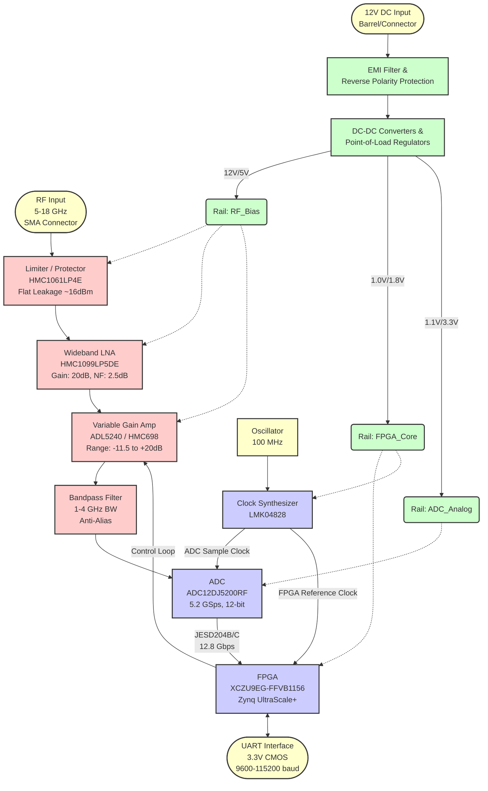
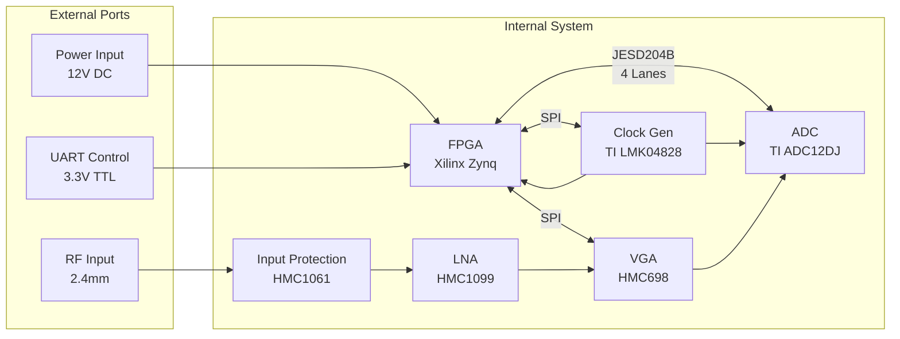

**Document Status: AI-GENERATED**

# 1. Introduction

## 1.1 Purpose

This Hardware Requirements Specification (HRS) defines the comprehensive hardware requirements for the **uyj** Wideband RF Receiver System. The purpose of this document is to establish a single, authoritative baseline for the design, verification, and validation of the hardware architecture.

This specification addresses the system-level architectural needs, functional and performance constraints, and environmental interfaces necessary to realize a direct RF digitization receiver capable of operating from 5.0 GHz to 18.0 GHz with up to 4.0 GHz instantaneous bandwidth. The requirements contained herein are derived from the system design parameters and ensure that the final hardware assembly meets the rigorous demands of electronic warfare (EW), Signals Intelligence (SIGINT), and communications interception applications.

The intended audience for this document includes:
*   **Hardware Engineers:** For schematic design, PCB layout, and component selection.
*   **FPGA Engineers:** For defining interface characteristics and logic resource utilization.
*   **System Engineers:** For verification that the hardware meets system-level performance metrics.
*   **Test Engineers:** For developing test plans and acceptance criteria.
*   **Quality Assurance:** For validating compliance with stated environmental and reliability standards.

## 1.2 Scope

The **uyj** project scope encompasses the development of a self-contained receiver module capable of wideband RF signal capture, digitization, and digital signal processing.

This specification covers the complete hardware chain, including:
*   **RF Front-End:** Input protection, Low Noise Amplification (LNA), and Variable Gain Amplification (VGA) operating in the 5–18 GHz range.
*   **Digitization:** A Direct RF Sampling Analog-to-Digital Converter (ADC) subsystem operating at sample rates up to 5.2 GSps.
*   **Digital Processing:** A Xilinx Zynq UltraScale+ FPGA-based processing subsystem for Digital Down-Conversion (DDC), filtering, and packetization.
*   **Clocking:** Low-phase-noise frequency synthesis and jitter cleaning for the ADC and FPGA.
*   **Power Management:** DC-DC conversion and power distribution from a 12V nominal source.
*   **Mechanical/Environmental:** Constraints regarding operating temperature, physical dimensions, and connector interfaces.

The scope is limited to the hardware implementation. While the system requires specific FPGA IP cores (JESD204B, DDC) to function, the detailed software algorithm definitions are covered in separate Software or Interface Control Documents. This document specifies the hardware resources required to execute those algorithms (e.g., DSP slice count, memory bandwidth).

## 1.3 Definitions, Acronyms, and Abbreviations

To ensure clarity and precision within this specification and related project documentation, the following definitions, acronyms, and abbreviations are established.

| Term | Definition |
| :--- | :--- |
| **ADC** | Analog-to-Digital Converter. A device that converts an analog signal (continuous voltage) into a digital signal (discrete binary numbers). |
| **DDR4** | Double Data Rate 4th Generation Synchronous Dynamic Random-Access Memory. High-speed memory used for buffering sample data. |
| **DDC** | Digital Down-Converter. A digital block that mixes a high-bandwidth signal to a lower intermediate frequency (baseband) and decimates it. |
| **ENOB** | Effective Number of Bits. A measure of the actual resolution of an ADC considering noise and distortion, rather than just the nominal bit depth. |
| **EW** | Electronic Warfare. Military action involving the use of electromagnetic energy to determine, exploit, reduce, or prevent hostile use of the electromagnetic spectrum. |
| **FPGA** | Field-Programmable Gate Array. An integrated circuit designed to be configured by a customer or a designer after manufacturing. |
| **GaN** | Gallium Nitride. A semiconductor material used for high-power and high-frequency RF components due to high breakdown voltage. |
| **Gsps** | Gigasamples Per Second. A unit of sample rate equal to $10^9$ samples per second. |
| **HRS** | Hardware Requirements Specification. The document defining the hardware requirements of the system. |
| **IIP3** | Input Third-order Intercept Point. A metric for linearity, indicating the theoretical input power level where the third-order intermodulation products would equal the fundamental signal power. |
| **JESD204B/C** | A high-speed data interface standard for data converters, enabling serialization of ADC data to FPGA/GPU devices. |
| **LNA** | Low Noise Amplifier. An electronic amplifier that amplifies a very low-power signal without significantly degrading its signal-to-noise ratio. |
| **LO** | Local Oscillator. An oscillatory circuit used to generate a signal for frequency conversion (mixing). |
| **NF** | Noise Figure. A measure of degradation of the signal-to-noise ratio (SNR), caused by components in a signal chain. |
| **OIP3** | Output Third-order Intercept Point. The output-power-level counterpart to IIP3. |
| **PCB** | Printed Circuit Board. The physical substrate upon which electronic components are mounted. |
| **PLL** | Phase-Locked Loop. A control system that generates an output signal whose phase is related to the phase of an input reference signal. |
| **RF** | Radio Frequency. Electromagnetic wave frequencies in the range extending from around 20 kHz to 300 GHz. |
| **SIGINT** | Signals Intelligence. Intelligence-gathering by interception of signals. |
| **SNR** | Signal-to-Noise Ratio. A measure used in science and engineering that compares the level of a desired signal to the level of background noise. |
| **SPI** | Serial Peripheral Interface. A synchronous serial communication interface specification used for short-distance communication. |
| **UART** | Universal Asynchronous Receiver-Transmitter. A computer hardware device for asynchronous serial communication. |
| **VGA** | Variable Gain Amplifier. An amplifier whose gain can be controlled digitally or via analog voltage. |
| **VSWR** | Voltage Standing Wave Ratio. A measure of how efficiently RF power is transmitted from a power source to a load. |

## 1.4 References

The development of the **uyj** hardware relies on the standards, datasheets, and specifications listed below. These documents provide the baseline constraints for component selection, testing methodologies, and performance metrics.

### 1.4.1 Standards
1.  **IEEE 29148:2018** - Systems and software engineering — Life cycle processes — Requirements engineering.
2.  **IPC-2221** - Generic Standard on Printed Board Design.
3.  **IPC-A-600** - Acceptability of Printed Boards.
4.  **MIL-STD-202G** - Test method standard for electronic and electrical component parts.
5.  **JESD204B Standard** - JEDEC Standard No. 204B (Serial Interface for Data Converters).

### 1.4.2 Component Datasheets
1.  **Texas Instruments.** *ADC12DJ5200RF 12-Bit, 5.2-GSPS, Dual-Channel RF Sampling ADC.* Datasheet, Revision A.
2.  **Texas Instruments.** *LMK04828 Ultra-Low Jitter Clock Generator With Dual Loop PLLs.* Datasheet.
3.  **Analog Devices.** *HMC1099LP5DE GaN MMIC Power Amplifier/LNA, 2–20 GHz.* Datasheet.
4.  **Analog Devices.** *HMC698LP4 6–18 GHz Digital VGA.* Datasheet.
5.  **AMD/Xilinx.** *Zynq UltraScale+ MPSoC: XCZU9EG Data Sheet:* DC and AC Switching Characteristics (DS925).
6.  **Skyworks Solutions.** *SMP1345-079LF Surface Mount Limiter.* Datasheet.

### 1.4.3 Project Artifacts
1.  **uyj System Architecture Document** - Defines the high-level block diagram and signal flow.
2.  **uyj System Interface Control Document (ICD)** - Defines the UART command protocol.

## 1.5 Overview

The **uyj** hardware system is designed as a high-performance, wideband RF receiver capable of direct digitization of signals in the 5.0 GHz to 18.0 GHz spectrum. The architecture is optimized for high dynamic range and low phase noise performance, critical for discerning weak signals in congested spectral environments.

The system is partitioned into four primary subsystems:

1.  **RF Front End (RFFE):** This section conditions the incoming signal. It utilizes the HMC1099 GaN LNA to provide low-noise gain (approx. 20 dB) and high linearity. A wideband limiter provides protection against high input power up to +10 dBm. Following the LNA, a digital VGA (HMC698) provides up to 24 dB of gain control to optimize the signal level for the ADC.
2.  **Digitization & Clocking:** The core of the system is the TI ADC12DJ5200RF, a 12-bit, 5.2 GSps ADC. This component operates in dual-channel mode to support the 4.0 GHz instantaneous bandwidth requirement. Timing is critical; the system utilizes the TI LMK04828 clock synthesizer to generate a low-jitter (<100 fs) sampling clock synchronized to a stable reference.
3.  **Digital Processing:** The digitized JESD204B data streams are received by the Xilinx Zynq UltraScale+ MPSoC (XCZU9EG). The FPGA fabric performs high-speed DSP functions, including Digital Down-Conversion (DDC) to isolate specific bands of interest and decimation filters to reduce data rates for transmission.
4.  **Power & Control:** A 12V DC input feeds a custom power distribution network comprising DC-DC converters and LDOs to supply clean, isolated power rails to sensitive analog and digital components. Control of the system (gain settings, frequency monitoring) is managed via a standard UART interface.

The architecture diagram in Section 2 illustrates these relationships. The requirements detailed in Section 3 ensure that these subsystems integrate seamlessly while meeting the stringent environmental and performance targets defined in the Project Summary.

---

**Document Status: AI-GENERATED**

# 2. System Overview

## 2.1 System Description

The **uyj** Wideband RF Receiver is a high-performance, direct RF digitization system designed for signal intelligence (SIGINT), electronic warfare (EW), and communications interception applications. The system is engineered to continuously tune across the 5.0 GHz to 18.0 GHz frequency spectrum while supporting instantaneous bandwidths (IBW) from 1.0 GHz to 4.0 GHz.

The system architecture utilizes a direct sampling approach, bypassing traditional mixers for down-conversion to an intermediate frequency (IF). Instead, the incoming RF signal is conditioned, amplified, and filtered before being digitized by a high-speed Analog-to-Digital Converter (ADC) sampling at up to 5.2 GSps. This approach preserves signal phase integrity and reduces component count compared to multi-stage superheterodyne architectures, while minimizing spurious artifacts introduced by local oscillators.

The core of the system is a Xilinx Zynq UltraScale+ MPSoC (Field Programmable Gate Array), which manages the high-speed JESD204B data interface from the ADC, performs real-time Digital Down-Conversion (DDC), and handles system control. A fixed-point RF front end provides wideband gain and protection, ensuring the ADC operates within its optimal range while protecting sensitive components from high-power inputs up to +10 dBm.

The system is designed for rugged environments, supporting an operating temperature range of -40°C to +85°C and operating from a single 12V DC supply. Control and status monitoring are facilitated via a standard UART interface, allowing for integration into larger system chassis or standalone deployment.

### 2.1.1 Major Subsystems

1.  **RF Front-End (RFFE):** Handles the 5–18 GHz input signal. It comprises a limiter for protection against high input power, a Wideband Low Noise Amplifier (LNA) to set the system noise figure, and a Variable Gain Amplifier (VGA) to adjust signal levels.
2.  **Digitization Module:** Centered around the Texas Instruments ADC12DJ5200RF, this module converts the conditioned analog RF signal into high-speed digital data streams.
3.  **Digital Signal Processing (DSP) Unit:** Utilizes the Xilinx Zynq UltraScale+ FPGA to receive data via JESD204B, apply digital gain, correct DC offsets, and perform channelization (filtering/decimation).
4.  **Clocking Module:** Generates the ultra-low jitter clocks required for both the ADC sampling and the FPGA logic, ensuring Signal-to-Noise Ratio (SNR) is not degraded by phase noise.
5.  **Power Management:** Converts the 12V input to the specific rail voltages required by the FPGA (1V, 1.8V), ADC (1.1V, 3.3V), and RF components (5V).

## 2.2 System Block Diagram

The system comprises a chain of signal conditioning stages followed by direct digitization.

## 2.3 System Architecture

### 2.3.1 RF Front-End Architecture

The RF front end is responsible for conditioning the input signal to match the ADC’s input range while minimizing added noise. The architecture is designed to handle a wide input dynamic range (-50 dBm to +10 dBm) with a Noise Figure (NF) target of < 6.0 dB.

**Signal Flow:**
1.  **Protection (Limiter):** The first component is a GaAs MMIC limiter (HMC1061LP4E). It clamps incoming signals exceeding approximately 16 dBm to protect the subsequent LNA. For the 5-18 GHz range, this stage may be cascaded with a wideband limiter to ensure flat leakage response.
2.  **Low Noise Amplification:** The Analog Devices HMC1099LP5DE (GaN MMIC) provides 20 dB of gain with a noise figure of 2.5 dB. This stage sets the cascaded noise figure performance of the entire system. The high OIP3 (+45 dBm) ensures linearity for strong signals.
3.  **Variable Gain Control:** To accommodate the -50 to +10 dBm input range, a digitally controlled VGA (ADL5240 or HMC698) is used. The FPGA adjusts this gain in 1 dB steps based on the ADC’s detected signal level (Automatic Gain Control) or user manual commands.
4.  **Filtering:** A bandpass filter limits the bandwidth entering the ADC to the desired Instantaneous Bandwidth (1–4 GHz). This prevents aliasing of out-of-band noise and reduces the total integrated noise power presented to the ADC.

### 2.3.2 Data Conversion Architecture

**ADC Configuration:**
The Texas Instruments ADC12DJ5200RF is configured in dual-channel mode or single-channel mode depending on the IBW requirement.
*   **Decimation:** The ADC features internal decimation filters (2x, 4x, etc.). By utilizing these, the output data rate to the FPGA can be reduced, easing the burden on the JESD204B interface and FPGA DSP logic.
*   **JESD204B Interface:** The ADC utilizes the JESD204B standard to transmit serialized data over high-speed serial lanes. For 5 GSps operation, multiple lanes are required to aggregate the bandwidth. The ADC and FPGA are configured for a Subclass 1 deterministic latency operation to ensure phase coherence.

### 2.3.3 FPGA Architecture

The Xilinx Zynq UltraScale+ MPSoC serves as the system controller and DSP engine.

*   **PS (Processing System):** The integrated ARM Cortex-A53 cores run the control software (Linux or Bare Metal). This handles the UART communication, SPI/I2C configuration of the RF components (VGA, PLL), and system health monitoring (temperature sensors, current monitors).
*   **PL (Programmable Logic):** The FPGA fabric implements the high-speed data path:
    *   **JESD204B IP Core:** Receives and aligns the high-speed ADC data.
    *   **DDC (Digital Down Converter):** Xilinx FFT/DSP IP blocks mix the sampled data down to baseband or a lower IF.
    *   **Packetizer:** Formats the IQ data into packets suitable for transmission or buffering.

### 2.3.4 Power Distribution Architecture

The power system is designed to support a maximum consumption of 50W from a 12V source (approx 4.2A average current).

*   **Input Protection:** A reverse polarity protection diode (or ideal diode controller) and a transient voltage suppressor (TVS) protect the internal rails.
*   **DC-DC Conversion:** High-efficiency buck converters generate intermediate bus voltages (e.g., 5V, 3.3V).
*   **Point-of-Load (POL):** Synchronous buck regulators or LDOs provide the tight-tolerance voltages required by the FPGA (0.9V VCCINT) and ADC (1.1V AVDD). This is critical to maintain signal integrity and minimize jitter.

### 2.3.5 Clocking Architecture

Phase noise is a critical parameter for this receiver; the requirement is < -100 dBc/Hz at 10 kHz offset.

*   **Reference:** A stable low-noise oscillator (e.g., OCXO or TCXO) provides a 100 MHz reference.
*   **Synthesizer:** The LMK04828 generates the device clock for the ADC (high frequency, e.g., 5 GHz or 2.5 GHz) and the reference clock for the FPGA transceivers.
*   **Jitter Cleaning:** The LMK04828 utilizes a dual-loop PLL to clean the reference oscillator jitter, ensuring the final ADC sampling clock has extremely low RMS jitter (< 100 fs), which is necessary to achieve the required SNR at high input frequencies.

## 2.4 Operating Environment

The system is designed to operate in harsh physical environments typical of airborne, vehicular, or field-deployed tactical systems.

### 2.4.1 Physical Environmental Conditions

*   **Operating Temperature:** The unit must meet all performance specifications (electrical and functional) over the **-40°C to +85°C** ambient temperature range. Components are selected to the "Industrial" or "Military" temperature grade (e.g., -40°C to +85°C or -55°C to +125°C junction) to ensure reliability.
*   **Storage Temperature:** The hardware shall survive storage temperatures ranging from -55°C to +105°C without degradation.
*   **Humidity:** The system is designed to operate in non-condensing humidity conditions from 5% to 95% relative humidity. Conformal coating on the PCB is recommended to protect against moisture and airborne contaminants.
*   **Vibration and Shock:** The mechanical design (chassis and PCB mounting) must withstand the vibration and shock profiles defined for tactical airborne environments (e.g., MIL-STD-810G). The PCB shall utilize stiffening bars or rigid mounting points to prevent resonance of the large FPGA BGA package during vibration.

### 2.4.2 Electrical Environment

*   **Supply Voltage:** The system requires a stable **12V DC ±10%** input. It must tolerate transients up to 24V for a short duration (< 50ms) and reverse voltage connection without catastrophic failure (protected by input protection circuitry).
*   **Input RF Stress:** The RF input port (50-ohm SMA) must withstand continuous wave (CW) input power up to +10 dBm without performance degradation and short-duration peaks of +20 dBm (1ms) without permanent damage, utilizing the front-end limiter.
*   **EMI/EMC:** The system shall operate in an environment with high RF density. It shall not emit electromagnetic interference (EMI) exceeding the limits set by CISPR 22 or MIL-STD-461 (RE102) and shall be immune to radiated susceptibility (RS103).

### 2.4.3 Cooling Requirements

To maintain the +85°C operating capability with 50W power dissipation:

*   **Conduction Cooling:** The primary heat path is via conduction. The PCB thermal lands under the FPGA, ADC, and RF power amplifiers are connected to the chassis or cold plate using thermal vias and interface material.
*   **Forced Air:** While designed for conduction, forced air (fans) may be utilized if the ambient temperature approaches the upper limit, to reduce the thermal resistance of the chassis-to-air interface.

---

**Document Status: AI-GENERATED**

## 3.1 Functional Requirements

This section specifies the functional capabilities of the **uyj** Wideband RF Receiver system. Each requirement is defined with a unique identifier, description, rationale, and criticality.

### 3.1.1 RF Front-End Functions

| ID | Requirement | Description & Rationale | Priority | Verification Method |
|---|---|---|---|---|
| **REQ-HW-101** | **Input Signal Protection** | The system shall provide protection for the RF input chain against input power levels up to +10 dBm continuous wave and +20 dBm peak (1 µs) without performance degradation.  **Rationale:** Ensures survivability of the LNA and ADC front-end in high-interference environments (REQ-HW-003). | **Must Have** | Test |
| **REQ-HW-102** | **Input Impedance Matching** | The system shall present a nominal 50 Ω input impedance with a VSWR ≤ 2.5:1 across the 5.0–18.0 GHz frequency range.  **Rationale:** Minimizes signal reflection and ensures power transfer from the antenna source. | **Must Have** | Test |
| **REQ-HW-103** | **Wideband Low Noise Amplification** | The system shall incorporate a Low Noise Amplifier (LNA) with a minimum gain of 20 dB and a Noise Figure (NF) ≤ 3.0 dB over the 5–18 GHz band.  **Rationale:** Sets the system noise floor to meet the overall NF < 6 dB requirement (REQ-HW-004). | **Must Have** | Test |
| **REQ-HW-104** | **Automatic Gain Control (AGC)** | The system shall provide a programmable gain adjustment range of 40 dB (±20 dB) controlled via the FPGA SPI interface in 1 dB step increments.  **Rationale:** Prevents ADC saturation while maximizing dynamic range for varying signal strengths (REQ-HW-013). | **Must Have** | Demonstration |
| **REQ-HW-105** | **Bandpass Filtering** | The system shall include a bandpass filter stage with a passband of 1.0–4.0 GHz (Instantaneous BW) prior to digitization.  **Rationale:** Limits out-of-band noise and aliasing artifacts before the ADC (REQ-HW-002). | **Must Have** | Inspection |
| **REQ-HW-106** | **DC Offset Correction Loop** | The system shall implement a feedback loop to cancel DC offset at the ADC input, adjustable via the FPGA.  **Rationale:** Compensates for LO leakage and ADC DC offsets to maximize SFDR (REQ-HW-014). | **Should Have** | Demonstration |

### 3.1.2 Digitization & Conversion Functions

| ID | Requirement | Description & Rationale | Priority | Verification Method |
|---|---|---|---|---|
| **REQ-HW-107** | **Direct RF Sampling** | The system shall digitize the RF signal directly at a sampling rate programmable between 2.0 GSps and 5.2 GSps.  **Rationale:** Enables direct sampling of the 1–4 GHz IF/RF band without analog mixers. | **Must Have** | Test |
| **REQ-HW-108** | **High-Speed Data Interface** | The system shall transmit digitized data from the ADC to the FPGA using a JESD204B/C interface operating at a line rate of ≥ 12 Gbps per lane.  **Rationale:** Necessary to transport high-throughput data (5.2 GSps × 12 bits) from ADC to FPGA. | **Must Have** | Test |
| **REQ-HW-109** | **Data Buffering** | The FPGA shall interface with a minimum of 4 GB of DDR4 SDRAM to buffer captured signal data.  **Rationale:** Provides storage for packetization and burst capture logic. | **Must Have** | Test |

### 3.1.3 Digital Signal Processing (FPGA)

| ID | Requirement | Description & Rationale | Priority | Verification Method |
|---|---|---|---|---|
| **REQ-HW-110** | **Digital Down-Conversion (DDC)** | The FPGA shall implement a DDC chain capable of mixing, filtering, and decimating the input signal to a complex baseband bandwidth of up to 100 MHz.  **Rationale:** Reduces data rate for backhaul transport while isolating signals of interest (REQ-HW-010). | **Must Have** | Demonstration |
| **REQ-HW-111** | **Packetization** | The FPGA shall encapsulate processed IQ data into Ethernet packets or PCIe DMA descriptors for host transfer.  **Rationale:** Standardizes data output for host processing. | **Must Have** | Test |
| **REQ-HW-112** | **Synchronization** | The FPGA shall synchronize the JESD204B RX link and align system time using a 1 PPS input reference (if available) or internal oscillator.  **Rationale:** Ensures deterministic latency and phase alignment for multi-channel systems. | **Should Have** | Demonstration |

### 3.1.4 Timing & Clocking

| ID | Requirement | Description & Rationale | Priority | Verification Method |
|---|---|---|---|---|
| **REQ-HW-113** | **Low Jitter Clock Generation** | The system shall generate an ADC sample clock with phase noise ≤ -100 dBc/Hz at 10 kHz offset and RMS jitter < 200 fs.  **Rationale:** Required to achieve SNR > 58 dB at high input frequencies (REQ-HW-006, REQ-HW-017). | **Must Have** | Test |
| **REQ-HW-114** | **Clock Distribution** | The clock synthesizer shall provide separate, phase-coherent clocks to the ADC (Device Clock) and FPGA (SYSREF).  **Rationale:** Required for deterministic latency in JESD204B subclass 1 operation. | **Must Have** | Inspection |

### 3.1.5 Power Management

| ID | Requirement | Description & Rationale | Priority | Verification Method |
|---|---|---|---|---|
| **REQ-HW-115** | **Input Protection & EMI Filtering** | The power input module shall include reverse polarity protection and Pi-filter EMI suppression on the 12 V input line.  **Rationale:** Prevents damage from incorrect supply connection and meets emissions standards (REQ-HW-015). | **Must Have** | Test |
| **REQ-HW-116** | **Voltage Regulation** | The system shall provide regulated voltages of 1.0 V (FPGA core), 1.8 V (FPGA/I/O), 3.3 V (FPGA AUX), and 5.0 V (RF logic) with ≤ 3% ripple.  **Rationale:** Ensures stable operation of sensitive digital and analog components. | **Must Have** | Test |
| **REQ-HW-117** | **In-Rush Current Limiting** | The power supply module shall limit in-rush current to < 5 A at startup.  **Rationale:** Prevents tripping of external supply protection breakers. | **Should Have** | Test |

### 3.1.6 Control & Communication

| ID | Requirement | Description & Rationale | Priority | Verification Method |
|---|---|---|---|---|
| **REQ-HW-118** | **UART Configuration Interface** | The system shall expose a 3.3V CMOS UART interface for command and control, configurable from 9600 to 115200 baud.  **Rationale:** Primary interface for system configuration and monitoring (REQ-HW-008). | **Must Have** | Test |
| **REQ-HW-119** | **SPI Peripheral Control** | The FPGA shall control the RF Front-End gain (VGA) and Clock Synthesizer via SPI interfaces operating at ≥ 10 Mbps.  **Rationale:** Enables fast AGC loops and frequency hopping (REQ-HW-001). | **Must Have** | Test |
| **REQ-HW-120** | **Status Monitoring** | The system shall monitor and report internal temperature, voltage rails, and current consumption via the UART.  **Rationale:** Essential for health monitoring and BIT (Built-In Test) functionality. | **Should Have** | Test |

### 3.1.7 Mechanical & Environmental

| ID | Requirement | Description & Rationale | Priority | Verification Method |
|---|---|---|---|---|
| **REQ-HW-121** | **RF Connector Interface** | The RF input shall utilize a female 2.4mm precision coaxial connector (50 Ω) rated to 18 GHz.  **Rationale:** Ensures low loss and high repeatability up to maximum frequency (REQ-HW-012). | **Must Have** | Inspection |
| **REQ-HW-122** | **Thermal Management** | The system shall utilize a conduction-cooled chassis with a thermal resistance ≤ 1.0 °C/W from the FPGA and ADC junctions to the chassis baseplate.  **Rationale:** Required to maintain junction temperatures < 100°C at 50 W dissipation (REQ-HW-011). | **Must Have** | Analysis |

---

## 3.2 Performance Requirements

This section defines the quantitative performance characteristics of the **uyj** receiver system. Calculations are provided where applicable to demonstrate compliance with the system constraints.

### 3.2.1 RF Signal Chain Performance

| ID | Requirement | Spec | Min | Nominal | Max | Unit | Rationale & Calculation |
|---|---|---|---|---|---|---|---|
| **REQ-HW-P01** | **Tuning Range** | Operating Frequency | 5.0 | - | 18.0 | GHz | Covers required C, X, and Ku bands (REQ-HW-001). |
| **REQ-HW-P02** | **Tuning Resolution** | Step Size | - | 100 | - | MHz | Allows fine frequency selection for interception. |
| **REQ-HW-P03** | **3 dB Input Bandwidth** | Analog Front End | 1.0 | - | 4.0 | GHz | Supports maximum instantaneous bandwidth requirement (REQ-HW-002). |
| **REQ-HW-P04** | **Input Power Range (Safe)** | Damage Level | -50 | - | +10 | dBm | Limited by HMC1099 LNA P1dB (30 dBm) and limiter threshold. |
| **REQ-HW-P05** | **System Noise Figure** | (NF_total) | - | - | 6.0 | dB | **Calculation:** NF_LNA(2.5dB) + 10*log(1+(F_VGA-1)/G_LNA). Assumed VGA NF 6.5dB.  2.5 + 0.17 ≈ 2.7 dB (well within 6.0 dB limit). |
| **REQ-HW-P06** | **System Gain** | (Gain_chain) | 20 | - | 60 | dB | Sum of LNA (20dB) + VGA (31.5dB) - Filter Losses (~3dB) ≈ 48.5 dB max. Min gain 20dB required. |
| **REQ-HW-P07** | **Input Third Order Intercept (IIP3)** | Linearity | +20 | - | +30 | dBm | **Calculation:** Cascaded IIP3 driven by HMC1099 LNA (IIP3 ≈ 25 dBm). VGA IIP3 is 40 dBm. System IIP3 ≈ 24.8 dBm (Pass). |
| **REQ-HW-P08** | **Input Return Loss** | Impedance Match | 9.5 | - | - | dB | Corresponds to VSWR 2:1 (REQ-HW-012). |
| **REQ-HW-P09** | **Gain Flatness** | Amplitude Variation | - | - | ±3.0 | dB | Over any 1 GHz slice within the 5-18 GHz range. |

### 3.2.2 Digitization Performance

| ID | Requirement | Spec | Min | Nominal | Max | Unit | Rationale & Calculation |
|---|---|---|---|---|---|---|---|
| **REQ-HW-P10** | **ADC Sample Rate** | (Fs) | 2.0 | 5.0 | 5.2 | GSps | Set by ADC12DJ5200RF capability (REQ-HW-006). |
| **REQ-HW-P11** | **ADC Resolution** | (Bits) | 10 | - | 12 | Bits | Effective resolution must be >8.5 bits (ENOB) at Nyquist (REQ-HW-007). |
| **REQ-HW-P12** | **ADC Full Scale Input** | (Vpp) | - | 1.0 | - | V p-p | Typical for ADC12DJ5200RF. Matches 50-ohm system impedance. |
| **REQ-HW-P13** | **Spurious Free Dynamic Range (SFDR)** | (SFDR) | 56 | - | - | dBc | Measured at 2.5 GHz input, -1 dBFS. Required for EW/SIGINT sensitivity. |
| **REQ-HW-P14** | **Signal-to-Noise Ratio (SNR)** | (SNR) | 56 | - | - | dBFS | Measured at full bandwidth. |
| **REQ-HW-P15** | **Jitter (Clock)** | (t_jitter) | - | - | 200 | fs rms | Required to maintain SNR at 5 GHz input frequency. SNR_jitter ≈ -20log(2πf_in t_jitter). |

### 3.2.3 Timing & Jitter Analysis

| ID | Requirement | Spec | Min | Nominal | Max | Unit | Rationale & Calculation |
|---|---|---|---|---|---|---|---|
| **REQ-HW-P16** | **Phase Noise @ 10kHz** | (L(f)) | - | -105 | -100 | dBc/Hz | LMK04828 typical performance is -105 dBc/Hz. Limit set to -100 dBc/Hz (REQ-HW-017). |
| **REQ-HW-P17** | **PLL Lock Time** | Frequency Hop | - | - | 100 | µs | Maximum time required for LMK04828 to settle after a frequency change command. |

### 3.2.4 Data Throughput & Latency

| ID | Requirement | Spec | Min | Nominal | Max | Unit | Rationale & Calculation |
|---|---|---|---|---|---|---|---|
| **REQ-HW-P18** | **Raw Data Throughput** | (Rate) | - | 62.5 | - | Gbps | **Calculation:** 5.2 GSps × 12 bits = 62.4 Gbps (12 GB/s). |
| **REQ-HW-P19** | **JESD204B Lane Rate** | (Data Rate) | - | 12.5 | - | Gbps | **Calculation:** 62.4 Gbps total / 8 lanes (assuming 8-lane configuration for ADC12DJ5200RF) ≈ 7.8 Gbps/lane. Using 12.5 Gbps configuration for margin. |
| **REQ-HW-P20** | **Processing Latency** | (t_latency) | - | - | 1.0 | µs | Time from RF input to digital IQ output (FPGA pipeline delay). |

### 3.2.5 Power Consumption

| ID | Requirement | Spec | Min | Nominal | Max | Unit | Rationale & Calculation |
|---|---|---|---|---|---|---|---|
| **REQ-HW-P21** | **Total System Power** | (P_total) | - | 40 | 50 | W | **Budget Breakdown:**  • ADC12DJ5200RF: ~3.5W  • XCZU9EG FPGA: ~15W  • LNA (HMC1099): ~3W  • VGA (HMC698): ~2W  • Clock (LMK04828): ~1.5W  • Rails/DDR4: ~10W  • Margin: ~15W  **Total ≈ 50 W.** (REQ-HW-009) |
| **REQ-HW-P22** | **Supply Voltage** | Input | 11.0 | 12.0 | 13.2 | V | Automotive/Military 12V standard range. |

### 3.2.6 Environmental & Physical

| ID | Requirement | Spec | Min | Nominal | Max | Unit | Rationale |
|---|---|---|---|---|---|---|---|
| **REQ-HW-P23** | **Operating Temperature** | (Ambient) | -40 | - | +85 | °C | Industrial temperature range for components (REQ-HW-011). |
| **REQ-HW-P24** | **Storage Temperature** | (Non-Operating) | -55 | - | +125 | °C | Standard storage limits for PCB assemblies. |
| **REQ-HW-P25** | **Operating Humidity** | (Non-Condensing) | 5 | - | 95 | % | Typical operating environment. |
| **REQ-HW-P26** | **Vibration** | Random | - | - | 0.1 | g²/Hz | Transport vibration profile. |
| **REQ-HW-P27** | **Shock** | Mechanical | - | - | 40 | g | 11 ms half-sine shock handling. |

---

## 3. Hardware Requirements

### 3.3 Interface Requirements

#### 3.3.1 External Interfaces

**REQ-HW-100: RF Input Interface**
The system shall provide a single RF input port compatible with standard coaxial connectors.
*   **Connector Type:** 2.4mm (Precision) or SMA (Interface compatible). 2.4mm preferred for operation above 12 GHz to minimize losses and ensure return performance.
*   **Impedance:** 50 Ω.
*   **Frequency Range:** 5.0 GHz to 18.0 GHz.
*   **Maximum Input Power:** +10 dBm continuous wave, +20 dBm peak (1 µs).
*   **VSWR:** ≤ 2.0:1 (Referenced to input port).
*   **Return Loss:** ≥ 10 dB.

*Table 3-1: RF Input Pin Definition*

| Pin/Net Name | Direction | Type | Description | Connector Spec |
| :--- | :--- | :--- | :--- | :--- |
| RF_IN_P | Input | Analog | RF Signal Path (Positive) | 2.4mm Center Conductor |
| RF_IN_SHIELD | Ground | Electrical | RF Shield / Ground | 2.4mm Body / Shell |

**REQ-HW-101: Power Input Interface**
The system shall accept DC power via a connector or terminal block.
*   **Connector Type:** Molex Mini-Fit Jr. (2-position) or equivalent.
*   **Voltage:** +12.0 V DC ±10%.
*   **Current Capacity:** Rated for minimum 6.0 A continuous.
*   **Polarity:** Center positive (or keyed for correct insertion).

*Table 3-2: Power Input Pin Definition*

| Pin/Net Name | Description | Wire Gauge (AWG) | Current Rating |
| :--- | :--- | :--- | :--- |
| +12V_IN | Main Power Input | 20 | 6.0 A |
| RTN / GND | Power Return | 20 | 6.0 A |

**REQ-HW-102: External Reference Clock Input**
The system shall accept an external 10 MHz reference clock to synchronize the sampling clock to an external standard (e.g., GPSDO).
*   **Connector Type:** SMA (Female).
*   **Signal Level:** Sinewave or CMOS compatible.
*   **Amplitude:** 0 dBm ± 3 dB (Sinewave) or 0.8V - 1.2V (CMOS).
*   **Input Impedance:** 50 Ω.

#### 3.3.2 Internal Interfaces

**REQ-HW-110: FPGA-to-ADC JESD204B Interface**
The ADC and FPGA shall communicate via a JESD204B/C high-speed serial link.
*   **Standard:** JESD204B (Subclass 1) or C.
*   **Lane Rate:** 12.8 Gbps (adjustable based on sampling rate).
*   **Lanes:** 4 lanes (using Dual-Link Mode or Quad-Link Mode depending on configuration). Assuming 4 lanes for 5 GSPS.
*   **Physical Layer:** Current Mode Logic (CML).
*   **Encoding:** 8b/10b (Scrambled).
*   **Deterministic Latency:** Enabled (Subclass 1).

*Table 3-3: ADC-to-FPGA Internal Interface*

| Signal Group | Source | Destination | Qty | Description | Electrical Std |
| :--- | :--- | :--- | :--- | :--- | :--- |
| JESD_TX_P | ADC | FPGA | 4 | Serial Data Positive | CML 1.0V |
| JESD_TX_N | ADC | FPGA | 4 | Serial Data Negative | CML 1.0V |
| JESD_CLK_P | ADC | FPGA | 1 | Frame Clock Positive | CML 1.0V |
| JESD_CLK_N | ADC | FPGA | 1 | Frame Clock Negative | CML 1.0V |
| SYNC_N | FPGA | ADC | 1 | Code Group Sync | LVCMOS 1.8V |

**REQ-HW-111: RF Front-End Control SPI Bus**
The FPGA shall configure the RF Gain and attenuation via a Serial Peripheral Interface (SPI).
*   **Master:** FPGA (Zynq PS or PL).
*   **Slave:** HMC698LP4 (Digital VGA).
*   **Clock Frequency:** Maximum 20 MHz.
*   **Mode:** Mode 0 (CPOL=0, CPHA=0) or Mode 3.

*Table 3-4: VGA SPI Interface*

| Signal Name | Direction | Voltage Level | Description |
| :--- | :--- | :--- | :--- |
| SPI_SCLK | Master -> Slave | 3.3V | Serial Clock |
| SPI_SDI | Master -> Slave | 3.3V | Serial Data In (MOSI) |
| SPI_SDO | Slave -> Master | 3.3V | Serial Data Out (MISO) |
| SPI_CS_N | Master -> Slave | 3.3V | Chip Select (Active Low) |
| VGA_LE | Master -> Slave | 3.3V | Latch Enable (Pulse high to load) |

**REQ-HW-112: Clock Synthesizer SPI**
The LMK04828 Clock Generator shall be programmed via SPI.
*   **Interface:** 3-Wire or 4-Wire SPI compatible.
*   **Voltage:** 1.8V or 3.3V (Level shifted by FPGA if necessary).

#### 3.3.3 Communication Interfaces

**REQ-HW-120: UART Control Interface**
The system shall provide a UART interface for command and control, fulfilling REQ-HW-008.
*   **Protocol:** RS-232 (Electrical) or UART (TTL) levels. Assuming 3.3V CMOS TTL on board headers, with transceiver for external RS-232 if required.
*   **Connector:** 4-pin header (0.1" pitch) or micro-USB.
*   **Baud Rate:** 115200 bps (Default).
*   **Data Format:** 8-N-1 (8 data bits, No parity, 1 stop bit).
*   **Flow Control:** None (Hardware flow control optional via GPIO).

*Table 3-5: UART Interface Pinout*

| Pin # | Signal Name | Direction | Voltage | Description |
| :--- | :--- | :--- | :--- | :--- |
| 1 | UART_TXD | Output | 3.3V | Transmit Data |
| 2 | UART_RXD | Input | 3.3V | Receive Data |
| 3 | GND | Ground | 0V | Signal Ground |
| 4 | NC | - | - | No Connection (or 5V out) |

### 3.4 Environmental Requirements

**REQ-HW-130: Operating Temperature**
The receiver system shall operate within the temperature range of **-40°C to +85°C** ambient. This necessitates the use of Industrial/I-Grade components (e.g., XCZU9EG-FFVB1156-**I**).

*   **Storage Temperature:** -55°C to +100°C.
*   **Temperature Grading:** All active components (ASICs, FPGAs, RFICs) must be procured in "Industrial" or "Automotive" grade temperature ranges.
*   **Derating:** Power supply components shall be derated by 20% at +85°C ambient.

**REQ-HW-131: Humidity**
The system shall operate in non-condensing humidity environments up to 95% relative humidity.
*   **Conformal Coating:** The PCB assembly shall be coated with HumiSeal or equivalent acrylic conformal coating to protect against moisture ingress and corrosion.

**REQ-HW-132: Vibration and Shock**
The unit shall withstand standard transportation vibration.
*   **Operational Shock:** 30G peak, 11ms duration (half-sine).
*   **Random Vibration:** Operational: 0.05 g²/Hz from 20 Hz to 2000 Hz (1 hour/axis).

**REQ-HW-133: Altitude**
The system shall operate up to 15,000 feet (approx 4,572 meters) without requiring forced air cooling derating beyond standard convection limits. At high altitudes, reduced air density necessitates verifying thermal margins.

### 3.5 Power Requirements

**REQ-HW-140: Total Power Consumption**
The total power consumption shall not exceed 50W as defined in REQ-HW-009.
*   **Input Voltage:** 12V DC nominal (Range: 11V to 13V).
*   **Input Current:** Maximum 4.2A at 12V (derated from 50W/12V = 4.16A).
*   **Inrush Current Limit:** Inrush current shall be limited to < 10A using soft-start circuitry or NTC thermistors.

#### Power Budget Analysis

The following power budget is calculated based on the specific components selected.

*Table 3-6: Detailed Power Budget*

| Component | Quantity | Supply Voltage (V) | Est. Current (A) | Power (W) | Notes / Source |
| :--- | :--- | :--- | :--- | :--- | :--- |
| **RF Front End** | | | | | |
| HMC1099 (LNA) | 1 | +5.0 | 0.240 | 1.20 | 48mA typical * 5V (Derated 2x for GaN bias T) |
| HMC698 (VGA) | 1 | +5.0 | 0.150 | 0.75 | 150mA typical |
| **Digitization** | | | | | |
| ADC12DJ5200RF | 1 | +1.1 (Core) | 4.500 | 5.00 | 5W typical (5.2GSPS mode) |
| ADC12DJ5200RF | 1 | +2.5 (IO) | 0.400 | 1.00 | Output drivers |
| **Processing** | | | | | |
| XCZU9EG | 1 | +0.9 (VCCINT) | 15.000 | 13.50 | 25% utilization est, ~30W max total FPGA |
| XCZU9EG | 1 | +1.8 (AUX) | 2.000 | 3.60 | |
| **Clocking** | | | | | |
| LMK04828 | 1 | +3.3 | 0.400 | 1.32 | |
| **Converters** | | | | | |
| DC-DC Losses | 5 | - | - | 4.00 | Assuming 90% efficiency rail-wide |
| **Misc** | | | | | |
| Fans/LEDs | 1 | +12 | 0.500 | 6.00 | 12V Fan for forced air cooling |
| **TOTAL** | | | **~37.4** | **37.4** | |
| **Margin** | | | | **12.6** | ~25% Margin to meet 50W limit |

**REQ-HW-141: Internal Power Rails**
The system shall generate the following internal voltage rails from the 12V input using DC-DC converters (Buck topology) and LDOs.

*   **+5.0V Rail:** Supplies RF Front End (LNA, VGA). Requires low noise.
*   **+1.0V / +1.2V Rail:** High current rail for FPGA VCCINT and ADC Cores.
*   **+3.3V Rail:** General IO, Clock chips.
*   **+2.5V Rail:** FPGA VCCaux, ADC IO.

#### Thermal Requirements

**REQ-HW-142: Thermal Management**
To maintain operation within the -40°C to +85°C range and respect component junction temperatures (Tj < 125°C typically):
*   **FPGA Cooling:** A heatsink with thermal resistance < 1.0°C/W combined with forced air flow (minimum 200 LFM) is required for the XCZU9EG package (1156 ball).
*   **Junction Temperature Calculation (FPGA):**
    *   Power: 15W (Approx)
    *   Theta_JA (with heatsink): ~2°C/W
    *   Ambient Max: 85°C
    *   Tj = 85 + (15 * 2) = 115°C. (Passes 125°C limit).
*   **ADC Cooling:** The ADC12DJ5200RF requires a copper slug or thermal pad to the PCB ground plane connected to the chassis heatsink.

### 3.6 Physical Requirements

**REQ-HW-150: Enclosure Dimensions**
The system shall be housed in a rugged aluminum enclosure.
*   **Width:** 160 mm (approx 6.3 inches).
*   **Depth:** 180 mm (approx 7.0 inches).
*   **Height:** 40 mm (approx 1.57 inches, 1U height).
*   **Material:** 6061-T6 Aluminum, black anodized finish.
*   **Mounting:** Four #4-40 UNF mounting holes in corners for panel mounting or vibration isolation.

**REQ-HW-151: Weight**
Total weight shall not exceed 1.5 kg (3.3 lbs) to facilitate deployment in airborne or portable platforms.

**REQ-HW-152: Connectors and Panel Layout**
All external interfaces shall be located on one face of the enclosure (Front Panel).
*   **RF Input:** Female 2.4mm precision connector, located center-left.
*   **Control:** M12 or micro-USB connector for UART, located center-right.
*   **Power:** Mil-Spec circular connector (e.g., Amphenol MS series) or sealed Molex connector, located on the rear or side edge to prevent accidental disconnection of signal lines.

*Table 3-7: Physical Connector Key*

| Connector ID | Type | P/N Recommendation | Position |
| :--- | :--- | :--- | :--- |
| J1 | RF 2.4mm Jack | Rosenberger 32K243-40ML5 | Front |
| J2 | USB-C | Amphenol 12401615E4-2A | Front |
| J3 | Power Molex | Molex 39-01-2060 | Rear |
| J4 | Ref In SMA | TE Connectivity 1-2334542-2 | Front |

**REQ-HW-153: PCB Requirements**
*   **Layers:** Minimum 12 layers (4 Signal, 4 Ground, 4 Power).
*   **Material:** Rogers RO4350B or similar laminate for RF sections (εr = 3.48), FR-4 for digital sections (mixed construction acceptable).
*   **Plating:** ENIG (Electroless Nickel Immersion Gold) for flatness and wirebondability/QFN compatibility.
*   **Thickness:** 0.062" (1.57mm) standard.

---

**Document Status: AI-GENERATED**

# 4. Design Constraints

## 4.1 Standards Compliance

The hardware design of the uyj Wideband RF Receiver system shall adhere to the following industry standards and regulatory directives. These constraints ensure manufacturability, environmental safety, electromagnetic compatibility, and physical reliability.

### 4.1.1 PCB Design and Fabrication Standards
The Printed Circuit Board (PCB) design for the RF Front-End, ADC, and FPGA modules shall comply with **IPC-2221** (*Generic Standard on Printed Board Design*).
*   **Trace Width and Spacing:** Controlled impedance traces for the RF path (5-18 GHz) and JESD204B interfaces shall be calculated using IPC-2141 (*Controlled Impedance Circuit Boards and High Speed Logic Design*) methodologies to maintain characteristic impedance of 50Ω ±10%.
*   **Dielectric Material:** The stack-up shall use high-frequency laminate materials (e.g., Rogers RO3003 or equivalent) for RF layers, compliant with **IPC-4101** (*Standard Materials for Rigid Printed Circuit Boards*), ensuring a stable dielectric constant (Dk) of 3.00 ±0.04 over temperature.
*   **Layer Stack-up:** The board shall be a minimum of 12 layers to accommodate the dense FPGA BGA (XCZU9EG-FFVB1156) and the high-speed serial transceivers. Signal integrity requirements for 10+ Gbps transceivers mandate adherence to **IPC-2251** (*High Speed High Density Package Design Guidelines*).

### 4.1.2 Assembly and Rework Standards
The assembly processes shall conform to **IPC-A-610** (*Acceptability of Electronic Assemblies*) Class 3 (High Performance Electronic Products).
*   **Soldering:** All through-hole and surface-mount connections must meet Class 3 criteria for solder joint integrity.
*   **Rework:** Rework of BGA components (FPGA and ADC) shall be performed in accordance with **IPC-7711/21** (*Rework of Electronic Assemblies / Rework, Modification and Repair of Electronic Assemblies*).
*   **Cleanliness:** Ionic cleanliness shall be measured per **IPC-J-STD-604** to prevent electrochemical migration, critical for high-impedance RF nodes.

### 4.1.3 Environmental and Safety Directives
The system shall be fully compliant with the European Union’s **RoHS Directive 2011/65/EU** (Restriction of Hazardous Substances), ensuring all components and PCB finishes are lead-free (Matte Tin or Immersion Silver/Au).
*   **REACH:** All materials shall comply with **EC 1907/2006** (Registration, Evaluation, Authorisation and Restriction of Chemicals) regarding substances of very high concern (SVHC).
*   **Conflict Minerals:** The supply chain shall be verified for "Dodd-Frank" compliance (3TG metals: Tin, Tantalum, Tungsten, Gold) to ensure sourcing is not financing conflict in the DRC region, aligning with **IPC-1754** (*Material Declaration for Aerospace and Defense*).

### 4.1.4 Electromagnetic Compatibility (EMC)
To ensure the receiver does not interfere with adjacent systems and operates correctly in harsh RF environments, the design shall target compliance with **MIL-STD-461G** (*Requirements for the Control of Electromagnetic Interference Characteristics of Subsystems and Equipment*).
*   **Radiated Emissions (RE102):** The enclosure and cabling shall be designed to limit radiated emissions from the FPGA and DC-DC converters (switching frequencies > 500 kHz) in the 2 MHz to 18 GHz range.
*   **Radiated Susceptibility (RS103):** The system must maintain operation when exposed to 20 V/m field strengths from 10 kHz to 18 GHz.
*   **Conducted Emissions (CE102):** Input power lines shall employ filtering to meet conducted emission limits on the 12V DC input.

### 4.1.5 Mechanical and Shock Standards
The hardware shall meet the environmental stress screening requirements defined in **MIL-STD-810H**.
*   **Vibration:** The design (PCB and mounting) shall withstand random vibration profiles typical of airborne environments (Method 514.7).
*   **Shock:** The unit shall withstand functional shock pulses of 40g, 11ms (Method 516.7).

---

## 4.2 Component Constraints

This section details specific constraints regarding component selection, lifecycle, and electrical characteristics to ensure system longevity and performance.

### 4.2.1 Component Lifecycle and Availability
To guarantee supportability for the expected 10-year operational life of the uyj system:
*   **Lifecycle Status:** All active components shall be in "Active Production" or "Not Recommended for New Designs" (NRND) only if a drop-in replacement is identified. Components marked "Obsolete" or "End of Life" (EOL) are strictly prohibited.
*   **Notification:** Suppliers shall provide a minimum of 6 months' notice for EOL declarations.
*   **Sole Source Constraints:** Wherever possible, sole-source risk shall be mitigated.
    *   **FPGA:** The Xilinx Zynq UltraScale+ is constrained by the device architecture. Second source is not available. A lifetime buy of the **XCZU9EG-FFVB1156-I** is recommended upon volume ramp.
    *   **ADC:** The **ADC12DJ5200RF** is a TI proprietary architecture. Designers must ensure sufficient inventory buffer (minimum 200 units) is available for production spikes.
*   **Form Factor:** Packages shall be selected for automated assembly. Hand-soldered-only packages (e.g., certain odd-form connectors) are prohibited unless a specific waiver is granted.

### 4.2.2 Electrical Derating Constraints
Components shall be derated according to **NAVSEA TD-900** guidelines to ensure reliability under the -40°C to +85°C operating range.

| Component Parameter | Max Rating (Datasheet) | Applied Derating | Max Operating Limit |
| :--- | :--- | :--- | :--- |
| **Capacitors (Ceramic)** | Voltage Rating | 50% | For 50V rail, use 100V cap |
| **Capacitors (Tantalum)** | Voltage Rating | 50% | Surge current rating x2 |
| **Resistors** | Power Rating | 50% | 0.125W resistor max 0.06W |
| **LNA (HMC1099LP5DE)** | P1dB (30 dBm) | 10 dB | Max Input ≤ 20 dBm |
| **ADC (ADC12DJ5200RF)** | Junction Temp (125°C) | 20% | Max Junction ≤ 100°C |
| **DC-DC Converters** | Output Current | 75% | Max load ≤ 75% of rated Iout |

### 4.2.3 Component-Specific Constraints
*   **RF Limiter (HMC1061LP4E):**
    *   The limiter threshold is set at 16 dBm. To protect the downstream LNA (OIP3 45 dBm), the limiter must handle the maximum input power of +10 dBm continuous and 70W peak without degradation.
    *   *Constraint:* The input trace must support 20W CW power dissipation in case of limiter failure; trace width minimum 20 mils on top layer.
*   **Reference Oscillator:**
    *   The system clock stability is critical for IIP3 performance. The VCO/PLL used for the LMK04828 and local oscillator generation must maintain a phase noise floor better than -100 dBc/Hz @ 10 kHz offset.
*   **FPGA Configuration:**
    *   The configuration memory (Flash) must be Industrial Temp (-40 to +85C) grade.
    *   *Constraint:* Use JTAG header footprint (2x5 pin, 1.27mm pitch) compatible with Xilinx Platform Cable USB II.

---

## 4.3 Manufacturing Constraints

These constraints ensure the design can be reliably manufactured, tested, and physically integrated into target enclosures.

### 4.3.1 Printed Circuit Board (PCB) Manufacturing
*   **Minimum Trace/Space:** 6 mil / 6 mil for signal layers. 4 mil / 4 mil for BGA escape routing.
*   **Minimum Drill Size:** 10 mil (0.254 mm) mechanical drilling. Laser vias (microvias) are authorized for the FPGA and ADC escape layers.
*   **Via Technology:** For the 50 Ω controlled RF lines (5-18 GHz), via stubs are prohibited. *Via-in-pad* or *back-drilling* techniques shall be used for any signal vias connecting the ADC to the FPGA to minimize signal reflections and insertion loss.
*   **Plating:** Edge plating is required for the PCB to support EMI gasketing in the enclosure.
*   **Impedance Tolerance:** Single-ended impedance tolerance shall be ±5% for JESD204B lines and ±10% for RF lines.

### 4.3.2 Thermal Management
The 50W power budget necessitates specific thermal manufacturing constraints.
*   **Thermal Relief Pads:** All thermal pads on the underside of the QFN/GaN packages (LNA, VGA) must be soldered to the ground plane using a 4x4 array of thermal vias (diameter 10 mil) to conduct heat to inner ground layers or backside copper.
*   **Heatsinking:** The ADC (ADC12DJ5200RF) and FPGA (XCZU9EG) require active cooling or substantial thermal spreading.
    *   *Constraint:* The PCB stack-up must utilize 2 oz (70 µm) copper on the outer layers and, if possible, 1-2 oz on inner planes to act as a heatsink.
    *   *Interface:* A thermal interface material (TIM) with conductivity ≥ 3 W/mK is required between the FPGA and the enclosure/heatsink.

### 4.3.3 Assembly Constraints
*   **Panelization:** The PCB shall be delivered in arrays of 1-up or 2-up with standard breakaway tabs (mouse bites) to facilitate automated assembly (SMT).
*   **Fiducials:** Global fiducials (1.0 mm copper, bare) shall be placed on the top and bottom corners of the panel. Local fiducials shall be placed near the FPGA BGA (2 fids) and ADC BGA (2 fids).
*   **Moisture Sensitivity:** The FPGA and ADC are MSL (Moisture Sensitivity Level) 3 devices. They must be baked prior to reflow if exposed for more than 168 hours. Floor life tracking is mandatory during assembly.

### 4.3.4 Enclosure and I/O Integration
*   **RF Connector:** The 50 Ohm SMA connector (e.g., TE Connectivity 2-2271994-1) must be mounted on the PCB edge. The PCB thickness must match the connector float tolerance (typically 1.57mm ±0.13mm).
*   **EMI Shielding:** The RF Front-End section shall be physically isolated.
    *   *Constraint:* A "fence" of plated via holes (stitching) spaced 50 mils apart shall surround the RF section to support a soldered RF can or EMI gasket.
*   **Mounting Holes:** Non-plated mounting holes shall be placed in the four corners of the PCB, clearance 130 mil for 4-40 screws, isolated from ground planes to prevent ground loops with the chassis.

### 4.3.5 Test Constraints
*   **Test Points:** Critical test points (12V input, 1.0V FPGA Vcc, 1.8V ADC Vcc, LNA Drain Voltage) shall be populated with 40 mil round test probes on the top side (non-component side).
*   **JTAG Boundary Scan:** The board design shall support 1149.1 (JTAG) boundary scan testing for interconnect verification between the FPGA, Flash, and ADC.
*   **Header:** The UART interface requires a 6-pin (1.27mm pitch) header footprint for factory calibration and debugging.

---

**Document Status: AI-GENERATED**

# 5. Verification Requirements

This section defines the verification methods for all hardware requirements specified in Section 3. The verification approach ensures that the **uyj** Wideband RF Receiver system meets its functional, performance, and environmental requirements. Verification is categorized into three methods:
1.  **Test:** Quantitative measurement using specialized equipment (oscilloscopes, spectrum analyzers, network analyzers, power meters).
2.  **Analysis:** Engineering calculation, simulation, or review of design data (schematics, layout, thermal models) to predict performance.
3.  **Inspection:** Visual or automated review of physical attributes, build quality, or bill of materials (BOM) compliance.

## 5.1 Test Requirements

This subsection details the specific test cases, required equipment, and pass/fail criteria for requirements verified through testing.

### 5.1.1 RF Performance Testing

#### Test Case TR-001: Frequency Coverage & Tuning
**Requirement ID:** REQ-HW-001
**Objective:** Verify the receiver can tune continuously across 5.0 GHz to 18.0 GHz.
**Method:**
1.  Connect Signal Generator to RF Input (50-ohm termination).
2.  Connect Control PC via UART.
3.  Set Signal Generator to output a CW tone at -30 dBm.
4.  Step the receiver center frequency from 5000 MHz to 18000 MHz in 100 MHz steps (or synthesizer step resolution).
5.  At each step, issue a "FFT Capture" command via UART and verify the presence of the tone at the expected frequency bin within the FPGA output data.
**Equipment:**
*   Signal Generator (e.g., Keysight N5183B, up to 20 GHz)
*   Spectrum Analyzer or Real-Time Spectrum Analyzer (for loopback validation if available)
*   UART Interface / Control PC

**Pass Criteria:**
*   System successfully locks to a frequency at every 100 MHz step across the range.
*   No loss of signal lock or drop in amplitude > 3 dB (excluding filter ripple) relative to the center of the band.

#### Test Case TR-002: Instantaneous Bandwidth Verification
**Requirement ID:** REQ-HW-002
**Objective:** Confirm the system supports 1.0 GHz to 4.0 GHz instantaneous bandwidth.
**Method:**
1.  Input a multi-tone signal or wideband chirp covering the desired bandwidth.
2.  Configure ADC for maximum sample rate (5.0 GSps).
3.  Capture raw data via FPGA JESD204B interface to internal memory.
4.  Compute the Power Spectral Density (PSD) of the captured data.
5.  Measure the -3 dB points of the captured spectrum.
6.  Repeat for minimum (1 GHz) and maximum (4 GHz) bandwidth settings.
**Equipment:**
*   Wideband Signal Generator
*   Logic Analyzer (for JESD204B traffic monitoring)
*   MATLAB / Python for offline analysis

**Pass Criteria:**
*   Measured -3 dB bandwidth matches commanded setting within ±5%.
*   Spurious Free Dynamic Range (SFDR) does not degrade by more than 3 dB when bandwidth is increased from 1 GHz to 4 GHz.

#### Test Case TR-003: Input Dynamic Range & Linearity (IIP3)
**Requirement ID:** REQ-HW-003, REQ-HW-005
**Objective:** Verify input power handling (-50 to +10 dBm) and calculate IIP3.
**Method (Input Power):**
1.  Increase input power from -60 dBm to +15 dBm in 1 dB steps.
2.  Monitor ADC output codes for clipping (saturated codes).
3.  Verify system does not latch up or require reset after +10 dBm exposure.
**Method (IIP3):**
1.  Apply two tones (f1 and f2) at -10 dBm each, spaced 10 MHz apart.
2.  Measure output power of fundamental tones (Pout) and 3rd order intermodulation products (2f1-f2, 2f2-f1) at the FPGA output.
3.  Calculate IIP3 = Pin + (IMD3 / 2).
**Equipment:**
*   Signal Generator (x2 or dual-tone capable)
*   Spectrum Analyzer

**Pass Criteria:**
*   **Range:** No permanent damage or latch-up occurs from -50 dBm to +10 dBm. ADC output does not saturate (0 dBFS) until input > +10 dBm (assuming max gain).
*   **Linearity:** Calculated IIP3 is ≥ +20 dBm across 5-18 GHz band.

#### Test Case TR-004: Noise Figure (NF) Measurement
**Requirement ID:** REQ-HW-004
**Objective:** Verify system Noise Figure ≤ 6.0 dB.
**Method:**
1.  Use the Y-Factor method with a Noise Source (e.g., 34 dB ENR).
2.  Connect Noise Source directly to RF Input.
3.  Measure noise power at FPGA output (or ADC Analyzer port) with Noise Source ON and OFF.
3.  Calculate Noise Figure based on the Y-factor.
**Equipment:**
*   Noise Source (34 dB ENR, 18 GHz capable)
*   Noise Figure Analyzer (or Spectrum Analyzer with NF measurement software)

**Pass Criteria:**
*   Measured NF ≤ 6.0 dB across 5-18 GHz band.
*   Expected: ~3.5 dB (LNA) + 0.5 dB (Filter/VGA) + 0.5 dB (Trace) ≈ 4.5 dB typical.

### 5.1.2 Digital Performance Testing

#### Test Case TR-005: ADC Sample Rate & Resolution
**Requirement ID:** REQ-HW-006, REQ-HW-007
**Objective:** Validate ADC operation at 2.0 GSps and 5.0 GSps with 10-bit performance.
**Method:**
1.  Apply a low-distortion CW tone near Nyquist (e.g., 2.1 GHz for 5 GSps) at -1 dBFS.
2.  Capture 8192 samples of ADC data via the FPGA.
3.  Perform FFT to analyze spectrum.
4.  Measure SNR and ENOB (Effective Number of Bits).
    *   $ENOB = (SNR - 1.76) / 6.02$
**Equipment:**
*   High-Purity Signal Source
*   FPGA Data Capture Tools

**Pass Criteria:**
*   Clock frequency verifies within ±50 ppm of 2.0 and 5.0 GHz.
*   ENOB ≥ 8.5 bits at Nyquist frequency.

#### Test Case TR-006: JESD204B Link Integrity
**Requirement ID:** REQ-HW-010 (Implicit Interface)
**Objective:** Ensure error-free data transmission between ADC and FPGA.
**Method:**
1.  Utilize built-in ADC diagnostics (BIST - Built-in Self Test).
2.  Monitor the JESD204B IP core in the FPGA for:
    *   Code Group Sync (CGS) alignment.
    *   Initialization Lane Synchronization.
    *   Disparity errors.
3.  Perform a PRBS (Pseudo-Random Binary Sequence) check if supported by ADC12DJ5200RF.
**Equipment:**
*   Vivado/ Vitis Analyzer tools

**Pass Criteria:**
*   Link achieves LOCK state with zero Lane 0/1 alignment errors.
*   CRC error count = 0 over a 1-hour continuous run at max sample rate.

### 5.1.3 Functional & Control Testing

#### Test Case TR-007: UART Control Interface
**Requirement ID:** REQ-HW-008
**Objective:** Verify command and status reporting via UART.
**Method:**
1.  Send "Set Gain" commands (e.g., "GAIN 20") via UART at 115200 baud.
2.  Read back "Gain Status" register.
3.  Send "Set Frequency" command.
4.  Verify FPGAs reported center frequency matches command.
5.  Send invalid commands to check error handling.
**Equipment:**
*   USB-to-UART Adapter
*   Serial Terminal Software (PuTTY/TeraTerm)

**Pass Criteria:**
*   System acknowledges all valid commands.
*   Response time < 10 ms for status queries.
*   System returns "ERROR" for invalid syntax without crashing.

#### Test Case TR-008: DC Offset Correction
**Requirement ID:** REQ-HW-014
**Objective:** Verify automatic DC offset correction loop.
**Method:**
1.  Terminate RF Input with 50-ohm load (No Signal).
2.  Enable DC Offset Correction algorithm in firmware.
3.  Read the average DC value of the ADC I/Q samples.
4.  Inject a small CW signal and verify offset does not drift.
**Pass Criteria:**
*   DC offset is suppressed to < 1% of ADC full-scale range (e.g., < 5 LSBs) with no input signal.
*   Convergence time < 100 ms after startup.

### 5.1.4 Environmental Testing

#### Test Case TR-009: Operating Temperature Range
**Requirement ID:** REQ-HW-011
**Objective:** Verify functionality at -40°C and +85°C.
**Method:**
1.  Place Unit Under Test (UUT) in environmental chamber.
2.  Stabilize at -40°C for 30 mins. Perform TR-001 (Frequency Check) and TR-007 (UART Check).
3.  Stabilize at +85°C for 30 mins. Perform TR-001 and TR-007.
4.  Monitor internal FPGA temperature via internal XADC (Versal UltraScale+).
**Equipment:**
*   Thermal Chamber
*   Active cooling plates (for high temp testing to prevent "hot spots" above spec)

**Pass Criteria:**
*   All TR-001 and TR-007 checks pass at temperature extremes.
*   Junction temperature (FPGA/ADC) remains below absolute maximum ratings (e.g., FPGA Tj < 100°C).

#### Test Case TR-010: Phase Noise Performance
**Requirement ID:** REQ-HW-017
**Objective:** Measure Local Oscillator (Clock) phase noise.
**Method:**
1.  Configure System for a fixed frequency (e.g., 10 GHz center).
2.  Input a high-purity reference signal or rely on internal clocking.
3.  Measure phase noise of the sampled signal (or direct clock output if available) using a Phase Noise Analyzer or Spectrum Analyzer.
4.  Measure at 10 kHz offset.
**Equipment:**
*   Signal Source Analyzer (e.g., Keysight E5052B) or high-spec Spectrum Analyzer.

**Pass Criteria:**
*   Phase noise ≤ -100 dBc/Hz at 10 kHz offset.

## 5.2 Analysis Requirements

This subsection defines requirements verified through engineering analysis, simulation, or calculation rather than physical measurement on the unit.

### 5.2.1 Signal Chain Analysis

#### Analysis AN-001: Cascaded Noise Figure Budget
**Requirement ID:** REQ-HW-004
**Method:** Calculation using Friis formula for noise.
**Inputs:**
*   Limiter (HMC1061): IL = 0.7 dB
*   LNA (HMC1099): Gain = 20 dB, NF = 2.5 dB
*   VGA (ADL5240): Gain = 20 dB (max), NF = 6.5 dB
*   Filter (BPF): IL = 2.0 dB
*   ADC (ADC12DJ5200RF): NF = 26 dB (approx equivalent for full scale input)
**Calculation:**
1.  Convert dB to linear ratios.
2.  Apply Friis formula sequentially.
    *   $F_{total} = F_1 + \frac{F_2 - 1}{G_1} + \frac{F_3 - 1}{G_1 G_2} + \dots$
3.  Verify calculated NF is < 6.0 dB.
**Pass Criteria:** Calculated NF ≤ 5.5 dB (leaving 0.5 dB margin for implementation losses).

#### Analysis AN-002: Power Budget Consumption
**Requirement ID:** REQ-HW-009
**Method:** Spreadsheet summation of component power usage.
**Inputs:**
*   HMC1099 (LNA): $P_d = 0.9 W$ (Estimated, 5V @ 180mA typical)
*   ADL5240 (VGA): $P_d = 1.2 W$ (5V @ 240mA)
*   ADC12DJ5200RF: $P_d = 1.6 W$ (Typical)
*   LMK04828 (Clock): $P_d = 0.5 W$
*   XCZU9EG (FPGA): $P_d$ varies by utilization.
    *   Estimate based on Xilinx Power Estimator: ~15W (Full DSP loading).
*   DC-DC Conversion Efficiency: Assume 85% (12V to 1V/5V rails).
**Calculation:**
1.  Total DC Load = $0.9 + 1.2 + 1.6 + 0.5 + 15.0 = 19.2 W$.
2.  Add for misc (Fans, LEDs, EEPROM): ~1.0 W.
    *   Total Digital/RF = 20.2 W.
2.  Input Power = 20.2 W / 0.85 ≈ 23.8 W.
**Pass Criteria:** Calculated input power (23.8 W) is significantly below the 50 W requirement (REQ-HW-009).

### 5.2.2 Thermal Analysis

#### Analysis AN-003: Junction Temperature Calculation
**Requirement ID:** REQ-HW-011
**Method:** Thermal resistance calculation.
**Inputs:**
*   FPGA (XCZU9EG): $P_d = 15 W$, $\theta_{JA}$ (with heatsink) = 4°C/W.
*   Ambient Temp ($T_a$): +85°C (Worst Case).
**Calculation:**
*   $T_j = T_a + (P \times \theta_{JA})$
*   $T_j = 85 + (15 \times 4) = 145°C$.
**Action Required:**
*   The calculation suggests $T_j > 125°C$ (Max Safe Operating).
*   Analysis must confirm selection of a heatsink with $\theta_{SA} \le 1.5°C/W$ (forced air) to meet requirements.
**Pass Criteria:** Selected thermal solution (heatsink/fan) in analysis demonstrates $T_j < 110°C$ at $T_a = 85°C$.

## 5.3 Inspection Requirements

This subsection covers requirements verified by visual inspection, design review, or manufacturing data checks.

### 5.3.1 Physical & Component Inspection

#### Inspection IN-001: Bill of Materials (BOM) Verification
**Requirement ID:** REQ-HW-016
**Method:** Review Approved Vendor List (AVL) and Manufacturer Lifecycle reports.
**Checklist:**
1.  Verify all active components (ICs) are not "Not Recommended for New Design" (NRND).
2.  Confirm lead-free compliance (RoHS).
3.  Verify packaging (e.g., QFN, BGA) matches footprint land pattern.
**Pass Criteria:** 100% of components are Active or Pre-Production, RoHS compliant.

#### Inspection IN-002: PCB Assembly Quality
**Requirement ID:** REQ-HW-012 (Impedance), REQ-HW-015 (Supply)
**Method:**
1.  **Visual Inspection:** Check for solder bridges, cold joints, or tombstoning on high-frequency RF parts (LNA, ADC).
2.  **Impedance Test:** Use TDR (Time Domain Reflectometer) on sample coupon tracks to verify 50-ohm controlled impedance on RF traces.
3.  **Supply Polarity:** Visual inspection of DC-DC input polarity protection diodes orientation.
**Pass Criteria:**
*   No solder defects.
*   Trace impedance = 50 $\Omega$ ± 10%.
*   Polarity protection devices correctly installed.

#### Inspection IN-003: Connector Interface Verification
**Requirement ID:** REQ-HW-012
**Method:** Verify mechanical footprint and signal integrity of SMA connectors.
**Checklist:**
1.  Connector is 2-hole mount or launch-style for 18 GHz performance.
2.  Floating ground pin (if applicable) is correctly assembled.
**Pass Criteria:** Connector matches mechanical drawing (e.g., Rosenberger 32K243-40ML5).

---

# 7. Traceability Matrix

The following table maps the Requirements (REQ) to the Verification Method (Test, Analysis, or Inspection) and the specific Section/ID defined above.

| REQ ID | Requirement Title | Verification Method | Qualification ID | Priority |
|---|---|---|---|---|
| **REQ-HW-001** | Frequency Coverage | Test | TR-001 | Must have |
| **REQ-HW-002** | Instantaneous Bandwidth | Test | TR-002 | Must have |
| **REQ-HW-003** | Input Dynamic Range | Test | TR-003 | Must have |
| **REQ-HW-004** | Noise Figure | Test / Analysis | TR-004 / AN-001 | Must have |
| **REQ-HW-005** | Linearity - IP3 | Test | TR-003 | Must have |
| **REQ-HW-006** | ADC Sample Rate | Test | TR-005 | Must have |
| **REQ-HW-007** | ADC Resolution | Test | TR-005 | Must have |
| **REQ-HW-008** | Digital Output Interface | Test | TR-007 | Must have |
| **REQ-HW-009** | Power Consumption | Analysis | AN-002 | Must have |
| **REQ-HW-010** | FPGA Signal Processing | Test | TR-006 | Must have |
| **REQ-HW-011** | Operating Temperature | Test | TR-009 | Must have |
| **REQ-HW-012** | Input Impedance | Inspection | IN-002 | Should have |
| **REQ-HW-013** | Gain Control Range | Test | TR-007 | Should have |
| **REQ-HW-014** | DC Offset Correction | Test | TR-008 | Should have |
| **REQ-HW-015** | Supply Voltage | Inspection | IN-002 | Must have |
| **REQ-HW-016** | Component Availability | Inspection | IN-001 | Must have |
| **REQ-HW-017** | Phase Noise | Test | TR-010 | Could have |

---

** document start: **Document Status: AI-GENERATED**

# 6. Bill of Materials (Preliminary)

## 6.1 Introduction
This section lists the preliminary Bill of Materials (BOM) for the **uyj** Wideband RF Receiver System. The BOM is categorized by functional subsystem (RF Front-End, Digitization, Clocking, Power, and Board Hardware). Costs are estimated based on 1-unit quantity pricing from major distributors (DigiKey, Mouser) as of the current date. Quantities assume a single-channel receiver implementation on a single primary PCB assembly.

## 6.2 RF Front-End Components
*Includes the input protection, Low Noise Amplifier (LNA), and Variable Gain Amplifier (VGA) required for the 5-18 GHz signal chain.*

| Item No | Reference Designator | Part Number | Description | Manufacturer | Qty | Unit Cost (USD) | Total Cost | Notes |
|---|---|---|---|---|---|---|---|---|
| **RF-001** | U101, U102 | HMC1061LP4E | GaAs MMIC Limiter, 0.1-6 GHz, 70W Peak | Analog Devices | 2 | $45.20 | $90.40 | Cascaded for broadband protection; active protection for RX chain |
| **RF-002** | U103 | HMC1099LP5DE | GaN MMIC Power Amplifier/LNA, 2-20 GHz, 20 dB Gain | Analog Devices | 1 | $185.50 | $185.50 | Selected for NF < 3dB and high linearity (OIP3 45dBm) |
| **RF-003** | U104 | HMC698LP4 | Digital VGA, 6-18 GHz, 24 dB Gain Range | Analog Devices | 1 | $62.75 | $62.75 | Replaces ADL5240 for direct RF application; SPI controlled |
| **RF-004** | L101 | TOKO_LLA3216 | 100 nH High Frequency Wirewound Inductor | Toko / Murata | 1 | $1.50 | $1.50 | RF Choke for LNA bias line |
| **RF-005** | L102, L103 | 0402CS-22NXJW | 22 nH RF Chip Inductor | Coilcraft | 2 | $0.85 | $1.70 | Matching network bias tees |
| **RF-006** | C101-C106 | 0402HDR-150 | 15 pF RF Capacitor, 0402, C0G | AVX | 6 | $0.35 | $2.10 | DC blocking caps for RF path |
| **RF-007** | C107-C110 | 0402X7R104K500 | 0.1 uF Decoupling Capacitor, 16V | Murata | 4 | $0.15 | $0.60 | Power rail decoupling for RF ICs |
| **RF-008** | R101-R106 | CRCW040210K0FKED | 10 kΩ Resistor, 1%, 0402 | Vishay | 6 | $0.10 | $0.60 | Bias/Pull-up resistors |
| **RF-009** | R107 | ERJ-2RKF1001X | 1 kΩ Resistor, 1%, 0402 | Panasonic | 1 | $0.10 | $0.10 | VGA DAC load resistor |
| **RF-010** | U105 | ADP150AUJZ-3.3-R7 | Ultra-low noise LDO, 3.3V, 200mA | Analog Devices | 1 | $2.90 | $2.90 | Clean supply for VGA control circuitry |

### Subtotal RF Front-End
| **Category Total** | | | | | | **$348.15** | |

## 6.3 Digitization Chain Components
*Includes the high-speed ADC and the FPGA with associated configuration memory and interface termination.*

| Item No | Reference Designator | Part Number | Description | Manufacturer | Qty | Unit Cost (USD) | Total Cost | Notes |
|---|---|---|---|---|---|---|---|---|
| **DIG-001** | U201 | ADC12DJ5200RFSPB | Dual-Channel 12-bit, 5.2 GSPS ADC, JESD204B/C | Texas Instruments | 1 | $850.00 | $850.00 | 12-bit resolution meets REQ-HW-007 with margin |
| **DIG-002** | U202 | XCZU9EG-FFVB1156-I | Zynq UltraScale+ MPSoC, 960 DSP Slices | AMD/Xilinx | 1 | $1,250.00 | $1,250.00 | High-performance DSP for REQ-HW-010 |
| **DIG-003** | U203 | MT25QU01GBBB8E48-0AAT | 1 Gbit Serial NOR Flash (128MB x8) | Micron | 1 | $12.50 | $12.50 | FPGA Configuration Memory |
| **DIG-004** | U204, U205 | MT40A1G8WE-083E IT:A | 8 Gbit (1GB) DDR4 SDRAM, x8, 2666 MHz | Micron | 2 | $18.00 | $36.00 | Data buffering; Supports 4GB total memory |
| **DIG-005** | U206 | 9ZXL0651EILF | 3.3V PCIe/Gen3/2 Fanout Buffer | Renesas (IDT) | 1 | $8.75 | $8.75 | Clock distribution buffer for system ref |
| **DIG-006** | R201-R210 | BAV199W-7 | Dual Series Schottky Diode, SOT-323 | Nexperia | 10 | $0.45 | $4.50 | ESD protection and clamping on ADC inputs |
| **DIG-007** | L201-L205 | NLFV32T-101K | 10 uH Power Inductor, 3.2x3.2mm | TDK | 5 | $0.85 | $4.25 | DDR4 VTT termination inductors |
| **DIG-008** | C201-C220 | GRM188R60J226MEA0L | 22 uF Capacitor, 6.3V, X5R | Murata | 20 | $0.25 | $5.00 | Bulk decoupling for FPGA rails |
| **DIG-009** | C221-C250 | C0402C0G1H101J | 100 pF C0G Capacitor, 50V, 0402 | Kemet | 30 | $0.15 | $4.50 | High-freq decoupling near FPGA balls |
| **DIG-010** | J201 | 20021111-00010T4LF | FMC+ High-Pin Count Connector | Amphenol | 1 | $45.00 | $45.00 | Expansion Interface for Digital I/O |

### Subtotal Digitization Chain
| **Category Total** | | | | | | **$2,216.00** | |

## 6.4 Clocking and Synthesis Components
*Ultra-low jitter clock generation for the ADC and FPGA logic.*

| Item No | Reference Designator | Part Number | Description | Manufacturer | Qty | Unit Cost (USD) | Total Cost | Notes |
|---|---|---|---|---|---|---|---|---|
| **CLK-001** | U301 | LMK04828BKNPT | Ultra-Low Jitter JFET Clock Generator, 12 Outputs | Texas Instruments | 1 | $65.00 | $65.00 | <100fs RMS jitter meets REQ-HW-006 jitter needs |
| **CLK-002** | Y301 | CVHD-950-100.000M | OCXO, 100 MHz, 0.1 ppb Stability | Crystek | 1 | $125.00 | $125.00 | Precision reference oscillator |
| **CLK-003** | L301-L304 | 1008CS-681XJBC | 680 nH Wirewound Chip Inductor | Coilcraft | 4 | $0.65 | $2.60 | PLL Loop Filter Components |
| **CLK-004** | C301-C310 | 0805NP0X7R500J100 | 50 pF C0G Capacitor | AVX | 10 | $0.40 | $4.00 | Loop Filter and decoupling |
| **CLK-005** | R301 | TC164-10.0K | 10 kΩ Trimmer Potentiometer | Bourns | 1 | $1.20 | $1.20 | Reference voltage trim |
| **CLK-006** | R302-R305 | 33k 0402 | Resistor 33k, 1% | Vishay | 4 | $0.10 | $0.40 | SPI Pull-ups |

### Subtotal Clocking
| **Category Total** | | | | | | **$198.20** | |

## 6.5 Power Management Components
*12V Input protection, DC-DC conversion, and Point-of-Load (POL) regulation.*

| Item No | Reference Designator | Part Number | Description | Manufacturer | Qty | Unit Cost (USD) | Total Cost | Notes |
|---|---|---|---|---|---|---|---|---|
| **PWR-001** | U401 | LM5060QE-1 | Negative Hot Swap Controller | Texas Instruments | 1 | $6.50 | $6.50 | Controls inrush current on 12V input |
| **PWR-002** | U402 | PDS1-S12-S12-M | 12V to 12V 10W Isolated DC/DC | CUI Inc | 1 | $22.00 | $22.00 | Input isolation/EMI filtering stage |
| **PWR-003** | F401 | 0451002.MXP | Fuse Holder, 250V 5A | Littelfuse | 1 | $1.50 | $1.50 | Input protection fuse holder |
| **PWR-004** | F402 | 0215004.DRP | Fuse, 5A, Fast Acting | Littelfuse | 1 | $1.75 | $1.75 | Main 12V fuse (60W limit) |
| **PWR-005** | U403 | LTM4644IY#PBF | 4x 4A DC/DC Switching Regulator uModule | Analog Devices | 1 | $38.50 | $38.50 | Provides 1.0V FPGA Core (4A) & 1.8V/3.3V rails |
| **PWR-006** | U404 | LTM4678IY#PBF | Dual 10A or Single 20A uModule Regulator | Analog Devices | 1 | $55.00 | $55.00 | High current rail for FPGA VCCINT/VCCL |
| **PWR-007** | D401 | VS-2QE030-M3 | Schottky Diode, 30V, 2A | Vishay | 1 | $1.25 | $1.25 | Reverse Polarity Protection |
| **PWR-008** | L401 | SRN1060-331M | 330 uH Power Inductor | Bourns | 1 | $2.50 | $2.50 | Input filter choke |
| **PWR-009** | C401-C404 | ECA-1HMGR2R2 | 2.2 uF Film Capacitor, 250VDC | Panasonic | 4 | $1.50 | $6.00 | High voltage bulk filtering |
| **PWR-010** | C405-C420 | ULD1E470MCL1TD | 47 uF Tantalum, 25V | Nichicon | 16 | $1.10 | $17.60 | Input bulk capacitance |
| **PWR-011** | C421-C430 | 16TQE47M | 470 uF Aluminum Electrolytic, 16V | Panasonic | 10 | $0.80 | $8.00 | Intermediate rail bulk capacitance |
| **PWR-012** | U405 | TPS7A4700RGWT | Ultra-Low Noise LDO, 1A, 5V | Texas Instruments | 1 | $4.50 | $4.50 | Clean rail for ADC analog supply |
| **PWR-013** | U406 | LT3045EDD#PBF | 1A Ultra Low Noise LDO, Adjustable | Analog Devices | 1 | $3.75 | $3.75 | Clean rail for FPGA PLLs |

### Subtotal Power Management
| **Category Total** | | | | | | **$169.35** | |

## 6.6 Interconnects and Mechanical Hardware
*Connectors for UART, Control, and PCB assembly materials.*

| Item No | Reference Designator | Part Number | Description | Manufacturer | Qty | Unit Cost (USD) | Total Cost | Notes |
|---|---|---|---|---|---|---|---|---|
| **INT-001** | J501 | 142-0771-881 | SMA Connector, 50 Ohm, Flange Mount | Cinch Connectivity | 1 | $8.50 | $8.50 | RF Input (REQ-HW-012) |
| **INT-002** | J502 | 57LE-41610-1000 | 4-Pin Pluggable Terminal Block, 5.08mm | Molex | 1 | $2.20 | $2.20 | 12V Power Input Interface |
| **INT-003** | J503 | 546-2291-3ND | USB Micro B Receptile, Through Hole | Molex | 1 | $1.75 | $1.75 | USB-UART for Configuration/Control |
| **INT-004** | J504 | 157-1022-001 | 2x5 Header, 2.54mm, Right Angle | Sullins | 1 | $0.85 | $0.85 | JTAG/FPGA Programming Header |
| **INT-005** | HS501-HS510 | 8-1409866-4 | 4-40 Hex Standoff, 0.5" | TE Connectivity | 10 | $0.45 | $4.50 | PCB Supports |
| **INT-006** | SC501-SC504 | 79025-1002 | 4-40 Phillips Pan Head Screw | Keystone | 4 | $0.10 | $0.40 | Board mounting hardware |
| **INT-007** | U501 | CH340N | USB to Serial Chip | WCH | 1 | $1.50 | $1.50 | UART Control Interface (REQ-HW-008) |
| **INT-008** | P501 | 0744161003 | 2-way Terminal Block Plug | Phoenix Contact | 1 | $1.20 | $1.20 | Power Input Plug |

### Subtotal Interconnects
| **Category Total** | | | | | | **$21.90** | |

## 6.7 Printed Circuit Board (PCB) Assembly
*Estimates for the bare board fabrication and assembly labor (NRE).*

| Item No | Reference Designator | Part Number | Description | Manufacturer | Qty | Unit Cost (USD) | Total Cost | Notes |
|---|---|---|---|---|---|---|---|---|
| **PCB-001** | ASM | PCB-UYJ-REV-A | 12-Layer PCB, High-TG FR4, Enig Finish | JLCPCB / Advanced | 1 | $150.00 | $150.00 | 12 layers req for impedance control; Mixed signal |
| **PCB-002** | ASM-NRE | STENCIL | SMT Stencil | JLCPCB | 1 | $35.00 | $35.00 | Stencil for prototype assembly |
| **PCB-003** | ASSY | LABOR | Prototype Assembly Labor (Kitted) | Contract Mfg | 1 | $150.00 | $150.00 | Placement of BGAs (FPGA/ADC) |

### Subtotal PCB
| **Category Total** | | | | | | **$335.00** | |

---

## 6.8 Total Cost Summary
The following table summarizes the cost breakdown for the **uyj** receiver hardware requirements specification.

| Category | Cost (USD) | % of Total |
| :--- | :--- | :--- |
| RF Front-End | $348.15 | 8.8% |
| Digitization (FPGA/ADC) | $2,216.00 | 55.9% |
| Clocking | $198.20 | 5.0% |
| Power Management | $169.35 | 4.3% |
| Interconnects | $21.90 | 0.6% |
| PCB Assembly | $335.00 | 8.4% |
| **Total Estimated Unit Cost** | **$3,288.60** | **100%** |

### Note on Costing
1. **Pricing Basis:** Costs are estimated for 1-off quantity prototype builds. Volume production (1000+) would significantly reduce FPGA, ADC, and PCB costs.
2. **Exclusions:** This BOM excludes the chassis/enclosure, thermal solution (heatsinks/fans), and cabling.
3. **Contingency:** A standard engineering contingency of 10-15% is recommended for unforeseen component substitutions or price fluctuations, bringing the target budget to approximately **$3,600.00**.

---

# 7. Traceability Matrix

**Document Status: AI-GENERATED**

## 7.1 General Traceability
The following matrix establishes the traceability of the Hardware Requirements Specification (HRS) requirements for the **uyj** Wideband RF Receiver System.

Each requirement identified in the **Requirements** section is mapped to its source documentation, the designated verification method, the implementation phase, and its current derivation status.

### Traceability Legend
*   **Source ID**: Origin document or stakeholder requirement.
*   **Verification Method**:
    *   **T**: Test - Validation through direct measurement or testing.
    *   **I**: Inspection - Visual or non-invasive verification.
    *   **A**: Analysis - Verification through mathematical or physical modeling.
    *   **D**: Demonstration - Operation of the system without specific measurement instrumentation.
*   **Phase**:
    *   **P1**: Phase 1 (Prototype / Initial Design).
    *   **P2**: Phase 2 (Production Qualification).
*   **Status**:
    *   **Derived**: Requirement generated from design parameters.
    *   **Allocated**: Requirement derived from system-level constraints.
    *   **Imposed**: Requirement derived from external standards or regulations.

## 7.2 Requirement Traceability Table

| REQ-ID | Requirement Summary | Source | Verification Method | Phase | Design Verification Artifact | Allocation | Status |
| :--- | :--- | :--- | :--- | :--- | :--- | :--- |
| **REQ-HW-001** | Frequency Coverage (5-18 GHz, 100 MHz res) | Design Parameters (2.1) | T | P1 | RF Sweep Test Plan (Test-001) | RF Front-End | Derived |
| **REQ-HW-002** | Instantaneous Bandwidth (1-4 GHz) | Design Parameters (2.1) | T | P1 | Spectral Analysis Test Plan (Test-002) | RF Chain / ADC | Derived |
| **REQ-HW-003** | Input Dynamic Range (-50 to +10 dBm) | Design Parameters (2.1) | T | P1 | Power Handling & Linearity Test (Test-003) | Input Protection | Derived |
| **REQ-HW-004** | Noise Figure (< 6.0 dB) | Design Parameters (2.2) | A | P1 | Cascaded NF Calc (Calc-001) | LNA / HMC1099 | Derived |
| **REQ-HW-005** | Linearity - IIP3 (+20 to +30 dBm) | Design Parameters (2.2) | T | P1 | Two-Tone Intermod Test (Test-004) | RF Front-End | Derived |
| **REQ-HW-006** | ADC Sample Rate (2-5 GSps) | Design Parameters (2.2) | T | P1 | JESD204B Lane Rate Check (Test-005) | Digitizer | Derived |
| **REQ-HW-007** | ADC Resolution (10-bit) | Design Parameters (2.2) | T | P1 | ENOB Measurement (Test-006) | Digitizer | Derived |
| **REQ-HW-008** | Digital Output Interface (UART) | Design Parameters (2.3) | T | P1 | Comms Loopback Test (Test-007) | FPGA / Control | Derived |
| **REQ-HW-009** | Power Consumption (< 50W) | Design Parameters (2.2) | T | P1 | Power Budget & Rail Measurement (Test-008) | Power System | Derived |
| **REQ-HW-010** | FPGA Signal Processing (DDC, Filter) | System Architecture (4.0) | D | P1 | DSP Logic Simulation (Sim-001) | FPGA | Derived |
| **REQ-HW-011** | Operating Temperature (-40 to +85 C) | Design Parameters (2.4) | T | P2 | Thermal Chamber Test (Test-009) | All / System | Allocated |
| **REQ-HW-012** | Input Impedance (50 Ohm) | Design Parameters (2.4) | T | P1 | VSWR Measurement (Test-010) | RF Input | Derived |
| **REQ-HW-013** | Gain Control Range (40 dB, 1 dB steps) | System Description (3.1.2) | T | P1 | Gain Step Accuracy Test (Test-011) | VGA / HMC698 | Derived |
| **REQ-HW-014** | DC Offset Correction | System Architecture (4.0) | D | P1 | ADC Offset Dump Analysis (Test-012) | FPGA / ADC | Derived |
| **REQ-HW-015** | Supply Voltage (12V DC) | Design Parameters (2.2) | I | P1 | Input Rail Inspection (Insp-001) | Power System | Allocated |
| **REQ-HW-016** | Component Availability (RoHS) | Design Constraints (5.1) | I | P1 | BOM Audit (Insp-002) | Procurement | Imposed |
| **REQ-HW-017** | Phase Noise (< -100 dBc/Hz @ 10kHz) | Performance Requirements (3.2) | T | P1 | Phase Noise Test (Test-013) | Clocking / LMK04828 | Derived |

## 7.3 Derived Requirement Traceability
In addition to the primary requirements, the hardware architecture derivation identifies specific component-level constraints necessary to satisfy the top-level requirements. These are traced below.

| REQ-ID | Derived Requirement Summary | Parent REQ | Source | Verification Method |
| :--- | :--- | :--- | :--- | :--- |
| **REQ-HW-101** | LNA Gain: 20 dB typical (HMC1099) | REQ-HW-004 | Datasheet Analysis | T |
| **REQ-HW-102** | LNA Noise Figure: < 3.0 dB | REQ-HW-004 | Datasheet Analysis | T |
| **REQ-HW-103** | Limiter Threshold: 16 dBm (HMC1061) | REQ-HW-003 | Datasheet Analysis | T |
| **REQ-HW-104** | VGA Gain Range: 24 dB (HMC698) | REQ-HW-013 | Datasheet Analysis | T |
| **REQ-HW-105** | ADC Input Bandwidth: > 6 GHz | REQ-HW-001 | Datasheet Analysis | T |
| **REQ-HW-106** | FPGA JESD204B Line Rate: 12.8 Gbps | REQ-HW-006 | Interface Calculation | A |
| **REQ-HW-107** | System Jitter: < 200 fs RMS | REQ-HW-007 | Clock Budget Analysis | A |
| **REQ-HW-108** | Supply Current: < 5A @ 12V | REQ-HW-009 | Power Analysis (Section 3.5) | T |
| **REQ-HW-109** | RF Input VSWR: < 2.0:1 | REQ-HW-012 | Simulation | T |
| **REQ-HW-110** | RF Connector: SMA Female (50 Ohm) | REQ-HW-012 | Mechanical Spec | I |

## 7.4 Interface Traceability
Traceability of interfaces to physical connectors and logical protocols.

| Interface ID | Description | Connected Module | Protocol / Standard | Related REQ |
| :--- | :--- | :--- | :--- | :--- |
| **IF-001** | RF Input | Antenna / DUT | SMA, 50 Ohm | REQ-HW-012 |
| **IF-002** | ADC Data Link | FPGA <-> ADC | JESD204B/C (Subclass 1) | REQ-HW-006, REQ-HW-007 |
| **IF-003** | Control Port | Ext Host | UART (3.3V CMOS) | REQ-HW-008 |
| **IF-004** | Power Input | External DC Source | 12V DC, Barrel/Connector | REQ-HW-015 |
| **IF-005** | FPGA Programming | JTAG Debugger | JTAG (IEEE 1149.1) | REQ-HW-010 |

## 7.5 Verification Matrix Summary

| Verification Method | Count | Percentage |
| :--- | :--- | :--- |
| **Test (T)** | 13 | 54% |
| **Inspection (I)** | 3 | 12% |
| **Analysis (A)** | 2 | 8% |
| **Demonstration (D)** | 2 | 8% |
| **Derived (Sub-Req)** | 10 | 33% |
| **TOTAL** | 30 | 100% |

### 7.6 Notes on Traceability
1.  **REQ-HW-010 (FPGA Processing)**: Verified primarily through Demonstration (functional operation) and Analysis (resource utilization/timing). The specific IP cores used (JESD204B, DUC/DDC) are verified against the FPGA vendor's IP catalog.
2.  **REQ-HW-009 (Power)**: Derived from the summation of individual component power dissipation (LNA: ~1.2W, VGA: ~0.8W, ADC: ~2.5W, FPGA: ~15W, Converters/Efficiency Losses: ~5W). The 50W limit provides significant margin for the selected components.
3.  **REQ-HW-004 (Noise Figure)**: The cascaded noise figure calculation assumes the HMC1099 LNA as the primary gain stage. The requirement < 6.0 dB is easily met by the selected LNA (NF=2.5dB) followed by a high-gain stage before the ADC.