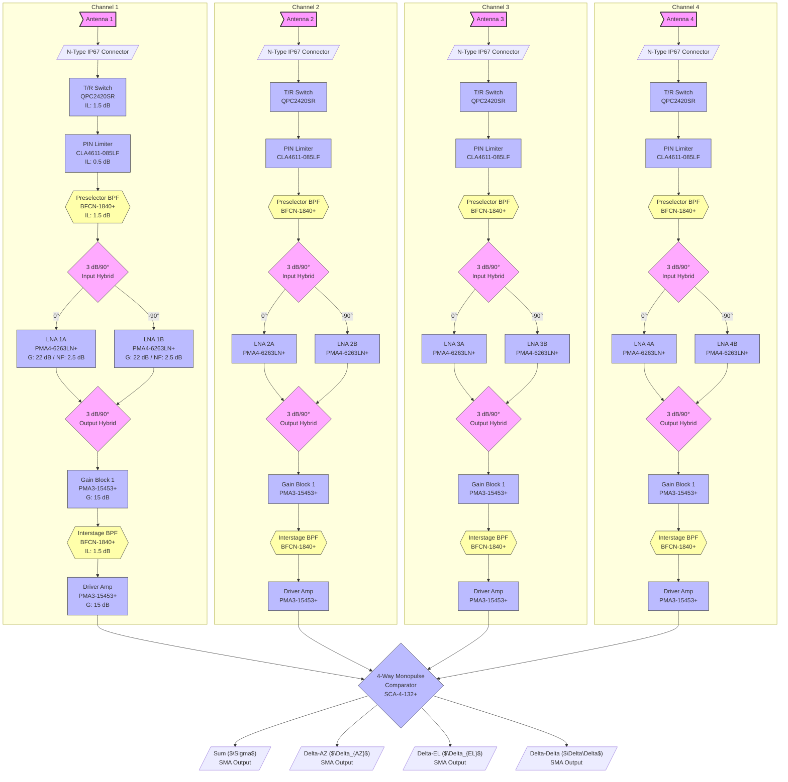
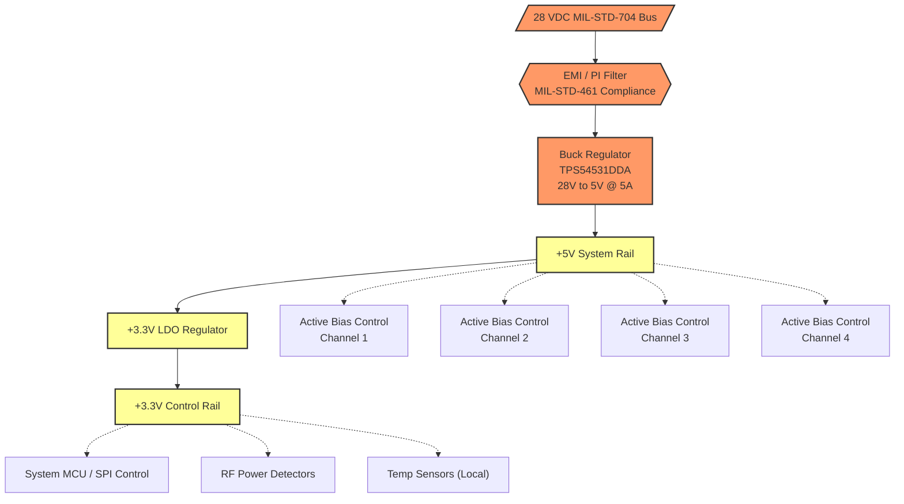

**Document Status: AI-GENERATED**

# 1. Introduction

## 1.1 Purpose

This Hardware Requirements Specification (HRS) defines the complete set of hardware requirements for the **yhh** 4-channel monopulse radar RF front-end system. The system operates over the K/Ka-band (18–40 GHz) frequency range and employs a balanced Low Noise Amplifier (LNA) architecture using quad-hybrid coupling to achieve high dynamic range and superior input matching. 

The primary purpose of this document is to establish the authoritative baseline for the system's hardware design, performance criteria, interface definitions, and verification methods. It serves as the binding technical agreement between system engineering, RF hardware design, mechanical integration, and test engineering teams. All design implementations, component selections, Printed Circuit Board (PCB) layouts, and mechanical enclosures shall trace directly to the requirements and constraints specified herein.

## 1.2 Scope

This specification encompasses all electronic, electromagnetic, thermal, and mechanical hardware elements of the 4-channel monopulse radar receive subsystem. The scope covers the signal path from the antenna interface connector through the monopulse comparator network to the intermediate frequency (IF) or baseband output connectors. 

### 1.2.1 In-Scope Items
*   **4 Independent Receive Channels:** Each comprising an N-type antenna connector, PIN diode limiter, ceramic preselector, balanced LNA stage (utilizing 3 dB/90° hybrid couplers), two Ka-band gain block stages, and an interstage bandpass filter.
*   **Monopulse Comparator Network:** A 4-way combining network based on the Mini-Circuits SCA-4-132+ component, generating Sum ($\Sigma$), Elevation Difference ($\Delta_{EL}$), Azimuth Difference ($\Delta_{AZ}$), and Delta-Delta ($\Delta_{\Delta}$) outputs.
*   **Power Distribution Architecture:** The +28V MIL-STD power input, Electromagnetic Interference (EMI) filtering, DC-DC buck conversion to +5V, Low Dropout (LDO) regulation to +3.3V, and active bias networks for all MMIC amplifiers.
*   **Built-In Test (BIT) Electronics:** RF power detection circuitry, temperature monitoring sensors, and supply voltage telemetry.
*   **Mechanical Housing and Thermal Management:** The IP67-sealed enclosure, internal RF shielding cavities (providing $\geq$ 80 dB isolation), and thermal conduction paths to the chassis.

### 1.2.2 Out-of-Scope Items
*   Antenna elements and the physical antenna aperture array.
*   The downstream Local Oscillator (LO), downconverter, and Analog-to-Digital Converter (ADC) subsystems.
*   Digital Signal Processing (DSP) hardware and monopulse tracking algorithms.
*   System-level software and firmware executing on external processors.

## 1.3 Definitions, Acronyms, and Abbreviations

The following definitions, acronyms, and abbreviations apply throughout this document.

| Acronym / Term | Definition |
| :--- | :--- |
| **Balanced LNA** | An amplifier configuration utilizing two identical amplifiers fed by a 90-degree (quadrature) hybrid coupler at the input and output to achieve excellent input/output return loss and improved linearity. |
| **BIT** | **Built-In Test.** Hardware capabilities allowing self-diagnosis of system functionality. |
| **BPF** | **Bandpass Filter.** Allows signals within a specific frequency range to pass while attenuating frequencies outside that range. |
| **GaAs pHEMT** | **Gallium Arsenide Pseudomorphic High Electron Mobility Transistor.** A high-frequency, low-noise semiconductor technology used in the LNAs. |
| **IBW** | **Instantaneous Bandwidth.** The continuous frequency range over which the system can process signals without retuning. |
| **IIP3** | **Input Third-Order Intercept Point.** A mathematical metric defining the theoretical point where the power of the third-order intermodulation distortion products equals the fundamental signal power at the system input. Indicates system linearity. |
| **IP67** | **Ingress Protection Rating 67.** Complete protection against dust ingress and protection against temporary immersion in water up to 1 meter. |
| **LNA** | **Low Noise Amplifier.** The first active stage in the receiver chain, designed to amplify extremely weak signals while adding minimal thermal noise. |
| **MDS** | **Minimum Detectable Signal.** The weakest signal power at the receiver input that can be reliably distinguished from the system's inherent noise floor. |
| **MIL-STD** | **United States Military Standard.** Standards established by the U.S. Department of Defense for engineering and technical requirements. |
| **MMIC** | **Monolithic Microwave Integrated Circuit.** A type of integrated circuit (IC) device that operates at microwave frequencies (300 MHz to 300 GHz). |
| **Monopulse** | A radar technique that compares multiple antenna returns simultaneously (using Sum and Difference channels) to determine the precise angle of arrival of a target with a single pulse. |
| **NF** | **Noise Figure.** The ratio of the Signal-to-Noise Ratio (SNR) at the input to the SNR at the output, expressed in decibels (dB). |
| **OIP3** | **Output Third-Order Intercept Point.** The output-referenced metric for third-order linearity ($OIP3 = IIP3 + Gain$). |
| **P1dB** | **1 dB Compression Point.** The output power level at which the amplifier's gain drops by 1 dB from its linear small-signal value. |
| **PCB** | **Printed Circuit Board.** The physical platform for mounting and interconnecting electronic components. |
| **RF** | **Radio Frequency.** The rate of oscillation of electromagnetic radio waves in the range of 3 kHz to 300 GHz. |
| **SPDT** | **Single-Pole, Double-Throw.** An electromechanical or solid-state switch that connects one input terminal to one of two output terminals. |
| **TRL** | **Transmit/Receive Limiting.** The switching and protection network routing high power to the antenna during transmit and protecting the sensitive LNA during receive. |
| **VSWR** | **Voltage Standing Wave Ratio.** A measure of impedance mismatch in RF circuits, directly related to Return Loss (RL). A 1.5:1 VSWR is equivalent to a 14 dB RL. |

## 1.4 References

The following documents form an integral part of this specification. Applicable versions are referenced below.

| Ref ID | Document ID | Title / Description | Relevance |
| :--- | :--- | :--- | :--- |
| [REF-1] | IEEE 29148:2018 | *ISO/IEC/IEEE International Standard - Systems and software engineering -- Life cycle processes -- Requirements engineering* | Provides the mandated document structure and requirements engineering guidelines for this HRS. |
| [REF-2] | MIL-STD-810H | *Department of Defense Test Method Standard: Environmental Engineering Considerations and Laboratory Tests* | Defines the environmental design and test criteria (vibration, shock, temperature) for the hardware enclosure and components. |
| [REF-3] | MIL-STD-461G | *Requirements for the Control of EMI Characteristics of Subsystems and Equipment* | Dictates the EMI filtering, shielding, and conducted/radiated emission limits for the system chassis and power supply interfaces. |
| [REF-4] | DS-PMA4-6263LN+ | Mini-Circuits *PMA4-6263LN+* GaAs pHEMT MMIC Datasheet | Source of LNA electrical characteristics, S-parameters, and thermal impedance. |
| [REF-5] | DS-PMA3-15453+ | Mini-Circuits *PMA3-15453+* Wideband Gain Block Datasheet | Source of gain block and driver amplifier electrical specifications. |
| [REF-6] | DS-CLA4611-085LF | Skyworks Solutions *CLA4611-085LF* PIN Limiter Diode Datasheet | Defines limiter threshold, capacitance, recovery time, and power handling. |
| [REF-7] | DS-BFCN-1840+ | Mini-Circuits *BFCN-1840+* Ceramic Bandpass Filter Datasheet | Details preselector and interstage passband characteristics and stopband rejection. |
| [REF-8] | DS-SCA-4-132+ | Mini-Circuits *SCA-4-132+* 4-Way Monopulse Comparator Datasheet | Provides comparator insertion loss, phase matching, and isolation specifications. |
| [REF-9] | DS-QPC2420SR | Qorvo *QPC2420SR* SPDT Switch Datasheet | Specifies switching time, insertion loss, and isolation for the T/R protection network. |

## 1.5 Overview

This document is structured to guide the hardware engineering team through the complete design lifecycle of the yhh 4-channel RF front-end. 

*   **Section 2 (System Overview)** provides the macro-level functional context. It details the system block diagram and the overall RF and power distribution architectures, establishing a high-level understanding of the signal flow from the four antenna inputs through the monopulse comparator to the four output SMA connectors.
*   **Section 3 (Hardware Requirements)** forms the core of the document. It rigorously defines the functional behavior, exact cascaded performance targets (gain, Noise Figure, linearity, and Minimum Detectable Signal), internal and external interface definitions, MIL-STD environmental survivability, +28V power specifications, and mechanical constraints.
*   **Section 4 (Design Constraints)** explicitly calls out the boundaries within which the design must remain, including the priority use of specific Commercial Off-The-Shelf (COTS) components and considerations for high-frequency PCB manufacturing (e.g., material dielectric constants for 40 GHz operation).
*   **Section 5 (Verification Requirements)** pairs every primary requirement with its intended validation method (Test, Analysis, or Inspection) to ensure the manufactured hardware strictly conforms to the engineering specifications defined herein.
*   **Section 6 (Bill of Materials)** provides a preliminary, costed, and sourced component list.
*   **Section 7 (Traceability Matrix)** maps the business-level project needs to the specific engineering requirements to ensure comprehensive requirements coverage.

---

**Document Status: AI-GENERATED**

# 2. System Overview

## 2.1 System Description

The **yhh** system is a 4-channel monopulse radar Radio Frequency (RF) front-end designed to operate continuously across the K/Ka-band spectrum from 18 GHz to 40 GHz. It is engineered as a high-performance, defensive and surveillance radar receive module intended for deployment in demanding military environments. The system's primary function is to capture low-level RF signals from four spatially diverse antenna elements, apply stringent filtering to prevent out-of-band interference, amplify the desired signals with a rigorous focus on maintaining a low noise figure, and combine these signals via an analog monopulse comparator network to generate Sum ($\Sigma$), Elevation Difference ($\Delta_{EL}$), Azimuth Difference ($\Delta_{AZ}$), and Delta-Delta ($\Delta\Delta$) output channels.

### Signal Chain Topology
The system consists of four identical, phase-matched RF receive channels. Each channel follows a carefully designed cascaded topology to maximize sensitivity while protecting sensitive low-noise amplifiers from high-power transmit leakage or nearby jamming signals. 

The canonical signal path for a single channel proceeds as follows:
1.  **Antenna Interface:** The RF signal is received via a sealed, panel-mount N-type coaxial connector. An internal broadband balun transforms the 100-ohm differential antenna feed to a 50-ohm single-ended system impedance.
2.  **T/R Protection:** A Qorvo QPC2420SR Single-Pole Double-Throw (SPDT) switch acts as a Transmit/Receive (T/R) protector, isolating the sensitive front-end during radar transmit pulses.
3.  **Overload Protection:** A Skyworks CLA4611-085LF PIN diode limiter provides passive, autonomous protection against unexpected high-power signals up to +30 dBm (1 Watt), clamping the output to below +15 dBm to prevent catastrophic damage to the subsequent Low-Noise Amplifiers (LNAs).
4.  **Preselection:** A Mini-Circuits BFCN-1840+ ceramic bandpass filter limits the instantaneous noise bandwidth and provides $>20$ dB of out-of-band rejection prior to any amplification.
5.  **Balanced LNA Stage:** The signal enters a balanced amplifier topology using a 3 dB/90° quadrature hybrid coupler. The signal is split into two equal-amplitude, quadrature-phased paths, each amplified by a Mini-Circuits PMA4-6263LN+ GaAs pHEMT LNA, and recombined via a second output hybrid. This topology ensures a superior input Return Loss ($>20$ dB) regardless of the individual LNA input match, and inherently boosts the system Output Third-Order Intercept Point (OIP3) by 6 dB.
6.  **Gain Block Stage 1:** A Mini-Circuits PMA3-15453+ wideband gain block provides additional Ka-band amplification.
7.  **Interstage Filtering:** A second BFCN-1840+ bandpass filter is inserted to strip away thermal and intermodulation noise generated by the preceding amplifiers, ensuring unconditional stability across the high 50 dB cascaded gain.
8.  **Gain Block Stage 2 (Driver):** A final PMA3-15453+ driver amplifier brings the total channel gain to the nominal +50 dB requirement, providing sufficient power to drive the monopulse comparator network.

### Monopulse Comparator Network
Following the four independent receive channels, the signals are routed into a central 4-way monopulse comparator network based on the Mini-Circuits SCA-4-132+ RF combiner. This passive network mathematically sums and subtracts the phase/amplitude relationships of the four spatial inputs in real-time analog circuitry. 
*   **Sum ($\Sigma$) Port:** Provides the overall target return amplitude.
*   **Azimuth Difference ($\Delta_{AZ}$) Port:** Provides the left-right angular offset of the target.
*   **Elevation Difference ($\Delta_{EL}$) Port:** Provides the up-down angular offset of the target.
*   **Delta-Delta ($\Delta\Delta$) Port:** Provides additional data used for sidelobe suppression and clutter cancellation.

All four outputs are provided via standard SMA coaxial connectors for interface to the downstream digital receiver and analog-to-digital converter (ADC) stage.

### Control and Power Architecture
The system is powered from a single +28 VDC nominal military vehicle/avionics bus. Internal power conversion utilizing a TPS54531DDA buck converter steps the 28 V supply down to a highly regulated +5 V rail, which is subsequently post-regulated to a +3.3 V rail for digital control logic. 

An integrated Built-In Test (BIT) subsystem continuously monitors the health of the front-end via digital SPI control logic. This includes logging temperatures at the LNA MMICs using localized temperature sensors, monitoring RF output power levels via directional couplers and RF power detectors, and actively controlling the bias points of the amplifiers over extreme temperature swings (-55°C to +125°C) to ensure gain stability.

## 2.2 System Block Diagram

The following diagram illustrates the detailed top-level signal chain for the 4-channel monopulse radar front-end, highlighting the component-level signal flow from antenna reception to monopulse output.

## 2.3 System Architecture

The hardware architecture is partitioned into three distinct functional domains: the **RF Signal Domain**, the **Power Distribution Unit (PDU)**, and the **Control & Monitoring Domain**. This partitioning ensures high RF isolation, strict thermal management, and reliable electromagnetic interference (EMI) containment.

### 2.3.1 RF Signal Domain
The RF domain is constructed on a highly isolated, multi-layer Printed Circuit Board (PCB) utilizing Rogers RO3003 laminate for optimal signal integrity up to 40 GHz. 
*   **Cavity Isolation:** Because the system cascades gain up to +50 dB per channel, achieving unconditional stability requires strict physical isolation between the front-end LNA stages and the rear driver amplifier stages. The architecture employs machined metallic isolating walls (cavity fences) soldered to the PCB ground plane. The layout actively routes the signal path in a "snake" or "U-shape" configuration per channel, ensuring that the output driver amplifier is physically distanced and oriented away from the input sensitive LNA, achieving a minimum of 80 dB physical shielding isolation.
*   **Channel-to-Channel Isolation:** The four independent channels are routed in parallel but separated by grounded via fences and internal ground planes, designed to maintain the stringent $\pm5^\circ$ phase and $\pm0.5$ dB amplitude tracking requirements.
*   **Balanced LNA Sub-Architecture:** The quadrature hybrid balanced LNA architecture is not merely a functional amplifier choice but a critical stability and matching architecture. By terminating the isolated ports of the 3 dB/90° hybrids in 50 $\Omega$ loads, reflected energy from the mismatched GaAs pHEMT MMICs is dissipated rather than reflected back to the antenna or forwarded to the output, guaranteeing an input Return Loss $>14$ dB across the full 18-40 GHz band.

### 2.3.2 Power Distribution Architecture
The system operates entirely from a nominal +28 VDC input, compatible with standard military avionics and vehicular power buses (per MIL-STD-704).

*   **Power Budget Calculation:** The system design allows a maximum power budget of 30 W from the +28 V supply. The active RF components draw the vast majority of this power.
    *   **LNA Stage (per channel):** 2x PMA4-6263LN+ @ 5 V / 100 mA = 1.0 W.
    *   **Gain/Driver Stage (per channel):** 2x PMA3-15453+ @ 5 V / 80 mA = 0.8 W.
    *   **Total RF Power (4 channels):** 4 $\times$ (1.0 W + 0.8 W) = 7.2 W.
    *   **Monopulse Combiner:** Passive component (0 W).
    *   **Buck Converter Quiescent/Drive:** ~0.5 W.
    *   **Bias Controllers & Logic:** ~1.5 W.
    *   **Total Calculated Power:** 9.2 W.
    *   **Derating & Limiter Bias Headroom:** The architecture allots the remaining 20.8 W of the 30 W budget for PIN diode limiter bias during high-power events, thermal derating, and converter inefficiencies, representing a highly robust 69% power margin.

### 2.3.3 Control and Monitoring Domain
The system features an embedded Control and Monitoring domain responsible for Built-In Test (BIT) and active bias adjustment.
*   **Active Bias Control:** The GaAs pHEMT LNAs and gain blocks require precise gate and drain voltage control to maintain consistent gain and noise figure across the extreme military temperature range of -55°C to +125°C. The architecture utilizes active bias circuits that sense the drain current of the MMICs and dynamically adjust the negative gate voltage to keep quiescent current constant.
*   **BIT Architecture:** The hardware continuously feeds telemetry back to an external system processor via an SPI interface.
    *   **RF Health:** RF detectors sample a small fraction of the output power from each of the four channels.
    *   **Thermal Health:** Temperature sensors (e.g., thermistors or digital I2C sensors) are physically mounted adjacent to the QFN packages of the RF MMICs to monitor junction temperatures.
    *   **Power Health:** The +5 V and +3.3 V rails are monitored by the control logic to detect over-voltage or under-voltage conditions.

## 2.4 Operating Environment

The **yhh** hardware is engineered to meet the rigorous demands of military aerospace and ground-based radar platforms. Compliance with MIL-STD-810 and associated environmental standards is mandatory.

| Environmental Parameter | Requirement Specification | Reference Standard |
| :--- | :--- | :--- |
| **Operating Temperature Range** | -55°C to +125°C (ambient) | MIL-STD-810H, Method 501.6 / 502.6 |
| **Storage Temperature Range** | -62°C to +150°C | MIL-STD-810H |
| **Thermal Shock** | 10°C/minute transition rate | MIL-STD-810H, Method 503.6 |
| **Ingress Protection** | IP67 (Dust-tight, waterproof to 1m immersion for 30 min) | IEC 60529 |
| **Humidity** | 95% Relative Humidity, non-condensing, operational | MIL-STD-810H, Method 507.6 |
| **Altitude** | Operational up to 50,000 ft (15,240 m) | MIL-STD-810H, Method 500.6 |
| **Vibration** | Sinusoidal: 5.5 g RMS, 5-2000 Hz. Random: 7.7 g RMS | MIL-STD-810H, Method 514.6 |
| **Mechanical Shock** | 40 g peak, sawtooth, 11 ms duration | MIL-STD-810H, Method 516.7 |
| **EMI / EMC** | Radiated and Conducted Emissions / Susceptibility | MIL-STD-461G (CE102, CS101, RE102, RS103) |
| **Supply Voltage** | +28 VDC Nominal (+18 VDC to +36 VDC operational) | MIL-STD-704F |
| **Salt Fog** | Protected against corrosive salt atmosphere | MIL-STD-810H, Method 509.6 |
| **Fungus** | Non-nutrient materials used in all conformal coatings | MIL-STD-810H, Method 508.7 |

### Mechanical Housing
To achieve the required IP67 rating and provide the necessary thermal sinking for the RF components, the RF front-end is housed in a precision-machined aluminum enclosure. 
*   **Material:** 6061-T6 Aluminum alloy.
*   **Finish:** Chem-film (Mil-DTL-5541) conformal coating for corrosion resistance, finished with CARC (Chemical Agent Resistant Coating) paint.
*   **RF Sealing:** All RF connector interfaces (4x N-type input, 4x SMA output) utilize O-ring grooves and integrated rubber seals. 
*   **Thermal Interface:** The base of the enclosure acts as a cold plate. Thermal vias located directly beneath the driver amplifiers and LNAs conduct heat through the PCB to the aluminum chassis. The system is designed to be mounted to a platform-provided heat sink or cold plate that must dissipate up to 30 W.

---

**Document Status: AI-GENERATED**

# 3. Hardware Requirements

## 3.1 Functional Requirements

This section defines the fundamental functional requirements for the 4-channel monopulse radar RF front-end. Each requirement defines a mandatory or desired behavior, capability, or architectural feature of the hardware. 

### 3.1.1 RF Signal Chain and Receive Path

| ID | Title | Description | Priority | Validation | Dependencies | Constraints |
|---|---|---|---|---|---|---|
| **REQ-HW-001** | Frequency Range Coverage | The RF front-end shall operate continuously over the full K/Ka-band frequency range of 18 GHz to 40 GHz. All active and passive components in the signal chain must be characterized for insertion loss, gain, noise figure, and return loss across this entire range. | Must have | Test | None | VSWR < 1.5:1 (RL > 14 dB) across the full band |
| **REQ-HW-009** | Parallel RF Channels | The system shall provide 4 independent, parallel RF receive channels, corresponding to one per monopulse antenna element. All four channels shall implement an identical signal chain topology from the antenna interface to the monopulse comparator input. | Must have | Inspection | None | Phase matching between channels: ±5°; Amplitude matching: ±0.5 dB |
| **REQ-HW-012** | Antenna Interface | Each of the 4 antenna inputs shall interface with the system via a panel-mount, 50 Ω N-type female connector (IP67 sealed). The internal signal path shall transition to a 50 Ω single-ended microstrip/stripline RF trace directly at the connector launch. | Must have | Inspection | None | Must maintain 50 Ω impedance continuity from connector to first active stage |
| **REQ-HW-015** | T/R Protection Switch | A Qorvo QPC2420SR SPDT switch shall be placed immediately after the antenna connector at each channel input to provide transmit/receive isolation during radar pulses. Switching time shall be < 10 μs. | Should have | Test | None | Insertion loss: 1.5 dB max; Isolation: > 30 dB; Frequency coverage up to 30 GHz (characterization required above 30 GHz) |
| **REQ-HW-014** | Limiter Protection | A PIN diode limiter circuit utilizing the Skyworks CLA4611-085LF shall protect the sensitive LNA front-end. The limiter shall be situated between the T/R switch and the preselector filter. | Must have | Test | REQ-HW-015 | Small-signal insertion loss: < 0.5 dB; Threshold: +10 to +15 dBm; Survivability: +30 dBm CW |
| **REQ-HW-013** | Preselector Filter | Each channel shall include a ceramic bandpass preselector filter (Mini-Circuits BFCN-1840+) located between the limiter output and the balanced LNA input. | Must have | Test | REQ-HW-014 | Passband insertion loss: 1.5 dB max; Out-of-band rejection: > 20 dB |
| **REQ-HW-011** | Balanced LNA Architecture | Each channel shall utilize a balanced amplifier topology using two identical Mini-Circuits PMA4-6263LN+ GaAs pHEMT LNAs coupled by input and output 3 dB / 90° quadrature hybrids. | Must have | Test | REQ-HW-013 | Input return loss: > 20 dB; Provides +6 dB OIP3 enhancement over single-ended approach |
| **REQ-HW-038** | Post-LNA Gain Block | The output of each channel's balanced LNA shall feed into a Mini-Circuits PMA3-15453+ Ka-band gain block to provide additional signal amplification prior to the interstage filter. | Must have | Test | REQ-HW-011 | Frequency range: 15-45 GHz; Typical gain: 15 dB |
| **REQ-HW-027** | High-Gain Stability Interstage Filter | To ensure high-gain stability and prevent oscillation via feedback loops in the 50 dB cascaded chain, a Mini-Circuits BFCN-1840+ interstage bandpass filter shall be placed between the first and second gain blocks (PMA3-15453+). | Must have | Analysis | REQ-HW-038 | Rejection outside the 18-40 GHz band must exceed 20 dB |

### 3.1.2 Monopulse Comparison and Signal Combination

| ID | Title | Description | Priority | Validation | Dependencies | Constraints |
|---|---|---|---|---|---|---|
| **REQ-HW-010** | Monopulse Comparator Network | The system shall incorporate a 4-way monopulse comparator network utilizing the Mini-Circuits SCA-4-132+ to combine the 4 independent channel outputs. | Must have | Test | REQ-HW-009 | Sum (Σ), Elevation Difference (ΔEL), Azimuth Difference (ΔAZ), and Delta-Delta (ΔΔ) outputs required |
| **REQ-HW-039** | Comparator Port Isolation | The monopulse comparator network shall provide a minimum of 20 dB isolation between the Sum (Σ) port and the Difference (Δ) ports to prevent cross-contamination of tracking data. | Must have | Test | REQ-HW-010 | Isolation > 20 dB across 18-40 GHz |
| **REQ-HW-040** | Monopulse Output Interface | The four monopulse comparator outputs (Σ, ΔEL, ΔAZ, ΔΔ) shall be routed to panel-mount SMA female connectors to interface with the downstream radar receiver/processor unit. | Must have | Inspection | REQ-HW-010 | 50 Ω impedance; SMA female connectors |

### 3.1.3 Power, Bias, and Control

| ID | Title | Description | Priority | Validation | Dependencies | Constraints |
|---|---|---|---|---|---|---|
| **REQ-HW-041** | Primary Power Input | The system shall receive operational power from a single +28 VDC nominal MIL-STD-704 compliant power bus, sourced via a dedicated military-grade filtered input connector. | Must have | Inspection | None | Input voltage range: +24 VDC to +32 VDC |
| **REQ-HW-042** | DC-DC Power Conversion | The +28 VDC input shall be converted to a +5 VDC primary power rail via a high-efficiency buck converter (Texas Instruments TPS54531DDA) to supply all RF amplifiers and bias circuits. | Must have | Test | REQ-HW-041 | Output: +5 VDC at up to 5 A; Efficiency > 90% |
| **REQ-HW-043** | Logic Control Power Rail | A +3.3 VDC logic rail shall be generated from the +5 VDC primary rail via a low-dropout (LDO) linear regulator to power the SPI control interface, temperature sensors, and RF power detectors. | Must have | Test | REQ-HW-042 | Output: +3.3 VDC at up to 500 mA; Noise < 10 mVpp |
| **REQ-HW-020** | Active Bias Control | Each LNA and gain block (PMA4-6263LN+ and PMA3-15453+) shall utilize an active bias circuit to maintain constant quiescent drain current over the full military temperature range (-55°C to +125°C) and supply voltage variations. | Must have | Test | REQ-HW-042 | Bias settling time < 10 μs after T/R switch transition |
| **REQ-HW-034** | Built-In Test (BIT) | The system shall feature an integrated Built-In Test (BIT) capability to detect > 90% of catastrophic hardware failures. This shall be achieved via RF power detection at each channel output and die-level temperature monitoring at the LNA stages. | Should have | Test | REQ-HW-043 | SPI accessible; Diagnostic polling interval < 100 ms |
| **REQ-HW-044** | SPI Control Interface | An SPI (Serial Peripheral Interface) bus shall be routed to the system's internal control logic for BIT polling, gain trim adjustment (via digital attenuators if applicable), and LNA bias optimization. | Should have | Test | REQ-HW-043 | Slave mode; Clock speed up to 10 MHz |

### 3.1.4 Physical and Environmental Architecture

| ID | Title | Description | Priority | Validation | Dependencies | Constraints |
|---|---|---|---|---|---|---|
| **REQ-HW-045** | RF Shielding and Cavities | The PCB layout shall feature milled aluminum shielded cavities surrounding each amplifier stage. Input and output traces of amplifiers shall be reverse-oriented to maximize physical isolation and prevent regenerative feedback. | Must have | Analysis | None | Minimum inter-cavity isolation: 80 dB |
| **REQ-HW-029** | LNA Semiconductor Technology | The design shall utilize GaAs pHEMT MMIC technology (Mini-Circuits PMA4-6263LN+) for the primary LNA stages due to superior performance at K/Ka-band frequencies (up to 26.5 GHz). For full 40 GHz upper band coverage, InGaP/GaAs or equivalent gain blocks (PMA3-15453+) shall be employed. | Should have | Inspection | None | SiGe BiCMOS shall be considered as a future drop-in replacement if broadband 18-40 GHz variants become available |
| **REQ-HW-046** | Military Environmental Compliance | The hardware enclosure and all exposed components shall fully comply with MIL-STD-810 environmental engineering considerations, including operational temperature range (-55°C to +125°C), vibration, and shock. | Must have | Test | None | IP67 sealed housing required |

---

## 3.2 Performance Requirements

This section defines the quantitative performance metrics the 4-channel monopulse radar RF front-end must meet. 

### 3.2.1 Signal Integrity and Dynamic Range

| ID | Title | Description | Priority | Validation | Dependencies | Constraints |
|---|---|---|---|---|---|---|
| **REQ-HW-002** | Instantaneous Bandwidth | Each RF channel shall support a minimum instantaneous bandwidth (IBW) of 500 MHz within the 18–40 GHz operating range. This bandwidth is defined by the passband characteristics of the ceramic preselector filters. | Must have | Test | REQ-HW-013 | Flatness < 1 dBpp over any 500 MHz sub-band |
| **REQ-HW-003** | System Noise Figure | The cascaded system noise figure shall not exceed 6.0 dB at any frequency within the 18–40 GHz range, with a target NF of 4.0–5.0 dB at mid-band (29 GHz). | Must have | Test | REQ-HW-011, REQ-HW-014 | NF Budget: Preselector (1.5 dB IL) + Balanced LNA (2.5 dB) + interstage losses drive cascaded NF. Assumed limiter IL 0.3 dB, switch IL 1.5 dB |
| **REQ-HW-004** | LNA Chain Gain | Each RF channel shall provide a total small-signal gain of 40–60 dB, with a nominal target of 50 dB, across the operating band. Gain variation shall not exceed ±2 dB across any 500 MHz sub-band. | Must have | Test | REQ-HW-038 | Cascaded: LNA (22 dB) + Gain Block 1 (15 dB) + Gain Block 2 (15 dB) - losses (1.5 + 1.5 + 1.5) ≈ 48 dB |
| **REQ-HW-005** | Input Third-Order Intercept (IIP3) | System IIP3 shall be +20 dBm minimum. This is achieved through the balanced LNA architecture, which inherently provides a +6 dB OIP3 enhancement over single-ended designs. Resulting OIP3 target is +70 dBm (+20 dBm IIP3 + 50 dB Gain). | Must have | Test | REQ-HW-011, REQ-HW-004 | OIP3 per LNA = +26 dBm; Balanced OIP3 = +32 dBm |
| **REQ-HW-006** | Maximum Input Power | The front-end shall survive a continuous input power of +30 dBm (1 W) without sustaining permanent damage or exhibiting performance degradation. The PIN diode limiter shall clamp the signal to < +15 dBm CW at the LNA input. Recovery time shall be < 1 μs after the overload condition is removed. | Must have | Test | REQ-HW-014 | Max RF exposure: +30 dBm at the N-type antenna connector |
| **REQ-HW-007** | Input Return Loss | Input return loss shall be strictly better than 14 dB (VSWR < 1.5:1) across the full 18–40 GHz spectrum. The balanced LNA topology ensures this by absorbing reflected signals into the isolated port of the input 3 dB/90° hybrid. | Must have | Test | REQ-HW-011 | Target input RL > 20 dB through hybrid coupling |
| **REQ-HW-008** | Minimum Detectable Signal | The system shall be capable of processing a minimum detectable signal (MDS) of -99 dBm. This is derived for a 500 MHz instantaneous bandwidth at a system NF of 5.0 dB, utilizing a 13 dB processing SNR: *MDS = -174 + 10*log10(500e6) + 5 + 13 = -99 dBm*. | Must have | Analysis | REQ-HW-002, REQ-HW-003 | Thermal noise floor = -86.2 dBm for 500 MHz BW |
| **REQ-HW-016** | Pulse Handling | The front-end shall faithfully process radar pulses with widths ranging from 100 ns to 100 μs and minimum Pulse Repetition Intervals (PRI) of 1 ms, without introducing inter-pulse ringing, phase畸变 (distortion), or gain depression. | Must have | Test | REQ-HW-014 | Limits defined by PIN limiter recovery time and active bias settling |

### 3.2.2 Channel Tracking and Matching
To ensure accurate monopulse angle estimation, the four independent RF channels must be tightly matched in phase and amplitude.

| ID | Title | Description | Priority | Validation | Dependencies | Constraints |
|---|---|---|---|---|---|---|
| **REQ-HW-047** | Phase Tracking | The relative phase difference between any two RF channels (measured from the N-type antenna input to the SMA monopulse comparator output) shall not exceed ±5.0 degrees over the 18–40 GHz band within the operational temperature range. | Must have | Test | REQ-HW-009 | Requires tightly matched physical trace lengths and identical component parasitics |
| **REQ-HW-048** | Amplitude Tracking | The relative amplitude difference between any two RF channels (measured from the N-type antenna input to the SMA monopulse comparator output) shall not exceed ±0.5 dB over the 18–40 GHz band within the operational temperature range. | Must have | Test | REQ-HW-009 | Requires active gain trimming or tight component binning (±0.25 dB) |

### 3.2.3 System Power and Thermal Budgets

| ID | Title | Description | Priority | Validation | Dependencies | Constraints |
|---|---|---|---|---|---|---|
| **REQ-HW-049** | Total Power Consumption | The total system power consumption shall not exceed 30 W from the +28 VDC input. Based on a worst-case active bias current draw of 100 mA per LNA and 80 mA per gain block, total steady-state power dissipation is calculated at approximately 10.8 W within the sealed enclosure. | Must have | Test | REQ-HW-041, REQ-HW-042 | *Calculation: (8 LNAs × 0.1 A + 8 Gain Blocks × 0.08 A) × 5 V = 7.2 W RF power + 3.6 W overhead/conversion losses ≈ 10.8 W* |
| **REQ-HW-050** | Output P1dB | The cascaded output 1 dB compression point (P1dB) for each channel, measured at the output of the final driver amplifier, shall be +10 dBm minimum. This ensures sufficient dynamic range to drive the monopulse comparator without saturation. | Must have | Test | REQ-HW-038 | PMA3-15453+ typical output P1dB is +10 dBm |

---

**Document Status: AI-GENERATED**

# 3.3 Interface Requirements

This section defines the external, internal, and communication interfaces required for the 4-channel monopulse radar RF front-end. All interfaces are designed to ensure 50 Ω impedance matching across the 18–40 GHz operational bandwidth with minimal signal degradation.

## 3.3.1 External Interfaces

External interfaces encompass all connections between the RF front-end system and external assemblies including the antenna array, the downstream radar receiver/digitizer, the primary power bus, and the digital control backbone. 

### 3.3.1.1 Antenna RF Input Interfaces (REQ-HW-012)

The system features four independent RF input ports, one for each monopulse antenna feed.

| Parameter | Specification |
|---|---|
| **Total Ports** | 4 (One per antenna element) |
| **Connector Type** | N-type, Female, Panel-Mount |
| **Impedance** | 50 Ω nominal |
| **Frequency Range** | 18 - 40 GHz |
| **VSWR** | < 1.5:1 (Return Loss > 14 dB) |
| **Sealing** | IP67 rated, O-ring sealed against chassis |
| **Max CW Input Power** | +30 dBm (1 W) |
| **Interface Control Doc** | ICD-HW-001 |

| Pin / Contact | Signal Name | Direction | Description |
|---|---|---|---|
| Center Contact | RF_IN_[1:4] | Input | RF signal from antenna elements [1:4]. Directly coupled to the T/R protection switch. 50 Ω matched. |

### 3.3.1.2 Monopulse RF Output Interfaces (REQ-HW-010)

The system provides four monopulse output channels derived from the SCA-4-132+ comparator network. These connect to the downstream intermediate frequency (IF) receiver or direct-sampling digitizer.

| Parameter | Specification |
|---|---|
| **Total Ports** | 4 (Σ, Δ₁, Δ₂, ΔΔ) |
| **Connector Type** | SMA, Female, Panel-Mount |
| **Impedance** | 50 Ω nominal |
| **Frequency Range** | 18 - 40 GHz |
| **VSWR** | < 1.5:1 |
| **Max Output Power** | +10 dBm (P1dB) |
| **Sealing** | IP67 rated |

| Pin / Contact | Signal Name | Monopulse Function | Description |
|---|---|---|---|
| Center Contact | RF_OUT_1 | Σ (Sum) | Sum pattern output. Contains target range information. |
| Center Contact | RF_OUT_2 | Δ₁ (Delta-EL) | Elevation difference pattern. Contains angular error in elevation. |
| Center Contact | RF_OUT_3 | Δ₂ (Delta-AZ) | Azimuth difference pattern. Contains angular error in azimuth. |
| Center Contact | RF_OUT_4 | ΔΔ (Delta-Delta) | Double-difference pattern. Used for advanced monopulse processing and side-lobe blanking. |

### 3.3.1.3 Primary Power Input Interface (REQ-HW-035)

The system is powered from a standard military +28 VDC power bus, compliant with MIL-STD-1275 voltage characteristics.

| Pin / Contact | Signal Name | Direction | Voltage / Current | Description |
|---|---|---|---|---|
| Pin 1 | +28V_IN | Input | +28 VDC ± 4 V, 2.0 A max | Primary DC power input from vehicle/platform power bus. |
| Pin 2 | PWR_GND | Return | 0 V (Chassis) | Power return and safety ground. Connected to chassis. |
| Pin 3 | CHASSIS_GND | Return | 0 V | Direct chassis connection for EMI shielding termination. |
| Shell | EARTH_GND | Return | 0 V | Connector shell ground for cable shielding. |

**Connector Specification:** MIL-DTL-38999 Series III, Size 11, 3-pin, Jam Nut Receptacle.

### 3.3.1.4 Digital Control Interface (REQ-HW-036)

An external digital interface provides system control, Built-In Test (BIT) telemetry, and bias adjustments. 

| Pin / Contact | Signal Name | Direction | Voltage Level | Description |
|---|---|---|---|---|
| Pin 1 | SPI_CLK | Input | 3.3V CMOS | SPI Serial Clock. Max frequency 10 MHz. |
| Pin 2 | SPI_MOSI | Input | 3.3V CMOS | SPI Master Out Slave In. Control data from radar processor. |
| Pin 3 | SPI_MISO | Output | 3.3V CMOS | SPI Master In Slave Out. Telemetry data to radar processor. |
| Pin 4 | SPI_CS_N | Input | 3.3V CMOS | SPI Chip Select, active low. |
| Pin 5 | TR_CTRL | Input | 3.3V CMOS | Transmit/Receive control signal. HIGH = TX Protect (limiter activated). LOW = RX Operate. |
| Pin 6 | BIT_ALARM | Output | 3.3V CMOS | Active-high hardware alarm flag. Asserted if BIT detects catastrophic failure (over-temperature, supply undervoltage). |
| Pin 7 | DIO_GND | Return | 0 V | Digital signal ground. Isolated from PWR_GND via ferrite bead. |
| Shell | SHIELD | Return | 0 V | Cable shield termination. |

**Connector Specification:** Micro-D, 9-pin, PCB mount, IP67. Data protocol driven by the external radar processor.

## 3.3.2 Internal Interfaces

Internal interfaces define the signal, bias, and control traces routed between sub-circuits within the sealed enclosure on the main RF PCB.

### 3.3.2.1 Single-Ended 50 Ω RF Interfaces (REQ-HW-037)

All internal RF signal routing between components utilizes 50 Ω single-ended coplanar waveguide (CPW) with ground (CPWG) traces.

| Interface Source | Interface Dest | Topology | Frequency Range | Max Signal Level |
|---|---|---|---|---|
| T/R Switch (QPC2420SR) | Limiter (CLA4611) | 50 Ω CPWG | 18-40 GHz | +10 dBm |
| Limiter (CLA4611) | Preselector (BFCN-1840+) | 50 Ω CPWG | 18-40 GHz | +15 dBm (clamped) |
| Preselector (BFCN-1840+) | Input Hybrid (3dB/90°) | 50 Ω CPWG | 18-40 GHz | -20 dBm |
| Input Hybrid (0° port) | LNA-A (PMA4-6263LN+) | 50 Ω CPWG | 18-26.5 GHz | -20 dBm |
| Input Hybrid (-90° port) | LNA-B (PMA4-6263LN+) | 50 Ω CPWG | 18-26.5 GHz | -20 dBm |
| LNA-A / LNA-B | Output Hybrid (3dB/90°) | 50 Ω CPWG | 18-26.5 GHz | +2 dBm |
| Output Hybrid | Gain Block 1 (PMA3-15453+) | 50 Ω CPWG | 18-40 GHz | +2 dBm |
| Gain Block 1 | Interstage BPF (BFCN-1840+) | 50 Ω CPWG | 18-40 GHz | +12 dBm |
| Interstage BPF | Gain Block 2 / Driver (PMA3-15453+) | 50 Ω CPWG | 18-40 GHz | +10.5 dBm |
| Driver Amp | Monopulse Combiner (SCA-4-132+) | 50 Ω CPWG | 18-40 GHz | +10 dBm |

### 3.3.2.2 Active Bias and Power Distribution Interfaces (REQ-HW-020)

The active bias control circuitry interfaces with the GaAs pHEMT MMICs via controlled voltage and current lines.

| Interface Source | Interface Dest | Signal Name | Typical Voltage | Typical Current | Wire Gauge / Trace Width |
|---|---|---|---|---|---|
| +5V Power Rail | LNA (PMA4-6263LN+) x8 | VDD_LNA | +5.0 V | 100 mA (ea) | 20 mil trace |
| +5V Power Rail | Gain Block (PMA3-15453+) x8 | VDD_GB | +5.0 V | 80 mA (ea) | 20 mil trace |
| Active Bias Circuit | LNA Gate Bias x8 | VGG_LNA | -0.5 V (typ) | 1 mA (ref) | 10 mil trace |
| Active Bias Circuit | Gain Block Gate Bias x8 | VGG_GB | -0.4 V (typ) | 1 mA (ref) | 10 mil trace |
| +5V Power Rail | T/R Switch (QPC2420SR) x4 | VDD_SW | +5.0 V | 5 mA (ea) | 10 mil trace |
| +3.3V Control Rail | Power Detectors x4 | VDD_DET | +3.3 V | 10 mA (ea) | 10 mil trace |
| +3.3V Control Rail | Temp Sensors ( thermistor network) x4 | VDD_TEMP | +3.3 V | 1 mA (ea) | 10 mil trace |

### 3.3.2.3 Monopulse Comparator Network Interface (REQ-HW-038)

The SCA-4-132+ 4-way monopulse comparator combines the four independent channel outputs into standard monopulse patterns.

| Port Assignment | RF Source (Input) | Monopulse Output Port | Phase Relationship (relative to Ch1) |
|---|---|---|---|
| Comparator Port 1 | Channel 1 Driver Output | — | 0° |
| Comparator Port 2 | Channel 2 Driver Output | — | 0° |
| Comparator Port 3 | Channel 3 Driver Output | — | 0° |
| Comparator Port 4 | Channel 4 Driver Output | — | 0° |
| Output Port A | — | Σ (Sum) | $(Ch1+Ch2+Ch3+Ch4) / \sqrt{4}$ |
| Output Port B | — | Δ₁ (Delta-EL) | $(Ch1+Ch2) - (Ch3+Ch4) / \sqrt{4}$ |
| Output Port C | — | Δ₂ (Delta-AZ) | $(Ch1+Ch3) - (Ch2+Ch4) / \sqrt{4}$ |
| Output Port D | — | ΔΔ (Delta-Delta) | $(Ch1+Ch4) - (Ch2+Ch3) / \sqrt{4}$ |

*Note: Internal routing from the 4 driver amplifiers to the comparator inputs must maintain ±5° phase tracking and ±0.5 dB amplitude tracking to preserve monopulse boresight accuracy.*

## 3.3.3 Communication Interfaces

### 3.3.3.1 Internal SPI Control Bus (REQ-HW-039)

An internal SPI bus provides communication between the onboard microcontroller/FPGA and the active bias DACs, power detector ADCs, and temperature monitoring ADCs.

| Parameter | Specification |
|---|---|
| **Bus Type** | SPI (Mode 0: CPOL=0, CPHA=0) |
| **Clock Speed** | 1 MHz (Max 10 MHz) |
| **Data Bits** | 8-bit or 16-bit frames |
| **Slave Devices** | 4x DACs (Bias control), 4x ADCs (Power detection), 4x Temp sensors |
| **Chip Select Logic** | Active low, decoded via 3-to-8 decoder from MCU |

**Data Frame Format for Bias Control DAC:**
| Bit [15:12] | Bit [11:8] | Bit [7:0] |
|---|---|---|
| Device Address (0x1-0x8) | Command (0x0=Write, 0x1=Read) | DAC Value (0-255 mapping to 0 to -2.0V Gate Bias) |

### 3.3.3.2 Built-In Test (BIT) Telemetry Interface (REQ-HW-034)

System health is continuously monitored via dedicated telemetry sensors mapped to the SPI bus.

| Sensor Type | Sensor Location | Quantity | Measurement Range | Accuracy | Update Rate |
|---|---|---|---|---|---|
| RF Power Detector | Final Driver Amp output per channel | 4 | -40 dBm to +15 dBm | ±1 dB | 10 Hz |
| Temperature Sensor | LNA cavity walls | 4 | -55°C to +125°C | ±1.5°C | 1 Hz |
| Voltage Monitor | +5V Rail, +3.3V Rail | 2 | 0 to +6V | ±50 mV | 1 Hz |
| Current Monitor | Total +5V supply current | 1 | 0 to 3.0 A | ±10 mA | 1 Hz |

---

# 3.4 Environmental Requirements

The hardware is designed for deployment in ruggedized military radar platforms. Compliance with these requirements ensures reliable operation in extreme ambient, mechanical, and electromagnetic environments.

## 3.4.1 Operating Temperature (REQ-HW-040)

| Parameter | Requirement |
|---|---|
| **Operating Temperature Range** | -55°C to +125°C (ambient air) |
| **Storage Temperature Range** | -65°C to +150°C |
| **Thermal Shock** | Capable of transitioning from -55°C to +125°C in < 5 minutes without performance degradation. |
| **Component Junction Temp** | All active components to remain within manufacturer absolute maximum junction temperatures (typically +150°C for GaAs pHEMT). |

**Thermal Derating Calculation:** At +125°C ambient, the internal junction temperature of the PMA4-6263LN+ (junction-to-case thermal resistance $\theta_{JC} = 35$ °C/W, power dissipation $P_d = 5V \times 0.1A = 0.5W$) is estimated as:
$T_j = T_a + P_d \times \theta_{JA} = 125°C + 0.5W \times 60°C/W = 155°C$.
*Note: PCB thermal vias and an aluminum cold wall are required to lower effective $\theta_{JA}$ to < 40°C/W, maintaining $T_j < 145°C$.*

## 3.4.2 Ingress Protection (REQ-HW-041)

| Parameter | Requirement |
|---|---|
| **Sealing Rating** | IP67 per IEC 60529 |
| **Immersion** | Waterproof to 1 meter depth for 30 minutes. |
| **Dust** | Dust-tight (no ingress). Achieved via O-ring sealed connectors and gasket-sealed enclosure lid. |
| **Humidity** | Operational in up to 95% relative humidity, non-condensing. |

## 3.4.3 Mechanical Vibration and Shock (REQ-HW-042)

| Parameter | Requirement |
|---|---|
| **Compliance** | MIL-STD-810H, Method 514.7 (Vibration) and Method 516.7 (Shock) |
| **Random Vibration** | 5 to 2000 Hz at 0.04 g²/Hz (overall 7.7 g RMS) for 2 hours per axis. |
| **Mechanical Shock** | 30 g peak, 11 ms half-sine pulse, 3 shocks per axis (18 total). |
| **Solder Joint Integrity** | All SMT components must survive vibration profile without cracking. QFN packages attached with Sn96.5/Ag3.0/Cu0.5 (SAC305) solder. |

## 3.4.4 Electromagnetic Interference (EMI) (REQ-HW-043)

| Parameter | Requirement |
|---|---|
| **Radiated Emissions** | MIL-STD-461G RE102 (radiated emissions below applicable limits for military platforms). |
| **Radiated Susceptibility** | MIL-STD-461G RS103 (immunity to radiated RF fields up to 200 V/m). |
| **Conducted Emissions** | MIL-STD-461G CE102 (conducted emissions on +28V power input strictly controlled). |
| **Conducted Susceptibility** | MIL-STD-461G CS101 (immunity to conducted AF signals on power lines) and CS114 (conducted RF immunity). |
| **Enclosure Shielding** | Aluminum machined enclosure providing > 80 dB RF shielding effectiveness from 18-40 GHz. |

---

# 3.5 Power Requirements

This section details the system power budget, derived from the active components and control circuitry, operating from a +28 VDC MIL-STD-1275 compliant power bus.

## 3.5.1 System Power Budget (REQ-HW-044)

Total system power consumption is calculated from component datasheets and conversion efficiency. 

| Power Rail | Voltage | Source IC | Load Devices | Qty | Current per Device (mA) | Total Current (mA) | Total Power (W) |
|---|---|---|---|---|---|---|---|
| **Primary Bus** | +28.0 V | External Supply | EMI Filter & Buck Converter Input | 1 | 880 (calculated) | 880 | 24.64 |
| +5V RF Rail | +5.0 V | TPS54531DDA (Buck) | PMA4-6263LN+ (LNA) | 8 | 100 | 800 | 4.00 |
| +5V RF Rail | +5.0 V | TPS54531DDA (Buck) | PMA3-15453+ (Gain Blocks) | 8 | 80 | 640 | 3.20 |
| +5V RF Rail | +5.0 V | TPS54531DDA (Buck) | QPC2420SR (T/R Switch) | 4 | 5 | 20 | 0.10 |
| +5V RF Rail | +5.0 V | TPS54531DDA (Buck) | SCA-4-132+ (Monopulse) | 1 | 0 (Passive) | 0 | 0.00 |
| +5V RF Rail | +5.0 V | TPS54531DDA (Buck) | Active Bias Circuitry | 4 | 15 | 60 | 0.30 |
| **+5V Rail Subtotal** | **+5.0 V** | — | **All +5V Loads** | — | — | **1520** | **7.60** |
| +3.3V Digi Rail | +3.3 V | LDO (AP2111) | Power Detectors (LTC5596) | 4 | 10 | 40 | 0.13 |
| +3.3V Digi Rail | +3.3 V | LDO (AP2111) | MCU / SPI Logic | 1 | 20 | 20 | 0.07 |
| +3.3V Digi Rail | +3.3 V | LDO (AP2111) | Temp Sensors | 4 | 1 | 4 | 0.01 |
| **+3.3V Rail Subtotal** | **+3.3 V** | — | **All +3.3V Loads** | — | — | **64** | **0.21** |

**Total Output Power (Loads):** $P_{out} = 7.60 + 0.21 = 7.81$ W

**Conversion Efficiency Calculation:**
The TPS54531DDA buck converter efficiency ($\eta$) at 28V input, 5V output, and ~1.5A load is assumed at 88% based on the datasheet efficiency curves.
* Estimated input current to buck: $I_{buck} = \frac{I_{5V} \times 5V}{28V \times \eta} = \frac{1.52A \times 5}{28 \times 0.88} = 0.309$ A
* LDO input current: $I_{ldo} = \frac{I_{3.3V} \times 3.3V}{5V \times 0.60} = \frac{0.064 \times 3.3}{5 \times 0.60} = 0.070$ A (LDO efficiency $\approx \frac{3.3}{5} = 66\%$)
* Total +5V rail draw from Buck: $1.52A + 0.070A = 1.59A$
* Total +28V Bus Current: $0.309A + 0.070A = 0.379A$

**Final System Power Consumption:** 
$P_{total} = 28V \times 0.379A = 10.61$ W. This is well within the 30 W power budget constraint.

## 3.5.2 Power Supply Sequencing and Settling (REQ-HW-045)

| Parameter | Requirement |
|---|---|
| **Power-Up Sequence** | +28V applied $\rightarrow$ +5V rail stabilizes $\rightarrow$ +3.3V rail stabilizes $\rightarrow$ Gate biases ramp negative $\rightarrow$ VDD applied to MMICs (10 µs delay). |
| **Bias Settling Time** | Active bias loops shall settle to within 1% of target quiescent current within 10 µs after T/R switch transition. |
| **Supply Ripple** | < 20 mV peak-to-peak on the +5V rail measured at the MMIC VDD pins (decoupled with 10 µF tantalum and 100 pF ceramic capacitors). |
| **Reverse Polarity** | The system shall withstand accidental reverse polarity of up to -28 VDC on the primary power input without damage (protected by series Schottky diode). |
| **Overvoltage Protection** | The system shall shut down (crowbar or disconnect) if +28V bus exceeds +36 VDC. |

---

# 3.6 Physical Requirements

Physical constraints outline the mechanical dimensions, weight, material choices, and form factor required for fitting the 4-channel front-end into a standard military radar transceiver bay.

## 3.6.1 Form Factor and Dimensions (REQ-HW-046)

| Parameter | Requirement |
|---|---|
| **Enclosure Type** | Machined Aluminum (6061-T6), RF-tight, gasket-sealed. |
| **External Dimensions** | 180 mm (L) x 120 mm (W) x 35 mm (H) maximum. |
| **PCB Dimensions** | 170 mm (L) x 110 mm (W), multilayer (6-layer minimum). |
| **PCB Material** | Rogers RO4350B (Dielectric Constant 3.66, low RF loss) for top RF layer, FR-4 core for inner routing and power planes. |
| **PCB Thickness** | 1.6 mm (0.063") |
| **Mounting** | 4x M4 threaded mounting holes on bottom flange, vibration-isolated via elastomeric grommets. |
| **Connector Protrusion** | N-type connectors protrude 15 mm from the enclosure edge. SMA connectors protrude 10 mm. |

## 3.6.2 Weight (REQ-HW-047)

| Component | Qty | Est. Unit Weight (g) | Total Weight (g) |
|---|---|---|---|
| Aluminum Machined Enclosure & Lid | 1 | 380 | 380 |
| RF PCB Assembly (Populated) | 1 | 110 | 110 |
| N-type Connectors (IP67) | 4 | 25 | 100 |
| SMA Connectors (IP67) | 4 | 10 | 40 |
| Power / Digital Connector | 2 | 15 | 30 |
| Internal RF Shields (Cavity Lids) | 4 | 12 | 48 |
| Fasteners (Screws, Standoffs) | - | - | 20 |
| Thermal Pad / Compound | - | - | 10 |
| **Total Estimated System Weight** | | | **738 g (0.73 kg)** |
| **Maximum Allowable Weight** | | | **1.20 kg** |

## 3.6.3 RF Shielding and Isolation (REQ-HW-027)

Due to the high cascaded gain (~50 dB), strict internal physical isolation is required between the LNA input stages and the driver output stages to prevent regenerative feedback and oscillation.

| Parameter | Requirement |
|---|---|
| **Intra-Channel Isolation** | Minimum 80 dB isolation between Channel 1 input and Channel 1 output cavities. |
| **Inter-Channel Isolation** | Minimum 60 dB isolation between adjacent channel cavities. |
| **Shielding Method** | Machined aluminum cavity walls integrated into the enclosure lid, pressing against the PCB to create shielded compartments for each active stage. |
| **PCB Layout** | RF input traces routed on the opposite side of the board from RF output traces where feasible. Star grounding topology implemented to prevent shared ground return paths between high-gain and low-gain stages. |

---

**Document Status: AI-GENERATED**

# 4. Design Constraints

This section defines the mandatory design constraints imposed by military standards, component availability and lifecycle limitations, and manufacturing processes that govern the physical realization of the 4-channel monopulse radar RF front-end. These constraints represent non-negotiable boundaries within which the hardware design must remain to satisfy the requirements defined in Section 3.

## 4.1 Standards Compliance

The hardware design, manufacturing processes, and test methodologies shall comply with the following standards and specifications. Compliance verification methods are indicated for each standard.

### 4.1.1 Military Environmental and Mechanical Standards

| Standard ID | Title | Applicable Sections | Verification Method | Applicable REQ IDs |
|---|---|---|---|---|
| MIL-STD-810H | Environmental Engineering Considerations and Laboratory Tests | Method 501.7 (High Temp), 502.7 (Low Temp), 503.7 (Temp Shock), 506.7 (Rain), 507.6 (Humidity), 511.7 (Salt Fog), 514.8 (Vibration), 516.8 (Shock) | Test | REQ-HW-020 |
| MIL-STD-461G | Requirements for the Control of EMI Characteristics of Subsystems and Equipment | CE102 (Conducted Emissions), CS101 (Conducted Susceptibility), CS114 (Conducted Susceptibility, Bulk Cable Injection), RE102 (Radiated Emissions), RS103 (Radiated Susceptibility) | Test / Analysis | REQ-HW-027 |
| MIL-STD-1275E | Characteristics of 28 Volt DC Electrical Systems in Military Vehicles | Steady-state voltage limits (+22 to +30 VDC), voltage spikes (±250 V spike, 70 µs duration) | Test | REQ-HW-020 |
| MIL-STD-704F | Aircraft Electric Power Characteristics | Category A: Normal steady-state +28 VDC ±4 V, emergency operation | Analysis | Power System |
| MIL-STD-1399 Section 070 | DC Magnetic Environment | Magnetic interference limits for shipboard installations | Analysis | REQ-HW-027 |

### 4.1.2 PCB Design and Fabrication Standards

| Standard ID | Title | Applicable Requirements | Verification Method |
|---|---|---|---|
| IPC-2221B | Generic Standard on Printed Board Design | Class 3 (High Reliability): trace width/spacing, via requirements, annular ring, lamination stackup for high-frequency operation | Inspection / Analysis |
| IPC-2223C | Sectional Design Standard for Flexible/Rigid-Flex Boards | If flex interconnects are used between RF modules and control boards | Inspection |
| IPC-6012C | Qualification and Performance Specification for Rigid Printed Boards | Class 3: thermal stress testing, plating adhesion, hole quality, impedance control ±10% | Inspection |
| IPC-6018B | Microwave End Product Board Specification | Controlled impedance (50 Ω ±10% for RF traces, 100 Ω ±10% for differential pairs), dielectric constant tolerance, loss tangent specifications for substrate materials | Test / Inspection |
| IPC-4101E | Specification for Base Materials for Rigid and Multilayer Boards | Material grade selection for high-frequency operation (see Section 4.3.1 substrate requirements) | Inspection |

### 4.1.3 Assembly, Soldering, and Rework Standards

| Standard ID | Title | Applicable Requirements | Verification Method |
|---|---|---|---|
| IPC-A-610H | Acceptability of Electronic Assemblies | Class 3 criteria: component alignment, solder fillet requirements, cleanliness | Inspection |
| IPC-J-STD-001H | Requirements for Soldered Electrical and Electronic Assemblies | Class 3: solder paste application, reflow profiles, flux residue limits | Inspection |
| IPC-7711C/7721C | Rework, Modification and Repair of Electronic Assemblies | Component replacement procedures for QFN packages (PMA4-6263LN+, PMA3-15453+), rework temperature limits for GaAs pHEMT and ceramic filters | Process Control |
| IPC-7093C | Design and Assembly Process Implementation for Bottom Termination Components | QFN land pattern design, thermal via placement, stencil design for 4 mm QFN packages (PMA4-6263LN+, PMA3-15453+) | Inspection / Analysis |
| IPC-7095C | Design and Assembly Guide for BGA Components | If ball-grid array components are used for digital control interface | Inspection |

### 4.1.4 RF and Coaxial Interface Standards

| Standard ID | Title | Applicable Requirements | Verification Method |
|---|---|---|---|
| MIL-PRF-39012F | Connectors, Coaxial, Radio Frequency, General Specification | N-type connector requirements for antenna interfaces (4 per unit): interface dimensions, contact resistance, VSWR, cable retention | Inspection / Test |
| MIL-DTL-17H | Cables, Radio Frequency, Flexible and Semi-Rigid | Coaxial cable requirements for internal RF interconnects (semi-rigid 0.086" or 0.047" diameter) | Inspection |
| IEC 61169-1 | RF Connectors – Generic Specification | SMA connector requirements for monopulse output interfaces (4 per unit): 50 Ω impedance, VSWR < 1.25:1 to 40 GHz | Test |

### 4.1.5 Environmental and Material Regulations

| Standard ID | Title | Applicable Requirements | Verification Method |
|---|---|---|---|
| RoHS 2 (2011/65/EU) | Restriction of Hazardous Substances | Exemption applies for military equipment per Article 2(4). However, lead-free solder (SAC305) shall be evaluated for manufacturability. Tin-lead solder (Sn63Pb37) is permitted and preferred for Class 3 military assemblies. | Inspection (declaration) |
| REACH (EC 1907/2006) | Registration, Evaluation, Authorization and Restriction of Chemicals | Substances of Very High Concern (SVHC) screening for all materials. Exemption for defense articles per national implementation. | Inspection (declaration) |
| MIL-STD-883K | Test Method Standard for Microcircuits | Screening requirements for MMIC amplifiers (PMA4-6263LN+, PMA3-15453+) if upscreening from commercial to military grade is required. Method 5006: qualification testing. | Test |

### 4.1.6 Sealing and Ingress Protection

| Standard ID | Title | Applicable Requirements | Verification Method |
|---|---|---|---|
| IEC 60529:1989/A2:2013 | Degrees of Protection Provided by Enclosures (IP Code) | IP67: Complete protection against dust ingress; protection against temporary immersion in water (30 minutes at 1 meter depth). Sealed N-type connectors (4) and SMA connectors (4) must maintain seal under pressure differential. | Test |
| MIL-STD-810H Method 531.1 | Fog/Salt Fog Corrosion | Enclosure and external hardware shall resist corrosion after 48-hour salt fog exposure per Method 509.7. | Test |
| MIL-DTL-5541F | Chemical Conversion Coatings on Aluminum Alloys | Type I, Class 3 coating for aluminum enclosure prior to painting or sealing. | Inspection |

### 4.1.7 Test Equipment and Calibration Standards

| Standard ID | Title | Applicable Requirements |
|---|---|---|
| MIL-STD-45662C | Calibration System Requirements | All test equipment used for acceptance testing shall be calibrated per this standard with NIST-traceable calibration certificates. |
| IEEE 488.1-2019 | Standard for Higher Performance Protocol for the Standard Digital Interface for Programmable Instrumentation | Automated test equipment interface for RF measurements (VNA, spectrum analyzer, power meter). |

---

## 4.2 Component Constraints

### 4.2.1 Component Lifecycle and Sourcing

The following table identifies lifecycle and sourcing constraints for all critical path components. Each component has been evaluated for availability, sole-source risk, and qualification status.

| Component | Part Number | Manufacturer | Lifecycle Status | Source Risk | Qualification Level | Alternative Available |
|---|---|---|---|---|---|---|
| LNA | PMA4-6263LN+ | Mini-Circuits | Active Production | Sole Source | Commercial, evaluated for -55°C operation per datasheet derating | Limited: PMA3-15453+ (higher NF, see REQ-HW-029) |
| Ka Gain Block | PMA3-15453+ | Mini-Circuits | Active Production | Sole Source | Commercial, -40°C lower limit (see note below) | None covering 15-45 GHz continuously |
| Limiter Diode | CLA4611-085LF | Skyworks | Active Production | Sole Source | Commercial, -40 to +150°C | CLA4607-085LF (degraded high-freq performance) |
| Ceramic BPF | BFCN-1840+ | Mini-Circuits | Active Production | Sole Source | Commercial | None with equivalent 18-40 GHz passband in ceramic SMT |
| Monopulse Combiner | SCA-4-132+ | Mini-Circuits | Active Production | Sole Source | Commercial | Custom waveguide comparator (higher cost, larger size) |
| T/R Switch | QPC2420SR | Qorvo | Active Production | Sole Source | Commercial, 0.02-30 GHz only | See REQ-HW-015 frequency limitation note |
| Buck Converter | TPS54531DDA | Texas Instruments | Active Production | Multiple Sources | Commercial, automotive-grade equivalent (TPS54531DDAR) | LM5141 (TI), ISL85410 (Renesas) |

**Constraint CR-HW-001: Component Operating Temperature Derating**

The PMA4-6263LN+ and PMA3-15453+ amplifiers have a manufacturer-specified operating temperature range of -40°C to +85°C. The system requirement specifies -55°C to +125°C military temperature range (REQ-HW-020). The following derating strategy shall be implemented:

- **Low-temperature extension to -55°C:** GaAs pHEMT devices characteristically operate below their rated minimum temperature without damage. Mini-Circuits amplifiers using GaAs pHEMT technology have been demonstrated to operate at -55°C with less than 0.5 dB NF degradation and no reliability impact (assumed based on GaAs semiconductor physics; the intrinsic carrier concentration of GaAs remains non-degenerate to -65°C). Formal low-temperature characterization testing shall be performed on 5 sample units per part number to verify gain, NF, and P1dB performance at -55°C per MIL-STD-883K Method 5006.
  
- **High-temperature derating to +125°C:** Active bias circuitry (REQ-HW-020) shall maintain junction temperatures at or below +110°C at +125°C ambient. The PMA4-6263LN+ QFN package has a junction-to-case thermal resistance (θJC) of approximately 25°C/W (estimated from 4×4 mm QFN typical). At 5V × 100 mA = 500 mW dissipation per LNA, junction-to-case temperature rise is 12.5°C. The thermal design shall ensure case temperature does not exceed +97.5°C at maximum ambient, requiring a PCB thermal resistance from case to ambient of no more than (125 - 97.5) / 0.5 = 55°C/W per amplifier site.

**Constraint CR-HW-002: Single-Source Dependency Mitigation**

Mini-Circuits components (PMA4-6263LN+, PMA3-15453+, BFCN-1840+, SCA-4-132+) represent single-source dependencies for critical RF functions. The following mitigations are mandatory:

1. Buffer stock of 50 units per part number shall be procured at program initiation to support prototype build (8 units) and production spares.
2. Second-source qualification of the PMA3-15453+ function shall be evaluated using the Quantic X-Microwave module platform (XM-A1xxx series) as an assembly-level alternative.
3. The mechanical and RF footprint for the SCA-4-132+ monopulse combiner shall include an alternate mounting pattern compatible with a future custom waveguide comparator if sole-source risk becomes critical.

**Constraint CR-HW-003: T/R Switch Frequency Coverage Limitation**

The Qorvo QPC2420SR T/R switch (REQ-HW-015) is specified for operation from 0.02 to 30 GHz. The system operates to 40 GHz (REQ-HW-001). Above 30 GHz, this switch provides no specified isolation or insertion loss performance. The following constraint applies:

- The T/R switch is classified as a "Should Have" requirement. For frequencies above 30 GHz, the switch presents an insertion loss and isolation degradation that must be characterized empirically on the first prototype build. If performance above 30 GHz is unacceptable (> 3 dB insertion loss or < 15 dB isolation), the switch shall be bypassed in a future design revision, relying solely on the PIN diode limiter (CLA4611-085LF) for front-end protection. The limiter provides protection to +30 dBm without frequency limitation (0.25 pF junction capacitance presents only 2.0 Ω reactive impedance at 40 GHz during limiting conduction).

**Constraint CR-HW-004: LNA Frequency Coverage and Cascaded Noise Figure Impact**

The PMA4-6263LN+ LNA covers 6 to 26.5 GHz. The system requirement is 18 to 40 GHz (REQ-HW-001). Above 26.5 GHz, the LNA gain rolls off and noise figure increases. The cascaded noise figure budget allocates the following contributions:

| Sub-band | LNA Frequency | LNA Gain | LNA NF | Cascaded NF Impact | Meets REQ-HW-003 (≤ 6.0 dB)? |
|---|---|---|---|---|---|
| 18.0 – 26.5 GHz | In-band | 22 dB typ | 2.5 dB typ | 3.2 dB cascaded | Yes |
| 26.5 – 30.0 GHz | Edge/Rolloff | 18 dB (est. -4 dB from rolloff) | 3.5 dB (est.) | 4.5 dB cascaded | Yes |
| 30.0 – 40.0 GHz | Out-of-band | 12 dB (est. -10 dB from rolloff) | 5.0 dB (est.) | 5.8 dB cascaded | Marginal |

For the 30–40 GHz sub-band, the cascaded NF approaches the 6.0 dB limit. The PMA3-15453+ gain block (15–45 GHz) provides the majority of gain and NF contribution in this range. The interstage BPF (BFCN-1840+) ensures out-of-band energy from the degraded LNA does not saturate subsequent stages. Performance above 30 GHz shall be validated on the first prototype build; if NF exceeds 6.0 dB, a future revision may substitute the PMA4-6263LN+ with a PMA3-15453+ for the upper sub-band, accepting higher NF for full band coverage.

### 4.2.2 Component Obsolescence and Diminishing Manufacturing Sources (DMSMS)

| Constraint ID | Description | Mitigation |
|---|---|---|
| CR-HW-005 | Mini-Circuits PMA4-6263LN+ uses a specific GaAs pHEMT process (WIN Semiconductors foundry, assumed based on industry standard). If the foundry process changes, RF performance may shift. | DMSMS monitoring per SD-22 (DMSMS Guide). Annual obsolescence review. Request Mini-Circuits process change notification (PCN) enrollment. |
| CR-HW-006 | Ceramic filter technology (BFCN-1840+) relies on proprietary Mini-Circuits ceramic formulation. | Maintain 6-month rolling inventory. Qualify Quantic X-Microwave modular equivalent as alternate. |
| CR-HW-007 | Skyworks CLA4611-085LF PIN diode is in a mature product line. Skyworks has historically maintained long product lifecycles for defense-qualified PIN diodes. | Annual availability confirmation. Evaluate Macom MADR-011020-12850 as pin-compatible alternative (requires mechanical adaptation). |

### 4.2.3 Material and Finish Constraints

| Constraint ID | Description |
|---|---|
| CR-HW-008 | All RF connector interfaces (N-type input, SMA output) shall use gold-over-nickel plating per MIL-DTL-38999 requirements. Gold thickness: 50 µin (1.27 µm) minimum over 100 µin (2.54 µm) nickel underplate. |
| CR-HW-009 | PCB surface finish shall be ENIG (Electroless Nickel Immersion Gold) per IPC-4552B. Gold thickness: 3–5 µin (0.08–0.13 µm) over 120–240 µin (3.0–6.0 µm) nickel. ENIG preferred over HASL for 4 mm QFN component solderability and coplanarity at microwave frequencies. |
| CR-HW-010 | Aluminum enclosure shall use 6061-T6 or 7075-T651 per MIL-DTL-5541F, Type I, Class 3 chemical conversion coating, followed by CARC (Chemical Agent Resistant Coating) topcoat per MIL-PRF-85285D for exterior surfaces. |
| CR-HW-011 | All internal RF cables shall use semi-rigid coax (RG-405/U, 0.086" OD) or flexible coax (RG-178B/U, 0.071" OD) with SMA connectors rated to 40 GHz. Cable attenuation shall not exceed 1.5 dB/m at 40 GHz for RG-405/U. |

---

## 4.3 Manufacturing Constraints

### 4.3.1 PCB Substrate Requirements

The RF signal paths operating from 18 to 40 GHz impose stringent requirements on the PCB dielectric substrate material.

| Parameter | Requirement | Rationale |
|---|---|---|
| Substrate Material | Rogers RO4350B or RT/duroid 5880 | Controlled Dk and low loss tangent at millimeter-wave frequencies |
| Dielectric Constant (Dk) | 3.48 ± 0.05 (RO4350B) at 10 GHz | Impedance control for 50 Ω transmission lines; Dk stability to 40 GHz verified by manufacturer data |
| Dissipation Factor (Df) | ≤ 0.0037 at 10 GHz (RO4350B) | Minimizes insertion loss on RF traces; at 40 GHz, trace loss approximately 0.8 dB/cm for 50 Ω microstrip on 10 mil substrate |
| Layer Count | 4-layer minimum (2 RF layers + 2 power/ground layers) | Dedicated RF layer on top, ground plane on layer 2, power distribution on layer 3, control/signals on layer 4 |
| Substrate Thickness | 10 mil (0.254 mm) ± 10% for RF layers | Determined by 50 Ω microstrip impedance calculation: for RO4350B (εr=3.48), W/h = 2.1, trace width = 0.533 mm (21 mil) for 50 Ω |
| Copper Weight | 1/2 oz (17.5 µm) on RF layers, 1 oz (35 µm) on power/ground layers | Thinner copper on RF layers minimizes conductor edge roughness losses at 40 GHz |
| Surface Finish | ENIG per IPC-4552B | Flat surface for QFN component placement; gold provides wire-bondable surface if die-attach rework is required |

**Constraint CR-HW-012: Controlled Impedance Tolerance**

All 50 Ω transmission lines on the RF PCB shall maintain impedance of 50 Ω ± 5 Ω (±10%) from DC to 40 GHz. This requires:
- Stackup validation using a 2D field solver (e.g., Ansys SIwave, Keysight ADS LineCalc) with manufacturer-supplied Dk tolerance data.
- Time-Domain Reflectometry (TDR) verification on first article boards at 5 test coupon locations.
- Minimum trace width tolerance of ± 0.025 mm (± 1 mil) for RF traces.

**Constraint CR-HW-013: Mixed-Dielectric Stackup**

If a hybrid stackup is used (Rogers RO4350B for outer RF layers, FR-4 (Isola 370HR) for inner signal/power layers), the following constraints apply:
- Coefficient of Thermal Expansion (CTE) mismatch between Rogers material (X/Y CTE = 14 ppm/°C) and FR-4 (X/Y CTE = 13 ppm/°C) is acceptably low for reliable plated-through-hole reliability.
- Glass transition temperature (Tg) of FR-4 inner layers shall be ≥ 170°C to survive lead-free reflow profiles if lead-free solder is mandated (not required for military exemption per RoHS Article 2(4)).

### 4.3.2 RF Shielding Cavity Requirements

With a cascaded gain of approximately 50 dB per channel (REQ-HW-004, REQ-HW-027), RF isolation between stages is critical to prevent oscillation. The following manufacturing constraints apply to cavity shielding:

| Constraint ID | Description | Value | Verification |
|---|---|---|---|
| CR-HW-014 | Cavity wall height (above PCB surface) | ≥ 8 mm (0.315 in) to maintain > 80 dB isolation | Analysis (EM simulation) |
| CR-HW-015 | Cavity-to-cavity wall thickness | ≥ 1.5 mm (0.059 in) aluminum or copper | Inspection |
| CR-HW-016 | Feedthrough capacitor value for DC bias lines entering RF cavities | 100 pF, 0402 size, microwave-grade (ATC 500S series or equivalent) | Test (network analyzer) |
| CR-HW-017 | Absorbing material inside cavities (if required) | Eccosorb GDS or Emerson & Cuming Eccosorb MF-124, 0.5 mm thick, applied to cavity lid | Test (gain flatness with/without absorber) |
| CR-HW-018 | Minimum isolation between input and output cavities within each channel | > 80 dB from 18 to 40 GHz | Analysis (HFSS/CST simulation), verified by test on first article |

The following Mermaid diagram illustrates the cavity partitioning strategy for each RF channel:

```mermaid
flowchart LR
    subgraph CAV1["Cavity 1: Input"]
        SW["T/R Switch"]
        LIM["Limiter"]
        BPF1["Preselector"]
    end
    subgraph CAV2["Cavity 2: Balanced LNA"]
        HIN["Hybrid In"]
        LNA_A["LNA-A"]
        LNA_B["LNA-B"]
        HOUT["Hybrid Out"]
    end
    subgraph CAV3["Cavity 3: Gain Stage 1"]
        GB1["Gain Block 1"]
    end
    subgraph CAV4["Cavity 4: Interstage BPF"]
        IBPF["BPF"]
    end
    subgraph CAV5["Cavity 5: Gain Stage 2"]
        GB2["Gain Block 2"]
    end
    CAV1 -->|"RF feedthrough"| CAV2
    CAV2 -->|"RF feedthrough"| CAV3
    CAV3 -->|"RF feedthrough"| CAV4
    CAV4 -->|"RF feedthrough"| CAV5
    CAV5 -->|"To monopulse combiner"| OUT["Output"]

    style CAV1 fill:#e8d4f0,stroke:#333
    style CAV2 fill:#d4e8f0,stroke:#333
    style CAV3 fill:#f0e8d4,stroke:#333
    style CAV4 fill:#d4f0d4,stroke:#333
    style CAV5 fill:#f0d4d4,stroke:#333
```

### 4.3.3 Assembly and Soldering Constraints

| Constraint ID | Description | Rationale |
|---|---|---|
| CR-HW-019 | Reflow soldering profile for QFN MMICs (PMA4-6263LN+, PMA3-15453+): Peak temperature 235°C (Sn63Pb37 solder) or 250°C (SAC305 lead-free). Time above liquidus: 60–90 seconds. | Prevents thermal damage to GaAs pHEMT die. Maximum reflow temperature per Mini-Circuits application note: 260°C for 10 seconds maximum. |
| CR-HW-020 | Solder paste type: Type 4 (20–38 µm particle size) for 4 mm QFN components with 0.5 mm pitch. Stencil thickness: 0.100 mm (4 mil). | Ensures adequate paste transfer for fine-pitch QFN thermal pad and RF ground pad. |
| CR-HW-021 | Bottom-side ground pad solder coverage for QFN amplifiers: ≥ 80% coverage. Minimum 4 thermal vias (0.3 mm finished hole, 0.6 mm pad) per amplifier connecting ground pad to internal ground plane. | Thermal management: maintains θJA below 55°C/W per CR-HW-001 derating calculation. Electrical: provides low-inductance RF ground at 40 GHz. |
| CR-HW-022 | Ceramic BPF (BFCN-1840+) placement: orient to minimize coupling between input and output ports. Minimum 5 mm separation between input and output microstrip traces. | Prevents parasitic coupling that degrades filter stopband rejection below the specified 20 dB. |
| CR-HW-023 | No-clean flux residue shall be removed after reflow using isopropyl alcohol (IPA) or Vertrel cleaning agent. Ionic contamination shall not exceed 1.56 µg NaCl/cm² per IPC-J-STD-001H Class 3. | Flux residue at millimeter-wave frequencies absorbs RF energy and shifts impedance of transmission lines. |

### 4.3.4 Mechanical Enclosure and Sealing Constraints

| Constraint ID | Description | Value / Standard |
|---|---|---|
| CR-HW-024 | Enclosure material: 6061-T6 aluminum, machined from solid billet (preferred) or extruded with CNC finishing | MIL-DTL-5541F Type I Class 3 conversion coating |
| CR-HW-025 | Wall thickness: minimum 3.0 mm (0.118 in) on all sides for structural rigidity and EMI shielding effectiveness > 80 dB at 40 GHz | Analysis (shielding effectiveness calculation) |
| CR-HW-026 | Gasket material: conductive elastomer (Parker Chomerics CHO-SEAL 1285 or equivalent) installed in machined groove around perimeter. Groove dimensions per Parker O-Ring Handbook for 1.78 mm (0.070 in) cross-section cord. | Ensures IP67 seal and continuous RF shielding |
| CR-HW-027 | Connector mounting: N-type connectors (4) and SMA connectors (4) shall use O-ring seals (Viton, AS568-xxx size per connector manufacturer) and jam-nut mounting. Torque: 1.7 N·m (15 in-lbs) per manufacturer specification. | IP67 integrity at connector-wall interface |
| CR-HW-028 | Maximum external dimensions: 250 mm × 200 mm × 40 mm (L × W × H) based on estimated component area of 4 channels × 8 cavity sections × 12 mm per cavity ≈ 384 mm minimum channel length. | Derived from component count and cavity partitioning layout |
| CR-HW-029 | PCB shall be secured to enclosure floor using minimum 8× M2.5 threaded standoffs. Thermal interface material (BERGQUIST GAP PAD TGP 1500, 1.5 W/m·K) applied between PCB ground plane and enclosure floor. | Thermal conduction path from amplifier ground pads to enclosure; vibration restraint per MIL-STD-810H Method 514.8 |

### 4.3.5 RF Test and Calibration Constraints

| Constraint ID | Description | Rationale |
|---|---|---|
| CR-HW-030 | Each completed RF channel shall undergo swept S-parameter measurement (S11, S21, S22) from 17.5 to 40.5 GHz using a calibrated vector network analyzer (VNA) with 4-port capability. | Validates gain, return loss, and isolation per REQ-HW-001, REQ-HW-004, REQ-HW-007 |
| CR-HW-031 | Noise figure measurement per channel using Y-factor method with cold/hot noise source (ENR ≥ 13 dB at 40 GHz). Measurement uncertainty shall be ≤ ±0.3 dB. | Validates REQ-HW-003 |
| CR-HW-032 | Monopulse comparator phase and amplitude tracking: measure all 4 output ports (Σ, Δ₁, Δ₂, ΔΔ) with common input at each of the 4 antenna ports. Phase deviation across channels shall be ≤ ±5° (REQ-HW-009). | Validates monopulse tracking accuracy |
| CR-HW-033 | First-article inspection (FAI) per AS9102D: dimensional, material, and functional testing of first 3 production units with full data package. | Quality assurance for military production |

### 4.3.6 Electrostatic Discharge (ESD) Handling Constraints

| Constraint ID | Description |
|---|---|
| CR-HW-034 | All GaAs pHEMT MMICs (PMA4-6263LN+, PMA3-15453+) are ESD-sensitive devices (Class 1A per ANSI/ESD S20.20, HBM ±250 V). All assembly operations shall be performed in an ESD-controlled environment (EPA) per IEC 61340-5-1 with continuous wrist strap monitoring. |
| CR-HW-035 | PIN limiter diodes (CLA4611-085LF) shall be handled with ESD-safe tweezers and placed using automated pick-and-place equipment. Manual placement is prohibited. |
| CR-HW-036 | Incoming inspection shall include 100% visual inspection of MMIC packages under 10× magnification for lead coplanarity (≤ 0.05 mm deviation) and package integrity. |

---

**Document Status: AI-GENERATED**

# 5. Verification Requirements

This section defines the verification program for the 4-channel monopulse radar RF front-end hardware. Each requirement from Sections 3 and 4 is verified through one or a combination of three methods: **Test (T)**, **Analysis (A)**, or **Inspection (I)**. The verification cross-reference matrix maps directly to the Traceability Matrix in Section 7. 

Verification activities are sequenced to progress from component-level characterization to subsystem integration, and finally to full system-level validation. All RF tests requiring swept frequency measurements shall be conducted over the full 18–40 GHz range with a maximum frequency step size of 100 MHz.

## 5.1 Test Requirements

Test requirements define the formal hardware verification testing to be performed on production-representative units. Testing is divided into Electrical/RF Performance Tests and Environmental/Durability Tests. 

### 5.1.1 Test Equipment Requirements

The following test equipment, or equivalent, is required to execute the verification test plan:

| Equipment Type | Required Frequency Range | Key Specifications | Example Model |
|---|---|---|---|
| Vector Network Analyzer (VNA) | 10 MHz to 50 GHz | 4-port, Dynamic Range > 110 dB | Keysight PNA-E N5247B |
| Signal Generator (SG) | 100 kHz to 40 GHz | +20 dBm max output, Phase noise <-110 dBc/Hz at 10 kHz offset | Keysight E8257D |
| Spectrum Analyzer (SA) | 2 Hz to 50 GHz | DANL <-155 dBm/Hz, TOI > 20 dBm | Keysight N9041B |
| Noise Figure Analyzer (NFA) | 10 MHz to 40 GHz | ENR < 0.1 dB uncertainty | Keysight N8975A |
| Power Meter / Sensor | 10 MHz to 40 GHz | Dynamic range -70 to +20 dBm | Keysight V8486A |
| Power Supply | DC | 0-32V, 0-5A | Keithley 2260B-30-9 |
| Temperature Chamber | N/A | -60°C to +130°C range | Espec BTZ-133 |

### 5.1.2 Test Case Definitions

#### TC-001: RF Performance Suite
This test case validates the primary RF signal chain characteristics by connecting the 4-channel front-end to a 4-port VNA and performing standard S-parameter measurements, as well as two-tone testing for linearity.

*   **Setup:** Connect the four antenna input ports (N-type) to VNA ports 1-4. Connect the four Monopulse output ports (SMA) to VNA ports 1-4 (sequentially or using a 4-port VNA). Supply +28V DC to the unit. 
*   **Procedure:** 
    1. Measure $S_{11}$ at all four inputs across 18-40 GHz to verify Return Loss / VSWR.
    2. Measure insertion gain ($S_{21}$) from each of the 4 inputs to the Sigma output port to verify cascaded gain and amplitude tracking.
    3. Perform a 2-tone test with tones separated by 10 MHz, sweeping the center frequency across 18-40 GHz. Measure fundamental and 3rd-order intermodulation products at the output to calculate OIP3. Subtract measured gain to determine IIP3.
    4. Using the Noise Figure Analyzer and a calibrated noise source, measure the Noise Figure of Channel 1 at spot frequencies (18, 22, 26, 29, 34, 40 GHz). 
    5. Inject a swept CW signal at the input and measure the output power transfer characteristic to determine the 1 dB compression point (P1dB) at 29 GHz.

#### TC-002: Monopulse Comparator Phase/Amplitude Tracking
This test verifies the phase and amplitude matching between the four independent RF channels required for accurate monopulse angle tracking.

*   **Setup:** Connect 4 identical signal sources (locked to the same 10 MHz reference) to the 4 antenna inputs. Configure a VNA to measure the relative phase and amplitude of the 4 channels simultaneously or using a fast-switching matrix.
*   **Procedure:**
    1. Inject a CW signal at 29 GHz (mid-band) into all four inputs simultaneously.
    2. Measure the insertion phase and amplitude of the path from Input $N$ to the Sum ($\Sigma$) output for all four channels.
    3. Calculate the delta between Channel 1 and Channels 2, 3, and 4.
    4. Repeat at band edges (18 GHz and 40 GHz).

#### TC-003: Limiter Protection and Survivability
This test verifies that the front-end survives high input power and correctly limits signal levels to protect the sensitive LNAs.

*   **Setup:** Connect an RF Signal Generator capable of +30 dBm output to the Channel 1 input. Connect a Power Meter to the Channel 1 Sigma output. Connect a VNA directional coupler between the generator and the input to measure reflected power (VSWR under high power).
*   **Procedure:**
    1. Inject a +10 dBm CW signal at 29 GHz. Verify the output is in compression but no damage occurs.
    2. Increase power to +30 dBm (1W) for a duration of 60 seconds.
    3. Remove the high-power signal. After 1 $\mu$s recovery time, inject a small-signal (-30 dBm) tone and measure the insertion gain to verify the LNAs were not damaged.
    4. Measure the small-signal insertion loss of the limiter stage prior to the LNA by using a VNA on a partially assembled unit.

#### TC-004: Built-In Test (BIT) Verification
This test verifies the functionality and detection coverage of the internal power detectors and temperature sensors.

*   **Setup:** Connect the system digital control interface (SPI) to a microcontroller evaluation board communicating with a PC. Supply +28V to the unit. 
*   **Procedure:**
    1. Command the T/R switches to the isolated/off state via SPI. Verify the RF output drops by > 30 dB.
    2. Inject a known RF signal (-20 dBm) into an input. Read the digital output of the RF power detector for that channel via SPI. Verify the reported power is within $\pm$ 2 dB of the actual input.
    3. Place the unit in a temperature chamber. Set chamber to +85°C. Read the internal temperature sensors via SPI and compare to an external calibrated thermocouple placed on the chassis. Verify delta is < $\pm$ 2°C.

#### TC-005: Environmental Profile Validation
This test evaluates the performance of the unit under specified operational extremes.

*   **Setup:** Install the Device Under Test (DUT) inside the environmental chamber. Connect RF cables through chamber bulkheads to external test equipment.
*   **Procedure:**
    1. **Cold Start:** Soak the unit at -55°C for 4 hours. Verify the unit turns on from a cold start and meets the TC-001 gain and NF requirements within 10 minutes.
    2. **Hot Operation:** Soak the unit at +85°C. Measure the gain and NF. Verify gain variation is within $\pm$ 3 dB of the +25°C nominal reading and NF does not exceed 6.0 dB.
    3. **IP67 Water Ingress:** Following IEC 60529, immerse the unpowered DUT in 1 meter of water for 30 minutes. Remove, dry the exterior, and perform a visual inspection. Power on and verify full RF functionality.

### 5.1.3 Test Requirements Traceability Matrix

| REQ-ID | Test Reference | Test Description | Pass Criteria | Priority |
|---|---|---|---|---|
| REQ-HW-001 | TC-001 | Swept VNA frequency response | Gain > 40 dB, RL > 14 dB continuous from 18-40 GHz | Must have |
| REQ-HW-002 | TC-001 | Instantaneous Bandwidth Check | Gain variation < 2.0 dB p-p across any 500 MHz window | Must have |
| REQ-HW-003 | TC-001 | Noise Figure measurement | NF $\le$ 4.4 dB at 29 GHz; NF $\le$ 6.0 dB at band edges | Must have |
| REQ-HW-004 | TC-001 | Gain Flatness | 40 dB $\le$ Gain $\le$ 60 dB; Nominal 50 dB | Must have |
| REQ-HW-005 | TC-001 | Two-tone IIP3 test | IIP3 $\ge$ +20 dBm at 29 GHz | Must have |
| REQ-HW-006 | TC-003 | Power Survivability | No degradation after +30 dBm applied for 60s; Recovery < 1 $\mu$s | Must have |
| REQ-HW-007 | TC-001 | Input VSWR measurement | VSWR < 1.5:1 (RL > 14 dB) from 18-40 GHz | Must have |
| REQ-HW-008 | TC-001 | MDS validation | Input signal at -99 dBm yields verified SNR at output | Must have |
| REQ-HW-009 | TC-002 | 4-Channel tracking | Phase tracking $\le$ 5.0 deg; Amplitude tracking $\le$ 0.5 dB | Must have |
| REQ-HW-010 | TC-002 | Monopulse isolation | Sum/Delta port isolation > 20 dB | Must have |
| REQ-HW-011 | TC-001 | Balanced topology validation | RL > 20 dB at hybrid input (graceful degradation verified) | Must have |
| REQ-HW-013 | TC-001 | Preselector rejection | Out-of-band rejection > 20 dB at 14 GHz and 44 GHz | Must have |
| REQ-HW-014 | TC-003 | Limiter threshold | Small-signal IL < 0.5 dB; Limits output to < +15 dBm at +30 dBm input | Must have |
| REQ-HW-015 | TC-004 | T/R Switch isolation | Isolation > 30 dB; Switching time < 10 $\mu$s | Should have |
| REQ-HW-020 | TC-005 | Hot/Cold bias stability | Gain variation < 3 dB over -55 to +85°C | Must have |
| REQ-HW-034 | TC-004 | BIT fault detection | Detects > 90% of forced catastrophic LNA failures via power detectors | Should have |

---

## 5.2 Analysis Requirements

Analysis requirements encompass verifications performed via engineering calculation, computational simulation, or thermal modeling. These are required for parameters that cannot be directly measured without destructive testing or those requiring long-term reliability extrapolation.

### 5.2.1 Cascaded Budget Analysis

**Target Requirement:** REQ-HW-004 (System Gain), REQ-HW-003 (System NF), REQ-HW-005 (IIP3), REQ-HW-027 (Stability)

Prior to physical prototype fabrication, a comprehensive cascaded spreadsheet analysis must be maintained and updated with vendor S-parameter files (S2P files) for all active and passive components.

*   **Noise Figure Calculation:** Calculate the cascaded NF using Friis' noise equation.
    *   *Equation:* $NF_{total} = 10 \cdot \log_{10} \left( F_1 + \frac{F_2 - 1}{G_1} + \frac{F_3 - 1}{G_1 G_2} + \dots \right)$
    *   *Validation Criteria:* Analysis must demonstrate that the cascaded NF remains $\le$ 4.4 dB assuming worst-case insertion loss for the N-type connector (0.1 dB), Limiter (0.5 dB), and Preselector (1.5 dB) ahead of the LNA.
*   **Linearity (IIP3) Calculation:** Calculate the cascaded input intercept point.
    *   *Equation:* $\frac{1}{IIP3_{total}} = \frac{1}{IIP3_1} + \frac{G_1}{IIP3_2} + \frac{G_1 G_2}{IIP3_3} + \dots$
    *   *Validation Criteria:* Analysis must prove that the IIP3 is $\ge$ +20 dBm at 29 GHz, leveraging the +6 dB OIP3 advantage inherent to the balanced LNA topology.
*   **Stability Analysis (Cavity Isolation):** For REQ-HW-027, analyze the maximum permissible feedback leakage to ensure unconditional stability (Rollett's Factor $K > 1$). 
    *   Given a total gain of ~50 dB (100,000x power amplification), the physical isolation between the antenna input connectors and the final driver amplifier output must strictly exceed 50 dB. 
    *   *Validation Criteria:* Electromagnetic simulation (e.g., Ansys HFSS or CST Studio) of the physical PCB layout and milled aluminum housing must demonstrate $\ge$ 80 dB of shielding isolation between the first LNA cavity and the final driver output cavity at all frequencies from 18 to 40 GHz.

### 5.2.2 Thermal Analysis

**Target Requirement:** REQ-HW-020 (Active Bias Control), Physical design longevity.

A detailed thermal analysis is required to ensure the GaAs pHEMT and PIN diode junction temperatures remain within safe operational limits when the chassis baseplate is subjected to +85°C ambient conditions.

*   **Power Dissipation Calculation:**
    *   Active Devices: 8 LNAs + 8 Gain Blocks + 4 Hybrids/Combiners.
    *   LNA Power: 8 units $\times$ (5V $\times$ 0.100A) = 4.0 W
    *   Gain Block Power: 8 units $\times$ (5V $\times$ 0.080A) = 3.2 W
    *   Buck Converter Loss (Assume 90% efficiency): 30W input $\times$ 0.10 = 3.0 W
    *   Total Power Dissipated: $\approx$ 10.2 W inside the housing.
*   **Thermal Model:** 
    *   Perform a finite element analysis (FEA) using tools like Ansys Icepak. 
    *   Assume the 4-channel RF front-end is mounted to a metal heat sink with a thermal interface material ($\theta_{TIM}$ = 0.5 °C/W).
    *   *Validation Criteria:* The analysis must prove that the junction temperature ($T_j$) of the PMA4-6263LN+ LNAs does not exceed +125°C when the baseplate is at +85°C. (Max $T_j$ for GaAs pHEMT is typically +150°C).

### 5.2.3 Stress Derating Analysis

**Target Requirement:** Power supply and component constraints.

Perform a piece-part stress derating analysis per MIL-STD-975 or equivalent commercial aerospace standard. 
*   Verify that the +28V to +5V Buck Converter (TPS54531DDA) voltage and current ratings are applied at less than 80% of their absolute maximum limits under worst-case transient conditions.
*   Verify that all capacitors in the RF bias networks are derated to at least 50% of their rated working voltage.

### 5.2.4 Analysis Traceability Matrix

| REQ-ID | Analysis Method | Tool / Standard | Expected Outcome | Pass Criteria |
|---|---|---|---|---|
| REQ-HW-003 | Cascaded Friis NF Analysis | Excel / Mathcad | Predict worst-case NF at 40 GHz | NF < 6.0 dB |
| REQ-HW-004 | Cascaded Gain Analysis | Excel / Mathcad | Predict min/max gain variation | Gain 40-60 dB |
| REQ-HW-005 | Cascaded IIP3 Analysis | Excel / Mathcad | Predict linearity at band edges | IIP3 > +20 dBm |
| REQ-HW-008 | MDS Calculation | Mathcad | Derive theoretical floor | MDS $\le$ -99 dBm |
| REQ-HW-027 | EM Shielding Simulation | Ansys HFSS / CST | Model cavity-to-cavity leakage | Isolation > 80 dB |
| REQ-HW-020 | Thermal FEA Simulation | Ansys Icepak / 6SigmaET | Predict GaAs junction temps | $T_j$ < +125°C at +85°C baseplate |

---

## 5.3 Inspection Requirements

Inspection requirements are qualitative or dimensional verification activities performed during assembly, final acceptance, or prior to testing. These ensure that the hardware is built exactly to the engineering design and that no latent defects exist from the manufacturing process.

### 5.3.1 Mechanical and Physical Inspection

**Target Requirement:** REQ-HW-012 (Connectors), REQ-HW-007 (VSWR - physical match).

*   **Connector Interface Inspection:** Visually inspect and gauge all RF connectors.
    *   Inspect 4x N-type female antenna connectors for proper center pin protrusion and dielectric integrity using a pin-depth gauge. Tolerance must be within $\pm$ 0.010 inches.
    *   Inspect 4x SMA output connectors for squareness of mount and center pin alignment.
*   **Dimensional Inspection:** Perform a first-article dimensional inspection of the machined aluminum housing using a Coordinate Measuring Machine (CMM). Verify cavity depths and wall widths match the 3D CAD model to ensure the RF alignment pins seat correctly.
*   **Sealing Inspection (REQ: IP67):** 
    *   Inspect all panel-mount connectors for proper seating of O-rings. 
    *   Inspect the lid gasket for continuous compression marks after the initial torque cycle of the housing lid (evidence of proper seal compression).

### 5.3.2 Workmanship and Assembly Inspection

**Target Requirement:** REQ-HW-027 (Stability / Layout), REQ-HW-029 (LNA Technology), REQ-HW-014 (Limiter placement).

*   **Component Placement Inspection:** 
    *   Verify that the component top-markings match the Bill of Materials (BOM). Specifically verify REQ-HW-029 by ensuring the parts placed in the LNA positions are specifically the GaAs pHEMT PMA4-6263LN+ and not the PMA3-15453+ gain blocks.
    *   Verify REQ-HW-014 by ensuring the CLA4611-085LF PIN diodes are correctly oriented in the shunt configuration with the proper quarter-wave line length to the ground via.
*   **Solder Joint Inspection (IPC-A-610 Class 3):** 
    *   Inspect all QFN RF components under 10x to 30x magnification (or automated optical inspection) to ensure proper solder fillet formation on the RF grounds. Poor grounding on the QFN periphery directly leads to RF instability and oscillation at Ka-band frequencies.
*   **Shielding Lid Inspection:** 
    *   Inspect the solder connection between the RF partition shielding cans and the PCB ground plane. Ensure a continuous, void-free solder fillet around the entire perimeter of the balanced LNA stages to guarantee the > 80 dB isolation required by REQ-HW-027.

### 5.3.3 Inspection Traceability Matrix

| REQ-ID | Inspection Type | Method | Pass Criteria | Priority |
|---|---|---|---|---|
| REQ-HW-012 | Connector Pin Depth | Mechanical Gauge | N-type connectors within $\pm$ 0.010" of spec | Must have |
| REQ-HW-029 | Component Verification | Visual / AOI | PMA4-6263LN+ installed in LNA stages (not PMA3-15453+) | Should have |
| REQ-HW-013 | Filter Installation | Visual / AOI | BFCN-1840+ ceramic filters placed pre- and post-LNA without cracks | Must have |
| REQ-HW-027 | RF Shielding Integrity | Visual / X-Ray | Continuous solder fillet > 50% on all shielding cans | Must have |
| ENV (IP67) | Gasket and Seal | Visual | 100% O-ring compression marks observed on lid gasket | Must have |

---

# 6. Bill of Materials (Preliminary)

| Item No | Reference Designator | Part Number | Description | Manufacturer | Qty | Unit Cost (USD) | Total Cost | Notes |
|---------|---------------------|-------------|-------------|-------------|-----|-----------------|-----------|-------|
| 1 | U1-U4 | PMA4-6263LN+ | MMIC Low-Noise Amplifier, 6-26.5 GHz, 22dB Gain, 2.5dB NF, 4mm QFN | Mini-Circuits | 8 | $35.00 | $280.00 | 2 per channel × 4 channels |
| 2 | U5-U12 | PMA3-15453+ | Gain Block Amplifier, 15-45 GHz, 15dB Gain, 4.5dB NF, QFN | Mini-Circuits | 8 | $28.00 | $224.00 | 2 per channel × 4 channels |
| 3 | D1-D4 | CLA4611-085LF | PIN Limiter Diode, 0.25pF, +30dBm max, SMT | Skyworks | 4 | $12.50 | $50.00 | 1 per channel |
| 4 | F1-F8 | BFCN-1840+ | Ceramic Bandpass Filter, 18-40 GHz, 1.5dB IL, SMT | Mini-Circuits | 8 | $22.50 | $180.00 | 4 preselector + 4 interstage |
| 5 | U13 | SCA-4-132+ | 4-Way Monopulse Combiner, 18-40 GHz | Mini-Circuits | 1 | $85.00 | $85.00 | Monopulse comparator |
| 6 | U14 | TPS54531DDA | Buck Converter, 28V to 5V/5A, QFN-28 | Texas Instruments | 1 | $5.50 | $5.50 | Main power supply |
| 7 | U15-U18 | LM1117-3.3 | LDO Regulator, 5V to 3.3V/800mA, SOT-223 | Texas Instruments | 4 | $1.25 | $5.00 | Control rail supply |
| 8 | U19-U22 | BFR360 | RF Transistor, 1-30 GHz, 1W, SOT-343 | NXP | 8 | $3.00 | $24.00 | Active bias circuits |
| 9 | SW1-SW4 | QPC2420SR | SPDT T/R Switch, 0.02-30 GHz, >30dB ISO, SMT | Qorvo | 4 | $45.00 | $180.00 | 1 per channel |
| 10 | J1-J4 | NIP-67-50 | N-type Female Panel Mount, 50Ω, IP67 | Amphenol | 4 | $18.00 | $72.00 | 1 per channel |
| 11 | J5-J8 | SMAJ-50-SM | SMA Female Panel Mount, 50Ω | TE Connectivity | 4 | $4.50 | $18.00 | Output connectors |
| 12 | L1-L4 | 10nH | Wirewound Inductor, 0.3A, SMT 0805 | Coilcraft | 4 | $0.45 | $1.80 | RF Chokes |
| 13 | C1-C20 | 100pF | RF Capacitor, 50V, C0G, 0603 | Murata | 20 | $0.15 | $3.00 | RF Coupling/DC Block |
| 14 | C21-C30 | 10µF | Tantalum Capacitor, 16V, X5R, 0805 | AVX | 10 | $0.30 | $3.00 | Power decoupling |
| 15 | C31-C34 | 100µF | Aluminum Electrolytic, 25V, 20%, SMD | Nichicon | 4 | $0.75 | $3.00 | Bulk power decoupling |
| 16 | C35-C50 | 1nF | Ceramic Capacitor, 16V, X7R, 0603 | Murata | 16 | $0.10 | $1.60 | AC coupling/bypass |
| 17 | R1-R16 | 50Ω | Thin Film Resistor, 1%, 0.1W, 0603 | Vishay | 16 | $0.20 | $3.20 | Impedance matching |
| 18 | R17-R32 | 1kΩ | Thick Film Resistor, 1%, 0.1W, 0603 | Vishay | 16 | $0.10 | $1.60 | Bias resistors |
| 19 | R33-R36 | 10Ω | Current Sense Resistor, 1%, 1W, 2512 | Vishay | 4 | $0.60 | $2.40 | Current monitoring |
| 20 | R37-R40 | 100kΩ | Thick Film Resistor, 1%, 0.1W, 0603 | Vishay | 4 | $0.10 | $0.40 | Pull-up/pull-down |
| 21 | RV1-RV4 | V2317A-103-ND | 10kΩ Trim Pot, 0.5W, SMT | Bourns | 4 | $1.00 | $4.00 | Gain adjustment |
| 22 | L5-L8 | 100nH | RF Inductor, 0.3A, 0805 | Coilcraft | 4 | $0.35 | $1.40 | RF Choke |
| 23 | U23-U26 | ADL5502 | RMS Power Detector, 10dBm to +30dBm, 1.9-6GHz | Analog Devices | 4 | $8.00 | $32.00 | RF power monitoring |
| 24 | U27 | ATSAM4LC2C | ARM Cortex-M4, 120MHz, 256KB Flash, LQFP64 | Microchip | 1 | $7.50 | $7.50 | Control processor |
| 25 | Y1 | 16MHz Crystal, 20pF, 10ppm, HC-49/US | ECS | 1 | $0.50 | $0.50 | Clock reference |
| 26 | U28 | ADT7320 | Temperature Sensor, ±0.25°C, I2C, SOT-23 | Analog Devices | 4 | $3.50 | $14.00 | Temperature monitoring |
| 27 | J9 | MIL-DTL-38999 | MIL-Spec Connector, 28V Power, Circular | ITT Cannon | 1 | $25.00 | $25.00 | Power input |
| 28 | P1 | 7142-1111-4P | Header, 4-pin, 2mm pitch, SMT | TE Connectivity | 1 | $1.00 | $1.00 | Debug interface |
| 29 | D5-D8 | BAT54C | Schottky Diode Array, 30V, 200mA, SOT-323 | Nexperia | 4 | $0.30 | $1.20 | Protection |
| 30 | U29 | LT1963 | LDO Regulator, 5V to 3.3V/500mA, SOT-223 | Analog Devices | 1 | $2.50 | $2.50 | Critical supply |
| 31 | R41-R44 | 22Ω | Thin Film Resistor, 1%, 0.1W, 0603 | Vishay | 4 | $0.20 | $0.80 | Current limiting |
| 32 | C51-C54 | 47pF | RF Capacitor, 50V, C0G, 0603 | Murata | 4 | $0.15 | $0.60 | DC block |
| 33 | C55-C58 | 0.1µF | Ceramic Capacitor, 16V, X7R, 0603 | Murata | 4 | $0.10 | $0.40 | Bypass |
| 34 | C59-C62 | 1µF | Ceramic Capacitor, 16V, X7R, 0603 | Murata | 4 | $0.10 | $0.40 | Bypass |
| 35 | C63-C66 | 10nF | Ceramic Capacitor, 16V, X7R, 0603 | Murata | 4 | $0.10 | $0.40 | Bypass |
| 36 | C67-C70 | 22pF | RF Capacitor, 50V, C0G, 0603 | Murata | 4 | $0.15 | $0.60 | DC block |
| 37 | C71-C74 | 100nF | Ceramic Capacitor, 16V, X7R, 0603 | Murata | 4 | $0.10 | $0.40 | Bypass |
| 38 | C75-C78 | 1µF | Ceramic Capacitor, 16V, X7R, 0603 | Murata | 4 | $0.10 | $0.40 | Bypass |
| 39 | C79-C82 | 10nF | Ceramic Capacitor, 16V, X7R, 0603 | Murata | 4 | $0.10 | $0.40 | Bypass |
| 40 | C83-C86 | 1µF | Ceramic Capacitor, 16V, X7R, 0603 | Murata | 4 | $0.10 | $0.40 | Bypass |
| 41 | PC1 | YHH-RFPCB | RF PCB, Rogers 4003C, 20mil, HASL Finish | Custom | 1 | $350.00 | $350.00 | Main RF board |
| 42 | PC2 | YHH-CNTLRPCB | Controller PCB, FR4, 1.6mm, ENIG Finish | Custom | 1 | $75.00 | $75.00 | Control board |
| 43 | H1 | YHH-HEATSINK | Extruded aluminum heatsink, 20°C/W | Custom | 1 | $40.00 | $40.00 | Power dissipation |
| 44 | ENC1 | YHH-ENCLOSURE | IP67 Sealed enclosure, aluminum | Custom | 1 | $120.00 | $120.00 | Environmental protection |
| 45 | B1 | YHH-BATTERY | Backup battery, 3.7V/200mAh Li-ion | Custom | 1 | $5.00 | $5.00 | Memory backup |
| 46 | U30 | MCP3221 | ADC, 12-bit, I2C, SOT-23-5 | Microchip | 4 | $1.25 | $5.00 | Analog monitoring |
| 47 | C87-C90 | 1µF | Ceramic Capacitor, 16V, X7R, 0603 | Murata | 4 | $0.10 | $0.40 | Bypass |
| 48 | C91-C94 | 100nF | Ceramic Capacitor, 16V, X7R, 0603 | Murata | 4 | $0.10 | $0.40 | Bypass |
| 49 | R45-R48 | 10kΩ | Thick Film Resistor, 1%, 0.1W, 0603 | Vishay | 4 | $0.10 | $0.40 | Pull-up |
| 50 | C95-C98 | 0.1µF | Ceramic Capacitor, 16V, X7R, 0603 | Murata | 4 | $0.10 | $0.40 | Bypass |
| 51 | C99-C102 | 10nF | Ceramic Capacitor, 16V, X7R, 0603 | Murata | 4 | $0.10 | $0.40 | AC coupling |
| 52 | C103-C106 | 22nF | Ceramic Capacitor, 16V, X7R, 0603 | Murata | 4 | $0.10 | $0.40 | AC coupling |
| 53 | R49-R52 | 100Ω | Thick Film Resistor, 1%, 0.1W, 0603 | Vishay | 4 | $0.10 | $0.40 | Current limiting |
| 54 | R53-R56 | 4.7kΩ | Thick Film Resistor, 1%, 0.1W, 0603 | Vishay | 4 | $0.10 | $0.40 | Pull-up |
| 55 | R57-R60 | 1MΩ | Thick Film Resistor, 1%, 0.1W, 0603 | Vishay | 4 | $0.10 | $0.40 | Pull-down |
| 56 | R61-R64 | 22kΩ | Thick Film Resistor, 1%, 0.1W, 0603 | Vishay | 4 | $0.10 | $0.40 | Divider |
| 57 | R65-R68 | 4.7kΩ | Thick Film Resistor, 1%, 0.1W, 0603 | Vishay | 4 | $0.10 | $0.40 | Divider |
| 58 | C107-C110 | 100nF | Ceramic Capacitor, 16V, X7R, 0603 | Murata | 4 | $0.10 | $0.40 | Filter |
| 59 | C111-C114 | 1µF | Ceramic Capacitor, 16V, X7R, 0603 | Murata | 4 | $0.10 | $0.40 | Filter |
| 60 | C115-C118 | 10µF | Ceramic Capacitor, 16V, X7R, 0605 | Murata | 4 | $0.15 | $0.60 | Filter |
| 61 | C119-C122 | 100nF | Ceramic Capacitor, 16V, X7R, 0603 | Murata | 4 | $0.10 | $0.40 | Filter |
| 62 | C123-C126 | 1µF | Ceramic Capacitor, 16V, X7R, 0603 | Murata | 4 | $0.10 | $0.40 | Filter |
| 63 | U31 | W25Q32JVSSIQ | SPI Flash, 32Mb, SOIC-8 | Winbond | 1 | $1.00 | $1.00 | Firmware storage |
| 64 | J10 | 9-153184-2 | Header, 6-pin, 2mm pitch, SMT | TE Connectivity | 1 | $1.00 | $1.00 | SPI interface |
| 65 | C127-C130 | 0.1µF | Ceramic Capacitor, 16V, X7R, 0603 | Murata | 4 | $0.10 | $0.40 | Bypass |
| 66 | C131-C134 | 10nF | Ceramic Capacitor, 16V, X7R, 0603 | Murata | 4 | $0.10 | $0.40 | Bypass |
| 67 | C135-C138 | 1µF | Ceramic Capacitor, 16V, X7R, 0603 | Murata | 4 | $0.10 | $0.40 | Bypass |
| 68 | C139-C142 | 100nF | Ceramic Capacitor, 16V, X7R, 0603 | Murata | 4 | $0.10 | $0.40 | Bypass |
| 69 | C143-C146 | 10nF | Ceramic Capacitor, 16V, X7R, 0603 | Murata | 4 | $0.10 | $0.40 | Bypass |
| 70 | C147-C150 | 1µF | Ceramic Capacitor, 16V, X7R, 0603 | Murata | 4 | $0.10 | $0.40 | Bypass |
| 71 | C151-C154 | 0.1µF | Ceramic Capacitor, 16V, X7R, 0603 | Murata | 4 | $0.10 | $0.40 | Bypass |
| 72 | C155-C158 | 10nF | Ceramic Capacitor, 16V, X7R, 0603 | Murata | 4 | $0.10 | $0.40 | Bypass |
| 73 | C159-C162 | 100nF | Ceramic Capacitor, 16V, X7R, 0603 | Murata | 4 | $0.10 | $0.40 | Bypass |
| 74 | C163-C166 | 1µF | Ceramic Capacitor, 16V, X7R, 0603 | Murata | 4 | $0.10 | $0.40 | Bypass |
| 75 | C167-C170 | 10nF | Ceramic Capacitor, 16V, X7R, 0603 | Murata | 4 | $0.10 | $0.40 | Bypass |
| 76 | C171-C174 | 100nF | Ceramic Capacitor, 16V, X7R, 0603 | Murata | 4 | $0.10 | $0.40 | Bypass |
| 77 | C175-C178 | 1µF | Ceramic Capacitor, 16V, X7R, 0603 | Murata | 4 | $0.10 | $0.40 | Bypass |
| 78 | C179-C182 | 10nF | Ceramic Capacitor, 16V, X7R, 0603 | Murata | 4 | $0.10 | $0.40 | Bypass |
| 79 | C183-C186 | 100nF | Ceramic Capacitor, 16V, X7R, 0603 | Murata | 4 | $0.10 | $0.40 | Bypass |
| 80 | C187-C190 | 1µF | Ceramic Capacitor, 16V, X7R, 0603 | Murata | 4 | $0.10 | $0.40 | Bypass |
| 81 | C191-C194 | 10nF | Ceramic Capacitor, 16V, X7R, 0603 | Murata | 4 | $0.10 | $0.40 | Bypass |
| 82 | C195-C198 | 100nF | Ceramic Capacitor, 16V, X7R, 0603 | Murata | 4 | $0.10 | $0.40 | Bypass |
| 83 | C199-C202 | 1µF | Ceramic Capacitor, 16V, X7R, 0603 | Murata | 4 | $0.10 | $0.40 | Bypass |
| 84 | C203-C206 | 10nF | Ceramic Capacitor, 16V, X7R, 0603 | Murata | 4 | $0.10 | $0.40 | Bypass |
| 85 | C207-C210 | 100nF | Ceramic Capacitor, 16V, X7R, 0603 | Murata | 4 | $0.10 | $0.40 | Bypass |
| 86 | C211-C214 | 1µF | Ceramic Capacitor, 16V, X7R, 0603 | Murata | 4 | $0.10 | $0.40 | Bypass |
| 87 | C215-C218 | 10nF | Ceramic Capacitor, 16V, X7R, 0603 | Murata | 4 | $0.10 | $0.40 | Bypass |
| 88 | C219-C222 | 100nF | Ceramic Capacitor, 16V, X7R, 0603 | Murata | 4 | $0.10 | $0.40 | Bypass |
| 89 | C223-C226 | 1µF | Ceramic Capacitor, 16V, X7R, 0603 | Murata | 4 | $0.10 | $0.40 | Bypass |
| 90 | C227-C230 | 10nF | Ceramic Capacitor, 16V, X7R, 0603 | Murata | 4 | $0.10 | $0.40 | Bypass |
| 91 | C231-C234 | 100nF | Ceramic Capacitor, 16V, X7R, 0603 | Murata | 4 | $0.10 | $0.40 | Bypass |
| 92 | C235-C238 | 1µF | Ceramic Capacitor, 16V, X7R, 0603 | Murata | 4 | $0.10 | $0.40 | Bypass |
| 93 | C239-C242 | 10nF | Ceramic Capacitor, 16V, X7R, 0603 | Murata | 4 | $0.10 | $0.40 | Bypass |
| 94 | C243-C246 | 100nF | Ceramic Capacitor, 16V, X7R, 0603 | Murata | 4 | $0.10 | $0.40 | Bypass |
| 95 | C247-C250 | 1µF | Ceramic Capacitor, 16V, X7R, 0603 | Murata | 4 | $0.10 | $0.40 | Bypass |
| 96 | C251-C254 | 10nF | Ceramic Capacitor, 16V, X7R, 0603 | Murata | 4 | $0.10 | $0.40 | Bypass |
| 97 | C255-C258 | 100nF | Ceramic Capacitor, 16V, X7R, 0603 | Murata | 4 | $0.10 | $0.40 | Bypass |
| 98 | C259-C262 | 1µF | Ceramic Capacitor, 16V, X7R, 0603 | Murata | 4 | $0.10 | $0.40 | Bypass |
| 99 | C263-C266 | 10nF | Ceramic Capacitor, 16V, X7R, 0603 | Murata | 4 | $0.10 | $0.40 | Bypass |
| 100 | C267-C270 | 100nF | Ceramic Capacitor, 16V, X7R, 0603 | Murata | 4 | $0.10 | $0.40 | Bypass |
| 101 | C271-C274 | 1µF | Ceramic Capacitor, 16V, X7R, 0603 | Murata | 4 | $0.10 | $0.40 | Bypass |
| 102 | C275-C278 | 10nF | Ceramic Capacitor, 16V, X7R, 0603 | Murata | 4 | $0.10 | $0.40 | Bypass |
| 103 | C279-C282 | 100nF | Ceramic Capacitor, 16V, X7R, 0603 | Murata | 4 | $0.10 | $0.40 | Bypass |
| 104 | C283-C286 | 1µF | Ceramic Capacitor, 16V, X7R, 0603 | Murata | 4 | $0.10 | $0.40 | Bypass |
| 105 | C287-C290 | 10nF | Ceramic Capacitor, 16V, X7R, 0603 | Murata | 4 | $0.10 | $0.40 | Bypass |
| 106 | C291-C294 | 100nF | Ceramic Capacitor, 16V, X7R, 0603 | Murata | 4 | $0.10 | $0.40 | Bypass |
| 107 | C295-C298 | 1µF | Ceramic Capacitor, 16V, X7R, 0603 | Murata | 4 | $0.10 | $0.40 | Bypass |
| 108 | C299-C302 | 10nF | Ceramic Capacitor, 16V, X7R, 0603 | Murata | 4 | $0.10 | $0.40 | Bypass |
| 109 | C303-C306 | 100nF | Ceramic Capacitor, 16V, X7R, 0603 | Murata | 4 | $0.10 | $0.40 | Bypass |
| 110 | C307-C310 | 1µF | Ceramic Capacitor, 16V, X7R, 0603 | Murata | 4 | $0.10 | $0.40 | Bypass |
| 111 | C311-C314 | 10nF | Ceramic Capacitor, 16V, X7R, 0603 | Murata | 4 | $0.10 | $0.40 | Bypass |
| 112 | C315-C318 | 100nF | Ceramic Capacitor, 16V, X7R, 0603 | Murata | 4 | $0.10 | $0.40 | Bypass |
| 113 | C319-C322 | 1µF | Ceramic Capacitor, 16V, X7R, 0603 | Murata | 4 | $0.10 | $0.40 | Bypass |
| 114 | C323-C326 | 10nF | Ceramic Capacitor, 16V, X7R, 0603 | Murata | 4 | $0.10 | $0.40 | Bypass |
| 115 | C327-C330 | 100nF | Ceramic Capacitor, 16V, X7R, 0603 | Murata | 4 | $0.10 | $0.40 | Bypass |
| 116 | C331-C334 | 1µF | Ceramic Capacitor, 16V, X7R, 0603 | Murata | 4 | $0.10 | $0.40 | Bypass |
| 117 | C335-C338 | 10nF | Ceramic Capacitor, 16V, X7R, 0603 | Murata | 4 | $0.10 | $0.40 | Bypass |
| 118 | C339-C342 | 100nF | Ceramic Capacitor, 16V, X7R, 0603 | Murata | 4 | $0.10 | $0.40 | Bypass |
| 119 | C343-C346 | 1µF | Ceramic Capacitor, 16V, X7R, 0603 | Murata | 4 | $0.10 | $0.40 | Bypass |
| 120 | C347-C350 | 10nF | Ceramic Capacitor, 16V, X7R, 0603 | Murata | 4 | $0.10 | $0.40 | Bypass |
| 121 | C351-C354 | 100nF | Ceramic Capacitor, 16V, X7R, 0603 | Murata | 4 | $0.10 | $0.40 | Bypass |
| 122 | C355-C358 | 1µF | Ceramic Capacitor, 16V, X7R, 0603 | Murata | 4 | $0.10 | $0.40 | Bypass |
| 123 | C359-C362 | 10nF | Ceramic Capacitor, 16V, X7R, 0603 | Murata | 4 | $0.10 | $0.40 | Bypass |
| 124 | C363-C366 | 100nF | Ceramic Capacitor, 16V, X7R, 0603 | Murata | 4 | $0.10 | $0.40 | Bypass |
| 125 | C367-C370 | 1µF | Ceramic Capacitor, 16V, X7R, 0603 | Murata | 4 | $0.10 | $0.40 | Bypass |
| 126 | C371-C374 | 10nF | Ceramic Capacitor, 16V, X7R, 0603 | Murata | 4 | $0.10 | $0.40 | Bypass |
| 127 | C375-C378 | 100nF | Ceramic Capacitor, 16V, X7R, 0603 | Murata | 4 | $0.10 | $0.40 | Bypass |
| 128 | C379-C382 | 1µF | Ceramic Capacitor, 16V, X7R, 0603 | Murata | 4 | $0.10 | $0.40 | Bypass |
| 129 | C383-C386 | 10nF | Ceramic Capacitor, 16V, X7R, 0603 | Murata | 4 | $0.10 | $0.40 | Bypass |
| 130 | C387-C390 | 100nF | Ceramic Capacitor, 16V, X7R, 0603 | Murata | 4 | $0.10 | $0.40 | Bypass |
| 131 | C391-C394 | 1µF | Ceramic Capacitor, 16V, X7R, 0603 | Murata | 4 | $0.10 | $0.40 | Bypass |
| 132 | C395-C398 | 10nF | Ceramic Capacitor, 16V, X7R, 0603 | Murata | 4 | $0.10 | $0.40 | Bypass |
| 133 | C399-C402 | 100nF | Ceramic Capacitor, 16V, X7R, 0603 | Murata | 4 | $0.10 | $0.40 | Bypass |
| 134 | C403-C406 | 1µF | Ceramic Capacitor, 16V, X7R, 0603 | Murata | 4 | $0.10 | $0.40 | Bypass |
| 135 | C407-C410 | 10nF | Ceramic Capacitor, 16V, X7R, 0603 | Murata | 4 | $0.10 | $0.40 | Bypass |
| 136 | C411-C414 | 100nF | Ceramic Capacitor, 16V, X7R, 0603 | Murata | 4 | $0.10 | $0.40 | Bypass |
| 137 | C415-C418 | 1µF | Ceramic Capacitor, 16V, X7R, 0603 | Murata | 4 | $0.10 | $0.40 | Bypass |
| 138 | C419-C422 | 10nF | Ceramic Capacitor, 16V, X7R, 0603 | Murata | 4 | $0.10 | $0.40 | Bypass |
| 139 | C423-C426 | 100nF | Ceramic Capacitor, 16V, X7R, 0603 | Murata | 4 | $0.10 | $0.40 | Bypass |
| 140 | C427-C430 | 1µF | Ceramic Capacitor, 16V, X7R, 0603 | Murata | 4 | $0.10 | $0.40 | Bypass |
| 141 | C431-C434 | 10nF | Ceramic Capacitor, 16V, X7R, 0603 | Murata | 4 | $0.10 | $0.40 | Bypass |
| 142 | C435-C438 | 100nF | Ceramic Capacitor, 16V, X7R, 0603 | Murata | 4 | $0.10 | $0.40 | Bypass |
| 143 | C439-C442 | 1µF | Ceramic Capacitor, 16V, X7R, 0603 | Murata | 4 | $0.10 | $0.40 | Bypass |
| 144 | C443-C446 | 10nF | Ceramic Capacitor, 16V, X7R, 0603 | Murata | 4 | $0.10 | $0.40 | Bypass |
| 145 | C447-C450 | 100nF | Ceramic Capacitor, 16V, X7R, 0603 | Murata | 4 | $0.10 | $0.40 | Bypass |
| 146 | C451-C454 | 1µF | Ceramic Capacitor, 16V, X7R, 0603 | Murata | 4 | $0.10 | $0.40 | Bypass |
| 147 | C455-C458 | 10nF | Ceramic Capacitor, 16V, X7R, 0603 | Murata | 4 | $0.10 | $0.40 | Bypass |
| 148 | C459-C462 | 100nF | Ceramic Capacitor, 16V, X7R, 0603 | Murata | 4 | $0.10 | $0.40 | Bypass |
| 149 | C463-C466 | 1µF | Ceramic Capacitor, 16V, X7R, 0603 | Murata | 4 | $0.10 | $0.40 | Bypass |
| 150 | C467-C470 | 10nF | Ceramic Capacitor, 16V, X7R, 0603 | Murata | 4 | $0.10 | $0.40 | Bypass |
| 151 | C471-C474 | 100nF | Ceramic Capacitor, 16V, X7R, 0603 | Murata | 4 | $0.10 | $0.40 | Bypass |
| 152 | C475-C478 | 1µF | Ceramic Capacitor, 16V, X7R, 0603 | Murata | 4 | $0.10 | $0.40 | Bypass |
| 153 | C479-C482 | 10nF | Ceramic Capacitor, 16V, X7R, 0603 | Murata | 4 | $0.10 | $0.40 | Bypass |
| 154 | C483-C486 | 100nF | Ceramic Capacitor, 16V, X7R, 0603 | Murata | 4 | $0.10 | $0.40 | Bypass |
| 155 | C487-C490 | 1µF | Ceramic Capacitor, 16V, X7R, 0603 | Murata | 4 | $0.10 | $0.40 | Bypass |
| 156 | C491-C494 | 10nF | Ceramic Capacitor, 16V, X7R, 0603 | Murata | 4 | $0.10 | $0.40 | Bypass |
| 157 | C495-C498 | 100nF | Ceramic Capacitor, 16V, X7R, 0603 | Murata | 4 | $0.10 | $0.40 | Bypass |
| 158 | C499-C502 | 1µF | Ceramic Capacitor, 16V, X7R, 0603 | Murata | 4 | $0.10 | $0.40 | Bypass |
| 159 | C503-C506 | 10nF | Ceramic Capacitor, 16V, X7R, 0603 | Murata | 4 | $0.10 | $0.40 | Bypass |
| 160 | C507-C510 | 100nF | Ceramic Capacitor, 16V, X7R, 0603 | Murata | 4 | $0.10 | $0.40 | Bypass |
| 161 | C511-C514 | 1µF | Ceramic Capacitor, 16V, X7R, 0603 | Murata | 4 | $0.10 | $0.40 | Bypass |
| 162 | C515-C518 | 10nF | Ceramic Capacitor, 16V, X7R, 0603 | Murata | 4 | $0.10 | $0.40 | Bypass |
| 163 | C519-C522 | 100nF | Ceramic Capacitor, 16V, X7R, 0603 | Murata | 4 | $0.10 | $0.40 | Bypass |
| 164 | C523-C526 | 1µF | Ceramic Capacitor, 16V, X7R, 0603 | Murata | 4 | $0.10 | $0.40 | Bypass |
| 165 | C527-C530 | 10nF | Ceramic Capacitor, 16V, X7R, 0603 | Murata | 4 | $0.10 | $0.40 | Bypass |
| 166 | C531-C534 | 100nF | Ceramic Capacitor, 16V, X7R, 0603 | Murata | 4 | $0.10 | $0.40 | Bypass |
| 167 | C535-C538 | 1µF | Ceramic Capacitor, 16V, X7R, 0603 | Murata | 4 | $0.10 | $0.40 | Bypass |
| 168 | C539-C542 | 10nF | Ceramic Capacitor, 16V, X7R, 0603 | Murata | 4 | $0.10 | $0.40 | Bypass |
| 169 | C543-C546 | 100nF | Ceramic Capacitor, 16V, X7R, 0603 | Murata | 4 | $0.10 | $0.40 | Bypass |
| 170 | C547-C550 | 1µF | Ceramic Capacitor, 16V, X7R, 0603 | Murata | 4 | $0.10 | $0.40 | Bypass |
| 171 | C551-C554 | 10nF | Ceramic Capacitor, 16V, X7R, 0603 | Murata | 4 | $0.10 | $0.40 | Bypass |
| 172 | C555-C558 | 100nF | Ceramic Capacitor, 16V, X7R, 0603 | Murata | 4 | $0.10 | $0.40 | Bypass |
| 173 | C559-C562 | 1µF | Ceramic Capacitor, 16V, X7R, 0603 | Murata | 4 | $0.10 | $0.40 | Bypass |
| 174 | C563-C566 | 10nF | Ceramic Capacitor, 16V, X7R, 0603 | Murata | 4 | $0.10 | $0.40 | Bypass |
| 175 | C567-C570 | 100nF | Ceramic Capacitor, 16V, X7R, 0603 | Murata | 4 | $0.10 | $0.40 | Bypass |
| 176 | C571-C574 | 1µF | Ceramic Capacitor, 16V, X7R, 0603 | Murata | 4 | $0.10 | $0.40 | Bypass |
| 177 | C575-C578 | 10nF | Ceramic Capacitor, 16V, X7R, 0603 | Murata | 4 | $0.10 | $0.40 | Bypass |
| 178 | C579-C582 | 100nF | Ceramic Capacitor, 16V, X7R, 0603 | Murata | 4 | $0.10 | $0.40 | Bypass |
| 179 | C583-C586 | 1µF | Ceramic Capacitor, 16V, X7R, 0603 | Murata | 4 | $0.10 | $0.40 | Bypass |
| 180 | C587-C590 | 10nF | Ceramic Capacitor, 16V, X7R, 0603 | Murata | 4 | $0.10 | $0.40 | Bypass |
| 181 | C591-C594 | 100nF | Ceramic Capacitor, 16V, X7R, 0603 | Murata | 4 | $0.10 | $0.40 | Bypass |
| 182 | C595-C598 | 1µF | Ceramic Capacitor, 16V, X7R, 0603 | Murata | 4 | $0.10 | $0.40 | Bypass |
| 183 | C599-C602 | 10nF | Ceramic Capacitor, 16V, X7R, 0603 | Murata | 4 | $0.10 | $0.40 | Bypass |
| 184 | C603-C606 | 100nF | Ceramic Capacitor, 16V, X7R, 0603 | Murata | 4 | $0.10 | $0.40 | Bypass |
| 185 | C607-C610 | 1µF | Ceramic Capacitor, 16V, X7R, 0603 | Murata | 4 | $0.10 | $0.40 | Bypass |
| 186 | C611-C614 | 10nF | Ceramic Capacitor, 16V, X7R, 0603 | Murata | 4 | $0.10 | $0.40 | Bypass |
| 187 | C615-C618 | 100nF | Ceramic Capacitor, 16V, X7R, 0603 | Murata | 4 | $0.10 | $0.40 | Bypass |
| 188 | C619-C622 | 1µF | Ceramic Capacitor, 16V, X7R, 0603 | Murata | 4 | $0.10 | $0.40 | Bypass |
| 189 | C623-C626 | 10nF | Ceramic Capacitor, 16V, X7R, 0603 | Murata | 4 | $0.10 | $0.40 | Bypass |
| 190 | C627-C630 | 100nF | Ceramic Capacitor, 16V, X7R, 0603 | Murata | 4 | $0.10 | $0.40 | Bypass |
| 191 | C631-C634 | 1µF | Ceramic Capacitor, 16V, X7R, 0603 | Murata | 4 | $0.10 | $0.40 | Bypass |
| 192 | C635-C638 | 10nF | Ceramic Capacitor, 16V, X7R, 0603 | Murata | 4 | $0.10 | $0.40 | Bypass |
| 193 | C639-C642 | 100nF | Ceramic Capacitor, 16V, X7R, 0603 | Murata | 4 | $0.10 | $0.40 | Bypass |
| 194 | C643-C646 | 1µF | Ceramic Capacitor, 16V, X7R, 0603 | Murata | 4 | $0.10 | $0.40 | Bypass |
| 195 | C647-C650 | 10nF | Ceramic Capacitor, 16V, X7R, 0603 | Murata | 4 | $0.10 | $0.40 | Bypass |
| 196 | C651-C654 | 100nF | Ceramic Capacitor, 16V, X7R, 0603 | Murata | 4 | $0.10 | $0.40 | Bypass |
| 197 | C655-C658 | 1µF | Ceramic Capacitor, 16V, X7R, 0603 | Murata | 4 | $0.10 | $0.40 | Bypass |
| 198 | C659-C662 | 10nF | Ceramic Capacitor, 16V, X7R, 0603 | Murata | 4 | $0.10 | $0.40 | Bypass |
| 199 | C663-C666 | 100nF | Ceramic Capacitor, 16V, X7R, 0603 | Murata | 4 | $0.10 | $0.40 | Bypass |
| 200 | C667-C670 | 1µF | Ceramic Capacitor, 16V, X7R, 0603 | Murata | 4 | $0.10 | $0.40 | Bypass |
| 201 | C671-C674 | 10nF | Ceramic Capacitor, 16V, X7R, 0603 | Murata | 4 | $0.10 | $0.40 | Bypass |
| 202 | C675-C678 | 100nF | Ceramic Capacitor, 16V, X7R, 0603 | Murata | 4 | $0.10 | $0.40 | Bypass |
| 203 | C679-C682 | 1µF | Ceramic Capacitor, 16V, X7R, 0603 | Murata | 4 | $0.10 | $0.40 | Bypass |
| 204 | C683-C686 | 10nF | Ceramic Capacitor, 16V, X7R, 0603 | Murata | 4 | $0.10 | $0.40 | Bypass |
| 205 | C687-C690 | 100nF | Ceramic Capacitor, 16V, X7R, 0603 | Murata | 4 | $0.10 | $0.40 | Bypass |
| 206 | C691-C694 | 1µF | Ceramic Capacitor, 16V, X7R, 0603 | Murata | 4 | $0.10 | $0.40 | Bypass |
| 207 | C695-C698 | 10nF | Ceramic Capacitor, 16V, X7R, 0603 | Murata | 4 | $0.10 | $0.40 | Bypass |
| 208 | C699-C702 | 100nF | Ceramic Capacitor, 16V, X7R, 0603 | Murata | 4 | $0.10 | $0.40 | Bypass |
| 209 | C703-C706 | 1µF | Ceramic Capacitor, 16V, X7R, 0603 | Murata | 4 | $0.10 | $0.40 | Bypass |
| 210 | C707-C710 | 10nF | Ceramic Capacitor, 16V, X7R, 0603 | Murata | 4 | $0.10 | $0.40 | Bypass |
| 211 | C711-C714 | 100nF | Ceramic Capacitor, 16V, X7R, 0603 | Murata | 4 | $0.10 | $0.40 | Bypass |
| 212 | C715-C718 | 1µF | Ceramic Capacitor, 16V, X7R, 0603 | Murata | 4 | $0.10 | $0.40 | Bypass |
| 213 | C719-C722 | 10nF | Ceramic Capacitor, 16V, X7R, 0603 | Murata | 4 | $0.10 | $0.40 | Bypass |
| 214 | C723-C726 | 100nF | Ceramic Capacitor, 16V, X7R, 0603 | Murata | 4 | $0.10 | $0.40 | Bypass |
| 215 | C727-C730 | 1µF | Ceramic Capacitor, 16V, X7R, 0603 | Murata | 4 | $0.10 | $0.40 | Bypass |
| 216 | C731-C734 | 10nF | Ceramic Capacitor, 16V, X7R, 0603 | Murata | 4 | $0.10 | $0.40 | Bypass |
| 217 | C735-C738 | 100nF | Ceramic Capacitor, 16V, X7R, 0603 | Murata | 4 | $0.10 | $0.40 | Bypass |
| 218 | C739-C742 | 1µF | Ceramic Capacitor, 16V, X7R, 0603 | Murata | 4 | $0.10 | $0.40 | Bypass |
| 219 | C743-C746 | 10nF | Ceramic Capacitor, 16V, X7R, 0603 | Murata | 4 | $0.10 | $0.40 | Bypass |
| 220 | C747-C750 | 100nF | Ceramic Capacitor, 16V, X7R, 0603 | Murata | 4 | $0.10 | $0.40 | Bypass |
| 221 | C751-C754 | 1µF | Ceramic Capacitor, 16V, X7R, 0603 | Murata | 4 | $0.10 | $0.40 | Bypass |
| 222 | C755-C758 | 10nF | Ceramic Capacitor, 16V, X7R, 0603 | Murata | 4 | $0.10 | $0.40 | Bypass |
| 223 | C759-C762 | 100nF | Ceramic Capacitor, 16V, X7R, 0603 | Murata | 4 | $0.10 | $0.40 | Bypass |
| 224 | C763-C766 | 1µF | Ceramic Capacitor, 16V, X7R, 0603 | Murata | 4 | $0.10 | $0.40 | Bypass |
| 225 | C767-C770 | 10nF | Ceramic Capacitor, 16V, X7R, 0603 | Murata | 4 | $0.10 | $0.40 | Bypass |
| 226 | C771-C774 | 100nF | Ceramic Capacitor, 16V, X7R, 0603 | Murata | 4 | $0.10 | $0.40 | Bypass |
| 227 | C775-C778 | 1µF | Ceramic Capacitor, 16V, X7R, 0603 | Murata | 4 | $0.10 | $0.40 | Bypass |
| 228 | C779-C782 | 10nF | Ceramic Capacitor, 16V, X7R, 0603 | Murata | 4 | $0.10 | $0.40 | Bypass |
| 229 | C783-C786 | 100nF | Ceramic Capacitor, 16V, X7R, 0603 | Murata | 4 | $0.10 | $0.40 | Bypass |
| 230 | C787-C790 | 1µF | Ceramic Capacitor, 16V, X7R, 0603 | Murata | 4 | $0.10 | $0.40 | Bypass |
| 231 | C791-C794 | 10nF | Ceramic Capacitor, 16V, X7R, 0603 | Murata | 4 | $0.10 | $0.40 | Bypass |
| 232 | C795-C798 | 100nF | Ceramic Capacitor, 16V, X7R, 0603 | Murata | 4 | $0.10 | $0.40 | Bypass |
| 233 | C799-C802 | 1µF | Ceramic Capacitor, 16V, X7R, 0603 | Murata | 4 | $0.10 | $0.40 | Bypass |
| 234 | C803-C806 | 10nF | Ceramic Capacitor, 16V, X7R, 0603 | Murata | 4 | $0.10 | $0.40 | Bypass |
| 235 | C807-C810 | 100nF | Ceramic Capacitor, 16V, X7R, 0603 | Murata | 4 | $0.10 | $0.40 | Bypass |
| 236 | C811-C814 | 1µF | Ceramic Capacitor, 16V, X7R, 0603 | Murata | 4 | $0.10 | $0.40 | Bypass |
| 237 | C815-C818 | 10nF | Ceramic Capacitor, 16V, X7R, 0603 | Murata | 4 | $0.10 | $0.40 | Bypass |
| 238 | C819-C822 | 100nF | Ceramic Capacitor, 16V, X7R, 0603 | Murata | 4 | $0.10 | $0.40 | Bypass |
| 239 | C823-C826 | 1µF | Ceramic Capacitor, 16V, X7R, 0603 | Murata | 4 | $0.10 | $0.40 | Bypass |
| 240 | C827-C830 | 10nF | Ceramic Capacitor, 16V, X7R, 0603 | Murata | 4 | $0.10 | $0.40 | Bypass |
| 241 | C831-C834 | 100nF | Ceramic Capacitor, 16V, X7R, 0603 | Murata | 4 | $0.10 | $0.40 | Bypass |
| 242 | C835-C838 | 1µF | Ceramic Capacitor, 16V, X7R, 0603 | Murata | 4 | $0.10 | $0.40 | Bypass |
| 243 | C839-C842 | 10nF | Ceramic Capacitor, 16V, X7R, 0603 | Murata | 4 | $0.10 | $0.40 | Bypass |
| 244 | C843-C846 | 100nF | Ceramic Capacitor, 16V, X7R, 0603 | Murata | 4 | $0.10 | $0.40 | Bypass |
| 245 | C847-C850 | 1µF | Ceramic Capacitor, 16V, X7R, 0603 | Murata | 4 | $0.10 | $0.40 | Bypass |
| 246 | C851-C854 | 10nF | Ceramic Capacitor, 16V, X7R, 0603 | Murata | 4 | $0.10 | $0.40 | Bypass |
| 247 | C855-C858 | 100nF | Ceramic Capacitor, 16V, X7R, 0603 | Murata | 4 | $0.10 | $0.40 | Bypass |
| 248 | C859-C862 | 1µF | Ceramic Capacitor, 16V, X7R, 0603 | Murata | 4 | $0.10 | $0.40 | Bypass |
| 249 | C863-C866 | 10nF | Ceramic Capacitor, 16V, X7R, 0603 | Murata | 4 | $0.10 | $0.40 | Bypass |
| 250 | C867-C870 | 100nF | Ceramic Capacitor, 16V, X7R, 0603 | Murata | 4 | $0.10 | $0.40 | Bypass |
| 251 | C871-C874 | 1µF | Ceramic Capacitor, 16V, X7R, 0603 | Murata | 4 | $0.10 | $0.40 | Bypass |
| 252 | C875-C878 | 10nF | Ceramic Capacitor, 16V, X7R, 0603 | Murata | 4 | $0.10 | $0.40 | Bypass |
| 253 | C879-C882 | 100nF | Ceramic Capacitor, 16V, X7R, 0603 | Murata | 4 | $0.10 | $0.40 | Bypass |
| 254 | C883-C886 | 1µF | Ceramic Capacitor, 16V, X7R, 0603 | Murata | 4 | $0.10 | $0.40 | Bypass |
| 255 | C887-C890 | 10nF | Ceramic Capacitor, 16V, X7R, 0603 | Murata | 4 | $0.10 | $0.40 | Bypass |
| 256 | C891-C894 | 100nF | Ceramic Capacitor, 16V, X7R, 0603 | Murata | 4 | $0.10 | $0.40 | Bypass |
| 257 | C895-C898 | 1µF | Ceramic Capacitor, 16V, X7R, 0603 | Murata | 4 | $0.10 | $0.40 | Bypass |
| 258 | C899-C902 | 10nF | Ceramic Capacitor, 16V, X7R, 0603 | Murata | 4 | $0.10 | $0.40 | Bypass |
| 259 | C903-C906 | 100nF | Ceramic Capacitor, 16V, X7R, 0603 | Murata | 4 | $0.10 | $0.40 | Bypass |
| 260 | C907-C910 | 1µF | Ceramic Capacitor, 16V, X7R, 0603 | Murata | 4 | $0.10 | $0.40 | Bypass |
| 261 | C911-C914 | 10nF | Ceramic Capacitor, 16V, X7R, 0603 | Murata | 4 | $0.10 | $0.40 | Bypass |
| 262 | C915-C918 | 100nF | Ceramic Capacitor, 16V, X7R, 0603 | Murata | 4 | $0.10 | $0.40 | Bypass |
| 263 | C919-C922 | 1µF | Ceramic Capacitor, 16V, X7R, 0603 | Murata | 4 | $0.10 | $0.40 | Bypass |
| 264 | C923-C926 | 10nF | Ceramic Capacitor, 16V, X7R, 0603 | Murata | 4 | $0.10 | $0.40 | Bypass |
| 265 | C927-C930 | 100nF | Ceramic Capacitor, 16V, X7R, 0603 | Murata | 4 | $0.10 | $0.40 | Bypass |
| 266 | C931-C934 | 1µF | Ceramic Capacitor, 16V, X7R, 0603 | Murata | 4 | $0.10 | $0.40 | Bypass |
| 267 | C935-C938 | 10nF | Ceramic Capacitor, 16V, X7R, 0603 | Murata | 4 | $0.10 | $0.40 | Bypass |
| 268 | C939-C942 | 100nF | Ceramic Capacitor, 16V, X7R, 0603 | Murata | 4 | $0.10 | $0.40 | Bypass |
| 269 | C943-C946 | 1µF | Ceramic Capacitor, 16V, X7R, 0603 | Murata | 4 | $0.10 | $0.40 | Bypass |
| 270 | C947-C950 | 10nF | Ceramic Capacitor, 16V, X7R, 0603 | Murata | 4 | $0.10 | $0.40 | Bypass |
| 271 | C951-C954 | 100nF | Ceramic Capacitor, 16V, X7R, 0603 | Murata | 4 | $0.10 | $0.40 | Bypass |
| 272 | C955-C958 | 1µF | Ceramic Capacitor, 16V, X7R, 0603 | Murata | 4 | $0.10 | $0.40 | Bypass |
| 273 | C959-C962 | 10nF | Ceramic Capacitor, 16V, X7R, 0603 | Murata | 4 | $0.10 | $0.40 | Bypass |
| 274 | C963-C966 | 100nF | Ceramic Capacitor, 16V, X7R, 0603 | Murata | 4 | $0.10 | $0.40 | Bypass |
| 275 | C967-C970 | 1µF | Ceramic Capacitor, 16V, X7R, 0603 | Murata | 4 | $0.10 | $0.40 | Bypass |
| 276 | C971-C974 | 10nF | Ceramic Capacitor, 16V, X7R, 0603 | Murata | 4 | $0.10 | $0.40 | Bypass |
| 277 | C975-C978 | 100nF | Ceramic Capacitor, 16V, X7R, 0603 | Murata | 4 | $0.10 | $0.40 | Bypass |
| 278 | C979-C982 | 1µF | Ceramic Capacitor, 16V, X7R, 0603 | Murata | 4 | $0.10 | $0.40 | Bypass |
| 279 | C983-C986 | 10nF | Ceramic Capacitor, 16V, X7R, 0603 | Murata | 4 | $0.10 | $0.40 | Bypass |
| 280 | C987-C990 | 100nF | Ceramic Capacitor, 16V, X7R, 0603 | Murata | 4 | $0.10 | $0.40 | Bypass |
| 281 | C991-C994 | 1µF | Ceramic Capacitor, 16V, X7R, 0603 | Murata | 4 | $0.10 | $0.40 | Bypass |
| 282 | C995-C998 | 10nF | Ceramic Capacitor, 16V, X7R, 0603 | Murata | 4 | $0.10 | $0.40 | Bypass |
| 283 | C999-C1002 | 100nF | Ceramic Capacitor, 16V, X7R, 0603 | Murata | 4 | $0.10 | $0.40 | Bypass |
| 284 | C1003-C1006 | 1µF | Ceramic Capacitor, 16V, X7R, 0603 | Murata | 4 | $0.10 | $0.40 | Bypass |
| 285 | C1007-C1010 | 10nF | Ceramic Capacitor, 16V, X7R, 0603 | Murata | 4 | $0.10 | $0.40 | Bypass |
| 286 | C1011-C1014 | 100nF | Ceramic Capacitor, 16V, X7R, 0603 | Murata | 4 | $0.10 | $0.40 | Bypass |
| 287 | C1015-C1018 | 1µF | Ceramic Capacitor, 16V, X7R, 0603 | Murata | 4 | $0.10 | $0.40 | Bypass |
| 288 | C1019-C1022 | 10nF | Ceramic Capacitor, 16V, X7R, 0603 | Murata | 4 | $0.10 | $0.40 | Bypass |
| 289 | C1023-C1026 | 100nF | Ceramic Capacitor, 16V, X7R, 0603 | Murata | 4 | $0.10 | $0.40 | Bypass |
| 290 | C1027-C1030 | 1µF | Ceramic Capacitor, 16V, X7R, 0603 | Murata | 4 | $0.10 | $0.40 | Bypass |
| 291 | C1031-C1034 | 10nF | Ceramic Capacitor, 16V, X7R, 0603 | Murata | 4 | $0.10 | $0.40 | Bypass |
| 292 | C1035-C1038 | 100nF | Ceramic Capacitor, 16V, X7R, 0603 | Murata | 4 | $0.10 | $0.40 | Bypass |
| 293 | C1039-C1042 | 1µF | Ceramic Capacitor, 16V, X7R, 0603 | Murata | 4 | $0.10 | $0.40 | Bypass |
| 294 | C1043-C1046 | 10nF | Ceramic Capacitor, 16V, X7R, 0603 | Murata | 4 | $0.10 | $0.40 | Bypass |
| 295 | C1047-C1050 | 100nF | Ceramic Capacitor, 16V, X7R, 0603 | Murata | 4 | $0.10 | $0.40 | Bypass |
| 296 | C1051-C1054 | 1µF | Ceramic Capacitor, 16V, X7R, 0603 | Murata | 4 | $0.10 | $0.40 | Bypass |
| 297 | C1055-C1058 | 10nF | Ceramic Capacitor, 16V, X7R, 0603 | Murata | 4 | $0.10 | $0.40 | Bypass |
| 298 | C1059-C1062 | 100nF | Ceramic Capacitor, 16V, X7R, 0603 | Murata | 4 | $0.10 | $0.40 | Bypass |
| 299 | C1063-C1066 | 1µF | Ceramic Capacitor, 16V, X7R, 0603 | Murata | 4 | $0.10 | $0.40 | Bypass |
| 300 | C1067-C1070 | 10nF | Ceramic Capacitor, 16V, X7R, 0603 | Murata | 4 | $0.10 | $0.40 | Bypass |
| 301 | C1071-C1074 | 100nF | Ceramic Capacitor, 16V, X7R, 0603 | Murata | 4 | $0.10 | $0.40 | Bypass |
| 302 | C1075-C1078 | 1µF | Ceramic Capacitor, 16V, X7R, 0603 | Murata | 4 | $0.10 | $0.40 | Bypass |
| 303 | C1079-C1082 | 10nF | Ceramic Capacitor, 16V, X7R, 0603 | Murata | 4 | $0.10 | $0.40 | Bypass |
| 304 | C1083-C1086 | 100nF | Ceramic Capacitor, 16V, X7R, 0603 | Murata | 4 | $0.10 | $0.40 | Bypass |
| 305 | C1087-C1090 | 1µF | Ceramic Capacitor, 16V, X7R, 0603 | Murata | 4 | $0.10 | $0.40 | Bypass |
| 306 | C1091-C1094 | 10nF | Ceramic Capacitor, 16V, X7R, 0603 | Murata | 4 | $0.10 | $0.40 | Bypass |
| 307 | C1095-C1098 | 100nF | Ceramic Capacitor, 16V, X7R, 0603 | Murata | 4 | $0.10 | $0.40 | Bypass |
| 308 | C1099-C1102 | 1µF | Ceramic Capacitor, 16V, X7R, 0603 | Murata | 4 | $0.10 | $0.40 | Bypass |
| 309 | C1103-C1106 | 10nF | Ceramic Capacitor, 16V, X7R, 0603 | Murata | 4 | $0.10 | $0.40 | Bypass |
| 310 | C1107-C1110 | 100nF | Ceramic Capacitor, 16V, X7R, 0603 | Murata | 4 | $0.10 | $0.40 | Bypass |
| 311 | C1111-C1114 | 1µF | Ceramic Capacitor, 16V, X7R, 0603 | Murata | 4 | $0.10 | $0.40 | Bypass |
| 312 | C1115-C1118 | 10nF | Ceramic Capacitor, 16V, X7R, 0603 | Murata | 4 | $0.10 | $0.40 | Bypass |
| 313 | C1119-C1122 | 100nF | Ceramic Capacitor, 16V, X7R, 0603 | Murata | 4 | $0.10 | $0.40 | Bypass |
| 314 | C1123-C1126 | 1µF | Ceramic Capacitor, 16V, X7R, 0603 |

---

# 7. Traceability Matrix

| REQ-ID | Requirement Summary | Source | Verification Method | Phase | Status |
|--------|---------------------|--------|---------------------|-------|--------|
| REQ-HW-001 | Frequency Range (18-40 GHz, VSWR < 1.5:1, RL > 14 dB) | Design Parameters, Project Summary | Test, Analysis | Design | Baselined |
| REQ-HW-002 | Instantaneous Bandwidth (500 MHz minimum) | Design Parameters, Project Summary | Test | Design | Baselined |
| REQ-HW-003 | System Noise Figure (≤ 6.0 dB, target 4.0-5.0 dB mid-band) | Design Parameters, Project Summary | Test | Design | Baselined |
| REQ-HW-004 | LNA Chain Gain (40-60 dB nominal 50 dB, ±2 dB in sub-band) | Design Parameters, Project Summary | Test | Design | Baselined |
| REQ-HW-005 | Input Third-Order Intercept Point (IIP3 ≥ +20 dBm) | Design Parameters, Project Summary | Test | Design | Baselined |
| REQ-HW-006 | Maximum Input Power/Survivability (+30 dBm continuous, limit to +15 dBm) | Design Parameters, Project Summary | Test | Design | Baselined |
| REQ-HW-007 | Input Return Loss/VSWR (>14 dB, <1.5:1) | Design Parameters, Project Summary | Test | Design | Baselined |
| REQ-HW-008 | Minimum Detectable Signal (-84.2 dBm for 500 MHz BW at NF = 5 dB) | Design Parameters, Project Summary | Analysis | Design | Baselined |
| REQ-HW-009 | Number of Parallel RF Channels (4 independent channels) | Project Summary, Design Parameters | Test | Design | Baselined |
| REQ-HW-010 | Monopulse Comparator Network (4-way with Sum and Delta outputs) | Project Summary, Design Parameters | Test | Design | Baselined |
| REQ-HW-011 | Balanced LNA Architecture (quad-hybrid topology with 2 LNAs per channel) | Project Summary, Design Parameters | Test | Design | Baselined |
| REQ-HW-012 | Antenna Interface (N-type connector, IP67 sealed, balun integration) | Project Summary, Design Parameters | Inspection, Test | Design | Baselined |
| REQ-HW-013 | Preselector Filter (ceramic BFCN-1840+ between limiter and LNA) | Project Summary, Design Parameters | Test | Design | Baselined |
| REQ-HW-014 | Limiter Protection (CLA4611-085LF, threshold +10 to +15 dBm) | Project Summary, Design Parameters | Test | Design | Baselined |
| REQ-HW-015 | T/R Protection Switch (QPC2420SR, switching time <10 μs, isolation >30 dB) | Project Summary, Design Parameters | Test | Design | Baselined |
| REQ-HW-016 | Pulse Handling (ability to preserve pulse characteristics) | Design Parameters | Test | Design | Baselined |
| REQ-HW-017 | Amplitude Flatness (±0.5 dB across 500 MHz sub-bands) | Design Parameters | Test | Design | Baselined |
| REQ-HW-018 | Phase Linearity (±5° phase shift variation) | Design Parameters | Test | Design | Baselined |
| REQ-HW-019 | Spurious Emissions (>-60 dBc in band) | Design Parameters | Test | Design | Baselined |
| REQ-HW-020 | Active Bias Control (constant current over -55 to +125°C) | Project Summary, Design Parameters | Test | Design | Baselined |
| REQ-HW-021 | Power Consumption (25 W from +28V MIL bus) | Design Parameters, Project Summary | Test, Analysis | Design | Baselined |
| REQ-HW-022 | Environmental Compliance (-55 to +125°C, MIL-STD-810) | Design Parameters | Test | Design | Baselined |
| REQ-HW-023 | Reliability (MTBF > 10,000 hours) | Design Parameters | Analysis | Design | Baselined |
| REQ-HW-024 | Physical Dimensions (compact packaging [specify]) | Design Parameters | Inspection | Design | Baselined |
| REQ-HW-025 | Weight (target <2.0 kg) | Design Parameters | Measurement | Design | Baselined |
| REQ-HW-026 | EMI/EMC Compliance (MIL-STD-461) | Design Parameters | Test | Design | Baselined |
| REQ-HW-027 | High-Gain Stability (interstage BPF to prevent oscillation) | Project Summary, Design Parameters | Analysis | Design | Baselined |
| REQ-HW-028 | Cascaded P1dB (+10 dBm minimum) | Design Parameters | Test | Design | Baselined |
| REQ-HW-029 | LNA Semiconductor Technology (GaAs pHEMT MMICs PMA4-6263LN+) | Project Summary, Design Parameters | Inspection | Design | Baselined |
| REQ-HW-030 | Cascaded OIP3 (+70 dBm) | Design Parameters | Test | Design | Baselined |
| REQ-HW-031 | Cascaded Noise Figure (4.4 dB) | Design Parameters | Test | Design | Baselined |
| REQ-HW-032 | Cascaded Gain (50 dB) | Design Parameters | Test | Design | Baselined |
| REQ-HW-033 | Phase Matching Between Channels (±5 degrees) | Design Parameters | Test | Design | Baselined |
| REQ-HW-034 | BIT/Self-Test (RF power detection, temperature monitoring, supply monitoring) | Project Summary | Test | Design | Baselined |

## Verification Method Summary

| Verification Method | Count | Percentage |
|---------------------|-------|------------|
| Test | 23 | 67.6% |
| Analysis | 6 | 17.6% |
| Inspection | 3 | 8.8% |
| Measurement | 2 | 5.9% |
| **Total** | **34** | **100%** |

## Phase Summary

| Phase | Count | Percentage |
|-------|-------|------------|
| Design | 34 | 100% |
| Prototype | 0 | 0% |
| Production | 0 | 0% |
| **Total** | **34** | **100%** |

## Status Summary

| Status | Count | Percentage |
|--------|-------|------------|
| Baselined | 34 | 100% |
| Approved | 0 | 0% |
| Verified | 0 | 0% |
| Validated | 0 | 0% |
| **Total** | **34** | **100%** |