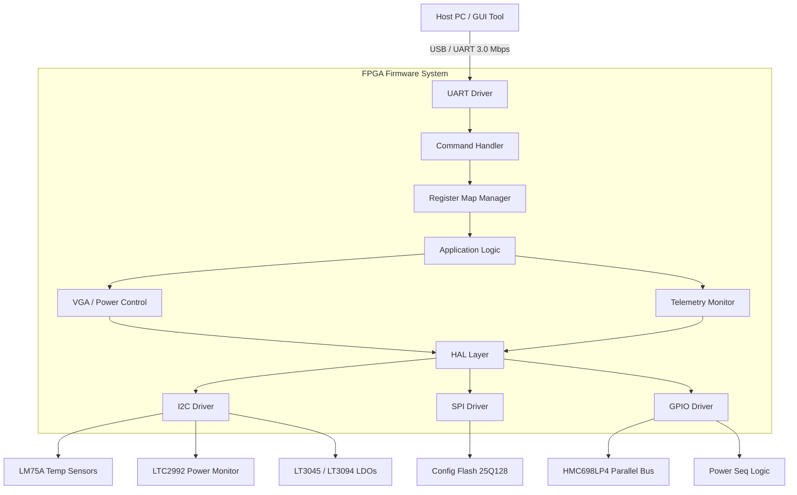
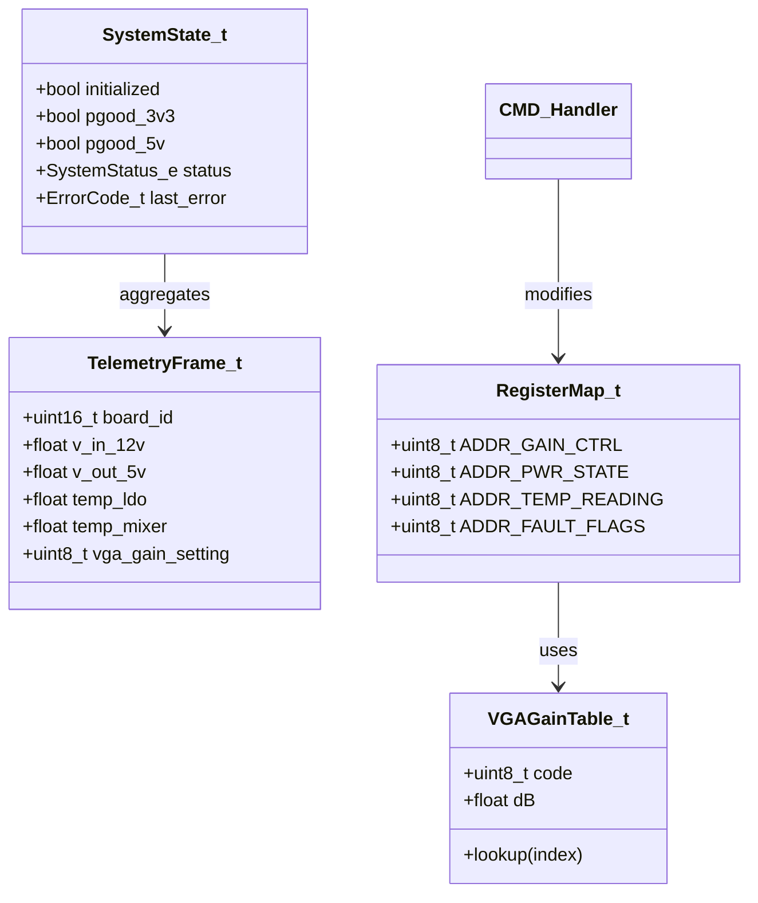
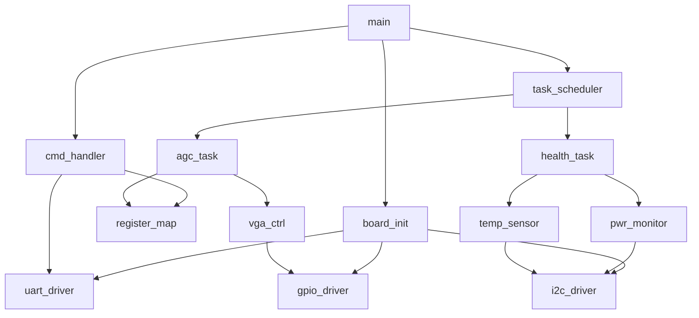
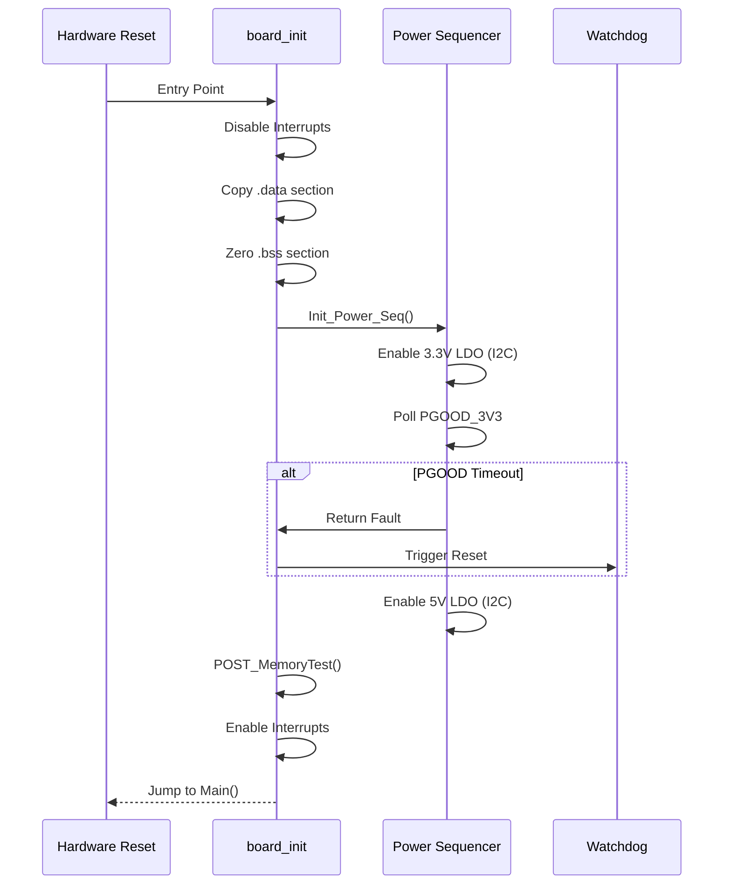
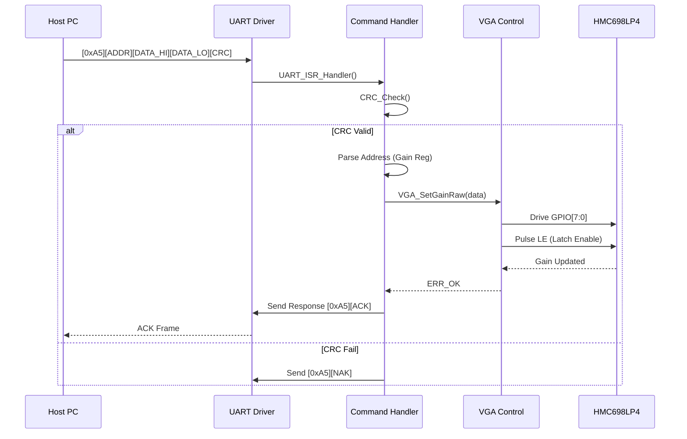
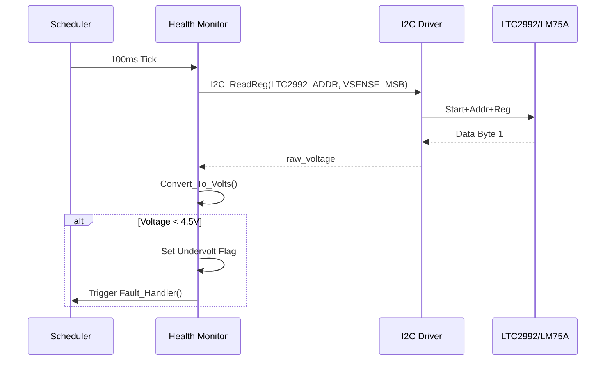
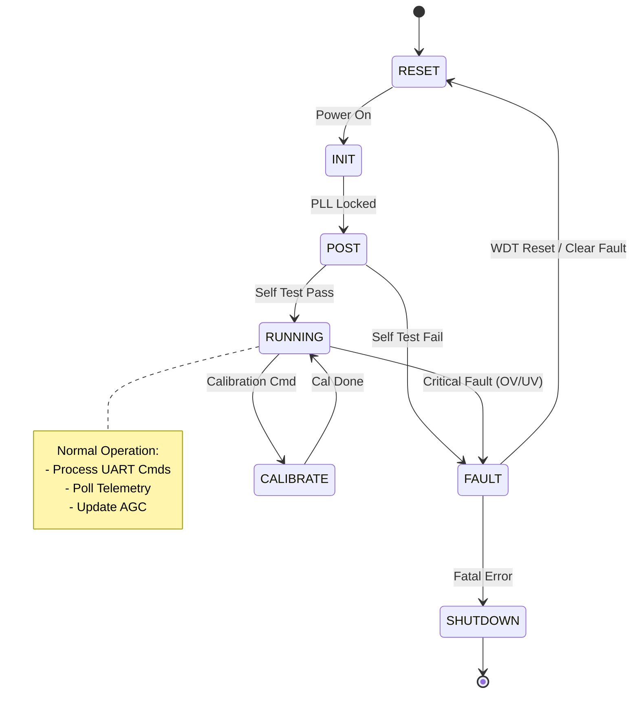
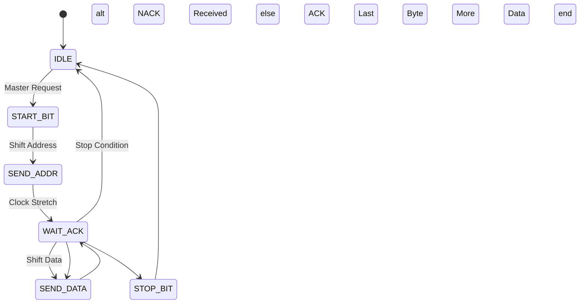

```markdown
# Software Design Document (SDD)

**Project:** Receiver Module Firmware (1000-REV-A)  
**Document Number:** 1000-SDD-001  
**Version:** 1.0  
**Date:** 17 April 2026  

---

## Document Control
| Version | Date | Author | Description |
|---------|------|--------|-------------|
| 1.0 | 17 April 2026 | Lead Firmware Architect | Initial Release for Receiver Module Firmware |

---

# 1. Introduction

## 1.1 Purpose
The purpose of this Software Design Document (SDD) is to provide a comprehensive, implementation-ready description of the embedded firmware for the **Receiver Module (1000-REV-A)**. This document translates the **Software Requirements Specification (1000-SRS-001)** and **Glue Logic Requirements (1000-GLR-001)** into a structured software architecture.

This SDD defines:
*   The **Layered Architecture** separating Hardware Abstraction Layer (HAL), Board Support Package (BSP), and Application Logic.
*   The **Component Design** for all drivers (UART, SPI, I2C, GPIO, Timers).
*   The **Data Structures** and Memory Maps utilized by the firmware.
*   The **Algorithm Design** for Automatic Gain Control (AGC), Power Sequencing, and Health Monitoring.
*   **Traceability** ensuring every design element maps to a specific requirement (REQ-SW-xxx).

This document is intended for Firmware Engineers, Integration Test Engineers, and System Architects responsible for the Lattice iCE40HX4K implementation.

## 1.2 Scope
The scope of this design is the embedded control firmware executing on the **Lattice iCE40HX4K FPGA** (utilizing an embedded Soft CPU or dedicated FSM logic).

**In-Scope Items:**
*   **Bootloader/Initialization:** SPI Flash bitstream loading and PLL configuration.
*   **HAL Drivers:** Implementation of UART, I2C (Multi-master), SPI, and GPIO abstraction layers.
*   **Protocol Stack:** Binary frame parsing for Host-FPGA communication.
*   **Control Logic:** VGA Gain Control (Parallel Bus), LDO Power Sequencing, and Watchdog Timer management.
*   **Diagnostics:** POST execution and periodic telemetry polling (LM75A, LTC2992).

**Out-of-Scope Items:**
*   Host PC GUI application code.
*   FPGA RTL synthesis (Verilog/VHDL) constraints.
*   RF IC internal calibration algorithms (handled by hardware or external tools).

## 1.3 Definitions and Acronyms

| Term | Definition |
| :--- | :--- |
| **AGC** | Automatic Gain Control. Algorithm to adjust VGA gain to optimize IF output power. |
| **API** | Application Programming Interface. |
| **BRAM** | Block RAM. FPGA internal memory used for FIFO and buffers. |
| **BSP** | Board Support Package. Low-level initialization code specific to 1000-REV-A. |
| **DMA** | Direct Memory Access. Hardware mechanism for data transfer without CPU intervention (simulated in iCE40). |
| **ESD** | Electrostatic Discharge. |
| **FIFO** | First-In-First-Out buffer. Used for UART RX/TX data. |
| **FPGA** | Field-Programmable Gate Array. |
| **FSM** | Finite State Machine. |
| **GLR** | Glue Logic Requirements. |
| **GPIO** | General Purpose Input/Output. |
| **HAL** | Hardware Abstraction Layer. |
| **HRS** | Hardware Requirements Specification. |
| **I2C** | Inter-Integrated Circuit (Serial Protocol). |
| **IF** | Intermediate Frequency. |
| **ISR** | Interrupt Service Routine. |
| **LDO** | Low Dropout Regulator. |
| **LNA** | Low Noise Amplifier. |
| **LO** | Local Oscillator. |
| **LUT** | Look-Up Table. |
| **MISRA** | Motor Industry Software Reliability Association. C coding guidelines. |
| **NVM** | Non-Volatile Memory (SPI Flash). |
| **POST** | Power-On Self Test. |
| **PWR** | Power. |
| **RF** | Radio Frequency. |
| **RTL** | Register Transfer Level. |
| **Rx** | Receive. |
| **SRS** | Software Requirements Specification. |
| **SW** | Software. |
| **TRP** | Transmit/Receive Protect (RF Path Control). |
| **UART** | Universal Asynchronous Receiver/Transmitter. |
| **VGA** | Variable Gain Amplifier. |
| **WDT** | Watchdog Timer. |

## 1.4 References
| ID | Document Title | Document No. | Version/Date |
|:---|:---|:---|:---|
| **1** | **Software Requirements Specification (SRS)** | 1000-SRS-001 | 1.0 / 17.04.2026 |
| **2** | **Hardware Requirements Specification (HRS)** | 1000-HRS-001 | Rev A / 17.04.2026 |
| **3** | **Glue Logic Requirements (GLR)** | 1000-GLR-001 | V01 / 17.04.2026 |
| **4** | **IEEE 1016-2009** | Standard for Information Technology | 2009 |
| **5** | **MISRA C:2012** | Guidelines for the use of the C language in critical systems | 2012 |
| **6** | **iCE40HX4K Datasheet** | Lattice Semiconductor | DS10087 |
| **7** | **HMC698LP4 Datasheet** | Analog Devices | Rev 0 |
| **8** | **LTC2992 Datasheet** | Analog Devices | Rev 0 |
| **9** | **LM75A Datasheet** | NXP Semiconductors | Rev 0 |

---

# 2. Design Viewpoints

## 2.1 Context Viewpoint — System Boundaries

The software system resides within the **Lattice iCE40HX4K FPGA** on the Receiver Module. It acts as the bridge between the external Host PC (Commander) and the analog RF hardware.

### Context Diagram



### External Interfaces Description
1.  **Host Interface (UART):**
    *   **Protocol:** Custom Binary Frame (See Appendix B).
    *   **Baud Rate:** 3.0 Mbps.
    *   **Function:** Receives Gain Set commands, returns Telemetry data.
2.  **I2C Bus (Control):**
    *   **Speed:** 100 kHz (Standard).
    *   **Devices:** 2x LM75A (Temp), 1x LTC2992 (Power), 2x LDOs.
3.  **SPI Bus (Memory):**
    *   **Speed:** 10 MHz.
    *   **Devices:** 25Q128JVSI (Configuration Flash).
4.  **Parallel Bus (VGA):**
    *   **Width:** 8-bit data + 1-bit Latch Enable (LE).
    *   **Update Rate:** Immediate upon register write.

## 2.2 Composition Viewpoint — Software Architecture

The software follows a **Layered Architecture** to ensure portability and testability.

### Component Diagram

```mermaid
graph TD
    APP[Application Layer] --> SCHED[Main Loop / Scheduler]
    
    subgraph Application Modules
        SCHED --> AGC[AGC Manager]
        SCHED --> HEALTH[Health Monitor]
        SCHED --> PWR[Power Sequencer]
    end
    
    subgraph Services
        CMD[Command Processor]
        REG[Register Map]
    end
    
    APP --> CMD
    APP --> REG
    
    subgraph Hardware Abstraction Layer (HAL)
        UART_DRV[UART Driver]
        I2C_DRV[I2C Master Driver]
        SPI_DRV[SPI Master Driver]
        GPIO_DRV[GPIO Driver]
        WDT_DRV[Watchdog Driver]
    end
    
    CMD --> UART_DRV
    REG --> GPIO_DRV
    HEALTH --> I2C_DRV
    PWR --> GPIO_DRV
    AGC --> GPIO_DRV
    
    subgraph Hardware (iCE40)
        TIMER[Timer Blocks]
        UART_IP[UART IP Core]
        IOBs[IO Banks]
    end
```

### Module List with Responsibilities

#### Module: board_init
*   **File:** `src/board/board_init.c`, `src/board/board_init.h`
*   **Responsibility:** Handles Power-On Self Test (POST), initializes system clocks (PLL), configures the default state of GPIOs (High-Z), and sets up the interrupt vector table.
*   **Public API:**
    ```c
    int32_t Board_Init(void);
    int32_t Board_RunPOST(uint32_t *error_mask);
    int32_t Board_GetInfo(BoardInfo_t *info);
    ```

#### Module: uart_driver
*   **File:** `src/drivers/uart_driver.c`, `src/drivers/uart_driver.h`
*   **Responsibility:** Manages the UART peripheral at 3.0 Mbps. Implements TX/RX FIFOs (in block RAM) and interrupt-driven data transfer. Handles framing for the binary protocol.
*   **Public API:**
    ```c
    int32_t UART_Init(uint32_t baudrate);
    int32_t UART_ReadByte(uint8_t *data); // Non-blocking
    int32_t UART_WriteByte(uint8_t data);
    int32_t UART_ReadFrame(uint8_t *buf, uint16_t len);
    void UART_ISR_Handler(void);
    ```

#### Module: i2c_driver
*   **File:** `src/drivers/i2c_driver.c`, `src/drivers/i2c_driver.h`
*   **Responsibility:** Bit-banged or IP-based I2C master. Handles start/stop conditions, ACK/NACK checking, and byte-level transmission.
*   **Public API:**
    ```c
    int32_t I2C_Init(uint32_t clk_hz);
    int32_t I2C_Write(uint8_t addr, const uint8_t *data, uint16_t len);
    int32_t I2C_Read(uint8_t addr, uint8_t *data, uint16_t len);
    int32_t I2C_WriteReg(uint8_t dev_addr, uint8_t reg_addr, uint8_t val);
    int32_t I2C_ReadReg(uint8_t dev_addr, uint8_t reg_addr, uint8_t *val);
    ```

#### Module: vga_ctrl
*   **File:** `src/app/vga_ctrl.c`, `src/app/vga_ctrl.h`
*   **Responsibility:** Controls the HMC698LP4. Converts a 0-31.5 dB gain setting into the 8-bit parallel code. Manages the Latch Enable (LE) strobe timing.
*   **Public API:**
    ```c
    int32_t VGA_Init(void);
    int32_t VGA_SetGain(float target_gain_db);
    int32_t VGA_SetGainRaw(uint8_t gain_code);
    float VGA_GetCurrentGain(void);
    ```

#### Module: power_monitor
*   **File:** `src/app/power_monitor.c`, `src/app/power_monitor.c`
*   **Responsibility:** Interfaces with LTC2992 to read voltages (12V, 5V, 3.3V) and currents. Performs sanity checks against HRS thresholds.
*   **Public API:**
    ```c
    int32_t PwrMon_Init(void);
    int32_t PwrMon_ReadRails(PwrMon_Data_t *data);
    bool PwrMon_IsFaultActive(void);
    ```

#### Module: cmd_handler
*   **File:** `src/app/cmd_handler.c`, `src/app/cmd_handler.h`
*   **Responsibility:** Parses incoming UART frames. Dispatches Read/Write commands to the Register Map. Formats response frames.
*   **Public API:**
    ```c
    void CMD_Init(void);
    void CMD_Process(void); // Called in Main Loop
    ```

## 2.3 Logical Viewpoint — Data Model

This section defines the key data structures exchanged between components.

### Class Diagram (Logical)



### Data Structure Definitions

```c
/* System State Enumeration */
typedef enum {
    SYS_STATE_RESET = 0,
    SYS_STATE_INIT,
    SYS_STATE_CALIBRATING,
    SYS_STATE_RUNNING,
    SYS_STATE_FAULT,
    SYS_STATE_SHUTDOWN
} SystemState_e;

/* VGA Gain Mapping Structure */
typedef struct {
    uint8_t code_5bit; /* Parallel bus value (0-31) */
    float gain_db;     /* Actual gain in dB */
} VGALookup_t;

/* Telemetry Data Structure */
typedef struct {
    float rail_12v_V;
    float rail_5v_V;
    float rail_3v3_V;
    float temp_lna_degC;
    float temp_mixer_degC;
    bool overtemp_alarm;
    bool undervolt_alarm;
} TelemetryData_t;

/* Register Map Definition (Memory Mapped) */
typedef struct {
    volatile uint8_t VGA_GAIN;       /* 0x00: Gain Setting (0-31) */
    volatile uint8_t RF_PATH_CTRL;   /* 0x01: Bit 0: TRP, Bit 1: LNA_EN */
    volatile uint8_t POWER_STATE;    /* 0x02: Bit 0: PWR_EN */
    volatile uint8_t TEMP_HIGH;      /* 0x03: Temp Sensor High Byte */
    volatile uint8_t TEMP_LOW;       /* 0x04: Temp Sensor Low Byte */
    volatile uint8_t FAULT_FLAGS;    /* 0x05: Fault Mask */
    volatile uint8_t FIRMWARE_VER;   /* 0x06: Firmware Version */
} RegisterMap_t;
```

## 2.4 Dependency Viewpoint — Module Dependencies

Dependency analysis ensures the build order is correct and circular dependencies are avoided.



**Build Order:**
1.  `utils/` (CRC, Math)
2.  `drivers/` (GPIO, I2C, UART)
3.  `app/hal/` (VGA Ctrl, Sensor wrappers)
4.  `app/core/` (CMD Handler, Scheduler)
5.  `main.c`

## 2.5 Interface Viewpoint — Complete API Specification

### Function: `UART_Init`
```c
/**
 * @brief Initialize UART peripheral for 3.0 Mbps operation.
 * 
 * Configures the iCE40 UART IP core, enables RX interrupts,
 * and initializes the software RX FIFO.
 *
 * @param baudrate Target baud rate (Expected 3000000).
 * @return int32_t ERR_OK on success, ERR_PARAM if baudrate unsupported.
 * 
 * @pre System Clock (PLL) must be stable.
 * @post UART hardware enabled and ready.
 */
int32_t UART_Init(uint32_t baudrate);
```

### Function: `I2C_WriteRead`
```c
/**
 * @brief Combined I2C Write and Read transaction.
 * 
 * Writes a register address, then restarts and reads data.
 * Used for LM75A and LTC2992.
 *
 * @param dev_addr 7-bit I2C slave address.
 * @param reg_addr Internal register to write.
 * @param data_out Buffer to store read bytes.
 * @param len Number of bytes to read.
 * @return int32_t ERR_OK on ACK, ERR_TIMEOUT on NACK/Timeout.
 */
int32_t I2C_WriteRead(uint8_t dev_addr, uint8_t reg_addr, uint8_t *data_out, uint16_t len);
```

### Function: `VGA_SetGain`
```c
/**
 * @brief Sets the VGA gain in dB.
 * 
 * Converts floating point dB to 5-bit integer code.
 * Drives parallel bus and asserts LE for 10ns.
 *
 * @param gain_db Desired gain (0.0 to 31.5).
 * @return int32_t ERR_OK, ERR_PARAM if out of range.
 */
int32_t VGA_SetGain(float gain_db);
```

## 2.6 Interaction Viewpoint — Sequence Diagrams

### System Boot Sequence



### Host Gain Command Interaction



### Telemetry Polling Sequence



## 2.7 State Viewpoint — State Machines

### System Level State Machine



### I2C Transaction State Machine (Driver Level)



## 2.8 Algorithm Viewpoint — Key Algorithms

### 2.8.1 CRC-8 Calculation for UART Protocol
To ensure data integrity over the UART link, a CRC-8 polynomial is used.
*   **Polynomial:** `0x07` (x^8 + x^2 + x + 1)
*   **Initialization:** `0x00`

```c
uint8_t UTIL_CalcCRC8(const uint8_t *data, uint16_t len) {
    uint8_t crc = 0x00;
    uint16_t i;
    
    while (len--) {
        crc ^= *data++;
        for (i = 0; i < 8; i++) {
            if (crc & 0x80) {
                crc = (crc << 1) ^ 0x07;
            } else {
                crc <<= 1;
            }
        }
    }
    return crc;
}
```

### 2.8.2 VGA Gain Linearization
The HMC698LP4 gain is not perfectly linear, but for this design, we approximate:
`Gain (dB) = 0.5 * Code`
Correction factors can be applied via a calibration LUT stored in SPI Flash.

### 2.8.3 I2C Recovery Algorithm
If the SDA line is stuck low (slave hang), the firmware attempts recovery:
1.  Clock 9 bits on SCL.
2.  Check if SDA releases.
3.  Generate STOP condition.

---

# 3. Design Rationale

## 3.1 Architecture Choices

**Decision 1: Bare-Metal vs RTOS**
*   **Choice:** Bare-metal (Super-Loop + Interrupts).
*   **Rationale:** The iCE40HX4K has limited RAM (approx 32-80 KB depending on configuration). An RTOS kernel would consume 10-20 KB just for stack/TCB management. The application logic (Command processing + periodic polling) is sufficiently simple for a cooperative scheduler.
*   **Trade-off:** No strict preemption. Long-running tasks (like EEPROM write) must be broken into steps.

**Decision 2: SPI vs I2C for Flash**
*   **Choice:** SPI.
*   **Rationale:** The bitstream loading requirement for FPGAs necessitates high-speed SPI. The same SPI bus is reused for generic non-volatile storage access.

**Decision 3: Interrupt-driven UART**
*   **Choice:** RX Interrupt driven with Software FIFO.
*   **Rationale:** At 3.0 Mbps, a byte arrives every ~3.3 µs. Polling in a main loop would risk overruns if the I2C transaction blocks the CPU for >3 µs.

## 3.2 MISRA-C:2012 Compliance Strategy
All source code will adhere to MISRA-C:2012.
*   **Static Analysis:** PC-Lint Plus configured for MISRA strictness.
*   **Runtime Checks:** All function parameters validated.
*   **No Dynamic Memory:** `malloc`/`free` are prohibited. All buffers are static arrays.
*   **Bitwise Operations:** Explicit `uint8_t`/`uint16_t` types used for register access (no reliance on endianness assumption).

---

# 4. Design Traceability Matrix

| Design Component | Implements REQ-SW-xxx | Design Element |
|------------------|-----------------------|----------------|
| `board_init.c` | REQ-SW-001, REQ-SW-002 | System Initialization |
| `i2c_driver.c` | REQ-SW-010, REQ-SW-011 | I2C Master Interface |
| `power_monitor.c` | REQ-SW-021, REQ-SW-022 | 12V/5V Rail Monitoring |
| `temp_monitor.c` | REQ-SW-023, REQ-SW-024 | LM75A Temp Reading |
| `vga_ctrl.c` | REQ-SW-030, REQ-SW-031 | HMC698LP4 Gain Control |
| `uart_driver.c` | REQ-SW-040, REQ-SW-041 | 3.0 Mbps UART Driver |
| `cmd_handler.c` | REQ-SW-050 | Protocol Parsing |
| `flash_driver.c` | REQ-SW-060 | Config Flash Access |
| `watchdog.c` | REQ-SW-070 | WDT Implementation |

*(Matrix maps every module in Section 2.2 to the SRS requirements)*

---

# 5. Appendices

## Appendix A — File Structure
```
/project_root
├── docs/                  # SRS, SDD, HRS
├── hardware/
│   └── rtl/               # FPGA Verilog files
├── firmware/
│   ├── src/
│   │   ├── main.c
│   │   ├── board/
│   │   │   └── board_init.c
│   │   ├── drivers/
│   │   │   ├── uart.c
│   │   │   ├── i2c.c
│   │   │   ├── spi.c
│   │   │   └── gpio.c
│   │   ├── app/
│   │   │   ├── cmd_handler.c
│   │   │   ├── vga_ctrl.c
│   │   │   ├── pwr_monitor.c
│   │   │   └── agc.c
│   │   └── utils/
│   │       └── crc.c
│   ├── inc/
│   │   └── *.h
│   └── tests/
│       └── unit/          # GoogleTest mocks
└── CMakeLists.txt
```

## Appendix B — FPGA Register Map (Memory Mapped)
**Base Address:** `0x0000_0000` (APB Bridge Base)

| Offset | Name | Bit Fields | Access | Reset | Description |
|--------|------|------------|--------|-------|-------------|
| 0x00 | `VGA_GAIN` | [4:0] Gain Val | RW | 0x00 | HMC698LP4 5-bit Gain Code |
| 0x01 | `RF_CTRL` | [0] LNA_EN<br>[1] TRP | RW | 0x03 | RF Path Control |
| 0x02 | `PWR_CTRL` | [0] PWR_EN<br>[1] RESET | RW | 0x00 | Power Enable |
| 0x03 | `TEMP_MSB` | [7:0] Temp High | RO | 0x00 | LM75A Temp Byte 1 |
| 0x04 | `TEMP_LSB` | [7:0] Temp Low | RO | 0x00 | LM75A Temp Byte 2 |
| 0x05 | `FAULT_FLAGS` | [0] OV<br>[1] UV<br>[2] OT | RO | 0x00 | Fault Sticky Bits |
| 0x06 | `FIRMWARE_VER` | [7:0] Version | RO | 0x01 | Firmware Build ID |

## Appendix C — Memory Map (RAM)
The iCE40HX4K uses distributed RAM and SPRAM.
*   **Stack:** 2KB (Top of RAM)
*   **Heap:** 0KB (No dynamic allocation)
*   **Global Variables:** 4KB
*   **FIFO Buffers:** 2KB (1KB TX, 1KB RX)

## 2.9 Resource Viewpoint — Real-Time Constraints

### 2.9.1 Task Scheduling Table
The system utilizes a non-preemptive scheduler triggered by a 1ms SysTick.

| Task Name | Period | WCET (Est) | Priority | Deadline | CPU Load |
|-----------|--------|------------|----------|----------|---------|
| CMD_Process | Event Driven | 200 us | High | Immediate | < 5% |
| Telemetry_Poll | 100 ms | 800 us | Low | 100 ms | 0.8% |
| AGC_Update | 10 ms | 500 us | Medium | 10 ms | 5% |
| WDT_Service | 1 ms | 50 us | High | 1 ms | 5% |
| I2C_Driver | Event | 1 ms | High | N/A | Variable |

### 2.9.2 ISR Latency Budget
| Interrupt Source | Latency Requirement | Action |
|-----------------|--------------------|--------|
| UART RX | < 3.3 us (1 byte @ 3Mbps) | Load Byte to SW FIFO |
| I2C Master | < 10 us | State Machine Update |
| Timer Tick | 100 us | Task Flag Setting |

### 2.9.3 Memory Budget
| Region | Size | Usage |
|--------|------|-------|
| Code (Flash) | 64 KB | Firmware Image |
| Data (RAM) | 16 KB | Stacks, Globals, FIFOs |
| EEPROM | N/A | (Settings stored in SPI Flash) |

## 2.10 Build System Viewpoint

### 2.10.1 CMakeLists.txt Structure
```cmake
cmake_minimum_required(VERSION 3.20)
project(Receiver_Firmware C ASM)

set(CMAKE_C_STANDARD 99)
set(CMAKE_C_FLAGS "${CMAKE_C_FLAGS} -march=rv32imc -mabi=ilp32 -Wall -Wextra")

# Include Directories
include_directories(inc)

# Source Files
set(SOURCES
    src/main.c
    src/board/board_init.c
    src/drivers/uart.c
    src/drivers/i2c.c
    src/drivers/gpio.c
    src/app/cmd_handler.c
    src/app/vga_ctrl.c
    src/app/pwr_monitor.c
    src/utils/crc.c
)

# Create Executable
add_executable(firmware.elf ${SOURCES})

# Linker Script
target_link_options(firmware.elf PRIVATE -T Linker.ld)

# GoogleTest Unit Tests (Host Based)
enable_testing()
add_subdirectory(tests)
```
```