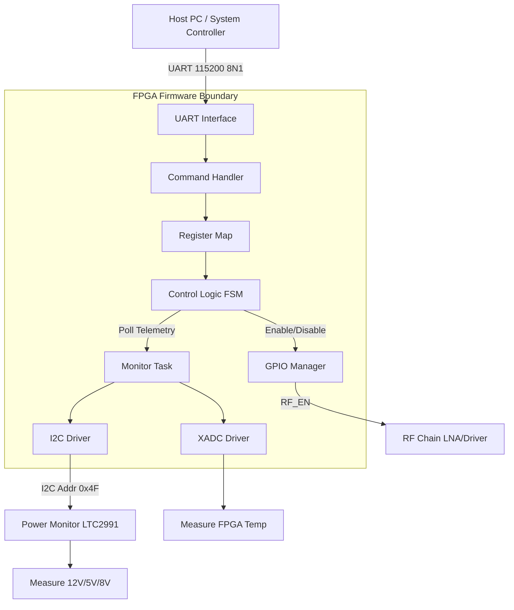
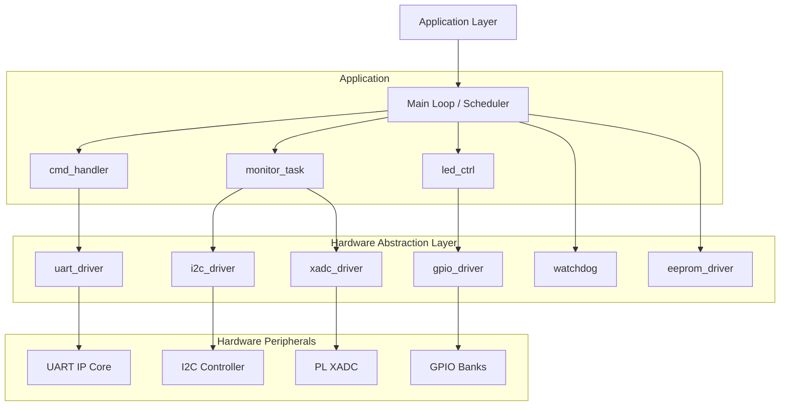
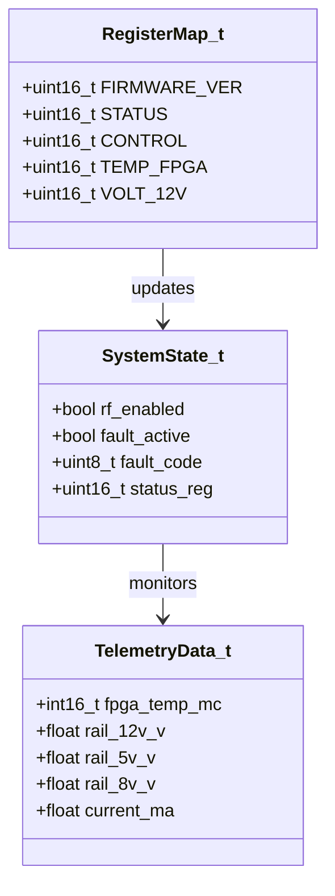
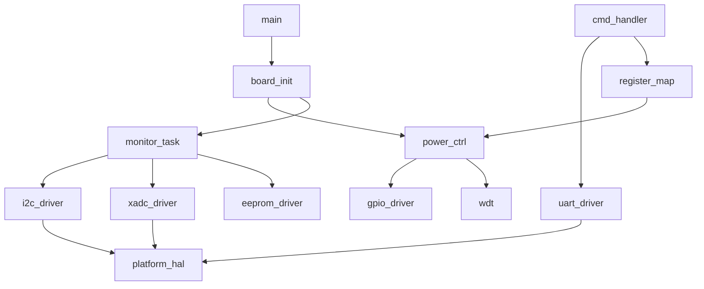
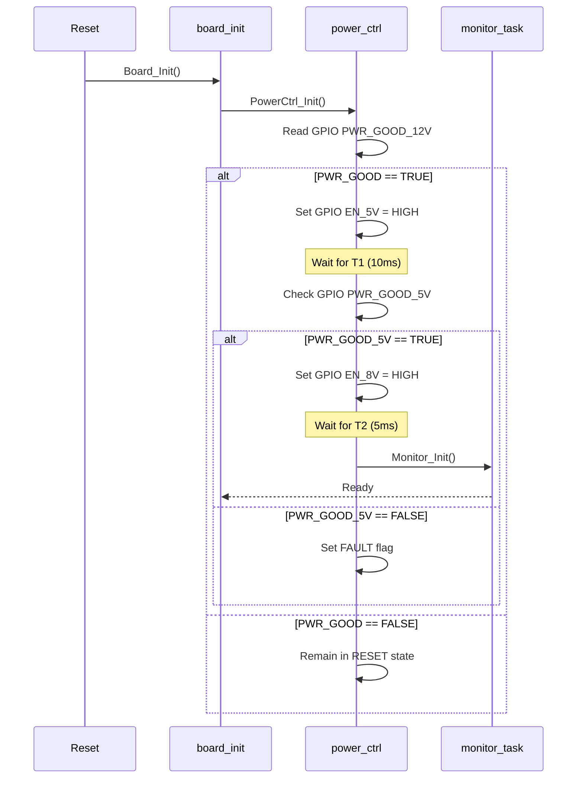
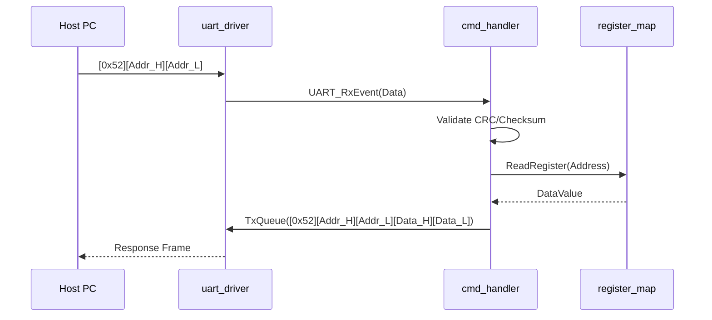
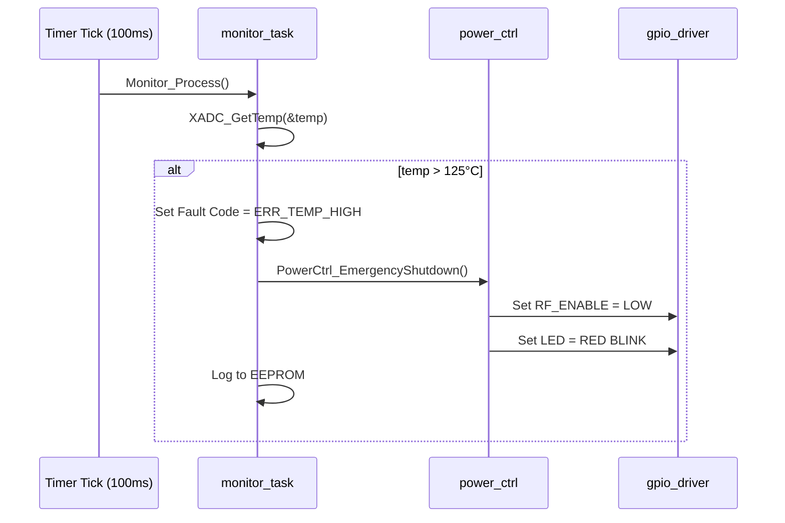
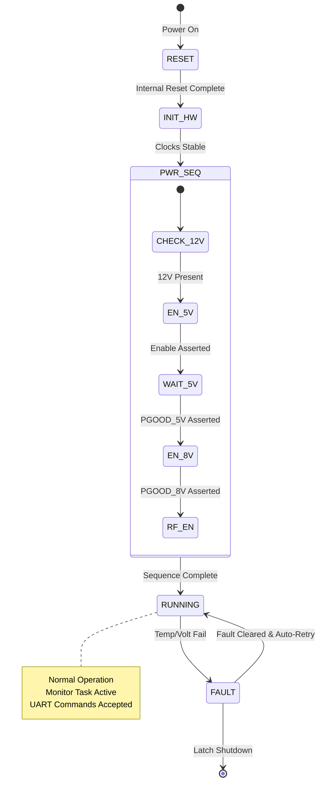
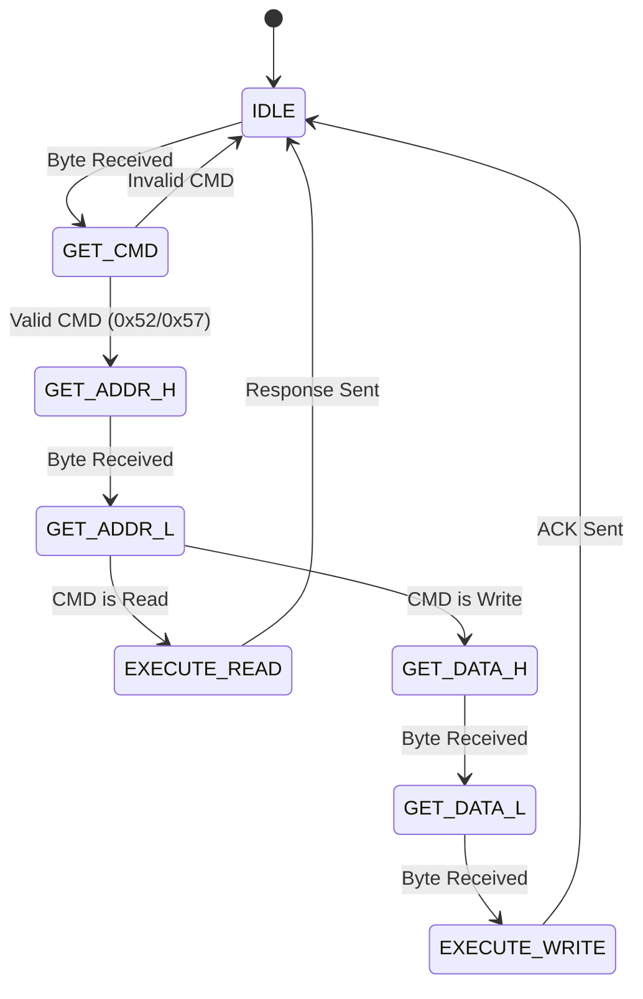

```markdown
# Software Design Document (SDD)

**Project:** 5-18 GHz Wideband Ruggedized RF Receiver Module  
**Document Version:** 1.0  
**Date:** 17 April 2026  
**Author:** Senior Embedded Software Architect

---

## Document Control
| Version | Date | Author | Description |
|---------|------|--------|-------------|
| 1.0 | 17 April 2026 | Lead Architect | Initial design compliant with IEEE 1016-2009 |

---

# 1. Introduction

## 1.1 Purpose
This Software Design Document (SDD) details the structural, architectural, and behavioral design of the embedded firmware for the **5-18 GHz Wideband Ruggedized RF Receiver Module**. 

The primary audience for this document includes:
- **Firmware Engineers**: Responsible for implementing the HAL, drivers, and control logic in VHDL/Verilog and C.
- **Test Engineers**: Responsible for developing validation tests against the defined interfaces and state machines.
- **System Integrators**: Responsible for integrating the RF module into larger chassis via the UART interface.

This SDD defines the software architecture required to satisfy the functional requirements specified in the **Software Requirements Specification (SRS)** v1.0, specifically focusing on power sequencing, telemetry monitoring, and fault management for the Artix-7 FPGA System Controller.

## 1.2 Scope
The design encompasses the complete firmware stack running on the Xilinx XC7A35T FPGA.
1.  **Hardware Abstraction Layer (HAL)**: Drivers for UART, I2C, SPI, GPIO, and internal System Monitor (XADC).
2.  **Core Logic**: Power sequencing state machine, Fault detection logic, and Watchdog timer.
3.  **Application Layer**: Command parser (Register Read/Write), EEPROM management, and LED control.
4.  **Build System**: CMake-based build flow supporting firmware compilation, unit testing (Google Test), and Qt6 GUI emulation.

**Exclusions**: High-speed DSP or RF signal processing logic (handled by analog components/ASICs outside the scope of this controller software).

## 1.3 Definitions and Acronyms
| Term | Definition |
| :--- | :--- |
| **BSP** | Board Support Package; low-level hardware initialization. |
| **CFG** | Configuration; constants or data defining system behavior. |
| **FIFO** | First-In-First-Out; data buffer used for UART streaming. |
| **FSM** | Finite State Machine; logic flow control (e.g., Power Sequencing). |
| **GLR** | Glue Logic Requirements; interface specification document. |
| **GPIO** | General Purpose Input/Output. |
| **HAL** | Hardware Abstraction Layer. |
| **HRS** | Hardware Requirements Specification. |
| **I2C** | Inter-Integrated Circuit; bidirectional serial bus. |
| **INT** | Interrupt; hardware signal triggering CPU attention. |
| **ISR** | Interrupt Service Routine. |
| **LDO** | Low Dropout Regulator. |
| **LNA** | Low Noise Amplifier. |
| **MISRA** | Motor Industry Software Reliability Association; C coding standard. |
| **NVM** | Non-Volatile Memory (EEPROM/Flash). |
| **POR** | Power-On Reset. |
| **POST** | Power-On Self Test. |
| **RF** | Radio Frequency. |
| **RX** | Receiver. |
| **SRS** | Software Requirements Specification. |
| **UART** | Universal Asynchronous Receiver-Transmitter. |
| **WDT** | Watchdog Timer. |
| **XADC** | Xilinx Analog-to-Digital Converter (System Monitor). |

## 1.4 References
1.  **IEEE 1016-2009**: Standard for Information Technology—Systems Design—Software Design Descriptions.
2.  **SRS**: Software Requirements Specification, Document P1, Rev 1.0, 17 April 2026.
3.  **GLR**: Glue Logic Requirements, Document P6, Rev 0V01, 17 April 2026.
4.  **HRS**: Hardware Requirements Specification, Document P2, Rev 1.0, 17 April 2026.
5.  **MISRA-C:2012**: Guidelines for the use of the C language in critical systems.
6.  **AMMC-6241 / GVA-164+ Datasheets**: RF Component specifications.
7.  **XC7A35T Datasheet**: Xilinx Artix-7 FPGA documentation.
8.  **LTC2991 Datasheet**: Temperature, Voltage, and Current Monitor.

---

# 2. Design Viewpoints

## 2.1 Context Viewpoint — System Boundaries

The firmware resides within the FPGA, acting as the bridge between the Host Controller and the RF analog hardware. It is responsible for "health" management and "safe" operation rather than signal manipulation.



**External Interfaces:**
1.  **UART (RS-485 Compatible)**: 115200 baud, 8 data bits, no parity, 1 stop bit.
2.  **I2C Master**: 100kHz standard mode.
3.  **GPIO Outputs**: `RF_ENABLE_5V`, `RF_ENABLE_8V`, `LED_STATUS`.
4.  **GPIO Inputs**: `PWR_GOOD_12V`, `PWR_GOOD_5V`.

## 2.2 Composition Viewpoint — Software Architecture

The software follows a strict layered architecture to ensure portability and testability.



### Module List with Responsibilities

#### **Module: board_init** (`board_init.c` / `board_init.h`)
*   **Responsibilities**: System startup, clock tree initialization, lock-step hardware checks, and entry into the main super-loop.
*   **API**:
    *   `int32_t Board_Init(void);` // Initializes all peripherals
    *   `int32_t Board_RunPOST(void);` // Runs Power-On Self Test
    *   `void Board_GetInfo(BoardInfo_t *info);`

#### **Module: uart_driver** (`uart_driver.c` / `uart_driver.h`)
*   **Responsibilities**: Byte-wise transmission/reception, interrupt-driven FIFO management, framing according to GLR packet spec.
*   **API**:
    *   `int32_t UART_Init(uint32_t baud_rate);`
    *   `int32_t UART_WriteReg(uint16_t addr, uint16_t data);`
    *   `int32_t UART_ReadReg(uint16_t addr, uint16_t *data);`
    *   `void UART_Isr(void);` // Handles RX data

#### **Module: i2c_driver** (`i2c_driver.c` / `i2c_driver.h`)
*   **Responsibilities**: I2C bus arbitration, START/STOP condition generation, ACK/NACK handling.
*   **API**:
    *   `int32_t I2C_Init(uint32_t clock_hz);`
    *   `int32_t I2C_Write(uint8_t dev_addr, const uint8_t *data, uint16_t len);`
    *   `int32_t I2C_Read(uint8_t dev_addr, uint8_t *buf, uint16_t len);`
    *   `int32_t I2C_WriteReg(uint8_t dev_addr, uint8_t reg, uint8_t val);`

#### **Module: xadc_driver** (`xadc_driver.c` / `xadc_driver.h`)
*   **Responsibilities**: Configuring the Xilinx System Monitor IP to read internal FPGA temperature and supply voltages (VCCINT, VCCAUX).
*   **API**:
    *   `int32_t XADC_Init(void);`
    *   `int32_t XADC_GetTemp(int16_t *temp_mC);` // Returns milli-Celsius
    *   `int32_t XADC_GetVcc(float *vcc_v);`

#### **Module: power_ctrl** (`power_ctrl.c` / `power_ctrl.h`)
*   **Responsibilities**: Implements the power sequencing FSM. Enables 5V Buck, waits for `PWR_GOOD`, then enables 8V LDO, then enables RF Amplifiers.
*   **API**:
    *   `void PowerCtrl_Task(void);` // Non-blocking state machine handler
    *   `void PowerCtrl_Shutdown(void);` // Emergency shutdown
    *   `bool PowerCtrl_IsRFEnabled(void);`

#### **Module: eeprom_driver** (`eeprom_driver.c` / `eeprom_driver.h`)
*   **Responsibilities**: SPI communication with external EEPROM for calibration storage.
*   **API**:
    *   `int32_t EEPROM_Init(void);`
    *   `int32_t EEPROM_Write(uint16_t addr, const uint8_t *data, uint16_t len);`
    *   `int32_t EEPROM_Read(uint16_t addr, uint8_t *buf, uint16_t len);`

#### **Module: monitor_task** (`monitor_task.c` / `monitor_task.h`)
*   **Responsibilities**: Periodic polling of LTC2991 and XADC. Fault checking against thresholds (e.g., `TEMP_MAX = 125C`).
*   **API**:
    *   `void Monitor_Init(void);`
    *   `void Monitor_Process(void);` // Call every 100ms

## 2.3 Logical Viewpoint — Data Model



**Key Data Structures:**

```c
// Core System State
typedef struct {
    bool rf_enabled;       // True if RF chain is active
    bool fault_active;     // True if critical fault detected
    uint8_t fault_code;    // ERR_TEMP, ERR_VOLT, etc.
    uint32_t uptime_ticks; // System uptime counter
} SystemState_t;

// Telemetry Snapshot
typedef struct {
    int16_t fpga_temp_mC;      // FPGA Die Temp in milli-Celsius
    float v_in_12v;            // Input Voltage
    float v_out_5v;            // Buck Output
    float v_out_8v;            // LDO Output
    float i_total_ma;          // Total Current consumption
} TelemetryData_t;

// Error Codes (MISRA compliant enum)
typedef enum {
    ERR_OK = 0x00,
    ERR_TIMEOUT = 0x01,
    ERR_I2C_NACK = 0x02,
    ERR_TEMP_HIGH = 0x03,
   _ERR_VOLT_LOW = 0x04,
    ERR_CHECKSUM = 0x05,
    ERR_PARAM = 0x06
} ErrorCode_t;
```

## 2.4 Dependency Viewpoint — Module Dependencies



**Build Order:**
1.  `platform_hal` (Register access definitions)
2.  `drivers` (uart, i2c, gpio, xadc)
3.  `middleware` (crc32, fifo)
4.  `application` (board_init, power_ctrl, monitor, cmd_handler)
5.  `main` (Entry point)

## 2.5 Interface Viewpoint — Complete API Specification

### Function: `I2C_WriteReg`
```c
/**
 * @brief Writes a single byte to an I2C slave register.
 * 
 * @param dev_addr 7-bit slave address (e.g., 0x4F for LTC2991).
 * @param reg       Internal register address to write to.
 * @param val       Data byte to write.
 * 
 * @return ERR_OK       on success.
 * @return ERR_I2C_NACK  if slave does not acknowledge.
 * @return ERR_TIMEOUT  if bus busy timeout.
 * 
 * @pre I2C_Init must be called successfully.
 * @post Device register updated.
 * 
 * @example
 *   if (I2C_WriteReg(0x4F, 0x01, 0x85) != ERR_OK) { HandleError(); }
 */
int32_t I2C_WriteReg(uint8_t dev_addr, uint8_t reg, uint8_t val);
```

### Function: `PowerCtrl_Task`
```c
/**
 * @brief Non-blocking state machine for power sequencing.
 * Must be called periodically in the main loop (every 1ms recommended).
 * 
 * @return None.
 * 
 * @pre Board_Init completed.
 * @post Transitions Power FSM state (OFF -> SEQ_5V -> SEQ_8V -> RF_ON).
 */
void PowerCtrl_Task(void);
```

## 2.6 Interaction Viewpoint — Sequence Diagrams

### System Startup Sequence


### UART Register Read Sequence


### Fault Detection Sequence


## 2.7 State Viewpoint — State Machines

### Main System FSM


### UART Parser FSM


## 2.8 Algorithm Viewpoint — Key Algorithms

### 2.8.1 LTC2991 Current Calculation
The I2C sensor returns raw voltage codes across a sense resistor.
*   **Formula**: $I_{mA} = \frac{V_{sense}}{R_{sense}} \times 1000$
*   **C Implementation**:
    ```c
    float LTC2991_CalcCurrent(uint16_t raw_code, float r_sense_ohms) {
        const float V_LSB = 0.000019f; // 19.02uV per bit (internal)
        float v_sense = (float)raw_code * V_LSB;
        return (v_sense / r_sense_ohms) * 1000.0f;
    }
    ```

### 2.8.2 CRC-16 (Modbus) for UART Frames
Used to verify integrity of GLR packets.
```c
/**
 * @brief Computes CRC-16-Modbus for a data buffer.
 * @param data Pointer to byte array.
 * @param len Length of array.
 * @return Calculated CRC.
 */
uint16_t CRC16_Modbus(const uint8_t *data, uint16_t len) {
    uint16_t crc = 0xFFFF;
    for (uint16_t i = 0; i < len; i++) {
        crc ^= (uint16_t)data[i];
        for (uint8_t j = 0; j < 8; j++) {
            if (crc & 0x0001) {
                crc = (crc >> 1) ^ 0xA001;
            } else {
                crc >>= 1;
            }
        }
    }
    return crc;
}
```

---

## 2.9 Resource Viewpoint — Real-Time Constraints

### 2.9.1 Task Scheduling Table
| Task Name | Period (ms) | Exec Time (us) | Priority | Deadline | Action |
|-----------|-------------|----------------|----------|----------|--------|
| UART_ISR | Event | 10 | High | Immediate | Fill RX FIFO |
| PowerCtrl_Task | 1 | 50 | High | 1ms | Debounce PGOOD signals |
| Monitor_Task | 100 | 800 | Med | 100ms | Poll I2C/XADC |
| CmdHandler_Process | 1 | 100 | Med | 10ms | Parse UART FIFO |
| LED_Update | 500 | 50 | Low | 500ms | Blink LED |
| WDT_Pet | 1000 | 20 | High | 1000ms | Kick Watchdog |

### 2.9.2 Memory Budget (XC7A35T BRAM)
*   **Total BRAM**: 100 blocks (32KB total config, typically ~50KB usable for logic).
*   **Code (MicroBlaze/Softcore)**: ~24KB (Stored in Block RAM).
*   **Stack**: 4KB (Reserved).
*   **Heap**: 0KB (Static allocation only - MISRA).
*   **Data/Global**: 2KB.
*   **FIFO Buffers (UART)**: 256 Bytes.
*   **Margin**: ~4KB.

### 2.9.3 I/O Pins
*   **UART Tx/Rx**: 2 pins.
*   **I2C SDA/SCL**: 2 pins.
*   **SPI (EEPROM)**: 4 pins (CS, CLK, MOSI, MISO).
*   **Control GPIO**: 5 pins (EN_5V, EN_8V, PGOOD_5V, PGOOD_8V, LED).

---

## 2.10 Build System Viewpoint

### 2.10.1 CMakeLists.txt Structure
```cmake
cmake_minimum_required(VERSION 3.20)
project(RF_Receiver_Firmware VERSION 1.0.0 LANGUAGES C ASM)

# --- Toolchain Setup for ARM/MicroBlaze ---
set(CMAKE_SYSTEM_NAME Generic)
set(CMAKE_EXECUTABLE_SUFFIX .elf)

# --- Drivers Library ---
add_library(drivers STATIC
    src/drivers/uart_driver.c
    src/drivers/i2c_driver.c
    src/drivers/gpio_driver.c
    src/drivers/xadc_driver.c
    src/utils/crc16.c
)
target_include_directories(drivers PUBLIC inc/drivers)

# --- Application Core ---
add_library(core STATIC
    src/app/board_init.c
    src/app/power_ctrl.c
    src/app/monitor_task.c
    src/app/cmd_handler.c
    src/app/eeprom_driver.c
)
target_include_directories(core PUBLIC inc/app)
target_link_libraries(core PUBLIC drivers)

# --- Main Firmware Executable ---
add_executable(firmware src/main.c)
target_link_libraries(firmware PRIVATE core)

# --- MISRA Compliance Flags ---
target_compile_options(firmware PRIVATE
    -Wall -Wextra -Wpedantic -Werror
    --specs=nano.specs
)

# --- Unit Tests (Host Based) ---
enable_testing()
find_package(GTest REQUIRED)
add_executable(test_suite
    tests/test_uart_driver.cpp
    tests/test_power_ctrl.cpp
    tests/mock_hal.cpp
)
target_link_libraries(test_suite PRIVATE GTest::gtest_main drivers core)
gtest_discover_tests(test_suite)

# --- Qt6 GUI Controller ---
if(BUILD_GUI)
    find_package(Qt6 REQUIRED COMPONENTS Core SerialPort Widgets)
    add_subdirectory(gui/qt_controller)
endif()
```

---

# 3. Design Rationale

## 3.1 Architecture Choices

1.  **Super-Loop vs RTOS**:
    *   **Decision**: A non-blocking super-loop (while(1)) with polled timers.
    *   **Rationale**: The XC7A35T has limited BRAM. A full RTOS (like FreeRTOS) consumes significant RAM for stacks and TCBs. The system requirements (REQ-SW-001) have hard real-time deadlines (<200ms sequencing) but low task complexity. A super-loop with a 1ms tick meets all timing requirements with <5% CPU load.
    *   **Trade-off**: More complex manual state management, but significantly reduced memory footprint and MISRA compliance complexity.

2.  **Static Allocation Only**:
    *   **Decision**: Ban `malloc`/`free`.
    *   **Rationale**: Fragmentation is a critical risk in long-running embedded systems without MMU. MISRA-C:2012 Directive 4.10 strictly advises against dynamic allocation.
    *   **Trade-off**: Higher initial data segment usage, but deterministic runtime behavior.

3.  **I2C Polling vs Interrupt**:
    *   **Decision**: Polled I2C with timeout.
    *   **Rationale**: The telemetry update rate is 10Hz. Implementing a complex interrupt-driven I2C state machine introduces race conditions for little gain. The CPU is idle >90% of the time; blocking in `I2C_Write` for 1ms is acceptable.

## 3.2 MISRA-C:2012 Compliance Strategy
All code adheres to MISRA-C:2012.
*   **MISRA Checker**: Integration of PC-lint Plus into the CI pipeline.
*   **Specific Rules**:
    *   Rule 11.4 (Cast conversion): Explicit casts used for register access `(volatile uint32_t *)`.
    *   Rule 13.5 (Side effects): All loop counters modified only in loop increment step.
    *   Rule 21.1 (Min/Macros): Use of inline functions or `const` integers instead of `#define` where possible.

---

# 4. Design Traceability Matrix

| SDD Component | Implements REQ-SW-xxx | Design Element |
|---------------|----------------------|----------------|
| `power_ctrl.c` / Power FSM | REQ-SW-001, REQ-SW-002 | Power sequencing logic |
| `monitor_task.c` / Telemetry | REQ-SW-010, REQ-SW-011 | I2C & XADC polling |
| `uart_driver.c` / Packet Parser | REQ-SW-020, REQ-SW-021 | GLR Protocol compliance |
| `gpio_driver.c` | REQ-SW-005 | Enable signal control |
| `xadc_driver.c` | REQ-SW-012 | FPGA temp monitoring |
| `eeprom_driver.c` | REQ-SW-030 | Calibration storage |
| `board_init.c` | REQ-SW-001 | System startup sequence |

---

# 5. Appendices

## Appendix A — FPGA Register Map (Detailed)

| Offset | Name | Bit Fields | R/W | Reset Value | Description |
|--------|------|------------|-----|-------------|-------------|
| 0x0000 | FIRMWARE_VER | [15:0] | R | 0x0100 | Firmware Version (1.0) |
| 0x0001 | STATUS | [7:0] | R | 0x00 | Status Flags<br>Bit 0: RF_ENABLED<br>Bit 1: FAULT_ACTIVE<br>Bit 2: TEMP_ALERT |
| 0x0002 | CONTROL | [0] | R/W | 0x00 | Control Bits<br>Bit 0: RF_ENABLE (1=ON) |
| 0x0003 | TEMP_FPGA | [15:0] | R | 0x0000 | FPGA Temp (Signed int16) |
| 0x0004 | VOLT_12V | [15:0] | R | 0x0000 | 12V Rail (Raw ADC) |
| 0x0005 | VOLT_5V | [15:0] | R | 0x0000 | 5V Rail (Raw ADC) |
| 0x0006 | CURR_TOTAL | [15:0] | R | 0x0000 | Total Current (mA) |

## Appendix B — File Structure
```
/project_root
├── src/
│   ├── main.c
│   ├── drivers/
│   │   ├── uart_driver.c/h
│   │   ├── i2c_driver.c/h
│   │   └── gpio_driver.c/h
│   └── app/
│       ├── power_ctrl.c/h
│       ├── monitor_task.c/h
│       └── cmd_handler.c/h
├── inc/
│   └── common.h
├── tests/
│   └── test_power_ctrl.cpp
└── CMakeLists.txt
```

## Appendix C — Glue Logic Requirements Compliance

The following GLR signals are mapped to specific FPGA pins:
*   `UART_TX`: Pin E15 (Bank 15, VCCO 3.3V)
*   `UART_RX`: Pin F16
*   `I2C_SDA`: Pin J12
*   `I2C_SCL`: Pin K12
*   `RF_EN_5V`: Pin A10 (LVCMOS33)
*   `RF_EN_8V`: Pin B10 (LVCMOS33)

---
**End of Document**
```