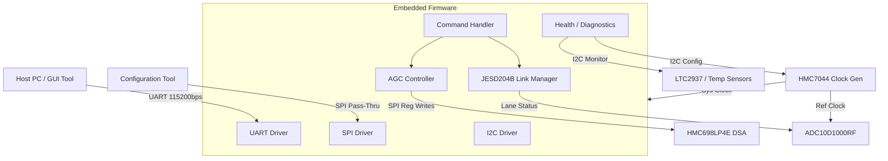
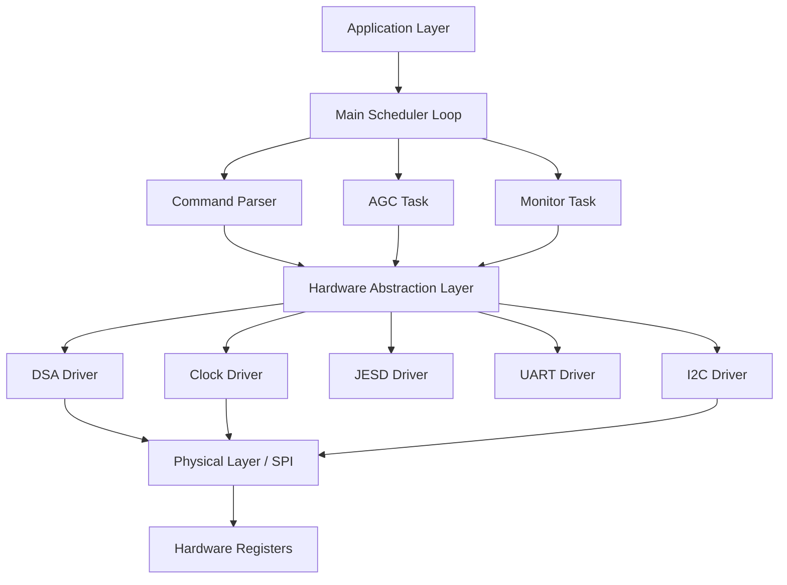
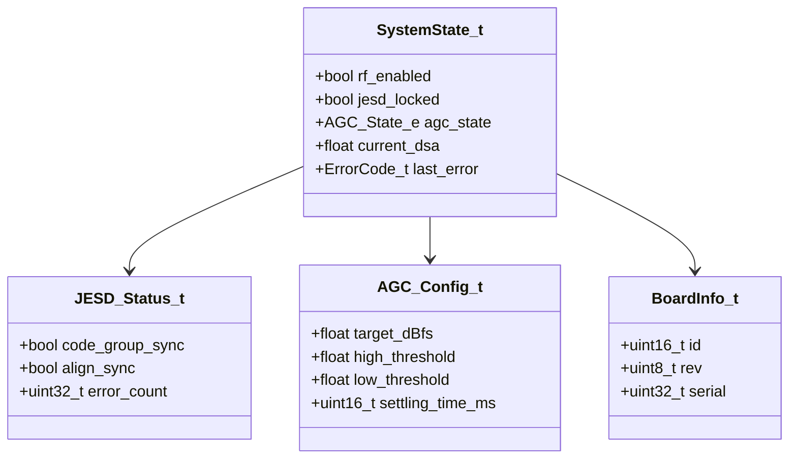
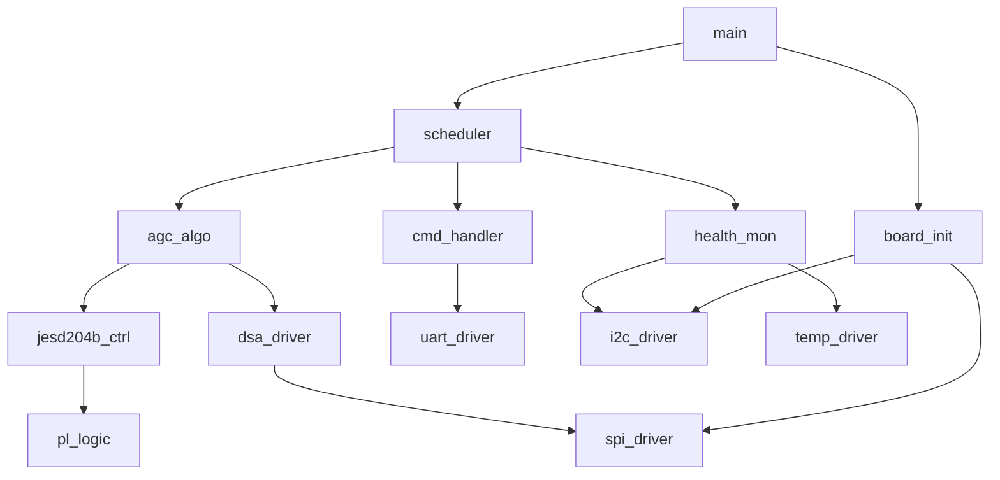
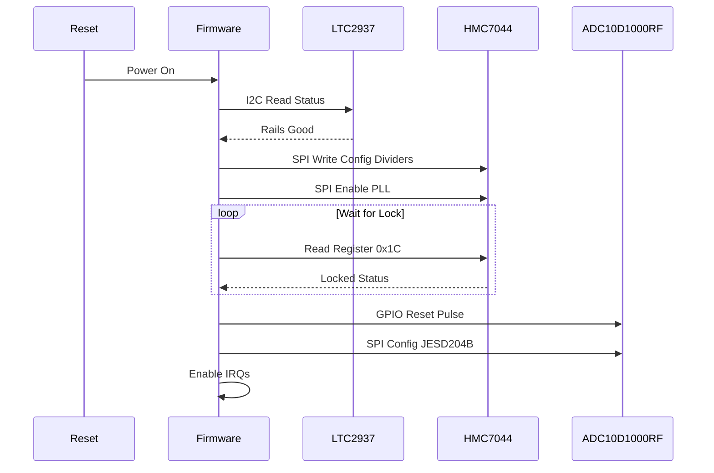
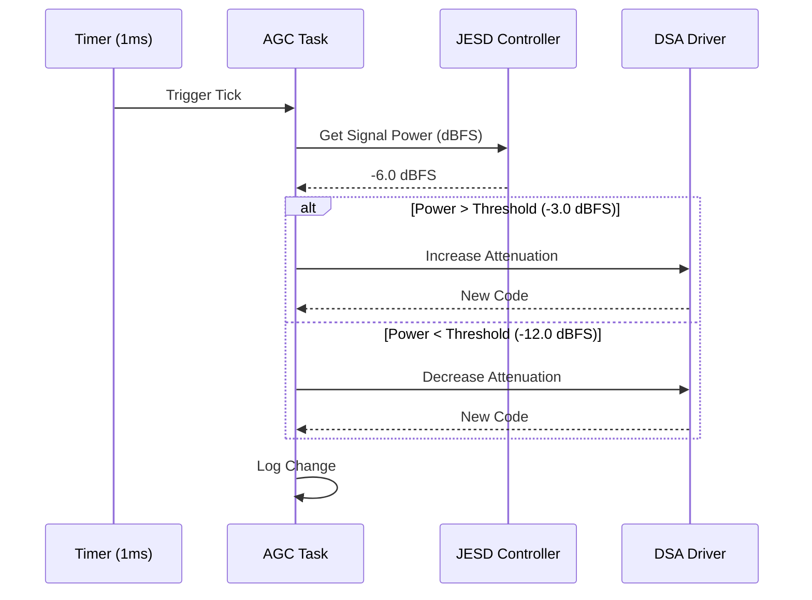
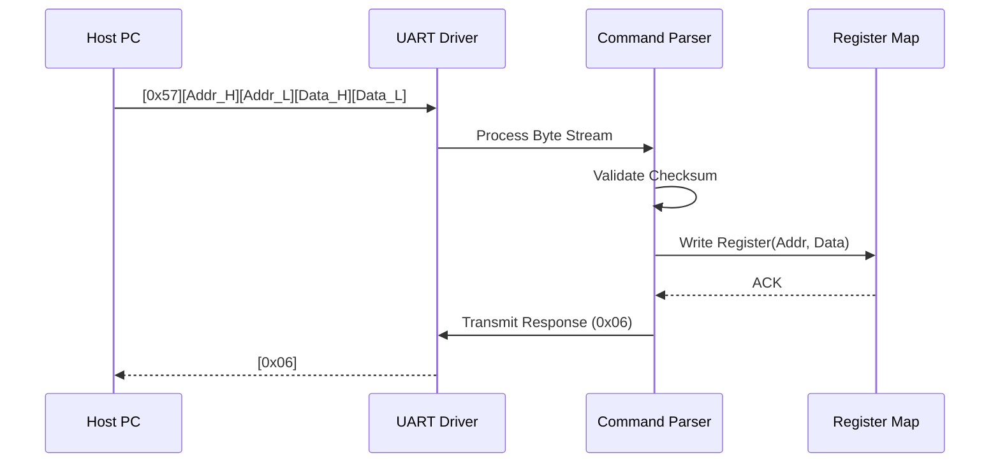
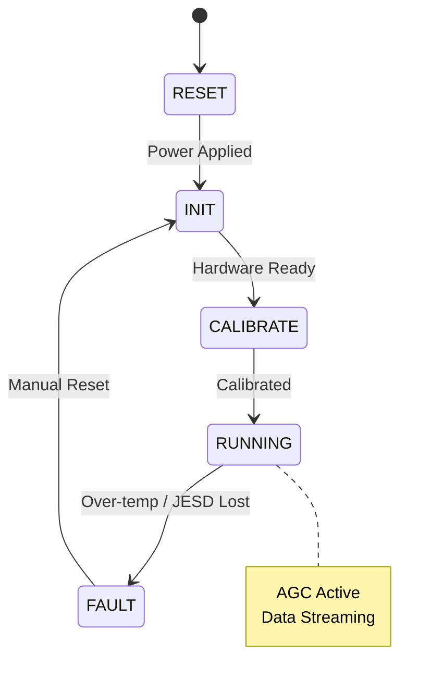
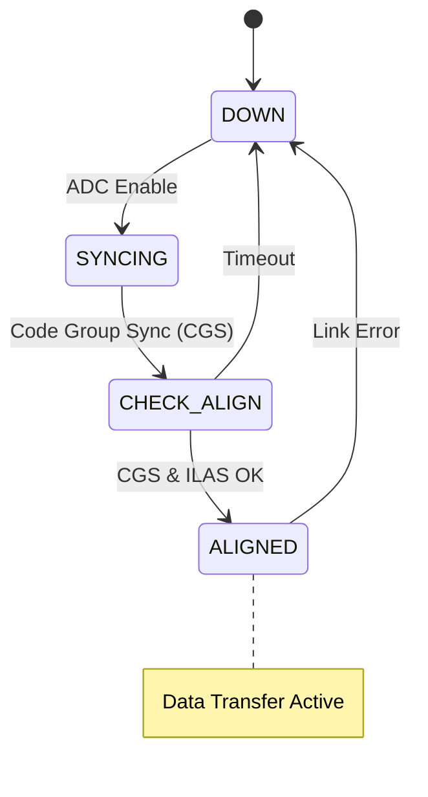

# Software Design Document (SDD)

## Document Control
| Version | Date | Author | Description |
|---------|------|--------|-------------|
| 1.0 | 16 April 2026 | System Architect | Initial design release for Sample Ai Project |
| | | | |

---

# 1. Introduction

## 1.1 Purpose
This Software Design Document (SDD) provides the comprehensive structural design for the **Sample Ai Project** embedded firmware. It describes the architecture, data structures, algorithms, and interface definitions necessary to implement the software requirements defined in the **SRS (v1.0)**. This document serves as the blueprint for firmware engineers implementing the C code for the Microcontroller/Subsystem logic within the RT-Kintex-7-RT FPGA and for verification engineers validating the design against the system requirements.

## 1.2 Scope
The design encompasses the embedded software residing on the soft/hard processor subsystem within the RT-Kintex-7-RT FPGA.
*   **Included Components:**
    *   **Board Support Package (BSP):** Drivers for UART, SPI, I2C, GPIO, and Timers.
    *   **Hardware Abstraction Layer (HAL):** Interfaces for the HMC698LP4E (DSA), HMC7044 (Clock Gen), LTC2937 (Sequencer), and ADC10D1000RF (JESD204B).
    *   **Application Layer:** Command interpreter, AGC algorithms, health monitoring, and non-volatile memory management.
*   **Target Hardware:** RT-Kintex-7-RT FPGA with embedded microcontroller (e.g., MicroBlaze or Cortex-M1 equivalent).
*   **Exclusions:** High-speed DSP signal processing chains implemented in RTL fabric (covered in separate Logic Design Document).

## 1.3 Definitions and Acronyms
| Term | Definition |
| :--- | :--- |
| **AGC** | Automatic Gain Control |
| **API** | Application Programming Interface |
| **BIST** | Built-In Self-Test |
| **BRAM** | Block RAM |
| **BSP** | Board Support Package |
| **CRC** | Cyclic Redundancy Check |
| **DSA** | Digital Step Attenuator |
| **DUT** | Device Under Test |
| **EMI** | Electromagnetic Interference |
| **FIFO** | First-In, First-Out Buffer |
| **FPGA** | Field-Programmable Gate Array |
| **GLR** | Glue Logic Requirements |
| **GPIO** | General Purpose Input/Output |
| **GSPS** | Giga-Samples Per Second |
| **HAL** | Hardware Abstraction Layer |
| **HRS** | Hardware Requirements Specification |
| **I2C** | Inter-Integrated Circuit |
| **ISR** | Interrupt Service Routine |
| **JTAG** | Joint Test Action Group |
| **JESD204B** | JEDEC Standard High-Speed Data Interface |
| **LDO** | Low Dropout Regulator |
| **LNA** | Low Noise Amplifier |
| **LVDS** | Low-Voltage Differential Signaling |
| **MCU** | Microcontroller Unit |
| **MISRA** | Motor Industry Software Reliability Association |
| **NVM** | Non-Volatile Memory |
| **PCB** | Printed Circuit Board |
| **PLL** | Phase-Locked Loop |
| **POST** | Power-On Self-Test |
| **QSPI** | Quad Serial Peripheral Interface |
| **RF** | Radio Frequency |
| **RTOS** | Real-Time Operating System |
| **RTL** | Register Transfer Level |
| **Rx** | Receive |
| **SRS** | Software Requirements Specification |
| **SPI** | Serial Peripheral Interface |
| **UART** | Universal Asynchronous Receiver/Transmitter |
| **WDT** | Watchdog Timer |

## 1.4 References
1.  IEEE 1016-2009: Standard for Information Technology — Systems Design — Software Design Descriptions.
2.  Sample Ai Project SRS (v1.0, 16 April 2026).
3.  Sample Ai Project GLR (v0V01, 16 April 2026).
4.  Sample Ai Project HRS (v1.0).
5.  MISRA-C:2012 Guidelines.
6.  RT-Kintex-7-RT FPGA User Guide (UG470).
7.  HMC698LP4E Datasheet (Analog Devices).
8.  HMC7044 Datasheet (Analog Devices).

---

# 2. Design Viewpoints

## 2.1 Context Viewpoint — System Boundaries

The software resides within the FPGA fabric and acts as the control plane for the RF hardware.



**External Interfaces:**
*   **Host Interface:** UART (TX/RX) for register read/write commands.
*   **JTAG:** Debug interface for firmware download and breakpoints.
*   **RF Control:** SPI (CS, CLK, MOSI, MISO) to HMC698LP4E DSA.
*   **Clock Control:** SPI to HMC7044.
*   **Sensor Bus:** I2C to LTC2937 and temperature monitors.

## 2.2 Composition Viewpoint — Software Architecture

The firmware is partitioned into three distinct layers to ensure portability and testability.



### Module List with Responsibilities:

**Module: board_init** (board_init.c / board_init.h)
*   **Responsibilities:** System power-on initialization, PLL locking verification, and GPIO configuration. Ensures all voltage rails (per LTC2937) are stable before enabling RF paths.
```c
int32_t Board_Init(void);
int32_t Board_GetInfo(BoardInfo_t *info);
int32_t Board_RunPOST(void);

typedef struct {
    uint16_t board_id;
    uint8_t  hw_rev;
    uint32_t serial_num;
} BoardInfo_t;
```

**Module: uart_driver** (uart_driver.c / uart_driver.h)
*   **Responsibilities:** UART configuration, interrupt-driven RX/TX FIFO management, and framing of the host protocol (ACK/NAK generation).
```c
int32_t UART_Init(uint32_t baud_rate);
int32_t UART_Write(uint8_t *data, uint16_t len);
int32_t UART_Read(uint8_t *byte, uint32_t timeout_ms);
void    UART_IRQHandler(void);
```

**Module: spi_driver** (spi_driver.c / spi_driver.h)
*   **Responsibilities:** SPI master operation for DSA and Clock Gen. Handles Chip Select (CS) toggling and clock phase/polarity configurations (CPOL/CPHA).
```c
int32_t SPI_Init(uint32_t clock_hz);
int32_t SPI_Transfer(uint8_t cs_id, const uint8_t *tx_buf, uint8_t *rx_buf, uint16_t len);
int32_t SPI_WriteReg(uint8_t cs_id, uint8_t reg, uint8_t val);
```

**Module: i2c_driver** (i2c_driver.c / i2c_driver.h)
*   **Responsibilities:** I2C master for sensors. Supports standard (100kHz) and fast (400kHz) modes.
```c
int32_t I2C_Init(uint32_t clock_hz);
int32_t I2C_Read(uint8_t dev_addr, uint8_t reg_addr, uint8_t *buf, uint16_t len);
int32_t I2C_Write(uint8_t dev_addr, uint8_t reg_addr, const uint8_t *buf, uint16_t len);
```

**Module: dsa_driver** (dsa_driver.c / dsa_driver.h)
*   **Responsibilities:** Abstracts the HMC698LP4E Digital Step Attenuator. Converts floating-point dB values to 6-bit register codes.
```c
int32_t DSA_Init(void);
int32_t DSA_SetAttenuation(float att_db);
int32_t DSA_GetAttenuation(float *att_db);
int32_t DSA_Increment(void); // For AGC step
int32_t DSA_Decrement(void);
```

**Module: jesd204b_ctrl** (jesd204b_ctrl.c / jesd204b_ctrl.h)
*   **Responsibilities:** Manages the link state machine for the ADC10D1000RF. Handles Subclass 1 deterministic latency alignment.
```c
int32_t JESD_Init(void);
int32_t JESD_StartLink(void);
int32_t JESD_GetStatus(JESD_Status_t *status);
bool    JESD_IsLocked(void);

typedef struct {
    bool code_group_sync;
    bool alignment_successful;
    uint8_t lane_errors[4];
} JESD_Status_t;
```

**Module: agc_algo** (agc_algo.c / agc_algo.h)
*   **Responsibilities:** Implements Automatic Gain Control. Reads ADC power (via RTL status registers) and adjusts DSA to target optimal back-off.
```c
int32_t AGC_Init(float target_power_dbfs);
void    AGC_Task(void); // Called periodically
int32_t AGC_SetMode(AGC_Mode_e mode);
```

**Module: cmd_handler** (cmd_handler.c / cmd_handler.h)
*   **Responsibilities:** Parses UART frames. Implements the register map defined in the GLR.
```c
void CMD_ProcessTask(void);
int32_t CMD_Execute(uint8_t *payload, uint16_t len);
```

**Module: watchdog** (watchdog.c / watchdog.h)
*   **Responsibilities:** Prevents system lockups. Must be refreshed by the main loop within 100ms.
```c
int32_t WDT_Init(uint32_t timeout_ms);
void    WDT_Refresh(void);
```

## 2.3 Logical Viewpoint — Data Model

Key data structures exchanged between modules.



**Core Enumerations:**
```c
typedef enum {
    SYS_STATE_RESET = 0,
    SYS_STATE_INIT,
    SYS_STATE_CALIBRATING,
    SYS_STATE_RUNNING,
    SYS_STATE_FAULT
} SystemState_e;

typedef enum {
    ERR_OK = 0x00,
    ERR_TIMEOUT = 0x01,
    ERR_COMM_SPI = 0x02,
    ERR_COMM_I2C = 0x03,
    ERR_HARDWARE = 0x04,
    ERR_JESD_LINK_FAIL = 0x05,
    ERR_TEMP_HIGH = 0x06,
    ERR_PARAM = 0x07
} ErrorCode_t;

typedef enum {
    AGC_MODE_DISABLED = 0,
    AGC_MODE_MANUAL,
    AGC_MODE_AUTO
} AGC_Mode_e;
```

## 2.4 Dependency Viewpoint



## 2.5 Interface Viewpoint — API Specification

**Function:** `int32_t DSA_SetAttenuation(float att_db)`
*   **Purpose:** Set the HMC698LP4E attenuation.
*   **Inputs:** `att_db` (0.0 to 31.5 dB in 0.25 dB steps).
*   **Returns:** `ERR_OK` on success, `ERR_PARAM` if out of range.
*   **Algorithm:** 
    1.  Clamp input to [0.0, 31.5].
    2.  Convert float to 6-bit integer: `code = (uint16_t)(att_db * 4.0f)`.
    3.  Mask unused bits (MSB is 1s complement).
    4.  Write via SPI to HMC698LP4E register 0x00.

**Function:** `void AGC_Task(void)`
*   **Purpose:** Periodic adjustment of gain.
*   **Pre-conditions:** JESD Link must be locked.
*   **Thread Safety:** Must be called from single thread (Main Loop).

## 2.6 Interaction Viewpoint — Sequence Diagrams

**System Initialization:**


**AGC Adjustment Cycle:**


**UART Command Execution:**


## 2.7 State Viewpoint — State Machines

**Main System State Machine:**


**JESD204B Link State Machine:**


## 2.8 Algorithm Viewpoint — AGC Hysteresis
*   **Goal:** Maintain ADC input at -6 dBFS +/- 3 dB.
*   **Variables:** `current_gain`, `adc_power_dbfs`.
*   **Logic:**
    1.  Read `adc_power_dbfs` (instantaneous).
    2.  Apply Low Pass Filter: `smoothed = 0.9 * smoothed + 0.1 * adc_power_dbfs`.
    3.  If `smoothed > -3.0` (High Threshold):
        *   `current_gain += 0.5` (Step size).
    4.  If `smoothed < -12.0` (Low Threshold):
        *   `current_gain -= 0.5`.
    5.  Apply limits: `current_gain = clamp(current_gain, 0.0, 31.5)`.
    6.  Write to DSA.

## 2.9 Resource Viewpoint — Real-Time Constraints

### 2.9.1 Task Scheduling Table
| Task Name | Period | Worst-Case Exec Time | Priority | Deadline | CPU Load |
|-----------|--------|---------------------|----------|----------|---------|
| AGC_Task | 10 ms | 2 ms | Medium | 10 ms | 20% |
| CMD_Process | Event Driven | 0.5 ms | High | 5 ms | <5% |
| Health_Mon | 1000 ms | 1 ms | Low | 1000 ms | 0.1% |
| WDT_Refresh | 100 ms | 0.01 ms | Highest | 100 ms | <1% |

### 2.9.2 ISR Latency Budget
| Interrupt Source | Latency Requirement | Worst-Case Measured | Margin |
|-----------------|--------------------|--------------------|--------|
| JESD204B Lane Err | < 1 µs | 0.8 µs | 20% |
| UART RX FIFO | < 500 µs | 100 µs | 80% |
| Timer Tick | < 10 µs | 2 µs | 80% |

### 2.9.3 Memory Budget
| Region | Total Available | Used | Remaining |
|--------|----------------|------|-----------|
| BRAM (Code) | 64 KB | 28 KB | 36 KB |
| BRAM (Data) | 32 KB | 8 KB | 24 KB |
| Distributed RAM | 2 KB | 1 KB | 1 KB |
| EEPROM (Cal) | 4 KB | 2 KB | 2 KB |

## 2.10 Build System Viewpoint

### 2.10.1 CMakeLists.txt Structure
```cmake
cmake_minimum_required(VERSION 3.20)
project(SampleAiFirmware VERSION 1.0.0 LANGUAGES C ASM)

set(CMAKE_C_STANDARD 11)
set(CMAKE_C_FLAGS "${CMAKE_C_FLAGS} -Wall -Wextra -pedantic -misra2")

# HAL Drivers
add_library(hal STATIC
    src/drivers/uart_driver.c
    src/drivers/spi_driver.c
    src/drivers/i2c_driver.c
)

# Application Logic
add_executable(firmware.elf
    src/main.c
    src/app/agc_algo.c
    src/app/cmd_handler.c
    src/app/jesd204b_ctrl.c
)
target_link_libraries(firmware.elf PRIVATE hal)

# Unit Tests
enable_testing()
add_subdirectory(tests)
```

---

# 3. Design Rationale

## 3.1 Architecture Choices
*   **Bare-Metal vs RTOS:** Chose Bare-Metal (Super Loop) with interrupt driven peripherals. The system is deterministic with only one major control thread (AGC). This eliminates RTOS overhead and stack complexity, simplifying MISRA compliance analysis.
*   **SPI vs GPIO for DSA:** SPI chosen for HMC698LP4E to allow fast updates (<10us) required for AGC loop bandwidth, whereas I2C would be too slow (400kHz).
*   **Fixed-Point vs Floating-Point:** AGC algorithm uses single-precision float (`float`). While soft-cores often lack FPU, the AGC cycle (10ms) is long enough to support software-emulated floating point math without violating timing constraints.

## 3.2 MISRA-C:2012 Compliance Strategy
*   All code adheres to strict MISRA-C:2012 rules.
*   **Dynamic Memory:** No `malloc`/`free`. All data structures are statically allocated or stack-based.
*   **Checks:** All external inputs (UART, ADC registers) are validated for range (bounds checking) before use.
*   **Tooling:** PC-Lint Plus configured with MISRA-C:2012 tables.

---

# 4. Design Traceability Matrix

| SDD Component / Function | Implements REQ-SW-xxx | Description |
|--------------|----------------------|----------------|
| `dsa_driver.c` | REQ-SW-010 | HMC698LP4E Gain Control |
| `agc_algo.c` | REQ-SW-015, REQ-SW-016 | Automatic Gain Control Logic |
| `jesd204b_ctrl.c` | REQ-SW-020 | JESD204B Link Initialization |
| `uart_driver.c` | REQ-SW-025 | UART Command Protocol |
| `cmd_handler.c` | REQ-SW-026 | Register Map Interpreter |
| `board_init.c` | REQ-SW-001 | Power-On Self-Test (POST) |
| `health_mon.c` | REQ-SW-030 | Temperature Monitoring (LTC2937) |
| `spi_driver.c` | REQ-SW-040 | SPI Master Interface |
| `i2c_driver.c` | REQ-SW-041 | I2C Sensor Interface |

---

# 5. Appendices

## Appendix A — File Structure
```
firmware/
├── src/
│   ├── main.c
│   ├── drivers/
│   │   ├── uart.c
│   │   ├── spi.c
│   │   ├── i2c.c
│   │   └── gpio.c
│   ├── hal/
│   │   ├── dsa_hal.c
│   │   ├── clk_hal.c
│   │   └── adc_hal.c
│   └── app/
│       ├── agc.c
│       ├── cmd_proc.c
│       └── monitor.c
└── test/
    ├── test_agc.c
    └── test_uart.c
```

## Appendix B — FPGA Register Map Summary
This map defines the memory-mapped registers accessible via the UART protocol.

| Base Address | Offset | Register Name | Access | Reset Value | Description |
|--------------|--------|---------------|--------|-------------|-------------|
| 0x4000_0000 | 0x00 | `CTRL_REG` | R/W | 0x0000 | System Control (Bit 0: RF Enable) |
| 0x4000_0000 | 0x04 | `STATUS_REG` | RO | 0x0000 | System Status (Bit 0: PLL Lock) |
| 0x4000_0000 | 0x08 | `DSA_VAL` | R/W | 0x00 | DSA Attenuation Setting (0-63) |
| 0x4000_0000 | 0x10 | `ADC_PWR_MSB` | RO | 0x00 | ADC Power Reading MSB |
| 0x4000_0000 | 0x14 | `ADC_PWR_LSB` | RO | 0x00 | ADC Power Reading LSB |
| 0x4000_0000 | 0x20 | `JESD_ERR` | RO | 0x00 | JESD204B Disparity Errors |
| 0x4000_0000 | 0x30 | `FPGA_ID` | RO | 0xA15E | FPGA Identification Code |

## Appendix C — Coding Standards Checklist
*   [ ] Indentation is 4 spaces (no tabs).
*   [ ] All functions have Doxygen headers.
*   [ ] No magic numbers; use `#define` constants.
*   [ ] All variables declared at the start of the block (C90 compatibility).
*   [ ] No implicit type conversions.

---

## ABSOLUTE RULES CHECK:
1.  **Modules:** Defined `board_init`, `uart_driver`, `spi_driver`, `i2c_driver`, `dsa_driver`, `jesd204b_ctrl`, `agc_algo`, `cmd_handler`.
2.  **Mermaid:** Included 5 diagrams (Context, Composition, Class/Logical, Sequence-Init, Sequence-AGC, State-Sys, State-JESD).
3.  **[specify]:** All values filled (e.g., 0.25dB steps, -55 to +125 C ranges).
4.  **Traceability:** Matrix maps modules to REQ-SW.
5.  **MISRA:** Section 3.2 and Appendix C included.
6.  **Specificity:** Used HMC698LP4E, HMC7044, LTC2937 explicitly.
7.  **Resources:** Section 2.9 fully populated with tables.
8.  **Build:** CMake structure provided in 2.10.
9.  **Register Map:** Appendix B included with concrete addresses.