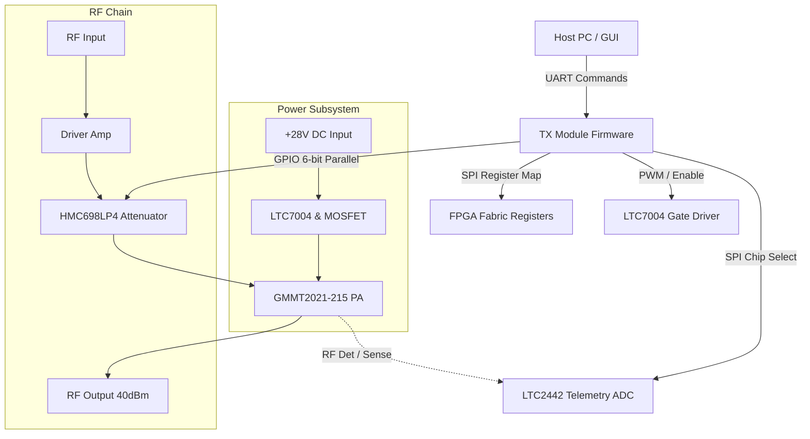
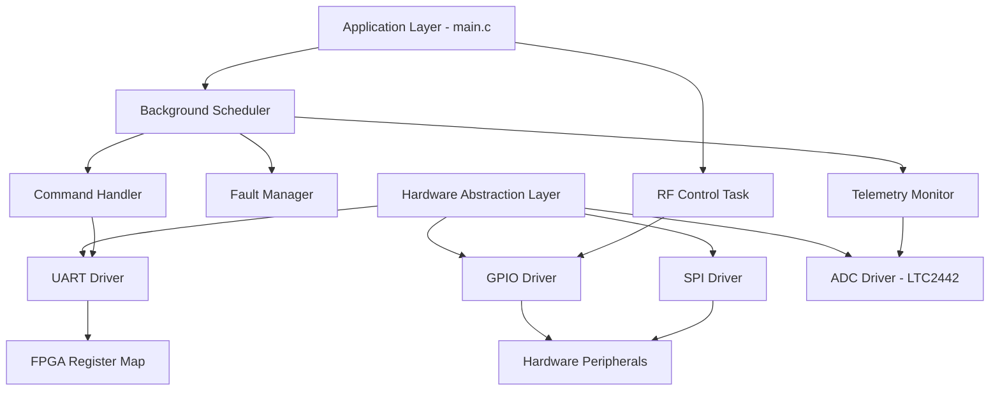
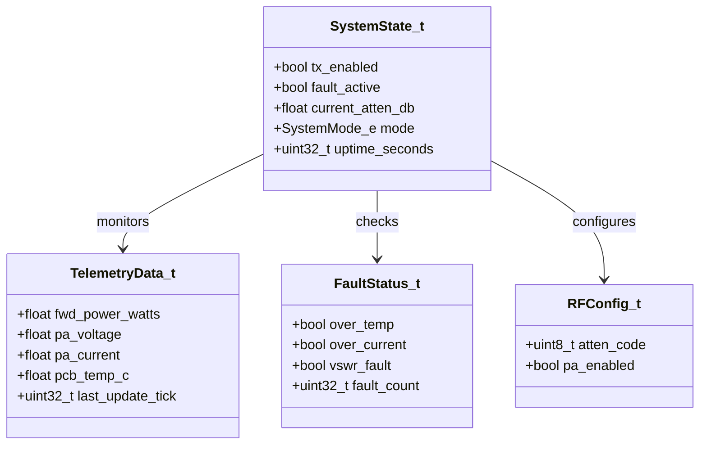
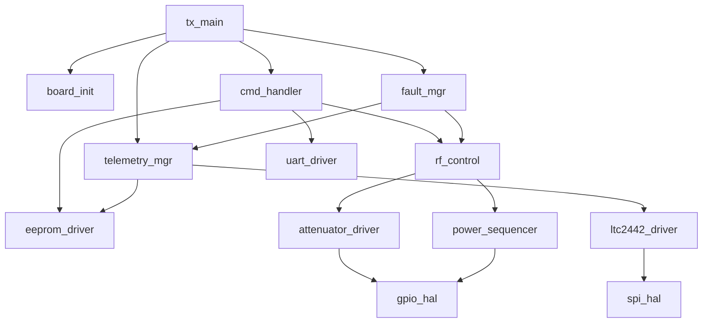
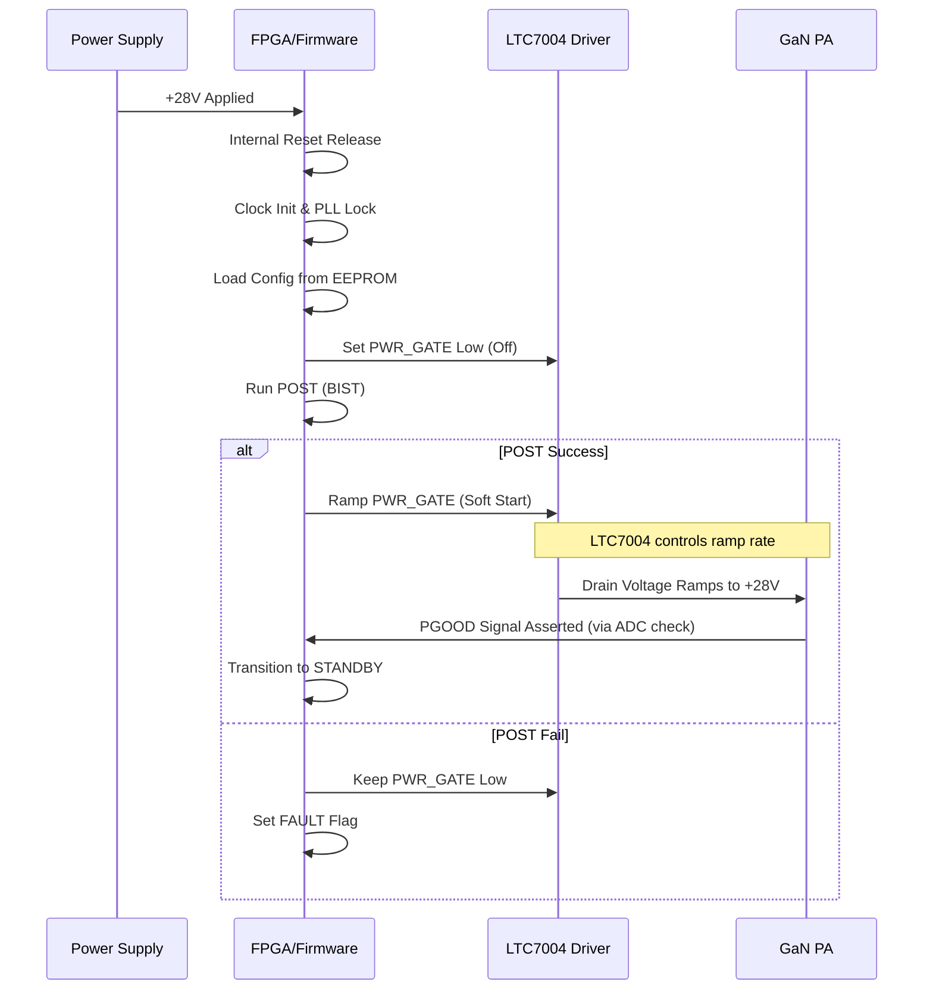
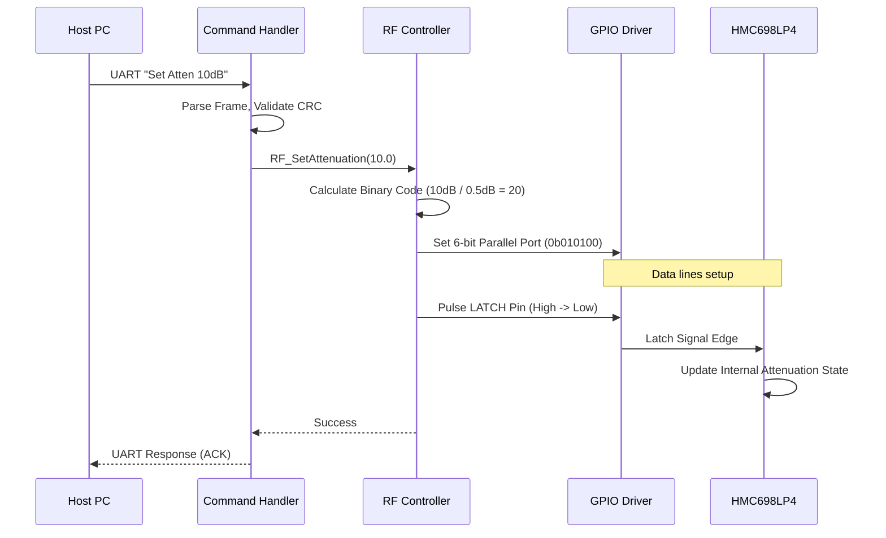
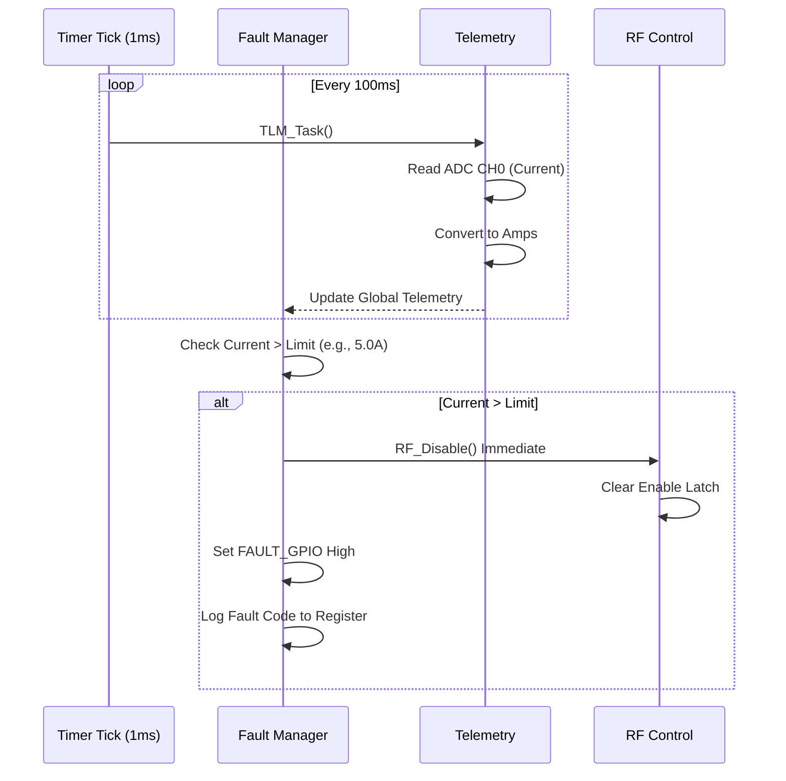
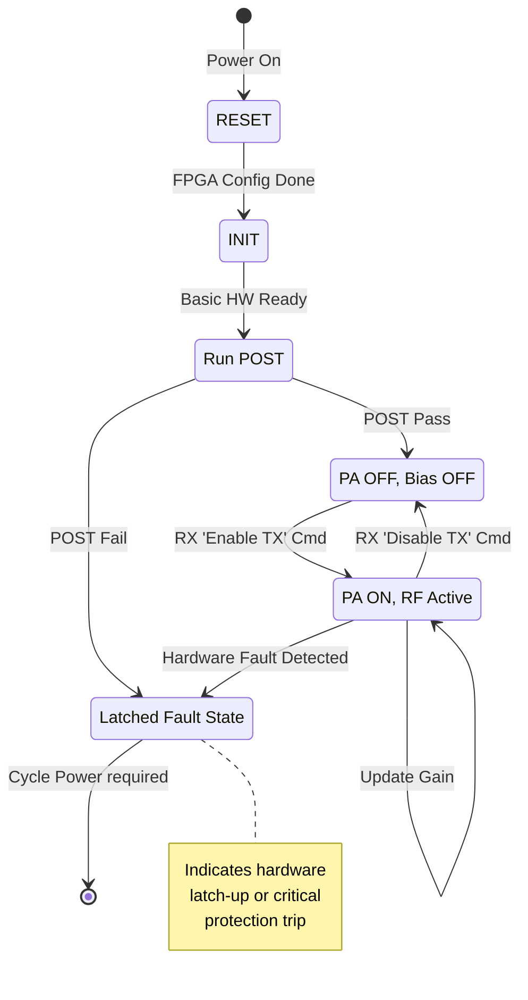
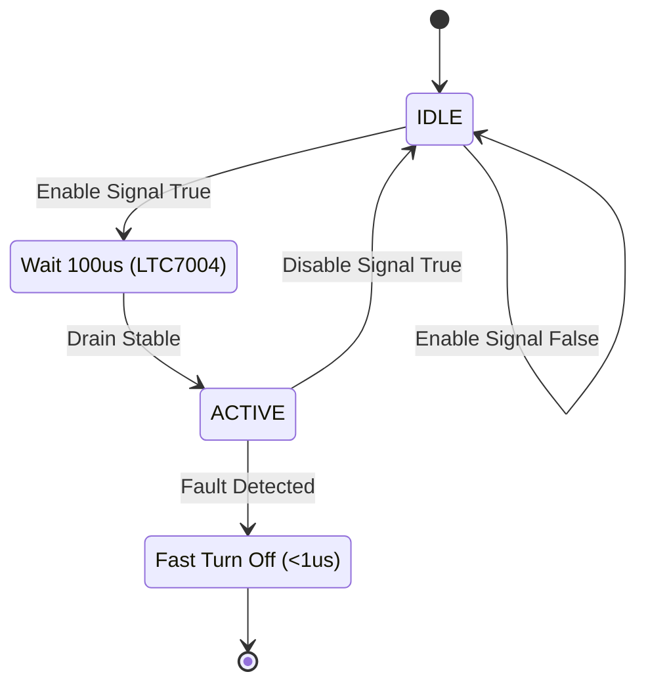

# Software Design Document (SDD)

## Project: TX Module Firmware
## Version: 1.0
## Date: 14 April 2026

---

## Document Control

| Version | Date | Author | Description |
|---------|------|--------|-------------|
| 1.0 | 2026-04-14 | Senior Architect | Initial design release for TX Module Firmware |

---

# 1. Introduction

## 1.1 Purpose
This Software Design Document (SDD) provides the comprehensive architectural and detailed design for the embedded firmware controlling the **TX Module (Project P2)**. It defines the software structure, data models, algorithms, and interfaces necessary to control the 5–18 GHz RF Power Amplifier chain, manage power sequencing, and execute telemetry acquisition.

This document is intended for:
*   **Firmware Engineers:** Implementing the C code and RTL logic.
*   **Verification Engineers:** Creating unit tests and integration test vectors.
*   **System Architects:** Validating adherence to the SRS and Hardware Requirements Specification (HRS).

## 1.2 Scope
The design covers the embedded software running on the FPGA soft-core processor (or equivalent MCU) responsible for:
*   **RF Chain Control:** Configuration of the HMC698LP4 6-bit Digital Attenuator and TX Enable sequencing.
*   **Power Management:** Safe ramp-up of the +28V PA drain via the LTC7004 MOSFET driver.
*   **Telemetry:** Sampling of the LTC2442 ADC (Forward Power, Current, Voltage, Temp).
*   **Protection:** Implementation of hardware interlocks for VSWR, Over-Temperature, and Over-Current.
*   **Communication:** UART command interface for Host PC interaction.

**Exclusions:** The design does not cover the internal logic of the FPGA fabric beyond the register map interface (GLR), nor does it cover the modulation waveform generation.

## 1.3 Definitions, Acronyms, and Abbreviations

| Acronym | Definition |
|---------|------------|
| **ADC** | Analog-to-Digital Converter |
| **BIST** | Built-In Self Test |
| **CMD** | Command |
| **CRC** | Cyclic Redundancy Check |
| **DAC** | Digital-to-Analog Converter |
| **EOF** | End of Frame |
| **FIFO** | First-In-First-Out Buffer |
| **FPGA** | Field Programmable Gate Array |
| **FSM** | Finite State Machine |
| **GLR** | Glue Logic Requirements |
| **GPIO** | General Purpose Input/Output |
| **HAL** | Hardware Abstraction Layer |
| **HMC698** | HMC698LP4 6-bit Digital Attenuator |
| **HRS** | Hardware Requirements Specification |
| **ISR** | Interrupt Service Routine |
| **LTC7004** | High Side Gate Driver |
| **LTC2442** | 24-bit High Speed ADC |
| **MOSFET** | Metal-Oxide-Semiconductor Field-Effect Transistor |
| **PA** | Power Amplifier (GMMT2021-215) |
| **POST** | Power On Self Test |
| **RTL** | Register Transfer Level |
| **RX/TX** | Receive/Transmit |
| **SMP** | Subminiature Push-on |
| **SRS** | Software Requirements Specification |
| **UART** | Universal Asynchronous Receiver-Transmitter |
| **VSWR** | Voltage Standing Wave Ratio |

## 1.4 References
1.  IEEE Std 1016-2009: Standard for Information Technology—Systems Design—Software Design Descriptions.
2.  **SRS-P2:** Software Requirements Specification for TX Module (Rev 1.0, 14 April 2026).
3.  **HRS-P2:** Hardware Requirements Specification for TX Module (Rev 1.0).
4.  **GLR-P6:** Glue Logic Requirements Specification for TX Module (Rev 0V01).
5.  **GMMT2021-215 Datasheet:** GaN MMIC 5-18 GHz, 10W Power Amplifier.
6.  **HMC698LP4 Datasheet:** GaAs 6-bit Digital Attenuator.
7.  **LTC2442 Datasheet:** 24-Bit High Speed ADC.
8.  **LTC7004 Datasheet:** High Side Gate Driver.
9.  MISRA-C:2012 Guidelines.

---

# 2. Design Viewpoints

## 2.1 Context Viewpoint — System Boundaries

The TX Module Firmware operates within the FPGA, interfacing with the Host PC via UART and the analog hardware via GPIO, SPI, and ADC interfaces.



**External Interfaces:**
1.  **UART Interface:** 115200 baud, 8N1. Commands for setting attenuation, reading telemetry.
2.  **FPGA Register Map:** Memory-mapped control registers for PA Enable and Attenuation Latch.
3.  **SPI Interface:** Master interface to the LTC2442 ADC for telemetry.
4.  **GPIO Interface:** 6-bit parallel bus to the HMC698LP4; Gate Drive control signals.

## 2.2 Composition Viewpoint — Software Architecture

The software is organized into a layered architecture: Application Layer, HAL/Driver Layer, and Hardware Abstraction.



### Module List with Responsibilities

#### **Module: tx_main** (tx_main.c / tx_main.h)
**Responsibilities:** System entry point, scheduler initialization, main super-loop.
```c
/**
 * @brief System initialization and main loop.
 * @return int32_t Status code (ERR_OK on loop exit, though loop typically infinite).
 */
int32_t main(void);
void    System_Init(void);
void    System_Tick(void); // Called every 1ms
```

#### **Module: uart_driver** (uart_driver.c / uart_driver.h)
**Responsibilities:** UART initialization, interrupt-driven RX/TX, framing.
*Traces to: REQ-SW-012, REQ-SW-013*
```c
int32_t UART_Init(uint32_t baud_rate);
int32_t UART_SendByte(uint8_t data);
int32_t UART_ReadByte(uint8_t *data, uint32_t timeout_ms);
void    UART_IRQHandler(void);
bool    UART_IsTxReady(void);
```

#### **Module: cmd_handler** (cmd_handler.c / cmd_handler.h)
**Responsibilities:** Parse incoming frames (Req-SW-009), Execute Read/Write, Dispatch to RF Controller.
*Traces to: REQ-SW-010, REQ-SW-011, REQ-SW-014*
```c
void    CMD_Task(void); // Non-blocking state machine
int32_t CMD_ProcessFrame(const uint8_t *buf, uint16_t len);
void    CMD_BuildResponse(uint8_t id, uint8_t status, const uint8_t *data, uint16_t len);
```

#### **Module: rf_control** (rf_control.c / rf_control.h)
**Responsibilities:** Manages PA state (Enable/Disable), sets attenuation via GPIO/SPI.
*Traces to: REQ-SW-001, REQ-SW-002, REQ-SW-003, REQ-SW-004*
```c
int32_t RF_Init(void);
int32_t RF_Enable(bool state);
int32_t RF_SetAttenuation(float atten_db); // 0.0 to 31.5 dB
int32_t RF_GetAttenuation(float *atten_db);
```

#### **Module: attenuator_driver** (attenuator_driver.c / attenuator_driver.h)
**Responsibilities:** Direct hardware interface to HMC698LP4 (6-bit parallel port).
*Traces to: REQ-SW-003*
```c
int32_t ATTN_Init(void);
int32_t ATTN_Set(uint8_t code_6bit); // Value 0-63
int32_t ATTN_Get(uint8_t *code_6bit);
void    ATTN_Latch(void); // Toggles the Latch pin
```

#### **Module: power_sequencer** (power_sequencer.c / power_sequencer.h)
**Responsibilities:** Controls the LTC7004 gate driver, ramps +28V safely.
*Traces to: REQ-SW-001, REQ-SW-005*
```c
int32_t PWR_Init(void);
int32_t PWR_EnablePA(void); // Handles ramp-up delay
int32_t PWR_DisablePA(void); // Fast shutdown
bool    PWR_IsGood(void);    // Checks PGOOD signal
```

#### **Module: telemetry_mgr** (telemetry_mgr.c / telemetry_mgr.h)
**Responsibilities:** Orchestrates sampling of LTC2442 channels (Fwd Pwr, V, I, Temp).
*Traces to: REQ-SW-020, REQ-SW-021, REQ-SW-022, REQ-SW-023, REQ-SW-024*
```c
int32_t TLM_Init(void);
void    TLM_Task(void); // Polling task
int32_t TLM_ReadChannel(TLM_Channel_e ch, float *value_out);
int32_t TLM_CalibrateValue(uint32_t raw_adc, TLM_Channel_e ch, float *calibrated);
```

#### **Module: ltc2442_driver** (ltc2442_driver.c / ltc2442_driver.c)
**Responsibilities:** Low-level SPI driver for LTC2442 24-bit ADC.
```c
int32_t ADC_Init(void);
int32_t ADC_ReadRaw(uint8_t channel_sel, uint32_t *raw_adc_24bit); // 0=CH0, 1=CH1
bool    ADC_IsBusy(void);
```

#### **Module: fault_mgr** (fault_mgr.c / fault_mgr.h)
**Responsibilities:** Monitors telemetry limits, asserts FAULT signal.
*Traces to: REQ-SW-030, REQ-SW-031, REQ-SW-032, REQ-SW-033*
```c
void    FLT_Task(void);
int32_t FLT_SetThreshold(FLT_Condition_e cond, float max_val);
bool    FLT_IsActive(void);
void    FLT_Clear(void);
```

#### **Module: eeprom_driver** (eeprom_driver.c / eeprom_driver.h)
**Responsibilities:** Non-volatile storage for calibration tables.
*Traces to: REQ-SW-040*
```c
int32_t NVM_Init(void);
int32_t NVM_WriteCalibration(const CalTable_t *table);
int32_t NVM_ReadCalibration(CalTable_t *table);
```

## 2.3 Logical Viewpoint — Data Model



**Key Data Structure Definitions:**

```c
/* System States */
typedef enum {
    SYS_STATE_BOOT = 0,
    SYS_STATE_STANDBY,
    SYS_STATE_TX_ON,
    SYS_STATE_FAULT,
    SYS_STATE_CALIBRATION
} SystemState_e;

/* Telemetry Structure */
typedef struct {
    float fwd_power_watts;  // Derived from ADC
    float vdd_volts;        // Derived from ADC
    float idd_amps;         // Derived from ADC
    float board_temp_degC;  // Derived from ADC
    uint32_t raw_adc;       // Last raw reading
} Telemetry_t;

/* Calibration Data (Stored in EEPROM) */
typedef struct {
    float fwd_gain_offset;
    float fwd_gain_slope;
    float curr_offset;
    float curr_slope;
    uint32_t crc32;
} CalData_t;

/* Error Codes */
typedef enum {
    ERR_OK = 0x00,
    ERR_INVALID_PARAM = 0x01,
    ERR_TIMEOUT = 0x02,
    ERR_COMMS = 0x03,
    ERR_HARDWARE = 0x04,
    ERR_NOT_CALIBRATED = 0x05,
    ERR_PROTECTION = 0x06
} ErrorCode_t;
```

## 2.4 Dependency Viewpoint



**Build Order:**
1.  **HAL Layer:** `gpio_hal`, `spi_hal`, `uart_driver`
2.  **Driver Layer:** `ltc2442_driver`, `attenuator_driver`, `eeprom_driver`
3.  **Service Layer:** `power_sequencer`, `telemetry_mgr`
4.  **Application Layer:** `rf_control`, `fault_mgr`, `cmd_handler`
5.  **System:** `tx_main`

## 2.5 Interface Viewpoint — API Specification

### 2.5.1 RF Control API

```c
/**
 * @brief Set RF Output Power by calculating attenuation.
 * 
 * This function calculates the necessary HMC698LP4 code to achieve the
 * requested relative output level, clamped to hardware limits.
 * 
 * @param target_power_dbm Target power relative to max (e.g., -10.0 for 10dB backoff)
 * @return ERR_OK on success
 * @return ERR_INVALID_PARAM if target_power_dbm is physically impossible
 * 
 * @pre RF_Enable must be called (or pending)
 * @post Updates the 6-bit GPIO latch
 */
int32_t RF_SetPower(float target_power_dbm);
```

### 2.5.2 Telemetry API

```c
/**
 * @brief Read telemetry channel.
 * 
 * @param channel TLM_CH_FWD_PWR, TLM_CH_PA_CURRENT, etc.
 * @param value Pointer to float to store result.
 * @return ERR_OK
 * @return ERR_TIMEOUT if ADC lock fails
 */
int32_t TLM_GetChannel(TLM_Channel_e channel, float *value);
```

### 2.5.3 UART Protocol Frame

**Write Command (Host -> FW):**
| Byte Offset | Field | Description |
|-------------|-------|-------------|
| 0 | `SOP` | Start of Packet (0xAA) |
| 1 | `CMD` | Opcode (0x01: Write Reg) |
| 2 | `ADDR_H` | Register Address High |
| 3 | `ADDR_L` | Register Address Low |
| 4 | `DATA_H` | Data High Byte |
| 5 | `DATA_L` | Data Low Byte |
| 6 | `CRC` | CRC-8 of Bytes 0-5 |
| 7 | `EOP` | End of Packet (0x55) |

**Response (FW -> Host):**
| Byte Offset | Field | Description |
|-------------|-------|-------------|
| 0 | `SOP` | 0xAA |
| 1 | `STATUS` | 0x00 (OK), 0xFF (Fail) |
| 2-5 | `DATA` | Register value (if read) |
| 6 | `CRC` | CRC-8 |
| 7 | `EOP` | 0x55 |

## 2.6 Interaction Viewpoint — Sequence Diagrams

### Power Up Sequence



### Set Attenuation Sequence



### Fault Detection Sequence



## 2.7 State Viewpoint — State Machines

### Main System State Machine



### TX Enable Sub-State Machine (Sequencing)



## 2.8 Algorithm Viewpoint — Key Algorithms

### 2.8.1 Attenuation Code Calculation
The HMC698LP4 has a 0.5 dB step size. The input `target_db` is rounded to the nearest 0.5 dB.

```c
uint8_t calculate_atten_code(float target_db) {
    // Clamp value between 0 and 31.5
    if (target_db < 0.0f) target_db = 0.0f;
    if (target_db > 31.5f) target_db = 31.5f;
    
    // Convert to steps: 1 step = 0.5 dB
    uint8_t steps = (uint8_t)(target_db * 2.0f);
    
    // 6-bit mask: ensure we don't overflow the 6-bit port
    return (steps & 0x3F); 
}
```

### 2.8.2 LTC2442 SPI Read
The LTC2442 returns a 4-byte (32-bit) packet via SPI, though only the lower 24 bits are significant ADC data + status. The clock polarity (CPOL) and phase (CPHA) must be set correctly per datasheet.

```c
int32_t ADC_ReadRaw(uint8_t ch, uint32_t *data) {
    uint8_t tx_buf[4] = {0, 0, 0, 0};
    uint8_t rx_buf[4] = {0};
    
    // Chip Select Low
    GPIO_Clear(ADC_CS_PIN);
    
    // Perform 4-byte transfer (dummy data out)
    SPI_Transfer(rx_buf, tx_buf, 4);
    
    // Chip Select High
    GPIO_Set(ADC_CS_PIN);
    
    // Data arrives MSB first.
    // Format: [SIG(1bit)][D23(1bit)][D22...D0][SUB(1bit)...]
    // For simplicity in this driver, we pack the 24 relevant bits.
    uint32_t raw = (rx_buf[0] << 16) | (rx_buf[1] << 8) | rx_buf[2];
    
    *data = raw;
    return ERR_OK;
}
```

### 2.8.3 Forward Power Calibration
Raw ADC counts are converted to Watts using a linear calibration: $P_{dBm} = Slope \cdot ADC_{code} + Offset$.

```c
float convert_fwd_power(uint32_t adc_code, const CalData_t *cal) {
    float voltage = adc_code * (2.5f / 16777216.0f); // VREF / 2^24
    // Logarithmic detector characteristic requires exponential conversion or LUT
    // Simplified linear approximation for operational range:
    float power_dbm = (voltage * cal->fwd_gain_slope) + cal->fwd_gain_offset;
    return powf(10.0f, (power_dbm - 30.0f) / 10.0f); // Convert dBm to Watts
}
```

---

# 3. Design Rationale

## 3.1 Architecture Choices

**Decision: Polled SPI (LTC2442) vs. Interrupt Driven**
*   **Choice:** Polled within the `TLM_Task` context.
*   **Rationale:** The LTC2442 conversion time is approximately 130ms (4x speed mode). Using an interrupt for a 130ms event adds unnecessary complexity. A polling task in the main loop is efficient and ensures the ADC is not read faster than its conversion cycle.
*   **Trade-off:** The main loop blocks for ~32 bytes (SPI transfer time), which is negligible (<1ms) compared to the conversion time.

**Decision: GPIO Parallel vs. SPI for Attenuator**
*   **Choice:** The GLR specifies a 6-bit parallel interface connected to the FPGA.
*   **Rationale:** Parallel GPIO allows instantaneous update of the attenuator without the overhead of SPI transaction negotiation. This meets requirements for fast AGC (Automatic Gain Control) if needed.
*   **Constraint:** The software must ensure all 6 bits are stable before toggling the LATCH pin to prevent glitching intermediate attenuation states.

**Decision: Bare-Metal Loop vs. RTOS**
*   **Choice:** Super-loop (Bare-metal) with timer interrupts.
*   **Rationale:** The system has low task concurrency (UART RX, Telemetry, Safety Monitor). An RTOS adds RAM overhead and complexity for context switching that is not warranted for a single-purpose control module.
*   **MISRA Compliance:** A static super-loop is easier to verify for stack depth and timing determinism.

## 3.2 MISRA-C:2012 Compliance Strategy

1.  **Static Analysis:** All code will be verified using PC-lint Plus or Coverity with MISRA enabled.
2.  **Dynamic Memory:** No `malloc`/`free`. All structures are static globals or stack-allocated within tasks.
3.  **Data Types:** Use `stdint.h` types (e.g., `uint32_t`, `int16_t`) exclusively. No usage of `int` or `long` without explicit size requirements.
4.  **Function Complexity:** No function shall exceed a cyclomatic complexity of 15.
5.  **Cast Safety:** All pointer casts will be explicit.

---

# 4. Design Traceability Matrix

| SDD Component | Implements REQ-SW-xxx | Description |
|---------------|-----------------------|-------------|
| `rf_control.c` | REQ-SW-001 | TX Enable Function |
| `power_sequencer.c` | REQ-SW-001 | PA Power Sequencing |
| `attenuator_driver.c` | REQ-SW-002 | Attenuator Set (0-31.5dB) |
| `attenuator_driver.c` | REQ-SW-003 | 6-bit Logic Interface |
| `cmd_handler.c` | REQ-SW-009 | UART Protocol Parser |
| `cmd_handler.c` | REQ-SW-010 | Command Execution |
| `cmd_handler.c` | REQ-SW-011 | Error Response Generation |
| `uart_driver.c` | REQ-SW-012 | UART Read Implementation |
| `uart_driver.c` | REQ-SW-013 | UART Write Implementation |
| `cmd_handler.c` | REQ-SW-014 | Multi-byte Register Handling |
| `ltc2442_driver.c` | REQ-SW-020 | ADC Interface Implementation |
| `telemetry_mgr.c` | REQ-SW-021 | Forward Power Monitor |
| `telemetry_mgr.c` | REQ-SW-022 | PA Current Monitor |
| `telemetry_mgr.c` | REQ-SW-023 | PA Voltage Monitor |
| `telemetry_mgr.c` | REQ-SW-024 | Temperature Monitor |
| `fault_mgr.c` | REQ-SW-030 | Over-Temp Protection |
| `fault_mgr.c` | REQ-SW-031 | Over-Current Protection |
| `fault_mgr.c` | REQ-SW-032 | VSWR/Reverse Power Protection |
| `eeprom_driver.c` | REQ-SW-040 | Calibration Data Storage |
| `tx_main.c` | REQ-SW-050 | Initialization (POST) |

---

# 5. Appendices

## Appendix A — File Structure

```
/project_p2_tx_module
├── src/
│   ├── main.c                     # Entry point
│   ├── board_init.c               # Clock setup, low level init
│   ├── drivers/
│   │   ├── uart_driver.c
│   │   ├── spi_driver.c
│   │   ├── gpio_driver.c
│   │   ├── ltc2442_driver.c       # ADC specific driver
│   │   └── eeprom_driver.c        # I2C EEPROM driver
│   ├── modules/
│   │   ├── rf_control.c           # PA & Attenuator Logic
│   │   ├── power_sequencer.c      # LTC7004 Control
│   │   ├── telemetry_mgr.c        # Data acquisition
│   │   ├── fault_mgr.c            # Protection logic
│   │   └── cmd_handler.c          # Protocol parsing
│   └── utils/
│       ├── crc8.c                 # Checksums
│       └── lookup_tables.c        # Gain conversion tables
├── inc/
│   ├── common_types.h
│   ├── registers.h                # GLR Register Map Definitions
│   └── config.h                   # Compile-time config
└── tests/
    ├── test_rf_control.c
    └── test_telemetry.c
```

## Appendix B — Register Map Summary (Derived from GLR)

| Address | Name | Access | Description |
|---------|------|--------|-------------|
| 0x00 | `REG_CTRL` | R/W | Control bits [0]: TX_Enable |
| 0x01 | `REG_ATTENUATION` | W | 6-bit Attenuation Code (0-63) |
| 0x02 | `REG_STATUS` | R | Status bits [0]: PGOOD, [1]: TEMP_TRIP |
| 0x03 | `REG_FWD_PWR_LSB` | R | Fwd Power ADC Low Byte |
| 0x04 | `REG_FWD_PWR_MSB` | R | Fwd Power ADC High Byte |
| 0x05 | `REG_PA_CURR_LSB` | R | PA Current LSB |
| 0x06 | `REG_PA_CURR_MSB` | R | PA Current MSB |
| 0x10 | `REG_FAULT_MASK` | R/W | Enable/Disable specific faults |

## Appendix C — Memory Map

| Region | Start Address | Size | Usage |
|--------|--------------|------|-------|
| FPGA Register Map | 0x40000000 | 4 KB | Memory Mapped IO (GLR) |
| On-Chip SRAM | 0x20000000 | 64 KB | Stack, Heap (Static), Global Data |
| EEPROM (External) | 0xA0 (I2C) | 32 KB | Calibration Tables |
| Boot Flash | 0x00000000 | 512 KB | Firmware Code |

## Appendix D — Coding Standards Checklist

*   [ ] All headers include `#ifndef` guards.
*   [ ] All public functions have Doxygen `@brief`, `@param`, `@return`.
*   [ ] Magic numbers are replaced by `#define` constants or `enum`.
*   [ ] No usage of `goto` statements (except for centralized error cleanup in ISR if necessary).
*   [ ] All variables initialized at declaration.
*   [ ] No implicit type conversions (use explicit casts).
*   [ ] Bitwise operations on 16-bit registers use `uint16_t` types.